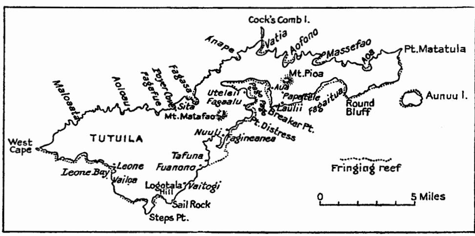
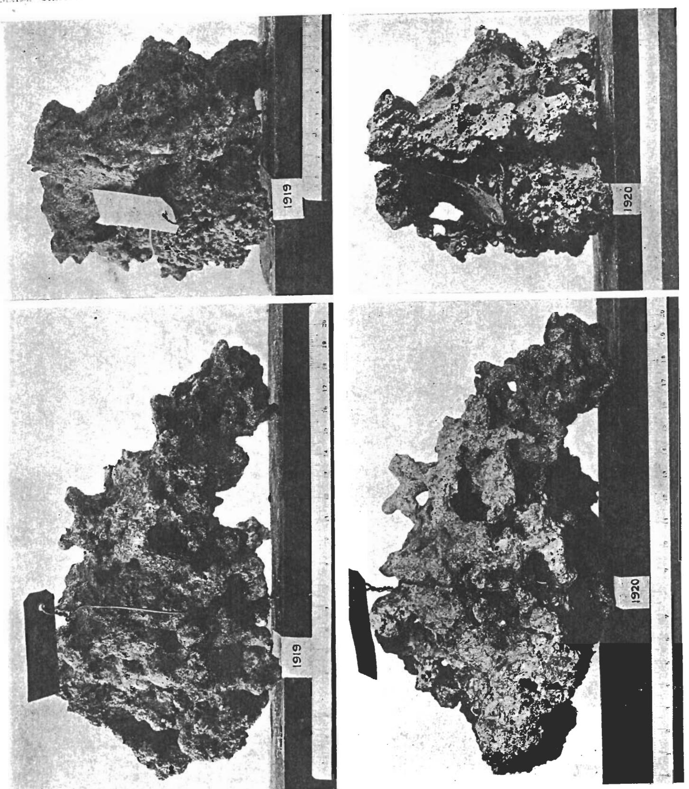
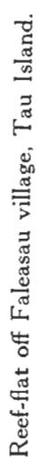
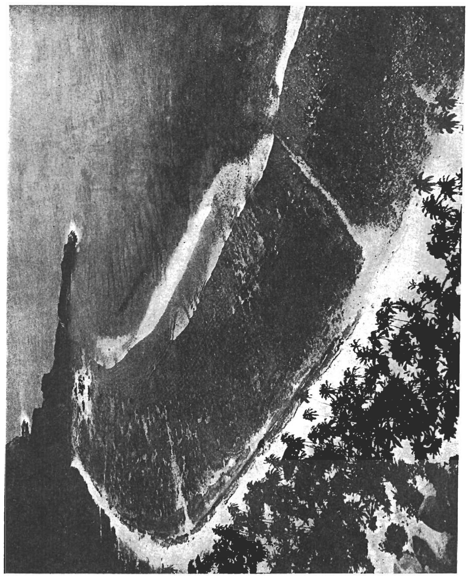

## INABILITY OF STREAM-WATER TO DISSOLVE SUBMARINE LIMESTONES.

By Alfred Goldsborough Mayor.

The highest part of the typical fringing reefs of the Pacific is close along the seafront, where there is a ridge which projects about 6 inches above average low tide and is composed of dead coral veneered with living lithothamnium. Between this lithothamnium ridge and the shore lies the reef proper, which is really a very shallow lagoon covered by water somewhat less than 6 inches deep at ordinary low tide, but often laid quite bare at the lowest spring tides. Thus, as the fringing reef has advanced seaward from the shore, its shoreward part has somehow become degraded, so that about a foot of limestone has been removed, the floor of the reef-flat being about a foot lower than the crest of the lithothamnium ridge.

| TABLE 16 Rainfall re     | cord. U. S. Naval | Station, Pago Pago. | Tutuila, from 1000. |
|--------------------------|-------------------|---------------------|---------------------|
| 111222 101 210119,010 10 |                   |                     |                     |

| Year.        | Jan.         | Feb.         | Mar.         | Apr.           | May.         | June.        | July.       | Aug.         | Sept.        | Oct.         | Nov.         | Dec.         | Total.           |
|--------------|--------------|--------------|--------------|----------------|--------------|--------------|-------------|--------------|--------------|--------------|--------------|--------------|------------------|
| 1900<br>1901 | 16.4<br>21.5 | 18.3<br>29.0 | 41.1<br>17.1 | 13.1           | 11.3<br>15.1 | .1<br>3.5    | 4.5<br>10.4 | 3.0          | 5.9<br>21.6  | 9.8          | 19.6<br>18.4 | 24.1<br>3.9  | 167 .2<br>177 .3 |
| 1902         | 12.9         | 37.9         | 5.2          | 14.2           | 5.7          | 25.2         | 3.0         | 4.4          | 5.0          | 8.7          | 11:0         | 14.4         | 147.6            |
| 1903         | 21.9         | 24.9         | 12.7         | 26.0           | 12.1         | 12.5         | 16.6        | 11.2         | 10.3         | 19.9         | 20.4         | 10.8         | 199.3            |
| 1904<br>1905 | 21.2<br>21.8 | 27.2<br>12.1 | 10.5<br>15.5 | 21 .3<br>16 .0 | 8.3<br>3.5   | 11.0<br>10.3 | 10.5<br>7.5 | 13.1<br>10.6 | 10.9<br>1.7  | 9.3<br>8.7   | 21.9<br>12.3 | 10.9<br>10.1 | 176.1<br>130.1   |
| 1906         | 5.3          | 9.9          | 18.0         | 14.1           | 18.6         | 14.7         | 6.1         | 7.4          | 12.7         | 13.2         | 14.2         | 13.0         | 147.2            |
| 1907         | 19.2         | 21.2         | 11.3         | 26.1           | 13.1         | 32.0         | 12.5        | 5.0          | 11.1         | 23.7         | 29.0         | 17.9         | 222.1            |
| 1908<br>1909 | 32.6<br>16.1 | 48.3<br>15.1 | 39.5<br>11.6 | 13.7<br>13.8   | 23.8<br>15.5 | 9.2<br>9.8   | 8.2<br>3.6  | 10.4<br>3.6  | 28.5<br>8.1  | 16.1<br>11.8 | 41.7<br>19.9 | 12.4<br>16.2 | 284 .4<br>145 .1 |
| 1910         | 20.7         | 10.2         | 28.1         | 19.7           | 9.5          | 16.3         | 3.4         | 11.6         | 17.8         | 15.1         | 15.2         | 30.9         | 198.5            |
| 1911         | 18.8         | 30.2         | 19.3         | 11.7           | 12.3         | 5.2          | 5.2         | 2.3          | 5.0          | 12.3         | 9.4          | 18.1         | 149 .8           |
| 1912<br>1913 | 15.1<br>27.7 | 7.7<br>44.7  | 22.3<br>17.8 | 31.9<br>25.5   | 30.8<br>60.5 | 12.1<br>12.5 | 4.5<br>21.8 | 3.5<br>5.4   | 14.7<br>17.2 | 10.4<br>18.6 | 20.0<br>7.5  | 22.4<br>16.0 | 195 .4<br>275 .2 |
| 1914         | 4.0          | 20.4         | 14.7         | 18.1           | 9.4          | 19.5         | 10.7        | 20.4         | 48.9         | 49.2         | 16.1         | 19.2         | 250.6            |
| 1915         | 37.5         | 7.9          | 17.6         | 10.7           | 1.7          | 4.5          | 16.4        | .6           | 10.0         | 10.1         | 8.7          | 30.6         | 156.3            |
| 1916<br>1917 | 14.5<br>38.3 | 28.6<br>34.6 | 9.1<br>34.0  | 12 .2<br>22 .2 | 14.0<br>5.4  | 12.1<br>20.7 | 9.6         | 10.6<br>5.8  | 11.0<br>7.8  | 18.9<br>19.5 | 26.5<br>29.8 | 39.0<br>24.3 | 206.1<br>249.9   |
| 1918         | 15.1         | 43.1         | 17.9         | 10.9           | 7.6          | 8.7          | 38.3        | 6.7          | 5.8          | 7.4          | 15.0         | 30.4         | 206.9            |
| 1919         | 49.8         | 22.6         | 16.5         | 8.4            | 14.8         | 9.6          | 2.0         | 4.7          | 11.3         | 3.9          | 16.9         | 14.4         | 174.9            |
| 1920         | 14.7         | 13.4         | 21.6         | 28.7           | 12.7         | 49.2         | 8.5         | 18.8         | 8.6          | 26.4         | 31.1         | 23 .4        | 257.1            |

This limestone has, I believe, been removed by the action of currents over the reef-flat, which have removed particles of limestone resulting from the disintegration of the material constituting the floor of the reef-flat. This disintegration of limestone is caused by boring algæ, echini, boring mollusks, boring sponges, and worms, as well as by the attrition of moving water; and in addition the sand itself is to some degree dissolved in the intestines of holothurians, which swallow large quantities

<sup>&</sup>lt;sup>1</sup> Darwin, 1842, Structure and Distribution of Coral Reefs, p. 10, was the first to describe this lithothamnium ridge at Keeling Atoll.

of it. It appears that solution of submarine limestone by sea-water, even when diluted by heavy rains or by fresh water discharged from the shore, is not a significant factor. This is quite in accord with the opinion of Vaughan, based upon his observations of Atlantic reefs, but it remained to establish this conclusion upon an experimental basis.

Tutuila, being purely volcanic and without elevated limestones, is an excellent island upon which to test the dissolving power of rain and stream water discharged from its shores over its fringing reefs. The island is densely forested from summit to shore, and it seemed possible that the rain-water with its acidity of about PH 5, due to CO<sub>2</sub>, might become even more acid by percolation through decaying leaves and forest soil and might thus be able to dissolve the limestones of the reef-flats.

Moreover, the island has a heavy rainfall, as will appear from the official record of the rain-gage maintained at Pago Pago since January 1, 1900, by the U. S. Naval Station, an official report on which was kindly sent to the author by Lieutenant F. C. Nyland (C. E. C.), U. S. N., public works officer of American Samoa. This record from January 1, 1900, to December 31, 1920, is shown in table 16, which

TABLE 17.

| Month. | Average<br>rainfall. | Range in<br>monthly<br>rainfall. |
|--------|----------------------|----------------------------------|
|        | inches               | inches                           |
| Jan    | 21.3                 | 4.0 to 49.8                      |
| Feb    | 24.2                 | 7.7 to 48.3                      |
| Mar    | 19.1                 | 5.2 to 41.1                      |
| Apr    | 17.5                 | 8.4 to 31.9                      |
| May    | 14.6                 | 1.7 to 60.5                      |
| June   | 14.2                 | 0.1 to 49.2                      |
| July   | 10.0                 | 2.0 to 38.3                      |
| Aug    | 7.8                  | 0.6 to 20.4                      |
| Sept   | 13.0                 | 1.7 to 48.9                      |
| Oct    | 15.9                 | 3.9 to 49.2                      |
| Nov    | 19.3                 | 7.5 to 41.7                      |
| Dec    | 19.1                 | 3.9 to 39.0                      |
|        | 196.0                |                                  |

gives the average rainfall in inches and the range in monthly rainfall observed in 21 years.

January and February are months of maximum rainfall, while July and August are dry, but torrential showers may occur in any month, and indeed were these absent the rainfall would be only moderate. These torrential downpours give a very capricious aspect to the rainfall, and native traditions of periods of drought are doubtless true; thus, during the three months between June 1 and August 31, 1900, only 7.5 inches of rain fell, while by contrast the three months of January, February, and March 1917, gave 106.9 inches. To give an idea of the character

of the torrential showers, 28.5 inches fell within 48 hours between June 28 and 30, 1920, about 14.2 inches falling during the night of June 28.

Such showers are ideal for eroding the slopes of the island, and after several months of heavy rain the steep hillsides become saturated with water and landslides are apt to occur, while an equal period of drought causes the thin soil to lose so much of its moisture that grasses, ferns, and the smaller plants wither, so that the aspect of the island becomes sere and yellow.

The probable error of the average annual rainfall of 196 inches for the 21 years from January 1, 1900, to December 31, 1920, is 6.8 inches. In other words, it is an even chance that the true annual rainfall lies between 189.2 and 202.8. It is evident that at times large volumes of water are suddenly poured out from the shores of the reef-flats.

In order to test the hydrogen-ion concentration of the water of Tutuila, use was made of a set of colorimetric tubes of phenolusulphonephthalein made by Hynson and Westcott of Baltimore, and ranging effectively from 6.6 to 8 Ph. Also, a set of tubes of methyl red were used for Ph below 6.6, and another set of colorimetric tubes of thymolsulphonephthalein made and kindly given to us by Professor J. F. McClendon were used for sea-water and ranged from 7.95 to 8.6 Ph. I also used a Leeds and Northrop potentiometer for direct determinations of the hydrogenion concentration of waters and for standardizing the three sets of color tubes. The potentiometer was especially useful for testing acid rain-water and very alkaline seawater. All bottles, beakers, and pipettes used in the tests were of "non sol" or Jena resistance glass, or of quartz; for ordinary glass is soluble in alkaline solutions and soon appreciably increases the alkalinity of the water.

According to Luther W. Cartwright, esq., secretary to the governor of Samoa, the average temperatures for each month for the two years 1918 and 1920 were as follows:

|     | ° F.       | ° C.       |      | °F.         | ° C.        |     | °F.      | ° C.         |
|-----|------------|------------|------|-------------|-------------|-----|----------|--------------|
| Jan | 84<br>84.2 | 28.9<br>29 | June | 82<br>82 .4 | 27 .8<br>28 | Oct | 81<br>83 | 27.2<br>28.3 |

The highest temperature yet observed on Tutuila is about 90° F., and the lowest 70° F.

These results are based upon observations taken every 4 hours throughout the 24 hours of the day, commencing at 8 a.m., and give an average annual temperature of 82.6° F. (28.1° C.). At a temperature of 28° C., water of about 6.9 PH or 0.126×10-hydrogen-ion concentration would be neutral.

On July 21–22, 1920, Professors L. R. Cary and W. H. Longley spent 24 hours on the summit of Mount Matafao, 2,133 feet above sea-level, and observed the thermometer every 2 hours, commencing at 11 a.m., while a similar set of observations was made by the author at sea-level at Pago Pago. The average temperature at the summit of Mount Matafao was 22.8°, while at sea-level it was 26.55°. Thus the average difference was 3.75° C. or 6.75° F., corresponding to a fall of about 3.2° F. per 1,000 feet in ascent on Tutuila.

It was found that the rain-water falling on Tutuila Island is acid, the range in hydrogen-ion concentration of 12 rains during March 1917 and August 1919 being from 0.126 × 10<sup>-5</sup> to 1.0 × 10<sup>-5</sup>. (See table 21.) Where they discharge into the sea the streams of Tutuila are, however, either neutral or slightly alkaline, and thus the fresh water which pours outward from the streams of the island can not dissolve limestone merely by reason of its acidity. Thus 26 tests of 11 streams and 6 springs at various parts of Tutuila, such as Pago Pago, Fagaalu, Massefau, Vatia, Laulii, Fagasa, and Leone, in March and April 1917 (see table 22), during the height of the rainy season, showed a hydrogen-ion concentration varying from 0.25 × 10<sup>-6</sup> to 0.38 × 10<sup>-7</sup>, the average being 7.10 PH, or 0.645 × 10<sup>-7</sup>.

In March and April 1917, the ground was soaked by the torrential rains, which averaged more than an inch per day during the period of our visit, and thus the

streams and springs were swollen by surface seepage. In July and August 1918 and 1919, however, we were in the middle of the dry season; the island had suffered from several months of almost unbroken drought, and it was remarkable that the streams were less alkaline than they were during the wet season; but even so, no stream of Samoa which I was able to test was discharging acid water into the sea, although the springs were usually acid, due to CO<sub>2</sub>.

Thus the spring at the crest of Vatia Pass was 5.75 Ph on August 6, 1919, and 5.4 Ph on July 20, 1920, by methyl-red test, but on boiling and then being cooled to 26.5° C., it showed 7.5 Ph, indicating that its acidity was CO<sub>2</sub>. The streams from these springs soon became alkaline after flowing over the ground, especially if they descended over waterfalls.



Fig. 1.

The streams of Tutuila have a somewhat "smoky" appearance, due doubtless to traces of organic matter, but their alkalinity, according to Professor Alexander H. Phillips, is due to bicarbonates of calcium, potassium, magnesium, and sodium. Thus, on April 14, 1917, a carboy of water was taken from the large stream which constitutes the waterfalls in Fagaalu Valley. The stream was then normal, being no longer flooded by the 4.3 inches of rain of April 12. Its temperature was 24.2° C. and hydrogen-ion concentration 0.5 × 10<sup>-7</sup>. This water was analyzed by Professor Alexander H. Phillips, who reports as follows, June 11, 1917:

Analysis of water, in milligrams per liter, from Tutuila, Samoa; taken from Fagaalu stream above the cow-pasture and below the lower falls on April 14, 1917.

| <del>-</del>                                                                        |                                            |
|-------------------------------------------------------------------------------------|--------------------------------------------|
| Color None                                                                          | Total solids—continued.                    |
| Free ammonia 0.036                                                                  | Calcium (Ca) 3.03                          |
| Albuminoid ammonia                                                                  | Magnesium (Mg) 2.20                        |
| Nitrogen in nitrites None                                                           | Sodium (Na) 6.19                           |
| Nitrogen in nitrates 0.04                                                           | Potassium (K)                              |
| Oxygen consumed 2.05                                                                | Bicarbonate (HCO2) 9.60                    |
|                                                                                     | Sulphate (SO <sub>4</sub> )                |
| Total solids70.06                                                                   | Chlorine (Cl)12.00                         |
| Silica (SiO <sub>2</sub> )                                                          | Nitrate (NO <sub>3</sub> )                 |
| Iron (Fe <sub>2</sub> O <sub>2</sub> ), alumina (Al <sub>2</sub> O <sub>2</sub> )95 | Phosphate (P <sub>2</sub> O <sub>5</sub> ) |

Most of the alkalinity is indicated by methyl orange, and very little by phenophthalein, and is thus due chiefly to bicarbonates. The chlorine is high, but this is to be expected from the proximity of the ocean.

Only the larger and more permanent springs were running on Tutuila in July and August 1918 and 1919, and all of these which were tested were acid, ranging from 5.75 PH to slightly below 6.6 PH. This acidity was due to carbon dioxide, and it disappeared on boiling, leaving the water strongly alkaline. Indeed, as the streams flowed toward the ocean their acidity steadily diminished, and a cataract of about 10 feet changed the water from acid to alkaline, so quickly did the CO<sub>2</sub> pass out of the running brooks to establish a balance with the atmospheric CO<sub>2</sub>. This is illustrated by the large spring at the foot of the first waterfall, 792 feet above sea-level, in Fagaalu Valley, Tutuila.

On the morning of July 24, 1918, the drought still continuing, I again tested the Fagaalu Valley spring, and also followed the stream down to the large, deep pool at the foot of the fifth waterfall, about half a mile inland from the shore. This showed that the stream became more and more alkaline as it dashed over the successive cataracts, and its excess of carbon dioxide passed out into the atmosphere. These observations are presented in table 18, which shows hydrogen-ion concentration, PH, and temperature of the large spring 792 feet above sea-level in Fagaalu Valley, and of the stream which issues from it and dashes over four high waterfalls in its course to the sea, observed 10 to 11 50 a. m. July 24, 1918.

TABLE 18.

| Station.                           | Hydrogen-ion con-<br>centration of water.                                                                      | PH of water.              | Temp., °C.                                                                                        |
|------------------------------------|----------------------------------------------------------------------------------------------------------------|---------------------------|---------------------------------------------------------------------------------------------------|
| At spring 792 feet above sea-level | 0.158 × 10 <sup>-4</sup><br>0.71 × 10 <sup>-7</sup><br>0.63 × 10 <sup>-7</sup><br>About 0.5 × 10 <sup>-7</sup> | 6.8<br>7.15<br>7.2<br>7.3 | 24.3 in sunshine.<br>23.2 in shade.<br>23.2 in shade.<br>23.2 in shade.<br>23.2 in shade.<br>23.2 |

If an acid spring such as that at the stream-head in Fagaalu Valley were to pour directly into the sea it would tend to neutralize the alkalinity of the seawater. In order to test the efficacy of this effect, I took measured volumes of the spring-water having a PH of about 6.5 and mixed this with sea-water of 8.19 PH, with the following results:

```
100 c. c. spring-water and 100 c. c. sea-water gave a mixture of 8.0 PH. 100 c. c. spring-water and 25 c. c. sea-water gave a mixture of 7.1 PH. 100 c. c. spring-water and 20 c. c. sea-water gave a mixture of 6.95 PH. 100 c. c. spring-water and 10 c. c. sea-water gave a mixture of 6.6 PH.
```

Thus 20 volumes of sea-water give a neutral solution if mixed with 100 volumes of Fagaalu spring-water at 25° C.

Tests were also made of streams and springs on Upolu Island, Samoa, with the results given in table 19, the temperature of these waters ranging from 23° to 28° C.

Here again we see that the springs were slightly acid, due to CO<sub>2</sub>, but that as the streams flowed toward the ocean or the water was agitated in the air they became alkaline, due to loss of CO<sub>2</sub>. The crater lake Lanutoo is, however, an exception, for its acidity is not due to CO<sub>2</sub>, and the water contained so little chlorine that its acidity could not be due to HCl. I was, however, unable to test it for sulphides, but barium carbonate + HNO<sub>3</sub> gives no precipitate, thus showing that there was no large amount of SO<sub>4</sub> present.

TABLE 19.—Alkalinity of streams and springs on Upolu Island, Samoa.

| Date<br>(1918).            | Name of stream or spring.                        | Locality from which water<br>was taken. | Pн of<br>water.          | Remarks.                                                                                                                                                        |
|----------------------------|--------------------------------------------------|-----------------------------------------|--------------------------|-----------------------------------------------------------------------------------------------------------------------------------------------------------------|
| Aug. 7<br>Aug. 7<br>Aug. 7 | Fagalii stream                                   | 1/8 mile inland, in quick waterdodo     | 7.4<br>7.1<br>7.1<br>7.3 | Largest stream into Apia Harbor.<br>Stream east of Apia.<br>Do.<br>Stream west of Apia.                                                                         |
| Aug. 8<br>Aug. 7           | do<br>Vailoa spring                              | do                                      | 7.15<br>6.7              | Do. On shaking in air at 28° C. this water became 7.3 Рн; when boiled and then cooled to 28° C. it became 7.7 Рн.                                               |
| Aug. 7                     | do                                               | West of Apia, near Vailoa               | 6.7                      |                                                                                                                                                                 |
| July 6                     | Pool at foot of Papaseea waterfall (upper fall). |                                         | 7 .55                    |                                                                                                                                                                 |
| - '                        | Small tributary to Mulivai stream.               |                                         | 6.6                      |                                                                                                                                                                 |
| July 7<br>Aug. 8           | do                                               | About 2,400 feet above sea-             | 7.3<br>6.6               | When boiled and then cooled<br>to 27° it retained its PH<br>of 6.6. Its acidity is not<br>due to chlorides (AgNO <sub>3</sub><br>test) nor to CO <sub>2</sub> . |

Tests were also made of some streams of Viti Levu Island, Fiji Islands, as will appear from table 20.

Rewa River, the largest stream in Polynesia, is alkaline, as is also the Navua River, which flows over cataracts in the high mountains toward the south coast of Viti Levu, but the streams flowing into Suva Harbor are slightly acid, due to CO<sub>2</sub>, although it takes 9 volumes of this stream-water mixed with 1 volume of sea-water to make a neutral solution. It is therefore improbable that this acidity is sufficient to enable them to dissolve submarine limestone. These streams in the neighborhood of Suva Harbor, Fiji, and the outlet of the crater swamp of Aunuu Island, Samoa, are the only acid waters I have as yet observed flowing into the sea in Polynesia.

It may be of interest to observe that the streams of Oahu, Hawaiian Islands, appear to be decidedly alkaline, due doubtless to the elevated limestones upon this island. Thus, on the clear, rainless day of April 25, 1917, Dr. C. Montague Cooke kindly took me in his motor-car to the important springs and streams near Honolulu, and these were all alkaline, ranging from 7.1 to 8.12 PH, the average

being 7.34, or 0.457  $\times$  10<sup>-7</sup>. These Hawaiian springs and streams were as follows:

|                                                           | PH.  |
|-----------------------------------------------------------|------|
| Spring at side of Pali road below reservoir No. 2         | 7.35 |
| Stream issuing from reservoir No. 2                       | 7 6  |
| Nuanu stream at Loakaha, 800 feet above sea-level         | 7.I  |
| Small stream on Kanaohe side of Pali, 1,000 feet high     | 7.5  |
| Palolo Valley, main stream about 300 feet above sea-level | 7.73 |
| Manoa Valley, main stream                                 | 7.5  |
| Moanalua Valley, stream just below the polo field         | 7.35 |
| Punahou spring, Honolulu                                  | 8.12 |

The larger streams of Tutuila were at all times slightly alkaline, but the deep-seated springs are slightly acid, especially in the dry season, when surface seepage does not mingle with their waters. When swollen by surface drainage after heavy rains, the streams usually become less alkaline. Thus the large brook entering the harbor at Pago Pago Village, Samoa, had a normal Ph of about 7.15, but the 7.8 inches of rain of March 19, 1917, reduced this to 6.97 Ph. Similarly, the stream of Fagaalu Valley fell from about 7.35 to 6.97 Ph, due to the same rain; but even so, these streams still remained alkaline.

TABLE 20.—Alkalinity of streams and rivers of Viti Levu Island, Fizi Islands.

| Date<br>(1918).  | Name of stream.                                                  | Locality at which water was tested.                                                            | Temper-<br>ature of<br>water (°C.) | PH of water. | Remarks.                                                                                                              |
|------------------|------------------------------------------------------------------|------------------------------------------------------------------------------------------------|------------------------------------|--------------|-----------------------------------------------------------------------------------------------------------------------|
| Aug. 15          | Rewa River                                                       | Viria village on eastern<br>branch of Rewa River,<br>above its junction with<br>Waidina River. | 24.8                               | 7 .25        | When boiled and cooled to<br>28° C. it had 7.65 Рн.                                                                   |
| Aug. 15          | Do                                                               |                                                                                                |                                    | 7.12         | When boiled and then cooled to normal temperature (28° C.) it gave 7.6 Ph.                                            |
| Aug. 26          | Lamia River flowing into<br>Suva Harbor.                         | Above lowest rapid, about 1 mile inland.                                                       | 25                                 | 6.6          | Boiling and then cooling to 27° C. gave a PH of 7.2.                                                                  |
| Aug. 27          | Viseri River, the largest<br>stream flowing into<br>Suva Harbor. | Do                                                                                             | 25                                 | 6.6          | Boiling and then cooling gave 7.3 PH.                                                                                 |
| Aug. 29<br>1920. | Naikoroko River, west<br>of Suva Harbor.                         | Above lowest rapid                                                                             | 21.9                               | 6.7          | Boiling and then cooling to<br>28° C. gave 7.5 PH. 89 c.                                                              |
|                  |                                                                  | Do                                                                                             | 25                                 | 16.4         | c. of this water at 6.7 PH and 11 c. c. of sea-water of 8.25 PH gave a mixture of 7.1 PH.                             |
| Sept. 3          | Nauva River                                                      | About 5 miles inland, below the waterfalls.                                                    | 23                                 | 7 .35        | Boiling and then cooling to 25° C. gave 7.6 PH. This water contained only 3 mg. of chlorine per liter of river-water. |

<sup>&</sup>lt;sup>1</sup>By methyl-red test.

Thus, Sir John Murray's idea that the stream-waters of volcanic islands might be sufficiently acid to be efficient solvents of reef limestones appears not to be supported, and as tests of the sea-water of the lagoon of Tortugas, Florida, made by Dole, Tashiro, McClendon, and others, show that there is practically no free carbonic acid in this water, the Murray-Agassiz theory of the submarine solution of coral-reefs due to carbonic acid in the water appears to be refuted. As appears from table 20, direct rainfall into the sea is usually also a negligible factor in materially reducing the alkalinity of the waters of shallow reef-flats, for the buffer value of the carbonates of sea-water is so great that even torrential showers do not usually produce acidity. Thus, at the landing-stage of Blacklock's Wharf, near the shallow inner end of Pago Pago Harbor, the 7.8 inches of rain of March 19, 1917, reduced the alkalinity only from 8.2 to 8.185, and the torrential shower of 4.3 inches on April 12 reduced it to 8.0 PH, still leaving it decidedly alkaline.

Under normal conditions of wind, waves, and currents, rain-water falling into the sea is quicky mixed with so large a bulk of sea-water that its effect in producing dilution is but slight. When heavy rain falls during a flat calm, however, the rainwater tends to float over the surface of the sea-water and does not readily mix with Thus, at Blacklock's Wharf, near the inner end of Pago Pago Harbor, there was a very heavy shower which fell during a complete calm in the morning of July 2, 1920, and immediately after this shower had ceased the surface water showed chlorine 9.94 and salinity 17.97, while at a depth of 34 inches the chlorine was 14.7 and salinity 26.56. Also, at Judge Gurr's Dock at Maleota Harbor, on July 9, 1920, the surface water gave by titration chlorine 17.25 and salinity 31.17, while at a depth of 44 inches the water was chlorine 18.82 and salinity 34. The relatively brackish water was clean, and, floating over the deep-lying sea-water, it produced a refractive "wiggling" effect. Thus, under the rare condition of flat calm and heavy rain, the water over shallow reef-flats may become so diluted and muddy as to destroy many of the more delicate corals. In fact, vast numbers of Acropora hyacinthus were killed, even in water 10 feet deep, all along the shores of Tutuila by the torrential rains of 37.5 inches which fell between June 28 and 30, 1920; and even Porites heads fully 50 years old were killed at Fagaalu by the same shower.

To show that rain-water is a negligible factor in reducing the alkalinity of seawater at Tortugas, Florida, in June 1919, it took 97 c. c. of sea-water of 8.23 Ph mixed with 3 c. c. of rain-water of 4.75 Ph to produce a mixture of 7.05 Ph at 26.8° C This rain-water was collected in a "non sol" glass bottle, using a Pyrex glass funnel, and its Ph was tested with methyl red. Its acidity was due to H<sub>2</sub>CO<sub>3</sub>; for upon being boiled in a test-tube of resistance glass its Ph changed to 7.55 when cooled to 25° C. Further tests showed that 80 c. c. of rain-water of 4.75 Ph and 20 c. c. of sea-water gave 7.4 Ph. It is evident that in order to begin to dissolve reefs by virtue of its acidity, rain-water must almost wholly replace the sea-water, and this would quickly kill all reef-corals; so no reefs could grow in such a region.

The fact must be borne in mind, however, that tropical sea-water can not dissolve limestone, because it is already supersaturated with calcium, and is even precipitating calcium in places in the Florida-Bahama region. It seemed possible, however, that when diluted with stream-water it might be able to dissolve reefs, even though the mixture remained alkaline, but we find that calcium dissolves so slowly in diluted sea-water that no significant loss to the reefs can occur in this manner.

To test this, sea-water of 8.23 PH at 21° C. and 36.6 salinity was taken on January 15, 1919, from the lagoon of Tortugas, Florida, and analysis by Professor Alexander H. Phillips showed that it contained 0.4451 gram of calcium per 100 c. c. of sea-water. 2,500 c. c. of this sea-water was then mixed with an equal volume of distilled water of 5 PH, which contained no calcium by AgNO<sub>3</sub> test. This reduced the PH of the mixture to 7.15 at 24° C., and Professor Phillips found the calcium to be reduced to 0.2230 gram per 1,000 c. c. of water. 2,000 c. c. of this diluted sea-water was then placed in a glass-stoppered bottle of "non sol" glass, and 20 grams of limestone sand from the surface of the reef-flat of Aua, Pago Pago Harbor, Samoa, were placed in this water and the bottle was shaken at frequent intervals for a period of 24 hours, at 23.5° C., evaporation being prevented by the glass stopper. This caused the alkalinity to increase from 7.15 to 7.35 PH at the end of the experiment. Professor Phillips again determined the calcium and found it to be 0.2272 gram per 1,000 c. c. of water. Thus only 0.0042 gram of calcium per liter was dissolved, and so slight a solubility can not appreciably deepen the water over the reef-flats, for it is probable that the water over them is rarely reduced to 50 per cent of its normal salinity, for such a dilution would be fatal to all the reef corals, except Porites, in 24 hours.

To still further test the matter, 20 grams of the limestone sand from the Aua reef-flat were placed in 2,000 c. c. of the distilled water of 5 PH and shaken at intervals for 24 hours. This dissolved 0.0092 gram of calcium per 1,000 c. c. of water, or practically twice as much calcium as when the distilled water was mixed with an equal portion of sea-water. Thus the solution of limestone in the diluted sea-water was due almost wholly to the distilled water and not to the sea-water in the mixture, and apparently the ability of this diluted Atlantic sea-water to dissolve limestone is in direct proportion to the dilution, and is only slightly accelerated by so weak an acidity as PH 5.

The limestone sand used in this experiment had been drifted off the reef-flat of Aua by the currents and caught in the open mouth of a submerged barrel which was placed about 100 feet out from the shore, on the northern edge of the reef-flat. This sand was then washed repeatedly for a week in distilled water, until the washing water showed no trace of chlorine by AgNO3 test. The sand was then dried over a water-bath at 100° C., and thrown into the diluted sea-water. This limestone sand was composed of fragments of nullipore algæ, corallines, corals, foraminifera, spicules of holothurians and alcyonaria, shells of mollusks, and fragments of volcanic rock, the last constituting by weight only 0.57 gram in 100 grams of sand.

The objection may reasonably be raised that acid distilled water is not thrown into the sea by the springs and streams of Pacific islands, and moreover, Pacific sea-water, due to its well-known paucity of pelagic plant-life, may be fully saturated with calcium and may behave differently from water of the tropical Atlantic.

To meet these objections, water from the large spring which provides drinkingwater for the village of Pago Pago, Samoa, was mixed with water taken from the surface of the sea 5 miles south of Breaker Point, Tutuila, and Professor Phillips determined the amounts of calcium, with results as follows:

1,000 c. c. of Pago Pago spring-water of 6.3 PH contains 0.0048 gram of calcium (Ca).

1,000 c. c. of Samoan sea-water of 35.37 per cent salinity and 8.25 PH contains 0.4366 gram of calcium.

1,000 c. c. of a mixture of equal parts of these waters, well shaken for 36 hours in a "non sol" bottle in the presence of 14 grams of limestone sand from the Aua reef-flat, dissolves 0.002 gram of calcium at 21 to 23.4° C.

1,000 c. c. of Samoan sea-water similarly shaken for 36 hours in the presence of 14 grams of Aua reef-flat sand dissolved no calcium in 36 hours.

1,000 c. c. of the Pago Pago spring-water similarly treated dissolved 0.0130 gram of calcium.

We see that the mixture of equal parts of sea-water and Samoan spring-water dissolved only 0.002 gram of calcium instead of 0.0065 gram, as might have been expected were the sea-water simply saturated with calcium, thus leaving unimpaired the solvent action of the spring-water in the mixture. Apparently, then, the Samoan sea-water is supersaturated with calcium, and when mixed with spring-water it reduces the solvent ability of the spring-water with which it mixes. It appears, then, that Samoan sea-water is practically incapable of dissolving limestone and that it retards the solvent action of Samoan spring-water mixed with it.

Professor Phillips made an analysis of the sea-water taken from the surface in a place where the depth was 8.5 fathoms, 5 miles south of Breaker Point, Tutuila, on September 19, 1919. The temperature of this water when collected was 29.1° C., its Ph 8.25, salinity 35.3 per cent, and specific gravity 1.021.

The results are shown in table 21 in comparison with an analysis of sea-water from Tortugas, Florida, made by Dr. George Steiger, of the U. S. Geological Survey, in 1910.

TABLE 21.

| Samoan sea-water analyzed by A. H. Philli<br>(grams per 1,000 c. c. of water). | Sea-water from Tortugas, Florida, analyzed by<br>George Steiger (grams per 1,000 c. c. of water). |                                                                                                                     |                                                                      |  |  |  |
|--------------------------------------------------------------------------------|---------------------------------------------------------------------------------------------------|---------------------------------------------------------------------------------------------------------------------|----------------------------------------------------------------------|--|--|--|
| Calcium (Ca)                                                                   | 0.4366<br>1.3512<br>0.3715<br>11.0793<br>20.1704<br>2.7138                                        | Calcium (Ca) Magnesium (Mg) Potassium (K) Sodium (Na) Chlorine (Cl) Bromine (Br) Sulphur radicle (So <sub>4</sub> ) | 0.4420<br>1.3054<br>0.4000<br>11.1957<br>20.0762<br>0.0644<br>2.7422 |  |  |  |
| Total                                                                          | 36.1228                                                                                           | Total                                                                                                               | 36 .3516                                                             |  |  |  |

McClendon (1918, Carnegie Inst. Wash. Pub. No. 252, pp. 252-258) shows that the surface water around the Florida Keys is supersaturated with calcium, and that it contains less than one-tenth as much fixed nitrogen as does the North Sea according to Raben, and thus bacteria and plant life in general have apparently almost removed the nitrates and nitrites from the sea-water. Evidently such water could not be expected to dissolve limestone, for calcium carbonate is being constantly precipitated in the Bahama-Florida region.

Crozier (1919, American Naturalist, vol. 54, p. 90) finds that the Рн of the water of the lagoons of Bermuda ranges from 7.95 to 8.15, while that of the ocean

outside the reefs is 8.25 Pm. Crozier surmises that limestone may be dissolved in these lagoons, but he did not analyze this lagoon-water and made no experiments to determine its efficacy in this respect. The reduction in alkalinity in these lagoons may be due to decomposing animal matter; but, even so, the lagoons remain alkaline and can not dissolve limestone unless their concentration of calcium is below saturation. Upon this we have no evidence, except the fact that similar lagoons in the Florida region are usually supersaturated with calcium.

Rainfall has remarkably little effect in diluting the water over reef-flats if these be in situations exposed to the waves and therefore favorable for the growth of corals. Thus, although on the average somewhat more than an inch of rain per day had fallen between January 1 and April 15, 1917, yet the salinity of the water at low tide over the shallow reef-flats off the southern end of the village of Aua, near the mouth of Pago Pago Harbor, was at the greatest reduced only to 31.00 per cent 50 feet or more from shore, the normal sea-water having a salinity of 34.83, and the average salinity for the reef-flat as a whole was 33.6 per cent at 29° C., and 8.23 Ph.

When one considers that the average depth over the submerged parts of this reef-flat is only about 6 inches at lowest tide, the slight effect of heavy rains in diluting even wide areas of very shallow water becomes apparent.

One reason for this apparent anomaly is that rain-water, being of lesser specific gravity, does not readily mix with the underlying sea-water unless strongly agitated by waves and winds. Thus H. B. Bigelow (1917, Bulletin of Museum of Comparative Zoology at Harvard College, vol. 41, pp. 184, 196) shows that the surface waters of the Bay of Maine are generally 31.5 to 32.5 per cent salinity, but at a depth of 100 meters the water is 33 to 34 per cent.

Even great rivers seem to have but little effect in diluting the sea-water beyond the direct path of their outflowing current. Thus, on March 20, 1918, the muddy water of Mayaro Bay, Trinidad, within 50 miles of the mouth of the Orinoco River, had a salinity of 31.85, that of the tropical Atlantic being about 36.5.

It is a matter of common observation that there is a break in the coral-reefs opposite the mouth of every large stream, and experiments made at Tutuila enable us to assert that these cuts through the reef are, as Darwin surmised, places wherein the corals have been prevented from growing by the silt and dilution due to the stream in time of flood, and have not been dissolved out by the water of the stream. This was tested by placing reef-corals in a floating live-car 150 feet off the mouth of the large brook at Pago Pago Village, at the extreme inner end of Pago Pago Harbor, in a region where no corals appear to have grown. The bottom here is thickly covered with a soft, dark-brown volcanic mud brought down by the stream, and the water was usually brackish, the observed range in salinity being from 34.38 to 25.48 per cent, between March 27 and April 11, 1917. On April 12, however, 4.3 inches of rain fell during the morning and the stream was so greatly swollen that the salinity of the water at the live-car sank to 0.93, and even after 24 hours it had risen only to 9.24, that of normal sea-water being 34.83. (See table 23.)

Of the commoner reef-corals, 27 specimens were placed in the live-car in this situation, as follows: 4 branched Acropora related to A. gracilis, 2 Acropora aff. pharaonis from the seaward part of the reef-flat, 3 specimens of the stout-stemmed incrusting Acropora leptocyathus, which grows well only in the active wash of the breakers, 2 of the delicately branched Acropora hyacinthus, which finds its optimum conditions on the steep seaward slope of the reef-wall below the agitation of the waves, 2 Fungia sp., 3 massive Porites lutea, 4 of the branched Porites andrewsi, 3 Pocillopora damicornis var. cespitosa, I Leptastrea purpurea, 2 specimens of Psammocora aff. ramosa, and I Pavona danai. A coating of fine brown mud formed over the bottom of the live-car, and the Acropora began to fade in color and their polyps seemed unable to expand after 4 days, but all of the corals survived for 15 days until the torrential rain of April 12, 1917. During the following 24 hours, however, the salinity ranged between 0.93 and 9.24 and a coating of mud 3 mm. thick formed over the bottom of the live-car. This killed all the corals excepting 2 of the 3 specimens of massive Porites (Porites lutea), which, although injured and macerated in places, still survived, about three-quarters of its polyps being able to expand when replaced in normal sea-water. This species lives closer to the shore than does any other reef-coral of Samoa, and it is the only one which thrives near the mouths of streams, as at Fagaalu.

TABLE 22.—Tests of hydrogen-ion concentration of rain-water at Pago Pago, Tutuila, Samoa, March 1917.

| Date.   | Air tem-<br>perature<br>(° C.). | Amount of rainfall (inches). | Hydrogen-ion concentration of rain-water. | Remarks.                                                            |
|---------|---------------------------------|------------------------------|-------------------------------------------|---------------------------------------------------------------------|
| 1917    |                                 |                              |                                           |                                                                     |
| Mar. 26 |                                 | 1.8                          | $0.126 \times 10^{-6}$                    | Rain-gage on Blacklock's Wharf, 8 feet above sea-level.             |
| 23      | 24.4                            | 0.3                          | .135 × 10 →                               | Rain-gage on crest of Vatia Pass, about 1,200 feet above sea-level. |
| 16      | 27                              | 0.1                          | .15 × 10⁻⁵                                | Rain-gage on Blacklock's Wharf, 8 feet above sea-level.             |
| 13      | 24.7                            | 0.2                          | .182 × 10 <sup>-5</sup>                   | Do.                                                                 |
| 19      | <b></b> .                       | 6.0                          | .194                                      | Do.                                                                 |
| 25      |                                 | 3.0                          | .288 × 10⁻⁵                               | Do.                                                                 |
| 12      | 25                              | 0.2                          | .30 × 10⁻⁵                                | Do.                                                                 |
| 19      | 23.05                           | 1.8                          | .40 × 10⁻⁵                                | Do.                                                                 |
| 18      | 25                              | 1.8                          | .438 × 10 <sup>-5</sup>                   | Do.                                                                 |
| Do      | 24.5                            | 1.4                          | .678 × 10⁻⁵                               | Do.                                                                 |
| 1919    |                                 | Heavy shower                 | 1.0 × 10 →                                | Do.                                                                 |
| Aug. 10 | 26                              | -                            |                                           |                                                                     |
| 22      | 26                              | do                           | .741 × 10 <sup>-4</sup>                   | Do.                                                                 |

It is evident that, as Darwin surmised, the exceptional conditions of dilution and silt due to floods can destroy all corals which may have obtained a temporary foothold off the mouths of streams. A break appears in the reef-wall at such places, due to the fact that corals could never grow there, and not to solution of the reef by the fresh water of the stream.

TABLE 23.—Tests of stream-waters of Tutuila Island, Samoa, March and April 1917.

| ABLE 23.—Lests of stream-waters of Lutuna Island                                                                                                                                                           | , camoa                |                                                       | unu 11 pi            | 191                      | /·                                                             |
|------------------------------------------------------------------------------------------------------------------------------------------------------------------------------------------------------------|------------------------|-------------------------------------------------------|----------------------|--------------------------|----------------------------------------------------------------|
| Place of Observation.                                                                                                                                                                                      | Temperature of stream. | Chlorine<br>(grams in<br>1,000<br>grams of<br>water). | PH of stream-waters. | conce                    | ogen-ion<br>ntration<br>m-water.                               |
| Small stream west of German store, Pago Pago, Mar. 18; after 3.2 inches of rain; stream swollen, but not muddy                                                                                             | . 24.6                 |                                                       | 7.3                  | 0.5<br>0.5               | × 10 <sup>-7</sup><br>× 10 <sup>-7</sup>                       |
| without rain.  Mar. 11 at Pago Pago Village, about 20 feet above sea-level                                                                                                                                 | 28.6                   |                                                       | 7.15<br>7.15<br>7.27 | 0.707                    | × 10 <sup>-7</sup><br>× 10 <sup>-7</sup><br>× 10 <sup>-7</sup> |
| At Pago Pago Village after 2.1 inches of rain, Mar. 17; about 20 feet above sea-level; stream turbid and swollen                                                                                           | 25.7                   |                                                       | 7.15                 | 0.707                    | × 10 <sup>-7</sup>                                             |
| sea-level; stream turbid and swollen                                                                                                                                                                       | 23.4                   |                                                       | 6.97                 | 0.107                    | × 10 <sup>-7</sup>                                             |
| Pago Pago Harbor, Mar. 20, after 3.4 inches of rain during the day  Large stream in Fagaalu Valley which falls over the waterfall. Mar. 8,                                                                 |                        |                                                       | 7.37                 |                          | × 10 <sup>-7</sup>                                             |
| after 13 inches of rain. At foot of waterfall                                                                                                                                                              |                        |                                                       | 7 .42<br>7 .25       | 0.38<br>0.562            | × 10 <sup>-7</sup><br>× 10 <sup>-7</sup>                       |
| 0.4 inch of rain during day                                                                                                                                                                                | 23 .8                  |                                                       | 7.4                  | 0.298                    | × 10 <sup>-7</sup>                                             |
| island; flows under a lava-flow                                                                                                                                                                            | 24.6<br>25.6           |                                                       | 7.3<br>16.3          | 0.5<br>0.5               | × 10 <sup>-7</sup><br>× 10 <sup>-4</sup>                       |
| Spring on west side of Pago Pago Harbor near naval station; after 2.0 inches of rain of Mar. 14, 1917; spring dries up soon after rain "Drinking spring," mouth of Fagaalu, west side of Pago Pago Harbor, | 29.4                   |                                                       | 7.1                  | 0.794                    | × 10 <sup>-7</sup>                                             |
| Mar. 19, after 7.8 inches of rain; is a permanent spring                                                                                                                                                   | 24.1                   |                                                       | 7.37                 | 0.425                    | × 10 <sup>-7</sup>                                             |
| slightly affected by rains, its discharge being only little augmented<br>Seepage from a lava-cliff at Blunt's Point, Pago Pago Harbor, Mar. 19,                                                            |                        | 0.002                                                 | 7.42                 | 0.38                     | × 10 <sup>-7</sup>                                             |
| after 7.8 inches of rain; seepage disappears in dry weather                                                                                                                                                | 25 .3                  |                                                       | 7.42                 | 0.38                     | × 10 <sup>-7</sup>                                             |
| side of Vatia Pass, Mar. 20                                                                                                                                                                                |                        |                                                       | 7.4                  |                          | × 10 <sup>-7</sup>                                             |
| drinking purposes by pedestrians traveling over pass; Apr. 3, 1917  Same spring on Vatia Pass: Aug. 6, 1919                                                                                                | i I                    |                                                       | 6.6                  |                          | × 10 <sup>-4</sup> × 10 <sup>-4</sup>                          |
| Aug. 18, 1919                                                                                                                                                                                              |                        |                                                       | 26.3                 | 0.5                      | × 10 <sup>-6</sup><br>× 10 <sup>-6</sup>                       |
| July 20, 1920.  Spring issuing from a lava-cliff near Laulii Village, S. side of Mount Pioa, 60 feet above sea-level                                                                                       |                        |                                                       | 7.15                 | 0.398                    |                                                                |
| Spring east of Faleasau Village, Tau Island, and also another spring west of Aluulu Village on Ofoo Island, Aug. 29 to 30, 1919                                                                            | 26.1                   |                                                       | 7.45                 | 0.352                    |                                                                |
| Water from swamp in crater of Aunuu Island, July 12, 1920; water was dark brown in color, contained H <sub>2</sub> S, and had a salinity of 0.024 per cent by AgNO <sub>3</sub> test                       | 26.5                   |                                                       | 16                   | 1                        | × 10 <sup>-4</sup>                                             |
| Mar. 19, 1917, at Fagaalu Village, about 500 feet in from seashore, after 7.8 inches of rain; stream much swollen and turbid                                                                               | 23.4                   | 0.015                                                 | 6.97                 | 0.107                    | × 10 <sup>-4</sup>                                             |
| Village, a carboy of water collected for analysis; stream clear and normal, after 0.2 inch of rain of Apr. 13                                                                                              | 24.2                   |                                                       | 7.3                  | 0.5                      | × 10 <sup>-4</sup>                                             |
| Small trickling stream about 0.25 mile west of Fagasa Village, about 200 feet above sea-level; in forest, densely shaded, Mar. 11                                                                          |                        |                                                       | 6.6                  | 0.2505                   | × 10 <sup>-7</sup>                                             |
| feet above shore, Mar. 11.  Same stream, about 0.5 mile from shore and 500 feet above sea-level                                                                                                            |                        |                                                       | 7.6<br>7.35          | 0.2505<br>0.446          |                                                                |
| Eastern one of 3 streams of Vatia Village, swollen by 3 inches of rain of Mar. 25, 50 feet above sea-level                                                                                                 |                        |                                                       | 7.27                 | 0.536                    |                                                                |
| night, Apr. 15                                                                                                                                                                                             | 24.1                   | 0.15                                                  | 7.48<br>7.27<br>7.29 | 0.3305<br>0.537<br>0.513 | × 10-7                                                         |

<sup>&</sup>lt;sup>1</sup>By methyl-red test. Boiled and then cooled to 26°C. gave 8 PH.



Showing the corrosion of limestone rocks which lay submerged beneath sea water on the floor of the Aua reef flat, Pago Pago Harbor, Samoa. The Photographs illustrate disintegration between August 11, 1919, and May 18, 1920.



