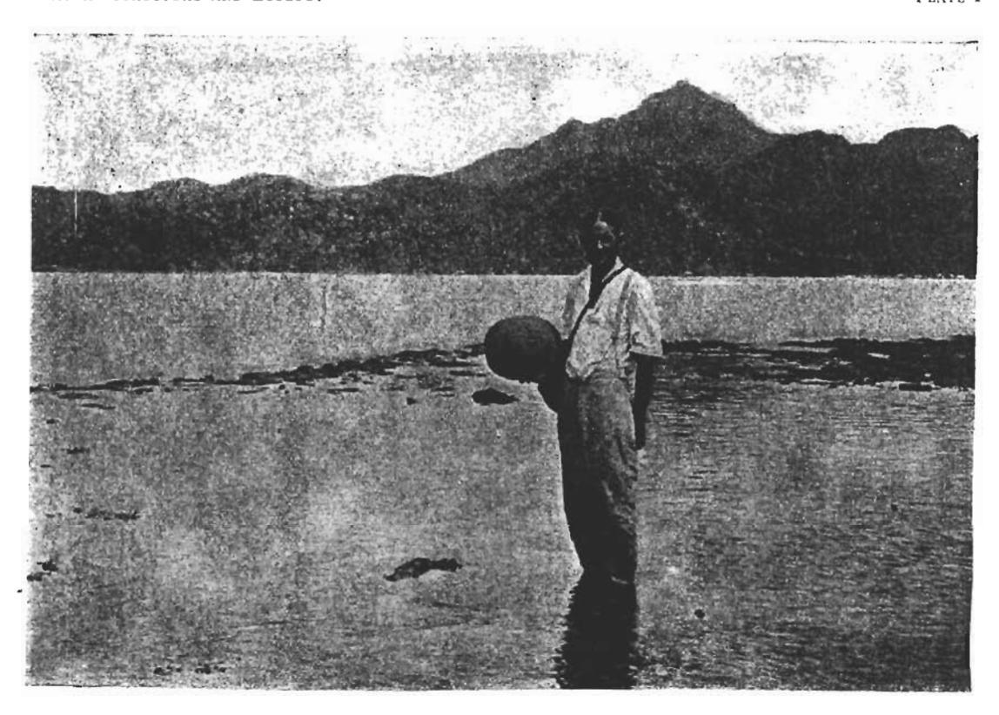
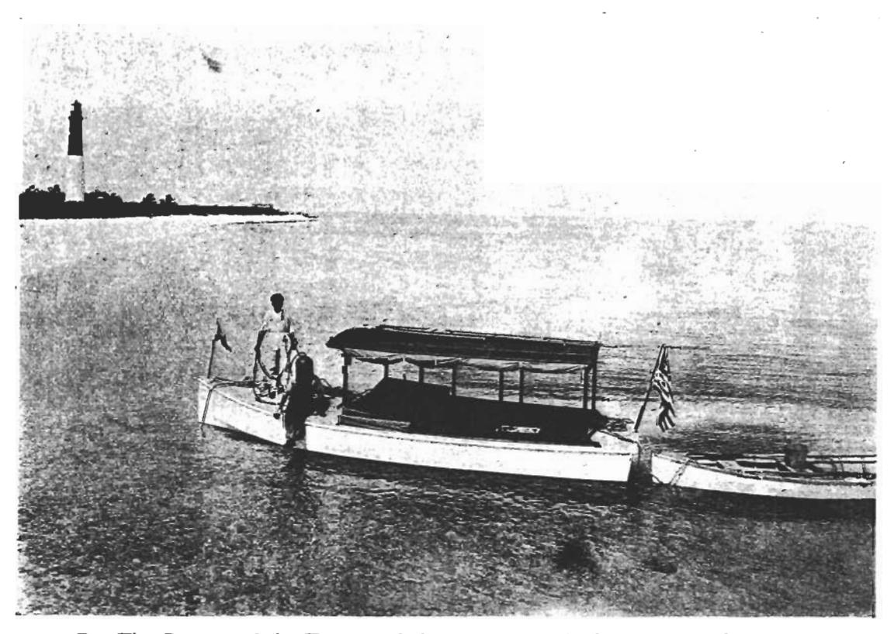
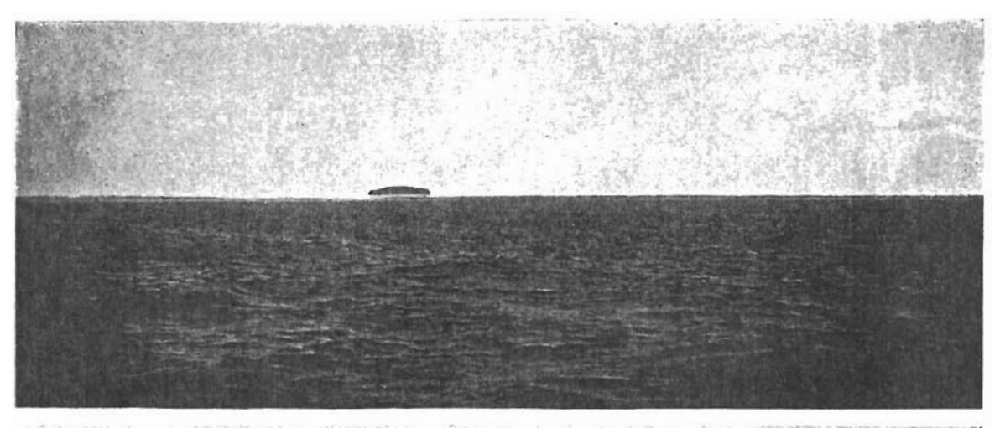
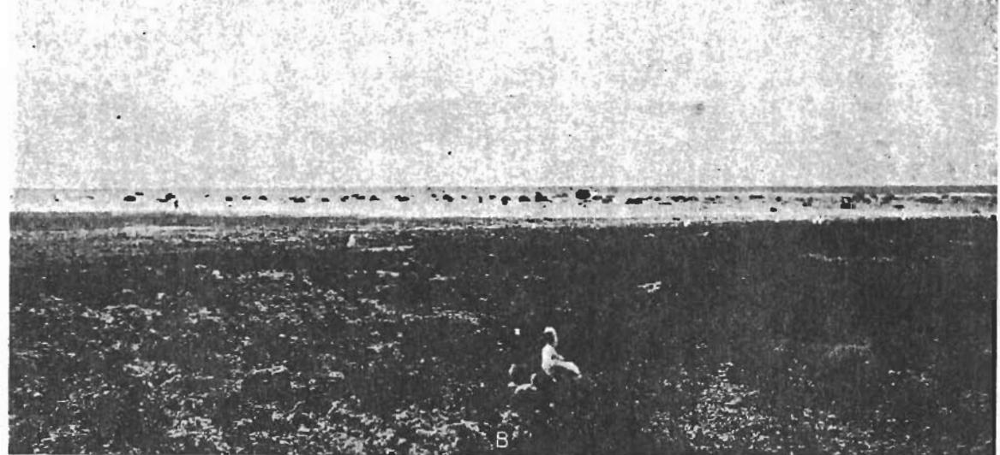
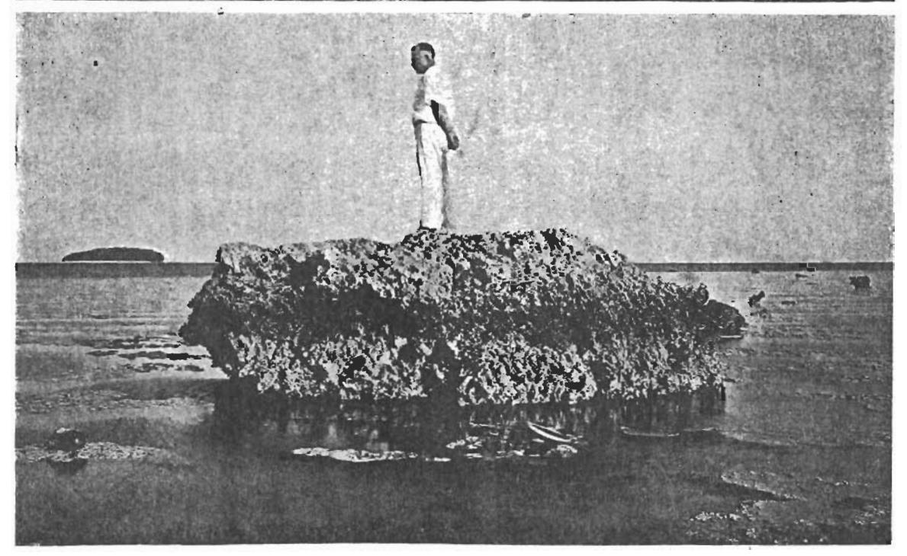
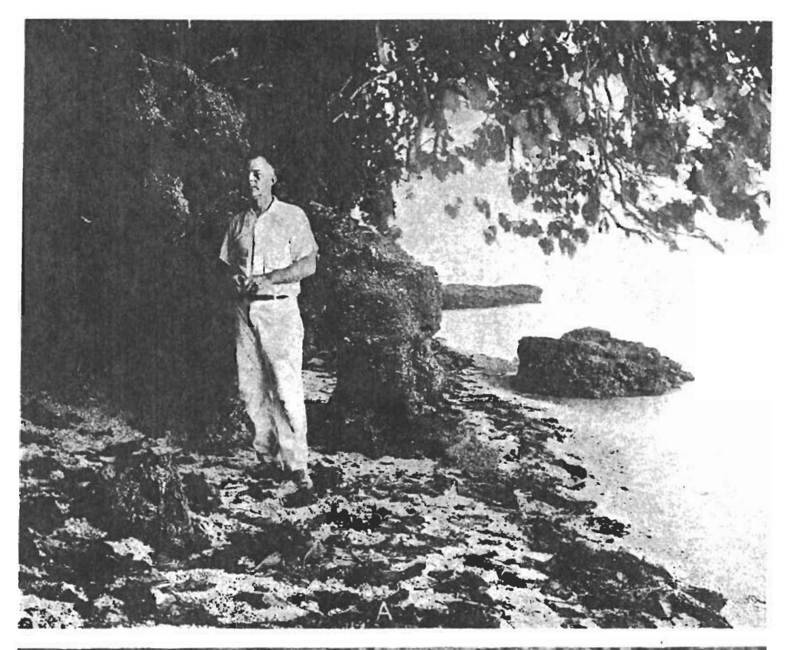
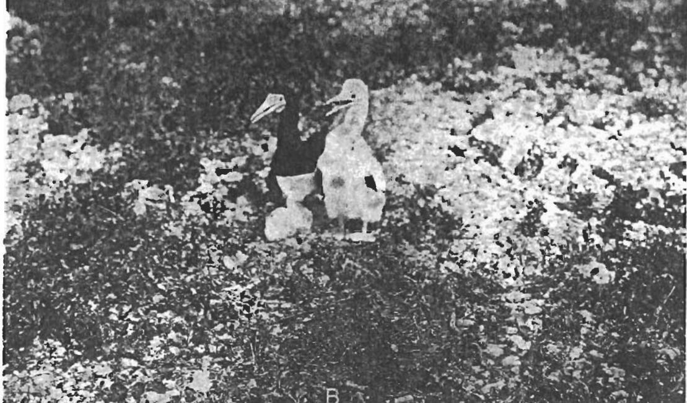
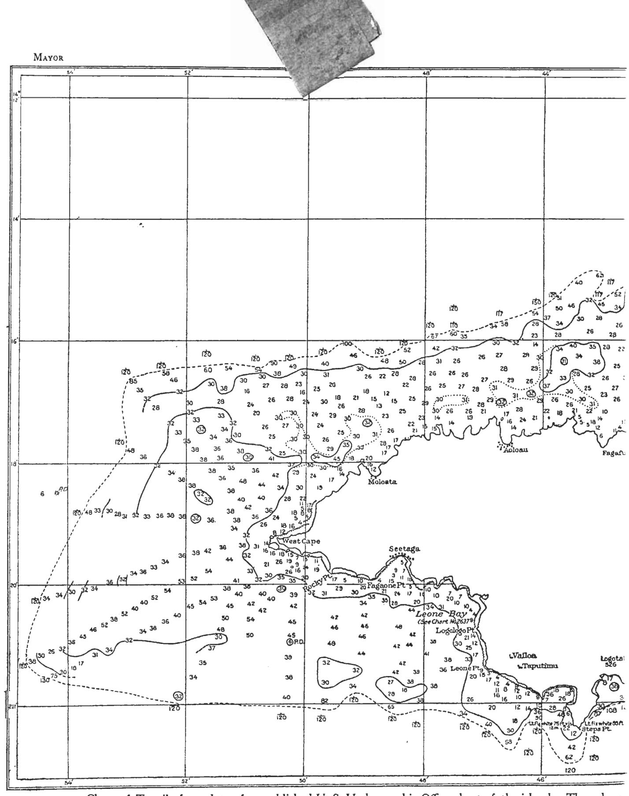
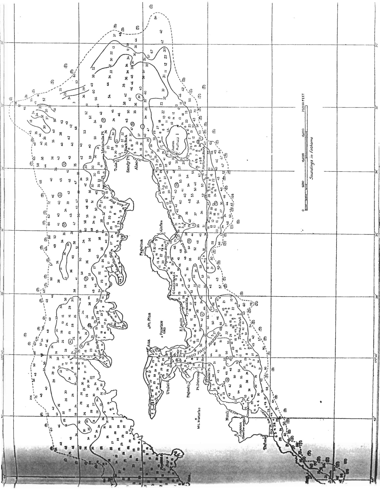

## ROSE ATOLL, AMERICAN SAMOA.

By Alfred Goldsborough Mayor.

The late Commander Warren Jay Terhune, U. S. N., then governor of Samoa, kindly invited me to accompany him on the U. S. S. Fortune to visit the little-known Rose Atoll in S. lat. 14° 32′, W. long. 168° 12′, and we spent 24 hours upon this island on June 5 and 6, 1920.

The island is an atoll, the lagoon being encircled by a narrow ring of limestone composed chiefly of lithothamnium, which is everywhere nearly awash at low tide, excepting on the northeast side, where there is a narrow entrance about 6 to 9 feet in depth, out of which a current constantly flows. The ring of limestone which surrounds the lagoon is quite uniformly about 500 yards in width, while the central lagoon is about 2 miles wide and appears to have a maximum depth of not more than 8 fathoms. There are only two small islets upon the atoll rim—Sand Islet and Rose Islet. The official map of the atoll is the U.S. hydrographic chart of the Samoan Island, No. 90, based largely on the survey of the United States exploring expedition in 1839, and a map by Captain Rantzau (Journal des Museum Godeffroy, Hamburg, 1873, Heft 1, p. 32). This shows Rose Islet as occupying the entire width of the atoll rim, whereas at present it is confined to the inner half of the width of the reef-rim. Moreover, this chart shows trees covering the entire area of the islet, whereas at present only the southern half of the islet bears trees. The chart states that Rose Islet is 33 feet high, but at present the land of the islet is II feet above high tide and the tallest trees, as measured by means of a sextant, are about 80 feet high, and thus the total height of the landfall as seen from the ocean is about 90 feet. Indeed, the domelike cluster of Pisonia grandis trees presents so much the appearance of a hill (fig. 1) as seen from the ocean that a trading captain who had sailed past the island but never landed upon it described it to me as a mound of volcanic rock.

Rose Islet is at present about 240 yards SSW.—NNE., and about 200 yards wide. The southern and southeastern half of the islet is densely covered with a forest composed exclusively of *Pisonia grandis* trees, casting so complete a shade that no other plants grow beneath them (fig. 5), save only a single coconut palm which was probably planted by Governor Tilly's party about 15 years ago. This forest forms a nearly symmetrical dome, the leaves and branches on its confines extending quite to the ground (fig. 4). The largest trees are near the southern end of the grove. About 3 feet above the ground one of these trees had a girth of 25 feet 7 inches, and was about 80 feet high. The ground under these trees is covered with a rich chocolate-colored humus which is of considerable depth near the southern end of the grove.

1 The first chart is that of L. C. D. Freycinet, made in 1819, at the time of the discovery of the island.

Apart from this grove of *Pisonia* trees and a half-dozen coconuts planted by Governors Tilly and Terhune in 1902 and 1920, there are only two other species of plants upon the islet. These have been identified by Professor William A. Setchell, and are a pink-flowered creeping *Boerhaavea diffusa* with stems rarely more than 3 feet long, and a thick-stemmed succulent *Portulaca* nov. sp. with small yellow flowers. Both of these plants grow fully exposed to the sun on the coral breccia and calcareous sand which surrounds the *Pisonia* grove, and none is found under the shade of the trees.

On the southeast side of Rose Islet the sand-beach is reduced to from 1 to 5 feet in width at low tide, and cliffs of coquina from 5 to 8 feet high front the sea (fig. 6). A few feet inland this rocky ledge rises to a height of about 11 feet above high-tide level. The *Pisonia* grove appears to be confined to this region of coquina rock and does not extend to any great extent over the loose calcareous breccia which has been washed in upon the islet in time of storm.

The tree-covered rocky center of the islet is composed of a coquina consisting chiefly of wave-worn fragments of lithothamnium and also rare and occasional fragments of broken coral, such as Favites, Porites, Symphyllia, Pocillopora, and still more rarely Acropora. Embedded in it are many wave-worn half-valves of Tridacna and gasteropod shells, and spines of Echini such as Cidaris were found, as was also the much corroded ulna and part of the skull of a small cetacean about the size of a blackfish, the latter being embedded in the coquina about 8 feet above high-tide level. A large amount of organic matter, dark brown in color and derived from the decomposed roots of the Pisonia trees, permeates this coquina to a depth of several feet. All of the fossils found embedded in the coquina are forms now living on the reef-flat, which have simply been tossed on shore by the waves. Professor C. B. Lipman found that this coquina in contact with the soil contains 12.05 per cent of phosphoric acid.

On the wave-washed southeastern shore of Rose Islet some modern beach-rock has been formed and projects a few inches above high-tide level; but this is more recent than the rocky matrix of the islet, which is now emerged about II feet above high-tide level.

Sand Islet, which lies north of Rose Islet, is a mere accumulation of fragments of lithothamnium, shells, and broken coral and is devoid of vegetation and only about 5 feet above high-tide level. The sea must wash completely over it in time of storm.

Several hundred boobies (Sula), most of which had half-grown young, were nesting on the coral breccia of Rose Islet (fig. 7), while others had constructed nests of sticks high among the branches of the Pisonia trees. A few boatswain-birds with eggs were also nesting in the trees, and several nearly grown young of the noddy (Anous) were running over the ground, while adult noddies and sooty terns visited the island at night. Frigate-birds were hovering over the island, but none were nesting. Wilkes states that the noddies and sooty terns were nesting on Rose Islet on October 7, 1839, and these species were still nesting when Governor Terhune visited the island on January 10, 1920.

A small brown-gray rat was abundant and specimens of it were presented to the Bishop Museum in Honolulu, where they were identified by Mr. J. F. G. Stokes as being a Malayan form which appears to have become widely spread over Polynesia, being possibly introduced by the early Polynesians themselves, who esteemed them for food, and took much delight in hunting them for sport. Apart from these very tame and abundant rats, the only other animals we observed were a small brown, short-tailed lizard, identified by Dr. Thomas Barbour as Lepidodactylus lugubris (Dumeril and Bibron), and which is widely distributed over Polynesia, and the larva of a sphinx moth of the genus Celerio (Oken) feeding upon the Portulaca. A few gnats and an occasional house fly which may have been introduced from the U. S. S. Fortune were the only other insects we observed.

The upper surface of the atoll-rim which encircles the lagoon is a hard, smooth-floored flat with but little loose sand upon it, and in most places it is awash at low tide, although in others it projects as a hard, smooth ledge about a foot above low tide of the neap tides.

This hard, smooth upper surface of the atoll-rim, veneered everywhere by a layer of lithothamnium, is characteristic of the wave-washed surface of offshore and barrier reefs of the Pacific. The condition over a fringing reef is quite different, for here loose fragments are washed inward from the seaward edge and backed up against the shore. Thus the whole surface, excepting only the wave-washed outer edge, is covered with small, loose fragments which could not remain upon an atoll-rim or a barrier reef, for they would soon be washed off into the lagoon. The relatively loose nature of the material forming the shoreward parts of fringing reefs at once distinguishes them from offshore reefs. Professor W. M. Davis's attempt, following Darwin, to institute a class of "offshore fringing reefs" is not justified, the structure of the two forms of reefs being widely different. As a matter of fact, reefs along Pacific shores are either barrier reefs or fringing reefs, and one is never in any doubt in distinguishing the one from the other.

Hundreds of large blocks of limestone lie scattered over the flat, wave-washed rim of Rose Atoll (fig. 2). These loose boulders are quite uniformly about 5.5 feet high, and only when tilted are they any higher (fig. 3). In addition to these boulders there are a few others which are mushroom-shaped and still remain attached to the floor of the atoll-rim, of which indeed they form an integral part. One of the most remarkable of these mushroom-rocks lies to the eastward of Rose Islet, and is supported upon so slender a pedicel that it would seem as if the next storm must cause it to topple over. In many places over the flat, wave-washed floor of the atoll-rim one finds remnants of pedicels which once supported "mushrooms." In addition, some of the boulders have become secondarily cemented to the floor of the flat by the growth of lithothamnium around their bases. The largest boulder we observed lay loosely upon the reef-flat east of Rose Islet and was somewhat tilted by being jammed against another rock. It was 12 feet 5 inches long, 8 feet wide, and 7 feet 6 inches high, and as its specific gravity was 2.3, it apparently weighs 46 tons.

The appearance of these boulders supports the view that the atoll-rim was once about 6 or 8 feet higher, in respect to sea-level, than at present, and has been cut down to present sea-level in recent times. The "negro heads" are simply mushroom rocks which have been completely undercut, so that they now lie loosely upon the floor of the flat.

It can be seen that the surface of the present reef-flat consists chiefly of lithothamnium, a beautiful bright pink variety of which (Porolithon) forms a veritable veneer almost to the exclusion of other forms of life. Professor Alexander H. Phillips made an analysis of this lithothamnium and found it to contain 74.4 per cent of calcium carbonate and 19.47 per cent magnesium carbonate. Also, rock from the solid floor of the atoll-rim west of the main entrance to the lagoon gave 83.86 per cent of calcium carbonate and 14.36 per cent of magnesium carbonate, while a large loose boulder from the same region consisted of 77.28 per cent of calcium carbonate and 18.3 per cent of magnesium carbonate. Professor C. B. Lipman found that the largest erratic boulder on the reef-flat east of Rose Islet contained 79.5 per cent calcium carbonate and 14.54 per cent magnesium carbonate. It will be recalled that Högbom found the magnesium carbonate in various species of Lithothamnium to range from 3.76 to 13.19 per cent. (See J. W. Judd, Funifuti Report, 1904, p. 377.) Also, in 1917, F. W. Clarke and W. C. Wheeler (U. S. Geological Survey, Professional Paper No. 102, p. 44) analyzed 16 species of calcareous algæ of the genera Lithothamnium, Archæolithamnium, Lithophyllum, Amphiroa, Phymatolithon, and Goniolithon and found the calcium carbonate to range from 73.63 to 88.11 per cent, while the magnesium carbonate ranged from 10.93 to 25.17 per cent. The same authors (loc. cit., p. 11) found that in madreporarian reef-corals the calcium carbonate is more than 99 per cent and the magnesium carbonate less than I per cent; whereas in alcyonarian corals, exclusive of Heliopora, the magnesium carbonate ranges from 6.18 to 13.79 per cent, thus being comparable in amount with its proportion in lithothamnia.

It thus appears that the loose boulders lying upon the atoll-rim have the same general chemical composition as the living lithothamnium of the rim itself, and are remarkable in that they contain a large amount of magnesium. In fact, these boulders are only remnants of the old rim, which was once about 6 or 8 feet above sea-level, but has been almost entirely planed down to the level of the present surface of the ocean, leaving only an occasional mushroom-rock or a pedicel as a vestigial remnant of the old rim.

Inspection shows that the solid rock of the atoll-rim and also the boulders lying upon it consist chiefly of *Lithothamnium* compacted into a mass of chalky whiteness superficially resembling dolomite and having a specific gravity of about 2.3, thus being higher than that of a pure coral limestone, the specific gravity of which would range from 1.85 to 2. A pure dolomite containing 45.65 per cent of magnesium carbonate should have a specific gravity of about 2.9.

There are a few fossil corals, chiefly *Pocillopora*, embedded in the rock of the atoll-rim and the boulders, but the whole visible rock of the atoll consists so largely

of Lithothamnium that we may call it a "Lithothamnium atoll" rather than a "coral atoll."

The flat upper surface of the atoll-rim is in most places planed off nearly to low-tide level, but it is veneered with a vigorous growth of a beautiful pink Litho-thamnium which has been determined by Professor W. A. Setchell as Porolithon sp. closely allied to P. craspedium. In most places this Lithothamnium forms irregular, more or less connected patches growing on the smooth, hard floor of the flat. West of the main entrance to the lagoon, however, it grows in long, nearly parallel, flat-topped, overarching ridges, all parallel with the line of the wave-fronts of the breakers as they surge over the reef (fig. 3). These ridges are about 6 inches high and from 6 inches to several feet in width and with channels of similar width between them.

Lithothamnium grows in greater profusion over the reef-rim of Rose Atoll than in any other Pacific reef I have seen, but apart from the single species of pink Lithothamnium there are remarkably few organisms growing in the shallows of the reef-flat. Occasionally we find a pale olive-green Porites, allied to P. lutea M. Ed. and H., and there are a few small stocks of Favites or Symphyllia; but Acropora and Pocillopora, which are the dominant forms in most breaker-washed reef-flats of the Pacific, are practically absent from Rose Atoll, except at the extreme edges of the atoll-rim fronting the lagoon or the sea, where a few stunted specimens of these genera occur.

I did not find upon the Rose Atoll reef-rim a single specimen of branched Acropora related to A. muricata, nor did I see Acropora hyacinthus, or A. leptocyathus, which are dominant forms on the seaward edges of reefs elsewhere in Samoa.

Holothuria were fairly common, as were also small specimens of the giant clam *Tridacna*, and among echini a few *Cidaris* and black, long-spined *Diadema* were seen; and the bright-green seaweed *Caulerpa* was here and there found in the troughs between the ridges of *Lithothamnium*; yet apart from the single species of pink *Lithothamnium*, all other organisms were a negligible factor on the upper surface of the atoll-rim.

It is important to observe that among the hundreds of loose boulders scattered over the flat upper surface of the atoll-rim there are a few which still retain their connection with the floor of the flat and project above it as "mushroom" rocks, thus indicating either that the atoll-rim has risen 6 to 8 feet or that sea-level has sunken to this extent. The evidence, however, tends to sustain the view that sea-level has become lowered and not that the atoll-rim has risen, for there is no visible tilting of the 1 im; and moreover, all the volcanic islands of American Samoa are surrounded by a bench of volcanic rock which is uniformly about 10 feet above present high-tide level and is backed by sea-cliffs, thus suggesting that these islands have remained stationary while sea-level has become lowered.

In this connection it may be of interest to observe that with the exception of Mangareva, which is volcanic, and Makatea, which is elevated coral limestone, all of the atolls of the Paumotus exhibit a bench of old limestone now several feet above present high-tide level. It will also be recalled that David and Sweet, in their

account of the geology of Funafuti (Funafuti Report, 1904, p. 84), conclude that in this atoll there must have been either a land-elevation or a sea-sinking of at least 9 to 10 feet. In 1913 we observed a sea-bench of about 3 feet above highest tides around the volcanic, calcareous, and continental islands of Torres Straits, and, according to W. J. Dakin (1919, Journ. Linnean Soc. London, vol. 34, p. 127) an 8-foot bench is found throughout the Houtman Islands off the west coast of Australia.

As there are fossil corals and *Lithothamnium* in the highest parts of the boulders and mushroom-rocks on the rim of Rose Atoll, it appears that the climate was tropical when the sea cut the now emerged 8-foot bench around all the volcanic islands of American Samoa.

In the Funafuti boring the percentage of magnesium in the core ranged from 4 per cent at a depth of 4 feet to 16 per cent at 15 and 26 feet, below which it declined to 3 per cent at a depth of 60 feet. Judd attributes this high percentage of magnesium to the supposed leaching-out of calcium by the sea-water, but we now know that the surface waters of the tropical Pacific are supersaturated in respect to calcium carbonate and that calcium carbonate is therefore practically insoluble in this surface water. Judd admits that there is much Lithothamnium in this upper part of the boring, but unfortunately he made no analysis of the magnesium contents of any lithothamnia at present growing upon the Funafuti Reef; and judging from the conditions at Rose Atoll, I am inclined to believe that the magnesium in this upper part of the Funafuti boring is due solely to its being largely composed of Lithothamnium and not to any leaching-out of calcium carbonate. This conclusion is supported also by the fact that in the Funafuti boring between 100 feet and 637 feet in depth the magnesium carbonate was nowhere greater than 5.4 per cent; yet, if calcium leached out in water about 26 feet deep, why did it not leach out at these greater depths, where conditions of temperature and hence of carbon dioxide are more favorable for solution?

J. P. Couthouy (1844, Boston Journal of Natural History, vol. 4, p. 138) says of Rose Atoll:

A number of boulders of volcanic rock are scattered over the sandy bottom of the lagoon, one of about 20 pounds being found in about 4 feet of water. This rock was similar in appearance and mineral structure to that constituting the neighboring groups of Samoa and Fiji.

Also, Wilkes (1852, Narrative of the U. S. Exploring Expedition, vol. 1, p. 155) states: "Some boulders of vesicular lava were seen on the coral reef of Rose Atoll; they were from 20 to 200 pounds in weight and were found among blocks of coral conglomerate." After diligent search I was unable to find any volcanic rock upon Rose Atoll, and it seems probable that Couthouy and Wilkes mistook some dark-colored scoriaceous-looking, weather-worn limestone boulders for lava.

## SUMMARY.

The visible part of the rim of Rose Atoll is composed of *Lithothamnium* rather than of coral, and is chiefly constituted of the same pink-colored species of *Lithothamnium* (*Porolithon*) now found growing over the shallows of the reef-flat.

The atoll-rim was once at least 8 feet higher than the present sea-level, and has been largely planed down to present sea-level by the (possibly lowered) ocean of modern times.

In common with Rose Atoll, all the volcanic islands of American Samoa indicate that sea-level was at least 8 feet higher than at present.

The rock of the atoll-rim contains from about 14 to 19 per cent of magnesium carbonate, due to its being composed largely of *Lithothamnium*, but not due to any appreciable dolomitization of the limestone after its formation.

As fossil corals and Lithothamnium are found in the highest parts of the remnants of the old Atoll-rim, it appears that the climate of American Samoa was tropical at the time when the sea may have stood at least 10 feet higher than at present.

A.—One of the last photographs of Dr. Mayor, showing him at work on a Samoan coral reef.

B.—The Darwin off the Tortugas Laboratory. Ready for subsea explorations.

PLATE 27 MAYOR

A.—Rose Atoll from about a mile off northwest entrance to the lagoon, showing hill-like contour of grove of Pisonia trees.
B.—Boulders on reef-flat east of Rose Islet.
C.—Boulder on reef-flat west of main entrance to lagoon, showing rows of Archæolithothamnium growing in shallow water of reef flat.

MAYOR PLATE 28

A.—Coquina ledge on southeast side of Rose Islet.

B.—Booby with two young, one much older than the other, resting on the breccia near edge of the Pisonia grove of Rose Islet.

Chart of Tutuila from data of unpublished U. S. Hydrographic Office chart of the island. The subma

