# THE SHORELINE FISHERY OF AMERICAN SAMOA in FY92

John McConnaughey

Department of Marine and Wildlife Resources
P.O. Box 3730
Pago Pago, American Samoa 96799

DMWR Biological Report Series, No. 41

# TABLE OF CONTENTS

| Abstract                                                               | 1           |
|------------------------------------------------------------------------|-------------|
| Introduction                                                           | 2 3      |
| Recent Impacts to Coral Reefs                                          | 3           |
| Methods                                                                | 4           |
| Field Sampling                                                         |             |
| Participation Data                                                     | 5           |
| Catch Data                                                             | 5 5 5 |
| Palolo Data                                                            | 6           |
| Fish Sale Data                                                         | 9           |
| Analysis                                                               | 9           |
| Area Groupings                                                         | 9           |
| Participation Analysis '                                               | 11          |
| Catch Analysis                                                         | 11          |
| Palolo Analysis                                                        | 12          |
| Data Limitations                                                       | 13          |
| Results and Discussion                                                 | 14          |
| Fishing Methods                                                        | 14          |
| Island Wide Catch & Effort                                             | 15          |
| Species Catch/Effort Analysis                                          | 22          |
| Atule, Big-eye Scad (Selar crumenophthalmus)                           | 22          |
| Non-Atule                                                              | 25          |
| Fe'e, Octopus                                                          | 29          |
| Lupo, Jacks, (Carangidae other than Atule)                             | 32          |
| Pone and Palagi, Brown Surgeonfish                                     | 35          |
| Tuitui, Sea Urchins (Ecinometra)                                       | 38          |
| Anae, Fuafua, Mullet, (Mugilidae)                                      | 40          |
| Alogo, Bluebanded surgeonfish, (Acanthurus lineatus)                   | 43          |
| Palolo                                                                 | 46          |
| Sales of Fish in Local Markets                                         | 50          |
| Recommendations                                                        | 57          |
| Monitoring Program                                                     | 57          |
| Management Plan                                                        | 59          |
| Future Research                                                        | 59          |
| Acknowledgements                                                       | 61          |
| Literature Cited                                                       | 62          |
| Appendices                                                             |             |
| <ol> <li>Differences between the 1979 and the current study</li> </ol> | 66          |
| <ol> <li>Interviews by method and location and year</li> </ol>         | 67          |

# The Shoreline fishery of American Samoa in FY92

#### ABSTRACT

Due to the cultural and economic importance of the nearshore fish and invertebrate resources of American Samoa, The Department of Marine and Wildlife Resources instituted a program in 1990 to monitor the harvest in these nearshore waters. This study uses comparable methodologies to a similar 1.5 year long study completed in 1979.

Although there has been a nearly 50% increase in the size of the human population on Tutuila since 1979, the overall fishing efforts within the study area have declined, even though catch rates in FY91 were comparable to 1979, and catch rates in FY92 increased almost 70%. The estimated effort in the study area in 1979 was 74,000 person hours, declining to 67,000 in FY91, and 41,000 in FY92. Estimated island-wide catches for these years was 660,000 lbs, 440,000 lbs, and 334,000 lbs respectively. The per capita inshore catch has also declined from 17.8 lbs/person in 1979 to 9.8 lbs/person in FY91 and 7.4 lbs/person in FY92.

The relative use of various types of fishing gear has changed markedly, probably in response to both changes in the socioeconomic structure of the island community, and to changes in the relative abundance of certain key species. In 1979, all hook and line fishing methods accounted for 39% of the effort, raising to 72% in FY91, and dropping back to 23% in FY92. The bamboo pole was the most popular hook and line method in 1979, though this gear type has been largely replaced with the rod and reel, and a simple hand line. The use of handlines was not observed in 1979, though was the most used method in FY91.

Sales of domestically caught reef fish in the local fish markets has declined drastically in the last three years for which market survey data are available. Much of this decline can be attributed to the availability of competitively priced fresh fish air freighted from neighboring island nations of Tonga and Western Samoa. In 1990, 23% of reef fish sold in the local markets was imported. In 1992, this percentage had risen to 78%.

The inshore reef fishery on Tutuila is estimated to account for about 7% of the total annual tonnage of fish, farm and livestock production in American Samoa. Including imported foods, which account for 83% of the Samoan diet by value, the reef fisheries account for less than 2% of the total dollar value of foods consumed in American Samoa.

#### INTRODUCTION

Throughout their history, the people of American Samoa have relied on fish and shellfish food sources harvested on the reefs surrounding their islands. Prior to western influence, fishing provided a substantial portion of the protein in the Samoan diet. Although technological advances such as refrigeration, the availability of canned goods, and the gradual shift from a subsistence to a cash economy have created new options for meeting protein requirements, fishing remains an important part of the Samoan way of life.

The domestic fishery is comprised of two major components, the offshore commercial fishery and the shoreline subsistence fishery. The offshore fishery, described in detail in Aita'oto et al (1991), and Craig et al (1993), has evolved considerably from historical times. Outrigger canoes and sennit lines have been replaced with outboard driven catamarans and monofilament lines, through the effort of several fishery development programs. However, marketing problems, resource depletion, and difficulties maintaining vessels have been all contributed to the fishery's failure to thrive (Itano 1991). The present day offshore fishery supports both a commercial and a subsistence/recreational component, with approximately 70% of the total harvest being sold.

The shoreline fishery is primarily a subsistence fishery that targets fish and invertebrates from the fringing reef adjacent to the shoreline. Unlike the offshore fishery in which participation is limited by the number of seaworthy boats, the shoreline fishery is highly accessible to the island's populace since most of the narrow, fringing reef can be reached on foot from shore. Fishing takes place at all hours of the day and night by all sectors of the population.

The shoreline fishery is in a state of transition. Traditionally, each village claimed ownership of their adjacent reefs and their associated fishing resources. Permission for non-village residents to use these resources often had to be obtained from the local matai, or village chief. Today, the main public highway follows the coastline all along the southern shore of Tutuila. This road lays between the village structures and the beaches in most areas, allowing convenient public access to most of the village beaches.

In recent history, several villages have attempted to control through traffic along the highway, particularly during the evening "sa" or prayer hour. However, villages have not been allowed to hinder through traffic.

Villages on the northern shore are more isolated, as they are serviced by branch roads from the main highway which terminate in the village, and thus there is no through traffic. These villages maintain a much higher degree of control both in road access and in access to fishing rights on the reef.

Concerns regarding the current status of the shoreline fishery and frequent information requests regarding catch and effort data stimulated DMWR to implement a new monitoring program (Ponwith 1991).

## Recent Impacts to Coral Reefs.

Significant natural events have impacted the reef habitats in recent years. Hurricanes have struck the island in 1979, 1990, and 1991, subjecting the reef environment to high winds and violent waves. In addition, heavy rains and damage to the adjacent watersheds caused significant amounts of debris to wash down on the reefs.

Quantitative studies of these effects are lacking, though observations made after these storms shows that the corals suffered considerable damage in these events. Observers stated that the reefs appeared to have been sandblasted. Most of the table-top corals and branching corals were broken off and washed into rubble fields. The massive encrusting corals were also significantly abraded. The topography of the reefs was significantly altered by removing much of the three-dimensional relief.

In 1977-78, Tutuila suffered a massive crown-of-thorns (Acanthaster planci) infestation. These starfish were observed to devastate the live corals, leaving huge areas of bleached, dead corals. In response to a bounty program, nearly half a million star fish were removed from the reef and destroyed (Wass 1980).

The reef ecosystem has also been impacted as a result of the significant human population growth that has occurred over the last Rapid development and the years. accompanying environmental degradation have affected the study area in many (1) coastal roads have been protected with heavily armored banks which encroached on the reef flat. (2) land clearing for new construction, and new plantations on steep slopes have exacerbated the siltation problems which exist in a mountainous island environment. (3) the amount of fish processed at the canneries has increased, which has increased the amount of waste the canneries dispose into Pago Pago Harbor. A clear trend of increasing total phosphorous and total nitrogen levels in the inner harbor occurred over the period 1979 to 1987 (Chamberlin et al. 1989). addition, low dissolved oxygen content due to high nutrient levels are suspected to be the cause of several fish kills in the inner harbor.

A recent toxicity study of the Pago Pago Harbor confirmed the presence of heavy metals, PCBs and pesticides in fish tissue samples taken from the inner harbor. Lead concentrations as high as 7.9 ppm in fish muscle tissues and 73.8 ppm in fish liver tissues were found (AECOS 1991). Health advisories were issued, recommending that inner harbor fish not be eaten and prompting health officials to test for lead levels in the blood of villagers who have eaten fish from the harbor. The sale of fish caught in

the inner harbor area was eventually banned, although this ban has not been enforced rigidly. Local stores say that they will not buy fish from the inner harbor, however several private fishermen still regularly sell fish from the harbor at an outdoor fish market in Fagatogo.

#### METHODS

The study design for this survey was developed by Bonnie Ponwith in 1990 (Ponwith 1991). It's purpose was to repeat a previous survey done by Richard Wass in 1979, to document changes in this inshore fishery over the intervening 12 years, and to produce a data collection procedure which could be continued indefinitely into the future.

Due to personnel and logistical constraints, an island-wide survey was deemed not feasible (Wass 1980, Ponwith 1991). The study, area selected was a 16-km stretch of shoreline, centered around Pago Pago Harbor (Figure 1). It exhibits a range of reef health, from the outer villages such as Lauli'ituai which are impdcted primarily by fishing activities, to the heavily developed and polluted industrialized shore of inner Pago Pago Harbor.

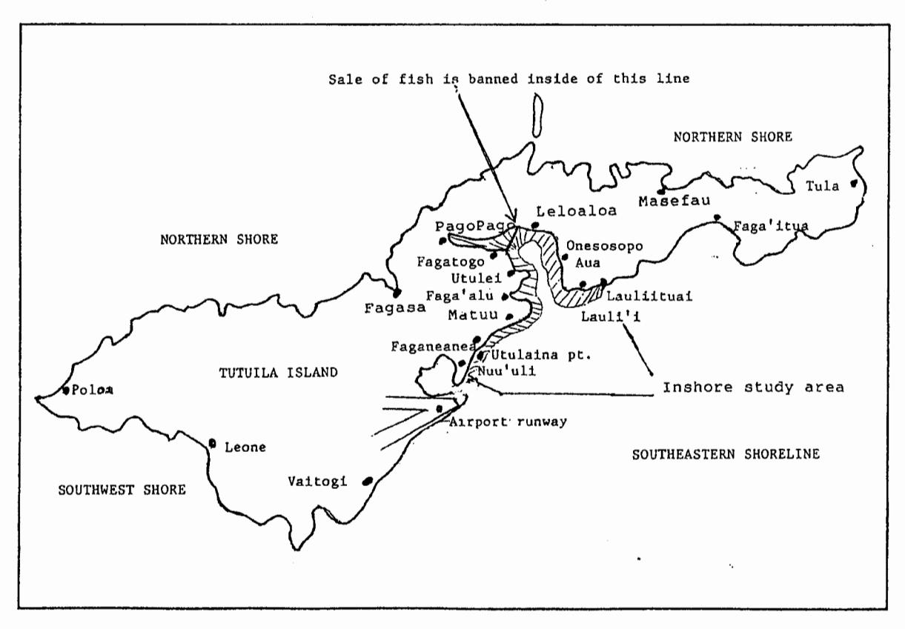

Figure 1. Study area on Tutuila Island, American Samoa.

Individuals or groups fishing were sampled only if they had been fishing at least half an hour. Parties that had no catch were recorded as such and included in the computation of CPUE. Catch data included date, type of day (weekday or weekend-holiday), village, whether the trip was concluded or in progress, time of interview, fishing method used, number of hours fished at the time of the interview, number of gear units (rods, nets, spears, etc.), number of people in the fishing party.

The catch was weighed and counted by species groups whenever possible. When the catch included a large number of small fish, the catch was weighed without counting. The interviewers sampled only the portion of the catch which was kept, no estimate was made of the discarded portion, if any. Fishermen often ate portions of the catch during their fishing trips. No estimate was made of these fish caught but not available for inspection by the creel technician.

Fishermen on Tutuila seldomly headed or gutted their fish in the field, therefore fish weights reported here are in the round. Methods of capture and preparation of shellfish varied, and technicians measured their catch as it appeared at the time of the interview, without any notations as to whether the recorded weight was of the entire animal, or just a portion there of. As most of the animals were taken in the whole, shellfish weights presented here represent whole weights with two notable exceptions: 1) Sea Cucumbers where usually dissected and only the female gonads taken, leading to a severe underestimation of the catch of these species, and 2) Sea anenomies were often taken along with rocks they were attached to, leading to a serious over-estimation of the poundage of sea anenomies taken.

Data collection relied on locally hired technicians who had very limited backgrounds in biology or statistical procedures; however, they were familiar with the locally caught species of fish which they knew by their Samoan names. For this reason, catch data were recorded primarily using the Samoan names. This lead to some unfortunate combining of similar species in the data.

Sociological information was also collected during each interview. Participants were categorized by sex and age (14 or less, 15 or older). Each fishing party was asked how much of the catch was to be sold or kept, and whether or not they were fishing adjacent to their home village.

# Palolo Data

Palolo, the coral worm (*Eunice viridis*), is an important species in the shoreline fishery and required an auxiliary sampling effort due to the brevity and magnitude of its appearance in the fishery.

Once a year at the beginning of the last lunar quarter of October or November, these burrowing annelids release egg- and sperm-filled body segments (epitokes) into the surrounding water. The timing of this release usually occurs in a two night time span around the

last lunar quarter, (Kraemer 1902, Caspers 1984, Itano 1986, Itano and Buckely 1988).

There is a great deal of speculation and folklore associated with the exact timing of this event, and even an honor bestowed on the persons who could correctly predict the emergence of the worm. Samoans, who consider the epitokes a delicacy, gather in large numbers around midnight on the predicted night to collect the epitokes from shoreline waters using scoop nets or long lengths of screen. People typically wait on the beaches or in their cars, a few will venture out into the water every few minutes to see if the epitokes are present. When epitokes are found, dozens to hundreds of people will rush into the waters for a brief pandemonium of fishing.

Palolo are harvested at various locations throughout the island, with the effort concentrated on several beaches which have been known to produce good harvests in the past.

Typically, a fishing party will consist of two to several people, some who hold lanterns and buckets, and others who scoop the epitokes from the water into the buckets.

A separate sampling effort was applied to the palolo fishery to accommodate its unique attributes. A one-night survey was conducted in 1990 and 1991 (Ponwith 1991). That survey only included the stretch of shoreline from Faga'alu to Nu'uuli which, attracted the greatest number of participants in the inshore survey study area.

In 1992, an expanded palolo survey was conducted to census all the likely palolo harvesting areas on the Southeast and Southwest shores of Tutuila. The palolo survey was also extended to include four nights in both October and November, centered on the last night of the lunar quarter. This increased time was made to insure that the samplers did not miss the night of the palolo, and to obtain a more complete picture of this fishery.

Four crews were used to cover all areas. Crew 1 surveyed from Tula to Aua, Crew 2 from the Rainmaker Hotel to Faganeanea, Crew 3 from Faganeanea to Coconut Point, Crew 4 surveyed the airport reef, and Crew 5 surveyed the Southwestern shore from Leone to Poloa. Crews also sampled returning boat fishermen at the Fagatogo small boat harbor. The harbor villages from Aua to the Rainmaker Hotel were not sampled as it was believed that no Palolo harvest would occur in this area.

Logistics and lack of personnel prevented us from deploying crews to the villages on the northern shore, even though anecdotal reports suggested that high densities of palolo had been seen in isolated spawning in past years. Also, the survey of the southwestern shoreline was discontinued after two nights due to vehicle breakdowns, and that very few palolo fishermen were observed in those areas.

The palolo survey methods used in 1992 were similar to those described by Ponwith, except that both persons in the water and on the shore were counted, and the catch rate was based on a person/night basis rather than on a person/hour basis. These changes were made for the following reasons:

- 1. The peak fishing activity may last only 1/2 hour or so, making it impossible for limited crews to survey the study area obtaining counts of the number of people in the water. It was also difficult to determine what proportion of the people observed waiting on the shorelines actually intended to fish. If the worms did not appear on a particular night (as was the case), many of the would be fishermen would leave without actually fishing. Also many people waiting on shore never intended to actually fish, but were rather there to accompany people who came to fish, supervise children, or just came to watch the show.
- 2. Persons who come out at midnight in the anticipation of a palolo harvest could legitimately be considered participants in the fishery, whether their intent was to fish, or just to help or watch from the shore.
- 3. The cultural importance of the palolo fishery is likely greater than it's biological importance, and it is therefore important to document all participants in it.
- An hourly catch rate makes little sense for this fishery, as a typical palolo fishing trip consists of a large amount of time spent waiting around on the beach watching for worms, and a short amount of time spent actively fishing. To include the time spent waiting and searching for worms would lead to erroneous catch rates. Consider the following hypothetical example: Year 1, a person comes to a beach and starts watching for worms at 12:00 PM. The worms appear around 12:30 He catches 1 pound of epitokes, and leaves at 1:00 AM. His hourly CPUE would be 1 pound per hour. However in Year 2, the fisherman again starts searching for worms at 12:00 PM, but the worms do not appear until around 1:30 AM. He again catches 1 pound of worms, and leaves at 2:00 AM. His hourly CPUE would be 0.5 pounds/hour, a drop of 50% from year 1. It seems more correct and more practical to consider the night as the unit of effort, and to report that the catch rate for both years 1 and 2 was 1 pound/night.
- 5. When the spawning was over, people would leave the areas in mass as quickly as possible, as it is the wee hours of the morning and they are wet, cold and tired. Therefore interviews had to be conducted as rapidly as possible as people were leaving. Extraneous questions (such as their age, when they started fishing or when they stopped) were eliminated in order to allow the rapid collection of the catch data. We also found it difficult to interview unsuccessful fishermen as they wanted to leave as quickly as possible, and did not want to stop to discuss their failure with us.

# Fish sale data

Some data on fish sales are presented in this report. Vendors report the weight by species, source, and price paid. Since July 1990, DMWR has compiled this information into a database. Some of this data is presented for comparison to the inshore catch on page 50.

Currently, all vendors of fresh and frozen fish, and fish products, (excluding canned imports) in American Samoa are required to report their purchases of fish to DMWR, however DMWR lacks the legal authority at the present time to issue citations to vendors who do not comply with the reporting requirements.

DMWR is currently seeking authority to issue citations. Until this issue is resolved, the fish sale data shown on Table 17 should be considered an underestimation of the total.

#### ANALYSIS

Data were entered into a database and a series of interactive DBASE IV programs were used to expand the sample data to annual catch and effort estimates for the study area. This methodology is discussed by Ponwith (1992).

The data set from Ponwith was re-analyzed for the FY91 figures shown in this report. Some corrections were made to both the data base and programs, therefore the results reported here for FY91 are somewhat different from those presented in Ponwith's report. All catch and effort figures for 1979 are taken directly from Wass's report, although all CPUE's for 1979 shown here are recomputed based on his catch and effort statistics.

## Area Groupings

The study area included 22 coastal villages. This report summarizes the villages into the 8 area groupings shown below. These area groupings were selected as they represent the distinct habitat areas within the study area. This also allowed the pooling of catch data in adjoining villages, as sufficient data was not available in several villages to provide an accurate analysis for the village by itself.

## <u>AREA</u> <u>VILLAGES, HABITAT</u>

Lauli'i

Lauli'ituai, Lauli'ifou. Habitat: Exposed coastline, outside harbor, high wave energy area. Upland areas are residential village areas, with development not severely impacting the reef. Reef top and reef slope appears healthy.

Aua

Onososopo, Aua, Lepua, Leloaloa. Protected outer harbor area, low to moderate Upland areas are a mix of wave energy. crowded residential housing and industrial development. Extensive rip-rapping along beach front. Large amounts of silt runoff washes onto the reef. The reef top is impacted by several ship wrecks deposited there by Hurricane Val in 1991, and also by trash which has been dumped on the beaches. The reef top still supports many live corals, though reef face is heavily silted below a depth of about 10 feet.

Inner Harbor

Atu'u, Anua, Satala, Lalopua, Pago Pago, Malaloa. Habitat: Calm, protected areas. Developed industrialized area, includes canneries, shipyard, and small vessel harbor. The coral reefs are almost entirely dead and silted over. Pollution is a serious problem. Sale of fish caught in this area is banned.

Fagatogo

Fagatogo. Habitat: Fuel dock and cargo dock areas. Constant vessel traffic. No reef environment remaining. Oil pollution is a serious problem. This area receives some of the highest fishing pressure of all areas studied, particularly during the atule run. Fishermen favor the dock area due to the ease of access of the dock areas relative to outer reef areas. By fishing from the dock, a fisherman can cast into deeper waters without tangling his line as do reef fishermen. 'Sale of fish caught in this area is banned.

Utulei

Utulei. Habitat: Semi-protected outer harbor area. Immediate upland area is park land and office buildings. Silt runoff occurs in moderate to severe amounts. Reef top supports some live corals, though reef slope below 10' is heavily silted, and supports few live corals. This area receives high fishing pressure during the atule run, but very low pressure at other times.

Faga'alu

Faga'alu, Fatumafuti. Habitat: A shallow bay outside the main harbor, a broad reef top and, an exposed high energy reef front. Upland areas are developed urban areas. The inner portion of Faga'alu is a protected shallow area with a sandy bottom. The outer shallow reef area supports some of the richest shallow reef habitats on the island. Heavily used, both recreationally and for fishing.

Matu'u

Matu'u, Usa'aiga, Faganeanea. Habitat: Narrow reefs with exposed, high energy fronts. The coastal road infringes on the beaches and reef top. The upland areas are mostly too steep for development, and what little flat areas there are crowded with village housing.

Nu'uuli

Avau, Oneoneloa, Nu'uuli. Habitat: Narrow to broad reefs with exposed, high energy fronts. The Nu'uuli reef is the broadest reef on the island.

Note: The area affected by ban on fish sales due to high levels of lead and other pollutants included all areas inside of a line drawn across the harbor from Samoa Packing's cannery location in Anua to the Rainmaker Hotel in Utulei (Figure 1). This included the areas referred to as "Inner Harbor" and "Fagatogo" in this report.

# Participation Analysis

In a deviation from Ponwith (1992), fishing effort estimates are reported both in person-hours and in gear-hours. This change is made for two reasons, 1) to allow for more direct comparisons to the 1979 study, which reported only person-hours, and 2) to present a more accurate picture of the human effort expended in this fishery.

Gear-hour computations are a better biological representation of this fishery, as it is common for a fishing party to include people who are not actively fishing. For example, a fishing party may consist of two people one of whom fishes with a rod and reel while the other holds the catch. The fishing power of that party is better defined by amount of gear they have, rather than the number of people participating.

Separate estimates for fishing effort were calculated for each effort stratum, which consisted of the following:

- 0) Year (FY91 versus FY92)
- Time of day (Day-time versus Night time)
- 2) Day type (Week day versus week end or Holiday)
- 3) Fishing method
- 4) Village

The first step in estimating total effort was, for each stratum, to sum the total number of gear units observed and divide it by the total number of hours observed to produce a mean number of gear units per hour. The second step was to multiply this value by the total number of hours possible for each stratum in each 1-year period.

# <u>Catch Analysis</u>

Catch estimation involved several steps. First, a CPUE value for each catch that was sampled was calculated by dividing the total number of pounds caught by the total effort (where total effort equalled the product of number of gear units and the number of hours fished).

The interview (catch) database is organized in a hierarchical arrangement of strata, as follows:

# Level Strata Vear, (User-selected range of dates for an analysis) Day or night fishing Day type (Week day versus Weekend day or holiday) Fishing technique, (Grouping of like methods) Fishing Method, (Rod and reel, hand-line, (etc.)) Habitat (Grouping of similar villages. See page 9) Village name

Total catch, (C), and total effort, (E) were calculated for each stratum and at each hierarchial level. The ratio of these two numbers (C/E) was used to estimate the catch per unit effort, CPUE. Expanded catches were generated by multiplying the CPUE for each stratum by the expanded effort estimate for each respective stratum. In many cases there were not a sufficient number of interviews available in a given stratum at level 6 to compute a CPUE. In these cases, the expansion program would look for a CPUE at level 5 in order to produce an expanded catch for a particular stratum. If a level 5 CPUE was not available, then a level 4 CPUE would be used, (etc).

In this analysis, a minimum of two interviews would be required to complete the analysis.

For example, to estimate the catch by daytime, weekday, rod and reel fishermen fishing in the village of Onososopo, the program would first look for all interviews within the selected time period for day time rod and reel fishermen in Onososopo (Level 6). If two interviews were not found, the program would then look at the level 5 CPUE, which would be all rod and reel fishermen fishing in the Aua area, which includes Onososopo. If two interviews were not found there, then the a level 4 CPUE would be used, which would be all daytime, weekday, rod and reel fishermen within the entire study area.

Species composition estimates (by weight) were then calculated. The proportion of each species in the sampled catch was multiplied by the total estimated catch to get the expanded species composition. Fish weights are expressed as whole fish and shellfish weights include the shell.

# Palolo Analysis

Palolo data were analyzed independently from the rest of the data. The procedure used in this study differs somewhat from prior

studies described by Ponwith, (1981). Each fishing party interviewed was surveyed upon completion of their fishing trip. The following data were collected: Total number of persons in the group including those who did not actually fish, and amount of catch for the group. Palolo catch rates were then computed on a per person/night basis. The total catch for a village area was estimated by multiplying the mean CPUE from the interview data by the maximum number of persons observed in that area for all the participation counts.

# Data limitations

Two data collection problems seriously affect this survey design: (1), logistics made it difficult to interview most reef fishermen who were away from the shore, and (2) it was often difficult to see nighttime fishermen, particularly spear divers.

The first problem made it difficult to obtain unbiased interviews of the fishermen's catch. Most of the reef fishing occurred out on the reef flat, often as close to the reef face as possible. Fishermen are often wading in knee deep water and are a couple hundred feet from shore. Spear divers were usually swimming in deeper waters just past the reef face. It was usually impractical and sometimes hazardous to walk out to these fishermen. fishermen were generally interviewed only if they happened to be completing their fishing trip and seen returning to the shore by the data collector if he happened to be driving by at the right But persons fishing close to shore, or on docks were interviewed on a routine basis. This problem adds an obvious bias to the survey results which is not corrected for in the data analysis. This survey also suffers from low interview rates in several villages. Often, interviews from other villages of persons fishing with the same gear type were used to compute an expanded

Poor visibility due to rain and darkness during evening shifts were the main factor affecting the accuracy of participation data. During sampling shifts on nights surrounding the new moon period, the data collectors often relied on counts of flashlights since the fishermen, themselves, could not be seen. If the lights were submerged and offshore, as was often the case for night divers, they could have been easily missed. Rod and reel anglers who fish the edge of the reef often went for long periods of time without turning on a flashlight, making them difficult to see on dark nights.

Low estimates for nighttime effort would have a ripple affect on the rest of the estimation process. They would result in low expanded catch and effort estimates for selected species, most notably for lobsters, alogo (bluestriped surgeonfish), squirrelfish and soldierfish. Thus, catch and effort estimates for nighttime should be considered conservative, especially for the diving method.

#### RESULTS AND DISCUSSION

# Fishing Methods .

A variety of fishing methods were observed in use. These were classified into seven gear types as follows:

Rod and Reel. This gear type included the typical fiberglass casting rod and mechanical reel available in most sporting goods stores. Baits included lures, live baits, feathers, and jigs. Atule and Jacks were the most commonly targeted species, though other species were taken as well.

Hand line. The hand line consisted of a length of line wrapped around a stick or partially crushed aluminum can. Use of this gear type is not mentioned by Wass (1980) or by Hill (1978), but was the most often used gear type in FY91. Fishing with hand lines is predominantly done off the docks in the Fagatogo area, but was also observed throughout the study area.

Bamboo Pole. This gear type included any bamboo pole or stick with a piece of fishing line tied to it. No reel was involved, which distinguishes it from the rod and reel gear type.

Gleaning. Gleaning is where people simply walk out onto the reef flats and catch or pick up whatever fish or invertebrates they may find. Usually people will walk along the reef top at low tide during day light hours, probing cracks with a piece of wire for octopus, catching fish stranded in shallow tide pools, or simply picking up sea urchins and other invertebrates. This is probably the most traditional fishery that people engage in, and was the most used method in the 1979 (Wass 1980).

Spear diving. Spear divers generally work the outer reef edge, though are frequently seen on the reef tops at high tide. The equipment is simple, using swimmer's goggles or snorkel gear, and using spears of various designs to catch fish. The spears vary from pole spears (Hawaiian Slings) to home made devices which resemble a bow and arrow.

Much of the spear diving is done at night using waterproof flashlights. The fish are stunned and blinded by the lights, and are thus much easier to approach then they are during the day time.

The usage of scuba tanks was not observed within the study area, as this type of gear has not been adopted by most people due to its cost and lack of support on the island. Most of the use of scuba gear at this time is by DMWR personal, or persons who learned the use of scuba equipment while living in Hawaii or the mainland, and may occasionally spear fish recreationally.

Throw net. Throw nets or cast nets were used through out the study area. In reef areas, they were usually used at low tide, often in conjunction with gleaning.

<u>Gill net</u>. The gill nets observed in use in this study consisted of relatively short (100' - 200') lengths of monofilament gill nets. Wass used the term "seines" to include:

"...[monofilament] gill nets, throw nets, scoop nets and seines that were woven from cord from bark or coconut husks".

Thus Wass's usage of the term "seine" includes a variety of fishing techniques and gear which involved nets. Wass considered "seines" as an active gear type where a net was pulled through the water, or the fish driven into the net, whereas he considered "gill nets" as a passive gear type which was allowed to catch fish more or less unattended. As gill nets are generally used as in an "active" fishing method, Wass called them "seines" in his report, whereas they are called "gill nets" in this report.

The usage of the more traditional materials (nets woven from cord or bark or coconut husks) have not been observed since this study began in 1990.

The usage of gill nets is at times banned in some areas by the village councils. This happened in Utulei and Faga'alu in FY91 during the atule run when there were complaints that too many fish were being caught by gill net fishermen, and not allowing the rod and reel fishermen their "fair share". Enforcement of village rules such as this is not within the jurisdiction of the Department of Marine and Wildlife Resources.

Wass also describes several techniques that were not observed in this study. Most of these involved using pens, weirs, or traps of some variety and large numbers of people to drive the fish into trap where they were harvested.

Wass (1980) states that many of the traditional fishing techniques required a group of people, and much of the enjoyment the Samoan's derived from fishing related to its social aspects.

## <u>Island-Wide Catch and Effort</u>

From the data collected in this study, it is estimated that the inshore fishermen on Tutuila harvested an estimated 440,000 pounds of fish and shellfish in FY91, and 334,000 pounds in FY92 (Table 1). This compares to 660,000 pounds in 1979 (Wass 1980).

Table 1. Estimated catch of fish and shellfish for Tutuila Island. The catch/capita for villages in the study area is estimated by dividing the catch per village by the village population. The island-wide catch is then estimated based on the average per-capita catch within the study area times the total island population. Palolo catch and effort are not included.

| Area                | 1990 Population | FY91 Catch (Pounds) | FY91 Pounds/ Capita | FY92 Catch (Pounds) | FY92 Pounds/ Capita |
|---------------------|--------------------|---------------------------|---------------------------|---------------------------|---------------------------|
| Lauli'i             | 814                | 5,314                     | 6.5                       | 9,553                     | 11.7                      |
| Aua                 | 2,308              | 14,844                    | 6.4                       | 27,033                    | 11.7                      |
| Inner Harbor        | 3,992              | 3,783                     | 0.9                       | 1,219                     | 0.3                       |
| Fagatogo            | 2,323              | 61,867                    | 26.6                      | 15,203                    | 6.5                       |
| Utulei              | 930                | 37,094                    | 39.9                      | 10,994                    | 11.8                      |
| Faga'alu            | 1,087              | 12,457                    | 11.5                      | 20,177                    | 18.6                      |
| Matu'u              | 532                | 4,487                     | 8.4                       | 7,052                     | 13.3                      |
| Nu'uuli             | 3,893              | 15,284                    | 3.9                       | 26,688                    | 6.9                       |
| Study area total | 15,879             | 155,131                   | 9.8                       | 117,919                   | 7.4                       |
| Island Totals    | 45,043             | 441,000                   |                           | 333,000                   |                           |

The per capita catch for 1979 was estimated to be 17.8 pounds/person, and the resulting island wide catch was estimated to be 660,000 pounds.

The island-wide extrapolation should be considered only as a best guess for the following reasons: (1) Villages in the study area are not selected at random, but rather represent a string of villages in the more industrialized harbor area which could be conveniently surveyed. Outlying villages may have considerably different fishing patterns. (2) Catch per capita estimates were made by dividing the total catch by village by the village population. A more accurate estimate would be to include only the catch by residents of the village. (3) The highly populated Inner Harbor areas receive a reduced fishing effort due to the environmental degradation experience there, and due to health advisories which have cautioned residents against eating fish and shellfish taken from the harbor areas, thus observed catch per capita of 0.9 pounds/person is likely to be lower than that of other coastal villages. (4) Villages in the Tafuna Plain and Aasufou regions where a large proportion of the island population lives, essentially have no access to reefs adjacent to their villages. Their fishing efforts are undoubtedly different than that of the study area. (5) The species composition of the catch is likely to be different between the study area and the outlying areas.

Fishing effort within the study area has dropped more than 45% since 1979 (Table 2), in spite of a nearly 50% increase in the human population during the same time period. The cause of this drop cannot be attributed to a decline in the resource, as the catch per unit effort has been seen to increase during the same

time period.

Catches of individual species are seen to fluctuated widely from FY91 to FY92. Comparing the pounds landed of each species group presented in Table 4 between FY91 and FY92, it can be seen that in almost all cases, the catch of a particular species will fluctuate by a factor of 2 to 10 in most cases (Table 4).

A number of factors affect the species composition observed in the catch, including natural fluctuations in species composition and abundance, and the variations in fishing methods. Unfortunately, this study can not adequately monitor the variability in fishing methods, and so in unable to make definitive statements regarding fluctuations in the species composition or abundance, other than what was observed in the landings.

Table 2. Effort (person hours), catch (pounds of fish and shellfish), and CPUE (pounds/person hour) by area and gear type for 1979, FY91 and FY92. Catch statistics for palolo are not included. Catch statistics for 1979 are summarized from Wass (1980). Note that the Nu'uuli area was not surveyed in 1979, and totals do not include a correction for this.

|                                                                                                                                                                                                                                                                                                                                                                                                                                                                                                                                                                                                                                                                                                                                                                                                                                                                                                                                                                                                                                                                                                                                                                                                                                                                                                                                                                                                                                                                                                                                                                                                                                                                                                                                                                                                                                                                                                                                                                                                                                                                                                                                | Method | Method Rod & Reel | leel  | Hand line |      | Bamboo Pole |      | Gleaning |       | Spear Diving |       | Throw Net | ±:   | Gill Net |       | Total  |        |
|--------------------------------------------------------------------------------------------------------------------------------------------------------------------------------------------------------------------------------------------------------------------------------------------------------------------------------------------------------------------------------------------------------------------------------------------------------------------------------------------------------------------------------------------------------------------------------------------------------------------------------------------------------------------------------------------------------------------------------------------------------------------------------------------------------------------------------------------------------------------------------------------------------------------------------------------------------------------------------------------------------------------------------------------------------------------------------------------------------------------------------------------------------------------------------------------------------------------------------------------------------------------------------------------------------------------------------------------------------------------------------------------------------------------------------------------------------------------------------------------------------------------------------------------------------------------------------------------------------------------------------------------------------------------------------------------------------------------------------------------------------------------------------------------------------------------------------------------------------------------------------------------------------------------------------------------------------------------------------------------------------------------------------------------------------------------------------------------------------------------------------|--------|-------------------|-------|-----------|------|-------------|------|----------|-------|--------------|-------|-----------|------|----------|-------|--------|--------|
| Area                                                                                                                                                                                                                                                                                                                                                                                                                                                                                                                                                                                                                                                                                                                                                                                                                                                                                                                                                                                                                                                                                                                                                                                                                                                                                                                                                                                                                                                                                                                                                                                                                                                                                                                                                                                                                                                                                                                                                                                                                                                                                                                           |        | FY91              | FY92  | FY91      | FY92 | FY91        | FY92 | FY91     | FY92  | FY91         | FY92  | FY91      | FY92 | FY91     | FY92  | FY91   | FY92   |
| Lauli'i                                                                                                                                                                                                                                                                                                                                                                                                                                                                                                                                                                                                                                                                                                                                                                                                                                                                                                                                                                                                                                                                                                                                                                                                                                                                                                                                                                                                                                                                                                                                                                                                                                                                                                                                                                                                                                                                                                                                                                                                                                                                                                                        | Effort | 353               | 321   | 140       | 173  | 24          | 197  | 962      | 1351  | 445          | 715   | 38        | 116  | 23       | 80    | 1819   | 2880   |
|                                                                                                                                                                                                                                                                                                                                                                                                                                                                                                                                                                                                                                                                                                                                                                                                                                                                                                                                                                                                                                                                                                                                                                                                                                                                                                                                                                                                                                                                                                                                                                                                                                                                                                                                                                                                                                                                                                                                                                                                                                                                                                                                | Catch  | 1194              | 700   | 307       | 124  | 10          | 261  | 1369     | 6652  | 2005         | 1254  | 152       | 470  | 278      | 93    | 5314   | 9553   |
|                                                                                                                                                                                                                                                                                                                                                                                                                                                                                                                                                                                                                                                                                                                                                                                                                                                                                                                                                                                                                                                                                                                                                                                                                                                                                                                                                                                                                                                                                                                                                                                                                                                                                                                                                                                                                                                                                                                                                                                                                                                                                                                                | CPUE   | 3.4               | 2.2   | 2.2       | 0.7  |             | 1.3  | 1.7      | 4.9   | 4.5          | 1.8   | 4.0       | 4.1  |          |       | 2.9    | 3.3    |
| Aua                                                                                                                                                                                                                                                                                                                                                                                                                                                                                                                                                                                                                                                                                                                                                                                                                                                                                                                                                                                                                                                                                                                                                                                                                                                                                                                                                                                                                                                                                                                                                                                                                                                                                                                                                                                                                                                                                                                                                                                                                                                                                                                            | Effort | 1569              | 1377  | 342       | 180  | 747         | 444  | 890      | 1411  | 1199         | 1220  | 495       | 501  | 377      | 1314  | 5617   | 6448   |
|                                                                                                                                                                                                                                                                                                                                                                                                                                                                                                                                                                                                                                                                                                                                                                                                                                                                                                                                                                                                                                                                                                                                                                                                                                                                                                                                                                                                                                                                                                                                                                                                                                                                                                                                                                                                                                                                                                                                                                                                                                                                                                                                | Catch  | 4037              | 2290  | 632       | 158  | 455         | 622  | 741      | 2002  | 3368         | 5122  | 3283      | 1878 | 2328     | 9686  | 14844  | 27033  |
|                                                                                                                                                                                                                                                                                                                                                                                                                                                                                                                                                                                                                                                                                                                                                                                                                                                                                                                                                                                                                                                                                                                                                                                                                                                                                                                                                                                                                                                                                                                                                                                                                                                                                                                                                                                                                                                                                                                                                                                                                                                                                                                                | CPUE   | 2.6               | 1.7   | 1.8       | 6.0  | 9.0         | 1.4  | 0.8      | 5.0   | 2.8          | 4.2   | 9.6       | 3.7  | 6.2      | 7.5   | 2.8    | 4.2    |
| Inner                                                                                                                                                                                                                                                                                                                                                                                                                                                                                                                                                                                                                                                                                                                                                                                                                                                                                                                                                                                                                                                                                                                                                                                                                                                                                                                                                                                                                                                                                                                                                                                                                                                                                                                                                                                                                                                                                                                                                                                                                                                                                                                          | Effort | 423               | 140   | 827       | 0    | 221         | 0    | 21       | 13    | 21           | 103   | 184       | 92   | 42       | 0     | 1739   | 332    |
| Harbor                                                                                                                                                                                                                                                                                                                                                                                                                                                                                                                                                                                                                                                                                                                                                                                                                                                                                                                                                                                                                                                                                                                                                                                                                                                                                                                                                                                                                                                                                                                                                                                                                                                                                                                                                                                                                                                                                                                                                                                                                                                                                                                         | Catch  | 787               | 299   | 1191      | 0    | 113         | 0    | 38       | 78    | 45           | 180   | 1106      | 661  | 206      | 0     | 3783   | 1219   |
|                                                                                                                                                                                                                                                                                                                                                                                                                                                                                                                                                                                                                                                                                                                                                                                                                                                                                                                                                                                                                                                                                                                                                                                                                                                                                                                                                                                                                                                                                                                                                                                                                                                                                                                                                                                                                                                                                                                                                                                                                                                                                                                                | CPUE   | 1.9               | 2.1   | 1.4       |      | 0.5         |      |          |       |              | 1.8   | 6.0       |      |          |       | 2.2    | 3.7    |
| Fagatogo                                                                                                                                                                                                                                                                                                                                                                                                                                                                                                                                                                                                                                                                                                                                                                                                                                                                                                                                                                                                                                                                                                                                                                                                                                                                                                                                                                                                                                                                                                                                                                                                                                                                                                                                                                                                                                                                                                                                                                                                                                                                                                                       | Effort | 10001             | 2793  | 22441     | 5211 | 968         | 215  | 42       | 0     | 0            | 0     | 31        | 0    | 83       | 0     | 33493  | 8218   |
|                                                                                                                                                                                                                                                                                                                                                                                                                                                                                                                                                                                                                                                                                                                                                                                                                                                                                                                                                                                                                                                                                                                                                                                                                                                                                                                                                                                                                                                                                                                                                                                                                                                                                                                                                                                                                                                                                                                                                                                                                                                                                                                                | Catch  | 29594             | 9269  | 31340     | 7928 | 537         | 319  | 26       | 0     | 0            | 0     | 92        | 0    | 228      | 0     | 61867  | 15203  |
|                                                                                                                                                                                                                                                                                                                                                                                                                                                                                                                                                                                                                                                                                                                                                                                                                                                                                                                                                                                                                                                                                                                                                                                                                                                                                                                                                                                                                                                                                                                                                                                                                                                                                                                                                                                                                                                                                                                                                                                                                                                                                                                                | CPUE   | 3.0               | 2.5   | 1.4       | 1.5  | 9.0         | 1.5  |          |       |              |       | ,         |      |          |       | 1.8    | 1.8    |
| Utulei                                                                                                                                                                                                                                                                                                                                                                                                                                                                                                                                                                                                                                                                                                                                                                                                                                                                                                                                                                                                                                                                                                                                                                                                                                                                                                                                                                                                                                                                                                                                                                                                                                                                                                                                                                                                                                                                                                                                                                                                                                                                                                                         | Effort | 6108              | 1966  | 1795      | 240  | 122         | 143  | 257      | 97    | 1151         | 1166  | 78        | 124  | 635      | 141   | 10146  | 3877   |
| and the state of the state of the state of the state of the state of the state of the state of the state of the state of the state of the state of the state of the state of the state of the state of the state of the state of the state of the state of the state of the state of the state of the state of the state of the state of the state of the state of the state of the state of the state of the state of the state of the state of the state of the state of the state of the state of the state of the state of the state of the state of the state of the state of the state of the state of the state of the state of the state of the state of the state of the state of the state of the state of the state of the state of the state of the state of the state of the state of the state of the state of the state of the state of the state of the state of the state of the state of the state of the state of the state of the state of the state of the state of the state of the state of the state of the state of the state of the state of the state of the state of the state of the state of the state of the state of the state of the state of the state of the state of the state of the state of the state of the state of the state of the state of the state of the state of the state of the state of the state of the state of the state of the state of the state of the state of the state of the state of the state of the state of the state of the state of the state of the state of the state of the state of the state of the state of the state of the state of the state of the state of the state of the state of the state of the state of the state of the state of the state of the state of the state of the state of the state of the state of the state of the state of the state of the state of the state of the state of the state of the state of the state of the state of the state of the state of the state of the state of the state of the state of the state of the state of the state of the state of the state of the state of the state of the state of t | Catch  | 24622             | 2572  | 1380      | 173  | 46          | 189  | 449      | 489   | 620          | 1839  | 189       | 287  | 9788     | 5145  | 37094  | 10994  |
|                                                                                                                                                                                                                                                                                                                                                                                                                                                                                                                                                                                                                                                                                                                                                                                                                                                                                                                                                                                                                                                                                                                                                                                                                                                                                                                                                                                                                                                                                                                                                                                                                                                                                                                                                                                                                                                                                                                                                                                                                                                                                                                                | CPUE   | 4.0               | 1.3   | 0.8       | 0.7  | 4.0         | 1.3  | 1.7      |       | 0.5          | 1.6   |           | 4.7  | 15.4     | 36.4  | 3.7    | 2.8    |
| Faga'alu                                                                                                                                                                                                                                                                                                                                                                                                                                                                                                                                                                                                                                                                                                                                                                                                                                                                                                                                                                                                                                                                                                                                                                                                                                                                                                                                                                                                                                                                                                                                                                                                                                                                                                                                                                                                                                                                                                                                                                                                                                                                                                                       | Effort | 484               | 516   | 116       | 68   | 266         | 248  | 1502     | 1698  | 1584         | 1920  | 287       | 192  | 15       | 130   | 4254   | 4771   |
| •                                                                                                                                                                                                                                                                                                                                                                                                                                                                                                                                                                                                                                                                                                                                                                                                                                                                                                                                                                                                                                                                                                                                                                                                                                                                                                                                                                                                                                                                                                                                                                                                                                                                                                                                                                                                                                                                                                                                                                                                                                                                                                                              | Catch  | 2425              | 1116  | 231       | 49   | 52          | 328  | 2509     | 8772  | 6104         | 7667  | 928       | 778  | 178      | 1467  | 12457  | 20177  |
|                                                                                                                                                                                                                                                                                                                                                                                                                                                                                                                                                                                                                                                                                                                                                                                                                                                                                                                                                                                                                                                                                                                                                                                                                                                                                                                                                                                                                                                                                                                                                                                                                                                                                                                                                                                                                                                                                                                                                                                                                                                                                                                                | CPUE   | 5.0               | 2.2   | 2.0       |      | 0.2         | 1.3  | 1.7      | 5.5   | 3.9          | 4.0   | 3.3       | 4.1  |          | 11.3  | 2.9    | 4.2    |
| Matu'u                                                                                                                                                                                                                                                                                                                                                                                                                                                                                                                                                                                                                                                                                                                                                                                                                                                                                                                                                                                                                                                                                                                                                                                                                                                                                                                                                                                                                                                                                                                                                                                                                                                                                                                                                                                                                                                                                                                                                                                                                                                                                                                         | Effort | 573               | 809   | 36        | c    | 136         | 27   | 296      | 636   | 361          | 528   | 197       | 99   | 21       | 43    | 1920   | 1915   |
|                                                                                                                                                                                                                                                                                                                                                                                                                                                                                                                                                                                                                                                                                                                                                                                                                                                                                                                                                                                                                                                                                                                                                                                                                                                                                                                                                                                                                                                                                                                                                                                                                                                                                                                                                                                                                                                                                                                                                                                                                                                                                                                                | Catch  | 1930              | 1256  | 79        | 4    | 23          | 36   | 926      | 2875  | 800          | 2121  | 395       | 274  | 253      | 487   | 4487   | 7052   |
|                                                                                                                                                                                                                                                                                                                                                                                                                                                                                                                                                                                                                                                                                                                                                                                                                                                                                                                                                                                                                                                                                                                                                                                                                                                                                                                                                                                                                                                                                                                                                                                                                                                                                                                                                                                                                                                                                                                                                                                                                                                                                                                                | CPUE   | 3.4               | 2.1   |           |      | 0.4         |      | 1.6      | 4.5   | 2.2          | 4.0   | 2.0       |      |          |       | 2.3    | 3.7    |
| Nu'uuli                                                                                                                                                                                                                                                                                                                                                                                                                                                                                                                                                                                                                                                                                                                                                                                                                                                                                                                                                                                                                                                                                                                                                                                                                                                                                                                                                                                                                                                                                                                                                                                                                                                                                                                                                                                                                                                                                                                                                                                                                                                                                                                        | Effort | 851               | 744   | 85        | 110  | 44          | 6/   | 2436     | 2290  | 1843         | 2159  | 129       | 122  | 123      | 124   | 5511   | 5627   |
| ,                                                                                                                                                                                                                                                                                                                                                                                                                                                                                                                                                                                                                                                                                                                                                                                                                                                                                                                                                                                                                                                                                                                                                                                                                                                                                                                                                                                                                                                                                                                                                                                                                                                                                                                                                                                                                                                                                                                                                                                                                                                                                                                              | Catch  | 3799              | 1603  | 186       | 80   | 19          | 4    | 4579     | 13198 | 4657         | 9810  | 576       | 493  | 1467     | 1399  | 15284  | 26688  |
|                                                                                                                                                                                                                                                                                                                                                                                                                                                                                                                                                                                                                                                                                                                                                                                                                                                                                                                                                                                                                                                                                                                                                                                                                                                                                                                                                                                                                                                                                                                                                                                                                                                                                                                                                                                                                                                                                                                                                                                                                                                                                                                                | CPUE   | 4.5               | 2.2   |           | 0.7  |             |      | 1.9      | 5.8   | 2.5          | 4.5   | 4.5       | 4.1  | 12.0     | 11.3  | 2.8    | 4.7    |
| Total                                                                                                                                                                                                                                                                                                                                                                                                                                                                                                                                                                                                                                                                                                                                                                                                                                                                                                                                                                                                                                                                                                                                                                                                                                                                                                                                                                                                                                                                                                                                                                                                                                                                                                                                                                                                                                                                                                                                                                                                                                                                                                                          | Effort | 20361             | 8463  | 25781     | 5987 | 2456        | 1351 | 6541     | 7496  | 6603         | 7812  | 1439      | 1198 | 1318     | 1761  | 64500  | 34068  |
|                                                                                                                                                                                                                                                                                                                                                                                                                                                                                                                                                                                                                                                                                                                                                                                                                                                                                                                                                                                                                                                                                                                                                                                                                                                                                                                                                                                                                                                                                                                                                                                                                                                                                                                                                                                                                                                                                                                                                                                                                                                                                                                                | Catch  | 68388             | 16791 | 35347     | 8516 | 1284        | 1859 | 10738    | 39132 | 17596        | 27994 | 6752      | 5140 | 15026    | 18487 | 155131 | 117919 |
|                                                                                                                                                                                                                                                                                                                                                                                                                                                                                                                                                                                                                                                                                                                                                                                                                                                                                                                                                                                                                                                                                                                                                                                                                                                                                                                                                                                                                                                                                                                                                                                                                                                                                                                                                                                                                                                                                                                                                                                                                                                                                                                                | CPUE   | 3.4               | 2.0   | 1.4       | 1.4  | 0.5         | 1.4  | 1.6      | 5.2   | 2.7          | 3.6   | 4.7       | 4.3  | 11.4     | 10.5  | 2.4    | 3.5    |

Table 3. Effort (gear hours), Catch (pounds of fish and shellfish), and CPUE (pounds/gear hour) for FY91 and FY92. Catch per unit effort is not computed for strata where there are insufficient data. Palolo catch and effort statistics are not included in these figures. Catch statistics for 1979 are available only in person hours, and so are not included in this table. See Table 2 for 1979 comparative data.

| Method          |        | Rod & Reel | Reel        |                     | Hand | d line     |      | Bamboo Poie    | o Poio |          | Gleaning  | .g     | S      | Spear Diving | lving       | F      | Throw Net  | to to    | 9            | GIII Not  |           | Total   | - E        |           | Γ      |
|-----------------|--------|------------|-------------|---------------------|------|------------|------|----------------|--------|----------|-----------|--------|--------|--------------|-------------|--------|------------|----------|--------------|-----------|-----------|---------|------------|-----------|--------|
| Area            |        | 1979       | FY91        | 1979 FY91 FY92 1979 | - 1  | <b>  -</b> | FY92 | 1979 FY91 FY92 | Y91    |          | 1979 F    | FY91 F | FY92 1 | 1979 F       | FY91 F      | FY92 1 | 1979 F     | FY91 F   | FY92 18      | 1979 FY91 | 91 FY92   | -       | 1979 FY91  |           | FY92   |
| Laulli          | Effort | 457        | 353         | 382                 | 0    | 142        | 186  | 571            | 33     | 202      | 3861      | 807    | 1486   | 1218         | 486         | 715    | 255        | 25       | 148          | 679       | 8         | =       | 1 6017     | 996       | 3160   |
|                 | Catch  | 1175       | 1194        | 8                   | 0    | 307        | 72   | 565            | 2      | Ę        | 9583      | 1369   | 6652   | 3755         | 2005        | ž      | 1965       | 152      | \$           | 9867      | 232       | 8       | 26830 \$   | 5314      | 555    |
|                 | CPUE   | 2.8        | 3.4         | 1.8                 |      | 2.2        | 0.7  | 1.0            |        | 1.3      | 2.6       | 1.7    | 4.5    | 3.1          | <b>4</b> .3 | 1.8    | 3.5        | 1.8      | 3.2          | 14.8      |           |         | 3.6        | 2.7       | 3.0    |
| Aua             | Effort | 1658       | 1630        | 1430                | 0    | 353        | Ī    | 3287           | 742    | 463      | 9687      | 069    | 1863   | 3493         | 1200        | 1247   | 1362       | <b>M</b> | 8            | 20        | 50        | 5082 19 | 9 2550     | 6628 11   | 1000   |
|                 | Catch  | 3010       | 4037        | 2280                | 0    | 632        | 138  | 4213           | 455    | 622      | 19622     | 741    | 7066   | 7346         | 3368        | 5122   | 5559       | 3283     | 1678         | 88        | 2328 98   | 3696    | 39836 14   | 4844 27   | 27033  |
|                 | CPUE   | 1.8        | 2.5         | 1.6                 |      | 1.6        | 0.8  | 1.3            | 9.0    | 1.3      | 5.0       | 8.0    | 3.6    | 2.1          | 2.8         | 7      | 7          | 3.5      | 23           |           | 27        | 1,0     | 5.0        | 22        | 77     |
| Inner           | Effort | 229        | 433         | 5                   | ٥    | 637        | ٥    | 2967           | 122    | ٥        | 45        | 2      | 13     | 25           | 2           | 95     | 789        | 278      | 10           | ·         | 8         | 0       | 1231       | 1907      | 369    |
| Harbor          | Catch  | 1230       | 787         | 88                  | 0    | 1191       | 0    | 2022           | 113    | 0        | <b>10</b> | 88     | 70     | 147          | 45          | 8      | 2803       | 108      | 5            | 0         | 200       | 0       | 8318 3     | 3783      | 1219   |
|                 | CPUE   | 2.2        | 9.1         | 2.1                 |      | 2          |      | 0.7            | 0.5    |          |           |        |        |              |             | 1.5    | 4.2        | 4.0      | 6.8          |           | 5.3       |         | 5.1        | 5.0       | 3.3    |
| Fagatogo Effort | Effort | 5136       | 9000        | 2828                | ٥    | 22830      | 5246 | 6010           | 928    | 215      | 9         | 42     | 0      | 153          | 0           | 0      | 88         | 31       | •            |           | ž         | 0       | 1336 33    | 33603     | 9550   |
|                 | Catch  | 8248       | 28594       | 9589                | •    | 31340      | 7028 | 8000           | 537    | 310      | Ξ         | 92     | •      | 788          | 0           | 0      | 0          | 85       | •            | •         | 23        | 0       | 17109 81   | 1 1991    | 15203  |
|                 | SPUE   | 9          | 3.0         | 2.5                 |      | 7          | 1.5  | 1.3            | 0.6    | 1.5      |           |        | _      | 5.1          |             |        |            |          | _            |           | 1.8       | -       | 5.5        | 97        | 5      |
| Utule           | Effort | 1206       | 8104 POT | 1998                | 0    | 1795       | 240  | 1596           | 122    | 143      | 1604      | 287    | 128    | 2808         | 101         | 1166   | 211        | 83       | 210          | ž         | 1333 6    | 2       | 7480 10    | 0858      | 1540   |
|                 | Catch  | 2708       | 24622       | 2272                | •    | 1360       | 173  | 1430           | 4      | 5        | 4685      | \$     | 480    | 6303         | 83          | 1630   | 977        | 189      | 287          | 1228 97   | 9786 51   | 5145 17 | 17140 37   | 37094 10  | 8      |
|                 | CPUE   | 2.2        | 0.4         | 1,3                 |      | 8.0        | 0.7  | 6.0            |        | 1.3      | 2.0       | 1.7    | 3.8    | 2.4          | 0.5         | 1.0    | 3.7        | 2.3      | 2.7          | 8.4       | 7.3       | 0.7     | 23         | 3,4       | 2.4    |
| Faga'alu        | Effort | 1232       | 473         | ž                   | 0    | <b>=</b>   | 8    | 740            | 362    | 248      | 3361      | 1513   | 1711   | 1851         | 1584        | 98     | 112        | 493      | 333          | 150       | 8         | 424     | 7588 4     | 4571      | 5313   |
|                 | Catch  | 1437       | 2           | 116                 | •    | 23         | \$   | 521            | 25     | 8        | 7696      | 2509   | 8772   | 4402         | <b>2</b>    | 7967   | <b>5</b> 6 | 8        | 138          | 746       | 178       | 1467    | 15030 12   | 12457 gt  | 2017   |
|                 | CPUE   | 1.2        | 5.1         | 2.1                 |      | 2.0        |      | 0.7            | 0.1    | 1.3      | 2.3       | 1.7    | 5.1    | 2.3          | 3.0         | 3.9    | 9.3        | 1.0      | 2,3          | 5.0       |           | 3.5     | 2.1        | 27        | 3.8    |
| Matu'u          | Effort | 1750       | 616         | 909                 | 0    | 8          | v    | 1707           | 136    | R        | 88        | 596    | 83     | 3054         | 8           | 528    | 8          | 300      | <del>2</del> | 8         | 8         | 重       | 6339 2     | 9602      | 2164   |
|                 | Catch  | 3636       | 1930        | 200                 | 0    | 79         | •    | 3377           | 23     | 8        | 18005     | 976    | 2875   | 5485         | 8           | 2121   | 2754       | 395      | 274          | 8         | 82        | 487 33  | 33664      | 4487      | 7052   |
|                 | SP.    | 2.         | 3.1         | 2.2                 |      |            |      | 9.             | 0.0    |          | 2.0       | 1.6    | 1.1    | 1.8          | 2.2         | 4.0    | 3.5        | 1.3      | 1.8          | 3.6       |           | 2.5     | 2.1        | 2.1       | 3,3    |
| Nu'uu Nu'uu  | Effort | SZ.        | 962         | 785                 | NS   | 8          | 운    | Ş              | 1      | 5        | Š         | 2436   | 2202   | ş            | 1875        | 2159   | SZ         | 184      | 8            | NS        | 123       | 280     | NS S       | 2609      | 5003   |
|                 | Catch  | SX         | 3799        | 1603                | SN   | 186        | 8    | SS             | 9      | ž        | SX        | 4570   | 13198  | Š            | 4657        | 9810   | Š          | 576      | 403          | NS        | 1467 13   | 1300    | NS 15      | 15284 2   | 20000  |
|                 | PUE    |            | 7           | 20                  |      |            | 0.7  |                | ٠,     |          |           | 1.0    | 5.6    |              | 2.5         | 4.5    |            | 3.1      | 1.7          | -         | 12.0      | 5.0     |            | 2.7       | Ą.     |
| Total           | Effort | -11076     | 20380       | 8701                | •    | 25002      | 8050 | 16965          | 2616   | 1378     | 27,206    | 6563   | 6169   | 12533        | 9290        | 7925   | 3741       | 2368     | 2030         | 1259 2    | 2700 66   | 22 23   | 73660 67   | 67329 4   | 40938  |
|                 | Catch  | 21452      | 88388       | 16791               | 0    | 35347      | 6516 | 20203          | 1264   | 1850     | 59721     | 10738  | 39132  | 28314        | 17596       | 27994  | 14905      | 6752     | 5140         | 12353 15( | 15026 184 | 154 154 | 156948 155 | 155131 11 | 117919 |
|                 | CPUE   | 1.8        | 3.4         | 1.9                 |      | 2          | =    | 1.2            | 0.5    | <u>.</u> | 2.5       | 1.6    | 4.6    | 53           | 97          | 3.5    | 4.0        | 2.6      | 2.5          | 8.6       | 5.6       | 2.8     | 21         | 2.3       | 20     |

Table 4. Estimated catches of fish and shellfish caught in the study area in FY91 and FY92. The percentage column shows the contribution of each species to the total FY91+FY92 catch excluding atule, and the species are shown in rank order to their percentage contribution. Each species or species group is shown here as identified in the data by their Samoan names. (Continued on next page).

|                       |                                         |                         | FY91 Catc | h      | FY92 Catcl | 1           | % of non |
|-----------------------|-----------------------------------------|-------------------------|-----------|--------|------------|-------------|----------|
| Samoan                | Common                                  | Scientific              | Weight    |        | Weight     |             | atule in |
| Name                  | Name                                    | Name                    | (lbs)     | Count  | (lbs)      | Count       | catch    |
|                       |                                         |                         |           |        |            |             |          |
| Atule                 | Big-eye scad                            | Selar crumenophthalmus  | B1176     | 253840 | 35121      | 298323      |          |
| Fe'e                  | Octopus                                 | Octopus spp.            | 7637      | 3405   | 23250      | 5997        | 19.39    |
| Lupo, ulua            | Jacks                                   | Carangidae              | 18539 、   | 26938  | 5236       | 33300       | 14.9     |
| Poge                  | Brown surgeonfishes                     |                         | 1466      | 5919   | 10733      | 10381       | 7.6      |
| Tuituí                | White sea urchin                        | Ecinometra              | 3393      | 6185   | 8714       | 44670       | 7.6      |
| Anae, fuafua          | Mullet                                  | Mugilidae               | 7081      | 26287  | 1768       | 6967        | 5.5      |
| Sea,lole,mama'o,      | Sea cucumbers                           | Holothuroidea           | 1174      | 3313   | 5181       | 2986        | 4.0      |
| Palagi                | Yellow surgeonfish                      | Acanthurus xanthopterus | 5433      | 2742   | 522        | 883         | 3.7      |
| Malau                 | Squirrelfish                            | Holocentridae           | 2050      | 12140  | 3872       | 11888       | 3.7      |
| Alogo                 | Lined surgeonfish                       | Acanthurus lineatus     | 3155      | 8077   | 2126       | 7274        | 3.3      |
| Gatala                | Groupers                                | Serranidae              | 2415      | 7286   | 2102       | 10421       | 2.8      |
| Ume, ili, Ili'ilia    | Unicornfish                             | Naso spp.               | 425       | 391    | 4044       | 2169        | 2.8      |
| Palolo                | Coral worm                              | Eunice viridis          | 3446      | na     | 600        | na          | 2.5      |
| Gatalauli             | Peacock grouper                         | Cephalopholis argus     | 469       | 1289   | 2332       | 2972        | 1.8      |
| Fuga, laea            | Parrotfish                              | Scaridae                | 1583      | 2404   | 981        | 2022        | 1.6      |
| Pusi gatala           | Spotted eels                            | Gymnothorax spp.        | 913       | 1048   | 1584       | 1915        | 1.6      |
| Pa'u malo             | Filefish                                | Monacanthidae           | 835       | 713    | 1371       | 42          | 1.4      |
| Tagi                  | Dogtooth tuna                           | Gymnosarda unicolor     | 390       | 28     | 1582       | 4170        | 1.2      |
| Sa                    | Mackerel                                | Rastrelliger spp.       | 1494      | 1542   | 393        | 206         | 1.2      |
| Atuleau               | Mackerel scad                           | Decapterus macrosoma    | 1870      | 13297  | 0          | 0           | 1.2      |
| Alili, ali'ali        | Turban snail                            | Turbo chrysostomus      | 315       | 1555   | 1403       | 9427        | 1.1      |
| Manini                | Convict tang                            | Acanthurus triostegus   | 882       | 15321  | 360        | 4255        | 0.8      |
| Sapatu                | Barracuda                               | Sphyraena spp.          | 1157      | 368    | 0          | 0           | 0.7      |
| Ta'iva                | Onespot snapper                         | Lutjanus monostigmus    | 280       | 1248   | 869        | 3207        | 0.7      |
| Tamala                | Flametail snapper                       | Lutjanus fulvus         | 530       | 3027   | 520        | 1951        | 0.7      |
| Tu'u'u                | Angels, damselfish                      | Pomacanthidae, Pomace   | 418       | 5221   | 608        | 6936        | 0.6      |
| 'asina                | Yellowfin goatfish                      | Mulloides vanicolensis  | 811       | 15278  | 201        | <b>5</b> 99 | 0.6      |
| Afulu                 | Yellowstripe goatfish                   | Mulloides flavolineatus | 767       | 2390   | 153        | 1267        | 0.6      |
| √aga                  | Black sea urchin                        | Echinoids               | 709       | 1919   | 0          | 0           | 0.4      |
| Lai, tavai            | Letherback                              | Scomberoides lysan      | 659       | 1315   | 0          | 0           | 0.4      |
| Ula                   | Spiny lobsters                          | Panulirus pencillatus   | 378       | 524    | 268        | 385         | 0.4      |
| Mala'i                | Paddletail snapper                      | Lutjanus gibbus         | 229       | 944    | 394        | 714         | 0.4      |
| Filoa, mata'ele'el    | • • • • • • • • • • • • • • • • • • • • | Lethrinidae             | 421       | 572    | 154        | 417         | 0.4      |
| Lalafutu              | Pompano                                 | Trachinotus spp.        | 560       | 189    | 0          | 0           | 0.3      |
| Pule, sisi            | Seashells                               | Gastropoda              | 509       | 869    | 0          | 0           | 0.3      |
|                       | Wrasses                                 | Labridae                | 341       | 827    | 128        | 295         | 0.3      |
| Sugale Nanua ganua | Rudderfish                              | Kyphosidae              | 421       | 449    | 0          | 0           | 0.3      |
| Nanue, ganue          |                                         | • •                     | 386       | 1999   | 0          | 0           | p.2      |
| Lo                    | Rabbit fish                             | Siganidae               | 306       | 1999   | U          | U           | ₽.2      |

Continued on next page.

Table 4, (Continued). Weights of most species are in the round, (including shells) except for sea cucumbers for which only the female gonads were taken.

|                                   |                            |                          | FY91 Ca | tch      | FY92 Cat | ch       | % of non   |
|-----------------------------------|----------------------------|--------------------------|---------|----------|----------|----------|------------|
| Samoan                            | Common                     | Scientific               | Weight  | :        | Weight   |          | atule in   |
| Name                              | Name                       | Name                     | (lbs)   | Count    | (lbs)    | Count    | 1          |
| Continued from p                  | orevious page.             |                          |         |          |          |          |            |
| Mata'ele                          | Flagtail grouper           | Cephalopholis urodeta    | 349     | 803      | 29       | 167      | 0.2%       |
| Маоа'е                            | Moray eel                  | Muraenidae               | 0       | 0        | 371      | 57       | 0.2        |
| Kavakava, atuaic                  |                            | Euthynnus affinis        | 360     | 666      | 0        | 0        | 0.2        |
| Tolai, mumu                       | Yellowspt emperor          | Gnathodentex aureolineat | 350     | 1093     | 0        | 0        | 0.2        |
| Pelupelu                          | Herrings                   | Clupeidae                | 214     | 895      | 61       | 2724     | 0.2        |
| Tautu                             | Porcupine fish             | Diodon spp.              | 264     | 171      | 0        | 0        | 0.2        |
| Fo                                | Cardinalfish               | Apogonidae               | 5       | 125      | 259      | 173      | 0.2        |
| Sumu, molua                       | Triggerfish                | Balistida <del>e</del>   | 243     | 1005     | 0        | 0        | 0.2        |
| Pipi                              | Clam                       | Bivalve sp.              | 231     | 3759     | 0        | 0        | 0.1        |
| Gatala                            | Honeycomb Grouper          | Epinephelus merra        | 88      | 380      | 101      | 250      | 0.1        |
| l'aul                             | Conger eels                | Congridae                | 171     | 345      | 0        | 0        | 0.1        |
| Mumu                              | Ponyfish                   | Leiognathidae            | 52      | 565      | 106      | 1711     | 0.1        |
| Manifi                            | Sweepers                   | Pempherididae            | 0       | · O      | 157      | 1225     | 0.1        |
| Matamalu                          | Sea anenome                | Anthozoa                 | 129     | 2463     | 0        | 0        | 0.1        |
| Tifitifi                          | Butterflyfish              | Chaetodontidae           | 103     | 862      | 24       | 836      | 0.1        |
| Ofaofa                            | Heart urchin               | Spatangoids              | 126     | 0        | 0        | 0        | 0.1        |
| Ume Lei                           | Orangespine Unicornfi      | Naso Literatus           | 86      | 71       | 38       | 21       | * 0.1      |
| Malie                             | Sharks                     | Chondrichthyes           | 113     | 68       | 0        | 0        | 0.1        |
| Ta'uleia                          | Indian goatfish            | Parupeneus indicus       | 105     | 166      | 0        | 0        | 0.1        |
| Unident, finfish                  | Unidentified               | Pices wierdus            | 97      | 684      | 0        | 0        | 0.1        |
| Papa, velo                        | Lunartail grouper          | Variola louti            | 77      | 0        | 0        | 0        | 0.0        |
| Safole, sesele                    | Mountain bass              | Kuhlia spp.              | 76      | 467      | 0        | 0        | 0.0        |
| lse, a'u                          | Needlefish                 | Belonidae                | 47      | 133      | 19       | 126      | 0.0        |
| Gofu                              | Scorpionfish               | Scorpaenidae             | 37      | 46       | 27       | 159      | 0.0        |
| Lalafi, malakea                   | Wrasses                    | Cheilinus spp.           | 63      | 180      | - 0      | 0        | 0.0        |
| Matu                              | Mojarras                   | Gerres spp.              | 62      | 339      | 0        | 0        | 0.0        |
| Ava'ava                           | Terapon perch              | Terapon jarbua           | 60      | 1261     | o        | 0        | 0.0        |
| Asiasi, To'uo, Ta'                | • •                        | Thunnus albacares        | 0       | 0        | 55       | " 318 | 0.0        |
| Ali                               | Flounders                  | Pleuronectiformes        | 0       | 0        | 54       | 21       | 0.0        |
| Uga                               | Hermit crab                | Coebites spp.            | 53      | 278      | . 94     | 0        | 0.0        |
| Papata                            | Slipper lobster            | Parribacus caledonicus   | 0       | 0        | 33       | 62       | 0.0        |
| Sue                               | Pufferfish                 | Tetradontidae            | 27      | 303      | 0        | 0        | 0.0        |
| Mutu, Mamo                        | Seargent major             | Abudefduf saxatilis      | 24      | 155      | 0        | 0        | 0.0        |
| Pa'a                              | Crab                       | Crustacea                | 22      | 331      | 0        | 0        | 0.0        |
| Moamoa                            | Trunkfish                  | Ostraciidae              | 12      | 63       | 0        | 0        | 0.0        |
|                                   | Whitespotted surgeon       |                          | 7       | ∞ 71  | 0        | 0        | 0.0        |
| Maogo                             |                            | -                        | 2       | 46       | 0        | 0        |            |
| Taoto, taotao l'usina, laulama | Lizzardfish Surgeonfish | Synodontidae             | 2       | 46 22 | 0        | 0        | 0.0 0.0 |
| •                                 |                            | Acanthurus glaucopareius |         |          | _        |          |            |
| Faisua                            | Giant clam                 | Tridacnidae              | 0       | 0        | 0        | 0        | 0.0        |
|                                   |                            |                          | =====   | **===    | ====     |          |            |
| Total including atu               | ile                        |                          | 158,374 | 448,675  | 117,907  | 483,889  |            |
| Total excluding at                | ule                        |                          | 77,198  | 194,835  | 82,786   | 185,566  | 100.0%     |

# Species analysis

This section presents a comparison of catches between FY91 and FY92 for eight of the dominant species groups that contributed to the inshore catch.

Atule, Big-eye Scad. The atule (Selar crumenophthalmus) is thought to be migratory species which moves through the area once or twice a year. The first run generally occurs in March to May, the second in October to November (Ponwith, 1992). The strength and timing of the runs are highly variable. They frequent the harbor areas, forming large schools which are caught by hook and line, gill nets, and throw nets (Table 5, Figure 2)

Participation and effort in the Tutila shoreline fishery appears to be driven largely by two seasonal species, atule and palolo. Atule fishing dominated the fishing effort and catch in FY91 (Tables 4 and 5). High catches of atule were obtained in the Fagatogo and Utulei areas in FY91. However when atule catch rates fell after August of 1991, a general reduction in fishing effort followed, especially in the harbor areas where the atule primarily schooled. There was an increase in gleaning and spear diving efforts in FY92 from FY91 (Table 2), probably as a result of people switching to these methods as there were no atule to be found after the second month of FY92 (Figure 2).

Very little biological information is known about this species in the waters of American Samoa. Preliminary observations on the atule in the harbor area have shown these fish to be actively feeding (personal observation), however fish with mature gonads have not been observed, (Craig, personal communication). Nothing is known concerning where these fish go when they are not in the harbor area.

As shown in Figure 2, these fish have been entirely absent from catches in the study area since August of 1991. The cause of this absence is unknown.

Table 5. Catches of atule (big-eye scad) for FY91 and FY92, (top), and CPUE (bottom).

Atule - Big-eye scad. Selan crumenophthalmus

| FY91         | Catch (Po | ounds of | fish)     |       |                                         |       |       |       |
|--------------|-----------|----------|-----------|-------|-----------------------------------------|-------|-------|-------|
|              | Rod&      | Hand     | Bamboo    |       | Spear                                   | Throw | Gill  |       |
| Area         | Reel      | Line     | Pole      | Glean | Dive                                    | Net   | Net   | Total |
| Lauli'i      | 539       | 12       | 1         |       |                                         |       | 157   | 709   |
| Aua          | 3333      | 156      | 1         |       |                                         |       | 401   | 3891  |
| Inner Harbor | 456       | 1089     | 22        |       |                                         |       | 286   | 1853  |
| Fagatogo     | 23169     | 22746    | 1         |       |                                         |       | 14    | 45930 |
| Utulei       | 14800     | 581      | 1         |       |                                         |       | 9619  | 25000 |
| Faga'alu     | 1050      | 35       |           |       |                                         |       | 100   | 1185  |
| Matu'u       | 1156      | 3        | 3         |       |                                         |       | 143   | 1304  |
| Nu'uuli      | 466       | 7        | 2         |       |                                         |       | 829   | 1304  |
| Total        | 44968     | 24630    | 29        |       | *************************************** |       | 11550 | 81176 |
|              |           |          |           |       |                                         |       |       |       |
| FY92         | Rod&      | Hand     | Bamboo    |       | Spear                                   | Throw | Gill  |       |
| Area         | Reel      | Ļine     | Pole      | Glean | Dive                                    | Net   | Net   | Total |
| Lauli'i      | 264       | 24       | 128       |       |                                         | 279   | 88    | 784   |
| A⊔a          | 741       | 53       | 406       |       |                                         | 1154  | 9097  | 11451 |
| Inner Harbor | 108       |          |           |       |                                         | 35    |       | 143   |
| Fagatogo     | 3690      | 4895     | 257       |       |                                         |       |       | 8842  |
| Utulei       | 2506      | 33       | 93        |       |                                         | 479   | 5082  | 8192  |
| Faga'alu     | 415       | 9        | 161       |       |                                         | 463   | 1394  | 2443  |
| Matu'u       | 341       | 1        | 17        |       |                                         | 163   | 463   | 985   |
| Nu'uuli      | 592       | 15       | 51        |       |                                         | 293   | 1330  | 2281  |
| Total        | 8658      | 5030     | 1114      |       |                                         | 2865  | 17454 | 35121 |
|              |           |          |           |       |                                         |       |       |       |
| FY91         | CPUE (Po  | unds/Ge  | ear Hour) |       |                                         |       |       |       |
|              | Rod&      | Hand     | Bamboo    |       | Spear                                   | Throw | Gill  |       |
| Area         | Reel      | Line     | Pole      | Glean | Dive                                    | Net   | Net   | Mean  |
| Lauli'i      | 1.52      | 0.08     | 0.03      |       |                                         |       | 6.76  | 0.39  |
| A            | 1 040     | 0.40     | 0.00      |       |                                         |       | 4.00  | 0.00  |

| FY91         | CPUE (Po | unds/Ge | ear Hour) |       |       |       |       |      |
|--------------|----------|---------|-----------|-------|-------|-------|-------|------|
|              | Rod&     | Hand    | Bamboo    |       | Spear | Throw | Gill  |      |
| Area         | Reel     | Line    | Pole      | Glean | Dive  | Net   | Net   | Mean |
| Lauli'i      | 1.52     | 0.08    | 0.03      |       |       |       | 6.76  | 0.39 |
| Aua          | 2.12     | 0.46    | 0.00      |       |       |       | 1.06  | 0.69 |
| Inner Harbor | 1.08     | 1.32    | 0.10      |       |       |       | 6.76  | 1.07 |
| Fagatogo     | 2.32     | 1,01    | 0.00      |       |       |       | 0.17  | 1.37 |
| Utulei       | 2.42     | 0.32    | 0.01      |       |       |       | 15.16 | 2.46 |
| Faga'alu     | 2.17     | 0.30    |           |       |       |       | 6.76  | 0.28 |
| Matu'u       | 2.02     | 0.08    | 0.02      |       |       |       | 6.76  | 0.68 |
| Nu'uuli      | 0.55     | 0.08    | 0.05      |       |       |       | 6.76  | 0.24 |
| Total        | 2.21     | 0.96    | 0.01      |       |       |       | 8.76  | 1.26 |

| FY92         | Rod& | Hand | Bamboo |       | Spear | Throw | Gill  |      |
|--------------|------|------|--------|-------|-------|-------|-------|------|
| Area         | Reel | Line | Pole   | Glean | Dive  | Net   | Net   | Mean |
| Lauli'i      | 0.82 | 0.14 | 0.65   |       |       | 2.41  | 10.73 | 0.27 |
| Aua          | 0.54 | 0.29 | 0.91   |       |       | 2.30  | 6.92  | 1.78 |
| Inner Harbor | 0.77 |      |        |       |       | 0.46  |       | 0.43 |
| Fagatogo     | 1.32 | 0.94 | 1.20   |       |       |       |       | 1.08 |
| Utulei       | 1.27 | 0.14 | 0.65   |       |       | 3.85  | 36.00 | 2,11 |
| Faga'alu     | 0.81 | 0.14 | 0.65   |       |       | 2.41  | 10.73 | 0.51 |
| Matu'u       | 0.56 | 0.14 | 0.65   |       |       | 2.41  | 10.73 | 0.51 |
| Nu'uuli      | 0.80 | 0.14 | 0.65   |       |       | 2.41  | 10.73 | 0.41 |
| Total        | 1.02 | 0.84 | 0.82   |       |       | 2.39  | 9.91  | 1.03 |

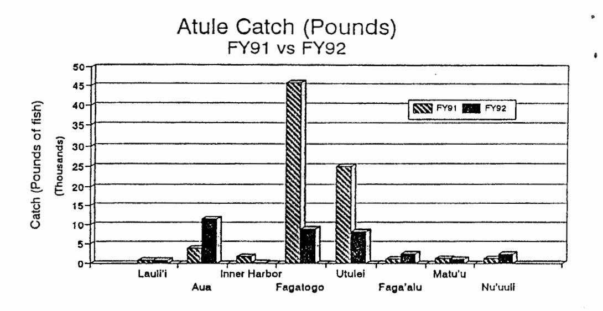

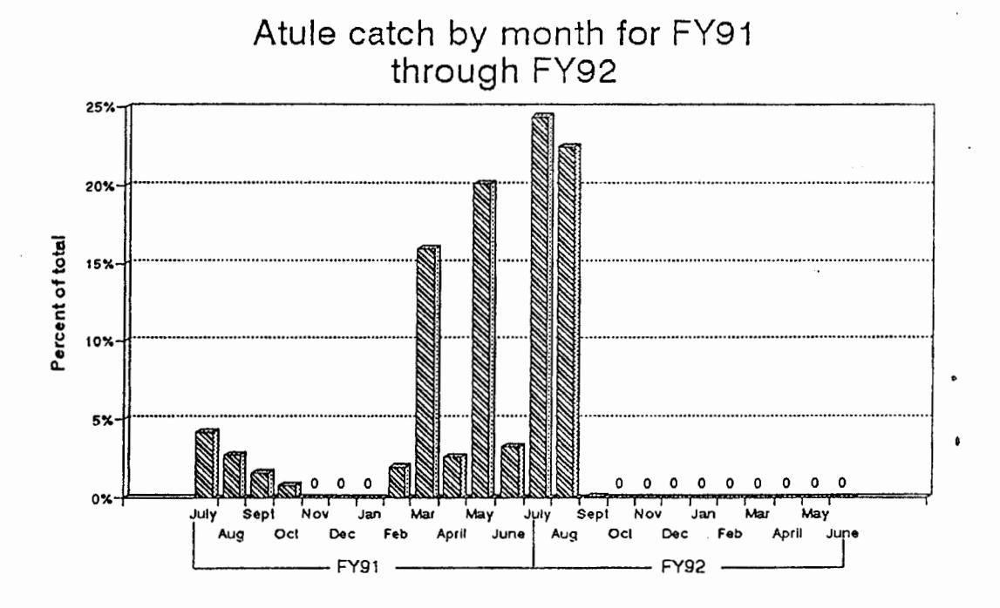

Figure 2. Atule catch by village (top) and by month (bottom).

All other species. Although the migratory atule are the dominant in terms of landings and effort in this fishery, of primary interest to fisheries managers is the abundance of the reefresident species, as they are presumed to be better indicators of the health of the reef ecosystem.

Unfortunately, it is difficult to factor the atule effort out of the database, as participation counts do not provide direct data about the species a fisherman is targeting (if indeed the fisherman is targeting a specific fish at all), nor does the interviewer ask the fisherman what they are fishing for.

However, as the atule are caught primarily in the Fagatogo and Utulei areas, and caught primarily by hook and line methods, it is possible to look at the CPUE in strata where atule did not dominate the effort and catch statistics. For this analysis, all strata shown in Table 2 where atule contributed 50% or more to the catch were deleted. All strata for the Nu'uuli area and the hand-line method were also deleted, as these strata were not recorded in the 1979 study, and so are not useful for this comparison. What is left for comparison are the gleaning and spear diving strata, and three strata for bamboo pole and throw nets (Table 6, Figure 3).

A large drop in the "non-atule" effort is apparent, dropping about 51-78% between 1979 and the present (Table 6). According to standard fisheries models, for a fishery that experiences a significant fishing mortality, a decline in effort should be accompanied by an increase in CPUE, as fish stocks recover from the fishing pressure. However, the 1991 non-atule CPUE is virtually identical to the 1979 CPUE, suggesting that the CPUE is independent of fishing pressures at the levels of effort observed for this fishery. From FY91 to FY92 the non-atule effort increased approximately 30% and at the same time the CPUE increased about 67%, again suggesting a lack of correlation between effort and CPUE at these levels of effort.

Whether the observed fluctuations in CPUE are a function of fishing pressure, or are a function of other factors is, unfortunately, almost impossible to say from this study. It is reasonably assumed that the abundance and composition of the reef resident species are a function of the health of the coral reefs that provide the basis for this ecosystem. As previously mentioned, the reefs on Tutuila have been assaulted by a crown-of-thorn invasions just prior to the 1979 study, and by hurricanes during the time of the present study. At this time, the only fisheries data we have is from the reefs during and after times they were subjected to significant natural perturbations. Interpretation of the present data is difficult without a longer time series to look at, which for experimental purposes should include times of a more stable reef environment, and large fluctuations in fishing effort.

<u>Faisua, Giant Clams, (Tridacniadae)</u>, were completely absent from surveyed catches in FY91 and FY92. Fishing regulations prohibit the take of clams less than 6" across the longest part of the

shell, however allow an unlimited take of larger clams.

In 1979, 7935 pounds (in the shells) of bivalves of all species were harvested, mostly by gleaners, (Wass 1980). Wass does not provide a breakdown by species for clams, however it is probable that the majority of the 1979 clam catch was tridacna. In FY91, only and estimated 243 pounds of clams were harvested, non of which were tridacna (Table 4). There were no recorded catches of clams of any species in FY92.

Wild tridacna clams are scarce within the study area and throughout the island, though anecdotal reports indicate that they were once much more abundant than they are today. Overfishing and hurricane damage has probably reduced their numbers.

<u>Vla, Papata (Lobsters)</u>. Catches of spiny lobster (Panulirus pencillatus) and slipper lobster (Parribacus caledonicus) are down considerably from their 1979 levels. Wass (1980) estimated that 1580 pounds of all lobster species combined were harvested in 1979. Only 378 and 301 pounds of lobster were taken in FY91 and FY92, respectively (Table 4). Lobster are taken almost entirely by night time spear divers and gleaners.

Table 6. Comparison of the "non-atule" catch (pounds of fish), effort (person hours), and CPUE (pounds per person hour). All strata shown on Table 2 which were either not sampled by Wass (1980), or who's catches were more than 50% atule in either FY91 or FY92 were deleted to produce this table. The 1979 data from Wass was not presented in sufficient detail to determine whether or not each strata met the > 50% test used for the FY91 and FY92 data.

| Method   | 1      | Bamb        | oo Pol | е    | Glean | ing  |       | Spear | Diving | ]     | Throw | Net  |      | Total |              |       |
|----------|--------|-------------|--------|------|-------|------|-------|-------|--------|-------|-------|------|------|-------|--------------|-------|
| Area     |        | 1979        | FY91   | FY92 | 1979  | FY91 | FY92  | 1979  | FY91   | FY92  | 1979  | FY91 | FY92 | 1979  | FY91         | FY92  |
| Lauli'l  | Effort | 571         | 33     | 202  | 3661  | 807  | 1488  | 1216  | 466    | 715   | 555   | 85   | 146  | 6003  | 1391         | 2551  |
|          | Catch  | 565         | 10     | 261  | 9583  | 1369 | 6652  | 3755  | 2005   | 1254  | 1965  | 152  | 470  | 15869 | 3535         | 8636  |
|          | CPUE   | 1.0         |        | 1.3  | 2.8   | 1.7  | 4.5   | 3.1   | 4.3    | 1,8   | 3.5   | 1.8  | 3,2  | 2.6   | 2.5          | 3.4   |
| Aua      | Effort |             |        |      | 9687  | 890  | 1883  | 3493  | 1209   | 1247  |       |      |      | 13180 | 2099         | 3130  |
|          | Catch  |             |        |      | 19622 | 741  | 7068  | 7348  | 3368   | 5122  |       |      |      | 26968 | 4109         | 12190 |
|          | CPUE   |             |        |      | 2.0   | 0.8  | 3.8   | 2.1   | 2.8    | 4.1   |       |      |      | 2.0   | 2.0          | 3.9   |
| Inner    | Effort |             |        |      | 45    | 21   | 13    | 57    | 21     | 119   | 667   | 279  | 97   | 769   | 321          | 229   |
| Harbor   | Catch  |             |        |      | 108   | 38   | 79    | 147   | 42     | 180   | 2803  | 1106 | 661  | 3058  | 1186         | 920   |
|          | CPUE   |             |        |      |       |      |       |       |        | 1.5   | 4.2   | 4.0  | 6.8  | 4.0   | 3.7          | 4.0   |
| Fagatogo | Effort |             |        |      | 3     | 42   | 0     | 153   | 0      | 0     | Ī .   |      |      | 156   | 42           | 0     |
|          | Catch  |             |        |      | 11    | 76   | 0     | 785   | 0      | 0     | 1     |      |      | 796   | 76           | o     |
|          | CPUE   |             |        |      |       |      |       | 5.1   |        |       | 1     |      |      | 5.1   | 1.8          |       |
| Utulel   | Effort |             |        |      | 1604  | 257  | 129   | 2609  | 1164   | 1166  |       |      |      | 4213  | 1421         | 1295  |
|          | Catch  |             |        |      | 4695  | 449  | 489   | 6303  | 620    | 1839  | ĺ     |      |      | 10998 | 1069         | 2328  |
|          | CPUE   |             |        |      | 2.9   | 1.7  | 3.8   | 2.4   | 0.5    | 1.6   |       |      |      | 2.6   | 0.8          | 1.8   |
| Faga'alu | Effort |             |        |      | 3381  | 1513 | 1711  | 1951  | 1584   | 1990  |       |      |      | 5332  | 3097         | 3701  |
| -        | Catch  |             |        |      | 7698  | 2509 | 8772  | 4492  | 6104   | 7667  |       |      |      | 12190 | 8613         | 16439 |
|          | CPUE   |             |        |      | 2.3   | 1.7  | 5.1   | 2.3   | 3.9    | 3.9   |       |      |      | 2.3   | <b>6</b> 2.8 | 4.4   |
| Matu'u   | Effort |             |        |      | 8825  | 596  | 653   | 3054  | 361    | 528   |       |      |      | 11879 | 957          | 1181  |
|          | Catch  |             |        |      | 18005 | 976  | 2875  | 5485  | 800    | 2121  |       |      |      | 23489 | 1777         | 4995  |
|          | CPUE   |             |        |      | 2.0   | 1,6  | 4.4   | 1.8   | 2.2    | 4.0   |       |      | ٠,   | 2.0   | 1.9          | 4.2   |
| Total    | Effort | 571         | 33     | 202  | 27206 | 4127 | 5877  | 12533 | 4805   | 5766  | 1222  | 364  | 243  | 41532 | 9329         | 12088 |
|          | Catch  | <b>56</b> 5 | 10     | 261  | 59721 | 6159 | 25934 | 28314 | 12939  | 18184 | 4767  | 1258 | 1131 | 93368 | 20365        | 45509 |
|          | CPUE   | 1.0         | 0.3    | 1.3  | 2.2   | 1.5  | 4.4   | 2.3   | 2.7    | 3.2   | 3.9   | 3.5  | 4.7  | 2.2   | 2.2          | 3.8   |

# Non-atule Catch (Pounds) FY91 vs FY92

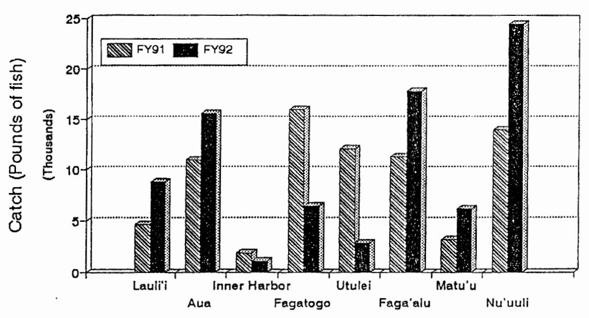

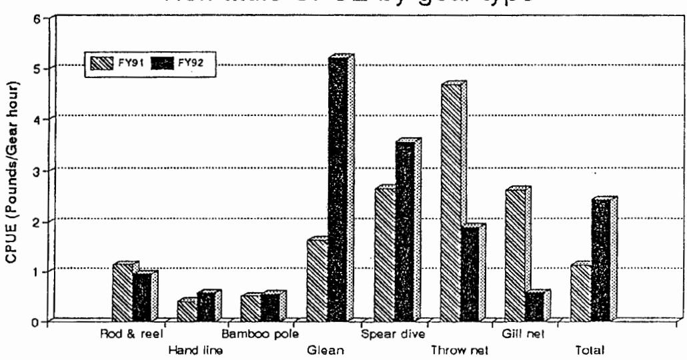

Figure 3. Catch by area (top) and CPUE (bottom) by method of all fish and shellfish that were not atule. For comparison purposes, only the spear diving and gleaning methods were used to compare the non-atule CPUE, due to the problems of separating the "atule" effort from the "non-atule" effort.

Fe'e, Octopus. Octopus are a favored species, taken almost exclusively by gleaners and spear divers, and were the second most abundant species taken by fishermen for FY91 and FY92 combined. Species identification is not known.

Catches of octopus tripled from FY91 to FY92, particularly for fishermen gleaning on the reef tops (Table 7, Figure 4). Gleaners caught nearly 14 times more octopus in FY92 than the did in FY91, even though there was only a modest 24% increase in gleaning effort.

The octopus CPUE for gleaners increased by a factor of 12 between FY91 and FY92, from 0.20 pounds/hour to 2.47 pounds/ gear hour. The CPUE for spear divers however decreased 27% over the same time period, dropping from 0.95 pounds octopus/hour to 0.60 pounds/gear hour (Table 7, Figure 4). Reasons for this discrepancy between gleaning and spear diving CPUE are unclear.

During much of FY92 a small group of Tongan fishermen were observed gleaning for octopus on a sometimes daily basis. Depending on tide, current, and surf conditions, they would typically begin a fishing trip in Usa'aiga (Matu'u area) and end in Faga'alu where they would sell their catch on the roadside.

Octopus fishermen usually walk on the reef top during very low tides, or swim at other times, poking metal rods into crevices to flush out their prey.

Table 7. Octopus catches (top) and CPUE (bottom) for FY91 and FY92.

|                  | Fe'e - Oct   | opus         |                                         |               |               |              |      |               |
|------------------|--------------|--------------|-----------------------------------------|---------------|---------------|--------------|------|---------------|
|                  | Octopoda     | •            |                                         |               |               |              |      |               |
| EV04             | •            | •            |                                         |               |               |              |      |               |
| FY91             | Catch (Po    |              |                                         |               |               |              |      |               |
|                  | Rod&         | Hand         | Bamboo                                  |               | Spear         | Throw.       | Gill |               |
| Area Lauli'i  | Reel         | Line         | Pole                                    | Glean         | Dive          | Net          | Net  | Total         |
| Aua              |              |              |                                         | 124 33     | 14 936     |              |      | 138 969    |
| Inner Harbor     | Í            |              |                                         | 33            | 930           |              |      | 26            |
| Fagatogo         | i            |              |                                         |               |               |              |      | 7             |
| Utulei           | J            |              |                                         | 42            | 6             |              |      | 48            |
| Faga'alu         | İ            |              |                                         | 749           | 2710          |              |      | 3460          |
| Matu'u           | 1            |              |                                         | 79            | 290           |              |      | 369           |
| Nu'uuli          |              |              |                                         | 294           | 2326          |              |      | 2620          |
| Total            |              |              |                                         | 1333          | 6304          |              |      | 7637          |
|                  |              |              |                                         |               |               |              |      |               |
| FY92             | Rod&         | Hand         | Bamboo                                  |               | Spear         | Throw        | Gill |               |
| Area             | Reel         | Line         | Pole                                    | Glean         | Dive          | Net          | Net  | Total         |
| Lauli'i          |              |              |                                         | 3609          | 444           |              |      | 4053          |
| Aua              | 1            |              |                                         | 3851          | 754           |              |      | 4605          |
| Inner Harbor     | 1            |              |                                         |               |               |              |      | 108           |
| Fagatogo         | Ì            |              |                                         |               |               |              |      |               |
| Utulei           | 1            |              |                                         | 267           | 808           |              |      | 1073          |
| Faga'alu         |              |              |                                         | 6595          | 1106          |              |      | 7701          |
| Matu'u           | ļ            |              |                                         | 1525          | 304           |              |      | 1829          |
| Nu'uuli Total |              |              | 401                                     | 2659 18550 | 1222 4700  |              |      | 3882 23250 |
| (Ola)            | 1            |              |                                         | 10000         | 4700          |              |      | 23250         |
| FY91             | CPUE (Po     | undo/Co      | ar Haur                                 |               |               |              |      |               |
| 191              |              | Hand         | Bamboo                                  |               |               |              | Gill |               |
| Area             | Rod& Reel | Hand Line | Bamboo Pole                          | Glean         | Spear Dive | Throw Net | Net  | Mean          |
| Lauli'i          | nee          | Cite         | rote                                    | 0.16          | 0.03          | IVEL         | ivet | 0.08          |
| Aua              |              |              |                                         | 0.04          | 0.78          |              |      | 0.17          |
| Inner Harbor     |              |              |                                         | 0.04          | 0.10          |              |      | 0.01          |
| Fagatogo         |              |              |                                         |               |               |              |      | 0.00          |
| Utulei           | 1            |              |                                         | 0.16          | 0.01          |              |      | 0.00          |
| Faga'alu         |              |              |                                         | 0.50          | 1.71          |              |      | 0.81          |
| Matu'u           |              |              |                                         | 0.13          | 0.80          |              |      | 0.19          |
| Nu'uuli          |              |              |                                         | 0.12          | 1.26          |              |      | 0.48          |
| Total            |              | <del></del>  |                                         | 0.20          | 0.95          |              |      | 0.12          |
|                  |              |              |                                         |               |               |              |      |               |
| FY92             | Rod&         | Hand         | Bamboo                                  |               | Spear         | Throw        | Gill |               |
| Area             | Reel         | Line         | Pole                                    | Glean         | Dive          | Net          | Net  | Mean          |
| Lauli'i          |              |              | *************************************** | 2.67          | 0.62          |              |      | 1.41          |
| Aua              |              |              |                                         | 2.73          | 0.62          |              |      | 0.71          |
| Inner Harbor     |              |              |                                         |               |               |              |      | 0.33          |
| Fagatogo         |              |              |                                         |               |               |              |      |               |
|                  | 1            |              |                                         |               |               |              |      |               |
| Utulei           |              |              |                                         | 2.75          | 0.69          |              |      | 0.28          |
| Faga'alu         |              |              |                                         | 3.88          | 0.58          |              |      | 1,61          |
|                  |              | . •          |                                         |               |               |              |      |               |

# Estimated Octopus Catch (Pounds) FY91 vs FY92

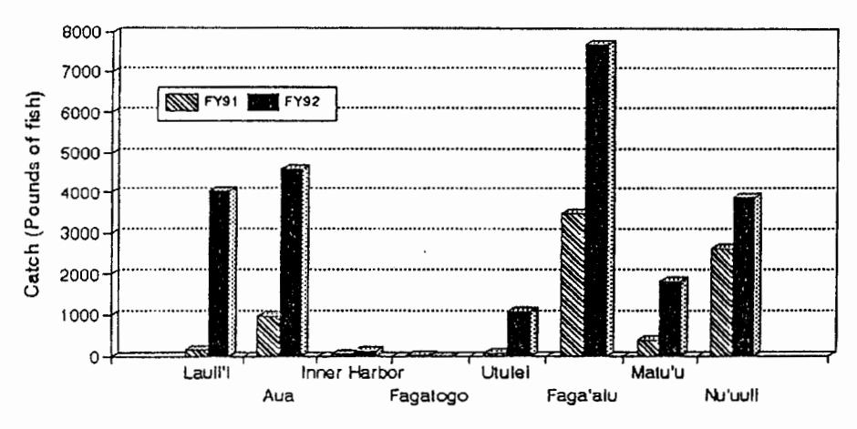

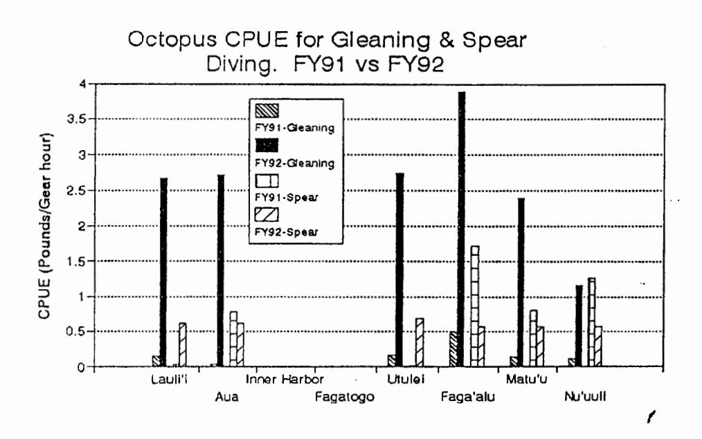

Figure 4. Octopus catch by village, (Top), and Octopus catch per unit effort (Bottom).

Jacks, lupo, lupota, malauli, ulua, sapo'anae (Carangidae). There are 13 genera and 25 species of carangids present in the waters of American Samoa, most of which are not known by specific Samoan names, but rather distinguished by size classes (Wass 1984).

Jacks are taken by all fishing methods in all of the study areas, with the three hook and line methods accounting for the majority of the catch (Table 8). Certain larger jack species are known to follow the atule, and fishermen will sometimes target these fish by baiting their hooks with live atule.

The total pounds landed dropped 72% from FY91 to FY92, however the number of fish increased 23% (Table 4). The jack CPUE for rod and reel fishermen dropped considerably from 0.7 pounds/hour to 0.3 pounds/hour, while the spear diving CPUE for jacks increased from 0.04 pounds/hour to 0.3 pounds/hour (Table 8, Figure 5).

Due to the large number of different species within this category, little can be said about what these changes mean. The average weight of jacks was 0.7 pounds/fish in FY91, dropping to 0.2 pounds/fish pounds in FY92. The likely explanation for this observation is that the species composition in the catch has changed, with fewer larger fish caught in FY92 than in FY91.

Table 8. Catches of jacks (Top), and CPUE (Bottom) for FY91 and FY92.

Lupo, lupata - Jacks
Carangidae sp.
Catch (Pounds of fish

| FY91         | Catch (Po | unds of | fish)  |       |       |       |      |       |
|--------------|-----------|---------|--------|-------|-------|-------|------|-------|
|              | Rod&      | Hand    | Bamboo |       | Spear | Throw | Gill |       |
| Area         | Reel      | Line    | Pole   | Glean | Dive  | Net   | Net  | Total |
| Lauli'i      | 337       | 29      | 3      |       | 353   | 6     |      | 728   |
| Aua          | 398       | 47      | 2      |       | 157   | 176   | 1    | 781   |
| Inner Harbor | 214       | 20      | 77     |       | 9     | 29    | 1    | 350   |
| Fagatogo     | 1907      | 865     | 5      |       | 19    | 2     | <1   | 2797  |
| Utułei       | 8528      | 65      | 4      |       | 124   | 1     |      | 8722  |
| Faga'alu     | 953       | 19      |        |       | 142   |       |      | 1115  |
| Matu u       | 409       | 8       | 10     |       | 215   | 8     |      | 650   |
| Nu'uuli      | 1922      | 18      | 8      |       | 1348  | 99    | 2    | 3397  |
| Tolal        | 14669     | 1070    | 109    |       | 2367  | 320   | 4    | 18539 |

| FY92         | Rod& | Hand | Bamboo |       | Spear | Throw | Gill |       |
|--------------|------|------|--------|-------|-------|-------|------|-------|
| Area         | Reel | Line | Pole   | Glean | Dive  | Net   | Net  | Total |
| Lauti        | 142  | 26   |        |       |       | 4     |      | 172   |
| Aua          | 640  | 24   | 58     |       | 569   |       |      | 1291  |
| inner Harbor | 77   |      |        |       |       |       |      | 77    |
| Fagalogo     | 536  | 345  | 58     |       |       |       |      | 939   |
| Utulei       |      | 36   |        |       |       | 14    |      | 50    |
| Faga'alu     | 249  | 10   |        |       | 812   | 6     |      | 1077  |
| Matu'u       | 152  | 1    |        |       | 226   | 2     |      | 380   |
| Nu'uuli      | 374  | 17   |        |       | 857   | 4     |      | 1251  |
| Total        | 2170 | 458  | 116    |       | 2463  | 29    |      | 5236  |

| FY91         | CPUE (Po | unds/Ge | ear Hour) |       |       |       |      |      |
|--------------|----------|---------|-----------|-------|-------|-------|------|------|
|              | Rod&     | Hand    | Bamboo    |       | Spear | Throw | Gilt |      |
| Area         | Reel     | Line    | Pole      | Glean | Dive  | Net   | Net  | Mean |
| Lauli'i      | 0.95     | 0.21    |           |       | 0.79  |       |      | 0.40 |
| Aua          | 0.25     | 0.14    | 0.00      |       | 0.13  | 0.36  | 0.00 | 0.14 |
| Inner Harbor | 0.51     | 0.02    | 0.35      |       |       | 0.16  | 0.02 | 0.20 |
| Fagatogo     | 0.19     | 0.04    | 0.01      |       |       |       |      | 0.08 |
| Utulei       | 1.40     | 0.04    | 0.03      |       | 0.11  |       |      | 0.86 |
| Faga'alu     | 1.97     | 0.17    |           |       | 0.09  |       |      | 0.26 |
| Matu'u       | 0.71     |         | 0.08      |       | 0.60  | 0.04  |      | 0.34 |
| Nu'uuli      | 2.26     |         |           |       | 0.73  | 0.77  | 0.02 | 0.62 |
| otal         | 0.72     | 0.04    | 0.04      |       | 0.36  | 0.22  | 0.00 | 0.29 |

| FY92         | Rod& | Hand | Bamboo |       | Spear | Throw | Gill                                       |      |
|--------------|------|------|--------|-------|-------|-------|--------------------------------------------|------|
| Area         | Reel | Line | Pole   | Glean | Dive  | Net   | Net                                        | Mean |
| Lauli'i      | 0.44 | 0.15 |        |       |       | 0.03  | 1417/11/11/11/11/11/11/11/11/11/11/11/11/1 | 0.06 |
| Aua          | 0.47 | 0.13 | 0.13   |       | 0.47  |       |                                            | 0.20 |
| Inner Harbor | 0.55 |      |        | •     |       |       |                                            | 0.23 |
| Fagatogo     | 0.19 | 0.07 | 0.27   |       |       |       |                                            | 0.11 |
| Utulei       |      | 0.15 |        |       |       | 0.11  |                                            | 0.01 |
| Faga'alu     | 0.48 | 0.15 |        |       | 0.42  | 0.03  |                                            | 0.23 |
| Matu'u       | 0.25 |      |        |       | 0.43  |       |                                            | 0.20 |
| Nu'uuli      | 0.50 | 0.15 |        |       | 0.40  | 0.03  |                                            | 0.22 |
| Total        | 0.26 | 0.08 | 0.09   |       | 0.32  | 0.02  |                                            | 0.15 |

# Jacks (Lupo, Ulua), Catch (Pounds of Fish), FY91 vs FY92

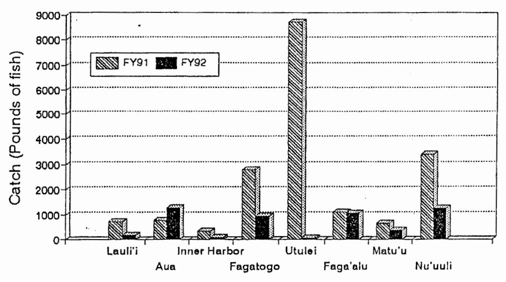

# Jack CPUE for Rod & Reel and Spear Diving. FY91 vs FY92

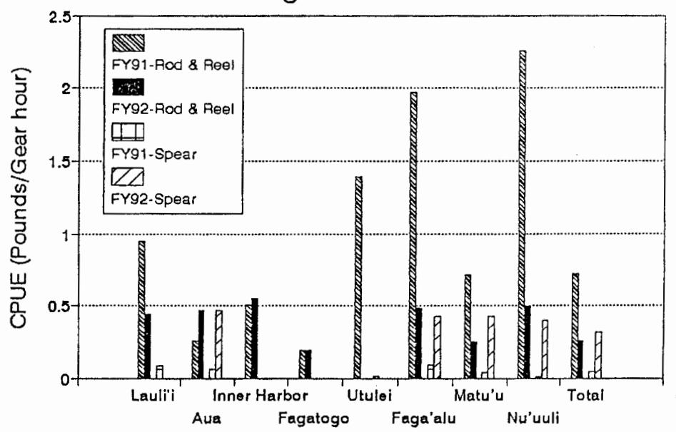

Figure 5. Jack (Carangidae) catch by area (top), and Jack CPUÉ for Rod and Reel and Spear fishing methods (bottom).

Pone and Palagi (Small and large Brown Surgeonfish). Samoans commonly refer to any small brown surgeonfish as "pone", and the larger surgeonfish as palagi (Wass 1984). However these terms are also commonly applied to many dull-colored or less abundant surgeonfish or unicornfish for which a specific name is not known. This choice of terminology makes it difficult to provide accurate statistics on many of the acanthurds by species.

The Pone and Palagi categories do not include some of the distinctively colored, more common or more popular such as the alogo (bluebanded surgeonfish), manini (convict tang), kolama (achilles tang), mamo (sergeant major), and pe'ape'a (moorish idol).

In the harbor area, most of the "palagi" caught were of one species, the yellowfin surgeonfish, Acanthurus xanthopterus. Catches of palagi, dropped dramatically between FY91 and FY92 (Table 9, Figure 6). This is an important reef species, targeted both by hook and line fishermen and spear divers, and often sold in the market place and fish stores around the island. Reasons for the drop in catches are unknown. The drop may reflect a decline in abundance of this species, although it could simply reflect a lack of targeting on this species, since palagi were usually caught in the harbor area where the sale of fish has been banned due to pollution, (see also "Recent impacts to coral reefs" on page 3).

Hook and line fishermen often target palagi by using a clump of rice on a hook, then snagging the fish as they come to eat the bait. Although this fishing method differs from other hook and line methods, this choice of baits used by fishermen is not recorded in this survey, making extraction of this fishing method from the database difficult.

Anecdotal evidence suggest that spear diving can deplete the Palagi from an area. While collecting fish samples for heavy metal analysis, two department divers speared 14 A. xanthopterus off the reef in Utulei. When this dive was repeated a week later, only one palagi was seen.

Catches of pone have increased in all areas, especially Nu'uuli, for gleaners and spear fishermen (Figure 6).

Table 9. Catches of pone (top) and palagi (bottom) for FY91 and FY92. The Samoan terms "pone" and "palagi" refer to any of a number of dark colored non-descript surgeonfish species. "Pone" refers to smaller fish and "palagi" refers to larger fish.

Pone - Small brown surgeonfish.

Acanthurus sp.

| FY91                                                             | Catch (Po | unds of | fish)  |                           |                               |       |       |                                  |
|------------------------------------------------------------------|-----------|---------|--------|---------------------------|-------------------------------|-------|-------|----------------------------------|
|                                                                  | Rod&      | Hand    | Bamboo |                           | Spear                         | Throw | Gill  |                                  |
| Area                                                             | Reel      | Line    | Pole   | Glean                     | Dive                          | Net   | Net   | Total                            |
| Lauli'i                                                          |           |         |        | 36                        | 223                           |       | . 1   | 260                              |
| Aua                                                              |           |         |        | 10                        | 254                           |       | 2     | 265                              |
| Inner Harbor                                                     | 1         |         |        | 1                         | 4                             |       | 1     | 6                                |
| Fagatogo                                                         | 1         |         |        | 2                         |                               |       |       | 2                                |
| Utulei                                                           | 1         |         |        | 12                        | 133                           |       |       | 146                              |
| Faga'alu                                                         | 1         |         |        |                           | 257                           | 11    |       | 269                              |
| Matu'u                                                           | 1         |         |        | 23                        | 48                            |       | 1     | 72                               |
| Nu'uuli                                                          | <u> </u>  |         |        | 192                       | 251                           |       | 3     | 447                              |
| Total                                                            | 1         |         |        | 276                       | 1171                          | 12    | 8     | 1466                             |
|                                                                  |           |         |        |                           |                               |       |       |                                  |
| FY92                                                             | Rod&      | Hand    | Bamboo |                           | Spear                         | Throw | Gill  |                                  |
| Area                                                             | 1 -       |         |        |                           |                               |       |       |                                  |
| nreu                                                             | Reel      | Line    | Pole   | Glean                     | Dive                          | Net   | Net   | Total                            |
| Lauli'i                                                          | Reel      | Line    | Pole   | Glean 1139             | Dive 87                    | Net   | Net   | Total 1226                    |
| Lauli'i Aua                                                   | Reel      | Line    | Pole   | Control of the Control    |                               | Net   | Net   |                                  |
| Lauli'i                                                          | Reel      | Line    | Pole   | 1139 1215              | 87                            | Net   | Net   | 1226                             |
| Lauli'i Aua                                                   | Reel      | Line    | Pole   | 1139                      | 87 399                     | Net   | Net   | 1226 1614                     |
| Lauli'i Aua Inner Harbor                                   | Reel      | Line    | Pole   | 1139 1215              | 87 399                     | Net   | Net   | 1226 1614                     |
| Lauli'i Aua Inner Harbor Fagatogo                       | Reef      | Line    | Pale   | 1139 1215 ,14       | 87 399 13               | Net   | Net 6 | 1226 1614 27               |
| Lauli'i Aua Inner Harbor Fagatogo Utulei             | Reel      | Line    | Pole   | 1139 1215 ,14       | 87 399 13               | Net   |       | 1226 1614 27 359        |
| Lauli'i Aua Inner Harbor Fagatogo Utulei Faga'alu | Reel      | Line    | Pole   | 1139 1215 .14 84 | 87 399 13 274 627 | Net   | 6     | 1226 1614 27 359 633 |

Palagi - large Yellowfin surgeonfish Acanthurus xanthopterus (adults only).

| FY91                                                   | Catch (Po    | unds of                           | fish)          |       |               |              |                              |                                  |
|--------------------------------------------------------|--------------|-----------------------------------|----------------|-------|---------------|--------------|------------------------------|----------------------------------|
|                                                        | Rod&         | Hand                              | Bamboo         |       | Spear         | Throw        | Gill                         |                                  |
| Area                                                   | Reel         | Line                              | Pole           | Glean | Dive          | Net          | Net                          | Total                            |
| Lauli'i                                                | 174          | 157                               |                |       | 8             |              |                              | 340                              |
| Aua                                                    | 104          | 231                               |                |       | 16            |              |                              | 351                              |
| Inner Harbor                                           | 50           |                                   |                |       |               |              |                              | 50                               |
| Fagatogo                                               | 2858         | 1343                              |                |       |               |              |                              | 4201                             |
| Utuleí                                                 |              |                                   |                |       | 4             |              |                              | 4                                |
| Faga'aiu                                               | 22           | 100                               |                |       | 32            |              |                              | 154                              |
| Matu'u                                                 | 163          | 41                                |                |       | 3             |              |                              | 206                              |
| Nu'uuli                                                | 32           | 95                                |                |       |               |              |                              | 127                              |
| Total                                                  | 3403         | 1967                              |                |       | 64            |              |                              | 5433                             |
|                                                        |              |                                   |                |       |               |              |                              |                                  |
|                                                        |              |                                   |                |       |               |              |                              |                                  |
| FY92                                                   | Rod&         | Hand                              | Bamboo         |       | Spear         | Throw        | Gill                         |                                  |
| Area                                                   | Rod& Reel | Hand Une                       | Bamboo Pole | Glean | Spear Dive | Throw Net | Gill Net .                | Total                            |
|                                                        |              |                                   |                | Glean |               |              | Net .                        | 40                               |
| Area                                                   |              | Une                               |                | Glean |               |              |                              |                                  |
| Area Lauli'i                                        |              | Une 39                         |                | Glean |               |              | Net .                        | 40 259                        |
| Area Lauli'i Aua                                 |              | Une 39                         |                | Glean |               |              | Net .                        | 40 259 83                  |
| Area Lauli'i Aua Inner Harbor                 |              | Une 39 33                   |                | Glean |               |              | Net . 1 226            | 40 259 83 54            |
| Area Lauli'i Aua Inner Harbor Fagalogo     |              | Une 39 33 63             |                | Glean |               |              | Net . 1 226            | 40 259 83 54 35      |
| Area Lauli'i Aua Inner Harbor Fagatogo Utulei          |              | Une 39 33 63 54       |                | Glean |               |              | Net . 1 226 19 6 | 40 259 83 54 35 8 |
| Area Lauli'i Aua Inner Harbor Fagatogo Utulei Faga'alu |              | Une 39 33 83 54 15 |                | Glean |               |              | Net . 1 226            | 40 259 83 54 35      |

# Pone (Small Brown Surgeonfish) Catch in FY91 vs FY92

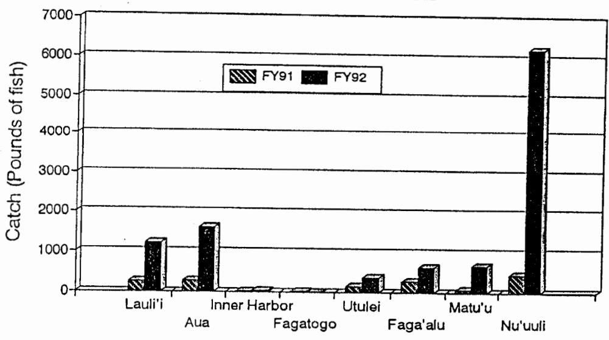

# Palagi (Large Yellowfin Surgeonfish) Catch in FY91 vs FY92

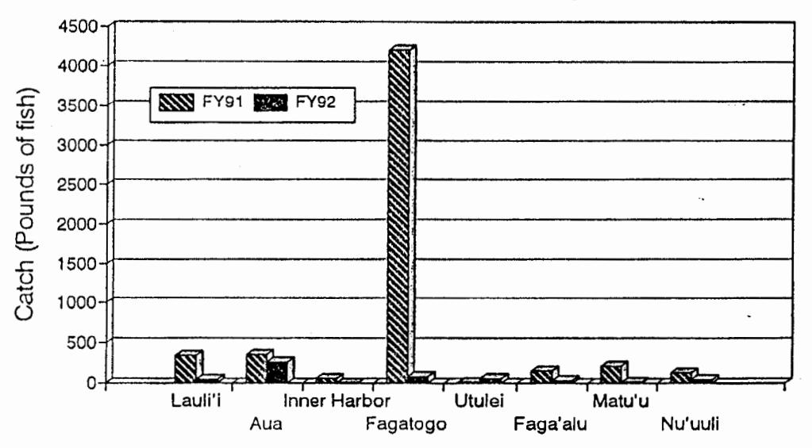

Figure 6. Catch by village area for pone surgeonfish (top), and palagi (bottom).

<u>Sea Urchins, Tuitui, Vaga, Ofaofa (Ecinometra)</u>. Three species of sea urchins where taken by inshore fishermen: tuitui, a white short spined urchin, vaga, a long-spined black urchin, and ofaofa; the heart urchin. Urchins are primarily taken by gleaners, and to a lesser extent by spear divers.

The tuitui catch accounted for 4.3% of the non-atule catch in FY91 and 10.5% in FY92 (Table 4), an increase of 256% in their total landings, (Figure 7, Table 10). Whereas the catch of tuitui may be related to its abundance on the reef tops, catches of vaga, the long-spined black sea urchin, are clearly not. Vaga are commonly in abundance on reefs throughout the island, but yet they were absent from catches in FY92.

# Sea Urchin Catch (Pounds) FY91 vs FY92

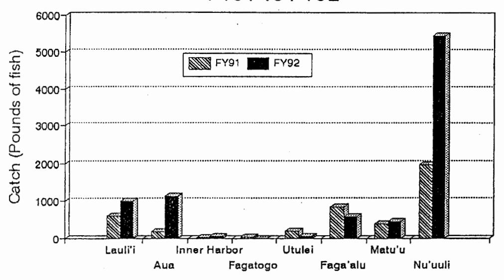

Tultui, vaga, ofaofa - Sea Urchins Ecinometra

| FY91         | Catch (Po | unds of | fish)       |       |       |          |      |       |
|--------------|-----------|---------|-------------|-------|-------|----------|------|-------|
|              | Rod&      | Hand    | Bamboo      |       | Spear | Throw    | Gill |       |
| Area         | Reel      | Line    | Pole        | Glean | Dive  | Net      | Net  | Total |
| Lauli'i      |           |         |             | 597   |       |          |      | 597   |
| Aua          | 1         |         |             | 186   |       |          |      | 186   |
| Inner Harbor |           |         |             | 18    |       |          |      | 18.   |
| Fagatogo     |           |         |             | 35    |       |          |      | 35    |
| Utulei       |           |         |             | 201   |       |          |      | 201   |
| Faga'alu     | ļ         |         |             | 837   |       |          |      | 837   |
| Matu'u       | 1         |         |             | 392   | *     |          |      | 392   |
| Nu'uuli      |           |         |             | 1963  |       |          |      | 1963  |
| Total        |           |         |             | 4227  |       | <u> </u> |      | 4227  |
| FY92         | Rod&      | Hand    | Bamboo      |       | Spear | Throw    | Gill |       |
| Area         | Reel      | Line    | Pole        | Glean | Dive  | Net      | Net  | Total |
| Lauli'i      |           |         |             | 683   | 322   |          |      | 1006  |
| Aua          | 1         |         |             | 729   | 393   |          |      | 1122  |
| Inner Harbor |           |         |             | 8     | 46    |          |      | 55    |
| Fagatogo     | 1         |         |             |       |       |          |      |       |
| Utulei       | 1         |         |             | 50    |       |          |      | 50    |
| Faga'alu     | 1         |         |             |       | 582   |          |      | 582   |
| Matu'u       |           |         |             | 289   | 159   |          |      | 448   |
| Nu'uuli      | ļ         |         |             | 3366  | 2085  |          |      | 5451  |
| Total        |           |         | <del></del> | 5126  | 3588  |          |      | 8714  |

Figure 7 and Table 10. Catches of all sea urchins by village area for FY91 and FY92.

Mullet, anae, fuafua, poi, moi (Muqilidae). Seven species of mullet are reported in Samoan waters, of these Liza melinoptera (giantscale mullet), Valamugil seheli (bluespot mullet), and V. engili (Engel's mullet) predominate in inshore catches. The general name for mullet is "anae" which is usually applied to fishes measuring 20-40cm; other names are "fuafua", usually 12-15cm, and "poi" (5-8cm), and "moi" (< 5cm). Mullet are a popular food fish in Samoa and the third most abundant fish caught during the FY91-FY92 study period, and represented 5% of the non-atule catch (Table 4).

Catches and catch rates for mullet have been seen to drop considerably from FY91 to FY92 (Table 11, and Figure 8). Mullets are most often caught by throw net and gill net fishermen. Fishing pressure by gill net and throw net methods has also declined over the study period, with the exception of gill net fishing in the Aua area where a four fold increase was observed (Table 3).

Mullet were of prime interest to DMWR staff, as samples of these fish from the inner harbor area were found to have the highest concentrations of lead in their tissues of all species examined (AECOS 1991).

DMWR staff repeatedly sampled the inner harbor area from July through October of 1992, in an attempt to catch fish (particularly mullet) for further heavy metal analysis. Juvenile mullet ( < 15cm were found in abundance, however only one large mullet (37cm) was captured in spite of repeated efforts. Fishermen in the harbor interviewed during this time period also reported that they had not seen or caught any large mullet.

Table 11. Catch of mullet (top) and CPUE (bottom) for FY91 and FY92.

Anae, fua'fua - Mullet.

|              | Anae, iua | rua - M | unet.     |       |             |       |      |       |
|--------------|-----------|---------|-----------|-------|-------------|-------|------|-------|
|              | Mugilidae | sp.     |           |       |             |       |      |       |
| FY91         | Catch (Po | unds of | fish)     |       |             |       |      |       |
|              | Rod&      | Hand    | Bamboo    |       | Spear       | Throw | GIII |       |
| Area         | Reel      | Line    | Pole      | Glean | Dive        | Net   | Net  | Total |
| Lauli'i      |           |         | 2         |       |             | 82    | 98   | 182   |
| Aua          | 1         | 3       | 43        |       |             | 1997  | 1201 | 3243  |
| Inner Harbor |           |         | 4         |       |             | 794   | 177  | 976   |
| Fagatogo     |           | 548     | 506       |       |             | 72    | 9    | 1135  |
| Utulei       | ŀ         |         | 22        |       |             | 187   |      | 208   |
| Faga'aiu     |           | 1       |           |       |             | 242   | 62   | 305   |
| Matu'u       |           |         | 17        |       |             | 71    | 89   | 177   |
| Nu'uuli      |           |         |           |       |             | 341   | 514  | 655   |
| Total        |           | 552     | 594       |       |             | 3785  | 2150 | 7081  |
| FY92         | Rod&      | Hand    | Bamboo    |       | Spear       | Throw | Gill |       |
| Area         | Reel      | Line    | Pole      | Glean | Dive        | Net   | Net  | Total |
| Lauli'i      |           |         |           |       | <del></del> | 138   |      | 138   |
| Aua          |           |         |           |       |             | 493   |      | 493   |
| Inner Harbor |           |         |           |       |             | 535   |      | 535   |
| Fagatogo     |           |         |           |       |             |       |      |       |
| Utulei       |           |         |           |       |             | 64    |      | 64    |
| Faga'alu     |           |         |           |       | 37          | 228   |      | 265   |
| Matu'u       |           |         |           |       | 10          | 80    |      | 91    |
| Nu'uuli      | 1         |         |           |       | 39          | 145   |      | 183   |
| Total        |           |         |           |       | 85          | 1683  |      | 1768  |
| FY91         | CPUE (Po  | unds/G  | ear Hour) |       |             |       |      |       |
|              | Rod&      | Hand    | Bamboo    |       | Spear       | Throw | Gill |       |
| Area         | Reel      | Line    | Pole      | Glean | Dive        | Net   | Net  | Mean  |
| Lauli'i      |           |         | 0.08      |       |             | 2.16  | 4.19 | 0.10  |
| Aua          |           |         | 0.06      |       |             | 4.03  | 3.19 | 0.58  |
| Inner Harbor | 1         |         | 0.02      |       |             | 4.31  | 4.19 | 0,56  |
| Fagatogo     |           | 0.02    | 0.56      |       |             | 2.34  | 0.11 | 0.03  |
| Utulei       | Ì         |         | 0.18      |       |             | 2.39  |      | 0.02  |
| Faga'alu     | -         | 0.01    |           |       |             | 0.84  | 4.19 | 0.07  |
| Matu'u       |           |         | 0.13      |       |             | 0.38  | 4.19 | 0.09  |
| Nu'uuli      |           |         |           |       |             | 2.64  | 4.19 | 0.16  |
| Total        |           |         |           |       |             | 2.63  | 1.63 | 0.11  |
| FY92         | Rod&      | Hand    | Bamboo    |       | Spear       | Throw | Gill |       |
| Area         | Reel      | Line    | Pole      | Glean | Dive        | Net   | Net  | Mean  |
| Lauli'i      |           |         |           |       |             | 1,19  |      | 0.05  |
| Aua          |           |         |           |       |             | 0.98  |      | 0.08  |
| Inner Harbor |           |         |           |       |             | 7.09  |      | 1.61  |
| Fagatogo     |           |         |           |       |             |       |      |       |
| Utulei       |           |         |           |       |             | 0.51  |      | 0.02  |
| Faga'alu     |           |         |           |       |             | 1.19  |      | 0.08  |
| Matu'u       |           |         |           |       |             | 1.19  |      | 0.05  |
| Nu'uuli      |           |         |           |       |             | 1.19  |      | 0.03  |
| Total        |           |         |           |       |             | 1.40  |      | 0.05  |

# Mullet Catch (Pounds) FY91 vs FY92

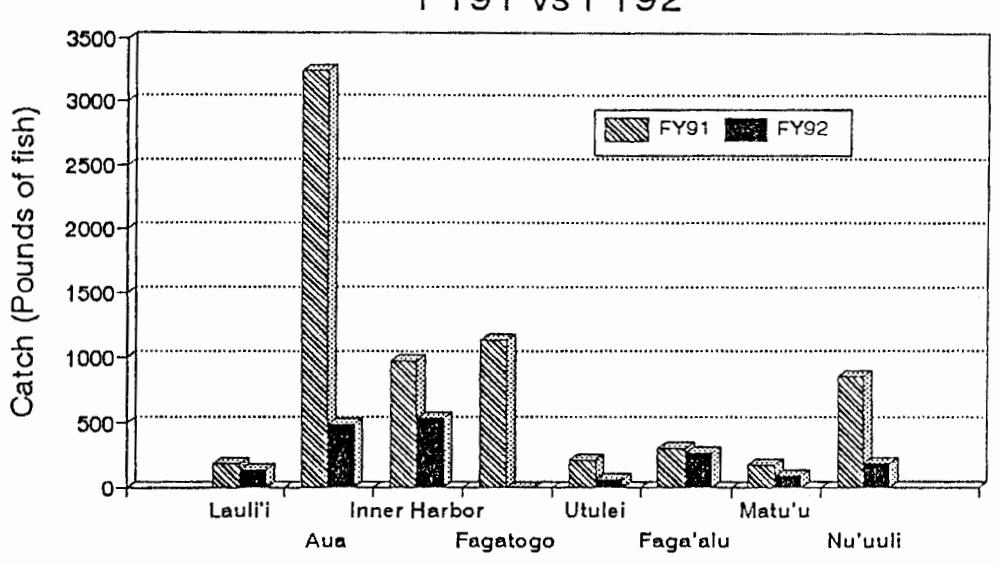

# Mullet CPUE for Throw Net FY91 vs FY92

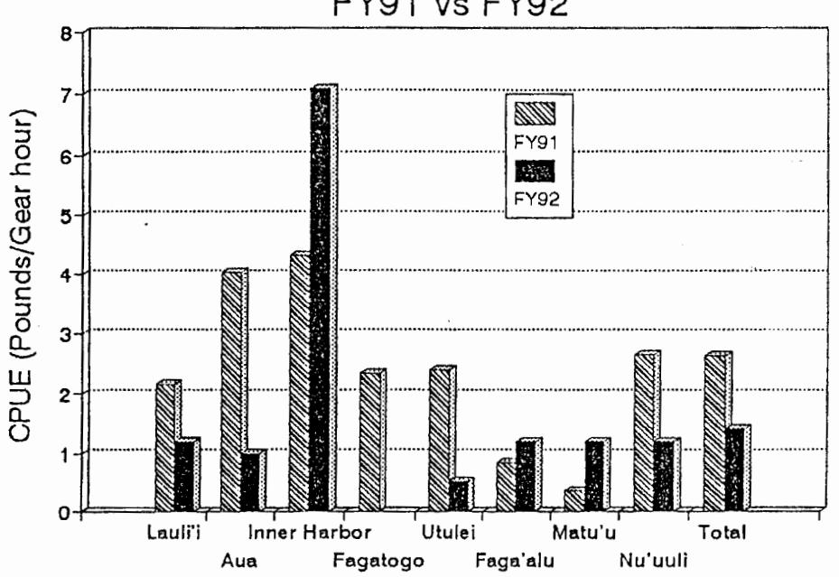

Figure 8. Mullet (Muglilidae) catch by village area, (top) and CPUE for throw net (bottom).

Alogo, Bluebanded surgeonfish (Acanthurus lineatus). Alogo, are locally abundant on reef tops and the upper portions of reef faces throughout the tropical Pacific (Myers 1991). This is a popular eating fish in Samoa and was the 7th most abundant fish species in the fishermen's catch. They accounted for 3.3% of the non-atule catch. Alogo are easily distinguished from other surgeonfish by their distinctive coloration. If the species groups discussed above could be separated into individual species, then alogo could well be the 2nd or 3rd most commonly harvested fish species in the inshore catch.

Alogo are caught almost entirely by spear divers. Catches and catch rates of alogo declined somewhat in most areas in FY92 (Table 12, Figure 9).

Over the past three years, alogo was the number one reef fish purchased by local stores, accounting for 28% of the total reef fish volume. Of the alogo, 75% were locally caught, compared to only 51% locally caught for all reef fish species (see "Sales of fish in Local Markets" section starting on page 50).

Table 12. Catches of alogo, the bluebanded surgeonfish (Acanthurus lineatus) (top), and CPUE (bottom) for FY91 and FY92.

## Alogo - Bluebanded surgeonfish Acanthurus liniatus

|              | Acanthuru | s liniatus  | 5         |       |       |       |                                       |       |
|--------------|-----------|-------------|-----------|-------|-------|-------|---------------------------------------|-------|
| FY91         | Catch (Po | unds of     | fish)     |       |       |       |                                       |       |
|              | Rod&      | Hand        | Bamboo    |       | Spear | Throw | Gill                                  |       |
| Area         | Reel      | Line        | Pole      | Glean | Dive  | Net   | Net                                   | Total |
| Lauli'i      |           |             |           |       | 689   |       | 1                                     | 689   |
| Aua          | 1         |             |           |       | 708   |       | 2                                     | 710   |
| Inner Harbor | 1         |             |           |       | 4     |       | 1                                     | 5     |
| Fagatogo     |           |             |           |       |       |       |                                       |       |
| Utulei       | 1         |             |           |       | 130   |       |                                       | 130   |
| Faga'alu     | 1         |             |           |       | 1127  |       |                                       | 1127  |
| Matu'u       | 1         |             |           |       | 145   |       | 1                                     | 145   |
| Nu'uuli      | 1         |             |           |       | 344   |       | <1                                    | 348   |
| Total        |           |             |           |       | 3146  |       | 9                                     | 3155  |
| FY92         | Rod&      | Hand        | Bamboo    | •     | Spear | Throw | Gill                                  |       |
| Area         | Reel      | Line        | Pole      | Glean | Dive  | Net   | Net                                   | Total |
| Lauli'i      |           |             |           | 0.001 | 43    | 1100  | 1                                     | 44    |
| Aua          |           |             |           |       | 427   |       |                                       | 427   |
| Inner Harbor |           |             |           |       | 6     |       |                                       | 6     |
| Fagatogo     | 1         |             |           |       | •     |       |                                       | •     |
| Utulei       | 1         |             |           |       | 158   |       |                                       | 158   |
| Faga'alu     | 1         |             |           |       | 659   |       | 13                                    | 672   |
| Matu'u       | 1         |             |           |       | 183   |       | 4                                     | 187   |
| Nu'uuli      | 1         |             |           |       | 619   |       | 13                                    | 632   |
| Total        |           |             | Man       |       | 2095  |       | 31                                    | 2126  |
| FY91         | CPUE (Po  | unds/Ge     | ear Hour) |       |       |       | <del></del>                           |       |
|              | Rod&      | Hand        | Bamboo    |       | Spear | Throw | Gill                                  |       |
| Area         | Reel      | Line        | Pole      | Glean | Dive  | Net   | Net                                   | Mean  |
| Laulii       |           |             |           |       | 1.5   |       | · · · · · · · · · · · · · · · · · · · | 0.4   |
| Aua          | 1         |             |           |       | 0.6   |       |                                       | 0.1   |
| Inner Harbor | 1         |             |           |       | 0.2   |       |                                       | 0.0   |
| Fagatogo     | 1         |             |           |       |       |       |                                       |       |
| Utulei       | i         |             |           |       | 0.1   |       |                                       | 0.0   |
| Faga'alu     | l         |             |           |       | 0.7   |       |                                       | .0.3  |
| Matu'u       | ·         |             |           |       | 0.4   |       |                                       | 0.1   |
| Nu'uuli      |           |             |           |       | 0.2   |       |                                       | 0.1   |
| Total        |           |             |           |       | 0.5   |       |                                       | 0.0   |
| FY92         | Rod&      | Hand        | Bamboo    |       | Spear | Throw | Gill                                  |       |
| Area         | Reel      | Line        | Pole      | Glean | Dive  | Net   | Net                                   | Mean  |
| Lauli'i      |           |             |           |       | 0.1   |       |                                       | 0.0   |
| Aua          | 1         |             |           |       | 0.3   |       |                                       | 0.1   |
| Inner Harbor | 1         |             |           |       | 0,1   |       |                                       | 0.0   |
| Fagatogo     | 1         |             |           |       |       |       |                                       | 0.0   |
| Utulei       |           |             |           |       | 0.1   |       |                                       | 0.0   |
| Faga'alu     |           |             |           |       | 0.3   |       |                                       | 0.1   |
| Matu'u       |           |             |           |       | 0.3   |       |                                       | 0.1   |
| Nu'uuli      | }         |             |           |       | 0.3   |       |                                       | 0.1   |
| Total        |           | *********** |           |       | 0.3   |       |                                       | 0.1   |
|              | -         |             |           |       |       |       |                                       |       |

# Alogo Catch (Pounds) FY91 vs FY92

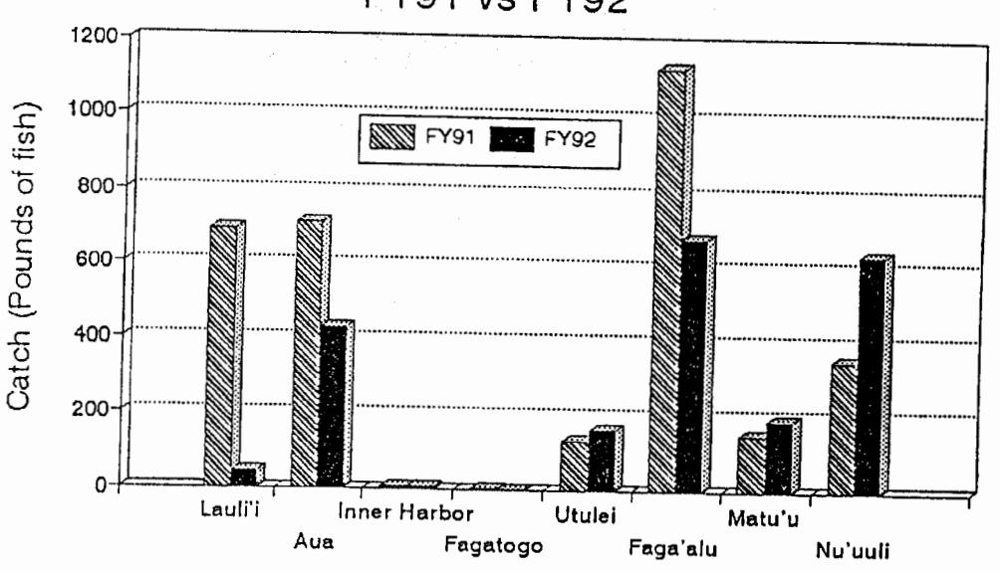

# Alogo CPUE for Spear Diving FY91 vs FY92

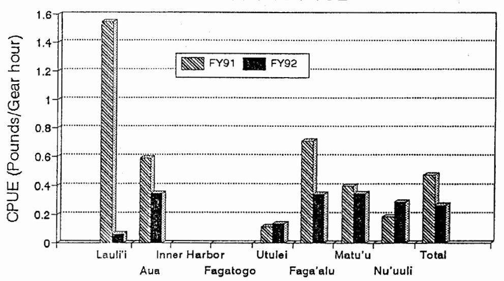

Figure 9. Catches of alogo, the bluebanded surgeonfish, (Acanthurus lineatus) (top), and CPUE for spear diving (bottom), for FY91 and FY92.

## <u>Palolo</u>

Although very brief, the palolo fishery represents a significant portion of the total inshore fishing effort. If we assume the average palolo fishing trip lasts three hours, then the 2818 person-trips observed in the inshore study area in FY93 (Table 13), represent approximately 8400 person hours. This figure represents approximately 17% of the total fishing effort estimated to have occurred in the study area in FY92 (Table 2), however the palolo catch represents only 2.5% of the non-atule catch (Table 4).

Boat fishermen had much higher catch rates than did shoreline fishermen (Figure 10). This is because the palolo epitokes will swim toward the surface, but otherwise are poor swimmers and by and large drift with the currents. The general flow of water on the reef is for waves to push water up onto the reefs tops along the reef face. This water then flows parallel to the beach until it reaches a channel or "ava" where it can flow out. Floating debris, including the epitokes, are floated along and concentrated on the reef top until they reach the channels and are flushed out. Boats will anchor in these channels, and so are able to filter a great deal more epitoke rich water with less effort than are the shore fishermen.

Palolo worms are found in the greatest abundance in the surf zone and in the shallower waters immediately off shore of the reef face. (Larry Madregal, personal communication).

Table 13. The 1992 (FY93) palolo harvest. Only the nights which had significant fishing effort and catch are shown in this table. Total figures include a small amount of effort recorded on surveys of October 16th and 19th (157 fishermen) and on November 15th (63 fishermen) which resulted in zero catch. No effort was observed on November 18.

|              |                       | Shorelin   | e Harve | est          | Boat H | arvest    |        |             | Total     |
|--------------|-----------------------|------------|---------|--------------|--------|-----------|--------|-------------|-----------|
|              |                       | Ì          | Catch/  | Estimated    |        | Number    | Catch/ | Estimated   | Boat +    |
|              |                       | Number     | Person  | Harvest      | Number | Boat      | Person | Harvest     | Shoreline |
| Date         | Area surveyed         | Fishermen  | (Lb*)   | (Lba)        | Boata  | Fishermen | (Lba)  | (Lbs)       | Harvest   |
|              | NE shore              | 374        | 0.1     | 32           | 16     | 51        | 10.4   | 532         | 564       |
| October      | Utulei-Faganeanea     | 478        | 1.4     | 676          | 10     | 41        | 13.4   | 548         | 1224      |
| 17           | Utulaina Pt - Nuuull  | 73         | 8.0     | 60           | 3      | 10        | 8.2    | 82          | 143       |
|              | Airport               | 550        | 0.4     | 238          | 1      | 4         | 10.7   | 43          | 279       |
|              | Total Oct 17          | 1475       | 0.7     | 1005         | 30     | 106       | 11,4   | 1205        | 2209      |
|              | NE shore              | 527        | 0.0     | 14           | 3      | 10        | 0.0    | 0.1         | 14        |
| October      | Utulei-Faganeanea     | 1582       | 0.1     | 94           | 2      | 8         | 0.0    | 0.1         | 94        |
| 18           | Utulaina Pt - Nuuuli  | 221        | 0.1     | 13           | 2      | В         | 0.0    | 0.1         | 13        |
|              | Airport               | 975        | 0.7     | 695          | 0      | 0         |        | ł           | 695       |
|              | Total Oct 18          | 3305       | 0.2     | 816          | 7      | 24        | 0.0    | 0           | 816       |
|              | NE shore              | 954        | 0.0     | 46           | 20     | 63        | 8.4    | 532         | 578       |
| October      | Utulei-Fagensanea     | 2143       | 0.4     | 771          | 12     | 49        | 11.2   | 548         | 1318      |
| Total        | Utulaina Pt - Nuguli  | 303        | 0.2     | 73           | 5      | 16        | 5.2    | 83          | 156       |
|              | Airport               | 1537       | 0.6     | 931          | 1      | 4         | 10.7   | 43          | 974       |
|              | October total         | 4937       | 0.4     | 1821         | 38     | 132       | 9.1    | 1205        | 3026      |
|              | October total         | 4307       | 0,4     |              |        | 102       |        | 1200 1      | 3020      |
|              | NE shore              | 105        | 0.0     | 4            | 16     | 66        | 0.1    | 6           | 10        |
| November     | Utulei-Faganeanea     | 98         | 0.1     | 8            | 3      | 12        | 0.1    | 1           | g         |
| 16           | Utulaina Pt - Nuuuli  | 14         | 0.1     | 1            | 0      | 0         | 0.0    | 0           | 1         |
|              | Airport               | 168        | 0.0     |              | 0      | 0         | 0.0    |             | 1         |
|              | Total Nov 16          | 385        | 0.0     | 14           | 19     | 78        | 0.1    | 7           | 21        |
|              | NE shore              | 120        | 0.1     | 10           | 12     | 34        | 0.1    | 3           | 13        |
| November     | Utulei-Faganaanea     | 157        | 0.1     | 13           | 1      | 4         | 0.0    | 0           | 13        |
| 17           | Utulaina Pt - Nuuuli  | 63         | 0.0     | 0            | 0      | 0         | 0.0    | 0           | 0         |
| •••          |                       |            | 0.0     |              | 1      | 2         | 0.0    | Ö           | 0         |
|              | Airport               | 111        | ~       |              |        |           |        |             |           |
|              | Total Nov 17 NE shore | 451 248 | 0.1     | 24           | 14     | 106       | 0.1    | 3 9         | 27        |
| November     |                       | 290        | 0.1     | 22           | 5      | 21        | 0.0    | 1           | 23        |
| Total        | Utulei-Faganeanea     |            |         |              |        |           |        | - 1         |           |
| iotai        | Utulaina Pt - Nuuuli  | 82         | 0.0     | 1            | 0      | 0         | 0.0    | ٥           | 1         |
|              | Airport               | 279        | 0.0     | 1            | 1      | 2         | 0.0    | 0           | . 1       |
|              | November total        | 899        | 0.0     | 38           | 35     | 129       | 0.1    | 10          | 47        |
|              |                       |            |         | - |        |           |        | <del></del> |           |
|              | NE shore              | 1202       | 0.1     | 60           | 49     | 169       | 8.5    | 540         | 601       |
| 199 <b>2</b> | Utulei-Faganeanea     | 2433       | 0.3     | 792          | 17     | 70        | 11.2   | 549         | 1341      |
| Total        | Utulaina Pt - Nuuuli  | 385        | 0.2     | 74           | 5      | 16        | .5.2   | 83          | 157       |
|              | Airport               | 1816       | 0.5     | 931          | 2      | 6         | 10.7   | 43          | 974       |
|              | Grand Total           | 5836       | 0.3     | 1858         | 73     | 261       | 4.7    | 1215        | 3073      |

# 1992 Palolo Harvest Effort Number of Persons by Area.

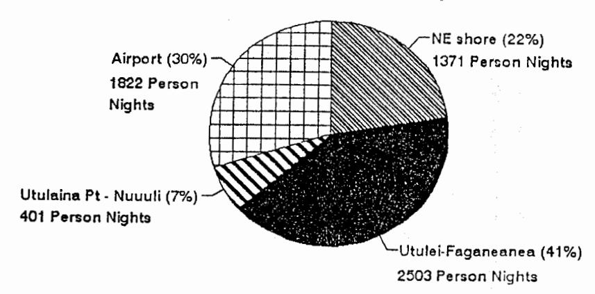

Total = 6097 Person Nights

# Average Catch Per Person for the 1992 Palolo Harvest

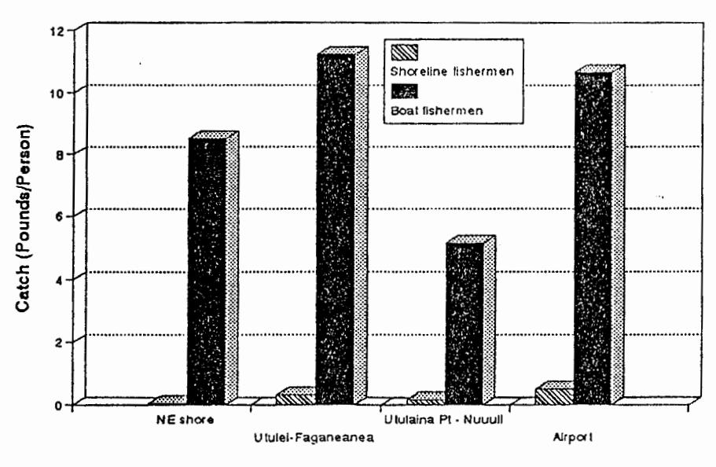

Figure 10. 1992 palolo fishing effort (person nights) by area (top), and average catch per person (pounds) by area for boat and shoreline fishermen (bottom).

A comparison of palolo fishing for the past three years within the study area is shown in the table below. This comparison is rough because only one night was sampled in 1990 and 1991, which was predicted before hand to be the peak night of the palolo harvest and effort, whereas 8 nights were sampled in 1992. In the process of sampling four nights in October 1992 (Table 13), we discovered that the night of peak effort does not necessarily coincide with the peak harvest, and that the palolo spawning event is not as neatly predictable as folklore would have us believe.

| Table 14. Palolo fishing effort and catch by shoreline fishermen only within the inshore study area between the villages of Utulei and Nu'uuli (Figure 1). |                        |                                                |                   |                      |  |  |  |  |
|------------------------------------------------------------------------------------------------------------------------------------------------------------|------------------------|------------------------------------------------|-------------------|----------------------|--|--|--|--|
| Year                                                                                                                                                       | Nights Sampled      | Shoreline participants in the Study Area | Catch (Pounds) | Pounds per Person |  |  |  |  |
| 1990                                                                                                                                                       | Nov 8                  | 764                                            | 3446              | 4.5                  |  |  |  |  |
| 1991                                                                                                                                                       | Nov 30,                | 1463                                           | 600               | 0.4                  |  |  |  |  |
| 1992                                                                                                                                                       | Oct 16-19 Nov 15-18 | 2818                                           | 867               | 0.3                  |  |  |  |  |

Overall, palolo catches have been low, and local fishermen consider the past three years as being very poor for palolo on Tutuila. People tell stories of catching buckets of palolo in years past (one 5 gallon bucket = 43 pounds approx). Harvest success is dependant on the strength of the spawning event and the presence of light onshore winds that concentrate the epitokes near the shoreline, making them more accessible to the fishermen. For example, strong winds on October 18, 1992 created surf conditions which made it difficult to fish in many of the desired locations all along the southeast side of the island. Few boats even attempted to fish outside of the harbor on that night. Fishermen at the airport, who had a more extensive reef to block the waves, actually did better on October 18 than they did on the 17th (Table 13).

## Sales of fish in local markets

Fishermen were asked whether they intended to sell their catch or keep it for personal use. In FY91, 7% of all fishing parties interviewed indicated that they intended to sell their catch. This figure increased 24% in FY92 (Table 15).

| Table 15. Percentage of the inshore fishermen interviewed who intended to sell their catch. |               |              |                |       |               |              |             |       |
|---------------------------------------------------------------------------------------------|---------------|--------------|----------------|-------|---------------|--------------|-------------|-------|
| Method Year                                                                              | Rod & Reel | Hand line | Bamboo Pole | Glean | Spear Dive | Throw Net | Gill Net | Total |
| FY91                                                                                        | 8             | 3            | 0              | 0     | 29            | 0            | 23          | 7     |
| FY92                                                                                        | 0             | 0            | 25             | 25    | 33            | 29           | 71          | 24    |

The 1979 study did not ask fishermen if they intended to keep or sell their catch, however a 1980 survey by the Development and Planning Office found that less than 9% of the inshore catch was sold, and that most of it was consumed by the fishermen's family and relatives (Wass 1980).

Although total fishing effort has reduced considerably since 1979, there was a considerable increase in the percentage fishing for commercial purposes in FY92 (Table 16). The reason for this shift is not clear, though two contributing factors are; 1) fishing for personal use has dropped due to changes in Samoan life styles which have reduced the amount of free time to fish, and reduced peoples dependency on personally caught fish, 2) higher prices paid for reef caught fish encouraged increased exploitation.

Table 16. Amount and value of the fish and shellfish taken by the inshore fishery. Sale value is based on price paid by retail stores for fish.

| Year              | Total Island- wide Catch (Pounds) | Wholesale Price/ Pound' | Percent sold | Value of fish sold (\$) | Value of fish kept. (\$) | Total value of inshore catch (\$) |
|-------------------|--------------------------------------------|-------------------------------|-----------------|----------------------------------|-----------------------------------|--------------------------------------------|
| 1979 2 | 660,000                                    | 1.00                          | 9%              | 59,400                           | 600,600                           | 660,000                                    |
| FY91              | 440,051                                    | 1.57                          | 7%              | 48,362                           | 642,518                           | 690,880                                    |
| FY92              | 334,494                                    | 1.73                          | 24%             | 138,882                          | 439,793                           | 578,675                                    |

#### Footnotes:

- 1. Prices not adjusted for inflation.
- 2. 1979 data from Wass 1980.

Anecdotal evidence suggests that a large percentage of inshore fishing for commercial purposes is done by people from Tonga and Western Samoa, rather than by long-term residents.

In spite of the local harvest and availability of reef species of fish, over 50% of the fresh fish sold in local stores is imported, primarily from Tonga and Western Samoa (Table 17, Figure 11). For reef fish species there has been a sharp increase in imports. In 1990, 23% were imported, whereas in 1992 78% were imported.

In 1990 and 1991, imported reef fish had only a 1¢/lbs price advantage, but this difference increased to 13¢/lbs advantage in 1992. The price difference was much more apparent in the pricing of bottomfish species. In 1992, locally caught bottomfish cost 61¢ per pound more than imported fish. Store owners complained that the local fishermen wanted too much for their fish and that the supplies are less consistent than for imported fish.

Competition from frozen fish bartered off the distant-water purse seine and longline fleets has depressed prices for pelagic fish (Pelagics Plan Team 1992). Domestic pelagic landings have been relatively stable in the past few years while the bottomfish fishery has nearly collapsed in American Samoa (Bottomfish Plan Team 1992).

Table 17. Sales of domestically caught and foreign caught fish to local markets, 1990-1992. Data are from market surveys (see page 9). Totals shown here are not complete. 1990 includes July - December only, and 1992 includes January - August only. (Continued on next page)

|                          | Pounds of |         | lsh      |         |             |         | Avera  | ge pri  | ce per      | pound         |             |             |
|--------------------------|-----------|---------|----------|---------|-------------|---------|--------|---------|-------------|---------------|-------------|-------------|
|                          | 1990      |         | 1991     |         | 1992        |         | 1990   |         | 1991        |               | 1992        |             |
|                          | July-Di   | ec only | Jan-De   | c       | Jan-Au      | g only  | July-D | only    | Jan-De      | c             | Jan-Au      | a only      |
| Species                  |           | Imports |          | Imports | 1           | Imports |        | Imports | Dom         | Imports       |             | Imports     |
|                          | <u> </u>  |         | <u> </u> |         |             |         | 1      |         | <del></del> | ·····         | <del></del> |             |
| Bottom fish species.     |           |         |          |         |             |         |        |         |             |               |             |             |
| Onaga (longtail snapper) | 206       | 3,181   | 305      | 12,232  | 0           | 3,524   | \$2.37 | \$1.56  | \$2.13      | \$1.68        |             | \$2.46      |
| Bottomfish (Assorted)    | 5         | 682     | 2,140    | 2,384   | 1,014       | 4,271   | 1,68   | 1.55    | 2.21        | 1.92          | 2.68        | 1.61        |
| Emperors (misc)          | 27        | 576     | 202      | 1,222   | 292         | 1,231   | 1.50   | 1,48    | 1.53        | 1.56          | 1.88        | 1.84        |
| Ehu (squirrelfish snap.) | 6         | 356     | 454      | 278     | <i>7</i> 78 | 1,182   | 1.75   | 1.83    | 2.42        | 2.88          | 3.32        | 2.47        |
| Lehi (silverjaw)         | 0         | 567     | 0        | 846     | 25          | 1,064   | -      | 1.41    | -           | 1.49          | 1.90        | 2.28        |
| Opakapaka                | 0         | 898     | 127      | 468     | 33          | 519     |        | 1.56    | 1.54        | 1.58          | 1.91        | 2.21        |
| Gindai (flower snap)     | 81        | 3       | 34       | 51      | 71          | 803     | 2.50   | 1.50    | 1.67        | 1.57          | 1.93        | 2.30        |
| Blue lined snapper       | 1         | 110     | 68       | 426     | 93          | 16      | 1.54   | 1.53    | 1.64        | 1.59          | 1.90        | 1.75        |
| Hawaiian opakapaka       | 6         | 0       | 0        | 0       | 103         | 92      | 1.50   | _       |             |               | 1.91        | 2,30        |
| Amberjack                | 0         | 0       | 162      | 0       | 0           | 0       |        |         | 2.65        |               | -           | -           |
| Eels                     | 15        | 0       | 39       | 0       | 0           | 15      | 1.50   |         | 1.62        |               |             | 1.80        |
| Black jack               | 0         | 0       | 0        | 33      | 0           | 0       |        | _       |             | 2.00          |             |             |
| Oilfish                  | 0         | 0       | 0        | 0       | 0           | 22      |        |         |             | _             | -           | 2.30        |
| Rainbow runner           | 0         | 0       | 13       | 0       | 0           | 0       |        |         | 2.50        |               |             | <del></del> |
| Total Bottom Fish        | 348       | 6,374   | 3,543    | 17,941  | 2,409       | 12,739  | 2.26   | 1.55    | 2.17        | 1.71          | 2.69        | 2.08        |
|                          |           |         |          |         |             |         |        |         |             |               |             |             |
| Invertebrates            |           |         |          |         |             |         |        |         |             |               |             |             |
| Spiny lobster            | 1,134     | 887     | 1,268    | 1,525   | 290         | 794     | \$2.54 | \$3.31  | \$3.02      | \$3.46        | \$3.46      | \$3.60      |
| Octopus                  | 545       | 0       | 102      | 0       | 78          | 81      | 1.42   |         | 1.64        |               | 1.78        | 1.80        |
| Giant clam               | 15        | 0       | 8        | 85      | 0           | 610     | 2.67   |         | 2.75        | 1.45          |             | 4,20        |
| Invertebrates            | 0         | 0       | 0        | 0       | 0           | 201     | -      | _       |             |               |             | 3,30        |
| Crabs                    | 75        | 0       | 50       | 0       | 0           | 0       | 1.30   |         | 1.85        | . <del></del> | -           | •           |
| Sea urchins              | 0         | 0       | 0        | 0       | 0           | 88      |        | •       |             |               | _           | 3.05        |
| Limu, algae              | 0         | 0       | 0        | 0       | 0           | 68      |        | _       |             |               |             | 3.34        |
| Miscellaneous            | 0         | 0       | 13       | 12      | 0           | 0       |        |         | 1.50        | 1.50          |             |             |
| Total Invertebrates      | 1,768     | 887     | 1,441    | 1,622   | 368         | 1,843   | 2.14   | 3,31    | 2.86        | 3.34          | 3.10        | 3.65        |
| Pelagic fish species.    |           |         |          |         |             |         |        |         |             |               |             |             |
| Wahoo                    | 609       | 9,213   | 9,367    | 731     | 2,757       | 166     | \$0.75 | \$0.86  | \$0.90      | \$0.55        | \$0.78      | \$1,63      |
| Yellowfin tuna           | 507       | 396     | 7,444    | 1,157   | 8,475       | 168     | 1.80   | 0.85    | 2.43        | 1.13          | 2.43        | 1.77        |
| Skipjack tuna            | 2,875     | 0       | 2,200    | 266     | 2,585       | 0       | 0.95   |         | 1.00        | 1.50          | 1.49        |             |
| Bigeye tuna              | 1,464     | 0       | 566      | 2,561   | 0           | o       | 0.50   |         | 0.89        | 0.55          |             |             |
| Dolphin (mahimahi)       | 170       | 1,316   | 1,669    | 199     | 805         | 14      | 2.11   | 1.00    | 1.51        | 2.58          | 2.47        | 2.50        |
| Albacore                 | 0         | 0       | 367      | 161     | 0           | 0       |        |         | 2.69        | 4.00          | _           | _           |
| Troll fish               | 16        | 2       | 13       | 238     | 87          | 39      | 1,25   | 1.00    | 2.16        | 1.50          | 2.58        | 1.50        |
| Dogtooth tuna            | 36        | 16      | 236      | 0       | 0           | 0       | 1.50   | 1.50    | 2.39        |               |             | _           |
| Blue marlin              | 0         | 0       | 115      | 0       | 142         | 0       |        |         | 1.50        |               | 2.50        |             |
| Tunas                    | 36        | 0       | 83       | 0       | 10          | 0       | 0.75   |         | 2.50        |               | 2.00        |             |
| Swordfish                | 0         | 0       | 0        | 65      | 0           | ٥       | -      | ٠       |             | 1.30          |             |             |
| Sharks                   | 5         | 0       | 50       | 0       | 0           | ő       | 1.25   |         | 2.50        | . 1.50        |             |             |
| Trevally                 | 0         | 16      | 0        | 0       | 0           | 0       |        | 1.55    |             |               |             | _           |
| Mackerel                 | 0         | 0       | 7        | 0       | 0           | ő       |        |         | 1.50        | _             | -           |             |
| Total Pelagics           | 5,717     | 10,960  | 22,115   | 5,378   | 14,860      | 387     | 0.93   | 0.88    | 1.53        | 0.95          | 1.96        | 1.71        |
| . Las . oragios          | -,        | ,       | ,        |         |             | - 1     |        |         |             |               |             |             |

(Continued on next page)

Table 17, (Continued from previous page). There is a considerable discrepancy between the amount of fish reported by store owners, and the amounts presented elsewhere in this report.

|                        | Poun   | ds of f | lsh           |         |        |         | Average price per poun |           |            | pound      | nd.     |         |  |
|------------------------|--------|---------|---------------|---------|--------|---------|------------------------|-----------|------------|------------|---------|---------|--|
|                        | 1990   |         | 1991          |         | 1992   |         | 1990                   |           | 1991       |            | 1992    |         |  |
|                        | July-D | ec only | Jan-De        | ec      | Jan-Au | ıg only | July-De                | only      | Jan-De     | c          | Jan-Au  | only    |  |
| Species                | Dom    | Imports | Dom           | Imports | Dom    | Imports | Dom                    | Imports   | Dom        | Imports    | Dom     | Imports |  |
|                        |        |         |               |         |        |         |                        |           |            |            |         |         |  |
| Reef fish species.     |        |         |               |         |        |         |                        |           |            |            |         |         |  |
| Biuebanded surgeonfish | 3,531  | 655     | 5,744         | 1,702   | 390    | 989     | \$1.50                 | \$1.55    | \$1.80     | \$1.53     | \$1.67  | \$1.57  |  |
| Parrotlishes           | 2,014  | 899     | 2,627         | 2,126   | 556    | 2,019   | 1.50                   | 1.54      | 1.58       | 1.53       | 1.71 2  | 1.54    |  |
| Reel fish (Assorted)   | 270    | 566     | 471           | 4,429   | 160    | 1,348   | 1.60                   | 1.50      | 1.32       | 1.55       | 1.65    | 1.57    |  |
| Striped bristletooth   | 1,725  | 64      | 705           | 517     | 147    | 480     | 1.50                   | 1.55      | 1.59       | 1.54       | 1.70    | 1.53    |  |
| Squirrelfish           | 941    | 81      | 331           | 398     | 157    | 193     | 1.50                   | 1.55      | 1.56       | 1.55       | 1.72    | 1.59    |  |
| Humpback snapper       | 232    | 123     | 42            | 699     | 104    | 747     | 1.70                   | 1.71      | 1.51       | 1.72       | 1.89    | 1.73    |  |
| Jacks (misc)           | 165    | 184     | 224           | 315     | 164    | 659     | 1.66                   | 1.46      | 1.55       | 1.52       | 1.69    | 1.55    |  |
| Mullets                | 2      | 66      | 50            | 524     | 22     | 885     | 1.50                   | 1.50      | 1.52       | 1.68       | 2.00    | 1.67    |  |
| Groupers (misc)        | 16     | 189     | 160           | 516     | 110    | 254     | 1.50                   | 1.55      | 1.51       | 1.58       | 1.77    | 1.93    |  |
| Inshore groupers       | 510    | 18      | 268           | 145     | 49     | 45      | . 1.50                 | 1.55      | 1.59       | 1.52       | 1.71    | 1.57    |  |
| Unicornfishes (misc)   | 284    | 31      | 297           | 0       | 200    | 24      | 1.50                   | 1.45      | 1.64       | _          | 1.70    | 1.65    |  |
| Gray jobfish           | 4      | 65      | 177           | 93      | 108    | 68      | 1.50                   | 1.21      | 1.18       | 1.54       | 1.69    | 2.05    |  |
| Flagtail grouper       | 0      | 0       | 13            | 69      | 0      | 202     |                        |           | 1.50       | 1.50       | _       | 1.60    |  |
| Bigeye scad            | 0      | 40      | 201           | 0       | 0      | 0       |                        | 1.40      | 1.50       |            |         |         |  |
| Small barracuda        | 2      | 19      | 213           | 0       | 0      | o       | 1.50                   | 1.55      | 1.50       | _          |         |         |  |
| Lunartail grouper      | 9      | 0       | 86            | 61      | 0      | 11      | 1.50                   |           | 1.50       | 1,60       |         | 2.30    |  |
| Wrasse                 | 12     | 0       | 105           | 0       | 0      | 0       | 1.50                   | _         | 1.61       |            |         |         |  |
| Yellowfin surgeonfish  | 40     | 0       | 39            | 0       | 0      | o       | 1.50                   | _         | 1.50       |            | -       |         |  |
| Halfbeaks              | 0      | 0       | 0             | 78      | 0      | 0       | _                      |           | _          | 1.75       | _       | _       |  |
| Bigeye squirrelfish    | 0      | 0       | 0             | 0       | 58     | 0       |                        |           |            |            | 2.65    |         |  |
| Needlefish             | 0      | 0       | 0             | 39      | 0      | 0       |                        | _         |            | 1.60       |         |         |  |
| Ambon emperor          | 0      | 0       | 0             | 33      | 0      | o l     |                        |           |            | 1.55       |         |         |  |
| Goatfish               | 11     | 0       | 0             | . 0     | 0      | 19      | 1.50                   |           |            |            |         | 1.60    |  |
| Bigeye emperor         | 0      | 0       | В             | 0       | 0      | o       |                        | _         | 1.50       |            |         |         |  |
| Rabbitfish             | 2      | o       | 4             | 0       | o      | ŏ       | 1.50                   |           | 1.50       |            |         |         |  |
| Barracudas             | 0      | 0       | 2             | 0       | 0      | ol      |                        |           | 1.50       |            |         |         |  |
| Total Reel lish        | 9,768  | 3,000   | 11,766        | 11,745  | 2,224  | 7,942   | 1.51                   | 1.53      | 1,57       | 1.56       | 1,73    | 1,60    |  |
| 10.0 11001 11011       | 5,700  | 2,000   | ,,,,,,        | 17,740  | E,EE-4 | .,,5-1  | 1.01                   |           | 1,01       |            |         |         |  |
| Summary                |        |         |               |         |        |         |                        |           |            |            |         |         |  |
|                        | 0.40   | 0.074   | 0.540         | 47.044  | 0.400  | 40.700  | ** **                  | •4.55     | *0.47      | e4 74      | •• ••   | ***     |  |
| Bottom fish            | 346    | 6,374   | <b>3</b> ,543 | 17,941  | 2,409  | 12,739  | \$2.26                 | \$1.55    | \$2.17     | \$1.71     | \$2.69  | \$2.08  |  |
| Crabs, lobsters, clams | 1,768  | 887     | 1,441         | 1,622   | 368    | 1,843   | 2.14                   | 3.31      | 2.86       | 3.34       | 3.10    | 3,65    |  |
| Pelagic fish           | 5,717  | 10,960  | 22,115        | 5,378   | 14,860 | 387     | 0.93                   | 0.88      | 1.53       | 0.95       | 1,96    | 1.71    |  |
| Reel fish              | 9,768  | 3,000   | 11,766        | 11,745  | 2,224  | 7,942   | 1.51                   | 1.53      | 1.57       | 1.56       | 1.73    | 1.60    |  |
| Grand Total            | 17,500 | 21,220  | 38,865        | 36,685  | 19,861 | 22,912  | 1.40                   | 1.27      | 1.65       | 1.62       | 2.05    | 2.03    |  |
| Percent imported.      |        |         |               |         |        |         | Price/Po               | und diffe | rence, (ii | nport - de | mestic) |         |  |
| Bottom fish            |        | 95%     |               | 84%     |        | 84%     |                        | -0.71     |            | ~0.46      |         | -0.61   |  |
| Crabs, lobsters, clams |        | 33%     |               | 53%     |        | 83%     |                        | 1.16      |            | 0.48       |         | 0.55    |  |
| Pelagic fish           |        | 66%     |               | 20%     |        | 3%      |                        | -0.05     |            | -0.58      |         | -0.25   |  |
| Reel fish              |        | 23%     |               | 50%     |        | 78%     |                        | 0.01      |            | -0.01      |         | -0.13   |  |
| Grand Total            |        | 55%     |               | 49%     |        | 54%     | -                      | -0.13     | -          | -0.03      | -       | -0.01   |  |
| arana row              |        | 33 /6   |               | 43/0    |        | J-1 /41 |                        | -0.13     |            | 0.00       |         | 0.01    |  |

# Percent of fish sold in local markets which were imported. 1990 - 1992.

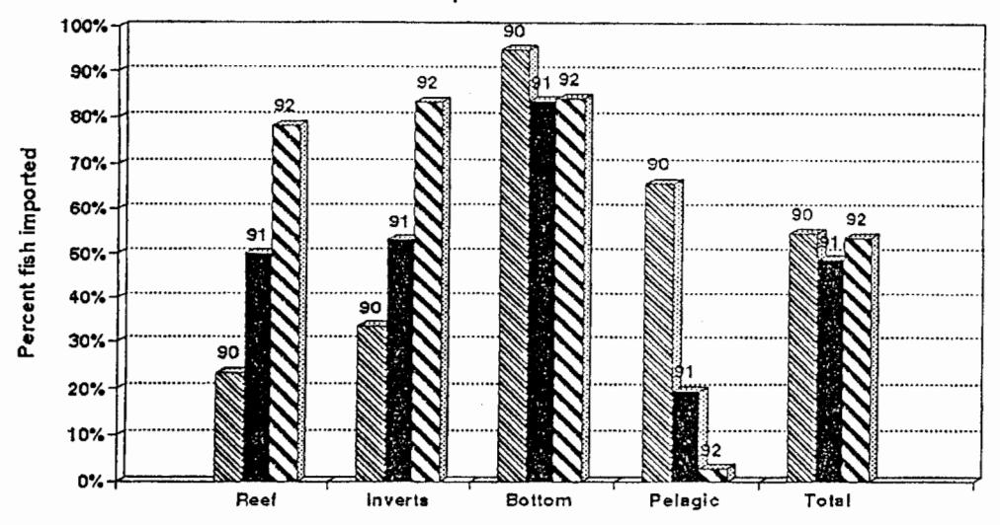

# Difference in price between domestic and foreign caught fish, (1990 - 1992)

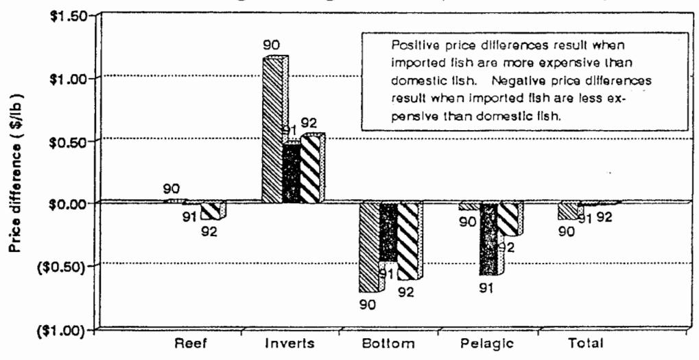

Figure 11. Percent of fresh fish sold in local markets which were imported, (top), and price differences between domestic and foreign caught fish, (bottom). There has been an increasing trend to import reef fish in spite of the relatively small price difference.

Food consumed in the territory comes from three major sources, 1) Local fisheries, consisting of the inshore reef fishery, and the offshore bottomfish/pelagic fishery, 2) farms, gardens and livestock, the majority are small-scale family farms, and 3) imported food, the majority of which comes from the United States (Economic Development Planning Office, 1991).

Additionally, some fish comes from the distant water fleet, either sold directly to local persons and stores, and also canned by the two canneries and sold on the local market. The volume of this is unknown.

In 1990, American Samoa's local fisheries accounted for approximately 9% of the domestic food production by weight, with the inshore reef catch accounting for the majority of the local fish production (Table 18).

In 1990, American Samoa imported \$36.0 million worth of food and beverage products, of which \$2.3 million was fish products. With the value of fish from the local fisheries estimated at \$859,000 this means that the domestically caught fish account for about 27% of the total value of fish consumed in the territory, or about 2% of the value of all food consumed (Table 18).

Table 18. Estimated annual amount and value of fish, farm and imported food products consumed in American Samoa. Cannery tuna production, which is almost entirely produced by the distant water fleet, and exported, is not included in this table. The locally produced fish and farm products are almost entirely consumed locally.

|                                                 | Estimated          | Value                   | Percent of        |
|-------------------------------------------------|--------------------|-------------------------|-------------------|
|                                                 | Poun <b>ds</b>     | (\$\$\$)                | Total Value       |
| Annual Production of local fisheries 1          |                    |                         |                   |
| FY91 Reef fisheries 2                | 440,051            | <b>69</b> 0,88 <b>0</b> | 1.7               |
| 1991 Offshore fisheries 3            | <u>150,446</u>     | <u>167,817</u>          | <u>0.4</u> 2.1 |
|                                                 | 590,497            | 858,697                 | 2.1               |
| 1990 American Samoa Farm production⁴            |                    |                         |                   |
| Livestock and Poultry                           | 1,074,889          | 1,973,66 <b>8</b>       | 4.8               |
| Taro                                            | 1,948,547          | 656,209                 | 1.6               |
| Bananas                                         | 1 <b>,2</b> 13,298 | 619,644                 | 1.5               |
| Other crops                                     | 1,715,236          | 608,107                 | 1.5               |
|                                                 | 5,951,971          | <b>3,</b> 857,628       | 9.5               |
| 1990 Imports of Fish and Shellfish 6 |                    |                         |                   |
| Fish baits, Frozen                              | па                 | 209,217                 | 0.5               |
| Fish, Canned                                    | na                 | 1,162,991               | 2.8               |
| Fish, Fresh                                     | na                 | 135,633                 | 0.3               |
| Fish Frozen                                     | na                 | 662,399                 | 1.6               |
| Shellfish, canned                               | па                 | 5,420                   | 0.0               |
| Shellfish, Fresh                                | na                 | 5,370                   | 0.0               |
| Shellfish, Frozen                               | <u>na</u>          | 73,177                  | 0.2               |
|                                                 |                    | 2,254,207               | 5.5               |
| 1990 Imports of Other Food and Beverages 5      |                    |                         | ĺ                 |
| Bear, wine, liquor                              | па                 | 1,901,215               | 4.7               |
| Other beverages                                 | na                 | 3,286,656               | 8.1               |
| All other food                                  | na                 | 28,653,305              | 70.2              |
|                                                 | na                 | 33,841,176              | 82.9              |
|                                                 |                    |                         |                   |
| Total annual food consumption                   | na                 | 40,811,708              | 100%              |

#### Sources and notes:

- 1. Value estimates are calculated from the total pounds produced times the average price of the portion which was sold.
- 2. This report. Value is estimated from the average price paid for fish by local stores, multiplied by the total estimated catch.
- 3. 1992 reports from the Pelagic and Bottom Fish Plan Teams of the Western Pacific Regional Fishery Management Council. Value is Ex-vessel values.
- 4. U.S. Department of Commerce 1987 Census of Agriculture. Only farms which sold more than \$100 of produce in 1990 are reported on. The production of the numerous family farms which did not sell their production are not included in these statistics.
- 5. Economic Development and Planning Office, 1991. Reports show value figures only, statistics on tonnage of imported food and beverage products are not available.

# RECOMMENDATIONS

Monitoring Program. This survey does provide reasonably reliable data on shoreline fishing efforts on Tutuila. However, catch/effort surveys such as this are able to produce only a crude indicator of stock abundance, particularly for a shoreline fishery as complex and species diverse as this one. Its value for estimating species abundance and total fishing mortality is extremely limited without independent data to estimate these parameters. More accurate and reliable data for both management and scientific purposes has to come from other sources.

If the primary purpose of this study is to provide baseline biological data, then it is recommended that this study not be continued. While this project provides reasonably reliable data on fishing effort, the catch data collected are insufficient, biased, and unreliable for a variety of reasons. Biological inferences based on this data such as CPUE and catch composition are highly questionable.

Options for this project include 1) discontinuing altogether, 2) continue, however with emphasis on the fisheries cultural and economic importance, rather then as of a biological study.

If this project is continued, it is recommended that:

1. Inadequate interview data severely hampers the accuracy of the data analysis. Interview rates simply must be increased to get a valid sample size. Two years of continuous effort by both principal investigators to increase catch data collection has not yielded the desired results.

Deployment of additional crews whose primary purpose would be to collect interviews would help correct the studies defeciencies. This should not bias the expansions of the effort data as expansions are done on each strata separately. It is unlikely that the catch estimates will be significantly biased by this either because it is unlikely that weekend fishermen experience significantly different CPUE's than week day fishermen.

The nature of the fishery and the design of this survey produces a bias and under sampling in the sampling of catch data, particularly for spear diver fishermen. The fishing effort is probably also underestimated due to the fact that it is often difficult to see and therefore count persons who are often skin diving at night and at some distance from the shore line. Biases result as the sampling of these spear diver fishermen includes only those who are easily sampled due to their closeness to the shore, or who happen to be seen exiting the water when the creel technician is in the area.

 Island-wide expansion factors need to be validated. Currently the island-wide catch estimates are estimated by multiplying the study area per capita catch by the total island population. This method assumes that the study area's catch rates and fishing patterns resemble those of the rest of the island, an assumption which may be inaccurate for the reasons listed in the fishery profile section, (page 16).

Information on recreational and other uses of the inshore reef areas should be collected. A large number of people are often seen swimming, bathing, surfing, and mining sand, who are not counted in the normal participation counts as they are not fishing. Obtaining estimates of non-fishing related uses of the beaches and reefs will provide a more complete picture of the uses of these resources.

In February 1993, data forms were modified, and technicians were instructed to start collecting this information. This entailed only a nominal increase in survey efforts. Data collectors record the numbers of persons seen swimming, surfing and sand mining on their participation data sheets during the normal participation counts. They also make visual estimates of the quantity of sand removed from the beaches without actually interviewing the participants.

4. The data analysis programs used for generating this report were highly obtuse, cryptic, and lacking in reasonable documentation. Fortunately, they are in the process of being rewritten.

A possible major logic was identified in the current program, when corrected will probably change much of the "expanded" catch and CPUE data shown in this report. (Effort data shown here is probably correct, however). The operation of the analysis programs needs to be streamlined, and adequate documentation needs to be prepared.

The catch estimation program used in this analysis needs to be modified to insure that data swamping does not occur in the annual estimates in cases where brief pulse fisheries produce large amounts of both catch and effort compared to the rest of the year. This is very likely a problem with the Atule in the FY92 data set (see Figure 2). In FY92, there was high catch and effort for Atule for the first two months of the year, followed by no Atule catches for the rest of the year. The current program expands data on an annual basis, and this brief pulse is averaged into the data for the entire year.

Basically, the expansion program implicitly assumes that catch rates are constant throughout the time period selected for analysis. The correction for this would be to add a "season" stratum in the catch expansions hierarchy for selecting a CPUE to use for expanding a particular effort.

Management Plan: The following issues were identified by Ponwith (1991) as items which would need to be addressed in a management plan. To date, these issues have not been addressed:

- 1) Overall management objectives for the fishery.
- Objectives and options for fishery monitoring.
- 3) Policies on issues such as commercial versus recreational/subsistence use, stock rebuilding, and resource use in protected areas.
- 4) A plan for implementing additional regulations should they become necessary.
- 5) Background information on key species taken in the inshore fishery.

The following issue was also identified by Ponwith, and has been partially answered by this study, and continued monitoring of this fishery would provide additional detail:

1) Identification of key species taken in the inshore fishery.

<u>Future research</u>: Little quantitative data exists describing the factors affecting the abundance of various key species. Managers would benefit from more basic biological information including the following:

- 1) Atule. Basic biological information on the migratory Atule. Where do they go, what do they do when they're not in Pago Pago Harbor? What stocks of fish are being fished on in Samoa? Are the seasonal runs we see part of a much larger stock? Or is this a small local stock of fish which may be endangered by the intense pressure put on it by the Atule fishermen in Pago Pago Harbor?
- Size and age of maturity studies. Size at maturity and the size composition of the harvest for groupers, snappers and parrot fish would be valuable, considering the small size at which they are currently harvested.
- 3) <u>Studies of virgin populations</u>. Comparative studies of species composition and size structure in areas of different exploitation rates would provide data on the effects of fishing pressure on the community structure.

Few areas on Tutuila offer good "virgin stock" controls to compare to the heavily used areas. The Fogagogo area, and the Tula are two possibilities, although topographical and environmental variables would confound the comparison between "virgin" and heavily fished areas.

Migrations and offshore movements. Tagging fish species which are caught by both the shoreline and offshore fisheries, such as some of the groupers and snappers, to study movements between the areas exploited by the two fisheries would be of interest. For example, are the reef habitats replenished by fish from offshore when the stocks are fished down?

Exchange of reef fish over large distances. Knowing the amount of interchange between stocks of fish between the various islands would provide managers with a valuable tool for assessing the effects of over fishing or an environmental catastrophe which may deplete a local stock.

Most of the reef-resident species observed in American Samoa have a planktonic larval stage, suggesting that brood stocks for these species could reside at considerable distances from the areas that the adults are observed.

A study of the assessing the degree of genetic relatedness between reef fish species among the various island groups could shed some insights on this question. A genetic study on Yellowfin Tuna in various locations in the Western Pacific region have shown a high degree of relatedness among the presumed stocks of fish. Indications are that these fish are highly migratory, and localized depletions could potentially be replenished from other populations in a relatively short period of time, (assuming that the Pacific wide yellowfin stocks remained healthy).

Larval distribution studies, and genetic studies assessing the degree of relatedness between various Pacific island stocks could help answer this questions.

- 7) Impacts of spear divers using SCUBA. Spear diver fishermen observed in the study area use snorkel gear almost exclusively, often using only swimmers goggles and no fins. Their efficiency and ability to target deeper fish would increase dramatically should they switch to scuba gear. Managers need to monitor this potential gear change, as breading stocks of parrot fish, lobster, bluebanded surgeonfish, and many others are highly vulnerable to night spear divers using scuba.
- Aguarium fishery. The department has denied aquarium permits to several recent applicants, on the grounds that the coral reefs in the area have been damaged and are in need of a recovery period. However, the department is currently lacking scientific data to support the contention that an aquarium fishery would be detrimental to the reefs, or to the fish populations.

As species targeted by the aquarium trade would be different in the most part than those taken by subsistence and commercial fishermen, an aquarium fishery would probably not compete or interfere with the more traditional reef fisheries.

An aquarium fishery also has the potential to provide a much higher value fishery than traditional fisheries. As an example, a 2 ounce butterfly fish can sell from \$2 to \$50 depending on the species, whereas the same fish is worth only about \$0.22 assuming an average price of \$1.73 for reef fish in 1992 applied to the small aquarium fish.

An aquarium fishery would probably have low environmental impacts as well, assuming fishermen were restricted to only those methods that are currently legally allowed.

The department should initiate a study to substantiate it's contention that an aquarium fishery would adversely impact the reefs resources.

#### ACKNOWLEDGEMENTS

This study was funded by the Federal Aid in Sportfish Restoration Act. Bonnie Ponwith deserves much credit for the design and implementation of this study. Thanks are extended to David Hamm and John DeVilbiss, from the NMFS Honolulu Lab, for their work in the development of the data analysis programs used in this project. Data collectors Alama Tua, Ioelu Seve, Aito Sunia, Fale Tuilagi, and Silasila Samuelu, deserve credit for many hours spent at all hours of the day and night driving around in a cramped broken down jeep collecting this data. A special thanks to Fale Tuilagi for providing insights as to the complexities of this fishery, keeping this project rolling, and assisting in quality control and data entry. And thanks to Elliot Lutali for data entry. Thanks also go to Dr. Peter Craig for his helpful review comments and improvements to this report.

#### LITERATURE CITED

- AECOS, Inc., 1991. A preliminary toxic scan of water, sediment, and fish tissues from inner Pago Pago Harbor in American Samoa. AECOS, Inc. Kailua, Hawaii. 75pp.
- Aita'oto, F., B. Ponwith and P. Craig. 1991. The Offshore Fishery of American Samoa. Dept. of Marine and Wildlife Resources, American Samoa. Biological Report Series, No. 20. 42 pp.
- Birkeland, C. 1983. Large-Scale Fluctuations of Tropical Marine Populations, Are They Natural Events?. The Siren V 22 pp 13-17
- Bottomfish Plan Team and Council Staff, 1992. Bottomfish and Seamount Groundfish Fisheries of the Western Pacific Region 1991 Annual Report. Western Pacific Regional Fishery Management Council, Honolulu Hawaii. 129pp.
- Caspers, H. 1984. Spawning periodicity and habitat of the palolo worm <u>Eunice viridis</u> (Polychaeta: Eunicidae) in the Samoan Islands. Marine Biology 79:229-236.
- Chamberlin, C., M. McKee, and R. Gearheart. 1989. A waste load allocation study for Pago Pago Harbor, American Samoa. Hydro Resources International, Arcata, CA. 123pp.
- Craig, P. 1991. How may people can American Samoa support? Samoa News. Pago Pago American Samoa. 4 April 1991.
- Craig, P., Ponwith B., Aitaoto F., and Hamm D. 1992. The Commercial, Subsistence and Recreational Fisheries of American Samoa. Department of Marine and Wildlife Resources, Box 3730, Pago Pago, American Samoa. 27pp.
- Department of Marine and Wildlife Resources, 1990. Fishing Regulations. 20pp.
- Economic Development Planning Office, 1991. American Samoa Statistical Digest 1991. Research and Statistics Division, American Samoa Government.
- Hill, H.B. 1978. The use of nearshore marine life as a food resource by American Samoans. MA thesis, University of Hawaii. Miscellaneous Work Papers 1978:1-164.
- Itano, D. 1991. A review of the Development of bottomfish fisheries in American Samoa. South Pacific Commission. Noumea, New Caledonia. 21pp.
- Itano, D. 1988. The palolo of Samoa. ASCC Land Grant Program: 1988 Food and Farm Fair Journal. Pago Pago, American Samoa. pp. 11-16.

- Itano, D. and T. Buckley. 1988. Observation of the mass spawning of corals and palolo (<u>Eunice viridis</u>) in American Samoa.

  Department of Marine and Wildlife Resources. American Samoa.

  Biological Report Series, No. 10. 12pp.
- Kraemer, A. 1902. The Samoa Islands: An Outline of a Monograph with Particular Consideration of German Samoa. English trasilation by T. Verharren, San Jose State University, California, 1978. pp. 577-579.
- Marshall, N. 1980. Fishery yields of coral reefs and adjacent shallow water environments. <u>In:</u> S.B. Saila and P.M. Roedel (eds.) Proceedings of the International Workshop on Tropical Small-Scale Fishery Stock Assessment. International Center for Marine Resource Development, University of Rhode Island. pp.103-109.
- Myers, Robert F. 1991. Micronesian Reef Fishes. Coral Graphics, Territory of Guam.
- Munro, J.L. 1984. Yields from Coral Reef Fisheries. Fishbyte, ICLARM newsletter. Townsville, Australia. 2(3):13-15.
- Pelagics Plan Team and Council Staff. 1992. Pelagic Fisheries of the Western Pacific Region 1991 Annual Report. Western Pacific Regional Fishery Management Council, Honolulu, Hawaii. 106pp.
- Ponwith, Bonnie J. 1991. The Shoreline Fishery of American Samoa: A 12-Year Comparison. DMWR Biological Report Series, No. 22. 51pp.
- Russ, G. 1984. A review of coral reef fisheries. <u>In:</u> Productivity and processes in island marine ecosystems. UNESCO Reports in Marine Science 27:74-92.
- United States Department of Commerce, Bureau of the Census. 1987. 1987 Census of Agriculture, Volume 1 Geographic Area Series, Part 55 American Samoa. 45pp
- Wass, Richard C. 1980. The shoreline fishery of American Samoa-Past and Present. In J.L. Munro (ed.) Marine and Coastal Processes in the Pacific: Ecological aspects of Coastal Zone Management. Proc. Seminar held at Motupore Is. Res. Center, July 1980. UNESCO, Paris, pp. 51-83. Also, Department of Marine and Wildlife Resources, American Samoa. Biological Report Series, No. 1.
- Wass, Richard C. 1980. Results of an <u>Acanthaster planci</u> (crown-of-thorns) survey around Tutuila Island, American Samoa. Appendix B. <u>in:</u> Birkeland, C. and R. H. Randall. n.d. Report on the <u>Acanthaster planci</u> (Alamea) Studies on Tutuila, American Samoa. Report to the Director of Marine and Wildlife Resources. American Samoa. 15pp.

Wass, Richard C. 1984. An Annotated Checklist of the Fishes of Samoa. NOAA Technical Report NMFS SSRF-781. 43pp.

APPENDICES

| Appendix 1.                                      | A) Summarization of difference used by Wass (1980) and the                               |                                                                                         |
|--------------------------------------------------|------------------------------------------------------------------------------------------|-----------------------------------------------------------------------------------------|
|                                                  | Wass Study                                                                               | Current Study                                                                           |
| Study area                                       | Lauli'i to Faganeanea and 4 outer villages: Fagasa, Masefau, Faga'itua, Vaitogi | Lauli'i to Nu'uuli                                                                      |
| Field sampling                                | <pre>sampled participation and catch on separate days</pre>                              | sampled both partcipation and catch during each shift                                   |
| Effort Units                                  | person-hour                                                                              | gear-hour and person- hour                                                           |
| CPUE used internally for catch expansion         | <pre>for each strata, sum of kilograms divided by sum of person-hrs</pre>                | for each strata, the average of the CPUEs for all interviews within the strata.         |
| CPUE shown in report tables and figures | for each stata, sum of kilograms divided by sum of person-hours.                         | for each strata, the sum of pounds divided by sum of either gear hours or person hours. |
| CPUE units                                       | Kgs/person hour.                                                                         | lb/gear-hour and lb/person-hour                                                      |

Appendix 2. Number of fishermen interviews conducted by data collectors by area and gear type for FY91 and FY92.

| •  | FY91                                                       | Rod & Reel                       | Hand line                        | Bamboo Pole                | Glean                 | Spear Dive                            | Throw Net                 | Gill Net                   | Total                          |
|----|------------------------------------------------------------|-------------------------------------|-------------------------------------|-------------------------------|-----------------------|------------------------------------------|------------------------------|-------------------------------|--------------------------------|
|    | Lauli'i                                                    | 1                                   | 0                                   | 0                             | 1                     | 2                                        | 1                            | 0                             | 5                              |
|    | Aua                                                        | 5                                   | 1                                   | 5                             | 4                     | 2                                        | 12                           | 2                             | 31                             |
|    | Harbor                                                     | 6                                   | 6                                   | 4                             | 0                     | 0                                        | 7                            | 0                             | 23                             |
|    | Fagatogo                                                   | 60                                  | 93                                  | 6                             | 0                     | 2                                        | 2                            | 2                             | 165                            |
|    | Utulei                                                     | 30                                  | 8                                   | 0                             | 1                     | 3                                        | 3                            | 6                             | 51                             |
|    | Faga'alu                                                   | 6                                   | 0                                   | 2                             | 8                     | 7                                        | 5                            | 1                             | 29                             |
|    | Matu'u                                                     | 0                                   | 0                                   | 1                             | 0                     | 5                                        | 9                            | 1                             | 16                             |
|    | Nu'uuli                                                    | 5                                   | 0                                   | 0                             | 14                    | 17                                       | 4                            | 1                             | 41                             |
|    | Total                                                      | 113                                 | 108                                 | 18                            | 28                    | 38                                       | 43                           | 13                            | 361                            |
|    |                                                            |                                     |                                     |                               |                       |                                          |                              |                               |                                |
|    | FY92                                                       | Rod & Reel                       | Hand line                        | Bamboo Pole                | Glean                 | Spear Dive                            | Throw Net                 | Gill Net                   | Total                          |
|    | FY92 Lauli'i                                            |                                     |                                     |                               | Glean O            |                                          |                              |                               | Total 2                     |
|    |                                                            | Reel                                | line                                | Pole                          |                       | Dive                                     | Net                          | Net                           |                                |
|    | Lauli'i                                                    | Reel 0                           | line O                           | Pole 0                     | 0                     | Dive 1                                | Net 1                     | Net O                      | 2                              |
|    | Lauli'i Aua                                             | Reel 0 4                      | line 0 0                      | Pole 0 0                | 0                     | Dive 1 2                           | Net 1 4                | Net 0 13                | 2 23 6                   |
|    | Lauli'i Aua Harbor                                   | Reel 0 4 0                 | 0 0 0                         | Pole 0 0 0           | 0 0 0           | Dive 1 2 1                      | Net 1 4 4           | Net 0 13 1           | 2 23                        |
|    | Lauli'i Aua Harbor Fagatogo                       | Reel 0 4 0 8            | 0 0 0 0 20              | Pole 0 0 0 2      | 0 0 0           | Dive 1 2 1 0                 | Net 1 4 4 0      | Net 0 13 1 0      | 2 23 6 30             |
|    | Lauli'i Aua Harbor Fagatogo Utulei             | Reel 0 4 0 8 11      | 0 0 0 0 20              | Pole 0 0 0 2 1 | 0 0 0 0               | Dive 1 2 1 0 3            | Net 1 4 4 0 5 | Net 0 13 1 0 6 | 2 23 6 30 27       |
| 11 | Lauli'i Aua Harbor Fagatogo Utulei Faga'alu | Reel 0 4 0 8 11 1 | 1ine 0 0 0 20 1 0 | Pole 0 0 0 2 1 | 0 0 0 0 0 | Dive     1     2     1     0     3     2 | Net 1 4 4 0 5 | Net 0 13 1 0 6 | 2 23 6 30 27 ,5 |