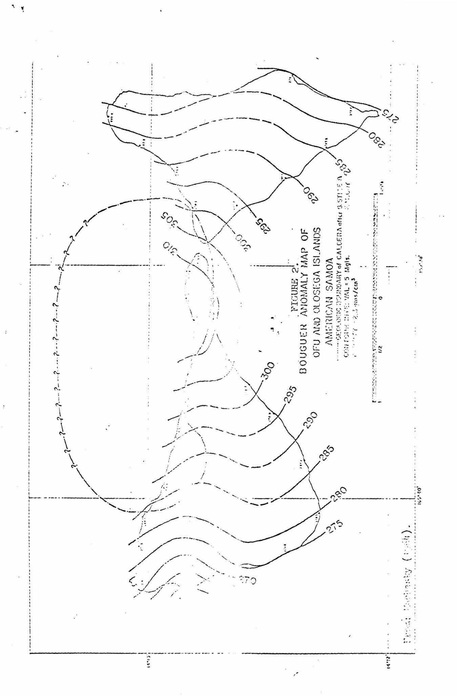
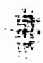
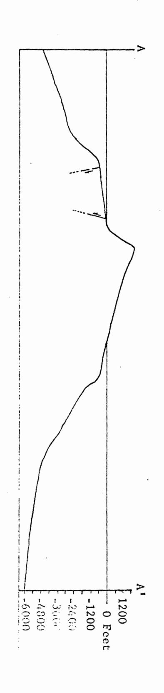
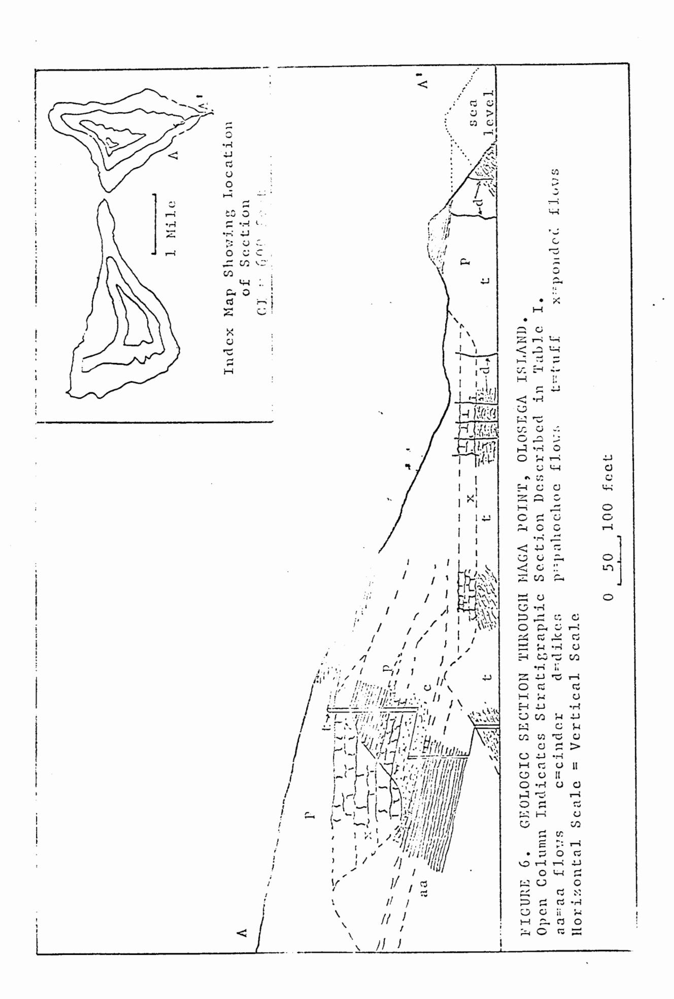

# THE GEOLOGY OF OFU AND OLOSEGA ISLANDS, MANU'A GROUP, AMERICAN SAMOA

A THESIS SUBMITTED TO THE GRADUATE SCHOOL OF THE
UNIVERSITY OF HAWAII IN PARTIAL FULFILLMENT
OF THE REQUIREMENTS FOR THE DEGREE OF
MASTER OF SCIENCE
IN GEOLOGICAL SCIENCES
JANUARY 1965

By
Floyd Wf McCoy, Jr.

### RULES ADOPTED BY THE BOARD OF REGENTS OF THE UNIVERSITY OF HAWAII NOV. 8, 1955 WITH REGARD TO THE REPRODUCTION OF GRADUATE THESES

- (a) No person or corporation may publish or reproduce in any manner, without the consent of the Graduate School Council, a graduate thesis which has been submitted to the University in partial fulfillment of the requirements for an advanced degree.
- (b) No individual or corporation or other organization may publish quotations or excerpts from a graduate thesis without the consent of the author and of the Graduate School Council.

2 3

- 1

Hawn. 9111 H3 no.443 cup.2

### TABLE OF CONTENTS

|                 |         |                          |     |     |       |     |          |    |    |    |     |     |            |            |    |     |        |    |            | Page |
|-----------------|---------|--------------------------|-----|-----|-------|-----|----------|----|----|----|-----|-----|------------|------------|----|-----|--------|----|------------|------|
| List of Ill     | ustra   | sti                      | ons |     | •     | ,•  | •        | ٠  | •  | •  | •   | •   | •          | •          | •  | •   | •      |    |            | 111  |
| PYRE OX 180     | 168     | _                        |     | _   | _     | ٠   | ٠.       | _  | _  |    | _   | _   | _          | _          | _  |     | ٠.     | ٠. |            | 17   |
| WEST FACE       |         | •                        |     |     | •     |     | •        | •  | •  | •  | •   | •   | •          | •          | •  | •   |        | •  | •          | v    |
| Introduction    | a .     | •                        | • • | •   | •     | ٠   | •        | •  | •  | •  | •   | •   | •          | •          | •  | •   | •      |    | •          | i    |
| General         | Geogr   | apl                      | hic | De  | 88(   | CT: | ipt      | į  | on | of | ? * | :he | 1          | <b>1 1</b> | ar | ıdı | 1      |    |            | 1    |
| rrevious        | TEAG    | st                       | Lga | :1  | one   | 3   |          | ٠. | ٠. |    |     |     |            |            |    |     | `.     |    |            | 2    |
| LIGRANT         | MOLK    |                          |     |     |       |     | •        | `. | ٠. | ٠. |     |     |            |            |    | `_  |        |    | ٠.         | 6    |
| Acknowle        | dgmen   | ts                       | •   | •   | ٠     | •   | •        | •  | .• | •  | •   | •   | •          | •          | •  | •   | •      | •  | •          | 6    |
| Structura a     | nd Ge   | OMO                      | rpl | 10  | log   | IJ  | ٠,       | :• |    | •  | *   | · • |            | •          | •  |     |        |    | `. <b></b> |      |
| Volcanio        | Stru    | cti                      | ire | •   | •     | ٠,  | ٠.       | ٠, | ٠, | ٠, |     | •   | •          | •          | •  |     | ٠.     |    | , •     | 8    |
| Gener           | al st   | ruc                      | tuz |     | of    | : t | :he      |    | hi | •i | đ   |     |            |            |    |     |        | ٠. |            | 8    |
| The c           | alder   |                          |     |     |       | •   | ٠.       | ٠. | ٠. | •  |     | •   | •          |            |    | •   | •      |    | ٠          | 10   |
| The c Gravi  | ty me   | ART                      | ren | ler | ta    | 3   | •        | •  | •  | •  | •   | •   | •          | •          | •  | •   | •      | ,  | •          | 12   |
| -Yeatures       | Asso    | cia                      | ted | W   | ,it   | ħ   | th       | •  | Ca | 14 | er  |     | •          | •          | ė  | •   | , • | •  |            | 13   |
| Topog           | raphi   | a £                      | est | ur  | . 6 2 | l   |          |    |    |    |     | ٠.  |            |            |    |     |        |    |            | 13   |
| Perip           | heral   | di                       | ke  | CO  | ממו   | 1.  | <b>X</b> | •  | •  | •  | •   | ٠,٩ | •          | •          | •  | •   | •      | •  | •          | 14   |
| Pault           | •       |                          |     |     |       |     | _        | •  | •  | •  | •   | •   | •          | •          | •  | •   | •      | •  | •          | 16   |
| Fault: Uncon | formi   | tie                      | 8   | •   | •     | •   | •        | •  | •  | •  | •   | :   | •          | •          | •  | •   | •      | •  | •          | 17   |
| Features        | Asso    | cia                      | ted | ¥   | it    | h   | th       | •  | Rí | ft | Z   | on  | e <b>s</b> |            | •  | •   | •      | •  | •          | 17   |
| Dikes           |         |                          |     |     |       |     |          |    |    |    |     |     |            |            |    |     |        |    |            |      |
|                 |         | •                        | • • | •   | •     | •   | •        | •  | •  | •  | •   | •   | •          | •          | •  | •   | •      | •  | •          | 17   |
| Fault           | •       | •                        | • • | •   | •     | ٠   | •        | •  | •  | •  | •   | •   | •          | •          | •  | •   | •      | •  | •          | 19   |
| Streams a       | ind V   | <b>a</b> 11              | eys |     |       |     |          |    |    |    |     |     |            |            |    |     |        |    |            | 19   |
| Sea Cliff       | 's      |                          |     |     | •     | •   | •        | •  | •  | •  | •   | •   | •          | •          | •  | •   | •      | •  | •          | 21   |
|                 | •       | •                        | • • | •   | •     | •   | •        | •  | •  | •  | •   | •   | •          | •          | •  | •   | •      | •  | •          | • •  |
| Descri          | ption   | α .                      |     |     | _     |     |          |    | _  | _  |     |     |            |            |    | _   |        | _  |            | -21  |
| Origin          | · .     |                          |     |     |       | •   | •        |    | •  | •  |     |     |            | •          |    |     |        |    | •          | 21   |
|                 |         |                          |     | ٠   | •     | •   | •        | •  | •  | ٠  | •   | ٠   | •          | ·          | •  | •   | •      | •  | ٠          | -    |
| Coastal E       | ench    | 8                        | •   | •   | •     | •   | •        | •  | •  | •  | ٠   | •   | •          | •          | •  | •   | •      | •  | •          | 23   |
| Wave-           | ut be   | nc                       | h   |     |       |     |          |    |    |    |     |     |            | ٠          |    |     |        |    |            | 23   |
| Constr          | uctio   | na                       | 1 Ъ | en  | ch    |     | •        | •  | •  | •  | •   | •   | •          | •          | •  | •   | •      | •  | •          | 24   |
| Fringing        | Ca= -1  | <b>.</b>                 |     |     |       |     |          |    |    |    |     |     |            |            |    |     |        |    |            |      |
| Submarine       | Pass    |                          | 861 |     | ٠     | . • | •        | •  | •  | •  | •   | •   | •          | •          | •  | •   | •      | •  | ٠          | 26   |
| - ender 7 [14   | F 4 2 1 | ·ur                      |     |     | •     | •   | •        | •  | •  | •  | •   | •   | •          | •          | •  | •   | •      | •  | •          | 30   |
| Igneous Rock    |         |                          |     | •   | •     | •   | •        | •  |    | •  | •   |     | •          | •          | •  | •   | •      | •  | •          | 33   |
| General S       |         |                          |     |     |       |     |          |    |    |    |     |     |            |            |    |     |        |    |            | 33   |
| Rutramoal       | 4       | <b>17</b> – ( |     |     |       |     |          | •  | ٠  | •  | •   | •   |            | •          | •  | •   | •      | •  | •          | •    |
| NTTTEMP8:       | ~       | VA                       |     |     |       |     |          |    |    |    |     |     |            |            |    |     |        |    |            |      |

### TABLE OF CONTENTS cont.

|       | De   | fin          | it       | :io   | n  |            |          | •    |   |              |     |            |   | • |   |   |   |            | ÷ |   |   |     |          |   |   | 34        |
|-------|------|--------------|----------|-------|----|------------|----------|------|---|--------------|-----|------------|---|---|---|---|---|------------|---|---|---|-----|----------|---|---|-----------|
|       |      | va           |          |       |    |            |          |      |   |              |     |            |   |   |   |   |   |            |   |   |   |     |          |   |   | 35        |
|       |      | roc          |          |       |    |            | -        | -    | - |              |     |            |   |   |   |   |   |            |   |   |   |     |          |   |   | 48        |
|       | - ,  |              |          |       | -  |            |          | •    | • | •            | •   | •          | • | • | • | • | • | •          | • | • | • | •   | •        | • | • | 7.0       |
| In    | tru  | βiν          | <b>.</b> | ۷o    | 1  | CA         | ni       | C S  | } | •            | •   | •          | • | • | • | ٠ | • | •          | • | • | • | •   | •        | • | • | 53        |
|       | De   | fin          | 4 +      | · 1 ^ | ** |            |          | _    | _ | _            | _   |            |   | _ | _ | _ |   | _          |   | _ |   | _   | _        | _ |   | 53        |
|       |      | kes          |          |       |    |            |          |      |   |              |     |            |   |   |   |   |   |            |   |   |   |     |          |   |   | 53        |
|       |      |              |          |       |    |            |          |      |   |              |     |            |   |   |   |   |   |            |   |   |   |     |          |   |   | 57        |
|       | PI   | nge          |          | ) II  | U  | ţ u        |          | •    | ٠ | •            | •   | •          | • | ٠ | • | • | • | •          | • | • | • | •   | •        | • | • | <i>31</i> |
| In    | tra  | -ca          | 16       | ler   | *  | V          | 01       | CE   | n | Lei          | 8   | •          | • | • |   | - | • | 1          |   |   | * | : • | :: ** |   | • | 58        |
| •     | De   | fin          | 4 +      | :10   | •  |            |          | _    | _ | _            | _   |            | _ | _ |   | _ | _ | _          | _ | _ | _ | _   |          | _ |   | 58        |
|       | 7.0  | va           | #1       | 224   |    | -          | -4       | ٠.   | • | **           | . i | •          |   |   |   | • | • | •          | • |   | • | •   | •        | • | • | 58        |
|       |      |              |          |       |    |            |          |      |   |              |     |            |   |   |   |   |   |            |   |   |   |     |          |   |   | 60        |
|       | DI   | BCC          | 1.4      | 18    |    | •          | •        | •    | • | •            | •   | •          | • | • | • | ٠ | • | •          | • | • | • | •   | •        | • | • | 90        |
| La    | te ' | Vo 1         | C        | ın 1  | C  | 8          | •        | •    | • | •            | •   | •          | • | • | • | • | • | ٠          | • | • | • | •   | •        | • | • | 61        |
| •     | De   | fin          | 11       | :10   | n  |            | _        |      |   | _            |     |            |   | _ | _ | _ | _ | _          |   |   |   |     |          |   | _ | 61        |
|       | Nu   | † <b>u</b> 8 | 1.1      |       | ī  |            | · 7      | ., f | # | •            | •   |            |   |   | • | - | • |            | • | • | • | Ī   | •        | • | • | 62        |
|       |      | bma          |          |       |    |            |          |      |   |              |     |            |   |   |   |   |   |            |   |   |   |     |          |   |   | 63        |
|       | D U  | y wa         | £ 2      | He    | 1  | 70         | TC       | en.  |   | • щ          | •   | •          | • | • | • | • | • | " <b>4</b> | • | • | • | •   | •        | • | • | 03        |
| Sedim | ent  | ary          | E        | )ep   | 01 | 8 <b>1</b> | t e      | 1    | • | •            | •   | •          | • | • | • | • | ~ | •          | • | • | • | •   | •        | • | • | 64        |
| Be    | ach  | roc          | k        |       |    |            | _        |      | _ |              |     |            |   | • |   |   |   |            |   |   |   |     | •        |   |   | 64        |
|       | con  |              |          |       |    |            |          |      |   |              |     |            |   |   |   |   |   |            |   |   |   |     |          |   |   | 65        |
|       | nds  |              |          |       |    |            |          |      |   |              |     |            |   |   |   |   |   |            |   |   |   |     |          |   |   | 66        |
| пa    | ma s | LLG          | T.       | 611   | 4  | _          | <b>4</b> |      | • | / <b>C</b> } | γU  | <b>5</b> 4 |   | 5 | • | • | • | •          | • | • | • | ٠   | •        | • | • | 00        |
| Geolo | gic  | Hi           | st       | or    | У  |            | •        | •    | • | •            | •   | •          | • | • | • | • | • | •          | ٠ | • | • | •   | •        | • | • | 69        |
| Refer | enc  | <b>e 8</b>   | Ci       | te    | đ  |            | •        | •    |   | •            | •   | •          |   | • | • | • | ٠ | •          | ٠ | • | • | •   | •        | • | • | 72        |

### LIST OF ILLUSTRATIONS

|         |    |                                                                        | Page No.   |
|---------|----|------------------------------------------------------------------------|------------|
| Figure  | 1. | Map of the Samoan Archipelago                                          | 1 <b>a</b> |
| Figure  | 2. | Bouguer Anomaly Map of Ofu and                                         | 11         |
|         |    | Olosega Islands                                                        |            |
| Figure  | 3. | Constructional Bench Profiles                                          | 28         |
| Figure  | 4. | Bathymetry Near Ofu and Olesega Islands                                | 31         |
| Figure  | 5. | Bathymetric Prefile North and South of Olosega, Showing Approximate | •          |
|         |    | Position of Caldera Faults                                             | 32         |
| Figure  | 6. | Geologic Section Through Maga Point,                                   |            |
|         |    | Olosega Island                                                         | 49         |
| Figure  | 7. | Geologic Section 600° 8 25° W of Tauga                                 |            |
|         |    | Point, Ofu                                                             | 50         |
|         |    |                                                                        |            |
| Plate 2 | t. | Geologic Map of Ofu and Olosega Islands                                | ,          |
|         |    | Manufa Amandaan Samaa (In maabat)                                      | 75         |

### LIST OF TABLES

|          | Page No.                                         |
|----------|--------------------------------------------------|
| Table I. | Stratigraphic Section of Extra-caldera           |
|          | Volcanics Along the Trail at Maga Point,         |
|          | Olosega 40                                       |
| Table II | . Stratigraphic Section of Extra-caldera         |
|          | Volcanics Along the Trail from the West-         |
|          | ern End of Samo'i Beach up Tia Ridge,            |
|          | Ofu 41                                           |
| Table II | I. Stratigraphic Section of Extra-caldera Volca- |
|          | nics Along the Trail to Tafalau, Olosega 43      |
| Table IV | . Stratigraphic Section of Intra-caldera         |
|          | Volcanies Along Trail to Binapoto, Ofu 59        |
| Table V. | Average Size Parameters of Calcareous            |
|          | Sands from Ofu and Olosega Islands 68            |

### Abstract

The islands of Ofu and Olosega are in the Manu'a Group of the Samoan Archipelago, 65 miles east of Tutuila Island. Together they comprise an area of 3-1/2 square miles. The maximum elevation is 2095 feet on Olosega.

ofu and Olosega Islands are the remnants of a single shield volcano, the Ofu-Olosega volcano. Hawaiian-type eruptions built a volcano about 2500 feet above present sea level, along the Manu'a Ridge of the regional Manu'a rift zone during the Pliocene. Two rift sones radiated from the volcano, one N 40° E and another S 35° W. Late in the development of the volcano, collapse at the intersection of the rift zones produced a caldera 3 miles long and 1-1/2 miles wide.

Four igneous rock units are recognized: 1) the Extracaldera Volcanics, 2) the Intrusive Volcanics, 3) the Intra-caldera Volcanics, and 4) the Late Volcanics. The Extra-caldera Volcanics represent the numerous lava flows of an and pahoehoe types which built the shield prior to caldera collapse. The Intrusive Volcanics are a peripheral dike complex which delineates the caldera. Two volcanic plugs are also exposed. The Intra-caldera Volcanics include the thick flows which ponded within a pit crater contiguous to the caldera, and the talus breccias which accumulated at the base of the southern caldera wall. Following deep disection of the volcano, the Late Volcanics occurred as a

phreato-magmatic explosion, producing the Nu'utele tuff cone west of Ofu, and as a submarine eruption between Olosega and Ta'u Islands in the late 1860's. Igneous rock types are predominately aphanitic and porphyritic olivine basalts. Ankaramites and basaltic andesites also occur, indicating differentiation of the primary magma. A relatively minor amount of pyroclastic rock is present. No major erosional unconformity is exposed. Development of the shield closely paralleled that of other volcances in the Samoan and the Hawaiian Islands. Gravity data corroborates the surface geology.

A narrow fringe of calcareous beach deposits and a fringing coral reef surround both islands. High cliffs around the islands are the product of marine abrasion.

Indications of a +15 and a +5 foot stand of sea level occur along the coastline as wave-cut benches.

### INTRODUCTION

### General Geographic Description of the Islands

Ofu and Olosega Islands are the two smallest islands of the Manu'a Group, the eastern-most group of islands in the Samoan Archipelago. Ofu and Olosega are about 60 miles east of Tutuila Island, the administrative center of American Samoa, and 6-1/2 miles west of Ta'u Island, the largest island in the Manu'a Group. Both islands are at 14° 11' South Latitude, Ofu at 169° 40' West Longitude and Olosega at 169° 37' West Longitude. Together they comprise an area of 3-1/2 square miles.

The Manu's Group of islands trend N 70° W. This is the same direction of trend for the larger islands of the Samoan Archipelago, Savai'i, and Upolu in Western Samoa (Kear and Wood, 1959), and Tutuila in eastern Samoa, but the two trends seem to be offset by about 25 miles along a northeast-southwest direction (Fig. 1).

Both Ofu and Olosega are triangularly shaped with their apexes barely separated by a narrow, shallow waterway. Ofu rises to 1,621 feet and Olosega to 2,095 feet. Along both the northern and southern coasts, a narrow fringing reef continues unbroken from one island to the other. Except near the village of Ofu, high cliffs surround both islands, rising vertically over 2,000 feet behind Olosega village. Excellent outcrops of dikes and other rocks are exposed in these cliffs, and in the razorback ridge of eastern Ofu, where they are

|                                          | 3              | SVAL I, IVANS |                   |
|------------------------------------------|----------------|---------------|-------------------|
| FIGURE 1. HAP OF THE SAFOAN ARCHITETAGO. | TULIUTA TS.    | UPOLU IS.     | 1720              |
|                                          | GEOTS. TALLES. |               | 1,70 6 |

H

٠.

not mantled by vegetation. The upland areas are covered by soil as much as 10 feet thick, which supports a dense growth of underbrush, particularly on Olosega. Travel is entirely by foot along trails. The population is slightly over 1000 and is restricted to the two large villages of Ofu and Olosega and the smaller village of Sili on Olosega.

At their latitude, the islands are subjected to the gentle trade winds of the southern hemisphere from April to September, which produces larger swell in the southern waters. From October to March, the winds are predominately from the north and northeast, but are variable, and the larger swell is produced in the northern waters. It is an area of heavy rainfall and high but practically unchanging temperature. During a 37-year period at Pago Pago, Tutuila, the rainfall averages 196 inches per year and the temperature 81° F. (Coulter, 1941)

### Previous Investigations

The first geological observation recorded was made by
La Perouse in 1798 who merely stated that Ofu and Olosega,
as well as the rest of Samoa, appeared volcanic and made
up of pieces of lava or basalts surrounded by coral. Later,
Couthouy (1842) described the reefs in Samoa, mentioning
large fragments of coral 85 feet above sea level "at the
northwest end of Manu'a." He was probably referring to
what is now called the island of Ta'u and the tuffs at its
northwestern point, which do carry coral fragments (Stice,
1965). Evidently, the application of the name Manu'a to all

three islands is a more recent innovation.

Dana (1849) noted the separation between the Manu'a trend and the trend of the larger Samoan islands. From information supplied by others in the Wilkes Expedition who visited the Manu'a Group, Dana thought that Ofu and Olosega were "once united."

Friedlander, according to Stearns (1944), believed Ofu and Olosega were the remnants of a single volcano, and that the embayments north and south of the islands resulted from collapse which formed two craters. He also collected a sample of olivine basalt from Olosega which was first described by Weber in 1909 and later by Macdonald (1944).

Daly (1924, pp. 132-135) was the first American geologist to visit Ofu and Olosega. His reconnaissance survey of only a few days contributed much to the geology of the two islands. He recognized that both islands were merely the remnant of a larger basaltic volcano. The high cliffs "on all sides" of each island he did not think were entirely due to wave-cutting. Rather, he thought that their origin might be explained as: 1) wall remnants of explosion calderas,

2) remnants of the wall of a collapse caldera, or 3) scars left by two enormous landslips involving much of the original island. The first hypothesis he rejected. He could not, however, decide between the second and third, and believed the decision could not be made until more detailed soundings were taken offshore. Daly thought both islands were largely composed of pyroclastic material, with basaltic flows

predominating only at the northwestern end of Ofu and the southeastern end of Olosega. Thus he considered the original cone to be "a typical basaltic cone of the explosive type." He also noticed the plug near the eastern tip of Ofu and was impressed by the good dikes exposures. He recorded the deep weathering on both islands, and the recent age of Nu'utele Island west of Ofu.

Stearns conducted a geological reconnaissance survey of American Samoa that included a one-day visit to all three islands of the Manu'a Group, circling Ofu and Olosega, by The account (Stearns, 1944) included the first geoloboat. gic map of Ofu and Olosega yet published. Stearns did not think that the original Ofu-Olosega volcano was the explosive type, nor did he believe that an unusual amount of pyroclastics were present. He divided the igneous rocks into three catagories: pre-caldera volcanics, dike complex, and post-caldera volcanics. Stearns considered Ofu and Olosega to be almost entirely composed of the pre-caldera series. The only caldera, he believed, was north of Ofu, about 1 by 2-1/2 miles in size. The southern portion of the caldera was represented on Ofu by a topographic depression, and the rocks within the depression Stearns mapped as post-caldera ("caldera-filling" on his map, p. 1314). He agreed with Daly that the cliffs along the east side of Olosega and the west side of Ofu were the product of marine abrasion, in addition to the cliff along the north coast of Ofu. The curved cliff along the northwestern coast of Olosega he

thought to be a remnant of the caldera wall, worn back by erosion. He did not consider an origin for the cliffs bordering the south coasts of either island, except to suggest that they may also be the result of marine erosion following the dike complex.

Briefly, the gerlogic history of Ofu and Olosega, as interpreted by Stearns, is as follows: During the Pliocene or earliest Pleistocene, a volcanic cone about 4 by 6 miles in size built above sea level, composed of primitive thin-bedded basalts. Later, collapse of the summit formed a caldera. In the early and middle Pleistocene a long period of erosion prevailed, followed by submergence of at least 400 feet, with continued growth of a fringing reef and cutting of sea cliffs. During late Pleistocene time, the fringing reef was submerged about 200 feet, followed by a possible emergence of 20 feet. During Recent time, a fringing reef again grew around both islands and Nu'utele Island was formed by an explosion through this reef. An emergence of 5 feet followed.

Macdonald (1944, pp. 1349-1350) described the petrology and petrography of the five samples collected by Stearns on Ofu; none were collected on Olosega. Macdonald noted that two of the samples, an augite-rich picrite basalt and a basaltic andesite, indicated that the volcano had entered the stage of differentiated lavas.

Meanwhile, concepts of the petrology, structure, and history of large basaltic volcanoes of the mid-Pacific were

being developed by workers in Hawaii (a recent contribution is by Macdonald, Davis, and Cox, 1960). It was desirable to test and extend these concepts to other mid-Pacific volcanoes.

### Present Work

The present work was supported by a National Science Foundation Grant to Dr. Gordon A. Macdonald, principal investigator, and Mr. Gary Stice, both of the Hawaii Institute of Geophysics at the University of Hawaii, for research on the petrology of American Samoa. February through May, 1964, was spent in field work in the Manu'a Islands by Mr. Stice and the writer. Three weeks were spent on Ofu Island and one week was spent on Olosega Island. During August of the same year, a return trip was made to assist Mr. Lawrence Machesky, also of the Hawaii Institute of Geophysics, in a gravity survey of Manu'a, and additional geologic mapping and collecting was done then. Both islands were studied in such detail as the dense vegetation allowed. Many areas were inaccessible. Research on the geology of Ta'u Island and the petrography of the Manu'a Islands is being conducted by Mr. Stice.

### Acknowledgments

The field study was possible through the permission of the Government of American Samoa. Manu'a District Governor, High Chief Lefiti granted permission and made the necessary arrangements for the work in Manu'a. On Ofu, the hospitality of the Fa'alupega High Chief Misa, as well as High Talking Chief Veilega, and John and Lela Malau'ulu are greatly

appreciated. Olosega Pulenu'u Milo made all arrangements on that island. Others from Ta'u who helped by contributing information on Ofu and Olosega, and making the stay in Manu'a unforgettable, are: Ta'u Fa'alupega High Chief Nua, High Chief Tufele, the Reverend John Soloi of Fitiiuta, and Talking Chiefs Fa'ia and Tufalafo. The people of Samoa, especially of Manu'a, are among the friendliest in the world, and it was only through their whole-hearted cooperation that the field work was successfully completed.

The hospitality and technical assistance extended by Mr. Edward Brunton, head of the Land Survey Department in Pago Pago is also appreciated.

The work in Manu'a represents the joint efforts and ideas of the writer and Mr. Gary Stice, who did the field work together. Without his instigation and interest, the whole trip and investigation would have been impossible.

### STRUCTURE AND GEOMORPHOLOGY

### Volcanic Structure

### General Structure of the Shield.

Ofu and Olosega Islands are the deeply dissected remnants of the Ofu-Olosega volcano. In much the same manner as other volcanoes in the Samoan islands (Stearns, 1944; Kear and Wood, 1959) and the Hawaiian Islands (Stearns, 1946; Stearns and Macdonald, 1946; Wentworth and Macdonald, 1953), the Ofu-Olosega volcano built a constructional lava dome, or shield, upon the broad ridge striking N 70° W through the Manu'a Group. The Manu'a Ridge represents a major regional lineament on the Central Pacific sea floor. The original dome probably stood approximately 2500 feet above present sea level, or about 500 feet higher than Piumafua Mountain on Olosega, the highest point of the volcano now. Nearly all of the caldera was north of the present islands. Two rift zones extend outwards from the caldera. From the eastern edge of the caldera, one rift zone trends N 40° E, and the other known rift zone trends \$ 35° W from the southwestern edge. Following the collapse of the summit to form the caldera, the southern portion of the volcano remained higher, as noted by Stearns (1944). This high southern rim has been eroded to the present islands of Ofu and Olosega. Near the caldera, the dips of lava flows are almost horizontal, but towards the periphery of the Ofu-Olosega shield they increase to as much as 30°. The average dip is about 15°, and such

steep dips may indicate that the flows entered deep water close to shore (Stearns and Macdonald, 1942, p. 156).

Pyroclastics compose about 5 per cent of the known volume of the volcano, so that Daly's term "explosive type" probably would be considered a misnomer to later geologists (Stearns, 1944). Nevertheless, pyroclastic rocks appear to be more abundant than described for the Hawaiian volcanoes in general (Wentworth and Macdonald, 1953). This higher pyroclastic content is probably due to the caldera's position close to sea level, supporting the interpretation of a generally low elevation of the shield indicated by the steeper dips discussed above. Under these conditions, normally quiet Hawaiian-type eruptions would be expected to produce a slightly higher amount of pyroclastics because of littoral and phreatomagmatic explosions, especially in the vicinity of the caldera and along the rift zones. The resulting high concentration of pyroclastic debris would extend horizontally as the shield grows in diameter. Thus, a vertical section would show a decreasing content of pyroclastic material upwards.

The island of Ofu is at the intersection of the N 70° W rift of the Manu'a Ridge, and the southwestern rift zone of the Ofu-Olosega volcano, with the southeastern corner of the Ofu-Olosega caldera. Olosega Island lies on the intersection of the regional Manu'a rift zone and the northeastern rift zone of the volcano. Both islands exist today because of their position along the higher southern rim of the caldera and the more resistant nature of the dike complexes passing

through the islands. None of the original shield surface remains on either Ofu or Olosega. The western slope of Ofu behind Ofu village and the eastern slope of Olosega are, however, slightly steepened and lowered surfaces which still partly reflect the original shield surface. Elsewhere on Ofu, the topography is controlled by the underlying dikes along both the rift sones and the caldera boundary, and the eroded remnant of the pit crater which was adjacent to and part of the caldera.

Weathering along the eastern slope of Olosega directly reflects the underlying structure by proceeding in a series of 3- to 10-foot high steps, which approximately parallel the contours. This manner of weathering evidently progresses flow by flow. A similar pattern has developed on portions of the western slope of Ofu, but in not nearly as extensive a pattern as on the eastern slope of Olosega.

The bench protruding from the eastern slope of Olosega and forming Le'ala Point, is the result of a series of thicker flows exposed here, the denser material being more resistant to weathering. Nu'utele and Nu'usilaelae islands west of Ofu are the eroded remnants of a tuff cone that erupted late in the history of the volcano.

### The caldera.

Collapse of the summit of the Ofu-Olosega volcano, late in the development of the shield, produced a caldera 3 miles long and 1-1/2 miles wide. In size, it is similar to the calderas of the Hawaiian volcanoes. Calderas in Hawaii are

believed to have been produced by subsidence, resulting in the formation and eventual coalescence of numerous pit craters. They are classified as calderas of the Glen Coe type (Stearns and Macdonald, 1946; Macdonald, 1964). The Ofu-Olosega caldera probably originated through subsidence also, and would be classified as a caldera of the Glen Coe type. A pit crater that was not entirely incorporated into the general elliptical pattern of the caldera, remains as a depression on Ofu. The floor of the caldera was probably quite close to sea level; it may even have been open to the sea along its northern boundary, allowing marine erosion to occur later within the caldera.

### Gravity Measurements

A gravimetric survey of Ofu and Olosega Islands was conducted during the summer of 1964 as part of a gravimetric survey of American Samoa. The absolute Bouguer gravity anomalies of Ofu and Olosega range from a low of plus 260 milligals at Alaufau on the west coast of Ofu, to a high of plus 312 milligals on the beach at Sunu'itao, also on Ofu (Machesky, 1964). A surface density of 2.3 grams per cubic centimeter is assumed. Contouring of the Bouguer anomaly for the islands shows a distinct anomalous positive area in the vicinity of Vainu'ulua Peak on Ofu. Similar patterns of the contoured Bouguer anomaly have been related to the calderas and the rift zones of the Hawaiian volcanoes (Woollard, 1951; Strange, Malahoff, and Woollard, 1964). For the Ofu-Olosega volcano, the Bouguer gravity anomaly corroborates the present geologic

mapping, also establishing the position of the caldera to the north of the islands. The westward bulge of the Bouguer anomaly contours on Ofu indicates the southwest rift zone of the volcano. The regional Manu's rift zone appears as an eastward bulge of the Bouguer anomaly contours on Olosega.

# Features Associated with the Caldera Topographic features.

Two prominent topographic features are associated with the caldera on Ofu, the depression on Ofu and the ridge partly surrounding the depression. The semi-circular depression of north-central Ofu is slightly over 1 mile in diameter along the northern coastline, and more than 1000 feet deep there. It represents a pit crater which was adjacent to and part of the caldera, possibly in the same relationship as North Pit is to Mokuaweoweo, the caldera of Mauna Loa on the island of Hawaii (Stearns and Macdonald, 1946). The collapse forming the crater occurred where the Manu'a regional rift zone and the southwestern rift zone of the Ofu-Olosega volcano intersected the caldera wall.

The high ridge bordering the depression on Ofu includes

Mato Ridge. Tumu Mountain, and Le'olo Ridge. The entire southern coastline of Ofu parallels this ridge. Structurally, it
represents a portion of the peripheral dike complex which
intruded along the bounding faults of the pit crater.

The only topographic feature on Olosega associated with the caldera is the high cliff along the northwest coast of island, from Tamatupu Point to Fiava. It is the fault-line

scarp of the caldera's southeastern rim.

Peripheral dike complex.

Numerous dikes rose through the talus breccias within the caldera and the lava flows both within and without the caldera, to feed the numerous eruptions that built the shield volcano. Because the orientation of these dikes were controlled by the caldera boundary faults, as noted by Stearns (1944, p. 1316), a ring pattern concentric to the caldera resulted. This arrangement of dikes is herein referred to as the peripheral dike complex. Farther from the caldera, rift-aligned faults controlled dike alignment.

These peripheral dikes are identical in pattern, and probably similar in origin, to the thinner, near-surface continuations of the ring dikes which surround the subsidence calderas of the shield volcances of Scotland, as given by Rickey, MacGregor and Anderson (1961, Fig. 24, p. 57). Implications of similar peripheral dike patterns have been noted on other volcances in the Pacific. Macdonald (1945; also Wentworth and Macdonald, 1953, p. 12) suggests that a pattern of cones on Mauna Kea, on the island of Hawaii, might possibly reflect a ring dike pattern at depth. Pissures of historical eruptions on Niusfo'ou Island in northern Tonga also form a ring pattern around one side of the caldera, in the center of the island (Macdonald, 1948).

At its widest exposure on Ofu, between Agaputuputu on the north coast and To'aga on the southeastern coast, this peripheral dike complex is 3000 feet wide. The general trend of the dikes in this area is N 850 W.

To the west of Agaputuputu on Ofu, the collapse of the pit crater along the southeastern boundary fault of the caldera, has truncated almost half of the peripheral dike complex. The remaining dikes continue around the pit crater, forming the high ridge of Tumu Mountain and Le'olo and Mato Ridges. At Samo'i, on the north coast of Ofu beneath Mato Ridge, these remaining dikes outcrop as a dike complex about 1800 feet wide. The trend here is generally N 180 W.

Eastwards from its widest exposure on Ofu between Agaputuputu and To'aga, a considerably narrower section is exposed along the spectacular razorback ridge and Vainu'ulua Peak. Here the complex is only about 900 feet wide. The trend of the dikes forming the ridge and the peak is generally eastwest.

On the western point of Olosega, between Piumafua Mountain and Asaga Strait, the dike complex again becomes over 3000 feet wide. At Tamatupu Point, the westernmost tip of Olosega in Asaga Strait, the trend is still east-west, but in less than 1000 feet to the east, it changes northward to N 82° E. Then, in the vicinity of Nu'utoa Peak, the trend abruptly turns to the north again, to N 45° E, then once again to N 18° E in the cliffs behind Fo'iupolu and Sili. Scattered dikes striking northeast cut through flows behind Olosega village, indicating that the complex may be over 3500 feet wide in this area.

The dikes exposed in this complex dip steeply to the

east at Samo'i on Ofu, to the north on the rest of Ofu, and to the northwest on Olosega. That is, they all are essentially vertical or have very steep dips towards the center of the caldera. Near the fringes of the complex, or father from the actual caldera boundary, the dips decrease. This is particularly striking in the cliff exposures behind Olosega village, where the dikes vary from vertical at the northern edge of the complex to dips as low as 58° at the southern edge. It is also noticeable in the cliffs behind Faiava on Olosega.

The abundance of dikes also decreases towards the fringes of the dike complex. Nearer the caldera's boundary, the dikes are so closely spaced that little of the original country rock remains as, for example, in the vicinity of Nu'utoa Peak on Olosega. Dikes also decrease in number upsection, as noted by Stearns (1944, p. 1316).

Dikes vary in thicknesses from a few inches to more than 70 feet, but average only 2 to 4 feet thick.

Faults.

The only large fault clearly exposed on Ofu is part of the boundary fault of the pit crater. At the outcrop of the fault, 300 feet east of Lelua Point on the north coast, it is a nearly vertical, normal fault striking 8 34° W. The southeastern block is downthrown, but the magnitude of displacement cannot be measured. The sea has cut a narrow, vertical recess into the sea cliff along the fault trace at sea level.

Elsewhere, numerous small, normal faults occur within the dike complexes, as at Samo'i on Ofu and in the cliffs behind Sili on Olosega, but with displacements of only a few feet. Because of their small displacements, they have not been included on the geologic map.

The remainder of the caldera-boundary faults are either effectively masked by vegetation or have been avenues of intrusion for later dikes, and so cannot be distinguished.

Unconformities.

The unconformities described by Stearns (1944, p. 1315), as bounding the east and west sides of the Ofu caldera, are angular unconformities between older, thinner-bedded, extracaldera flows and the younger caldera-filling flows and talus breccias. Because faulting produced the wall of the pit crater on Ofu, which was part of the caldera, the unconformity is also a buried fault-line scarp. As noted by Stearns (1944, p. 1316), the eastern unconformity (and fault), west of Agaputuputu on Ofu, truncates the peripheral dike complex which lies to the east of this unconformity.

Small angular unconformities are exposed in the cliffs behind Sili on Olosega, and are probably the result of minor faulting near the calders.

# Peatures Associated with the Rift Zones Dikes.

On Ofu, a small group of eight dikes is exposed in the cliffs 800 feet north of Si'umatu'u Point, near the southern tip of the island, and a ninth is exposed 800 feet to the

west. These dikes trend N 50° E. North of Va'oto Marsh, two more dikes are exposed in the cliffs, trending N 87° E. All of these dikes are vertical, and are 3 to 10 feet in thickness. They represent intrusions along the southwestern rift zone of the Ofu-Olosega volcano.

Only a few dikes on Ofu were found related to the regional Manufa rift zone. Beneath Tia Ridge, 600 feet S 25° W from Tauga Point along the coastline, two vertical thin dikes 3 feet and 1/2 feet wide are exposed trending N 60° W; these are the dikes illustrated in Figure 6. Another dike is exposed 550 feet S 20° W of the above two dikes, also along the coastline. This dike is about 1-1/2 feet wide and vertical, but shortly above the base of the exposure, splits into two near-vertical dikes striking almost normal to each other. One branch trends N 85° E; the other trends N 25° W.

The northeastern rift zone of the volcano on Olosega is marked by three dike sets. At Leaumasili Point, the north tip of the island, dikes trend north, N  $21^{\circ}$  E, and N  $50^{\circ}$  E. The dikes are relatively thin, from less than 1 foot to 4 feet thick, and are vertical, except the two westernmost dikes which dip  $80^{\circ}$  W.

The Manu's regional rift zone is well marked on Olosega by a dike complex of over fourteen dikes forming a bulge in the cliffs northeast of Pouono Point, at the southern edge of Olosega village. Here the dikes generally trend S 60° E, a marked difference in orientation from the dikes of the peripheral dike complex. These dikes northeast of Pouono Point

are vertical and vary from less than a foot to over 10 feet in thickness, and decrease in number upsection. Further southeast, between Vaisa'ili Point and Maga Point, another set of dikes is exposed. Most of the dikes here also trend S 60°E, are vertical, and range from 1 foot to 10 feet in thickness. On Maga Point, dike orientations are random.

Faults.

Four striking faults trend N 69° W and cut through the southwestern tip of Nu'utele Island. These are normal, vertical faults with only about 30 feet displacements, through which the surf has carved, by Daly's description, three "Gothic-arch tunnels clear through the islet," through which the "surges rush with picturesque effect." Nu'utele Island is a remnant of a tuff cone whose vent is located on the Manu'a rift zone.

No other faults or indications of faulting were seen on Ofu or Olosega which were related to either of the two rift zones of the Ofu-Olosega volcano or to the regional Manu'a rift zone.

### Streams and Valleys

All of the streams on Ofu and Olosega are ephemeral or intermittant consequent streams, which have cut youthful steep-sided valleys. There are two distinct drainage basins on Ofu. One is along the western slope where six streams flow to the west, and the other is within the topographic depression of the pit crater where four streams flow to the north. Three of these streams along the west coast, Matasina, Tufu, and

Malaeti'a streams, have cut valleys as deep as 160 feet. The rest of the streams on Ofu have cut only shallow valleys about 40 feet below the surrounding land surface. In all cases, valleys are cut into bedrock with little sediment in the stream channel.

Value and Sinapoto streams have both cut valleys about 120 feet below the general slope, but the remainder have cut only shallow valleys ranging from 40 to 90 feet deep. Those streams at the southern end of the island are diverted by the bench at Le'ala Point.

Daly (1924, p. 133) believed the presence of gravel in the stream beds on Olosega indicated that the embayment south of Olosega and Ofu islands resulted from either a massive structural failure or a series of large landslides. The gravel, according to Daly, denoted larger streams which once drained the now-destroyed portion of the volcano between Ofu and Olosega. During the spring and summer of 1964, very little gravel was noticed in the stream channels, and that which was present seemed derived from the existing surface. The streams flow on bedrock. No notches of an older stream's course exist along the top of the sea cliff behind Olosega village, as might be expected if the streams once continued to a higher area. The present-day streams of Olosega are comparable with those of Ofu. Drainage basins on both islands are approximately equivalent in area, also.

### Sea Cliffs

### Description.

Bordering both islands are sea cliffs of varying heights. Along the western coast of Ofu, particularly behind Ofu village and Nu'utele Island, the sea cliffs are only about 80 feet high. Elsewhere around Ofu, however, the sea cliffs are much higher. The highest cliffs are along the south coast from Va'oto Point to Vainu'ulua Peak. They rise to more than 1500 feet near the Ofu triangulation station on Le'olo Ridge. Along the northern coast of Ofu they are much lower, partly because of the downfaulted depression of the pit crater, but increase in height to the east at the razor-back ridge.

Behind Olosega village the sea cliffs reach a spectacular height of 2095 feet--directly to the sumit of the island.
From this maximum height the cliffs decrease in accordance
with the eastern slope of the island, along both the northwest and the southwest coasts. Along the eastern coastline,
the cliffs are generally much lower. They are, for example,
200 feet high at Le'ala Point. At Maga Point, a buried tuff
cone, the cliffs are only about 120 feet high.
Origin.

Daly was uncertain about the origin of the cliffs along the southern coasts of both islands, but until more detailed soundings offshore were available, he decided that they may be the result of either collapse to the south, which formed a caldera, or the result of enormous landslips which eliminated

large portions of the island. Stearns (1944) thought they might have been formed by marine erosion along the rift zones during a submergence of 400 feet. As for the cliffs along the northern and western coasts, both Daly and Stearns agreed that they were the product of marine abrasion.

Soundings available now off the southern coasts of both islands do not indicate a caldera to the south (Fig. 3). On-shore geology also does not indicate a caldera to the south. Thus, the cliffs are probably not caldera boundary fault-line scarps. It is still difficult to test Daly's landslip hypothesis. It is believed, however, that the cliffs along the southern coasts, as well as the rest of the cliffs around both islands, have been cut by the sea.

Le'olo Ridge on Ofu and the high cliff behind Olosega village are also paralleling rift zones. This is also true for the cliffs at Samo'i on Ofu and north of Lotofaga, near Sili, on Olosega. It, therefore, is likely that the initial cliff was formed by normal faulting along the rift zones. Faulting along rift zones is common on Hawaiian volcances, where they have been termed lateral faults by Wentworth and Macdonald (1953, p. 14 and 21). This type of faulting was probably common along the rift zones of the Ofu-Olosega volcano, also.

The cliff extending from about three-fourths of a mile west of Agaputuputu to Asaga Strait on the north coast of Ofu, and the cliff extending along the north coast of Olesega

from Asaga Strait to Faiava in Sili were formed by faulting that produced the southern wall of the caldera. Subsequent marine erosion has modified them to fault-line scarps.

Prior to the eruption of the Nu'utele tuff cone, the cliffs along the western coast of Ofu were actively being cut by the sea.

Sea cliffs being cut today usually do not have large, continuous talus deposits at their bases - sea cliffs in Hawaii are an example of this (Moberly and Chamberlain, p. 20-23). With the development of coral reefs offshore, like the present fringing reef around both islands, active cliff-cutting would probably cease, as wave energy would now be expended upon the offshore reaf. Consequently, deposits of talus and landslide material would accumulate, as, for example, along the southern Ofu and Olosega coastlines where large talus and landslide deposits have accumulated at the base of the cliffs. Various stages in this sequence occur along the northern coastlines. Long continued wave attack can form extremely high cliffs. For example, Stearns (1947, p. 11-12) believes that the high cliffs which are over 3000 feet high along the northern coast of Molokai, in Hawaii, have been cut by the sea.

### Coastal Benches

### Wave-cut bench

A bench is cut into the tuff about 5 to 10 feet above

present sea level along the exposed coastline of Nu'utele Island and in places along the island's reef protected coastline. It is only about 30 feet wide at the maximum. Stearns (1944) also noticed this bench. On Olosega, only poorly-preserved traces of it remain. The bench is consistent with the 5-foot or 2-meter bench reported from many Pacific Islands, and was probably formed during the +5-foot stand of the sea (Stearns, 1941).

A 12- to 15-foot bench is found in scattered areas on both islands. On Ofu, a dense flow on Tauga Point forms a bench about 15 feet above present sea level. Near the point itself, the bench is over 100 feet wide with a very irregular surface. Remnants of a similar bench also occur near Lelua Point, where it is cut on thinner flows.

A similar bench occurs on Olosega at Leaumasili Point; at Le'ala Point, where it is slightly over 100 feet wide and cut into a beach rock composed of angular to sub-angular volcanic fragments; and at 'Imoa Point, where it is narrower and is cut into a thick ankaramite flow.

Kear and Wood (1959) found benches in Western Samoa at an equivalent height and attributed them to a +15-foot stand of the sea. Stearns (1941) believes these 15-foot benches were formed during the +5-foot stand of the sea.

### Constructional bench

The constructional bench is well-developed along the southern coast of both islands, and the western coast of Ofu.

It attains maximum widths of over 1000 feet at Olosega village and 900 feet at Va\*oto Point on Ofu, but averages about 300 feet wide. Typically, it rises rapidly to a height of about 18 feet above sea level, either as a beach foreslope of about 9° or as an erosional escarpment. Near Va\*oto Point, To\*aga, and Sunu\*itao on Ofu, and near Olosega village, an intermediate berm occurs about 14 feet above sea level. From its high point near the inner edge of the beach, the bench generally descends towards the cliffs with a gentle backslope of 1° to 9°. At Va\*oto Point on Ofu and at Olosega village, the width and steepness of the backslope combine so that the bench descends back to sea level forming a swamp. Profiles across these benches are illustrated in Figure 3.

The benches are composed largely of unconsolidated calcareous sediment, sand-sized on the beach and gravel-sized near the talus beneath the cliffs. Beach erosion at the head of the Olosega village reef channel has uncovered sections of beachrock as much as 6 feet thick beneath the benches.

Narrow and poorly-developed benches occur on Olosega at Tafalau and in the Sili area, where the bench has been highly modified by landslide debris. The bench at Pouono Point in Olosega village has been nearly covered by a large landslide. Native wells dug into the bench produce brackish water.

Normal wind waves are not in equilibrium with the benches. For example, the numerous erosional escarpments and the exposure of beachrock at sea level indicate non-equilibrium conditions (Emery and Cox, 1956). It is the larger waves,

such as hurricane waves, which probably form those benches.

It could not be determined whether or not these benches were resting upon older benches formed during a higher stand of the sea.

### Fringing Coral Reef

A fringing coral reef encircles both islands. The few isolated breaks in the reef occur on Ofu at Lelua Point, Tauga Point, and along the western coasts of Nu'utele and Nu'usi-laelae Islands. On Olosega, the reef does not continue around Leaumasili Point, Le'ala Point, and Maga Point. Contrary to what has been observed around Tutuila Island and in Western Samoa (Stearns, 1944; Kear and Wood, 1959), the fringing reef is closer to shore along a gradually shoaling offshore area, such as the north coast of Ofu and Olosega (Fig. 4). Along a coast with a steep offshore gradient, such as exists off the southern coasts of both islands, the fringing reef is farther offshore. More soundings in shallower water are needed before this situation can be satisfactorily explained.

Generally, the reef is similar to fringing reefs reported from other mid-Pacific islands such as Moorea and Rarotonga (Crossland, 1928). Shallow water only a few feet deep covers the reef flat, except near the beach and at the head of large channels where depths increase slightly. Much of the reef flat is uncovered during low spring tides. Portions of it have rather prolific growths of coral and algae, whereas other areas are covered only with a thin layer of calcareous sand. There are no remnants of a raised, older coral reef

protruding above the reef flat. Offshore at To'aga on Ofu, several large coralline boulders lie on the reef flat, an indication of the large waves which infrequently sweep across the reef flat.

The reef front is cut by almost uniformly-spaced surge channels about 75 feet apart. The outer ends of these channels begin in about 30 feet of water. The channels pass through the reef front with a low gradient forming recesses as much as 12 feet deep. They then terminate in an amphitheater-shaped head wall of dense-appearing calcareous rock. The sides of the channels are extensively grooved and scratched, are generally about 4 to 8 feet wide, and are concave with an overhang of growing coral. No ceral is growing along the lower portions of the walls or the floors. Only a thin veneer of sand and disk-shaped boulders of coral heads cover the floors. During low tides, currents of less than 1 foot per second flow seaward through the channels. Currents through the channels are nil at high tide.

Generally, the reef front is an area of very prolific coral and algal growth. In some areas of the reef front where growth is not prolific, the coral and algae seem to be attached to an older surface of denser, smooth calcareous rock. As suggested by Kear and Wood (1959, p. 30, 33) for Western Samoa, this limestone may have been a reef formed during a slightly higher stand of the sea, and subsequently planed down to present sea level. The lithothamnium ridge occurs only along scattered portions of the reef edge.

Ĺį

.

Vigorous benthonic plant and animal growth continues to about 30 to 60-foot depths on the reef front whereupon the bottom becomes a rather featureless slope of calcareous rock with a spotty, thin sandy covering.

Two large natural channels cut through the reef off Ofu village. A similar, but recently dredged, large channel cuts through the reef off Olosega village. These channels, like the smaller surge channels on the reef front, have vertical walls with abundant coral growth along their top edges causing an overhang. The floors slope at a gentle seaward gradient, and contain only a poorly-sorted, unconsolidated deposit of calcareous debris. On some, areas of the channel floor, large coral heads are growing on boulders. Tulus slopes occur along the edges of the floors beneath the overhanging sides. Numerous smaller side channels enter these large channels, but with their floors higher than the floor of the larger channels. Abundant coral growth causes the sides of these smaller channels to overhang, and some join to form a roof. Currents flow seaward through the larger channels during ebbing tides at the rate of about 1/2 foot per second. Relatively deep, extensive sandy areas lie off the large channels north of Ofu and off Olosega.

Channels cut through the reef at To aga, Ulufala, Oneonetele, Mafafa, and Agaputuputu on Ofu, and at Sili and Oge
on Olosega. These channels are intermediate in size between
the surge channels and the larger reef channels. Much highervelocity currents pass seaward through these channels during

ebbing tides.

111

All of the channels cutting through the reef are intimately associated with the drainage and circulation pattern of the reef flats.

### Submarine features.

The broad swell of the regional Manu's rift zone, the Manu's Ridge, is distinctly shown in the bathymetry surrounding Ofu and Olosega Islands (Fig. 4). To the southeast it continues to Ta'u Island, and to the northwest it is traceable for over 17 miles.

Between Olosega and Ta'u, the Manu's Ridge rises to within about 130 feet of the surface 5.2 miles southeast of Olosega and is marked as the submarine volcano on USC&GS chart no. 4190. Stearns' position (1944) for the submarine volcano is within the 100 fathom closed contour 2.2 miles southeast of Olosega.

Both rift zones of the Ofu-Olosega volcano form ridges extending northeast and southwest from Manu'a Ridge. The surface embayment south of Ofu and Olosega Islands continues to the deep ocean floor. North of the islands, a submarine terrace extends about 1 mile offshore, presumably the area of the former caldera (Fig. 5).

FIGURE 5. BATHYMETRIC PROFILE NORTH AND SOUTH OF OLOSEGA, SHOWING APPROXIMATE POSITION OF CALDERA FAULTS.

See figure 4 for location of profile. Horizontal scale = vertical scale.

### IGNEOUS ROCKS

### General Statement

Igneous rocks comprise the entire mass of Ofu and Olosega islands, except for a fringe of recent calcareous sediment along the coastline. They occur as thin lava flows predominantly, but also as intrusive wocks in the form of dikes and plugs as pyroclastic rocks. The igneous rocks are divided into four series: (1) the Extra-caldera Volcanics of lava flows and pyroclastics which belong to the pre-caldera or shield-building stage, (2) the Intrusive Volcanics of dikes and plugs which fed numerous flows late in the development of the volcano, particularly during the formation of the caldera, (3) the Intra-caldera Volcanics of flows which ponded within the caldera and partially filled it, and (4) the Late Volcanics of tuff and submarine volcanism, which occurred after extensive erosion of the volcano.

Rock descriptions that follow are based on specimen identification of texture and mineralogy using a 20-power hand-lens. Thus, mineralogical and petrological terms dependent on optical, chemical, or other more precise analytical methods generally cannot be used. Nevertheless, certain associations that are common elsewhere are suspected and should be tested by a detailed petrographic study. For instance, the pyroxene of the ankaramite flows is probably augite in most cases, and alteration products of olivine are

probably iddingsite. Macdonald (1944) has described iddingsite from samples collected by Stearns on Ofu.

### Extra-caldera Volcanics

### Definition

The Extra-caldera Volcanics are the igneous rocks which built the main mass of the Ofu-Olssega volcane by repeated accumulations to form a shield. The series extends down to the broad ridge of the regional Manu'a rift zone, the Manu'a Ridge, and is thus over 9,000 feet thick. It is intruded by the numerous dikes which comprise the Intrusive Volcanics and was later faulted by the formation of the caldera. Subsequent accumulation within the caldera, the Intra-caldera Volcanics, are in unconformable contact with the Extra-caldera Volcanics along this fault. The Late Volcanics are separated from the Extra-caldera Volcanics by an erosional unconformity.

Stearns (1944) named this series the pre-caldera volcanics. Whereas most of these flows were erupted before the formation of the caldera, that term is not applied here because it now also carries in Hawaii the implication that olivine-bearing basalts (Stearns, 1940, 1946; Macdonald, 1949), or tholeiites (Macdonald and Katsura, 1961, 1962), are the predominant rock type. Olivine basalts do occur extensively, as do picrite-basalts of the ankaramite type whose presence is generally uncommon within the pre-caldera series of the Hawaiian Islands (Stearns, 1940, 1946; Macdonald, 1949).

Alkaline basalts, rather than tholeiltes, are probably predominant among the rocks exposed above sea level in the extra-caldera volcanic series. As in Hawaii, tholeiltic basalts may comprise the lower 95% of the shield, however.

### Lava Flows

General character. The lava flows of the Extra-caldera Volcanics are of both as and pahoehoe types, as defined by Macdonald (1953). As in Hawaii (Macdonald, 1953), the pahoehoe flows form numerous thin flows containing many small lava tubes, forming a billowy pattern in cross-section and with a vesicular structure. Vesicles are spherical. As flows are characterized by a massive central phase and a layer of clinker both above and beneath the central layer. Vesicles are not as prevalent as they are in pahoehoe flows, and may not be present at all in the central massive layer. In addition, the vesicles of as flows are very irregular in outline. Only rarely are they filled with secondary minerals in either as or pahoehoe flows.

Pahoehoe lava flows predominate in the lower flows of the Extra-caldera Volcanics. These lavas, especially when fresh exposures are encountered, have the characteristics of tholeitic basalts in hand specimen. In the upper flows, pahoehoe and as flows occur in about equal abundance. As mentioned above, it is probable that these rocks belong to the alkalic suite. Flows generally increase in thickness upsection.

Over 600 feet of pahoehoe flows are exposed in the cliffs

behind Olosega village and Sili village, illustrating the predominance of pahoehoe flows in the lower portion of the Extra-caldera Volcanics. Individual flows vary from about one foot to over 6 feet in thickness, but generally are about 2 to 5 feet thick. Both of these cliffs expose lava flows erupted near the center of the volcano, before formation of the caldera, as suggested by the low dips of 9°. In Mawaii, pahoehoe flows are prevalent near the individual vents of the lava flows and on the upper slopes of the volcano (Wentworth and Macdonald, 1953). This relationship also might be suggested for the Ofu-Olosega volcano by the cliff exposures of pahoehoe flows on Olosega.

On Ofu, a similarly thick section of thin-bedded pahoehoe lava flows occurs in the cliffs north of Sunuitao. Irregular attitudes in this area are probably the result of faulting during caldera formation.

Thicker flows of the aa type, interbedded with thinner pahoehoe flows, occur in the middle portion of the Extracaldera Volcanics. For example, a 20-foot thick as flow of ankaramite forms Le'ala Point on Olesega. Overlying the as flow are 160 feet of 1- to 6-foot thick pahoehoe flows. In cliff exposures north of Nu'utoa Peak on Olosega, as flows are interbedded with the upper pahoehoe flows of the Sili cliff section mentioned previously. Here the massive central units of the as flows are about 3 to 5 feet thick. Clinker beds are also about 3 to 5 feet thick. West of Agaputuputu

en Ofu, in cliff exposures, as flows are also interbedded with pahoehoe flows. The massive as flow units vary from 1 to 6 feet in thickness, with clinkery phases varying from 1 to 3 feet in thickness.

}

In as flows of the middle portion of the Extra-caldera Volcanics, the clinkery phases are often equal to or are about half the thickness of the massive, but vesicular, central portion of the flows. This is a slightly higher percentage of clinker associated with as flows than is reported in Hawaii by Wentworth and Macdonald (1953, p. 61), where generally well under half of the total thickness of as flows is clinker. For example, as flows of aphanitic basalts at Leaumasili Point, the northernmost tip of Olosega, have as much as 3 feet of clinker associated with only about 1 foot of massive flow material. Similar as flows also crop out in the stratigraphic sections at Tafalau and Maga Point on Olosega (Tables I and III, and Fig. 6). Usually steeper dips are associated with these as flows containing thicker clinker beds. Dips at Leaumasili Point on Olosega, for instance, are 30°. Commonly, the clinker layers have an open structure. A few clinker layers, however, are well consolidated and appear to be welded clinker (Macdonald, 1953). The individual fragments of clinker are generally fine, rarely more than 6 inches in diameter.

In the upper section of the Extra-caldera Volcanics, lava flows are generally thicker. As flows are 6 to 20 feet

in thickness, dense, and contain only minor amounts of clinker. For example, three dense as flows of basaltic andesite crop out in the stream bed near the head of Sinapoto stream on Olosega, 1300 feet \$ 85° E of the triangulation station on Piumafua Mountain. Each flow is over 20 feet thick. Clinker beds are only about 1 foot thick. On Ofu, Tumu Mountain, the small hill east of Tumu Mountain upon which the triangulation station is built, and a small hill on Le'olo Ridge 2200 feet northeast of the triangulation station represent outcrops of 6- to 10-foot thick dense as flows of ankaramite with clinker beds only about 1 foot thick.

No major erosional unconformity occurs in the Extracaldera Volcanics. A few minor unconformities do occur, however. One such unconformity is described in the geologic section at Tafalau on Olosega, where a crystal-vitric tuff lies unconformably on an older truncated as flow. The unconformity probably represents a short period of erosion. Another minor erosional unconformity is exposed in the sea cliff just north of Alei Stream near Tafalau on Olosega. Here a series of highly weathered, thin as flows is truncated by a red-soil horizon and a series of thin-bedded pahoehoe flows. On Ofu, between Ofu village and Tia Ridge, weathered pahoehoe flows of olivine basalt and a lapilli tuff crop out near sea level. A dense as flow of olivine basalt has flowed over the sequence, evidently along an erosional steep slope.

Weathered flows are also described in the stratigraphic sections at Maga Point on Olosega and Samo'i on Ofu (Tables I and II). These represent only short periods of weathering also. Thus the lava flows of the Extra-caldera Volcanics were usually erupted frequently enough to prevent extensive soil development.

The attitudes of the lava flows of the Extra-caldera

Volcanics indicate vents both near the summit of the volcano
and along the rift zones. Dips of the flows average about

15°. Near the summit, flows become nearly horizontal, such
as the thick as flows forming Tumu Mountain on Ofu. Near
the margins of the shield, though, the dips increase
considerably. Dips on flows near Va'oto Point on Ofu, for
example, are 23° 8W. Such steep dips are also typical of
extra-caldera flows on Ta'u Island (Stice, 1965) and in

Western Samoa (Kear and Wood, 1959). In Hawaii, however,
they are uncommon, (see, for example, Stearns and Macdonald,
1946) except on the West Maui volcano (Stearns and Macdonald,

Typical sections of the Extra-caldera Volcanics near rift zones are well illustrated by the stratigraphic sections at Maga Point on Olosega (Table I and Fig. 6), and by the sections near Tauga Point on Ofu (Table II and Fig. 7). At both areas, the stratigraphic sections contain much ash and tuff because of buried cinder and tuff cones which occur along the section line.

### TABLE I

### Stratigraphic Section of Extra-caldera Volcanics Along the Trail at Maga Point, Olosega.

| Тор                                                                                                                                                                                                                                                       | Thickness (feet) |
|-----------------------------------------------------------------------------------------------------------------------------------------------------------------------------------------------------------------------------------------------------------|---------------------|
| Reddish soil developed on a palagonitized reddish- brown crystal-vitric tuff, containing elivine feldspar and augite crystals (tuff is 20 feet thick to the east, where it is everlain by 1- to 5-foot thick pahoehoe flows dipping 13° 8) | <b>t</b> .          |
| Olivine basalt, a vesicular flow which has pended within a buried cinder cone (to the northwest the flow becomes 160 feet thick)                                                                                                                          | 50                  |
| Olivine basalt pahoehoe flows, 1 to 5 feet thick, dipping 14° SE, olivines weathered in upper flows                                                                                                                                                       | 80                  |
| Red cinder, thickening to the NW                                                                                                                                                                                                                          | 20                  |
| Olivine basalt with feldspar microlites, dipping 10° SE, flow is dense and massive                                                                                                                                                                        | 25                  |
| Red cinder thickening to the NW (base of the burie cinder cone)                                                                                                                                                                                           | d 50                |
| Non-porphyritic basalt flow, dipping 14° SE                                                                                                                                                                                                               | 6                   |
| Non-porphyritic basalt and porphyritic olivine basalts forming dense as flows, 2 feet thick with clinker beds 2 to 5 feet thick, flows dip 16° SR with a varying strike, flows weathered                                                      | 70                  |
| Lapilli tuff in beds varying from 3 to 18 inches in thickness, the NW tip of a buried tuff cone                                                                                                                                                           | 40                  |
| Talus of angular blocks                                                                                                                                                                                                                                   | 40                  |
| Total thickness of section                                                                                                                                                                                                                                | 414                 |

### TABLE II

Stratigraphic Section of Extra-caldera Volcanics Along the Trail from the Western End of Samo'i Beach up Tia Ridge, Ofu.

| Top (Estimated 220-foot elevation)                                                                                                                                                                                            | Thickness (feet) |
|-------------------------------------------------------------------------------------------------------------------------------------------------------------------------------------------------------------------------------|---------------------|
| Non-porphyritic, deeply weathered vesicular flows dipping 15° W, largely as flows 2 to 5 feet thick, clinker beds unrecognizable, some pahoehoe flows may be present                                                          | 90+                 |
| Gray non-porphyritic as flows about 8 feet thick with clinker beds 2 to 3 feet thick, dipping 20° SW, one flow is an ankaramite with thin veinlets of almost pure olivine and augite concentrations (groundmass less than 5%) | 30                  |
| Yellow palagonitized vitric lapilli tuff with pumice lapilli and containing some thin ash beds, ribbon and cow dung bombs in ash bed, tuff pinches out 200 feet to the west                                                   | 10                  |
| Brown unstratified palagonitized vitric lapilli tuff, with pumice lapilli, and rare ash layers, dipping 14° W                                                                                                           | 40                  |
| Deeply weathered 2- to 3-foot pahoehoe flows, dipping 14 NW                                                                                                                                                                   | 20                  |
| Talus, containing much cinder                                                                                                                                                                                                 | 20                  |
| Total thickness of section                                                                                                                                                                                                    | 210+                |

Between the rift zones, the Extra-caldera Volcanics contain much less pyroclastic material. Such a stratigraphic section is given in Table III.

### TABLE III

Stratigraphic Section of Extra-caldera Volcanics Along the Trail to Tafalau, Olosega.

| Тор                                                                                                                                                    | Thickness (feet) |
|--------------------------------------------------------------------------------------------------------------------------------------------------------|---------------------|
| Non-porphyritic, weathered vesicular pahoehoe flows, 1 to 7 feet thick, dipping 12° SE                                                                 | 90                  |
| Olivine basalt, moderately vesicular as flows 5 to 7 feet thick, with clinker beds 3 to 5 feet thick, dipping 24° E                                    | 30                  |
| Olivine basalt with feldspar microlites, forming a dense, massive flow                                                                                 | 15                  |
| Non-porphyritic, vesicular flews of as, 1/2 to 3 feet thick, with clinker beds 1/2 to 7 feet thick, dipping 24° E                                      | 20                  |
| Olivine basalt, moderately vesicular as flows, 4 to 7 feet thick, clinker beds 3 to 4 feet thick, with much red cinder and ash, dipping 24° E | 35                  |
| Brown palagonitized vitric crystal tuff with olivine and augite crystals, lying unconformably on lower flows, tuff dips 24° E                          | 5                   |
| Minor unconformity                                                                                                                                     |                     |
| Non-porphyritic basalt with feldspar microlites forming dense as flows 3 to 5 feet thick, clinker beds 1 foot thick, dipping 30° E                     | 30                  |
| Non-porphyritic, vesicular pahoehoe flows, 1/2 to 4 feet thick, dipping 30° E:                                                                         |                     |
| ankaramites with concentrations of augite crystals along a very vesicular flow surface (as at 'Imoa Point)                                             | 40                  |
| olivine basalts with rare augite phenocrysts                                                                                                           | 10                  |
| basalt containing small laths of feldspar phenocrysts randomly oriented, and rare olivine phenocrysts                                            | 10                  |
| Talus of blocks at base of cliff                                                                                                                       | 65                  |

350

Total thickness of section

Rock types. Rock types of the Extra-caldera Volcanics are non-porphyritic basalts, olivine basalts, feldspar-rich basalts, oceanites, ankaramites, and basaltic andesites.

Non-porphyritic basalts, olivine basalts, and ankaramites are the most common.

Olosega volcano is a sample collected on Olosega north of Sili near Leaumasili Point, 350 feet 8 22° W of the northernmost point. The sample is from a pahoehoe flow in the middle portion of the Extra-caldera Volcanics. In hand specimen, the rock is dark grey and vesicular. Unaltered olivine phenocrysts, up to 2 millimeters in size, warrely occur in an aphanitic groundmass containing a high percentage of feldspar microlites. Near the surface of the flow, a white crystalline mineral (seolite?) occurs within some of the vesicles.

Non-porphyritic basalts occur throughout the Extracaldera Volcanics. The thick pahoehoe flow which forms

Nu upule Rock, on the reef flat near Ofu village, is a nonporphyritic basalt with feldspar microlites. On Maga Point,

at the southern tip of Olosega, a dense 35-foot thick flow
ponded within a tuff cone. The rock is also a dark-grey nonporphyritic basalt containing abundant feldspar microlites.

A flow over 15 feet thick forms the 12- to 15-foot bench around Tauga Point on Ofu, and apparently also ponded within a buried tuff cone. This flow was sampled by Stearns (1944) and described by Macdonald (1944). In hand specimen, the

rock is a dark-grey, generally non-porphyritic basalt with abundant feldspar microlites. Olivine phenocrysts, now altered to iddingsite, are rare in the rock. Macdonald describes the rock petrographically as a non-porphyritic olivine basalt, however, on the basis of abundant olivine in the groundmass. Therefore, many of the non-porphyritic basalts described here may also be non-perphyritic olivine basalts.

A porphyritic elivine basalt occurs as the 10-foot thick pahoehee flow described near the base of the stratigraphic section at Tafalau, on Olosega (Table III). It contains about 20% of elivine phenocrysts approximately 2 millimeters in diameter, set in a groundmass containing microlites of feldspar. Many of the elivine phenocrysts are partly altered to iddingsite along grain boundaries. Rare phenocrysts of a pyroxene about 6 millimeters by 3 millimeters in size, probably augite crystal, are scattered within the rock.

Between Ofu village and Tia Ridge, an oceanite pahoehoe flow crops out within a series of olivine basalts. The oceanite contains approximately 40% of olivine phenocrysts about 2 millimeters in diameter in an aphanitic groundmass. Another pahoehoe flow of oceanite crops out 1500 feet N 35° E of the triangulation station on Le'olo Ridge on Ofu. It represents a flow within the upper section of the Extracaldera Volcanics. Blocky olivine phenocrysts up to 5 millimeters in diameter constitute at least 40% of the rock. Many are altered to iddingsite. The groundmass is aphanitic.

Thick ankaramite as flows form Tumu Mountain, the small hill east of Tumu Mountain upon which the triangulation station is built, and another small hill along Le'olo Ridge 2200 feet northeast of the triangulation station. The ankaramite contains olivine phenocrysts up to 4 millimeters in diameter, most of which are altered to iddingsite near the weathered margins of the flow: Pyroxene, probably augite, occurs as phenocrysts with dimensions of about 4 millimeters by 6 millimeters. Olivine phenocrysts are more abundant (35%) than the pyroxene phenocrysts (20%). Feldspar microlites are dispersed throughout the groundmass. Some of the vesicles are partly or entirely filled by a botryoidal white mineral, probably a geolite.

An ankaramite flow crops out on 'Imoa Point, on the eastern coastline of Olosega. The rock is similar petrologically to the ankaramites described above; however, the frothy top of the flow is a very vesicular concentration of pyroxene phenocrysts (probably augite). Over 90% of this froth is composed of pyroxene phenocrysts.

North of 'Imoa Point, along the coastline, large blocks of ankaramite occur in the talus at the base of the sea cliff. Phenocrysts of olivine (40%) are more abundant than phenocrysts of pyroxene (25%). Some of the olivine phenocrysts form prismatic grains 10 millimeters by 5 millimeters in dismeter, and have been altered to iddingsite. Other olivine phenocrysts form smaller grains 5 millimeters by 3

millimeters, and show no alteration. The pyroxene phenocrysts form elongated grains 15 millimeters by 5 millimeters. Numerous small, translucent, light-green grains occur along the boundaries of the pyroxene phenocrysts. Microlites of feldspar occur in the groundmass.

Macdonald (1944) identified a basaltic andesite which
was collected by Stearns from a talus block at the base of
a 50-foot sea cliff near Tauga Point on Ofu. The talus block
was probably derived from the dense, thick as flows which
crop out near the top of the sea cliff in this area. The
flows are part of the upper portion of the Extra-caldera
Volcanics. Macdonald described the rock as "a medium- to
light-gray dense lava with a few olivine phenocrysts."

Three dense flows of probably basaltic andesite crop out on Olosega 1300 feet S 85° E of the triangulation station on Piumafua Mountain, near the head of Sinapoto Stream. The flows are also part of the upper portion of the Extracalders Volcanics. The rock is light- to medium-grey, has poorly developed platy jointing and flow banding parallel to the flow planes, and a dull schistose-like sheen along the joint surfaces - features also distinctive of Hawaiian andesites (Macdonald, 1949). Blocky olivine phenocrysts up to 6 millimeters in diameter are scattered throughout the rock, but generally are quite small. Some show iddingsite alteration. The groundmass contains abundant microlites of feldspar. Manganese alteration occurs along the joints of the flow.

A block of basaltic andesite was found on Ofu at the head of Sinapoto Stream, 3000 feet N 73° W of the triangulation station on Le'olo Ridge. The rock exhibits a well-developed platy jointing and a dull schistose-like sheen on the joint surfaces. Microlites of feldspar are concentrated in numerous thin bands about 1 centimeter in thickness, which parallel the jointing.

### Pyroclastics

General character and cones. The pyroclastic rocks of the Extra-caldera Volcanic series on Ofu and Olosega are predominantly tuffs which have been palagonitized, but include some cinder, or volcanic scoria, and bome poorly consolidated ash beds. Ribbon and spindle bombs, typical products of litteral explosions (Stearns and Macdonald, 1946, p. 200-1) occur in an ash bed on Ofu (Fig. 7). A few cow dung bombs also occur in the ash. Pyroclastic rocks, however, compose only about 5% of the bulk of the volcano above sea level, as has been noted earlier, and is concentrated near the rift zones.

Two buried tuff cones are exposed at Tauga Point on Ofu and Maga Point on Olosega, both along the regional Manu'a rift zone and near present sea level (Fig. 6 and 7). Both buried tuff cones are smaller than the tuff cone of the Late Volcanics.

Four cinder cones are exposed, three on Ofu and one on Olosega. A dissected cinder cone over 100 feet thick is

Lava flow. The L. Fra-caldera Volcanics covered by Augernation nate sutline of the Duff? 10 15 20 3,5 40 45 50 55 feet [acricontal and vertical) FIGURE : GEOLOGIC SECTION 600 FEET S 250 W OF TAUGA POINT, OFU

ď

exposed in the cliffs just northwest of Va'oto Point on Ofu, 1400 feet S 51° E of the mouth of Matasina Stream. The red cinder colors the soil and the talus at the base of the cliff a brilliant red. Beneath the cinder cone is a dense 40-foot thick flow which may be related to the cone. This may also be the flow described by Daly (1924, p. 134) and the source of the numerous blocks of ankaramite in the talus at the base of the cliff.

Red cinder appears in the soil about 700 feet due north of Tumu Mountain. The actual contacts of the cinder are impossible to distinguish now, although Tafe Stream appears to flow along the eastern contact. The deposit marks an old cinder cone, which was probably a late vent of the Extracaldera Volcanics,

A small cinder cone is dissected by the sea cliff 600 feet S 25° W of Tauga Point on Ofu, about 50 feet above sea level (Fig. 7). The cone is built upon a series of horizontal ash beds and lava flows which partly filled a tuff cone in this area. A dense 12-foot thick flow apparently ponded within the cinder cone. Two thin dikes cut through the underlying flows and disappear into the cinder; they may have fed the eruption which produced the ponded flow.

Another dissected cinder cone is now well-exposed in the sea cliff, 1500 feet N 22° W of the southernmost tip of Maga Point on Olosega (Fig. 6). Exposures indicate that the cone is about 180 feet high. Poorly columnar-jointed, dense

olivine basalt, over 160 feet thick, forms a crater fill within the cone. Stearns (1944) also described this cone.

On Ofu, a cinder-and-spatter cone has been built upon the thick flow which forms Tauga Point. The cone may be the vent of the flow. Both apparently accumulated within a tuff cone. The overlying horizontal beds of tuff and as flows, which buried the tuff cone, rise up onto the agglutinate of the cinder-and-spatter cone.

Rock types. Many thin beds of ash, tuff, cinder, and agglutinate are interbedded within the dike complex at Samo'i on Ofu. A palagonitized vitric-crystal tuff, containing microlites of feldspar and scattered lapilli of pyroxene crystals, occurs near sea level. This is overlain by a similar palagonitized vitric-crystal tuff which contains scattered lapilli of olivine, some pyroxene, and scattered lithic fragments of vesicular basalt and pumice.

A 4-foot thick, yellow-brown, lapilli, lithic-vitriccrystal tuff is exposed between Ofu village and Tia Ridge dipping slightly south. A spring supplying drinking water for the village issues from the upper contact of the tuff.

Within the peripheral dike complex on both Ofu and Olosega, numerous beds of tuff, ash, and cinder are exposed. On Ofu, a layer of red, 7- to 10-foot thick pyroclastic rock crops out on both sides of the razor back ridge, 4100 feet N 52° E of the triangulation station on Le'olo Ridge. The bed dips 17° NW. It appears to be clinker along its base, grading into a red ash.

On Olosega, two beds of palagonitized yellow vitric tuff, 8 feet thick and 3 feet thick, outcrop 350 feet S 22° W of Leaumasili Point in a series of as flows.

### Intrusive Volcanics

### Definition

The Intrusive Volcanics are composed of the dikes and plugs which intruded the Extra-caldera and the Intra-caldera Volcanics. Only a single dike, however, appears to have intruded the Intra-caldera Volcanics. This would indicate that the Intrusive Volcanics are generally older than the Intra-caldera Volcanics, but are younger than the Extra-caldera Volcanics.

Both Daly (1924) and Stearns (1944) made note of the dikes. Stearns referred to the numerous dikes as the "dike" complex." It is named here the Intrusive Volcanics to also include two plugs.

### Dikes

General character. The general character of the dikes has been discussed earlier in this report. The dike complex which they form is about 3000 feet wide in its present exposure, and is in a concentric peripheral pattern outlining the caldera boundary. A few dikes are aligned along the rift mones.

Wearly all of the dikes are vertical; a few within the peripheral dike complex dip steeply towards the center of the

calders. On the average, the dikes are about 2 to 4 feet thick, but vary from only a few inches to over 70 feet thick, Several of the dikes have horizontal, polygonal jointing, like that reported in Hawaii (Wentworth and Macdonald, 1953, p. 86-7). The jointing is better developed in thicker dikes. Glassy selvage is common along the margins of the dikes, but attains only an inch thickness in even the widest dike.

Many of the dikes are very dense. Many, however, are moderately vesicular with bands of vesicles aligned parallel to the contact with the surrounding rock. These dikes which are moderately vesicular most likely were intruded at shallow depths of less than 200 feet (Wentworth and Macdonald, 1953, p. 87-8).

The dikes of the peripheral dike complex are closely spaced. Often, the intruded material has been disturbed. Disruption, however, is probably the result of faulting during the time of the formation of the caldera, rather than the result of the intrusion of dikes. Only rarely is a lava flow seen bent upwards by a dike. Composite dikes are not unusual, and a few multiple dikes are exposed. Along the rift zones, dikes are widely spaced.

Rock types. Non-porphyritic basalts, picrite-basalts, and feldspar-phyric basalts are the most common rock types forming dikes. Granularity in the dikes varies from aphanitic to holocrystalline. Dikes, however, are accessible for sampling at only a few areas.

At Samo'i on Ofu, an aphanitic, dense basaltic dike contains scattered dunite inclusions 9 millimeters in diameter. A vesicular oceanite dike nearby contains about 60 per cent olivine phenocrysts with dimensions of 13 millimeters by 10 millimeters. Feldspar-phyric basalts from numerous dikes at Samo'i. Large tabular feldspar phenocrysts in some dikes average perhaps 30 millimeters by 20 millimeters by 2 millimeters, and form 70 per cent of the rock. They are generally oriented with their large, flat surface parallel to the dike edge. Another feldspar-phyric basalt contains only small laths of feldspar, about 1 millimeter in length.

Orientation of the feldspar, in this case, is random.

In the saddle between the razor-back ridge and Vainu'ulua Peak on Ofu, dikes are 1 to 10 feet thick, vertical, and are predominately dense olivine basalts. A dense ankaramite dike 4 feet thick at the crest of the saddle contains about 20 per cent of unaltered olivine phenocrysts with dimensions of 5 millimeters by 8 millimeters, and about 15 per cent pyroxene phenocrysts, probably augite, having dimensions of 9 millimeters by 3 millimeters. The groundmass is rich in feldspar microlites. On the north side of the saddle, a dense dike 1-1/2 feet thick is a feldspar-phyric basalt with randomly oriented, lath-shaped, feldspar phenocrysts up to 3 millimeters in length. The gm undmass contains microlites of feldspar.

Due south of Vainu'ulua Peak, along the coastline,

4

hundreds of dikes of varying thicknesses are exposed. A vertical, 70-foot thick dike exposed here is an olivine diabase. The olivines are 2 to 4 millimeters in diameter and are altered along the grain boundaries to iddingsite. The feldspar grains are lath-shaped, about 3 millimeters in length, and are randomly oriented. The dimensions of pyroxene grains are about 6 millimeters by 1 millimeter.

Other dikes in the complex here are aphanitic basalts, olivine basalts and oceanites. An olivine basalt dike is 20 feet thick, vesicular, and poor in olivine along its borders, but becomes quite dense and enriched in olivine towards the center of the dike. Frequently, oceanite and ankaramite dikes have concentrations of their phenocrysts along the centers of the dikes.

North of Vainu'ulua Peak large blocks of disbase, rich in secondary minerals, lie along the shoreline as enormous blocks in the talus. The blocks are derived from thick dikes in the Vainu'ulua Peak area. The rock has an open miarolitic structure. Feldspars, the predominant constituent of the diabase, occur as randomly oriented, lath-shaped grains about 6 millimeters by 2 millimeters. The pyroxene, probably augite, is about the same size as the feldspars; it appears largely anhedral, however, giving the rock an ophitic texture. No olivine was observed. The interstices are lined with a white botryoidal mineral; a white, stubby-crystalline mineral; a clear hexagonal mineral; clear bladed- and needle-shaped minerals (all probably zeelites); a botryoidal, concretionary,

well-banded reddish-brown hematite; and minute crystals of calcite.

### Plugs on Ofu

An elliptically-shaped volcanic plug, first noticed by Daly (1924, p. 134), along the coastline due south of Vainu'ulua Peak, is well-exposed 7300 feet N 74 E from the triangulation station on Le'elo Ridge on Ofu. The dimensions of the volcanic plug are approximately as Daly gave them, 80 feet by 120 feet in its minimum and maximum diameters, respectively. It is marked by a concentric joint pattern. The plug is intruded into an angular breccia. Very few dikes cut across the massive plug. The rock is an olivine gabbro.

Another volcanic plug may be present 200 feet southeast of Daly's plug. A definite circular joint pattern crops out on the wave-cut bench and describes a feature about the same size. The rock type is also an olivine gabbro. It has been intruded by numerous dikes, and the actual boundaries are difficult to distinguish.

The volcanic plugs have an open miarolitic structure, identical to that illustrated by Stearns and Macdonald (1942, p. 328) on Maui, Hawaii, where it is believed to have resulted from consolidation at shallow depths (Macdonald, Davis, and Cox, p. 101). On Ofu, it probably also indicates a shallow depth of solidification. Other evidence, such as the vesiculation of adjacent dikes, supports this idea.

### Intra-caldera Volcanics

### Definition

The lava flows, pyroclastic rocks, and breccias which accumulated within the caldera, are defined here as the Intra-caldera Volcanics. They crop out only within the depression of the north-central part of Ofu and in the Vainu'ulua Peak area. Their contact with the Extra-caldera Volcanics marks the boundary of the caldera, which is so vague and broad that it might better be called a caldera boundary zone.

### Lava flows and pyroclastics

The lava flows of the Intra-caldera Volcanics represent the flows that accumulated within the caldera, the only remaining expression of which is the depression of north-central Ofu. They are essentially horizontal, with possibly a slight dip of not more than 2° into the center of the depression.

Some of the flows are considerably thicker than the flows of the Extra-caldera Volcanics, due to pending. Otherwise, the flows are very similar to the flows of the Extra-caldera Volcanics. Pyroclastic rocks are almost entirely cinder, ash, and agglutinate, and is present only in minor amounts.

The thick horizontal olivine basalt flows in the lower portion of the stratigraphic section of Table IV lie against a 30-foot thick bed of red cinder, ash, and agglutinate

### TABLE IV

## Stratigraphic Section of Intra-caldera Volcanics Along the Trail to Sinapoto, Ofu

| Top                                                                                                                                                                                                                                                                                                                                                                              | Thickness (feet) |
|----------------------------------------------------------------------------------------------------------------------------------------------------------------------------------------------------------------------------------------------------------------------------------------------------------------------------------------------------------------------------------|------------------|
| (Approximately 220-foot elevation)                                                                                                                                                                                                                                                                                                                                               | (4444)           |
| Non-porphyritic basalt containing abundant micro- lites of feldspar and scattered microlites of olivine, occurs as dense, grey as flow, dipping 25° NW                                                                                                                                                                                                                  |                  |
| Clinker                                                                                                                                                                                                                                                                                                                                                                          | 2                |
| Dense medium-grey as flow identical to that above                                                                                                                                                                                                                                                                                                                                | 8                |
| Clinker                                                                                                                                                                                                                                                                                                                                                                          | 2                |
| No outcrops covered due to thick soil and talus co                                                                                                                                                                                                                                                                                                                               | ver 15+          |
| Non-porphyritic pahoehoe flows, 1 to 6 feet thick                                                                                                                                                                                                                                                                                                                                | 30               |
| Olivine basalt with olivine phenocrysts 2 to 3 millimeters in diameter forming vesicular pahoehoe flows, 1 to 15 feet thick, flows approximately horizontal; a 15-foot thick flow abruptly cuts across a series of thinner bedded pahoehoe, 50 feet to the west, it appeas though the thicker flow plunged down a sma fault scarp which had truncated the thinner pahoehoe flows | ars              |
| Non-porphyritic as flow                                                                                                                                                                                                                                                                                                                                                          | 4                |
| Clinker                                                                                                                                                                                                                                                                                                                                                                          | 4                |
| Olivine basalt forming vesicular pahoehoe flows                                                                                                                                                                                                                                                                                                                                  | 3                |
| Clinker                                                                                                                                                                                                                                                                                                                                                                          | 4                |
| Olivine basalt forming a dense horizontal flow                                                                                                                                                                                                                                                                                                                                   | 15               |
| Do.                                                                                                                                                                                                                                                                                                                                                                              | 25               |
| Clinker                                                                                                                                                                                                                                                                                                                                                                          | 1                |
| Olivine basalt forming a dense horizontal flow, a small spring issues from its lower contact                                                                                                                                                                                                                                                                                     | 25               |
| Talus                                                                                                                                                                                                                                                                                                                                                                            | 50               |
| Total thickness of section                                                                                                                                                                                                                                                                                                                                                       | 221+             |

dipping about 34° southeast, west of Sinapoto Stream.

Beneath this red pyroclastic rock is a small dissected cinder-and-spatter cone about 60 feet high. The cone may be the source of the numerous thin-bedded, 1- to 3-foot thick as flows, separated by 3 to 5 feet of clinker, which dip centripetally from the cone and form Lelua Point. The flows are cliving basalts with scattered pyroxene phenocrysts. The phenocrysts are 1 to 5 millimeters in diameter, and occur in a groundmass of feldspar microlites.

A series of 1- to 7-foot thick, horizontal as flows, with thin clinker beds, are exposed high in the sea cliff 250 feet southeast of Tafe Stream. Beneath these flows are four 35-foot thick as flows of dense olivine basalt, containing grains of olivine 2 millimeters in diameter and feldspar microlites. Clinker beds are 1 to 2 feet thick.

A block of dense ankaramite, very typical of ankaramites on Ofu, was found at sea level about 1000 feet southeast of Tafe Stream. The block is probably from one of the thick horizontal flows exposed near the top of the sea cliff.

Many of the olivine crystals in the ankaramite are altered to iddingsite. Much red cinder is associated with the talus in this area.

### Breccias

Vainu'ulua Peak, at the eastern tip of Ofu, is a mass of volcanic breccia cut by hundreds of dikes and the two plugs of the Intrusive Volcanics. Bedding within the breccia is

poorly developed, but in some areas the beds appear to be dipping north. Blocks of the breccia along the coastline are an angular, poorly-sorted accumulation of fresh basalt, ankaramite, and diabase blocks mixed with cinder and agglutinate. Very little ash is present. Blocks range in size from less than a foot to about 3 feet.

At the top of the sea cliff along the northern coast of Ofu, at the western end of the razor-back ridge near Agaputuputu, breccies crop out between the hundreds of dikes forming the peripheral dike complex. The breccies are dipping steeply to the north. Bedding within the breccies here is much better developed than in the breccies of the Vainu'ulua Peak area. The breccie, sampled from large talus blocks at sea level, is very similar to the breccies in the Vainu'ulua Peak area, but contains more cinder and has an open structure.

The breccias on Ofu are typical of talus breccias described by numerous workers in the Hawaiian Islands as having accumulated at the base of escarpments (Stearns and Vaksvik, 1935, p. 84-6; Stearns and Macdonald, 1946, p. 19-20; Macdonald, Davis and Cox, 1960, p. 41-2, 34-7). On Ofu, these breccias are also probably talus breccias which accumulated at the base of the southern wall of the caldera.

### Late Volcanics

### Definition

Following the cessation of the frequent shield-building and caldera-filling eruptions, two eruptions occurred on the

Ofu-Olosega volcano following a long period of erosion: the eruption of the Nu'usilaelae Tuff and one known submarine eruption. These two eruptions comprise the Late Volcanics.

### Nu usilaelae Tuff

A phreatomagmatic explosion on the submarine ledge off the western coast of Ofu built a tuff cone about 3800 feet in diameter and probably not much higher than 300 feet. All that remains of the tuff cone now are the islands of Nu'usilaelae and Nu'utele. The tuff produced by the eruption is here named the Nu'usilaelae Tuff, after the small island of the same name (Kear and Wood (1959) have applied the name "Nu'utele" to a deposit of sand in Western Samoa). Dips average 30° on the cone. The gradient at the edge of the bench approximately 3200 feet offshore in this area steepens rapidly, indicating that the tuff cone may have originally been open to the sea. It has been cut by the +5-foot stand of the sea.

The tuff is a dark red to yellow-brown, palagonitized, vitric-crystal-lithic lapilli tuff. Individual beds vary in thickness from 1 inch to over 4 feet. The crystals are too small to distinguish in hand specimen but are both clear (feldspar?) and dark (augite?). Lithic fragments, especially on Nu usilaelae Island, are of angular dense basalt varying from less than an inch to nearly 1 foot in size. The vitric material appears to be palagonitized lapilli-sized fragments of pumice studded with minute clear crystals. No ceral

fragments occur in the tuff. Interstices of the tuff are coated with a white amorphous-appearing mineral (chalcedony?) and a clear, needle-shaped mineral (zeolite?).

### Submarine volcanism

According to Coulter (1941, p. 13), a 1921 report by Thompson on the geology Western Samoa describes a submarine eruption between Olosega and Tabu in 1866. Steams (1944, p. 1313, 1314) mentions a submarine eruption about 2.2 miles southeast of Maga Point on Olosega, along the regional Manu'a rift zone also in 1866. Kear and Wood make note of such an eruption, but give its date as 1866 in one section (p. 15), then in another section give the date as 1867-8 (p. 61). The USC and GS chart for eastern Samoan waters (No. 4190) identifies a submarine volcano also along the regional Manu'a rift zone, 5.2 miles southeast of Olosega, close to Tatu Island. The position and actual date of such an eruption, then, is indefinite, but evidently a submarine eruption did occur between Olosega and Ta'u Islands in the late 1860's. If the vent is actually where Stearns locates it, the eruption may have been related to the Ofu-Olosega volcano.

### SEDIMENTARY DEPOSITS

### Beachrock

Beachrock, a cemented calcareous sandstone or conglomerate, occurs within the intertidal zone along beaches and on the 15 feet bench. The beachrock within the intertidal zone is composed of thin beds which are usually less than a foot thick. Where considerable beach erosion has taken place, as at the head of the Olosega village reef channel, over 6 feet of thin-bedded beachrock sections are exposed. It always has a seaward dip, generally slightly less than the beach foreslope. The grains are sub-angular to rounded remains of calcareous marine organisms, which have been cemented by calcium carbonate. They are predominately of sand size on the Wentworth scale. Only minor amounts of volcanic detritus are present in the beachrock. Along the north coast of Ofu, however, from Sinapoto to Oneonetele, and along the northern portion of the eastern coast of Olosega, large subrounded basalt talus boulders have been cemented into the beach rock. All deposits of beach rock on both islands are being eroded today.

Beachrock also forms part of the 12 to 15 foot bench on Tauga Point, Ofu, and Leaumasili Point, 'Imoa Point, and Le'ala Point, on Olosega. It also possibly occurs in some other areas along the northern portion of the eastern coast. No bedding in the beachrock is evident. It appears to be a deposit on a benched surface of igneous rock. It is almost

entirely composed of poorly sorted, angular to sub-angular volcanic particles, some large coral fragments, and other smaller calcareous marine organic fragments. All are cemented by calcium carbonate. Grain size varies from gravel to sand size on the Wentworth scale. The volcanic grains are olivine basalts, ankaramites, feldspar-rich basalts, and tuffs. Grains of augite and olivine, some altered to iddingsite, are also present.

### Unconsolidated Calcareous Deposits

Unconsolidated calcareous deposits form beaches which nearly surround both islands, particularly where the fringing reef is well developed. These beaches vary in width from only a few feet, as at Tafalau on Olosega, to 100 feet, as along most of the southern coast of Ofu in the vicinity of To'aga. Usually the beaches are about 40 feet wide. Beach-rock very often occurs at sea level. Beach foreslopes average 9°. Only two slight changes in slope occur on the foreslopes, one at about the mid-tide level and another at the low-tide level. The sand extends only to the low-tide level on the reef flat. Very little seasonal variation in the beaches occurs, probably because of the fringing reef off-shore.

The sand is composed of calcareous fragments of marine organisms with only minor amounts of volcanic material. The median grain size at sea level is a coarse to medium sandsize on the Wentworth scale, as computed from sand samples collected around both islands and analyzed by sieving.

Table V lists the various attributes of the beach sand as related to the coastline exposure.

The similarity in grain size attributes for the north, south, and west coastlines, as listed in Table V, is the result of the fringing reef offshore and equal periods of rough water during the year on both the north and south coasts. Calcareous gravel deposits are also common along the beaches, especially at sea level. The northern section of the beach at Oge, on the east coast of Olosega, is composed of disk-shaped boulders of coral averaging perhaps 1/2 foot in diameter. These form a very steep foreslope and a high berm.

Sand samples were collected from the reef flat off Ofu village, using a short plastic tube with a sample bag attached at one end. The average size parameters for these samples, as given In Table V, are very similar to those of the beaches along the western coastline.

Two sand samples were taken with a pipe dredge, one at a depth of 45 feet off the mouth of the northern reef channel of Ofu village, and the other at a depth of 55 feet off the mouth of the reef channel at Olosega village. These sands are also very similar in size to the beach sands.

Small longitudinal dunes only about 20 feet high, bank against the cliffs at Agaputuputu on Ofu. Their sedimentary attributes are listed in Table V. No other dunes occur.

### Landslide and Talus Deposits

Landslide and talus deposits occur at the base of cliffs

around both islands. They are differentiated on Ofu and Olosega by the characteristic fan-shaped bulge of the land-slide deposit as compared to the much more uniform deposits of talus. Some particularly large landslide deposits occur from Va'oto Point to To'aga along the southeast coast of Ofu, and behind Olosega village. At Sili, large boulders on the reef flat, scars on the cliffs, and Samoan tales testify to very recent cascades of material down the cliffs.

Both types of deposits are unconsolidated angular to subangular accumulations of volcanic boulders and gravel (on
the Wentworth scale). In the landslide deposits, finer
material is common; in talus deposits, it is uncommon.

The "incongrous outcrop" described by Stearns (1944, p. 1316) as "a smooth steep black rocky slope extending up the cliff of the north shore 1 mile west of the east end of Ofu," and thought by him to possibly be a heavy intrusive or a late lava flow, is a talus slope of angular dike rock beneath the dike complex in this area.

TABLE V

# AVERAGE SIZE PARAMETERS OF CALCAREOUS SANDS FROM

# OFU AND OLOSEGA ISLANDS

# Parameters are defined below

| , Med           | ian (mm)                                                               | (ø) Me                                                                                                                                                                                                | mm)                                                                                                                                                                                                                                | Sorting (b)     | Skewness (ø)                                     | Plac                                                                                                      | e sampled                                                                                                                                                                                                                                                                                                                                                                                                                              |                                                                                                                                                                                                                                                                                                                                                                                                                                                                                                                               |
|-----------------|---------------------------------------------------------------------------|-------------------------------------------------------------------------------------------------------------------------------------------------------------------------------------------------------|------------------------------------------------------------------------------------------------------------------------------------------------------------------------------------------------------------------------------------|-----------------|-----------------------------------------------------|-----------------------------------------------------------------------------------------------------------|----------------------------------------------------------------------------------------------------------------------------------------------------------------------------------------------------------------------------------------------------------------------------------------------------------------------------------------------------------------------------------------------------------------------------------------|-------------------------------------------------------------------------------------------------------------------------------------------------------------------------------------------------------------------------------------------------------------------------------------------------------------------------------------------------------------------------------------------------------------------------------------------------------------------------------------------------------------------------------|
| +0.5            | 0.71                                                                      | +0.25                                                                                                                                                                                                 | 0.85                                                                                                                                                                                                                               | 0.94            | -0.93                                               | on beach                                                                                                  | at sea                                                                                                                                                                                                                                                                                                                                                                                                                                 | leve                                                                                                                                                                                                                                                                                                                                                                                                                                                                                                                          |
| +1.5            | 0.35                                                                      | +1.25                                                                                                                                                                                                 | 0.42                                                                                                                                                                                                                               | 0.50            | -0.67                                               |                                                                                                           | :                                                                                                                                                                                                                                                                                                                                                                                                                                      | =                                                                                                                                                                                                                                                                                                                                                                                                                                                                                                                             |
| +0.7            | 0.62                                                                      | +0.70                                                                                                                                                                                                 | 0.62                                                                                                                                                                                                                               | 0.58            | -0.17                                               | =                                                                                                         | =                                                                                                                                                                                                                                                                                                                                                                                                                                      | =                                                                                                                                                                                                                                                                                                                                                                                                                                                                                                                             |
| +0.3            | 0.81                                                                      | +0.30                                                                                                                                                                                                 | 0.81                                                                                                                                                                                                                               | 0.46            | -0.06                                               | =                                                                                                         | :                                                                                                                                                                                                                                                                                                                                                                                                                                      | =                                                                                                                                                                                                                                                                                                                                                                                                                                                                                                                             |
| +0.4            | 0.76                                                                      | +0.20                                                                                                                                                                                                 | 0.87                                                                                                                                                                                                                               | 1.00            | -0.17                                               | Pockets                                                                                                   | on reef fl                                                                                                                                                                                                                                                                                                                                                                                                                             | flat                                                                                                                                                                                                                                                                                                                                                                                                                                                                                                                          |
| +0.5            | 0.71                                                                      | +0.40                                                                                                                                                                                                 | 0.76                                                                                                                                                                                                                               | 0.63            | -0.80                                               | dredged                                                                                                   | offshore                                                                                                                                                                                                                                                                                                                                                                                                                               |                                                                                                                                                                                                                                                                                                                                                                                                                                                                                                                               |
| +1.0            | 0.50                                                                      | +1.00                                                                                                                                                                                                 | 0.50                                                                                                                                                                                                                               | * 0.50          | -0.00                                               | dune                                                                                                      |                                                                                                                                                                                                                                                                                                                                                                                                                                        |                                                                                                                                                                                                                                                                                                                                                                                                                                                                                                                               |
| ø 50 |                                                                           |                                                                                                                                                                                                       |                                                                                                                                                                                                                                    |                 |                                                     |                                                                                                           |                                                                                                                                                                                                                                                                                                                                                                                                                                        |                                                                                                                                                                                                                                                                                                                                                                                                                                                                                                                               |
| 1/2 (6          | $84 + \phi_{16}$                                                          |                                                                                                                                                                                                       |                                                                                                                                                                                                                                    |                 |                                                     |                                                                                                           |                                                                                                                                                                                                                                                                                                                                                                                                                                        |                                                                                                                                                                                                                                                                                                                                                                                                                                                                                                                               |
| 1/2 (6          | $84 - 6_{16}$                                                             |                                                                                                                                                                                                       |                                                                                                                                                                                                                                    |                 | 1.2                                                 |                                                                                                           |                                                                                                                                                                                                                                                                                                                                                                                                                                        |                                                                                                                                                                                                                                                                                                                                                                                                                                                                                                                               |
| Mean (          | 6) - Medi                                                                 | an (6)                                                                                                                                                                                                |                                                                                                                                                                                                                                    |                 |                                                     |                                                                                                           |                                                                                                                                                                                                                                                                                                                                                                                                                                        |                                                                                                                                                                                                                                                                                                                                                                                                                                                                                                                               |
|                 | Med (6) +0.5 +1.5 +1.5 +0.7 +0.3 +0.4 +0.5 +1.0  650 1/2 (6 1/2 (6 Mean ( | Median  ( $\phi$ ) (mm)  +0.5 0.71  +1.5 0.35  +0.7 0.62  +0.3 0.81  +0.4 0.76  +0.5 0.71  +1.0 0.50 $\phi$ 50  1/2 ( $\phi$ 84 + $\phi$ 1/2 ( $\phi$ 84 - $\phi$ 16)  Mean ( $\phi$ ) - Medi Sorting | Median (mm) ( $\phi$ ) (mm) ( $\phi$ )  .5 0.71 +0.7  .5 0.35 +1.7  .7 0.62 +0.7  .3 0.81 +0.7  .4 0.76 +0.7  .5 0.71 +0.7  .5 0.71 +0.7  .6 84 + $\phi_{16}$ )  ( $\phi_{84} + \phi_{16}$ )  ( $\phi_{84} - \phi_{16}$ )  Sorting | 0 0 0 0 5 Me an | Mean (mm) 5 0.85 5 0.42 0 0.62 0 0.81 0 0.76 0 0.76 | Mean (mm) Sorting (é) 5 0.85 0.94 5 0.42 0.50 0 0.62 0.58 0 0.81 0.46 0 0.87 1.00 0 0.76 0.63 0 0.50 0.50 | Mean (mm)       Sorting (φ)       Skewness (φ)         5       0.85       0.94       -0.93       on b         5       0.42       0.50       -0.67       "         0       0.62       0.58       -0.17       "         0       0.81       0.46       -0.06       "         0       0.87       1.00       -0.17       Pock         0       0.76       0.63       -0.80       dred         0       0.50       0.50       -0.00       dune | Mean (mm)       Sorting (φ)       Skewness (φ)       Place sample         5       0.85       0.94       -0.93       on beach at sea         5       0.42       0.50       -0.67       " " " " " "         0       0.62       0.58       -0.17       " " " " " " "         0       0.81       0.46       -0.06       " " " " " " "         0       0.87       1.00       -0.17       Pockets on reef         0       0.76       0.63       -0.80       dredged offshore         0       0.50       0.50       -0.00       dune |

As recommended by Inman (1952), the 16 and 84 percentiles of cumulative curves were used. Phi  $(\phi)$  is the negative logarithm, to the base two, of the particle's diameter in millimeters.

### GEOLOGIC HISTORY

A fissure opened along the Manu's rift zone during the latter part of the Tertiary period, near the close of the Pliocene epoch or possibly during the earliest Pleistocene epoch (Stearns, 1944), and volcanic eruptions from the fissure began building the Ofu-Olosega volcano from the broad rise of the Manu's Ridge.

Later, as the volcano approached sea level, hydro-magnatic explosions produced a high amount of pyroclastic material.

Once the shield rose above sea level, though, Hawaiian-type eruptions, along concentrated rift zones, produced a shield-shaped volcano rising to approximately 3,000 feet above present sea level. The early lava flows were predominately thin-bedded pahoehoe flows of non-porphyritic basalts and porphyritic olivine basalts.

Repeated collapse of numerous pit craters on the summit eventually produced a caldera 3 miles long and 1-1/2 miles wide. Lava flows ponded within the caldera and partly filled it. Total collapse within the caldera was probably about 3,000 feet. It may also have been flooded by the sea periodically. Talus breccias accumulated along the base of the caldera wall.

Flank eruptions along the rift zones continued, although the frequency of eruptions decreased as compared to the frequency of the earlier shield-building eruptions. The decreased frequency of eruptions allowed the weathering of the upper surfaces of the flows, but did not allow the formation of soil. The dips of the flows were steepened because the flows entered deep water close to shore. Ankaramites and basaltic andesite flows were erupted, indicating differentiation of the lavas. Because this differentiation proceeded without a long erosional period, the Ofu-Olosega volcano might be compared to the "Haleakala type" in the Hawaiian Islands (Mac-donald and Katsura, 1962). Dikes which fed these flows rose along the caldera boundary faults, and resulted in a peripheral dike complex. Other dikes followed rift zone faults.

A pit crater about a mile in diameter collapsed at the intersection of the southwest rift zone and the caldera wall, enlarging the caldera. Later dikes rising in this area followed the faults bounding the pit crater. Lava flows partly filled the crater.

The Pliocene dates given by Stearns (1944) for this period of development of the volcano, compare favorably with other volcanoes in both the Samoan Islands (Stearns, 1944; Kear and Wood, 1959) and the Hawaiian Islands (Macdonald, Davis and Cox, 1960, or any other bulletin in this series).

Stearns' (1944) suggestion of a 600-foot submergence of the volcano during the middle and late Pleistocene, might be indicated by the ledge which extends to a 600-foot depth.

A 15-foot submergence of the volcano is indicated by a wave-cut bench at this elevation. The high cliffs were cut during this higher stand of sea level. Marine erosion also removed much of the northern portion of the volcano. A phreatomagnetic explosion produced the Mu'usilaelae Tuff.

An emergence of 10 feet followed. Waves cut a new bench into the Nutusilaelse Tuff cone, about 5 feet above present sea level. A fringing reef developed.

Further emergence of 5 feet brought sea level to its presentposition.

During Historic time, a submarine eruption took place along the Manu's Ridge between Olosega and Ta'u Island. The eruption appears to have occurred about 1866.

In summary, the geologic history of the Ofu-Olosega volcano is as follows:

- 1) Formation of a shield-shaped basaltic volcano from a fissure along the Manu's rift zone, during the Pliocene or early Pleistocene.
- 2) Through repeated collapse of the summit, a caldera 3 miles long and 1-1/2 miles wide was produced. Flows partly filled the caldera.
- 3) Formation of a peripheral dike complex by numerous dikes rising along the caldera boundary faults. Collapse
  produced a pit crater enlarging the caldera, and flows partly
  filled the crater.
- 4) Submergence of a maximum of perhaps 600 feet; a submergence of 15 feet cut high sea cliffs.
- 5) Emergence of 10 feet, growth of a fringing coral reef.
  - 6) Emergence of about 5 feet to present sea level.
- 7) Submarine eruption, about 1866, between Olosega and Ta'u Islands.

### References Cited

• 11 -

- Coulter, J. W., 1941, Land Utilization in American Samoa: B. P. Bishop Museum Bull. 170, 48 pp.
- Couthouy, J. P., 1842, Remarks on the Coral Formations in the Pacific: Jour. Bost. Soc. Nat. Hist., pp. 1-68.
- Crossland, Cyril, 1928, Coral Reefs of Tahiti, Moorea, and Rarotonga: Linneau Soc. Lond., Jour. Zool., vol. 36, pp. 577-620.
- Daly, R. At., 1924, The Geology of American Samoa: Publ. No. 340, Carnegie Institution of Washington, pp. 93-152.
- Dana, J. D., 1849, U. S. Exploring Expedition During the Years 1838, 1839, 1840, 1841, 1842, Under the Command of Charles Wilkes, U.S.N.: vol. X, Geology: Philadelphia.
- de La Perouse, J. F. G., 1798, A Voyage Round the World, in the Years 1785, 1786, 1787, and 1788, vol. III: London.
- Emory, K. O., and D. C. Cox, 1956, Beachrock in the Hawaiian Islands: Pac. Sci., vol. 10, pp. 382-402.
- Inman, D. L., 1952, Measures for Describing the Size Distribution of Sediments: Jour. Sed. Petrology, vol. 22, pp. 125-145.
- Kear, D., and B. L. Wood, 1959, The Geology and Hydrology of Western Samoa: New Zealand Geol. Surv. Bull. 63, 92 pp.
- Macdonald, G. A., 1944, Petrography of the Samoan Islands: Bull., Geol. Soc. Am., vol. 55, pp. 1333-1362.
- Am. Jour. Sci., vol. 243, pp. 210-217.
- vol. 246, pp. 65-77.
- Geol. Soc. Am. Bull., vol. 60, pp. 1541-1596.
- Jour. Sci., vol. 251, pp. 169-191.

, 1964, Hawaiian Calderas: Am. Geophys. Union Trans., vol. 45. , D. A. Davis, and D. C. Cox, 1960, Geology and Groundwater Resources of the Island of Kauai, Hawaii: Haw. Div. of Hydro., Bull. 13, 212 pp. , and T. Katsura, 1961, Variations in the Lava of the 1959 Bruption of Kilauea Iki: Pac. Sci., vol. 15, pp. 358-369. , and T. Katsura, 1962, Relationship of Petrographic Suites in Hawaii: Am. Geophys. Union Mono. No. 6, pp. 187-195. Machesky, Lawrence, 1964, Gravity Relations on Oceanic Islands: Unpublished manuscript, Haw. Inst. of Geophys., Univ. of Hawaii, 18 pp. Moberly, Ralph, Jr., and T. K. Chamberlain, 1964, Hawaiian Beach Systems: Haw. Inst. Geophys. Report No. 64-2, 177 pp. Richey, J. E., A. G. MacGregor, and F.W. Anderson, 1961, Scotland: The Tertiary Volcanic Districts, Third Edition (British Regional Geology): Dept. of Sci. and Ind. Res., Geol. Survey and Museum, 120 pp. Stearns, H. T., 1940, Four-phase Volcanism in Hawaii (abst.): Geol. Soc. Am. Bull., vol. 51, pp. 1947-1948. , 1941, Shore Benches on North Pacific Islands: Geol. Soc. Am. Bull., vol. 52, pp. 773-780. , 1944, Geology of the Samoan Islands: Geol. Soc. Am. Bull., vol. 55, pp. 1279-1332. , 1946, Geology of the Hawaiian Islands: Div. of Hydro., Bull. 8, 106 pp. , and G. A. Macdonald, 1942, Geology and Groundwater Resources of Maui, Hawaii: Haw. Div. of Hydro., Bull. 7, 344 pp. , and G. A. Macdonald, 1946, Geology and Groundwater Resources of the Island of Hawaii: Haw. Div. of Hydro., Bull. 9, 363 pp. , and G. A. Macdonald, 1947, Geology and

Groundwater Resources of the Island of Molokai, Hawaii:

Haw. Div. of Hydro., Bull. 11, 113 pp.

- water Resources of the Island of Oahu, Hawaii: Haw. Div. of Hydro., Bull. 1, 480 pp.
- Stice, G. D., 1965, Petrology of the Manu'a Group, American Samoa: Manuscript.
- Strange, W. R., A. Malahoff, and G. P. Woollard, 1964, The Tectonic Setting of the Hawaiian Swell (abst.): Am. Geophys. Union Trans., vol. 45.
- Wentworth, C. K., 1922, A Scale of Grade and Class Terms for Clastic Sediments: Jour. Geology, vol. 30, pp. 377-392.
- Forms of Basaltic Rocks in Hawaii: U. S. Geol. Survey Prof. Paper 994.
- Woollard, G. P., 1951, A Gravity Reconnaissance of the Island of Oahu: Am. Geophys. Union Trans., vol. 32, pp. 358-368.