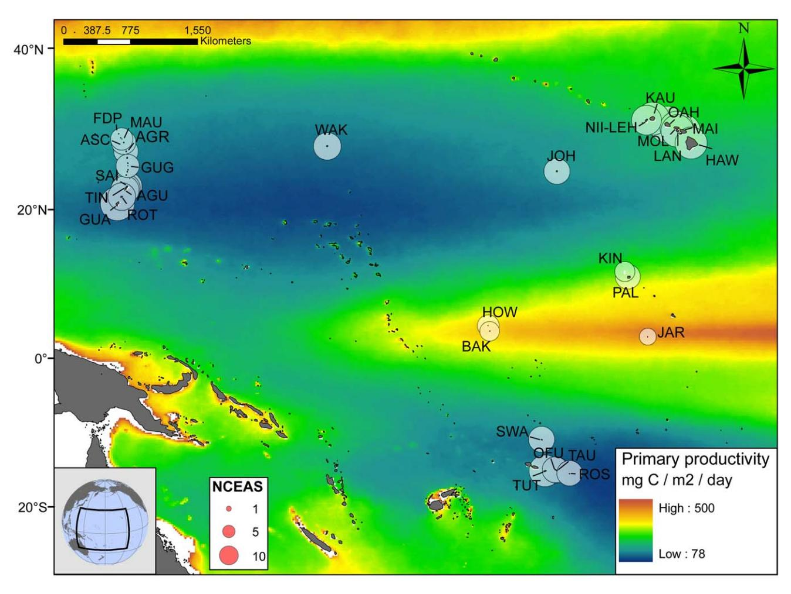
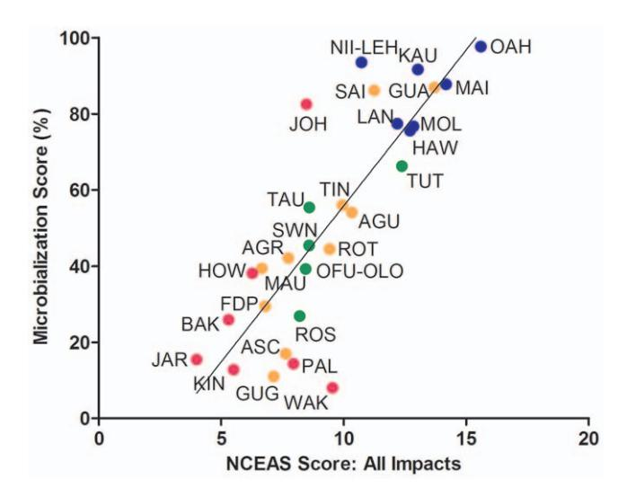
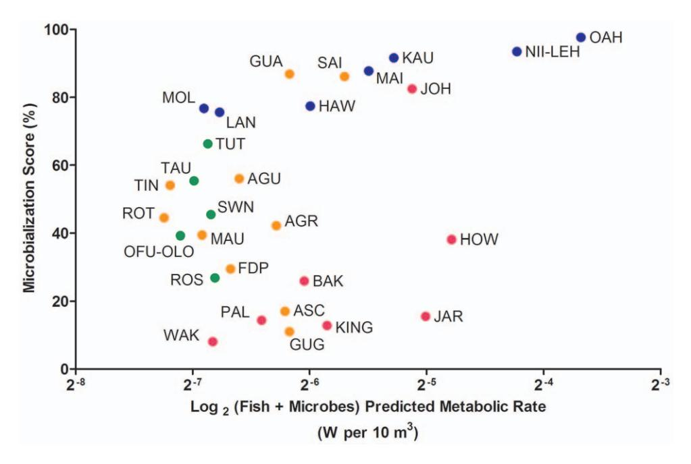
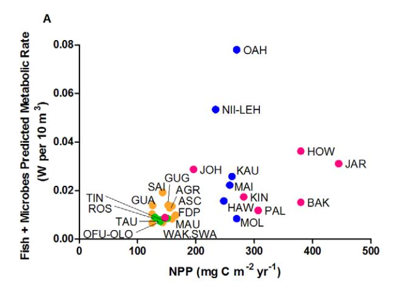
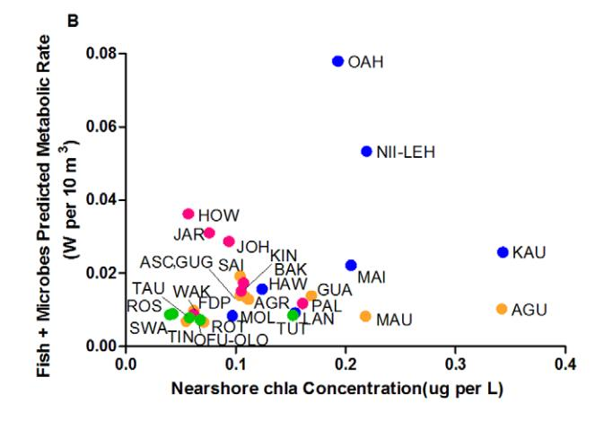
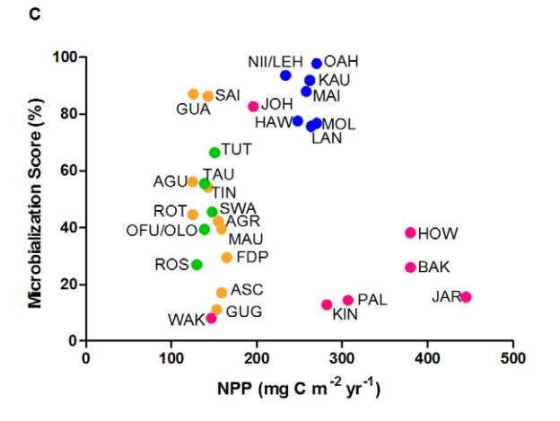
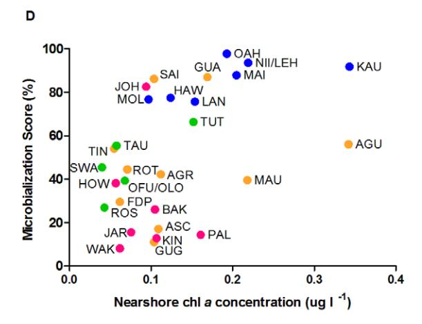

# Assessing Coral Reefs on a Pacific-Wide Scale Using the Microbialization Score

Tracey McDole1\*, James Nulton2, Katie L. Barott1, Ben Felts2, Carol Hand2, Mark Hatay1, Hochul Lee2, Marc O. Nadon5,6, Bahador Nosrat1, Peter Salamon2, Barbara Bailey2, Stuart A. Sandin4, Bernardo Vargas-Angel3, Merry Youle1, Brian J. Zgliczynski4, Russell E. Brainard3, Forest Rohwer1

1 Biology Department, San Diego State University, San Diego, California, United States of America, 2 Department of Math and Computer Sciences, San Diego State University, San Diego, California, United States of America, 3 Pacific Islands Fisheries Science Center, NOAA Fisheries, Honolulu, Hawaii, United States of America, 4 Scripps Institution of Oceanography, University of California San Diego, La Jolla, California, United States of America, 5 Rosenstiel School of Marine and Atmospheric Science, University of Miami, Florida, United States of America, 6 Joint Institute for Marine and Atmospheric Research, University of Hawaii at Manoa, Honolulu, Hawaii, United States of America

#### Abstract

The majority of the world's coral reefs are in various stages of decline. While a suite of disturbances (overfishing, eutrophication, and global climate change) have been identified, the mechanism(s) of reef system decline remain elusive. Increased microbial and viral loading with higher percentages of opportunistic and specific microbial pathogens have been identified as potentially unifying features of coral reefs in decline. Due to their relative size and high per cell activity, a small change in microbial biomass may signal a large reallocation of available energy in an ecosystem; that is the microbialization of the coral reef. Our hypothesis was that human activities alter the energy budget of the reef system, specifically by altering the allocation of metabolic energy between microbes and macrobes. To determine if this is occurring on a regional scale, we calculated the basal metabolic rates for the fish and microbial communities at 99 sites on twenty-nine coral islands throughout the Pacific Ocean using previously established scaling relationships. From these metabolic rate predictions, we derived a new metric for assessing and comparing reef health called the microbialization score. The microbialization score represents the percentage of the combined fish and microbial predicted metabolic rate that is microbial. Our results demonstrate a strong positive correlation between reef microbialization scores and human impact. In contrast, microbialization scores did not significantly correlate with ocean net primary production, local chla concentrations, or the combined metabolic rate of the fish and microbial communities. These findings support the hypothesis that human activities are shifting energy to the microbes, at the expense of the macrobes. Regardless of oceanographic context, the microbialization score is a powerful metric for assessing the level of human impact a reef system is experiencing.

Citation: McDole T, Nulton J, Barott KL, Felts B, Hand C, et al. (2012) Assessing Coral Reefs on a Pacific-Wide Scale Using the Microbialization Score. PLoS ONE 7(9): e43233. doi:10.1371/journal.pone.0043233

Editor: Sebastian C. A. Ferse, Leibniz Center for Tropical Marine Ecology, Germany

Received January 20, 2012; Accepted July 18, 2012; Published September 7, 2012

**Copyright:** © 2012 McDole et al. This is an open-access article distributed under the terms of the Creative Commons Attribution License, which permits unrestricted use, distribution, and reproduction in any medium, provided the original author and source are credited.

**Funding:** This work was supported by National Science Foundation (NSF) (OCE-0927415) and a grant from CIFAR (LTRDTD62207). The funders had no role in study design, data collection and analysis, decision to publish, or preparation of the manuscript.

Competing Interests: The authors have declared that no competing interests exist.

\* E-mail: tsmcdole@yahoo.com

### Introduction

The relationship between increasing human activity and decreasing fish biomass is well-established in coral reef systems [1–3]. Although herbivore reduction due to overfishing probably facilitates coral to algal transitions, the mechanistic link between overfishing and coral mortality is not clear [4]. Much uncertainty about the mechanisms of reef decline linked to eutrophication and climate change also still exists [5–6]. In addition to increasing algal cover relative to hard coral cover, other effects of anthropogenically-driven disturbances include disease outbreaks, fewer links in trophic webs, and loss of physical structure and habitat complexity [7–9]. Reef-associated microbial communities have been shown to respond to all of the above disturbances (overfishing, nutrient enrichment, thermal stress) by becoming less beneficial and more pathogenic, i.e. the proportion of sequences related to known pathogens typically increases [10–17].

Despite the epidemiological evidence linking the microbial ecology of coral reef systems to human activity, the largest study of coral reef microbial communities included only four coral atolls in the Line Islands, all clustered within one oceanographic region [14]. In this island chain a 10-fold increase in microbial and viral abundances in the overlying reef-water correlated with increasing human disturbance and was accompanied by decreased fish biomass [1,14]. Further, a large proportion of the microbial 16S rDNA sequence similarities on the most disturbed reefs were most closely related to known pathogens [14]. These reefs also had the highest incidences of coral disease and the lowest percent coral cover. Other studies have also suggested that the total carbon flow through microbial pathways via detritus is inversely related to coral cover [18–19].

Ecosystems exhibit higher-level properties resulting from lower-level phenomena [20]. The energy available to a higher trophic level, for example, is reduced by the amount required to support the individual organisms in the lower level. The Metabolic Theory

of Ecology (MTE) predicts the metabolic rate of individual organisms based on the observation that most variation in an individual's metabolic rate can be explained by body size and temperature [21,22]. Whole organism metabolic rate (*I*), defined as the amount of energy per unit time that an individual organism requires, is calculated using Equation 1:

$$I = i_0 M^{\alpha} e^{-E/kT} \tag{1}$$

Where  $i_0$  is the mass-independent normalization constant, M is the wet weight of the organism in grams, and  $\alpha$  is the scaling exponent. The effects of temperature on metabolic rate are accounted for by  $e^{-E/kT}$  [21,23] where E is the activation energy, k is Boltzmann's constant  $(8.62 \times 10^{-5} \text{ eV K}^{-1})$ , and T is the water temperature at the site at the time of collection (in Kelvin). Distinct scaling exponents have been derived for different physiological states and evolutionary groups [21,24–25].

The process of replacing macroorganisms with microbes has been termed microbialization [26]. In this study, Equation 1 was used to predict metabolic rates for all individual fish and microbes present in a 10 m3 volume of reef water. *Microbialization* refers to an increase in the percentage of the combined fish and microbial predicted metabolic rate that is microbial. Island-level microbialization scores were derived for 29 islands (99 sites) within four oceanographic regions of the Pacific Ocean. Our data show a strong significant positive correlation between microbialization scores and the NCEAS cumulative human impact scores at each island. In comparison, microbialization scores did not correlate with the net primary production values. These findings support the hypothesis that human activities rather than variation in oceanographic conditions are causing microbialization of coral reefs and that the microbialization score is a powerful metric for assessing and comparing reef health.

### **Materials and Methods**

### Site descriptions

The twenty-nine islands included in this study were surveyed following the National Oceanic and Atmospheric Association (NOAA) 's Rapid Ecological Assessment (REA) protocol as part of the Coral Reef Ecosystem Division (CRED) and Pacific Reef Assessment and Monitoring Program (Pacific RAMP) [27]. Multiple coral reef sites (average depth: 10 m) were sampled at each island in four broad regional groups: the Main Hawaiian Islands (MHI), Guam and the Mariana Islands (MARIANA), the American Samoa region (SAMOA), and the Pacific Remote Island Areas (PRIA) (Fig. 1, Table 1). Microbial samples were collected during the 2008-2010 Pacific RAMP monitoring cruises: MHI (2008), MARIANAS (2009), SAMOA (2010), PRIA (2010). For fish, belt survey data from 2001-2009 was used for all islands. Because the REA survey protocol switched to the Stationary Point Count (SPC) method in 2009, 2010 fish data was not included. Microbial and fish data collection sites at each island are not necessarily co-located. Due to the variability inherent with observational fish data, the standard approach for estimating island means for fish abundance requires a large sample size. To have an adequate sample size, this fish data was pooled from all sites and years. Island-level averages and standard errors for fish and microbial biomass are provided in Table S2 and Fig. S2. Microbial metabolic rates were calculated per site then averaged by island. Island-level averages for fish and microbial predicted metabolic rates were used to calculate one microbialization score for each island.

### Collection of microbial data

At each site, 4 replicate 2 l seawater samples were collected  $\sim$ 1 m above the benthos using polycarbonate Niskin bottles. Microscopy grade glutaraldehyde was added to a final concentration of 0.3% v/v. Microbial cells were collected from each sample by filtration using a 0.2  $\mu$ m Anodisc filter (Whatman) and then stained with 5  $\mu$ g ml $^{-1}$  DAPI (Molecular Probes, Invitrogen) within 2 hours of collection [28–30]. Filters were mounted on microscope slides and stored at  $-20^{\circ}$ C. For each site, 10 fields of view (5 fields for each of 2 replicate filters,  $\sim$ 200 cells per field) were examined by epifluorescence microscopy (excitation/emission: 358/461 nm) at 600× magnification. Cell counts and dimensions were collected using ImagePro Software (Media Cybernetics) set for a size range of 0.00001–10  $\mu$ m for both length and width. Cell volume (V) was calculated by considering all cells to be cylinders with hemispherical caps using Equation 2:

$$V = \pi/4 \times w^2 (l - w/3) \tag{2}$$

where l is length and w is width [31]. No correction was made for possible cell shrinkage as a result of fixation. Individual microbial cell volumes  $V(\mu m^3)$  were converted to mass in wet weight (g) using previously established size-dependent relationships for marine microbial communities [32]. Each cell volume V was next converted to dry weight using the linear relationship derived from data reported in Simon and Azam (1989) and shown in Equation 3.

$$\log(y) = 1.72 \log(x) - 12.63 \tag{3}$$

where x is cell dry weight and y is cell volume ( $r^2 = 0.99$ ). Then cell wet weight (z) was calculated using the linear relation shown in Equation 4 [32] ( $r^2 = 0.99$ ):

$$\log(z) = 1.63 \log(x) - 2.0 \tag{4}$$

### Collection of fish data

This study includes fish data from all surveys performed at REA sites during the years 2001-2009. The number of REA sites surveyed over this time period is provided for each island in Table S2. Visual surveys provided a census of the reef fish community [33]. Surveys were restricted to shallow-to-moderate depths along the forereef between 10-15 m with a majority of surveys completed along the 10 m isobaths. At each site, a total of three 25 m long belt transect surveys were conducted by two different divers. For each survey, the diver made two passes: during the first pass, all fish >20 cm in length were recorded in adjacent 4 m wide belts; during the second pass all fish ≤20 cm were recorded in 2 m wide belts. Lengths were recorded to the nearest cm for fish < 5 cm and in 5 cm bins for all others [34]. Species-specific mass values for individual fish were calculated from length-weight relationships using FishBase [35-36]. The fish data was provided for each family as mean biomass (g m  $^{-2}$ ) and mean abundance (# individuals m-2), from which the mean mass per individual (g) was calculated. Because surveys were carried out at an average water depth of 10 m and surveyors counted all fish in the water column up to the surface, the mean abundances (individuals per m2) represented the total number present in a 10 m3 water column.

**Figure 1. Location of the 29 islands surveyed.** Color scale indicates oceanic net primary production derived from satellite data using the Vertically Generalized Production Model (VGPM). Circles indicate the relative NCEAS cumulative human impact score for each island. For island abbreviations see Table 1. doi:10.1371/journal.pone.0043233.g001

### Metabolic rate calculations

At each REA site, community-level metabolic rates were calculated by summing the individual metabolic rates (I) for all fish or microbes present in a standard volume of water  $(10 \text{ m}^3)$ . Individual metabolic rates (I) in watts were calculated using Equation 1.

The mass independent normalization constant for fish,  $i_0$ ,  $(\ln[i_0] = 18.47)$  was extracted from the plots in Brown et al. [21], while those for basal and active microbial states  $(4.61 \times 10^{16})$  and  $1.08 \times 10^{21}$ , respectively) were calculated from previously reported individual prokaryote metabolic rate values [25]. The predicted scaling exponents ( $\alpha$ ) used for microbes were 1.72 (basal) and 1.96 (active) [25], while 0.71 was used for fish [21]. The activation energies (E) used were 0.61 eV for microbes [25] and 0.69 eV for fish [21].

## Quantification of human impact

The level of human impact was assessed from the cumulative global human impact map generated by the National Center for Ecological Analysis and Synthesis (NCEAS; http://www.nceas.ucsb.edu/globalmarine/impacts). Using ArcGIS 9.3, "NoData" pixels corresponding to the land mass of each island were identified and converted into polygon format. A 10 km zone was

then calculated for each of these polygons, representing the immediate 10 km of sea surface around the border of each island in the study. Using these zones, statistics were then performed on the NCEAS human impact raster in order to calculate the mean impact score. These scores incorporate data related to: artisanal fishing; demersal destructive fishing; demersal non-destructive, high-bycatch fishing; demersal non-destructive low-bycatch fishing; inorganic pollution; invasive species; nutrient input; ocean acidification; benthic structures (e.g., oil rigs); organic pollution; pelagic high-bycatch fishing; pelagic low-bycatch fishing; population pressure; commercial activity (e.g., shipping); and anomalies in sea surface temperature and ultraviolet insolation.

Other indicators of reef system health were also considered in this study using benthic survey data collected at the same time as the microbial data. Benthic surveys were performed using the survey methodology described in Vargas-Angel [37–38]. A principal components analysis was carried out using R on the following initial variables: coral disease prevalence, prevalence of coral colonies with compromised health (unidentified sub-lethal lesions including algal and cyanophyte interactions, and barnacle and tubeworm infestations), percent crustose corraline algae cover, percent coral cover, and the microbialization score [39,40]. Raw data sets were rescaled to give mean 0 and standard deviation of 1. As a supplement to PCA analysis, k-means clustering was also

Table 1. Survey data and calculated values for 29 islands in the Pacific, grouped by region.

| REGION               |                                              | MICROBIAL COMMUNITY |               |                             | FISH COMMUNITY |                             | OTHER         |        |                |
|----------------------|----------------------------------------------|---------------------|---------------|-----------------------------|----------------|-----------------------------|---------------|--------|----------------|
| Code                 | Island                                       | Abundance x 105     | Total Biomass | Metabolic Rate Predicted | Total Biomass  | Metabolic Rate Predicted | NPP           | Chla   | NCEAS Score |
|                      |                                              | cells ml21          | g 10 m23      | W 10 m23                    | g 10 m23       | W 10 m23                    | mg C m22 yr21 | mg l21 |                |
|                      | GUAM & MARIANA ISLANDS (orange)              |                     |               |                             |                |                             |               |        |                |
| AGR                  | Agrihan                                      | 2.6                 | 0.22          | 0.005                       | 84.54          | 0.007                       | 155           | 0.11   | 7.7            |
| AGU                  | Aguijan                                      | 2.3                 | 0.16          | 0.006                       | 41.5           | 0.005                       | 125           | 0.34   | 9.9            |
| ASC                  | Asuncion                                     | 2.7                 | 0.15          | 0.002                       | 182.54         | 0.011                       | 159           | 0.11   | 7.6            |
| FDP                  | Farallon de Pajaros                          | 2.7                 | 0.2           | 0.003                       | 103.18         | 0.007                       | 165           | 0.06   | 6.8            |
| GUA                  | Guam                                         | 2.8                 | 0.27          | 0.012                       | 17.98          | 0.002                       | 126           | 0.17   | 13.7           |
| GUG                  | Guguan                                       | 3.5                 | 0.27          | 0.002                       | 145.03         | 0.012                       | 153           | 0.1    | 7.1            |
| MAU                  | Maug                                         | 3                   | 0.24          | 0.003                       | 70.95          | 0.005                       | 159           | 0.22   | 6.7            |
| ROT                  | Rota                                         | 2.3                 | 0.17          | 0.003                       | 36.9           | 0.004                       | 125           | 0.07   | 9.4            |
| SAI                  | Saipan                                       | 2.1                 | 0.21          | 0.017                       | 23.31          | 0.003                       | 143           | 0.1    | 11.2           |
| TIN                  | Tinian                                       | 1.8                 | 0.17          | 0.004                       | 31.19          | 0.003                       | 143           | 0.05   | 10.3           |
|                      | MAIN HAWAIIAN ISLANDS (MHI, blue)            |                     |               |                             |                |                             |               |        |                |
| HAW                  | Hawaii                                       | 4.7                 | 0.81          | 0.012                       | 51.24          | 0.004                       | 248           | 0.12   | 12.2           |
| KAU                  | Kauai                                        | 2.8                 | 0.69          | 0.024                       | 33.39          | 0.002                       | 262           | 0.34   | 13             |
| LAN                  | Lanai                                        | 3.3                 | 0.4           | 0.007                       | 33.44          | 0.002                       | 264           | 0.15   | 12.7           |
| MAI                  | Maui                                         | 3                   | 0.56          | 0.019                       | 40.16          | 0.003                       | 258           | 0.21   | 14.2           |
| MOL                  | Molokai                                      | 2.1                 | 0.32          | 0.006                       | 24.8           | 0.002                       | 270           | 0.1    | 12.8           |
| NII/LEH              | Niihau & Lehua                               | 4.1                 | 1.29          | 0.05                        | 54.49          | 0.003                       | 234           | 0.22   | 10.7           |
| OAH                  | Oahu                                         | 3.7                 | 1.53          | 0.076                       | 23.99          | 0.002                       | 270           | 0.19   | 15.6           |
|                      | PACIFIC REMOTE ISLANDS & ATOLLS (PRIA, pink) |                     |               |                             |                |                             |               |        |                |
| BAK                  | Baker                                        | 3.8                 | 0.33          | 0.004                       | 228.18         | 0.011                       | 380           | 0.1    | 5.3            |
| HOW                  | Howland                                      | 4.5                 | 0.49          | 0.014                       | 195.37         | 0.022                       | 380           | 0.06   | 6.3            |
| JAR                  | Jarvis                                       | 5.8                 | 0.46          | 0.005                       | 408.75         | 0.026                       | 445           | 0.08   | 4              |
| JOH                  | Johnston                                     | 3.5                 | 0.72          | 0.024                       | 91.6           | 0.005                       | 196           | 0.09   | 8.5            |
| KIN                  | Kingman                                      | 1.7                 | 0.18          | 0.002                       | 514.84         | 0.015                       | 282           | 0.11   | 5.5            |
| PAL                  | Palmyra                                      | 3.7                 | 0.22          | 0.002                       | 229.08         | 0.01                        | 307           | 0.16   | 8              |
| WAK                  | Wake                                         | 2.2                 | 0.12          | 0.001                       | 161.4          | 0.008                       | 147           | 0.06   | 9.5            |
| SAMOA REGION (green) |                                              |                     |               |                             |                |                             |               |        |                |
| OFU/OLO              | Ofu & Olosega                                | 2.9                 | 0.19          | 0.003                       | 57.83          | 0.004                       | 139           | 0.07   | 8.4            |
| ROS                  | Rose                                         | 3.2                 | 0.14          | 0.002                       | 82.98          | 0.007                       | 130           | 0.04   | 8.2            |
| SWA                  | Swains                                       | 3.1                 | 0.26          | 0.004                       | 85.17          | 0.005                       | 148           | 0.04   | 8.6            |
| TAU                  | Tau                                          | 3.3                 | 0.23          | 0.004                       | 44.77          | 0.004                       | 139           | 0.06   | 8.6            |
|                      |                                              |                     |               |                             |                |                             |               |        |                |

| REGION             |                                                                                                                            | MICROBIAL COMMUNITY         | NITY                                      |                                                                      | FISH COMMUNITY       |                             | OTHER                                       |                |                |
|--------------------|----------------------------------------------------------------------------------------------------------------------------|-----------------------------|-------------------------------------------|----------------------------------------------------------------------|----------------------|-----------------------------|---------------------------------------------|----------------|----------------|
| Code               | Island                                                                                                                     | Abundance x 10 5 | Total Biomass                             | Predicted 10 5 Total Biomass Metabolic Rate Total Biomass | Total Biomass        | Predicted Metabolic Rate | MPP                                         | Chla           | NCEAS Score |
|                    |                                                                                                                            | cells ml -1      | g 10 m -3 W 10 m -3 |                                                                      | g 10 m -3 | W 10 m -3        | mg C m $^{-2}$ yr $^{-1}$ $\mu$ g I $^{-1}$ | п <b>9</b> Г−1 |                |
| TUT                | Tutuila                                                                                                                    | 3.5                         | 0.25                                      | 0.006                                                                | 33.11                | 0.003                       | 151                                         | 0.15           | 12.4           |
| Predicted metaboli | Predicted metabolic rates are basal rates. NPP = net primary production. Colors identify each island group in the figures. | oroduction. Colors identify | y each island groul                       | p in the figures.                                                    |                      |                             |                                             |                |                |

performed on the same data matrix for k = 2-8 (100 iterations); the dissimilarity matrix was calculated using Gower's standardization [41].

### Estimation of net primary production

Productivity estimations for net primary productivity (NPP) (mg C m-2 day-1) were derived from Moderate Resolution Imaging Spectroradiometer (MODIS) satellite data using the Vertically Generalized Production Model (VGPM: http://www. science.oregonstate.edu/ocean.productivity/standard.product. php). This model, based on an algorithm by Behrenfeld and Falkowski (1997) calculates net primary production from satellitebased measurements of surface chla concentrations, while also taking into account sea surface temperature, daily photosynthetically active radiation, and a temperature-dependent photosynthetic efficiency factor [42]. Because these satellite data sets are less accurate for near-shore measurements, the satellite-based NPP values used here were estimated from the data for a 50 km radius ring surrounding each island, with the first 10 km around each island removed. The nearshore chla concentrations (µg l-1) used in this study were obtained using fluorometric analysis [43]. The chla samples were collected in conjunction with the microbial samples at each site.

### **Results and Discussion**

### Predicted metabolic rates for the fish and microbes

Field surveys carried out at 99 coral reef sites at 29 Pacific islands (Fig. 1) were used to calculate the biomass (g per 10 m3) and basal metabolic rate (W per 10 m3) for both the water column-associated microbial and fish communities (Table 1). The high and low values for microbial biomass occurred on the islands of Oahu (1.53 g per 10 m3) and Wake Atoll (0.12 g per 10 m3), respectively. This difference in microbial biomass equates to a 76fold increase in the rate of energy flux (W per 10 m3 or J sec-1 10 m-3) on Oahu (0.076 W per 10 m3) relative to Wake Atoll (0.001 W per 10 m3). The highest fish biomass was found on Kingman (514.84 g per 10 m3) and the lowest on Guam (17.98 g per 10 m3). The metabolic requirements predicted for the fish communities on Kingman and Guam were 0.015 and 0.002 W per 10 m3, respectively. This difference equates to a 7.5-fold reduction in the metabolic requirements of the fish community. The largest differences in the predicted metabolic rates between each island represent a 100-fold change for the microbes, as compared to a 14-fold change for the fish (Table 1).

# Microbialization scores versus the NCEAS human impact score

Based on the predicted metabolic rates for fish and microbes (Table 1), we are proposing a separate metric called the *microbialization score*, which represents the microbial share of the total predicted metabolic rate. The microbialization score is the percentage of the combined fish and microbial predicted metabolic rate that is microbial:

$$(W 10 \text{ m}^3_{microbes})/(W 10 \text{ m}^3_{microbes} + W 10 \text{ m}^3_{fish}) \times 100$$
 (5)

Although both increased microbial biomass and decreased fish biomass affect microbialization scores, microbial biomass has a proportionately greater impact on the combined predicted metabolic rate. For example, on Oahu, the fish are responsible for only 3% of the combined predicted metabolic rate, but account

Table 1. Cont

doi:10.1371/journal.pone.0043233.t001

Figure 2. Linear regression analysis of microbialization scores versus NCEAS cumulative human impact values (y = 8.19 x - 26.10;  $r^2 = 0.68$ ). The microbialization score is the percentage of the combined fish and microbial predicted metabolic rate that is microbial. Color denotes oceanographic region: Guam and the Mariana Islands (orange circles), the Main Hawaiian Islands (blue circles), Pacific Remote Islands and Atolls (pink circles), and the Samoa region (green circles). For island abbreviations see Table 1. doi:10.1371/journal.pone.0043233.g002

for 94% of the total biomass. Even on Kingman where we observed the highest fish biomass and microbial biomass represented less than 0.03% of the total biomass, the microbes still account for 13% of the combined predicted metabolic rate.

Recently, the NCEAS human impact score has been proposed as a cumulative metric of different anthropogenic stressors ranging from overfishing to predicted climate change events [44]. As shown in Fig. 2, the microbialization score is positively correlated with the NCEAS score (linear regression,  $r^{2=0.68}$ ; Fig. 2). The microbialization scores ranged from 8% at remote and relatively pristine Wake Island to 75–98% in the heavily-impacted main Hawaiian Islands (MHI). Oahu, with the highest microbialization score (98%) also had the highest NCEAS score (15.59).

Johnston Atoll in the PRIA group appears to be an exception to the overall trend in that it has a high microbialization score (82%) but a relatively low NCEAS score (8.48). In actuality, Johnston is heavily impacted by factors not reflected in the NCEAS scores including the addition of two artificial islands with paved runways formed by coral dredging, usage for both above-ground and underground nuclear tests in the 1950s and 1960s, and service as a chemical weapons depot until 2000. The microbialization score appears to be a better indicator of these stressors than the NCEAS index of human impact.

A principal components analysis was carried out with the goal of visualizing how the microbialization score related to other indicators of reef health, including coral disease prevalence, prevalence of coral colonies with other signs of compromised health, percent crustose corraline algae cover, and percent coral cover (Fig. S1). The first two components accounted for 66% of the variation. The first component (PC1) accounted for 46% of the variation and was driven in the positive direction (relative to 0) by coral disease incidence, other visible signs of compromised coral health, and microbialization score (Fig. S1). A complete table of PCA loadings is provided in Table S3. By comparison, variables which typically correlate positively with reef system health (% crustose coralline algal cover and % coral cover) were represented

as vectors moving in the negative direction (relative to 0). The separation by vector sign along PC1 supports the hypothesis that the microbialization score is a useful measure of reef system decline. Because the PCA analysis indicated that there was separation in the data, we used k-means clustering as a supplementary analysis to determine how many groups there were. K-means is a classical variance-based clustering method that defines n data points in d dimensions, into k clusters, so that the within clusters sun-of-squares is minimized [41]. The within group sum of squares plotted against the number of clusters (k) indicated k=3 to be the optimal number (for k=2-8). The 11 islands contained in cluster two (within-cluster sum of squares = 1.47) were negative for PC1 (Fig. S1), while the 16 islands contained in cluster 3 were all positive on PC1 (within-cluster sum of squares = 2.06). The two islands in the first k-means cluster were Lanai (LAN) and Guam (GUA) (within cluster sum-ofsquares = 0.32).

### Microbialization scores versus combined metabolic rate

The metabolic rates predicted for the combined microbial and fish communities at the 29 islands ranged by approximately one order of magnitude, from a low of 0.007 W per 10 m³ on Rota Island (MARIANA) to a high of 0.077 W per 10 m³ on Oahu (MHI) (Fig. 3, x-axis). The combined predicted metabolic rate was not correlated with the microbialization score, which also varied widely among the islands, ranging from a low of 8% at Wake to a high of 97% at Oahu (Fig. 3, y-axis). At the low end of this scale, increased microbalization scores were explained by reduced metabolic contribution from the fish. However, higher microbialization scores were associated with a sharp rise in combined predicted metabolic rate driven primarily by increasing microbial metabolic rates. This break-point may reflect the release of the microbes from some resource limitation.

# Predicted metabolic rates of fish and microbes versus primary production

Net primary production (NPP) might be expected to be a significant factor driving variation in community metabolic rates. Previous small-scale inter-island studies that correlated differences in microbial communities with varying local human impacts could not conclusively rule out inter-island variations in oceanographic conditions as a possible driving factor [14]. To address this issue, we surveyed net primary production (NPP) at islands in four oceanographic regions throughout the Pacific Basin (Table 1).

Estimated net primary production (NPP; mg C m-2 day-1) derived from satellite data is shown in Fig. 1. NPP ranged from 125 mg C m-2 day-1 at Aguijan to 445 mg C m-2 day-1 at Jarvis (Table 1). This predicted NPP was not a strong predictor of the combined fish + microbial metabolic rate at the island-level (nonlinear regression,  $R^2 = 0.21$ ; Fig. 4A). Likewise, when the predicted NPP values were compared against the metabolic rates of the fish and microbial communities separately, R2 values were 0.20 for fish and 0.054 for microbes (Table 1). Large differences in NPP were observed between the geographic regions surveyed, but relatively little variation within each one (Fig. 4A, C). Since the satellite data used for the above predictions omitted a 10 km ring around each island, nearshore chla concentrations were also measured as an alternative proxy for NPP. These samples were collected with the microbial samples at each site. The nearshore chla concentrations (µg l-1) explained even less of the inter-island variation in combined predicted metabolic rate (non-linear regression,  $R^2 = 0.08$ ; Fig. 4B). For the individual communities,  $R^2$  values were 0.13 and 0.15 for fish and microbes, respectively (Table 1).

Figure 3. Microbialization scores plotted against the combined fish + microbes predicted metabolic rates for each of the 29 islands surveyed. Colors are as in Fig. 2. For island abbreviations see Table 1. doi:10.1371/journal.pone.0043233.q003

### Microbialization scores and primary production

The island microbialization scores did not correlate with predicted oceanic NPP values (Fig. 4C,  $R^{2=}0.004$ ) or nearshore chla concentrations (Fig. 4D;  $R^{2=}0.22$ ). However, higher nearshore chla concentrations associated with microbialization scores above a certain threshold ( $\sim$ 70%) are suggestive of eutrophication processes linked to human impact (Fig. 4D) [45]. These analyses demonstrate that estimated reef primary production is not a significant driver of variation in either community metabolic rates or microbialization scores.

To further examine whether or not accounting for oceanographic context would improve our ability to predict reef microbialization, multiple linear regression analysis was performed. In addition to the NCEAS score, satellite-based estimates of net primary production (NPP) and nearshore [chla] were included as variables. This resulted in 4 models of interest: microbialization score =  $\beta_0 + \beta_1$ (NCEAS),  $y = \beta_0 + \beta_1$ (NCEAS)+ $\beta_2$ ( $y = \beta_0 + \beta_1(NCEAS) + \beta_2(NPP),$   $y = \beta_0 + \beta_1(NCEAS) + \beta_2(-\beta_0)$ chla)+\$\beta\_3(NPP)\$. Given that the NCEAS score was in the model, the p-values for chla and NPP were not significant by the t-test in the second and third models (p-value>0.1). The only variable that was significant was the NCEAS score, having a highly significant p-value in all of the models (p-value<0.0001). The model which included both chla and NPP as variables (y =  $\beta_0 + \beta_1$ (NCEAS)+ $\beta_2$ (chla)+ $\beta_3$ (NPP)) gave a multiple R2 value of 0.706, which was not a significant improvement over the simplest  $(y = \beta_0 + \beta_1(NCEAS))$  which explained 68.4% of the variability of the microbialization score.

Next, Akaike's Information Criterion (AIC) was used for model selection between the 4 different statistical models. AIC is the most widely known and used model selection criterion which consists of a "goodness-of-fit" term and a "penalty" term for increased number of model parameters [46]. The model with the lowest AIC value is selected as the best model. The model having the smallest AIC was the model which did not include additional variables ( $y = \beta_0 + \beta_1 (NCEAS)$ ). Although the exact mechanism(s) underlying

the *process* of microbialization remain unclear, these analyses support the hypothesis that human activities alter the energy budget of the reef system, specifically by altering the allocation of metabolic energy between microbes and macrobes.

The finding that microbialization scores did not significantly correlate with ocean net primary production, local chla concentrations, or the combined metabolic rate of the fish and microbial communities suggests that the microbialization score may be a powerful metric for comparing and assessing reef degredation, particularly at large spatial scales. Other measures of reef degredation which are more heavily influenced by oceanographic context (i.e. percent coral cover, percent algal cover) may be more easily confounded by non-human factors and are subsequently harder to interpret across large spatial scales.

### Other considerations

In this study, surveys of microbial and fish sizes were used to predict whole organism metabolic rates. Ideally, the energetic requirements per unit time for fish and microbial communities would be measured empirically. However, this is not practical over this large region. To evaluate whether or not the MTE-based approach is a reasonable alternative to quantifying energy flux, the mean predicted metabolic rates for microbial communities were compared against experimental values reported from other studies (Table S1). The means for both the predicted basal metabolic rates used in our analyses and the corresponding predicted active metabolic rates fall within the same range as the empirically-based measurements.

Similarly, differences in temperature at the time of sampling explained a small proportion of the variation in metabolic rate between islands. Water temperature at the time of sampling ranged from 25–30°C. For the microbial community-level metabolic rates, the standard deviation in the 29 island data set was 0.16 at the actual temperatures and 0.01 when all locations were corrected to the same temperature (20°C); for the fish community-level metabolic rates, the standard deviations were

**Figure 4. Measures of energy use versus metrics of primary production.** (a) Non-linear regression analysis of the combined fish + microbes predicted metabolic rate versus net primary production (NPP) for the 29 surveyed islands. NPP was derived from satellite data using the Vertically Generalized Production Model (VGPM). (y = 0.00008x + 0.0012;  $R^2 = 0.21$ ) (b) Non-linear regression analysis of the combined fish + microbes predicted metabolic rate versus nearshore chla concentrations at the 29 surveyed islands (y = 0.54x + 0.01;  $R^2 = 0.08$ ) (c) Microbialization scores versus NPP derived from satellite data using the VGPM for the 29 surveyed islands. (d) Microbialization scores versus nearshore chla concentrations at the 29 surveyed islands (y = 171.5x + 29.7;  $R^2 = 0.22$ ). Colors are as in Fig. 2. For island abbreviations see Table 1. doi:10.1371/journal.pone.0043233.a004

0.006 and 0.003, respectively. Temperature correction increased the  $\rm r^2$  value for the regression analysis of community-level metabolic rate as a function of biomass by only 0.01% and 0.05% for fish and microbes, respectively. Therefore, inter-island variation in temperature does not account for our observed trends.

### **Conclusions**

Overfishing, eutrophication, and global climate change are important drivers of the global loss of coral reefs. However, the precise mechanism(s) by which these perturbations lead to coral decline have remained elusive. We and others have previously argued that human activities are favoring the coral reef-associated microbes at the expense of the macrobes, a process called *microbialization*. The data presented here supports this hypothesis over a wide swath of Pacific coral reefs and suggests that microbialization is a general process of reef decline. Although the exact mechanism(s) driving the process of microbialization remain unclear, the microbialization score provides a way to diagnose the degree of microbialization that has occurred on reefs. Fish were the primary movers of energy in the most pristine

locations (i.e. fish were responsible for 97 and 87% of the total predicted metabolic rate on Wake (PRIA) and Kingman (PRIA), respectively) but made up only 3% of the total predicted metabolic rate on Oahu (MHI). Microbialization scores reflect both increased microbial biomass and decreased fish biomass; however microbial biomass has a proportionately greater impact on metabolic rate. This means that even a minor increase in the microbial load results in a substantial shift in community energy use; up to a 100-fold increase in the metabolic requirements of the microbes in the most heavily impacted reef systems. This study has significant implications for the protection of coral reefs. The degree of microbialization a reef is experiencing may be important for predicting its response to perturbation. On Pacific coral reefs, microbialization may be set in motion by an increase in the percent cover of turf algae resulting from the loss of herbivorous fish. Turf algae release large amounts of dissolved organic carbon (DOC) into the water column, a source of energy almost exclusively available to the microbes [47]. Consequently, the process of microbialization is likely to have stabilization effects in the system once a castastophic regime shift to an algal-dominated state has occurred.

### **Supporting Information**

**Figure S1 Principal components analysis of reef system properties related to reef health.** The first two principal components account for 66% of the variability in the dataset (PC1 = 46%, PC2 = 20%). Arrow length reflects the relative contribution of a variable to a PC axis. MS = microbialization score; CCA = % crustose coralline algae cover; DZ = % coral disease prevalence; CO = % coral cover; CH = % coral with other indications of compromised health. Symbol denotes oceanographic region: Guam and the Mariana Islands (\*), the Main Hawaiian Islands (^), Pacific Remote Islands and Atolls (#), and the Samoa region (+). Two groups of islands identified from k-means cluster analysis are divided along PC1 by the dotted line; the third group is circled (Lanai and Guam). For island abbreviations, see Table 1. (TIF)

**Figure S2 Mean microbial and fish biomass.** (a) Mean microbial biomass with standard error. Total number of sites where microbial data was collected = 99. (b) Mean fish biomass with standard error. Total number of sites where fish data was collected = 791. The number of REA sites included is given in parentheses next to three-letter island code. (TIF)

Table S1 Comparison of mean MTE-based microbial metabolic rate predictions from this study with experimental measurements from marine systems 1–5. Rates of photosynthesis were converted from units of gross carbon production ( $P_g$ ) to units of power (W) using 39,444 J g-1 C, the standard free energy change from the synthesis of glucose from  $CO_2$  and  $H_2O$  during photosynthesis at  $STP^6$ . For conversion between rates of oxygen consumption or production in volume or mass units, we assumed that 1 ml  $O_2$  per second = 1.43 mg  $O_2$  per second  $O_2$  and  $O_3$  respiration we assumed that  $O_3$  per second  $O_3$  per second  $O_3$  ml  $O_4$  per second  $O_3$  ml  $O_4$  per second  $O_3$  ml  $O_4$  per second  $O_3$  ml  $O_4$  per second  $O_3$  ml  $O_4$  per second  $O_4$  metabolic rates in W per  $O_3$  were derived after calculating

#### References

- Sandin SA, Smith JE, DeMartini EE, Dinsdale EA, Donner SD, et al. (2008)
  Baselines and degradation of coral reefs in the Northern Line Islands. PLoS
  ONE. 3: e1548.
- Knowlton N, Jackson JBC (2008) Shifting Baselines, Local Impacts, and Global Change on Coral Reefs. PLoS Biol 6: e54.
- DeMartini EE, Friedlander AM, Sandin SA, Sala E (2008) Differences in fishassemblage structure between fished and unfished atolls in the northern Line Islands, central Pacific. Mar Ecol Prog Ser 365: 199–215.
- Maliao RJ, Turingan RG, Lin J (2008) Phase-shift in coral reef communities in the Florida Keys National Marine Sanctuary (FKNMS), USA. Mar Biol 154: 841–853.
- Bourne DG, Garren M, Work TM, Rosenberg E, Smith GW, et al. (2009) Microbial disease and the coral holobiont. Trends Microbiol 17: 554–562.
- Sokolow S (2009) Effects of a changing climate on the dynamics of coral infectious disease: a review of the evidence. Dis Aquat Org 87: 5–18.
- Essington TE, Beaudreau AH, Wiedenmann J (2006) Fishing through marine food webs. Proc Natl Acad Sci USA 103: 3171–3175.
- Greenstein BJ, Curran HA, Pandolfi JM (1998) Shifting ecological baselines and the demise of *Acropora cervicomis* in the western North Atlantic and Caribbean Province: a Pleistocene perspective. Coral Reefs 17: 249–261.
- McCormick M (1994) Comparison of field methods for measuring surface topography and their association with a tropical reef fish community. Mar Ecol Prog Ser 112: 87–96.
- Thurber RLV, Barott KL, Hall D, Liu H, Rodriguez-Mueller B, et al (2008) Metagenomic analysis indicates that stressors induce production of herpes-like viruses in the coral *Porites compressa*. Proc Natl Acad Sci USA 105: 18413–18418.
- Bruno JF, Petes LE, Harvell DC, Hettinger A (2003) Nutrient enrichment can increase the severity of coral diseases. Ecol Lett 6: 1056–1061.
- Bruno JF, Selig ER, Casey KS, Page CA, Willis BL, et al. (2007) Thermal stress and coral cover as drivers of coral disease outbreaks. PLoS Biol 5:e124.
- Kuntz NF, Kline DI, Sandin SA, Rohwer F (2005) Pathologies and mortality rates caused by organic carbon and nutrient stressors in three Caribbean coral species. Mar Ecol Prog Ser 294: 173–180.

total daily energy use:  $P_g$  (from sunrise to sunset) + Respiration (over a 24 hour period). In studies where only dark incubation experiments were performed, total daily energy use was calculated assuming  $P_g/R_{24~hrs}=1$ . When two measurements are listed for the same sample and conditions, they indicate high and low values. B= predicted basal metabolic rate; A= predicted active metabolic rate.

(XLSX)

Table S2 Summary table showing the number of REA sites where microbial or fish data (belt transect method only) was collected, time period of sampling, and standard error for biomass and abundance of the fish and microbial communities at each island. (XLS)

**Table S3** Summary table for Figure S1. The importance of each component and the contribution (loadings) of each variable is shown. MS = microbialization score; CCA = % crustose coralline algae cover; DZ = % coral disease prevalence; CO = % coral cover; CH = % coral with other indications of compromised health. (XLS)

### Acknowledgments

NOAA's Coral Reef Ecosystem Division (CRED) and Pacific Reef Assessment and Monitoring Program (Pacific RAMP) helped support this work. We thank G. West and J.P. DeLong for helpful discussions.

### **Author Contributions**

Conceived and designed the experiments: FR TM MH SS. Performed the experiments: TM. Analyzed the data: TM MN BN BB. Contributed reagents/materials/analysis tools: RB. Wrote the paper: TM FR MY. Collected microbial data: TM KB MH. Collected and supplied benthic data: BVA. Collected and supplied fish data: BZ. Oversaw metabolic calculations: JN BF CH HL PS.

- Dinsdale E, Pantos O, Smriga S, Edwards RA, Angly F, et al. (2008) Microbial ecology of four coral atolls in the Northern Line Islands. PLoS ONE 3: e1584.
- Mao-Jones J, Ritchie KB, Jones LE, Ellner SP (2010) How Microbial Community Composition Regulates Coral Disease Development. PLoS Biol 8: e1000345.
- Mouchka ME, Hewson I, Harvell CD (2010) Coral-Associated Bacterial Assemblages: Current Knowledge and the Potential for Climate-Driven Impacts. Int Comp Biol 50: 662–674.
- Kelly LW, Barott KL, Dinsdale E, Friedlander AM, Nosrat B, et al. (2011) Black reefs: iron-induced phase shifts on coral reefs. ISME J. Available: [http://dx.doi. org/10.1038/ismej.2011.114]. Accessed 2011 Dec 21.
- Johnson C, Klumpp D, Field J, Bradbury R (1995) Carbon flux on coral reefs: effects of large shifts in community structure. Mar Ecol Prog Ser 126: 123–143.
- Arias-Gonzalez J, Delesalle B, Salvat B, Galzin R (1997) Trophic functioning of the Tiahura reef sector, Moorea Island, French Polynesia. Coral Reefs 16: 231– 246.
- Ernest SKM, Enquist BJ, Brown JH, Charnov EL, Gillooly JF, et al. (2003) Thermodynamic and metabolic effects on the scaling of production and population energy use. Ecol Lett 6: 990–995.
- Brown JH, Gillooly JF, Allen AP, Savage VM, West GB (2004) Toward a metabolic theory of ecology. Ecology 85: 1771–1789.
- Gillooly JF, Brown JH, West GB, Savage VM, Charnov EL (2001) Effects of size and temperature on metabolic rate. Science 293: 2248.
- 23. Atkins PW (2007) Four laws that drive the universe. New York: Oxford University Press.
- Peters ŘH (1986) The ecological implications of body size. New York: Cambridge University Press.
- DeLong JP, Okie JG, Moses ME, Sibly RM, Brown JH (2010) Shifts in metabolic scaling, production, and efficiency across major evolutionary transitions of life. Proc Natl Acad Sci USA 107: 12941.
- Jackson JBC, Kirby MX, Berger WH, Bjorndal KA, Botsford LW, et al. (2001) Historical overfishing and the recent collapse of coastal ecosystems. Science 293: 690

- 27. Turgeon DD (2008) The state of coral reef ecosystems of the United States and Pacific Freely Associated States. US Dept. of Commerce, National Oceanic and Atmospheric Administration, National Ocean Service, National Centers for Coastal Ocean Science.
- 28. Hobbie JE, Daley RJ, Jasper S (1977) Use of nuclepore filters for counting bacteria by fluorescence microscopy. Appl Environ Microbiol 33: 1225.
- 29. Porter KG, Feig YS (1980) The use of DAPI for identifying and counting aquatic microflora. Limnol Oceanogr 25: 943–948.
- 30. Noble RT, Fuhrman JA (1998) Use of SYBR Green I for rapid epifluorescence counts of marine viruses and bacteria. Aquat Microb Ecol 14: 113–118.
- 31. Bjornsen PK (1986) Automatic determination of bacterioplankton biomass by image analysis. Appl Environ Microbiol 51: 1199.
- 32. Simon M, Azam F (1989) Protein content and protein synthesis rates of planktonic marine bacteria. Mar Ecol Prog Ser 51: 201–213.
- 33. Brock RE (1982) A critique of the visual census method for assessing coral reef fish populations. Bull Mar Sci 32: 269–276.
- 34. Williams ID, Walsh WJ, Schroeder RE, Friedlander AM, Richards BL, et al. (2008) Assessing the importance of fishing impacts on Hawaiian coral reef fish assemblages along regional-scale human population gradients. Environ Conserv 35: 261–272.
- 35. Froese R, Pauly D (1994) Fishbase as a tool for comparing the life history patterns of flatfish. Neth J Sea Res 32: 235–239.
- 36. Kulbicki M, Guillemot N, Amand M (2005) A general approach to lengthweight relationships for New Caledonian lagoon fishes. Cybium 29: 235–252.

- 37. Vargas-Angel B (2009) Coral health and disease assessment in the US Pacific Remote Island Areas. Bull Mar Sci 84: 211–227.
- 38. Vargas-Angel B, Looney EE, Vetter OJ, Coccagna EF (2011) Severe, widespread El Nino associated coral bleaching in the US Phoenix Islands. Bull Mar Sci 87: 623–638.
- 39. The R Project for Statistical Computing website. Available: http://www.Rproject.org/. Accessed 2012 Aug 1.
- 40. Jolliffe IT (2002) Principal Component Analysis. New York: Springer.
- 41. MacQueen JB (1967) Some methods for classification and Analysis of Multivariate Observations. Proceedings of 5th Berkeley Symposium on Mathematical Statistics and Probability. University of California Press. 281–297.
- 42. Behrenfeld MJ, Falkowski PG (1997) A consumer's guide to phytoplankton primary productivity models. Limnol Oceanogr 42: 1479–1491.
- 43. Strickland JDH, Parsons TR (1965) A manual of sea water analysis: with special reference to the more common micronutrients and to particulate organic material. Fish Res Board Can 125.
- 44. Halpern BS, Walbridge S, Selkoe KA, Kappel CV, Micheli F, et al. (2008) A Global Map of Human Impact on Marine Ecosystems. Science 319: 948–952.
- 45. Smith VH (2006) Responses of estuarine and coastal marine phytoplankton to nitrogen and phosphorus enrichment. Limnol Oceanogr 51: 377–384.
- 46. Akaike H (1974) A new look at the statistical model identification. IEEE Transactions on Automatic Control 19(6): 716–723.
- 47. Haas AF, Nelson CE, Wegley-Kelly L, Carlson CA, Rohwer F, et al. (2011) Effects of Coral Reef Benthic Primary Producers on Dissolved Organic Carbon and Microbial Activity. PLoS ONE 6: e27973.