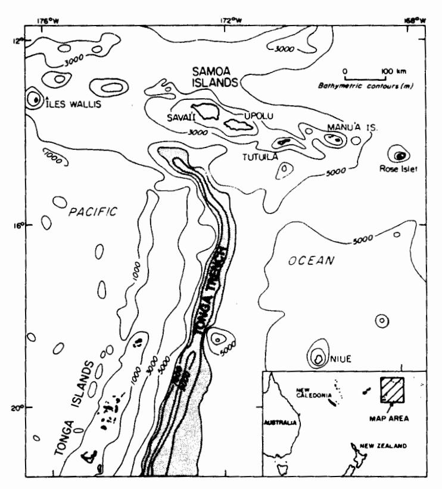
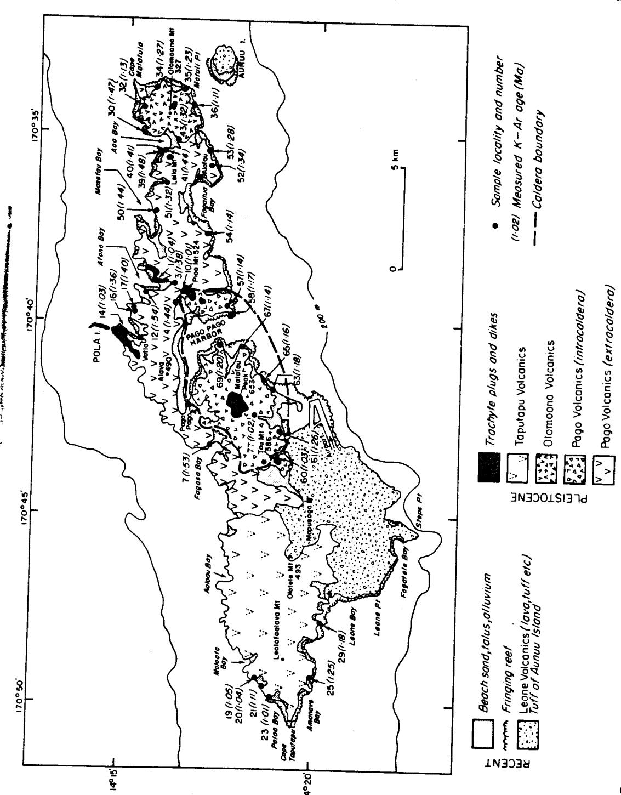

# Age and Evolution of the Volcanoes of Tutuila, American Samoa1

# IAN McDougall2

ABSTRACT: Tutuila is a basaltic volcanic island within the east southeasterly trending Samoa Island chain in the Pacific Ocean. Potassium—argon ages on 38 whole rock samples of lavas and intrusives demonstrate that the main period of subaerial volcanism occurred over a relatively short interval of about 0.6 Ma in the Early Pleistocene. The major shield volcano, Pago, was built between about 1.54 and 1.28 Ma ago; its large caldera formed approximately 1.27  $\pm$  0.02 Ma ago. Partial filling of the caldera by volcanics occurred from shortly after its formation until about 1.14 Ma ago, and activity on Pago Volcano ended with emplacement of trachyte bodies which have ages of 1.03  $\pm$  0.01 Ma. Construction of the smaller satellitic Olomoana and Taputapu volcanoes, on the eastern and western extensions of the main rift zone through Pago Volcano, took place over much the same time interval as the volcanism on Pago. The youthful basaltic volcanism on the Manu'a Islands, east of Tutuila, allows a rate of migration of the center of volcanism of about 10 cm/yr to be estimated. These results are broadly consistent with a hot spot origin for the volcanoes.

TUTUILA LIES IN THE PACIFIC OCEAN at 14°20′ S, 170°45′ W within the Samoa Islands, which extend as a volcanic chain over at least 370 km from Savai'i in the west northwest to the Manu'a Islands in the east southeast (Figure 1). The islands are the culminations of basaltic volcanoes on a submarine ridge which rises from old (Early Cretaceous) ocean floor more than 4000 m deep. Rose Islet, about 150 km east southeast of the Manu'a Islands, is part of American Samoa, but as a bathymetrically isolated atoll it may not be directly related geologically to the Samoan ridge (Figure 1).

The overall trend of the Samoa Island chain is subparallel to that of other young volcanic island chains located on the Pacific lithospheric plate. These chains are thought to represent hot spot or plume traces (Wilson 1963; Morgan 1971), recording movement of the Pacific plate over fixed magma sources in the mantle. Consistent with such models, these

island chains show a southeasterly migration of shield-building volcanism with time (Mc-Dougall 1964; Jackson et al. 1972; Duncan and McDougall 1976; Jarrard and Clague 1977; Dalrymple et al. 1980; McDougall and Duncan 1980). Similarly there is good evidence for youthful volcanism in the southeastern part of the Samoan chain in the Manu'a Islands. However, it has long been noted (Dana 1849; Daly 1924; Stearns 1944; Chubb 1957) that although the shieldbuilding volcanism on Tutuila and Upolu clearly is of some antiquity, the most northwesterly island, Savai'i, is dominated by very young basaltic volcanism, contrasting with other Pacific island chains. Hawkins and Natland (1975) and Natland (1980) explain this in terms of voluminous rejuvenescent volcanism. emanating from a rift zone formed in response to deformation of the Pacific plate adjacent to the Tonga Trench (Figure 1), which marks the boundary between the Pacific and Australian plates. Furthermore, these authors suggest that activity of all the Samoan shield volcanoes similarly was controlled by plate deformation, and thus they do not favor the idea of a hot spot origin for the island chain.

&lt;sup>1 Manuscript accepted March 1985.

&lt;sup>2 Research School of Earth Sciences, Australian National University, G.P.O. Box 4, Canberra, A.C.T. 2601, Australia.

FIGURE 1. Location map of the Samoa Islands in the southwest Pacific Ocean, together with generalized bathymetry

A comprehensive program of K-Ar dating of the shield-building lavas of the Samoa Islands has been undertaken to elucidate the temporal history of the subaerial volcanism and to test the various models for the origin of the island chain. In this article, however, only isotopic ages are reported for the island of Tutuila, American Samoa, and thus this essay is of much more limited scope.

Previously reported isotopic ages for the Samoan chain are few. Turner et al. (1983) referred to K-Ar ages on shield-building lavas in the range 1.0 to 2.6 Ma from Tutuila and Upolu, with those from Tutuila generally younger than those from Upolu. On the basis of paleomagnetic data, and in particular the reverse polarity found for most lavas measured from Tutuila, Tarling (1962, 1966) suggested that most of the activity occurred during the last (Matuyama) reversed chron, confirmed by the present work.

## GEOLOGY

Tutuila is about 32 km long and ranges from less than 2 km to a maximum of 9 km wide (Figure 2). It is the eroded subaerial remnant of a large volcanic edifice centered on a shallow submarine platform more than twice its present area at the 200 m isobath (Daly 1924). Tutuila is an island of rugged terrain, with a deeply embayed, drowned coastline and limited development of fringing reefs. Steep, narrow valleys, often amphitheaterheaded, are common.

The most comprehensive account of the geology of Tutuila was given by Stearns (1944), who also summarized the notable earlier reports by Dana (1849), Friedländer (1910), and Daly (1924). Stearns (1944) showed that Tutuila consists of several basaltic shield volcanoes, now extinct, that were built over a major rift zone striking about

FIGURE 2. Generalized geological map of Tutuila, modified from Stearns (1944), showing sample locations and measured ages. Airlandes of prominent peaks are given in moters

N70° E, at an angle to the overall trend of the Samoan chain (Figure 2). The major named volcanoes are Olomoana, Alofau, Pago, and Taputapu, although it will be shown that Alofau may be part of Pago and not a separate shield. Each volcano is moderately to deeply eroded, and on this basis Daly (1924) and Stearns (1944) suggested that the main volcanism was Pliocene or earliest Pleistocene.

The lavas are dominantly olivine basalt and hawaiite (Macdonald 1944, 1967), with low to moderate dips and thicknesses ranging from less than 1 m to more than 10 m in a number of cases. Some of the more primitive olivine basalts may be tholeiitic (Natland 1980), although the bulk of the lavas belong to the alkali olivine basalt suite (Macdonald 1967; Natland 1980). Dikes of similar composition to the lavas are locally very common in the deeper parts of the lava pile, especially in Pago Volcano. Their strike generally is about parallel to the trend of the island. Stearns (1944) mapped the Masefau dike complex as the oldest unit on Tutuila, but he recognized that this formation may only be a little older than the overlying lavas of Pago Volcano.

Tutuila is dominated by the eroded Pago Volcano, which extends laterally over 18 km and rises to 653 m at Matafao Peak, just west of Pago Pago Harbor (Figure 2). Stearns (1944) showed that only the northern half of the Pago shield is preserved. Following construction of the main shield volcano a large caldera developed, up to about 9 km across, later to be partly filled by tuffs and lavas. Pago Pago Harbor has been eroded out of the eastern part of the caldera. A number of trachyte bodies were emplaced in Pago Volcano, and also in Olomoana, with two of them, Masefau and Pioa, now the highest points in the landscape. Both Daly (1924) and Stearns (1944) estimated that Pago Volcano originally may have been as high as 1200 m above present sea level.

Olomoana and Taputapu volcanoes were built on the eastern and western extensions of the main rift zone through Pago Volcano and consist of lavas similar to those found on Pago. Stearns (1944) thought that much of the shield-building volcanism on Tutuila was nearly contemporaneous, but he suggested

that Olomoana was somewhat older and Taputapu younger than Pago Volcano. In contrast Natland (1980) argued that the locus of shield-building volcanism migrated from west to east in Tutuila, with Taputapu Volcano the oldest and Olomoana Volcano the youngest.

Volcanism was reactivated in Recent times when the post-erosional Leone Volcanics were erupted. These consist of cinder cones, ash, and tuff, as well as an extensive basanite lava flow that forms a broad plain in the southwest of Tutuila. The tuff cone comprising Aunuu Island off the southeast coast may belong to the same interval of volcanism.

## **METHODS**

Samples were collected from the denser parts of the freshest flows, dikes, and other intrusions exposed in road cuts, stream beds, and along the coast. Examination of thin sections showed that overall the samples were unusually fresh and well crystallized; many were deemed ideal for age measurement. A majority of the samples can be termed basalt or hawaiite, consisting mainly of plagioclase, clinopyroxene, and iron oxide, with or without olivine. About half the samples contained olivine and, much less commonly, clinopyroxene or plagioclase as phenocrysts. In order to minimize problems associated with possible inclusion of excess radiogenic argon in the phenocrysts, only the phenocryst-free portion of each sample was dated. The trachytes, likewise, are well crystallized and fresh, consisting mainly of very fine grained feldspar. Detailed petrographic descriptions of rocks from Tutuila were given by Daly (1924) and Macdonald (1944, 1967).

In most cases about 10 g of sample of fragment size  $250-500 \,\mu\text{m}$  was used for Ar extraction; K was measured flame photometrically on a representative portion crushed to less than  $150 \,\mu\text{m}$ . Extraction and measurement of Ar by isotope dilution followed procedures described previously (McDougall and Schmincke 1977). Isotopic measurements of the Ar were performed on either an AEI MS10 or a VG Isotopes MM1200 mass spectrometer operated

in the static mode. Most samples contained a relatively high proportion of radiogenic argon, attesting to the freshness of the rocks. The analytical precision of an individual age generally was better than 2% standard deviation.

#### RESULTS AND DISCUSSION

Data are listed in Tables 1 and 2; sample localities and ages are indicated in Figure 2. The measured K-Ar ages on 38 samples from the Pago, Olomoana, Alofau, and Taputapu volcanoes fall into a restricted range from 1.54 to 1.00 Ma. Note that no measurements were made on the volumetrically minor Recent Leone Volcanics.

The results from individual shield volcanoes fall within a narrow age span, showing gratifying consistency over a wide range of potassium contents. This finding suggests that the K-Ar dates are realistic estimates for the age of volcanism.

Seven samples mapped as belonging to the extracaldera phase of Pago Volcano by Stearns (1944) have ages ranging from 1.54 to 1.36 Ma (mean =  $1.44 \pm 0.07$  Ma). One lava (TU54) from the south coast, also mapped as extracaldera, gives a much younger age of 1.14 Ma and probably erupted subsequent to caldera formation. The oldest age,  $1.54 \pm$ 0.02 Ma, was from a basaltic dike (TU12) in a dike swarm on the west side of Afono Bay on the north coast. Samples from two lava flows adjacent to the coast about 1 km west yield ages of 1.40 and 1.36 Ma. An age of 1.53  $\pm$ 0.03 Ma was obtained for a vesicular basalt flow (TU7) from Fagasa Bay on the northwest coast. This locality probably is from among the deepest exposed parts of Pago Volcano.

Stearns (1944) mapped the Alofau Volcano, about 2 km in diameter, as a separate shield situated between Pago Volcano and Olomoana Volcano. Six samples yield ages ranging from 1.28 to 1.48 Ma (Table 1 and Figure 2) with a mean of  $1.38 \pm 0.08$  Ma. These ages are indistinguishable from those of the extracaldera phase of Pago Volcano and suggest that Alofau Volcano is the easterly extension of Pago Volcano rather than a separate shield volcano. The geology is consistent

with this view. Where dips of the lavas can be observed, they are small and generally toward the east or northeast. Further, gravity data (Machesky 1965) show no evidence for the postulated Alofau caldera of Stearns (1944) underlying Fagaitua Bay.

The combined K-Ar ages on the extracaldera lavas (excluding the result on sample TU54) of Pago Volcano, including those from Alofau, yield a mean age of  $1.41 \pm 0.08$  Ma, based upon 13 results, with a range from 1.28 to 1.54 Ma.

Seven samples of lavas of Pago Volcano mapped by Stearns (1944) as intracaldera have ages between 1.26 and 1.14 Ma (mean =  $1.18 \pm 0.04$  Ma), suggesting a short, eruptive interval. These samples are from nearly flatlying lavas close to present sea level on the south coast, so they may be recording a particular stage of the filling of the caldera. If we accept the K-Ar ages at face value, caldera formation probably occurred within the interval  $1.28 \pm 0.02$  Ma (TU53) and  $1.26 \pm 0.02$  Ma (TU61)—say, at an age of  $1.27 \pm 0.02$  Ma.

Stearns (1944) believed that the extracaldera volcanics of Pago Volcano could be divided into older, more primitive olivine basalt flows that were pre-caldera in age and younger, more fractionated basalts that were erupted after caldera formation. The present results, however, suggest that the bulk of the mapped extracaldera lavas, including many of the more fractionated types, judging from the potassium contents, are pre-caldera in age.

Samples from five of the trachyte bodies have been dated (Table 1) and yield concordant ages of 1.03 + 0.01 Ma. The trachytes of Pioa Mountain and Ta'u Mountain were emplaced along or near the caldera margin, whereas the Matafao trachyte intrudes the intracaldera volcanics. The large trachyte body comprising the steep ridge on the western side of Vatia Bay and the trachyte plug on the east side of Afono Bay intruded extracaldera lavas of Pago Volcano on the north coast of Tutuila. In view of the concordant ages found for these five bodies it is probable that all the trachytes of Tutuila were emplaced at essentially the same time. The undated bodies include those of Olomoana and Leila.

ISOTOPIC AGE DATA ON WHOLE ROCK SAMPLES, PAGO VOLCANO, TUTUILA TABLE 1.

| Field no. | Lab.                | K (wt %) | Radiogenic "OAr (10-12 mol/g)                        | 100 Rad. 40 Ar Total 40 Ar | Calculated Age (Ma ± 1 s.d.) | Locality                                        |
|--------------|---------------------|-------------|---------------------------------------------------------|-----------------------------------------------------|---------------------------------|-------------------------------------------------|
| Trachytes    | rtes                |             |                                                         |                                                     |                                 |                                                 |
| TU60         | 82-205              | 3.867,3.892 | 6.958                                                   | 71.3                                                | +1                              | E slopes, Tau Mountain                          |
| T077         | 82-222              | 3.208,3.205 | 5.685                                                   | 8.69                                                |                                 | Boulder, Papa Stream, from Matafao Peak         |
| TUIO         | 82-155              | 4.236,4.244 | 7.402                                                   | 81.4                                                | +1                              | NW flanks, North Pioa Mountain                  |
| T014         | 82-159              | 3.614,3.597 | 6.445                                                   | 5.2                                                 | +1                              | N coast, west side Vatia Bay                    |
| Tul          | 82-146              | 4.389,4.364 | 7.882                                                   | 76.3                                                | +1                              | N coast, east side Afono Bay                    |
| Intrac       | Intracaldera volca  | rolcanics   |                                                         |                                                     |                                 |                                                 |
| TU57         | 82-202              | 1.497,1.488 | 2.939                                                   | 20.7                                                | $1.14 \pm 0.02$                 | E flank Breakers Point, S coast                 |
| TU58         | 82-203              | 2.173,2.171 | 7.406                                                   | 35.6                                                | 1 +1                            | 30 m flow, Breakers Point                       |
| T069         | 82-214              | 1.396,1.393 | 2,909                                                   | 28.0                                                |                                 | Aphyric flow, Tulutulu Point                    |
| TU67         | 82-212              | 1.816,1.815 | 3,591                                                   | 17.5                                                | +1                              | 5 m flow, Niuloa Point                          |
| TU65         | 82-210              | 1.262,1.261 | 2.550                                                   | 19.7                                                | +1                              | 5 m+ flow, Avau, S coast                        |
| TU63         | 82-208              | 1.271,1.268 | 2.610                                                   | 19.4                                                | +1                              | 1.5 m flow, Oti Point                           |
| TU61         | 82-206              | 1.203,1.206 | 2.639                                                   | 30.1                                                | $1.26 \pm 0.02$                 | Thick flow, quarry, 1.3 km W of Nuuuli          |
| Extrac       | Extracaldera volc   | olcanics    |                                                         |                                                     |                                 |                                                 |
| TU54         | 82-199              | 1.528,1.526 |                                                         | 22.2                                                | 1.14 ± 0.02                     | 5 m flow, Faasouga Point, S coast               |
| TU4          | 82-149              | 0.997,1.004 |                                                         | 35.0                                                | +1                              | 50 m+ flow, altitude 210 m, 0.7 km NW of Aua    |
| TU3          | 82-148              | 1.107,1.110 | 2.655                                                   | 27.4                                                | $1.38 \pm 0.02$                 | 5 m flow, altitude -70 m,0.7 km S of Afono      |
| TU50*        | 82-195              | 2.290,2.307 |                                                         | 61.4                                                | +!                              | 8 m flow, altitude 50 π, Masefau Bay            |
| TU12*        | 82-157              | 1.351,1.348 |                                                         | 36.5                                                | +1                              | 5 m dike, W side of Afono Bay                   |
| TU17         | 82-162              | 1.098,1.102 | 2.674                                                   | 37.7                                                | $1.40 \pm 0.02$                 | 2 m flow, Sauma Ridge, altitude 110 m           |
| T016         | 82-161              | 1.608,1.611 | 3.799                                                   | 36.4                                                | +1                              | Flow, Sauma Ridge, altitude 105 m               |
| TU7          | 82-152              | 0.326,0.327 | 0.865                                                   | 17.3                                                | $1.53 \pm 0.03$                 | 1.5 m flow, Fagasa Bay, N coast                 |
| Volcan       | Volcanics from      | Alofau      |                                                         |                                                     |                                 |                                                 |
| TU52         | 82-197              | 0.773,0.778 | 1.797                                                   | 31.5                                                | 1.34 ± 0.02                     | Flow, road cut, Avapui Ridge, S coast           |
| TU53         | 82-198              | 1.460,1.459 | 3.245                                                   | 26.3                                                |                                 | 10 m flow, Matalesolo Point, S coast            |
| TU41*        | 82-186              | 1.375,1.371 | 3.419                                                   | 9.44                                                | +1                              | 5 m flow, W coast of Aoa Bay                    |
| TU40*        | 82-185              | 1.719,1.723 | 4.210                                                   | 49.3                                                | +1                              | Lava flow?, W coast of Aoa Bay                  |
| TU39*        | 82-184              | 1.333,1.329 | 3.428                                                   | 45.3                                                | +1                              | Dike or flow?, Motusaga Point, Aoa Bay          |
| TU51         | 82-196              | 0.976,0.969 | 2.224                                                   | 19.0                                                | +1                              | l m flow, near Masausi, N coast                 |
| Note:        | e: λ β + | - ~      | = $0.581 \times 10^{-10} \text{ yr}^{-1}$ , $\lambda_g$ | $= 4.962 \times 10^{-10} \text{ yr}^{-1}$           |                                 | $^{40}$ K/K = 1.167 x 10 -4 mol/mol. |

merconstruction of the state of the state of the state of the state of the state of the state of the state of the state of the state of the state of the state of the state of the state of the state of the state of the state of the state of the state of the state of the state of the state of the state of the state of the state of the state of the state of the state of the state of the state of the state of the state of the state of the state of the state of the state of the state of the state of the state of the state of the state of the state of the state of the state of the state of the state of the state of the state of the state of the state of the state of the state of the state of the state of the state of the state of the state of the state of the state of the state of the state of the state of the state of the state of the state of the state of the state of the state of the state of the state of the state of the state of the state of the state of the state of the state of the state of the state of the state of the state of the state of the state of the state of the state of the state of the state of the state of the state of the state of the state of the state of the state of the state of the state of the state of the state of the state of the state of the state of the state of the state of the state of the state of the state of the state of the state of the state of the state of the state of the state of the state of the state of the state of the state of the state of the state of the state of the state of the state of the state of the state of the state of the state of the state of the state of the state of the state of the state of the state of the state of the state of the state of the state of the state of the state of the state of the state of the state of the state of the state of the state of the state of the state of the state of the state of the state of the state of the state of the state of the state of the state of the state of the state of the state of the state of the state of the state o

peaks are given in moters

ISOTOPIC AGE DATA ON WHOLE ROCK SAMPLES, OLOMOANA AND TAPUTAPU VOLCANOES, TUTUILA TABLE 2.

|                                                                                                                                                                                                                                                                                                                                                                                                                                                                                                                                                                                                                                                                                                                                                                                                                                                                                                                                                                                                                                                                                                                                                                                                                                                                                                                                                                                                                                                                                                                                                                                                                                                                                                                                                                                                                                                                                                                                                                                                                                                                                                                                |                                                                                                |                                      | flow                           |                           | NU coset                            | יום רספור                | ) ast                          | Point                             |                                      | 10000                                | t, 5 coast                 | 11111                      | Manna                             | V Coast                            | Aoa                              |
|--------------------------------------------------------------------------------------------------------------------------------------------------------------------------------------------------------------------------------------------------------------------------------------------------------------------------------------------------------------------------------------------------------------------------------------------------------------------------------------------------------------------------------------------------------------------------------------------------------------------------------------------------------------------------------------------------------------------------------------------------------------------------------------------------------------------------------------------------------------------------------------------------------------------------------------------------------------------------------------------------------------------------------------------------------------------------------------------------------------------------------------------------------------------------------------------------------------------------------------------------------------------------------------------------------------------------------------------------------------------------------------------------------------------------------------------------------------------------------------------------------------------------------------------------------------------------------------------------------------------------------------------------------------------------------------------------------------------------------------------------------------------------------------------------------------------------------------------------------------------------------------------------------------------------------------------------------------------------------------------------------------------------------------------------------------------------------------------------------------------------------|------------------------------------------------------------------------------------------------|--------------------------------------|--------------------------------|---------------------------|-------------------------------------|--------------------------|--------------------------------|-----------------------------------|--------------------------------------|--------------------------------------|----------------------------|----------------------------|-----------------------------------|------------------------------------|----------------------------------|
| TOTAL TOTAL STREET, TOTAL STREET, TOTAL STREET, TOTAL STREET, TOTAL STREET, TOTAL STREET, TOTAL STREET, TOTAL STREET, TOTAL STREET, TOTAL STREET, TOTAL STREET, TOTAL STREET, TOTAL STREET, TOTAL STREET, TOTAL STREET, TOTAL STREET, TOTAL STREET, TOTAL STREET, TOTAL STREET, TOTAL STREET, TOTAL STREET, TOTAL STREET, TOTAL STREET, TOTAL STREET, TOTAL STREET, TOTAL STREET, TOTAL STREET, TOTAL STREET, TOTAL STREET, TOTAL STREET, TOTAL STREET, TOTAL STREET, TOTAL STREET, TOTAL STREET, TOTAL STREET, TOTAL STREET, TOTAL STREET, TOTAL STREET, TOTAL STREET, TOTAL STREET, TOTAL STREET, TOTAL STREET, TOTAL STREET, TOTAL STREET, TOTAL STREET, TOTAL STREET, TOTAL STREET, TOTAL STREET, TOTAL STREET, TOTAL STREET, TOTAL STREET, TOTAL STREET, TOTAL STREET, TOTAL STREET, TOTAL STREET, TOTAL STREET, TOTAL STREET, TOTAL STREET, TOTAL STREET, TOTAL STREET, TOTAL STREET, TOTAL STREET, TOTAL STREET, TOTAL STREET, TOTAL STREET, TOTAL STREET, TOTAL STREET, TOTAL STREET, TOTAL STREET, TOTAL STREET, TOTAL STREET, TOTAL STREET, TOTAL STREET, TOTAL STREET, TOTAL STREET, TOTAL STREET, TOTAL STREET, TOTAL STREET, TOTAL STREET, TOTAL STREET, TOTAL STREET, TOTAL STREET, TOTAL STREET, TOTAL STREET, TOTAL STREET, TOTAL STREET, TOTAL STREET, TOTAL STREET, TOTAL STREET, TOTAL STREET, TOTAL STREET, TOTAL STREET, TOTAL STREET, TOTAL STREET, TOTAL STREET, TOTAL STREET, TOTAL STREET, TOTAL STREET, TOTAL STREET, TOTAL STREET, TOTAL STREET, TOTAL STREET, TOTAL STREET, TOTAL STREET, TOTAL STREET, TOTAL STREET, TOTAL STREET, TOTAL STREET, TOTAL STREET, TOTAL STREET, TOTAL STREET, TOTAL STREET, TOTAL STREET, TOTAL STREET, TOTAL STREET, TOTAL STREET, TOTAL STREET, TOTAL STREET, TOTAL STREET, TOTAL STREET, TOTAL STREET, TOTAL STREET, TOTAL STREET, TOTAL STREET, TOTAL STREET, TOTAL STREET, TOTAL STREET, TOTAL STREET, TOTAL STREET, TOTAL STREET, TOTAL STREET, TOTAL STREET, TOTAL STREET, TOTAL STREET, TOTAL STREET, TOTAL STREET, TOTAL STREET, TOTAL STREET, TOTAL STREET, TOTAL STREET, TOTAL STREET, TOTAL STREET, TOTAL STREET, TOTAL STREET, TOTAL STREET, TOTAL STRE | Locality                                                                                       |                                      | NW coast near Racalif 5 m flow | 5 m flow next below Till9 | Thick flow Raisfully Doint NW coast | Thick flow Leonard Doint | Thick flow Looms Falls & coast | 1.5 m vesicular flow, Asili Point |                                      | Thick flow Mastulaumes Doint C coast | Flow on coast N of Lealast | 5 m flow E coast S of Tula | 50 m + flow disused quarry Mannua | Flow exposed on Solo Point N coast | Flow in disused quarry, S of Aoa |
|                                                                                                                                                                                                                                                                                                                                                                                                                                                                                                                                                                                                                                                                                                                                                                                                                                                                                                                                                                                                                                                                                                                                                                                                                                                                                                                                                                                                                                                                                                                                                                                                                                                                                                                                                                                                                                                                                                                                                                                                                                                                                                                                | Calculated Age (Ma ± 1 s.d.)                                                                   |                                      | 1.05 ± 0.02                    | $1.04 \pm 0.02$           | $1.11 \pm 0.01$                     | 1.01 + 0.02              | $1.25 \pm 0.02$                | 1.18 ± 0.02                       |                                      | 1.11 # 0.02                          | $1.23 \pm 0.02$            | $1.27 \pm 0.02$            | $1.13 \pm 0.04$                   | 1.47 ± 0.02                        | $1.32 \pm 0.02$                  |
|                                                                                                                                                                                                                                                                                                                                                                                                                                                                                                                                                                                                                                                                                                                                                                                                                                                                                                                                                                                                                                                                                                                                                                                                                                                                                                                                                                                                                                                                                                                                                                                                                                                                                                                                                                                                                                                                                                                                                                                                                                                                                                                                | 100 Rad, 40Ar C Total 40Ar                                                                  |                                      | 14.8                           | 18.8                      | 41.2                                | 29.6                     | 40.5                           | 26.9                              |                                      | 16.7                                 | 35.9                       | 23.5                       | 7.0                               | 43.6                               | 55.0                             |
|                                                                                                                                                                                                                                                                                                                                                                                                                                                                                                                                                                                                                                                                                                                                                                                                                                                                                                                                                                                                                                                                                                                                                                                                                                                                                                                                                                                                                                                                                                                                                                                                                                                                                                                                                                                                                                                                                                                                                                                                                                                                                                                                | Radiogenic 40Ar 100 Rad, 40Ar Calculated Age (10 12 mol/g) Total 40Ar (Ma ± 1 s.d.) | Volcano                              | 2.041                          | 2.185                     | 2.694                               | 2.166                    | 2.851                          | 1.424                             | Volcano                              | 3.219                                | 4.425                      | 2,092                      | 2,383                             | 2.995                              | 3.641                            |
|                                                                                                                                                                                                                                                                                                                                                                                                                                                                                                                                                                                                                                                                                                                                                                                                                                                                                                                                                                                                                                                                                                                                                                                                                                                                                                                                                                                                                                                                                                                                                                                                                                                                                                                                                                                                                                                                                                                                                                                                                                                                                                                                | K (wt %)                                                                                    | Taputapu Volcanics, Taputapu Volcano | 1.124,1.126                    | 1.210,1.211               | 1.393,1.396                         | 1.234,1.243              | 1.314,1.319                    | 0.694,0.695                       | Olomoana Volcanics, Olomoana Volcano | 1.673,1.672                          | 2.074,2.086                | 0.950,0.947                | 1.219,1.216                       | 0.903,0.907                        | 1.597,1.587                      |
|                                                                                                                                                                                                                                                                                                                                                                                                                                                                                                                                                                                                                                                                                                                                                                                                                                                                                                                                                                                                                                                                                                                                                                                                                                                                                                                                                                                                                                                                                                                                                                                                                                                                                                                                                                                                                                                                                                                                                                                                                                                                                                                                | Field Lab. no. no.                                                                          | pu Voica                             | 82-164                         | 82-165                    | 82-166                              | 82-168                   | 82-170                         | 82-174                            | na Volca                             | 82-181                               | 82-180                     | 82-179                     | 82-177                            | 82-175                             | 82-188                           |
|                                                                                                                                                                                                                                                                                                                                                                                                                                                                                                                                                                                                                                                                                                                                                                                                                                                                                                                                                                                                                                                                                                                                                                                                                                                                                                                                                                                                                                                                                                                                                                                                                                                                                                                                                                                                                                                                                                                                                                                                                                                                                                                                | Field no.                                                                                   | Taputa                               | TU19*                          | TU20                      | TU21*                               | TU23*                    | TU25                           | TU29*                             | ОІотоа                               | TU36                                 | TU35                       | <b>TU34</b>                | TU32                              | TU30*                              | TU43*                            |

For constants used, see Table 1. All samples are basalt or hawaiite. \* Olivine and, if present, clinopyroxene phenocrysts removed. Note:

On the extension of the main rift zone of Pago Volcano to the east lies the small Olomoana Volcano, about 3 km in diameter and rising to an altitude of 327 m. Ages on samples from six lavas range from 1.47 to 1.11 Ma (Table 2 and Figure 2), yielding an average of  $1.26 \pm 0.18$  Ma. Thus Olomoana Volcano was constructed essentially simultaneously with Pago Volcano, its activity overlapping in time with both the extracaldera and intracaldera volcanism of the latter.

The larger Taputapu Volcano, abutting the western flanks of Pago Volcano, forms a broad shield rising to an altitude of about 400 m. Six samples from Taputapu Volcano have ages ranging from 1.25 to 1.01 Ma (Table 2 and Figure 2), with a mean of 1.11 + 0.09Ma. Samples TU19 and TU20 are from successive lava flows at Fagalii on the northwest coast and yield indistinguishable ages. The two oldest ages found are from lavas on the south coast (samples TU25 and TU29) and presumably are from deeper in the lava pile. These results show that Taputapu Volcano was active concurrently with the eruption of the caldera-filling lavas of Pago Volcano, continuing until about the time the trachytes were emplaced.

# CONCLUSIONS

Tutuila is the eroded summit of a large volcanic edifice. Subaerial volcanism extended from about 1.54 to 1.00 Ma in the Early Pleistocene. Tutuila is dominated by Pago Volcano, whose main shield was constructed subaerially between 1.54 and 1.28 Ma ago. The lavas of Alofau are considered to form part of the eastern flanks of Pago Volcano. The large Pago caldera developed  $1.27 \pm 0.02$  Ma ago and was partly filled subsequently by tuffs, breccias, and lavas, the youngest dated samples of which yield ages of 1.14 Ma. Trachyte intrusions were emplaced 1.03 Ma ago, bringing to a close the volcanism associated with Pago Volcano.

Both Olomoana and Taputapu volcanoes may be regarded as essentially satellitic shield volcanoes to the main Pago Volcano, a conclusion that is supported by the Bouguer gravity anomaly map of Machesky (1965). Olomoana is a little older than Taputapu Volcano, but both were built during the interval that Pago Volcano was active.

These results demonstrate that the duration of the main subaerial shield-building volcanism of Tutuila was only of the order of 0.6 Ma, although it is unlikely that the full age range of lavas has been sampled. The subaerial shield-building phase of many other volcanoes in oceanic regions likewise is found to be short-lived. Examples include the Hawaiian volcanoes (McDougall 1964), numerous other volcanoes on the Pacific plate (Duncan and McDougall 1976; McDougall and Duncan 1980), and Gran Canaria in the Atlantic (McDougall and Schmincke 1977).

Similarities with Hawaiian volcanoes extend to the eruption of strongly undersaturated magmas on Tutuila, comprising the Recent Leone Volcanics, following a long erosional interval after construction of the main shield. In addition the lavas of the exposed part of the shields of Tutuila principally are of the alkali olivine basalt suite, similar to those commonly found overlying the main shield-building tholeiitic lavas characteristic of Hawaiian volcanoes. In this respect, Tutuila is like many other oceanic volcanoes. perhaps reflecting different degrees of partial melting in the source regions and of exposure of the edifice by erosion.

A brief comment can be made here concerning migration of volcanism in the Samoa Islands; a more detailed discussion will be given subsequently when dating of the other islands in the chain is completed. The Manu'a Islands lie about 115 km east of Tutuila (Figure 1) and are the summits of two basaltic volcanoes which have developed calderas (Daly 1924; Stearns 1944; Stice and McCov 1968). These volcanoes are quite youthful, confirmed by unpublished K-Ar ages from this laboratory averaging 0.3 Ma for Ofu/Olosega and less than 0.1 Ma for Ta'u. The mean age for the subaerial shield-building volcanism on Tutuila is 1.26 + 0.15 Ma, the average of 33 ages for the volcanics, excluding the results on the trachytes. From these data a rate of migration of the center of volcanism from Tutuila to Manu'a of about 10 cm/yr is derived. Similarly, unpublished K-Ar age data from this laboratory for the Fagaloa Volcanics (Kear and Wood 1959), the shieldbuilding lavas of Upolu, are mainly in the range 2.8 to 1.7 Ma, with a mean age of 2.2 Ma. As Upolu is about 120 km northwest of Tutuila (Figure 1), the average rate of migration of volcanism from Upolu to Tutuila is about 10.5 cm/yr. These rates and the direction of migration of volcanism are broadly consistent with the predicted values in the range 9 to 11 cm/yr for the Samoa Island chain along small circles about several proposed rotation poles for the Pacific plate (Jarrard and Clague 1977; McDougall and Duncan 1980), based upon volcanic migration rates and directions observed in other Pacific island chains. Thus it is concluded that Upolu, Tutuila, and the Manu'a Islands comprise a hot spot or plume trace on the Pacific plate. similar to the Hawaiian and Society Island chains. Nevertheless the dominance of youthful volcanism on Savai'i remains an enigma and may indeed reflect major rejuvenescence related to deformation of the Pacific plate adjacent to the Tonga Trench, as proposed by Hawkins and Natland (1975) and Natland (1980).

## **ACKNOWLEDGMENTS**

Particular thanks are extended to M. Cowen, R. T. Davies, Robyn Maier, and R. Rudowski for able technical assistance. I thank P. K. Zeitler and R. W. Johnson for critically reading the manuscript and P. Primmer for typing it. Comments by referees were helpful.

## LITERATURE CITED

CHUBB, L. J. 1957. The pattern of some Pacific island chains. Geol. Mag. 94:221-228.

DALRYMPLE, G. B., M. A. LANPHERE, and D. A. CLAGUE. 1980. Conventional and 40Ar/39Ar K-Ar ages of volcanic rocks from Ōjin (site 430), Nintoku (site 432), and Suiko (site 433) seamounts and the chronology of volcanic propagation along the

- Hawaiian-Emperor chain. *In* Initial Reports of the Deep Sea Drilling Project, vol. 75. U.S. Government Printing Office, Washington, D. C.
- Dally, R. A. 1924. The geology of American Samoa. Carnegie Institution of Washington, Pub. 340, 95-145.
- Dana, J. D. 1849. U.S. exploring expedition during the years 1838-1842 under command of Charles Wilkes, U.S.N. Geology 10:307-336.
- Duncan, R. A., and I. McDougall. 1976. Linear volcanism in French Polynesia. J. Volcanol. Geothermal Res. 1:197-227.
- FRIEDLÄNDER, I. 1910. Beiträge zur Geologie der Samoainseln: Abhandlungen der bayerischen Akademie der Wissenschaften, Mathematisch-physikalische Klasse, Band 24, 509-541.
- HAWKINS, J. W., and J. H. NATLAND. 1975. Nephelinites and basanites of the Samoan linear volcanic chain: Their possible tectonic significance. Earth Planet. Sci. Lett. 24:427-439.
- KEAR, D., and B. L. WOOD. 1959. The geology and hydrology of Western Samoa. New Zealand Geol. Surv. Bull. 63:1-92.
- JACKSON, E. D., E. A. SILVER, and G. B. DALRYMPLE. 1972. Hawaiian-Emperor chain and its relation to Cenozoic circumpacific tectonics. Geol. Soc. Am. Bull. 83:601-618.
- JARRARD, R. D., and D. A. CLAGUE. 1977. Implications of Pacific island and seamount ages for the origin of volcanic chains. Rev. Geophysics and Space Physics 15:57-76.
- MACDONALD, G. A. 1944. Petrography of the Samoan Islands. Geol. Soc. Am. Bull. 55:1333-1362.
- ——. 1967. A contribution to the petrology of Tutuila, American Samoa. Geol. Rundschau 57:821-837.
- MACHESKY, L. F. 1965. Gravity relations in American Samoa and the Society Islands. Pac. Sci. 19:367-373.
- McDougall, I. 1964. Potassium-argon ages from lavas of the Hawaiian Islands. Geol. Soc. Am. Bull. 75:107-128.
- McDougall, I., and R. A. Duncan. 1980. Linear volcanic chains—recording plate motions? Tectonophysics 63:275-295.

- McDougall, I., and H.-U. Schmincke. 1977. Geochronology of Gran Canaria, Canary Islands: Age of shield building volcanism and other magmatic phases. Bull. Volcanolog. 40:57–77.
- MORGAN, W. J. 1971. Convection plumes in the lower mantle. Nature 230:42-43.
- NATLAND, J. H. 1980. The progression of volcanism in the Samoan linear volcanic chain. Am. J. Sci. 280A: 709-735.
- STEARNS, H. T. 1944. Geology of the Samoan Islands. Geol. Soc. Am. Bull. 55:1279–1332.
- STICE, G. D., and F. W. McCoy. 1968. The geology of the Manu'a Islands, Samoa. Pac. Sci. 22:427-457.

- Tarling, D. H. 1962. Tentative correlation of Samoan and Hawaiian Islands using "reversals" of magnetization. Nature 196:882-883.
- Samoan and Tongan Islands. Geophys. J. Roy. Astron. Soc. 10:497-513.
- TURNER, D. L., J. H. NATLAND, and E. WRIGHT. 1983. New K/Ar ages of Samoan volcanoes [abs.]. EOS (American Geophysical Union Transactions): 64, 905.
- Wilson, J. T. 1963. A possible origin of the Hawaiian Islands. Can. J. Phys. 41:863-870.