# SAN DIEGO STATE UNIVERSITY AND UNIVERSITY OF CALIFORNIA

Santa Barbara

## **Terrigenous sediment dynamics in a small, tropical, fringing-reef embayment**

A Dissertation submitted in partial satisfaction of the requirements for the degree Doctor of Philosophy in Geography

by

Alex Thomas Messina

Committee in charge:

Professor Trent Biggs, Chair

Professor Allen Hope

Professor Bodo Bookhagen

Professor Libe Washburn

Dr. Curt Storlazzi, USGS

June 2016

ProQuest Number: 10159733

#### All rights reserved

#### INFORMATION TO ALL USERS

The quality of this reproduction is dependent upon the quality of the copy submitted.

In the unlikely event that the author did not send a complete manuscript and there are missing pages, these will be noted. Also, if material had to be removed, a note will indicate the deletion.

#### ProQuest 10159733

Published by ProQuest LLC (2016). Copyright of the Dissertation is held by the Author.

All rights reserved.

This work is protected against unauthorized copying under Title 17, United States Code Microform Edition © ProQuest LLC.

> ProQuest LLC. 789 East Eisenhower Parkway P.O. Box 1346 Ann Arbor, MI 48106 - 1346

#### The dissertation of Alex Thomas Messina is approved.

| Bodo Bookhagen                   |
|----------------------------------|
|                                  |
|                                  |
| Allen Hope                       |
|                                  |
|                                  |
| Curt Storlazzi                   |
|                                  |
|                                  |
| Libe Washburn                    |
|                                  |
|  Trent Biggs, Committee Chair |
|                                  |

June 2016

**Terrigenous sediment dynamics in a small, tropical, fringing-reef embayment**

Copyright © 2016

by

Alex Thomas Messina

#### DEDICATION

For my grandfathers, Alfonso Messina and Frank Fuchs

#### ACKNOWLEDGEMENTS

The fundamental social unit of the *Fa'a Samoa*, or the Samoan way of life is the *aiga*, or extended family. All success and prosperity is shared equally with each member, as it is recognized that no individual succeeds without the full support of the *aiga*. In the course of completing this dissertation I relied heavily on a network of people across the Pacific and must share any success with all of them. With much *alofa* I offer my deepest gratitude to all of you. *Fa'afetai tele lava*.

First and foremost I have to thank my Dissertation Committee Chair and main adviser, Dr. Trent Biggs, who constantly inspired, motivated, and supported me throughout this journey. From the heights of the Himalaya to the depths of the South Pacific, Dr. Biggs has been there for me and never stopped encouraging my curiosity, wherever my research interests led. Dr. Biggs' sense of humor and joy in scientific research were contagious and made my experience in grad school a whole lot of fun. I would also like to extend my gratitude to the members of my dissertation committee, Professor Bodo Bookhagen, Professor Allen Hope, Professor Libe Washburn, and Dr. Curt Storlazzi for their helpful suggestions, encouragement, and mentoring. I would also like to thank Dr. Olivia Cheriton at USGS for her help with data analysis and writing for the second dissertation chapter.

Additionally, I would like to acknowledge the funding and support from the Coral Reef Advisory Group in American Samoa, the NOAA Coral Reef Conservation Program, and the US Geological Survey Pacific Coastal and Marine Science Center.

This dissertation would not have been possible without the friendship and support of the people of American Samoa, local environmental managers, and many friends. I thank Mayor Uso in Faga'alu for his permission and blessings, and Mitch Shimisaki and George Poysky at Samoa Maritime for granting us unrestricted access to critical areas of the study site, and many good stories about the old days of American Samoa. I'd like to especially thank Dr. Michael Favazza for feeding me many, many meals, and Kristine Bucchianeri, Meagan Curtis, Professor Jameson Newtson, Rocco Tinitali, Robert Koch, and Hideyo Hattori for all their support with the field work, and for making my time on "the Rock" some of the best times of my life. I owe much of the success of the field work to their assistance and encouragement.

I must also thank my family, especially my parents Andy and Valerie, and my sister Sarah, for their unconditional support throughout these many, many, many, many years of undergraduate and graduate school. While financial support can be substituted, they gave me all the things money can't buy including a lot of love, encouragement, and shared wisdom. Last but not least I have to thank my wonderful fiancée Jennilee Alonso for the unwavering positivity and emotional support, even when I was in the field for half of our relationship. *Manuia soifua!*

## ABBREVIATED VITA OF ALEX THOMAS MESSINA June 2016

#### EDUCATION

Bachelor of Arts, Film and Media Studies, University of California, Santa Barbara, 2008 Bachelor of Arts, Geography, University of California, Santa Barbara, 2008 Master of Science in Watershed Science, San Diego State University, September 2011 Doctor of Philosophy in Geography, University of California, Santa Barbara, June 2016

#### PROFESSIONAL EMPLOYMENT

2010-16: Teaching/Research Assistant, Department of Geography, San Diego State University

#### PUBLICATIONS

#### *JOURNALS*

- **Messina, A.**, Biggs, T., (2016). "Contributions of human activities to suspended sediment yield during storm events from a small, steep, tropical watershed." *Journal of Hydrology* 538,726-742
- Holst Rice, S., **A. Messina**, T. Biggs, B. Vargas-Angel, and D. Whitall. 2016. *Baseline Assessment of* Faga'alu *Watershed: A Ridge to Reef Assessment in Support of Sediment Reduction Activities and Future Evaluation of their Success*. Silver Spring, MD: NOAA Coral Reef Conservation Program. NOAA Technical Memorandum CRCP 23. 44 pp. DOI: 10.7289/V5BK19C3
- Biggs, T. W., Lai, C.-T., Chandan, P., Lee, R. M., **Messina, A.,** Lesher, R. S., & Khatoon, N. (2015). "Evaporative fractions and elevation effects on stable isotopes of high elevation lakes and streams in arid western Himalaya". *Journal of Hydrology*, 522, 239– 249.

#### *BOOK CHAPTERS*

Biggs, T., Petropoulos, G., Velpuri, N., Marshall, M., Glenn, E., Nagler, P., **Messina, A**. (*In Press*) Remote Sensing of Evapotranspiration from Cropland. In *Remote Sensing of Water Resources, Disasters, and Urban Studies* (1st ed., pp. 200-250). London: Taylor & Francis.

#### *IN REVIEW*

- **Messina, A.**, Storlazzi, C., Biggs, T., "Eulerian and Lagrangian Measurements of Water Flow and Residence Time in a Fringing Coral Reef Embayment."
- Biggs, T., Marshall, M., **Messina, A.**, "Automated mapping of evapotranspiration from irrigated crops using global climate grids and MODIS data: Comparison of energy- and vegetation-based methods with *in situ* observations."
- **Messina, A.**, Biggs, T. "Seasonal water use mapping in a large river basin under normal and drought conditions using MODIS and automated SEBAL modeling."

#### AWARDS

President's Award, Student Research Symposium at San Diego State University 2016

## **ABSTRACT**

**Terrigenous sediment dynamics in a small, tropical, fringing-reef embayment**

by

#### Alex Thomas Messina

Anthropogenic watershed disturbance by industry, agriculture, deforestation, roads, and urbanization alters the timing, composition, and mass of sediment loads to coral reefs, causing enhanced sediment stress on corals near the outlets of impacted watersheds (Syvitski et al., 2005; West and van Woesik, 2001). Few studies have developed an integrated understanding of sediment sources, transport processes, and deposition in small, reef-fringed embayments (Bartley et al., 2014; Draut et al., 2009; Wolanski et al., 2003) and many are outside the scope of local environmental managers in remote islands like at the study site, Tutuila, American Samoa. Ridge-to-Reef studies on sediment dynamics have three general components, which are reflected in the three chapter structure of this dissertation: watershed inputs, hydrodynamic circulation over the reef, and how they interact to govern spatiotemporal distribution of sediment accumulation on the reef. This dissertation provides an example of how a scientific, process-oriented Ridge to Reef study of sediment dynamics can answer critical scientific questions about the source, transport, and fate of sediment in the near-shore environment, and how answers to the scientific questions can support local coral management.

Data on suspended sediment yield (SSY) from small, steep, tropical watersheds is limited, and assessments of sediment mitigation projects have been hindered by interannual climatic and sediment source variability. Chapter 1 used an event-wise approach to compare SSY from disturbed and undisturbed subwatersheds from storms of the same size, estimate total SSY to Faga'alu Bay, and estimate annual SSY to compare to other watersheds. It was unknown what the dominant sediment source was in Faga'alu watershed, and what potential management solutions were available. The sediment budget developed in the first chapter of this dissertation showed the quarry was a significant source, compared to natural background, and so local managers focused on reducing sediment discharge from the quarry. Continued monitoring presented in the third dissertation chapter showed SSY to the Bay was significantly reduced following sediment mitigation at the quarry.

The fate of suspended sediment once it enters the marine environment is difficult to predict, but is strongly controlled by hydrodynamic conditions and circulation patterns. Computer models of hydrodynamic circulation require detailed forcing data, bathymetric data, and computer resources that are often unavailable to local managers. Chapter 2 of the dissertation used a simple approach combining Lagrangian GPS-logging drifters and Eulerian acoustic current profilers to determine dominant water circulation patterns under the most common conditions that characterize forcing in the Bay: calm, high onshore winds, and high waves.

Measuring sediment accumulation on the reef is a contested area of research and the most common method, using tube traps, has some weaknesses. Others argue flat surfaces should be used to show net sediment accumulation. Chapter 3 presents results from both tubular sediment traps and flat-surfaced sediment pods to show gross vs net monthly

sediment accumulation over one year. While many studies deploy traps haphazardly, or just below stream outlets, here sediment traps were arranged to observe spatial patterns between the north and south sections of the reef, as a result of prevailing currents and distance from the stream outlet.

Integrating SSY and water circulation from Chapters 1 and 2 with observations of sediment accumulation in Chapter 3 showed that the predominant water circulation patterns deflect the storm-supplied terrigenous sediment from the stream over the northern reef where it caused enhanced sediment stress on corals. Temporal patterns of sedimentation were complex, and only the site nearest the stream outlet correlated with monthly SSY from the watershed, whereas nearly all sites showed increased carbonate sedimentation with increased wave energy. Sediment accumulated in traps and on sediment pods was mostly similar to surrounding benthic sediment, and correlated with wave energy, showing most sediment transport over the reef was from wind and wave-forced resuspension of carbonate sediment.

## TABLE OF CONTENTS

| ABSTRACT                                                                 | vii |
|--------------------------------------------------------------------------|-----|
| TABLE OF CONTENTS                                                        | x   |
| Introduction                                                             | 1   |
| Chapter One:                                                             | 7   |
| ABSTRACT                                                                 | 7   |
| 1.1. Introduction                                                        | 8   |
| 1.2. Study Area                                                          | 12  |
| 1.2.1 Climate                                                            | 14  |
| 1.2.2 Land Cover and Land Use                                            | 14  |
| 1.3. Methods                                                             | 16  |
| 1.3.1 Field Data Collection                                              | 18  |
| 1.3.2 SSY EV for disturbed and undisturbed watersheds         | 22  |
| 1.3.3 Modeling SSY EV with storm metrics                      | 25  |
| 1.3.4. Estimation of annual SSY                                          |     |
| 1.4. Results                                                             | 27  |
| 1.4.1 Field Data Collection                                              | 27  |
| 1.4.2 SSY EV for disturbed and undisturbed watersheds         | 31  |
| 1.4.3 Modeling SSY EV with storm metrics                      | 37  |
| 1.4.4 Estimation of annual SSY                                           |     |
| 1.5. Discussion                                                          | 41  |
| 1.5.1 SSC and SSY EV for disturbed and undisturbed watersheds | 41  |
| 1.5.2 Modeling SSY EV with storm metrics                      | 43  |
| 1.5.3 Estimation of annual SSY                                           | 45  |
| 1.6. Conclusion                                                          | 48  |
| 1.7. References for Chapter One                                          | 49  |
| 1.8 Supplementary Material for Chapter One                               |     |
| Supplementary Material A. Dams in Faga'alu watershed                     |     |
| Supplementary Material B. Stream gaging in Faga'alu Watershed            |     |
| Supplementary Material C. Turbidity-Suspended Sediment                   |     |
| Concentration rating curves for turbidimeters in Faga'alu                | 62  |
| Supplementary Material D. Water discharge during storm events            |     |
| Chapter Two:                                                             | 70  |
| ABSTRACT                                                                 | 70  |
| 2.1. Introduction                                                        | 71  |
| 2.2. Materials and Methods                                               | 74  |
| 2.2.1 Study area                                                         | 74  |
| 2.2.2 Lagrangian measurements                                            |     |
| 2.2.3 Eulerian measurements                                              |     |
| 2.2.4 Ancillary data                                                     | 78  |
| 2.2.5 Analytical methods                                                 |     |
| 2.3. Results                                                             |     |
| 2.3.1 Meteorologic and oceanographic forcing                             | 81  |

| 2.3.2 Flow variability during TIDE, WIND, WAVE forcing 83             |  |
|--------------------------------------------------------------------------|--|
| 2.3.3 Spatial variability of flow trajectories85                         |  |
| 2.3.4 Spatial pattern of mean flows89                                    |  |
| 2.3.5 Spatial pattern of residence times91                               |  |
| 2.3.6 Comparing Eulerian and Lagrangian flow speeds and residence        |  |
| times93                                                                  |  |
| 2.4. Discussion 94                                                    |  |
| 2.4.1 Differences between Eulerian and Lagrangian flows 95            |  |
| 2.4.2 Applications of a hybrid Eulerian-Lagrangian method to reef        |  |
| hydrodynamic studies98                                                   |  |
| 2.4.3 Implications of circulation patterns on reef health99              |  |
| 2.5. Supplementary Material for Chapter Two 100                       |  |
| 2.6. References for Chapter Two 100                                   |  |
| Chapter Three: 106                                                    |  |
| Abstract 106                                                          |  |
| 3.1. Introduction 107                                                 |  |
| 3.2. Materials and Methods111                                            |  |
| 3.2.1 Study Area111                                                      |  |
| 3.2.2 Methods115                                                         |  |
| 3.3. Results121                                                          |  |
| 3.3.1 Suspended sediment yield (SSY) and mean wave heights               |  |
| (Hmean)121                                                               |  |
| 3.3.2 Time-lapse photography of sediment plumes 123                   |  |
| 3.3.3 Sediment collection and composition: Spatial patterns124           |  |
| 3.3.4 Sediment collection and composition: Temporal patterns128          |  |
| 3.4. Discussion 134                                                   |  |
| 3.4.1 Watershed and oceanic controls on sediment accumulation135         |  |
| 3.4.2 Relationship between particle size, settling velocity, and spatial |  |
| pattern of sediment accumulation139                                      |  |
| 3.4.3 Relating sediment accumulation to coral health 140              |  |
| 3.4.4 Comparison to other studies, and advantages of this approach143    |  |
| 3.5. References for Chapter Three 145                                 |  |
| Conclusion 151                                                        |  |
| Future research 152                                                   |  |
| References for Introduction and Conclusion 153                        |  |

## **Introduction**

The majority of coral reefs around the world are in decline due to a combination of human-induced stressors, including increased sediment stress (Brodie et al., 2012). Anthropogenic watershed disturbance by deforestation, roads, and urbanization alters the timing, composition, and mass of sediment yields to coral reefs, causing enhanced sediment stress on corals near the outlets of impacted watersheds (Syvitski et al., 2005; West and van Woesik, 2001). Anthropogenic sediment disturbance may be exacerbated on tropical islands characterized by frequent rainfall, steep slopes, erodible soils, and naturally dense vegetation, where land clearing alters the fraction of exposed soil much more than in regions with sparse vegetation. Sediment can attenuate light for photosynthesis, prevent larval recruitment, and stress or smother coral organisms (Erftemeijer et al., 2012; Fabricius, 2005; Storlazzi et al., 2015). Deposited sediment can be resuspended due to wave action and reworked over the reef, causing persistent negative effects to ecosystem health (Wolanski et al., 2003), distributing impacts to larger areas (Presto et al., 2006), or reduce sediment stress by flushing or preventing sediment transport over corals (Hoitink and Hoekstra, 2003). The severity of sediment stress to coral organisms and ecosystems is determined by the magnitude and duration of exposure, which are controlled by the interaction of sediment loading from the watershed, sediment availability on the reef, and hydrodynamic processes (Draut et al., 2009; Storlazzi et al., 2009). Many past studies focused on qualitative descriptions of reef health decline and probable stressors, but Downs et al. (2005) argues we need to shift from descriptive assessment to mechanistic description and focus assessments on individual stressors to recommend coral conservation and restoration strategies to

environmental managers. The "Ridge to Reef" framework provides an integrated understanding of terrigenous sediment which is essential for identifying and mitigating impacts on coral health.

Few studies have developed an integrated understanding of sediment sources, transport processes, and deposition in small, reef-fringed embayments (Bartley et al., 2014; Draut et al., 2009; Wolanski et al., 2003). Two integrated studies of Hanalei Bay in Kauai, HI, (Draut et al., 2009; Storlazzi et al., 2009) demonstrated that in addition to total sediment loading and water circulation, the temporal phasing of flood events and seasonal wave conditions are key controls on sediment deposition and residence time. As opposed to temperate regions where sediment deposition is limited because river floods and high wave energy are caused by the same frontal system, sediment discharge and wave events can be decoupled in many tropical regions.

Examples of Ridge to Reef studies of sediment dynamics related to watershed management are even more rare, and many do not include hydrodynamic studies (Ramos Scharrón et al., 2012) or measurements of sediment yield, and simply correlate sediment accumulation on the reef with development in the watershed or precipitation (Gray et al., 2012; Teneva et al., 2016). Coral reef environments are highly heterogeneous and sedimentation impacts are not uniformly distributed in time or space, so simple correlations are inadequate. By measuring sediment transport through the watershed we can make more effective sediment management strategies, and by assessing deposition on the reef we can focus on which areas are actually receiving sediment.

The USGS Ridge-to-Reef Program (see Field et al. (2008), and references therein) has pursued integrated, process-oriented research in tropical, fringing reefs to provide scientific information on sediment sources and dynamics to resource managers (Atkinson and Medeiros, 2006). Coral sediment dynamics studies like Ridge-to-Reef have three general components, which are reflected in the three chapter structure of this dissertation: watershed inputs, hydrodynamic circulation over the reef, and how they interact to govern spatiotemporal distribution of sediment accumulation on the reef. In many reef areas there have been multiple independent studies that evaluated individual aspects of the source, delivery, and fate of sediment to the marine system but it is rare that these studies are linked together to provide a complete understanding of sediment movement across the watershedto-marine continuum (Bartley et al., 2014). Each of the three components requires significant expertise and specialized equipment, so many ridge-to-reef studies integrated large-scale collaborative efforts among watershed scientists, oceanographers, and coral ecologists. These large-scale collaborative efforts are important for integrating state-of-theart knowledge in each field and typically focus on important, but complex study sites (Fabricius et al., 2012; Storlazzi et al., 2009), but are generally beyond the capabilities of management-oriented investigations. While it is difficult for well-resourced groups to conduct these studies, it is even more difficult for environmental managers on small islands with fewer monetary and personnel resources. This dissertation was focused on using methods that would be available for local managers to develop an integrated understanding of the sediment dynamics from Ridge to Reef, recommend effective management solutions, and provide baseline data to assess management efficacy in the future.

The objective of this dissertation was to document sediment sources in the watershed to identify opportunities for mitigation, describe water circulation over the reef, and document how sediment input and hydrodynamics control the spatial and temporal distribution of

sediment accumulation. This research is structured around three chapters that investigate sediment dynamics in Faga'alu, American Samoa, which has been identified as a priority reef for mitigation of sediment-related impacts on coral reefs (Burke et al., 2011; Holst-Rice et al., 2016).

The dissertation is organized into three chapters, each of which is prepared as a separate manuscript for submission to peer-reviewed journals. The first chapter, titled "Contributions of human activities to suspended sediment yield during storm events from a small, steep, tropical watershed" (Messina and Biggs, 2016), quantified suspended sediment yield (SSY) from undisturbed forest and from human disturbed parts of Faga'alu watershed during both baseflow and storm events. In situ measurements of precipitation, stream discharge and suspended sediment concentration (SSC), collected over three field campaigns (2012-2014), were used to calculate storm event suspended sediment yield (SSYEV). Maximum event discharge (Qmax) was found to be a good predictor of SSYEV from both the undisturbed, upper watershed, and from the human-disturbed, total watershed. A Qmax-SSYEV model was developed to predict sediment input to the Bay during sediment trap measurements on the reef, when SSC data was not available.

The second chapter, titled "Eulerian and Lagrangian measurements of water flow and residence time in a fringing reef flat-lined embayment: Faga'alu Bay, American Samoa" (Messina et al. *in press*), used a combination of Lagrangian (GPS-logging drifters) and Eulerian methods (acoustic current profilers) to characterize water circulation patterns and flow velocities over the reef, and their relationship to wave, wind, and tidal forcing. Flow velocities were used to characterize spatially distributed residence time of water over the reef, under calm conditions, high onshore winds, and high waves. This study was

unprecedented in number of drifter deployments, range of forcing conditions sampled, and spatial coverage in a fringing reef setting. The insights on water circulation patterns in the Bay gained through this chapter were used to interpret the results of spatially distributed sediment trap deployments, detailed in the third chapter.

The third chapter, "Watershed and oceanic controls on spatial and temporal patterns of sediment accumulation in a fringing reef flat embayment", used measured and modeled SSYEV data from Chapter One to calculate monthly terrigenous sediment input to the Bay. Water circulation patterns from Chapter Two, and modeled wave data on significant wave height were used to interpret spatial and temporal patterns in sediment accumulation on the reef. This chapter presents one of the few studies where SSY inputs were measured simultaneously with sediment accumulation in a near-shore environment, and one of the very few studies where tubular sediment traps and flat-surfaced SedPods were deployed in conjunction to observe patterns in gross and net sediment accumulation on a coral reef. The results of this chapter showed gross and net sediment accumulation (terrigenous and total) were higher on the northern portion of the reef flat in Faga'alu Bay. This spatial pattern was due to higher benthic availability around the traps, and the configuration of wave-forced flow across the southern reef flat and terrigenous sediment discharged from Faga'alu stream into the northwest corner of the embayment. Carbonate sediment transported over the reef by wave-driven resuspension accounted for the majority of sediment accumulation in traps, and was significantly correlated with high wave conditions. Terrigenous sediment accumulation only correlated with SSY from Faga'alu stream at the location nearest the stream outlet, illustrating that sediment dynamics were highly modulated by hydrodynamic

conditions, and sediment accumulation and removal varied at time scales shorter than the monthly resolution of measurements.

The dissertation concludes with a summary of the findings of the three chapters and concludes with an examination of future research questions. In summary, the northern reef and areas near the channel in Faga'alu Bay are more exposed to sediment stress due to the natural configuration of the reef, the resulting clockwise pattern of wave-forced flow, and increased terrigenous sediment input from Faga'alu stream due to anthropogenic watershed disturbance in the quarry and village areas. This research guided sediment mitigation strategies that have reduced sediment yield from the watershed and sediment stress on the coral reef in Faga'alu Bay, which will be presented in forthcoming papers.

## **Chapter One:**

**Contributions of human activities to suspended sediment yield during storm events from a small, steep, tropical watershed**

## **ABSTRACT**

Suspended sediment concentrations (SSC) and yields (SSY) were measured during storm and non-storm periods from undisturbed and human-disturbed portions of a small (1.8 km²), mountainous watershed that drains to a sediment-stressed coral reef. Event-wise SSY (SSYEV) was calculated for 142 storms from measurements of water discharge (Q), turbidity (T), and SSC measured downstream of three key sediment sources: undisturbed forest, an aggregate quarry, and a village. SSC and SSYEV were significantly higher downstream of the quarry during both storm- and non-storm periods. The human-disturbed subwatershed (10.1% disturbed) accounted for an average of 87% of SSYEV from the watershed. Observed sediment yield (mass) to the coast, including human disturbed subwatersheds, was 3.9x the natural background. Specific SSY (mass/area) from the disturbed quarry area was 49x higher than from natural forest compared with 8x higher from the village area. Similar to mountainous watersheds in semi-arid and temperate climates, SSYEV from both the undisturbed and disturbed watersheds correlated closely with maximum event discharge (Qmax), event total precipitation and event total Q, but not with the Erosivity Index. Best estimates of annual SSY varied by method, from 45-143 tons/km²/yr from the undisturbed subwatershed, 441-598 tons/km²/yr from the human-disturbed subwatershed, and 241-368 tons/km2 /yr from the total watershed. Sediment yield was very sensitive to disturbance; the quarry covers 1.1% of the total watershed area, but contributed 36% of SSYEV. Given the

limited access to gravel for infrastructure development, sediment disturbance from local aggregate mining may be a critical sediment source on remote islands in the Pacific and elsewhere. Identification of erosion hotspots like the quarry using rapid, event-wise measures of suspended sediment yield will help efforts to mitigate sediment stress and restore coral reefs.

## **1.1. Introduction**

Human disturbances including deforestation, agriculture, roads, mining, and urbanization alter the timing, composition, and amount of sediment loads to downstream ecosystems (Syvitski et al., 2005). Increased sediment yields can stress aquatic ecosystems downstream of impacted watersheds, including coral reefs, by decreasing light for photosynthesis and increasing sediment accumulation rates (Fabricius, 2005; Storlazzi et al., 2015). Anthropogenic sediment disturbance can be particularly high on volcanic islands in the humid tropics, where erosion potential is high due to high rainfall and steep slopes (Milliman and Syvitski, 1992). The steep topography and small floodplains on small volcanic islands limits sediment storage and the buffering capacity of the watershed against increased hillslope sediment supply (Walling, 1999). Such environments characterize many volcanic islands in the South Pacific and elsewhere where many coral reefs are sedimentstressed (Bégin et al., 2014; Fallon et al., 2002; Hettler et al., 1997; Rotmann and Thomas, 2012).

A large proportion of sediment yield can originate from disturbances that cover small fractions of the watershed area, suggesting management should focus on erosion hotspots. In the grazing-disturbed Kawela watershed on Molokai, Hawaii, most of the sediment originated from less than 5% of the watershed area, and 50% of the sediment originated

from only 1% of the watershed (Risk, 2014; Stock et al., 2010). On St. John in the Caribbean, unpaved roads covering 0.3-0.9% of the watershed were the dominant sediment source, and increased sediment yield to the coast by 5-9x relative to undisturbed watersheds (Ramos-Scharrón and Macdonald, 2007). In the U.S. Pacific Northwest, most roadgenerated sediment originated from just a small fraction of unpaved roads (Gomi et al., 2005; Henderson and Toews, 2001; Megahan et al., 2001; Wemple et al., 1996), and heavily used roads yielded 130x as much sediment as abandoned roads (Reid and Dunne, 1984).

Sediment management requires linking changes in land use to changes in sediment yields at the watershed outlet (Walling and Collins, 2008). A sediment budget quantifies sediment movement from key sources like hillslope erosion, channel-bank erosion, and mass movements, to its eventual exit from a watershed (Rapp, 1960). Walling (1999) used a sediment budget to show that sediment yield from watersheds can be insensitive to both land use change and erosion management due to high sediment storage capacity on hillslopes and in the channel. Sediment yield from disturbed areas can also be large but relatively unimportant compared to high yields from undisturbed areas. The sediment budget can be simplified since most applications require only the order of magnitude or relative importance of processes be known (Slaymaker, 2003). Reid and Dunne (1996) argue a management-focused sediment budget can be developed quickly where the problem is clearly defined and the management area can be divided into homogenous sub-units.

Knowledge of suspended sediment yield (SSY) under both natural and disturbed conditions on most tropical, volcanic islands remains limited, due to the challenges of in situ monitoring in remote environments. Existing erosion models are mainly designed for agricultural landscapes, which are not well-calibrated to the physical geography of steep,

tropical islands, and ignore important processes like mass movements (Calhoun and Fletcher, 1999; Ramos-Scharrón and Macdonald, 2005; Sadeghi et al., 2007). Models that predict SSY from small, mountainous catchments would establish baselines for changedetection, and improve regional-scale sediment yield models (Duvert et al., 2012).

Traditional approaches to quantifying human impact on sediment budgets include comparison of total annual yields (Fahey et al., 2003) and sediment rating curves (Asselman, 2000; Walling, 1977). These approaches are complicated by interannual climatic variability and hysteresis in the discharge-sediment concentration relationship (Ferguson et al., 1991; Gray et al., 2014; Kostaschuk et al., 2002; Stock and Tribble, 2010). Sediment yield can be highly variable over various time scales, even under natural conditions. At geologic time scales, sediment yield from a disturbed watershed may decrease as it reaches steady-state, or sediment contributions from subwatersheds may change with time (Ferrier et al., 2013; Perroy et al., 2012). At decadal scales, cyclical climatic patterns like El Nino-Southern Oscillation events or Pacific Decadal Oscillation can significantly alter sediment yield from undisturbed watersheds (Wulf et al., 2012).

SSY generated by storm events of the same magnitude can be used to compare the contribution of subwatersheds to total SSY (Zimmermann et al., 2012), determine temporal changes in SSY (Bonta, 2000), and relate SSY to various precipitation or discharge variables ("storm metrics") (Basher et al., 2011; Duvert et al., 2012; Fahey et al., 2003; Hicks, 1990). The relative anthropogenic impact on SSYEV may vary by storm magnitude, as documented in Pacific Northwest forests (Lewis et al., 2001). As storm magnitude increases, water yield and/or SSYEV from natural areas may increase relative to human-disturbed areas, diminishing anthropogenic impact relative to the natural baseline. While large storms

account for most SSY under undisturbed conditions, the disturbance ratio (DR) may be highest for small storms, when background SSYEV from the undisturbed forest is low and erodible sediment from disturbed surfaces is the dominant source (Lewis et al., 2001). For large storms, mass movements and bank erosion in undisturbed areas can increase the natural background and reduce the DR for large events.

Event-wise SSY (SSYEV) may correlate with storm metrics such as total precipitation, the Erosivity Index (EI) (Kinnell, 2013), or total discharge, but the best correlation has consistently been found with maximum event discharge (Qmax). The EI quantifies the erosive energy of rainfall. Several researchers have hypothesized that Qmax integrates the hydrological response of a watershed, making it a good predictor of SSYEV in diverse environments (Duvert et al., 2012; Rankl, 2004). High correlation between SSYEV and Qmax has been found in semi-arid, temperate, and sub-humid watersheds in Wyoming (Rankl, 2004), Mexico, Italy, France (Duvert et al., 2012), and New Zealand (Basher et al., 2011; Hicks, 1990), but this approach has not been attempted for steep, tropical watersheds on volcanic islands.

This study uses in situ measurements of precipitation (P), water discharge (Q), turbidity (T), and suspended sediment concentration (SSC) to accomplish three objectives and answer the following research questions:

1) Quantify suspended sediment concentrations (SSC) and yields (SSY) at the outlets of undisturbed and human-disturbed portions of Faga'alu watershed during storm and non-storm periods. How does SSC vary between storm and non-storm periods? How much has human disturbance increased SSY during storm events? Which land uses dominate the anthropogenic contribution to SSY?

- 2) Develop an empirical model to predict SSYEV from easily-monitored discharge or precipitation metrics. Which storm metric is the best predictor of SSYEV? How does human-disturbance to SSY vary with storm metric?
- 3) Estimate annual SSY using the measurements from Objective 1, and modeling results from Objective 2. How does SSY at the field site compare to other volcanic tropical islands and other disturbed watersheds?

## **1.2. Study Area**

Faga'alu (Fong-uh ah-loo) watershed is located on Tutuila (14S, 170W), American Samoa, which is comprised of steep, heavily forested mountains with villages and roads mostly confined to the flat, coastal areas. The coral reef in Faga'alu Bay is highly degraded by sediment (Fenner et al., 2008) and Faga'alu watershed was selected by the US Coral Reef Task Force (USCRTF) as a Priority Watershed for conservation and remediation efforts (Holst-Rice et al., 2016).

The administrative boundary of Faga'alu includes the watersheds of the main stream (1.78 km²) and several small ephemeral streams that drain directly to the bay (0.63 km²) (grey dotted boundary in Figure 1.1, "Admin."). Faga'alu watershed is drained by the main stream, which runs ~3 km from Matafao Mountain to Faga'alu Bay (area draining to FG3 in Figure 1.1, "Total" watershed). The Total watershed can be divided into an undisturbed, Upper watershed (area draining to FG1, "Upper"), and a human-disturbed, Lower watershed (area draining to FG3, "Lower"). The Lower watershed can be further subdivided to isolate the impacts of an aggregate quarry (area draining between FG1 and FG2, "Lower\_Quarry") and urbanized village area (area draining between FG2 and FG3, "Lower\_Village") (Figure 1.1).

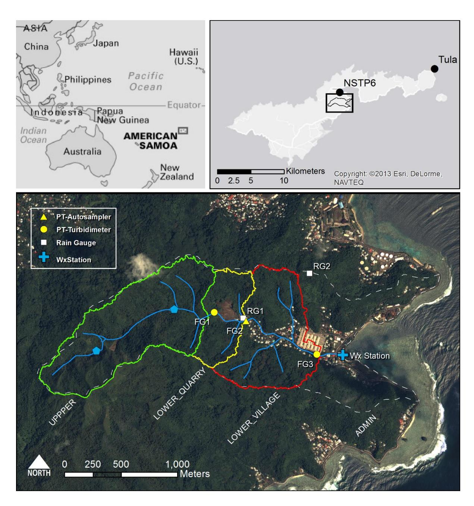

Figure 1.1. Faga'alu watershed showing the Upper (undisturbed) and Lower (humandisturbed) subwatersheds. The Lower subwatershed drains areas between FG1 and FG3, and is further subdivided into the Lower\_Quarry containing the quarry (between FG1 and FG2) and the Lower\_Village containing the village areas (between FG2 and FG3). The Total watershed includes all subwatersheds draining to FG3. The Administrative watershed boundary for government jurisdiction is outlined by the dotted grey line. Blue pentagons in the Upper watershed show the location of abandoned water supply reservoirs (see Supplementary Material A for full description). Barometer locations at NSTP6 and TULA are shown in top-right.

Faga'alu occurs on intracaldera Pago Volcanics formed about 1.20 Mya (McDougall, 1985). Soil types in the steep uplands are rock outcrops (15% of the watershed area) and well-drained Lithic Hapludolls ranging from silty clay to clay loams 20-150 cm deep (Nakamura, 1984). Soils in the lowlands include a mix of deep (>150 cm), well drained very stony silty clay loams, and poorly drained silty clay to fine sandy loam along valley bottoms. The mean slope of Faga'alu watershed is 0.53 m/m and total relief is 653 m.

#### **1.2.1 Climate**

Annual precipitation in Faga'alu watershed is 6,350 mm at Matafao Mtn. (653 m m.a.s.l.), 5,280 mm at Matafao Reservoir (249 m m.a.s.l.) and ~3,800 mm on the coastal plain (Craig, 2009; Dames & Moore, 1981; Perreault, 2010; Tonkin & Taylor International Ltd., 1989; Wong, 1996). There are two rainfall seasons: a drier winter from June through September accounts for 25% of annual P, and a wetter summer from October through May accounts for 75% of annual P (Craig, 2009; Perreault, 2010). P is lower in the drier season but large storms still occur: at 11 stream gages around the island, 35% of annual peak flows occurred during the drier season (1959-1990) (Wong, 1996).

#### **1.2.2 Land Cover and Land Use**

#### *1.2.2.1 Vegetation, agriculture, and urban areas*

The predominant land cover in Faga'alu watershed is undisturbed vegetation on the steep hillsides (95%), including forest (86%) and scrub/shrub (9%) (Table 1.1). The Upper watershed is dominated by undisturbed rainforest (82%) on steep hillslopes with no human disturbance. The Lower subwatershed has steep, vegetated hillslopes and a relatively small flat area in the valley bottom that is urbanized (6.4% "High Intensity Developed" in Table

1.1). A small portion of the watershed (1.8%) is developed open space, mainly landscaped lawns and parks. Agricultural areas include small household gardens and small areas of banana and taro on the steep hillsides, classified as grassland (0.3% GA, Table 1.1) due to high fractional grass cover. Most unpaved roads are stabilized with compacted gravel and do not appear to be a major sediment source (Horsley-Witten, 2012).

Table 1.1. Land use categories in Faga'alu subwatersheds (NOAA Ocean Service and Coastal Services Center, 2010). Land cover percentages are of the subwatershed.

|                         |      | Cumulative Subwaters |      |      |     |     | Land cover as % subwatershed areaa |     |    |      |           |             |
|-------------------------|------|-------------------------|------|------|-----|-----|------------------------------------|-----|----|------|-----------|-------------|
|                         | Area |                         | hed  | Area |     |     |                                    |     |    |      |           |             |
| Subwatershed            | km2  | %                       | km2  | %    | B   | HI  | DOS                                | GA  | F  | S    | Disturbed | Undisturbed |
| (outlet) Upper (FG1) | 0.9  | 50                      | 0.90 | 50   | 0.4 | 0.0 | 0.0                                | 0.1 | 82 | 17.1 | 0.4b      | 100         |
| Lower_Quarry (FG2)   | 1.2  | 66                      | 0.27 | 16   | 5.7 | 0.7 | 0.1                                | 0.5 | 92 | 0.9  | 6.5       | 94          |
| Lower_Village (FG3)  | 1.8  | 100                     | 0.60 | 34   | 0.0 | 9.0 | 2.6                                | 0.2 | 88 | 0.6  | 11.7      | 88          |
| Lower (FG3)             | 1.8  | 100                     | 0.88 | 50   | 1.8 | 6.4 | 1.8                                | 0.3 | 89 | 0.7  | 10.1      | 90          |
| Total (FG3)             | 1.8  | 100                     | 1.78 | 100  | 1.1 | 3.2 | 0.9                                | 0.2 | 86 | 9.0  | 5.2       | 95          |

a. B=Bare, HI=High Intensity Developed, DOS=Developed Open Space, GA=Grassland (agriculture), F=Forest, S=Scrub/Shrub, Disturbed=B+HI+DOS+GA, Undisturbed=F+S

#### *1.2.2.2 Aggregate quarry and reservoirs*

An aggregate quarry covering 1.6 ha has been in continuous operation since the 1960's (Latinis et al., 1996) and accounted for nearly all of the bare land in Faga'alu watershed (1.1%) (Table 1.1). Sediment eroded from the quarry was discharged directly to Faga'alu stream until 2011, when quarry operators installed silt fences and small settling ponds (Horsley-Witten, 2011), which were inadequate to control the large amount of sediment mobilized during storms (Horsley-Witten, 2012). During the study period (2012- 2014), additional sediment controls were installed and large piles of overburden were overgrown by vegetation (Figure 1.2). In late 2014, after the monitoring reported here, large

b. Disturbed area for Upper was from natural landslide. Undisturbed is 100% from rounding up.

retention ponds were installed to capture sediment runoff. See Holst-Rice et al. (2016) for description of sediment mitigation at the quarry.

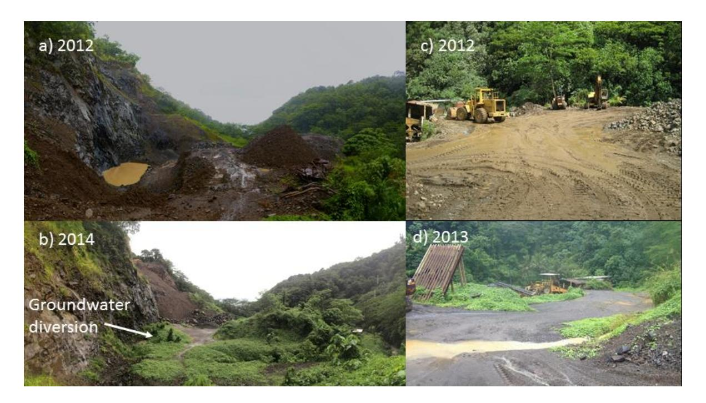

Figure 1.2. Photos of the aggregate quarry in Faga'alu in 2012, 2013, and 2014. Pictures a-b show vegetation overgrowth during the period of study from 2012-2014, and the location of the groundwater diversion that was installed in 2012. Pictures c-d show that haul roads were covered in gravel in 2013. Photos: Messina

Three water impoundment structures were built in the early 1900s in the Upper watershed for drinking water supply and hydropower, but none are in use and the reservoir at FG1 is filled with coarse sediment. Other deep pools at the base of waterfalls in the upper watershed have no fine sediment and we assume the other reservoirs are not retaining fine suspended sediment. A full description of the reservoirs is in Supplementary Material A.

## **1.3. Methods**

The field methods used to calculate event-wise suspended sediment yield (SSYEV) are described in section 1.3.1. The equations and analytical methods used to accomplish

Objectives 1-3 are described in sections 1.3.2-1.3.4. Briefly, the in-stream suspended sediment yield (SSY, tons) and specific suspended sediment yield (sSSY, tons/km2 ) (*sensu* Walling and Webb (1996)) were calculated for individual storm events (SSYEV, sSSYEV) at three locations in Faga'alu watershed using calculated discharge (Q) and suspended sediment concentration (SSC)(Figure 1.1) (Section 1.3.1). Q was calculated from continuously recorded stage and a stage-discharge relationship calibrated with field measurements (Section 1.3.1.2). SSC was measured directly from grab samples or modeled from continuously monitored turbidity (T) and T-SSC relationships calibrated to in-stream SSC (Section 1.3.1.3). Storm events were identified using automated hydrograph separation, and SSYEV calculated for each monitored location with the Q and SSC data (Section 1.3.2.1). The subwatersheds were nested, so SSYEV contributions from subwatersheds were calculated by subtracting SSYEV at the upstream subwatershed from SSYEV at the given downstream subwatershed. SSY from disturbed surfaces was calculated assuming a spatially uniform SSY from forested parts of disturbed subwatersheds (Section 1.3.2.2). The cumulative probable error (PE) of SSYEV was calculated for each storm to incorporate errors in Q and SSC, and different T-SSC relationships were tested for their impact on SSY estimates (Section 1.3.2.3). Log-linear regression models were developed to predict SSYEV from storm metrics for the undisturbed and disturbed subwatersheds (Section 1.3.3). Annual SSY was estimated from the regression models and the ratio of annual storm precipitation to the precipitation during storms where SSYEV was measured (Section 1.3.4).

Measurements of SSY at FG1, FG2, and FG3 quantify the in-stream suspended sediment budget. Other components of sediment budgets not measured in this study include channel erosion, channel deposition, and floodplain deposition (Walling and Collins, 2008). In

Faga'alu, the channel bed is predominantly large volcanic cobbles and gravel, with no significant deposits of fine sediment. Upstream of the village, the valley is very narrow with no floodplain. In the Lower watershed the channel has been stabilized with cobble reinforced by fencing, so overbank flows and sediment deposition on the floodplain are not observed. We therefore assume that channel erosion and channel and floodplain deposition are insignificant components of the sediment budget, and the measured sediment yields at the three locations reflect differences in hillslope sediment supply.

#### **1.3.1 Field Data Collection**

Data on P, Q, SSC, and T were collected during four field campaigns: January-March 2012, February-July 2013, January-March 2014, and October-December 2014, and several intervening periods of unattended monitoring by instruments with data loggers. Field campaigns were scheduled to coincide with the period of most frequent storms in the November-May wet season, though large storms were sampled throughout the year.

#### *1.3.1.1 Precipitation (P)*

P was measured in Faga'alu watershed from January, 2012, to December, 2014, using a tipping-bucket rain gauge located at the quarry near the centroid of the watershed (RG1; 20cm dia., 1-minute resolution) and a Vantage Pro Weather Station located at the stream outlet to the ocean (Wx; 20cm dia. 15-minute resolution) (Figure 1.1). Data from a third rain gauge (RG2), was recorded from January to March, 2012 to determine an orographic precipitation relationship. Total event precipitation (Psum) was calculated using 1 min interval data from RG1, with data gaps filled by 15-minute interval precipitation data from Wx.

#### *1.3.1.2 Water Discharge (Q)*

Stream gaging sites were chosen to take advantage of an existing control structure (FG1) and a stabilized stream cross section (FG3). At FG1 and FG3, Q was calculated from stream stage recorded at 15-minute intervals using HOBO and Solinst pressure transducers (PT) and a stage-Q rating curve calibrated to Q measurements. Q was measured manually in the field over a range of flow conditions by the area-velocity method (AV) using a Marsh-McBirney flowmeter (Harrelson et al., 1994; Turnipseed and Sauer, 2010). Q measurements were not made at the highest stages recorded by the PTs, so the stage-Q rating curve at FG3 was extrapolated using Manning's equation, calibrating Manning's n (0.067) to the Q measurements. At FG1, the flow control structure is a masonry spillway crest, so the HEC-RAS model was used to create the stage-Q relationship and calibrated to Q measurements (Brunner, 2010). See Supplementary Material B for further details on stream gaging at FG1 and FG3.

A suitable site for stream gaging was not present at the outlet of the Lower\_Quarry subwatershed (FG2), so water discharge at FG2 was calculated as the product of the specific water discharge from FG1 (m³/km²) and the watershed area draining to FG2 (1.17 km²). The specific water discharge at FG2 is assumed to be the same as above FG1 since average slopes, vegetation, and soils of the watersheds are similar. Discharge may be higher from the quarry surface, which represents 5.7% of the Lower\_Quarry subwatershed, so Q and SSY at FG2 are conservative, lower-bound estimates, particularly during small events when specific discharge from the Upper watershed was small relative to specific discharge from the quarry. The quarry surface is continually being disturbed, sometimes with large pits excavated and refilled in the course of weeks, as well as intentional water control structures

implemented over time. Given the changes in the contributing area of the quarry, estimates of water yield from the quarry were uncertain, so we assumed a uniform specific discharge for the whole Lower\_Quarry subwatershed.

#### *1.3.1.3 Suspended Sediment Concentration (SSC)*

SSC was estimated at 15 minute intervals from either 1) linear interpolation of stream water samples, or 2) turbidity data (T) recorded at 15 minute intervals and a T-SSC relationship calibrated to stream water samples. Stream water was collected by grab sampling with 500 mL HDPE bottles at FG1, FG2, and FG3. At FG2, water samples were also collected at 30 minute intervals during storm events by an ISCO 3700 Autosampler triggered by a water level sensor. The Autosampler inlet tubing was oriented down-stream, just below the water level sensor, approximately 30 cm above the stream bed, on rebar positioned midstream. Samples were analyzed for SSC on-island using gravimetric methods (Gray, 2014; Gray et al., 2000). Water samples were vacuum filtered on pre-weighed 47mm diameter, 0.7 *µ*m Millipore AP40 glass fiber filters, oven dried at 100 C for one hour, cooled and weighed to determine SSC (mg/L).

Interpolation of SSC from grab samples was performed if at least three samples were collected during a storm (Nearing et al., 2007), and if an SSC sample was collected within 30 minutes of peak Q. Based on low observed SSC between storm events, SSC was assumed to be zero at the beginning and end of each storm if no sample was available for those times (Lewis et al., 2001).

T was measured at FG1 and FG3 using three types of turbidimeters: 1) Greenspan TS3000 (TS), 2) YSI 600OMS with 6136 turbidity probe (YSI), and 3) two Campbell Scientific OBS500s (OBS). All turbidimeters were permanently installed in PVC housings near the streambed with the turbidity probe submerged at all flows and oriented downstream. Despite regular maintenance, debris fouling and vandalism caused frequent data loss.

Unique, linear T-SSC relationships were developed for the YSI and for each OBS turbidimeter at each location using linear regression on T data and SSC samples from storm periods (r² values 0.79-0.99, Supplementary Material C). The T-SSC relationship can be unique to each region, stream, instrument or even each storm event (Lewis et al., 2001), and can be influenced by water color, dissolved solids, organic matter, temperature, and particle shape, size, and composition. Despite the multiple factors relating T to SSC, T is a robust predictor of SSC in streams (Gippel, 1995), and is most accurate when a unique T-SSC relationship is developed for each instrument and field site separately, using in situ SSC samples during storms (Lewis, 1996; Minella et al., 2008). The TS meter at FG1 was vandalized before sufficient samples had been collected to establish a T-SSC relationship for high T data, so the T-SSC relationship from the YSI was used for the TS data. Errors were higher at FG3 (RMSE 112% for YSI, 46% for OBS), and lower at FG1 (RMSE 13% for YSI at FG1). The T-SSC relationships for the YSI predicted higher SSC at FG3 than at FG1 for the same T value (Supplementary Material C), which introduces uncertainty in SSC and SSY at FG3. The impact of using the same T-SSC relationship at both FG1 and FG3 is tested in the error analysis (Section 1.3.2.3). The critical assumption in our application is that the parameters of the T-SSC relationship are stable over time and among storm events. The T-SSC relationships are critical to SSY calculations, so the cumulative error from these relationships were combined with other error sources to estimate uncertainty in SSYEV

(Section 1.3.2.3). See Supplementary Material C for further details on T-SSC relationships at FG1 and FG3

#### **1.3.2 SSYEV for disturbed and undisturbed watersheds**

#### *1.3.2.1 Suspended Sediment Yield during storm events (SSYEV)*

SSYEV was calculated at FG1, FG2, and FG3 by integrating continuous Q and SSC (Duvert et al., 2012):

$$SSY_{EV} = k \int_{t=0}^{T} Q(t) * SSC(t) * dt$$
 Equation 1

where *SSYEV* is suspended sediment yield (tons) for an event from t=0 at storm start to T=storm end, *SSC* is suspended sediment concentration (mg/L), *Q* is water discharge (L/sec), and *k* converts from mg to tons (10-9 ).

Storm events can be defined by P (Hicks, 1990) or Q data (Duvert et al., 2012), and the method used to identify storm events can significantly influence the analysis of SSYEV (Gellis, 2013). Due to the large number of storm events and the prevalence of complex storm events observed at the study site, we used a digital filter signal processing technique (Nathan and McMahon, 1990) in the R-statistical package EcoHydRology (Fuka et al., 2014), which separates the hydrograph into quickflow, or direct surface or subsurface runoff that occurs during storms, and baseflow or delayed flow (Hewlett and Hibbert, 1967). Quickflow and baseflow components are not well defined in terms of hydrologic flow path; here we use the separation operationally to define storm events. Spurious events were sometimes identified due to instrument noise, so only events with quickflow lasting at least one hour and peak quickflow greater than 10% of baseflow were included (See Supplementary Material D for example).

The subwatersheds were nested (Figure 1.1), so SSYEV from subwatersheds was calculated as follows: SSYEV from the Upper subwatershed, draining undisturbed forest, was sampled at FG1; SSYEV from the Lower\_Quarry subwatershed, draining undisturbed forest and the quarry between FG1 and FG2, was calculated as the difference between SSYEV measured at FG1 and FG2; SSYEV from the Lower\_Village subwatershed, which drains undisturbed forest and the village between FG2 and FG3, was calculated as the difference between SSYEV measured at FG2 and FG3; the Lower subwatershed, which drains undisturbed forest, the quarry, and village between FG1 and FG3, was calculated as the difference between SSYEV measured at FG1 and FG3. SSYEV from the Total watershed was measured at FG3 (Figure 1.1; Table 1.1).

#### *1.3.2.2 SSY from disturbed and undisturbed portions of subwatersheds*

Land cover in the Lower subwatersheds (Lower\_Quarry and Lower\_Village) includes both undisturbed forest and human-disturbed surfaces (Table 1.1). SSYEV from disturbed areas only was estimated as:

\_ = \_ − (\_ ∗ ) Equation 2 where *SSYEV\_distrb* is SSYEV from disturbed areas only (tons), *SSYEV\_subws* is SSYEV (tons) measured from the subwatershed, *sSSYEV\_Upper* is specific SSYEV (tons/km2 ) from the Upper subwatershed (SSYEV\_FG1), and *Areaundist* is the area of undisturbed forest in the subwatershed (km2 ). This calculation assumes that forests in all subwatersheds have SSY similar to the Upper watershed.

The disturbance ratio (DR) is the ratio of SSYEV under current conditions to SSYEV under pre-disturbance conditions:

$$DR = \frac{SSY_{EV\_subw}}{A_{subw} * sSSY_{EV\_Upper}}$$
 Equation 3

where  $A_{subw}$  is the area of the subwatershed. Both Equations 2 and 3 assume that  $sSSY_{EV}$  from forested areas in the Lower subwatershed equals  $sSSY_{EV}$  from the undisturbed Upper watershed and that pre-disturbance land cover was forested throughout the watershed.

#### 1.3.2.3 Error Analysis

Uncertainty in SSYEV calculations arises from errors in measured and modeled Q and SSC (Harmel et al., 2006). The root mean square error propagation method estimates the "most probable value" of the cumulative or combined error by propagating the error from each measurement and modeling procedure, i.e. stage-Q and T-SSC, to the final SSYEV calculation (Topping, 1972). The resulting cumulative probable error (PE) is the square root of the sum of the squares of the maximum values of the separate errors:

$$PE = \sqrt{(E_{Qmeas}^2 + E_{SSCmeas}^2) + (E_{Qmod}^2 + E_{SSCmod}^2)}$$
 Equation 4

where PE is the cumulative probable error for SSYEV estimates (±%),  $E_{Qmeas}$  is uncertainty in Q measurements (±%),  $E_{SSCmeas}$  is uncertainty in SSC measurements (± %),  $E_{Qmod}$  is uncertainty in the Stage-Q relationship (RMSE, as ±% of the mean observed Q),  $E_{SSCmod}$  is uncertainty in the T-SSC relationship or from interpolating SSC samples (RMSE, as ± % of the mean observed SSC) (Harmel et al., 2009). $E_{Qmeas}$  and  $E_{SSCmeas}$  were taken from the DUET-H/WQ software tool lookup tables (Harmel et al., 2009).

The effect of uncertain  $SSY_{EV}$  estimates may complicate conclusions about anthropogenic impacts and storm metric- $SSY_{EV}$  relationships, but differences in  $SSY_{EV}$  from undisturbed and disturbed areas were expected to be much larger than the cumulative

uncertainty. High uncertainty is common in sediment yield studies where successful models estimate SSY with ±50-100% accuracy (Calhoun and Fletcher, 1999; Duvert et al., 2012). PE was calculated for SSYEV from the Upper and Total watersheds, but not for the Lower subwatershed since it was calculated as the difference of SSYEV\_UPPER and SSYEV\_TOTAL.

In addition to the error due to scatter about a given T-SSC relationship, there may also be uncertainty about the regression line itself, particularly where a given instrument shows different T-SSC relationships at different locations (Supplementary Material C). In Faga'alu, the T-SSC relationships estimated higher SSC for a given T value at the disturbed site (FG3) than at the forested site (FG1). In order to test for the impact of using the same T-SSC relationship at both locations, we recalculated SSYEV and the disturbance ratio using the T-SSC relationship at FG3 to estimate SSC at both FG3 and FG1.

#### **1.3.3 Modeling SSYEV with storm metrics**

The relationship between SSYEV and storm metrics was modeled as a log-linear function:

$$SSY_{EV} = \alpha X^{\beta} * BCF$$
 Equation 5

where *X* is a storm metric, the regression coefficients α and β are obtained by ordinary least squares regression on the logarithms of *X* and SSYEV (Basher et al., 2011; Duvert et al., 2012; Hicks, 1990) and *BCF* is the Smearing bias correction factor for log-transformation bias (Duan, 2016; USGS and NRTWQ, 2016), which is recommended when residuals of the log-log regression are non-normal (Boning, 1992; Koch and Smillie, 1986). The Kolmogorov-Smirnov test showed the regression residuals were non-normally distributed.

Four storm metrics were tested as predictors of SSYEV: Total event precipitation (Psum), event Erosivity Index (EI) (Hicks, 1990; Kinnell, 2013), total event water discharge (Qsum), and maximum event water discharge (Qmax) (Duvert et al., 2012; Rodrigues et al., 2013). The Erosivity Index describes the erosive power of rainfall and was calculated for each storm event identified in Section 1.3.2.1 following the methodology of Kinnell (2013) using only 1 min interval data at RG1. The discharge metrics (Qsum and Qmax) were normalized by watershed area to compare different sized subwatersheds.

Model fits for each storm metric were compared using coefficients of determination (r2 ) and Root Mean Square Error (RMSE). The correlation between storm metrics (*X*) and SSYEV were quantified using non-parametric (Spearman) correlation coefficients. The regression coefficients (α and β) for the Upper and Total watersheds were tested for statistically significant differences using Analysis of Covariance (ANCOVA) (Lewis et al., 2001).

#### **1.3.4. Estimation of annual SSY**

Annual SSY (mass) and sSSY (mass/area) were estimated using (1) the developed storm metric-SSYEV models, and (2) the ratio of annual storm precipitation to precipitation measured during storms with SSYEV data.

An annual SSY time-series was not possible due to the discontinuous field campaigns and failure of or damage to the turbidimeters. Continuous records of P and Q were available for 2014, so the log-linear storm metric-SSYEV models (Equation 5), including log-bias correction (Duan, 2016; Ferguson, 1986), were used to predict SSYEV for all storms in 2014 (Basher et al., 1997). For storms missing Qmax data at FG3, Qmax was predicted from a linear regression between Qmax at FG1 and Qmax at FG3 for the study period (R2 =0.88).

Annual SSY and sSSY were also estimated by multiplying SSYEV from measured storms by the ratio of annual storm precipitation (PEVann) to precipitation during storms where SSYEV was measured (PEVmeas):

$$SSY_{ann} = SSY_{EV\_meas} * \frac{P_{EVann}}{P_{EVmeas}}$$
 Equation 6

where *SSYann* is estimated annual SSY during storms, SSYEV*\_meas* is SSYEV from sampled storms (all, Tables 2 and 4), PEVann is the precipitation during all storm events in a year, where storms are defined using hydrography separation (1.3.2.1) and PEVmeas is precipitation during the set of sampled storms. Equation 6 assumes that the sediment yield per mm of storm precipitation is constant over the year, and insensitive to the size distribution of storms, though there is evidence that SSYEV increases exponentially with storm size (Lewis et al., 2001; Rankl, 2004). Equation 6 also ignores sediment yield during non-storm periods, which is justified by the low SSC (typically under 20 mg/L) and Q (baseflow) observed between storms.

## **1.4. Results**

#### **1.4.1 Field Data Collection**

#### *1.4.1.1 Precipitation*

At RG1, P was 3,502 mm, 3,529 mm, and 3,709 mm in 2012, 2013, and 2014, respectively, which averages 94% of long-term P (=3,800 mm) (PRISM data; Craig, 2009). Daily P at RG1 was similar to P at Wx (regression slope=0.95, r2=0.87) and at RG2 (slope=0.75, r2=0.85). Higher P was expected at higher elevation at RG2 so lower P at RG2 was assumed to be caused by measurement error, as the only available sampling location

was a forest clearing with high surrounding canopy. P measured at higher elevations would be useful to determine the orographic effect, but for this analysis the absolute values of P in each subwatershed are not as important since P and the Erosivity Index are only used as predictive storm metrics. Given the near 1:1 relationship between daily P measured at RG1 and Wx, P was assumed to be homogenous over the Lower subwatershed.

#### *1.4.1.2 Water discharge (Q)*

Q at FG1 and FG3 was characterized by low but perennial baseflow, punctuated by flashy hydrograph peaks (Figure 1.3). Storm events were generally smaller but more frequent in the October-April wet season compared to the May-September dry season, when the largest event in the three year monitoring period was observed (August 2014).

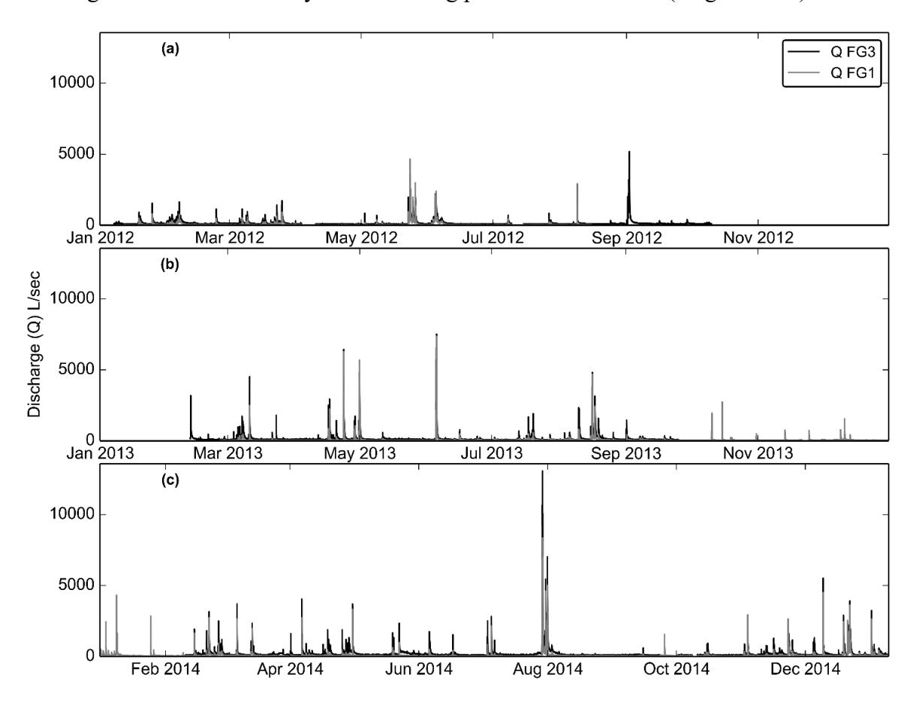

Figure 1.3. Time series of water discharge (Q) at FG1 and FG3, calculated from measured stage and the stage-discharge rating curves in a) 2012 b) 2013 and c) 2014.

#### *1.4.1.3 Suspended Sediment Concentrations (SSC) during storm and non-storm periods*

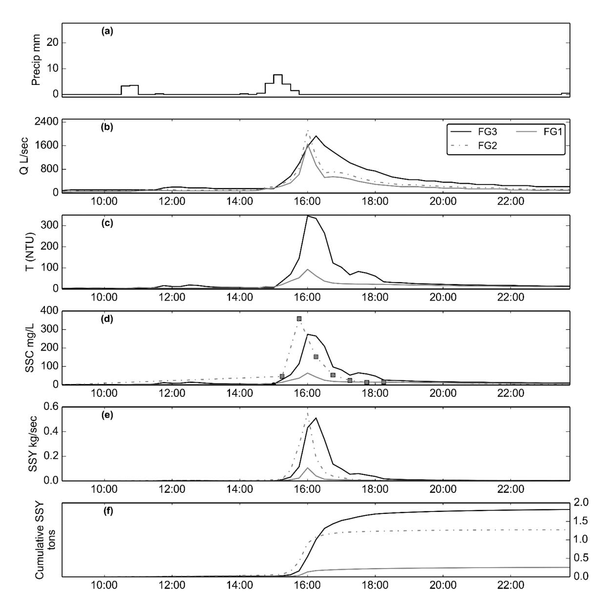

Figure 1.4. Example of a storm event (02/14/2014). SSY at FG1 and FG3 calculated from SSC modeled from T, and SSY at FG2 from SSC samples collected by the Autosampler.

An example of a storm event on 2/14/2014 (Figure 1.4) shows that SSC at FG2 was highest on the rising limb of the hydrograph, and that T and SSC at FG3 were always higher than at FG1. SSC was consistently lowest at FG1, highest downstream of the quarry (FG2),

and intermediate downstream of the village (FG3), during both storm and non-storm periods (Figure 1.5a, 5b). Mean and maximum SSC of all stream water samples were lowest at FG1 (μ=28 mg/L, max=500 mg/L, n=59), highest at FG2 (μ=337 mg/L, max=12,600 mg/L, n=90), and intermediate at FG3 (μ=148 mg/L, max=3,500 mg/L, n=159). SSC data at FG1-3 were non-normal, so non-parametric significance tests were applied. SSC was significantly different among the three sites during non-storms and storms (p<10-4 ). Pair-wise Mann-Whitney tests between FG1 and FG2 were significant (p<10-4 for both storms and nonstorms). FG2 and FG3 were significantly different for non-storm periods (*p*<0.05) but not for storms (*p*>0.10) due to the high variance.

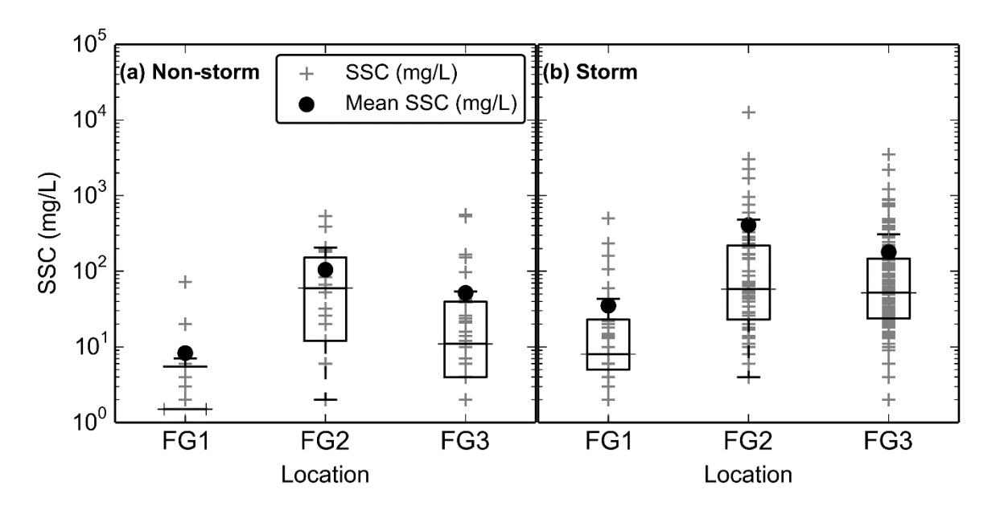

Figure 1.5. Boxplots of Suspended Sediment Concentration (SSC) from grab samples only (no Autosampler) at FG1, FG2, and FG3 during (a) non-stormflow and (b) stormflow.

SSC varied by several orders of magnitude for a given Q at FG1-3 (Figure 1.6) due to significant hysteresis observed during storm periods (Figure 1.4). Maximum SSC at FG1 (500 mg/L) was sampled on 04/23/2013 at high Q (QFG1= 3,724 L/sec) (Figure 1.6a). Maximum SSC at FG2 (12,600 mg/L) and FG3 (3,500 mg/L) were sampled during the same storm (03/05/2012) when brief but intense P caused high SSC runoff from the quarry, but Q was low (Figure 1.6b-c). SSC was diluted downstream of the quarry by the addition of runoff with lower SSC from the village and forest draining to FG3.

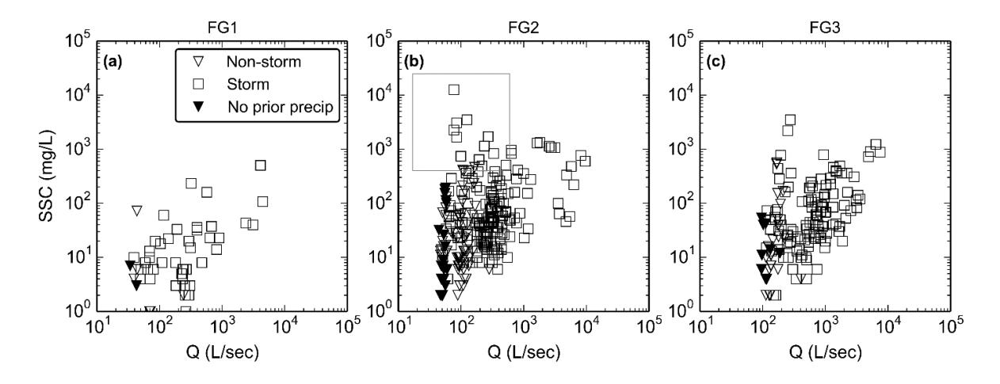

Figure 1.6. Water discharge (Q) versus suspended sediment concentration (SSC) measured from stream water samples at a) FG1, b) FG2, and c) FG3 during non-stormflow and stormflow periods. The box in b) highlights the samples with high SSC during low flows. Solid symbols indicate SSC samples where precipitation during the preceding 24 hours was 0 mm.

#### **1.4.2 SSYEV for disturbed and undisturbed watersheds**

A total of 210 storms were identified January, 2012, to December, 2014. A total of 169 storms had Q data at both FG1 and FG3 (Supplementary Material D, Table 1.1). SSC data were recorded during 112 (FG1) and 74 storms (FG3). Of those storms, 42 had P, Q, and SSC data at FG1 and FG3. Of those storms, 8 had P, Q, and SSC data at FG2. Storm events ranged from 1 hour to 2 days, with mean duration of 13 hours.

Table 1.2. Event-wise suspended sediment yield (SSYEV) from subwatersheds in Faga'alu for events with simultaneous data from FG1 and FG3. Storm numbers correspond with the storms presented in Supplementary Material D Table 1.

|            | Storm      | Precip | SSYEV tons | % of SSYEV_Total |       |              | PEa  |                   |     | SSC                  |                      |
|------------|------------|--------|---------------|---------------------|-------|--------------|------|-------------------|-----|----------------------|----------------------|
| Storm # | Start      | mm     | Upperb        | Lowerc              |       | Totald Upper |      | Lower Upper Total |     | Data Source Upper | Data Source Total |
| 2          | 01/19/2012 | 18     | 0.06          | 0.63                | 0.69  | 8.0          | 91.0 | 56                | 36  | T-TS                 | int. grab            |
| 4          | 01/31/2012 | 35     | 0.03          | 1.92                | 1.95  | 1.0          | 98.0 | 56                | 118 | T-TS                 | T-YSI                |
| 5          | 02/01/2012 | 11     | 0.01          | 0.4                 | 0.42  | 3.0          | 96.0 | 56                | 118 | T-TS                 | T-YSI                |
| 6          | 02/02/2012 | 16     | 0.06          | 1.02                | 1.08  | 5.0          | 94.0 | 56                | 118 | T-TS                 | T-YSI                |
| 7          | 02/03/2012 | 11     | 0.08          | 2.01                | 2.09  | 3.0          | 96.0 | 56                | 118 | T-TS                 | T-YSI                |
| 8          | 02/04/2012 | 6      | 0.0           | 0.51                | 0.51  | 0.0          | 99.0 | 56                | 118 | T-TS                 | T-YSI                |
| 9          | 02/05/2012 | 23     | 0.05          | 0.98                | 1.03  | 5.0          | 94.0 | 56                | 118 | T-TS                 | T-YSI                |
| 10         | 02/05/2012 | 21     | 0.09          | 1.93                | 2.02  | 4.0          | 95.0 | 56                | 118 | T-TS                 | T-YSI                |
| 11         | 02/06/2012 | 38     | 0.28          | 4.75                | 5.03  | 5.0          | 94.0 | 56                | 118 | T-TS                 | T-YSI                |
| 12         | 02/07/2012 | 4      | 0.01          | 0.13                | 0.15  | 9.0          | 90.0 | 56                | 118 | T-TS                 | T-YSI                |
| 13         | 02/07/2012 | 10     | 0.03          | 0.51                | 0.54  | 5.0          | 94.0 | 56                | 118 | T-TS                 | T-YSI                |
| 14         | 02/13/2012 | 11     | 0.0           | 0.27                | 0.27  | 1.0          | 98.0 | 56                | 118 | T-TS                 | T-YSI                |
| 16         | 03/05/2012 | 22     | 0.0           | 4.39                | 4.4   | 0.0          | 99.0 | 56                | 118 | T-TS                 | T-YSI                |
| 17         | 03/06/2012 | 56     | 0.19          | 9.05                | 9.25  | 2.0          | 97.0 | 56                | 118 | T-TS                 | T-YSI                |
| 18         | 03/08/2012 | 22     | 0.09          | 2.89                | 2.98  | 2.0          | 97.0 | 56                | 118 | T-TS                 | T-YSI                |
| 19         | 03/09/2012 | 19     | 0.2           | 2.78                | 2.97  | 6.0          | 93.0 | 56                | 118 | T-TS                 | T-YSI                |
| 20         | 03/15/2012 | 17     | 0.01          | 1.17                | 1.18  | 0.0          | 99.0 | 56                | 118 | T-TS                 | T-YSI                |
| 21         | 03/16/2012 | 34     | 0.08          | 2.12                | 2.2   | 3.0          | 96.0 | 56                | 118 | T-TS                 | T-YSI                |
| 22         | 03/17/2012 | 32     | 0.09          | 3.33                | 3.43  | 2.0          | 97.0 | 56                | 118 | T-TS                 | T-YSI                |
| 23         | 03/20/2012 | 24     | 0.04          | 0.84                | 0.88  | 4.0          | 95.0 | 56                | 118 | T-TS                 | T-YSI                |
| 24         | 03/21/2012 | 18     | 0.2           | 2.06                | 2.26  | 8.0          | 91.0 | 56                | 118 | T-TS                 | T-YSI                |
| 25         | 03/22/2012 | 34     | 0.37          | 5.75                | 6.12  | 5.0          | 94.0 | 56                | 118 | T-TS                 | T-YSI                |
| 27         | 03/24/2012 | 7      | 0.03          | 0.19                | 0.22  | 12.0         | 87.0 | 56                | 118 | T-TS                 | T-YSI                |
| 28         | 03/25/2012 | 49     | 0.7           | 11.92               | 12.62 | 5.0          | 94.0 | 56                | 118 | T-TS                 | T-YSI                |
| 29         | 03/31/2012 | 15     | 0.03          | 0.78                | 0.81  | 3.0          | 96.0 | 56                | 118 | T-TS                 | T-YSI                |
| 32         | 05/07/2012 | 11     | 0.0           | 1.31                | 1.31  | 0.0          | 99.0 | 56                | 118 | T-TS                 | T-YSI                |
| 33         | 05/08/2012 | 21     | 0.13          | 6.65                | 6.79  | 1.0          | 98.0 | 56                | 118 | T-TS                 | T-YSI                |
| 34         | 05/20/2012 | 13     | 0.0           | 0.47                | 0.48  | 0.0          | 99.0 | 56                | 118 | T-TS                 | T-YSI                |
| 64         | 04/16/2013 | 62     | 0.54          | 4.01                | 4.55  | 11.0         | 88.0 | 40                | 36  | int. grab            | int. grab            |
| 70         | 04/23/2013 | 86     | 9.57          | 13.51               | 23.08 | 41.0         | 58.0 | 40                | 36  | int. grab            | int. grab            |
| 79         | 06/24/2013 | 9      | 0.01          | 0.13                | 0.14  | 7.0          | 92.0 | 43                | 77  | T-YSI                | T-OBS                |
| 80         | 07/02/2013 | 13     | 0.02          | 0.28                | 0.3   | 5.0          | 94.0 | 43                | 77  | T-YSI                | T-OBS                |
| 106        | 02/14/2014 | 25     | 0.26          | 1.57                | 1.82  | 14.0         | 85.0 | 43                | 51  | T-YSI                | T-OBS                |
| 107        | 02/15/2014 | 7      | 0.04          | 0.63                | 0.67  | 6.0          | 93.0 | 43                | 51  | T-YSI                | T-OBS                |
| 109        | 02/18/2014 | 12     | 0.01          | 0.81                | 0.81  | 0.0          | 99.0 | 43                | 51  | T-YSI                | T-OBS                |
| 110        | 02/20/2014 | 29     | 0.13          | 3.71                | 3.84  | 3.0          | 96.0 | 43                | 51  | T-YSI                | T-OBS                |
| 111        | 02/21/2014 | 51     | 2.55          | 7.03                | 9.58  | 26.0         | 73.0 | 43                | 51  | T-YSI                | T-OBS                |
| 112        | 02/24/2014 | 16     | 0.09          | 0.56                | 0.65  | 13.0         | 86.0 | 43                | 51  | T-YSI                | T-OBS                |
|            |            |        |               |                     |       |              |      |                   |     |                      |                      |

| 113       | 02/24/2014 | 1    | 0.01 | 0.12  | 0.13  | 9.0  | 90.0 | 43 | 51 | T-YSI | T-OBS |
|-----------|------------|------|------|-------|-------|------|------|----|----|-------|-------|
| 114       | 02/25/2014 | 67   | 0.62 | 7.17  | 7.79  | 7.0  | 92.0 | 43 | 51 | T-YSI | T-OBS |
| 115       | 02/27/2014 | 16   | 0.13 | 0.68  | 0.8   | 15.0 | 84.0 | 43 | 51 | T-YSI | T-OBS |
| 116       | 02/27/2014 | 12   | 0.12 | 1.25  | 1.37  | 8.0  | 91.0 | 43 | 51 | T-YSI | T-OBS |
| Total/Avg | 42         | 1004 | 17.0 | 112.2 | 129.2 | 13   | 87   | 52 | 94 | -     | -     |
| Tons/km2  | -          | -    | 18.8 | 127.5 | 72.6  | -    | -    | -  | -  | -     | -     |
| DR        | -          | -    | 1    | 6.8   | 3.9   | -    | -    | -  | -  | -     | -     |

a. PE is cumulative probable error (Equation 4) as a percentage of the mean observed SSYEV.

# *1.4.2.1 Suspended sediment yield during storm events (SSYEV) from Upper, Lower, and Total watersheds*

For the 42 storms with P, Q, and SSC data at both FG1 and FG3, SSYEV\_Total was 129±121 tons, with 17±7 tons from the Upper watershed and 112 tons from the Lower subwatershed (Table 1.2). The Upper and Lower subwatersheds are similar in size (0.90 km² and 0.88 km²) but SSYEV\_Lower accounted for 87% of SSYEV at the watershed outlet. The DR (Equation 4, sSSYEV\_Upper = 18.8 tons/km²) suggests sSSYEV has increased by 6.8x in the Lower subwatershed, and 3.9x for the Total watershed compared with undisturbed forest in the Upper watershed.

# *1.4.2.2 SSY from disturbed and undisturbed portions of Upper, Lower, and Total watersheds*

In the Lower subwatershed, disturbed areas cover 10% of the surface but contributed 87% of SSYEV\_Lower. In the Total watershed, disturbed areas cover only 5.2% of the surface

b. Measured SSYEV at FG1.

c. SSYEV at FG3 - SSYEV at FG1.

d. Measured SSYEV at FG3.

but contributed 75% of SSY EV\_Total. sSSY from disturbed areas in the Lower subwatershed was 1,095 tons/km², or 58x the sSSY of undisturbed forest (Table 1.3).

Table 1.3. Suspended sediment yield (SSY),specific suspended sediment yield (sSSY), and disturbance ratio (DR) from disturbed portions of Upper and Lowersubwatershedsfor the storm eventsin Table 1.2.

|                                                                           | Uppera    | Lower        | Total        |
|---------------------------------------------------------------------------|-----------|--------------|--------------|
| Fraction of subwatershed area disturbed (%)                               | 0.4       | 10.1         | 5.2          |
| SSY (tons)                                                                | 17.0      | 112.2        | 129.2        |
| Forested areas                                                            | 16.9      | 14.9         | 31.7         |
| Disturbed areas                                                           | 0.1       | 97.3         | 97.5         |
| % from disturbed areas                                                    | 0.9       | 87           | 75           |
| sSSY, disturbed areas (tons/km2 ) DR for sSSY from disturbed areasb | 41.0 2 | 1095.0 58 | 1053.1 56 |

a. Disturbed areasinUpper are bare areasfromlandslides.

# *1.4.2.3 Suspended sediment yield during storm events (SSYEV) from Lower\_Quarry and Lower\_Village watersheds*

For the 8 storms with P, Q, and SSC data at FG1-3, sSSY from the Upper, Lower\_Quarry, Lower\_Village, and the Total watershed was 15, 61, 27, and 26 tons/km², respectively, with 29% of SSYEV from the Upper subwatershed, 36% from the Lower\_Quarry subwatershed, and 35% from the Lower\_Village subwatershed. The storms in Table 1.4 may underrepresent the contributions of the quarry and village to SSY, since they show a lower DR for the Total watershed (1.7x SSYUpper) compared with the 42 storms in Table 1.2 (3.9x SSYUpper). sSSY increased by 4.1x in the Lower\_Quarry subwatershed and 1.8x in the Lower\_Village subwatershed compared with the undisturbed Upper watershed.

b. Calculated as(sSSYfromdisturbed areas)/sSSYfromUpper(17.0 tons/km2)

Table 1.4. Event-wise suspended sediment yield (SSYEV) from subwatersheds in Faga'alu for events with simultaneous data from FG1, FG2, and FG3. Storm numbers correspond with the storms presented in Table 1.2 and Supplementary Material C Table 1.

|           | Storm      | Precip |        | SSYEV tons        | % of SSYEV_TOTAL   |               |       |       |                  |                   |       |
|-----------|------------|--------|--------|-------------------|--------------------|---------------|-------|-------|------------------|-------------------|-------|
| Storm#    | Start      | mm     | Uppera | Lower_ Quarryb | Lower_ Villagec | Lowerd Totale |       | Upper | Lower_ Quarry | Lower_ Village | Lower |
| 2         | 01/19/2012 | 18     | 0.06   | 0.30              | 0.33               | 0.63          | 0.69  | 8     | 43               | 47                | 91    |
| 64        | 04/16/2013 | 62     | 0.54   | 2.77              | 1.24               | 4.01          | 4.55  | 11    | 60               | 27                | 88    |
| 70        | 04/23/2013 | 86     | 9.57   | 8.21              | 5.30               | 13.51         | 23.08 | 41    | 35               | 22                | 58    |
| 106       | 02/14/2014 | 25     | 0.26   | 1.01              | 0.55               | 1.57          | 1.82  | 14    | 55               | 30                | 86    |
| 110       | 02/20/2014 | 29     | 0.13   | 1.60              | 2.11               | 3.71          | 3.84  | 3     | 41               | 54                | 96    |
| 111       | 02/21/2014 | 51     | 2.55   | 2.07              | 4.96               | 7.03          | 9.58  | 26    | 21               | 51                | 73    |
| 115       | 02/27/2014 | 16     | 0.13   | 0.08              | 0.59               | 0.68          | 0.80  | 16    | 9                | 73                | 85    |
| 116       | 02/27/2014 | 12     | 0.12   | 0.32              | 0.93               | 1.25          | 1.37  | 8     | 23               | 67                | 91    |
| Total/Avg | 8          | 299    | 13.4   | 16.4              | 16.0               | 32.4          | 45.7  | 29    | 36               | 35                | 71    |
| Tons/km2  |            |        | 14.8   | 60.6              | 26.7               | 36.8          | 25.7  | -     | -                | -                 | -     |
| DR        |            |        | 1.0    | 4.1               | 1.8                | 2.5           | 1.7   | -     | -                | -                 | -     |

a. Measured SSYEV at FG1.

# *1.4.2.4 SSY from disturbed and undisturbed portions of Lower\_Quarry and Lower\_Village watersheds*

Disturbed areas cover small fractions of the subwatersheds, yet contributed roughly 77% of SSY EV\_Lower\_Quarry (6.5% disturbed) and 51% of SSY EV\_Lower\_Village (11.7% disturbed). Similarly, disturbed areas cover 5.2% of the Total watershed but contributed 75-45% of SSY EV\_Total(Tables 3 and 5). sSSY from disturbed areas in the Upper (37 tons/km²), Lower\_Quarry (722 tons/km²), and Lower\_Village subwatersheds (116 tons/km²) suggested that disturbed areas increase sSSY over forested conditions by 49x and 8x in the Lower\_Quarry and Lower\_Village subwatersheds, respectively. Human disturbance in the Lower\_Village subwatershed increased SSYEV above natural levels but the magnitude of disturbance was much lower than the quarry.

b. SSYEV at FG2 - SSYEV at FG1.

c. SSYEV at FG3 - SSYEV at FG2.

d. SSYEV at FG3 - SSYEV at FG1.

e. Measured SSYEV at FG3.

Table 1.5. Suspended sediment yield (SSY),specific suspended sediment yield (sSSY), and disturbance ratio (DR) from disturbed portions of Upper, Lower\_Quarry, and Lower\_Village subwatershedsforthe storm events in Table 1.4.

|                                                | Upper | Lower_Quarry | Lower_Village | Lower | Total |
|------------------------------------------------|-------|--------------|---------------|-------|-------|
| Fraction of subwatershed area disturbed (%) | 0.4   | 6.5          | 11.7          | 10.1  | 5.2   |
| SSY (tons)                                     | 13.4  | 16.4         | 16.0          | 32.4  | 45.7  |
| Forested areas                                 | 13.3  | 3.7          | 7.8           | 11.7  | 25.0  |
| Disturbed areas                                | 0.1   | 12.7         | 8.2           | 20.7  | 20.7  |
| % from disturbed areas                         | 1     | 77           | 51            | 64    | 45    |
| sSSY, disturbed areas (tons/km2 )           | 37.0  | 721.6        | 116.2         | 232.8 | 223.9 |
| DR for sSSY from disturbed areas            | 3     | 49           | 8             | 16    | 15    |

#### *1.4.2.5 Error analysis*

Cumulative Probable Errors (PE) in SSYEV, calculated from measurement and model errors in Q and SSC data, were 40-56% (μ=52%) at FG1 and 36-118% (μ=94%) at FG3.

The measurement error for Q at FG1 and FG3 was 8%, including area-velocity measurements (6%), continuous Q measurement in a natural channel (6%), pressure transducer error (0.1%), and streambed condition (firm, stable bed=0%) (DUET-H/WQ look-up table (Harmel et al., 2006)). Model errors were 32% for the stage-Q rating curve using Manning's equation at FG3, and 22% using HEC-RAS at FG1 (Supplementary Material B).

The measurement error for SSC was 16 %, including interpolating over a 30 min interval (5%), sampling during stormflows (3%), and measuring SSC by filtration (3.9%) (DUET-H/WQ look-up table (Harmel et al., 2006)). Model errors of the T-SSC relationships were 13% (3 mg/L) for the YSI and TS turbidimeters at FG1, 112% (342 mg/L) for the YSI

turbidimeter at FG3, and 47% (46 mg/L) for the OBS turbidimeter at FG3 (Supplementary Material C).

SSC and resulting SSYEV estimates are sensitive to the slope of the T-SSC rating curve, so we tested the sensitivity of the DR and percent SSY contributions to different T-SSC rating curves. The slope of the T-SSC rating curve for the YSI, deployed at FG3 in 2012, was higher at FG3 than at FG1 (Supplementary Material C, Figure C.1a-b). Using the T-SSC relationship from FG1 to predict SSC at FG3 reduced the DR from 3.6 (Table 1.2) to 2.5, and changed the average SSYEV contributions from 13% to 20% from the Upper watershed, and from 87% to 80% from the Total watershed. We conclude that use of different T-SSC relationships does not significantly change our conclusions about the dominance of the Lower watershed in the sediment load to the coast.

#### **1.4.3 Modeling SSYEV with storm metrics**

#### *1.4.3.1 Selecting the best predictor of SSYEV*

Qsum and Qmax were the best predictors of SSYEV for the forested Upper watershed, and Qmax was the best predictors for the Total watershed (Figure 1.7, Table 1.6). SSYEV is calculated from Q so it is expected that Qsum correlated closely with SSYEV (Duvert et al., 2012; Rankl, 2004). Discharge metrics were highly correlated with SSYEV in the Total watershed, suggesting they are good predictors in both disturbed and undisturbed watersheds. Most of the scatter in the Qmax-SSYEV relationship is observed for small events, and Qmax correlated strongly with the largest SSYEV values, when most of the annual SSY is generated (Figure 1.7a).

Table 1.6.Goodness-of-fitstatisticsforstormmetric-SSYEV relationships. Spearman correlation coefficientssignificant atp<0.01.

| Model      | Spearman | 2 r | RMSE(tons) | Intercept(α) | Slope(β) | BCF  |
|------------|----------|--------|------------|--------------|----------|------|
| Psum_Upper | 0.70     | 0.39   | 4.31       | 0.003        | 1.10     | 2.71 |
| Psum_Total | 0.88     | 0.71   | 2.43       | 0.033        | 1.11     | 1.39 |
| EI_Upper   | 0.48     | 0.18   | 5.48       | 0.001        | 0.97     | 4.38 |
| EI_Total   | 0.73     | 0.55   | 2.98       | 0.001        | 1.32     | 2.00 |
| Qsum_Upper | 0.91     | 0.83   | 2.15       | 0.000        | 1.65     | 1.42 |
| Qsum_Total | 0.83     | 0.70   | 2.46       | 0.000        | 1.29     | 1.50 |
| Qmax_Upper | 0.90     | 0.79   | 2.36       | 0.398        | 1.51     | 2.12 |
| Qmax_Total | 0.80     | 0.67   | 2.59       | 2.429        | 1.41     | 1.49 |

#### *1.4.3.2. Effect of event size and watershed disturbance*

In general, SSYEV\_Total was higher than SSYEV\_Upper for the full range of measured storms with the exception of a few events. The outlier events could be from measurement error or mass movements in the Upper watershed. The event with much higher SSYEV at FG1 (Figure 1.7d) did not have corresponding data for FG2 or FG3, to determine if this event was data error. The separation of multi-peak storm events, storm sequence, and antecedent conditions may also play a role. While strong seasonality is not observed in Faga'alu, low rainfall can persist for several weeks, perhaps altering water and sediment dynamics in subsequent storm events.

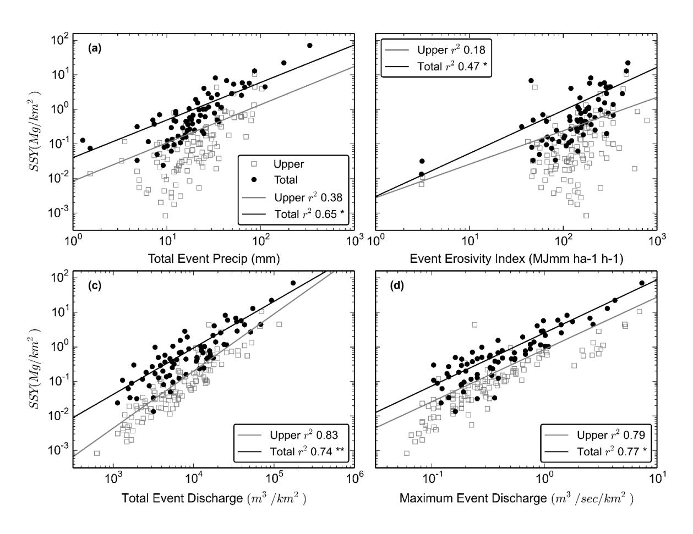

Figure 1.7. sSSYEV regression models for storm metrics. Each point represents a different storm event. \*\*=slopes and intercepts were statistically different (p<0.01), \*=intercepts were statistically different (p<0.01).

A higher intercept (α) for the human-disturbed compared to the undisturbed watershed indicates higher SSYEV for the same size storm event. A difference in slope (β) indicates the relative subwatershed contributions vary with storm size. All storm metric-SSYEV model intercepts (α) were significantly different (p<0.01), but only the Qsum-SSYEV model showed significantly different slopes (β, p<0.01) (Figure 1.7, Table 1.6). The relative sediment contribution from the human-disturbed watershed was hypothesized to diminish with increasing storm size, but the results from P and Q metrics were contradictory. The Qsum-SSYEV model indicates a decrease in relative contribution from the disturbed Lower watershed, but the Psum- and Qmax-SSYEV models show no change over increasing storm

size (Figure 1.7). It was hypothesized that SSYEV from undisturbed forest would become the dominant source for larger storms, but the DR remains high for large storms due to naturally low SSYEV from forest areas in Faga'alu watershed. This suggests that disturbed areas were not supply limited for the range of sampled storms.

#### **1.4.4 Estimation of annual SSY**

Table 1.7. Precipitation totals and estimates of Annual SSY and sSSY calculated using five different methods.

|                        |                               |                               |                        | Equation 6             |                        |
|------------------------|-------------------------------|-------------------------------|------------------------|------------------------|------------------------|
|                        | Psum model, Events in 2014 | Qmax model, Events in 2014 | Events in Table 1.2 | Events in Table 1.4 | All Measured Events |
| Precipitation          |                               |                               |                        |                        |                        |
| mm (% of PEVann)    | 2770                          | 2770                          | 1,004 (36%)            | 299 (11%)              | 3,457 (125%)           |
| Annual SSY (tons/year) |                               |                               |                        |                        |                        |
| Upper                  | 35                            | 129                           | 46                     | 120                    | 41                     |
| Lower                  | 152                           | 526                           | 310                    | 300                    | 388                    |
| Lower_Quarry           | -                             | -                             | -                      | 150                    | -                      |
| Lower_Village          | -                             | -                             | -                      | 150                    | -                      |
| Total                  | 187                           | 655                           | 360                    | 420                    | 428                    |
| Annual sSSY (tons/km2  | /year)                        |                               |                        |                        |                        |
| Upper                  | 39                            | 143                           | 51                     | 140                    | 45                     |
| Lower                  | 173                           | 598                           | 350                    | 340                    | 441                    |
| Lower_Quarry           | -                             | -                             | -                      | 560                    | -                      |
| Lower_Village          | -                             | -                             | -                      | 250                    | -                      |
| Total                  | 105                           | 368                           | 200                    | 240                    | 241                    |

Annual SSY estimates varied, depending on which storm metric or set of storms (all, Table 1.2, Table 1.4) was used. The Qmax models (with bias correction) and Equation 6 using all events gave different annual SSY estimates at both the Upper watershed (41-129 tons/yr) and the Total watershed (655-428 tons/yr). The Psum model resulted in much lower estimates due to higher scatter about the Psum-SSYEV relationship for large events, even with bias correction, compared with the more robust Qmax-SSYEV model (Table 1.7). The

Qmax-SSYEV model prediction is sensitive to the storm-size distribution, with significantly more SSYEV for events with higher Qmax. Comparing annual SSY estimates from different methods, using different sets of storm sizes can therefore make it appear that there is much disagreement when in fact this variability arises mostly from the variation in storm size distribution.

Annual storm precipitation (PEVann) in 2014 was 2,770 mm, representing 69% of total annual precipitation (3,709 mm). The remaining 31% of precipitation did not result in a rise in stream level sufficient to be classified as an event with the hydrograph separation method. All storms with measured SSYEV\_UPPER from 2012-2014 included 3,457 mm of precipitation (PEVmeas), or 125% of PEVann, so estimated annual SSYUpper (Equation 6) was 41 tons/yr (45 tons/km²/yr). All storms with measured SSYEV\_Total from 2012-2014 included 2,628 mm of precipitation, or 95% of expected annual storm precipitation so estimated annual SSYTotal was 428 tons/yr (241 tons/km²/yr).

## **1.5. Discussion**

#### **1.5.1 SSC and SSYEV for disturbed and undisturbed watersheds**

#### *1.5.1.1 SSC for disturbed and undisturbed watersheds in Faga'alu*

At FG1, SSC variability during storms was assumed to be caused by landslides or channel erosion (Figure 1.6a). Anecdotal and field observations reported unusually high SSC at FG1 during 2013, possibly from landsliding during previous large storms (G. Poysky, pers. comm.). At FG2 and FG3, additional variability in the Q-SSC relationship was caused by changing sediment availability from quarrying operations and construction in the village. High SSC values observed downstream of the quarry (FG2) during low Q were

caused by two mechanisms: 1) P that generated high SSC runoff but did not result in storms identified on the hydrograph, and 2) washing fine sediment into the stream during quarry operations.

Given the close proximity of the quarry to the stream, SSC at FG2 was highly influenced by mining activity like rock extraction, crushing, and/or hauling operations. During 2012, a common practice for removing fine sediment from crushed aggregate was to rinse it with water pumped from the stream. In the absence of retention structures the fine sediment was discharged directly to Faga'alu stream, causing high SSC during non-storm periods with no P in the preceding 24 hours (solid symbols, Figure 1.6b-c). In 2013 and 2014, riverine discharge of rinsed sediment was discontinued, and sediment was piled on-site where erosion of these changing stockpiles caused high SSC only during storm events.

### *1.5.1.2 Compare SSYEV with other kinds of sediment disturbance*

SSY at Faga'alu was 3.9x higher than the natural background. Studies in similar watersheds have documented one to several orders of magnitude increases in SSY from land use that disturbs a small fraction of the watershed area (Stock et al., 2010). Urbanization (construction-phase) and mining can increase SSY by two to three orders of magnitude in catchments of several km², exceeding yields from the most unstable, tectonically active natural environments of Southeast Asia (Douglas, 1996). In three basins on St. John, US Virgin Islands, unpaved roads increased sediment yields by 3-9 times (Ramos-Scharrón and Macdonald, 2005). Disturbances at larger scales in other watersheds draining to coral reefs have been similar to Faga'alu, such as the Great Barrier Reef (GBR) catchment (423,000 km2 ) where SSY increased by a factor of 5.5x since European settlement (Kroon et al., 2012). Mining has been a major contributor of sediment in other watersheds on volcanic

islands with steep topography and high precipitation, increasing sediment yields by 5-10 times in a watershed in Papua New Guinea (Hettler et al., 1997; Thomas et al., 2003). In contrast to other land disturbances like fire, logging, or urbanization where sediment disturbance decreases over time, the disturbance from mining is persistently high. Disturbance magnitudes are similar to the construction phase of urbanization (Wolman and Schick, 1967), or high-traffic unpaved roads (Reid and Dunne, 1984), but persist or even increase over time.

While unpaved roads are often a major sediment source in humid forested regions (Lewis et al., 2001; Ramos-Scharrón and Macdonald, 2005; Reid and Dunne, 1984), most roads in the urban area in Faga'alu were stabilized with aggregate and were not generating significant amounts of sediment. Other disturbances in Faga'alu included a few small agricultural plots, small construction sites and bare dirt on roadsides. Repeated surface disturbance at the quarry is a key process maintaining high rates of sediment generation.

Annual sSSY from the quarry was estimated to be approximately 6,700 tons/km²/yr (Eq. 6). The quarry surfaces are comprised of haul roads, piles of overburden, and steep rock faces which can be described as a mix of unpaved roads and cut-slopes. sSSY from cutslopes varies from 0.01 tons/km²/yr in Idaho (Megahan, 1980) to 105,000 tons/km²/yr in Papua New Guinea (Blong and Humphreys, 1982), so the sSSY ranges measured in this study are well within the ranges found in the literature.

#### **1.5.2 Modeling SSYEV with storm metrics**

Similar to other studies, the highest correlations with SSYEV at Faga'alu were observed for discharge metrics Qsum and Qmax (Basher et al., 2011; Duvert et al., 2012; Fahey et al., 2003; Hicks, 1990; Rankl, 2004; Rodrigues et al., 2013). Given the high correlation

coefficients between SSYEV and Qmax in both watersheds, Qmax may be a promising predictor that integrates both precipitation and discharge processes in diverse watersheds.

In Faga'alu, SSYEV was least correlated with the EI. Rodrigues et al. (2013) hypothesized that EI is poorly correlated with SSYEV due to the effect of previous events on antecedent moisture conditions and in-channel sediment storage. Cox et al. (2006) found EI was more correlated with soil loss in an agricultural watershed than a forested watershed, and Faga'alu is mainly covered in dense forest. P was measured near the quarry (RG1), which may reflect precipitation characteristics more accurately in the Lower than the Upper watershed, and account for the lower correlation coefficients between SSYEV\_Upper and Psum and EI. SSYLower was hypothesized to be generated by sheetwash and rill formation at the quarry and agricultural plots, whereas SSYUpper was hypothesized to be from channel processes and mass wasting. Mass wasting can contribute large pulses of sediment which can be deposited near or in the streams and entrained at high discharges during later storm events.

The Q-SSC relationship (sediment rating curve) coefficients including the intercept (α) and slope (β) can be interpreted as a function of watershed characteristics (Asselman, 2000). Similarly, Rankl (2004) hypothesized that the intercept in the Qmax-SSYEV relationship varied with sediment availability and erodibility. While slopes in log-log space can be compared directly (Duvert et al., 2012), intercepts must be plotted in similar units and normalized by watershed area. Most studies do not correct storm metric-SSY models for log-bias, as is suggested by Ferguson (1986) for Q-SSC relationships, so we calculated the bias correction factor separately from the intercept (Equation 5) to compare our model slopes and intercepts with these other studies. In five semi-arid to arid watersheds (2.1 -

1,538 km²) in Wyoming, United States, Qmax- SSYEV relationship intercepts ranged from 111 - 4,320 (Qmax in m³/s/km², SSYEV in Mg/km²) (Rankl, 2004). In eight sub-humid to semi-arid watersheds (0.45-22 km²), intercepts ranged from 25-5,039 (Duvert et al., 2012). In Faga'alu, intercepts were 0.4 and 2.4 in the undisturbed and disturbed watersheds, respectively. These intercepts are 1-2 orders of magnitude lower than in Rankl (2004) and Duvert et al. (2012), suggesting that sediment availability is relatively low under natural and human-disturbed conditions in Faga'alu.

High slope values in the log-log plots (β coefficient) suggest that small increases in stream discharge correlate with large increases in sediment load due to the erosive power of the stream or the availability of new sediment sources at high Q (Asselman, 2000). Rankl (2004) assumed that the slope was a function of rainfall intensity on hillslopes and found that the slopes were not statistically different among watersheds and ranged from 1.07-1.29 in semi-arid Wyoming. In watersheds in Duvert et al. (2012), slopes ranged from 0.95-1.82, and from 1.06-2.45 in eighteen other watersheds (0.60-1,538 km²) in diverse geographical settings (Basher et al., 1997; Fahey and Marden, 2000; Hicks et al., 2009; Rankl, 2004; Tropeano, 1991). In Faga'alu, slopes were 1.51 and 1.41 in the undisturbed and disturbed watersheds, respectively. These slopes are consistent with the slopes in Rankl (2004) and Duvert et al. (2012), despite large differences in climate and land cover.

#### **1.5.3 Estimation of annual SSY**

Sediment yield is highly variable among watersheds, but is generally controlled by climate, vegetation cover, and geology, with human disturbance playing an increasing role in the 20th century (Syvitski et al., 2005). Sediment yields in tropical Southeast Asia and high-standing islands between Asia and Australia range from ~10 tons/km²/yr in the granitic Malaysian Peninsula to ~10,000 tons/km²/yr in the tectonically active, steeply sloped island of Papua New Guinea (Douglas, 1996). Sediment yields from Faga'alu are on the lower end of the range, with sSSY of 45-143 tons/km²/yr from the undisturbed Upper watershed, and 241-368 tons/km²/yr from the disturbed Total watershed (estimated from Qmax model with bias correction and Equation 6 with all events).

Table 8. Annual Specific Suspended Sediment Yield (sSSY) from steep, volcanic islands in the tropical Pacific.

| Location              | Drainage area | Mean annual             | sSSY range           | Reference                 |
|-----------------------|---------------|-------------------------|----------------------|---------------------------|
|                       | (km²)         | precipitation (mm)      | tons/km²/vr          |                           |
| Faga'alu Upper        | 0.88          |                         | 45-143               | This study                |
| Faga'alu Total        | 1.78          | 2.380-6,350             | 241-368              | This study                |
|                       |               | (varies with elevation) |                      |                           |
| Kawela, Molokai       | 13.5          | 500-3,000               | 394                  | (Stock and Tribble, 2010) |
| ,                     |               | (varies with elevation) |                      |                           |
| Hanalei, Kauai        | 60.04         | 500 - 9,500             | $545\pm128$          | (Ferrier et al., 2013)    |
|                       |               | (varies with elevation) |                      |                           |
| Hanalei, Kauai        | 48.4          | 2,000-11,000            | 525                  | (Stock and Tribble, 2010) |
| ,                     |               | (varies with elevation) |                      | , ,                       |
| Hanalei, Kauai        | 54.4          | 2,000-11,000            | $140 \pm 55$         | (Calhoun and Fletcher,    |
|                       |               | (varies with elevation) |                      | 1999)                     |
| St. John, USVIa       | 3.5           | 1,300-1,400             | 18                   | (Ramos-Scharrón and       |
| 211 (21111), 22 (1    |               |                         |                      | Macdonald, 2007)          |
| St. John, USVI        | 2.3           | 1,300-1,400             | 24                   | (Nemeth and Nowlis, 2001) |
| St. John, USVI        | 6             | 1,300-1,400             | 36                   | (Nemeth and Nowlis, 2001) |
| Oahu                  | 10.4          | 1,000-3,800             | 330±130; 200±100     | (Hill et al., 1997)       |
|                       |               | (varies with elevation) | (varies with method) |                           |
| Barro Colorado,       | 0.033         | 2,623±458               | 100-200              | (Zimmermann et al., 2012) |
| Panama                | 0.033         | 2,023=130               | 100 200              | (Zimmermann et an, 2012)  |
| Fly River, PNG        | 76,000        | up to 10,000            | 1,000-1,500          | (Milliman, 1995)          |
| Purari River, PNG     | ,             | 1,                      | 3,000                | "                         |
| i uiuii itivoi, i ivo | 55,000        |                         | 3,000                |                           |

Milliman and Syvitski (1992) Model a. sSSY = cAf

| River system (Relief, m)       | $\boldsymbol{c}$ | f     | sSSY tons/km²/yr |
|--------------------------------|------------------|-------|------------------|
| High Mountain (>3000)          | 280              | -0.54 | Upper = 296      |
|                                |                  |       | Total = 205      |
| South Asia/Oceania (1000-3000) | 65               | -0.46 | Upper = $68$     |
|                                |                  |       | Total = 50       |
| Upland (500-1000)              | 12               | -0.59 | Upper = $13$     |
|                                |                  |       | Total = 9        |

**a.** A is watershed area (km $^2$ ); c and f are regression coefficients for region and maximum watershed elevation

Milliman and Syvitski (1992) report high average sSSY (1,000-3,000 tons/km²/yr) from watersheds (10-100,000 km²) in tropical Asia and Oceania. Their regional models of sSSY as a function of basin size and maximum elevation were not corrected for log-transform bias, but predict only 13 tons/km²/yr from watersheds with peak elevation 500-1,000 m (highest point of Upper Faga'alu subwatershed is 653 m), and 68 tons/km²/yr for max elevations of 1,000-3,000 (Table 1.8). Given the high vegetation cover and lack of human disturbance in the Upper subwatershed, sSSY is expected to be lower than watersheds presented in Milliman and Syvitski (1992), but sSSY from the forested Upper Faga'alu subwatershed (45-68 tons/km²/yr) was approximately three to five times higher than the prediction from the Milliman and Syvitski (1992) model (13 tons/km²/yr). There is large scatter around their model for smaller watersheds, and the Faga'alu data fall within the range of scatter (Figures 5e and 6e in Milliman and Syvitski (1992)). Faga'alu is also a much smaller watershed and the study period was relatively short (3 years) compared to others included in their models.

SSY was measured from two disturbed Hawaiian watersheds which are physiographically similar though larger than Faga'alu: Hanalei watershed on Kauai ("Hanalei", 54 km²), and Kawela watershed on Molokai ("Kawela", 14 km²) (Table 1.8) (Ferrier et al., 2013; Stock and Tribble, 2010). Hanalei had slightly higher rainfall (3,866 mm/yr) than Faga'alu (3,247 mm/yr) but slightly lower SSC (mean 63 mg/L, maximum of 2,750 mg/L) than the Total Faga'alu watershed (mean 148 mg/L, maximum 3,500 mg/L) (Ferrier et al., 2013; Stock and Tribble, 2010). Kawela is drier than Faga'alu (P varies with elevation from 500-3,000 mm) and had much higher SSC (mean 3,490 mg/L, maximum 54,000 mg/L) than the Total Faga'alu watershed. SSY from Hanalei was 369 ± 114

tons/km2 /yr (Ferrier et al., 2013), which is higher than the undisturbed subwatershed in Faga'alu (45-143 tons/km2 /yr) but similar to the disturbed Lower (441-598 tons/km2 /yr) subwatersheds. Stock and Tribble (2010) estimated SSY from Kawela was 459 tons/km²/yr, similar to the disturbed Lower Faga'alu watershed, but higher than the Total Faga'alu watershed (241-368 tons/km2 /yr). Overall, both Hawaiian watersheds have higher sSSY than Faga'alu, which is consistent with the low Qmax-SSYEV intercepts and suggests Faga'alu has relatively low erosion rates for a steep, volcanic watershed. Precipitation variability may contribute to the difference in SSY, so a more thorough comparison between Hanalei and Faga'alu would require a storm-wise analysis of the type performed here.

## **1.6. Conclusion**

Human disturbance has increased sediment yield to Faga'alu Bay to 3.9x pre-disturbance levels. The human-disturbed subwatershed accounted for the majority (87%) of Total sediment yield, and the quarry (1.1% of watershed area) contributed about a third of Total SSY to the Bay. The anthropogenic impact on SSYEV may vary by storm magnitude, as documented in Pacific Northwest forests (Lewis et al., 2001), but the storm metric models developed here showed contradictory results. Qmax was a good predictor of SSYEV in both the disturbed and undisturbed watersheds, making it a promising predictor in diverse environments. The slopes of the Qmax-SSYEV relationships were comparable with other studies, but the model intercepts were an order of magnitude lower than intercepts from watersheds in semi-arid to semi-humid climates. This suggests that sediment availability is relatively low in the Faga'alu watershed, either because of the forest cover or volcanic rock type.

This study presents an innovative method to combine sampling and analysis to measure sediment contributions from key sources, estimate baseline annual sediment yields prior to management, and rapidly develop an empirical sediment yield model for a remote, data-poor watershed. While the instantaneous Q-SSC relationship showed large increases in SSC downstream of key sources, the hysteresis and interstorm variability meant that a single Q-SSC relationship could not be used to estimate sediment loading, which is common in many watersheds (Asselman, 2000; Stock and Tribble, 2010). From a management perspective, the event-wise approach was useful for determining change over space and time without the problem of interannual variability in precipitation or the need for continuous, multi-year monitoring in a remote area. This approach is less expensive than efforts to measure annual yields and can be rapidly conducted if mitigation or disturbance activities are already planned.

## **1.7. References for Chapter One**

- Asselman, N.E.M., 2000. Fitting and interpretation of sediment rating curves. J. Hydrol. 234, 228–248. doi:10.1016/S0022-1694(00)00253-5
- Basher, L., Hicks, D., Clapp, B., Hewitt, T., 2011. Sediment yield response to large storm events and forest harvesting, Motueka River, New Zealand. New Zeal. J. Mar. Freshw. Res. 45, 333–356. doi:10.1080/00288330.2011.570350
- Basher, L.R., Hicks, D.M., Handyside, B., Ross, C.W., 1997. Erosion and sediment transport from the market gardening lands at Pukekohe, Auckland, New Zealand. J. Hydrol. 36, 73–95.
- Bégin, C., Brooks, G., Larson, R. a., Dragićević, S., Ramos Scharrón, C.E., Coté, I.M., 2014. Increased sediment loads over coral reefs in Saint Lucia in relation to land use change in contributing watersheds. Ocean Coast. Manag. 95, 35–45. doi:10.1016/j.ocecoaman 2014.03.018

- Blong, R.J., Humphreys, G.S., 1982. Erosion of road batters in Chim Shale, Papua New Guinea. Civ. Eng. Trans. Inst. Eng. Aust. CE24 1, 62–68.
- Boning, C., 1992. Recommendations for use of retransformation methods in regression models used to estimate sediment loads ("The bias correction problem"). Office of Surface Water Technical Memorandum No. 93.08, U.S. Geological Survey
- Bonta, J. V, 2000. Impact of Coal Surface Mining and Reclamation on Suspended Sediment in Three Ohio Watersheds. JAWRA J. Am. Water Resour. Assoc. 36, 869–887.
- Brunner, G., 2010. HEC-RAS River Analysis System.
- Calhoun, R.S., Fletcher, C.H., 1999. Measured and predicted sediment yield from a subtropical, heavy rainfall, steep-sided river basin: Hanalei, Kauai, Hawaiian Islands. Geomorphology 30, 213–226.
- Cox, C.A., Sarangi, A., Madramootoo, C.A., 2006. Effect of land management on runoff and soil losses from two small watersheds in St Lucia. L. Degrad. Dev. 17, 55–72. doi:10.1002/ldr.694
- Craig, P., 2009. Natural History Guide to American Samoa. National Park of American Samoa, Pago Pago, American Samoa.
- Dames & Moore, 1981. Hydrologic Investigation of Surface Water for Water Supply and Hydropower.
- Douglas, I., 1996. The impact of land-use changes, especially logging, shifting cultivation, mining and urbanization on sediment yields in humid tropical Southeast Asia: A review with special reference to Borneo. IAHS-AISH Publ. 236, 463–471.
- Duan, N., 2016. Smearing Estimate : A Nonparametric Retransformation Method Author (s): Naihua Duan Source : Journal of the American Statistical Association, Vol. 78, No. 383 (Sep., 1983), pp. 605-610 Published by : Taylor & Francis, Ltd. on behalf of the Ame. J. Am. Stat. Assoc. 78, 605–610.
- Duvert, C., Gratiot, N., 2010. Construction of the stage-discharge rating curve and the SSCturbidity calibration curve in San Antonio Coapa 2009 hydrological season. Institut de recherché pour le developpement
- Duvert, C., Nord, G., Gratiot, N., Navratil, O., Nadal-Romero, E., Mathys, N., Némery, J., Regüés, D., García-Ruiz, J.M., Gallart, F., Esteves, M., 2012. Towards prediction of suspended sediment yield from peak discharge in small erodible mountainous catchments (0.45–22km2) of France, Mexico and Spain. J. Hydrol. 454-455, 42–55. doi:10.1016/j.jhydrol 2012.05.048

- Fabricius, K.E., 2005. Effects of terrestrial runoff on the ecology of corals and coral reefs: review and synthesis. Mar. Pollut. Bull. 50, 125–46. doi:10.1016/j.marpolbul.2004.11.028
- Fahey, B.D., Marden, M., 2000. Sediment yields from a forested and a pasture catchment, coastal Hawke's Bay, North Island, New Zealand. J. Hydrol. 39, 49–63.
- Fahey, B.D., Marden, M., Phillips, C.J., 2003. Sediment yields from plantation forestry and pastoral farming, coastal Hawke's Bay, North Island, New Zealand. J. Hydrol. 42, 27–38.
- Fallon, S.J., White, J. c., McCulloch, M.T., 2002. Porites corals as recorders of mining and environmental impacts: Misima Island, Papua New Guinea. Geochimica et Cosmochimica Acta 66, 45–62.
- Fenner, D., Speicher, M., Gulick, S., Aeby, G., Aletto, S.C., Anderson, P., Carroll, B.P., DiDonato, E.M., DiDonato, G.T., Farmer, V., Fenner, D., Gove, J., Gulick, S., Houk, P., Lundblad, E., Nadon, M., Riolo, F., Sabater, M.G., Schroeder, R., Smith, E., Speicher, M., Tuitele, C., Tagarino, A., Vaitautolu, S., Vaoli, E., Vargas-angel, B., Vroom, P., 2008. The State of Coral Reef Ecosystems of American Samoa, in: The State of Coral Reef Ecosystems of the United States and Pacific Freely Associated States. pp. 307–351.
- Ferguson, R.I., 1986. River Loads Underestimated by Rating Curves. Water Resour. Res. 22, 74–76.
- Ferguson, R.I., Grieve, I.C., Harrison, D.J., 1991. Disentangling land use effects on sediment yield from year to year climatic variability. Sediment Stream Water Qual. a Chang. Environ. Trends Explan. 203, 13–20.
- Ferrier, K.L., Taylor Perron, J., Mukhopadhyay, S., Rosener, M., Stock, J.D., Huppert, K.L., Slosberg, M., 2013. Covariation of climate and long-term erosion rates across a steep rainfall gradient on the Hawaiian island of Kaua'i. Bull. Geol. Soc. Am. 125, 1146–1163. doi:10.1130/B30726.1
- Fuka, D., Walter, M., Archibald, J., Steenhuis, T., Easton, Z., 2014. EcoHydRology.
- Gellis, A.C., 2013. Factors influencing storm-generated suspended-sediment concentrations and loads in four basins of contrasting land use, humid-tropical Puerto Rico. Catena 104, 39–57. doi:10.1016/j.catena.2012.10.018
- Gippel, C.J., 1995. Potential of turbidity monitoring for measuring the transport of suspended solids in streams. Hydrol. Process. 9, 83–97.
- Gomi, T., Moore, R.D., Hassan, M.A., 2005. Suspended sediment dynamics in small forest streams of the Pacific Northwest. J. Am. Water Resour. Assoc. 41, 877-898

- Gray, a. B., Warrick, J. a., Pasternack, G.B., Watson, E.B., Goñi, M. a., 2014. Suspended sediment behavior in a coastal dry-summer subtropical catchment: Effects of hydrologic preconditions. Geomorphology 214, 485–501. doi:10.1016/j.geomorph.2014.03.009
- Gray, J.R., Glysson, G.D., Turcios, L.M., Schwarz, G.E., 2000. Comparability of Suspended-Sediment Concentration and Total Suspended Solids Data U.S. Geological Survey Water-Resources Investigations Report 00-4191. Reston, Va.
- Harmel, R.D., Cooper, R.J., Slade, R.M., Haney, R.L., Arnold, J.G., 2006. Cumulative uncertainty in measured streamflow and water quality data for small watersheds. Trans. Am. Soc. Agric. Biol. Eng. 49, 689–701.
- Harmel, R.D., Smith, D.R., King, K.W., Slade, R.M., 2009. Estimating storm discharge and water quality data uncertainty: A software tool for monitoring and modeling applications. Environ. Model. Softw. 24, 832–842.
- Harrelson, C.C., Rawlins, C.L., Potyondy, J.P., 1994. Stream channel reference sites: an illustrated guide to field technique. USDA Forest Service General Technical Report RM-245. US Department of Agriculture, Fort Collins, CO.
- Henderson, G.W., Toews, D.A.A., 2001. Using Sediment Budgets to Test the Watershed Assessment Procedure in Southeastern British Columbia, in: Toews, D.A.A., Chatwin, S. (Eds.), Watershed Assessment in the Southern Interior of British Columbia. B.C. Ministry of Forests, Research Branch, Victoria, British Columbia, pp. 189–208.
- Hettler, J., Irion, G., Lehmann, B., 1997. Environmental impact of mining waste disposal on a tropical lowland river system: a case study on the Ok Tedi Mine, Papua New Guinea. Miner. Depos. 32, 280–291. doi:10.1007/s001260050093
- Hewlett, J.D., Hibbert, A.R., 1967. Factors affecting the response of small watershed to precipitation in humid areas. For. Hydrol. 275–279.
- Hicks, D.M., 1990. Suspended sediment yields from pasture and exotic forest basins, in: Proceedings of the New-Zealand Hydrological Society Symposium. Auckland, New Zealand.
- Hicks, D.M., Hoyle, J., Roulston, H., 2009. Analysis of sediment yields within Auckland region. ARC Technical Report 2009/064. Prepared by NIWA for Auckland Regional Council.
- Holst-Rice, S., Messina, A., Biggs, T.W., Vargas-Angel, B., Whitall, D., 2016. Baseline Assessment of Faga'alu Watershed: A Ridge to Reef Assessment in Support of Sediment Reduction Activities. NOAA Coral Reef Conservation Program, Silver Spring, MD. Technical Memorandum CRCP 23

- Horsley-Witten, 2011. American Samoa Erosion and Sediment Control Field Guide.
- Horsley-Witten, 2012. Post-Construction Stormwater Training Memorandum.
- Kinnell, P.I.A., 2013. Modelling event soil losses using the Q R EI 30 index within RUSLE2. Hydrol. Process. 28, 2761-2771 doi:10.1002/hyp
- Koch, R.W., Smillie, G.M., 1986. Comment on "River Loads Underestimated by Rating Curves" by R. I. Ferguson. Water Resour. Res. 22, 2121–2122.
- Kostaschuk, R. a, Terry, J.P., Raj, R., 2002. Suspended sediment transport during tropicalcyclone floods in Fiji. Hydrol. Process. 17, 1149–1164.
- Kroon, F.J., Kuhnert, P.M., Henderson, B.L., Wilkinson, S.N., Kinsey-Henderson, A., Abbott, B., Brodie, J.E., Turner, R.D.R., 2012. River loads of suspended solids, nitrogen, phosphorus and herbicides delivered to the Great Barrier Reef lagoon. Mar. Pollut. Bull. 65, 167–81. doi:10.1016/j.marpolbul.2011.10.018
- Latinis, D.K., Moore, J., Kennedy, J., 1996. Archaeological Survey and Investigations Conducted at the Faga'alu Quarry, Ma'oputasi County, Tutuila, American Samoa, February 1996: Prepared for George Poysky, Sr., Samoa Maritime, PO Box 418, Pago Pago, American Samoa, 96799. Archaeological Consultants of the Pacific Inc., 59-624 Pupukea Rd., Haleiwa, HI 96712.
- Lewis, J., 1996. Turbidity-controlled suspended sediment sampling for runoff-event load estimation. Water Resour. Res. 32, 2299–2310.
- Lewis, J., Mori, S.R., Keppeler, E.T., Ziemer, R.R., 2001. Impacts of Logging on Storm Peak Flows, Flow Volumes and Suspended Sediment Loads in Caspar Creek, CA, in: Land Use and Watersheds: Human Influence on Hydrology and Geomorphology in Urban and Forest Areas. pp. 1–76.
- McDougall, I., 1985. Age and Evolution of the Volcanoes of Tutuila American Samoa. Pacific Sci. 39, 311–320.
- Megahan, W.F., 1980. Erosion from roadcuts in granitic slopes of the Idaho Batholith, in: Proceedings Cordilleran Sections of the Geological Society of America, 76th Annual Meeting. Oregon State University, Corvallis, OR, p. 120.
- Megahan, W.F., Wilson, M., Monsen, S.B., 2001. Sediment production from granitic cutslopes on forest roads in Idaho, USA. Earth Surf. Process. Landforms 26, 153–163.
- Milliman, J.D., Syvitski, J.P.M., 1992. Geomorphic/tectonic control of sediment discharge to the ocean: the importance of small mountainous rivers. J. Geol. 100, 525–544.

- Minella, J.P.G., Merten, G.H., Reichert, J.M., Clarke, R.T., 2008. Estimating suspended sediment concentrations from turbidity measurements and the calibration problem. Hydrol. Process. 22, 1819–1830. doi:10.1002/hyp.6763
- Nakamura, S., 1984. Soil Survey of American Samoa. US Department of Agriculture Soil Conservation Service, Pago Pago, American Samoa.
- Nathan, R.J., McMahon, T. a, 1990. Evaluation of Automated Techniques for Base Flow and Recession Analyses. Water Resour. Res. 26, 1465–1473. doi:10.1029/WR026i007p01465
- Nearing, M. a, Nichols, M.H., Stone, J.J., Renard, K.G., Simanton, J.R., 2007. Sediment yields from unit-source semiarid watersheds at Walnut Gulch. Water Resour. Res. 43, 1– 10. doi:10.1029/2006WR005692
- Perreault, J., 2010. Development of a Water Budget in a Tropical Setting Accounting for Mountain Front Recharge: Tutuila, American Samoa. Thesis for the University of Hawai'i.
- Perroy, R.L., Bookhagen, B., Chadwick, O. a., Howarth, J.T., 2012. Holocene and Anthropocene Landscape Change: Arroyo Formation on Santa Cruz Island, California. Ann. Assoc. Am. Geogr. 102, 1229–1250. doi:10.1080/00045608.2012.715054
- Ramos-Scharrón, C.E., Macdonald, L.H., 2005. Measurement and prediction of sediment production from unpaved roads, St John, US Virgin Islands. Earth Surf. Process. Landforms 30, 1283–1304.
- Ramos-Scharrón, C.E., Macdonald, L.H., 2007. Measurement and prediction of natural and anthropogenic sediment sources, St. John, US Virgin Islands. Catena 71, 250–266.
- Rankl, J.G., 2004. Relations between Total-Sediment Load and Peak Discharge for Rainstorm Runoff on Five Ephemeral Streams in Wyoming. U.S. Geological Survey Water-Resources Investigations Report 02-4150. Denver, CO.
- Rapp, A., 1960. Recent development of mountain slopes in Karkevagge and surroundings, northern Scandinavia. Geogr. Ann. 42, 65–200.
- Reid, L.M., Dunne, T., 1984. Sediment production from forest road surfaces. Water Resour. Res. 20, 1753–1761.
- Reid, L.M., Dunne, T., 1996. Rapid evaluation of sediment budgets. Catena Verlag, Reiskirchen, Germany.
- Risk, M.J., 2014. Assessing the effects of sediments and nutrients on coral reefs. Curr. Opin. Environ. Sustain. 7, 108–117. doi:10.1016/j.cosust.2014.01.003

- Rodrigues, J.O., Andrade, E.M., Ribeiro, L.A., 2013. Sediment loss in semiarid small watershed due to the land use. Rev. Ciência Agronômica 44, 488–498.
- Rotmann, S., Thomas, S., 2012. Coral tissue thickness as a bioindicator of mine-related turbidity stress on coral reefs at Lihir Island, Papua New Guinea. Oceanography 25, 52– 63.
- Sadeghi, S.H.R., Mizuyama, T., Miyata, S., Gomi, T., Kosugi, K., Mizugaki, S., Onda, Y., 2007. Is MUSLE apt to small steeply reforested watershed? J. For. Res. 12, 270–277. doi:10.1007/s10310-007-0017-9
- Slaymaker, O., 2003. The sediment budget as conceptual framework and management tool. Hydrobiologia 494, 71–82.
- Stock, J.D., Rosener, M., Schmidt, K.M., Hanshaw, M.N., Brooks, B.A., Tribble, G., Jacobi, J., 2010. Sediment budget for a polluted Hawaiian reef using hillslope monitoring and process mapping, in: American Geophysical Union Fall Meeting. p. #EP22A–01.
- Stock, J.D., Tribble, G., 2010. Erosion and sediment loads from two Hawaiian watersheds, in: 2nd Joint Federal Interagency Conference. Las Vegas, NV.
- Storlazzi, C.D., Norris, B.K., Rosenberger, K.J., 2015. The influence of grain size, grain color, and suspended-sediment concentration on light attenuation: Why fine-grained terrestrial sediment is bad for coral reef ecosystems. Coral Reefs 34, 967–975. doi:10.1007/s00338-015-1268-0
- Syvitski, J.P.M., Vörösmarty, C.J., Kettner, A.J., Green, P., 2005. Impact of humans on the flux of terrestrial sediment to the global coastal ocean. Science (80). 308, 376–380. doi:10.1126/science.1109454
- Thomas, S., Ridd, P. V, Day, G., 2003. Turbidity regimes over fringing coral reefs near a mining site at Lihir Island, Papua New Guinea. Mar. Pollut. Bull. 46, 1006–14. doi:10.1016/S0025-326X(03)00122-X
- Tonkin & Taylor International Ltd., 1989. Hydropower feasibility studies interim report Phase 1. Ref: 97/10163.
- Topping, J., 1972. Errors of Observation and their Treatment, 4th ed. Chapman and Hall, London, UK.
- Tropeano, D., 1991. High flow events, sediment transport in a small streams in the "Tertiary Basin" area in Piedmont (northwest Italy). Earth Surf. Process. Landforms 16, 323–339.
- Turnipseed, D.P., Sauer, V.B., 2010. Discharge Measurements at Gaging Stations, in: U.S. Geological Survey Techniques and Methods Book 3, Chap. A8. Reston, Va., p. 87.

- URS Company, 1978. American Samoa Water Resources Study: Assessment of Water Systems American Samoa. Coastal Zone Information Center, Honolulu, HI.
- USGS, NRTWQ, 2016. Methods for Computing Water Quality Using Regression Analysis http://nrtwq.usgs.gov/md/methods/ (accessed 3.1.16).
- Walling, D.E., 1977. Assessing the accuracy of suspended sediment rating curves for a small basin. Water Resour. Res. 13, 531–538.
- Walling, D.E., 1999. Linking land use, erosion and sediment yields in river basins. Hydrobiologia 410, 223–240.
- Walling, D.E., Collins, a. L., 2008. The catchment sediment budget as a management tool. Environ. Sci. Policy 11, 136–143. doi:10.1016/j.envsci.2007.10.004
- Walling, D.E., Webb, B.W., 1996. Erosion and sediment yield: a global overview. Eros. Sediment Yield Glob. Reg. Perspect. Proceeedings Exet. Symp. 3–19.
- Wemple, B.C., Jones, J.A., Grant, G.E., 1996. Channel Network Extension by Logging Roads in Two Basins, Western Cascades, Oregon. Water Resour. Bull. 32, 1195–1207.
- Wolman, M.G., Schick, A.P., 1967. Effects of construction on fluvial sediment, urban and suburban areas of Maryland. Water Resour. Res. 3, 451–464.
- Wong, M., 1996. Analysis of Streamflow Characteristics for Streams on the Island of Tutuila, American Samoa. U.S. Geological Survey Water-Resources Investigations Report 95-4185.
- Wulf, H., Bookhagen, B., Scherler, D., 2012. Climatic and geologic controls on suspended sediment flux in the Sutlej River Valley, western Himalaya. Hydrol. Earth Syst. Sci. 16, 2193–2217. doi:10.5194/hess-16-2193-2012
- Zimmermann, A., Francke, T., Elsenbeer, H., 2012. Forests and erosion: Insights from a study of suspended-sediment dynamics in an overland flow-prone rainforest catchment. J. Hydrol. 428-429, 170–181.

## **1.8 Supplementary Material for Chapter One**

#### **Supplementary Material A. Dams in Faga'alu watershed**

Faga'alu stream was dammed at 4 locations above the village: 1) Matafao Dam (elevation 244 m) near the base of Mt. Matafao, draining 0.20 km², 2) Vaitanoa Dam at Virgin Falls (elevation 140 m), draining an additional 0.44 km², 3) a small unnamed dam below Vaitanoa Dam at elevation 100m, and 4) Lower Faga'alu Dam (elevation 48 m), immediately upstream of a large waterfall 30 m upstream of the quarry, draining an additional 0.26 km² (Tonkin & Taylor International Ltd., 1989). A 2012 aerial LiDAR survey (Photo Science, Inc.) indicates the drainage area at the Lower Faga'alu Dam is 0.90 km². A small stream capture/reservoir (~35 m³) is also present on a side tributary that joins Faga'alu stream on the south bank, opposite the quarry. It is connected to a ~6 cm diameter pipe but it is unknown when or by whom it was built, its initial capacity, or if it is still conveying water. During all site visits water was overtopping this small structure through the spillway crest, suggesting it is fed by a perennial stream.

Matafao Dam was constructed in 1917 for water supply to the Pago Pago Navy base, impounding a reservoir with initial capacity of 1.7 million gallons (6,400 m³) and piping the flow out of the watershed to a hydropower and water filtration plant in Fagatogo. In the early 1940's the Navy replaced the original cement tube pipeline and hydropower house with cast iron pipe but it is unknown when the scheme fell out of use (Tonkin & Taylor International Ltd., 1989; URS Company, 1978). Remote sensing and a site visit on 6/21/13 confirmed the reservoir is still filling to the spillway crest with water and routing some flow to the Fagatogo site, though the amount is much less than the 10 in. diameter pipes conveyance capacity and the flow rate variability is unknown. A previous site visit on 2/21/13 by American Samoa Power Authority (ASPA) found the reservoir empty of water but filled with an estimated 3-5 meters of fine sediment (Kearns, pers. comm.). Interviews with local maintenance staff and historical photos confirmed the Matafao Reservoir was actively maintained and cleaned of sediment until the early 70's.

The Vaitanoa (Virgin Falls) Dam, was built in 1964 to provide drinking water but the pipe was not completed as of 10/19/89, and a stockpile of some 40 (8 ft. length) 8 in. diameter asbestos-cement pipes was found on the streambanks. Local quarry staff recall the pipes were removed from the site sometime in the 1990's. The Vaitanoa Reservoir had a design volume of 4.5 million gallons (17,000m³), but is assumed to be full of sediment since the drainage valves were never opened and the reservoir was overtopping the spillway as of 10/18/89 (Tonkin & Taylor International Ltd., 1989). A low masonry weir was also constructed downstream of the Vaitanoa Dam, but not connected to any piping.

The Lower Faga'alu Dam was constructed in 1966/67 just above the Samoa Maritime, Ltd. Quarry, as a source of water for the LBJ Medical Centre. It is unknown when this dam went out of use but in 1989 the 8 in. conveyance pipe was badly leaking and presumed out of service. The 8 in. pipe disappears below the floor of the Samoa Maritime quarry and it is unknown if it is still conveying water or has plugged with sediment. The derelict filtration plant at the entrance to the quarry was disconnected prior to 1989 (Tonkin & Taylor International Ltd., 1989). The original capacity was 0.03 million gallons (114 m³) but is now full of coarse sediment up to the spillway crest. No reports were found indicating this structure was ever emptied of sediment.

#### **Supplementary Material B. Stream gaging in Faga'alu Watershed**

Stream gaging sites were chosen to take advantage of an existing control structure at FG1 (Figure B.1) and a stabilized stream cross section at FG3 (Figure B.2)(Duvert and Gratiot, 2010). At FG1 and FG3, Q was calculated from 15 minute interval stream stage measurements, using a stage-Q rating curve calibrated to manual Q measurements made under baseflow and stormflow conditions (Figures B.3 and B.4). Stream stage was measured with non-vented pressure transducers (PT) (Solinst Levelogger or Onset HOBO Water Level Logger) installed in stilling wells at FG1 and FG3. Barometric pressure data collected at Wx were used to calculate stage from the pressure data recorded by the PT. Data gaps in barometric pressure from Wx were filled by data from stations at Pago Pago Harbor (NSTP6) and NOAA Climate Observatory at Tula (TULA) (Figure 1.1). Priority was given to the station closest to the watershed with valid barometric pressure data. Barometric data were highly correlated and the data source made little (<1cm) difference in the resulting water level. Q was measured in the field by the area-velocity method (AV) using a Marsh-McBirney flowmeter to measure flow velocity and channel surveys measure cross-sectional area (Harrelson et al., 1994; Turnipseed and Sauer, 2010).

AV-Q measurements could not be made at high stages at FG1 and FG3 for safety reasons, so stage-Q relationships were constructed to estimate a continuous record of Q. At FG3, the channel is rectangular with stabilized rip-rap on the banks and bed (Figure B.2). Recorded stage varied from 4 to 147 cm. AV-Q measurements (n= 14) were made from 30 to 1,558.0 L/sec, covering a range of stages from 6 to 39 cm. The highest recorded stage was much higher than the highest stage with measured Q so the rating could not be extrapolated by a power law. Stream conditions at FG3 fit the assumption for Manning's equation, so the stage-Q rating at FG3 was created using Manning's equation, calibrating Manning's n (0.067) to the Q measurements (Figure B.3).

At FG1, the flow control structure is a masonry ogee spillway crest of a defunct stream capture. The structure is a rectangular channel 43 cm deep that transitions abruptly to gently sloping banks, causing an abrupt change in the stage-Q relationship (Figure B.1). At FG1, recorded stage height ranged from 4 to 120 cm, while area-velocity Q measurements (n= 22) covered stages from 6 to 17 cm. Since the highest recorded stage (120 cm) was higher than the highest stage with measured Q (17 cm), and there was a distinct change in channel geometry above 43 cm the rating could not be extrapolated by a power law. The flow structure did not meet the assumptions for using Manning's equation to predict flow so the HEC-RAS model was used (Brunner, 2010). The surveyed geometry of the upstream channel and flow structure at FG1 were input to HEC-RAS, and the HEC-RAS model was calibrated to the Q measurements (Figure B.4). While a power function fit Q measurements better than HEC-RAS for low flow, HEC-RAS fit better for Q above the storm threshold used in analyses of SSY (Figure B.4).

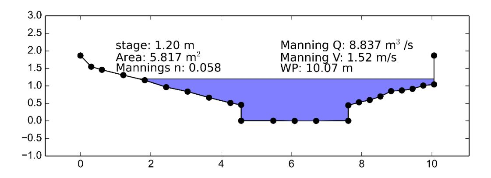

Figure B.1. Stream cross-section at FG1

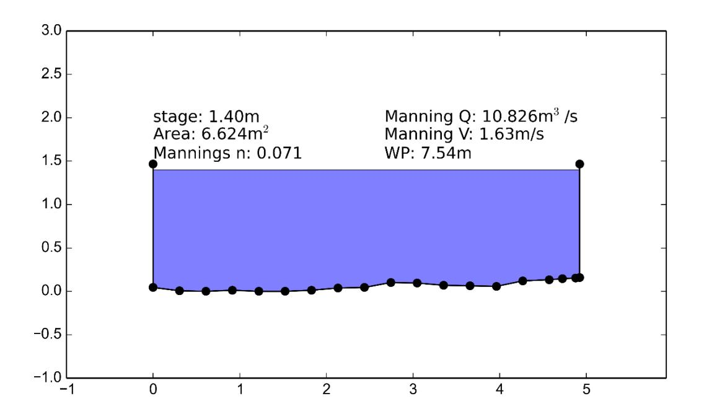

Figure B.2. Stream cross-section at FG3

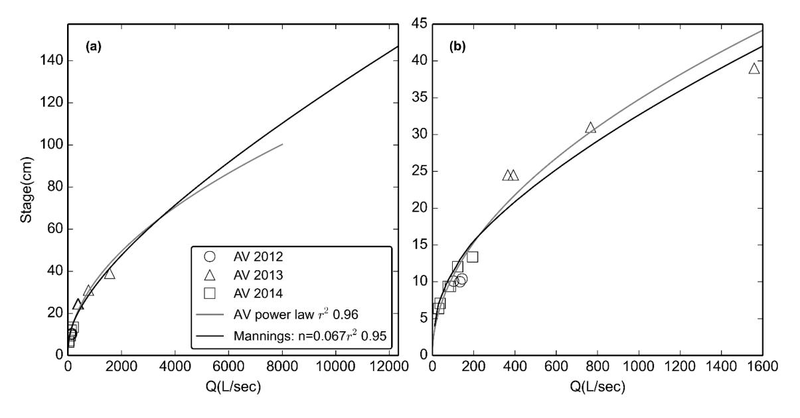

Figure B.3. Stage-Discharge relationships for stream gaging site at FG3 for (a) the full range of observed stage and (b) the range of stages with AV measurements of Q. RMSE was 93 L/sec, or 32% of observed Q.

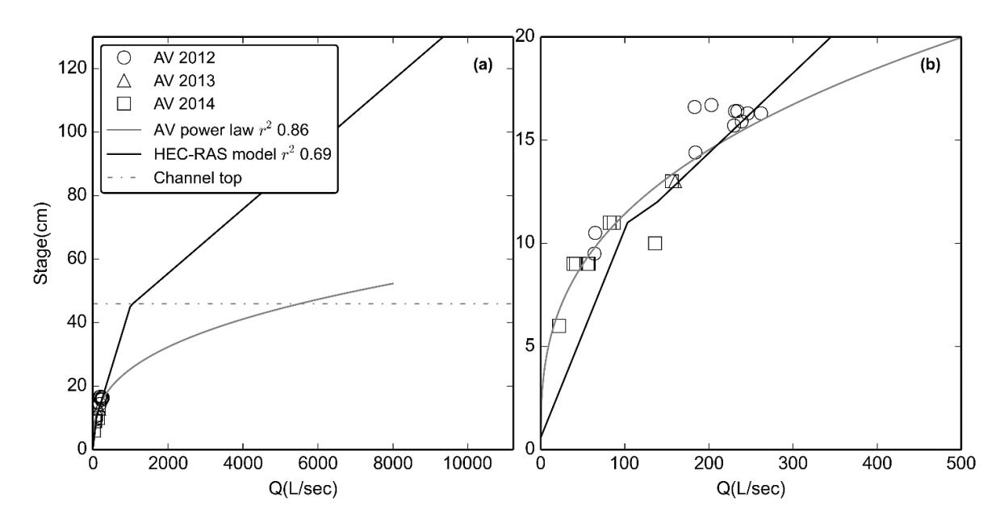

Figure B.4. Stage-Discharge relationships for stream gaging site at FG1 for (a) the full range of observed stage and (b) the range of stages with AV measurements of Q. RMSE was 31 L/sec, or 22% of observed Q. "Channel Top" refers to the point where the rectangular channel transitions to a sloped bank and cross-sectional area increases much more rapidly with stage. A power-law relationship is also displayed to illustrate the potential error that could result if inappropriate methods are used.

# **Supplementary Material C. Turbidity-Suspended Sediment Concentration rating curves for turbidimeters in Faga'alu**

Turbidity (T) was measured at FG1 and FG3 using three types of turbidimeters: 1) Greenspan TS3000 (TS), 2) YSI 600OMS with 6136 turbidity probe (YSI), and 3) Campbell Scientific OBS500 (OBS). All turbidimeters were permanently installed in protective PVC housings near the streambed where the turbidity probe would be submerged at all flow conditions, with the turbidity probe oriented downstream. Despite regular maintenance, debris fouling during storm and baseflows was common and caused data loss during several storm events. Storm events with incomplete or invalid T data were not used in the analysis. A three-point calibration was performed on the YSI turbidimeter with YSI turbidity

standards (0, 126, and 1000 NTU) at the beginning of each field season and approximately every 3-6 months during data collection. Turbidity measured with 0, 126, and 1000 NTU standards differed by less than 10% (4-8%) during each recalibration. The OBS requires calibration every two years, so recalibration was not needed during the study period. All turbidimeters were cleaned following storms to ensure proper operation.

At FG3, a YSI turbidimeter recorded T (NTU) at 5 min intervals from January 30, 2012, to February 20, 2012, and at 15 min intervals from February 27, 2012 to May 23, 2012, when it was damaged during a large storm. The YSI turbidimeter was replaced with an OBS, which recorded Backscatter (BS) and Sidescatter (SS) at 5 min intervals from March 7, 2013, to July 15, 2014 (OBSa), and was resampled to 15 min intervals. No data was recorded from August 2013-January 2014 when the wiper clogged with sediment. A new OBS was installed at FG3 from January, 2014, to August, 2014 (OBSb). To correct for some periods of high noise observed in the BS and SS data recorded by the OBSa in 2013, the OBSb installed in 2014 was programmed to make a burst of 100 BS and SS measurements at 15 min intervals, and record Median, Mean, STD, Min, and Max. All BS and SS parameters were analyzed to determine which showed the best relationship with SSC. Mean SS showed the highest r2 and is a physically comparable measurement to NTU measured by the YSI and TS (Anderson, 2005).

At FG1, the TS turbidimeter recorded T (NTU) at 5 min intervals from January 2012 until it was vandalized and destroyed in July 2012. The YSI turbidimeter, previously deployed at FG3 in 2012, was repaired and redeployed at FG1 and recorded T (NTU) at 5 min intervals from June 2013 to October 2013, and January 2014 to August 2014. T data

was resampled to 15 min intervals to compare with SSC samples for the T-SSC relationship, and to correspond to Q for calculating SSY.

A unique T-SSC relationship was developed for the YSI and both OBS turbidimeters, at each location of deployment, using 15 min interval T data and SSC samples from storm periods only (Figure C.1). The TS meter at FG1 was vandalized before sufficient samples had been collected to establish a T-SSC relationship for high T data, so the T-SSC relationship from the YSI was used for the TS data. The T-SSC relationships were developed using 3 SSC samples taken at FG1 with the YSI, 12 at FG1 with the TS, 33 at FG3 with the YSI, 14 with OBSa at FG3 and 15 with OBSb at FG3. A "synthetic" T-SSC relationship was also developed by placing the turbidimeter in a black tub with water, and sampling T and SSC as sediment was added (Figure C.2), but results were not comparable to T-SSC relationships developed under actual storm conditions (Minella et al., 2008) and were not used in further analyses.

The T-SSC relationships varied among sampling sites and sensors but all showed acceptable r2 values (0.79-0.99). Lower error was achieved by using grab samples collected during stormflows only. For the TS deployed at FG1, the r2 values was high (0.58) but the range of T and SSC values were considered too small (0-16 NTU) compared to the maximum observed during the deployment period (1,077 NTU) to develop a robust relationship for higher T values. Instead, the T-SSC relationship developed for the YSI turbidimeter installed at FG1 (Figure C.1a-b, dotted line) was used to calculate SSC from T data collected by the TS and the YSI at FG1. The T-SSC relationship from the limited data for the TS at FG1 was similar to the T-SSC relationship for the YSI at FG1. For the YSI, more scatter was observed in the T-SSC relationship at FG3 than at FG1 (Figure C.1a-b),

which could be attributed to the higher number and wider range of values sampled, and to temporal variability in sediment characteristics. The OBSa and OBSb turbidimeters had high r 2 values (0.82, 0.93) and compared well between the two periods of deployment (Figure C.1c-d).

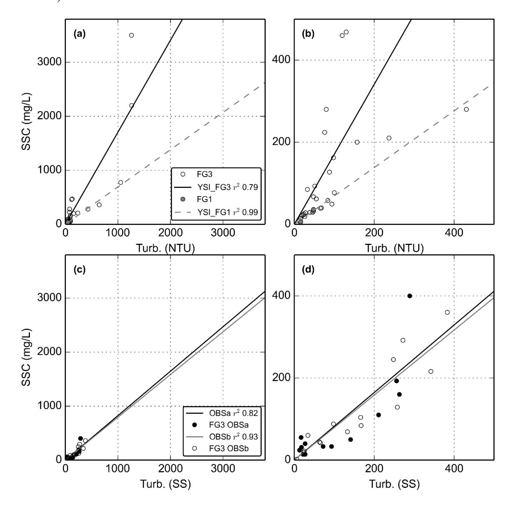

Figure C.1. Turbidity-Suspended Sediment Concentration relationships for a-b) the YSI turbidimeter deployed at FG3 (02/27/2012-05/23/2012) and the same YSI turbidimeter deployed at FG1 (06/13/2013-12/31/2014) (Same T-SSC relationship applied for TS deployed at FG1). c-d) OBS500 turbidimeter deployed at FG3 (03/11/2013-07/11/2013) and the same OBS500 turbidimeter deployed at FG3 (01/31/2014-03/04/2014).

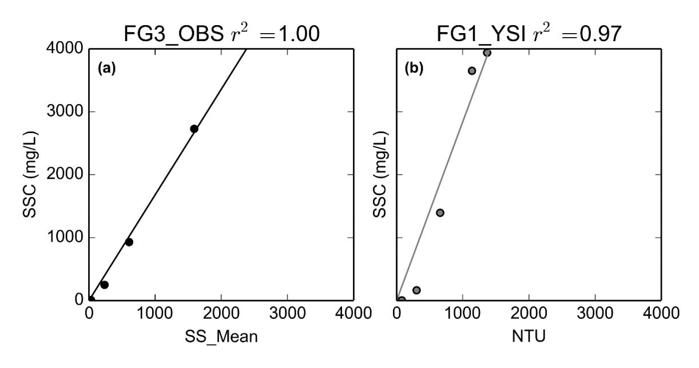

Figure C.2. Synthetic Rating Curves for (a) OBS turbidimeter deployed at FG3 and (b) YSI deployed at FG1.

#### **Supplementary Material D. Water discharge during storm events**

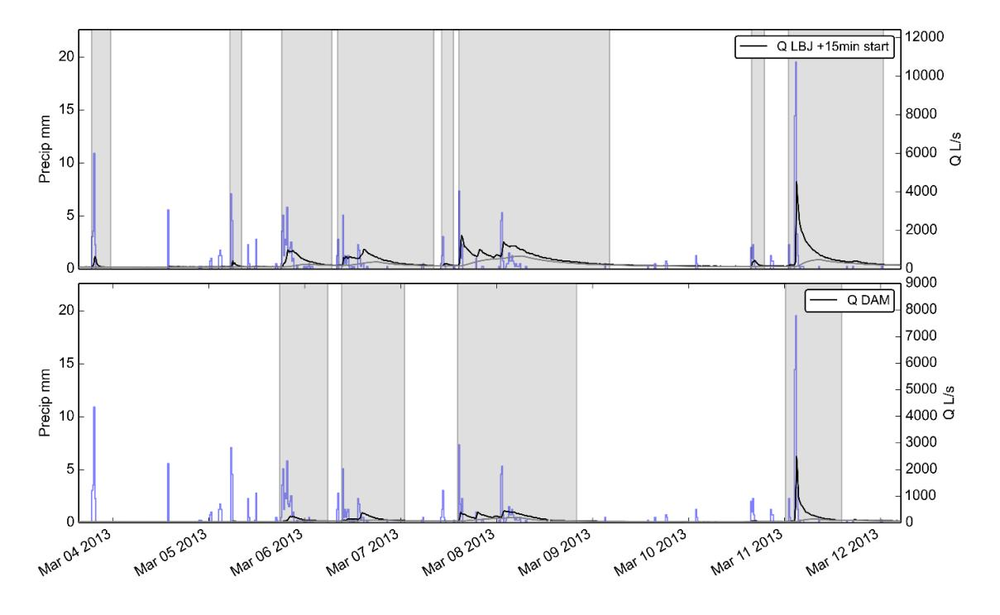

Figure D.1. Example of method for separating storms based on baseflow separation. Black line is hydrograph, grey line is baseflow calculated by R statistical package EcoHydRology.

Storm periods are shaded in grey. Seven storm events are identified from March 3, 2013 to March 13, 2013.

Table D.1. Water discharge from subwatersheds in Faga'alu. Includes all storm events for 2012, 2013, and 2014.

|                |            | -         |          | Discharge m 3 |          |      | entage |
|----------------|------------|-----------|----------|--------------------------|----------|------|--------|
| Storm#         |            | Precin mm |          | Lower                    | Total    |      | Lower  |
| 1              | 01/18/2012 | 70.0      | 10765.0  | 12319.0                  | 23084.0  | 46.0 | 53.0   |
| 2 3 4    | 01/19/2012 | 18.0      | 8117.0   | 11055.0                  | 19172.0  | 42.0 | 57.0   |
| 3              | 01/25/2012 | 79.0      | 17887.0  | 17125.0                  | 35012.0  | 51.0 | 48.0   |
| 4              | 01/31/2012 | 35.0      | 6467.0   | 7868.0                   | 14335.0  | 45.0 | 54.0   |
| 5 6         | 02/01/2012 | 11.0      | 4071.0   | 5767.0                   | 9838.0   | 41.0 | 58.0   |
| 6              | 02/02/2012 | 16.0      | 9224.0   | 14750.0                  | 23974.0  | 38.0 | 61.0   |
| 7              | 02/03/2012 | 11.0      | 12729.0  | 18682.0                  | 31411.0  | 40.0 | 59.0   |
| 8              | 02/04/2012 | 6.0       | 1359.0   | 2765.0                   | 4124.0   | 32.0 | 67.0   |
| 9              | 02/05/2012 | 23.0      | 8374.0   | 12716.0                  | 21090.0  | 39.0 | 60.0   |
| 10             | 02/05/2012 | 21.0      | 9603.0   | 16471.0                  | 26074.0  | 36.0 | 63.0   |
| 11             | 02/06/2012 | 38.0      | 20080.0  | 25795.0                  | 45875.0  | 43.0 | 56.0   |
| 12             | 02/07/2012 | 4.0       | 2643.0   | 2970.0                   | 5613.0   | 47.0 | 52.0   |
| 13             | 02/07/2012 | 10.0      | 5178.0   | 6536.0                   | 11714.0  | 44.0 | 55.0   |
| 14             | 02/13/2012 | 11.0      | 1186.0   | 1548.0                   | 2734.0   | 43.0 | 56.0   |
| 15             | 02/23/2012 | 17.0      | 11491.0  | 15655.0                  | 27146.0  | 42.0 | 57.0   |
| 16             | 03/05/2012 | 22.0      | 1449.0   | 4629.0                   | 6078.0   | 23.0 | 76.0   |
| 17             | 03/06/2012 | 56.0      | 13131.0  | 17173.0                  | 30304.0  | 43.0 | 56.0   |
| 18             | 03/08/2012 | 22.0      | 6904.0   | 4946.0                   | 11850.0  | 58.0 | 41.0   |
| 19             | 03/09/2012 | 19.0      | 12850.0  | 10482.0                  | 23332.0  | 55.0 | 44.0   |
| 20             | 03/15/2012 | 17.0      | 2138.0   | 3305.0                   | 5443.0   | 39.0 | 60.0   |
| 21             | 03/16/2012 | 34.0      | 8794.0   | 10815.0                  | 19609.0  | 44.0 | 55.0   |
| 22             | 03/17/2012 | 32.0      | 9756.0   | 12562.0                  | 22318.0  | 43.0 | 56.0   |
| 23             | 03/20/2012 | 24.0      | 3621.0   | 3782.0                   | 7403.0   | 48.0 | 51.0   |
| 24             | 03/21/2012 | 18.0      | 13828.0  | 14072.0                  | 27900.0  | 49.0 | 50.0   |
| 25             | 03/22/2012 | 34.0      | 14265.0  | 19236.0                  | 33501.0  | 42.0 | 57.0   |
| 26             | 03/23/2012 | 16.0      | 5544.0   | 5833.0                   | 11377.0  | 48.0 | 51.0   |
| $\frac{1}{27}$ | 03/24/2012 | 7.0       | 5264.0   | 3865.0                   | 9129.0   | 57.0 | 42.0   |
| 28             | 03/25/2012 | 49.0      | 31904.0  | 30062.0                  | 61966.0  | 51.0 | 48.0   |
| 29             | 03/31/2012 | 15.0      | 2106.0   | 2468.0                   | 4574.0   | 46.0 | 53.0   |
| 30             | 04/03/2012 | 9.0       | 1184.0   | 1237.0                   | 2421.0   | 48.0 | 51.0   |
| 31             | 05/02/2012 | 30.0      | 2880.0   | 4833.0                   | 7713.0   | 37.0 | 62.0   |
| 32             | 05/07/2012 | 11.0      | 1327.0   | 1890.0                   | 3217.0   | 41.0 | 58.0   |
| 33             | 05/08/2012 | 21.0      | 6129.0   | 6038.0                   | 12167.0  | 50.0 | 49.0   |
| 34             | 05/20/2012 | 13.0      | 1025.0   | 1306.0                   | 2331.0   | 43.0 | 56.0   |
| 35             | 05/22/2012 | 52.0      | 15584.0  | 14239.0                  | 29823.0  | 52.0 | 47.0   |
| 36             | 05/23/2012 | 86.0      | 104576.0 | 18743.0                  | 123319.0 | 84.0 | 15.0   |
| 37             | 05/24/2012 | 34.0      | 41794.0  | 19271.0                  | 61065.0  | 68.0 | 31.0   |
| 38             | 05/25/2012 | 5.0       | 1255.0   | 999.0                    | 2254.0   | 55.0 | 44.0   |
| 39             | 05/26/2012 | 37.0      | 38685.0  | 27294.0                  | 65979.0  | 58.0 | 41.0   |
| 40             | 06/02/2012 | 20.0      | 4486.0   | 4717.0                   | 9203.0   | 48.0 | 51.0   |
| 41             | 06/03/2012 | 22.0      | 13122.0  | 8781.0                   | 21903.0  | 59.0 | 40.0   |
| 42             | 06/04/2012 | 38.0      | 32150.0  | 25378.0                  | 57528.0  | 55.0 | 44.0   |
| 43             | 06/05/2012 | 8.0       | 12702.0  | 10050.0                  | 22752.0  | 55.0 | 44.0   |
| 44             | 06/06/2012 | 8.0       | 5433.0   | 3525.0                   | 8958.0   | 60.0 | 39.0   |
| 45             | 06/07/2012 | 7.0       | 13217.0  | 8988.0                   | 22205.0  | 59.0 | 40.0   |
| 46             | 07/08/2012 | 34.0      | 5660.0   | 5623.0                   | 11283.0  | 50.0 | 49.0   |
| 47             | 07/08/2012 | 12.0      | 4528.0   | 6015.0                   | 10543.0  | 42.0 | 57.0   |
| 48             | 07/26/2012 | 31.0      | 4796.0   | 6411.0                   | 11207.0  | 42.0 | 57.0   |
| 49             | 07/27/2012 | 13.0      | 5516.0   | 6385.0                   | 11901.0  | 46.0 | 53.0   |
| 50             | 08/07/2012 | 13.0      | 882.0    | 1571.0                   | 2453.0   | 35.0 | 64.0   |
| 51             | 08/08/2012 | 44.0      | 17172.0  | 9804.0                   | 26976.0  | 63.0 | 36.0   |
| 52             | 02/27/2013 | 4.0       | 756.0    | 1452.0                   | 2208.0   | 34.0 | 65.0   |
| 53             | 03/03/2013 | 19.0      | 792.0    | 2509.0                   | 3301.0   | 23.0 | 76.0   |
| 54             | 03/05/2013 | 11.0      | 541.0    | 1777.0                   | 2318.0   | 23.0 | 76.0   |
| 55             | 03/05/2013 | 33.0      | 4994.0   | 16176.0                  | 21170.0  | 23.0 | 76.0   |
| 56             | 03/06/2013 | 22.0      | 10726.0  | 26751.0                  | 37477.0  | 28.0 | 71.0   |
| 57             | 03/07/2013 | 5.0       | 775.0    | 1819.0                   | 2594.0   | 29.0 | 70.0   |
| 51             | 33,0772013 | 2.0       | , , 5.0  | 1017.0                   | 2071.0   | 27.0 | , 0.0  |

| 58  | 02/10/2012 | 6.0   | 680.0    | 2571.0  | 3251.0   | 20.0 | 79.0 |
|-----|------------|-------|----------|---------|----------|------|------|
|     | 03/10/2013 |       |          | 2571.0  |          |      |      |
| 59  | 03/11/2013 | 43.0  | 19107.0  | 40420.0 | 59527.0  | 32.0 | 67.0 |
| 60  | 03/21/2013 | 17.0  | 2580.0   | 5269.0  | 7849.0   | 32.0 | 67.0 |
|     |            |       |          |         |          |      |      |
| 61  | 03/23/2013 | 17.0  | 2151.0   | 7704.0  | 9855.0   | 21.0 | 78.0 |
| 62  | 03/26/2013 | 9.0   | 545.0    | 1474.0  | 2019.0   | 26.0 | 73.0 |
| 63  |            | 8.0   | 369.0    | 1297.0  |          | 22.0 |      |
|     | 04/11/2013 |       |          |         | 1666.0   |      | 77.0 |
| 64  | 04/16/2013 | 62.0  | 10340.0  | 28165.0 | 38505.0  | 26.0 | 73.0 |
| 65  | 04/17/2013 | 42.0  | 17144.0  | 42894.0 | 60038.0  | 28.0 | 71.0 |
|     |            |       |          |         |          |      |      |
| 66  | 04/18/2013 | 3.0   | 1767.0   | 4655.0  | 6422.0   | 27.0 | 72.0 |
| 67  | 04/18/2013 | 2.0   | 846.0    | 2178.0  | 3024.0   | 27.0 | 72.0 |
| 68  | 04/18/2013 | 9.0   | 1621.0   | 5532.0  | 7153.0   | 22.0 | 77.0 |
|     |            |       |          |         |          |      |      |
| 69  | 04/20/2013 | 27.0  | 6704.0   | 27501.0 | 34205.0  | 19.0 | 80.0 |
| 70  | 04/23/2013 | 86.0  | 63144.0  | 33894.0 | 97038.0  | 65.0 | 34.0 |
| 71  | 04/28/2013 | 14.0  | 5893.0   | 7407.0  | 13300.0  | 44.0 | 55.0 |
|     |            |       |          |         |          |      |      |
| 72  | 04/28/2013 | 2.0   | 10542.0  | 13364.0 | 23906.0  | 44.0 | 55.0 |
| 73  | 04/30/2013 | 111.0 | 82708.0  | 39233.0 | 121941.0 | 67.0 | 32.0 |
| 74  | 05/11/2013 | 19.0  | 3789.0   | 5916.0  | 9705.0   | 39.0 | 60.0 |
|     |            |       |          |         |          |      |      |
| 75  | 05/30/2013 | 10.0  | 1247.0   | 1772.0  | 3019.0   | 41.0 | 58.0 |
| 76  | 06/05/2013 | 177.0 | 138613.0 | 27276.0 | 165889.0 | 83.0 | 16.0 |
| 77  | 06/09/2013 | 1.0   | 1785.0   | 1950.0  | 3735.0   | 47.0 | 52.0 |
| 78  | 06/16/2013 | 30.0  | 11314.0  |         | 17664.0  | 64.0 | 35.0 |
|     |            |       |          | 6350.0  |          |      |      |
| 79  | 06/24/2013 | 9.0   | 4587.0   | 2955.0  | 7542.0   | 60.0 | 39.0 |
| 80  | 07/02/2013 | 13.0  | 3320.0   | 2578.0  | 5898.0   | 56.0 | 43.0 |
| 81  | 07/13/2013 | 24.0  | 5520.0   | 6316.0  | 11836.0  | 46.0 | 53.0 |
|     |            |       |          |         |          |      |      |
| 82  | 07/15/2013 | 9.0   | 2663.0   | 1162.0  | 3825.0   | 69.0 | 30.0 |
| 83  | 07/16/2013 | 17.0  | 5815.0   | 4509.0  | 10324.0  | 56.0 | 43.0 |
| 84  | 07/17/2013 | 26.0  | 14544.0  | 25462.0 | 40006.0  | 36.0 | 63.0 |
|     |            |       |          |         |          |      |      |
| 85  | 07/19/2013 | 34.0  | 13957.0  | 28596.0 | 42553.0  | 32.0 | 67.0 |
| 86  | 07/20/2013 | 26.0  | 16092.0  | 34908.0 | 51000.0  | 31.0 | 68.0 |
| 87  | 07/24/2013 | 13.0  | 2243.0   | 1888.0  | 4131.0   | 54.0 | 45.0 |
|     |            | 22.0  |          |         |          |      |      |
| 88  | 07/27/2013 | 22.0  | 5886.0   | 4163.0  | 10049.0  | 58.0 | 41.0 |
| 89  | 08/03/2013 | 20.0  | 3645.0   | 3731.0  | 7376.0   | 49.0 | 50.0 |
| 90  | 08/05/2013 | 19.0  | 12492.0  | 10070.0 | 22562.0  | 55.0 | 44.0 |
| 91  |            | 81.0  | 26772.0  | 63930.0 | 90702.0  | 29.0 | 70.0 |
|     | 08/09/2013 |       |          |         |          |      |      |
| 92  | 08/15/2013 | 28.0  | 3752.0   | 7636.0  | 11388.0  | 32.0 | 67.0 |
| 93  | 08/16/2013 | 102.0 | 60145.0  | 47130.0 | 107275.0 | 56.0 | 43.0 |
| 94  | 08/17/2013 | 0.0   | 1255.0   | 2297.0  | 3552.0   | 35.0 | 64.0 |
|     |            |       |          |         |          |      |      |
| 95  | 08/17/2013 | 85.0  | 47275.0  | 73771.0 | 121046.0 | 39.0 | 60.0 |
| 96  | 08/18/2013 | 5.0   | 1521.0   | 3582.0  | 5103.0   | 29.0 | 70.0 |
| 97  | 08/19/2013 | 36.0  | 13038.0  | 24494.0 | 37532.0  | 34.0 | 65.0 |
| 98  |            |       |          |         |          |      |      |
|     | 08/21/2013 | 12.0  | 1980.0   | 3709.0  | 5689.0   | 34.0 | 65.0 |
| 99  | 08/26/2013 | 29.0  | 2963.0   | 5490.0  | 8453.0   | 35.0 | 64.0 |
| 100 | 09/01/2013 | 41.0  | 9592.0   | 15806.0 | 25398.0  | 37.0 | 62.0 |
| 101 | 09/01/2013 | 3.0   | 3390.0   | 5620.0  | 9010.0   | 37.0 | 62.0 |
|     |            |       |          |         |          |      |      |
| 102 | 09/07/2013 | 23.0  | 4392.0   | 4692.0  | 9084.0   | 48.0 | 51.0 |
| 103 | 09/08/2013 | 8.0   | 4093.0   | 4949.0  | 9042.0   | 45.0 | 54.0 |
| 104 | 09/18/2013 | 16.0  | 3541.0   | 4793.0  | 8334.0   | 42.0 | 57.0 |
|     |            |       |          |         |          |      |      |
| 105 | 09/21/2013 | 14.0  | 2970.0   | 3809.0  | 6779.0   | 43.0 | 56.0 |
| 106 | 02/14/2014 | 25.0  | 11129.0  | 10822.0 | 21951.0  | 50.0 | 49.0 |
| 107 | 02/15/2014 | 7.0   | 4178.0   | 5397.0  | 9575.0   | 43.0 | 56.0 |
| 108 | 02/16/2014 | 0.0   | 1800.0   | 3838.0  | 5638.0   | 31.0 | 68.0 |
|     |            |       |          |         |          |      |      |
| 109 | 02/18/2014 | 12.0  | 2064.0   | 7026.0  | 9090.0   | 22.0 | 77.0 |
| 110 | 02/20/2014 | 29.0  | 7151.0   | 23927.0 | 31078.0  | 23.0 | 76.0 |
| 111 | 02/21/2014 | 51.0  | 19822.0  | 41477.0 | 61299.0  | 32.0 | 67.0 |
|     |            |       |          |         |          |      |      |
| 112 | 02/24/2014 | 16.0  | 3512.0   | 4329.0  | 7841.0   | 44.0 | 55.0 |
| 113 | 02/24/2014 | 1.0   | 2437.0   | 2558.0  | 4995.0   | 48.0 | 51.0 |
| 114 | 02/25/2014 | 67.0  | 23172.0  | 53565.0 | 76737.0  | 30.0 | 69.0 |
| 115 | 02/27/2014 | 16.0  | 9496.0   | 10192.0 | 19688.0  | 48.0 | 51.0 |
|     | 02/27/2014 |       |          |         |          |      |      |
| 116 | 02/27/2014 | 12.0  | 11970.0  | 16225.0 | 28195.0  | 42.0 | 57.0 |
| 117 | 03/03/2014 | 0.0   | 1435.0   | 1441.0  | 2876.0   | 49.0 | 50.0 |
| 118 | 03/06/2014 | 3.0   | 2988.0   | 1869.0  | 4857.0   | 61.0 | 38.0 |
|     |            |       |          |         |          |      |      |
| 119 | 03/06/2014 | 41.0  | 17760.0  | 23829.0 | 41589.0  | 42.0 | 57.0 |
| 120 | 03/13/2014 | 45.0  | 9943.0   | 13565.0 | 23508.0  | 42.0 | 57.0 |
| 121 | 03/14/2014 | 11.0  | 13503.0  | 19938.0 | 33441.0  | 40.0 | 59.0 |
| 122 |            |       |          | 5276.0  | 8089.0   |      |      |
| 122 | 03/14/2014 | 12.0  | 2813.0   | 32/0.0  | 0009.0   | 34.0 | 65.0 |

| 123        | 03/23/2014               | 11.0        | 1337.0            | 4027.0           | 5364.0            | 24.0         | 75.0         |
|------------|--------------------------|-------------|-------------------|------------------|-------------------|--------------|--------------|
| 123        | 03/24/2014               | 6.0         | 1576.0            | 3013.0           | 4589.0            | 34.0         | 65.0         |
| 125        | 03/28/2014               | 8.0         | 1512.0            | 3724.0           | 5236.0            | 28.0         | 71.0         |
| 126        | 04/01/2014               | 33.0        | 1740.0            | 7044.0           | 8784.0            | 19.0         | 80.0         |
| 127        | 04/06/2014               | 61.0        | 13915.0           | 27351.0          | 41266.0           | 33.0         | 66.0         |
| 128        | 04/08/2014               | 18.0        | 4986.0            | 10385.0          | 15371.0           | 32.0         | 67.0         |
| 129        | 04/09/2014               | 18.0        | 6119.0            | 11750.0          | 17869.0           | 34.0         | 65.0         |
| 130        | 04/11/2014               | 14.0        | 3586.0            | 7585.0           | 11171.0           | 32.0         | 67.0         |
| 131        | 04/16/2014               | 9.0         | 565.0             | 2162.0           | 2727.0            | 20.0         | 79.0         |
| 132        | 04/17/2014               | 12.0        | 2271.0            | 4559.0           | 6830.0            | 33.0         | 66.0         |
| 133        | 04/17/2014               | 9.0         | 3767.0            | 7636.0           | 11403.0           | 33.0         | 66.0         |
| 134        | 04/18/2014               | 15.0        | 5828.0            | 12730.0          | 18558.0           | 31.0         | 68.0         |
| 135        | 04/19/2014               | 26.0        | 9058.0            | 27855.0          | 36913.0           | 24.0         | 75.0         |
| 136        | 04/19/2014               | 10.0        | 7815.0            | 21881.0          | 29696.0           | 26.0         | 73.0         |
| 137        | 04/25/2014               | 24.0        | 9048.0            | 15297.0          | 24345.0           | 37.0         | 62.0         |
| 138        | 04/26/2014               | 16.0        | 5427.0            | 8943.0           | 14370.0           | 37.0         | 62.0         |
| 139        | 04/27/2014               | 25.0        | 8430.0            | 20305.0          | 28735.0           | 29.0         | 70.0         |
| 140        | 04/28/2014               | 16.0        | 2748.0            | 8205.0           | 10953.0           | 25.0         | 74.0         |
| 141        | 04/28/2014               | 0.0         | 855.0             | 2634.0           | 3489.0            | 24.0         | 75.0         |
| 142        | 04/28/2014               | 27.0        | 8785.0            | 33864.0          | 42649.0           | 20.0         | 79.0         |
| 143        | 04/29/2014               | 6.0         | 1065.0            | 3447.0           | 4512.0            | 23.0         | 76.0         |
| 144        | 04/30/2014               | 29.0        | 20768.0           | 43623.0          | 64391.0           | 32.0         | 67.0         |
| 145        | 05/19/2014               | 14.0        | 2217.0            | 4677.0           | 6894.0            | 32.0         | 67.0         |
| 146        | 05/19/2014               | 27.0        | 4698.0            | 9150.0           | 13848.0           | 33.0         | 66.0         |
| 147        | 05/20/2014               | 12.0        | 4886.0            | 10631.0          | 15517.0           | 31.0         | 68.0         |
| 148        | 05/22/2014               | 63.0        | 10344.0           | 36648.0          | 46992.0           | 22.0         | 77.0         |
| 149        | 05/23/2014               | 1.0         | 1485.0            | 5040.0           | 6525.0            | 22.0         | 77.0         |
| 150        | 05/26/2014               | 4.0         | 2264.0            | 7894.0           | 10158.0           | 22.0         | 77.0         |
| 151        | 05/29/2014               | 8.0         | 3777.0            | 8673.0           | 12450.0           | 30.0         | 69.0         |
| 152        | 06/03/2014               | 11.0        | 2485.0            | 5683.0           | 8168.0            | 30.0         | 69.0         |
| 153        | 06/05/2014               | 75.0        | 18454.0           | 51224.0          | 69678.0           | 26.0         | 73.0         |
| 154        | 06/16/2014               | 7.0         | 2398.0            | 4088.0           | 6486.0            | 36.0         | 63.0         |
| 155        | 06/16/2014               | 24.0        | 9597.0            | 22539.0          | 32136.0           | 29.0         | 70.0         |
| 156        | 07/02/2014               | 68.0        | 11276.0           | 30561.0          | 41837.0           | 26.0         | 73.0         |
| 157        | 07/05/2014               | 33.0        | 14056.0           | 30023.0          | 44079.0           | 31.0         | 68.0         |
| 158        | 07/06/2014               | 20.0        | 3794.0            | 11113.0          | 14907.0           | 25.0         | 74.0         |
| 159        | 07/09/2014               | 10.0        | 1242.0            | 2347.0           | 3589.0            | 34.0         | 65.0         |
| 160        | 07/27/2014               | 1.0         | 1121.0            | 4235.0           | 5356.0            | 20.0         | 79.0         |
| 161        | 07/29/2014               | 334.0       | 176157.0          | 132096.0         | 308253.0          | 57.0         | 42.0         |
| 162        | 07/30/2014               | 77.0        | 47946.0           | 58704.0          | 106650.0          | 44.0         | 55.0         |
| 163        | 07/31/2014               | 114.0       | 69273.0           | 85587.0          | 154860.0          | 44.0         | 55.0         |
| 164        | 08/01/2014               | 4.0 2.0  | 1075.0            | 3839.0           | 4914.0            | 21.0         | 78.0         |
| 165        | 08/02/2014               | 13.0        | 2243.0 12712.0 | 6196.0           | 8439.0 34855.0 | 26.0         | 73.0 63.0 |
| 166        | 08/02/2014               |             | 12/12.0 2242.0 | 22143.0          |                   | 36.0         | 53.0         |
| 167 168 | 08/17/2014 08/23/2014 | 13.0 6.0 | 2242.0 2280.0  | 2618.0 2598.0 | 4860.0 4878.0  | 46.0 46.0 | 53.0         |
| 169        | 09/15/2014               | 14.0        | 2633.0            | 6322.0           | 4878.0 8955.0  | 29.0         | 70.0         |
| -          | 07/13/2014 -          | 14.0 -   | <u> </u>          | -                | Average:          | 45           | 55           |

## **Chapter Two:**

**Eulerian and Lagrangian measurements of water flow and residence time in a fringing reef flat-lined embayment: Faga'alu Bay, American Samoa**

## **ABSTRACT**

Water circulation is an important control on nutrient cycling, larval dispersal, and temperature variability, and interacts with terrestrially-derived sediment, nutrients, and contaminants to determine watershed impacts on near shore ecosystems like coral reefs. We combined Lagrangian and Eulerian methods to characterize water flows and residence times in relation to dominant tide, wind, and wave forcing conditions in a reef-fringed embayment in American Samoa. Lagrangian GPS-enabled drifters were deployed at 5 different locations 30 times over a 1-month period, with one week of intensive deployment when three fixed current profilers collected continuous Eulerian flow data. Mean flow speeds (residence times) varied widely, from 1-20 cm s-1 (2.8-0.14 h), 1-19 cm s-1 (2.8-0.15 h), and 1-36 cm s-1 (2.8-0.08 h) under strong wind, tidal, and large wave forcing, respectively. The highest flow speeds and shortest residence times occurred over the exposed southern reef and near the reef crest. The slowest flow speeds and longest residence times occurred over the sheltered northern reef, near shore, and the deep channel incised in the reef. Under tidal forcing (i.e., calm conditions), flow directions were the most variable, with some seaward transport from the reef flat to the fore reef. Under onshore wind forcing, flow directions were mostly into the embayment. Under large wave forcing, flows followed a clockwise spatial pattern: onshore over the exposed southern reef, onto the sheltered northern reef, and out to sea through the channel. Lagrangian estimates of mean flow speeds differed by 48-658% with

Eulerian estimates, likely due to spatial heterogeneity of flows sampled by the drifters, the difference between surface and depth-averaged flow speeds, and Stokes' drift. The results demonstrate the advantage of a hybrid Lagrangian-Eulerian measurement scheme to understand long-term, spatially-distributed flow patterns and residence times for biophysical studies in geomorphically-complex embayments that are common to reef-lined coasts.

## **2.1. Introduction**

Water circulation and residence time are critical to coral health by controlling the chemistry, biology, and sediment dynamics of coral reefs (Lowe and Falter, 2015). By controlling the interaction of benthic organisms with water quality, water residence time and flow paths affect biologically-important processes like nutrient cycling, larval dispersal, and temperature regimes (Falter et al., 2004; Herdman et al., 2015; Wyatt et al., 2012). By influencing orbital velocities, bed shear stress, and suspended sediment transport, hydrodynamic conditions are a primary control on the spatial distribution of deposition, resuspension, and dispersal of terrigenous sediment discharged from streams and dredging (Draut et al., 2009; Hoeke et al., 2013; Hoitink and Hoekstra, 2003; Jones et al., 2015; Presto et al., 2006; Storlazzi et al., 2004). Terrestrial sediment stress on corals is primarily a function of the magnitude of sediment concentration and the duration of exposure (Erftemeijer et al., 2012), which are controlled by hydrodynamic conditions.

Spatially-distributed flow patterns under variable tidal, wind, and wave forcing conditions are logistically difficult to quantify, so conservation planning and remediation studies often use coarse estimates of pollutant discharge and distance-based plume models that assume symmetry in flow fields (Klein et al., 2012). Hydrodynamic conditions can exacerbate or limit the impacts of terrestrial sediment from disturbed watersheds on coral

reefs (Hoitink and Hoekstra, 2003). An improved understanding of the spatial patterns and temporal variability in flows and residence times of water over corals is needed for understanding sedimentation patterns and their impacts to coral health.

Studies in several fringing reefs adjacent to steep volcanic islands have shown that current speeds, directions, and residence times over reef flats are controlled by wave, wind, and tidal forcing (Hench et al., 2008; Hoeke et al., 2011; Presto et al., 2006; Storlazzi and Field, 2008; Storlazzi et al., 2004). Variations in reef morphology relative to the orientation of meteorological and oceanographic forcing can generate heterogeneous waves and currents over small (tens of meters) spatial scales, unlike those observed along linear sandy shorelines (Hoeke et al., 2013, 2011; Storlazzi et al., 2009). Currents over reefs exposed to remotely generated swell are generally dominated by wave forcing (Hench et al., 2008; Hoeke et al., 2011; Vetter et al., 2010), whereas wind forcing dominates reefs protected from swell (Presto et al., 2006; Yamano et al., 1998). Tidal elevation modulates both wavedriven currents by controlling wave energy propagation onto the reef flat (Falter et al., 2008; Storlazzi et al., 2004; Taebi et al., 2011), and wind-driven currents by regulating water depth for wind-driven wave development (Presto et al., 2006). Flows over wave-driven, fringing reefs typically exhibit a pattern of rapid, cross-shore flow near the reef crest that slows moving shoreward and turns along-shore towards a deep channel where water returns seaward (Hench et al., 2008; Lowe et al., 2009a; Wyatt et al., 2010). In wind-driven systems, current directions are more predominantly in the direction of the wind with possible cross-shore exchange over the reef crest (Storlazzi et al., 2004). Of course, forcing conditions can operate in combination, and areas near the reef crest may be strongly

controlled by wave-forcing, while lagoon areas may be unaffected by waves and flushed only by tidal or wind-forcing (Lowe et al., 2009b).

Water flow can be quantified in two ways: 1) the Lagrangian perspective observes a fluid parcel as it moves through space and time, whereas 2) the Eulerian perspective observes flow past a fixed location over time. Eulerian methods are well-suited to characterizing flows over long time periods by sampling a large range of forcing conditions using bottom-mounted instruments to measure tides, waves, and currents (Presto et al., 2006; Storlazzi et al., 2009; Vetter et al., 2010). Lagrangian methods are well-suited to characterizing flow trajectories over an area, using large numbers of GPS-logging drifters to collect spatially dense and extensive observations of small-scale flows such as rip currents in beach surf zones (Johnson et al., 2003; MacMahan et al., 2010) and the approach is becoming more common in fringing-reef environments (Falter et al., 2008; Pomeroy et al., 2015a; Wyatt et al., 2010).

Lagrangian drifter studies in nearshore environments have generally been limited in number of drifters, number of deployments, and the range of oceanic and meteorological conditions experienced during deployments, making it uncertain whether they describe the dominant patterns, or short-lived anomalies (Storlazzi et al., 2006; Wyatt et al., 2010). Storlazzi et al. (2006a) and Andutta et al. (2012) successfully combined Eulerian and Lagrangian methods to investigate transport patterns between adjacent reefs and islands; they compared Lagrangian drifter tracks with progressive vectors of cumulative flow calculated from Eulerian current meters to determine if short-term observations from drifters were representative of the dominant patterns.

Our objective was to combine temporally extensive Eulerian and spatially extensive Lagrangian methods in a rapid assessment technique to characterize the spatial flow patterns and residence times in relation to dominant forcing conditions in a bathymetrically-complex, fringing coral reef-lined embayment. The measurements were sufficiently dense to produce gridded data on flow velocities and residence times at a 100- x 100-m resolution, which were then used to identify circulation patterns under dominant wind, wave and tidal conditions. The motivating research questions were: How are flows and residence times influenced by high waves, high winds, or calm conditions? How do currents and residence times vary spatially on the reef flat under these conditions?

## **2.2. Materials and Methods**

#### **2.2.1 Study area**

Faga'alu Bay is a v-shaped embayment situated on the western side of Pago Pago Bay, on the island of Tutuila, American Samoa (14.290˚ S, 170.677˚ W; Figure 2.1). The bay is surrounded by high topography that blocks wet-season northerly winds from October to April, but is exposed to dry-season southeasterly trade winds and accompanying shortperiod wind waves from May to September (Craig, 2009). A semi-diurnal, microtidal regime exposes parts of the shallow reef crest and reef flat at extreme low tides. Faga'alu Bay is only open to south to southeast swell directions, and the more southerly angled swell must refract to the west, resulting in a reduction of wave energy. Offshore significant wave heights (*Hs*) are generally less than 2.5 m and rarely exceed 3.0 m. Peak wave periods (*Tp*) are generally about 9 s or less, rarely exceed 13 s, but occasionally reach 25 s during austral winter storms (Thompson and Demirbilek, 2002). O. Vetter (unpublished data) recorded *Hs*

up to 1.7 m on the fore reef in Faga'alu, but *Hs* greater than 1.0 m were rare. Tropical cyclones typically occur in the South Pacific from November to April (Militello et al., 2003), impacting American Samoa every 1-13 years since 1981 (Craig 2009), though high waves impacting the reefs without the storm making landfall occurs more frequently (Feagaimaalii-Luamanu, 2016).

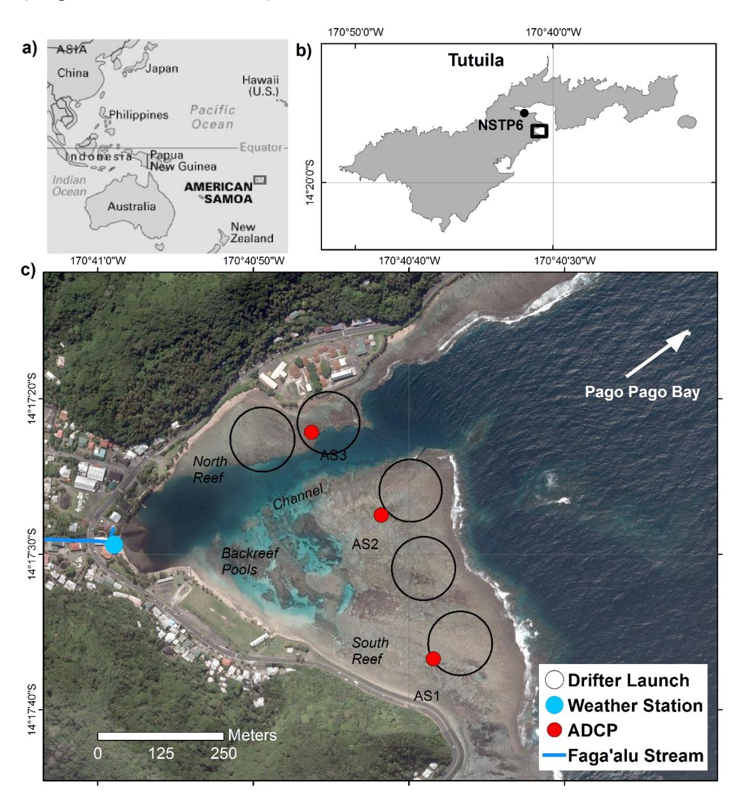

Figure 2.1. Maps of the study area and instrumentation in Faga'alu Bay. Wind speed and direction were recorded at NDBC station NSTP6 (b). Acoustic current profilers (ADCP) were deployed at three locations for one week to measure current speed and direction, and

GPS-logging drifters were deployed thirty times (19 January to 23 February 2014) from five launch zones (Drifter Launch).

Faga'alu Bay is adjacent to a small (2.48 km2 ), steep-sided watershed that discharges terrigenous sediment during storm events from a perennial stream in the northwest corner of the Bay, and several surrounding ephemeral streams (Messina and Biggs, In Press). The bathymetrically complex reef is characterized by a shallow reef flat extending from shore to the reef crest, where it descends at an approximately 1:1 slope to an insular shelf at approximately 20 m depth. Near the reef crest, the reef flat is primarily cemented reef pavement, but within a few 10s of m, transitions into thickets of primarily *Acropora spp.* An anthropogenically-altered, vertical-walled, 5-15 m deep paleostream channel (Figure 2.1) extends from the outlet of Faga'alu Stream eastward to Pago Pago Bay; this channel divides the reef into a larger, more exposed southern section ("southern reef" in Figure 2.1), and a smaller, more sheltered northern section ("northern reef" in Figure 2.1). Closer to the shore in the southern back-reef there are areas of deeper (1-5 m) sediment-floored pools with coral bommies ("back-reef pools" in Figure 2.1). See Cochran et al. (2016) for a detailed description of the bathymetry. Surveys in 2015 found coral coverage varied from less than 10% on the degraded northern reef, to more than 50% on the more intact southern reef (Cochran et al., 2016).

#### **2.2.2 Lagrangian measurements**

Given the relatively small area of Faga'alu Bay (0.25 km2 ), high spatial density data could be collected with a small number of drifters (*n* = 5) with rapid turn-around. The cruciform drifter design of Austin and Atkinson (2004) was adapted for use on the shallow

reef, with a durable PVC frame and a float collar to maintain upright orientation (Figure 2.2a-b). The fins of the drifters were approximately 30 cm wide and 18 cm in height, constructed of 1.3-cm diameter PVC with holes drilled to flood the piping. A HOLUX M1000 GPS logger was installed in a 5-cm dia. PVC housing at the top, extending 7 cm above the fins, though when deployed it only rose ~3 cm above the water surface.

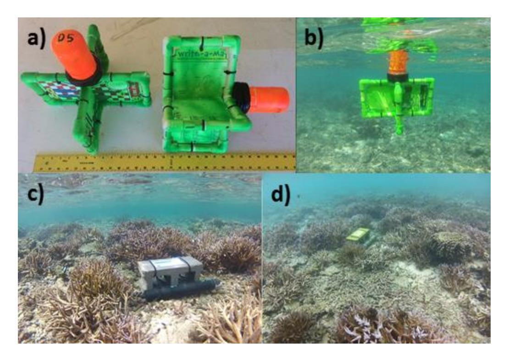

Figure 2.2. Images of the oceanographic instrumentation at high tide. a) Shallow-water drifters on land with ruler for scale. b) Drifter deployed in the field over the reef flat. c-d) The ADCP at location AS1.

The five drifters were deployed 30 times from 19 January 2014 to 23 February 2014, local time (GMT -11h), which is 2014 Year Day [YD] 19-54, GMT. Twenty-one releases occurred during the deployment period for a set of three acoustic current profilers (ADCP) (February 16-23; YD 47-54) (Appendix Table A1). Drifters were released from five separate launch zones (Figure 2.1) within a 10-min period at the beginning of each deployment. Drifter position was recorded by the GPS logger at 5-s intervals and averaged to 1 min

intervals to increase signal-to-noise ratios; speed and direction were calculated using a forward difference scheme on the drifter locations (Davis, 1991; MacMahan et al., 2010). Drifters were generally allowed to drift until they exited the channel, but tracks were limited to 1 h for comparisons with simultaneous ADCP data. Deployments were timed to attempt an even distribution during falling versus rising tides and similar tide stages (Table A1) but it was not possible to ensure tidal conditions were identical between deployments.

#### **2.2.3 Eulerian measurements**

Three Nortek Aquadopp 2-MHz ADCPs recorded current data at three locations on the reef flat for one week (YD 47-54) (Figure 2.1). The ADCPs were deployed on sand or rubble patches among the corals, as deep as possible to maintain adequate water levels over the ADCP during low tide (Figure 2.2c-d). Mean deployment depths were 0.97 m (AS1), 1.30 m (AS2), and 0.34 m (AS3). ADCPs collected a vertical profile of current velocity every 10 min, averaged from 580 samples collected at 2 Hz. Each profile was composed of eight 0.2-m bins starting from 0.35 m above the seabed, using a blanking distance of 0.1 m. Measurements with a signal strength (amplitude) of ≤ 20 counts and the top 10% (from the water surface level) of each profile were removed. Occasionally during low tide, water depths were insufficient for AS3 to collect usable data, so flow was assumed to be nearly zero given the low water depth relative to the height of the corals, many of which were emergent. Human disturbance caused a short data gap at AS1 on YD 50.

#### **2.2.4 Ancillary data**

The instruments sampled "end-member" forcing conditions that characterize the study area, such as high winds, high waves, or calm conditions (Yamano et al., 1998). This approach isolates the influence of wind- and wave-driven forcing to determine the resulting flow patterns. Calm conditions are characterized by low winds and waves, and we refer to these conditions as "tidal", to indicate the dominant forcing. End-member periods were defined post-deployment using modeled and in situ wave, wind, and tide data following the methodology described by Presto et al. (2006). Incident wave conditions were recorded by a NIWA Dobie-A wave/tide gauge (DOBIE) deployed on the southern forereef at a depth of 10 m. The DOBIE sampled a 512-s burst at 2 Hz every hour. The DOBIE malfunctioned and recorded no data coinciding with the ADCP deployment, but the data that was collected before the malfunction compared well (not shown) with NOAA/NCEP Wave Watch III (WW3; Tolman, 2009) modeled data on swell height and direction (Hoeke et al., 2011). Thus, the WW3 model data are considered sufficient for defining the wave climatology during the ADCP and drifter deployments.

Wind and tide data were recorded at 6-min intervals at NOAA National Data Buoy Center (2014) station NSTP6, located approximately 1.8 km north of Faga'alu (Figure 2.1b). Wind speed and direction measured at NSTP6 may be slightly different than at the study site due to topographic effects, but are considered sufficient for defining relative wind conditions during the study.

#### **2.2.5 Analytical methods**

Simultaneous data from the drifters and ADCPs were grouped by end-member forcing, and three techniques were used to determine if the short-term (using 1-h time windows) flow patterns indicated by the Lagrangian (drifters) observations were similar to the Eulerian (ADCP) observations: 1) progressive vector trajectories of cumulative flow, 2) mean flow velocities and variance ellipses, and 3) and estimated residence times.

A series of 1-h progressive vector diagrams of cumulative flow were computed from ADCP data following the methodology used by Siegel et al. (2003) and Storlazzi et al. (2006a). Mean and principal flow axes, velocity variance ellipses, and residence times were calculated from simultaneous ADCP data and spatially binned drifter data (100 m x 100 m) following the methodology of MacMahan et al. (2010). Spatial bins were sized to include sufficient drifter tracks while resolving spatial flow variability. Where drifters did not travel through a specific spatial bin, no analyses could be made. "Residence time" in a lagoon is typically defined as the time it takes for a water parcel to exit the lagoon to the ocean (Tartinville et al., 1997) but can be determined for any spatial domain (Monsen et al., 2002). For this analysis, residence time was calculated as the time it would take a water parcel to cross a 100-m grid cell, traveling at the mean speed calculated from instantaneous drifter or ADCP speeds.

Eulerian and Lagrangian estimates of mean speed and residence time were compared over the three 100m x 100m grid cells where ADCPs were deployed. The difference between Eulerian ADCP and Lagrangian drifter mean speeds and residence times were divided by the Eulerian mean speed to calculate the percent difference. Mean speed was calculated from ADCP data collected over the duration of the 1 h deployment while the mean speed of drifters was calculated from drifter data as they passed through the grid cell. This approach assumes flow speed at the ADCP varied little over the 1 h drift compared to the time the drifter passed by.

## **2.3. Results**

#### **2.3.1 Meteorologic and oceanographic forcing**

A large range of tide, wind, and wave conditions typical of the study site was sampled during the 8-d period of overlapping ADCP and drifter deployments, YD 47-54 (GMT) (Figure 2.3). Three distinct periods were observed and defined as end-member forcings: 1) a strong onshore wind event with small waves ('WIND') during YD 47-50.5; 2) weak winds from variable directions and small waves, where tidal forcing was dominant ('TIDE') during YD 50.5-52.5; and 3) a large southeast swell with weak winds ('WAVE') during YD 52.5-54 (Table 2.1).

During WIND, gusty northeast to southeast winds were observed, with average speeds of 2.6-4.9 m s-1 and maximum gusts of 14.5 m s-1 on YD 48 (Figure 2.3). These wind conditions are typical of trade wind conditions, which are the dominant wind conditions for Faga'alu Bay. During TIDE, wind directions were variable and speeds were low to moderate (1.5-3.4 m s-1 ), which is typical during the Oct-Apr wet season. During WAVE, the maximum wave height reached 1.3 m on YD 53, which is near the annual maximum height expected for this location (Vetter, unpublished data). During WIND and TIDE the large waves were from a northerly direction (Figure 2.3) that is blocked by the island and wavebreaking was not observed at the study site; on YD 52 the swell direction moved to the southeast causing large breaking waves on the reef crest.

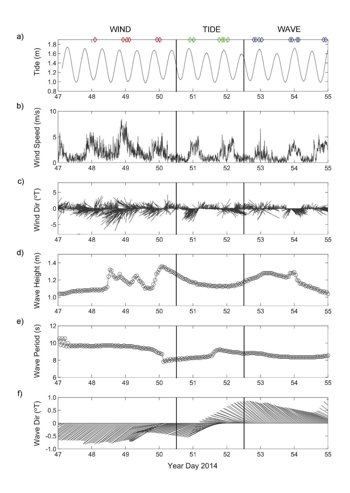

Figure 2.3. Time series of physical forcing data used to define end-member forcings for analysis. a) Tidal stage. b) Wind speed. c) Wind speed and direction. d) Wave height. e) Wave period. f) Wave height and direction. Vectors denote direction "to". Wind data are from NDBC station NSTP6; wave model data (significant wave height, peak wave direction) are from NOAA WW3.

**Table 2.1.** Time frames defining the end-member meteorologic and oceanographic forcing periods.

|                                                        | TIDE/CALM      | WIND           | WAVE          |
|--------------------------------------------------------|----------------|----------------|---------------|
| Year Day (YD) 2014 (GMT)                               | 50.5 – 52.5 | 47 - 50.5   | 52 - 54    |
| Gregorian Day (Local)                                  | 2/19-2/20      | 2/16-2/18      | 2/21-2/23     |
| ADCP mean speeds at AS1, AS2, AS3 (cm s-1 )         | 12.5, 3.7, 0.7 | 14.9, 6.8, 0.4 | 21.5, 11, 1.2 |
| ADCP mean speed and STD for end member (cm s-1 )    | 5.6 ± 6.1      | 7.4 ± 7.3      | 11.2 ± 10.1   |
| max (cm s-1 Drifters average speed min - )       | 1-19           | 1-20           | 1-36          |
| Drifter mean speed and STD for end member (cm s-1 ) | 7.1 ± 5.8      | 8 ± 6.5        | 12.3 ± 8.1    |
| Drifters number of samples (n)                         | 1,580          | 1,314          | 2,461         |

#### **2.3.2 Flow variability during TIDE, WIND, WAVE forcing**

In general, TIDE was characterized by slow flow speeds and variable directions, WIND by slow flow speeds and mostly onshore directions, and WAVE by the fastest flow speeds and most consistent directions. Mean (±STD) flow velocities of all ADCP data during WIND, TIDE and WAVE were 7.4±7.3 cm s-1 , 5.6±6.1 cm s-1 , and 11.2±10.1 cm s-1 , respectively. Similar to the long-term ADCP results, mean drifter speeds (±STD) during WIND, TIDE, WAVE were 8.0±6.5 cm s-1 , 7.1 ±5.8 cm s-1 , and 12.3±8.1 cm s -1 , respectively (Table 2.1). The results of both parametric pair-wise Student's *t*-test and nonparametric pair-wise Mann-Whitney *u*-test supported the conclusion that drifter speeds were significantly different during WIND, TIDE, and WAVE.

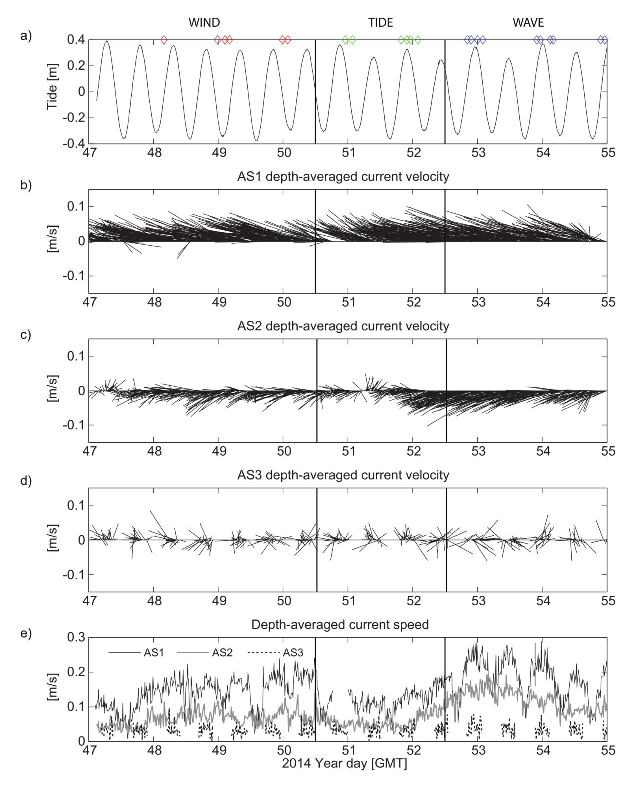

Figure 2.4. Time series of acoustic current profiler data on the reef flat a) Tide level at location AS1. b) Current vectors at AS1. c) Current vectors at AS2. d) Current vectors at AS3 (water depths at low tide were too shallow to measure currents). e) Current speeds at all

three locations. Vectors denote direction "to". Note the variations in current speeds both in space and time due to the different forcing conditions shown in Figure 2.3.

Flow directions at AS1 were consistently northwest into the embayment during WIND, TIDE, and WAVE, with increased flow speeds during WAVE, indicating the strong influence of even small breaking waves over the southern reef crest (Figure 2.4b, e). Flow direction at AS2 was consistently to the southwest into the embayment during WIND and WAVE, though direction was more variable during TIDE, with some off-reef flow to the northeast (Figure 2.4c). Flow speeds at AS2 increased with strong winds (WIND) and large waves (WAVE) (Figure 2.4c, e). At AS3, flow directions were highly variable, and the lowest flow speeds were observed (Figure 2.4d, e; Table 2.1).

Flow speeds at AS1 and AS2 illustrate the modulating effects of tidal stage on waveforced flow during YD 52-54 (Figure 2.4e), which is common on fringing reefs (Costa et al., 2016). During WAVE, flow speeds were highest during high tide and decreased significantly as the tide fell, but this effect was absent or significantly reduced during WIND, and TIDE.

#### **2.3.3 Spatial variability of flow trajectories**

Drifter tracks from all thirty deployments covered nearly the entire reef flat (Figure 2.5), showing three general spatial patterns: 1) faster flows over the exposed southern reef flat; 2) slower, more variable flows over the back-reef pools, sheltered northern reef, and deep in the embayment, near the stream outlet; and 3) flows exiting the seaward end of the channel.

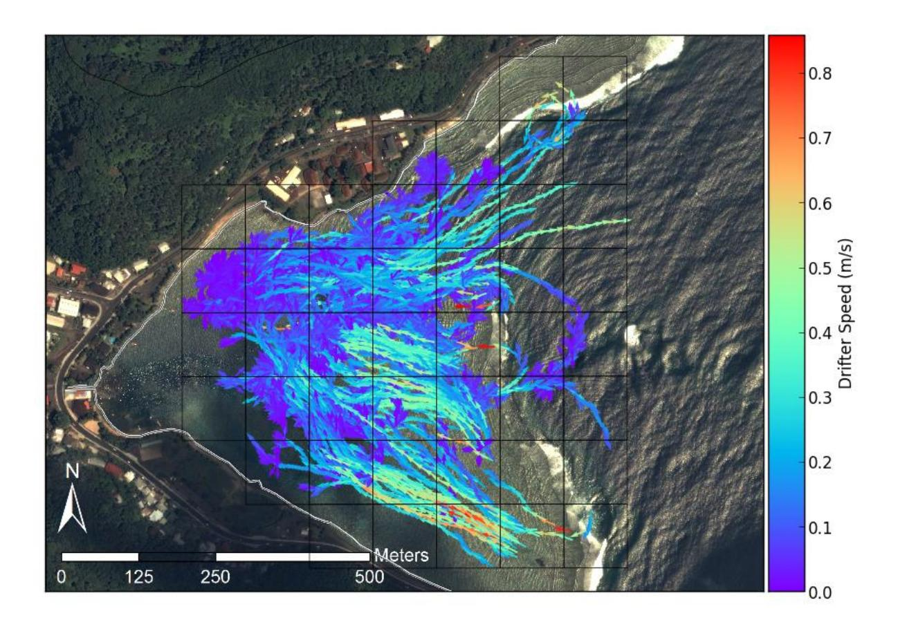

Figure 2.5. Map of all drifter tracks during the experiment, colored by speed (m s-1 ).

Progressive vector trajectories from ADCP data illustrate the general difference between flow speeds over the northern and southern reefs, and the similarity of flows over the southern reef (AS1 and AS2). Progressive vectors defined from a single point did not capture the spatially heterogeneous flow directions over the reef flat, but this is unsurprising given the complex bathymetry and coastline variability (Figure 2.6). In general, the distances traveled by progressive vectors were similar to those of the drifters, indicating similar flow speeds, albeit sometimes different directions. The exception was over the sheltered northern reef, where drifters quickly moved into the channel and were influenced by different flows than the ADCP at AS3.

During TIDE, the drifters moved in erratic directions and traveled much farther than the progressive vector trajectories from AS2 and AS3 (Figure 2.6a, b). Under low wave conditions and at high tide during TIDE, one drifter moved seaward across the reef crest near AS2, but the progressive vector trajectories were exclusively shoreward. Two drifters traveled from the sheltered northern reef onto the exposed southern reef during light and variable winds.

During WIND, the drifter tracks were towards the northwest corner of the bay, suggesting seaward flow in the channel and northern reef (at least at the surface) was suppressed under strong onshore winds (Figure 2.6d). Though moderate to strong easterly trade winds are most prevalent throughout the year, there is less certainty in the wind-driven flow pattern since fewer observations were made during WIND.

During WAVE, longer progressive vector trajectories and drifter tracks all locations, indicated faster flows at all locations (Figure 2.6e-f). The drifter tracks clearly illustrate a coherent clockwise pattern over the exposed southern reef, through the back-reef pools and near the stream outlet. Despite some wave breaking on the more sheltered northern reef crest, the Lagrangian methods showed flow across the exposed southern reef and into the channel influences an overall seaward flow over the northern reef and out to sea. All drifters exited the channel during the 1-h period, suggesting that during WAVE the flushing time of the whole bay was under 1-h.

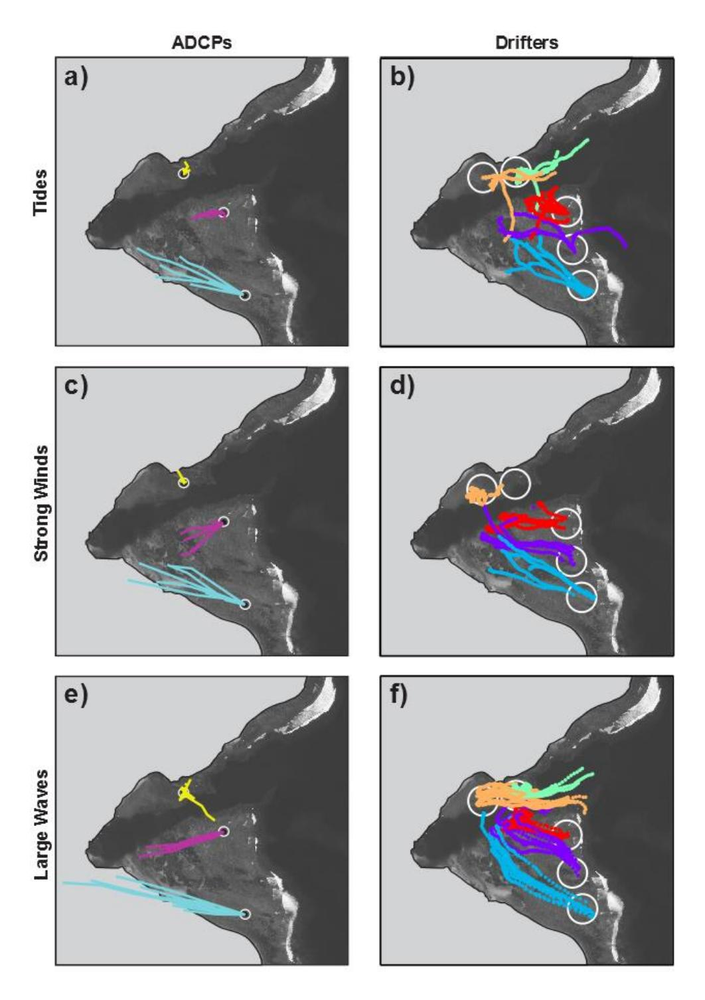

Figure 2.6. Progressive vectors calculated from ADCP data, compared to drifter tracks under end-member forcings: a) ADCP data under tidal forcing. b) Drifter data under tidal forcing. c) ADCP data during strong winds. d) Drifter data during strong winds. e) ADCP data during large waves. f) Drifter data during large waves. Black dots indicate the location of the ADCP, start of the progressive vector. White circles indicate drifter deployment zones.

#### **2.3.4 Spatial pattern of mean flows**

Variance ellipses and mean flow velocities were calculated from simultaneous ADCP and spatially-binned drifter data (1-h time windows) (Figure 2.7). The number of drifter observations in each grid cell differed due to the relative position and flow speed of the grid cell. Grid cells in the middle of the bay and channel had more drifter tracks, and hence more certainty, than grid cells on the reef crest and close to shore, or cells with faster flow speeds. These 'perimeter' grid cells may represent a small number of drifter observations and a small range of forcing conditions.

The spatial patterns of mean flow were similar across all three periods, with faster more unidirectional flows on the southern reef indicated by more eccentric ellipses, and slower and more variable flows in the back-reef pools, channel, and sheltered northern reef indicated by more circular ellipses. The spatial patterns of the drifter data resolved the general clockwise flow from the exposed southern reef, over the sheltered northern reef, and out to sea.

For both ADCP and drifter data, the most variable flow patterns were observed in TIDE, under light, variable winds and small waves (Figure 2.7a, b). During WIND, flow directions were more consistent during the strong onshore winds (Figure 2.7c, d), but similar to TIDE and WAVE, faster and more unidirectional flow was observed over the exposed southern reef, with slower and more variable-direction flows in the back-reef pools, channel, and sheltered northern reef.

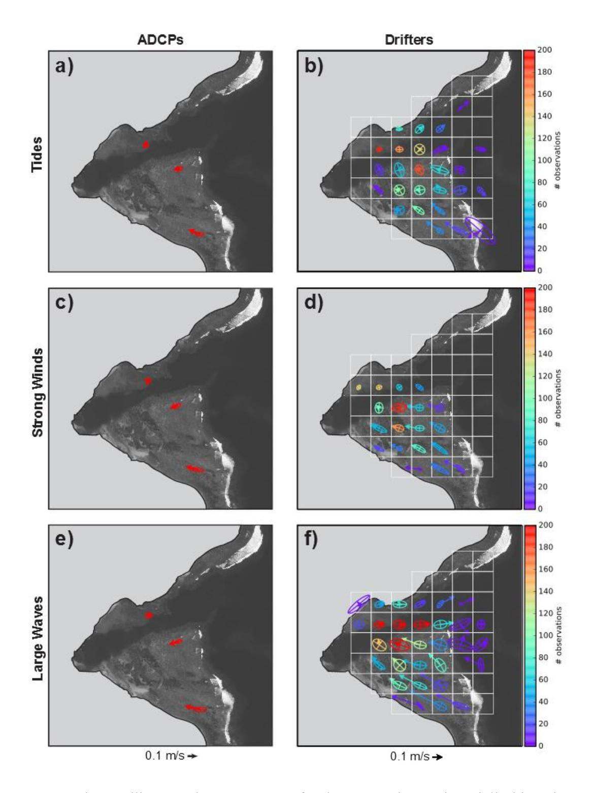

Figure 2.7. Variance ellipses and mean currents for the ADCP data and spatially-binned drifter data under end-member forcings. a) ADCP data under tidal forcing. b) Drifter data under tidal forcing. c) ADCP data during strong winds. d) Drifter data during strong winds. e) ADCP data during large waves. f) Drifter data during large waves. Drifter data are colored by number of observations to illustrate the varying data density.

During WAVE, the highest mean flow speeds and strongest directionality were observed, indicating high waves are a strong control on flow patterns (Figure 2.7e, f). Wave breaking was observed on the reef crest near AS1 during even the smallest wave conditions, driving flow speeds on the far southern reef flat. As wave height increased, breaking waves were also observed further north along the reef crest, near AS2 and the channel, causing increased flow speeds near AS2 and the back-reef pools during WAVE (Figure 2.7f). Similar to during TIDE, mean flow speeds increased seaward through the channel, but due to the low data density outside the reef crest, it is unclear whether the flow continues seaward to Pago Pago Bay or is re-entrained onto the reef.

#### **2.3.5 Spatial pattern of residence times**

Water residence times were computed from the mean velocity of drifters in each grid cell during the end member forcing periods (Figure 2.8). The gridded residence times varied from 2.8-0.14 h, 2.8-0.15 h, and 2.8-0.08 h during WIND, TIDE, WAVE, respectively. The shortest residence times were observed near the southern reef crest during WAVE. The longest residence times were observed near shore, in the channel, and over the northern reef during TIDE and WIND.

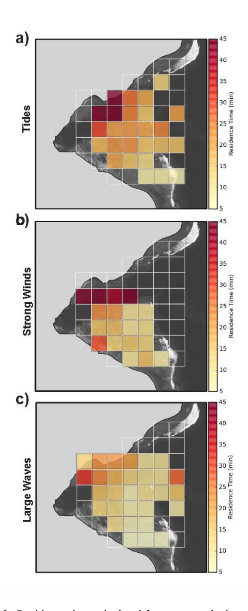

Figure 2.8. Residence time calculated from mean velocity of drifters under end-member forcings. a) Tidal forcing. b) Strong winds. c) Large waves.

#### **2.3.6 Comparing Eulerian and Lagrangian flow speeds and residence times**

Mean flow speeds from the ADCPs were lower than mean speeds from drifters in all cases except for the southern reef (AS1) during WIND (Table 2.2). At each ADCP, averaged over end-members, the percent difference was highest at AS3 on the northern reef (658%), intermediate at AS2 on the southern reef (103%), and lowest at AS1 on the far southern reef (48%) (Table 2.2, bottom row). The differences were higher where flow was most spatially heterogeneous, near the interface of the deep channel and shallow reef flat (AS3 and AS2), and lowest where the bathymetry and flow forcing are more homogeneous (AS1).

For each end-member, averaged over ADCP locations, the percent difference was lowest during TIDE (193%), highest during WIND (350%), and intermediate during WAVE (266%) (Table 2.2, right column). These mean percent differences were generally higher when flow speeds were higher, forced by high winds and waves (WIND and WAVE), but are strongly influenced by the large differences between drifters and AS3.

**Table 2.2**. Mean flow speed and residence time computed from ADCPs and corresponding spatially binned drifter data.

|        |          | NORTH        |      |          | CENTRAL      |      |          | SOUTH        |      | % DIFFERENCE |      |
|--------|----------|--------------|------|----------|--------------|------|----------|--------------|------|--------------|------|
|        |          |              | Res. |          |              | Res. |          |              | Res. |              | Res. |
| End    |          | Speed        | Time |          | Speed        | Time |          | Speed        | Time | Speed        | Time |
| member |          | (cm s-1 ) | (h)  |          | (cm s-1 ) | (h)  |          | (cm s-1 ) | (h)  | (cm s-1 ) | (h)  |
|        | AS3      | 0.7          | 4.13 | AS2      | 3.7          | 0.76 | AS1      | 12.5         | 0.22 |              |      |
| TIDE   | Drifters | 3.6          | 0.77 | Drifters | 7.4          | 0.37 | Drifters | 17.9         | 0.16 | 193          | 54   |
|        | AS3      | 0.4          | 6.94 | AS2      | 6.8          | 0.41 | AS1      | 14.8         | 0.19 |              |      |
| WIND   | Drifters | 4.0          | 0.70 | Drifters | 14.7         | 0.19 | Drifters | 9.8          | 0.29 | 350          | 65   |
|        | AS3      | 1.2          | 2.34 | AS2      | 11.0         | 0.25 | AS1      | 21.5         | 0.13 |              |      |
| WAVE   | Drifters | 8.8          | 0.31 | Drifters | 20.9         | 0.13 | Drifters | 35.7         | 0.08 | 266          | 58   |
| % DIFF |          | 658          | 86   |          | 103          | 51   |          | 48           | 41   |              |      |

## **2.4. Discussion**

The high number of drifter deployments provided an unprecedented data set with high temporal density, extensive spatial coverage, and a wide range of forcing conditions for a fringing reef setting. The overall flow pattern under all forcing conditions is predominantly clockwise circulation over the exposed southern reef and back-reef pools and seaward through the channel, with higher speeds during wave forcing than tidal and wind forcing. The shortest residence times were measured on the exposed southern reef flat near breaking waves on the reef crest, and were longest over the reef flat close to shore and deep in the sheltered northwest corner of the embayment, which is consistent with studies in other fringing reefs (Lowe et al., 2009b; Ouillon et al., 2010).

The drifters illustrated several unique flow features, particularly near areas of complex bathymetry like the channel. From the orientation of the reef flat and channel, it appears that flow over the exposed southern reef should enter directly into the channel and out to sea (Taebi et al., 2011). Instead, wave refraction into the channel deflects the flow near AS2 away from the channel, shoreward into the embayment where it flows into the back-reef pools and into the shoreward end of the channel. Observations on the linear reef flat off Molokai, Hawaii (Presto et al., 2006), showed near-bed current speeds were faster where the reef is deeper and narrower but the observations presented here (Figures 2.5 and 2.7) suggest the opposite for surface drifters on this fringing reef. Flow speeds were rapid over the shallow reef flat, slowing significantly and becoming more variable when reaching deeper back-reef pools and the channel.

During WAVE and TIDE, flow speeds increased through the channel moving seaward, reaching a maximum at the reef crest. The same pattern was not evident during WIND, possibly due to wind driven flow into the bay at the surface, but the data density is too low to be certain. In a similarly configured reef in Moorea, French Polynesia, vertically binned ADCP measurements showed that under low wave forcing, surface currents in the channel were slower and flow could even reverse near the bottom (Hench et al., 2008). At the study site the seaward increase in flow speed through the channel is likely caused by either the increasing water volume flowing into the channel adjacent reef flats or a narrowing of the channel cross-section. Either way, the seaward-accelerating flow in the channel further shows the spatial-heterogeneity of the current patterns and illustrates the potential limitations of using a single current meter in the channel to estimate water residence or flushing time from the bay.

#### **2.4.1 Differences between Eulerian and Lagrangian flows**

Consistently higher Lagrangian mean flow speeds, compared to Eulerian results, are explained by four potential sources: 1) comparing point and areal measurements, 2) comparing depth-averaged and surface current measurements, 3) the influence of Stokes' drift on Lagrangian drifters, and 4) sampling and analytical errors.

The first source of difference is the heterogeneity of flow speeds within the 100- x 100 m spatial bin sampled by the drifters, compared to the ADCP point measurement, especially near bathymetrically complex areas like the channel (AS3) where the difference was highest (Lowe et al., 2009b).

A second source of difference is comparing surface and depth-averaged measurements. Lagrangian measurements are influenced by processes at the depths the drifter penetrates the water column (~20 cm; see Figure 2.2b). The Eulerian ADCPs averaged over a depth range based on bin size, which in this case included both the faster near-surface speeds and the slower flow speeds within the coral canopy that often extended to over half of the water depth, even at high tide (Figure 2.2c-d)(Falter et al., 2008; Lowe and Falter, 2015). This averaging resulted in the slower speeds measured by the ADCPs.

A third source of difference is Stokes' drift caused by wind, gravity, or infragravity waves (Cheriton et al., 2016; Kenyon, 1969; Pomeroy et al., 2012; Stokes, 1847). For the expected range of wave heights (0-0.25 m) (Vetter, unpublished data), wave periods (4-12 s), and water depths (0.4-1.3 m) at the ADCPs, predicted Stokes' drift velocities from incident waves (*UStokes*) is 0-37 cm s-1 . *UStokes* is highly sensitive to water depth, especially for larger wave heights and shorter wave periods. Although the magnitudes of *UStokes* calculated for the full range of conditions could explain the 0.1-14.2 cm s-1 differences between drifters and ADCPs, *UStokes* > ~5 cm s-1 should be considered extreme values. Since the combination of large wave height and short wave period is unlikely, especially at low water depths when wave-propagation is limited, a more likely range of *UStokes* influencing the drifters is on the order of 0.1-3 cm s-1 . While Stokes' drift due to short-period waves is a likely cause of the higher speeds observed by drifters, flow modulations by longer-period ('infragravity') waves may also play a role. Infragravity waves (25-1000 s period) have been observed in numerous reef flat environments (e.g., Hardy and Young 1996; Péquignet et al. 2011; Pomeroy et al. 2012; Beetham et al. 2015; Cheriton et al., 2016); as they propagate shoreward over reef flats, they undergo little energy dissipation and increase in skewness and asymmetry (Cheriton et al., 2016; Pomeroy et al., 2012). Infragravity waves can be highly energetic (Pequignet et al. 2009; Cheriton et al., 2016), can modulate horizontal flow

over fringing reefs (Pequignet et al.; 2009), and may drive substantial transport of reef material (Cheriton et al., 2016; Pomeroy et al., 2015b).

A fourth source of difference is sampling and analytical error. Sampling errors from drifters can include "surfing" on waves, wind slip, or interaction with the bottom. Wind slip of tall-masted, finless drifters can be up to 1 cm s-1 per m s-1 of wind (0-8 cm s-1 for the sampled conditions) (MacMahan et al., 2010), but given the low windage on the drifters used here and the large fins, it is unlikely wind slip was significant. Sampling error from the ADCPs could be from reverberation, side-lobe interference, bias near the limit of the blanking distance, or inability to sample flows near the surface (Mueller et al., 2007). Analytical errors may be from computing the mean speed at ADCP over the total 1-h drift with the mean speed over the shorter time window the drifter actually passed through the cell during the 1-h drift. This difference in sampling time could cause the drifters and ADCPs to experience different forcing conditions, but this would not explain the consistently higher speeds observed by the drifters at all times and locations since differences would be expected to be both faster and slower.

It is likely that all of these potential sources of disagreement occurred in combination or at different locations and times. The highest difference, observed on the northern reef (AS3), was likely due to strong heterogeneity in flow where bathymetry is complex. Over the southern reef (AS1 and AS2) where wave energy is highest, Stokes drift from gravity and infragravity waves was likely the most important source of difference. For reference, on a 1.5-2.0 m deep reef flat off Oahu, Hawaii, Falter et al. (2008) found that cruciform drifter speeds exceeded both Lagrangian dye and Eulerian depth-averaged current speeds that

included depth-averaged Stokes' transport computed from wave gauge data by 30-100%, similar to the results presented here.

# **2.4.2 Applications of a hybrid Eulerian-Lagrangian method to reef hydrodynamic studies**

Coral reefs are physically and biologically heterogeneous environments, but ecologically-important flow speeds and trajectories have been difficult to measure in relation to long-term forcing conditions (Monsen et al., 2002). Like the atmospheric climate, regional-scale oceanic forcing controls large-scale biophysical patterns such as nutrient and heat distributions. Whereas global climate and ocean circulation research have benefitted from satellite remote-sensing, water circulation over individual reefs is more similar to atmospheric micro-climates, and the long-term, synoptic observations of remote sensing have not been possible. Many water circulation studies that rely on models often significantly simplify the study site's bathymetry or forcing conditions (Lowe et al., 2010) or use field observations from only a few fixed instrument locations (Hench et al., 2008). The combination of spatially extensive Lagrangian drifters and temporally extensive Eulerian current meters provides insight on the unique and general flow patterns within the context of variable circulation-forcing conditions.

Quantifying residence times and flow patterns in relation to end-member forcing conditions can be used to extrapolate the findings from a targeted study period to seasonal or annual time scale by determining the proportion of days that are dominated by tidal, wind, or wave forcing. A similar approach could be used to extrapolate the effects on changing sediment dynamics, temperature regimes, and nutrient cycling at the study site (Lowe and

Falter, 2015) from future climate scenarios and predicted increase in the strength and frequency of Southern Ocean storms (Hemer et al., 2013). The selected end-member conditions could also be further refined to describe waves and winds of varying magnitude, or combined with varying tide stage for finer-resolution predictive models of current speeds (C. D. Storlazzi et al., 2011).

#### **2.4.3 Implications of circulation patterns on reef health**

The flow pattern illustrated by the drifters suggests that sediment discharged from Faga'alu Stream is deflected away from the southern reef towards the northern reef and channel, resulting in greater terrestrial sediment stress (= intensity x duration) and reduced coral health from particle settling and light reduction (Erftemeijer et al., 2012; Storlazzi et al., 2015). During storms, time-lapse photography observations (not shown) showed sediment plumes extended from the stream outlet over the northern reef and channel, and persisted for several hours to days. Although accumulation on the coral blocks all light for photosynthesis, Storlazzi et al. (2015) showed even low concentration of fine-grain sediment in the water column (10 mg L-1 ) reduced photosynthetically active radiation by ~80% at depths of only 0.2-0.4 m.

Water circulation is critical for understanding both the natural ecological processes and the anthropogenic impacts on coral reefs. This study showed that flow speeds, flow directions, and water residence times can be spatially- and temporally-heterogeneous in fringing reef-lined environments, resulting in heterogeneous physical, chemical, and biological environments that can, in turn, affect coral health.

## **2.5. Supplementary Material for Chapter Two**

**Table A1.** Drifter deployment dates and conditions. Deployments #9-30 coincide with ADCP deployment

| Deploy   | Year Day | Start   | End     | Tide  | Tide | Tide   | Avg Wind    | Wind        | Wind      | Wave    |
|----------|----------|---------|---------|-------|------|--------|-------------|-------------|-----------|---------|
| ment (#) | 2014     | Time    | Time    | Start | End  | Change | Speed       | Gust        | Direction | Height  |
|          | (local)  | (local) | (local) | (m)   | (m)  | (m)    | (m s-1 ) | (m s-1 ) | (deg)     | (m)     |
| 1        | 19       | 1300    | 1500    | 0.5   | 0.3  | -0.17  | 0.6         | 2.0         | 232       | 0.0-0.6 |
| 2        | 20       | 1615    | 1730    | 0.3   | 0.4  | 0.06   | 1.2         | 4.0         | 193       | 0.3-0.6 |
| 3        | 20       | 1750    | 1900    | 0.4   | 0.6  | 0.22   | 1.7         | 5.0         | 258       | 0.3-0.6 |
| 4        | 32       | 900     | 1100    | 1.1   | 0.8  | -0.35  | 2.7         | 6.0         | 96        | 0-0.3   |
| 5        | 32       | 1130    | 1300    | 0.7   | 0.3  | -0.41  | 2.9         | 7.0         | 100       | 0-0.3   |
| 6        | 32       | 1700    | 1900    | 0.5   | 1.0  | 0.52   | 2.2         | 7.0         | 187       | 0-0.3   |
| 7        | 39       | 1415    | 1545    | 0.9   | 1.1  | 0.11   | 2.7         | 9.0         | 140       | 0.6-1.3 |
| 8        | 39       | 1605    | 1800    | 1.0   | 0.8  | -0.24  | 3.1         | 10.0        | 144       | 0.6-1.3 |
| WIND     |          |         |         |       |      |        |             |             |           |         |
| 9        | 47       | 1654    | 1846    | 0.7   | 1.0  | 0.26   | 1.7         | 5.0         | 168       | 0.0-0.6 |
| 10       | 48       | 1245    | 1500    | 0.5   | 0.3  | -0.16  | 5.0         | 14.0        | 79        | 0.6-1.3 |
| 11       | 48       | 1530    | 1700    | 0.3   | 0.5  | 0.14   | 3.0         | 10.0        | 101       | 0.6-1.3 |
| 12       | 48       | 1710    | 1840    | 0.5   | 0.8  | 0.29   | 2.7         | 8.0         | 89        | 0.6-1.3 |
| 13       | 49       | 1245    | 1445    | 0.6   | 0.4  | -0.25  | 2.5         | 7.0         | 97        | 0.6-1.3 |
| 14       | 49       | 1445    | 1700    | 0.4   | 0.4  | 0.02   | 2.4         | 8.0         | 194       | 0.6-1.3 |
| TIDE     |          |         |         |       |      |        |             |             |           |         |
| 15       | 50       | 1205    | 1440    | 0.9   | 0.5  | -0.42  | 3.0         | 6.0         | 39        | 0.6-1.3 |
| 16       | 50       | 1445    | 1720    | 0.5   | 0.4  | -0.08  | 3.4         | 8.0         | 54        | 0.6-1.3 |
| 17       | 51       | 840     | 1045    | 0.8   | 1.0  | 0.19   | 2.5         | 7.0         | 290       | 0.0-0.6 |
| 18       | 51       | 1100    | 1200    | 1.0   | 0.9  | -0.05  | 2.2         | 6.0         | 117       | 0.0-0.6 |
| 19       | 51       | 1210    | 1430    | 0.9   | 0.6  | -0.29  | 1.5         | 6.0         | 237       | 0.0-0.6 |
| 20       | 51       | 1500    | 1630    | 0.6   | 0.4  | -0.17  | 3.1         | 7.0         | 290       | 0.0-0.6 |
| WAVE     |          |         |         |       |      |        |             |             |           |         |
| 21       | 52       | 920     | 1040    | 0.7   | 0.9  | 0.18   | 1.5         | 6.0         | 253       | 1.0-2.0 |
| 22       | 52       | 1040    | 1145    | 0.9   | 1.0  | 0.09   | 2.0         | 6.0         | 111       | 1.0-2.0 |
| 23       | 52       | 1300    | 1400    | 1.0   | 0.9  | -0.08  | 1.5         | 8.0         | 193       | 1.0-2.0 |
| 24       | 52       | 1500    | 1550    | 0.7   | 0.6  | -0.16  | 1.9         | 6.0         | 152       | 1.0-2.0 |
| 25       | 53       | 1100    | 1215    | 0.8   | 1.0  | 0.14   | 2.8         | 7.0         | 313       | 1.0-2.0 |
| 26       | 53       | 1220    | 1315    | 1.0   | 1.0  | 0.05   | 3.3         | 6.0         | 301       | 1.0-2.0 |
| 27       | 53       | 1600    | 1700    | 0.7   | 0.6  | -0.16  | 2.1         | 5.0         | 310       | 1.0-2.0 |
| 28       | 53       | 1700    | 1845    | 0.6   | 0.4  | -0.22  | 1.0         | 5.0         | 242       | 1.0-2.0 |
| 29       | 54       | 1040    | 1210    | 0.6   | 0.9  | 0.27   | 3.7         | 8.0         | 304       | 0.6-1.3 |
| 30       | 54       | 1210    | 1255    | 0.9   | 1.0  | 0.11   | 2.7         | 6.0         | 260       | 0.6-1.3 |

## **2.6. References for Chapter Two**

Andutta FP, Kingsford MJ, Wolanski E (2012) "Sticky water" enables the retention of larvae in a reef mosaic. Estuar. Coast. Shelf Sci. 101:54–63

- Austin J, Atkinson S (2004) The Design and Testing of Small, Low-cost GPS-tracked Surface Drifters. Estuaries 27:1026–1029
- Cheriton O, Storlazzi CD, Rosenberger KJ (2016) Observations of wave transformation over a fringing coral reef and the importance of low-frequency waves and offshore water levels to runup, overwash, and coastal flooding. J. Geophys. Res. Ocean. *In Press*
- Cochran SA, Gibbs AE, D'Antonio NL, Storlazzi CD (2016) Benthic habitat map of U.S. Coral Reef Task Force Faga'alu Bay priority study area, Tutuila, American Samoa: U.S. Geological Survey Open-File Report 2016-1077.
- Costa MBSF, Araújo M, Araújo TCM, Siegle E (2016) Influence of reef geometry on wave attenuation on a Brazilian coral reef. Geomorphology 253:318–327
- Craig P (2009) Natural History Guide to American Samoa. National Park of American Samoa, Pago Pago, American Samoa
- Davis R (1991) Lagrangian ocean studies. Annu. Rev. Fluid Mech. 23:43–64
- Draut AE, Bothner MH, Field ME, Reynolds RL, Cochran, S.A.Logan JB, Storlazzi CD,Berg CJ (2009) Supply and dispersal of flood sediment from a steep, tropical watershed: Hanalei Bay, Kaua'i, Hawai'i, USA. Geol. Soc. Am. Bull. 121:574–585
- Erftemeijer PL a, Riegl B, Hoeksema BW, Todd P a. (2012) Environmental impacts of dredging and other sediment disturbances on corals: A review. Mar. Pollut. Bull. 64:1737–1765
- Falter JL, Atkinson MJ, Merrifield MA (2004) Mass-transfer limitation of nutrient uptake by a wave-dominated reef flat community. Limnol. Oceanogr. 49:1820–1831
- Falter JL, Lowe RJ, Atkinson MJ, Monismith SG, Schar DW (2008) Continuous measurements of net production over a shallow reef community using a modified Eulerian approach. J. Geophys. Res. Ocean. 113:1–14
- Feagaimaalii-Luamanu J (2016) High surf generated by TC Victor washes over roads and property. Samoa News
- Hemer MA, Fan Y, Mori N, Semedo A, Wang XL (2013) Projected changes in wave climate from a multi-model ensemble. Nat. Clim. Chang. 3:471–476
- Hench JL, Leichter JJ, Monismith SG (2008) Episodic circulation and exchange in a wavedriven coral reef and lagoon system. Limnol. Oceanogr. 2681–2694

- Herdman LMM, Hench JL, Monismith SG (2015) Heat balances and thermally driven lagoon-ocean exchanges on a tropical coral reef system (Moorea, French Polynesia). J. Geophys. Res. Ocean. 120:1233–1252
- Hoeke RK, Storlazzi CD, Ridd P (2011) Hydrodynamics of a bathymetrically complex fringing coral reef embayment: Wave climate, in situ observations, and wave prediction. J. Geophys. Res. 116:C04018
- Hoeke RK, Storlazzi CD, Ridd P (2013) Drivers of circulation in a fringing coral reef embayment: A wave-flow coupled numerical modeling study of Hanalei Bay, Hawaii. Cont. Shelf Res. 58:79–95
- Hoitink AJF, Hoekstra P (2003) Hydrodynamic control of the supply of reworked terrigenous sediment to coral reefs in the Bay of Banten (NW Java, Indonesia). Estuar. Coast. Shelf Sci. 58:743–755
- Johnson D, Stocker R, Head R, Imberger J, Pattiaratchi C (2003) A Compact, Low-Cost GPS Drifter for Use in the Oceanic Nearshore Zone, Lakes, and Estuaries. J. Atmos. Ocean. Technol. 20:1880–1884
- Jones R, Bessell-Browne P, Fisher R, Klonowski W, Slivkoff M (2015) Assessing the impacts of sediments from dredging on corals. Mar. Pollut. Bull. 102:9-29
- Kenyon KE (1969) Stokes drift for random gravity waves. J. Geophys. Res. 74:6991–6994
- Klein CJ, Jupiter SD, Selig ER, Watts ME, Halpern BS, Kamal M, Roelfsema C, Possingham HP (2012) Forest conservation delivers highly variable coral reef conservation outcomes. Ecol. Appl. 22:1246–56
- Lowe RJ, Falter JL (2015) Oceanic Forcing of Coral Reefs. Ann. Rev. Mar. Sci. 7:43–66
- Lowe RJ, Falter JL, Monismith SG, Atkinson MJ (2009a) Wave-Driven Circulation of a Coastal Reef–Lagoon System. J. Phys. Oceanogr. 39:873–893
- Lowe RJ, Falter JL, Monismith SG, Atkinson MJ (2009b) A numerical study of circulation in a coastal reef-lagoon system. J. Geophys. Res. Ocean. 114:1–18
- Lowe RJ, Hart C, Pattiaratchi CB (2010) Morphological constraints to wave-driven circulation in coastal reef-lagoon systems: A numerical study. J. Geophys. Res. 115:C09021
- MacMahan J, Brown J, Brown J, Thornton E, Reniers A, Stanton T, Henriquez M, Gallagher E, Morrison J, Austin MJ, Scott TM, Senechal N (2010) Mean Lagrangian flow behavior on an open coast rip-channeled beach: A new perspective. Mar. Geol. 268:1–15

- Messina AT, Biggs TW (*in* press) Contributions of human activities to suspended sediment yield during storm events from a steep, small, tropical watershed: Faga'alu, American Samoa. J. Hydrol. 538:726-742 doi:10.1016/j.jhydrol.2016.03.053
- Militello A, Scheffner NW, Thompson EF (2003) Hurricane-Induced Stage-Frequency Relationships for the Territory of American Samoa. USACOE Technical Report CHL-98- 33.
- Monsen NE, Cloern JE, Lucas L V., Monismith SG (2002) The use of flushing time, residence time, and age as transport time scales. Limnol. Oceanogr. 47:1545–1553
- Mueller DS, Abad JD, García CM, Gartner JW, García MH, Oberg K a. (2007) Errors in Acoustic Doppler Profiler Velocity Measurements Caused by Flow Disturbance. J. Hydraul. Eng. 133:1411–1420
- NOAA National Data Buoy Center (2014) Online data for station NSTP6. http://www.ndbc.noaa.gov/station\_page.php?station=NSTP6
- Ouillon S, Douillet P, Lefebvre JP, Le Gendre R, Jouon a, Bonneton P, Fernandez JM, Chevillon C, Magand O, Lefèvre J, Le Hir P, Laganier R, Dumas F, Marchesiello P, Bel Madani a, Andréfouët S, Panché JY, Fichez R (2010) Circulation and suspended sediment transport in a coral reef lagoon: the south-west lagoon of New Caledonia. Mar. Pollut. Bull. 61:269–96
- Pomeroy A, Lowe R, Symonds G, Van Dongeren A, Moore C (2012) The dynamics of infragravity wave transformation over a fringing reef. J. Geophys. Res. 117:C11022
- Pomeroy AWM, Lowe RJ, Van Dongeren AR, Ghisalberti M, Bodde W, Roelvink D (2015a) Spectral wave-driven sediment transport across a fringing reef. Coast. Eng. 98:78–94
- Pomeroy AWM, Lowe RJ, Ghisalberti M, Storlazzi CD, Cuttler M, Symonds G (2015b) Mechanics of Sediment Suspension and Transport Within a Fringing Reef. Proc. of the Coastal Sediments 2015; pg.1–14
- Presto MK, Ogston AS, Storlazzi CD, Field ME (2006) Temporal and spatial variability in the flow and dispersal of suspended-sediment on a fringing reef flat, Molokai, Hawaii. Estuar. Coast. Shelf Sci. 67:67–81
- Siegel DA, Kinlan BP, Gaines SD (2003) Lagrangian descriptions of marine larval dispersion. Mar. Ecol. Prog. Ser. 260:83-96
- Stokes GG (1847) On the theory of oscillatory waves. Trans. Cambridge Philos. Soc. 8:441– 473

- Storlazzi CD, Brown EK, Field ME (2006) The application of acoustic Doppler current profilers to measure the timing and patterns of coral larval dispersal. Coral Reefs 25:369– 381
- Storlazzi CD, Elias E, Field ME, Presto MK (2011) Numerical modeling of the impact of sea-level rise on fringing coral reef hydrodynamics and sediment transport. Coral Reefs 30:83–96
- Storlazzi CD, Field ME (2008) Winds, waves, tides, and the resulting flow patterns and fluxes of water, sediment, and coral larvae off West Maui, Hawaii. U.S. Geol. Surv. Open-file Rep. 2008-1215
- Storlazzi CD, Field ME, Bothner MH, Presto MK, Draut AE (2009) Sedimentation processes in a coral reef embayment: Hanalei Bay, Kauai. Mar. Geol. 264:140–151
- Storlazzi CD, Norris BK, Rosenberger KJ (2015) The influence of grain size, grain color, and suspended-sediment concentration on light attenuation: Why fine-grained terrestrial sediment is bad for coral reef ecosystems. Coral Reefs 34:967–975
- Storlazzi CD, Ogston A., Bothner M., Field M., Presto M. (2004) Wave- and tidally-driven flow and sediment flux across a fringing coral reef: Southern Molokai, Hawaii. Cont. Shelf Res. 24:1397–1419
- Taebi S, Lowe RJ, Pattiaratchi CB, Ivey GN, Symonds G, Brinkman R (2011) Nearshore circulation in a tropical fringing reef system. J. Geophys. Res. Ocean. 116:1–15
- Tartinville B, Deleersnijder E, Rancher J (1997) The water residence time in the Mururoa atoll lagoon: sensitivity analysis of a three-dimensional model. Coral Reefs 16:193–203
- Thompson EF, Demirbilek Z (2002) Wave Response, Pago Pago Harbor, Island of Tutuila, Territory of American Samoa. USACOE Coastal and Hydraulics Laboratory ERDC/CHL TR-02-20.
- Tolman HL (2009) User manual and system documentation of WAVEWATCH III version 3.14. NOAA National Center for Environmental Prediction Technical Note.
- Vetter O (2013a) Inter-Disciplinary Study of Flow Dynamics and Sedimentation Effects on Coral Colonies in Faga'alu Bay, American Samoa: Oceanographic Investigation Summary. NOAA Coral Reef Ecosystem Division
- Vetter O, Becker JM, Merrifield MA, Pequignet AC, Aucan J, Boc SJ, Pollock CE (2010) Wave setup over a Pacific Island fringing reef. J. Geophys. Res. 115:C12066
- Wyatt ASJ, Falter JL, Lowe RJ, Humphries S, Waite AM (2012) Oceanographic forcing of nutrient uptake and release over a fringing coral reef. Limnol. Oceanogr. 57:401–419

Wyatt ASJ, Lowe RJ, Humphries S, Waite A (2010) Particulate nutrient fluxes over a fringing coral reef: relevant scales of phytoplankton production and mechanisms of supply. Mar. Ecol. Prog. Ser. 405:113–130

Yamano H, Kayanne H, Yonekura N, Nakamura H, Kudo K (1998) Water circulation in a fringing reef located in a monsoon area: Kabira Reef, Ishagaki Island, Southwest Japan. Coral Reefs 17:89–99

## **Chapter Three:**

**Watershed and oceanic controls on spatial and temporal patterns of sediment accumulation in a fringing coral reef embayment: Faga'alu Bay, American Samoa**

## **Abstract**

Anthropogenic watershed disturbance has increased sediment stress on many coral reefs, and integrated ridge-to-reef understanding of sediment dynamics is needed to support coral conservation. Sediment accumulation on flat-surfaced sediment pods and in tubular sediment traps was monitored quasi-monthly at 9 sites in Faga'alu Bay, American Samoa, over a one-year period and related to suspended sediment yield from the adjacent watershed, wave heights, benthic sediment composition, and water circulation patterns in the small, coral reef-fringed embayment. Similar to other studies, sediment pods measured an order of magnitude less sediment accumulation than sediment traps. Sediment accumulated in traps was predominantly carbonate and generally reflected the composition of surrounding benthic sediment at each site, though sediment on the north reef was characterized by a higher terrigenous fraction compared to the surrounding seabed, suggesting enrichment by terrigenous sediment discharged from the stream during storm events. Terrigenous sediment accumulation in the sediment trap nearest the stream outlet was significantly correlated with suspended sediment yield from the stream, but not at sites on the reef flat, suggesting accumulation was dominated by fluvial processes only near the stream outlet. Sediment accumulation rates in sediment traps on parts of the reef flat and on the fore reef were significantly correlated with mean wave heights during deployments, suggesting wavedriven resuspension of reef-derived sediment was the dominant source of sediment accumulation in those areas. Sediment accumulation on sediment pods, however, was negatively correlated with wave heights in a few locations, suggesting any accumulated sediment from resuspension was removed by advection and residence time was low. Average sediment accumulation on sediment pods and in sediment traps exceeded literature values for coral health impact thresholds in some collections, near the stream outlet, over the more quiescent northern reef, and in deep areas on the fore reef near the channel incised into the reef flat. The understanding of sediment accumulation patterns developed here supports local management actions to reduce sediment yield from the watershed by understanding sediment dynamics impacting coral health, using relatively simple methods that require few technical and personnel resources.

## **3.1. Introduction**

Coral reefs adjacent steep, mountainous watersheds are exposed to both reef-derived carbonate sediment and watershed-derived terrigenous sediment which is increasing from anthropogenic disturbance on many tropical islands (Bégin et al., 2014; Hettler et al., 1997; Messina and Biggs, 2016; Ramos-Scharrón and Macdonald, 2007). Increased suspendedsediment concentrations (SSC) can reduce coral health by attenuating photosynthetically active radiation (PAR) (Storlazzi et al., 2015) and interfering with coral spawning (Erftemeijer et al., 2012). Increased sediment deposition and accumulation can further impact corals by blocking all light for photosynthesis, causing tissue damage (Weber et al., 2012), requiring energy for self-cleaning, and blocking larval recruitment sites (DeMartini et al., 2013; Jokiel et al., 2014). Increased sedimentation also decreases numbers of fish (DeMartini et al., 2013) and thus herbivory of algal turf (Bellwood and Fulton, 2008);

increased algal height can further increase sediment trapping. Reduced herbivory of turf algae stabilizes a phase shift to an algae-dominated system and reduces fish biomass, for many fish prefer to graze on algae free of sediment.

Many researchers and environmental managers are interested in determining the location and severity of terrigenous sediment impacts on coral health, but developing a measure of sediment impact has proven difficult. Some have measured SSC in the water column to determine sediment stress (Fabricius et al., 2012; Wolanski et al., 2003), but they do not show if sediment is accumulating on the coral, the residence time, or the composition of the sediment, which are important for overall impact (Erftemeijer et al., 2012; Weber et al., 2012). Thus, direct measurements of net sediment accumulation and composition are preferred (Field et al., 2012).

Tubular sediment traps are the most common method for directly measuring sediment accumulation in shallow coral reef environments (Curt D. Storlazzi et al., 2011), but it is difficult to determine if these are ecologically meaningful indicators of coral stress. Sediment traps overestimate deposition and do not allow for sediment resuspension, making it impossible to evaluate the residence time of deposited sediment (Browne et al., 2012; Curt D. Storlazzi et al., 2011). To more accurately quantify "net" sediment accumulation, Field et al. (2012) proposed the use of sediment pods, or "SedPods," where a flat surface allows for resuspension, similar to the surrounding benthic substrate, but few examples of this approach exist in the literature. Deploying a sediment trap in conjunction with a sediment pod allows comparison of gross and net sediment accumulation and can assess the interaction of terrigenous sediment inputs and transport at time scales relevant to coral mortality and management.

The complex interactions of terrigenous sediment inputs and hydrodynamic processes can significantly alter the quantity, composition, and residence time of sediment in coral reefs (Draut et al., 2009; Storlazzi et al., 2009). Some studies correlate increased suspended-sediment yield (SSY) from the watershed with long term sediment accumulation and, by extension, decreased coral health (Brooks et al., 2007; DeMartini et al., 2013; Ryan et al., 2008). Rainfall is often used as a proxy for storm-supplied terrigenous sediment because it is most readily available (Meng et al., 2008), but several studies have found weak or no correlation between sediment trap accumulation and rainfall (Bothner et al., 2006; Victor et al., 2006). SSY from small, mountainous watersheds can be poorly correlated with precipitation (Basher et al., 2011; Duvert et al., 2012), and hydrodynamic resuspension of previously deposited terrigenous sediment can increase accumulation rates (DeMartini et al., 2013). Where management activities reduce sediment yields from storm events, it is necessary to measure SSY from the watershed.

Sediment stress on corals increases linearly with the severity and duration of exposure (Fabricius, 2005), but hydrodynamics decrease sediment residence time in two ways: 1) flushing and preventing deposition of suspended sediment, and 2) resuspending and removing deposited sediment (Browne et al., 2012; Hoitink and Hoekstra, 2003). In contrast to many temperate coastal regions where fluvial discharge and wave energy commonly coincide during "oceanic storms" (Bever et al., 2011; Warrick et al., 2004), input, deposition, and reworking of terrigenous sediment are often decoupled on tropical islands, causing high deposition rates and residence times (Draut et al., 2009; Storlazzi et al., 2009). Conversely, seasonal wind and wave patterns in the trade-wind belt can be coupled with terrigenous sediment input from the watershed or resuspension of past deposits to decrease

sediment deposition and residence times (Hoitink and Hoekstra, 2003; Muzuka et al., 2010; Storlazzi and Jaffe, 2008). Determining the fate of terrigenous sediment delivered to the coast during storms requires contextualizing observed watershed-derived sediment yields with hydrodynamic conditions like wave-driven currents over the reef

Determining the effectiveness of land-based watershed restoration requires a spatial understanding of terrigenous sediment input and hydrodynamics which control sediment transport, deposition, resuspension, and advection out of coral reefs (Storlazzi et al., 2015). Many conservation planning studies use coarse estimates of pollutant discharge coupled with distance-based plume models that assume symmetry in flow fields (Klein et al., 2012; Teneva et al., 2016). Many studies that deploy sediment traps typically deploy them near the stream outlet or haphazardly over the reef, but sediment accumulation can vary with depth (Wolanski et al., 2005), distance from the sediment source (DeMartini et al., 2013), or due to water circulation patterns (Bothner et al., 2006; Hoitink and Hoekstra, 2003), so it is uncertain how those observations relate to the two-dimensional spatial patterns of sediment accumulation over the reef.

Here we interpret spatial and temporal sediment accumulation patterns in a coral reef-lined embayment using measured and modeled event suspended sediment yield (SSYEV) from the watershed, modeled wave conditions, and the resulting circulation patterns, and spatially-distributed measurements of gross and net sediment accumulation and composition. The goal of this effort is to understand the influence of source proximity, circulation patterns, and water depth on terrestrial and carbonate sediment accumulation in a reef-lined embayment impacted by excessive terrestrial sediment loading, and its resulting impact on coral health.

## **3.2. Materials and Methods**

### **3.2.1 Study Area**

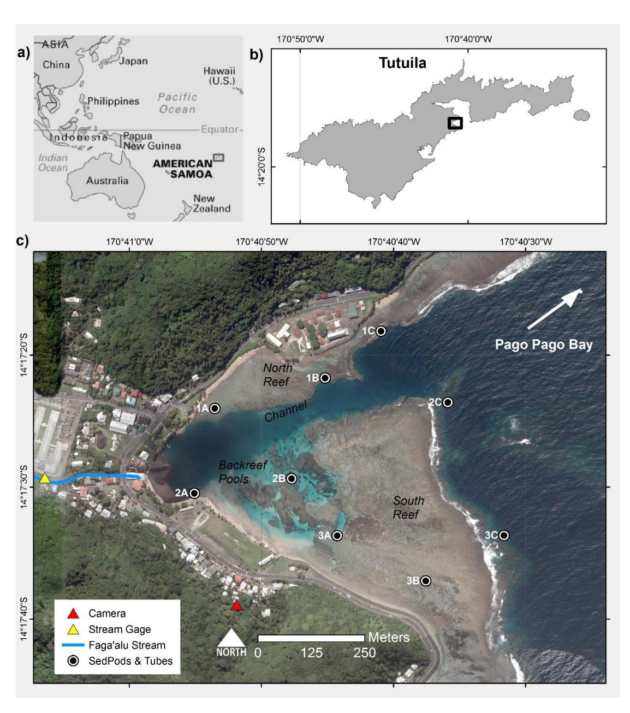

Figure 3.1. Maps of the study area and instrumentation in Faga'alu Bay. a) Location of American Samoa in the South Pacific region. b) Location of Faga'alu Bay on Tutuila Island, American Samoa. c) Sediment pods and sediment traps were deployed at nine locations for one year and collected quasi-monthly to measure sediment accumulation rates and composition. Suspended sediment yield from the watershed was measured at "Stream Gage." Further details on SSY measurements and modeling can be found in (Messina and

Biggs, *in press*). A time-lapse camera was installed at "Camera" to record images of transient sediment plumes during storms.

#### *3.2.1.1 Geography and Geology*

Faga'alu Bay is a v-shaped, fringing-reef embayment situated on the western side of Pago Pago Bay, on the island of Tutuila, American Samoa (14.290˚ S, 170.677˚ W; Figure 3.1). Faga'alu Bay is adjacent to a small (2.48 km2 ) watershed that is covered primarily with undisturbed vegetation on the steep hillslopes (82%), with a small urbanized village area on the flatter lowlands (7%) and an aggregate quarry (1%). Total relief of the watershed is 653 m, and mean slope is 0.53 m/m. The perennial Faga'alu Stream drains 1.78 km2 of the watershed into the northwest corner of the bay, and the remaining 0.78 km2 drains directly to the bay in several surrounding ephemeral streams (Messina and Biggs, 2016). Faga'alu Stream is channelized so no overbank flooding, and subsequent floodplain deposition, is observed. Soil types in the steep uplands are rock outcrops (15% of the watershed area) and well-drained Lithic Hapludolls ranging from silty clay to clay loams (Nakamura, 1984), whereas soils in the lowlands are a mix of well drained very stony silty clay loams and poorly drained silty clay to fine sandy loam along valley bottoms.

The complex bathymetry of Faga'alu Reef is characterized by a shallow reef flat extending from shore to the reef crest, where it descends at an approximately 1:1 slope to the insular shelf at approximately 20 m depth. See Cochran et al. (2016) for a detailed description of the bathymetry and benthic cover. An anthropogenically-altered, verticalwalled, 5-15 m deep paleostream channel ("channel") (Figure 3.1c) extends from the outlet of Faga'alu Stream in the northwest corner, eastward to Pago Pago Bay. This channel divides the reef into a larger, more exposed southern section ("southern reef" in Figure 3.1),

and a smaller, more sheltered northern section ("northern reef" in Figure 3.1). Closer to the shore in the southern back-reef there are areas of deeper (1-5 m) sediment-floored pools with coral bommies ("back-reef pools" in Figure 3.1).

Near the reef crest, the reef flat is primarily cemented reef pavement, but within a few 10s of m, transitions into thickets of primarily *Acropora spp.* Surveys in 2015 found coral coverage varied from less than 10% over the degraded northern area, to more than 50% on the more intact southern area (Cochran et al., 2016; Holst-Rice et al., 2016). Sediment availability is relatively low on the reef flats near the reef crest, though there are some patches of accumulated carbonate sediment. Near the stream outlet, the benthic surface is primarily sand and fine silt.

#### *3.2.1.2 Meteorology, stream flow, oceanography, and circulation*

Annual precipitation (P) in Faga'alu watershed varies with elevation from 6,350 mm at Matafao Mtn. (653 m elevation) to 3,800 mm on the coastal plain (Craig, 2009; Dames & Moore, 1981; Perreault, 2010; Tonkin & Taylor International Ltd., 1989; Wong, 1996). There are two rainfall seasons: a drier winter from June through September accounts for 25% of annual P, and a wetter summer from October through May accounts for 75% of annual P (Craig, 2009; Perreault, 2010). P is lower in the drier season but large storms still occur: at 11 stream gages around the island, 35% of annual peak flows occurred during the drier season (1959-1990) (Wong, 1996).

Storms occur most frequently during the October-April wet season, but large storms can occur throughout the year (Messina and Biggs, 2016; Wong, 1996). Storms generate an estimated 241-368 tons/km2 /yr of suspended sediment yield to the bay from undisturbed, forested areas in the uplands (13% of total SSY), and anthropogenically disturbed open-pit

aggregate quarry and village areas in the lowlands (87% of total SSY). The significant sediment contribution from the quarry prompted mitigation efforts including revegetation, covering road surfaces, and groundwater diversion in 2013, and retention ponds in October 2014, which significantly reduced sediment runoff into Faga'alu Stream and SSY into the Bay. See Holst-Rice et al. (2016) for a full description of sediment mitigation at the quarry.

Faga'alu Bay is surrounded by high topography that blocks wet-season northerly winds, but is exposed to dry-season southeasterly trade winds and accompanying shortperiod waves. Trade winds are typically most prevalent and strongest during the dry season, but are common throughout the year (Craig, 2009). Tropical cyclones typically occur in the South Pacific from November to April (Militello et al., 2003), making landfall over American Samoa every 1-13 years since 1981 (Craig 2009), though cyclogenic waves impact the reefs more frequently (Feagaimaalii-Luamanu, 2016). Faga'alu Bay is only open to south to southeast swell directions, and the more southerly angled swell must refract to the west, resulting in a reduction of wave energy. Offshore significant wave heights are generally less than 2.5 m and rarely exceed 3.0 m. Peak wave periods are generally about 9 s or less, rarely exceed 13 s, but occasionally reach 25 s during austral winter storms (Thompson and Demirbilek, 2002). O. Vetter (unpublished data) recorded significant wave heights up to 1.7 m on the fore reef in Faga'alu, but significant wave heights greater than 1.0 m were infrequent. A semi-diurnal, microtidal regime exposes parts of the shallow reef crest and reef flat at extreme low tides, and water circulation increases with tidal height (Messina et al. *in press*).

GPS-logging drifter and acoustic current meter deployments in 2014 showed mean flow speeds (residence times) over the reef flat varied widely, from 1-20 cm s-1 (2.8-0.14 h), 1-19 cm s-1 (2.8-0.15 h), and 1-36 cm s-1 (2.8-0.08 h) under strong wind, tidal, and large wave forcing, respectively (Messina et al., *in press*). The highest flow speeds and shortest residence times occurred over the exposed southern reef and near the reef crest. The slowest flow speeds and longest residence times occurred over the sheltered northern reef, near shore, and over the deep channel incised in the reef. Under tidal forcing (i.e., calm conditions), flow directions were the most variable, with some seaward transport from the southern reef flat to the fore reef. Under onshore trade wind forcing, flow directions were mostly into the embayment. Under large wave forcing, flows followed a clockwise spatial pattern: onshore over the exposed southern reef, onto the sheltered northern reef, and out to sea through the channel and over the forereef.

#### **3.2.2 Methods**

#### *3.2.2.1 Terrigenous suspended-sediment yield (SSY)*

Messina and Biggs (2016) developed an empirical model for Faga'alu Stream to predict event-wise suspended sediment yield (SSYEV) from maximum event water discharge (Qmax). A second Qmax-SSYEV model was calibrated for the time period following the sediment mitigation (October 2014-April 2015) to reflect the reduction in SSYEV from the same magnitude Qmax (unpublished). For this study, a time-series of SSYEV to the Bay during the study period was developed from measured SSYEV when both water discharge (Q) and suspended sediment concentration (SSC) data were available; when only Q data were available, SSYEV was predicted from the empirical Qmax-SSYEV models of Messina and Biggs (2016). Additional terrigenous sediment yield to the bay from ephemeral streams was not measured, and assumed to be correlated with SSYEV from Faga'alu Stream.

#### *3.2.2.2 Marine sediment collection and composition*

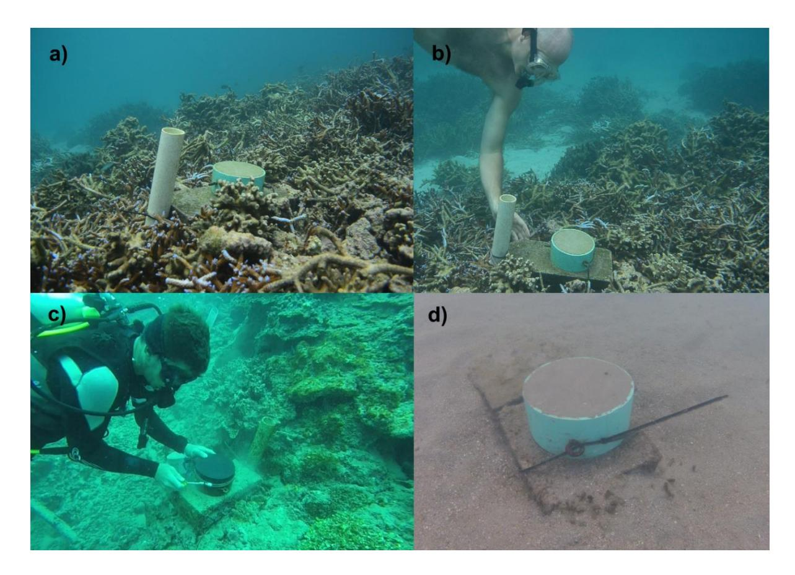

Figure 3.2. Pictures of the sediment traps and sediment pods at high tide. a-b) At Site 3A in an area of branching coral rubble, approximately 2 m depth. c) Capping the sediment pod for retrieval at Site 1C, approximately 10 m depth. d) At Site 1B, the surrounding area is mixed terrigenous and carbonate benthic sediment.

Two types of sediment accumulation sampling devices were used: flat-surfaced sediment pods (Field et al., 2012) and tubular sediment traps (Curt D. Storlazzi et al., 2011; Storlazzi et al., 2009). Sediment traps and pods were located to sample sediment accumulation across gradients in distance from the stream outlet, hydrodynamic forcing, and depth. At each of 9 sites in Faga'alu Bay a sediment pod was attached to the top of a cement block and a sediment trap was attached to the side of the same block [\(Figure 3.2\)](#page-127-0). Six sites were on the reef flat (water depth 1-2 m) and three sites were on the fore reef (10-15 m)

(Figure 3.1, Table 3.1). Where possible, benthic sediment samples were collected at several sites on the reef flat and channel to characterize surface sediment near the sediment traps. Surface sediment (top 2 cm) was scooped with 50 mL HDPE centrifuge tubes and analyzed for grain size and composition.

Table 3.1. Sediment trap deployment locations and characteristics.

|       |          |           |            |           |                      |              | Benthic sediment composition |                |                  |
|-------|----------|-----------|------------|-----------|----------------------|--------------|------------------------------|----------------|------------------|
| Side  | Location | Latitude  | Longitude  | Substrate | Reef                 | Depth (m) | % Organic                 | % Carbonate | % Terrigenous |
| North | 1A       | -14.29001 | -170.68153 | Sand/mud  | backreef             | 1            | 4                            | 81             | 15               |
| North | 1B       | -14.28937 | -170.67921 | Coral     | reef flat            | 1            | 5                            | 82             | 13               |
| North | 1C       | -14.28838 | -170.67804 | Coral     | forereef             | 10           | 5                            | 82             | 13               |
| North | 2A       | -14.29179 | -170.68196 | Sand/mud  | backreef backreef | 1            | 4                            | 31             | 65               |
| South | 2B       | -14.29149 | -170.67992 | Coral     | pools                | 2            | -                            | -              | -                |
| North | 2C       | -14.28989 | -170.67663 | Coral     | forereef             | 15           | 5                            | 82             | 13               |
| South | 3A       | -14.29269 | -170.67896 | Coral     | reef flat            | 1            | 4                            | 88             | 8                |
| South | 3B       | -14.29364 | -170.67710 | Coral     | reef flat            | 2            | 4                            | 88             | 8                |
| South | 3C       | -14.29268 | -170.67545 | Coral     | forereef             | 10           | -                            | -              | -                |

A monthly time interval for collecting sediment accumulation was chosen (Muzuka et al., 2010; Victor et al., 2006) to collect enough sediment for laboratory analysis and for field logistical reasons. Collection dates varied due to operational safety concerns on the fore reef; deployments varied from 24 d to 53 d, with a mean deployment of 36 days [\(Figure](#page-133-0)  [3.3c](#page-133-0), dotted lines), covering a 12-month period from March 2014 to April 2015.

Sediment traps were made from 5 cm internal diameter PVC pipe, approximately 30 cm tall, and capped at the bottom. Storlazzi et al. (2011) recommends a height-to-diameter ratio of at least 5, preferably more than 7; the height-to-diameter ratio of sediment traps in this study was 6. To collect sediment from the sediment trap, a PVC cap was slipped over the open end, and then the sediment trap was removed from the block and replaced with an empty sediment trap for the next deployment. In the lab, the accumulated sediment was

rinsed from the inside of the sediment trap and analyzed for weight, grain size, and composition. Some studies deploy multiple sediment traps at each site to determine an average accumulation rate, and Bothner et al. (2006) found that sediment accumulation rates at co-located sediment traps differed by 11% on average. This study deployed a single sediment trap to minimize hydrodynamic interference per Storlazzi et al. (2011).

Sediment pods were made from 15.25 cm diameter PVC pipe, approximately 12 cm tall, and filled with cement with three eye-bolts to act as rebar and attachment points [\(Figure](#page-127-0)  [3.2\)](#page-127-0). The cement was poured on a rough piece of plywood to give it a slight texture approximating a coral surface (Field et al., 2012). To collect sediment from sediment pods, a rubber cap was carefully slipped over the sediment pod, taking care not to disturb the sediment, and the stainless steel hose clamp was tightened to prevent sediment from escaping during transport to the lab [\(Figure 3.2c](#page-127-0)). In the lab, the rubber cap was removed and the sediment on the surface of the sediment pod was rinsed off and analyzed for weight, grain size, and composition. In many instances there was significant algal growth on the sediment pod surface, so sediment was manually scrubbed from this algae layer and included in the analysis.

Sediment weight and grain size were analyzed by wet sieving, and composition was determined by the Loss on Ignition (LOI) method. Gravel-size shells and organisms (>2 mm) were sieved and removed from analysis, then the coarse (2 mm – 63 *µ*m) and fine fractions (63 *μ*m - 2 *μ*m) were separated by wet sieving. The fine fraction was collected on pre-weighed 15-cm diameter, 2-*μ*m nominal pore size glass fiber filters. To remove salts, the coarse fraction was rinsed in the sieve with distilled water, whereas the fine fraction was gravity filtered with distilled water at least three times. Coarse and fine fractions were dried

at 100 C for 2 hr, cooled, and weighed to determine the bulk sediment mass. The sediment samples were then analyzed for geochemical composition using the LOI method of combusting 3 hr at 550 C for % organic and 950 C for 3 hr for % carbonate, respectively, by mass (Heiri et al., 2001; Santisteban et al., 2004). The proportion (%) of terrigenous sediment was then determined by subtraction from the % organic and % carbonate (DeMartini et al., 2013; Gray et al., 2012). Wet sieving conducted by different lab analysts showed an unacceptable difference in coarse and fine fraction separation, so only combined fine and coarse fraction (total) sediment accumulation data were used in further analyses. Sediment accumulation results were normalized for trap diameter and deployment time (g m-2 d -1 ) (Storlazzi et al., 2009) to compare sediment pods and sediment traps and variable deployment times.

#### *3.2.2.3 Time-lapse photography of terrigenous sediment plumes*

A Moultrie GameSpy I-35 trail camera was installed in January and February 2014 to characterize the variability of surface properties in the bay and image sediment plumes discharged from Faga'alu Stream following storms. The camera was deployed on the south side of Faga'alu Bay [\(Figure 3.1\)](#page-122-2) in time-lapse mode at a 15-min interval. Although suspended-sediment concentrations cannot be inferred from the images, the brown-colored, terrigenous sediment was clearly visible in contrast to the normally clear ocean water, showing the pattern and, using sequential images, the trajectory of the plume.

#### *3.2.2.4 Oceanic forcing*

In situ wave data was not available at the study site during sediment trap deployments, but data from a wave gauge installed previously in Faga'alu for 2 months compared well with NOAA WaveWatch III Samoa Regional Wave Model (WW3) (PACIOOS, 2016). The WW3 Samoa Regional Model takes into account island bathymetry and shadowing, so only swell directions from the Southwest to Southeast were included in the analysis, since other swell directions do not impact Faga'alu Bay. To characterize wave conditions during sediment trap deployments, mean wave height between the deployments (*Hmean*, in m) was calculated from WW3 data on daily mean significant wave height during the period between collections (Rangel-Buitrago et al., 2014; Seymour, 2011).

This analysis did not investigate the influence of winds directly, but wind waves generated by trade winds are included in the WW3 model output. Strong trade winds are typical in May-September when significant wave height is also high due to trade wind generated waves and Austral winter storms. The co-occurrence of light winds and large groundswell-generated waves is infrequent but most common during the wet season from October to May. This analysis assumes the dominant effects of strong, onshore trade winds from the southeast are adequately captured by the WW3 significant wave height and would be significantly correlated with calculated mean wave height.

#### *3.2.2.5 Analytical Methods*

Univariate and multi-variate linear regression models were used to determine how SSY (tons) and *Hmean* (m) influence temporal patterns of sediment accumulation rates in sediment traps and on sediment pods at each of the 9 sediment trap sites, as well as the mean accumulation of traps on the northern and southern reef. Sites 1A, 1B, 1C, 2A, and 2C were

classified as the "northern reef" and sites 2B, 3A, 3B, and 3C as the "southern reef" (Table 3.1). The significance of the correlation between sediment accumulation and individual driving variables (SSY or *Hmean*) were tested with the Spearman correlation coefficient (*p*value <0.10).

A linear regression between SSY and *Hmean* confirmed they were not significantly correlated and could be treated as independent variables in the multiple regression. A multiple linear regression between sediment accumulation vs. SSY and *Hmean* quantifies how well each predictor is correlated with sediment accumulation, while controlling for the influence of the secondary predictor. The multiple linear regression model was assessed using the significance of *p*-values for each predictor. This approach does not account for the phasing or sequencing of large wave events and SSY from storms within deployment periods. For instance, if a large wave event occurred prior to a large storm event, we would not expect the wave event to affect sediment accumulation from that storm-supplied sediment yield, but our measurement interval cannot resolve the difference in phasing or sequence.

## **3.3. Results**

#### **3.3.1 Suspended sediment yield (SSY) and mean wave heights (***Hmean***)**

Seasonal patterns of wave conditions and SSY were hypothesized to vary such that large *Hmean* and low SSY coincide during the trade wind dry season (May-September), which would cause low terrigenous sediment accumulation. *Hmean* mostly followed the conceptual pattern with peak *Hmean* occurring around June-August and lowest during December-February, with the exception of larger than expected *Hmean* in April 2014 and

January 2015 [\(Figure 3.3c](#page-133-0)). Measured and modeled SSY did not follow the conceptual model. The highest SSY was observed during the July-September 2014 period because (1) the largest single storm recorded in the past four years occurred 25 July 2014, (Messina and Biggs, 2016), and (2) sediment mitigation at the quarry in October significantly reduced total SSY from the watershed that would have occurred during the 2014-2015 wet season (October-April) (Holst-Rice et al., 2016).

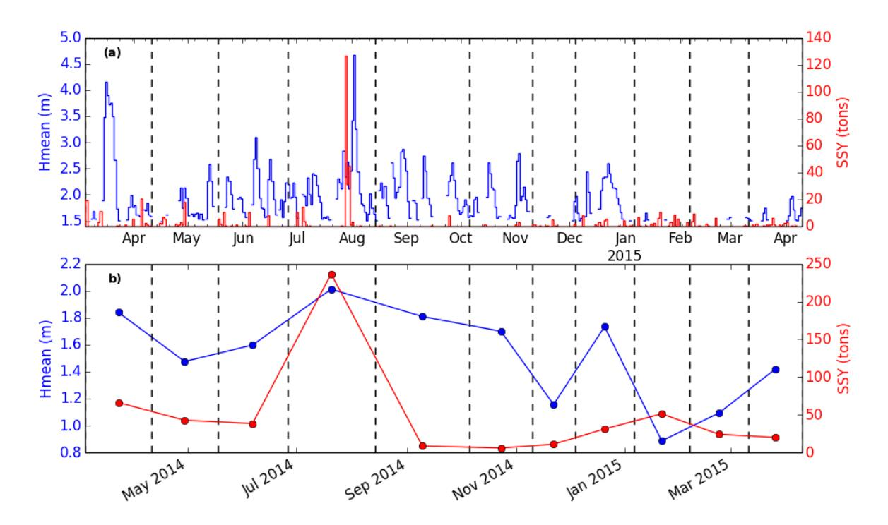

Figure 3.3. Suspended sediment yield from Faga'alu Stream (SSY) and Mean wave height (Hmean) at the study site during sediment trap deployments. a) Mean daily significant wave height (m) exceeding 1.5 m from the NOAA WaveWatch III Samoa Regional Model and total daily Suspended Sediment Yield (SSY) (tons). b) Mean significant wave height (m) and total SSY during deployment periods (dashed lines indicate sample collection dates).

#### **3.3.2 Time-lapse photography of sediment plumes**

Messina et al. (*in press*) showed that the orientation of wind and wave-forcing over the southern reef caused clockwise water circulation over the more energetic southern reef and out through the channel. The circulation pattern was hypothesized to cause non-uniform sediment plume dispersal over the reef by deflecting sediment plumes from Faga'alu Stream over the more quiescent northern reef, while the southern reef remained un-impacted. The hypothesized plume deflection was observed using time-lapse camera deployment in January-February 2014 [\(Figure 3.4\)](#page-135-1). Under calm wave and wind conditions, the reef was clear of sediment [\(Figure 3.4a](#page-135-1)) and rainfall reached peak intensity 30 min later [\(Figure 3.4c](#page-135-1)). Less than 15 min after peak rainfall intensity, sediment discharged from the stream outlet into the bay [\(Figure 3.4d](#page-135-1)). The brown, terrigenous sediment plume propagated from the stream outlet to the northern reef crest in approximately 15 min [\(Figure 3.4d](#page-135-1)-f), exceeding the expected residence times of >60 min over the northern reef, expected under calm conditions from Messina et al. (*in press*). The plume appears to have reached peak concentration only 45 min after the initiation of rainfall and only 30 min after the plume first entered the bay. During the 14 February 2014 event, GPS-logging drifters were deployed at the stream outlet at the onset of plume discharge, and remained near the stream outlet (unpublished) while the sediment plume extended out over the northern fore reef.

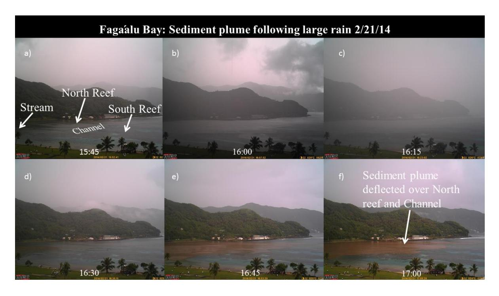

Figure 3.4. Time lapse photography of a sediment plume discharged from Faga'alu Stream following a rain event 2/21/14. a-f) Time series of sediment plume following a brief but intense rainfall. a) the Bay is clear of any sediment plume but following a short burst of rainfall in b and c, a sediment plume is discharged from the stream outlet (d-f) where it is deflected away from the South reef, over the North reef and channel, and out to sea. Later frames showed the same spatial pattern, and an apparent diminishing of sediment concentrations over the northern reef.

#### **3.3.3 Sediment collection and composition: Spatial patterns**

It can be assumed that Faga'alu Stream is the only source of fine terrigenous sediment, but spatial heterogeneity in carbonate/terrigenous fraction showed terrigenous sediment is distributed throughout the reef flat [\(Figure 3.5\)](#page-138-0). Fine terrigenous sediment accounted for 1-10% (μ=3%) of fine benthic sediment, though including the coarse fraction increased the total percentage to 8-65%, with the highest percentages of fine and coarse terrigenous sediment near the stream outlet and on the more quiescent northern reef. Total benthic sediment (fine and coarse) on the northern and southern reef flats was primarily carbonate (82-88%), with small fractions of terrigenous, and only trace amounts of organics (Table 3.1). The terrigenous fraction was approximately 2x higher over the northern reef flat (~15%) compared to the more energetic southern reef flat (8%). Near the stream outlet, benthic sediment was dominated by the terrigenous fraction (65% terrigenous) but showed similar percentages of organics as the reef flats.

Mean total sediment accumulation (g m-2 d -1 ) during the study period was an order of magnitude higher in sediment traps than on sediment pods at all sites [\(Figure 3.5\)](#page-138-0). Sediment accumulation on sediment pods was higher in the more quiescent parts of the bay near the stream outlet (site 2A), on the quiescent northern reef (site 1A-C), and near the outlet of the channel (site 2C), whereas almost no sediment accumulation was observed on sediment pods over the more energetic southern reef (sites 2B, 3A, 3B, 3C) [\(Figure 3.5b](#page-138-0)). Although total accumulation was lower on sediment pods compared to tubes, the same spatial pattern and relative magnitude of sediment accumulation rates was observed, with the exception of sites 3A and 3B on the south reef. Sediment accumulation rates in sediment traps on the southern reef flat (sites 3A and 3B) were much higher than corresponding sediment pods. Mean carbonate sediment accumulation rates on the more energetic southern reef (site 3A and 3B) were also strongly influenced by one period of high sediment accumulation related to a high wave event that occurred just before the collection date for the period of March 2014 [\(Figure](#page-133-0)  [3.3b](#page-133-0)). Sediment accumulation at site 2B (sediment trap), located on coral rubble on the southern reef flat, was lower than other southern reef flat sites (sites 3A, 3B) where wavedriven flow is faster and benthic sediment was more available.

Though total sediment accumulation was higher in sediment traps, the average percent contributions of organic, terrigenous, and carbonate sediment were similar for sediment traps and sediment pods at each site. With the exception of site 2A near the stream outlet, sediment accumulation on both the north and south reefs was dominated by the carbonate fraction. On the more energetic southern reef, the ratio of terrigenous and carbonate sediment accumulation observed in sediment traps (sites 2B, 3A, 3B, and 3C) mainly reflected the composition of surrounding benthic sediment. For the southern reef, 3A and 3B showed the largest relative increase in terrigenous fraction compared to surrounding benthic sediment, likely due to some small storm drains emptying into the bay near those sites. On the more quiescent northern reef, in both sediment traps and sediment pods, the terrigenous fraction of sediment accumulation rates was higher than surrounding benthic sediment; the organic fraction was also higher than surrounding benthic sediment, but only in sediment traps and not on sediment pods.

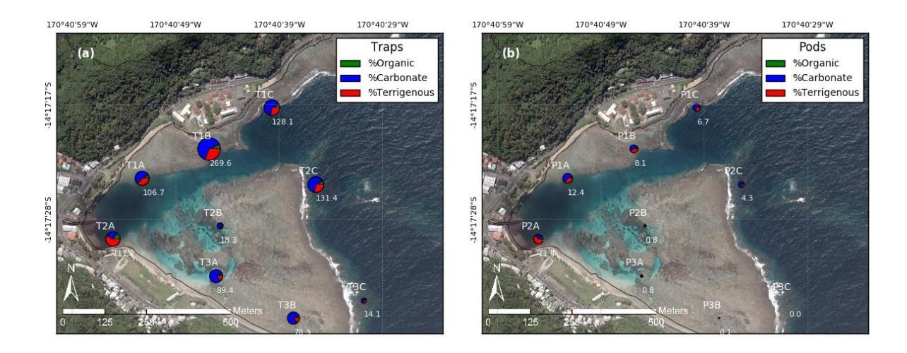

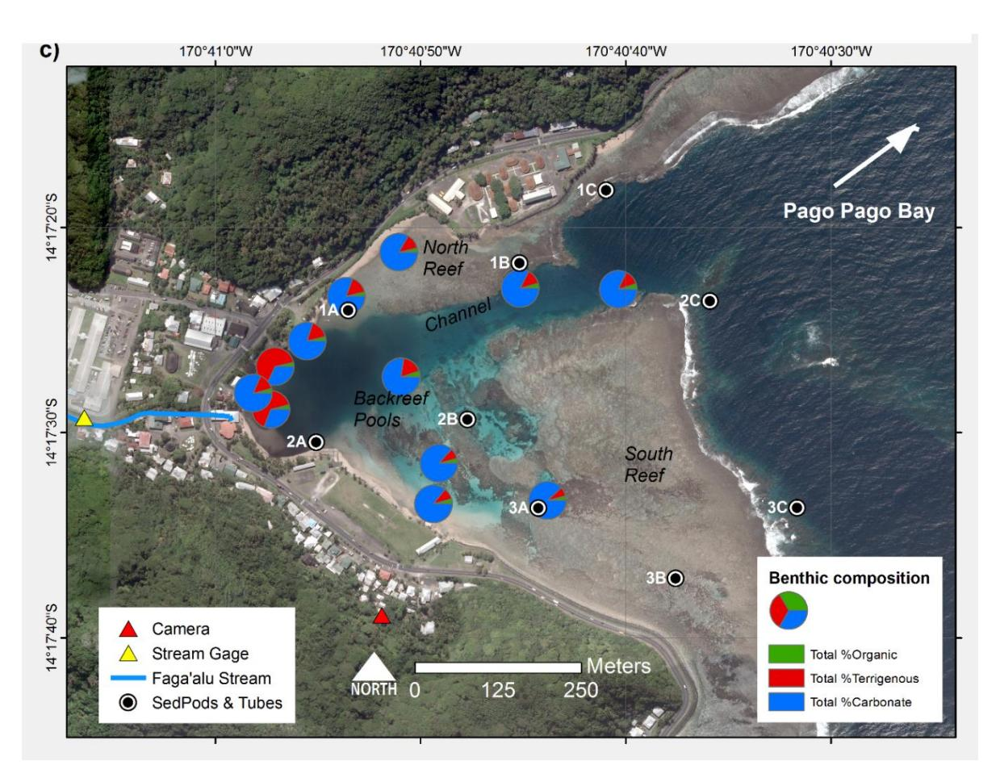

Figure 3.5. Mean sediment accumulation rates (g m-2 d -1 ) and composition at sediment traps and sediment pods in Faga'alu Bay during all deployments. a) Sediment traps. b) Sediment pods. c) Benthic sediment composition. Note: Subplot scales are different for visualization purposes, can't compare sizes of charts, hence numbers included.

#### **3.3.4 Sediment collection and composition: Temporal patterns**

Following the clear spatial differences in mean sediment accumulation [\(Figure 3.5\)](#page-138-0), sites on the northern and southern reefs were grouped, and mean sediment accumulation was calculated to investigate temporal patterns. On the more energetic southern reef, mean sediment accumulation on sediment pods was much lower, and nearly zero compared to the more quiescent northern reef for all periods [\(Figure 3.6\)](#page-139-1). On the northern reef, mean sediment accumulation rates on sediment pods were generally lower during the May-October trade wind season, and higher during the October-April wet season, but the patterns were not very strong [\(Figure 3.6a](#page-139-1)). There is some evidence that terrigenous sediment accumulation was higher in periods following a large input of terrigenous sediment in the July-August 2014 period. Terrigenous sediment accumulation was higher on pods following the July-August 2014 period, compared to previous periods, under similar *Hmean* and SSY.

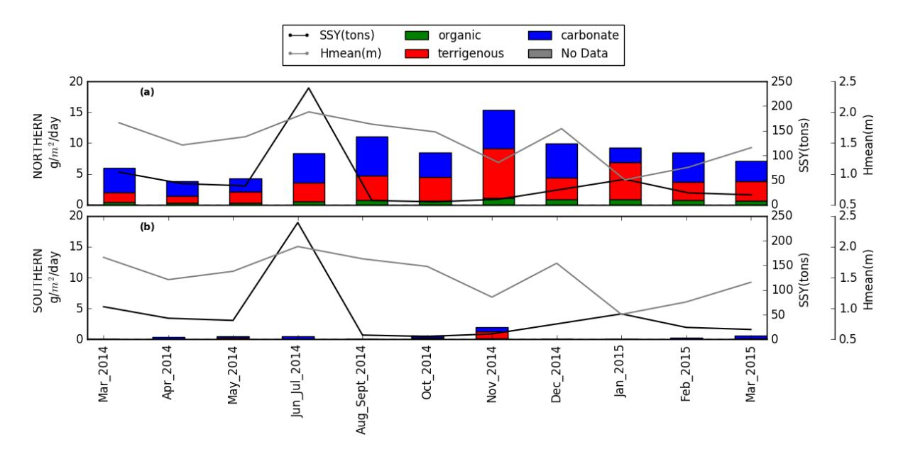

Figure 3.6. Mean sediment accumulation (g m-2 d -1 ) on sediment pods during the study period over the a) north reef including sites 1A, 1B, 1C, 2A, 2C, and b) south reefs including sites 2B, 3A, 3B, 3C.

Similar to the results for sediment pods, mean sediment accumulation rates in sediment traps were higher on the more quiescent northern reef than the more energetic southern reef for all deployment periods. On both the northern and southern reefs the three periods with highest mean wave heights (March 2014, June-July 2014, and December 2014) were associated with the highest rates of carbonate sediment accumulation in sediment traps. Conversely, mean terrigenous sediment accumulation in sediment traps on either the southern or northern reef did not seem to follow any pattern in SSY, *Hmean*, or even total P, and seemed to occur at a fairly constant rate over the study period. Although the mean sediment accumulation rates illustrate broad characterizations of sediment regimes over the northern and southern reefs, no strong temporal patterns in mean terrigenous sediment accumulation were evident in the time series.

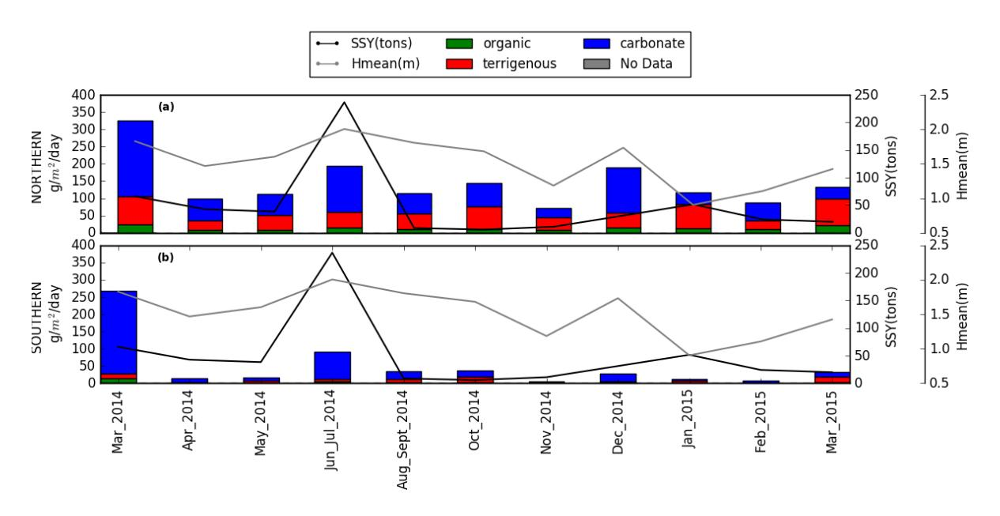

Figure 3.7. Mean sediment accumulation (g m-2 d -1 ) in sediment traps during the study period over the a) north reef including sites 1A, 1B, 1C, 2A, 2C, and b) south reefs including sites 2B, 3A, 3B, 3C.

Terrigenous sediment accumulation on sediment pods was not significantly correlated with SSY for any sites [\(Figure 3.8,](#page-142-0) Tables 2-3). Carbonate sediment accumulation on sediment pods was positively correlated with mean wave height at only one site on the northern reef (site 1A) [\(Figure 3.8,](#page-142-0) Table 3.2), though total sediment accumulation was negatively correlated with mean wave height in more energetic areas, near the reef crest on the northern reef (site 1B) and southern reef (site 3B) (Table 3.2). The only positive correlation between carbonate sediment and mean wave height was on the northern reef (site 1A), in an area with large supply of sand near the stream outlet [\(Figure 3.2d](#page-127-0)).

**Table 3.2.** Spearman correlation coefficients for Sediment Accumulation vs. SSY, and Sediment Accumulation vs. *Hmean*.

|             | Total     | Terrigenous | Terrigenous +Organic | Carbonate |
|-------------|-----------|-------------|-------------------------|-----------|
| P1A         |           |             |                         | w: 0.721  |
| P1B         | w: -0.617 | w: -0.633   | w: -0.633               |           |
| P1C         |           |             |                         |           |
| P2A         |           |             | w: -0.527               |           |
| P2B         |           |             |                         |           |
| P2C         |           |             |                         |           |
| P3A         |           |             |                         |           |
| P3B         | w: -0.806 |             |                         |           |
| P3C         |           |             |                         |           |
| North_Pods  |           |             | ssy:-0.573              |           |
| South_Pods  |           |             |                         |           |
| T1A         | w: 0.600  |             |                         | w: 0.717  |
| T1B         | w: 0.750  |             |                         | w: 0.833  |
| T1C         | w: 0.973  | w: 0.682    | w: 0.755                | w: 0.945  |
| T2A         | ssy:0.555 |             |                         | ssy:0.545 |
| T2B         |           |             |                         | ssy:0.629 |
| T2C         | w: 0.936  |             |                         | w: 0.952  |
| T3A         | w: 0.900  | w: 0.545    | w: 0.564                | w: 0.873  |
| T3B         | w: 0.891  |             |                         | w: 0.955  |
| T3C         |           | ssy:-0.627  | ssy:-0.573              |           |
| North_Traps | w: 0.700  |             |                         | w: 0.818  |
| South_Traps | w: 0.864  |             | w: 0.545                | w: 0.927  |

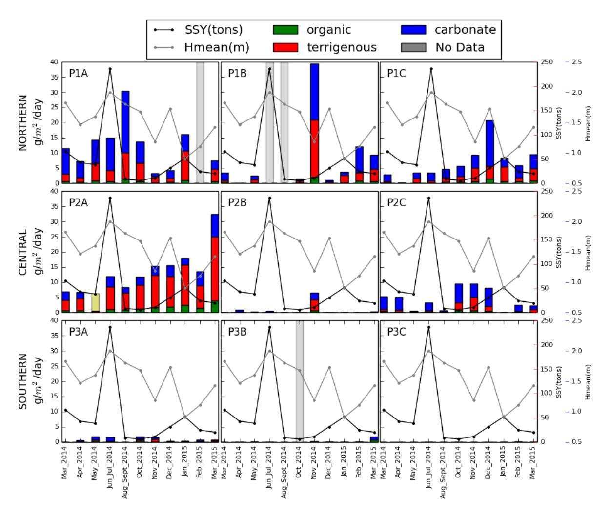

Figure 3.8. Time series' of sediment accumulation (g m-2 d -1 ) and composition on sediment pods at nine sediment trap locations in Faga'alu Bay, related to suspended-sediment yield from the watershed (SSY) and mean significant wave height (m). "P" indicates sediment "pod" and location ID's (ex. 2A) correspond to sites in Figure 3.1.

Univariate linear regressions (Table 3.2) showed *Hmean* was positively correlated with total and carbonate sediment accumulation in sediment traps at every site except near the stream outlet (site 2A), on the more energetic southern reef in coral rubble (site 2B), and on the more quiescent southern fore reef (site 3C). *Hmean* was positively correlated with mean total and carbonate sediment accumulation in traps on the northern and southern reefs (Table 3.2), but when controlling for SSY in the multiple regression, only mean carbonate

accumulation was weakly correlated with *Hmean* on the northern reef (Table 3.3). On the northern and southern fore reef (sites 1C, 2C, and 3C), univariate and multivariate linear regressions showed both total and carbonate sediment accumulation in sediment traps were significantly correlated with mean wave height, and showed a nonlinear relationship with wave heights in many cases [\(Figure 3.10\)](#page-144-0).

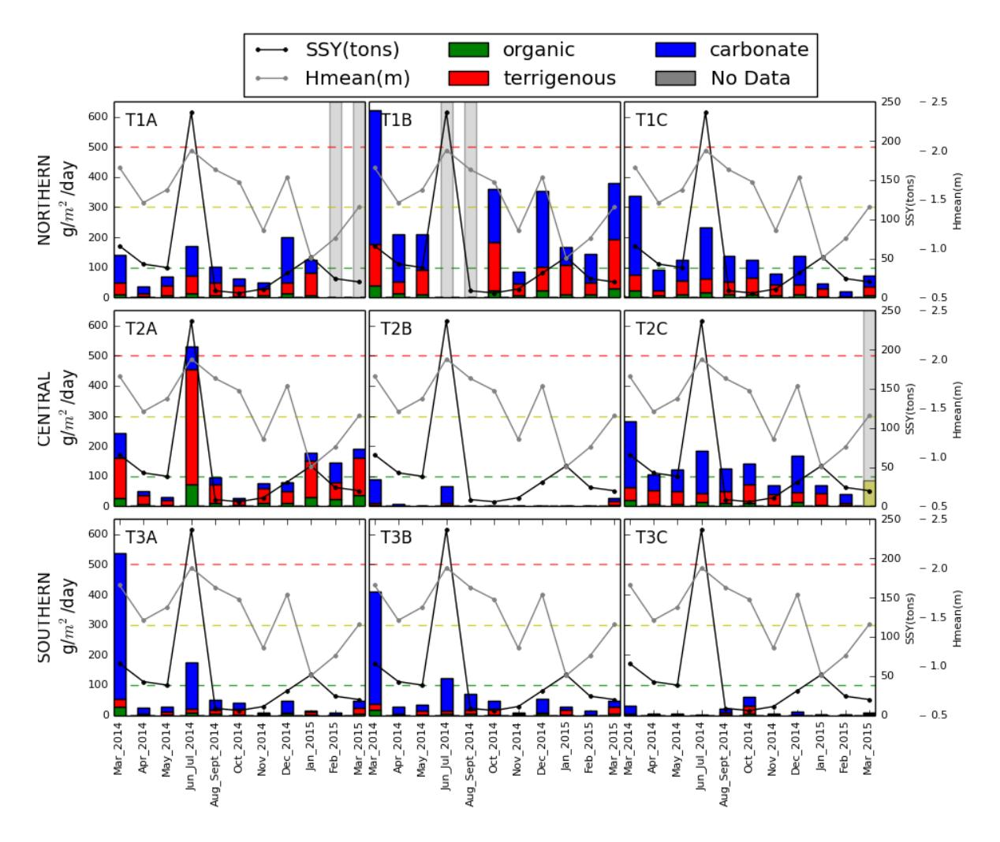

Figure 3.9. Time series' of sediment accumulation in sediment traps and composition at nine sediment trap locations in Faga'alu Bay, related to suspended sediment yield from the watershed (SSY) and mean significant wave height (m). "T" indicates sediment "trap" and location ID's (ex. 2A) correspond to sites in Figure 3.1. Coral health thresholds related to sediment accumulation in tubes from *Erftemeijer et al. (2012)* are shown as dotted horizontal lines: <100 g m-2 d -1 = no stress, 100 – 300 g m-2 d -1 = stress recruits, 300 – 500 g m-2 d -1 = stress colonies, >500 g m-2 d -1 = lethal.

Terrigenous sediment accumulation was only correlated with SSY on the far southern fore reef (site 3C), and the correlation was negative. Sediment accumulation was very low at this fore reef site, and when controlling for *Hmean* in the multivariate regression (Table 3.3), there was no correlation (Table 3.3). The strongest correlation between SSY and sediment accumulation (both total and terrigenous) was near the stream mouth (site 2A) [\(Figure 3.9\)](#page-143-0). Total and carbonate sediment accumulation near the stream mouth were positively correlated with SSY, but terrigenous accumulation was not correlated with SSY in the univariate regression. When controlling for mean wave height in the multivariate regression, terrigenous accumulation near the stream mouth (site 2A) was highly correlated with SSY (Table 3.3).

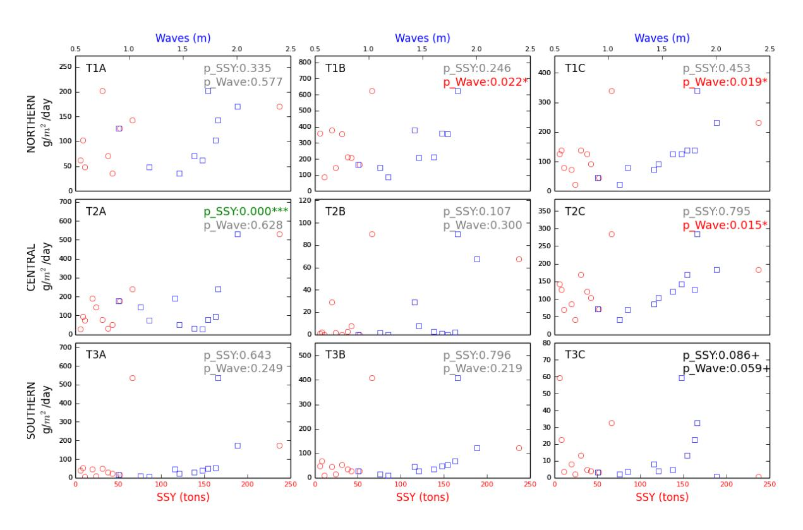

Figure 3.10. Correlations between total sediment accumulations in sediment traps vs SSY, mean wave height*. P-*values are for multiple regression.

**Table 3.3**. Significant *P*-values for multiple regression of Sedimentation ~ SSY + Waves. \*\*\*=p<0.001, \*\*=p<0.01, \*=p<0.05, +=p<0.1. Non-significant p-values were left blank.

|             | Total              | Terrigenous | Terrigenous +Organic | Carbonate           |
|-------------|--------------------|-------------|-------------------------|---------------------|
| P1A         |                    |             |                         |                     |
| P1B         |                    |             |                         |                     |
| P1C         |                    |             |                         |                     |
| P2A         |                    |             |                         |                     |
| P2B         |                    |             |                         |                     |
| P2C         |                    |             |                         |                     |
| P3A         |                    |             |                         |                     |
| P3B         |                    |             |                         |                     |
| P3C         |                    |             |                         |                     |
| North Pods  |                    |             |                         |                     |
| South Pods  |                    |             |                         |                     |
| T1A         |                    |             |                         |                     |
| T1B         | * w             |             |                         | ** + w ssy |
| T1C         | * w             | + w      | * w                  | * w              |
| T2A         | *** ssy         | *** ssy  | *** ssy              | + ssy            |
| T2B         |                    |             |                         | + ssy            |
| T2C         | * w             |             | + w                  | * w              |
| T3A         |                    |             |                         |                     |
| T3B         |                    |             |                         |                     |
| T3C         | + + w ssy |             |                         | * + w ssy  |
| North Tubes |                    |             |                         | w+                  |
| South Tubes |                    |             |                         |                     |

## **3.4. Discussion**

*Hmean* was a dominant control on sediment accumulation over the reef by driving resuspension of primarily carbonate sediment surrounding sediment traps. Terrigenous sediment accumulation was only correlated with total SSY near the stream outlet, but elevated terrigenous fractions of accumulated sediment in traps compared to benthic sediment, as well as time lapse photography of sediment plumes, showed the northern reef flat and fore reef near the channel were impacted by terrigenous sediment. Poor correlations between terrigenous sediment accumulation and SSY could be the result of high uncertainty (50-100%) in the measured and modeled SSYEV from Faga'alu Stream (Messina and Biggs,

2016), complex hydrodynamics at sites, daily sequencing of wave and storm events, and confounding processes like resuspension of previously-deposited terrigenous sediment near the trap.

#### **3.4.1 Watershed and oceanic controls on sediment accumulation**

Sediment accumulation was an order of magnitude higher in traps than pods, indicating the enhanced trapping efficiency and reduced resuspension of sediment in sediment traps compared to on sediment pods. The results presented here showed the advantage of deploying both sediment traps and sediment pods at the same location to compare gross and net sediment accumulation across spatial gradients in hydrodynamic energy as well as the temporal patterns due to interaction between terrigenous sediment inputs and wave-induced resuspension. For example, whereas mean sediment accumulation on the sediment pod near the northern reef crest (site 1B) was the lowest on the quiescent northern reef, sediment accumulation in the sediment trap at the same site was the highest of the northern reef sites. Total and terrigenous sediment accumulation on the sediment pod at site 1B near the northern reef crest was negatively correlated with waves, while total and carbonate sediment accumulation in the sediment trap was positively correlated with *Hmean*. This indicates resuspended sediment was deposited in the sediment trap where it was not removed, while sediment deposited on the pod was frequently removed by energetic wave conditions near the reef crest, compared to in the more sheltered part of the embayment (site 1A).

On both the quiescent northern reef flat (sites 1A and 1B) and energetic southern reef flat (sites 3A and 3B), univariate linear regressions showed both total and carbonate sediment accumulation in sediment traps were significantly correlated with *Hmean* (Table

3.2), but sediment pods showed no correlation. Sediment accumulation rates at these reef flat sites appeared to have been controlled by wave-driven resuspension of surrounding carbonate sediment that was deposited in the sediment trap, but did not remain on the sediment pod due to energetic hydrodynamic conditions.

*Hmean* was not significantly correlated with accumulation in sediment traps at only three sites (2A, 2B, and 3C), indicating the lack of wave-driven resuspension or a lack of benthic sediment availability. Site 2A was in the most quiescent part of the bay and site 2B was in deeper water than the other reef flat sites, which limits resuspension. Site 2B lies on coral rubble with very little sediment near the sediment trap, and results suggest that if any carbonate sediment is transported across the shallow reef flat, (e.g., sites 3A and 3B), it is deposited as the flow enters the deeper, back reef pools and currents slow (e.g., Messina et al. *in press*). Site 3C was the farthest from the stream outlet, which limited terrigenous sediment exposure, up-current of the reef flat, which limits carbonate sediment availability, and most exposed to wave energy, so unsurprisingly, collected sediment was nearly zero for most periods.

Sediment accumulation on sediment pods was expected to be higher during periods of low *Hmean* due to lower removal rates. The negative correlations between total sediment accumulation and *Hmean* at energetic reef crest sites on the northern (site 1B) and southern reefs (site 3B) indicates sediment was removed or deposition was prevented by active hydrodynamic conditions. Though negative correlations between accumulation on sediment pods and *Hmean* were not significant at all sites, and the temporal pattern varied over the study period, the highest mean total sediment accumulation on sediment pods coincided with low *Hmean* in Noveber 2014, suggesting low removal rates during this quiescent period.

Sediment accumulation on sediment traps and sediment pods was expected to be lower during periods with higher mean wave heights due to flushing and removal, but sediment traps actually showed higher accumulation with higher waves. These unexpected results showed the influence of resuspension of surrounding benthic sediment that was retained in sediment traps, but not on sediment pods.

Higher terrigenous accumulation on the northern reef was caused by relatively quiescent hydrodynamic conditions compared to the southern reef, and the configuration of sediment input from the stream and water circulation patterns that directed sediment plumes over the northern reef and channel. Terrigenous sediment accumulation was expected to be higher during periods of low *Hmean* and higher SSY during the wet season (October-April) due to high sediment input and low removal [\(Figure 3.3a](#page-133-0)); SSY, however, was highest in July during the dry, trade wind season. Sediment accumulation was significantly correlated with SSY only near the stream outlet (site 2A), but sediment traps and sediment pods showed both higher percent contribution and accumulation of terrigenous sediment on the northern reef flat (sites 1A, 1B) and fore reef near the channel (sites 1C, 2C), compared to the southern reef. Benthic sediment on the north reef, especially near the stream outlet, contained a higher percentage of terrigenous sediment [\(Figure 3.5\)](#page-138-0), so these results could indicate resuspension and deposition of surrounding benthic sediment. However, all sediment traps on the northern reef showed higher terrigenous fractions than the surrounding benthic sediment, indicating terrigenous sediment supplied by the stream was advected through, but not accumulating on, the reef. This suggests that more complex hydrodynamic forcing and resuspension of previously deposited sediment are controlling sediment accumulation, and not simply a result of SSY at the event scale.

On the more energetic southern reef, sediment accumulation in March 2014 was anomalously high due to high carbonate sediment accumulation in sediment traps at 3A and 3B during that period. Wave-induced resuspension of nearby benthic sediment was the likely cause but similarly high *Hmean* during other periods did not cause the same magnitude of sediment accumulation. The discrepancy could be due to the calculation of Hmean, which would be the same for a period of low mean wave energy with a few medium wave events that caused little resuspension, versus a period of low mean wave energy punctuated by one exceptionally high wave event that caused exponentially more resuspension, which appears to be the case in March 2014 [\(Figure 3.3b](#page-133-0)). There is also the possibility that carbonate sediment builds up over periods of low waves and trade winds during the wet season, which is then resuspended and advected through the reef during the onset of large wave events and depleted until the following wet season. A similar temporal pattern of terrigenous sediment movement may be occurring over the northern reef. Mean terrigenous sediment accumulation on pods over the northern reef appeared to be higher following the July 2014 period when an exceptionally large storm delivered a large amount of terrigenous sediment [\(Figure 3.6a](#page-139-1)). This large SSY correlated with high sediment accumulation near the stream outlet (site 2A), indicating sediment was deposited on the seabed, which may have been reworked over the northern reef in later deployment periods, as evidenced by the terrigenous accumulation on sediment pods. Our data were too limited to further investigate seasonal or interannual temporal variations.

# **3.4.2 Relationship between particle size, settling velocity, and spatial pattern of sediment accumulation**

The commonly observed decrease in terrigenous sediment accumulation with distance from the outlet of streams in small, tropical watersheds in low latitudes (DeMartini et al., 2013; Victor et al., 2006) may be due to the distribution of particle sizes discharged from the stream. It may be that sediment deposition near stream outlets is comprised of larger particle sizes with longer resulting residence times that allow settling before being advected out of the embayment. The potential for terrigenous sediment deposition decreases with distance from the stream outlet as the sediment plume is depleted of larger particle sizes, leaving only silts and clays with settling times on the order of days to months. Settling velocity strongly depends on particle size with large non-linear differences due to both grain size flocculation, as well as water properties including salinity and temperature, which vary in a mixed freshwater/seawater plume and strongly influence settling velocity. Further research on particle size distributions of SSY from the watershed and accumulation on the reef are needed to understand these processes.

From the time-lapse images of a storm sediment plume [\(Figure 3.4b](#page-135-1)), we observed the plume traveled from the stream outlet to the fore reef within 15-30 min, though residence times of the underlying seawater are likely greater than 1 hr under calm conditions (Messina et al. *in press*). This illustrated the flow velocity of underlying seawater was exceeded by the plume. In the field, the plume was observed moving over the denser seawater in a thin, sediment-rich surface layer approximately 10-25 cm thick [\(Figure 3.4e](#page-135-1)g). Under calm conditions, Stokes settling velocity of volcaniclastic clay/silt in seawater is roughly 0-0.5 cm/s; Storlazzi et al. (2015) estimates settling time varies from 0.02 hr/m for

coarse sands up to 1000 hr/m for clays. For depths of 1 m, settling time would be approximately 33 min for particle size 63 μm, increasing to approximately 166 min for particle size 30 μm. Under these conditions, silt-sized sediment could have been deposited over the whole northern reef, but the largest particles which are most likely to be deposited on corals would likely settle out of the water column before reaching the fore reef. The smaller particles that could have remained in suspension long enough to be advected over the fore reef are likely never deposited on the reef given their slow settling velocities. Although sediment from the plume may not be directly deposited on the corals, sediment in water column attenuates light and shifts color spectrum to yellow/green light, reducing effective radiation for photosynthesis (Jones et al., 2015; Storlazzi et al., 2015), causing coral stress over these areas.

Although the sediment plume from the stream, observed in the time-lapse photography [\(Figure 3.4\)](#page-135-1), moved independently of underlying seawater, the spatial distribution of sediment accumulation on sediment pods corresponded with spatially distributed patterns of water residence time described by Messina et al. (*in press*). Higher sediment accumulation on sediment pods was observed where water residence time was expected to be higher, such as on the more quiescent northern reef, compared to the more energetic southern reef where water residence time was predicted to be low, and oceanic water with low SSC is transported across the southern reef crest by wave forcing.

#### **3.4.3 Relating sediment accumulation to coral health**

Sediment accumulation in sediment traps on the northern reef exceeded literature values for coral health impact thresholds during some periods [\(Figure 3.9\)](#page-143-0), indicating acute sediment stress on corals in those areas (Erftemeijer et al., 2012). On the southern reef, only the sites nearest shore (3A and 3B) exceeded coral health thresholds, and these were primarily due to high carbonate sediment accumulation. Although particle settling on coral is important, recent work by Storlazzi et al. (2015) showed low concentration of fine grain sediment in the water column (10 mg L -1 ) reduced photosynthetically active radiation by ~80% at depths of only 0.2-0.4 m. This suggests that sediment impacts on photosynthesis are more acute and common over the more quiescent northern reef and near the channel, compared to the more energetic southern reef.

Sediment traps showed an order of magnitude higher sediment accumulation, particularly in areas of high flows (sites 3A, 3B, and 1B), but similar patterns of accumulation as sediment pods in quiescent parts of the bay (sites 2A, 1A). Other studies have shown that sediment traps collected transient suspended sediment while the surrounding benthic sediment composition suggested no net accumulation (Bothner et al., 2006; Storlazzi et al., 2009). As a consequence, measured sediment accumulation rates in sediment traps cannot be used to estimate long term accumulation rates or coral health impacts, though both are often done (Teneva et al., 2016). Coral health is affected by suspended sediment, so information on sediment concentrations in the water column, as represented by the collection in the sediment traps, could be an important indicator of sediment stress.

The composition, grain size, organic content, and residence time of deposited sediment can cause widely different impacts on health even for the same coral species, and coral health impacts from similar sediment accumulation conditions can vary widely by species and coral life stage (colonies vs recruits). Ecologically relevant thresholds for harmful sediment accumulation rates on corals are not straightforward, are unavailable for

sediment pods, and can vary widely in the literature for simple tube traps (Erftemeijer et al., 2012). In Faga'alu Bay, areas of reduced coral health determined by previous surveys (Holst-Rice et al., 2016) coincide with higher sediment accumulation, particularly terrigenous sediment accumulation, on sediment pods measured here.

Given the apparent lag between deposition at the stream outlet, and subsequent resuspension and advection of terrigenous sediment over the northern reef, SSY from storms may not be a strong control on terrigenous sediment accumulation at a monthly scale, but could be important over longer time scales. Taken together, the time-lapse photos of sediment plumes and sediment accumulation results presented here also indicate that while higher sediment accumulation rates may not coincide with high loading from the watershed on a monthly time scale, frequent sediment plumes over the northern reef and resuspension cause a persistent reduction of PAR and likely, reduced coral health (Storlazzi et al., 2015).

Previous work in Faga'alu documented that human disturbance has increased SSY to the bay by ~3.6x over the natural background, due in large part to an open pit quarry in the watershed (Messina and Biggs, 2016). The enhanced terrigenous fraction in the northern part of the bay may reflect this enhanced terrestrial yield, and the data presented here suggest that resuspension of that material after deposition is a continuing source of sediment stress in the coral environment.

Similar to other studies on sediment management for coral recovery like DeMartini et al. (2013), it is unknown what the effect of sediment mitigation in the watershed will be on coral health, particularly the time scale that recovery can be expected. Wave-driven resuspension of terrigenous sediment occurs frequently on the shallow reef flat, suggesting the built up store of terrigenous sediment will be advected from the reef flat, but it may be

deposited on the fore reef where its residence time would be much longer. Wolanski et al. (2005) found resuspension at depths > 10 m only occurred during infrequent, extreme wave events, so any sediment deposited on corals deep on the fore reef may have very long residence times and persistent negative impacts.

#### **3.4.4 Comparison to other studies, and advantages of this approach**

Other studies have shown stronger correlations between terrigenous sediment inputs and sediment accumulation in sediment traps, but these studies were mainly under quiescent ocean conditions or relied on sediment traps sited near the stream outlet (Storlazzi et al. 2009; Field et al. 2012; Gray et al. 2012). Terrigenous sediment accumulation in other areas may be more tightly coupled to watershed yield than was observed in this study, either near stream outlets, as observed in this study at site 2A, or in sheltered bays with limited resuspension (Draut et al., 2009; Gray et al. 2012). Further from stream outlets, or on reefs exposed to larger, or more frequent waves, monthly sediment accumulation rates may be decoupled from the storm-supplied terrigenous sediment yield (Draut et al., 2009), and instead are determined by resuspension of previously deposited sediment (Storlazzi and Jaffe, 2008; Storlazzi et al., 2009), as observed over the reef flat in this study.

The complex morphology and water circulation around coral reefs can cause significant gradients in hydrodynamic forcing over relatively short spatial and temporal scales, which can cause substantial variations in sediment transport, accumulation, resuspension, and residence time, of both reef-derived and storm-supplied, terrigenous sediment in a small coral reef embayment (Storlazzi et al., 2009). Other studies have deployed sediment traps without an explicit consideration of spatial variation due to distance from sediment inputs, water circulation, or depth (Gray et al. 2012) making it uncertain if

sediment accumulation is indicative of sediment dynamics over the reef or just high deposition normally expected near stream outlets (DeMartini et al., 2013; Victor et al., 2006). This study measured spatial gradients in sediment accumulation in two dimensions, illustrating sediment dynamics over the whole reef, and documenting significant spatial differences in sediment accumulation due to the variation in benthic sediment composition, orientation of wave-forced circulation, and configuration of the stream outlet. Other studies have also qualitatively interpreted temporal variation in sediment accumulation rates in relation to the occurrence of discrete events like large storms (Gray et al., 2012) or large wave events (DeMartini et al., 2013), without statistical analyses of how different sized storms or waves affect sediment accumulation rates. This study quantitatively assessed how varying wave conditions and sediment inputs controlled temporal patterns of terrigenous and carbonate sediment accumulation to understand the effects of sediment reduction from the watershed, and how it may affect coral sediment-stress as a result.

With a quasi-monthly sampling interval it is not possible to assess daily sediment accumulation rates, or to investigate the effects of phasing and sequence between daily SSY and daily wave conditions, which are likely very important controls on sediment accumulation rates. The objective of this study was to investigate broad spatial and temporal trends in a remote area to support management, so simple, more feasible methods were used. Using upward-facing, optical backscatter instruments to measure sediment accumulation at hourly intervals (Thomas and Ridd 2005) or measuring resuspension and transport with more sophisticated hydrodynamic instruments and suspended sediment sampling (Pomeroy et al., 2015a; Storlazzi et al., 2009) would be necessary to develop higher resolution assessments of sediment accumulation and transport. Monitoring total light attenuation from

suspended and deposited sediment particles would also help quantify the total impact of supsended and deposited sediment on the coral environment.

This period of study described here included terrestrial mitigation actions that significantly reduced SSY to the bay, making precipitation a poor predictor of SSY and hence, sediment accumulation. In other watersheds where mitigation is planned, or land use change is ongoing, it is strongly advised that in situ measurements of SSY from the stream are used. The approach presented in this paper illustrates how measurements of SSY from the stream, time-lapse photography, water circulation over the reef, and sediment accumulation in sediment traps and pods can be combined to develop an integrated understanding of sediment dynamics in a fringing reef embayment in support of coral conservation. This approach was designed to be low cost and require few personnel and technical resources, yet still provided a full description of terrigenous sediment dynamics in the study site to recommend management strategies and determine their efficacy.

## **3.5. References for Chapter Three**

- Basher L, Hicks D, Clapp B, Hewitt T (2011) Sediment yield response to large storm events and forest harvesting, Motueka River, New Zealand. New Zeal. J. Mar. Freshw. Res. 45:333–356
- Bégin C, Brooks G, Larson R a., Dragićević S, Ramos Scharrón CE, Coté IM (2014) Increased sediment loads over coral reefs in Saint Lucia in relation to land use change in contributing watersheds. Ocean Coast. Manag. 95:35–45
- Bellwood DR, Fulton CJ (2008) Sediment-mediated suppression of herbivory on coral reefs: Decreasing resilience to rising sea-levels and climate change? Limnol. Oceanogr. 53:2695–2701
- Bever AJ, McNinch JE, Harris CK (2011) Hydrodynamics and sediment-transport in the nearshore of Poverty Bay, New Zealand: Observations of nearshore sediment segregation and oceanic storms. Cont. Shelf Res. 31:507–526

- Bothner MH, Reynolds RL, Casso MA, Storlazzi CD, Field ME (2006) Quantity, composition, and source of sediment collected in sediment traps along the fringing coral reef off Molokai, Hawaii. Mar. Pollut. Bull. 52:1034–47
- Brooks G, Devine B, Larson R, Rood B (2007) Sedimentary Development of Coral Bay, St. John, USVI : A Shift from Natural to Anthropogenic Influences. Caribb. J. Sci. 43:226– 243
- Browne NK, Smithers SG., Perry CT., Ridd PV. (2012) A Field-Based technique for measuring sediment flux on coral reefs: Application to turbid reefs on the Great Barrier Reef. J. Coast. Res. 28:1247–1262
- Cochran SA, Gibbs AE, D'Antonio NL, Storlazzi CD (2016) Benthic habitat map of U.S. Coral Reef Task Force Faga'alu Bay priority study area, Tutuila, American Samoa: U.S. Geological Survey Open-File Report 2016-1077.
- Craig P (2009) Natural History Guide to American Samoa. National Park of American Samoa, Pago Pago, American Samoa
- Dames & Moore (1981) Hydrologic Investigation of Surface Water for Water Supply and Hydropower. 63 pp.
- DeMartini E, Jokiel P, Beets J, Stender Y, Storlazzi C, Minton D, Conklin E (2013) Terrigenous sediment impact on coral recruitment and growth affects the use of coral habitat by recruit parrotfishes (F. Scaridae). J. Coast. Conserv. 17:417–429
- Draut AE, Bothner MH, Field ME, Reynolds RL, Cochran, S.A.Logan JB, Storlazzi CD, Berg CJ (2009) Supply and dispersal of flood sediment from a steep, tropical watershed: Hanalei Bay, Kaua'i, Hawai'i, USA. Geol. Soc. Am. Bull. 121:574–585
- Duvert C, Nord G, Gratiot N, Navratil O, Nadal-Romero E, Mathys N, Némery J, Regüés D, García-Ruiz JM, Gallart F, Esteves M (2012) Towards prediction of suspended sediment yield from peak discharge in small erodible mountainous catchments (0.45–22km2) of France, Mexico and Spain. J. Hydrol. 454-455:42–55
- Erftemeijer PL a, Riegl B, Hoeksema BW, Todd P a. (2012) Environmental impacts of dredging and other sediment disturbances on corals: A review. Mar. Pollut. Bull. 64:1737–1765
- Fabricius KE (2005) Effects of terrestrial runoff on the ecology of corals and coral reefs: review and synthesis. Mar. Pollut. Bull. 50:125–46
- Fabricius KE, De'ath G, Humphrey C, Zagorskis I, Schaffelke B (2012) Intra-annual variation in turbidity in response to terrestrial runoff on near-shore coral reefs of the Great Barrier Reef. Estuar. Coast. Shelf Sci. 116:57-65

- Feagaimaalii-Luamanu J (2016) High surf generated by TC Victor washes over roads and property. Samoa News
- Field ME, Chezar H, Storlazzi CD (2012) SedPods: a low-cost coral proxy for measuring net sedimentation. Coral Reefs 32:155-159
- Gray SC, Sears W, Kolupski ML, Hastings ZC, Przyuski NW, Fox MD, Degrood A (2012) Factors affecting land-based sedimentation in coastal bays, US Virgin Islands. Proceedings of the 12th International Coral Reef Symposium, Cairns, Australia, 9–13 July 2012.
- Heiri O, Lotter AF, Lemcke G (2001) Loss on ignition as a method for estimating organic and carbonate content in sediments : reproducibility and comparability of results. J. Paleolimnol. 25:101–110
- Hettler J, Irion G, Lehmann B (1997) Environmental impact of mining waste disposal on a tropical lowland river system: a case study on the Ok Tedi Mine, Papua New Guinea. Miner. Depos. 32:280–291
- Hoitink AJF, Hoekstra P (2003) Hydrodynamic control of the supply of reworked terrigenous sediment to coral reefs in the Bay of Banten (NW Java, Indonesia). Estuar. Coast. Shelf Sci. 58:743–755
- Holst-Rice S, Messina A, Biggs TW, Vargas-Angel B, Whitall D (2016) Baseline Assessment of Faga'alu Watershed: A Ridge to Reef Assessment in Support of Sediment Reduction Activities and Future Evaluation of their Success. NOAA Technical Memorandum CRCP 23
- Jokiel PL, Rodgers KS, Storlazzi CD, Field ME, Lager C V., Lager D (2014) Response of reef corals on a fringing reef flat to elevated suspended-sediment concentrations: Molokai, Hawaii. PeerJ 2:e699
- Jones R, Bessell-Browne P, Fisher R, Klonowski W, Slivkoff M (2015) Assessing the impacts of sediments from dredging on corals. Mar. Pollut. Bull. 102:9-29
- Klein CJ, Jupiter SD, Selig ER, Watts ME, Halpern BS, Kamal M, Roelfsema C, Possingham HP (2012) Forest conservation delivers highly variable coral reef conservation outcomes. Ecol. Appl. 22:1246–56
- McDougall I (1985) Age and Evolution of the Volcanoes of Tutuila American Samoa. Pacific Sci. 39:311–320
- Meng P-J, Lee H-J, Wang J-T, Chen C-C, Lin H-J, Tew KS, Hsieh W-J (2008) A long-term survey on anthropogenic impacts to the water quality of coral reefs, southern Taiwan. Environ. Pollut. 156:67–75

- Messina AT, Biggs TW (2016) Contributions of human activities to suspended sediment yield during storm events from a small, steep, tropical watershed. J. Hydrol. 538:726-742
- Messina AT, Storlazzi CD, Cheriton O, Biggs TW (*in review*) Eulerian and Lagrangian measurements of flow and residence time on a fringing reef flat embayment, American Samoa.
- Militello A, Scheffner NW, Thompson EF (2003) Hurrican-Induced Stage-Frequency Relationships for the Territory of American Samoa. USACOE Technical Report CHL-98- 33.
- Muzuka ANN, Dubi AM, Muhando CA, Shaghude YW (2010) Impact of hydrographic parameters and seasonal variation in sediment fluxes on coral status at Chumbe and Bawe reefs, Zanzibar, Tanzania. Estuar. Coast. Shelf Sci. 89:137–144
- PACIOOS PIOOS (2016) WaveWatch III Samoa Regional Model. <http://oos.soest.hawaii.edu/pacioos/>
- Perreault J (2010) Development of a Water Budget in a Tropical Setting Accounting for Mountain Front Recharge: Tutuila, American Samoa. Thesis for the University of Hawai'i
- Pomeroy AWM, Lowe RJ, Ghisalberti M, Storlazzi CD, Cuttler M, Symonds G (2015) Mechanics of Sediment Suspension and Transport Within a Fringing Reef. Proc. of the Coastal Sedimetns 2015
- Ramos-Scharrón CE, Macdonald LH (2007) Measurement and prediction of natural and anthropogenic sediment sources, St. John, US Virgin Islands. Catena 71:250–266
- Rangel-Buitrago N, Anfuso G, Phillips M, Thomas T, Alvarez O, Forero M (2014) Characterization of wave climate and extreme events into the SW Spanish and Wales coasts as a first step to define their wave energy potential. J. Coast. Res. 70:314–319
- Ryan KE, Walsh JP, Corbett DR, Winter a (2008) A record of recent change in terrestrial sedimentation in a coral-reef environment, La Parguera, Puerto Rico: a response to coastal development? Mar. Pollut. Bull. 56:1177–83
- Santisteban JI, Mediavilla R, Lopez-Pamo E, Dabrio CJ, Zapata MBR, Garcia MJG, Castano S, Martínez-Alfaro PE (2004) Loss on ignition: a qualitative or quantitative method for organic matter and carbonate mineral content in sediments? J. Paleolimnol. 32:287–299
- Seymour RJ (2011) Evidence for Changes to the Northeast Pacific Wave Climate. J. Coast. Res. 27:194–201

- Storlazzi CD, Field ME, Bothner MH (2011) The use (and misuse) of sediment traps in coral reef environments: theory, observations, and suggested protocols. Coral Reefs 30:23–38
- Storlazzi CD, Field ME, Bothner MH, Presto MK, Draut AE (2009) Sedimentation processes in a coral reef embayment: Hanalei Bay, Kauai. Mar. Geol. 264:140–151
- Storlazzi CD, Norris BK, Rosenberger KJ (2015) The influence of grain size, grain color, and suspended-sediment concentration on light attenuation: Why fine-grained terrestrial sediment is bad for coral reef ecosystems. Coral Reefs 34:967–975
- Teneva LT, Mcmanus MA, Jerolmon C, Neuheimer AB, Clark SJ, Walker G, Kaho K, Shimabukuro E, Ostrander C, Kittinger JN (2016) Understanding Reef Flat Sediment Regimes and Hydrodynamics can Inform Erosion Mitigation on Land. Collabra 2:1–12
- Thomas S, Ridd P (2005) Field assessment of innovative sensor for monitoring of sediment accumulation at inshore coral reefs. Mar. Pollut. Bull. 51:470–80
- Thompson EF, Demirbilek Z (2002) Wave Response, Pago Pago Harbor, Island of Tutuila, Territory of American Samoa. USACOE Coastal and Hydraulics Laboratory ERDC/CHL TR-02-20.
- Tonkin & Taylor International Ltd. (1989) Hydropower feasibility studies interim report Phase 1. Ref: 97/10163.
- Vetter O (2013) Inter-Disciplinary Study of Flow Dynamics and Sedimentation Effects on Coral Colonies in Faga'alu Bay, American Samoa: Oceanographic Investigation Summary. NOAA CRCP Project #417, NOAA Coral Reef Ecosystem Division.
- Victor S, Neth L, Golbuu Y, Wolanski E, Richmond RH (2006) Sedimentation in mangroves and coral reefs in a wet tropical island, Pohnpei, Micronesia. Estuar. Coast. Shelf Sci. 66:409–416
- Warrick JA, Mertes LAK, Washburn L, Siegel DA (2004) Dispersal forcing of southern California river plumes, based on field and remote sensing observations. Geo-Marine Lett. 24:46–52
- Weber M, de Beer D, Lott C, Polerecky L, Kohls K, Abed RMM, Ferdelman TG, Fabricius KE (2012) Mechanisms of damage to corals exposed to sedimentation. Proc. Natl. Acad. Sci. 109:E1558–E1567
- Wolanski E, Fabricius KE, Spagnol S, Brinkman R (2005) Fine sediment budget on an inner-shelf coral-fringed island, Great Barrier Reef of Australia. Estuar. Coast. Shelf Sci. 65:153–158

Wolanski E, Richmond RH, Davis G, Bonito V (2003) Water and fine sediment dynamics in transient river plumes in a small, reef-fringed bay, Guam. Estuar. Coast. Shelf Sci. 56:1029–1040

Wong M (1996) Analysis of Streamflow Characteristics for Streams on the Island of Tutuila, American Samoa. U.S. Geological Survey Water-Resources Investigations Report 95-4185.

## **Conclusion**

Although there are many independent studies conducted on components of sediment transport through and from watersheds to coral reefs, there are few examples of comprehensive sediment dynamic studies conducted to support coral management, particularly in remote areas. This dissertation provided an example of how a scientific, process-oriented Ridge-to-Reef study of sediment dynamics can be conducted to support local coral management and to provide scientific understanding of the linked watershedcoastal processes that generate sediment in human-disturbed systems and deposit sediment in coral reef ecosystems.

The first chapter showed natural sediment yield to the Bay was significantly increased by bare soil exposed at the quarry and in the village, and developed an empirical model of event-wise suspended sediment yield. The second chapter characterized water circulation and flow velocity over the reef, in relation to dominant wind and wave conditions experienced in Faga'alu Bay. The third chapter integrated the sediment yield model of the first chapter to determine terrigenous sediment input, and the water circulation characterization of the second chapter, to interpret spatial and temporal patterns of sediment accumulation measured over the reef.

Taken together, these chapters characterize the source, transport processes, and temporal dynamics of terrigenous sediment from the watershed, and how sediment impacts are distributed in space and time over the reef to negatively impact coral health. They provide the critical baseline data to assess the effectiveness of sediment management actions, and document one of the few examples of successful coral reef restoration related to land-based sources of pollution such as sediment.

## **Future research**

Continued monitoring and documentation of the sediment yield reduction from the watershed, and the resulting reduction in sedimentation on the reef are currently underway. Coral health surveys are scheduled every three years by the NOAA Coral Reef Ecosystem Division. Coral health is anticipated to improve over time, though it is difficult to predict how quickly the reef may recover. A critical research gap remains, and that is determining daily sediment accumulation patterns over the reef, and determining if these short term impacts are occurring and preventing coral recovery. Finer temporal resolution of terrigenous sediment resuspension and advection around the northern reef are needed to determine if terrigenous benthic sediment deposits will be depleted.

Another future research direction could be measuring light attenuation from both storm-supplied sediment plumes from the stream and resuspended benthic sediment to determine the impact on coral photosynthesis. Light attenuation could also be related to sediment accumulation to determine if sediment traps are a proxy for overall impact or just impacts from accumulation. Given the observed increase of terrigenous fraction in benthic sediment near the stream outlet, it would be beneficial to conduct a more detailed benthic sediment characterization, specifically sediment coring to determine if the current surface sediment was only recently enriched by increased sediment discharge related to the quarry. While the quarry may seem like a unique feature of Faga'alu, rock quarries are common on remote, volcanic islands where it is prohibitively expensive to import other sources of rock for building material. Other forms of mining are also common in many South Pacific islands, and negative impacts on downstream coral ecosystems have been documented in

New Caledonia and Papua New Guinea, as well as many other tropical islands. Although corals are under threat from global scale anthropogenic stressors like climate change and ocean acidification, local conservation efforts can reduce land-based sources of pollution like sediment to improve coral reef ecosystem health.

## **References for Introduction and Conclusion**

- Atkinson, C., Medeiros, A., 2006. Trip Report : Pilot Study of Factors Linking Watershed Function and Coastal Ecosystem Health in American Samoa.
- Bartley, R., Bainbridge, Z.T., Lewis, S.E., Kroon, F.J., Wilkinson, S.N., Brodie, J.E., Silburn, D.M., 2014. Relating sediment impacts on coral reefs to watershed sources, processes and management: a review. Sci. Total Environ. 468-469, 1138–53. doi:10.1016/j.scitotenv.2013.09.030
- Bothner, M.H., Reynolds, R.L., Casso, M.A., Storlazzi, C.D., Field, M.E., 2006. Quantity, composition, and source of sediment collected in sediment traps along the fringing coral reef off Molokai, Hawaii. Mar. Pollut. Bull. 52, 1034–47. doi:10.1016/j.marpolbul.2006.01.008
- Brodie, J.E., Kroon, F.J., Schaffelke, B., Wolanski, E.C., Lewis, S.E., Devlin, M.J., Bohnet, I.C., Bainbridge, Z.T., Waterhouse, J., Davis, a M., 2012. Terrestrial pollutant runoff to the Great Barrier Reef: An update of issues, priorities and management responses. Mar. Pollut. Bull. 65, 81–100. doi:10.1016/j.marpolbul.2011.12.012
- Burke, L., Reytar, K., Spalding, M., Perry, A., 2011. Reefs at Risk: Revisited. World Resources Institute, Washington D.C.
- Downs, C. a, Woodley, C.M., Richmond, R.H., Lanning, L.L., Owen, R., 2005. Shifting the paradigm of coral-reef "health" assessment. Mar. Pollut. Bull. 51, 486–94. doi:10.1016/j.marpolbul.2005.06.028
- Draut, A.E., Bothner, M.H., Field, M.E., Reynolds, R.L., Cochran, S.A.Logan, J.B., Storlazzi, C.D., Berg, C.J., 2009. Supply and dispersal of flood sediment from a steep, tropical watershed: Hanalei Bay, Kaua'i, Hawai'i, USA. Geol. Soc. Am. Bull. 121, 574– 585. doi:10.1130/B26367.1
- Erftemeijer, P.L. a, Riegl, B., Hoeksema, B.W., Todd, P. a., 2012. Environmental impacts of dredging and other sediment disturbances on corals: A review. Mar. Pollut. Bull. 64, 1737–1765. doi:10.1016/j.marpolbul.2012.05.008

- Fabricius, K.E., 2005. Effects of terrestrial runoff on the ecology of corals and coral reefs: review and synthesis. Mar. Pollut. Bull. 50, 125–46. doi:10.1016/j.marpolbul.2004.11.028
- Fabricius, K.E., De'ath, G., Humphrey, C., Zagorskis, I., Schaffelke, B., 2012. Intra-annual variation in turbidity in response to terrestrial runoff on near-shore coral reefs of the Great Barrier Reef. Estuar. Coast. Shelf Sci. 116:57-65.
- Field, M.E., Cochran, S.A., Logan, J.B., Storlazzi, C.D., 2008. The coral reef of south Molokai, Hawaii; Portrait of a sediment-threatened reef, U.S. Geological Survey Scientific Investigations Report 2007-5101.
- Gray, S.C., Sears, W., Kolupski, M.L., Hastings, Z.C., Przyuski, N.W., Fox, M.D., Degrood, A., 2012. Factors affecting land-based sedimentation in coastal bays, US Virgin Islands, in: 12th International Coral Reef Symposium. Cairns, Australia, pp. 9–13.
- Hoitink, A.J.F., Hoekstra, P., 2003. Hydrodynamic control of the supply of reworked terrigenous sediment to coral reefs in the Bay of Banten (NW Java, Indonesia). Estuar. Coast. Shelf Sci. 58, 743–755.
- Holst-Rice, S., Messina, A., Biggs, T.W., Vargas-Angel, B., Whitall, D., 2016. Baseline Assessment of Faga'alu Watershed: A Ridge to Reef Assessment in Support of Sediment Reduction Activities and Future Evaluation of their Success. NOAA Coral Reef Conservation Program, Silver Spring, MD. doi:10.7289/V5BK19C3
- Messina, A.T., Biggs, T.W., 2016. Contributions of human activities to suspended sediment yield during storm events from a small, steep, tropical watershed. J. Hydrol. 538:726-742.
- Messina, A.T., Storlazzi, C.D., Cheriton, O., Biggs, T.W., *in review*. Eulerian and Lagrangian measurements of flow and residence time on a fringing reef flat embayment, American Samoa.
- Presto, M.K., Ogston, A.S., Storlazzi, C.D., Field, M.E., 2006. Temporal and spatial variability in the flow and dispersal of suspended-sediment on a fringing reef flat, Molokai, Hawaii. Estuar. Coast. Shelf Sci. 67, 67–81. doi:10.1016/j.ecss.2005.10.015
- Ramos Scharrón, C.E., Amador, J.M., Hernandez-Delgado, E.A., 2012. An Interdisciplinary Erosion Mitigation Approach for Coral Reef Protection – A Case Study from the Eastern Caribbean, in: Cruzado, A. (Ed.), Marine Ecosystems. InTech, pp. 127–160.
- Storlazzi, C.D., Field, M.E., Bothner, M.H., Presto, M.K., Draut, A.E., 2009. Sedimentation processes in a coral reef embayment: Hanalei Bay, Kauai. Mar. Geol. 264, 140–151. doi:10.1016/j.margeo.2009.05.002

- Storlazzi, C.D., Norris, B.K., Rosenberger, K.J., 2015. The influence of grain size, grain color, and suspended-sediment concentration on light attenuation: Why fine-grained terrestrial sediment is bad for coral reef ecosystems. Coral Reefs 34, 967–975. doi:10.1007/s00338-015-1268-0
- Syvitski, J.P.M., Vörösmarty, C.J., Kettner, A.J., Green, P., 2005. Impact of humans on the flux of terrestrial sediment to the global coastal ocean. Science (80-.). 308, 376–380. doi:10.1126/science.1109454
- Teneva, L.T., Mcmanus, M.A., Jerolmon, C., Neuheimer, A.B., Clark, S.J., Walker, G., Kaho, K., Shimabukuro, E., Ostrander, C., Kittinger, J.N., 2016. Understanding Reef Flat Sediment Regimes and Hydrodynamics can Inform Erosion Mitigation on Land. Collabra 2, 1–12.
- West, K., van Woesik, R., 2001. Spatial and temporal variance of river discharge on Okinawa (Japan): inferring the temporal impact on adjacent coral reefs. Mar. Pollut. Bull. 42, 864–72.
- Wolanski, E., Richmond, R.H., Davis, G., Bonito, V., 2003. Water and fine sediment dynamics in transient river plumes in a small, reef-fringed bay, Guam. Estuar. Coast. Shelf Sci. 56, 1029–1040. doi:10.1016/S0272-7714(02)00321-9