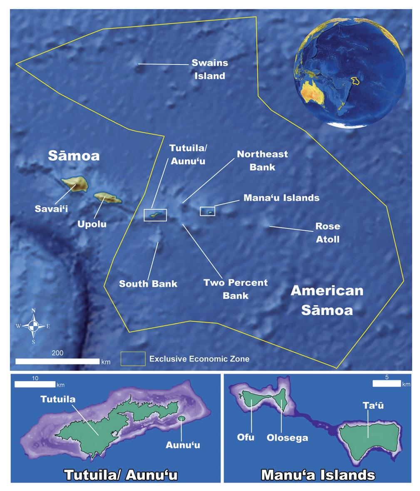
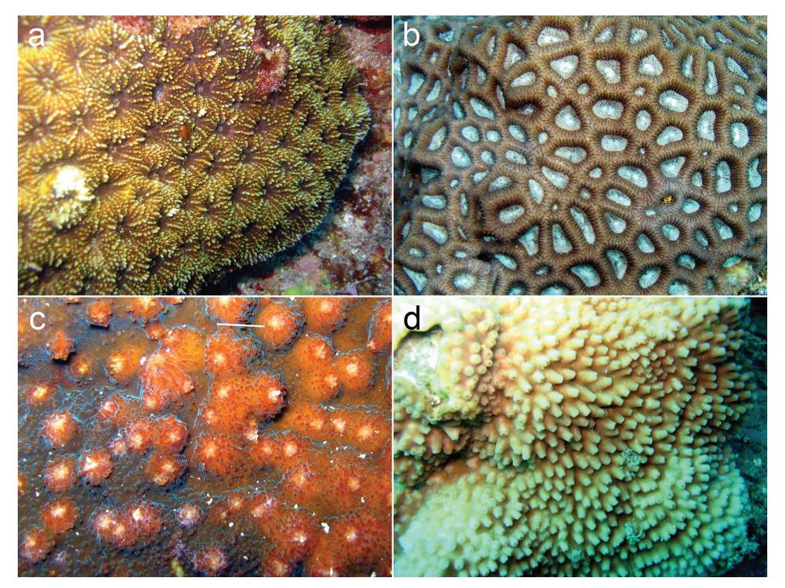

# Annotated checklist for stony corals of American Sāmoa with reference to mesophotic depth records

Anthony D. Montgomery1,2, Douglas Fenner3, Robert J. Toonen1

I Hawaiʻi Institute of Marine Biology, University of Hawaiʻi at Mānoa, Kāneʻohe, HI 96744, USA **2** U.S. Fish and Wildlife Service, Pacific Islands Fish and Wildlife Office, 300 Ala Moana Blvd. Honolulu, HI 96850, USA **3** Ocean Associates, Inc., NOAA Fisheries Service, Pacific Islands Regional Office, Pago Pago, AS, USA

Corresponding author: Anthony D. Montgomery (amont@hawaii.edu)

Academic editor: B. W. Hoeksema | Received 22 March 2019 | Accepted 20 April 2019 | Published 21 May 2019

http://zoobank.org/DD1184B0-AC0E-43A9-B5E2-72481DC8AFEC

**Citation:** Montgomery AD, Fenner D, Toonen RJ (2019) Annotated checklist for stony corals of American Samoa with reference to mesophotic depth records. ZooKeys 849: 1–170. https://doi.org/10.3897/zookeys.849.34763

#### **Abstract**

An annotated checklist of the stony corals (Scleractinia, Milleporidae, Stylasteridae, and Helioporidae) of American Sāmoa is presented. A total of 377 valid species has been reported from American Sāmoa with 342 species considered either present (251) or possibly present (91). Of these 342 species, 66 have a recorded geographical range extension and 90 have been reported from mesophotic depths (30–150 m). Additionally, four new species records (*Acanthastrea subechinata* Veron, 2000, *Favites paraflexuosus* Veron, 2000, *Echinophyllia echinoporoides* Veron & Pichon, 1980, *Turbinaria irregularis* Bernard, 1896) are presented. Coral species of concern include species listed under the US Endangered Species Act (ESA) and the International Union for Conservation of Nature's (IUCN) Red List of threatened species. Approximately 17.5% of the species present or possibly present are categorized as threatened by IUCN compared to 27% of the species globally. American Sāmoa has seven ESA-listed or ESA candidate species, including *Acropora globiceps* (Dana, 1846), *Acropora jacquelineae* Wallace, 1994, *Acropora retusa* (Dana, 1846), *Acropora speciosa* (Quelch, 1886), *Fimbriaphyllia paradivisa* (Veron, 1990), *Isopora crateriformis* (Gardiner, 1898), and *Pocillopora meandrina* Dana, 1846. There are two additional species possibly present, i.e., *Pavona diffluens* (Lamarck, 1816) and *Porites napopora* Veron, 2000.

#### **Keywords**

Helioporidae, mesophotic coral ecosystems, Milleporidae, new records, Scleractinia, Stylasteridae, WoRMS, World List of Scleractinia

#### **Table of Contents**

| Introduction                                                       | 4   |
|--------------------------------------------------------------------|-----|
| Materials and methods                                           | 7   |
| Museum name abbreviations                                          | 9   |
| Datasets                                                        | 9   |
| Checklist                                                          | 10  |
| Present                                                         | 10  |
| Class Anthozoa Ehrenberg, 1834                                  | 10  |
| Subclass Hexacorallia Haeckel, 1896                                | 10  |
| Order Scleractinia Bourne, 1900                                    | 10  |
| Family Acroporidae Verrill, 1902                                | 10  |
| Family Agariciidae Gray, 1847                                   | 41  |
| Family Astrocoeniidae Koby, 1890                                   | 49  |
| Family Coscinaraeidae Benzoni, Arrigoni, Stefani & Stolarski, 2012 | 50  |
| Family Dendrophylliidae Gray, 1847                              | 50  |
| Family Diploastreidae Chevalier & Beauvais, 1987                | 53  |
| Family Euphylliidae Alloiteau, 1952                             | 54  |
| Family Fungiidae Dana, 1846                                        | 55  |
| Family Lobophylliidae Dai & Horng, 2009                         | 63  |
| Family Merulinidae Verrill, 1865                                | 67  |
| Family Plesiastreidae Dai & Horng, 2009                            | 85  |
| Family Pocilloporidae Gray, 1840                                | 85  |
| Family Poritidae Gray, 1840                                        | 90  |
| Family Psammocoridae Chevalier & Beauvais, 1987                 | 97  |
| Scleractinian genera incertae sedis                             | 99  |
| Subclass Octocorallia Haeckel, 1866                             | 103 |
| Order Helioporacea Bock, 1938                                      | 103 |
| Family Helioporidae Moseley, 1876                               | 103 |
| Class Hydrozoa Owen, 1843                                          | 103 |
| Order Anthoathecata Cornelius, 1992                             | 103 |
| Family Milleporidae Fleming, 1828                               | 103 |
| Possibly present                                                   | 105 |
| Class Anthozoa Ehrenberg, 1834                                  | 105 |
| Subclass Hexacorallia Haeckel, 1896                                | 105 |
| Order Scleractinia Bourne, 1900                                    | 105 |
| Family Acroporidae Verrill, 1902                                | 105 |
| Family Agariciidae Gray, 1847                                   | 117 |
| Family Dendrophylliidae Gray, 1847                              | 118 |
| Family Euphylliidae Alloiteau, 1952                             | 119 |
| Family Fungiidae Dana, 1846                                        | 120 |
| Family Lobophylliidae Dai & Horng, 2009                         | 121 |
| Family Merulinidae Verrill, 1865                                | 123 |

| Family Pocilloporidae Gray, 1840                 | 128 |
|-----------------------------------------------------|-----|
| Family Poritidae Gray, 1840                         | 129 |
| Family Psammocoridae Chevalier & Beauvais, 1987  | 132 |
| Class Hydrozoa Owen, 1843                           | 133 |
| Order Anthoathecata Cornelius, 1992              | 133 |
| Family Milleporidae Fleming, 1828                | 133 |
| Uncertain                                           | 134 |
| Class Anthozoa Ehrenberg, 1834                   | 134 |
| Subclass Hexacorallia Haeckel, 1896                 | 134 |
| Order Scleractinia Bourne, 1900                     | 134 |
| Family Acroporidae Verrill, 1902                 | 134 |
| Family Agariciidae Gray, 1847                    | 136 |
| Family Lobophylliidae Dai & Horng, 2009          | 136 |
| Family Merulinidae Verrill, 1865                 | 137 |
| Family Pocilloporidae Gray, 1840                 | 138 |
| Family Poritidae Gray, 1840                         | 139 |
| Family Psammocoridae Chevalier & Beauvais, 1987  | 139 |
| Class Hydrozoa Owen, 1843                           | 140 |
| Order Anthoathecata Cornelius, 1992              | 140 |
| Family Stylasteridae Gray, 1847                  | 140 |
| Likely not present                                  | 141 |
| Class Anthozoa Ehrenberg, 1834                   | 141 |
| Subclass Hexacorallia Haeckel, 1896                 | 141 |
| Order Scleractinia Bourne, 1900                     | 141 |
| Family Acroporidae Verrill, 1902                 | 141 |
| Family Fungiidae Dana, 1846                         | 144 |
| Family Poritidae Gray, 1840                         | 144 |
| Not present                                         | 144 |
| Class Anthozoa Ehrenberg, 1834                   | 144 |
| Subclass Hexacorallia Haeckel, 1896                 | 144 |
| Order Scleractinia Bourne, 1900                     | 144 |
| Family Acroporidae Verrill, 1902                 | 144 |
| Family Fungiidae Dana, 1846                         | 145 |
| Family Merulinidae Verrill, 1865                 | 146 |
| Class Hydrozoa Owen, 1843                           | 146 |
| Order Anthoathecata Cornelius, 1992              | 146 |
| Family Milleporidae Fleming, 1828                | 146 |
| Scleractinia names that are not valid               | 146 |
| Phylum Bryozoa                                      | 152 |
| Discussion                                          | 152 |
| Acknowledgements                                    | 159 |
| References                                       | 159 |

#### **Introduction**

American Sāmoa is an unincorporated territory of the United States and lies between Hawaiʻi and New Zealand in the Southern Pacific Ocean (Figure 1). The Samoan Archipelago includes American Sāmoa, which consists of five high islands (Tutuila, Aunuʻu, Ofu, Olosega, and Taʻū), one low island (Swains Island), and an atoll (Rose), and the Independent state of Sāmoa at the west end of the archipelago with the two high islands (Upola and Savaiʻi) and eight smaller islands. Tonga lies approximately 900 km to the southwest and Tuvalu lies approximately 1,400 km to the northwest.

Coral reef research has been conducted in American Sāmoa since the early 1900s with work analyzing the growth rate of coral reefs and reporting the World's second stony coral transect (Mayor 1924a, 1924b; Mayor 1918). Since then, there has been a series of studies around the territory documenting its coral communities (Hoffmeister 1925; Birkeland et al. 1987, 2003, 2013; Maragos et al. 1994) including coral species checklists (Lamberts 1983; Birkeland 2001, 2007a, 2007b; Coles et al. 2003; DiDonato et al. 2006; Lovell and McLardy 2008; Kenyon et al. 2011). While there have been several papers looking at the coral species of American Sāmoa, most are not peerreviewed and none to date have considered the mesophotic zone explicitly. This has led to a large amount of documentation on the coral diversity across the territory, but not in a comprehensive manner that analyzes all available data and the scale of evidence for a complete coral species presence.

Previously referred to as deep coral reefs or the coral reef twilight zone (Pyle 1996, 1998, 2000), mesophotic coral ecosystems (MCE) are well defined in the literature: "Mesophotic coral ecosystems (MCEs) are characterized by the presence of light-dependent corals and associated communities that are typically found at depths ranging from 30 to 40 m and extending to over 150 m in tropical and subtropical regions. The dominant communities providing structural habitat in the mesophotic zone can be comprised of coral, sponge, and algal species" (Hinderstein et al. 2010). Previously thought to be marginal habitats, MCEs have been hypothesized as potential refugia for shallow water corals under the 'deep reef refugia' hypothesis (DRRH) (Glynn 1996; Hughes and Tanner 2000; Riegl and Piller 2003; Bak et al. 2005; Kahng et al. 2010; Bongaerts et al. 2010; Tenggardjaja et al. 2014; Holstein et al. 2015). Others have argued that MCEs host different communities of species, and make unlikely refugia from a warming ocean (Hurley et al. 2016; Smith et al. 2016; Bongaerts et al. 2017; Semmler et al. 2017). Bongaerts et al. (2010) reviewed the current literature regarding the DRRH for Caribbean reefs and concluded that the DRRH is more likely to apply to "depth generalist" species and may serve a greater importance in the upper range of MCEs (30–60 m). This was later exemplified on a Pacific reef in Okinawa, where the coral *Seriatopora hystrix* Dana, 1846 was extirpated from shallow water, and later discovered in an upper MCE at depths of 35 to 47 m (Sinniger et al. 2013). Here, we provide a notation for each species reported to be within the mesophotic zone in order to provide a common baseline on species occurrence.

The biogeography of corals has only been studied in the last few decades (Stehli and Wells 1971) with species level comparisons in the last two decades. Corals of the World

**Figure 1.** Map of American Sāmoa. A map of American Sāmoa showing its proximity to Independent Sāmoa and the distances between all the island groups (in green) and shallow (< 150 meter depth) banks (in purple) within the territory.

(CoTW; Veron et al. (2019) recognizes 833 valid zooxanthellate scleractinian species globally and does not include the azooxanthellate dendrophylliid corals (Cairns 2001; Arrigoni et al. 2014) as well as the cave dwelling *Leptoseris troglodyta* Hoeksema, 2012 (Hoeksema 2012a). The World List of Scleractinia (WLS) reports 1,610 valid species with approximately half of those being zooxanthellate, hermatypic species (Hoeksema and Cairns 2019).

**Table 1.** Zooxanthellate, reef-dwelling scleractinian species richness for the ecoregions surrounding American Sāmoa based on Veron et al. (2019).

| Ecoregion                                           | Number of species |
|-----------------------------------------------------|-------------------|
| Coral Triangle                                      | 627               |
| Bismarck Sea, New Guinea                            | 538               |
| Milne Bay, Papua New Guinea                         | 523               |
| Solomon Islands and Bougainville                    | 516               |
| New Caledonia                                       | 439               |
| Fiji                                                | 395               |
| Caroline Islands, Micronesia                        | 395               |
| Vanuatu                                             | 391               |
| Pohnpei and Kosrae, Micronesia                      | 384               |
| Coral Sea                                           | 378               |
| Kiribati west, Gilbert Islands                      | 316               |
| Sāmoa, Tuvalu, Tonga                                | 313               |
| Marshall Islands                                    | 309               |
| Great Barrier Reef south                            | 308               |
| Kiribati, north-east Line Islands                   | 194               |
| Cook Islands, central Pacific                       | 181               |
| Kiribati central, Phoenix Islands                   | 178               |
| Society Islands, French Polynesia                   | 176               |
| Austral Islands, French Polynesia                   | 153               |
| Tuamotu Archipelago west, central Pacific           | 117               |
| Kiribati, south-east Line Islands                   | 112               |
| Tuamotu Archipelago south-east and Pitcairn Islands | 104               |
| Hawaii east                                         | 58                |
| Johnston Atoll, north central Pacific               | 37                |
| Marquesas Islands, French Polynesia                 | 23                |
| Kermadec Islands, south Pacific                     | 16                |

Broad-scale biogeographic studies require regional-scale data that can be traced back to a consistent taxonomy (Veron 1995). The most comprehensive biogeographic analysis of scleractinians has been completed by Veron et al. (2015) and CoTW (Veron 2000; Veron et al. 2019). Together, these studies show a pattern of highest diversity in the Coral Triangle with decreasing diversity towards the north, east, and south (Hoeksema 2007; Veron et al. 2015). The ecoregion described by Veron et al. (2019) that includes American Sāmoa is the Sāmoa, Tuvalu, and Tonga ecoregion and includes the island groups of Tuvalu, Tokelau, Wallis and Futuna, Tonga, Niuē, and the Sāmoa Archipelago. Veron et al. (2019) reports this ecoregion has 313 reef coral species, while the neighboring ecoregions range from 16 to over 500 coral reef species and the Coral Triangle with 627 coral reef species (Table 1; Veron et al. 2019).

In order to make available the vast history of work completed in American Sāmoa, we present a detailed annotated analysis for the reported shallow and mesophotic stony coral species including scleractinian, milleporid, stylasterid, and helioporid species. This analysis presents the information in an open, transparent manner that allows the reader to judge any particular observation over and beyond our analysis. The goal of this study is to provide a foundation for a thorough species list for the Territory of American Sāmoa with a mechanism that allows the reader to trace back to the original recording of the species. This mechanism will allow different interpretations of the taxonomy, confidence of a species observation, or future analyses of species presence to be re-analyzed or questioned easily. Further, we believe this type of approach to a species checklist on a small regional scale can provide a valuable contribution to broader scale biogeographic analyses as discussed by Veron (1995).

#### **Materials and methods**

Species occurrences in the study area were recorded from all available literature (Mayor 1924a, 1924b; Hoffmeister 1925; Dahl and Lamberts 1977; USACE 1980; Dahl 1981; Lamberts 1983; Birkeland et al. 1987, 2003, 2013; Itano and Buckley 1988; Hoeksema 1989; Hunter et al. 1993; Maragos et al. 1994, 1995; Mundy 1996; Green et al. 1997; Green and Hunter 1998; Green et al. 1999; Mundy and Green 1999; Birkeland and Belliveau 2000; Craig et al. 2001; Fisk and Birkeland 2002; Work and Rameyer 2002; Coles et al. 2003; Wolstenholme et al. 2003; Cornish and DiDonato 2004; DiDonato et al. 2006; Birkeland 2007a, 2007b; Fenner et al. 2008; Lovell and McLardy 2008; Forsman and Birkeland 2009; Forsman et al. 2009; Bare et al. 2010; Benzoni et al. 2010; Kenyon et al. 2010, 2011; CRED 2011; Corals NPAS 2016; Fenner and Sudek 2016; AM 2018; BPBM 2018; DMWR 2018; Fenner 2018; QM 2018; NMNH 2018; Creuwels 2019; Gross 2019; Montgomery et al. 2019; Paulay and Brown 2019). Each appearance of a species name was recorded with as much information as available including the exact spelling of the species name, identification qualifiers (e.g., cf., aff., ?, etc.), survey type, island, species location (e.g., site name, transect label, etc.), the reference of the appearance, if the species was referenced to a different source and its reference, and any other general notes or information. This information was collected in a Microsoft Excel spreadsheet and imported into R where the data were validated. All unique species names were cross-referenced with valid accepted names in the World Register of Marine Species (WoRMS) through their REST webservice [\(http://www.marinespecies.org/rest/](http://www.marinespecies.org/rest/)). Names were queried for exact matches and missing matches were queried for fuzzy matches based on the Taxamatch algorithm (Rees 2014). Remaining names were queried again with older generic names (e.g., *Madrepora* instead of *Acropora*). All remaining names were retained as used.

Additional data validation steps included the elimination of duplicate returns from WoRMS, examining each individual fuzzy match return and dubious names, and standardizing nomenclature for unaccepted name explanations. The classification was updated based on the accepted valid name of a species and added to all records from the WoRMS database. Finally, any missing names that were unable to be matched with WoRMS records were added individually.

The checklist is arranged by species presence determination and then by order and alphabetically by family, genus and species for each valid name. Each species record starts with listing the valid species name as accepted in WoRMS (WoRMS Editorial Board 2018). The valid name is hyperlinked to the WoRMS species taxa webpage followed by the species authority and AphiaID. Under each valid name, species names as appeared in the literature are reported followed by the species authority and AphiaID. Species names that have grammatical misspellings are labeled with [sic]. If the species was a synonym, then it was labeled as a heterotypic or homotypic synonym. We use the term 'homotypic synonym' to refer to cases where the same species epithet is combined with different genera, and 'heterotypic synonym' in cases where different species epithets are regarded as subjective junior synonyms. While the terms 'objective synonym' and 'subjective synonym' are technically defined within the International Code of Zoological Nomenclature (ICZN) Code to mean essentially the same ([http://www.nhm.ac.uk/hosted-sites/iczn/code/index.jsp?booksection=glos](http://www.nhm.ac.uk/hosted-sites/iczn/code/index.jsp?booksection=glossary&nfv=true) [sary&nfv=true](http://www.nhm.ac.uk/hosted-sites/iczn/code/index.jsp?booksection=glossary&nfv=true)), in our experience the term 'objective synonym' is most commonly used in cases of different species epithets that share the same type specimen (e.g., replacement names). Therefore, we believe the terms 'homotypic synonym' and 'heterotypic synonym' are more appropriate in the present context, which is consistent with how these terms are most commonly used for taxonomic purposes. Each species name is followed by the references that used that exact name and spelling. The references are separated into first-hand accounts labeled as reported and second or more hand accounts labeled as referenced.

All names (valid and synonymies) according to the World List of Scleractinia (Hoeksema and Cairns 2019) were cross-referenced with the accepted names by Veron et al. (2019), Wallace (1999), and Wallace et al. (2012) to provide the reader with a potentially different view of the species and highlight any differences. Any name that matched a name accepted by Wallace (1999) or Wallace et al. (2012) was noted by CCW. Any name that matched a name accepted by Veron et al. (2019) was notated as CoTW. The notation also provides a hyperlink to the factsheet available on the CoTW webpage [\(http://www.coralsoftheworld.org/page/home/](http://www.coralsoftheworld.org/page/home/)). Veron et al. (2019) is an electronic source that has evolved from the printed worldwide overview of reefdwelling Scleractinia by Veron (2000), while Hoeksema and Cairns (2019) is based on published taxonomic revisions of various scleractinian families and genera, partly based on molecular analyses and/or on the re-examination of type specimens and other museum material (Wallace 1999; Wallace et al. 2007, 2012; Hoeksema 2009, 2012a, 2012b, 2014; Benzoni et al. 2010, 2011, 2012a, 2014; Gittenberger et al. 2011; Huang et al. 2011, 2014a, 2014b, 2016; Budd et al. 2012; Arrigoni et al. 2014, 2015, 2016a, 2016b, 2017, 2018a; Kitano et al. 2014; Schmidt-Roach et al. 2014; Terraneo et al. 2016, 2017).

After all names and references are listed, we include our determination of the species presence in American Sāmoa. This determination was split into five categories: present, possibly present, uncertain, not likely present, and not present. This determination was made largely on the type of evidence available including the amount of references, the type of reference, the evidence the reference includes (e.g., in situ observation, photographic, sample identified, or type specimen), and taxonomic and identification certainty. The species presence determination is followed by information on the highest level of evidence available to support the species presence. Additionally, the annotation includes the reported species distribution within American Sāmoa as reported by the literature, the nearest confirmed ecoregion for the species presence according to Veron et al. (2019), the direction of a potential geographic range extension, the evidence of species vulnerability as documented by the International Union for Conservation of Nature's (IUCN) Red List of threatened species (IUCN 2018) as assessed by Carpenter et al. (2008) and the US Endangered Species Act (ESA), and the depths and associated references for corals reported from mesophotic depths. Finally, we provide notes that discuss our justification of a species presence determination, other evidence not already listed, or other noteworthy comments. Each IUCN note is hyperlinked to the IUCN Red List species information webpage ([http://www.iucnredlist.org/\)](http://www.iucnredlist.org/).

Species listed by the National Oceanic and Atmospheric Administration (NOAA) under the ESA are notated with the symbol for threatened and for candidate listing. The species status as listed by the IUCN Red List of Threatened Species is noted as Critically Endangered (CE), Endangered (EN), Vulnerable (VU), Near Threatened (NT), Least Concern (LC), Data Deficient (DD), and Not Evaluated (NE).

#### **Museum name abbreviations**

**AM** Austalian Museum, New South Wales, Australia **BPBM** Bernice P Bishop Museum, Honolulu, Hawaiʻi

**CRED** Coral Reef Ecosystem Division, NOAA, Honolulu, Hawaiʻi

**DMWR** Department of Marine and Wildlife Resources, Pago Pago, American

Sāmoa

**NMNH** US National Museum of Natural History, Smithsonian Institution,

Washington, DC

**QM** Queensland Museum, Brisbane, Australia

#### **Datasets**

The data underpinning the analyses reported in this paper are deposited in the GBIF, the Global Biodiversity Information Facility (Citation: Montgomery A, Toonen R, Fenner D (2019) Annotated checklist for Stony Corals of American Samoa and Mesophotic Depth Records. [https://doi.org/10.15468/07opwe\)](https://doi.org/10.15468/07opwe).

#### **Checklist**

#### **Present**

**Class Anthozoa Ehrenberg, 1834 Subclass Hexacorallia Haeckel, 1896 Order Scleractinia Bourne, 1900 Family Acroporidae Verrill, 1902 Genus** *Acropora* **Oken, 1815**

### *Acropora abrotanoides* **(Lamarck, 1816) (207083)** CoTW CCW

*Acropora abratanoides* (Lamarck, 1816) (207083) [sic]. Reported – Lamberts 1983. *Acropora abrotanioides* (Lamarck, 1816) (207083) [sic]. Reported – DMWR 2018. *Acropora abrotanoides* (Lamarck, 1816) (207083). CoTW CCW Reported – USACE 1980; Birkeland et al. 1987; Fisk and Birkeland 2002; Coles et al. 2003; DiDonato et al. 2006; Birkeland 2007a; Fenner et al. 2008; Kenyon et al. 2010; CRED 2011; Corals NPAS 2016; Fenner 2018; NMNH 2018; QM 2018. Referenced – Coles et al. 2003; DiDonato et al. 2006; Birkeland 2007a, 2007b; Lovell and McLardy 2008. *Acropora abrotenoides* (Lamarck, 1816) (207083) [sic]. Reported – Work and Rameyer 2002.

- *Acropora danai* (Milne Edwards, 1860) (206990) heterotypic synonym. Reported Birkeland et al. 1987; Maragos et al. 1995; Mundy 1996; DiDonato et al. 2006; Corals NPAS 2016. Referenced – Fisk and Birkeland 2002; Coles et al. 2003; DiDonato et al. 2006.
- *Acropora irregularis* (Brook, 1892) (206993) heterotypic synonym. Reported Birkeland et al. 1987, 2003; Itano and Buckley 1988; Maragos et al. 1994; Corals NPAS 2016. Referenced – Green et al. 1999; Coles et al. 2003; DiDonato et al. 2006; Birkeland 2007a, 2007b.
- *Acropora rotumana* (Gardiner, 1898) (207001) heterotypic synonym. Reported Hoffmeister 1925; USACE 1980; Lamberts 1983. Referenced – Dahl and Lamberts 1977; Dahl 1981; Green et al. 1997.
- *Acropora tutuilensis* Hoffmeister, 1925 (430656) heterotypic synonym. CoTW Reported – Mayor 1924b; Hoffmeister 1925; Lamberts 1983; Birkeland et al. 1987; Kenyon et al. 2010; NMNH 2018. Referenced – Green et al. 1999; Birkeland 2007b.

**American Sāmoa status** – Present. **Evidence** – Type specimen location (synonym *Acropora tutuilensis*). **Distribution** – American Sāmoa, Aunuʻu, Manuʻa Islands, Ofu, Ofu/Olosega, Olosega, Rose Atoll, Taʻū, Tutuila. **Nearest confirmed ecoregion** – Sāmoa, Tuvalu, and Tonga. **Vulnerability** – LC. **Notes** – This species has four synonyms with *Acropora tutuilensis* Hoffmeister, 1925 accepted as a valid species by Veron et al. (2019) and as a synonym of *A. abrotanoides* by Wallace (1999) and Wallace et al. (2012) suggesting some ambiguity in species identifications and species boundaries.

# *Acropora aculeus* **(Dana, 1846) (206991)** CoTW CCW

*Acropora aculeus* (Dana, 1846) (206991). CoTW CCW Reported – USACE 1980; Lamberts 1983; Maragos et al. 1995; Mundy 1996; Craig et al. 2001; Fisk and Birkeland 2002; Birkeland 2007a; Corals NPAS 2016; Fenner 2018; QM 2018; Montgomery et al. 2019. Referenced – Fisk and Birkeland 2002; DiDonato et al. 2006; Birkeland 2007b; Lovell and McLardy 2008; Kenyon et al. 2011.

**American Sāmoa status** – Present. **Evidence** – Multiple specimen reports. **Distribution** – American Sāmoa, Aunuʻu, Ofu, Ofu/Olosega, Tutuila. **Nearest confirmed ecoregion** – Sāmoa, Tuvalu, and Tonga. **Vulnerability** – VU. **Mesophotic record** – 49 m depth (Montgomery et al. 2019).

#### *Acropora acuminata* **(Verrill, 1864) (207020)** CoTW CCW

*Acropora acuminata* (Verrill, 1864) (207020). CoTW CCW Reported – Birkeland et al. 1987, 2003; Maragos et al. 1994; Fisk and Birkeland 2002; Coles et al. 2003; Corals NPAS 2016; QM 2018. Referenced – Green et al. 1999; Coles et al. 2003; DiDonato et al. 2006; Birkeland 2007a, 2007b; Lovell and McLardy 2008; Kenyon et al. 2011.

**American Sāmoa status** – Present. **Evidence** – Single specimen report (identified by C Wallace). **Distribution** – American Sāmoa, Manuʻa Islands, Ofu, Ofu/Olosega, Tutuila. **Nearest confirmed ecoregion** – Sāmoa, Tuvalu, and Tonga. **Vulnerability** – VU. **Notes** – This is not an easy species to identify in the field. Photographic evidence from Corals NPAS (2016) is inconclusive, but a specimen identified by C Wallace is in the QM.

# *Acropora anthocercis* **(Brook, 1893) (207024)** CoTW CCW

*Acropora anthocercis* (Brook, 1893) (207024). CoTW CCW Reported – Birkeland 2007a; QM 2018.

**American Sāmoa status** – Present. **Evidence** – Single specimen report (identified by J Wolstenholme). **Distribution** – Ofu. **Nearest confirmed ecoregion** – Sāmoa, Tuvalu, and Tonga. **Vulnerability** – VU.

### *Acropora aspera* **(Dana, 1846) (207011)** CoTW CCW

*Acropora aspera* (Dana, 1846) (207011). CoTW CCW Reported – USACE 1980; Lamberts 1983; Mundy 1996; Birkeland 2007a; Kenyon et al. 2010; Birkeland et al. 2013; BPBM 2018; DMWR 2018; Fenner 2018; NMNH 2018; QM 2018. Referenced – Coles et al. 2003; Birkeland 2007a, 2007b; Lovell and McLardy 2008; Kenyon et al. 2011.

*Acropora cribripora* Dana, 1846 (741197) heterotypic synonym. Reported – Mayor 1924b.

*Acropora hebes* (Dana, 1846) (367984) heterotypic synonym. Reported – Mayor 1924b; Hoffmeister 1925; USACE 1980; Lamberts 1983; Birkeland et al. 1987. Referenced – Dahl and Lamberts 1977; Dahl 1981; Green et al. 1997; Birkeland 2007b.

**American Sāmoa status** – Present. **Evidence** – Multiple specimen reports. **Distribution** – American Sāmoa, Manuʻa Islands, Ofu, Ofu/Olosega, Olosega, Rose Atoll, Taʻū, Tutuila. **Nearest confirmed ecoregion** – Sāmoa, Tuvalu, and Tonga. **Vulnerability** – VU. **Notes** – Randall and Myers (1983) accepted *Acropora hebes* (Dana, 1846) as a valid species while Veron et al. (2019), Wallace (1999), and Wallace et al. (2012) did not.

#### *Acropora austera* **(Dana, 1846) (207052)** CoTW CCW

*Acropora austera* (Dana, 1846) (207052). CoTW CCW Reported – Craig et al. 2001; Fisk and Birkeland 2002; Coles et al. 2003; DiDonato et al. 2006; Birkeland 2007a; Fenner et al. 2008; Bare et al. 2010; Corals NPAS 2016; AM 2018; DMWR 2018; Fenner 2018; QM 2018. Referenced – Hoffmeister 1925; DiDonato et al. 2006; Lovell and McLardy 2008.

*Acropora austera* cf. (Dana, 1846) (207052). CoTW CCW Reported – Coles et al. 2003.

**American Sāmoa status** – Present. **Evidence** – Multiple specimen reports. **Distribution** – American Sāmoa, Aunuʻu, Manuʻa Islands, Ofu, Ofu/Olosega, Sāmoa Islands, Taʻū, Tutuila. **Nearest confirmed ecoregion** – Sāmoa, Tuvalu, and Tonga. **Vulnerability** – NT. **Notes** – The photo of this species reported in Corals NPAS (2016) appears to show a specimen of *Acropora pagoensis* Hoffmeister, 1925.

# *Acropora batunai* **Wallace, 1997 (288187)** CoTW CCW

*Acropora batunai* Wallace, 1997 (288187). CoTW CCW Reported – DMWR 2018.

**American Sāmoa status** – Present. **Evidence** – Single specimen report (identified by D Fenner). **Distribution** – Tutuila. **Nearest confirmed ecoregion** – Solomon Islands and Bougainville. **Geographical range extension** – East. **Vulnerability** – VU.

### *Acropora carduus* **(Dana, 1846) (288189)** CoTW CCW

*Acropora carduus* (Dana, 1846) (288189). CoTW CCW Reported – Craig et al. 2001; Birkeland 2007a; Corals NPAS 2016. Referenced – DiDonato et al. 2006; Lovell and McLardy 2008.

*Acropora prolixa* (Verrill, 1866) (1261651) heterotypic synonym. Reported – Hoffmeister 1925; Lamberts 1983; NMNH 2018.

**American Sāmoa status** – Present. **Evidence** – Multiple specimen reports. **Distribution** – American Sāmoa, Ofu, Tutuila. **Nearest confirmed ecoregion** – Sāmoa, Tuvalu, and Tonga. **Vulnerability** – NT.

#### *Acropora cerealis* **(Dana, 1846) (207016)** CoTW CCW

*Acropora ceralis* (Dana, 1846) (207016) [sic]. Reported – USACE 1980.

*Acropora cerealis* (Dana, 1846) (207016). CoTW CCW Reported – Lamberts 1983; Birkeland et al. 1987, 2003; Itano and Buckley 1988; Maragos et al. 1994; Birkeland 2007a; Fenner et al. 2008; Kenyon et al. 2010; DMWR 2018; Fenner 2018; NMNH 2018; QM 2018. Referenced – Green et al. 1999; Birkeland 2007b; Lovell and McLardy 2008.

*Acropora cerealis* cf. (Dana, 1846) (207016). CoTW CCW Reported – DMWR 2018.

*Acropora cerialis* (Dana, 1846) (207016) [sic]. Reported – Mundy 1996. Referenced – Fisk and Birkeland 2002.

*Acropora cymbicyathus* (Brook, 1893) (207109) heterotypic synonym. Reported – Mayor 1924b; Hoffmeister 1925. Referenced – Hoffmeister 1925.

*Acropora symbicyathus* (Brook, 1893) (207109) [sic] heterotypic synonym. Reported – Lamberts 1983.

**American Sāmoa status** – Present. **Evidence** – Multiple specimen reports. **Distribution** – American Sāmoa, Aunuʻu, Manuʻa Islands, Ofu, Ofu/Olosega, Rose Atoll, Sāmoa Islands, Taʻū, Tutuila. **Nearest confirmed ecoregion** – Sāmoa, Tuvalu, and Tonga. **Vulnerability** – LC.

# *Acropora chesterfieldensis* **Veron & Wallace, 1984 (288191)** CoTW CCW

*Acropora chesterfieldensis* Veron & Wallace, 1984 (288191). CoTW CCW Reported – Fenner 2018.

**American Sāmoa status** – Present. **Evidence** – Single photographic record. **Distribution** – Ofu/Olosega. **Nearest confirmed ecoregion** – Sāmoa, Tuvalu, and Tonga. **Vulnerability** – LC. **Notes** – This species is documented by clear photographic evidence (Fenner 2018) to support its presence in American Sāmoa.

# *Acropora clathrata* **(Brook, 1891) (207075)** CoTW CCW

*Acropora clathrata* (Brook, 1891) (207075). CoTW CCW Reported – USACE 1980; Lamberts 1983; Birkeland et al. 1987; Maragos et al. 1994; Mundy 1996; Fisk and Birkeland 2002; Coles et al. 2003; Fenner et al. 2008; Bare et al. 2010; Corals NPAS 2016; Fenner and Sudek 2016; DMWR 2018; Fenner 2018; QM 2018. Referenced – Fisk and Birkeland 2002; DiDonato et al. 2006; Birkeland 2007a, 2007b; Lovell and McLardy 2008.

*Acropora complanata* (Brook, 1893) (207071) heterotypic synonym. Reported – Birkeland et al. 1987; Corals NPAS 2016. Referenced – Coles et al. 2003; DiDonato et al. 2006; Birkeland 2007b.

*Acropora vasiformis* (Brook, 1893) (207073) heterotypic synonym. Reported – Birkeland et al. 1987.

**American Sāmoa status** – Present. **Evidence** – Multiple specimen reports. **Distribution** – American Sāmoa, Aunuʻu, Ofu, Ofu/Olosega, Taʻū, Tutuila. **Nearest confirmed ecoregion** – Sāmoa, Tuvalu, and Tonga. **Vulnerability** – LC.

### *Acropora cytherea* **(Dana, 1846) (207095)** CoTW CCW

*Acropora arcuata* (Brook, 1892) (207089) heterotypic synonym. Referenced – Hoffmeister 1925.

*Acropora armata* (Brook, 1892) (206992) heterotypic synonym. Referenced – Hoffmeister 1925.

*Acropora corymbosa* (Lamarck, 1816) (207018) possible heterotypic synonym. Reported – Mayor 1924b; Hoffmeister 1925; USACE 1980; Lamberts 1983; BPBM 2018.

*Acropora cytharea* (Dana, 1846) (207095) [sic]. Reported – Mundy 1996. Referenced – Fisk and Birkeland 2002.

*Acropora cytherea* (Dana, 1846) (207095). CoTW CCW Reported – USACE 1980; Lamberts 1983; Birkeland et al. 1987, 2003; Itano and Buckley 1988; Maragos et al. 1994; Fisk and Birkeland 2002; Work and Rameyer 2002; Coles et al. 2003; DiDonato et al. 2006; Fenner et al. 2008; CRED 2011; Corals NPAS 2016; AM 2018; DMWR 2018; Fenner 2018; NMNH 2018; QM 2018. Referenced – Green et al. 1999; Coles et al. 2003; DiDonato et al. 2006; Birkeland 2007a, 2007b; Lovell and McLardy 2008.

*Acropora reticulata* (Brook, 1892) (207021) heterotypic synonym. Reported – Birkeland et al. 1987.

*Acropora reticulata* cf. (Brook, 1892) (207021) heterotypic synonym. Reported – Birkeland et al. 1987.

*Acropora symmetrica* (Brook, 1891) (207005) heterotypic synonym. Reported – Birkeland et al. 1987. Referenced – Birkeland 2007b.

**American Sāmoa status** – Present. **Evidence** – Multiple specimen reports. **Distribution** – American Sāmoa, Aunuʻu, Manuʻa Islands, Ofu, Ofu/Olosega, Olosega, Sāmoa Islands, Tutuila. **Nearest confirmed ecoregion** – Sāmoa, Tuvalu, and Tonga. **Vulnerability** – LC. **Notes** – The photo of this species reported in Corals NPAS (2016) appears to be incorrect.

# *Acropora digitifera* **(Dana, 1846) (207045)** CoTW CCW

*Acropora digitifera* (Dana, 1846) (207045). CoTW CCW Reported – USACE 1980; Birkeland et al. 1987, 2003; Itano and Buckley 1988; Maragos et al. 1994; Craig et al. 2001; Fisk and Birkeland 2002; Work and Rameyer 2002; Coles et al. 2003; Wolstenholme et al. 2003; DiDonato et al. 2006; Birkeland 2007a; Kenyon et al. 2010; Corals NPAS 2016; DMWR 2018; Fenner 2018; NMNH 2018; QM 2018. Referenced – Green et al. 1999; Coles et al. 2003; DiDonato et al. 2006; Birkeland 2007a, 2007b; Lovell and McLardy 2008.

*Acropora digitifera* ? (Dana, 1846) (207045). CoTW CCW Reported – DMWR 2018.

*Acropora digitifera* cf. (Dana, 1846) (207045). CoTW CCW Reported – USACE 1980; Birkeland et al. 2003.

*Acropora leptocyathus* (Brook, 1891) (207025) heterotypic synonym. Reported – Mayor 1924a, 1924b; Hoffmeister 1925; Dahl and Lamberts 1977; Lamberts 1983; BPBM 2018. Referenced – Hoffmeister 1925; Green et al. 1997.

*Acropora schmitti* ? Wells, 1950 (288245) heterotypic synonym. CoTW Referenced – Coles et al. 2003.

*Acropora schmitti* Wells, 1950 (288245) heterotypic synonym. CoTW Reported – US-ACE 1980; Lamberts 1983.

*Acropora wardii* Verrill, 1902 (740141) heterotypic synonym. Reported – Birkeland et al. 1987.

**American Sāmoa status** – Present. **Evidence** – Multiple specimen reports. **Distribution** – American Sāmoa, Aunuʻu, Manuʻa Islands, Ofu, Ofu/Olosega, Olosega, Rose Atoll, Sāmoa Islands, Taʻū, Tutuila. **Nearest confirmed ecoregion** – Sāmoa, Tuvalu, and Tonga. **Vulnerability** – NT. **Notes** – This species includes the synonym *Acropora schmitti* Wells, 1950 that is recognized by Veron et al. (2019), but not by Wallace (1999) nor Wallace et al. (2012). Randall and Myers (1983) recognized *Acropora wardii* Verrill, 1902 as a valid species that appears to be different from *A. digitifera*.

# *Acropora divaricata* **(Dana, 1846) (207106)** CoTW CCW

*Acropora divaricata* (Dana, 1846) (207106). CoTW CCW Reported – Birkeland et al. 1987; Mundy 1996; Fisk and Birkeland 2002; DiDonato et al. 2006; Fenner et al. 2008; Corals NPAS 2016; QM 2018. Referenced – Fisk and Birkeland 2002; Coles et al. 2003; DiDonato et al. 2006; Birkeland 2007b; Lovell and McLardy 2008.

**American Sāmoa status** – Present. **Evidence** – Single specimen report (identified by C Wallace). **Distribution** – American Sāmoa, Aunuʻu, Tutuila. **Nearest confirmed ecoregion** – Sāmoa, Tuvalu, and Tonga. **Vulnerability** – NT. **Notes** – This species has been reported by several studies with one of them providing photographic evidence (Corals NPAS 2016) and one specimen report by C Wallace from QM (2018). The coral documented by Corals NPAS (2016) is an uncertain identification. This species can be difficult to identify, but based on the identification by C Wallace we conclude that this species is present.

# *Acropora donei* **Veron & Wallace, 1984 (288198)** CoTW CCW

*Acropora akajimensis* cf. Veron, 1990 (288183) heterotypic synonym. CoTW Reported – Montgomery et al. 2019.

*Acropora akajimensis* Veron, 1990 (288183) heterotypic synonym. CoTW Reported – Fisk and Birkeland 2002; Birkeland 2007a; Fenner 2018. Referenced – Birkeland 2007b.

*Acropora donei* ? Veron & Wallace, 1984 (288198). CoTW CCW Reported – Coles et al. 2003. *Acropora donei* Veron & Wallace, 1984 (288198). CoTW CCW Reported – Craig et al. 2001; DiDonato et al. 2006; Birkeland 2007a; Corals NPAS 2016. Referenced – DiDonato et al. 2006; Lovell and McLardy 2008; Kenyon et al. 2011.

**American Sāmoa status** – Present. **Evidence** – Single specimen report (identified by A Montgomery and D Fenner). **Distribution** – American Sāmoa, Ofu, Taʻū, Tutuila. **Nearest confirmed ecoregion** – Sāmoa, Tuvalu, and TongaSāmoa, Tuvalu, and Tonga. **Vulnerability** – VU. **Mesophotic record** – 41 m depth (Montgomery et al. 2019). **Notes** – *Acropora akajimensis* is a synonym of *A. donei*, but Veron et al. (2019) recognize *A. akajimensis* as a valid species while Wallace (1999) and Wallace et al. (2012) do not. The *A. akajimensis* reported in Montgomery et al. (2019) was based on a skeletal analysis of a sample that matched the description of *A. akajimensis* very closely, and not *A. donei*. *A. donei* is neat and tidy with the radial corallites and branches being relatively blunt and relatively uniform in thickness. *A. akajimensis* appears much more jagged and disorganized, with pointy corallites and branches. More taxonomic research is needed for these species. The nearest confirmed ecoregion for *A. akajimensis* is New Caledonia (Veron et al. 2019).

#### *Acropora eurystoma* **(Klunzinger, 1879) (207108)** CoTW CCW

*Acropora eurystoma* (Klunzinger, 1879) (207108). CoTW CCW Reported – NMNH 2018. *Acropora pagoenis* Hoffmeister, 1925 (411144) [sic] heterotypic synonym. Reported – Birkeland et al. 1987.

*Acropora pagoensis* Hoffmeister, 1925 (411144) heterotypic synonym. Reported – Hoffmeister 1925; USACE 1980; Lamberts 1983; Birkeland et al. 1987, 2003; Fenner et al. 2008; DMWR 2018; Fenner 2018; NMNH 2018. Referenced – Green et al. 1999; Coles et al. 2003; Birkeland 2007b.

**American Sāmoa status** – Present. **Evidence** – Type (synonym *Acropora pagoensis*). **Distribution** – American Sāmoa, Aunuʻu, Ofu/Olosega, Taʻū, Tutuila. **Nearest confirmed ecoregion** – Red Sea north-central. **Geographical range extension** – Southeast. **Notes** – In Hoffmeisterʻs (1925) original description of *A. pagoensis*, he cites it as similar to *A. eurystoma*. However, Wallace (1999) and Veron et al. (2019) consider this species a probable synonym of *Acropora tenuis* (Dana, 1846). All citations have used the name *A. pagoensis* except for NMNH (2018) in which one specimen from American Sāmoa was identified by S Cairns as *A. eurystoma*. Hoffmeister (1925) further states this species is distinctive from *A. eurystoma*. We consider *A. eurystoma* present based on *A. pagoensis* being synonymized under *A. eurystoma*, however, we believe *A. pagoensis* may be a valid species and *A. eurystoma* is not likely a valid name for the American Sāmoa observations. Veron et al. (2019) and Wallace (1999) consider this species to be endemic to the Red Sea. We believe more taxonomic investigation into this species is warranted, which should include colonies collected from American Sāmoa.

# *Acropora gemmifera* **(Brook, 1892) (207097)** CoTW CCW

*Acropora gemmifera* (Brook, 1892) (207097). CoTW CCW Reported – Birkeland et al. 1987, 2003, 2013; Itano and Buckley 1988; Maragos et al. 1994, 1995; Mundy 1996; Craig et al. 2001; Fisk and Birkeland 2002; Work and Rameyer 2002; Coles et al. 2003; Wolstenholme et al. 2003; DiDonato et al. 2006; Birkeland 2007a; Fenner et al. 2008; Kenyon et al. 2010; Corals NPAS 2016; DMWR 2018; Fenner 2018; QM 2018. Referenced – Fisk and Birkeland 2002; Coles et al. 2003; DiDonato et al. 2006; Birkeland 2007a, 2007b; Lovell and McLardy 2008.

*Acropora gemmifera* cf. (Brook, 1892) (207097). CoTW CCW Reported – Birkeland et al. 1987, 2003. Referenced – Green et al. 1999; Coles et al. 2003.

**American Sāmoa status** – Present. **Evidence** – Multiple specimen reports. **Distribution** – American Sāmoa, Aunuʻu, Manuʻa Islands, Ofu, Ofu/Olosega, Olosega, Rose Atoll, Taʻū, Tutuila. **Nearest confirmed ecoregion** – Sāmoa, Tuvalu, and TongaSāmoa, Tuvalu, and Tonga. **Vulnerability** – LC.

# *Acropora globiceps* **(Dana, 1846) (430645)** CoTW CCW

*Acropora globiceps* (Dana, 1846) (430645). CoTW CCW Reported – Fisk and Birkeland 2002; Birkeland 2007a; Kenyon et al. 2010; Corals NPAS 2016; Fenner and Sudek 2016; DMWR 2018; Fenner 2018. Referenced – Coles et al. 2003; Lovell and McLardy 2008; Kenyon et al. 2011.

*Acropora globiceps* ? (Dana, 1846) (430645). CoTW CCW Reported – DMWR 2018. *Acropora globiceps* cf. (Dana, 1846) (430645). CoTW CCW Reported – Coles et al. 2003; Corals NPAS 2016. Referenced – DiDonato et al. 2006.

**American Sāmoa status** – Present. **Evidence** – Single specimen report (identified by D Fenner). **Distribution** – American Sāmoa, Aunuʻu, Manuʻa Islands, Ofu, Ofu/Olosega, Rose Atoll, Swains, Taʻū, Tutuila. **Nearest confirmed ecoregion** – Sāmoa, Tuvalu, and Tonga. **Vulnerability** – , VU. **Notes** – Fenner (this study) has examined the type specimens of *Acropora humilis* (Dana, 1846) and *A. globiceps*. All colonies examined (including the ones within the DMWR collection) belong clearly to *A. globiceps*. The name *A. globiceps* was forgotten until Wallace (1999) and Veron (2000) used it again. It appears likely that all reports of *A. humilis* from the Samoan Archipelago are actually *A. globiceps*.

# *Acropora granulosa* **(Milne Edwards, 1860) (207093)** CoTW CCW

*Acropora granulosa* (Milne Edwards, 1860) (207093). CoTW CCW Reported – USACE 1980; Lamberts 1983; Maragos et al. 1994; Coles et al. 2003; Kenyon et al. 2010; Corals NPAS 2016; DMWR 2018. Referenced – Birkeland 2007b; Lovell and McLardy 2008.

*Acropora granulosa* cf. (Milne Edwards, 1860) (207093). CoTW CCW Reported – Coles et al. 2003.

**American Sāmoa status** – Present. **Evidence** – Multiple specimen reports. **Distribution** – American Sāmoa, Rose Atoll, Taʻū, Tutuila. **Nearest confirmed ecoregion** – Sāmoa, Tuvalu, and Tonga. **Vulnerability** – NT.

#### *Acropora hyacinthus* **(Dana, 1846) (207044)** CoTW CCW

*Acropora conferta* (Quelch, 1886) (207107) heterotypic synonym. Referenced – Hoffmeister 1925.

*Acropora hyacanthus* (Dana, 1846) (207044) [sic]. Reported – BPBM 2018.

*Acropora hyacinthus* (Dana, 1846) (207044). CoTW CCW Reported – Mayor 1924b; Hoffmeister 1925; USACE 1980; Lamberts 1983; Birkeland et al. 1987, 2003, 2013; Itano and Buckley 1988; Maragos et al. 1994; Mundy 1996; Birkeland and Belliveau 2000; Craig et al. 2001; Fisk and Birkeland 2002; Work and Rameyer 2002; Coles et al. 2003; DiDonato et al. 2006; Birkeland 2007a; Fenner et al. 2008; CRED 2011; Corals NPAS 2016; Fenner and Sudek 2016; DMWR 2018; Fenner 2018; NMNH 2018; QM 2018. Referenced – Dahl and Lamberts 1977; Dahl 1981; Green et al. 1997, 1999; Fisk and Birkeland 2002; Coles et al. 2003; DiDonato et al. 2006; Birkeland 2007a, 2007b; Lovell and McLardy 2008.

*Acropora surculosa* (Dana, 1846) (207085) heterotypic synonym. Reported – USACE 1980; Lamberts 1983; Birkeland et al. 1987, 2003; Maragos et al. 1994; Corals NPAS 2016; Fenner 2018. Referenced – DiDonato et al. 2006; Birkeland 2007b. *Acropora surculosa* cf. (Dana, 1846) (207085) heterotypic synonym. Reported – Coles et al. 2003; DMWR 2018.

**American Sāmoa status** – Present. **Evidence** – Multiple specimen reports. **Distribution** – American Sāmoa, Aunuʻu, Manuʻa Islands, Ofu, Ofu/Olosega, Olosega, Rose Atoll, Sāmoa Islands, Taʻū, Tutuila. **Nearest confirmed ecoregion** – Sāmoa, Tuvalu, and Tonga. **Vulnerability** – NT. **Notes** – While Wallace (1999) and Veron et al. (2019) concur that *Acropora surculosa* (Dana, 1846) is a synonym of *A. hyacinthus*, Randall and Myers (1983) considered *A. surculosa* to be valid. Randall (1995) reports both *A. surculosa* and *A. hyacinthus* from Palau. Colonies in American Sāmoa fit the type of *A. surculosa* (examined by D Fenner) and appears to be different from *A. hyacinthus*. *Acropora surculosa* has smaller colonies with longer cone-shaped branchlets that more often appear to be fused or with multiple branch tips with long tentacles out during the day, while *A. hyacinthus* has larger colonies with shorter cylindrical branchlets that donʻt fuse or have multiple branch tips with much smaller tentacles if exposed during the day. Photographs show *A. surculosa* to have significant variation in both Guam (www. guamreeflife.com) and American Sāmoa. More research should pursue the potential for species distinction between these two species.

# *Acropora intermedia* **(Brook, 1891) (207035)** CoTW CCW

*Acropora intermedia* (Brook, 1891) (207035). CoTW CCW Reported – USACE 1980; Lamberts 1983; Craig et al. 2001; Fisk and Birkeland 2002; BPBM 2018; Fenner 2018; QM 2018; Montgomery et al. 2019. Referenced – Lovell and McLardy 2008.

*Acropora vanderhorsti* Hoffmeister, 1925 (741178) heterotypic synonym. Reported – Mayor 1924b; Hoffmeister 1925; Lamberts 1983; NMNH 2018.

**American Sāmoa status** – Present. **Evidence** – Multiple specimen reports. **Distribution** – American Sāmoa, Aunuʻu, Ofu, Ofu/Olosega, Taʻū, Tutuila. **Nearest confirmed ecoregion** – Sāmoa, Tuvalu, and Tonga. **Mesophotic record** – 37 m depth (Montgomery et al. 2019). **Notes** – This species has also been called *Acropora nobilis* (Dana, 1846). Wallace (1999) describes the relationship between *A. intermedia*, *Acropora robusta* (Dana, 1846), and *A. nobilis*.

# *Acropora jacquelineae* **Wallace, 1994 (288212)** CoTW CCW

*Acropora jacquelineae* Wallace, 1994 (288212). CoTW CCW Reported – Fenner 2018. Referenced – Kenyon et al. 2011.

*Acropora jacquilinae* Wallace, 1994 (288212) [sic]. Reported – DMWR 2018.

**American Sāmoa status** – Present. **Evidence** – Single specimen report (identified by D Fenner). **Distribution** – Taʻū, Tutuila. **Nearest confirmed ecoregion** – Sāmoa, Tuvalu, and Tonga. **Vulnerability** – , VU. **Notes** – There have been only two references that report this species, but T Hughes also reports seeing it on Taʻū (T Hughes, pers. comm.). An examination of an *A. jacquelineae* sample by D Luck concluded that it was not this species based on the fact that the axials were slightly smaller than reported in Wallace (1999) and that there were many small radial corallites while Wallace (1999) reported there are very few such radials in this species (Luck 2013). Examination of skeletal photographs in Wallace (1999) clearly show that corallites in most of the colony indeed have very few radials, but corallites near the edge of the colony have many radials. The sample analyzed by D Luck was taken from the edge of the colony by D Fenner and D Luck likely did not realize that the sample was taken from the edge. Given that this species is listed as threatened under the ESA, careful attention has been paid to the presence of this species and we believe the evidence in hand is sufficient to conclude its presence in American Sāmoa albeit likely as a rare species.

# *Acropora latistella* **(Brook, 1892) (207039)** CoTW CCW

*Acropora latistella /azurea* (Brook, 1892) (207039). Reported – DMWR 2018. *Acropora latistella* (Brook, 1892) (207039). CoTW CCW Reported – USACE 1980; Lamberts 1983; Craig et al. 2001; Fisk and Birkeland 2002; Birkeland et al. 2003; Birkeland 2007a; Kenyon et al. 2010; Corals NPAS 2016; Fenner 2018; NMNH 2018; QM 2018; Montgomery et al. 2019. Referenced – DiDonato et al. 2006; Birkeland 2007b; Lovell and McLardy 2008.

*Acropora latistella* ? (Brook, 1892) (207039). CoTW CCW Reported – Coles et al. 2003.

**American Sāmoa status** – Present. **Evidence** – Multiple specimen reports. **Distribution** – American Sāmoa, Aunuʻu, Manuʻa Islands, Ofu, Rose Atoll, Taʻū, Tutuila. **Nearest confirmed ecoregion** – Sāmoa, Tuvalu, and Tonga. **Vulnerability** – LC. **Mesophotic record** – 42 m depth (Montgomery et al. 2019).

# *Acropora listeri* **(Brook, 1893) (207057)** CoTW CCW

*Acropora listeri* (Brook, 1893) (207057). CoTW CCW Reported – DiDonato et al. 2006; Kenyon et al. 2010; Corals NPAS 2016; QM 2018. Referenced – Coles et al. 2003; Lovell and McLardy 2008; Kenyon et al. 2011.

*Acropora listeri* cf. (Brook, 1893) (207057). CoTW CCW Reported – DMWR 2018.

**American Sāmoa status** – Present. **Evidence** – Single specimen report (identified by C Wallace). **Distribution** – American Sāmoa, Rose Atoll, Taʻū, Tutuila. **Nearest confirmed ecoregion** – Sāmoa, Tuvalu, and Tonga. **Vulnerability** – VU. **Notes** – A photographic record exists for this species (Corals NPAS 2016); however, this may be incorrectly identified. In addition, there is a single specimen reported by QM (2018) identified by C Wallace.

# *Acropora longicyathus* **(Milne Edwards, 1860) (207114)** CoTW CCW

*Acropora longicyathus* (Milne Edwards, 1860) (207114). CoTW CCW Reported – USACE 1980; Lamberts 1983; Kenyon et al. 2010. Referenced – Lovell and McLardy 2008.

*Acropora syringodes* (Brook, 1892) (207014) heterotypic synonym. Reported – Mayor 1924b; Hoffmeister 1925; Lamberts 1983; NMNH 2018. Referenced – Hoffmeister 1925.

*Acropora syringoides* (Brook, 1892) (207014) [sic] heterotypic synonym. Referenced – Birkeland 2007b.

**American Sāmoa status** – Present. **Evidence** – Multiple specimen reports. **Distribution** – American Sāmoa, Rose Atoll, Sāmoa Islands, Tutuila. **Nearest confirmed ecoregion** – Sāmoa, Tuvalu, and Tonga. **Vulnerability** – LC.

# *Acropora lutkeni* **Crossland, 1952 (206994)** CoTW CCW

*Acropora lutkeni* cf. Crossland, 1952 (206994). CoTW CCW Reported – DMWR 2018. *Acropora lutkeni* Crossland, 1952 (206994). CoTW CCW Reported – Maragos et al. 1994; Fisk and Birkeland 2002; Corals NPAS 2016; QM 2018. Referenced – DiDonato et al. 2006; Birkeland 2007b; Lovell and McLardy 2008.

**American Sāmoa status** – Present. **Evidence** – Single specimen report (identified by C Wallace). **Distribution** – American Sāmoa, Taʻū, Tutuila. **Nearest confirmed ecoregion** – Sāmoa, Tuvalu, and Tonga. **Vulnerability** – NT. **Notes** – QM (2018) reports this species identified by C Wallace.

### *Acropora microclados* **(Ehrenberg, 1834) (207101)** CoTW CCW

*Acropora assimilis* Brook, 1892 (741262) [sic] heterotypic synonym. Reported – NMNH 2018.

*Acropora microclados* (Ehrenberg, 1834) (207101). CoTW CCW Reported – Fisk and Birkeland 2002; DiDonato et al. 2006; Corals NPAS 2016; DMWR 2018. Referenced – Lovell and McLardy 2008; Kenyon et al. 2011.

*Acropora microclados* ? (Ehrenberg, 1834) (207101). CoTW CCW Reported – DMWR 2018.

**American Sāmoa status** – Present. **Evidence** – Multiple specimen reports. **Distribution** – American Sāmoa, Taʻū, Tutuila. **Nearest confirmed ecoregion** – Sāmoa, Tuvalu, and Tonga. **Vulnerability** – VU. **Notes** – The photographic record by Corals NPAS (2016) is incorrect, but there are multiple other specimen reports.

# *Acropora millepora* **(Ehrenberg, 1834) (207023)** CoTW CCW

*Acropora convexa* cf. (Dana, 1846) (367986) heterotypic synonym. CoTW Reported – Birkeland et al. 2003.

*Acropora millepora* (Ehrenberg, 1834) (207023). CoTW CCW Reported – USACE 1980; Lamberts 1983; Birkeland 2007a; Birkeland et al. 2013; BPBM 2018. Referenced – Green et al. 1999; Coles et al. 2003; Lovell and McLardy 2008.

*Acropora millepora* cf. (Ehrenberg, 1834) (207023). CoTW CCW Reported – DMWR 2018. *Acropora prostrata* (Dana, 1846) (207084) heterotypic synonym. Reported – Fisk and Birkeland 2002.

*Acropora prostrata* ? (Dana, 1846) (207084) heterotypic synonym. Reported – Coles et al. 2003.

*Acropora squamosa* Brook, 1892 (741205) heterotypic synonym. Reported – Birkeland et al. 1987. Referenced – Coles et al. 2003; Birkeland 2007b.

**American Sāmoa status** – Present. **Evidence** – Multiple specimen reports. **Distribution** – American Sāmoa, Ofu, Taʻū, Tutuila. **Nearest confirmed ecoregion** – Sāmoa, Tuvalu, and Tonga. **Vulnerability** – NT.

# *Acropora monticulosa* **(Brüggemann, 1879) (207103)** CoTW CCW

*Acropora monticulosa* (Brüggemann, 1879) (207103). CoTW CCW Reported – Birkeland et al. 1987; Itano and Buckley 1988; Maragos et al. 1994, 1995; Mundy 1996; Coles et al. 2003; Wolstenholme et al. 2003; Birkeland 2007a; Corals NPAS 2016; DMWR 2018; Fenner 2018; QM 2018. Referenced – Green et al. 1999; Fisk and Birkeland 2002; Coles et al. 2003; DiDonato et al. 2006; Birkeland 2007b; Lovell and McLardy 2008.

**American Sāmoa status** – Present. **Evidence** – Multiple specimen reports. **Distribution** – American Sāmoa, Aunuʻu, Manuʻa Islands, Ofu, Ofu/Olosega, Olosega, Taʻū, Tutuila. **Nearest confirmed ecoregion** – Sāmoa, Tuvalu, and Tonga. **Vulnerability** – NT.

#### *Acropora muricata* **(Linnaeus, 1758) (207007)** CoTW CCW

*Acropora arbuscula* (Dana, 1846) (207003) heterotypic synonym. Reported – USACE 1980; Lamberts 1983.

*Acropora formosa gracilis* (Dana, 1846) (207036) heterotypic synonym. Reported – NMNH 2018.

*Acropora formosa* var*. brachiata* (Dana, 1846) (207036) heterotypic synonym. Reported – Hoffmeister 1925. Referenced – Green et al. 1997.

*Acropora formosa* var*. gracilis* (Dana, 1846) (207036) heterotypic synonym. Reported – Hoffmeister 1925. Referenced – Green et al. 1997.

*Acropora formosa* var*. gracilis* aff. (Dana, 1846) (207036) heterotypic synonym. Reported – Mayor 1924b.

*Acropora formosa* (Dana, 1846) (207036) heterotypic synonym. Reported – Mayor 1924a; Hoffmeister 1925; USACE 1980; Lamberts 1983; Birkeland et al. 1987; Maragos et al. 1994; Mundy 1996; Green and Hunter 1998; Mundy and Green 1999; Birkeland and Belliveau 2000; DiDonato et al. 2006; Fenner et al. 2008; Corals NPAS 2016; BPBM 2018; NMNH 2018. Referenced – Dahl and Lamberts 1977; Dahl 1981; Green et al. 1997; Coles et al. 2003; DiDonato et al. 2006.

*Acropora formosa* cf. (Dana, 1846) (207036) heterotypic synonym. Reported – US-ACE 1980.

*Acropora gracilis* (Dana, 1846) (207060) heterotypic synonym. Reported – Kenyon et al. 2010. Referenced – Hoffmeister 1925.

*Acropora muricata* (Linnaeus, 1758) (207007). CoTW CCW Reported – Mayor 1924a; Dahl and Lamberts 1977; Birkeland and Belliveau 2000; Craig et al. 2001; Fisk and Birkeland 2002; Coles et al. 2003; Birkeland 2007a; Birkeland et al. 2013; Corals NPAS 2016; Fenner and Sudek 2016; DMWR 2018; Fenner 2018; QM 2018. Referenced – DiDonato et al. 2006; Birkeland 2007a, 2007b; Lovell and McLardy 2008.

**American Sāmoa status** – Present. **Evidence** – Multiple specimen reports. **Distribution** – American Sāmoa, Aunuʻu, Ofu, Ofu/Olosega, Olosega, Sāmoa Islands, Taʻū, Tutuila. **Nearest confirmed ecoregion** – Sāmoa, Tuvalu, and Tonga.

# *Acropora nana* **(Studer, 1879) (207100)** CoTW CCW

*Acropora azura* Veron & Wallace, 1984 (288186) [sic] heterotypic synonym. Reported – Corals NPAS 2016.

*Acropora azurea* Veron & Wallace, 1984 (288186) heterotypic synonym. CoTW Reported – Birkeland et al. 1987, 2003; Mundy 1996; Fenner et al. 2008. Referenced – Green et al. 1999; Fisk and Birkeland 2002; DiDonato et al. 2006; Birkeland 2007a, 2007b; Lovell and McLardy 2008.

*Acropora nana /valida* (Studer, 1879) (207100). Reported – DMWR 2018.

*Acropora nana* (Studer, 1879) (207100). CoTW CCW Reported – USACE 1980; Lamberts 1983; Birkeland et al. 1987, 2003, 2013; Maragos et al. 1994; Mundy 1996; Green et al. 1997; Birkeland and Belliveau 2000; Fenner et al. 2008; Kenyon et al. 2010; Corals NPAS 2016; Fenner and Sudek 2016; DMWR 2018; Fenner 2018; QM 2018. Referenced – Dahl and Lamberts 1977; Dahl 1981; Green et al. 1997; Fisk and Birkeland 2002; Coles et al. 2003; DiDonato et al. 2006; Birkeland 2007a, 2007b; Lovell and McLardy 2008.

*Acropora nana* cf. (Studer, 1879) (207100). CoTW CCW Reported – Birkeland et al. 1987. Referenced – Green et al. 1999; Coles et al. 2003.

**American Sāmoa status** – Present. **Evidence** – Multiple specimen reports. **Distribution** – American Sāmoa, Aunuʻu, Manuʻa Islands, Ofu, Ofu/Olosega, Olosega, Rose Atoll, Taʻū, Tutuila. **Nearest confirmed ecoregion** – Sāmoa, Tuvalu, and Tonga. **Vulnerability** – NT.

### *Acropora nasuta* **(Dana, 1846) (207009)** CoTW CCW

*Acropora canaliculata* (Klunzinger, 1879) (1262051) heterotypic synonym. Reported – NMNH 2018.

*Acropora nasuta* (Dana, 1846) (207009). CoTW CCW Reported – USACE 1980; Lamberts 1983; Birkeland et al. 1987, 2003; Itano and Buckley 1988; Maragos et al. 1994, 1995; Mundy 1996; Craig et al. 2001; Fisk and Birkeland 2002; Coles et al. 2003; DiDonato et al. 2006; Birkeland 2007a; Fenner et al. 2008; Bare et al. 2010; Kenyon et al. 2010; Corals NPAS 2016; AM 2018; DMWR 2018; Fenner 2018; QM 2018. Referenced – Green et al. 1999; Fisk and Birkeland 2002; Coles et al. 2003; DiDonato et al. 2006; Birkeland 2007a, 2007b; Lovell and McLardy 2008. *Acropora nasuta* cf. (Dana, 1846) (207009). CoTW CCW Reported – DMWR 2018.

**American Sāmoa status** – Present. **Evidence** – Multiple specimen reports. **Distribution** – American Sāmoa, Aunuʻu, Manuʻa Islands, Ofu, Ofu/Olosega, Olosega, Rose Atoll, Taʻū, Tutuila. **Nearest confirmed ecoregion** – Sāmoa, Tuvalu, and Tonga. **Vulnerability** – NT.

# *Acropora palmerae* **Wells, 1954 (207049)** CoTW CCW

*Acropora palmera* Wells, 1954 (207049) [sic]. Reported – Corals NPAS 2016.

*Acropora palmerae* Wells, 1954 (207049). CoTW CCW Reported – USACE 1980; Lamberts 1983; Birkeland et al. 1987; Maragos et al. 1994; Coles et al. 2003; DMWR 2018; Fenner 2018. Referenced – Green et al. 1999; Coles et al. 2003; DiDonato et al. 2006; Birkeland 2007b; Lovell and McLardy 2008; Kenyon et al. 2011. *Acropora palmeri* Wells, 1954 (207049) [sic]. Reported – USACE 1980.

**American Sāmoa status** – Present. **Evidence** – Multiple specimen reports. **Distribution** – American Sāmoa, Aunuʻu, Ofu, Tutuila. **Nearest confirmed ecoregion** – Sāmoa, Tuvalu, and Tonga. **Vulnerability** – VU. **Notes** – Wallace (1999) and Veron (2000) point out that this species has no differences in corallites or coenosteum with *Acropora robusta* (Dana, 1846), only the differences in colony shape (almost all branches versus almost all encrusting). This raises the question if these two are separate species or not.

#### *Acropora paniculata* **Verrill, 1902 (207008)** CoTW CCW

*Acropora panicualta* Verrill, 1902 (207008) [sic]. Reported – DMWR 2018. *Acropora paniculata* Verrill, 1902 (207008). CoTW CCW Reported – USACE 1980; Lamberts 1983; Maragos et al. 1994; Mundy 1996; Fisk and Birkeland 2002; Coles et al. 2003; Fenner et al. 2008; Kenyon et al. 2010; CRED 2011; Corals NPAS 2016; DMWR 2018; Fenner 2018; Montgomery et al. 2019. Referenced – Fisk and Birkeland 2002; DiDonato et al. 2006; Birkeland 2007a, 2007b; Lovell and McLardy 2008; Kenyon et al. 2011.

**American Sāmoa status** – Present. **Evidence** – Multiple specimen reports. **Distribution** – American Sāmoa, Aunuʻu, Ofu, Ofu/Olosega, Rose Atoll, Taʻū, Tutuila. **Nearest confirmed ecoregion** – Sāmoa, Tuvalu, and Tonga. **Vulnerability** – VU. **Mesophotic record** – 41 m depth (Montgomery et al. 2019). **Notes** – The photographic record by Corals NPAS (2016) is incorrect, but there are multiple specimen reports.

### *Acropora polystoma* **(Brook, 1891) (207050)** CoTW CCW

*Acropora massawensis* von Marenzeller, 1907 (207004) heterotypic synonym. CoTW Reported – Mayor 1924b; Hoffmeister 1925; USACE 1980; Lamberts 1983. *Acropora polystoma* (Brook, 1891) (207050). CoTW CCW Reported – Maragos et al. 1994; Corals NPAS 2016; NMNH 2018; QM 2018. Referenced – DiDonato et al. 2006; Birkeland 2007a; Lovell and McLardy 2008; Kenyon et al. 2011.

**American Sāmoa status** – Present. **Evidence** – Multiple specimen reports. **Distribution** – American Sāmoa, Ofu, Ofu/Olosega, Tutuila. **Nearest confirmed ecoregion** – Sāmoa, Tuvalu, and Tonga. **Vulnerability** – VU.

# *Acropora pulchra* **(Brook, 1891) (207015)** CoTW CCW

*Acropora pulchra* (Brook, 1891) (207015). CoTW CCW Reported – Mayor 1924b; USACE 1980; Lamberts 1983; Mundy 1996; Craig et al. 2001; Fisk and Birkeland 2002; DiDonato et al. 2006; Birkeland 2007a; Corals NPAS 2016; Fenner and Sudek 2016; BPBM 2018; DMWR 2018; Fenner 2018; QM 2018. Referenced – DiDonato et al. 2006; Birkeland 2007a; Lovell and McLardy 2008.

*Acropora pulchra* ? (Brook, 1891) (207015). CoTW CCW Reported – Coles et al. 2003.

**American Sāmoa status** – Present. **Evidence** – Multiple specimen reports. **Distribution** – American Sāmoa, Manuʻa Islands, Ofu, Ofu/Olosega, Tutuila. **Nearest confirmed ecoregion** – Sāmoa, Tuvalu, and Tonga. **Vulnerability** – LC.

#### *Acropora retusa* **(Dana, 1846) (430653)** CoTW CCW

*Acropora retusa* (Dana, 1846) (430653). CoTW CCW Reported – Fisk and Birkeland 2002; DiDonato et al. 2006; Birkeland 2007a; Kenyon et al. 2010; Corals NPAS 2016; Fenner 2018; QM 2018. Referenced – Lovell and McLardy 2008; Kenyon et al. 2011.

**American Sāmoa status** – Present. **Evidence** – Single specimen report (identified by C Wallace). **Distribution** – American Sāmoa, Ofu, Ofu/Olosega, Rose Atoll, Taʻū, Tutuila. **Nearest confirmed ecoregion** – Sāmoa, Tuvalu, and Tonga. **Vulnerability** – , VU. **Notes** – The photographic record by Corals NPAS (2016) is incorrect, but Fenner (2018) shows clear evidence of its presence in addition to the QM (2018) specimen identified by C Wallace.

#### *Acropora robusta* **(Dana, 1846) (207000)** CoTW CCW

*Acropora cuspidata* (Dana, 1846) (872427) heterotypic synonym. Reported – USACE 1980; Lamberts 1983.

*Acropora nobilis* (Dana, 1846) (207090) heterotypic synonym. Reported – Hoffmeister 1925; USACE 1980; Lamberts 1983; Birkeland et al. 1987, 2003; Maragos et al. 1994; Mundy 1996; DiDonato et al. 2006; Birkeland 2007a; Fenner et al. 2008; CRED 2011; Corals NPAS 2016; DMWR 2018. Referenced – Green et al. 1999; Fisk and Birkeland 2002; Coles et al. 2003; DiDonato et al. 2006; Birkeland 2007a, 2007b.

*Acropora nobilis* ? (Dana, 1846) (207090) heterotypic synonym. Reported – Coles et al. 2003.

*Acropora pacifica* (Brook, 1891) (207033) heterotypic synonym. Referenced – Hoffmeister 1925.

*Acropora paxilligera* (Dana, 1846) (872424) heterotypic synonym. Reported – Birkeland et al. 1987, 2003. Referenced – Green et al. 1999; Coles et al. 2003; Birkeland 2007b.

- *Acropora pinguis* Wells, 1950 (207070) heterotypic synonym. CoTW Reported Lamberts 1983.
- *Acropora pinquis* aff. Wells, 1950 (207070) [sic] heterotypic synonym. Reported US-ACE 1980.
- *Acropora pinquis* Wells, 1950 (207070) [sic] heterotypic synonym. Reported USACE 1980.
- *Acropora robusta* (Dana, 1846) (207000). CoTW CCW Reported USACE 1980; Lamberts 1983; Birkeland et al. 1987, 2003; Hunter et al. 1993; Maragos et al. 1994, 1995; Green and Hunter 1998; DiDonato et al. 2006; Bare et al. 2010; Corals NPAS 2016; DMWR 2018; Fenner 2018; NMNH 2018; QM 2018. Referenced – Green et al. 1999; Coles et al. 2003; DiDonato et al. 2006; Birkeland 2007a, 2007b; Lovell and McLardy 2008.
- *Acropora robusta* ? (Dana, 1846) (207000). CoTW CCW Reported Coles et al. 2003. Referenced – Coles et al. 2003.
- *Acropora robusta* cf. (Dana, 1846) (207000). CoTW CCW Reported Hunter et al. 1993. *Acropora smithi* (Brook, 1893) (368476) heterotypic synonym. Reported – Birkeland et al. 1987; Maragos et al. 1994. Referenced – Green et al. 1999; Coles et al. 2003; Birkeland 2007b.

**American Sāmoa status** – Present. **Evidence** – Multiple specimen reports. **Distribution** – American Sāmoa, Aunuʻu, Manuʻa Islands, Ofu, Ofu/Olosega, Olosega, Sāmoa Islands, Tutuila. **Nearest confirmed ecoregion** – Sāmoa, Tuvalu, and Tonga. **Vulnerability** – LC. **Notes** – *Acropora nobilis* has been synonymized with *A. robusta* by Wallace (1999) and accepted by Veron et al. (2019). Fenner has examined its type of *A. nobilis* in NMNH and agrees with Veron et al. (2019). Many reports of *A. intermedia* and *A. nobilis* in American Sāmoa may actually be *A. intermedia*. The photographic record by Corals NPAS (2016) is incorrect. However, given that multiple specimens have been identified from American Sāmoa, we believe that this species is present in American Sāmoa.

# *Acropora samoensis* **(Brook, 1891) (207055)** CoTW CCW

*Acropora samoensis* (Brook, 1891) (207055). CoTW CCW Reported – Mayor 1924a, 1924b; Hoffmeister 1925; Dahl and Lamberts 1977; Lamberts 1983; Birkeland et al. 1987, 2003, 2013; Maragos et al. 1994, 1995; Mundy 1996; Craig et al. 2001; Fisk and Birkeland 2002; Work and Rameyer 2002; Coles et al. 2003; DiDonato et al. 2006; Birkeland 2007a; Fenner et al. 2008; Kenyon et al. 2010; CRED 2011; Corals NPAS 2016; BPBM 2018; NMNH 2018. Referenced – Hoffmeister 1925; Green et al. 1997, 1999; Fisk and Birkeland 2002; Coles et al. 2003; DiDonato et al. 2006; Birkeland 2007a, 2007b; Lovell and McLardy 2008.

*Acropora samoensis* ? (Brook, 1891) (207055). CoTW CCW Reported – DMWR 2018. *Acropora samoensis* aff. (Brook, 1891) (207055). CoTW CCW Reported – Mayor 1924b. *Acropora samoensis* cf. (Brook, 1891) (207055). CoTW CCW Reported – DMWR 2018. Referenced – Coles et al. 2003.

**American Sāmoa status** – Present. **Evidence** – Multiple specimen reports. **Distribution** – American Sāmoa, Aunuʻu, Manuʻa Islands, Ofu, Ofu/Olosega, Olosega, Rose Atoll, Sāmoa Islands, Taʻū, Tutuila. **Nearest confirmed ecoregion** – Sāmoa, Tuvalu, and Tonga. **Vulnerability** – LC. **Notes** – The type locality of this species is "Sāmoa Islands." This could be either American Sāmoa or Independent Sāmoa. These two political entities are parts of the same archipelago, and thus many species present in one are likely in the other. The photographic record by Corals NPAS (2016) is incorrect.

### *Acropora secale* **(Studer, 1878) (207080)** CoTW CCW

*Acropora diversa* (Brook, 1891) (207054) heterotypic synonym. Reported – USACE 1980; Lamberts 1983.

*Acropora diversa* cf. (Brook, 1891) (207054) heterotypic synonym. Reported – Coles et al. 2003.

*Acropora quelchi* (Brook, 1893) (207022) heterotypic synonym. Reported – Hoffmeister 1925; Lamberts 1983. Referenced – Dahl and Lamberts 1977; Dahl 1981; Green et al. 1997.

*Acropora quelchi* cf. (Brook, 1893) (207022) heterotypic synonym. Reported – Coles et al. 2003.

*Acropora secale* (Studer, 1878) (207080). CoTW CCW Reported – Fisk and Birkeland 2002; DiDonato et al. 2006; Corals NPAS 2016; DMWR 2018; NMNH 2018; QM 2018. Referenced – Lovell and McLardy 2008.

*Acropora secale* cf. (Studer, 1878) (207080). CoTW CCW Reported – DMWR 2018. *Acropra secale /valida/kimbiensis* (Studer, 1878) (207080) [sic]. Reported – DMWR 2018.

**American Sāmoa status** – Present. **Evidence** – Multiple specimen reports. **Distribution** – American Sāmoa, Aunuʻu, Manuʻa Islands, Ofu, Olosega, Taʻū, Tutuila. **Nearest confirmed ecoregion** – Sāmoa, Tuvalu, and Tonga. **Vulnerability** – NT. **Notes** – This species is tough to identify in situ, but based on multiple specimens of this species and its synonyms we believe this species to be present.

### *Acropora selago* **(Studer, 1879) (207040)** CoTW CCW

*Acropora delicatula* (Brook, 1891) (207082) [sic] heterotypic synonym. Reported – USACE 1980; Lamberts 1983; Maragos et al. 1994, 1995; Birkeland et al. 2003; Corals NPAS 2016. Referenced – DiDonato et al. 2006; Birkeland 2007b.

*Acropora insignis* Nemenzo, 1967 (288211) possible heterotypic synonym. CoTW Reported – DMWR 2018; Fenner 2018.

*Acropora selago* (Studer, 1879) (207040). CoTW CCW Reported – Fisk and Birkeland 2002; Coles et al. 2003; Birkeland 2007a; Kenyon et al. 2010. Referenced – Green et al. 1999; Coles et al. 2003; Lovell and McLardy 2008.

**American Sāmoa status** – Present. **Evidence** – Multiple specimen reports. **Distribution** – American Sāmoa, Aunuʻu, Ofu, Rose Atoll, Tutuila. **Nearest confirmed**  **ecoregion** – Sāmoa, Tuvalu, and Tonga. **Vulnerability** – NT. **Notes** – Veron (2000) indicates that *A. insignis* is quite different from *A. selago*, which has more appressed radial corallites that are labellate and *A. insignis* has a distinctive coloration. This makes this species easy to distinguish in the water. Given the dispute with this synonym, more work should be conducted to look at the species variation in this group. Randall & Myers (1983) and Randall (1995, 2003) consider *Acropora deliculata* (Brook, 1891) a valid species.

### *Acropora solitaryensis* **Veron & Wallace, 1984 (288248)** CoTW CCW

*Acropora solitaryensis* Veron & Wallace, 1984 (288248). CoTW CCW Reported – QM 2018; Montgomery et al. 2019.

**American Sāmoa status** – Present. **Evidence** – Multiple specimen reports. **Distribution** – Tutuila. **Nearest confirmed ecoregion** – Vanuatu and Cook Islands, central Pacific. **Geographical range extension** – Between two disjunct ecoregions although Veron et al. (2019) strongly predicted the presence of this species in the Sāmoa, Tuvalu, and Tonga ecoregion. **Vulnerability** – VU. **Mesophotic record** – 44 m depth (Montgomery et al. 2019). **Notes** – This species is confirmed by multiple specimen reports (QM 2018, Montgomery et al. 2019).

# *Acropora speciosa* **(Quelch, 1886) (430655)** CoTW CCW

*Acropora rambleri* (Bassett-Smith, 1890) (207088) possible heterotypic synonym. Reported – USACE 1980; Lamberts 1983; Birkeland et al. 1987. Referenced – Birkeland 2007b; Lovell and McLardy 2008.

*Acropora rayneri* Brook, 1892 (751726) [sic] heterotypic synonym. Reported – BPBM 2018.

*Acropora speciosa* (Quelch, 1886) (430655). CoTW CCW Reported – Bare et al. 2010; DMWR 2018; Fenner 2018; Montgomery et al. 2019.

**American Sāmoa status** – Present. **Evidence** – Multiple specimen reports. **Distribution** – American Sāmoa, Tutuila. **Nearest confirmed ecoregion** – Fiji and Society Islands, French Polynesia. **Geographical range extension** – Between two disjunct ecoregions. **Vulnerability** – , VU. **Mesophotic record** – 46 m depth (Montgomery et al. 2019).

### *Acropora tenuis* **(Dana, 1846) (207105)** CoTW CCW

*Acropora africana* (Brook, 1893) (207063) heterotypic synonym. Reported – Hoffmeister 1925; USACE 1980; Lamberts 1983.

*Acropora tenuis* (Dana, 1846) (207105). CoTW CCW Reported – Birkeland et al. 1987, 2003; Mundy 1996; Craig et al. 2001; Fisk and Birkeland 2002; Coles et al. 2003; DiDonato et al. 2006; Kenyon et al. 2010; Corals NPAS 2016; NMNH 2018; QM 2018. Referenced – Green et al. 1999; Fisk and Birkeland 2002; Coles et al. 2003; DiDonato et al. 2006; Birkeland 2007a, 2007b; Lovell and McLardy 2008.

**American Sāmoa status** – Present. **Evidence** – Multiple specimen reports. **Distribution** – American Sāmoa, Aunuʻu, Manuʻa Islands, Ofu, Olosega, Rose Atoll, Tutuila. **Nearest confirmed ecoregion** – Sāmoa, Tuvalu, and Tonga. **Vulnerability** – NT. **Notes** – The photographic record by Corals NPAS (2016) is incorrect, but there are multiple specimen reports.

# *Acropora teres* **(Verrill, 1866) (288255)** CoTW taxon inquirendum

*Acropora teres* (Verrill, 1866) (288255). CoTW Reported – Mayor 1924b; Hoffmeister 1925; USACE 1980; Lamberts 1983; Birkeland 2007a; NMNH 2018. Referenced – Coles et al. 2003.

*Acropora teres* cf. (Verrill, 1866) (288255). CoTW Reported – USACE 1980.

**American Sāmoa status** – Present. **Evidence** – Multiple specimen reports. **Distribution** – American Sāmoa, Ofu, Tutuila. **Nearest confirmed ecoregion** – Marshall Islands and Solomon Islands and Bougainville. **Geographical range extension** – Southeast. **Vulnerability** – DD. **Notes** – *Acropora teres* (Verrill, 1886) has not been recorded in American Sāmoa since Hoffmeister (1925) and Lamberts (1983), except for Birkeland (2007a). The observations by Birkeland (2007a) in Ofu Lagoon concerned preliminary identifications without verification making the present record unverifiable. Given that there have been multiple specimen reports documenting this species, it is possible that this species has been extirpated and is no longer present in American Sāmoa.

# *Acropora valida* **(Dana, 1846) (207072)** CoTW CCW

*Acropora valida* (Dana, 1846) (207072). CoTW CCW Reported – Mayor 1924b; Hoffmeister 1925; USACE 1980; Lamberts 1983; Birkeland et al. 1987, 2003; Itano and Buckley 1988; Maragos et al. 1994, 1995; Mundy 1996; Birkeland and Belliveau 2000; Craig et al. 2001; Fisk and Birkeland 2002; Coles et al. 2003; DiDonato et al. 2006; Birkeland 2007a; Fenner et al. 2008; Kenyon et al. 2010; CRED 2011; Corals NPAS 2016; NMNH 2018; QM 2018. Referenced – Green et al. 1999; Coles et al. 2003; DiDonato et al. 2006; Birkeland 2007a, 2007b; Lovell and McLardy 2008.

*Acropora valida* aff. (Dana, 1846) (207072). CoTW CCW Reported – Coles et al. 2003. *Acropora valida* cf. (Dana, 1846) (207072). CoTW CCW Reported – Maragos et al. 1994. *Acropora variabilis* (Klunzinger, 1879) (207028) heterotypic synonym. CoTW Reported

- USACE 1980; Lamberts 1983; Maragos et al. 1994; BPBM 2018. Referenced
- Birkeland 2007b.

*Acropora variabilis* aff. (Klunzinger, 1879) (207028) heterotypic synonym. CoTW Reported – USACE 1980.

**American Sāmoa status** – Present. **Evidence** – Multiple specimen reports. **Distribution** – American Sāmoa, Aunuʻu, Manuʻa Islands, Ofu, Ofu/Olosega, Olosega, Rose Atoll, Taʻū, Tutuila. **Nearest confirmed ecoregion** – Sāmoa, Tuvalu, and Tonga. **Vulnerability** – LC.

# *Acropora verweyi* **Veron & Wallace, 1984 (288263)** CoTW CCW

*Acropora verweyi* cf. Veron & Wallace, 1984 (288263). CoTW CCW Reported – Mundy 1996. Referenced – Fisk and Birkeland 2002.

*Acropora verweyi* Veron & Wallace, 1984 (288263). CoTW CCW Reported – Birkeland and Belliveau 2000; Craig et al. 2001; Fisk and Birkeland 2002; Birkeland et al. 2003; Coles et al. 2003; DiDonato et al. 2006; Birkeland 2007a; Corals NPAS 2016; Fenner 2018; QM 2018. Referenced – Green et al. 1999; Coles et al. 2003; DiDonato et al. 2006; Birkeland 2007a, 2007b; Lovell and McLardy 2008; Kenyon et al. 2011.

**American Sāmoa status** – Present. **Evidence** – Single specimen report (identified by C Wallace). **Distribution** – American Sāmoa, Aunuʻu, Manuʻa Islands, Ofu, Ofu/ Olosega, Olosega, Tutuila. **Nearest confirmed ecoregion** – Sāmoa, Tuvalu, and Tonga. **Vulnerability** – VU.

# **Genus** *Alveopora* **Blainville, 1830**

# *Alveopora allingi* **Hoffmeister, 1925 (207192)** CoTW

*Alveopora allingi* Hoffmeister, 1925 (207192). CoTW Reported – Hoffmeister 1925; US-ACE 1980; Lamberts 1983; Maragos et al. 1994; Mundy 1996; Corals NPAS 2016; NMNH 2018. Referenced – Fisk and Birkeland 2002; Coles et al. 2003; DiDonato et al. 2006; Birkeland 2007b; Lovell and McLardy 2008; Kenyon et al. 2011.

**American Sāmoa status** – Present. **Evidence** – Type specimen location. **Distribution** – American Sāmoa, Manuʻa Islands, Tutuila. **Nearest confirmed ecoregion** – Sāmoa, Tuvalu, and Tonga. **Vulnerability** – VU. **Mesophotic record** – 31, 35 m depth (Hoffmeister 1925; Lamberts 1983). **Notes** – American Sāmoa is the type locality of this species.

# *Alveopora tizardi* **Bassett-Smith, 1890 (207195)** CoTW

*Alveopora tizardi* Bassett-Smith, 1890 (207195). CoTW Reported – Fenner 2018. *Alveopora tizardi* cf. Bassett-Smith, 1890 (207195). CoTW Reported – DMWR 2018.

**American Sāmoa status** – Present. **Evidence** – Single photographic record. **Distribution** – American Sāmoa, Tutuila. **Nearest confirmed ecoregion** – Vanuatu. **Vulnerability** – LC. **Notes** – This species has skeletal features very similar to *A. excelsa*, but is nodular instead of horizontal branches.

# *Alveopora verrilliana* **Dana, 1846 (207201)** CoTW

*Alveopora verriliana* Dana, 1846 (207201) [sic]. Reported – USACE 1980. *Alveopora verrilliana* Dana, 1846 (207201). CoTW Reported – Hoffmeister 1925; Lamberts 1983; Kenyon et al. 2010; BPBM 2018; NMNH 2018. Referenced – Green et al. 1997; Lovell and McLardy 2008; Kenyon et al. 2011.

**American Sāmoa status** – Present. **Evidence** – Multiple specimen reports. **Distribution** – American Sāmoa, Rose Atoll, Taʻū, Tutuila. **Nearest confirmed ecoregion** – Sāmoa, Tuvalu, and Tonga. **Vulnerability** – VU.

# *Alveopora viridis* **Quoy & Gaimard, 1833 (207203)** CoTW

*Alveopora virdis* Quoy & Gaimard, 1833 (207203) [sic]. Reported – Birkeland et al. 2003. *Alveopora viridis* Quoy & Gaimard, 1833 (207203). CoTW Reported – Lamberts 1983; Birkeland et al. 1987. Referenced – Green et al. 1999; Coles et al. 2003; Birkeland 2007b.

**American Sāmoa status** – Present. **Evidence** – Single specimen report (identified by A Lamberts). **Distribution** – Aunuʻu, Tutuila. **Nearest confirmed ecoregion** – Caroline Islands, Micronesia. **Geographical range extension** – Southeast. **Vulnerability** – NT.

# **Genus** *Astreopora* **Blainville, 1830**

# *Astreopora cucullata* **Lamberts, 1980 (287943)** CoTW

*Astreopora cuccullata* Lamberts, 1980 (287943) [sic]. Reported – BPBM 2018. *Astreopora cucullata* Lamberts, 1980 (287943). CoTW Reported – USACE 1980; Lamberts 1983; Maragos et al. 1994; Fisk and Birkeland 2002; Coles et al. 2003; Birkeland 2007a; Kenyon et al. 2010; Corals NPAS 2016; DMWR 2018; Fenner 2018. Referenced – Birkeland 2007b; Lovell and McLardy 2008; Kenyon et al. 2011.

**American Sāmoa status** – Present. **Evidence** – Type specimen location. **Distribution** – American Sāmoa, Manuʻa Islands, Ofu, Ofu/Olosega, Olosega, Rose Atoll, Taʻū, Tutuila. **Nearest confirmed ecoregion** – Sāmoa, Tuvalu, and Tonga. **Vulnerability** – VU. **Notes** – American Sāmoa is the type locality of this species.

# *Astreopora gracilis* **Bernard, 1896 (207124)** CoTW

*Astreopora gracilis* Bernard, 1896 (207124). CoTW Reported – Birkeland et al. 1987; Fisk and Birkeland 2002; Birkeland 2007a; Corals NPAS 2016; DMWR 2018; Fenner 2018. Referenced – DiDonato et al. 2006; Birkeland 2007a, 2007b; Lovell and McLardy 2008.

*Astreopora gracilis* cf. Bernard, 1896 (207124). CoTW Reported – Mundy 1996. Referenced – Fisk and Birkeland 2002.

*Astreopora gracillis* Bernard, 1896 (207124) [sic]. Reported – Birkeland et al. 2003.

**American Sāmoa status** – Present. **Evidence** – Single specimen report (identified by D Fenner). **Distribution** – American Sāmoa, Aunuʻu, Manuʻa Islands, Ofu, Ofu/ Olosega, Olosega, Taʻū, Tutuila. **Nearest confirmed ecoregion** – Sāmoa, Tuvalu, and Tonga. **Vulnerability** – LC.

### *Astreopora listeri* **Bernard, 1896 (207125)** CoTW

*Astreopora listera* Bernard, 1896 (207125) [sic]. Reported – Corals NPAS 2016. *Astreopora listeri* Bernard, 1896 (207125). CoTW Reported – USACE 1980; Lamberts 1983; Maragos et al. 1994; Mundy 1996; Green and Hunter 1998; Fisk and Birkeland 2002; Coles et al. 2003; Birkeland 2007a; Fenner 2018; Montgomery et al. 2019. Referenced – Fisk and Birkeland 2002; DiDonato et al. 2006; Birkeland 2007a, 2007b; Lovell and McLardy 2008.

**American Sāmoa status** – Present. **Evidence** – Multiple specimen reports. **Distribution** – American Sāmoa, Aunuʻu, Manuʻa Islands, Ofu, Ofu/Olosega, Olosega, Rose Atoll, Taʻū, Tutuila. **Nearest confirmed ecoregion** – Sāmoa, Tuvalu, and Tonga. **Vulnerability** – LC. **Mesophotic record** – 53 m depth (Montgomery et al. 2019).

# *Astreopora myriophthalma* **(Lamarck, 1816) (207128)** CoTW

*Astrcopora myriopthalma* (Lamarck, 1816) (207128) [sic]. Reported – Hunter et al. 1993.

*Astreopora eliptica* Yabe & Sugiyama, 1941 (430659) heterotypic synonym. Reported – DMWR 2018. Referenced – Coles et al. 2003.

*Astreopora elliptica* Yabe & Sugiyama, 1941 (430659) [sic] heterotypic synonym. Reported – Birkeland et al. 1987; Maragos et al. 1994; Corals NPAS 2016; Fenner 2018. Referenced – DiDonato et al. 2006; Birkeland 2007a, 2007b; Lovell and McLardy 2008.

*Astreopora microphthalma* (Lamarck, 1816) (207128) [sic]. Reported – Fenner et al. 2008. *Astreopora myriophthalma /listeri* (Lamarck, 1816) (207128). Reported – DMWR 2018. *Astreopora myriophthalma /suggesta* (Lamarck, 1816) (207128). Reported – DMWR 2018. *Astreopora myriophthalma* (Lamarck, 1816) (207128). CoTW Reported – USACE 1980; Lamberts 1983; Birkeland et al. 1987, 2003; Maragos et al. 1994; Craig et al. 2001; Fisk and Birkeland 2002; Coles et al. 2003; DiDonato et al. 2006; Birkeland 2007a; Kenyon et al. 2010; CRED 2011; Corals NPAS 2016; DMWR 2018; Fenner 2018. Referenced – Fisk and Birkeland 2002; Coles et al. 2003; DiDonato et al. 2006; Birkeland 2007a, 2007b; Lovell and McLardy 2008.

*Astreopora myriopthalma* (Lamarck, 1816) (207128) [sic]. Reported – Hunter et al. 1993; Green and Hunter 1998.

*Astreopora profunda* Verrill, 1872 (207126) heterotypic synonym. Reported – Hoffmeister 1925; Lamberts 1983; NMNH 2018.

**American Sāmoa status** – Present. **Evidence** – Multiple specimen reports. **Distribution** – American Sāmoa, Aunuʻu, Manuʻa Islands, Ofu, Ofu/Olosega, Olosega, Rose Atoll, South Bank, Taʻū, Tutuila. **Nearest confirmed ecoregion** – Sāmoa, Tuvalu, and Tonga. **Vulnerability** – LC.

### *Astreopora randalli* **Lamberts, 1980 (207127)** CoTW

*Astreopora randalli* Lamberts, 1980 (207127). CoTW Reported – Birkeland et al. 1987, 2003; Coles et al. 2003; CRED 2011; Corals NPAS 2016; DMWR 2018; Fenner 2018; Montgomery et al. 2019. Referenced – Coles et al. 2003; DiDonato et al. 2006; Birkeland 2007b; Lovell and McLardy 2008.

**American Sāmoa status** – Present. **Evidence** – Multiple specimen reports. **Distribution** – American Sāmoa, Aunuʻu, Taʻū, Tutuila. **Nearest confirmed ecoregion** – Sāmoa, Tuvalu, and Tonga. **Vulnerability** – LC. **Mesophotic record** – 42 m depth (Montgomery et al. 2019).

*Astreopora scabra* **Lamberts, 1982 (430660)** CoTW

*Astreopora scabra* Lamberts, 1982 (430660). CoTW Reported – Lamberts 1983.

**American Sāmoa status** – Present. **Evidence** – Single specimen report (identified by A Lamberts). **Distribution** – Tutuila. **Nearest confirmed ecoregion** – Milne Bay, Papua New Guinea. **Geographical range extension** – East. **Vulnerability** – LC.

*Astreopora suggesta* **Wells, 1954 (287948)** CoTW

*Astreopora suggesta* Wells, 1954 (287948). CoTW Reported – Montgomery et al. 2019.

**American Sāmoa status** – Present. **Evidence** – Single photographic record. **Distribution** – Tutuila. **Nearest confirmed ecoregion** – Fiji. **Geographical range extension** – East. **Vulnerability** – LC. **Mesophotic record** – 46 m depth (Montgomery et al. 2019).

#### **Genus** *Isopora* **Studer, 1879**

*Isopora brueggemanni* **(Brook, 1893) (730688)** CoTW CCW

*Acropora brueggemanni* (Brook, 1893) (207067) homotypic synonym. Reported – Lamberts 1983; Maragos et al. 1994; Birkeland 2007a. Referenced – Birkeland 2007b.

*Acropora bruggemanni* (Brook, 1893) (207067) [sic] homotypic synonym. Reported – USACE 1980.

*Acropora bruggemanni* cf. (Brook, 1893) (207067) [sic] homotypic synonym. Reported – USACE 1980.

*Isopora brueggemanni* (Brook, 1893) (730688). CoTW CCW Reported – Kenyon et al. 2010.

**American Sāmoa status** – Present. **Evidence** – Single specimen report (identified by A Lamberts). **Distribution** – American Sāmoa, Ofu, Rose Atoll, Taʻū, Tutuila. **Nearest confirmed ecoregion** – Sāmoa, Tuvalu, and Tonga. **Vulnerability** – VU. **Notes** – Live colonies are fairly distinctive.

#### *Isopora crateriformis* **(Gardiner, 1898) (730691)** CoTW CCW

*Acropora carterformis* (Gardiner, 1898) (288193) [sic] homotypic synonym. Reported – Birkeland et al. 2003.

*Acropora carteriformis* (Gardiner, 1898) (288193) [sic] homotypic synonym. Reported – Birkeland et al. 2003.

*Acropora craterformis* (Gardiner, 1898) (288193) [sic] homotypic synonym. Reported – Birkeland et al. 2003; Coles et al. 2003.

*Acropora crateriformis* (Gardiner, 1898) (288193) homotypic synonym. Reported – Hoffmeister 1925; USACE 1980; Lamberts 1983; Birkeland et al. 1987, 2003; Itano and Buckley 1988; Mundy 1996; Craig et al. 2001; Fisk and Birkeland 2002; Coles et al. 2003; DiDonato et al. 2006; Birkeland 2007a; Fenner et al. 2008; Bare et al. 2010; Corals NPAS 2016; BPBM 2018. Referenced – Green et al. 1999; Fisk and Birkeland 2002; Coles et al. 2003; DiDonato et al. 2006; Birkeland 2007a, 2007b; Lovell and McLardy 2008.

*Isopora crateriformis* (Gardiner, 1898) (730691). CoTW CCW Reported – CRED 2011; Fenner and Sudek 2016; DMWR 2018; Fenner 2018; NMNH 2018; QM 2018; Paulay and Brown 2019. Referenced – Kenyon et al. 2011.

**American Sāmoa status** – Present. **Evidence** – Multiple specimen reports. **Distribution** – American Sāmoa, Aunuʻu, Manuʻa Islands, Ofu, Ofu/Olosega, Olosega, Taʻū, Tutuila. **Nearest confirmed ecoregion** – Sāmoa, Tuvalu, and Tonga. **Vulnerability** – , VU. **Notes** – Wallace (1999) and Veron (2000) note that the only difference between this species and *Isopora cuneata* (Dana, 1846) is colony shape. *Isopora crateriformis* is encrusting while *I. cuneata* is cuneate to branching. Fenner has found only the encrusting/plate shape of *I. crateriformis* in American Sāmoa. *Isopora crateriformis* is abundant to dominant in shallow reef slopes on southwest Tutuila.

### *Isopora palifera* **(Lamarck, 1816) (730686)** CoTW CCW

*Acropora paiifera* (Lamarck, 1816) (207037) [sic] homotypic synonym. Reported – Hunter et al. 1993.

*Acropora palifera* (Lamarck, 1816) (207037) homotypic synonym. Reported – Hoffmeister 1925; USACE 1980; Lamberts 1983; Birkeland et al. 1987, 2003; Itano and Buckley 1988; Hunter et al. 1993; Maragos et al. 1994; Coles et al. 2003; Fenner et al. 2008; Corals NPAS 2016. Referenced – Green et al. 1999; Coles et al. 2003; DiDonato et al. 2006; Birkeland 2007a, 2007b; Lovell and McLardy 2008.

*Isopora palifera* (Lamarck, 1816) (730686). CoTW CCW Reported – Kenyon et al. 2010; CRED 2011; DMWR 2018; Fenner 2018; NMNH 2018; QM 2018.

**American Sāmoa status** – Present. **Evidence** – Multiple specimen reports. **Distribution** – American Sāmoa, Ofu, Ofu/Olosega, Rose Atoll, Taʻū, Tutuila. **Nearest confirmed ecoregion** – Sāmoa, Tuvalu, and Tonga. **Vulnerability** – NT.

#### **Genus** *Montipora* **Blainville, 1830**

# *Montipora aequituberculata* **Bernard, 1897 (207144)** CoTW

*Montipora aequituberculata* ? Bernard, 1897 (207144). CoTW Reported – Coles et al. 2003. *Montipora aequituberculata* Bernard, 1897 (207144). CoTW Reported – Maragos et al. 1994; Green and Hunter 1998; Fisk and Birkeland 2002; Coles et al. 2003; Birkeland 2007a; Kenyon et al. 2010; Corals NPAS 2016; Fenner 2018; Montgomery et al. 2019. Referenced – Fisk and Birkeland 2002; Coles et al. 2003; DiDonato et al. 2006; Birkeland 2007a, 2007b; Lovell and McLardy 2008.

*Montipora aquituberculata* Bernard, 1897 (207144) [sic]. Reported – DMWR 2018. *Montipora composita* Crossland, 1952 (759845) heterotypic synonym. Reported – US-ACE 1980; Lamberts 1983; Birkeland et al. 1987. Referenced – Birkeland 2007b.

**American Sāmoa status** – Present. **Evidence** – Single specimen report (identified by A Montgomery and D Fenner). **Distribution** – American Sāmoa, Aunuʻu, Ofu, Ofu/ Olosega, Rose Atoll, Tutuila. **Nearest confirmed ecoregion** – Sāmoa, Tuvalu, and Tonga. **Vulnerability** – LC. **Mesophotic record** – 34 m depth (Montgomery et al. 2019).

#### *Montipora berryi* **Hoffmeister, 1925 (869368)**

*Montipora berryi* Hoffmeister, 1925 (869368). Reported – Hoffmeister 1925; USACE 1980; Lamberts 1983; Birkeland et al. 1987, 2003; Coles et al. 2003; Corals NPAS 2016; NMNH 2018. Referenced – Green et al. 1999; Coles et al. 2003; DiDonato et al. 2006; Birkeland 2007b.

**American Sāmoa status** – Present. **Evidence** – Type specimen location. **Distribution** – American Sāmoa, Ofu, Tutuila. **Nearest confirmed ecoregion** – Not available. **Notes** – Veron et al. (2019) consider this a possible synonym of *Montipora informis* Bernard, 1897.

# *Montipora caliculata* **(Dana, 1846) (287696)** CoTW

*Montipora caliculata /foveolata* (Dana, 1846) (287696). Reported – DMWR 2018. *Montipora caliculata* (Dana, 1846) (287696). CoTW Reported – USACE 1980; Lamberts 1983; Birkeland et al. 1987, 2003; Maragos et al. 1994; Fisk and Birkeland 2002; DiDonato et al. 2006; Birkeland 2007a; Kenyon et al. 2010; CRED 2011; Corals NPAS 2016; DMWR 2018; Fenner 2018. Referenced – Green et al. 1999; Coles et al. 2003; DiDonato et al. 2006; Birkeland 2007a, 2007b; Lovell and McLardy 2008; Kenyon et al. 2011.

**American Sāmoa status** – Present. **Evidence** – Multiple specimen reports. **Distribution** – American Sāmoa, Aunuʻu, Manuʻa Islands, Ofu, Ofu/Olosega, Olosega, Rose Atoll, Taʻū, Tutuila. **Nearest confirmed ecoregion** – Sāmoa, Tuvalu, and Tonga. **Vulnerability** – VU.

#### *Montipora capitata* **(Dana, 1846) (287697)** CoTW

*Montipora capitata* (Dana, 1846) (287697). CoTW Reported – Corals NPAS 2016; Montgomery et al. 2019.

**American Sāmoa status** – Present. **Evidence** – Single specimen report (identified by A Montgomery and D Fenner). **Distribution** – American Sāmoa, Tutuila. **Nearest confirmed ecoregion** – Fiji and Kiribati, south-east Line Islands. **Geographical range extension** – Between two disjunct ecoregions although Veron et al. (2019) strongly predicted the presence of this species in the Sāmoa, Tuvalu, and Tonga ecoregion. **Vulnerability** – NT. **Mesophotic record** – 49 m depth (Montgomery et al. 2019). **Notes** – While its presence is supported by a sample, more analysis should be done by a comparison with samples from Hawaii. Also, see note for *Montipora verrucosa* (Lamarck, 1816).

# *Montipora efflorescens* **Bernard, 1897 (207163)** CoTW

*Montipora efflorescens* ? Bernard, 1897 (207163). CoTW Reported – DMWR 2018. *Montipora efflorescens* Bernard, 1897 (207163). CoTW Reported – Mundy 1996; Birkeland and Belliveau 2000; Craig et al. 2001; Fisk and Birkeland 2002; DiDonato et al. 2006; Birkeland 2007a; Fenner et al. 2008; Kenyon et al. 2010; Corals NPAS 2016. Referenced – Fisk and Birkeland 2002; DiDonato et al. 2006; Birkeland 2007a, 2007b; Lovell and McLardy 2008.

*Montipora trabeculata* Bernard, 1897 (759819) heterotypic synonym. Reported – Hoffmeister 1925; USACE 1980; Lamberts 1983; NMNH 2018. Referenced – Green et al. 1997.

**American Sāmoa status** – Present. **Evidence** – Multiple specimen reports. **Distribution** – American Sāmoa, Aunuʻu, Manuʻa Islands, Ofu, Olosega, Rose Atoll, Taʻū, Tutuila. **Nearest confirmed ecoregion** – Sāmoa, Tuvalu, and Tonga. **Vulnerability** – NT. **Notes** – This species is difficult to identify.

#### *Montipora ehrenbergi* **Verrill, 1872 (207155)**

*Montipora ehrenbergi* Verrill, 1872 (207155). Reported – USACE 1980.

*Montipora ehrenbergii* Verrill, 1872 (207155) [sic]. Reported – Hoffmeister 1925; Lamberts 1983; Birkeland et al. 1987, 2003; Maragos et al. 1994; Green et al. 1997; Coles et al. 2003; Kenyon et al. 2010; Corals NPAS 2016; NMNH 2018. Referenced – Green et al. 1997, 1999; Coles et al. 2003; DiDonato et al. 2006; Birkeland 2007a, 2007b.

**American Sāmoa status** – Present. **Evidence** – Multiple specimen reports. **Distribution** – American Sāmoa, Aunuʻu, Ofu, Ofu/Olosega, Taʻū, Tutuila. **Nearest confirmed ecoregion** – Not available. **Notes** – Veron et al. (2019) believe this species is a probable synonym of *Montipora hispida* (Dana, 1846).

#### *Montipora foliosa* **(Pallas, 1766) (207182)** CoTW

*Montipora acutata* Bernard, 1897 (759840) [sic] heterotypic synonym. Reported – Lamberts 1983.

*Montipora foliosa* (Pallas, 1766) (207182). CoTW Reported – Birkeland et al. 1987; Maragos et al. 1994; Coles et al. 2003; Kenyon et al. 2010; Corals NPAS 2016. Referenced – Coles et al. 2003; DiDonato et al. 2006; Birkeland 2007a, 2007b; Lovell and McLardy 2008.

*Montipora pulcherrima* Bernard, 1897 (759835) heterotypic synonym. Reported – US-ACE 1980.

*Montipora pulcherrima* cf. Bernard, 1897 (759835) heterotypic synonym. Reported – Lamberts 1983.

*Montipora scutata* Bernard, 1897 (759840) heterotypic synonym. Reported – USACE 1980.

**American Sāmoa status** – Present. **Evidence** – Single specimen report (synonym *Montipora acutata* identified by A Lamberts). **Distribution** – American Sāmoa, Ofu, Ofu/Olosega, Rose Atoll, Tutuila. **Nearest confirmed ecoregion** – Sāmoa, Tuvalu, and Tonga. **Vulnerability** – NT. **Mesophotic record** – 30 m depth (Lamberts 1983).

# *Montipora foveolata* **(Dana, 1846) (207133)** CoTW

*Montipora foveolata* (Dana, 1846) (207133). CoTW Reported – USACE 1980; Lamberts 1983; Birkeland et al. 1987; Maragos et al. 1994; Mundy 1996; Green and Hunter 1998; Birkeland and Belliveau 2000; Craig et al. 2001; Fisk and Birkeland 2002; Birkeland 2007a; Fenner et al. 2008; Kenyon et al. 2010; CRED 2011; Corals NPAS 2016; DMWR 2018. Referenced – Green et al. 1999; Fisk and Birkeland 2002; Coles et al. 2003; DiDonato et al. 2006; Birkeland 2007a, 2007b; Lovell and McLardy 2008.

*Montipora foveolata* cf. (Dana, 1846) (207133). CoTW Reported – Hunter et al. 1993.

*Montipora socialis* Bernard, 1897 (207173) heterotypic synonym. Reported – USACE 1980; Lamberts 1983; Birkeland et al. 1987; Coles et al. 2003; Corals NPAS 2016. Referenced – Coles et al. 2003; DiDonato et al. 2006; Birkeland 2007b.

*Montipora socislis* Bernard, 1897 (207173) [sic] heterotypic synonym. Reported – Birkeland et al. 1987.

**American Sāmoa status** – Present. **Evidence** – Multiple specimen reports. **Distribution** – American Sāmoa, Aunuʻu, Manuʻa Islands, Ofu, Ofu/Olosega, Olosega, Rose Atoll, Taʻū, Tutuila. **Nearest confirmed ecoregion** – Sāmoa, Tuvalu, and Tonga. **Vulnerability** – NT.

### *Montipora grisea* **Bernard, 1897 (287709)** CoTW

*Montipora grisea* Bernard, 1897 (287709). CoTW Reported – Mundy 1996; Green et al. 1997; Mundy and Green 1999; Fisk and Birkeland 2002; Birkeland et al. 2003; Coles et al. 2003; DiDonato et al. 2006; Birkeland 2007a; Fenner et al. 2008; Corals NPAS 2016; Fenner 2018; Montgomery et al. 2019. Referenced – Green et al. 1999; Fisk and Birkeland 2002; Coles et al. 2003; DiDonato et al. 2006; Birkeland 2007a, 2007b; Lovell and McLardy 2008.

**American Sāmoa status** – Present. **Evidence** – Multiple photographic records. **Distribution** – American Sāmoa, Aunuʻu, Manuʻa Islands, Ofu, Ofu/Olosega, Olosega, Rose Atoll, Swains, Taʻū, Tutuila. **Nearest confirmed ecoregion** – Sāmoa, Tuvalu, and Tonga. **Vulnerability** – LC. **Mesophotic record** – 53 m depth (Montgomery et al. 2019).

# *Montipora incrassata* **(Dana, 1846) (287714)** CoTW

*Montipora incrassata* (Dana, 1846) (287714). CoTW Reported – Fisk and Birkeland 2002; Kenyon et al. 2010; CRED 2011; Fenner 2018. *Montipora incrassita* cf. (Dana, 1846) (287714) [sic]. Reported – Montgomery et al. 2019.

**American Sāmoa status** – Present. **Evidence** – Single photographic record. **Distribution** – Manuʻa Islands, Olosega, Rose Atoll, Tutuila. **Nearest confirmed ecoregion** – Sāmoa, Tuvalu, and Tonga. **Vulnerability** – NT. **Mesophotic record** – 33 m depth (Montgomery et al. 2019).

# *Montipora informis* **Bernard, 1897 (207186)** CoTW

*Montipora informis* Bernard, 1897 (207186). CoTW Reported – Birkeland et al. 1987; Maragos et al. 1994, 1995; Mundy 1996; Fisk and Birkeland 2002; DiDonato et al. 2006; Birkeland 2007a; Fenner et al. 2008; Kenyon et al. 2010; Corals NPAS 2016; DMWR 2018; Fenner 2018. Referenced – Fisk and Birkeland 2002; Coles et al. 2003; DiDonato et al. 2006; Birkeland 2007a, 2007b; Lovell and McLardy 2008.

*Montipora informis* cf. Bernard, 1897 (207186). CoTW Reported – Hunter et al. 1993; DMWR 2018.

**American Sāmoa status** – Present. **Evidence** – Single specimen report (identified by D Fenner). **Distribution** – American Sāmoa, Aunuʻu, Manuʻa Islands, Ofu, Ofu/ Olosega, Olosega, Rose Atoll, Taʻū, Tutuila. **Nearest confirmed ecoregion** – Sāmoa, Tuvalu, and Tonga. **Vulnerability** – LC.

#### *Montipora marshallensis* **Wells, 1954 (1263761)**

*Montipora marshallensis* Wells, 1954 (1263761). Reported – USACE 1980; Lamberts 1983; Birkeland et al. 1987; Corals NPAS 2016. Referenced – Coles et al. 2003; DiDonato et al. 2006; Birkeland 2007b.

**American Sāmoa status** – Present. **Evidence** – Single specimen report (identified by A Lamberts). **Distribution** – American Sāmoa, Tutuila. **Nearest confirmed ecoregion** – Not available. **Notes** – Veron et al. (2019) believe this name is probably synonymous with *Montipora crassituberculata* Bernard, 1897. It has otherwise not been reported from American SāmoA Lamberts (1983) reported this species to be rare and Birkeland et al. (1987) reported this species from a single site in 1979.

#### *Montipora spumosa* **(Lamarck, 1816) (207138)** CoTW

*Montipora spumosa* (Lamarck, 1816) (207138). CoTW Reported – USACE 1980; Lamberts 1983; Maragos et al. 1994; Green and Hunter 1998; Birkeland et al. 2003; Kenyon et al. 2010. Referenced – Birkeland 2007b; Lovell and McLardy 2008.

**American Sāmoa status** – Present. **Evidence** – Single specimen report (identified by A Lamberts). **Distribution** – American Sāmoa, Rose Atoll, Tutuila. **Nearest confirmed ecoregion** – Sāmoa, Tuvalu, and Tonga. **Vulnerability** – LC.

# *Montipora tuberculosa* **(Lamarck, 1816) (207156)** CoTW

*Montipora tuberculosa* (Lamarck, 1816) (207156). CoTW Reported – Hoffmeister 1925; USACE 1980; Lamberts 1983; Birkeland et al. 1987, 2003; Hunter et al. 1993; Maragos et al. 1994, 1995; Mundy 1996; Craig et al. 2001; Fisk and Birkeland 2002; Coles et al. 2003; DiDonato et al. 2006; Birkeland 2007a; Fenner et al. 2008; Kenyon et al. 2010; Corals NPAS 2016; DMWR 2018; Fenner 2018; NMNH 2018; Montgomery et al. 2019. Referenced – Green et al. 1999; Fisk and Birkeland 2002; Coles et al. 2003; DiDonato et al. 2006; Birkeland 2007a, 2007b; Lovell and McLardy 2008.

**American Sāmoa status** – Present. **Evidence** – Multiple specimen reports. **Distribution** – American Sāmoa, Aunuʻu, Manuʻa Islands, Ofu, Ofu/Olosega, Olosega, Rose Atoll, Taʻū, Tutuila. **Nearest confirmed ecoregion** – Sāmoa, Tuvalu, and Tonga. **Vulnerability** – LC. **Mesophotic record** – 49 m depth (Montgomery et al. 2019). **Notes** – The photograph of this species reported in Corals NPAS (2016) is too blurry for identification, and seems unlikely to be correct.

# *Montipora turgescens* **Bernard, 1897 (207142)** CoTW

*Montipora turgescens* ? Bernard, 1897 (207142). CoTW Reported – Coles et al. 2003. *Montipora turgescens* Bernard, 1897 (207142). CoTW Reported – Mundy 1996; Green and Hunter 1998; Mundy and Green 1999; Craig et al. 2001; Birkeland et al. 2003; Coles et al. 2003; Birkeland 2007a; Fenner et al. 2008; CRED 2011; Corals NPAS 2016; DMWR 2018; Fenner 2018. Referenced – Green et al. 1999; Fisk and Birkeland 2002; Coles et al. 2003; DiDonato et al. 2006; Birkeland 2007a, 2007b; Lovell and McLardy 2008.

**American Sāmoa status** – Present. **Evidence** – Single specimen report (identified by D Fenner). **Distribution** – American Sāmoa, Aunuʻu, Manuʻa Islands, Ofu, Ofu/Olosega, Olosega, Swains, Taʻū, Tutuila. **Nearest confirmed ecoregion** – Fiji. **Geographical range extension** – East although Veron et al. (2019) strongly predicted the presence of this species in the Sāmoa, Tuvalu, and Tonga ecoregion. **Vulnerability** – LC.

#### *Montipora turtlensis* **Veron & Wallace, 1984 (287731)** CoTW

*Montipora turtlensis* Veron & Wallace, 1984 (287731). CoTW Reported – Work and Rameyer 2002; DiDonato et al. 2006; Birkeland 2007a; Corals NPAS 2016; Fenner 2018. Referenced – Lovell and McLardy 2008.

**American Sāmoa status** – Present. **Evidence** – Multiple photographic records. **Distribution** – American Sāmoa, Ofu, Ofu/Olosega, Tutuila. **Nearest confirmed ecoregion** – Sāmoa, Tuvalu, and Tonga. **Vulnerability** – VU.

# *Montipora vaughani* **Hoffmeister, 1925 (430668)**

*Montipora vaughani* Hoffmeister, 1925 (430668). Reported – Hoffmeister 1925; Lamberts 1983; Fenner 2018; NMNH 2018.

**American Sāmoa status** – Present. **Evidence** – Type specimen location. **Distribution** – American Sāmoa, Tutuila. **Nearest confirmed ecoregion** – Not available. **Vulnerability** – DD. **Notes** – This species is easily identified but has one difference with *M. foveolata*, i.e., rows of corallites that are closer together within rows and farther apart between rows. However, some colonies have areas like this and other areas like *M. foveolata*. Veron et al. (2019) believe this species is probable synonym of *M. foveolata*.

# *Montipora venosa* **(Ehrenberg, 1834) (207139)** CoTW

*Montipor venosa* (Ehrenberg, 1834) (207139) [sic]. Reported – Birkeland et al. 2003. *Montipora venosa* (Ehrenberg, 1834) (207139). CoTW Reported – Hoffmeister 1925; USACE 1980; Lamberts 1983; Birkeland et al. 1987, 2003; Maragos et al. 1994; Green et al. 1997; Green and Hunter 1998; Birkeland and Belliveau 2000; Craig et al. 2001; Fisk and Birkeland 2002; DiDonato et al. 2006; Birkeland 2007a; Fenner et al. 2008; Kenyon et al. 2010; Corals NPAS 2016; Fenner 2018; NMNH 2018. Referenced – Green et al. 1997, 1999; Coles et al. 2003; DiDonato et al. 2006; Birkeland 2007a, 2007b; Lovell and McLardy 2008.

**American Sāmoa status** – Present. **Evidence** – Multiple specimen reports. **Distribution** – American Sāmoa, Aunuʻu, Manuʻa Islands, Ofu, Ofu/Olosega, Olosega, Rose Atoll, Taʻū, Tutuila. **Nearest confirmed ecoregion** – Sāmoa, Tuvalu, and Tonga. **Vulnerability** – NT.

### *Montipora verrilli* **Vaughan, 1907 (207136)** CoTW

*Montipora verilli* Vaughan, 1907 (207136) [sic]. Reported – CRED 2011. Referenced – Lovell and McLardy 2008.

*Montipora verrilli auaensis* Vaughan, 1907 (207136). Reported – NMNH 2018. *Montipora verrilli* var. *auaensis* Hoffmeister, 1925 (1262050). Reported – Hoffmeister 1925.

*Montipora verrilli* cf. Vaughan, 1907 (207136). CoTW Referenced – Coles et al. 2003. *Montipora verrilli* Vaughan, 1907 (207136). CoTW Reported – Hoffmeister 1925; US-ACE 1980; Lamberts 1983; Birkeland et al. 1987, 2003; Maragos et al. 1994; Green et al. 1997; Coles et al. 2003; NMNH 2018. Referenced – Green et al. 1997, 1999; Coles et al. 2003; DiDonato et al. 2006; Birkeland 2007a, 2007b. *Montipora verrillii* Vaughan, 1907 (207136) [sic]. Reported – Corals NPAS 2016.

**American Sāmoa status** – Present. **Evidence** – Multiple specimen reports. **Distribution** – American Sāmoa, Aunuʻu, Ofu, Ofu/Olosega, Rose Atoll, Tutuila. **Nearest confirmed ecoregion** – Sāmoa, Tuvalu, and Tonga. **Vulnerability** – DD. **Notes** – There appears to be no reliable way to distinguish this species from *Montipora patula* Verrill, 1870 in spite of claims (Fenner 2005). More analysis of this species and *M. patula* is needed to determine which species is valid. The latter has not been reported from American Sāmoa.

**Family Agariciidae Gray, 1847 Genus** *Gardineroseris* **Scheer & Pillai, 1974**

*Gardineroseris planulata* **(Dana, 1846) (207274)** CoTW

*Gardi*n*eroseris plantuata* (Dana, 1846) (207274) [sic]. Reported – Birkeland et al. 2003. *Gardineroseris planulata* (Dana, 1846) (207274). CoTW Reported – Lamberts 1983; Birkeland et al. 1987, 2003; Maragos et al. 1994; Mundy 1996; Coles et al. 2003; DiDonato et al. 2006; Corals NPAS 2016; Fenner 2018; Montgomery et al. 2019. Referenced – Green et al. 1999; Fisk and Birkeland 2002; Coles et al. 2003; DiDonato et al. 2006; Birkeland 2007a, 2007b; Lovell and McLardy 2008.

*Gardineroseris ponderosa* (Gardiner, 1905) (766561) heterotypic synonym. Reported – USACE 1980.

*Gardinoseris planulata* (Dana, 1846) (207274) [sic]. Reported – Green and Hunter 1998; Fenner et al. 2008.

*Pavona planulata* cf. (Dana, 1846) (1263640) homotypic synonym. Reported – US-ACE 1980.

**American Sāmoa status** – Present. **Evidence** – Multiple specimen reports. **Distribution** – American Sāmoa, Aunuʻu, Manuʻa Islands, Ofu, Ofu/Olosega, Olosega, Tutuila. **Nearest confirmed ecoregion** – Sāmoa, Tuvalu, and Tonga. **Vulnerability** – LC. **Mesophotic record** – 49 m depth (Montgomery et al. 2019).

#### **Genus** *Leptoseris* **Milne Edwards & Haime, 1849**

#### *Leptoseris explanata* **Yabe & Sugiyama, 1941 (207289)** CoTW

*Leptoseris explanata* Yabe & Sugiyama, 1941 (207289). CoTW Reported – Maragos et al. 1994; Mundy 1996; Coles et al. 2003; Kenyon et al. 2010; DMWR 2018; Fenner 2018; Montgomery et al. 2019. Referenced – Fisk and Birkeland 2002; Coles et al. 2003; Birkeland 2007b; Lovell and McLardy 2008.

**American Sāmoa status** – Present. **Evidence** – Multiple specimen reports. **Distribution** – American Sāmoa, Manuʻa Islands, Taʻū, Tutuila. **Nearest confirmed ecoregion** – Sāmoa, Tuvalu, and Tonga. **Vulnerability** – LC. **Mesophotic record** – 46 m depth (Montgomery et al. 2019).

# *Leptoseris foliosa* **Dinesen, 1980 (207286)** CoTW

*Leptoseris foliosa* ? Dinesen, 1980 (207286). CoTW Reported – DMWR 2018. *Leptoseris foliosa* Dinesen, 1980 (207286). CoTW Reported – Mundy 1996; Kenyon et al. 2010; DMWR 2018; Fenner 2018. Referenced – Birkeland 2007b; Lovell and McLardy 2008.

**American Sāmoa status** – Present. **Evidence** – Single specimen report (identified by D Fenner). **Distribution** – American Sāmoa, Rose Atoll, Tutuila. **Nearest confirmed ecoregion** – Sāmoa, Tuvalu, and Tonga. **Vulnerability** – LC.

# *Leptoseris gardineri* **(van der Horst, 1922) (207284)** CoTW

*Leptoseris gardineri* (van der Horst, 1922) (207284). CoTW Reported – Hoffmeister 1925; USACE 1980; Lamberts 1983; BPBM 2018; DMWR 2018; NMNH 2018. Referenced – Coles et al. 2003; Lovell and McLardy 2008.

*Leptoseris gardineri* cf. (van der Horst, 1922) (207284). CoTW Reported – NMNH 2018.

**American Sāmoa status** – Present. **Evidence** – Multiple specimen reports. **Distribution** – American Sāmoa, Tutuila. **Nearest confirmed ecoregion** – Fiji. **Geographical range extension** – East although Veron et al. (2019) strongly predicted the presence of this species in the Sāmoa, Tuvalu, and Tonga ecoregion. **Vulnerability** – LC. **Mesophotic record** – 49, 50 m depth (Hoffmeister 1925; Lamberts 1983).

# *Leptoseris incrustans* **(Quelch, 1886) (207279)** CoTW

*Leptoseris incrustans* (Quelch, 1886) (207279). CoTW Reported – Birkeland et al. 1987; Maragos et al. 1994; Coles et al. 2003; Kenyon et al. 2010; CRED 2011; Corals NPAS 2016; DMWR 2018; Fenner 2018. Referenced – DiDonato et al. 2006; Birkeland 2007a, 2007b; Lovell and McLardy 2008; Kenyon et al. 2011.

**American Sāmoa status** – Present. **Evidence** – Single specimen report (identified by D Fenner). **Distribution** – American Sāmoa, Ofu, Ofu/Olosega, Olosega, Rose Atoll, Tutuila. **Nearest confirmed ecoregion** – Sāmoa, Tuvalu, and Tonga. **Vulnerability** – VU.

# *Leptoseris mycetoseroides* **Wells, 1954 (207283)** CoTW

*Leptoseris mycetoceroides* Wells, 1954 (207283) [sic]. Reported – Green and Hunter 1998. *Leptoseris mycetoseroides* cf. Wells, 1954 (207283). CoTW Referenced – Coles et al. 2003. *Leptoseris mycetoseroides* Wells, 1954 (207283). CoTW Reported – Birkeland et al. 1987; Maragos et al. 1994; Mundy 1996; Craig et al. 2001; Fisk and Birkeland 2002; Coles et al. 2003; Birkeland 2007a; Fenner et al. 2008; Kenyon et al. 2010; CRED 2011; Corals NPAS 2016; DMWR 2018; Fenner 2018. Referenced – Fisk and Birkeland 2002; Coles et al. 2003; DiDonato et al. 2006; Birkeland 2007a, 2007b; Lovell and McLardy 2008.

**American Sāmoa status** – Present. **Evidence** – Single specimen report (identified by D Fenner). **Distribution** – American Sāmoa, Aunuʻu, Ofu, Ofu/Olosega, Olosega, Rose Atoll, Swains, Taʻū, Tutuila. **Nearest confirmed ecoregion** – Sāmoa, Tuvalu, and Tonga. **Vulnerability** – LC.

# *Leptoseris scabra* **Vaughan, 1907 (207282)** CoTW

*Leptoseris scabra* ? Vaughan, 1907 (207282). CoTW Reported – DMWR 2018. *Leptoseris scabra* cf. Vaughan, 1907 (207282). CoTW Reported – Montgomery et al. 2019. *Leptoseris scabra* Vaughan, 1907 (207282). CoTW Reported – Hoffmeister 1925; USACE 1980; Lamberts 1983; Maragos et al. 1994; Green and Hunter 1998; Coles et al. 2003; Kenyon et al. 2010; CRED 2011; DMWR 2018; Fenner 2018; NMNH 2018; Montgomery et al. 2019. Referenced – Coles et al. 2003; Birkeland 2007b; Lovell and McLardy 2008.

**American Sāmoa status** – Present. **Evidence** – Multiple specimen reports. **Distribution** – American Sāmoa, Aunuʻu, Rose Atoll, Tutuila. **Nearest confirmed ecoregion** – Sāmoa, Tuvalu, and Tonga. **Vulnerability** – LC. **Mesophotic record** – 30, 52 m depth (Lamberts 1983; Montgomery et al. 2019).

*Leptoseris solida* **(Quelch, 1886) (207290)** CoTW

*Leptoseris solida* (Quelch, 1886) (207290). CoTW Reported – NMNH 2018.

**American Sāmoa status** – Present. **Evidence** – Single specimen report (identified by D Luck). **Distribution** – Tutuila. **Nearest confirmed ecoregion** – Fiji and Society Islands, French Polynesia. **Geographical range extension** – Between two disjunct ecoregions. **Vulnerability** – LC.

*Leptoseris tubulifera* **Vaughan, 1907 (207288)** CoTW

*Leptoseris tubulifera* Vaughan, 1907 (207288). CoTW Reported – Montgomery et al. 2019.

**American Sāmoa status** – Present. **Evidence** – Single specimen report (identified by A Montgomery). **Distribution** – Tutuila. **Nearest confirmed ecoregion** – Fiji. **Geographical range extension** – East. **Vulnerability** – LC. **Mesophotic record** – 52 m depth (Montgomery et al. 2019).

*Leptoseris yabei* **(Pillai & Scheer, 1976) (207287)** CoTW

*Leptoseris yabei* (Pillai & Scheer, 1976) (207287). CoTW Reported – Maragos et al. 1994; Kenyon et al. 2010; Corals NPAS 2016; DMWR 2018; Fenner 2018. Referenced – DiDonato et al. 2006; Birkeland 2007a, 2007b; Lovell and McLardy 2008; Kenyon et al. 2011.

**American Sāmoa status** – Present. **Evidence** – Single specimen report (identified by D Fenner). **Distribution** – American Sāmoa, Ofu, Ofu/Olosega, Olosega, Rose Atoll, Tutuila. **Nearest confirmed ecoregion** – Sāmoa, Tuvalu, and Tonga. **Vulnerability** – VU.

**Genus** *Pavona* **Lamarck, 1801**

*Pavona bipartita* **Nemenzo, 1979 (289199)** CoTW

*Pavona bipartita* Nemenzo, 1979 (289199). CoTW Reported – Fenner 2018.

**American Sāmoa status** – Present. **Evidence** – Single photographic record. **Distribution** – Tutuila. **Nearest confirmed ecoregion** – Sāmoa, Tuvalu, and Tonga. **Vulnerability** – VU.

# *Pavona chiriquiensis* **Glynn, Maté & Stemann, 2001 (289200)** CoTW

*Pavona chiriquensis* Glynn, Maté & Stemann, 2001 (289200) [sic]. Reported – Fenner and Sudek 2016; DMWR 2018; Fenner 2018.

*Pavona chiriquiensis* Glynn, Maté & Stemann, 2001 (289200). CoTW Reported – Kenyon et al. 2010; Montgomery et al. 2019.

**American Sāmoa status** – Present. **Evidence** – Multiple specimen reports. **Distribution** – American Sāmoa, Aunuʻu, Ofu/Olosega, Rose Atoll, Swains, Taʻū, Tutuila. **Nearest confirmed ecoregion** – Sāmoa, Tuvalu, and Tonga. **Vulnerability** – LC. **Mesophotic record** – 46 m depth (Montgomery et al. 2019). **Notes** – See note on *Pavona varians* Verrill, 1864.

#### *Pavona clavus* **(Dana, 1846) (207318)** CoTW

*Pavona clavus* (Dana, 1846) (207318). CoTW Reported – USACE 1980; Lamberts 1983; Birkeland et al. 1987; Hunter et al. 1993; Maragos et al. 1994, 1995; Mundy 1996; Green and Hunter 1998; Coles et al. 2003; Kenyon et al. 2010; CRED 2011; Corals NPAS 2016. Referenced – Fisk and Birkeland 2002; Coles et al. 2003; DiDonato et al. 2006; Birkeland 2007a, 2007b; Lovell and McLardy 2008.

*Pavona lilacaea* (Klunzinger, 1879) (207297) [sic] heterotypic synonym. Reported – Birkeland et al. 1987.

**American Sāmoa status** – Present. **Evidence** – Single specimen report (identified by A Lamberts). **Distribution** – American Sāmoa, Aunuʻu, Manuʻa Islands, Ofu, Ofu/ Olosega, Olosega, Rose Atoll, Swains, Taʻū, Tutuila. **Nearest confirmed ecoregion** – Sāmoa, Tuvalu, and Tonga. **Vulnerability** – LC. **Notes** – This is a distinctive species but corallites are near identical to *P. bipartita*.

#### *Pavona decussata* **(Dana, 1846) (207320)** CoTW

*Pavona decussata* (Dana, 1846) (207320). CoTW Reported – Mayor 1924a, 1924b; Hoffmeister 1925; USACE 1980; Lamberts 1983; Birkeland et al. 1987, 2003; Itano and Buckley 1988; Maragos et al. 1994; Mundy 1996; Green et al. 1997; Green and Hunter 1998; Birkeland and Belliveau 2000; Craig et al. 2001; Coles et al. 2003; Birkeland 2007a; Corals NPAS 2016; DMWR 2018; Fenner 2018; NMNH 2018. Referenced – Green et al. 1997; Coles et al. 2003; DiDonato et al. 2006; Birkeland 2007b; Lovell and McLardy 2008; Kenyon et al. 2011.

*Pavona decussata* ? (Dana, 1846) (207320). CoTW Reported – NMNH 2018.

**American Sāmoa status** – Present. **Evidence** – Multiple specimen reports. **Distribution** – American Sāmoa, Ofu, Ofu/Olosega, Taʻū, Tutuila. **Nearest confirmed ecoregion** – Sāmoa, Tuvalu, and Tonga. **Vulnerability** – VU.

### *Pavona divaricata* **(Lamarck, 1816) (207311)**

*Pavona divaricata* (Lamarck, 1816) (207311). Reported – Mayor 1924a, 1924b; Hoffmeister 1925; USACE 1980; Lamberts 1983; Birkeland et al. 1987, 2003, 2013; Hunter et al. 1993; Maragos et al. 1994, 1995; Mundy 1996; Green et al. 1997; Birkeland and Belliveau 2000; Craig et al. 2001; Fisk and Birkeland 2002; Coles et al. 2003; DiDonato et al. 2006; Birkeland 2007a; Fenner et al. 2008; Corals NPAS 2016; BPBM 2018; NMNH 2018. Referenced – Green et al. 1997, 1999; Fisk and Birkeland 2002; Coles et al. 2003; DiDonato et al. 2006; Birkeland 2007a, 2007b; Lovell and McLardy 2008.

**American Sāmoa status** – Present. **Evidence** – Multiple specimen reports. **Distribution** – American Sāmoa, Manuʻa Islands, Ofu, Olosega, Sāmoa Islands, Tutuila. **Nearest confirmed ecoregion** – Not available. **Notes** – The coral in the photograph of this species reported in Corals NPAS (2016) appears to be incorrectly identified and should be *Pavona frondifera* (Lamarck, 1816). Veron et al. (2019) consider *Pavonia divaricata* Lamarck, 1816 as a synonym of *P. frondifera*.

# *Pavona duerdeni* **Vaughan, 1907 (207315)** CoTW

*Pavona duerdeni* Vaughan, 1907 (207315). CoTW Reported – USACE 1980; Lamberts 1983; Birkeland et al. 1987, 2003; Fisk and Birkeland 2002; Coles et al. 2003; CRED 2011; Corals NPAS 2016; DMWR 2018; Fenner 2018; NMNH 2018. Referenced – Green et al. 1999; Coles et al. 2003; Birkeland 2007b; Lovell and McLardy 2008.

**American Sāmoa status** – Present. **Evidence** – Multiple specimen reports. **Distribution** – American Sāmoa, Aunuʻu, Manuʻa Islands, Ofu/Olosega, Rose Atoll, Swains, Taʻū, Tutuila. **Nearest confirmed ecoregion** – Sāmoa, Tuvalu, and Tonga. **Vulnerability** – LC. **Mesophotic record** – 30 m depth (Lamberts 1983).

### *Pavona explanulata* **(Lamarck, 1816) (207306)** CoTW

*Pavona explanata* (Lamarck, 1816) (207306) [sic]. Referenced – Coles et al. 2003. *Pavona explanulata* (Lamarck, 1816) (207306). CoTW Reported – Birkeland et al. 1987; Maragos et al. 1994; Mundy 1996; Green and Hunter 1998; Coles et al. 2003; DiDonato et al. 2006; Kenyon et al. 2010; CRED 2011; Corals NPAS 2016; DMWR 2018; Fenner 2018. Referenced – Fisk and Birkeland 2002; DiDonato et al. 2006; Birkeland 2007a, 2007b; Lovell and McLardy 2008.

*Pavona explanulata* cf. (Lamarck, 1816) (207306). CoTW Reported – Maragos et al. 1994.

**American Sāmoa status** – Present. **Evidence** – Single specimen report (identified by D Fenner). **Distribution** – American Sāmoa, Aunuʻu, Manuʻa Islands, Ofu, Ofu/

Olosega, Olosega, Rose Atoll, Taʻū, Tutuila. **Nearest confirmed ecoregion** – Sāmoa, Tuvalu, and Tonga. **Vulnerability** – LC.

# *Pavona frondifera* **(Lamarck, 1816) (207307)** CoTW

*Pavona frondifera* (Lamarck, 1816) (207307). CoTW Reported – Mayor 1924a, 1924b; Hoffmeister 1925; USACE 1980; Lamberts 1983; Maragos et al. 1994; Fisk and Birkeland 2002; DiDonato et al. 2006; Corals NPAS 2016; Fenner and Sudek 2016; DMWR 2018; Fenner 2018; NMNH 2018. Referenced – Dahl and Lamberts 1977; Dahl 1981; Green et al. 1997; Coles et al. 2003; Birkeland 2007b; Lovell and McLardy 2008.

**American Sāmoa status** – Present. **Evidence** – Multiple specimen reports. **Distribution** – American Sāmoa, Manuʻa Islands, Ofu, Ofu/Olosega, Olosega, Tutuila. **Nearest confirmed ecoregion** – Sāmoa, Tuvalu, and Tonga. **Vulnerability** – LC.

# *Pavona gigantea* **Verrill, 1869 (289201)** CoTW

*Pavona gigantea* cf. Verrill, 1869 (289201). CoTW Reported – Lamberts 1983. *Pavona gigantea* Verrill, 1869 (289201). CoTW Reported – USACE 1980; DMWR 2018; Fenner 2018.

**American Sāmoa status** – Present. **Evidence** – Multiple specimen reports. **Distribution** – American Sāmoa, Aunuʻu, Tutuila. **Nearest confirmed ecoregion** – Marshall Islands and Galapagos Islands. **Geographical range extension** – Between two disjunct ecoregions, significant geographical range extension. **Vulnerability** – LC. **Mesophotic record** – 30 m depth (Lamberts 1983).

# *Pavona maldivensis* **(Gardiner, 1905) (207309)** CoTW

*Pavona maldivensis* (Gardiner, 1905) (207309). CoTW Reported – USACE 1980; Lamberts 1983; Birkeland et al. 1987; Maragos et al. 1994; Mundy 1996; Fisk and Birkeland 2002; Coles et al. 2003; Fenner et al. 2008; Kenyon et al. 2010; CRED 2011; Corals NPAS 2016; DMWR 2018; Fenner 2018. Referenced – Green et al. 1999; Fisk and Birkeland 2002; Coles et al. 2003; DiDonato et al. 2006; Birkeland 2007a, 2007b; Lovell and McLardy 2008.

*Pavona pollicata* Wells, 1954 (207299) heterotypic synonym. Reported – BPBM 2018; NMNH 2018.

**American Sāmoa status** – Present. **Evidence** – Multiple specimen reports. **Distribution** – American Sāmoa, Aunuʻu, Manuʻa Islands, Ofu, Ofu/Olosega, Olosega, Rose Atoll, Swains, Taʻū, Tutuila. **Nearest confirmed ecoregion** – Sāmoa, Tuvalu, and Tonga. **Vulnerability** – LC.

# *Pavona minuta* **Wells, 1954 (207317)** CoTW

*Pavona minuta* Wells, 1954 (207317). CoTW Reported – Birkeland et al. 1987; Maragos et al. 1994; Mundy 1996; Craig et al. 2001; Work and Rameyer 2002; Coles et al. 2003; Birkeland 2007a; Kenyon et al. 2010; CRED 2011; Corals NPAS 2016; DMWR 2018; Fenner 2018. Referenced – Fisk and Birkeland 2002; DiDonato et al. 2006; Birkeland 2007a, 2007b; Lovell and McLardy 2008.

**American Sāmoa status** – Present. **Evidence** – Single specimen report (identified by D Fenner). **Distribution** – American Sāmoa, Aunuʻu, Manuʻa Islands, Ofu, Ofu/ Olosega, Olosega, Rose Atoll, Taʻū, Tutuila. **Nearest confirmed ecoregion** – Sāmoa, Tuvalu, and Tonga. **Vulnerability** – NT.

#### *Pavona varians* **Verrill, 1864 (207303)** CoTW

*Pavona varians* aff. Verrill, 1864 (207303). CoTW Reported – Coles et al. 2003. *Pavona varians* cf. Verrill, 1864 (207303). CoTW Reported – Maragos et al. 1994. *Pavona varians* Verrill, 1864 (207303). CoTW Reported – USACE 1980; Lamberts 1983; Birkeland et al. 1987, 2003; Hunter et al. 1993; Maragos et al. 1994, 1995; Mundy 1996; Green and Hunter 1998; Birkeland and Belliveau 2000; Craig et al. 2001; Fisk and Birkeland 2002; Coles et al. 2003; DiDonato et al. 2006; Birkeland 2007a; Fenner et al. 2008; Kenyon et al. 2010; CRED 2011; Corals NPAS 2016; Fenner and Sudek 2016; DMWR 2018; Fenner 2018; NMNH 2018; Montgomery et al. 2019. Referenced – Green et al. 1999; Fisk and Birkeland 2002; Coles et al. 2003; DiDonato et al. 2006; Birkeland 2007a, 2007b; Lovell and McLardy 2008.

**American Sāmoa status** – Present. **Evidence** – Multiple specimen reports. **Distribution** – American Sāmoa, Aunuʻu, Manuʻa Islands, Ofu, Ofu/Olosega, Olosega, Rose Atoll, Swains, Taʻū, Tutuila. **Nearest confirmed ecoregion** – Sāmoa, Tuvalu, and Tonga. **Vulnerability** – LC. **Mesophotic record** – 30, 53 m depth (Lamberts 1983; Montgomery et al. 2019). **Notes** – Some earlier identifications prior to and shortly after 2001 of this species likely concern *P. chiriquiensis* because its name was not available or not well known since 2001. However, some reported observations of *Pavona* spp. included potential variations of *P. varians* (Maragos et al. 1994; Coles et al. 2003).

### *Pavona venosa* **(Ehrenberg, 1834) (207301)** CoTW

*Pavona venosa* (Ehrenberg, 1834) (207301). CoTW Reported – Birkeland et al. 1987, 2003; Hunter et al. 1993; Maragos et al. 1995; Mundy 1996; Green et al. 1997; Green and Hunter 1998; Craig et al. 2001; Fisk and Birkeland 2002; Coles et al. 2003; DiDonato et al. 2006; Birkeland 2007a; Fenner et al. 2008; Kenyon et al.

2010; CRED 2011; Corals NPAS 2016; Fenner 2018. Referenced – Green et al. 1999; Fisk and Birkeland 2002; Coles et al. 2003; DiDonato et al. 2006; Birkeland 2007a, 2007b; Lovell and McLardy 2008; Kenyon et al. 2011.

**American Sāmoa status** – Present. **Evidence** – Multiple photographic records. **Distribution** – American Sāmoa, Aunuʻu, Manuʻa Islands, Ofu, Ofu/Olosega, Olosega, Rose Atoll, Taʻū, Tutuila. **Nearest confirmed ecoregion** – Sāmoa, Tuvalu, and Tonga. **Vulnerability** – VU. **Notes** – The identification of a photographed specimen of this species reported in Corals NPAS (2016) appears to be incorrect and should be *Coscinaraea columna* (Dana, 1846).

**Family Astrocoeniidae Koby, 1890 Genus** *Stylocoeniella* **Yabe & Sugiyama, 1935**

*Stylocoeniella armata* **(Ehrenberg, 1834) (206950)** CoTW

*Stylocoenia armata* (Ehrenberg, 1834) (206950) [sic]. Reported – DMWR 2018. *Stylocoeniella aramta* (Ehrenberg, 1834) (206950) [sic]. Reported – Birkeland et al. 2003. *Stylocoeniella armata* (Ehrenberg, 1834) (206950). CoTW Reported – USACE 1980; Lamberts 1983; Birkeland et al. 1987, 2003; Maragos et al. 1994; Mundy 1996; Craig et al. 2001; Fisk and Birkeland 2002; Coles et al. 2003; Birkeland 2007a; Fenner et al. 2008; CRED 2011; Corals NPAS 2016; Fenner 2018. Referenced – Green et al. 1999; Fisk and Birkeland 2002; Coles et al. 2003; DiDonato et al. 2006; Birkeland 2007a, 2007b; Lovell and McLardy 2008.

**American Sāmoa status** – Present. **Evidence** – Multiple specimen reports. **Distribution** – American Sāmoa, Manuʻa Islands, Ofu, Ofu/Olosega, Olosega, Rose Atoll, Taʻū, Tutuila. **Nearest confirmed ecoregion** – Sāmoa, Tuvalu, and Tonga. **Vulnerability** – LC.

*Stylocoeniella guentheri* **(Bassett-Smith, 1890) (206948)** CoTW

*Stylocoenia guntheri* (Bassett-Smith, 1890) (206948) [sic]. Reported – DMWR 2018. *Stylocoeniella guentheri* (Bassett-Smith, 1890) (206948). CoTW Reported – Fisk and Birkeland 2002; CRED 2011; Corals NPAS 2016; Fenner 2018. Referenced – DiDonato et al. 2006; Birkeland 2007b; Lovell and McLardy 2008.

**American Sāmoa status** – Present. **Evidence** – Single specimen report (identified by D Fenner). **Distribution** – American Sāmoa, Aunuʻu, Manuʻa Islands, Ofu/Olosega, Rose Atoll, Tutuila. **Nearest confirmed ecoregion** – Sāmoa, Tuvalu, and Tonga. **Vulnerability** – LC.

#### **Family Coscinaraeidae Benzoni, Arrigoni, Stefani & Stolarski, 2012 Genus** *Coscinaraea* **Milne Edwards & Haime, 1848**

*Coscinaraea columna* **(Dana, 1846) (207256)** CoTW

*Coscinaraea collumna* (Dana, 1846) (207256) [sic]. Reported – Craig et al. 2001; Fenner et al. 2008; DMWR 2018.

*Coscinaraea column* (Dana, 1846) (207256) [sic]. Reported – USACE 1980.

*Coscinaraea columna* (Dana, 1846) (207256). CoTW Reported – Hoffmeister 1925; Lamberts 1983; Birkeland et al. 1987, 2003; Maragos et al. 1994; Mundy 1996; Green and Hunter 1998; Fisk and Birkeland 2002; DiDonato et al. 2006; Birkeland 2007a; Kenyon et al. 2010; CRED 2011; Corals NPAS 2016; BPBM 2018; Fenner 2018; NMNH 2018; Montgomery et al. 2019. Referenced – Green et al. 1999; Fisk and Birkeland 2002; DiDonato et al. 2006; Birkeland 2007a, 2007b; Lovell and McLardy 2008.

*Coscinarea columna* (Dana, 1846) (207256) [sic]. Reported – Hunter et al. 1993; Maragos et al. 1995; Fenner et al. 2008.

*Coscinerea columna* (Dana, 1846) (207256) [sic]. Reported – Mayor 1924b; Coles et al. 2003. Referenced – Coles et al. 2003.

**American Sāmoa status** – Present. **Evidence** – Multiple specimen reports. **Distribution** – American Sāmoa, Aunuʻu, Manuʻa Islands, Ofu, Ofu/Olosega, Olosega, Rose Atoll, Swains, Taʻū, Tutuila. **Nearest confirmed ecoregion** – Sāmoa, Tuvalu, and Tonga. **Vulnerability** – LC. **Mesophotic record** – 46 m depth (Montgomery et al. 2019).

*Coscinaraea exesa* **(Dana, 1846) (287938)** CoTW

*Coscinaraea exesa* (Dana, 1846) (287938). CoTW Reported – Green and Hunter 1998; Kenyon et al. 2010; Fenner 2018.

*Coscinarea exesa* (Dana, 1846) (287938) [sic]. Reported – CRED 2011.

**American Sāmoa status** – Present. **Evidence** – Single photographic record. **Distribution** – Rose Atoll, Taʻū, Tutuila. **Nearest confirmed ecoregion** – Sāmoa, Tuvalu, and Tonga. **Vulnerability** – LC.

**Family Dendrophylliidae Gray, 1847 Genus** *Endopsammia* **Milne Edwards & Haime, 1848**

*Endopsammia regularis* **(Gardiner, 1899) (289894)**

*Endopsammia regularis* (Gardiner, 1899) (289894). Reported – DMWR 2018; Fenner 2018; NMNH 2018.

**American Sāmoa status** – Present. **Evidence** – Multiple specimen reports. **Distribution** – Tutuila. **Nearest confirmed ecoregion** – Not available. **Notes** – This species was collected by D Fenner and identified by S Cairns at the NMNH. Based on the evidence of a collected sample, we accept the presence of this species in American Sāmoa.

#### **Genus** *Tubastraea* **Lesson, 1829**

#### *Tubastraea coccinea* **Lesson, 1829 (291251)**

*Tubastraea aurea* (Quoy & Gaimard, 1833) (367759) heterotypic synonym. Reported – Birkeland et al. 1987. Referenced – Coles et al. 2003; Birkeland 2007b.

*Tubastraea coccinea* Lesson, 1829 (291251). Reported – DMWR 2018; Fenner 2018; Montgomery et al. 2019. Referenced – Lovell and McLardy 2008.

*Tubastrea coccinea* Lesson, 1829 (291251) [sic]. Reported – USACE 1980; Lamberts 1983.

**American Sāmoa status** – Present. **Evidence** – Multiple specimen reports. **Distribution** – American Sāmoa, Tutuila. **Nearest confirmed ecoregion** – Not available. **Mesophotic record** – 45 m depth (Montgomery et al. 2019).

#### *Tubastraea diaphana* **(Dana, 1846) (291252)**

*Dendrophyllia diaphana* Dana, 1846 (210747) homotypic synonym. Reported – Hoffmeister 1925; Lamberts 1983.

*Tubastraea diaphana* (Dana, 1846) (291252). Reported – NMNH 2018.

**American Sāmoa status** – Present. **Evidence** – Multiple specimen reports. **Distribution** – American Sāmoa, Tutuila. **Nearest confirmed ecoregion** – Not available.

#### **Genus** *Turbinaria* **Oken, 1815**

### *Turbinaria frondens* **(Dana, 1846) (207506)** CoTW

*Turbinarea frondens* ? (Dana, 1846) (207506) [sic]. Reported – Coles et al. 2003. *Turbinaria frondens* (Dana, 1846) (207506). CoTW Reported – USACE 1980; Lamberts 1983; Maragos et al. 1994. Referenced – Birkeland 2007b; Lovell and McLardy 2008.

*Turbinaria frondens* cf. (Dana, 1846) (207506). CoTW Reported – USACE 1980.

**American Sāmoa status** – Present. **Evidence** – Single specimen report (identified by A Lamberts). **Distribution** – American Sāmoa, Olosega, Tutuila. **Nearest confirmed ecoregion** – Sāmoa, Tuvalu, and Tonga. **Vulnerability** – LC.

# *Turbinaria irregularis* **Bernard, 1896 (207505)** CoTW

*Turbinaria irregularis* Bernard, 1896 (207505). CoTW Reported – This paper (Figure 2d).

**American Sāmoa status** – Present. **Evidence** – Single photographic record. **Distribution** – Tutuila. **Nearest confirmed ecoregion** – Fiji. **Geographical range extension** – East although Veron et al. (2019) strongly predicted the presence of this species in the Sāmoa, Tuvalu, and Tonga ecoregion. **Vulnerability** – LC. **Notes** – This species is presented here as a new record (Figure 2d).

### *Turbinaria mesenterina* **(Lamarck, 1816) (207511)** CoTW

*Turbinaria mesenterina* (Lamarck, 1816) (207511). CoTW Reported – Green and Hunter 1998; DiDonato et al. 2006; Birkeland 2007a; Corals NPAS 2016; DMWR 2018; Fenner 2018. Referenced – Lovell and McLardy 2008; Kenyon et al. 2011.

**American Sāmoa status** – Present. **Evidence** – Single specimen report (identified by D Fenner). **Distribution** – American Sāmoa, Ofu, Ofu/Olosega, Rose Atoll, Taʻū, Tutuila. **Nearest confirmed ecoregion** – Sāmoa, Tuvalu, and Tonga. **Vulnerability** – VU.

# *Turbinaria peltata* **(Esper, 1794) (207512)** CoTW

*Turbinaria peltata* (Esper, 1794) (207512). CoTW Reported – USACE 1980; Lamberts 1983; Maragos et al. 1994; Green and Hunter 1998; Fenner 2018; Montgomery et al. 2019. Referenced – Birkeland 2007b; Lovell and McLardy 2008; Kenyon et al. 2011.

**American Sāmoa status** – Present. **Evidence** – Multiple specimen reports. **Distribution** – American Sāmoa, Aunuʻu, South Bank, Tutuila. **Nearest confirmed ecoregion** – Sāmoa, Tuvalu, and Tonga. **Vulnerability** – VU. **Mesophotic record** – 30, 49 m depth (Lamberts 1983; Montgomery et al. 2019).

# *Turbinaria reniformis* **Bernard, 1896 (207507)** CoTW

*Turbinarea reniformis* Bernard, 1896 (207507) [sic]. Reported – Coles et al. 2003. Referenced – Coles et al. 2003.

*Turbinaria reniformis* Bernard, 1896 (207507). CoTW Reported – Birkeland et al. 1987; Itano and Buckley 1988; Hunter et al. 1993; Maragos et al. 1994, 1995; Mundy 1996; Craig et al. 2001; Fisk and Birkeland 2002; DiDonato et al. 2006; Birkeland 2007a; CRED 2011; Corals NPAS 2016; Fenner and Sudek 2016; DMWR 2018; Fenner 2018. Referenced – Green et al. 1999; Fisk and Birkeland 2002; Birkeland 2007a, 2007b; Lovell and McLardy 2008; Kenyon et al. 2011.

*Turbinaria veluta* Bernard, 1896 (767034) possible heterotypic synonym. Reported – Maragos et al. 1994; Corals NPAS 2016. Referenced – DiDonato et al. 2006.

**American Sāmoa status** – Present. **Evidence** – Single specimen report (identified by D Fenner and J Wolstenholme). **Distribution** – American Sāmoa, Aunuʻu, Manuʻa Islands, Ofu, Ofu/Olosega, Olosega, Rose Atoll, Taʻū, Tutuila. **Nearest confirmed ecoregion** – Sāmoa, Tuvalu, and Tonga. **Vulnerability** – VU.

### *Turbinaria stellulata* **(Lamarck, 1816) (207510)** CoTW

*Turbinaria stellulata* (Lamarck, 1816) (207510). CoTW Reported – Maragos et al. 1994, 1995; Green and Hunter 1998; DiDonato et al. 2006; CRED 2011; Corals NPAS 2016; DMWR 2018; Fenner 2018; Montgomery et al. 2019. Referenced – Di-Donato et al. 2006; Birkeland 2007a, 2007b; Lovell and McLardy 2008; Kenyon et al. 2011.

**American Sāmoa status** – Present. **Evidence** – Multiple specimen reports. **Distribution** – American Sāmoa, Ofu, Ofu/Olosega, Olosega, Rose Atoll, Taʻū, Tutuila. **Nearest confirmed ecoregion** – Sāmoa, Tuvalu, and Tonga. **Vulnerability** – VU. **Mesophotic record** – 51 m depth (Montgomery et al. 2019).

#### **Family Diploastreidae Chevalier & Beauvais, 1987 Genus** *Diploastrea* **Matthai, 1914**

*Diploastrea heliopora* **(Lamarck, 1816) (207417)** CoTW

*Diploastrea heliopora* (Lamarck, 1816) (207417). CoTW Reported – Hoffmeister 1925; USACE 1980; Lamberts 1983; Birkeland et al. 1987, 2003; Itano and Buckley 1988; Hunter et al. 1993; Maragos et al. 1994; Mundy 1996; Green and Hunter 1998; Fisk and Birkeland 2002; Work and Rameyer 2002; Coles et al. 2003; Cornish and DiDonato 2004; DiDonato et al. 2006; Fenner et al. 2008; Kenyon et al. 2010; CRED 2011; Corals NPAS 2016; Fenner and Sudek 2016; DMWR 2018; Fenner 2018; NMNH 2018; Gross 2019; Montgomery et al. 2019. Referenced – Fisk and Birkeland 2002; Coles et al. 2003; DiDonato et al. 2006; Birkeland 2007a, 2007b; Lovell and McLardy 2008.

**American Sāmoa status** – Present. **Evidence** – Multiple specimen reports. **Distribution** – American Sāmoa, Manuʻa Islands, Ofu, Ofu/Olosega, Olosega, Taʻū, Tutuila. **Nearest confirmed ecoregion** – Sāmoa, Tuvalu, and Tonga. **Vulnerability** – NT. **Mesophotic record** – 43 m depth (Montgomery et al. 2019). **Notes** – This species is relatively easy to identify.

### **Family Euphylliidae Alloiteau, 1952 Genus** *Euphyllia* **Dana, 1846**

# *Euphyllia glabrescens* **(Chamisso & Eysenhardt, 1821) (207617)** CoTW

*Euphyllia glabrescens* (Chamisso & Eysenhardt, 1821) (207617). CoTW Reported – Hoffmeister 1925; USACE 1980; Lamberts 1983; Birkeland et al. 1987; Maragos et al. 1994; Coles et al. 2003; DMWR 2018; Fenner 2018; NMNH 2018; Montgomery et al. 2019. Referenced – Green et al. 1999; Coles et al. 2003; Birkeland 2007b; Lovell and McLardy 2008.

**American Sāmoa status** – Present. **Evidence** – Multiple photographic records. **Distribution** – American Sāmoa, Aunuʻu, Tutuila. **Nearest confirmed ecoregion** – Sāmoa, Tuvalu, and Tonga. **Vulnerability** – NT. **Mesophotic record** – 49 m depth (Montgomery et al. 2019). **Notes** – Identification of this species requires both skeleton shape and tentacle shape.

#### **Genus** *Fimbriaphyllia* **Veron & Pichon, 1980**

*Fimbriaphyllia paradivisa* **(Veron, 1990) (1048080)**

*Euphyllia paradivisa* Veron, 1990 (207615) homotypic synonym. CoTW Reported – Fenner 2018; Montgomery et al. 2019. Referenced – Kenyon et al. 2011.

**American Sāmoa status** – Present. **Evidence** – Multiple photographic records. **Distribution** – Tutuila. **Nearest confirmed ecoregion** – Sāmoa, Tuvalu, and Tonga. **Vulnerability** – . **Mesophotic record** – 49 m depth (Montgomery et al. 2019). **Notes** – The identification of this species is well documented by photographic evidence and is a conclusive identification. Identification of this species requires both skeleton shape and tentacle shape.

#### **Genus** *Galaxea* **Oken, 1815**

### *Galaxea astreata* **(Lamarck, 1816) (207368)** CoTW

*Galaxea astreata* (Lamarck, 1816) (207368). CoTW Reported – Maragos et al. 1994; Mundy 1996; Fisk and Birkeland 2002; Birkeland 2007a; Fenner et al. 2008; Corals NPAS 2016; DMWR 2018; Fenner 2018; Montgomery et al. 2019. Referenced – Fisk and Birkeland 2002; DiDonato et al. 2006; Birkeland 2007a, 2007b; Lovell and McLardy 2008; Kenyon et al. 2011.

*Galaxea clavus* Dana, 1846 (207367) heterotypic synonym. Reported – USACE 1980; Lamberts 1983.

**American Sāmoa status** – Present. **Evidence** – Multiple specimen reports. **Distribution** – American Sāmoa, Aunuʻu, Manuʻa Islands, Ofu, Ofu/Olosega, Olosega, Taʻū, Tutuila. **Nearest confirmed ecoregion** – Sāmoa, Tuvalu, and Tonga. **Vulnerability** – VU. **Mesophotic record** – 46 m depth (Montgomery et al. 2019).

### *Galaxea fascicularis* **(Linnaeus, 1767) (207366)** CoTW

*Galaxea fascicularis* (Linnaeus, 1767) (207366). CoTW Reported – Mayor 1924b; Hoffmeister 1925; USACE 1980; Lamberts 1983; Birkeland et al. 1987, 2003; Itano and Buckley 1988; Hunter et al. 1993; Maragos et al. 1994, 1995; Mundy 1996; Green and Hunter 1998; Craig et al. 2001; Fisk and Birkeland 2002; Coles et al. 2003; DiDonato et al. 2006; Birkeland 2007a; Fenner et al. 2008; Kenyon et al. 2010; CRED 2011; Corals NPAS 2016; Fenner and Sudek 2016; DMWR 2018; Fenner 2018; NMNH 2018; Creuwels 2019; Montgomery et al. 2019. Referenced – Dahl and Lamberts 1977; Dahl 1981; Green et al. 1997, 1999; Fisk and Birkeland 2002; Coles et al. 2003; Di-Donato et al. 2006; Birkeland 2007a, 2007b; Lovell and McLardy 2008.

*Galaxee fascicularia* (Linnaeus, 1767) (207366) [sic]. Reported – Birkeland et al. 1987. *Galaxia fascicularis* (Linnaeus, 1767) (207366) [sic]. Reported – Mayor 1924a.

**American Sāmoa status** – Present. **Evidence** – Multiple specimen reports. **Distribution** – American Sāmoa, Aunuʻu, Manuʻa Islands, Ofu, Ofu/Olosega, Olosega, Rose Atoll, Taʻū, Tutuila. **Nearest confirmed ecoregion** – Sāmoa, Tuvalu, and Tonga. **Vulnerability** – NT. **Mesophotic record** – 46 m depth (Montgomery et al. 2019).

#### **Family Fungiidae Dana, 1846 Genus** *Ctenactis* **Verrill, 1864**

*Ctenactis crassa* **(Dana, 1846) (288875)** CoTW

*Ctenactis crassa* (Dana, 1846) (288875). CoTW Reported – Bare et al. 2010; Fenner 2018. Referenced – Lovell and McLardy 2008.

*Herpetoglosa simplex* (Gardiner, 1905) (211417) [sic] heterotypic synonym. Reported – Birkeland et al. 1987.

*Herpetoqlosa simplex* (Gardiner, 1905) (211417) [sic] heterotypic synonym. Referenced – Birkeland 2007b.

**American Sāmoa status** – Present. **Evidence** – Single photographic record. **Distribution** – American Sāmoa, Aunuʻu, Tutuila. **Nearest confirmed ecoregion** – Sāmoa, Tuvalu, and Tonga. **Vulnerability** – LC.

# *Ctenactis echinata* **(Pallas, 1766) (216132)** CoTW

*Ctenactis echinata* (Pallas, 1766) (216132). CoTW Reported – Maragos et al. 1994; Bare et al. 2010; Corals NPAS 2016; Fenner 2018. Referenced – DiDonato et al. 2006; Birkeland 2007a; Lovell and McLardy 2008.

*Fungia echinata* (Pallas, 1766) (367892) homotypic synonym. Reported – USACE 1980; Lamberts 1983; Coles et al. 2003.

**American Sāmoa status** – Present. **Evidence** – Single specimen report (identified by A Lamberts). **Distribution** – American Sāmoa, Ofu, Ofu/Olosega, Tutuila. **Nearest confirmed ecoregion** – Sāmoa, Tuvalu, and Tonga. **Vulnerability** – LC. **Mesophotic record** – 30 m depth (Lamberts 1983).

#### **Genus** *Cycloseris* **Milne Edwards & Haime, 1849**

*Cycloseris costulata* **(Ortmann, 1889) (207325)** CoTW

*Cycloseris costulata* (Ortmann, 1889) (207325). CoTW Reported – Fenner 2018; Montgomery et al. 2019.

**American Sāmoa status** – Present. **Evidence** – Multiple photographic records. **Distribution** – Tutuila. **Nearest confirmed ecoregion** – Sāmoa, Tuvalu, and Tonga. **Mesophotic record** – 35 m depth (Montgomery et al. 2019).

### *Cycloseris fragilis* **(Alcock, 1893) (716448)**

*Cycloseris fragilis* (Alcock, 1893) (716448). Reported – Kenyon et al. 2010.

*Cycloseris patelliformis* (Boschma, 1923) (207329) heterotypic synonym. CoTW Reported – Maragos et al. 1994; Corals NPAS 2016. Referenced – Coles et al. 2003; DiDonato et al. 2006; Birkeland 2007a, 2007b; Lovell and McLardy 2008.

*Fungia fragilis* (Alcock, 1893) (207333) homotypic synonym. Reported – Hoeksema 1989; NMNH 2018.

*Fungia patelliformis* Boschma, 1923 (716681) heterotypic synonym. Reported – Mayor 1924a; Hoffmeister 1925; USACE 1980; Lamberts 1983.

**American Sāmoa status** – Present. **Evidence** – Multiple specimen reports. **Distribution** – American Sāmoa, Ofu, Ofu/Olosega, Rose Atoll, Tutuila. **Nearest confirmed ecoregion** – Sāmoa, Tuvalu, and Tonga. **Mesophotic record** – 33, 30 m depth (Hoffmeister 1925; Lamberts 1983). **Notes** – Veron et al. (2019) name this species *Diaseris fragilis* Alcock, 1893.

# *Cycloseris tenuis* **(Dana, 1846) (207324)** CoTW

*Cycloseris tenuis* (Dana, 1846) (207324). CoTW Reported – Fenner 2018.

**American Sāmoa status** – Present. **Evidence** – Single photographic record. **Distribution** – Tutuila. **Nearest confirmed ecoregion** – Fiji and Society Islands, French Polynesia. **Geographical range extension** – Between two disjunct ecoregions although Veron et al. (2019) strongly predicted the presence of this species in the Sāmoa, Tuvalu, and Tonga ecoregion.

### *Cycloseris vaughani* **(Boschma, 1923) (207327)** CoTW

*Cycloseris vaughani* (Boschma, 1923) (207327). CoTW Reported – Montgomery et al. 2019.

*Cycloseris vaughani* cf. (Boschma, 1923) (207327). CoTW Reported – DMWR 2018.

**American Sāmoa status** – Present. **Evidence** – Single specimen report (identified by D Fenner). **Distribution** – Tutuila. **Nearest confirmed ecoregion** – Sāmoa, Tuvalu, and Tonga. **Mesophotic record** – 47 m depth (Montgomery et al. 2019). **Notes** – Other mesophotic records are known from eastern Indonesia, eastern Australia and Easter Island (Hoeksema 2012c; Muir et al. 2018; Hoeksema et al. 2019).

# **Genus** *Danafungia* **Wells, 1966**

# *Danafungia horrida* **(Dana, 1846) (716608)**

*Fungia danae* Milne Edwards & Haime, 1851 (716867) heterotypic synonym. Reported – Maragos et al. 1994; Corals NPAS 2016.

*Fungia danai* Milne Edwards & Haime, 1851 (207343) heterotypic synonym, wrong species spelling. CoTW Reported – Birkeland et al. 1987, 2003; Mundy 1996; Coles et al. 2003. Referenced – Fisk and Birkeland 2002; Coles et al. 2003; DiDonato et al. 2006; Birkeland 2007a, 2007b; Lovell and McLardy 2008.

*Fungia horrida* Dana, 1846 (207355) homotypic synonym. CoTW Reported – Maragos et al. 1994; Mundy 1996; Fisk and Birkeland 2002; Kenyon et al. 2010; Corals NPAS 2016; Fenner 2018; Montgomery et al. 2019. Referenced – Fisk and Birkeland 2002; Coles et al. 2003; DiDonato et al. 2006; Birkeland 2007a, 2007b; Lovell and McLardy 2008.

*Fungia klunzingeri* cf. Döderlein, 1901 (207354) heterotypic synonym. CoTW Reported – DMWR 2018.

*Fungia klunzingeri* Döderlein, 1901 (207354) heterotypic synonym. CoTW Reported – Maragos et al. 1994; Mundy 1996; Fenner et al. 2008; DMWR 2018. Referenced – Birkeland 2007b; Lovell and McLardy 2008.

*Fungia valida* Verrill, 1864 (207358) heterotypic synonym. Reported – Maragos et al. 1994.

**American Sāmoa status** – Present. **Evidence** – Single specimen report (synonym *Fungia klunzingeri* identified by D Fenner), Multiple photographic records. **Distribution** – American Sāmoa, Aunuʻu, Manuʻa Islands, Ofu, Ofu/Olosega, Olosega, Taʻū, Tutuila. **Nearest confirmed ecoregion** – Sāmoa, Tuvalu, and Tonga. **Mesophotic record** – 39 m depth (Montgomery et al. 2019).

#### *Danafungia scruposa* **(Klunzinger, 1879) (716609)**

*Fungia scruposa* Klunzinger, 1879 (207340) homotypic synonym. CoTW Reported – Fisk and Birkeland 2002; Fenner 2018.

**American Sāmoa status** – Present. **Evidence** – Single photographic record. **Distribution** – Aunuʻu, Manuʻa Islands, Olosega, Tutuila. **Nearest confirmed ecoregion** – Sāmoa, Tuvalu, and Tonga.

#### **Genus** *Fungia* **Lamarck, 1801**

*Fungia fungites* **(Linnaeus, 1758) (207350)** CoTW

*Fungia fungites* (Linnaeus, 1758) (207350). CoTW Reported – Hoffmeister 1925; US-ACE 1980; Lamberts 1983; Birkeland et al. 1987, 2003; Hoeksema 1989; Hunter et al. 1993; Maragos et al. 1994, 1995; Mundy 1996; Green and Hunter 1998; Craig et al. 2001; Fisk and Birkeland 2002; Coles et al. 2003; DiDonato et al. 2006; Birkeland 2007a; Fenner et al. 2008; Kenyon et al. 2010; CRED 2011; Corals NPAS 2016; Fenner and Sudek 2016; DMWR 2018; Fenner 2018; NMNH 2018. Referenced – Green et al. 1997, 1999; Fisk and Birkeland 2002; Coles et al. 2003; DiDonato et al. 2006; Birkeland 2007a, 2007b; Lovell and McLardy 2008.

**American Sāmoa status** – Present. **Evidence** – Multiple specimen reports. **Distribution** – American Sāmoa, Aunuʻu, Manuʻa Islands, Ofu, Ofu/Olosega, Olosega, Rose Atoll, Taʻū, Tutuila. **Nearest confirmed ecoregion** – Sāmoa, Tuvalu, and Tonga. **Vulnerability** – NT.

#### **Genus** *Halomitra* **Dana, 1846**

*Halomitra pileus* **(Linnaeus, 1758) (207361)** CoTW

*Halomitra pileus* (Linnaeus, 1758) (207361). CoTW Reported – USACE 1980; Birkeland et al. 1987; Maragos et al. 1994; Mundy 1996; Green and Hunter 1998; Coles et al. 2003; Corals NPAS 2016; BPBM 2018; DMWR 2018; Fenner 2018. Referenced – Fisk and Birkeland 2002; DiDonato et al. 2006; Birkeland 2007a, 2007b; Lovell and McLardy 2008.

**American Sāmoa status** – Present. **Evidence** – Multiple specimen reports. **Distribution** – American Sāmoa, Aunuʻu, Manuʻa Islands, Ofu, Ofu/Olosega, Sāmoa Islands, Taʻū, Tutuila. **Nearest confirmed ecoregion** – Sāmoa, Tuvalu, and Tonga. **Vulnerability** – LC.

#### **Genus** *Herpolitha* **Eschscholtz, 1825**

### *Herpolitha limax* **(Esper, 1797) (207363)** CoTW

*Herpolitha limax* (Esper, 1797) (207363). CoTW Reported – USACE 1980; Lamberts 1983; Birkeland et al. 1987; Maragos et al. 1994; Green and Hunter 1998; Coles et al. 2003; Kenyon et al. 2010; CRED 2011; Corals NPAS 2016; DMWR 2018; Fenner 2018; Montgomery et al. 2019. Referenced – Coles et al. 2003; DiDonato et al. 2006; Birkeland 2007a, 2007b; Lovell and McLardy 2008.

*Herpolitha weberi* cf. (van der Horst, 1921) (411207) heterotypic synonym. CoTW Reported – DMWR 2018.

**American Sāmoa status** – Present. **Evidence** – Multiple specimen reports. **Distribution** – American Sāmoa, Aunuʻu, Ofu/Olosega, Rose Atoll, Taʻū, Tutuila. **Nearest confirmed ecoregion** – Sāmoa, Tuvalu, and Tonga. **Vulnerability** – LC. **Mesophotic record** – 30, 47 m depth (Lamberts 1983; Montgomery et al. 2019). **Notes** – Veron et al. (2019) report this species is distinguishable from *H. weberi* only when they cooccur, although they were synonymized by Hoeksema (1989) who considered the two dredged fragmented type specimens of *H. weberi* to represent a deep-water ecomorph of *H. limax*. It is possible that the specimens identified by Veron (2000) are thick, juvenile specimens and therefore do not show the character of full-grown corals while the types are very thin and from deeper (maybe silty) substrates (B Hoeksema pers. comm.). More work should be done on these two species.

# **Genus** *Lithophyllon* **Rehberg, 1892**

### *Lithophyllon concinna* **(Verrill, 1864) (716645)**

*Fungia concinna* Verrill, 1864 (207353) homotypic synonym. CoTW Reported – USACE 1980; Lamberts 1983; Birkeland et al. 1987; Maragos et al. 1994; Mundy 1996; Green and Hunter 1998; Fisk and Birkeland 2002; Fenner et al. 2008; Kenyon et al. 2010; Corals NPAS 2016; DMWR 2018; Fenner 2018. Referenced – Fisk and Birkeland 2002; Coles et al. 2003; DiDonato et al. 2006; Birkeland 2007a, 2007b; Lovell and McLardy 2008.

*Fungia conncina* Verrill, 1864 (207353) [sic] homotypic synonym. Reported – Fenner et al. 2008.

*Lithophyllon concinna* (Verrill, 1864) (716645). Reported – Montgomery et al. 2019.

**American Sāmoa status** – Present. **Evidence** – Multiple specimen reports. **Distribution** – American Sāmoa, Aunuʻu, Manuʻa Islands, Ofu, Ofu/Olosega, Olosega, Rose Atoll, Swains, Taʻū, Tutuila. **Nearest confirmed ecoregion** – Sāmoa, Tuvalu, and Tonga. **Mesophotic record** – 49 m depth (Montgomery et al. 2019).

#### *Lithophyllon repanda* **(Dana, 1846) (716653)**

*Fungia repanda* Dana, 1846 (207359) homotypic synonym. CoTW Reported – USACE 1980; Lamberts 1983; Birkeland et al. 1987, 2003; Hoeksema 1989; Maragos et al. 1994; Mundy 1996; Coles et al. 2003; Kenyon et al. 2010; CRED 2011; Corals NPAS 2016; DMWR 2018; Fenner 2018; NMNH 2018. Referenced – Green et al. 1999; Fisk and Birkeland 2002; Coles et al. 2003; DiDonato et al. 2006; Birkeland 2007a, 2007b; Lovell and McLardy 2008.

**American Sāmoa status** – Present. **Evidence** – Multiple specimen reports. **Distribution** – American Sāmoa, Aunuʻu, Manuʻa Islands, Ofu, Ofu/Olosega, Olosega, Rose Atoll, Taʻū, Tutuila. **Nearest confirmed ecoregion** – Sāmoa, Tuvalu, and Tonga.

#### **Genus** *Lobactis* **Verrill, 1864**

# *Lobactis scutaria* **(Lamarck, 1801) (716542)**

*Fungia scutaria* Lamarck, 1801 (207341) homotypic synonym. CoTW Reported – US-ACE 1980; Lamberts 1983; Birkeland et al. 1987, 2003; Hoeksema 1989; Hunter et al. 1993; Maragos et al. 1994; Mundy 1996; Green and Hunter 1998; Craig et al. 2001; Fisk and Birkeland 2002; Coles et al. 2003; Birkeland 2007a; Fenner et al. 2008; Kenyon et al. 2010; CRED 2011; Corals NPAS 2016; DMWR 2018; Fenner 2018; NMNH 2018. Referenced – Green et al. 1999; Fisk and Birkeland 2002; Coles et al. 2003; DiDonato et al. 2006; Birkeland 2007a, 2007b; Lovell and McLardy 2008.

*Fungis scutaria* Lamarck, 1801 (207341) [sic] homotypic synonym. Reported – Birkeland et al. 1987.

*Lobactis scutaria* (Lamarck, 1801) (716542). Reported – Montgomery et al. 2019.

**American Sāmoa status** – Present. **Evidence** – Multiple specimen reports. **Distribution** – American Sāmoa, Aunuʻu, Manuʻa Islands, Ofu, Ofu/Olosega, Olosega, Rose Atoll, Swains, Taʻū, Tutuila. **Nearest confirmed ecoregion** – Sāmoa, Tuvalu, and Tonga. **Mesophotic record** – 39 m depth (Montgomery et al. 2019). **Notes** – This species is relatively easy to identify.

#### **Genus** *Pleuractis* **Verrill, 1864**

#### *Pleuractis granulosa* **(Klunzinger, 1879) (716549)**

*Fungia gransulosa* Klunzinger, 1879 (207348) [sic] homotypic synonym. Reported – USACE 1980.

*Fungia granulosa* Klunzinger, 1879 (207348) homotypic synonym. CoTW Reported – Lamberts 1983; Kenyon et al. 2010; CRED 2011; DMWR 2018; Fenner 2018. Referenced – Lovell and McLardy 2008.

*Pleuractis granulosa* (Klunzinger, 1879) (716549). Reported – Creuwels 2019; Montgomery et al. 2019.

**American Sāmoa status** – Present. **Evidence** – Multiple specimen reports. **Distribution** – American Sāmoa, Ofu/Olosega, Rose Atoll, Taʻū, Tutuila. **Nearest confirmed ecoregion** – Sāmoa, Tuvalu, and Tonga. **Mesophotic record** – 30, 44 m depth (Lamberts 1983; Montgomery et al. 2019).

#### *Pleuractis gravis* **(Nemenzo, 1955) (716550)**

*Fungia gravis* Nemenzo, 1955 (288853) homotypic synonym. CoTW Reported – Fenner 2018.

**American Sāmoa status** – Present. **Evidence** – Single photographic record. **Distribution** – Tutuila. **Nearest confirmed ecoregion** – Fiji and Society Islands, French Polynesia. **Geographical range extension** – Between two disjunct ecoregions although Veron et al. (2019) strongly predicted the presence of this species in the Sāmoa, Tuvalu, and Tonga ecoregion.

#### *Pleuractis moluccensis* **(Van der Horst, 1919) (716545)**

*Fungia molluccensis* Van der Horst, 1919 (207337) [sic] homotypic synonym. Reported – Fisk and Birkeland 2002.

*Fungia moloccensis* Van der Horst, 1919 (207337) [sic] homotypic synonym. Reported – DMWR 2018.

*Fungia moluccensis* Van der Horst, 1919 (207337) homotypic synonym. CoTW Reported – Hoeksema 1989; Fenner 2018; NMNH 2018.

*Pleuractis moluccensis* (Van der Horst, 1919) (716545). Reported – Montgomery et al. 2019.

**American Sāmoa status** – Present. **Evidence** – Multiple specimen reports. **Distribution** – Manuʻa Islands, Tutuila. **Nearest confirmed ecoregion** – Sāmoa, Tuvalu, and Tonga. **Mesophotic record** – 48 m depth (Montgomery et al. 2019).

#### *Pleuractis paumotensis* **(Stutchbury, 1833) (716547)**

*Fungia paumotensis* Stutchbury, 1833 (207339) homotypic synonym. CoTW Reported – Mayor 1924b; Hoffmeister 1925; USACE 1980; Lamberts 1983; Maragos et al. 1994; Coles et al. 2003; Corals NPAS 2016; DMWR 2018; Fenner 2018. Referenced – DiDonato et al. 2006; Birkeland 2007a, 2007b; Lovell and McLardy 2008.

**American Sāmoa status** – Present. **Evidence** – Multiple specimen reports. **Distribution** – American Sāmoa, Aunuʻu, Ofu, Ofu/Olosega, Rose Atoll, Taʻū, Tutuila. **Nearest confirmed ecoregion** – Sāmoa, Tuvalu, and Tonga.

#### **Genus** *Polyphyllia* **Blainville, 1830**

*Polyphyllia novaehiberniae* **(Lesson, 1831) (289231)** CoTW

*Lithactinia novaehiberniae* Lesson, 1831 (717282) homotypic synonym. Reported – Lamberts 1983.

*Polyphyllia novae-hiberniae* (Lesson, 1831) (289231) [sic]. Reported – USACE 1980. *Polyphyllia novaehibernae* (Lesson, 1831) (289231) [sic]. Reported – Fenner 2018.

*Polyphyllia novaehiberniae* (Lesson, 1831) (289231). CoTW Reported – NMNH 2018. Referenced – Lovell and McLardy 2008.

*Polyphyllia novohibernae* (Lesson, 1831) (289231) [sic]. Reported – DMWR 2018.

**American Sāmoa status** – Present. **Evidence** – Multiple specimen reports. **Distribution** – American Sāmoa, Tutuila. **Nearest confirmed ecoregion** – Sāmoa, Tuvalu, and Tonga. **Vulnerability** – NT.

#### **Genus** *Sandalolitha* **Quelch, 1884**

*Sandalolitha dentata* **Quelch, 1884 (291009)** CoTW

*Sandalolitha dentata* Quelch, 1884 (291009). CoTW Reported – DMWR 2018; Fenner 2018; Montgomery et al. 2019.

*Sandalothia dentata* Quelch, 1884 (291009) [sic]. Reported – Bare et al. 2010.

**American Sāmoa status** – Present. **Evidence** – Single specimen report (identified by D Fenner). **Distribution** – Aunuʻu, Tutuila. **Nearest confirmed ecoregion** – Sāmoa, Tuvalu, and Tonga. **Vulnerability** – LC. **Mesophotic record** – 47 m depth (Montgomery et al. 2019).

# *Sandalolitha robusta* **(Quelch, 1886) (291010)** CoTW

*Sandalolitha robusta* (Quelch, 1886) (291010). CoTW Reported – Birkeland et al. 1987; Maragos et al. 1994; Mundy 1996; Fisk and Birkeland 2002; Corals NPAS 2016; DMWR 2018; Fenner 2018; Montgomery et al. 2019. Referenced – Fisk and Birkeland 2002; DiDonato et al. 2006; Birkeland 2007a, 2007b; Lovell and McLardy 2008.

*Sandolitha robusta* (Quelch, 1886) (291010) [sic]. Reported – Coles et al. 2003. Referenced – Coles et al. 2003.

**American Sāmoa status** – Present. **Evidence** – Single specimen report (identified by J Wolstenholme). **Distribution** – American Sāmoa, Aunuʻu, Manuʻa Islands, Ofu, Ofu/Olosega, Olosega, Rose Atoll, South Bank, Taʻū, Tutuila. **Nearest confirmed ecoregion** – Sāmoa, Tuvalu, and Tonga. **Vulnerability** – LC. **Mesophotic record** – 39 m depth (Montgomery et al. 2019).

# **Family Lobophylliidae Dai & Horng, 2009 Genus** *Acanthastrea* **Milne Edwards & Haime, 1848**

*Acanthastrea brevis* **Milne Edwards & Haime, 1849 (430639)** CoTW

*Acanthastrea brevis* cf. Milne Edwards & Haime, 1849 (430639). CoTW Reported – Montgomery et al. 2019.

*Acanthastrea brevis* Milne Edwards & Haime, 1849 (430639). CoTW Reported – DMWR 2018; Fenner 2018; Montgomery et al. 2019. Referenced – Kenyon et al. 2011.

**American Sāmoa status** – Present. **Evidence** – Single specimen report (identified by D Fenner). **Distribution** – Ofu/Olosega, Rose Atoll, Taʻū, Tutuila. **Nearest confirmed ecoregion** – Sāmoa, Tuvalu, and Tonga. **Vulnerability** – VU. **Mesophotic record** – 46 m depth (Montgomery et al. 2019).

#### *Acanthastrea echinata* **(Dana, 1846) (207384)** CoTW

*Acanthastrea echinata* (Dana, 1846) (207384). CoTW Reported – USACE 1980; Lamberts 1983; Birkeland et al. 1987; Maragos et al. 1994; Mundy 1996; Fisk and Birkeland 2002; Coles et al. 2003; DiDonato et al. 2006; Birkeland 2007a; Kenyon et al. 2010; Corals NPAS 2016; DMWR 2018; Fenner 2018; Montgomery et al. 2019. Referenced – Green et al. 1999; Fisk and Birkeland 2002; Coles et al. 2003; DiDonato et al. 2006; Birkeland 2007a, 2007b; Lovell and McLardy 2008.

**American Sāmoa status** – Present. **Evidence** – Multiple specimen reports. **Distribution** – American Sāmoa, Aunuʻu, Manuʻa Islands, Ofu, Ofu/Olosega, Olosega, Rose Atoll, Taʻū, Tutuila. **Nearest confirmed ecoregion** – Sāmoa, Tuvalu, and Tonga. **Vulnerability** – LC. **Mesophotic record** – 39 m depth (Montgomery et al. 2019).

*Acanthastrea hemprichii* **(Ehrenberg, 1834) (288878)** CoTW

*Acanthastrea hemprichii* (Ehrenberg, 1834) (288878). CoTW Reported – Fenner 2018. Referenced – Kenyon et al. 2011.

**American Sāmoa status** – Present. **Evidence** – Single photographic record. **Distribution** – Tutuila. **Nearest confirmed ecoregion** – Fiji. **Geographical range extension** – East although Veron et al. (2019) strongly predicted the presence of this species in the Sāmoa, Tuvalu, and Tonga ecoregion. **Vulnerability** – VU. **Notes** – This species is documented by clear photographic evidence (Fenner 2018) to support the record of its presence in American Sāmoa.

*Acanthastrea subechinata* **Veron, 2000 (288885)** CoTW

*Acanthastrea subechinata* Veron, 2000 (288885). CoTW Reported – This paper (Figure 2a).

**American Sāmoa status** – Present. **Evidence** – Single photographic record. **Distribution** – Ofu, Taʻū, Tutuila. **Nearest confirmed ecoregion** – Solomon Islands and Bougainville. **Geographical range extension** – East. **Vulnerability** – NT. **Notes** – This species is presented here as a new record (Figure 2a).

**Genus** *Echinomorpha* **Veron, 2000**

*Echinomorpha nishihirai* **(Veron, 1990) (289877)** CoTW

*Echinomorpha nishihirai* (Veron, 1990) (289877). CoTW Reported – Fenner 2018.

**American Sāmoa status** – Present. **Evidence** – Single photographic record. **Distribution** – Ofu/Olosega, Tutuila. **Nearest confirmed ecoregion** – Sāmoa, Tuvalu, and Tonga. **Vulnerability** – NT.

**Genus** *Echinophyllia* **Klunzinger, 1879**

*Echinophyllia aspera* **(Ellis & Solander, 1786) (207370)** CoTW

*Echinophyllia aspera* (Ellis & Solander, 1786) (207370). CoTW Reported – USACE 1980; Birkeland et al. 1987; Maragos et al. 1994; Mundy 1996; Fisk and Birkeland 2002; Coles

et al. 2003; Kenyon et al. 2010; Corals NPAS 2016; DMWR 2018; Fenner 2018; Montgomery et al. 2019. Referenced – Green et al. 1999; Fisk and Birkeland 2002; Coles et al. 2003; DiDonato et al. 2006; Birkeland 2007a, b; Lovell and McLardy 2008. *Echinopora aspera* (Ellis & Solander, 1786) (766286) homotypic synonym. Reported – Lamberts 1983.

**American Sāmoa status** – Present. **Evidence** – Single specimen report (identified by D Fenner). **Distribution** – American Sāmoa, Aunuʻu, Manuʻa Islands, Ofu, Ofu/ Olosega, Olosega, Rose Atoll, Taʻū, Tutuila. **Nearest confirmed ecoregion** – Sāmoa, Tuvalu, and Tonga. **Vulnerability** – LC. **Mesophotic record** – 30, 40 m depth (Lamberts 1983; Montgomery et al. 2019).

### *Echinophyllia echinoporoides* **Veron & Pichon, 1980 (287973)** CoTW

*Echinophyllia echinoporoides* Veron & Pichon, 1980 (287973). CoTW Reported – This paper (Figure 2c).

**American Sāmoa status** – Present. **Evidence** – Single photographic record. **Distribution** – Tutuila. **Nearest confirmed ecoregion** – Sāmoa, Tuvalu, and Tonga. **Vulnerability** – LC. **Notes** – This species is presented here as a new record (Figure 2c).

# **Genus** *Lobophyllia* **de Blainville, 1830**

# *Lobophyllia agaricia* **(Milne Edwards & Haime, 1849) (888135)**

*Symphyllia agaricia* Milne Edwards & Haime, 1849 (288082) homotypic synonym. CoTW Reported – Fenner 2018.

**American Sāmoa status** – Present. **Evidence** – Single photographic record. **Distribution** – Rose Atoll, Tutuila. **Nearest confirmed ecoregion** – Sāmoa, Tuvalu, and Tonga.

# *Lobophyllia corymbosa* **(Forskål, 1775) (207391)** CoTW

*Lobophyllia corymbosa* (Forskål, 1775) (207391). CoTW Reported – Lamberts 1983; Birkeland et al. 1987; Maragos et al. 1994; Green and Hunter 1998; Craig et al. 2001; Fisk and Birkeland 2002; Coles et al. 2003; Birkeland 2007a; Kenyon et al. 2010; Corals NPAS 2016. Referenced – Green et al. 1999; Coles et al. 2003; DiDonato et al. 2006; Birkeland 2007a, 2007b; Lovell and McLardy 2008.

**American Sāmoa status** – Present. **Evidence** – Single specimen report (identified by A Lamberts). **Distribution** – American Sāmoa, Aunuʻu, Manuʻa Islands, Ofu, Ofu/ Olosega, Olosega, Rose Atoll, Tutuila. **Nearest confirmed ecoregion** – Sāmoa, Tuvalu, and Tonga. **Vulnerability** – LC.

#### *Lobophyllia costata* **(Dana, 1846) (207393)**

*Lobophyllia costata* (Dana, 1846) (207393). Reported – USACE 1980; Lamberts 1983; Birkeland et al. 1987. Referenced – Green et al. 1999; Coles et al. 2003.

**American Sāmoa status** – Present. **Evidence** – Single specimen report (identified by A Lamberts). **Distribution** – American Sāmoa, Tutuila. **Nearest confirmed ecoregion** – Not available. **Notes** – Lamberts (1983) reported this species as common. Veron et al. (2019) report this species as a synonym of *Lobophyllia hemprichii* (Ehrenberg, 1834).

# *Lobophyllia hemprichii* **(Ehrenberg, 1834) (207392)** CoTW

*Lobophyllia hemprichi* (Ehrenberg, 1834) (207392) [sic]. Reported – Hunter et al. 1993; Green and Hunter 1998.

*Lobophyllia hemprichii* (Ehrenberg, 1834) (207392). CoTW Reported – Birkeland et al. 1987, 2003; Maragos et al. 1994, 1995; Mundy 1996; Mundy and Green 1999; Craig et al. 2001; Fisk and Birkeland 2002; Work and Rameyer 2002; Coles et al. 2003; Di-Donato et al. 2006; Birkeland 2007a; Fenner et al. 2008; Kenyon et al. 2010; Corals NPAS 2016; Fenner and Sudek 2016; DMWR 2018; Fenner 2018; Montgomery et al. 2019. Referenced – Green et al. 1999; Fisk and Birkeland 2002; Coles et al. 2003; DiDonato et al. 2006; Birkeland 2007a, 2007b; Lovell and McLardy 2008.

**American Sāmoa status** – Present. **Evidence** – Single specimen report (identifier unknown). **Distribution** – American Sāmoa, Aunuʻu, Manuʻa Islands, Ofu, Ofu/ Olosega, Olosega, Rose Atoll, Taʻū, Tutuila. **Nearest confirmed ecoregion** – Sāmoa, Tuvalu, and Tonga. **Vulnerability** – LC. **Mesophotic record** – 48 m depth (Montgomery et al. 2019).

#### *Lobophyllia ishigakiensis* **(Veron, 1990) (888146)**

*Acanthastrea ishigakiensis* Veron, 1990 (288879) homotypic synonym. CoTW Reported – Fenner 2018. Referenced – Kenyon et al. 2011.

**American Sāmoa status** – Present. **Evidence** – Single photographic record. **Distribution** – Tutuila. **Nearest confirmed ecoregion** – Sāmoa, Tuvalu, and Tonga.

#### *Lobophyllia recta* **(Dana, 1846) (888140)**

*Symphillia recta* (Dana, 1846) (207399) [sic] homotypic synonym. Reported – CRED 2011.

*Symphyllia nobilis* (Dana, 1846) (207396) heterotypic synonym. Reported – Hoffmeister 1925; USACE 1980; Lamberts 1983; NMNH 2018.

*Symphyllia recta* (Dana, 1846) (207399) homotypic synonym. CoTW Reported – Birkeland et al. 1987; Maragos et al. 1994; Mundy 1996; Green and Hunter 1998; Craig et al. 2001; Fisk and Birkeland 2002; Coles et al. 2003; Birkeland 2007a; Corals NPAS 2016. Referenced – Green et al. 1999; Coles et al. 2003; DiDonato et al. 2006; Birkeland 2007a, 2007b; Lovell and McLardy 2008.

**American Sāmoa status** – Present. **Evidence** – Multiple specimen reports. **Distribution** – American Sāmoa, Aunuʻu, Manuʻa Islands, Ofu, Ofu/Olosega, Olosega, Taʻū, Tutuila. **Nearest confirmed ecoregion** – Sāmoa, Tuvalu, and Tonga.

#### **Genus** *Oxypora* **Saville-Kent, 1871**

*Oxypora crassispinosa* **Nemenzo, 1979 (288351)** CoTW

*Oxypora crassispinosa* Nemenzo, 1979 (288351). CoTW Reported – DMWR 2018; Fenner 2018; Montgomery et al. 2019.

**American Sāmoa status** – Present. **Evidence** – Multiple specimen reports. **Distribution** – Tutuila. **Nearest confirmed ecoregion** – Sāmoa, Tuvalu, and Tonga. **Vulnerability** – LC. **Mesophotic record** – 47 m depth (Montgomery et al. 2019). **Notes** – This species sensu Veron (2000) appears to be different, suggesting the original description and type need to be examined.

# *Oxypora lacera* **(Verrill, 1864) (207374)** CoTW

*Oxypora lacera* (Verrill, 1864) (207374). CoTW Reported – USACE 1980; Lamberts 1983; Birkeland et al. 1987; Maragos et al. 1994; Mundy 1996; Mundy and Green 1999; Fisk and Birkeland 2002; Coles et al. 2003; Corals NPAS 2016; DMWR 2018; Fenner 2018; NMNH 2018. Referenced – Fisk and Birkeland 2002; Coles et al. 2003; DiDonato et al. 2006; Birkeland 2007a, 2007b; Lovell and McLardy 2008.

**American Sāmoa status** – Present. **Evidence** – Multiple specimen reports. **Distribution** – American Sāmoa, Aunuʻu, Manuʻa Islands, Ofu, Ofu/Olosega, Olosega, Taʻū, Tutuila. **Nearest confirmed ecoregion** – Sāmoa, Tuvalu, and Tonga. **Vulnerability** – LC. **Mesophotic record** – 43 m depth (Montgomery et al. 2019).

**Family Merulinidae Verrill, 1865 Genus** *Astrea* **Lamarck, 1801**

*Astrea annuligera* **Milne Edwards & Haime, 1849 (762420)** CoTW

*Astrea annuligera* Milne Edwards & Haime, 1849 (762420). CoTW Reported – Fenner 2018; NMNH 2018.

- *Montastraea annuligera* (Milne Edwards & Haime, 1849) (207484) homotypic synonym. Reported – Fisk and Birkeland 2002; Corals NPAS 2016. Referenced – Green et al. 1999; Fisk and Birkeland 2002; DiDonato et al. 2006; Birkeland 2007b.
- *Montastrea annuligera* (Milne Edwards & Haime, 1849) (764065) homotypic synonym, wrong genus spelling. Reported – Birkeland et al. 1987, 2003; Mundy 1996; Fenner et al. 2008; Kenyon et al. 2010; DMWR 2018. Referenced – Coles et al. 2003; Lovell and McLardy 2008.

**American Sāmoa status** – Present. **Evidence** – Multiple specimen reports. **Distribution** – American Sāmoa, Aunuʻu, Ofu/Olosega, Rose Atoll, Taʻū, Tutuila. **Nearest confirmed ecoregion** – Sāmoa, Tuvalu, and Tonga.

#### *Astrea curta* **Dana, 1846 (762421)** CoTW

- *Astrea curta* Dana, 1846 (762421). CoTW Reported Fenner 2018; NMNH 2018; Montgomery et al. 2019.
- *Montastraea curta* (Dana, 1846) (207481) homotypic synonym. Reported Craig et al. 2001; Fisk and Birkeland 2002; DiDonato et al. 2006; Birkeland 2007a; Fenner et al. 2008; Corals NPAS 2016. Referenced – Green et al. 1999; Fisk and Birkeland 2002; DiDonato et al. 2006; Birkeland 2007a, 2007b.
- *Montastrea curta* (Dana, 1846) (764064) homotypic synonym, wrong genus spelling. Reported – USACE 1980; Lamberts 1983; Birkeland et al. 1987, 2003; Maragos et al. 1994, 1995; Mundy 1996; Green and Hunter 1998; Coles et al. 2003; Fenner et al. 2008; Kenyon et al. 2010; CRED 2011; Fenner and Sudek 2016; DMWR 2018. Referenced – Coles et al. 2003; Lovell and McLardy 2008.
- *Orbicella curta* Dana, 1846 (766045) homotypic synonym. Reported Hoffmeister 1925; Lamberts 1983.

**American Sāmoa status** – Present. **Evidence** – Multiple specimen reports. **Distribution** – American Sāmoa, Aunuʻu, Manuʻa Islands, Ofu, Ofu/Olosega, Olosega, Rose Atoll, Taʻū, Tutuila. **Nearest confirmed ecoregion** – Sāmoa, Tuvalu, and Tonga. **Mesophotic record** – 42 m depth (Montgomery et al. 2019).

#### **Genus** *Caulastraea* **Dana, 1846**

#### *Caulastraea furcata* **Dana, 1846 (289577)**

- *Caulastrea furcata* Dana, 1846 (207412) wrong genus spelling. CoTW Reported Birkeland et al. 1987; Mundy 1996; Fisk and Birkeland 2002; Coles et al. 2003; Fenner et al. 2008; DMWR 2018. Referenced – Green et al. 1999; Fisk and Birkeland 2002; Coles et al. 2003; Birkeland 2007b; Lovell and McLardy 2008.
- *Caulastrea furreata* Dana, 1846 (207412) [sic] wrong genus spelling. Reported Birkeland et al. 2003.

**American Sāmoa status** – Present. **Evidence** – Single specimen report (identified by J Wolstenholme). **Distribution** – American Sāmoa, Manuʻa Islands, Tutuila. **Nearest confirmed ecoregion** – Sāmoa, Tuvalu, and Tonga.

#### **Genus** *Coelastrea* **Verrill, 1866**

#### *Coelastrea palauensis* **(Yabe & Sugiyama, 1936) (762428)**

*Goniastrea palauenis* (Yabe & Sugiyama, 1936) (207458) [sic] homotypic synonym. Reported – Green and Hunter 1998.

*Goniastrea palauensis* (Yabe & Sugiyama, 1936) (207458) homotypic synonym. CoTW Reported – USACE 1980; Lamberts 1983; Maragos et al. 1994. Referenced – Birkeland 2007b.

**American Sāmoa status** – Present. **Evidence** – Single specimen report (identified by A Lamberts). **Distribution** – American Sāmoa, Tutuila. **Nearest confirmed ecoregion** – New Caledonia. **Geographical range extension** – East. **Mesophotic record** – 30 m depth (Lamberts 1983).

# **Genus** *Cyphastrea* **Milne Edwards & Haime, 1848**

# *Cyphastrea chalcidicum* **(Forskål, 1775) (207415)** CoTW

*Cyphastrea chalcidicum* (Forskål, 1775) (207415). CoTW Reported – Lamberts 1983; Maragos et al. 1994; Mundy 1996; Birkeland et al. 2003; Coles et al. 2003; Kenyon et al. 2010; Corals NPAS 2016. Referenced – Green et al. 1999; Fisk and Birkeland 2002; Coles et al. 2003; DiDonato et al. 2006; Birkeland 2007a, 2007b; Lovell and McLardy 2008. *Cyphastrea chalcidium* (Forskål, 1775) (207415) [sic]. Reported – Fisk and Birkeland

2002.

*Cyphastrea chalcidium* ? (Forskål, 1775) (207415) [sic]. Reported – DMWR 2018.

**American Sāmoa status** – Present. **Evidence** – Single specimen report (identified by A Lamberts). **Distribution** – American Sāmoa, Aunuʻu, Manuʻa Islands, Ofu, Ofu/Olosega, Olosega, Rose Atoll, Taʻū, Tutuila. **Nearest confirmed ecoregion** – Sāmoa, Tuvalu, and Tonga. **Vulnerability** – LC. **Mesophotic record** – 30 m depth (Lamberts 1983).

# *Cyphastrea microphthalma* **(Lamarck, 1816) (207416)** CoTW

*Cyphastrea gardineri* cf. Matthai, 1914 (766209) heterotypic synonym. Reported – Lamberts 1983.

*Cyphastrea microphthalma* (Lamarck, 1816) (207416). CoTW Reported – Hoffmeister 1925; USACE 1980; Lamberts 1983; Birkeland et al. 1987; Maragos et al. 1994; Craig et al. 2001; Fisk and Birkeland 2002; Coles et al. 2003; Birkeland 2007a; Kenyon et al. 2010; Corals NPAS 2016; BPBM 2018; DMWR 2018; NMNH 2018. Referenced – Fisk and Birkeland 2002; Coles et al. 2003; DiDonato et al. 2006; Birkeland 2007a, 2007b; Lovell and McLardy 2008.

*Cyphastrea micropthalma* (Lamarck, 1816) (207416) [sic]. Reported – Fisk and Birkeland 2002.

*Cyphastrea micropthalma* cf. (Lamarck, 1816) (207416) [sic]. Reported – Hunter et al. 1993.

**American Sāmoa status** – Present. **Evidence** – Multiple specimen reports. **Distribution** – American Sāmoa, Aunuʻu, Manuʻa Islands, Ofu, Olosega, Rose Atoll, Taʻū, Tutuila. **Nearest confirmed ecoregion** – Sāmoa, Tuvalu, and Tonga. **Vulnerability** – LC. **Mesophotic record** – 33, 35 m depth (Hoffmeister 1925; Lamberts 1983).

#### **Genus** *Dipsastraea* **Blainville, 1830**

#### *Dipsastraea favus* **(Forskål, 1775) (718748)**

*Dipsastraea favus* (Forskål, 1775) (718748). Reported – NMNH 2018.

*Favia favulus* (Forskål, 1775) (207435) [sic] homotypic synonym. Reported – Fisk and Birkeland 2002.

*Favia favus* (Forskål, 1775) (207435) homotypic synonym. CoTW Reported – Hoffmeister 1925; USACE 1980; Lamberts 1983; Birkeland et al. 1987, 2003; Maragos et al. 1994; Mundy 1996; Craig et al. 2001; Fisk and Birkeland 2002; Coles et al. 2003; Birkeland 2007a; Kenyon et al. 2010; CRED 2011; Corals NPAS 2016. Referenced – Green et al. 1999; Fisk and Birkeland 2002; Coles et al. 2003; DiDonato et al. 2006; Birkeland 2007a, 2007b; Lovell and McLardy 2008.

**American Sāmoa status** – Present. **Evidence** – Single specimen report (identified by S Cairns). **Distribution** – American Sāmoa, Manuʻa Islands, Ofu, Ofu/Olosega, Olosega, Rose Atoll, Taʻū, Tutuila. **Nearest confirmed ecoregion** – Sāmoa, Tuvalu, and Tonga.

#### *Dipsastraea laxa* **(Klunzinger, 1879) (758235)**

*Dipsastraea laxa* (Klunzinger, 1879) (758235). Reported – Gross 2019.

*Favia laxa* (Klunzinger, 1879) (207430) homotypic synonym. CoTW Reported – USACE 1980; Lamberts 1983; Maragos et al. 1994; Mundy 1996; Fisk and Birkeland 2002; Corals NPAS 2016. Referenced – Fisk and Birkeland 2002; Coles et al. 2003; DiDonato et al. 2006; Birkeland 2007a, 2007b; Lovell and McLardy 2008.

**American Sāmoa status** – Present. **Evidence** – Multiple specimen reports. **Distribution** – American Sāmoa, Manuʻa Islands, Ofu, Olosega, Taʻū, Tutuila. **Nearest confirmed ecoregion** – Sāmoa, Tuvalu, and Tonga.

#### *Dipsastraea matthaii* **(Vaughan, 1918) (758240)**

*Dipsastraea matthaii* (Vaughan, 1918) (758240). Reported – NMNH 2018; Gross 2019.

*Favia matthai* ? Vaughan, 1918 (207437) [sic] homotypic synonym. Reported – DMWR 2018.

*Favia matthai* Vaughan, 1918 (207437) [sic] homotypic synonym. Reported – Green and Hunter 1998; Corals NPAS 2016.

*Favia matthaii* Vaughan, 1918 (207437) homotypic synonym. CoTW Reported – Birkeland et al. 1987, 2003; Maragos et al. 1994, 1995; Mundy 1996; Craig et al. 2001; Fisk and Birkeland 2002; Coles et al. 2003; DiDonato et al. 2006; Birkeland 2007a; Kenyon et al. 2010; CRED 2011. Referenced – Green et al. 1999; Fisk and Birkeland 2002; Coles et al. 2003; DiDonato et al. 2006; Birkeland 2007a, 2007b; Lovell and McLardy 2008.

**American Sāmoa status** – Present. **Evidence** – Multiple specimen reports. **Distribution** – American Sāmoa, Aunuʻu, Manuʻa Islands, Ofu, Ofu/Olosega, Olosega, Rose Atoll, Taʻū, Tutuila. **Nearest confirmed ecoregion** – Sāmoa, Tuvalu, and Tonga.

# *Dipsastraea pallida* **(Dana, 1846) (758233)**

*Dipsastraea pallida* (Dana, 1846) (758233). Reported – NMNH 2018; Gross 2019. *Favia pallida* (Dana, 1846) (207440) homotypic synonym. CoTW Reported – Hoffmeister 1925; USACE 1980; Lamberts 1983; Birkeland et al. 1987, 2003; Maragos et al. 1994; Mundy 1996; Green and Hunter 1998; Craig et al. 2001; Fisk and Birkeland 2002; Coles et al. 2003; DiDonato et al. 2006; Birkeland 2007a; Fenner et al. 2008; Kenyon et al. 2010; CRED 2011; Corals NPAS 2016; DMWR 2018. Referenced – Green et al. 1999; Fisk and Birkeland 2002; Coles et al. 2003; DiDonato et al. 2006; Birkeland 2007a, 2007b; Lovell and McLardy 2008.

**American Sāmoa status** – Present. **Evidence** – Multiple specimen reports. **Distribution** – American Sāmoa, Aunuʻu, Manuʻa Islands, Ofu, Ofu/Olosega, Olosega, Rose Atoll, Taʻū, Tutuila. **Nearest confirmed ecoregion** – Sāmoa, Tuvalu, and Tonga.

#### *Dipsastraea rotumana* **(Gardiner, 1899) (758237)**

*Dipsastraea rotumana* (Gardiner, 1899) (758237). Reported – NMNH 2018; Gross 2019.

*Favia rotumana* (Gardiner, 1899) (207438) homotypic synonym. CoTW Reported – Hoffmeister 1925; USACE 1980; Lamberts 1983; Birkeland et al. 1987, 2003; Coles et al. 2003; Kenyon et al. 2010; Corals NPAS 2016. Referenced – Green et al. 1999; Coles et al. 2003; DiDonato et al. 2006; Birkeland 2007b; Lovell and McLardy 2008.

*Favites rotumana* (Gardiner, 1899) (207438) [sic] homotypic synonym. Reported – USACE 1980.

**American Sāmoa status** – Present. **Evidence** – Multiple specimen reports. **Distribution** – American Sāmoa, Aunuʻu, Rose Atoll, Tutuila. **Nearest confirmed ecoregion** – Sāmoa, Tuvalu, and Tonga.

#### *Dipsastraea speciosa* **(Dana, 1846) (758219)**

*Dipsastraea speciosa* (Dana, 1846) (758219). Reported – NMNH 2018.

*Favia speciosa* (Dana, 1846) (207425) homotypic synonym. CoTW Reported – USACE 1980; Lamberts 1983; Maragos et al. 1994; Mundy 1996; Craig et al. 2001; Fisk and Birkeland 2002; Birkeland et al. 2003; Coles et al. 2003; Birkeland 2007a; Kenyon et al. 2010; Corals NPAS 2016. Referenced – Green et al. 1999; Fisk and Birkeland 2002; Coles et al. 2003; DiDonato et al. 2006; Birkeland 2007a, 2007b; Lovell and McLardy 2008.

**American Sāmoa status** – Present. **Evidence** – Multiple specimen reports. **Distribution** – American Sāmoa, Aunuʻu, Manuʻa Islands, Ofu, Ofu/Olosega, Olosega, Rose Atoll, Taʻū, Tutuila. **Nearest confirmed ecoregion** – Sāmoa, Tuvalu, and Tonga.

### *Dipsastraea truncata* **(Veron, 2000) (758228)**

*Favia truncatus* Veron, 2000 (288076) homotypic synonym, wrong species spelling. CoTW Reported – Fenner 2018.

**American Sāmoa status** – Present. **Evidence** – Single photographic record. **Distribution** – Ofu/Olosega. **Nearest confirmed ecoregion** – Fiji. **Geographical range extension** – East although Veron et al. (2019) strongly predicted the presence of this species in the Sāmoa, Tuvalu, and Tonga ecoregion.

#### **Genus** *Echinopora* **Lamarck, 1816**

*Echinopora gemmacea* **(Lamarck, 1816) (207418)** CoTW

*Echinopora gemmacea* (Lamarck, 1816) (207418). CoTW Reported – Coles et al. 2003; DiDonato et al. 2006; Fenner et al. 2008; CRED 2011; Corals NPAS 2016; DMWR 2018; Paulay and Brown 2019. Referenced – DiDonato et al. 2006; Lovell and McLardy 2008.

*Echinopora gemmacea* ? (Lamarck, 1816) (207418). CoTW Reported – DMWR 2018.

**American Sāmoa status** – Present. **Evidence** – Multiple specimen reports. **Distribution** – American Sāmoa, Ofu, Ofu/Olosega, Taʻū, Tutuila. **Nearest confirmed ecoregion** – Sāmoa, Tuvalu, and Tonga. **Vulnerability** – LC. **Notes** – The photographed specimen in Corals NPAS (2016) appears to belong to *Echinopora hirsutissima* Milne Edwards & Haime, 1849.

### *Echinopora hirsutissima* **Milne Edwards & Haime, 1849 (207420)** CoTW

*Echinopora hirsutissima* ? Milne Edwards & Haime, 1849 (207420). CoTW Reported – Coles et al. 2003.

*Echinopora hirsutissima* Milne Edwards & Haime, 1849 (207420). CoTW Reported – Birkeland et al. 1987, 2003; Mundy 1996; Fisk and Birkeland 2002; DiDonato et al. 2006; Birkeland 2007a; Fenner et al. 2008; Corals NPAS 2016; DMWR 2018; Fenner 2018. Referenced – Green et al. 1999; Fisk and Birkeland 2002; Coles et al. 2003; DiDonato et al. 2006; Birkeland 2007a, 2007b; Lovell and McLardy 2008.

**American Sāmoa status** – Present. **Evidence** – Single specimen report (identified by D Fenner and J Wolstenholme). **Distribution** – American Sāmoa, Aunuʻu, Manuʻa Islands, Ofu, Ofu/Olosega, Olosega, Rose Atoll, Taʻū, Tutuila. **Nearest confirmed ecoregion** – Sāmoa, Tuvalu, and Tonga. **Vulnerability** – LC.

### *Echinopora lamellosa* **(Esper, 1795) (207421)** CoTW

*Echinopora lamellosa* (Esper, 1795) (207421). CoTW Reported – USACE 1980; Lamberts 1983; Birkeland et al. 1987; Maragos et al. 1994, 1995; Mundy 1996; Fisk and Birkeland 2002; Work and Rameyer 2002; Coles et al. 2003; DiDonato et al. 2006; Birkeland 2007a; Fenner et al. 2008; Kenyon et al. 2010; Corals NPAS 2016; DMWR 2018; Fenner 2018. Referenced – Green et al. 1999; Fisk and Birkeland 2002; Coles et al. 2003; DiDonato et al. 2006; Birkeland 2007a, 2007b; Lovell and McLardy 2008.

*Echinopra lamellosa* (Esper, 1795) (207421) [sic]. Reported – CRED 2011.

**American Sāmoa status** – Present. **Evidence** – Multiple specimen reports. **Distribution** – American Sāmoa, Aunuʻu, Manuʻa Islands, Ofu, Ofu/Olosega, Olosega, Rose Atoll, Taʻū, Tutuila. **Nearest confirmed ecoregion** – Sāmoa, Tuvalu, and Tonga. **Vulnerability** – LC.

#### **Genus** *Favites* **Link, 1807**

# *Favites abdita* **(Ellis & Solander, 1786) (207449)** CoTW

*Favites abdita* (Ellis & Solander, 1786) (207449). CoTW Reported – Mayor 1924b; Hoffmeister 1925; USACE 1980; Lamberts 1983; Birkeland et al. 1987, 2003; Maragos et al. 1994; Mundy 1996; Green and Hunter 1998; Craig et al. 2001; Fisk and Birkeland 2002; Coles et al. 2003; DiDonato et al. 2006; Birkeland 2007a; Fenner et al. 2008; Kenyon et al. 2010; CRED 2011; Corals NPAS 2016; DMWR 2018; Fenner 2018; NMNH 2018; Gross 2019. Referenced – Green et al. 1997, 1999; Fisk and Birkeland 2002; Coles et al. 2003; DiDonato et al. 2006; Birkeland 2007a, 2007b; Lovell and McLardy 2008.

**American Sāmoa status** – Present. **Evidence** – Multiple specimen reports. **Distribution** – American Sāmoa, Aunuʻu, Manuʻa Islands, Ofu, Ofu/Olosega, Olosega, Taʻū, Tutuila. **Nearest confirmed ecoregion** – Sāmoa, Tuvalu, and Tonga. **Vulnerability** – NT.

#### *Favites chinensis* **(Verrill, 1866) (207451)** CoTW

*Favites chinensis* (Verrill, 1866) (207451). CoTW Reported – USACE 1980; Lamberts 1983; Maragos et al. 1994; DiDonato et al. 2006; Corals NPAS 2016. Referenced – DiDonato et al. 2006; Lovell and McLardy 2008.

*Favites chinesis* (Verrill, 1866) (207451) [sic]. Reported – Birkeland 2007a. Referenced – Birkeland 2007b.

**American Sāmoa status** – Present. **Evidence** – Single specimen report (identified by A Lamberts). **Distribution** – American Sāmoa, Manuʻa Islands, Ofu, Tutuila. **Nearest confirmed ecoregion** – Sāmoa, Tuvalu, and Tonga. **Vulnerability** – NT.

# *Favites flexuosa* **(Dana, 1846) (207444)** CoTW

*Favites flexuosa* (Dana, 1846) (207444). CoTW Reported – Birkeland et al. 1987, 2003; Maragos et al. 1994, 1995; Mundy 1996; Green and Hunter 1998; Craig et al. 2001; Fisk and Birkeland 2002; Coles et al. 2003; DiDonato et al. 2006; Birkeland 2007a; Kenyon et al. 2010; Corals NPAS 2016; DMWR 2018. Referenced – Green et al. 1999; Fisk and Birkeland 2002; Coles et al. 2003; DiDonato et al. 2006; Birkeland 2007a, 2007b; Lovell and McLardy 2008.

**American Sāmoa status** – Present. **Evidence** – Single specimen report (identified by D Fenner). **Distribution** – American Sāmoa, Aunuʻu, Manuʻa Islands, Ofu, Ofu/ Olosega, Olosega, Rose Atoll, Taʻū, Tutuila. **Nearest confirmed ecoregion** – Sāmoa, Tuvalu, and Tonga. **Vulnerability** – NT.

### *Favites halicora* **(Ehrenberg, 1834) (207447)** CoTW

*Favia halicora* (Ehrenberg, 1834) (765790) homotypic synonym. Reported – Green and Hunter 1998.

*Favites halicora* (Ehrenberg, 1834) (207447). CoTW Reported – Hoffmeister 1925; US-ACE 1980; Lamberts 1983; Birkeland et al. 1987, 2003; Maragos et al. 1994; Mundy 1996; Craig et al. 2001; Fisk and Birkeland 2002; Coles et al. 2003; Di-Donato et al. 2006; Birkeland 2007a; Kenyon et al. 2010; Corals NPAS 2016; DMWR 2018; NMNH 2018; Gross 2019. Referenced – Fisk and Birkeland 2002; Coles et al. 2003; DiDonato et al. 2006; Birkeland 2007a, 2007b; Lovell and McLardy 2008.

*Favites halicora* cf. (Ehrenberg, 1834) (207447). CoTW Reported – Birkeland et al. 1987. Referenced – Green et al. 1999; Coles et al. 2003.

**American Sāmoa status** – Present. **Evidence** – Multiple specimen reports. **Distribution** – American Sāmoa, Aunuʻu, Manuʻa Islands, Ofu, Ofu/Olosega, Olosega, Rose Atoll, Taʻū, Tutuila. **Nearest confirmed ecoregion** – Sāmoa, Tuvalu, and Tonga. **Vulnerability** – NT. **Mesophotic record** – 30 m depth (Lamberts 1983).

#### *Favites paraflexuosus* **Veron, 2000 (288822)**

*Favites parafl*e*xuosus* Veron, 2000 (288822). Reported – This paper (Figure 2b).

**American Sāmoa status** – Present. **Evidence** – Single photographic record. **Distribution** – Ofu, Olosega, Taʻū, Tutuila. **Nearest confirmed ecoregion** – Solomon Islands and Bougainville. **Geographical range extension** – East. **Notes** – This species is presented here as a new record (Figure 2b). Veron et al. (2019) recognize the spelling of this species as *Favites paraflexuosa* Veron, 2000 even though the spelling was corrected in ICZN (2011).

# *Favites pentagona* **(Esper, 1795) (207446)** CoTW

*Favites pe*n*tagona* (Esper, 1795) (207446). CoTW Reported – Green et al. 1997; Birkeland and Belliveau 2000; Birkeland et al. 2003; Coles et al. 2003; DMWR 2018; Fenner 2018. Referenced – Green et al. 1999; Coles et al. 2003; Birkeland 2007b.

*Favites pentagonia* (Esper, 1795) (207446) [sic]. Reported – CRED 2011.

**American Sāmoa status** – Present. **Evidence** – Single specimen report (identified by D Fenner). **Distribution** – Taʻū, Tutuila. **Nearest confirmed ecoregion** – Sāmoa, Tuvalu, and Tonga. **Vulnerability** – LC.

#### **Genus** *Goniastrea* **Milne Edwards & Haime, 1848**

#### *Goniastrea edwardsi* **Chevalier, 1971 (207466)** CoTW

*Goniastrea edwardsi* Chevalier, 1971 (207466). CoTW Reported – USACE 1980; Lamberts 1983; Birkeland et al. 1987, 2003; Maragos et al. 1994; Mundy 1996; Birkeland and Belliveau 2000; Craig et al. 2001; Fisk and Birkeland 2002; Coles et al. 2003; Birkeland 2007a; CRED 2011; Corals NPAS 2016; DMWR 2018; Fenner 2018; NMNH 2018. Referenced – Green et al. 1999; Fisk and Birkeland 2002; Coles et al. 2003; DiDonato et al. 2006; Birkeland 2007a, 2007b; Lovell and McLardy 2008.

*Goniastrea edwardsii* Chevalier, 1971 (207466) [sic]. Reported – Fisk and Birkeland 2002.

**American Sāmoa status** – Present. **Evidence** – Multiple specimen reports. **Distribution** – American Sāmoa, Aunuʻu, Manuʻa Islands, Ofu, Ofu/Olosega, Olosega, Taʻū, Tutuila. **Nearest confirmed ecoregion** – Sāmoa, Tuvalu, and Tonga. **Vulnerability** – LC.

# *Goniastrea favulus* **(Dana, 1846) (288026)** CoTW

*Goniastrea favulus* (Dana, 1846) (288026). CoTW Reported – USACE 1980; Lamberts 1983; Birkeland et al. 1987, 2003; Craig et al. 2001; Fisk and Birkeland 2002; DiDonato et al. 2006; Birkeland 2007a; Corals NPAS 2016; Fenner 2018; Gross 2019. Referenced – Green et al. 1999; Coles et al. 2003; DiDonato et al. 2006; Birkeland 2007a, 2007b; Lovell and McLardy 2008.

*Goniastrea favulus* ? (Dana, 1846) (288026). CoTW Reported – DMWR 2018. *Goniastrea favulus* cf. (Dana, 1846) (288026). CoTW Reported – DMWR 2018.

**American Sāmoa status** – Present. **Evidence** – Multiple specimen reports. **Distribution** – American Sāmoa, Aunuʻu, Manuʻa Islands, Ofu, Ofu/Olosega, Olosega, Taʻū, Tutuila. **Nearest confirmed ecoregion** – Sāmoa, Tuvalu, and Tonga. **Vulnerability** – NT. **Notes** – The photographed specimen of this species in Corals NPAS (2016) appears to be incorrectly identified and should be *Goniastrea pectinata* (Ehrenberg, 1834).

### *Goniastrea minuta* **Veron, 2000 (288027)** CoTW

*Goniastrea minuta* ? Veron, 2000 (288027). CoTW Reported – DMWR 2018. *Goniastrea minuta* Veron, 2000 (288027). CoTW Reported – DiDonato et al. 2006; Corals NPAS 2016; DMWR 2018; Fenner 2018. Referenced – Lovell and McLardy 2008.

**American Sāmoa status** – Present. **Evidence** – Single specimen report (identified by D Fenner). **Distribution** – American Sāmoa, Aunuʻu, Ofu, Ofu/Olosega, Taʻū, Tutuila. **Nearest confirmed ecoregion** – New Caledonia. **Geographical range extension** – East. **Vulnerability** – NT.

# *Goniastrea pectinata* **(Ehrenberg, 1834) (207464)** CoTW

*Goniastrea pectinata /retiformis* (Ehrenberg, 1834) (207464). Reported – DMWR 2018. *Goniastrea pectinata* (Ehrenberg, 1834) (207464). CoTW Reported – Hoffmeister 1925; USACE 1980; Lamberts 1983; Birkeland et al. 1987, 2003; Hunter et al. 1993; Maragos et al. 1994, 1995; Mundy 1996; Green and Hunter 1998; Craig et al. 2001; Fisk and Birkeland 2002; Coles et al. 2003; DiDonato et al. 2006; Birkeland 2007a; Kenyon et al. 2010; CRED 2011; Corals NPAS 2016; DMWR 2018; Fenner 2018; NMNH 2018. Referenced – Green et al. 1999; Fisk and Birkeland 2002; Coles et al. 2003; DiDonato et al. 2006; Birkeland 2007a, 2007b; Lovell and McLardy 2008. *Goninstrea pectinata* (Ehrenberg, 1834) (207464) [sic]. Reported – Hunter et al. 1993.

**American Sāmoa status** – Present. **Evidence** – Multiple specimen reports. **Distribution** – American Sāmoa, Aunuʻu, Manuʻa Islands, Ofu, Ofu/Olosega, Olosega, Rose Atoll, Taʻū, Tutuila. **Nearest confirmed ecoregion** – Sāmoa, Tuvalu, and Tonga. **Vulnerability** – LC. **Notes** – The photographed specimen of this species in Corals NPAS (2016) appears to be incorrectly identified and should be *Goniastrea retiformis* (Lamarck, 1816).

# *Goniastrea retiformis* **(Lamarck, 1816) (207461)** CoTW

*Goniastrea retifirmis* (Lamarck, 1816) (207461) [sic]. Reported – Mundy 1996. *Goniastrea retifonnis* (Lamarck, 1816) (207461) [sic]. Reported – Hunter et al. 1993. *Goniastrea retiformis* (Lamarck, 1816) (207461). CoTW Reported – Hoffmeister 1925; USACE 1980; Lamberts 1983; Birkeland et al. 1987, 2003; Hunter et al. 1993; Maragos et al. 1994, 1995; Green and Hunter 1998; Craig et al. 2001; Fisk and Birkeland 2002; Coles et al. 2003; Cornish and DiDonato 2004; DiDonato et al. 2006; Birkeland 2007a; Fenner et al. 2008; Kenyon et al. 2010; CRED 2011; Corals NPAS 2016; DMWR 2018; Fenner 2018; NMNH 2018. Referenced – Green et al. 1997, 1999; Fisk and Birkeland 2002; Coles et al. 2003; DiDonato et al. 2006; Birkeland 2007a, 2007b; Lovell and McLardy 2008.

*Goniastrea retortiformis* (Lamarck, 1816) (207461) [sic]. Reported – NMNH 2018. *Goniostrea retiformis* (Lamarck, 1816) (207461) [sic]. Reported – Hunter et al. 1993.

**American Sāmoa status** – Present. **Evidence** – Multiple specimen reports. **Distribution** – American Sāmoa, Aunuʻu, Manuʻa Islands, Ofu, Ofu/Olosega, Olosega, Rose Atoll, Taʻū, Tutuila. **Nearest confirmed ecoregion** – Sāmoa, Tuvalu, and Tonga. **Vulnerability** – LC. **Notes** – The photographed specimen of this species in Corals NPAS (2016) appears to be incorrectly identified and is likely a *Porites* sp.

### *Goniastrea stelligera* **(Dana, 1846) (763067)**

*Favia stelliger* (Dana, 1846) (207441) [sic] homotypic synonym. Reported – Work and Rameyer 2002.

*Favia stelligera* (Dana, 1846) (207441) homotypic synonym. CoTW Reported – Hoffmeister 1925; USACE 1980; Lamberts 1983; Birkeland et al. 1987, 2003; Hunter et al. 1993; Maragos et al. 1994, 1995; Mundy 1996; Green and Hunter 1998; Craig et al. 2001; Fisk and Birkeland 2002; Coles et al. 2003; DiDonato et al. 2006; Birkeland 2007a; Fenner et al. 2008; Kenyon et al. 2010; CRED 2011; Corals NPAS 2016; DMWR 2018; Fenner 2018. Referenced – Green et al. 1999; Fisk and Birkeland 2002; Coles et al. 2003; DiDonato et al. 2006; Birkeland 2007a, 2007b; Lovell and McLardy 2008.

*Goniastrea stelligera* (Dana, 1846) (763067). Reported – NMNH 2018; Gross 2019; Montgomery et al. 2019.

**American Sāmoa status** – Present. **Evidence** – Multiple specimen reports. **Distribution** – American Sāmoa, Aunuʻu, Manuʻa Islands, Ofu, Ofu/Olosega, Olosega, Rose Atoll, Swains, Taʻū, Tutuila. **Nearest confirmed ecoregion** – Sāmoa, Tuvalu, and Tonga. **Mesophotic record** – 43 m depth (Montgomery et al. 2019).

#### **Genus** *Hydnophora* **Fischer von Waldheim, 1807**

*Hydnophora exesa* **(Pallas, 1766) (207403)** CoTW

*Hydnophora exaesa* (Pallas, 1766) (207403) [sic]. Reported – Fisk and Birkeland 2002. *Hydnophora exesa* (Pallas, 1766) (207403). CoTW Reported – USACE 1980; Lamberts 1983; Birkeland et al. 1987, 2003; Itano and Buckley 1988; Hunter et al. 1993; Maragos et al. 1994; Mundy 1996; Green and Hunter 1998; Craig et al. 2001; Fisk and Birkeland 2002; Coles et al. 2003; DiDonato et al. 2006; Birkeland 2007a; Fenner et al. 2008; Kenyon et al. 2010; CRED 2011; Corals NPAS 2016; DMWR 2018; Fenner 2018; NMNH 2018; Montgomery et al. 2019. Referenced – Green et al. 1999; Fisk and Birkeland 2002; Coles et al. 2003; DiDonato et al. 2006; Birkeland 2007a, 2007b; Lovell and McLardy 2008.

*Hydrophora exesa* (Pallas, 1766) (207403) [sic]. Reported – Birkeland et al. 2003.

**American Sāmoa status** – Present. **Evidence** – Multiple specimen reports. **Distribution** – American Sāmoa, Aunuʻu, Manuʻa Islands, Ofu, Ofu/Olosega, Olosega, Rose Atoll, Taʻū, Tutuila. **Nearest confirmed ecoregion** – Sāmoa, Tuvalu, and Tonga. **Vulnerability** – NT. **Mesophotic record** – 30, 38 m depth (Lamberts 1983; Montgomery et al. 2019).

# *Hydnophora microconos* **(Lamarck, 1816) (207402)** CoTW

*Hydnophora microconnos* (Lamarck, 1816) (207402) [sic]. Reported – CRED 2011. *Hydnophora microconos grade rigida* (Lamarck, 1816) (207402). Reported – Hoffmeister 1925.

*Hydnophora microconos* (Lamarck, 1816) (207402). CoTW Reported – Mayor 1924a; Hoffmeister 1925; USACE 1980; Lamberts 1983; Birkeland et al. 1987, 2003; Itano and Buckley 1988; Maragos et al. 1994, 1995; Craig et al. 2001; Fisk and Birkeland 2002; Work and Rameyer 2002; Coles et al. 2003; DiDonato et al. 2006; Birkeland 2007a; Fenner et al. 2008; Corals NPAS 2016; DMWR 2018; Fenner 2018; NMNH 2018. Referenced – Green et al. 1997, 1999; Coles et al. 2003; DiDonato et al. 2006; Birkeland 2007a, 2007b; Lovell and McLardy 2008. *Hydnophora microconus* (Lamarck, 1816) (207402) [sic]. Reported – Hunter et al. 1993; Green and Hunter 1998.

**American Sāmoa status** – Present. **Evidence** – Multiple specimen reports. **Distribution** – American Sāmoa, Aunuʻu, Manuʻa Islands, Ofu, Ofu/Olosega, Taʻū, Tutuila. **Nearest confirmed ecoregion** – Sāmoa, Tuvalu, and Tonga. **Vulnerability** – NT. **Mesophotic record** – 30 m depth (Lamberts 1983).

#### *Hydnophora rigida* **(Dana, 1846) (207406)** CoTW

*Hydnophora rigida* (Dana, 1846) (207406). CoTW Reported – Birkeland et al. 1987, 2003; Maragos et al. 1994, 1995; Mundy 1996; Fisk and Birkeland 2002; DiDonato et al. 2006; Fenner et al. 2008; Corals NPAS 2016; DMWR 2018; Fenner 2018. Referenced – Green et al. 1999; Fisk and Birkeland 2002; Coles et al. 2003; DiDonato et al. 2006; Birkeland 2007b; Lovell and McLardy 2008.

**American Sāmoa status** – Present. **Evidence** – Single specimen report (identified by J Wolstenholme). **Distribution** – American Sāmoa, Aunuʻu, Manuʻa Islands, Ofu, Tutuila. **Nearest confirmed ecoregion** – Sāmoa, Tuvalu, and Tonga. **Vulnerability** – LC. **Notes** – The photographed coral of this species in Corals NPAS (2016) appears to be incorrectly identified.

#### **Genus** *Leptoria* **Milne Edwards & Haime, 1848**

### *Leptoria phrygia* **(Ellis & Solander, 1786) (207477)** CoTW

*Leptoria phrygia /gracilis* (Ellis & Solander, 1786) (207477). Referenced – Green et al. 1997.

*Leptoria phrygia grade gracilis* cf. (Ellis & Solander, 1786) (207477). Reported – Hoffmeister 1925.

*Leptoria phrygia* (Ellis & Solander, 1786) (207477). CoTW Reported – Hoffmeister 1925; USACE 1980; Lamberts 1983; Birkeland et al. 1987, 2003; Itano and Buckley 1988; Hunter et al. 1993; Maragos et al. 1994, 1995; Mundy 1996; Green and Hunter 1998; Craig et al. 2001; Fisk and Birkeland 2002; Work and Rameyer 2002; Coles et al. 2003; DiDonato et al. 2006; Birkeland 2007a; Fenner et al.

2008; Kenyon et al. 2010; Corals NPAS 2016; Fenner and Sudek 2016; DMWR 2018; Fenner 2018; NMNH 2018; Montgomery et al. 2019. Referenced – Green et al. 1999; Fisk and Birkeland 2002; Coles et al. 2003; DiDonato et al. 2006; Birkeland 2007a, 2007b; Lovell and McLardy 2008.

*Leptoria phyrgia* (Ellis & Solander, 1786) (207477) [sic]. Reported – Hunter et al. 1993.

*Leptoria phyrygia* (Ellis & Solander, 1786) (207477) [sic]. Reported – Fisk and Birkeland 2002.

*Leptoria tenuis* (Dana, 1846) (367855) heterotypic synonym. Reported – Hoffmeister 1925; Lamberts 1983; NMNH 2018.

**American Sāmoa status** – Present. **Evidence** – Multiple specimen reports. **Distribution** – American Sāmoa, Aunuʻu, Manuʻa Islands, Ofu, Ofu/Olosega, Olosega, Taʻū, Tutuila. **Nearest confirmed ecoregion** – Sāmoa, Tuvalu, and Tonga. **Vulnerability** – NT. **Mesophotic record** – 30, 42 m depth (Lamberts 1983; Montgomery et al. 2019).

#### **Genus** *Merulina* **Ehrenberg, 1834**

*Merulina ampliata* **(Ellis & Solander, 1786) (207407)** CoTW

*Merulina ampliata* (Ellis & Solander, 1786) (207407). CoTW Reported – USACE 1980; Lamberts 1983; Birkeland et al. 1987; Maragos et al. 1994; Mundy 1996; Mundy and Green 1999; Fisk and Birkeland 2002; Coles et al. 2003; DiDonato et al. 2006; Birkeland 2007a; Fenner et al. 2008; Kenyon et al. 2010; CRED 2011; Corals NPAS 2016; DMWR 2018; Fenner 2018; Montgomery et al. 2019. Referenced – Green et al. 1999; Fisk and Birkeland 2002; Coles et al. 2003; DiDonato et al. 2006; Birkeland 2007a, 2007b; Lovell and McLardy 2008.

*Merulina vaughani* Van der Horst, 1921 (758411) heterotypic synonym. Reported – Hoffmeister 1925; Birkeland et al. 1987; NMNH 2018. Referenced – Green et al. 1999; Coles et al. 2003.

**American Sāmoa status** – Present. **Evidence** – Multiple specimen reports. **Distribution** – American Sāmoa, Aunuʻu, Manuʻa Islands, Ofu, Ofu/Olosega, Olosega, Rose Atoll, Taʻū, Tutuila. **Nearest confirmed ecoregion** – Sāmoa, Tuvalu, and Tonga. **Vulnerability** – LC. **Mesophotic record** – 42 m depth (Montgomery et al. 2019).

# *Merulina scabricula* **Dana, 1846 (289198)** CoTW

*Merulina scabicula* Dana, 1846 (289198) [sic]. Referenced – Birkeland 2007b. *Merulina scabricula* Dana, 1846 (289198). CoTW Reported – Maragos et al. 1994; Green and Hunter 1998; Coles et al. 2003; DiDonato et al. 2006; Fenner et al. 2008; Corals NPAS 2016; DMWR 2018; Montgomery et al. 2019. Referenced – Coles et al. 2003; Lovell and McLardy 2008.

**American Sāmoa status** – Present. **Evidence** – Single specimen report (identified by D Fenner). **Distribution** – American Sāmoa, Aunuʻu, Tutuila. **Nearest confirmed ecoregion** – Sāmoa, Tuvalu, and Tonga. **Vulnerability** – LC. **Mesophotic record** – 39 m depth (Montgomery et al. 2019). **Notes** – Some taxonomic disagreement exists for this genus as Huang et al. (2014) recognize *Paraclavarina* as a synonym of *Merulina* while Veron et al. (2019) do not.

#### **Genus** *Mycedium* **Milne Edwards & Haime, 1851**

*Mycedium elephantotus* **(Pallas, 1766) (207373)** CoTW

*Mycedium elephantotum* (Pallas, 1766) (207373) [sic]. Reported – Hunter et al. 1993. *Mycedium elephantotus* (Pallas, 1766) (207373). CoTW Reported – Birkeland et al. 1987; Itano and Buckley 1988; Maragos et al. 1994; Mundy 1996; Green and Hunter 1998; Fisk and Birkeland 2002; Coles et al. 2003; DiDonato et al. 2006; CRED 2011; Corals NPAS 2016; DMWR 2018; Fenner 2018. Referenced – Fisk and Birkeland 2002; Coles et al. 2003; DiDonato et al. 2006; Birkeland 2007a, 2007b; Lovell and McLardy 2008.

**American Sāmoa status** – Present. **Evidence** – Single specimen report (identified by D Fenner). **Distribution** – American Sāmoa, Aunuʻu, Manuʻa Islands, Ofu, Ofu/ Olosega, Taʻū, Tutuila. **Nearest confirmed ecoregion** – Sāmoa, Tuvalu, and Tonga. **Vulnerability** – LC.

# *Mycedium robokaki* **Moll & Best, 1984 (287735)** CoTW

*Mycedium robokakai* Moll & Best, 1984 (287735) [sic]. Reported – Fenner 2018. *Mycedium robokaki* Moll & Best, 1984 (287735). CoTW Reported – Fisk and Birkeland 2002.

**American Sāmoa status** – Present. **Evidence** – Single photographic record. **Distribution** – Manuʻa Islands, Tutuila. **Nearest confirmed ecoregion** – Fiji. **Geographical range extension** – East. **Vulnerability** – LC.

### **Genus** *Oulophyllia* **Milne Edwards & Haime, 1848**

*Oulophyllia crispa* **(Lamarck, 1816) (207485)** CoTW

*Oulophyllia crispa /bennettae* (Lamarck, 1816) (207485). Reported – DMWR 2018. *Oulophyllia crispa* (Lamarck, 1816) (207485). CoTW Reported – USACE 1980; Lamberts 1983; Birkeland et al. 1987; Maragos et al. 1994; Mundy 1996; Coles et al. 2003; Kenyon et al. 2010; CRED 2011; Corals NPAS 2016; DMWR 2018; Fenner 2018. Referenced – Fisk and Birkeland 2002; Coles et al. 2003; DiDonato et al. 2006; Birkeland 2007a, 2007b; Lovell and McLardy 2008.

**American Sāmoa status** – Present. **Evidence** – Multiple specimen reports. **Distribution** – American Sāmoa, Aunuʻu, Manuʻa Islands, Ofu, Ofu/Olosega, Rose Atoll, Taʻū, Tutuila. **Nearest confirmed ecoregion** – Sāmoa, Tuvalu, and Tonga. **Vulnerability** – NT.

# **Genus** *Paragoniastrea* **Huang, Benzoni & Budd, 2014**

*Paragoniastrea russelli* **(Wells, 1954) (817179)**

*Favites russell* (Wells, 1954) (207454) [sic] homotypic synonym. Reported – Birkeland et al. 1987.

*Favites russelli* (Wells, 1954) (207454) homotypic synonym. CoTW Reported – USACE 1980; Lamberts 1983; Birkeland et al. 1987, 2003; Maragos et al. 1994; Mundy 1996; Craig et al. 2001; Fisk and Birkeland 2002; Coles et al. 2003; DiDonato et al. 2006; Birkeland 2007a; Kenyon et al. 2010; Corals NPAS 2016. Referenced – Green et al. 1999; Fisk and Birkeland 2002; Coles et al. 2003; DiDonato et al. 2006; Birkeland 2007a, 2007b; Lovell and McLardy 2008.

**American Sāmoa status** – Present. **Evidence** – Single specimen report (identified by A Lamberts). **Distribution** – American Sāmoa, Manuʻa Islands, Ofu, Ofu/Olosega, Olosega, Rose Atoll, Taʻū, Tutuila. **Nearest confirmed ecoregion** – Sāmoa, Tuvalu, and Tonga. **Mesophotic record** – 30 m depth (Lamberts 1983).

#### **Genus** *Platygyra* **Ehrenberg, 1834**

*Platygyra contorta* **Veron, 1990 (289205)** CoTW

*Platygyra contorta* Veron, 1990 (289205). CoTW Reported – Fisk and Birkeland 2002; DiDonato et al. 2006; Corals NPAS 2016. Referenced – Lovell and McLardy 2008.

**American Sāmoa status** – Present. **Evidence** – Single photographic record. **Distribution** – American Sāmoa, Ofu. **Nearest confirmed ecoregion** – Sāmoa, Tuvalu, and Tonga. **Vulnerability** – LC.

*Platygyra daedalea* **(Ellis & Solander, 1786) (207489)** CoTW

*Meandra esperi* (Milne Edwards & Haime, 1849) (1262040) heterotypic synonym. Reported – Hoffmeister 1925; Lamberts 1983.

- *Platygyra dadaelea* (Ellis & Solander, 1786) (207489) [sic]. Reported Fenner et al. 2008.
- *Platygyra daedala* (Ellis & Solander, 1786) (207489) [sic]. Reported Work and Rameyer 2002.
- *Platygyra daedalea (esperi)* (Ellis & Solander, 1786) (207489). Reported Kenyon et al. 2010.
- *Platygyra daedalea* (Ellis & Solander, 1786) (207489). CoTW Reported Birkeland et al. 1987, 2003; Hunter et al. 1993; Maragos et al. 1994, 1995; Mundy 1996; Green and Hunter 1998; Craig et al. 2001; Fisk and Birkeland 2002; Coles et al. 2003; DiDonato et al. 2006; Birkeland 2007a; Fenner et al. 2008; CRED 2011; Corals NPAS 2016; DMWR 2018; Fenner 2018; NMNH 2018. Referenced – Green et al. 1999; Fisk and Birkeland 2002; Coles et al. 2003; DiDonato et al. 2006; Birkeland 2007a, 2007b; Lovell and McLardy 2008.
- *Platygyra daedallea* (Ellis & Solander, 1786) (207489) [sic]. Reported Hunter et al. 1993.
- *Platygyra rustica* (Dana, 1846) (411248) heterotypic synonym. Reported USACE 1980.
- *Platygyrus daedalea* (Ellis & Solander, 1786) (207489) [sic]. Reported Lamberts 1983.
- *Platygyrus rustica* (Dana, 1846) (411248) [sic] heterotypic synonym. Reported Lamberts 1983.

**American Sāmoa status** – Present. **Evidence** – Multiple specimen reports. **Distribution** – American Sāmoa, Aunuʻu, Manuʻa Islands, Ofu, Ofu/Olosega, Olosega, Rose Atoll, Taʻū, Tutuila. **Nearest confirmed ecoregion** – Sāmoa, Tuvalu, and Tonga. **Vulnerability** – LC.

# *Platygyra lamellina* **(Ehrenberg, 1834) (207487)** CoTW

- *Meandra lamellina* Ehrenberg, 1834 (1262039) homotypic synonym. Reported Hoffmeister 1925.
- *Platygyra lamellina* (Ehrenberg, 1834) (207487). CoTW Reported USACE 1980; Birkeland et al. 1987; Maragos et al. 1994; Birkeland 2007a; Kenyon et al. 2010; NMNH 2018. Referenced – Coles et al. 2003; Birkeland 2007a, 2007b; Lovell and McLardy 2008.
- *Platygyra lamellina* ? (Ehrenberg, 1834) (207487). CoTW Reported Coles et al. 2003. *Platygyrus lamellina* (Ehrenberg, 1834) (207487) [sic]. Reported – Lamberts 1983.

**American Sāmoa status** – Present. **Evidence** – Multiple specimen reports. **Distribution** – American Sāmoa, Ofu, Ofu/Olosega, Rose Atoll, Taʻū, Tutuila. **Nearest confirmed ecoregion** – Sāmoa, Tuvalu, and Tonga. **Vulnerability** – NT.

### *Platygyra pini* **Chevalier, 1975 (207490)** CoTW

*Platygyia pini* Chevalier, 1975 (207490) [sic]. Reported – Birkeland et al. 2003. *Platygyra pini* Chevalier, 1975 (207490). CoTW Reported – Birkeland et al. 1987, 2003; Maragos et al. 1994; Mundy 1996; Green and Hunter 1998; Craig et al. 2001; Fisk and Birkeland 2002; Coles et al. 2003; DiDonato et al. 2006; Birkeland 2007a; CRED 2011; Corals NPAS 2016; DMWR 2018; NMNH 2018. Referenced – Green et al. 1999; Fisk and Birkeland 2002; Coles et al. 2003; DiDonato et al. 2006; Birkeland 2007a, 2007b; Lovell and McLardy 2008.

**American Sāmoa status** – Present. **Evidence** – Multiple specimen reports. **Distribution** – American Sāmoa, Manuʻa Islands, Ofu, Ofu/Olosega, Olosega, Taʻū, Tutuila. **Nearest confirmed ecoregion** – Sāmoa, Tuvalu, and Tonga. **Vulnerability** – LC.

#### *Platygyra sinensis* **(Milne Edwards & Haime, 1849) (207486)** CoTW

*Platygyra sinensis* (Milne Edwards & Haime, 1849) (207486). CoTW Reported – Maragos et al. 1994, 1995; Mundy 1996; Fisk and Birkeland 2002; DiDonato et al. 2006; Fenner et al. 2008; Kenyon et al. 2010; Corals NPAS 2016. Referenced – Fisk and Birkeland 2002; Coles et al. 2003; DiDonato et al. 2006; Birkeland 2007a, 2007b; Lovell and McLardy 2008.

**American Sāmoa status** – Present. **Evidence** – Single photographic record. **Distribution** – American Sāmoa, Manuʻa Islands, Ofu, Ofu/Olosega, Olosega, Taʻū, Tutuila. **Nearest confirmed ecoregion** – Sāmoa, Tuvalu, and Tonga. **Vulnerability** – LC. **Notes** – The photographed coral of this species in Corals NPAS (2016) appears to be uncertain, but there are multiple other reports of this species.

# **Genus** *Scapophyllia* **Milne Edwards & Haime, 1848**

*Scapophyllia cylindrica* **Milne Edwards & Haime, 1849 (291024)** CoTW

*Scapophyllia cylindrica* Milne Edwards & Haime, 1849 (291024). CoTW Reported – Maragos et al. 1994; Mundy 1996; Green and Hunter 1998; Coles et al. 2003; Corals NPAS 2016; DMWR 2018; Fenner 2018. Referenced – Fisk and Birkeland 2002; Coles et al. 2003; DiDonato et al. 2006; Birkeland 2007a, 2007b; Lovell and McLardy 2008.

**American Sāmoa status** – Present. **Evidence** – Single specimen report (identified by D Fenner). **Distribution** – American Sāmoa, Aunuʻu, Manuʻa Islands, Ofu, Ofu/ Olosega, Olosega, Rose Atoll, Taʻū, Tutuila. **Nearest confirmed ecoregion** – Sāmoa, Tuvalu, and Tonga. **Vulnerability** – LC.

#### **Family Plesiastreidae Dai & Horng, 2009 Genus** *Plesiastrea* **Milne Edwards & Haime, 1848**

*Plesiastrea versipora* **(Lamarck, 1816) (207494)** CoTW

*Pleasiastrea versipora* (Lamarck, 1816) (207494) [sic]. Referenced – Birkeland 2007b. *Plesiastrea veripora* (Lamarck, 1816) (207494) [sic]. Reported – USACE 1980.

*Plesiastrea versipora* (Lamarck, 1816) (207494). CoTW Reported – Lamberts 1983; Birkeland et al. 1987; Maragos et al. 1994; Fisk and Birkeland 2002; Coles et al. 2003; DMWR 2018; Fenner 2018; Montgomery et al. 2019. Referenced – Coles et al. 2003; Lovell and McLardy 2008.

**American Sāmoa status** – Present. **Evidence** – Multiple specimen reports. **Distribution** – American Sāmoa, Aunuʻu, Manuʻa Islands, Olosega, Rose Atoll, South Bank, Taʻū, Tutuila. **Nearest confirmed ecoregion** – Sāmoa, Tuvalu, and Tonga. **Vulnerability** – LC. **Mesophotic record** – 43 m depth (Montgomery et al. 2019).

### **Family Pocilloporidae Gray, 1840 Genus** *Pocillopora* **Lamarck, 1816**

*Pocillopora ankeli* **Scheer & Pillai, 1974 (430671)** CoTW

*Pocillopora ankeli* Scheer & Pillai, 1974 (430671). CoTW Reported – USACE 1980; Lamberts 1983; Birkeland et al. 1987; Corals NPAS 2016. Referenced – Green et al. 1999; Coles et al. 2003; DiDonato et al. 2006; Birkeland 2007b; Lovell and McLardy 2008.

**American Sāmoa status** – Present. **Evidence** – Single specimen report (identified by A Lamberts). **Distribution** – American Sāmoa, Tutuila. **Nearest confirmed ecoregion** – Solomon Islands and Bougainville. **Geographical range extension** – Southeast. **Vulnerability** – VU.

# *Pocillopora brevicornis* **Lamarck, 1816 (206951)** CoTW

*Pocillopora brevicornis* Lamarck, 1816 (206951). CoTW Reported – Mayor 1924b; Hoffmeister 1925; USACE 1980; Lamberts 1983; Maragos et al. 1994; Kenyon et al. 2010; NMNH 2018. Referenced – Dahl and Lamberts 1977; Dahl 1981; Green et al. 1997.

*Pocillopora setcheli* Hoffmeister, 1925 (206967) [sic] heterotypic synonym. Reported – Corals NPAS 2016.

*Pocillopora setchelli* cf. Hoffmeister, 1925 (206967) heterotypic synonym. Reported – USACE 1980; Lamberts 1983.

*Pocillopora setchelli* Hoffmeister, 1925 (206967) heterotypic synonym. Reported – US-ACE 1980; Birkeland et al. 1987, 2003; Coles et al. 2003; Fenner 2018. Referenced – Green et al. 1999; Coles et al. 2003; DiDonato et al. 2006; Birkeland 2007b.

*Pocillopora setichelli* Hoffmeister, 1925 (206967) [sic] heterotypic synonym. Reported – DMWR 2018.

**American Sāmoa status** – Present. **Evidence** – Type specimen location (synonym *Pocillopora setchelli*). **Distribution** – American Sāmoa, Aunuʻu, Ofu, Ofu/Olosega, Rose Atoll, Swains, Taʻū, Tutuila. **Nearest confirmed ecoregion** – Sāmoa, Tuvalu, and Tonga.

### *Pocillopora damicornis* **(Linnaeus, 1758) (206953)** CoTW

*Pocillipora damicornis* var. *cespitosa* (Linnaeus, 1758) (206953) [sic]. Reported – Hoffmeister 1925.

*Pocillopora damicomis* (Linnaeus, 1758) (206953) [sic]. Reported – Hunter et al. 1993. *Pocillopora damicornis caespitosa* Dana, 1846 (545628). Reported – Mayor 1924b; NMNH 2018.

*Pocillopora damicornis* var. *bulbosa* (Linnaeus, 1758) (206953). Reported – Hoffmeister 1925.

*Pocillopora damicornis* var. *cespitosa* Dana, 1846 (818848). Reported – Mayor 1924b; Hoffmeister 1925. Referenced – Green et al. 1997.

*Pocillopora damicornis* (Linnaeus, 1758) (206953). CoTW Reported – Mayor 1924a; Hoffmeister 1925; USACE 1980; Lamberts 1983; Birkeland et al. 1987, 2003, 2013; Hunter et al. 1993; Maragos et al. 1994, 1995; Mundy 1996; Green et al. 1997; Birkeland and Belliveau 2000; Craig et al. 2001; Fisk and Birkeland 2002; Coles et al. 2003; Cornish and DiDonato 2004; DiDonato et al. 2006; Birkeland 2007a; Fenner et al. 2008; Kenyon et al. 2010; CRED 2011; Corals NPAS 2016; Fenner and Sudek 2016; DMWR 2018; Fenner 2018; NMNH 2018; Montgomery et al. 2019; Paulay and Brown 2019. Referenced – Dahl and Lamberts 1977; Dahl 1981; Green et al. 1997, 1999; Fisk and Birkeland 2002; Coles et al. 2003; DiDonato et al. 2006; Birkeland 2007a, 2007b; Lovell and McLardy 2008.

**American Sāmoa status** – Present. **Evidence** – Multiple specimen reports. **Distribution** – American Sāmoa, Aunuʻu, Manuʻa Islands, Ofu, Ofu/Olosega, Olosega, Rose Atoll, Taʻū, Tutuila. **Nearest confirmed ecoregion** – Sāmoa, Tuvalu, and Tonga. **Vulnerability** – LC. **Mesophotic record** – 50 m depth (Montgomery et al. 2019). **Notes** – See note for *P. acuta*.

# *Pocillopora elegans* **Dana, 1846 (206956)** CoTW

*Pocillopora elegans* ? Dana, 1846 (206956). CoTW Reported – DMWR 2018.

*Pocillopora elegans* Dana, 1846 (206956). CoTW Reported – Birkeland et al. 1987, 2003; Coles et al. 2003; CRED 2011; Corals NPAS 2016; DMWR 2018. Referenced – Green et al. 1999; Coles et al. 2003; DiDonato et al. 2006; Birkeland 2007b; Lovell and McLardy 2008; Kenyon et al. 2011.

**American Sāmoa status** – Present. **Evidence** – Single specimen report (identified by D Fenner). **Distribution** – American Sāmoa, Aunuʻu, Rose Atoll, Swains, Tutuila. **Nearest confirmed ecoregion** – Sāmoa, Tuvalu, and Tonga. **Vulnerability** – VU.

#### *Pocillopora grandis* **Dana, 1846 (206952)**

*Pocillopora edouxi* Milne Edwards, 1860 (206958) [sic] heterotypic synonym. Reported – Fenner et al. 2008.

*Pocillopora eydouxi* cf. Milne Edwards, 1860 (206958) heterotypic synonym. CoTW Reported – USACE 1980.

*Pocillopora eydouxi* Milne Edwards, 1860 (206958) heterotypic synonym. CoTW Reported – Mayor 1924b; Hoffmeister 1925; USACE 1980; Lamberts 1983; Birkeland et al. 1987, 2003; Hunter et al. 1993; Maragos et al. 1994, 1995; Mundy 1996; Green and Hunter 1998; Birkeland and Belliveau 2000; Craig et al. 2001; Fisk and Birkeland 2002; Work and Rameyer 2002; Coles et al. 2003; DiDonato et al. 2006; Birkeland 2007a; Fenner et al. 2008; Kenyon et al. 2010; CRED 2011; Corals NPAS 2016; DMWR 2018; Fenner 2018; NMNH 2018. Referenced – Dahl and Lamberts 1977; Dahl 1981; Green et al. 1997, 1999; Fisk and Birkeland 2002; Coles et al. 2003; DiDonato et al. 2006; Birkeland 2007a, 2007b; Lovell and McLardy 2008.

*Pocillopora eydoxi* Milne Edwards, 1860 (206958) [sic] heterotypic synonym. Reported – Birkeland et al. 1987.

*Pocillopora grandis* Dana, 1846 (206952). Reported – QM 2018; Montgomery et al. 2019.

**American Sāmoa status** – Present. **Evidence** – Multiple specimen reports. **Distribution** – American Sāmoa, Aunuʻu, Manuʻa Islands, Ofu, Ofu/Olosega, Olosega, Rose Atoll, Swains, Taʻū, Tutuila. **Nearest confirmed ecoregion** – Sāmoa, Tuvalu, and Tonga. **Mesophotic record** – 49 m depth (Montgomery et al. 2019).

# *Pocillopora ligulata* **Dana, 1846 (206959)** CoTW

*Pocillopora ligulata* Dana, 1846 (206959). CoTW Reported – Birkeland et al. 1987, 2003; Coles et al. 2003; Corals NPAS 2016; DMWR 2018; Fenner 2018. Referenced – Green et al. 1999; Coles et al. 2003; DiDonato et al. 2006; Birkeland 2007b; Lovell and McLardy 2008.

**American Sāmoa status** – Present. **Evidence** – Single specimen report (identified by D Fenner). **Distribution** – American Sāmoa, Tutuila. **Nearest confirmed ecoregion** – Sāmoa, Tuvalu, and Tonga. **Vulnerability** – LC.

# *Pocillopora meandrina* **Dana, 1846 (206964)** CoTW

*Pocillopora meandrina* cf. Dana, 1846 (206964). CoTW Reported – Birkeland et al. 2003. *Pocillopora meandrina* Dana, 1846 (206964). CoTW Reported – USACE 1980; Birkeland et al. 1987, 2003; Hunter et al. 1993; Maragos et al. 1994, 1995; Mundy 1996; Green and Hunter 1998; Birkeland and Belliveau 2000; Craig et al. 2001; Fisk and Birkeland 2002; Work and Rameyer 2002; Coles et al. 2003; DiDonato et al. 2006; Birkeland 2007a; Fenner et al. 2008; Kenyon et al. 2010; CRED 2011; Corals NPAS 2016; DMWR 2018; Fenner 2018. Referenced – Green et al. 1999; Fisk and Birkeland 2002; Coles et al. 2003; DiDonato et al. 2006; Birkeland 2007a, 2007b; Lovell and McLardy 2008.

*Pocillopora meandrioa* Dana, 1846 (206964) [sic]. Reported – Hunter et al. 1993.

**American Sāmoa status** – Present. **Evidence** – Single specimen report (identified by D Fenner). **Distribution** – American Sāmoa, Aunuʻu, Manuʻa Islands, Ofu, Ofu/ Olosega, Olosega, Rose Atoll, South Bank, Swains, Taʻū, Tutuila. **Nearest confirmed ecoregion** – Sāmoa, Tuvalu, and Tonga. **Vulnerability** – , LC.

# *Pocillopora verrucosa* **(Ellis & Solander, 1786) (206954)** CoTW

*Pocillopora danae* cf. Verrill, 1864 (206963) heterotypic synonym. CoTW Reported – Montgomery et al. 2019.

*Pocillopora danae* Verrill, 1864 (206963) heterotypic synonym. CoTW Reported – US-ACE 1980; Lamberts 1983; Birkeland et al. 1987, 2003; Green et al. 1997; Birkeland and Belliveau 2000; Craig et al. 2001; Fisk and Birkeland 2002; Coles et al. 2003; Birkeland 2007a; Corals NPAS 2016. Referenced – Green et al. 1999; Coles et al. 2003; DiDonato et al. 2006; Birkeland 2007b; Lovell and McLardy 2008; Kenyon et al. 2011.

*Pocillopora verrucosa* (Ellis & Solander, 1786) (206954). CoTW Reported – USACE 1980; Lamberts 1983; Birkeland et al. 1987, 2003; Hunter et al. 1993; Maragos et al. 1994; Mundy 1996; Green et al. 1997; Green and Hunter 1998; Birkeland and Belliveau 2000; Craig et al. 2001; Fisk and Birkeland 2002; Work and Rameyer 2002; Coles et al. 2003; DiDonato et al. 2006; Birkeland 2007a; Fenner et al. 2008; Kenyon et al. 2010; CRED 2011; Corals NPAS 2016; Fenner and Sudek 2016; DMWR 2018; Fenner 2018; Montgomery et al. 2019. Referenced – Green et al. 1999; Fisk and Birkeland 2002; Coles et al. 2003; DiDonato et al. 2006; Birkeland 2007a, 2007b; Lovell and McLardy 2008.

**American Sāmoa status** – Present. **Evidence** – Multiple specimen reports. **Distribution** – American Sāmoa, Aunuʻu, Manuʻa Islands, Ofu, Ofu/Olosega, Olosega, Rose Atoll, Swains, Taʻū, Tutuila. **Nearest confirmed ecoregion** – Sāmoa, Tuvalu, and Tonga. **Vulnerability** – LC. **Mesophotic record** – 48 m depth (Montgomery et al. 2019).

# *Pocillopora woodjonesi* **Vaughan, 1918 (289252)** CoTW

*Pocillopora woodjonesi* Vaughan, 1918 (289252). CoTW Reported – Lamberts 1983; Fisk and Birkeland 2002; Birkeland 2007a; Fenner et al. 2008; CRED 2011; Corals NPAS 2016; Fenner 2018; QM 2018. Referenced – DiDonato et al. 2006; Birkeland 2007b; Lovell and McLardy 2008.

*Pocillopora woodjonsi* Vaughan, 1918 (289252) [sic]. Reported – USACE 1980.

**American Sāmoa status** – Present. **Evidence** – Multiple specimen reports. **Distribution** – American Sāmoa, Aunuʻu, Manuʻa Islands, Ofu, Ofu/Olosega, Swains, Taʻū, Tutuila. **Nearest confirmed ecoregion** – Sāmoa, Tuvalu, and Tonga. **Vulnerability** – LC.

#### **Genus** *Seriatopora* **Lamarck, 1816**

*Seriatopora hystrix* **Dana, 1846 (206973)** CoTW

*Seriatopora angulata* Klunzinger, 1879 (206971) heterotypic synonym. Reported – BPBM 2018. Referenced – Coles et al. 2003.

*Seriatopora hystrix* Dana, 1846 (206973). CoTW Reported – USACE 1980; Lamberts 1983; Birkeland et al. 1987; Maragos et al. 1994. Referenced – Coles et al. 2003; Birkeland 2007b; Lovell and McLardy 2008.

**American Sāmoa status** – Present. **Evidence** – Multiple specimen reports. **Distribution** – American Sāmoa, Aunuʻu, Tutuila. **Nearest confirmed ecoregion** – Sāmoa, Tuvalu, and Tonga. **Vulnerability** – LC.

#### **Genus** *Stylophora* **Schweigger, 1820**

# *Stylophora pistillata* **Esper, 1797 (206982)** CoTW

*Stylophora mordax* (Dana, 1846) (206981) heterotypic synonym. Reported – USACE 1980; Lamberts 1983; Birkeland et al. 1987; Itano and Buckley 1988; Fisk and Birkeland 2002; Coles et al. 2003; Birkeland 2007a; NMNH 2018. Referenced – Green et al. 1999; Coles et al. 2003; Birkeland 2007a, 2007b.

*Stylophora mordax* cf. (Dana, 1846) (206981) heterotypic synonym. Reported – US-ACE 1980.

*Stylophora pistiliata* Esper, 1797 (206982) [sic]. Reported – Hunter et al. 1993.

*Stylophora pistillata* Esper, 1797 (206982). CoTW Reported – Hunter et al. 1993; Maragos et al. 1994; Mundy 1996; Bare et al. 2010; CRED 2011; Birkeland et al. 2013; Corals NPAS 2016; DMWR 2018; Fenner 2018; NMNH 2018; Montgomery et al. 2019. Referenced – Fisk and Birkeland 2002; DiDonato et al. 2006; Lovell and McLardy 2008.

*Stylophora pistllata* Esper, 1797 (206982) [sic]. Referenced – Coles et al. 2003.

**American Sāmoa status** – Present. **Evidence** – Multiple specimen reports. **Distribution** – American Sāmoa, Aunuʻu, Manuʻa Islands, Ofu, Ofu/Olosega, Olosega, Rose Atoll, Swains, Tutuila. **Nearest confirmed ecoregion** – Sāmoa, Tuvalu, and Tonga. **Vulnerability** – NT. **Mesophotic record** – 50 m depth (Montgomery et al. 2019). **Notes** – Eight species or forms of *Stylophora* are found in the Indian Ocean and Red Sea. *Stylophora* spp. decrease in number from west to east and only the especially thickbranched and non-red-tinged form of *Stylophora pistillata* Esper, 1797 has made it to American Sāmoa.

**Family Poritidae Gray, 1840 Genus** *Goniopora* **de Blainville, 1830**

*Goniopora columna* **Dana, 1846 (207221)** CoTW

*Goniopora collumna* Dana, 1846 (207221) [sic]. Reported – DMWR 2018. *Goniopora columna* Dana, 1846 (207221). CoTW Reported – Birkeland et al. 1987; Coles et al. 2003; Fenner 2018. Referenced – Birkeland 2007b; Lovell and McLardy 2008.

**American Sāmoa status** – Present. **Evidence** – Single specimen report (identified by D Fenner). **Distribution** – American Sāmoa, Tutuila. **Nearest confirmed ecoregion** – Fiji. **Geographical range extension** – East. **Vulnerability** – NT.

*Goniopora fruticosa* **Saville-Kent, 1891 (288272)** CoTW

*Goniopora fruiticosa* Saville-Kent, 1891 (288272) [sic]. Reported – Corals NPAS 2016; DMWR 2018.

*Goniopora fruticosa* Saville-Kent, 1891 (288272). CoTW Reported – DiDonato et al. 2006; Fenner 2018. Referenced – Lovell and McLardy 2008.

**American Sāmoa status** – Present. **Evidence** – Single specimen report (identified by D Fenner). **Distribution** – American Sāmoa, Aunuʻu, Tutuila. **Nearest confirmed ecoregion** – Sāmoa, Tuvalu, and Tonga. **Vulnerability** – LC.

*Goniopora pandoraensis* **Veron & Pichon, 1982 (288275)** CoTW

*Goniopora pandaorensis* Veron & Pichon, 1982 (288275) [sic]. Reported – DMWR 2018.

**American Sāmoa status** – Present. **Evidence** – Single specimen report (identified by D Fenner). **Distribution** – Tutuila. **Nearest confirmed ecoregion** – Vanuatu. **Geographical range extension** – East. **Vulnerability** – LC.

# *Goniopora somaliensis* **Vaughan, 1907 (207212)** CoTW

*Goniopo*r*a somaliensis* cf. Vaughan, 1907 (207212). CoTW Reported – USACE 1980; Lamberts 1983; Montgomery et al. 2019.

*Goniopora somaliensis* Vaughan, 1907 (207212). CoTW Reported – Birkeland et al. 1987, 2003; Mundy 1996; Coles et al. 2003; Kenyon et al. 2010; Corals NPAS 2016; DMWR 2018. Referenced – Green et al. 1999; Fisk and Birkeland 2002; Coles et al. 2003; DiDonato et al. 2006; Birkeland 2007a, 2007b; Lovell and McLardy 2008.

**American Sāmoa status** – Present. **Evidence** – Multiple specimen reports. **Distribution** – American Sāmoa, Manuʻa Islands, Rose Atoll, Taʻū, Tutuila. **Nearest confirmed ecoregion** – Sāmoa, Tuvalu, and Tonga. **Vulnerability** – LC. **Mesophotic record** – 47 m depth (Montgomery et al. 2019).

#### **Genus** *Porites* **Link, 1807**

#### *Porites annae* **Crossland, 1952 (288886)** CoTW

*Porites annae* Crossland, 1952 (288886). CoTW Reported – Birkeland et al. 1987, 2003; Hunter et al. 1993; Maragos et al. 1994; Mundy 1996; Green and Hunter 1998; Craig et al. 2001; Coles et al. 2003; DiDonato et al. 2006; Birkeland 2007a; Fenner et al. 2008; Forsman et al. 2009; Corals NPAS 2016; DMWR 2018; Fenner 2018. Referenced – Green et al. 1999; Fisk and Birkeland 2002; Coles et al. 2003; DiDonato et al. 2006; Birkeland 2007a, 2007b; Lovell and McLardy 2008.

**American Sāmoa status** – Present. **Evidence** – Single specimen report (identified by D Fenner). **Distribution** – American Sāmoa, Aunuʻu, Manuʻa Islands, Ofu, Ofu/ Olosega, Olosega, Rose Atoll, Taʻū, Tutuila. **Nearest confirmed ecoregion** – Sāmoa, Tuvalu, and Tonga. **Vulnerability** – NT.

### *Porites arnaudi* **Reyes-Bonilla & Carricart-Ganivet, 2000 (288888)** CoTW

*Porites arnaudi* cf. Reyes-Bonilla & Carricart-Ganivet, 2000 (288888). CoTW Reported – DMWR 2018.

*Porites arnaudi* Reyes-Bonilla & Carricart-Ganivet, 2000 (288888). CoTW Reported – Fenner 2018; Montgomery et al. 2019.

**American Sāmoa status** – Present. **Evidence** – Multiple specimen reports. **Distribution** – Aunuʻu, Olosega, Tutuila. **Nearest confirmed ecoregion** – Clipperton Atoll, east Pacific. **Geographical range extension** – Southwest, Veron et al. (2019) strongly predicted this species in the Society Islands, French Polynesia indicating it exists further west than Clipperton Atoll. **Vulnerability** – LC. **Mesophotic record** – 49 m depth (Montgomery et al. 2019).

# *Porites cylindrica* **Dana, 1846 (207229)** CoTW

*Porites andrewsi* Vaughan, 1918 (207252) heterotypic synonym. Reported – Mayor 1924a, 1924b; Hoffmeister 1925; USACE 1980; Lamberts 1983; BPBM 2018; NMNH 2018. Referenced – Dahl and Lamberts 1977; Dahl 1981; Green et al. 1997.

*Porites capricornis* Rehberg, 1892 (760262) heterotypic synonym. Reported – NMNH 2018.

*Porites cylindrica* ? Dana, 1846 (207229). CoTW Reported – DMWR 2018.

*Porites cylindrica* Dana, 1846 (207229). CoTW Reported – Birkeland et al. 1987, 2003, 2013; Hunter et al. 1993; Maragos et al. 1994, 1995; Mundy 1996; Green and Hunter 1998; Mundy and Green 1999; Birkeland and Belliveau 2000; Craig et al. 2001; Fisk and Birkeland 2002; Coles et al. 2003; Cornish and DiDonato 2004; DiDonato et al. 2006; Birkeland 2007a; Fenner et al. 2008; Forsman et al. 2009; CRED 2011; Corals NPAS 2016; Fenner and Sudek 2016; DMWR 2018; Fenner 2018. Referenced – Green et al. 1999; Fisk and Birkeland 2002; Coles et al. 2003; DiDonato et al. 2006; Birkeland 2007a, 2007b; Lovell and McLardy 2008.

*Porties cylindrica* Dana, 1846 (207229) [sic]. Reported – Maragos et al. 1995.

**American Sāmoa status** – Present. **Evidence** – Multiple specimen reports. **Distribution** – American Sāmoa, Aunuʻu, Manuʻa Islands, Ofu, Ofu/Olosega, Olosega, Rose Atoll, Taʻū, Tutuila. **Nearest confirmed ecoregion** – Sāmoa, Tuvalu, and Tonga. **Vulnerability** – NT.

# *Porites evermanni* **Vaughan, 1907 (288900)** CoTW

*Porites evermanni* Vaughan, 1907 (288900). CoTW Reported – Fenner 2018.

**American Sāmoa status** – Present. **Evidence** – Single photographic record. **Distribution** – Aunuʻu, Ofu/Olosega, Rose Atoll, Swains, Taʻū, Tutuila. **Nearest confirmed ecoregion** – New Caledonia and Kiribati west, Gilbert Islands. **Geographical range extension** – East and Southeast. **Vulnerability** – DD.

#### *Porites horizontalata* **Hoffmeister, 1925 (207237)** CoTW

*Porites horizontalata* cf. Hoffmeister, 1925 (207237). CoTW Reported – Fisk and Birkeland 2002.

*Porites horizontalata* Hoffmeister, 1925 (207237). CoTW Reported – Hoffmeister 1925; USACE 1980; Birkeland et al. 1987; Coles et al. 2003; Corals NPAS 2016; Fenner 2018; NMNH 2018. Referenced – Coles et al. 2003; DiDonato et al. 2006; Birkeland 2007b; Lovell and McLardy 2008; Kenyon et al. 2011.

*Porites horizontallata* Hoffmeister, 1925 (207237) [sic]. Reported – DMWR 2018. *Synaraea horizontalata* Hoffmeister, 1925 (207237) [sic]. Reported – USACE 1980; Lamberts 1983.

**American Sāmoa status** – Present. **Evidence** – Type specimen location. **Distribution** – American Sāmoa, Manuʻa Islands, Tutuila. **Nearest confirmed ecoregion** – Sāmoa, Tuvalu, and Tonga. **Vulnerability** – VU. **Mesophotic record** – 33, 30 m depth (Hoffmeister 1925; Lamberts 1983).

#### *Porites latistellata* **Quelch, 1886 (869070)** CoTW

*Porites latistella* Quelch, 1886 (288906) wrong species spelling. Reported – USACE 1980; Lamberts 1983. Referenced – Lovell and McLardy 2008.

**American Sāmoa status** – Present. **Evidence** – Single specimen report (identified by A Lamberts). **Distribution** – American Sāmoa, Tutuila. **Nearest confirmed ecoregion** – Vanuatu and Society Islands, French Polynesia. **Geographical range extension** – Between two disjunct ecoregions.

#### *Porites lichen* **Dana, 1846 (207228)** CoTW

*Porites lichen /randalli* ? Dana, 1846 (207228). Reported – DMWR 2018.

*Porites lichen* Dana, 1846 (207228). CoTW Reported – Lamberts 1983; Birkeland et al. 1987, 2003; Hunter et al. 1993; Maragos et al. 1994; Mundy 1996; Craig et al. 2001; Fisk and Birkeland 2002; Coles et al. 2003; Birkeland 2007a; Fenner et al. 2008; Forsman et al. 2009; Kenyon et al. 2010; CRED 2011; Corals NPAS 2016; DMWR 2018; Fenner 2018. Referenced – Green et al. 1999; Fisk and Birkeland 2002; Coles et al. 2003; DiDonato et al. 2006; Birkeland 2007a, 2007b; Lovell and McLardy 2008.

*Porties lichen* Dana, 1846 (207228) [sic]. Reported – USACE 1980.

**American Sāmoa status** – Present. **Evidence** – Multiple specimen reports. **Distribution** – American Sāmoa, Aunuʻu, Manuʻa Islands, Ofu, Ofu/Olosega, Olosega, Rose Atoll, Swains, Taʻū, Tutuila. **Nearest confirmed ecoregion** – Sāmoa, Tuvalu, and Tonga. **Vulnerability** – LC. **Mesophotic record** – 30 m depth (Lamberts 1983).

### *Porites lobata* **Dana, 1846 (207225)** CoTW

*Porites lobata /lutea* Dana, 1846 (207225). Reported – Hunter et al. 1993.

*Porites lobata forma nodulosa* Dana, 1846 (207225). Reported – Hoffmeister 1925. Referenced – Green et al. 1997.

*Porites lobata nodulosa* Dana, 1846 (207225). Reported – NMNH 2018.

*Porites lobata* aff. Dana, 1846 (207225). CoTW Reported – USACE 1980.

*Porites lobata* cf. Dana, 1846 (207225). CoTW Reported – USACE 1980; Maragos et al. 1994; Fisk and Birkeland 2002; Cornish and DiDonato 2004; DMWR 2018.

*Porites lobata* Dana, 1846 (207225). CoTW Reported – Hoffmeister 1925; USACE 1980; Lamberts 1983; Birkeland et al. 1987, 2003; Maragos et al. 1994, 1995; Green and Hunter 1998; Coles et al. 2003; DiDonato et al. 2006; Birkeland 2007a; Forsman et al. 2009; Kenyon et al. 2010; CRED 2011; Corals NPAS 2016; DMWR 2018. Referenced – Green et al. 1999; Coles et al. 2003; DiDonato et al. 2006; Birkeland 2007a, 2007b; Lovell and McLardy 2008.

**American Sāmoa status** – Present. **Evidence** – Multiple specimen reports. **Distribution** – American Sāmoa, Aunuʻu, Manuʻa Islands, Ofu, Ofu/Olosega, Olosega, Rose Atoll, Swains, Taʻū, Tutuila. **Nearest confirmed ecoregion** – Sāmoa, Tuvalu, and Tonga. **Vulnerability** – NT. **Notes** – The photo of this species reported in Corals NPAS (2016) appears to be uncertain.

### *Porites lutea* **Milne Edwards & Haime, 1851 (207246)** CoTW

*Porites arenosa* (Esper, 1797) (207241) heterotypic synonym. Reported – USACE 1980. *Porites lutea /evermanni* Milne Edwards & Haime, 1851 (207246). Reported – DMWR 2018.

*Porites lutea haddoni* Vaughan, 1918 (994051). Reported – NMNH 2018.

*Porites lutea* var. *haddoni* aff. Milne Edwards & Haime, 1851 (207246). Reported – Mayor 1924b.

*Porites lutea* var. *haddoni* Milne Edwards & Haime, 1851 (207246). Reported – Mayor 1924b; Hoffmeister 1925. Referenced – Green et al. 1997.

*Porites lutea* ? Milne Edwards & Haime, 1851 (207246). CoTW Reported – DMWR 2018. *Porites lutea* aff. Milne Edwards & Haime, 1851 (207246). CoTW Reported – Mayor 1924b; USACE 1980.

*Porites lutea* cf. Milne Edwards & Haime, 1851 (207246). CoTW Reported – USACE 1980; Fisk and Birkeland 2002.

*Porites lutea* Milne Edwards & Haime, 1851 (207246). CoTW Reported – Mayor 1924a, 1924b; Hoffmeister 1925; USACE 1980; Lamberts 1983; Birkeland et al. 1987, 2003; Itano and Buckley 1988; Maragos et al. 1994, 1995; Mundy 1996; Green et al. 1997; Green and Hunter 1998; Fisk and Birkeland 2002; Coles et al. 2003; DiDonato et al. 2006; Birkeland 2007a; Forsman et al. 2009; Kenyon et al. 2010; CRED 2011; Corals NPAS 2016; BPBM 2018; DMWR 2018; NMNH 2018. Referenced – Dahl and Lamberts 1977; Dahl 1981; Green et al. 1997, 1999; Fisk and Birkeland 2002; Coles et al. 2003; DiDonato et al. 2006; Birkeland 2007a, 2007b; Lovell and McLardy 2008.

*Porites* var. *haddoni* Vaughan, 1918 (760256) heterotypic synonym. Reported – US-ACE 1980.

*Porties lutea* Milne Edwards & Haime, 1851 (207246) [sic]. Reported – Maragos et al. 1995.

**American Sāmoa status** – Present. **Evidence** – Multiple specimen reports. **Distribution** – American Sāmoa, Aunuʻu, Manuʻa Islands, Ofu, Ofu/Olosega, Olosega, Rose Atoll, Swains, Taʻū, Tutuila. **Nearest confirmed ecoregion** – Sāmoa, Tuvalu, and Tonga. **Vulnerability** – LC. **Mesophotic record** – 30 m depth (Lamberts 1983). **Notes** – The septal pattern of *P. evermanni* and *P. lutea* are essentially identical (Fenner 2005). Colonies of *P. lutea* collected and analyzed molecularly from American Sāmoa fell into three distinct clades that included colonies identified as *P. evermanni* (Forsman et al. 2009). The type specimen of *P. lutea* has not been examined, and E Turak (pers. comm.) indicates that the label on the presumed type in the Paris Natural History Museum may have been moved from a different skeleton. Thus, there are significant taxonomic challenges for this species and more work needed to sort the differences.

### *Porites monticulosa* **Dana, 1846 (367816)** CoTW

*Porites monticulosa* Dana, 1846 (367816). CoTW Reported – Birkeland et al. 1987; CRED 2011; Corals NPAS 2016; DMWR 2018; Fenner 2018. Referenced – Coles et al. 2003; DiDonato et al. 2006; Birkeland 2007b; Lovell and McLardy 2008.

**American Sāmoa status** – Present. **Evidence** – Single specimen report (identified by D Fenner). **Distribution** – American Sāmoa, Swains, Tutuila. **Nearest confirmed ecoregion** – Sāmoa, Tuvalu, and Tonga. **Vulnerability** – LC. **Notes** – This species is very similar to *Porites rus* (Forskål, 1775). The type specimen of *P. monticulosa* in the Yale Peabody Museum is a short, thick, rounded column. It can be reliably separated from *P. rus* in many locations in the Pacific, including American Sāmoa and Hawaii (Fenner 2005). However, there are no reliable microscopic features that distinguish it from *P. rus* and the species concept sensu Veron (2000) and Veron et al. (2019).

### *Porites murrayensis* **Vaughan, 1918 (207232)** CoTW

*Porites murraensis* Vaughan, 1918 (207232) [sic]. Referenced – Green et al. 1997. *Porites murrayensis* ? Vaughan, 1918 (207232). CoTW Reported – DMWR 2018. *Porites murrayensis* Vaughan, 1918 (207232). CoTW Reported – Hoffmeister 1925; USACE 1980; Lamberts 1983; Birkeland et al. 1987, 2003; Hunter et al. 1993; Maragos et al. 1994; Green and Hunter 1998; Coles et al. 2003; CRED 2011; Corals NPAS 2016; NMNH 2018. Referenced – Green et al. 1999; Coles et al. 2003; DiDonato et al. 2006; Birkeland 2007a, 2007b; Lovell and McLardy 2008.

**American Sāmoa status** – Present. **Evidence** – Multiple specimen reports. **Distribution** – American Sāmoa, Aunuʻu, Ofu, Ofu/Olosega, Olosega, Tutuila. **Nearest confirmed ecoregion** – Sāmoa, Tuvalu, and Tonga. **Vulnerability** – NT.

### *Porites randalli* **Forsman & Birkeland, 2009 (758221)** CoTW

*Porites randalli* Forsman & Birkeland, 2009 (758221). CoTW Reported – Forsman and Birkeland 2009; BPBM 2018; DMWR 2018; Fenner 2018; NMNH 2018; Paulay and Brown 2019.

**American Sāmoa status** – Present. **Evidence** – Type specimen location. **Distribution** – American Sāmoa, Aunuʻu, Ofu, Ofu/Olosega, Olosega, Taʻū, Tutuila. **Nearest confirmed ecoregion** – Sāmoa, Tuvalu, and Tonga.

#### *Porites rus* **(Forskål, 1775) (207231)** CoTW

*Porites convexa* (Verrill, 1864) (207230) heterotypic synonym. Reported – Birkeland et al. 1987, 2003; Coles et al. 2003; BPBM 2018. Referenced – Green et al. 1999; Coles et al. 2003.

*Porites faustinoi* Hoffmeister, 1925 (207239) heterotypic synonym. Reported – Hoffmeister 1925; NMNH 2018.

*Porites rus* (Forskål, 1775) (207231). CoTW Reported – Birkeland et al. 1987, 2003; Itano and Buckley 1988; Hunter et al. 1993; Maragos et al. 1994, 1995; Mundy 1996; Green et al. 1997; Green and Hunter 1998; Birkeland and Belliveau 2000; Fisk and Birkeland 2002; Coles et al. 2003; Cornish and DiDonato 2004; DiDonato et al. 2006; Birkeland 2007a; Fenner et al. 2008; Kenyon et al. 2010; CRED 2011; Corals NPAS 2016; Fenner and Sudek 2016; DMWR 2018; Fenner 2018; NMNH 2018; Montgomery et al. 2019. Referenced – Green et al. 1999; Fisk and Birkeland 2002; Coles et al. 2003; DiDonato et al. 2006; Birkeland 2007a, 2007b; Lovell and McLardy 2008.

*Porites undulata* (Verrill, 1864) (207243) heterotypic synonym. Reported – Hoffmeister 1925; USACE 1980; NMNH 2018. Referenced – Green et al. 1997.

*Synaraea faustino* Hoffmeister, 1925 (207239) [sic] heterotypic synonym. Reported – Lamberts 1983.

*Synaraea undulata* Klunzinger, 1879 (760291) heterotypic synonym. Reported – US-ACE 1980; Lamberts 1983.

**American Sāmoa status** – Present. **Evidence** – Multiple specimen reports. **Distribution** – American Sāmoa, Aunuʻu, Manuʻa Islands, Ofu, Ofu/Olosega, Olosega, Rose Atoll, Swains, Taʻū, Tutuila. **Nearest confirmed ecoregion** – Sāmoa, Tuvalu, and Tonga. **Vulnerability** – LC. **Mesophotic record** – 47 m depth (Montgomery et al. 2019). **Notes** – Veron et al. (2019) report *P. faustinoi* as a synonym of *P. horizontalata*.

### *Porites stephensoni* **Crossland, 1952 (288915)** CoTW

*Porites stephensoni* Crossland, 1952 (288915). CoTW Reported – Birkeland et al. 1987; Fenner 2018. Referenced – Birkeland 2007b; Lovell and McLardy 2008.

**American Sāmoa status** – Present. **Evidence** – Single photographic record. **Distribution** – American Sāmoa, Aunuʻu, Ofu/Olosega, Tutuila. **Nearest confirmed ecoregion** – Vanuatu. **Geographical range extension** – East. **Vulnerability** – NT. **Notes** – This is a small, distinctive, massive species that only lives on reef flats and is not difficult to identify.

#### **Genus** *Stylaraea* **Milne Edwards & Haime, 1851**

# *Stylaraea punctata* **(Linnaeus, 1758) (212178)** CoTW

*Stylaraea punctata* (Linnaeus, 1758) (212178). CoTW Reported – Green et al. 1997; Birkeland and Belliveau 2000; Birkeland et al. 2013; BPBM 2018; DMWR 2018; Fenner 2018. Referenced – Birkeland 2007b; Lovell and McLardy 2008.

*Stylarea punctata* (Linnaeus, 1758) (212178) [sic]. Reported – Coles et al. 2003; Corals NPAS 2016. Referenced – Coles et al. 2003; DiDonato et al. 2006.

**American Sāmoa status** – Present. **Evidence** – Multiple specimen reports. **Distribution** – American Sāmoa, Ofu, Ofu/Olosega, Tutuila. **Nearest confirmed ecoregion** – Sāmoa, Tuvalu, and Tonga. **Vulnerability** – DD.

### **Family Psammocoridae Chevalier & Beauvais, 1987 Genus** *Psammocora* **Dana, 1846**

*Psammocora contigua* **(Esper, 1794) (207267)** CoTW

*Psammacora contigua* (Esper, 1794) (207267) [sic]. Reported – USACE 1980. *Psammocora contigua tutuilensis* (Esper, 1794) (207267). Reported – NMNH 2018. *Psammocora contigua* var. *maldivensis* (Esper, 1794) (207267). Reported – Mayor 1924b; Hoffmeister 1925.

*Psammocora contigua* var. *tutuilensis* Hoffmeister, 1925 (869367). Reported – Hoffmeister 1925. Referenced – Green et al. 1997.

*Psammocora contigua* (Esper, 1794) (207267). CoTW Reported – Mayor 1924b; Hoffmeister 1925; USACE 1980; Lamberts 1983; Birkeland et al. 1987, 2003; Maragos et al. 1994, 1995; Mundy 1996; Green et al. 1997; Birkeland and Belliveau 2000; Craig et al. 2001; Fisk and Birkeland 2002; Coles et al. 2003; Birkeland 2007a; Fenner et al. 2008; Kenyon et al. 2010; Corals NPAS 2016; BPBM 2018; DMWR 2018; Fenner 2018; NMNH 2018. Referenced – Dahl and Lamberts 1977; Dahl 1981; Green et al. 1997, 1999; Fisk and Birkeland 2002; Coles et al. 2003; DiDonato et al. 2006; Birkeland 2007a, 2007b; Lovell and McLardy 2008.

*Psammocora obtusangula* cf. (Lamarck, 1816) (287783) heterotypic synonym. CoTW Reported – Coles et al. 2003.

**American Sāmoa status** – Present. **Evidence** – Multiple specimen reports. **Distribution** – American Sāmoa, Manuʻa Islands, Ofu, Ofu/Olosega, Olosega, Rose Atoll, Taʻū, Tutuila. **Nearest confirmed ecoregion** – Sāmoa, Tuvalu, and Tonga. **Vulnerability** – NT.

# *Psammocora digitata* **Milne Edwards & Haime, 1851 (207260)** CoTW

*Psammocora digitata* Milne Edwards & Haime, 1851 (207260). CoTW Reported – Coles et al. 2003; DiDonato et al. 2006; Corals NPAS 2016; Fenner 2018. Referenced – Lovell and McLardy 2008.

**American Sāmoa status** – Present. **Evidence** – Multiple photographic records. **Distribution** – American Sāmoa, Aunuʻu, Ofu, Ofu/Olosega, Taʻū, Tutuila. **Nearest confirmed ecoregion** – Vanuatu. **Geographical range extension** – East although Veron et al. (2019) strongly predicted the presence of this species in the Sāmoa, Tuvalu, and Tonga ecoregion. **Vulnerability** – NT. **Notes** – This species forms massive colonies, which can be very large, and not columnar. Historically, reports under *P. digitata* should be considered *Psammocora haimiana* Milne Edwards & Haime, 1851, and vice versa (Benzoni et al. 2010; Veron et al. 2019). However, the name *P. haimiana* has never been reported in American Sāmoa. See note on *P. haimiana*.

# *Psammocora nierstraszi* **Van der Horst, 1921 (207261)** CoTW

*Psammacora nietstraszi* Van der Horst, 1921 (207261) [sic]. Reported – USACE 1980. *Psammocora neirstraszi* Van der Horst, 1921 (207261) [sic]. Reported – Birkeland et al. 1987. Referenced – Green et al. 1999; Birkeland 2007b.

*Psammocora nierstraszi* aff. Van der Horst, 1921 (207261). CoTW Reported – Coles et al. 2003.

*Psammocora nierstraszi* Van der Horst, 1921 (207261). CoTW Reported – Lamberts 1983; Maragos et al. 1994; Green and Hunter 1998; Fisk and Birkeland 2002; Birkeland et al. 2003; Coles et al. 2003; Fenner et al. 2008; Kenyon et al. 2010; CRED 2011; DMWR 2018; Fenner 2018; Montgomery et al. 2019. Referenced – Coles et al. 2003; Lovell and McLardy 2008.

*Psammocora nierstrazi* Van der Horst, 1921 (207261) [sic]. Reported – Fisk and Birkeland 2002.

**American Sāmoa status** – Present. **Evidence** – Multiple specimen reports. **Distribution** – American Sāmoa, Aunuʻu, Manuʻa Islands, Ofu/Olosega, Olosega, Rose Atoll, Swains, Taʻū, Tutuila. **Nearest confirmed ecoregion** – Sāmoa, Tuvalu, and Tonga. **Vulnerability** – LC. **Mesophotic record** – 47 m depth (Montgomery et al. 2019).

# *Psammocora profundacella* **Gardiner, 1898 (207271)** CoTW

*Psammacora superficialis* Gardiner, 1898 (207270) [sic] heterotypic synonym. Reported – USACE 1980; CRED 2011.

*Psammocora profundacella* Gardiner, 1898 (207271). CoTW Reported – Maragos et al. 1994, 1995; Mundy 1996; Fisk and Birkeland 2002; Fenner et al. 2008; Benzoni et al. 2010; Corals NPAS 2016; DMWR 2018; Fenner 2018; NMNH 2018;

- Montgomery et al. 2019. Referenced Fisk and Birkeland 2002; DiDonato et al. 2006; Lovell and McLardy 2008.
- *Psammocora profundicella* Gardiner, 1898 (207271) [sic]. Reported Green and Hunter 1998; Coles et al. 2003; Birkeland 2007a. Referenced – Coles et al. 2003; Birkeland 2007a, 2007b.
- *Psammocora samoaensis* Hoffmeister, 1925 (718645) [sic] heterotypic synonym. Reported – NMNH 2018.
- *Psammocora samoensis* Hoffmeister, 1925 (718645) heterotypic synonym. Reported Hoffmeister 1925; Lamberts 1983; Birkeland et al. 1987, 2003; Green et al. 1997. Referenced – Green et al. 1999; Coles et al. 2003.
- *Psammocora superficiales* Gardiner, 1898 (207270) [sic] heterotypic synonym. Reported – Birkeland et al. 1987.
- *Psammocora superficialis /nierstraszi* Gardiner, 1898 (207270) heterotypic synonym. Reported – DMWR 2018.
- *Psammocora superficialis* Gardiner, 1898 (207270) heterotypic synonym. Reported Hoffmeister 1925; Lamberts 1983; Maragos et al. 1994; Mundy 1996; Green and Hunter 1998; Fisk and Birkeland 2002; Birkeland et al. 2003; Benzoni et al. 2010; Corals NPAS 2016; DMWR 2018. Referenced – Green et al. 1999; Fisk and Birkeland 2002; Coles et al. 2003; DiDonato et al. 2006; Birkeland 2007a, 2007b; Lovell and McLardy 2008.

**American Sāmoa status** – Present. **Evidence** – Multiple specimen reports. **Distribution** – American Sāmoa, Aunuʻu, Manuʻa Islands, Ofu, Ofu/Olosega, Olosega, Rose Atoll, Taʻū, Tutuila. **Nearest confirmed ecoregion** – Sāmoa, Tuvalu, and Tonga. **Vulnerability** – LC. **Mesophotic record** – 48 m depth (Montgomery et al. 2019). **Notes** – See note for *P. haimiana* for more details.

**Scleractinian genera** *incertae sedis* **Genus** *Leptastrea* **Milne Edwards & Haime, 1849**

*Leptastrea bewickensis* **Veron, Pichon & Best, 1977 (287822)** CoTW

- *Leptastrea bewickensis* ? Veron, Pichon & Best, 1977 (287822). CoTW Reported Coles et al. 2003.
- *Leptastrea bewickensis* Veron, Pichon & Best, 1977 (287822). CoTW Reported Fisk and Birkeland 2002; Birkeland 2007a; Kenyon et al. 2010; CRED 2011; Corals NPAS 2016; DMWR 2018; Fenner 2018. Referenced – DiDonato et al. 2006; Birkeland 2007a, 2007b; Lovell and McLardy 2008.

**American Sāmoa status** – Present. **Evidence** – Single specimen report (identified by D Fenner). **Distribution** – American Sāmoa, Manuʻa Islands, Ofu, Ofu/Olosega, Olosega, Rose Atoll, Taʻū, Tutuila. **Nearest confirmed ecoregion** – Sāmoa, Tuvalu, and Tonga. **Vulnerability** – NT. **Notes** – The photo of this species reported in Corals NPAS (2016) appears to be incorrect and may be another *Leptastrea* sp.

# *Leptastrea bottae* **(Milne Edwards & Haime, 1849) (207476)** CoTW

*Leptastrea bottae* (Milne Edwards & Haime, 1849) (207476). CoTW Reported – Lamberts 1983.

*Leptastrea immersa* Klunzinger, 1879 (207473) heterotypic synonym. Reported – Birkeland et al. 1987.

**American Sāmoa status** – Present. **Evidence** – Single specimen report (identified by A Lamberts). **Distribution** – Tutuila. **Nearest confirmed ecoregion** – New Caledonia and Society Islands, French Polynesia. **Geographical range extension** – Between two disjunct ecoregions. **Vulnerability** – NT. **Notes** – Lamberts (1983) reported this species as rare, and Birkeland et al. (1987) reported it from three sites as the synonym *L. immersa*.

#### *Leptastrea pruinosa* **Crossland, 1952 (207472)** CoTW

*Leptastrea pruinosa* ? Crossland, 1952 (207472). CoTW Reported – Coles et al. 2003. *Leptastrea pruinosa* Crossland, 1952 (207472). CoTW Reported – Kenyon et al. 2010; CRED 2011; Fenner 2018; NMNH 2018; Montgomery et al. 2019.

**American Sāmoa status** – Present. **Evidence** – Single specimen report (identifier unknown). **Distribution** – Aunuʻu, Ofu/Olosega, Rose Atoll, Taʻū, Tutuila. **Nearest confirmed ecoregion** – Sāmoa, Tuvalu, and Tonga. **Vulnerability** – LC. **Mesophotic record** – 32 m depth (Montgomery et al. 2019). **Notes** – The color/tissue seen on living colonies makes identification from photographs easier than from skeleton. The species is documented by both specimens and photographs.

# *Leptastrea purpurea* **(Dana, 1846) (207470)** CoTW

*Leptastrea purpurea* (Dana, 1846) (207470). CoTW Reported – Mayor 1924a, 1924b; Hoffmeister 1925; USACE 1980; Lamberts 1983; Birkeland et al. 1987, 2003, 2013; Maragos et al. 1994, 1995; Mundy 1996; Green et al. 1997; Green and Hunter 1998; Birkeland and Belliveau 2000; Craig et al. 2001; Fisk and Birkeland 2002; Coles et al. 2003; DiDonato et al. 2006; Birkeland 2007a; Fenner et al. 2008; Kenyon et al. 2010; CRED 2011; Corals NPAS 2016; BPBM 2018; Fenner 2018; NMNH 2018. Referenced – Dahl and Lamberts 1977; Dahl 1981; Green et al. 1997, 1999; Fisk and Birkeland 2002; Coles et al. 2003; DiDonato et al. 2006; Birkeland 2007a, 2007b; Lovell and McLardy 2008.

*Letpastrea purpurea* (Dana, 1846) (207470) [sic]. Reported – DMWR 2018.

*Letpastrea purpurea* cf. (Dana, 1846) (207470) [sic]. Reported – DMWR 2018.

**American Sāmoa status** – Present. **Evidence** – Multiple specimen reports. **Distribution** – American Sāmoa, Aunuʻu, Manuʻa Islands, Ofu, Ofu/Olosega, Olosega, Rose Atoll, Swains, Taʻū, Tutuila. **Nearest confirmed ecoregion** – Sāmoa, Tuvalu, and Tonga. **Vulnerability** – LC. **Mesophotic record** – 52 m depth (Montgomery et al. 2019).

#### *Leptastrea transversa* **Klunzinger, 1879 (207474)** CoTW

*Leptastrea transversa* Klunzinger, 1879 (207474). CoTW Reported – Birkeland et al. 1987, 2003; Itano and Buckley 1988; Maragos et al. 1994; Mundy 1996; Fisk and Birkeland 2002; Coles et al. 2003; DiDonato et al. 2006; Birkeland 2007a; Fenner et al. 2008; Kenyon et al. 2010; Corals NPAS 2016; DMWR 2018; Fenner 2018; Montgomery et al. 2019. Referenced – Green et al. 1999; Fisk and Birkeland 2002; Coles et al. 2003; DiDonato et al. 2006; Birkeland 2007a, 2007b; Lovell and McLardy 2008.

**American Sāmoa status** – Present. **Evidence** – Single specimen report (identified by D Fenner and J Wolstenholme). **Distribution** – American Sāmoa, Aunuʻu, Manuʻa Islands, Ofu, Ofu/Olosega, Olosega, Rose Atoll, Taʻū, Tutuila. **Nearest confirmed ecoregion** – Sāmoa, Tuvalu, and Tonga. **Vulnerability** – LC. **Mesophotic record** – 34 m depth (Montgomery et al. 2019).

# **Genus** *Pachyseris* **Milne Edwards & Haime, 1849**

*Pachyseris gemmae* **Nemenzo, 1955 (288721)** CoTW

*Pachyseris gemmae* Nemenzo, 1955 (288721). CoTW Reported – DMWR 2018; Fenner 2018.

**American Sāmoa status** – Present. **Evidence** – Single specimen report (identified by D Fenner). **Distribution** – Tutuila. **Nearest confirmed ecoregion** – Sāmoa, Tuvalu, and Tonga. **Vulnerability** – NT.

# *Pachyseris rugosa* **(Lamarck, 1801) (207292)** CoTW

*Pachyseris carinata* Brüggemann, 1879 (766851) heterotypic synonym. Reported – Hoffmeister 1925; USACE 1980; Lamberts 1983.

*Pachyseris rugosa* (Lamarck, 1801) (207292). CoTW Reported – Birkeland et al. 1987; Maragos et al. 1994; Green and Hunter 1998; DMWR 2018; Fenner 2018; NMNH 2018. Referenced – Coles et al. 2003; Birkeland 2007b; Lovell and McLardy 2008; Kenyon et al. 2011.

**American Sāmoa status** – Present. **Evidence** – Multiple specimen reports. **Distribution** – American Sāmoa, Aunuʻu, Tutuila. **Nearest confirmed ecoregion** – Sāmoa, Tuvalu, and Tonga. **Vulnerability** – VU.

#### *Pachyseris speciosa* **(Dana, 1846) (207293)** CoTW

*Pachyseris levicollis* (Dana, 1846) (207294) heterotypic synonym. Reported – Hoffmeister 1925; USACE 1980; Lamberts 1983.

*Pachyseris speciosa* (Dana, 1846) (207293). CoTW Reported – Hoffmeister 1925; USACE 1980; Lamberts 1983; Birkeland et al. 1987; Maragos et al. 1994; Mundy 1996; Fisk and Birkeland 2002; Coles et al. 2003; Corals NPAS 2016; BPBM 2018; DMWR 2018; Fenner 2018; NMNH 2018; Montgomery et al. 2019. Referenced – Fisk and Birkeland 2002; Coles et al. 2003; DiDonato et al. 2006; Birkeland 2007b; Lovell and McLardy 2008.

**American Sāmoa status** – Present. **Evidence** – Multiple specimen reports. **Distribution** – American Sāmoa, Aunuʻu, Manuʻa Islands, Tutuila. **Nearest confirmed ecoregion** – Sāmoa, Tuvalu, and Tonga. **Vulnerability** – LC. **Mesophotic record** – 33, 30, 52 m depth (Hoffmeister 1925; Lamberts 1983; Montgomery et al. 2019).

#### **Genus** *Plerogyra* **Milne Edwards & Haime, 1848**

*Plerogyra simplex* **Rehberg, 1892 (287848)** CoTW

*Plerogyra simplex* Rehberg, 1892 (287848). CoTW Reported – USACE 1980; Lamberts 1983; DMWR 2018; Fenner 2018.

**American Sāmoa status** – Present. **Evidence** – Multiple specimen reports. **Distribution** – American Sāmoa, Tutuila. **Nearest confirmed ecoregion** – Fiji. **Geographical range extension** – East. **Vulnerability** – NT.

*Plerogyra sinuosa* **(Dana, 1846) (207498)** CoTW

*Plerogyra sinuosa* (Dana, 1846) (207498). CoTW Reported – Maragos et al. 1994; Corals NPAS 2016; Fenner 2018. Referenced – DiDonato et al. 2006; Birkeland 2007a.

**American Sāmoa status** – Present. **Evidence** – Multiple photographic records. **Distribution** – Ofu, Ofu/Olosega, Olosega, Tutuila. **Nearest confirmed ecoregion** – Sāmoa, Tuvalu, and Tonga. **Vulnerability** – NT.

**Subclass Octocorallia Haeckel, 1866 Order Helioporacea Bock, 1938 Family Helioporidae Moseley, 1876 Genus** *Heliopora* **de Blainville, 1830**

*Heliopora coerulea* **(Pallas, 1766) (210725)**

*Heliopora coerulca* (Pallas, 1766) (210725) [sic]. Reported – Hunter et al. 1993. *Heliopora coerulea* (Pallas, 1766) (210725). Reported – USACE 1980; Lamberts 1983; Itano and Buckley 1988; Hunter et al. 1993; Maragos et al. 1994, 1995; Craig et al. 2001; Coles et al. 2003; DiDonato et al. 2006; Birkeland 2007a; CRED 2011; Corals NPAS 2016; Fenner 2018. Referenced – DiDonato et al. 2006; Birkeland 2007a; Lovell and McLardy 2008; Kenyon et al. 2011.

*Helipora coerulea* (Pallas, 1766) (210725) [sic]. Reported – DMWR 2018.

**American Sāmoa status** – Present. **Evidence** – Single specimen report (identified by A Lamberts). **Distribution** – American Sāmoa, Ofu, Ofu/Olosega, Olosega, South Bank, Swains, Taʻū, Tutuila. **Nearest confirmed ecoregion** – Not available. **Vulnerability** – VU.

**Class Hydrozoa Owen, 1843 Order Anthoathecata Cornelius, 1992 Family Milleporidae Fleming, 1828 Genus** *Millepora* **Linnaeus, 1758**

*Millepora dichotoma* **Forskål, 1775 (210733)**

*Millepora dichotoma* cf. Forskål, 1775 (210733). Reported – Birkeland et al. 1987. *Millepora dichotoma* Forskål, 1775 (210733). Reported – Birkeland et al. 1987, 2003; Itano and Buckley 1988; Hunter et al. 1993; Craig et al. 2001; Coles et al. 2003; DiDonato et al. 2006; Birkeland 2007a; Fenner et al. 2008; Corals NPAS 2016; DMWR 2018; Fenner 2018. Referenced – Green et al. 1999; Coles et al. 2003; DiDonato et al. 2006; Birkeland 2007a, 2007b; Lovell and McLardy 2008.

**American Sāmoa status** – Present. **Evidence** – Single specimen report (identified by D Fenner). **Distribution** – American Sāmoa, Aunuʻu, Ofu, Ofu/Olosega, Tutuila. **Nearest confirmed ecoregion** – Not available. **Vulnerability** – LC.

*Millepora exaesa* **Forsskål, 1775 (210728)**

*Millepora exaesa* Forsskål, 1775 (210728). Reported – Green et al. 1997; Fisk and Birkeland 2002; DiDonato et al. 2006; Birkeland 2007a; Fenner et al. 2008; Cor-

als NPAS 2016; Fenner 2018. Referenced – Fisk and Birkeland 2002; Coles et al. 2003; DiDonato et al. 2006; Birkeland 2007a, 2007b; Lovell and McLardy 2008. *Millepora exesa* Forsskål, 1775 (210728) [sic]. Reported – DMWR 2018.

*Millepora tuberosa* Boschma, 1966 (210732) heterotypic synonym. Reported – Birkeland et al. 1987, 2003; Birkeland and Belliveau 2000; Coles et al. 2003; DMWR 2018; Fenner 2018. Referenced – Green et al. 1999; Coles et al. 2003; Birkeland 2007b; Lovell and McLardy 2008; Kenyon et al. 2011.

**American Sāmoa status** – Present. **Evidence** – Single specimen report (identified by D Fenner). **Distribution** – American Sāmoa, Aunuʻu, Manuʻa Islands, Ofu, Ofu/ Olosega, Olosega, Taʻū, Tutuila. **Nearest confirmed ecoregion** – Not available. **Vulnerability** – LC. **Notes** – *Millepora exaesa* is yellow-brown with occasional light green or pink, encrusts rubble, can have larger bumps, and found in lagoons. The synonym *Millepora tuberosa* Boschma, 1966 is purple encrusting sheets on hard substrate that can grow quite large and is found on slopes. Skeletons can easily be confused, but live colonies are distinguishable. For taxonomic details, see Randall and Cheng (1984). We believe that the taxonomy of this group needs to be revised and that the synonym *M. tuberosa* Boschma, 1966 may deserve to be resurrected for specimens outside the Red Sea (Arrigoni et al. 2018b). The photographed specimen of this species reported in Corals NPAS (2016) appears to have an incorrect identification and should be *Millepora platyphylla* Hemprich & Ehrenberg, 1834.

# *Millepora intricata* **Milne Edwards, 1860 (210727)**

*Millepora intricata* Milne Edwards, 1860 (210727). Referenced – Lovell and McLardy 2008.

*Millepora murrayi* Quelch, 1884 (292201) possible heterotypic synonym. Reported – DiDonato et al. 2006; Corals NPAS 2016; DMWR 2018; Fenner 2018. Referenced – Lovell and McLardy 2008.

**American Sāmoa status** – Present. **Evidence** – Single specimen report (identified by D Fenner). **Distribution** – American Sāmoa, Ofu, Tutuila. **Nearest confirmed ecoregion** – Not available. **Vulnerability** – LC. **Notes** – Colonies of *M. intricata* have less obvious ogives while the synonym *Millepora murrayi* Quelch, 1884 has very obvious ogives, which are downward curving branches with upward growing branches on the upper edge. Fenner has seen *M. intricata* in the Philippines which could be mistaken for *M. murrayi*. Razak and Hoeksema (2003) were correct that the colonies reported from Indonesia were *M. intricata*, but it is possible that *M. murrayi* is also present and valid. We believe this group needs to be revisited and the synonym *M. murrayi* may deserve to be resurrected. For more taxonomic details, see Randall and Cheng (1984).

# *Millepora platyphylla* **Hemprich & Ehrenberg, 1834 (210730)**

*Millepora platyphylla* cf. Hemprich & Ehrenberg, 1834 (210730). Reported – DMWR 2018.

*Millepora platyphylla* Hemprich & Ehrenberg, 1834 (210730). Reported – USACE 1980; Lamberts 1983; Birkeland et al. 1987, 2003; Itano and Buckley 1988; Hunter et al. 1993; Maragos et al. 1994, 1995; Birkeland and Belliveau 2000; Craig et al. 2001; Coles et al. 2003; DiDonato et al. 2006; Birkeland 2007a; Fenner et al. 2008; Kenyon et al. 2010; Corals NPAS 2016; Fenner and Sudek 2016; BPBM 2018; Fenner 2018. Referenced – Green et al. 1999; Coles et al. 2003; Birkeland 2007a, 2007b; Lovell and McLardy 2008.

*Millepora platyphyllia* cf. Hemprich & Ehrenberg, 1834 (210730) [sic]. Reported – Fisk and Birkeland 2002.

**American Sāmoa status** – Present. **Evidence** – Multiple specimen reports. **Distribution** – American Sāmoa, Aunuʻu, Ofu, Ofu/Olosega, Rose Atoll, Sāmoa Islands, Taʻū, Tutuila. **Nearest confirmed ecoregion** – Not available. **Vulnerability** – LC.

#### **Possibly present**

**Class Anthozoa Ehrenberg, 1834 Subclass Hexacorallia Haeckel, 1896 Order Scleractinia Bourne, 1900 Family Acroporidae Verrill, 1902 Genus** *Acropora* **Oken, 1815**

*Acropora bushyensis* **Veron & Wallace, 1984 (206999)** CoTW CCW

*Acropora bushiensis* Veron & Wallace, 1984 (206999) [sic]. Reported – Mundy 1996. Referenced – Birkeland 2007b.

*Acropora bushyensis* Veron & Wallace, 1984 (206999). CoTW CCW Referenced – Lovell and McLardy 2008.

**American Sāmoa status** – Possibly present. **Evidence** – Single report. **Distribution** – American Sāmoa, Tutuila. **Nearest confirmed ecoregion** – New Caledonia. **Geographical range extension** – East. **Vulnerability** – LC.

*Acropora echinata* **(Dana, 1846) (207069)** CoTW CCW

*Acropora echinata* (Dana, 1846) (207069). CoTW CCW Reported – Maragos et al. 1994; BPBM 2018. Referenced – Hoffmeister 1925; Coles et al. 2003; Birkeland 2007a, 2007b.

**American Sāmoa status** – Possibly present. **Evidence** – Single specimen report (identifier unknown). **Distribution** – Ofu/Olosega, Sāmoa Islands, Tutuila. **Nearest confirmed ecoregion** – Sāmoa, Tuvalu, and Tonga. **Vulnerability** – VU. **Notes** – This species is reported in American Sāmoa based on four specimens labeled as *A. echinata* in the BPBM collection. However, the specimens listed at BPBM do not show documentation about the person that provided the identification. The referenced reports are based on Maragos et al. (1994) except for Hoffmeister (1925), which references this species presence in the Sāmoa Islands from Brook (with uncertain location). Based on the limited observations and the lack of a confirmed identification in the BPBM collection, we consider this species as possibly present in American Sāmoa.

#### *Acropora elseyi* **(Brook, 1892) (207113)** CoTW CCW

*Acropora elseyi* (Brook, 1892) (207113). CoTW CCW Reported – Craig et al. 2001; Corals NPAS 2016. Referenced – DiDonato et al. 2006; Lovell and McLardy 2008.

**American Sāmoa status** – Possibly present. **Evidence** – Single photographic record. **Distribution** – American Sāmoa, Ofu. **Nearest confirmed ecoregion** – Sāmoa, Tuvalu, and Tonga. **Vulnerability** – LC. **Notes** – This species was reported by Craig et al. (2001) and photo-documented in Corals NPAS 2016 (2016). Craig et al. (2001) reported this coral outside a belt transect area during surveys in the Ofu pools indicating this species has a low abundance. DiDonato et al. (2006) references to Craig et al. (2001), but the referenced document of this species in Lovell and McLardy (2008) could not be located. This species is similar to *A. carduus*. Based on these limited observations and its close similarity to another species, we determined this species as possibly present in American Sāmoa.

#### *Acropora glauca* **(Brook, 1893) (207017)** CoTW CCW

*Acropora glauca* (Brook, 1893) (207017). CoTW CCW Reported – Fisk and Birkeland 2002; DiDonato et al. 2006; Corals NPAS 2016. Referenced – Birkeland 2007b; Lovell and McLardy 2008.

**American Sāmoa status** – Possibly present. **Evidence** – Single photographic record. **Distribution** – American Sāmoa, Ofu, Taʻū, Tutuila. **Nearest confirmed ecoregion** – Sāmoa, Tuvalu, and Tonga. **Vulnerability** – NT. **Notes** – The identity of the photographed specimen in Corals NPAS (2016) appears to be incorrect and should be *A. clathrata*.

### *Acropora horrida* **(Dana, 1846) (207006)** CoTW CCW

*Acropora horrida* (Dana, 1846) (207006). CoTW CCW Reported – USACE 1980; Lamberts 1983; Craig et al. 2001; Birkeland 2007a; Corals NPAS 2016. Referenced – DiDonato et al. 2006; Lovell and McLardy 2008; Kenyon et al. 2011. *Acropora horrida* ? (Dana, 1846) (207006). CoTW CCW Reported – Coles et al. 2003.

**American Sāmoa status** – Possibly present. **Evidence** – Single specimen report (identified by A Lamberts). **Distribution** – American Sāmoa, Ofu, Tutuila. **Nearest confirmed ecoregion** – Sāmoa, Tuvalu, and Tonga. **Vulnerability** – VU.

#### *Acropora kirstyae* **Veron & Wallace, 1984 (288215)** CoTW CCW

*Acropora kirstyae* Veron & Wallace, 1984 (288215). CoTW CCW Reported – Birkeland 2007a; Kenyon et al. 2010.

**American Sāmoa status** – Possibly present. **Evidence** – Multiple reports. **Distribution** – Ofu, Rose Atoll. **Nearest confirmed ecoregion** – New Caledonia. **Geographical range extension** – East although Veron et al. (2019) strongly predicted the presence of this species in the Sāmoa, Tuvalu, and Tonga ecoregion. **Vulnerability** – VU. **Notes** – This species is fairly distinctive.

# *Acropora loripes* **(Brook, 1892) (207074)** CoTW CCW

*Acropora loripes* (Brook, 1892) (207074). CoTW CCW Reported – Birkeland et al. 2003; Fenner et al. 2008; Kenyon et al. 2010. Referenced – Green et al. 1999; Coles et al. 2003; Lovell and McLardy 2008.

*Acropora rosaria* (Dana, 1846) (207029) possible heterotypic synonym. CoTW Reported – Fisk and Birkeland 2002. Referenced – Hoffmeister 1925.

**American Sāmoa status** – Possibly present. **Evidence** – Multiple reports. **Distribution** – American Sāmoa, Rose Atoll, Sāmoa Islands, Taʻū, Tutuila. **Nearest confirmed ecoregion** – Sāmoa, Tuvalu, and Tonga. **Vulnerability** – NT.

# *Acropora microphthalma* **(Verrill, 1870) (207046)** CoTW CCW

*Acropora microphthalma* (Verrill, 1870) (207046). CoTW CCW Reported – Craig et al. 2001; Fisk and Birkeland 2002; Corals NPAS 2016. Referenced – DiDonato et al. 2006; Lovell and McLardy 2008.

*Acropora micropthalma* (Verrill, 1870) (207046) [sic]. Reported – Birkeland 2007a. Referenced – Birkeland 2007b.

**American Sāmoa status** – Possibly present. **Evidence** – Single photographic record. **Distribution** – American Sāmoa, Ofu, Tutuila. **Nearest confirmed ecoregion** – Sāmoa, Tuvalu, and Tonga. **Vulnerability** – LC. **Notes** – Veron et al. (2019) report this species is readily confused with other *Acropora* species with a staghorn-like form. Wallace (1999) reports this species is difficult to distinguish from *Acropora muricata* (Linnaeus, 1758). Despite the limited number of observations of this species and the difficulty in its identification, we believe that the photographic record from Corals NPAS (2016) is plausible evidence of its presence.

# *Acropora sarmentosa* **(Brook, 1892) (288244)** CoTW CCW

*Acropora sarmentosa* (Brook, 1892) (288244). CoTW CCW Reported – Fisk and Birkeland 2002*.*

**American Sāmoa status** – Possibly present. **Evidence** – Multiple reports. **Distribution** – Taʻū. **Nearest confirmed ecoregion** – Sāmoa, Tuvalu, and Tonga. **Vulnerability** – LC. **Notes** – *Acropora sarmentosa* is very distinctive and reported to be common by Veron et al. (2019). Given it has been reported by so few papers, we label this species as possibly present. *Acropora verweyi* Veron & Wallace, 1984 is somewhat similar and present.

#### *Acropora spicifera* **(Dana, 1846) (207087)** CoTW CCW

*Acropora spicefera* (Dana, 1846) (207087) [sic]. Reported – USACE 1980. *Acropora spicifera* (Dana, 1846) (207087). CoTW CCW Reported – Lamberts 1983; Maragos et al. 1994; Corals NPAS 2016. Referenced – DiDonato et al. 2006; Birkeland 2007a, 2007b; Lovell and McLardy 2008.

**American Sāmoa status** – Possibly present. **Evidence** – Single specimen report (identified by A Lamberts). **Distribution** – American Sāmoa, Ofu, Ofu/Olosega, Tutuila. **Nearest confirmed ecoregion** – Sāmoa, Tuvalu, and Tonga. **Vulnerability** – VU. **Notes** – *Acropora spicifera* is a difficult species to identify in situ, but a sample has been identified by A Lamberts. Veron et al. (2019) report this species to be uncommon outside Australia.

# *Acropora squarrosa* **(Ehrenberg, 1834) (207053)** CoTW CCW

*Acropora squarrosa* (Ehrenberg, 1834) (207053). CoTW CCW Reported – USACE 1980; Lamberts 1983; Birkeland et al. 1987; Maragos et al. 1994; Kenyon et al. 2010; Corals NPAS 2016. Referenced – Coles et al. 2003; DiDonato et al. 2006; Birkeland 2007b.

*Acropora squarrosa* cf. (Ehrenberg, 1834) (207053). CoTW CCW Reported – Birkeland et al. 1987.

**American Sāmoa status** – Possibly present. **Evidence** – Single specimen report (identified by A Lamberts). **Distribution** – American Sāmoa, Aunuʻu, Rose Atoll, Tutuila. **Nearest confirmed ecoregion** – Madagascar north. **Geographical range extension** – East although Veron et al. (2019) stated this species distribution was uncertain due to taxonomic uncertainties, significant geographical range extension. **Vulnerability** – LC. **Notes** – *Acropora squarrosa* is a Red Sea and western Indian Ocean species, and both Wallace (1999) and Veron (2000) report that it is endemic to the Red Sea. Based on a sample identified by A Lamberts and in situ reports (Birkeland et al. 1987; Maragos et al. 1994), we believe that this species is possibly present. However, caution may be warranted on this species due to the later work not available to Lamberts (1983), Birkeland et al. 1987, and Maragos et al. (1994).

### *Acropora striata* **(Verrill, 1866) (207081)** CoTW CCW

*Acropora striata* (Verrill, 1866) (207081). CoTW CCW Reported – Fisk and Birkeland 2002; Birkeland 2007a. Referenced – Kenyon et al. 2011.

**American Sāmoa status** – Possibly present. **Evidence** – Multiple reports. **Distribution** – Manuʻa Islands, Ofu. **Nearest confirmed ecoregion** – Sāmoa, Tuvalu, and Tonga. **Vulnerability** – VU.

*Acropora subglabra* **(Brook, 1891) (288250)** CoTW CCW

*Acropora subglabra* (Brook, 1891) (288250). CoTW CCW Reported – Birkeland et al. 2003.

**American Sāmoa status** – Possibly present. **Evidence** – Single report. **Distribution** – Tutuila. **Nearest confirmed ecoregion** – Sāmoa, Tuvalu, and Tonga. **Vulnerability** – LC. **Notes** – This species is similar to *A. echinata* and *A. carduus*.

# *Acropora valenciennesi* **(Milne Edwards, 1860) (206995)** CoTW CCW

*Acropora splendida* Nemenzo, 1967 (740875) heterotypic synonym. Reported – US-ACE 1980; Lamberts 1983.

*Acropora valenciennesi* (Milne Edwards, 1860) (206995). CoTW CCW Referenced – Lovell and McLardy 2008.

**American Sāmoa status** – Possibly present. **Evidence** – Single specimen report (identified by A Lamberts). **Distribution** – American Sāmoa, Tutuila. **Nearest confirmed ecoregion** – Sāmoa, Tuvalu, and Tonga. **Vulnerability** – LC.

# *Acropora vaughani* **Wells, 1954 (288262)** CoTW CCW

*Acropora vaughani* Wells, 1954 (288262). CoTW CCW Reported – Maragos et al. 1994; DiDonato et al. 2006; Birkeland 2007a; Corals NPAS 2016. Referenced – Birkeland 2007a, 2007b; Lovell and McLardy 2008; Kenyon et al. 2011.

**American Sāmoa status** – Possibly present. **Evidence** – Single photographic record. **Distribution** – American Sāmoa, Aunuʻu, Ofu, Ofu/Olosega, Tutuila. **Nearest confirmed ecoregion** – Sāmoa, Tuvalu, and Tonga. **Vulnerability** – VU.

*Acropora yongei* **Veron & Wallace, 1984 (207032)** CoTW CCW

*Acropora yongei /pulchra* Veron & Wallace, 1984 (207032). Reported – DMWR 2018.

*Acropora yongei* ? Veron & Wallace, 1984 (207032). CoTW CCW Reported – Coles et al. 2003. *Acropora yongei* Veron & Wallace, 1984 (207032). CoTW CCW Reported – Birkeland et al. 1987, 2003; Mundy 1996; DiDonato et al. 2006; Birkeland 2007a; Corals NPAS 2016. Referenced – Green et al. 1999; Coles et al. 2003; Birkeland 2007b; Lovell and McLardy 2008.

**American Sāmoa status** – Possibly present. **Evidence** – Single photographic record. **Distribution** – American Sāmoa, Ofu, Tutuila. **Nearest confirmed ecoregion** – Sāmoa, Tuvalu, and Tonga. **Vulnerability** – LC.

#### **Genus** *Alveopora* **Blainville, 1830**

*Alveopora excelsa* **Verrill, 1864 (289255)** CoTW

*Alveopora excelsa* Verrill, 1864 (289255). CoTW Reported – Montgomery et al. 2019.

**American Sāmoa status** – Possibly present. **Evidence** – Single photographic record. **Distribution** – Tutuila. **Nearest confirmed ecoregion** – Raja Ampat, Papua. **Geographical range extension** – East. **Vulnerability** – EN. **Mesophotic record** – 52 m depth (Montgomery et al. 2019). **Notes** – *Alveopora* species can be difficult to identify from photographs or even skeletons.

# *Alveopora spongiosa* **Dana, 1846 (207198)** CoTW

*Alveopora spongiosa* ? Dana, 1846 (207198). CoTW Reported – DMWR 2018. *Alveopora spongiosa* cf. Dana, 1846 (207198). CoTW Reported – Mundy 1996. Referenced – Fisk and Birkeland 2002.

*Alveopora spongiosa* Dana, 1846 (207198). CoTW Reported – Fisk and Birkeland 2002; Birkeland 2007a; Montgomery et al. 2019. Referenced – Birkeland 2007b.

**American Sāmoa status** – Possibly present. **Evidence** – Single photographic record. **Distribution** – American Sāmoa, Manuʻa Islands, Ofu, Tutuila. **Nearest confirmed ecoregion** – Sāmoa, Tuvalu, and Tonga. **Vulnerability** – NT. **Mesophotic record** – 46 m depth (Montgomery et al. 2019).

# *Alveopora superficialis* **Pillai & Scheer, 1976 (207199)**

*Alveopora superficiales* Pillai & Scheer, 1976 (207199) [sic]. Reported – Birkeland et al. 1987. Referenced – Green et al. 1999; Birkeland 2007b.

*Alveopora superficialis* Pillai & Scheer, 1976 (207199). Reported – Birkeland et al. 1987; Coles et al. 2003. Referenced – Coles et al. 2003.

**American Sāmoa status** – Possibly present. **Evidence** – Multiple reports. **Distribution** – Tutuila. **Nearest confirmed ecoregion** – Not available. **Notes** – Veron et al. (2019) consider this species a synonym of *A. spongiosa*.

#### **Genus** *Astreopora* **Blainville, 1830**

*Astreopora explanata* **Veron, 1985 (287944)**

*Astreopora* e*xplanata* Veron, 1985 (287944). Reported – Maragos et al. 1994. Referenced – Birkeland 2007b.

**American Sāmoa status** – Possibly present. **Evidence** – Single report. **Distribution** – Tutuila. **Nearest confirmed ecoregion** – Not available. **Notes** – This species is considered a synonym of *A. expansa* by Veron et al. (2019).

*Astreopora incrustans* **Bernard, 1896 (207131)** CoTW

*Astreopora incrustans* Bernard, 1896 (207131). CoTW Reported – NMNH 2018.

**American Sāmoa status** – Possibly present. **Evidence** – Single specimen report (Identifier unknown). **Distribution** – Tutuila. **Nearest confirmed ecoregion** – Solomon Islands and Bougainville. **Geographical range extension** – East. **Vulnerability** – VU.

*Astreopora ocellata* **Bernard, 1896 (207123)** CoTW

*Astreopora ocellata* Bernard, 1896 (207123). CoTW Reported – Maragos et al. 1994; Fisk and Birkeland 2002. Referenced – Birkeland 2007a, 2007b.

**American Sāmoa status** – Possibly present. **Evidence** – Multiple reports. **Distribution** – Manuʻa Islands, Taʻū, Tutuila. **Nearest confirmed ecoregion** – New Caledonia. **Geographical range extension** – East. **Vulnerability** – LC. **Notes** – This species is subtly different from *A. myriophthalma*.

### **Genus** *Isopora* **Studer, 1879**

*Isopora cuneata* **(Dana, 1846) (730687)** CoTW CCW

*Acropora cuneata* (Dana, 1846) (206997) homotypic synonym. Reported – Hunter et al. 1993; Maragos et al. 1994; Corals NPAS 2016. Referenced – DiDonato et al. 2006; Birkeland 2007a, 2007b; Lovell and McLardy 2008.

*Isopora cuneata* (Dana, 1846) (730687). CoTW CCW Referenced – Kenyon et al. 2011.

**American Sāmoa status** – Possibly present. **Evidence** – Multiple reports. **Distribution** – American Sāmoa, Aunuʻu, Ofu, Ofu/Olosega, Tutuila. **Nearest confirmed ecoregion** – Sāmoa, Tuvalu, and Tonga. **Vulnerability** – VU. **Notes** – See note of *I. crateriformis*.

#### **Genus** *Montipora* **Blainville, 1830**

*Montipora angulata* **(Lamarck, 1816) (287691)** CoTW

*Montipora angulata* (Lamarck, 1816) (287691). CoTW Reported – Kenyon et al. 2010. Referenced – Kenyon et al. 2011.

**American Sāmoa status** – Possibly present. **Evidence** – Single report. **Distribution** – Rose Atoll. **Nearest confirmed ecoregion** – Solomon Islands and Bougainville. **Geographical range extension** – East. **Vulnerability** – VU. **Notes** – This species was only reported by Kenyon et al. (2010) from Rose Atoll, and is reported to be very rare (Veron et al. 2019).

#### *Montipora calcarea* **Bernard, 1897 (287695)**

*Montipora calcarea* Bernard, 1897 (287695). Reported – Fisk and Birkeland 2002; Kenyon et al. 2010; Corals NPAS 2016. Referenced – DiDonato et al. 2006; Birkeland 2007a, 2007b; Lovell and McLardy 2008; Kenyon et al. 2011.

**American Sāmoa status** – Possibly present. **Evidence** – Single photographic record. **Distribution** – American Sāmoa, Manuʻa Islands, Rose Atoll, Taʻū, Tutuila. **Nearest confirmed ecoregion** – Not available. **Vulnerability** – VU. **Notes** – Veron et al. (2019) consider this species unresolved and *M. calcarea* sensu Veron (2000) as an undefined separate species.

#### *Montipora conicula* **Wells, 1954 (1263760)**

*Montipora conicula* Wells, 1954 (1263760). Reported – Coles et al. 2003; Corals NPAS 2016. Referenced – DiDonato et al. 2006.

**American Sāmoa status** – Possibly present. **Evidence** – Multiple reports. **Distribution** – American Sāmoa, Ofu, Tutuila. **Nearest confirmed ecoregion** – Not available. **Notes** – This species has been reported by two sources, but there is no photo-documentation or collection material available for this species. However, both sources for this species are from well-known coral experts, so we accept this species presence in American Sāmoa. Veron et al. (2019) consider this species unresolved.

# *Montipora corbettensis* **Veron & Wallace, 1984 (287701)** CoTW

*Montipora corbettensis* Veron & Wallace, 1984 (287701). CoTW Reported – Mundy 1996; Fisk and Birkeland 2002; Birkeland 2007a; Corals NPAS 2016. Referenced – Fisk and Birkeland 2002; DiDonato et al. 2006; Birkeland 2007b; Lovell and McLardy 2008.

**American Sāmoa status** – Possibly present. **Evidence** – Multiple reports. **Distribution** – American Sāmoa, Aunuʻu, Ofu, Tutuila. **Nearest confirmed ecoregion** – Sāmoa, Tuvalu, and Tonga. **Vulnerability** – VU.

#### *Montipora danae* **Milne Edwards & Haime, 1851 (207152)** CoTW

*Montipora danae* Milne Edwards & Haime, 1851 (207152). CoTW Reported – Maragos et al. 1994; Mundy 1996; Green and Hunter 1998; Fisk and Birkeland 2002; Kenyon et al. 2010. Referenced – Fisk and Birkeland 2002; Birkeland 2007a, 2007b; Lovell and McLardy 2008.

**American Sāmoa status** – Possibly present. **Evidence** – Multiple reports. **Distribution** – American Sāmoa, Aunuʻu, Manuʻa Islands, Ofu, Olosega, Rose Atoll, Taʻū, Tutuila. **Nearest confirmed ecoregion** – Sāmoa, Tuvalu, and Tonga. **Vulnerability** – LC.

# *Montipora digitata* **(Dana, 1846) (207185)** CoTW

*Montipora digitata* (Dana, 1846) (207185). CoTW Reported – Green and Hunter 1998.

**American Sāmoa status** – Possibly present. **Evidence** – Single report. **Distribution** – Tutuila. **Nearest confirmed ecoregion** – Sāmoa, Tuvalu, and Tonga. **Vulnerability** – LC. **Notes** – Hunter and Green (1998) reported this species with an occasional abundance at two sites.

### *Montipora effusa* **(Dana, 1846) (207169)** CoTW

*Montipora effusa* (Dana, 1846) (207169). CoTW Reported – Fisk and Birkeland 2002; Birkeland 2007a; Corals NPAS 2016. Referenced – DiDonato et al. 2006; Birkeland 2007b; Lovell and McLardy 2008.

**American Sāmoa status** – Possibly present. **Evidence** – Multiple reports. **Distribution** – American Sāmoa, Aunuʻu, Ofu, Tutuila. **Nearest confirmed ecoregion** – Vanuatu and Society Islands, French Polynesia. **Geographical range extension** – Between two disjunct ecoregions. **Vulnerability** – NT.

# *Montipora floweri* **Wells, 1954 (287707)** CoTW

*Montipora floweri* Wells, 1954 (287707). CoTW Reported – Mundy 1996; Fisk and Birkeland 2002; Birkeland et al. 2003; Coles et al. 2003; Birkeland 2007a. Referenced – Green et al. 1999; Fisk and Birkeland 2002; Coles et al. 2003; Birkeland 2007a, 2007b; Lovell and McLardy 2008.

**American Sāmoa status** – Possibly present. **Evidence** – Multiple reports. **Distribution** – American Sāmoa, Aunuʻu, Manuʻa Islands, Ofu, Olosega, Taʻū, Tutuila. **Nearest confirmed ecoregion** – Sāmoa, Tuvalu, and Tonga. **Vulnerability** – LC.

# *Montipora hispida* **(Dana, 1846) (207164)** CoTW

*Montipora hispida* (Dana, 1846) (207164). CoTW Reported – Birkeland et al. 1987; Maragos et al. 1994; Green et al. 1997; Birkeland and Belliveau 2000; Fenner et al. 2008; Corals NPAS 2016. Referenced – Coles et al. 2003; DiDonato et al. 2006; Birkeland 2007a, 2007b; Lovell and McLardy 2008.

**American Sāmoa status** – Possibly present. **Evidence** – Multiple reports. **Distribution** – American Sāmoa, Aunuʻu, Ofu, Ofu/Olosega, Tutuila. **Nearest confirmed ecoregion** – Sāmoa, Tuvalu, and Tonga. **Vulnerability** – LC. **Notes** – This species has a distinctive colony morphology of thin plates and columns.

# *Montipora hoffmeisteri* **Wells, 1954 (287713)** CoTW

*Montipora hoffmeisteri* cf. Wells, 1954 (287713). CoTW Reported – Coles et al. 2003. *Montipora hoffmeisteri* Wells, 1954 (287713). CoTW Reported – USACE 1980; Birkeland et al. 1987, 2003; Maragos et al. 1994; Mundy 1996; Fisk and Birkeland 2002; Coles et al. 2003; Kenyon et al. 2010; Corals NPAS 2016. Referenced – Fisk and Birkeland 2002; Coles et al. 2003; DiDonato et al. 2006; Birkeland 2007a, 2007b; Lovell and McLardy 2008.

**American Sāmoa status** – Possibly present. **Evidence** – Single photographic record. **Distribution** – American Sāmoa, Aunuʻu, Manuʻa Islands, Ofu, Ofu/Olosega, Olosega, Rose Atoll, Taʻū, Tutuila. **Nearest confirmed ecoregion** – Sāmoa, Tuvalu, and Tonga. **Vulnerability** – LC.

### *Montipora lobulata* **Bernard, 1897 (207141)** CoTW

*Montipora lobulata* Bernard, 1897 (207141). CoTW Reported – Birkeland et al. 1987; Fisk and Birkeland 2002; Coles et al. 2003; Kenyon et al. 2010. Referenced – Green et al. 1999; Coles et al. 2003; Birkeland 2007a, 2007b; Kenyon et al. 2011.

**American Sāmoa status** – Possibly present. **Evidence** – Multiple reports. **Distribution** – Manuʻa Islands, Rose Atoll, Taʻū, Tutuila. **Nearest confirmed ecoregion** – Sāmoa, Tuvalu, and Tonga. **Vulnerability** – VU.

#### *Montipora millepora* **Crossland, 1952 (207190)** CoTW

*Montipora millepora* Crossland, 1952 (207190). CoTW Reported – Maragos et al. 1994; Mundy 1996; Fisk and Birkeland 2002; Birkeland 2007a; Kenyon et al. 2010; Corals NPAS 2016. Referenced – Fisk and Birkeland 2002; DiDonato et al. 2006; Birkeland 2007a, 2007b; Lovell and McLardy 2008.

**American Sāmoa status** – Possibly present. **Evidence** – Multiple reports. **Distribution** – American Sāmoa, Manuʻa Islands, Ofu, Taʻū, Tutuila. **Nearest confirmed ecoregion** – Sāmoa, Tuvalu, and Tonga. **Vulnerability** – LC.

#### *Montipora mollis* **Bernard, 1897 (207137)** CoTW

*Montipora mollis* Bernard, 1897 (207137). CoTW Reported – Fisk and Birkeland 2002; Birkeland 2007a; Corals NPAS 2016. Referenced – DiDonato et al. 2006; Birkeland 2007a; Lovell and McLardy 2008.

**American Sāmoa status** – Possibly present. **Evidence** – Multiple reports. **Distribution** – American Sāmoa, Manuʻa Islands, Ofu. **Nearest confirmed ecoregion** – Sāmoa, Tuvalu, and Tonga. **Vulnerability** – LC.

# *Montipora monasteriata* **(Forskål, 1775) (207153)** CoTW

*Montipora monasteriata* (Forskål, 1775) (207153). CoTW Reported – Maragos et al. 1995; Mundy 1996; Craig et al. 2001; Fisk and Birkeland 2002; Birkeland et al. 2003; Coles et al. 2003; DiDonato et al. 2006; Birkeland 2007a; Corals NPAS 2016. Referenced – Green et al. 1999; Fisk and Birkeland 2002; Coles et al. 2003; DiDonato et al. 2006; Birkeland 2007a, 2007b; Lovell and McLardy 2008.

**American Sāmoa status** – Possibly present. **Evidence** – Single photographic record. **Distribution** – American Sāmoa, Aunuʻu, Manuʻa Islands, Ofu, Olosega, Taʻū, Tutuila. **Nearest confirmed ecoregion** – Sāmoa, Tuvalu, and Tonga. **Vulnerability** – LC.

### *Montipora nodosa* **(Dana, 1846) (287719)** CoTW

*Montipora nodosa* (Dana, 1846) (287719). CoTW Reported – Mundy 1996; Fisk and Birkeland 2002; Work and Rameyer 2002; DiDonato et al. 2006; Birkeland 2007a; Fenner et al. 2008; Kenyon et al. 2010; Corals NPAS 2016. Referenced – Fisk and

Birkeland 2002; Coles et al. 2003; DiDonato et al. 2006; Birkeland 2007a, 2007b; Lovell and McLardy 2008.

*Montipora nodosa* cf. (Dana, 1846) (287719). CoTW Reported – DMWR 2018.

**American Sāmoa status** – Possibly present. **Evidence** – Single photographic record. **Distribution** – American Sāmoa, Aunuʻu, Manuʻa Islands, Ofu, Olosega, Rose Atoll, Taʻū, Tutuila. **Nearest confirmed ecoregion** – Sāmoa, Tuvalu, and Tonga. **Vulnerability** – NT. **Notes** – Corals in some published photographs of this species (Veron 2000) appear to be incorrectly identified, showing no papillae between lumps, while this species has papillae between lumps. The photographs appear to be of *Montipora turgescens* Bernard, 1897. Identifications based on Veron (2000) may be of *Montipora turgescens* Bernard, 1897 due to this error.

### *Montipora peltiformis* **Bernard, 1897 (207180)** CoTW

*Montipora peltiformis* Bernard, 1897 (207180). CoTW Reported – Fisk and Birkeland 2002; DiDonato et al. 2006; Kenyon et al. 2010; CRED 2011; Corals NPAS 2016. Referenced – DiDonato et al. 2006; Birkeland 2007b; Lovell and McLardy 2008.

**American Sāmoa status** – Possibly present. **Evidence** – Single photographic record. **Distribution** – American Sāmoa, Manuʻa Islands, Olosega, Rose Atoll, Taʻū, Tutuila. **Nearest confirmed ecoregion** – Sāmoa, Tuvalu, and Tonga. **Vulnerability** – NT.

# *Montipora undata* **Bernard, 1897 (207167)** CoTW

*Montipora colei* Wells, 1954 (759740) heterotypic synonym. Reported – Birkeland et al. 1987. Referenced – Birkeland 2007b.

*Montipora undata* Bernard, 1897 (207167). CoTW Reported – Kenyon et al. 2010. Referenced – Lovell and McLardy 2008.

**American Sāmoa status** – Possibly present. **Evidence** – Multiple reports. **Distribution** – American Sāmoa, Rose Atoll, Tutuila. **Nearest confirmed ecoregion** – Sāmoa, Tuvalu, and Tonga. **Vulnerability** – NT.

# *Montipora verrucosa* **(Lamarck, 1816) (207146)** CoTW

*Montipora verrucosa* (Lamarck, 1816) (207146). CoTW Reported – Maragos et al. 1994; Mundy 1996; Green and Hunter 1998; Craig et al. 2001; Fisk and Birkeland 2002; Birkeland et al. 2003; Coles et al. 2003; DiDonato et al. 2006; Birkeland 2007a; Kenyon et al. 2010; CRED 2011; Corals NPAS 2016. Referenced – Green et al. 1999; Fisk and Birkeland 2002; Coles et al. 2003; DiDonato et al. 2006; Birkeland 2007a, 2007b; Lovell and McLardy 2008.

**American Sāmoa status** – Possibly present. **Evidence** – Multiple photographic records. **Distribution** – American Sāmoa, Manuʻa Islands, Ofu, Ofu/Olosega, Olosega, Rose Atoll, Taʻū, Tutuila. **Nearest confirmed ecoregion** – Sāmoa, Tuvalu, and Tonga. **Vulnerability** – LC. **Notes** – *Montipora capitata* has commonly been reported as *M. verrucosa*, especially in Hawaii (Fenner 2005).

**Family Agariciidae Gray, 1847 Genus** *Coeloseris* **Vaughan, 1918**

*Coeloseris mayeri* **Vaughan, 1918 (207613)** CoTW

*Coeloseris mayeri* Vaughan, 1918 (207613). CoTW Reported – Mundy 1996; Coles et al. 2003; Kenyon et al. 2010. Referenced – Fisk and Birkeland 2002; Birkeland 2007a, 2007b; Lovell and McLardy 2008.

**American Sāmoa status** – Possibly present. **Evidence** – Multiple reports. **Distribution** – American Sāmoa, Manuʻa Islands, Ofu, Rose Atoll, Taʻū, Tutuila. **Nearest confirmed ecoregion** – Sāmoa, Tuvalu, and Tonga. **Vulnerability** – LC.

### **Genus** *Pavona* **Lamarck, 1801**

*Pavona cactus* **(Forskål, 1775) (207312)** CoTW

*Pavona cactus* (Forskål, 1775) (207312). CoTW Reported – Craig et al. 2001; Birkeland 2007a; CRED 2011; Corals NPAS 2016. Referenced – DiDonato et al. 2006; Lovell and McLardy 2008; Kenyon et al. 2011.

*Pavona foliosa* Dana, 1846 (766375) [sic] heterotypic synonym. Reported – Mayor 1924b.

**American Sāmoa status** – Possibly present. **Evidence** – Multiple reports. **Distribution** – American Sāmoa, Ofu, Ofu/Olosega, Olosega, Tutuila. **Nearest confirmed ecoregion** – Sāmoa, Tuvalu, and Tonga. **Vulnerability** – VU. **Notes** – The identification of a coral in a photo of this species reported in Corals NPAS (2016) appears to be incorrect and should be *Leptoseris gardineri* (van der Horst, 1922). Otherwise, this species has only been observed by Craig et al. (2001) as an off transect observation and by Birkeland (2007a).

# *Pavona diffluens* **(Lamarck, 1816) (207295)** CoTW

*Pavona diffluens* (Lamarck, 1816) (207295). CoTW Reported – Corals NPAS 2016; DMWR 2018; Fenner 2018. Referenced – DiDonato et al. 2006; Birkeland 2007b; Lovell and McLardy 2008; Kenyon et al. 2011.

*Pavona diffluens* cf. (Lamarck, 1816) (207295). CoTW Reported – Birkeland et al. 1987; Montgomery et al. 2019. Referenced – Coles et al. 2003.

**American Sāmoa status** – Possibly present. **Evidence** – Single specimen report (identified by D Fenner). **Distribution** – American Sāmoa, Ofu/Olosega, Olosega, Taʻū, Tutuila. **Nearest confirmed ecoregion** – Socotra Archipelago. **Geographical range extension** – Southeast, significant geographical range extension. **Vulnerability** – , VU. **Mesophotic record** – 44 m depth (Montgomery et al. 2019). **Notes** – This species is similar to *Pavona explanulata* (Lamarck, 1816) and *Pavona gigantea* Verrill, 1869. The type locality of this species is the Red Sea, from where it is well known. Randall (1995, 2003) has also reported this species from Guam and the Marianas. Veron (2014) reports that colonies in the Pacific Ocean are likely belonging to an undescribed species that is similar to *P. diffluens*, but with different corallite sizes. D Fenner (pers. comm.) reports that there appear to be no differences in corallite sizes or features between the specimen in the DMWR collection and Red Sea skeleton shown by Veron (2000, vol 2: 188) and Sheppard and Sheppard (1991: 88). Photos of the live colonies appear to be within the range of variation of Red Sea colonies (sensu Veron 2000). Fenner (2015) also reported this species with a level of species ID uncertainty. NOAA currently implements the species concept as described in Veron (2014) thereby not affording the protection of the ESA to corals similar to *P. diffluens* in the Pacific (NOAA 2014). Given the protection status of *P. diffluens* under the ESA, more analysis is warranted on its type and samples from American Sāmoa. Here, we apply the precautionary principle to this species as possibly present in American Sāmoa until Pacific specimens are confirmed to belong to *P. diffluens* or can be described as a new species.

**Family Dendrophylliidae Gray, 1847 Genus** *Rhizopsammia* **Verrill, 1870**

*Rhizopsammia verrilli* **van der Horst, 1922 (210737)**

*Rhizopsammia verrilli* van der Horst, 1922 (210737). Reported – Fenner 2018.

**American Sāmoa status** – Possibly present. **Evidence** – Single photographic record. **Distribution** – Tutuila. **Nearest confirmed ecoregion** – Not available. **Notes** – This species has been documented by Fenner (2018), but no samples have been identified. An analysis of the skeletal characteristics is warranted before a firm conclusion on species presence can be made. Arrigoni et al. (2014: fig. 10M–O) provide more information on and illustrations of this species.

#### **Genus** *Turbinaria* **Oken, 1815**

#### *Turbinaria radicalis* **Bernard, 1896 (289213)** CoTW

*Turbinaria radicalis* Bernard, 1896 (289213). CoTW Reported – NMNH 2018.

**American Sāmoa status** – Possibly present. **Evidence** – Single specimen report (identifier unknown). **Distribution** – Tutuila. **Nearest confirmed ecoregion** – Bismarck Sea, New Guinea and Great Barrier Reef south. **Geographical range extension** – East. **Vulnerability** – NT. **Notes** – This species is documented from American Sāmoa from a sample in the NMNH, but the expert that made the identification is not listed within the NMNH (2018) database.

# **Family Euphylliidae Alloiteau, 1952 Genus** *Euphyllia* **Dana, 1846**

*Euphyllia cristata* **Chevalier, 1971 (289214)** CoTW

*Euphyllia cristata* Chevalier, 1971 (289214). CoTW Reported – Fisk and Birkeland 2002.

**American Sāmoa status** – Possibly present. **Evidence** – Single report. **Distribution** – Manuʻa Islands, Tutuila. **Nearest confirmed ecoregion** – Fiji. **Geographical range extension** – East. **Vulnerability** – VU.

**Genus** *Galaxea* **Oken, 1815**

### *Galaxea horrescens* **(Dana, 1846) (707460)** CoTW

*Acrhelia horrescens* (Dana, 1846) (289335) homotypic synonym. Reported – USACE 1980; Lamberts 1983.

*Galaxea horrescens* (Dana, 1846) (707460). CoTW Referenced – Lovell and McLardy 2008.

**American Sāmoa status** – Possibly present. **Evidence** – Single report. **Distribution** – American Sāmoa, Tutuila. **Nearest confirmed ecoregion** – Sāmoa, Tuvalu, and Tonga. **Vulnerability** – LC. **Notes** – This observation was from dredged material from the construction of the Pago Pago airport (Lamberts 1983). Separately from the report of *A. horrescens*, Lamberts (1983) stated that fossil corals of the genus *Acrhelia* were found in the airport dredged material. The reference to the fossil coral may have concerned *A. horrescens*, presently known as *G. horrescens*.

#### **Family Fungiidae Dana, 1846 Genus** *Cycloseris* **Milne Edwards & Haime, 1849**

*Cycloseris explanulata* **(van der Horst, 1922) (716292)**

*Psammocora explanulata* van der Horst, 1922 (207265) homotypic synonym. CoTW Reported – Coles et al. 2003; Corals NPAS 2016.

**American Sāmoa status** – Possibly present. **Evidence** – Single report. **Distribution** – American Sāmoa, Tutuila. **Nearest confirmed ecoregion** – New Caledonia and Society Islands, French Polynesia. **Geographical range extension** – Between two disjunct ecoregions. **Notes** – There remains some significant taxonomic disagreement with the placement of *Psammocora explanulata* van der Horst, 1922 in the genus *Cycloseris*. Benzoni et al. (2012a) moved this species into *Cycloseris* based on genetic evidence, but Veron et al. (2019) state that this species does not have the genus-level characters of *Cycloseris* and therefore retains this species in *Psammocora*. However, original genus descriptions are often simple and based on the characters of the type species. They may need to be revised based on new information and the addition of other species. A taxonomic revision seems warranted in this circumstance (Benzoni et al. 2012). The identification of this species can be similar to *Cycloseris wellsi* (Veron & Pichon, 1980) (see the note for that species for further information), and Benzoni et al. (2012) report it may be confused with *Cycloseris mokai* (Hoeksema, 1989) although field identifications are distinct.

# *Cycloseris wellsi* **(Veron & Pichon, 1980) (716291)**

*Coscinaraea wellsi* Veron & Pichon, 1980 (207257) homotypic synonym. CoTW Reported – Maragos et al. 1994. Referenced – Birkeland 2007b.

*Coscinerea wellsi* Veron & Pichon, 1980 (207257) [sic] homotypic synonym. Referenced – Coles et al. 2003.

**American Sāmoa status** – Possibly present. **Evidence** – Single report. **Distribution** – Tutuila. **Nearest confirmed ecoregion** – Fiji. **Geographical range extension** – East although Veron et al. (2019) strongly predicted the presence of this species in the Sāmoa, Tuvalu, and Tonga ecoregion. **Notes** – Similar to *C. explanulata*, this species was moved to the genus *Cycloseris* from *Coscinaraea* (Benzoni et al. 2012). See the note under *C. explanulata* for more details.

### **Genus** *Lithophyllon* **Rehberg, 1892**

### *Lithophyllon scabra* **(Döderlein, 1901) (716611)**

*Fungia scabra* Döderlein, 1901 (288856) homotypic synonym. CoTW Reported – Maragos et al. 1994. Referenced – Birkeland 2007b.

**American Sāmoa status** – Possibly present. **Evidence** – Single report. **Distribution** – Tutuila. **Nearest confirmed ecoregion** – Vanuatu and Society Islands, French Polynesia. **Geographical range extension** – Between two disjunct ecoregions. **Notes** – This species is similar to *Lithophyllon concinna* (Verrill, 1864) and considered rare by Veron et al. (2019), although it has been observed as an abundant species at shallow depths on nearshore reefs in Indonesia and also in shallow water in eastern Australia (Hoeksema 2012c, 2012d, 2015).

# *Lithophyllon undulatum* **Rehberg, 1892 (290309)** CoTW

*Lithophyllon undulatum* Rehberg, 1892 (290309). CoTW Reported – Fisk and Birkeland 2002.

**American Sāmoa status** – Possibly present. **Evidence** – Single report. **Distribution** – Tutuila. **Nearest confirmed ecoregion** – Sāmoa, Tuvalu, and Tonga. **Vulnerability** – NT. **Notes** – This species is fairly distinctive, but there has only been a single observation (Fisk and Birkeland 2002). This observation included only a single colony within a quantitative study.

### **Family Lobophylliidae Dai & Horng, 2009 Genus** *Echinophyllia* **Klunzinger, 1879**

*Echinophyllia echinata* **(Saville-Kent, 1871) (287972)** CoTW

*Echinophyllia echinata* (Saville-Kent, 1871) (287972). CoTW Reported – Coles et al. 2003; CRED 2011. Referenced – Coles et al. 2003.

**American Sāmoa status** – Possibly present. **Evidence** – Single report. **Distribution** – Tutuila. **Nearest confirmed ecoregion** – Sāmoa, Tuvalu, and Tonga. **Vulnerability** – LC. **Notes** – Coles et al. (2003) erroneously referenced Birkeland et al. 1987; Birkeland et al. (1987) did not report this species.

# **Genus** *Lobophyllia* **de Blainville, 1830**

*Lobophyllia hataii* **Yabe & Sugiyama, 1936 (207390)** CoTW

*Lobophyllia hataii* Yabe & Sugiyama, 1936 (207390). CoTW Reported – Kenyon et al. 2010.

**American Sāmoa status** – Possibly present. **Evidence** – Single report. **Distribution** – Taʻū. **Nearest confirmed ecoregion** – Sāmoa, Tuvalu, and Tonga. **Vulnerability** – LC.

#### *Lobophyllia radians* **(Milne Edwards & Haime, 1849) (888141)**

*Symphyllia radians* Milne Edwards & Haime, 1849 (207401) homotypic synonym. CoTW Reported – Fenner et al. 2008.

**American Sāmoa status** – Possibly present. **Evidence** – Single report. **Distribution** – Tutuila. **Nearest confirmed ecoregion** – Sāmoa, Tuvalu, and Tonga.

# *Lobophyllia robusta* **Yabe & Sugiyama, 1936 (288104)** CoTW

*Lobophylli*a robusta cf. Yabe & Sugiyama, 1936 (288104). CoTW Reported – DMWR 2018; Montgomery et al. 2019.

*Lobophyllia robusta* Yabe & Sugiyama, 1936 (288104). CoTW Reported – Kenyon et al. 2010; DMWR 2018.

**American Sāmoa status** – Possibly present. **Evidence** – Single specimen report (identified by D Fenner). **Distribution** – Taʻū, Tutuila. **Nearest confirmed ecoregion** – Sāmoa, Tuvalu, and Tonga. **Vulnerability** – LC. **Mesophotic record** – 40 m depth (Montgomery et al. 2019). **Notes** – The specimen identified by D Fenner remains an uncertain identification.

# *Lobophyllia sinuosa* **(Quoy & Gaimard, 1833) (888144)**

*Lobophyllia sinosa* (Quoy & Gaimard, 1833) (888144) [sic]. Reported – USACE 1980.

**American Sāmoa status** – Possibly present. **Evidence** – Single report. **Distribution** – Aunuʻu. **Nearest confirmed ecoregion** – Not available. **Notes** – Veron et al. (2019) maintain this species in the genus *Symphyllia* and reports this species as a probable synonym of *S. recta*.

# *Lobophyllia valenciennesii* **(Milne Edwards & Haime, 1849) (888145)**

*Symphyllia valenciennesii* Milne Edwards & Haime, 1849 (207398) homotypic synonym. Reported – Birkeland et al. 1987. Referenced – Birkeland 2007b.

**American Sāmoa status** – Possibly present. **Evidence** – Multiple reports. **Distribution** – Tutuila. **Nearest confirmed ecoregion** – Fiji. **Geographical range extension** – East. **Notes** – Veron et al. (2019) maintain this species in the genus *Symphyllia*, but also accept the incorrect species spelling of *S. valenciennesi*.

#### **Family Merulinidae Verrill, 1865 Genus** *Coelastrea* **Verrill, 1866**

#### *Coelastrea aspera* **(Verrill, 1866) (762427)**

*Coelastrea aspera* (Verrill, 1866) (762427). Reported – Montgomery et al. 2019. *Goniastrea aspera* ? Verrill, 1866 (207467) homotypic synonym. CoTW Reported – Coles et al. 2003.

*Goniastrea aspera* Verrill, 1866 (207467) homotypic synonym. CoTW Reported – Fisk and Birkeland 2002; CRED 2011; Corals NPAS 2016. Referenced – DiDonato et al. 2006; Birkeland 2007a; Lovell and McLardy 2008.

**American Sāmoa status** – Possibly present. **Evidence** – Single photographic record. **Distribution** – American Sāmoa, Manuʻa Islands, Ofu, Ofu/Olosega, Taʻū, Tutuila. **Nearest confirmed ecoregion** – Sāmoa, Tuvalu, and Tonga. **Mesophotic record** – 47 m depth (Montgomery et al. 2019).

#### **Genus** *Cyphastrea* **Milne Edwards & Haime, 1848**

*Cyphastrea decadia* **Moll & Best, 1984 (288920)** CoTW

*Cyphastrea decadia* Moll & Best, 1984 (288920). CoTW Reported – Kenyon et al. 2010.

**American Sāmoa status** – Possibly present. **Evidence** – Single report. **Distribution** – Rose Atoll. **Nearest confirmed ecoregion** – Sāmoa, Tuvalu, and Tonga. **Vulnerability** – LC. **Notes** – This species is fairly distinctive and was only reported by one source from Rose Atoll where surveys have been limited. Colonies from the lagoon of Rose Atoll found by D Fenner have a colony shape intermediate between that of this species and other species.

# *Cyphastrea serailia* **(Forskål, 1775) (207413)** CoTW

*Cyphastrea serailia* (Forskål, 1775) (207413). CoTW Reported – Birkeland et al. 1987, 2003; Maragos et al. 1994; Mundy 1996; Fisk and Birkeland 2002; Coles et al. 2003; Fenner et al. 2008; Kenyon et al. 2010; Corals NPAS 2016. Referenced – Green et al. 1999; Fisk and Birkeland 2002; Coles et al. 2003; DiDonato et al. 2006; Birkeland 2007a, 2007b; Lovell and McLardy 2008.

*Cyphastrea serailia* cf. (Forskål, 1775) (207413). CoTW Reported – Hunter et al. 1993. *Cyphastrea seralia* (Forskål, 1775) (207413) [sic]. Reported – Fenner et al. 2008. *Cyphastrea seralia* ? (Forskål, 1775) (207413) [sic]. Reported – DMWR 2018. *Cyphastrea serilia* cf. (Forskål, 1775) (207413) [sic]. Reported – Hunter et al. 1993.

**American Sāmoa status** – Possibly present. **Evidence** – Multiple reports. **Distribution** – American Sāmoa, Aunuʻu, Manuʻa Islands, Ofu, Ofu/Olosega, Olosega, Rose Atoll, Taʻū, Tutuila. **Nearest confirmed ecoregion** – Sāmoa, Tuvalu, and Tonga. **Vulnerability** – LC.

#### **Genus** *Dipsastraea* **Blainville, 1830**

*Dipsastraea amicorum* **(Milne Edwards & Haime, 1849) (762753)**

*Dipsastraea amicorum* (Milne Edwards & Haime, 1849) (762753). Reported – Gross 2019.

**American Sāmoa status** – Possibly present. **Evidence** – Single specimen report (unknown identifier). **Distribution** – Tutuila. **Nearest confirmed ecoregion** – Sāmoa, Tuvalu, and Tonga. **Notes** – The record of this species is only based on a single specimen in the University of California of Paleontology (Gross 2019). Veron et al. (2019) classify this species in the genus *Favia*, which is an Atlantic taxon according to others (Budd et al. 2012; Baron-Szabo 2018).

#### *Dipsastraea helianthoides* **(Wells, 1954) (758239)**

*Favia helianthila* Wells, 1954 (207429) [sic] homotypic synonym. Reported – USACE 1980.

*Favia helianthoides* Wells, 1954 (207429) homotypic synonym. CoTW Reported – Birkeland et al. 1987; Craig et al. 2001; Birkeland 2007a; Corals NPAS 2016. Referenced – DiDonato et al. 2006; Birkeland 2007b; Lovell and McLardy 2008.

*Favia heliantoides* Wells, 1954 (207429) [sic] homotypic synonym. Reported – Coles et al. 2003.

**American Sāmoa status** – Possibly present. **Evidence** – Multiple reports. **Distribution** – American Sāmoa, Ofu, Tutuila. **Nearest confirmed ecoregion** – Sāmoa, Tuvalu, and Tonga.

### *Dipsastraea laddi* **(Wells, 1954) (762754)**

*Barabattoia laddi* (Wells, 1954) (271296) homotypic synonym. Reported – Kenyon et al. 2010. Referenced – Kenyon et al. 2011.

**American Sāmoa status** – Possibly present. **Evidence** – Single report. **Distribution** – Rose Atoll. **Nearest confirmed ecoregion** – Solomon Islands and Bougainville and Cook Islands, central Pacific. **Geographical range extension** – Between two disjunct ecoregions. **Notes** – This species is very rarely reported from anywhere in the world and in American Sāmoa only from Rose Atoll during limited surveys. Veron et al. (2019) report the species *B. laddi* as a historical generic designation for *Favia laddi*.

#### *Dipsastraea maxima* **(Veron, Pichon & Wijsman-Best, 1977) (758230)**

*Favia maxima* Veron, Pichon & Wijsman-Best, 1977 (207428) homotypic synonym. CoTW Reported – Kenyon et al. 2010.

**American Sāmoa status** – Possibly present. **Evidence** – Single report. **Distribution** – Rose Atoll. **Nearest confirmed ecoregion** – Sāmoa, Tuvalu, and Tonga. **Notes** – This species has only been recorded from Rose Atoll from limited surveys.

#### **Genus** *Echinopora* **Lamarck, 1816**

*Echinopora horrida* **Dana, 1846 (288342)** CoTW

*Echinopora horrida* Dana, 1846 (288342). CoTW Reported – Maragos et al. 1994; Mundy 1996. Referenced – Fisk and Birkeland 2002; Birkeland 2007a, 2007b; Lovell and McLardy 2008.

**American Sāmoa status** – Possibly present. **Evidence** – Multiple reports. **Distribution** – American Sāmoa, Manuʻa Islands, Ofu, Olosega, Tutuila. **Nearest confirmed ecoregion** – Sāmoa, Tuvalu, and Tonga. **Vulnerability** – NT.

# *Echinopora pacifica* **Veron, 1990 (1341443)**

*Echinopora pacifica* Veron, 1990 (1341443). Reported – Fisk and Birkeland 2002. *Echinopora pacificus* Veron, 1990 (288345) wrong species spelling. CoTW Reported – Fisk and Birkeland 2002.

**American Sāmoa status** – Possibly present. **Evidence** – Single report. **Distribution** – Manuʻa Islands, Ofu, Tutuila. **Nearest confirmed ecoregion** – Vanuatu. **Geographical range extension** – East. **Vulnerability** – NT. **Notes** – This species was only recorded by a single study and the number of colonies reported was limited (Fisk and Birkeland 2002). Veron et al. (2019) report *Echinopora lamellosa* (Esper, 1795) as a similar species.

#### **Genus** *Favites* **Link, 1807**

#### *Favites colemani* **(Veron, 2000) (763489)**

*Montastraea colemani* Veron, 2000 (289299) [sic] homotypic synonym. Reported – Birkeland 2007a.

*Montastrea colemani* ? Veron, 2000 (289299) homotypic synonym, wrong genus spelling. Reported – DMWR 2018.

**American Sāmoa status** – Possibly present. **Evidence** – Single specimen report (identified by D Fenner). **Distribution** – Ofu, Taʻū. **Nearest confirmed ecoregion** – Solomon Islands and Bougainville. **Geographical range extension** – East. **Notes** – Veron et al. (2019) accept this species as *Phymastrea colemani* (Veron, 2000). This species is documented by single specimen (DMWR 2018) with an uncertain identification in addition to a single in situ report (Birkeland 2007a).

#### *Favites complanata* **(Ehrenberg, 1834) (207455)** CoTW

*Favites complanata* (Ehrenberg, 1834) (207455). CoTW Reported – Birkeland et al. 1987, 2003; Mundy 1996; Craig et al. 2001; Fisk and Birkeland 2002; Coles et al. 2003; DiDonato et al. 2006; Birkeland 2007a; Fenner et al. 2008; CRED 2011; Corals NPAS 2016. Referenced – Fisk and Birkeland 2002; Coles et al. 2003; DiDonato et al. 2006; Birkeland 2007a, 2007b; Lovell and McLardy 2008.

*Favites complanata* cf. (Ehrenberg, 1834) (207455). CoTW Reported – Birkeland et al. 1987; DMWR 2018. Referenced – Green et al. 1999; Coles et al. 2003.

**American Sāmoa status** – Possibly present. **Evidence** – Single photographic record. **Distribution** – American Sāmoa, Aunuʻu, Manuʻa Islands, Ofu, Ofu/Olosega, Taʻū, Tutuila. **Nearest confirmed ecoregion** – Sāmoa, Tuvalu, and Tonga. **Vulnerability** – NT. **Notes** – The record of this species was based on a single specimen with an uncertain identification and the single photographic record (Corals NPAS 2016) appears to be uncertain. There remain multiple reports of this species, so we list this species as possibly present.

#### *Favites rotundata* **Veron, Pichon & Wijsman-Best, 1977 (207445)**

*Favia rotundata* (Veron, Pichon & Wijsman-Best, 1977) (207427) homotypic synonym. CoTW Reported – Corals NPAS 2016.

**American Sāmoa status** – Possibly present. **Evidence** – Single photographic record. **Distribution** – American Sāmoa. **Nearest confirmed ecoregion** – Sāmoa, Tuvalu, and Tonga.

#### *Favites valenciennesi* **(Milne Edwards & Haime, 1849) (763525)**

*Montastraea valciennesi* (Milne Edwards & Haime, 1849) (207482) [sic] homotypic synonym. Reported – Fisk and Birkeland 2002.

*Montastraea valenciennesi* (Milne Edwards & Haime, 1849) (207482) homotypic synonym. Reported – Fisk and Birkeland 2002; CRED 2011; Corals NPAS 2016. Referenced – Fisk and Birkeland 2002; DiDonato et al. 2006; Birkeland 2007a.

*Montastrea valenciennesi* (Milne Edwards & Haime, 1849) (764067) homotypic synonym, wrong genus spelling. Reported – Mundy 1996; Kenyon et al. 2010. Referenced – Lovell and McLardy 2008.

**American Sāmoa status** – Possibly present. **Evidence** – Multiple reports. **Distribution** – American Sāmoa, Manuʻa Islands, Ofu, Ofu/Olosega, Olosega, Taʻū. **Nearest confirmed ecoregion** – Sāmoa, Tuvalu, and Tonga. **Notes** – Veron et al. (2019) accept this species as *Phymastrea valenciennesi* (Milne Edwards & Haime, 1849). This species is very similar to *Favites colemani* (Veron, 2000), differing in the size of corallites.

**Genus** *Hydnophora* **Fischer von Waldheim, 1807**

#### *Hydnophora grandis* **Gardiner, 1904 (287996)**

*Hydnophora grandis* Gardiner, 1904 (287996). Reported – DMWR 2018.

**American Sāmoa status** – Possibly present. **Evidence** – Single specimen report (identified by D Fenner). **Distribution** – Tutuila. **Nearest confirmed ecoregion** – Not available. **Vulnerability** – LC. **Notes** – Veron et al. (2019) report that *H. grandis* is a synonym of *H. exesa*, but *H. grandis* sensu Veron (2000) is an unnamed species.

#### **Genus** *Merulina* **Ehrenberg, 1834**

#### *Merulina triangularis* **(Veron & Pichon, 1980) (739884)**

*Clavarina triangularis* Veron & Pichon, 1980 (739878) homotypic synonym. Reported – Birkeland et al. 1987. Referenced – Birkeland 2007b.

*Paraclavarina triangularis* (Veron & Pichon, 1980) (290627) homotypic synonym. CoTW Referenced – Lovell and McLardy 2008.

**American Sāmoa status** – Possibly present. **Evidence** – Multiple reports. **Distribution** – American Sāmoa, Aunuʻu, Tutuila. **Nearest confirmed ecoregion** – Fiji. **Geographical range extension** – East.

# **Genus** *Oulophyllia* **Milne Edwards & Haime, 1848**

*Oulophyllia bennettae* **(Veron, Pichon & Wijsman-Best, 1977) (288394)** CoTW

*Oulophyllia bennettae* (Veron, Pichon & Wijsman-Best, 1977) (288394). CoTW Reported – Fisk and Birkeland 2002; Fenner 2018.

*Oulophyllia bennetti* (Veron, Pichon & Wijsman-Best, 1977) (288394) [sic]. Reported – Birkeland 2007a.

**American Sāmoa status** – Possibly present. **Evidence** – Multiple reports. **Distribution** – Manuʻa Islands, Ofu, Ofu/Olosega, Olosega, Taʻū, Tutuila. **Nearest confirmed ecoregion** – Sāmoa, Tuvalu, and Tonga. **Vulnerability** – NT. **Notes** – Veron et al. (2019) report this species as 'uncommon, but conspicuousʻ. However, this species appears identical to *Oulophyllia crispa* (Lamarck, 1816), except that it has two or fewer corallites in one valley, while *O. crispa* is meandroid with many corallites in a valley. In American Sāmoa, many colonies appear to have intermediate-length valleys.

#### **Genus** *Paragoniastrea* **Huang, Benzoni & Budd, 2014**

#### *Paragoniastrea australensis* **(Milne Edwards & Haime, 1857) (817177)**

*Goniastrea* australensis (Milne Edwards & Haime, 1857) (207460) homotypic synonym. CoTW Reported – Mundy 1996; Fisk and Birkeland 2002; Kenyon et al. 2010. Referenced – Fisk and Birkeland 2002; Birkeland 2007a, 2007b; Lovell and McLardy 2008.

*Goniastrea australiensis* (Milne Edwards & Haime, 1857) (207460) [sic] homotypic synonym. Reported – Birkeland et al. 1987.

*Goniastrea australiensis* ? (Milne Edwards & Haime, 1857) (207460) [sic] homotypic synonym. Reported – DMWR 2018.

**American Sāmoa status** – Possibly present. **Evidence** – Single specimen report (identified by D Fenner). **Distribution** – American Sāmoa, Aunuʻu, Manuʻa Islands, Ofu, Olosega, Taʻū, Tutuila. **Nearest confirmed ecoregion** – Sāmoa, Tuvalu, and Tonga.

# **Genus** *Platygyra* **Ehrenberg, 1834**

*Platygyra ryukyuensis* **Yabe & Sugiyama, 1935 (289206)** CoTW

*Platygyra ryukyuensis* Yabe & Sugiyama, 1935 (289206). CoTW Reported – Kenyon et al. 2010.

**American Sāmoa status** – Possibly present. **Evidence** – Single report. **Distribution** – Rose Atoll. **Nearest confirmed ecoregion** – Sāmoa, Tuvalu, and Tonga. **Vulnerability** – NT.

# **Family Pocilloporidae Gray, 1840 Genus** *Pocillopora* **Lamarck, 1816**

*Pocillopora acuta* **Lamarck, 1816 (759099)** CoTW

*Pocillopora bulbosa* cf. Ehrenberg, 1834 (206968) heterotypic synonym. Reported – USACE 1980; Lamberts 1983.

*Pocillopora damicornis bulbosa* Ehrenburg, 1834 (224196) heterotypic synonym. Reported – NMNH 2018.

**American Sāmoa status** – Possibly present. **Evidence** – Single specimen report (identifier unknown). **Distribution** – American Sāmoa, Tutuila. **Nearest confirmed ecoregion** – Kiribati, north-east Line Islands. **Geographical range extension** – Southwest although Veron et al. (2019) strongly predicted the presence of this species in the Sāmoa, Tuvalu, and Tonga ecoregion. **Notes** – This species was observed by Lamberts (1983), but within an uncertain identification. A sample exists in the NMNH listed as *Pocillopora damicornis bulbosa* Ehrenburg, 1834, but this database entry does not list the expert who made the identification. Recent genetic and morphological evidence in Hawaii and Singapore suggests common misidentification between *Pocillopora damicornis* (Linnaeus, 1758) and *P. acuta* (Poquita-Du et al. 2017, 2019; Johnston et al. 2018).

### **Family Poritidae Gray, 1840 Genus** *Goniopora* **de Blainville, 1830**

*Goniopora djiboutiensis* **Vaughan, 1907 (207210)** CoTW

*Goniopora djiboutiensis* cf. Vaughan, 1907 (207210). CoTW Reported – Montgomery et al. 2019.

*Goniopora djiboutiensis* Vaughan, 1907 (207210). CoTW Reported – Mundy 1996. Referenced – Birkeland 2007b; Lovell and McLardy 2008.

**American Sāmoa status** – Possibly present. **Evidence** – Single photographic record. **Distribution** – American Sāmoa, Tutuila. **Nearest confirmed ecoregion** – Sāmoa, Tuvalu, and Tonga. **Vulnerability** – LC. **Mesophotic record** – 47 m depth (Montgomery et al. 2019).

# *Goniopora lobata* **Milne Edwards, 1860 (207208)** CoTW

*Goniopora lobata* cf. Milne Edwards, 1860 (207208). CoTW Reported – Coles et al. 2003. *Goniopora lobata* Milne Edwards, 1860 (207208). CoTW Referenced – Birkeland 2007b. *Goniopora traceyi* cf. Wells, 1954 (759973) heterotypic synonym. Reported – Lamberts 1983.

**American Sāmoa status** – Possibly present. **Evidence** – Single specimen report (identified by A Lamberts). **Distribution** – Olosega, Tutuila. **Nearest confirmed ecoregion** – Sāmoa, Tuvalu, and Tonga. **Vulnerability** – NT. **Notes** – This species is similar to *Goniopora columna* Dana, 1846.

### *Goniopora pedunculata* **Quoy & Gaimard, 1833 (759975)**

*Goniopora minor* cf. Crossland, 1952 (207217) heterotypic synonym. CoTW Reported – Montgomery et al. 2019.

*Goniopora minor* Crossland, 1952 (207217) heterotypic synonym. CoTW Reported – Coles et al. 2003; CRED 2011.

**American Sāmoa status** – Possibly present. **Evidence** – Single photographic record. **Distribution** – Ofu/Olosega, Tutuila. **Nearest confirmed ecoregion** – Fiji. **Geographical range extension** – East. **Mesophotic record** – 48 m depth (Montgomery et al. 2019). **Notes** – This species is similar to *Goniopora tenuidens* (Quelch, 1886). Veron et al. (2019) report this as an unrecognized species.

### *Goniopora tenuidens* **(Quelch, 1886) (207211)** CoTW

*Goniopora tenuidens* (Quelch, 1886) (207211). CoTW Reported – Birkeland et al. 1987. *Goniopora tenuidens* cf. (Quelch, 1886) (207211). CoTW Reported – DMWR 2018.

**American Sāmoa status** – Possibly present. **Evidence** – Single specimen report (identified by D Fenner). **Distribution** – Ofu, Tutuila. **Nearest confirmed ecoregion** – Fiji. **Geographical range extension** – East. **Vulnerability** – LC. **Notes** – This species is similar to *G. pedunculata* (*Goniopora minor* Crossland, 1952 as a synonym).

#### **Genus** *Porites* **Link, 1807**

# *Porites densa* **Vaughan, 1918 (288897)** CoTW

*Porites densa* Vaughan, 1918 (288897). CoTW Reported – Mundy 1996; CRED 2011. Referenced – Fisk and Birkeland 2002; Birkeland 2007a; Lovell and McLardy 2008.

**American Sāmoa status** – Possibly present. **Evidence** – Single report. **Distribution** – American Sāmoa, Manuʻa Islands, Ofu, Rose Atoll, Tutuila. **Nearest confirmed ecoregion** – Solomon Islands and Bougainville. **Geographical range extension** – East. **Vulnerability** – NT. **Notes** – This species has only been reported as a new record by a single study (Mundy 1996). Most *Porites* spp. can be difficult to identify without a skeletal sample.

### *Porites myrmidonensis* **Veron, 1985 (288908)** CoTW

*Porites myrmidonensis* Veron, 1985 (288908). CoTW Reported – Montgomery et al. 2019.

**American Sāmoa status** – Possibly present. **Evidence** – Single photographic record. **Distribution** – Tutuila. **Nearest confirmed ecoregion** – Coral Sea. **Geographical range extension** – East. **Vulnerability** – LC. **Mesophotic record** – 44 m depth (Montgomery et al. 2019).

# *Porites napopora* **Veron, 2000 (288909)** CoTW

*Porites napopora* Veron, 2000 (288909). CoTW Reported – Fisk and Birkeland 2002. Referenced – Birkeland 2007b; Kenyon et al. 2011.

**American Sāmoa status** – Possibly present. **Evidence** – Single report. **Distribution** – Manuʻa Islands, Tutuila. **Nearest confirmed ecoregion** – Pohnpei and Kosrae, Micronesia. **Geographical range extension** – Southeast. **Vulnerability** – , VU. **Notes** – This species has only been reported by a single study with only two colonies observed. Veron (2014) reports that this species does not occur within the Sāmoa, Tuvalu, and Tonga region. NOAA (2018) reports that this species is possibly present in American Sāmoa. Fenner (2015) reports this species with a moderate level of species identity while Veron (2014) reports this species is distinctive.

#### *Porites nigrescens* **Dana, 1848 (207234)** CoTW

*Porites nigrescens* Dana, 1848 (207234). CoTW Reported – Maragos et al. 1994, 1995; Mundy 1996; Corals NPAS 2016. Referenced – Fisk and Birkeland 2002; DiDonato et al. 2006; Birkeland 2007a, 2007b; Lovell and McLardy 2008; Kenyon et al. 2011.

**American Sāmoa status** – Possibly present. **Evidence** – Multiple reports. **Distribution** – American Sāmoa, Manuʻa Islands, Ofu, Tutuila. **Nearest confirmed ecoregion** – Sāmoa, Tuvalu, and Tonga. **Vulnerability** – VU.

# *Porites pukoensis* **Vaughan, 1907 (207250)** CoTW

*Porites pukoensis* Vaughan, 1907 (207250). CoTW Reported – Hoffmeister 1925; US-ACE 1980; Lamberts 1983; NMNH 2018. Referenced – Kenyon et al. 2011.

**American Sāmoa status** – Possibly present. **Evidence** – Multiple specimen reports. **Distribution** – American Sāmoa, Rose Atoll, Tutuila. **Nearest confirmed ecoregion** – Hawaii east. **Geographical range extension** – South. **Vulnerability** – CE. **Notes** – Skeleton identification is the strongest evidence of a species presence short of a type locality, but massive *Porites* are difficult to identify. The occurrence of *P. pukoensis* has only been confirmed from the Hawaiian Archipelago despite these reports. However, additional analysis of the specimen within the NMNH collection should occur to make a final conclusion of the presence of species. Veron et al. (2019) show the Sāmoa, Tuvalu, and Tonga region to be doubtful for this species presence.

# *Porites solida* **(Forskål, 1775) (207227)** CoTW

*Porites solida* (Forskål, 1775) (207227). CoTW Reported – Maragos et al. 1995; Coles et al. 2003; DiDonato et al. 2006; Birkeland 2007a; Forsman et al. 2009; Kenyon et al. 2010; Corals NPAS 2016; DMWR 2018. Referenced – DiDonato et al. 2006; Birkeland 2007a, 2007b; Lovell and McLardy 2008.

*Porites solida* cf. (Forskål, 1775) (207227). CoTW Reported – Fisk and Birkeland 2002.

**American Sāmoa status** – Possibly present. **Evidence** – Single specimen report (identified by J Wolstenholme). **Distribution** – American Sāmoa, Aunuʻu, Manuʻa Islands, Ofu, Olosega, Rose Atoll, Taʻū, Tutuila. **Nearest confirmed ecoregion** – Sāmoa, Tuvalu, and Tonga. **Vulnerability** – LC. **Notes** – Large massive *Porites* spp. are the most difficult of all coral species to identify, even with skeleton samples examined by experts. The identify of the photographed specimen of this species in Corals NPAS (2016) appears to be uncertain.

#### *Porites superfusa* **Gardiner, 1898 (759336)** CoTW

*Porites superfusa* Gardiner, 1898 (759336). CoTW Reported – Birkeland et al. 2003; Coles et al. 2003; Kenyon et al. 2010; Corals NPAS 2016. Referenced – Green et al. 1999; Coles et al. 2003; DiDonato et al. 2006.

**American Sāmoa status** – Possibly present. **Evidence** – Multiple reports. **Distribution** – Ofu, Rose Atoll, Tutuila. **Nearest confirmed ecoregion** – Sāmoa, Tuvalu, and Tonga.

# *Porites vaughani* **Crossland, 1952 (288918)** CoTW

*Porites vaughani* Crossland, 1952 (288918). CoTW Reported – Maragos et al. 1994; Fisk and Birkeland 2002; Birkeland et al. 2003; Coles et al. 2003; Fenner et al. 2008; Kenyon et al. 2010; CRED 2011; Corals NPAS 2016. Referenced – Green et al. 1999; Coles et al. 2003; DiDonato et al. 2006; Birkeland 2007a, 2007b; Lovell and McLardy 2008.

**American Sāmoa status** – Possibly present. **Evidence** – Multiple reports. **Distribution** – American Sāmoa, Manuʻa Islands, Ofu, Ofu/Olosega, Olosega, Rose Atoll, Tutuila. **Nearest confirmed ecoregion** – Sāmoa, Tuvalu, and Tonga. **Vulnerability** – LC.

### **Family Psammocoridae Chevalier & Beauvais, 1987 Genus** *Psammocora* **Dana, 1846**

*Psammocora haimiana* **Milne Edwards & Haime, 1851 (718603)** CoTW

*Psammacora folium* Umbgrove, 1939 (207259) [sic] heterotypic synonym. Reported – USACE 1980.

*Psammocora folium* Umbgrove, 1939 (207259) heterotypic synonym. Reported – Lamberts 1983.

*Psammocora haimeana* Milne Edwards & Haime, 1851 (207262) wrong species spelling. Reported – Birkeland et al. 1987, 2003; Maragos et al. 1994; Mundy 1996; Fisk and Birkeland 2002; Coles et al. 2003; Birkeland 2007a; Fenner et al. 2008; Kenyon et al. 2010; CRED 2011; Corals NPAS 2016; DMWR 2018; NMNH 2018. Referenced – Green et al. 1999; Fisk and Birkeland 2002; Coles et al. 2003; DiDonato et al. 2006; Birkeland 2007a, 2007b; Lovell and McLardy 2008.

*Psammocora hameana* Milne Edwards & Haime, 1851 (207262) [sic] wrong species spelling. Reported – Fenner et al. 2008.

**American Sāmoa status** – Possibly present. **Evidence** – Single specimen report (identified by A Lamberts). **Distribution** – American Sāmoa, Aunuʻu, Manuʻa Islands, Ofu, Ofu/Olosega, Olosega, Rose Atoll, Swains, Taʻū, Tutuila. **Nearest confirmed ecoregion** – Vanuatu and Tuamotu Archipelago west, central Pacific. **Geographical range extension** – Between two disjunct ecoregions although Veron et al. (2019) strongly predicted the presence of this species in the Sāmoa, Tuvalu, and Tonga ecoregion. **Notes** – Benzoni et al. (2010) discuss at length several species of *Psammocora*. They reported that the species name *P. haimeana* sensu Klunzinger 1879 seems to be an incorrect spelling of *P. haimiana*, but that this misspelling has been propagated in the literature since Veron and Pichon (1976). However, the name *P. haimeana* is not as simple as an incorrect spelling as they document through morphological and molecular analyses that specimens identified as *P. haimeana* are actually *Psammocora profundacella* Gardiner, 1898. This indicates that all the colonies listed here as *P. haimeana* are likely *P. profundacella* and should not be considered as evidence for the presence of *P. haimiana*. However, A Lamberts identified a specimen as *P. folium* which appears to be a synonym of *P. haimiana*, which Benzoni et al. (2010) confirm as correct. Despite this sample, we believe that the uncertainty of the identity of this species leaves uncertainty of its presence in American Sāmoa. We should further note that the name *P. haimiana* has not been directly reported in American Sāmoa, which historically has been used incorrectly for the species *P. digitata* (see note under *P. digitata*).

**Class Hydrozoa Owen, 1843 Order Anthoathecata Cornelius, 1992 Family Milleporidae Fleming, 1828 Genus** *Millepora* **Linnaeus, 1758**

*Millepora tenera* **Boschma, 1949 (210729)**

*Millepora tenella* Ortmann, 1892 (287427) heterotypic synonym. Reported – Maragos et al. 1995; Corals NPAS 2016. Referenced – DiDonato et al. 2006; Birkeland 2007b; Lovell and McLardy 2008.

*Millepora tenera* Boschma, 1949 (210729). Reported – USACE 1980; Lamberts 1983; Maragos et al. 1994.

*Millepora tortuosa* Dana, 1848 (735836) heterotypic synonym. Reported – USACE 1980.

*Milliporina tortuosa* Dana, 1848 (735836) [sic] heterotypic synonym. Reported – BPBM 2018.

**American Sāmoa status** – Possibly present. **Evidence** – Single specimen report (identifier unknown). **Distribution** – American Sāmoa, Ofu, Sāmoa Islands, Tutuila. **Nearest confirmed ecoregion** – Not available. **Vulnerability** – LC. **Notes** – This is a branching species and it is possible that *M. dichotoma* in American Sāmoa may have been identified as *M. tenera* erroneously.

#### **Uncertain**

**Class Anthozoa Ehrenberg, 1834 Subclass Hexacorallia Haeckel, 1896 Order Scleractinia Bourne, 1900 Family Acroporidae Verrill, 1902 Genus** *Acropora* **Oken, 1815**

*Acropora cophodactyla* **(Brook, 1892) (430641)** CoTW **taxon inquirendum**

*Acropora cophodactyla /lutkeni* (Brook, 1892) (430641). Reported – DMWR 2018. *Acropora cophodactyla* (Brook, 1892) (430641). CoTW Reported – DiDonato et al. 2006; Corals NPAS 2016; DMWR 2018. Referenced – Lovell and McLardy 2008. *Acropora cophodactyla* aff. (Brook, 1892) (430641). CoTW Reported – Coles et al. 2003.

**American Sāmoa status** – Uncertain. **Evidence** – Single specimen report (identified by D Fenner). **Distribution** – American Sāmoa, Ofu, Tutuila. **Nearest confirmed ecoregion** – Sāmoa, Tuvalu, and Tonga. **Vulnerability** – DD. **Notes** – *Acropora cophodactyla* has some taxonomic uncertainty, but Veron et al. (2019) recognize this as a valid species. Based on this uncertain taxonomic status, we regard the presence of this species in American Sāmoa as uncertain. However, a number of reports have reported this species or a species similar to *A. cophodactyla*.

*Acropora dendrum* **(Bassett-Smith, 1890) (288195)** CoTW CCW

*Acropora dendrum* (Bassett-Smith, 1890) (288195). CoTW CCW Reported – Fisk and Birkeland 2002.

**American Sāmoa status** – Uncertain. **Evidence** – Single report. **Distribution** – Tutuila. **Nearest confirmed ecoregion** – Vanuatu. **Geographical range extension** – East although Veron et al. (2019) strongly predicted the presence of this species in the Sāmoa, Tuvalu, and Tonga ecoregion. **Vulnerability** – VU. **Notes** – This species has only been reported by Fisk and Birkeland (2002). Wallace (1999) considers this species a difficult and uncertain species rarely reported. Based on this, we have uncertainties about the presence of this species in American Sāmoa.

#### *Acropora exquisita* **Nemenzo, 1971 (288202)**

*Acropora exquisita* Nemenzo, 1971 (288202). Reported – Kenyon et al. 2010.

**American Sāmoa status** – Uncertain. **Evidence** – Single report. **Distribution** – Rose Atoll. **Nearest confirmed ecoregion** – Not available. **Vulnerability** – DD. **Notes** – This species is not accepted by Veron et al. (2019), Wallace (1999), or Wallace et al. (2012). Veron et al. (2019) report this species sensu Veron (2000) as unresolved and that it concerns an undescribed species. Based on this uncertainty and only a single observation by Kenyon et al. (2010), we are uncertain of its presence in American Sāmoa.

# *Acropora subulata* **(Dana, 1846) (368478)** CoTW CCW

*Acropora subulata* (Dana, 1846) (368478). CoTW CCW Reported – Mundy 1996; DiDonato et al. 2006; Corals NPAS 2016; DMWR 2018. Referenced – Fisk and Birkeland 2002; DiDonato et al. 2006; Birkeland 2007b; Lovell and McLardy 2008. *Acropora subulata* cf. (Dana, 1846) (368478). CoTW CCW Reported – Corals NPAS 2016.

**American Sāmoa status** – Uncertain. **Evidence** – Single specimen report (identified by D Fenner). **Distribution** – American Sāmoa, Manuʻa Islands, Tutuila. **Nearest confirmed ecoregion** – Sāmoa, Tuvalu, and Tonga. **Vulnerability** – LC. **Notes** – While a specimen has been identified as *A. subulata* by D Fenner, recent examination and consideration of the previous identification suggests that the specimen may belong to *A. surculosa*.

### **Genus** *Astreopora* **Blainville, 1830**

*Astreopora expansa* **(Brüggemann, 1877) (207129)** CoTW

*Astreopora expansa* (Brüggemann, 1877) (207129). CoTW Reported – Fisk and Birkeland 2002.

**American Sāmoa status** – Uncertain. **Evidence** – Single report. **Distribution** – Manuʻa Islands, Tutuila. **Nearest confirmed ecoregion** – Vanuatu. **Vulnerability** – NT. **Notes** – Veron et al. (2019) report this species as distinctive, but the species has only been reported by one study. Based on this uncertainty, we believe that its presence in American Sāmoa is uncertain.

#### **Genus** *Montipora* **Blainville, 1830**

*Montipora orientalis* **Nemenzo, 1967 (287720)** CoTW

*Montipora orientalis* ? Nemenzo, 1967 (287720). CoTW Referenced – Birkeland 2007b. *Montipora orientalis* cf. Nemenzo, 1967 (287720). CoTW Reported – Fisk and Birkeland 2002.

**American Sāmoa status** – Uncertain. **Evidence** – Multiple reports. **Distribution** – Tutuila. **Nearest confirmed ecoregion** – Solomon Islands and Bougainville. **Geographical range extension** – East. **Vulnerability** – VU. **Notes** – This species was reported by two studies both with uncertain identification (Birkeland 2007b, Fisk and Birkeland 2002), indicating that there has been no confirmed observations. Also, this is a rare species (Veron et al. 2019). Based on the lack of a confirmed identification, we consider this species presence as uncertain.

**Family Agariciidae Gray, 1847 Genus** *Leptoseris* **Milne Edwards & Haime, 1849**

*Leptoseris striata* **Fenner & Veron, 2000 (288719)** CoTW

*Leptoseris stri*a*ta* Fenner & Veron, 2000 (288719). CoTW Reported – Bare et al. 2010.

**American Sāmoa status** – Uncertain. **Evidence** – Single report. **Distribution** – Tutuila. **Nearest confirmed ecoregion** – New Caledonia. **Vulnerability** – NT. **Notes** – Bare et al. (2010) is the only reference to this species and that study has tentative identifications based on video footage taken from a towed camera, which is usually very blurry. Evidence for the presence of this species in American Sāmoa is therefore uncertain.

**Family Lobophylliidae Dai & Horng, 2009 Genus** *Homophyllia* **Brüggemann, 1877**

*Homophyllia bowerbanki* **(Milne Edwards & Haime, 1857) (886931)**

*Acanthastrea hillae* Wells, 1955 (207381) heterotypic synonym. CoTW Reported – Mundy 1996. Referenced – Fisk and Birkeland 2002; Birkeland 2007a, 2007b; Lovell and McLardy 2008.

**American Sāmoa status** – Uncertain. **Evidence** – Single report. **Distribution** – American Sāmoa, Aunuʻu, Manuʻa Islands, Tutuila. **Nearest confirmed ecoregion** – Sāmoa, Tuvalu, and Tonga. **Notes** – Mundy (1996) reported this species as a new record for American Sāmoa and remarked on its distinctive morphology. Veron et al. (2019) reported that this species may be difficult to distinguish from *Lobophyllia ishigakiensis* (Veron, 1990) and *Sclerophyllia maxima* (Sheppard & Salm, 1988), the latter not reported in American Sāmoa. It is possible that this report was a misidentified colony of *L. ishigakiensis*. Veron et al. (2019) maintain *A. hillae* as valid and recognizes *Acanthastrea bowerbanki* Milne Edwards & Haime, 1857 as a separate and valid species. Arrigoni et al. (2016) synonymized both species under *H. bowerbanki*.

#### **Genus** *Oxypora* **Saville-Kent, 1871**

*Oxypora glabra* **Nemenzo, 1959 (207375)** CoTW

*Oxypora glabra* Nemenzo, 1959 (207375). CoTW Reported – Green and Hunter 1998.

**American Sāmoa status** – Uncertain. **Evidence** – Single report. **Distribution** – Tutuila. **Nearest confirmed ecoregion** – Sāmoa, Tuvalu, and Tonga. **Vulnerability** – LC. **Notes** – This species was reported at two sites by Green and Hunter (1999) and no other *Oxypora* spp. were reported. Their observation could have been confused with a different *Oxypora* sp.

#### **Family Merulinidae Verrill, 1865 Genus** *Caulastraea* **Dana, 1846**

*Caulastraea echinulata* **(Milne Edwards & Haime, 1849) (289576)**

*Caulastrea echinulata /furcata* (Milne Edwards & Haime, 1849) (411159) wrong genus spelling. Reported – Fenner 2018.

**American Sāmoa status** – Uncertain. **Evidence** – Single photographic record. **Distribution** – Tutuila. **Nearest confirmed ecoregion** – Fiji. **Notes** – Veron et al. (2019) maintain the incorrect genus spelling of *Caulastrea*.

### **Genus** *Dipsastraea* **Blainville, 1830**

### *Dipsastraea danai* **(Milne Edwards & Haime, 1857) (758238)**

*Favia danae* ? Verrill, 1872 (764061) homonym, heterotypic synonym. Reported – Coles et al. 2003.

*Favia danae* Verrill, 1872 (764061) homonym, heterotypic synonym. Reported – CRED 2011.

**American Sāmoa status** – Uncertain. **Evidence** – Single report. **Distribution** – Ofu/ Olosega, Rose Atoll, Taʻū, Tutuila. **Nearest confirmed ecoregion** – Sāmoa, Tuvalu, and Tonga. **Notes** – Coles et al. (2003) reported a questionable identification as the only observation of this species in American Sāmoa. Based on this uncertainty, we find the presence of this species uncertain. Veron et al. (2019) maintain *Favia danai* as the name for this species.

#### **Genus** *Favites* **Link, 1807**

*Favites spinosa* **(Klunzinger, 1879) (430662)** CoTW

*Favites spinosa* cf. (Klunzinger, 1879) (430662). CoTW Reported – Fisk and Birkeland 2002.

**American Sāmoa status** – Uncertain. **Evidence** – Single report. **Distribution** – Manuʻa Islands, Tutuila. **Nearest confirmed ecoregion** – Bismarck Sea, New Guinea. **Vulnerability** – VU. **Notes** – The identification of this species was listed as cf. by Fisk and Birkeland (2002). Based on the uncertainty of this single observation, we list the presence of this species as uncertain.

### **Genus** *Pectinia* **Blainville, 1825**

*Pectinia lactuca* **(Pallas, 1766) (207378)** CoTW

*Pectinia lactuca* (Pallas, 1766) (207378). CoTW Reported – Work and Rameyer 2002.

**American Sāmoa status** – Uncertain. **Evidence** – Single report. **Distribution** – American Sāmoa. **Nearest confirmed ecoregion** – Fiji. **Geographical range extension** – East. **Vulnerability** – VU. **Notes** – This species is rather recognizable, but it has not been observed by any other study than by Work and Rameyer (2002), who are not coral experts. Based on this uncertainty, we list this species presence as uncertain.

**Family Pocilloporidae Gray, 1840 Genus** *Pocillopora* **Lamarck, 1816**

*Pocillopora molokensis* **Vaughan, 1907 (411253)** CoTW

*Pocillopora molokensis* Vaughan, 1907 (411253). CoTW Reported – Kenyon et al. 2010.

**American Sāmoa status** – Uncertain. **Evidence** – Single report. **Distribution** – Rose Atoll. **Nearest confirmed ecoregion** – Kiribati, north-east Line Islands. **Geographical** 

**range extension** – Southwest. **Vulnerability** – DD. **Notes** – *Pocillopora molokensis* is known as a mesophotic species, and this observation was from shallow water at Rose Atoll. Veron et al. (2019) report a similar species as *Pocillopora effusus* Veron, 2000, which occurs in wave-washed habitats that reflect those of Rose Atoll. *Pocillopora effusus* is only known from the eastern Pacific (Veron et al. 2019). We conclude that the presence of this species in American Sāmoa is uncertain.

**Family Poritidae Gray, 1840 Genus** *Porites* **Link, 1807**

*Porites australiensis* **Vaughan, 1918 (207249)** CoTW

*Porites australiensis* cf. Vaughan, 1918 (207249). CoTW Reported – Fisk and Birkeland 2002.

*Porites australiensis* Vaughan, 1918 (207249). CoTW Reported – Maragos et al. 1994, 1995; Coles et al. 2003; DiDonato et al. 2006; Birkeland 2007a; Kenyon et al. 2010; CRED 2011; Corals NPAS 2016; BPBM 2018. Referenced – Coles et al. 2003; DiDonato et al. 2006; Birkeland 2007a, 2007b; Lovell and McLardy 2008.

**American Sāmoa status** – Uncertain. **Evidence** – Single specimen report (identifier unknown). **Distribution** – American Sāmoa, Aunuʻu, Manuʻa Islands, Ofu, Ofu/ Olosega, Rose Atoll, Swains, Taʻū, Tutuila. **Nearest confirmed ecoregion** – Sāmoa, Tuvalu, and Tonga. **Vulnerability** – LC. **Notes** – This species is notoriously difficult to identify or separate from *Porites lobata* Dana, 1846. The single specimen collected is located in the BPBM collection, but the identifying person is not listed within the BPBM database. The specimen in the photograph of this species reported in Corals NPAS (2016) appears to be unidentifiable.

**Family Psammocoridae Chevalier & Beauvais, 1987 Genus** *Psammocora* **Dana, 1846**

*Psammocora stellata* **(Verrill, 1866) (287784)** CoTW

*Psammocora stellata* (Verrill, 1866) (287784). CoTW Reported – CRED 2011.

**American Sāmoa status** – Uncertain. **Evidence** – Single report. **Distribution** – Rose Atoll, Swains. **Nearest confirmed ecoregion** – Kiribati central, Phoenix Islands. **Geographical range extension** – South. **Vulnerability** – VU. **Notes** – The only evidence for this observation came from CRED (2011) during a belt transect survey. More evidence is needed to determine the presence of this species.

**Class Hydrozoa Owen, 1843 Order Anthoathecata Cornelius, 1992 Family Stylasteridae Gray, 1847 Genus** *Distichopora* **Lamarck, 1816**

*Distichopora gracilis* **Dana, 1848 (288326)**

*Distichopora gracilis* Dana, 1848 (288326). Reported – Birkeland et al. 1987; Corals NPAS 2016. Referenced – Coles et al. 2003; DiDonato et al. 2006; Birkeland 2007b; Lovell and McLardy 2008.

**American Sāmoa status** – Uncertain. **Evidence** – Multiple reports. **Distribution** – American Sāmoa, Tutuila. **Nearest confirmed ecoregion** – Not available. **Notes** – Species identifications of corals within *Distichopora* are difficult, so we list this species presence as uncertain. It is possible that reports of *D. gracilis* are of *Distichopora violacea* (Pallas, 1766) as they are difficult to distinguish.

#### *Distichopora violacea* **(Pallas, 1766) (210734)**

*Distichopora violacea* (Pallas, 1766) (210734). Reported – Fenner 2018.

**American Sāmoa status** – Uncertain. **Evidence** – Single photographic record. **Distribution** – Tutuila. **Nearest confirmed ecoregion** – Not available. **Notes** – Species identifications of corals within *Distichopora* are difficult, so we list this species presence as uncertain.

#### **Genus** *Stylaster* **Gray, 1831**

#### *Stylaster gracilis* **Milne Edwards & Haime, 1850 (285880)**

*Stylaster gracilis* cf. Milne Edwards & Haime, 1850 (285880). Reported – Birkeland et al. 1987. Referenced – Green et al. 1999.

*Stylaster gracilis* Milne Edwards & Haime, 1850 (285880). Reported – Birkeland et al. 1987; Corals NPAS 2016. Referenced – Coles et al. 2003; DiDonato et al. 2006; Birkeland 2007b; Lovell and McLardy 2008.

**American Sāmoa status** – Uncertain. **Evidence** – Single photographic record. **Distribution** – American Sāmoa, Tutuila. **Nearest confirmed ecoregion** – Not available. **Notes** – Species identifications of corals within *Stylaster* are uncertain, so we list this species as uncertain.

#### *Stylaster sanguineus* **Valenciennes in Milne Edwards & Haime, 1850 (285906)**

*Stylaster elegans* Verrill, 1864 (527670) heterotypic synonym. Reported – Maragos et al. 1994; Corals NPAS 2016. Referenced – DiDonato et al. 2006; Birkeland 2007a.

**American Sāmoa status** – Uncertain. **Evidence** – Single photographic record. **Distribution** – Ofu, Ofu/Olosega, Olosega. **Nearest confirmed ecoregion** – Not available. **Notes** – Species identifications of corals within *Stylaster* are uncertain, so we list this species as uncertain.

#### **Likely not present**

**Class Anthozoa Ehrenberg, 1834 Subclass Hexacorallia Haeckel, 1896 Order Scleractinia Bourne, 1900 Family Acroporidae Verrill, 1902 Genus** *Acropora* **Oken, 1815**

*Acropora grandis* **(Brook, 1892) (207031)** CoTW CCW

*Acropora grandis* (Brook, 1892) (207031). CoTW CCW Reported – Craig et al. 2001; Corals NPAS 2016. Referenced – DiDonato et al. 2006; Lovell and McLardy 2008.

**American Sāmoa status** – Likely not present. **Evidence** – Multiple reports. **Distribution** – American Sāmoa, Ofu. **Nearest confirmed ecoregion** – Sāmoa, Tuvalu, and Tonga. **Vulnerability** – LC. **Notes** – It is possible that this record concerns a misidentification of *Acropora intermedia* (Brook, 1891). Based on this, we consider this species not likely present in American Sāmoa.

*Acropora hemprichii* **(Ehrenberg, 1834) (288207)** CoTW CCW

*Acropora hemprichii* cf. (Ehrenberg, 1834) (288207). CoTW CCW Reported – Fisk and Birkeland 2002.

**American Sāmoa status** – Likely not present. **Evidence** – Single report. **Distribution** – Manuʻa Islands, Ofu. **Nearest confirmed ecoregion** – Sri Lanka south. **Vulnerability** – VU. **Notes** – This species was reported in a single study (Fisk and Birkeland 2002) and was identified as cf., with no photograph or skeleton specimen to support this identification. Based on this single uncertain observation and the fact that this species is only reported from the Red Sea and the Indian Ocean (Wallace 1999; Veron et al. 2019), we believe that it is not likely present in American Sāmoa.

# *Acropora humilis* **(Dana, 1846) (207094)** CoTW CCW

*Acropora fructicosa* Brook, 1892 (740120) [sic] heterotypic synonym. Reported – Mayor 1924b; Hoffmeister 1925; Lamberts 1983.

*Acropora fruticosa* Brook, 1892 (740120) heterotypic synonym. Reported – USACE 1980.

*Acropora humilis* (Dana, 1846) (207094). CoTW CCW Reported – USACE 1980; Lamberts 1983; Birkeland et al. 1987, 2003, 2013; Itano and Buckley 1988; Hunter et al. 1993; Maragos et al. 1994, 1995; Mundy 1996; Green and Hunter 1998; Craig et al. 2001; Fisk and Birkeland 2002; Coles et al. 2003; Wolstenholme et al. 2003; DiDonato et al. 2006; Birkeland 2007a; Fenner et al. 2008; Bare et al. 2010; Kenyon et al. 2010; CRED 2011; Corals NPAS 2016; AM 2018; BPBM 2018; NMNH 2018; QM 2018. Referenced – Dahl and Lamberts 1977; Dahl 1981; Green et al. 1997, 1999; Fisk and Birkeland 2002; Coles et al. 2003; DiDonato et al. 2006; Birkeland 2007a, 2007b; Lovell and McLardy 2008.

*Acropora humilis* aff. (Dana, 1846) (207094). CoTW CCW Reported – Mayor 1924b. *Acropora ocellata* (Klunzinger, 1879) (207115) heterotypic synonym. CoTW Reported – Birkeland et al. 1987, 2003; Kenyon et al. 2010; Corals NPAS 2016; Fenner 2018. Referenced – Green et al. 1999; DiDonato et al. 2006; Birkeland 2007b.

*Acropora ocellata* cf. (Klunzinger, 1879) (207115) heterotypic synonym. CoTW Reported – Coles et al. 2003.

**American Sāmoa status** – Likely not present. **Evidence** – Multiple specimen reports. **Distribution** – American Sāmoa, Aunuʻu, Manuʻa Islands, Ofu, Ofu/Olosega, Olosega, Rose Atoll, Taʻū, Tutuila. **Nearest confirmed ecoregion** – Sāmoa, Tuvalu, and Tonga. **Vulnerability** – NT. **Notes** – This species has often been reported in American Sāmoa (see notes for *A. globiceps*). Based on the historical mis-identification of *A. humilis*, we believe that this species in not likely present in American Sāmoa. The synonym *Acropora ocellata* (Klunzinger, 1879) is recognized by Veron et al. (2019) as a valid species, which therefore needs additional taxonomic study.

### *Acropora pharaonis* **(Milne Edwards, 1860) (207059)** CoTW CCW

*Acropora pharaonis* (Milne Edwards, 1860) (207059). CoTW CCW Referenced – Kenyon et al. 2011.

*Acropora pharoensis* (Milne Edwards, 1860) (207059) [sic]. Reported – DMWR 2018.

**American Sāmoa status** – Likely not present. **Evidence** – Single specimen report (identified by D Fenner). **Distribution** – Aunuʻu, Tutuila. **Nearest confirmed ecoregion** – Sri Lanka south. **Vulnerability** – , VU. **Notes** – The sample identification was made by D Fenner in the DMWR collection. However, subsequent work has indicated that this identification was incorrect and the sample may represent a new, undescribed species (D Fenner, pers. comm.). Based on this uncertainty, we believe that *A. pharaonis* is likely not present in American Sāmoa.

# *Acropora rudis* **(Rehberg, 1892) (288241)** CoTW CCW

*Acropora* r*udis* (Rehberg, 1892) (288241). CoTW CCW Reported – DMWR 2018. Referenced – Kenyon et al. 2011.

*Acropora rudis* cf. (Rehberg, 1892) (288241). CoTW CCW Reported – DMWR 2018.

**American Sāmoa status** – Likely not present. **Evidence** – Single specimen report (identified by D Fenner). **Distribution** – Tutuila. **Nearest confirmed ecoregion** – Sumatra west. **Vulnerability** – , EN. **Notes** – The sample identification was made by D Fenner in the DMWR collection, but subsequent work has indicated this identification was incorrect (D Fenner, pers. comm.). Based on this uncertainty, we believe this species is likely not present in American Sāmoa.

#### **Genus** *Montipora* **Blainville, 1830**

# *Montipora australiensis* **Bernard, 1897 (287693)** CoTW

*Montipora australiensis* Bernard, 1897 (287693). CoTW Reported – Birkeland 2007a. Referenced – Kenyon et al. 2011.

**American Sāmoa status** – Likely not present. **Evidence** – Single report. **Distribution** – Ofu. **Nearest confirmed ecoregion** – Coral Sea and Tuamotu Archipelago southeast and Pitcairn Islands. **Vulnerability** – , VU. **Notes** – Veron (2014) reported that this species can be misidentified as other *Montipora* spp. and does not report this as species present within the Sāmoa, Tuvalu, and Tonga region. Fenner (2014) reported this species with a high degree of identification uncertainty, which therefore also applies to American Sāmoa. The only record in American Sāmoa is by Birkeland (2007a). NOAA (2015b) reports the distribution of this species within American Sāmoa as possible, but not confirmed. Based on this information, we conclude that this species is likely absent within American Sāmoa.

# *Montipora bilaminata* **Bernard, 1897 (1263759)** CoTW taxon inquirendum

*Montipora bilamina* Bernard, 1897 (1263759) [sic]. Reported – Lamberts 1983. *Montipora bilaminata* Bernard, 1897 (1263759). CoTW Reported – USACE 1980.

**American Sāmoa status** – Likely not present. **Evidence** – Single specimen report (identified by A Lamberts). **Distribution** – American Sāmoa, Tutuila. **Nearest confirmed ecoregion** – South China Sea.

**Family Fungiidae Dana, 1846 Genus** *Polyphyllia* **Blainville, 1830**

*Polyphyllia talpina* **(Lamarck, 1801) (211418)** CoTW

*Polyphyllia talpina* (Lamarck, 1801) (211418). CoTW Referenced – Lovell and McLardy 2008.

**American Sāmoa status** – Likely not present. **Evidence** – Referenced only. **Distribution** – American Sāmoa. **Nearest confirmed ecoregion** – Sāmoa, Tuvalu, and Tonga. **Vulnerability** – LC. **Notes** – This species has not been directly reported from American Sāmoa and a single study references this species to the United Nations Environment Programme (UNEP) World Conservation Monitoring Centre (WCMC). Based on this limited evidence, we conclude this species presence is likely not present.

**Family Poritidae Gray, 1840 Genus** *Porites* **Link, 1807**

*Porites compressa* **Dana, 1846 (207236)** CoTW

*Porites compressa* Dana, 1846 (207236). CoTW Reported – BPBM 2018.

**American Sāmoa status** – Likely not present. **Evidence** – Single specimen report (identifier unknown). **Distribution** – Tutuila. **Nearest confirmed ecoregion** – Hawaii east. **Vulnerability** – LC. **Notes** – The source of this observation is a sample within the BPBM collection, but the identifying person is not listed within the BPBM database. This species could be confused with *Porites cylindrica* Dana, 1846, and *Porites* spp. can be difficult to identify even with a sample in hand. Given *P. compressa* is believed to be restricted to the Hawaiian Islands and that it is similar to a common species, *P. cylindrica*, we believe this species is likely not present in American Sāmoa.

#### **Not present**

**Class Anthozoa Ehrenberg, 1834 Subclass Hexacorallia Haeckel, 1896 Order Scleractinia Bourne, 1900 Family Acroporidae Verrill, 1902 Genus** *Acropora* **Oken, 1815**

*Acropora plantaginea* **(Lamarck, 1816) (207042)** CoTW taxon inquirendum

*Acropora plantaginea* (Lamarck, 1816) (207042). CoTW Referenced – Hoffmeister 1925.

**American Sāmoa status** – Not present. **Evidence** – Referenced only. **Distribution** – Sāmoa Islands. **Nearest confirmed ecoregion** – Seychelles south. **Vulnerability** – DD. **Notes** – Veron et al. (2019) accept this species as valid; however, given the taxonomic uncertainty, we consider this species as not present until more information is available.

*Acropora prolifera* **(Lamarck, 1816) (288235)** CoTW CCW

*Acropora prolifera* (Lamarck, 1816) (288235). CoTW CCW Reported – Fisk and Birkeland 2002.

**American Sāmoa status** – Not present. **Evidence** – Single report. **Distribution** – Manuʻa Islands, Taʻū. **Nearest confirmed ecoregion** – Belize and west Caribbean. **Notes** – *Acropora prolifera* is exclusively a Caribbean hybrid. This record may be a simple typo meant to be *Acropora palifera* (Lamarck, 1816), now known as *Isopora palifera* (Lamarck, 1816). Given a single reference using this name, we assume it to be an error (verified by C Birkeland, pers. comm.) and hence conclude that it is not present in American Sāmoa.

#### **Genus** *Alveopora* **Blainville, 1830**

*Alveopora explanata* **Hoffmeister, 1945 (1263757)**

*Alveopora explanata* Hoffmeister, 1945 (1263757). Reported – Green and Hunter 1998.

**American Sāmoa status** – Not present. **Evidence** – Single report. **Distribution** – Tutuila. **Nearest confirmed ecoregion** – Not available. **Notes** – This species is considered extinct (Hoeksema and Cairns 2018).

**Family Fungiidae Dana, 1846 Genus** *Pleuractis* **Verrill, 1864**

*Pleuractis seychellensis* **(Hoeksema, 1993) (716548)**

*Fungia seychellensis* Hoeksema, 1993 (207345) homotypic synonym. CoTW Reported – Fenner 2018.

**American Sāmoa status** – Not present. **Evidence** – Single photographic record. **Distribution** – Tutuila. **Nearest confirmed ecoregion** – Chagos Archipelago. **Notes** – This species has only been documented by Fenner (2018) with photographic evidence. However, D Fenner (pers. comm.) reports this identification is incorrect.

**Family Merulinidae Verrill, 1865 Genus** *Orbicella* **Dana, 1846**

*Orbicella annularis* **(Ellis & Solander, 1786) (758260)** CoTW

*Montastraea annularis* (Ellis & Solander, 1786) (207479) homotypic synonym. Reported – Fisk and Birkeland 2002.

**American Sāmoa status** – Not present. **Evidence** – Single report. **Distribution** – Tutuila. **Nearest confirmed ecoregion** – Belize and west Caribbean. **Vulnerability** – . **Notes** – This species is known to be restricted to the Atlantic Ocean and is most likely meant to be *Astrea annuligera* Milne Edwards & Haime, 1849 formerly known as *Montastrea annuligera* (Milne Edwards & Haime, 1849). We assume this to be a simple error as verified by C Birkeland (pers. comm.).

**Class Hydrozoa Owen, 1843 Order Anthoathecata Cornelius, 1992 Family Milleporidae Fleming, 1828 Genus** *Millepora* **Linnaeus, 1758**

*Millepora alcicornis* **Linnaeus, 1758 (210726)**

*Millepora alcicornis* Linnaeus, 1758 (210726). Reported – Hoffmeister 1925; Lamberts 1983.

**American Sāmoa status** – Not present. **Evidence** – Multiple specimen reports. **Distribution** – Tutuila. **Nearest confirmed ecoregion** – Not available. **Vulnerability** – LC. **Notes** – Hoffmeister (1925) identified a sample as this species in American Sāmoa. However, this is an Atlantic species that is not been documented to be present anywhere in the Indo-Pacific. The sample was likely *Millepora dichotoma* Forskål, 1775 (see Razak and Hoeksema 2003), which has been documented in American Sāmoa.

### **Scleractinia names that are not valid**

*Acropora caniculata* **nomen dubium**

*Acropora caniculata*. Reported – DiDonato et al. 2006; Corals NPAS 2016.

**Closest name** – *Acropora nasuta* (Dana, 1846). **Notes** – The closest name to this report is *Acropora paniculata*, but this was reported by Corals NPAS (2016) with photographic evidence. Based on this photograph, the colony clearly does not belong to *A. paniculata*. An additional fuzzy match for the species names is *Acropora canaliculata*, which is a synonym of *Acropora nasuta*. This specimen in the photo more closely matches *A. nasuta*.

#### *Acropora damicornis* **var.** *gracilis* **nomen dubium**

*Acropora damicornis* var. *gracilis*. Reported – Mayor 1924b.

**Closest name** – *Pocillopora damicornis* (Linnaeus, 1758). **Notes** – Likely wrong genus name recorded, although the subspecies is unknown.

#### *Acropora exigua* **(Dana, 1846) (367985) taxon inquirendum**

*Acropora exigua* (Dana, 1846) (367985). Reported – Hoffmeister 1925; USACE 1980; Lamberts 1983; NMNH 2018.

#### *Acropora haimei* **Milne Edwards, 1860 (207110) taxon inquirendum**

*Acropora haimii* Milne Edwards, 1860 (207110) [sic]. Reported – Mayor 1924b.

# *Acropora superficialis* **nomen dubium**

*Acropora superficialis*. Reported – Birkeland et al. 1987.

**Closest name** – *Alveopora superficialis* Pillai & Scheer, 1976 or *Psammocora superficialis* Gardiner, 1898. **Notes** – *Acropora* is very different than *Alveopora* and *Psammocora*, so it seems likely neither of the closest names is correct. The intended identification is not clear, but it is possible the wrong genus name was accidently recorded.

# *Cyphastrea immersa* **nomen dubium**

*Cyphastrea immersa*. Reported – DMWR 2018.

**Closest name** – *Lepastrea immersa* Klunzinger, 1879. **Notes** – Likely wrong genus name recorded. *L. immersa* is accepted as *Leptastrea bottae*.

#### *Favia chinensis* **nomen dubium**

*Favia chinensis*. Reported – Maragos et al. 1995.

**Closest name** – *Favites chinensis* (Verrill, 1866). **Notes** – Likely wrong genus name recorded.

#### *Favia favites* **nomen dubium**

*Favia favites*. Reported – Fisk and Birkeland 2002.

**Notes** – This name was most likely meant to represent an unidentified merulinid species.

#### *Favia spinosa* **nomen dubium**

*Favia spinosa* ?. Referenced – Birkeland 2007b.

**Closest name** – *Favites spinosa* (Klunzinger, 1879). **Notes** – Birkeland (2007b) references Fisk and Birkeland (2002). Likely wrong genus name recorded.

#### *Goniopora gracilis* **(Milne Edwards & Haime, 1849) (207222) taxon inquirendum**

*Goniopora gracilis* cf. (Milne Edwards & Haime, 1849) (207222). Reported – Lamberts 1983.

#### *Goniopora parvistella* **Ortmann, 1888 (207215) taxon inquirendum**

*Goniopora parvastella* Ortmann, 1888 (207215) [sic]. Reported – Lamberts 1983. *Goniopora parvistella* Ortmann, 1888 (207215). Reported – USACE 1980.

#### *Goniopora retiformis* **nomen dubium**

*Goniopora retiformis*. Reported – BPBM 2018.

**Closest name** – *Goniastrea retiformis* (Lamarck, 1816). **Notes** – Likely wrong genus name recorded.

#### *Goniopora samoa* **nomen dubium**

*Goniopora samoa*. Reported – Lamberts 1983.

**Closest name** – *Goniopora somaliensis* Vaughan, 1907. **Notes** – Likely wrong spelling of the species name.

#### *Herpolitha crassa* **nomen dubium**

*Herpolitha crassa*. Reported – USACE 1980; Lamberts 1983.

**Closest name** – *Ctenactis crassa* (Dana, 1846). **Notes** – Likely wrong genus name recorded.

# *Madrepora rosacea* **Esper, 1791 (1262328) taxon inquirendum**

*Acropora rosacea* Esper, 1791 (1262328). Referenced – Hoffmeister 1925.

**Notes** – Hoffmeister (1925) references Studer (1901).

#### *Madrepora secunda* **Dana, 1846 (815921) taxon inquirendum**

*Acropora secunda* Dana, 1846 (815921) [sic]. Referenced – Hoffmeister 1925.

**Notes** – Hoffmeister (1925) references Studer (1901).

#### *Montipora culiculata* **nomen nudum**

*Montipora culiculata* Bernard (207189). Reported – Birkeland et al. 2003.

#### *Montipora curta* **nomen dubium**

*Montipora curta*. Reported – Maragos et al. 1995.

**Closest name** – *Montastrea curta* (Dana, 1846). **Notes** – Likely wrong genus name recorded. *Montastrea curta* is accepted as *Astrea curta*.

# *Montipora elschneri* **Vaughan, 1918 (207181) taxon inquirendum**

*Montipora elschneri* Vaughan, 1918 (207181). Reported – Hoffmeister 1925; USACE 1980; Lamberts 1983; Birkeland et al. 1987, 2003; Green et al. 1997; NMNH 2018. Referenced – Green et al. 1997, 1999; Birkeland 2007b.

*Montipora elshneri* Vaughan, 1918 (207181) [sic]. Reported – Coles et al. 2003; Corals NPAS 2016. Referenced – Coles et al. 2003; DiDonato et al. 2006.

#### *Montipora granulosa* **Bernard, 1897 (207171) taxon inquirendum**

*Montipora granulosa* Bernard, 1897 (207171). Reported – Birkeland et al. 1987, 2003; Green et al. 1997; Birkeland and Belliveau 2000. Referenced – Green et al. 1999; Coles et al. 2003; Birkeland 2007b.

*Montipora granulosa* cf. Bernard, 1897 (207171). Reported – Birkeland et al. 1987.

**Closest name** – *Montipora grisea* Bernard, 1897. **Notes** – Likely the wrong species name was recorded.

#### *Montipora monticulosa* **Studer, 1880 (873507) taxon inquirendum**

*Montipora monticulosa* Studer, 1880 (873507). Reported – Maragos et al. 1994; Corals NPAS 2016. Referenced – DiDonato et al. 2006; Birkeland 2007a.

**Closest name** – *Montipora monasteriata* (Forskål, 1775). **Notes** – Likely the wrong species name was recorded.

### *Montipora pagoensis* **nomen dubium**

*Montipora pagoensis* ?. Reported – Birkeland et al. 2003.

**Closest name** – *Acropora pagoensis* Hoffmeister, 1925. **Notes** – *Acropora* and *Montipora* are quite different, but we suspect the wrong genus name was recorded.

#### *Montipora scabricula* **(Dana, 1846) (759851) taxon inquirendum**

*Montipora scabricula* (Dana, 1846) (759851). Reported – Kenyon et al. 2010.

**Closest name** – *Merulina scabricula* Dana, 1846. **Notes** – Likely wrong genus name recorded.

# *Montipora studeri* **Vaughan, 1907 (411237) taxon inquirendum**

*Montipora studeri* Vaughan, 1907 (411237). Reported – Maragos et al. 1994. Referenced – Birkeland 2007b.

# *Montipora truncata* **Zou, Song & Ma, 1975 (1317852) taxon inquirendum**

*Montipora truncata* Zou, Song & Ma, 1975 (1317852). Referenced – Green et al. 1997.

#### *Mussa sinuosa* **(Lamarck, 1816) (1262046) taxon inquirendum**

*Mussa sinuosa* (Lamarck, 1816) (1262046). Reported – Hoffmeister 1925; Lamberts 1983.

#### *Pavona haimeana* **nomen dubium**

*Pavona haimeana* ?. Reported – Birkeland et al. 2003.

**Closest name** – *Psammocora haimeana* Milne Edwards & Haime, 1851. **Notes** – Likely wrong genus name recorded.

# *Plesiastrea curta* **nomen dubium**

*Plesiastrea curta*. Reported – NMNH 2018.

**Closest name** – *Astrea curta* Dana, 1846. **Notes** – *Astrea* was formerly known as *Montastrea*.

#### *Porites bernardi* **Vaughan, 1907 (869037) taxon inquirendum**

*Porites bernardi* cf. Vaughan, 1907 (869037). Reported – DMWR 2018.

#### *Porites matthaii* **nomen dubium**

*Porites matthaii*. Reported – USACE 1980; Lamberts 1983.

**Closest name** – *Favia matthaii* Vaughan, 1918. **Notes** – Likely wrong genus name recorded.

#### *Porites queenslandi septima* **nomen nudum**

*Porites queenslandi septima*. Reported – USACE 1980; Lamberts 1983.

**Notes** – This name was used by Bernard (1905), who described various varieties of *Porites* colonies using numbers. These varieties are not valid taxa under the rules set forth by the ICZN (B Hoeksema, pers. comm.).

#### *Psammacora* **var***. tutuilensis* **nomen dubium**

*Psammacora* var*. tutuilensis*. Reported – USACE 1980.

**Closest name** – *Psammocora contigua* var. *tutuilensis* Hoffmeister, 1925.

#### *Scapophyllia pistillata* **nomen dubium**

*Scapophyllia pistillata*. Reported – Green and Hunter 1998.

**Closest name** – *Stylophora pistillata* Esper, 1797. **Notes** – Likely wrong genus name recorded.

#### *Seriatopora crassa* **Quelch, 1886 (411280) taxon inquirendum**

*Seriatopora crassa* Quelch, 1886 (411280). Reported – Birkeland et al. 1987. Referenced – Birkeland 2007b.

#### *Stylaster aurea* **nomen dubium**

*Stylaster aurea*. Reported – USACE 1980.

**Closest name** – *Tubastraea aurea* (Quoy & Gaimard, 1833). **Notes** – *Tubastraea* and *Stylaster* are quite different, but we suspect the wrong genus name was recorded.

#### *Stylocora contigua* **nomen dubium**

*Stylocora contigua* ?. Reported – Birkeland et al. 2003.

**Closest name** – *Psammocora contigua* (Esper, 1794). **Notes** – Likely wrong genus name recorded.

#### **Phylum Bryozoa**

Class Stenolaemata Borg, 1926, Order Cyclostomatida Busk, 1852, Family Lichenoporidae Smitt, 1867, *Domopora truncata* (Jameson, 1811) (868511) *Millepora truncata* Jameson, 1811 (1293355) or Class Gymnolaemata Allman, 1856, Order Cheilostomatida Busk, 1852, Family Myriaporidae Gray, 1841, *Myriapora truncata* (Pallas, 1766) (111435) *Millepora truncata* Pallas, 1766 (210731) homotypic synonym. Reported – Mayor 1924b, Hoffmeister 1925, Lamberts 1983; **Distribution** – Tutuila; **Notes** – This species was later determined to be a bryozoan, but it is not clear to which species it actually refers. We include this species in the list so one can track the name *M. truncata*.

#### **Discussion**

There can be considerable uncertainty in identifying corals due to several underlying problems (Bernard 1902; Veron 1993, 1995, 2015; Forsman et al. 2015). Some species are inherently difficult to identify or to discern from congeners based on minor morphological differences or plastic characters making taxonomic differences difficult to discern (Todd et al. 2008). Additionally, people may have considerable variation in identification skills and taxonomic knowledge leading to incorrect identifications. Finally, names of species or a species concept can change over time, particularly in groups that have a historical nomenclatural confusion such as *Psammocora haimeana* as discussed below. This makes it difficult to judge if species identifications are correct without documentation of the observation. For specimens observed in situ, there is no way to truly verify the observation as correct, so we can only rely on the expertise of the observer, the frequency of the species observed, and a subjective likelihood of the species observation. For reports that have photographic documentation, the species observation may be verifiable, but photographic documentation is often inconclusive as the appropriate species level characters are not always visible. Reports that rely on the identification of a collected specimen can be the most powerful for conclusive documentation. However, even with collections, caution should still be exercised because individuals vary in their ability and experience with coral taxonomy and identification. The most conclusive documentation of a species presence is the collection of a specimen that becomes the type specimen of that species. This also includes species and its type that are synonymized with another species. Type specimens described from American Sāmoa include *Acropora tutuilensis* (synonym *Acropora abrotanoides*), *Acropora pagoensis* (synonym *Acropora eurystoma* ), *Alveopora allingi*, *Astreopora cucullata*, *Montipora berryi*, *Montipora vaughani*, *Pocillopora setchelli* (synonym *Pocillopora brevicornis*), *Porites horizontalata*, and *Porites randalli*.

The spelling of species names and the interpretation of the exact spelling or the assumed name can also be important in determining the likelihood of the presence of that given species. In the course of this analysis, two examples demonstrate the need for keeping track of the spellings and how to determine the meaning of the intended species. One example is the reported species name *Acropora caniculata* (DiDonato et al. 2006; Corals NPAS 2016) which is not a valid species name. The fuzzy match algorithm used in the WoRMS REST webservice suggested that the best match is *Acropora paniculata* which is reasonable if one assumes this is a simple typo. However, Corals NPAS (2016) provides photographic evidence of this species and the photo is clearly not *A. paniculata*. Instead, the specimen in the photo more closely resembles *Acropora nasuta*, which has a synonym of *A. canaliculata* that may serve as the likely misspelled name. This highlights the need to carefully review all fuzzy name matches, particularly when a species is reported with no verifiable evidence. Another example is the reported name *Psammocora haimeana* which had been a historical name used and reported. However, we now know that *P. haimeana* has been a misspelled name of *P. haimiana* starting with Klunzinger (1879) and perpetuated since. Further evidence now shows that colonies reported as *P. haimeana* are actually *Psammocora profundacella* (Benzoni et al. 2010). This shows that published names, especially those that do not have type specimens, further complicating proper identification, should be used carefully.

Coral taxonomy and identification are fraught with complex difficulties and highly variable, and sometimes poorly documented characters. Taxonomy is largely based on the morphology of type specimens; therefore, additional comparison between a specimen and the species type description is usually needed to confirm an identification. An example of this situation is *Acropora humilis* and *Acropora globiceps* where we believe all previous reports of *A. humilis* in American Sāmoa are actually *A. globiceps* based on evaluation of the type specimens of both species by D Fenner. These comparisons are rarely done due to researchers being unaware of how to find the type specimens or to the inability to access type specimens, if they are even available at all. Some coral type specimens are of poor quality and increase the likelihood of different interpretations (Veron et al. 2019).

Further complicating coral taxonomy and identification is the uncertain evolutionary history of this group, and the general lack of concordance between morphological and molecular systematics of scleractinians (Fukami et al. 2004). Coral taxonomy is based on morphological characters of the skeleton; however, these characters do not always delineate families or species well. For example, early application of molecular phylogenetic analyses to scleractinian corals revealed two major groups, complex and robust, based on DNA that did not correspond to morphologically-based suborders (Romano and Palumbi 1996; Romano and Cairns 2000). Subsequent studies found that most families of corals based on morphological characters were not monophyletic based on genetic data (Fukami et al. 2008). Adding to the confusion, there is concordance between molecular data and morphological characters in some groups (Wallace et al. 2007; Flot et al. 2008; Forsman et al. 2010; Benzoni et al. 2012b; Marti-Puig et al. 2014; Forsman et al. 2015), but not others and even variable conclusions among studies using the same groups of species (Miller and Benzie 1997; Forsman et al. 2009, 2017; Pinzón et al. 2013; Combosch and Vollmer 2015; Johnston et al. 2017). Veron (1995) proposed this inconsistency originates from corals having undergone reticulate evolution where species populations hybridized during periods of overlap separated by periods of isolation confounding species boundaries. A range of contradictory studies argue in support of or against reticulate evolution in corals (Johnston et al. 2017a; van Oppen et al. 2001; Vollmer and Palumbi 2002; Flot et al. 2011; Combosch and Vollmer 2015). Ultimately, whatever the cause, all morphological traits are based on the underlying genetic code with environmental influences, so morphological and molecular characters have to agree at some level, and there is a need to combine both approaches to further our understanding of species boundaries and resolve the ongoing "species problem" (Bernard 1902) in scleractinian corals (Fukami et al. 2004, 2008; Forsman et al. 2010; Stat et al. 2012; Kitahara et al. 2016; Johnston et al. 2017). Studies that show a discordance between morphological and molecular approaches should be viewed with caution due to the genes examined, false assumptions of the mechanism of evolution, and/or the plasticity and appropriateness of both the morphological and molecular characters examined (Losos et al. 2012). We believe this annotated checklist provides a foundation for further morphological and genetic analysis of the corals present within American Sāmoa.

Despite the difficulties of identification, this checklist is our best estimate of the species we believe are present in American Sāmoa given the caveat of different levels of identification uncertainty. These results provide a comprehensive list of species in an orderly fashion that can be further analyzed and/or reinterpreted by others interested in coral species distribution. We report there has been 745 unique names and spellings of species used for American Sāmoa. Of these, 538 represent valid species names (including synonyms), of which 377 are currently accepted names. Among these 377 species, we conclude that there are 251 species present and 91 species possibly present. In addition, there are 20 species of uncertain presence, nine species likely not present, and six species considered incorrectly reported and not present. A significant factor in determining the number of species in any location is a consistent use of accepted taxonomy.

If we consider differences in the taxonomy, the number of species present in American Sāmoa can change. The main differences between differing taxonomies include two distinct types of synonyms. One includes homotypic synonyms where the species identification is not in dispute, but rather the placement of that species within a certain genus, thereby creating a dispute in species name, but no dispute in that species being a discrete taxonomic entity. Of these species presented here, there are 54 homotypic species with CoTW disagreeing on 40 species. Thirty-four include species where CoTW does not acknowledge the movement of a species to a different genus and six species where CoTW moves species to a different genus but is not currently recognized by WLS. The other type of synonym difference includes heterotypic synonyms where two names are based on two type specimens that have been combined into a single species. In this circumstance, different experts based on their experience and knowledge of that species may have differing opinions on the validity of the synonyms. Of these species presented here, there are 72 heterotypic species with CoTW disagreeing on 20 species split in WLS and eight species that CoTW splits but are not in WLS. A fundamental difference is that taxonomic changes in WLS are based on references in peer-reviewed journals and those in CoTW are not. This is important since taxonomic changes based on the ICZN need to be published in printed media such as journals and books or they need to have a Zoobank registration, while those in electronic media only without a Zoobank registration are not valid. While the on-line version of CoTW (Veron et al. 2019) is not currently compliant with ICZN, it does provide insight to different expert opinion on species concepts.

Here we report new records for American Sāmoa. *Montipora marshallensis* Wells, 1954 is reported as a probable synonym of *Montipora crassituberculata* Bernard, 1897 by CoTW and is included in the eight heterotypic synonyms discussed previously, but this synonymization creates the first time this name to be used in relation to American Sāmoa and is not included in the totals listed in this study. Additionally, we report four new records documented by D Fenner not previously reported in American Sāmoa. These records include *Acanthastrea subechinata* Veron, 2000 (Figure 2a), *Favites paraflexuosus* Veron, 2000 (Figure 2b), *Echinophyllia echinoporoides* Veron & Pichon, 1980 (Figure 2c), and *Turbinaria irregularis* Bernard, 1896 (Figure 2d). The evidence presented here is sufficient to conclude these species are present.

We report a total of 342 species present or possibly present for American Sāmoa. If one were to accept the species with taxonomic differences of opinion from Veron et al. (2019), the species number decreases by approximately 12 species. Further, Veron et al. (2019) included only zooxanthellate scleractinian corals thereby reducing the number by another eight species (four azooxanhellate dendrophyllids and four milleporids). This allows comparable numbers of 322 species to the 313 species reported by Veron et al. (2019) from the Sāmoa, Tuvalu, Tonga ecoregion. Presumably, any in-depth analysis for the other islands within this ecoregion will report other species not found in American Sāmoa. This would indicate that the species richness reported in Veron et al. (2019) is likely an underestimate for this ecoregion. It is difficult to determine the amount of this underestimate, but may indicate that the species richness is closer to that found in

**Figure 2.** New scleractinian records for American Sāmoa. **a** *Acanthastrea subechinata* Veron, 2000 **b** *Favites paraflexuosus* Veron, 2000 **c** *Echinophyllia echinoporoides* Veron & Pichon, 1980 **d** *Turbinaria irregularis* Bernard, 1896. Photographs by D Fenner.

Micronesia, the Coral Sea, or Vanuatu (Table 1). This also indicates that the species richness is still much lower than the Coral Triangle and the broader geographical pattern of species richness across the Pacific remains (Veron et al. 2015). The known diversity of an area is largely a product of effort. With increasing effort, more species are documented up to an asymptote (Colwell et al. 2012). Both the present list and the estimates in Veron et al. (2019) are likely to be underestimates of the true diversity within any single region.

Using the ecoregions from Veron et al. (2019), we show geographical range extension records for 66 species considered present or possibly present. The direction of these range extensions are 61% to the east, while 21% close the gap between two disjunct ecoregions. Fewer species are extended south (3%), southeast (11%), and southwest (4%). There are no species that are only extended to the west. Of these range extensions, three species were considerable. The nearest confirmed ecoregion for *Acropora squarrosa* was Madagascar north, while *Pavona gigantea* was Marshall Islands and Galapagos Islands and *Pavona diffluens* was Socotra Archipelago in the Indian Ocean.

While shallow coral reef corals are relatively well described, mesophotic corals are poorly described in American Sāmoa. The maximum reported depth of a zooxanthellate coral is 165 m at Johnston Atoll (Kahng and Maragos 2006), and 19 of 66 coral spe-

| Species status               | DD  | LC  | NT  | VU  | EN | CE | NE | Total | Unk   | NT + Thr | Thr   |
|------------------------------|-----|-----|-----|-----|----|----|----|-------|-------|----------|-------|
| Present                      | 5   | 104 | 55  | 41  | 0  | 0  | 46 | 251   | 20.3% | 38.2%    | 16.3% |
| Possibly present             | 0   | 32  | 16  | 17  | 1  | 1  | 24 | 91    | 26.4% | 38.5%    | 20.9% |
| Uncertain                    | 3   | 3   | 2   | 5   | 0  | 0  | 7  | 20    | 50.0% | 35.0%    | 25.0% |
| Likely not present           | 0   | 3   | 1   | 3   | 1  | 0  | 1  | 9     | 11.1% | 55.6%    | 44.4% |
| Not present                  | 1   | 1   | 0   | 0   | 0  | 0  | 6  | 8     | 87.5% | 0.0%     | 0.0%  |
| Present and possibly present | 5   | 136 | 72  | 58  | 1  | 1  | 67 | 342   | 21.9% | 38.3%    | 17.5% |
| MCE                          | 0   | 47  | 12  | 12  | 1  | 0  | 18 | 90    | 20.0% | 27.8%    | 14.4% |
| Global                       | 141 | 297 | 176 | 201 | 25 | 5  | 0  | 845   | 16.7% | 48.2%    | 27.3% |

**Table 2.** The number of corals assessed for extinction risk. The number of corals and the percentages (Unknown (Unk) = DD + NE; Threatened (Thr) = VU + EN + CE).

cies were reported from mesophotic depths in the Hawaiian Archipelgo (Spalding et al. 2019). Of the 51 reviewed studies that report corals from American Sāmoa, only four have reported corals from mesophotic depths (Hoffmeister 1925; Lamberts 1983; Bare et al. 2010; Montgomery et al. 2019). These limited results report 90 mesophotic species to a maximum depth of 53 m, leaving a significant portion of MCE depths unexplored and hence a large information gap in the coral species diversity. Bare et al. (2010) reported additional species and colonies deeper than previously reported, but the species are tentative identifications from low-resolution video so are not included here. Most of the mesophotic corals reported are considered depth generalist species with almost all of them reported from shallow reefs. Given the maximum depth of these species reports, it is very likely that the number of species recorded from American Sāmoa will increase with more surveys on MCEs, particularly from the lower mesophotic depth range.

Corals have long been threatened from many sources of anthropogenic factors including overfishing, land-based sources of pollution, development, and climate change (Pandolfi 2003; Bellwood et al. 2004; Halpern et al. 2007; Brainard et al. 2013). Based on these threats, 845 scleractinian, helioporid, tubiporid, and milleporid coral species were assessed for extinction risk using the IUCN Red List Categories and Criteria. Carpenter et al. (2008) estimated that 27% of the global species of corals were threatened (Table 2). Of the species considered present or possibly present in American Sāmoa, we estimate that 17.5% of the species are considered threatened while only 14% of the known mesophotic corals are categorized as threatened. This seems in line with the determination that American Sāmoaʻs coral reefs are in "good" condition (NOAA and UM-CEP 2018). Overall, this seems to suggest the corals in American Sāmoa may be doing better than corals on a global scale; however, it should be noted that there is a higher percentage of corals that have an unknown assessment. The vertical distribution of species may play an important role in their potential risk of extinction, particularly for species that are considered depth generalist in which most of the mesophotic corals reported in American Sāmoa are considered.

NOAA has also listed 18 Indo-Pacific species (including three species recorded outside U.S. waters; *Cantharellus noumeae* Hoeksema & Best, 1984, *Siderastrea glyn-*

**Table 3.** Corals listed under the ESA. The coral species listed under the ESA with the likely presence reported in this study and NOAA's report of species occurrence (NOAA 2015b). Listing status is noted for threatened and for candidate. Species reported from mesophotic depths are noted by \*.

| ESA Species                                  | Listing Status | Presence           | NOAA listed Occurrence                 |  |  |
|----------------------------------------------|-------------------|--------------------|----------------------------------------|--|--|
| Acropora globiceps (Dana, 1846)              | 𝒯                 | Present            | Confirmed                              |  |  |
| Acropora jacquelineae Wallace, 1994          | 𝒯                 | Present            | Confirmed                              |  |  |
| Acropora lokani Wallace, 1994                | 𝒯                 | Not reported       | Possible                               |  |  |
| Acropora pharaonis (Milne Edwards, 1860)     | 𝒯                 | Likely not present | Unlikely                               |  |  |
| Acropora retusa (Dana, 1846)                 | 𝒯                 | Present            | Confirmed                              |  |  |
| Acropora rudis (Rehberg, 1892)               | 𝒯                 | Likely not present | Unlikely                               |  |  |
| *Acropora speciosa (Quelch, 1886)            | 𝒯                 | Present            | Confirmed                              |  |  |
| Acropora tenella (Brook, 1892)               | 𝒯                 | Not reported       | Possible                               |  |  |
| Anacropora spinosa Rehberg, 1892             | 𝒯                 | Not reported       | Possible                               |  |  |
| *Fimbriaphyllia paradivisa (Veron, 1990)     | 𝒯                 | Present            | Confirmed                              |  |  |
| Isopora crateriformis (Gardiner, 1898)       | 𝒯                 | Present            | Confirmed                              |  |  |
| Montipora australiensis Bernard, 1897        | 𝒯                 | Likely not present | Possible                               |  |  |
| Orbicella annularis (Ellis & Solander, 1786) | 𝒯                 | Not present        | Caribbean species, not in Indo-Pacific |  |  |
| *Pavona diffluens (Lamarck, 1816)            | 𝒯                 | Possibly present   | Unlikely                               |  |  |
| Pocillopora meandrina Dana, 1846             | 𝒞                 | Present            |                                        |  |  |
| Porites napopora Veron, 2000                 | 𝒯                 | Possibly present   | Possible                               |  |  |
| Seriatopora aculeata Quelch, 1886            | 𝒯                 | Not reported       | Possible                               |  |  |

*ni* Budd & Guzman, 1994, and *Tubastraea floreana* Wells, 1982) under the ESA (16 U.S.C. § 1531) and of these species, six have been confirmed in American Sāmoa (*Acropora globiceps, Acropora jacquelineae*, *Acropora retusa*, *Acropora speciosa*, *Fimbriaphyllia paradivisa*, and *Isopora crateriformis*; NOAA 2015a) with another six species (*Acropora lokani*, *Acropora tenella*, *Anacropora spinosa*, *Montipora australiensis* Bernard, 1897, *Porites napopora*, and *Seriatopora aculeata* considered possibly present (Table 3). In addition, one species, *Pocillopora meandrina*, is a candidate species for listing and it widely reported from American Sāmoa (USACE 1980; Birkeland et al. 1987; Hunter et al. 1993; Maragos et al. 1994, 1995; Mundy 1996; Green and Hunter 1998; Birkeland 2001, 2007a; Craig et al. 2001; Fisk and Birkeland 2002; Work and Rameyer 2002; Birkeland et al. 2003; Coles et al. 2003; DiDonato et al. 2006; Fenner et al. 2008; Kenyon et al. 2010; Corals NPAS 2016; DMWR 2018; Fenner 2018). Of these seven species considered confirmed, we validate that all seven are in American Sāmoa, but also believe two others are possibly present (*Pavona diffluens* and *Porites napopora*). Of the five remaining species (*Acropora lokani*, *Acropora tenella*, *Anacropora spinosa*, *Montipora australiensis*, and *Seriatopora aculeata* that NOAA considers possibly present, we believe one, *Montipora australiensis* Bernard, 1897 is likely absent. The four remaining species (*Acropora lokani*, *Acropora tenella*, *Anacropora spinosa*, and *Seriatopora aculeata* have not been reported within American Sāmoa. These reports provide resource managers additional information to further evaluate species distributions.

#### **Acknowledgements**

We would like to thank Dr Richard Pyle for the advice on this manuscript and taxonomic issues. We also wish to thank Dr Bert Hoeksema (with Dr Stephen Cairns) for maintaining the Scleractinia of the World database and being responsive to our many inquiries as well as Dr Charles Birkeland and two anonymous reviewers of this manuscript. We further wish to acknowledge the great resource that the WoRMS database provides to the global community of marine scientists and managers. We thank the National Oceanic and Atmospheric Administrationʻs Coral Reef Conservation Program (NA15NOS4820082) and the Colonel Willys E Lord, DVM and Sandina L Lord Scholarship Fund for the Hawaiʻi Institute of Marine Biology for funding. The findings and conclusions in this article are those of the authors and do not necessarily represent the views of the US Fish and Wildlife Service.

#### **References**

- Arrigoni R, Kitano YF, Stolarski J, Hoeksema BW, Fukami H, Stefani F, Galli P, Montano S, Castoldi E, Benzoni F (2014) A phylogeny reconstruction of the Dendrophylliidae (Cnidaria, Scleractinia) based on molecular and micromorphological criteria, and its ecological implications. Zoologica Scripta 43: 661–688. <https://doi.org/10.1111/zsc.12072>
- Arrigoni R, Berumen ML, Terraneo TI, Caragnano A, Bouwmeester J, Benzoni F (2015) Forgotten in the taxonomic literature: resurrection of the scleractinian coral genus *Sclerophyllia* (Scleractinia, Lobophylliidae) from the Arabian Peninsula and its phylogenetic relationships. Systematics and Biodiversity 13: 140–163.<https://doi.org/10.1080/14772000.2014.978915>
- Arrigoni R, Benzoni F, Huang D, Fukami H, Chen CA, Berumen L, Hoogenboom M, Thomson DP, Hoeksema BW, Budd AF, Zayasu Y, Terraneo I, Kitano YF, Baird AH (2016a) When forms meet genes: revision of the scleractinian genera *Micromussa* and *Homophyllia* (Lobophylliidae) with a description of two new species and one new genus. Contributions to Zoology 85: 387–422. <https://doi.org/10.1163/18759866-08504002>
- Arrigoni R, Berumen ML, Chen CA, Terraneo TI, Baird AH, Payri C, Benzoni F (2016b) Species delimitation in the reef coral genera *Echinophyllia* and *Oxypora* (Scleractinia, Lobophylliidae) with a description of two new species. Molecular Phylogenetics and Evolution 105: 146–159.<https://doi.org/10.1016/j.ympev.2016.08.023>
- Arrigoni R, Berumen ML, Huang D, Terraneo TI, Benzoni F (2017) *Cyphastrea* (Cnidaria: Scleractinia: Merulinidae) in the Red Sea: phylogeny and a new reef coral species. Invertebrate Systematics 31: 141–156.<https://doi.org/10.1071/IS16035>
- Arrigoni R, Berumen ML, Stolarski J, Terraneo TI, Benzoni F (2018a) Uncovering hidden coral diversity: a new cryptic lobophylliid scleractinian from the Indian Ocean. Cladistics. <https://doi.org/10.1111/cla.12346>
- Arrigoni R, Maggioni D, Montano S, Hoeksema BW, Seveso D, Shlesinger T, Terraneo TI, Tietbohl MD, Berumen MI (2018b) An integrated morpho-molecular approach to delineate

- species boundaries of *Millepora* from the Red Sea. Coral Reefs 37: 967–984. [https://doi.](https://doi.org/10.1007/s00338-018-01739-8) [org/10.1007/s00338-018-01739-8](https://doi.org/10.1007/s00338-018-01739-8)
- AM [Australian Museum] (2018) Australian Museum provider for OZCAM. Occurrence dataset <https://doi.org/10.15468/e7susi>[2019-03-18]
- Bak RPM, Nieuwland G, Meesters EH (2005) Coral reef crisis in deep and shallow reefs: 30 years of constancy and change in reefs of Curacao and Bonaire. Coral Reefs 24: 475–479. <https://doi.org/10.1007/s00338-005-0009-1>
- Bare AY, Grimshaw KL, Rooney JJ, Sabater MG, Fenner D, Carroll B (2010) Mesophotic communities of the insular shelf at Tutuila, American Samoa. Coral Reefs 29: 369–377. <https://doi.org/10.1007/s00338-010-0600-y>
- Baron-Szabo RC (2018) Nomenclatural notes on the genus *Favia* (Anthozoa: Scleractinia: Faviina: Faviidae). Proceedings of the Biological Society of Washington 131: 197–201. <https://doi.org/10.2988/18-00006>
- Bellwood DR, Hughes TP, Folke C, Nyström M (2004) Confronting the coral reef crisis. Nature 429: 827–833.<https://doi.org/10.1038/nature02691>
- Benzoni F, Stefani F, Pichon M, Galli P (2010) The name game: morpho-molecular species boundaries in the genus *Psammocora* (Cnidaria, Scleractinia). Zoological Journal of the Linnean Society 160: 421–456. <https://doi.org/10.1111/j.1096-3642.2010.00622.x>
- Benzoni F, Arrigoni R, Stefani F, Pichon M (2011) Phylogeny of the coral genus *Plesiastrea* (Cnidaria, Scleractinia). Contributions to Zoology 80: 231–249. [https://doi.](https://doi.org/10.1163/18759866-08004002) [org/10.1163/18759866-08004002](https://doi.org/10.1163/18759866-08004002)
- Benzoni F, Arrigoni R, Stefani F, Reijnen BT, Montano S, Hoeksema BW (2012a) Phylogenetic position and taxonomy of *Cycloseris explanulata* and *C. wellsi* (Scleractinia: Fungiidae): lost mushroom corals find their way home. Contributions to Zoology 81: 125–146.
- Benzoni F, Arrigoni R, Stefani F, Stolarski J (2012b) Systematics of the coral genus *Craterastrea* (Cnidaria, Anthozoa, Scleractinia) and description of a new family through combined morphological and molecular analyses. Systematics and Biodiversity 10: 417–433. [https://](https://doi.org/10.1080/14772000.2012.744369) [doi.org/10.1080/14772000.2012.744369](https://doi.org/10.1080/14772000.2012.744369)
- Benzoni F, Arrigoni R, Waheed Z, Stefani F, Hoeksema BW (2014) Phylogenetic relationships and revision of the genus *Blastomussa* (Cnidaria: Anthozoa: Scleractinia) with description of a new species. Raffles Bulletin of Zoology 62: 358–378.
- Bernard HM (1902) The species problem in corals. Nature 65: 560.<https://doi.org/10.1038/065560a0> Birkeland C (2007a) Manuʻa Islands/Rose Atoll, AS – coral species list. [http://www.botany.ha](http://www.botany.hawaii.edu/basch/uhnpscesu/htms/SamoaCoral/CorlManuaRoseCond.htm#top)[waii.edu/basch/uhnpscesu/htms/SamoaCoral/CorlManuaRoseCond.htm#top](http://www.botany.hawaii.edu/basch/uhnpscesu/htms/SamoaCoral/CorlManuaRoseCond.htm#top) [September 11, 2018]
- Birkeland C (2007b) Tutuila/Aunuʻu, AS Coral species list. [http://www.botany.hawaii.edu/](http://www.botany.hawaii.edu/basch/uhnpscesu/htms/SamoaCoral/CorlTutuilaAunuuCnd.htm#top) [basch/uhnpscesu/htms/SamoaCoral/CorlTutuilaAunuuCnd.htm#top](http://www.botany.hawaii.edu/basch/uhnpscesu/htms/SamoaCoral/CorlTutuilaAunuuCnd.htm#top) [September 11, 2018]
- Birkeland C, Belliveau S (2000) Resurvey of the Aua transect after the ship removal. Report to the Government of American Samoa and NOAA, US Department of Commerce, 4 pp.
- Birkeland C, Green A, Fenner D, Squair C, Dahl A (2013) Substratum stability and coral reef resilience: insights from 90 years of disturbances on a reef in American Samoa. Micronesica 6: 1–16.
- Birkeland C, Randall R, Green A, Smith B (2003) Changes in the coral reef communities of Fagatele Bay National Marine Sanctuary and Tutuila Island (American Samoa), 1982–1995. Fagatele Bay National Marine Sanctuary Science Series, 226 pp.

- Birkeland CE, Randall RH, Wass RC, Smith B, Wilkens S (1987) Biological resource assessment of the Fagatele Bay National Marine Sanctuary. NOAA Technical Memorandum NOS MEMD 3, 232 pp.
- Bongaerts P, Ridgway T, Sampayo EM, Hoegh-Guldberg O (2010) Assessing the "deep reef refugia" hypothesis: focus on Caribbean reefs. Coral Reefs 29: 309–327. [https://doi.](https://doi.org/10.1007/s00338-009-0581-x) [org/10.1007/s00338-009-0581-x](https://doi.org/10.1007/s00338-009-0581-x)
- Bongaerts P, Riginos C, Brunner R, Englebert N, Smith SR, Hoegh-Guldberg O (2017) Deep reefs are not universal refuges: reseeding potential varies among coral species. Science Advances 3: e1602373. <https://doi.org/10.1126/sciadv.1602373>
- BPBM [Bernice Pauahi Bishop Museum] (2018) Bernice P. Bishop Museum Catalogue Database of Specimens. Honolulu.
- Brainard RE, Birkeland C, Eakin CM, McElhany P, Miller MW, Patterson M, Piniak GA (2013) Status review report of 82 candidate coral species petitioned under the US Endangered Species Act. US Department of Commerce. NOAA Tech. Memo., NOAA-TMN-MFS-PIFSC-27, 530 pp. [+ Appendix] <https://doi.org/10.1111/cobi.12171>
- Budd AF, Fukami H, Smith ND, Knowlton N (2012) Taxonomic classification of the reef coral family Mussidae (Cnidaria: Anthozoa: Scleractinia). Zoological Journal of the Linnean Society 166: 465–529. <https://doi.org/10.1111/j.1096-3642.2012.00855.x>
- Cairns SD (2001) A generic revision and phylogenetic analysis of the Dendrophylliidae (Cnidaria: Scleractinia). Smithsonian Contributions to Zoology 615: 1–75. [https://doi.](https://doi.org/10.5479/si.00810282.615) [org/10.5479/si.00810282.615](https://doi.org/10.5479/si.00810282.615)
- Carpenter KE, Abrar M, Aeby G, Aronson RB, Banks S, Bruckner A, Chiriboga A, Cortés J, Delbeek JC, DeVantier L, Edgar GJ, Edwards AJ, Fenner D, Guzmán HM, Hoeksema BW, Hodgson G, Johan O, Licuanan WY, Livingstone SR, Lovell ER, Moore JA, Obura DO, Ochavillo D, Polidoro BA (2008) One-Third of Reef-Building Corals Face Elevated Extinction Risk from Climate Change and Local Impacts. Science, New Series 321: 560– 563.<https://doi.org/10.1126/science.1159196>
- Coles S, Reath P, Skelton P, Bonito V, DeFelice R, Basch L (2003) Introduced marine species in Pago Pago Harbor, Fagatele Bay and the National Park Coast, American Samoa. Final report prepared for the U.S. Fish and Wildlife Service, Fagetele Bay Marine Sanctuary, National Park of American Samoa and American Samoa Department of Marine and Natural Resources, 182 pp.
- Colwell RK, Chao A, Gotelli NJ, Lin SY, Mao CX, Chazdon RL, Longino JT (2012) Models and estimators linking individual-based and sample-based rarefaction, extrapolation and comparison of assemblages. Journal of Plant Ecology 5: 3–21. <https://doi.org/10.1093/jpe/rtr044>
- Combosch DJ, Vollmer SV (2015) Trans-Pacific RAD-Seq population genomics confirms introgressive hybridization in Eastern Pacific *Pocillopora* corals. Molecular Phylogenetics and Evolution 88: 154–162. <https://doi.org/10.1016/j.ympev.2015.03.022>
- Corals NPAS [National Park of American Samoa] (2016) Corals of the National Park of American Samoa. <http://www.botany.hawaii.edu/basch/uhnpscesu/htms/NPSAcorl/index.htm> [October 4, 2018]
- Cornish AS, DiDonato EM (2004) Resurvey of a reef flat in American Samoa after 85 years reveals devastation to a soft coral (Alcyonacea) community. Marine Pollution Bulletin 48: 768–777.<https://doi.org/10.1016/j.marpolbul.2003.11.004>

- Craig P, Birkeland C, Belliveau S (2001) High temperatures tolerated by a diverse assemblage of shallow-water corals in American Samoa. Coral Reefs 20: 185–189. [https://doi.](https://doi.org/10.1007/s003380100159) [org/10.1007/s003380100159](https://doi.org/10.1007/s003380100159)
- CRED [Coral Reef Ecosystem Division Pacific Island Fisheries Sciences Center, NOAA National Marine Fisheries Service] (2011) CRED Rapid Ecological Assessments of Coral Population in the Pacific Ocean 2007–2010. [https://obis.org/dataset/518c8422-0a94-](https://obis.org/dataset/518c8422-0a94-4926-9e7a-42aaf70002f4) [4926-9e7a-42aaf70002f4](https://obis.org/dataset/518c8422-0a94-4926-9e7a-42aaf70002f4)
- Creuwels J (2019) Naturalis Biodiversity Center (NL) Cnidaria. Naturalis Biodiversity Center.<https://doi.org/10.15468/v6p9ba>[Accessed via GBIF.org on 2019-03-18]
- Dahl AL (1981) Monitoring coral reefs for urban impact. Bulletin of Marine Science 31: 544–551. Dahl AL, Lamberts AE (1977) Environmental impact on a Samoan coral reef: A resurvey of Mayorʻs 1917 transect. Pacific Science 31: 309–319.
- DiDonato E, Birkeland C, Fenner D (2006) A preliminary list of coral species of the National Park of American Samoa. University of Hawaii at Manoa, Pacific Cooperative Studies Unit Technical Report 155, 37 pp.
- DMWR (2018) DMWR Coral catalog. Department of Marine and Wildlife Resources, Pago Pago, American Samoa.<https://irma.nps.gov/DataStore/Reference/Profile/2256929>
- Fenner D (2005) Corals of Hawaiʻi. A field guide to the hard, black, and soft corals of Hawaiʻi and the Northwest Hawaiian Islands, including Midway. Mutal Publishing, Honolulu, 143 pp.
- Fenner D (2014) Fishing down the largest coral reef fish species. Marine Pollution Bulletin 84: 9–16.<https://doi.org/10.1016/j.marpolbul.2014.04.049>
- Fenner D (2015) Species identification uncertainty for the 15 ESA-listed Indo-Pacific coral species. Memo to the National Marine Fisheries Service for the listing of 20 reef-building coral species under the ESA, 94 pp.
- Fenner D (2018) Field guide to the coral species of the Samoan Archipelago: American Samoa and The Independent State of Samoa. Publisher, place, 503 pp. [https://irma.nps.gov/Da](https://irma.nps.gov/DataStore/Reference/Profile/2256937)[taStore/Reference/Profile/2256937](https://irma.nps.gov/DataStore/Reference/Profile/2256937)
- Fenner D, Sudek M (2016) Common corals of American Samoa: A guide. Coral Reef Advisory Group, American Samoa, 28 pp.
- Fenner D, Green A, Birkeland C, Squair C, Carroll B (2008) Long term monitoring of Fagatele Bay National Marine Sanctuary, Tutuila Island, American Samoa: results of surveys conducted in 2007/8, including a re-survey of the historic Aua Transect. Report to NOAA, US Department of Commerce and Government of American Samoa, 58 pp.
- Fisk D, Birkeland C (2002) Status of coral communities on the volcanic islands of American Samoa: A re-survey of long-term monitoring sites. Report prepared for Department of Marine and Wildlife Resources American Samoa Government, 135 pp.
- Flot J-F, Blanchot J, Charpy L, Cruaud C, Licuanan WY, Nakano Y, Payri C, Tillier S (2011) Incongruence between morphotypes and genetically delimited species in the coral genus *Stylophora*: phenotypic plasticity, morphological convergence, morphological stasis or interspecific hybridization? BMC Ecology 11: 22.<https://doi.org/10.1186/1472-6785-11-22>
- Flot J-F, Magalon H, Cruaud C, Couloux A, Tillier S (2008) Patterns of genetic structure among Hawaiian corals of the genus *Pocillopora* yield clusters of individuals that are compatible with morphology. Comptes Rendus Biologies 331: 239–247. [https://doi.org/10.1016/j.](https://doi.org/10.1016/j.crvi.2007.12.003) [crvi.2007.12.003](https://doi.org/10.1016/j.crvi.2007.12.003)

- Forsman ZH, Barshis DJ, Hunter CL, Toonen RJ (2009) Shape-shifting corals: molecular markers show morphology is evolutionarily plastic in *Porites*. BMC Evolutionary Biology 9: 45.<https://doi.org/10.1186/1471-2148-9-45>
- Forsman ZH, Concepcion GT, Haverkort RD, Shaw RW, Maragos JE, Toonen RJ (2010) Ecomorph or endangered coral? DNA and microstructure reveal Hawaiian species complexes: *Montipora dilatata/flabellata/turgescens* & *M. patula/verrilli*. PLoS ONE 5: e15021. [https://](https://doi.org/10.1371/journal.pone.0015021) [doi.org/10.1371/journal.pone.0015021](https://doi.org/10.1371/journal.pone.0015021)
- Forsman Z, Wellington GM, Fox GE, Toonen RJ (2015) Clues to unraveling the coral species problem: distinguishing species from geographic variation in *Porites* across the Pacific with molecular markers and microskeletal traits. PeerJ 3: e751.<https://doi.org/10.7717/peerj.751>
- Forsman Z, Birkeland C (2009) *Porites randalli*: a new coral species (Scleractinia, Poritidae) from American Samoa. Zootaxa 2244: 51–59.
- Forsman ZH, Knapp ISS, Tisthammer K, Eaton DAR, Belcaid M, Toonen RJ (2017) Coral hybridization or phenotypic variation? Genomic data reveal gene flow between *Porites lobata* and *P. compressa*. Molecular Phylogenetics and Evolution 111: 132–148. [https://doi.](https://doi.org/10.1016/j.ympev.2017.03.023) [org/10.1016/j.ympev.2017.03.023](https://doi.org/10.1016/j.ympev.2017.03.023)
- Fukami H, Budd AF, Paulay G, Solé-Cava A, Allen Chen C, Iwao K, Knowlton N (2004) Conventional taxonomy obscures deep divergence between Pacific and Atlantic corals. Nature 427: 832–835.<https://doi.org/10.1038/nature02339>
- Fukami H, Chen CA, Budd AF, Collins A, Wallace C, Chuang Y-Y, Chen C, Dai C-F, Iwao K, Sheppard C, Knowlton N (2008) Mitochondrial and nuclear genes suggest that stony corals are monophyletic but most families of stony corals are not (Order Scleractinia, Class Anthozoa, Phylum Cnidaria). PLoS ONE 3: e3222.<https://doi.org/10.1371/journal.pone.0003222>
- Gittenberger A, Reijnen BT, Hoeksema BW (2011) A molecularly based phylogeny reconstruction of mushroom corals (Scleractinia: Fungiidae) with taxonomic consequences and evolutionary implications for life history traits. Contributions to Zoology 80: 107–132. <https://doi.org/10.1163/18759866-08002002>
- Glynn PW (1996) Coral reef bleaching: facts, hypotheses and implications. Global Change Biology 2: 495–509.<https://doi.org/10.1111/j.1365-2486.1996.tb00063.x>
- Green A, Hunter C (1998) A preliminary survey of the coral reef resources in the Tutuila Unit of the National Park of American Samoa. Pago Pago, AS, 42 pp.
- Green AL, Birkeland C, Randall R (1999) Twenty years of disturbance and change in Fagatele Bay National Marine Sanctuary, American Samoa. Pacific Science 53: 376–400.
- Green AL, Birkeland C, Randall R, Smith B, Wilkins S (1997) 78 years of coral reef degradation in Pago Pago Harbor: A quantitative record. Proceedings 8th International Coral Reef Symposium 2: 1883–1888.
- Gross J (2019) University of California Museum of Paleontology. Version 125.82. Berkeley Natural History Museums. <https://doi.org/10.15468/bxpyo3>[Accessed via GBIF.org on 2019-03-18]
- Halpern BS, Selkoe KA, Micheli F, Kappel CV (2007) Evaluating and ranking the vulnerability of global marine ecosystems to anthropogenic threats. Conservation Biology 21: 1301–1315.<https://doi.org/10.1111/j.1523-1739.2007.00752.x>
- Hinderstein LM, Marr JCA, Martinez FA, Dowgiallo MJ, Puglise KA, Pyle RL, Zawada DG, Appeldoorn R (2010) Theme section on "Mesophotic coral ecosystems: characterization,

- ecology, and management." Coral Reefs 29: 247–251. [https://doi.org/10.1007/s00338-](https://doi.org/10.1007/s00338-010-0614-5) [010-0614-5](https://doi.org/10.1007/s00338-010-0614-5)
- Hoeksema BW (1989) Taxonomy, phylogeny and biogeography of mushroom corals (Scleractinia: Fungiidae). Zoologische Verhandelingen, Leiden 254: 1–295.
- Hoeksema BW (2007) Delineation of the Indo-Malayan Centre of Maximum Marine Biodiversity: The Coral Triangle. In: Renema W (Ed.) Biogeography, Time and Place: Distributions, Barriers and Islands. Springer, Dordrecht, 117–178. [https://doi.org/10.1007/978-](https://doi.org/10.1007/978-1-4020-6374-9_5) [1-4020-6374-9\\_5](https://doi.org/10.1007/978-1-4020-6374-9_5)
- Hoeksema BW (2009) Attached mushroom corals (Scleractinia: Fungiidae) in sedimentstressed reef conditions at Singapore, including a new species and a new record. Raffles Bulletin of Zoology Supplement 22: 81–90.
- Hoeksema BW (2012a) Forever in the dark: the cave-dwelling azooxanthellate reef coral *Leptoseris troglodyta* sp. n. (Scleractinia, Agariciidae). ZooKeys 228: 21–37. [https://doi.](https://doi.org/10.3897/zookeys.228.3798) [org/10.3897/zookeys.228.3798](https://doi.org/10.3897/zookeys.228.3798)
- Hoeksem BW (2012b) Mushroom corals (Scleractinia: Fungiidae) of Espiritu Santo (Vanuatu, West Pacific) with the description of a new species. Zoosystema 34: 429–443. [https://doi.](https://doi.org/10.5252/z2012n2a14) [org/10.5252/z2012n2a14](https://doi.org/10.5252/z2012n2a14)
- Hoeksema BW (2012c) Distribution patterns of mushroom corals (Scleractinia: Fungiidae) across the Spermonde Shelf, South Sulawesi. Raffles Bulletin of Zoology 60: 183–212.
- Hoeksema BW (2012d) Evolutionary trends in onshore-offshore distribution patterns of mushroom coral species (Scleractinia: Fungiidae). Contributions to Zoology 81: 199–221. <https://doi.org/10.1163/18759866-08104002>
- Hoeksema BW (2014) The "*Fungia patella* group" (Scleractinia, Fungiidae) revisited with a description of the mini mushroom coral *Cycloseris boschmai* sp. n. ZooKeys 371: 57–84. <https://doi.org/10.3897/zookeys.371.6677>
- Hoeksema BW (2015) Latitudinal species diversity gradient of mushroom corals off eastern Australia: a baseline from the 1970s. Estuarine, Coastal and Shelf Science 165: 190–198. <https://doi.org/10.1016/j.ecss.2015.05.015>
- Hoeksema BW, Cairns S (2019) World list of Scleractinia. [http://www.marinespecies.org/scle](http://www.marinespecies.org/scleractinia/)[ractinia/](http://www.marinespecies.org/scleractinia/) [April 8, 2019]
- Hoeksema BW, Sellanes J, Easton EE (2019) A high-latitude, mesophotic *Cycloseris* field at 85 m depth off Rapa Nui (Easter Island). Bulletin of Marine Science 95: 101–102. [https://](https://doi.org/10.5343/bms.2018.0053) [doi.org/10.5343/bms.2018.0053](https://doi.org/10.5343/bms.2018.0053)
- Hoffmeister JE (1925) Some corals from American Samoa and the Fiji Islands. Papers from the Department of Marine Biology of the Carnegie Institution of Washington, V. Carnegie Institution of Washington, Washington, 90 pp, [1 pl]
- Holstein DM, Smith TB, Gyory J, Paris CB (2015) Fertile fathoms: Deep reproductive refugia for threatened shallow corals. Scientific Reports 5: 12407.<https://doi.org/10.1038/srep12407>
- Huang DW, Licuanan WY, Baird AH, Fukami H (2011) Cleaning up the 'Bigmessidaeʻ: Molecular phylogeny of scleractinian corals from Faviidae, Merulinidae, Pectiniidae and Trachyphylliidae. BMC Evolutionary Biology 11: 37.<https://doi.org/10.1186/1471-2148-11-37>
- Huang D, Benzoni F, Arrigoni R, Baird AH, Berumen ML, Bouwmeester J, Chou LM, Fukami H, Licuanan WY, Lovell ER, Meier R, Todd PA, Budd AF (2014a) Towards a phylogenetic classification of reef corals: the Indo-Pacific genera *Merulina*, *Goniastrea*

- and *Scapophyllia* (Scleractinia, Merulinidae). Zoologica Scripta 43: 531–548. [https://](https://doi.org/10.1111/zsc.12061) [doi.org/10.1111/zsc.12061](https://doi.org/10.1111/zsc.12061)
- Huang DW, Benzoni F, Fukami H, Knowlton N, Smith ND, Budd AF (2014b) Taxonomic classification of the reef coral families Merulinidae, Montastraeidae, and Diploastraeidae (Cnidaria: Anthozoa: Scleractinia). Zoological Journal of the Linnean Society 171: 277– 355.<https://doi.org/10.1111/zoj12140>
- Huang DW, Arrigoni R, Benzoni F, Fukani H, Knowlton N, Smith ND, Stolarski J, Chou LM, Budd AF (2016) Taxonomic classification of the reef coral family Lobophylliidae (Cnidaria: Anthozoa: Scleractinia). Zoological Journal of the Linnean Society 178: 436– 481.<https://doi.org/10.1111/zoj.12391>
- Hughes TP, Tanner JE (2000) Recruitment failure, life histories, and long-term decline of Caribbean corals. Ecology 81: 2250–2263. <https://doi.org/10.2307/177112>
- Hunter CL, Friedlander AM, Magruder WH, Meier KZ (1993) Ofu reef survey baseline assessment and recommendations for long-term monitoring of the proposed national park, Ofu, American Samoa. Final report to the National Park Service, 103 pp.
- Hurley KKC, Timmers MA, Godwin LS, Copus JM, Skillings DJ, Toonen RJ (2016) An assessment of shallow and mesophotic reef brachyuran crab assemblages on the south shore of O'ahu, Hawaiʻi. Coral Reefs 35: 103–112. [https://doi.org/10.1007/s00338-](https://doi.org/10.1007/s00338-015-1382-z) [015-1382-z](https://doi.org/10.1007/s00338-015-1382-z)
- ICZN [International Commission on Zoological Nomenclature] (2011) Coral taxon names published in "Corals of the worldʻ' by J.E.N. Veron (2000): potential availability confirmed under Article 86.1.2." The Bulletin of Zoological Nomenclature 68: 162–166. <https://doi.org/10.21805/bzn.v68i3.a6>
- Itano DG, Buckley T (1988) The Coral Reefs of the Manuʻa Islands, American Samoa. Pago Pago, American Samoa ,26 pp.
- IUCN [International Union for Conservation of Nature] (2018) The IUCN Red List of Threatened Species. Version 2018-1.<http://www.iucnredlist.org>[September 15, 2018]
- Johnston EC, Forsman ZH, Flot J-F, Schmidt-Roach S, Pinzón JH, Knapp ISS, Toonen RJ (2017) A genomic glance through the fog of plasticity and diversification in *Pocillopora*. Scientific Reports 7: 5991. <https://doi.org/10.1038/s41598-017-06085-3>
- Johnston EC, Forsman ZH, Toonen RJ (2018) A simple molecular technique for distinguishing species reveals frequent misidentification of Hawaiian corals in the genus *Pocillopora*. PeerJ 6: e4355. <https://doi.org/10.7717/peerj.4355>
- Kahng SE, Garcia-Sais JR, Spalding HL, Brokovich E, Wagner D, Weil E, Hinderstein L, Toonen RJ (2010) Community ecology of mesophotic coral reef ecosystems. Coral Reefs 29: 255–275.<https://doi.org/10.1007/s00338-010-0593-6>
- Kahng SE, Maragos JE (2006) The deepest, zooxanthellate scleractinian corals in the world? Coral Reefs 25: 254.<https://doi.org/10.1007/s00338-006-0098-5>
- Kenyon J, Maragos J, Fenner D (2011) The occurrence of coral species reported as threatened in federally protected waters of the US Pacific. Journal of Marine Biology 2011: 1–12. <https://doi.org/10.1155/2011/358687>
- Kenyon JC, Maragos JE, Cooper S (2010) Characterization of coral communities at Rose Atoll, American Samoa. Atoll Research Bulletin 586: 1–28. [https://doi.org/10.5479/](https://doi.org/10.5479/si.00775630.586.1) [si.00775630.586.1](https://doi.org/10.5479/si.00775630.586.1)

- Kitahara MV, Fukami H, Benzoni F, Huang D (2016) The new systematics of Scleractinia: integrating molecular and morphological evidence. In: Goffredo S, Dubinsky Z (Eds) The Cnidaria, past, present and future. Springer, Switzerland, 41–59. [https://doi.](https://doi.org/10.1007/978-3-319-31305-4_4) [org/10.1007/978-3-319-31305-4\\_4](https://doi.org/10.1007/978-3-319-31305-4_4)
- Kitano YF, Benzoni F, Arrigoni R, Shirayama Y, Wallace CC, Fukami H (2014) A phylogeny of the family Poritidae (Cnidaria, Scleractinia) based on molecular and morphological analyses. PLoS One 9: e98406. <https://doi.org/10.1371/journal.pone.0098406>
- Klunzinger, CB (1879) Die Korallenthiere des Rothen Meeres, 3. Theil: Die Steinkorallen. Zweiter Abschnitt: Die Asteraeaceen und Fungiaceen. Gutmann, Berlin, 100 pp. [pls 1–10]
- Lamberts AE (1983) An annotated check list of the corals of American Samoa. Atoll Research Bulletin 264: 1–19. <https://doi.org/10.5479/si.00775630.264.1>
- Losos JB, Hillis DM, Greene HW (2012) Who speaks with a forked tongue? Science 338: 1428–1429.<https://doi.org/10.1126/science.1232455>
- Lovell E, McLardy C (2008) Annotated checklist of the CITES-listed corals of Fiji with reference to Vanuatu, Tonga, Samoa and American Samoa. JNCC report, No. 415, 82 pp.
- Luck D (2013) Taxonomic re-assessment of two coral samples, previously identified as *Acropora jacquelineae* and *Acropora* cf. *rudis*, from American Samoa. Report prepared for the Western Pacific Regional Fishery Management Council, 8 pp.
- Maragos JE, Hunter CL, Meier KZ (1994) Reefs and corals observed during the 1991–1992 American Samoa coastal resources inventory. Final report prepared for Department of Marine and Wildlife Resources, American Samoa Government, 50 pp.
- Maragos JE, Meier KZ, Hunter CL (1995) Reef mapping and beach monitoring project at the Ofu Unit of the National Park of American Samoa and adjacent Territorial Reef Park at Ofu Island. Honolulu, HI, 96 pp.
- Marti-Puig P, Forsman ZH, Haverkort-Yeh RD, Knapp IS, Maragos JE, Toonen RJ (2014) Extreme phenotypic polymorphism in the coral genus *Pocillopora*; micro-morphology corresponds to mitochondrial groups, while colony morphology does not. Bulletin of Marine Science 90: 211–231. <https://doi.org/10.5343/bms.2012.1080>
- Mayor A (1918) The growth-rate of Samoan coral reefs. Department of Marine Biology of the Carnegie Institute of Washington 19: 51–72. <https://doi.org/10.1073/pnas.4.12.390>
- Mayor AG (1924a) Structure and ecology of Samoan reefs. Carnegie Institution of Washington Publications 340: 1–25.
- Mayor AG (1924b) Growth-rate of Samoan corals. Carnegie Institution of Washington Publications 340: 51–72.
- Miller KJ, Benzie JAH (1997) No clear genetic distinction between morphological species within the coral genus *Platygyra*. Bulletin of Marine Science 61: 907–917.
- Montgomery AD, Fenner D, Kosaki KK, Pyle RL, Wagner D, Toonen RJ (2019) American Samoa. In: Loya Y, Puglise KA, Bridge T (Eds) Mesophotic Coral Ecosystems of the World. Springer, New York, 387–407.
- Muir PR, Wallace CC, Pichon M, Bongaerts P (2018) High species richness and lineage diversity of reef corals in the mesophotic zone. Proceedings of the Royal Society B 285: 20181987.<https://doi.org/10.1098/rspb.2018.1987>
- Mundy C (1996) A quantitative survey of the corals of American Samoa. Report prepared for Department of Marine and Wildlife Resources, American Samoa Government, 25 pp.

- Mundy C, Green A (1999) Spawning observations of corals and other invertebrates in American Samoa. Report prepared for Department of Marine and Wildlife Resources, American Samoa Government, 12 pp.
- NMNH [National Museum of Natural History] (2018) Department of Invertebrate Zoology Collections.<https://collections.nmnh.si.edu/search/iz/> [April 19, 2018]
- NOAA [National Oceanic and Atmospheric Administration] (2015a) Field identification guide to the coral of American Samoa listed as "Threatened" under the Endangered Species Act. NMFS Pacific Islands Regional Office, Honolulu, HI, 26 pp.
- NOAA [National Oceanic and Atmospheric Administration] (2015b) U.S. distributions of the 15 ESA-listed Indo-Pacific coral species. NMFS Pacific Islands Regional Office, Honolulu, HI, 1 pp.
- NOAA [National Oceanic and Atmospheric Administration] (2014) Endangered and threatened wildlife and plants: final listing determinations on proposal to list 66 reef-building coral species and to reclassify elkhorn and staghorn corals; final rule. 79 FR 53851 (50 CFR 223): 53851–54123.
- NOAA [National Oceanic and Atmospheric Administration], UM-CEP [University of Maryland Center for Environmental Science] (2018) Coral reef condition: A status report for American Samoa. 7 pp.
- van Oppen MJH, McDonald BJ, Willis B, Miller DJ (2001) The evolutionary history of the coral genus *Acropora* (Scleractinia, Cnidaria) based on a mitochondrial and a nuclear marker: reticulation, incomplete lineage sorting, or morphological convergence? Molecular Biology and Evolution 18: 1315–1329. <https://doi.org/10.1093/oxfordjournals.molbev.a003916>
- Pandolfi JM (2003) Global trajectories of the long-term decline of coral reef ecosystems. Science 301: 955–958.<https://doi.org/10.1126/science.1085706>
- Paulay G, Brown W (2019) UF Invertebrate Zoology. Florida Museum of Natural History. <https://doi.org/10.15468/sm6qo6>[2019-03-18]
- Pinzón JH, Sampayo E, Cox E, Chauka LJ, Chen CA, Voolstra CR, LaJeunesse TC (2013) Blind to morphology: genetics identifies several widespread ecologically common species and few endemics among Indo-Pacific cauliflower corals (*Pocillopora*, Scleractinia). Journal of Biogeography 40: 1595–1608.<https://doi.org/10.1111/jbi.12110>
- Poquita-Du RC, Ng CSL, Loo JB, Afiq-Rosli L, Tay YC, Todd PA, Chou LM, Huang D (2017) New evidence shows that *Pocillopora* '*damicornis*-likeʻ corals in Singapore are actually *Pocillopora acuta* (Scleractinia: Pocilloporidae). Biodivers Data Journal 5:e11407. [https://doi.](https://doi.org/10.3897/BDJ.5.e11407) [org/10.3897/BDJ.5.e11407](https://doi.org/10.3897/BDJ.5.e11407)
- Poquita-Du RC, Quek ZBR, Jain SS, Schmidt-Roach S, Tun K, Heery EC, et al. (2019) Last species standing: loss of Pocilloporidae corals associated with coastal urbanization in a tropical city state. Marine Biodiversity. <https://doi.org/10.1007/s12526-019-00939-x>
- Pyle RL (1996) The Twilight Zone. Natural History Magazine 105: 59–62.
- Pyle RL (1998) Chapter 7 Use of advanced mixed-gas diving technology to explore the coral reef "Twilight Zone." In: Tanacredi JT, Loret J (Eds) Ocean Pulse: A Critical Diagnosis. Plenum Press, New York, 201 pp. [https://doi.org/10.1007/978-1-4899-0136-1\\_9](https://doi.org/10.1007/978-1-4899-0136-1_9)
- Pyle RL (2000) Assessing undiscovered fish biodiversity on deep coral reefs using advanced selfcontained diving technology. Marine Technology Society Journal 34: 82–91. [https://doi.](https://doi.org/10.4031/MTSJ.34.4.11) [org/10.4031/MTSJ.34.4.11](https://doi.org/10.4031/MTSJ.34.4.11)

- QM [Queensland Museum] (2018) Queensland Museum provider for OZCAM. Occurrence dataset<https://doi.org/10.15468/lotsye>[2019-03-18]
- Randall R (2003) An annotated checklist of hydrozoan and scleractinian corals collected from Guam and other Mariana Islands. Micronesica 35–36: 121–137.
- Randall RH, Cheng YM (1984) Recent corals of Taiwan. Part III. Shallow water hydrozoan corals. Acta Geologica Taiwan 22: 35–99.
- Randall RH (1995) Biogeography of reef-building corals in the Mariana and Palau Islands in relation to back-arc rifting and the formation of the Eastern Philippine Sea. Journal of Natural History 3: 193–210.
- Razak TB, Hoeksema BW (2003) The hydrocoral genus *Millepora* (Hydrozoa: Capitata: Milleporidae) in Indonesia. Zoologische Verhandelingen 345: 313–336.
- Rees T (2014) Taxamatch, an algorithm for near ("Fuzzy") matching of scientific names in taxonomic databases. PLoS ONE 9: e107510.<https://doi.org/10.1371/journal.pone.0107510>
- Riegl B, Piller WE (2003) Possible refugia for reefs in times of environmental stress. International Journal of Earth Sciences 92: 520–531. <https://doi.org/10.1007/s00531-003-0328-9>
- Romano SL, Cairns SD (2000) Molecular phylogenetic hypotheses for the evolution of scleractinian corals. Bulletin of Marine Science 67: 1043–1068.
- Romano SL, Palumbi SR (1996) Evolution of scleractinian corals inferred from molecular systematics. Science 271: 640–642.<https://doi.org/10.1126/science.271.5249.640>
- Schmidt-Roach S, Miller KJ, Lundgren P, Andreakis N (2014) With eyes wide open: a revision of species within and closely related to the *Pocillopora damicornis* species complex (Scleractinia; Pocilloporidae) using morphology and genetics. Zoological Journal of the Linnean Society 170: 1–33. <https://doi.org/10.1111/zoj12092>
- Semmler RF, Hoot WC, Reaka ML (2017) Are mesophotic coral ecosystems distinct communities and can they serve as refugia for shallow reefs? Coral Reefs 36: 433–444. [https://doi.](https://doi.org/10.1007/s00338-016-1530-0) [org/10.1007/s00338-016-1530-0](https://doi.org/10.1007/s00338-016-1530-0)
- Sheppard CR, Sheppard AS (1991) Corals and coral communities of Arabia. Fauna of Saudi Arabia 12: 3–170.
- Sinniger F, Morita M, Harii S (2013) "Locally extinct" coral species *Seriatopora hystrix* found at upper mesophotic depths in Okinawa. Coral Reefs 32: 153–153. [https://doi.org/10.1007/](https://doi.org/10.1007/s00338-012-0973-1) [s00338-012-0973-1](https://doi.org/10.1007/s00338-012-0973-1)
- Smith TB, Gyory J, Brandt ME, Miller WJ, Jossart J, Nemeth RS (2016) Caribbean mesophotic coral ecosystems are unlikely climate change refugia. Global Change Biology 22: 2756–2765.<https://doi.org/10.1111/gcb.13175>
- Spalding HL, Copus JM, Bowen BW, Kosaki KK, Longenecker K, Montgomery AD, Padilla-Gamiño JL, Parrish FA, Roth MS, Rowley SJ, Toonen RJ (2019) Hawaiian Archipelago. In: Loya Y, Puglise KA, Bridge T (Eds) Mesophotic Coral Ecosystems of the World. Springer, New York, 445–464.
- Stehli FG, Wells JW (1971) Diversity and age patterns in hermatypic corals. Systematic Zoology 20: 115–126. <https://doi.org/10.2307/2412052>
- Studer T (1901) Madreporarier von Samoa, den Sandwich-Inseln und Laysan. Zoologische Jahrbücher. Abteilung für Systematik, Geographie und Biologie der Tiere 14: 388–428. [pls 23–31]
- Tenggardjaja KA, Bowen BW, Bernardi G (2014) Vertical and horizontal genetic connectivity in *Chromis verater*, an endemic damselfish found on shallow and mesophotic reefs in the

- Hawaiian Archipelago and adjacent Johnston Atoll. PLoS ONE 9: e115493. [https://doi.](https://doi.org/10.1371/journal.pone.0115493) [org/10.1371/journal.pone.0115493](https://doi.org/10.1371/journal.pone.0115493)
- Terraneo TI, Benzoni F, Arrigoni R, Berumen ML (2016) Species delimitation in the coral genus *Goniopora* (Scleractinia, Poritidae) from the Saudi Arabian Red Sea. Molecular Phylogenetics and Evolution 102: 278–294. [https://doi.org/10.1016/j.](https://doi.org/10.1016/j.ympev.2016.06.003) [ympev.2016.06.003](https://doi.org/10.1016/j.ympev.2016.06.003)
- Terraneo TI, Arrigoni R, Benzoni F, Tietbohl MB, Berumen ML (2017) Exploring the genetic diversity of shallow-water Agariciidae (Cnidaria: Anthozoa) from the Saudi Arabian Red Sea. Marine Biodiversity 47: 1065–1078. [https://doi.org/10.1007/s12526-](https://doi.org/10.1007/s12526-017-0722-3) [017-0722-3](https://doi.org/10.1007/s12526-017-0722-3)
- Todd PA (2008) Morphological plasticity in scleractinian corals. Biological Reviews 83: 315– 337.<https://doi.org/10.1111/j.1469-185X.2008.00045.x>
- USACE [U.S. Army Corps of Engineers] (1980) American Samoa coral reef inventory. U.S. Army Corps of Engineers, Develop Planning Office American Samoa Government, 578 pp.
- Veron JEN (1995) Corals in space and time: the biogeography and evolution of the Scleractinia. UNSW Press, Sydney NSW Australia, 321 pp.
- Veron JEN (2000) Corals of the World, vol. 1–3. Australian Institute of Marine Science, Townsville, 1381 pp.
- Veron J (2013) Overview of the taxonomy of zooxanthellate Scleractinia. Zoological Journal of the Linnean Society 169: 485–508. <https://doi.org/10.1111/zoj.12076>
- Veron JEN (2014) Results of an update of the Corals of the World information base for the listing determination of 66 coral species under the Endangered Species Act. Report to the Western Pacific Regional Fishery Management Council. Western Pacific Regional Fishery Management Council, Honolulu, 144 pp.
- Veron JEN (2015) The potential of type species to destabilise the taxonomy of zooxanthellate Scleractinia. Zootaxa 4048: 433–435. <https://doi.org/10.11646/zootaxa.4048.3.7>
- Veron JEN, Pichon M (1976) Scleractinia of Eastern Australia. Part I. Families Thamnasteriidea, Astrocoeniidae, Pocilloporidae. Australian Institute of Marine Science Monograph Series 1: 1–86. <https://doi.org/10.5962/bhl.title.60617>
- Veron JEN, Stafford-Smith M, DeVantier L, Turak E (2015) Overview of distribution patterns of zooxanthellate Scleractinia. Frontiers in Marine Science 1(81): 1–19. [https://doi.](https://doi.org/10.3389/fmars.2014.00081) [org/10.3389/fmars.2014.00081](https://doi.org/10.3389/fmars.2014.00081)
- Veron JEN, Stafford-Smith M, Turak E, DeVantier L (2019) Corals of the World. [http://www.](http://www.coralsoftheworld.org/page/home/) [coralsoftheworld.org/page/home/](http://www.coralsoftheworld.org/page/home/) [April 6, 2019]
- Vollmer SV, Palumbi SR (2002) Hybridization and the evolution of reef coral diversity. Science 296: 2023–2025.<https://doi.org/10.1126/science.1069524>
- Wallace CC (1999) Staghorn corals of the world: a revision of the genus *Acropora* (Scleractinia; Astrocoeniina; Acroporidae) worldwide, with emphasis on morphology, phylogeny and biogeography. CSIRO publishing, Collingwood, Australia, 421 pp.
- Wallace CC, Chen CA, Fukami H, Muir PR (2007) Recognition of separate genera within *Acropora* based on new morphological, reproductive and genetic evidence from *Acropora togianensis*, and elevation of the subgenus *Isopora* Studer, 1878 to genus (Scleractinia: Astrocoeniidae; Acroporidae). Coral Reefs 26: 231–239. [https://doi.org/10.1007/s00338-](https://doi.org/10.1007/s00338-007-0203-4) [007-0203-4](https://doi.org/10.1007/s00338-007-0203-4)

- Wallace CC, Done BJ, Muir P (2012) Revision and catalogue of worldwide staghorn corals *Acropora* and *Isopora* (Sclerctinia: Acroporidae) in the Museum of Tropical Queensland. Memoirs of the Queensland Museum – Nature 57: 1–264.
- Wolstenholme JK, Wallace CC, Chen CA (2003) Species boundaries within the *Acropora humilis* species group (Cnidaria; Scleractinia): a morphological and molecular interpretation of evolution. Coral Reefs 22: 155–166. <https://doi.org/10.1007/s00338-003-0299-0>
- Work TM, Rameyer RA (2002) American Samoa reef health survey. Honolulu, 40 pp.
- WoRMS Editorial Board (2018) World Register of Marine Species.<http://www.marinespecies.org> [March 7, 2019]