**American Samoa 22**

Anthony D. Montgomery, Douglas Fenner, Randall K. Kosaki, Richard L. Pyle, Daniel Wagner, and Robert J. Toonen

#### **Abstract**

Over a century of study in American Samoa has built a foundation of coral reef ecology within the region. However, this work has been restricted to shallow coral reefs (SCRs; <30 m) until recently, where a few studies have started describing American Samoa's mesophotic coral ecosystems (MCEs). MCEs are defined as coral reef communities with zooxanthellate corals and associated biotic assemblages between 30 and 150 m depth. Mapping efforts within the territory have documented habitat characteristics for SCRs, as well as MCEs. We estimate that American Samoa has 451.5 km2 of marine habitat between the shoreline and 150 m depth. Mesophotic depths represent 357.5 km2 (79%) of the total area. Approximately 56 km2 (12.4%) of the marine habitat above 150 m is under various levels of protection through a system of local, territorial, and federal marine protected areas. Of this, 21.7 km2 (6%) includes mesophotic depths. With only a handful of studies conducted and the majority of MCEs in American Samoa unexplored, there remain significant information gaps in understanding the basic biodiversity and ecology of the region. There are over 300 species of scleractinian corals known from American Samoa, and approximately 110 species at mesophotic depths, representing over one-third of the total diversity. Approximately 1013 fish species have been recorded from American Samoa (0–150 m), including 5 new records and 4 potentially new species from MCEs. Other anthozoan corals are currently being studied, but most invertebrate and algal communities at mesophotic depths remain uninvestigated.

#### **Keywords**

Mesophotic coral ecosystems · American Samoa · Biodiversity · Marine protected areas

## **22.1 Introduction**

American Samoa is an unincorporated territory of the United States, with an estimated human population of 55,537 (United Nations [2017\)](#page-20-0). Located in the Southern Hemisphere (14° S latitude), it is part of an archipelago of islands, seamounts, banks, and atolls that includes the independent nation of Samoa. The Territory of American Samoa consists of five volcanic high islands (Tutuila, Aunuʻu, and the Manuʻa Islands of Taʻū, Ofu, and Olosega), one low island (Swains Island), and one true atoll (Rose Atoll) (Birkeland et al. [2008](#page-18-0)). The main island of Tutuila is located 4180 km southwest of Honolulu, Hawaiʻi, 2890 km northeast from Auckland, New Zealand, and 1240 km northeast of Suva, Fiji (Fig. [22.1\)](#page-1-0).

American Samoa's marine habitat above 150 m covers an area of 451.5 km2 and includes both shallow coral reefs (SCRs; <30 m depth) and mesophotic coral ecosystems (MCEs; 30–150 m depth; Hinderstein et al. [2010\)](#page-19-0). In

A. D. Montgomery (\*)

U.S. Fish and Wildlife Service, Pacific Islands Fish and Wildlife Office, Honolulu, HI, USA

Hawaiʻi Institute of Marine Biology, University of Hawaiʻi at Mānoa, Kāneʻohe, HI, USA

e-mail[: amont@hawaii.edu](mailto:amont@hawaii.edu); [Tony\\_Montgomery@fws.gov](mailto:Tony_Montgomery@fws.gov)

D. Fenner

Ocean Associates, Inc., NOAA Fisheries Service, Pacific Islands Regional Office, Pago Pago, AS, USA

R. K. Kosaki

Papahānaumokuākea Marine National Monument, National Oceanic and Atmospheric Administration, Honolulu, HI, USA

R. L. Pyle

Bernice P. Bishop Museum, Honolulu, HI, USA

D. Wagner

JHT Inc., NOAA National Centers for Coastal Ocean Science, Charleston, SC, USA

R. J. Toonen

Hawaiʻi Institute of Marine Biology, University of Hawaiʻi at Mānoa, Kāneʻohe, HI, USA

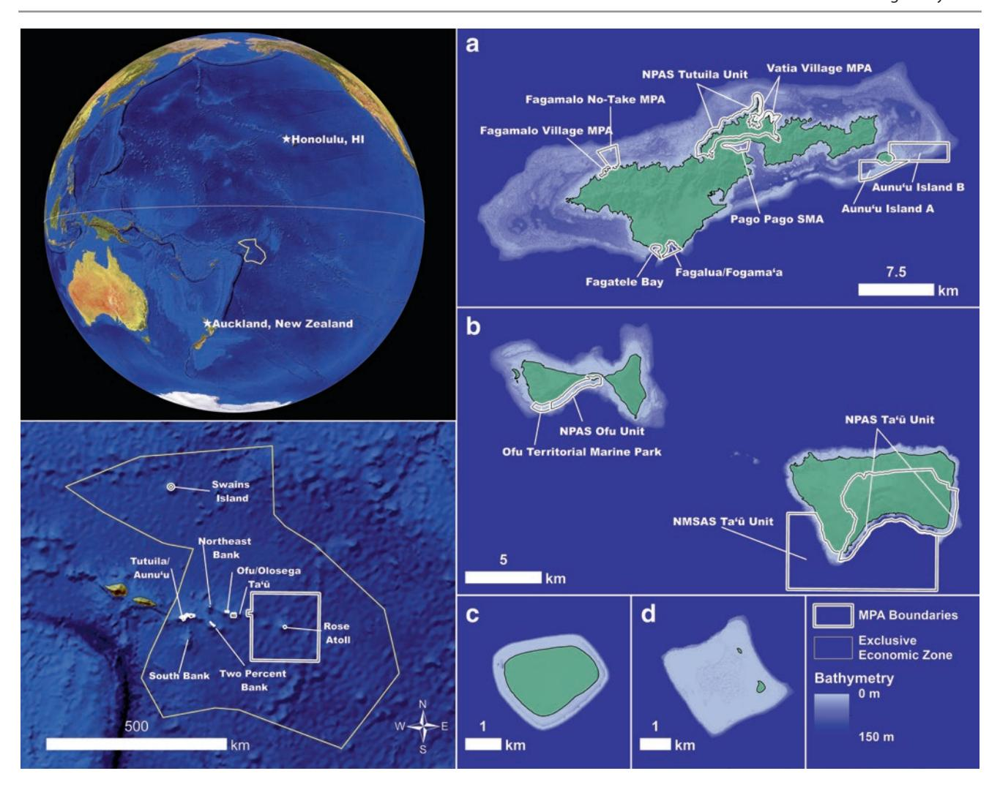

**Fig. 22.1** Map of American Samoa. (**a**) Tutuila, (**b**) Manuʻa Islands of Ofu, Olosega, and Taʻū, (**c**) Swains Islands, and (**d**) Rose Atoll/Muliava. Additionally, the marine protected areas with mesophotic depths are highlighted and labeled except in (**c**, **d**)

comparison, the total land area only extends for 200 km2 . Approximately half of the shoreline has associated reef flats that are hard carbonate with low rugosity. Within these reef flats, Ofu and Olosega have natural pools nearshore (up to 3 m deep), and Tutuila has a few man-made pools (up to 7 m deep) created for fill material.

Beyond the reef crest, the reef slopes downward creating a fore reef slope. The fore reef slope is fairly close to shore and has higher coral and coralline algae cover than the reef flat. Some areas have a reef slope that extends into deep water nearshore. One such example is Fagatele Bay, which is part of the National Marine Sanctuary of American Samoa (NMSAS). Fagatele Bay is an ancient shoreline volcanic caldera with the seaward wall collapsed that forms a bay with steep sides and an offshore canyon.

In general, the fore reef slope on Tutuila, Ofu, and Olosega ends at a depth of about 10–30 m on a carbonate shelf that is 3–7 km wide. On Tutuila, a ring of bank reefs parallels the outer edge of the shelf and appears to be a Sunken Barrier Reef. These bank reefs are not well explored except for Taema Bank, 3 km offshore near the mouth of Pago Pago Harbor. The top is approximately 8 m deep and covered in coralline algae with rubble on the northern (inner) slope and coral on the southern (outer) slope. The Tutuila shelf ends in a vertical cliff that extends to 350 m.

Northwest of Taʻū and southeast of Olosega is a ridge connecting the islands with a volcanic cone approximately 2.3 km from Taʻū that rises as shallow as 38 m. This isolated area has MCEs with patches of nearly 100% cover of scleractinian corals (Blyth-Skyrme et al. [2013](#page-18-1)). Both Swains Island and Rose Atoll have steep slopes from the fore reef to beyond 150 m. Between Tutuila and the Manuʻa Islands are two submerged banks (Muli Guyot or Northeast Bank and Tulaga or Two Percent Bank) that rise to 49 and 78 m, respectively, and may serve as stepping stones for organisms migrating between the islands. Additionally, a bank approximately 65 km to the south of Tutuila (Papatua Guyot or South Bank) rises to 23 m (Bauer and Kendall [2011](#page-18-2)).

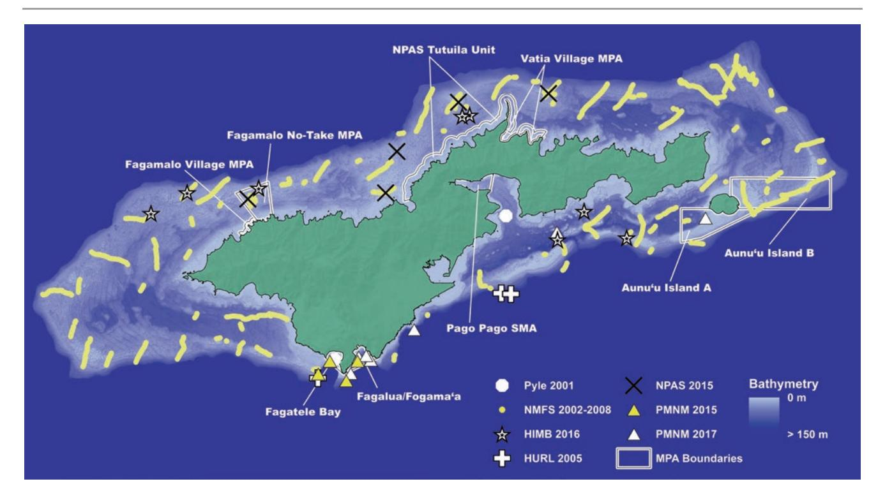

**Fig. 22.2** Map of Tutuila showing the locations of previous surveys

### **22.1.1 Research History**

There has been substantial effort over the past century to document SCRs within American Samoa. The first coral reef survey in the territory was in 1917 (Mayor [1924;](#page-19-1) Dahl and Lamberts [1977\)](#page-18-3), and since then, many more surveys have been conducted throughout the territory (Birkeland et al. [1987](#page-18-4), [2003,](#page-18-5) [2013](#page-18-6); Mundy [1996;](#page-19-2) Green and Hunter [1998](#page-19-3); Green [2002](#page-19-4); Craig et al. [2005;](#page-18-7) Sabater and Tofaeono [2006](#page-19-5); Brainard et al. [2008;](#page-18-8) Fenner et al. [2008](#page-18-9); Kendall and Poti [2011](#page-19-6); NOAA [2011\)](#page-19-7). This work has laid a strong foundation for understanding the biodiversity of the major reefassociated species of the islands. Several studies have documented the SCR flora and fauna of American Samoa (Hoffmeister [1925](#page-19-8); Jordan [1927;](#page-19-9) Wass [1982](#page-20-1), [1984](#page-20-2); Lamberts [1983](#page-19-10); Mundy [1996;](#page-19-2) Madrigal [1999](#page-19-11); Coles et al. [2003](#page-18-10); Skelton [2003](#page-20-3); Skelton and South [2004](#page-20-4); DiDonato et al. [2006](#page-18-11); Whaylen and Fenner [2006;](#page-20-5) Birkeland et al. [2008](#page-18-0); Craig [2009](#page-18-12); Kenyon et al. [2010](#page-19-12); Tsuda et al. [2011\)](#page-20-6).

The majority of American Samoan habitats between 20 and 150 m depths were mapped from 1985 to 2006 (Wright [2002](#page-20-7), [2005;](#page-20-8) Wright et al. [2002](#page-20-9), [2012](#page-20-10); Lundblad et al. [2006](#page-19-13)). Maps were also produced using a habitat classification system that was developed based on American Samoa reefs and includes MCEs (Lundblad [2004;](#page-19-14) Lundblad et al. [2006](#page-19-13)). This mapping effort includes most of the MCE area, except for some small areas below 90 m around Tutuila (PIBHMC [2017](#page-19-15)). An additional habitat map was made for Tutuila (from shore to 150 m in depth) using the same methods as the US National Oceanographic and Atmospheric Administration's (NOAA) shallow coral reef maps (NOAA [2005](#page-19-16); Kendall [2011](#page-19-17)). Together, these efforts serve as a basic habitat classification around which subsequent biodiversity and ecological studies have been arranged.

In addition to habitat mapping and classification, there have been limited in-water surveys within MCEs of American Samoa. One of the earliest such surveys was conducted by the Bishop Museum with two closed-circuit rebreather (CCR) dives by Richard L. Pyle and John L. Earle (Fig. [22.2](#page-2-0); Pyle [2001](#page-19-18); Wright et al. [2002;](#page-20-9) Bare et al. [2010](#page-18-13)). One dive was in Fagatele Bay, Tutuila, to a depth of 113 m, and the other was to 60 m in the outer section of Pago Pago Harbor. During these dives, several new mesophotic fish species were discovered (Pyle [2001](#page-19-18)).

NOAA's National Marine Fisheries Service (NMFS) conducted a series of towed camera surveys across multiple islands in 2002, 2004, and 2008 (Fig. [22.2](#page-2-0); Brainard et al. [2008](#page-18-8); Bare et al. [2010](#page-18-13); Blyth-Skyrme et al. [2013](#page-18-1)). These surveys included 89 tows off Tutuila and Aunuʻu (30–130 m), 25 tows off Ofu and Olosega (30–170+ m), and 16 tows off Taʻū (30–160 m) (Blyth-Skyrme et al. [2013\)](#page-18-1). These surveys classified substrate type, substrate cover, coral morphology, and other benthic observations.

In 2005, three submersible dives were conducted by NOAA's Hawaiʻi Undersea Research Laboratory (HURL) at two different locations (Fig. [22.2](#page-2-0); Wright [2005;](#page-20-8) Bare et al. [2010](#page-18-13); Wright et al. [2012](#page-20-10)). One dive was conducted in Fagatele Bay (to 213 m) and two on Taema Bank off Tutuila (to 464 m and 447 m, respectively). The purpose of these dives was to validate areas previously mapped, as well as estimate substrate cover, species identifications, and benthic transitions (Wright [2005](#page-20-8)).

In 2015, the National Park of American Samoa (NPAS) conducted roving diver surveys for crown-of-thorns starfish (COTS) at three Tutuila sites outside the park boundaries to 40 m depth (Fig. [22.2](#page-2-0)). These surveys documented the presence of few COTS and found expansive coral mortality. Nearby SCR areas were some of the most impacted sites from COTS suggesting that COTS may be responsible for the coral mortality observed at 40 m (Ian Moffitt, pers. comm.). Additionally, the NPAS maintains a hydrophone to record reef and other sounds at 40 m.

In 2016, the Hawaiʻi Institute of Marine Biology (HIMB) conducted a series of CCR dives (Fig. [22.2](#page-2-0)). These surveys documented the diversity of scleractinian and other anthozoan corals in the upper-mesophotic zone (30–60 m; Montgomery unpublished data). Approximately 110 scleractinian species were documented including 3 coral species listed under the US Endangered Species Act.

A team of CCR divers from NOAA's Office of National Marine Sanctuaries, Papahānaumokuākea Marine National Monument (PMNM) conducted four CCR dives to survey MCEs in 2015 and eight dives in 2017 (Fig. [22.2\)](#page-2-0). These dives were aimed at documenting the diversity of fish, gorgonian, and antipatharian fauna at several sites within the NMSAS. A total of 30 specimens of antipatharian corals, 74 gorgonian corals, 1 *Leptoseris* sp., over 548 video-based records of species (mostly fishes), and hundreds of in situ digital images were collected during these efforts.

## **22.2 Environmental Setting**

Oceanographic conditions of the Samoan Archipelago are fairly stable compared to neighboring northern and southern latitudes (see review by Pirhalla et al. [2011\)](#page-19-19). The conditions are similar on most islands except Swains Island, which is located further north (11° S) and formed from a different volcanic hot spot. The archipelago has small seasonal fluctuations in winds, waves, and sea surface temperatures (SST). Multi-year variability is associated with climatic cycles and exemplified by SST with a smaller range, fewer extremes, and smaller inter-annual variability compared to higher latitudes (to both its north and south) due to its proximity to the equatorial Pacific warm water pool. However, SST time series from 1985 to 2007 have shown a 1 °C increase in addition to several documented temperature anomaly events, resulting in at least three major bleaching events (Craig [2009](#page-18-12)), with the archipelago experiencing thermal stress a third of the time. More recently, bleaching events have occurred in 2015 and 2016–2017. Bleaching during 2015 was observed in back reef pools, reef flats, and reef slopes due to temperatures of approximately 30 °C for several months (American Samoa Department of Marine and Wildlife Resources unpublished data). Bleaching in 2016– 2017 was observed to be more common at depths of 6–15 m on reef slopes, but was also present on reef flats and back reef pools with observations beyond the reef slope as deep as 40 m. The full extent of these bleaching events is still being assessed (Alice Lawrence, Mareike Sudek, Bert Fuiava, and Ian Moffit, pers. comm.).

In situ instruments in American Samoa often measure higher temperatures than satellite-derived measurements, which do not capture the high horizontal variability across reef habitats, such as back reefs and reef flats versus fore reefs and offshore platforms (Kendall and Poti [2011](#page-19-6)). The NPAS has collected some information on vertical temperature variability across depths down to 30–40 m, but temperatures across mesophotic depths remain undocumented (Moffitt pers. comm.).

## **22.3 Habitat Description**

MCE habitats may be more common in American Samoa than in other US Pacific jurisdictions (Locker et al. [2010](#page-19-20)), but there have not been any attempts to quantify MCEs despite extensive mapping efforts. To determine the potential importance of mesophotic depths, we provide a quantitative description of the total area of shallow and mesophotic depths, as well as the mean slope (including standard deviation) and proportion of bottom hardness classification for mesophotic depths[.1](#page-3-0) Together, these habitat characteristics

1Total area was calculated by using the 5 m grid merged multibeam bathymetry and IKONOS-derived depth data available from the Pacific Islands Benthic Habitat Mapping Center [\(2017](#page-19-15)) and the shoreline boundary available from the American Samoa Department of Commerce Web Portal ([http://portal.gis.doc.as/\)](http://portal.gis.doc.as/). The bathymetry data for seven areas (Tutuila/Aunuʻu islands, Ofu/Olosega islands, Taʻū Island, Swains Island, Rose Atoll, Northeast Bank, and Two Percent Bank) were imported into ArcGIS© 10.2 and converted from ASCII to a raster file type. Missing cell values (i.e., no data) were interpolated with the Raster Calculator in Spatial Analyst. The raster file was then reclassified into four classes: 0–30 m (SCR), 30.01–70 m (upper-mesophotic zone), 70.01–110 m (mid-mesophotic zone), and 110.01–150 m (lowermesophotic zone) and converted to a depth zone classification shapefile. The geodesic area was then calculated for each area including the land area represented by the shoreline boundary. The bathymetry raster file was further used to calculate reef slope with the Slope tool in Spatial Analyst, and the slope statistics were calculated with Zonal Statistics based on the depth zone classification shapefile. The calculation of the proportion of bottom hardness classification was calculated from the 5 m grid hard bottom vs. soft bottom substrate data from PIBHMC [\(2017](#page-19-15)). These data were converted to a shapefile and combined with the depth zone classification shapefile. The proportion was calculated by dividing the area for each bottom type within each depth zone classification by the total area of each corresponding depth zone classification. The unclassified category represents the area with missing backscatter data from the original Simrad EM3002D and Reason 8101 datasets.

|                        |       | Tutuila/Aunuʻu Ofu/Olosega |           | Taʻū      | Swains   | Rose      |           | Northeast Bank Two Percent Bank |
|------------------------|-------|----------------------------|-----------|-----------|----------|-----------|-----------|---------------------------------|
| Habitat area (km2 ) | Land  | 137.8                      | 12.6      | 45.5      | 3.6      | 0.1       | 0.0       | 0.0                             |
|                        | SCR   | 49.6                       | 12.1      | 22.3      | 2.3      | 7.8       | 0.0       | 0.0                             |
|                        | MCE   | 305.7                      | 23.3      | 11.4      | 0.6      | 1.3       | 14.4      | 0.8                             |
|                        | Upper | 224.2                      | 14.3      | 4.5       | 0.3      | 0.7       | 11.0      | 0.0                             |
|                        | Mid   | 74.6                       | 7.3       | 3.8       | 0.2      | 0.4       | 2.5       | 0.4                             |
|                        | Lower | 6.8                        | 1.7       | 3.1       | 0.1      | 0.1       | 0.9       | 0.4                             |
| Mesophotic zone        | Upper | 3.9±5.4                    | 6.4±6.5   | 19.8±13.6 | 51.1±7.1 | 30.9±13.8 | 2.3±12.7  | –                               |
| slope (mean ± sd)      | Mid   | 5.7±7.2                    | 11.7±9.4  | 24.1±13.4 | 56.3±7.2 | 42.2±17.2 | 12.2±9.3  | 11.7±9.0                        |
|                        | Lower | 30.1±19.8                  | 36.8±18.6 | 30.9±12.9 | 73.7±7.7 | 70.5±8.9  | 32.6±15.8 | 28.4±14.0                       |

**Table 22.1** Geodesic area and reef slope for each island and bank group. The mesophotic zones are upper (30–70 m), mid (70–110 m), and lower (110–150 m)

may influence the type of benthic organisms present and are useful indicators of potential MCE habitat type or presence. Additional research is needed to develop more effective and comprehensive predictive modeling for the presence of MCE communities using methods from other areas, such as those described by Bridge et al. ([2012\)](#page-18-14), Costa et al. ([2015\)](#page-18-15), or Veazey et al. ([2016\)](#page-20-11).

These analyses were conducted by dividing mesophotic depths into three 40 m zones: the upper-mesophotic zone (30–70 m), mid-mesophotic zone (70–110 m), and the lowermesophotic zone (110–150 m). Given how few studies have been conducted in American Samoa, the depth zones used herein are for analysis purposes only and are not reflective of any actual faunal transition. However, based on the faunal transition observed in other Pacific MCEs (Kahng and Kelley [2007](#page-19-21); Rooney et al. [2010;](#page-19-22) Loya et al. [2016;](#page-19-23) Pyle et al. [2016](#page-19-24)), these depth classifications may help guide future studies on faunal transitions on American Samoa's MCEs.

The total area of potential reef habitat (from the shoreline to 150 m) in American Samoa is 451.5 km2 , of which 357.5 km2 (79%) is potential MCE habitat (Table [22.1](#page-4-0)). The majority of the MCE habitat is located on the extensive platform surrounding Tutuila/Aunuʻu (305.7 km2 ) which is more than six times greater than the corresponding SCR habitat (49.6 km2 ). The remainder of the MCE habitat is off Ofu/ Olosega (23.3 km2 ) and Taʻū (22.3 km2 ), which is nearly twice as large as their corresponding SCRs (12.2 and 11.4 km2 , respectively). Swains Island and Rose Atoll have small MCE habitat areas (0.6 and 1.3 km2 , respectively) with larger SCR areas (2.3 and 7.8 km2 , respectively). Northeast Bank and Two Percent Bank have MCE areas (14.4 and 0.8 km2 , respectively) with no corresponding SCR area. Based on total area, the habitat at mesophotic depths off American Samoan high islands is substantially greater than their corresponding SCRs (Table [22.1](#page-4-0)).

## **22.3.1 Upper-Mesophotic Zone**

The upper-mesophotic zone (30–70 m) is significantly larger on Tutuila/Aunuʻu (224 km2 ) compared to the corresponding SCR habitat or the upper-mesophotic zone on other islands (Table [22.1](#page-4-0)). Considering the size of the upper-mesophotic zone area around Tutuila/Aunuʻu and a higher likelihood of faunal overlap with SCRs (Kahng and Kelley [2007;](#page-19-21) Rooney et al. [2010](#page-19-22); Loya et al. [2016;](#page-19-23) Pyle et al. [2016](#page-19-24)), the uppermesophotic zone on Tutuila/Aunuʻu is important to the broader management of corals reefs within the territory. This trend seems to extend to Ofu/Olosega as well, given the upper-mesophotic zone accounts for almost 20% more total area than the corresponding SCRs. However, the area and proportion of upper-mesophotic zone for Taʻū, Swains Island, and Rose Atoll significantly decrease compared to SCR habitat. In between Tutuila and the Manuʻa Islands lies Northeast Bank with 11 km2 of upper-mesophotic area (Table [22.1\)](#page-4-0).

The mean slope of the upper-mesophotic zone is fairly low for Tutuila/Aunuʻu, Ofu/Olosega, and the Northeast Bank, moderate for Taʻū, and high for Swains Island and Rose Atoll (Table [22.1](#page-4-0)). The bottom hardness classification is mostly hard bottom for Tutuila/Aunuʻu (55.8%), Ofu/ Olosega (76.7%), and Taʻū (72.8%) (Fig. [22.3\)](#page-5-0). Bare et al. ([2010\)](#page-18-13) also reported similar hard bottom classification (44.9 ± 41.0–67.0 ± 38.3%) for Tutuila. This large percentage of hard bottom suggests high potential of suitable habitat for complex benthic communities.

Known areas in the upper-mesophotic zone along the insular shelf of Tutuila include a series of patch reefs, mounds, and bank tops. These reefs range from 35 to 50 m in depth (Fig. [22.4](#page-5-1)) and have three distinct types. The first reef type includes low rugosity isolated carbonate mounds with 5–10 m of relief from the surrounding unconsolidated sediment and minimal scleractinian abundance and a higher gorgonian abundance (Fig. [22.4a\)](#page-5-1). The second reef type includes high rugosity isolated patch reefs with 5–10 m of relief and a sloped reef edge with large rubble edges and convoluted transitions surrounded by unconsolidated sediment (Fig. [22.4b\)](#page-5-1). This reef type has more scleractinian coral diversity (Fig. [22.5a](#page-6-0)), as well as many recently dead corals (Fig. [22.5b, c](#page-6-0)). The cause for the coral mortality is unknown, but based on reports from NPAS staff, it may be related to COTS outbreaks in 2015. The third reef type is located on 392 A. D. Montgomery et al.

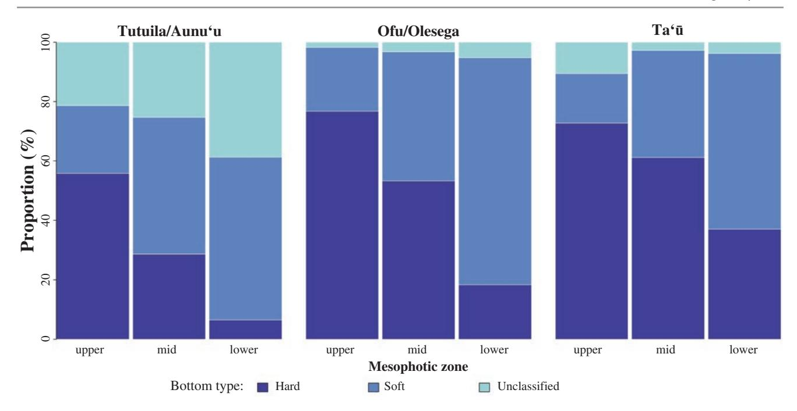

**Fig. 22.3** Bar plots showing the proportion of bottom hardness classification for mesophotic zones across Tutuila/Aunuʻu, Ofu/Olosega, and Taʻū

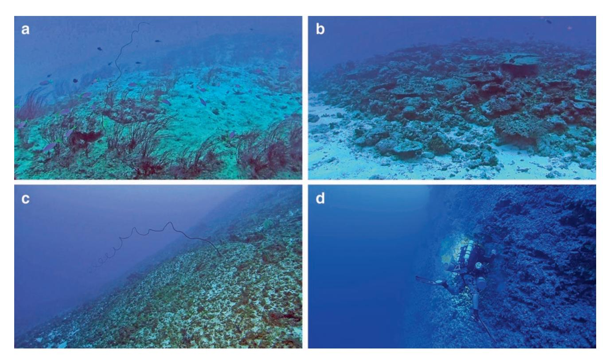

**Fig. 22.4** Photos of various sites in the upper-mesophotic zone (30–70 m). (**a**) Isolated limestone mound covered in gorgonians, (**b**) edge of limestone reef with high rugosity and scleractinian cover, (**c**) steep slope with little coral presence, and (**d**) NOAA diver Jason Leonard collects specimens along a vertical drop-off at a depth of 92 m off Fagatele Bay, Tutuila. (Photo credits: (**a**–**d**) A.D. Montgomery; (**d**) R.L. Pyle)

393 22 American Samoa

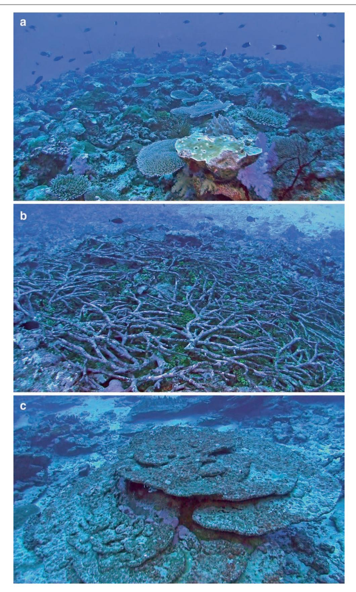

**Fig. 22.5** Photos of various sites of the upper-mesophotic zone. (**a**) Isolated limestone mound with high scleractinian cover and species diversity, (**b**) dead patch of staghorn *Acropora* sp., and (**c**) dead *Porites arnaudi* colonies. (Photo credits: A.D. Montgomery)

the slopes of large banks (Fig. [22.4c\)](#page-5-1), starting as shallow as 10–20 m and extending into the mid-mesophotic zone. This reef type has low coral diversity and low rugosity.

## **22.3.2 Mid-Mesophotic Zone**

The mid-mesophotic zone (70–110 m) is largest on Tutuila/ Aunu`u (75 km2 ) compared to the other islands. The midmesophotic zone is smaller around Ofu/Olosega, Taʻū, Northeast Bank, Two Percent Bank, Swains Island, and Rose Atoll (Table [22.1](#page-4-0)). The mean slope of the mid-mesophotic zone is low for Tutuila/Aunuʻu, Ofu/Olosega, Northeast Bank, and Two Percent Bank, moderate for Taʻū, and high for Swains Island and Rose Atoll (Table [22.1](#page-4-0)). The major benthic fauna for habitats with high slope, particularly habitats with near vertical slope, are gorgonians and antipatharians, while scleractinians are uncommon (Figs. [22.4d](#page-5-1) and [22.6](#page-7-0)).

The bottom hardness classification in the mid-mesophotic zone is mostly soft for Tutuila/Aunuʻu (46.1%) and hard for Ofu/Olosega (53.2%) and Taʻū (61.1%) (Fig. [22.3\)](#page-5-0). However, investigations by Blyth-Skyrme et al. [\(2013](#page-18-1)) on Taʻū have reported bottom hardness to be mostly sandy between 50 and 110 m suggesting this to be less suitable habitat for MCE communities. The difference in these estimates is likely due to differing scales of these analyses. Around Tutuila, Bare et al. [\(2010](#page-18-13)) reported hard bottom within the mid-mesophotic zone ranging from 14.6 ± 28.1% to 47.8 ± 46.8% and falls within our estimated hard bottom. Available data shows that the amount of hard bottom decreases with depth and suggests less suitable habitat characteristics for high-density scleractinian communities. Swains Island, Rose Atoll, and Northeast Bank were mostly unclassified bottom type.

#### **22.3.3 Lower-Mesophotic Zone**

The lower-mesophotic zone (110–150 m) across American Samoa is smaller compared to the corresponding SCR area and the upper- and mid-mesophotic zones. While the total area of the lower-mesophotic zone is smaller, the same trend

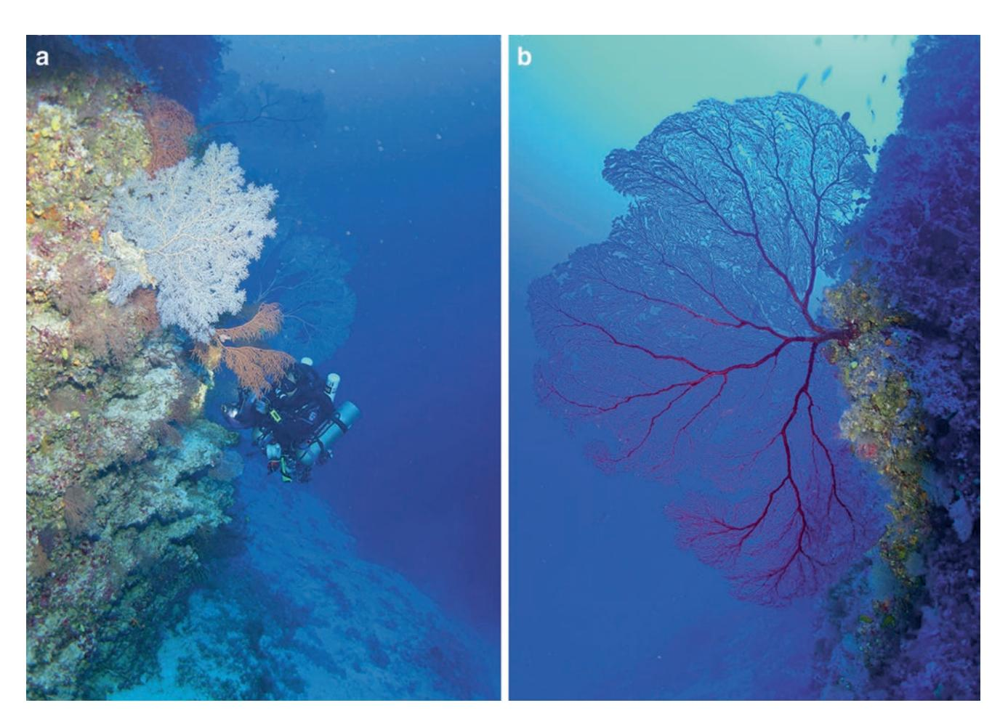

**Fig. 22.6** Photos of various sites in the mid-mesophotic zone (70–100 m) in Fagatele Bay, Tutuila. (**a**) NOAA diver Daniel Wagner photographs gorgonian and antipatharian corals at a depth of 83 m off Fogamaʻa, Tutuila, and (**b**) large gorgonian coral along a reef drop-off at a depth of about 70 m off Vaitogi, Tutuila. (Photo credits: R.L. Pyle)

of increasing area across the high islands did not apply, but rather the lower-mesophotic zone area on Taʻū is nearly four times the size of Ofu/Olosega. The area of the lowermesophotic zones around Swains Island, Rose Atoll, and Two Percent Bank is small, while Ofu/Olosega and Northeast Bank are moderate (Table [22.1](#page-4-0)).

The mean slope of the lower-mesophotic zone is moderate for Tutuila/Aunuʻu, Ofu/Olosega, Taʻū, Northeast Bank, and Two Percent Bank. The slopes have relatively high standard deviations suggesting wide variation across areas. The mean slope for Swains Island and Rose Atoll is high with lower standard deviations suggesting a relatively uniform slope habitat (Table [22.1](#page-4-0)). It should be noted that areas with steep slope will inherently have less two-dimensional surface area. Steep slope habitats typically have different biological communities. The bottom type is predominantly soft for Tutuila/Aunuʻu (54.8%), Ofu/Olosega (76.5%), and Taʻū (59.2%), although Taʻū also has a moderate amount of hard bottom (37.0%) (Fig. [22.3\)](#page-5-0). Swains Island, Rose Atoll, and Northeast Bank are mostly unclassified bottom type.

Not much is known about the lower-mesophotic zone because there has been very little exploration. A limited number of camera tow sleds and submersible dives have been conducted below 110 m (Blyth-Skyrme et al. [2013](#page-18-1); Wright [2005](#page-20-8)). Below Taema Bank, there is a steep carbonate wall from 110 m to at least 213 m with gorgonian assemblages and in some places barren slopes with *Halimeda* spp. (Wright [2005](#page-20-8)).

## **22.4 Biodiversity**

#### **22.4.1 Macroalgae**

The marine algal diversity on American Samoan SCRs was documented by Coles et al. [\(2003](#page-18-10)), Skelton ([2003\)](#page-20-3), Skelton and South [\(2004](#page-20-4)), and Tsuda et al. ([2011\)](#page-20-6). Skelton and South [\(2004](#page-20-4)) reported 230 species (133 Rhodophyta, 23 Phaeophyta, and 74 Chlorophyta) from American Samoa, while Tsuda et al. ([2011\)](#page-20-6) reported an additional 28 species from Swains Island. However, this list does not include unidentified material within Rhodophyta (including crustose coralline algae) and Cyanophyta, so the total algae diversity is likely higher. In contrast, virtually nothing is known of the mesophotic algal communities of American Samoa (Bare et al. [2010;](#page-18-13) Blyth-Skyrme et al. [2013\)](#page-18-1). Bare et al. ([2010\)](#page-18-13) mention vast areas covered with *Halimeda* spp. along deep reef slopes and bank sides around Tutuila.

## **22.4.2 Anthozoans**

Scleractinian corals of American Samoa have been studied extensively, but there is no comprehensive species checklist. Given the high number of scleractinian species that are present in American Samoa, properly identifying them to species level is a challenge, and molecular studies are dramatically revising classical taxonomy of many wellstudied groups (Fukami et al. [2004,](#page-18-16) [2008;](#page-18-17) Forsman et al. [2009,](#page-18-18) [2010;](#page-18-19) Marti-Puig et al. [2014](#page-19-25); Johnston et al. [2017](#page-19-26)). Thus, significant study is required to properly document the diversity of scleractinians within American Samoa. Over 400 unique scleractinian names have been reported from American Samoa (Fenner unpublished data), while Birkeland et al. [\(2008](#page-18-0)) report 337, but these 400 names include synonyms and possible misidentifications. It is estimated that with adequate sampling, the actual number of valid species may exceed 400 (Whaylen and Fenner [2006](#page-20-5)). The depth ranges of coral species in American Samoa have not been systematically studied, so it is not possible to separate out species occurrences across depths.

Non-scleractinian anthozoans are poorly documented. Whaylen and Fenner ([2006\)](#page-20-5) reported ten genera of alcyonaceans, two genera of antipatharians, three genera of zoanthids, and three genera of corallimorpharians (also summarized in Birkeland et al. [2008](#page-18-0)), but none of these were reported to the species level, and all of these groups present substantial taxonomic challenges. Coles et al. ([2003\)](#page-18-10) reported 20 species of alcyonaceans (including 6 species of gorgonians), 3 species of anemones, 4 species of corallimorpharians, 7 species of zoanthids, and 2 species of antipatharians. These reports include only occurrences from SCRs, but groups such as alcyonaceans (including gorgonians) and antipatharians are typically more common within MCEs and poorly studied in terms of molecular data relative to the scleractinians (McFadden et al. [2017](#page-19-27)). Thus, these groups represent significant gaps in our understanding of the biodiversity of American Samoa.

Anthozoan coral species across MCEs have not been fully characterized; however, there has been some work conducted to identify some species. Bare et al. ([2010\)](#page-18-13) reported 14 tentative scleractinian species, but these identifications were based on photo/video documentation from a camera sled, which makes species-level identification difficult. In 2016, eight sites from 30 to 60 m were surveyed to document scleractinian, antipatharian, and alcyonacean diversity with particular focus on scleractinians (Montgomery unpublished data). Approximately 110 scleractinian species have been documented in the upper-mesophotic zone (Table [22.2\)](#page-9-0). This represents nearly a third of the known coral species within American Samoa. Of these species, *Acropora solitaryensis*, *Alveopora excelsa*, *Leptoseris tubulifera*, *Cycloseris costulata*, *Porites arnaudi*, and *Porites myrmidonensis* represent new records for American Samoa. Additionally, 1 corallimorpharian and 28 alcyonaceans, including 13 gorgonians, 2 milleporids, 1 stylasterid, 2 zoanthids, and 4 antipatharians, were found. Additional work on antipatharians and gorgonians is currently being conducted by Daniel Wagner and Sonia Rowley, respectively.

**Table 22.2** Scleractinian coral species present in American Samoa's upper-mesophotic zone (taxonomy according to WoRMS Editorial Board ([2017\)](#page-20-12), except for *Acropora* cf. *akajimensis*)

| Family                     | Max       |
|----------------------------|-----------|
| Genus species              | Depth (m) |
| Acroporidae                |           |
| Acropora aculeus           | 48.6      |
| Acropora cf. akajimensis   | 41.4      |
| Acropora intermedia        | 36.6      |
| Acropora latistella        | 42.3      |
| Acropora paniculata        | 40.8      |
| Acropora solitaryensisa    | 44.4      |
| Acropora sp. 1             | 49.8      |
| Acropora sp. 2             | 42.9      |
| Acropora speciosab         | 45.9      |
| Acropora spp.              | 53.1      |
| Alveopora excelsaa         | 51.9      |
| Alveopora spongiosa        | 45.9      |
| Astreopora listeri         | 52.8      |
| Astreopora randalli        | 42.3      |
| Astreopora sp.             | 33.6      |
| Astreopora suggesta        | 45.9      |
|                            |           |
| Montipora aequituberculata | 33.6      |
| Montipora capitata         | 48.6      |
| Montipora cf. incrassata   | 33        |
| Montipora grisea           | 53.1      |
| Montipora sp. 1            | 42        |
| Montipora sp. 2            | 46.2      |
| Montipora sp. 3            | 41.1      |
| Montipora sp. 4            | 53.1      |
| Montipora tuberculosa      | 49.2      |
| Agariciidae                |           |
| Gardineroseris planulata   | 48.9      |
| Leptoseris cf. scabra      | 52.5      |
| Leptoseris explanata       | 46.2      |
| Leptoseris scabra          | 46.5      |
| Leptoseris sp.             | 46.8      |
| Leptoseris tubuliferaa     | 52.2      |
| Pavona cf. diffluensb      | 44.4      |
| Pavona chiriquiensis       | 46.5      |
| Pavona varians             | 53.4      |
| Coscinaraeidae             |           |
| Coscinaraea columna        | 45.9      |
| Euphylliidae               |           |
| Euphyllia glabrescens      | 48.6      |
| Euphyllia paradivisab      | 49.2      |
| Galaxea astreata           | 46.2      |
| Galaxea fascicularis       | 46.2      |
| Dendrophylliidae           |           |
| Rhizopsammia sp.           | 52.2      |
| Tubastraea coccinea        | 45        |
| Turbinaria peltata         | 48.6      |
| Turbinaria stellulata      | 50.7      |
| Diploastreidae             |           |
| Diploastrea heliopora      | 42.9      |
|                            |           |
| Diploastrea sp.            | 42.9      |

**Table 22.2** (continued)

| Max Depth (m) |
|------------------|
|                  |
|                  |
| 34.8             |
| 47.1             |
| 39               |
| 41.4             |
| 48               |
| 48               |
| 46.8             |
| 47.7             |
| 48.6             |
| 39.3             |
| 44.1             |
| 48.3             |
| 47.1             |
| 39.3             |
|                  |
| 42.3             |
| 46.2             |
| 38.7             |
| 40.2             |
| 45.6             |
| 40.2             |
| 47.7             |
| 45.6             |
| 48.3             |
| 46.8             |
| 42.6             |
| 42.9             |
|                  |
| 47.7             |
| 49.8             |
| 48.9             |
| 48.3             |
| 50.4             |
|                  |
| 42               |
| 33.3             |
| 47.4             |
| 52.5             |
| 33               |
| 45.9             |
| 48.6             |
| 46.5             |
| 42.6             |
| 38.4             |
| 42               |
| 41.7             |
| 39               |
| 41.7             |
|                  |
| 48.6             |
|                  |
| 46.8             |
|                  |
|                  |

(continued)

**Table 22.2** (continued)

| Family                      | Max       |
|-----------------------------|-----------|
| Genus species               | Depth (m) |
| Goniopora cf. somaliensis   | 46.8      |
| Porites arnaudia            | 48.9      |
| Porites myrmidonensisa      | 44.1      |
| Porites rus                 | 47.1      |
| Porites sp. 1               | 46.5      |
| Porites sp. 2               | 41.7      |
| Porites sp. 3               | 46.8      |
| Porites sp. 4               | 48.6      |
| Porites sp. 5               | 39.6      |
| Porites sp. 6               | 48.9      |
| Psammocoridae               |           |
| Psammocora nierstraszi      | 47.1      |
| Psammocora profundacella    | 48        |
| Scleractinia incertae sedis |           |
| Leptastrea pruinosa         | 32.4      |
| Leptastrea purpurea         | 51.6      |
| Leptastrea transversa       | 33.6      |
| Pachyseris speciosa         | 52.5      |
| Plesiastrea versipora       | 42.9      |

a New records for American Samoa

### **22.4.3 Fishes**

Very little has been previously published about the reef fishes inhabiting the MCEs of American Samoa. The earliest comprehensive checklist of Samoan fishes (Jordan and Seale [1906](#page-19-28)) was limited to collections on SCRs using dynamite, poisons, beach seines, and local skin diver collections. An update of this checklist brought the number of fish species known from Samoa to 585 (Jordan [1927](#page-19-9)) but included very few fishes from MCEs. The most recent and most comprehensive checklist of the fishes of American Samoa (Wass [1984](#page-20-2)) was the first to utilize SCUBA for observations and collections. This checklist focused on fishes known from SCRs, but sampling included dives to 75 m and hook and line fishing to 500 m resulting in 991 species with 890 from <60 m and 56 species from 60 to 500 m.

In 2001, CCR dives by Pyle and Earle documented several new records of fishes, including the basslet *Pseudanthias hutomoi*, the tilefish *Hoplolatilus marcosi*, and the boxfish *Ostracion whitleyi*. They also noted several other species they could not identify at the time, two of which were new to science and named later (*Pseudanthias flavicauda* and *P. carlsoni*), and another was later determined to be the wrasse *Cirrhilabrus roseafascia*. Eight additional new records of fishes from MCEs were documented based on submersible observations including the angelfish *Genicanthus bellus*, the grouper *Cephalopholis polleni*, the triggerfish *Xanthichthys auromarginatus*, and the butterflyfish *Chaetodon tinkeri* (Wright [2005](#page-20-8)).

CCR dive surveys conducted in 2017 by the PMNM team resulted in over 500 video-based occurrence records of mesophotic fishes off the southern coast of Tutuila, including Fagatele Bay. Of the 118 species documented, 61 were recorded from mesophotic depths. Among these were at least five additional new records of known species (*Bodianus paraleucosticticus*, *Centropyge colini*, *Chromis brevirostris*, *Chromis degruyi*, *Chromis earina*) and four possible new species (one in the family Apogonidae, and one each in the genera *Parapercis*, *Symphysanodon*, and *Tryssogobius*; Fig. [22.7](#page-11-0)). These records were included as part of a broader analysis of patterns of fish biodiversity within American Samoa for both SCRs and MCEs, assessed using occurrence records from two separate databases, the Global Biodiversity Information Facility (GBIF [2017\)](#page-19-29) and the Explorer's Log [\(2017\)](#page-18-20).[2](#page-10-0) A limitation of these data is sampling bias, in that data collecting effort is not evenly distributed across all depths.[3](#page-10-1)

A total of 483 occurrence records for American Samoa representing 244 species among 118 genera in 35 of the 74 families of coral reef fishes were in the combined databases. Of these, 168 species (69%) were from SCRs and 56 (23%) from MCEs or deeper (30–200 m). The remaining 20 species occur on both SCRs and MCEs. The top 20 most species-rich families for coral reef fishes in American Samoa are shown in Fig. [22.8.](#page-12-0) All but four families (Ephippidae, Platycephalidae, Priacanthidae, and Pseudochromidae) were recorded from SCRs. All four of these families normally occur at shallow depths, so their absence from SCRs in the databases is most likely an artifact of incomplete sampling. Similarly, 11 families were only recorded from SCRs (e.g., Caesionidae, Cirrhitidae, Lutjanidae, Muraenidae, Ophichthidae, Syngnathidae, and Synodontidae) that are known to be wellrepresented on MCEs in other areas (see Pyle et al. [2019\)](#page-19-30).

The pattern of species richness in American Samoa is generally consistent with that of coral reef fish families in general (see Pyle et al. [2019\)](#page-19-30). Four of the top five most species-rich families are the same in American Samoa as

b Listed species under the US Endangered Species Act

2Data downloaded from the GBIF and Explorer Log databases were filtered for records 0–200 m in depth for country codes for American Samoa or Western Samoa, the locality description included the term "Samoa," or the records included georeferenced coordinates within a bounding box defined by 11° S, 173° W and 14.5° S, 169° W. Records for both country codes were included because many of these are incorrectly assigned, and the patterns for both regions are likely to be the same. The combined datasets were further filtered to include records from 74 families of coral reef fishes (see Pyle et al. [2019\)](#page-19-30).

3Sampling bias for all records was clustered into 10-m depth zones. Effort was determined by analyzing the number of occurrence records and distinct species within each depth zone and the number of observation/collection days across each depth zone. The majority of collecting days (70%) were between 0 and 30 m in SCRs, whereas only 30% of the collecting days involved mesophotic depths. The number of records per day varied from a low of 1.0 (110–150 m) to a high of 6.9 (10– 20 m) and an average of 3.8 across all zones.

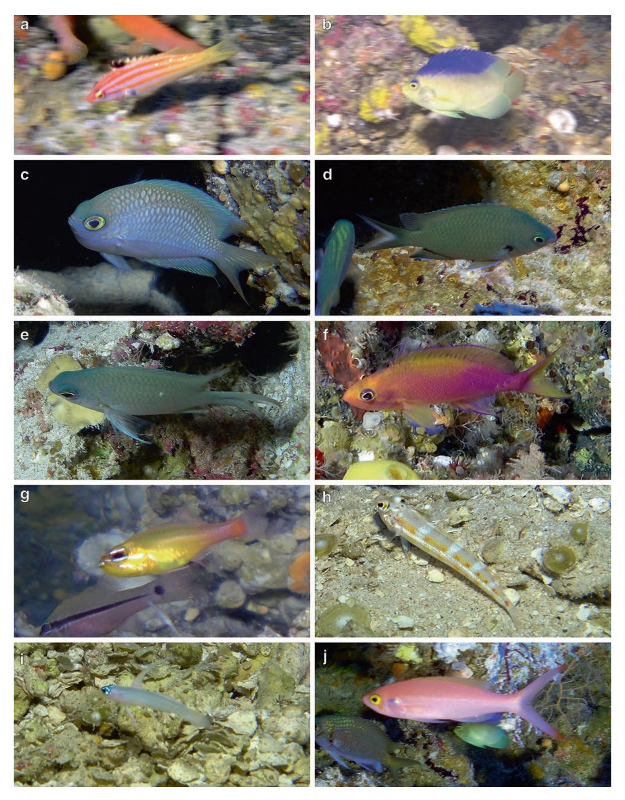

**Fig. 22.7** Sample of new records of fishes in American Samoa discovered during the 2017 rebreather expedition: (**a**) *Bodianus paraleucosticticus* Gomon 2006; (**b**) *Centropyge colini* Smith-Vaniz and Randall 1974; (**c**) *Chromis brevirostris* Pyle, Earle, and Greene 2008; (**d**) *Chromis degruyi* Pyle, Earle, and Greene 2008; (**e**) *Chromis earina* Pyle, Earle, and Greene 2008; (**f**) *Pseudanthias flavicauda* Randall and Pyle 2001; (**g**) Apogonidae sp.; (**h**) *Parapercis* sp.; (**i**) *Tryssogobius* sp.; and (**j**) *Symphysanodon* sp. (Photo credits: R.L. Pyle, can be reused under the CC BY license)

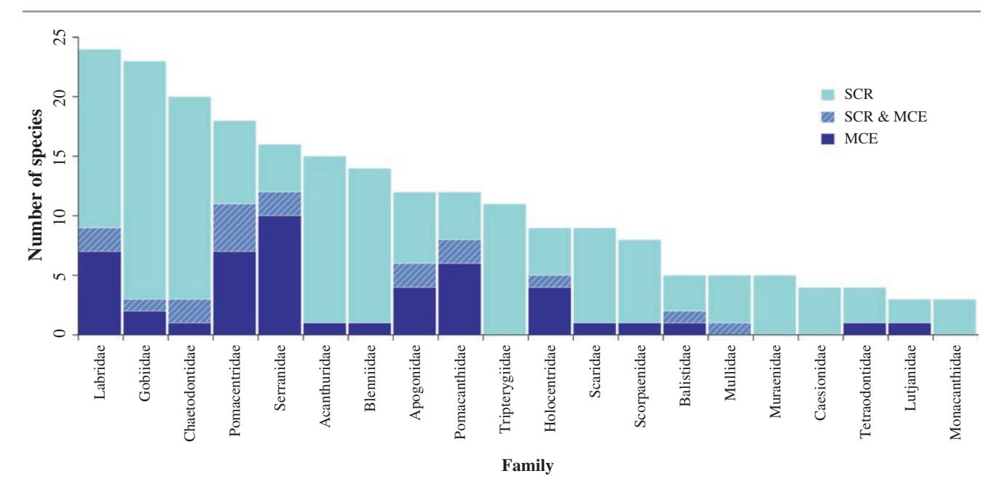

**Fig. 22.8** The 20 most species-rich families of coral reef fishes from GBIF ([2017\)](#page-19-29) and Explorer's Log ([2017\)](#page-18-20) databases. Values for both SCR and MCE habitats also include species occurring in both habitats

they are for reef fishes worldwide (Apogonidae is the seventh most species-rich family instead of fifth, being replaced among the top five in American Samoa by Chaetodontidae).

#### **22.4.4 Other Biotic Components**

Shallow macroinvertebrate species included 43 porifera, 22 hydroids, 308 gastropods, 63 bivalves, 3 stomatopods, 80 decapods, 14 asteroids, 6 crinoids, 24 ophiuroids, 13 echinoids, 17 holothuroids, and 12 ascidians (Coles et al. [2003](#page-18-10)), but many of these groups are notoriously understudied and include many cryptic taxa (Fautin et al. [2010](#page-18-21)). Birkeland ([1989\)](#page-18-22) reported 6 species of crinoids, 11 species of asteroids, 10 species of echinoids, and 16 species of holothuroids. The diversity of macroinvertebrate species on American Samoa MCEs is largely unknown, but it is likely that many SCR species extend into MCEs.

## **22.5 Ecology**

## **22.5.1 Macroalgae**

Around Tutuila, the maximum cover of macroalgae was at 50–70 m mostly nearshore or on reef slopes near offshore banks and decreased in shallower and deep water (Bare et al. [2010\)](#page-18-13). Crustose coralline algae were common across most mesophotic depths and ranged from 7.3% to 20.7% cover (Blyth-Skyrme et al. [2013](#page-18-1)). Ofu/Olosega was reported to have significant hard bottom below 80 m, but turf and macroalgae were dominant, while hard bottom below 110 m on Ta`ū was colonized by turf algae (Blyth-Skyrme et al. [2013\)](#page-18-1).

#### **22.5.2 Anthozoans**

Scleractinian communities around Tutuila were found across all mesophotic depths, but the peak abundances (15.5 ± 26% cover) were observed between 30 and 50 m, usually atop offshore banks and insular shelf patch reefs. Wright et al. ([2012](#page-20-10)) reported that corals extended down to 36 m on Taema Bank on a consistent basis. The scleractinians within upper-mesophotic zone communities were dominated by encrusting *Montipora* spp. and massive *Porites* spp. colonies with occasional columnar and freeliving colonies between 40 and 70 m. *Acropora* spp. plate corals peaked slightly deeper at 60–70 m, with *Leptoseris* spp., *Pachyseris* sp., and *Montipora* sp. foliose colonies found deeper than 70 m. Branching scleractinians were more common between 80 and 110 m. Other colonizers mostly consisting of *Sarcophyton* spp. and *Lobophytum* spp. ranged from 13.4% to 19.6% cover (Bare et al. [2010](#page-18-13); Blyth-Skyrme et al. [2013](#page-18-1)).

**Table 22.3** Twenty most abundant species of fishes on MCEs at Fagatele Bay, American Samoa

|      | Upper-mesophotic zone (40–60 m) |     |      | Mid-mesophotic zone (60–100 m) |     |      |
|------|---------------------------------|-----|------|--------------------------------|-----|------|
| Rank | Species                         | x̅  | SD   | Species                        | x̅  | SD   |
| 1    | Chromis amboinensis             | 7.7 | 10.0 | Chromis amboinensis            | 6.6 | 11.7 |
| 2    | Pseudanthias pleurotaenia       | 6.7 | 7.6  | Pseudanthias pleurotaenia      | 4.4 | 3.8  |
| 3    | Trimma sp.                      | 4.3 | 7.5  | Myripristis chryseres          | 2.6 | 5.8  |
| 4    | Chromis xanthura                | 1.7 | 2.9  | Chromis earina                 | 2.4 | 5.4  |
| 5    | Pictichromis porphyrea          | 1.7 | 2.9  | Trimma sp.                     | 2.0 | 4.5  |
| 6    | Acanthurus thompsoni            | 1.3 | 2.3  | Caesio sp.                     | 1.8 | 2.7  |
| 7    | Cephalopholis spiloparaea       | 1.0 | 1.7  | Chromis alpha                  | 1.4 | 2.6  |
| 8    | Zanclus cornutus                | 1.0 | 1.7  | Pseudanthias carlsoni          | 1.2 | 2.7  |
| 9    | Chromis viridis                 | 1.0 | 1.7  | Pseudanthias fasciatus         | 1.2 | 2.7  |
| 10   | Pomacentrus vaiuli              | 1.0 | 1.7  | Aphareus furca                 | 1.0 | 1.7  |
| 11   | Centropyge heraldi              | 0.7 | 1.2  | Pictichromis porphyrea         | 0.8 | 1.3  |
| 12   | Heniochus varius                | 0.7 | 1.2  | Forcipiger longirostris        | 0.6 | 0.9  |
| 13   | Apolemichthys trimaculatus      | 0.7 | 1.2  | Pseudanthias sp.               | 0.6 | 1.3  |
| 14   | Forcipiger longirostris         | 0.7 | 1.2  | Parupeneus sp.                 | 0.4 | 0.6  |
| 15   | Chaetodon vagabundus            | 0.7 | 1.2  | Bodianus bimaculatus           | 0.4 | 0.9  |
| 16   | Canthigaster valentini          | 0.7 | 1.2  | Bodianus paraleucosticticus    | 0.2 | 0.5  |
| 17   | Labroides dimidiatus            | 0.7 | 1.2  | Caranx lugubris                | 0.2 | 0.5  |
| 18   | Pygoplites diacanthus           | 0.3 | 0.6  | Carcharhinus amblyrhynchos     | 0.2 | 0.5  |
| 19   | Dascyllus reticulatus           | 0.3 | 0.6  | Centropyge heraldi             | 0.2 | 0.5  |
| 20   | Serranidae sp.                  | 0.3 | 0.6  | Cephalopholis spiloparaea      | 0.2 | 0.5  |

Surveys were conducted in the upper-mesophotic zone (*n* = 3) and mid-mesophotic zone (*n* = 5) depth ranges. Mean number of fish per 25 × 2 m transect presented

*x̅* mean, *SD* standard deviation

Ofu/Olosega had patches of scleractinian communities with a peak abundance of 80–100% cover between 40 and 70 m (with the maximum depth observation at 74 m). However, the overall highest mean cover (10.7%) was between 30 and 40 m consisting of massive and encrusting colonies. Colonies between 40 and 80 m were foliose with low abundance (<5% cover). Scleractinian corals around Taʻū had a peak abundance (14.6%) between 40 and 50 m consisting of encrusting, massive, and branching colonies. Colonies between 50 and 70 m also included foliose morphologies in addition to the morphologies observed shallower (Blyth-Skyrme et al. [2013](#page-18-1)).

#### **22.5.3 Fishes**

In 2017, the first quantitative data on the abundance of fishes within MCEs in American Samoa was collected by the PMNM team. Utilizing 25 × 2 m visual belt transects (sensu Kane et al. [2014](#page-19-31)), the team conducted three surveys between 40 and 60 m and five surveys between 90 and 100 m. Mean abundance per transect of the 20 most abundant species in each depth range are presented in Table [22.3](#page-13-0). A total of 251 individuals of 40 species and 32 genera were recorded.

## **22.6 Threats and Conservation Issues**

The SCRs of American Samoa are generally thought to be in good condition (Fenner et al. [2008](#page-18-9)) and resilient (Birkeland et al. [2003\)](#page-18-5) compared to many reefs around the world, but fish biomass has been reported to be significantly lower than lightly fished coral reefs in other locations (Birkeland et al. [2008](#page-18-0)). While the coral reefs of American Samoa face the same threats as coral reefs elsewhere, three threats have been documented to have major impacts on American Samoan reefs: outbreaks of COTS, coral bleaching, and major storm events (Birkeland et al. [2003;](#page-18-5) Fenner et al. [2008\)](#page-18-9). Fishing impacts are also of concern, and Green ([2002\)](#page-19-4) indicated a decline of parrotfish and Maori wrasse was likely due to overfishing. However, broader impacts are not welldocumented across large spatial scales in American Samoa (Williams et al. [2011](#page-20-13)). We do not fully understand the current conditions of American Samoa's MCEs due to a significant lack of information.

## **22.6.1 Marine Protected Areas**

Marine protected areas (MPAs) within American Samoa have been created at the federal, local, and community levels

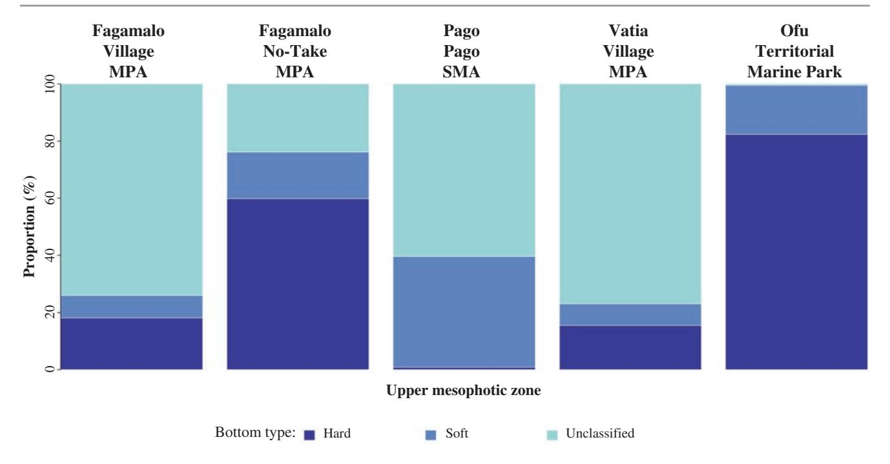

**Fig. 22.9** Bar plots showing the proportion of bottom hardness classification for mesophotic zones in different American Samoa Government MPAs. These areas did not have any mid- and lower-mesophotic depths

through various conservation frameworks. Of American Samoa's waters (0–150 m depth), 56 km2 (12.4%) are under protection, of which 34.4 km2 are SCR depths and 21.7 km2 are MCE depths.

The American Samoa Government has a goal to protect 20% of its coral reef habitat (Jacob and Oram [2012](#page-19-32); Raynal et al. [2016](#page-19-33)). The American Samoa Government has three types of MPAs developed under the community-based fisheries management program (CFMP) and the no-take MPA program managed under the Department of Marine and Wildlife Resources, as well as special management areas (SMAs) managed under its Department of Commerce. Federally managed areas include the NPAS, the NMSAS, Rose Atoll National Wildlife Refuge, and the Rose Atoll National Marine Monument. Currently, all these MPA designations are spread across 27 sites with varying levels of protection and few with complete no-take provisions.

Of the 15 MPAs managed by the American Samoan Government, only five have depths that extend into the upper-mesophotic zon[e4](#page-14-0) (Fig. [22.1a, b\)](#page-1-0). Of these five, only one (Fagamalo No-Take MPA) has any significant area and extends offshore. The habitat characteristics of the MCE section of this MPA consist of a low slope (3.7 ± 4.6°) and approximately 58.8% hard bottom with 23.9% left unclassified. The other MPAs are Fagamalo Village MPA, Pago Pago SMA, Vatia Village MPA, and the Ofu Territorial Marine Park, each of which has small areas of MCE habitat, except for Pago Pago SMA, and is characterized with low slopes (Fig. [22.9](#page-14-1) and Table [22.4\)](#page-15-0). Kendall [\(2011](#page-19-17)) provides a detailed breakdown of the habitat characteristics for each of the MPAs on Tutuila, but the details are not segregated into SCR and MCE, thereby making it difficult to ascertain the role of MCEs in the broader context of coral reef management. The dominance of SCRs under protection is not surprising given the commonly known threats to coral reefs and the state of understanding of these ecosystems but also highlights the need for further consideration of the role MCEs may play into the broader management strategies of coral reefs.

The NPAS was designated in 1998 (US Public Law 100– 571) to protect natural and cultural resources including coral reefs (NPAS [2002](#page-19-34)) and prohibit all fishing and gathering except for subsistence purposes (16 USC 410qq–2). The NPAS consists of three units: Tutuila, Ofu, and Taʻū (Fig. [22.1a, b\)](#page-1-0). Of the three, the Tutuila unit (6.49 km2 ) has the most area in the upper-mesophotic zone, followed by the Ofu unit, and the Taʻu unit (Table [22.4](#page-15-0)). The Taʻū unit also includes 0.48 km2 in the mid-mesophotic zone and 0.49 km2 in the lower-mesophotic zone. Each unit has different habitat characteristics. Tutuila unit is mostly flat (4.5 ± 5.5°) with

4The methods to calculate the area for each depth zone classification, the reef slope, and proportion of bottom hardness type for each individual MPA were the same as the island-wide calculations. The islandwide data was clipped with each individual MPA boundary, and geodesic and slope statistics were calculated.

**Table 22.4** Geodesic area and reef slope for each American Samoa Government MPAs, NPAS units, and NMSAS management areas. The mesophotic zones are upper (30–70 m), mid (70–110 m), and lower (110–150 m)

|         |       |          | American Samoa Government MPAs |         |          |             | NPAS    |          |           | NMSAS    |           |           |           |             |          |             |
|---------|-------|----------|--------------------------------|---------|----------|-------------|---------|----------|-----------|----------|-----------|-----------|-----------|-------------|----------|-------------|
|         |       |          |                                |         |          | Ofu         |         |          |           |          |           |           |           |             |          |             |
|         |       | Fagamalo | Fagamalo                       | Pago    | Vatia    | Territorial |         |          |           |          |           |           |           |             |          |             |
|         |       | Village  | No-Take                        | Pago    | Village  | Marine      | Tutuila |          |           | Aunuʻu   | Aunuʻu    | Fagalua/  | Fagatele  |             | Swains   | Muliava/    |
|         |       | MPA      | MPA                            | SMA     | MPA      | Park        | Unit    | Ofu Unit | Taʻū Unit | Island A | Island B  | Fogamaʻa  | Bay       | Taʻū Island | Island   | Rose Atolla |
| Habitat | SCRs  | 0.34     | 0.71                           | 0.73    | 0.60     | 0.46        | 2.92    | 1.36     | 6.90      | 2.60     | 2.53      | 0.45      | 0.42      | 1.23        | 1.68     | 1.10        |
| area    | MCEs  | 0.03     | 2.18                           | 0.51    | 0.02     | 0.02        | 3.57    | 0.16     | 1.67      | 2.34     | 6.94      | 0.49      | 0.27      | 1.70        | 0.48     | 1.31        |
| (km2)   | Upper | 0.03     | 2.18                           | 0.51    | 0.02     | 0.02        | 3.57    | 0.16     | 0.70      | 1.26     | 6.08      | 0.22      | 0.12      | 0.71        | 0.23     | 0.75        |
|         | Mid   | 0.00     | 0.00                           | 0.00    | 0.00     | 0.00        | 0.00    | 0.00     | 0.48      | 1.08     | 0.67      | 0.10      | 0.07      | 0.54        | 0.18     | 0.43        |
|         | Lower | 0.00     | 0.00                           | 0.00    | 0.00     | 0.00        | 0.00    | 0.00     | 0.49      | 0.00     | 0.18      | 0.17      | 0.07      | 0.45        | 0.07     | 0.13        |
| Slope   | Upper | 7.1±6.3  | 3.7±4.6                        | 5.9±7.0 | 13.4±8.9 | 11.8±8.2    | 4.5±5.5 | 7.5±6.9  | 35.0±14.7 | 10.5±8.8 | 3.8±4.2   | 29.7±15.1 | 29.5±14.2 | 15.6±8.0    | 50.9±6.5 | 30.9±13.8   |
| (mean   | Mid   | –        | –                              | –       | –        | –           | –       | –        | 37.8±12.4 | 4.9±5.1  | 8.1±6.5   | 35.1±14.3 | 29.0±17.1 | 22.7±9.8    | 56.1±7.2 | 42.2±17.2   |
| ± sd)   | Lower | –        | –                              | –       | –        | –           | –       | –        | 31.4±14.5 | –        | 29.8±16.2 | 31.7±14.2 | 27.1±17.6 | 30.9±12.3   | 73.7±8.1 | 70.5±8.9    |
|         |       |          |                                |         |          |             |         |          |           |          |           |           |           |             |          |             |

aCalculations include the US Fish and Wildlife National Wildlife Refuge/Rose Atoll National Marine Monument and NMSAS

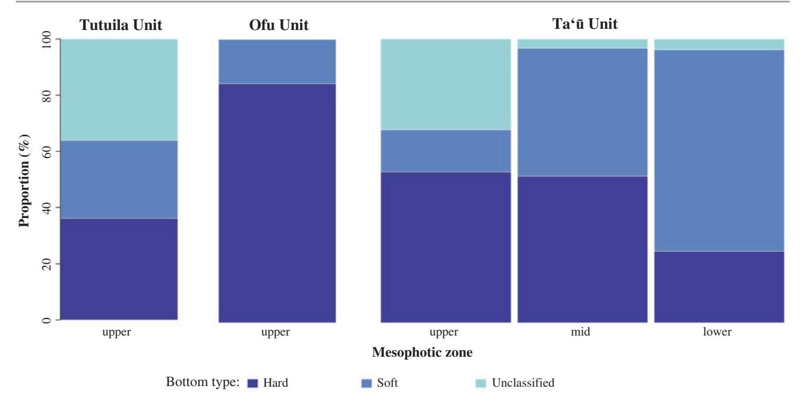

**Fig. 22.10** Bar plots showing the proportion of bottom hardness classification for mesophotic zones in different NPAS management units. The Tutuila and Ofu units did not have any mid- and lower-mesophotic depths

Ofu unit having more hard bottom and Taʻū unit has significantly greater slope (31.4 ± 14.5–37.8 ± 12.4°) and extended deeper than the other units (Fig. [22.10](#page-16-0) and Table [22.4](#page-15-0)). However, there has been limited work done in these areas so the presence of MCE communities is unknown.

In 2012, the Fagatele Bay National Marine Sanctuary was expanded and renamed NMSAS. The expansion of NMSAS greatly increased the sanctuary's area and the habitat types under protection. NMSAS has seven management areas across all islands with varying levels of site protection. The management areas include Aunuʻu Island area A and area B, Fagalua/Fogamaʻa, Fagatele Bay, Taʻū, Swains Island, and Muliava (area around Rose Atoll outside the reef crest) (Fig. [22.1a–d](#page-1-0)). Fagatele Bay is the only site within the NMSAS with full no-take protections. The Aunuʻu Island management areas have significantly more MCE area than SCR area with low slopes, except for the lower-mesophotic zone with a moderate slope (Table [22.4\)](#page-15-0). The Fagalua/ Fogamaʻa and Fagatele Bay management areas have nearly equal area between MCEs and SCRs with moderate slopes and high slope standard deviation across all zones. The Taʻū management area has more MCE area than SCR with low to moderate slopes across all depths (Table [22.4\)](#page-15-0). In general, there is a diverse mixture of hard and soft bottom but generally more soft bottom at deeper depths. The Aunuʻu Island management areas have a higher proportion of hard bottom compared to the Fagalua/Fogamaʻa and Fagatele Bay management areas. The Taʻū management area has more hard bottom in the upper-mesophotic zone and transitions to more soft bottom in the lower-mesophotic zone (Fig. [22.11](#page-17-0)). It should be noted that Rose Atoll is under multiple agency jurisdiction for protection besides the NMSAS and includes the US Fish and Wildlife Service and NOAA's NMFS. The inner part of Rose Atoll does not have any MCEs.

# **22.6.2 Threatened Corals**

In 2014, NOAA's NMFS listed 15 Indo-Pacific scleractinian corals as threatened under the US Endangered Species Act (NOAA [2014\)](#page-19-35). Of these, seven are known to occur in American Samoa's SCRs. In 2016, surveys were conducted at eight sites around Tutuila to document the presence of listed corals on MCEs. These surveys documented three of the seven listed species below 40 m: *Acropora speciosa* at three sites, *Euphyllia paradivisa* at one site, and *Pavona* cf. *diffluens* at one site (Fig. [22.12;](#page-17-1) Montgomery unpublished data). Of the eight sites surveyed, five had listed coral species present suggesting their presence is likely common. There is much discussion about the role of MCEs as a potential refugia for SCRs (Bongaerts et al. [2010;](#page-18-23) Semmler et al. [2017](#page-20-14); Bongaerts and Smith [2019](#page-18-24)). Before any meaningful analysis can be taken on the ecological significance of a single habitat or community providing resilience to another, a basic species characterization needs to occur. If species overlap does not exist (Hurley et al. [2016\)](#page-19-36), the role as a direct refuge is not possible. Here, we demonstrate that species presence does overlap across habitats for some listed sclerac404 A. D. Montgomery et al.

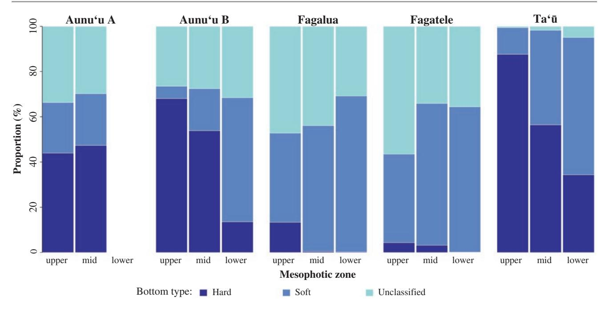

**Fig. 22.11** Bar plots showing the proportion of bottom hardness classification for mesophotic zones in different NMSAS management areas. The bottom hardness for Swains Island and Muliava are mostly unclassified and are not represented in this graph

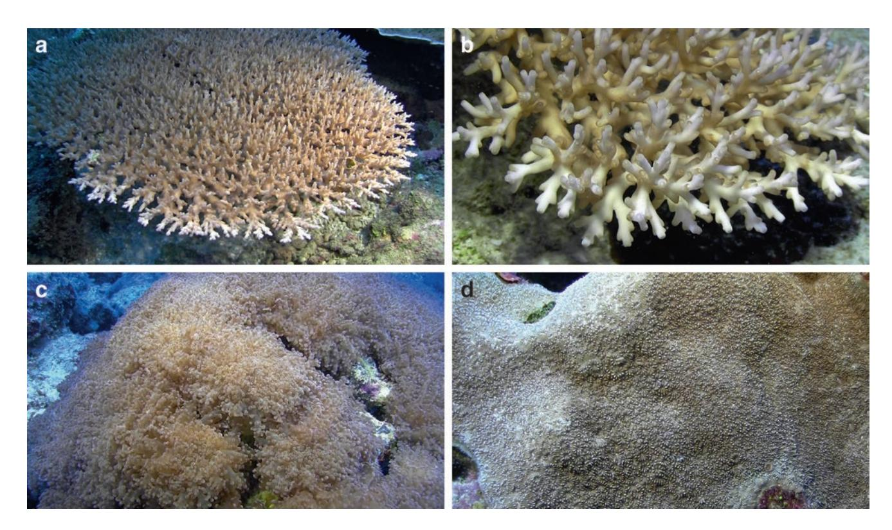

**Fig. 22.12** Photos of the threatened corals listed under the US Endangered Species Act. (**a**) *Acropora speciosa*, (**b**) Close-up of *Acropora speciosa*, (**c**) *Euphyllia paradivisa*, and (**d**) *Pavona* cf*. diffluens*. (Photo credits: A.D. Montgomery)

tinians. Further data is needed on their complete distribution, densities, reproductive characteristics, and connectivity before a conclusion can be made on the role of American Samoa's MCEs as a refuge for listed scleractinian corals.

**Acknowledgments** We would like to thank Ms. Kimberly Puglise for the encouragement to prepare this paper. Funding for work integrated into the paper was provided by NOAA's Deep Sea Coral Research and Technology Program and Coral Reef Conservation Program (NA15NOS4820082), NOAA's NMSAS and PMNM, NPAS, American Samoa's Department of Marine and Wildlife Resources, Pago Pago Marine Charters, and the University of Hawaiʻi's Scientific Diving Safety Program. We thank Jason Leonard, Brian Hauk, Stephen Matadobra, Atsuko Fukunaga, Joe Paulin, Mareike Sudek, Gene Brighouse, Atuatasi Lelei Peau, Peter Talivaʻa, Paolo Marra-Biggs, Russ Cox, Dave Cleary, Alice Lawrence, Sean Felise, Domingo Ochavillo, Kelley Anderson-Tagarino, Josh Copus, and David Pence for logistical and scientific support. The findings and conclusions in this article are those of the author(s) and do not necessarily represent the views of the US Fish and Wildlife Service or the Department of Commerce.

In addition to the data from Explorer's Log, additional data downloaded from GBIF for analyses was provided by 19 different datasets submitted by 17 institutions, especially the Bernice P. Bishop Museum (BPBM), the US National Museum of Natural History (USNM), the Queensland Museum (QM), and the Academy of Natural Sciences, Philadelphia (ANSP), which collectively contributed over 84% of the data.

## **References**

- Bare AY, Grimshaw KL, Rooney JJ et al (2010) Mesophotic communities of the insular shelf at Tutuila, American Samoa. Coral Reefs 29(2):369–377
- Bauer LB, Kendall MS (2011) Appendix A: seamounts within the exclusive economic zones of Samoa and American Samoa. In: Kendall MS, Poti M (eds) A biogeographic assessment of the Samoan Archipelago, NOAA Tech Memo NOS NCCOS 132. U.S. Department of Commerce, National Oceanic and Atmospheric Administration, National Ocean Service, National Centers for Coastal Ocean Science, Silver Spring, pp 189–195
- Birkeland C (1989) The influence of echinoderms on coral-reef communities. Echinoderm Stud 3:1–79
- Birkeland C, Randall RH, Wass RC et al (1987) Biological resource assessment of the Fagatele Bay National Marine Sanctuary, NOAA Technical Memorandum NOS MEMD 3. U.S. Department of Commerce, National Oceanic and Atmospheric Administration, National Ocean Service, Washington, DC
- Birkeland C, Randall RH, Green AL et al (2003) Changes in the coral reef communities of Fagatele Bay National Marine Sanctuary and Tutuila Island (American Samoa), 1982–1995. Report for US Department of Commerce and American Samoa Government. Fagatele Bay National Marine Sanctuary Science Series, Pago Pago
- Birkeland C, Craig P, Fenner D et al (2008) Geologic setting and ecological functioning of coral reefs in American Samoa. In: Riegl BM, Dodge RE (eds) Coral reefs of the USA. Springer, Dordrecht, pp 741–765
- Birkeland C, Green A, Fenner D et al (2013) Substratum stability and coral reef resilience: insights from 90 years of disturbances on a reef in American Samoa. Micronesica 6:1–16
- Blyth-Skyrme VJ, Rooney JJ, Parrish FA, Boland RC (2013) Mesophotic coral ecosystems: potential candidates as essential

- fish habitat and habitat areas of particular concern. Pacific Islands Fisheries Science Center, National Marine Fisheries Service, Admin Rep H–13–02, Honolulu, HI
- Bongaerts P, Smith TB (2019) Beyond the 'Deep Reef Refuge' hypothesis: a conceptual framework to characterize persistence at depth. In: Loya Y, Puglise KA, Bridge TCL (eds) Mesophotic coral ecosystems. Springer, New York, pp 881–895
- Bongaerts P, Ridgway T, Sampayo EM et al (2010) Assessing the 'Deep Reef Refugia' hypothesis: focus on Caribbean reefs. Coral Reefs 29(2):309–327
- Brainard R, Asher J, Gove J et al (2008) Coral reef ecosystem monitoring report for American Samoa: 2002–2006. U.S. Dept. of Commerce, National Oceanic and Atmospheric Administration, National Marine Fisheries Service, SP–08–002, Washington, DC
- Bridge T, Beaman R, Done T et al (2012) Predicting the location and spatial extent of submerged coral reef habitat in the Great Barrier Reef World Heritage Area, Australia. PLoS ONE 7(10):e48203
- Coles SL, Reath PR, Skelton PA et al (2003) Introduced marine species in Pago Pago Harbor, Fagatele Bay and the National Park Coast, American Samoa. Bishop Mus Tech Rep 26:1–182
- Costa B, Kendall MS, Parrish FA et al (2015) Identifying suitable locations for mesophotic hard corals offshore of Maui, Hawaiʻi. PLoS ONE 10(7):e0130285
- Craig P (2009) Natural history guide to American Samoa, 3rd edn. National Park of American Samoa, Department of Marine and Wildlife Resources, American Samoa Community College, Pago Pago
- Craig P, DiDonato G, Fenner D et al (2005) The state of coral reef ecosystems of American Samoa. In: Waddell J (ed) The state of coral reef ecosystems of the United States and Pacific Freely Associated States: 2005, NOAA Technical Memorandum NOS NCCOS 11. U.S. Department of Commerce, National Oceanic and Atmospheric Administration, National Ocean Service, National Centers for Coastal Ocean Science, Silver Spring, pp 312–337
- Dahl AL, Lamberts AE (1977) Environmental impact on a Samoan coral reef: a resurvey of Mayor's 1917 transect. Pac Sci 31(3):309–319
- DiDonato E, Birkeland C, Fenner D (2006) A preliminary list of coral species of the National Park of American Samoa. Pacific Cooperative Studies Unit, University of Hawaiʻi at Manoa Technical Report 155, Honolulu
- Explorer's Log (2017) Explorer's Log website. [http://explorers-log.](http://explorers-log.com) [com.](http://explorers-log.com) Accessed 1 July 2017
- Fautin D, Dalton P, Incze LS (2010) An overview of marine biodiversity in United States waters. PLoS ONE 5(8):e11914
- Fenner D, Speicher M, Gulick S et al (2008) The state of coral reef ecosystems of American Samoa. In: Waddell JE, Clarke AM (eds) The state of coral reef ecosystems of the United States and Pacific Freely Associated States: 2008, NOAA Technical Memorandum NOS NCCOS 73. U.S. Department of Commerce, National Oceanic and Atmospheric Administration, National Ocean Service, National Centers for Coastal Ocean Science, Silver Spring, pp 307–351
- Forsman ZH, Barshis DJ, Hunter CL et al (2009) Shape-shifting corals: molecular markers show morphology is evolutionarily plastic in *Porites*. BMC Evol Biol 9(1):45
- Forsman ZH, Concepcion GT, Haverkort RD et al (2010) Ecomorph or endangered coral? DNA and microstructure reveal Hawaiian species complexes: *Montipora dilatata/flabellata/turgescens* & *M. patula/verrilli*. PLoS ONE 5(12):e15021
- Fukami H, Budd AF, Paulay G et al (2004) Conventional taxonomy obscures deep divergence between Pacific and Atlantic corals. Nature 427(6977):832–835
- Fukami H, Chen CA, Budd AF et al (2008) Mitochondrial and nuclear genes suggest that stony corals are monophyletic but most families of stony corals are not (order Scleractinia, class Anthozoa, phylum Cnidaria). PLoS ONE 3(9):e3222

- Global Biodiversity Information Facility [GBIF] (2017) GBIF occurrence download. <http://www.gbif.org/occurrence>. Accessed 1 July 2017
- Green A (2002) Status of coral reefs on the main volcanic islands of American Samoa: a resurvey of long term monitoring sites (benthic communities, fish communities, and key macroinvertebrates). Department of Marine and Wildlife Resources, Pago Pago
- Green A, Hunter C (1998) A preliminary survey of the coral reef resources in the Tutuila Unit of the National Park of American Samoa. Final report to the US National Park Service, Pago Pago, American Samoa
- Hinderstein LM, Marr JCA, Martinez FA et al (2010) Theme section on "Mesophotic coral ecosystems: characterization, ecology, and management." Coral Reefs 29:247–251
- Hoffmeister JE (1925) Some corals from American Samoa and the Fiji Islands, vol 343. Carnegie Institution of Washington Publications, Washington, DC, pp 1–90
- Hurley KK, Timmers MA, Godwin LS et al (2016) An assessment of shallow and mesophotic reef brachyuran crab assemblages on the south shore of Oʻahu, Hawaiʻi. Coral Reefs 35(1):103–112
- Jacob L, Oram R (2012) Marine protected area program master plan fully revised in 2012. Department of Marine and Wildlife Resources, Biological Report Series
- Johnston EC, Forsman ZH, Flot JF et al (2017) A genomic glance through the fog of plasticity and diversification in *Pocillopora*. Sci Rep 7(1):5991
- Jordan DS (1927) Shore fishes of Samoa. J Pan-Pac Res Inst 2(4):3–11 Jordan DS, Seale A (1906) The fishes of Samoa. Bull Bur Fish 25:173–455
- Kahng SE, Kelley CD (2007) Vertical zonation of megabenthic taxa on a deep photosynthetic reef (50–140 m) in the Au'au Channel, Hawaii. Coral Reefs 26(3):679–687
- Kane C, Kosaki RK, Wagner D (2014) High levels of mesophotic reef fish endemism in the northwestern Hawaiian Islands. Bull Mar Sci 90(2):693–703
- Kendall MS (2011) Appendix B: shoreline to shelf edge benthic maps of Tutuila, American Samoa. In: Kendall MS, Poti M (eds) A biogeographic assessment of the Samoan Archipelago, NOAA Technical Memorandum NOS NCCOS 132. U.S. Department of Commerce, National Oceanic and Atmospheric Administration, National Ocean Service, National Centers for Coastal Ocean Science, Silver Spring, pp 197–203
- Kendall MS, Poti M (eds) (2011) A biogeographic assessment of the Samoan Archipelago, NOAA Technical Memorandum NOS NCCOS 132. U.S. Department of Commerce, National Oceanic and Atmospheric Administration, National Ocean Service, National Centers for Coastal Ocean Science, Silver Spring
- Kenyon JC, Maragos JE, Cooper S (2010) Characterization of coral communities at Rose Atoll, American Samoa. Atoll Res Bull 586:1–28
- Lamberts AE (1983) An annotated check list of the corals of American Samoa. Atoll Res Bull 264:1–19
- Locker SD, Armstrong RA, Battista TA et al (2010) Geomorphology of mesophotic coral ecosystems: current perspectives on morphology, distribution, and mapping strategies. Coral Reefs 29(2):329–345
- Loya Y, Eyal G, Treibitz T et al (2016) Theme section on mesophotic coral ecosystems: advances in knowledge and future perspectives. Coral Reefs 35(1):1–9
- Lundblad ER (2004) The development and application of benthic classifications for coral reef ecosystems below 30 m depth using multibeam bathymetry: Tutuila, American Samoa. Dissertation, Oregon State University
- Lundblad ER, Wright DJ, Miller J et al (2006) A benthic terrain classification scheme for American Samoa. Mar Geod 29(2):89–111

- Madrigal L (1999) Field guide of shallow water marine invertebrates of American Samoa. American Samoa Government, Department of Education, Pago Pago
- Marti-Puig P, Forsman ZH, Haverkort-Yeh RD et al (2014) Extreme phenotypic polymorphism in the coral genus *Pocillopora*; micromorphology corresponds to mitochondrial groups, while colony morphology does not. Bull Mar Sci 90(1):211–231
- Mayor AG (1924) Structure and ecology of Samoan Reefs, vol 340. Carnegie Institution of Washington Publications, Washington, DC, pp 1–25
- McFadden CS, Haverkort-Yeh R, Reynolds AM et al (2017) Species boundaries in the absence of morphological, ecological or geographical differentiation in the Red Sea octocoral genus *Ovabunda* (Alcyonacea: Xeniidae). Mol Phylogenet Evol 112:174–184
- Mundy C (1996) A quantitative survey of the corals of American Samoa. Report to the Department of Marine and Wildlife Resources, Government of American Samoa, Pago Pago, American Samoa
- National Oceanic and Atmospheric Administration [NOAA] (2005) Atlas of the shallow-water benthic habitats of American Samoa, Guam, and the Commonwealth of the Northern Mariana Islands, NOAA Technical Memorandum NOS NCCOS 8. U.S. Department of Commerce, National Oceanic and Atmospheric Administration, National Ocean Service, National Centers for Coastal Ocean Science, Silver Spring
- National Park of American Samoa [NPAS] (2002) Long-range interpretive plan National Park of American Samoa. Department of the Interior, National Park Service and Harpers Ferry Center Interpretive Planning. [https://www.nps.gov/npsa/learn/management/upload/](https://www.nps.gov/npsa/learn/management/upload/NPSA-LRIP.pdf) [NPSA-LRIP.pdf](https://www.nps.gov/npsa/learn/management/upload/NPSA-LRIP.pdf)
- NOAA (2011) Coral reef ecosystems of American Samoa: a 2002–2010 overview. NOAA National Marine Fisheries Service, Pacific Islands Fisheries Science Center, PIFSC Special Publication SP–11–02
- NOAA (2014) Endangered and threatened wildlife and plants: final listing determinations on proposal to list 66 reef-building coral species and to reclassify Elkhorn and Staghorn corals, Final Rule. 79 FR 53851
- Pacific Islands Benthic Habitat Mapping Center [PIBHMC] (2017) American Samoa. [http://www.soest.hawaii.edu/pibhmc/cms/data](http://www.soest.hawaii.edu/pibhmc/cms/data-by-location/american-samoa/)[by-location/american-samoa/](http://www.soest.hawaii.edu/pibhmc/cms/data-by-location/american-samoa/). Accessed 10 July 2017
- Pirhalla D, Ransi V, Kendal MS, Fenner D (2011) Oceanography of the Samoa Archipelago. In: Kendall MS, Poti M (eds) A biogeographic assessment of the Samoan Archipelago. NOAA Technical Memorandum NOS NCCOS 132. Silver Spring, U.S. Department of Commerce, National Oceanic and Atmospheric Administration, National Ocean Service, National Centers for Coastal Ocean Science, pp 3–26
- Pyle RL (2001) The coral-reef twilight zone. Fagatele Bay National Marine Sanctuary. 14–18 May 2001. [http://www2.bishopmuseum.](http://www2.bishopmuseum.org/PBS/samoatz01/discoveries.html) [org/PBS/samoatz01/discoveries.html.](http://www2.bishopmuseum.org/PBS/samoatz01/discoveries.html) Accessed 7 July 2017
- Pyle RL, Boland R, Bolick H et al (2016) A comprehensive investigation of mesophotic coral ecosystems in the Hawaiian Archipelago. PeerJ 4:e2475
- Pyle RL, Kosaki RK, Pinheiro HT et al (2019) Fishes: biodiversity. In: Loya Y, Puglise KA, Bridge TCL (eds) Mesophotic coral ecosystems. Springer, New York, pp 749–777
- Raynal JM, Levine AS, Comeros-Raynal MT (2016) American Samoa's marine protected area system: institutions, governance, and scale. J Int Wildl Law Policy 19(4):301–316
- Rooney J, Donham E, Montgomery A et al (2010) Mesophotic coral ecosystems in the Hawaiian Archipelago. Coral Reefs 29(2):361–367
- Sabater M, Tofaeono S (2006) Spatial variation in biomass, abundance, and species composition of "key reef species" in American Samoa. Report to the Department of Marine and Wildlife Resources. Government of American Samoa, Pago Pago

- Semmler RF, Hoot WC, Reaka ML (2017) Are mesophotic coral ecosystems distinct communities and can they serve as refugia for shallow reefs? Coral Reefs 36(2):433–444
- Skelton PA (2003) Seaweeds of American Samoa. Prepared for Department of Marine and Wildlife Resources, Government of Samoa. International Ocean Institute and Oceania Research and Development Associates, Townsville
- Skelton PA, South GR (2004) New records and notes on marine benthic algae of American Samoa-Chlorophyta & Phaeophyta. Cryptogam Algol 25(3):291–312
- Tsuda RT, Fisher JR, Vroom PS (2011) First records of marine benthic algae from Swains Island, American Samoa. Cryptogam Algol 32(3):271–291
- United Nations, Department of Economic and Social Affairs, Population Division (2017) Total population (both sexes combined) by region, subregion and country, annually for 1950–2100 (thousands). [https://](https://esa.un.org/unpd/wpp/Download/Standard/Population/) [esa.un.org/unpd/wpp/Download/Standard/Population/.](https://esa.un.org/unpd/wpp/Download/Standard/Population/) Accessed 25 Nov 2017
- Veazey LM, Franklin EC, Kelley C et al (2016) The implementation of rare events logistic regression to predict the distribution of mesophotic hard corals across the main Hawaiian Islands. Peer J 4:e2189
- Wass R (1982) The fishes of Rose Atoll–supplement I. Dep Mar Wildl Resour Biol Rep Ser 5:1–11
- Wass RC (1984) An annotated checklist of the fishes of Samoa. U.S. Department of Commerce, NOAA Technical Report SSRF–781

- Whaylen L, Fenner D (2006) Report of 2005 American Samoa Coral Reef Monitoring Program (ASCRMP), expanded edition. Department of Marine and Wildlife Resources Biological Report Series No 2006–1
- Williams ID, Richards BL, Sandin SA et al (2011) Differences in reef fish assemblages between populated and remote reefs spanning multiple archipelagos across the central and western Pacific. J Mar Biol 2011:826234
- WoRMS Editorial Board (2017) World register of marine species. <http://www.marinespecies.org>. Accessed 9 Nov 2017
- Wright D (2002) Mapping and GIS capacity building in American Samoa. In: Proceedings of the 22nd Annual ESRI User Conference, San Diego, CA, June 2002, Paper 101
- Wright DJ (2005) Report of HURL cruise KOK0510: submersible dives and multibeam mapping to investigate benthic habitats of Tutuila, American Samoa. [http://dusk.geo.orst.edu/djl/samoa/hurl/](http://dusk.geo.orst.edu/djl/samoa/hurl/kok0510cruise_report.pdf) [kok0510cruise\\_report.pdf](http://dusk.geo.orst.edu/djl/samoa/hurl/kok0510cruise_report.pdf). Accessed 7 Jul 2017
- Wright DJ, Donahue BT, Naar DF (2002) Seafloor mapping and GIS coordination at America's remotest national marine sanctuary (American Samoa). In: Wright DJ (ed) Undersea with GIS. ESRI Press, Redlands, pp 33–63
- Wright DJ, Roberts JT, Fenner D et al (2012) Seamounts, ridges, and reef habitats of American Samoa. In: Harris PT, Baker EK (eds) Seafloor geomorphology as benthic habitat: GeoHab atlas of seafloor geomorphic features and benthic habitats. Elsevier, Amsterdam