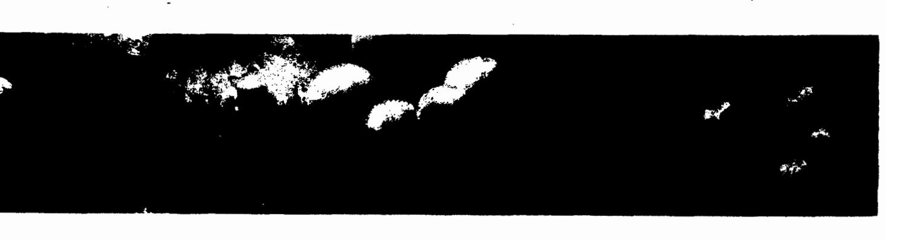
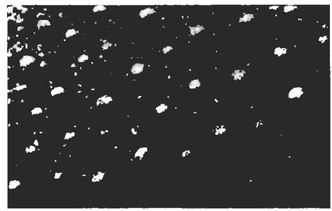
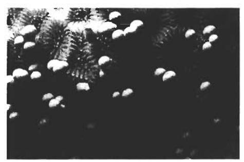
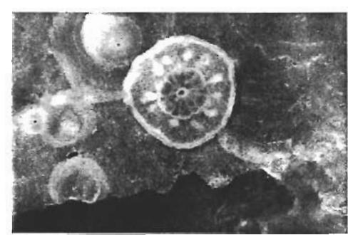
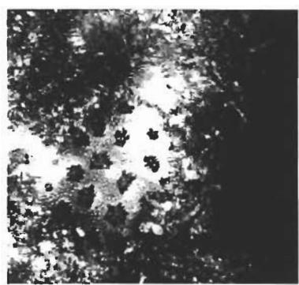
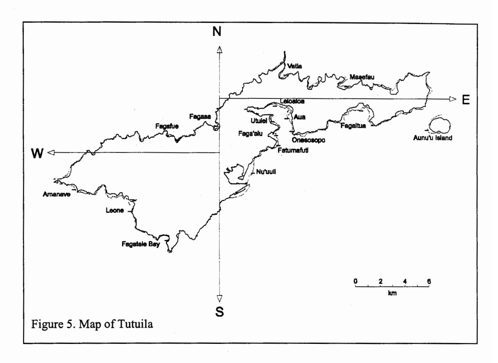
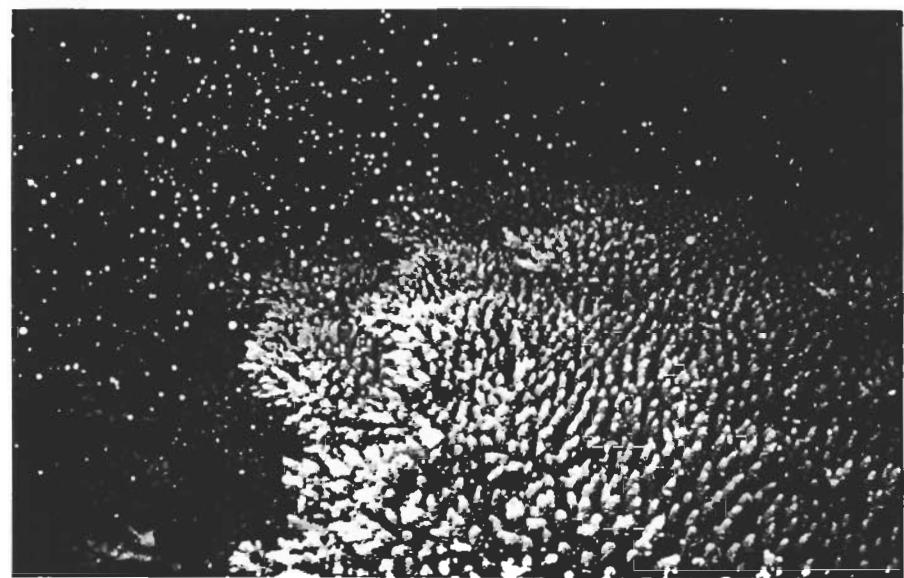

# SPAWNING OBSERVATIONS OF CORALS AND OTHER INVERTEBRATES IN AMERICAN SAMOA

1999

# CRAIG MUNDY AND ALISON GREEN 2\*

- 1 School of Zoology, University of Tasmania, GPO Box 252-05, Hobart, Tasmania 7001 Australia.
- 2 Department of Marine and Wildlife Resources, P.O. Box 3730, American Samoa. 96799.
- \* Current address: Environmental Impact Management Unit, Great Barrier Reef Marine Park Authority, PO Box 1379, Townsville, Q 4810, AUSTRALIA

A REPORT PREPARED FOR

DEPARTMENT OF MARINE AND WILDLIFE RESOURCES

AMERICAN SAMOA GOVERNMENT

#### INTRODUCTION

Sexual reproduction in tropical corals occurs through one of two main processes:

Broadcast spawning involves the release of large numbers of gametes (eggs and sperm) into the water column over a short period of time (see Box 1 for a description of the spawning process). The egg-sperm bundles float to the surface where they form distinctive pink slinks that disperse or deteriorate over the next few days. In calm weather these slicks form a foamy brown slick with a distinctive odour. The fertilised eggs develop into planulae (=larvae) within 36 hours, and are capable of attaching to the reef and undergoing metamorphosis after 4 days in a process called settlement (Harrison & Wallace 1990). At this stage the planulae are very small and vary between 0.1mm and 0.7mm in length depending upon the species.

Brooding involves internal fertilisation and the release of fully developed planulae.

Research over the past two decades indicates that the majority of corals reproduce by broadcast spawning (Babcock et al. 1986). Coral planulae, whether they are produced by broadcast spawning or brooding, drift at the ocean surface and are carried by tidal and ocean currents around and among coral reefs until they are ready to settle. The patterns of water movement around reefs, particularly isolated reefs, can be very important for the coral recruitment process.

## Box 1.

Most broadcast spawning corals are simultaneous hermaphrodites (i.e. each polyp is both male and female). Before spawning, the eggs and sperm within each polyp are packaged into an egg-sperm bundle, which can often be seen inside the polyp (called "setting") just before spawning (Figure 1). Corals may "set" for only a few seconds or for as long as 60 minutes before spawning (Figure 2). Each egg-sperm bundle may contain between 30 and 100 eggs. The bundles float to the surface where they break apart, and the eggs are fertilized by sperm from different colonies of the same species.

Figure 1. A massive coral "setting" prior to spawning.

Figure 2. A massive coral releasing egg-sperm bundles (spawning).

Understanding the timing of coral spawning events is important for the management of coral reefs, since this represents a crucial stage in their life history. Of particular concern is the effect of sedimentation on coral recruitment, as planulae will not settle on substratum covered by sediment (Babcock and Davies 1991). Newly settled corals are also very small (Figures 3, 4) and are especially vulnerable to impacts from human activities. Therefore it is important to know when these events occur, so that human impacts which may effect coral settlement can be timed to avoid this period. This is especially important on small islands where coastal zone development is often located immediately adjacent to coral reefs.

Figure 3. A 10 day old coral (*Montipora* sp)(diameter 0.4 mm)

Figure 4. A 3 month old Acropora spp (diameter 5mm)

On the Great Barrier Reef and other reefs in the Indo-Pacific, coral spawning takes place once a year during the week following the full moon in late spring or early summer (Harrison et al. 1984). All colonies of each species usually spawn on a particular night during this week, and the timing is predictable from year to year (e.g. *Acropora* spp usually spawn on the 4th night after the full moon, *Platygyra* spp usually spawn on the 5th night etc.). On some reefs such as those in the Red Sea, spawning also occurs around the full or new moons, but is spread over several months rather than just a single month as on Pacific reefs.

Preliminary information suggests that coral spawning occurs in Samoa at the same time as in other locations in the Indo-Pacific ie in the week following the full moon in late spring or early summer. Samoan people have long been able to predict the mass spawning of the palolo worm (*Eunice viridis*) which spawns predictably on the 7th night after the full moon in October or November (Caspers 1984). The palolo "rising" is met with much enthusiasm by Samoan people who consider palolo a delicacy and the event is one of much cultural significance. Traditionally, Samoans used a number of natural signs to predict the palolo rising, including the occurrence of a strong salty odor coming from the ocean, and the

appearance of brown, foamy scum or slicks on the surface of the ocean a few days before the event (Itano and Buckley 1988). Preliminary observations by Itano and Buckley (1988) have confirmed that these slicks appear to be comprised of coral spawn, probably the result of broadcast spawning of several common coral families including Poritidae, Acroporidae and Faviidae. However, their observations were based primarily on circumstantial evidence (ie the appearance of eggs in the water, and the disappearance of eggs from coral tissues) with few direct observations of colonies actually spawning. The objective of this study was to expand our knowledge of coral spawning in American Samoan by obtaining direct observations of coral spawning for a range of common species.

## **METHODS**

This study was done opportunistically while the authors were engaged in a survey of the coral assemblages of American Samoa (Mundy 1996). Coral spawning observations were made on five nights from November 9 to 13, 1995, which spanned three to seven days after the full moon.

On the first four nights, observations were made on the reef at Faga'alu at the entrance to Pago Pago Harbour on Tutuila Island (Figure 5). This site was chosen because of the high diversity of coral species in a small area, and because of its accessibility in the prevailing weather conditions. Corals at Faga'alu were examined for the presence of eggs in the week before the full moon, and again on each day of the predicted spawning period (3 to 7 days after the full moon). Developing eggs are normally opaque, but become coloured in the week prior to spawning. The presence of pigmented (coloured) eggs is a good indication that spawning will occur within a week or two. Based on published data from the Great Barrier Reef (Babcock et al. 1986) and the species present at Faga'alu, observations were made in the shallow lagoon (< 3m) on the first two nights (3rd and 4th nights after the full moon) and on the reef slope at 10m on the next two nights (5th and 6th nights after the full moon).

Each evening, we arrived at the study site just prior to dusk (1800 hrs). Species that were most likely to spawn on that evening were tagged and monitored by two to three divers for 3 - 4 hours after dusk. Most corals are very sensitive to light during spawning, and often they will not spawn if there is too much light (i.e. light from a bright torch). However, after a coral starts to release egg-sperm bundles bright light has little effect on most corals. In addition to

regular checks on the tagged corals using a weak light, the divers monitored other corals in the area for signs of spawning. When a spawning coral was observed, the coral was identified and the exact time and date noted onto underwater paper. Observations of spawning by any other animals were also recorded in the same manner as for corals.

#### RESULTS

# Coral spawning observations

A total of seven coral species from five families were observed spawning at Faga'alu during the period from November 9 to 12, 1995 (Table 1). Only one species, *Porities cylindrica* was dioecious (separate male and female corals) which release clouds of eggs and sperm from different corals. The remaining six species were hermaphrodites (individuals are both male and female), and either released egg-sperm bundles, or eggs and sperm separately from the same polyp. Prior to their release, egg-sperm bundles could be clearly seen in the mouth of the polyp ("setting" – see Box 1 above). Details of spawning observations for each species are described below. No photographs were taken of coral spawning at Faga'alu, however the spawning was typical of coral spawning in the western pacific (Figure 6).

Figure 6. A typical spawning of *Acropora tenuis* (branching coral) at Magnetic Island, Townsville, Great Barrier Reef

## Porites cylindrica (Family Poritidae)

Porites cylindrica is a branching coral with short, smooth finger-like branches, and often forms large dome shaped structures (2-10m in diameter). Fifteen to twenty *P. cylindrica* colonies were observed releasing milky clouds of sperm in the shallow lagoon site at Faga'alu on the third night after the full moon. At 2035 hrs (2:15 after sunset), most of the corals spawned simultaneously with a few spawning over the next 20 minutes. At times these clouds were so dense as to reduce water visibility in the vicinity of the corals. *P. cylindrica* is dioecious (separate male and female corals), although no female corals were seen releasing eggs.

## Acropora formosa (Family Acroporidae)

This species is often called staghorn coral, and forms large thickets (each 4-5m in diameter) in the shallow lagoon at Faga'alu. *Acropora formosa* was observed spawning from 2020-2120 hrs (2 –3 hours after sunset) on the fourth night after the full moon. However, egg-sperm bundles were only released from small patches within each colony (approximately 25% of total colony area). This species is hermaphroditic, and egg-sperm bundles were clearly seen setting along the branches for approximately one hour prior to release. Egg-sperm bundles were orange and approximately 1 and 2mm in diameter. The remaining parts of the staghorn corals did not spawn, and no pigmented eggs were found in the polyps in this part of the coral. One explanation for this is that the parts of the colonies that did not spawn in November may

have spawned a month earlier in October.

# Montipora turgescens and M. grisea (Family Acroporidae)

These species grow as an encrusting sheet on the reef bottom, and are covered in tiny pin size spikes and have tiny polyps that are difficult to see with the naked eye. Three small colonies of each species (six in total) were observed spawning on the fifth night after the full moon. *Montipora turgescens* spawned between 1945 and 2030 (1:25 to 2:10 after sunset). *M. grisea* spawned at 2045 (2:25 after sunset). Both species are hermaphroditic and released small pale brown egg-sperm bundles (approx. 1mm in diameter). Pigmented eggs in *Montipora* spp are often hard to detect prior to spawning because of the small size and pale colour of the egg-sperm bundles.

## Merulina ampliata (Family Merulinidae)

Merulina ampliata forms thin sheets that grow in a roughly circular shape (up to 1m in diameter) close to the reef surface. This species is quite easy to identify as it has thin ridges with little bars that radiate from the centre of the coral out to the growing edge, and is usually green or pink in colour. Six large M. ampliata corals were observed spawning simultaneously on the reef slope at 1945 hrs (1:25 after sunset) on the fifth night after the full moon. At least two of these colonies spawned again on the sixth night. This species is hermaphroditic and released large (approx. 2mm diameter) pink egg-sperm bundles which could be seen setting for 10 minutes prior to their release.

## Oxypora lacera (Family Pectinidae)

Oxypora lacera is similar in shape to Merulina ampliata, but is not found in shallow water (ie. shallower than 6 to 7m). The coral can be grey, pale brown or green, and is covered in small spiky dots that are usually a contrasting colour to the rest of the coral. O. lacera also spawned on the fifth and sixth night after the full moon. On the fifth night, a single colony spawned at 2030 hrs (2:10 after sunset). On the sixth night, five large individuals spawned between 2030 and 2130 hrs (2:10 to 3:10 after sunset). Oxypora lacera is hermaphroditic, and released strings of large (approx. 2mm diameter) yellow egg-sperm bundles. Egg-sperm bundles could be seen "setting" on the surface of the colony for approximately 30 minutes prior to release.

# Lobophyllia hemprichii (Family Mussidae)

Lobophyllia hemprichii and other species belonging to the same family form medium sized dome or flat-dome shaped corals, with large very fleshy polyps. Six *L. hemprichii* corals spawned simultaneously on the reef slope at 1845 hrs (25 minutes after sunset) on the sixth night after the full moon. This species is dioecious, and each colony was seen to release several puffs of sperm from each polyp over a short period of approximately 10 mins.

# Unidentified coral spawning

Many egg-sperm bundles were seen on the surface of the water on the reef flat at Fatumafuti on the 7th night after the full moon during the palolo rising. These bundles were small, pink in colour and were very numerous at approximately 0100 hrs. The parent corals producing these bundles were not identified.

# Holothurian & palolo spawning observations

# Stichopus chloronotus

The small, dark green holothurian (sea cucumber) *Stichopus chloronotus*, was observed spawning on the edge of the shallow lagoon on the third night after the full moon. *S. chloronotus* is dioecious (separate male and female). The majority of large individuals at the study site displayed spawning behaviour typical of most holothurians, with spawning individuals sitting upright on the substratum with the oral end waving in the water column. Thirty animals were observed releasing sperm or eggs, and several others were observed in spawning posture without releasing eggs or sperm. The majority of males spawned between 1830 and 1900 (10 to 40 minutes after sunset) while the females did not begin spawning until 1850 (50 minutes after sunset). Males intermittently released small continuous streams of sperm from the goniopore (reproductive opening), each lasting approximately 5 minutes. Spawning females were seen sitting upright for up to 20 minutes prior to releasing eggs. During this time the goniopore gradually swelled, forming a large obvious bump on the oral end. Eggs were subsequently released in a sudden and explosive puff, which could easily be mistaken for sperm as the eggs are opaque and very small (approx. 0.2 mm).

### Palolo

Small numbers of palolo (*Eunice viridis*) were observed spawning in the shallow lagoon and reef slope at Faga'alu on third to sixth nights following the full moon. However the major spawning event was witnessed on the reef flat at Fatumafuti on the seventh night. Vast numbers of epitoke larvae appeared in a continual stream between the hours of 0100 and 0200. Especially thick patches of larvae appeared intermittently during this period.

#### DISCUSSION

# Patterns of spawning of corals and other invertebrates in American Samoa

Preliminary observations confirm that a predictable mass coral spawning event takes place in American Samoa in the days before and including palolo spawning in the week after the full moon in late spring - early summer (Itano & Buckley 1988, this study). Direct observations confirm that this event includes at least 7 species of coral as well as several other invertebrates (Table 1). It is likely that the slicks known to occur before palolo rising in Samoan traditional lore are coral spawn slicks. Coral spawn slicks are very similar however, to slicks of *Trichodesmium* spp (an algae), which can occur throughout the year.

The time of coral spawning relative to the full moon and palolo spawning at Faga'alu in 1995 were consistent with the observations of coral spawning in American Samoa reported previously by Itano and Buckley (1988). Itano and Buckley observed several colonies of *Porites cylindrica* spawning 2 hours after sunset on the 3rd night after the full moon at Nu'uuli in 1988. In 1995 at Faga'alu, we also observed *P. cylindrica* spawning 2 hours after sunset on the 3rd night after the full moon (Table 1). Similarly, Itano and Buckley observed an encrusting *Montipora* spp spawning on the 4th and 5th nights after the full moon, approximately 2 hours after the full moon. We also observed two species of *Montipora* spawning 2 hours after sunset on the 5th night after the full moon (Table 1).

The close similarity between our observations and those of Itano and Buckley suggests that the timing of spawning of individual species in American Samoa is relatively predictable. It should be possible then, to organise coral spawning observations for interested Samoans in future years. We would recommend attempting to observe the large colonies of *Acropora* and *Porites* colonies spawn in the shallow lagoons at Faga'alu (this study) or Nu'uuli (Itano and Buckley 1998), as spawning in these corals is predictable and spawning occurs early in the evening. These sites are also relatively protected and the corals are in shallow water, thus coral spawning can be observed on snorkel and does not require SCUBA equipment.

The patterns of coral spawning at Faga'alu, in 1995 were also consistent with the patterns of coral spawning documented on the Great Barrier Reef (GBR). At Faga'alu, the timing of spawning relative to the full moon (number of days after the full moon) was consistent with

Comparison of coral spawning between American Samoa and the Great Barrier Reef

observations of those species on the GBR (Table 1). The time of coral spawning relative to sunset at Faga'alu was also very close to the time after sunset that corals spawn on the GBR

(Table 1). The spawning observations for *Stichopus chloronotus* at Faga'alu were also consistent with recent observations of this species on the Great Barrier Reef (Table 1).

The presence of egg-sperm bundles observed on the 7th night after the full moon at Fatumafuti in 1995, and similar observations by Itano and Buckley (1988) however, differs from patterns of spawning on the GBR. Although some coral species on the GBR are known to spawn on occasion on the 7th night after the full moon (Babcock et al. 1986), this does not usually result in the release of large numbers of egg-sperm bundles as observed at Fatumafuti. The majority of species on the GBR for which the spawning patterns are known spawn between the 2nd and 6th nights after the full moon. The species of corals that are spawning on the night of palolo rising in American Samoa are unknown.

| Species                 | Faga'alu           |                                              |                                             | Great Barrier Reef                           |                                             |
|-------------------------|--------------------|----------------------------------------------|---------------------------------------------|----------------------------------------------|---------------------------------------------|
|                         | Days before palolo | Day of spawning (days after full moon) | Hour of spawning (hours after sunset) | Day of spawning (days after full moon) | Hour of spawning (hours after sunset) |
| Porites cylindrica      | 4                  | 3                                            | 2:15 (male only)                            | 3, 4                                         | 1:40                                        |
| Acropora formosa        | 3                  | 4                                            | 3:00                                        | 4                                            | 1:40 - 2:45                                 |
| Montipora turgescens    | 2                  | 5                                            | 1:25 – 2:10                                 | 6                                            | 2:25                                        |
| M. grisea               | 2                  | 5                                            | 2:25                                        | ?                                            | ?                                           |
| Merulina ampliata       | 1,2                | 5, 6                                         | 1:25                                        | 5, 6                                         | 1:30                                        |
| Oxypora lacera          | 1,2                | 5, 6                                         | 2:10                                        | 6                                            | 1:30                                        |
| Lobophyllia hemprichii  | 1                  | 6                                            | 0:25                                        | 5                                            | 0:40                                        |
| Stichopus chloronotus   | 4                  | 3                                            | 0:10-3:00 (male) 0:30 (female)           | 2,3                                          | 3:00                                        |
| Eunice viridis (palolo) | -                  | 7                                            | 6:00 - 8:00                                 | ?                                            | ?                                           |

Table 1. Spawning observations at Faga'alu Bay, Tutuila, American Samoa between November 9 and November 12, 1995. The Full moon was on the 6th of November, and sunset was at approximately 1820. The palolo spawned on November 13. Times and dates of coral spawning on the Great barrier Reef taken from Babcock et al. (1986) and Babcock et al. (1994).

While this was the most detailed study of coral spawning conducted in American Samoa to date, it is by no means comprehensive. To obtain a more complete picture of the patterns of coral spawning in American Samoa it would be necessary to expand the study, to determine if corals are spawning at other times, and to include other species in other habitats. For example, some species from the Family Pocilloporidae and Poritidae release brooded planulae each month from late spring to late summer. While there are spawning records for approximately 150 coral species on the GBR (Harrison and Wallace 1990), there is also a large number of coral species (more than 100) for which there are no spawning observations.

Two factors may affect the timing of coral spawning in late spring - early summer. When the ocean temperatures are warmer, or when the full moon falls at the beginning of the month, coral spawning on the GBR can occur a month earlier than normal, or may be split over two months. However, until a more detailed study can be undertaken, published reports from the Great Barrier Reef and the information contained in this report will provide a good estimate of the timing of mass coral spawning in American Samoa.

# The importance of coral spawning in marine resource management

The period immediately before and after coral spawning is a critical period for the maintenance of healthy coral communities, and the recovery of damaged coral communities. Reproduction in corals is highly sensitive to stress (Harrison and Wallace 1990). Of particular, concern is the potential effect of a higher than normal input of sediment associated with changes in farming practice and intensity, and developments within the coastal zone. Although most corals have adaptations to remove sediment, the removal of an increasing amount of sediment because of coastal development and soil erosion requires significantly more energy. Thus less energy is available for reproduction, growth and repair of damaged tissue. Smothering of corals by sediment also disrupts feeding, decreases photosynthetic efficiency because of reduced light levels, and can result in partial or complete mortality of the coral.

The impact of sedimentation on the development and settlement of coral larvae in the weeks after coral spawning are also significant. The development of coral embryos through to competent planulae appears to be affected by water quality, with 77% fewer embryos developing normally in water from sediment stressed reefs (Richmond 1994). A layer of sediment on the reef surface can also prevent settlement of coral planulae, or restrict settlement of planulae to unsuitable microhabitats (Babcock and Davies 1991, Te 1992). Increased sedimentation may also reduce the survival rate of newly settled corals in the first few months after settlement (Sato 1985) due to smothering and abrasion. Therefore, in order to reduce the possible negative impacts of sediments on coral reproduction and spawning, it is advisable to minimise any activities that may increase the amount of sediment flowing into coastal waters, especially during the weeks leading up to and including coral spawning. Such activities should also be restricted in the month after coral spawning, to allow newly settled corals time to establish.

# **ACKNOWLEDGMENTS**

We thank Ray Tulafono and Fale Tuilagi of the Department of Marine and Wildlife Resources, American Samoa Government, for logistic support for this project. Karen Miller also provided much needed enthusiasm to stay out on the 7th night and observe the palolo spawning.

#### REFERENCES

- Babcock RC, Bull GD, Harrison PL, Heyward AJ, Oliver JK, Wallace CC, Willis BL (1986) Synchronous spawnings of 105 scleractinian coral species on the Great Barrier Reef. Mar. Biol. 90:379-394.
- Babcock RC, Davies P (1991) Effects of sedimentation on settlement of Acropora millepora. Coral Reefs 9:205-208.
- Babcock RC, Mundy CN, Keesing J, Oliver J (1992) Predictable and unpredictable spawning events: *in situ* behavioural data from free-spawning coral reef invertebrates. Invertebr. Reprod. Dev. 22:213-228.
- Caspers H (1984) Spawning periodicity and habitat of the palolo worm *Eunice viridis* (Polychaeta: Eunicidae) in the Samoan Islands. Marine Biology 70: 229-236.
- Harrison PL, Babcock RC, Bull GD, Oliver JK, Wallace CC, Willis BL (1984) Mass spawning in tropical reef corals. Science 223:1187-1188.
- Harrison PL, Wallace CC (1990) Reproducton, dispersal and recruitment of scleractinian corals. In: Dubinsky Z (eds) Ecosystems of the World 25. Coral Reefs, Elsevier, Amsterdam, pp 133-207.
- Itano D, Buckley T (1988) Observations of the Mass spawning of corals and palolo (*Eunice viridis*) in American Samoa. Department of Marine and Wildlife Resources, American Samoa Government.
- Mundy CN (1996) A quantitative survey of the corals of American Samoa. Department of Marine and Wildlife Resources, American Samoa Government.
- Richmond RH (1994) Effects of coastal runoff on coral reproduction. In Ginsburg RN (ed) Proceedings of the colloquium on global aspects of coral reefs: Health, hazards and history. Rosenstiel School of Marine and Atmospheric Science, University of Miami. pp 360–364.
- Sato M. (1985) Mortality and growth of juvenile coral *Pocillopora damicornis* (Linnaeus). Coral Reefs Vol. 4:27-33.
- Te FT (1992) Response to higher sediment loads by *Pocillopora damicornis* planulae. Coral Reefs 11:131-134.