## Monitoring Recommendations for the Community-Based Fisheries Management Program of Tutuila, American Samoa

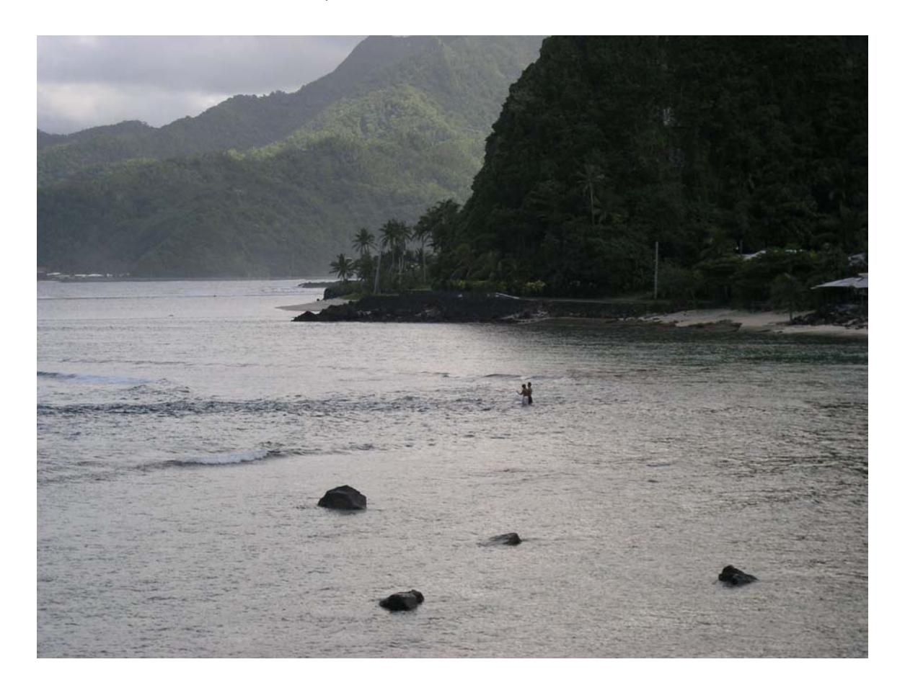

Prepared by Craig Musburger

For the Department of Marine and Wildlife Resources Tutuila, American Samoa

August, 2004

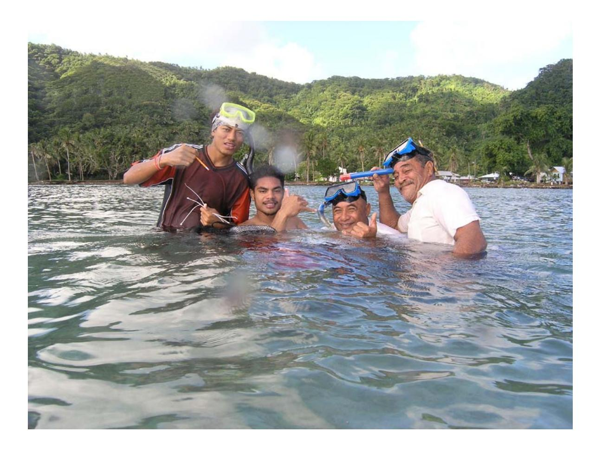

### **Acknowledgments**

This report would not have been possible without the generous support of many individuals and institutions. My deepest gratitude to all of the following for assistance with all aspects of the creation of this report including field assistance, logistical support, office space, scientific discussions, revisions to the text, layout, and Fa'a Samoa:

In Samoa: Ray Tulafono, Director of DMWR; Chris Hawkins; Doug Fenner; Leslie Whaylen; Risa Grace Oram; Peter Craig; Nancy Daschbach; Fatima Sauafea; Selaina Vaitautolu; Pora Toliniu; Francesca Riolo; Mike King; DMWR; CRAG; and especially all of the community members participating in the CommunityBased Fisheries Management Program of Tutuila, American Samoa.

In Hawaii: Michelle McGurr; Bruce Mundy. In CNMI: Peter Houk.

Fa'afetai tele lava.

The author can be contacted at: craig@musburger.com

### Table of Contents

| Introduction                                                | 1  |
|-------------------------------------------------------------|----|
| Project Objectives                                          | 1  |
| Project Methodologies                                       | 2  |
| Issues of Concern                                           | 2  |
| Recommended Monitoring Methodologies                        | 3  |
| Belt Transect                                               | 4  |
| Point-Intercept Transect                                    | 6  |
| Stationary Point Count                                      | 8  |
| Physical Parameters                                         | 9  |
| Fishery Yield Monitoring                                    | 12 |
| Frequency of Monitoring                                     | 13 |
| Public Awareness & Education                                | 14 |
| Target Species                                              | 15 |
| Village Notes                                               | 17 |
| Alofau                                                      | 18 |
| Amaua/Auto                                                  | 20 |
| Aua                                                         | 21 |
| Fagamalo                                                    | 22 |
| Masausi                                                     | 23 |
| Poloa                                                       | 25 |
| Vatia                                                       | 26 |
| References                                                  | 28 |
| Appendices                                                  |    |
| I. Village Concerns and Priorities                          | 30 |
| II. Data Sheets                                             | 32 |
| III. Public Awareness Example                               | 39 |
| IV. Target Species                                          |    |
| V. Questions Arising During Meetings With Community Members | 42 |

### **Introduction**

The American Samoa Department of Marine and Wildlife Resources ("DMWR") began working with local communities on the island of Tutuila in 2001 to develop the CommunityBased Fisheries Management Program ("CBFMP"). Through a series of meetings with representatives from select villages, DMWR sought the voluntary participation of communities in an effort to manage and monitor their own coral reef resources. The program has grown to include seven villages, each of which is responsible for all aspects of managing and monitoring their own resources, with technical assistance from DMWR. Committees from each village have designed and implemented management plans which vary from village to village, but generally include some type of restriction on fishing activity on part or all of the reef fronting their villages. Many of the participating villages have reported anecdotally that they have seen improvement in their resources since the program's inception, but as of yet, there has been no effort devoted towards scientifically monitoring these areas. As such, a robust, quantitative analysis of the effectiveness of the management efforts has not been possible in any of the participating villages. While it may be too late to obtain useful "baseline" data that shows the state of the marine resources prior to the implementation of the management plans, it is imperative that monitoring commence as soon as possible to allow for future analysis of the trends in the health of the reefs of the villages participating in the CBFMP.

The goal of this project was to develop recommendations for methodologies that could be used in an effort to scientifically monitor the coral reef resources of the villages participating in the CBFMP.

### **Project Objectives**

- 1. Investigate the objectives of each village's management plan;
- 2. Identify the species and issues of concern;
- 3. Assess the village sites;
- 4. Evaluate the resources and energy available for the project from the participating villages and from DMWR;
- 5. Evaluate potential monitoring methodologies; and
- 6. Develop recommendations for monitoring protocols.

### **Project Methodologies**

To develop recommendations for an effective monitoring protocol, the following steps were taken. First, a detailed examination of the village management plans was undertaken. This process involved reading each management plan and reviewing the extensive village files that have been compiled by DMWR personnel. Discussions with present and former DMWR staff proved especially valuable as well, as considerable information has yet to be updated in the village files. Subsequently, a series of meetings with each of the participating villages took place. These meetings typically included DMWR representatives and between three and twelve community members. The meetings facilitated further understanding of each village's specific needs and goals, and allowed for the introduction of several possible monitoring methodologies. Valuable feedback was received from the community members as to what types of monitoring activities seemed feasible. The level of energy that each village was interested in contributing to the project was also evaluated. Concurrently with this first set of meetings, interviews with fishermen and commercial fish market proprietors took place to help develop an understanding of the market forces affecting the coral reef fishery of Tutuila and to help identify species of greatest concern. After the introductory meeting with each village, a second meeting was arranged which focused on getting DMWR personnel and community members in the water to evaluate potential sites and practice some of the proposed methodologies. Due to time constraints and scheduling problems, this second meeting was not possible in every village. Finally, discussions with local marine scientists and conservationists took place to help further identify the potential causes of reef degradation and other issues of concern that might be addressed through this program's monitoring efforts.

### **Issues of Concern**

A complete list of the communities' specific concerns (Appendix I) was compiled, and each specific concern was categorized to help develop a comprehensive set of issues that should be addressed through the monitoring efforts of this project. The major

categories of concern included: fish abundance, reef health, land use, garbage, natural disturbances, fishing methods, resource use, education, and public awareness.

Also mentioned were social, economic, and public health concerns. However, these issues fall out of my area of expertise and any effort to develop monitoring programs for these concerns would

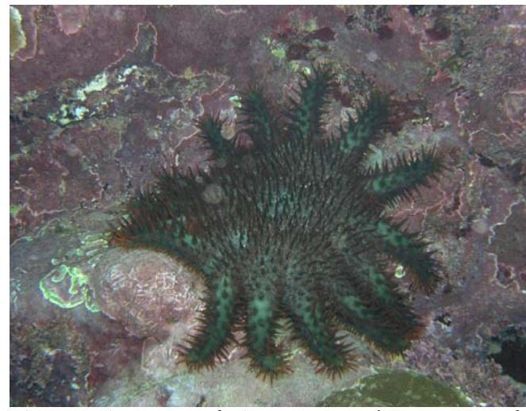

Alamea - the Crown of Thorns Seastar is a predator of live coral. In great numbers, it can become a potential threat to the health of coral reef resources.

be better designed by a social scientist with applicable experience.

Additionally, enforcement of village rules and regulations was repeatedly mentioned by community members as a topic of concern which may require considerable input from DMWR. DMWR assistance is greatly needed in this area, but again, the scope of this report is limited to the monitoring aspect of the CBFMP.

### **Recommended Monitoring Methodologies**

A wide variety of survey methodologies have been proposed as effective means of monitoring coral reef resources. In determining the most suitable survey methodologies for this community-based project, many methods were considered. All of the methodologies recommended in this report were designed to be readily completed by community members who have had little or no experience with coral reef monitoring. The methodologies can be completed by a team of two snorkelers and require no SCUBA. Ideally, the monitoring outlined in this report would be supplemented by periodic surveys conducted in the management areas by more highly trained DMWR personnel that would include deeper, SCUBA-based surveys that would be carried out by trained scientists with more taxonomic expertise. The methods recommended herein were

designed by selecting various aspects of commonly used survey protocols because they satisfied the following list of criteria:

- 1. Scientifically robust;
- 2. Inexpensive;
- 3. Require minimal equipment;
- 4. Easily learned;
- 5. Time efficient:
- 6. Safe; and
- 7. Appropriate for study sites

Following is a detailed description of all of the survey methodologies included within the recommendations of this report.

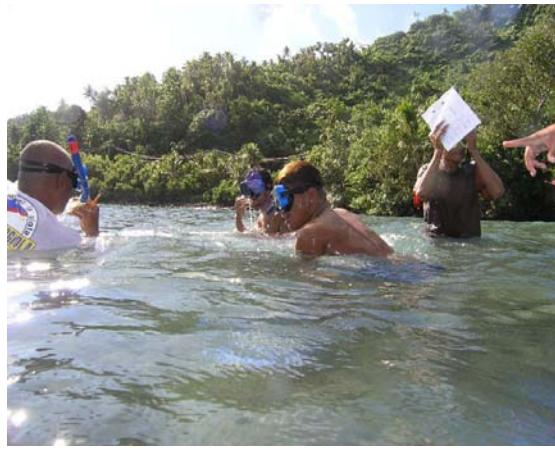

Monitoring and Enforcement Committee members in Alofau preparing to conduct surveys.

Discussion of the applicability and usefulness of each methodology is included within the sections devoted specifically to each village.

#### **Belt Transect**

Belt Transects are useful in quantitatively measuring fish and invertebrate abundance and density. This procedure allows quantitative comparisons between sites and over time. Performing a Belt Transect is relatively simple, and with a few practice surveys, surveyors should be able to complete the recommended set of three transects (including the complementary Point-Intercept Transect method described below) in approximately one to two hours. Since introduced by Brock (1954), variations of the Belt Transect methodology have become the standard in visually surveying reef fish. Belt Transects are non-destructive which makes them a valuable tool for long-term monitoring of population structure (Russell et al., 1978) especially in the context of non-extractive marine management areas such as those of the CBFMP.

The following personnel and equipment are required to conduct a Belt Transect:

- 2 Snorkel-surveyors
- 2 Clipboards with pre-printed data sheets and pencils
- 1 25-meter measuring tape

- 2 sets of snorkeling gear
- A minimum of 2 permanent markers on the reef delineating the beginning and end of the transect.

### *Detailed Instructions*

To perform a Belt Transect survey, two snorkelsurveyors begin by securing the end of the transect tape to the marker delineating the beginning of the transect. The surveyors then swim together along the length of the transect, reeling out the transect tape as they go. No data is collected during this initial swimout. If additional markers are installed along the transect (see below) one snorkeler should reel out the tape while the second snorkeler follows closely behind wrapping the tape one time around each of the

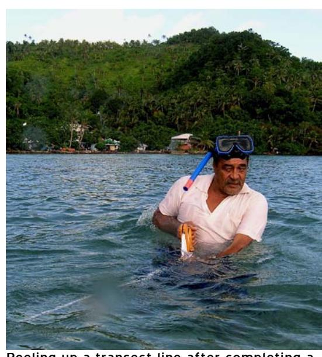

Reeling up a transect line after completing a survey.

additional markers. After reeling out 25 meters of tape, the tape is then secured to the pin marking the end of the transect. The surveyors should then wait for a minimum of 3 minutes before returning along the transect, as many fish will be disturbed during the initial roll out of the tape. After the 3 minute waiting period, the 2 surveyors slowly swim together along the length of the transect tape counting all fish which have been identified as target species that are observed within the boundaries of a 2 meter wide belt. One surveyor swims on each side of the tape and counts fish first seen on their side of the tape only. All observations are recorded on the transect data sheet (Appendix II). Since this monitoring will only be conducted in snorkeling depths, there is no need to exclude any fish from the count due to a vertical height limit. The fishcount swim should take approximately 57 minutes to cover the 25 meters.

After reaching the end of the transect, the surveyors then turn around and return along the line (remaining on their side of the tape), and conduct the invertebrate survey. Again, surveyors count all target species invertebrates seen within a twometer belt along their side of the tape. The invertebratecount swim should take an additional 57 minutes. Surveyors should be careful to look under ledges, in holes, and around coral heads as many of the target invertebrates can be quite cryptic. Again, all observations are recorded on the data sheet. As discussed below, many of the villages have identified trash on the reefs as a major issue of concern. A category for trash has been included on the data sheet in the invertebrate section, and surveyors should record the number of trash items observed during the invertebratecount swim within the boundaries of the same 2meter wide belt.

Upon completion of the Belt Transect , the surveyors either continue with the PointIntercept Transect (below) or reel up the transect tape if a PointIntercept Transect is not being performed.

Recommended transect locations are included in the sections devoted to each village, but a few general rules should apply if new transect locations are needed as additional villages or survey sites are added. First, it is generally considered preferable to run transects in a direction parallel to shore at a constant depth. This precaution will reduce the likelihood of running a transect through different habitat zones on the reef which could diminish the value of the data in terms of enumerating trends or changes within a single reef zone (Birkeland, 1984). When there is a desire to monitor multiple habitat zones in an area, it is preferable to run a separate transect in each zone. Within the time and energy constraints of this project, it may not be possible to survey in every habitat type found within the boundaries of the village management areas. The focus of the sites suggested in this report are those most readily accessible by snorkelsurveyors which in most villages are the reef flat and lagoonal areas.

### **PointIntercept Transect**

Performed in conjunction with and immediately following the BeltTransect protocol, the PointIntercept Transect is useful in quantitatively surveying reef substrate. This method is highly effective for collecting large amounts of data in a relatively short

time period, and it can be performed by surveyors with little to no taxonomic expertise. While other survey methodologies exist that facilitate the collection of more detailed descriptions of habitat structure, these methodologies require considerably more time to perform, resulting in a reduced ability to perform replicate surveys (Colgan, 1981). A single PointIntercept Transect will yield 50 data points in a remarkably short time period, and several replicate samples will be possible during each survey period. An increased number of replicates will allow for a more powerful analysis of the parameters of the system, in spite of an apparent sacrifice in the level of detail in the measurements (Kinzie & Snider, 1978). PointIntercept Transects are in current use in other communitybased management programs with similar constraints on survey resources (Christie et al., 2002).

The following personnel and equipment are required to conduct a PointIntercept transect:

- 2 SnorkelSurveyors
- 2 Clipboards with preprinted data sheets and pencils
- 1 25meter measuring tape
- 2 sets of snorkeling gear
- A minimum of 2 permanent markers on the reef delineating the beginning and end of the transect
- 1 small weight (e.g. a hex nut) attached to a 0.5 meter piece of string

### *Detailed Instructions*

The PointIntercept Transect is performed by one or two snorkelsurveyors (note: as a safety precaution, there should always be at least two snorkelers in the water when any of the sampling procedures are being conducted). If one surveyor is performing the survey, he or she swims the length of the survey tape that was laid out during the Belt Transect (above) identifying the type of substrate found immediately below the survey tape every 0.5 meters. Substrate type is classified as one of the following categories: live coral; dead coral; rock; rubble; sand; algae; coralline algae. More highly trained surveyors could use the same protocol but identify substrate type to more detailed categories. If two

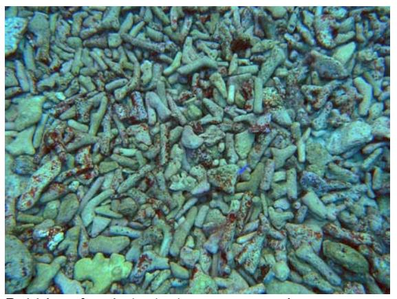

Rubble - A substrate type commonly encountered on disturbed reef flats

surveyors perform the survey (and this is preferable as it creates redundancy), the second surveyor follows 23 meters behind the first surveyor repeating the same procedure.

Due to the rugose nature of coral reef environments, occasionally the survey tape will not be laying directly on the substrate. If

it is not plainly clear what type of substrate lies directly below the tape at one of the 0.5 meter marks, the surveyor should take the small weight and drop it from a point directly above the survey mark. The type of substrate that it lands on is then recorded for that data point. The string is attached to the weight as an aid in retrieving the weight should it fall into a hole or pocket on the reef.

Following the completion of the PointIntercept Transect, the surveyors should reel up the transect tape taking care not to twist it on the reel. The PointIntercept Transect should take approximately ten minutes to complete.

### **Stationary Point Count**

The Stationary Point Count survey ("SPC") is presented here as an alternative to the Belt Transect. The conditions at several of the villages (discussed below) may not always permit the completion of a transect. Strong currents or heavy wave action may render the laying of a transect tape impossible or may make it unsafe to stay close enough to the reef to complete the transect methodologies. The surveyors' safety should always be the highest concern when performing any monitoring work, and should the surveyors decide that transects are not feasible, they may elect to perform a SPC instead. This method will allow for quantitative monitoring of fishes, but not invertebrates or coral cover.

The following personnel and equipment are required to conduct a SPC:

- 2 SnorkelSurveyors
- 2 Clipboards with preprinted data sheets and pencils
- 2 Sets of snorkel gear
- 2 Waterproof stopwatches

#### *Detailed Instructions*

To perform a SPC, two snorkel surveyors position themselves 20 meters apart at previously marked locations. After reaching the survey location, surveyors start their stopwatches and begin surveying an area within 10m on all sides. The surveyors do not swim around the area. They remain in one location slowly turning around in circles being sure to watch in all directions. For a time period of five minutes, surveyors record on their data sheets the total number of each of the target fish species observed. Care should be taken to avoid doublecounting the same fish over the course of the five minutes, but inevitably fish will move out of visual range and reenter the survey area. If the surveyor is unsure whether a fish is being observed for the first time, he or she should treat it as a first sighting and record it on the data sheet.

### **Physical Parameters**

Recording of physical data at each survey site can serve several purposes. First, there are many coral reef disturbance events linked to changes in the physical environment. Coral bleaching, often the result of temperature stress (Glynn, 1983), and reef damage due to heavy sediment loads (Hodgson & Dixon, 1988) are two common examples of such events. By monitoring the physical environment around a coral reef, scientists can attempt to correlate such events with environmental changes. Second, by making observations of physical factors at each of the village sites in this program, better comparisons will be possible between sites. Villages may be able to be characterized into categories based on physical factors that might vary from village to village.

There are a variety of tools available to monitor the physical environment around the village sites that are inexpensive and easy to use.

<u>Sediment Traps</u> – Sediment traps can be easily constructed from PVC pipe which is available at hardware stores on Tutuila. The traps should be six to eight inch long pieces of two-inch diameter pipe fitted with a cover on one end. The traps should be secured either to the permanent stakes delineating the transect locations, or to solid pieces of substrate by attaching them firmly in place with cable ties. Care should be taken to ensure

the tubes are standing vertically, and that the opening at the top of the tube is not obstructed by overhanging coral or rock. The traps are left on the reef for a period of time (this length of time will vary from site to site depending on local rates of sedimentation) while sediments accumulate inside. When retrieving a trap, the surveyor should bring an extra cap as well as a replacement trap. Before cutting the cable ties which are holding the old

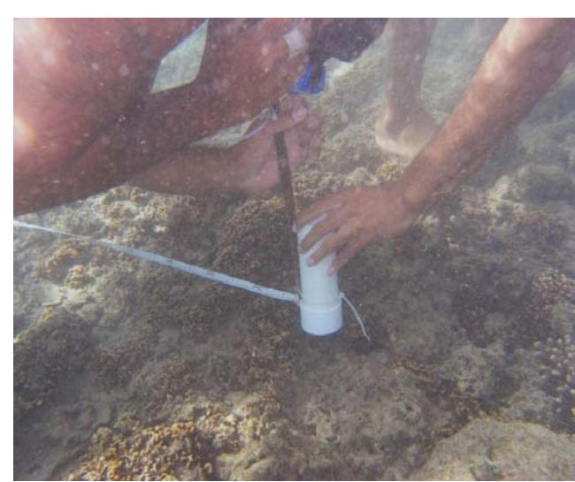

Securing a sediment trap which will help monitor the amount of sediment falling on the reef. Too much sediment can smother and eventually kill corals.

trap in place, the surveyor should affix the second cap to the trap so as to avoid accidentally losing any of the accumulated sediments. The old trap should then be swapped with a new trap, and careful records should be kept detailing dates of trap deployment and retrieval. The retrieved trap should then be taken back to the DMWR office (or other location with the required facilities) for analysis. The sediments in the trap should be carefully emptied into a drying vessel (like a pre-weighed piece of aluminum foil) and then set in a drying oven for a sufficient length of time to assure complete drying. The sediments should then be weighed, and the weight measurement recorded.

<u>Thermometers/Temperature Loggers</u> – Temperature has been shown to be an important factor affecting reef health. Monitoring of temperature can be as simple as bringing a

thermometer along during each survey trip, or it can be more sophisticated by installing long-term temperature loggers at survey sites. These temperature loggers are relatively inexpensive, and allow for long-term recording of temperature over a wide variety of time scales. Some models also log salinity data which could be valuable as well. The loggers must be periodically retrieved to download information into a computer. They could be secured to the same positions as the sediment traps.

<u>Turbidity</u> – Nutrients and suspended sediments in the water might reduce the ability for light to reach corals, many of which contain zooxanthellae that depend on energy from the sun for photosynthesis. A simple tool used to measure turbidity is a Secchi Disc. Use of a Secchi Disc will require two surveyors. One surveyor should position him/herself at the beginning of a transect site and hold the disc below the surface of the water with the marked black & white surface facing towards the other end of the transect. The second surveyor then swims along the transect line away from the disc while holding onto the

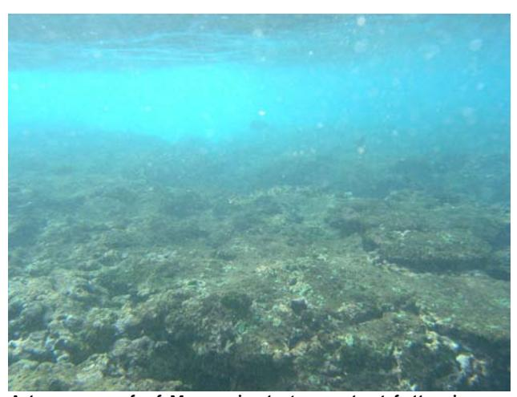

A lagoon reef of Masausi, photographed following a rainstorm - an event that leads to increased turbidity.

line that is attached to the disc. The second surveyor should continue swimming until the black & white pattern on the disc is no longer visible through the water. The surveyor should then pull the attached line tight and slowly swim towards the disc until it just becomes visible. The second surveyor should then tie a knot in the line marking the point at which the

disc becomes visible so that the length of line can be measured after returning to shore. This length of line is recorded on the data sheet. Since this procedure causes a potential disturbance to animals along the transect area, it should always be completed after all transect activities at the survey site are completed.

<u>Salinity</u> – DMWR has in its equipment supply, several plastic gauges for measuring specific gravity/salinity. While the accuracy and precision of these instruments is of

questionable value to rigorous scientific monitoring of a coral reef, many of the villagers who were exposed to these devices seemed to enjoy using them and expressed a desire to include them as part of their monitoring effort. As a tool for promoting interest and cooperation with the monitoring efforts, these gauges may serve a useful purpose, but for real monitoring of salinity changes, electronic salinity/temperature loggers (as described above) are recommended.

### **Fishery Yield Monitoring**

Perhaps the most valuable and pertinent type of monitoring that can be done for this project is to monitor the efforts and success of fishermen in the participating villages.

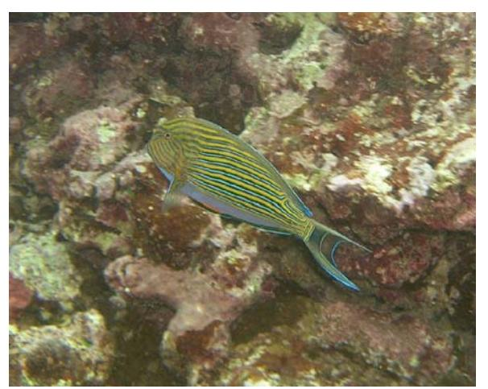

Alogo - the blue-striped surgeonfish is an important food fish species.

One of the main concerns cited by all of the villages in the program was a decline in the state of the fishery in their village. The success or failure of the management efforts from a fisheries perspective can be most clearly evaluated by careful and thorough monitoring of fishing effort and catch. The approach for monitoring the fishery will differ village to village. A data sheet has been prepared (Appendix II)

that includes the important information, but detailed recommendations as to the frequency and strategy for conducting this aspect of the monitoring is included in the section for each village. Regardless of the schedule for this monitoring activity, the protocol will be the same. Each fishing party whose activity is being reported should record the total number of people that were fishing and how much time they spent fishing (not including time to prepare gear or boats, but time spent with lines/net/spears etc. in the water). This information can be used to calculate the effort (in manhours) that was spent fishing. Next, the types of fish caught should be recorded. One line of the data sheet should be devoted to each species caught. For each species, the total weight of all the fish and the length of the largest and smallest fish of each species should be recorded. As discussed below, this monitoring task can be conducted by DMWR personnel or by villagers themselves. When the work is to be conducted by the villagers without the presence of DMWR personnel, measuring equipment (i.e. scales and measuring boards/tapes) will need to be provided.

### **Frequency of Monitoring**

The frequency of monitoring activities will have a dramatic impact on the usefulness of the collected data. Coral reef surveys of this nature will inevitably be cursed by high natural variability in the abundance of the study organisms (Russell et al., 1978). To minimize the effects of this natural variability, it is imperative to conduct sufficiently frequent surveys. Unfortunately, monitoring and the subsequent data analysis are extremely labor and time intensive. A balance must be achieved between applying a sufficient amount of time towards conducting the required field work and assuring that sufficient time and money is available to make sense of all the data collected. Depending on the goals of a monitoring program, the frequency of monitoring activities may change.

At least initially, DMWR staff will need to be on site during all of the surveys. An agreeable frequency of monitoring seems to be quarterly at each location. While this is probably sufficient for longterm monitoring of coral cover and substrate type, it may not be sufficient for fish surveying. As many of the villagers correctly pointed out when discussing this issue, temporally variable cycles of abundance among reef fish is commonplace. Annual, seasonal, lunar, and tidal cycles are all well documented for a variety of reef organisms, and this fluctuation coupled with the variability that can be seen even on fish count transects performed within several minutes of each other will make it difficult to discern any statistically significant trends in fish counts. If possible, I would strongly suggest an increase to monthly monitoring for fish. One possibility would be to perform the complete transect methodology quarterly with the simpler and faster Stationary Point Counts conducted monthly.

The frequency of retrieval of sediment traps will require some trial and error. Depending on the placement of traps, rainfall levels, and sediment inputs, the traps will probably accumulate sediment at very different rates. I recommend initially checking the traps at least monthly until a better sense of sedimentation rates is acquired.

#### **Public Awareness & Education**

One of the important purposes of the monitoring activities for this project is to build awareness of the CBFMP activities both within the participating villages and throughout the rest of the island. Several of the villages expressed their strong desire to develop stronger awareness of their efforts and to document the success of their management efforts. It should be a high

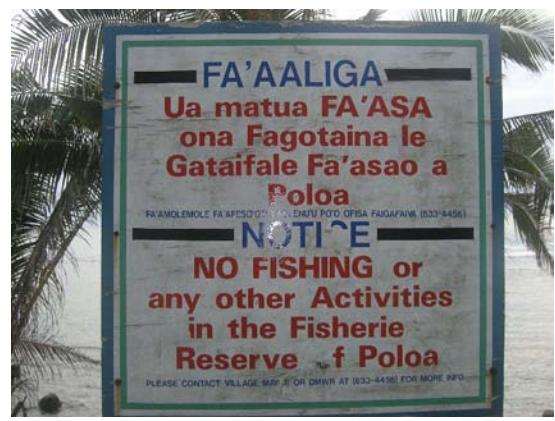

A sign designating the fishery reserve of Poloa. Such signs are an important part of increasing awareness about the program and the fishing restrictions in the villages.

priority for DMWR to provide frequent updates to the participating villages on all aspects of the monitoring work. While it will take a considerable amount of time before any trends become discernible regarding the effects of the program on the abundance of marine resources, it is important for DMWR to prepare materials for the villages as soon as possible following any and all monitoring activities. Appendix III is an example of such an activity summary written following the installation of sediment traps in Masausi and Poloa. Materials like this example should be given to the participating villages, and should also be disseminated to local news sources for distribution to the general public as the value of such types of information sharing has been seen in other community-based programs (Buhat, 1994).

During meetings with the village Monitoring and Enforcement Committees, the idea was suggested to each committee that they establish a location that is highly visible in their village for periodic posting of such updates. There was great support for this idea,

but DMWR will need to follow through with the production of such materials for this aspect of the project to be successful.

While reports from the community-based program of independent Samoa suggest that the need for community education are secondary to the need for building support for the program (King & Faasili, 1999), this is not necessarily the case for the Tutuila program. The communities, while extremely knowledgeable about the reefs and their associated fauna, will need a significant amount of education about the monitoring aspect of the project. Simple publications, like the example in Appendix III will serve the program and its participants well in informing project participants and the general public about the goals, methodologies, and results of the monitoring activities.

### **Target Species**

Through interviews with fishermen, surveys of local fish markets, site assessments, and review of scientific literature, a list of target species for priority monitoring has been compiled (Appendix IV). It is the intention of this program to have

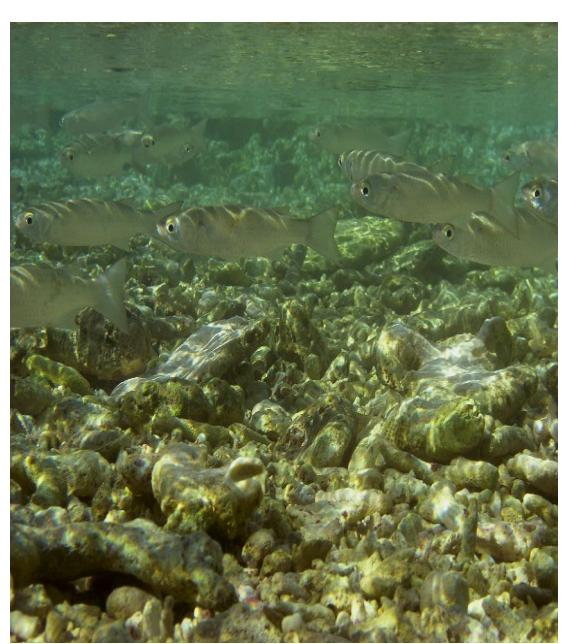

Anae, or mullet, are a highly prized food fish that nearly every village reported as heavily depleted.

villagers performing much of the monitoring work, so the list of target species was created based upon the Samoan classification scheme. In many cases, there is a single Samoan name that corresponds to a single scientific name of a fish or invertebrate. However, in some instances a single Samoan name refers to a group of species, a family, or several families of organisms. There are also instances when there are several Samoan names which refer to different sizes or color morphs of a species or group of species. When such distinctions are made based upon

size, the Samoan classification scheme provides an excellent method for collecting size

class data which can then be used to estimate biomass or changes in sizeclass distribution over time. As such, a target species may not be a "species" in the scientific sense of the word.

In developing the species list, several criteria were used to help determine which species would be most appropriate. All species chosen are readily identified in the field and are not cryptic so no destructive or extractive measures are necessary to estimate their abundance. Species were included due to their ecological importance, their importance as a food species, or their status as threatened, endangered or depleted species.

### **Village Notes**

While the monitoring protocol was designed to be similar throughout all of the participating villages, each village has unique circumstances. The following section summarizes the management plans of each village and provides information specific to each area gained through meetings with village committees and site surveys.

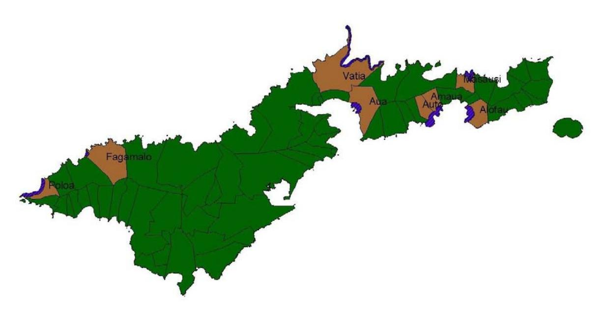

The villages currently participating in the CBFMP with the boundaries of their Marine Management Areas shown in blue.

## ALOFAU

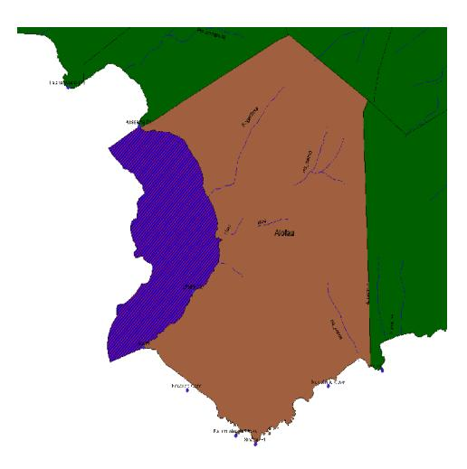

The management area for Alofau village extends from Asasama Point in the north to Uea Point in the south and extends out beyond the reef flat over the drop off. The reef flat is extremely broad, with several deep areas that were dredged to mine sand and rock for construction uses. The Alofau management plan has changed since its inception. The first management plan called for closing the entire area to all fishing activity beginning in May of 2001. After two years of complete closure, the village decided to open the area to fishing on Saturdays only.

An initial meeting was held with the Alofau Monitoring and Enforcement Committee on May 26, 2004. The meeting was well attended with nine members of the committee participating. The Alofau committee shared the same concerns as other villages regarding a general decline in the quality of their fishery. One species of high concern for them was the akule (bigeye scad). The numbers they see on their reef have dwindled so low that it has been ten years since they even bothered to set their traditional traps for akule. They also expressed a strong desire to grow more clams. As part of the DMWR program, they were provided a stock of clams which are now all gone. They want to obtain more clams from DMWR so that they can grow them bigger and then eat them. They are not interested in allowing them to breed as they believe the young clams will end up in adjacent villages. The mayor of Alofau also recently visited with family in independent Samoa where they were commercially growing mussels, and he was interested in pursuing that type of operation in his village. The Mayor also expressed his strong view that the community members should be paid for their time conducting monitoring work. Another major concern brought up by the committee was the erosion of their coastline.

A second meeting took place in Alofau on May 29. This meeting went extremely well as seven members of the Monitoring and Enforcement Committee joined us in the water and conducted transects and all of the physical data collection efforts themselves. While it was an extremely positive sign to see so many of the community members to show up to assist, in the future, it would be advisable to conduct the field work in smaller groups to avoid the large amount of disturbance to the area which we caused during this practice expedition. We conducted one transect and installed one sediment trap in an area that the committee suggested we look at (site A) since it was a location which they were interested in using as a clam nursery. I recommend NOT using this site as a permanent transect station as it is quite close to shore and consists almost entirely of mud, sand and rubble with the occasional dead clam shell. For the second transect (site B), we attempted to locate permanent stakes installed by DMWR Staff Member Mike King. We were unfortunately unable to locate his stakes, so we selected a site in the vicinity of where his stakes were believed to have been placed. Again, a sediment trap was installed at the location marking the beginning of our transect. The location of this transect is also not ideal and should be changed before conducting the next series of transects. Due to time constraints, a third transect was not possible on that day.

The temporally variable closure system instituted in Alofau offers a unique opportunity to conduct paired monitoring surveys that could examine the immediate effects of the fishing activity on the village reefs. While it is entirely supplemental (and should be considered a lower priority) to the longterm monitoring schedule outlined above, it might be valuable to conduct two days of surveys in Alofau during every monitoring cycle: one on Friday and one on Sunday. Perhaps a difference would become discernible in fish and invertebrate abundances after a series of paired surveys were conducted. The temporal nature of the fishing activity in Alofau would also facilitate easier performance of the Fishery Yield monitoring. A DMWR staff member or a MEC member could easily collect the information needed for this survey by simply waiting on the beach and examining the catch of each of the fishermen/women as they return.

# AMAUA-AUTO

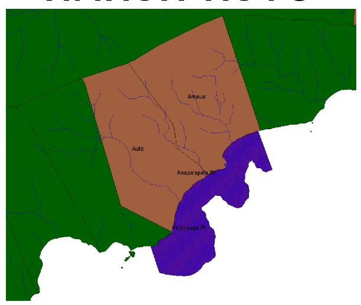

Located on the protected south shore of Tutuila, Amaua and Auto villages have a shared management area. The management area includes the entire reef fronting the village, with a small area excluded on the far Eastern side of Amaua. The family living near there was not interested in participating in the program and wanted to keep their area of reef open to fishing. There is no fishing of any kind allowed within the boundaries of the Amaua/Auto management area.

An initial meeting was held on May 14, 2004 with the Amaua/Auto Monitoring and Enforcement Committee. Troy, the village Mayor, is extremely enthusiastic about the program. He and the other committee members had a lot of questions about monitoring (Appendix V). The committee members, while eager to actively participate in the monitoring, expressed some ambivalence towards the methodologies. They requested that DMWR personnel perform the transects. Perhaps, a gradual phasein of the methodologies with increasing community participation in the survey work could be possible there. One chief desire of the committee was to have an active channel of communication to spread the word about the program in their village. They want signs and reports detailing the work in their village, as it is very important to them to be able to report to the village council about progress with the program.

Subsequent efforts to meet with the committee to install sediment traps and practice the transect methodologies were unsuccessful. I was able to independently visit the village and snorkel a portion of their management area. DMWR staff member Mike King has installed several stakes to mark transects in the village, but the status of those stakes is unknown. Mike and I were able to find only two of the six stakes. Mike provided

an aerial photograph with the approximate locations of his stakes marked on the photo. The following coordinates were generated by estimating their locations using ArcView.

Site 1 – beginning: 14 o 16.7539' S, 170 o 37.6741' W

> end: 14 o 16.7219' S, 170 o 37.6698' W

Site 2 – beginning: 14 o 16.7632' S, 170 o 37.6285' W

> end: 14 o 16.7311' S, 170 o 37.6226' W

Site 3 – beginning: 14 o 16.3691' S, 170 o 37.3686' W

> end: 14 o 16.3522' S, 170 o 37.3373' W

These three transects are 50 meters long. A 50 meter transect is often preferable to a 25 meter transect, but in the interest of standardizing the methodologies across all villages in the program, the recommendations herein suggest 25 meter transects. 50 meter transects will not be feasible in some of the study areas. Since several of these stakes have probably already been lost, I suggest that permanent 25 meter stations be installed using whatever stakes of Mike's can be found and simply shortening the area surveyed. If time permits, it is also recommended that a fourth station be added on the broad reef promontory immediately offshore of the Afulei stream watershed. The Amaua/Auto management area includes a broad reef flat that should facilitate easy access to good monitoring sites. There is ample protection from wave action, and the reef flat is sufficiently deep that monitoring should be possible inside the reef during most tidal conditions. Several villagers reported occasional strong outgoing currents near the awas, so stations should not be situated too close to the awas thereby avoiding the possibility of experiencing conditions that make swimming transects impossible.

#### **AUA**

The status of Aua village's participation in the program is currently unknown. While early interest was shown, at the time of this writing the DMWR office could not reach village representatives to make further progress on the Aua program. It is believed they may not be interested in continuing participation. As such, no time was spent during this study to evaluate the monitoring needs of Aua village.

# FAGAMALO

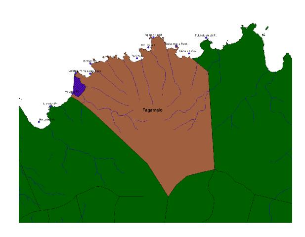

Fagamalo is the most recently added village to the CBFMP. As of the time of this writing, they had not yet completed their management plan. An initial meeting was held in Fagamalo on May 15, 2004 where we discussed the issues and species of greatest concern and had an introduction into some possible monitoring methodologies. The meeting was well attended and the residents of Fagamalo seem quite enthusiastic about the program. A group of women attended

the meeting (the only village where this occurred) and spoke at length about their concern for faisua (giant clams). The men spoke most passionately about the need for more anae (mullet). Collectively, there was great enthusiasm for setting out sediment traps and doing transects. They were concerned, however, about performing any work at high tide as most of them can not swim.

Since the management plan for Fagamalo was not yet complete, we did not return to evaluate survey sites. Before doing so it will be necessary to understand the village restrictions including the locations and or timings of any resource closures.

# MASAUSI

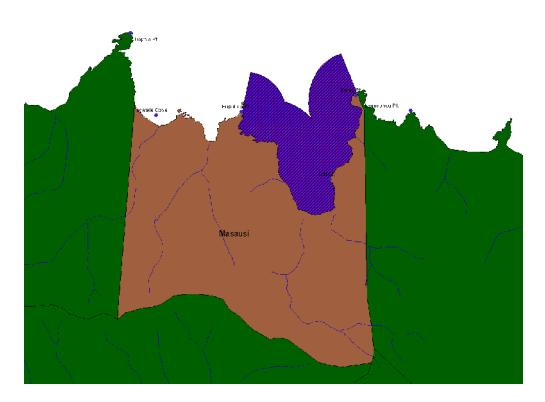

The protected area of Masausi includes roughly 75% of the shoreline of the village and the fronting reef areas. The Western side of the village is not protected as it is a shared fishing area with the village of Masefau. This area is not visible from the main residential area of Masausi, and the management committee said it would not be possible for them to enforce any regulations there as access to the area is difficult.

Masausi offers an excellent opportunity for a

comparative study of the differences in a fully protected area and an adjacent fished area (Fagatele). Unfortunately, access to the fished area is difficult – villagers can walk several hours over a small pass to gain access, swim around an exposed point which frequently is battered by large swell, or travel by boat. The boat option seems most reasonable – assuming DMWR can provide such a boat for the program.

An initial meeting was conducted in Masausi on May 17, 2004. At this meeting, members of the Monitoring and Enforcement Committee examined maps of the village and resolved a dispute between three varying descriptions of the boundaries of their MMA. The correct boundaries are shown on the map above. The committee had great interest in discussing species of special concern. Several species were described as dramatically less abundant than in previous times. According to the committee, akule (bigeye scad) were once caught in great numbers in cycles up to twice per month. Now, catching any is rare. Lo (rabbitfish), once harvested when large numbers of recruits showed up just after the Palolo spawn, are no longer common. Pala'ia (juvenile striped bristletooth), which recruited at many different times of the year are also no longer abundant. The committee also wanted to make sure that lupo (juvenile jacks) and i'asina (juvenile goatfish) were included on the list of target species.

On May 20, 2004 we went to Masausi to assess the possible locations of permanent survey stations. The tide was quite low at the time, and this made access to the reef flat difficult. Transects will only be possible on the reef flat at high tide as the depth ranged

from 6 inches to 2 feet in most areas. We were able to snorkel on the outside of the reef,

but there was considerable wave action there. Performing transects may prove to be quite

difficult in Masausi as it sounds as if the conditions we experienced were typical. In the

event that transects are not possible on field days, it may be better to perform Stationary

Point Count surveys. During our field day there, we installed three sediment traps that

would be good locations to perform such surveys. The GPS coordinates of these sediment

traps are:

Site A: 14

o 15.4198' S, 170 o 36.3727' W

Site B: 14

o 15.4192' S, 170 o 36.3555' W

Site C: 14

o 15.4059' S, 170 o 36.3194' W

We were not able to survey Fagatele, so site selection there was not completed.

The community members from Masausi who accompanied us in the field were not

particularly strong swimmers. They will definitely need to be provided with snorkeling

gear, and substantial assistance from DMWR staff will be required to successfully

perform any surveys there. The level of interest in the program was high, and Masausi

presents a particularly interesting study site as they (along with Vatia) are currently the

only villages in the program where a robust comparison between open and closed areas

would be possible within the village boundaries.

24

# POLOA

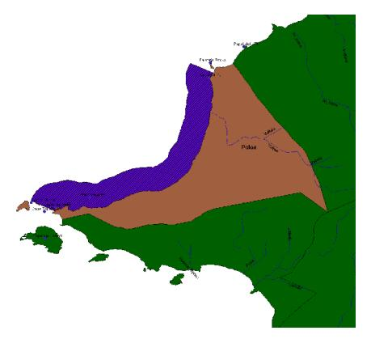

Poloa is the westernmost village of Tutuila. While geographically small, Poloa has a long shoreline and a large area of reef under its jurisdiction. The residents of Poloa are active fishermen, and have opened their management area to fishing by village residents only. During the first phase of their participation in the program, the area was closed to all fishing with exceptions granted when residents needed food.

An initial meeting was held with the Poloa Monitoring and Enforcement Committee on May 20, 2004. The level of interest for the program was as high in Poloa as any village currently involved in the program. The committee members spoke at length about the species of highest concern to them. Anae (mullet), ume (unicornfish), and fe'e (octopus) were repeatedly mentioned as depleted as were pala'ia (juvenile striped bristletooth) which recently had their first big recruitment event in recent memory but which only lasted for one day. One of the members of the committee (Junior) had a boat that he was using to enforce their regulations against intruding alia, but his boat was destroyed during Heta. They were especially concerned about boats coming from outside which they say is not as common as it was before, but it still occurs. As active fishermen, they were willing and excited to begin taking records of their fishing success using the Fishery Yield data sheets. In addition to the effects of fishing pressure on their resources, the Poloa committee members identified physical disturbances as having impacts. Their reefs were severely affected by Heta, and they are also concerned with sedimentation as the water fronting their village can turn milky brown following a big rain. They suggested that young village residents (high school age) could be involved in the monitoring work as it would be a good learning experience for them.

On May 27, 2004, we returned to Poloa to get in the water and look for survey sites. The Poloa residents who were scheduled to assist did not show up, but we

proceeded to investigate the area to designate potential survey locations. The tide was too low to conduct transects on the reef flat, and heavy wave action prevented performing transects on the outside of the reef. I performed three Stationary Point Count surveys and installed three sediment traps at the locations indicated on the map. The highly exposed reef area of Poloa may make transects very difficult to perform on a regular basis. I was not able to visit Poloa during a high tide to assess the feasibility of reef flat surveys under those conditions, but gaining access to the outer reef was difficult.

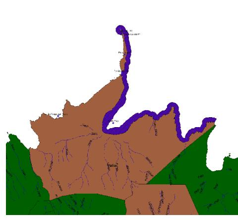

The northernmost village of Tutuila, Vatia is geographically quite large. The management area of the village consists of the entire northeast coast and is closed to all fishing activities. Following two years of closure, the villagers decided to open the reserve for one day earlier this year. They reported a great day of fishing and seem to want to continue with periodic opening of the area. Fishing activity continues throughout the year on the northwest coast of the village.

An initial meeting was held with the Vatia Monitoring and Enforcement Committee on May 19, 2004. While the meeting was especially valuable as a discussion about issues concerning the project, the committee members seem to have little interest in assisting with monitoring efforts unless they receive monetary compensation for their efforts. Monitoring work in Vatia will require nearly complete assistance from DMWR personnel. They expressed reluctance to participate in all of the efforts including Fishery Yield monitoring as they felt it required too much work on their part. The species of greatest concern mentioned in Vatia were anae (mullet) and faisua (giant clams) which are reported to be severely depleted.

A second meeting in Vatia was not completed, and potential survey sites were not identified. The committee expressed an interest in having one of the transect sites located in front of the chief's house (location unknown). Vatia, like Masausi, has protected and unprotected areas under its jurisdiction. Access to the unprotected northwest side is reportedly difficult without a boat. Ideally, three sites could be selected inside the reserve and three sites could be selected outside facilitating local comparisons. Again, this would require DMWR to have a boat available for access to the fished area.

Ongoing communication with the Vatia community should be a high priority so as to ensure DMWR personnel are aware of and available for any subsequent opening of the reserve for fishing days. In the absence of community participation in monitoring the fishing activity during the year, DMWR should make every effort to be on hand to conduct such monitoring during the rare fishing days within the reserve.

### **References**

Birkeland, C. 1984. A contrast in methodologies between surveying and testing. Pp. 1126. In Comparing Coral Reef Survey Methods. Unesco Reports in Marine Science, 21. Report of a Regional Unesco/UNEP Workshop. Phuket Marine Biological Centre, Thailand, December 1317, 1982. 170 pp.

Brock, V.E. 1954. A preliminary report on a method of estimating reef fish populations. Journal of Wildlife Management, v.18. pp. 297308.

Buhat, D. 1994. Communitybased coral reef and fisheries management, San Salvador Island, Phillipines. Pp. 3350. In Collaborative and CommunityBased Management of Coral Reefs: Lessons from Experience. White, A.T., Hale, L.Z., Renard, Y., & Cortesi, L. (eds.). Kumarian Press. Hartford, Connecticut. 130 pp.

Christie, P., White, A., and Deguit, E. 2002. Starting point or solution? Communitybased marine protected areas in the Philippines. Journal of Environmental Management, v. 66. pp. 441454.

Colgan, M.W. 1981. Longterm recovery process of a coral community after a catastrophic disturbance. U. of Guam Marine Lab Technical Report, No. 76.

Glynn, P. 1983. Extensive bleaching and death of coral reefs on the Pacific coast of Panama. Environmental Conservation, v. 10. pp. 149154.

Hodgson, G. & Dixon, J. 1988. Logging versus fisheries and tourism in Palawan: An environmental and economic analysis. Occasional Paper 7. EastWest Environment and Policy Institute. Honolulu, HI.

King, M. & Faasili, U. 1999. Communitybased management of subsistence fisheries in Samoa. Fisheries Management and Ecology, v. 6. pp. 133144.

Kinzie, R.A., & Snider, R.H. 1978. A simulation study of coral reef survey methods. Pp. 231250. In Stoddart, D.R. & Johannes, R.E. (eds.). Coral Reefs: Research Methods. Unesco, Paris. 581 pp.

Madrigal, L.G. 1999. Field Guide of Shallow Water Marine Invertebrates of American Samoa. American Samoa Government Department of Education, Division of Curriculum and Instruction. Pago Pago, American Samoa. 131pp.

Myers, R.F. 1999. Micronesian Reef Fishes: A Field Guide for Divers and Aquarists. Coral Graphics. Guam. 216 pp.

Russell, B.C., Talbot, F.H., Anderson, G.R.V., & Goldman, B. 1978. Collection and sampling of reef fishes. Pp. 329345. In Stoddart, D.R. & Johannes, R.E. (eds.). Coral Reefs: Research Methods. Unesco, Paris. 581 pp.

### APPENDIX I: VILLAGE CONCERNS AND PRIORITIES

Table lists all specific concerns that were voiced by each community. Information was taken from the village management plans and from discussions with village committees. Grammar is reproduced as it was recorded in the management plans and on village questionnaires. Fagamalo and Auto are not included as their management plans were not complete at the time of this project.

| Category        | Specific Concern                                                                                        |   |   |   |   |   | Alofau Aua Vatia Poloa Amaua Masausi |
|-----------------|---------------------------------------------------------------------------------------------------------|---|---|---|---|---|--------------------------------------|
| economics       | fishermen from village affected                                                                         |   |   |   | X |   |                                      |
| economics       | low in source of income                                                                                 |   | X |   |   |   |                                      |
| economics       | spend money to buy fish instead of fishing                                                              |   | X |   |   |   |                                      |
| economics       |                                                                                                         | X | X |   | X |   |                                      |
| educational     | lack the knowledge and understanding of utilizing the reef                                              |   |   |   | X |   |                                      |
| educational     | people not understanding the important of the coral reef area                                           |   | X |   |   |   |                                      |
| educational     |                                                                                                         |   | X |   | X |   |                                      |
| fish abundance  | deficiency in octopus catch                                                                             |   |   |   | X |   |                                      |
| fish abundance  | eels are not found in village reef                                                                      |   |   |   | X |   |                                      |
| fish abundance  | fish and shellfish that were in reefs before are not found in these days (eg. Gau, sea, ofaofa, tuitui) |   |   |   | X |   | X                                    |
| fish abundance  | fishes in the reef area has been harmed                                                                 |   |   | X |   |   |                                      |
| fish abundance  | limited fish resources                                                                                  |   |   | X | X | X |                                      |
| fish abundance  | no fish                                                                                                 |   | X | X |   |   | X                                    |
| fish abundance  | no more common fish                                                                                     |   | X |   |   |   |                                      |
| fish abundance  | no more palolo                                                                                          |   |   |   |   |   | X                                    |
| fish abundance  | no more seasonal fish                                                                                   | X |   |   |   |   |                                      |
| fish abundance  | no seasonal fish                                                                                        | X |   |   |   |   | X                                    |
| fish abundance  | taking of small fish                                                                                    | X |   |   |   |   |                                      |
| fish abundance  | turtles affected and eventually might go into extinct from their reefs                                  |   |   |   | X |   |                                      |
| fish abundance  |                                                                                                         | X | X | X | X | X | X                                    |
| fishing methods | ava niu kini                                                                                            |   | X |   | X |   | X                                    |
| fishing methods | bleach                                                                                                  |   | X |   |   |   |                                      |
| fishing methods | chemicals                                                                                               | X |   |   |   |   | X                                    |
| fishing methods | dynamite fishing                                                                                        |   |   |   | X |   | X                                    |
| fishing methods | dynamite fishing                                                                                        | X |   |   |   |   |                                      |
| fishing methods | fishing using fishing boats/Tongs/scuba gears                                                           |   |   |   | X |   |                                      |
| fishing methods | poor fishing practices                                                                                  |   |   |   |   | X |                                      |
| fishing methods | the use of fishing nets on the reef                                                                     |   |   |   | X |   |                                      |
| fishing methods | the use of traditional fishing methods: futu, chemicals and ava niukini                                 |   |   | X | X |   |                                      |
| fishing methods | unnecessary fishing practices                                                                           |   |   | X |   |   |                                      |
| fishing methods |                                                                                                         | X | X | X | X | X | X                                    |
| garbage         | chemical trash from the canneries                                                                       |   | X |   |   |   |                                      |
| garbage         | clean up streams                                                                                        |   |   |   |   | X | X                                    |
|                 |                                                                                                         |   |   |   |   |   |                                      |
| garbage         | collect from the reef area                                                                              |   |   |   |   |   | X                                    |
| garbage         | dumping of trash and scrap metal on the reef                                                            |   |   |   | X |   |                                      |
| garbage         | liquid detergent and other chemicals washed out into the ocean                                          |   |   |   | X |   |                                      |
| garbage         | oil spills from the mechanic shops                                                                      |   | X |   |   |   |                                      |
| garbage         | too many trash/rubbish                                                                                  | X |   |   |   |   |                                      |
| garbage         | too many trash/rubbish                                                                                  | X |   |   |   |   |                                      |
| garbage         | trash                                                                                                   |   |   |   | X |   |                                      |
| garbage         | trash from the stream                                                                                   |   | X |   |   | X | X                                    |
| garbage         |                                                                                                         | X | X |   | X | X | X                                    |
| land use        | digging of sand                                                                                         | X |   |   |   |   |                                      |
| land use        | digging of the ocean floors                                                                             | X |   |   |   |   |                                      |
| land use        | no sea-walls                                                                                            | X |   |   |   |   |                                      |
| land use        | rivers/streams                                                                                          | X |   |   |   |   |                                      |
| land use        | sand-mining                                                                                             | X |   |   | X |   |                                      |
| land use        | sand-mining                                                                                             | X |   |   |   |   |                                      |
| land use        | sand-mining                                                                                             | X |   |   |   |   |                                      |
| land use        | soil erosion                                                                                            |   |   |   |   | X |                                      |
| land use        | wet lands                                                                                               | X |   |   |   |   |                                      |
| land use        | wet mud wash in the streams                                                                             |   | X |   |   |   |                                      |
|                 |                                                                                                         |   |   |   |   |   |                                      |

### Appendix I Continued

| Category                               | Specific Concern                                                               |   |   |   |   |        | Alofau Aua Vatia Poloa Amaua Masausi |
|----------------------------------------|--------------------------------------------------------------------------------|---|---|---|---|--------|--------------------------------------|
|                                        |                                                                                |   |   |   |   |        |                                      |
| land use                               |                                                                                | X | X |   | X | X      |                                      |
| natural disturbance                    | crown of thorns                                                                |   |   |   | X |        | X                                    |
| natural disturbance                    | hurricane                                                                      | X |   |   |   |        |                                      |
| natural disturbance                    | hurricane                                                                      | X |   |   |   |        |                                      |
| natural disturbance                    | recent cyclones have placed damage on village reef                             |   |   |   | X |        | X                                    |
| natural disturbance                    | sea urchins                                                                    |   |   |   | X |        |                                      |
| natural disturbance                    | the ocean gets heat up (temperature effect)                                    |   |   |   | X |        |                                      |
| natural disturbance                    |                                                                                | X |   |   | X |        | X                                    |
| public health                          | Many bacterias (germs)                                                         |   | X |   |   |        |                                      |
| public health                          | many lives are taken (death at sea)                                            | X |   |   |   |        |                                      |
| public health                          | not be able to eat fish from their water                                       |   | X |   |   |        |                                      |
| public health                          | people will get sick from eating meat food instead of fish for a better health |   | X |   |   |        |                                      |
| public health                          | poor health conditions                                                         |   |   |   |   | X      | X                                    |
| public health                          | too much fatty foods                                                           | X |   |   |   |        |                                      |
| public health                          |                                                                                | X | X |   |   | X      | X                                    |
| public relations                       | announcement for Amaua'a marine reserve                                        |   |   |   |   | X      |                                      |
| public relations                       |                                                                                |   |   |   |   | X      |                                      |
| reef health                            | corals are harmed                                                              |   |   |   | X |        |                                      |
| reef health                            | damaged the reef/marine habitats                                               |   |   |   |   | X      |                                      |
| reef health                            | Dead corals                                                                    |   | X |   |   |        |                                      |
| reef health                            | no more corals                                                                 |   |   |   |   |        | X                                    |
| reef health                            | there are either dead or no corals found                                       |   |   |   | X |        |                                      |
| reef health                            |                                                                                |   | X |   | X | X      | X                                    |
| resource use                           | alia fishing boats cleaned or washed in their water                            |   | X |   |   |        |                                      |
| resource use                           | fishermen                                                                      | X |   |   |   |        |                                      |
| resource use                           | fishing on the reef area will increase                                         |   |   | X |   |        |                                      |
| resource use                           | fishing vessels (alia)                                                         | X |   |   |   |        |                                      |
| resource use                           | fishing vessels (alia)                                                         | X |   |   |   |        |                                      |
| resource use                           | outside fishermen                                                              |   | X |   |   | X      |                                      |
| resource use                           | outsiders fishing in village reefs                                             |   |   | X |   |        |                                      |
| resource use                           | overfishing                                                                    |   |   |   |   | X      |                                      |
| resource use                           | scuba diving                                                                   | X |   |   |   |        |                                      |
| resource use                           | too many fishermen                                                             | X |   |   |   |        |                                      |
| resource use rules/regulations      | discouragement and hindering of government on their part of enforcement        | X | X | X | X | X      |                                      |
|                                        |                                                                                |   |   |   |   |        |                                      |
| rules/regulations rules/regulations | enforce government bylaws enforce the cleaning for the health condition     |   |   | X |   | X X |                                      |
| rules/regulations                      | enforce village bylaws                                                         |   |   |   |   | X      |                                      |
| rules/regulations                      | fishing is prohibited                                                          |   |   |   |   | X      |                                      |
| rules/regulations                      | fishing is prohibited                                                          | X |   |   |   |        |                                      |
| rules/regulations                      | no rules and regulations                                                       |   |   | X |   |        |                                      |
| rules/regulations                      | no size limit on fish catched                                                  |   |   | X |   |        |                                      |
| rules/regulations                      | no village authority                                                           |   |   | X |   |        |                                      |
| rules/regulations                      | set rules and regulations on the use of chemicals                              |   |   | X |   |        |                                      |
| rules/regulations                      | set up village enforcement committee (for security reasons)                    |   |   | X |   |        |                                      |
| rules/regulations                      | village council for rules and regulations                                      |   |   |   |   |        | X                                    |
| rules/regulations                      | village council lack joint action to enforce their rules/regulations           |   |   |   | X |        |                                      |
| rules/regulations                      |                                                                                | X |   | X | X | X      | X                                    |
| social                                 | people looses their fishing talent                                             |   | X |   |   |        |                                      |
| social                                 |                                                                                |   | X |   |   |        |                                      |
|                                        |                                                                                |   |   |   |   |        |                                      |

### APPENDIX II: Data Sheets

Included here are all the data sheets necessary to conduct the monitoring activities described in this report. Samoan and English language versions of each sheet are included. English common names for fish follow Myers (1999) and for invertebrates follow Madrigal (1999).

### **DMWR Community-Based Management Program Transect Data Sheet**

|                      |     |                      |                                                  | Nu'uOgasami Su'esu'eAsoTaimiIgoa Tagata Faigaluega                                                                      |      |
|----------------------|-----|----------------------|--------------------------------------------------|-------------------------------------------------------------------------------------------------------------------------|------|
|                      |     |                      |                                                  |                                                                                                                         |      |
| Fua Va'aia O Le Sami |     |                      |                                                  |                                                                                                                         |      |
| Fua manino o le sami |     | Fua vevela o le sami |                                                  |                                                                                                                         |      |
| Tai                  |     | Fua oona o le sami   |                                                  |                                                                                                                         |      |
|                      |     |                      |                                                  |                                                                                                                         |      |
|                      |     |                      | Asiasiga Muamua: I'a                             |                                                                                                                         |      |
|                      |     |                      |                                                  | Ia fa'amaumau uma fuainumera o i'a nei e maua i le 2m le lautele mai le laina lea e toso mo le 25m.                     |      |
|                      |     |                      |                                                  |                                                                                                                         |      |
| Malie To'e        |     | Mu Mu-aa          |                                                  | Lalafi Tagafa                                                                                                        |      |
| Pusi                 |     | Mumea                |                                                  | Malakea                                                                                                                 |      |
| Maoa'e               |     | Tamala               |                                                  | Fuga                                                                                                                    |      |
| Atapanoa             |     | Mala'I               |                                                  | Fugausi                                                                                                                 |      |
| Malau                |     | Savane               |                                                  | Laea                                                                                                                    |      |
| Gatala               |     | Mataeleele           |                                                  | Galo                                                                                                                    |      |
| Ataata               |     | Ulumalosi            |                                                  | Alogo                                                                                                                   |      |
| Vaolo                |     | Filoa                |                                                  | Manini                                                                                                                  |      |
| Gatala uli           |     | I'asina              |                                                  | Pala'ia                                                                                                                 |      |
| Velo                 |     | Vete, Afulu          |                                                  | Pone                                                                                                                    |      |
| Gatala pulepule      |     | Nanue                |                                                  | Ume                                                                                                                     |      |
| Lupo                 |     | Tifitifi             |                                                  | Umelei                                                                                                                  |      |
| Lupota               |     | Tū'ū'ū               |                                                  | Lo                                                                                                                      |      |
| Malauli              |     | Anae                 |                                                  | Sumu                                                                                                                    |      |
| Sapoanae             |     | Moi                  |                                                  | Pa'umalo                                                                                                                |      |
| Ulua                 |     | Poi                  |                                                  |                                                                                                                         |      |
| Elo                  |     | Aua                  |                                                  |                                                                                                                         |      |
|                      |     | Fuafua               |                                                  |                                                                                                                         |      |
|                      |     | Anae                 |                                                  |                                                                                                                         |      |
|                      |     | Afomatua             |                                                  |                                                                                                                         |      |
|                      |     |                      |                                                  |                                                                                                                         |      |
|                      |     |                      | Asiasiga Lona Lua: Nisi Figota                   |                                                                                                                         |      |
|                      |     |                      |                                                  | Ia fa'amaumau uma fuainumera o nisi figota nei e maua i le 2m le lautele mai le laina lea e toso mo le 25m.             |      |
|                      |     |                      |                                                  |                                                                                                                         |      |
| Matamalu             |     | Faisua               |                                                  | Sisi                                                                                                                    |      |
| Ula                  |     | Fe'e                 |                                                  | Alamea                                                                                                                  |      |
| Papata               |     | Loli                 |                                                  | Vaga                                                                                                                    |      |
| Matapisu             |     | Sea                  |                                                  | Tuitui                                                                                                                  |      |
| Alili                |     | Mama'o               |                                                  | Ofaofa                                                                                                                  |      |
|                      |     |                      | Asiasiga Lona Tolu: Lau'ele'ele                  | Fa'amaumau mai i lalo po'o le a le ituaiga lauele'ele o lo'o iai mo afa mita ta'itasi mo le laina lea e toso mo le 25m. |      |
|                      |     |                      | (A='Amu, AP='Amu pēpē, L=Limu, M=Ma'a, O=Oneone) |                                                                                                                         |      |
| 0.5                  | 5.0 | 9.5                  | 14.0                                             | 18.5                                                                                                                    | 23.0 |
| 1.0                  | 5.5 | 10.0                 | 14.5                                             | 19.0                                                                                                                    | 23.5 |
| 1.5                  | 6.0 | 10.5                 | 15.0                                             | 19.5                                                                                                                    | 24.0 |
| 2.0                  | 6.5 | 11.0                 | 15.5                                             | 20.0                                                                                                                    | 24.5 |
| 2.5                  | 7.0 | 11.5                 | 16.0                                             | 20.5                                                                                                                    | 25.0 |
| 3.0                  | 7.5 | 12.0                 | 16.5                                             | 21.0                                                                                                                    |      |
| 3.5                  | 8.0 | 12.5                 | 17.0                                             | 21.5                                                                                                                    |      |

4.0 8.5 13.0 17.5 22.0 4.5 9.0 13.5 18.0 22.5

### **DMWR Community-Based Management Program Transect Data Sheet**

|                                 |            |                                                                                |              | VillageSiteDateTimeObserver                                                                                    |              |  |
|---------------------------------|------------|--------------------------------------------------------------------------------|--------------|----------------------------------------------------------------------------------------------------------------|--------------|--|
|                                 |            |                                                                                |              |                                                                                                                |              |  |
| Physical Data                   |            |                                                                                |              |                                                                                                                |              |  |
| Visibility (Secchi disc meters) |            | Temperature                                                                    |              |                                                                                                                |              |  |
| Tide                            |            | Salinity                                                                       |              |                                                                                                                |              |  |
|                                 |            |                                                                                |              |                                                                                                                |              |  |
|                                 |            |                                                                                |              |                                                                                                                |              |  |
|                                 |            | Transect 1: Fish                                                               |              |                                                                                                                |              |  |
|                                 |            |                                                                                |              | Record the number of each type of fish observed within a 2m belt along the length of the 25m transect.         |              |  |
| Sharks                          |            | Twinspot Snapper                                                               |              | Napoleon Wrasse (<12 in.)                                                                                      |              |  |
| Moray (small)                   |            | Twinspot Snapper (dark phase)                                                  |              | Napoleon Wrasse (12-30 in.)                                                                                    |              |  |
| Moray (med)                     |            | Twinspot Snapper (red phase)                                                   |              | Napoleon Wrasse (>30 in.)                                                                                      |              |  |
| Moray (lrg)                     |            | Blacktail Snapper                                                              |              | Parrotfish (<6 in.)                                                                                            |              |  |
| Moray (very lrg)                |            | Humpback Snapper                                                               |              | Parrotfish (blue&green 6-10 in.)                                                                               |              |  |
| Soldier/Squirrelfish            |            | Blue-lined Snapper                                                             |              | Parrotfish (8-24 in.)                                                                                          |              |  |
| Grouper (<12 in.)               |            | Emperor (<6 in.)                                                               |              | Parrotfish (>24 in.)                                                                                           |              |  |
| Grouper (12-36 in.)             |            | Emperor (6-12 in.)                                                             |              | Blue-Banded Surgeonfish                                                                                        |              |  |
| Grouper (>36 in.)               |            | Emperor (>12 in.)                                                              |              | Convict Surgeonfish                                                                                            |              |  |
| Peacock Grouper                 |            | Goatfish (<3 in.)                                                              |              | Striped Bristletooth (juv)                                                                                     |              |  |
| Tomato Grouper                  |            | Goatfish (>3 in.)                                                              |              | Striped Bristletooth (adult)                                                                                   |              |  |
| Honeycomb Grouper               |            | Rudderfish                                                                     |              | Unicornfish                                                                                                    |              |  |
| Jack (<3 in.)                   |            | Butterflyfish                                                                  |              | Orangespine Unicornfish                                                                                        |              |  |
| Jack (3-6 in.)                  |            | Angelfish/Damselfish                                                           |              | Rabbitfish                                                                                                     |              |  |
| Jack (8-24 in.)                 |            | Mullet (<2 in.)                                                                |              | Triggerfish                                                                                                    |              |  |
| Jack (2-3 ft.)                  |            | Mullet (2-3 in.)                                                               |              | Filefish                                                                                                       |              |  |
| Jack (3-4 ft.)                  |            | Mullet (3-5 in.)                                                               |              |                                                                                                                |              |  |
| Jack (>4 ft.)                   |            | Mullet (5-6 in.)                                                               |              |                                                                                                                |              |  |
|                                 |            | Mullet (8-30 in.)                                                              |              |                                                                                                                |              |  |
|                                 |            | Mullet (>10 in.)                                                               |              |                                                                                                                |              |  |
|                                 |            |                                                                                |              |                                                                                                                |              |  |
|                                 |            |                                                                                |              |                                                                                                                |              |  |
|                                 |            | Transect 2: Invertebrates                                                      |              |                                                                                                                |              |  |
|                                 |            |                                                                                |              | Record the number of each type of invertebrate observed within a 2m belt along the length of the 25m transect. |              |  |
|                                 |            |                                                                                |              |                                                                                                                |              |  |
| Sea Anenome                     |            | Giant Clam                                                                     |              | Snail                                                                                                          |              |  |
| Spiny Lobster                   |            | Octopus                                                                        |              | Crown-of-Thorns                                                                                                |              |  |
| Slipper Lobster                 |            | Sea Cucumber                                                                   |              | Sea Urchin                                                                                                     |              |  |
| Limpet                          |            |                                                                                |              | Sea Biscuit                                                                                                    |              |  |
| Turbo Snail                     |            | Garbage                                                                        |              |                                                                                                                |              |  |
|                                 |            |                                                                                |              |                                                                                                                |              |  |
|                                 |            | Transect 3: Substrate                                                          |              |                                                                                                                |              |  |
|                                 |            |                                                                                |              |                                                                                                                |              |  |
|                                 |            | Record the type of substrate directly below the transect line every 0.5 meter. |              |                                                                                                                |              |  |
|                                 |            | (A=Algae; LC=Live Coral; S=Sand; Ru=Rubble; Rk=Rock; CA=Coralline Algae)       |              |                                                                                                                |              |  |
|                                 |            |                                                                                |              |                                                                                                                |              |  |
| 0.5                             | 5.0        | 9.5                                                                            | 14.0         | 18.5                                                                                                           | 23.0         |  |
| 1.0                             | 5.5        | 10.0                                                                           | 14.5         | 19.0                                                                                                           | 23.5         |  |
| 1.5                             | 6.0        | 10.5                                                                           | 15.0         | 19.5                                                                                                           | 24.0         |  |
| 2.0 2.5                      | 6.5 7.0 | 11.0 11.5                                                                   | 15.5 16.0 | 20.0 20.5                                                                                                   | 24.5 25.0 |  |
| 3.0                             | 7.5        | 12.0                                                                           | 16.5         | 21.0                                                                                                           |              |  |
| 3.5                             | 8.0        | 12.5                                                                           | 17.0         | 21.5                                                                                                           |              |  |
| 4.0                             | 8.5        | 13.0                                                                           | 17.5         | 22.0                                                                                                           |              |  |
| 4.5                             | 9.0        | 13.5                                                                           | 18.0         | 22.5                                                                                                           |              |  |
|                                 |            |                                                                                |              |                                                                                                                |              |  |

### **DMWR Community-Based Management Program Stationary Point Count Data Sheet**

|                 |       |       | Nu'uAsoTaimiIgoa O Le Tagata Faigaluega |       |
|-----------------|-------|-------|-----------------------------------------|-------|
|                 | Vaega | Vaega | Vaega                                   | Vaega |
| Malie           |       |       |                                         |       |
| To'e            |       |       |                                         |       |
| Pusi            |       |       |                                         |       |
| Maoa'e          |       |       |                                         |       |
| Atapanoa        |       |       |                                         |       |
| Malau           |       |       |                                         |       |
| Gatala          |       |       |                                         |       |
| Ataata          |       |       |                                         |       |
| Vaolo           |       |       |                                         |       |
| Gatala uli      |       |       |                                         |       |
| Velo            |       |       |                                         |       |
| Gatala pulepule |       |       |                                         |       |
| Lupo            |       |       |                                         |       |
| Lupota          |       |       |                                         |       |
| Malauli         |       |       |                                         |       |
| Sapoanae        |       |       |                                         |       |
| Ulua            |       |       |                                         |       |
| Elo             |       |       |                                         |       |
| Mu              |       |       |                                         |       |
| Mu-aa           |       |       |                                         |       |
| Mumea           |       |       |                                         |       |
| Tamala          |       |       |                                         |       |
| Mala'I          |       |       |                                         |       |
| Savane          |       |       |                                         |       |
| Mataeleele      |       |       |                                         |       |
| Ulumalosi       |       |       |                                         |       |
| Filoa           |       |       |                                         |       |
| I'asina         |       |       |                                         |       |
| Vete, Afulu     |       |       |                                         |       |
| Nanue           |       |       |                                         |       |
| Tifitifi        |       |       |                                         |       |
| Tū'ū'ū          |       |       |                                         |       |
| Anae            |       |       |                                         |       |
| Moi             |       |       |                                         |       |
| Poi             |       |       |                                         |       |
| Aua             |       |       |                                         |       |
| Fuafua          |       |       |                                         |       |
| Anae            |       |       |                                         |       |
| Afomatua        |       |       |                                         |       |
| Lalafi          |       |       |                                         |       |
| Tagafa          |       |       |                                         |       |
| Malakea         |       |       |                                         |       |
| Fuga            |       |       |                                         |       |
| Fugausi         |       |       |                                         |       |
| Laea            |       |       |                                         |       |
| Galo            |       |       |                                         |       |
| Alogo           |       |       |                                         |       |
| Manini          |       |       |                                         |       |
| Pala'ia         |       |       |                                         |       |
| Pone            |       |       |                                         |       |
| Ume             |       |       |                                         |       |
| Umelei          |       |       |                                         |       |
| Lo              |       |       |                                         |       |
| Sumu            |       |       |                                         |       |
| Pa'umalo        |       |       |                                         |       |

**I vaega ta'itasi, tusia mai le aofa'i o ituaiga i'a o lo'o iai i le 10m le mamao ma oe mo le 5 minute.**

### **DMWR Community-Based Management Program Stationary Point Count Data Sheet**

| Site Site Site Site Sharks Moray (small) Moray (med) Moray (lrg) Moray (very lrg) Soldier/Squirrelfish Grouper (<12 in.) Grouper (12-36 in.) Grouper (>36 in.) Peacock Grouper Tomato Grouper Honeycomb Grouper Jack (<3 in.) Jack (3-6 in.) Jack (8-24 in.) Jack (2-3 ft.) Jack (3-4 ft.) Jack (>4 ft.) Twinspot Snapper Twinspot Snapper (dark phase) Twinspot Snapper (red phase) Blacktail Snapper Humpback Snapper Blue-lined Snapper Emperor (<6 in.) Emperor (6-12 in.) Emperor (>12 in.) Goatfish (<3 in.) Goatfish (>3 in.) Rudderfish Butterflyfish Angelfish/Damselfish Mullet (<2 in.) Mullet (2-3 in.) Mullet (3-5 in.) Parrotfish (8-24 in.) Parrotfish (>24 in.) Blue-Banded Surgeonfish Convict Surgeonfish Striped Bristletooth (juv) Striped Bristletooth (adult) Unicornfish Orangespine Unicornfish Rabbitfish Triggerfish Filefish |                                  |  | VillageDateTimeObserver |  |
|------------------------------------------------------------------------------------------------------------------------------------------------------------------------------------------------------------------------------------------------------------------------------------------------------------------------------------------------------------------------------------------------------------------------------------------------------------------------------------------------------------------------------------------------------------------------------------------------------------------------------------------------------------------------------------------------------------------------------------------------------------------------------------------------------------------------------------------------------------------------------------------------------------------------------------------------------------------------------------------------------------|----------------------------------|--|-------------------------|--|
|                                                                                                                                                                                                                                                                                                                                                                                                                                                                                                                                                                                                                                                                                                                                                                                                                                                                                                                                                                                                            |                                  |  |                         |  |
|                                                                                                                                                                                                                                                                                                                                                                                                                                                                                                                                                                                                                                                                                                                                                                                                                                                                                                                                                                                                            |                                  |  |                         |  |
|                                                                                                                                                                                                                                                                                                                                                                                                                                                                                                                                                                                                                                                                                                                                                                                                                                                                                                                                                                                                            |                                  |  |                         |  |
|                                                                                                                                                                                                                                                                                                                                                                                                                                                                                                                                                                                                                                                                                                                                                                                                                                                                                                                                                                                                            |                                  |  |                         |  |
|                                                                                                                                                                                                                                                                                                                                                                                                                                                                                                                                                                                                                                                                                                                                                                                                                                                                                                                                                                                                            |                                  |  |                         |  |
|                                                                                                                                                                                                                                                                                                                                                                                                                                                                                                                                                                                                                                                                                                                                                                                                                                                                                                                                                                                                            |                                  |  |                         |  |
|                                                                                                                                                                                                                                                                                                                                                                                                                                                                                                                                                                                                                                                                                                                                                                                                                                                                                                                                                                                                            |                                  |  |                         |  |
|                                                                                                                                                                                                                                                                                                                                                                                                                                                                                                                                                                                                                                                                                                                                                                                                                                                                                                                                                                                                            |                                  |  |                         |  |
|                                                                                                                                                                                                                                                                                                                                                                                                                                                                                                                                                                                                                                                                                                                                                                                                                                                                                                                                                                                                            |                                  |  |                         |  |
|                                                                                                                                                                                                                                                                                                                                                                                                                                                                                                                                                                                                                                                                                                                                                                                                                                                                                                                                                                                                            |                                  |  |                         |  |
|                                                                                                                                                                                                                                                                                                                                                                                                                                                                                                                                                                                                                                                                                                                                                                                                                                                                                                                                                                                                            |                                  |  |                         |  |
|                                                                                                                                                                                                                                                                                                                                                                                                                                                                                                                                                                                                                                                                                                                                                                                                                                                                                                                                                                                                            |                                  |  |                         |  |
|                                                                                                                                                                                                                                                                                                                                                                                                                                                                                                                                                                                                                                                                                                                                                                                                                                                                                                                                                                                                            |                                  |  |                         |  |
|                                                                                                                                                                                                                                                                                                                                                                                                                                                                                                                                                                                                                                                                                                                                                                                                                                                                                                                                                                                                            |                                  |  |                         |  |
|                                                                                                                                                                                                                                                                                                                                                                                                                                                                                                                                                                                                                                                                                                                                                                                                                                                                                                                                                                                                            |                                  |  |                         |  |
|                                                                                                                                                                                                                                                                                                                                                                                                                                                                                                                                                                                                                                                                                                                                                                                                                                                                                                                                                                                                            |                                  |  |                         |  |
|                                                                                                                                                                                                                                                                                                                                                                                                                                                                                                                                                                                                                                                                                                                                                                                                                                                                                                                                                                                                            |                                  |  |                         |  |
|                                                                                                                                                                                                                                                                                                                                                                                                                                                                                                                                                                                                                                                                                                                                                                                                                                                                                                                                                                                                            |                                  |  |                         |  |
|                                                                                                                                                                                                                                                                                                                                                                                                                                                                                                                                                                                                                                                                                                                                                                                                                                                                                                                                                                                                            |                                  |  |                         |  |
|                                                                                                                                                                                                                                                                                                                                                                                                                                                                                                                                                                                                                                                                                                                                                                                                                                                                                                                                                                                                            |                                  |  |                         |  |
|                                                                                                                                                                                                                                                                                                                                                                                                                                                                                                                                                                                                                                                                                                                                                                                                                                                                                                                                                                                                            |                                  |  |                         |  |
|                                                                                                                                                                                                                                                                                                                                                                                                                                                                                                                                                                                                                                                                                                                                                                                                                                                                                                                                                                                                            |                                  |  |                         |  |
|                                                                                                                                                                                                                                                                                                                                                                                                                                                                                                                                                                                                                                                                                                                                                                                                                                                                                                                                                                                                            |                                  |  |                         |  |
|                                                                                                                                                                                                                                                                                                                                                                                                                                                                                                                                                                                                                                                                                                                                                                                                                                                                                                                                                                                                            |                                  |  |                         |  |
|                                                                                                                                                                                                                                                                                                                                                                                                                                                                                                                                                                                                                                                                                                                                                                                                                                                                                                                                                                                                            |                                  |  |                         |  |
|                                                                                                                                                                                                                                                                                                                                                                                                                                                                                                                                                                                                                                                                                                                                                                                                                                                                                                                                                                                                            |                                  |  |                         |  |
|                                                                                                                                                                                                                                                                                                                                                                                                                                                                                                                                                                                                                                                                                                                                                                                                                                                                                                                                                                                                            |                                  |  |                         |  |
|                                                                                                                                                                                                                                                                                                                                                                                                                                                                                                                                                                                                                                                                                                                                                                                                                                                                                                                                                                                                            |                                  |  |                         |  |
|                                                                                                                                                                                                                                                                                                                                                                                                                                                                                                                                                                                                                                                                                                                                                                                                                                                                                                                                                                                                            |                                  |  |                         |  |
|                                                                                                                                                                                                                                                                                                                                                                                                                                                                                                                                                                                                                                                                                                                                                                                                                                                                                                                                                                                                            |                                  |  |                         |  |
|                                                                                                                                                                                                                                                                                                                                                                                                                                                                                                                                                                                                                                                                                                                                                                                                                                                                                                                                                                                                            |                                  |  |                         |  |
|                                                                                                                                                                                                                                                                                                                                                                                                                                                                                                                                                                                                                                                                                                                                                                                                                                                                                                                                                                                                            |                                  |  |                         |  |
|                                                                                                                                                                                                                                                                                                                                                                                                                                                                                                                                                                                                                                                                                                                                                                                                                                                                                                                                                                                                            |                                  |  |                         |  |
|                                                                                                                                                                                                                                                                                                                                                                                                                                                                                                                                                                                                                                                                                                                                                                                                                                                                                                                                                                                                            |                                  |  |                         |  |
|                                                                                                                                                                                                                                                                                                                                                                                                                                                                                                                                                                                                                                                                                                                                                                                                                                                                                                                                                                                                            |                                  |  |                         |  |
|                                                                                                                                                                                                                                                                                                                                                                                                                                                                                                                                                                                                                                                                                                                                                                                                                                                                                                                                                                                                            |                                  |  |                         |  |
|                                                                                                                                                                                                                                                                                                                                                                                                                                                                                                                                                                                                                                                                                                                                                                                                                                                                                                                                                                                                            |                                  |  |                         |  |
|                                                                                                                                                                                                                                                                                                                                                                                                                                                                                                                                                                                                                                                                                                                                                                                                                                                                                                                                                                                                            | Mullet (5-6 in.)                 |  |                         |  |
|                                                                                                                                                                                                                                                                                                                                                                                                                                                                                                                                                                                                                                                                                                                                                                                                                                                                                                                                                                                                            | Mullet (8-30 in.)                |  |                         |  |
|                                                                                                                                                                                                                                                                                                                                                                                                                                                                                                                                                                                                                                                                                                                                                                                                                                                                                                                                                                                                            | Mullet (>10 in.)                 |  |                         |  |
|                                                                                                                                                                                                                                                                                                                                                                                                                                                                                                                                                                                                                                                                                                                                                                                                                                                                                                                                                                                                            | Napoleon Wrasse (<12 in.)        |  |                         |  |
|                                                                                                                                                                                                                                                                                                                                                                                                                                                                                                                                                                                                                                                                                                                                                                                                                                                                                                                                                                                                            | Napoleon Wrasse (12-30 in.)      |  |                         |  |
|                                                                                                                                                                                                                                                                                                                                                                                                                                                                                                                                                                                                                                                                                                                                                                                                                                                                                                                                                                                                            | Napoleon Wrasse (>30 in.)        |  |                         |  |
|                                                                                                                                                                                                                                                                                                                                                                                                                                                                                                                                                                                                                                                                                                                                                                                                                                                                                                                                                                                                            | Parrotfish (<6 in.)              |  |                         |  |
|                                                                                                                                                                                                                                                                                                                                                                                                                                                                                                                                                                                                                                                                                                                                                                                                                                                                                                                                                                                                            | Parrotfish (blue&green 6-10 in.) |  |                         |  |
|                                                                                                                                                                                                                                                                                                                                                                                                                                                                                                                                                                                                                                                                                                                                                                                                                                                                                                                                                                                                            |                                  |  |                         |  |
|                                                                                                                                                                                                                                                                                                                                                                                                                                                                                                                                                                                                                                                                                                                                                                                                                                                                                                                                                                                                            |                                  |  |                         |  |
|                                                                                                                                                                                                                                                                                                                                                                                                                                                                                                                                                                                                                                                                                                                                                                                                                                                                                                                                                                                                            |                                  |  |                         |  |
|                                                                                                                                                                                                                                                                                                                                                                                                                                                                                                                                                                                                                                                                                                                                                                                                                                                                                                                                                                                                            |                                  |  |                         |  |
|                                                                                                                                                                                                                                                                                                                                                                                                                                                                                                                                                                                                                                                                                                                                                                                                                                                                                                                                                                                                            |                                  |  |                         |  |
|                                                                                                                                                                                                                                                                                                                                                                                                                                                                                                                                                                                                                                                                                                                                                                                                                                                                                                                                                                                                            |                                  |  |                         |  |
|                                                                                                                                                                                                                                                                                                                                                                                                                                                                                                                                                                                                                                                                                                                                                                                                                                                                                                                                                                                                            |                                  |  |                         |  |
|                                                                                                                                                                                                                                                                                                                                                                                                                                                                                                                                                                                                                                                                                                                                                                                                                                                                                                                                                                                                            |                                  |  |                         |  |
|                                                                                                                                                                                                                                                                                                                                                                                                                                                                                                                                                                                                                                                                                                                                                                                                                                                                                                                                                                                                            |                                  |  |                         |  |
|                                                                                                                                                                                                                                                                                                                                                                                                                                                                                                                                                                                                                                                                                                                                                                                                                                                                                                                                                                                                            |                                  |  |                         |  |
|                                                                                                                                                                                                                                                                                                                                                                                                                                                                                                                                                                                                                                                                                                                                                                                                                                                                                                                                                                                                            |                                  |  |                         |  |
|                                                                                                                                                                                                                                                                                                                                                                                                                                                                                                                                                                                                                                                                                                                                                                                                                                                                                                                                                                                                            |                                  |  |                         |  |

**At each site, record the number of each type of fish seen within 10m on all sides during a five-minute sampling period.**

# DMWR Community-Based Fisheries Management Program Fishery Yield Data Sheet

| Nu'u |  |  |  |  |
|------|--|--|--|--|
|      |  |  |  |  |

| Aso | # of Tagata Fagota | Metotia Fagota | Umi Na Fagota | Ituaiga I'a Na Maua | # of I'a Maua | Umi O Le l'a Tele | Umi O Le l'a La'ititi | Aofa'i O Le Mamafa O Le Faiva |
|-----|--------------------|----------------|---------------|---------------------|---------------|-------------------|-----------------------|----------------------------------|
|     |                    |                |               |                     |               |                   |                       |                                  |
|     |                    |                |               |                     |               |                   |                       |                                  |
|     |                    |                |               |                     |               |                   |                       |                                  |
|     |                    |                |               |                     |               |                   |                       |                                  |
|     |                    |                |               |                     |               |                   |                       |                                  |
|     |                    |                |               |                     |               |                   |                       |                                  |
|     |                    |                |               |                     |               |                   |                       |                                  |
|     |                    |                |               |                     |               |                   |                       |                                  |
|     |                    |                |               |                     |               |                   |                       |                                  |
|     |                    |                |               |                     |               |                   |                       |                                  |
|     |                    |                |               |                     |               |                   |                       |                                  |
|     |                    |                |               |                     |               |                   |                       |                                  |
|     |                    |                |               |                     |               |                   |                       |                                  |
|     |                    |                |               |                     |               |                   |                       |                                  |
|     |                    |                |               |                     |               |                   |                       |                                  |
|     |                    |                |               |                     |               |                   |                       |                                  |
|     |                    |                |               |                     |               |                   |                       |                                  |
|     |                    |                |               |                     |               |                   |                       |                                  |
|     |                    |                |               |                     |               |                   |                       |                                  |
|     |                    |                |               |                     |               |                   |                       |                                  |
|     |                    |                |               |                     |               |                   |                       |                                  |
|     |                    |                |               |                     |               |                   |                       |                                  |
|     |                    |                |               |                     |               |                   |                       |                                  |
|     |                    |                |               |                     |               |                   |                       |                                  |

#### **DMWR Community-Based Fisheries Management Program Fishery Yield Data Sheet**

|      |                        |  | Village                           |                     |                          |                           |                            |                          |  |  |  |
|------|------------------------|--|-----------------------------------|---------------------|--------------------------|---------------------------|----------------------------|--------------------------|--|--|--|
| Date | Number of fishermen |  | Fishing Method Time Spent fishing | Type of fish Caught | Number of fish Caught | Length of Largest Fish | Length of Smallest Fish | Total Weight of catch |  |  |  |
|      |                        |  |                                   |                     |                          |                           |                            |                          |  |  |  |
|      |                        |  |                                   |                     |                          |                           |                            |                          |  |  |  |
|      |                        |  |                                   |                     |                          |                           |                            |                          |  |  |  |
|      |                        |  |                                   |                     |                          |                           |                            |                          |  |  |  |
|      |                        |  |                                   |                     |                          |                           |                            |                          |  |  |  |
|      |                        |  |                                   |                     |                          |                           |                            |                          |  |  |  |
|      |                        |  |                                   |                     |                          |                           |                            |                          |  |  |  |
|      |                        |  |                                   |                     |                          |                           |                            |                          |  |  |  |
|      |                        |  |                                   |                     |                          |                           |                            |                          |  |  |  |
|      |                        |  |                                   |                     |                          |                           |                            |                          |  |  |  |
|      |                        |  |                                   |                     |                          |                           |                            |                          |  |  |  |
|      |                        |  |                                   |                     |                          |                           |                            |                          |  |  |  |
|      |                        |  |                                   |                     |                          |                           |                            |                          |  |  |  |
|      |                        |  |                                   |                     |                          |                           |                            |                          |  |  |  |
|      |                        |  |                                   |                     |                          |                           |                            |                          |  |  |  |
|      |                        |  |                                   |                     |                          |                           |                            |                          |  |  |  |
|      |                        |  |                                   |                     |                          |                           |                            |                          |  |  |  |
|      |                        |  |                                   |                     |                          |                           |                            |                          |  |  |  |
|      |                        |  |                                   |                     |                          |                           |                            |                          |  |  |  |
|      |                        |  |                                   |                     |                          |                           |                            |                          |  |  |  |
|      |                        |  |                                   |                     |                          |                           |                            |                          |  |  |  |
|      |                        |  |                                   |                     |                          |                           |                            |                          |  |  |  |
|      |                        |  |                                   |                     |                          |                           |                            |                          |  |  |  |
|      |                        |  |                                   |                     |                          |                           |                            |                          |  |  |  |

### APPENDIX III: Public Awareness Example

This appendix includes an example of the type of informational release that can be made following every stage of implementation of the program.

### Community-Based Fisheries Management Update: Sediment-Trap Monitoring Has Begun

As part of the Community-Based Fisheries Management Program, DMWR and several of the villages participating in the program have begun the task of monitoring the health of the coral reef resources in their Marine Management Areas. Many of the villages have identified sedimentation as one of the potential causes of degradation to their reefs, so an effort has commenced to collect long-term information about the levels of sedimentation on the reefs. DMWR staff and representatives from Masausi and Poloa have installed sediment traps on their reefs which will allow these two villages to monitor this potentially destructive process. If you see a sediment trap in the water, please do not disturb it. It is part of our scientific monitoring program which will help to monitor the health of our important coral reefs.

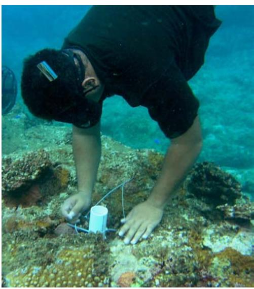

DMWR Community-Based Fisheries Management Program Fishery Technician Saumaniafese Uikirifi installing a sediment trap in Masausi.

### How a sediment trap works:

The sediment traps consist of 6-inch long pieces of 2" diameter PVC pipe. They are closed at the bottom and open at the top.
They are secured to the reef in designated sediment-monitoring locations, and they are left to sit for several weeks. Mud, sand, and silt that pass over the opening of the pipe will get trapped inside. The traps are then retrieved, and the collected sediments are dried in an oven and weighed. By continuing to collect sediments over a long period of time, we will be able to detect trends in the amount of sediment falling on our reefs.

#### How does sediment affect our reefs?

There is always sediment in the water near a coral reef. Corals are able to tolerate certain levels of sediments, but if too much sediment falls on a coral the coral will die. If too many corals die, there will be no homes for the fish and other marine organisms that depend on healthy coral reefs for their food and shelter. Sediments on the reefs in American Samoa come mostly from the land. The streams and rivers that empty onto the reefs carry soil and other sediments out onto the reef flats. Factors such as road construction and destructive agricultural practices can lead to increases in the amounts of sediments being dumped onto the reefs. This monitoring program will help us determine how much sediment is falling on our corals, and how those sediments are affecting our reefs.

### Appendix IV: Target Species

Common names follow Myers (1999) for fish and Madrigal (1999) for invertebrates.

| Samoan Name Malie    | Size Class             | Scientific Name Sharks                            | English Common Name Sharks                |
|-------------------------|------------------------|------------------------------------------------------|----------------------------------------------|
| To'e                    | (small)                | Muraenidae                                           | Moray Eels                                   |
| Pusi                    | (medium)               |                                                      |                                              |
| Maoa'e                  | (large)                |                                                      |                                              |
| Atapanoa Malau       | (very large)           | Holocentridae                                        | Soldierfish/Squirrelfish                     |
| Gatala                  | (<12 in.)              | Serranidae (general)                                 | Groupers                                     |
| Ataata                  | (12-36 in.)            |                                                      |                                              |
| Vaolo                   | (>36 in.)              |                                                      |                                              |
| Gatala uli              |                        | Cephalopholis argus                                  | Peacock Grouper                              |
| Velo Gatala pulepule |                        | Cephalopholis sonnerati Epinephelus merra         | Tomato Grouper Honeycomb Grouper          |
| Lupo                    | (<3 in.)               | Carangidae                                           | Jacks                                        |
| Lupota                  | (3-6 in.)              |                                                      |                                              |
| Malauli                 | (8-24 in.)             |                                                      |                                              |
| Sapoanae                | (2-3 ft.)              |                                                      |                                              |
| Ulua Elo             | (3-4 ft.) (>4 ft.)  |                                                      |                                              |
| Mu                      |                        | Lutjanus bohar                                       | Twinspot Snapper                             |
| Mu-aa                   | (dark phase)           |                                                      |                                              |
| Mumea                   | (red phase)            |                                                      |                                              |
| Tamala                  |                        | Lutjanus fulvus                                      | Blacktail Snapper                            |
| Mala'I Savane        |                        | Lutjanus gibbus Lutjanus kasmira                  | Humpback Snapper Blue-lined Snapper       |
| Mataeleele              | (<6 in.)               | Lethrinidae                                          | Emperors                                     |
| Ulumalosi               | (6-12 in.)             |                                                      |                                              |
| Filoa                   | (>12 in.)              |                                                      |                                              |
| I'asina                 | (<3 in.)               | Mulloidichthys spp.                                  | Goatfishes                                   |
| Vete, Afulu             | (>3 in.)               |                                                      |                                              |
| Nanue Tifitifi       |                        | Kyphosidae Chaetodontidae                         | Chubs/Rudderfishes Butterflyfishes        |
| Tū'ū'ū                  |                        | Pomacanthidae/Pomacentridae Angelfishes/Damselfishes |                                              |
| Anae                    | (general name)         | Mugilidae                                            | Mullet                                       |
| Moi                     | (<2 in.)               |                                                      |                                              |
| Poi                     | (2-3 in.)              |                                                      |                                              |
| Aua Fuafua           | (3-5 in.) (5-6 in.) |                                                      |                                              |
| Anae                    | (8-30 in.)             |                                                      |                                              |
| Afomatua                | (>10 in.)              |                                                      |                                              |
| Lalafi                  | (<12 in.)              | Cheilinus undulatus                                  | Napoleon Wrasse                              |
| Tagafa                  | (12-30 in.)            |                                                      |                                              |
| Malakea Fuga         | (>30 in.) (<6 in.)  | Scaridae                                             | Parrotfishes                                 |
| Fugausi                 | (blue&green 6-10 in.)  |                                                      |                                              |
| Laea                    | (8-24 in.)             |                                                      |                                              |
| Galo                    | (>24 in.)              |                                                      |                                              |
| Alogo                   |                        | Acanthurus lineatus                                  | Blue-banded Surgeonfish                      |
| Manini Pala'ia       | (schooling juveniles)  | Acanthurus triostegus Ctenochaetus striatus       | Convict Surgeonfish Striped Bristletooth  |
| Pone                    |                        |                                                      |                                              |
| Ume                     |                        | Naso spp.                                            | Unicornfishes                                |
| Umelei                  |                        | Naso lituratus                                       | Orangespine Unicornfish                      |
| Lo                      |                        | Siganidae                                            | Rabbitfishes                                 |
| Sumu Pa'umalo        |                        | Balistidae Monacanthidae                          | Triggerfishes Filefishes                  |
|                         |                        |                                                      |                                              |
| Matamalu                |                        | Rhodactis sp.                                        | Sea anenome (edible)                         |
| Ula                     |                        |                                                      | Spiny lobster                                |
| Papata                  |                        |                                                      | slipper lobster                              |
| Sisi Matapisu        |                        | Nerita sp.                                           | general name for snail Limpet             |
| Alili                   |                        |                                                      | Turbo snail                                  |
| Faisua                  |                        | Tridacna spp.                                        | Giant clam                                   |
| Fe'e                    |                        | Octopus spp.                                         | Octopus                                      |
| Loli                    |                        | Holothuria atra                                      | Black Sea Cucumber                           |
| Sea Mama'o           |                        | Actinopyga mauritiana                                | Sea Cucumber Chocolate-Brown Sea Cucumber |
| Alamea                  |                        | Acanthaster planci                                   | Crown of thorns seastar                      |
| Vaga                    |                        | Diadema/Echinothrix spp.                             | Sea Urchins                                  |
| Tuitui                  |                        | Echinometra mathaei                                  | Boring Sea Urchin                            |
| Ofaofa                  |                        | Brissus latecarinatus                                | Heart Urchin                                 |
|                         |                        |                                                      |                                              |
| Limu                    |                        |                                                      | Algae                                        |
| 'Amu                    |                        |                                                      | Live Coral                                   |
| Oneone 'Amu pēpē     |                        |                                                      | Sand Rubble                               |
| Ma'a                    |                        |                                                      | Rocks                                        |
| No Known Samoan Name    |                        |                                                      | Coralline algae                              |
|                         |                        |                                                      |                                              |

The community members asked a wide range of questions during our meetings. Many of the questions arose in multiple villages, and instead of including them within the sections devoted to each village, they have been compiled here. Hopefully, this appendix will help to answer the questions when they arise again.

*How will we know that our MMA is working?*

This is the fundamental question that the monitoring efforts attempt to answer. After a series of repeated monitoring surveys, trends may begin to be discernible in the health of the village reefs. There are several important points to stress about monitoring. First, there will not be immediate feedback about the level of success of each village's management efforts. The first few surveys will be useful as baseline data, but no measure of "success" or "failure" can be extracted from the collected information until many surveys have been conducted. There is a great deal of natural variation on a coral reef. Only by repeated surveys in the same area over a long period of time can changes in fish assemblages or coral cover be detected. Second, it is important to stress that actively monitoring the resource does not necessarily mean that the MMA will be effective. Monitoring is only an act of collecting information. There is a chance that the data will show declines in fish stocks or reef health. The purpose of collecting this information is to assess how well things are working. If results begin to show a negative trend, perhaps it indicates that resource management can be improved.

*Is fishing allowed where the monitoring takes place?*

In villages where there is active fishing, the villagers need to be assured that the monitoring activities should have no impact on their fishing. Setting up a permanent transect location does not mean that the area near the transect must be left untouched. In fact, it is important for there to be monitoring stations in areas where fishing takes place so comparisons between fished and unfished areas can be made.

### *Do we monitor the whole reef in our village?*

If we had the time and the resources, we would try to monitor all areas of all reefs in the world. Obviously, this is not practical. Even in a relatively small area, scientists are forced to survey only a portion of the area in which they are interested. This process is called taking samples. When the sample sites are properly selected, scientists use information from part of the area of interest to draw conclusions about the entire area of interest. In each village, there will be between three and six survey locations that are 25 meters long.

### *Who is going to pay for the monitoring?*

Forms of this question were posed at every village meeting. Money issues arose concerning purchasing of equipment (masks and snorkels, survey gear, boat gas etc.) and concerning the payment for services offered by the villagers in the monitoring efforts. After considerable discussion about this topic with ths scientists and managers involved in the administrative side of this project, the consensus seems to be that direct economic payment to community members for time spent conducting monitoring work is not recommended at this time. Fear was expressed that a payment system could set a poor precedent and increase the expectation of government handouts among community members. While I agree with this consensus, I do believe that the possibility of forming some type of collective NGO between the villages involved in the program is a worthwhile idea to pursue. The program has shown great success thus far, and with the implementation of a monitoring program, there will now be valuable data and

information collected about the status of the fisheries and reefs of the participating communities. A wellconstructed community collective could open the doors to substantial amounts of funding and other opportunities for the villages. In the meantime, DMWR will need (and has already begun) to procure the supplies necessary to enable the monitoring efforts to proceed.

### *Can DMWR help do the monitoring?*

The level of involvement of DMWR staff and other experienced reef surveyors will need to be quite high – at least at first. While this is a communitybased program, none of the villagers with whom we met have any experience conducting surveys like this. Some villages expressed a desire for DMWR to do all the monitoring. My recommendation is to avoid creating a situation where all survey efforts are carried out by DMWR personnel. Ideally, the surveys should be conducted by the villagers themselves. All aspects of the recommended monitoring protocol have been designed to be simple enough for a relatively inexperienced surveyor to be able to perform. Swimming ability and comfort in the water varied from village to village and person to person, but every effort should be made to encourage the villagers to perform the surveys. Training sessions will be required for the community members to be brought up to speed on the methodologies, but with a little practice there is no reason why transects, SPCs, and other monitoring methodologies can not be performed by the villagers themselves. That said, there will need to be significant energy and time devoted by DMWR personnel towards making sure the monitoring is performed and performed well. There should always be at least one DMWR surveyor on site during the surveys. When swimming transects, perhaps one DMWR staff member could do one side of the transect and a villager could do the other side.

*Do we survey at high tide or low tide?*

As many of the community members correctly pointed out, there is a dramatic change in the fish fauna at different stages of a tide. Unfortunately, this difference will be especially pronounced in the types of areas where snorkel surveys are possible. It will probably be impractical, but an effort should be made to survey a single area at the same tidal stage every time. The reef flats of certain villages will not be accessible at low tides, and outgoing tides in conjunction with wave spillover into lagoons might create strong currents near awas at other times. I was not able to be in the water at each village at all stages of all tides during my short stay on Tutuila. Significant input from the villagers will be needed to determine the specific conditions that are best suited to performing surveys at each reef.