# Shallow-Water Benthic Habitats of American Samoa, Guam, and the Commonwealth of the Northern Mariana Islands:

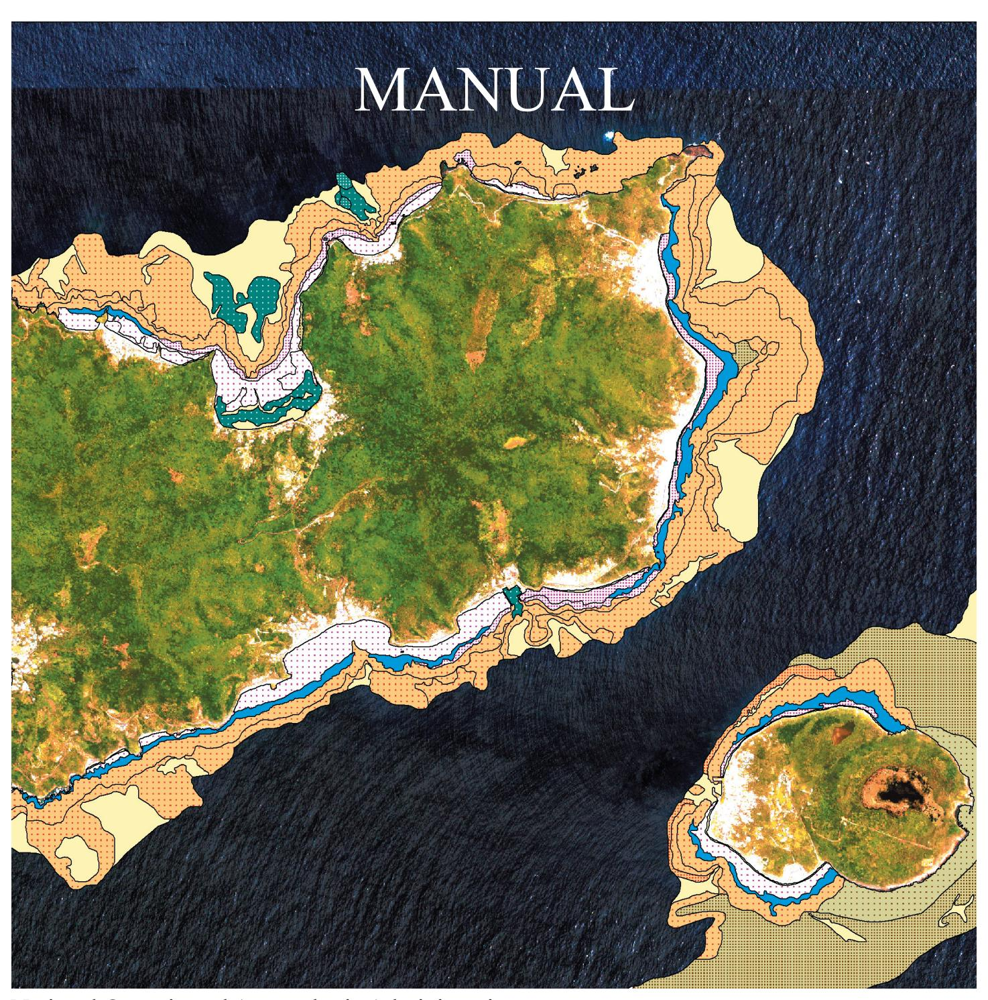

National Oceanic and Atmospheric Administration National Ocean Service National Centers for Coastal Ocean Science Center for Coastal Monitoring and Assessment

### **Contents**

| Introduction2                                                 |
|---------------------------------------------------------------|
| Chapter 1: Classification Scheme for Benthic Habitats         |
| Developing the Habitat Classification Scheme3                 |
| General Description of the Classification Scheme3             |
| List of Covers, Structures, and Zones4                        |
| Description of Covers5                                        |
| Description of Structures8                                    |
| Description of Zones11                                        |
| Chapter 2: On-Screen Mapping with ArcView's Habitat Digitizer |
| Getting Started14                                             |
| The Habitat Digitizer Menu15                                  |
| Digitizing Restrictions20                                     |
| Creating a Theme and Using the Digitizing Tools20             |
| Chapter 3: Creating and Interpreting Digital Orthophotos      |
| Satellite Imagery23                                           |
| Mosaicking the Imagery24                                      |
| Digitizing Benthic Habitats26                                 |
| Ground Validation 27                                       |
| Chapter 4: Assessment of Classification Accuracy              |
| Evaluating Thematic Accuracy29                                |
| References32                                                  |

### **Introduction**

The National Oceanic and Atmospheric Administration (NOAA) National Ocean Service (NOS) initiated a coral reef research program in 1999 to map, assess, inventory, and monitor U.S. coral reef ecosystems (Monaco et al. 2001). These activities were implemented in response to requirements outlined in the Mapping Implementation Plan developed by the Mapping and Information Synthesis Working Group (MISWG) of the Coral Reef Task Force (CRTF) (MISWG 1999). As part of the MISWG of the CRTF, NOS' Biogeography Team has been charged with the development and implementation of a plan to produce comprehensive digital coral-reef ecosystem maps for all U.S. States, Territories, and Commonwealths within five to seven years. Joint activities between Federal agencies are particularly important to map, research, monitor, manage, and restore coral reef ecosystems. In response to the Executive Order 13089 and the Coral Reef Conservation Act of 2000, NOS is conducting research to digitally map biotic resources and coordinate a long-term monitoring program that can detect and predict change in U.S. coral reefs, and their associated habitats and biological communities.

Most U.S. coral reef resources have not been digitally mapped at a scale or resolution sufficient for assessment, monitoring, and/or research to support resource management. Thus, a large portion of NOS' coral reef research activities has focused on mapping of U.S. coral reef ecosystems. The map products will provide the fundamental spatial organizing framework to implement and integrate research programs and provide the capability to effectively communicate information and results to coral reef ecosystem managers. Although the NOS coral program is relatively young, it has had tremendous success in advancing towards the goal to protect, conserve, and enhance the health of U.S. coral reef ecosystems. One objective of the program was to create benthic habitat maps to support coral reef research to enable development of products that support management needs and questions. Therefore this product was developed in collaboration with many U.S. Pacific Territory partners. An initial step in producing benthic habitat maps was the development of a habitat classification scheme. The purpose of this document is to outline the benthic habitat classification scheme and protocols used to map American Samoa, Guam and the Commonwealth of the Northern Mariana Islands.

Thirty-two distinct benthic habitat types (i.e., four major and 14 detailed geomorphological structure classes; eight major and 18 detailed biological cover types) within eleven zones were mapped directly into a geographic information system (GIS) using visual interpretation of orthorectified IKONOS satellite imagery. Benthic features were mapped that covered an area of 263 km2 . In all, 281 km2 of unconsolidated sediment, 122 km2 of submerged vegetation, and 82.3 km2 of coral reef and colonized hardbottom were mapped.

This CD-ROM will provide the user a suite of information including access to the primary and derived data sets, detailed information on how the mapping was conducted and data was collected, custom tools used to create the product, and reports summarizing the results:

- ~ Access to primary data sources (i.e., IKONOS imagery, accuracy assessment field data, ground validation field data, spatial accuracy field data)
- ~ Access to derived data sources (i.e., benthic habitat GIS files, final reports, shoreline GIS files)
- ~ Directions for using the "habitat digitizer" extension in ArcView
- ~ A description of the specific methods used to create the habitat maps
- ~ An assessment of the thematic accuracy of the maps

To see or download more information about NOAA's Coral Reef Mapping Program, visit NOAA's Biogeography Program: http://biogeo.nos.noaa.gov/projects/mapping/pacific/.

### **Chapter 1: Classification Scheme for Benthic Habitats**

## Chapter 1

#### Developing the Habitat Classification Scheme

A hierarchical classification scheme was created to define and delineate shallow-water benthic habitats. The classification scheme was influenced by many factors including: requests from the management community, NOS's coral reef mapping experience in the Florida Keys and Caribbean, existing classification schemes for the Pacific and Hawaiian Islands (Holthus and Maragos 1995; Gulko 1998; Allee et al. 2000), other coral reef systems (Kruer 1995; Reid and Kruer 1998; Lindeman et al. 1998; Sheppard et al. 1998; Vierros 1997; Chauvaud et al. 1998; Mumby et al. 1998; Kendall et al. 2001), quantitative habitat data for the U.S. Pacific Territories, the minimum mapping unit (MMU - 1 acre for visual imagery interpretation), and analysis of the spatial and spectral limitations of satellite IKONOS imagery.

The hierarchical scheme allows users to expand or collapse the thematic detail of the resulting map to suit their needs. This is an important aspect of the scheme as it will provide a "common language" to compare and contrast digital maps developed from complementary remote sensing platforms. Furthermore, it is encouraged that additional hierarchical categories be added in the resulting geographic information system by users with more detailed knowledge or data for specific areas. For example, habitat polygons smaller than the MMU can be delineated, such as reef holes found in parts of the U.S. Pacific Territories, or habitat polygons delineated as colonized pavement using this scheme could be further attributed with health information (i.e., bleached, percent live cover) or species composition (i.e., Porites, Montipora).

The hierarchical scheme was prepared through consultation, meetings, and workshops that included key coral reef biologists, mapping experts, and professionals throughout the pacific territories. Modifications were made throughout the development process based upon feedback provided by workshop participants and other contributors. Additional modifications were made during the mapping process to ensure that each category definition reflected the intended habitats and zones encountered in the field as accurately as possible. For instance, the separation of biological cover and geomorphological structure in the present scheme represents a significant evolution of previous versions of the classification schemes developed for mapping of the Caribbean and Hawaiian Islands.

#### General Description of the Classification Scheme

The classification scheme defines benthic habitats on the basis of three attributes: large geographic "zones" which are comprised of smaller geomorphological structure and biological cover of the reef system. Every polygon on the benthic community map will be assigned a structure and cover within a zone (i.e., uncolonized sand in the lagoon, or coral on aggregate reef on the bank). Biological cover and geomorphological structure are further defined by three density classes. Zone indicates polygon location, biological cover indicates the predominate biological component colonizing the surface of the feature, and geomorphological structure indicates the physical structural composition of the feature. The description of each cover and structure includes an example image. The zone descriptions include schematic descriptions. The hierarchical scheme was prepared through consultation, meetings, and workshops that included key coral reef biologists, mapping experts, and professionals throughout the island territories. The separation of biological cover and geomorphological structure in the present scheme represents a significant evolution of previous versions of the classification schemes developed for mapping of the Caribbean and Hawaiian Islands.

### **Biological Cover Types:**

**Live Coral**

 Sparse 10% > 50% Patchy 50% > 90% Continuous 90% - 100%

**Seagrass**

 Sparse 10% > 50% Patchy 50% > 90% Continuous 90% - 100%

**Macroalgae**

 Sparse 10% > 50% Patchy 50% > 90% Continuous 90% - 100%

**Coralline Algae**

 Sparse 10% > 50% Patchy 50% > 90% Continuous 90% - 100%

**Turf Algae**

 Sparse 10% > 50% Patchy 50% > 90% Continuous 90% - 100%

#### **Emergent Vegetation**

**Uncolonized**

**Unknown**

**Unclassified**

### **Geomorphological Structure Types:**

**Unconsolidated Sediment:**

 Sand Mud

**Coral Reef and Hardbottom:**

 Spur and Groove Patch Reefs:

 Individual Patch Reef Aggregate Patch Reef

 Aggregate Reef Scattered Coral/Rock

Pavement

Rock/Boulder (Volcanic and Carbonate)

Reef Rubble

Pavement with Sand Channels

**Other Delineations:**

Artificial

**Unknown**

### **Zone Types:**

**Shoreline Intertidal**

**Vertical Wall**

**Lagoon**

**Back Reef**

**Reef Flat**

**Reef Crest**

**Fore Reef**

**Bank/Shelf**

**Bank/Shelf Escarpment**

**Channel**

**Dredged**

**Unknown**

**Land** 

### **Chapter 1: Description of Cover Types**

### **Description of Biological Cover Types**

Eighteen distinct and non-overlapping biological cover types were identified that could be mapped through visual interpretation of the IKONOS imagery. Habitats or features that cover areas smaller than the MMU were not considered. For example, uncolonized sand halos surrounding coral patch reefs are too small to be mapped independently. Cover type refers only to predominate biological component colonizing the surface of the feature and does not address location (e.g., on the shelf or in the lagoon). The cover types are defined in a collapsible hierarchy ranging from eight major classes (coral, seagrass, macroalgae, coralline algae, turf algae, emergent vegetation, uncolonized, and unknown), combined with a density modifier representing the percentage of the predominate cover type (10%-<50% sparse, 50%-<90% patchy, 90%-100% continuous).

**Live Coral:** Substrates colonized by live reef building corals and other organisms. Habitats within this category have at least 10% live coral cover.

**Continuous Coral:** Live coral covering 90% or greater of the substrate. May include areas of less than 90% coral cover on 10% or less of the total area that are too small to be mapped independently (less than the MMU).

**Patchy Coral:** Discontinuous live coral with breaks in coverage that are too diffuse or irregular, or result in isolated patches of coral that are too small (smaller than the MMU) to be mapped as continuous coral. Overall live coral cover is estimated at 50%-<90% of the bottom.

**Sparse Coral:** Discontinuous live coral with breaks in coverage that are too diffuse or irregular, or result in isolated patches of coral that are too small (smaller than the MMU) to be mapped as continuous coral. Overall live coral cover is estimated at 10%-<50% of the bottom.

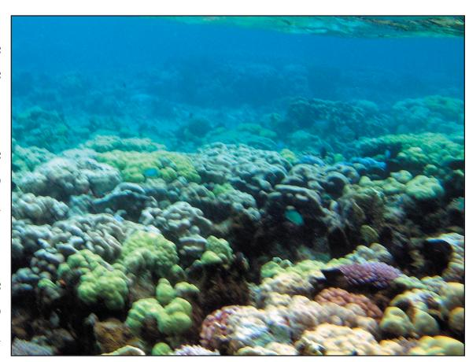

**Seagrass:** Habitat with 10 percent of more of seagrass (e.g., Halophila sp.).

**Continuous Seagrass:** Seagrass community covering 90 percent or greater of the substrate. May include blowouts of less than

10 percent of the total area that are too small to be mapped independently (less than the MMU).

**Patchy Seagrass:** Discontinuous seagrass community with breaks in coverage that are too diffuse or irregular, or result in isolated patches of seagrass that are too small (smaller than the MMU) to be mapped as continuous seagrass. Overall cover is estimated at 50%-<90% of the bottom.

**Sparse Seagrass:** Discontinuous seagrass community with breaks in coverage that are too diffuse or irregular, or result in isolated patches of seagrass that are too small (smaller than the MMU) to be mapped as continuous seagrass. Overall cover is estimated at 10%-<50% of the bottom.

**Representative Species:** *Halophila* sp*.*

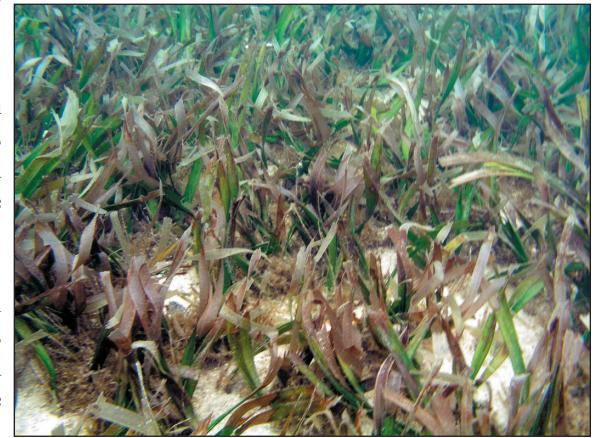

**Macroalgae:** Substrates with 10 percent or greater coverage of any combination of numerous species of red, green, or brown macroalgae. Usually occurs in shallow backreef and deeper waters on the bank/shelf zone.

**Continuous Macroalgae:** Macroalgae covering 90 percent or greater of the substrate. May include blowouts of less than 10 percent of the total area that are too small to be mapped independently (less than the MMU).

**Patchy Macroalgae:** Discontinuous macroalgae with breaks in coverage that are too diffuse or irregular, or result in isolated patches of macroalgae that are too small (smaller than the MMU) to be mapped as continuous macroalgae. Overall cover is estimated at 50%-<90% of the bottom.

**Sparse Macroalgae:** Discontinuous macroalgae with breaks in coverage that are too diffuse or irregular, or result in isolated patches of macroalgae that are too small (smaller than the MMU) to be mapped as continuous macroalgae. Overall cover is estimated at 10%-<50% of the bottom.

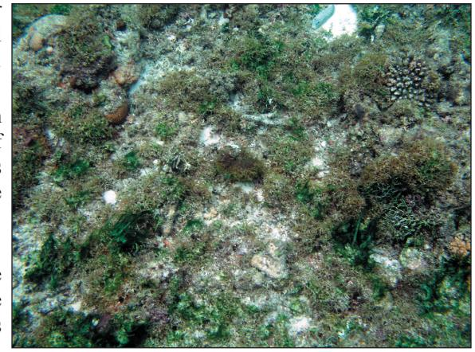

**Representative Species:** *Caulerpa* spp., *Dictyota* spp., *Halimeda* spp., *Lobophora variegata , Laurencia* spp.

**Coralline Algae:** An area with 10 percent or greater coverage of any combination of numerous species of encrusting or coralline algae. May occur along reef crest, in shallow back reef, relatively shallow waters on the bank/shelf zone, and at depth.

**Continuous Coralline Algae:** Coralline algae covering 90 percent or greater of the substrate. May include blowouts of less than 10 percent of the total area that are too small to be mapped independently (less than the MMU).

**Patchy Coralline:** Discontinuous coralline algae with breaks in coverage that are too diffuse or irregular, or result in isolated patches of coralline algae that are too small (smaller than the MMU) to be mapped as continuous coralline algae. Overall cover is estimated at 50%-<90% of the bottom.

**Sparse Coralline:** Discontinuous coralline algae with breaks in coverage that are too diffuse or irregular, or result in isolated patches of coralline algae that are too small (smaller than the MMU) to be mapped

as continuous coralline algae. Overall cover is estimated at 10%-<50% of the bottom.

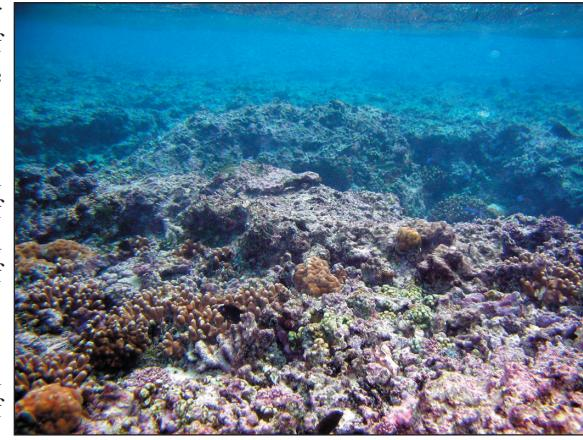

**Representative Species:** *Porolithon gardineri*

### **Chapter 1: Description of Cover Types**

**Turf Algae:** A community of low lying species of marine algae composed of any or a combination of algal divisions dominated by filamentous species lacking upright fleshy macroalgal thali.

**Continuous Turf:** Turf algae covering 90 percent or greater of the substrate. May include blowouts of less than 10 percent of the total area that are too small to be mapped independently (less than the MMU).

**Patchy Turf:** Discontinuous Turf algae with breaks in coverage that are too diffuse or irregular, or result in isolated patches of Turf algae that are too small (smaller than the MMU) to be mapped as continuous Turf algae. Overall cover is estimated at 50%-<90% of the bottom.

**Sparse Turf:** Discontinuous Turf algae with breaks in coverage that are too diffuse or irregular, or result in isolated patches of Turf algae that are too small (smaller than the MMU) to be mapped as continuous Turf algae. Overall cover is estimated at 10%-<50% of the bottom.

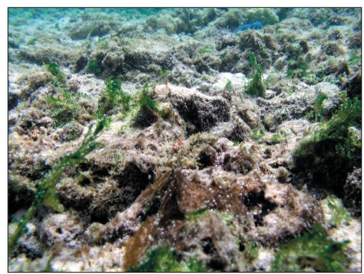

**Emergent Vegetation:** Emergent habitat composed primarily of Rhizophora mangle (red mangrove) and Hibiscus sp (hau) trees. Generally found in areas sheltered from high-energy waves. This habitat type is usually found in the shoreline/intertidal or reef flat zone.

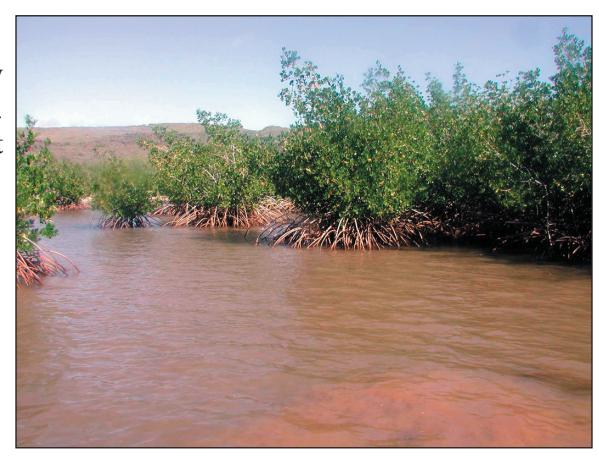

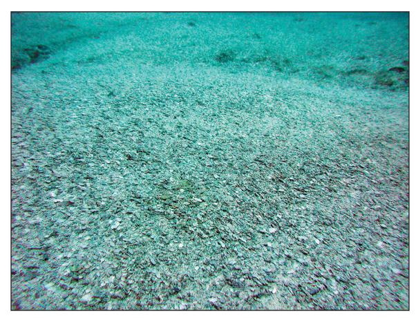

**Uncolonized:** Substrates not covered with a minimum of 10% of any of the above biological cover types. This habitat is usually on sand or mud structures. Overall uncolonized cover is estimated at 90%-100% of the bottom.

**Unknown:** Zone, Cover, and Structure uninterpretable due to turbidity, cloud cover, water depth, or other interference.

### **Description of Geomorophological Structure Types**

Fourteen distinct and non-overlapping geomorphological structure types were identified that could be mapped by visual interpretation of the IKONOS imagery. Habitats or features that cover areas smaller than the MMU were not considered. For example, sand halos surrounding patch reefs are too small to be mapped independently. Structure refers only to predominate physical structural composition of the feature and does not address location (e.g., on the shelf or in the lagoon). The structure types are defined in a collapsible hierarchy ranging from four major classes (coral reef and hardbottom, unconsolidated sediment, other delineations, and unknown), to thirteen detailed classes (sand, mud, spur and groove, individual and aggregated patch reef, aggregate reef, scattered coral/rock in unconsolidated sediment, pavement, rock/boulder (volcanic and carbonate), reef rubble, pavement with sand channels, artificial, and unknown).

### **Unconsolidated Sediment:**

**Sand:** Coarse sediment typically found in areas exposed to currents or wave energy.

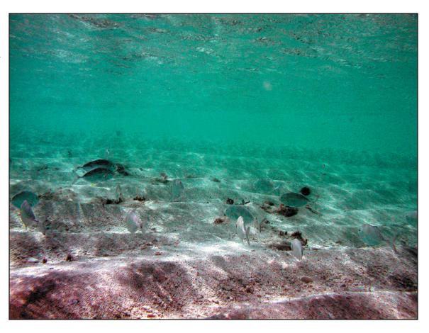

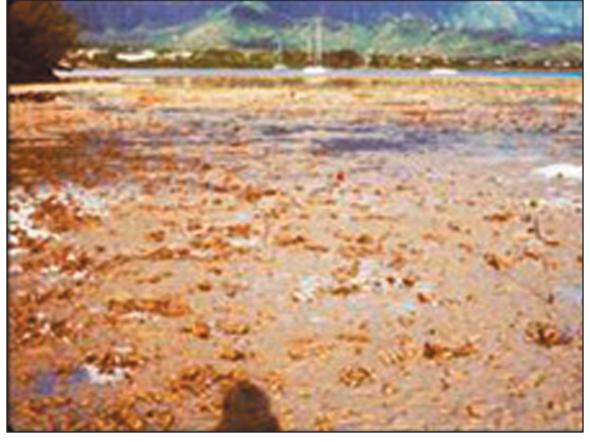

**Mud:** Fine sediment often associated with river discharge and build-up of organic material in areas sheltered from high-energy waves and currents.

### **Coral Reef and Hardbottom:**

**Spur and Groove:** Habitat having alternating sand and coral formations that are oriented perpendicular to the shore or bank/shelf escarpment. The coral formations (spurs) of this feature typically have a high vertical relief relative to pavement with sand channels (see below) and are separated from each other by 1-5 meters of sand or hardbottom (grooves), although the height and width of these elements may vary considerably. This habitat type typically occurs in the fore reef or bank/shelf escarpment zone.

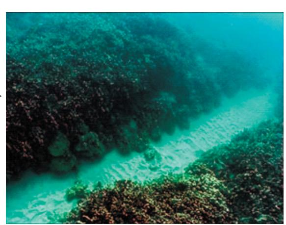

### **Chapter 1: Description of Structure Types**

**Patch Reefs:** Coral formations that are isolated from other coral reef formations by sand, seagrass, or other habitats and that have no organized structural axis relative to the contours of the shore or shelf edge.

**Individual Patch Reef:** Distinctive single patch reefs that are larger than or equal to the MMU.

**Aggregate Patch Reef:** Clustered patch reefs that individually are too small (less than the MMU) or are too close together to map separately.

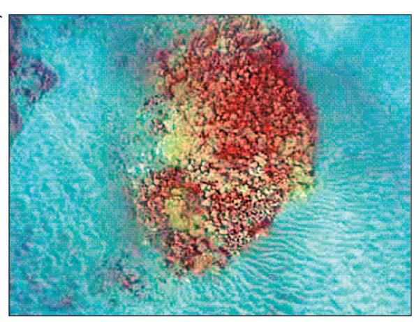

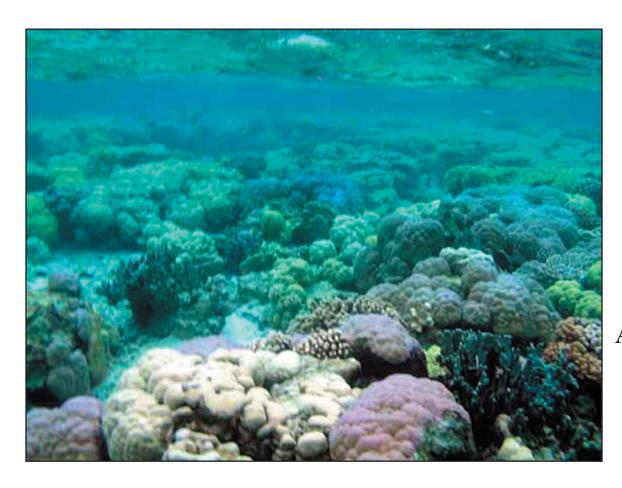

**Aggregate Reef:** High relief lacking sand channels of spur and groove.

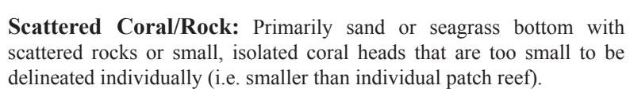

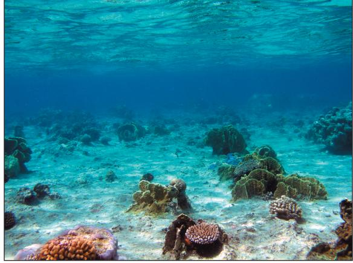

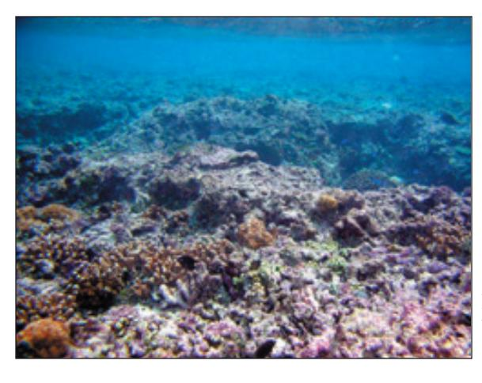

**Pavement:** Flat, low-relief, solid carbonate rock with coverage of macroalgae, hard coral, zoanthids, and other sessile invertebrates that are dense enough to begin to obscure the underlying surface.

**Rock/Boulder:** Solid carbonate blocks and/or boulders or volcanic rock.

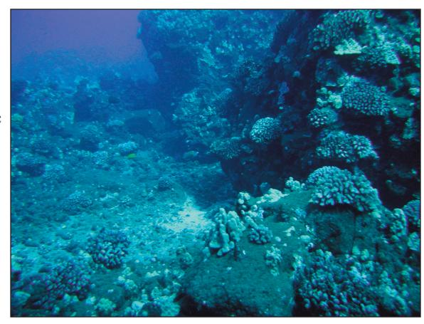

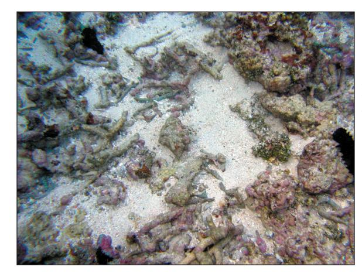

**Reef Rubble:** Dead, unstable coral rubble often colonized with filamentous or other macroalgae. This habitat often occurs landward of well developed reef formations in the reef crest or back reef zone.

**Pavement with Sand Channels:** Habitats of pavement with alternating sand/surge channel formations that are oriented perpendicular to the shore or bank/shelf escarpment. The sand/surge channels of this feature have low vertical relief relative to spur and groove formations and are typically erosional in origin. This habitat type occurs in areas exposed to moderate wave surge such as the bank/shelf zone.

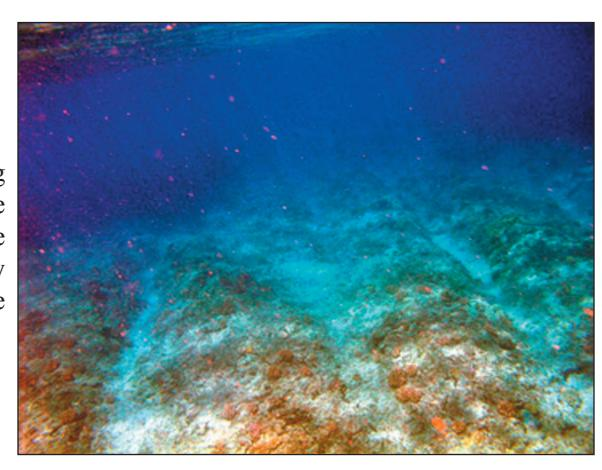

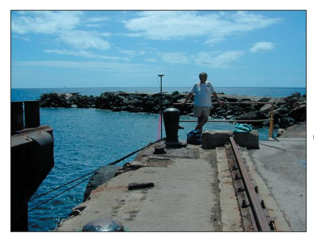

### **Other Delineations:**

**Artificial:** Man-made habitats such as submerged wrecks, large piers, submerged portions of rip-rap jetties, and the shoreline of islands created from dredge spoil. Includes active and remnant fish ponds walled off from the open ocean along the shoreline, often along a reef crest.

**Unknown:** Zone, Cover, and Structure uninterpretable due to turbidity, cloud cover, water depth, or other interference.

### **Chapter 1: Decription of Zone Types**

### **Description of Zones**

Thirteen mutually exclusive zones were identified from land to open water corresponding to typical insular shelf and coral reef geomorphology (Fig. 1-3). These zones include: shoreline intertidal, vertical wall, lagoon, back reef, reef flat, reef crest, fore reef, bank/shelf, bank/shelf escarpment, channel, dredged (since this condition eliminates natural geomorphology), unknown, and land. Zone refers only to each benthic community's location and does not address substrate or cover types within. For example, the lagoon zone may include patch reefs, sand, and seagrass beds; however, these are considered structural elements that may or may not occur within the lagoon zone and therefore, are not used to define it.

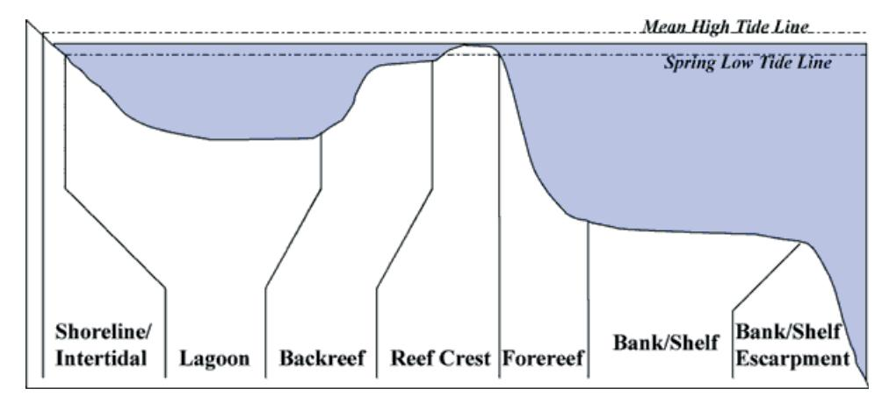

**Figure 1.** Barrier reef cross-section. Reef separated from the shore by a relatively wide, deep lagoon.

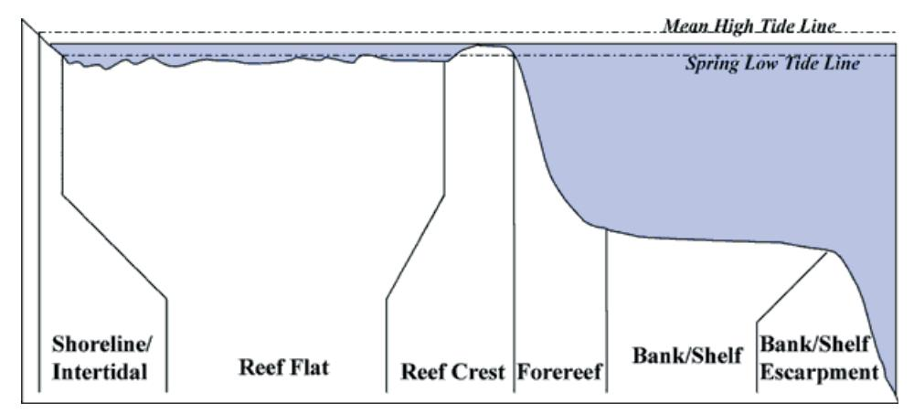

**Figure 2.** Fringing reef cross-section. Reef platform is continuous with the shore.

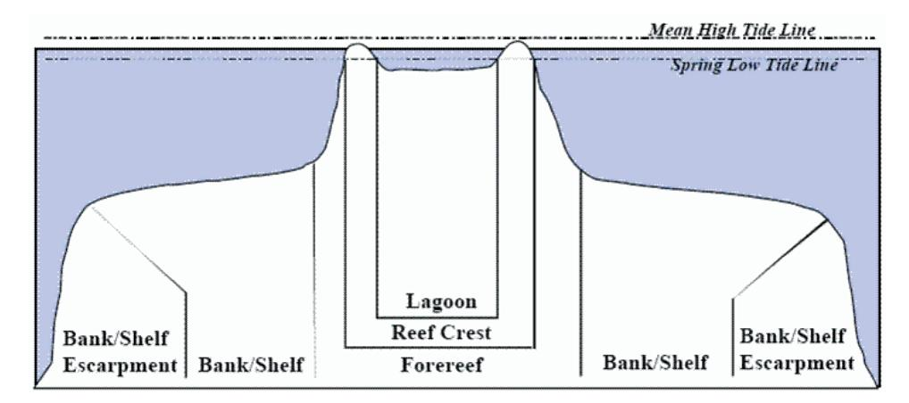

**Figure 3.** Atoll cross-section. Reef surrounding a lagoon.

**Shoreline Intertidal:** Area between the mean high water line (or landward edge of emergent vegetation when present) and lowest spring tide level (excluding emergent segments of barrier reefs). Typically, this zone is narrow due to the small tidal range in the U.S. Pacific Territories.

**Typical Habitats:** Mangrove, hao, sand, seagrass, rock/boulder (volcanic and carbonate)

**Vertical Wall:** Area with near-vertical slope from shore to shelf or shelf escarpment. This zone is typically narrow and may not be distinguishable in remotely sensed imagery, but is included because it is recognized as a biologically important feature.

**Typical Habitats:** rock/boulder, algae, and coral

**Lagoon:** Shallow area (relative to the deeper water of the bank/shelf) between the shoreline intertidal zone and the back reef of a reef or a barrier island. This zone is protected from the high-energy waves commonly experienced on the bank/shelf and reef crest. If no reef crest is present there is no lagoon zone.

**Typical Habitats:** sand, seagrass, algae, pavement, rock/boulder (volcanic and carbonate), patch reefs

**Back Reef:** Area between the seaward edge of a lagoon floor and the landward edge of a reef crest. This zone is present when a reef crest and lagoon exist.

**Typical Habitats:** sand, reef rubble, seagrass, algae, patch reef

**Reef Flat:** Shallow (semi-exposed) area between the shoreline intertidal zone and the reef crest of a fringing reef. This zone is protected from the high-energy waves commonly experienced on the shelf and reef crest. Reef flat is typically not present if there is a lagoon zone.

**Typical Habitats:** sand, reef rubble, seagrass, algae, patch reef

**Reef Crest:** The flattened, emergent (especially during low tides) or nearly emergent segment of a reef. This zone lies between the back reef and fore reef zones. Breaking waves will often be visible in aerial images at the seaward edge of this zone.

**Typical Habitats:** reef rubble, aggregated coral

**Fore Reef:** Area from the seaward edge of the reef crest that slopes into deeper water to the landward edge of the bank/shelf platform. Features not forming an emergent reef crest but still having a seaward-facing slope that is significantly greater than the slope of the bank/shelf are also designated as fore reef.

**Typical Habitats:** spur and groove

### **Chapter 1: Decription of Zone Types**

**Bank/Shelf:** Deep water area (relative to the shallow water in a lagoon) extending offshore from the seaward edge of the fore reef to the beginning of the escarpment where the insular shelf drops off into deep, oceanic water. The bank/shelf is the flattened platform between the fore reef and deep open ocean waters or between the shoreline/intertidal zone and open ocean if no reef crest is present.

**Typical Habitats:** sand, patch reefs, algae, seagrass, pavement, pavement with sand channels, other coral reef habitats

**Bank/Shelf Escarpment:** The edge of the bank/shelf where depth increases rapidly into deep, oceanic water. This zone begins at approximately 20 to 30 meters depth, near the depth limit of features visible in aerial images. This zone extends well into depths exceeding those that can be seen on aerial photographs and is intended to capture the transition from the shelf to deep waters of the open ocean.

**Typical Habitats:** sand, \_spur and groove

**Channel:** Naturally occurring channels that often cut across several other zones.

**Typical Habitats:** sand, mud, pavement

**Dredged:** Area in which natural geomorphology is disrupted or altered by excavation or dredging.

**Typical Habitats:** sand, mud

**Unknown:** Zone, Cover, and Structure uninterpretable due to turbidity, cloud cover, water depth, or other interference.

**Land:** Terrestrial features above the spring high tide line.

# Chapter 2

#### **Introduction**

The Habitat Digitizer Extension to ArcView 3.x® was developed to facilitate mapping benthic habitats of the U.S. Pacific Territories using the classification scheme described in Classification Methods. The extension was originally created to map habitats using this scheme by visually interpreting orthorectified IKONOS imagery.

- 1. The extension's capabilities have been expanded to allow users to map from other georeferenced image data such as satellite images and side scan sonar.
- 2. The extension allows users to rapidly delineate and attribute polygons using simple menus.
- 3. It also allows new hierarchical classification schemes to be easily created, modified, and saved for use on future mapping projects.

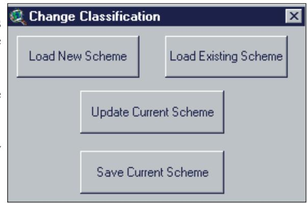

The extension is available on the *Shallow-Water Benthic Habitats of American Samoa, Guam, and the Commonwealth of the Northern Mariana Islands* CD-ROM or over the Internet at http://biogeo.nos.noaa.gov/products/apps/digitizer/. The extension and accessory files are found in "data/ext/hab\_dig.zip". This folder contains several files including:

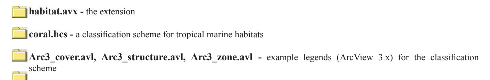

**Arc8\_cover.lyr, Arc8\_structure.lyr, Arc8\_zone.lyr -** example legends (ArcGIS 8.x) for the classification scheme

#### **Hardware and Software Requirements**

The habitat digitizer extension is compatible with ArcView 3.x® and requires hardware similar to that recommended for proper operation of ArcView. Additional memory may enhance performance for handling large image files. The appropriate Image Support extension (IMG, etc.) is required depending on the format of the image files used. The Image Analyst extension is not necessary, but is recommended to facilitate manipulation of image brightness, contrast, and color balance.

### **Getting Started**

To begin using Habitat Digitizer, save the habitat.avx file in either ArcView's Ext32 directory or the USEREXT directory. The coral.hcs and coral.avl files can be saved anywhere, but preferably, they should be placed in the working directory of the project.

After starting ArcView, load the Habitat Digitizer Extension (and any other desired extensions) by selecting "File/Extensions" and click on the check box next to the Habitat Digitizer Extension in the "Available Extensions" list. Click OK to install the extension. If a project already exists that used the Habitat Digitizer Extension, opening the project will automatically load the extension.

#### **Setting the Projection Parameters for the Image Data**

The Habitat Digitizer allows users to specify a Minimum Mapping Unit (MMU), digitizing scale, and offers several other spatial functions that require the View's projection and Map Units to be set properly. The projection properties of the View must be set to those of the image data from which habitats are being interpreted. Once the View's projection is set properly, shapefiles created using Habitat Digitizer will be unprojected (in decimal degrees). To set the projection properties, select "View/Properties" and set the Map and Distance Units as well as the Projection information of the image. If this information is not set, the shapefile will be created in the projection coordinates of the image files (not in decimal degrees) and the MMU, scale restriction, and other spatial functions of the extension will not work.

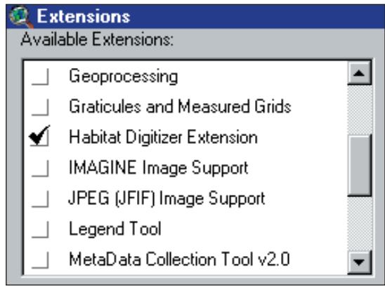

### **The Habitat Digitizer Menu**

| į | Change Classification Scheme |
|---|------------------------------|
| Ī | View Classification Scheme   |
|   | Show Dictionary              |
|   | Set Minimum Mapping Unit     |
|   | Set Scale Restriction        |
|   | Set Default Legend           |

Once the Habitat Digitizer Extension has been activated a "Habitat Digitizer" pull-down menu and digitizing tools which control the functions of the extension will appear on the ArcView toolbar. Beginning with the process of creating and loading classification schemes, a detailed description and instructions for each function in the extension are provided in subsequent sections.

#### **Creating a new classification scheme**

Unless an existing classification scheme is used, a new scheme must first be created to use the extension. Before creating a new scheme using the dialogs of the extension it may be useful to sketch the scheme out on paper to ensure that all fields and categories are entered properly. There are several advantages to using a scheme with a hierarchical structure including:

- the detail of habitat categories can be expanded or collapsed to suit user needs
- the thematic accuracy of each category/hierarchical level can be determined
- additional categories can be easily added or deleted at any level of the scheme to suit user needs

An example scheme framework is provided in Figure 1 to assist with this process.

**Figure 1.** Example Classification Scheme Framework

| Field 1    | Field 2       | Field 3       | Field 4 | Unique ID |
|------------|---------------|---------------|---------|-----------|
| Category 1 | Subcategory 1 | Subcategory 1 | (empty) | 111       |
|            |               | Subcategory 2 |         | 112       |
|            | Subcategory 2 | Subcategory 1 |         | 121       |
|            |               | Subcategory 2 |         | 122       |
| Category 2 | Subcategory 1 | Subcategory 1 |         | 221       |
|            |               | Subcategory 2 |         | 222       |
|            | Subcategory 2 |               |         | 22        |
| Category 3 | Subcategory 1 |               |         | 31        |
|            | Subcategory 2 |               |         | 32        |

The easiest way to create a new classification scheme is to turn this sketch into a database file and import it into the project as a table. The database file will have to have all cells filled out in the hierarchy as in Figure 2, but empty cells can exist in the file (as in UniqueID22, Fieldname3 in Figure 2). After saving this file, use the Tables Add button in the project dialog box to add the file to the project.

**Figure 2.** Example Classification Scheme Framework

| Field 1    | Field 2       | Field 3       | Field 4 | Unique ID |
|------------|---------------|---------------|---------|-----------|
| Category 1 | Subcategory 1 | Subcategory 1 | (empty) | 111       |
| Category 1 | Subcategory 1 | Subcategory 2 |         | 112       |
| Category 1 | Subcategory 2 | Subcategory 1 |         | 121       |
| Category 1 | Subcategory 2 | Subcategory 2 |         | 122       |
| Category 2 | Subcategory 1 | Subcategory 1 |         | 221       |
| Category 2 | Subcategory 1 | Subcategory 2 |         | 222       |
| Category 2 | Subcategory 2 |               |         | 22        |
| Category 3 | Subcategory 1 |               |         | 31        |
| Category 3 | Subcategory 2 |               |         | 32        |

Select the Import from Table button, type in a name of the new classification scheme, and select a table from the list. Choose which field contains the unique ID number. A message box will appear if that field contains duplicate numbers, and the import function will stop.

To manually create the new scheme without a table, select "Habitat Digitizer/ Change Classification Scheme" and in the dialog box, select "Create New Scheme". Type in the name of the new classification scheme in the message box and click "Okay". Until a scheme has been either created or loaded, the other options in this dialog will be unavailable.

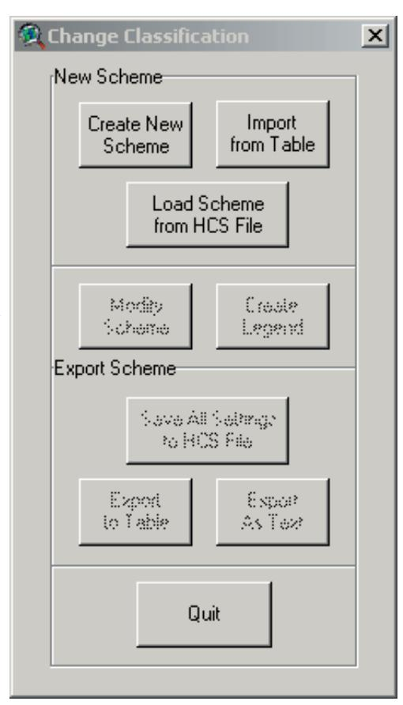

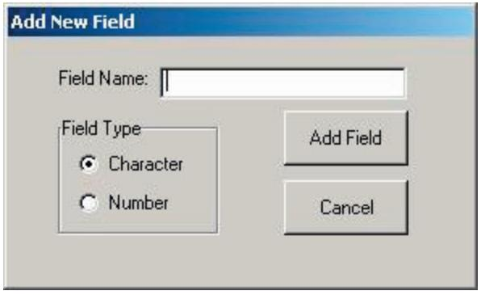

In the "Add New Field" dialog, selecting "Cancel" will end the creation process without creating a scheme. Once the first field name has been added, this button is replaced with the "Finished" button, which will complete the field naming process and go to the next step in creating the scheme. Type in the field name for the most general (Fieldname 1 in Figure 1) hierarchical level in the new classification scheme. Field names can only be 10 characters long. Select whether the field will be character or numeric and select "Add Field". Add additional field names in the order of the classification hierarchy. A fieldname must be entered for every level in the hierarchy. It may be desirable to add a couple of extra fields to act as placeholders in case any additional unforeseen

levels in the hierarchy are required at a later time. Select "Finished" to proceed to the next step once all the field names have been entered. Once "Finished" is selected, no additional fields may be added to the classification scheme. Also, note that a field named "UniqueID" will be automatically be added to each theme.

The "UniqueID" field is used by the extension to identify each possible combination of hierarchical categories with one unique number (see Figure 1). Unique IDs are used by the extension to generate polygon attributes and assign the legend. The dialog at left sets the method of how the Unique IDs will be assigned. When setting up a new scheme or altering an existing scheme that has not yet been used to create a theme, the "Automatic" method should be used. The "Automatic" method creates a logical numbering sequence for each uniqueID. However, if a scheme that has already been used to create a theme is modified, the "Manual" method should be used. If "Automatic" were used, new Unique IDs would be assigned to the scheme creating a mismatch between the ID's of the new scheme and those of the polygons attributed using the old scheme. However, the Fix Attribute ID tool will read in the existing attributes and apply the new Unique ID to the polygons.

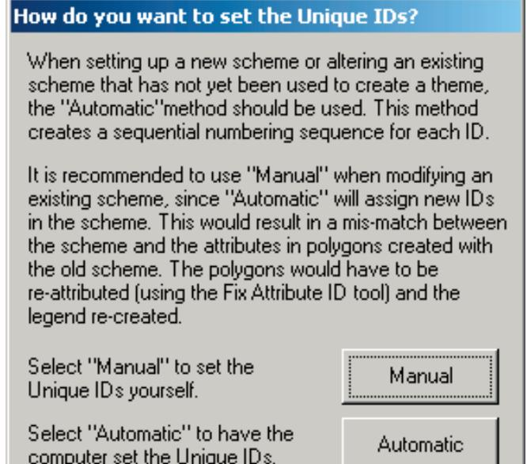

In the "Modify Classification Scheme" dialog, categories and subcategories can be added to a new or existing classification scheme. Begin by adding a category at the most general level in the classification hierarchy (Category 1 in Fig. 1). Click "Add Category", type in the category name and click "Okay". Additional categories at this level in the hierarchy can be added in this way. Adding a category at this level will activate the "Add Subcategory" button. Subcategories are added within individual categories by selecting the category of interest then clicking "Add Subcategory" and completing the dialog boxes. If Unique IDs are to be assigned using the "Automatic" option (previous dialog), the "Delete" and "Change" buttons can be used to adjust category names and locations in the hierarchy using this dialogue. In the "Automatic" method, clicking the "Finished" button will assign a Unique ID to each classification combination. If "Manual" was selected, the "Delete" and "Change" buttons will not be activated until the Unique IDs for each of the categories and subcategories have been added (next dialog). To add Unique IDs manually, click the "Commit Additions" button after all categories and subcategories have been added and complete the "Add Unique ID" dialogue box as described below. Once the UniqueIDs have been assigned the "Delete" and "Change" buttons will be activated. If the "Cancel" button is selected, the scheme creation process will be ended without creating a scheme.

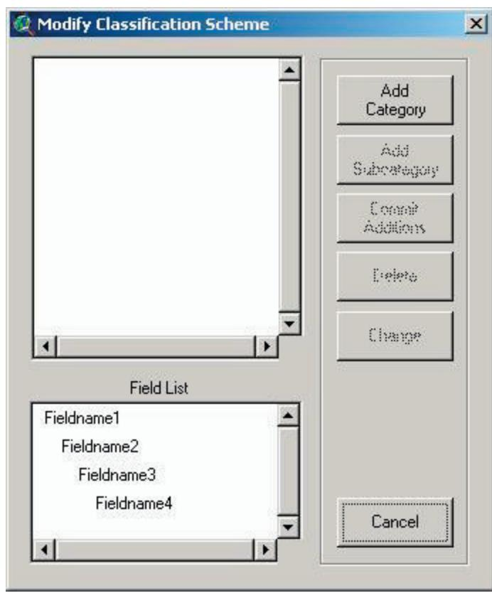

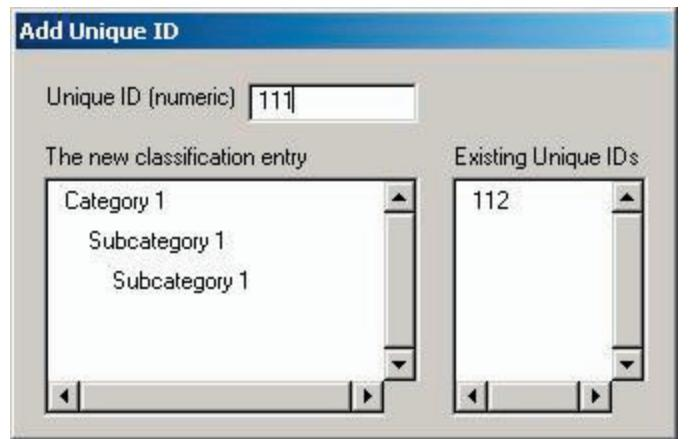

If "Manual" was selected for assigning Unique IDs, the "Add Unique ID" dialog will appear after selecting "Commit Additions". A unique numeric identifier must be entered for each possible combination of classifications in the hierarchy. The "Existing Unique IDs" list shows which numbers are already used in the scheme. Duplicate numbers cannot be added. See Figure 1 or the sample coral classification scheme and legend included with the extension to get suggestions on how to assign Unique IDs.

Once Unique IDs are set through either the "Manual" or "Automatic" method and "Finished" is selected in the "Modify Classification Scheme" dialog, the new scheme can be saved and used to digitize habitats.

#### **Saving, Re-Loading, and Creating Scheme Legends**

After creating or modifying a scheme, save the scheme to a file by selecting "Save All settings to HCS File" in the "Change Classification" dialog box. The file will be saved as a \*.hcs (habitat classification scheme) file. To access a saved scheme, select "Load Scheme from HCS File" in the "Change Classification" dialog box. A file selection dialog will open showing only the \*.hcs files. Additional options that can be used at this time include the "Export to Table" button, which will export the scheme as a dBase file, "Export As Text" button, which will create a text file showing the hierarchical structure of the scheme, and the "Create" button, which will make a legend that contains each Unique ID and its attributes. Select whether a point, line, or polygon legend will be created from this scheme. The extension can store all three types of legends as default legends simultaneously. Legend labels will have all of the categories in the classification hierarchy concatenated into one string. Colors will be randomly selected and an additional "Unclassified" category will be added with a uniqueID of 0.

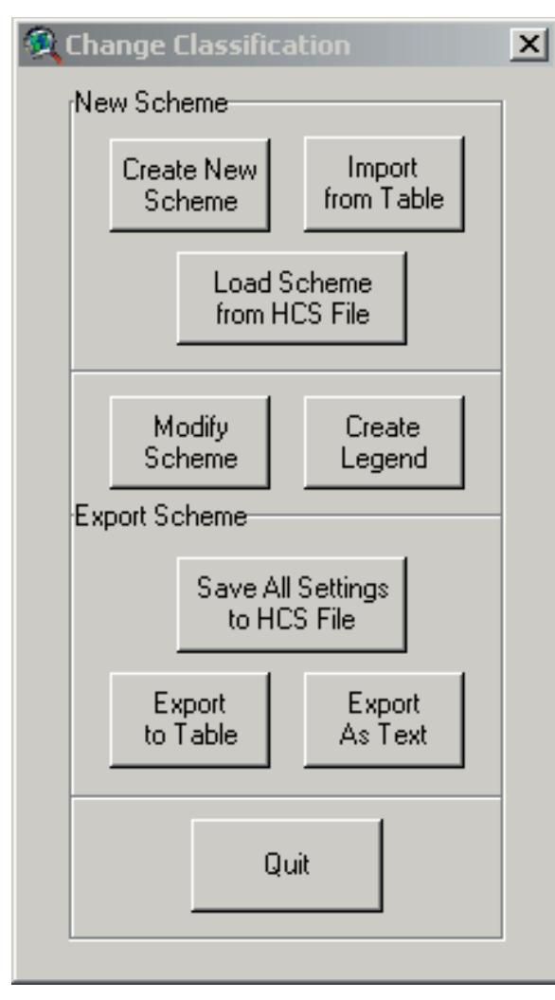

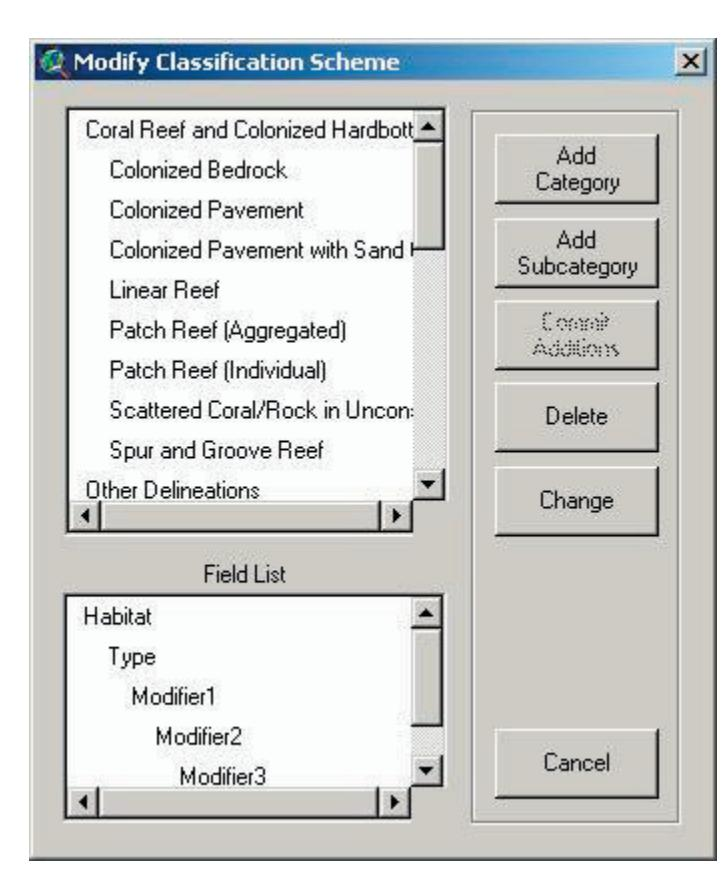

#### **Editing an existing classification scheme**

Select "Modify Scheme" in the "Change Classification" dialog box. After selecting the method of assigning the Unique ID (and in this case, using Manual is recommended), the "Modify Classification Scheme" dialog will appear. Follow the same instructions in "Creating a new scheme" to edit this scheme using this dialog.

### **Digitizing Restrictions**

#### **Minimum Mapping Unit**

Depending on the quality of aerial images used and the specific goals of the project, it will probably be desirable to limit the minimum size of the features that are delineated. For example, poor image resolution may preclude the interpretation of features smaller than some minimum size threshold. Other features, while interpretable in the imagery, may simply be too small and therefore beyond the scope or goals of the desired map product. To limit the size of the features that can be digitized in the habitat map, a minimum mapping unit (MMU) can be set in Habitat Digitizer. Features must be larger than the MMU to

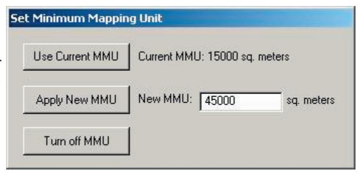

be included in the habitat map. Set the MMU restriction by selecting "Habitat Digitizer/Set Minimum Mapping Unit". If the view's Map and Distance units are set, a dialog will appear showing the current MMU. Enter the desired numerical MMU into the text box and select "Apply New MMU". If a satisfactory MMU has already been set, "Use Current MMU" will close the dialog without changing the MMU. If the area of a newly digitized polygon is below the MMU, a message box will ask whether the polygon should be added to the theme. If no MMU restriction is desired, "Habitat Digitizer/Set Minimum Mapping Unit/Turn off MMU" will allow digitizing polygons with no size restriction.

#### **Scale Restriction**

It is possible to adjust the scale of the image files as they appear on the computer monitor. For example, the scale of hard copy photographs used for mapping may be 1:48000, however the actual photo interpretation may be conducted on the computer monitor while zoomed in on the scanned photographs at a much larger scale (e.g., 1:6000). It may be desirable to

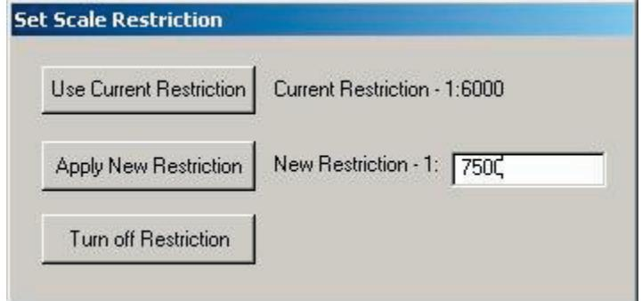

conduct all polygon delineation at the same scale, such that all polygons have the same level of detail. Set the scale restriction by selecting "Habitat Digitizer/Set Scale Restriction". Enter a number in the text box and select "Apply New Restriction". If digitizing is attempted while a scale restriction is in place and the view is not at the specified scale, a message box will offer to zoom the view to the proper scale. If "No" is selected, a polygon cannot be digitized. If a scale restriction is not desired, use "Habitat Digitizer/Set Scale Restriction/Turn off Restriction" to allow digitizing at any scale.

### **Creating a Theme and Using the Digitizing Tools**

Once a classification scheme has been loaded, this button will create an empty theme (select either a polygon, line, or point theme) with the appropriate fields. If a default legend has not been created using "Habitat Digitizer/Set Default Legend" or the "Change Classification" dialog, a dialog will appear to select a legend file. A second message box will appear asking if this legend should be made the default legend for all new themes created using this classification scheme.

To start digitizing a new polygon, select this tool and trace the feature of interest by clicking around its perimeter with the mouse. A double click closes each new polygon. If a polygon is digitized inside or completely around an existing polygon, "donut" and "donut hole" polygons will be formed. Once the polygon is complete, a message box will allow the classification to be set as outlined below.

Use this tool to add a polygon adjacent to an existing polygon. To create a polygon using this tool, start tracing a line inside of the adjacent polygon and end the line by clicking twice inside of the adjacent polygon. This tool will not work when attempting to digitize a polygon inside of another polygon (use the Split tool to do that). The scale restriction and MMU also apply to this tool. If several polygons are created with a single line and some are below the MMU, a warning message will appear. If "No" is selected on the warning message only the polygons that fall below the MMU will be removed.

Use this tool to digitize a line. Once the line is complete, a message box will allow the classification to be set as outlined below.

Use this tool to split a line. The original line will retain its attributes and the message box will allow the classification to be set as outlined below.

Use this tool to digitize a line. Once the point is digitized, a message box will allow the classification to be set as outlined below. If there are many points to be digitized with the same attributes, it might be easier to add them using the standard ArcView Draw Point tool and attribute them all at once later

Once polygons are completed using the Add and Append tools, a dialog will appear to guide assignment of classification attributes.

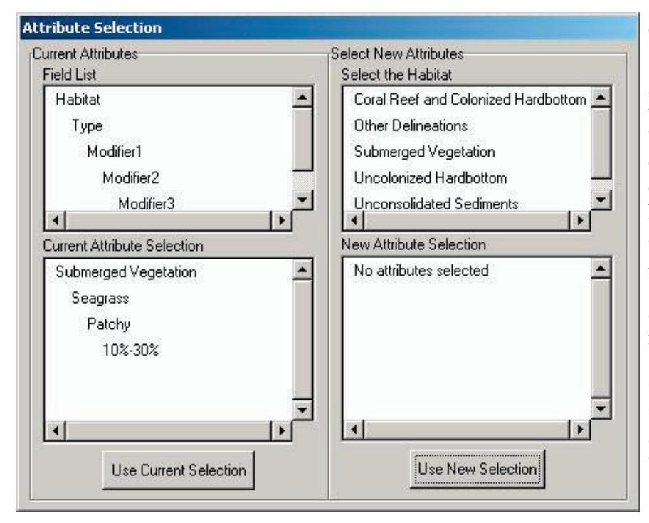

The "Field List" displays the hierarchical structure of the fields in the scheme. "Current Attribute Selection" shows the classification type, if any, currently selected. Either select "Use Current Selection" or select a new classification type by clicking through the desired classification attributes in the "Select New Attributes" window. As new attributes are selected they will be displayed in the "New Attribute Selection" window. The "Use New Selection" button will be activated when the attribute in the lowest hierarchical level for the new classification is selected. To change the selected attribute at the same hierarchical level in the "New..." window, select another attribute in the "Select..." window. To select a different attribute at a higher level, select the level in the "New..." window.

This tool splits one or more polygons into several polygons. All of the attribute information for the resulting polygons will be the same as the original(s) but can be changed as explained below under "Tools from the Right Mouse Button". Please note that due to a bug in ArcView, this tool sporadically works when attempting to split along the inside border of a donut polygon. The scale restriction and MMU also apply to this tool. If several polygons are split and some of the resulting polygons fall below the MMU, choosing "No" will remove the entire line and merge the split polygons back together.

This button will place a MMU sized red box on the view by clicking the button and then clicking the View at the desired location. This box allows users to estimate the size of features in the imagery relative to the MMU. This box will disappear when panning, moving from the current extent by zooming in or out, or after completing a polygon. To use this feature while adding a new polygon see "Tools from the Right Mouse Button" below.

This button brings up a dialog to display the cursor's x/y position in the upper right hand corner of the ArcView window in either the coordinate system of the view (default) showing from 1-5 significant digits, or in degrees, minutes, and seconds. This requires that the view's projection be set and the map units specified.

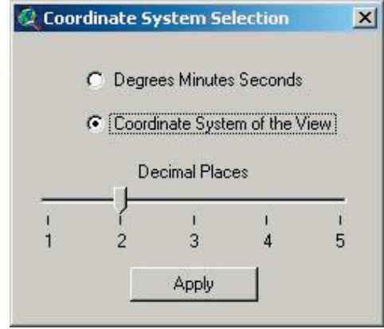

This button will read through the attribute table and attempt to fix any mismatches between the UniqueID and attributes. This will be necessary if the "Automatic" method of assigning UniqueIDs was used on an existing classification scheme. The attributes for each record will be read and the UniqueID will be changed. The features with attributes that do not have a corresponding UniqueID will be listed at the end of the process by record numbers. These features will also be selected in the theme. If the shapefile does not have a field showing the record number, this can be added easily. Open the attribute table, begin editing it, and add a numeric field. Use the Calculate button and type in rec (without quotes) in the text input area of the dialog box.

#### **Tools from the Right Mouse Button**

Click and hold down the right mouse button to view a list of additional tools and options:

- **"Panning"** will recenter the display over the spot where the right mouse button was clicked. This is useful while digitizing large polygons that don't fit entirely within the view frame.
- **"Pan to location"** will recenter the display at a user selected position. This tool brings up a message box that allows the user to put in a specific coordinate location in map units.
- **"Show attributes"** will display a message box showing the habitat attributes for the currently selected polygon.
- **"Change habitat attribute"** will allow the user to change the habitat attributes for existing polygons that are selected.
- **"MMU Box"** places an MMU box on the View where the right mouse button was clicked (can be added while digitizing a polygon).
- **"Polygon Area"** shows the area of a selected polygon.

# Chapter 3

#### **Introduction**

Satellite imagery is a valuable tool for natural resource managers and researchers since they provide an excellent record of the location and extent of habitats. Benthic habitat maps of American Samoa, Guam, and the Commonwealth of the Northern Mariana Islands were created through visual interpretation of multispectral IKONOS imagery using the NOAA Habitat Digitizer extension. Habitat boundaries were delineated around signatures (e.g., areas with specific color and texture patterns) in the orthorectified imagery mosaic corresponding to habitat types in the Classification Scheme. The custom Habitat Digitizer extension was used, digitizing at a scale of 1:6,000 with a 1-acre minimum mapping unit. Generally, feature detection of seafloor habitats was possible from the shoreline to water depths of approximately 30 meters, depending on water clarity. In order to optimize the satellite imagery for visual interpretation, a number of processing steps were implemented to enhance the geopositioning and clarity of the imagery. These steps include: orthorectification to remove spatial distortions in the imagery due to relief displacement; pansharpening; deglinting; and generating normalized reflectance values.

### **Satellite Imagery**

The IKONOS satellite, owned and operated by Space Imaging Incorporated, LLC, provides commercially available panchromatic (black and white) and multispectral (blue/green/red/near-infrared) imagery. The panchromatic imagery has a 1 m pixel dimension (meaning features larger then 1 m2 can be detected in the imagery). The multispectral imagery has a 4 m pixel dimension (meaning features larger then 16 m2 can be seen in the imagery). The IKONOS imagery is purchased in 11 km wide swaths that are mosaicked together to produce complete images of locales. IKONOS satellite imagery provides precise and robust data with spectral and spatial resolution suitable for shallow water benthic mapping. Furthermore, satellite imagery provides efficient and effective global coverage for repeated imaging of remote islands that are often obscured by cloud cover.

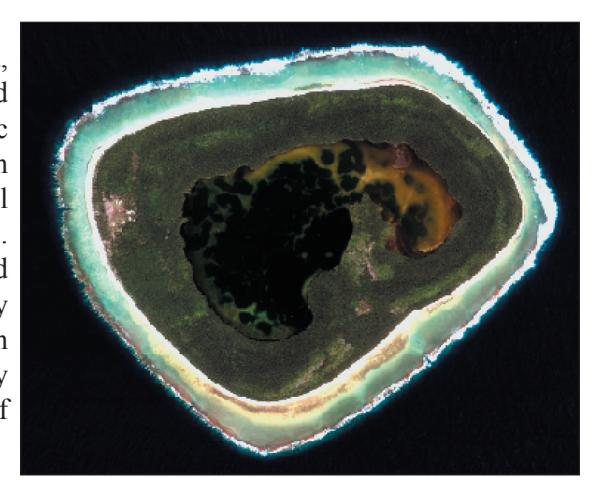

All of the IKONOS imagery was purchased in National Imagery Transmission Format (NITF) with the associated Rational Polynomial Coefficients (RPCs or satellite ephemeris data). When using image analysis software capable of reading NITF files with associated RPCs, the initial horizontal positioning error never exceeded 15 m (for locations where there is little or no vertical relief to affect image pixel displacement).

#### **Orthorectification**

During orthorectification, digital imagery is subjected to algorithms that eliminate each source of spatial distortion. The result is a georeferenced digital mosaic of several imagery scenes with uniform scale throughout the mosaic. After an orthorectified mosaic is created, visual interpreters can accurately and reliably delineate the boundaries of features in the imagery as they appear on the computer monitor using a software interface such as the Habitat Digitizer. Through this process, natural resources managers and researchers are provided with spatially accurate maps of habitats and other features visible in the imagery.

### **Mosaicking the Imagery**

Georeferencing/mosaicking of the imagery was performed using PCI OrthoEngine, and Erdas OrthoBase. The NITF IKONOS imagery was orthorectified using the Rational Functions extracted from the NITF, then further supplemented with ground control and corrected for terrain displacement using the DEM's where available. When multiple scenes were available for a given island, these were collectively incorporated into the orthomosaic project through bundle adjustment. Each scene was exported as a separate orthorectified file for further image processing. In addition, the best segments of each scene were selected for creation of the final mosaic. Segments of each scene were selected to minimize sun glint, cloud interference, turbidity, etc. in the final mosaic. Where possible, parts of images obscured by sun glint or clouds were replaced with cloud/glint free parts of overlapping images. As a result, most mosaics have few or no clouds or sun glint obscuring bottom features. However, in some cases, clouds, sun glint, or turbid areas could not be replaced with overlapping imagery. In these areas, such obstructions were minimized but could not be eliminated completely.

#### **Ground Control Points (GCPs) for Georeferencing**

Fixed ground features visible in the IKONOS imagery were selected for ground control points (GCPs) which were then used to georeference the imagery (i.e., link the image pixels to a real world coordinate system such as Universal Transverse Mercator). NOAA's National Geodetic Survey (NGS) gathered ground control data (horizontally accurate to within 5 cm of its location on the earth) on seventeen of the twenty-one islands mapped in the U.S. Pacific Territories (see Figure). GCPs were measured and then differentially corrected to the closest Continuously Operating Reference System (CORS). We obtained points with a wide distribution throughout the imagery whenever possible since this results in the most accurate registration throughout each image. Only ground control points for terrestrial features were collected due to the difficulty of obtaining precise positions for submerged features.

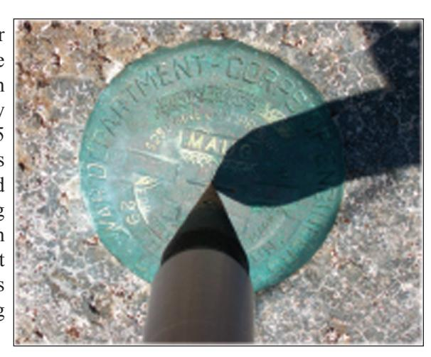

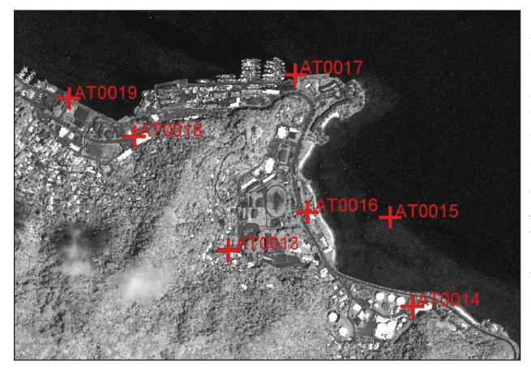

#### **Image to Image Tie-Points**

Image to image tie-points (distinct features visible in overlap areas of each frame such as street intersections, piers, coral heads, reef edges, and bridges) were then used to further co-register the imagery, especially for photos taken over open water where ground control points were not available (see Figure). Softcopy photogrammetry software has the ability to automatically find such features common to overlapping imagery but this automated function has mixed results for submerged features.

Georeferencing/mosaicking of the TIFFs was performed using PCI OrthoEngine, and Erdas OrthoBase. The NITF IKONOS imagery was orthorectified using the Rational Functions extracted from the NITF, then further supplemented with ground control and corrected for terrain displacement using the DEM's where available. When multiple scenes were available for a given island, these were collectively incorporated into the orthomosaic project. Each scene was exported as a separate orthorectified file for further image processing. In addition, the best segments of each scene were selected for creation of the final mosaic. Segments of each scene were selected to minimize sun glint, cloud interference, turbidity, etc. in the final mosaic. Where possible, parts of images obscured by sun glint or clouds were replaced with cloud/glint free parts of

overlapping images. As a result, most mosaics have few or no clouds or sun glint obscuring bottom features. However, in some cases, clouds, sun glint, or turbid areas could not be replaced with overlapping imagery. In these areas, such obstructions were minimized but could not be eliminated completely.

#### **Digital Elevations Models (DEM)**

Pre-existing U.S. Geological Survey (USGS) 10 m2 resolution digital elevation models (elevation contour intervals 1 m) were available for eight of the nineteen islands and used to correct for relief displacement (see Figure). Once a draft orthorectified mosaic was produced, a set of independent ground control points (i.e., check points) were used to measure the quality of each mosaic's rectification and ensure that it required horizontal and vertical spatial accuracy limits. If the spatial accuracy was not acceptable based on this comparison, additional modifications were made to the GCPs, tie-points, etc., until a satisfactory mosaic was created for each island. In general, mosaics were georeferenced such that pixels are positioned within one pixel width of their correct location.

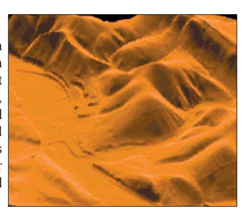

#### **Image Analysis**

Several intermediate, derived products were produced as the satellite imagery was processed for use in producing the benthic habitat maps. First, the raw satellite images were converted from Digital Numbers (DNs) to normalized reflectance. Normalized reflectance (or at-satellite reflectance) converts DNs into standardized, satellite-independent, comparable values. First developed for Landsat satellite imagery, the algorithm used to perform this conversion was modified for IKONOS image processing. As part of the conversion from DNs to at-satellite reflectance, the following equation is used (Green et al. 2000):

R = pi \* L/ (Eo cos(theta0) 1/r2 )

L = radiance (from calibration provided by Space Imaging).

r = earth-sun distance in Astronomical Units.

theta0 = the solar zenith angle

 Eo = the mean solar exo-atmospheric irradiance in each band. (A convolution of the spectral response and solar radiation from Neckel and Labs (1984) was used to get Eo.)

The acquisition angles (ephemeris data) of the satellite relative to the ground at the time of image acquisition were also used. Calibration coefficients for the satellite, provided by Space Imaging, were used to calculate at-satellite radiance, which was then transformed to reflectance. The normalized reflectance imagery was then transformed into water reflectance (or the signal < 10 cm above the water surface). Water reflectance uses the near-infrared band to remove radiance attributed to atmospheric and surface effects (Stumpf et al. 2003). Water reflectance estimates how the signal (photons) received by the satellite is diminished as it passes through the atmosphere on the way down to the water-atmosphere boundary and on the way back up to the satellite after the signal leaves the water-atmosphere boundary. Water reflectance also estimates how the signal at the satellite is diminished by water vapor, clouds, specular effects at the water surface (wave surface glint), and other signal- absorbing and diffusing materials.

#### **Finalizing the Process**

Final mosaics were created in "img" file format (georeferenced image file) with the following projection parameters Universal Transverse Mercator (UTM) Zone 55 North for Guam and the Commonwealth of the Northern Mariana Islands, HARN UTM Zone 2 South for American Samoa , North American Datum 83.

These files are available on the *Shallow-Water Benthic Habitats of American Samoa, Guam, and the Commonwealth of the Northern Mariana Islands* CD-

ROM and at the NOAA's Biogeography Program Web site. These mosaics were color-balanced in order to provide the most seamless, cloud-free product available for use (see Figure).

### **Digitizing Benthic Habitats**

Individual georeferenced mosaics were loaded into ArcView with the Habitat Digitizer and Image Analysis extensions

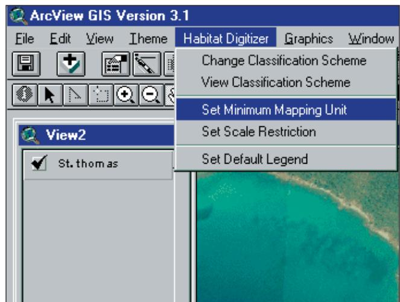

activated. ArcView's Image Analysis extension allows each image to be easily manipulated using so as to optimally adjust contrast, brightness, and color. The Minimum Mapping Unit (MMU) restriction was set to 1 acre in the Habitat Digitizer extension. One acre was selected based on the scale of the imagery and the objectives of the mapping project. As a result, some features visible in the imagery such as small isolated patch reefs and sea walls that, while important features, are quite small and beyond the scope of this mapping project.

Digitizing scale was set to 1:6000 in the Habitat Digitizer. Experimentation indicated that digitizing at this scale optimizes the trade-off between positional accuracy of lines and time spent digitizing. In general, line placement conducted while zoomed in at large scales results in excellent line accuracy and detail but can be quite time consuming. Conversely, while zoomed out, lines can

be drawn quickly but lack both detail and positional accuracy.

#### **Determining the Optimum Digitizing Scale**

Results of an experiment conducted during benthic habitat mapping of the Caribbean were used to determine the optimum digitizing scale to maximize accuracy and minimize map production time. In the Caribbean digitizing experiment a 25 acre area composed of a variety of habitat types was mapped at 1:1500, 1:3000, 1:6000, and 1:12,000 on-screen scale (scale that the image appears on the computer monitor). Five replicates were conducted at each scale. Each trial was timed so we could evaluate the influence of mapping scale on production time. Resulting maps were evaluated for deviations in polygon detail relative to the map digitized at 1:1500 scale. At 1:1500, individual pixels are clearly discernible allowing highly detailed and accurate maps to be created by closely following the contours of even the most convoluted habitat boundary. Additional increases in zoom do not result in an increase in map detail and accuracy since individual pixels are already visible at 1:1500. Therefore, the map created at 1:1500 scale was used as a reference against which to compare maps digitized at scales of 1:3000, 1:6000, and 1:12,000.

The results of this experiment indicated that there is no appreciable loss in polygon detail and accuracy by digitizing at 1:6000 while mapping time was dramatically reduced. Therefore all polygons were digitized at this scale except when subtle habitat boundaries were not easily discernible at 1:6000 and zooming out to a more broad scale was required to place

boundaries correctly. In this case, digitizing generally took place at a scale of approximately 1:10,000.

Using the Habitat Digitizer, habitat boundaries were delineated around signatures (e.g., areas with specific color and texture patterns) in the orthorectified mosaic corresponding to habitat types in the Classification Scheme. This was often accomplished by first digitizing a large boundary polygon such as the habitats that compose the shoreline and then appending new polygons to the initial polygon or splitting out smaller polygons within. Each new polygon was attributed with the appropriate habitat designation according to the classification scheme. It is believed that the positional accuracy of polygon boundaries is similar to that of the mosaics since delineation is performed directly on the digital imagery. Brightness, contrast, and occasionally color balance of the mosaic were manipulated with Image Analysis to enhance the interpretability of some subtle features and boundaries. This was particularly helpful in deeper water where differences in color and texture between adjacent

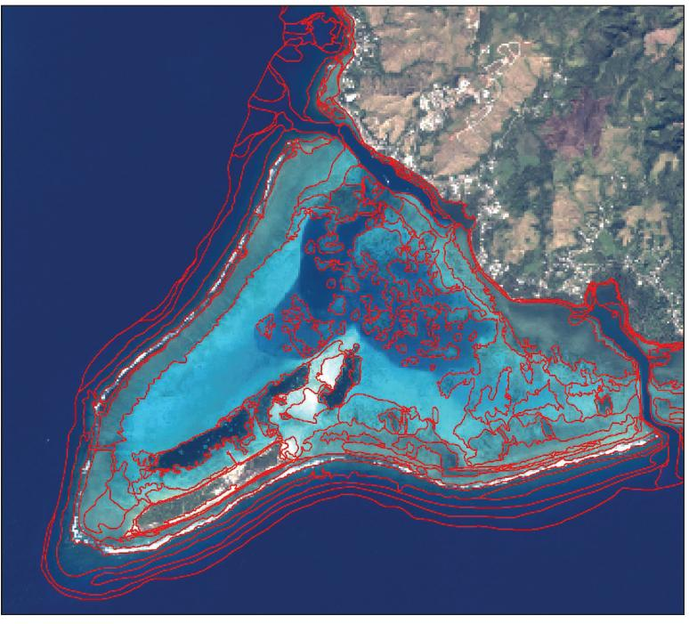

features tend to be more subtle and boundaries more difficult to detect. Particular caution was used when interpretation was performed from altered images, since results from color and brightness manipulations can sometimes be misleading.

The visual interpreter was provided a series of imagery files to aid in delineating and attributing polygons. These included the unmodified multispectral scenes (4m), normalized reflectance scenes (4m), and pansharpened multispectral scenes (1m). Additional collateral information including previously completed habitat maps, NOS nautical charts, LIDAR data, NMFS towboard assessments, and other descriptive references dealing with benthic and coastal habitats of U.S. Pacific Territories were used to assist with image interpretation.

#### **Ground Validation**

Following careful evaluation of the IKONOS imagery, and in some cases creation of a "first draft" habitat map through the process outlined in the previous section, selected sites were visited in the field for typological validation. This validation included:

- 1. areas in the imagery with confusing or difficult to interpret signatures
- 2. transects across many representative habitat types occurring in different depths and water conditions
- 3. a survey of the zones
- 4. confirmation of preliminary habitat delineations if a first draft was produced

Navigating to field sites was accomplished in a variety of ways including:

- ~ uploading position coordinates from the mosaic into an onboard GPS and navigating to those waypoints
- ~ using an onboard PC connected to GPS allowing navigation using digital nautical charts or the mosaic
- ~ visual navigation using landmarks visible in the imagery

On most occasions, field activities were conducted with the guidance of local experts. IKONOS imagery, and when available, draft delineations were used in the field to facilitate comparison of signatures in the imagery to actual habitats at each site. Individual sites were visually evaluated by snorkeling and free diving or directly from the boat in shallow, clear water. Habitat transitions were evaluated by swimming transects across habitat types to further guide placement of polygon boundaries.

Habitat type(s), zone, approximate depth, position (GPS), image number, and other descriptive information were recorded at each site. Field data for each site was then compiled into a text table with a latitude/longitude field to allow overlay of the field information on the mosaic and habitat

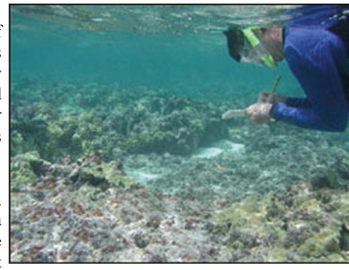

polygons (Ground Validation Points). Where depth and water clarity permitted, the IKONOS imagery were used to navigate across multiple bottom features allowing continuous confirmation of habitat types and transitions between each site.

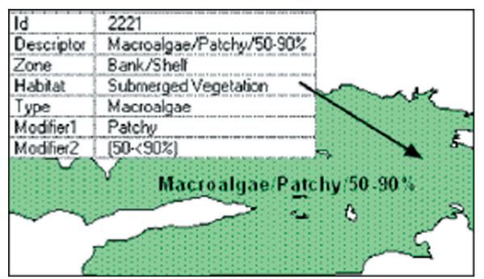

Once the field data was processed, polygon boundaries and habitat classifications were created or revised where necessary, and zone attributes were assigned to each polygon using the Habitat Digitizer. This draft of the habitat maps was then reviewed and revised with the guidance of a panel of local experts at peer review sessions at several locations throughout the U.S. Pacific Territories, and over the Internet. Review session participants included members of the local research and management community.

During these peer review sessions, particular attention was given to polygons labeled as "unknown" and areas not visited during ground truth activities. Revisions based on comments from local experts were then completed and final habitat maps were produced. Thematic accuracy was assessed for these final maps (see Assessment of Classification Accuracy).

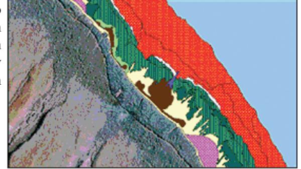

### **Chapter 4: Assessment of Classification Accuracy**

# Chapter 4

#### **Introduction**

The quality of the habitat information derived from remotely sensed data is determined by the quantitative process of accuracy assessment. The purpose of accuracy assessment is to identify and quantify errors in the maps by comparing the attributes of the map versus reference data at various sites. It is important that the mapmaker know how reliably a given habitat can be classified. This parameter is called "producers accuracy". The users of a map product want to know what percentage of the polygons of a particular class are correctly attributed. This parameter is called "users accuracy". Furthermore, remotely sensed imagery that may be suitable for mapping coral reef habitats can be acquired from a wide variety of platforms and imaging systems, each having it's own strengths and limitations. It is important to identify the technical merits of each, one measure of which is the thematic accuracy of the map products.

To determine the overall accuracy of the mapped product, GIS data prepared by visually interpreting IKONOS satellite imagery was assessed for accuracy using conventional methodologies. It was proposed that specific areas being mapped be used as test areas for this work. A statistically robust data set composed of random field habitat observations were collected within the test areas to assess the accuracy of the mapped product. These areas were chosen based on input from the local marine biologists and coral reef managers. These groups provided advice on the location of the most diverse benthic communities and also areas of particular importance based on management strategies and marine protected areas. Thus, it was the goal of this team to collect accuracy assessment field data representing as many of the habitats that occur in these regions as possible.

The thematic accuracy of all mapped products was determined at the most general and detailed levels of the classification scheme including both the biological cover type and geomorphological structure. Sixteen coral reef test areas were selected based on the diversity of the habitat types and to assure that all benthic habitats throughout the U.S. Pacific Territories were represented. The accuracy of all maps is, therefore, considered a conservative representation of the thematic accuracy of the habitat maps prepared using the same methods for imagery collected throughout the remainder of the U.S. Pacific Territories.

### **Evaluating Thematic Accuracy**

#### **Thematic Accuracy in American Samoa, Guam, and the Commonwealth of the Northern Mariana Islands**

An accuracy assessment system was designed and executed to quantify the thematic accuracy of the maps generated at all levels of the classification scheme. Statistical analysis methods have been applied that have been developed by other researchers (Hudson and Ramm 1987, Congalton 1991, Rosenfield et al. 1982). In this work, 20 to 30 field habitat observations were completed per detailed structure as well as detailed biological cover type (see Figure). The accuracy assessment is prepared from a matrix that compares the attribute assigned to a polygon that was generated from the interpretation of the image with that of the determination from field observation.

Five test areas for American Samoa and eleven test areas for the Marianas Archipelago were established to determine the thematic accuracy of the benthic habitat maps prepared from

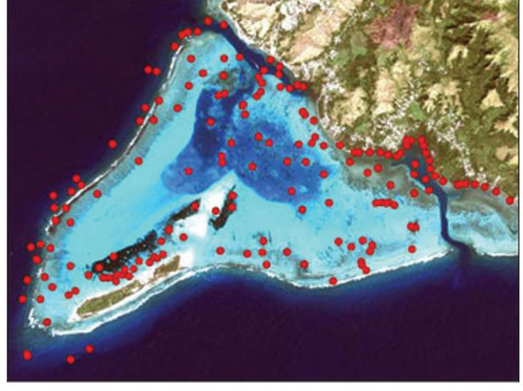

### **Chapter 4: Assessment of Classification Accuracy**

IKONOS satellite imagery. The test areas for American Samoa included Pala Lagoon, Fagatele Bay, Fagaitua Bay, the Manu'a Islands and Tafeu. The test areas for the Marianas Archipelago included Piti Bay and Cocos Lagoon, Guam; Saipan Lagoon and Lau Lau Bay, Saipan; South Beach, Tinian; west and southeast sides of Rota; the west side of Sarigan; and the entire islands of Pagan, Agrihan, and Maug.

Benthic habitat maps from these areas were generated from IKONOS satellite imagery collected at 4 meter resolution and pansharpened to 1 meter resolution. All image interpretation and digitizing was conducted by a single NOAA contractor. The field habitat characterization data collection methods for thematic accuracy assessment differed little from the data collected for ground validation. The primary distinction between the two data sets was the method of selection of the field points. Where as the assessment sites for ground validation were selected to specifically investigate habitat types and gradients of spectral signatures in the imagery, a random stratified sampling method was implemented to select field sites to

test map accuracy (Congalton 1991).

Subsequent to completion of the second draft coral reef habitat maps, waypoints were generated using a stratified random sampling scheme. Twenty to thirty accuracy assessment waypoints were collected per test area for each detailed structure and detailed cover class encountered. Waypoint files were generated from these points and all waypoints that could be safely accessed were navigated to using a Trimble Geo Explorer 3 GPS data logger (see Figure). Upon arriving at the waypoint, a weighted meter line was dropped, a buoy fastened and site and habitat specific data collection was undertaken. After deployment of the buoy, 100 GPS positions were collected at one-second intervals and were averaged to generate a single position.

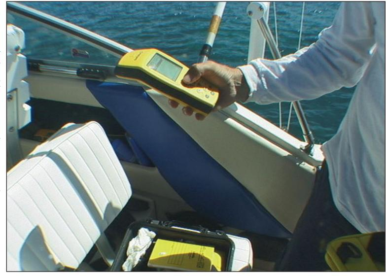

Three benthic habitat assessments were conducted. A point assessment was conducted by surveying the one square meter area around the point where the weight dropped. Two area assessments were conducted in an area of a seven-meter radius around the weight. The first assessment identified the most common habitat type within the area and the second identified the second most common habitat type with in the area. The depth of the site was recorded using a hand held depth sounder. Benthic habitat assessments were made using a glass bottom look box, free diving or observing from the surface. All diving was conducted by breath holding or snorkeling on the surface. In areas where waves and sea conditions were prohibitive to safely accessing the waypoint by boat the GPS was placed in a watertight box and swam to the survey point.

Data including but not limited to site ID, depth, most common habitat, zone and assessment method were recorded using the GPS data logger equipped with a custom data dictionary designed to meet the specifications of the Coral Reef Habitat Classification Scheme. At the end of each field day, the data were downloaded, differentially corrected to the closest CORS station and seamlessly converted to ArcView GIS format. All hand written descriptions were entered in waterproof notebooks and transferred to the GIS by hand. A total of 1,720 benthic habitat characterizations were completed in all sixteen test areas combined, 613 characterization points for American Samoa and 1107 points for the Marianas Archipelago.

To maintain objectivity in the analysis of accuracy, an independent team conducted this work. The Coral Reef Assessment and Monitoring Program (CRAMP) biologists from the Hawaii Institute of Marine Biology from the University of Hawaii at Manoa made the official judgments. The accuracy assessment point theme and the benthic habitat polygon themes were overlaid on the imagery in the GIS. The GIS was queried to select all points within the polygons that matched the polygon habitat type. These were set aside as correct calls. The mismatched pairs were closely examined.

The classification errors that occurred between the MMU and size of accuracy assessment areas were accounted for in this analysis. A map classification was not considered incorrect in a case where a seven meter radius field assessment fell on a

### **Chapter 4: Assessment of Classification Accuracy**

habitat feature in the field that was smaller than 1 acre. For example, if a field assessment fell on a small patch reef surrounded by sand that was less than the MMU and thus was not mapped, the point was excluded from the accuracy assessment report. Points that fell close to polygon boundaries were all included as it was assumed that the probability of error contributing to false negatives would be equal to that for false positives. The habitat type for the portions of the test area that were not interpretable due to cloud cover, glint or water quality were classified as "unknown". The accuracy assessment points that fell within polygons with the habitat type of "unknown" were not included in the accuracy analysis.

#### **Results of Overall Accuracy Assessment of Benthic Habitat Map Products**

Thematic accuracy of the benthic habitat maps was determined using the aforementioned methods. The mapped habitat type was compared with that of the actual habitat type from field observation. The data is organized into columns representing the field habitat assessment and the rows organized into mapped habitat type. The correct class for each of the incorrect attributes was recorded and included in a comprehensive matrix at the most detailed level of the classification scheme. Four of these detailed matrices were generated, one each for biological cover and geomorphological structure in American Samoa and the Marianas Archipelago. Error matrices were prepared at the detailed and general levels to identify patterns of confusion in the interpretation of the signatures in the imagery. This information was incorporated into ongoing work to improve the accuracy of mapped product. A complete description of these results can be found in the final project report, Project Completion Report: Mapping of Benthic Habitats for U.S. Pacific Territories, at http://biogeo.nos.noaa. gov/products/us\_pac\_terr/final\_report.pdf.

Traditionally, the data is organized into columns that represent the field habitat validation data and the rows are organized into the interpretation of the images. The overall accuracy is typically measured by dividing the total correct determinations by the total number of assessments. This result only incorporates the major diagonal of the table and excludes the omission and commission errors whereas the Tau analysis indirectly incorporates the off-diagonal elements as a product of the row and column marginals. Furthermore, the Tau analysis compensates for unequal probabilities of groups or for differences in numbers of groups (Ma and Redmond 1995). This assessment lends itself to statistical analysis wherein the photointerpreter's determination is assigned a probability that it occurred at random (see Tables).

| American Samoa     |                  |      |  |  |
|--------------------|------------------|------|--|--|
| Map Category       | Overall Accuracy | Tau  |  |  |
| Major Structure    | 98.0 %           | 0.97 |  |  |
| Detailed Structure | 84.0 %           | 0.83 |  |  |
| Major Cover        | 87.6 %           | 0.86 |  |  |
| Detailed Cover     | 77.3 %           | 0.76 |  |  |

| Mariana Archipelago |                  |      |  |  |
|---------------------|------------------|------|--|--|
| Map Category        | Overall Accuracy | Tau  |  |  |
| Major Structure     | 98.7 %           | 0.98 |  |  |
| Detailed Structure  | 92.6 %           | 0.92 |  |  |
| Major Cover         | 87.8 %           | 0.86 |  |  |
| Detailed Cover      | 80.9 %           | 0.80 |  |  |

# References

Allee, R.J., and 11 co-authors. 2000. Marine and Estuarine Ecosystem and Habitat Classification. National Marine Fisheries Service. Office of Habitat Conservation. Silver Spring, MD. NOAA Tech. Memo. NMFS-F/SPO. 43 pp.

Chauvaud, S., C. Bouchon, and R. Maniere. 1998. Remote sensing techniques adapted to high resolution mapping of tropical coastal marine ecosystems (coral reefs, seagrass beds, and mangrove). Int. J. Remote Sens. 19:3525-3639.

Christensen, J.C., C. Jeffrey, C. Caldow, M.E. Monaco, M.S. Kendall, R.S. Appeldoorn. 2003. Cross-shelf Habitat Utilization Patterns of Reef Fishes in Southwestern Puerto Rico. Gulf Car. Res. 14:9-27.

Congalton, R. 1991. A Review of Assessing the Accuracy of Classifications of Remotely Sensed Data. Remote Sens. Env. 37:35-46.

Friedlander, A.M. and E. Brown. 2003. Fish Habitat Utilization Patterns and Evaluation of the Efficacy of Marine Protected Areas in Hawaii: Integration and Evaluation of NOS Digital Benthic Habitat Maps and Reef Fish Monitoring Studies. Year One Report.

Green, E.P., P.J. Mumby, A.J. Edwards, and C.D. Clark. (Ed. A.J. Edwards). 2000. Remote Sensing Handbook for Tropical Coastal Management. Coastal Management Sourcebooks 3, UNESCO, Paris. 316 pp.

Gulko, D. 1998. Hawaiian Coral Reef Ecology. Mutual Publishing. Honolulu, HI. 245 pp.

Holthus, P.F., and J.E. Maragos. 1995. Marine ecosystem classification for the tropical island Pacific. In: Maragos, J.E., Peterson, M.N.A., Eldredge, L.G., Bardach, J.E., Takeuchi, H.F. Eds.), Marine and Coastal Biodiversity in the Tropical Island Pacific Region, East-West Center, Honolulu, p. 239- 278.

Hudson, W.D. and C.W. Ramm. 1987. Correct Formation of the Kappa Coefficient of Agreement. Photo. Eng. and Remote Sens. 53:421-422.

Kendall, M.S., C.R. Kruer, K.R. Buja, J.D. Christensen, M. Finkbeiner, and M.E. Monaco. 2001. Methods used to map the benthic habitats of Puerto Rico and the U.S. Virgin Islands. National Ocean Service, Center for Coastal Monitoring and Assessment, Biogeography Team, Silver Spring, MD. 45 pp.

Kendall, M.S., J. Christensen, and Z. Hillis-Starr. 2003. Multi-scale Data Used to Analyze the Spatial Distribution of French Grunts, Haemulon flavolineatum, Relative to Hard and Soft Bottom in a Benthic Landscape. Env. Biol. Fish. 66:19-26.

Kruer, C. 1995. Mapping and characterizing seagrass areas important to manatees in Puerto Rico- Benthic Communities Mapping and Assessment. Report prepared for Department of Interior, Nat. Biol. Surv., Sirenia Project, Order No. 83023- 5-0161. 14 pp.

Lindeman, K.C., G.A. Diaz, J.E. Serafy, and J.S. Ault. 1998. A spatial framework for assessing cross-shelf habitat use among newly settled grunts and snappers. Proc. Gulf Carib. Fish. Inst. 50:385-416.

Ma, Z., and R.L Redmond, 1995. Tau Coefficients for Accuracy Assessment of Classification of Remote Sensing Data. Photo. Eng. and Remote Sens. 61:435-439.

Mapping and Information Synthesis Working Group. 1999. Coral Reef Mapping Implementation Plan (2nd Draft). U.S. Coral Reef Task Force. Washington, DC, NOAA, NASA and USGS (Work Group Co-chairs). 17 pp.

### **References**

Monaco, M.E., J.D. Christensen, and S.O, Rohmann. 2001. Mapping and Monitoring of U.S. Coral Reef Ecosystems. Earth System Monitor. Vol. 12(1):1-16.

Mumby, P.J., A.R. Harborne, and P.S. Raines. 1998. Draft Classification Scheme for Marine Habitats of Belize. UNDP/GEF Belize Coastal Zone Management Project. 44 pp.

Neckel, H. and D. Labs. 1984. The solar radiation between 3300 and 12500 angstroms. Solar Physics. 90:205-258.

Reid, J.P., and C.R. Kruer. 1998. Mapping and characterization of nearshore benthic habitats around Vieques Island, Puerto Rico. Report to U.S. Navy. U.S. Geological Survey/BRD, Sirenia Project, Gainesville, Florida. 11 pp.

Rosenfield, G.H., K. Fitzpatrick-Lins and H.S. Lingm. 1982. Sampling for the Thematic Map Accuracy Testing. Photo. Eng. and Remote Sens. 48:131-137.

Sheppard, C.R., K. Matheson, J.C. Bythel, P. Murphy, C.B. Myers, and B. Blake. 1998. Habitat mapping in the Caribbean for management and conservation: Use and Assessment of Aerial Photography. Aquat. Cons. 5:277-298.

Stumpf, R.P., K. Holderied, and M. Sinclair. 2003. Determination of water depth with high-resolution satellite imagery over variable bottom types. Limnol. and Oceanogr. 48:547-556.

Vierros, M.K. 1997. Integrating multisource imagery and GIS analysis for mapping Bermuda's benthic habitats. Presented at the 4th International Conference on Remote Sensing for Marine and Coastal Environments. Orlando, FL March 1997, p. 649-656.