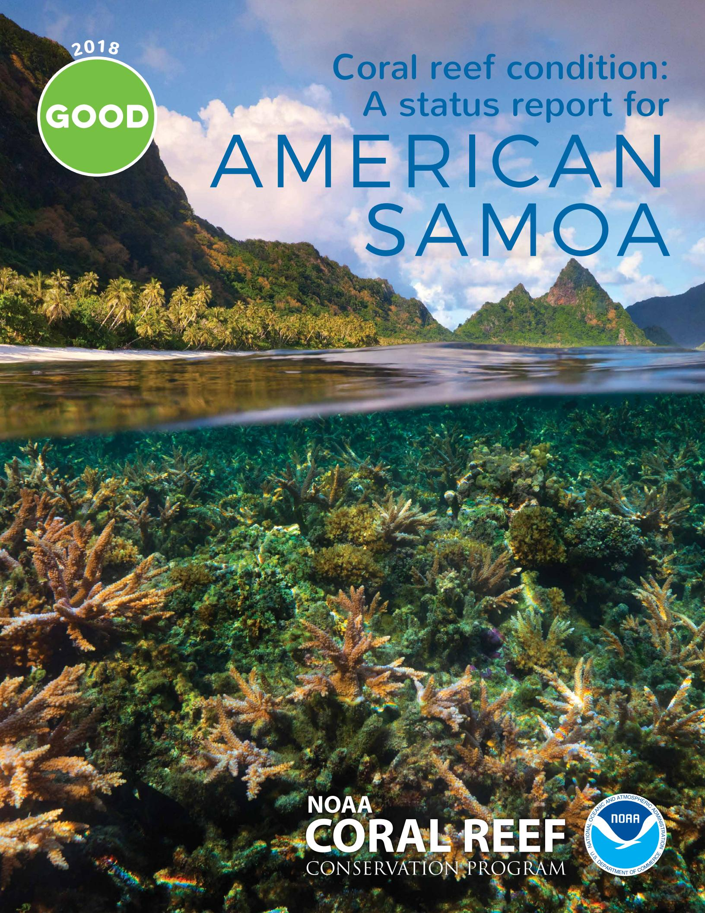

## Coral reefs are important

Healthy coral reefs are among the most biologically diverse ecosystems on Earth, with high cultural and economic significance. They provide billions of dollars in **food, jobs, recreational opportunities, coastal protection**, and other important goods and services to people around the world. The global decline in coral reefs has had significant ecological, social, cultural, and economic impacts on people and communities.

The National Oceanic and Atmospheric Administration (NOAA) Coral Reef Conservation Program (CRCP) leads efforts to monitor and conserve coral reef resources and the ecosystem services they provide for current and future generations. In 2011, CRCP established the National Coral Reef Monitoring Program (NCRMP)—an integrated and focused monitoring effort with partners across the U.S. and its territories. Scientists collect biological, physical, chemical, and socioeconomic data to provide a robust picture of the condition of U.S. coral reefs and inform management decisions. For more information, visit coralreef.noaa.gov.

#### the results are in!

- Overall, American Samoa reefs are in good condition.
- Tutuila is most impacted by human activities, whereas the uninhabited islands and atolls are least impacted.
- American Samoa's coral reefs would benefit the most from reduced fishing pressure and less temperature stress.

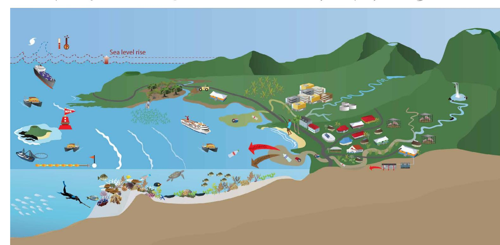

## reefs are under threat

Coral reefs are sensitive ecosystems that thrive when conditions are right—warm, clear, shallow waters that contain low nutrient levels. However, factors at both local and global scales can disrupt these conditions. Threats such as **fishing impacts** and **land-based sources of pollution**  can be managed at a local level, while coral reefs will also benefit from the reduction of greenhouse gases that fuel **climate change and ocean acidification**.

Over-fishing leads to a reduction in the amount of reef fish species in many locations, which can disrupt the delicate ecological balance on the reef. Physical impacts from fishing activities, like anchoring and marine debris, can also damage coral reefs. Derelict fishing gear such as gill nets, trap line, and monofilament fishing line is prevalent in American Samoa and can entangle and kill reef organisms.

Land-based sources of pollution result from agriculture, deforestation, land clearing, storm water, impervious surfaces, coastal development, road construction, and oil and chemical spills. This pollution impacts coral reefs in many ways, including 1) sedimentation, which smothers corals with dirt, 2) nutrient enrichment, which can lead to overgrowth of corals by seaweeds, and 3) the introduction of toxins and diseases into the system. These pollutants can directly harm or kill corals, and also indirectly affect reefs by disrupting critical ecological functions, food webs, and fish populations.

Climate change and ocean acidification impacts threaten coral reefs at local to global scales through sea-level rise, mass coral bleaching, and disease outbreaks. Increasing water temperatures and ocean acidification reduce coral growth. In the long term, failure to reduce carbon dioxide and other heat-trapping gases that cause ocean acidification and rising temperatures will continue to impede conservation and management efforts for coral reefs.

## why a status report?

Effective coral reef conservation cannot be accomplished without an informed and engaged public. This status report is part of an ongoing series of documents to track the status and trends of coral reefs across the U.S. and its territories. **The American Samoa coral status report is part of a larger effort to provide communities and decision-makers with information about managing and conserving coral reef ecosystems.** 

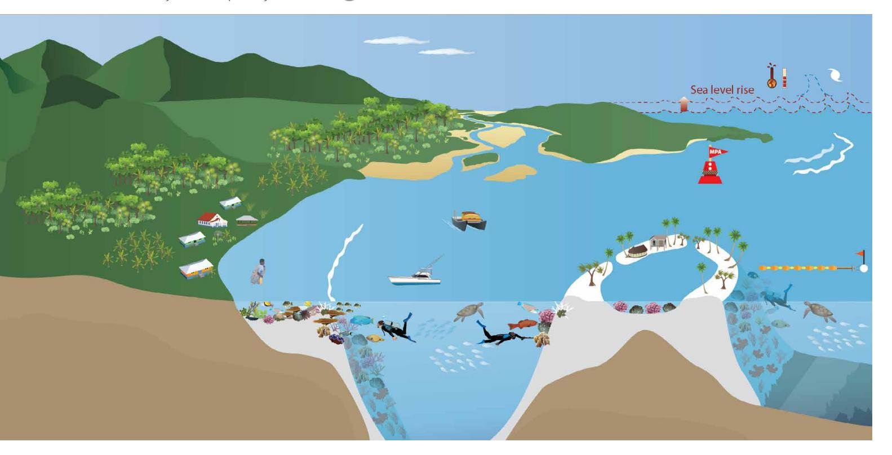

# CORALS & ALGAE

Corals & algae make up the base of the coral reef ecosystem, providing food and shelter for fish, shellfish, and marine mammals. They are also important economic and tourism resources. The five indicators for corals & algae are:

- Coral reef cover, which includes corals, algae, and crustose coralline algae.
- **Coral populations**, a measure of the population's ability to reproduce and sustain itself.
- Herbivory, a measure of the level of grazing pressure by fish on corals and algae.
- **Mortality**, which measures the amount of recently dead coral.
- Diversity, a measure of the number of different species of coral present.

The coral-eating crown-of-thorns sea star (COTS) has a serious impact on Indo-Pacific reefs. Several recent COTS infestations on American Samoa reefs may be linked to nutrient inputs. Corals at Swains and Tutuila Islands experience most of the impacts.

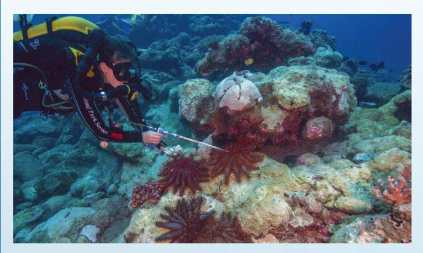

A National Park of American Samoa diver injects a COTS with ox bile, a natural substance that kills the creature but does no harm to the reef. Photo: National Park Service.

# AVERAGE CORAL COVER Tutuila Tau Swains Ofu & Olosega Rose 10 10 10 10 10 10 10 10 10 10 10 10 10

Coral cover in American Samoa has stayed relatively the same throughout the period of record. However, coral cover at Swains has recently declined.

Coral reefs serve as habitat and food for fish species. These fish are important to the ecology of the reef, national and global economies, and the livelihoods of local villagers. The four indicators chosen for fish are:

- Reef fish, a measure of the amount of fish present.
- **Sustainability**, which is indicative of whether fishery stocks still have abundant large breeding-sized fishes.
- Sharks and other predators, a measure of the amount of fish that eat other fish.
- **Diversity**, a measure of the number of different species of fish present.

Sharks are important to the ecological function of coral reefs. Their removal negatively affects the entire coral reef food web. Shark populations in American Samoa today are only 4–8% of historical populations. Large reef fish such as Bumphead parrotfish are considered locally extinct while others like Humphead Wrasse are heavily pressured. Local management actions such as banning SCUBA spearfishing and the take of large reef fish species, if properly supported and enforced, will help these fish populations recover.

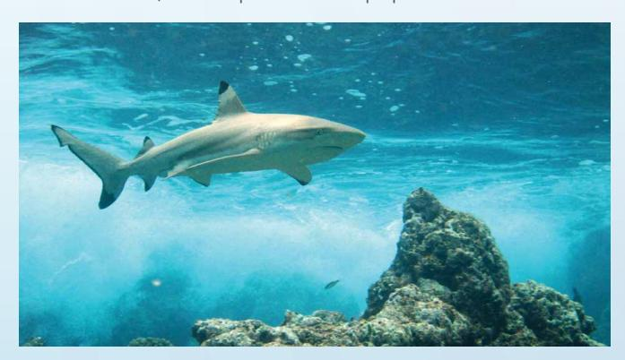

Sharks, such as this blacktip reef shark in American Samoa, are a critical component of coral reef food webs. Photo: National Oceanic and Atmospheric Administration.

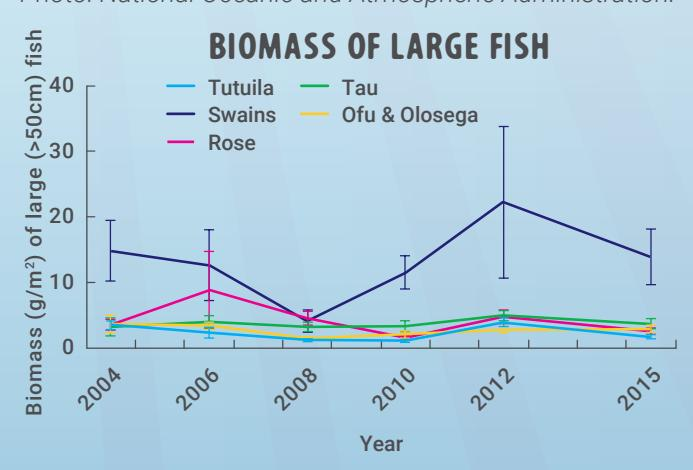

Biomass of large fishes is highest at Swains, where large schools of barracuda and jacks are frequently encountered, and tends to be lowest at Tutuila.

## AMERICAN SAMOA CORAL REEFS ARE IN GOOD CONDITION

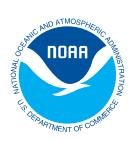

## **AMERICAN SAMOA**

American Samoa is an unincorporated United States Territory in the South Pacific. The Territory consists of five volcanic islands and two atolls, all surrounded by fringing coral reefs. American Samoa was divided into six sub-regions to evaluate condition of four categories—corals & algae, fish, climate, and human connections. American Samoa

coral reefs are in good condition overall. Benthic cover and coral populations are doing well. In contrast, fish are moderately to very impacted. Sharks and other predators are considered depleted throughout the world and American Samoa is no exception. Climate is also a factor negatively affecting coral reefs. Temperature stress and ocean acidification are global problems seen locally in American Samoa. Despite these issues, communities are engaged and informed about management actions to protect reefs. Of the 70 villages in American Samoa, 20% have resource management plans in place, 7% of coral reef area

area is designated under management. The coral reefs on American Samoa's remote islands experience fewer impacts

is under no-take designation, and 25% of coral reef

from human activities and development, but overall the Territory is struggling against threats, such as pollution, overfishing, and global climate change.

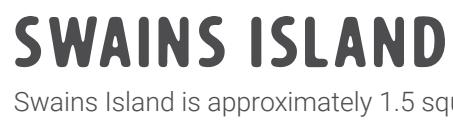

Coral reef habitat

Ta'ū is one island of the Manu'a

group of islands and has a

800. Part of the island is

population of approximately

of American Samoa and the

National Marine Sanctuary of

American Samoa. Ta'ū's reefs

worse than Rose Atoll and

Swains Island.

are lightly impacted, but scored

preserved as the National Park

TA'Ū

Swains Island is approximately 1.5 square miles with a maximum elevation of six feet above sea level. Only a few people lived on Swains in the past. The island has been recently abandoned, leaving it currently uninhabited. Swains is almost completely protected by the National Marine Sanctuary of American Samoa. Swains Island's coral reefs are doing well and scored the highest out of the six regions.

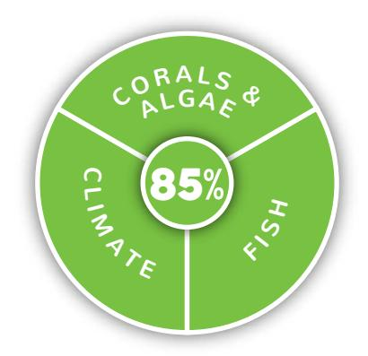

## **MULIAVA (ROSE ATOLL)**

Rose Atoll is the easternmost Samoan island and the southernmost point of the United States. One of the smallest atolls in the world. Rose Atoll consists of about 0.03 square miles of land, 2.5 square miles of lagoon, and a narrow barrier reef. Rose Atoll is almost completely protected as a Marine National Monument and the land and lagoon area is protected by a National Wildlife Refuge. Rose Atoll's coral reefs are doing well.

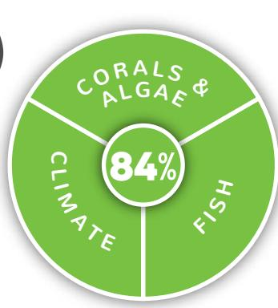

## NORTH & SOUTH TUTUILA

The island of Tutuila is the Territory's administrative center and is by far the largest and most populated island of American Samoa, with nearly 56,000 residents. Parts of the island are protected by a National Park and National Marine Sanctuaries. The island was divided into northern and southern regions based on natural geography and data resolution. North and South Tutuila's reefs are moderately impacted and are the only reefs in American Samoa that received a poor score (for fish).

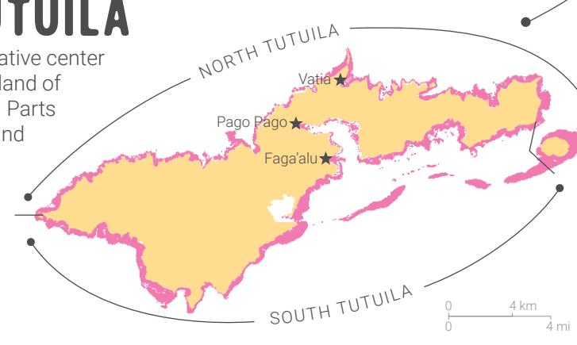

## OFU & OLOSEGA

Ofu & Olosega are the two other islands in the Manu'a group of islands in American Samoa and have a combined population of approximately 350. Part of the islands are preserved as the National Park of American Samoa. Corals & algae are lightly impacted and these islands scored the highest for corals & algae in American Samoa.

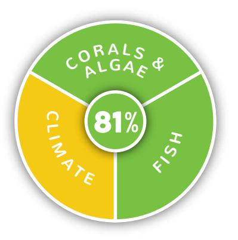

#### 90-100% Very good

All or almost all indicators meet reference values. Conditions in these locations are unimpacted, or minimally impacted or have not declined. \*Human connections are very high.

What do the scores mean?

#### 80-89% Good

Most indicators meet reference values. Conditions in these locations are lightly impacted or have lightly declined. \*Human connections are high.

#### 70-79% Fair

Some indicators meet reference values. Conditions in these locations are moderately impacted or have declined moderately. \*Human connections are moderate.

#### **60–69%** Impaired

Few indicators meet reference values. Conditions in these locations are very impacted or have declined considerably. \*Human connections are lacking.

#### 0-59% Critical

Very few or no indicators meet reference values. Conditions in these locations are severely impacted or have declined substantially. \*Human connections are severely lacking.

Insufficient data, not scored

\*Human connections data are only collected at the overall American Samoa level, not the sub-region level.

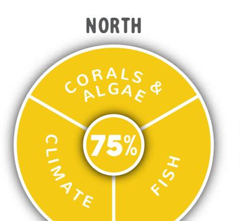

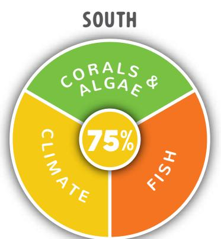

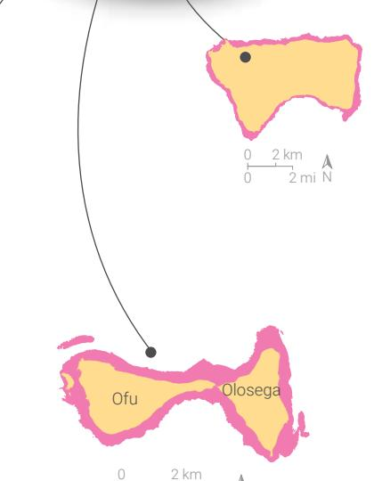

AMERICAN SAMOA

Climate affects all components of a reef system, from the building blocks of coral to the reproductive success of fish. Climate change and ocean acidification influence reefs across the globe, but conditions vary at the regional and local level. The three climate indicators are:

- Temperature stress, which evaluates the frequency and severity of high temperature events.
- Ocean acidification, indicating if the water chemistry is suitable for coral growth and other calcifiers.
- Reef material growth, which directly measures coral growth in relation to water chemistry.

High temperature stress, bleaching, and mortality hit American Samoa reefs hard in 2015. Severe bleaching and mortality occurred on shallow inshore and lagoonal reefs along southern Tutuila. These shallow habitats have limited water circulation, which worsens the effects of high temperature stress. Higher survival occurred on forereef habitats in deeper waters throughout American Samoa.

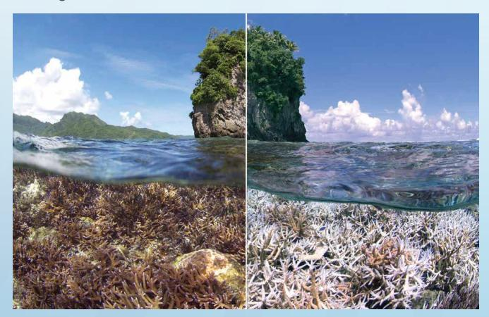

*Photo: Before (December 2014) and during bleaching (February 2015) at the Flower Pot, southern Tutuila. Photo: XL Catlin Seaview Survey.* 

## human connections

Coral reef management agencies protect coral reef resources through management plans, public education, and facilitating village and community involvement in natural resource management. The three indicators for human connections are:

- Awareness, an indicator of residents' familiarity with threats to and the importance of reefs.
- Support for management actions, an indicator of support for reef management activities.
- Pro-environmental behavior, an indicator of residents' participation in activities to protect the environment.

The majority of residents participate in fishing, swimming, and beach recreation. Fishing is largely for subsistence rather than commercial or recreational purposes. American Samoans believe that coral reef resources are important and this is reflected in their support for management efforts. Residents were asked if they agreed or disagreed with a list of local management efforts:

#### **Samoans support reef management**

Community-based Village MPAs

Temporary fishing closure areas

Permanent no-take MPAs

2012 expansion of Fagatele NMS

Ban on fishing "big fish"

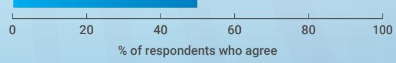

*NMS = National Marine Sanctuary MPA = Marine Protected Area* 

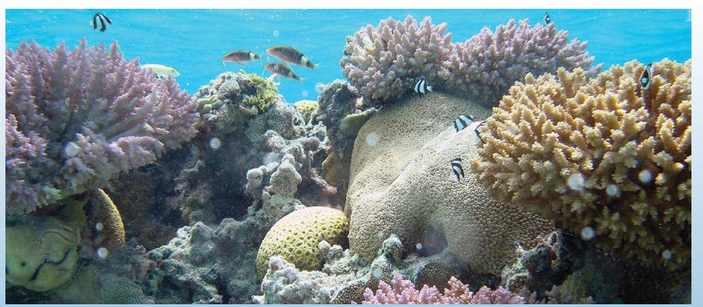

*Biodiversity of a reef system is an important indicator of overall reef health. Photo: NOAA Fisheries/Senifa Annandale.* 

Biodiversity is a measure of the variety of living organisms. High biodiversity of corals, fish, and other organisms helps keep the ecosystem in balance and makes it resilient to environmental impacts. Although we measure biodiversity, the science is not yet mature enough to score biodiversity in an area. As the science and analysis progress, we will look to include biodiversity scores in future status reports.

#### STATUS REPORT FRAMEWORK

The American Samoa status report presents the results of an analysis of indicators that were chosen to reflect key ecosystem processes and values. The report provides a geographically specific assessment of American Samoa shallow (0–100 feet) coral reef condition for the period 2012–2016. Data were collected by NOAA NCRMP using a survey design that is representative at the island level; results should not be interpreted at the site level. Uncertainty in the data was considered differently for each indicator and the precision of scores was not determined.

Data for each indicator were measured against a reference value and converted to a numeric score. For the American Samoa status report, three fish indicators and five benthic indicators were assessed to evaluate biological condition, three indicators were assessed to evaluate climate impacts, and three indicators were assessed to evaluate human connections. These indicators were then averaged into an overall score for each theme and sub-region, and then to an overall Coral Reef Condition score for American Samoa. For more detailed information on methodologies, indicators, thresholds, and grading, visit <a href="http://www.coris.noaa.gov">http://www.coris.noaa.gov</a> (keyword: status reports).

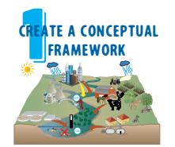

Create a framework defining goals and major aspects of each goal that should be evaluated over time.

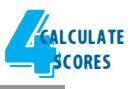

| Region      | Year | MeanSIZE |
|-------------|------|----------|
| Ofu&Olosega | 2014 | 1.02     |
| Rose        | 2014 | 1.08     |
| Swains      | 2014 | 1.07     |
| Ta'u        | 2014 | 1.06     |
| Tutuila N   | 2014 | 1.01     |
| Tutuila S   | 2014 | 0.94     |

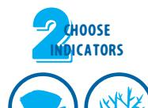

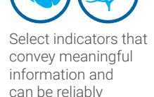

measured

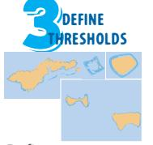

Define status categories, reporting regions, and method of measuring threshold attainment.

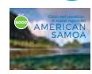

Communicate results using visual elements such as photos, maps, and conceptual diagrams.

The process for establishing the status report followed the 5-steps outlined here.

#### WHAT YOU CAN DO TO HELP

There are many threats to coral reefs. Here are a few actions YOU can take to help conserve coral reefs:

Educate yourself about coral reefs and the creatures they support.

Abide by all fisheries and Marine Protected Area regulations.

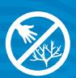

Don't stand on or touch live coral. Don't take pieces of corals home with you.

Do not drop your anchor in reef areas, rather use sandy bottom areas.

Be responsible by taking fishing nets and other gear with you when you leave.

Help protect mangroves and wetlands from filling and construction activities.

Plant native vegetation to prevent sediment and pollutants from reaching the reef.

Don't dump household chemicals into streams, gutters, or drains.

Reduce energy use and your carbon footprint.

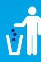

Pick up your own trash and carry away the trash that others have left behind.

Support initiatives to preserve and protect coral reefs.

#### Status report working group

Rusty Brainard, Jeanette Clark, Alicia Clarke, Maria Dillard, Mark Eakin, Peter Edwards, Matt Gorstein, Hideyo Hattori, Adel Heenan, Susie Holst, Justine Kimball, Jen Koss, Alice Lawrence, Arielle Levine, Gang Liu, Jarrod Loerzel, Paulo Maurin, Domingo Ochavillo, Tom Oliver, Jennifer Samson, Fatima Sauafea-Le'au, Mareike Sudek, Dione Swanson, Bernardo Vargas-Angel, Ivor Williams, & Chip Young.

#### About this status report

This status report is a joint product of NOAA's Coral Reef Conservation Program (CRCP) and the University of Maryland Center for Environmental Science. Science communication, design, and layout by Jane Thomas, Caroline Donovan, Alexandra Fries, & Heath Kelsey. November 2018.

Cover photo by Floris van Breugel (www.ArtInNaturePhotography.com)

#### Acknowledgements

The CRCP supports effective management and sound science to preserve, sustain, and restore valuable coral reef ecosystems for future generations.

For more information, visit coralreef.noaa.gov.

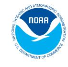

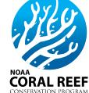

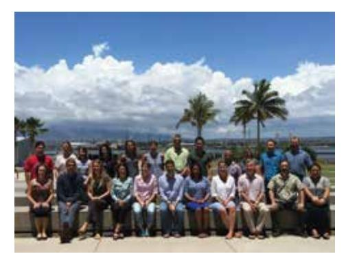

The status report working group during the workshop in Honolulu, Hawai'i, August 2015.