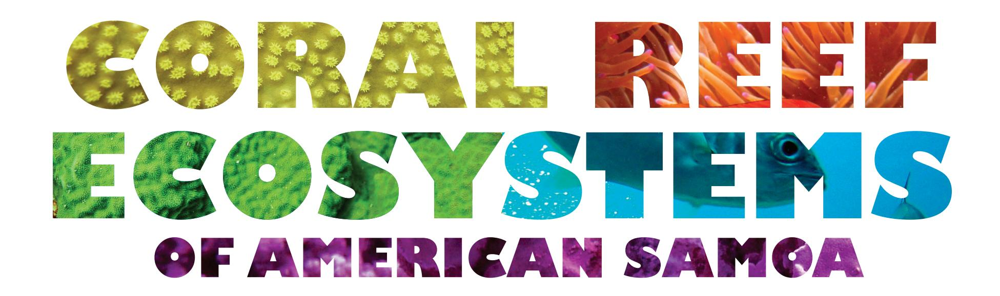

# GORAL REEF EGOSYSTEMS OF AMERICAN SAMOA A 2002-2010 OVERVIEW

The mission of the NOAA Pacific Islands Fisheries Science Center (PIFSC) is to conduct high-quality, timely research to support the stewardship of fisheries resources, protected species, and ecosystems in the central and western Pacific Ocean.

To obtain copies of this document, contact PIFSC:

Pacific Islands Fisheries Science Center 2570 Dole Street Honolulu, HI 96822-2396 (808) 983-5303

An online version is available at http://www.pifsc.noaa.gov/cred. Unless otherwise indicated, photographs in this publication are in the public domain.

This document may be referenced in the following manner:

Pacific Islands Fisheries Science Center (2011) Coral reef ecosystems of American Samoa: a 2002–2010 overview. NOAA Fisheries Pacific Islands Fisheries Science Center, PIFSC Special Publication, SP-11-02, 48 p.

Front cover: *Tubinaria*, anemone, *Psammocora*, giant trevally, coralline algae. *NOAA photos by J. Kenyon and K. Lino*

Back cover: Close-up of coral at Ofu. *NOAA photo by J. Kenyon*

# **TABLE OF CONTENTS**

**04** HISTORY OF CRED REEF MONITORING

**08** GEOGRAPHY

**12** METHODS

**16** AMERICAN SAMOA IN A PACIFIC-WIDE CONTEXT

**20** COMPARING REEFS IN AMERICAN SAMOA

**36** ISLAND-BASED RESULTS

**46** REFERENCES

This booklet provides an overview of key findings and temporal trends from the Pacific Reef Assessment and Monitoring Program (Pacific RAMP) research surveys conducted in American Samoa in 2002, 2004, 2006, 2008, and 2010 by the Coral Reef Ecosystem Division (CRED) of the NOAA Pacific Islands Fisheries Science Center (PIFSC) with financial support from NOAA's Coral Reef Conservation Program. This summary report builds on the comprehensive analyses of research surveys from 2002 to 2006 published in the *Coral Reef Ecosystem Monitoring Report for American Samoa 2002– 2006* (available at http://www.pifsc.noaa.gov/cred/hmapping/amsareport.php). All data sets used in this booklet will soon be available on the Web through the data dissemination tool on CRED's website (http://www.pifsc.noaa.gov/cred). For more indepth information, consult the scientific papers referenced throughout this booklet.

Contributing authors per section were Joyce Miller, Vivienne Blyth-Skyrme, and John Rooney—geography and mesophotic reefs; Bernardo Vargas-Ángel, Peter Vroom, Edmund Coccagna, Kerry Reardon, Molly Timmers, and Jake Asher—benthic sections; Jamie Gove, Oliver Vetter, and Chip Young—oceanography; Ivor Williams and Adel Heenan—fish sections; Pollyanna Fisher-Pool and Lisa Munger—acoustic section; and Mark Manuel—debris section. Mariska Weijerman was the editor. Amanda Toperoff was responsible for the design and layout of the booklet and various figures. Data and GIS support came from Troy Kanemura, Jesse Abdul, Julia Ehses, and Tomoko Acoba. Kathryn Dennis did the technical editing. As principal investigator for Pacific RAMP, Rusty Brainard provided oversight for the effort. Finally, we also got many great suggestions for improvement from partners from America Samoa, including Douglas Fenner, Peter Craig, Alice Lawrence, Gene Brighouse, Lauren Wetzell, and Lelei Peau, and from Sam Pooley of PIFSC.

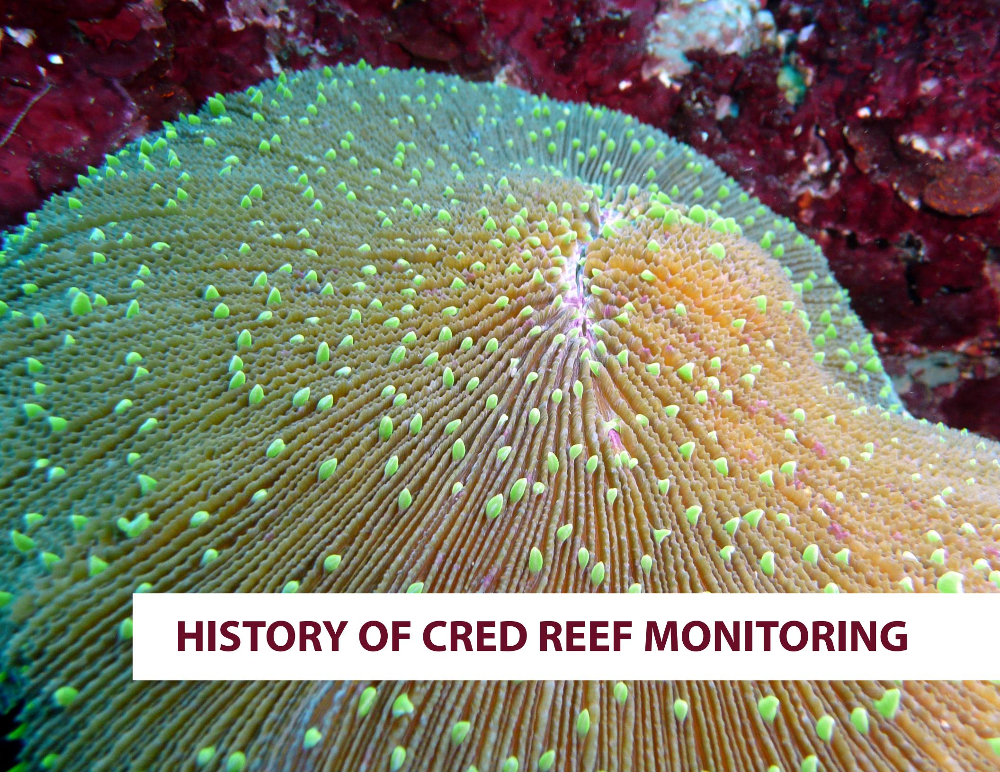

National coral reef conservation efforts in the United States were heightened in 1998 with a presidential executive order to "preserve and protect the biodiversity, health, heritage, and social and economic value of U.S. coral reef ecosystems and the marine environment." This executive order established the U.S. Coral Reef Task Force (CRTF) and emphasized the need to undertake a comprehensive approach to research, mapping, and monitoring of all U.S. coral reef ecosystems. In 2000, the CRTF developed the *National Action Plan to Conserve Coral Reefs* (CRTF 2000), and the *Coral Reef Conservation Act of 2000* laid out a national framework to address the degradation of U.S. coral reef ecosystems and other coral reef conservation issues (16 U.S. Code § 6401[2000]). The *Coral Reef Conservation Act* also led to the creation of the national Coral Reef Conservation Program under the direction of the Secretary of Commerce. This legislation requires NOAA to conduct scientific research, mitigation, and outreach activities that directly contribute to the conservation of coral reef ecosystems. NOAA, in cooperation with the CRTF, produced the *National Coral Reef Action Strategy* in 2002 with goals and objectives that included mapping, information management, research, and monitoring (NOAA 2002). In response to these mandates and with the support of NOAA's Coral Reef Conservation Program, the NOAA Pacific Islands Fisheries Science Center initiated the Pacific Reef Assessment and Monitoring Program (Pacific RAMP) in early 2000 and established the Coral Reef Ecosystem Division (CRED) in 2001.

**The mission of the Coral Reef Ecosystem Division is to provide high-quality, scientific information about the status of coral reef ecosystems of the U.S. Pacific islands to the public, resource managers, and policymakers on local, regional, national, and international levels.**

To fulfill this mission, CRED conducts a comprehensive suite of integrated, interdisciplinary research activities, including habitat mapping, oceanographic studies, and long-term monitoring of multiple components of coral reef ecosystems in the U.S. Pacific islands (Fig. 1). CRED has conducted biennial Pacific RAMP surveys in each management jurisdiction to improve our understanding of ecosystem variability over time scales ranging from several years to decades and across broad spatial scales ranging from individual islands and atolls to entire archipelagoes and the Pacific Basin. Complementary methods are used to assess benthic community composition and abundance and diversity of invertebrates, algae, and fishes in the context of their benthic habitats and associated oceanographic and water-quality conditions. Using consistent survey methodologies across ~ 50 U.S. Pacific island, atoll, and shallow-bank ecosystems enables unprecedented comparative analyses across diverse gradients of biogeography, environmental conditions, and human uses. Results from Pacific RAMP surveys are used to improve our understanding of ecosystem processes and cause-and-effect mechanisms that influence the status and resilience of coral reefs.

Pacific island communities are economically and culturally dependent on their marine resources. Accurate and up-to-date characterizations of coral reef ecosystems are necessary to develop and evaluate the effectiveness of strategies for resource management. For a significant majority of the islands, atolls, and banks surveyed through the Pacific RAMP, few comprehensive ecological surveys, bathymetric or habitat maps, or in situ oceanographic observations had been completed on their coral reefs. Little or no information was available about what to expect in terms of habitat, biogeographic structure, oceanographic conditions, or species composition, distribution, and abundance. The initial surveys of the Pacific RAMP in 2000–2003 were primarily exploratory assessments with the purpose of shaping this longterm monitoring program. With the exception of moored oceanographic and bioacoustic instruments that collect data nearly continuously, Pacific RAMP activities are not designed to detect high-frequency (short-term) ecological fluctuations. Instead, biennial Pacific RAMP surveys are designed to examine ecological variability over a longer term of several years or decades, taking periodic "snapshots" of the ecosystem conditions when surveys are conducted. As such, many of these biennial ecosystem snapshots are needed before rigorous discussions about changes and trends become possible. Inherent in this monitoring program are the logistical and financial challenges posed by the remote nature of the U.S. Pacific islands, and these challenges have shaped and continue to define the scope of CRED's work there.

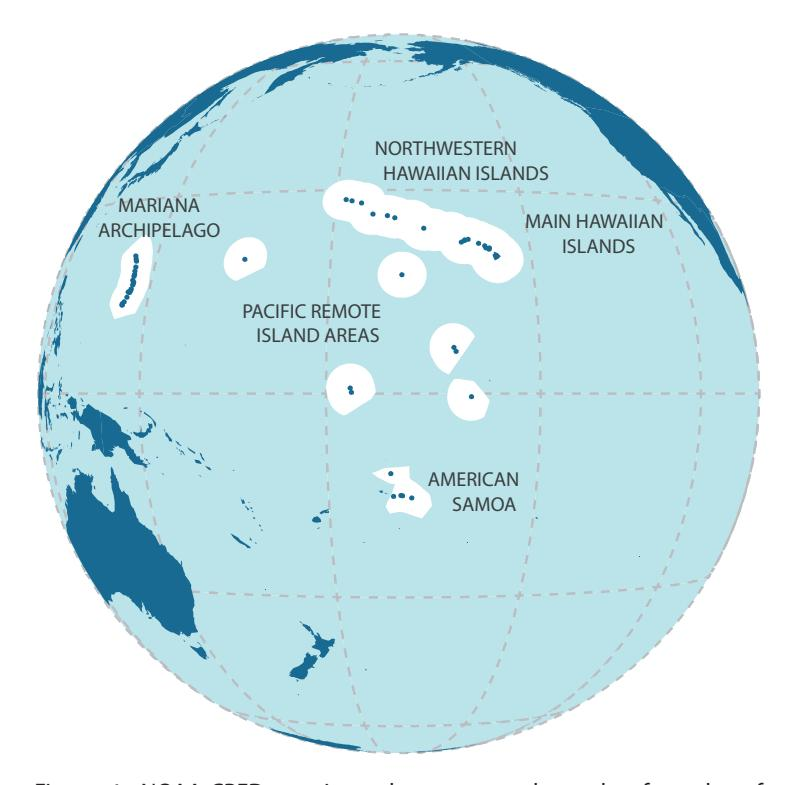

Figure 1. NOAA-CRED monitors the status and trends of coral reef ecosystems of ~ 50 islands, atolls, and shallow banks spanning the waters of American Samoa, the Hawaiian Archipelago, the Mariana Archipelago, and the Pacific Remote Island Areas. White areas represent U.S. Exclusive Economic Zones in these areas.

CRED has expanded, added, or eliminated some protocols in response to evolving management priorities and improved understanding of factors that affect coral reef ecosystems, such as ocean acidification. Where changes in survey design had the potential to affect results, validation or calibration studies were conducted to ensure trends can be meaningfully interpreted. CRED has continued to refine methods to reduce bias in survey results and minimize between-observer variability. CRED has conducted five American Samoa RAMP cruises (ASRAMP). Information on individual cruises can be found in cruise reports at http://www.pifsc.noaa.gov/library/cruise.php. An extensive monitoring report (Brainard et al. 2008) compiling the results of the first three ASRAMP cruises (2002, 2004, 2006) is available. The next ASRAMP cruise is scheduled for 2012.

**"Make it our mission to instill in our children, our students and even our citizens to be better stewards of our special place and protect our natural assets such as marine life, oceans and living resources. If we achieve this, it will be the greatest gift that we leave behind to the generations that follow us."**

—Governor Togiola Tulafono

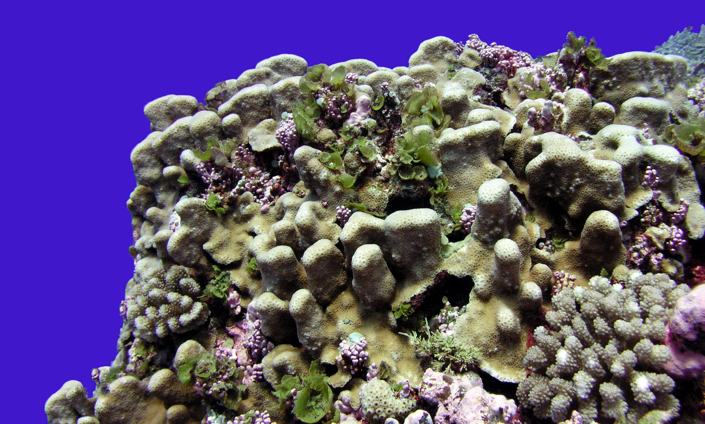

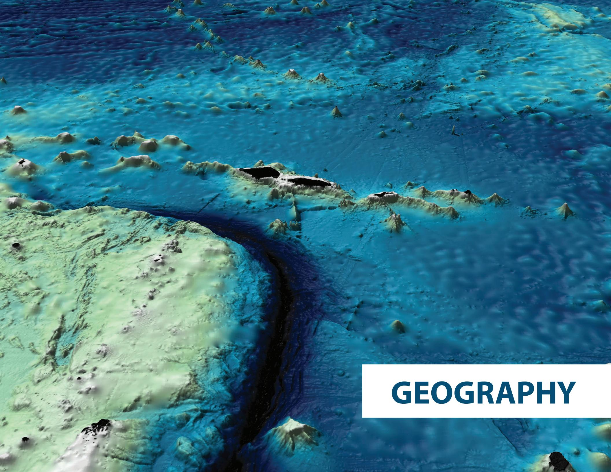

The territory of American Samoa is situated in the central South Pacific Ocean and includes three geographically distinct areas: (1) five high, volcanic islands, including from west (oldest) to east (youngest), Tutuila, which has the most extensive shelf area and, hence, the largest area of shallow (< 100 m) reef habitat, Aunu`u, a small island close to Tutuila, and the Manua Islands of Ofu, Olosega, and Ta`u (Ta`u Island is the easternmost and youngest of these five islands with more steeply sloping bathymetry); (2) the coral atoll, Rose, ~ 300 km east of Tutuila; and (3) the low island of Swains, a closed atoll that is the northernmost island of this territory, located ~ 350 km north of Tutuila. These islands differ in geology, size, population, and isolation (Fig. 2). The five high, volcanic islands along with the islands of independent Samoa are part of a hotspot chain (an area on the Earth's surface that has experienced volcanic activity over a long period of time) that also includes several seamounts. The geological age or formation of Rose Atoll has not been well documented. Swains Island is part of the Tokelau hot-spot chain, which is much older (~ 59–72 million years ago) than the relatively young (0–23 million years ago) islands of the Samoan hot-spot chain (Neall & Trewick 2008; Konter et al. 2008).

Each island or atoll has unique geographic characteristics (Fig. 2, Table 1). The largest and most populated island in American Samoa, Tutuila, has a population of 54,359 persons (U.S. Census Bureau 2010). Uninhabited Rose is the smallest island in this territory as well as one of the smallest atolls in the world; it was declared the Rose Atoll Marine National Monument in 2009. The remaining islands of Ofu, Olosega, Ta`u, Aunu`u, and Swains vary in size (Table 1) and population with 4–790 persons (U.S. Census Bureau 2010).

A recurrent natural disturbance to reefs around American Samoa is an occasionally strong tropical cyclone resulting from the territory's geographic location in the Pacific. Cyclones have affected these islands in intervals of 1–13 years with six major events occurring within the last 30 years. Tropical cyclones Esau (1981), Tusi (1987), Ofa (1990), Val (1991), Heta (2004), and Olaf (2005) varied in intensity, but all caused substantial damage to the island communities in American Samoa. American Samoa is also subject to tsunamis as a result of its proximity to the geologically active Tonga Trench. A major tsunami in September 2009 caused extensive damage to coastal communities, including the tragic loss of 32 lives (news.com.au, 7 October 2009). Damage to some of the coral reef ecosystems, especially around Tutuila (see "Marine Debris" section on page 42) also was observed during ASRAMP 2010, although overall impacts were minimal.

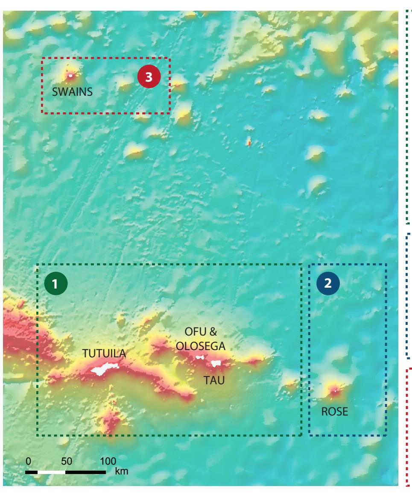

#### **1 TUTUILA AND THE MANUA ISLANDS**

- Part of the Samoan Archipelago
- Formed by volcanic eruptions as the Pacic Plate moved over the Samoan hot-spot
- Islands are very steep with mountainous terrain and high sea clis
- Tutuila is the most eroded with less steep slopes
- Extensive shelf o Tutuila supports greatest amount of sediment
- Because of fast submergence, Tutuila has banks and barrier reefs more than a mile oshore
- Ofu and Olosega are part of one volcanic edice, separated by a shallow, narrow strait

#### **2 ROSE ATOLL**

- Formed by a much older volcano than the ve main islands of the chain, although the exact age is unknown
- Two low-lying, small, islets (~ 0.06 km2) and a lagoon
- Little banktop area, with seabed sloping steeply away

#### **SWAINS ISLAND**

- Part of the much older Tokelau hot-spot chain, lying ~ 320 km north of the hot-spot track of the Samoan Archipelago
- Small, low-lying island of ~ 3 km2, enclosing a brackish lake
- Little banktop area, with seabed sloping steeply away from island

| o- ISLAND                                            | SWAINS | TUTUILA | OFU & OLOSEGA  | TAU  | ROSE | -0 |
|---------------------------------------------------------|--------|---------|----------------|------|------|----|
| SHAPE & RELATIVE SIZE                             | -      |         | ngill North | 4    |      |    |
| AREA (km²)                                              | 3      | 137     | 13             | 45   | <1   |    |
| SEAFLOOR AREA 0-30 m (km 2 )              | 3      | 51      | 12             | 10   | 8    |    |
| SEAFLOOR AREA 30–150 m (km 2 )            | <1     | 308     | 23             | 10   | 1    |    |
| SHARE OF AMERICAN SAMOA POPULATION (% IN 2010) | <1     | 98      | <1             | <1   | 0    |    |
| POPULATION DENSITY (PERSONS/km²)                        | 6      | 397     | 27             | 18   | 0    |    |
| AGE (MY)                                                | ~ 65   | 1.5     | 0.3            | 0.15 | ?    |    |

Table 1. Summary table of island characteristics across American Samoa: shape and relative size of land area, shallow and deep seafloor area, proportion of the total American Samoan population, population density, age of island (in million years, MY). All areas were calculated using geographic-information-system (GIS) techniques. Sources: CRED, IKONOS Carterra Geo Data, NOAA tsunami inundation model, U.S. Geological Survey digital elevation model, U.S. Census Bureau, and nautical charts.

Figure 2 (opposite page). The islands of American Samoa split into three main groups based on their geomorphology and shown here with the information about their characteristics.

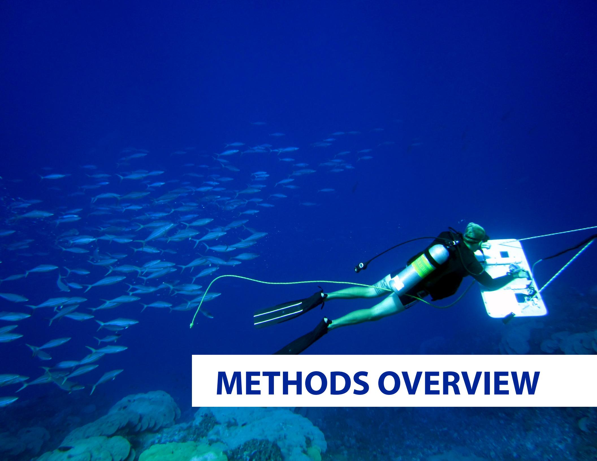

CRED conducted the first ASRAMP cruise in 2002, with subsequent cruises in 2004, 2006, 2008, and 2010. Partners from American Samoa—the Department of Marine and Wildlife Resources, Fagatele Bay National Marine Sanctuary, American Samoa Community College, Office of the Governor, National Park of American Samoa, and American Samoa Department of Commerce—worked alongside CRED scientists to develop and implement a territory-wide coral reef ecosystem monitoring program. Extensive biological, physical, and water-quality surveys were conducted to document the conditions of, and processes influencing, the coral reef ecosystems around the islands of American Samoa. Benthic habitat mapping data were collected using multibeam sonar and towed optical assessment device (TOAD) surveys. Spatial and temporal observations of key oceanographic and water-quality parameters were collected. Information on the condition, abundance, diversity, and distribution of biological communities around these islands was collected using Rapid Ecological Assessment (REA), towed-diver (Figs. 3, 4, 5), and TOAD surveys. TOAD surveys and a subset of towed-diver-survey data were used for optical validation and habitat characterization of the benthos, documenting cover of live scleractinian (hard) corals, sand cover, and habitat complexity. Towed-diver surveys encompassed various habitats along a depth contour of ~ 15 m and provide a broad overview of substrate types and associated large-fish (≥ 50 cm in total length; Richards et al. 2010) and benthic communities. During each towed-diver survey, underwater video footage and still photographs of the benthos were collected (Fig. 4). These benthic images were analyzed to obtain benthic cover data (Kenyon et al. 2006). REA surveys produce detailed, sitespecific information on the benthic community structure of hard substrate and associated fish assemblages at pre-selected REA sites.

The survey methods employed by CRED in American Samoa during the period of 2002–2006 are discussed in the *Coral Reef Ecosystem Monitoring Report for American Samoa 2002–2006* (Brainard et al. 2008). Beginning in 2008, REA fish surveys were changed to a stratified random design using a stationary-point-count (SPC) method to obtain a more representative estimate of fish biomass and diversity on shallow (< 30 m) reefs. SPC surveys were conducted in adjacent pairs of cylinders, each 15 m in diameter, and the sites for these surveys were randomly allocated across "shallow", "mid", and "deep" depth strata in hard-bottom areas at depths < 30 m (Fig. 4). Additionally, in 2010, photographs were taken along transects to

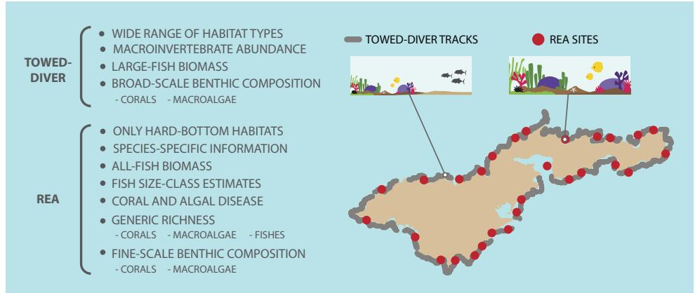

Figure 3. Schematic diagram of the main differences in area sampled and metrics estimated between towed-diver and REA surveys.

document the benthos within SPC cylinders. In 2006, REA protocols to record benthic composition changed from belt-transect surveys to linepoint-intercept (LPI) surveys (Vargas-Ángel 2011). In 2010, line-point-intercept protocols at REA sites (Vroom and Braun 2010) were adjusted to use a higher number of points (every 20 cm instead of every 50 cm) and to include recording of algal species diversity, which was previously assessed by photoquadrat surveys (Preskitt et al. 2004).

# **TOWED-DIVER METHOD**

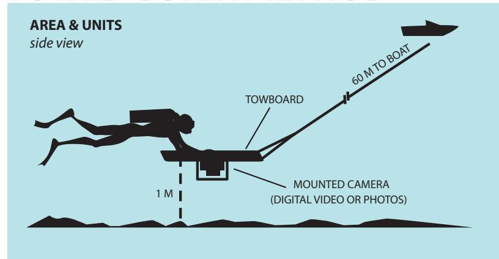

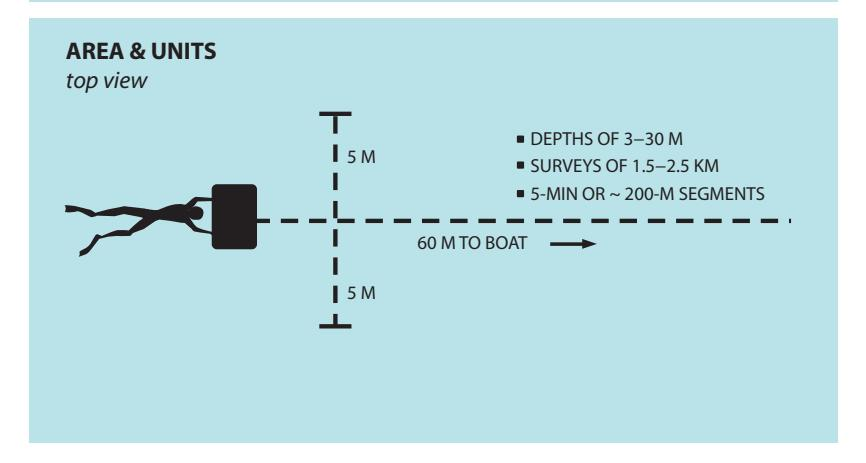

# **REA METHODS**

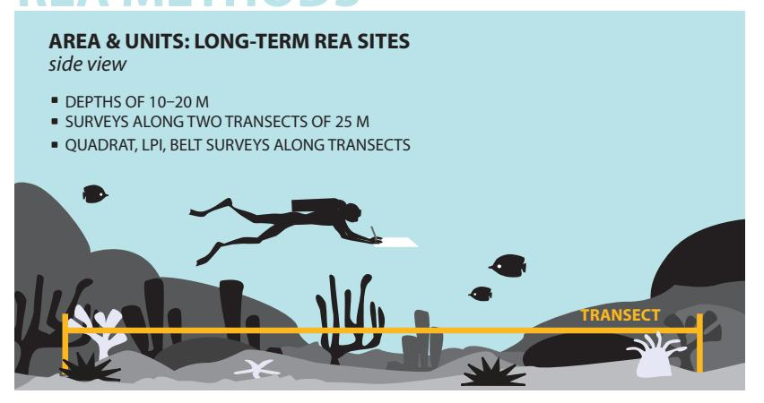

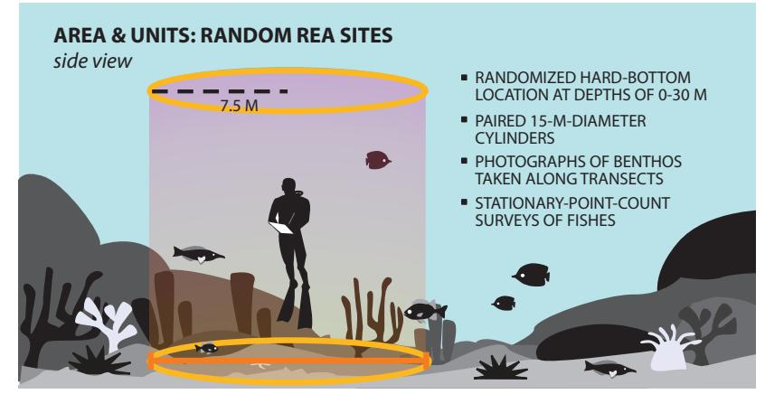

Figure 4. Schematic diagrams of (*left*) one of two divers conducting a towed-diver survey and (*right top*) one of two divers conducting a belt-transect survey at a long-term REA site along a 25-m transect line; (*right bottom*) one of two divers conducting an SPC survey at a random REA site.

# **REA SAMPLING DESIGN**

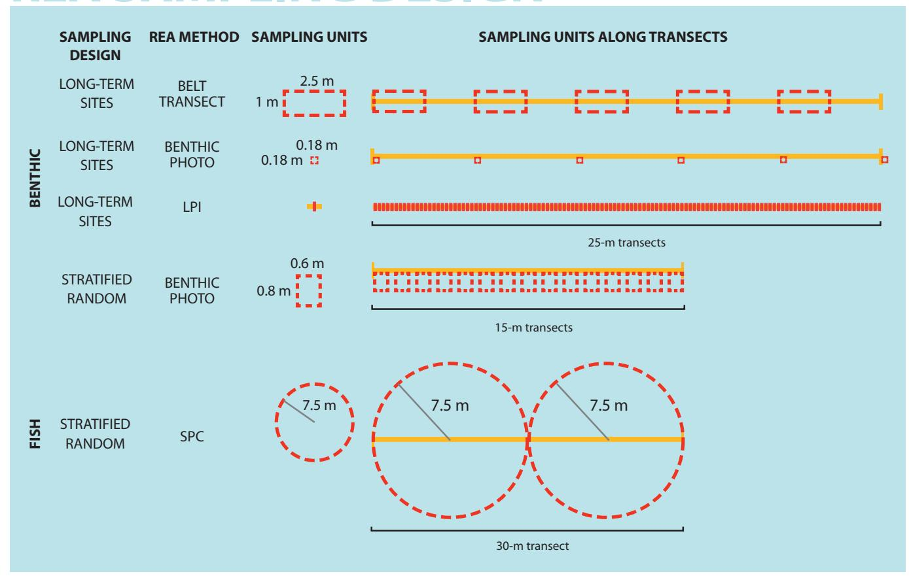

Figure 5. Overview of the sampling units of the different REA survey methods used.

For the comparison of reefs across American Samoa in this report, only data from locations surveyed on forereefs and in the mid-depth zone (where a majority of surveys were conducted) were used, except for the in-depth "Tutuila Island" section (see Page 39).

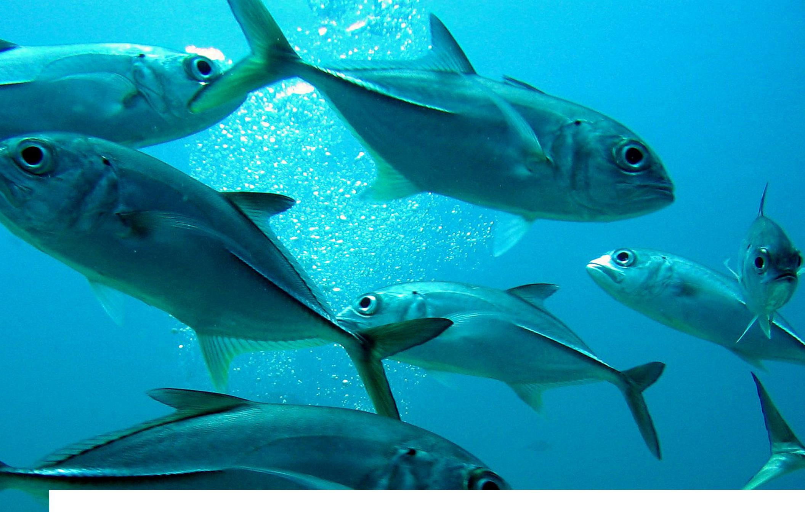

**AMERICAN SAMOA IN A PACIFIC-WIDE CONTEXT**

CRED uses the same survey methods across the U.S. Pacific islands, which makes it possible to directly compare reef ecosystem metrics across broad biogeographic, geologic, oceanographic, and human-impact gradients. To better understand the status of American Samoan reefs relative to other islands and atolls in the Pacific, fish biomass (calculated as weight per unit area) and coral cover were compared Pacific-wide (Fig. 6). Fish biomass and size distribution and coral cover provide insight into important aspects of reef ecosystems; however, these metrics are only three of a wide array of data that CRED routinely collects, data that are readily available for more detailed investigation.

Total reef-fish biomass for the islands of American Samoa was low compared to the levels observed at other islands in the Pacific but not dissimilar to the values observed at the main Hawaiian Islands and the populated islands in the Mariana Archipelago (Guam, Saipan, Rota, and Tinian; Fig. 6, top). Total fish biomass in the populated areas of American Samoa (i.e., excluding Rose and Swains) was only 50% (33.3 g/m2 ) of the total fish biomass recorded at the unpopulated islands of the Mariana Archipelago (66.1 g/m2 ) and as low as 20% of fish biomass at the Northwestern Hawaiian Islands (163 g/m2 ) and the Pacific Remote Island Areas (158 g/m2 ). Pacific-wide patterns of coral cover were less clear with coral cover ranging between 2% and 52% and most islands of American Samoa exhibiting moderate (~ 20%) coral cover relative to other islands in the Pacific; only Swains (33%) was found at the high end of the spectrum (Fig. 6, bottom).

The observed distribution of biomass across different size classes per island suggested that the lack of large-bodied fishes (≥ 50 cm in total length) contributed to these differences in total biomass between regions (Fig. 7). The biomass of small fishes (0-20 cm in total length) was distributed fairly equally within all geographic areas in the Pacific; however, it appears that at the populated islands large-bodied fishes were mostly absent when biomass levels are compared by size class among populated and unpopulated islands (Fig. 7; note the differences in scale on the *y*-axes). A number of factors contributed to the variation in fish biomass among islands, such as differences in background oceanic productivity (Nadon et al., forthcoming); for example, several islands in the Pacific Remote Island Areas had markedly higher productivity compared to American Samoa. However, the effect of human population on the reduction of large-fish biomass is well established (Williams et al. 2011).

Figure 6. Pacific-wide comparisons of (*top*) total reef-fish biomass from stratified random SPC surveys (depths of 0–30 m) conducted during the most recent survey years (2008– 2011) and (*bottom*) coral cover from towed-diver observations collected during surveys conducted in 2006– 2010. P & H is Pearl and Hermes Atoll; FDP is Farallon de Pajaros; FFS is French Frigate Shoals; and OFU includes Ofu and Olosega Islands. Error bars indicate standard error (± 1 SE) of the mean.

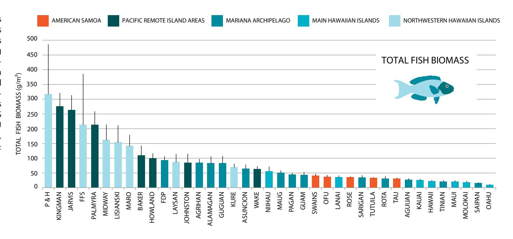

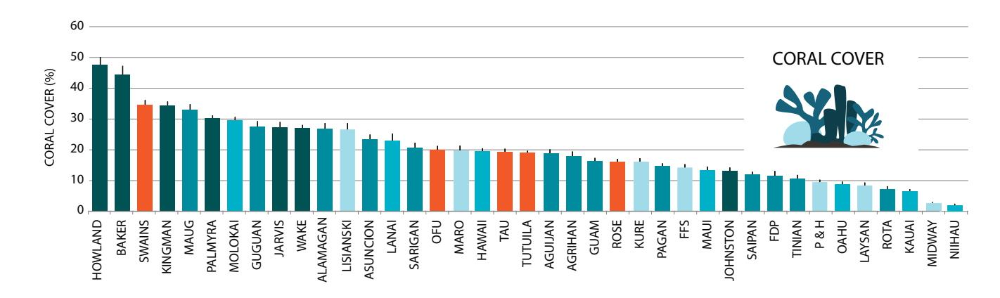

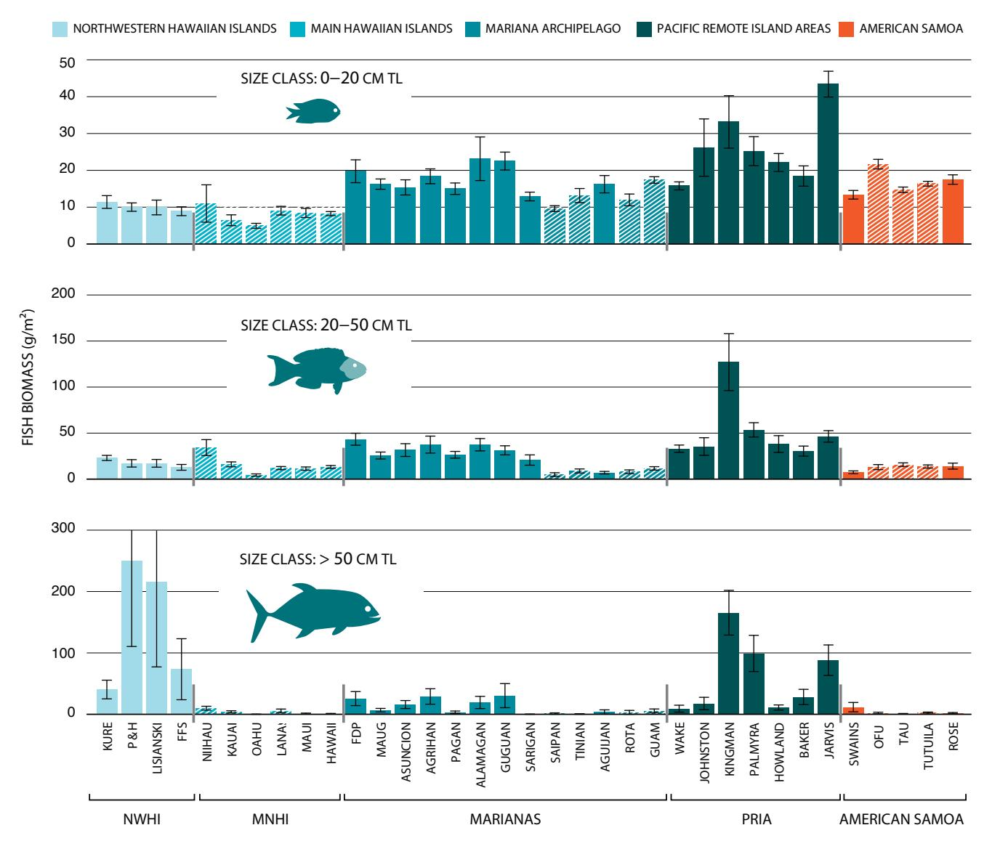

Figure 7. Pacific-wide comparisons of reef-fish biomass per size class from stratified random SPC surveys (depths of 0–30 m) conducted during the most recent survey years (2008–2011). Note the differences in scale on the *y*-axes. Diagonal pattern in bar indicates islands with human population (more than 10 persons); TL is total length; P & H is Pearl and Hermes Atoll; FDP is Farallon de Pajaros; FFS is French Frigate Shoals; and OFU includes Ofu and Olosega Islands. Error bars indicate standard error (± 1 SE) of the mean.

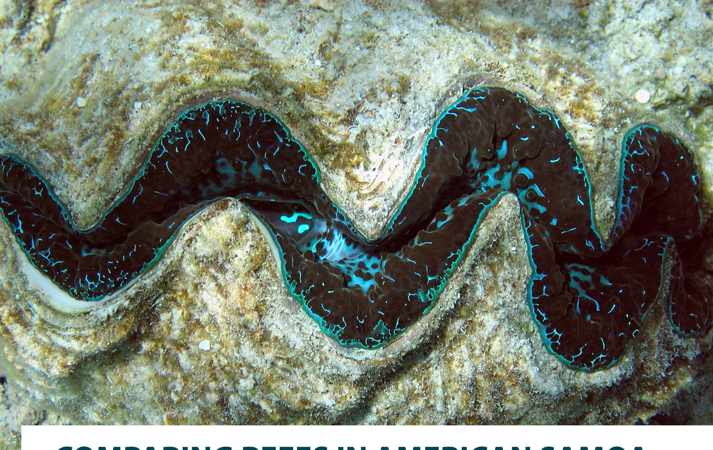

# **COMPARING REEFS IN AMERICAN SAMOA**

**18**

Differences in their geologic histories and oceanographic conditions have played major roles in shaping the coral reef ecosystems of American Samoa. Many factors, both natural and anthropogenic, influence the characteristics and dynamics of biological communities that make up coral reef ecosystems including thermal anomalies, storms, predator outbreaks, fishing, ship groundings, and land-based sources of pollution. In this section, some of the differences and similarities of the coral reef ecosystems of American Samoa are discussed.

# **OCEANOGRAPHY**

Coral reef ecosystems are influenced by a diverse suite of oceanographic and meteorological factors, including but not limited to temperature, winds, waves, currents, nutrients, carbonate chemistry, and productivity, which all may vary on daily, seasonal, and yearly time scales. A combination of satellite-derived and in situ information collected during ASRAMP surveys were analyzed to assess the variability of each of these factors. Satellite observations provide broad spatial coverage and a historical context of surface processes, whereas in situ observations provide subsurface measurements of additional environmental parameters, such as nutrient and carbonate ion concentrations. Integration of this information increases our understanding of the environmental processes that influence the condition and status of the coral reefs of American Samoa.

Long-term seasonal averages of satellite-derived sea-surface temperature (SST) highlight some of the differences observed in oceanic conditions. The annual temperature range across this region is 3°C; warmer temperatures (~ 29°C–30°C) occur during the summer (January to March), and cooler temperatures (~ 27°C–28°C) occur during the winter (July to September). During fall, winter, and spring, a pronounced north-to-south latitudinal gradient in SST occurs with warmer waters observed toward the equator (Fig. 8). This gradient weakens and becomes more diffuse during the summer months. SST during each season is warmer (~ 0.5°C–1.5°C) at Swains, owing to its more northerly position, than at the other islands of American Samoa.

Similar to SST, wind speed and chlorophyll-*a* (Chl-*a*; a proxy for primary productivity) are seasonally variable in the region surrounding American Samoa. Wind speeds and Chl-*a* concentrations are lower during the summer and highest during the winter, while latitudinal gradients in Chl-*a*  are strongest during the spring and winter. Strong winter winds blowing over the ocean surface enhance vertical mixing of nutrient-enriched subsurface waters, leading to increases in surface productivity and decreases in SST.

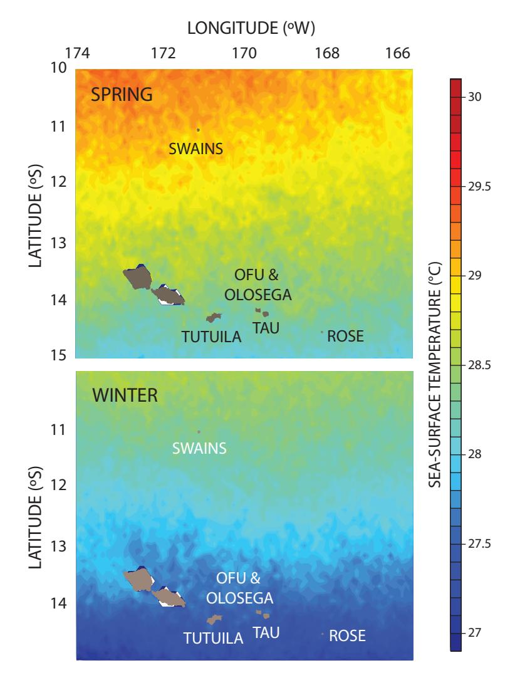

Figure 8. Spring and winter SST climatology for the region encompassing America Samoa (10°–15° S, 167°–173° W). Source: NOAA Pathfinder 5.0 SST seasonal climatology produced by the NOAA National Oceanographic Data Center using years 1985–2009, with spring defined as Oct.–Dec and winter as Jul.–Sep.. (http://www.nodc.noaa.gov/sog/ pathfinder4km).

Information obtained from in situ measurements highlight important differences in nearshore water properties. Water samples collected around each island and atoll suggest that waters surrounding Tutuila were characterized as having the highest concentrations of dissolved nutrients and Chl-*a*in American Samoa. Levels of precipitation, watershed topography, and land-use patterns can affect nearshore nutrient levels and water quality. The increased levels of nearshore nutrients observed around Tutuila were likely a result of this island's high elevation and associated influences on rainfall and the relatively high human population and related land-use disturbances.

Confirming satellite-derived spatial patterns, in situ measurements of temperature, salinity and ocean acidification suggest that Swains consistently resides in a different oceanic environment than do the reefs around the other, more southerly areas of American Samoa.

# **BENTHIC COMPOSITION**

#### BENTHIC COVER

Benthic cover in American Samoa was determined at the functional group level through analyses of digital images collected during towed-diver surveys to assist in understanding islandwide patterns and trends. Despite some small-scale variation, the overall ranking of coral cover can be summarized as follows: Swains (31%) > Tutuila (21%) ≥ Ta`u (21%) ≥ Ofu & Olosega (20%) > Rose (14%; Fig. 6). Across all survey years, Swains supported the highest estimated cover of live hard corals, which remained relatively stable through time. Contrastingly, sharp declines in cover estimates for macroalgae and turf algae combined (frondose algae) and for crustose coralline algae were noticed at Swains from 2004 to 2008, likely in response to a severe and widespread didemnid tunicate (*Diplosoma similis*) outbreak that affected Swains benthos (Vargas-Ángel et al. 2009). By 2010, tunicate levels receded to 2004 values, congruent with increases in the levels of frondose algae and crustose coralline algae (for more details on the benthic community changes around Swains, see the "Swains Island" section, Page 37).

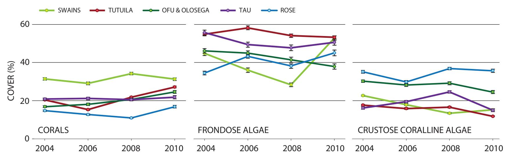

Figure 9. Spatial and temporal comparisons of mean cover (%) values of live hard corals, frondose algae (macroalgae and turf algae combined), and crustose coralline alge from analyses of benthic images collected during towed-diver surveys at forereef sites conducted in 2004–2010. Error bars indicate standard error (± 1 SE) of the mean.

A moderate increase in islandwide cover of live corals was recorded for Tutuila and Ofu & Olosega from 2004 to 2010 (Fig. 9). Tutuila had live coral cover of 15%–27% for all survey years, and coral cover there increased markedly between 2006 and 2010 (Fig. 9). Increases in estimated coral cover documented at these islands may reflect recovery from damage caused by various disturbances, including mass coral bleaching events in 2002 and 2003 and tropical storms. Islandwide live coral cover at Ta`u remained relatively stable throughout the survey period with 21% to 22%. Turf-algal cover and macroalgal cover for Tutuila, Ofu & Olosega, and Ta`u were within range of the cover values recorded in other tropical Pacific ecosystems (Vroom et al. 2006, Vroom 2011). Variation in algal cover among survey years is not surprising since algae are among the fastest growing organisms in reef settings and their abundance fluctuates naturally depending on a variety of environmental and ecological factors, including temperature, wave energy, nutrient availability, and herbivore grazing pressure. For instance, changes in macroalgal assemblages were reported for American Samoa and thought to result from increased wave energy generated by Cyclone Olaf in 2005 (Tribollet et al. 2010). As was seen in macroalgal and turf-algal populations, a slight decrease in crustose coralline algal cover was observed at some islands (Fig. 9). Despite this trend, the observed crustose coralline algal cover of ~ 15%–40% was in line with levels recorded at other tropical Pacific island systems (Vroom et al. 2010, Vroom 2011).

Rose is an isolated coral reef ecosystem in American Samoa that exhibits a geomorphologic makeup distinct from the volcanic islands to the west. The coral communities along the steep forereefs surrounding this atoll are dominated by encrusting coralline red algae that contribute substantially to the primary structure of their reef system. Analysis of benthic towed-diver images revealed a slight decrease of live coral cover between 2004 and 2008, followed by an increase from 2008 to 2010 (Fig. 9). Coral cover reductions from 2004 to 2006 may be attributable to the passage of tropical cyclones Olaf and Percy in February 2005 that fragmented corals, leading to partial colony mortality. It remains unknown, however, why coral cover continued to decrease from 2006 to 2008. Levels of algal cover (macroalgae and turf algae combined) at Rose ranged from 35% to 45% and fluctuated among years; this pattern was not unexpected given the accelerated ability of algal species to respond to environmental conditions compared to slower growing organisms. Crustose coralline algae covered more than twice as much substrate as hard corals and cover levels remained relatively consistent across survey years. The reduction in crustose coralline algal cover from 2004 to 2006 likely was related to storm impacts.

#### GENERIC RICHNESS AND RELATIVE ABUNDANCE

Coral reefs are the most biologically diverse marine ecosystems (Sala and Knowlton 2006). In areas of high human population, the combination of natural and anthropogenic disturbances has resulted in the decline of coral reef ecosystems, often leading to species-poor communities. Loss of biological diversity reduces an ecosystem's ability to resist and recover from environmental perturbations. CRED surveys of Pacific coral reef ecosystems allow us to assess species diversity over time and in different locations.

Observed macroalgal and coral diversity (measured as generic richness, i.e., total number of genera recorded around an island) was higher at the larger islands than the smaller islands in American Samoa (Fig. 10), supporting a well-established theory of island biogeography and a previously reported pattern for macroalgae in American Samoa and other island systems in the tropical Pacific (MacAuthur and Wilson 1967, Tribollet and Vroom 2007, Tribollet et al. 2010). Around Tutuila, the largest volcanic island in American Samoa, 54 unique macroalgal genera were recorded across the surveys years 2002–2010 (Fig. 10), whereas, at Swains and Rose, with notably smaller reef areas, only 17 and 27 genera were recorded.

Most survey sites contained a similar number of algal genera regardless of island. However, differences in diversity among islands were found: while the same genera were often encountered repeatedly at all sites at small islands, the mix of algal genera varied substantially among sites at larger islands. Examination of species diversity rather than genus counts reveals fine-level differences among islands. Interestingly, major space occupiers at Rose and Swains included the green algae *Microdictyon*  and *Rhipilia*, yet these genera were not recorded at the larger volcanic islands.

Coral diversity in American Samoa was high with more than 300 species recorded belonging to 60 scleractinian and hydrozoan genera (Birkeland et al. 1987, Green et al. 1999; DiDonato et al. 2005). Summarizing all ASRAMP survey years, overall generic richness totaled 56 coral genera, with 19–52 genera identified per island; the lowest generic richness was observed at Swains and the highest at Tutuila (Fig. 10). Ofu & Olosega harbored 48 genera and Ta`u hosted 44.

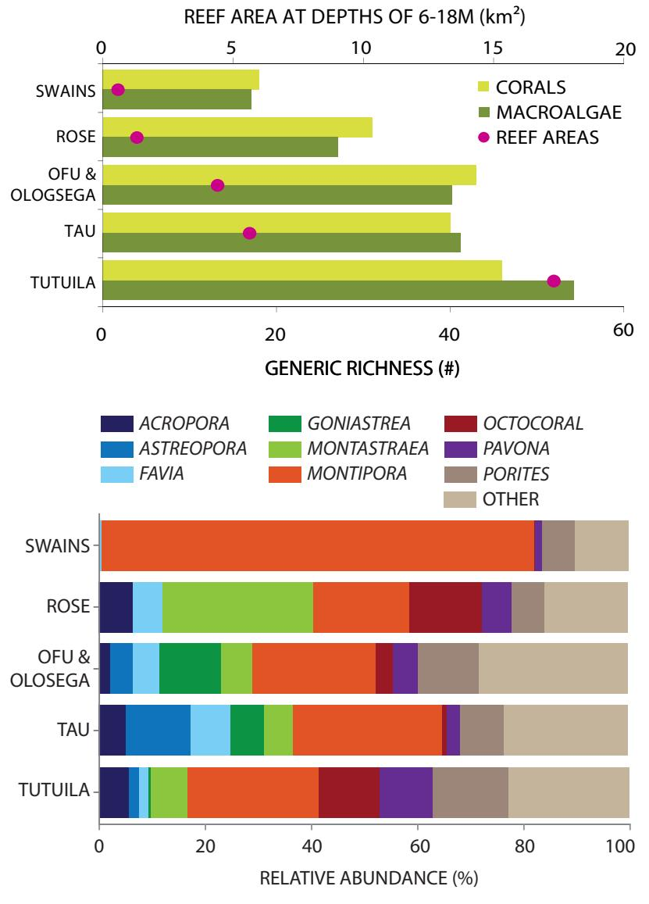

Figure 10 (*top*). Comparison of the total numbers of macroalgal and coral genera recorded per island from belt-transect surveys conducted at forereef, long-term REA sites in 2002–2010. Purple dots indicate reef area (km2 ) at depths of 6–18 m for each island.

Figure 11 (*bottom*). Comparison of mean relative abundance (%) of coral genera from REA surveys conducted at forereef sites in 2004–2010. Islands are ordered, from top to bottom, by increasing reef area.

Except at Rose, *Montipora* was the predominant coral genus observed (measured as cover per island averaged over all survey years; Fig. 11). The generic abundance for other taxa varied by island: *Goniastrea* and *Porites* represented > 10% of the coral taxa observed at Ofu & Olosega, as *Montipora* did at Rose, *Astreopora* at Ta`u, and *Porites* at Tutuila. Soft corals (octocoral) were an important contributor to coral communities, particularly at Tutuila and Rose, where they represented > 10% of the surveyed benthos for all years combined.

#### DISEASES

Coral and algal diseases are increasing in estimated abundance and prevalence on coral reefs around the globe, with concomitant losses in species diversity, resiliency, and community function (Bruno et al. 2007, Harvell et al. 2009). Consequently, with recent findings linking increased levels of coral disease with rising SST (Maynard et al. 2011), it is crucial that the occurrence and effects of disease are documented to better understand the current status and predicted trends of American Samoa's coral reefs. The ASRAMP disease surveys represent the most spatially and temporally comprehensive assessment of the distribution and prevalence of coral and coralline-algal diseases throughout American Samoa.

#### CORAL DISEASES

Since the inception in 2006 of Pacific RAMP disease surveys, seven broad coral disease types have been identified in American Samoa, including bleaching, white syndrome, tissue loss, black-band disease, endolithic hypermycosis, skeletal growth anomalies, and pigmentation responses. Overall mean coral-disease-prevalence values were < 1% for all survey years. No active outbreaks were detected at any time.

For all survey years combined, diseases have been noted on 25 scleractinian coral genera belonging to 11 families. As the most abundant and important contributors to reef community structure, Acroporidae, Faviidae, and Poritidae appeared disproportionately susceptible to disease, accounting for 75% of all cases detected and hosting all disease categories recorded. Meruliniidae, Pectinidae, and Musiidae appeared to be the families least affected by disease, collectively harboring < 0.5% of cases recorded from four disease categories. These taxonomic patterns have been broadly documented for other U.S. Pacific coral reefs (Vargas-Ángel and Wheeler 2009).

#### CORALLINE-ALGAL DISEASES

Five coralline-algal diseases were recorded around American Samoa: coralline lethal orange disease, coralline fungal disease, coralline white band syndrome, coralline target phenomena, and coralline cyanophyte disease. Records for all REA sites combined indicated a relative occurrence of 0.16 lessions per percent crustose coralline algal cover ± 0.04 SE for 2006, 0.15 ± 0.04 SE for 2008, and 0.09 ± 0.03 SE for 2010, with no statistical differences (*p* = 0.41, analysis of variance [ANOVA], F(2,185) = 0.92) detected among survey years. Elevated site-specific occurrences were noted at Ofu & Olosega (2006) and Swains (2008), where the number of coralline-algal disease cases were an order of magnitude higher. However, overall, estimates of occurrence of coralline-algal diseases across American Samoa remained low compared to other areas in the Pacific (Vargas-Ángel 2010) throughout the survey years, with no active outbreaks detected.

#### PREDATION

Crown-of-thorns seastars (COTS) are corallivores that often oscillate in boom-and-bust population cycles with natural fluctuations in food availability and recruitment success. In the late 1970s, COTS were reported to have destroyed more than half of the coral reefs fringing Tutuila (Thomas 1988); in Fagatele Bay alone, more than 90% of the corals were consumed by COTS (Birkeland 1987). However, since then, no other booms in COTS populations have been documented around Tutuila. Except at Swains, COTS densities from individual towed-diver surveys were negligible (0–0.02 organisms/100 m²) for all survey years. At Swains, COTS were recorded more frequently (up to 0.27 organisms/100 m²) on the southern side of the island (see the "Swains Island" section, Page 37).

# **FISH BIOMASS AND DIVERSITY**

#### TOTAL REEF-FISH BIOMASS AND COMPOSITION

Comparing among the islands surveyed, substantial differences in total reef-fish biomass were observed between Tutuila and the other islands in the early years of the ASRAMP surveys. In 2002, fish biomass was 49% more at Ta`u than at Tutuila and 168% more at Ofu & Olosega; in 2004, it was 62% more at Ta`u than at Tutuila and at least 97% more at Rose, Ofu & Olosega, and Swains. However, such differences were not evident in 2010, when mean mid-depth forereef biomass at all islands was observed to be within a small range of 32.6–35.8 g/m2 and mean biomass values for the other islands were between 2% less and 8% more than the value for Tutuila (Fig.12).

Estimated total fish biomass was substantially higher at all islands in 2004 than in other survey years (Fig. 12). At Swains, the very high biomass that year (232.8 g/m2 ± 127.2 SE) was partly a result of an encounter with 120 blackfin barracuda (*Sphyraena qenie*) on a single transect without that encounter, estimated mean biomass would have been ~ 110 g/m2 , which is similar to values recorded at the other islands, except Tutuila, surveyed in that year. A larger number of planktivores also were observed at some sites, compared to results from other survey years (Fig. 12), particularly around Ta`u and Ofu & Olosega. However, it is important to note that fewer surveys were conducted in the early years of ASRAMP than in more recent years (43–62 sites were surveyed in 2002–2006, versus 113 in 2008 and 241 in 2010) and that a smaller number of observers performed surveys (3 individuals in each of 2002, 2004, and 2006, compared to 7 in 2010). Hence, the likelihood for chance events or interobserver variability to influence results was greater in those early years compared to more recent survey years.

Excluding the somewhat anomalous 2004 data, trends in total fish biomass appeared relatively flat at Ta`u and Tutuila, but at Rose and Ofu & Olosega annual averages trended downwards across ASRAMP survey years (p < 0.05, linear regression of data excluding 2004, n = 4; Fig. 12). Mean total fish biomass at Swains was also lower in 2010 than in earlier years, but, as it was relatively flat across earlier years, there was no clear

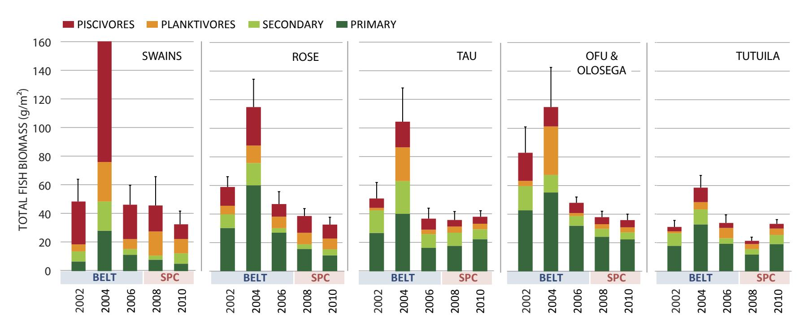

Figure 12. Trends in total reef-fish biomass from mid-depth, forereef REA sites surveyed in 2002–2010, ordered by island, from left to right, across an increasing human population gradient. Stacked bars show biomass per trophic group based on fish diet. Primary consumers include fishes that eat algae and detritus; secondary consumers include fishes with a wide variety in diet (omnivores) and fishes that eat invertebrates (following Williams et al. 2011). Surveys in 2002–2006 were conducted by the belt-transect method and in 2008–2010 by the SPC method. Error bars indicate standard error (± 1 SE) of the mean. Column for Swains in 2004 is truncated; mean total biomass in that year was 232.8 ± 127.2 SE g/m².

overall trend at that island across 2002–2010. As noted in the "Methods" section, although CRED changed its core REA fish-survey method in 2008, a comparison of data gathered using both methods (belt transect and SPC) at the same sites by the same observers suggested that estimates of reef-fish biomass generally were very similar, but values were marginally higher from SPC surveys than from belt-transect surveys. Therefore, the change in survey method in 2008 is unlikely to be an important factor in any trends observed in total reef-fish biomass between 2002 and 2010.

In terms of the composition of reef-fish assemblages among islands estimated throughout all survey years, Swains had notably low biomass of primary consumers (i.e., fishes that eat algae and detritus), which accounted for only 12%–25% of total fish biomass at Swains compared to 34%–67% at all other islands (Fig. 13). Estimated parrotfish (Scaridae, herbivore) biomass was particularly low at Swains, averaging only 2% of total fish biomass across all years, compared to 11%–21% of total fish biomass observed for parrotfishes at other islands (Fig. 13). Swains and Rose had relatively high biomass of piscivores, which contributed an average of 50% (40% excluding barracuda, Sphyraenidae) and 25% of total fish biomass recorded at those islands, respectively. At all other islands, piscivores made up 12%–15% of estimated total fish biomass (Fig. 13). With the exception of parrotfishes, families generally composed of large-bodied fishes were only a relatively small portion of the reef-fish assemblage at Tutuila. Collectively, groupers (Serranidae), snappers (Lutjanidae), jacks (Carangidae), and emperors (Lethrinidae) constituted an average of 11% of total fish biomass observed across all survey years at Tutuila, compared to the 20%–35% recorded at other islands (Fig. 13). Because total fish biomass also tended to be lower at Tutuila than at the other islands, the scale of difference in absolute biomass of those families between Tutuila (4.3 g/m2 ± 1.3 SE) and other islands (11.3 ± 3.0 SE and 19.6 ± 2.8 SE at Ta`u and Swains) was even greater.

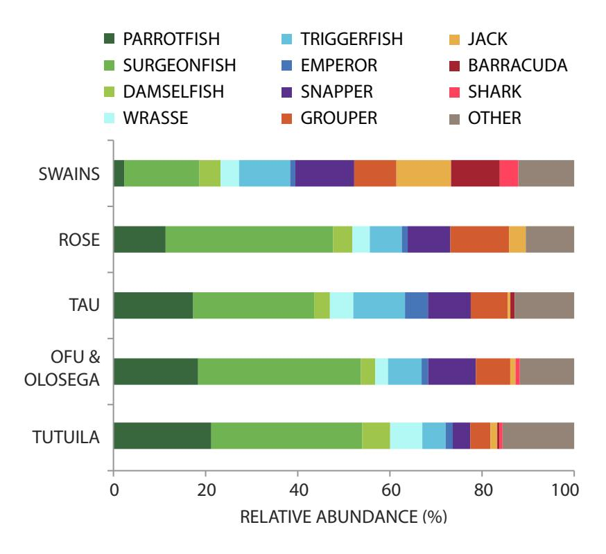

Figure 13. Contribution by family to total fish biomass averaged from all forereef REA sites surveyed in 2002–2010. Results are shown, from top to bottom, across an increasing human population gradient.

#### LARGE-FISH BIOMASS

Towed-diver surveys sample a much narrower range of fishes than do REA surveys; only fishes ≥ 50 cm total length are recorded. Towed-diver surveys allow divers to cover much larger areas in the course of each survey, thereby, increasing the frequency of encounters with large and rarer fishes. In the early years of ASRAMP (2002–2004), towed-diver surveys suggested that biomass of large fishes was much higher at Rose and Swains than at the other three islands surveyed, largely due to considerably higher biomass of snappers, jacks, and barracudas at the two outer islands (Fig. 14). However, between 2002 and 2010, estimated large-fish biomass declined significantly at Rose, from 10.7 g/m2 ± 3.6 SE to 1.6 g/ m2 ± 0.4 SE (*p* < 0.01, linear regression, n = 5), mostly from declines in the contribution of jacks, barracudas, and surgeonfishes (Acanthuridae; Fig. 14). As with the REA data from Swains, no clear trend was observed in biomass of large fishes there (*p* > 0.2, linear regression, n = 5). Large-fish biomass estimates were particularly low at Swains in 2008 but increased substantially in 2010 (Fig. 14). Schooling taxa are inherently highly variable in survey data because of the element of chance in whether large schools are encountered during survey dives. For example, the schooling barracuda made up a substantial portion of large-fish biomass at Swains in most survey years (and 52% in 2002). Also similar to the REA results, towed-diver observations suggested a slight upward trend in biomass at Ta`u (although it was nonsignificant, *p* = 0.24, linear regression, n = 5) and a tendency for large-fish biomass to decline at Ofu & Olosega over time (nonsignificant, *p* = 0.14, linear regression, n = 5). Estimated biomass of large fishes also declined around Tutuila (*p* = 0.02, linear regression, n = 5), from 3.8 g/m2 ± 1.2 SE in 2002 to 1.2 g/m2 ± 0.2 SE in 2010 (Fig. 14).

Although REA surveys changed in method and design in 2008, the towed-diver-survey method for fish observations has been applied consistently throughout ASRAMP survey years. The towed-diver and REA methods focus on different fish groups, have very different scales (a few 100 m2 per survey for REA and ~ 22,000 m2 per towed-diver survey), and are performed by different sets of observers. Despite these differences, data from both methods suggest that fish biomass dropped at Rose and, more generally, that the differences between some of the other islands and Tutuila clearly evident in 2002 and 2004 were much less apparent in later survey years.

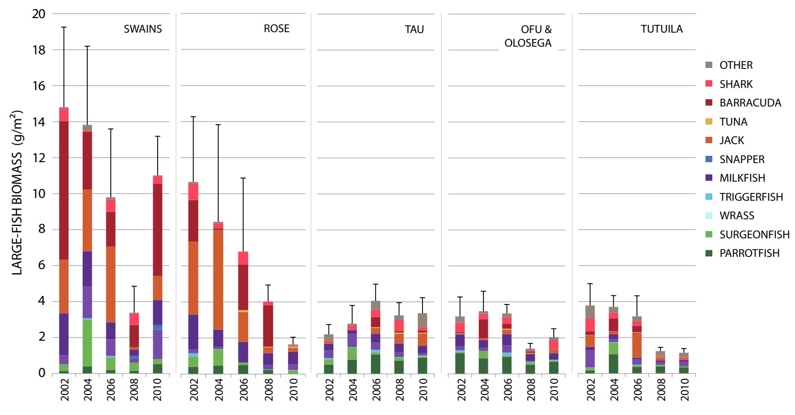

Figure 14. Mean islandwide biomass of large fishes (≥ 50 cm in total length) per survey year from towed-diver observations collected in 2002– 2010. Results are shown, from left to right, across an increasing human population gradient. Error bars indicate standard error (± 1 SE) of the mean.

# **INTEGRATING ECOSYSTEM COMPONENTS**

CRED is developing ways to integrate ecosystem components that generally describe the status of coral reefs. For American Samoa CRED has created three condition indices that use data collected between 2004 and 2010 from towed-diver and REA observations and benthic-image analyses. The overall *Coral Reef Condition Index* is composed of equally weighted benthic and fish indices (Fig. 15). The components of the *Benthic Condition Index* are live-hardcoral cover, coral-disease prevalence (negative impact), crustosecoralline-algal cover, and generic coral richness. The components of the *Fish Condition Index* are biomass of large predatory fish (piscivores; ≥ 50 cm in total length), biomass of all other large fishes, total fish biomass, fish generic richness, and weighted abundance of target and herbivorous fish. Because of the somewhat anomalous 2004 data in the REA surveys, the 2004 data for total fish biomass and abundance of target and herbivorous fish was substituted with 2002 data. All three indices were calculated across the region to allow comparisons among nine georegions (Fig. 16) based on apparent differences in predominant oceanographic conditions and biological communities. Where possible, depending on number of survey locations, georegions were consistent (i.e., shared common boundaries) with those identified in *A Biogeographic Assessment of the Samoan Archipelago* (Kendall and Poti 2011). Each condition index component was standardized to common means and distributions across all years and georegions, so that each component was neutrally weighted. The index values are color coded with the middle 50% of the values categorized as having a "medium" condition shown in orange, values higher as "high" shown in green, and values lower as "low" shown in red.

#### **CRUSTOSE-CORALLINE-ALGAL COVER (12.5%) CORAL GENERIC RICHNESS (12.5%) STRESSED-CORAL COVER (12.5%) CORAL COVER (12.5%) ABUNDANCE TARGET & HERBIVORES (10%) GENERIC RICHNESS (10%) CORAL REEF CONDITION INDEX (100%) LARGE PISCIVORE BIOMASS (10%) LARGE NON-PISCIVORE BIOMASS (10%) TOTAL FISH BIOMASS (10%) BENTHIC CONDITION INDEX (50%) FISH CONDITION INDEX (50%)**

Figure 15. Conceptual diagram of the calculation of the Benthic Condition Index, the Fish Condition Index, and the Coral Reef Condition Index. All metrics are based on data from benthic-image analyses and towed-diver and REA observations collected in American Samoa in 2004, 2006, 2008, and 2010.

# **CORAL REEF CONDITION INDEX**

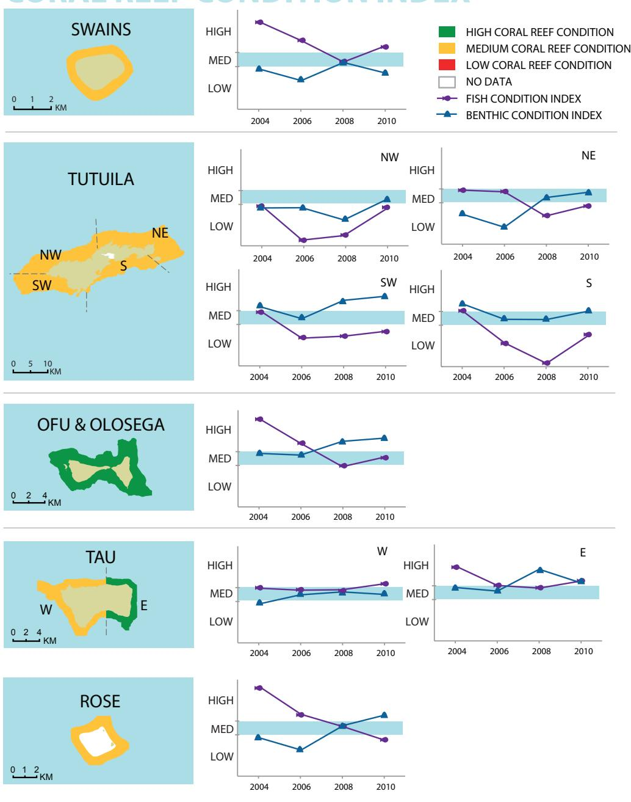

Figure 16. The Coral Reef Condition Index reflects the integrated ecosystem condition for each georegion, relative to other georegions in American Samoa. The color assigned to each georegion in the map represents the integrated condition of the coral reef ecosystem in the georegion in 2010 (green=high; yellow=medium; red=low). The trend lines, based on benthicimage analyses and towed-diver and REA observations collected in 2004–2010, show the general pattern of the Benthic and Fish Condition Index values for each georegion.

There was no clear overall trend in the Benthic Condition Index (Fig. 16). Index values for Ofu & Olosega, southwest Tutuila, and the east coast of Ta`u suggest superior benthic conditions resulting from high or increasing coral and crustose coralline algal cover, low coral-disease prevalence, and high coral generic richness. Surprisingly, the Benthic Condition Index value for Swains was one of the lowest overall in American Samoa. This low index value was largely a result of the very low coral generic richness at Swains that pulled down the Benthic Condition Index value. Another low Benthic Condition Index value was calculated for northwest Tutuila as a result of low coral cover and crustose coralline algal cover. Also in the Benthic Condition Index, values increased at Rose, largely because of reduced disease prevalence in later survey years, at northeast Tutuila because of increased coral cover and reduced disease prevalence, and at Ofu & Olosega because of increased coral cover and coral generic richness. Ofu & Olosega had the only statistically significant increasing trend line (*p* < 0.1, linear regression, n = 4) among the benthic trend lines.

The Fish Condition Index, calculated from towed-diver and REA observations, suggests a pattern of generally lower values around Tutuila compared to the other islands, particularly at south and northwest Tutuila. However, it is also notable that values in the Fish Condition Index increased at all four Tutuila georegions between 2008 and 2010 (Fig. 16). As with the Benthic Condition Index, values for the two georegions around Ta`u were fairly stable throughout the four survey years and tended to be slightly above average for the eastern part of Ta`u. Index values for the outermost islands of Rose and Swains show steeply decreasing trends in condition between 2004 and 2008 but recovery at Swains in 2010. These downward trends in index values at these locations reflect declines in estimates for total and large-fish biomass and in fish generic richness at both islands. Rose had the only statistically significantly decreasing trend line (*p* < 0.1, linear regression, n = 4).

The Coral Reef Condition Index represents a simplified approach to comparing the status of coral reef ecosystems in American Samoa, combining the Benthic and Fish Condition Indices. Figure 16 shows the Coral Reef Condition Index values calculated for each georegion in 2010 as high (green), medium (yellow), and low (red) compared to other georegions in American Samoa. The overall Coral Reef Condition Index reveals a general pattern of lower values at Tutuila in the first year of surveys, compared to the other islands, but those differences decline over time, largely as a result of converging values in the Fish Condition Index (Fig. 16). The Ofu & Olosega and Ta`u georegions had stable and above average values in the Coral Reef Condition Index, whereas the northwest and northeast Tutuila georegions mostly had below average values in the Coral Reef Condition Index.

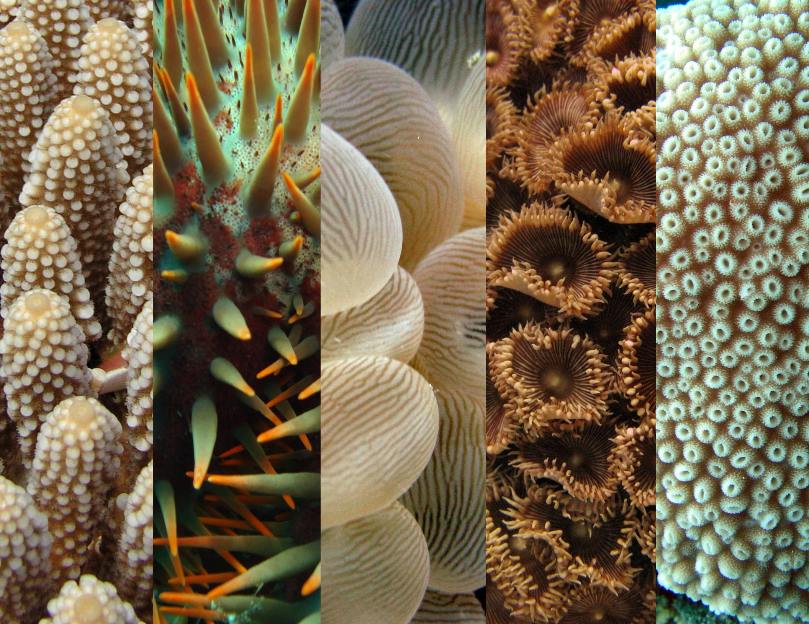

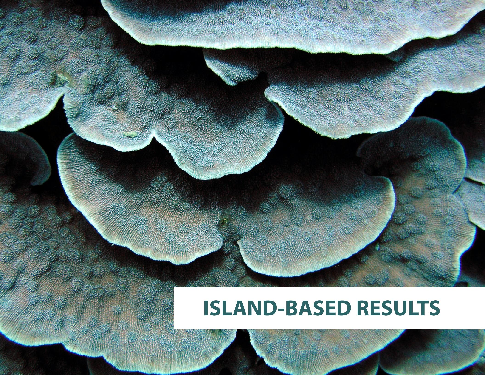

# **SWAINS ISLAND**

Using analyses of high-resolution images from towed-diver surveys conducted on benthic habitats at Swains Island in 2002–2010, this section examines the significant, reef-wide, ecological transitions that have occurred there.

Compared to other islands in American Samoa, Swains has very little reef area. This island covers ~ 3 km² and drops precipitously into the surrounding depths, limiting the space available for new recruitment of shallow-water benthic reef organisms. The benthos around Swains was characterized as relatively homogenous, exhibiting low species richness, and was often confined to distinctive regions of the reef. Reef areas were dominated by (1) hard corals, predominantly of the genus *Montipora* and to a lesser extent of the genera *Pocillopora* and *Porites*; (2) macroalgae, of genera such as *Microdictyon* and *Dictyosphaeria*; (3) crustose coralline algae; (4) unconsolidated pavement with small patches of rubble; or (5) the didemnid tunicate *Diplosoma similis* during select survey years.

Swains' small size, geographic isolation, and low species diversity has resulted in limited resiliency and protracted recovery periods of reef communities following external disturbances (e.g., storms, predation, diseases, invasive species; Yachi and Lorau 1999, Folke et al. 2004). Over the past decade, the reef ecosystems of Swains were severely impacted by several tropical cyclones, an outbreak of COTS, and an invasive tunicate outbreak. Through analyses of the photographic data collected during towed-diver surveys, several changes in the benthic community at Swains became evident.

Surveys conducted in 2002 revealed an ecosystem rich in hard corals, dominated by plating *Montipora* and branching *Pocillopora* corals. Mean coral cover was 49.6% (± 1.0 SE), far exceeding all other islandwide means recorded in American Samoa. Additionally, moderate levels of both macroalgal and crustose coralline algal cover were observed islandwide (Fig. 17). In January 2004, Cyclone Heta (Category 5) passed 330 km to the west of Swains. Although the extent of the precise damage caused by this storm is unknown, the substantial, islandwide reduction in observed coral cover and the sharp increase in cover of pavement or rubble between 2002 and 2004, opening vacant habitat for benthic recruitment (Fig. 17), are likely direct results of wave damage from this cyclone. Concurrently, an outbreak of COTS negatively affected sections of Swains' coral communities. Coral predation by COTS was especially high along the southern coast, which had experienced less storm-generated damage than other regions. In 2004, COTS density was 0.27 organisms/100 m² along the southern tip of Swains, suggesting an outbreak (defined as ≥ 0.15 organisms/100 m²; Moran and De'ath 1992). Densities from surveys around the rest of Swains were < 0.06 organisms/100 m².

**35** Opposite: *Echinopora* found around Tutuila. *NOAA photo by J. Kenyon*

In February of 2005, Cyclone Olaf (Category 5) passed 170 km south of Swains and Cyclone Percy (Category 3/4) passed 70 km to the north just two weeks after Olaf. Substrate availability likely increased in the aftermath of these 2005 storms. Subsequently, a dramatic change was observed in the abundance of a naturally occurring didemnid tunicate, *Diplosoma similis*. Tunicate cover notably increased between 2004 and 2006, starting along the northwestern forereefs and slowly expanding in all directions but predominantly eastward. Macroalgae appeared to have recovered from the storm damage with cover values in 2006 similar to values observed in

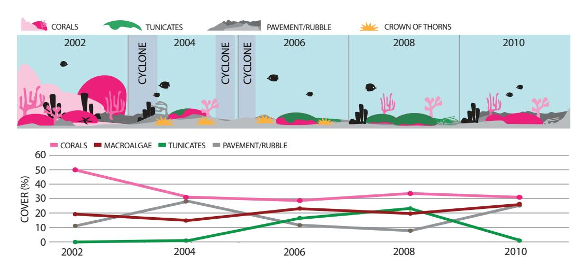

Figure 17. Benthic community composition at Swains from 2002 to 2010 based on estimates of cover (%) from benthic-image analyses of photos taken during towed-diver surveys.

2002; however, corals were still preyed upon by COTS. Survey results in 2006 suggested that COTS had spread northward along the southwestern and to the southeastern shorelines with densities between 0.11 and 0.13 organisms/100 m², just below outbreak thresholds.

By February 2008, COTS densities had declined (0.0–0.08 organisms/100 m²) but were still highest along the southern coast of this island. The tunicate population, however, had become invasive, dramatically overgrowing pavement and rubble, corals, macroalgae (*Microdictyon*), and crustose coralline algae (Figs. 17, 18). Tunicate infestation was recorded at more than half of the REA sites surveyed in 2008.

Interestingly, by March 2010, tunicate cover had reduced to levels comparable to 2004 estimates. Despite this reduction in tunicate cover, large areas of once-live corals and crustose coralline algae that had been overgrown by tunicates were now characterized as unconsolidated pavement and rubble (Fig. 17), underscoring the severe effects of this invasion on the benthic community at Swains.

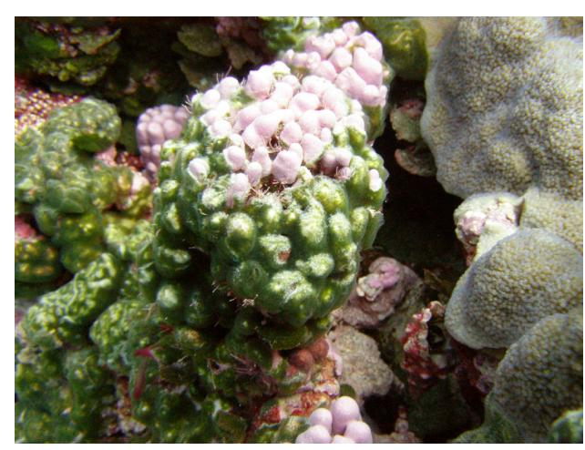

Figure 18. Tunicate, *Diplosoma similis,* overgrowing corals at Swains in 2008. *NOAA photo by B. Vargas-Angel*

The temporal comparison of benthic data from the past five ASRAMP survey years captured a striking and dynamic series of changes in the benthic environments at Swains. CRED plans to regularly return to this island to document how the ecosystem at Swains continues to change.

#### **TUTUILA ISLAND**

In 2010, CRED greatly increased sampling effort around Tutuila Island as part of an effort to generate a more comprehensive reef-fish data set. As a result, 127 REA sites, selected using a stratified random sampling design, were surveyed around Tutuila (compared to 14–44 in previous survey years) for fish and photographs were taken for analyses of benthic composition. This survey effort is one of the most intensive that CRED has implemented around a single island, and the data can be used to improve trend analyses of the coral reef communities of Tutuila. This section presents only the fish observations collected and image analyses of benthic photos taken during SPC surveys around Tutuila in 2010.

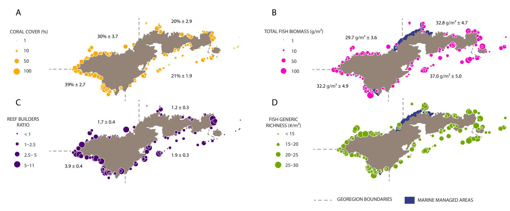

Figure 19. From SPC surveys conducted at stratified random REA sites at depths of 0-30 m around Tutuila in 2010, four metrics have been calculated: (A) coral cover (%) and (B) reef builders ratio (reef accretors to non-accretors) from benthic-image analyses and (C) total fish biomass and (D) fish generic richness from observations. Values are indicated by the size of the circle with references given in the legends.

Coral cover ranged from ~ 1% to 70% among sites surveyed, with a tendency for coral cover to be higher on the western side of Tutuila than on the eastern side (Fig. 19A) The mean values of coral cover in the northwest and southwest georegions were significantly higher than those recorded in the northeast and south georegions (*p* < 0.01, ANOVA, F (3, 122) = 10.8; Fig. 19B). The reef builders ratio (Fig. 18) gives an indication of the balance between the benthic components that contribute to reef accretion (corals and crustose coralline algae) compared to the benthic components that do not (turf algae and macroalgae; Houk et al. 2010). Results from 2010 surveys suggest that the greatest dominance of reef builders was in the southwest georegion relative to the rest of the georegions around Tutuila (*p* < 0.01, Kruskal wallis chi-squared (3) = 36.4; Fig. 18).

Among REA sites at Tutuila, total fish biomass ranged from a minimum of 3.5 g/m2 to a maximum of 150.6 g/m2 (Fig. 19C). The south georegion had the highest mean biomass, compared to the other georegions, but differences were not statistically significant . Values of fish generic

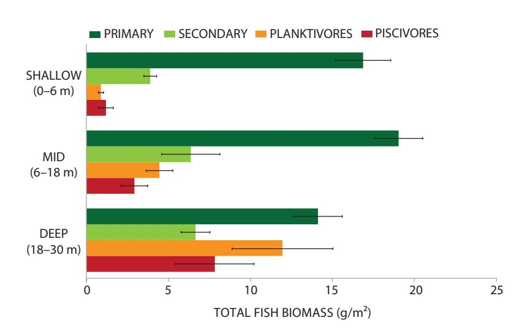

Figure 20. Mean biomass of trophic groups across depth zones from SPC surveys conducted at stratified random REA sites around Tutuila in 2010. Primary consumers include fishes that eat algae and detritus; and secondary consumers include fishes with a wide variety in diet and fishes that eat invertebrates (following Williams et al. 2011).

richness ranged from a minimum of 9 genera per site to a maximum of 31. As with total fish biomass, there were no clear differences in mean generic richness among georegions (Fig. 19D). Islandwide, mean generic richness was 19.8 ± 0.4 SE genera per site, and the areas of extreme low and high generic richness were approximately equally distributed among georegions.

With regard to the trophic composition of the fish assemblage in American Samoa, primary consumers (largely surgeonfishes and parrotfishes) were the dominant consumer group at all depth zones (Fig. 20); piscivore and planktivore biomass increased with depth (*p* < 0.1, ANOVA, F(6, 496) = 7.4), a pattern that was also evident in the biomass of secondary consumers (i.e., omnivores and invertivores).

#### MESOPHOTIC CORALS AROUND TUTILA

The submerged shelf around Tutuila covers an area of 358 km2 , but 86% of that shelf is at depths below 30 m. Since preliminary evidence suggested that coral reefs are present on elevated banks and other areas of hard substrate below 30 m, optical surveys were conducted to examine coral reef resources at mesophotic depths (30–150 m). Eighty-nine surveys using the towed optical assessment device (TOAD) recorded video footage and obtained still images across the banktop and slopes surrounding this island. These data reveal the presence of dense and flourishing coral reefs in some areas, particularly on mid-shelf patch reefs and on banks around the periphery of the shelf (Fig. 21). Coral cover was highest at depths of 30–40 m (mean 16.7% ± 26.9 SD) and declined with increasing depth, although corals were observed as deep as 102 m. Changes in morphology were seen across the depth ranges surveyed. Encrusting and massive corals were the dominant morphologies at depths of 30–40 m, whereas plate-like corals, possibly of the genera *Monitpora*, *Pachyseris*, and *Leptoseris*, prevailed at depths of 40–90 m. Platelike morphologies are known to adapt to obtain maximum light in the low-light conditions of mesophotic depths. Knowledge of the density and location of existing mesophotic coral reefs provides resource managers with some of the scientific data that informs their management decision-making.

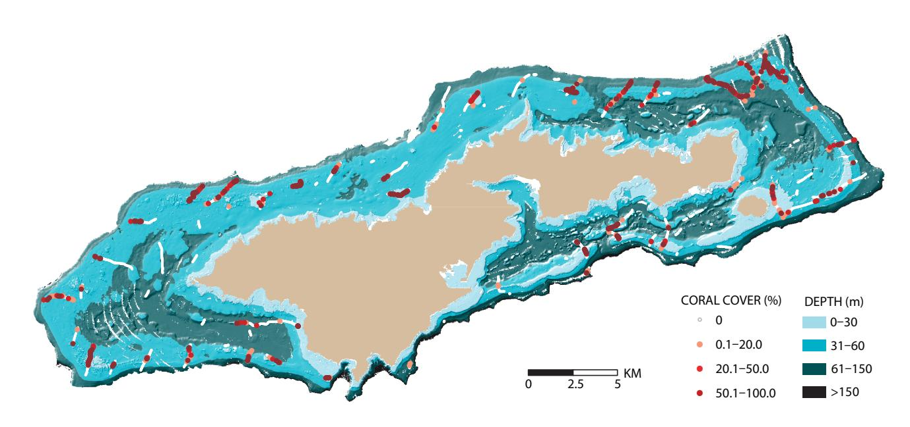

Figure 21. Bathymetric and optical data collected by CRED between 2002 and 2008. Video footage was collected using the TOAD, and images were analyzed every 30 s to determine cover (%) of scleractinian corals. Map shows interpolated coral cover within a 200-m buffer around analyzed points.

#### MARINE DEBRIS

On September 29, 2009, a tsunami was caused by an 8.1-magnitude earthquake centered 317 km southwest of Pago Pago and struck the island of Tutuila, resulting in extensive flooding, infrastructure damage, and 32 fatalities. Concerned about tsunami-related damage to coral reefs, Governor Togiola Tulafono requested assistance with marine debris removal and long-term recovery efforts. In response to this request, NOAA personnel, incuding CRED staff, traveled to American Samoa in November to conduct a strategic assessment of tsunami-generated marine debris in the nearshore locations that were identified by partners in American Samoa as "high-priority areas" and to remove marine debris as time, conditions, and debris size permitted.

During this operation, 56 km or 32% of Tutuila's coastline was surveyed and ~ 4025 kg of debris was removed (Fig. 22). The majority of debris was concentrated in areas with highrugosity or spur-and-groove benthic habitats on reef slopes immediately adjacent to villages. Numerous types of debris were removed, including 1980 kg of tires and 910 kg of roofing material and housing goods. Retrieved fabrics, although low in weight (160 kg), covered large surface areas and entangled reef structures. In addition, a local marine debris removal effort, led by Alice Lawrence of American Samoa's Department of Marine and Wildlife Resources (DMWR), removed debris from reef flats at Tutuila, including large amounts of cloth caught on corals at Fagasa (D. Fenner, DMWR, pers. comm. Oct. 11, 2011). The DMWR successfully applied for and received a grant under the NOAA-NMFS-HCPO-2011 Community-based Marine Debris Removal Program and plans to remove the remaining debris in 2011–2012 (A. Lawrence, DMWR, pers. comm., Oct. 17, 2011). The success of the NOAA operation could not have been accomplished without funds from the NOAA Marine Debris Program, Coral Reef Conservation Program, CRED, and Office of National Marine Sanctuaries.

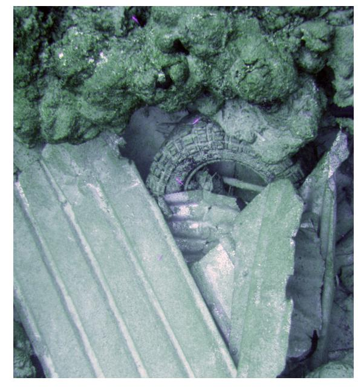

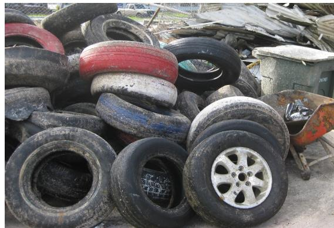

Figure 22. Marine debris at Tutuila after the 2009 tsunami: (*top*) roof material and tires on corals and (*bottom*) some of the removed debris. *NOAA photos by K. McElwee*

# **ROSE ATOLL**

Rose Atoll has been under protected status for nearly 40 years. It first received this status in 1973 when the Rose Atoll National Wildlife Refuge was established, and a presidential proclamation in 1975 extended the seaward boundary to 3 nautical miles (nm). In 2008, Governor Tulafono joined CRED scientists aboard the NOAA Ship *Hi`ialakai* during an ASRAMP research cruise to Rose. He pressed for stronger protection of this unique area, and on January 6, 2009, the Rose Atoll Marine National Monument was established under Presidential Proclamation 8337. This designation extends the seaward boundaries to 50 nm and prohibits commercial fishing.

In October 1993, the Taiwanese longline vessel *Jin Shiang Fa* ran aground on the southwestern forereef of Rose. The vessel released more than 100,000 gallons of diesel fuel, oil, and other contaminants into the water. In addition, more than 200 tons of metallic debris were scattered over 3500 m2 of reef slope as the ship broke apart. A portion of this wreck was removed later that year, and the cleanup of associated vessel debris was completed in 2007 (USFWS 2011). Monitoring of the impacts of the grounding and subsequent spill first began in 1995 by American Samoa's DMWR (Green 1997). In 2002, CRED began biennial monitoring efforts at Rose as part of ASRAMP.

After the grounding and subsequent fuel spill, a cyanobacteria (blue-green algae) bloom was initially observed at the grounding site and along the southwestern forereef by the DMWR in 1995 (Green 1996). The U.S. Fish and Wildlife Service has suggested that the iron leaching from the

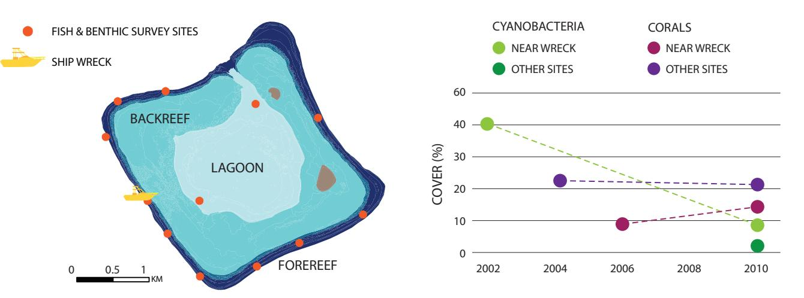

Figure 23. Rose Atoll (left) with the location on the wreck site and the long-term monitoring sites and (right) temporal change in cover of corals and cyanobacteria at the wreck site compared to the mean of the other forereef sites (in the dark blue area of the map).

corroding metallic debris probably was responsible for stimulating and maintaining the elevated level of benthic turf algae and cyanobacteria at the grounding site (USFWS 2011). Cyanobacteria cover at the wreck site has varied over the last 10 years (Fig. 23). In 2002, towed-diver surveys recorded cyanobacteria cover of ~ 40% at this site (Schroeder 2008). During CRED's most recent ASRAMP cruise in 2010, REA surveys documented cyanobacteria cover of 8.8% at the grounding site, a level that is still substantially higher than the mean of 1.4% observed at other forereef REA sites at Rose.

Other observations at the grounding site included reduced diversity and cover of scleractinian corals as well as an increased presence of herbivorous fish in the survey years of 2002–2006 compared to results from other REA sites surveyed around Rose. Coral diversity at the wreck site was ~ 9 genera from 2004 to 2010 compared to a mean generic richness of 13 genera per site at other sites during the same time period. Coral cover at the grounding site appeared to slightly increase from 9.8% in 2006 to 13.2% in 2010 but was still lower than the islandwide mean cover of 22.9% for forereef sites. The occurrence of increased herbivorous fish biomass at the wreck site, as documented in 2002–2006, was not observed during surveys in 2008 (the REA fish survey design was modified in 2010 and yielded no site-specific data for the wreck site at Rose). Estimated biomass values for surgeonfishes at the grounding site varied between 138.4g/m2 in 2002 and 366.6 g/m2 in 2006, compared to means of 24.6 g/m2 and 18.2 g/m2 , respectively for those same years, at the other forereef REA sites. In 2008, estimated fish biomass at the wreck site (23.5 g/m2 ) was similar to other forereef REA sites (mean of 13.4 g/m2 , with the maximum at another site of 39.1 g/m2 ). Similarly, biomass for parrotfishes varied between 29.6 g/m2 in 2002 and 133.0 gm2 in 2006, compared to averages of 4.4 g/m2 and 9.5 g/m2 , respectively, at the other forereef REA sites around Rose. In 2008, biomass values for parrotfishes also were similar between the wreck site (1.9 g/m2 ) and the average of all other forereef sites (3.7 g/m2 ).

#### LISTENING TO THE REEFS AT ROSE ATOLL

An ecological acoustic recorder (EAR) is a nonintrusive instrument that can be anchored to the seafloor to record ambient sound. EARs record on a programmable schedule and also can respond to "loud" acoustic events, such as passing vessels or whale song. These instruments provide important information about overall vessel activity and potential illegal activities, such as fishing in marine protected areas. An EAR was deployed in March 2008 on the northeast side of the channel at the Rose Atoll Marine National Monument. This unit recorded data from March 14, 2008, to July 16, 2009. During those 17 months, the EAR at Rose recorded 20 vessel events in the vicinity of the monitoring site. Four of those events corresponded to *Hi`ialakai* operations for ASRAMP in March 2008. The greatest vessel activity was observed during August 2008, with all vessel events occurring between 6 a.m. and 6 p.m. local time. Vessels transiting at a slower speed are quieter and, therefore, will not trigger the EAR; however, an in-depth review of data found low-noise vessel activity during scheduled recording intervals.

Acoustic recordings were also analyzed for humpback whale (*Megaptera novaeangliae*) song. Humpback whales wintering in American Samoan waters belong to the endangered Oceania subpopulation, and their occurrence patterns remain poorly understood. Humpback song is a reliable indicator of whale presence and has been used in the Northwestern Hawaiian Islands to investigate seasonal occurrence and provide evidence for wintering grounds (Lammers et al. 2011). The earliest song of the season detected at Rose Atoll occurred on June 18, 2008, and the latest song was detected on November 12, 2008. Song was episodic throughout the season, suggesting that whales were traveling in and out of recording range, and peak song occurrence was between late September and early October. Continued acoustic monitoring of humpback whales at Rose would provide information on relative abundance over time compared to other islands in American Samoa.

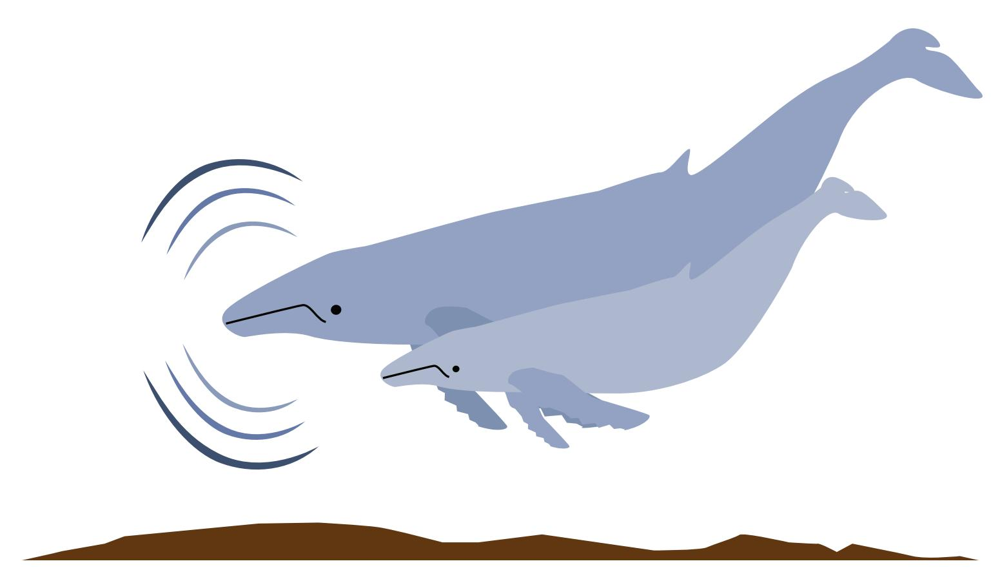

# **REFERENCES**

- Becker JJ, Sandwell DT, Smith WHF, Braud J, Binder B, Depner J, Fabre D, Factor J, Ingalls S, Kim S-H, Ladner R, Marks K, Nelson S, Pharaoh A, Sharman G, Trimmer R, vonRosenburg J, Wallace G, and Weatherall P. 2009. Global bathymetry and elevation data at 30 arc seconds resolution: SRTM30\_PLUS. Mar Geod 32(4):355-371.
- Birkeland CE, Randall RH, Wass RC, Smith B, Wilkins S. 1987. Biological resource assessment of the Fagatele Bay National Marine Sanctuary. NOAA Technical Memorandum #3.
- Brainard R, Asher J, Gove J, Helyer J, Kenyon J, Mancini F, Miller J, Myhre S, Nadon M, Rooney J, Schroeder R, Smith E, Vargas-Ángel B, Vogt S, Vroom P, Balwani S, Ferguson S, Hoeke R, Lammers M, Lundblad E, Maragos J, Moffit R, Timmers M, Vetter O. 2008. Coral reef ecosystem monitoring report for American Samoa: 2002-2006. NOAA Fisheries Pacific Islands Fisheries Science Center, PIFSC Special Publication, SP-08-002. 472 pp. + App.
- Bruno JE, Selig ER, Casey KS, Page CA, Willis BL, Harwell CD, Sweatman H, Melendy AM. 2007. Thermal stress and coral cover as drivers of coral disease outbreaks. PLoS Biol 5(6):e124.
- CRTF 2000. National Action Plan to Conserve Coral Reefs. U.S. Coral Reef Task Force, Washington, D.C. Online at http://coralreef.gov/about/ CRTFAxnPlan9.pdf. Accessed on May 3, 2011.
- DiDonato E, Birkeland C, and Fenner D. 2005. A preliminary list of coral species of the National Park of American Samoa*.* Cooperative Ecosystem Study Unit Technical Report. 155. Department of Botany, University of Hawaii, Honolulu.
- Folke C, Carpenter S, Walker B, Scheffer M, Elmqvist T, Gunderson L, Holling CS. 2004. Regime shifts, resilience, and biodiversity in ecosystem management. Ann Rev Ecol Evol Syst 35:557-581.
- Green AL. 1996. Status of the coral reefs of the Samoan Archipelago. Dept. of Marine and Wildlife Resources. Biologist Report Series. Pago Pago, American Samoa. 125 pp.
- Green AL, Burgett J, Molina M, Palawski D, Gabrielson P. 1997. The impact of a ship grounding and associated fuel spoil at Rose Atoll National Wildlife Refuge, American Samoa. U.S. Fish and Wildlife Service Report, Honolulu, Hawaii. 60 pp.
- Green AL, Birkeland CE, Randall RH. 1999. Twenty years of disturbances and change in Fagatele Bay National Marine Sanctuary, American Samoa. Pacific Science 53:376-400.
- Harvell CD, Altizer S, Cattadori IM, Harrington L, Weil E. 2009. Climate change and wildlife diseases: when does host matter the most? Ecology 90:912–92.
- Kendall, MS and Poti M (eds.), 2011. A biogeographic assessment of the Samoan Archipelago. NOAA Technical Memorandum NOS NCCOS 132. Silver Spring, MD. 229 pp.

- Kenyon JC, Brainard RE, Hoeke RK, Parrish FA, Wilkinson CB. 2006. Towed-diver surveys, a method for mesoscale spatial assessment of benthic reef habitat: a case study at Midway Atoll in the Hawaiian Archipelago. Coast Manage 34:339-349.
- Konter JG, Hanan BB, Blichert-Toft J, Koppers AAP, Plank T, Staudigel H. 2008. One hundred million years of mantle geochemical history suggest the retiring of mantle plumes is premature. Earth Planet Sci Lett 275:285-295.
- Lammers MO, Fisher-Pool PI, Au WWL, Meyer CG, Wong KB, Brainard RE. 2011. Humpback whale *Megaptera novaeangliae* song reveals wintering activity in the Northwestern Hawaiian Islands. Mar Ecol Prog Ser 423:261-268.
- MacArthur RH, Wilson EO. 1967. The theory of island biogeography. Princeton University Press, Princeton, NJ.
- Maynard JA, Anthony KRN, HarvellCD, Burgman MA, BeedenR, Sweatman H, Heron SF, LambJB, Willis BL. 2011. Predicting outbreaks of a climatedriven coral disease in the Great Barrier Reef. Coral Reefs 30:485-495.
- Moran PJ, De'ath G. 1992. Estimates of the abundance of the crown-of-thorns seastar *Acanthaster planci* in outbreaking and non-outbreaking populations on reefs within the Great Barrier Reef. Mar Biol 113:509-515.
- Nadon MO, Baum JK, Williams ID, McPherson JM, Zgliczynski BJ, Richards BL, Schroeder RE, Brainard RE. Forthcoming. Modeling anthropogenic and environmental influences on Pacific reef sharks to recreate missing population baselines. Conserv Biol.
- Neall VE, Trewick SA. 2008. The age and origin of the Pacific islands: a geological overview. Biol Sci 363:3293–3308.
- NOAA. 2002. A National Coral Reef Action Strategy, Report to Congress on Implementation of the Coral Reef Conservation Act of 2000 and the National Action Plan to Conserve Coral Reefs in 2002-2003, produced by NOAA, U.S. Department of Commerce, in cooperation with the U.S. Coral Reef Task Force, Silver Spring, MD. 122 p.
- Preskitt LB, Vroom PS, Smith CM. 2004. A Rapid Ecological Assessment (REA) quantitative survey method for benthic algae using photo quadrats with SCUBA. Pac Sci 58:201-209.
- Richards BL, Williams ID, Nadon MO, Zgliczynski BJ. 2011. A towed-diver survey method for mesoscale fishery-independent assessment of largebodies reef fishes. Bull Mar Sci 87:55-74.
- Sala E, Knowlton N. 2006. Global marine biodiversity trends. Annu Rev Environ and Resour 31: 93–122.
- Schroeder RE, Green AL, DeMartini EE, Kenyon JC. 2008. Long-term effects of a ship-grounding on coral reef fish assemblages at Rose Atoll, American Samoa. Bull Mar Sci 82(3):345-364.
- Smith WHR, Sandwell DT. 1997. Global seafloor topography from satellite altimetry and ship depth soundings. Science 277:1957-1962.
- Thomas WJ. 1988. Fagatele Bay: A sanctuary in Samoa. Oceanus. 31(1):18-24.
- Tribollet AD, Schils T, Vroom PS. 2010. Spatial-temporal variability in macroalgal assemblages of American Samoa. Phycologia 49:574-591.
- Tribollet AD, Vroom PS. 2007. Temporal and spatial comparison of the relative abundance of macroalgae across the Mariana archipelago between 2003 and 2005. Phycologia. 46:187-197.

- U.S. Census Bureau. 2010. Census for American Samoa. Available at http://www.census.gov. Accessed on September 19, 2011.
- USFWS. 2011. Rose Atoll Marine National Monument. U.S. Fish and Wild and Wildlife Service, Washington, D.C. Available at http://www.fws.gov/ roseatollmarinemonument/RAMNMbrief.pdf. Accessed June 2011.
- Vargas-Ángel B. 2010. Crustose coralline algal diseases in the U.S.-Affiliated Pacific Islands. Coral Reefs. 29:943-956.
- Vargas-Ángel B, Vetter OJ, Coccagna EF, Looney EE, Helyer J. 2011. Severe, widespread El Niño-associated coral bleaching in the U.S. Phoenix Islands. Bull Mar Sci 87:623-638.
- Vargas-Ángel B, Godwin SL, Asher J, Brainard RE. 2009. Invasive colonial tunicate spreading across coral reefs at remote Swains Island, American Sāmoa, South Pacific. Coral Reefs 28:53.
- Vargas-Ángel B, Wheeler B. 2009. Coral health and disease assessment in the U.S. Pacific territories and affiliated states. In: Proc 11th Int Coral Reef Symp, Fort Lauderdale, FL, p. 175-179.
- Vroom PS. 2011. "Coral Dominance": a dangerous ecosystem misnomer? J Mar Biol 2011:164127.
- Vroom PS, Braun CL. 2010. What is the benthic composition of a healthy subtropical reef? Baseline species-level percent cover, with an emphasis on reef algae, in the Northwestern Hawaiian Islands. Plos One 5:e9733.
- Vroom PS, Musburger CA, Cooper SW, Maragos JE, Page-Albins KN, Timmers MAV. 2010. Marine biological community baselines in unimpacted tropical ecosystems: spatial and temporal analyses of reefs at Howland and Baker Islands. Biodiv Conserv 19:797–812.
- Vroom PS, Page KN, Kenyon JC, Brainard RE. 2006. Algae-dominated reefs. Am Sci 94:429-437.
- Williams ID, Richards BJ, Sandin SA, Baum JK, Schroeder RE, Nadon MO, Zgliczynski B, Craig P, McIlwain JL, Brainard RE. 2011. Differences in reef fish assemblages between populated and remote reefs spanning multiple archipelagos across the central and western Pacific. J Mar Biol 2011:826234.
- Yachi S, Loreau M. 1999. Biodiversity and ecosystem productivity in a fluctuating environment: the insurance hypothesis. P Natl Acad Sci U.S.A. 96:1463-146.

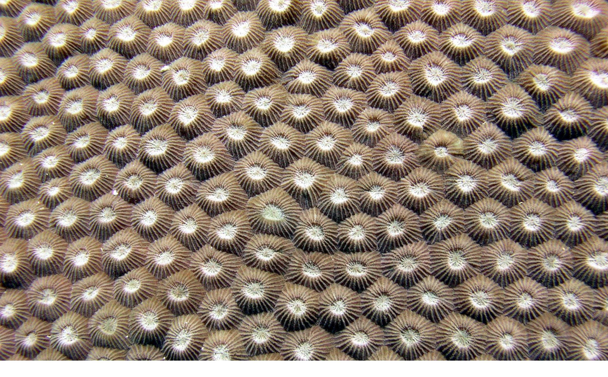

**PACIFIC ISLANDS FISHERIES SCIENCE CENTER**

 **CORAL REEF ECOSYSTEM DIVISION**