## **AGENCY PRIORITIES FOR MAPPING CORAL REEF ECOSYSTEMS IN AMERICAN SAMOA**

### **Authors**

Sarah D. Hile Jennifer Kraus Christine A. Buckel Bethany Williams Jacob Howell Francisco Pagan Erica K. Towle

NOAA Technical Memorandum NOS NCCOS 322

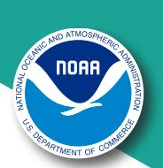

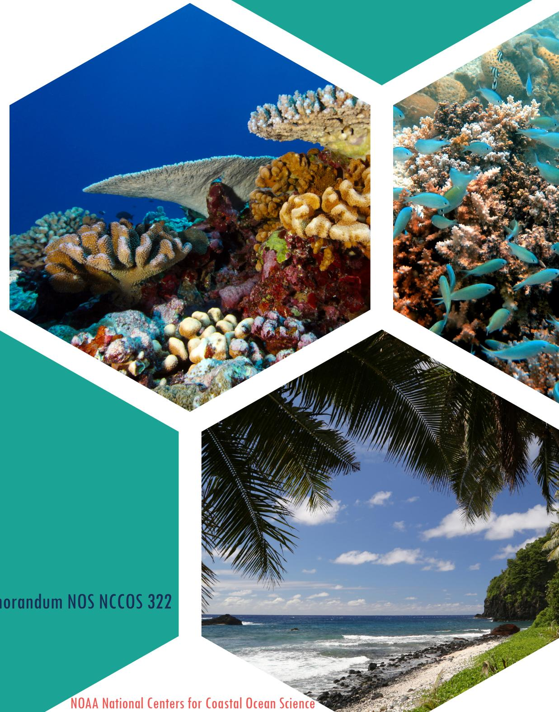

### SUGGESTED CITATION

Hile, S. D., Kraus, J., Buckel, C. A., Williams, B., Howell, J., Pagan, F., and Towle E. K. (2023). Agency Priorities for Mapping Coral Reef Ecosystems in American Samoa. NOAA Technical Memorandum NOS NCCOS 322. [https://doi.org/10.25923/](https://doi.org/10.25923/vdpb-5r44) [vdpb-5r44](https://doi.org/10.25923/vdpb-5r44) 

### ACKNOWLEDGMENTS

This research was funded by the National Oceanic and Atmospheric Administration (NOAA) Coral Reef Conservation Program (CRCP) project #31322. A special thanks to Jewel Tuiasosopo who provided early and essential guidance about participating agencies and coral reef managers as well as available seafloor mapping data. Ultimately, this study was made possible by the willingness of the participant groups and their individual participants who shared their time, expertise, and recommendations for coral reef mapping needs. We also thank David Whitall (NOAA/NCCOS) and Logan Kline (CSS Inc., NOAA/NCCOS) for their constructive review comments on a draft of this document. The covers, layout, and formatting were completed by Sarah Hile (CSS Inc., NOAA/NCCOS). Editorial content was improved by Ginger Shoup (CSS Inc., NOAA/ NCCOS). CSS, Inc. employees were supported under NOAA Call Order GDA8-701-MSE.

For more information on NOAA's National Centers for Coastal Ocean Science (NCCOS), please visit: [https://coastalscience.noaa.gov/](https://coastalscience.noaa.gov)

For more information on NOAA's Coral Reef Conservation Program (CRCP), please visit:<https://coralreef.noaa.gov/>

For more information on this project, please visit the project hub: <https://us-shallow-coral-reef-mapping-priorities-noaa.hub.arcgis.com/>

And the project webpage:

<https://coastalscience.noaa.gov/project/defining-future-seafloor-mapping-priorities-to-inform-shallow-coral-reef-management/>

Or direct questions and comments to: Sarah D. Hile, [sarah.hile@noaa.gov](mailto:sarah.hile@noaa.gov) or Jennifer Kraus, [jennifer.kraus@noaa.gov](mailto:jennifer.kraus@noaa.gov)

### PHOTOGRAPHY CREDITS

All images used in this report belong to NOAA or were obtained from copyright- and royalty-free sources, unless otherwise indicated. Credit for cover images are: Greg McFall, NOAA (corals); Kevin Lino, NOAA Fisheries Pacific Island Fisheries Science Center (fish); Greg McFall, NOAA (National Marine Sanctuary of American Samoa coastline).

### DISCLAIMER

The scientific results and conclusions, as well as any views or opinions expressed herein, are those of the author(s) and do not necessarily reflect those of NOS or the Department of Commerce.

## Agency Priorities for Mapping Coral Reef Ecosystems in American Samoa

### Prepared by

NOAA National Ocean Service National Centers for Coastal Ocean Science Marine Spatial Ecology Division Silver Spring, MD

### Authors

Sarah D. Hile1 Jennifer Kraus2 Christine A. Buckel3 Bethany Williams3 Jacob Howell1 Francisco Pagan4 Erica K. Towle5

## April 2024

### NOAA NOS NCCOS TECHNICAL MEMORANDUM 322

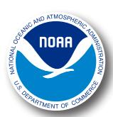

**United States Department of Commerce** 

Gina M. Raimondo Secretary

**National Oceanic and Atmospheric Administration** 

Richard W. Spinrad, Ph.D. Under Secretary of Commerce for Oceans and Atmosphere and NOAA Administrator

**National Ocean Service**  Nicole LeBoeuf Assistant Administrator

*CSS, Inc., under contract to NOAA, National Ocean Service, National Centers for Coastal Ocean Science* 

*NOAA, Office of Marine and Aviation Operations, Executive Affairs Division*

*NOAA, National Ocean Service, National Centers for Coastal Ocean Science* 

*NOAA, National Ocean Service, Coral Reef Conservation Program* 

*Lynker Technologies, LLC, under contract to NOAA, Coral Reef Conservation Program* 

## **Table of Contents**

| Executive Summary                                                                                           | . i |
|-------------------------------------------------------------------------------------------------------------|-----|
| Chapter 1 Background .                                                                                      | 1   |
| Chapter 2 Methods .                                                                                         | 2   |
| 2.1 Advisory Team and Participating Groups2 2.2 Develop Prioritization Framework and Online Application2 |     |
| 2.3 Priority Summaries and Spatial Analysis 6                                                            |     |
| 2.4 Project Timeline .                                                                                      | .7  |
| Chapter 3 Results .                                                                                         | 8   |
| 3.1 Most Common Management Uses 8 3.2 Most Common Map Product Requirements .                          | .9  |
| 3.3 Summary of Spatial Priorities 11                                                                     |     |
| 3.4 Gap Analysis and Focal Area: Pago Pago Harbor 16                                                     |     |
| Chapter 4 Conclusion                                                                                        | .18 |
| Chapter 5 Links to Data.                                                                                    | .20 |
| References.                                                                                                 | .21 |
| Appendices .                                                                                                | 23  |

### **List of Figures**

| Figure 1. The seven U.S. coral reef jurisdictions that were used in these prioritization efforts  1                                                                                                                                |
|------------------------------------------------------------------------------------------------------------------------------------------------------------------------------------------------------------------------------------------|
| Figure 2. The shallow coastal areas (0–40 m) of American Samoa prioritization project area including the islands of Tutuila, Ofu, Olosega, Ta'ū, and Swains Island, and Rose Atoll.  3                                          |
| Figure 3. The spatial framework and hexagonal grid (1 km per side with total area of 1 mi2 or 2.6 km2 ) used to identify benthic mapping priorities in the shallow coastal areas around the islands of American Samoa.  4 |
| Figure 4. The percentage of coins for each Management Use selected at the overall, primary, and secondary levels in American Samoa 8                                                                                                     |
| Figure 5. The percentage of coins for each Management Use selected per participant group at the primary and secondary levels in American Samoa 8                                                                                   |
| Figure 6. The percentage of coins for each Map Product Requirement selected at the overall, primary, and secondary levels in American Samoa 9                                                                                      |
| Figure 7. The percentage of coins for each Map Product Requirement selected per participant group at both the primary and secondary levels in American Samoa.  9                                                                |
| Figure 8. The percentage of coins for each Map Product Requirement spatial scale selected at the overall, primary, and secondary levels in American Samoa.  10                                                                  |
| Figure 9. Map of total coins in American Samoa.  11                                                                                                                                                                                |
| Figure 10. Number of groups who allocated at least one coin into each cell in American Samoa 12                                                                                                                                       |
| Figure 11. Number of Management Use options that were selected in each cell in American Samoa 13                                                                                                                                      |
| Figure 12. Number of Map Product Requirement options that were selected in each cell in American Samoa.  14                                                                                                                        |
| Figure 13. Summary rank based on total coins, number of participating groups, and diversity of Management Uses in each cell 15                                                                                                           |
| Figure 14. Overview of Pago Pago Harbor focal area in American Samoa identified using the highest summary rank  16                                                                                                                 |
| Figure 15. Highest-ranking cells in the Pago Pago Harbor focal area 16                                                                                                                                                                |
| Figures B.1–B.9. Maps of coins distributed for each Management Use in American Samoa 24–25                                                                                                                                               |
| Figures C.1–C.9. Maps of coins distributed for each Product Requirement in American Samoa 26–27                                                                                                                                       |
| List of Tables                                                                                                                                                                                                                           |
| Table 1. List of groups who provided their coral reef mapping priorities and whose input is reflected in this report  2                                                                                                            |
| Table 2. List of Management Uses that participants could select from when entering their mapping needs 6                                                                                                                                 |
| Table 3. List of Map Product Requirements and their associated recommendations for resolution, scale, and platform  6                                                                                                              |
| Table 4. Data summary of participant input for the Pago Pago Harbor focal area 17                                                                                                                                                     |
| Table A.1. American Samoa mapping inventory data table.  23                                                                                                                                                                        |

# **Executive** Summary

NOAA's Coral Reef Conservation Program (CRCP) utilizes benthic mapping data on coral reef ecosystems to support a diversity of science-based management decisions. To efficiently allocate limited mapping resources, CRCP recognized a need to identify priority locations based on emerging management requirements. Specifically, this effort focuses on coral reef areas up to 40 m deep surrounding the islands of American Samoa.

To meet this need, NOAA's National Centers for Coastal Ocean Science (NCCOS) developed a systematic, quantitative approach and online geographic information system (GIS) application to gather seafloor mapping priorities from researchers and coral reef managers. Participants placed virtual coins into a grid overlaid on the project area to express the location and importance of their mapping priorities. They also used pull-down menus to indicate specific mapping data needs and the rationale for their selections. Participants' inputs were compiled and analyzed to identify high-priority areas along with their justifications and data requirements.

Participants input their mapping priorities for American Samoa using an online tool from June to July, 2023. The most commonly selected Management Use options were *Coastal Vulnerability and Planning*, *Monitoring*, and *Spatial Protection and Management*. The top Map Product Requirement options revealed *Density of Macrobiota* and *Identification of Coral Species* as the two main desired data types.

To further explore participants' areas of interest and need, clusters of top-ranking cells, or focal areas, were identified. Focal areas were based on a summary rank that combined ranking by total number of coins, number of participating groups, and number of unique Management Uses. One focal area was identified in Pago Pago Harbor along the southeastern coast of Tutuila Island. This area was of interest for various reasons including the management of threats from climate change and coastal development. Existing bathymetry data and habitat maps may not meet the current needs in this region because they predate recent coastal developments and climaterelated impacts, lack full coverage of the area of interest, and/or do not meet the resolution requirements (1 m or less) needed to support monitoring activities.

This report and its accompanying online maps provide a critical spatial framework for understanding shallow coral reef mapping priorities and data needs in American Samoa. Results from this mapping prioritization effort are summarized in this report and are available with an inventory of existing mapping data at: [https://us-shallow-coral-reef-mapping-priorities-noaa.hub.arcgis.com/.](https://us-shallow-coral-reef-mapping-priorities-noaa.hub.arcgis.com/)

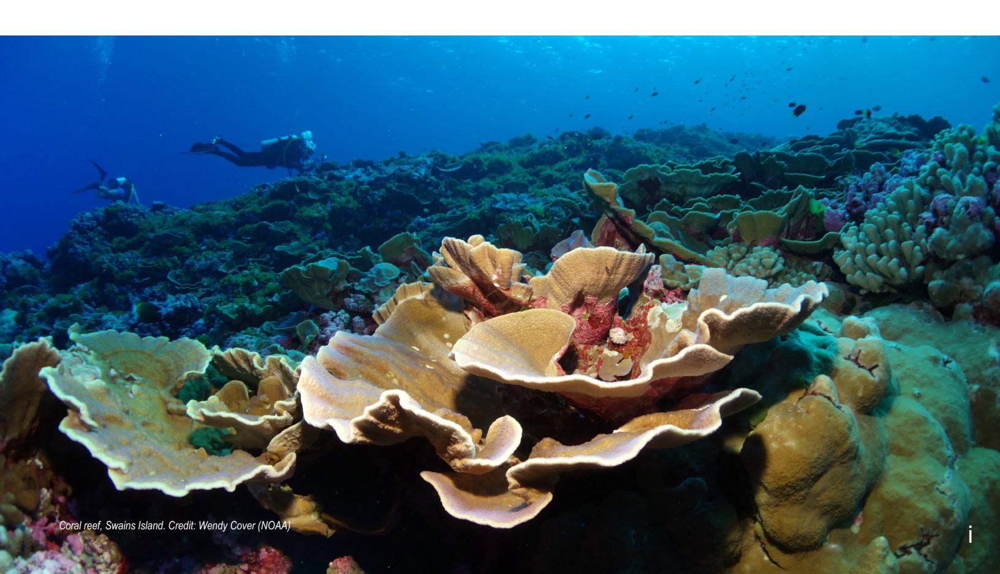

# **Chapter 1** Background

The health of U.S. coral reef ecosystems relies on the effective use of mapping data, science, tools, and strategies to inform management decisions. Information from local stakeholders and agencies on where and what kind of data are needed for effective coral reef management will help guide and prioritize future benthic mapping efforts. To meet this need, NOAA's Coral Reef Conservation Program (CRCP) requested information on mapping priorities for coral reef areas within 0- to 40-m depth in all seven of the U.S. coral reef management jurisdictions (Figure 1). During 2023, this activity was focused on shallow coral reef areas surrounding American Samoa. The territory of American Samoa consists of Tutuila (including Aunu'u), the Manu'a Islands (Ta'ū, Ofu, and Olosega), Swains Island, and Rose Atoll (Figure 2).

The prioritization results directly support the four thematic areas of CRCP's strategic plan, which are to: 1) increase resilience to climate change, 2) reduce land-based sources of pollution, 3) improve fisheries' sustainability, and 4) restore viable coral populations. Results will help CRCP, stakeholders, and participating groups pinpoint locations of mutual interest, leverage expertise and resources, and identify potential partnerships for future mapping efforts. *Corals and fish, Rose Atoll. Credit: Wendy Cover (NOAA)*

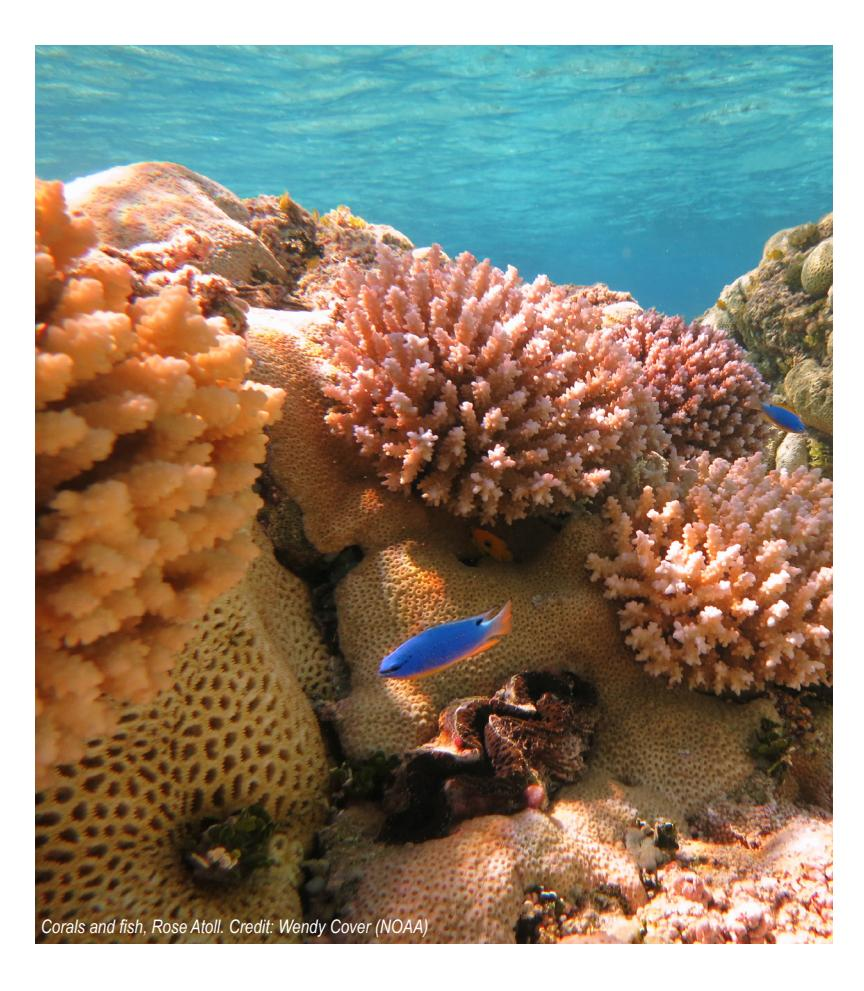

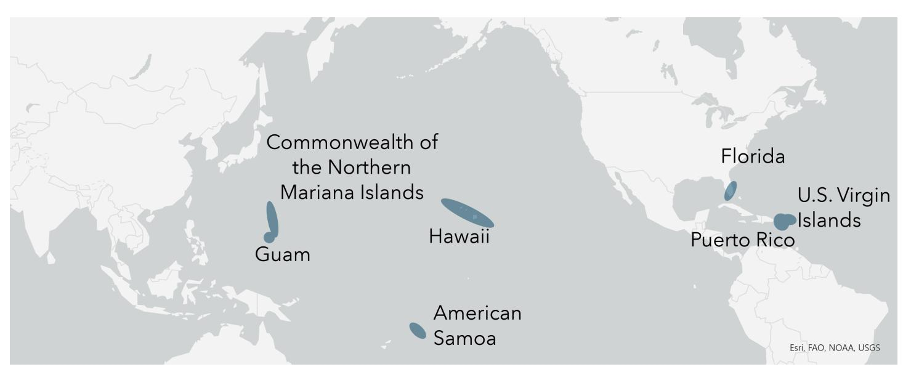

**Figure 1.** The seven U.S. coral reef jurisdictions that were used in these prioritization efforts.

# **Chapter 2** Methods

### **2.1 Advisory Team and Participating Groups**

A technical advisory team (TAT) was developed to help identify participating groups, points of contact, provide local knowledge, and coordination support. The TAT consisted of two representatives from CRCP and one liaison from the local NOAA office in American Samoa. The TAT members were selected based on their knowledge of local coral reef and fisheries management groups and their ability to provide key contacts and support coordination. With their assistance, a list of key contacts from state, federal, territorial, academic, and non-governmental organizations was created and approved by the TAT. This list of participant groups was composed of groups who use mapping data to inform coral reef management in American Samoa (Table 1). These groups included experts in areas of coral reef management, including reef mapping, conservation, fisheries, and habitat classification. Some participants were the sole respondent for their group, whereas others consulted with colleagues to input a collaborative mapping need.

## **2.2 Develop Prioritization Framework and Online Application**

### 2.2.1 Develop Framework

The American Samoa prioritization project area (Figure 2) extended around the islands of Tutuila (including Aunu'u), Ofu, Olosega, Ta'ū, Swains Island, and Rose Atoll, up to 40-m depth and was divided into hexagonal grid cells that were 1-km per side (2.6 km2 or 1 mi2 per cell; Figure 3). This cell size was chosen to give participants adequate spatial detail to indicate their priorities, while keeping the number of total cells to choose from manageable. The hexagonal grid shape was chosen to conform more easily to the 40-m depth contour and coastline.

**Table 1.** List of groups who provided their coral reef mapping priorities and whose input is reflected in this report. Invited groups included federal, state, academic, and non-governmental organizations.

| Participating Groups                                                | Acronym   | Type        |
|---------------------------------------------------------------------|-----------|-------------|
| American Samoa Department of Commerce, Resource Management Division | RMD       | Territorial |
| American Samoa Department of Port Administration                    | DPA       | Territorial |
| Environmental Protection Agency – American Samoa                    | EPA       | Federal     |
| Hawai'i Sea Grant (University of Hawai'i)                           | HSG       | Academic    |
| NOAA Fisheries Pacific Islands Fisheries Science Center             | PIFSC     | Federal     |
| NOAA Fisheries Pacific Islands Regional Office                      | PIRO      | Federal     |
| Old Dominion University                                             | ODU       | Academic    |
| University of Hawai'i – School of Life Sciences                     | UHI - SLS | Academic    |
| U.S. Fish and Wildlife Service                                      | USFWS     | Federal     |

*The following groups or agencies were contacted but declined to provide input: University of Guam – Marine Lab, Department of Marine and Wildlife Resources, American Samoa Community College, National Marine Sanctuary of American Samoa, National Park Service, and the Office of Samoan Affairs*

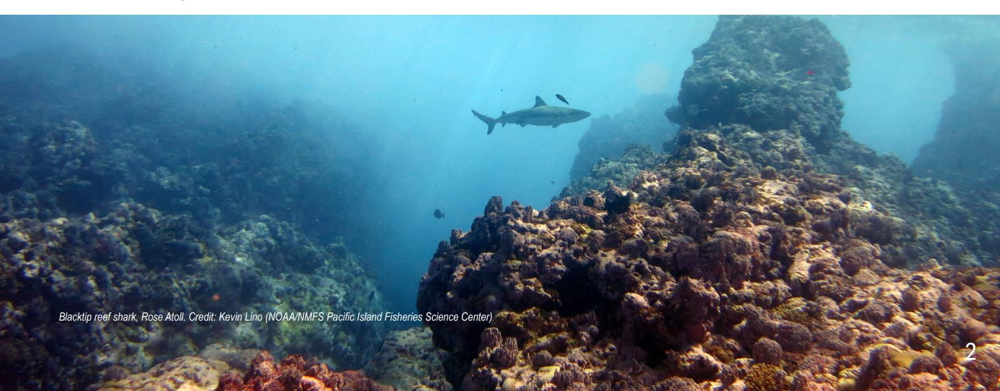

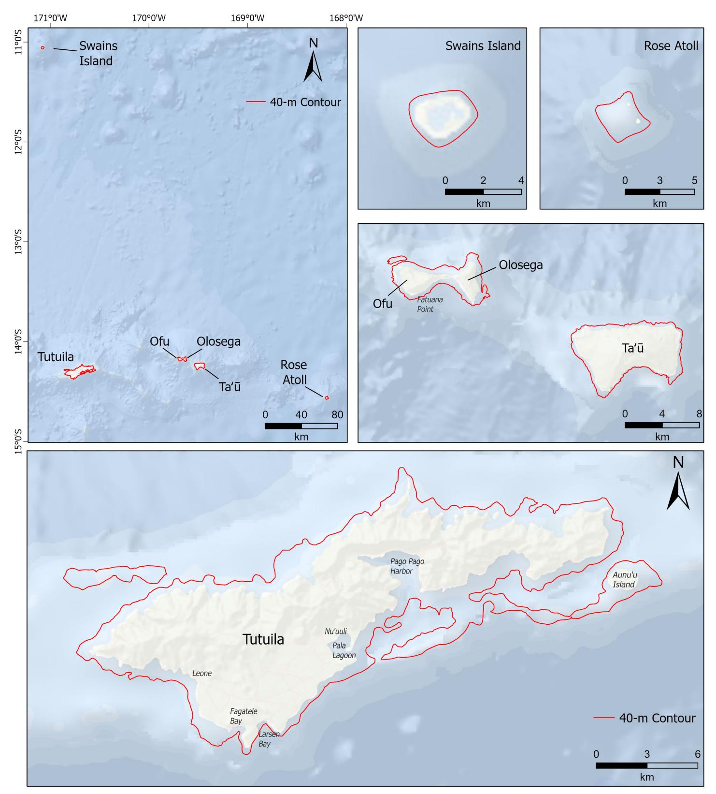

**Figure 2.** The shallow coastal areas (0–40 m) of the American Samoa prioritization project area that includes Tutuila, Ofu, Olosega, Ta'ū, and Swains Island, and Rose Atoll.

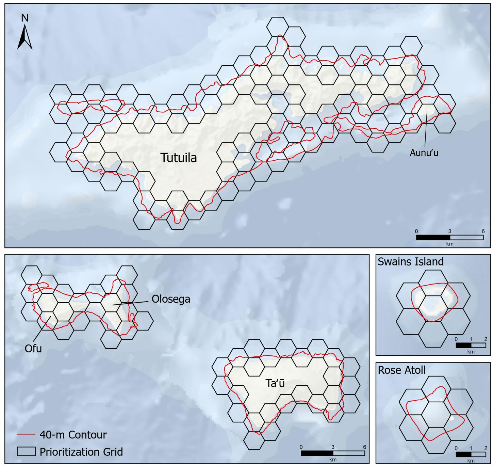

**Figure 3.** The spatial framework and hexagonal grid (1 km per side with total area of 1 mi2 or 2.6 km2 ) used to identify benthic mapping priorities in the shallow coastal areas around the islands of American Samoa.

### 2.2.2 Data Inventory

Existing data were compiled and provided to help participants understand the current extent of available information, locate data gaps, and identify areas to prioritize for future data collection. These data include various types of seafloor mapping data (e.g., multibeam sonar, lidar), political and administrative boundaries (e.g., federal/territorial waters, marine protected areas [MPAs]), and benthic habitat maps. These datasets and map services were published in an [online web map](https://noaa.maps.arcgis.com/home/item.html?id=35aab8e8ee274fcfa09952d363e107e0) for American Samoa, and served as the basemap for the spatial prioritization application. See Appendix A for a reference list of map services included in the inventory.

### 2.2.3 Spatial Prioritization Application

Participant data needs and priorities were collected using an online application containing the data inventory map and a customized spatial prioritization widget. The application was hosted on the NOAA GeoPlatform and was created using Esri's Web AppBuilder. The spatial prioritization widget is an online graphical user interface for participants to enter their priorities using a designated number of virtual coins and selecting from customized pull-down menus to record specific data needs. Development and use of the widget are detailed in Buja and Christensen (2019), and the tool has already been applied in a variety of regions including Florida (Kraus et al., 2022a), the U.S. Caribbean (Kraus et al., 2020, 2022b), the Main Hawaiian Islands (Kraus et al., 2023), Guam and the Commonwealth of the Northern Mariana Islands (Hile et al., 2024), Thunder Bay National Marine Sanctuary (Kendall et al., 2020), the U.S. West Coast (Costa et al., 2019), and the Southeast U.S. (Buckel et al., 2021). This approach allowed participants to assign, edit, and move their coin placement as often as they liked until the deadline. Each participant had password-protected access only to their grid and coins, which prevented accidental overwrite or deletion by other participants.

Each participating group was given a separate set of virtual coins (n=50), calculated as 30% of the total number of grid cells, to place in the prioritization grid to indicate the locations and importance of their mapping needs. The application also did not allow more than 10% (n=5) of the total number of coins to be input into a single grid cell. Coin restrictions were designed to ensure that participants' needs were comparable (i.e., everyone "spent" the same number of coins), encourage a broad distribution of priorities, and increase the chance of overlap among participant needs.

The number of coins assigned to a cell served as a proxy to estimate how urgently data were needed in that cell. For example, if a participant placed the max number coins into a single cell, it indicates an immediate need for spatial data at that location.

### 2.2.4 Management Use and Map Product Requirements

In addition to selecting and allocating coins to convey their spatial priorities, participants were asked to identify why these areas were of interest to them and their agency or group. Participants chose from a list of nine predefined Management Uses (Table 2), which were based on the coral management focus of the project. This selection indicated how participants planned to use the data to inform coral reef management. They could select up to two (primary and secondary) options for each cell selected to input coins, using the dropdown menus in the prioritization widget.

For each selected area, participants were also asked to describe specific data requirements for cells where coins were allocated. These were referred to as Map Product Requirements. For each cell receiving coins, participants could assign up to two (primary and secondary) requirements from a list of seven options (Table 3). This category was used to help determine the type of spatial scale, product resolution, and suggested platform required to meet data needs. Spatial scales were determined based on a set of predefined recommended resolutions for each Map Product Requirement. These are grouped into three categories—regional, mesoscale, and microscale—and can be used to inform project planning and execution.

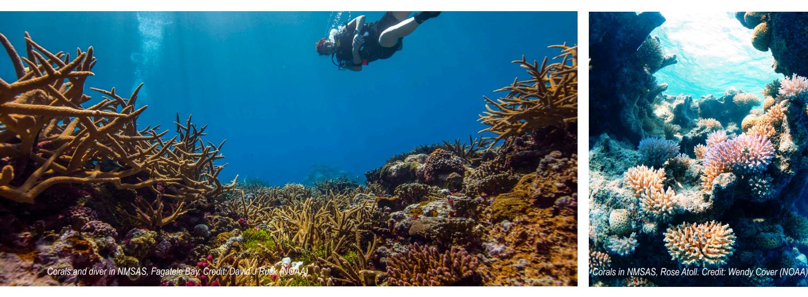

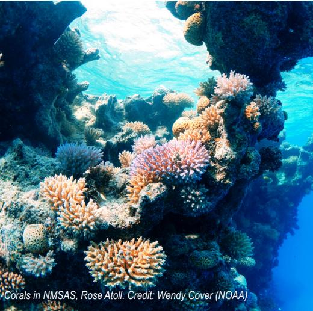

Table 2. List of Management Uses that participants could select from when entering their mapping needs.

| Management Use                        | <b>Definition</b>                                                                                                                                                                                                          |
|---------------------------------------|----------------------------------------------------------------------------------------------------------------------------------------------------------------------------------------------------------------------------|
| 1. Endangered Species Management      | Including consultations, recovery planning, and implementation                                                                                                                                                             |
| 2. Habitat Restoration                | Restoration planning and implementation of coastal and marine habitats such as corals, submerged aquatic vegetation, etc.                                                                                                  |
| 3. Monitoring                         | Long-term biophysical monitoring, discrete management/restoration assessments, or emergency/disaster response assessment                                                                                                   |
| 4. Coastal Vulnerability and Planning | Planning to mitigate for climate change impacts and other coastal hazards                                                                                                                                                  |
| 5. Watershed Management               | Planning and implementation of watershed management and restoration projects to improve coastal water quality                                                                                                              |
| 6. Fisheries Management               | Planning, enforcement, and assessment of fisheries management actions                                                                                                                                                      |
| 7. Consultations and Permitting       | Planning and assessment for federal and/or state permits and environmental compliance with other federal regulations (e.g., National Environmental Policy Act, Endangered Species Act, etc.)                               |
| 8. Emergency Response                 | Rapid response to coastal and marine emergencies that require immediate assessment, triage, and/or remediation activities, such as storms, vessel groundings, bleaching events, disease, and/or invasive species outbreaks |
| 9. Spatial Protection and Management  | Planning, enforcement, and assessment of spatially managed areas, such as marine protected areas, marine managed areas, etc.                                                                                               |

**Table 3.** List of Map Product Requirements and their associated recommendations for resolution, scale, and platform. ROV = remotely operated vehicle; DEM = digital elevation model; AUV = autonomous underwater vehicle.

| Map Data Requirement                                              | Definition                                                                                                 | Spatial Scale | Resolution/Product                                 | Suggested Platform |
|-------------------------------------------------------------------|------------------------------------------------------------------------------------------------------------|------------------|----------------------------------------------------|-----------------------|
| Delineations of large topographic features (e.g., pinnacle)       | Includes escarpments, pinnacles, valleys, basins, and other large-scale bottom features detected           | Regional         | >10-m resolution, coarse imagery                   | Ship/ROV              |
| 2. Delineations of hard vs. soft bottom                           | Data will be used to determine the hardness or reflectivity of the seafloor (i.e., rock vs. soft sediment) | Regional         | >10-m resolution, coarse imagery                   | Ship/ROV              |
| 3. Models of habitat suitability for key taxa or communities      | Models of habitat suitability using coarse (>10 m) resolution imagery                                      | Regional         | >10-m resolution, coarse imagery                   | Ship/ROV              |
| 4. Delineations of substrate types (e.g., sand, mud, coral, rock) | Locate and define seafloor types including sand, mud, rock outcrops, coral caps, pavement, etc.            | Mesoscale        | 2- to 10-m resolution DEM/ photomosaics         | Towed AUV/ROV         |
| 5. Models of presence/absence or density of corals                | Modeled percent cover and density of macrobiota                                                            | Mesoscale        | 2- to 10-m resolution DEM/ photomosaics         | Towed AUV/ROV         |
| 6. Identification of coral species and their local environments   | Locate and identify species of corals and document their local environments (e.g., slope, rugosity)        | Microscale       | <1-m point clouds or DEM (high-resolution imaging) | AUV/ROV               |
| 7. Documentation of individual specimen condition                 | Identify the condition or health (e.g., injury, bleaching) of individual corals                            | Microscale       | <1-m point clouds or DEM (high-resolution imaging) | AUV/ROV               |

## 2.3 Priority Summaries and Spatial Analysis

As participants entered and edited their selections, their responses were continuously saved to their user-specific online data file. At the end of the data entry period, this information was downloaded, quality controlled, and analyzed to identify collective priorities within American Samoa. All quality control and data summaries were performed in R statistical software (version 4.1.0, R Core Team, 2021).

### 2.3.1 Quality Control

The quality control process confirmed that each participant allocated all their coins, that no participant allocated more than the maximum number of coins allowed into a single cell, and that there were no duplicate values in a single cell between primary and secondary levels of Management Uses and Map Product Requirements. It also ensured that all cells with coins had at least a primary Management Use and Map Product Requirement assigned. Once cells with coins passed this quality check, any Management Use and Map Product options assigned to cells with zero coins were removed. This situation typically occurred when a participant moved coins out of a cell.

### 2.3.2 Data Analysis and Summary

To understand how coins were allocated spatially, the number of coins from all participant groups was summed in each grid cell. The total number of coins allocated toward each Management Use and Mapping Product Requirement from each participant group was also summed in each grid cell to understand where different types of data are needed and why. To determine which Management Use and Map Product Requirement options were most frequently selected across the entire study area, the total number of coins was summed for each selection at the primary, secondary, and overall levels. The number of coins for each Map Product Requirement scale (regional, mesoscale, microscale) was also summed to understand the spatial scale at which data were needed. For each grid cell, the number of groups allocating at least one coin, the number of different Management Uses, and the number of different Map Product Requirements were tallied. For all metrics, the top 10% of cells with coins were identified and highlighted using the quantile function in R.

### 2.3.3 Summary Rank and Focal Areas

A summary rank for each cell was calculated to identify areas of greater importance for multiple rationales. Cells selected by multiple participants and with various Management Uses are an opportunity for collaboration and highlight where data collection would satisfy the needs of several groups. To calculate summary rank, each cell was first ranked by its total number of coins, number of participating groups allocating at least one coin, and number of Management Uses for each of these categories. Cells with the same value were given an average rank among the cells. The rank values for each of these three metrics were then summed to calculate an overall summary rank for each cell. The top 10% of cells based on summary rank was calculated using the quantile function.

Focal areas were selected by identifying clusters of cells that were composed of more than five adjacent cells and in the highest summary rank category (top 10%). These areas of five or more cells represented a manageable extent for mapping missions and improved efficiency of mission planning to meet multiple stakeholder needs (e.g., minimized transit time).

## **2.4 Project Timeline**

In May 2023, participating groups for American Samoa were contacted via email and asked to confirm their participation and provide any additional contacts from their group. An introductory webinar was held on June 6, 2023, covering details on the project background, methods, outcomes, and use of the web tool, and to answer questions. The data inventory was finalized prior to coin allocation. Participants input their priorities from June to July, 2023. After the inputs were analyzed, participants were briefed on the preliminary results during a webinar on December 7, 2023, and were given the opportunity to make comments or suggestions on the results.

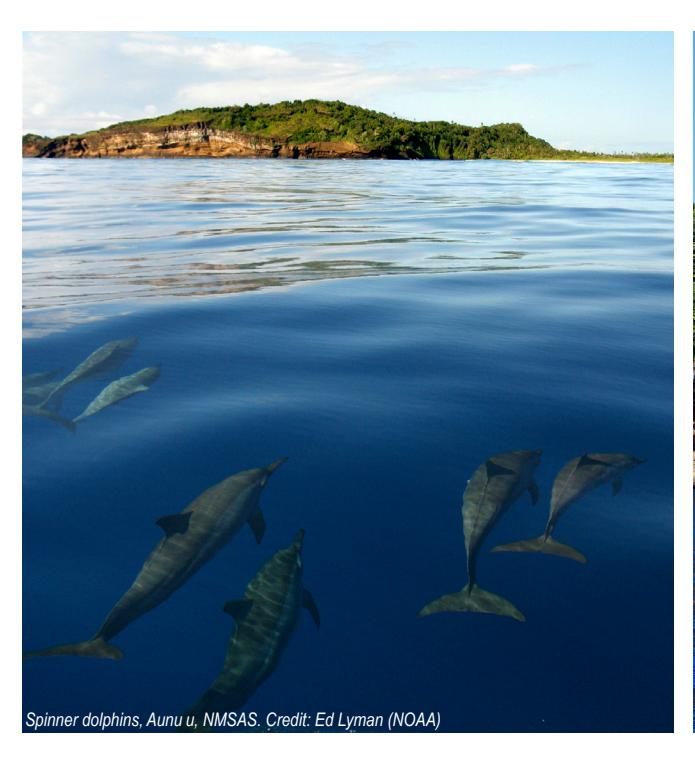

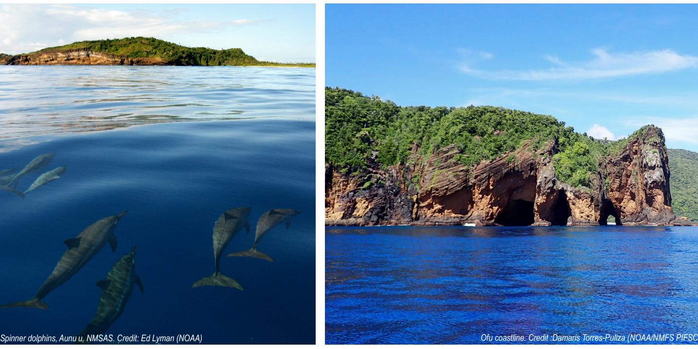

# **Chapter 3** Results

### **3.1 Most Common Management Uses**

The top Management Use categories selected by participants were *Coastal Vulnerability and Planning* and *Monitoring*, making up 26% and 25% of the total coins allocated, respectively (Figure 4). The next most commonly selected option was *Spatial Protection and Management* with 21%, followed by *Watershed Management* with 10% total coins, and *Consultation and Permitting*, *Endangered Species Management*, and *Fisheries Management* each with 5% of total coins. *Monitoring* and Fisheries Management were selected exclusively as a primary Management Use, while *Watershed Management* and *Endangered Species Management* were selected exclusively as a secondary Management Use. Seven of the nine participating groups selected at least two different Management Uses (typically a primary and secondary) (Figure 5). Coin distribution maps for each Management Use can be found in Appendix B.

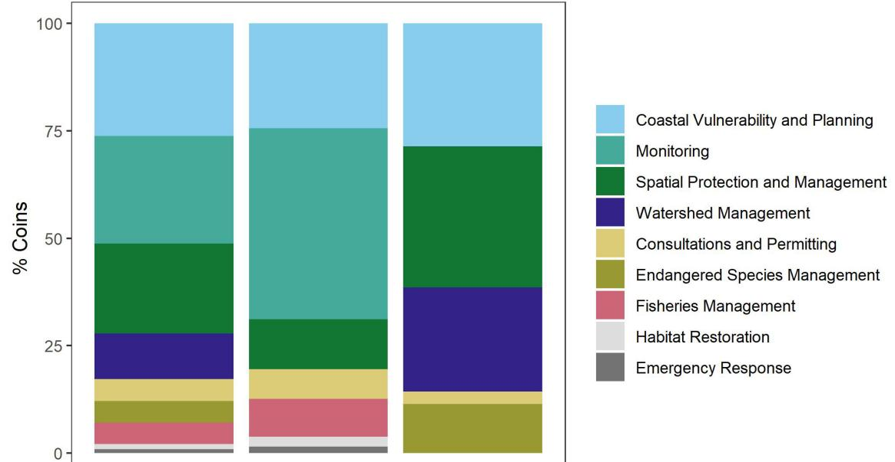

**Figure 4.** The percentage of coins for each Management Use selected at the overall, primary, and secondary levels in American Samoa.

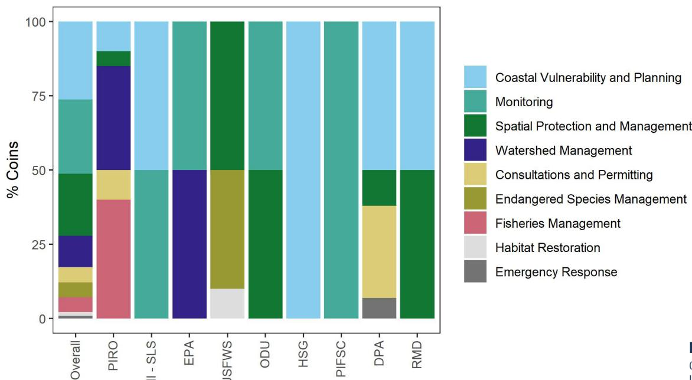

*PIRO = NOAA Fisheries Pacific Islands Regional Office; UHI – SLS = University of Hawai'i – School of Life Sciences; EPA = Environmental Protection Agency – American Samoa; USFWS = U.S. Fish and Wildlife Service; ODU = Old Dominion University; HSG = Hawai'i Sea Grant (University of Hawai'i); PIFSC = NOAA Fisheries Pacific Islands Fisheries Science Center; DPA = American Samoa Department of Port Administration; RMD = American Samoa Department of Commerce, Resource Management Division.*

**Figure 5.** The percentage of coins for each Management Use selected per participant group at the primary and secondary levels in American Samoa.

## **3.2 Most Common Map Product Requirements**

The top Map Product Requirement identified for coral management was *Density of Macrobiota*, for both the primary and secondary levels (Figure 6). Of the seven options available, this accounted for 38% of overall coins. *Identification of Coral Species* was the second most commonly selected option, totaling 29% of overall coins, and was selected more commonly at the secondary level than primary level. *Habitat Suitability* and *Hard vs. Soft Bottom* were only selected at the primary level, with only one participant group (EPA) selecting *Habitat Suitability* (Figure 7). Of the nine participating groups, seven identified either *Density of Macrobiota* or *Identification of Coral Species* as a data requirement for future management actions. As with Management Use, seven of the nine participating groups selected two or more Map Product Requirement options, with only one of those groups splitting their coins between more than two options. Coin distribution maps for each Map Product Requirement can be found in Appendix C.

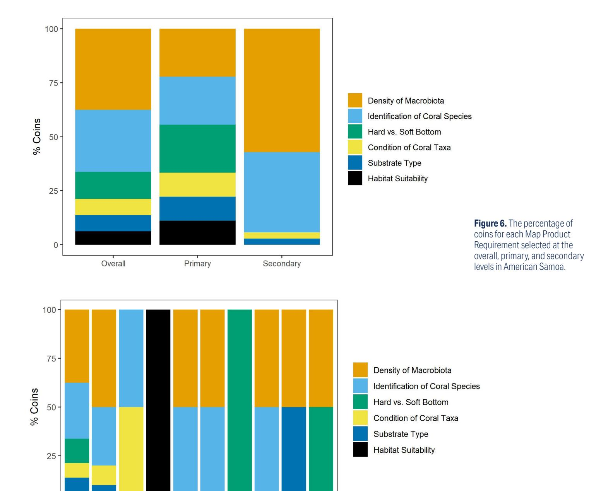

coins for each Map Product Requirement selected per participant group at both the primary and secondary levels in American Samoa.

**Figure 7.** The percentage of

### Results

Additionally, the percentage of coins that were assigned using the Map Product Requirement options were summarized by the spatial scale at which data are collected (i.e., regional, mesoscale, microscale; descriptions provided in Table 3). The percentage of the coins overall revealed data at the mesoscale were selected most often (45%), followed by microscale (36%) and regional scale (19%) data (Figure 8). Regional data were only selected at the primary level, with all three scales selected equally at this level (33%). Coin distribution maps for each Map Product Requirement spatial scale can be found in Appendix C.

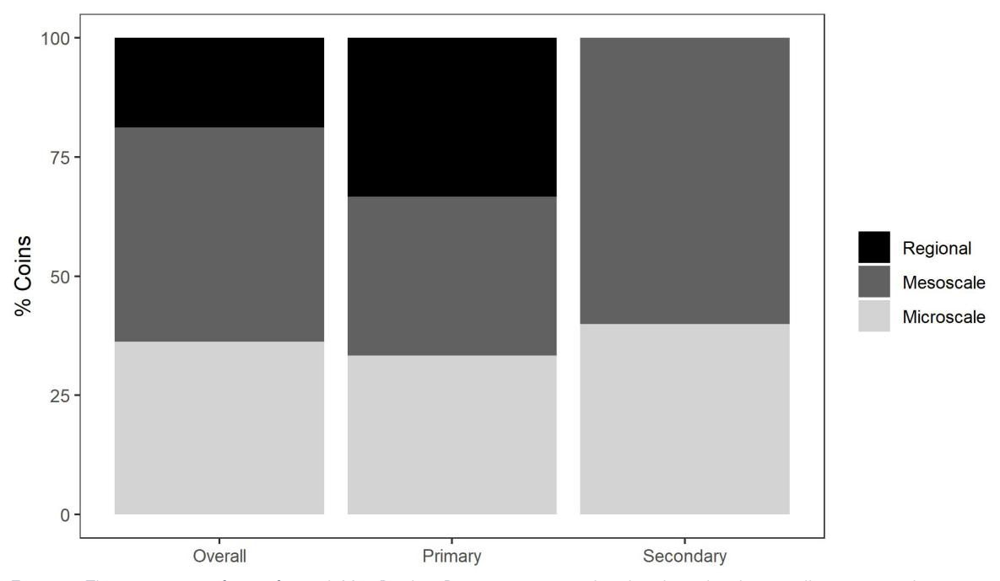

**Figure 8.** The percentage of coins for each Map Product Requirement spatial scale selected at the overall, primary, and secondary levels in American Samoa.

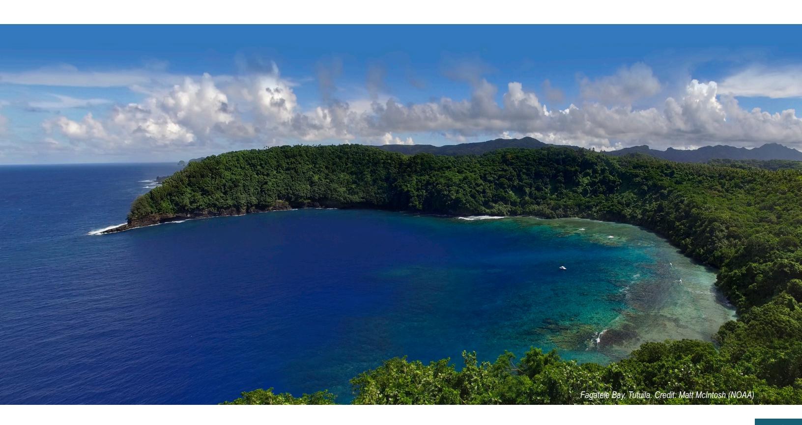

## **3.3 Summary of Spatial Priorities**

#### *Total Coins*

Two large clusters of adjacent cells (three or more) with the highest total number of coins (top 10%) were located on the island of Tutuila, around Pago Pago Harbor and Pala Lagoon (encompassing the villages of Nu'uuli and Tafuna) on the south side of the island, covering an area of 31.2 km2 (Figure 9A; see Figure 2 for noted locations). There were three single top 10% locations on the southwest end of Tutuila, in Larson Bay's Fagalua/ Fogama'a Unit–National Marine Sanctuary of American Samoa (NMSAS), and on the island of Aunu'u as well as single locations on Ofu and Ta'ū (Figure 9A,B). Cells with a high number of coins, but not in the top 10%, were located around these top 10% clusters, except Rose Atoll. No cells in the top 10% of total coins occurred on Olosega, Rose Atoll, or Swains Island.

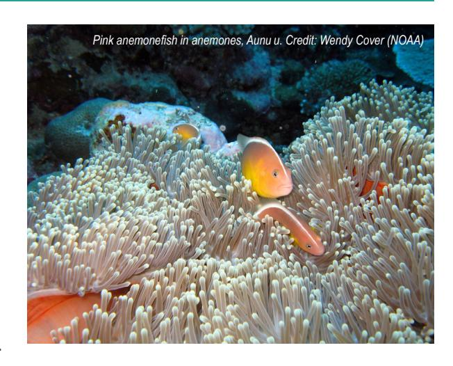

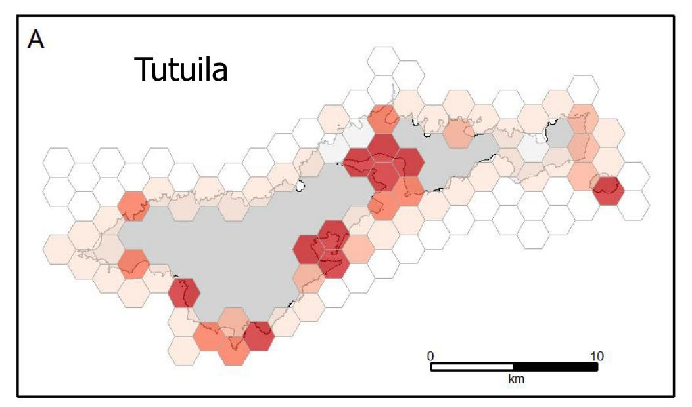

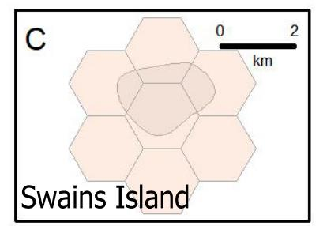

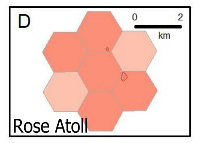

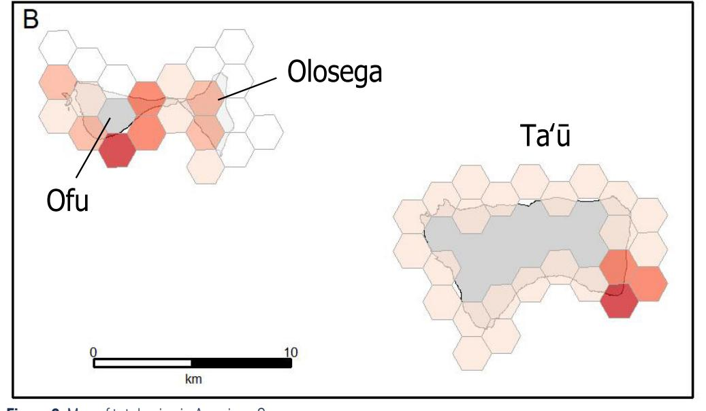

**Figure 9.** Map of total coins in American Samoa.

#### *Participating Groups*

The number of groups that allocated coins into each cell ranged from one to six groups per cell (Figure 10). Large clusters of cells in the top 10% (four to six participating groups) occurred in Pago Pago Harbor and Pala Lagoon (Figure 10A), with a single top 10% cell on Ofu, and at two other locations on the south side of Tutuila in Larson Bay's Fagalua/Fogama'a NMSAS, and off the coast of Leone (Figure 10B). Cells selected by multiple participants are an opportunity for collaboration and highlight where data collection would satisfy the needs of several groups.

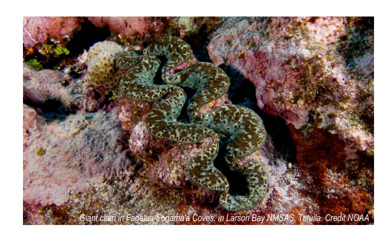

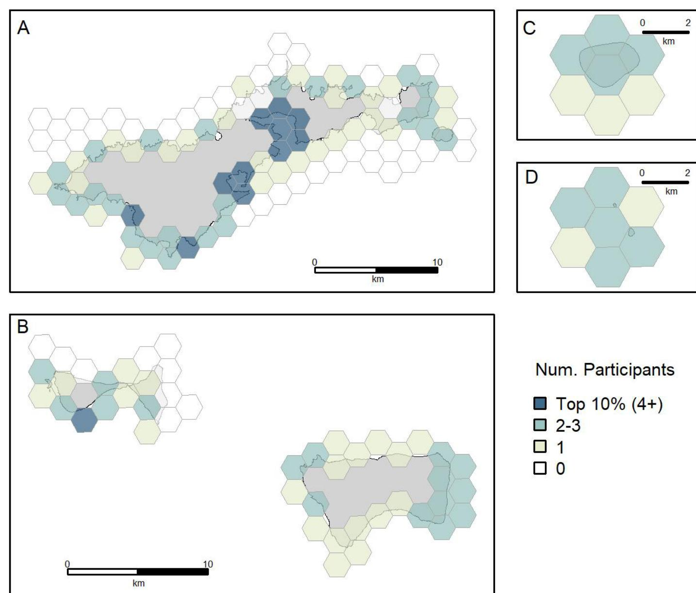

**Figure 10.** Number of groups who allocated at least one coin into each cell in American Samoa. A maximum of six participant groups (out of nine) input into a single cell.

#### *Number of Management Uses*

The number of Management Uses selected in a cell highlighted several unique areas where a variety of mandates and management actions would be served by collecting the required data (Figure 11). There were only two clusters of cells that contained five to six (top 10%) different Management Uses selected by participants. The largest group of top 10% cells was on the island of Tutuila, and although these six cells are adjacent they actually represent two distinctly different areas. Five cells extend across Pago Pago Harbor on the South shore and one cell was within Vatia Bay, along the North shore. (Figure 11A). Pala Lagoon contained three cells with five or more Management Uses selected by participants. Single top 10% Management Use cells were located off the coast of Leone and Massacre Bay, and off the southwest coast of Ofu at Fatuana Point, overlapping the

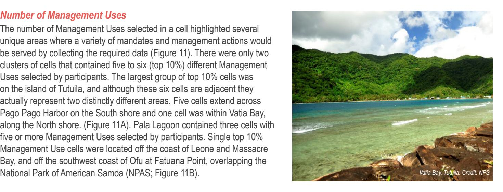

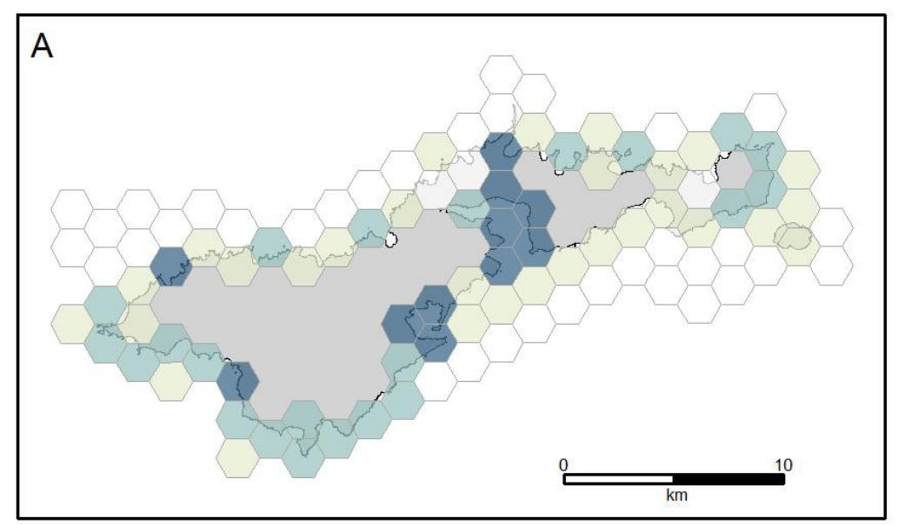

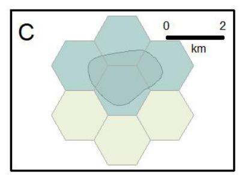

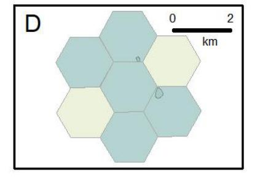

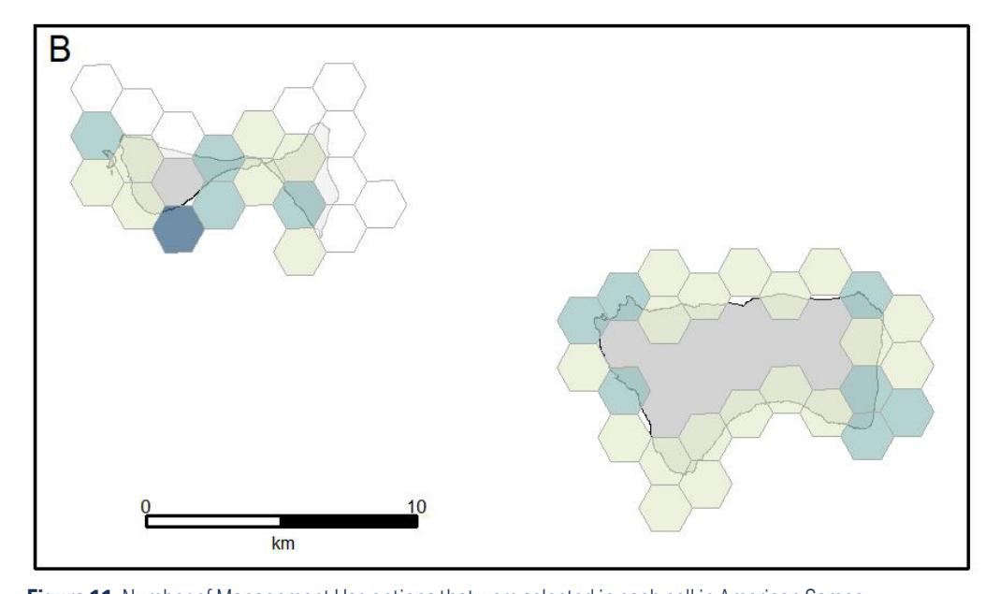

**Figure 11.** Number of Management Use options that were selected in each cell in American Samoa.

### *Map Product Requirements*

The number of Map Product Requirements selected highlights areas where a high number (top 10%) of different data needs were selected (Figure 12). Clusters of cells with values in the top 10%, based on the number of selected Map Product Requirements, indicate areas where a variety of data needs will be met. This would involve collaboration among managers and stakeholders to ensure the data collected satisfies the diversity of data requirements in these areas. All of the clusters of cells (three or more) with four or more different Map Product Requirements selected were on Tutuila around Pago Pago Harbor, Pala Lagoon, and in NMSAS on southwest coast. Individual top 10% cells around Leone and Nua-Se'etaga Bays, and off the coast of Fagamalo. On Ta'ū, there was a group of two cells off the northwest point, and two single top 10% cells off the northeast point and the west coast (Figure 12A,B). *Diver and coral off Leone,Tutuila. Credit: Jeff Milisen (NOAAA/NMFS PIFSC)*

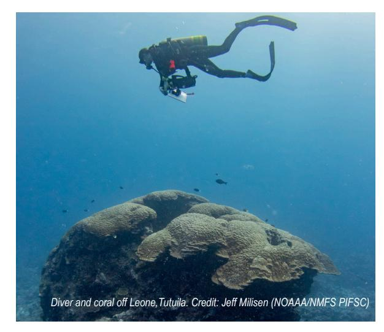

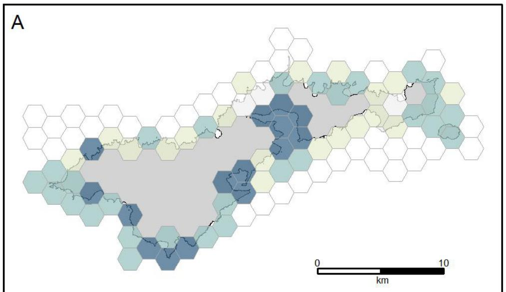

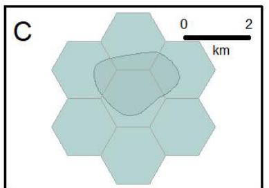

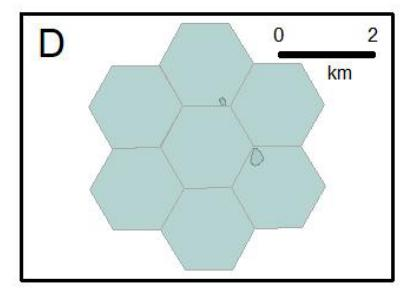

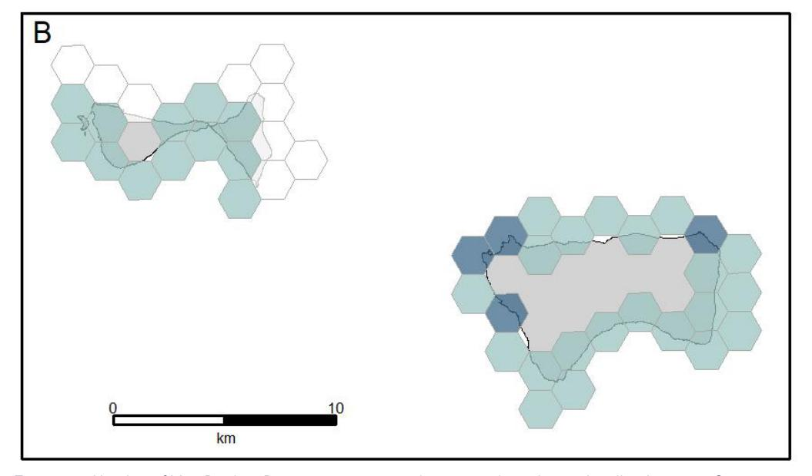

**Figure 12.** Number of Map Product Requirement options that were selected in each cell in American Samoa.

#### *Summary Rank*

Summary rank combined number of coins, number of participating groups, and number of Management Uses into a single metric to highlight cells that were of greater overall importance (Figure 13). Two top 10% summary rank clusters occurred on Tutuila in Pago Pago Harbor (six cells) and in Pala Lagoon (three cells) near Nu'uuli. Single top 10% cells were located in Larsen Bay and Leone on Tutuila and off Fatuana Point, south Ofu.

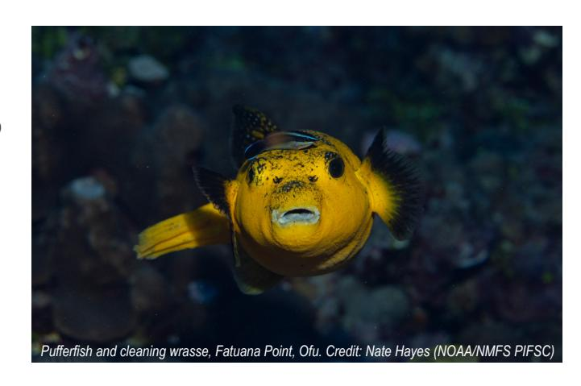

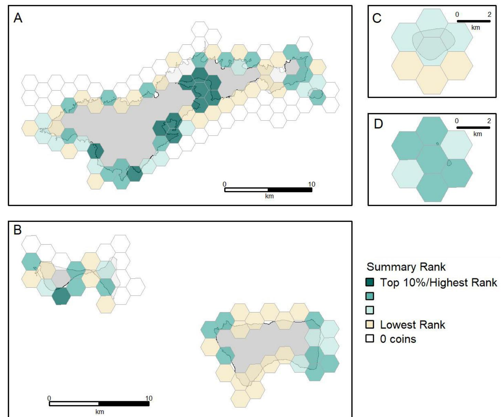

**Figure 13.** Summary rank based on total coins, number of participating groups, and diversity of Management Uses in each cell. Highest Rank identifies top 10% of summary rank cells.

## **3.4 Gap Analysis and Focal Area: Pago Pago Harbor**

One focal area, Pago Pago Harbor, was identified in American Samoa based on the number of adjacent grid cells in the top 10% of summary ranks and the lack of existing and/or contemporary data in this area (Figure 14).

On Tutuila, six hexagons (total area of 15.6 km2 ) were prioritized in Pago Pago Harbor by six participating groups (Figure 15). This focal area covered the entirety of the harbor, including the Pago Pago Harbor Special Management Area. The top Management Use identified in this focal area was *Coastal Vulnerability and Planning*, followed by *Spatial Protection and Management*, *Watershed Management*, and *Fisheries Management* (Table

4). Pago Pago Harbor is vulnerable to a variety of climate-related threats and coastal hazards such as erosion, flooding, tsunamis, and sea level rise, as well as anthropogenic threats such as coastal development, fishery-related industry, and vessel activities (American Samoa Advisory Group, 2007; Fenner et al., 2008; Kendall and Poti, 2011; Birkeland et al., 2021; Dobson et al., 2021; NOAA ONMS, 2022). Furthermore, rapidly increasing sea level rise within this region has impacted reefs within the harbor by changing exposure at low and high tides. Most notably, the Aua reef crests have historically been highly exposed at low tide, but by 2007 the crest was under water with no exposure, even at extremely low tide (C. Birkeland, pers. comm.; Birkeland et al., 2021).

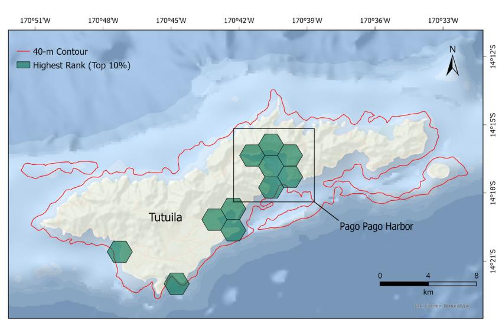

**Figure 14.** Overview of Pago Pago Harbor focal area in American Samoa identified using the highest summary rank. Only the top 10% summary rank cells on Tutuila are shown.

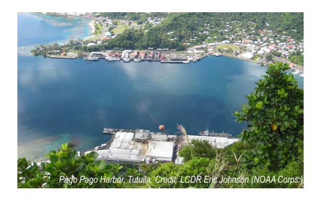

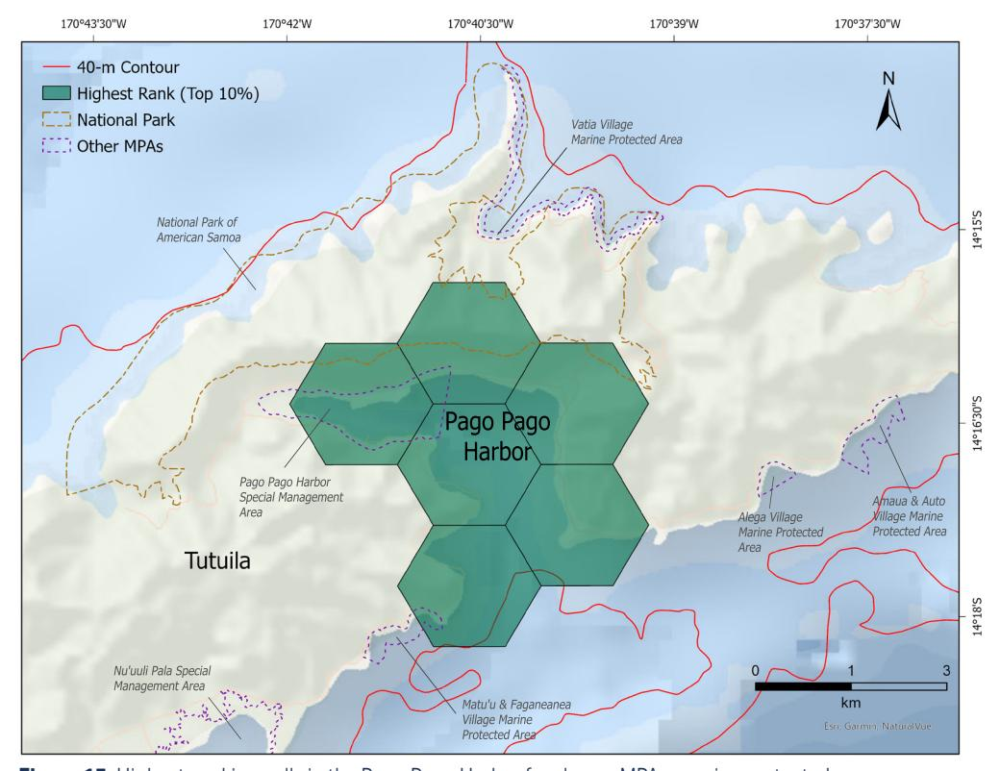

**Figure 15.** Highest-ranking cells in the Pago Pago Harbor focal area. MPA = marine protected area.

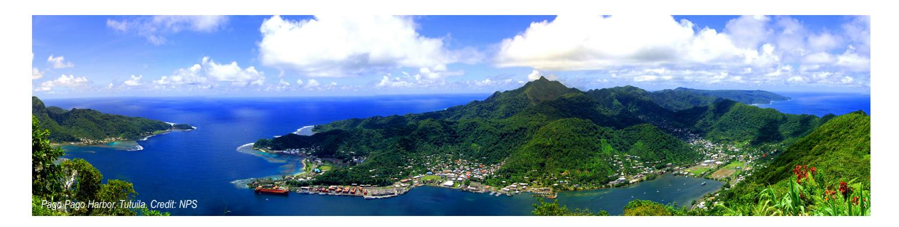

Pago Pago Harbor supports multiple management-related activities and uses, including commercial operations, coastal development, and protection from climate-related events. Pago Pago's harbor is the main port of American Samoa and is one of the naturally deepest ports in the South Pacific. In addition to its depth, it is also one of the most sheltered, with mountains surrounding the harbor, resulting in the harbor being an ideal safe location for vessels and fish processing; the tuna canning industry is the largest private employer and the

**Table 4.** Data summary of participant input for the Pago Pago Harbor focal area. Percent coins are calculated based on the Management Use, Map Product Requirement, and Spatial Scale coin totals within these six hexagons only. The Number of Groups reflects how many participant groups assigned coins to any portion of the area.

| Total Coins (# hexagons):                | Rank (# hexagons):                                          | Number of Groups: |
|------------------------------------------|-------------------------------------------------------------|-------------------|
| Top 10%(4)                               | Top 10% (6)                                                 | 6                 |
| High (2)                                 |                                                             |                   |
| Management Uses (% coins):               | Map Product Requirement (% coins): Spatial Scale (% coins): |                   |
| Coastal Vulnerability and Planning (33%) | Density of Macrobiota (38%)                                 | Mesoscale (54%)   |
| Spatial Protection and Management (17%)  | Identification of Coral Species (18%)                       | Microscale (23%)  |
| Watershed Management (17%)               | Hard vs. Soft Bottom (17%)                                  | Regional (22%)    |
| Fisheries Management (16%)               | Substrate Type (16%)                                        |                   |
| Monitoring (10%)                         | Condition of Coral Taxa (5%)                                |                   |
| Consultations and Permitting (7%)        | Habitat Suitability (5%)                                    |                   |

second-largest employer overall in American Samoa (USITC, 2023). The coral reefs in the outer harbor play a crucial role in dampening wave energy and provide shoreline protection. Participants identified gaps in existing coral reef mapping data within the harbor resulting in a lack of a holistic understanding of how the reefs within and outside the harbor are changing in terms of health and presence (K. Anderson Tagarino, pers. comm.). The Port of Pago Pago and Pago Pago Harbor are currently in the process of updating its master plan [for development] and planning a port expansion; additional mapping information on corals within this area would assist in ensuring information accuracy, identifying potential environmental impacts, and cost analysis planning for this effort (N. Palamo, pers. comm.).

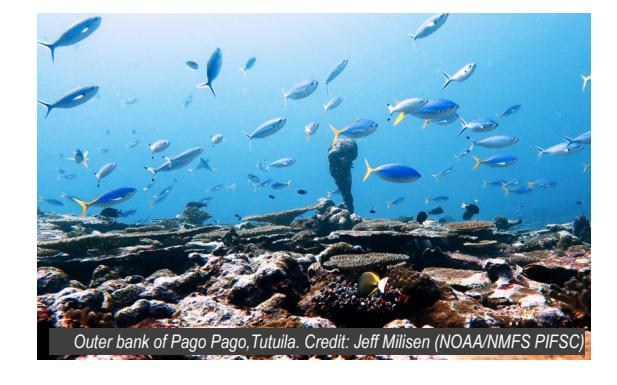

Within this focal area, participant groups identified *Density of Macrobiota* as the top Map Product Requirement, aligning with the identified need for mesoscale (2- to 10-m resolution) mapping data for coral occurrence and density information. The next most selected Map Product Requirements included *Identification of Coral Species* (microscale), *Hard vs. Soft Bottom* (regional scale), and *Substrate Type* (mesoscale). In 2023, U.S. Army Corps of Engineers conducted a hydrographic survey of the Port of Pago Pago; however, the data are limited to depth information only (Department of Port Administration, 2024). Recent acquisition of high-resolution multibeam data collected in 2023 by NOAA Ship *Rainier* may help meet the data needs requiring mesoscale, and expected 2023 NOAA National Geodetic Survey lidar data may meet the needs for fine-scale resolution data (NOAA OCS, 2023; Appendix A). At the time of this study these data collections were planned but had not been completed/made available.

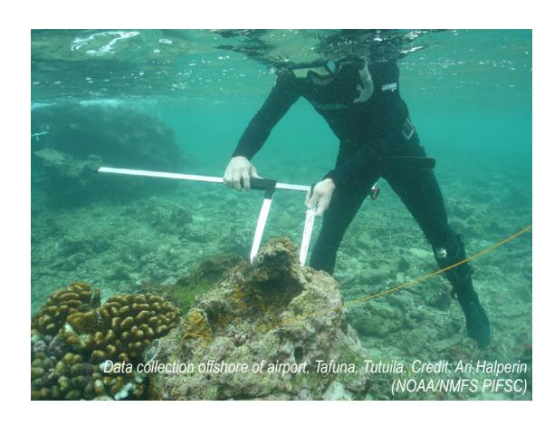

# **Chapter 4** Conclusion

An online application was used to gather information from local experts in American Samoa regarding priority needs for benthic mapping data to support coral reef management. This system allowed participants to indicate where mapping data are needed, the type of data needed, the immediacy of the need, management actions supported, and what type of objectives could be met with new data. The Pago Pago Harbor focal area was identified by participants as a high priority for future mapping, based on the top 10% of cells for summary rank, which provides a composite measure of importance based on total number of coins, number of participants, and number of Management Uses served in the area.

The islands of American Samoa are vulnerable to climate change impacts such as ocean acidification, temperature stress, coral bleaching, sea level rise, increased storm surge, heavy rainfall events, and tropical cyclones (American Samoa Coral Reef Advisory Group, 2007; NOAA CRCP, 2018; Dobson et al., 2021; ONMS, 2022). Most of the islands' population inhabits low-lying, coastal areas that are rugged and difficult to develop (Dobson et al., 2021). Heavily developed areas such as Pago Pago and Tafuna (location of American Samoa's primary airport), for example, are located in such areas and are at risk of coastal flooding threats (Dobson et al., 2021). The coral reef ecosystems around all of the islands and atoll of American Samoa provide protection against intense wave action and surges from storms. These coral reefs protect nearly \$26 million in infrastructure and approximately \$7.3 million in economic activity from coastal storm flooding (Storlazzi et al., 2019).

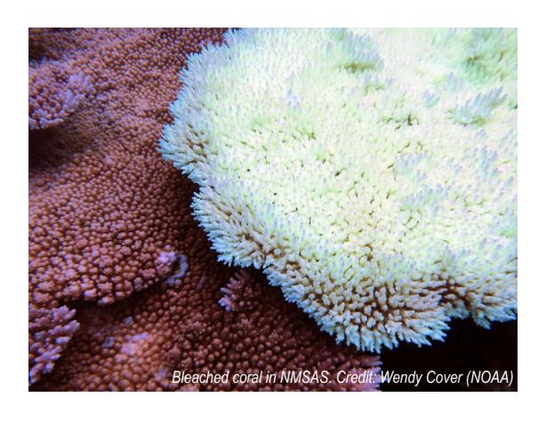

One of the most notable threats to the coral reefs in American Samoa is sea level rise resulting from climate change and the continued subsidence of the islands from the 2009 earthquake, resulting in a rate of sea level rise approximately five times the global average (Han et al., 2019). How this rapid change in water depth has impacted coral reefs around American Samoa is unknown. Obtaining depth information from updated mapping data will be important in determining if reef types (i.e., fringing reefs or reefs deeper on the banks) are able to keep up with sea level rise (C. Birkeland, pers. comm.).

The communities of American Samoa are engaged in management actions to protect coral reefs. Twenty-five percent of the coral reefs in American Samoa are designated under either federal or territorial management, and 7% of the coral reef area are no-take (NOAA CRCP, 2018). The MPAs of American Samoa, both territorial and federal, cover over 35,000 km2 of the territory's marine environment, including six areas that make up NMSAS, NPAS, 12 village MPAs, a marine park, and three special management areas. The presence of these protected and managed areas (e.g., Aua Village MPA and Nu'uuli Pala Special Management Area) contributes to regionally high marine biodiversity (Dobson et al., 2021). Along the southern coast of Ta'ū, in NMSAS, is an area with a high density of large *Porites*  coral colonies, "Valley of the Giants," where some of the largest and oldest corals in the world can be found, including Fale Bommie or "Big Momma." The majority of these reefs are within

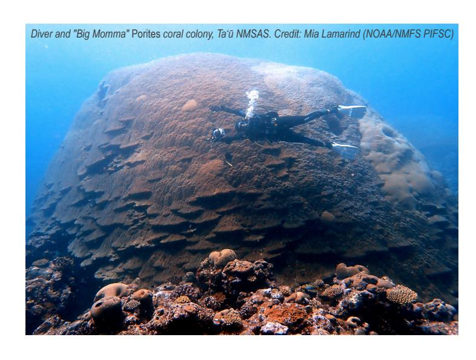

NPAS (Ta'ū Unit), and to a much lesser extent the NMSAS (Ta'ū Sanctuary Unit). Additionally, these reefs on the south coast of the island have relatively high live coral cover, despite bleaching events in 2015, 2017, and 2020 (Dobson, et al., 2021; NOAA ONMS, 2022).

It is also important to recognize that data planning efforts should be informed by the top 10% summary rank while considering other data metrics; and additional data acquired after this project (such as the 2023 multibeam and lidar data) should be explored ahead of planning new data acquisition. Targeting a top 10% area and adjacent areas, as time and money allow, will yield a larger return on investment. For example, some places were identified as high priority for multiple metrics but consisted of only single or pairs of cells, falling outside of the Pago Pago focal area. Data planning efforts in these locations, such as Larsen Bay and Fagatele Bay on Tutuila,

### Conclusion

and offshore Fatuana Point on Ofu, would benefit multiple groups and meet a variety of management uses in a "smaller" spatial area than the focal area. Pala Lagoon, the only other cluster of top 10% summary rank cells (three), also on Tutuila, is American Samoa's largest estuary and has the largest mangrove swamp (known as Nu'uuli Pala) in the territory (Gilman et al., 2007; Dobson et al., 2021). It is designated as a Special Management Area, protecting both mangroves and associated wetlands and marshes that act as a nursery and spawning ground for many fishes and invertebrates found on nearby reefs (Yamasaki et al., 1985; Dobson et al., 2021). While Pala Lagoon was not indicated as a focal area, proximity to the Pago Pago focal area and the similarities between this area (including villages such as Nu'uuli and Tafuna) and the harbor (e.g., moderately populated and contain large infrastructure) highlight some of the best opportunities for collaboration, with the potential to meet a variety of coral reef management goals.

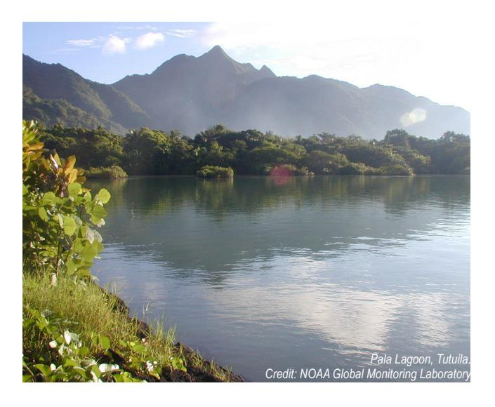

Additionally, the distribution and diversity of Management Use selections can highlight important areas where a variety of goals can be met. For example, three to four different Management Uses were identified in the cells of Rose Atoll, but none of them were in the top 10% for total coins allocated. This indicates that although there were a variety of management goals selected, participants did not indicate an urgent data need. Similarly, southeast Ta'ū off Tufu Point, an area with various long-term monitoring activities—including NOAA's National Coral Reef Monitoring Program, collaborative monitoring efforts from NMSAS, NPAS, Coral Reef Advisory Group, and the Department of Marine and Wildlife Resources (<https://americansamoa.noaa.gov/explore/science.html>)—did not have any cells in the top 10% of total coins. There is also interest in understanding how the particular characteristics of this island, such as wave action or coastal topography, enable it to support one of the largest assemblages of coral colonies in the world. Coral colonies here grow up to 22 m in diameter with over 80 colonies greater than 10 m (C. Birkeland, pers. comm.). These examples illustrate the diversity of goals across participating groups and, in some cases, the uniqueness of participant group needs.

For future mapping planning efforts, targeting cells within the highest summary ranks (e.g., top 10%) will ensure that data collection will fulfill a variety of coral reef management purposes, address the needs of several participating groups, and satisfy high-priority needs for updated information. It is also important to recognize that the prioritized areas are directly dependent on the participants that provided input. Not all invited groups participated in the effort, and priorities could be different for other groups not represented here. Refining these areas based on survey optimization and finer-scale considerations to address specific needs and mandates, such as habitat suitability, coral density, and coral species identification, is necessary. For example, the tools and effort needed to map various grid cells differ depending on depth and water clarity. Benthic sonar and lidar mapping technologies are typically focused on gathering data over large geographic areas and features, whereas habitat suitability models are often targeted at finer-scale areas such as a specific reef feature. A cursory review of gaps in existing data and high-priority cells shows that some cells contain extensive survey data (i.e., lidar and/or multibeam), but the data may be of too coarse resolution, limited by depth (i.e., greater than 40 m), or lack ancillary data such as habitat or bottom type. Future surveys may exclude these areas that have already been mapped, but whether these existing data meet the needs of local agencies should be considered.

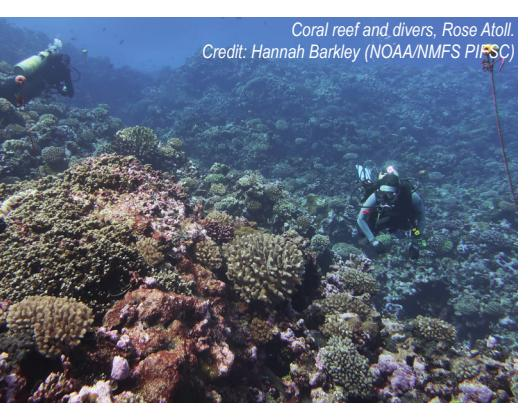

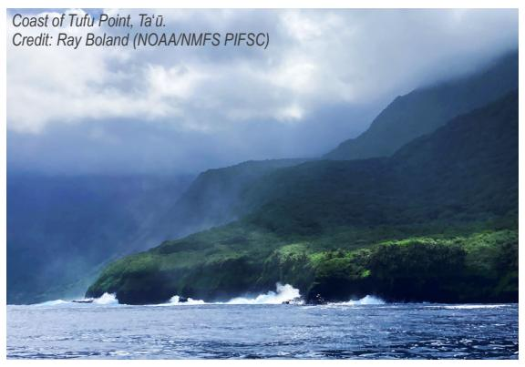

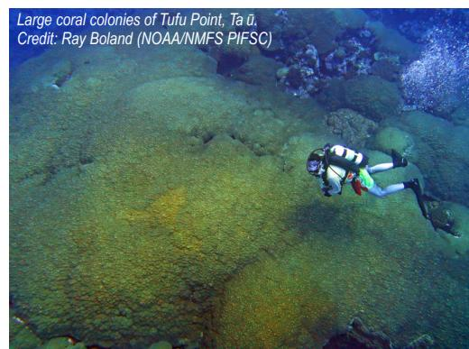

## **Chapter 5** Links to Data

Final maps and results were published online at several repositories to ensure ease of access. Online dashboards were created to showcase the results, with selectors and functions to allow the user to easily turn on and off layers. The resulting maps and data were submitted to Zenodo, an online data repository approved by NOAA, for long-term preservation and public access. Finally, these web mapping services were published in NOAA's Integrated Ocean and Coastal Mapping (IOCM) U.S. Mapping Coordination website (NOAA IOCM, 2023). See links below for access to reports, data viewers, and downloads.

Datasets, Data Web Services, and Metadata:

- 2024: NOAA NCCOS Assessment: Agency priorities for mapping coral reef ecosystems in American Samoa, 2023-06-06 to 2023-08-07
  - [Zenodo Accession](https://zenodo.org/records/10034904) (Hile et al., 2024)
- 2023: Dashboard [American Samoa Coral Reef Mapping Prioritization Results](https://www.arcgis.com/apps/dashboards/3cb9c069a1554e6c9b006f74c861f67c)
- 2021: Project Website - [Coral Reef Prioritization | A Roadmap for Future Data Collection](https://us-shallow-coral-reef-mapping-priorities-noaa.hub.arcgis.com/)
- 2021: NCCOS Website [Defining Future Seafloor Mapping Priorities to Inform Shallow Coral Reef Management](https://coastalscience.noaa.gov/project/defining-future-seafloor-mapping-priorities-to-inform-shallow-coral-reef-management/)

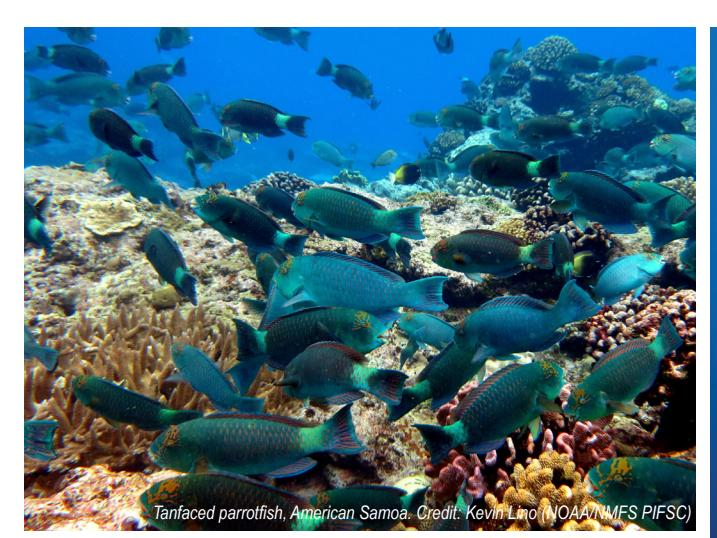

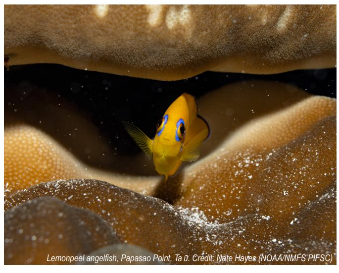

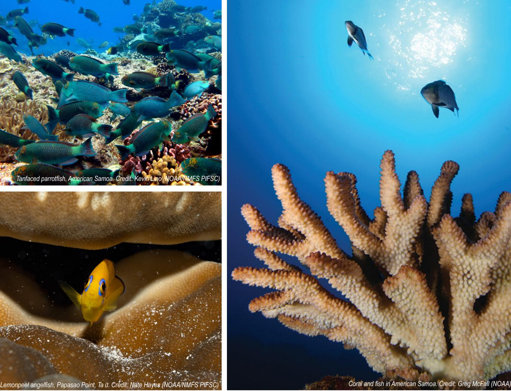

## **References**

American Samoa Coral Reef Advisory Group. (2007). American Samoa Coral Reef MPA Summary. In D. Wusinich-Mendez and C. Trappe (Eds.), *Report on the Status of Marine Protected Areas in Coral Reef Ecosystems of the United States Volume 1: Marine Protected Areas Managed by U.S. States, Territories, and Commonwealths: 2007*, (pp. 11–25). NOAA Technical Memorandum CRCP 2. NOAA Coral Reef Conservation Program. <https://repository.library.noaa.gov/view/noaa/476>

Anderson Tagarino, K. (2024, January 11). University of Hawaii, Sea Grant. Personal Communication.

Birkeland, C., Green, A., Lawrence, A., Coward, G., Vaeoso, M., and Fenner, D. (2021). Different resiliencies in coral communities over ecological and geological time scales in American Samoa. *Marine Ecology Progress Series, 673*, 55–68. [https://doi.org/10.3354/](https://doi.org/10.3354/meps13792)  [meps13792](https://doi.org/10.3354/meps13792)

Birkeland, C. (2023, August). University of Hawai'i at Mānoa. Personal Communication.

Buckel, C. A., Taylor, J. C., and Bollinger, M. (2021). Prioritizing areas for future seafloor mapping, research, and exploration for the southeast U.S. Atlantic Coast. NOAA Technical Memorandum NOS NCCOS 289. <https://doi.org/10.25923/qh2c-hs73>

Buja, K., and Christensen, J. (2019). Spatial prioritization widget: A tool to identify mapping priorities. [https://coastalscience.noaa.gov/](https://coastalscience.noaa.gov/project/spatial-prioritization-widget)  [project/spatial-prioritization-widget](https://coastalscience.noaa.gov/project/spatial-prioritization-widget)

Costa, B. M., Battista, T. A., and Pittman, S. J. (2009). Comparative evaluation of airborne lidar and ship-based multibeam sonar bathymetry and intensity for mapping coral reef ecosystems. *Remote Sensing of the Environment, 113*(5), 1082–1100. [https://doi.](https://doi.org/10.1016/j.rse.2009.01.015)  [org/10.1016/j.rse.2009.01.015](https://doi.org/10.1016/j.rse.2009.01.015)

Costa, B. M., Buja, K., Kendall, M. S., Williams, B., and Kraus, J. (2019). Prioritizing areas for future seafloor mapping, research, and exploration offshore of California, Oregon, and Washington. NOAA Technical Memorandum NOS NCCOS 264. [https://doi.org/10.25923/](https://doi.org/10.25923/wa5c-vn25)  [wa5c-vn25](https://doi.org/10.25923/wa5c-vn25) 

Dobson, J. G., Johnson, I. P., Kowal, V. A., Rhodes, K. A., Lussier, B. C., and Byler, K. A. (2021). American Samoa coastal resilience assessment. UNC Asheville National Environmental Modeling and Analysis Center, Asheville, NC. Prepared for the National Fish and Wildlife Foundation. <https://www.nfwf.org/sites/default/files/2021-12/American-Samoa-Coastal-Resilience-Assessment.pdf>

Hile, S. D., Kraus, J., Buckel, C. A., Williams, B., Howell, J., Dorfman, D., Pagan, F., and Towle, E. K. (2024). Agency priorities for mapping coral reef ecosystems in Guam and the Commonwealth of the Northern Mariana Islands. NOAA Technical Memorandum NOS NCCOS 321. <https://doi.org/10.25923/0t69-z467>

Kendall, M. S., Buja, K., Menza, C., Gandulla, S., and Williams, B. (2020). Priorities for lakebed mapping in Lake Huron's Thunder Bay National Marine Sanctuary. NOAA Technical Memorandum NOS NCCOS 276. <https://doi.org/10.25923/qyrf-tq71>

Kraus, J., Williams, B., Hile, S. D., Battista, T., and Buja, K. (2020). Prioritizing areas for future seafloor mapping and exploration in the U.S. Caribbean. NOAA Technical Memorandum NOS NCCOS 286. <https://doi.org/10.25923/w6v3-ha50>

Kraus, J., Buckel, C. A., Williams, B., Ames, C., Dorfman, D., Pagan, F., and Towle, E. K. (2022). Agency priorities for mapping South Florida's coral reef ecosystems. NOAA Technical Memorandum NOS NCCOS 304.<https://doi.org/10.25923/qc9e-gt19>

Kraus, J., Buckel, C. A., Williams, B., Ames, C., Dorfman, D., Pagan, F., Towle, E. K., and Hile, S. D. (2022). Agency priorities for mapping coral reef ecosystems in Puerto Rico and the U.S. Virgin Islands. NOAA Technical Memorandum NOS NCCOS 305. [https://](https://repository.library.noaa.gov/view/noaa/48477) [repository.library.noaa.gov/view/noaa/48477](https://repository.library.noaa.gov/view/noaa/48477)

Kraus, J., Buckel, C. A., Williams, B., Urquart, K., Dorfman, D., Pagan, F., Towle, E. K., and Hile, S. D. (2023). Agency priorities for mapping coral reef ecosystems in the Main Hawaiian Islands. NOAA Technical Memorandum NOS NCCOS 311. [https://doi.](https://doi.org/10.25923/csw1-xw45) [org/10.25923/csw1-xw45](https://doi.org/10.25923/csw1-xw45)

### References

NOAA CRCP. (2018). Coral reef condition: A status report for American Samoa. NOAA Coral Reef Conservation Program. [https://www.](https://www.coris.noaa.gov/monitoring/status_report/docs/AmerSamoa_status_report_forweb.pdf)  [coris.noaa.gov/monitoring/status\\_report/docs/AmerSamoa\\_status\\_report\\_forweb.pdf](https://www.coris.noaa.gov/monitoring/status_report/docs/AmerSamoa_status_report_forweb.pdf) 

NOAA IOCM. (2023). U.S. mapping coordination: A collaboration site for mapping data acquisition. NOAA Integrated Ocean and Coastal Mapping. <https://www.seasketch.org/#projecthomepage/5272840f6ec5f42d210016e4>

NOAA NCCOS. (2005). Shallow-water benthic habitats of American Samoa, Guam, and the Commonwealth of the Northern Mariana Islands. Shallow-Water Benthic Habitats of American Samoa, Guam, and the Commonwealth of the Northern Mariana Islands. NOAA Technical Memorandum NOS NCCOS 8.

NOAA NOS. (2009). Coral reef habitat assessment for U.S. marine protected areas: U.S. territory of American Samoa. NOAA National Ocean Service, Management and Budget Office, Special Projects. [https://www.coris.noaa.gov/activities/habitat\\_assessment/american\\_](https://www.coris.noaa.gov/activities/habitat_assessment/american_samoa.pdf) [samoa.pdf](https://www.coris.noaa.gov/activities/habitat_assessment/american_samoa.pdf)

NOAA NOS. (2015, May 15). News: NOAA helps American Samoa tackle a thorny issue. NOAA National Ocean Service. [https://](https://oceanservice.noaa.gov/news/may15/crown-of-thorns.html) [oceanservice.noaa.gov/news/may15/crown-of-thorns.html](https://oceanservice.noaa.gov/news/may15/crown-of-thorns.html) 

NOAA OCS. (2023). Pacific Islands survey projects: American Samoa (OPR-T382-RA-23). NOAA Office of Coast Survey. <https://storymaps.arcgis.com/stories/eb1917ec7a814e379eb68f9c51dd2544#ref-n-pq27co>

NOAA ONMS (2022). National Marine Sanctuary of American Samoa condition report: 2007–2020. NOAA Office of National Marine Sanctuaries. <https://nmssanctuaries.blob.core.windows.net/sanctuaries-prod/media/docs/2022-nmsas-condition-report.pdf>

Palamo, N. (2024, January 12). American Samoa Department of Port Administration. Personal Communication.

R Core Team. (2021). R: A language and environment for statistical computing. R Foundation for Statistical Computing. [https://www.R](https://www.R-project.org/)[project.org/](https://www.R-project.org/)

Storlazzi, C. D., Reguero, B. G., Cole, A. D., Lowe, E., Shope, J. B., Gibbs, A. E., Nickel, B. A., McCall, R. T., van Dongeren, A. R., and Beck, M. W. (2019). Rigorously valuing the role of U.S. coral reefs in coastal hazard risk reduction: U.S. Geological Survey Open-File Report 2019–1027. <https://doi.org/10.3133/ofr20191027>

USACE. (2022). American Samoa final watershed plan: Appendix D – Environmental analysis. U.S. Army Corps of Engineers, Honolulu District. [https://www.poh.usace.army.mil/Portals/10/docs/Civil%20Works/America%20Samoa%20watershed/05%20Appendix%20D%20](https://www.poh.usace.army.mil/Portals/10/docs/Civil%20Works/America%20Samoa%20watershed/05%20Appendix%20D%20-%20AS%20Environmental%20Analysis.pdf?ver=tq1op4vuf5DFI-wsS1RwDw%3D%3D×tamp=1667952463436) [-%20AS%20Environmental%20Analysis.pdf?ver=tq1op4vuf5DFI-wsS1RwDw%3D%3D&timestamp=1667952463436](https://www.poh.usace.army.mil/Portals/10/docs/Civil%20Works/America%20Samoa%20watershed/05%20Appendix%20D%20-%20AS%20Environmental%20Analysis.pdf?ver=tq1op4vuf5DFI-wsS1RwDw%3D%3D×tamp=1667952463436)

USITC. (2023). U.S.-Pacific Islands trade and investment: Impediments and opportunities. U.S. International Trade Commission. Publication No. 5463, Investigation No: 332–593.<https://www.usitc.gov/publications/332/pub5463.pdf>

## **Appendices**

## **Appendix A: Data Inventory Reference Table**

**Table A.1.** American Samoa mapping inventory data table. This table is a compilation of all web services within the data inventory shared with participants listed below. Map service URLs accessed on March 20, 2024. MPA = marine protected area

| Cate                 | gory Item Name                                                              | Description                                                                                                                                                                                                                                                                                                    | Map Service URL                                                                                                                 |
|----------------------|-----------------------------------------------------------------------------|----------------------------------------------------------------------------------------------------------------------------------------------------------------------------------------------------------------------------------------------------------------------------------------------------------------|---------------------------------------------------------------------------------------------------------------------------------|
| y hymetr Bat   | Planned NOAA Ship Rainier Multibeam Survey (2023)                        | Intended multibeam survey area to be completed by NOAA Ship Rainier in 2023. Surveys will be completed to NOAA's Office of Coast Survey standards in accordance with the Hydrographic Surveys Specifications and Deliverables (HSSD)                                                                     | https://noaa.maps.arcgis.com/home/item. html?id=43a101ff81644f84bcebb09c2f3a4751                                             |
|                      | Footprints of Existing Multibeam Surveys (2003– 2019, clipped to EEZ) | Collection of multibeam bathymetry footprints for American Samoa (2003–2019). Compiled in support of CRCP Benthic Mapping Prioritization.                                                                                                                                                                   | https://noaa.maps.arcgis.com/home/item. html?id=f55ce1d70f2b4d15b072ee27dd9b8a50                                             |
| ial erA Lidar/ | Planned Lidar Surveys (2023)                                                | Footprints of planned topobathymetric lidar surveys for American Samoa (2023). Source: NOAA National Geodetic Survey (NOAA/NGS).                                                                                                                                                                            | https://noaa.maps.arcgis.com/home/item. html?id=9784820c79714e89a2c683cb2cee001c                                             |
|                      | Footprints of Existing Topobathy Lidar (2010 & 2012)                     | Bathymetric lidar data footprints for American Samoa (2010–2012). Source: NOAA Digital Coast Data Access Viewer, NOAA Office for Coastal Management (NOAA/ OCM). https://coast.noaa.gov/dataviewer/#/lidar/search/                                                                                       | https://noaa.maps.arcgis.com/home/item. html?id=508edca3f9dd4316a373c83d2e287aac                                             |
| Habitat              | Tutuila Rugosity (5 m cell size)                                            | Rugosity was derived from the gridded multibeam bathymetry Tutuila_5m using the Benthic Terrain Modeler.                                                                                                                                                                                                    | https://tiles.arcgis.com/tiles/Hp6G80Pky0om7QvQ/ arcgis/rest/services/AmericanSamoaRugosity/MapServer                        |
|                      | NOAA NCCOS Habitat Map - Biological Cover (2005)                         | Habitat classification map that integrates geomorphologic reef structure and biological cover into a single schema and subsets each into detail. For more information, see https://coastalscience.noaa.gov/project/benthic-habitat-mapping american-samoa-guam-commonwealth-northern-mariana-islands/ | https://gis.ngdc.noaa.gov/arcgis/rest/services/nccos/ BenthicMapping_BenthicHabitats/MapServer/22                            |
|                      | NOAA NCCOS Habitat Map - Zone (2005)                                     | Habitat classification map that integrates geomorphologic reef structure and biological cover into a single schema and subsets each into detail. For more information, see https://coastalscience.noaa.gov/project/benthic-habitat-mapping american-samoa-guam-commonwealth-northern-mariana-islands/ | https://gis.ngdc.noaa.gov/arcgis/rest/services/nccos/ BenthicMapping_BenthicHabitats/MapServer/24                            |
|                      | NOAA NCCOS Habitat Map - Structure (2005)                                | Habitat classification map that integrates geomorphologic reef structure and biological cover into a single schema and subsets each into detail. For more information, see https://coastalscience.noaa.gov/project/benthic-habitat-mapping american-samoa-guam-commonwealth-northern-mariana-islands/ | https://gis.ngdc.noaa.gov/arcgis/rest/services/nccos/ BenthicMapping_BenthicHabitats/MapServer/23                            |
| ies Boundar       | Villages                                                                    | The villages vector file is used by the Statistics Division of the American Samoa Department of Commerce and by the United States Census Bureau for reporting census statistics.                                                                                                                         | https://services5.arcgis.com/ugcD1wqDyNIfJ9ce/arcgis/ rest/services/AS_Villages/FeatureServer/0                              |
|                      | American Samoa Exclusive Economic Zone (EEZ)                             | American Samoa Exclusive Economic Zone                                                                                                                                                                                                                                                                         | https://services5.arcgis.com/ugcD1wqDyNIfJ9ce/arcgis/ rest/services/American_Samoa_Exclusive_Economic_ Zone/FeatureServer |
|                      | Marine Protected Area Inventory                                          | The NOAA MPA inventory represents a collection of data compiled from federal, state, tribal and territorial entities to provide a publicly available source of comprehensive information on place-based marine conservation efforts.                                                                     | https://services2.arcgis.com/C8EMgrsFcRFL6LrL/arcgis/ rest/services/MPAI_2020_WMS/FeatureServer/0                            |
|                      | Depth Contour (40 meters)                                                   | Bathymetric contour (40 m) of American Samoa, Aunu'u, Ofu, Olosega, and Fiti'uta. Also including Swains and Rose Atolls.                                                                                                                                                                                    | https://noaa.maps.arcgis.com/home/item.html?id= ef982098e9b8437b929fe94c1b3fad1e&sublayer=0                                  |
| her Ot            | Shallow Coral Mapping Prioritization Grid (2023)                         | Empty grid cell layer for the 2023 American Samoa Coral Reef Mapping Prioritization. Each cell is 1 km in length per side (2.6 km2 per grid cell).                                                                                                                                                       | https://noaa.maps.arcgis.com/home/item. html?id=5886abce5c9d4bf88218d86ec7e12d2d                                             |

## **Appendix B. Individual Maps for Each Management Use**

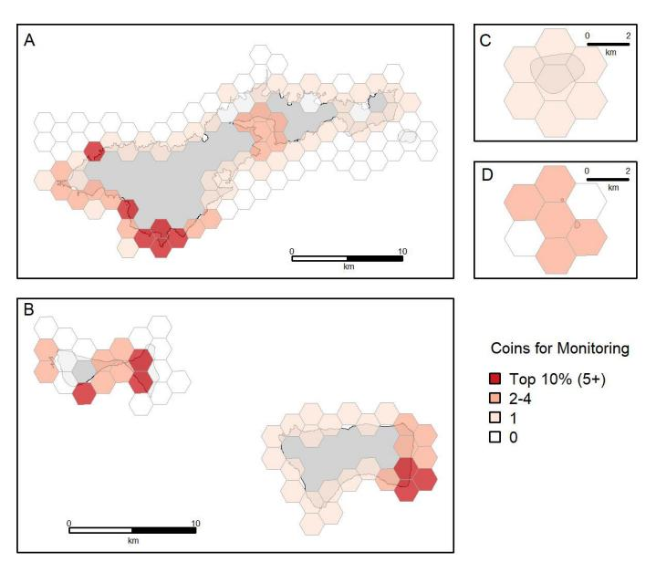

**Figure B.1.** Map of coins distributed for the Management Use *Monitoring*. **Figure B.2.** Map of coins distributed for the Management Use *Spatial* 

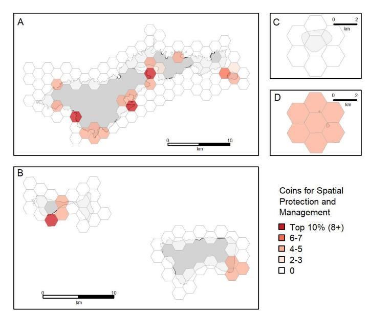

*Protection and Management.* 

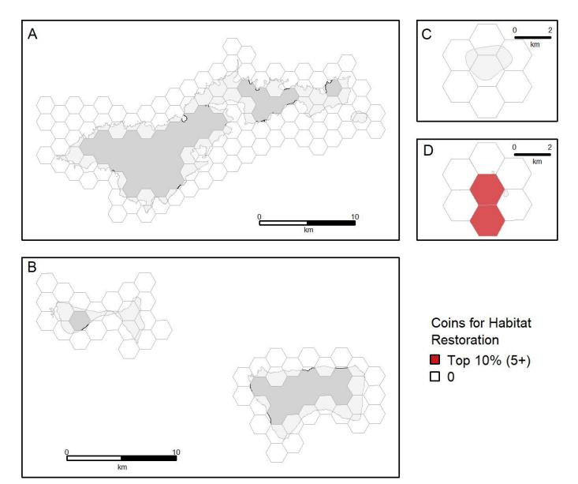

**Figure B.3.** Map of coins distributed for the Management Use *Habitat Restoration*.

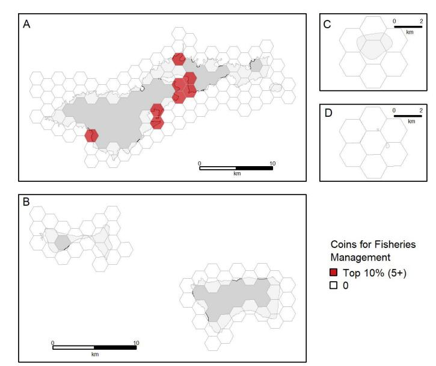

**Figure B.4.** Map of coins distributed for the Management Use *Fisheries Management.* 

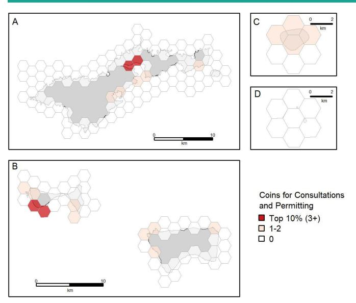

**Figure B.5.** Map of coins distributed for the Management Use *Consultations and Permitting*.

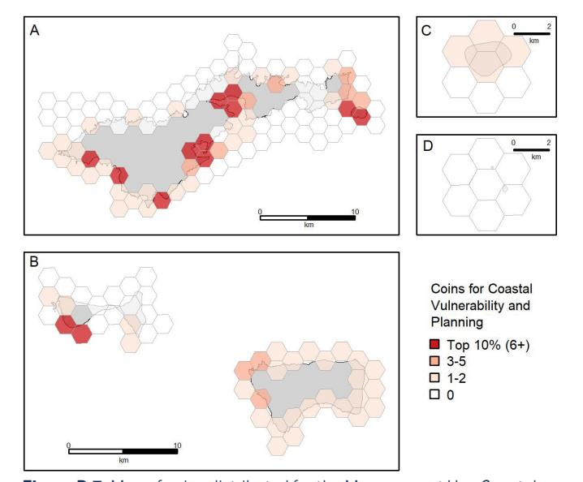

**Figure B.7.** Map of coins distributed for the Management Use *Coastal Vulnerability and Planning*.

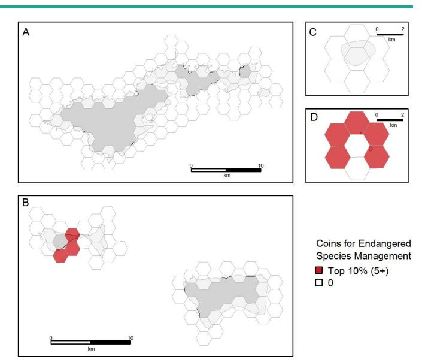

**Figure B.6.** Map of coins distributed for the Management Use *Endangered Species Management*.

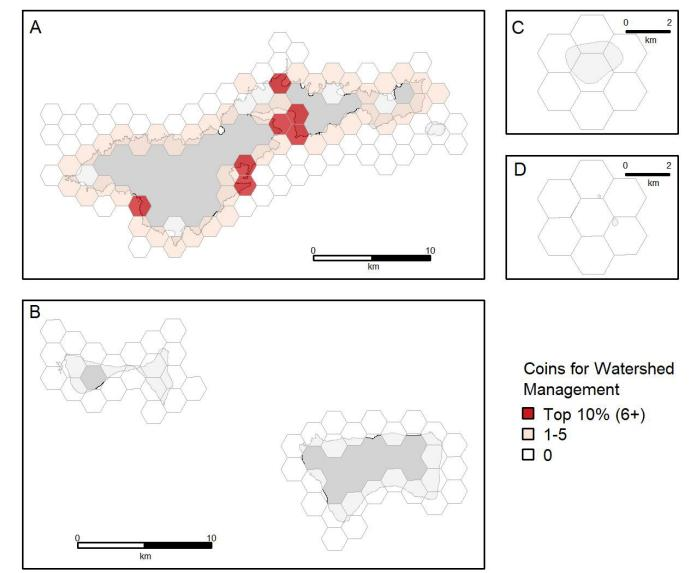

**Figure B.8.** Map of coins distributed for the Management Use *Watershed Management*.

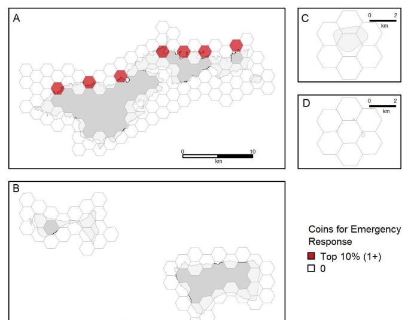

**Figure B.9.** Map of coins distributed for the Management Use *Emergency Response.* 

## **Appendix C. Individual Maps for Each Product Requirement**

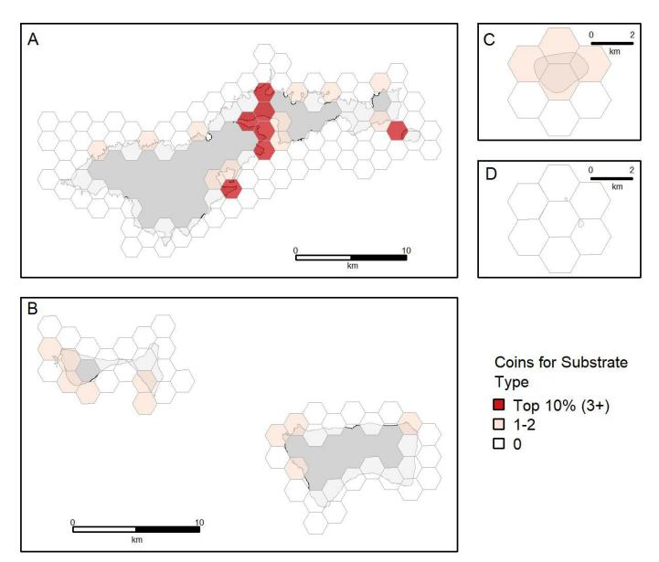

**Figure C.1.** Map of coins distributed for the Product Requirement *Substrate Types*.

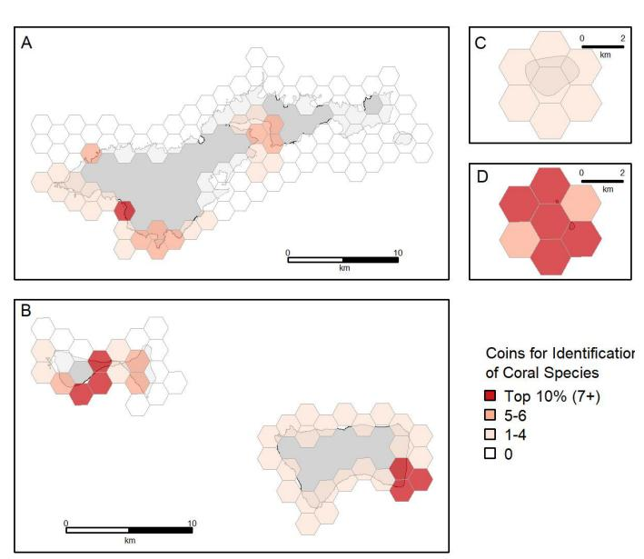

**Figure C.2.** Map of coins distributed for the Product Requirement *Identification of Coral Species*.

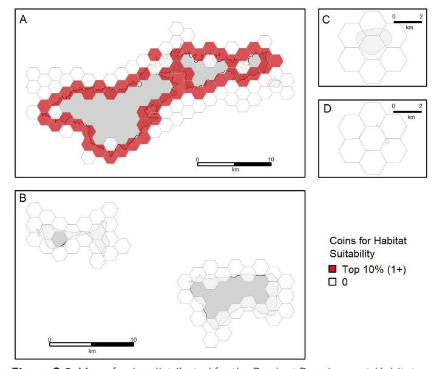

**Figure C.3.** Map of coins distributed for the Product Requirement *Habitat Suitability*.

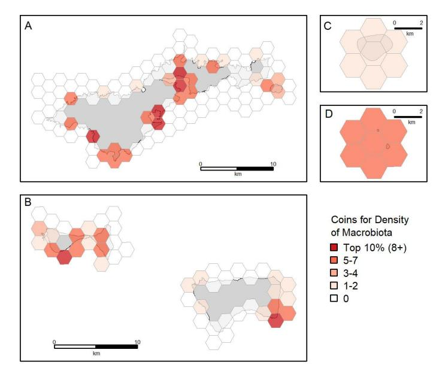

**Figure C.4.** Map of coins distributed for the Product Requirement *Density of Macrobiota*.

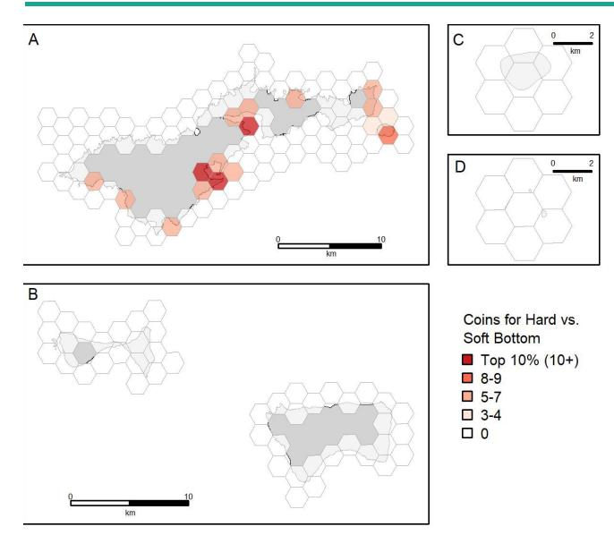

**Figure C.5.** Map of coins distributed for the Product Requirement *Hard vs. Soft Bottom.* 

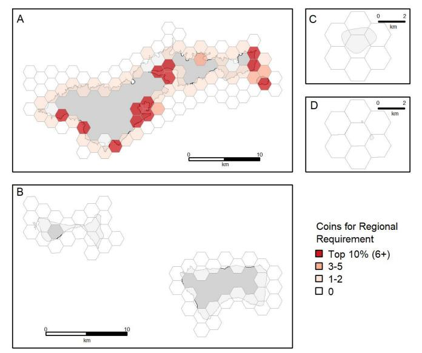

**Figure C.7.** Map of coins distributed for *Regional Scale* Product Requirements.

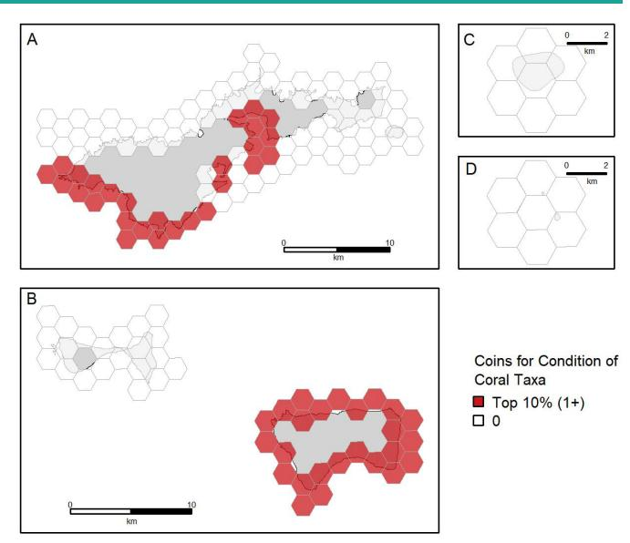

**Figure C.6.** Map of coins distributed for the Product Requirement *Condition of Coral Taxa*.

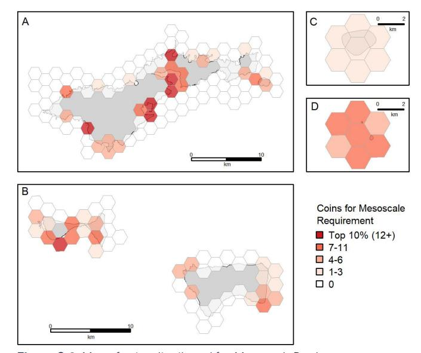

**Figure C.8.** Map of coins distributed for *Mesoscale* Product Requirements.

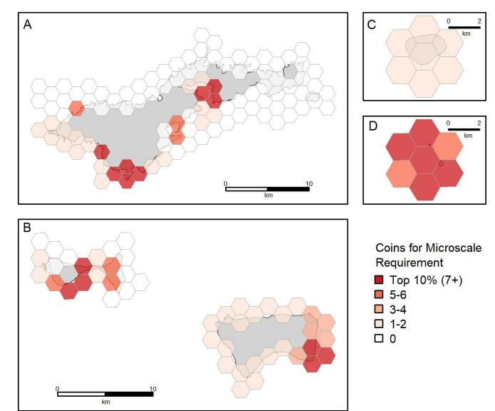

**Figure C.9.** Map of coins distributed for *Microscale* Product Requirements.

## **U.S. Department of Commerce**

Gina M. Raimondo, *Secretary* 

## **National Oceanic and Atmospheric Administration**

Richard W. Spinrad, Ph.D., *Under Secretary for Oceans and Atmosphere*

### **National Ocean Service**

Nicole LeBoeuf, *Assistant Administrator for National Ocean Service* 

The mission of the National Centers for Coastal Ocean Science is to provide managers with scientific information and tools needed to balance society's environmental, social and economic goals. For more information, visit: [http://www.coastalscience.noaa.gov/.](http://www.coastalscience.noaa.gov/)

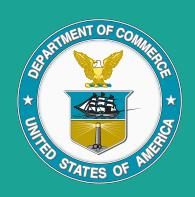

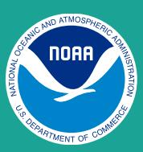