# **Natural Resource Condition Assessment**

## *National Park of American Samoa*

Natural Resource Report NPS/NPSA/NRR—2019/1894

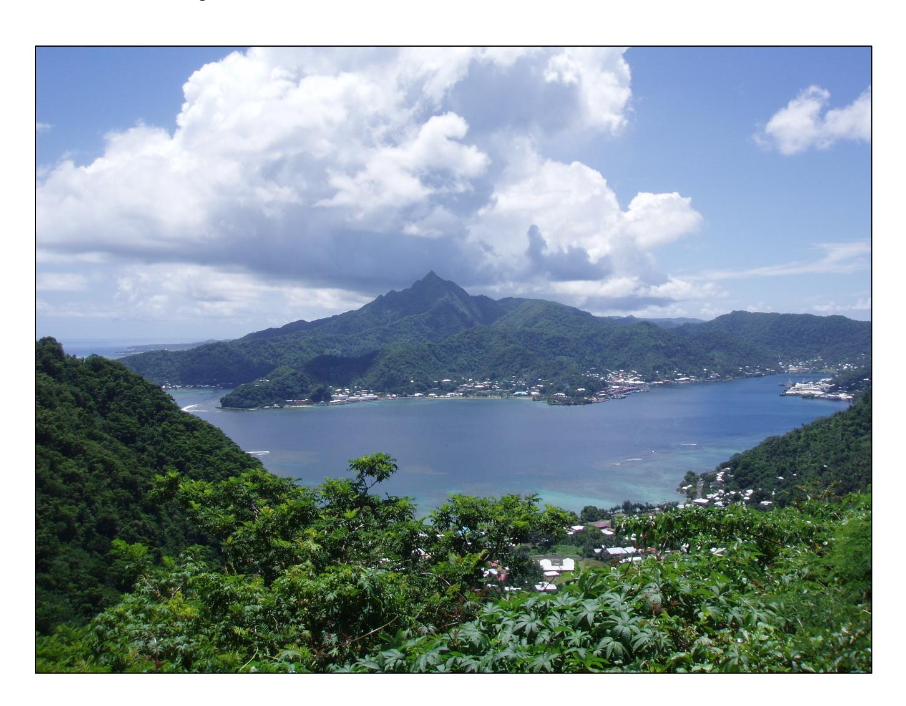

American Samoa

Photograph by: Peter Craig

# **Natural Resource Condition Assessment**

## *National Park of American Samoa*

Natural Resource Report NPS/NPSA/NRR—2019/1894

Peter Craig, 1 Jeremy Wimpy, 2 Nathan Reigner,3 William Valliere, 3 Tonnie Cummings4

1 Consultant Crockett, CA

2 Applied Trails Research State College, PA

3 Park Studies Laboratory The University of Vermont Burlington, Vermont 05405

4 National Park Service, Pacific West Region Vancouver, WA 98661

March 2019

U.S. Department of the Interior National Park Service Natural Resource Stewardship and Science Fort Collins, Colorado

The National Park Service, Natural Resource Stewardship and Science office in Fort Collins, Colorado, publishes a range of reports that address natural resource topics. These reports are of interest and applicability to a broad audience in the National Park Service and others in natural resource management, including scientists, conservation and environmental constituencies, and the public.

The Natural Resource Report Series is used to disseminate comprehensive information and analysis about natural resources and related topics concerning lands managed by the National Park Service. The series supports the advancement of science, informed decision-making, and the achievement of the National Park Service mission. The series also provides a forum for presenting more lengthy results that may not be accepted by publications with page limitations.

All manuscripts in the series receive the appropriate level of peer review to ensure that the information is scientifically credible, technically accurate, appropriately written for the intended audience, and designed and published in a professional manner.

Data in this report were collected using methods based on established, peer-reviewed protocols and were analyzed and interpreted within the guidelines of the protocols.

Statements, findings, conclusions, recommendations, and data in this report do not necessarily reflect views and policies of the National Park Service, U.S. Department of the Interior. Mention of trade names or commercial products does not constitute endorsement or recommendation for use by the U.S. Government.

This report is available in digital format from the [Natural Resource Publications Management](https://www.nps.gov/im/publication-series.htm)  [website.](https://www.nps.gov/im/publication-series.htm) If you have difficulty accessing information in this publication, particularly if using assistive technology, please email [irma@nps.gov.](mailto:irma@nps.gov)

Please cite this publication as:

Craig, P., J. Wimpy, N. Reigner, W. Valliere, and T. Cummings. 2019. Natural resource condition assessment: National Park of American Samoa. Natural Resource Report NPS/NPSA/NRR— 2019/1894. National Park Service, Fort Collins, Colorado.

## Contents

|                                                   | Page  |
|---------------------------------------------------|-------|
| Figures                                           | ix    |
| Tables                                            | xvii  |
| Executive Summary                                 | xxi   |
| Acknowledgements                                  | xxiii |
| Contributors                                      | xxiii |
| Acronyms and Abbreviations                        | xxv   |
| Chapter 1. NRCA Background Information            | 1     |
| Chapter 2. Introduction and Resource Setting      | 5     |
| 2.1. Introduction                                 | 5     |
| 2.1.1. Enabling Legislation                       | 5     |
| 2.1.2. Geographic Setting                         | 5     |
| 2.1.3. Visitation Statistics                      | 5     |
| 2.2. Natural Resources                            | 5     |
| 2.2.1. Ecological Units                           | 5     |
| 2.2.2. Resource Descriptions                      | 9     |
| 2.2.3. Resource issues overview                   | 11    |
| 2.3. Resource Stewardship                         | 17    |
| 2.3.1. Management Directive and Planning Guidance | 17    |
| 2.3.2. Status of Supporting Science               | 17    |
| 2.3.3. Literature Cited                           | 23    |
| Chapter 3. Study Scoping and Design               | 25    |
| 3.1. Study Scoping.                               | 25    |
| 3.2. Study Framework                              | 26    |
| 3.3. Reporting Categories                         | 26    |
| 3.4. General Approach and Methods                 | 28    |
| 3.4.1. Data Retrieval                             | 28    |

|                                                          | Page |
|----------------------------------------------------------|------|
| 3.4.2. Data Development and Analysis                     | 28   |
| 3.4.3. Scoring Methods and Assigning Condition           | 28   |
| 3.4.4. Preparation and Review of Draft Assessments       | 30   |
| 3.4.5. Development and Review of Final Assessments       | 30   |
| 3.4.6. Format of Reporting Category Assessment Documents | 31   |
| Chapter 4. Natural Resource Conditions                   | 33   |
| 4.1. Marine Water Quality                                | 33   |
| 4.1.1. Description                                       | 33   |
| 4.1.2. Data and Methods                                  | 36   |
| 4.1.3. Reference Condition                               | 37   |
| 4.1.4. Current Condition and Trend                       | 37   |
| 4.1.5. Literature Cited                                  | 51   |
| 4.2. Benthic Marine Community                            | 56   |
| 4.2.1. Description                                       | 56   |
| 4.2.2. Data and Methods                                  | 59   |
| 4.2.3. Reference Condition                               | 61   |
| 4.2.4. Condition and Trend                               | 62   |
| 4.2.5. Sources of Expertise                              | 71   |
| 4.2.6. Literature Cited                                  | 72   |
| 4.3. Marine Fish                                         | 79   |
| 4.3.1. Description                                       | 79   |
| 4.3.2. Data and Methods                                  | 81   |
| 4.3.3. Reference Condition                               | 82   |
| 4.3.4. Condition and Trend                               | 83   |
| 4.3.5. Sources of Expertise                              | 93   |
| 4.3.6. Literature Cited                                  | 93   |

|                             | Page |
|-----------------------------|------|
| 4.4. Sea Turtles            | 98   |
| 4.4.1. Description          | 98   |
| 4.4.2. Data and Methods     | 99   |
| 4.4.3. Reference Condition  | 99   |
| 4.4.4. Condition and Trend  | 99   |
| 4.4.5. Sources of Expertise | 107  |
| 4.4.6. Literature Cited     | 107  |
| 4.5. Rainforest             | 111  |
| 4.5.1. Description          | 111  |
| 4.5.2. Reference Conditions | 111  |
| 4.5.3. Data and Methods     | 116  |
| 4.5.4. Condition and Trend  | 117  |
| 4.5.5. Literature Cited     | 122  |
| 4.6. Cloud Forest           | 125  |
| 4.6.1. Description          | 125  |
| 4.6.2. Reference Condition  | 125  |
| 4.6.3. Data and Methods     | 126  |
| 4.6.4. Condition and Trend  | 126  |
| 4.6.5. Literature Cited     | 131  |
| 4.7. Fruit Bats             | 134  |
| 4.7.1. Description          | 134  |
| 4.7.2. Data and Methods     | 135  |
| 4.7.3. Reference Condition  | 136  |
| 4.7.4. Condition and Trend  | 137  |
| 4.7.5. Sources of Expertise | 146  |
| 4.7.6. Literature Cited     | 146  |

|                              | Page |
|------------------------------|------|
| 4.8. Forest Birds            | 150  |
| 4.8.1. Description           | 150  |
| 4.8.2. Data and Methods      | 152  |
| 4.8.3. Reference Condition   | 153  |
| 4.8.4. Condition and Trend   | 154  |
| 4.8.5. Sources of Expertise  | 163  |
| 4.8.6. Literature Cited      | 163  |
| 4.9. Seabirds                | 167  |
| 4.9.1. Description           | 167  |
| 4.9.2. Data and Methods      | 172  |
| 4.9.3. Reference Condition   | 173  |
| 4.9.4. Condition and Trend   | 173  |
| 4.9.5. Literature Cited      | 186  |
| 4.10. Streams                | 191  |
| 4.10.1. Description          | 191  |
| 4.10.2. Data and Methods     | 192  |
| 4.10.3. Reference Condition  | 194  |
| 4.10.4. Condition and Trend  | 195  |
| 4.10.5. Literature Cited     | 210  |
| 4.11. Air Quality            | 214  |
| 4.11.1. Description          | 214  |
| 4.11.2. Data and Methods     | 214  |
| 4.11.3. Reference Condition  | 215  |
| 4.11.4. Condition and Trends | 215  |
| 4.11.5. Literature Cited     | 217  |

|                                          | Page |
|------------------------------------------|------|
| Chapter 5. Key Threats to Park Resources | 219  |
| 5.1. Local Climate Change                | 219  |
| 5.1.1. Description                       | 219  |
| 5.1.2. Data and Methods                  | 219  |
| 5.1.3. Reference Condition               | 219  |
| 5.1.4. Status and Trends                 | 219  |
| 5.1.5. Literature Cited                  | 230  |
| 5.2. Fishing Pressure (Marine Harvest)   | 233  |
| 5.2.1. Description                       | 233  |
| 5.2.2. Data and Methods                  | 234  |
| 5.2.3. Reference Condition               | 236  |
| 5.2.4. Status and Trend                  | 236  |
| 5.2.5. Sources of Expertise              | 243  |
| 5.2.6. Literature Cited                  | 244  |
| 5.3. Invasive Vegetation                 | 247  |
| 5.3.1. Description                       | 247  |
| 5.3.2. Reference Condition               | 247  |
| 5.3.3. Data and Methods                  | 248  |
| 5.3.4. Condition and Trends              | 251  |
| 5.3.5. Sources of Expertise              | 259  |
| 5.3.6. Literature Cited                  | 259  |
| 5.4. Invasive Rats                       | 261  |
| 5.4.1. Description                       | 261  |
| 5.4.2. Data and Methods                  | 261  |
| 5.4.3. Reference Condition               | 262  |
| 5.4.4. Status and Trend                  | 262  |

|                                                | Page |
|------------------------------------------------|------|
| 5.4.5. Literature Cited                        | 265  |
| Chapter 6. Discussion                          | 269  |
| 6.1. Reporting Category Data Gaps              | 269  |
| 6.2. Reporting Category Condition Designations | 271  |
| 6.3. Literature Cited                          | 279  |

## **Figures**

|                                                                                                                                                                                                                                                             | Page |
|-------------------------------------------------------------------------------------------------------------------------------------------------------------------------------------------------------------------------------------------------------------|------|
| Figure 1. Schematic diagram of NPSA showing the condition of key terrestrial and marine resources from mountaintop to ocean xxii                                                                                                                         |      |
| Figure 2. Pacific Ocean, showing the remote location of American Samoa 6                                                                                                                                                                                    |      |
| Figure 3. Samoan Archipelago, a chain of volcanic islands formed as the Pacific tectonic plate glided over a 'hot spot' of thermal activity in the earth's core 6                                                                                        |      |
| Figure 4. Total land and reef areas in American Samoa 7                                                                                                                                                                                                  |      |
| Figure 5. (A) Tutuila is the largest and most populated island in American Samoa, but large areas remain forested and relatively inaccessible 8                                                                                                          |      |
| Figure 6. Lightly populated Manuan Islands of Ofu (left) and Ta'u (right) 8                                                                                                                                                                                 |      |
| Figure 7. Map of NPSA Boundaries 9                                                                                                                                                                                                                          |      |
| Figure 8. Distribution of shorefish species in the Indo-Pacific region, with highest species richness in Indonesia and Malaysia and progressively fewer species occurring eastward 10                                                                 |      |
| Figure 9. Examples of nearshore marine habitats in NPSA: boulder corals and sand in Ofu lagoon (left); corals on thin veneer of crustose coralline algae covering a basalt foundation (middle); reef slope of crustose coralline algae with corals 11 |      |
| Figure 10. Examples of coral bleaching in NPSA due to climate-induced increases in water temperature 13                                                                                                                                                  |      |
| Figure 11. Invasive trees 14                                                                                                                                                                                                                             |      |
| Figure 12. Subsistence fishing 15                                                                                                                                                                                                                           |      |
| Figure 13. Tracks of cyclones during the 10-year period 1994-2003 16                                                                                                                                                                                        |      |
| Figure 14. Cyclone damage 16                                                                                                                                                                                                                             |      |
| Figure 15. Several Crown of Thorns starfish and their white feeding scars left on a table top coral in 2015 17                                                                                                                                           |      |
| Figure 16. Global location of American Samoa (top) and bathymetry map of Samoan Archipelago 33                                                                                                                                                           |      |
| Figure 17. Nearshore waters in NPSA: (A) lava shoreline in Tutuila Unit, and (B) shallow fringing coral reefs around Ofu Island, with the approximate NPSA boundary illustrated 34                                                                    |      |

|                                                                                                                                                                                                                                                                                                                                                 | Page |
|-------------------------------------------------------------------------------------------------------------------------------------------------------------------------------------------------------------------------------------------------------------------------------------------------------------------------------------------------|------|
| Figure 18. Major surface currents in the South Pacific Ocean 39                                                                                                                                                                                                                                                                                 |      |
| Figure 19. Monthly sea surface temperatures (SST) over an average annual cycle from 1985 to 2006 39                                                                                                                                                                                                                                          |      |
| Figure 20. Annual sea surface temperature (SST) and anomaly values, 1985- 2006 40                                                                                                                                                                                                                                                               |      |
| Figure 21. Ocean temperature profiles located at 2 km and 80 km north of Tutuila Island, Nov. 1993 40                                                                                                                                                                                                                                        |      |
| Figure 22. Water column profiles around Tutuila Island, February 2006, showing location of sampling stations A-J (top figure), and shallow-water profiles for water column temperature, salinity, density, and beam transmission (bottom figure), with profiles shown sequentially (A-J) in a clockwise direction around the island 41 |      |
| Figure 23. Average offshore chlorophyll-a concentrations estimated from the SeaWiFS satellite, 1998 to 2007 42                                                                                                                                                                                                                               |      |
| Figure 24. Nearshore water quality parameters in the 20 m depth zone around Tutuila Island, Feb. 2006 43                                                                                                                                                                                                                                     |      |
| Figure 25. Box-and-whisker plots comparing water quality parameters in nearshore waters in park (NPSA) and outside park (TERR) 44                                                                                                                                                                                                         |      |
| Figure 26. Relationship between sample depth (m) and the concentration of dissolved inorganic nitrogen (DIN) in nearshore waters around the high islands of American Samoa, including sites inside and outside NPSA 47                                                                                                                    |      |
| Figure 27. Percentage of Enterococci bacteria samples that exceeded ASEPA water quality standards in shoreline waters at Fagasa and Vatia Villages in 2014 48                                                                                                                                                                                |      |
| Figure 28. Hawaiian trends in increasing atmospheric carbon dioxide (CO2) and pH 49                                                                                                                                                                                                                                                             |      |
| Figure 29. Examples of coral reef substrates in NPSA's Tutuila Unit showing: (A) a structurally complex substrate of live corals and crustose coralline algae, and (B) a veneer of mostly turf and coralline algae covering basalt pavement 56                                                                                            |      |
| Figure 30. Average coral cover in permanent transects in Fagatele Bay, Tutuila Island 62                                                                                                                                                                                                                                                        |      |
| Figure 31. Marine benthic sampling area in 10-20 m depth zone on hard-bottom substrates in NPSA's Tutuila Unit 62                                                                                                                                                                                                                            |      |
| Figure 32. Percent cover for the top ten substrate types/taxa in NPSA's Tutuila Unit from 2007-2015 63                                                                                                                                                                                                                                       |      |

|                                                                                                                                                                                                                                                                    | Page |
|--------------------------------------------------------------------------------------------------------------------------------------------------------------------------------------------------------------------------------------------------------------------|------|
| Figure 33. Percent cover of coral, macroalgae, coralline algae, coral species richness, coral bleaching and disease, and reef rugosity at 15 fixed sites in NPSA's Tutuila Unit, 2007-2015 64                                                                |      |
| Figure 34. Percentage of coral cover at fixed and temporary sites in NPSA's Tutuila Unit, 2007-15 65                                                                                                                                                            |      |
| Figure 35. Comparisons of coral cover reported in reef monitoring programs conducted in NPSA and in islandwide surveys around Tutuila by DMWR and NOAA 65                                                                                                       |      |
| Figure 36. Examples of warm-water coral bleaching: partial bleaching on a boulder coral (top left), coral disease (white syndrome) that swept across a table coral (top right), and large white feeding scars caused by Crown of Thorns starfish (bottom) 67 |      |
| Figure 37. Sea surface temperatures (SST) in Samoa, 2014-2015, showing extended warm temperatures (above the Bleaching Threshold SST) in early 2015, resulting in a coral bleaching Alert Level 2 67                                                         |      |
| Figure 38. Outbreak locations of Crown of Thorns starfish observed during towed snorkeler surveys conducted in 2014 in NPSA 68                                                                                                                                  |      |
| Figure 39. Before and after photos of coral reefs impacted by Cyclone Wilma (2011) at a permanent transect in NPSA's Tutuila Unit 69                                                                                                                            |      |
| Figure 40. Examples of common marine fish in American Samoa: (clockwise from upper left) convict tang, blue-lined surgeonfish, fusiliers, blacktip reef shark 80                                                                                                |      |
| Figure 41. Fish biomass per reef-area by trophic grouping, and reef fish reference points generated by model predictions 83                                                                                                                                     |      |
| Figure 42. Proportions of primary, secondary, and apex consumer groups in the marine fish assemblage by biomass (left) and density (right) in NPSA's Tutuila Unit, all transects, 2010-15 86                                                                 |      |
| Figure 43. Average species richness of marine fish in fixed transects (indicated by numbers) across NPSA's Tutuila Unit, 2011-15 87                                                                                                                             |      |
| Figure 44. Marine fish (combined species): trends in species richness (no./100 m2 ), species diversity (Shannon Index, H'), fish biomass (mt/km2 ), and density (no./ha) in 15 fixed (permanent) transects in NPSA's Tutuila Unit 88                   |      |
| Figure 45. Fish biomass (combined species) in islandwide surveys on Tutuila conducted by NOAA compared with surveys conducted in NPSA's Tutuila Unit 89                                                                                                         |      |

|                                                                                                                                                                                    | Page |
|------------------------------------------------------------------------------------------------------------------------------------------------------------------------------------|------|
| Figure 46. Length frequency of fish counted in fixed and temporary transects in all years, 2010-15 (n = 6,252 fish) in NPSA's Tutuila Unit 90                                   |      |
| Potential sea turtle nesting habitat in NPSA's Ofu Unit 98 Figure 47.                                                                                                           |      |
| Figure 48. Location of seven green turtle rookeries in the western and central Pacific that were genetically independent and constituted separate management units 100          |      |
| Figure 49. Migrations of 15 green sea turtles that nested at Rose Atoll, American Samoa (AS), and then migrated to foraging areas at distant locations 101                      |      |
| Figure 50. Migrations of nine hawksbill sea turtles that nested in American Samoa (AS) on Tutuila and Ofu Islands, and then migrated to foraging areas at distant locations 101 |      |
| Figure 51. Location of sea turtle nests on Ofu Island during the 2014-15 nesting season. NPSA's Ofu Unit is approximated by a yellow line 103                                   |      |
| Figure 52. World map showing green turtle nesting sites and delineation of 11 distinct population segments 105                                                                  |      |
| Figure 53. Schematic drawing of traditional ecological land zones in American Samoa 111                                                                                            |      |
| Figure 54. Invasive species example 115                                                                                                                                            |      |
| Figure 55. Invasive species example 116                                                                                                                                            |      |
| Figure 56. Samoan Crops: from upper left, taro, breadfruit, bananas, coconuts 118                                                                                                  |      |
| Figure 57. Subsistence farming delineation 119                                                                                                                                     |      |
| Figure 58. 2002 aerial photograph showing coconut trees and banana trees adjacent to a freshly planted taro field, Ofu Island 119                                               |      |
| Figure 59. Typical land use practices in American Samoa 120                                                                                                                        |      |
| Figure 60. Tutulia and Aunu'u landslide risk map 121                                                                                                                               |      |
| Figure 61. Schematic drawing of traditional ecological land zones in American Samoa 125                                                                                            |      |
| Figure 62. Samoan fruit bat (P. samoensis) roosting in a tree 134                                                                                                                  |      |
| Figure 63. Samoan fruit bats roosting in trees in Vatia (left), and white-naped fruit bats flying above their roost in Fagatele Bay (right) 135                                 |      |
| Figure 64. Traditional and temporary roost sites for white-naped fruit bats (P. tonganus) on Tutuila Island, 1987-1996 138                                                      |      |

|                                                                                                                                                                                    | Page |
|------------------------------------------------------------------------------------------------------------------------------------------------------------------------------------|------|
| Figure 65. Locations of white-naped fruit bat colonies (P. tonganus) in NPSA's Unit, 2007-2008 139                                                                           |      |
| Figure 66. Three single-evening flights of one radio-collared P. tonganus on Tutuila Island 140                                                                              |      |
| Figure 67. Home ranges of three radio-tagged P. tonganus that roosted in Amalau Valley, Tutuila, 2002-2003 141                                                                  |      |
| Figure 68. Foraging range of one radio-collared Samoan fruit bat (P. samoensis) during several days and nights in NPSA's Tutuila Unit, 1995 142                                 |      |
| Figure 69. Population estimates of the white-naped fruit bat (P. tonganus) on Tutuila Island, 1987-2005 143                                                                  |      |
| Figure 70. Forest birds and rainforest habitat in NPSA's Tutuila Unit 151                                                                                                          |      |
| Figure 71. Relative abundance of forest bird species in park surveys conducted in 2011 compared to island-wide surveys conducted in 1986, Tutuila and Ta'u islands combined 155 |      |
| Figure 72. Wattled Honeyeater occurrence in NPSA's Tutuila and Ta'u Units in 2011 156                                                                                              |      |
| Figure 73. Relationship between the distribution and relative abundance of forest bird species in NPSA's Tutuila and Ta'u Units, 2011 157                                       |      |
| Figure 74. Monthly densities of three bird species at one site in NPSA's Tutuila Unit (Amalau Valley), 1998-2008 158                                                            |      |
| Figure 75. Comparison of bird densities in NPSA's Tutuila and Ta'u Units in 2011 with islandwide densities in 1986 159                                                          |      |
| Figure 76. Cyclone damage. Cyclone Olaf, a Category-5 cyclone, severely damaged rainforests on Ta'u Island in 2005 160                                                       |      |
| Figure 77. Invasive trees. Rapidly spreading invasive tamaligi trees (Falcataria moluccana) in NPSA's Tutuila Unit, ca 2005 161                                                 |      |
| Figure 78. Map of US Pacific Islands where the US Fish and Wildlife Service has inventoried seabirds 167                                                                        |      |
| Figure 79. Two common seabirds in American Samoa: Red-footed Booby on Tutuila (left), Tahiti Petrel on Mt. Lata, Ta'u (right) 168                                               |      |
| Figure 80. Seabird nesting habitat on cliffs and trees in NPSA's Tutuila Unit: Pola Island (left), Agapie Cove (right) 171                                                      |      |

|                                                                                                                                                                                                                    | Page |
|--------------------------------------------------------------------------------------------------------------------------------------------------------------------------------------------------------------------|------|
| Figure 81. Ta'u Island (elevation 965 m), south side 172                                                                                                                                                           |      |
| Figure 82. Number of breeding and visitor seabird species in American Samoa (from Table 32) 173                                                                                                                 |      |
| Figure 83. Population estimates of seabirds (species combined) on American Samoa islands in 1975-76 (from Table 38) 177                                                                                         |      |
| Figure 84. Sooty Terns at Rose Atoll, American Samoa 177                                                                                                                                                           |      |
| Figure 85. Seabird species composition (top) and counts or estimates (bottom) on Tutuila Island in 1975-76 and 2000-03 178                                                                                      |      |
| Figure 86. Comparison of principal seabird species counted in two sections around the Tutuila coastline: inside and outside NPSA 183                                                                            |      |
| Figure 87. Coastal seabird colonies on Tutuila 183                                                                                                                                                                 |      |
| Figure 88. Estimated petrel nesting area in the cloud forest summit of Ta'u Island, American Samoa 184                                                                                                       |      |
| Figure 89. North side of Tutuila showing steep rainforest slopes in NPSA (left) and a small stream near Vatia (right) 191                                                                                       |      |
| Figure 90. Streams sampled for water quality and macrofauna in NPSA's Tutuila Unit (top, left to right: Fagatuitui, Leafu, Amalau Streams) and Ta'u Unit (bottom: Laufuti Stream) by the NPS I&M program 193 |      |
| Figure 91. Daily discharge in Pago Stream at Afono Village, next to NPSA's Tutuila Unit, in 1987-1988 195                                                                                                       |      |
| Figure 92. Rainfall levels in American Samoa, based on an elevational model using available rainfall records 196                                                                                                |      |
| Figure 93. Annual rainfall at Tafuna airport, American Samoa 196                                                                                                                                                   |      |
| Figure 94. Low flow conditions in a small stream flowing into the ocean in NPSA's Tutuila Unit (near Tafeu Cove) 197                                                                                         |      |
| Figure 95. Turbid flooding 197                                                                                                                                                                                     |      |
| Figure 96. Impact status of streams on Tutuila Island, American Samoa 199                                                                                                                                          |      |
| Figure 97. Number of freshwater fish species (including some estuarine species) in Oceania by country 203                                                                                                       |      |

|                                                                                                                                                                                                                                                    | Page |
|----------------------------------------------------------------------------------------------------------------------------------------------------------------------------------------------------------------------------------------------------|------|
| Figure 98. Examples of stream macrofauna in American Samoa: (top to bottom) fish (Kuhia salelea, Stiphodon elegans), shrimp (Macrobrachium lar), and snails (Neritina variegate, Clithon corona, Septaria sanguisuga) 204                    |      |
| Figure 99. Wet Deposition of Air Pollutants in American Samoa 216                                                                                                                                                                                  |      |
| Figure 100. Atmospheric concentrations of carbon dioxide (CO2) in American Samoa and globally 220                                                                                                                                               |      |
| Figure 101. Sign and magnitude of air temperature trends (°C/decade) at Pacific Island meteorological stations, 1960–2009 221                                                                                                                   |      |
| Figure 102. Annual mean air temperature at two NOAA weather stations on Tutuila Island 222                                                                                                                                                      |      |
| Figure 103. Recent temperature percentiles at NPSA (including areas within 30 km of the park's boundary) 223                                                                                                                                    |      |
| Figure 104. Annual rainfall at the Tafuna airport, American Samoa. Source: www.ncdc.noaa.gov 224                                                                                                                                                |      |
| Figure 105. Recent precipitation percentiles at NPSA (including areas within 30 km of the park's boundary) 224                                                                                                                                  |      |
| Figure 106. Tracks of cyclones during the 10-year period 1994-2003 225                                                                                                                                                                             |      |
| Figure 107. Sea surface temperature from CoRTAD, 1985-2006 227                                                                                                                                                                                  |      |
| Figure 108. Nearshore ocean temperatures in NPSA's Ofu Unit: Ofu lagoon (Pool 300), 1999-2013 227                                                                                                                                               |      |
| Figure 109. Trends in increasing atmospheric carbon dioxide (CO2) in Hawaii and changes in ocean chemistry 228                                                                                                                                  |      |
| Figure 110. Sea level trends for 1993–2010 measured by satellite altimetry, in millimeters 228                                                                                                                                                  |      |
| Figure 111. Subsistence fishing activities in American Samoa. Clockwise from top left: spear fisherman with catch, rod and reel fishing, nighttime palolo (polychaete) fishing, and traditional enu basket fishing for juvenile goatfish 234 |      |
| Figure 112. Abundance by size class of fish and sharks (>19 cm), species combined, on reef slopes in Ofu-Olosega and Tutuila, 2002 241                                                                                                          |      |

|                                                                                                                                                          | Page |
|----------------------------------------------------------------------------------------------------------------------------------------------------------|------|
| Figure 113. Lengths of harvested giant clams (n = 107), mostly Tridacna maxima 241                                                                    |      |
| Figure 114. Top 40 species contributing to the biomass of Tutuila's forests 252                                                                          |      |
| Figure 115. Contribution of non-native and native plant species to forest biomass of Tutuila's forests 253                                            |      |
| Figure 116. NPSA invasive species control crew girdling tamaligi 254                                                                                     |      |
| Figure 117. Tamaligi trees after mechanical control 254                                                                                                  |      |
| Figure 118. Map of Tutuila Island indicating the boundary of the National Park of American Samoa in the Tutuila Unit 255                              |      |
| Figure 119. Tamaligi removal by year, American Samoa. For graphic purposes, the 800 trees removed during 2001 – 2004 are shown as yearly averages 256 |      |
| Figure 120. Tamaligi killed by diameter at breast height, American Samoa, 2001-2016. T. Toiga 2017 256                                                |      |
| Figure 121. Norway rats (Rattus norvegicus) captured on the summit of Ta'u Island in 2001 263                                                         |      |
| Figure 122. Condition comparison of selected resources in NPSA's terrestrial and marine environments 272                                              |      |
| Figure 123. Schematic diagram of NPSA showing the condition of key terrestrial and marine resources from mountain top to ocean 272                    |      |

## **Tables**

| Table E-1. Resource Section Authors xxiii                                                                                                                                                                                                              |  |
|--------------------------------------------------------------------------------------------------------------------------------------------------------------------------------------------------------------------------------------------------------|--|
| Islands with NPSA Units 9 Table 1.                                                                                                                                                                                                                  |  |
| Table 2. Key threats to natural resources in NPSA and American Samoa 12                                                                                                                                                                                |  |
| Table 3. Climate change indicators in American Samoa and globally 13                                                                                                                                                                                   |  |
| Table 4. PACN list of Vital Signs 19                                                                                                                                                                                                                |  |
| Table 5. Proposed life zones of NPSA for use in the NPSA NRCA 27                                                                                                                                                                                       |  |
| Table 6. Scale for a measure's Significance Level in determining condition 29                                                                                                                                                                          |  |
| Scale for Condition Level of individual measures 29 Table 7.                                                                                                                                                                                        |  |
| Table 8. Symbol description in the component condition graphics 30                                                                                                                                                                                     |  |
| Table 9. Summary of water quality standards in American Samoa for open coastal marine waters, which include NPSA 35                                                                                                                                 |  |
| Table 10. Water quality abbreviations and units used in this section 35                                                                                                                                                                                |  |
| Table 11. Nearshore water quality parameters from pooled data from 49 randomly selected sites (0.2-38 m depth zone) around the main islands of American Samoa in April-August 2004, both inside and outside NPSA 45                              |  |
| Table 12. Marine water quality in fixed transects in NPSA's Tutuila Unit, 2009-2013. Non-compliance rates for all data (both fixed and temporary transects) with water quality standards (ASEPA 2013) are listed for Tutuila and Ofu Units 46 |  |
| Table 13. Significance levels and condition levels used to calculate the weighted condition score (WCS) for NPAS's marine water quality 51                                                                                                          |  |
| Occurrence of coral species in NPSA and in American Samoa that are listed Table 14. under the Endangered Species Act (NOAA 2014) or the IUCN Red List as modified by Kenyon et al. (2011) 57                                                  |  |
| Table 15. Significance levels and condition levels used to calculate the weighted condition score (WCS) for NPAS's marine benthic community 71                                                                                                      |  |
| Table 16. Marine fish and shark species on the 2011 IUCN Red List of Threatened Species that were observed in American Samoa during NOAA's coastal surveys, 2000- 2009 80                                                                        |  |
| Table 17. Top ten fish families by abundance in NPSA's Tutuila Unit, all permanent and temporary transects, 2010-15 84                                                                                                                              |  |

## **Tables (continued)**

|                                                                                                                                        | Page |
|----------------------------------------------------------------------------------------------------------------------------------------|------|
| Table 18. Top ten fish families biomass in NPSA's Tutuila Unit, all permanent and temporary transects, 2010-15 85                   |      |
| Table 19. Top ten fish species by density in NPSA's Tutuila Unit in all permanent and temporary transects, 2010-15 85               |      |
| Table 20. Top ten fish species biomass in NPSA's Tutuila Unit in all permanent and temporary transects, 2010-15 86                  |      |
| Table 21. Significance levels and condition levels used to calculate the weighted condition score (WCS) for NPSA's marine fish 93   |      |
| Table 22. Significance levels and condition levels used to calculate the weighted condition score (WCS) for NPSA's sea turtles 107  |      |
| Table 23. Estimated land area by status, 1985 and 2001 113                                                                             |      |
| Table 24. Invasive and non-native plant species found in American Samoa 114                                                            |      |
| Table 25. Significance levels and condition levels used to calculate the weighted condition score (WCS) for NPSA's rainforest 122   |      |
| Table 26. Estimated land area by status, 1985 and 2001. Reproduced from Donnegan et al. 2004 127                                    |      |
| Table 27. Relative dominance of tree species in cloud forest. Reproduced from Whistler 1980 128                                     |      |
| Table 28. Trees and shrubs of secondary scrub forest. Reproduced from Whistler 1992 129                                                |      |
| Table 29. Significance levels and condition levels used to calculate the weighted condition score (WCS) for NPSA's cloud forest 131 |      |
| Table 30. Significance levels and condition levels used to calculate the weighted condition score (WCS) for NPSA's fruit bats 146   |      |
| Table 31. Forest birds of Tutuila and Ta'u Islands, American Samoa 152                                                                 |      |
| Table 32. Forest bird density (birds/ha) and abundance (birds/park unit) in NPSA (mean ± SE), 2011 154                              |      |
| Table 33. Forest bird density (birds/ha) and abundance (birds/park unit) in NPSA (mean ± SE), 2011 158                              |      |
| Table 34. Significance levels and condition levels used to calculate the weighted condition score (WCS) for NPSA's forest birds 163 |      |

## **Tables (continued)**

|                                                                                                                                                                   | Page |
|-------------------------------------------------------------------------------------------------------------------------------------------------------------------|------|
| Table 35. Sea bird species recorded in American Samoa (AS) and in NPSA 168                                                                                        |      |
| Table 36. Conservation classification of breeding seabirds in American Samoa (USFWS 2005) 174                                                                  |      |
| Table 37. Population estimates of seabirds in American Samoa summarized from colony observations in 1975-76 176                                                |      |
| Table 38. Historical summary of seabirds observed in American Samoa, 1966-2001, compiled by O'Connor and Rauzon (2004) 179                                     |      |
| Table 39. Significance levels and condition levels used to calculate the weighted condition score (WCS) for NPSA's seabirds 186                                |      |
| Table 40. Water quality criteria for fresh surface waters in American Samoa (ASEPA 2013, Tuitele et al. 2016) 192                                              |      |
| Table 41. ASEPA impact classification of watersheds in or near NPSA based on density of humans in watershed (DiDonato 2004a) 198                               |      |
| Table 42. Range of annual water quality values in four NPSA streams in the Tutuila Unit (Fagatuitui, Leafu, Amalau) a Ta'u Unit (Laufuti) during 2009-2014 200 |      |
| Table 43. Principal fish, shrimp, and snail species in American Samoan streams 205                                                                                |      |
| Table 44. Significance levels and condition levels used to calculate the weighted condition score (WCS) for NPSA's streams 209                                 |      |
| Table 45. Significance levels and condition levels used to calculate the weighted condition score (WCS) for NPSA's air quality 217                             |      |
| Table 46. Temperature and rainfall summaries at newly established weather stations in NPSA, 2012-14 223                                                     |      |
| Table 47. List of cyclones that damaged portions of the main islands of American Samoa (AS), 1978-2014 226                                                     |      |
| Table 48. Sea level rise in American Samoa and other locations 229                                                                                                |      |
| Table 49. Climate change indicators in American Samoa and globally 229                                                                                            |      |
| Table 50. Significance levels and condition levels used to calculate the weighted condition score (WCS) for NPSA's local climate change 230                    |      |
| Table 51. Annual catch and composition of harvested fish (by family) and invertebrates (by species) 239                                                        |      |

## **Tables (continued)**

|                                                                                                                                                                                                | Page |
|------------------------------------------------------------------------------------------------------------------------------------------------------------------------------------------------|------|
| Table 52. Significance levels and condition levels used to calculate the weighted condition score (WCS) for NPSA's fishing pressure 243                                                     |      |
| Table 53. The most common invasive plant species observed by Whistler (1995) in eight forest plots in National Park of American and Ta'u 248                                                |      |
| Table 54. Invasive tree species observed by Webb and Fa'aumu (1999) and Webb et al. (1999) on forest plots in National Park of American Samoa on the island of Tutuila 249                  |      |
| Table 55. Invasive plant species found in American Samoa by Space and Flynn (2000), but not yet present or well established in the National Park of American Samoa 250                      |      |
| Table 56. The most common invasive plant species observed during vegetation transects in the National Park of American Samoa on the islands of Tutuila and Ta'u during 2003 and 2004 251 |      |
| Table 57. Lopa and rubber tree removal by year (2007-2013), American Samoa 257                                                                                                                 |      |
| Table 58. Significance levels and condition levels used to calculate the weighted condition score (WCS) for NPSA's invasive vegetation 259                                                  |      |
| Table 59. Confirmed distribution of rat and mouse species in American Samoa 261                                                                                                                |      |
| Table 60. Significance levels and condition levels used to calculate the weighted condition score (WCS) for NPSA's invasive rats 265                                                        |      |
| Table 61. Identified data gaps or needs for components featured in this assessment 269                                                                                                         |      |
| Table 62. Summary of condition assessments for NPSA's reporting categories (ranked from high to low) 274                                                                                    |      |
| Table 63. NRCA summary of NPSA's terrestrial resources 275                                                                                                                                     |      |
| Table 64. NRCA summary of NPSA's marine resources (ranked from high to low) 277                                                                                                                |      |

## **Executive Summary**

The Natural Resource Condition Assessment Program (NRCA) provides managers of the National Park of American Samoa (NPSA) with an assessment of its most important natural resources. Overall, the NRCA document should help managers develop near-term management priorities, engage in partnership and education efforts, conduct park planning, and report program performance. A literature search has been provided to the park as a supplement to its digital library.

NPSA is the only National Park located south of the equator. Its park units are located on three remote islands covered by tropical rainforests and surrounded by coral reefs. For this review, the NRCA team selected seven terrestrial resources (rainforests, cloud forests, fruit bats, forest birds, seabirds, streams, air quality) and four marine resources (marine water quality, coral reefs, fish, sea turtles) for evaluation. The park also requested reviews of four threats to these resources (climate change, fishing pressure, invasive plants, and invasive rats). The condition of these categories varied in 2015, and several components could not be accurately determined due to lack of data.

Overall, NPSA's natural resources were either in good condition or of moderate concern, with terrestrial resources scoring better than marine resources (Figure 1). Five terrestrial resources were in good condition (rainforests, cloud forests, forest birds, fruit bats, streams), one was of moderate conservation concern (seabirds), and another (air quality) was not evaluated due to insufficient data.

Key terrestrial threats were of moderate concern (climate change, invasive rats) or of significant concern (invasive plants).

The park's marine resources were of moderate concern (marine water quality, coral reefs, fish) or significant concern (sea turtles). Key marine threats were also of moderate concern (climate change, fishing pressure). Climate change was the main reason why marine resources did not score as well as terrestrial resources. Climate induced increases in water temperatures have caused multiple coral bleaching events (which can kill corals) in the park. Baseline environmental conditions that formerly supported park reefs are changing and projected to worsen. Terrestrial impacts are likely occurring as well, but changes have been less visible and less studied to date.

The absence of trends for many of NPSA's resources reflected two points: first, the I&M Vital Signs monitoring program was relatively new in NPSA, and trend data were not available for most resources at the time of this review, and next, several resources selected for evaluation were not part of the Pacific Island Network (PACN) Vital Sign program (e.g., sea turtles, fruit bats, seabirds, fishing pressure, climate change, invasive rats) and lacked systematic monitoring. For these resources, the team developed ad hoc measures of resource condition based on available data, but confidence in these assessments was not high. This could be improved in future assessments by systematically obtaining data on the most appropriate condition measures.

Two habitats in NPSA may warrant consideration as special management units: Ofu lagoon and Ta'u cloud forest.

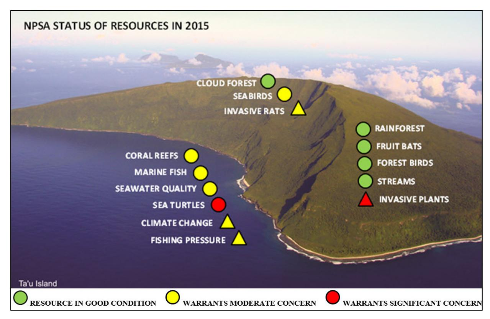

**Figure 1.** Schematic diagram of NPSA showing the condition of key terrestrial and marine resources from mountaintop to ocean. Major threats to resources (triangles) are also indicated. The background photo is Ta'u Island and all visible portions are within NPSA's Ta'u Unit. Source: Illustration P. Craig.

## **Acknowledgements**

This project was a Cooperative Agreement between the National Park Service and the University of Vermont (UVM). The Park Studies Laboratory at UVM organized and managed the project team. The project team wishes to acknowledge the following individuals whose help was greatly appreciated. During the project team's field visit to American Samoa in 12/2015, input on project priorities was gathered through discussions with NPSA staff (Jim Bacon, Sean Eagan, Tim Clark, Tavita Togia, Visa Vaivai, Carlo Caruso), on-island local agency staff at Dept. of Marine and Wildlife Resources (Domingo Ochavillo, Adam Miles, Mark McDonald), American Samoa Coral Reef Advisory Group (Alice Lawrence, Jeremy Rayno), National Marine Sanctuary (Lelei Peau), and other coral reef specialists (Doug Fenner, Steve Palumbi, Megan Morikawa). Kelly Kozar provided assistance with the I&M database. In addition, editorial comments on draft sections were received from the following NPS staff: Marsha Davis, Tim Clark, Sheila McKenna, Tavita Togia, Mietek Kolipinski, Sarah Allen, and NRCA reviewers Charles Birkeland, Eric Brown, Douglas Fenner, Holly Freifeld, Tahzay Jones, Mietek Kolipinski, Mark Rauzon, Judy Rocchio, Cathy Schwemm, Joshua Seamon, Ruth Utzurrum, Don Vargo, Edward Webb, and Art Whistler. Copy editing was completed by George Allez.

## **Contributors**

**Table E-1.** Resource Section Authors

| Authors                                    | Affliation                                        | Resource Sections                                                                                                                                                                                                                                                 |
|--------------------------------------------|---------------------------------------------------|-------------------------------------------------------------------------------------------------------------------------------------------------------------------------------------------------------------------------------------------------------------------|
| Peter Craig                                | Consultant                                        | 2.2 Natural Resources 4.1 Marine Water Quality 4.2 Benthic Marine Community 4.3 Marine Fish 4.4 Sea Turtles 4.7 Fruit Bats 4.8 Forest Birds 4.9 Sea Birds 4.10 Streams 5.1 Climate Change 5.2 Fishing Pressure 5.4 Invasive Rats |
| Dr. Jeremy Wimpy                           | Applied Trails Research                           | 4.5 Rainforest 4.6 Cloud Forest                                                                                                                                                                                                                                |
| Dr. Nathan Reigner and William Valliere | Park Studies Laboratory, University of Vermont | 2.1 Introduction 2.3 Resource Stewardship 3.0 Study Scoping and Design 5.3 Invasive Vegetation                                                                                                                                                           |
| Tonnie Cummings                            | NPS Pacific West Region                           | 4.11 Air Quality                                                                                                                                                                                                                                                  |

## **Acronyms and Abbreviations**

- ASEPA American Samoa Environmental Protection Agency
- ASRAMP American Samoa Reef Assessment and Monitoring Program (NOAA)
  - CO2 Carbon dioxide
  - COTs Crown-of-Thorns Starfish
  - CSIRO Commonwealth Scientific and Industrial Research Organization
  - DMWR Department of Marine and Wildlife Resources (American Samoa)
    - FWS Fish and Wildlife Service (USFWS)
    - I&M Inventory and Monitoring Program (National Park Service)
    - IPCC Intergovernmental Panel on Climate Change
    - IUCN International Union for Conservation of Nature
  - NOAA National Oceanic and Atmospheric Administration
  - NMFS National Marine Fisheries Service
    - NPS National Park Service
  - NPSA National Park of American Samoa
  - NRCA Natural Resource Condition Assessment
  - PACN Pacific Island Network
  - USFWS United States Fish and Wildlife Service

## **Chapter 1. NRCA Background Information**

Natural Resource Condition Assessments (NRCAs) evaluate current conditions for a subset of natural resources and resource indicators in national park units, hereafter "parks." NRCAs also report on trends in resource condition (when possible), identify critical data gaps, and characterize a general level of confidence for study findings. The resources and indicators emphasized in a given project depend on the park's resource setting, status of resource stewardship planning and science in identifying high-priority indicators, and availability of data and expertise to assess current conditions

for a variety of potential study resources and indicators.

NRCAs represent a relatively new approach to assessing and reporting on park resource conditions. They are meant to complement—not replace traditional issue-and threat-based

## *NRCAs Strive to Provide*

- *Credible condition reporting for a subset of important park natural resources and indicators*
- *Useful condition summaries by broader resource categories or topics, and by park areas*

resource assessments. As distinguishing characteristics, all NRCAs:

- Are multi-disciplinary in scope;1
- Employ hierarchical indicator frameworks;2
- Identify or develop reference conditions/values for comparison against current conditions;3
- Emphasize spatial evaluation of conditions and GIS (map) products; 4
- Summarize key findings by park areas; and 5
- Follow national NRCA guidelines and standards for study design and reporting products.

Although the primary objective of NRCAs is to report on current conditions relative to logical forms of reference conditions and values, NRCAs also report on trends, when appropriate (i.e., when the underlying data and methods support such reporting), as well as influences on resource conditions. These influences may include past activities or conditions that provide a helpful context for

1 The breadth of natural resources and number/type of indicators evaluated will vary by park.

2 Frameworks help guide a multi-disciplinary selection of indicators and subsequent "roll up" and reporting of data for measures conditions for indicators condition summaries by broader topics and park areas

3 NRCAs must consider ecologically-based reference conditions, must also consider applicable legal and regulatory standards, and can consider other management-specified condition objectives or targets; each study indicator can be evaluated against one or more types of logical reference conditions. Reference values can be expressed in qualitative to quantitative terms, as a single value or range of values; they represent desirable resource conditions or, alternatively, condition states that we wish to avoid or that require a follow-up response (e.g., ecological thresholds or management "triggers").

4 As possible and appropriate, NRCAs describe condition gradients or differences across a park for important natural resources and study indicators through a set of GIS coverages and map products.

5 In addition to reporting on indicator-level conditions, investigators are asked to take a bigger picture (more holistic) view and summarize overall findings and provide suggestions to managers on an area-by-area basis: 1) by park ecosystem/habitat types or watersheds, and 2) for other park areas as requested.

understanding current conditions, and/or present-day threats and stressors that are best interpreted at park, watershed, or landscape scales (though NRCAs do not report on condition status for land areas and natural resources beyond park boundaries). Intensive cause-and-effect analyses of threats and stressors, and development of detailed treatment options, are outside the scope of NRCAs. Due to their modest funding, relatively quick timeframe for completion, and reliance on existing data and information, NRCAs are not intended to be exhaustive. Their methodology typically involves an informal synthesis of scientific data and information from multiple and diverse sources. Level of rigor and statistical repeatability will vary by resource or indicator, reflecting differences in existing data and knowledge bases across the varied study components.

The credibility of NRCA results is derived from the data, methods, and reference values used in the project work, which are designed to be appropriate for the stated purpose of the project, as well as adequately documented. For each study indicator for which current condition or trend is reported, we will identify critical data gaps and describe the level of confidence in at least qualitative terms. Involvement of park staff and National Park Service (NPS) subject-matter experts at critical points during the project timeline is also important. These staff will be asked to assist with the selection of study indicators; recommend data sets, methods, and reference conditions and values; and help provide a multi-disciplinary review of draft study findings and products.

NRCAs can yield new insights about current park resource conditions, but, in many cases, their greatest value may be the development of useful documentation regarding known or suspected resource conditions within parks. Reporting products can help park managers as they think about near-term workload priorities, frame data and study needs for important park resources, and communicate messages about current park resource conditions to various audiences. A successful NRCA delivers science-based information that is both credible and has practical uses for a variety of park decision making, planning, and partnership activities.

## *Important NRCA Success Factors*

- *Obtaining good input from park staff and other NPS subject-matter experts at critical points in the project timeline*
- *Using study frameworks that accommodate meaningful condition reporting at multiple levels (measures indicators broader resource topics and park areas)*
- *Building credibility by clearly documenting the data and methods used, critical data gaps, and level of confidence for indicator-level condition findings*

However, it is important to note that NRCAs do not establish management targets for study indicators. That process must occur through park planning and management activities. What an NRCA can do is deliver science-based information that will assist park managers in their ongoing, long-term efforts to describe and quantify a park's desired resource conditions and management

targets. In the near term, NRCA findings assist strategic park resource planning6 and help parks to report on government accountability measures.7 In addition, although in-depth analysis of the effects of climate change on park natural resources is outside the scope of NRCAs, the condition analyses and data sets developed for NRCAs will be useful for park-level climate-change studies and planning efforts.

NRCAs also provide a useful complement to rigorous NPS science support programs, such as the NPS Natural Resources Inventory & Monitoring (I&M) Program.8 For example, NRCAs can provide current condition estimates and help establish reference conditions, or baseline values, for some of a park's vital signs monitoring indicators. They can also draw upon non-NPS data to help evaluate current conditions for those same vital signs. In some cases, I&M data sets are incorporated into NRCA analyses and reporting products.

## *NRCA Reporting Products…*

*Provide a credible, snapshot-in-time evaluation for a subset of important park natural resources and indicators, to help park managers:*

- *Direct limited staff and funding resources to park areas and natural resources that represent high need and/or high opportunity situations (near-term operational planning and management)*
- *Improve understanding and quantification for desired conditions for the park's "fundamental" and "other important" natural resources and values (longer-term strategic planning)*
- *Communicate succinct messages regarding current resource conditions to government program managers, to Congress, and to the general public ("resource condition status" reporting)*

Over the next several years, the NPS plans to fund an NRCA project for each of the approximately 270 parks served by the NPS I&M Program. For more information visit the NRCA Program website.

6An NRCA can be useful during the development of a park's Resource Stewardship Strategy (RSS) and can also be tailored to act as a post-RSS project.

7 While accountability reporting measures are subject to change, the spatial and reference-based condition data provided by NRCAs will be useful for most forms of "resource condition status" reporting as may be required by the NPS, the Department of the Interior, or the Office of Management and Budget.

8 The I&M program consists of 32 networks nationwide that are implementing "vital signs" monitoring in order to assess the condition of park ecosystems and develop a stronger scientific basis for stewardship and management of natural resources across the National Park System. "Vital signs" are a subset of physical, chemical, and biological elements and processes of park ecosystems that are selected to represent the overall health or condition of park resources, known or hypothesized effects of stressors, or elements that have important human values.

## **Chapter 2. Introduction and Resource Setting**

## **2.1. Introduction**

## *2.1.1. Enabling Legislation*

The National Park of American Samoa was established in 1988 by PL 100-571 with park units on the islands of Tutuila, Ofu, and Ta'u in the Territory of American Samoa. The park's purpose is to "preserve and protect the tropical forest and archeological and cultural resources of American Samoa, and of associated reefs, to maintain the habitat of flying foxes, preserve the ecological balance of the Samoan tropical forest, and consistent with the preservation of these resources, to provide for the enjoyment of the unique resources of the Samoan tropical forest by visitors from around the world." The Park could not purchase land because of the traditional communal land system in place on American Samoa. Therefore, in 1993, the park was legally established with a 50 year lease agreement. The agreement, which involved eight villages on the three islands, enabled the NPS to begin managing land and water for the purposes of the national park. The park originally consisted of 7,970 acres (ac) of land and 2,550 marine ac. In 2002, Congress approved an expansion of approximately 30%, adding 1,499 land and 1,486 marine ac, although a lease amendment for this addition has not been finalized.

## *2.1.2. Geographic Setting*

American Samoa lies south of the equator in the central South Pacific Ocean. The volcanic islands form a chain that is created as the Pacific Plate at the ocean's floor slowly moves over a "hotspot" beneath the earth's crust. The islands are small and steep, ranging in size from 52 square miles (m2 ) (Tutuila) to the smaller and sparsely populated islands of Ofu, Olosega, and Ta'u. The islands have a year-round climate of tropical heat and rain. Cyclones reach the islands periodically; the most recent occurred in 2011 (see section 2.2.3). The territory's population is currently about 56,000, 96% of whom live on the southern side of Tutuila Island. Principal sources of revenue are federal grants and two of the world's largest tuna canneries (which process tuna generally caught elsewhere in the Pacific). Together, the government and canneries employ two-thirds of the work force, over half of whom were born outside of American Samoa, mostly from neighboring (western) Samoa.

#### *2.1.3. Visitation Statistics*

Several outdoor activities are available to visitors. These include snorkeling, diving, hiking and beach walking. Because the park is relatively new and remote, many of the facilities that visitors have come to expect on the mainland are not present in NPSA. The park does boast a relatively new visitor center which replaced the previous facility that was destroyed by a tsunami in 2009. In 2015 the park received 13,892 visitors.

## **2.2. Natural Resources**

#### *2.2.1. Ecological Units*

The Samoan Archipelago forms a natural geographical and ecological unit due its remote location in the South Pacific Ocean and its common origin as hotspot shield volcanoes formed during the Pliocene Epoch (Figure 2 and Figure 3). The magma hotspot is essentially a fixed geographic location that periodically becomes active, as it is now at a submerged volcano 45 kilometers (km)

east of Ta'u (Vailulu'u). Because the Pacific Plate moves northwestward seven cm per year, island ages become progressively older in that direction: 0.1 million years [Ma] (Ta'u), <0.4 Ma (Ofu-Olosega), 1.5 Ma (Tutuila), and 5.0 Ma (Savai'i) (Koppers et al. 2008, McDougall 2010). The largest islands (Savai'i, Upolu) are located in neighboring Samoa and are not included in this report.

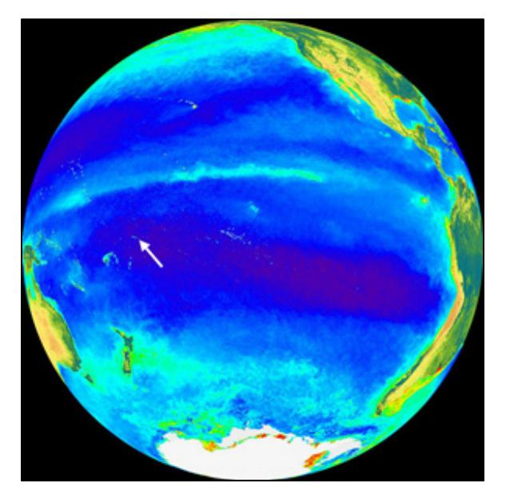

**Figure 2.** Pacific Ocean, showing the remote location of American Samoa (arrow). Source: NASA satellite photo.

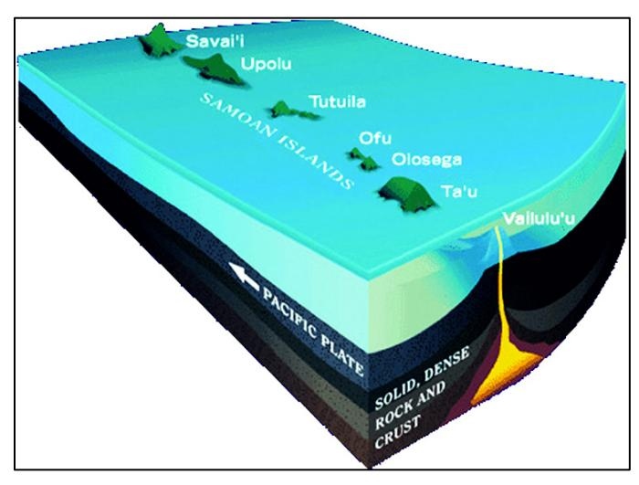

**Figure 3**. Samoan Archipelago, a chain of volcanic islands formed as the Pacific tectonic plate glided over a 'hot spot' of thermal activity in the earth's core. Source: S. Hart (Woods Hole Oceanog. Inst.) and H. Staudigel (Scripps Inst. Oceanog.).

The American Samoa portion of the archipelago consists of five small volcanic islands (Tutuila, Ta'u, Ofu, Olosega, Aunu'u) and two distant atolls (Swains, Rose). Neither atoll is geologically related to the archipelago's hotspot origin. Tutuila is the largest island among this group; it accounts for 68% of the total land area and 86% of shallow marine waters suitable for coral growth (<100 m; Figure 4). Except for these island pinnacles, the remainder of American Samoa's Exclusive Economic Zone (98.8%) is deep ocean (4000-6000 m depths).

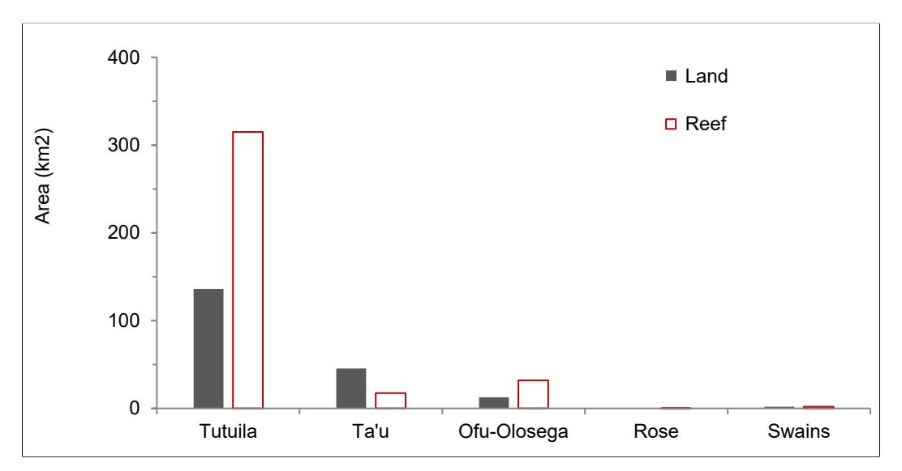

**Figure 4.** Total land and reef areas in American Samoa. Reef refers to shallow waters (<100 m) suitable for coral growth. Source: redrawn from Brainard et al. 2008.

The islands can be categorized as three geographical and ecological subunits based on island type, size, biota, and level of human development:

## Moderately developed high island (Tutuila)

Tutuila is the largest (136 km2 ) and most populated island in the Territory, with 96% of its 2010 population of 55,519 (density 408 people/km2 ) (DOC 2012). Prior to the 1950s, the island had been largely forested (as Ta'u Island is now), but by 1984 about 50% of lowland forests had been cleared and replaced by agricultural plantations, human habitations and roads, which resulted in loss of habitat for wildlife. This was driven by rapid population growth and economic development. The population jumped from about 13,000 in 1940 to 57,000 in 2000, but large areas remain forested because of the steepness of the island (Figure 5). Tutuila contains almost all native species found in the Territory, as well as all of the introduced and invasive plant and animal biota. Overall, Tutuila's environment is in moderately good condition beyond the urbanized areas. Aunu'u Island (1.5 km2 , 317 people/km2 ) is included in this category because it lies adjacent to Tutuila.

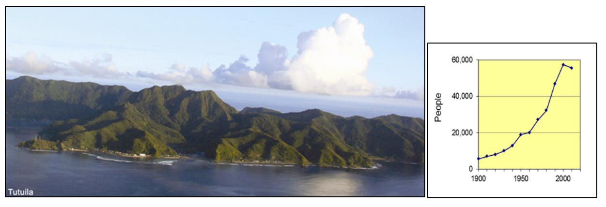

**Figure 5.** (A) Tutuila is the largest and most populated island in American Samoa, but large areas remain forested and relatively inaccessible. In this photo of the island's southeast side, human habitation is limited to the shoreline (note the thin line of houses along the shoreline road). More urban areas occur elsewhere on the island. Photo: P. Craig. (B) Population growth in Territory (96% occurring on Tutuila).

## Lightly developed high islands (Ta'u, Ofu, Olosega)

The terrestrial and marine environments of these three islands (also called the Manu'a Islands) are noticeably less affected by human activities than Tutuila (Figure 6). These islands are smaller (5-46 km2 ), less populated (19-68 people/km2 ), have few invasive species, and their environments appear more intact (non-degraded). Perhaps for those reasons, Manu'a is also home to several native species not found on Tutuila.

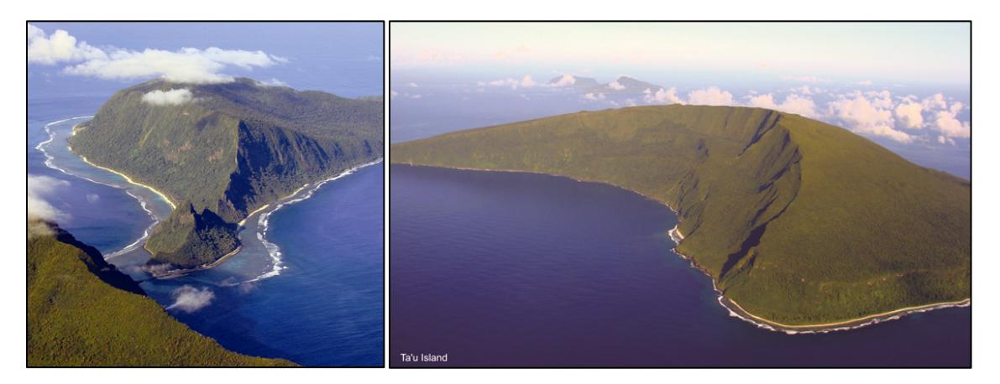

**Figure 6.** Lightly populated Manuan Islands of Ofu (left) and Ta'u (right). Photos: M. Tennant.

## Remote atolls

Rose and Swains Islands are small, low-lying atolls (0.1-1.9 km2 ) built upon sunken volcanoes. Their geology, climate, and biology differ from the high islands in the Territory. Rose is an uninhabited wildlife refuge. Swains was formerly a coconut plantation and is currently inhabited by about 10 people. Despite the remoteness of these atolls, both have been heavily impacted by invasive Polynesian rats.

Three NPSA Units occur in first two of these categories. Island and park sizes are listed in Table 1. Maps of the park boundaries are in Figure 7.

**Table 1.** Islands with NPSA Units.

|         |                      |            |               | NPSA Unit size (km2)A |              |       |  |
|---------|----------------------|------------|---------------|-----------------------|--------------|-------|--|
| Island  | Island type          | Area (km2) | Elevation (m) | Land                  | Coral reefsB | Total |  |
| Tutuila | Moderately developed | 136.2      | 652           | 10.2                  | 4.9          | 15.1  |  |
| Ta'u    | Lightly developed    | 45.5       | 965           | 21.9                  | 4.0          | 25.9  |  |
| Ofu     | Lightly developed    | 7.3        | 494           | 0.3                   | 1.4          | 1.7   |  |
| –       | –                    | –          | –             | 32.4                  | 10.3         | 42.7  |  |

A Original park sizes are from enabling legislation; current unit sizes may vary.

B Includes associated benthic habitats.

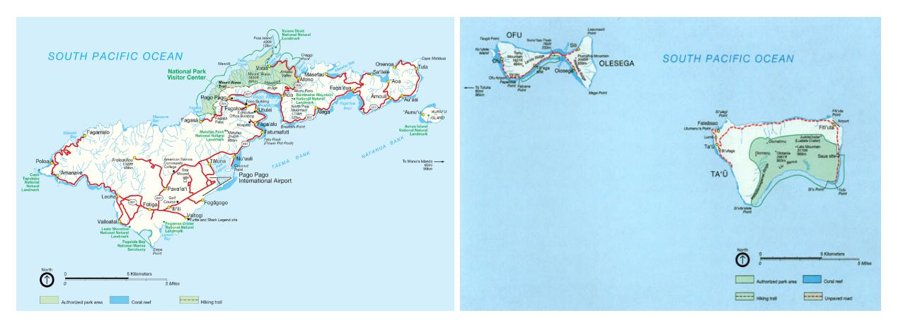

**Figure 7.** Map of NPSA Boundaries. Source: NPSA.

#### *2.2.2. Resource Descriptions*

Terrestrial and marine environments of American Samoa support flora and fauna characteristic of tropical Pacific islands. In general terms, species diversity of terrestrial organisms is low and endemism is high due to the remote location and small size of the islands. In contrast, species diversity of marine organisms is high and endemism is low due to the wide dispersal of marine eggs and larvae by ocean currents.

In addition, for most terrestrial and marine species in the Indo-Pacific region, there is a large-scale pattern of diminishing species distributions across the South Pacific Ocean (Figure 8). Most species originated in Southeast Asia, and from that center of high biodiversity species radiated eastward, but with progressively fewer species that successfully reached the most distant islands of Polynesia. For example, shorefish species in American Samoa lie midway in species richness between high diversity areas in Indonesia and Malaysia and low diversity areas in Hawaii and French Polynesia (Figure 8). This pattern applies to other groups of organisms such as corals, sea turtles, freshwater fishes, forest

birds, land plants, mangroves, and seagrasses (e.g., Springer 1982, Pratt et al. 1987, Stoddard 1992, Veron 2000, Allen 2003, Skelton and South 2006, Pippard 2012). Few species have reached American Samoa from the opposite direction (South America), probably due to the much greater oceanic distance and fewer islands in that direction to facilitate dispersal by "island hopping."

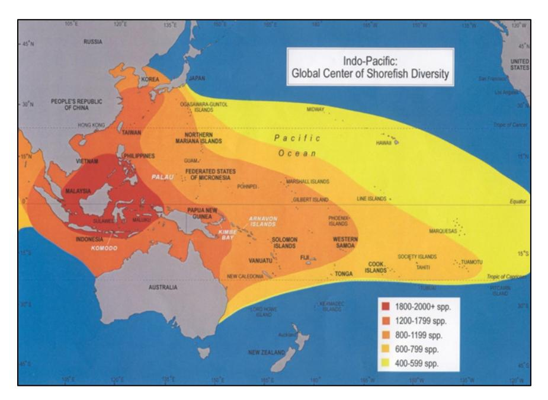

**Figure 8.** Distribution of shorefish species in the Indo-Pacific region, with highest species richness in Indonesia and Malaysia (dark red) and progressively fewer species occurring eastward (yellow). A blue star indicates the location of American Samoa. Source: The Nature Conservancy's Hawaii Natural Heritage Program.

## Terrestrial environments

Terrestrial environments are hot, humid, and rainy year-round, with slight seasonal variations. Average daytime highs are 30°C (87° F) and nighttime lows are 25°C (77° F). Rainfall in the mountains is high, 500-750 cm (200-300 in), but occasional periods of drought may occur. Tropical cyclones arrive at intervals of several years on average and can cause significant damage to human habitations and wildlife.

Most terrestrial landscape in NPSA extends from ridge to reef and contains numerous small but complete watersheds within its boundaries. The largest park units occur on the steep volcanic islands of Tutuila (elevation 652 m) and Ta'u (965 m). Parkland on Tutuila occupies 10 km2 (2,500 ac), and accounts for 7% of the island; on Ta'u, parkland is 22 km2 (5,400 ac), and encompasses 48% of that island (Table 1). Ofu is also a high island, but this park unit was established primarily as an example of coral reefs in American Samoa. The park's terrestrial component there (0.3 km2 ) consists of a thin agro-forest buffer strip (30 m wide) between the island's shoreline road and Ofu lagoon.

The high islands are carpeted by tropical rainforest (except in urbanized areas), and Tutuila is dissected by numerous short streams (Figure 5a). Whistler (2009) notes that nearly all mature forests in Samoa are better described as climax forests rather than as primary forests, since in ancient times much of the interior of the islands was inhabited and cleared for cultivation before being abandoned early in the European Era (after 1830). Flora of the Samoan Archipelago consists of about 550 native flowering plants, 215 fern species, and 13 fern ally species. Two-thirds of these species are found in American Samoa. About 30% of the archipelago's native flowering plants are endemic (Whistler 2009).

Wildlife comprises a relatively intact community of native species: two bats (the only native mammals present), 17 forest birds, 19 nesting seabirds, three skinks, one gecko, 47 snails, several land crabs, over 2,500 insects, and other invertebrates. Streams support a small group of mostly amphidromous species: 11 fishes, nine shrimps, and nine snails. There is also a growing list of nonnative or invasive species in the archipelago (see Section 2.2.3 Resource issues overview).

## Marine environments

Deep ocean waters surround the small islands of American Samoa. Marine waters are generally clear and warm, with low primary productivity, small seasonal fluctuations in ocean conditions, and larger multiyear fluctuations in response to greater climatic cycles such as the El Niño Southern Oscillation. Coastal waters can experience increased nutrient and sediment levels due to both natural and anthropogenic factors (e.g., cyclones, land-based runoff).

NPSA contains 10 km2 (2,550 ac) of nearshore marine waters around Tutuila, Ofu and Ta'u Islands. Park boundaries extend from shore to 0.4 km (0.25 mi) seaward, where water depths are 30-40 m, and water temperatures are 28-30°C (82-86° F). The nearshore zone consists of Indo-Pacific coral reefs, sand channels, basalt outcrops, and associated shallow-water habitats (Figure 9). Reefs support a rich biota of over 900 fishes, 329 corals, 352 snails, other invertebrates such as octopus and giant clams, 237 algae, and two seaweeds. Hawksbill and green sea turtles occasionally nest on park beaches; humpback whales and spinner dolphins may venture into nearshore waters. Most marine species are widely distributed across the tropical Indo-Pacific region.

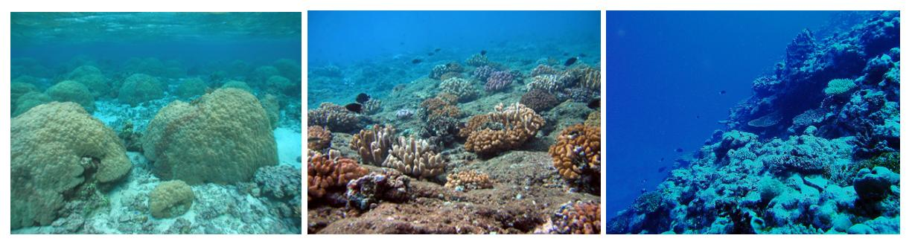

**Figure 9.** Examples of nearshore marine habitats in NPSA: boulder corals and sand in Ofu lagoon (left); corals on thin veneer of crustose coralline algae covering a basalt foundation (middle); reef slope of crustose coralline algae with corals. Photos: P. Craig.

#### *2.2.3. Resource issues overview*

Natural resources in the Territory, including NPSA, face multiple local and global threats. These may vary for each resource, but several overriding issues are apparent (Table 2). Key anthropogenic

threats (fishing, invasive species, climate change) are chronic pressures that jeopardize contemporary ecosystems. Key natural threats (cyclones, Crown of Thorns starfish) are episodic events that can devastate local ecosystems, resulting in recurring cycles of damage and recovery. We acknowledge that "natural threats" are not threats in an evolutionary sense, because island ecosystems have had to adapt to them to persist. Nonetheless, natural threats cause major changes in resource status.

**Table 2.** Key threats to natural resources in NPSA and American Samoa.

| Threat type   | Terrestrial key threats                | Marine key threats                       |
|---------------|----------------------------------------|------------------------------------------|
| Anthropogenic | • Invasive species • Climate change | • Climate change • Fishing            |
| Natural       | • Cyclones                             | • Cyclones • Crown of thorns starfish |

## Anthropogenic Threats

## *Climate change*

Climate change is occurring throughout the Pacific Islands. Regional indicators include rising atmospheric carbon dioxide, rising air and sea temperatures, changing ocean chemistry and increasing ocean acidification, rising sea levels, changing rainfall patterns, decreasing base flow in streams, changing wind and wave patterns, changing weather extremes, and changing habitats and species distributions (Keener et al. 2012). The rapid rates at which these physical, chemical, and biological parameters are changing in the world are unprecedented over past decades to millennia (IPCC 2014).

Several of these trends have been recorded in American Samoa, notably rising atmospheric CO2, ocean temperature, and sea level (Table 3). Impacts are already apparent in the marine environment, particularly the increasing incidence of coral bleaching. This occurs due to warming water temperatures which cause the corals to lose their zooxanthellae, giving them a white or bleached appearance. If the stress persists, the corals will die. Bleachings first became apparent in the 1990s, and five mass bleaching events have occurred since then (Figure 10). Increases in ocean acidification are also of vital concern because this can decrease coral growth and increase reef erosion. In terrestrial environments, increasing air temperatures and CO2 concentrations have been shown elsewhere to significantly affect plant communities. Although our understanding of long-term ecosystem consequences of these trends is developing, changes are already occurring, and projected impacts are dire (e.g., Howes et al. 2015).

**Table 3.** Climate change indicators in American Samoa and globally (see 5.1 Local climate change).

| Climate variable        | American Samoa           | Global average     |
|-------------------------|--------------------------|--------------------|
| Terrestrial Environment | –                        | –                  |
| Carbon dioxide (CO2)    | 394 ppm (2013)           | 395 ppm (2013)     |
| Air temperature         | + 0.1 to + 0.3 °C/decade | + 0.1 °C/decade    |
| Rainfall                | no local trend           | –                  |
| Cyclone activity        | no local trend           | –                  |
| Marine Environment      | –                        | –                  |
| Ocean temperature       | + 0.45 °C/decade         | + 0.1 °C/decade    |
| Ocean acidification     | + 26% (Hawaii)           | Data not available |
| Sea level               | + 5.3 mm/decade          | + 3.2 mm/decade    |

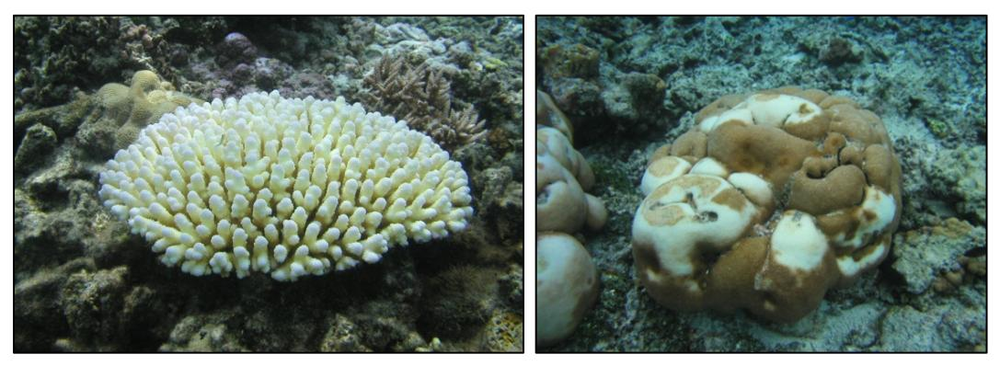

**Figure 10.** Examples of coral bleaching (white areas) in NPSA due to climate-induced increases in water temperature. Photos: P. Craig.

#### *Invasive species*

Island ecosystems developed largely in isolation, which makes them extremely vulnerable to the introduction of new species. Non-native species can reduce native diversity and abundance, and it can alter ecosystem processes. NPSA is now threatened by at least 105 invasive plant species that have been identified as disruptive or potentially disruptive in American Samoa (Space and Flynn 2000). One example is the *tamaligi* tree (*Falcataria moluccana*) which spread across Tutuila's forested lands during the past 30 years. By 2000, *tamaligi* were beginning to dominate the rainforest and outcompete native trees that provided food and habitat for forest birds and other wildlife (Figure 11). In response, NPSA conducted an aggressive control program. It killed over 19,000 invasive trees within park lands and surrounding areas, and restored 24 km2 of wildlife habitat on Tutuila and 2 km2 on Ta'u (T. Togia, pers. com., 2015).

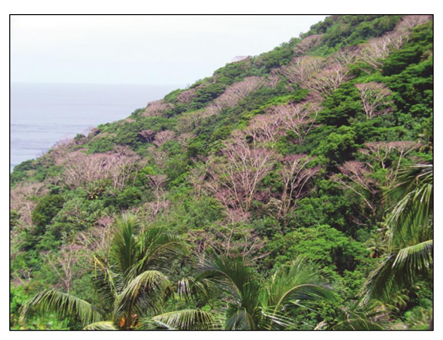

**Figure 11.** Invasive trees. Rapidly spreading invasive tamaligi trees (*Falcataria moluccana*) in NPSA's Tutuila Unit, ca. 2005. Numerous dead tamaligi trees, shown here leafless and brown, were killed during NPSA's extensive control program. The photo shows how the invasive trees were beginning to dominate the rainforest canopy. Photo: Tavita Togia.

Other non-native animals include birds (bulbuls, mynas, rock doves, chickens), rats, mice, pigs, dogs, cats, cattle, horses, fish, toads, snakes, skinks, geckos, snails, slugs, earthworms, fire ants, and other insects and invertebrates. Local impacts caused by these species are largely unknown, but based on evidence gathered elsewhere it is reasonable to assume that ecosystems in NPSA and American Samoa are being affected. Among the most consequential of these species are invasive rats, which have altered island ecosystems through predation and competition, and led to the extinction of many native species (e.g., Varnham 2010). All four species of invasive rodents that are commonly implicated as global conservation problems are present in American Samoa.

#### *Fishing pressure*

Nearshore marine fish have been a vital food source in the Pacific Islands for millennia (Figure 12). Fishing is also considered one of the primary threats to coral reef ecosystems worldwide, including in American Samoa. On Tutuila Island, fish populations appear to be at low levels, in part due to the relatively low primary productivity of Tutuila's coastal waters, but also due to human activities. Fishing is likely responsible for the depletion of up to 56% of reef fish biomass and 96% of sharks (Nadon et al. 2012, Williams et al. 2015).

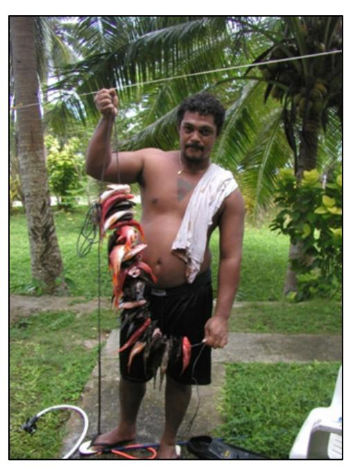

**Figure 12.** Subsistence fishing. These reef fish were caught by spearfishing during free dives. Photo: P. Craig.

Subsistence fishing has declined in modern times, especially in economically developed areas where fewer villagers rely on a subsistence life style. Whether the low biomass of fish in NPSA reflects current or past levels of fishing is not known. Sea turtles have also declined in the Pacific region, primarily due to harvesting of them and their eggs.

## Natural Threats

#### *Cyclones*

American Samoa lies within a cyclone band in the southern hemisphere (Figure 13). These storms occur irregularly in the Territory. They hit at intervals that range from zero to at least 13 years, with an average interval of 3.7 years (see Section 5.1 Local climate change). Impacts of cyclones are patchy, with some refugia remaining here and there, and not all islands suffer equal damage. Both terrestrial and marine resources are subjected to a continuing multiyear cycle of damage and recovery from these storms (Figure 14). Cyclones are a natural feature of the local environment, so it is likely that most native species can cope with these severe disturbances and will recover, given enough time, assuming that their recovery is not jeopardized by human activities.

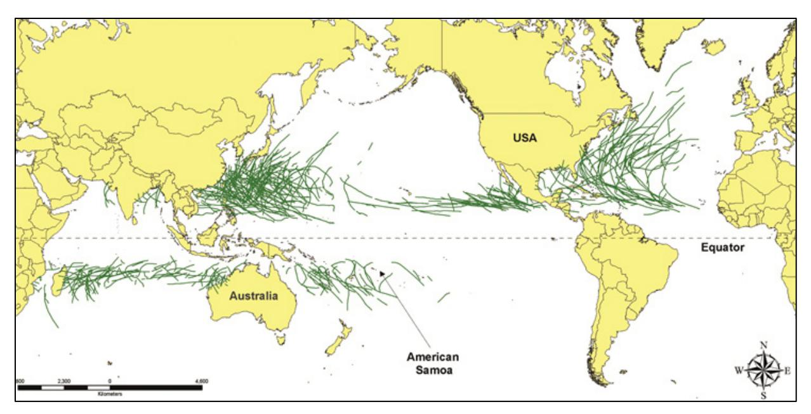

**Figure 13.** Tracks of cyclones during the 10-year period 1994-2003. Source: Craig 2009.

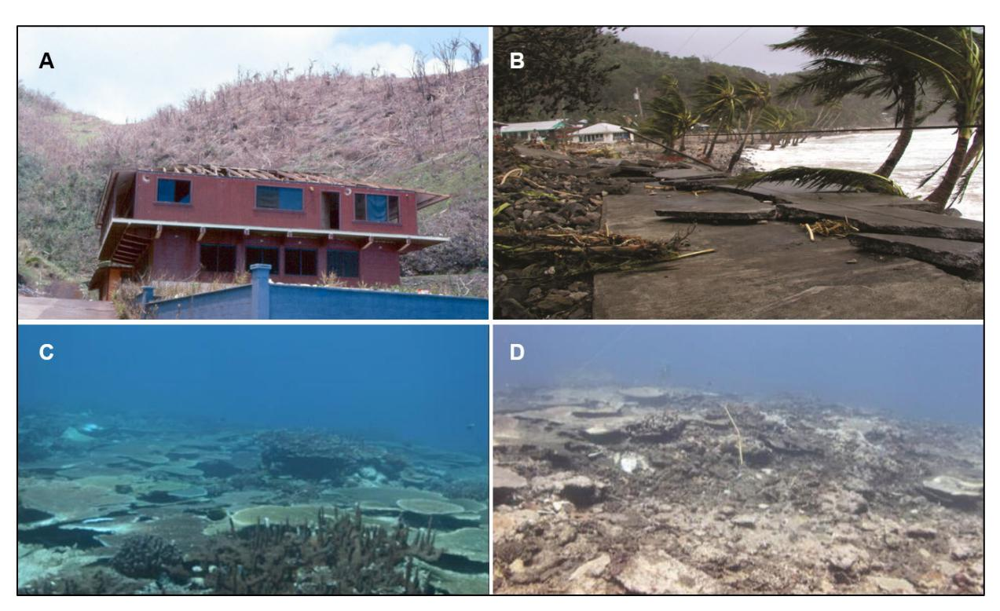

**Figure 14.** Cyclone damage. (A) Tutuila Island; note loss of forest foods and habitat for wildlife; Cyclone Val 1991. (B) Coastal damage on Tutuila at Onenoa; Cyclone Heta 2004. (C & D) Before and after photos of the same marine transect on Tutuila; Cyclone Wilma 2011. Photos: P. Craig (top), T. Clark (bottom).

#### *Starfish outbreaks*

The Crown of Thorns starfish (COTs, *Acanthaster planci*) is both a natural and anthropogenic threat to coral reefs. These large coral eaters are typically present in low numbers for years or decades, but

population outbreaks can devastate coral reefs (Figure 15). There is evidence of prehistoric outbreaks, but outbreaks may also be triggered by increased nutrients in terrestrial runoff, often from human activities (e.g., fertilizers, poorly installed sewage systems) (Birkeland 1982). COT outbreaks can cause shifts in the species composition of the reef and have negative secondary effects on other invertebrates and fish in the ecosystem. A recent outbreak on Tutuila occurred in 2011-2015. At that time, a control effort by NPSA killed over 25,000 COTs in and near the park (Clark 2015, T. Clark, pers. com. 2016). The previous major outbreak in the Territory occurred nearly 35 years ago (1978) when COTs consumed up to 90% of the corals on Tutuila Island (Wass 1979).

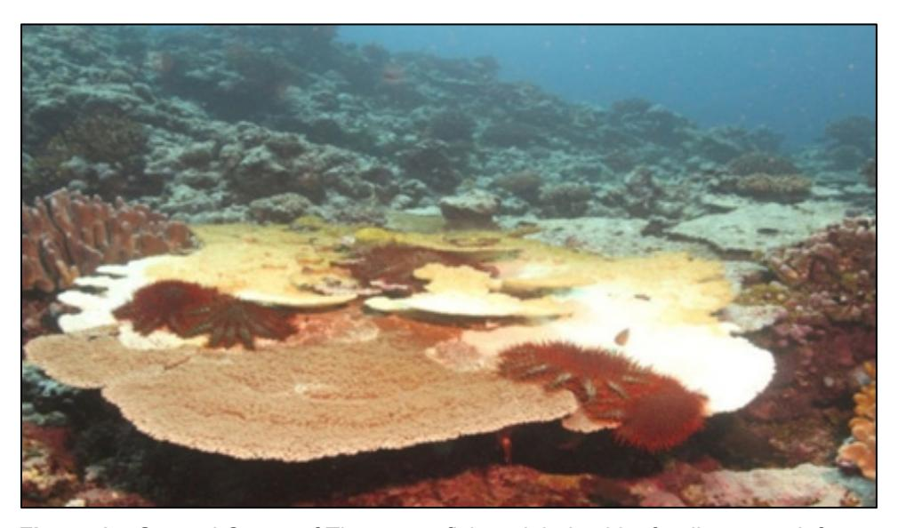

**Figure 15.** Several Crown of Thorns starfish and their white feeding scars left on a table-top coral in 2015. Photo: T. Clark.

## **2.3. Resource Stewardship**

## *2.3.1. Management Directive and Planning Guidance*

Management of NPSA is guided by the General Management Plan: National Park of American Samoa (NPS 1997). By virtue of the signing of an agreement with the American Samoa Government (ASG) to lease park lands, the NPS was authorized to manage and use the leased premises in accordance with the purpose of the park as stated in Section 1(b) of Public Law 100-571.

#### *2.3.2. Status of Supporting Science*

NPSA is one of 11 National Park units in the PACN, one of 32 similar networks across the United States, and part of the NPS strategy to improve park management through greater reliance on scientific information. The purpose of the PACN Inventory and Monitoring program is to design and implement longterm ecological monitoring and provide results to park managers, science partners, and the public. The intent is to provide periodic assessments of critical resources, to evaluate the integrity of park ecosystems, and to better understand ecosystem processes.

In 2006, the PACN completed its longterm ecological monitoring plan (NPS 2007), which included a list of Vital Signs (select indicators that represent the health of natural resources in the nine parks) (Table 4). Specific PACN goals for Vital Signs monitoring are to:

- Determine status and trends of selected indicators of the condition of park ecosystems to allow managers make better informed decisions and work more effectively with other agencies and individuals for the benefit of park resources.
- Provide early warning of abnormal conditions of selected resources to help develop effective mitigation and reduce management costs.
- Provide data to better understand the dynamic nature and condition of park ecosystems and to provide reference points for comparisons with other, altered environments.
- Provide data to meet certain legal and congressional mandates related to natural resource protection and visitor enjoyment.
- Provide a means of measuring progress toward performance goals.
- Provide data to better understand, protect, and manage important resources that share cultural and natural value.

**Table 4.** PACN list of Vital Signs. += Protocol development and implementation in phase 1, funding exists for VS or water quality monitoring programs. x= Protocol development & implementation in phase 2, funding exists for VS or water quality monitoring programs.\*= Vital Sign which cannot currently be implemented; future monitoring possible. o= Monitored by a network park, other NPS program, or other federal or state agency. n/a= VS does not apply to park, or no foreseeable plans to conduct monitoring.

| Level 1                 | Level 2                             | Vital sign                                                       | AMME | WAPA | NPSA | USAR | KALA | HALE | ALKA | PUHE | KAHO | PUHO | HAVO |
|-------------------------|-------------------------------------|------------------------------------------------------------------|------|------|------|------|------|------|------|------|------|------|------|
|                         | Air Quality                         | Visibility & particulate matter                               | n/a  | n/a  | n/a  | n/a  | n/a  | o    | n/a  | n/a  | n/a  | n/a  | o    |
| Air & Climate           | Air Quality                         | Atmospheric gases                                                | n/a  | n/a  | o    | n/a  | n/a  | n/a  | n/a  | n/a  | n/a  | n/a  | o    |
|                         | Weather & Climate                | Climate                                                          | +    | +    | +    | +    | +    | +    | +    | +    | +    | +    | +    |
|                         | Subsurface Geologic Processes | Volcanic ground deformation/lava flows                     | *    | n/a  | n/a  | n/a  | n/a  | o    | n/a  | n/a  | n/a  | n/a  | o    |
| Geology & Soils      | Subsurface Geologic Processes | Seismic activity                                                 | o    | o    | o    | o    | o    | o    | o    | o    | o    | o    | o    |
|                         | Soil quality                        | Erosion & deposition                                          | n/a  | x    | x    | x    | x    | x    | n/a  | x    | n/a  | n/a  | n/a  |
|                         | Hydrology                           | Stream flow                                                      | *    | o    | o    | o    | o    | o    | o    | *    | n/a  | *    | n/a  |
|                         | Hydrology                           | Sea level                                                        | o    | o    | o    | o    | *    | o    | *    | o    | *    | o    | *    |
| Water                   | Hydrology                           | Groundwater dynamics                                          | +    | o    | o    | *    | +    | *    | +    | *    | +    | *    | *    |
|                         | Water Quality                       | Water quality                                                    | +    | +    | +    | +    | +    | +    | +    | +    | +    | +    | +    |
|                         | Water Quality                       | Toxics                                                           | o    | o    | o    | o    | *    | *    | *    | *    | o    | *    | *    |
|                         | Water Quality                       | Microorganisms                                                   | o    | o    | o    | o    | *    | *    | o    | o    | *    | *    | *    |
| Biological Integrity | Invasive Species                 | Status and trends of established invasive plant species | +    | +    | +    | *    | +    | +    | +    | +    | +    | +    | +    |
|                         | Invasive Species                 | Early detection of invasive plants                            | +    | +    | +    | n/a  | +    | +    | +    | +    | +    | +    | +    |

**Table 4 (continued).** PACN list of Vital Signs. += Protocol development and implementation in phase 1, funding exists for VS or water quality monitoring programs. x= Protocol development & implementation in phase 2, funding exists for VS or water quality monitoring programs.\*= Vital Sign which cannot currently be implemented; future monitoring possible. o= Monitored by a network park, other NPS program, or other federal or state agency. n/a= VS does not apply to park, or no foreseeable plans to conduct monitoring.

| Level 1               | Level 2                                                | Vital sign                                      | AMME | WAPA | NPSA | USAR | KALA | HALE | ALKA | PUHE | KAHO | PUHO | HAVO |
|-----------------------|--------------------------------------------------------|-------------------------------------------------|------|------|------|------|------|------|------|------|------|------|------|
|                       | Invasive Species                                    | Early detection of invasive invertebrates | *    | *    | x    | n/a  | x    | x    | *    | *    | *    | *    | *    |
|                       | Focal Communities (including at risk species) | Benthic marine community                     | *    | +    | +    | *    | +    | *    | *    | *    | +    | *    | *    |
|                       | At-risk species                                        | Marine fish                                     | *    | +    | +    | *    | +    | *    | *    | *    | +    | *    | *    |
|                       | At-risk species                                        | Sea turtles                                     | *    | *    | *    | *    | *    | *    | o    | *    | o    | o    | o    |
|                       | At-risk species                                        | Hawaiian monk seal                           | n/a  | n/a  | n/a  | o    | o    | o    | o    | o    | o    | o    | o    |
| Biological            | Focal community                                     | Freshwater animal communities                | *    | +    | +    | n/a  | +    | +    | +    | +    | +    | +    | +    |
| Integrity (cont'd) | Focal community                                     | Cave community                                  | n/a  | x    | x    | n/a  | *    | x    | *    | n/a  | x    | x    | x    |
|                       | Focal community                                     | Focal terrestrial plant communities          | +    | +    | +    | n/a  | +    | +    | *    | *    | +    | *    | +    |
|                       | Focal community                                     | Terrestrial invertebrate communities      | x    | x    | x    | n/a  | x    | x    | *    | x    | x    | x    | x    |
|                       | Focal species                                          | Nene distribution/ abundance                 | n/a  | n/a  | n/a  | n/a  | n/a  | o    | *    | *    | *    | *    | o    |
|                       | Focal species                                          | Waterbird distribution/ abundance         | *    | o    | *    | *    | *    | *    | *    | *    | o    | *    | *    |
|                       | Focal species                                          | Landbirds                                       | +    | n/a  | +    | n/a  | +    | +    | n/a  | n/a  | n/a  | n/a  | +    |
|                       | Focal species                                          | Seabirds                                        | *    | *    | +    | *    | +    | +    | *    | *    | +    | +    | +    |

**Table 4 (continued).** PACN list of Vital Signs. += Protocol development and implementation in phase 1, funding exists for VS or water quality monitoring programs. x= Protocol development & implementation in phase 2, funding exists for VS or water quality monitoring programs.\*= Vital Sign which cannot currently be implemented; future monitoring possible. o= Monitored by a network park, other NPS program, or other federal or state agency. n/a= VS does not apply to park, or no foreseeable plans to conduct monitoring.

| Level 1                             | Level 2                     | Vital sign            | AMME | WAPA | NPSA | USAR | KALA | HALE | ALKA | PUHE | KAHO | PUHO | HAVO |
|-------------------------------------|-----------------------------|-----------------------|------|------|------|------|------|------|------|------|------|------|------|
| Biological Integrity (cont'd) | Focal species               | Bats                  | n/a  | +    | +    | n/a  | +    | +    | +    | +    | +    | +    | +    |
| Human Use                           | Consumptive Use          | Fish harvest          | *    | +    | +    | *    | +    | *    | *    | *    | +    | *    | *    |
|                                     | Visitor & Recreation Use | Visitation            | o    | o    | o    | o    | o    | o    | o    | o    | o    | o    | o    |
| Landscapes                          | Landscape Dynamics       | Landscape dynamics | +    | +    | +    | +    | +    | +    | +    | +    | +    | +    | +    |

## *2.3.3. Literature Cited*

- Allen, G. 2003. Reef fishes of Milne Bay Province, Papua New Guinea. Pages 46-55. *In:* G. Allen, J. Kinch, S. McKenna, P. Seeto (eds.). A rapid marine biodiversity assessment of Milne Bay Province, Papua New Guinea - Survey II (2000). RAP Bulletin of Biological Assessment 29. Conservation International, Washington, DC, USA.
- Birkeland, C. 1982. Terrestrial runoff as a cause of outbreaks of *Acanthaster planci* (Echinodermata: Asteroidea). Marine Biology 69:175-185.
- Brainard R., and 25 others. 2008. Coral reef ecosystem monitoring report for American Samoa: 2002-2006. NOAA Special Report NMFS PIFSC. Pacific Islands Fisheries Science Center, Hawaii. 472 p.
- Clark, T. 2015. Control of Crown of Thorns starfish at the National Park of American Samoa. Report to National Park of American Samoa, Pago Pago, American Samoa. 30 p.
- Craig, P. 2009. Cyclones (*afa*). Chapt. 3, *In*: P. Craig (ed). Natural History Guide to American Samoa. National Park of American Samoa, Dept. Marine and Wildlife Resources, and American Samoa Community College.
- DOC (Dept. Commerce). 2012. American Samoa statistical yearbook 2012. Dept. Commerce, American Samoa. 194 p.
- Hart, R. 2006. Appendix A: National Park of American Samoa resource overview. *In*: HaySmith, L., F. L. Klasner, S. H. Stephens, and G. H. Dicus. Pacific Island Network vital signs monitoring plan. Natural Resource Report NPS/PACN/NRR—2006/003 National Park Service, Fort Collins, Colorado.
- Howes, E., F. Joos, M. Eakin, and J. Gattuso. 2015. The Oceans 2015 Initiative, Part I: an updated synthesis of the observed and projected impacts of climate change on physical and biological processes in the oceans, Studies N° 02/15, Institut Du Développement Durable et des Relations Internationales, Paris, France, 52 p.
- IPCC (Intergovernmental Panel on Climate Change). 2014. Climate change 2014 synthesis report. Fifth Assessment Synthesis Report of the Intergovernmental Panel on Climate Change. Edited by The Core Writing Team, R. Pachauri, and L. Meyer. Cambridge University Press, Cambridge, United Kingdom and New York.
- Keener, V., J. Marra, M. Finucane, D. Spooner, and M. Smith (eds.). 2012. Climate change and Pacific Islands: indicators and impacts. Report for The 2012 Pacific Islands Regional Climate Assessment (PIRCA). Washington, DC, Island Press.
- Koppers, A., J. Russell, M. Jackson, J. Konter, J. Staudigel, and S. Hart. 2008. Samoa reinstated as a primary hotspot trail. Geology 36:435–438; doi: 10.1130/G24630A.1.

- McDougall, I. 2010. Age of volcanism and its migration in the Samoa Islands. Geological Magazine 147:705-717. doi: 10.1017/S0016756810000038.
- Nadon, M., J. Baum, I. Williams, J. McPherson, B. Zgliczynski, B. Richards, R. Schroeder, and R. Brainard. 2012. Re-creating missing population baselines for Pacific reef sharks. Conserv Biol. 26: 493–503. doi: 10.1111/j.1523-1739.2012.01835.x
- Pippard, H. 2012. The current status and distribution of freshwater fishes, land snails and reptiles in the Pacific Islands of Oceania. International Union for Conservation of Nature and Natural Resources. Gland, Switzerland. 76 p.
- Pratt, H., P. Bruno, and D. Barrett. 1987. A field guide to the birds of Hawaii and the tropical Pacific. Princeton Univ. Press, Princeton.
- Skelton, P. and R. South. 2006. Seagrass biodiversity of the Fiji and Samoa islands, South Pacific. New Zealand J. Marine and Freshwater Res. 40:345-356.
- Space, J., and T. Flynn. 2000. Observations on invasive plant species in American Samoa. Report to Pacific Islands Committee and Council of Western State Foresters. [www.hear.org/pier/reports/asreport.htm.](http://www.hear.org/pier/reports/asreport.htm)
- Springer, V. 1982. Pacific plate biogeography, with special reference to shorefishes. Smithsonian Contrib. Zool. 367:1-182.
- Stoddard, D. 1992. Biogeography of the tropical Pacific. Pacific Science 46:276-293.
- Varnham, K.J., 2010. Invasive rats on tropical islands: their history, ecology, impacts and eradication. Royal Society for the Protection of Birds (UK). Research Report No. 41.
- Veron, J. 2000. Corals of the world. Australian Inst. Marine Science, Vols. 1-3, 1410 p.
- Wass, R. 1979. Results of an *Acanthaster planci* (Crown-of-Thorns) survey around Tutuila Island, American Samoa. Appendix B. In: Birkeland, C. et al. 1979. Report on the *Acanthaster planci* (Alamea) studies on Tutuila, American Samoa (incomplete). Also, American Samoa Dept. Marine and Wildlife Resources, Biological Report Series No. 2 (incomplete).
- Whistler, A. 2009. The vegetation of American Samoa. Chapt. 36, *In*: P. Craig (ed). Natural History Guide to American Samoa. National Park of American Samoa, Dept. Marine and Wildlife Resources, and American Samoa Community College.
- Williams, I., J. Baum, A. Heenan, K. Hanson, M. Nadon, and R. Brainard. 2015. Human, oceanographic and habitat drivers of central and western Pacific coral reef fish assemblages. PLoS ONE 10(4): e0120516. doi:10.1371/journal.pone.0120516.

## **Chapter 3. Study Scoping and Design**

This NRCA is a collaboration among the NPS, the University of Vermont (UVM), and their subcontractor, Applied Trails Research (ATR). Before embarking on the project, it was essential to identify the specific roles of the NPS, UVM and ATR. Preliminary scoping conference calls were held, and a task agreement and a scope of work document were created cooperatively between the NPS and UVM.

## **3.1. Study Scoping**

A preliminary scoping meeting was held soon after project initiation. At this time, UVM, ATR, and NPS staff confirmed that the purpose of the NPSA NRCA was to define resource conditions, threats and stressors for NPSA in 2015.

- Condition assessments will be conducted using existing data and information;
- Identification of data needs and gaps would be driven by the project framework categories;
- The analysis of natural resource conditions will include a strong geospatial component where applicable;
- Resource focus will be driven primarily by NPSA resource management priorities.

Specific project expectations and outcomes included the following:

- Characterization of park biological and physical resource conditions at appropriate scales;
- Definition of threat and stress factors and their relationship to identified resources;
- Identification of critical data and information gaps;
- Suggestions for data collection or resource investigations to address those gaps;
- Where applicable, these factors will be evaluated and depicted spatially to facilitate use of project findings in a wide variety of park decision and planning processes;
- Utilization of existing scientific information for review and synthesis.

Primary data for inclusion in the NRCA were sourced from:

- NPS Inventory and Monitoring Networks;
- Published scientific literature;
- "White" and "gray" literature (e.g. technical reports, internal data summaries, presentations) publicly available or available through NPS contacts;
- Personal communications from regional and resource experts.

These data sources are described within the NRCA and cited in a way that makes them accessible to its readers on an ongoing basis. Documents will be stored in a searchable digital library, indexed by reporting category or resource type. This digital library builds on the existing NPSA digital library [\(http://www.nps.gov/npsa/learn/nature/digitallibr.htm\)](http://www.nps.gov/npsa/learn/nature/digitallibr.htm), and updates it with literature published or

gathered since that library was constructed. About 300 additional articles have been added to the digital library as a result of this NRCA.

In addition to published or otherwise accessible literature, the NPSA NRCA incorporates personal communications and assessments from regional and resource subject matter experts. While the project team relied first on agency reports and published data, the body of publications on NPSA is not comprehensive. All information based on expert assessments or personal communications has been cited as such. In addition, to the extent possible, the basis of knowledge and experience supporting these expert assessments was described and contact information for sources was provided.

## **3.2. Study Framework**

Study scoping yielded a framework which divided NPSA into life zones, or ecological areas with similar flora and fauna communities. These six life zones (listed below) were identified through a collaborative process between NPSA staff and the NPSA NRCA research team to be found in the park: deep marine, midmarine, shallow marine, coastal strand, paleotropical rain forest, and cloud forest. These life zones, together with the atmosphere, provide a geographic and ecological framework for considering the natural resources of NPSA. The boundaries of each zone are to be delineated and reviewed based on geographic datasets, and prior NPS and islandwide efforts to classify vegetation, land use and land cover, and ecological communities.

- Deep marine: The deep marine life zone consists of marine waters and benthic bottoms with a depth greater than 30 m. Deep marine is present to a limited extent within NPSA administrative boundaries.
- Midmarine: The midmarine life zone consists of marine waters and benthic bottoms with depths of 10 to 30 m. Midmarine is extensive within NPSA administrative boundaries.
- Shallow marine: The shallow marine life zone consists of marine waters and benthic bottoms with depths less than 10 m. Shallow marine is limited within NPSA administrative boundaries. The shallow water "lagoon" within NPSA marine administrative boundaries on Ofu Island is a special example of the shallow marine life zone.
- Coastal strand: This life zone consists of a narrow strip of sea/land interface, including sand and cobble beaches and sea cliffs. Coastal strand is minimal within NPSA administrative boundaries.
- Rainforest: The rainforest consists of forest communities dominated by tall, woody tree species on midelevation slopes. The rainforest is the most extensive life zone within NPSA.
- Cloud forest: The cloud forest life zone consists of forest communities at higher elevation; it lacks tall woody species and is characterized by low trees and shrubs. Cloud forest exists primarily on Ta'u Island within NPSA administrative boundaries.

## **3.3. Reporting Categories**

NRCAs enumerate significant natural resources for study parks in reporting categories. Reporting categories are a fundamental unit of organization of NRCAs and can be based on individual species, ecological communities, ecological processes, and threats, stressors, or drivers of change for natural

resources in the park. Fourteen proposed reporting categories were identified via a collaborative scoping process between NPSA park staff and the NPSA NRCA research team for inclusion in the Assessment.

The following table (Table 5) outlines the life zones and reporting categories identified for the NPSA NRCA. Note the many-to-many relationships that exist among life zones and reporting categories as illustrated by the table.

**Table 5.** Proposed life zones of NPSA for use in the NPSA NRCA.

| Life zone                  | Reporting categories       |
|----------------------------|----------------------------|
|                            | Marine water quality       |
|                            | Fish harvesting            |
| Deep marine (>30m)         | Benthic communities        |
|                            | Fish communities           |
|                            | Sea turtles                |
|                            | Marine water quality       |
|                            | Fish harvesting            |
| Mid-marine (10 – 30m)      | Benthic communities        |
|                            | Fish communities           |
|                            | Sea turtles                |
|                            | Marine water quality       |
|                            | Fish harvesting            |
| Shallow marine (<10m)      | Benthic communities        |
|                            | Fish communities           |
|                            | Sea turtles                |
|                            | Sea turtles                |
| Coastal strand             | Streams                    |
|                            | Streams                    |
|                            | Paleo-tropical rain forest |
|                            | Invasive vegetation        |
| Paleo-tropical rain forest | Forest birds               |
|                            | Fruit bats                 |
|                            | Invasive rats              |
|                            | Cloud forest               |
| Cloud forest               | Sea birds                  |
|                            | Invasive rats              |
| Atmosphere                 | Atmospheric conditions     |

## **3.4. General Approach and Methods**

This study involved reviewing literature and data relevant to each of the reporting categories included in the framework. No new data were collected. The NPS I&M series of monitoring data reports and the status and trend reports were used when available. When not available, a full analysis of the I&M database to determine the status and trends of a reporting category was considered beyond the scope of this project. Once data and literature relevant to the measurement of each reporting category were reviewed, a qualitative statement of overall current condition was created and compared to the reference condition when possible.

## *3.4.1. Data Retrieval*

The retrieval process to acquire as much data about key resources as possible began during the scoping meeting and site visit, at which time NPSA staff provided information in multiple forms. These included NPS reports and monitoring plans, reports from various state and federal agencies, published and unpublished research documents, databases, tabular data, and charts.

GIS data were also provided by NPS staff. Additional documentation was acquired through online bibliographic literature searches and inquiries with various Territorial and federal government personnel. Data and literature acquired throughout the retrieval process were inventoried and analyzed for thoroughness, relevance, and quality with reference to the reporting categories identified at the scoping meeting.

## *3.4.2. Data Development and Analysis*

Data development and analysis was highly specific to each reporting category in the framework and depended largely on the amount of information available for the component, as well as recommendations from NPS reviewers and sources of expertise that included NPS staff from NPSA. Specific approaches to data development and analysis can be found within the respective reporting category assessment sections located in Chapters 4 and 5 of this report.

## *3.4.3. Scoring Methods and Assigning Condition*

## Significance Level

A set of measures are useful to describe the condition of a particular component, but all measures may not be equally important. A "Significance Level" represents a numeric categorization (integer scale from 1-3) of the importance of each measure in assessing the component's condition; each Significance Level is defined in Table 6. This categorization allows measures that are more important for determining condition of a component (that is, possessing a higher Significance Level) to be more heavily weighted in calculating an overall condition. Significance Levels were determined for each component measure in this assessment through discussions with park staff and/or outside resource experts.

**Table 6**. Scale for a measure's Significance Level in determining condition.

| Significance Level (SL) | Description                                                                    |
|-------------------------|--------------------------------------------------------------------------------|
| 1                       | Measure is of low importance in defining the condition of this component.      |
| 2                       | Measure is of moderate importance in defining the condition of this component. |
| 3                       | Measure is of high importance in defining the condition of this component      |

#### Condition Level

After each component assessment is completed (including any possible data analysis), a Condition Level for each measure on a 0-3 integer scale was assigned (Table 7). This is based on all the available literature and data reviewed for the component, as well as communications with park and outside experts.

**Table 7.** Scale for Condition Level of individual measures.

| Condition Level (CL) | Description                                                                                    |
|----------------------|------------------------------------------------------------------------------------------------|
| 0                    | Of NO concern. No net loss, degradation, negative change, or alteration.                       |
| 1                    | Of LOW concern. Signs of limited and isolated degradation of the component.                    |
| 2                    | Of MODERATE concern. Pronounced signs of widespread and uncontrolled degradation.              |
| 3                    | Of HIGH concern. Nearing catastrophic, complete, and irreparable degradation of the component. |

#### Weighted Condition Score

After the Significance Levels (SL) and Condition Levels (CL) are assigned, a Weighted Condition Score (WCS) is calculated using the following equation:

$$WCS = \frac{\sum_{i=1}^{\# of \ measures} SL_i * CL_i}{3 * \sum_{i=1}^{\# of \ measures} SL_i}$$

The resulting WCS value is placed into one of three categories: good condition (WCS = 0.0 - 0.33); condition of moderate concern (WCS = 0.34 - 0.66); and condition of significant concern (WCS = 0.67 - 1.00). Table 8 displays all of the graphics used to represent a component's condition in this assessment. The colored circles represent the categorized WCS; red circles indicate a significant concern, yellow circles a moderate concern, and green circles a good condition. Gray circles are used to represent situations in which SMUMN GSS analysts and park staff felt there were currently insufficient data to make a statement about the condition of a component. For example, condition is not assessed when no recent data or information are available, as the purpose of an NRCA is to provide a "snapshot-in-time" of current resource conditions. The arrows inside the circles indicate the trend of the condition of a reporting category, based on data and literature from the past 5-10 years, as well as expert opinion. An arrow pointing upward indicates the condition of the component

has been improving in recent times. A two-headed horizontal arrow indicates the condition is unchanged, and an arrow pointing down indicates a decline in the condition of a component in recent times. These are used only when it is appropriate to comment on the trend of a component's condition. If the trend is currently unknown, no arrow is shown.

**Table 8**. Symbol description in the component condition graphics.

| (              | Condition Status                                 | Tro                                                       | end in Condition                                   | Confidence in Assessment |                                  |
|----------------|--------------------------------------------------|-----------------------------------------------------------|----------------------------------------------------|--------------------------|----------------------------------|
| Condition Icon | Condition Icon Definition                        | ondition Icon Definition Trend Icon Trend Icon Definition |                                                    | Confidence Icon       | Confidence Icon Definition |
|                | Resource is in Good Condition                 | Î                                                         | Condition is Improving                             |                          | High                             |
|                | Resource warrants Moderate Concern            |                                                           | Condition is Unchanging                            |                          | Medium                           |
|                | Resource warrants Significant Concern         | Ţ                                                         | Condition is Deteriorating                         |                          | Low                              |
| No color       | Current condition is Unknown or Indeterminate | No Arrow                                                  | Trend in Condition is Unknown or Not Applicable | -                        | _                                |

#### 3.4.4. Preparation and Review of Draft Assessments

The preparation of draft assessments for each reporting category was a cooperative process among NRCA team analysts and NPSA staff. Though analysis relied heavily on agency reports and publications in conducting the assessment, the expertise of NPS resource staff also played a significant role in providing insights into the appropriate direction for analysis and assessment of each component. This step is especially important when data or literature are limited for a reporting category.

The process of developing draft documents for each component began with a detailed conversation with one or several individuals considered to be local experts on the reporting categories under examination. These conversations were a way for analysts to verify the most relevant data and literature sources that should be used and also to formulate ideas about current conditions with respect to the NPS staff opinions. Upon completion, draft assessments were forwarded to experts for initial review and comment.

#### 3.4.5. Development and Review of Final Assessments

Following review of the draft assessments, analysts used the review feedback from resource experts to compile the final assessments. As a result of this process, and based on the recommendations and

insights provided by NPSA resource staff and other experts, the final component assessments represent the most relevant and current data available for each reporting category.

## *3.4.6. Format of Reporting Category Assessment Documents*

All reporting category assessments are presented in a standard format and structure as described below.

## Description

This section describes the relevance of the reporting category to the park and the context within which it occurs in the park setting. For example, a component may represent a unique feature of the park, it may be a key process or resource in park ecology, or it may be a resource that is of high management priority. NPSA also requested reviews of several threats to high priority resources.

## Data and Methods

This section includes a discussion of the data sets used to evaluate the reporting category and whether or how these sets were adjusted or processed in preparation for analysis. The means by which data were evaluated and analyzed to determine current conditions (and trends when appropriate) was also discussed.

## Reference Conditions

This section discusses reference conditions for each reporting category. The reason why specific reference conditions are appropriate or logical to use is explained. Also included in this section is a discussion of any data and literature that elaborate on the designated reference conditions.

## Condition and Trend

This section discusses key findings regarding the current condition of the reporting category and any trends that may be noted. The information is presented through text but may be accompanied by maps, graphs, charts, and tables that summarize data or reveal interesting relationships. All data and information for a reporting category deemed relevant are interpreted in this section.

Reporting category measures identified by the PACN I&M Vital Signs program were used. Ad hoc measures were developed when available data were limited for resources selected by NPSA that were not part of the Vital Signs program.

Measures deemed most appropriate to assess the current condition of a component are listed here.

## Threats

This section provides a summary of the threats and stressors that may affect the resource and influence the current condition of a reporting category to varying degrees.

## Data Needs/Gaps

This section outlines critical data needs or gaps for the reporting category. In some cases, these are so significant that they preclude a determination of the condition of the reporting category. In these cases, defining the data needs and gaps within them is useful to natural resources staff seeking to prioritize monitoring or data gathering efforts.

## Overall Condition

This section provides a qualitative summary statement of the current condition that has been determined for the reporting category using the Weighted Condition Score method. Condition is determined after review of available literature and data, together with any insights from NPS staff and experts presented in the Condition and Trend section.

## Sources of Expertise

This is a list of the individuals who provided expertise, insight, and interpretation to determine current conditions and trends for each reporting category.

## Literature Cited

This is a list of formal citations for literature or datasets used in the analysis and assessment of condition for the reporting category.

## **Chapter 4. Natural Resource Conditions**

## **4.1. Marine Water Quality**

## *4.1.1. Description*

The Territory of American Samoa is comprised of deep ocean waters that surround several small volcanic islands in the Central South Pacific Ocean (Figure 16 and Figure 17). Water depths only two to three km offshore from Tutuila Island drop to 4000-6000 m and are strongly stratified, with cold waters of 5-8 °C at depths below 500 m (Brainard et al. 2008). Surface waters are generally clear and warm (annual average: 29 °C, 84 °F), with low primary productivity, small seasonal fluctuations in ocean conditions, and larger multiyear fluctuations in response to major climatic cycles such as the El Niño Southern Oscillation (ENSO) (Pirhalla et al. 2011).

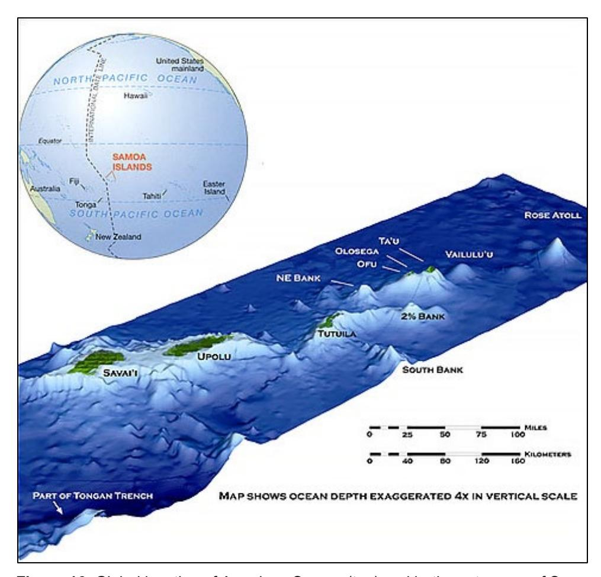

**Figure 16.** Global location of American Samoa (top) and bathymetry map of Samoan Archipelago. The seafloor is about 3000-5000 m (2-3 mi) deep. Source: map created by P. Brown based on satellitederived bathymetry data by National Oceanic and Atmospheric Administration, Pacific Islands Fisheries Science Center, Coral Reef Ecosystem Division, in Craig (2009).

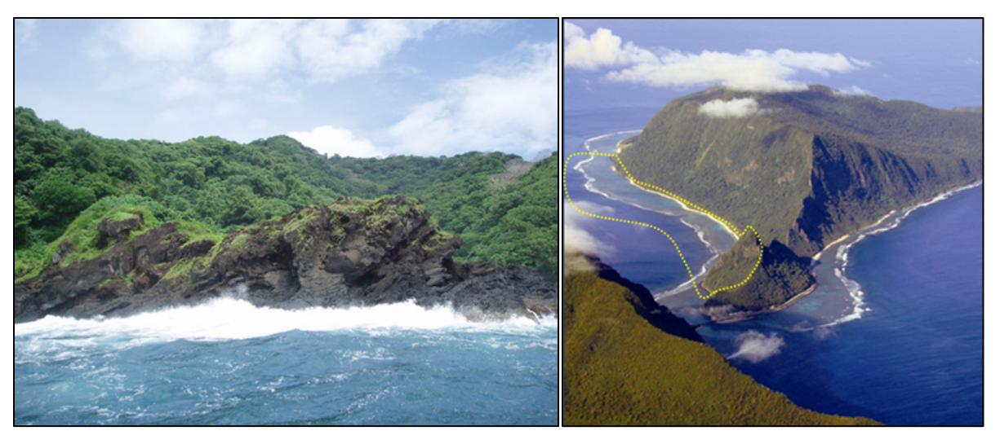

**Figure 17.** Nearshore waters in NPSA: (A) lava shoreline in Tutuila Unit, and (B) shallow fringing coral reefs around Ofu Island, with the approximate NPSA boundary illustrated (yellow dashed line). Photos: P. Craig (left), M. Tennant (right).

NPSA park boundaries extend 0.4 km (0.25 mi) from shore; they encompass 10 km2 (2550 ac) of nearshore marine waters and coral reefs out to a depth of 30-40 m around the high islands of Tutuila, Ofu and Ta'u. This coastal zone within the park is referred to as nearshore waters in this section, and it includes NPSA's three marine life zones (shallow, 0-5 m depth; mid-marine, 5-30 m; and deep marine, >30 m). Most park waters are 5-25 m deep. Temperature and salinity structure of the nearshore water column is variable, from well-mixed to slightly stratified (Brainard et al. 2008). Nearshore currents are variable, and tidal variation is low (1 m) (Storlazzi et al., in prep.). Nearshore waters may experience contamination (nutrients, sediment, fecal bacteria) from land runoff (DiDonato et al. 2009; see also Section 4.10 Streams).

Water quality is widely used by regulators and ecologists as an indicator of aquatic ecosystem condition. NPS has designated nearshore water quality as a Vital Sign, which is an indicator of physical, chemical, biological elements or ecosystem processes selected to represent the overall health or condition of natural resources within the park. The term "water quality" is broadly used here to describe both the properties of marine waters (including processes affecting these properties) and as a measure of the suitability of water for particular uses. This section focuses on several oceanographic processes and water quality parameters in the park's nearshore zone.

## American Samoa water quality criteria

The United States Clean Water Act of 1977 requires states and territories to determine water quality standards and identify waters that do not currently meet these standards. This provides a framework for designating and protecting waters for specific uses. Criteria for marine and fresh water quality in American Samoa are defined in ASEPA rules (2013) §24.0201 to §24.0210 (Table 9). Additional water quality acronyms, abbreviations, and units used in this report are summarized in Table 10.

**Table 9.** Summary of water quality standards in American Samoa for open coastal marine waters, which include NPSA (ASEPA 2013).

| Parameter                 | Open coastal |
|---------------------------|--------------|
| Total P (mg/L)            | < 0.015      |
| Total N (mg/L)            | < 0.13       |
| Chlorophyll (µg/L)        | < 0.25       |
| Turbidity (NTU)           | < 0.25       |
| Light penetration (ft)    | > 130        |
| DO (mg/L)                 | > 5.5        |
| pH                        | 6.5-8.6      |
| Enterococcus (MPN/100 ml) | < 130        |

**Table 10.** Water quality abbreviations and units used in this section.

| Abbreviations Units |                                                   |
|---------------------|---------------------------------------------------|
| °C                  | Degrees centigrade                                |
| µg/L                | Micrograms per liter                              |
| µgP/L               | Micrograms of phosphorus per liter                |
| µM                  | Micromolar                                        |
| Chl                 | Chlorophyll-a                                     |
| CTD                 | Conductivity temperature density                  |
| DIN                 | Dissolved inorganic nitrogen (NH4 + NO2 + NO3) |
| DIP                 | Dissolved inorganic phosphate                     |
| DO                  | Dissolved oxygen                                  |
| mg/L                | Milligrams per liter                              |
| mgN/L               | Milligrams of nitrogen per liter                  |
| NH4                 | Ammonium                                          |
| m                   | Meter                                             |
| MPN                 | Most probable number                              |
| n                   | Number of measurements                            |
| NO2                 | Nitrite                                           |
| NO3                 | Nitrate                                           |
| NTU                 | Nephelometric turbidity units                     |
| ODO                 | Optical dissolved oxygen                          |
| ODOsat              | Optical dissolved oxygen saturation               |
| PP                  | Particulate phosphorous                           |

**Table 10 (continued).** Water quality abbreviations and units used in this section.

| Abbreviations | Units                                         |
|---------------|-----------------------------------------------|
| pH            | Acidification/alkalinity of aqueous sample |
| PN            | Particulate nitrogen                          |
| PT            | Particulate phosphorous                       |
| ppt           | Parts per thousand                            |
| psu           | Practical salinity unit                       |
| sal           | Salinity                                      |
| SD            | Standard deviation                            |
| SE            | Standard error                                |
| SpC           | Specific conductivity                         |
| SST           | Sea surface temperature                       |
| TDN           | Total dissolved nitrogen                      |
| TDP           | Total dissolved phosphorus                    |
| TN            | Total nitrogen (TN = TDN + PN)                |
| TP            | Total phosphorus (TP = TDP + PP)           |
| TSS           | Total suspended solids                        |
| Turb          | Turbidity                                     |

#### *4.1.2. Data and Methods*

Primary data sources for this assessment consisted of a joint ASEPA-NPSA survey of nearshore water quality in American Samoa (DiDonato et al. 2007, 2009), the NPS I&M Vital Signs monitoring program for nearshore water quality (NPS I&M 2016), and NOAA's island-wide surveys in American Samoa (Brainard et al. 2008). Supplementary information was provided by a variety of sources.

## Joint ASEPA-NPSA water quality survey

This broad spatial survey assessed nearshore water quality in American Samoa in April-August 2004; about half of the sites were located in NPSA (DiDonato et al. 2007, 2009). Sites (n = 49) were randomly selected around Tutuila (excluding Pago Pago Harbor), Aunu'u, Ofu, Olosega, and Ta'u Islands in the nearshore zone extending to 0.4 km offshore (to coincide with NPSA's marine boundaries). Stations were sampled on the same date. While two reports utilized the same dataset (DiDonato 2007, 2009), the earlier report included some NPSA-specific data. It should be noted that this study sampled the 0.2-38 m depth zone compared to NPSA's 10-20 m sampling zone (described below). Sites close to the shoreline (0.2-10 m depths) may have been more affected by terrestrial runoff than at NPSA's deeper locations.

## NPS I&M Vital Signs for monitoring water quality

A protocol for monitoring marine water quality in PACN parks was developed by Jones et al. (2011a, b) and implemented in NPSA's Tutuila and Ofu Units in 2009 (Clark, pers. com. 2014). Data for 2009-2014 were accessed from the I&M database (NPS I&M 2016). The protocol used a split panel design with four fixed and four random sites sampled intermittently throughout the year. This design provides both status and trend information, and it statistically increases the power to detect change over time that results from the ability to conduct parameter corrections based on repeat analysis. Values below detection limits were assigned values equal to one-half of the detection limit (Raikow and Farahi 2015). Values of chlorophyll-a less than zero are reported as zero, i.e. as non-detections. Negative turbidity readings were set to 0.1, the lowest value above zero for the probe.

## NOAA's American Samoa Reef Assessment and Monitoring Program (ASRAMP)

NOAA's ASRAMP program has conducted comprehensive surveys of corals, reef fish, and oceanic conditions in American Samoa at 2-3 year intervals since 2002 (e.g., Brainard et al. 2008, Kendall and Poti 2011, Pirhalla et al. 2011). This program's broad spatial scale provided a valuable perspective of islandwide conditions, although its methodology differed somewhat from that used in the NPS I&M monitoring surveys, and its coverage of NPSA specifically was limited.

## American Samoa Environmental Protection Agency (ASEPA)

ASEPA (2014) monitored *Enterococci* bacteria at selected beaches around the territory including two sites adjacent to NPSA's Tutuila Unit (Fagasa and Vatia beaches). Tuitele et al. (2014) summarized these studies and compliance of watersheds and coastal waters to ASEPA standards.

## Other sources

Other studies include nearshore water quality information for Ofu lagoon in NPSA's Ofu Unit (e.g., Craig et al. 2001; Craig 2013; Birkeland et al. 2008; Garrison et al. 2007); sea level rise vulnerability in NPSA (Pendleton et al. 2005); contaminants in marine sediments and fish tissues (Peshut and Brooks 2005; DiDonato et al. 2007; Peshut et al. 2008); and nearshore water currents in NPSA's Tutuila Unit (Storlazzi et al., in prep.).

#### *4.1.3. Reference Condition*

Undetermined. The NPS I&M monitoring program may provide reference points once trends are analyzed (sampling is currently limited for many parameters). The ASEPA-NPSA water quality dataset from 2004 provided useful information, although it included some sites that are shallower or deeper (0.2-38 m depth) than those that occur in the NPS I&M monitoring program (10-20 m), thus the samples from the former may be more influenced by terrestrial runoff (higher turbidity, nutrients, fecal bacteria).

## *4.1.4. Current Condition and Trend*

Three measures of NPSA's marine waters were examined: coastal oceanography, nearshore water quality, and climate change trends in marine waters. These measures overlap, but they examine marine water quality and processes at different spatial and temporal scales.

## Coastal oceanography

Regional and local changes in ocean conditions influence NPSA's nearshore marine waters on daily, seasonal, and yearly timescales (Pirhalla et al. 2011). For example, water quality parameters can change over a 24-hour period; large-scale climate events such as the Pacific Decadal Oscillation (PDO) and El Niño-Southern Oscillation (ENSO) can change local conditions (e.g., temperature) over multi-year cycles; and upwelling can influence nearshore water quality and productivity by providing additional nutrients to the coastal environment.

During the past 13 years, NOAA's ASRAMP program has conducted coastal surveys around American Samoa that included broad spatial coverage of oceanic processes (physical, chemical, biological). These provide a general context for NPSA's marine environment (e.g., Brainard et al. 2008, Kendall and Poti 2011, Pirhalla et al. 2011). Examples from these surveys are presented below for ocean surface currents, water column characteristics, and seasonal changes in temperature and productivity (Brainard et al. 2008).

#### *Surface currents*

American Samoa lies along the northern edge of the South Pacific Gyre, a series of connected ocean currents with a counterclockwise flow (Figure 18). Two major currents affect the Samoan Archipelago: first, the westward-flowing South Equatorial Current, and next, the eastward-flowing South Equatorial Counter Current (Pirhalla et al. 2011). The intensity of these currents is variable across seasons and from year to year. Within NPSA itself, preliminary findings by Storlazzi et al. (in prep.) detected high spatial and temporal variability in water currents in the park, with large-scale processes (rather than local winds and tides) likely to dominate nearshore current patterns.

#### *Sea surface temperature (SST)*

The archipelago experiences relatively high and stable ocean temperatures year-round (Figure 19; Pirhalla et al. 2011). Monthly SSTs ranged about 2 °C over an annual cycle, from a low of 27.2 °C in August to a high of 29.5 °C in March. NOAA's SST time series also revealed more irregular patterns that are affected in part by the Southern Oscillation Index (Figure 20). The overall trend from 1985 to 2006 was an increase of about 1°C.

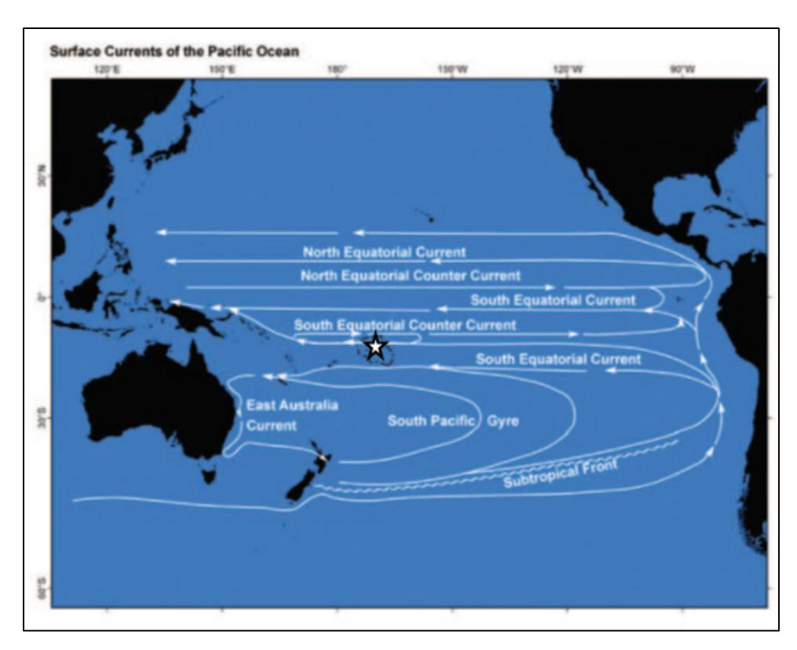

**Figure 18.** Major surface currents in the South Pacific Ocean. American Samoa is indicated by the star. Source: Pirhalla et al. 2011, adapted from Tomczak and Godfrey 2003.

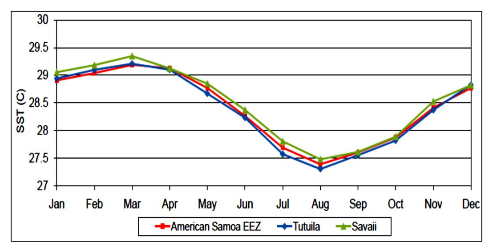

**Figure 19.** Monthly sea surface temperatures (SST) over an average annual cycle from 1985 to 2006. Values for American Samoa's Exclusive Economic Zone (EEZ, red), Tutuila (blue), and neighboring Savai'i Island in Samoa (green) are shown. Source: Pirhalla et al. 2011.

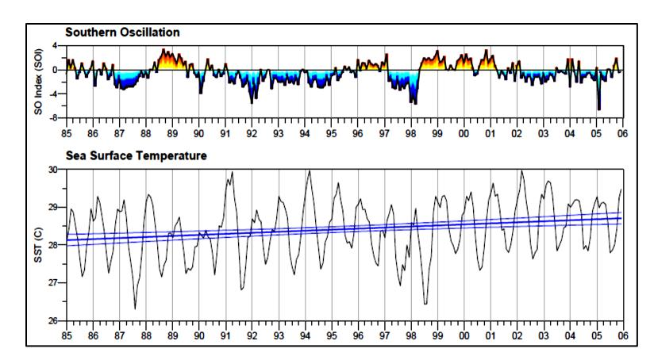

**Figure 20.** Annual sea surface temperature (SST) and anomaly values, 1985- 2006. Values are monthly averages for American Samoa. Southern Oscillation Index (SOI) values are from NOAA/NWS. El Niño conditions are represented in dark blue with strong negative SOI values. La Niña conditions are represented by orange with strong positive values. Source: Pirhalla et al. 2011.

#### *Water temperature and salinity profile*

Coastal waters 2-6 km offshore from Tutuila Island are 3000-5000 m deep and strongly stratified, with cold waters of 5-8 °C at depths below 500 m (Figure 21). Closer to shore in waters 30 m deep, Figure 21 illustrates the variable structure of the water column (Brainard et al. 2008). Station locations (A-J) are indicated in the top figure, and vertical profiles of the water column for these stations are shown (in a clockwise direction) in the bottom figure for temperature, salinity, density, and beam transmission (a measure of water clarity). Note that NPSA is located in sections B-D (Figure 22).

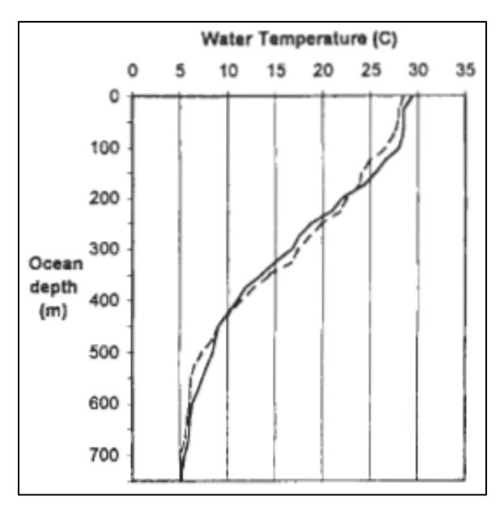

**Figure 21.** Ocean temperature profiles located at 2 km (dashed line) and 80 km (solid line) north of Tutuila Island, Nov. 1993. Source: NOAA ship data reported in Craig et al. 2000.

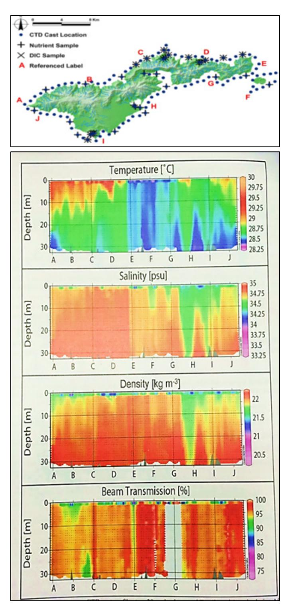

**Figure 22.** Water column profiles around Tutuila Island, February 2006, showing location of sampling stations A-J (top figure), and shallow-water profiles for water column temperature, salinity, density, and beam transmission (bottom figure), with profiles shown sequentially (A-J) in a clockwise direction around the island. NPSA is located in sections B-D. Source: Brainard et al. 2008.

Three distinctive oceanographic regions were observed around Tutuila Island at this time. The north coast (A–E) was characterized by warm (29.5 °C), saline, moderately stratified (temperature in particular), and relatively turbid waters. The east coast (E–G) was slightly cooler (28.5 °C), less saline, well-mixed, with clear waters. The south coast (H-J) was cooler, fresher, somewhat stratified, with generally clear water. Density distribution around the islands was fairly uniform, and beam transmission was generally high (> 90%).

While some stratification in water conditions existed near NPSA (sections B-D), two significant points are first, that stratification in 2006 was not extensive — the water column was warm and saline, varying only about 1 °C (temperature) and 0.5 psu (salinity) from surface to bottom, and next, that water conditions are variable (e.g., the water column in 2004 was well-mixed). Water temperatures in shallower waters can reach up to 34.5 °C (e.g., Craig et al. 2001).

#### *Chlorophyll-a*

Chlorophyll-a is the dominant pigment in marine photosynthetic organisms and its concentration in ocean waters provides a measure of nutrient input to surface waters and subsequent biological productivity. NOAA's chlorophyll-a dataset for the Samoan Archipelago was measured by satellite and averaged by month for the period 1998-2007 (Pirhalla et al. 2011). Offshore chlorophyll-a levels were low all year with limited seasonal variability (Figure 23). Monthly values ranged from 0.05 μg/L in January to 0.08 μg/L in July. Much higher values of chlorophyll-a (0.43–1.66 μg/L) were detected in nearshore waters around Tutuila, presumably due to nutrient enrichment from terrestrial runoff (Figure 24).

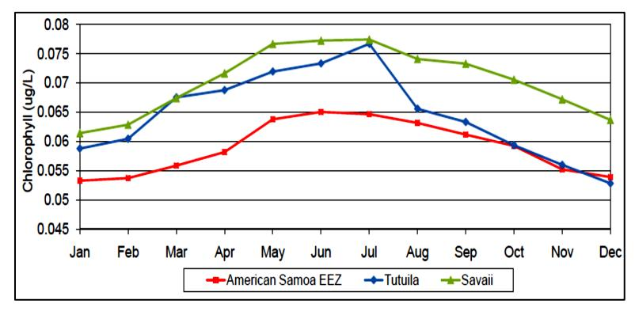

**Figure 23.** Average offshore chlorophyll-a concentrations estimated from the SeaWiFS satellite, 1998 to 2007. Values for American Samoa's Exclusive Economic Zone (red), Tutuila (blue), and Savai'i Island (green) are shown. Source: Pirhalla et al. 2011.

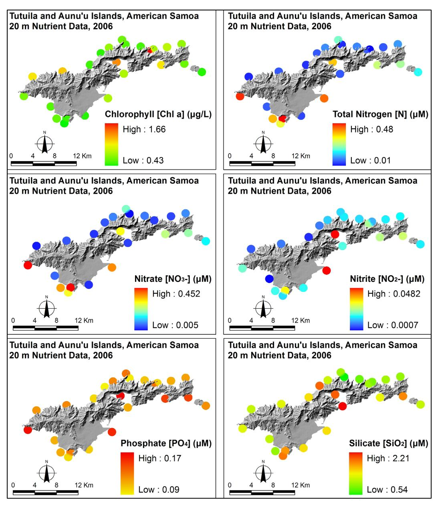

**Figure 24.** Nearshore water quality parameters in the 20 m depth zone around Tutuila Island, Feb. 2006. Source: Brainard et al. 2008.

#### *Nutrients and water chemistry*

Brainard et al. (2008) reported the following ranges for water quality parameters in nearshore waters around the islands: phosphate (PO4), 0.09–0.17 μm; silicate (SiO2), 0.54–2.21 μM; total nitrogen (TN = NO3 + NO2), 0.01–0.48 μM; and chlorophyll-a, 0.43–1.66 μg/L. Nitrogen concentrations on the north side of Tutuila exhibited spatial homogeneity while chlorophyll-a, phosphate, and silicate showed higher spatial variability, with highest levels measured in the industrialized Pago Pago Harbor where tuna canneries are located (Figure 24). It is likely that the relatively high nutrient concentrations observed around parts of the island can be attributed to terrestrial runoff.

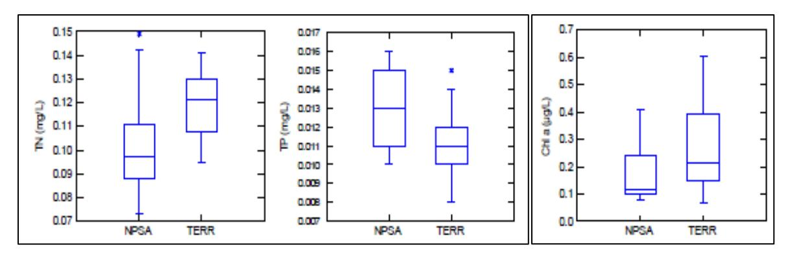

**Figure 25.** Box-and-whisker plots comparing water quality parameters in nearshore waters in park (NPSA) and outside park (TERR). Concentrations of TN (mg/L), TP (mg/L), and chlorophyll-a (µ/L) all showed significantly different distributions in the two areas. Source: DiDonato et al. 2007.

Pirhalla et al. (2011) summarized these conditions as follows. The islands of American Samoa are characterized by small seasonal fluctuations in ocean conditions and often much larger multiyear fluctuations in response to larger climatic cycles such as ENSO. The major source of variability is seasonal for winds, waves, and SST, whereas chlorophyll-a and sea surface height are affected more by interannual processes. Nearly all aspects of ocean climate for the archipelago vary more significantly by latitude than by longitude. Given that the reefs of the archipelago have developed in a region with relatively stable conditions, oceanic anomalies or trends exacerbated by climate change may have greater effects on Samoan reefs than in regions naturally adapted to such perturbations.

## Nearshore water quality

Three datasets describe NPSA's nearshore water quality: the ASEPA-NPSA survey in 2004 (DiDonato et al. 2007, 2009); the NPS I&M monitoring program (K. Kozar, pers. com. 2015); and ASEPA's beach monitoring program for bacterial contamination (ASEPA 2014).

#### *ASEPA-NPSA nearshore survey*

DiDonato et al. (2007, 2009) surveyed nearshore waters around American Samoa's five high islands, including sites within NPSA's three park units. Parameter values are listed in Table 11. Significant findings were:

- Compliance results were mixed. Most sites met American Samoa standards for dissolved oxygen (DO), acidification (pH), total phosphorous (TP), and *Enterococcus* bacteria. However, three parameters failed to meet standards at some locations: light penetration (42% of sites failed); chlorophyll-a (34% failed); and total nitrogen (TN, 21% failed). In addition, dissolved inorganic phosphorous (DIP) consistently exceeded a proposed nutrient threshold for oligotrophic marine waters (PO4: 0.1 µM; Lapointe 1997), which might indicate nutrientrelated reef degradation. Dissolved inorganic nitrogen (DIN) exceeded the Lapointe threshold (1.0 µM) in 22% of samples.
- Nearshore water quality parameters were highly variable both inside and outside NPSA, but the differences were not statistically significant for most parameters (DO, DIP, TSS, DIN, pH). However, chlorophyll-a and TN values were higher outside the park, but TP was higher

- inside the park (Figure 26). Highest values of TP were found in NPSA near seabird roosts at Pola Island (Tutuila Island), perhaps reflecting the input of guano to this area.
- Three parameters were highest in shallow water (DO, pH, DIN), indicating that gradients from shore to offshore may occur at times (Figure 26).
- Most nitrogen in nearshore waters was organic, while over half the phosphorous was inorganic and may be natural (e.g., weathering of volcanic rock, guano input from seabird colonies).

**Table 11.** Nearshore water quality parameters from pooled data from 49 randomly selected sites (0.2-38 m depth zone) around the main islands of American Samoa in April-August 2004, both inside and outside NPSA. Source: DiDonato et al. 2009.

| Parameter                | Average | Range             | SD    |
|--------------------------|---------|-------------------|-------|
| Temperature (°C)         | 28.8    | 27.6-29.8         | 0.8   |
| Salinity (ppt)           | 35.9    | 34.9-36.7         | 0.4   |
| pH                       | 8.01    | 7.6-8.23          | 0.17  |
| DO (mg/L)                | 7.17    | 6.50-9.87         | 0.81  |
| Chlorophyll-a (μg/L)     | 0.22    | 0.07-0.60         | 0.14  |
| TN (mg/L)                |         | 0.111 0.073-0.149 | 0.018 |
| TP (mg/L)                |         | 0.012 0.008-0.016 | 0.002 |
| Enterococcus (MPN)       | 0.4     | 0-3.33            | 1.1   |
| Nitrate (mg/L)           |         | 0.006 0.003-0.013 | 0.002 |
| Nitrite (mg/L)           |         | 0.002 0.000-0.005 | 0.001 |
| Nitrate + Nitrite (mg/L) |         | 0.008 0.005-0.015 | 0.002 |
| Ammonium (mg/L)          |         | 0.005 0.001-0.017 | 0.004 |
| DIN (mg/L)               |         | 0.012 0.006-0.027 | 0.004 |
| Urea (mg/L)              |         | 0.011 0.007-0.022 | 0.003 |
| DIP (mg/L)               |         | 0.012 0.010-0.017 | 0.001 |
| Silicate (mg/L)          |         | 0.105 0.047-0.505 | 0.064 |
| TSS (mg/L)               | 3.16    | 1.08-5.33         | 0.88  |
| TP (mg/L)                | 92±10   | 1±10              | 7     |
| TN (mg/L)                | 72±17   | 21±10             | 7     |
| Chlorophyll-a (μg/L)     | 66±18   | 34±18             | –     |
| Light penetration (ft)   | 54±18   | –                 | 4     |
| DO (mg/L)                | 81±15   | –                 | 19    |
| pH                       | 100     | –                 | –     |
| Enterococus (MPN)        | 64±18   | –                 | 36    |

**Table 12.** Marine water quality in fixed transects in NPSA's Tutuila Unit, 2009-2013. Non-compliance rates for all data (both fixed and temporary transects) with water quality standards (ASEPA 2013) are listed for Tutuila and Ofu Units. Source: NPS I&M Database (accessed 14 June 2016).

| Marine           |      |        | 2009 |    |        | 2010 |    |        | 2011 |    |        | 2013 |    | ASEPA non-compliance |         |
|------------------|------|--------|------|----|--------|------|----|--------|------|----|--------|------|----|----------------------|---------|
| Parameters       | Unit | Median | SD   | n  | Median | SD   | n  | Median | SD   | n  | Median | SD   | n  | Tutuila (%)          | OFU (%) |
| Temperature      | °C   | 29.7   | 0.3  | 12 | –      | –    | –  | –      | –-   | –  | 29.6   | 0.3  | 12 | –                    | –       |
| Salinity         | ppt  | 36.3   | 0.7  | 26 | –      | –    | –  | –      | –    | –  | 35.6   | 0.1  | 12 | –                    | –       |
| Dissolved oxygen | %    | 100.9  | 1.6  | 26 | –      | –    | –  | –      | –    | –  | 121.8  | 4.8  | 12 | 0                    | 0       |
| pH               | None | 8.2    | 0.0  | 26 | –      | –    | –  | –      | –    | –  | 8.1    | 0.1  | 13 | 0                    | 0       |
| Turbidity        | NTU  | 0.1    | 0.0  | 25 | –      | –    | –  | –      | –    | –  | 0.1    | 0.7  | 13 | 3                    | 29      |
| Chlorophyll      | µg/L | 0.2    | 1.0  | 21 | –      | –    | –  | –      | –    | –  | 0.1    | 0.5  | 11 | 35                   | 38      |
| NO3              | µg/L | 2.0    | 4.0  | 24 | 0.5    | 0.9  | 24 | 6.5    | 1.2  | 9  | 2.2    | 4.6  | 24 | –                    | –       |
| TDN              | mg/L | 0.1    | 0.0  | 24 | 0.1    | 0.1  | 24 | 0.2    | 0.1  | 33 | 0.2    | 0.2  | 24 | 43*                  | 24*     |
| TDP              | µ/L  | 7.5    | 0.0  | 24 | 7.5    | 2.6  | 24 | 7.5    | 0.0  | 33 | 19.0   | 5.0  | 19 | 12*                  | 3*      |
| Avg              | –    | –      | –    | –  | –      | –    | –  | –      | –    | –  | –      | –    | –  | 18                   | 15      |

\* Mineral estimate of non-compliance because ASEPA criteria are based on TN and TP.

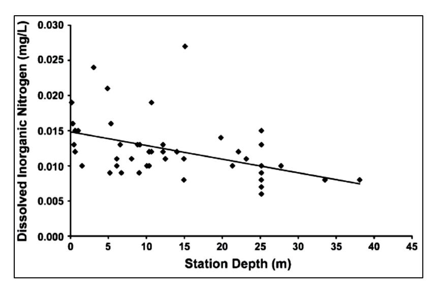

**Figure 26.** Relationship between sample depth (m) and the concentration of dissolved inorganic nitrogen (DIN) in nearshore waters around the high islands of American Samoa, including sites inside and outside NPSA (R2 = 0.2084, p = 0.001). Source: DiDonato et al. 2009.

These data indicate possible water quality issues (DiDonato et al. 2009). Elevated chlorophyll-a levels could be indicative of localized eutrophication often associated with increases in human population and nonpoint source pollution. Reduced water clarity could be related to total suspended solids (TSS), possibly associated with land use changes. In the Caribbean, for example, increased levels of DIN and DIP associated with anthropogenic impacts have been shown to facilitate a shift from hard coral communities to those dominated by macroalgae (Lapointe 1997, Lapointe et al. 2004).

## *NPS I&M Vital Signs monitoring for marine water quality in NPSA*

Nearshore water quality was monitored intermittently in the Tutuila Unit during 2009-2013 (Table 12). Marine waters were warm (30 °C), well-oxygenated, with typical oceanic values for salinity and pH. Overall, 82% of parameter values were within ASEPA (2013) criteria. Non-compliant parameters were high concentrations of chlorophyll-a (35%, n = 68 measurements), turbidity (3%, n = 76), TDN (43%, n = 155), and TDP (12%, n = 152); TDN and TDP exceeded ASEPA criteria for TP and TN. Some differences in rates of non-compliance occurred between NPSA's Tutuila and Ofu Units (Table 12). Non-compliance of TDN and TDP was higher on Tutuila (as might be expected due to its higher human population), but turbidity was higher on Ofu for unknown reasons. On both islands, non-compliance of nutrients, turbidity, and chlorophyll-a were indicative of terrestrial runoff into coastal waters. Overall, these results were similar to those of DiDonato et al. (2009). However, Garrison et al. (2007) found low nutrient concentrations in Ofu lagoon and, based on several lines of evidence, they suggested that the major sources of nutrients at that site were likely to have been oceanic/atmospheric, rather than animal/anthropogenic in origin.

#### *ASEPA Beach monitoring program for bacterial contamination*

Tutuila's nearshore waters were consistently contaminated by fecal bacteria, likely due to land runoff (DiDonato and Paselio 2006). *Enterococci* bacteria (indicators of fecal contamination) were detected

year-round in shoreline seawater in front of Fagasa and Vatia Villages (Figure 27; ASEPA 2014). ASEPA water quality standards were exceeded an average of 90% and 39% (Fagasa and Vatia, respectively) during weekly measurements in 2014 (n = 41). When standards are exceeded, ASEPA recommends that the public should not swim, wade or fish within 400 ft of polluted beaches. Tuitele et al. (2016) also listed Fagasa coastal waters and Vatia streams as not meeting ASEPA's designated use category for supporting aquatic life.

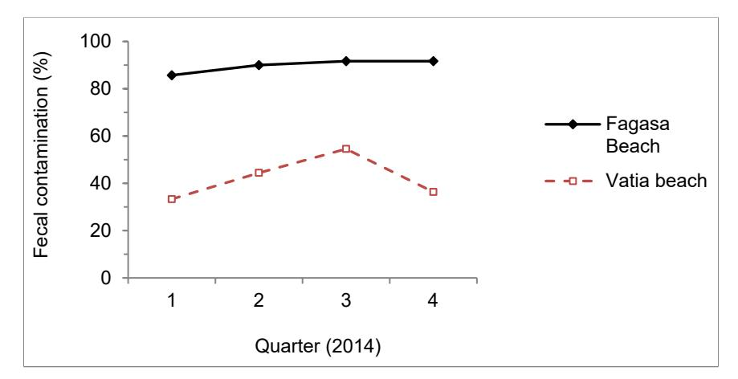

**Figure 27.** Percentage of Enterococci bacteria samples that exceeded ASEPA water quality standards in shoreline waters at Fagasa and Vatia Villages in 2014. Source: ASEPA 2014.

## Climate change trends in marine waters

Climate change is having a profound impact on marine waters worldwide. A Consensus Statement by the International Society for Reef Studies (ISRS 2015) concluded:

*There is overwhelming consensus within the scientific community, and robust evidence, that the surface layers of the world's oceans have warmed since the beginning of the 20th century. Coral reefs are threatened with effective collapse under rapid climate change. Increasing sea temperatures are causing widespread coral bleaching and mortality, and elevated carbon dioxide levels are causing ocean acidification that may further accelerate coral reef loss. The death of corals leads in turn to the loss of most of the fish and invertebrate populations that they support. Over recent decades, 33-50% of coral reefs have been largely or completely degraded by a combination of local factors and global climate change. Additional extensive degradation will inevitably occur over the next two decades as temperatures continue to rise. As a result of reef ecosystem destruction, a quarter of all marine species are at risk, while the associated economic losses will expose hundreds of millions of people to decreasing food security and increased poverty. [Abridged]*

Climate change is occurring throughout the Pacific Island region (ABM & CSIRO 2011, Keener et al. 2012), as well as in American Samoa (Section 5.1). Sea surface temperatures warmed about 1 °C from 1985 through 2006 (Figure 22). Corals are particularly vulnerable to small temperature increases because they live near their maximum temperature tolerance (Baker et al. 2008). An increase of only 1 °C can stress corals, resulting in loss of their zooxanthellae (referred to as coral

bleaching). Such warm-water events in American Samoa resulted in mass coral bleachings in 1991, 1994, 2002, 2003, and 2015 (Section 4.2).

In addition, oceanic uptake of atmospheric CO2 has steadily increased acidification of the Pacific Ocean (Figure 28). Over the past century, pH of ocean surface water decreased by 0.1 unit, which equates to a 26% increase in ocean acidification (Hoegh-Guldberg et al. 2014, IPCC 2014). Given that increases in atmospheric CO2 in American Samoa mirror increases in Hawaii (see Section 5.1), Hawaii's oceanic acidification trend is considered to represent American Samoa as well. Increased ocean acidification is projected to reduce growth and survival of calcifying organisms such as corals, mollusks, and calcareous algae, thereby threatening basic environmental conditions required by contemporary coral reef ecosystems (e.g., Kleypas et al. 2006, Fabrey et al. 2008, Kroeker et al. 2010). It seems clear that the water quality criteria currently used as benchmarks for supporting marine life should be re-evaluated, since they were never designed to protect marine organisms from the damaging effects of climate change (Univ. California 2016, Weisberg et al. 2016).

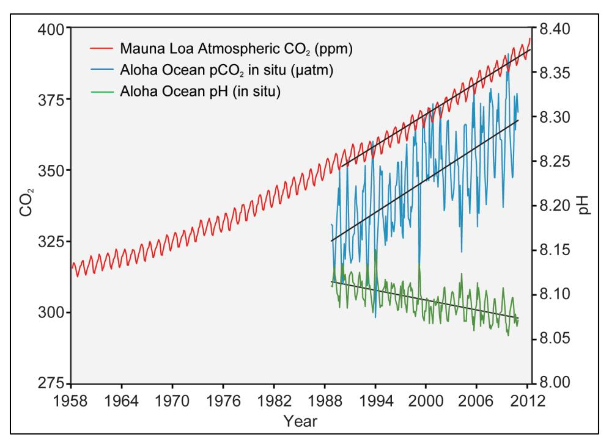

**Figure 28.** Hawaiian trends in increasing atmospheric carbon dioxide (CO2) and pH. This graph shows (1) increasing atmospheric CO2 (red line); (2) increasing dissolved CO2 (pCO2) in ocean surface waters (blue line); and (3) decreasing ocean pH (green line). Source: Feely et al. 2009.

## Data needs/gaps

Preparation of a PACN I&M status and trend report is a priority for NPSA's marine water quality. Potential impacts of land-based contamination to the park's nearshore water quality and ecosystems must be evaluated. Continuous temperature monitoring of the park's nearshore waters, or analysis of data from NOAA's nearshore temperature buoys, is essential. NPSA's unique temperature-tolerant coral reefs in Ofu lagoon have been the subject of extensive scientific research over the past 30 years (about 50 reports and publications); it would be useful to consolidate this information, including water quality data, into a single document with a condensed overview.

## Threats

As previously described, climate change is a fundamental threat to NPSA's nearshore water quality. Indicators include rising sea temperatures, increasing ocean acidification, and rising sea levels (ABM & CSIRO 2011, Keener et al. 2012; see also Section 5.1 of this report). Projected impacts to water quality and coral reefs have been discussed at length in other reports (e.g., Kleypas et al. 2006, Fabrey et al. 2008, Baker et al. 2008, Hoegh-Guldberg et al. 2007, 2014; Howes et al. 2015).

Terrestrial runoff containing sediment, nutrients, and fecal bacteria occurs in or near the park. Human activities that contribute to land-based pollution are varied, but poorly constructed human and pig waste disposal systems are territory-wide problems (ASEPA 2014). Natural disturbances such as cyclones and heavy rainfall also increase terrestrial runoff into streams and coastal waters (see also Section 4.10 Streams). Sediment-laden runoff from the Mt. Alava dirt road into coastal waters is a local problem in the Tutuila Unit.

Several other threats to marine water quality are of less concern in NPSA at present. All three park units are located in relatively remote areas that are largely uninhabited. Development is prohibited in the park, although traditional land practices such as small pre-existing agricultural plantations are permitted. The park's marine zones receive low recreational use (Craig 2011, P. Craig, pers. obs.); few alien marine species have been detected there (Coles et al. 2003). The point sources of pollution (sewage outfalls and the cannery's outfall and solid waste dump sites on Tutuila) are located on the south side of the island and do not affect the park.

## Overall condition

*Coastal oceanography and water quality*

This measure was assigned a Significance Level of 3 (High), because regional and local changes in coastal oceanography influence NPSA's nearshore marine waters on daily, seasonal, and yearly timescales. It was assigned a Condition Level of 0 (Not a current concern) because coastal conditions within the park appear to be consistent with regional conditions (Brainard et al. 2008, Pirhalla et al. 2011). Further, there are no coastline developments in the park (e.g. harbors, docks), although small seawalls have been built in front of the three villages adjacent to the Tutuila Unit.

#### *Nearshore water quality*

This measure was assigned a Significance Level of 3 (High) and a Condition Level of 1 (Low). Nearshore water quality was in fairly good condition, but there were exceptions. Several parameters (particularly chlorophyll-a, turbidity, nitrogen) exceeded ASEPA (2013) standards on multiple occasions, indicating some land-based nutrient enrichment in nearshore waters. Localized fecal bacterial contamination of beach waters was also detected at two villages adjacent to NPSA's Tutuila Unit, but the impact to the park itself may be low due to marine dilution.

*Climate change trends in the marine environment*

Fundamental changes occurring in the marine environment due to climate change are not adequately captured by the previous two measures. Climate induced changes in ocean temperature and acidification present a continuing threat that is projected to worsen. Baseline water quality is changing from historical conditions in the park. This measure was assigned a Significance Value of 3 (High) and, at present, a Condition Level of 2 (Moderate) for several reasons: there is considerable scientific evidence about the negative impacts of these trends to coral reef ecosystems worldwide, increasing temperature trends in American Samoa are consistent with regional trends, and multiple coral bleachings have already occurred in NPSA due to incidents of abnormally warm water.

#### *Weighted condition score*

In this scoring system, the weighted condition score (0.33; Table 13) falls between a resource that is in good condition and one that warrants moderate concern. The latter description is selected as being more appropriate due to climate induced increases in ocean temperatures and acidification that threaten coral reef ecosystems, as indicated by increasing coral bleaching episodes in NPSA caused by warming waters. Baseline water quality conditions in the park are changing from historical conditions. Indications of nearshore pollution (land-based nutrients, sediments, fecal bacteria) are an additional concern.

**Table 13.** Significance levels and condition levels used to calculate the weighted condition score (WCS) for NPAS's marine water quality.

| Measures                                  | Significance Level | Condition Level | WCS= 0.33                                                                                                                                 |
|-------------------------------------------|--------------------|-----------------|-------------------------------------------------------------------------------------------------------------------------------------------|
| Coastal oceanography and water quality | 3                  | 0               |                                                                                                                                           |
| Nearshore water quality                   | 3                  | 1               |                                                                                                                                           |
| Climate change trends in marine waters | 3                  | 2               | Condition of resource warrants moderate concern; trend in condition is unknown or not applicable; medium confidence in the assessment. |

## *4.1.5. Literature Cited*

ABM and CSIRO (Australian Bureau of Meteorology and Commonwealth Scientific and Industrial Research Organization). 2014. Climate variability, extremes and change in the Western Tropical Pacific 2014: new science and updated country reports. Pacific-Australia Climate Change Science and Adaptation Planning Program Technical Report. Melbourne, Australia. Chapt. 12. Samoa. [http://www.pacificclimatechangescience.org/publications/reports/climate-variability](http://www.pacificclimatechangescience.org/publications/reports/climate-variability-extremes-and-change-in-the-western-tropical-pacific-2014/)[extremes-and-change-in-the-western-tropical-pacific-2014/.](http://www.pacificclimatechangescience.org/publications/reports/climate-variability-extremes-and-change-in-the-western-tropical-pacific-2014/)

ASEPA (American Samoa Environmental Protection Agency). 2013. American Samoa Water Quality Standards, 2013 Revision. Administrative Rule No. 001-2013, §24.0201 to §24.0210. [http://asepa.gov/water-quality.asp.](http://asepa.gov/water-quality.asp) Accessed 1 February 2016.

ASEPA (American Samoa Environmental Protection Agency). 2014. Beach Advisories (2014). [www.epa.as.gov/beach-advisory.](http://www.epa.as.gov/beach-advisory) Accessed 1 February 2016.

- Baker, A., P. Glynn, and B. Riegl. 2008. Climate change and coral reef bleaching: An ecological assessment of long-term impacts, recovery trends and future outlook, Estuarine Coast Shelf Science 80:435-471. doi:10.1016/j.ecss.2008.09.003.
- Birkeland, C., P. Craig, D. Fenner, L. Smith, W. Kiene, and B. Riegl. 2008. Geologic setting and ecological functioning of coral reefs in American Samoa. Chapt. 20. *In:* B. Riegl and R. Dodge (eds.). Coral reefs of the USA. Springer Publications. NY. 803 p.
- Brainard R., and 25 others. 2008. Coral reef ecosystem monitoring report for American Samoa: 2002-2006. NOAA Special Report NMFS PIFSC. Pacific Islands Fisheries Science Center, Hawaii. 472 p.
- Coles, S., P. Reath, P. Skelton, V. Bonito, R. DeFelice, and L. Basch. 2003. Introduced marine species in Pago Pago Harbor, Fagatele Bay and the national park coast, American Samoa. Bishop Museum Tech. Rep. 26. 182 p.
- Craig, P. (ed.). 2009. Natural history guide to American Samoa. National Park of American Samoa, Dept. Marine and Wildlife Resources, American Samoa Community College. Pago Pago, American Samoa. 130 p.
- Craig, P. 2011. Tourist numbers and park visitation rates in Ofu & Olosega islands in 2002. File Report. National Park of American Samoa. 1 p.
- Craig, P. 2013. NPSA long-term water temperature monitoring in Ofu and Vatia, American Samoa: project description, metadata, and preliminary results. File Report. National Park of American Samoa. 7 p.
- Craig, P., S. Saucerman, and S. Wiegman. 2000. The Central South Pacific Ocean (American Samoa). Chapt. 103, Pages 765-72. *In*: C. Sheppard (ed.). Seas at the millennium: an environmental evaluation. Vol. 2. Regional Chapters: The Indian Ocean to the Pacific. Pergamon Press. New York.
- Craig, P., C. Birkeland, and S. Belliveau. 2001. High temperatures tolerated by a diverse assemblage of shallow-water corals in American Samoa. Coral Reefs 20:185–189.
- DiDonato, G., and E. Paselio. 2006. Localized beach contamination in American Samoa: results from two years of weekly monitoring. Marine Pollution Bulletin 52:466-468.
- DiDonato, E., G. DiDonato, L. Smith, L. Harwell, V. Engels, and J. Summers. 2007. Using the National Coastal Assessment methodology to evaluate the water, sediment, and fish tissue quality of American Samoa's near-shore marine resources. Draft report. National Park of American Samoa and American Samoa Environmental Protection Agency.
- DiDonato, G., E. DiDonato, L. Smith, L. Harwell, and J. Summers. 2009. Assessing coastal waters of American Samoa: territory-wide water quality data provide a critical "big-picture" view for this tropical archipelago. Environ. Monitor. Assess. 150: 157-165. doi: 10.1007/s10661-0674-y.

- Fabrey, V., B. Seibel, R. Feely, and J. Orr. 2008. Impacts of ocean acidification on marine fauna and ecosystem processes. ICES Journal of Marine Science, 65: 414–432.
- Garrison, V., K. Kroeger, D. Fenner, and P. Craig. 2007. Identifying nutrient sources to three lagoons at Ofu and Olosega, American Samoa using d15N of benthic macroalgae. Marine Pollution Bulletin 54: 1813–183.
- Hoegh-Guldberg, O., P. Mumby, A. Hooten, R. Steneck, P. Greenfield, E. Gomez, C. Harvell, P. Sale, A. Edwards, K. Caldeira, N. Knowlton, C. Eakin, R. Iglesias-Prieto, N. Muthiga, R. Bradbury, A. Dubi, M. Hatziolos. 2007. Coral reefs under rapid climate change and ocean acidification. Science 318:1737-1742, doi: 10.1126/science.1152509.
- Hoegh-Guldberg, O., R. Cai, E. Poloczanska, P. Brewer, S. Sundby, K. Hilmi, V. Fabry, and S. Jung. 2014. The Ocean. pp.1655-1731. *In*: V. Barros and 15 others (eds.). Climate Change 2014: impacts, adaptation, and vulnerability. Part B: Regional aspects. Contribution of Working Group II to the Fifth Assessment Report of the Intergovernmental Panel on Climate Change. Cambridge University Press, Cambridge, United Kingdom and New York, USA.
- Howes, E., F. Joos, M. Eakin, and J. Gattuso. 2015. The Oceans 2015 Initiative, Part I: an updated synthesis of the observed and projected impacts of climate change on physical and biological processes in the oceans, Studies N° 02/15, IDDRI (Institut du Développement Durable et des Relations Internationales), Paris, France, 52 p.
- IPCC (Intergovernmental Panel on Climate Change). 2014. Climate change 2014 synthesis report. Fifth Assessment Synthesis Report of the Intergovernmental Panel on Climate Change. Edited by The Core Writing Team, R. Pachauri, and L. Meyer. Cambridge University Press, Cambridge, United Kingdom and New York.
- ISRS (International Society for Reef Studies). 2015. ISRS Consensus statement on climate change and coral bleaching, October 2015. Prepared for the 21st Session of the Conference of the Parties to the United Nations Framework Convention on Climate Change, Paris, December 2015. [http://coralreefs.org/wp-content/uploads/2014/03/ISRS-Consensus-Statement-on-Coral-](http://coralreefs.org/wp-content/uploads/2014/03/ISRS-Consensus-Statement-on-Coral-Bleaching-Climate-Change-FINAL-14Oct2015-HR.pdf)[Bleaching-Climate-Change-FINAL-14Oct2015-HR.pdf.](http://coralreefs.org/wp-content/uploads/2014/03/ISRS-Consensus-Statement-on-Coral-Bleaching-Climate-Change-FINAL-14Oct2015-HR.pdf) Accessed 1 February 2016.
- Jones, T., K. DeVerse, G. Dicus, D. McKay, A. Farahi, K. Kozar, and E. Brown. 2011a. Water quality vital signs monitoring protocol for the Pacific Island Network: Volume 1; Version 1.0. Natural Resource Report NPS/PACN/NRR—2011/418. National Park Service, Fort Collins, Colorado.
- Jones, T., D. McKay, K. DeVerse, and K. Kozar. 2011b. Water quality vital signs monitoring protocol for the Pacific Island Network - Appendixes: Version 1.0. Natural Resource Report NPS/PACN/NRR—2011/419. National Park Service, Fort Collins, Colorado.
- Kendall, M., and M. Poti (eds.). 2011. A biogeographic assessment of the Samoan Archipelago. NOAA Tech. Memo., NOS NCCOS 132, Silver Springs, Maryland.

- Keener, V., J. Marra, M. Finucane, D. Spooner, and M. Smith (eds.). 2012. Climate change and Pacific Islands: indicators and impacts. Report for the 2012 Pacific Islands Regional Climate Assessment (PIRCA). Washington, DC, Island Press.
- Kleypas J., C. Langdon, J. Phinney, O. Hoegh-Guldberg, J. Kleypas, W. Skirving, and A. Strong. 2006. Coral reefs and changing seawater chemistry. Coral Reefs and Climate Change: Science and Management. American Geophysical Union, AGU Monograph Series Coastal Estuarine Studies 61:73-110.
- Kroeker, K., R. Kordas, R. Crim, and G. Singh. 2010. Meta-analysis reveals negative yet variable effects of ocean acidification on marine organisms. Ecology Letters 13: 1419-1434. doi: 10.1111/j.1461-0248.2010.01518.x.
- Lapointe, B. 1997. Nutrient thresholds for bottom-up control of macroalgal blooms on coral reefs in Jamaica and southeast Florida. Limnology and Oceanography 42:1119-1131.
- Lapointe, B., P. Barile, C. Yentsch, M. Littler, D. Littler, and B. Kakuk. 2004. The relative importance of nutrient enrichment and herbivory on macroalgal communities near Norman's Pond Cay, Exumas Cays, Bahamas: A "natural" enrichment experiment. J. Exp. Marine Biol. and Ecol. 298: 275-301.
- NPS I&M (National Park Service, Inventory and Monitoring program). 2016. Marine water quality monitoring database. National Park Service. Accessed March 18, 2016.
- Peshut, P. and B. Brooks. 2005. Tier 2 Fish Toxicity Study Chemical contaminants in fish and shellfish and recommended consumption limits for the Territory of American Samoa. American Samoa Environmental Protection Agency.
- Peshut, P., J. Morrison, B. Brooks. 2008. Arsenic speciation in marine fish and shellfish from American Samoa. Chemosphere 71:484-492.
- Pirhalla, D., V. Ransi, M. Kendall, and D. Fenner. 2011. Oceanography of the Samoan Archipelago. p. 3-26. *In*: M. Kendall and M. Poti (eds.). A biogeographic assessment of the Samoan Archipelago. NOAA Tech. Memo., NOS NCCOS 132, Silver Springs, Maryland.
- Raikow, D. F., and A. Farahi. 2015. Water quality in streams of National Park of American Samoa: Summary report 2009-2011. Natural Resource Data Series NPS/NPSA/NRDS—2015/753. National Park Service, Fort Collins, Colorado.
- Storlazzi, C., O. Cheriton, K. Rosenberger, J. Logan, and T. Clark. (in prep.). Coastal Circulation in the National Park of American Samoa**;** measurements of waves, currents, temperature, and salinity: February–July 2015: U.S. Geological Survey Open-File Report 2016-x.xxxx
- Tomczak, M. and J.S. Godfrey. 2003. Regional Oceanography: An Introduction. 2nd improved edition. Daya Publishing House, Delhi. 390 p.

- Tuitele, C., E. Buchan, J. Regis, J. Potoa'e, and C. Fale. 2014. Territory of American Samoa integrated water quality monitoring and assessment report 2014. American Samoa Environmental Protection Agency, American Samoa.
- Tuitele, C., E. Buchan, J. Regis, J. Tuiasosopo, S. Faaiuaso, and L. Soli. 2016. Territory of American Samoa integrated water quality monitoring and assessment report 2014. American Samoa Environmental Protection Agency, American Samoa.
- University of California. 2016. "Ocean scientists recommend plan to combat changes to seawater chemistry." ScienceDaily. 12 April 2016. [www.sciencedaily.com/releases/2016/04/160412211612.htm.](http://www.sciencedaily.com/releases/2016/04/160412211612.htm)
- Weisberg, S., N. Bednaršek, R. Feely, F. Chan, A. Boehm, M. Sutula, J. Ruesink, B. Hales, J. Largier, and J. Newton. 2016. Water quality criteria for an acidifying ocean: Challenges and opportunities for improvement. Ocean and Coastal Management (2016) 126: 31-41. doi:10.1016/j.ocecoaman.2016.03.010.

## **4.2. Benthic Marine Community**

## *4.2.1. Description*

Reef-building corals are often used to evaluate the overall condition of nearshore tropical ecosystems because they are the primary architectural organism forming the reef (Birkeland 1997), and they are sensitive to environmental degradation (Jameson et al. 1998). Coral reefs are also a traditional component of Samoan culture (Hunt and Kirch 1997), and reefs provide ecological and social goods and services such as food and shoreline protection from storm damage and wave erosion (e.g., Cesar et al. 2002, Jacobs 2004).

NPSA's benthic marine community consists primarily of coral reefs (Figure 29) interspersed with basalt pavement and sand. Reefs support a rich biota of fish, algae, corals, and other invertebrates such as octopuses and giant clams. Park reefs extend along 27 km of coastline on three volcanic islands (Tutuila, Ofu, and Ta'u), and encompass a marine area of 10 km2 (2,550 ac). Park boundaries extend from shore to 0.4 km (0.25 mi) offshore where water depths are about 30-40 m. This area includes all three of NPSA's marine life zones: shallow marine (0-5 m depth), mid-marine (5-30 m), and deep marine (>30 m).

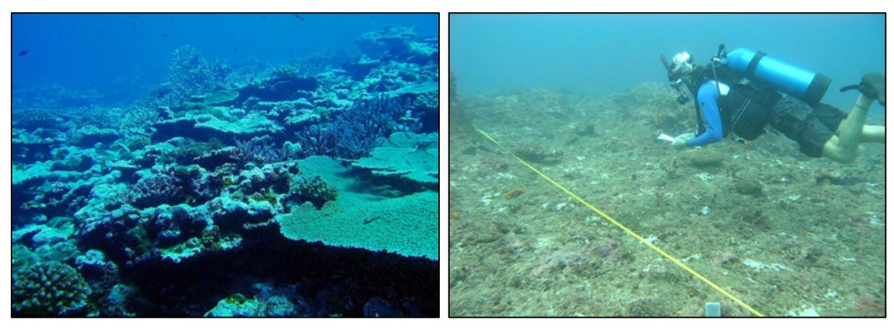

**Figure 29.** Examples of coral reef substrates in NPSA's Tutuila Unit showing: (A) a structurally complex substrate of live corals and crustose coralline algae, and (B) a veneer of mostly turf and coralline algae covering basalt pavement. Photos: P. Craig.

The number of coral species in American Samoa is moderately diverse for the Indo-Pacific region (Veron et al. 2017). Species richness is greatest in Indonesia (about 600), moderate in central-western Pacific (about 300 in the Samoa-Tuvalu-Tonga region), and lower in central Pacific (about 150 in the Tuamotu Archipelago). About 227 coral species occur in NPSA (DiDonato et al. 2006), of which three are listed as threatened under the Endangered Species Act (ESA), and 38 are listed as vulnerable or endangered by the IUCN Red List (Table 14; IUCN 2011, Kenyon et al. 2011, NOAA 2014). The three ESA threatened corals are *Acropora globiceps, Acropora retusa,* and *Isopora crateriformis*; the one IUCN endangered coral is *Millepora tuberosa.* Specific information on distribution, abundance and threats to these corals is limited (Brainard et al. 2011, Fenner 2015).

Key threats to park reefs include both anthropogenic impacts (climate change) and natural disturbances (cyclones, Crown of Thorns starfish outbreaks). Some of these threats cause "coral bleaching," which occurs when a coral is subjected to a stress that causes it to expel its colorful zooxanthellae, resulting in a white or bleached appearance. Bleached corals may recover or die depending on the severity of the stress.

**Table 14.** Occurrence of coral species in NPSA and in American Samoa that are listed under the Endangered Species Act (NOAA 2014) or the IUCN Red List as modified by Kenyon et al. (2011). The partitioning of ESA species into NPSA Units is based on Kenyon et al. (2011). Abbreviations: + (species present), T (Threatened), VU (Vulnerable), EN (Endangered), U (Unlikely to be present).

|                          | Endangered Species Act (2014) |                   |                 |          | IUCN Red List (2011) |                 |             |  |  |
|--------------------------|-------------------------------|-------------------|-----------------|----------|----------------------|-----------------|-------------|--|--|
| Coral species            | Category                      | American Samoa | NPSA Tutuila | NPSA Ofu | Category             | NPSA Tutuila | NPSA Ofu |  |  |
| Acropora aculeus      | –                             | –                 | –               | –        | VU                   | –               | +           |  |  |
| Acropora acuminate    | –                             | –                 | –               | –        | VU                   | –               | +           |  |  |
| Acropora aspera       | –                             | –                 | –               | –        | VU                   | –               | +           |  |  |
| Acropora donei        | –                             | –                 | –               | –        | VU                   | –               | +           |  |  |
| Acropora globiceps    | T                             | +                 | –               | –        | VU                   | –               | +           |  |  |
| Acropora horrida      | –                             | –                 | –               | –        | VU                   | –               | +           |  |  |
| Acropora jacquelineae | T                             | +                 | –               | –        | VU                   | –               | –           |  |  |
| Acropora listeria     | –                             | –                 | –               | –        | VU                   | –               | –           |  |  |
| Acropora microclados  | –                             | –                 | –               | –        | VU                   | +               | –           |  |  |
| Acropora palmerae     | –                             | –                 | –               | –        | VU                   | +               | +           |  |  |
| Acropora paniculata   | –                             | –                 | –               | –        | VU                   | –               | +           |  |  |
| Acropora polystoma    | –                             | –                 | –               | –        | VU                   | –               | +           |  |  |
| Acropora retusa       | T                             | +                 | –               | +        | VU                   | –               | +           |  |  |
| Acropora rudis           | T                             | U                 | –               | –        | EN                   | –               | –           |  |  |
| Acropora speciose     | T                             | +                 | –               | –        | VU                   | –               | –           |  |  |

**Table 14 (continued).** Occurrence of coral species in NPSA and in American Samoa that are listed under the Endangered Species Act (NOAA 2014) or the IUCN Red List as modified by Kenyon et al. (2011). The partitioning of ESA species into NPSA Units is based on Kenyon et al. (2011). Abbreviations: + (species present), T (Threatened), VU (Vulnerable), EN (Endangered), U (Unlikely to be present).

|                            |          | Endangered Species Act (2014) |                 | IUCN Red List (2011) |          |                 |             |
|----------------------------|----------|-------------------------------|-----------------|----------------------|----------|-----------------|-------------|
| Coral species              | Category | American Samoa             | NPSA Tutuila | NPSA Ofu             | Category | NPSA Tutuila | NPSA Ofu |
| Acropora striata        | –        | –                             | –               | –                    | VU       | –               | +           |
| Acropora vaughani       | –        | –                             | –               | –                    | VU       | –               | +           |
| Acropora verweyi        | –        | –                             | –               | –                    | VU       | –               | +           |
| Alveopora allingi       | –        | –                             | –               | –                    | VU       | +               | –           |
| Astreopora cucullata    | –        | –                             | –               | –                    | VU       | +               | +           |
| Euphyllia paradivisa    | T        | +                             | –               | –                    | VU       | –               | –           |
| Galaxea astreata        | –        | –                             | –               | –                    | VU       | –               | +           |
| Heliopora coerulea      | –        | –                             | –               | –                    | VU       | –               | +           |
| Isopora crateriformis   | T        | +                             | +               | +                    | VU       | +               | +           |
| Isopora cuneata         | –        | –                             | –               | –                    | VU       | –               | +           |
| Leptoseris incrustans   | –        | –                             | –               | –                    | VU       | –               | +           |
| Leptoseris incrustans   | –        | –                             | –               | –                    | VU       | –               | +           |
| Leptoseris yabei        | –        | –                             | –               | –                    | VU       | –               | +           |
| Millepora tuberosa      | –        | –                             | –               | –                    | EN       | +               | +           |
| Montipora australiensis | –        | –                             | –               | –                    | VU       | –               | +           |
| Montipora calcarea      | –        | –                             | –               | –                    | VU       | +               | –           |
| Montipora caliculata    | –        | –                             | –               | –                    | VU       | +               | +           |
| Pavona decussate        | –        | –                             | –               | –                    | VU       | –               | +           |

**Table 14 (continued).** Occurrence of coral species in NPSA and in American Samoa that are listed under the Endangered Species Act (NOAA 2014) or the IUCN Red List as modified by Kenyon et al. (2011). The partitioning of ESA species into NPSA Units is based on Kenyon et al. (2011). Abbreviations: + (species present), T (Threatened), VU (Vulnerable), EN (Endangered), U (Unlikely to be present).

|                           |          | Endangered Species Act (2014) |                 |          | IUCN Red List (2011) |                 |             |  |
|---------------------------|----------|-------------------------------|-----------------|----------|----------------------|-----------------|-------------|--|
| Coral species             | Category | American Samoa             | NPSA Tutuila | NPSA Ofu | Category             | NPSA Tutuila | NPSA Ofu |  |
| Pavona diffluens       | T        | U                             | U               | –        | VU                   | U               | +           |  |
| Pavona venosa          | –        | –                             | –               | –        | VU                   | +               | +           |  |
| Pocillopora danae      | –        | –                             | –               | –        | VU                   | –               | +           |  |
| Pocillopora elegans    | –        | –                             | –               | –        | VU                   | +               | –           |  |
| Porites horizontalata  | –        | –                             | –               | –        | VU                   | +               | –           |  |
| Porites nigrescens     | –        | –                             | –               | –        | VU                   | –               | +           |  |
| Turbinaria mesenterina | –        | –                             | –               | –        | VU                   | –               | +           |  |
| Turbinaria reniformis  | –        | –                             | –               | –        | VU                   | –               | +           |  |
| Turbinaria stellulata  | –        | –                             | –               | –        | VU                   | –               | +           |  |
| Total species             | –        | 6                             | 1               | 3        | –                    | 11              | 31          |  |

The Coral Reef Conservation Act (2000) is important is to the future of the reefs. This law created the US Coral Reef Task Force and directed the Departments of Commerce and Interior to improve understanding, preservation, and restoration of coral reef ecosystems, while promoting wise management and sustainable use of these valuable marine resources. Other policies to protect marine resources include the US National Ocean Policy (2004) and the NPS Pacific Ocean Strategic Plan (2008). In addition, NPSA is part of NPS's PACN I&M program (Pacific Islands Network Inventory and Monitoring) to preserve benthic marine communities in PACN parks.

## *4.2.2. Data and Methods*

Numerous coral reef studies have been conducted in American Samoa over the past three decades. About 200 publications and reports are available in NPSA's Digital Library (Hart 2008) and in the supplemental literature review conducted for this NRCA. However, the primary data source for this assessment is NPS's I&M Vital Signs monitoring program, because it was designed specifically to assess the benthic marine community within NPSA's Tutuila Unit (Clark et al. 2015).

## Primary data sources

*NPS I&M Vital Signs monitoring survey for benthic marine communities in NPSA*

A statistically based protocol for monitoring benthic communities in PACN national parks (Brown et al. 2011) was implemented in NPSA's Tutuila Unit in 2007 and has been utilized annually thereafter (Clark et al. 2015). Surveys were designed to detect longterm trends in the composition (species assemblages) and physical structure (rugosity) of coral reef benthos on hardbottom substrates at depths of 10-20 m. Field surveys in 2007-2015 focused on sessile benthic marine macroinvertebrates (primarily corals, but other invertebrates were recorded if present) and algae (macroalgae, crustose coralline algae, and turf algae). The generic macroalgae category was used for algae that could not be identified to genus, appeared fleshy, filamentous, or calcified, and had a height greater than approximately three cm. Algal species less than two cm tall and with no apparent structure were classified as turf algae. Crustose coralline algae were red algae that formed a hard, thin veneer on reef substrates. The percentage of substrate cover for corals and algae was determined by photoquadrat analysis.

A split panel sampling design was utilized to monitor benthic communities, with thirty randomly selected sites sampled annually. Fifteen of these sites were fixed (permanent) transects and revisited. The remaining 15 temporary sites were randomly selected each year and not revisited. Initially, the statistical power of this sampling design should have a 40% chance of detecting a 25% relative change in percent cover of benthos (Brown et al. 2011). Statistical power is expected to increase over time due to an increase in temporal replication to give an approximate power of an 80% chance to detect a 25% change. Data collection and analysis in subsequent years will help determine whether trends observed in 2007-2015 are statistically significant.

#### *NPSA's Crown of Thorns starfish (COTs) control program*

A major threat to the park's coral reefs in 2011-2015 was an outbreak of the coral-eating Crown of Thorns starfish, *Acanthaster planci* (Clark 2015). Control efforts were conducted along the north side of Tutuila Island, in and near NPSA's Tutuila Unit in 2013-2015. Towed snorkeler surveys were used to identify COT outbreak sites, followed by over 1,000 scuba dives to lethally inject the starfish.

*NOAA's American Samoa Reef Assessment and Monitoring Program (ASRAMP)* NOAA's ASRAMP program conducted islandwide surveys of corals, reef fish, and oceanic conditions in American Samoa at 2-3 year intervals since 2002 (e.g., Brainard et al. 2008, Kendall and Poti 2011, PIFSC 2011, Vroom 2011, Heenan et al. 2014, CRED 2015, McCoy et al. 2016). ASRAMP's broad spatial scale provided a valuable perspective of islandwide conditions, although its methodology differed somewhat from that used by NPS I&M, and its sampling effort within NPSA was limited.

#### *Other coral reef studies*

Various inventories have been conducted in NPSA's Tutuila Unit (Green and Hunter 1998), Ofu Unit (Hunter et al. 1993, Green 2002), and Ta'u Unit (Green and Hughes 1999). NPSA's Ofu Unit has also been a site of extensive research on climate change impacts to corals due to the unique assemblage of temperature-tolerant corals inhabiting Ofu lagoon (e.g., Craig et al. 2001, Smith 2007, Oliver 2011, Barshis et al. 2013, Tolleter et al. 2013, Palumbi et al. 2014). Other examples of marine

studies with sampling sites in or near NPSA include: coral surveys (e.g., Mundy 1996, Fisk and Birkeland 2002, Green 2002, Birkeland et al. 2004, Houk and Musburger 2008, Fenner 2013), coral inventories (DiDonato et al. 2006), gastropod inventories (Brown 2011), macroalgae inventories (Skelton 2003, Tribollet et al. 2010), invasive species inventories (Coles et al. 2003), and surveys of diseases of coral and crustose coralline algae (e.g., Aeby et al. 2006,Work 2005, Vargas-Angel 2008, Wilson 2012). Methodologies used in these studies generally differed from that used in the NPS I&M monitoring protocol, thus these surveys are primarily useful in providing general information about NPSA's coral reef resources. Storlazzi et al. (in prep.) examined nearshore currents in NPSA's Tutuila Unit to help evaluate potential transport pathways for coral larvae in the park; study results are not yet available.

#### *4.2.3. Reference Condition*

Coral reefs often undergo natural cycles of damage and recovery due to cyclones and other destructive events. A commonly used measure of coral reef condition is the extent of live coral cover present, and one reference condition is the percentage of coral cover on the reef following recovery from a disturbance. Some information about the damage and recovery cycle of coral reefs in American Samoa is available. A long-term record of coral cover in Fagatele Bay (Tutuila Island) documented a low coral cover of about 6% over a 15-year period due to a series of disturbances that included a major COT outbreak in 1978, cyclones in 1990 and 1991, and mass coral bleaching in 1994. Reef recovery began thereafter, and reached about 40% coral cover in 2001 (Figure 30; Birkeland et al. 2008). Much higher coral cover was recorded in 2004 (92%) and 2007-8 (60%), but these values were determined by a different and not directly comparable method (Green et al. 2005, Fenner et al. 2008a). More recently (2004-2015), other reefs around Tutuila Island and in NPSA had 20-35% coral cover (PIFSC 2011, Fenner 2013, Heenan et al. 2014, Clark et al. 2015). A higher cover (39%) was recorded in the Tutuila Unit in 1997 (Green and Hunter 1998), but the methodology used was not directly comparable to techniques used in NPS I&M surveys. Wass (1982) observed that coral cover on north shore fronts of Tutuila was generally 60-70% in 1977. Historically (100- 1000 years before the present), levels of coral cover in the Indo-Pacific region may have been about 50% (Salvat 2002), although individual reefs would of course have had higher or lower values. For NPSA itself, it is unclear what the upper bounds in coral cover would be expected to reach for a fully recovered coral reef, thus a reference condition has not yet been established.

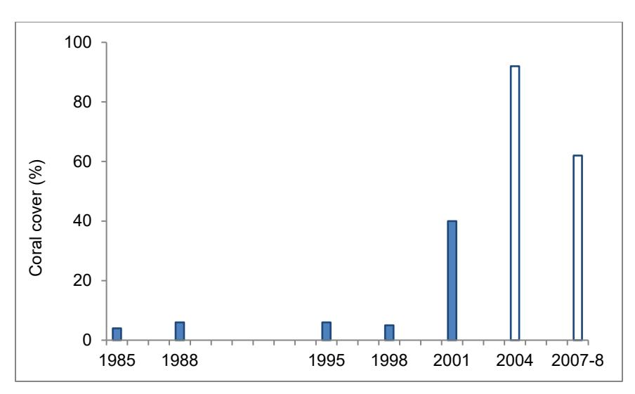

**Figure 30.** Average coral cover in permanent transects in Fagatele Bay, Tutuila Island (McArdle 2003 in Birkeland et al. 2008, Green et al. 2005, Fenner et al. 2008a). Note that methodology changed between years: point-quarter method in 1985-2001 (solid bars), and belt transect points in 2004-2007/8 (open bars). Redrawn from Fenner 2008a.

### *4.2.4. Condition and Trend*

The sampling area for marine benthic invertebrates in the Tutuila Unit is illustrated in Figure 31. Seven measures of resource condition were examined: community composition, coral cover, macroalgae cover, crustose coralline algae cover, coral species richness, coral bleaching and disease, and reef rugosity. An additional measure incorporated an outbreak of the coral-eating Crown of Thorns starfish that threatened NPSA's reefs in 2011-2015.

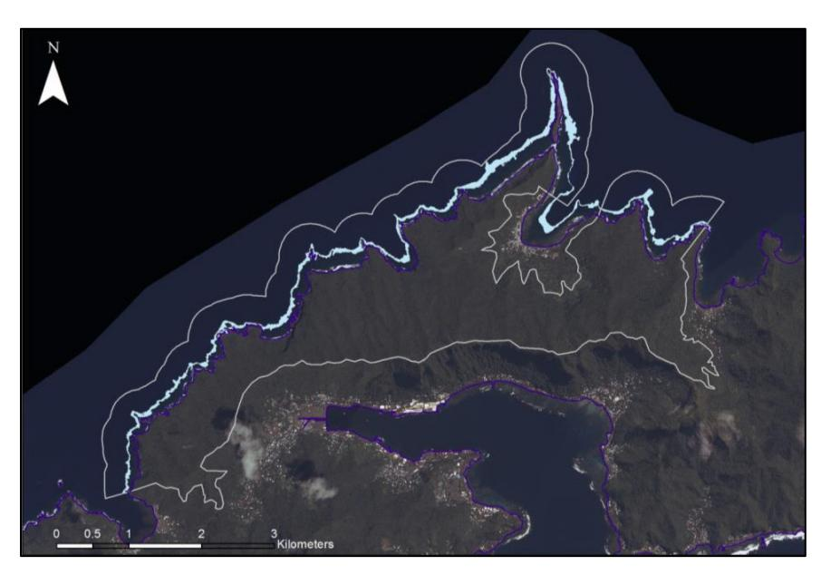

**Figure 31.** Marine benthic sampling area in 10-20 m depth zone on hard-bottom substrates (light blue polygon) in NPSA's Tutuila Unit (white line). Source: Clark et al. 2015.

## Benthic community composition

Turf algae were by far the most common substrate category in NPSA. Among the top ten substrate types/taxa (Figure 32), turf algae accounted for 42% of substrate cover, followed by corals (30%), crustose coralline algae (16%), macroalgae (6%), sand (3%), and other taxa/substrates (3%)(Clark et al. 2015).

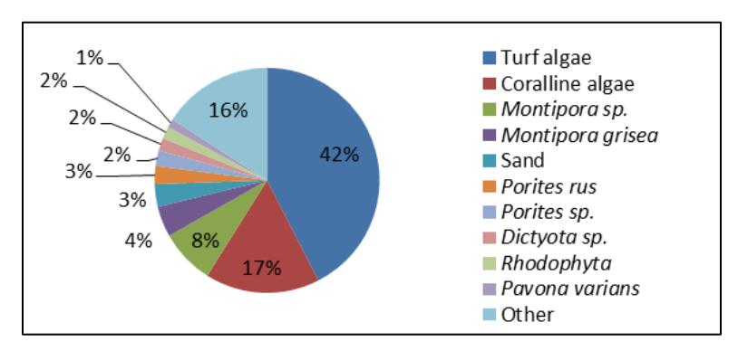

**Figure 32.** Percent cover for the top ten substrate types/taxa in NPSA's Tutuila Unit from 2007-2015. Source: Clark et al. 2015.

The most common coral species were *Montipora* sp. (8%), *Montipora grisea* (4%), *Porites rus* (3%), *Porites* sp. (3%), and *Pavona varians* (1%). The most common macroalgal taxa were *Dictyota* sp. (2%) and Rhodophyta (2%).

It is significant to note that American Samoa has few introduced marine invertebrates or algae, only one of which is considered invasive (a soft coral found in Pago Pago Harbor) (Coles et al. 2003, Fenner 2013). In surveys conducted adjacent to NPSA in Fagasa and Vatia Bays, four species (an alga, hydrozoan, amphipod, and brittle starfish) were detected by Coles et al. (2003) and may have been introduced.

## Coral cover

Coral cover at 15 fixed transect sites averaged 32% and was stable over the 2007-2015 period (Figure 33). A slight increase through the years was noted, but the change was not statistically significant. Coral cover in individual transects was highly variable (range 0.2-76% per 25 m photoquadrat transect), with no clear distribution pattern with the exception of low coral cover around Pola Island and high coral cover in some protected bays (Figure 34).

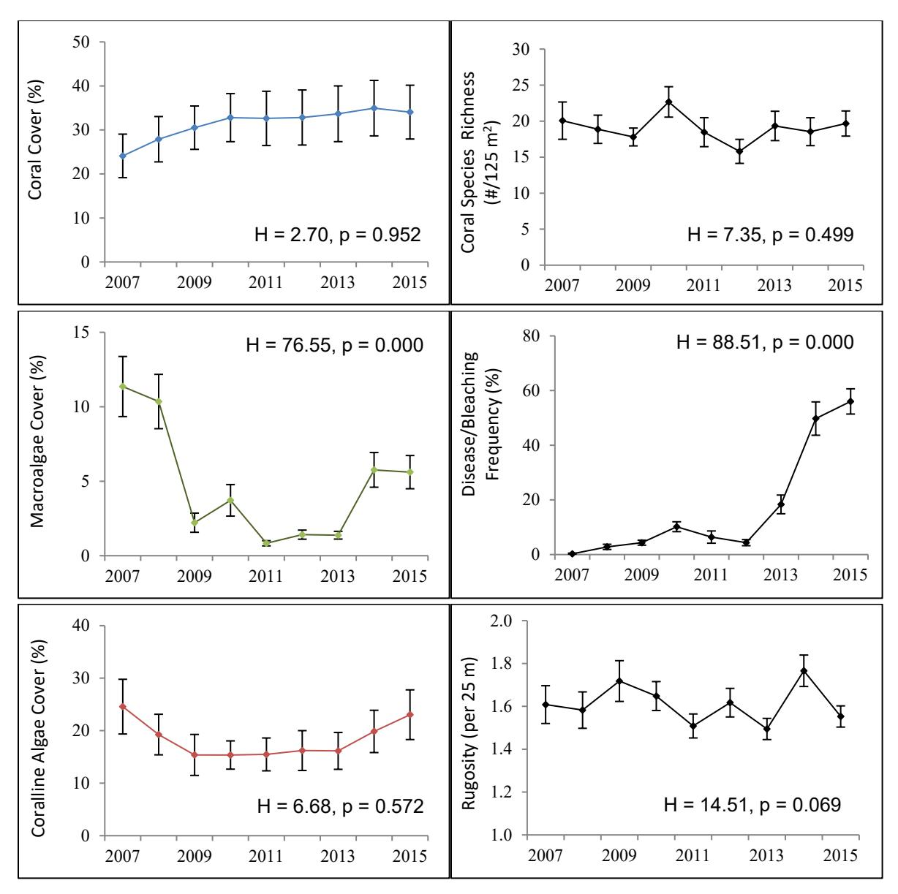

**Figure 33.** Percent cover of coral, macroalgae, coralline algae, coral species richness, coral bleaching and disease, and reef rugosity at 15 fixed sites in NPSA's Tutuila Unit, 2007-2015. Error bars are one standard error of the mean. Note different scales on the y-axis. Statistical significance was determined by the Kruskal-Wallis H test (Clark et al. 2015).

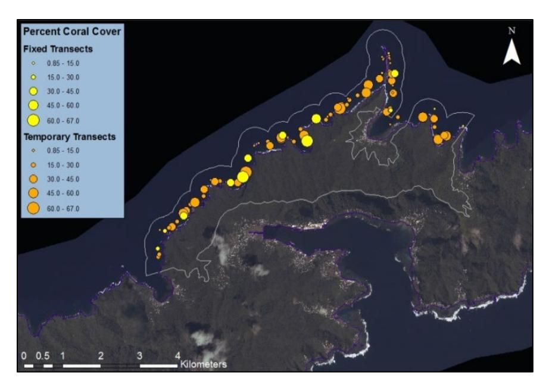

**Figure 34.** Percentage of coral cover at fixed and temporary sites in NPSA's Tutuila Unit, 2007-15. Source: Clark et al. 2015.

NPSA's values for coral cover were generally similar to those obtained from other islandwide surveys around Tutuila by DMWR (Fenner 2013), but NPSA's values were about 5-10% higher than islandwide estimates by the NOAA ASRAMP surveys (Brainard et al. 2008, PIFSC 2011, Heenan et al. 2014) (Figure 35). Some of these differences were presumably due to the different methods, sites and depths sampled in these monitoring programs. Coral cover on Tutuila Island also fell midway in the range of values recorded in the US Pacific Islands (Vroom 2011), but again Vroom (2011) used a different methodology and obtained different values.

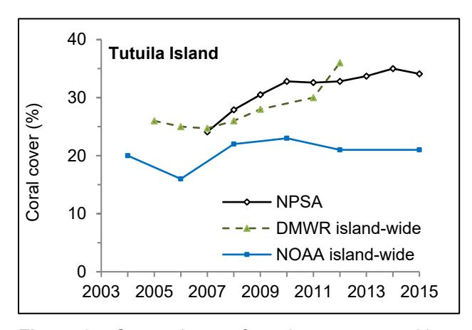

**Figure 35.** Comparisons of coral cover reported in reef monitoring programs conducted in NPSA (Clark et al. 2015) and in islandwide surveys around Tutuila by DMWR (Fenner 2013) and NOAA (PIFSC 2011, Heenan et al. 2014, McCoy et al. 2016). Note that methods and sites used in these programs differed.

For historical perspective (100-1000 years before the present), levels of coral cover in the Indo-Pacific region may have been about 50% (Salvat 2002), and coral cover has declined at a rate of approximately 1% per year from the early 1980s to 2003 (Bruno and Selig 2007).

## Macroalgae cover

Macroalgae can be an important indicator of coral reef degradation when excessive growth of macroalgae (due to nutrient pollution or overfishing of herbivores) outcompetes corals (McManus and Polsenberg 2004). Macroalgae were moderately abundant in NPSA in 2007-2008 (Figure 33), but Clark et al. (2015) commented that these values may have been biased upward due to observer training issues. Macroalgae cover was significantly lower in 2009 and thereafter averaged 2% in fixed transects and 3% in temporary transects. No clear pattern was observed in spatial distribution of macroalgae across transects. Macroalgal cover values documented in this study are generally consistent with other values of macroalgae on Tutuila (Fenner 2013, Heenan et al. 2014).

## Coralline algae cover

Crustose coralline algae are considered beneficial because they help storm-damaged reefs recover by binding loose coral fragments together, and they serve as stimuli for the settlement of coral larvae (Tebben et al. 2015). Crustose coralline algae cover in the Tutuila Unit was relatively stable during 2007-2015, averaging 18% (Figure 33). Changes during this period were not statistically significant. Values obtained by Clark et al. (2015) were within the range from other reefs across the tropical Pacific (Vroom and Braun 2010, Vroom 2011), although Fenner (2013) reported a lower level of crustose coralline algae cover (10%) on the north side of Tutuila in 2011.

## Coral species richness

There was large variation in coral species richness among fixed transects in the Tutuila Unit (3-37 species per 25 m photoquadrat transect), but overall coral species richness averaged 19 species and was stable over the 2007-2015 period, with no significant statistical trend (Figure 33).

## Coral bleaching and disease

Coral bleaching occurs when a coral is subjected to stress, causing it to expel its zooxanthellae, and giving it a white or bleached appearance (Figure 36). Widespread bleaching is often caused by unusually warm sea temperatures associated with climate change (see Section 5.1). In NPSA's monitoring program, the percentage of photoquadrats at fixed sites that showed signs of bleaching or disease was low from 2007-2012, but increased significantly thereafter, when over half of the photoquadrats showed at least some sign of these conditions (Figure 33). This was primarily due to the warm-water event in 2015 (Figure 37) but may also have included feeding scars by COTs during their population outbreak in 2011-2015 (see below).

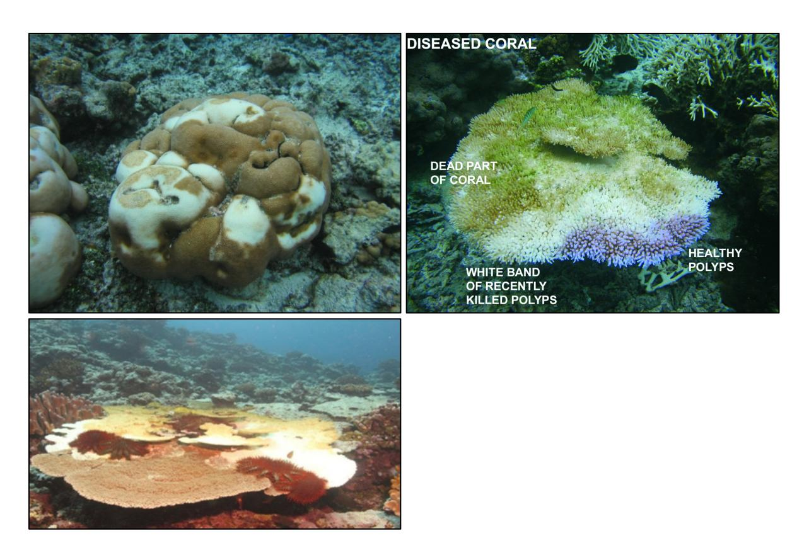

**Figure 36.** Examples of warm-water coral bleaching: partial bleaching on a boulder coral (top left), coral disease (white syndrome) that swept across a table coral (top right), and large white feeding scars caused by Crown of Thorns starfish (bottom). Photos: P. Craig (top), T. Clark (bottom).

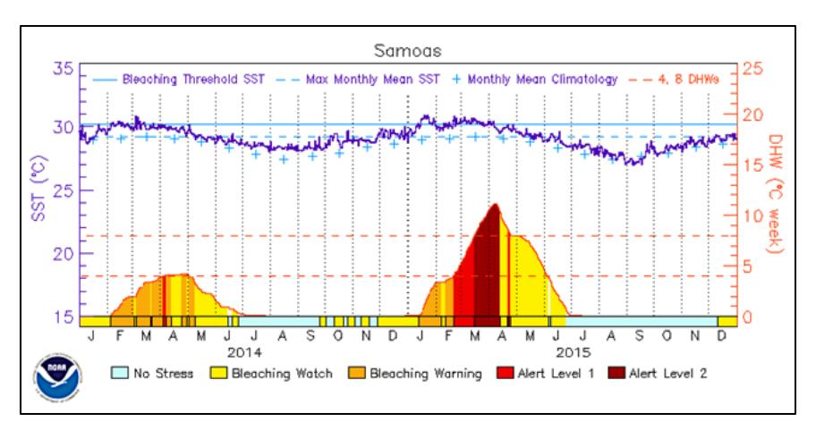

**Figure 37.** Sea surface temperatures (SST) in Samoa, 2014-2015, showing extended warm temperatures (above the Bleaching Threshold SST) in early 2015, resulting in a coral bleaching Alert Level 2. Extensive coral bleaching was observed at this time in NPSA (T. Clark, pers. com. 2016). Source: NOAA 2017.

Note that these disease and bleaching values are much higher than those obtained in other surveys around Tutuila, but this discrepancy is due to the different methods used. Clark et al. (2015) referred to the frequency (%) of photoquadrats where any bleaching or disease was detected. Aeby (2005,

2006) and Brainard et al. (2008) reported that coral disease and bleaching were only about 0.1%, but their data referred to the percentage of individual colonies that were affected. However, CRED (2015) reported that 9.1% of individual corals were bleached or diseased in 2015 when the previously mentioned warm-water bleaching event occurred.

## Crown of Thorns starfish (COT) predation

Corals can also turn white when coral-eating predators (usually small corallivorous snails or large COTs) consume coral tissues, leaving white feeding scars on the corals (Figure 36). This white condition was not combined with coral bleaching and disease in the previous section because the causes are unrelated (climate-induced temperature stress versus predation).

COTs (*Acanthaster planci*) are typically present on the reefs in low numbers, but infrequent outbreaks occur that can devastate extensive areas of coral reefs. During the last outbreak, in 1978, COTs consumed up to 90% of the corals on Tutuila Island (Wass 1979). An outbreak of this starfish also occurred in 2011-2015 (Figure 38), which contributed to a white appearance of NPSA's reefs. By 2015, over 25,000 COTs were killed during control efforts (Clark 2015, T. Clark, pers. com. 2016), but there was no decline in coral cover within the park during this period (Brown et al. 2016).

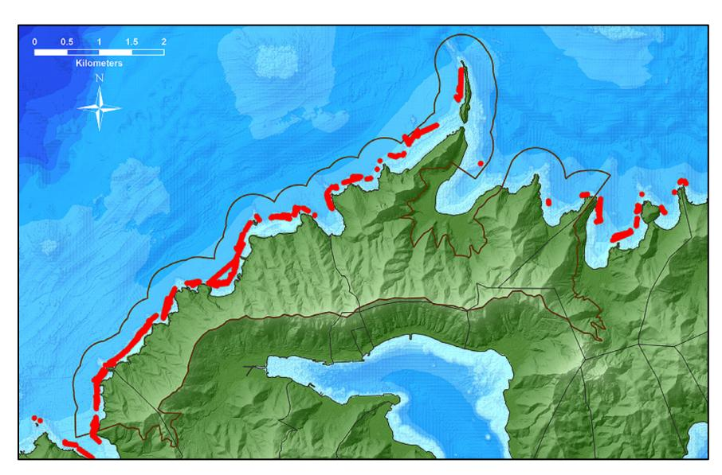

**Figure 38.** Outbreak locations (red dots) of Crown of Thorns starfish observed during towed snorkeler surveys conducted in 2014 in NPSA. The park boundary is outlined in gray. Source: Brown et al. 2016.

## Reef rugosity

Rugosity is a measure of structural complexity of the benthic habitat. Changes in rugosity may indicate large-scale changes in benthic community structure, and rugosity is sensitive to major disturbance events such as cyclones. Small index values (i.e., close to 1.0) indicate a relatively flat substrate; values >2.0 indicate high spatial relief. Rugosity in NPSA's Tutuila Unit was moderate, averaging 1.6 (Figure 33). No significant change was detected in the reef rugosity index during 2007- 2015.

## Data needs/gaps

Status and trend assessments for key coral species (from the existing NPSA I&M database), and information on species other than corals, would provide a broader assessment of reef conditions. Further, information on coral reefs in the Ofu and Ta'u Units is limited, with one notable exception — the temperature-tolerant coral reefs in Ofu lagoon have been the subject of extensive research over the past 30 years (over 50 reports and publications). It would be useful to consolidate this information into a single document and provide an overview.

## Threats

Coral reefs are exposed to many natural and anthropogenic stressors, but climate change stands out as the fundamental threat to the composition, function, and structure of contemporary coral reefs (e.g., Hoegh-Guldberg et al. 2007 and 2011, Baker et al. 2008, Carpenter et al. 2008, Brainard et al. 2011, Gattuso et al. 2015, Howes et al. 2015). Key indicators of climate change include increasing ocean temperatures and acidification due to global increases in greenhouse gases, particularly CO2 (see Section 5.1). Rising ocean temperatures can cause corals to bleach and die (Baker et al. 2008). The incidence of coral bleaching in American Samoa first became apparent in the 1990s, with major bleaching events occurring in 1991, 1994, 2002, 2003, and 2015 (P. Craig pers. obs. in 1991, Goreau and Hays 1994, Green 2002, Fenner et al. 2008b, Fisk and Birkeland 2002, Craig 2009, Clark et al. 2015). Annual bleaching has also been observed in backreef pools on the south side of Tutuila Island (Fenner and Heron 2008, Fenner 2013). Rising ocean temperatures are also projected to increase outbreaks of coral disease (Maynard et al. 2015). Increases in ocean acidification can reduce calcification rates of corals and other marine shell-forming organisms, decreasing their growth and increasing reef erosion (e.g., Kroeker et al. 2010).

Other threats include cyclones, COT outbreaks, and local human activities. Cyclones can be destructive, but they are a regular feature of the South Pacific environment that cause damage somewhere in the islands of American Samoa every few years (Section 5.1). For example, Figure 39 shows extensive damage by Cyclone Wilma in 2011 to some reefs in NPSA's Tutuila Unit.

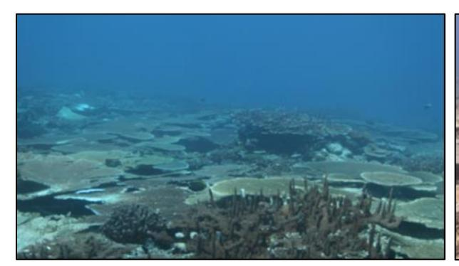

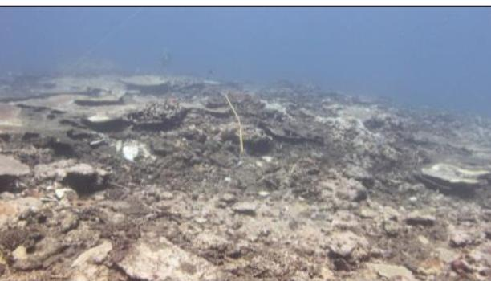

**Figure 39.** Before and after photos of coral reefs impacted by Cyclone Wilma (2011) at a permanent transect in NPSA's Tutuila Unit. Source: Clark et al. 2015.

COTs are native predators that can devastate corals during infrequent population outbreaks. These events can shift reef species composition and adversely affect other invertebrates and fish in the

ecosystem (Pratchett et al. 2014). Outbreaks appear to be related to increased nutrients due to human activities, specifically the increase in fertilizer and waste released into the environment (Birkeland 1982). Other theories exist as well (Pratchett et al. 2014). Major outbreaks occurred in American Samoa in 1938 (Flanigan and Lamberts 1981), 1978 (Wass 1979, Birkeland 1982), and 2011-2015 (Clark 2015).

Damage by humans to coral reefs is pervasive. Their cumulative impacts across the central Pacific may be causing a reduction in the abundance of reef building species, which results in island-scale phase shifts from corals to dominance by fleshy macroalgae (Smith et al. 2016). In NPSA, nearshore waters generally meet Territorial water quality standards, although some land-based pollution (nutrients, sediment, fecal bacteria) occurs due to human activities and natural disturbances such as cyclones and high rainfall runoff (see Section 4.1 Marine water quality).

Several other threats are less significant in NPSA at present. American Samoa has few introduced marine species, only one of which is considered invasive (a soft coral found in Pago Pago Harbor) (Coles et al. 2003, Fenner 2013). Human use of the park's benthic marine community appears to be limited to occasional harvest of macroinvertebrates and algae (see Sections 4.3 Marine Fish, and 5.2 fishing pressure [marine harvest]). One popular benthic invertebrate (the giant clam, *Tridacna gigas*) is uncommon, probably due to current or past exploitation (Green and Craig 1999). No commercial trade in corals or other reef species is permitted in NPSA.

## Overall condition

#### *Benthic community composition*

The three principle components of this measure (coral, macroalgae, coralline algae) were combined to give a single weight to the category of "benthic community composition." The measure was assigned a Significance Level of 3 (High) because it describes the general condition of NPSA's coral reef ecosystems. The reefs can range from being a highly diverse community with high coral cover, to a low diversity community with high macroalgae cover. The measure was assigned a Condition Level of 1 (Low concern), because the benthic community composition was stable over the nine-year period, with moderate amounts of live coral and coralline algae, low amounts of macroalgae, and no invasive marine species, all of which are conditions indicative of good (non-degraded) reef health.

#### *Coral species richness*

The number of coral species in American Samoa (about 300 species; Veron et al. 2007) is moderately diverse for the Indo-Pacific region. Although fewer corals were recorded in NPSA (227 species; DiDonato et al. 2006), this probably reflects the small size of the park, differences in habitats, and the comparatively lower sampling effort that has occurred there. Coral species richness in the Tutuila Unit was stable during 2007-2015. It was assigned a Significance Level of 2 (Moderate) and a Condition Level of 0 (Not a current concern).

#### *Coral bleaching and disease*

Climate change is a significant threat to coral reefs; climate induced increases in ocean temperature and acidification are causing coral bleaching and disease, reduced growth rates of corals, and increased rates of reef erosion. Five episodes of bleaching and disease have occurred in American

Samoa since 1990, including widespread coral bleaching in NPSA in 2011-2015. This measure was assigned a Significance level of 3 (High) and a Condition Level of 2 (Moderate concern).

#### *Crown of Thorns starfish (COTs)*

COT outbreaks are infrequent — nearly 40 years elapsed between each of the past three COT outbreaks in American Samoa. Nonetheless, the outbreak in 2011-2015 was a major threat to coral reefs and likely would have caused significant damage in the park but for intervention by NPSA's COT control program. This measure was assigned a Significance level of 3 (High) and a Condition Level of 2 (Moderate).

#### *Rugosity*

Rugosity levels were moderate and stable during 2007-2015. It was given a Significance Level of 1 (Low) and a Condition Level of 0 (Not a current concern).

## *Weighted condition score*

The weighted condition score (0.42; Table 15) for benthic marine habitats indicates that coral reefs in the park are of moderate concern. Although the percentage of cover by corals and algae was stable, the park's reefs were recently threatened by a multi-year outbreak of the coral-eating Crown of Thorns starfish (COTs) and by climate change. Climate change is shifting the natural range of temperature and acidification values that have occurred for millennia, and to which current coral reef ecosystems have adapted (see Sections 4.1 Marine water quality and 5.1 Climate change). An understanding of the longterm ecosystem consequences of these trends is developing, but major impacts have already been observed (e.g., multiple mass coral bleaching events), and projected impacts are dire (e.g., Hoegh-Guldberg et al. 2007 and 2011, Brainard et al. 2011). A sideways arrow in the condition icon indicates uncertainty in evaluating the trend of park reefs, since several measures of condition have remained stable in recent years, and the recent COT attack appears to be waning, but longterm concerns about climate change impacts may fundamentally change the park's contemporary coral reef ecosystems.

**Table 15.** Significance levels and condition levels used to calculate the weighted condition score (WCS) for NPAS's marine benthic community.

| Measures                                         | Significance Level | Condition Level | WCS= 0.42                                                                                                      |
|--------------------------------------------------|--------------------|-----------------|----------------------------------------------------------------------------------------------------------------|
| Community composition (coral and algal cover) | 3                  | 1               |                                                                                                                |
| Coral species richness                           | 2                  | 0               |                                                                                                                |
| Coral bleaching/disease                          | 3                  | 2               |                                                                                                                |
| Crown of Thorns starfish predation            | 3                  | 2               | Condition of resource warrants moderate concern; condition is unchanging; medium confidence in the assessment. |
| Reef rugosity                                    | 1                  | 0               |                                                                                                                |

#### *4.2.5. Sources of Expertise*

- Tim Clark, NPSA, Coral Reef Program Manager
- Doug Fenner, Dept. Marine & Wildlife Resources, Coral Biologist

## *4.2.6. Literature Cited*

- Aeby, G., T. Work, and E. DiDonato. 2005. Coral disease on the reefs of American Samoa. Report to National Park of American Samoa. 25 p.
- Aeby, G., T. Work, and D. Fenner. 2006. Coral and crustose coralline algae disease on the reefs of American Samoa. Report to Coral Reef Advisory Group, American Samoa Government. 25 p.
- Baker, A., P. Glynn, and B. Riegl. 2008. Climate change and coral reef bleaching: an ecological assessment of long-term impacts, recovery trends and future outlook. Estuar. Coast Shelf Sci 80: 435-471. DOI: 10.1016/j.ecss.2008.09.003.
- Barshis, D., J. Ladner, T. Oliver, F. Seneca, N. Traylor-Knowles, and S. Palumbi. 2013. Genonmic basis for coral resilience to climate change. PNAS 110:1387-1392. www.pnas.org/cgi/doi/10.1073/pnas.1210224110.
- Birkeland, C. 1982. Terrestrial runoff as a cause of outbreaks of *Acanthaster planci* (Echinodermata: Asteroidea). Marine Biology 69:175-185.
- Birkeland, C.E., editor. 1997. Life and Death of Coral Reefs. Chapman and Hall, New York, New York.
- Birkeland, C., A. Green, C. Mundy, K. Miller. 2004. Long-term monitoring of Fagatele Bay National Marine Sanctuary and Tutuila Island (American Samoa) 1985 to 2001: summary of surveys conducted in 1998 and 2001. Report to the National Oceanic and Atmospheric Administration, U.S. Department of Commerce, 158 p.
- Birkeland, C., P. Craig, D. Fenner, L. Smith, W. Kiene, and B. Riegl. 2008. Geologic setting and ecological functioning of coral reefs in American Samoa. Chapt. 20. *In:* B. Riegl and R. Dodge (eds.). Coral reefs of the USA. Springer Publications. NY. 803 p.
- Brainard R., and 25 others. 2008. Coral reef ecosystem monitoring report for American Samoa: 2002-2006. NOAA Special Report NMFS PIFSC. Pacific Islands Fisheries Science Center, Hawaii. 472 p.
- Brainard, R., C. Birkeland, C. Eakin, P. McElhany, M. Miller, M. Patterson, and G. Piniak. 2011. Status review report of 82 candidate coral species petitioned under the U.S. Endangered Species Act. U.S. Dep. Commer., NOAA Tech. Memo., NOAA-TM-NMFS-PIFSC-27, 530 p.
- Brown, P. 2011. Marine gastropods of American Samoa. Micronesica 41: 237-252.
- Brown, E., D. Minton, R. Daniel, F. Klasner, L. Basch, A. Snyder, P. Craig, G. Dicus, K. DeVerse, and T. Jones. 2011. Pacific Island Network benthic marine community monitoring protocol: Version 2.0. Natural Resource Report NPS/PACN/NRTR—2011/339. National Park Service, Fort Collins, Colorado.

- Brown, E., S. McKenna, S. Beavers, T. Clark, M. Gawel, D. Raikow. 2016. Informing coral reef management decisions at four U.S. National Parks in the Pacific using long-term monitoring data. Ecosphere 7:1-18.
- Bruno, J., and E. Selig. 2007. Regional decline of coral cover in the Indo-Pacific: timing, extent, and subregional comparisons. PLoS ONE 2(8), e711, 10.1371/journal.pone.0000711.
- Carpenter, K., and 38 co-authors. 2008. One-third of reef building corals face elevated extinction risk from climate change and local impacts. Science 321: 560-563.
- Cesar, H., P. van Beukering, S. Pintz, and S. Dierking. 2002. Economic valuation of the coral reefs of Hawaii. Hawaii Coral Reef Initiative Research Program. Final Report. Natl. Oceanic Atmospheric Admin., Coastal Ocean Program, and Univ.Hawaii.
- Clark, T. 2015. Control of Crown of Thorns starfish at the National Park of American Samoa. Report to National Park of American Samoa, Pago Pago, American Samoa. 30 p.
- Clark, T., A. Halperin, and B. Fuiava. 2015. National Park of American Samoa benthic marine community monitoring trend report for 2007-2015. Natural Resources Report NPS/xxxx/NRR-2015/xxx, National Park Service, Fort Collins CO.
- Coles, S., P. Reath, P. Skelton, V. Bonito, R. DeFelice, and L. Basch. 2003. Introduced marine species in Pago Pago Harbor, Fagatele Bay and the national park coast, American Samoa. Bishop Museum Tech. Rep. 26. 182 p.
- Craig, P., C. Birkeland, and S. Belliveau. 2001. High temperatures tolerated by a diverse assemblage of shallow-water corals in American Samoa. Coral Reefs 20:185–189.
- Craig, P. (ed.). 2009. Natural history guide to American Samoa. National Park of American Samoa, Dept. Marine Wildlife Res., American Samoa Community College. American Samoa.
- CRED (Coral Reef Ecosystem Division). 2015. Pacific reef assessment and monitoring program. Benthic monitoring summary: American Samoa 2015. NOAA Fisheries, Pacific Islands Fisheries Science Center, PIFSC Data Report, DR-15-015, 3 p.
- DiDonato, C. Birkeland, and D. Fenner. 2006. A preliminary list of coral species of the National Park of American Samoa. Pacific Cooperative Studies Unit, University of Hawaii at Manoa. Tech. Report 155.
- Fenner, D. 2013. Results of the territorial monitoring program of American Samoa for 2012, benthic section. Report to Dept. Marine and Wildlife Resources and Coral Reef Advisory Group (American Samoa), and NOAA. 112 p.
- Fenner, D. 2015. Field identification guide to the coral of American Samoa listed as "Threatened" under the Endangered Species Act. NOAA Fisheries Pacific Islands Area. NMFS Pacific Islands Regional Office, Hawaii. 27 p.

- Fenner, D., A. Green, C. Birkeland, C. Squair, B. Carroll. 2008a. Long-term monitoring of Fagatele Bay National Marine Sanctuary, Tutuila Island, American Samoa: results of surveys conducted in 2007/8, including a re-survey of the historic Aua Transect. Report to: NOAA, Office of National Marine Sanctuaries, and Dept. Commerce, American Samoa Government.
- Fenner, D., and 22 co-authors. 2008b. Status of the coral reefs of American Samoa. Pages 307-331. *In*: J. Waddell and A. Clarke (eds.). The State of Coral Reef Ecosystems of the United States and Pacific Freely Associated States: 2008. NOAA Tech. Memo. NOS NCCOS 73. NOAA/ NCCOS Center for Coastal Monitoring and Assessment's Biogeog.Team. Silver Spring, MD. 569 p.
- Fenner, D., and S. Heron. 2008. Annual summer bleaching of a multi-species coral community in backreef pools of American Samoa: a window on the future? Proceedings of the 11th Internatl. Coral Reef Symp, Ft. Lauderdale, Florida, 7-11 July 2008.
- Fisk, D. and C. Birkeland. 2002. Status of coral communities on the volcanic islands of American Samoa. Dept. Marine and Wildlife Resources, American Samoa. 135 p.
- Flanigan, J., and A. Lamberts. 1981. *Acanthaster* as a recurring phenomenon in Samoan history. Atoll Res. Bull. 255:59-61.
- Gattuso, J., and 21 co-authors. 2015. Contrasting futures for ocean and society from different anthropogenic CO2 emissions scenarios. Science. doi: 10.1126/science.aac4722.
- Goreau, T., and R. Hayes. 1994. A survey of coral reef bleaching in the south central Pacific during 1994. Report to Coral Reef Initiative, U.S. Dept of State, 118 p.
- Green, A. 2002. Status of the coral reefs on the main volcanic islands of American Samoa: a resurvey of long term monitoring sites (benthic communities, fish communities, and key macroinvertebrates). Report to the Dept. Marine and Wildlife Res., American Samoa, 135 p.
- Green, A., and C. Hunter. 1998. A preliminary survey of the coral reef resources in the Tutuila Unit of the National Park of American Samoa. Report to National Park Service. 42 p.
- Green, A., and P. Craig. 1999. Population size and structure of giant clams at Rose Atoll, an important refuge in the Samoan archipelago. Coral Reefs 18:205-211.
- Green, A., and T. Hughes. 1999. Rapid ecological assessment of the coral reef resources in the Ta'u Unit of the National Park of American Samoa. Report to National Park Service. 14 p.
- Green, A., K. Mille, C. Mundy. 2005. Long-term monitoring of Fagatele Bay National Marine Sanctuary. Tutuila Island, American Samoa: results of surveys conducted in 2004, including a resurvey of the historic Aua transect. Report to US Dept. Commerce and American Samoa Government. 93 p.
- Heenan, A., P. Ayotte, A. Gray, K. Lino, M. McCoy, J. Zamzow, and I. Williams. 2014. Ecological monitoring 2012-2013 – reef fishes and benthic habitats of the main Hawaiian Islands, American

- Samoa, and Pacific Remote Island Areas. NOAA Pacific Islands Fisheries Science Center, PIFSC Data Report DR-14-003.
- Hoegh-Guldberg, O., and 15 co-authors. 2007. Coral reefs under rapid climate change and ocean acidification. Science 318:1737-1742. doi: 10.1126/science.1152509.
- Hoegh-Guldberg, O. 2011. Coral reefs and anthropogenic climate change. Reg. Environ. Change 11(Suppl. 1): S215-S227.
- Houk, P., and C. Musburger. 2008. Assessing the effects of non-point source pollution on American Samoa's coral reef communities. Report to American Samoa Environ. Protect. Agency. 48 p.
- Howes, E., F. Joos, M. Eakin, and J. Gattuso. 2015. The Oceans 2015 Initiative, Part I: an updated synthesis of the observed and projected impacts of climate change on physical and biological processes in the oceans, Studies N° 02/15, IDDRI (Institut Du Développement Durable et des Relations Internationales), Paris, France, 52 p.
- Hunt, T., and P. Kirch. 1997. The historical ecology of Ofu Island, American Samoa, 3000 B.P. to the present. Pages 105-123, *In* P. Kirch and T. Hunt (eds), Historical Ecology in the Pacific Islands: Prehistoric Environmental and Landscape Change. Yale Univ. Press, New Haven, CT.
- Hunter, C., A. Friedlander, W. Magruder, and K. Meier. 1993. Ofu reef survey: baseline assessment and recommendations for long-term monitoring of the proposed National Park, Ofu, American Samoa. Report to National Park Service. 135 p.
- IUCN (Interagency Union for Conservation of Nature). 2011. IUCN Red List of Threatened Species. IUCN, Gland, Switzerland. [www.iucnredlist.org.](http://www.iucnredlist.org/)
- Jacobs. 2004. Economic evaluation of coral reefs and adjacent habitats to American Samoa. Report to Coral Reef Advisory Group, American Samoa. 152 p.
- Jameson, C., M. Erdmann, G. Gibson, and K. Potts. 1998. The development of biology criteria for coral reef ecosystem assessment. Atoll Research Bulletin 450-458:1-108.
- Kendall, M.S., and M. Poti (eds.). 2011. A biogeographic assessment of the Samoan Archipelago. NOAA Technical Memorandum NOS NCCOS 132. Silver Spring, MD. 229 p.
- Kenyon, J., J. Maragos, and D. Fenner. 2011. The occurrence of coral species reported as Threatened in federally protected waters of the US Pacific. J. Marine Biology, Article ID 358687. doi: 10.1155/2011/358687.
- Kroeker, K., R. Kordas, R. Crim, and G. Singh. 2010. Meta-analysis reveals negative yet variable effects of ocean acidification on marine organisms. Ecology Letters 13:1419-1434. doi: 10.1111/j.1461-0248.2010.01518.x.
- Maynard, J., R. van Hooidonk, M. Eakin, M. Puotinen, M. Garren, G. Williams, S. Heron, J. Lamb, E. Weil, B. Willis, and C. Harvell. 2015. Projections of climate conditions that increase coral

- disease susceptibility and pathogen abundance and virulence. Nature Climate Change, doi: 10.1038/nclimate2625.
- McArdle, B. 2003. Report: Statistical analyses for Coral Reef Advisory Group, Am. Samoa. 142 p.
- McCoy, K, A. Heenan, J. Asher, P. Ayotte, K. Gorospe, A. Gray, K. Lino, J. Zamzow, and I. Williams. 2016. Ecological monitoring 2015—reef fishes and benthic habitats of the main Hawaiian Islands, Northwestern Hawaiian Islands, Pacific Remote Island Areas, and American Samoa. NOAA Pacific Islands Fisheries Science Center, PIFSC Data Report DR-16-002. DOI: 10.13140/RG.2.1.4351.9122.
- McManus, J., and J. Polsenberg. 2004. Coral-algal phase shifts on coral reefs: Ecological and environmental aspects. Prog. Oceanog. 60:263-279. dx.doi.org/10.1016/j.pocean.2004.02.014.
- Mundy, C. 1996. A quantitative survey of the corals of American Samoa. Report to Dept. Marine and Wildlife Resources, American Samoa. 25 p.
- Oliver, T., S. Palumbi. 2011. Do fluctuating temperature environments elevate coral thermal tolerance? Coral Reefs 30: 429–440. doi:10.1007/s00338-011-0721-y.
- NOAA (National Oceanic and Atmospheric Administration). 2014. US distribution of 15 ESA-listed Indo-Pacific coral species. NOAA Fisheries, Pacific Islands Region (Hawaii). [http://www.fpir.noaa.gov/Library/PRD/Coral/us\\_indo-pacific\\_corals\\_distribution.pdf.](http://www.fpir.noaa.gov/Library/PRD/Coral/us_indo-pacific_corals_distribution.pdf)
- Palumbi, S., D. Barshis, N. Traylor-Knowles, and R. Bay. 2014. Mechanisms of reef coral resistance to future climate change. Sciencexpress. 10.1126/science.1251336.
- PIFSC (Pacific Islands Fisheries Science Center). 2011. Coral reef ecosystems of American Samoa: a 2002-2010 overview. NOAA Pacific Islands Fisheries Science Center, PIFSC Special Publ., SP-11-02, 46 p.
- Pratchett, M.S., Caballes, C.F., Rivera-Posada, J.A., and Sweatman, H.P. 2014. Limits to understanding and managing outbreaks of Crown-of-Thorns starfish (*Acanthaster* spp.). Oceanography and Marine Biology: An Annual Review 52:133-200.
- Salvat, B. 2002. Status of southeast and central Pacific coral reefs 'Polynesia Mana Node': Cook Islands, French Polynesia, Kiribati, Niue, Tokelau, Tonga, Wallis and Futuna. Pages 203-215, *In*: Wilkinson C. (ed). Status of coral reefs of the world: 2002. Austral. Inst. Mar. Sci.
- Skelton, P. 2003. Seaweeds of American Samoa. Australia International Ocean Institute (Queensland). Report to Dept. Marine and Wildlife Resources (American Samoa). 103 p.
- Smith, L. and C. Birkeland. 2007. Effects of intermittent flow and irradiance level on back reef Porites corals at elevated seawater temperatures. J. Exp. Mar. Biol. Ecol. 341:282–294.
- Smith, J., R. Brainard, A. Carter, S. Grillo, C. Edwards, J. Harris, L. Lewis, D. Obura, F. Rohwer, E. Sala, P. Vroom, and S. Sandin. 2016. Re-evaluating the health of coral reef communities:

- baselines and evidence for human impacts across the central Pacific. Proc. R. Soc. B 283: 20151985. [http://dx.doi.org/10.1098/rspb.2015.1985.](http://dx.doi.org/10.1098/rspb.2015.1985)
- Storlazzi, C., O. Cheriton, K. Rosenberger, J. Logan, and T. Clark. (in prep.). Coastal Circulation in the National Park of American Samoa**;** measurements of waves, currents, temperature, and salinity: February–July 2015: U.S. Geological Survey Open-File Report 2016-x.xxxx.
- Tebben, J., and 9 co-authors. 2015. Chemical mediation of coral larval settlement by crustose coralline algae. Scientific Reports 5:1-11, Article number: 10803. doi: 10.1038/srep10803.
- Tolleter, T., F. Seneca, J. DeNofrio, C. Krediet, S. Palumbi, J. Pringle, and A. Grossman. 2013.Coral bleaching independent of photosynthetic activity. Current Biology 23:1-5. [http://dx.doi.org/10.1016/j.cub.2013.07.041.](http://dx.doi.org/10.1016/j.cub.2013.07.041)
- Tribollet, A., T. Schils, and P. Vroom. 2010. Spatio-temporal variability in macroalgal assemblages of American Samoa. Phycologia 49: 574-591. doi: 10.2216/09-63.1.
- Vargas-Angel, B. and B. Wheeler. 2008. Coral health and disease assessment in the US Pacific Territories and affiliated states. Proc. 11th Internat. Coral Reef Symp. Ft. Lauderdale, FL.
- Veron, J.E.N., M. Stafford-Smith, E. Turak, and L. DeVantier. 2017. Corals of the World. Version 0.01 (Beta). [www.coralsoftheworld.org/coral\\_geographic/interactive\\_map/results/.](http://www.coralsoftheworld.org/coral_geographic/interactive_map/results/) Accessed 27 February 2017.
- Vroom, P. 2011. Coral dominance: a dangerous ecosystem misnomer? Journal Marine Biology 2011:1-8. Article ID: 164127. doi: 10.1155/2011/164127.
- Vroom, P., and C. Braun. 2010. What is the benthic composition of a healthy subtropical reef? Baseline species-level percent cover, with an emphasis on reef algae, in the Northwestern Hawaiian Islands. PLoS One 5:e9733.
- Wass, R. 1979. Results of an *Acanthaster planci* (Crown-of-Thorns) survey around Tutuila Island, American Samoa. Appendix B. In: Birkeland, C. et al. 1979. Report on the *Acanthaster planci* (Alamea) studies on Tutuila, American Samoa (incomplete). Also, American Samoa Dept. Marine and Wildlife Resources, Biological Report Series No. 2 (incomplete).
- Wass, R. 1982. Characterization of inshore Samoan fish communities. Draft report. American Samoa Dept. Marine and Wildlife Resources, Biol. Report Series No. 6. *In*: Hart, R. 2008. Environmental digital library for the Samoan archipelago. National Park Service, Pacific Network Inventory & Monitoring Program and National Park of American Samoa. DVD (Version 2). [https://www.nps.gov/npsa/learn/nature/digitallibr.htm,](https://www.nps.gov/npsa/learn/nature/digitallibr.htm) [http://www.botany.hawaii.edu/basch/uhnpscesu/picrp/complbibCont.htm#top,](http://www.botany.hawaii.edu/basch/uhnpscesu/picrp/complbibCont.htm#top) or [http://www.botany.hawaii.edu/basch/uhnpscesu/picrp/complbibA.htm#top.](http://www.botany.hawaii.edu/basch/uhnpscesu/picrp/complbibA.htm#top)

- Wilson, B., G. Aeby, T. Work, and D. Bourne. 2012. Bacterial communities associated with healthy and Acropora white syndrome-affected corals from American Samoa. FEMS Microbiol. Ecol. 80:509-520.
- Work, T. and R. Rameyer. 2005. Evaluating coral reef health in American Samoa. Coral Reefs 24: 384-390.

## **4.3. Marine Fish**

## *4.3.1. Description*

American Samoa's coastal waters support a diverse assemblage of over 900 marine fish species (Wass 1984), most of which are coral reef-associated species distributed widely across the tropical Indo-Pacific region. This assemblage of carnivores, planktivores, herbivores and detritivores serves a variety of ecological functions that affect ecosystem structure, productivity, and sustainability (e.g., Sale 1991, Hixon 1997). In addition, reef fish in NPSA are harvested in subsistence fisheries for personal use, and perhaps illegally taken in artisanal fisheries (small-scale commercial operations), both of which may affect species composition, abundance, and size of targeted species (see Section 5.2. Coral reef fishing). NPSA has dual mandates both to allow traditional subsistence fishing to occur in park waters, and to preserve and protect the park's coral reefs.

NPSA's coral reefs extend along 27 km of coastline on three volcanic islands (Tutuila, Ofu, and Ta'u), and encompass a marine area of 10 km2 (2,550 ac). Park boundaries extend from shore to 0.4 km (0.25 mi) offshore where water depths reach about 30-40 m. This area includes all three of NPSA's marine life zones: shallow marine (0-5 m depth), mid-marine (5-30 m), and deep marine (>30 m). Interest has been expressed in creating a No-take Marine Protected Zone within NPSA near Fagasa Village, but this project is still in a consultation phase between Fagasa Village, NPSA, and DMWR, and specific boundaries have not yet been established (J. Rayno, CRAG MPA Coordinator, pers. com., 2014).

All marine fishes in American Samoa are native species. Fish families commonly found in the park include a colorful mixture of damselfish, surgeonfish, parrotfish, wrasses, jacks, fusiliers and others (Figure 40). Eleven species have been identified as endangered or vulnerable throughout most of their range because they are rare and/or overharvested (Table 16; IUCN 2011). In addition, possession of rare marine species in American Samoa (including all sharks, humphead wrasse [*Cheilinus undulate*], bumphead parrotfish [*Bolbometopon muricatum*], and giant grouper [*Epinephelus lanceolatus*]) is prohibited due to their small population and vulnerability to fishing (Governor's Executive Order 002-2012).

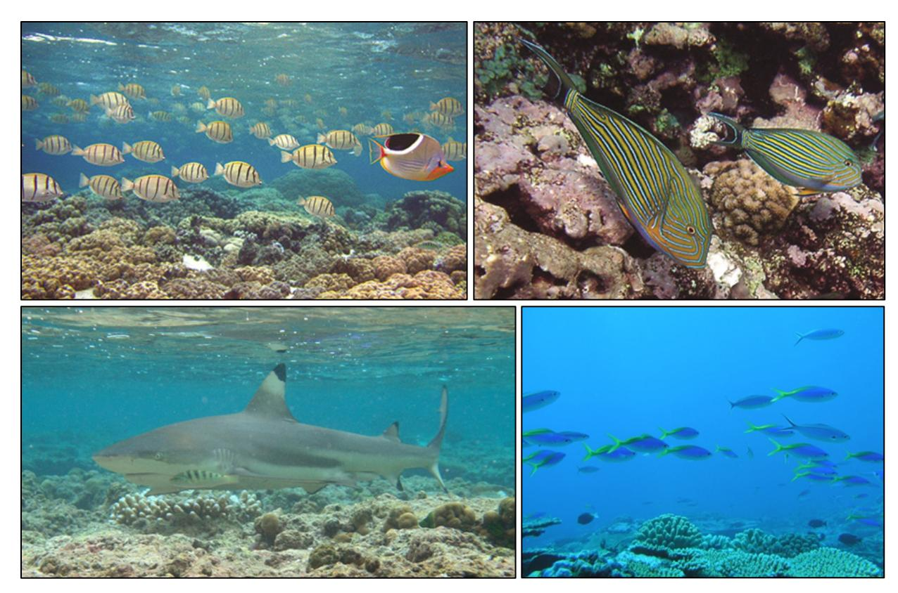

**Figure 40.** Examples of common marine fish in American Samoa: (clockwise from upper left) convict tang, blue-lined surgeonfish, fusiliers, blacktip reef shark. Photos: P. Craig.

**Table 16.** Marine fish and shark species on the 2011 IUCN Red List of Threatened Species that were observed in American Samoa during NOAA's coastal surveys, 2000-2009. Source: Zglicznski et al. 2013.

| Family             | Species                 | Common name               | IUCN status* |
|--------------------|-------------------------|---------------------------|--------------|
| Ginglymostomatidae | Nebrius ferrugineus     | Tawny nurse shark         | VU           |
| Stegostomatidae    | Stegostoma fasciatum    | Zebra shark               | VU           |
|                    | Sphyrna lewini          | Scalloped hammerhead      | EN           |
| Sphyrnidae         | Sphyrna mokarran        | Great hammerhead          | EN           |
| Dasyatidae         | Taeniura meyeni         | Blackblotched stingray    | VU           |
| Mobulidae          | Manta alfredi           | Reef manta ray            | VU           |
|                    | Epinephelus lanceolatus | Giant grouper             | VU           |
| Serranidae         | Plectropomus areolatus  | Squaretail coralgrouper   | VU           |
|                    | Plectropomus laevis     | Blacksaddled coralgrouper | VU           |
| Labridae           | Cheilinus undulatus     | Humphead wrasse           | EN           |
| Scaridae           | Bolbometopon muricatum  | Bumphead parrotfish       | VU           |

\* EN (Endangered), VU (Vulnerable).

## *4.3.2. Data and Methods*

Primary data sources for this assessment were NPS I&M Vital Signs monitoring program for marine fish in NPSA's Tutuila Unit (Clark et al. 2015) and a comparative survey conducted nearly 40 years ago (Wass 1982). Supplementary information was provided by other studies.

## Primary data sources

*NPS I&M Vital Signs monitoring survey for marine fish*

A statistically-based protocol for monitoring marine fish in PACN national parks (Brown et al. 2011) was implemented in NPSA's Tutuila Unit in 2010 (Clark et al. 2015). Surveys were designed to detect long-term trends in six fish measures: assemblage composition, species richness, species diversity, density, biomass, and size. Data for 2010-2015 were reviewed in this condition assessment. A single survey was also conducted in the Ofu Unit in 2013, but the data had not yet been certified at the time of this writing.

Field surveys focused on the daytime-active, non-cryptic component of the fish assemblage in belt transects (4x25 m) in the 10-20 m depth zone on the reef slope (fore-reef). A split panel field design was utilized, with 30 randomly selected sites sampled annually. Fifteen of the sites were fixed (permanent) and revisited annually to detect trends in the resource. The remaining (temporary) sites were randomly selected each year (except in 2014) to increase spatial inference and were not revisited. Initially, this sampling design should have statistical power to provide a 33% chance of detecting a 50% relative change in total species richness over 10 years, a 23% chance to detect a 50% relative change in total density over 10 years, and a 22% chance to detect a 50% relative change in total biomass over 10 years. Statistical power is anticipated to increase over time to an estimated 80% chance of detecting a 25% change. This will result from the ability to conduct parameter corrections based on temporally repeated analyses.

Trophic categories were assigned to fish along the transect based on published sources listed in FishBase [\(www.fishbase.org\)](http://www.fishbase.org/) and included primary consumers (herbivores), secondary consumers (omnivores, benthic invertivores, planktivores), and apex predators (typically large piscivores). The large biomass of stingrays (*Dasyatidae*) reported by Clark et al. (2015) resulted from the presence of a single large black-blotched stingray (*Taeniura meyeni,* 150 cm) that was present in a temporary transect. While this stingray overwhelmed the biomass data that was based on temporary transects, it did not affect the data based on fixed transects that were used to determine annual trends.

*DMWR fish survey in 1977-1978 by Wass (1982)*

Of particular interest was the first quantitative survey of nearshore fish conducted in American Samoa nearly 40 years ago by Wass (1982). The available copy of this report in the American Samoa Digital Library (Hart 2008) is an incomplete draft, but the available sections are adequately documented. The survey was conducted in 1977-78 around Tutuila Island, including six sites on the north side of Tutuila referred to as the "North Shore Fronts" (NSF) group (Poloa, A'asu, Sita Bay, Cape Larsen, Fagasa Bay, Vatia Bay). The last four sites are adjacent to NPSA, thus the NSF group may provide a reasonable spatial comparison to NPSA's Tutuila Unit sampled in 2010-2015 by Clark et al. (2015). NSF data were based on nine benthic transects, each 100 m long x 2 m wide x 2 m high, in water depths of 2-10 m. Wass's Table 1 provides the abundance and biomass of fish in each

transect. His Table 4 provides the average number of fish (494 fish/transect = 494 fish/200m2 = 24,700 fish/ha) and average fish biomass (7.85 kg/transect = 7.85 kg/200m2 = 39.3 g/m2 ). Wass's Table 5 describes the top 20 NSF species, but this partial list provides a check on the previous values by presenting different units (fish/ha and kg/ha) for the average number of fish (20,015 fish/ha) and biomass (166.9 kg/ha = 16.7 g/m2 ). As would be expected, values for the top 20 species are lower than those calculated for all species (about 50 species) they amount to 81% and 43% of total fish numbers and biomass, respectively. Note, however, that the locations sampled, depths, and methods used by Wass (1982) differed from that used in the NPS I&M monitoring protocol, so some differences would be expected when comparing the two datasets.

*NOAA's American Samoa Reef Assessment and Monitoring Program (ASRAMP)* NOAA's ASRAMP program conducted islandwide surveys of corals, reef fish and oceanic conditions in American Samoa at two- to three-year intervals since 2002 (Brainard et al. 2008; Kendall and Poti 2011; PIFSC 2011; CRED 2013, 2015; Williams et al. 2011, 2015; Nadon et al. 2012; Heenan et al. 2014, McCoy et al. 2016). ASRAMP's broad spatial scale provides a valuable perspective of islandwide conditions, although its methodology differs somewhat from that used in the NPS I&M monitoring surveys and its coverage within NPSA is limited.

#### *Other studies*

Local agencies, NPSA, and other researchers have conducted a variety of fish surveys in the Territory. Several inventories were made in NPSA's Tutuila Unit (Green and Hunter 1998), Ofu Unit (Hunter et al. 1993, Green 2002), and Ta'u Unit (Green and Hughes 1999). Other surveys with some sampling sites in NPSA include: Green (2002), Whaylen and Fenner (2006), Sabater and Tofaeono (2007), Houk and Musburger (2008), and DMWR (2012). Methodologies and locations sampled in these studies differed from those used in the NPS I&M monitoring protocol, thus these surveys are primarily useful in providing historical context for NPSA's fish resources. Results from a study examining nearshore currents in NPSA's Tutuila Unit (Storlazzi et al., in prep.) may help evaluate potential transport pathways for larval fish in the park.

#### *4.3.3. Reference Condition*

Fish biomass is a commonly used measure to assess status and trends in fish populations. For marine fish in NPSA's three park units, there are two potential biomass levels for reference conditions. The first accounts for a continual extraction of fish by subsistence fishers, as is permitted by park regulation. However, quantification of this fishery in the park (including potential poaching as documented by Page [1998]) has not been adequately determined.

The second biomass level is a baseline of naturally fluctuating quantities of fish based on the carrying capacity of the coral reef ecosystem in the absence of fishing. This level would address the park's management objective to preserve and protect its coral reefs. This level has not been determined either, but Williams et al. (2015) provide an interesting approach to establishing this level. They analyzed the US Pacific islands and modeled what fish biomass of each island would be, in the absence of human intervention, based primarily on the oceanic primary productivity of the islands. For Tutuila Island, this level would be approximately 58 mt/km2 (± 6.9 SE). However, observed values were lower, suggesting that fish biomass has been depleted by about 56% to 32

mt/km2 by human activities (Figure 41). This value, 58 mt/km2 , has the potential to be a reference condition, but two caveats indicate that it may be low — the Williams' model does not include jacks and sharks which are (or were) important components of NPSA's fish assemblage, and this theoretical biomass is nearly 30% lower than the observed fish biomass in 2010 in the park (80 mt/km2 ), although that estimate may be an anomaly. Consequently, while this approach is of interest in determining a relevant reference condition, it may best be considered a conceptual approach for purposes of this assessment.

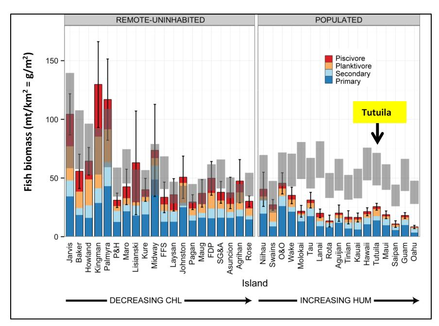

**Figure 41.** Fish biomass per reef-area by trophic grouping, and reef fish reference points generated by model predictions (Williams et al. 2015). Tutuila Island is highlighted (arrow). Vertical bars are fish biomass with 95% confidence levels. Gray bars are model predictions if humans were absent. Remote and uninhabited islands (left panel) are sorted from high to low CHL (chlorophyll-a). Islands populated by humans (right panel) are sorted from low to high human population density per unit reef area (HUM).

Another consideration is that Wass (1982) documented fish biomass at 39 mt/km2 on the north side of Tutuila nearly 40 years ago. This is nearly the same biomass as the current level in 2015 (44 mt/km2 ). This continuity might suggest a reference condition for fish biomass in NPSA; alternatively, fish stocks may have been low in 1977-78 due to increased subsistence fishing, as occurred in American Samoa in past years (e.g., Coutures 2003, Zeller et al. 2006). At present, a reference condition for marine fish in the Tutuila Unit, with or without a fishery, has not been established.

#### *4.3.4. Condition and Trend*

The NPS I&M monitoring program evaluated conditions and trends of reef fish in NPSA's Tutuila Unit by examining six assemblage measures (assemblage composition, species richness, species diversity, biomass, density, and size) over the period 2010-15 (Clark et al. 2015). Following these measures is a comparison with fish resource conditions 40 years earlier by Wass (1982).

## Assemblage composition

The nearshore fish assemblage in American Samoa, about 900 species (Wass 1984 and others), is moderately diverse for the Indo-Pacific region, and this is consistent with the gradient in decreasing diversity from west to east across the central Pacific (Allen 2003). The lower number of fish species recorded in the Tutuila Unit, 214 species (see Figure 8; Clark et al. 2015), and in all NPSA Units, about 650 species (NPSA 2016), probably is an artifact of the small size of the park units, and that less sampling has occurred there than in the Territory.

In NPSA's Tutuila Unit, 33 fish families were documented, but damselfish (38.6%) were by far the most numerous group present (Tables 17 and 18). Surgeonfish, parrotfish, fusiliers, and one large stingray accounted for most of the fish biomass present. The most common species are indicated in Tables 19 and 20. The damselfish *Chromis iomelas* was the most abundant species; the surgeonfish *Ctenochaetus strigosus* and the blue-and-yellow fusilier (*Caesio teres*) accounted for the greatest biomass (other than the one stingray noted). Trophic composition of the fish assemblage consisted largely of secondary consumers (Figure 42).

**Table 17.** Top ten fish families by abundance in NPSA's Tutuila Unit, all permanent and temporary transects, 2010-15. A single 150 cm blackblotched stingray dominated total fish biomass. Source: NPS I&M database, K. Kozar, pers. com. 2016.

| Family         | Common name | Density (no./m2) | Abundance (%) |
|----------------|-------------|------------------|---------------|
| Pomacentridae  | Damselfish  | 0.51             | 38.6          |
| Acanthuridae   | Surgeonfish | 0.11             | 8.5           |
| Caesionidae    | Fusiliers   | 0.10             | 7.2           |
| Labridae       | Wrasses     | 0.07             | 5.3           |
| Carangidae     | Jacks       | 0.06             | 4.8           |
| Ptereleotridae | Dartfish    | 0.05             | 3.9           |
| Scaridae       | Emperors    | 0.04             | 2.8           |
| Lethrinidae    | Parrotfish  | 0.03             | 2.3           |
| Mullidae       | Mullet      | 0.03             | 2.1           |
| Blenniidae     | Blennies    | 0.03             | 2.0           |
| Total          | –           | –                | 77.3          |

**Table 18.** Top ten fish families biomass in NPSA's Tutuila Unit, all permanent and temporary transects, 2010-15. A single 150 cm blackblotched stingray dominated total fish biomass. Source: NPS I&M database, K. Kozar, pers. com. 2016.

| Family        | Common name | Biomass (mt/km2) | Biomass (%) | Biomass without stingray (%) |
|---------------|-------------|------------------|-------------|------------------------------|
| Dasyatidae    | Stingrays   | 11.2             | 21.7        | –                            |
| Acanthuridae  | Surgeonfish | 11.0             | 21.3        | 27.2                         |
| Scaridae      | Parrotfish  | 8.6              | 16.6        | 21.2                         |
| Caesionidae   | Fusiliers   | 7.0              | 13.5        | 17.3                         |
| Pomacentridae | Damselfish  | 4.1              | 7.9         | 10.1                         |
| Balistidae    | Triggerfish | 2.6              | 5.0         | 6.4                          |
| Lethrinidae   | Emperors    | 2.0              | 3.9         | 4.9                          |
| Serranidae    | Groupers    | 1.9              | 3.7         | 4.7                          |
| Labridae      | Wrasses     | 1.7              | 3.3         | 4.2                          |
| Carangidae    | Jacks       | 1.6              | 3.1         | 4.0                          |
| Total         | –           | –                | 100.0       | 100.0                        |

**Table 19.** Top ten fish species by density in NPSA's Tutuila Unit in all permanent and temporary transects, 2010-15. Source: NPS I&M database, K. Kozar, pers. com. 2016.

| Species                | Common Name           | Consumer Group | Density (no./m2) | %    |
|------------------------|-----------------------|----------------|------------------|------|
| Chromis iomelas        | Half-and-half chromis | Secondary      | 0.25             | 21.6 |
| Pomacentrus vaiuli     | Princess damselfish   | Secondary      | 0.21             | 17.9 |
| Chromis margaritifer   | Bicolor chromis       | Secondary      | 0.16             | 13.8 |
| Chromis acares         | Midget chromis        | Secondary      | 0.11             | 9.5  |
| Pomacentrus coelestis  | Neon damselfish       | Secondary      | 0.09             | 7.4  |
| Chromis fumea          | Smokey chromis        | Secondary      | 0.07             | 6.4  |
| Pomacentrus brachialis | Charcoal damselfish   | Secondary      | 0.07             | 6.3  |
| Chromis xanthura       | Variable chromis      | Secondary      | 0.07             | 6.3  |
| Chrysiptera taupou     | South Seas devil      | Secondary      | 0.06             | 5.5  |
| Ctenochaetus strigosus | Striped bristletooth  | Secondary      | 0.06             | 5.1  |
| Total                  | –                     | –              | –                | 99.7 |

**Table 20.** Top ten fish species biomass in NPSA's Tutuila Unit in all permanent and temporary transects, 2010-15. A single 150 cm blackblotched stingray dominated total biomass. Source: NPS I&M database, K. Kozar, pers. com. 2016.

| Species                | Common Name              | Consumer Group | Biomass (mt/km2) | %     | % (without stingray) |
|------------------------|--------------------------|-------------------|---------------------|-------|-------------------------|
| Taeniura meyeni        | Blackblotched Stingray   | Secondary         | 11.2                | 36.6  | –                       |
| Ctenochaetus strigosus | Striped bristletooth     | Secondary         | 4.3                 | 14.1  | 22.2                    |
| Caesio teres           | Blue-and-yellow fusilier | Secondary         | 4.3                 | 14.0  | 22.1                    |
| Caesio caerulaurea     | Scissortail fusiliers    | Secondary         | 1.9                 | 6.3   | 9.9                     |
| Scarus rubroviolaceus  | Ember parrotfish         | Primary           | 1.9                 | 6.2   | 9.8                     |
| Acanthurus nigricans   | Goldrim surgeonfish      | Primary           | 1.5                 | 5.0   | 7.8                     |
| Chlorurus japanensis   | Redtail parrotfish       | Primary           | 1.4                 | 4.6   | 7.3                     |
| Chlorurus microrhinos  | Steephead parrotfish     | Primary           | 1.4                 | 4.6   | 7.2                     |
| Melichthys vidua       | Pinktailed durgon        | Primary           | 1.3                 | 4.4   | 7.0                     |
| Caranx sexfasciatus    | Bigeye trevally          | Apex              | 1.3                 | 4.2   | 6.7                     |
| Total                  | –                        | –                 | –                   | 100.0 | 100.0                   |

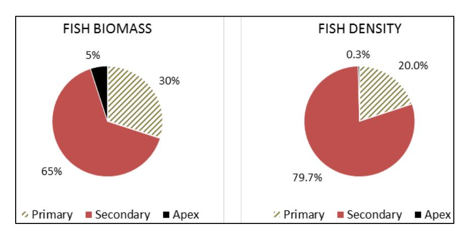

**Figure 42.** Proportions of primary, secondary, and apex consumer groups in the marine fish assemblage by biomass (left) and density (right) in NPSA's Tutuila Unit, all transects, 2010-15. Source: Clark et al. 2015.

## Species richness and diversity

The number of species detected on monitoring transects ranged from 15 to 39 species per 100 m2 transect, and it was spatially variable across the Tutuila Unit (Figure 43). Average species richness (25.6 species) was fairly stable during 2010-15 (Figure 44). Diversity (H') of marine fishes in the Tutuila Unit was moderate (annual range 2.4-2.6) and stable in 2010-15 (Figure 44).

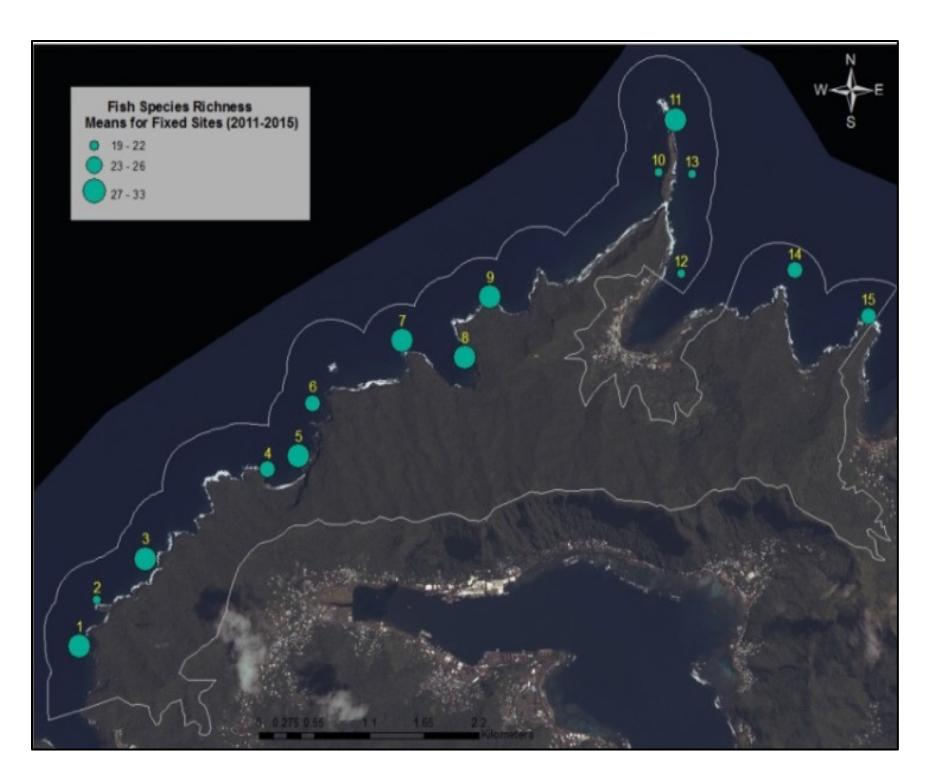

**Figure 43.** Average species richness of marine fish in fixed transects (indicated by numbers) across NPSA's Tutuila Unit, 2011-15. Symbol size is proportional to numbers of species detected. Park boundaries are indicated by a light line. Pago Pago Harbor lies south of the park. Source: Clark et al. 2015.

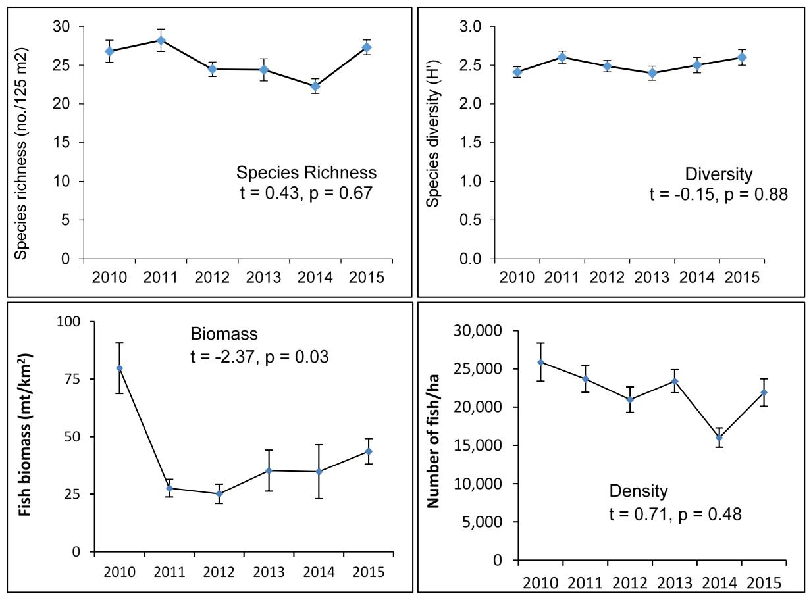

**Figure 44.** Marine fish (combined species): trends in species richness (no./100 m2), species diversity (Shannon Index, H'), fish biomass (mt/km2), and density (no./ha) in 15 fixed (permanent) transects in NPSA's Tutuila Unit. Error bars are one standard error of the mean. Source: Clark et al. 2015. 

## Fish biomass

Fish biomass is the most commonly used indicator of population status. Fish biomass was high in 2010 (Figure 44; see also Figure 41 for comparison with other US Pacific coral reefs), and there was a nearly two-thirds decrease thereafter for unidentified reasons. A similar trend in fish density did occur. Some hypotheses include: (a) Cyclone Wilma occurred at this time and caused some damage to corals near Pola Island in NPSA (T. Clark, pers. com.), but this was only a Category-1 cyclone, so it seems an unlikely explanation for the steep drop in fish biomass); (b) there was a change in observers conducting the surveys at this time, which perhaps resulted in some inconsistency in fish counts or size estimates; or (c) perhaps significantly intensified fishing occurred during this period. The average fish biomass had dropped to 33.3 mt/km2 ), but has showed an increasing trend that is statistically significant.

The overall fish biomass values obtained in NPSA's Tutuila Unit were generally similar to those obtained from islandwide surveys around Tutuila during the NOAA ASRAMP surveys (Figure 45). This biomass level ranks low in comparison with other US Pacific islands and is characteristic of the low biomass levels that occur around such densely populated islands as Guam and Oahu (Figure 41). While this may reflect the relatively low oceanic productivity of Tutuila's coastal waters, it also points to the adverse effects of human activities. Williams et al. (2015) estimated that islandwide reef fish biomass on Tutuila has been depleted 56% by human activities, and Nadon et al. (2012) estimated that shark density has been depleted by up to 96%. It is worth noting that this low level of fish biomass approaches a hypothetical threshold (25 mt/km2 ) for coral reefs, below which McClanahan et al. (2011) suggest the risk of serious ecosystem degradation and lost value increases.

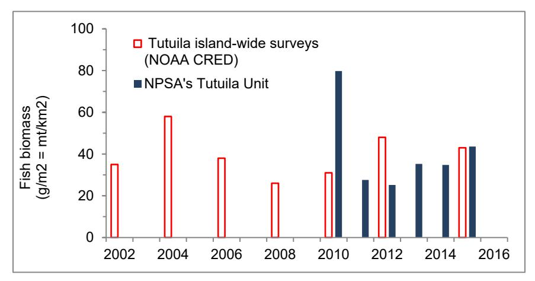

**Figure 45.** Fish biomass (combined species) in islandwide surveys on Tutuila conducted by NOAA (PIFSC 2011, Heenan et al. 2014, CRED 2015) compared with surveys conducted in NPSA's Tutuila Unit (Clark et al. 2015). Note that methods differed between surveys: NOAA ASRAMP survey used belt transects (2002-08) and stationary point counts (2010-15), while NPSA's survey used belt transects (2010-15).

## Fish density

Ranged of fish density was 16,000-25,900 fish/ha in 2010-15 and declined significantly (24%) during this period (Figure 44).

## Fish size

A common indicator of fishing pressure is the relative abundance of large fish targeted by fishermen (e.g., Birkeland 2004, Fenner 2014). The NOAA ASRAMP towed diver surveys, which were specifically designed to quantify sharks and other large fishes over substantial spatial areas (Richards et al. 2011), showed that such fish and sharks (>50 cm) were not common in American Samoa (PIFSC 2011, Williams et al. 2011, Nadon et al. 2012). This was also the case in NPSA's Tutuila Unit. Few fish larger than 30 cm fork length were seen in all transects combined over the six-year monitoring period (Figure 46). In total, only nine fish and sharks >50 cm were observed, which equates to encountering only one or two large fish or sharks per year over the combined 30 transects of the monitoring program.

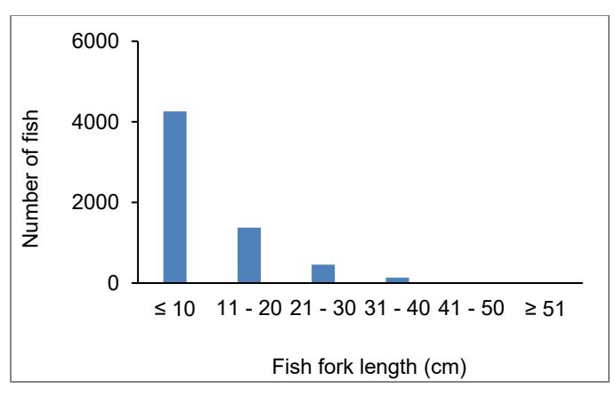

**Figure 46.** Length frequency of fish counted in fixed and temporary transects in all years, 2010-15 (n = 6,252 fish) in NPSA's Tutuila Unit. Source: NPS !&M Database, K. Kozar, pers. com. 2016.

Whether the low biomass of fish in the park reflects past or current levels of fishing is not known. For example, we might speculate that, on one hand, historical subsistence or artisanal fishing in the park depleted fish stocks, and their recovery has been hindered by poor recruitment to replenish these stocks, or on the other, current subsistence or artisanal fishing is more prevalent than appears because both can occur unobserved at night.

## Comparisons with fish conditions 40 years ago

Wass (1982) conducted the first quantitative fish survey in American Samoa in 1977-78, and this survey provided both similarities and differences to the present-day fish assemblage in the park. Compared to conditions in 2015 (Clark et al. 2015), Wass's data for Tutuila's "North Shore Fronts" fish assemblage show generally similar metrics for species richness (25.2 species/100m2 ), diversity (H' 2.9), biomass (39 mt/km2 ), density (24,700 fish/ha), and fish family composition. Damselfish were numerically dominant in both surveys, and several families contributed to total fish biomass (especially parrotfish, surgeonfish, and damselfish). These similarities, particularly for total fish biomass (39 mt/km2 in 1977-78 versus 44 mt/km2 in 2015 might suggest a reference condition for biomass in NPSA; alternatively, it is conceivable that fish stocks were low in 1977-78 due to increased subsistence fishing as had previously occurred in American Samoa (e.g., Zeller et al. 2006, Coutures 2003).

Despite these similarities, there was nearly total replacement of the top 10 species present, both numerically and by biomass. For example, the top species in 1977-78 were the damselfish *Plectroglyphidodon dickii* (by number) and the surgeonfish *Ctenochaetus striatus* (by biomass), neither of which were listed among the top 10 in NPSA in 2010-15 (Table 19). Conversely, the top species in 2010-15 (*Chromis iomelas* by number, *Ctenochaetus strigosus* by weight) were not listed among the top 10 in 1977-78. In total, only three species by number and one species by biomass was found in both top 10 lists. Note that some caution is needed when comparing these surveys because their methods, sites and depths differed. Also note that coral cover was twice as high in 1977-78 (60- 70%) than in 2007-15 (32%). Higher levels of coral cover would favor species like *P. dickii* which are associated with live corals (Myers 1991).

## Data needs/gaps

Quantification of subsistence and possible artisanal fisheries occurring in NPSA is needed to assess the effects of fishing in park waters (NPSA has been funded to do this in 2018-20). More detailed assessments of key fish species (from the existing NPS I&M database) may be useful for management purposes. Comparisons of fish biomass inside and outside NPSA boundaries over time would help assess the park's progress in preserving and protecting park reefs. The hypothesis that low fish abundance observed in the park may be due to limited larval recruitment should be examined (a USGS report by Storlazzi on nearshore currents in NPSA is in preparation). Potential water quality impacts of land-based pollutants (nutrients, sediment, and fecal bacteria) on fish and fish habitat should be evaluated (see Section 4.1 Marine water quality). Information about the condition of marine fish in NPSA's Ofu and Ta'u Units is limited.

## Threats

Fishing is considered to be one of the principle threats to coral reef fishes worldwide and in American Samoa (e.g., Friedlander and DeMartini 2002, Reynolds et al. 2002, Birkeland 2004, Zgliczynski et al. 2013, Fenner 2014, Williams et al. 2015). On Tutuila Island, fish populations appear to be at reduced levels, in part due to the relatively low primary productivity of Tutuila's coastal waters, but also because of human activities (Nadon et al. 2012, Williams et al. 2015). At the same time, local fishing efforts in nearshore waters has declined in recent decades since there has been less reliance on a subsistence lifestyle (Coutures 2003, Zeller et al. 2006).

A longer term stressor to marine fish is a changing climate that is affecting coral reef ecosystems through ocean warming and acidification (Keener et al. 2012; see also Section 5.1 Local climate change). The injuries and impairment to coral reef fishes are not yet clear, but include changes in physiology, behavior, distribution, and habitat loss due to the demise of coral reef structures (e.g., Pratchett et al. 2011). However, overt signs of stress to local fish populations (e.g., fish die-off or increased incidence of disease) have not yet been reported.

Cyclones can damage nearshore fish habitats, particularly for corallivorous fishes. Other threats are less significant in NPSA at present. Pollution and habitat degradation are low due to the remote site of the park, and when they occur the effect is generally localized to village areas outside park boundaries (see Section 4.1 Marine water quality). Habitat alteration by coastal development is prohibited by park regulation. There is currently no fishery for the aquarium trade in the Territory.

## Overall Condition

#### *Assemblage composition*

The coral reef fish assemblage in American Samoa is moderately diverse for the Indo-Pacific region and this is consistent with the gradient in decreasing diversity from west to east across the central Pacific. Main fish groups present in the park (damselfish, surgeonfish, jacks, fusiliers, parrotfish, and wrasses) are common throughout the region. The most numerically abundant group in 2010-15 (damselfish) was also the most abundant group 40 years ago. Other similarities between surveys conducted in 1978-79 (Wass 1982) and 2011-15 (Clark et al. 2015) were species richness, density, and biomass. We were unsure how much weight to assign the nearly complete changeover in species

composition between the two surveys, but methodological differences were noted. This measure was assigned a Significance Level of 3 (High) and a Condition Level of 0 (Not a current concern).

#### *Species richness and diversity*

Species richness and diversity describe different aspects of the fish assemblage, but the measures were joined here to give a single weight to the general category of species composition. Both measures were stable over the period 2010-15. This measure was assigned a Significance Level of 3 (High) and a Condition Level of 0 (Not a current concern).

#### *Fish biomass*

Fish biomass was generally low, due in part to low oceanic productivity in American Samoa but also due to human activities, presumably fishing. Past or present fishing is likely to have been responsible for a depletion of up to 56% of reef fish biomass and 96% in shark density (Nadon et al. 2012, Williams et al. 2015). This measure was assigned a Significance Level of 3 (High) and a Condition Level of 2 (Moderate).

#### *Fish density*

Total fish density declined 24% during 2010-15 for unknown reasons. One possibility is fishing pressure, but this activity appeared to be low in NPSA's Tutuila Unit (T. Clark, pers. com.). This measure was assigned a Significance Level of 3 (High) and a Condition Level of 2 (Moderate).

#### *Fish size*

The lack of large fish is a common indication of increased fishing pressure. In NPSA's Tutuila Unit, few fish larger than 30 cm fork length were seen in all transects combined over the six-year monitoring period. This measure was assigned a Significance Level of 3 (High) and a Condition Level of 2 (Moderate).

#### *Climate change*

Climate-induced changes in ocean temperature and acidification are already occurring in American Samoa (Section 5.1). The consequences of these changes to coral reef fish populations are not yet clear, but potential effects include changes in fish physiology, behavior, and distribution, as well as habitat loss due to the demise of coral reef structures (e.g., Pratchett et al. 2011). However, overt impacts to the park's fish populations have not yet been observed. This measure was assigned a Significance Level of 3 (High) and, at this time, a Condition Level of 1 (Low).

#### *Weighted condition score*

The weighted condition score (0.39; Table 21) indicates that the marine fish resource warrants moderate concern due to its low biomass, declining density, and lack of large fish and sharks, all indicative of past or present fishing pressure, among other factors. Developing climate induced changes in the marine environment are also of concern.

**Table 21.** Significance levels and condition levels used to calculate the weighted condition score (WCS) for NPSA's marine fish.

| Measures                               | Significance Level | Condition Level | WCS = 0.39                                                                                                     |
|----------------------------------------|--------------------|-----------------|----------------------------------------------------------------------------------------------------------------|
| Species composition                    | 3                  | 0               |                                                                                                                |
| Species richness and diversity         | 3                  | 0               |                                                                                                                |
| Fish density                           | 3                  | 2               |                                                                                                                |
| Fish biomass                           | 3                  | 2               |                                                                                                                |
| Fish size                              | 3                  | 2               | Condition of resource warrants moderate concern; condition is unchanging; medium confidence in the assessment. |
| Climate change trends in marine waters | 3                  | 1               |                                                                                                                |

#### *4.3.5. Sources of Expertise*

• Tim Clark PhD, NPSA Marine Scientist

#### *4.3.6. Literature Cited*

Allen, G. 2003. Reef fishes of Milne Bay Province, Papua New Guinea. Pages 46-55. *In:* G. Allen, J. Kinch, S. McKenna, P. Seeto (eds.). A rapid marine biodiversity assessment of Milne Bay Province, Papua New Guinea - Survey II (2000). RAP Bulletin of Biological Assessment 29. Conservation International, Washington, DC, USA.

Birkeland, C. 2004. Ratcheting down the coral reefs. Bioscience 54:1021-1027.

Brainard R., and 25 others. 2008. Coral reef ecosystem monitoring report for American Samoa: 2002-2006. NOAA Special Report NMFS PIFSC. 472 p.

Brown, E., J. Beets, P. Brown, P. Craig, A. Friedlander, T. Jones, K. Kozar, M. Capone, L. Kramer, and L. Basch. 2011. Marine fish monitoring protocol: Pacific Islands Network (Version 1.0). Natural Resource Report NPS/PACN/NRR—2011/421. National Park Service, Fort Collins, Colorado.

Clark, T., K. Bryan, and K. Schnurle. 2015. National Park of American Samoa marine fish monitoring trend report for 2011-2015 (draft). Natural Resources Report NPS/xxxx/NRR-2015/xxx, National Park Service, Fort Collins CO.

Coutures, E. 2003. The shoreline fishery of American Samoa. Dept. Marine and Wildlife Resources, American Samoa, Biological Report Series 102:1-22 p.

- CRED (Coral Reef Ecosystem Division). 2013. Pacific reef fish assessment and monitoring program; fish monitoring brief: American Samoa 2012. NOAA Fisheries Pacific Islands Fisheries Science Center, PIFSC Data Report DR-13-008. 2 p.
- CRED (Coral Reef Ecosystem Division). 2015. Pacific reef assessment and monitoring program. Fish monitoring brief: American Samoa 2015. NOAA Fisheries, Pacific Islands Fisheries Science Center, PIFSC Data Report, DR-15-008, 2 p. doi: 10.7289/v5319swz.
- DMWR (Department of Marine and Wildlife Resources). 2012. Coral reef fish monitoring report: 2006-2011. Final Report by Dept. Marine and Wildlife Resources, American Samoa, NOAA grant NA08NOS4260325. 36 p.
- Fenner, D. 2014. Fishing down the largest coral reef fish species. Marine Pollution Bulletin 84: 9-16.
- Fisk, D. and C. Birkeland. 2002. Status of coral communities on the volcanic islands of American Samoa. Department of Marine and Wildlife Resources, American Samoa. 135 p.
- Friedlander, A., and E. DeMartini. 2002. Contrasts in density, size and biomass of reef fishes between the Northwestern and the Main Hawaiian Islands: The effects of fishing down apex predators. Marine Ecology Progress Series 230:253-264.
- Goreau, T., and R. Hayes. 1994. A survey of coral reef bleaching in the south central Pacific during 1994. Report to Coral Reef Initiative, U.S. Dept of State, 118 p.
- Green, A. 2002. Status of coral reefs on the main volcanic islands of American Samoa: a resurvey of long-term monitoring sites. Report to Dept. Marine and Wildlife Resources. American Samoa. 135 p.
- Green, A., and C. Hunter. 1998. A preliminary survey of the coral reef resources in the Tutuila Unit of the National Park of American Samoa. Report to National Park Service. 42 p.
- Green, A., and T. Hughes. 1999. Rapid ecological assessment of the coral reef resources in the Ta'u Unit of the National Park of American Samoa. Report to National Park Service. 14 p.
- Hart, R. 2008. Environmental digital library for the Samoan archipelago. National Park Service, Pacific Network Inventory & Monitoring Program and National Park of American Samoa. DVD (Version 2). [https://www.nps.gov/npsa/learn/nature/digitallibr.htm,](https://www.nps.gov/npsa/learn/nature/digitallibr.htm) [http://www.botany.hawaii.edu/basch/uhnpscesu/picrp/complbibCont.htm#top,](http://www.botany.hawaii.edu/basch/uhnpscesu/picrp/complbibCont.htm#top) or [http://www.botany.hawaii.edu/basch/uhnpscesu/picrp/complbibA.htm#top.](http://www.botany.hawaii.edu/basch/uhnpscesu/picrp/complbibA.htm#top)
- Heenan, A., P. Ayotte, A. Gray, K. Lino, K. McCoy, J. Zamzow, and I. Williams. 2014. Pacific Reef Assessment and Monitoring Program. Data Report: Ecological monitoring 2012-2013 – reef fishes and benthic habitats of the main Hawaiian Islands, American Samoa, and Pacific Remote Island Areas. Pacific Islands Fisheries Science Center, PIFSC Data Report, DR-14-003, 112 p.

- Hixon, M. 1997. Effects of reef fishes on corals and algae. Pages 230-248. *In*: C. Birkeland (editor), Life and death of coral reefs. Chapman and Hall (NY).
- Houk, P., and C. Musburger. 2008. Assessing the effects of non-point source pollution on American Samoa's coral reef communities. Report to American Samoa Environmental Protection Agency.
- Hunter, C., A. Friedlander, W. Magruder, and K. Meier. 1993. Ofu reef survey: baseline assessment and recommendations for long-term monitoring of the proposed National Park in Ofu, American Samoa. Report to National Park Service. 135 p.
- IUCN (Interagency Union for Conservation of Nature). 2011. IUCN Red List of Threatened Species. IUCN, Gland, Switzerland. [www.iucnredlist.org.](http://www.iucnredlist.org/)
- Keener, V., J. Marra, M. Finucane, D. Spooner, and M. Smith (eds.). 2012. Climate change and Pacific islands: indicators and impacts. Report for the 2012 Pacific Islands Regional Climate Assessment (PIRCA). Washington, DC, Island Press.
- Kendall, M.S., and M. Poti (eds.). 2011. A biogeographic assessment of the Samoan Archipelago. NOAA Technical Memorandum NOS NCCOS 132. Silver Spring, MD. 229 p.
- McClanahan, T., N. Graham, M. MacNeil, N. Muthiga, J. Cinner, J. Bruggemann, and S. Wilson. 2011. Critical thresholds and tangible targets for ecosystem-based management of coral reefs fisheries. Proceedings National Academy Sciences (US). 108:17230-17233. doi: 10.1073/pnas.1106861108.
- McCoy, K, A. Heenan, J. Asher, P. Ayotte, K. Gorospe, A. Gray, K. Lino, J. Zamzow, and I. Williams. 2016. Ecological monitoring 2015—reef fishes and benthic habitats of the main Hawaiian Islands, Northwestern Hawaiian Islands, Pacific Remote Island Areas, and American Samoa. NOAA Pacific Islands Fisheries Science Center, PIFSC Data Report DR-16-002. DOI: 10.13140/RG.2.1.4351.9122.
- Myers, R. 1991. Micronesian reef fishes. Second edition. Coral Graphics, Barigada, Guam. 298 p.
- Nadon, M., J. Baum, I. Williams, J. McPherson, B. Zgliczynski, B. Richards, R. Schroeder, and R. Brainard. 2012 Re-Creating missing population baselines for Pacific reef sharks. Conserv Biol. 26: 493–503. doi: 10.1111/j.1523-1739.2012.01835.x.
- NPSA (National Park of American Samoa). 2016. Fishes of National Park of American Samoa. [www.nps.gov/npsa/learn/nature/fishlist.htm,](http://www.nps.gov/npsa/learn/nature/fishlist.htm) or [www.botany.hawaii.edu/basch/uhnpscesu/htms/NPSAfish/index.htm.](http://www.botany.hawaii.edu/basch/uhnpscesu/htms/NPSAfish/index.htm) Accessed 5 April 2016.
- Page, M. 1998. The biology, community structure, growth and artisanal catch of parrotfishes of American Samoa. Dept. Marine & Wildlife Resources, Biol. Rept. Series. 87 p.

- PIFSC (Pacific Islands Fisheries Science Center). 2011. Coral reef ecosystems of American Samoa: a 2002-2010 overview. NOAA Fisheries Pacific Islands Fisheries Science Center, PIFSC Special Publications, SP-11-02, 46 p.
- Pratchett, M., P. Munday, N. Graham, M. Kronen, S. Pinca, K. Friedman, T. Brewer, J. Bell, S. Wilson, J. Cinner, J. Kinch, R. Lawton, A. Williams, L. Chapman, F. Magron, and A. Webb. 2011. Vulnerability of coastal fisheries in the tropical Pacific to climate change. Chapter 9. *In*: J. Bell, J. Johnson, and A. Hobday (eds). Vulnerability of Tropical Pacific Fisheries and Aquaculture to Climate Change. Secretariat of the Pacific Community, Noumea, New Caledonia.
- Reynolds, J., N. Dulvy, and C. Roberts. 2002. Exploitation and other threats to fish conservation. Pages 319-341, *In*: P. Hart and J. Reynolds (eds). Handbook of fish biology and fisheries, Vol. 2. Blackwell Publishing, Oxford, UK.
- Richards, B., I. D. Williams, M. O. Nadon, and B. J. Zgliczynski. 2011. A towed-diver survey method for mesoscale fishery-independent assessment of large-bodied fishes. Bulletin of Marine Science 87:55–74.
- Sabater, M., and S. Tofaeono. 2007. Scale and benthic composition effects on biomass and trophic group distribution of reef fishes in American Samoa. Pacific Science 61:503-520.
- Sale, P. 1991. The ecology of fishes on coral reefs. Academic Press (NY).
- Storlazzi, C., O. Cheriton, K. Rosenberger, J. Logan, and T. Clark. (in prep.). Coastal Circulation in the National Park of American Samoa**;** measurements of waves, currents, temperature, and salinity: February–July 2015: U.S. Geological Survey Open-File Report 2016.
- Wass, R. 1982. Characterization of inshore Samoan fish communities. Draft report. American Samoa Dept. Marine and Wildlife Resources, Biological Report Series No. 6. *In*: Hart, R. 2008. Environmental digital library for the Samoan archipelago. National Park Service, Pacific Network Inventory & Monitoring Program and National Park of American Samoa. DVD (Version 2). [https://www.nps.gov/npsa/learn/nature/digitallibr.htm,](https://www.nps.gov/npsa/learn/nature/digitallibr.htm) [http://www.botany.hawaii.edu/basch/uhnpscesu/picrp/complbibCont.htm#top,](http://www.botany.hawaii.edu/basch/uhnpscesu/picrp/complbibCont.htm#top) or [http://www.botany.hawaii.edu/basch/uhnpscesu/picrp/complbibA.htm#top.](http://www.botany.hawaii.edu/basch/uhnpscesu/picrp/complbibA.htm#top)
- Wass, R. 1984. An annotated list of the fishes of Samoa. NOAA Tech. Rept. SSRF-781. 43 p.
- Whaylen, L., and D. Fenner. 2006. Report of the 2005 American Samoa Coral Reef Monitoring Program (ASCRMP), expanded edition. Rept. to Dept. Marine and Wildlife Resources and Coral Reef Advisory Group, American Samoa.
- Williams, I., B. Richards, S. Sandin, J. Baum, R. Schroeder, M. Nadon, B. Zgliczynski, P. Craig, J. McIlwain, and R. Brainard. 2011. Differences in reef fish assemblages between populated and remote reefs spanning multiple archipelagos across the Central and Western Pacific. J. Mar. Biol. 2011:1-14. doi: 10.1155/2011/826234.

- Williams, I., J. Baum, A. Heenan, K. Hanson, M. Nadon, and R. Brainard. 2015. Human, oceanographic and habitat drivers of central and western Pacific coral reef fish assemblages. PLoS ONE 10(4): e0120516. doi:10.1371/journal.pone.0120516.
- Zeller, D., S. Booth, P. Craig, and Pauly, D. 2006. Reconstruction of coral reef fisheries catches in American Samoa, 1950-2002. Coral Reefs. 25:144-152.
- Zgliczynski, B., I. Williams, R. Schroeder, M. Nadon, B. Richards, and S. Sandin. 2013. The IUCN Red List of Threatened Species: an assessment of coral reef fishes in the US Pacific Islands. Coral Reefs, doi: 10.1007/s00338-013-1018-0.

## **4.4. Sea Turtles**

## *4.4.1. Description*

Sea turtles are an iconic resource of cultural and ecological significance (e.g., Bjorndal and Jackson 2003, Allen 2007). They appear in Samoan songs, legends, and artwork, and were formerly a source of food (Tuato'o et al. 1993). Principle species in American Samoa are hawksbill (*Eretmochelys imbricata*) and green turtles (*Chelonia mydas*). Small numbers of hawksbills nest on sandy beaches, primarily around Tutuila and the Manu'a Islands (Figure 47); green turtles nest primarily at Rose Atoll (e.g., Balazs 1991, Utzurrum 2002, Utzurrum et al. 2006, Tagarino and Meyer 2011, Tagarino and Saili 2013, Caruso 2015). Occasional juveniles of both species occur in local coastal waters (e.g., Grant et al. 1997). Incidental records of other turtle species in the Territory include one leatherback (*Dermochelys coriaca;* Grant 1994) and three olive ridleys (*Lepidochelys olivacea*; Utzurrum 2002), neither of which is known to breed locally.

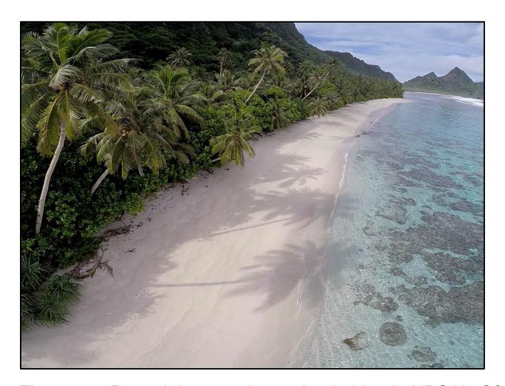

**Figure 47.** Potential sea turtle nesting habitat in NPSA's Ofu Unit. Photo: C. Caruso, NPSA.

Both green and hawksbill turtles are well known for their highly migratory nature and complex life history patterns (e.g., NMFS and USFWS 1998a, 1998b, 2013, Bolten 2003, FWS and NOAA 2015). Their life cycle includes multiple destinations — after hatching, juveniles migrate offshore and begin a pelagic phase for several years before moving to coastal waters to feed around various islands. Upon reaching maturity, they return to their natal islands to nest. Thereafter, adults may swim thousands of kilometers between nesting and foraging sites. They reach maturity at about age 25-50 and may live up to 80 years. Hawksbills eat sponges, algae, and invertebrates; greens eat mostly seagrass and algae. Beyond this general understanding, numerous gaps remain in our understanding of sea turtle biology.

In both prehistoric and modern times, turtle numbers have declined in the Pacific region, primarily due to harvesting (e.g., Tuato'o-Bartley et al. 1993, Balazs 1995, NMFS and USFWS 1998a, 1998b, 2013, Bjorndal and Jackson 2003, Allen 2007, FWS and NOAA 2015). Both species are listed as endangered throughout most or all of their circumglobal ranges under both the Endangered Species

Act (NMFS and USFWS 1998a, FWS and NOAA 2016) and IUCN Redlist (IUCN 2016). NPSA managers have identified sea turtles as an important park resource that should be included in the NRCA process despite limited information about turtles available in NPSA. Conclusions reached in this report serve to highlight the need for a sea turtle management program at NPSA.

### *4.4.2. Data and Methods*

Turtle information in American Samoa is limited but growing. Early accounts of turtles observed in the islands were compiled by Balazs (1983, 1991, 1995). Since then, local and federal agencies have conducted surveys to investigate the status, distribution and movements of sea turtles in the Territory (e.g., Tuato'o-Bartley et al. 1993, Grant et al. 1997, Utzurrum 2002, Craig et al. 2004, Tagarino and Meyer 2011, Tagarino and Saili 2013, Caruso, 2014, 2015, MacDonald 2015). Dutton et al. (2014) examined the genetic stock structure of green turtles in the central and western Pacific, including American Samoa. NMFS and USFWS (1998a, 1998b, 2013) and FWS and NOAA (2015, 2016) reviewed the population status of hawksbill and green turtles in US Pacific Islands and developed recovery plans for these species. In recent years, the Department of Marine and Wildlife Resources (DMWR) tracked turtle movements using satellite-tags, and monitored nesting activity on index beaches (Tagarino and Saili 2013, Caruso 2015, MacDonald 2015). NPSA has not yet initiated its own sea turtle program but assisted DMWR's turtle monitoring and outreach programs on Ofu Island (Caruso 2015).

## *4.4.3. Reference Condition*

Reference conditions for foraging juveniles and nesting adults have not been established for American Samoa or NPSA's three units. Anecdotal accounts of turtle population declines in American Samoa support regional patterns of declines but do not provide a basis for establishing a reference condition.

### *4.4.4. Condition and Trend*

Using the limited information available about green and hawksbill turtles in American Samoa, three measures of population condition were examined: distribution in park, nests per year, and regional status. This section begins by delineating American Samoa's turtle stocks.

## Stock delineation

Given the highly migratory behavior of sea turtles, it is useful to identify what constitutes American Samoa's turtle stocks (a self-sustaining population unit within a species). Two data sources provide insights: genetic analysis and migratory patterns of post-nesting turtles.

#### *Green sea turtle stocks*

Sea turtle stocks are identified by breeding populations of females at geographically distinctive nesting beaches. Nesting occurs in many areas in the central and western Pacific region (Maison et al. 2010), but Dutton et al. (2014) found that stocks separated by at least 1000 km were genetically distinct while those less than 500 km apart were not. They determined that at least seven genetically independent stocks of green turtles occur in the western and central Pacific (Figure 48). One of these stocks is American Samoa, where the 17 samples taken from Rose, Swains, Tutuila and Ofu Islands shared haplotypes and thus were closely related. Of particular conservation concern is that "these

seven stocks represent breeding habitats with little or no immigration by reproductive females from neighboring rookeries. This means that such populations are not likely to be recolonized in the case of population declines or extinctions…" (Dutton et al. 2014).

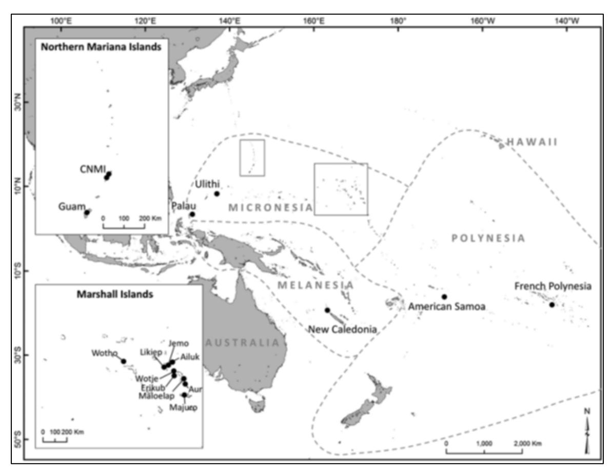

**Figure 48.** Location of seven green turtle rookeries (indicated by black dots and solid rectangles) in the western and central Pacific that were genetically independent and constituted separate management units (Dutton et al. 2014).

After nesting, green turtle stocks disperse over large oceanic areas, which demonstrates regional connectivity among Pacific islands. For American Samoa, tracking data are limited but illuminating. Two post-nesting females from Ofu migrated thousands of kilometers to foraging areas near Vanuatu and Fiji (MacDonald 2015). In addition, at Rose Atoll, located 150 km east of the Manu'a Islands, 15 post-nesting turtles migrated in various directions, spanning a distance of 6,000 km (3,700 mi) across the Central South Pacific (Figure 49; Craig et al. 2004, NOAA et al. 2014). Most (80%) went to foraging areas in Fiji, but others went to Papua New Guinea, the Solomon Islands, and French Polynesia.

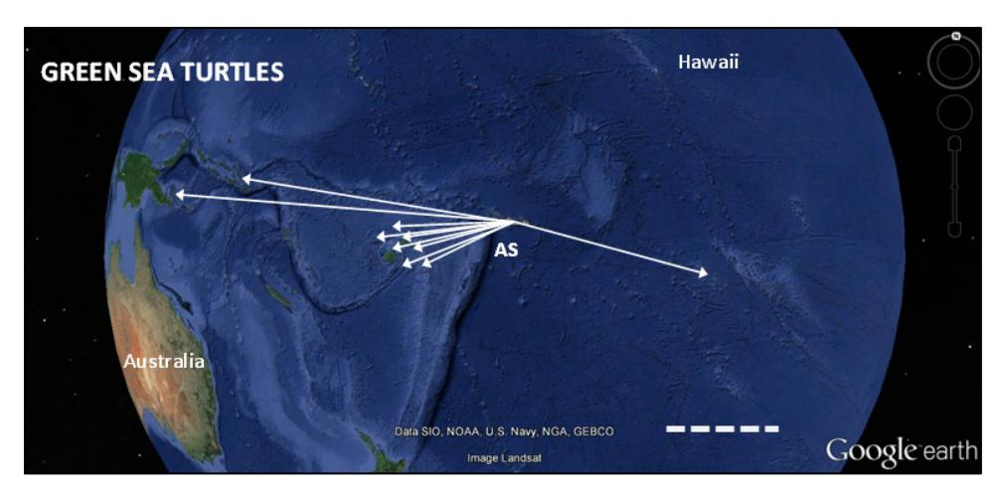

**Figure 49.** Migrations of 15 green sea turtles that nested at Rose Atoll, American Samoa (AS), and then migrated to foraging areas at distant locations. Arrows clockwise from left starting with the farthest distance: Papua New Guinea (1 track), Solomons (1), French Polynesia (1), Fiji (12, not all shown). Scale bar (dashed line) = 1000 km. Source: Craig et al. 2004, NOAA et al. 2014.

## *Hawksbill sea turtle stocks*

The range of hawksbills was generally similar to that of green turtles. Satellite-tagging showed postnesting hawksbills migrated to diverse destinations (Figure 50). Of the nine turtles tagged, six were from NPSA's Tutuila and Ofu Units, and the three others were from the same islands but outside the park (Tagarino and Saili 2013, MacDonald 2015). These turtles migrated to foraging grounds near Vanuatu, Samoa, the Cook Islands and Pitcairn Islands, and spanned a distance of 6,500 km (4,000 mi) across the Central South Pacific.

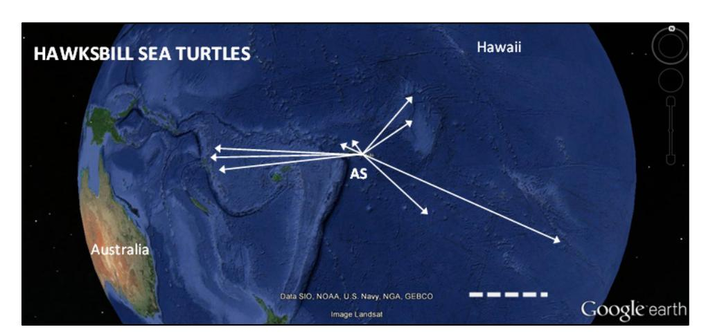

**Figure 50.** Migrations of nine hawksbill sea turtles that nested in American Samoa (AS) on Tutuila and Ofu Islands, and then migrated to foraging areas at distant locations. Arrows clockwise from left starting with the farthest distance: Vanuatu (three tracks), Samoa (two), NE Cook Islands (two), Pitcairn Islands (one), S Cook Islands (one). Scale bar (dashed line) = 1000 km. Source: Tagarino and Saili 2013, MacDonald 2015.

These long migrations are characteristic of these species worldwide. Several points of management interest include:

*Stock distribution.* 

Boundaries of both stocks extend over areas that are vastly greater than American Samoa itself. This greatly complicates conservation efforts, because it places these stocks at a variety of other islands across the Central Pacific where turtles may still be killed for food or the curio trade. In addition, migrating turtles may be killed as collateral losses in high-seas fisheries (e.g., NMFS 2010, FWS and NOAA 2014).

*Limited residence of stocks in American Samoa.* 

Based on the general life cycle of sea turtles (e.g., Bolten 2003), the American Samoan stocks spend surprisingly little time here. First, their young depart American Samoa after hatching and then forage at unknown locations. Next, when they reach sexual maturity, after some 25 years, they return briefly to American Samoa to nest for the first time. The adults then depart to distant foraging grounds where they remain for perhaps four to five years before returning to American Samoa to nest again (this interval between nestings is based on green sea turtles in Australia; Limpus 1993, Limpus et al. 1993). Using this information, Craig et al. (2004) estimated that Rose Atoll's population of green turtles may actually spend 90% of their adult lives feeding in Fiji, making only brief trips back to Rose Atoll to nest.

*Presence of non-local stocks in American Samoa.* 

A consequence of the hatchling's oceanic dispersal is that juvenile turtles observed in American Samoa's coastal waters are not likely part of American Samoa's reproductive stock. These juveniles presumably originated at a variety of locations elsewhere in the Pacific. They dispersed to American Samoa (among other areas) to feed for a number of years, and upon reaching sexual maturity, they will return to nest at their natal islands. For example, one large juvenile tagged at Tutuila migrated to the Cook Islands, presumably to nest there (Tagarino and Saili 2013).

## Distribution and abundance in park units

Sea turtles occur in four NPSA Life Zones (coastal strand and shallow, mid, and deep marine zones), but detailed information is limited. The Tutuila Unit has occasional hawksbill and green turtles foraging in its nearshore waters and nesting on its few small beaches (Utzurrum 2002, Tagarino et al. 2008). The Ofu Unit also has a low level of turtle nesting activity by both species, as described below (Tagarino and Meyer 2011, Caruso 2015). Turtle use of the Ta'u Unit is not known except that one clutch of newly emerged hawksbill hatchlings was reported near Tufu Point (P. Craig, pers. com. 2015).

## Nests per season

This measure of abundance is commonly used to monitor status and trends of sea turtle populations. It refers to the number of nests (containing eggs) per nesting season on a particular beach or island.

Turtle nest pits have been observed around all islands in American Samoa, but efforts to systematically document nesting activity have been limited. Intermittent surveys at Rose Atoll recorded nest pits there (e.g., Balazs 1991), but counts in the main islands of the Territory have only recently been initiated (Tagarino and Meyer 2011). The first comprehensive monitoring occurred on Ofu Island during the 2014-15 nesting season (Caruso 2015; M. MacDonald, DMWR, pers. com. 2014). Most turtles nesting there were hawksbills, but some nesting activity by green turtles was also observed. Preliminary data for nearly the entire island indicated 20 confirmed turtle nests, plus an additional 21 suspected, and which were being watched during the incubation period, for a total of 20-41 nests during the season (Figure 51). Given that each nesting turtle typically lays about three clutches of eggs during a nesting season (Limpus et al. 1983 NMFS and USFWS 1998a, 1998b), these 20-41 nests would equate to the nesting activities of about 6-14 individual females. In NPSA itself, the 8-19 nests that occurred on park beaches during this season would equate to the activities of about 3-6 individuals, a level which appears to be far below the nesting potential of these beaches (M. MacDonald, DMWR, pers. com.). While these numbers were tentative, they indicated a low level of nesting activity in the NPSA unit. In comparison, some examples of countrywide totals of hawksbills nesting annually were: <10-30 (Samoan Archipelago), 200-300 (Solomon Islands), and about 2500-4000 (Australia) (NMFS and USFWS 2013). The largest known green turtle nesting aggregation in the central Pacific was 300-500 females at Scilly Atoll (French Polynesia) in the 1970s, and thousands of nesting greens at multiple sites in Australia and Indonesia (Maison et al. 2010, FWS and NOAA 2015).

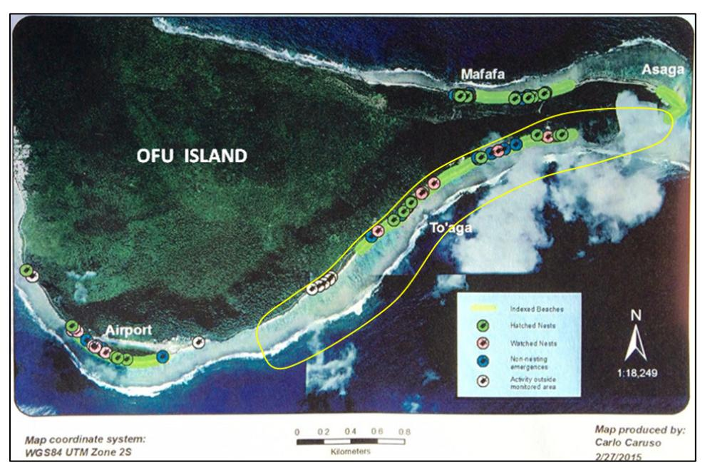

**Figure 51.** Location of sea turtle nests on Ofu Island during the 2014-15 nesting season. NPSA's Ofu Unit is approximated by a yellow line. Most nesting appeared to be by hawksbills, but nesting activity by green turtles was also observed. Source: Caruso 2015.

The low numbers in Ofu are in general agreement with an estimate made 30 years ago of about 30 nests per year in all of the Manu'a islands (Tuato'o-Bartley et al. 1993). However, this earlier estimate is thought to be high because it was based on interviews with villagers rather than

systematic field surveys, and it did not account for the multiple nests that each adult female typically makes in a single season.

## Regional status

While turtle numbers in both American Samoa and NPSA are not well-documented, reviews of their status in the Pacific region indicates that their numbers are low at present throughout most of the area (NMFS and USFWS 1998a, 1998b, 2013, FWS and NOAA 2015). Archaeological evidence indicates that turtles in Oceania were formerly more abundant, but they suffered major declines after Polynesians arrived in these islands about 2,800 years ago (e.g., Bjorndal and Jackson 2003, Allen 2007). Exterpation of birds and other species also occurred at this time (e.g., Steadman 1995). The decline of these animals was probably due to harvesting and the adverse impact of introduced predators (rats, pigs and dogs) that eat turtle hatchlings and eggs. In historical times, Balazs (1995) writes that there is ample evidence that turtle numbers declined farther in the Central Pacific Ocean. Excerpts from regional status reviews by USFWS, NOAA, and NMFS follow:

*Hawksbill regional status*

#### *Recovery Plan, 1998.*

In the Pacific region, the hawksbill turtle is rapidly approaching extinction due to a number of factors, but the intentional harvest of the species for meat, eggs and the tortoiseshell and stuffed curio trade is of greatest impact. The Sea Turtle Recovery Team was surprised at how few hawksbills are left in areas of once high (or at least much greater) abundance. The status of this species is clearly of a high concern for the Pacific and it is recommended that immediate actions be taken to prevent its extinction. [Excerpts from NMFS and USFWS 1998a]

#### *Five-year Status Review, 2008-12.*

Since the last review of the hawksbill sea turtle, the trends and distribution of the species throughout the globe are largely unchanged. The hawksbill turtle was once abundant in tropical and subtropical regions throughout the world. Over the last century, this species has declined in most areas and stands at only a fraction of its historical abundance. The situation for hawksbills in the Pacific Ocean is particularly dire. It is concluded that the hawksbill sea turtle remains in danger of extinction throughout all or a significant portion of its range and should not be reclassified or delisted. [Excerpts from NMFS and USFWS 2013]

*Green turtle regional status*

#### *Recovery Plan, 1998*

The Sea Turtle Recovery Team found that, outside of Hawaii, the threatened green turtle populations have seriously declined and should probably be classified as endangered. By far, the most serious threat to these stocks is from direct take of turtles and eggs, both within U.S. jurisdiction and on shared stocks that are killed when they migrate out of U.S. jurisdiction (e.g., nesting turtles from American Samoa migrate to Fiji and French Polynesia to feed). [Excerpts from NMFS and USFWS 1998b].

#### *ESA listing of green turtles as endangered, 2016*

The ESA status of green turtles in the Central South Pacific [was changed] from threatened to endangered in 2016. Regulatory agencies found that the green turtle is comprised of 11 distinct population segments (DPSs) that qualify as ''species'' for listing under the ESA. Eight DPSs were listed as threatened and three as endangered. The latter includes the Central South Pacific [which includes American Samoa] (DPS no. 9 in Figure 52), which is characterized by widespread nesting at very low levels of abundance, mostly in remote low-lying oceanic atolls. Nesting is reported at 57 locations. While the dispersed location of nesting sites might provide a level of habitat diversity and population resilience which reduces overall extinction risk, this contribution is reduced by the low population size of these sites and total population of fewer than 3,000 nesting females. Chronic and persistent illegal harvest is a concern in the Central South Pacific DPS, and climate change is a threat expected to increase in the future. Sea level rise may affect this DPS more than any other because nearly all nesting sites exist on low-lying atolls. This rise is expected to exacerbate beach erosion, inundations, and storm surge on small islands. Based on its low nesting abundance and exposure to increasing threats, the Central South Pacific DPS is presently in danger of extirpation throughout its range. [Summarized from FWS and NOAA 2015, 2016]

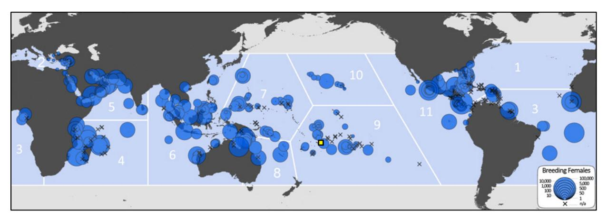

**Figure 52.** World map showing green turtle nesting sites (blue circles) and delineation of 11 distinct population segments (DPSs are shown in white lines and numbers). The Central South Pacific (DPS 9) includes (1) the main islands of American Samoa (yellow square) which support about one nesting female per year, and (2) Rose Atoll (the circle containing yellow square) with about 100 nesting females per year. Source: FWS and NOAA 2015.

## Data needs/gaps

Information needed to assess and manage sea turtle resources in NPSA include annual nest counts in park units, assessments of juvenile turtle distribution, abundance, and habitat requirements; additional tagging and genetic analyses to determine turtle movements and delineate stocks; and enlistment of international cooperation to conserve and protect shared sea turtle stocks.

## Threats

While harvest of turtles and their eggs has been a significant threat (Tuato'o-Bartley et al. 1993, Balazs 1995, Grant 1997, NMFS and USFWS 1998a, 1998b, 2013, FWS and NOAA 2015), it may

be diminishing in American Samoa in recent years (C. Caruso, NPSA, pers. com. 2015), probably due to the scarcity of turtles in the Territory. But the harvest of turtles and their incidental catch in high-seas fisheries may continue when turtles migrate to distant foraging and nesting areas (NMFS and USFWS 1998b). Another threat is climate change which has the potential to greatly affect sea turtles, including loss of beach habitat from rising sea levels, repeated inundation of nests, skewed hatchling sex ratios resulting from rising incubation temperatures, and disruption of ocean currents used for natural dispersal (FWS and NOAA 2015). Current trends in climate change in American Samoa are summarized in Section 5.1. Habitat loss has also occurred due to decades of human population expansion in the Territory (see Figure 5b). In NPSA's Ofu Unit, local threats to nests and hatchlings are backhoes that mine beach sand, street lights adjacent to nesting areas that disorient hatchlings emerging from their nests, and wave erosion of nests. Mortality of turtle hatchling by rats or other predators has not been examined on NPSA beaches. There are currently no indications that local turtle populations are infected with fibropapilloma as occurs in Hawaii.

## Overall condition

## *Regional status*

This measure was assigned a Significance Level of 3 (High), because the endangered status of hawksbill and green sea turtles in the US Pacific Islands, including American Samoa, is based on a substantial body of evidence and professional expertise. Both species have declined regionally and are in danger of extinction (NMFS and USFWS 1998a, 1998b, 2013, FWS and NOAA 2015, 2016). Local data from American Samoa support this finding. A Condition Level of 3 (High Concern) was assigned to this measure.

## *Distribution and abundance in NPSA*

A Significance Level of 3 (High) was assigned to this measure because of the ecological role played by hawksbill and green turtles in tropical marine ecosystems, their likely former abundance in American Samoa, and their cultural significance in Polynesia. A Condition Level of N/A (not available) was assigned because distribution and abundance information about foraging juvenile turtles and nesting adult turtles is limited in the park.

#### *Nests per season*

A Significance Level of 3 (High) was assigned to this measure because it is a principal method used to monitor the status of sea turtle stocks. Although the annual population of nesting turtles in American Samoa is not well known, available information indicates that few turtles currently nest there. A Condition Level of 3 (High Concern) was assigned to this measure.

#### *Weighted condition score*

The weighted condition score for sea turtles (both species) is 1.0, which indicates that this resource warrants significant concern, primarily due to their scarcity in American Samoa and their nearly worldwide endangered species status (Table 22). The confidence in this assessment is regionally high but locally low due to the limited quantitative information available for NPSA. This results in reliance upon regional assessments and local professional judgement. The local trend in this condition is unknown.

**Table 22.** Significance levels and condition levels used to calculate the weighted condition score (WCS) for NPSA's sea turtles.

| Measures             | Significance Level | Condition Level | WCS = 1.0                                                                                                                                 |
|----------------------|--------------------|-----------------|-------------------------------------------------------------------------------------------------------------------------------------------|
| Distribution in park | 3                  | N/A             |                                                                                                                                           |
| Nests per season     | 3                  | 3               |                                                                                                                                           |
| Regional status      | 3                  | 3               | Condition of resource warrants significant concern; trend in condition is unknown or not applicable; medium confidence in the assessment. |

## *4.4.5. Sources of Expertise*

- Tim Clark PhD, NPSA Marine Scientist
- Carlo Caruso, NPSA Manu'a District Ranger
- Mark McDonald, DMWR Wildlife Biologist

#### *4.4.6. Literature Cited*

Allen, M. 2007. Three millennia of human and sea turtle interactions in remote Oceania. Coral Reefs 26:959-970. doi 10.1007/s0038-007-0234-x.

Balazs, G. 1983. Subsistence use of sea turtles at Pacific Islands under the jurisdiction of the United States. Nat. Marine Fisheries Service, Southwest Fisheries Center Admin. Report H-83-17. 6 p.

Balazs, G. 1991. Historical summary of sea turtle observations at Rose Atoll, American Samoa, 1839-1991. Unpublished report. National Marine Fisheries Service, Southwest Fisheries Science Center. 6 p.

Balazs, G. 1995. Status of sea turtles in the central Pacific Ocean. Pages 243-252. *In* K. Bjorndal (ed.), Biology and Conservation of Sea Turtles. Smithsonian Institution Press, Washington, DC. 583 p.

Bjorndal, K. and J. Jackson. 2003. Roles of sea turtles in marine ecosystems: reconstructing the past. Pages 259-274. *In*: P. Lutz PL, J. Musick, and J. Wyneken (eds). The biology of sea turtles, Vol 2. CRC, Boca Raton.

Bolten, A. 2003. Variation in sea turtle life history patterns: neritic versus oceanic developmental stages. p. 243-257, *In*: P. Lutz, J. Musick, and J. Wyneken (eds.) The biology of sea turtles. Vol. 2. CRC Press, Boca Raton, Florida.

- Caruso, C. 2014. 2013-2014 Ofu turtle nesting season in brief with maps. Unpublished rept. National Park of American Samoa. 6 p.
- Caruso, C. 2015. Protect sea turtle nests and hatchlings with territorial partner agency: detailed implementation plan and project update. Status report, National Park of American Samoa. 18 p.
- Craig, P., D. Parker, R. Brainard, M. Rice, and G. Balazs. 2004. Migrations of green turtles in the central South Pacific. Biological Conservation 116:433-438.
- Dutton, P., M. Jensen, K. Frutchey, A. Frey, E. LaCasella, G. Balazs, J. Cruce, A. Tagarino, R. Farman, and M. Tatarata. 2014. Genetic stock structure of green turtle (*Chelonia mydas*) nesting populations across the Pacific Islands. Pacific Science 68:451-465.
- Grant, G. 1994. Juvenile leatherback turtle caught by longline fishing in American Samoa. Marine Turtle Newsletter 66:3-5.
- Grant, G., P. Craig, G. Balazs. 1997. Notes on juvenile hawksbill and green turtles in American Samoa. Pacific Science 51:48-53.
- FWS and NOAA (Fish and Wildlife Service and National Oceanic and Atmospheric Administration). 2015. Endangered and threatened species: identification and proposed listing of eleven distinct population segments of green turtles (*Chelonia mydas*) as endangered or threatened and revision of current listings: proposed rule. Federal Register, 80 (55):15272-15337. Docket No. 120425024, RIN 0648-XB089.
- FWS and NOAA (Fish and Wildlife Service and National Oceanic and Atmospheric Admin.). 2016. Endangered and threatened wildlife and plants; final rule to list eleven distinct population segments of the green sea turtle (*Chelonia mydas*) as endangered or threatened and revision of current listings under the Endangered Species Act. 32p. [https://federalregister.gov/a/2016-07587.](https://federalregister.gov/a/2016-07587)
- IUCN (International Union for the Conservation of Threatened Species). 2016. *Eretmochelys*  imbricata. IUCN Red List of Threatened Species. Version 2016.2. [http://www.iucnredlist.org/.](http://www.iucnredlist.org/) Accessed 23 December 2016.
- Limpus, C., J. Miller, V. Baker, and E. McLachlan. 1983. The hawksbill turtle, *Eretmochelys imbricata*, in north-eastern Australia: the Campbell Island rookery. Australian Wildlife Research 10:185-197.
- Limpus, C. 1993. The green turtle, *Chelonia mydas*, in Queensland: breeding males in the southern Great Barrier Reef. Wildl. Res. 20:513-523.
- Limpus, C., J. Miller, and C. Parmenter. 1993. The northern Great Barrier Reef green turtle, *Chelonia mydas*, breeding population. Pages 47-50. *In*: K. Zevering and C. Zevering (eds.). Raine Island and Environs Great Barrier Reef: Quest to preserve a fragile outpost of nature. Raine Island Corp. and Great Barrier Reef Marine Park Authority, Townsville, Queensland, Australia.

- MacDonald, M. 2015. Map of hawksbill and green sea turtle migrations from Ofu Island, American Samoa. Unpublished. Department of Marine and Wildlife Resources, American Samoa. one p.
- Maison, K., I. Kinan Kelly, and K. Frutchey. 2010. Green turtle nesting sites and sea turtle legislation throughout Oceania. U.S. Dep. Commerce, NOAA Technical Memo. NMFS-F/SPO-110, 52 p.
- NMFS (National Marine Fisheries Service). 2010. Measures to reduce interactions between green sea turtles and the American Samoa-based longline fishery – implementation of an amendment to the Fishery Ecosystem Plan for Pelagic Fisheries of the Western Pacific Region. Endangered Species Act, Section 7 Consultation, Biological Opinion. NMFS, Pacific Islands Region, Sustainable Fisheries Division. 91p. [www.fpir.noaa.gov/Library/PUBDOCs/ biological\\_opinions/622-](http://www.fpir.noaa.gov/Library/PUBDOCs/%20biological_opinions/622-NMFS-ASLL_Am_to_Pelagics_FMP_Biop_FINAL_9-16-107) [NMFS-ASLL\\_Am\\_to\\_Pelagics\\_FMP\\_Biop\\_FINAL\\_9-16-107.](http://www.fpir.noaa.gov/Library/PUBDOCs/%20biological_opinions/622-NMFS-ASLL_Am_to_Pelagics_FMP_Biop_FINAL_9-16-107)
- NMFS and USFWS (National Marine Fisheries Service and United States Fish and Wildlife Service). 1998a. Recovery plan for the US Pacific populations of the hawksbill turtles (*Eretmochelys imbricata*). National Marine Fisheries Service. Silver Spring, MD.
- NMFS and USFWS (National Marine Fisheries Service and United States Fish and Wildlife Service). 1998b. Recovery plan for the US Pacific populations of the green turtles (*Chelonia mydas*). National Marine Fisheries Service. Silver Spring, MD. 84 p.
- NMFS and USFWS (National Marine Fisheries Service and United States Fish and Wildlife Service). 2013. Hawksbill sea turtle (*Eretmochelys imbricata*), 5-year status review: summary and evaluation. National Marine Fisheries Service. Silver Spring, MD. 83 p.
- NOAA, USFWS, and DMWR. 2014. Migration map of green sea turtles tagged at Rose Atoll (American Samoa) in 2014. 1 p.
- Steadman, D. 1995. Prehistoric extinctions of Pacific Island birds. Science 267: 1123-1131.
- Tagarino, A., K. Schletz Saili, and R. Utzurrum. 2008. Investigations into the status of marine turtles in American Samoa, with remediation of identified threats and impediments to conservation and recovery of species. Dept. Marine and Wildlife Resources (American Samoa), NOAA/NMFS Unallied Management Grant: Award No. NA04NMF4540126 FINAL REPORT (01 October 2004 to 30 September 2008). 40 p.
- Tagarino, A. and R. Meyer. 2011. Investigations into the status of marine turtles in Ofu and Olosega, American Samoa: an intensive monitoring of identified hawksbill nesting beaches. Dept. Marine and Wildl. Resources, American Samoa. Final Report to NOAA/NMFS Unallied Management Grant, Award No. NA09NMF4540267. 15 p.
- Tagarino, A., K. Saili. 2013. Migrations of post-nesting adults and movements of juvenile hawksbill turtles (*Eretmochelys imbricata*) of American Samoa. Poster by the Dept. Marine and Wildlife Resources, Pago Pago, American Samoa.

- Tuato'o-Bartley, N., T. Morrell, P. Craig. 1993. The status of sea turtles in American Samoa in 1991. Pacific Science 47:215-222.
- Utzurrum, R. 2002. Sea turtle conservation in American Samoa. Pages 33-36. *In*: I. Kinan (ed.). Proceedings Western Pacific sea turtle cooperative research and management workshop. Feb 5-8, 2002. Western Pacific Regional Fisheries Management Council (Hawaii).
- Utzurrum, R., J. Seamon, and K. Saili. 2006. A comprehensive strategy for wildlife conservation in American Samoa. Dept. Marine and Wildlife Resources, American Samoa. 109 p.

## **4.5. Rainforest**

## *4.5.1. Description*

The term rainforest refers to tropical forests occurring in the Old World. The rainforest in the NPSA is a unique forest type in the National Park System (Blondet 2010) and is valued for its diverse plant and animal species and their contributions to science, agriculture and medicine, its overall unique status as a diverse plant community, and its archaeological significance (Public Law 100-571).

The NPSA rainforest is found from an elevation of two to 950 m. This covers the traditionally named ecological zones from secondary forest through lowland rainforest as classified by the United Nations Food and Agriculture Organization (FAO, 2000; Figure 53).

**Figure 53.** Schematic drawing of traditional ecological land zones in American Samoa (United Nations Food and Agriculture Organization 2000).

The rainforest is important to America's birds, bats, and insects that support the forest's ecosystem and are unique to the islands, and the forest's subsistence uses and cultural significance. Primary management concerns for the paleotropical forest are the spread and control of invasive species, the effects of climate change on it, and the encroachment of subsistence farming on unauthorized areas.

### *4.5.2. Reference Conditions*

The vegetation of Samoa remained largely unstudied until A.Whistler began his career investigating the wetlands of America Samoa (Whistler 1976), the wildlife and wildlife habitat (Amerson et al. 1982), the proposed protected areas (Whistler 1994) and then all of the vegetation of the Samoan islands (Whistler 1980, 2002, 2004, and 2009). Therefore, the oldest reference condition would be a resource similar to that which Whistler first described.

## Species Composition

Tree volume was estimated in 2001 to be approximately 1,530 cubic feet per acre (Donnegan et al. 2004). Total biomass of all trees over 5.0 inches in diameter was estimated to be 1.1 billion tons. Seventeen percent of trees inventoried in 2001 had some form of damage from weather or insects. The following descriptions (and dominant species) of the lowland rainforest are taken from Donnegan et al. 2004:

### *Lowland Rainforest:*

Lowland rain forest is characterized by several distinct species assemblages (see Mueller-Dombois and Fosberg 1998). Community types found in low elevation forests are based on dominant species and include Diospyros forest, Dysoxylum forest, Pometia forest, Syzygium forest, and Planchonella (Pouteria) forest. Tree species that are highly valued for their wood are found here and include *Pometia pinnata*, *Syzygium inophylloides*, and *Calophyllum neo-ebudicum*. Lowland rain forests occur on ridges, slopes, in valleys, and on lowland lava flows. Drier forest types are found on ridges and slopes. Extensive lowland forest once existed on lava flow on the Tafuna plains of Tutuila, but except for 40 ac, it has been replaced largely by urban development and coconut plantations. As the market for coconut has dropped off, the plantations have been abandoned and are slowly converting to secondary vegetation with mixed agroforest.

#### *Montane Rainforest:*

Montane rain forest is high-elevation, often steeply sloped forest (>1,640 ft) and is characterized by high precipitation. The dominant canopy species is the native *Dysoxylum huntii*. No community types are differentiated by Whistler (1992) for this category. The higher elevation forests tend to be less affected by severe weather. The steep slopes inhibit cultivation.

Other more rare species that have been observed in the American Samoan rainforest (and their last recorded observation) are detailed in Whistler (2005). Permanent forest plots to measure stocks of the rainforest were established and detailed (including location) in Whistler (1995) and Webb and Fa'aumu (1999). Hart (2006) notes that another permanent plot was established by Webb in 2004. These plots are described in Webb et al. 2006.

## Distribution in NPSA

Total forest cover for American Samoa in 2001 was estimated to be 43,631 ac (90.1% of total land area; Donnegan et al. 2004). The total number of forested ac between 1985 and 2001 trended downward by approximately 3% (Table 23).

**Table 23.** Estimated land area by status, 1985 and 2001. Reproduced from Donnegan et al. 2004. Land area figures for 2001 acreage differ slightly from published survey area owing to boundary edges being constrained to square pixels on our satellite-image-derived vegetation map. Land area figures for 1986 acreage are computed from Cole et al. (1988) USDA Forest Service vegetation maps that were sand and digitized for a geographic information system by FIA in 2002.

|                                                                               |        | 1985 acres         |                          |        | 2001 acres |                    |                          |        |
|-------------------------------------------------------------------------------|--------|--------------------|--------------------------|--------|------------|--------------------|--------------------------|--------|
| Land Status                                                                   | Ta'u   | Ofu and Olosega | Tutuila and Aunu'u | Total  | Ta'u       | Ofu and Olosega | Tutuila and Aunu'u | Total  |
| Accessible forest land                                                     | –      | –                  | –                        | –      | –          | –                  | –                        | –      |
| Unreserved forest land                                                     | 10,837 | 2,978              | 30,976                   | 44,791 | 7,108      | 1,450              | 27,368                   | 35,928 |
| Protected forest land (National Park Service lease and reserves)A | –      | –                  | –                        | –      | 3,711      | 1,509              | 2,362                    | 7,581  |
| MangroveB                                                                     | –      | –                  | 148                      | 248    | –          | –                  | 122                      | 122    |
| All accessible forest land                                                 | 10,837 | 2,978              | 31,124                   | 44,939 | 10,819     | 2,959              | 29,852                   | 43,631 |
| Non-forest and other areas                                                 | –      | –                  | –                        | –      | –          | –                  | –                        | –      |
| Non-forest urban                                                           | 116    | 33                 | 2,252                    | 2,401  | 125        | 36                 | 3,368                    | 3,530  |
| Non-forest vegetation                                                      | 233    | 95                 | 776                      | 1,104  | 156        | 47                 | 511                      | 715    |
| Barren lands                                                                  | –      | –                  | 14                       | 14     | 131        | 74                 | 343                      | 548    |
| Water                                                                         | –      | –                  | 64                       | 64     | –          | –                  | 10                       | 10     |
| All non-forest and other                                                   | 349    | 128                | 3,106                    | 3,583  | 412        | 157                | 4,232                    | 4,803  |
| Total area (acres)                                                         | 11,186 | 3,106              | 34,230                   | 48,522 | 11,231     | 2,116              | 34,084                   | 48.434 |
| Non-sampled area                                                           | –      | –                  | –                        | –      | –          | –                  | –                        | –      |
| Access denied                                                                 | –      | –                  | –                        | –      | –          | –                  | –                        | –      |
| Hazardous conditions                                                       | –      | –                  | –                        | –      | 3,017      | –                  | 1,207                    | 4,224  |

A Estimates of protected forest land acreage are from Graves 2003.

In 2014, the US Forest Service estimated that total forest cover had decreased to approximately 24,000 ac (Stein et al. 2014). If correct, this would constitute a loss of 45% of total forest cover in 13 years.

B Unpublished data from global positioning system survey by American Samoa Forestry Division and American Samoa Community College.

## Invasive Plant Threat

*Invasive Trees*

Monello (2004) in his summary report notes that the most common invasive tree species in two studies in NPSA are mafoa (*Canarium haweyi*), lopa (*Adenanthera pavonina*), and nonu vao (*Syzygium samarangense*) (Whistler 1995) and tamalini palagi (*Paraserianthes falcataria*) (Webb and Fa'aumu 1999). Lopa and tamalini palagi are the only well-established invasive tree species and as of 2004, were only clumped in the park (Monello 2004). Other tree species found in American Samoa that should be of concern include: the African tulip (*Spathodea campanulata*), Mexican rubber tree (*Castilla elastica*), red-bead tree (*Adenanthera pavonina*), strawberry guava (*Psidium cattleianum*), cinnamon (*Cinnamomum verum*) and false kava (*Piper auritum*) (American Samoa Community College 2010).

## *Other Invasive Forest Plants*

The most common non-tree invasive plants observed by Whistler (1995) are Koster's Curse (*Clidemia hirta*), fue saina (*Mikania micrantha*, aka: mile-a-minute vine), and merrimia (*Merremia peltata).* Koster's curse (aka: soapbush) is one of the most widespread invasives in the Pacific. Fue saina is a shade intolerant vine that typically appears after forest disturbance, but can create difficulty in re-establishing forest canopy. Merrimia may be considered native by some, but is spreading due to human landscape alterations and should be managed (Monello 2004).

American Samoa has more invasive plants than just those found in the park (Monello 2004). Table 24 lists invasive plants present in American Samoa in 2000, but not observed in the park at the time.

**Table 24.** Invasive and non-native plant species found in American Samoa. Reproduced from Monello 2004.

| Scientific Name        | Samoan/Common Name            |
|------------------------|-------------------------------|
| Antigonon leptosus     | Mexican creeper               |
| Castilla elastica      | pulu mamoe/Panama rubber tree |
| Cinnamomum verum       | tinamone/cinnamon tree        |
| Clerodendrum chinese   | losa Honolulu/Honolulu rose   |
| Costus speciosus       | Wild ginger                   |
| Dieffenbachia maculata | spotted dieffenbachia         |
| Imperata cylindrica    | blady grass                   |
| Kalanchoe pinnata      | life plant                    |
| Lantana camara         | lantana                       |
| Leucaena leucocephala  | leucaena                      |
| Ligustrum spp.         | privet                        |
| Mimosa invisa          | giant sensitive plant         |
| Spathodea campanulata  | African tulip tree            |
| Syngonium podophyllum  | arrowhead plant               |

## *Invasive Plant Management*

The management of feral pigs in the park is of concern for the forest because the pigs can damage understory vegetation and riparian areas, and they can spread invasive plants (American Samoa Community College 2010). The American Samoa Forestry Program at the American Samoa Community College Division of Community and Natural Resources coordinates management of invasives with the American Samoa Invasive Species Team (ASIST), communities, farmers, students and volunteers (American Samoa Community College 2010) (examples: Figure 54 and Figure 55).

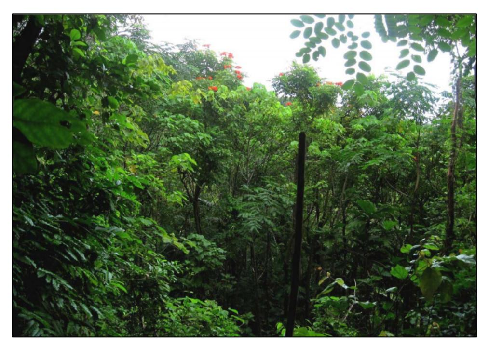

**Figure 54.** Invasive species example. Reproduced from American Samoa Community College 2010. Original caption is: "Red-flowered African tulip trees are invading forested areas in western Tutuila. Photo by Simon Stowers.".

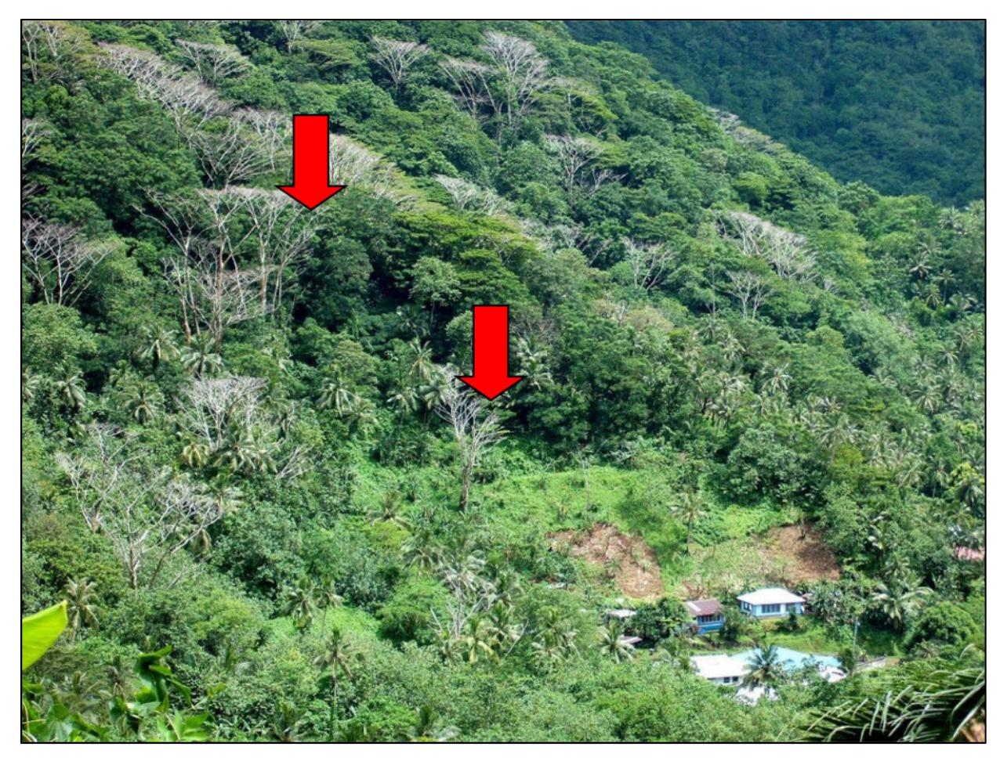

**Figure 55.** Invasive species example. Reproduced from American Samoa Community College 2010. Original caption is: "Invasive Falcataria moluccana trees killed by girdling. Photo by Fuiava Kitiona Fa'atamala".

*Climate change threats to invasive management*

Climate change and its effects on spreading invasives is largely unknown, but it is noted that cyclones can open up areas of the forest that can become prime habitat for invasives, hampering forest recovery (Emlqvist et al. 1994, Webb et al. 2006). Webb et al. (2006) established plots for the express purpose of measuring the effects of climate change.

## *4.5.3. Data and Methods*

Forest resources in American Samoa have been monitored intermittently in past years, but studies lack an overall focus on the "condition of the forest." Most sources do not focus on the NPSA, specifically; instead they examine the whole of American Samoa, or pacific tropical rainforest. A summary of data sources follows.

## Primary data sources

*American Samoa's Forest Resources, 2001*

This US Forest Service Forest Inventory and Analysis report (FIA) (Donnegan et al. 2004) provides a general overview of forest resources and trends for American Samoa using FIA data plots across the

island. FIA reports provide periodic inventory of forest cover and stocks and their trends. For this report, they are used as a baseline descriptor of rainforest types and forest coverage at NPSA

*Permanent forest plot data from the National Park of American Samoa*

This report from Whistler (1995) details both the invasive and primary tree species recorded over five 1000 m2 plots in the Tutuila unit and three in the Ta'u unit and provides location information with the intent of using the plots for successional trending. Initial plot results found 49 species. For the present analysis, this dataset provides baseline information and provides reference for the sites, should staff wish to revisit them.

*Diversity and structure of tropical rain forest of Tutuila, American Samoa: effects of site age and substrate*

This study established three large, permanent forest plots in NPSA (Webb and Fa'aumu 1999). The project marked, identified, and measured every tree >10 cm diameter at breast height in three 1.2 ha plots (12,000 m2 ) on Tutuila. For the present analysis, this dataset provides baseline species information and provides reference for the sites, should staff wish to revisit them.

*Effects of Tropical Cyclones Ofa and Val on the Structure of a Samoan Lowland Rain Forest* This longitudinal study (Elmqvist et al. 1994) examined the effects of two cyclones in American Samoa. It provided insights into post-cyclone effects and recovery. The study identifies species mortality rates and invasive species that can be expected post-cyclone. This study is used to provide insight into possible effects of climate change on NPSA, which are not well documented.

*Mapping Subsistence Agriculture in the National Park of American Samoa* This study (Graves 2004) mapped all subsistence agriculture in the park using GIS and provided recommendations for improving management of subsistence farming. There is no evidence that these recommendations were followed.

*Trip Report: Pilot Study of Factors Linking Watershed Function and Coastal Ecosystem Health in American Samoa*

This report (Atkinson and Medeiros 2006) focuses primarily on water quality, but has detailed information on the impacts of subsistence farming practices on water quality. For this analysis, the report details management concerns of subsistence farming.

## *4.5.4. Condition and Trend*

Three measures are important to overall rainforest condition and trend: species composition, distribution in NPSA; and invasive plant threat. Unfortunately, consistent, longitudinal data that focus on the NPSA rainforest resources is spotty. We summarize these indicators based on available data and assume that assessments made broadly on pacific rainforests would be applicable to rainforest at NPSA. This section summarizes the condition of these three measures:

## Data needs/gaps

The data used for this assessment were pieced together from multiple sources that were not focused on the rainforest *per se* and very little recent data were available. More recent, detailed data that treat the rainforest as an ecological unit are needed to assess its condition in a more organized fashion.

## Threats

Tor a detailed description of anthropogenic and natural threats, including invasive species, climate change and cyclones, please see section 2.2.3 of this report.

#### *Threats from subsistence forest uses*

Traditional subsistence uses are authorized through the park's enabling legislation (Public Law 100- 571). Under current park lease provisions, native American Samoans can continue to carry out subsistence activities with traditional tools and methods on currently active and managed lands leased to the Park However, clearing and cultivation are prohibited in primary and mature secondary forest. Subsistence agriculture typically includes maintaining small plots of land for the cultivation of traditional Polynesian crops such as bananas, taro, breadfruit and coconuts (Figure 56). In the NPSA 232 ac of land were classified as usuable for non-marine subsistence farming (Graves 2004) (Figure 57 and Figure 58).

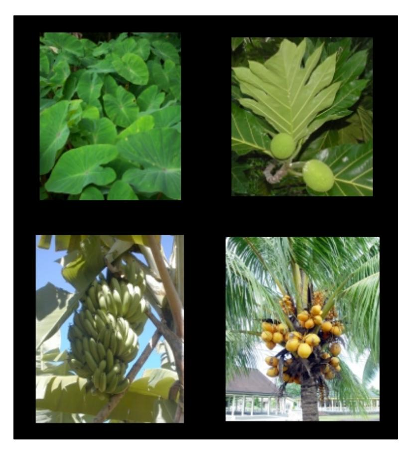

**Figure 56.** Samoan Crops: from upper left, taro, breadfruit, bananas, coconuts. Reproduced from Graves 2004.

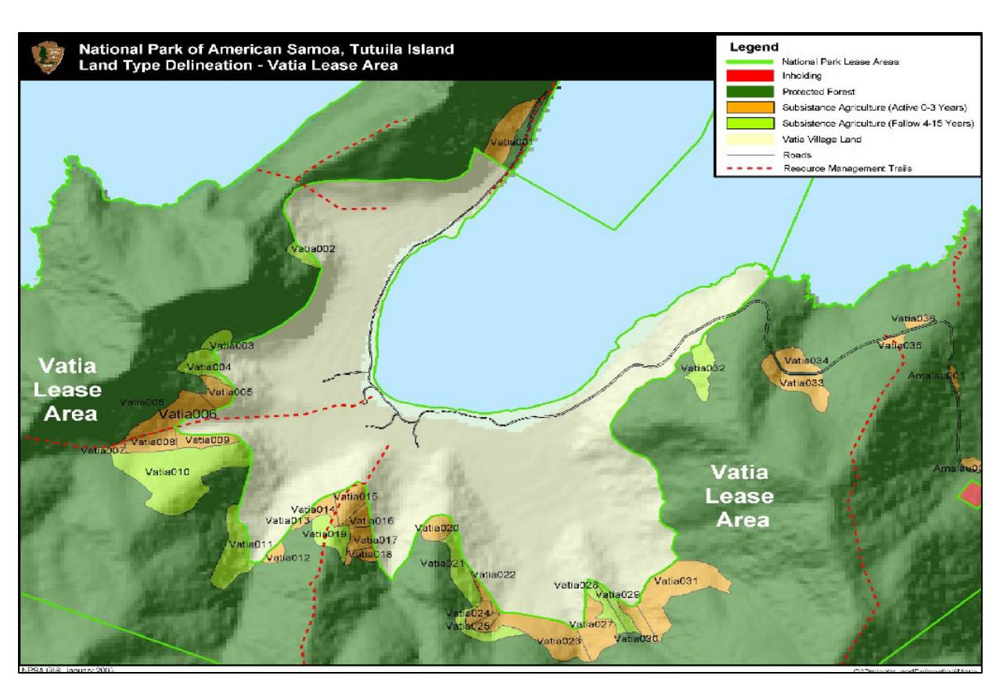

**Figure 57.** Subsistence farming delineation. Reproduced from Graves 2004.

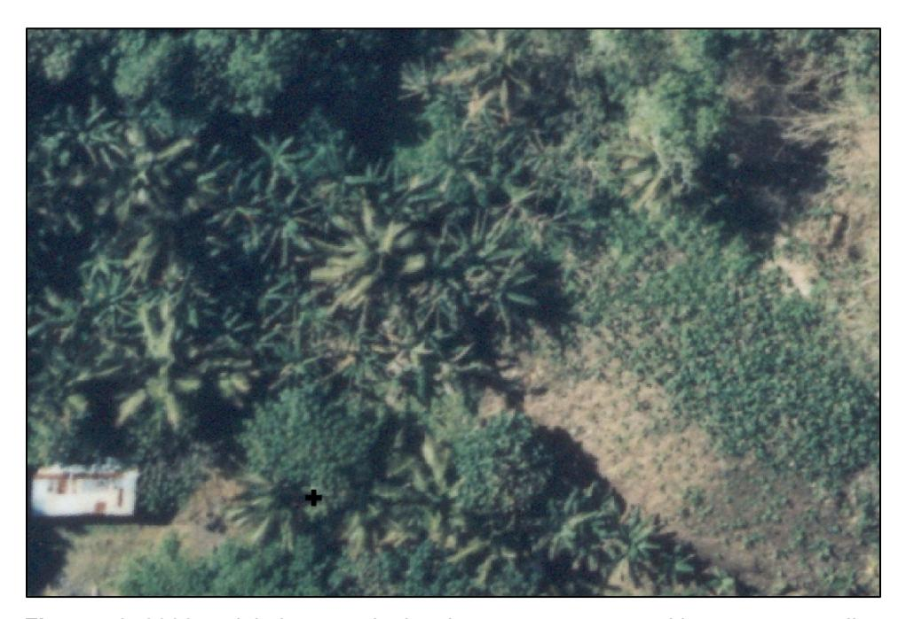

**Figure 58.** 2002 aerial photograph showing coconut trees and banana trees adjacent to a freshly planted taro field, Ofu Island. Reproduced from Graves 2004.

#### *Subsistence farming threats*

Non-authorized encroachment of subsistence farming is generally low (P. Craig, pers. com. 2016). The USGS and USDA NRCS identify poor subsistence farming practices as a threat to water quality and a cause of increased risk of landslides, although this applies primarily to regions on Tutuila outside the park. The NRCS makes available detailed maps of landslide hazards and notes that (in 2006) there was "no well-planned crop rotation strategy, especially for steep slopes — farmers plant whenever they feel like it" (Atkinson and Medeiros 2006). Agricultural plots are commonly located on steep slopes immediately behind village residences (Figure 59).

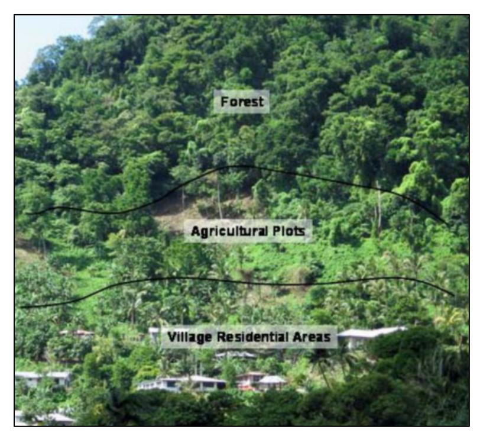

**Figure 59.** Typical land use practices in American Samoa. Reproduced from Atkinson and Medeiros 2006.

Many of the steep slope areas found within the park (shown in Figure 60) may overlap with agricultural areas identified by Graves 2004.

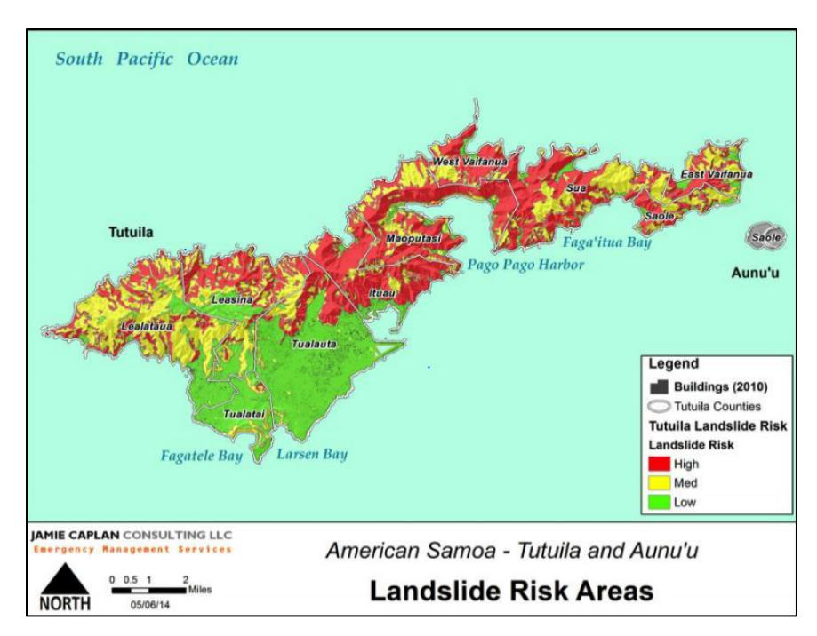

**Figure 60.** Tutulia and Aunu'u landslide risk map. American Samoa Department of Commerce 2015.

## Overall Condition

### *Species composition*

The rainforest in NPSA is relatively diverse, generally with full canopy closure, and 30% endemic (flowering plants). The forest is protected by steep island topography. The rainforest condition represents expected regional diversity, but contains some invasive species that are and will continue to be an issue. This measure was assigned a Significance Level of 3 (High) and a Condition Level of 0 (Not a current concern).

## *Distribution in NPSA*

Forest cover is found throughout Ta'u and Tutuila Islands. Despite historical loss of lowland rainforests on Tutuila Island to agriculture, rainforest continues to be the dominant habitat in NPSA's Ta'u and Tutuila Units. This measure was assigned a Significance Level of 3 (High) and a Condition Level of 0 (Not a current concern).

#### *Invasive plant threat*

NPSA's Ta'u Unit has few invasive plant species. The Tutuila Unit of the park is more threatened. NPSA's long-term commitment to invasive control efforts in the Tutuila Unit has been effective, but will need to continue in perpetuity to continue to be effective. This measure was assigned a Significance Level of 3 (High) and a Condition Level of 2 (Moderate).

#### *Weighted condition score*

The weighted condition score is 0.22, indicating that rainforest in American Samoa is in generally good condition (Table 25). Whether the condition of forests in the park is changing is unknown; however, park lands are protected from the primary negative impacts of commercial logging and

current conversion of old growth to agriculture, so as far as is known, at present the forests are free of immediate threats. Potential future impacts include cyclones, disease, invasive insects and climate change.

**Table 25.** Significance levels and condition levels used to calculate the weighted condition score (WCS) for NPSA's rainforest.

| Measures              | Significance Level | Condition Level | WCS = 0.22                                                                                                           |
|-----------------------|--------------------|-----------------|----------------------------------------------------------------------------------------------------------------------|
| Species composition   | 3                  | 0               |                                                                                                                      |
| Distribution in NPSA  | 3                  | 0               |                                                                                                                      |
| Invasive plant threat | 3                  | 2               | Resource is in good condition; trend in condition is unknown or not applicable; low confidence in the assessment. |

## *4.5.5. Literature Cited*

American Samoa Community College. 2010. American Samoa forest assessment and resource strategy, 2011-2015. Pago Pago, American Samoa: American Samoa Community College. Retrieved from WWW April 4, 2016

[http://www.wflccenter.org/islandforestry/americansamoa.pdf.](http://www.wflccenter.org/islandforestry/americansamoa.pdf)

American Samoa Department of Commerce 2015. Multi-Hazard Mitigation Plan for American Samoa; Chapter IV: Risk Assessment and Vulnerability Assessment [http://doc.as.gov/wp](http://doc.as.gov/wp-content/uploads/2015/05/CHAPTER-041.pdf)[content/uploads/2015/05/CHAPTER-041.pdf.](http://doc.as.gov/wp-content/uploads/2015/05/CHAPTER-041.pdf)

Amerson, A., W.A. Whistler, T.D. Schwaner Environmental Consultants. 1982. Wildlife and Wildllife Habitat of American Samoa. II. Accounts of Flora and Fauna. USDI Fish and Wildlife Service. Washington DC. 150 p.

Atkinson, C.T., Medeiros, A.C. 2006 Trip report: Pilot study of factors linking watershed function and coastal ecosystem health in American Samoa: U.S. Geological Survey Open File Report 2006-1383, 31 p.

Blondet, M. 2010. National Park of American Samoa, Polynesia: A case study of virtualizing environmentalism and development. Reconsidering Development Vol 1, Issue 1: 1-16.

Donnegan, J.A., Mann, S.S., Butler, S.L., Hiserote, B.A. 2004. American Samoa's forest resources, 2001. Resour. Bull. PNW-RB-244. Portland, OR: U.S. Department of Agriculture, Forest Service, Pacific Northwest Research Station. 32 p.

Elmqvist, T., Rainey, W.E., Pierson, E.D; Cox, P.A. 1994. Effects of tropical cyclones on Ofa and Val on the structure of a Samoan lowland rain forest. Biotropica, 26 (4): pp. 384–391.

Graves, A. 2004. Mapping subsistence agriculture in the National Park of American Samoa. In: Mapping the future of America's National Parks: stewardship through geographic information systems. NPS. Retrieved from WWW, April 1, 2016. [https://www.nps.gov/gis/mapbook/tech/30.html.](https://www.nps.gov/gis/mapbook/tech/30.html)

- Hart, R. 2006. Appendix A: National Park of American Samoa resource overview. In: HaySmith, L., F. L. Klasner, S. H. Stephens, and G. H. Dicus. Pacific Island Network vital signs monitoring plan. Natural Resource Report NPS/PACN/NRR—2006/003 National Park Service, Fort Collins, Colorado.
- Monello, R. 2004. Terrestrial resource report National Park of American Samoa. University of Hawaii. Retrieved from WWW April 4, 2016 [http://www.botany.hawaii.edu/basch/uhnpscesu/pdfs/sam/Monello2004AS.pdf.](http://www.botany.hawaii.edu/basch/uhnpscesu/pdfs/sam/Monello2004AS.pdf)
- Mueller-Dombois, D., Fosberg, F.R. 1998. Vegetation of the tropical Pacific Islands. New York: Springer-Verlag. 733 p.
- United Nations Food and Agriculture Organization. 2000. American Samoa, Resources. In FAO Workshop: Data Collection for the Pacific Region. Retrieved from WWW, April 1, 2016. [http://www.fao.org/docrep/006/ad672e/ad672e06.htm.](http://www.fao.org/docrep/006/ad672e/ad672e06.htm)
- Stein, S.M., Carr, M.A., Liknes, G.C., Comas, S.J. 2014. Islands on the edge: housing development and other threats to America's Pacific and Caribbean Island forests: a Forests on the Edge report. Gen. Tech. Rep. NRS-137. Newtown Square, PA: U.S. Department of Agriculture, Forest Service, Northern Research Station. 55 p.
- Webb, E.L., Fa'aumu, S. 1999. Diversity and structure of tropical rain forest of Tutulia, American Samoa: effects of site age and substrate. Plant Ecology, Vol 144, pp. 257–274.
- Webb E.L., van de Bult M., Chutipong W. Kabir Md.E. 2006. Composition and structure of lowland rain-forest tree communities on Ta'u, American Samoa. Pac Sci 60: 333–354.
- Whistler, W.A. 1976. Wetlands of American Samoa. U.S. Army Corps of Engineers. Honolulu, Hawaii. 74 p.
- Whistler, W.A. 1980. The Vegetation of Eastern Samoa. Allertonia. Vol 2, No. 2. 190 p.
- Whistler, W.A. 1994. Botanical Inventory of the Proposed Tutuila and Ofu Units of the National Park of American Samoa. Technical Report 87. Department of Botany, University of Hawai'a at Manoa. Honolulu, Hawaii. 142 p.
- Whistler, W.A. 1992. Botanical inventory of the proposed Ta'u unit of the National Park of American Samoa. Cooperative National Park Resources Studies Unit. Technical Report 83. University of Hawaii at Manoa, Honolulu, Hawaii, USA.
- Whistler, W. A. 1995. Permanent forest plot data from the National Park of American Samoa. Cooperative National Park Resources Studies Unit. Technical Report 98. University of Hawaii at Manoa, Honolulu, Hawaii, USA.
- Whistler, W.A. 2002. The Samoan Rainforest. A Guide to the Vegetation of the Samoan Archipelago. Isle Botanica. Honolulu, Hawaii. 168 p.

- Whistler, W.A. 2004. Rainforest Trees of Samoa. Isle Botanica. Honolulu, Hawaii. 210 p.
- Whistler, W.A. 2005. Plants of concern in American Samoa. U.S. Fish and Wildlife Service, Honolulu. 127 p.
- Whistler, W. A. 2009. Vegetation Classification Support for the National Park of American Samoa (NPSA) in American Samoa. University of Hawaii, Manoa. 22 p.

## **4.6. Cloud Forest**

## *4.6.1. Description*

The cloud forest is a continually wet ecosystem with high humidity known for the ubiquitous presence of clouds. The cloud forest in NPSA is limited to the higher elevations of Ta'u (Donnegan et al. 2004). It consists of forests with elevation above 450 m (Whistler 1992). This area would cover the ecological zones of montane rainforest and cloud forest as classified by the United Nations Food and Agriculture Organization (Figure 61; FAO; United Nations Food and Agriculture Organization 2000; 94).

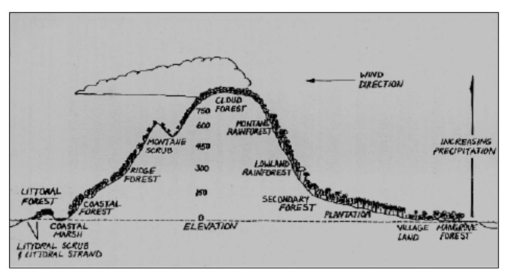

**Figure 61.** Schematic drawing of traditional ecological land zones in American Samoa (United Nations Food and Agriculture Organization 2000).

While not well-studied due to its remoteness, the cloud forest on Ta'u is different than cloud forests on other islands because it is dominated by what may be called a "summit scrub" community (Whistler 1993). The area does have unique plant species, but none that are listed as threatened or endangered. Primary management concerns are spread and control of invasive species and the maintenance of habitat for native birds.

## *4.6.2. Reference Condition*

The vegetation of Samoa remained largely unstudied until Whistler began his career investigating the wetlands of America Samoa (Whistler 1976). Following this came the wildlife and wildlife habitat (Amerson et al. 1982), the proposed protected areas (Whistler 1995) and then all of the vegetation of the Samoa islands (Whistler 1980, 2002, 2004, and 2009). Therefore, the optimal reference condition would be a resource similar to that which Whistler first described.

## *4.6.3. Data and Methods*

Forest resources in American Samoa have been monitored intermittently in past years, but reports lack an overall focus on the "condition of the forest." Few studies have been done of the cloud forest, but the studies that do focus on plant inventories are detailed in that regard. A summary of data sources follows.

## Primary data sources

*Botanical Inventory of the Proposed Ta'u unit of the National Park of American Samoa* This report (Whistler 1992) provides the most detailed documentation of the condition of the cloud forest and vegetation found there. The report is used for baseline condition information in the present study.

*General Management Plan/Environmental Impact Statement – National Park of American Samoa* The General Management Plan (National Park Service 1997) provides information on bird populations native to the cloud forest in NPSA.

*Simulating the effects of climate change on tropical montane cloud forests* While not specific to American Samoa, this simulation study by Still et al. (1999) provides insight into the possible effects of climate change on cloud forests. This information is used to provide a list of probable effects of climate change on cloud forests that could be relevant to the NRSA.

## *4.6.4. Condition and Trend*

Lack of data make it difficult to assess the overall condition and trend of the cloud forest. We summarize the available information for reference. The most important measures for the condition and trend are forest coverage and vegetation, habitat suitability for native birds, and climate change. This section summarizes the condition of these three measures and provides an overview on threats to the cloud forest.

## General Forest Description

Found on Ta'u at elevations above 450 m (Whistler 1992), the cloud forest is "generally blanketed by clouds and mist, enabling a thick layer of mosses and epiphytes to grow on most surfaces (Donnegan et al. 2004). This forest is considered relatively undisturbed (Amerson 1982, Hart 2006) compared to other forest types in American Samoa There is no dry season in the cloud forest and there is typically more than 4000 mm of rainfall. Clouds form every day and everything is constantly wet. The summit of the cloud forest is subject to ongoing tradewinds and exposed to weather events such as cyclones. This keeps the summit in a state of disturbance with wind, heavy rainfall, and soggy soil, which discourages tree growth and allows understory species to dominate (Whistler 1992).

## Forest Coverage and vegetation

*Forest Cover*

Total forest cover for American Samoa in 2001 was estimated to be 43,631 ac (90.1% of total land area; Donnegan et al. 2004). The total number of forested acres between 1985 and 2001 trended downward by approximately 3% (Table 26).

**Table 26.** Estimated land area by status, 1985 and 2001. Reproduced from Donnegan et al. 2004.

|                                                                               |        | 1985 acres         |                          |        | 2001 acres |                    |                          |        |
|-------------------------------------------------------------------------------|--------|--------------------|--------------------------|--------|------------|--------------------|--------------------------|--------|
| Land Status                                                                   | Ta'u   | Ofu and Olosega | Tutuila and Aunu'u | Total  | Ta'u       | Ofu and Olosega | Tutuila and Aunu'u | Total  |
| Accessible forest land                                                     | –      | –                  | –                        | –      | –          | –                  | –                        | –      |
| Unreserved forest land                                                     | 10,837 | 2,978              | 30,976                   | 44,791 | 7,108      | 1,450              | 27,368                   | 35,928 |
| Protected forest land (National Park Service lease and reserves)A | –      | –                  | –                        | –      | 3,711      | 1,509              | 2,362                    | 7,581  |
| MangroveB                                                                     | –      | –                  | 148                      | 248    | –          | –                  | 122                      | 122    |
| All accessible forest land                                                 | 10,837 | 2,978              | 31,124                   | 44,939 | 10,819     | 2,959              | 29,852                   | 43,631 |
| Non-forest and other areas                                                 | –      | –                  | –                        | –      | –          | –                  | –                        | –      |
| Non-forest urban                                                           | 116    | 33                 | 2,252                    | 2,401  | 125        | 36                 | 3,368                    | 3,530  |
| Non-forest vegetation                                                      | 233    | 95                 | 776                      | 1,104  | 156        | 47                 | 511                      | 715    |
| Barren lands                                                                  | –      | –                  | 14                       | 14     | 131        | 74                 | 343                      | 548    |
| Water                                                                         | –      | –                  | 64                       | 64     | –          | –                  | 10                       | 10     |
| All non-forest and other                                                   | 349    | 128                | 3,106                    | 3,583  | 412        | 157                | 4,232                    | 4,803  |
| Total area (acres)                                                         | 11,186 | 3,106              | 34,230                   | 48,522 | 11,231     | 2,116              | 34,084                   | 48.434 |
| Non-sampled area                                                           | –      | –                  | –                        | –      | –          | –                  | –                        | –      |
| Access denied                                                                 | –      | –                  | –                        | –      | –          | –                  | –                        | –      |
| Hazardous conditions                                                       | –      | –                  | –                        | –      | 3,017      | –                  | 1,207                    | 4,224  |

A Estimates of protected forest land acreage are from Graves 2003.

In 2014, the US Forest Service estimated that total forest cover had decreased to approximately 24,000 ac (Stein et al. 2014). If accurate, this would constitute a loss of 45% of total forest cover in just 13 years.

## *Forest Stocks*

Tree volume was estimated in 2001 to be approximately 1,530 cubic feet per acre (Donnegan et al. 2004). Total biomass of all trees over 5.0 in in diameter was estimated to be 1.1 billion tons.

B Unpublished data from global positioning system survey by American Samoa Forestry Division and American Samoa Community College.

Seventeen percent of trees inventoried in 2001 had some form of damage from weather or insects. The following description (and dominant species) of the montane rainforest and cloud forest are taken from Donnegan et al. 2004:

#### *Montane Rainforest:*

Montane rain forest is high elevation, often steeply sloped forest (>1,640 ft) characterized by heavy precipitation. The dominant canopy species is the native *Dysoxylum huntii* Merr. ex Setchell. No community types are differentiated by Whistler (1992) for this category. The higher elevation forests tend to be less impacted by severe weather. The steep slopes inhibit cultivation.

#### *Cloud forest and scrub*

Limited to the highest elevations on Ta'u and Olosega in American Samoa, this forest type is cooler and wetter than montane rain forest and dominated by tree ferns, given sufficient recovery time following hurricanes. No community types are defined by Whistler (1992). The endemic *Reynoldsia plesosperma* A. Gray is the dominant tree form in these forests. Cloud forest is generally blanketed by clouds and mist, which enables a thick layer of mosses and epiphytes to grow on most surfaces.

A sample of the trees on a plot in the montane forest and their relative dominance was collected by Whistler in 1980. The results of this sample are shown in Table 27.

**Table 27.** Relative dominance of tree species in cloud forest. Reproduced from Whistler 1980.

| Species                   | Number of trees | Relative dominance (%) |
|---------------------------|-----------------|------------------------|
| Cyathea spp.              | 29              | 31                     |
| Syzygium samoense         | 23              | 28                     |
| Weinmannia affinis        | 5               | 16                     |
| Dyxoxylum huntii          | 4               | 6                      |
| Ascarina diffusa          | 9               | 5                      |
| Streblus anthropophagorum | 9               | 4                      |
| Astronidium pickeringii   | 10              | 3                      |
| Acronychia hererophylla   | 1               | 3                      |
| Fagraea berteroana        | 1               | 1                      |
| Reynoldsia lanutoensis    | 2               | 1                      |
| Sarcopygm pacifica        | 5               | 1                      |
| Ficus godeffroyi          | 2               | 1                      |
| Meryta macrophylla        | 1               | <1                     |

The ground cover and shrubs in the cloud forest on Ta'u are very dense and diverse (Table 28). The trees and shrubs collected by Whistler (1992) are listed in the table below. Whistler (1993) estimates that there are nearly 230 native species of ferns and nearly 100 native species of orchids in Samoa (most of which are restricted to the cloud forest). There are also 34 species of mosses and filmy ferns in Samoa; half of which occur only above 400 m (Whistler 1993).

**Table 28.** Trees and shrubs of secondary scrub forest. Reproduced from Whistler 1992.

| Species type                                   | Family         | Species name              | Status* | Samoan name |
|------------------------------------------------|----------------|---------------------------|---------|-------------|
|                                                | Rhamnaceae     | Alphitonia zizyphoides    | n       | toi         |
| Mature secondary                               | Euphorbiaceae  | Bischofia javanica        | n?      | 'o'a`       |
| forest canopy species                          | Sapindaceae    | Elattostachys falcate     | n       | tapumatau   |
|                                                | Anacardiaceae  | Rhus taitensis            | n       | tavai       |
|                                                | Meliaxeae      | Dysoxylum Samoense        | n       | Maota       |
| Secondary and primary forest canopy species | Rubiaceae      | Neonauclea forsteri       | n       | afa         |
|                                                | Sapindaceae    | Pometia pinnata           | n       | tava        |
|                                                | Fabaceae       | Adenanthera pavonina      | m       | lopa        |
|                                                | Annonaceae     | Cananga odorata           | p       | moso'oi     |
|                                                | Cyatheaceae    | Cyathea spp.              | n       | olioli      |
| Mature secondary                               | Flacourtiaceae | Flacourtia rukam          | n       | filimoto    |
| forest sub canopy trees                        | Euphorbiaceae  | Glochidion ramiflorum     | n       | masame      |
|                                                | Malvaceae      | Hibiscus tiliaceus        | n       | fau         |
|                                                | Sterculiaceae  | Kleinhovia hospita        | n       | fu'afu'a    |
|                                                | Euphorbiaceae  | Macaranga stipulosa       | n       | lau fatu    |
|                                                | Malastomaceae  | Clidemia hirta            | m       | –           |
|                                                | Fabaceae       | Leucaena leucocephala     | m       | fua pepe    |
|                                                | Euphorbiaceae  | Macaranga harveyana       | n       | lau pata    |
|                                                | Urticaceae     | Maoutia australis         | n       | –           |
|                                                | Melastomaceae  | Melastoma denticulatum | n       | fua lole    |
| Shrubs and small trees                         | Sterculiaceae  | Melochia aristata         | n       | ma'o        |
| of secondary scrub                             | Rubiaceae      | Morinda citrifolia        | p       | nonu        |
|                                                | Rubiaceae      | Musseanda raiateensis     | n       | aloalo vao  |
|                                                | Euphorbiaceae  | Omalanthus nutans         | n       | fogamamala  |
|                                                | Urticaceae     | Pipturus argenteus        | n       | soga        |
|                                                | Myrtaceae      | Psidium guajava           | m       | kuava       |
|                                                | Ulmaceae       | Trema cannabina           | n       | magele      |

\* n = native; p = Polynesian introduction; m = modern introduction.

For a more complete list of plants in the cloud forest, including plant descriptions and sample locations, see Whistler (1986).

Whistler (2003) fills a gap in knowledge about plants in the whole of American Samoa. The paper lists 109 "plants of concern" and 24 plants that he believes should begin the listing process to become considered as threatened or endangered. The entire list of plants of concern, their description, and their last known locations was included in Appendix A of Whistler 2003.

## Habitat maintenance

The inaccessible cloud forests are a habitat for native birds, including the Audubon Shearwater (*Puffinus I'herminieri*, and at least two petrels and other seabirds (National Park Service 1997). The General Management Plan notes that the cloud forest is some of the best bird habitat in all of American Samoa. The birding populations include: the Fiji Shrikebill (*Clytorhynchus vitiensis*), called segasegamau'u in Samoan, the largest colony of Black Noddies (*Anous minutus*) on the main islands of American Samoa, White Terns (*Gygis alba*), gogo sina in Samoan, Brown Noddies (A*nous stolidus*), White-tailed Tropicbirds (*Phaethon lepturus*), called tava'e, and Tahiti Petrels (*Pseudobulweria rostrata*), called ta'i'o. The Tahiti Petrels and Audubon Shearwaters nest along the upper cliff ridge of Lata Mountain. The park's management plan specifically limited plans for any recreational trail in the cloud forest to help with bird populations.

## Climate change

Cloud forests are unique for their high humidity and increased rainfall that, in turn, has allowed the evolution of unique vegetation and wildlife habitat. Cloud forests experience water deposition from clouds to such an extent that the water deposited from clouds can equal or exceed the water deposited by rainfall. The epiphytes that may be unique to cloud forests (damp mosses, etc.) store water and seasonally release moisture (Still et al. 1999).

Cloud formation in cloud forests appears to be a direct effect of relative humidity and temperature. Climate change simulations suggest that climate change may cause the elevation at which relative humidity is high enough to create cloud forest conditions to increase during dry seasons. Rising temperatures from climate change may also increase evapotranspiration, causing stress on plants in the cloud forest. If the cloud forests dry out, as models suggest they may, one might observe a reduction in the populations of endemic species, intrusion of native and alien species to the cloud forest, and decreased resiliency of local aquifers (Still et al. 1999).

## Data needs/gaps

The data used for this assessment were compiled from a variety of sources, though none of the referenced studies focused specifically on the cloud forest and very few recent data were available. Follow-up studies on the status of proposals to list species of concern and an overall assessment of the cloud forest would be a valuable contribution.

#### *Forest Coverage and Vegetation*

These measures provide a useful reference point for forest cover from 1985, 2001 and 2014. Declines in forest coverage of 3% and 45% across American Samoa are indicated by the data spanning these three decades. Evaluation of stocks in 2001 characterize lowland and high elevation forest communities for that year. Single instance and inconsistent data collections limit the strength and confidence in any trends derived from the reports cited above. Consistent evaluation of coverage and estimates of stock may be made from aerial image interpretation or review of historical satellite imagery. Forest coverage was assigned an overall Condition Level of 1 (Low) because the two measures examined provided a general indication of forest composition and presence on the park lands.

#### *Habitat maintenance*

This measure was assigned a Significance Level of 1 (Low) because while habitat conservation is of concern, there are no data to quantify habitat in the cloud forest portion of the park on Ta'u. In addition, recreation and other pressures are non-existent on this portion of the park due to the high level of effort required to access Ta'u and the upslope portions of the park on that island.

#### *Climate change*

This measure was assigned a Significance Level of 3 (High) climate change is of concern to park managers and efforts to manage for it are challenging and external to the park manager's resources. It was assigned a current Condition Level of 1 (Low) but presents a threat to vegetation health, abundance and presence on American Samoa Park Lands. As climate change shifts weather and climatic patterns, sensitive resources will not have time to adapt, relocate or otherwise respond to perturbance.

## *Weighted condition score*

The weighted condition score is 0.33 (Table 29). The cloud forest in American Samoa appears to be in relatively good condition although data are limited.

**Table 29.** Significance levels and condition levels used to calculate the weighted condition score (WCS) for NPSA's cloud forest.

| Measures                   | Significance Level | Condition Level | WCS = 0.33                                                                                                           |
|----------------------------|--------------------|-----------------|----------------------------------------------------------------------------------------------------------------------|
| Forest Coverage and Stocks | 2                  | 1               |                                                                                                                      |
| Habitat Maintenance        | 1                  | ?               |                                                                                                                      |
| Climate Change             | 3                  | 1               | Resource is in good condition; trend in condition is unknown or not applicable; low confidence in the assessment. |

## *4.6.5. Literature Cited*

Amerson, A. Binion, W. Arthur Whistler, and Terry D. Schwaner. 1982. Wildlife and wildlife habitat of American Samoa. II. Accounts of flora and fauna. U.S. Fish & Wildlife Service, Washington, D.C., USA.

- Donnegan, J.A., Mann, S.S., Butler, S.L., Hiserote, B.A. 2004. American Samoa's forest resources, 2001. Resour. Bull. PNW-RB-244. Portland, OR: U.S. Department of Agriculture, Forest Service, Pacific Northwest Research Station. 32 p.
- Hart, R. 2006. Appendix A: National Park of American Samoa resource overview. In: HaySmith, L., F. L. Klasner, S. H. Stephens, and G. H. Dicus. Pacific Island Network vital signs monitoring plan. Natural Resource Report NPS/PACN/NRR—2006/003 National Park Service, Fort Collins, Colorado.
- Monello, R. 2004. Terrestrial resource report National Park of American Samoa. University of Hawaii. Retrieved from WWW April 4, 2016 [http://www.botany.hawaii.edu/basch/uhnpscesu/pdfs/sam/Monello2004AS.pdf.](http://www.botany.hawaii.edu/basch/uhnpscesu/pdfs/sam/Monello2004AS.pdf)

- National Park Service. 1997. General management plan / environmental impact statement: National Park of American Samoa. Washington, D.C., USA.
- Stein, S.M., Carr, M.A., Liknes, G.C., Comas, S.J. 2014. Islands on the edge: housing development and other threats to America's Pacific and Caribbean Island forests: a Forests on the Edge report. Gen. Tech. Rep. NRS-137. Newtown Square, PA: U.S. Department of Agriculture, Forest Service, Northern Research Station. 55 p.
- Still, C. J., Foster, P.N., Schneider, S. 1999. Simulating the effects of climate change on tropical montane cloud forests. Nature 398:608–610.
- United Nations Food and Agriculture Organization. 2000. American Samoa, Resources. In FAO Workshop: Data Collection for the Pacific Region. Retrieved from WWW, April 1, 2016. [http://www.fao.org/docrep/006/ad672e/ad672e06.htm.](http://www.fao.org/docrep/006/ad672e/ad672e06.htm)
- Whistler, W.A. 1976. Wetlands of American Samoa. U.S. Army Corps of Engineers. Honolulu, Hawaii. 74 p.
- Whistler, W.A. 1980. The Vegetation of Eastern Samoa. In: Allertonia: A series of occasional papers. Lawai, Kauai, Hawaii. USA.
- Whistler, W.A. 1986. A revision of *Psychotria* (Rubiaceae) in Samoa. Journal of the Arnold Arboretum 67: 341-370. President and Fellows of Harvard College. Boston.
- Whistler, W.A. 1992. Botanical inventory of the proposed Tau unit of the National Park of American Samoa. Cooperative National Park Resources Studies Unit. Technical Report 83. University of Hawaii at Manoa, Honolulu, Hawaii, USA.
- Whistler, W.A. 1993. The cloud forest of Samoa. In: Hamilton, L.S. et al. (eds). 1993. Tropical montane cloud forests. East West Center Program on Environment, Honolulu, Hawaii, USA.
- Whistler, W. A. 1994. Permanent forest plot data from the National Park of American Samoa. Cooperative National Park Resources Studies Unit. Technical Report 98. University of Hawaii at Manoa, Honolulu, Hawaii, USA.
- Whistler, W.A. 2002. The Samoan Rainforest. A Guide to the Vegetation of the Samoan Archipelago. Isle Botanica. Honolulu, Hawaii. 168 p.
- Whistler, W. A. 2003. Plants of Concern in American Samoa. US Fish and Wildlife Service. Honolulu, Hawaii.
- Whistler, W.A. 2004. Rainforest Trees of Samoa. Isle Botanica. Honolulu, Hawaii. 210 p.
- Whistler, W.A. 2005. Plants of concern in American Samoa. U.S. Fish and Wildlife Service, Honolulu. 127 p.

Whistler, W. A. 2009. Vegetation Classification Support for the National Park of American Samoa (NPSA) in American Samoa. University of Hawaii, Manoa. 22 p.

## **4.7. Fruit Bats**

## *4.7.1. Description*

Large fruit bats, also known as flying foxes, are a distinctive component of the wildlife fauna in American Samoa (Figure 62 and Figure 63). With wingspans of over a meter, these bats may soar over the rainforest during the daytime or roost in colonies that contain up to several thousand individuals. Two species occur on the main islands of the Samoan Archipelago: the solitary Samoan fruit bat (*Pteropus samoensis*) which is endemic to the Samoan and Fijian archipelagos, and the colonial white-naped fruit bat (*Pteropus tonganus*) which is widely distributed across western Oceania. Both species occur in NPSA's Rainforest Zone for the most part, but they also extend into the Coastal Strand and Cloud Forest Zones.

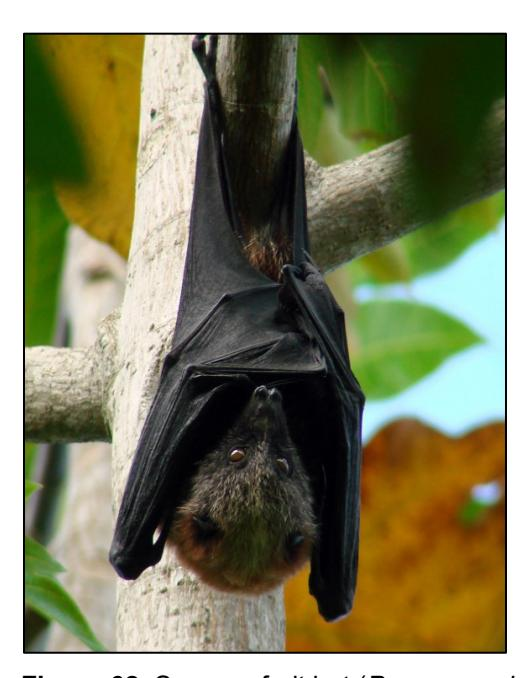

**Figure 62.** Samoan fruit bat (*P. samoensis*) roosting in a tree. Photo: T. Togia.

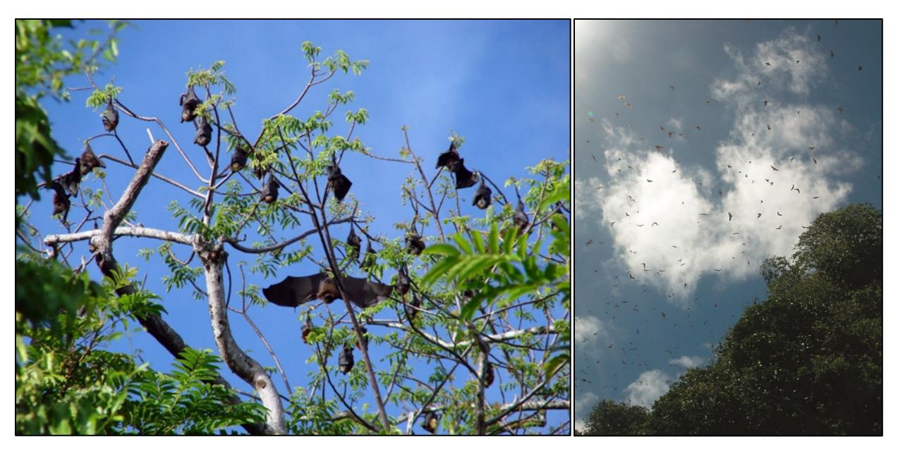

**Figure 63.** Samoan fruit bats roosting in trees in Vatia (left), and white-naped fruit bats flying above their roost in Fagatele Bay (right). Photo credits: Tavita Togia (left), Eric Treml (right).

As is often the case in remote tropical islands, bats are the only indigenous terrestrial mammals that inhabit American Samoa. Fruit bats are a keystone species in the maintenance of tropical forest ecosystems through pollination and seed dispersal (Cox et al. 1992, Fujita and Tuttle 1991, Elmqvist et al. 1992). They forage on fruits, flowers and leaves in or near native forests; they also forage in agricultural plantations, although *P. tonganus* does so more than *P. samoensis* (Brooke 2001, Nelson 2003). Their life span in the wild is unknown but individuals in captivity have lived 20 years; females give birth to one pup each year (Brooke 1998, Utzurrum et al. 2006, NRCS 2009).

Fruit bats are culturally important as a traditional food item, and they occur in Samoan legends and have been symbolized in native art (Sinavaiana and Enright 1992). The bats have been subjected to commercial and subsistence hunting, but hunting was banned in 1992 after bat populations were decimated by cyclones and hunting (Craig et al. 1994a, Pierson et al. 1996). Due to decreased abundance, the Samoan fruit bat is listed as a Species of Concern in the US Endangered Species List (USFWS 1998) and as near-threatened on the IUCN Red List (IUCN 2016). In part, because of this status NPSA was established to "maintain the habitat of flying foxes" (Public Law 100-571).

#### *4.7.2. Data and Methods*

Fruit bats have received relatively more attention than other wildlife species in American Samoa. About 70 publications and reports are available, many by the Department of Marine and Wildlife Resources and their associates. Most of these articles are available in NPSA's Digital Library [\(www.nps.gov/npsa/learn/nature/digitallibr.htm\)](http://www.nps.gov/npsa/learn/nature/digitallibr.htm).

## Primary data sources

*Department of Marine and Wildlife Resources (DMWR)*

Fruit bats have been a focal species for DMWR for nearly 30 years. The department has produced numerous publications and reports about their natural history and population trends, most of which are based on studies conducted on Tutuila Island in the 1990s. DMWR's general monitoring methodology has been first, to determine the abundance of colonial white-naped fruit bats by counting their numbers at daytime roosts, either through estimates of colony size (typically made from a boat circumnavigating the island) or through counts of bats emerging from roosts at dusk (exit counts), and next, to monitor an index of abundance for solitary Samoan fruit bats by counting bats actively foraging by day at selected sites, one of which is in NPSA in Amalau Valley. Periodic changes in monitoring methodologies have occurred over the years (Utzurrum et al. 2003). Monitoring fruit bats in Manu'a has been limited. Primary sources of information for this condition assessment include DMWR's most recent reports (Brooke 1998, 2001, Utzurrum et al. 2001, 2003, 2006, Turnbull et al. 2013, Russell et al. 2016).

#### *Other research*

Examples of other research include estimates of abundance (Amerson et al. 1982, Wilson and Engbring 1992), feeding ecology (Cox et al. 1992, Elmqvist et al. 1992, Banack 1996, Nelson et al. 2000a and 2000b, Nelson 2003), pollination and seed dispersal ecology (Cox et al. 1991, Rainey et al. 1995), and patterns of activity and behavior (Cox 1983, Banack 1998, Thomson et al. 1998).

*National Park of American Samoa (NPSA)*

Fruit bat studies have not yet been initiated by NPSA, but a draft NPS I&M protocol to monitor fruit bats in NPSA's Tutuila Unit was prepared by HaySmith et al. (2009).

#### *4.7.3. Reference Condition*

Fruit bats in the park are not monitored by NPSA, and information about them is limited. Consequently, a park-based reference condition is not available. This report examined available information about fruit bats in American Samoa to provide a general assessment of this resource. The three measures examined were distribution, abundance, and habitat, primarily on Tutuila Island where most studies have been conducted.

A key reference point would be the population levels reached prior to the devastation caused by back-to-back cyclones in 1990 (Cyclone Ofa) and 1991 (Cyclone Val), but pre-cyclone information for this purpose is unclear. For *Pteropus* populations on Tutuila, there were 75,000 bats in 1976 (both species combined but probably mostly *P. tonganus*; Amerson et al. 1982), 28,000 bats in 1987 (DMWR unpublished data, cited in Wilson and Engbring 1992), and 12,000 bats in 1989 (partial count, Wilson and Engbring 1992). Amerson's estimate is questionable due to unclear methodology (Wilson and Engbring 1992, Utzurrum 2003), and other estimates are unreliable for present purposes. For the species *P. samoensis*, pre-cyclone estimates of relative abundance are obscured by changes in counting methods and an undetermined relationship between the bat's activity index and total bat population. Another issue for both species is that available population estimates pertain to the whole of Tutuila Island; the proportion of fruit bats that inhabit NPSA itself is not known. Consequently, establishment of a reference point of abundance for either the park or the island is problematic.

## *4.7.4. Condition and Trend*

This section examines three condition measures (distribution, abundance, habitat) and includes a perspective on what constitutes the fruit bat populations on Tutuila Island and in NPSA based on bat movements and genetics.

## Distribution

Both species of fruit bats (*P. tonganus, P. samoensis*) occur on the main islands in American Samoa. They were common in NPSA's Tutuila and Ta'u Units and were occasionally seen in the Ofu Unit, which has limited terrestrial habitat (0.3 km2 of shoreline agroforest) for bat use. Within the Tutuila Unit, the colonial *P. tonganus* used multiple traditional and temporary roost sites during the daytime, many in coastal forests along the steep northern shoreline (Figure 64). The high annual variability in roost site locations shown in Figure 64 reflected temporary use of some roost sites but also variation in field effort and viewing conditions (not all areas were surveyed each year, and/or weather or sea conditions obscured visibility at some sites). A more recent survey of roost sites within NPSA in 2007-2008 is shown in Figure 65. At night, *P. tonganus* dispersed across the island to forage in both native forest and agricultural plantations (described below).

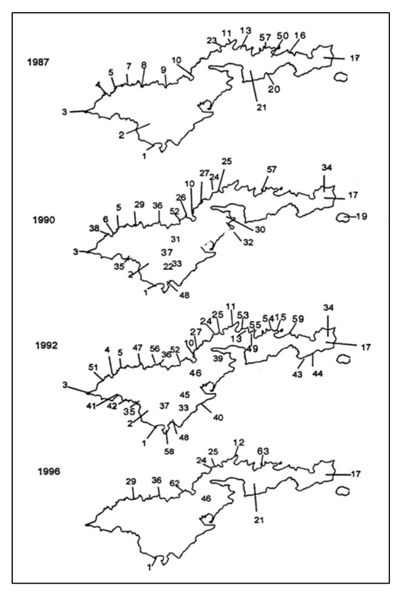

**Figure 64.** Traditional and temporary roost sites for white-naped fruit bats (*P. tonganus*) on Tutuila Island, 1987-1996. The high annual variability in roost sites reflects the temporary use of some roost sites but also differences in field effort and viewing conditions. Numbers refer to specific roost locations. Note that Tutuila is a small island measuring about 32 km long by 4 km wide (20 x 2.5 miles). Source: Brook et al. 2000.

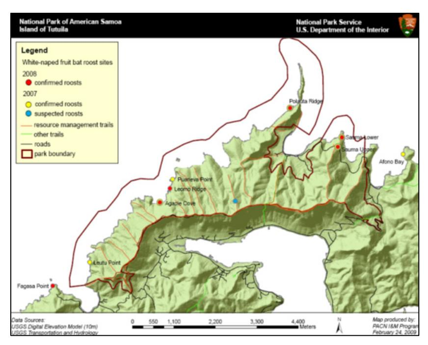

**Figure 65.** Locations of white-naped fruit bat colonies (*P. tonganus*) in NPSA's Unit, 2007-2008. Colony counts ranged from 29-1000 bats. Source: HaySmith et al. 2009.

The distribution of the solitary *P. samoensis* is less known because it roosted singly or in small groups rather than in large colonies. Amalau Valley in the Tutuila Unit consistently had higher numbers of *P. samoensis* than six other sites around the island that were regularly surveyed over the same time period (Brooke 2001, Utzurrum and Seamon 2001). In addition, ephemeral aggregations of about 20-50 *P. samoensis* were observed only in the vicinity of Amalau Valley; these aggregations were generally present for a month (but up to three months) but were not consistent from year to year (R. Utzurrum, unpub. data; A. Brook, A. Miles and R. Utzurrum, pers. com. 2016).

On Ta'u Island, information about both fruit bat species is limited. In NPSA, a small crater adjacent to Luatele Crater often supported up to 500-1000 *P. tonganus* (R. Utzurrum, pers. com.). Wilson and Engbring (1992) observed occasional fruit bats in the cloud forest on Mt. Lata, but they noted that the upper elevations of Ta'u appeared to provide only marginal habitat for fruit bats compared to the well-developed rainforests at lower elevations.

## Movements and Population Unit

Fruit bats are strong fliers capable of traveling long distances, and they can travel widely across Tutuila Island at night (Banack and Grant 2002). One radio-tagged juvenile *P. tonganus* displayed what appeared to be exploratory flights; it traveled around nearly the entire island in a single night (Figure 66), a round-trip distance of 47 km (29 mi) (Banack and Grant 1992). Figure 66 also puts these long distance flights into some perspective by showing the relatively small size of NPSA's Tutuila Unit. Average round-trip distances flown by other *P. tonganus* ranged 5-23 km per night. Nelson (2003) also recorded a one-way flight of 16 km on Tutuila Island by a *P. tonganus* during a single night.

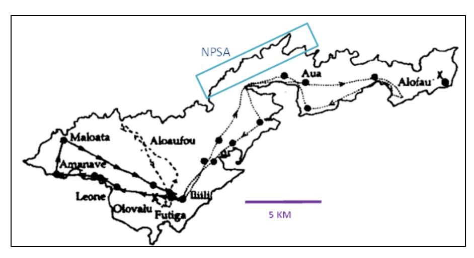

**Figure 66.** Three single-evening flights of one radio-collared *P. tonganus* on Tutuila Island. All flight lines are for the same individual on three separate nights and are round-trip flights from its roost site in Olovalu Crater, 1992-1994. Source: Banack and Grant 2002.

It is possible that the long-distance flights documented by Banack and Grant (2002) may be related to the time of their surveys (1992-1994) which occurred after destructive cyclones in 1990 and 1991 stripped trees of their leaves and fruit, which severely reduced food availability for bats (Nelson 2003, Turnbull et al. 2013). Studies conducted a decade later (2002-2003) when forests had recovered found generally smaller home ranges that averaged 282 ha (range 8-1848 ha) for 16 *P. tonganus* (Turnbull et al. 2013). At this time, seven bats roosted and foraged within a single valley over an average observation time of five months per bat (Figure 67b); six bats utilized a single valley with an occasional foray farther afield (Figure 67c); and three bats moved consistently between two areas (Figure 67d). Two of these illustrations show bats roosting in the park but foraging outside the park (Figure 67c and Figure 67d). Note that the home ranges of *P. tonganus* overlapped without territorial defense except at temporary feeding sites (Brook 2001, Turnbull et al. 2013).

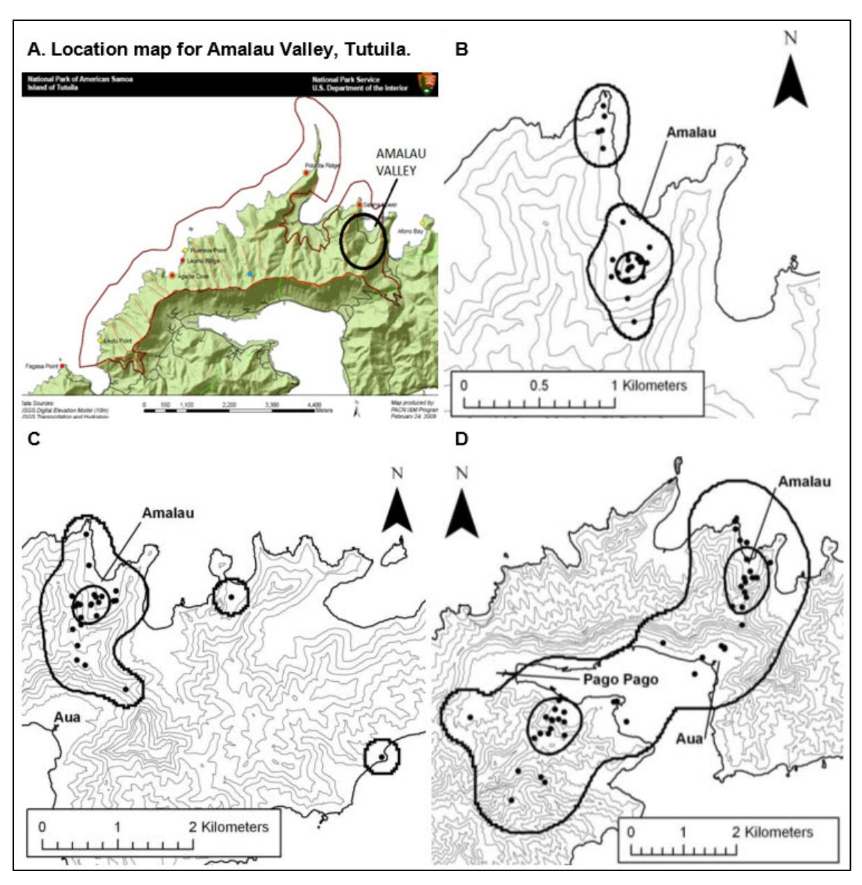

**Figure 67.** Home ranges of three radio-tagged P. tonganus that roosted in Amalau Valley, Tutuila, 2002- 2003: (A) location map of Amalau and NPSA boundary, (B) home range of a bat in Amalau, (C) home range of a bat in Amalau with occasional forays outside the park, and (D) home range of a bat using two core areas. Individual radio-locations of bats (dots), home ranges (irregular outer lines), and core ranges (inner circles) are shown. Source: Turnbull et al. 2013.

Coupling these extended foraging distances with the proximity of numerous roost sites used by *P. tonganus* (Figure 67), and the overlapping of home ranges without territorial defenses, it seems probable that there would be mixing of bats from different roosts, and some tagged bats did switch daytime roost sites during the period they were observed (Brooke 2001, Banack and Grant 2002). Banack and Grant (2002) suggested that the entire population of this species on the small island of Tutuila consists of a single breeding population. Data for *P. samoensis* were more limited. Brooke

(2001) radio-tagged two juvenile *P. samoensis* in NPSA's Tutuila Unit at Amalau and documented foraging areas of 180 and 820 ha over a period of several days and nights. The larger of these two ranges covers about half of the Tutuila Unit (Figure 68). Turnbull et al. (2013) documented smaller home ranges (4-56 ha, average 39 ha) for six *P. samoensis* on Tutuila, including in NPSA. As with *P. tonganus*, home ranges of *P. samoensis* overlapped but without territorial defense except at temporary feeding sites.

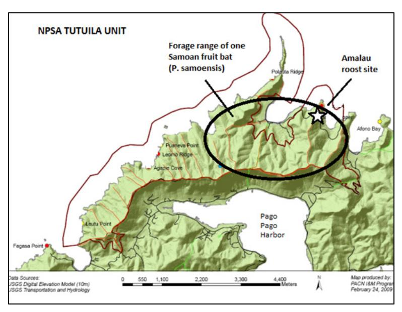

**Figure 68.** Foraging range of one radio-collared Samoan fruit bat (*P. samoensis*) during several days and nights in NPSA's Tutuila Unit, 1995. The outermost boundary of the bat's range (black oval line) and the location of its roost site in Amalau Valley (star) are indicated. Source: Redrawn from Brooke 2001.

Inter-island exchanges of fruit bats between the major islands of Upolu, Tutuila and the Manu'a Island group have not been reported and probably occur infrequently, so bat populations on these islands are considered to be separate management units. The degree of exchange of bats among the closely grouped Manu'a Islands (Ta'u, Ofu, Olosega) is not known but well within the flight capabilities of fruit bats. Genetic analyses indicated more exchange among islands in the Samoan Archipelago occurs by *P. tonganus* than by *P. samoensis* (Russell et al. 2016).

## Abundance

Natural fluctuations in fruit bat numbers in American Samoa occur due to cyclones that occasionally reduce bat populations through direct mortality or loss of habitat and food sources (Craig et al. 1994a, Pierson et al. 1996, Webb et al. 2014). Efforts to monitor bat numbers, primarily on Tutuila Island, have been underway for the past 30 years, but changes in counting methodologies complicate attempts to track longterm trends in bat abundance (Utzurrum et al. 2003). What seems clear, however, is that islandwide numbers of fruit bats were relatively high in the 1980s (Amerson et al. 1982, Wilson and Engbring 1992, DMWR unpublished data), and then numbers dropped in the early 1990s due to severe cyclone damage and hunting (Craig et al. 1994a, Pierson et al. 1996), followed by a gradual recovery through 2005 (Brooke 1998, Utzurrum et al. 2003). This can be seen in the

roost count estimates of *P. tonganus* during this period (Figure 69). After 2000, there was a hiatus in the reporting of population trends, but unpublished data indicated that *P. tonganus* continued its gradual increase to 7000-8000 bats by about 2005 (Utzurrum et al. 2003 and 2006). More recently, the island-wide population of *P. tonganus* was considered to be abundant in 2015 (A. Miles, DMWR, pers. com. 2015).

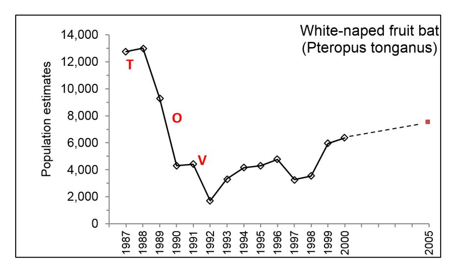

**Figure 69.** Population estimates of the white-naped fruit bat (*P. tonganus*) on Tutuila Island, 1987-2005. Cyclones Tusi (T), Ofa (O), and Val (V) are indicated. Sources: Utzurrum et al. 2003, and references therein; estimate for 2005 is from Utzurrum et al. 2006.

*P. samoensis* was less abundant than *P. tonganus*, but estimates of *P. samoensis* were more difficult to obtain due to its largely solitary nature (Utzurrum et al. 2006). Daytime visual counts of the species on Tutuila yielded 1,000 - 1,500 individuals (Craig et al. 1994, Brooke 1998, 2001, Utzurrum et al. 2003). DMWR's abundance index for *P. samoensis* at the Amalau site was variable intraannually but annually stable during the period 1995-1999 (Utzurrum and Seamon 2001). More recently, the island-wide population of *P. samoensis* was considered to be moderately abundant and stable in 2015 (A. Miles, DMWR, pers. com.).

Within NPSA itself, abundance and trends of fruit bats are not known but are presumably similar to islandwide trends mentioned above due to (a) intermixing of individual bats across Tutuila Island as previously discussed, and because (b) DMWR's standardized surveys incorporated some data collected within NPSA's Tutuila Unit. DMWR's surveys for *P. tonganus* included known roosts in the park (Figure 64), and surveys for *P. samoensis* included one park site (Amalau Valley).

Estimates of fruit bat numbers in the Manu'a Islands (Ta'u, Ofu, Olosega) were limited. Utzurrum et al. (2006) commented that DMWR surveys since 1995 showed that populations of both fruit bat species were considerably lower on Manu'a than on Tutuila. It is not known whether Manu'a bats were impacted by Cyclone Olaf, a Category-5 cyclone that hit Ta'u Island directly in 2005. Fruit bat habitat there was severely damaged at that time — Webb et al. (2014) reported that 57% of all trees in their Ta'u plots were snapped or uprooted.

## Fruit bat habitat

Prior to the 1950s, Tutuila Island had been largely forested (as Ta'u Island is now), but by 1984 about 50% of lowland forests had been cleared and replaced by agricultural plantations and human habitations, which resulted in habitat loss for wildlife (Brooke 1998, Utzurrum et al. 2006). This was largely driven by rapid human population growth and economic development. The human population jumped from about 13,000 in 1940 to 57,000 in 2000. These changes underscore the value of the remaining forested lands, significant parts of which are protected within NPSA. Further, due to the steepness of the island (approximately 40% of the land area is characterized by slopes of 30 degrees or greater), significant portions of the islands remain forested and are expected to remain so through the foreseeable future (Utzurrum et al. 2006).

Rainforest conditions are cyclical in nature due to periodic cyclone damage. Webb et al. (2011) concluded that "Tutuila forests, and perhaps other Polynesian cyclone-prone forests, may be best described as under a constant state of reorganization." Rainforest habitat for fruit bats in the park appeared to be in good condition in 2011 (Judge et al., 2013). Canopy and understory composition were predominantly native vegetation with no clear dominant species in most sampling areas. Judge et al. (2013) considered the Tutuila Unit to be a good example of mixed paleotropical rainforest with a dense, closed canopy at most sampling stations. In addition, the slopes of the Tutuila Unit were steep — 85% of the stations sampled had slopes greater than 20 degrees. This steepness may be an important factor in the ongoing success of local fruit bat populations, because cliffs and steep slopes can offer protection from predators and inhibit harvest of forest resources. The complex topography of Tutuila Island prevents wholesale forest destruction by cyclones — some watersheds or sides of valleys may be relatively untouched by any given storm (H. Freifeld, pers. com. 2017). Fruit bat habitat has also been greatly improved by the removal of many invasive tree species, mainly on Tutuila (see Section 5.3).

Similarly, in the Ta'u Unit nearly all vegetation was native and canopy cover was closed at most sampling stations. Slopes, where transects were located, were more moderate than on Tutuila (55% of the stations sampled were greater than 20 degrees). As noted above, the vegetation of Ta'u in 2011 may have still been recovering from Cyclone Olaf in 2005.

## Data needs/gaps

While considerable natural history information exists for fruit bats on Tutuila Island, information specific to NPSA itself is limited. A park monitoring program, in coordination with islandwide surveys by DMWR, is recommended.

## Threats

Natural and anthropogenic stressors to fruit bats include cyclone damages, invasive trees, disease, and direct human impacts from hunting, habitat conversion, and potential wind turbine mortalities, as well as climate change. As previously mentioned, cyclones occasionally decimate bat populations through direct mortality or loss of habitat and food sources (Craig et al. 1994a, Pierson et al. 1996, Webb et al. 2014).

Loss of native food sources due to invasive trees is a serious threat (see Section 5.3). Several invasive tree species have spread through the park's rainforests, particularly on Tutuila Island, where they affect about 30% of the park. Control efforts by NPSA over the past 15 years have significantly reduced the impact of this threat.

Fruit bats fly into and out of NPSA on a nightly basis and are thus potentially vulnerable to conditions and threats at sites beyond the park boundaries (e.g., being shot as agricultural pests, or losing habitat as the human population expands). These bats have also been subjected to commercial and subsistence hunting (Wiles and Payne 1986, Wiles 1992, Wilson and Engbring 1992, Craig et al. 1994b), but commercial hunting was banned in 1986 and subsistence hunting was banned in 1992 after bat populations were reduced up to 80% by cyclones and hunting (Craig et al. 1994a, Pierson et al. 1996). Hunting is also banned within the park (NPSA 2014). Poaching may occur but is thought to be minor.

In NPSA, habitat loss through human developments and agriculture expansion is generally minimized by park regulation, but proposed wind turbines on Mt. Alava and elsewhere on Tutuila Island could adversely affect bats. Severe disease epidemics are rare, but an epidemic in 1839 killed many bats in Samoa (Stair 1887). Potential climate change influences on fruit bats and their habitat are not yet clear, but one concern is that extreme warm temperatures may affect bat activity patterns because the bats may be at risk of hyperthermia when flying during the day, particularly when levels of insolation are high (Thomas et al. 1991, Speakman et al. 1994, Thomson et al. 1998).

## Overall condition

## *Distribution*

Two fruit bat species occur in American Samoa. One is widely distributed across western Oceania (*P. tonganus*), while the other is endemic to the Samoan and Fijian archipelagos (*P. samoensis*). Both are common in American Samoa and in the Tutuila and Ta'u park units. A few bats also forage in NPSA's Ofu Unit, but suitable habitat there is limited. This measure was assigned a Significance Level of 2 (Moderate) and a Condition level of 0 (Not a current concern).

#### *Abundance*

The abundance of fruit bats in American Samoa is cyclical due to periodic cyclone-related mortalities. Populations have largely recovered from major cyclone and hunting damages in 1990 and 1991. In 2015, the islandwide population of *P. tonganus* was considered to be abundant, and *P. samoensis* was moderately abundant and stable (A. Miles, DMWR pers. com. 2015). Although abundance trends of fruit bats in NPSA itself are known anecdotally, they are presumably similar to islandwide trends due to intermixing of bats across the small island of Tutuila. A Significance Level of 3 (High) and a Condition Level of 0 (Not a current concern) was assigned to this measure.

#### *Fruit bat habitat*

Rainforest habitat utilized by fruit bats appeared to be in good condition in 2011 (Judge et al. 2013). Vegetation consisted primarily of native species, and canopy cover in the rainforest was generally closed. NPSA has been successful in controlling invasive tree species in the park. A Significance

Level of 3 (High) and a Condition Level of 2 (Moderate Concern) was assigned to this measure because invasive species remain a continual threat to the health of the rainforest community.

#### *Weighted condition score*

The weighted condition score was 0.25, which indicates that fruit bat populations are presently in good condition (Table 30), having recovered from hunting and cyclone damages in 1990-91. However, confidence in this assessment is low due to the lack of quantitative information about fruit bats in park units. In addition, islandwide trend data have not been available for the past decade, therefore we have had to rely upon professional judgement to assess current conditions, and the trend in these conditions is unknown.

**Table 30.** Significance levels and condition levels used to calculate the weighted condition score (WCS) for NPSA's fruit bats.

| Measures          | Significance Level | Condition Level | WCS = 0.25                                                                                        |
|-------------------|--------------------|-----------------|---------------------------------------------------------------------------------------------------|
| Distribution      | 2                  | 0               | Resource is in good condition; trend in condition is unknown or not applicable; low confidence in |
| Abundance         | 3                  | 0               |                                                                                                   |
| Fruit bat habitat | 3                  | 2               | the asse ssment.                                                                               |

## *4.7.5. Sources of Expertise*

- Namulau'ulu Tofilau Tavita P. Togia, NPSA Terrestrial Ecologist
- Adam Miles, Bat Biologist, Dept. Marine & Wildlife Resources, American Samoa

## *4.7.6. Literature Cited*

Amerson, B., W. Whistler, and T. Schwaner. 1982. Wildlife and wildlife habitat of American Samoa: Vol. II. Accounts of flora and fauna. U.S. Fish and Wildlife Service, Washington, D.C., USA.

Banack, S. 1996. Flying foxes, genus *Pteropus*, in the Samoan islands: interactions with forest communities. PhD dissertation, University of California, Berkeley, 281 p.

Banack, S. 1998. Diet selection and resource use by flying foxes (Genus *Pteropus*). Ecology 79(6):1949-1967.

Banack, S., and G. Grant. 2002. Spatial and temporal movement patterns of the flying fox, *Pteropus tonganus*, in American Samoa. J. Wildlife Management. 66:1154-1163.

Brooke, A. 1998. Biology of the flying foxes in American Samoa: *Pteropus samoensis* and *Pteropus tonganus*. Report to the National Park of American Samoa. 56 p.

Brooke, A., C. Solek, and A. Tualaulelei. 2000. Roosting behavior of colonial and solitary flying foxes in American Samoa (Chiroptera: Pteropodidae). Biotropica 32:338-350.

Brooke, A. 2001. Population status and behaviours of the Samoan flying fox (*Pteropus samoensis*) on Tutuila island, American Samoa. Journal of Zoology London 254:309-319.

- Cox, P. 1983. Observations on the natural history of Samoan bats. Mammalia 47:519-523.
- Cox, P., T. Elmqvist, E. Pierson, and W. Rainey. 1991. Flying foxes as strong interactors in South Pacific island ecosystems: a conservation hypothesis. Conservation Biology 5:448-454.
- Cox, P., T. Elmqvist, E. Pierson, and W. Rainey. 1992. Flying foxes as pollinators and seed dispersers in Pacific island ecosystems. *In:* D. Wilson and G. Graham (eds.), Pacific island flying foxes: proceedings of an international conservation conference. US Fish and Wildlife Service Biological Report 90(23):18-23. Washington, DC.
- Craig, P., P. Trail and T. Morrell. 1994a. The decline of fruit bats in American Samoa due to hurricanes and overhunting. Biological Conservation 69:261-266.
- Craig, P, T. Morrell, and K. So'oto. 1994b. Subsistence harvest of birds, fruit bats, and other game in American Samoa, 1990-1991. Pacific Science 48:344-352.
- Elmqvist, T., P. Cox, W. Rainey, and E. Pierson. 1992. Restricted pollination of *Ceiba pentandra* by flying foxes in Samoa. Biotropica 24:15-23.
- Fujita, M., and M. Tuttle. 1991. Flying foxes (Chiroptera: Pteropodidae): threatened animals of key ecological and economic importance. Conservation Biology 5:455-463.
- HaySmith, L., G. Ackerman, A. Miles, and D. Schneider. 2009. Fruit bat monitoring protocol draft report. Pacific Island Network. Natural Resource Report NPS/PWR/PACN/NRR. National Park Service, Fort Collins, Colorado, USA.
- IUCN (Interagency Union for Conservation of Nature). 2016. The IUCN Red List of Threatened Species. Version 2016-3. [www.iucnredlist.org.](http://www.iucnredlist.org/)
- Judge, S., R. Camp, V. Vaivai, and P. Hart. 2013. Pacific Island forest bird monitoring annual report, National Park of American Samoa, Ta'u and Tutuila Units, 2011. Natural Resource Tech. Rept. NPS/PACN/NRTR-2013/666. National Park Service, Fort Collins, CO.
- Nelson, S., M. Miller, E. Heske and G. Fahey. 2000a. Nutritional consequences of a change in diet from native to agricultural fruits for the Samoan fruit bat. Ecography 23:393-401.
- Nelson, S., M. Miller, E. Heske, and G. Fahey. 2000b. Nutritional quality of leaves and unripe fruit consumed as famine foods by the flying foxes of Samoa. Pacific Science 54:301-311.
- Nelson, S. 2003. Nutritional ecology of Old-World fruit bats: a test of the calcium-constraint hypothesis. PhD dissertation, Dept. Wildlife Ecology and Conservation, Univ. Florida, Gainesville. 140 p.
- NPSA (National Park of American Samoa). 2014. Superintendent's compendium of designations, closures, permit requirements and other restrictions imposed under discretionary authority. National Park Service. NPSA, Pago Pago, American Samoa.

- NRCS (Natural Resources Conservation Service). 2009. Bats in the U.S. Pacific Islands. US Department of Agriculture, NRCS, Biology Technical Note No. 20.
- Pierson, E., T. Elmqvist, W. Rainey, and P. Cox. 1996. Effects of tropical cyclonic storms on flying fox populations on the south Pacific islands of Samoa. Conservation Biology 10:438-451.
- Rainey, W., E. Pierson, T. Elmqvist, and P. Cox. 1995. The role of flying foxes (Pteropodidae) in oceanic island ecosystems of the Pacific. Symposia Zoological Society of London 67:47-62.
- Russell, A., V. Brown, R. Utzurrum, A. Brooke, L. Wolf, and G. McCracken. 2016. Comparative phylogeography of *Pteropus samoensis* and *P. tonganus* (Pteropodidae: Chiroptera) in the South Pacific. Acta Chiropterologica 18:325-335.
- Sinavaiana, C., and J. Enright. 1992. The cultural significance of the flying fox in Samoa: a legendary view. *In*: D. Wilson and G. Graham (eds.). Pacific Island flying foxes: Proceedings of an International Conference. US Fish & Wildlife Service, Biological Report 90(23):36-38.
- Speakman, J., G. Hays, and P. Webb. 1994. Is hyperthermia a constraint on the diurnal activity of bats? J. Theor. Biol. 171:325-341.
- Stair, J. 1887. Old Samoa or flotsam and jetsam from the Pacific Ocean. Southern Reprints: Papakura, New Zealand.
- Thomas, S., D. Follette, and A. Farabaugh. 1991. Influence of air temperature on ventilation rates and thermoregulation of a flying bat. Am. J. Physiol. 260:960-968.
- Thomson, S., A. Brooke, and J. Speakman. 1998. Diurnal activity in the Samoan flying fox, *Pteropus samoensis*. Philosophical Transactions of the Royal Society of London B, 353:1595-1606.
- Turnbull, S., R. Utzurrum, J. Seamon, S. Fa'aumu, A. Tualaulelei, V. Vavai, D. Nyhagen, C. Auelua, V. So'oto. 2013. Home range and core foraging areas of *Pteropus samoensis* and *P. tonganus* on Tutuila, American Samoa. Part 2, Pages 1-16. *In*: Turnbull, S., Megabats. Master's Thesis, Dept. of Biological Sciences, Aarhus University, Denmark.
- USFWS (U.S. Fish and Wildlife Service). 1998. Pacific Islands (excluding Hawaii) plants and animals: Updated November 5, 1998. Listed, proposed or candidate species as designated under the U.S. Endangered Species Act.
- Utzurrum, R., and J. Seamon. 2001. Monitoring for conservation and management: Some empirical and theoretical approaches. Sylvatrop: The Technical Journal of Ecosystems and Natural Resources 10:88-105.
- Utzurrum, R., G. Wiles, A. Brooke, and D. Worthington. 2003. Count methods and population trends in Pacific island flying foxes. Pages 49-61. *In:* T. O'Shea and M. Bogan (eds.). Monitoring trends in bat populations of the United States and territories: problems and prospects. U.S.

- Geological Survey, Biological Resources Discipline, Information and Technology Report USGS/BRD/ITR-2003-0003. Fort Collins, CO.
- Utzurrum, R., J. Seamon, and K. Saili. 2006. A comprehensive strategy for wildlife conservation in American Samoa. Dept. Marine and Wildlife Resources, American Samoa. 109 p.
- Webb, E., J. Seamon, and S. Fa'aumu. 2011. Frequent, low-amplitude disturbances drive high tree turnover rates on a remote, cyclone-prone Polynesian island. J. Biogeogr. 38: 1240-1252.
- Webb, E., M. van de Bult, S. Fa'aumu, R. Webb, A. Tualaulelei, and L. Carrasco. 2014. Factors affecting tropical tree damage and survival after catastrophic wind disturbance. Biotropica 46:32- 41.
- Wiles, G. 1992. Recent trends in the fruit bat trade on Guam. *In:* D. Wilson and G. Graham (eds.), Pacific Island flying foxes: proceedings of an international conservation conference. US Fish and Wildlife Service Biological Report 90(3):53-60.
- Wiles, G., and N. Payne. 1986. The trade in fruit bats, *Pteropus* spp., on Guam and other Pacific islands. Biological Conservation 38:143-161.
- Wilson, D., and J. Engbring. 1992. The flying foxes, *Pteropus samoensis* and *Pteropus tonganus*: status in Fiji and Samoa. I*n:* D. Wilson and G. Graham (eds.), Pacific Island flying foxes: proceedings of an international conservation conference. US Fish and Wildlife Service Biological Report 90(3):74-101.

## **4.8. Forest Birds**

## *4.8.1. Description*

As is characteristic of remote oceanic islands, American Samoa's forest bird fauna consists of relatively few species. There are 17 native species (Figure 70, Table 31), one of which is endemic to the Samoan Archipelago (Samoan Starling), while the others are widely distributed in the tropical Pacific. These birds are generally found on the five volcanic islands in the Territory (particularly the ubiquitous Wattled Honeyeater), but four species have breeding populations only in the Manu'a Islands (Friendly Ground-dove, Spotless Crake, Fiji Shrikebill, Blue-crowned Lorikeet). Two species are rare and listed as endangered species (Mao, Friendly Ground-dove) under the Endangered Species Act (USFWS 2016). In addition, five non-native species occur in American Samoa (Red Junglefowl, Rock Dove, Red-vented Bulbul, Common Myna, Jungle Myna), but these occur primarily in village and urbanized areas of Tutuila Island and are not yet found in NPSA.

Freifeld (1999) noted that the record of prehistoric avian extinctions elsewhere in Polynesia suggests that Samoa probably has lost a number of forest bird species since human settlement 3000 years ago, including a ground-dwelling megapod (Steadman 1993) and the Tooth-billed Pigeon (*Didunculus strigirostris*; Weisler et al. 2016) on Ofu. Recent data suggest that the extant forest bird community on Tutuila has changed relatively little in the past 160 years (Cassin 1856, Mayr 1945), except for extirpation of one species (Mao, *Gymnomyza samoensis*) and introduction of several alien species mentioned above. The Mao was last collected on Tutuila in the 1920s, and with the exception of possible sightings in the 1960s and 1970s, it has not been seen since (Trail 2009).

NPSA's forest birds are found primarily in the Rainforest Zone, with fewer species and lower densities extending into Coastal Strand and Cloud Forest Zones. Threats to forest birds are varied, but among the more significant threats are habitat damages due to cyclones, and invasive tree species. Hunting has been banned islandwide since 1992 after cyclones caused major habitat destruction and reductions in bird populations (Trail et al. 1992, Craig et al. 1994a).

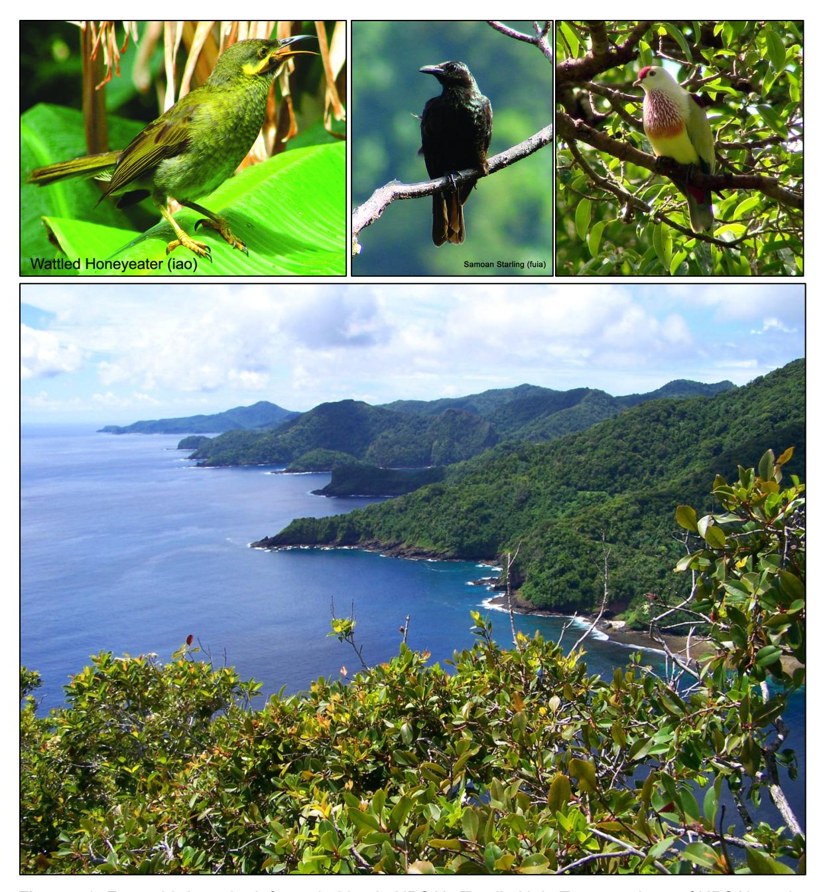

**Figure 70.** Forest birds and rainforest habitat in NPSA's Tutuila Unit. Top row: three of NPSA's native forest bird species: Wattled Honeyeater, Samoan Starling, and Many-colored Fruit-dove. Bottom panel: rainforest slopes with primarily native vegetation. All photo credits: Tavita Togia.

**Table 31.** Forest birds of Tutuila and Ta'u Islands, American Samoa. Species reported by Judge et al. (2013) during their 2011 surveys in Tutuila and Ta'u Units (combined) are indicated by symbol: ● (ontransect), + (off-transect). Sources for American Samoa species list (in Craig 2009): J. Seamon (pers. com. 2004), Amerson et al. 1982, Engbring and Ramsey 1989, Steadman and Pregill 2004, Judge et al. 2013. E – extirpated, I – introduced, M – migrant, R – resident native, V – vagrant.

| Category           | Scientific name          | Common and Samoan name                    | Tutuila | Ta'u | 2011 |
|--------------------|--------------------------|-------------------------------------------|---------|------|------|
|                    | Porzana tabuensis        | Crake, Spotless                           | E       | R    | –    |
|                    | Eudynamis taitensis      | Cuckoo, Long-tailed (aleva)               | M       | M    | +    |
|                    | Gallicolumba stairi      | Ground-dove, Friendly (tu'aimeo)          | –       | R    | +    |
|                    | Ptilinopus perousii      | Fruit dove, Many-colored (manuma)         | R       | R    | ●    |
|                    | Ptilinopus porphyraceus  | Fruit dove, Purple-capped (manutagi)      | R       | R    | ●    |
|                    | Foulehaio carunculata    | Honeyeater, Wattled (iao)                 | R       | R    | ●    |
|                    | Myzomela cardinalis      | Honeyeater, Cardinal (segasegamau'u)   | R       |      | ●    |
|                    | Todiramphus chloris      | Kingfisher, White-collared (ti'otala)     | R       | R    | ●    |
| Forest birds       | Vini australis           | Lory, Blue-crowned (segavao, sega'ula) | V       | R    | ●    |
|                    | Tyto alba                | Owl, Barn (lulu)                          | R       | R    |      |
|                    | Ducula pacifica          | Pigeon, Pacific (lupe)                    | R       | R    | ●    |
|                    | Gallirallus philippensis | Rail, Banded (ve'a)                       | R       | R    | ●    |
|                    | Clytorhynchus vitiensis  | Shrikebill, Fiji (sega o le vau)          | V       | R    | ●    |
|                    | Aplonis tabuensis        | Starling, Polynesian (miti vao)           | R       | R    | ●    |
|                    | Aplonis atrifusca        | Starling, Samoan (fuia)                   | R       | R    | ●    |
|                    | Porphyrio porphyria      | Swamphen, Purple (manu ali'i)             | R       | R    | ●    |
|                    | Collocalia spodiopygia   | Swiftlet, White-rumped (pe'ape'a)         | R       | R    | ●    |
|                    | Pycnonotus cafer         | Bulbul, Red-vented (manu palagi)          | I       | –    | –    |
|                    | Columba livia            | Dove, Rock (lupe palagi)                  | V       | –    | –    |
| Introduced species | Gallus gallus            | Junglefowl, Red (moa)                     | I       | I    | –    |
|                    | Acridotheres tristis     | Myna, Common (maina fanua)                | I       | –    | –    |
|                    | Acridotheres fuscus      | Myna, Jungle (maina vao)                  | I       | –    | –    |

## *4.8.2. Data and Methods*

The key dataset for the present analysis was the park-specific NPS Vital Signs Monitoring Program for forest birds (Judge et al. 2013). Bird surveys outside the park units also provide useful information because the islands of American Samoa are small and presumably consist of single, islandwide populations of forest birds.

## Primary data sources

*NPS I&M monitoring survey for forest birds in NPSA*

A statistically-based protocol for monitoring forest birds in Pacific Island Network national parks (Camp et al. 2011) was implemented in NPSA in 2011 (Judge et al. 2013) and is scheduled to be

repeated at five-year intervals. The 2011 dataset is the first in the time series designed to detect longterm trends in several population measures for forest birds (species composition, distribution, abundance, forest bird habitat) within NPSA's Tutuila and Ta'u Units. The protocol uses pointtransect distance sampling to estimate bird abundance. Sampling is conducted using a split-panel design where Engbring and Ramsey's (1989) legacy transects within or adjacent to NPSA are visited during each sampling occasion, and an additional set of randomized transects is visited during each new sampling year. This design optimizes status and trend detection while allowing for measuring and correcting estimator bias. The sampling objective is an 80% probability of detecting a 25% change in species composition (species richness), species distribution, and species density over a 25 year period Habitat data were also collected at each point-transect sample site.

## *US Fish and Wildlife Service (USFWS)*

Islandwide inventories of forest birds were conducted in American Samoa by USFWS in 1975-76 (Amerson et al. 1982) and 1986 (Engbring and Ramsey 1989). Although the Amerson et al. (1982) study provided extensive information for this early time period, Engbring and Ramsey (1989) noted that the methodology of Amerson et al. was inadequately described, thus caution is recommended when using those data for comparative purposes. Several of the 1986 transects were located within NPSA's Tutuila and Ta'u Units, and these were included as legacy transects in the 2011 survey by Judge et al. (2013).

#### *Department of Marine and Wildlife Resources (DMWR)*

DMWR has conducted forest bird surveys in American Samoa for the past 25 years. These studies generally have islandwide sampling stations which may include one or more sites in NPSA (particularly Amalau Valley in the Tutuila Unit and Lata Mountain in the Ta'u Unit). A number of bird reports have been prepared by DMWR, but other datasets are incompletely reported. Selected reports that provide background information include: Trail et al. 1992, Craig et al. 1994a and b, Freifeld 1999, Webb et al. 1999, Utzurrum and Seamon 2001, Seamon and Utzurrum 2002, Freifeld et al. 2004, Utzurrum et al. 2006, Seamon et al. 2010a and 2010b. Three of these studies monitored abundance trends of selected forest birds in NPSA's Amalau Valley: (a) 1992-96 (Freifeld et al. 2004). These data may be available at DMWR (H. Freifeld, pers. com. 2017), (b) 1995-99 for two bird species (Utzurrum and Seamon 2001), and (c) 1998-2008 for three species (Seamon et al. 2010b). This information is useful but direct comparisons with the park's monitoring program (Judge et al. 2013) are limited because of the different methods used and/or the few sites within NPSA.

## *Other research*

Adler et al. (2010) summarized the infrequent sightings of Spotless Crakes on Ta'u Island. Modak (2011) analyzed evolutionary origins of Samoan avifauna. A current study by Pyle et al. (2014, 2015) is examining forest bird population sizes, productivity, survivorship and breeding seasonality in American Samoa, including stations within NPSA's Tutuila Unit (Amalau, Vatia) and Ta'u Unit (Laufuti Stream, Siufaga).

## *4.8.3. Reference Condition*

A logical reference point for forest birds in NPSA is the 2011 survey by Judge et al. (2013) because of its strong statistical design to assess bird status and trends specifically within the park (Camp et al.

2011). Earlier surveys (e.g., Amerson et al. 1986, Engbring and Ramsey 1989, Freifeld et al. 2004, Seamon et al. 2010b) generally provided limited coverage of NPSA and/or differed in methodology, but they did demonstrate seasonal, annual, and site differences in forest bird abundances. It is therefore recognized that the 2011 reference condition represents a park-specific snapshot in time rather than a representation of unaffected populations at equilibrium in the rainforest ecosystem.

## *4.8.4. Condition and Trend*

NPS's I&M monitoring program evaluated the condition of forest birds in NPSA by focusing on four measures: species composition, distribution, and abundance, and an assessment of forest bird habitat (Judge et al. 2013).

## Species composition

Of the 17 native species in American Samoa, Judge et al. (2013) detected 13 species in NPSA in 2011 (Table 32). Two additional species (Long-tailed Cuckoo, Friendly Ground-dove) were detected off-transect in or adjacent to the Ta'u Unit, and the two remaining species were either rare and/or not amenable to detection by the methods used (Spotless Crake, Barn Owl). Alien forest bird species were not detected in the park although they were present in nearby villages and urbanized areas. In general, species composition and relative abundance of forest birds documented in 2011 in NPSA was similar to that recorded 25 years earlier in the islandwide survey by Engbring and Ramsey (1989) (Figure 71).

**Table 32.** Forest bird density (birds/ha) and abundance (birds/park unit) in NPSA (mean ± SE), 2011. Source: Judge et al. 2013.

|                          |              | Tutuila Unit   | Ta'u Unit     |                  |  |  |
|--------------------------|--------------|----------------|---------------|------------------|--|--|
| Species                  | Density      | Abundance      | Density       | Abundance        |  |  |
| Wattled Honeyeater       | 42.10 ± 9.29 | 42,979 ± 9,481 | 48.96 ± 10.95 | 105,068 ± 23,504 |  |  |
| Samoan Starling          | 9.20 ± 1.48  | 9,394 ± 1,507  | 6.76 ± 1.29   | 14,497 ± 2,768   |  |  |
| Polynesian Starling      | 7.71 ± 2.03  | 7,869 ± 2,069  | 4.39 ± 1.29   | 9,422 ± 2,762    |  |  |
| Purple-capped Fruit-dove | 1.32 ± 0.25  | 1,344 ± 255    | 0.75 ± 0.15   | 1,617 ± 313      |  |  |
| Pacific Pigeon           | 1.17 ± 0.21  | 1,199 ± 210    | 0.25 ± 0.07   | 532 ± 149        |  |  |

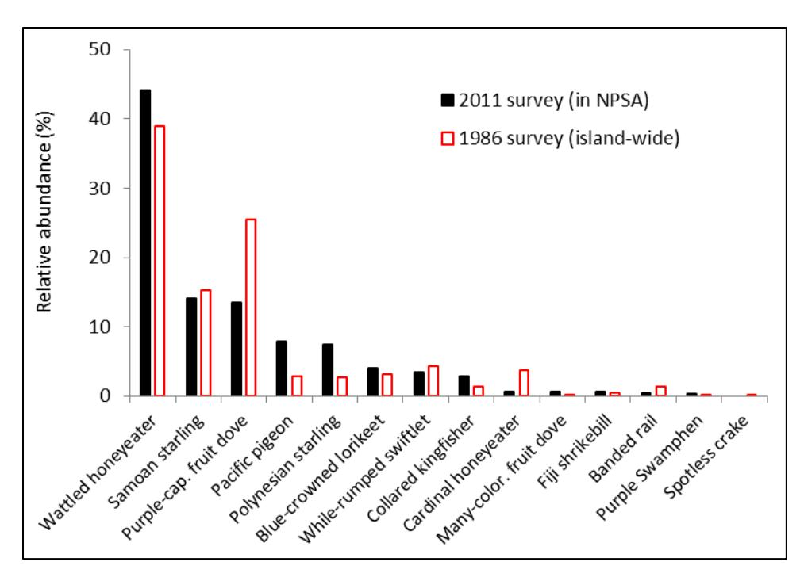

**Figure 71.** Relative abundance of forest bird species in park surveys conducted in 2011 (Judge et al. 2013) compared to island-wide surveys conducted in 1986 (Engbring and Ramsey 1989), Tutuila and Ta'u islands combined. Sea bird sightings are not included.

## Distribution

Judge et al. (2013) provided distribution maps for each bird species observed in 2011(see examples in Figure 72). The Wattled Honeyeater was by far the prominent species in both Tutuila and Ta'u Units, followed by a group of species of intermediate abundance and distribution (Samoan and Polynesian Starlings, Purple-capped Fruit-dove, Pacific Pigeon, Blue-crowned Lorikeet), with the remaining species occurring in low numbers and at few locations (Figure 73). Rare species in 1986 continued to be rare in 2011 (Engbring and Ramsey 1989, Judge et al. 2011). The Many-colored Fruit-dove was detected in very small numbers in both park units in 2011. The Spotless Crake was extirpated on Tutuila Island and infrequently sighted on Ta'u Island (Adler et al. 2010).

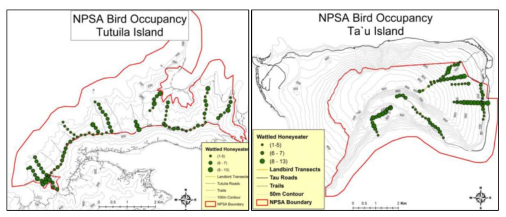

**Figure 72.** Wattled Honeyeater occurrence in NPSA's Tutuila and Ta'u Units in 2011 (Judge et al. 2013). Graduated symbols display the abundance of individuals detected at each station.

Forest birds were not evenly distributed within the two park units. First, four species occurred only in the Manu'a Islands: Blue-crowned Lorikeet, Fiji Shrikebill, Spotless Crake, and Friendly Grounddove. Second, species abundance was low in the high elevation Cloud Forest Zone (summit scrub vegetation zone) of the Ta'u Unit. Scrub vegetation and small stature trees in this zone did not harbor a diverse or abundant assemblage of forest birds (Judge et al. 2013). Of all stations sampled, 23% were in cloud forest habitat (or above 500 m), but only 11% of bird detections occurred there. Only half of the 12 species detected in the Ta'u Unit occurred in the cloud forest, whereas all species were detected at lower elevations. Several birds were conspicuously absent in the cloud forest (Pacific Pigeons, Fiji Shrikebills, and Collared Kingfishers), and even common species such as the Purple-Capped Fruit-dove and Blue-crowned Lorikeet were detected in low numbers. It may be that there were fewer foraging opportunities in the small stature trees and dense fern understory at higher elevations, and/or bird populations may still be recovering from Cyclone Olaf damages in 2005 (Judge et al. 2013).

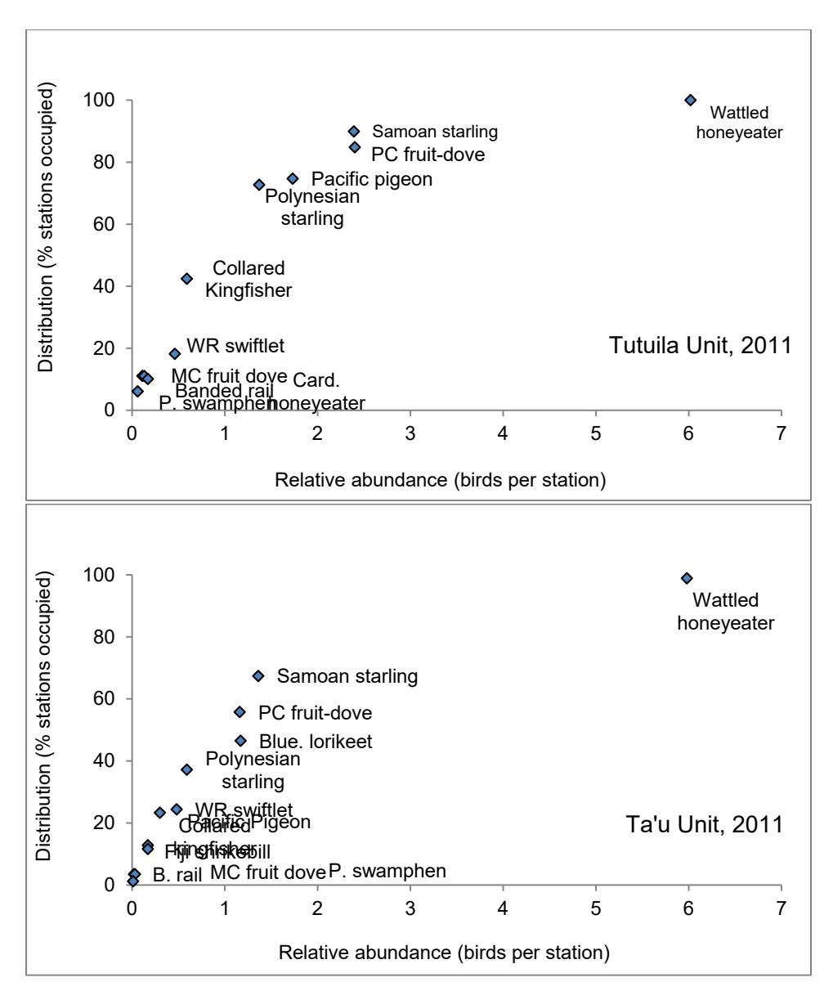

**Figure 73.** Relationship between the distribution and relative abundance of forest bird species in NPSA's Tutuila and Ta'u Units, 2011. Source: based on data from Judge et al. 2013.

#### Abundance

Background information on bird abundance at one site in NPSA (Amalau Valley) was provided by Seamon et al. (2010b). During 1998-2007, they monitored three species (Samoan Starling, Pacific Pigeon, Purple-capped Fruit-dove) at six locations on Tutuila and documented significant differences in abundance among sites for all three species and seasonal variations at most sites. Populations of Samoan Starlings and Pacific Pigeons were relatively stable over the 10-year period, but Purple-capped Fruit-doves declined after Cyclone Heta in 2004. These findings apply to the Amalau site except that Samoan Starlings also declined during this period (Figure 74). Due to methodological differences, the bird densities reported by Seamon et al. (2010b) are not directly comparable to those reported by Judge et al. (2013).

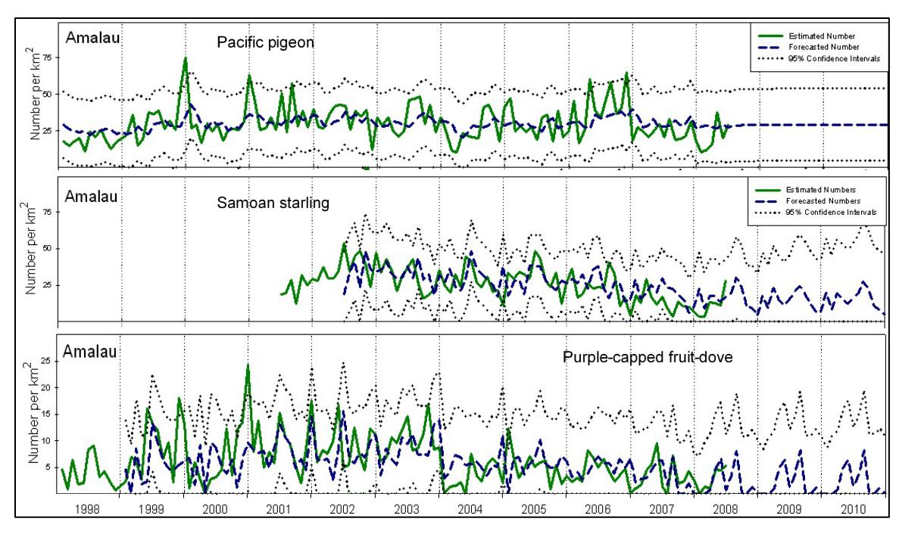

**Figure 74.** Monthly densities of three bird species at one site in NPSA's Tutuila Unit (Amalau Valley), 1998-2008. Note different scales on y-axis. Source: Seamon et al. 2010b.

In the park-specific survey by Judge et al. (2013), sufficient detections of seven bird species allowed calculation of population densities and abundances in 2011 (Table 33). Densities were somewhat higher in the Tutuila Unit than in the Ta'u Unit, but population sizes were generally greater in the Ta'u Unit because it was more than twice as large as the Tutuila Unit. The Wattled Honeyeater accounted for the highest densities (42-49 birds/ha) and population sizes (43,000-105,000 birds/park unit) in the park, far more than all other birds combined. Wattled Honeyeaters were also the dominant species in earlier surveys in American Samoa over the past 40 years (Amerson et al. 1982, Engbring and Ramsey 1989, Freifeld et al. 2004).

**Table 33.** Forest bird density (birds/ha) and abundance (birds/park unit) in NPSA (mean ± SE), 2011. Source: Judge et al. 2013.

|                             |              | Tutuila Unit   | Ta'u Unit     |                  |  |
|-----------------------------|--------------|----------------|---------------|------------------|--|
| Species                     | Density      | Abundance      | Density       | Abundance        |  |
| Wattled Honeyeater          | 42.10 ± 9.29 | 42,979 ± 9,481 | 48.96 ± 10.95 | 105,068 ± 23,504 |  |
| Samoan Starling             | 9.20 ± 1.48  | 9,394 ± 1,507  | 6.76 ± 1.29   | 14,497 ± 2,768   |  |
| Polynesian Starling         | 7.71 ± 2.03  | 7,869 ± 2,069  | 4.39 ± 1.29   | 9,422 ± 2,762    |  |
| Purple-capped Fruit dove | 1.32 ± 0.25  | 1,344 ± 255    | 0.75 ± 0.15   | 1,617 ± 313      |  |
| Pacific Pigeon              | 1.17 ± 0.21  | 1,199 ± 210    | 0.25 ± 0.07   | 532 ± 149        |  |

Abundance trends are not available for forest birds in NPSA, but a general comparison can be made between densities of birds in NPSA in 2011 (Judge et al. 2013) and islandwide estimates made 25

years ago by Engbring and Ramsey (1989). Densities tended to be higher in 2011, most notably for the Wattled Honeyeater (Figure 75). This comparison suggests that some bird populations may have increased over the period. However, it might also be expected that bird densities would be higher in NPSA's Tutuila Unit due to the relatively good condition of the rainforest habitat in the park compared to the rest of this populated island (see bird habitat section below), but the same argument does not apply to Ta'u Island where rainforest habitats are in generally good condition islandwide (apart from three small villages).

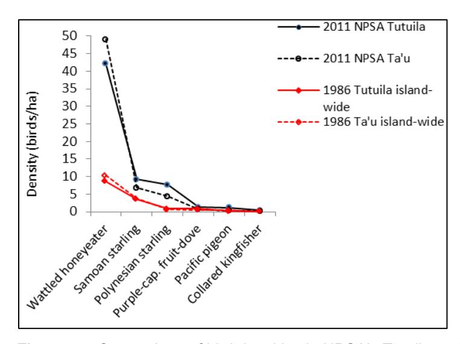

**Figure 75.** Comparison of bird densities in NPSA's Tutuila and Ta'u Units in 2011 (Judge et al. 2013) with islandwide densities in 1986 (Engbring and Ramsey 1989).

## Forest bird habitat

Prior to the 1950s, Tutuila Island had been largely forested (as Ta'u Island is now), but by 1984 about 50% of lowland forests had been cleared and replaced by agricultural plantations and human habitations, resulting in habitat loss for wildlife (Brooke 1998, Utzurrum et al. 2006). This was largely driven by rapid human population growth and economic development. The human population increased from about 13,000 in 1940 to 57,000 in 2000 (see Figure 5b). These changes emphasize the value of the remaining forested lands, significant parts of which are protected within NPSA. Also, due to the steepness of the island (approximately 40% of the land area is characterized by slopes 30 degrees or greater), significant portions of the islands remain forested and are projected to remain so through the foreseeable future (Utzurrum et al. 2006).

Rainforest habitat for forest birds in the park appeared to be in good condition in 2011 (Judge et al., 2013). Canopy and understory composition were predominantly native vegetation with no clear dominant species in most sampling areas. Judge et al. (2013) considered the Tutuila Unit to be an exemplary representation of mixed paleotropical rainforest with a dense, closed canopy at most sampling stations. In addition, the slopes of the Tutuila Unit were steep; approximately 85% of stations sampled were steeper than 20 degrees. This steepness may be an important factor in the continued success of local forest bird populations, because cliffs and steep slopes can offer protection from predators and inhibit harvest of forest resources. The complex topography of Tutuila Island (see Figure 5b and Figure 70) also prevents wholesale forest destruction by cyclones — some watersheds or sides of valleys may be relatively untouched by a particular storm (H. Freifeld, pers. com.).

Similarly, in the Ta'u Unit the vegetation was nearly all native and canopy cover was closed at most sampling stations. Slopes, where transects were located, were more moderate than on Tutuila (55% of the stations sampled were greater than 20 degrees). As noted above, the vegetation of Ta'u in 2011 may still be recovering from Cyclone Olaf, a Category-5 cyclone that severely damaged rainforests there in 2005 (Figure 76). Webb et al. (2014) reported that 57% of all trees in their survey plots on Ta'u were snapped or uprooted by this cyclone. Webb et al. (2011) concluded that "Tutuila forests and perhaps other Polynesian cyclone-prone forests may be best described as under a constant state of reorganization."

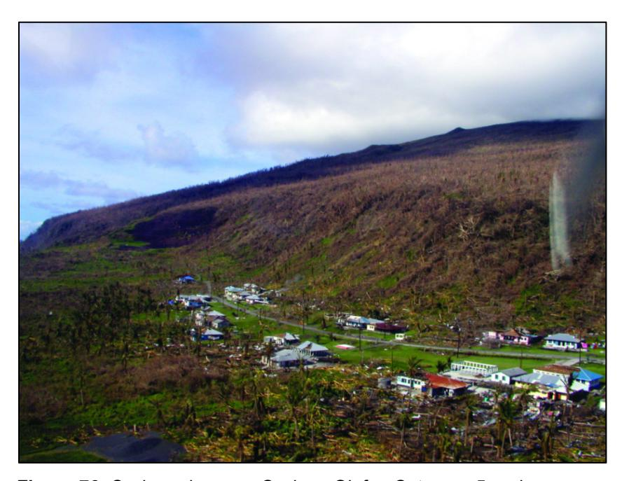

**Figure 76.** Cyclone damage. Cyclone Olaf, a Category-5 cyclone, severely damaged rainforests on Ta'u Island in 2005. In this photo, defoliated and broken trees (brown areas), Fitiuta Village (foreground), and NPSA's Ta'u Unit (background) are shown. Photo: P. Craig.

It should be noted that the current condition of NPSA's rainforest has been greatly improved by its invasive species control program. Over the past 30 years, invasive trees (primarily the tamaligi*, Falcataria moluccana*) spread rapidly across about 30% of Tutuila's forested lands, including portions of NPSA's Tutuila Unit. By 2000, *tamaligi* were beginning to dominate the rainforest and outcompete native trees that provided food and habitat for forest birds and other wildlife (Figure 77). In response, NPSA has conducted an aggressive control program for the past 15 years, killing over 19,000 invasive trees from park lands and surrounding areas, and has restored 24 km2 of wildlife habitat on Tutuila and 2 km2 on Ta'u (T. Togia, pers. com. 2017). In addition, some measures were taken about 15 years ago to reduce feral pig populations in the park (P. Craig, pers. com. 2016).

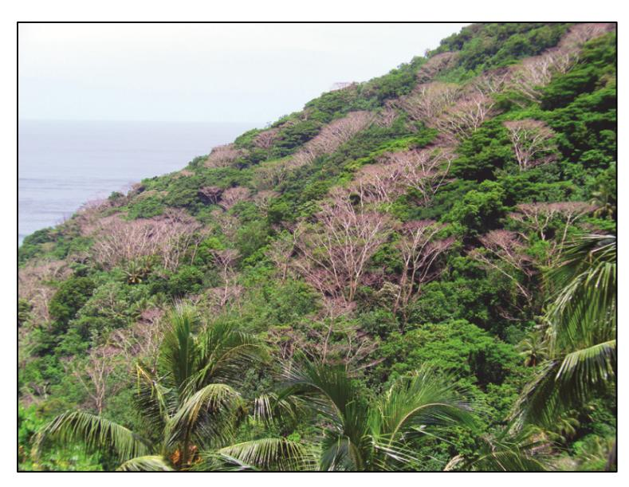

**Figure 77.** Invasive trees. Rapidly spreading invasive tamaligi trees (*Falcataria moluccana*) in NPSA's Tutuila Unit, ca 2005. Numerous dead tamaligi trees, shown here leafless and brown, were killed during NPSA's extensive control program. The photo shows how invasive trees were beginning to dominate the rainforest canopy, outcompeting native trees that provide food and habitat for birds and other animals. Photo: P. Craig.

## Data needs/gaps

While it is recognized that the islands of American Samoa are small and probably support individual islandwide populations of forest birds, information about bird utilization of NPSA itself is limited. Tagging data would be useful to assess the extent of bird movements into and out of the park. Sources of existing tagging information include DMWR file data and a current study by Pyle et al. (2014, 2015). In addition, abundance data collected by Freifeld et al. (2004) may be useful for comparative purposes. They monitored forest birds in 1992-96 in NPSA's Tutuila Unit (one transect with five stations on Sauma Ridge) which coincides with locations sampled by Judge et al. (2013). Individual transect data may be filed at DMWR (Freifeld, pers. com.).

## Threats

General threats to forest birds in Polynesia include cyclone damage, human activities, introduced predators such as rats and cats, introduced bird species that may compete with native birds or introduce diseases, invasive pigs that inhibit regeneration of native trees and facilitate dispersal of alien plants, invasive trees that may outcompete native food trees used by birds, and potential climate change effects on birds and their habitats (e.g., Space and Flynn 2000, Watling 2001, Utzurrum et al. 2006). In recent years, several invasive tree species have spread in park rainforests, and approach canopy closure in the western half of the Tutuila Unit (Figure 77). Cyclones occasionally decimate wildlife populations through direct mortality or loss of habitat or food sources (Trail et al. 1992, Craig et al. 1994a, Webb et al. 2014). Because cyclones are a regular feature of the South Pacific environment to which wildlife have had to adapt, cyclones may not conveniently fall into the category of "threat" as commonly used in this report. But cyclones are major episodic events that

cause damage somewhere in American Samoa at intervals of 0-13 years, averaging once every 3.7 years (Section 5.1).

Several other threats have less impact in the park at present. Habitat loss through human developments and agriculture is generally limited by park regulation; hunting has been banned islandwide since 1992, although occasional poaching probably occurs; and, introduced bird species (Red-vented Bulbul, Common Myna, Jungle Myna, Red Junglefowl, Rock Dove) are mainly associated with villages and urbanized areas rather than park rainforests. However, proposed wind turbines on Mt. Alava and elsewhere on Tutuila could adversely impact birds. Potential climate change effects on birds and their habitats in American Samoa have not yet been evaluated.

## Overall Condition

## *Species composition*

The islands of American Samoa support a small group of 17 native forest birds whose species composition has been generally consistent for at least the past 160 years. Quantitative data also indicate that species composition and relative abundance have been similar over the past 25 years despite habitat disturbances during this period (e.g., periodic cyclones, rainforest conversion to agriculture, habitat degradation due to spread of invasive tree species, and rapid human population growth on Tutuila Island). Introduced bird species occur near NPSA, but their spread into the park does not seem imminent because they generally prefer habitats other than the park. This measure was assigned a Significance Level of 2 (Moderate) and a Condition Level of 0 (Not a current concern).

#### *Distribution*

This measure was assigned a Significance Level of 2 (Moderate) and a Condition level of 0 (Not a current concern), because the distributions of forest birds was generally widespread and no major changes have been detected in the past 25 years.

## *Abundance*

A Significance Level of 3 (High) and a Condition Level of 1 (Low Concern) was assigned to this measure. The community of birds appears to be in good condition based on both field surveys and professional opinion. Engbring and Ramsey (1989) commented that the avian fauna of American Samoa appeared to be "healthy" in 1986, based on their ornithological experience in other Pacific Islands. Thereafter, bird numbers declined in 1990-91 due to cyclone damages (Trail et al. 1992) but rebounded in subsequent years. Population estimates in NPSA in 2011 (Judge et al. 2013) were similar or higher than previous islandwide bird surveys on both Tutuila and Ta'u in 1986 (Engbring and Ramsey 1989). Judge et al. (2013) commented that these populations should remain stable with continued preservation and protection by NPSA. Nonetheless, several previously identified rare birds of conservation concern continue to be rare.

## *Forest bird habitat*

Rainforest habitat utilized by forest birds in NPSA was considered to be in good condition in 2011 (Judge et al. 2013). Vegetation in both the Tutuila and Ta'u Units consisted mostly of native species, and canopy cover of the rainforest was generally closed. Park lands are largely uninhabited, steep, and moderately difficult to access; agricultural plats where permitted are small, and human use of

forest products is allowed only for cultural purposes. In addition, NPSA has led a successful program to control invasive tree species in the park, although some invasive trees and other invasive species remain. A Significance Level of 3 (High) and a Condition Level of 2 (Moderate Concern) was assigned to this measure because invasive species remain a continual threat to the health of the rainforest community.

### *Weighted condition score*

The weighted condition score (0.30; Table 34) indicates that NPSA's forest bird resources in 2011 were in generally good condition. All birds were indigenous or endemic to the islands of American Samoa. Species abundances were generally the same or greater than those recorded 25 years earlier. Rainforest habitat was in good condition, with mostly native vegetation and full canopy closure of the rainforest at most sampling sites. Significant acreage of rainforest habitat has been restored by clearing large invasive trees from park lands and surrounding areas, but invasive species remain a threat to native forests. Due to the robust sample design of the 2011 forest bird survey by Judge et al. (2013), the level of confidence in this resource assessment is high, and the dataset provides a firm basis for future monitoring in the park. Population trends are not known with confidence because the survey by Judge et al. (2013) is the first in this monitoring program, and earlier surveys utilized different methodology and/or had few sampling sites within NPSA.

**Table 34.** Significance levels and condition levels used to calculate the weighted condition score (WCS) for NPSA's forest birds.

| Measures            | Significance Level | Condition Level | WCS = 0.30 |
|---------------------|--------------------|-----------------|------------|
| Species composition | 2                  | 0               |            |
| Distribution        | 2                  | 0               |            |
| Abundance           | 3                  | 1               |            |
| Forest bird habitat | 3                  | 2               | Resourc    |

## *4.8.5. Sources of Expertise*

• Namulau'ulu Tofilau Tavita P. Togia, NPSA Terrestrial Ecologist

### *4.8.6. Literature Cited*

Adler, G., A. Lalogafu'afu'a, J. Seamon, R. West Jr., S. Fa'aumu, and C. Atkinson. 2010. Persistence of the spotless crake (*Porzana tabuensis*) on Ta'u, American Samoa. Notornis 57:216-217.

Amerson, A., W. Whistler, and T. Schwaner. 1982. Wildlife and wildlife habitat of American Samoa. Vols. 1 & 2. US Fish and Wildlife Service Report, Washington D.C.

Brooke, A. 1998. Biology of the flying foxes in American Samoa: *Pteropus samoensis* and *Pteropus tonganus*. Report to the National Park of American Samoa. 56 p.

Camp, R. J., T. K. Pratt, C. Bailey, and D. Hu. 2011. Forest birds vital sign monitoring protocol – Pacific Island Network. Natural Resources Report NPS/PACN/NRR—2011/402. National Park Service, Fort Collins, Colorado.

- Cassin, J. 1858. Mammology and ornithology. US Exploring Expedition, during the years 1839- 1842. C. Sherman and Sons, Philadelphia, PA.
- Craig, P., P. Trail, and T. Morrell. 1994a. The decline of fruit bats in American Samoa due to hurricanes and overhunting. Biological Conservation 69:261-266.
- Craig, P., T. Morrell, and K. So'oto. 1994b. Subsistence harvest of birds, fruit bats, and other game in American Samoa, 1990-1991. Pacific Science 48: 344-352.
- Engbring, J., and F. Ramsey. 1989. A 1986 survey of the forest birds of American Samoa. Report by US Fish and Wildlife Service. Honolulu, Hawaii.
- Freifeld, H. 1999. Habitat relationships of forest birds on Tutuila Island, American Samoa. J. Biogeography 26: 1191-1213.
- Freifeld, H., C. Solek, and A. Tualaulelei. 2004. Temporal variation in forest bird survey data from Tutuila Island, American Samoa. Pacific Science 58: 99-117.
- Judge, S., R. Camp, V. Vaivai, and P. Hart. 2013. Pacific Island forest bird monitoring annual report, National Park of American Samoa, Ta'u and Tutuila Units, 2011. Natural Resource Tech. Rept. NPS/PACN/NRTR—2013/666. National Park Service, Fort Collins, CO.
- Mayr, E. 1945. Birds of the southwest Pacific. MacMillan Company, New York.
- Modak, T. 2011. Evolutionary origins of the Samoan avifauna. Thesis. Boston Univ., MA.
- Pyle, P., N. Dauphine, K. Tranquillo, K. Kayano, A. Doyle, S. Jones, D. Kaschube, R. Taylor, and E. Rowan. 2014. The Tropical Monitoring Avian Productivity and Survivorship (TMAPS) Program in American Samoa: 2014 Report. The Institute for Bird Populations, Point Reyes Station, CA.
- Pyle, P., K. Kayano, J. Reese, V. Morgan, R. S. Mulitalo, J. Tigilau, S. Tuvalu, D. Kaschube, R. Taylor, and L. Helton. 2015. The Tropical Monitoring Avian Productivity and Survivorship (TMAPS) Program in American Samoa: 2015 Report. The Institute for Bird Populations, Point Reyes Station, CA.
- Seamon, J., and R. Utzurrum. 2002. Summary of DMWR Wildlife Division Studies [with sampling sites in NPSA]. Dept. Marine and Wildlife Resources (American Samoa).
- Seamon, J., V. Vaivai, A. Tualaulelei & R. Utzurrum. 2010a. Short- and long-term resource use by a generalist frugivore, the Pacific imperial-pigeon. Dept. Marine and Wildlife Resources (American Samoa), Report #56665-2010-1.
- Seamon, J., R. Utzurrum, A. Tualaulelei, S. Fa'aumu, V. Vaivai, and R. Meyer. 2010b. Coexistence and long-term population dynamics of three frugivorous birds. Dept. Marine and Wildlife Resources (American Samoa), Draft Report #56665-2010-2. 39 p.

- Space, J., and T. Flynn. 2000. Observations on invasive plant species in American Samoa. Report to Pacific Islands Committee and Council of Western State Foresters. [www.hear.org/pier/reports/asreport.htm.](http://www.hear.org/pier/reports/asreport.htm)
- Steadman, D. 1993. Bird bones from the To'aga site: prehistoric loss of seabirds and megapods. *In* P. Kirch and T. Hunt (eds.). The To'aga site, three millennia of Polynesian occupation in the Manu'a Islands, American Samoa. Contributions Univ. California Archaeological Research Facility, No. 51. Berkeley, pp. 217–28.
- Steadman, D., and G. Pregill. 2004. A prehistoric, noncultural vertebrate assemblage from Tutuila, American Samoa. Pacific Science 58:615-624.
- Trail, P., T. Morrell, and A. Tualaulelei. 1992. Declines in forest bird populations on Tutuila Island, American Samoa. Dept. Marine and Wildlife Resources (American Samoa), Biological Report Series No. 32.
- Trail, P. 2009. The honeyeaters. Chapt. 59, *In*: P. Craig (ed). Natural History Guide to American Samoa. National Park of American Samoa, Dept. Marine and Wildlife Resources, and American Samoa Community College.
- USFWS (US Fish and Wildlife Service). 2016. Endangered and Threatened Wildlife and Plants; Endangered Status for Five Species from American Samoa. 50 CFR Part 17 [Docket No. FWS– R1–ES–2015–0128; 4500030113] RIN 1018–AZ97. Final Rule. Federal Register 81 (184): 65466-65508. [https://www.fws.gov/policy/library/2016/2016-22276.pdf.](https://www.fws.gov/policy/library/2016/2016-22276.pdf)
- Utzurrum, R. and J. Seamon. 2001. Monitoring for conservation and management: some empirical and theoretical approaches. Sylvatrop: The Tech. Journal Phil. Ecosys. and Nat. Res. 10:88-105.
- Utzurrum, R., J. Seamon, and K. Saili. 2006. A comprehensive strategy for wildlife conservation in American Samoa. Dept. Marine and Wildlife Resources (American Samoa).
- Watling, D. 2001. A guide to the birds of Fiji and western Polynesia. Environmental Consultants Ltd., Suva Fiji.
- Webb, E., B. Stanfield, and M. Jensen. 1999. Effects of topography on rainforest tree community structure and diversity in American Samoa, and implications for frugivore and nectavore populations. J. Biogeography 26: 887-897.
- Webb, E., J. Seamon, and S. Fa'aumu. 2011. Frequent, low-amplitude disturbances drive high tree turnover rates on a remote, cyclone-prone Polynesian island. J. Biogeogr. 38: 1240-1252.
- Webb, E., M. van de Bult, S. Fa'aumu, R. Webb, A. Tualaulelei, and L. Carrasco. 2014. Factors affecting tropical tree damage and survival after catastrophic wind disturbance. Biotropica 46: 32-41.

Weisler, M., A. Lambrides, S. Quintus, J. Clark, and T. Worthy. 2016. Colonisation and late period faunal assemblages from Ofu Island, American Samoa. J. Pacific Archaeology 7: 1-19.

## **4.9. Seabirds**

## *4.9.1. Description*

USFWS (2005) identified 29 seabird species that nest in the US Pacific Islands (Figure 78). Of these, 19 widely distributed species nest in American Samoa: three shearwaters, three petrels, three boobies, three noddies, three terns, two tropicbirds and two frigatebirds (Figure 79, Table 35). Sixteen additional non-breeding (i.e., migrant or vagrant) species have been recorded. No known endemic seabirds occur in the Territory.

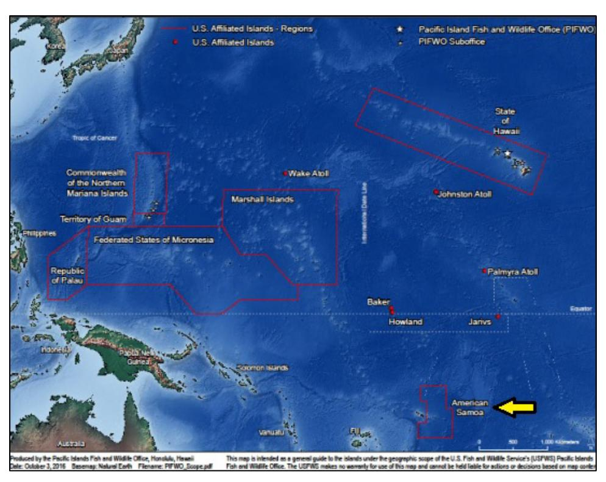

**Figure 78.** Map of US Pacific Islands where the US Fish and Wildlife Service has inventoried seabirds (indicated by red boxes and dots). American Samoa is indicated by a yellow arrow. Source: USFWS 2017.

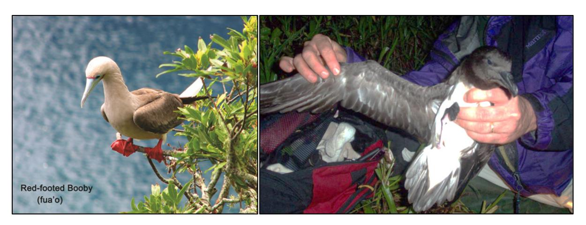

**Figure 79.** Two common seabirds in American Samoa: Red-footed Booby on Tutuila (left), Tahiti Petrel on Mt. Lata, Ta'u (right). In modern times, few seabirds or their eggs are taken for food, but the birds serve an important function as a navigational aid for fishermen to locate schools of fish. Photos: T. Togia (left), M. Fialua (right).

**Table 35.** Sea bird species recorded in American Samoa (AS) and in NPSA. B = breeding or potential breeding population, U = uncommon or vagrant, • = present. Sources: J. Seamon (DMWR, pers. com., 2004); Amerson et al. 1982, Engbring et al. 1989, Pyle et al. 1990, Grant et al. 1994, O'Connor and Rauzon 2004, Rauzon 2006, Swenson et al. 2006, Utzurrum et al. 2006, Judge et al. 2013, Titmus et al. 2016, Lepage 2016, Wikipedia 2016, WPRFMC 2016.

| Scientific               | Common                  |    |      | Island    |      |       |      |      |
|--------------------------|-------------------------|----|------|-----------|------|-------|------|------|
| name                     | name                    | AS | Tut. | Ofu- Olo. | Ta'u | Swans | Rose | NPSA |
| Sula leucogaster      | Booby, brown            | B  | B    | B         | U    | U     | B    | ●    |
| Sula sula                | Booby, red footed    | B  | B    | B?        | U    | U     | B    | ●    |
| Sula dactylatra          | Booby, masked        | B  | U    | U         | –    | –     | B    | ●    |
| Fregata minor            | Frigatebird, great   | B  | B    | U         | U    | U     | B    | ●    |
| Lucophaeus atricilla  | Gull, laughing          | U  | U    | –         | –    | –     | –    | –    |
| Procelsterna cerulea  | Noddy, blue             | B  | B    | B         | B    | –     | U    | ●    |
| Anous minutus            | Noddy, black            | B  | B    | B         | B    | B     | B    | ●    |
| Anous stolidus           | Noddy, brown            | B  | B    | B         | B    | B     | B    | ●    |
| Pterodroma brevipes   | Petrel, collared        | B? | U    | –         | B?   | –     | –    | ●    |
| Pterodroma cervicalis | Petrel, white necked | U  | U    | –         | –    | –     | –    | –    |
| Pterodroma leucoptera | Petrel, Gould's         | U  | –    | –         | U    | –     | –    | –    |

**Table 35 (continued).** Sea bird species recorded in American Samoa (AS) and in NPSA. B = breeding or potential breeding population, U = uncommon or vagrant, • = present. Sources: J. Seamon (DMWR, pers. com., 2004); Amerson et al. 1982, Engbring et al. 1989, Pyle et al. 1990, Grant et al. 1994, O'Connor and Rauzon 2004, Rauzon 2006, Swenson et al. 2006, Utzurrum et al. 2006, Judge et al. 2013, Titmus et al. 2016, Lepage 2016, Wikipedia 2016, WPRFMC 2016.

|                                    |                                 |    |      |             | Island |       |      |      |
|------------------------------------|---------------------------------|----|------|-------------|--------|-------|------|------|
| Scientific name                 | Common name                  | AS | Tut. | Ofu Olo. | Ta'u   | Swans | Rose | NPSA |
| Pterodroma inexpectata          | Petrel, mottled                 | U  | U    | –           | –      | –     | –    | –    |
| Pterodroma heraldica            | Petrel, Herald                  | B  | B    | –           | B      | –     | –    | ●    |
| Pseudobulweri a rostrata        | Petrel, Tahiti                  | B  | B    | –           | B      | B?    | –    | ●    |
| Pterodroma alba                 | Petrel, Phoenix                 | U  | U    | –           | U      | –     | –    | –    |
| Puffinus lherminieri            | Shearwater, Audubon's        | B  | B    | –           | B      | –     | –    | ●    |
| Puffinus nativitatis            | Shearwater, Christmas        | B? | –    | –           | B?     | –     | U    | ●    |
| Ardenna carneipes               | Shearwater, flesh-footed     | U  | U    | –           | –      | –     | –    | –    |
| Puffinus auricularis newelli | Shearwater, Newell's         | U  | U    | –           | –      | –     | –    | –    |
| Ardenna tenuirostris            | Shearwater, short-tailed     | U  | U    | –           | –      | –     | –    | –    |
| Ardenna grisea                     | Shearwater, sooty            | U  | U    | –           | –      | –     | –    | –    |
| Puffinus bailloni               | Shearwater, tropical         | U  | U    | –           | U      | –     | –    | ●    |
| Ardenna pacifus                 | Shearwater, wedge-tailed     | B? | B?   | –           | B?     | –     | U    | –    |
| Pelogodroma marina              | Storm-petrel, white-faced    | U  | U    | –           | –      | –     | –    | –    |
| Nesofregetta albigularis        | Storm-petrel, white throated | U  | –    | –           | U      | –     | –    | ●    |
| Fregetta tropica                | Strom petrel, black-bellied  | U  | U    | –           | U      | –     | –    | ●    |
| Nesofregetta fuliginosa         | Strom-petrel, Polynesian     | U  | U    | –           | U      | –     | –    | ●    |
| Fregetta grallaria              | Strom-petrel, white-bellied  | U  | –    | –           | –      | –     | –    | –    |

**Table 35 (continued).** Sea bird species recorded in American Samoa (AS) and in NPSA. B = breeding or potential breeding population, U = uncommon or vagrant, • = present. Sources: J. Seamon (DMWR, pers. com., 2004); Amerson et al. 1982, Engbring et al. 1989, Pyle et al. 1990, Grant et al. 1994, O'Connor and Rauzon 2004, Rauzon 2006, Swenson et al. 2006, Utzurrum et al. 2006, Judge et al. 2013, Titmus et al. 2016, Lepage 2016, Wikipedia 2016, WPRFMC 2016.

|                           |                                     |    |      |             | Island |       |      |      |
|---------------------------|-------------------------------------|----|------|-------------|--------|-------|------|------|
| Scientific name        | Common name                      | AS | Tut. | Ofu Olo. | Ta'u   | Swans | Rose | NPSA |
| Sterma sumatrana       | Tern, black naped                | U  | –    | U           | –      | U     | U    | –    |
| Onychoprion anaethetus | Tern, bridled                       | U  | U    | –           | –      | –     | –    | ●    |
| Thalasseus bergii      | Tern, greater crested            | U  | U    | U           | –      | –     | –    | –    |
| Onychprion lunatus     | Tern, gray backed, spectacled | B  | B    | –           | –      | –     | B    | ●    |
| Onychoprion fuscatus   | Tern, sooty                         | B  | U    | –           | –      | U     | B    | ●    |
| Gygis alba                | Tern, white                         | B  | B    | B           | B      | B     | B    | ●    |
| Phaethon rubricauda    | Tropicbird, red tailed           | B  | U    | –           | –      | U     | B    | ●    |
| Phaethon rubricauda    | Tropicbird, red tailed           | B  | U    | –           | –      | U     | B    | –    |
| Phaethon lepturus      | Tropicbird, white-tailed         | B  | B    | B           | B      | B     | B?   | ●    |
|                           | Total for "B"                       | 19 | 14   | 7           | 11     | 5     | 12   | –    |

Most (84%) of these resident (breeding) species also occur in NPSA, and they collectively utilize all of the park's marine and terrestrial life zones. NPSA provides seabird nesting habitat in trees and cliffs in its Tutuila and Ta'u Units (Figure 80 and Figure 81). Some seabirds are colonial nesters along the coast (e.g., Noddies). Some are colonial ground-nesters on cliffs (e.g., Audubon's Shearwaters) or in burrows excavated among tree roots in thickly vegetated rainforest and in montane scrub forests (e.g., Tahiti Petrels). Others nest in forest trees (e.g., White Terns) or along cliff edges or on offshore islets (e.g., Great Frigatebirds, Red-footed Boobies).

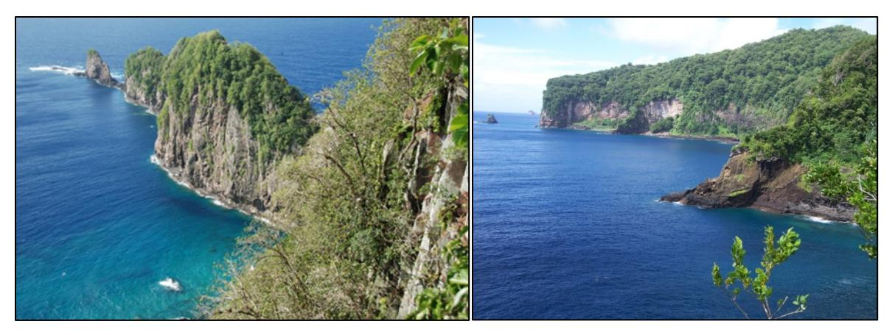

**Figure 80.** Seabird nesting habitat on cliffs and trees in NPSA's Tutuila Unit: Pola Island (left), Agapie Cove (right). Photos: T. Togia.

For perspective, the modern assemblage of seabirds in American Samoa has been altered by both prehistoric and historical events. First, Steadman (1990, 1993, 1995, 2006) described how early human colonizers of the Pacific islands probably caused many seabird extirpations throughout Oceania. The prehistoric introduction of predators such as rats (*Rattus exulans*), dogs, and pigs, as well as the Polynesians themselves, who ate seabirds and their eggs, all contributed to the demise of most seabirds in American Samoa (and archipelagos across the Pacific). Next, loss of forest habitat further reduced remaining populations of some arboreal species such as Noddies, White Terns, and White-tailed Tropicbirds. Prior to the 1950s, Tutuila Island had been forested (as Ta'u Island is today; Figure 81), but by 1984 about 50% of lowland forests had been cleared and replaced by agricultural plantations and human habitations, which resulted in habitat loss for wildlife (Brooke 1998, Utzurrum et al. 2006). This was largely driven by rapid human population growth (Figure 5b) and economic development. These changes underscore the value of remaining forested lands, significant parts of which are protected within NPSA.

As a group, seabirds are declining worldwide, largely due to introduced predatory species at their nesting colonies, entanglement in fishing gear at sea, and other human effects (e.g., USFWS 2005, Jones et al. 2008, Croxall et al. 2012). Paleczny et al. (2015) estimates that global seabird populations have declined overall by about 70% between 1950- 2010. NPSA's management team requested that this NRCA summarize the status of seabirds in the park, even though it was recognized that quantitative data were limited.

The term "cloud forest" is briefly described here because of its importance as habitat for groundnesting procellariids (petrels and shearwaters). It is a high elevation type of rainforest that occurs on Ta'u, Upolu, and Savai'i Islands (Whistler 1993). In NPSA, it occurs only at the summit (above 600 m) of Mt. Lata on Ta'u Island , where there is high rainfall, frequent clouds and mist, and vegetation dominated by a summit scrub community of impenetrable ferns, vines, shrubs, and stunted trees, perhaps caused by periodic cyclones.

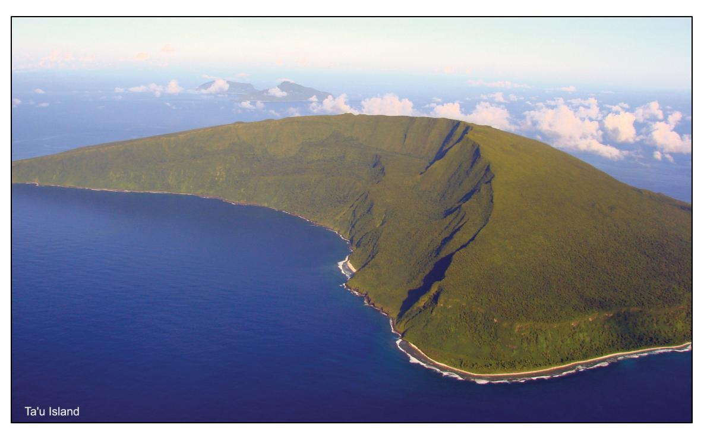

**Figure 81.** Ta'u Island (elevation 965 m), south side. NPSA encompasses most areas visible in this photo. Photo: M. Tennant.

## *4.9.2. Data and Methods*

An NPSA monitoring plan for seabirds was not developed, because seabirds were not selected as a Vital Sign by NPS PACN. However, the park conducted a seabird survey in 1999-2003 (O'Connor and Rauzon 2004) which forms a principal part of this NRCA report. In that survey, the islandwide shoreline of Tutuila was divided into 150 contiguous sampling segments, each about 15 km, and seabirds in each segment were counted during boat-based surveys. On Ta'u, several excursions up Mt. Lata were made to count seabirds in the cloud forest.

Other sources included islandwide inventories of birds conducted by the US Fish and Wildlife Service (USFWS) in 1975-76 (Amerson et al. 1982), and 1986 (Engbring and Ramsey 1989). The former survey included colony counts and estimates of seabirds, while the latter focused on forest birds but included incidental observations of seabirds. In addition, intermittent monitoring at Rose Atoll has been conducted over the past 30 years by USFWS and DMWR (Flint 2002, Swenson et al. 2006), but this NRCA report does not draw extensively on these data because Rose Atoll is 80 km distant from NPSA and its low-lying atoll habitat differs from the mountainous islands found in NPSA. A successful rat eradication project at the atoll in 1990-91 enhanced seabird populations there (Morrell et al. 1991, Murphy and Ohashi 1991, Swenson et al. 2006). A variety of other sources provided information about seabirds in the Territory: Pratt et al. 1987, Watling 2001, Pyle et al. 1990, Grant and Trail 1993, Grant and Clapp 1994, Utzurrum et al. 2006, Yen 2010, Seamon et al. 2011, Judge et al. 2013, Titmus and Dauphine 2013, Titmus et al. 2014 and 2016, Rauzon 2003, 2006 and 2014, Jones 2014, Lepage 2016, and Wikipedia 2016.

## *4.9.3. Reference Condition*

Information about American Samoa's seabirds has been accumulating since early exploratory trips to these islands were undertaken, but a reference condition for seabird species in NPSA and the main islands of American Samoa is not possible at this time. Available information is based largely on opportunistic surveys rather than systematic seabird counts in time and space. This situation is commonplace for seabirds due to inherent difficulties in effectively monitoring their populations (e.g., methodology issues, remote nesting areas in difficult terrain, seasonal presence, complex migration patterns, taxonomic issues).

#### *4.9.4. Condition and Trend*

This section provides general descriptions of seabird status in the Territory and by island, with an emphasis on NPSA. Species-specific summaries have been presented by others and are not repeated here (e.g., O'Connor and Rauzon 2004, USFWS 2005, IUCN 2016).

## Seabird status in American Samoa

Most seabird species in the Territory are well known, although details about their numbers and population trends are limited. Of the 19 breeding species in the Territory (Table 35), species richness varied from 5-14 species per island (Figure 82). These differences reflect conditions such as island size and type (high volcanic islands versus low-lying sandy atolls), human habitation, impacts of alien predators, and survey effort.

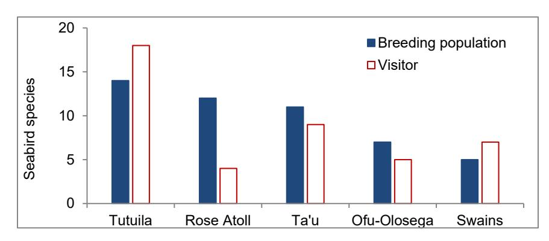

**Figure 82.** Number of breeding and visitor seabird species in American Samoa (from Table 32).

Half of these species are nationally or globally significant, and most are of conservation concern in the Pacific region (Table 36). The Tahiti Petrel was listed as highly imperiled, and 13 others were ranked as being of moderate to high concern by USFWS (2005) based on the system outlined by the North America Seabird Conservation Plan (Kushlan et al. 2002). However, none were listed as threatened or endangered under the Endangered Species Act, and only the Collared Petrel was listed as vulnerable by IUCN (2016). Among the non-breeding migrants or vagrants recorded in American Samoa, one was listed as threatened under the ESA (Newell's Shearwater), three were listed as endangered by IUCN (Newell's Shearwater, Polynesian Storm-petrel, Phoenix Petrel), and three were listed as vulnerable by IUCN (Collared Petrel, Gould's Petrel, White-necked Petrel).

**Table 36.** Conservation classification of breeding seabirds in American Samoa (USFWS 2005). Information sources and definitions are listed below. B − breeding or potential breeding population, • = present. Highly imperiled: Species with significant population decline and either low populations or some other high risk factor. High Concern: Populations known or thought to be declining and have some other known or potential threat as well. Moderate concern: Population are either a) declining with moderate threats or distributions; b) stable with known or potential threats and moderate to restricted distributions; or c) relatively small with relatively restricted distributions. Low concern: Populations are either a) stable with moderate threats and distributions; b) increasing but with known or potential threats and moderate to restricted distributions; or c) moderate size with known or potential threats and moderate to restricted distributions. Not currently at Risk: all other species for which information was available.

|                                 | Significance                          | Sta | tus c | 0.1(15)                     |                                      |                                |       |
|---------------------------------|---------------------------------------|-----|------------------|-----------------------------|--------------------------------------|--------------------------------|-------|
| Regional Status A | in US Pacific Islands B | ESA | IUCN             | Scientific name             | Common name                          | American Samoa D | NPSAD |
| Highly imperiled                | US                                    | -   | l                | Pseudobulwe ria rostrata | Petrel,Tahiti                        | В                              | •     |
|                                 | US                                    | ı   | I                | Fregata ariel               | Frigatebird, lesser               | В                              | •     |
|                                 | US                                    | ı   | I                | Proceksterna cerulea        | Noddy, blue                          | В                              | •     |
| High concern                 | US                                    | -   | -                | Pterodroma heraldica     | Petrel, Herald                       | В                              | •     |
|                                 | _                                     | _   | -                | Puffinus Iherminieri     | Shearwater, Audubon's             | В                              | •     |
|                                 | US                                    | _   | -                | Puffinus nativitatis     | Shearwater, Christmas             | В?                             | •     |
|                                 | _                                     | _   | -                | Sula leucogaster         | Booby, brown                         | В                              | •     |
|                                 | _                                     | _   | -                | Sula dactylatra          | Booby, masked                     | В                              | •     |
| Moderate concern                | US                                    | _   | -                | Fregata minor               | Frigatebird, great                | В                              | •     |
| CONTOCINI                       | US                                    | _   | -                | Anous minutus            | Noddy, black                         | В?                             | •     |
|                                 | G                                     | -   | -                | Onychoprion Iunatus      | Tern, gray- backed, spectacled | В                              | •     |

&lt;sup>A Pacific seabirds were ranked by USFWS (2005) according to system outlined by North American Waterbird conservation plan (Kushlan et al. 2002)

&lt;sup>B USFWS 2005

&lt;sup>c Only elevated levels of conservation concern are considered here: E –endangered, T – Threatened, V – Vulnerable.

&lt;sup>D Sources: J. Seamon (DMWR, pers.comm., 2004); Amerson et al. 1982, Engbring et al. 1989, Pyle et al. 1990, Grant et al. 1994, O'Connor and Rauzon 2004, Rauzon 2006, Swenson et al. 2006, Judge et al. 2013, Titmus et al. 2016, Lepage 2016, Wikipedia 2016, WPRFMC 2016.

&lt;sup>E Not listed as breeding in US Pacific Islands (USFWS 2005).

**Table 36 (continued).** Conservation classification of breeding seabirds in American Samoa (USFWS 2005). Information sources and definitions are listed below. B – breeding or potential breeding population. Highly imperiled: Species with significant population decline and either low populations or some other high risk factor. High Concern: Populations known or thought to be declining and have some other known or potential threat as well. Moderate concern: Population are either a) declining with moderate threats or distributions; b) stable with known or potential threats and moderate to restricted distributions; or c) relatively small with relatively restricted distributions. Low concern: Populations are either a) stable with moderate threats and distributions; b) increasing but with known or potential threats and moderate to restricted distributions; or c) moderate size with known or potential threats and moderate to restricted distributions. Not currently at Risk: all other species for which information was available.

| Regional StatusA | Significance in US Pacific IslandsB |   | StatusC | Scientific name      | Common name              | American SamoaD | NPSAD |
|---------------------|-------------------------------------------|---|---------|-------------------------|-----------------------------|--------------------|-------|
| Moderate            | –                                         | – | –       | Onychoprion fuscatus | Tern, sooty                 | B                  | –     |
| concern             | –                                         | – | –       | Gygis alba              | Tern, white                 | B                  | ●     |
| (continued)         | US                                        | – | –       | Phaethon reubricauda | Tropicbird, red-tailed   | B?                 | –     |
|                     | US                                        | – | –       | Ardenna pacificus    | Shearwater, wedge-tailed | B?                 | –     |
| Low concern         | –                                         | – | –       | Phauthon lepturus    | Tropicbird, white-tailed | B                  | –     |
| Currently not       | –                                         | – | –       | Sula sula               | Booby, red footed        | B                  | ●     |
| at risk             | –                                         | – | –       | Anous Stolidus       | Noddy, brown                | B                  | ●     |
| NlE                 | –                                         | – | V       | Pterodrom brevipes   | Petrel, collared         | B?                 | ●     |

A Pacific seabirds were ranked by USFWS (2005) according to system outlined by North American Waterbird conservation plan (Kushlan et al. 2002)

Population sizes of seabirds are generally low in American Samoa compared to colonies elsewhere in the Pacific islands (O'Connor and Rauzon 2004). Historical abundance estimates for each species are summarized in Table 37.

B USFWS 2005

C Only elevated levels of conservation concern are considered here: E –endangered, T – Threatened, V – Vulnerable.

D Sources: J. Seamon (DMWR, pers.comm., 2004); Amerson et al. 1982, Engbring et al. 1989, Pyle et al. 1990, Grant et al. 1994, O'Connor and Rauzon 2004, Rauzon 2006, Swenson et al. 2006, Judge et al. 2013, Titmus et al. 2016, Lepage 2016, Wikipedia 2016, WPRFMC 2016.

E Not listed as breeding in US Pacific Islands (USFWS 2005).

**Table 37.** Population estimates of seabirds in American Samoa summarized from colony observations in 1975-76. Four species with very small or unknown populations are not listed. Source: Amerson et al. 1982.

|                            |         | Islands |     |         |        |         |        |                   |  |  |  |  |
|----------------------------|---------|---------|-----|---------|--------|---------|--------|-------------------|--|--|--|--|
| Species                    | Tutuila | Aunu'u  | Ofu | Olosega | Ta'ū   | Rose    | Swains | Rounded totals |  |  |  |  |
| Tahiti petrel              | –       | –       | –   | –       | 500    | –       | –      | 500               |  |  |  |  |
| Collared petrel            | –       | –       | –   | –       | 1,000  | –       | –      | 1,000             |  |  |  |  |
| Christmas shearwater    | –       | –       | –   | –       | 200    | –       | –      | 200               |  |  |  |  |
| Audubon's shearwater    | –       | –       | –   | –       | 200    | –       | –      | 200               |  |  |  |  |
| Red-tailed tropicbird   | –       | –       | –   | –       | –      | 40      | –      | 40                |  |  |  |  |
| White-tailed tropicbird | 2,000   | 10      | 200 | 500     | 1,000  | 2       | 2      | 3,700             |  |  |  |  |
| Blue-faced booby           | –       | –       | –   | –       | –      | 540     | –      | 540               |  |  |  |  |
| Brown bobby                | 270     | 35      | 75  | 50      | 2      | 1,000   | 2      | 1,400             |  |  |  |  |
| Red-footed booby           | 500     | 10      | 25  | 10      | 4      | 3,500   | 2      | 4,000             |  |  |  |  |
| Great frigatebird          | 25      | 3       | 10  | 2       | 4      | 750     | 5      | 800               |  |  |  |  |
| Lesser frigatebird         | 10      | 1       | 3   | 1       | 1      | 425     | 3      | 450               |  |  |  |  |
| Gray-backed tern           | 125     | 32      | –   | –       | –      | 14      | –      | 175               |  |  |  |  |
| Sooty tern                 | 5       | –       | –   | –       | –      | 300,000 | 3      | 300,000           |  |  |  |  |
| Blue-gray noddy            | 150     | 12      | 15  | 10      | 5      | –       | –      | 300,000           |  |  |  |  |
| Brown noddy                | 5,000   | 100     | 500 | 250     | 10,000 | 3,700   | 2,000  | 21,550            |  |  |  |  |
| Black noddy                | 200     | 5       | 10  | 6       | 5,000  | 2,000   | 300    | 7,500             |  |  |  |  |
| White tern                 | 3,000   | 50      | 100 | 75      | 1,000  | 550     | 3,000  | 7,800             |  |  |  |  |
| Totals                     | 11,285  | 258     | 938 | 904     | 18,916 | 312,521 | 5,317  | 350,000           |  |  |  |  |

In regard to numerical abundance, it may be noted that seabird abundance is generally low in the Territory, most seabirds in the Territory occur at Rose Atoll, and most seabirds at Rose Atoll are Sooty Terns (Amerson et al. 1982, O'Connor and Rauzon 2004, Swenson et al. 2006). Swenson et al. (2006) report that tens of thousands of Sooty Terns nest on the atoll (Figure 83 and Figure 84). In addition, during the 30-year period from 1975-2005 at Rose Atoll, there were large fluctuations in seabird numbers but few clear abundance trends, even after the atoll's invasive rats were eradicated in 1991 (see Section 5.4 Invasive rats).

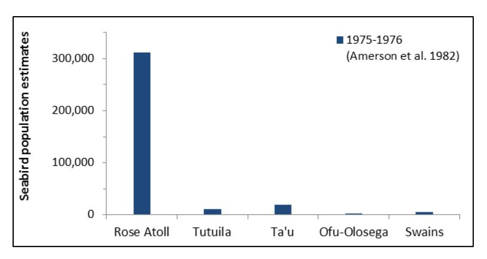

**Figure 83.** Population estimates of seabirds (species combined) on American Samoa islands in 1975-76 (from Table 38). At Rose Atoll, 96% of the seabirds were Sooty Terns. Source: Amerson et al. 1982.

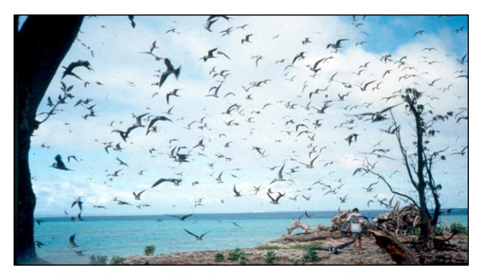

**Figure 84.** Sooty Terns at Rose Atoll, American Samoa. Photo: P. Craig.

O'Connor and Rauzon (2004) noted that the majority of seabirds and their habitat are legally protected in the Territory. Various U.S. federal jurisdictions, including NPSA, Cape Taputapu National Natural Landmark, National Marine Monument of American Samoa, and Aunu'u Island National Natural Landmark protect seabird habitat to varying degrees on Tutuila Island. In Manu'a, NPSA's Ofu and Ta'u Units protect seabird habitats from development. All of Rose Atoll lies within Rose Atoll National Wildlife Refuge and Rose Atoll National Marine Monument which are administered by USFWS and NOAA. Such designations are important, but protection of habitat is not sufficient if predators are present.

## Seabird status in Tutuila Unit

Three seabird surveys around Tutuila Island have occurred over the past 40 years: 1975-76 (Amerson et al. 1982) (Figure 85 and Table 38) and 2000 and 2003 (O'Connor and Rauzon 2004). Species composition and relative abundance were generally similar in all three surveys, comprised mostly of Brown Noddies, White Terns, and White-tailed Tropicbirds. Total numbers of all species varied considerably between years: 11,285 seabirds (1975-76), 987 (2000), and 2059 (2003). Reasons for these differences are unclear but may reflect real differences or differences in survey methods or seasonal effects.

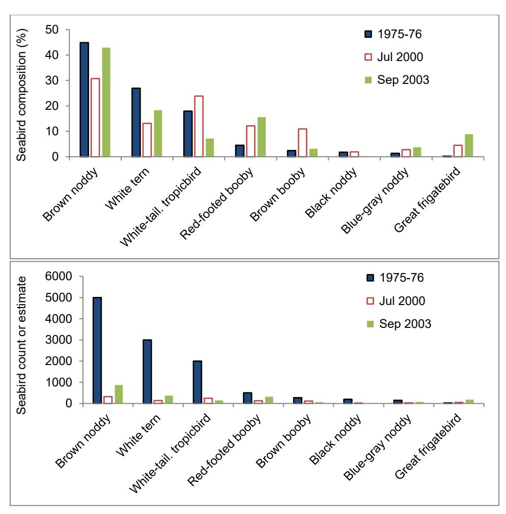

**Figure 85.** Seabird species composition (top) and counts or estimates (bottom) on Tutuila Island in 1975- 76 (Amerson et al. 1982) and 2000-03 (O'Connor and Rauzon 2004).

**Table 38.** Historical summary of seabirds observed in American Samoa, 1966-2001, compiled by O'Connor and Rauzon (2004). See Swenson et al. (2006) for more detailed information about Rose Atoll. Abbreviations are: T = Tutuila; A = Aunu'u; N = Nu'utele; Of – Ofu; OI = Olosega; Ta = Ta'u; R = Rose; S = Swain's; All = All islands in Am. Sam.

| Species                     | Common Name                                | Samoa Names | Clapp Sibley (1966) | King (1967) | Crossin (1971)   | Amerson et al. (1982)          | Harrison (1983) | Engbring Ramsey (1989) *focused                                                     | O'Connor (2001)                           | Notes                                         |
|-----------------------------|--------------------------------------------|----------------|------------------------|-------------|------------------|-----------------------------------|--------------------|-------------------------------------------------------------------------------------|-------------------------------------------|-----------------------------------------------|
| Pterodroma cervicalis       | White-necked Petrel                        | ta'i'o         | _                      | _           | _                | At sea (dozens)                   | _                  | _                                                                                   | _                                         | _                                             |
| Pseudobulweria rostrata  | Tahiti Petrel                              | ta'i'o         | -                      | -           | Ta (1,000's*) | Ta (500)                          | -                  | Ta (100's to 1,000's*); Tu (1c&r), (OI)                                       | Ta (100's*);Tu (100's*) (1 coll)       | -                                             |
| Pterodroma heraldica        | Herald's; Trinidade Petrel              | ta'i'o         | -                      | -           | -                | _                                 | -                  | Ta (10's*)                                                                          | -                                         | Pyle et al. ta'u (10's*) (1coll) (1989) |
| Pterodroma brevipes         | Collared; White- winged Petrel          | ta'i'o         | -                      | -           | -                | Ta at sea                         | -                  | (Ta); (Ol 1-4 heard)                                                                | -                                         | Morph closely resembled herald's              |
| Pterodroma alba             | Phoenix Petrel                             | ta'i'o         | _                      | _           | _                | _                                 | _                  | _                                                                                   | Ta (10's*)                                | _                                             |
| Ardenna tenuirostris        | Short-tailed Shearwater; Muttonbird  | ta'i'o         | _                      | Migrant     | -                | _                                 | Migrant            | -                                                                                   | -                                         | -                                             |
| Ardenna pacificus           | Wedge-tailed Shearwater                 | ta'i'o         | At sea                 | Breeding    | -                | At sea (6 seen)                   | _                  | -                                                                                   | -                                         | -                                             |
| Puffinus nativitatus        | Christmas Shearwater                    | ta'i'o         | -                      | -           | -                | Ta (olotonia and laufuti); at sea | -                  | _                                                                                   | Tu (2 at sea 16 km off south shore) | -                                             |
| Puffinus l'herminieri       | Audobon's Shearwater                    | ta'i'o         | -                      | -           | (10h)            | Ta (200?); at sea (10's*)         | -                  | Ta (100's*); Tu (10 heard at Tau Mr., 10's heard at Pioa Mt.); at sea (20) | Ta (10's* heard); Tu (10's heard)      | -                                             |
| Nesofregetta albigularis | White-throated; Samoan Storm- Petrel | ta'i'o         | _                      | breeding    | -                | _                                 | breeding           | -                                                                                   | Tu (12 seen)                              | -                                             |

\* 10&#x27;s = tens of individuals; 12's = dozens of indiv; 100's = hundreds of indiv. etc.

**Table 38 (continued).** Historical summary of seabirds observed in American Samoa, 1966-2001, compiled by O'Connor and Rauzon (2004). See Swenson et al. (2006) for more detailed information about Rose Atoll. Abbreviations are: T = Tutuila; A = Aunu'u; N = Nu'utele; Of – Ofu; OI = Olosega; Ta = Ta'u; R = Rose; S = Swain's; All = All islands in Am. Sam.

| Species             | Common Name                | Samoa Names | Clapp Sibley (1966) | King (1967) | Crossin (1971) | Amerson et al. (1982)                        | Harrison (1983) | Engbring Ramsey (1989) *focused                                                                    | O'Connor (2001)                                                                       | Notes                                                                                                                          |
|---------------------|----------------------------|----------------|------------------------|-------------|----------------|-------------------------------------------------|--------------------|----------------------------------------------------------------------------------------------------|---------------------------------------------------------------------------------------|--------------------------------------------------------------------------------------------------------------------------------|
| Phaethon rubricauda | Red-tailed Tropicbird      | tava' e ula    | 1 coll                 | _           | _              | R                                               | _                  | _                                                                                                  | Rose                                                                                  | _                                                                                                                              |
| Phaethon lepturus   | White-tailed Tropicbird | tava' e sina   | -                      | -           | -              | All including swain's and rose (est 3700) | -                  | A (426 seen; est 2312)                                                                             | All (Swain's not visited)                                                             | -                                                                                                                              |
| Sula dactylatra     | Masked Booby               | fua'o          | -                      | -           | -              | R (est 25-240); at sea (5 seen)                 | -                  | Tu (2 seen pola); Ol (1 seen mag apt)                                                           | Rose; Tu at sea (1 adult, 1 juv seen)                                           | -                                                                                                                              |
| Sula leucogaster    | Brown Booby                | fua'o          | -                      | -           | -              | Tu; N; Ol                                       | -                  | Tu (100-200 seen pola; 6 seen fagatele); nu'utele (12 seen); olosega (53 seen maga pt) | Tu; Of; N; Ol                                                                         | Amerson and Engbring & Ramsey's Tu sites are only the Pola and Fagatele                                            |
| Sula sula           | Red-footed Booby           | fua'o          | _                      | _           | _              | Tu; R                                           | _                  | Tu (30 seen pola'uta ridge); OI (4 seen)                                                     | Tu                                                                                    | O'connor in 1999- 2001 observed same behaviours, almost exact same # of RFBO on Tu as Engbring Ramsey (1985) |
| Fregata minor       | Great Frigatebird          | atafa          | -                      | -           | -              | Tu; N; Ol; R                                    | -                  | Tu; A; Ol                                                                                          | Tu (avg 64 at pola; 2 (nest)coconut pt); Of; OI;R                                     | -                                                                                                                              |
| Fregata ariel       | Lesser Frigatebird         | atafa          | _                      | _           | _              | Tu; Of; OI; Ta; R                               | _                  | Tu; A                                                                                              | Tu;R                                                                                  | _                                                                                                                              |
| Egretta sacra       | Reef Heron                 | matu'u         | _                      | -           | -              | All                                             | -                  | Tu; A; Of; ol (noted as uncommon)                                                                  | Tu common (only colony at Fatu rock); Of (including a white morph); OI; R | O'Connor 2000 first white morph documented in Am Sam                                                                  |

\* 10&#x27;s = tens of individuals; 12's = dozens of indiv; 100's = hundreds of indiv. etc.

**Table 38 (continued).** Historical summary of seabirds observed in American Samoa, 1966-2001, compiled by O'Connor and Rauzon (2004). See Swenson et al. (2006) for more detailed information about Rose Atoll. Abbreviations are: T = Tutuila; A = Aunu'u; N = Nu'utele; Of – Ofu; OI = Olosega; Ta = Ta'u; R = Rose; S = Swain's; All = All islands in Am. Sam.

| Species               | Common Name                     | Samoa Names | Clapp Sibley (1966) | King (1967) | Crossin (1971) | Amerson et al. (1982)                            | Harrison (1983) | Engbring Ramsey (1989) *focused                                                      | O'Connor (2001)                                                                                | Notes                                                                                                                             |
|-----------------------|---------------------------------|----------------|------------------------|-------------|----------------|-----------------------------------------------------|--------------------|--------------------------------------------------------------------------------------|------------------------------------------------------------------------------------------------|-----------------------------------------------------------------------------------------------------------------------------------|
| Onychoprion lunatus   | Grey-backed; Spectacled Tern | gogo sina      | -                      | -           | -              | Tu (125 fagatele & larsens); A (30 seen); R(6 seen) | _                  | _                                                                                    | Tu (10's* seen fagtele, pola rocks, north shore dec-mar); R (4 seen sand isle)     | No specimen from Am Sam                                                                                                        |
| Onychoprion anathetus | Bridled; Brown- winged tern  | gogo ʻuli      | _                      | _           | Tu             | -                                                   | _                  | -                                                                                    | _                                                                                              | -                                                                                                                                 |
| Onychoprion fuscata   | Wideawake; sooty Tern        | gogo ʻuli      | _                      | _           | _              | Tu; R (est 300,000)                                 | _                  | Tu at sea (6 seen)                                                                   | R (est 10,000)                                                                                 | Amerson may've overest. Rose pop.; his forest bird # were reduced by Engbring (many by >90%); Clapp (1968) S |
| Thalasseus bergii     | Crested Tern                    | gogo           | _                      | Vagrant     | _              | Tu at sea                                           | _                  | _                                                                                    | _                                                                                              | _                                                                                                                                 |
| Procel-sterna cerulea | Blue-grey Noddy                 | iaia           | T; A; N; OI            | -           | -              | Tu; A; Of; OI; Ta                                   | -                  | Tu (56 seen); A (2 seen); Nu'utele (2 seen); olosega (2 seen mag apt)       | Tutuila (10's* seen)                                                                        | -                                                                                                                                 |
| nous stolidus         | Brown; Common Noddy          | gogo           | -                      | -           | -              | Est 16000                                           | _                  | Tu (est 4000) at pola, fagatele, amalau, Ta in forest higher than blacks; N | Tu; Of; Ta; R. 10+ colonies Tu, evening congregation coconus pt (avg 100 birds) | Most common seabirds on Tu                                                                                                     |

\* 10&#x27;s = tens of individuals; 12's = dozens of indiv; 100's = hundreds of indiv. etc.

**Table 38 (continued).** Historical summary of seabirds observed in American Samoa, 1966-2001, compiled by O'Connor and Rauzon (2004). See Swenson et al. (2006) for more detailed information about Rose Atoll. Abbreviations are: T = Tutuila; A = Aunu'u; N = Nu'utele; Of – Ofu; Ol = Olosega; Ta = Ta'u; R = Rose; S = Swain's; All = All islands in Am. Sam.

| Species       | Common Name                  | Samoa Names | Clapp Sibley (1966)          | King (1967)             | Crossin (1971) | Amerson et al. (1982)                                                                                           | Harrison (1983) | Engbring Ramsey (1989) *focused                                                                                                                     | O'Connor (2001)                                                              | Notes |
|---------------|------------------------------|----------------|---------------------------------|-------------------------|----------------|--------------------------------------------------------------------------------------------------------------------|--------------------|--------------------------------------------------------------------------------------------------------------------------------------------------------|------------------------------------------------------------------------------|-------|
| Anous minutus | Black; White capped Noddy | gogo           | 2 birds at sea in 6 Tu trips | Forages 80k offshore | –              | Nests Tu (pola islet (200), pola'uta ridge); Ta (siu point rd (5000)), R; S                               | –                  | Tu (200 10km offshore larsen's cove fishing w/ browns (greatly outnumbering them) 25 June 1986; 3 wks later only browns seen); Ta | Tu                                                                           | –     |
| Gygis alba    | White Fairy Tern             | gogo sina      | –                               | –                       | –              | All (4200), Although commonly nests in trees, report colonies on mag apt (Ol), cliffs on A and N | –                  | Tu (est 11,269 from a pt count) highest avg density but pt counts not best to count the species acc to report                              | All (Swain's not visited); Tu (many more on south shore than north) | –     |

\* 10&#x27;s = tens of individuals; 12's = dozens of indiv; 100's = hundreds of indiv. etc.

O'Connor and Rauzon (2004) found that the inaccessible north shoreline of Tutuila supported the majority of the island's resident seabirds, and nearly half of all seabirds on the island were located within NPSA's Tutuila Unit, although it accounted for only 11% of Tutuila's coastline. Pola Islet was the most significant geographical feature on the north shore of Tutuila (Figure 86) and is known presently and historically as a key seabird breeding locale (Figure 87). It is likely that the relatively high use by seabirds in this area is due to the steepness and remoteness of these cliffs rather than to any agency management action. The only known breeding colonies of Red-footed Boobies in the Territory outside of Rose Atoll are located here and on nearby Pola'uta Ridge. Great Frigatebirds may nest on top of the Pola, although this has not been confirmed.

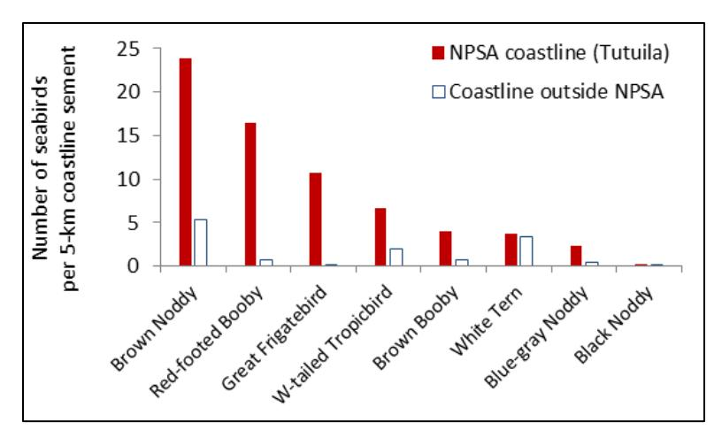

**Figure 86.** Comparison of principal seabird species counted in two sections around the Tutuila coastline: inside and outside NPSA. Survey counts during 2000 and 2003 were combined. Source: data from O'Connor and Rauzon 2004.

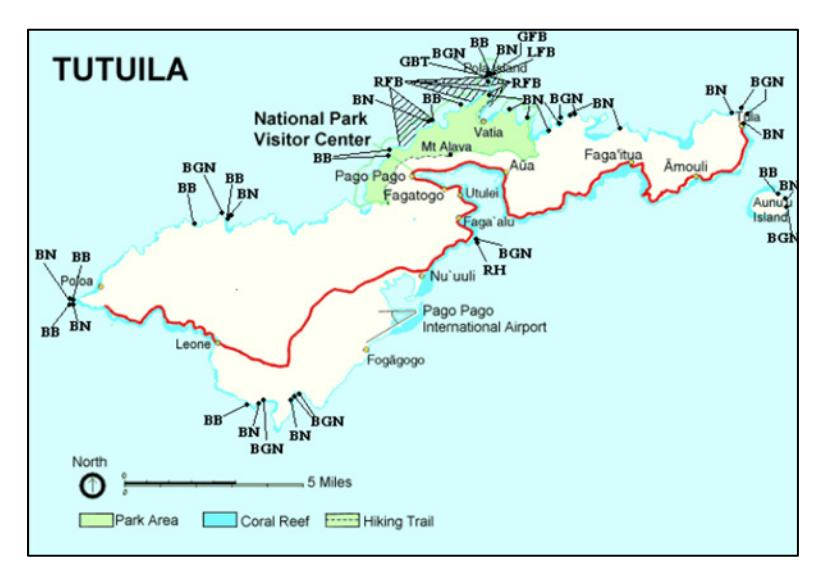

**Figure 87.** Coastal seabird colonies on Tutuila. Many colonies were within NPSA (light green area). Red line indicates island road. Abbreviations: BB (Brown Booby), RFB (Red-footed Booby), BN (Brown Noddy), BGN (Blue Noddy), RH (Reef Heron), GBT (Gray-backed Tern), GFB (Great Frigatebird). Source: O'Connor and Rauzon 2004).

A few seabird rookeries were observed along Tutuila's southern shore, including the eastern (Cape Matatula) and western (Cape Taputapu) ends of the island (O'Connor and Rauzon 2004). Tree nesters such as White Terns and White-tailed Tropicbirds were observed in all quadrants around Tutuila. Additionally, mixed-species seabird flocks were observed feeding offshore around Tutuila Island.

## Seabird status in Ta'u Unit

Species richness on Ta'u was similar to that on Tutuila, but seabird numbers on Ta'u in 1975-76 were about twice as high (11,000 versus 19,000 seabirds) (Figure 83, Table 38). This is likely to reflect several factors: Ta'u is the tallest (965 m) of these islands and has a well-developed summit cloud forest that provides habitat for burrowing seabirds; the island's steep and isolated terrain limits human disturbance; the island's human population is low; and there is negligible boat traffic around the island that might disturb seabirds.

According to O'Connor and Rauzon (2004), the cloud forest summit of Ta'u, which is in the park's Ta'u Unit, may be one of the most important seabird breeding areas throughout NPSA. The estimated area for petrel nesting is shown in Figure 88, but little is known about their actual distribution or abundance. It is challenging to work in the summit environment, and it has been difficult to determine what species occur and breed on Mt. Lata. The low presence of Herald's Petrel (Pyle et al. 1990, O'Connor and Rauzon 2004, Titmus et al. 2014 and 2015) raises concern about their continued presence at what was their only known colony in Samoa. The discovery of predatory Norway rats (*Rattus norvegicus*) at the summit is a significant finding, with strong negative conservation implications (e.g., O'Connor and Rauzon 2006, Jones et al. 2008, Harper and Bunbury 2015).

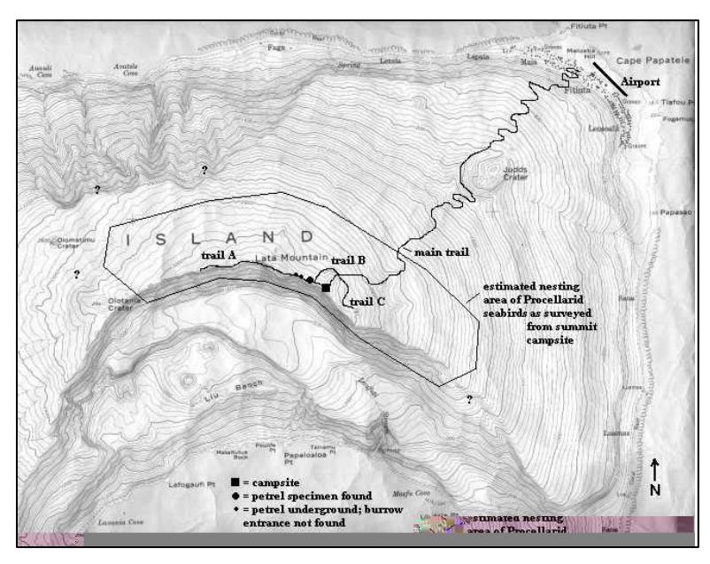

**Figure 88.** Estimated petrel nesting area in the cloud forest summit of Ta'u Island, American Samoa. Source: O'Connor and Rauzon 2004.

O'Connor and Rauzon (2004) suggested first, that the cloud forest of Mt. Lata is unique within the jurisdiction of the U.S. National Park Service, and there are very few known places for ground nesting seabirds remaining in the world which can match, in either scale or diversity, the summit of Ta'u, and next, that NPSA may support one of the last strongholds of Tahiti Petrels in the Samoan Archipelago.

While coastal areas around Ta'u have received less attention than the cloud forest, seabirds such as Brown Noddies, Black Noddies, and White Terns nest there (Amerson et al. 1982, Engbring and Ramsey 1989, Judge et al. 2013).

## Seabird status in Ofu Unit

Ofu and Olosega are small volcanic islands (5.4-7.3 km2 ) of moderate elevation (494-639 m) and with low human populations (40-68 people/km2 ). Low numbers of seabirds were observed in these islands (Tables 29 and 30). Repeated trips to the summits of Ofu and Olosega did not reveal obvious procellariid nesting areas (O'Connor and Rauzon 2004). NPSA's Ofu Unit receives little use by nesting seabirds (P. Craig, pers. com. 2016). The park is small (0.3 km2 land area) and consists of a narrow strip of agro-forest (approximately 30 m wide) adjacent to the shoreline road.

## Data needs/gaps

Information about the current distribution and abundance of seabirds in American Samoa's main islands is limited. Effects of alien predators on nesting seabird populations needs further investigation.

## Threats

Paleczny et al. (2015) summarized that the drivers of declining trends in global seabird populations are probably due to a suite of threatening human activities — introduced species at nesting colonies (e.g., rats, cats), entanglement in fishing gear at sea, overfishing of food sources by humans, climate change and severe weather, pollution, disturbance, direct exploitation (harvesting chicks, eggs, adults), development, and energy production. More locally, the primary threats to seabirds in NPSA are alien predators. Rats inhabit all of American Samoa (except Rose Atoll); feral cats, dogs and pigs have been observed in the park; invasive fire ants and other insects may adversely affect seabird nesting success. For example, an infestation of an alien scale insect (*Pulvinaria urbicola*) is implicated in the demise of the *Pisonia* forest (used by nesting seabirds) at Rose Atoll (Swenson et al. 2006). Proposed wind turbines in the Territory could have an adverse effect on seabirds. Climate change impacts to seabirds and their habitats in these islands have not yet been evaluated, although sea level rise threatens seabird nesting by inundation at low-lying islands like Rose Atoll.

## Overall condition

#### *Seabird status in American Samoa*

The seabird assemblage in American Samoa is consistent with regional seabird distributions in central Oceania. The Territory supports 19 breeding species, half of which are of regional or global conservation concern due to low or declining numbers and/or restricted distributions (USFWS 2005). Numerically, most seabirds in the Territory are located at Rose Atoll, where large fluctuations in their numbers have occurred but with few clear trends. Seabird numbers elsewhere in the Territory

are generally low but not well-documented. This measure was assigned a Significance Level of 2 (Moderate) and a Condition Level of 2 (Moderate).

#### *Seabird status in Tutuila Unit*

NPSA's Tutuila Unit provides important habitat for nesting seabirds — about half of all seabirds counted around the island were located within park boundaries. Population sizes and threats are not well known. This measure was assigned a Significance Level of 2 (Moderate) and a Condition Level of 2 (Moderate).

#### *Seabird status in Ta'u Unit*

The cloud forest summit of Mt. Lata is an important breeding area for procellariid seabirds. Noddies and terns also nest in coastal areas around the island. Population sizes and threats are not well known. The discovery of the predatory Norway rat in the cloud forest is a potentially serious threat to ground-nesting birds. This measure was assigned a Significance Level of 2 (Moderate) and a Condition Level of 2 (Moderate).

#### *Seabird status in Ofu Unit*

Ofu and Olosega are small islands that support relatively few seabirds. The park's Ofu Unit provides minimal habitat for seabird nesting. This measure was assigned a Significance Level of 1 (Low) and a Condition Level of 0 (Not a significant concern at this time).

#### *Weighted condition score*

NPSA contains excellent habitat for seabirds, but the weighted condition score of 0.57 (Table 39) indicates a moderate level of conservation concern for several reasons, including their generally low abundance and continued threat by alien predators. Although Pacific populations of many seabirds that nest in American Samoa are nationally or globally significant, and most are of moderate to high conservation concern (USFWS 2005), their status and trends in American Samoa and in NPSA are unclear.

**Table 39.** Significance levels and condition levels used to calculate the weighted condition score (WCS) for NPSA's seabirds.

| Measures                           | Significance Level | Condition Level | WCS = 0.57                                                                                                                             |
|------------------------------------|--------------------|-----------------|----------------------------------------------------------------------------------------------------------------------------------------|
| Sea bird status: American Samoa | 2                  | 2               |                                                                                                                                        |
| Seabird status: Tutuila Unit       | 2                  | 2               |                                                                                                                                        |
| Seabird status: Ta'u Unit          | 2                  | 2               |                                                                                                                                        |
| Seabird status: Ofu Unit           | 1                  | 0               | Condition of resource warrants moderate concern; trend in condition is unknown or not applicable; low confidence in the assessment. |

#### *4.9.5. Literature Cited*

Amerson, A., W. Whistler, and T. Schwaner. 1982. Wildlife and wildlife habitat of American Samoa. Vols. 1 & 2. US Fish and Wildlife Service Report, Washington D.C.

Brooke, A. 1998. Biology of the flying foxes in American Samoa: *Pteropus samoensis* and *Pteropus tonganus*. Report to the National Park of American Samoa. 56 p.

- Clapp, R., and F. Sibley. 1966. Notes on the birds of Tutuila, American Samoa. Notornis 13: 157- 164.
- Crossin, R. 1971. The Storm Petrels (*Hydrobatidae*). Pages 154-205. *In*: W. King (ed.). Pelagic studies of seabirds in the central and eastern Pacific Ocean. Smithsonian Contributions to Zoology 158. [cited in Amerson et al. 1982]
- Croxall, J., S. Butchar, B. Lascelles, A. Stattersfield, B. Sullivan, and A. Symes. 2012. Seabird conservation status, threats and priority actions: a global assessment. Bird Conservation International. 22:1-34.
- Engbring, J., and F. Ramsey. 1989. A 1986 survey of the forest birds of American Samoa. Report by US Fish and Wildlife Service. Honolulu, Hawaii.
- Flint, E. 2002. Status of seabird populations and conservation in the tropical island Pacific. *In:* L. Eldredge, P. Holthus, and J. Maragos, (eds.), Marine and coastal biodiversity in the tropical island Pacific region: population, development, and conservation priorities. Vol. 2. East-West Center, Honolulu, Hawai'i. [cited in O'Connor and Rauzon 2004].
- Grant, G., and P. Trail. 1993. American Samoa Christmas bird count 1992. 'Elepaio 52:3.
- Grant, G., and R. Clapp. 1994. First specimen of Sooty Shearwater, Newell's Shearwater, and Whitefaced Storm-Petrel from American Samoa. Notornis 41:215-216.
- Harper, G., and N. Bunbury. 2015. Invasive rats on tropical islands: their population biology and impacts on native species. Global Ecology and Conservation 3:607-627.
- Harrison, P. 1983. Seabirds, an identification guide. Croom Helm Ltd., Kent. 448 p. [cited in O'Connor and Rauzon 2004].
- IUCN (Interagency Union for Conservation of Nature). 2016. IUCN Red List of Threatened Species. IUCN, Gland, Switzerland. [www.iucnredlist.org.](http://www.iucnredlist.org/) Accessed May 2016.
- King, W. 1967. Seabirds of the tropical Pacific Ocean. Smithsonian Inst., Washington, D.C. 126 p. [cited in O'Connor and Rauzon 2004].
- Kushlan, J., and 22 co-authors. 2002. Waterbird conservation for the Americas: The North American Waterbird Conservation Plan. Version 1. Waterbird Conservation for the Americas. Wash. DC. 78 p.
- Jones, H., B. Tershy, E. Zavaleta, D. Croll, B. Keitt, M. Finkelstein, and G. Howald. 2008. Severity of the effects of invasive rats on seabirds: a global review. Conservation Biology 22(1):16-26. DOI: 10.1111/j.1523-1739.2007.00859.x.
- Jones, S. 2014. A first documented record of black-naped tern (*Sterna sumatrana*) for Tutuila Island, American Samoa. Notornis 61: 113-115.

- Judge, S., R. Camp, V. Vaivai, and P. Hart. 2013. Pacific Island forest bird monitoring annual report, National Park of American Samoa, Ta'u and Tutuila Units, 2011. Natural Resource Tech. Rept. NPS/PACN/NRTR—2013/666. National Park Service, Fort Collins, CO.
- Lepage, D. 2016. Avibase the world bird database. [http://avibase.bsc-eoc.org/avibase.jsp.](http://avibase.bsc-eoc.org/avibase.jsp) Accessed May 21, 2016.
- Morrell, T., B. Ponwith, P. Craig, T. Ohashi, J. Murphy, and E. Flint. 1991. Eradication of Polynesian rats (*Rattus exulans*) from Rose Atoll National Wildlife Refuge, American Samoa. DMWR Biological Report Series No. 20.
- Murphy, J., and T. Ohashi. 1991. Report of rat eradication operations conducted under specific emergency exemption to use Talon-G containing brodifacoum in a field situation on Rose Atoll National Wildlife Refuge, American Samoa. USDA, APHIS ADC. Honolulu, HI.
- O'Conner, P., and M. Rauzon. 2004. Inventory and monitoring of seabirds in the National Park American Samoa. University of Hawai'i Pacific Cooperative Studies Unit Technical Report 136. Honolulu, HI: University of Hawai'i. [http://manoa.hawaii.edu/hpicesu/techr/136/08.pdf.](http://manoa.hawaii.edu/hpicesu/techr/136/08.pdf)
- Paleczny, M., E. Hammill, V. Karpouzi, and D. Pauly. 2015. Population trend of the world's monitored seabirds, 1950-2010. PLoS ONE. 10(6): e0129342. doi:10.1371/journal.pone.0129342.
- Pratt, H., P. Bruner, and D. Berrett. 1987. A field guide to the birds of Hawaii and the tropical Pacific. Princeton Univ. Press. 409 p.
- Pyle, P., L. Spear, and J. Engbring. 1990. A previously unreported population of Herald Petrels on Ta'u Island, American Samoa. Colonial Waterbirds 13: 136-138.
- Rauzon, M. 2003. The Tahiti Petrels Night on Mount Lata, Ta'u. #131. The Pacific Cooperative Studies Unit (PCSU) and the Hawai'i-Pacific Islands Cooperative Ecosystem Studies Unit (HPI-CESU). [Sound recordings in mp3 format]. Available online from: [http://manoa.hawaii.edu/hpicesu/techr/131/default.htm,](http://manoa.hawaii.edu/hpicesu/techr/131/default.htm) or [http://www.hear.org/pcsu/tahitipetrels/.](http://www.hear.org/pcsu/tahitipetrels/) Accessed 15 September 2014.
- Rauzon, M. 2006. Occurrence of Bridled and Gray-backed Terns in American Samoa. Western Birds 37:169-174.
- Rauzon, M., and A. Rudd. 2014. Vocal repertoire of Tahiti Petrel, *Pseudobulweria rostrata*: a preliminary assessment. Marine Ornithology 42: 143-148.
- Seamon, J., C. Leach, V. Vaivai, S. Fa'aumu, and A. Tualaulelei. 2011. Three new bird records from American Samoa. Dept. Marine and Wildlife Resources, American Samoa. ASG-DMWR Report #56665-2011-1 1.

- Steadman, D. 1990. Archaeological bird bones from Ofu: extirpations of shearwaters and petrels. Pages 14-15. *In*: P. Kirch, T. Hunt, L. Nagaoka and J. Tyler (eds.). An ancestral, Polynesian occupation site at Toaga, Ofu Island, American Samoa. Oceania 25: 1-15.
- Steadman, D. 1993. Bird bones from the To'aga site, Ofu, American Samoa: prehistoric loss of seabirds and megapodes. Univ. Calif. Archaeol. Res. Fac. Contrib. 51: 217—228.
- Steadman, D. 1995. Prehistoric extinctions of Pacific Island birds. Science 267:1123-1131.
- Steadman, D. 2006. Extinction and biogeography of tropical Pacific birds. Chicago: University of Chicago Press.
- Swenson, C., C. Pelizza, A. Wegmann, and S. Holzwarth. 2006. Rose Atoll National Wildlife Refuge research compendium. US Fish and Wildlife Service, Pacific Island Coastal Program, Hawaii.
- Titmus, A., and N. Dauphine. 2013. Seabirds and shorebirds of Swains Island, American Samoa (abstract). 38th Annual Albert L. Tester Memorial Symposium, April 17 - 19, 2013.
- Titmus, A., C. Lepczyk, and N. Dauphine. 2014. Distribution of Tahiti Petrel and Herald Petrel on Ta'u Island, American Samoa (abstract). Pacific Seabird Group, 2014, 41st annual meeting, Juneau AK.
- Titmus, A., C. Lepczyk, A. Fleishman, D. Savage, M. McKown. 2016. Patterns of distribution and relative abundance of procellariform seabirds on Ta'u Island, American Samoa (abstract). Pacific Seabird Group 2016, 43rd Annual Meeting, Hawai'i.
- USFWS (US Fish and Wildlife Service). 2005. Regional seabird conservation plan. USFWS, Migratory Birds and Habitat Program, Pacific Region, Portland, Oregon.
- USFWS (US Fish and Wildlife Service). 2017. Geographic scope of the Pacific Islands Fish and Wildlife Service. [www.fws.gov/pacificislands/pdf/PIFWO\\_Scope.pdf.](http://www.fws.gov/pacificislands/pdf/PIFWO_Scope.pdf) Accessed 12 March 2017.
- Utzurrum, R., J. Seamon, and K. Saili. 2006. A comprehensive strategy for wildlife conservation in American Samoa. Dept. Marine and Wildlife Resources, American Samoa. 109 p.
- Watling, D. 2001. A guide to the birds of Fiji and western Polynesia. Environmental Consultants Ltd., Suva Fiji.
- Whistler, A. 1993. The cloud forest of Samoa. p. 231-236. *In*: L. Hamilton et al. (eds.). Tropical montane cloud forests. East West Center Program on Environment, Hawaii.
- Wikipedia. 2016. List of birds of American Samoa. Wikipedia: the free encyclopedia. [https://en.wikipedia.org/wiki/List\\_of\\_birds\\_of\\_American\\_Samoa.](https://en.wikipedia.org/wiki/List_of_birds_of_American_Samoa) Accessed 21 May 2016.
- WPRFMC (Western Pacific Regional Fisheries Management Council. 2016. Protected species American Samoa. [www.wpcouncil.org/managed-fishery-ecosystems/american-samoa](http://www.wpcouncil.org/managed-fishery-ecosystems/american-samoa-archipelago/protected-species-samoa/)[archipelago/protected-species-samoa/.](http://www.wpcouncil.org/managed-fishery-ecosystems/american-samoa-archipelago/protected-species-samoa/) Accessed 21 May 2016.

Yen, L. 2010. Seabird guide. Dept. Marine and Wildlife Resources, American Samoa.

## **4.10. Streams**

## *4.10.1. Description*

Almost all perennial streams in American Samoa are located on Tutuila Island (141 of 142 streams); the remaining one is on Ta'u Island. These are small streams that generally run low and clear, but flood quickly and carry high sediment loads in response to downpours. Total annual rainfall in the mountains is high, ranging from 3,800-7,600 mm (150-300 in).

NPSA contains 21 streams in the Tutuila Unit and one in the Ta'u Unit, most of which lie completely within park boundaries from ridge top to reef. Streams are short (average 1.5 km), steep, and drain the coastal mountains in NPSA's Rainforest Life Zone (Figure 89). They are categorized as pristine by the American Samoa Environmental Protection Agency (ASEPA), although they have not been immune to human activities. Water quality is generally good, with well-oxygenated waters subjected to high turbidities during freshets and low to moderate levels of nutrients and fecal bacteria. Streams are inhabited by a small number of mostly native fish, shrimp and snail species which are widely distributed across the South Pacific. All have a marine stage in their life cycles, which enables them to disperse among islands. None is considered to be endemic, threatened, or endangered.

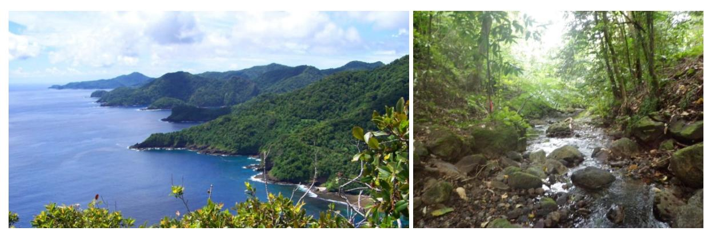

**Figure 89.** North side of Tutuila showing steep rainforest slopes in NPSA (left) and a small stream near Vatia (right). Photos: P. Craig and NPS I&M.

Most other streams on the populated island of Tutuila are under continued threat of degradation due to a human population that has rapidly increased over the past several decades (Figure 5b). NPSA is fortunate in being located away from populated areas, so threats to park streams are more modest but include alien species and disturbances from human activities. Fishing for stream fish and shrimp occurred in past times (Armstrong et al. 2011). Water quality criteria for Territorial streams are listed by the American Samoa Environmental Protection Agency (ASEPA**)** in Table 40.

**Table 40.** Water quality criteria for fresh surface waters in American Samoa (ASEPA 2013, Tuitele et al. 2016).

| Parameter                              | Not to exceed | Must exceed |
|----------------------------------------|---------------|-------------|
| Turbidity (NTU)                        | 5             | –           |
| pH                                     | 6.5 - 8.6     | –           |
| Dissolved oxygen (mg/l)                | –             | 6           |
| Total Phosphorus (μg/l)                | 150           | –           |
| Total Nitrogen (μg/l)                  | 300           | –           |
| Total Suspended Solids (mg/l)          | 5             | –           |
| Fecal bacteria                         | –             | –           |
| E. coli (no./100ml)                    | 576           | –           |
| Enterococci (no./100ml)                | 151           | –           |
| Enterococci geometric mean (no./100ml) | 33            | –           |

## *4.10.2. Data and Methods*

Principal data sources are presented separately for physical-chemical characteristics (including fecal bacteria levels) and macrofauna (fish, shrimps, snails) in American Samoan streams.

## Physical and chemical characteristics

*NPS I&M Vital Signs monitoring for stream water quality*

A protocol for monitoring stream water quality was implemented in NPSA in 2009 based on a program developed by PACN I&M (Jones et al. 2011). Three streams in NPSA's Tutuila Unit (Fagatuitui, Leafu, Amalau) and one in the Ta'u Unit (Laufuti) were sampled quarterly (Figure 90). Raikow and Farahi (2015) summarized results for 2009-11; subsequent data were obtained from the PACN I&M database (K. Kozar, pers. com. 2017). This program measured 10 water quality parameters: pH, temperature, turbidity, conductivity, salinity, dissolved oxygen (DO), chlorophyll-a, total dissolved nitrogen (TDN), total dissolved phosphorous (TDP), nitrates and nitrites (NO3, NO2). Note that TDN and TDP concentrations do not include particulate nutrient concentrations, so they would be lower than total nutrient concentrations (TN, TP) used in ASEPA's criteria. Human populations along these streams were: no residents (Fagatuitui and Laufuti), about 10 residents (Amalau), and 640 residents (Leafu-Vatia Village). The two coastal villages were located about 0.1 km downstream from park boundaries.

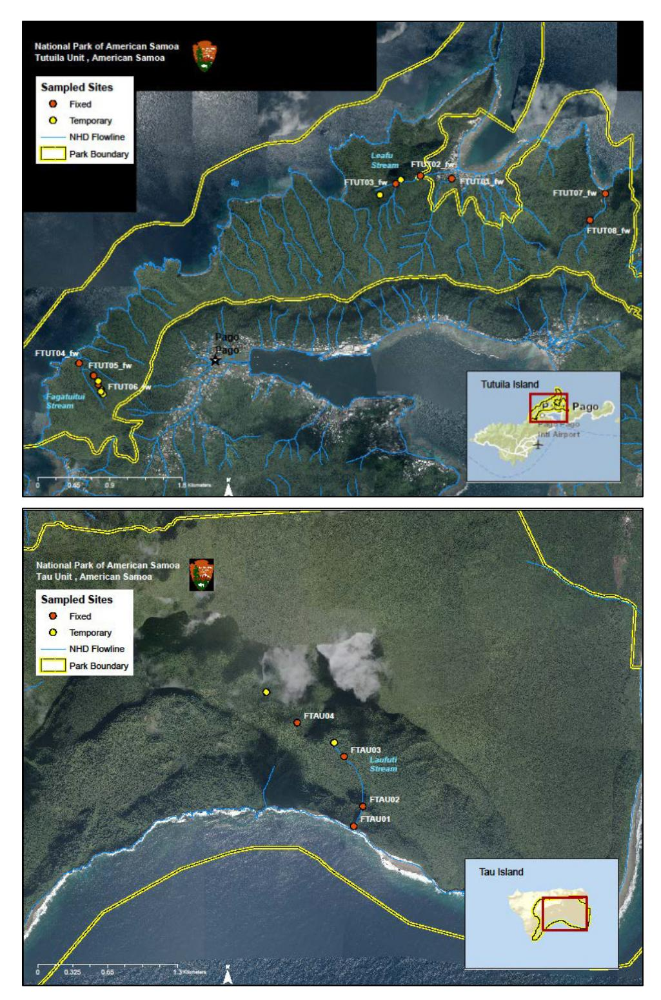

**Figure 90.** Streams sampled for water quality and macrofauna in NPSA's Tutuila Unit (top, left to right: Fagatuitui, Leafu, Amalau Streams) and Ta'u Unit (bottom: Laufuti Stream) by the NPS I&M program. Source: Raikow and Farahi 2015.

## *Other sources*

Two watershed classification systems were developed in American Samoa (DiDonato 2004a, 2004b; Bardi et al. 2007). In 2003, ASEPA conducted an islandwide survey of randomly selected streams on Tutuila that represented four presumed levels of anthropogenic disturbance: 0-100 people/mi2 (pristine), 101-500 people/mi2 (minimal disturbance), 501-1000 people/mi2 (intermediate disturbance), ≥1001 people/mi2 (extensive disturbance). In the first year of the program, DiDonato (2004b) sampled two streams monthly from each impact category, one of which was located in NPSA (Fagatuitui). Subsequent monitoring results in the ASEPA program were not available at the time of this writing. Bardi et al. (2007) developed another classification system for water quality in Tutuila streams. They measured pH, conductivity, turbidity, temperature, dissolved oxygen, calcium, magnesium, potassium, sodium, reactive phosphorus, ammonium-N, and nitrate-N levels in 44 Tutuila streams. Streams were partitioned into three presumed levels of impact (low, moderate, high) based upon phosphorus and nitrogen levels as indicators of human impact levels. Significantly different medians occurred within these categories for all parameters except pH and turbidity.

Additional information about physical and chemical characteristics of American Samoan streams (including fecal bacterial counts) was provided by Burger and Maciolek (1981), Wong (1996), Cook (2001, 2004), DiDonato (2005), Wade et al. (2008), Tetra Tech (2014), and Tuitele et al. (2016).

## Stream fauna

*NPS I&M Vital Signs monitoring for stream fauna*

A protocol for monitoring stream fauna was implemented in NPSA in 2009 based on a program developed by PACN I&M (Brasher et al. 2011). Fish, shrimp, and snails were sampled in the four previously mentioned streams in the Tutuila and Ta'u Units (Figure 92). While PACN I&M provided species lists for 2009-10 (K. Kozar, pers. com. 2016), other data are not yet available.

## *Other sources*

Stream macrofauna in the Tutuila Unit was surveyed 35 years ago (Burger and Maciolek 1981, Couret et al. 1981), and Laufuti Stream in the Ta'u Unit was surveyed 20 years ago (Cook 2004). These surveys, together with others conducted elsewhere on Tutuila (Burger and Maciolek 1981, Couret et al. 1981, Wade et al. 2008, Vargo 2009) provided a general description and inventory of stream fish, shrimp, and snails in the Territory. Additional information included the biogeography of Pacific freshwater fishes (Pippard 2012) and gastropods (Haynes 1990), goby dominance in Pacific streams (Ryan 1991), and alien aquatic species in Pacific streams (Maciolek 1984, Eldredge 1994, 2000, Cowie 1998, 2000).

## *4.10.3. Reference Condition*

Historical data for physical, chemical, and biological conditions in NPSA streams are generally inadequate to establish reference conditions. Cook (2001, 2004) provided a snapshot of relatively pristine conditions in Laufuti Stream in the Ta'u Unit in 1996-97, but limited sampling has occurred in the 21 streams in NPSA's Tutuila Unit (Burger and Maciolek 1981, Couret et al. 1981, DiDonato 2004b, Bardi et al. 2007, Wade et al. 2008). However, the current NPS I&M sampling program in four selected park streams, when fully analyzed, may provide a basis for reference conditions in these streams.

## *4.10.4. Condition and Trend*

Four measures were used to evaluate stream condition in NPSA: stream morphology and hydrology water quality, macrofaunal community, and stream habitat.

## Stream morphology and hydrology

Tutuila Island has 141 small streams that flow year-round along at least a portion of their main channel (Burger and Maciolek 1981). Most streams are shallow and less than three km in length. Watersheds are small (average 1.0 km2 , range 0.3-2.7 km2 ) and daily flows are low (average 0.1 m3 /s, range 0-46 m3 /s) based on USGS flow gauges (Wong 1996). Streams flood quickly in response to rainfall (Figure 91), which ranges from 3,200 mm (125 in) at the Tafuna airport to 6,800 mm (268 in) in the mountains (Figure 92). Rainfall varies annually with no clear trend over the past 50 years (Figure 93).

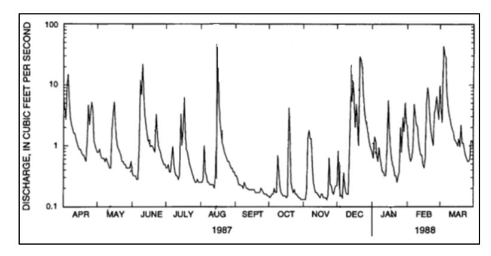

**Figure 91.** Daily discharge in Pago Stream at Afono Village, next to NPSA's Tutuila Unit, in 1987-1988. Source: Wong 1996.

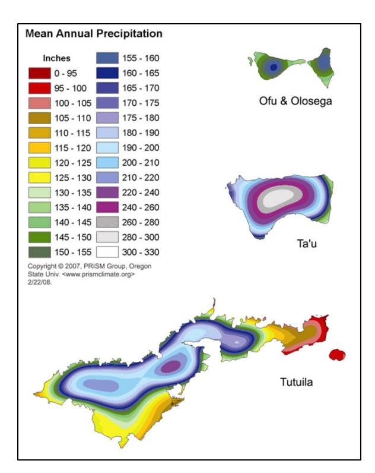

**Figure 92.** Rainfall levels in American Samoa, based on an elevational model using available rainfall records. Source: Daly et al. 2006.

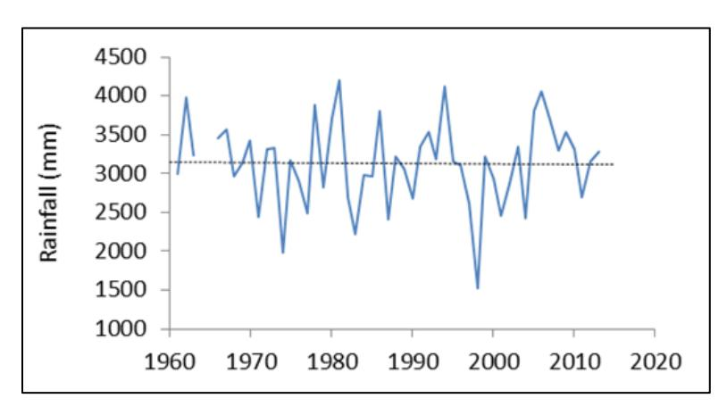

**Figure 93.** Annual rainfall at Tafuna airport, American Samoa. Source: NOAA, National Climatic Data Center [www.ncdc.noaa.gov.](http://www.ncdc.noaa.gov/)

In NPSA 21 small streams flow through the Tutuila Unit (Figure 89). Stream channels average 1.5 km in length (range 0.4-6.0 km), and watershed areas average 0.3 km2 (range 0.1-1.2 km2 ) (Burger and Maciolek 1981, Couret et al. 1981). Low and high flow conditions in two park streams are illustrated in Figure 94 and Figure 95. Estuaries are minimally developed and consist of short sections of coral and rock rubble, and algae-covered lava rocks. On the neighboring islands with park units, there is one perennial stream on Ta'u (Laufuti Stream) but none on Ofu. Mt. Lata on Ta'u receives over 7,600 mm (300 in) per year (Figure 92).

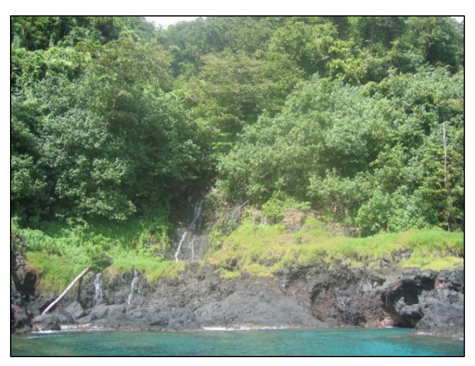

**Figure 94.** Low flow conditions in a small stream flowing into the ocean in NPSA's Tutuila Unit (near Tafeu Cove). Photo: P. Craig.

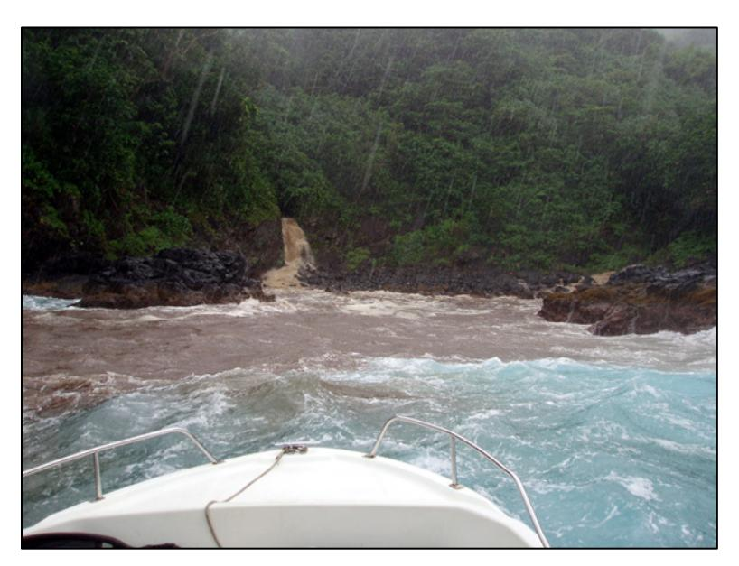

**Figure 95.** Turbid flooding. Fagatuitui Stream dumping sediment onto coral reefs in NPSA's Tutuila Unit. High sediment loads may be partly natural in origin but likely reflect erosion from the Mt. Alava dirt road located about one km upstream. A scuba diver reported seeing a "surface to bottom curtain of dirt" in the five m deep marine water column at this site and time (P. Craig, pers. obs. March 2007). Photo: P. Craig.

Stream morphology and hydrology in the park are generally unaltered by anthropogenic activities such as water impoundments or diversions, except for some road alignments, culverts and ground disturbances that may affect flows or increase sedimentation during flooding. In the Vatia watershed, streams that flow out of the park and through Vatia Village are partly channelized.

## Water quality

ASEPA developed a watershed classification system for American Samoa based on human densities in watersheds as a proxy for the level of anthropogenic disturbance (DiDonato 2004a, 2004b). ASEPA found that with increasing levels of human disturbance, habitat quality and water quality decreased (i.e., water temperature, nutrients, and *Enterococcus* bacterial contamination increased). Based on this system, four NPSA watersheds were classified as pristine (0 people/mi2 : Fagatuitui, Ofu Island south, and both watersheds on Ta'u Island) (Table 41). Further, Fagatuitui Stream was determined to be "fully supporting" of its 305b aquatic life designated use (DiDonato 2004b).

**Table 41.** ASEPA impact classification of watersheds in or near NPSA based on density of humans in watershed (DiDonato 2004a). A more recent development classification is also indicated (Tuitele et al. 2016).

| Island  | ASEPA Watershed | In/near NPSA | Area mi2 | HumanA population | Density no./mi2 | Impact classificationB | DevelopmentC classification |
|---------|--------------------|-----------------|-------------|----------------------|--------------------|---------------------------|--------------------------------|
| Tutuila | Fegatuitui         | In              | 2.0         | 0                    | 0                  | Pristine                  | Pristine                       |
| Tutuila | Fagasa             | Near            | 1.4         | 900                  | 411                | Intermediate              | Intermediate                   |
| Tutuila | Vatia              | Near            | 1.9         | 638                  | 343                | Minimal                   | Intermediate                   |
| Tutuila | Afono              | Near            | 1.3         | 530                  | 411                | Minimal                   | Intermediate                   |
| Ofu     | Ofu – Sasae        | In              | 1.2         | 0                    | 0                  | Pristine                  | Pristine                       |
| Ta'u    | Ta'u – MatuD       | In              | 5.1         | 0                    | 0                  | Pristine                  | Pristine                       |
| Ta'u    | Ta'u – Saute       | In              | 3.3         | 0                    | 0                  | Pristine                  | Pristine                       |

A US census 2000

Similar results occurred in a second classification system by Bardi et al. (2007), although few streams complied with water quality standards for phosphorus and nitrogen, and none complied with the standard for turbidity. Most impacted streams were located on the south and east sides of Tutuila Island (Figure 96). Only one stream in this survey was located in NPSA (Amalau Stream), and it was designated to have a low level of anthropogenic impact. Two streams located near NPSA, each with a village at its lower end (Vatia and Fagasa), were designated as low to moderate impact.

B Disturbance classification based on human density: pristine (0-100 people//mi2; minimal (101-500 people/mi2) intermediate (501-1000 people/mi2); extensive (>1001 people/mi2).

C Tuite le et al. 2016

D Includes only the portion of the watershed within NPSA

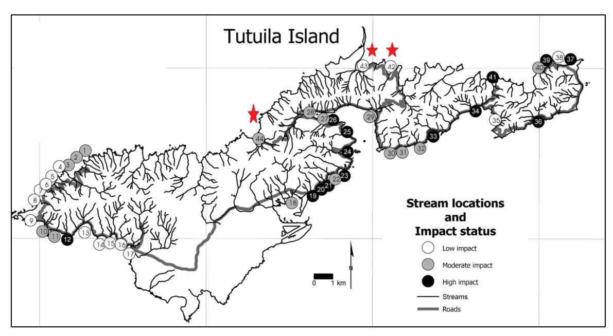

**Figure 96.** Impact status of streams on Tutuila Island, American Samoa. Numbered circles identify the location and level of human impact based upon reactive phosphorus and soluble nitrate-plus-ammonium cutoffs in 44 streams. Streams in NPSA (#42 Amalau) and near NPSA (#43 Vatia, #44 Fagasa) are highlighted by red stars. Source: Bardi et al. 2007.

In NPSA's own monitoring program for water quality (Table 42), the range of annual median values, as well as the minimum and maximum values for all years combined (2009-14) showed variability within stream sections and among years, but values were generally within ASEPA criteria (85% overall compliance). Exceptions were non-compliant instances of low dissolved oxygen (17% of 36 measurements), low or high pH (20%), TDP (17%) and TDN (8%). Note that values for TDP and TDN are minimal estimates of excess regarding TP and TN criteria because TP and TN were not measured. Turbidity was 14% noncompliant, but these measurements were taken during low flow conditions (for safety concerns) when turbidity levels would naturally be low.

**Table 42.** Range of annual water quality values in four NPSA streams in the Tutuila Unit (Fagatuitui, Leafu, Amalau) a Ta'u Unit (Laufuti) during 2009-2014. Minimum and maximum values are for all years combined. Not all sites were sampled each year. Sources: Raikow and Farahi 2015, NPS I&M Database 2017.

|                          |                |      | Median |           |
|--------------------------|----------------|------|--------|-----------|
| Parameter                | Stream         | Min. | Max.   | (range)   |
|                          | Fagatuitui     | 42   | 235*   | 57-124    |
|                          | Laufuti-lower  | 15   | 153*   | 32-88     |
|                          | Laufuti-pool   | 8    | 147    | 8         |
| Total Dissolved          | Leafu-forest   | 52   | 141    | 71-85     |
| Phosphorous (µgP/L)      | Leaf-u-village | 46   | 111    | 58-94     |
|                          | Amalau-forest  | 100  | 160*   | 105-155*  |
|                          | Amaulu-village | 63   | 221*   | 86-187*   |
|                          | Fegatuitui     | 0.04 | 0.61   | 0.08-0.23 |
|                          | Laufuti-lower  | 0.04 | 1.00*  | 0.13-0.18 |
|                          | Laufuti-pool   | 0.04 | 0.35*  | 0.07-0.16 |
|                          | Leafu-forest   | 0.04 | 0.26   | 0.04-0.13 |
| Total Dissolved Nitrogen | Leafu-village  | 0.04 | 0.24   | 0.10-0.19 |
| (mgN/L)                  | Amalau-forest  | 0.12 | 0.29   | 0.15-0.22 |
|                          | Amalau-village | 0.08 | 0.24   | 0.08-0.16 |
|                          | Fagatuitui     | 1    | 290    | 26-140    |
|                          | Laufuti-lower  | 1    | 289    | 71-267    |
|                          | Laufuti-pool   | 1    | 72     | 1-18      |
|                          | Leafu-forest   | 1    | 55     | 11-32     |
|                          | Leafu-village  | 9    | 65     | 14-38     |
| Nitrate & Nitrite (µg/L) | Amalau-forest  | 34   | 109    | 71-104    |
|                          | Amalau-village | 17   | 68     | 37-64     |
|                          | Fagatuitui     | 0.2  | 3.7    | 0.4-2.0   |
|                          | Laufuti-lower  | 0.1  | 4.0    | 0.1-4.0   |
|                          | Laufuti-pool   | 0.6  | 4.7    | 0.6-3.9   |
|                          | Leafu-forest   | 0.1  | 1.8    | 0.1-1.3   |
|                          | Leafu-village  | 0.1  | 3.0    | 0.1-3.0   |
| Chlorophyll (µgN/L)      | Amalau-forest  | 0.7  | 2.4    | 1.0-2.1   |
|                          | Amalau-village | 1.0  | 1.0    | 1.0-2.3   |
|                          | Fagatuitui     | 4.5* | 8.3    | 6.8-8.0   |
|                          | Laufuti-lower  | 6.7  | 8.7    | 8.1-8.6   |
| Dissolved Oxygen         | Laufuti-pool   | 3.7* | 9.7    | 6.5-8.4   |
| Concentration (mg/L)     | Leafu-forest   | 6.4  | 10.0   | 7.5-8.6   |
|                          | Leafu-village  | 3.8* | 9.4    | 5.1*-9.4  |

\* Values that do not meet ASEPA (2013) criteria are indicated in bold blue type.

**Table 42 (continued).** Range of annual water quality values in four NPSA streams in the Tutuila Unit (Fagatuitui, Leafu, Amalau) a Ta'u Unit (Laufuti) during 2009-2014. Minimum and maximum values are for all years combined. Not all sites were sampled each year. Sources: Raikow and Farahi 2015, NPS I&M Database 2017.

|                      |                |      | Median |           |
|----------------------|----------------|------|--------|-----------|
| Parameter            | Stream         | Min. | Max.   | (range)   |
| Dissolved Oxygen     | Amalau-forest  | 7.9  | 10.0   | 7.9-8.3   |
| Concentration (mg/L) | Amalau-village | 7.6  | 8.6    | 7.8-8.2   |
| (continued)          | Fagatuitui     | 82   | 100    | 93-97     |
|                      | Laufuti-lower  | 83   | 102    | 96-102    |
|                      | Laufuti-pool   | 60*  | 104    | 75-96     |
| Dissolved Oxygen     | Leafu-forest   | 89   | 120    | 93-101    |
| Saturation           | Leafu-village  | 54*  | 111    | 67*-111   |
|                      | Amalau-forest  | 98   | 106    | 98-100    |
|                      | Amalau-village | 96   | 120    | 96-98     |
|                      | Fugatuitui     | 6.7  | 10.2   | 7.5-10.1  |
|                      | Laufuti-lower  | 6.2  | 7.9    | 6.8-7.6   |
|                      | Laufuti-pool   | 6.0  | 7.8    | 6.4-7.2   |
|                      | Leafu-forest   | 7.2  | 10.9   | 7.5-9.3   |
|                      | Leafu-village  | 7.0  | 8.7    | 7.2-8.2   |
| pH                   | Amalau-forest  | 7.2  | 7.8    | 7.5-7.8   |
|                      | Amalau-village | 7.5  | 7.9    | 7.6-7.9   |
|                      | Fagatuitui     | 0.05 | 0.27   | 0.10-0.14 |
|                      | Laufuti-lower  | 0.02 | 0.09   | 0.04-0.08 |
|                      | Laufuti-pool   | 0.02 | 0.05   | 0.02-0.04 |
|                      | Leafu-forest   | 0.10 | 0.27   | 0.11-0.19 |
| Specific Conductance | Leafu-village  | 0.06 | 0.12   | 0.06-0.12 |
| (mS/cm)              | Amalau-forest  | 0.10 | 0.17   | 0.10-0.13 |
|                      | Amalau-village | 0.11 | 0.12   | 0.11-0.12 |
|                      | Fagatuitui     | 0.02 | 0.13   | 0.05-0.08 |
|                      | Laufuti-lower  | 0.00 | 0.08   | 0.02-0.04 |
|                      | Laufuti-pool   | 0.00 | 0.03   | 0.01-0.02 |
|                      | Leafu-forest   | 0.02 | 0.13   | 0.06-0.09 |
|                      | Leafu-village  | 0.02 | 0.07   | 0.05-0.06 |
| Salinity (ppt)       | Amalau-forest  | 0.04 | 0.08   | 0.04-0.06 |
|                      | Amalau-village | 0.05 | 0.08   | 0.05-0.07 |
|                      | Fagatuitui     | 0.1  | 8.4    | 0.1-5.5   |
|                      | Laufuti-lower  | 0.1  | 4.6    | 0.1-1.6   |

\* Values that do not meet ASEPA (2013) criteria are indicated in bold blue type.

**Table 42 (continued).** Range of annual water quality values in four NPSA streams in the Tutuila Unit (Fagatuitui, Leafu, Amalau) a Ta'u Unit (Laufuti) during 2009-2014. Minimum and maximum values are for all years combined. Not all sites were sampled each year. Sources: Raikow and Farahi 2015, NPS I&M Database 2017.

|                 |                |      | Median |           |
|-----------------|----------------|------|--------|-----------|
| Parameter       | Stream         | Min. | Max.   | (range)   |
|                 | Laufuti-pool   | 21.6 | 24.7   | 21.6-23.8 |
|                 | Leafu-forest   | 23.0 | 27.6   | 24.9-25.3 |
|                 | Leafu-village  | 23.6 | 26.8   | 23.6-26.6 |
| Temperature (C) | Amalau-forest  | 24.0 | 26.3   | 24.8-26.3 |
|                 | Amalau-village | 24.4 | 26.7   | 24.8-25.8 |
|                 | Fagatuitui     | 0.1  | 8.4    | 0.1-5.5   |
|                 | Laufuti-lower  | 0.1  | 4.6    | 0.1-1.6   |
|                 | Laufuti-pool   | 0.1  | 2.2    | 0.1-0.7   |
|                 | Leafu-forest   | 0.1  | 14.7   | 0.1-5.7   |
| Turbidity (NTU) | Leafu-village  | 0.1  | 10.0   | 0.1-7.1   |
|                 | Amalau-forest  | 0.1  | 2.7    | 0.6-1.7   |
|                 | Amalau-village | 0.1  | 1.2    | 0.1-1.2   |

\* Values that do not meet ASEPA (2013) criteria are indicated in bold blue type.

NPSA's water quality data were generally similar to pristine and low impact streams measured in the islandwide surveys previously mentioned (DiDonato 2004a, 2004b, Bardi et al. 2007). Water quality parameters for Laufuti Stream were similar to those obtained nearly 30 years ago by Cook (2001), but note that Cook's lowest values for dissolved oxygen were thought to be due to equipment error. Overall, these comparisons are of limited value because relatively few parameters could actually be compared among the studies (namely conductivity, dissolved oxygen, temperature, and pH), and not all studies measured chlorophyll-a, fecal bacteria, or the same nutrients (e.g., TDN versus TN).

#### *Fecal bacterial contamination*

Watershed contamination by fecal bacteria was widespread in the Territory (ASEPA 2012, Tetra Tech 2014). Of the 33 watersheds assessed on Tutuila Island, 88% did not support designated uses (swimming, support of aquatic life) due to bacterial impairment of their streams and/or adjacent coastal beaches. This included two watersheds in or near NPSA (Fagatuitui, Vatia). In many cases, elevated *Enterococcus* levels signal input of animal wastes (either human or pig), but in other places without sources of human sewage pollution, it may reflect input from feral mammals and/or indigenous soil bacteria (Hazen 1988, Fujioka and Byappanahalli 1996, Fujioka et al. 1998). This may explain why bacterial standards are exceeded in two pristine streams in NPSA: Fagatuitui and Laufuti (Cook 2001, DiDonato 2004b).

## *Macrofaunal community*

High island streams in the South Pacific support a distinctive macrofauna, which consists mostly of amphidromous fish, shrimps, and snails, but with fewer aquatic insects that are common in

continental streams (e.g., Fitzsimons et al. 2002). Species richness is low due to the small size and geographic isolation of these islands, and also to the frequent disturbances of freshwater environments from torrential rains, cyclones, and occasional droughts (Smith et al. 2003). As with many other taxa in Oceania (see Section 2.2.2), the biogeographic pattern of freshwater fishes shows higher species richness in the Western Pacific region and decreases eastward into the Central Pacific (Pippard 2012). American Samoa lies in the middle of this range, with about 18 species, a number that may include some estuarine species (Figure 97).

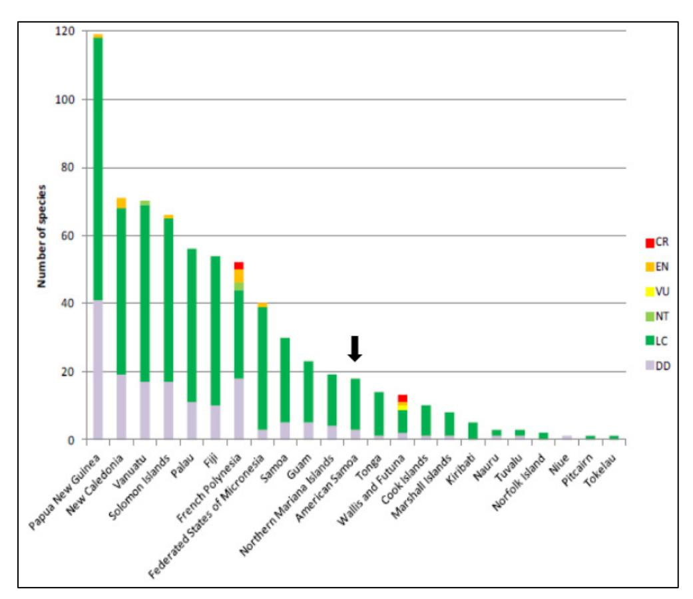

**Figure 97.** Number of freshwater fish species (including some estuarine species) in Oceania by country. In American Samoa (arrow), the IUCN conservation status of fishes are listed as LC (least concern) or DD (data deficient). Source: Pippard 2012.

Principal stream taxa in American Samoa are shown in Figure 98 and listed in Table 43. Native species consist of approximately 10 fishes, 10 shrimps, and seven snails. Most are common and widely distributed throughout the tropical Pacific (Wade et al. 2008). One fish with a more limited distribution is the mountain bass, *Kuhlia salelea,* known only from Tutuila Island and Upolu Island in neighboring Samoa (Randall and Randall 2001). Some stream species dwell in the lower reaches of streams, but others are climbers able to negotiate the steep topography common on high islands (e.g., Fitzsimons et al. 2002, Cook 2004, Wade et al. 2008). Native gobies, for example, have fused pelvic fins, allowing them to cling to the substrate during high flows and to climb steep waterfalls. Most are amphidromous species that live and spawn in freshwater, but their newly hatched larvae

drift downstream into coastal waters for weeks to months before returning to streams in their postlarvae forms. The anguilid eels differ in that they are catadromous fish that live primarily in freshwater but migrate to the ocean to spawn (Smith 1999).

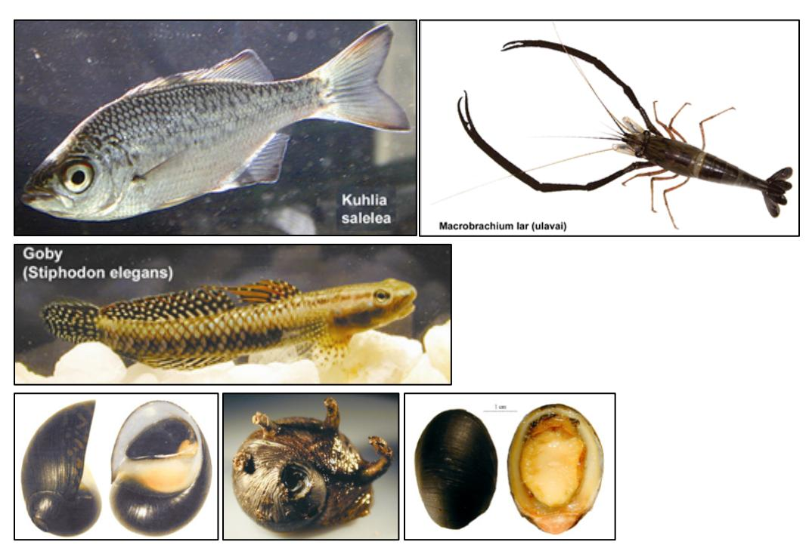

**Figure 98.** Examples of stream macrofauna in American Samoa: (top to bottom) fish (*Kuhia salelea, Stiphodon elegans*), shrimp (*Macrobrachium lar*), and snails (*Neritina variegate, Clithon corona, Septaria sanguisuga*). Photos: van Houte-Howes and Vargo 2009.

**Table 43.** Principal fish, shrimp, and snail species in American Samoan streams. Tutuila sites in NPSA (Puaneva Pt., Samituutuu Pt., Vaisa, Tafeu) are pooled (Burger and Maciolek 1981, Couret et al. 1981). Dots indicate pooled NPSA sites on Tutuila (Fagatuitui, Leafu, Amalau) and Ta'u (Laufuti) (NPS 2017). A = alien, (non-native) species.

| Stream        |                         |                      | Tutuila: isl          | and-wide su         | rveys      |     | Tutuila:NP                             | SA       | Ta'u:     | NPSA     |                                                                                                                            |
|---------------|-------------------------|----------------------|-----------------------|---------------------|------------|-----|----------------------------------------|----------|-----------|----------|----------------------------------------------------------------------------------------------------------------------------|
| species class | Stream Species          | Burger & Mac 1981 | Couret et al. 1981 | Wade et al. 2008 | Vargo 2009 | All | Burger & M 1981, Couret et al. 1981 | NPS 2017 | Cook 2004 | NOS 2017 | Notes                                                                                                                      |
|               | Anguilla marmorata      | Х                    | Х                     | ı                   | Х          | Х   | X                                      | Х        | Х         | Х        | 1                                                                                                                          |
|               | Anguilla megastoma      | _                    | X                     | Х                   | -          | Х   | _                                      | _        | Х         | _        | Reported as <i>Anguilla celebensisas</i> (Couret et al. 1981, Burger and Maciolek 1981)                                    |
|               | Anguilla obscura        | _                    | -                     | Х                   | Х          | Х   | -                                      | -        | -         | -        | _                                                                                                                          |
|               | Awaous ocellaris        | Х                    | Х                     | Х                   | Х          | Х   | -                                      | -        | -         | -        | _                                                                                                                          |
|               | Eleotris fuscus         | Х                    | Х                     | Х                   | Х          | Х   | Х                                      | Х        | Х         | Х        | -                                                                                                                          |
|               | Kuhlia rupestris        | Х                    | Х                     | Х                   | Х          | Х   | Х                                      | Х        | -         | Х        | -                                                                                                                          |
| Fish          | Kuhlia salelea          | _                    | Х                     | Х                   | Х          | Х   | Х                                      | Х        | -         | -        | _                                                                                                                          |
|               | Periophthalmus kalolo   | _                    | -                     | _                   | _          | _   | _                                      | _        | _         | Х        | Primarily a marine/brackish water species                                                                                  |
|               | Poecilia Mexicana       | Α                    | Α                     | Α                   | Α          | Α   | А                                      | -        | -         | -        | Possibly <i>P. gilii</i> (Vargo 2009)                                                                                      |
|               | Sicyopterus caeruleus   | Х                    | Х                     | Х                   | х          | х   | -                                      | Х        | Х         | Х        | Reported as <i>Sicyopterus taeniurus</i> (Couret et al. 1981, Burger and Maciolek 1981) and <i>S. micrucus</i> (Cook 2004) |
|               | Sicyopterus pugans      | Х                    | Х                     | -                   | _          | Х   | _                                      | -        | Х         | _        | -                                                                                                                          |
|               | Stiphodon elegans       | Х                    | Х                     | Х                   | Х          | Х   | Х                                      | Х        | Х         | Х        | -                                                                                                                          |
|               | Atyoidia pilipes        | _                    | _                     | Х                   | Х          | Х   | -                                      | Х        | _         | Х        | Reported as <i>Atya serrate</i> (Couret et al. 1881, Burger NS Maciolek 1981)                                           |
|               | Atyopsis spinipes       | Х                    | Х                     | Х                   | Х          | Х   | Х                                      | Х        | Х         | _        | Reported as <i>Atya spinipes</i> (couret et al. 1881, Burger and Maciolek 1981)                                         |
| Shrimp        | Atyopsis serrata        | Х                    | Х                     | _                   | _          | Х   | Х                                      | -        | Х         | -        | -                                                                                                                          |
|               | Caridina serratirostris | Х                    | Х                     | Х                   | Х          | Х   | _                                      | Х        | -         | -        | -                                                                                                                          |
|               | Caridina typus          | _                    | -                     | _                   | Χ          | Х   | -                                      | Х        | -         | Х        | -                                                                                                                          |
|               | Cardina weberi          | Х                    | Х                     | Х                   | X          | Х   | Х                                      | Х        | Х         | Х        | 1                                                                                                                          |

**Table 43 (continued).** Principal fish, shrimp, and snail species in American Samoan streams. Tutuila sites in NPSA (Puaneva Pt., Samituutuu Pt., Vaisa, Tafeu) are pooled (Burger and Maciolek 1981, Couret et al. 1981). Dots indicate pooled NPSA sites on Tutuila (Fagatuitui, Leafu, Amalau) and Ta'u (Laufuti) (NPS 2017). A = alien, (non-native) species.

| Stream           |                             |                      |                       | Tutuila: island-wide surveys |            |     | Tutuila:NPSA                           |          | Ta'u: NPSA |          |                                                                                                  |
|------------------|-----------------------------|----------------------|-----------------------|------------------------------|------------|-----|----------------------------------------|----------|------------|----------|--------------------------------------------------------------------------------------------------|
| species class | Stream Species              | Burger & Mac 1981 | Couret et al. 1981 | Wade et al. 2008          | Vargo 2009 | All | Burger & M 1981, Couret et al. 1981 | NPS 2017 | Cook 2004  | NOS 2017 | Notes                                                                                            |
|                  | Macrobrachium austral       | –                    | X                     | X                            | X          | X   | X                                      | X        | X          | X        | –                                                                                                |
| Shrimp           | Macrobrachium gracilirostre | –                    | X                     | X                            | X          | X   | X                                      | –        | X          | –        | Reported as Macrobrachium hirtimanus (Courtet et al. 1981, Burger and Maciolek, Cook 2004) |
| (cont'd)         | Macrobrachium lar           | X                    | X                     | X                            | X          | X   | X                                      | X        | X          | X        | –                                                                                                |
|                  | Macrobrachium latimanus     | –                    | X                     | X                            | X          | X   | X                                      | X        | X          | X        | –                                                                                                |
|                  | Clithon corona              | –                    | X                     | X                            | X          | X   | X                                      | X        | –          | X        | Reported as Neritina brevispina (Couret et al. 1981, Burger and Maciolek 1981)             |
|                  | Clithon pritchardi          | –                    | –                     | X                            | X          | X   | –                                      | X        | –          | –        | –                                                                                                |
|                  | Melanoides tuberculata      | –                    | –                     | –                            | A          | A   | –                                      | A        | A          | A        | Possible non-native species (Haynes 2000)                                                        |
|                  | Neritina auriculata         | –                    | –                     | X                            | X          | X   | –                                      | X        | –          | –        | –                                                                                                |
| Snails           | Neritina canalis            | X                    | X                     | X                            | X          | X   | –                                      | X        | –          | –        | Reported as Neritina pulligera (Couret et al. 1981, Burger and Maciolek 1981)              |
|                  | Neritina variegate          | –                    | –                     | –                            | X          | X   | –                                      | X        | X          | –        | –                                                                                                |
|                  | Septaria sanguisuga         | –                    | –                     | X                            | X          | X   | –                                      | X        | –          | –        | –                                                                                                |
|                  | Septaria suffreni           | X                    | X                     | X                            | X          | X   | –                                      | X        | –          | –        | Reported as Septaria porcellana (Couret et al. 1981, Burger and Maciolek 1981)             |

NPSA's stream fauna is generally similar to that occurring elsewhere on Tutuila (Table 43). There is a tendency toward fewer species in park streams, but this may be due to their smaller average size. However, note the paucity of stream snails in Laufuti Stream on Ta'u Island.

Park streams have few alien species. Mosquitofish (*Poecilia mexicana*) were found in the lower reaches of three streams in the Tutuila Unit (Burger and Maciolek 1981, Couret et al. 1981), and a likely alien snail species (*Melanoides tuberculata)* was collected in all four streams sampled in the Tutuila and Ta'u Units (Cook 2004, NPS 2017). Other alien stream species have been introduced elsewhere in American Samoa: *Poecilia vittata* and *Gambusia affinis* for mosquito control and use as bait fish; tilapia (*Tilapia mossambica*) and giant tiger prawn (*Penaeus mondon*) for aquaculture; and several freshwater snails (Maciolek 1984, Eldredge 1994 and 2000, Cowie 1998, 2000). Another alien species is the cane toad (*Rhinella marina*), which is common on Tutuila Island and can spawn in streams. Impacts of alien species on the native stream community have not been examined, but poeciliid mosquitofish introduced in Hawaii may adversely affect ecosystem structure, function, and abundance of native species (Holitzki et al. 2013).

Wade et al. (2008) compared the macrofauna in 10 Tutuila streams (with and without human disturbance) and found no significant difference in species richness or diversity of macrofaunal groups (fish, shrimps, snails) in intact versus disturbed streams. They also found that the macrofauna was generally similar to that recorded 25 years earlier in the same streams sampled by Couret et al. (1981).

## Stream habitat

An essential factor that contributes to the health of NPSA's freshwater ecosystems is the natural condition of stream habitats in the park. The park is generally uninhabited and unaffected by humans (e.g., there are no stream impoundments, channelizations, or water diversions). Streams flow through a largely native rainforest with good canopy closure (Judge et al. 2013), which helps support the stream community by keeping water temperatures cool. An intact riparian vegetation zone also helps maintain good water quality. Waters generally run clear except during freshets. Fecal bacterial levels can be high but the bacteria may originate from sources other than human contamination (e.g., feral animals, soil bacteria). Few alien species occur in these streams.

Speaking relatively, these streams may be considered pristine, but there has been some human disturbance. Early Polynesians probably cleared the mountain landscape for villages and plantations, and even now nearly all native forest consists of secondary climax species rather than primary species that define a natural and undisturbed rainforest (Whistler 2009). Current human impacts to park streams are low but show some evidence. Several small clearings for taro and coconut plantations occur, and there are a few lightly traveled roads with culverts that can affect stream flows. NPSA's amphidromous fish and invertebrates in the headwaters of the Vatia watershed must migrate through the village-impacted lower stream reaches on their way to and from the ocean. Feral pigs roam in the hills (particularly in the Ta'u Unit) and may contribute to streambank erosion and bacterial contamination (Hoshide 1996). Invasive tree species in the Tutuila Unit, such as the nitrogen-fixing *tamaligi* (*Falcataria moluccana*), may affect stream chemistry and food webs, and promote algal growth through nutrient enhancement (e.g., Atwood et al. 2010, Wiegner et al. 2013).

It should also be noted that the condition of NPSA's native rainforest is actively managed by NPSA's invasive species control program. In addition, some measures were taken around 1998-2003 to control feral pig populations in the park. NPSA's terrestrial program has also restored several acres of abandoned plantations along the Mt. Alava dirt road in the Tutuila Unit.

## Data needs/gaps

Documentation of the distribution and quality of thermal habitats for stream species would provide a baseline for monitoring potential impacts of climate change on stream macrofauna. Water temperature data and analysis in general seem sparse; document daily and annual temperature regimes. A hydrological impact assessment of the Mt. Alava dirt road on park streams and coastal waters is needed. Preparation of NPS I&M status and trend reports on both stream water quality and on macrofauna is needed.

## Threats

General threats to streams in the park have been described above (see *Stream Habitat*). These include invasive aquatic and terrestrial species that can affect stream ecosystems, sedimentation from road erosion and grading, culverts that may impede flows, garbage dumped along roadsides, and low to moderate levels of nutrients and fecal bacteria that may be natural but warrant further examination. In addition, Jenkins et al. (2011) suggested that potential climate change impacts to freshwaters in Oceania include changes to flow regime (i.e., changes in rainfall patterns), habitat degradation through rising water temperatures, and saltwater intrusion in lower ends of streams due to sea level rise. Current climate change trends in American Samoa are summarized in Section 5.1.

There are indications that stream fauna on Tutuila has a degree of resiliency to cumulative anthropogenic degradations that are prevalent outside the park. Although the human population on Tutuila Island has more than doubled during the past quarter century, Wade et al. (2008) found little evidence of a substantial impact on stream macrofauna (i.e., species composition, richness, abundance) during this period. They speculated that it may be that the recruitment stage of freshwater fishes, shrimps, and snails have some tolerance to pollution, or perhaps base flows and freshets may adequately flush pollutants to tolerable levels.

## Overall condition

*Stream morphology and hydrology*

NPSA's small, steep streams flow through rainforest-covered mountains that are minimally impacted by human activities, and this is likely to remain so because most of these streams are located completely within park boundaries from headwaters to ocean. As is characteristic of high tropical islands, park streams are frequently disturbed by natural events such as torrential rains, cyclones, and occasional droughts. Rainfall is highly variable, but without an apparent trend over the past 55 years. This measure was assigned a Significance Level of 3 (High) and a Condition Level of 0 (Not a current concern).

*Stream water quality*

Water quality parameters in NPSA streams were generally within the range occurring in other Pacific island streams formed on volcanic basalt, particularly those that are relatively unaffected by human

activities (e.g., Cook 2001). Park streams were classified as pristine by ASEPA, except that the downstream sections of several streams that flow out of the park and through Vatia Village were classified as intermediately impacted. Fecal bacterial counts were high in two park streams (without sources of human pollution) likely due to natural soil bacteria or feral animals. Park streams were characterized by high turbidity during flooding after rainfalls, but this is generally a natural feature of steep streams flowing through unstable substrates. However, stream sedimentation from the Mt. Alava dirt road is a localized concern. On average, up to 85% of water quality parameters (i.e., nutrients, dissolved oxygen, and pH) in NPSA streams were within compliance of ASEPA (2013) criteria. This measure was assigned a Significance Level of 3 (High) and a Condition Level of 1 (Low concern).

#### *Stream fauna*

NPSA's streams support a community of amphidromous and catadromous fish, shrimp, and snails that are characteristic of the stream-dwelling fauna on oceanic tropical islands. Most species have a wide geographical range; none are considered endemic, threatened or endangered. Few alien species were detected, but their potential impact on local ecosystems is not known. This measure was assigned a Significance Level of 3 (High) and a Condition Level of 1 (Low concern).

#### *Stream habitat*

NPSA's stream habitat appears to be in generally good condition because streams flow through native rainforest in uninhabited mountainous areas (Table 44). Rainforest canopy is an important asset in that it shades the streams, which reduces their temperatures, making them more supportive of aquatic fanua. Human impacts are minimal, but invasive species will require continual assessment. This measure was assigned a Significance Level of 3 (High) and a Condition Level of 1 (Low concern).

#### *Weighted condition score*

Knowledge about stream resources in American Samoa is growing. The multi-year NPS I&M monitoring program and other literature sources indicate that NPSA's stream resources are in generally good condition, as indicated by a weighted condition score of 0.25. Potential adverse impacts due to invasive species and climate change are concerns for this resource. The confidence level for this assessment is low because trend analyses of water quality and macrofauna parameters in park streams have not yet been prepared.

**Table 44.** Significance levels and condition levels used to calculate the weighted condition score (WCS) for NPSA's streams.

| Measures                        | Significance Level | Condition Level | WCS = 0.25                                                                                                           |
|---------------------------------|--------------------|-----------------|----------------------------------------------------------------------------------------------------------------------|
| Stream morphology and hydrology | 3                  | 0               |                                                                                                                      |
| Water quality                   | 3                  | 1               |                                                                                                                      |
| Macrofauna                      | 3                  | 1               |                                                                                                                      |
| Stream habitat                  | 3                  | 1               | Resource is in good condition; trend in condition is unknown or not applicable; low confidence in the assessment. |

## *4.10.5. Literature Cited*

- Armstrong, K., D. Herdrich, and A. Levine. 2011. Historic fishing methods in American Samoa. U.S. Dep. Commerce, NOAA Tech. Memo., NOAA-TM-NMFS-PIFSC-24, 75 p.
- ASEPA (American Samoa Environmental Protection Agency). 2012. Territory of American Samoa, Integrated Water quality Monitoring and Assessment Report 2012. ASEPA, American Samoa.
- ASEPA (American Samoa Environmental Protection Agency). 2013. American Samoa Water Quality Standards, 2013 Revision. Administrative Rule No. 001-2013, §24.0201 to §24.0210. [http://asepa.gov/water-quality.asp.](http://asepa.gov/water-quality.asp) Accessed 1 February 2016.
- Atwood, T., T. Wiegner, J. Turner, and R. MacKenzie. 2010. Potential effects of an invasive nitrogen-Fixing tree on a Hawaiian stream food web. Pacific Science 64:367–379. doi: 10.2984/64.3.367.
- Bardi, E., S. Fanolua, K. van Houte-Howes, L. Wade, A. Vargo, and D. Vargo. 2007. Stream water chemical parameters for Tutuila Island, American Samoa. Land Grant Technical Report 46. American Samoa.
- Brasher, A. M. D., T. Jones, A. C. Farahi, M. P. Miller, and K. Kozar. 2011. Stream monitoring protocol: fish, shrimp, and snails; Pacific Island Network. Natural Resource Report NPS/PACN/NRR—2011/468. National Park Service, Fort Collins, Colorado. [http://www.nature.nps.gov/im/units/PACN.](http://www.nature.nps.gov/im/units/PACN)
- Burger, I., and J. Maciolek. 1981. Map inventory of non-marine aquatic resources of American Samoa with on-site biological annotations. Review draft. U.S. Fish and Wildlife Service, National Fisheries Research Center, Seattle, Washington. Available at Hamilton Library, Pacific Collection, University of Hawai'i, Honolulu.
- Cook, R. 2001. An inventory of Laufuti stream, Ta'u, American Samoa. National Park Service, Water Res. Div., Fort Collins, Colorado. Tech. Rep. NPS/NRWRD/NRTR-2001/290.
- Cook, R. 2004. Macrofauna of Laufuti Stream, Ta'u, American Samoa, and the role of physiography in its zonation. Pac. Sci. 58:7–21.
- Couret, C., D. Devaney, J. Ford, R. Narahara, G. Roehm, and G. Smith. 1981. American Samoa stream inventory. Island of Tutuila. American Samoa Water Resources Study. July. Available from U.S. Army Corps of Engineers, Pacific Ocean Division, Honolulu, Hawai'i.
- Cowie, R. 1998. Catalog of the non-marine snails and slugs of the Samoan Islands. Bishop Museum Bull. Zoology 3. 122 p.
- Cowie, R. 2000. Non-indigenous land and freshwater mollusks in the islands of the Pacific: conservation impacts and threats. Pages 143-172. *In*: G. Sherley (Ed.). 2000. Invasive species in the Pacific: a technical review and draft regional strategy. South Pacific Regional Environment Programme, Apia, Samoa. [www.sprep.org.ws.](http://www.sprep.org.ws/)

- Daly, C., J. Smith, M. Doggett, M. Halbleib, and W. Gibson. 2006. High-resolution climate maps for the Pacific basin islands, 1971-2000. Submitted to National Park Service Pacific West Regional Office by the PRISM Climate Group, Oregon State University.
- DiDonato, G. 2004a. Developing an initial watershed classification for American Samoa. American Samoa Environmental Protection Agency, American Samoa.
- DiDonato, G. 2004b. ASEPA stream monitoring: results from Year 1 and preliminary interpretation. Report prepared by the American Samoa Environmental Protection Agency.
- DiDonato, G. 2005. Nitrogen and phosphorus concentrations in tropical Pacific insular streams: historical data from Tutuila, American Samoa. Micronesica 37:235-248.
- Eldredge, L. 1994. Perspectives in aquatic exotic species management in the Pacific Islands. Volume 1. Introductions of commercially significant aquatic organisms to the Pacific Islands. South Pacific Commission, Noumea, New Caledonia.
- Eldredge, L. 2000. Non-indigenous freshwater fishes, amphibians, and crustaceans of the Pacific and Hawaiian islands. Pages 173-190. *In*: G. Sherley (ed.). 2000. Invasive species in the Pacific: a technical review and draft regional strategy. South Pacific Regional Environment Programme, Apia, Samoa. [www.sprep.org.ws.](http://www.sprep.org.ws/)
- Fitzsimons, J., J. Parham, and R. Nishimoto. 2002. Similarities in behavioral ecology among amphidromous and catadromous fishes on the oceanic islands of Hawaii and Guam. Environ. Biology Fishes 65:123-129.
- Fujioka, R. S., and M. N. Byappanahalli. 1996. Assessing the applicability of USEPA recreational water quality standards to Hawaii and other tropical islands. Project Completion Report: WRRC-96-01 Water Resources Research Center, University of Hawaii at Manoa, Honolulu, Hawaii. Prepared for Department of Health, State of Hawaii.
- Fujioka, R., C. Sian-Denton, M. Borja, J. Castro, and K. Morphew. 1998. Soil: the environmental source of *Escherichia coli* and *Enterococci* in Guam's streams. J. Appl. Microbiol. Suppl. 1:83- 89. doi: 10.1111/j.1365-2672.1998.tb05286.x.
- Haynes, A. 1990. The numbers of freshwater gastropods on Pacific islands and the theory of island biogeography. Malacologia 31:237–248.
- Hazen, T. 1988. Fecal coliforms as indicators in tropical waters: A review. Environ. Toxicol. Water Qual., 3: 461–477. doi: 10.1002/tox.2540030504.
- Holitzki, T., R. Mackenzie, T. Wiegner, and K. McDermid. 2013. Differences in ecological structure, function, and native species abundance between native and invaded Hawaiian streams. Ecological Applications 23:1367–1383.

- Hoshide, H. 1996. Preliminary assessment of the feral pig problem in American Samoa. Report to the National Park of American Samoa and the American Samoa Environmental Protection Agency.
- Jenkins, K., R. Kingsford, G. Closs, B. Wolffenden, C. Matthaei, and S. Haya. 2011. Climate change and freshwater ecosystems in Oceania: an assessment of vulnerability and adaptation opportunities. Pacific Conservation Biology 17: 201–219.
- Jones, T., K. DeVerse, G. Dicus, D. McKay, A. Farahi, K. Kozar, and E. Brown. 2011. Water quality vital signs monitoring protocol for the Pacific Island Network: Volume 1; Version 1.0. Natural Resource Report NPS/PACN/NRR—2011/418. National Park Service, Fort Collins, Colorado.
- Judge, S., R. Camp, V. Vaivai, and P. Hart. 2013. Pacific Island forest bird monitoring annual report, National Park of American Samoa, Ta'u and Tutuila Units, 2011. Natural Resource Tech. Rept. NPS/PACN/NRTR—2013/666. National Park Service, Fort Collins, CO.
- Maciolek, J. A. 1984. Exotic fishes in Hawaii and other islands of Oceania. pp. 131-161. *In* W. Courtenay, Jr., and J. Stauffer, Jr. (eds.) Distribution, biology, and management of exotic fishes. Johns Hopkins University Press, Baltimore.
- NPS (National Park Service). 2017. American Samoa stream database. Pacific I&M monitoring program (Hawaii). Accessed 9 Feb 2017.
- Pippard, H. 2012. The current status and distribution of freshwater fishes, land snails and reptiles in the Pacific Islands of Oceania. International Union for Conservation of Nature and Natural Resources. Gland, Switzerland. 76 p.
- Raikow, D., and A. Farahi. 2015. Water quality in streams of National Park of American Samoa: Summary report 2009-2011. Natural Resource Data Series NPS/NPSA/NRDS—2015/753. National Park Service, Fort Collins, Colorado.
- Randall, J., and H. Randall, 2001. Review of the fishes of the genus *Kuhlia* (Perciformes: Kuhliidae) of the Central Pacific. Pac. Sci. 55(3):227-256.
- Ryan, P. 1991. The success of the Gobiidae in tropical Pacific insular streams. New Zealand Journal of Zoology 18: 25-30.
- Smith, D.G., 1999. Anguillidae. Freshwater eels. p. 1630-1636. In K.E. Carpenter and V.H. Niem (eds.) FAO species identification guide for fishery purposes. The living marine resources of the WCP. Vol. 3. Batoid fishes, chimaeras and bony fishes part 1 (Elopidae to Linophrynidae). FAO, Rome. [www.fao.org/docrep/009/x2401e/x2401e00.htm.](http://www.fao.org/docrep/009/x2401e/x2401e00.htm)
- Smith, G., A. Covich, and A. Brasher. 2003. An ecological perspective on the biodiversity of tropical island streams. BioScience 53: 1048-1051.
- Tetra Tech. 2014. American Samoa bacteria TMDLs for beaches and streams. Report prepared for American Samoa Environmental Protection Agency by Tetra Tech, Inc., Colorado.

- Tuitele, C., E. Buchan, J. Regis, J. Tuiasosopo, S. Faaiuaso, and L. Soli. 2016. Territory of American Samoa integrated water quality monitoring and assessment report 2014. American Samoa Environmental Protection Agency, American Samoa.
- van Houte-Howes, K., and D. Vargo. 2009. Life in a Samoan stream: fish, snails and shrimp. Chapt. 40. *In*: P. Craig (ed.). 2009. Natural history guide to American Samoa. National Park of American Samoa, Dept. Marine and Wildlife Resources, American Samoa Community College. Pago Pago, American Samoa.
- Vargo, D. 2009. Stream fauna of American Samoa; an illustrated guide to snails, shrimps, and fishes of American Samoa streams. Technical Report 55. P. 38. Community and Natural Resources, American Samoa Community College. Pago Pago, American Samoa. [http://www.ctahr.hawaii.edu/adap/ASCC\\_LandGrant/Dr\\_Brooks/TechRepNo55.pdf.](http://www.ctahr.hawaii.edu/adap/ASCC_LandGrant/Dr_Brooks/TechRepNo55.pdf)
- Wade, L., F. Fanolua, A. Vargo, K. van Houte-Howes, E. Bardi, and D. Vargo. 2008. Exploiting macrofauna diadromy for assessing anthropogenic impact in American Samoa streams. Pac. Sci. 62:177-190.
- Wiegner, T. F. Hughes, L. Shizuma, D. Bishaw, and M. Manuel. 2013. Impacts of an invasive N2 fixing tree on Hawaiian stream water quality. Biotropica 45:409-418. DOI: 10.1111/btp.12024.
- Whistler, A. 2009. The vegetation of American Samoa. Chapt. 36. *In*: P. Craig (ed.). 2009. Natural history guide to American Samoa. National Park of American Samoa, Dept. Marine and Wildlife Resources, American Samoa Community College. Pago Pago, American Samoa.
- Wong M. 1996. Analysis of streamflow characteristics for streams on the island of Tutuila, American Samoa. USGS Water-Resources Investigations Report 95-4185. Honolulu, HI.

## **4.11. Air Quality**

## *4.11.1. Description*

A section on air quality would seem a logical place to discuss what is probably the single most important factor that affects the condition of NPSA's present and future ecosystems: climate change. However, the authors have decided to address that significant factor in a separate section in Chapter 5. This section focuses on a specific set of NPS air quality parameters.

Visitor enjoyment, the health of park ecosystems, and the integrity of cultural resources depend upon clean air. The 1977 Clean Air Act amendments designated 48 national parks as Class I areas, affording them special air quality protection. All other NPS areas, including the National Park of American Samoa, are Class II air quality areas. The NPS Organic Act, the Wilderness Act, and NPS 2006 Management Policies provide the basis for protection of air quality and values related to it in all areas managed by the NPS. Values related to air quality are resources sensitive to it, including visibility, lakes, streams, vegetation, soils, and wildlife.

Most human activities, including industrial processes, agricultural practices, land disturbances, and fossil fuel combustion, produce air pollution. The anthropogenic air pollutants of concern in NPS areas are particles and gases that impair visibility, atmospherically deposited sulfur and nitrogen compounds that change soil and surface water chemistry, elevated concentrations of ground level ozone that cause respiratory problems in humans and harm vegetation, and persistent bio accumulative toxics that affect wildlife and human health. The main source of sulfur pollution in the continental U.S. is coal combustion at power plants and industrial facilities. Burning of fuel oil at power plants is the primary source of sulfur emissions on many Pacific islands, including American Samoa. Nitrogen compounds, such as nitrogen oxides and ammonia, result from fuel combustion and from agricultural activities. Ozone is formed when nitrogen oxides and volatile organic compounds emitted from vehicles, industry, and vegetation react in the atmosphere in the presence of sunlight. Persistent bio accumulative toxics include heavy metals like mercury (emitted from coal combustion, incinerators, and mining processes) and organic compounds such as pesticides and industrial byproducts.

## *4.11.2. Data and Methods*

Data on sources and amounts of air emissions are not available for American Samoa. Due to a lack of monitoring data, the U.S. Environmental Protection Agency has designated American Samoa as unclassified/attainment for the national ambient air quality standards — which are intended to protect public health and welfare — for all pollutants.

Typically, an NRCA air quality evaluation is based on monitored or estimated visibility, sulfur and nitrogen deposition, and ozone values for a park. Visibility and ozone data are not available for the National Park of American Samoa. A National Atmospheric Deposition Program/National Trends Network (NADP/NTN) wet deposition monitor operated in American Samoa from May of 1980 to October of 1992 (site AS01). The NADP/NTN is a nationwide precipitation chemistry monitoring network that provides information on amounts, trends, and geographic distribution of acids, nutrients, and base cations in precipitation. Wet deposition is calculated by multiplying nitrogen or sulfur concentrations in precipitation by a normalized precipitation amount.

#### *4.11.3. Reference Condition*

Nutrient enrichment can occur in both terrestrial and aquatic ecosystems and in wetlands that are in transition between the two. The addition of nutrients from air pollution sources to national park ecosystems can alter natural communities and influence the mix of species that occur or thrive in those ecosystems. Atmospheric deposition of nutrients can also contribute to soil and drainage water acidification. Therefore, a reference condition would be that there is no nutrient enrichment from atmospheric sources.

## *4.11.4. Condition and Trends*

Wet deposition levels of sulfur or nitrogen below 1.0 kg/ha/yr are not known to harm sensitive aquatic or terrestrial resources. Therefore, the NPS Air Resources Division considers the resource to be in good condition if deposition is less than 1.0 kg/ha/yr. Deposition of 1-3 kg/ha/yr warrants moderate concern, and deposition greater than 3.0 kg/ha/yr signals significant concern. Using results from the full years of monitoring at the AS01 site, i.e., 1981 to 1991, average sulfur deposition was 5.33 kg/ha/yr and average nitrogen (nitrate plus ammonium) deposition was 0.51 kg/ha/yr. Over the period of record, sulfur deposition declined at the site and there was no trend in nitrogen deposition (Figure 99). The decline in sulfur deposition was due to both a decrease in precipitation sulfur concentrations and lower precipitation amounts. Comparing 1981 through 1991 data to the NPS Air Resources Division criteria, nitrogen deposition is in good condition at the National Park of American Samoa, but sulfur deposition warrants significant concern. However, since the NADP/NTN data are more than 20 years old, they may not represent current conditions at the park. Figure 101 presents 1981-91 trends in precipitation (in cm) and sulfur and nitrogen deposition (in kg/ha/yr) at the NADP/NTN site AS01 in American Samoa (produced by NPS Air Resources Division, 2015).

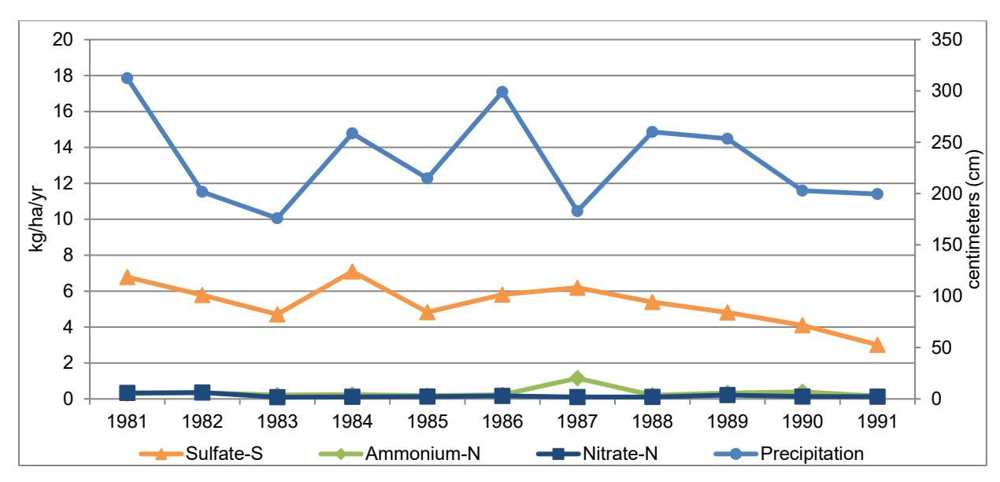

**Figure 99.** Wet Deposition of Air Pollutants in American Samoa. Source: NADP/NTN.

In addition to estimating the amount of sulfur or nitrogen deposited, it is also important to consider the sensitivity of resources in the park. Sullivan et al. calculated the relative threat from sulfur and nitrogen deposition at all 270 NPS Inventory and Monitoring (I&M) parks. They concluded there was a moderate risk of acidification from sulfur and nitrogen deposition (Sullivan et al. 2011a) and a very low risk of nutrient enrichment from nitrogen deposition (Sullivan et al. 2011b) at the National Park of American Samoa relative to other I&M parks.

## Data Needs/Gaps

If opportunities arise in the future, it would be valuable to collect air quality data in or near the park to determine current pollutant concentrations and clarify the threat to park resources from air pollution. The value of such efforts is illustrated by the absence of contemporary data and moderate to low levels of confidence in the conclusions reached in air quality assessments.

## Overall condition

An overall condition could not be determined due to lack of data, and that which is available is more than 20 years old.

*Weighted condition score*

For the reasons noted above, a weighted condition score could not be determined (Table 45).

**Table 45.** Significance levels and condition levels used to calculate the weighted condition score (WCS) for NPSA's air quality.

| Measures                           | Significance Level | Condition Level | WCS = N/A                                                                                                                                                                                   |
|------------------------------------|--------------------|-----------------|---------------------------------------------------------------------------------------------------------------------------------------------------------------------------------------------|
| Visibility                         | 3                  | –               |                                                                                                                                                                                             |
| Ozone                              | 3                  | –               |                                                                                                                                                                                             |
| Nitrogen deposition                | 3                  | 0               |                                                                                                                                                                                             |
| Sulfur deposition                  | 3                  | 3?              | Current condition is unknown or indeterminate due to inadequate data, lack of reference value(s) for comparative purposes, and/or insufficient expert knowledge to reach a more specific |
| Persistent bio accumulative toxins | 3                  | –               | condition determination; trend in condition is unknown or not applicable; low confidence in the assessment.                                                                              |

#### *4.11.5. Literature Cited*

Sullivan, T.J., T.C. McDonnell, G.T. McPherson, S.D. Mackey, and D. Moore. 2011a. Evaluation of the sensitivity of inventory and monitoring national parks to acidification effects from atmospheric sulfur and nitrogen deposition. Pacific Island Network (PACN). Natural Resource Report NPS/NRPC/ARD/NRR—2011/370. National Park Service, Denver, CO.

Sullivan, T.J., T.C. McDonnell, G.T. McPherson, S.D. Mackey, and D. Moore. 2011b. Evaluation of the sensitivity of inventory and monitoring national parks to nutrient enrichment effects from atmospheric nitrogen deposition. Pacific Island Network (PACN). Natural Resource Report NPS/NRPC/ARD/NRR—2011/323. National Park Service, Denver, CO.

## **Chapter 5. Key Threats to Park Resources**

During the NRCA process, the NPSA requested that four threats to park resources be evaluated: local climate change, fishing pressure (subsistence harvest), invasive plants, and invasive rats. It is well documented in the scientific literature that these threats can adversely affect marine and terrestrial ecosystems on tropical islands. This chapter focuses on the status of these threats in American Samoa.

## **5.1. Local Climate Change**

## *5.1.1. Description*

Climate change is occurring throughout the Pacific Island region (ABM & CSIRO 2011, Keener et al. 2012). Key indicators include rising carbon dioxide in the atmosphere, rising air and sea temperatures, changing ocean chemistry and increasing ocean acidification, rising sea levels, changing rainfall patterns, decreasing base flow in streams, changing wind and wave patterns, changing weather extremes, and changing habitats and species distributions (Keener et al. 2012). The rapid rates at which these physical and chemical parameters are changing are unprecedented over past decades to millennia (IPCC 2014). Although our understanding of longterm ecosystem consequences of these trends is undergoing development, changes are already occurring, and projected impacts on ecosystems are far-reaching (e.g., Hoegh-Guldberg et al. 2007, Brainard et al. 2011, Howes et al. 2015).

This section summarizes available data for climate change in American Samoa, including four measures in the terrestrial environment (atmospheric carbon dioxide concentrations, air temperature, rainfall, cyclone activity) and three measures in the marine environment (ocean temperature, ocean acidification, sea level change).

### *5.1.2. Data and Methods*

Primary data sources include the National Oceanic and Atmospheric Administration and the National Climate Data Center (NOAA-NCDC 1960-2013), Australian Bureau of Meteorology and Commonwealth Scientific and Industrial Research Organization (ABM & CSIRO 2011, 2014), Intergovernmental Panel on Climate Change (IPCC 2014), and Keener et al. (2012). These sources provided global summaries and/or regional data for American Samoa. In addition, the NPSA recently established three weather stations in the park.

## *5.1.3. Reference Condition*

Undetermined. Climate change is shifting the natural range of air and water quality parameters that have occurred for millennia.

#### *5.1.4. Status and Trends*

Available data for seven measures of climate change were examined for terrestrial and marine environments in American Samoa.

## Terrestrial Environment

## *1. Atmospheric carbon dioxide (CO2) concentration*

Cumulative emissions of CO2 largely drive the global warming of the earth's surface temperature. Concentrations of greenhouse gases have reached levels that are unprecedented in the past 800,000 years (IPCC 2014). In American Samoa, concentrations of CO2 recorded at NOAA's Tula Observatory were nearly identical to global increases of CO2 due to atmospheric circulation (Figure 100).

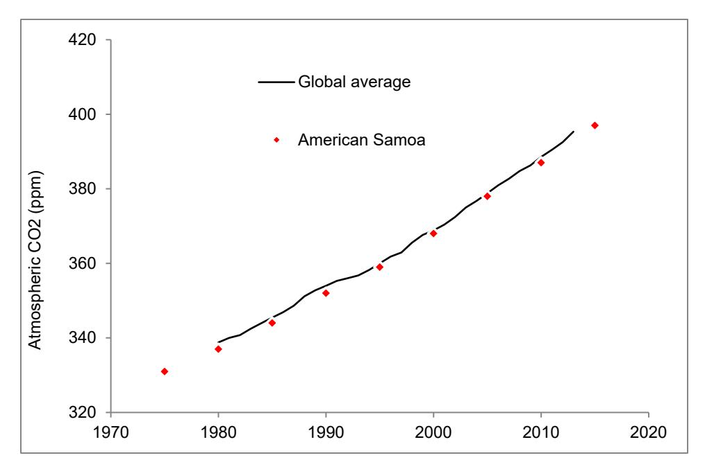

**Figure 100.** Atmospheric concentrations of carbon dioxide (CO2) in American Samoa and globally (NOAA Earth System Research Laboratory, Global Monitoring Division). Online global values were obtained at [http://www.esrl.noaa.gov/gmd/ccgg/trends/global.html;](http://www.esrl.noaa.gov/gmd/ccgg/trends/global.html) American Samoa values at the Tula Observatory were obtained at [http://www.esrl.noaa.gov/gmd/obop/smo/index.html.](http://www.esrl.noaa.gov/gmd/obop/smo/index.html)

### *2. Surface air temperature*

Global air temperatures have increased at an average rate of +0.12 0 C/decade (+0.22 0 F/decade) over the period 1950-2012 (IPCC 2014). In the South Pacific region, temperatures have generally risen +0.1 to +0.2 0 C/decade (Figure 101).

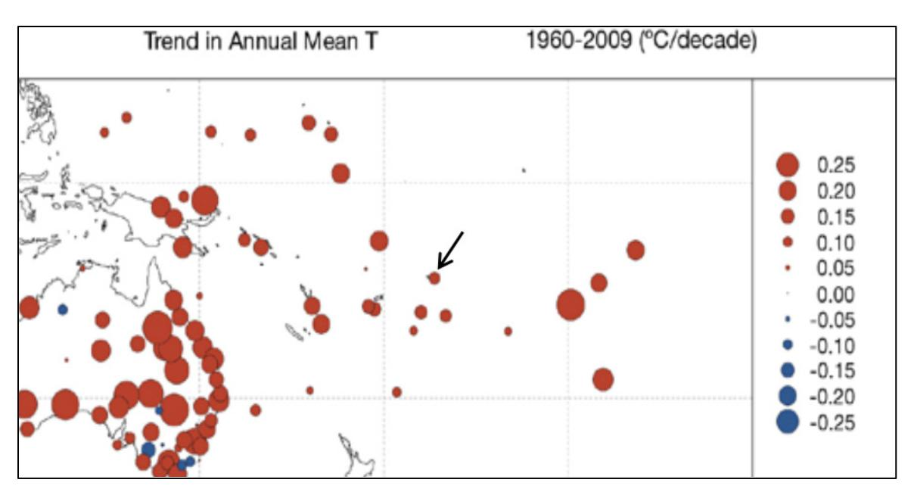

**Figure 101.** Sign and magnitude of air temperature trends (°C/decade) at Pacific Island meteorological stations, 1960–2009. The location of Samoa is indicated by the arrow. Source: ABM & CSIRO 2011.

Air temperatures in American Samoa may also be warming, but there was considerable variability in the two local datasets available. A rapid temperature increase (+0.34 °C/decade) was recorded at the NOAA airport weather station in Tafuna, Tutuila Island (Figure 102). During the same period however, a considerably slower increase (+0.08 °C/decade) and a dissimilar pattern of annual temperatures was recorded at the NOAA Observatory in Tula. It is not clear why there should be such differences between the two sites although many factors can affect local temperature environments. Both stations lie close to the shoreline on Tutuila Island, but the airport station (4 m elevation) is located on an urbanized and vegetated lava plain, whereas the Tula site (42 m elevation) is hilly and sparsely populated. Nonetheless, the Tafuna airport temperature record seems unusually high compared to both global and regional rates of increase. In neighboring Samoa, Figure 101 shows a rise of +0.15 °C/decade, but these data have been revised and now show little change in air temperatures since 1957 (ABM & CSIRO 2014).

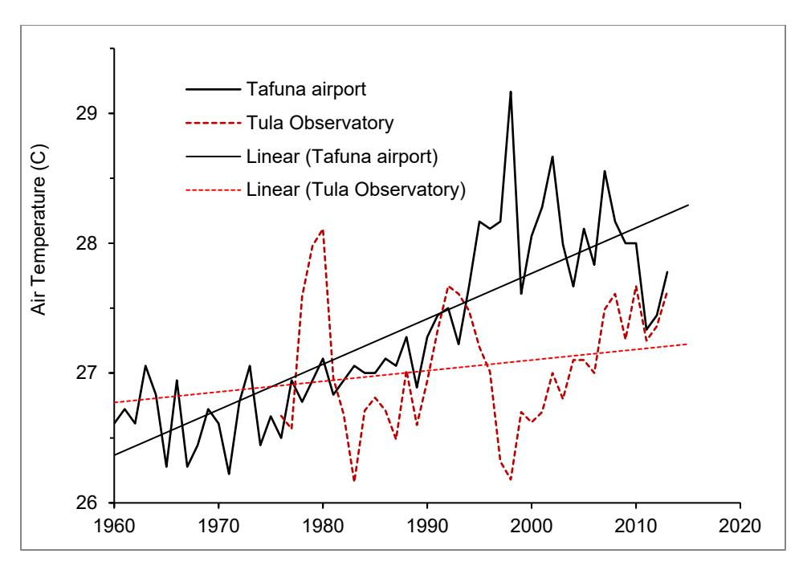

**Figure 102.** Annual mean air temperature at two NOAA weather stations on Tutuila Island: Tafuna airport [www.ncdc.noaa.gov](http://www.ncdc.noaa.gov/) and the Tula Observatory [http://esrl.noaa.gov/gmd/obop/smo/,](http://esrl.noaa.gov/gmd/obop/smo/) and [http://www.esrl.noaa.gov/gmd/dv/data/index.php?site=smo&parameter\\_name=Meteorology&frequency=H](http://www.esrl.noaa.gov/gmd/dv/data/index.php?site=smo¶meter_name=Meteorology&frequency=Hourly%4bAverages) [ourly%4bAverages.](http://www.esrl.noaa.gov/gmd/dv/data/index.php?site=smo¶meter_name=Meteorology&frequency=Hourly%4bAverages) Temperature at the Tula weather tower was measured at the 2 m height (i.e., at 40 m elevation). Trend lines show increases of 0.34 and 0.08 °C per decade for Tafuna airport and Tula Observatory, respectively.

Monahan and Fisichelli (2014) examined whether American Samoa is now experiencing extreme climate conditions (defined as < 5th percentile or > 95th percentile) relative to its 1960-2012 historical range of variability. Seven temperature variables ranked "extremely warm:" annual mean temperature, maximum temperature of the warmest month, minimum temperature of the coldest month, mean temperature of the wettest quarter, mean temperature of the driest quarter, mean temperature of the warmest quarter, mean temperature of the coldest quarter (Figure 103). Note that these findings are based on air temperatures recorded at NOAA's Tafuna airport weather station.

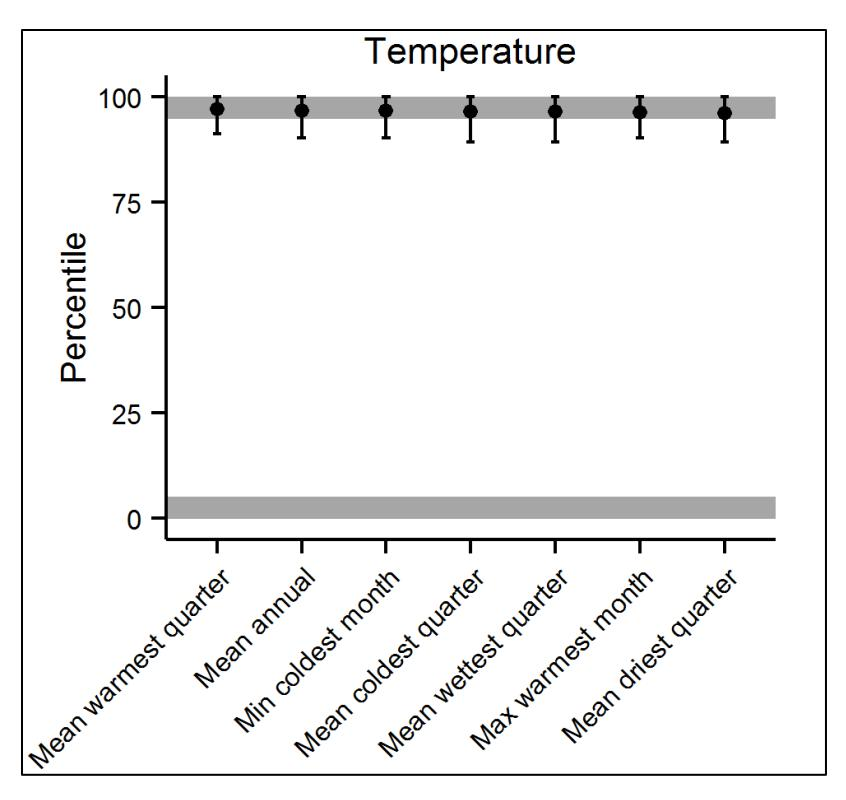

**Figure 103.** Recent temperature percentiles at NPSA (including areas within 30 km of the park's boundary). Black dots indicate average recent percentiles across the 10, 20, and 30-year intervals (moving windows) from 1960 to 2012. Variables are considered "extreme" if the mean percentiles are <5th percentile or >95th percentile (i.e., the gray zones, where recent climate is pushing the limits of all observed climates since the year 1960). Black bars indicate the range of recent percentiles across 10, 20, and 30-year moving windows (larger bars indicate higher sensitivity to moving window size). Source: Monahan and Fisichelli 2014.

NPSA recently established weather monitoring stations at two sites on Tutuila Island and one site on Ofu Island. Data are summarized in Table 46. The Siufaga and Toa Ridge sites were cooler than the Tafuna airport and Tula stations, as might be expected due to their locations at higher elevations.

**Table 46.** Temperature and rainfall summaries at newly established weather stations in NPSA, 2012-14.

|            |                  | Elevation |      | Avg.temperatures |      |      | Annual rainfall |                          |
|------------|------------------|-----------|------|------------------|------|------|-----------------|--------------------------|
| Island     | Station location | (m)       | (ft) | ( C )            | (F)  | (mm) | (in)            | Period                   |
| Tutuila    | Siufaga Ridge    | 146       | 480  | 26.4             | 79.5 | 3048 | 120             | 2012-2014 (34 mo)     |
| Island     | Toa Ridge        | 392       | 1285 | 22.9             | 73.2 | 2311 | 91              | 2012-2014 (31 mo)     |
| Ofu Island | Ranger Station   | 7         | 21   | 26.9             | 80.5 | 2184 | 86              | July-Dec. 2014 (6 mo) |

## *3. Rainfall*

American Samoa receives frequent but variable rainfall that is influenced by the strength and position of the South Pacific Convergence Zone and the El Niño-Southern Oscillation. Annual rainfall at the Tafuna airport is 3,132 mm (123 in), although other areas on the island can receive 1,800-5,000 mm (71 to 200 in) due to orographic effects (Izuka et al. 2005). The annual pattern at the Tafuna airport shows no apparent trend (Figure 104), and similar results have been recorded at nearby islands of Samoa and Niue (ABM and CSIRO 2011). However, Monahan and Fisichelli (2014) found that in recent years two precipitation variables (precipitation of the wettest month, precipitation of the wettest quarter) ranked "extremely wet" relative to the 1960-2012 historical range of variability in American Samoa (Figure 105).

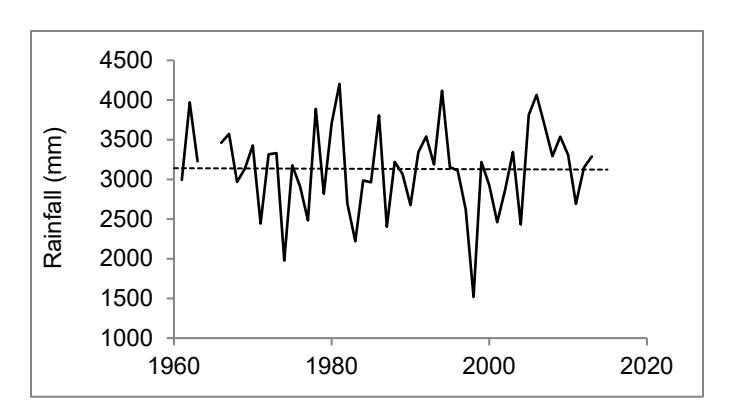

**Figure 104.** Annual rainfall at the Tafuna airport, American Samoa. Source: [www.ncdc.noaa.gov.](http://www.ncdc.noaa.gov/)

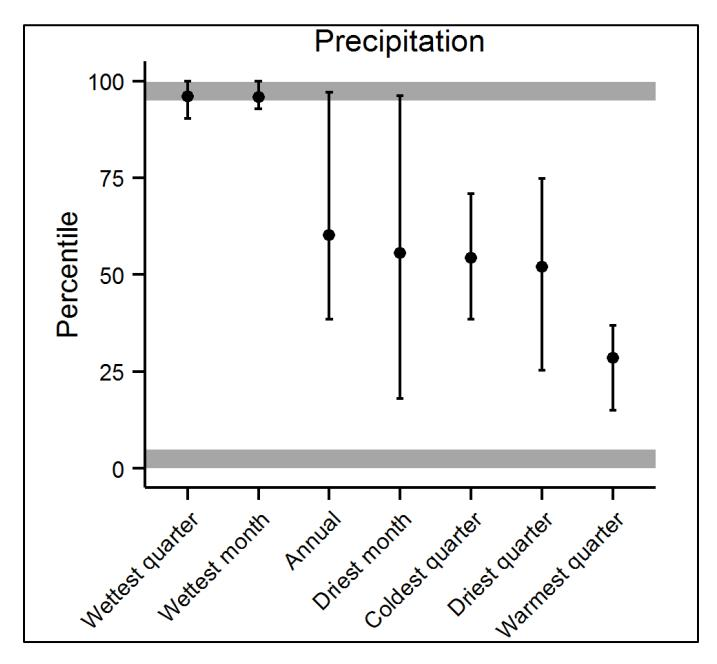

**Figure 105.** Recent precipitation percentiles at NPSA (including areas within 30 km of the park's boundary). See caption in Figure 105 for symbols. Source: Monahan and Fisichelli 2014.

## *4. Cyclone activity*

American Samoa lies within a cyclone belt in the southwest Pacific Ocean (Figure 106). Over the past 37 years (1978-2014), 10 cyclones occurred in American Samoa that damaged at least portions of the main islands (i.e., cyclones that passed by too far offshore to damage lands or coral reefs were not included in this tabulation) (Table 47). The average time interval between cyclones was 3.7 years (range 0-13 years). ABM and CSIRO (2011) reported that there have been no significant trends in the overall number of cyclones, or in the number of intense tropical cyclones, in the South Pacific Ocean during the period 1981-2007. In contrast, Diamond et al. (2013) reported that major cyclones in central South Pacific increased during the 1970-2010 period.

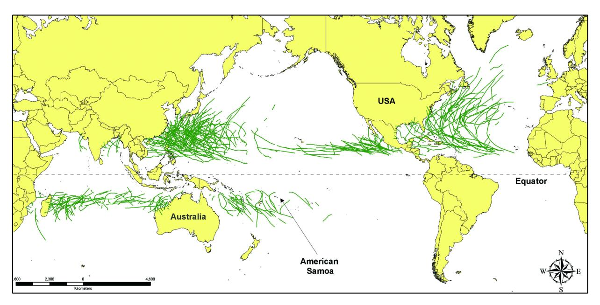

**Figure 106.** Tracks of cyclones during the 10-year period 1994-2003 (Craig 2009).

**Table 47.** List of cyclones that damaged portions of the main islands of American Samoa (AS), 1978- 2014. Cyclones that remained offshore and did not impact land are not included. Note there are some differences in which "cyclones" agencies list due to changes in cyclone strength when it passed by American Samoa. This list does not include several cyclones that missed American Samoa but hit nearby Samoa: Tui (1998), Percy (2005), Oli (2010), Evan (2012). Data sources: [Wikipedia.](http://en.wikipedia.org/wiki/list_of_retired_South_Pacific_tropical_cyclone_names,%20and%20the%20Australian%20Bureau%20of%20Meteorology%20http:/www.bom.gov.au/cyclone/history/tracks%20(accessed%203%20Aug%202014))

| No. | Name    | Dates active in AS | Cyclone category near AS | Comments                                         | Subjective impact to AS Islands | Years between cyclones |
|-----|---------|-----------------------|--------------------------------|--------------------------------------------------|---------------------------------------|------------------------------|
| 1   | Charles | 2/14-28/1978          | 3                              | Cyclone passed between Tutuila and Manu'a.    | Tutuila, Manu'a                    | –                            |
| 2   | Esau    | 3/1-5/1981            | 1                              | AS & Samoa.                                      | Tutuila, Manu'a                    | 3                            |
| 3   | Tusi    | 1/19/87               | 4                              | Local memory.                                    | Manu'a*                               | 6                            |
| 4   | Ofa     | 2/3-4/1990            | 4                              | Especially bad on Tutuila (but some refugia). | Tutuila*                              | 3                            |
| 5   | Val     | 12/6-10/1991          | 4                              | Especially bad on Tutuila (but some refugia). | Tutuila*, Manu'a                   | 1                            |
| 6   | Heta    | 1/4-5/2004            | 5                              | Passed south of Samoan Archipelago.              | Tutuila, Manu'a                    | 13                           |
| 7   | Olaf    | 2/16/05               | 5                              | Directly hit Ta'u, but Ofu less affected.        | Manu'a*                               | 1                            |
| 8   | Nisha   | 1/26/10               | 1                              | Passed south of AS.                              | Tutuila, Manu'a                    | 5                            |
| 9   | Rene    | 2/12/10               | 1                              | Grazed Manu'a.                                   | Tutuila, Manu'a                    | 0                            |
| 10  | Wilma   | 1/23/11               | 1                              | Light damage in AS, but Samoa was hit hard.   | Tutuila, Manu'a                    | 1                            |

\* Indicates larger impact

## Marine Environment

#### *5. Ocean temperature*

The ocean absorbed more than 90% of the excess heat accumulated from global warming between 1971 and 2010, and the upper 75 m of water warmed +0.11 °C per decade over this period (IPCC 2014, Howes et al. 2015). Sea surface temperature (SST) in American Samoa has increased more rapidly (+0.45 °C/decade), based on NOAA/NASA satellite data over the period 1985-2006 (Figure 107), causing major coral bleachings in 1991, 1994, 2002, 2003, and 2015 (see 4.3 Benthic Marine Community). A 15-year dataset (1999-2013) for the nearshore waters of NPSA's Ofu lagoon showed a slightly declining temperature trend (Figure 107), however this appears to be consistent with the NOAA SST data during the same period (Figure 108).

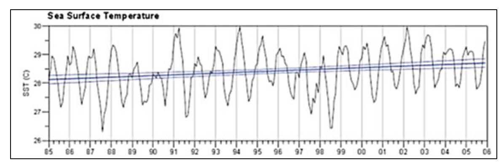

**Figure 107.** Sea surface temperature from CoRTAD, 1985-2006. Values are monthly averages for American Samoa's Economic Exclusion Zone (EEZ). Source: Pirhalla et al. 2011.

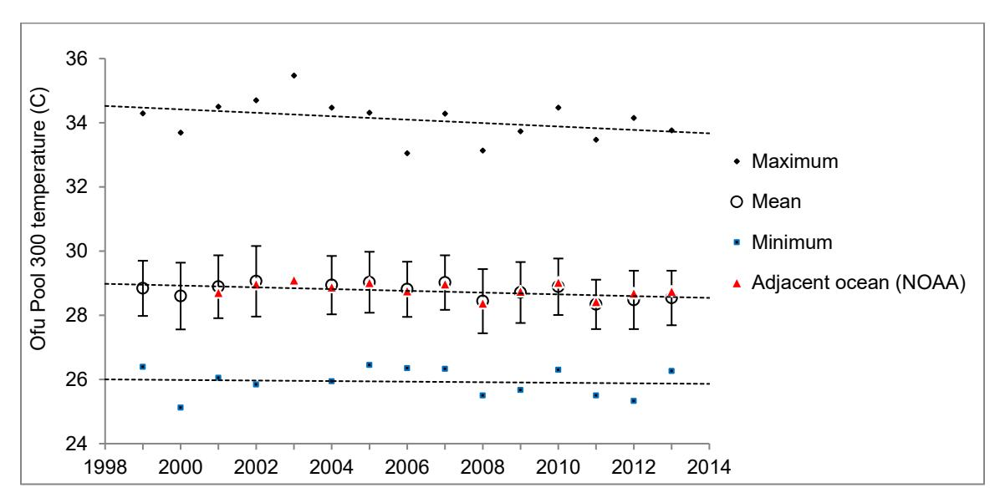

**Figure 108.** Nearshore ocean temperatures in NPSA's Ofu Unit: Ofu lagoon (Pool 300), 1999-2013. Error bars for Pool 300 are ± SD. Sea surface temperatures derived by NOAA satellites for the Ofu Island marine region are also shown for comparison. Source: Craig 2013.

#### *6. Ocean acidification*

Oceanic uptake of atmospheric CO2 has rapidly increased ocean acidification. Over the past century, the pH of ocean surface water decreased by 0.1 unit, which equates to a 26% increase in ocean acidification (Hoegh-Guldberg et al. 2014, IPCC 2014). This rate of change is unprecedented over the past 65 million years. Data from the Central Pacific region near Hawaii show that about half of this acidification occurred in the past few decades (Figure 109). Given that increasing trends in atmospheric CO2 in American Samoa are the same as those in Hawaii, the increasing trend in ocean acidification is presumably representative for American Samoa as well.

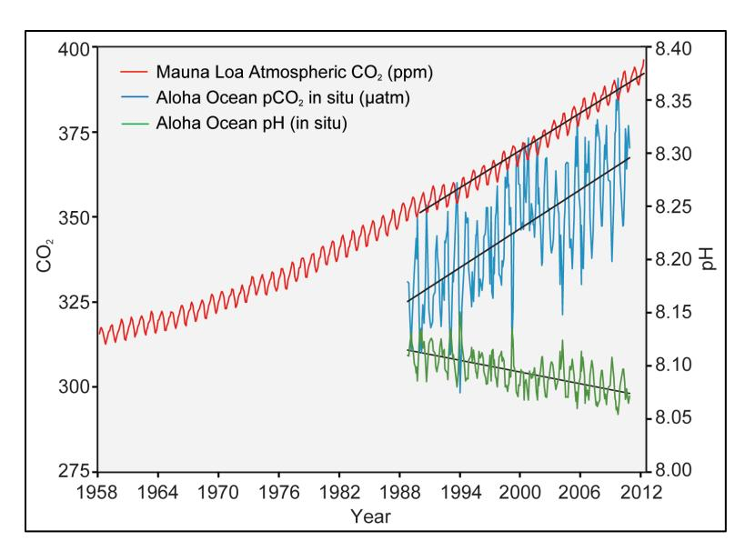

**Figure 109.** Trends in increasing atmospheric carbon dioxide (CO2) in Hawaii and changes in ocean chemistry. This graph shows: (1) an increase in atmospheric CO2, (2) an increase in dissolved CO2 (pCO2) in ocean surface waters, and (3) a decrease in ocean pH which equates to an increase in ocean acidification. Source: Feely et al. 2009.

## *7. Sea level*

Sea level has risen as the oceans warm and expand, and as glaciers and ice sheets melt due to global warming. Regional trends in the Pacific Ocean are for higher rates of sea level rise in the western tropical Pacific than in the eastern Pacific (Figure 110), which corresponds to an intensification of the easterly trade winds across the tropical Pacific during the period 1993-2010 (Merrifield 2011). Measured rates of sea level rise in American Samoa during the same period (+5.3 mm/yr, 2.1 in/decade) are similar to those recorded in Samoa and Niue (Table 48) and are faster than the global average of +3.2 mm/yr (Rhein et al. 2013).

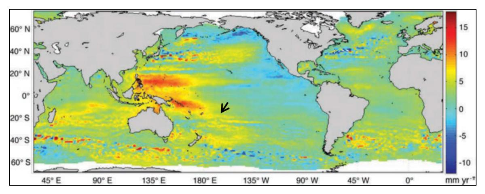

**Figure 110.** Sea level trends for 1993–2010 measured by satellite altimetry, in millimeters (Merrifield 2011, in Keener et al. 2012). The arrow points to American Samoa.

**Table 48.** Sea level rise in American Samoa and other locations.

|                | Sea level rise rate |           |           |                             |
|----------------|---------------------|-----------|-----------|-----------------------------|
| Location       | (mm/yr)             | in/decade | Period    | Reference                   |
| American Samoa | +5.3                | +2.1      | 1993-2009 | U. Hawaii Sea Level Center* |
| Samoa          | +4.0                | +1.6      | 1993-2010 | ABM & CSIRO 2011            |
| Niue           | +5.0                | +2.0      | 1993-2010 | ABM & CSIRO 2011            |
| Global average | +3.2                | +1.3      | 1993-2010 | Rhein 2015                  |

\* [http://uhslc.soest.hawaii.edu/data/download/fd.](http://uhslc.soest.hawaii.edu/data/download/fd)

## Overall threat level

Local and global climate change measures are summarized in Table 49.

**Table 49.** Climate change indicators in American Samoa and globally.

| Environment type        | Climate variable    | American Samoa          | Global average   |
|-------------------------|---------------------|-------------------------|------------------|
|                         | Atmospheric CO2     | + 394 ppm (2013)        | + 395 ppm (2013) |
|                         | Air temperature     | + 0.1 to +0.3 °C/decade | + 0.1 °C/decade  |
| Terrestrial Environment | Rainfall            | no local trend          | –                |
|                         | Cyclone activity    | unclear local trend     | –                |
|                         | Ocean temperature   | + 0.45 °C/decade        | + 0.1 °C/decade  |
| Marine Environment      | Ocean acidification | + 26% (Hawaii)          | –                |
|                         | Sea level           | + 5.3 mm/decade         | + 3.2 mm/decade  |

#### *Atmospheric CO2*

Increasing atmospheric CO2 concentrations in American Samoa are nearly identical to global trends. Significance Level 3 (High), Threat Level 2 (Moderate).

#### *Air temperature*

Air temperatures are increasing regionally and in American Samoa, although the Tafuna airport temperatures have risen unusually rapidly. Significance Level 3 (High), Threat Level 1 (Low).

#### *Rainfall*

Rainfall in American Samoa is annually variable but without apparent trend over the past 45 years. Significance Level 3 (High), Threat Level 0 (Not a current concern).

## *Cyclone Activity*

The average time interval between cyclones in American Samoa is 3.7 years (range 0-13 years). There is some uncertainty about whether cyclones in the South Pacific region are becoming more frequent or intense. Significance Level 3 (High), Threat Level 1 (About normal).

#### *Sea temperature*

Initial data indicate an increasing trend in local ocean temperatures, but more recent figures are needed to confirm the trend. Nonetheless, warm water episodes in American Samoa have already caused multiple mass coral bleaching events during the past 25 years. Significance Level 3 (High), Threat Level 2 (Moderate).

#### *Ocean acidification*

Data from Hawaii document increasing ocean acidification in recent decades. Significance Level 3 (High), Threat Level High 2 (Moderate).

#### *Sea level rise*

The rate of sea level rise in American Samoa is faster than the global average. Significance Level 3 (High), Threat Level High 2 (Moderate).

#### *Weighted threat score*

The weighted threat score (0.48) indicates that the climate change threat to NPSA is at least of moderate concern at present and projected to get worse (Table 50).

**Table 50.** Significance levels and condition levels used to calculate the weighted condition score (WCS) for NPSA's local climate change.

| Measures            | Significance Level | Condition Level | WCS = 0.48                                                                                                           |
|---------------------|--------------------|-----------------|----------------------------------------------------------------------------------------------------------------------|
| Atmospheric CO2     | 3                  | 2               |                                                                                                                      |
| Air temperature     | 3                  | 1               |                                                                                                                      |
| Rainfall            | 3                  | 0               |                                                                                                                      |
| Cyclone activity    | 3                  | 1               |                                                                                                                      |
| Ocean temperature   | 3                  | 2               | Condition of resource warrants moderate concern; condition is deteriorating; medium confidence in the assessment. |
| Ocean acidification | 3                  | 2               |                                                                                                                      |
| Sea level rise      | 3                  | 2               |                                                                                                                      |

## *5.1.5. Literature Cited*

ABM and CSIRO (Australian Bureau of Meteorology and Commonwealth Scientific and Industrial Research Organization). 2011. Climate Change in the Pacific: Scientific Assessment and New Research. Volume 1: Regional Overview. Volume 2: Country Reports. Chapt. 9. Niue, p. 141- 154, and Chapt. 12. Samoa, p. 185-193.

ABM and CSIRO (Australian Bureau of Meteorology and Commonwealth Scientific and Industrial Research Organization). 2014. Climate variability, extremes and change in the Western Tropical Pacific 2014: new science and updated country reports. Pacific-Australia Climate Change Science and Adaptation Planning Program Technical Report. Melbourne, Australia. Chapt. 12. Samoa. [http://www.pacificclimatechangescience.org/publications/reports/climate-variability](http://www.pacificclimatechangescience.org/publications/reports/climate-variability-extremes-and-change-in-the-western-tropical-pacific-2014/)[extremes-and-change-in-the-western-tropical-pacific-2014/.](http://www.pacificclimatechangescience.org/publications/reports/climate-variability-extremes-and-change-in-the-western-tropical-pacific-2014/)

Brainard, R., C. Birkeland, C. Eakin, P. McElhany, M. Miller, M. Patterson, and G. Piniak. 2011. Status review report of 82 candidate coral species petitioned under the U.S. Endangered Species Act. U.S. Dep. Commerce, NOAA Tech. Memo., NOAA-TM-NMFS-PIFSC-27, 530 p. + 1 Appendix.

- Craig, P. (ed.). 2009. Natural history guide to American Samoa. National Park of American Samoa, Dept. Marine and Wildlife Resources, American Samoa Community College. Pago Pago, American Samoa.
- Craig, P. 2013. NPSA long-term water temperature monitoring in Ofu and Vatia, American Samoa: project description, metadata, preliminary results. Unpublished report. National Park of American Samoa.
- Diamond, H., A. Lorrey, and J. Renwick. 2013. A southwest Pacific tropical cyclone climatology and linkages to the El-Nino Southern Oscillation. J. Climate 26:3-25. [http://journals.ametsoc.org/doi/abs/10.1175/JCLI-D-12-00077.1.](http://journals.ametsoc.org/doi/abs/10.1175/JCLI-D-12-00077.1)
- Feely, R., S. Doney, and S. Cooley. 2009. Ocean acidification: present conditions and future changes in a high-CO2 world. Oceanography 22**:** 36-47, doi:10.5670/oceanog.2009.95.
- Hoegh-Guldberg, O., P. Mumby, A. Hooten, R. Steneck, P. Greenfield, E. Gomez, C. Harvell, P. Sale, A. Edwards, K. Caldeira, N. Knowlton, C. Eakin, R. Iglesias-Prieto, N. Muthiga, R. Bradbury, A. Dubi, M. Hatziolos. 2007. Coral reefs under rapid climate change and ocean acidification. Science 318:1737-1742, doi: 10.1126/science.1152509.
- Hoegh-Guldberg, O., R. Cai, E. Poloczanska, P. Brewer, S. Sundby, K. Hilmi, V. Fabry, and S. Jung. 2014. The Ocean. pp.1655-1731. *In*: V. Barros and 15 others (eds.). Climate Change 2014: Impacts, Adaptation, and Vulnerability. Part B: Regional Aspects. Contribution of Working Group II to the Fifth Assessment Report of the Intergovernmental Panel on Climate Change. Cambridge University Press, Cambridge, United Kingdom and New York, USA.
- Howes, E., F. Joos, M. Eakin, and J. Gattuso. 2015. The Oceans 2015 Initiative, Part I: an updated synthesis of the observed and projected impacts of climate change on physical and biological processes in the oceans, Studies N° 02/15, IDDRI (Institut Du Développement Durable et des Relations Internationales), Paris, France, 52 p.
- IPCC (Intergovernmental Panel on Climate Change). 2014. Climate change 2014 synthesis report. Fifth Assessment Synthesis Report of the Intergovernmental Panel on Climate Change. Edited by The Core Writing Team, R. Pachauri, and L. Meyer. Cambridge University Press, Cambridge, United Kingdom and New York.
- Izuka, S., T. Giambelluca, and M. Nullet. 2005. Potential evapotranspiration on Tutuila, American Samoa. U.S. Geological Survey Scientific Investigations Report 2005-5200, 40 p. [http://pubs.usgs.gov/sir/2005/5200/pdf/sir2005-5200.pdf.](http://pubs.usgs.gov/sir/2005/5200/pdf/sir2005-5200.pdf)
- Keener, V., J. Marra, M. Finucane, D. Spooner, and M. Smith (eds.). 2012. Climate change and Pacific Islands: indicators and impacts. Report for The 2012 Pacific Islands Regional Climate Assessment (PIRCA). Washington, DC, Island Press.

- Merrifield, M. 2011. A shift in western tropical Pacific sea level trends during the 1990s. J. Climate 24: 4126-4138.
- Monahan, W. and N. Fisichelli. 2014. Recent climate change exposure of National Park of American Samoa. National Park Service Resource Brief. 2 p. [http://science.nature.nps.gov/climatechange/.](http://science.nature.nps.gov/climatechange/)
- NOAA-NCDC (National Oceanic and Atmospheric Administration National Climate Data Center). 1960-2013. Annual climate summaries (American Samoa). Asheville NC. [www.ncdc.noaa.gov.](http://www.ncdc.noaa.gov/)
- Pirhalla, D., V. Ransi, M. Kendall, and D. Fenner. 2011. Oceanography of the Samoan Archipelago. p. 3-26. *In*: M. Kendall and M. Poti (eds.). A biogeographic assessment of the Samoan Archipelago. NOAA Tech Memo, NOS NCCOS 132, Silver Springs, Maryland.
- Rhein, M., S. Rintoul, S. Aoki, E. Campos, D. Chambers, R. Feely, S. Gulev, G. Johnson, S. Josey, A. Kostianoy, C. Mauritzen, D. Roemmich, L. Talley, and F. Wang. 2013. Observations: ocean. p. 255-315. *In*: T. Stocker and 9 others (eds.). Climate Change 2013: The Physical Science Basis. Contribution of Working Group I to the Fifth Assessment Report of the Intergovernmental Panel on Climate Change. Cambridge University Press, Cambridge, United Kingdom and New York.

## **5.2. Fishing Pressure (Marine Harvest)**

## *5.2.1. Description*

Fishing is recognized as a worldwide threat to coral reef fishes (e.g., Friedlander and DeMartini 2002, Reynolds et al. 2002, Birkeland 2004, Williams et al. 2011, Zgliczynski et al. 2013, Fenner 2014, Williams et al. 2015; see also Chapter 4.3 in this report). This section examines the fish harvest in American Samoa and reviews its impact on coral reefs in the park.

Nearshore marine fish have been a vital source of food in the Pacific Islands for millennia (e.g., Dalzell and Adams 1997). Several types of nearshore fishing (subsistence, recreational, artisanal) and offshore fishing (commercial) occur in American Samoa (Craig et al. 1993):

- *Subsistence fishing:* fishing for personal or family use for food or as a cultural activity. Many species of coral reef fish and invertebrates are taken by such equipment as rod and reel, spears, gillnets, seines, and gleaning (catching by hand at low tide). The harvest contributes to the diets of villagers, although fishing effort has diminished as lifestyles and economies have become westernized.
- *Recreational fishing:* personal recreational activity, often using rod and reel gear along the shoreline. For the purposes of this paper, recreational fishing is folded into the subsistence category because it can be difficult to distinguish between the two.
- *Artisanal fishing:* small-scale catches that are sold, often by nighttime spear divers who supply nearshore fish to local bush stores.
- *Commercial fishing:* primarily conducted by large industrial vessels that fish in distant waters and deliver tuna to canneries located in Pago Pago Harbor on Tutuila Island.

In NPSA, subsistence, recreational, and, potentially, artisanal fishing occur in all three marine life zones of the park (shallow marine 0-5 m depth, midmarine 5-30 m, and deep marine >30 m). The fisheries are small scale with few full-time fishers and a low level of nearshore fishing throughout the year (Figure 111). This report focuses on the subsistence fishery because it is permitted by NPSA's enabling legislation (Public Law 100-571). Recreational fishing is consistent with subsistence fishing, but artisanal fishing is not because the fish are sold. Commercial fishing is prohibited in the park. Certain fishing gear and area restrictions apply in park waters (NPSA 2014), but NPSA lacks resources to enforce these regulations.

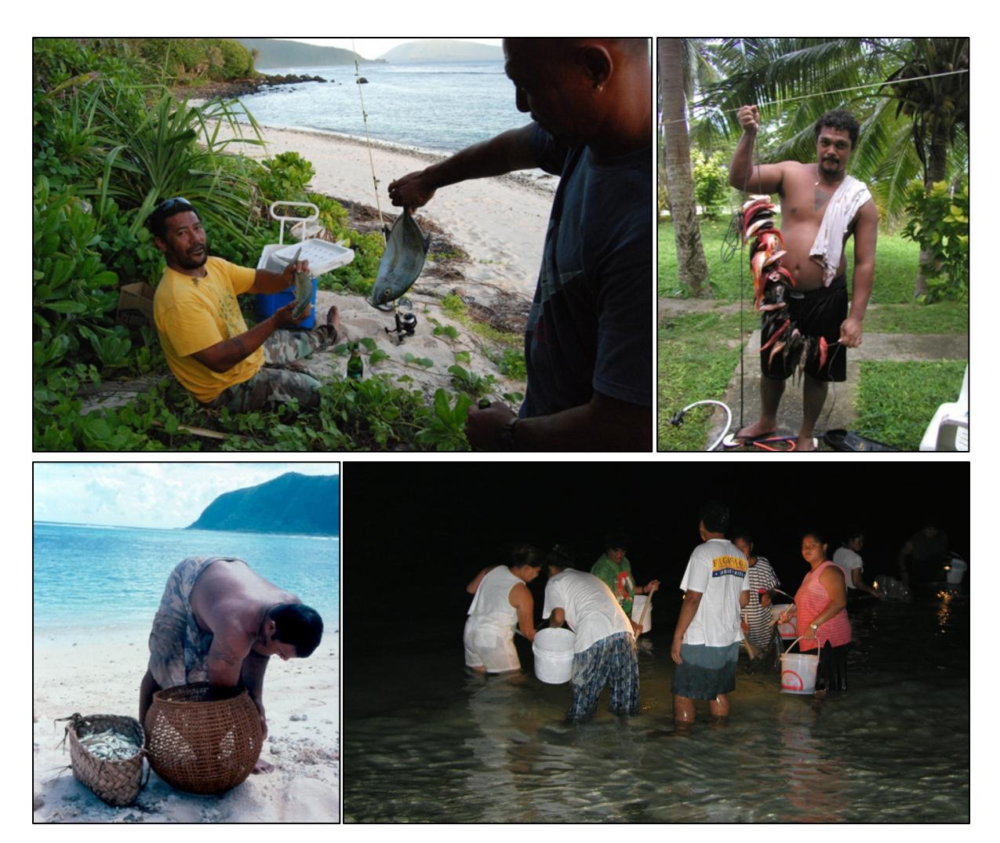

**Figure 111.** Subsistence fishing activities in American Samoa. Clockwise from top left: spear fisherman with catch, rod and reel fishing, nighttime palolo (polychaete) fishing, and traditional enu basket fishing for juvenile goatfish. Photos: P. Craig.

NPSA's enabling legislation provided competing mandates to (a) allow subsistence fishing within the park, and (b) preserve and protect the park's coral reefs. The former mandate has been accomplished in a *status quo* manner by allowing existing fishing activities to continue as they have prior to the establishment of the park, while the latter mandate is to avoid overfishing or other human impact to coral reef ecosystems in the park.

#### *5.2.2. Data and Methods*

Conventional stock assessments of harvested fish are not practical for small scale, multispecies fisheries with numerous landing sites such as occurs in American Samoa (Fenner 2012). Instead, managers often evaluate the condition of the fishery based on multiple fishery statistics that describe the stocks being harvested. Subsistence fishing in American Samoa has been monitored intermittently over the past 30 years, primarily through shore-based catch and effort surveys conducted along the relatively urbanized southern coastline of Tutuila Island. Information for the more rural areas of the Territory, including NPSA, is sparse.

A summary of data sources follows, including, for thoroughness, several sources that provide background information on subsistence fishing in American Samoa.

## Primary data sources

*National Park of American Samoa (NPSA)*

A single report describes the nearshore subsistence fishery at Ofu and Olosega Islands in 2002, which includes NPSA's Ofu Unit (Craig et al. 2008). Fringing coral reefs surround most of Ofu and Olosega, forming a single reef around these two small islands (7.3 and 5.4 km2 ). For perspective, a small motorboat can circumnavigate both islands in less than 1 hr. Each island has one village with about 250 people. This yearlong fishery study consisted of monthly surveys of catches (n = 594 creel interviews) and efforts (n = 472 fishing participation surveys). In addition, fisheries-independent surveys were conducted at two sites in NPSA's Ofu lagoon and at five sites around the two islands. The study examined seven fishery statistics: annual catch, species composition, catch rate, fishing effort, fish size, stock abundance, and a comparison with historic perspectives from elder interviews and prehistoric archaeological evidence. For the present analysis, the complete Ofu-Olosega dataset is used because it has larger sample sizes which better describe the fishery on these small islands. The Ofu Unit itself consists of 3.7 km of shoreline, which is about 21% of the total Ofu-Olosega study area. Fishing effort specific to the park amounted to 15% of the total Ofu-Olosega fishing effort.

### *Department of Marine and Wildlife Resources (DMWR)*

The DMWR has monitored the Territory's subsistence fishery intermittently for some 30 years, mostly along the relatively populated and developed southern shore of Tutuila Island (e.g., Wass 1980, Ponwith 1991, Craig et al. 1993, Saucerman 1995, Tuilagi and Green 1995, Coutures 2003, Sabater and Carroll 2009). The DMWR also gathered information (file data) in Manu'a, but these efforts lacked supervisory oversight and were deemed less reliable than the published study by Craig et al. (2008). DMWR monitors the artisanal boat-based fishery for reef fish on Tutuila Island more regularly. Although such commercial fishing is not allowed in NPSA, it may occur there (Page 1998). Recent artisanal data have not been analyzed but were contracted to NOAA for summarization. Because one of the standard sampling sites for the artisanal survey is the Fagasa boat ramp adjacent to NPSA's Tutuila Unit, it is possible that these data might provide some insight about potential commercial fishing inside the park. WPacFIN (Western Pacific Fisheries Information Network), [www.pifsc.noaa.gov/wpacfin,](http://www.pifsc.noaa.gov/wpacfin) is the primary repository for DMWR's artisanal and commercial fisheries data.

*NOAA's American Samoa Reef Assessment and Monitoring Program (ASRAMP)* NOAA's ASRAMP program has conducted comprehensive islandwide surveys of corals, reef fish and oceanic conditions in American Samoa since 2002 (e.g., Brainard et al. 2008). Although ASRAMP did not monitor fish harvests, it modeled the potential impact of human activities (fishing) on existing stocks of coral reef fishes around the Territory (Nadon et al. 2012, Williams et al. 2015).

#### *Other sources*

Several studies interviewed elder fishermen in American Samoa to obtain their perspectives on the status of local fish resources over their lifetime (Tuilagi and Green 1995, Craig et al. 2008, Levine

and Sauafua-Le'au 2013). Another study reconstructed coral reef fish catches in American Samoa over the period 1950-2002, because fish catches in Pacific Island coral reefs are often incompletely documented (Zeller et al. 2006). For the Manu'a islands, this reconstruction had utilized findings from the previously described study by Craig et al. (2008) as its reference point for calculations.

### *5.2.3. Reference Condition*

Not determined. The 2002 subsistence fishery study in NPSA's Ofu Unit provides a potential reference point (Craig et al. 2008), although these results are from a single year in a single park unit, its findings were mixed, and its results would not be applicable to the more populated island of Tutuila. Fisheries information is not available for the park's Tutuila and Ta'u Units.

## *5.2.4. Status and Trend*

Two general measures are used to describe the condition of the subsistence fishery: (a) status of the Ofu-Olosega fishery in 2002 (Craig et al. 2008), and (b) human impact on local fish populations (Nadon et al. 2012, Williams et al. 2015). The selection of these two measures is an attempt to balance the limited sources of information available.

## Status of the Ofu-Olosega fishery in 2002

Seven statistics that characterize the 2002 subsistence fishery in Ofu-Olosega, which includes NPSA's Ofu Unit, are presented below.

#### *Annual harvest*

The Ofu-Olosega subsistence fishery in 2002 was small scale (37.5 metric tonnes [mt]), but it was an important contribution to the diets of villagers — the per capita catch was 71 kg/person of which 63 kg/person was consumed and the remainder was shipped to family members on the main island of Tutuila. For comparison, the per capita catch was much lower in the more urbanized, populated island of Tutuila (0.27 kg/person in 2002; Coutures 2003).

### *Species composition*

The annual catch was characterized by a diverse array of coral reef fishes and invertebrates, although bigeye scad (*Selar crumenophthalmus*), a sporadic visitor to local reefs, dominated the catch in 2002 (Table 5.1). Excluding bigeye scad, the reef-associated catch of 21.4 mt was more evenly distributed among fish and invertebrate taxa with most accounting for less than 10% of the catch. Major species taken were: parrotfish, goatfish (86% juvenile *Mulloidichthys flavolineatus*), jacks (mostly *Caranx melampygus*), groupers (mostly small honeycomb groupers, *Epinephelus merra*), snappers (46% *Lutjanus kasmira*), and surgeonfish (51% *Ctenochaetus striatus*, 24% *Acanthurus lineatus*). Invertebrates accounted for 17% of the annual harvest and consisted mostly of octopus (*Octopus cyanea*) and palolo polychaetes.

#### *Catch rate*

The catch per unit effort (0.7-4.8 kg/gear-hr) was similar to that reported in the literature for other coral reef fisheries (e.g., Dalzell and Adams 1997).

## *Fishing effort*

The fishery was primarily a shoreline enterprise, which used 11 types of gear, mostly rod and reel, fish weir, and free dive spear fishing (Figure 111). Fishing was a minor but steady activity throughout the year, but with additional effort for seasonally available species. On average, only 2.7 fishermen were observed fishing at any one time (day and night) along the 18 km (11 miles) of shoreline in the Ofu-Olosega study area. However, this seemingly low but persistent effort exerted a substantial pressure on marine resources, as it added up to 20,282 fishing hours per year on these small islands. Craig et al. (2008) suggested that one way to visualize this steady pressure is that it equated to one person fishing continuously day and night for 1.6 months along each kilometer of shoreline. The average annual removal of fish and invertebrates (excluding bigeye scad) was 1,400 kg per km of shoreline (5,000 pounds/mile), so it is likely that fishing had a substantial impact on composition and abundance of nearshore species. In NPSA's portion of the shoreline, average removal of fish and invertebrates was also high (1,050 kg/km or 3,840 lb/mi). Since most fishing in the park occurred in the easily accessible protected waters of Ofu lagoon, this high extraction rate is consistent with the low biomass of live fish occurring there (see *Stock abundance* below). At odds with this discussion on fishing effort is the finding that the harvest yield of reef-associated fishes (2.3 mt/km2 /yr) was only 1-3% of standing stocks outside the lagoon, indicating a low overall fishing effort on combined reef stocks.

#### *Fish size*

Most organisms caught were small, averaging 0.2-1.2 kg in weight (Table 51), and few large fish were detected in nearshore waters on the reef slope (Figure 112). The small size of fish caught is evidence that juveniles of some species inhabit shallow waters, and that some other species caught there are naturally small (e.g., the commonly caught grouper *Epinephelus merra* grows only to 25 cm). In addition, the brief harvests of palolo polychaetes and mass catches of small, newly recruited surgeonfish and goatfish are not a management concern due to their extraordinary but temporary abundance and presumed high rate of natural mortality (Doherty et al., 2004). In other cases, such as sessile giant clams, fishing pressure has probably reduced their availability and harvest size in shallow waters (Green and Craig 1999); 35% of harvested giant clams were legally undersized (Figure 113). However, the current scarcity of large fish on the reef slope is at odds with the previous evidence that fishing pressure is low. Itano and Buckley (1988) surveyed these islands qualitatively 20 years ago and noted that "The presence of large, relatively unwary reef fish on the outer reef slope and relatively high densities of *Tridacna maxima* [giant clams] is evidence that these areas are seldom fished or visited by divers." In contrast, surveys in 2002 documented few fish or sharks larger than 50 cm (Figure 112), and their near absence points to fishing pressure. Craig et al. (2008) suggested that an underlying issue here was the small size of these reefs and that intermittent fishing from boats might easily crop the larger fish. In any case, a reduction in the abundance of large fish can significantly impact the spawning capacity of coral reef fish populations (e.g., Palumbi, 2004; Birkeland and Dayton, 2006).

**Table 51.** Annual catch and composition of harvested fish (by family) and invertebrates (by species). Average weights of individuals within these taxa are indicated (catch weights of newly recruited fish to the reef are included in the fish family categories). Source: Craig et al. 2008.

| Fish &                |                   |                     |        |      | Annual harvest              |                                 | Avg. weight o | f individuals |                                  |
|-----------------------|-------------------|---------------------|--------|------|-----------------------------|---------------------------------|---------------|---------------|----------------------------------|
| invertebrate class | Order and species | Common name         | (kg)   | %    | Catch without bigeye scad % | Fish & inverts. Separately % | (n)           | (kg)          | Notes                            |
|                       | Carangidae        | bigeye scad only | 11,739 | 31.3 | -                           | 35.4                            | 95            | 0.20          | _                                |
|                       | Mullidae          | goatfish            | 2,898  | 7.7  | 11.2                        | 8.7                             | 163           | 0.30          | -                                |
|                       | Scaridae          | parrotfish          | 2,852  | 7.6  | 11.1                        | 8.6                             | 639           | 0.58          | -                                |
|                       | Lutjanidae        | snappers            | 2,609  | 6.9  | 10.1                        | 7.9                             | 783           | 0.31          | _                                |
|                       | Serranidae        | groupers            | 2,605  | 6.9  | 10.1                        | 7.9                             | 1101          | 0.23          | _                                |
|                       | Carangidae        | jacks               | 2,598  | 6.9  | 10.1                        | 7.8                             | 132           | 1.13          | Carangids other than bigeye scad |
|                       | Acanthuridae      | surgeonfish         | 1,926  | 5.1  | 7.5                         | 5.8                             | 1144          | 0.19          | _                                |
|                       | Holocentridae     | soldierfish         | 1,758  | 4.7  | 6.8                         | 5.3                             | 1190          | 0.16          | _                                |
|                       | Lethrinidae       | emperors            | 516    | 1.4  | 2.0                         | 1.6                             | 53            | 0.61          | _                                |
|                       | Carcharhinidae    | sharks              | 495    | 1.3  | 1.9                         | 1.5                             | _             | _             | _                                |
| Fish                  | Scombridae        | tuna                | 479    | 1.3  | 1.9                         | 1.4                             | _             | _             | -                                |
|                       | Belonidae         | needlefishes        | 454    | 1.2  | 1.8                         | 1.4                             | _             | -             | _                                |
|                       | Mugilidae         | mullet              | 418    | 1.1  | 1.6                         | 1.3                             | 88            | 0.61          | -                                |
|                       | Balistidae        | triggerfishes       | 315    | 8.0  | 1.2                         | 1.0                             | 77            | 0.37          | -                                |
|                       | Muraenidae        | moray eels          | 114    | 0.3  | 0.4                         | 0.3                             | _             | _             | -                                |
|                       | Bothidae          | flounder            | 106    | 0.3  | 0.4                         | 0.3                             | _             | _             | -                                |
|                       | Labridae          | wrasses             | 103    | 0.3  | 0.4                         | 0.3                             | _             | _             | _                                |
|                       | Sphyraenidae      | barracudas          | 89     | 0.2  | 0.3                         | 0.3                             | 31            | 0.39          | -                                |
|                       | Priacanthidae     | bigeyes             | 50     | 0.1  | 0.2                         | 0.2                             | _             | _             | -                                |
|                       | Polynemidae       | threadfins          | 39     | 0.1  | 0.2                         | 0.1                             | _             | _             | -                                |
|                       | Unidentified fish | _                   | 963    | 2.6  | 3.7                         | 2.9                             | _             | _             | -                                |
| Sub-totals            | -                 | _                   | 33,125 | 88.2 | 82.9                        | 100                             | -             | -             | -                                |

**Table 51 (continued).** Annual catch and composition of harvested fish (by family) and invertebrates (by species). Average weights of individuals within these taxa are indicated (catch weights of newly recruited fish to the reef are included in the fish family categories). Source: Craig et al. 2008.

| Fish 0                    |                        |               | Annual harvest |      |                             | Avg. weight of individuals      |     |       |                                                     |
|---------------------------|------------------------|---------------|----------------|------|-----------------------------|---------------------------------|-----|-------|-----------------------------------------------------|
| Fish & invertebrate class | Order and species      | Common name   | (kg)           | %    | Catch without bigeye scad % | Fish & inverts. Separately % | (n) | (kg)  | Notes                                               |
| New recruits to           | juvenile goatfish      | _             | _              | ı    | _                           | _                               | 270 | 0.009 | Mulloidichthys flavolineatus (2,517 kg total catch) |
| reef                      | juvenile surgeonfish   | _             | _              | Ī    | ı                           | _                               | 60  | 0.005 | Ctenochaetus striatus (243 kg total catch)          |
|                           | Octopus cyanea         | octopus       | 2,192          | 5.8  | 8.5                         | 49.7                            | 236 | 1.17  | -                                                   |
|                           | Palola viridis         | palolo        | 1,172          | 3.1  | 4.5                         | 26.6                            | -   | 1     | -                                                   |
| Invertebrates             | Panulirus penicillatus | spiny lobster | 573            | 1.5  | 2.2                         | 13.0                            | 186 | 0.47  | -                                                   |
| Invertebrates             | Turbo spp.             | turban snail  | 286            | 0.8  | 1.1                         | 6.5                             | 85  | 0.17  | Without shell                                       |
|                           | Tridacna spp.          | giant clam    | 160            | 0.4  | 0.6                         | 3.6                             | 514 | 0.02  | Without shell                                       |
|                           | Diadema spp.           | sea urchin    | 30             | 0.1  | 0.1                         | 0.7                             | _   | -     | Without shell                                       |
| Sub-totals                | -                      | _             | 4,414          | 11.8 | 17.1                        | 100                             | -   | -     | -                                                   |
| Grand total               | -                      | _             | 37,538         | 100  | 100                         | -                               | -   | -     | -                                                   |

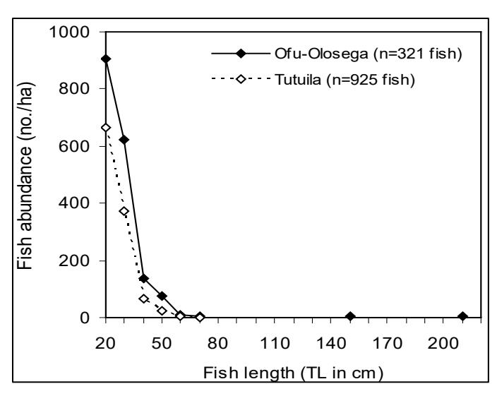

**Figure 112.** Abundance by size class of fish and sharks (>19 cm), species combined, on reef slopes in Ofu-Olosega and Tutuila, 2002. Sources: Green 2002, Craig et al. 2008.

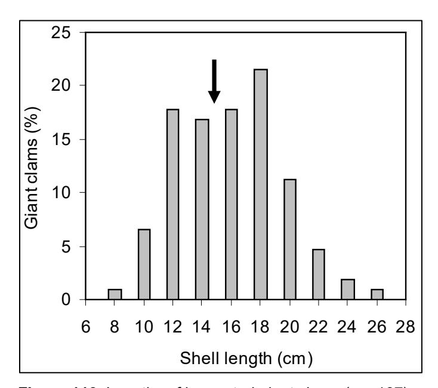

**Figure 113.** Lengths of harvested giant clams (n = 107), mostly *Tridacna maxima*. The minimum legal size of 15.2 cm is indicated (arrow). Source: Craig et al. 2008.

#### *Stock abundance*

The biomass of live fish in NPSA's Ofu's lagoon (where fishing occurred — see Fishing effort), was low (0.6 mt/ha), but it was higher on the deeper reefs around Ofu and Olosega (2.6 mt/ha). The former value was closely aligned with literature values for fished reefs in the central Pacific region, (mean 1.1 mt/ha) while the latter value was similar to literature values for more remote and relatively unfished reefs (mean 3.0 mt/ha) in the same region (Craig et al. 2008).

## *Historical and prehistoric comparisons*

Most (85%) of the 20 village elders interviewed felt that fishing in 2002 was good and similar to what they experienced in youth. The composition of fish harvested was also similar to that previously found in a nearby archeological excavation dated 1000-3000 years ago (Nagaoka 1993).

## Human impact on local fish populations

Recent territory wide evidence suggests that American Samoa's coral reefs show adverse signs of fishing pressure (Nadon et al. 2012, Williams et al. 2015). In general, the fish community consists of a few large fish or sharks and has a low overall total biomass that is characteristic of levels found around densely populated islands such as Guam and Oahu. While this reflects the relatively low oceanic productivity of Tutuila's coastal waters, it also indicates the impacts of human activities, particularly fishing. Williams et al. (2015) estimated that such activities have depleted reef fish biomass by 21%, 42% and 56% at Ofu-Olosega, Ta'u, and Tutuila Islands, respectively. Similarly, sharks have been depleted by an estimated 94-96% in American Samoa (Nadon et al. 2012).

Whether the low biomass of fish in the Territory reflects past or current levels of fishing is not known. For example, we might speculate that (a) historical artisanal fishing reduced fish stocks and their recovery has been hindered by poor recruitment to replenish these populations, and/or (b) current subsistence or artisanal fishing may be more prevalent than appears because both can occur unobserved at night.

## Data needs/gaps

A primary goal of NPSA is to preserve cultural and subsistence practices, but there is insufficient quantitative data to describe both the use of marine resources in the park and the impact of subsistence fishing on the park's marine resources. It should be noted that NPSA has been funded to monitor the subsistence fisheries in its three park units in 2018-2020.

## Threats

Fishing is a worldwide threat to coral reef fishes (e.g., Friedlander and DeMartini 2002, Reynolds et al. 2002, Birkeland 2004, Zgliczynski et al. 2013, Fenner 2014, Williams et al. 2011, 2015). As previously described, fishing pressure is also a concern in American Samoa. In addition, commercial fishing is not allowed in the park, but it may occur there — Page (1998) reported that 9% of the territory's artisanal spear fishing occurred within the Tutuila Unit in 1996-1998. That level of fishing effort could significantly impact marine resources in this small park unit. While fishing has declined in modern times, especially in more economically developed areas where fewer now rely on subsistence fishing (e.g. Craig et al. 1993, Coutures 2003, Zeller et al. 2006, Charlton et al. 2016), marine harvest remains an important activity in the Territory. Other human activities are generally of less concern in NPSA at present — habitat degradation and pollution levels are low due to the remoteness of the park units, and that which occurs is generally localized in village areas outside park boundaries.

Climate change represents a longer term stress on the fishery, because it is adversely impacting coral reef ecosystems through ocean warming and acidification. The consequences are not yet clear (Keener et al. 2012), but potential impacts to fish include changes in physiology, behavior,

distribution, and habitat loss due to the demise of coral reef structures (e.g., Pratchett et al. 2011). Climate change also poses a threat to food abundance (both fisheries and agriculture) and food security in the Pacific Islands (Barnett 2011).

On the positive side, a proposed Marine Protected Area (MPA) within NPSA's Tutuila Unit may alleviate some of these threats. The Village of Fagasa, NPSA, and DMWR have expressed interest in creating a "no take" MPA in the park near Fagasa Village, but this project was still in a consultation phase and specific boundaries have not yet been determined (J. Rayno, CRAG MPA coordinator, pers. com. 12/2014).

## Overall threat level

*Status of the Ofu-Olosega subsistence fishery in 2002*

Subsistence fishing in NPSA was assigned a Significance Level of 3 (High) and a Threat Level of 1 (Low concern). The seven fishery statistics examined here provide a general, but not unanimous, indication that the Ofu-Olosega fishery was a low management concern in 2002. The catch was abundant and diverse, which together with other measures (moderate catch per unit effort, and moderately high standing stocks of fish on the reef slopes) point to a potentially sustainable fishery. Historic and prehistoric lines of evidence support this assessment. On the other hand, potentially adverse impacts to the ecosystem include the large extraction of fish and invertebrates, the low biomass of fish in Ofu lagoon (within NPSA), and the scarcity of large fish and sharks on the reefs.

#### *Human impact on local fish populations*

This measure considered fishery impacts at the larger Territory wide spatial scale rather than that of the national park. It was assigned a Significance Level of 3 (High) and a Threat Level of 2 (Moderate) because their local coral reefs are, or have been, substantially impacted by fishing pressure.

#### *Weighted threat score*

The weighted threat score (0.50; Table 52), indicates that the status of fish populations in American Samoa is of moderate concern due, most likely, to substantial fishing pressure. The confidence in this assessment is low due to the general lack of data specific to the park, except for one study that was conducted in 2002.

**Table 52.** Significance levels and condition levels used to calculate the weighted condition score (WCS) for NPSA's fishing pressure.

| Measures                                              | Significance Level | Condition Level | WCS = 0.50                                                                                                                   |
|-------------------------------------------------------|--------------------|-----------------|------------------------------------------------------------------------------------------------------------------------------|
| Status of Ofu-Olosega fishery in 2002                 | 3                  | 1               |                                                                                                                              |
| Human impact on fish populations in American Samoa | 3                  | 2               | Condition of resource warrco ncern; trend in condition is unknown or not applicable; low confidence in the assessment. |

#### *5.2.5. Sources of Expertise*

• Tim Clark PhD, NPSA Marine Scientist

## *5.2.6. Literature Cited*

- Barnett, J. 2011. Dangerous climate change in the Pacific Islands: Food production and food security. Regional Environmental Change. 11 (Suppl. 1):S229–S237. DOI: 10.1007/s10113-010-0160-2.
- Birkeland, C. 2004. Ratcheting down the coral reefs. Bioscience 54:1021-1027.
- Birkeland, C., and P. Dayton. 2006. The importance in fisheries management of leaving the big ones. Trends. Ecol. Evol. 20:356-358.
- Brainard R., and 25 others. 2008. Coral reef ecosystem monitoring report for American Samoa: 2002-2006. NOAA Special Report NMFS PIFSC. 472 p.
- Charlton, K., J. Russell, E. Gorman, Q. Hanich, A. Delisle, B. Campbell, and J. Bell. 2016. Fish, food security and health in Pacific Island countries and territories: a systematic literature review. BMC Public Health 16:285-311. DOI 10.1186/s12889-016-2953-9.
- Coutures, E. 2003. The shoreline fishery of American Samoa. Dept. Marine and Wildlife Resources, American Samoa, Biological Report Series 102: 1-22.
- Craig, P., B. Ponwith, F. Aitaoto, and D. Hamm. 1993. The commercial, subsistence and recreational fisheries of American Samoa. Mar. Fish. Rev. 55: 109-116.
- Craig, P., A. Green, and F. Tuilagi. 2008. Subsistence harvest of coral reef resources in the outer islands of American Samoa: modern, historic and prehistoric catches. Fish Res 89: 230-240.
- Dalzell, P., and T. Adams. 1997. Sustainability and management of reef fisheries in the Pacific islands. In: Proceedings of the 8th International Coral Reef Symposium, Vol. 2: 2027-2032.
- Doherty, P., V. Dufour, R. Galzin, M. Hixon, M. Meekan, and S. Planes. 2004. High mortality during settlement is a bottleneck for a tropical surgeonfish. Ecology 85: 2422-2428.
- Fenner, D. 2012. Challenges for managing fisheries on diverse coral reefs. Diversity 4:105-160; doi: 10.3390/d4010105.
- Fenner, D. 2014. Fishing down the largest coral reef fish species. Marine Pollution Bulletin 84: 9-16.
- Friedlander, A., and E. DeMartini. 2002. Contrasts in density, size and biomass of reef fishes between the Northwestern and the Main Hawaiian Islands: The effects of fishing down apex predators. Marine Ecology Progress Series 230: 253-264.
- Green, A. 2002. Status of coral reefs on the main volcanic islands of American Samoa. Dept. Marine and Wildlife Resources, American Samoa. Biol. Rept. Series No. 95. 135 p.
- Green, A., and P. Craig. 1999. Population size and structure of giant clams at Rose Atoll, an important refuge in the Samoan Archipelago. Coral Reefs 18: 205-211.

- Itano, D., and T. Buckley. 1988. The coral reefs of the Manu'a islands, American Samoa. Dept. Marine and Wildlife Resources, American Samoa, Biological Report Series 12: 1-26.
- Keener, V., J. Marra, M. Finucane, D. Spooner, and M. Smith (eds.). 2012. Climate change and Pacific islands: indicators and impacts. Report for the 2012 Pacific Islands Regional Climate Assessment (PIRCA). Washington, DC, Island Press.
- Levine, A. and F. Sauafea-Le'au. 2013. Traditional knowledge, use, and management of living marine resources in American Samoa: documenting changes over time through interviews with elder fishers. Pacific Science, 67(3):395-407. 2013. DOI: [http://dx.doi.org/10.2984/67.3.7.](http://dx.doi.org/10.2984/67.3.7)
- Nadon, M., J. Baum, I. Williams, J. McPherson, B. Zgliczynski, B. Richards, R. Schroeder, and R. Brainard. 2012 Re-Creating missing population baselines for Pacific reef sharks. Conserv Biol. 26: 493–503. doi: 10.1111/j.1523-1739.2012.01835.x.
- Nagaoka, L. 1993. Faunal assemblages from the Toaga site. Chapter 13. pp. 189–216. *In*: P. Kirch and T. Hunt (Eds.), The To'aga site: three millennia of Polynesian occupation in the Manu'a Islands, American Samoa. Contributions University of California (Berkeley) No. 51, 248 p.
- NPSA. 2014. Superintendent's compendium of designations, closures, permit requirements and other restrictions imposed under discretionary authority. National Park Service.
- Page, M. 1998. The biology, community structure, growth and artisanal catch of parrotfishes of American Samoa. Dept. Marine and Wildlife Resources, American Samoa, Biol. Report Series. 87 p.
- Palumbi, S. 2004. Why mothers matter. Nature 430: 621-622.
- Ponwith, B. 1991. The shoreline fishery of American Samoa: a 12-year comparison. Dep Mar & Wildl Res, American Samoa. Biol Rep Ser 23: 1-51.
- Pratchett, M., P. Munday, N. Graham, M. Kronen, S. Pinca, K. Friedman, T. Brewer, J. Bell, S. Wilson, J. Cinner, J. Kinch, R. Lawton, A. Williams, L. Chapman, F. Magron, and A. Webb. 2011. Vulnerability of coastal fisheries in the tropical Pacific to climate change. Chapter 9. In: J. Bell, J. Johnson, and A. Hobday (eds). Vulnerability of Tropical Pacific Fisheries and Aquaculture to Climate Change. Secretariat of the Pacific Community, Noumea, New Caledonia.
- Reynolds, J., N. Dulvy, and C. Roberts. 2002. Exploitation and other threats to fish conservation. Pages 319-341, In: P. Hart and J. Reynolds (eds). Handbook of fish biology and fisheries, Vol. 2. Blackwell Publishing, Oxford, UK.
- Sabater, M., and B. Carroll. 2009. Trends in reef fish population and associated fishery after three millennia of resource utilization and a century of socio-economic changes in American Samoa. Reviews in Fisheries Science, 17(3): 318-335.

- Saucerman, S. 1995. The inshore fishery of American Samoa, 1991 to 1994. Dept. Marine and Wildlife Resources (American Samoa), Biol. Rept. Series No. 77, 48 p.
- Tuilagi, F., and A. Green. 1995. Community perception of changes in coral reef fisheries in American Samoa. Biol. Paper 22. In: Proceed. South Pacific Commission — Forum Fisheries Agency regional inshore management workshop (New Caledonia). Dept. Marine and Wildlife Resources, American Samoa, Biol. Rept. Series No. 72, 16 p.
- Wass, R. 1980. The shoreline fishery of American Samoa, past and present. In: Munro, J. (Ed.), Marine and coastal processes in the Pacific: ecological aspects of coastal zone management. Proc. UNESCO Seminar, Motupore Isl. Res. Center, United Nations Education, Scientific and Cultural Organization (Paris), p. 51-83.
- Williams, I., J. Baum, A. Heenan, K. Hanson, M. Nadon, and R. Brainard. 2015. Human, oceanographic and habitat drivers of central and western Pacific coral reef fish assemblages. PLoS ONE 10(4): e0120516. doi:10.1371/journal.pone.0120516.
- Zeller, D., S. Booth, P. Craig, and Pauly, D. 2006. Reconstruction of coral reef fisheries catches in American Samoa, 1950-2002. Coral Reefs. 25: 144-152.
- Zgliczynski, B., I. Williams, R. Schroeder, M. Nadon, B. Richards, and S. Sandin. 2013. The IUCN Red List of Threatened Species: an assessment of coral reef fishes in the US Pacific Islands. Coral Reefs, doi: 10.1007/s00338-013-1018-0.

## **5.3. Invasive Vegetation**

## *5.3.1. Description*

The term "invasive vegetation" is generally defined as alien plants whose introduction and aggressive spread harm commerce, agriculture, human health and/or the environment. The National Park Service is primarily concerned with those species that can invade park areas and disrupt native species and natural processes. To be considered an invasive species in a national park, an alien species must be able to inhabit and reproduce in areas that are relatively undisturbed (e.g., in an intact, native forest). It is National Park Service policy to prevent the establishment of invasive species or eliminate them in park areas. When this is not possible, the Park Service seeks to control these species or mediate their impact within park areas (Monello, 2004).

There are 105 alien plant species recorded in the park. Most of these are modern arrivals (introduced during the European Era beginning about 1830) rather than Polynesian introductions. A few of these are trees that have naturalized in the forest, but the vast majority are weeds adapted to living in disturbed places (Whistler, 1995).

Invasive vegetation and alien plant species records date back to at least 1982. At that time, the following four species and plot population characteristics were noted by Amerson, et al. (1982): *Bischofia javanica, Clidemia hirta, Mikania micrantha,* and *Nephrolepis hirsutula.* While identification of invasive vegetation has been present for several decades, data about their abundance within NPSA is sparse. NPSA contains noteworthy invasive non-tree as well as tree species, although trees have been the primary focus of the park's invasive vegetation removal program (Craig 2009, Loope and Medeiros 2001).

Invasive forest trees are a threat to NPSA. Tamaligi (*Falcotaria moluccana*), lopa (*Adenanthera pavonina*), rubber tree (*Castilla elastic*), and lusina (*Luecaena leucocephala*) are among species that are extant and, in some cases spreading, in or near NPSA. Removal of these invasive species (particularly tamaligi) has been a target because of the potential impacts of invasive trees, and the ability of managers to conduct removal programs in the interest of Samoan villages.

Forest composition in NPSA consists largely of diverse native species, including several endemic tree species. The forests of American Samoa are good examples of intact native forests of their type in the South Pacific (Monello 2004). Consequently, even minimal invasions compromise the pristine nature NPSA's forests. Invasive trees change the composition of forests and their structure, disturb typical forest dynamics, and are culturally undesirable (Hughes et al. 2012, Loope and Medeiros 2001, Space and Flynn 2000, Holt 1996, Hobbs and Humphries 1995, Stone et al. 1992, Cuddihy and Stone 1990, Brockie et al. 1988; Smith 1985). Therefore, the presence of invasive species both within and outside NPSA poses a significant threat.

## *5.3.2. Reference Condition*

The optimal reference condition for an alien species is zero. This goal has been achieved for invasive plants on a number of small or unpopulated islands around the world, but on larger islands where total removal is improbable, given the size and terrain of the island (as in NPSA), complete extirpation is challenging (Hughes et al. 2012, Space and Flynn 2000).

### *5.3.3. Data and Methods*

Several studies of invasive plants have taken place over the last several decades and publications about the results of this work are available in NPSA's Digital Library (Hart 2008) and in the supplemental literature review conducted for this NRCA. The results of these studies are the primary data source for this assessment.

The first major study of invasive plant species in NPSA was conducted by Whistler (1995). Five 1000 m2 forest plots were established in NPSA's Tutuila unit and three in the Ta'u unit. During the study, all trees in each plot were recorded. In addition, the study established several two by two meter subplots within each plot to record plant species. Invasive tree species observed by Whistler (1995) included lopa (*Adenanthera pavonina*) and nonu vao (*Syzgium samarangense*) (Table 53). Mafoa (*Canarium harveyi*) was also found and is more abundant than either lopa or nonu vao.

**Table 53.** The most common invasive plant species observed by Whistler (1995) in eight forest plots in National Park of American and Ta'u. Whistler (1995) identified trees and understory species. 'Number' represents the total number of trees in each 1000m2 subplots to measure understory species (abundance). (Source: Monello 2004).

| Island  | Plot     | Species               | Samoan or Common Name |
|---------|----------|-----------------------|-----------------------|
|         |          | Syzgium samarangense  | Nonu Vao              |
|         | Olo      | Canarium harveyi*     | Mafoa                 |
|         |          | Canarium harveyi*     | Mafoa                 |
|         | Faiga    | Mikania micrantha     | Fue Saina             |
|         |          | Canarium harveyi*     | Mafoa                 |
| Tutuila | Sauma    | Mikania micrantha     | Fue Saina             |
|         | Nu'utoga | Canarium harveyi*     | Mafoa                 |
|         |          | Canarium harveyi*     | Mafoa                 |
|         |          | Syzgium samarangense  | Nonu Vao              |
|         | Alava    | Adenanthera pavonina  | Lopa                  |
|         |          | Clidemia hirta        | Koster's Curse        |
|         |          | Erythrina subumbrans* | Gatae Palagi          |
|         |          | Clidemia hirta        | Koster's Curse        |
|         | Luatele  | Mikania micrantha     | Fue Saina             |
| Ta'u    |          | Merremia peltata*     | Merrimia              |
|         | Saua     | None noted            | N/A                   |
|         |          | Syzgium samarangense  | Nonu Vao              |
|         | Liu      | Mikania micrantha     | Fue Saina             |

\*The status of these species (native, Polynesian, or recent introduction/invasive) is uncertain. Canarium harveyi has been suggested to be a recent introduction, but it could also be an endemic species in American Samoa. Merremia peltata is an indigenous species that has started to act aggressively and take over areas due to human alterations of the landscape. *Erythrina subumbrans* seems to be an introduced/naturalized species.

Common non-arboreal invasive plants observed by Whistler (1995) included Koster's Curse (*Clidemia hirta*), fue saina (*Mikania micrantha*), and merrimia (*Merremia peltata*) (Table 47). Based on this work, Koster's Curse is the most widespread invasive species in the forests of NPSA.

Webb and Fa'aumu (1999) established three large, permanent forest plots in NPSA. Every tree greater than 10 cm in diameter at breast height was measured, marked, and identified in three 1.2 ha plots (12,000 m 2 ) on Tutuila. The most common invasive tree species described in this study were lopa, tamaligi, and nonu vao (Table 54). Webb et al. (1999) also examined a variety of forest types in the Tutuila unit of NPSA using sixty 200 m2 plots. Similar results were found and species of invasive trees differed little among the three forest types (Table 54).

**Table 54.** Invasive tree species observed by Webb and Fa'aumu (1999) and Webb et al. (1999) on forest plots in National Park of American Samoa on the island of Tutuila. "Number" represents the total number of trees in each 1.2 ha (100 x120 m) plot (Webb and Fa'aumu 1999) or the number of trees in ridge, slope, or valley habitat (twenty 10 x 20 m plots each; Webb et al. 1999). (Source: Monello 2004).

| Study                      | Plot   | Species              | Samoan or Common Name | Number |
|----------------------------|--------|----------------------|-----------------------|--------|
|                            |        | Canarium harveyi*    | Mafoa                 | 23     |
|                            | Alava  | Adenanthera pavonina | Lopa                  | 57     |
| Webb and Fa'aumu (1999) |        | Falcotaria moluccana | Tamaligi              | 1      |
|                            | Amalau | Canarium harveyi*    | Mafoa                 | 41     |
|                            | Vatia  | Canarium harveyi*    | Mafoa                 | 37     |
|                            | Ridge  | Canarium harveyi*    | Mafoa                 | 53     |
|                            |        | Canarium harveyi*    | Mafoa                 | 33     |
| Webb et al. (1999)      | Slope  | Syzgium samarangense | Nonu Vao              | 2      |
|                            |        | Canarium harveyi*    | Mafoa                 | 24     |
|                            | Valley | Syzgium samarangense | Nonu Vao              | 2      |

\*The status (native, Polynesian, or recent introduction/invasive) of *Canariaum harveyi* is uncertain. It has been suggested by Whistler (2002) to be a recent introduction, but recent data collected by Whistler (unpublished) also suggest it may be an endemic species in American Samoa.

Space and Flynn (2000) conducted road surveys in American Samoa and found 30 common invasive plant species. Invasive species they observed in American Samoa but not yet established in NPSA are summarized in Table 55. These species may increase their distribution and abundance in NPSA if left uncontrolled.

**Table 55.** Invasive plant species found in American Samoa by Space and Flynn (2000), but not yet present or well established in the National Park of American Samoa. See Space and Flynn (1999) for more detail on their distribution in American Samoa. (Source: Monello 2004).

| Scientific Name        | Samoan/Common Name            |
|------------------------|-------------------------------|
| Antigonon leptosus     | Mexican creeper               |
| Castilla elastica      | pulu mamoe/Panama rubber tree |
| Cinnamomum verum       | tinamone/cinnamon tree        |
| Clerodendrum chinese   | losa Honolulu/Honolulu rose   |
| Costus speciosus       | Wild ginger                   |
| Dieffenbachia maculata | spotted dieffenbachia         |
| Imperata cylindrica    | blady grass                   |
| Kalanchoe pinnata      | life plant                    |
| Lantana camara         | lantana                       |
| Leucaena leucocephala  | leucaena                      |
| Ligustrum spp.         | privet                        |
| Mimosa invisa          | giant sensitive plant         |
| Spathodea campanulata  | African tulip tree            |
| Syngonium podophyllum  | arrowhead plant               |

Ragone and Lorence (2003) established several linear transects (e.g., ~2000 m long, 2 m wide) and subplots (2 m by 2 m or 10 m by 10 m) along the Ofu, Olosega, and Saua coastlines. No invasive species were found along the Ofu or Saua coastlines, and only one nonu vao was found along the Olosega coastline.

NPSA staff began conducting invasive plant transects in 2003. By 2004, 11 transects that covered over 9700 m (~6 mi) had been completed along ridges consisting of intact rainforest. The transects extend from Alava Ridge Road to the ocean in the Tutuila unit. Species presence and abundance were recorded every 25 m along the length of each transect. The most common invasive plants observed included Koster's curse, mafoa, fue saina, lopa, and tamaligi (Table 56). Koster's curse was the only species that occurred on all transects. The presence and abundance of lopa and tamaligi decreased from west to east in the Tutuila unit.

**Table 56.** The most common invasive plant species observed during vegetation transects in the National Park of American Samoa on the islands of Tutuila and Ta'u during 2003 and 2004. Transects consisted of recording the presence and number of invasive plants observed in 25 m segments (20 m width). Percent of areas occupied represents the percent of segments (N = 389) which had the plant species. Abundance is an estimate of the number of plants observed when present. (Source: Monello 2004).

| Measurement            | Location     | Clidemia hirta (Koster's Curse) | Canarium harveyi* (Mafoa) | Mikania micrantha (Fue Saina) | Adenanthera pavonina (Lopa) | Falcotaria moluccana (Tamaligi) |
|------------------------|--------------|------------------------------------------|---------------------------------|-------------------------------------|-----------------------------------|---------------------------------------|
|                        | Tutuila      | 58.27                                    | 54.84                           | 34.66                               | 20.09                             | 12.9                                  |
| % Segments Occupied | Ta'u         | 87.5                                     | not observed                    | not observed                        | 12.50                             | 0.00                                  |
|                        | Both Islands | 63.58                                    | 44.87                           | 28.36                               | 18.71                             | 10.56                                 |
| Average                | Tutuila      | 156.29                                   | 44.28                           | 30.96                               | 2.30                              | 4.00                                  |
| Abundance              | Ta'u         | 400.41                                   | not observed                    | not observed                        | 108.2                             | N/A                                   |
| (No.)                  | Both Islands | 200.68                                   | 44.28                           | 30.96                               | 19.95                             | 4.00                                  |

\*The status (native, Polynesian, or recent introduction/invasive) of Canariaum harveyi is uncertain. It has been suggested by Whistler (2002) to be a recent introduction, but recent data collected by Whistler (unpublished) also suggests it may be an endemic species in American Samoa. It is also important to note that although Canarium harveyi was not observed in these transects, it has been found on Ta'u (Webb pers. com.).

## *5.3.4. Condition and Trends*

## Presence of Invasive Vegetation in NPSA

Descriptive research on the presence and contribution of invasive tree species to the forests of NPSA illustrates the growing presence of alien, potentially invasive forest species and the complex dynamics among native and alien species representation, biomass, and forest cover (Sowards et al. 2014). Lopa (*Adenanthera pavonina)*, cinnamon (*Cinnamomum verum),* Honolulu roses *(Clerodendrum chinense),* Koster's Curse *(Clidemia hirta)*, are invasive in American Samoa, and are present or possibly present in NPSA. If left uncontrolled, their abundance and impact could increase.

According to Space and Flynn (2000), some plants known to be invasive that are problematic in ecosystems similar to American Samoa had been introduced. Some are cultivated plants that had not (yet) escaped and their potential for causing damage is less known. However, one of the best predictors of invasiveness is the behavior of the species elsewhere, and these are known to damage ecosystems. This characterization applies to chain of hearts (*Antigonon leptopus)* and wild ginger (*Costus speciosus)*, which were not yet invasive, but were present.

Leading alien contributors to low elevation forests include lopa (*Adenanthera. Pavonina)* and Tahitian chestnut or maple tree (*Inocarpus fagifer)* (particularly in plots 4 and 5). At middle elevations (particularly plots 11, 12 and 13), tamaligi (*Falcataria moluccana)* and cananga tree (*Cananga odorata)* are the primary alien contributors to biomass (Figure 114). High elevation biomass is largely comprised of native forest species. This trend become evident when alien vs. native biomass contributors are aggregated (Figure 115). While not all alien species are considered invasive, at least two are considered to be so (lopa and tamaligi).

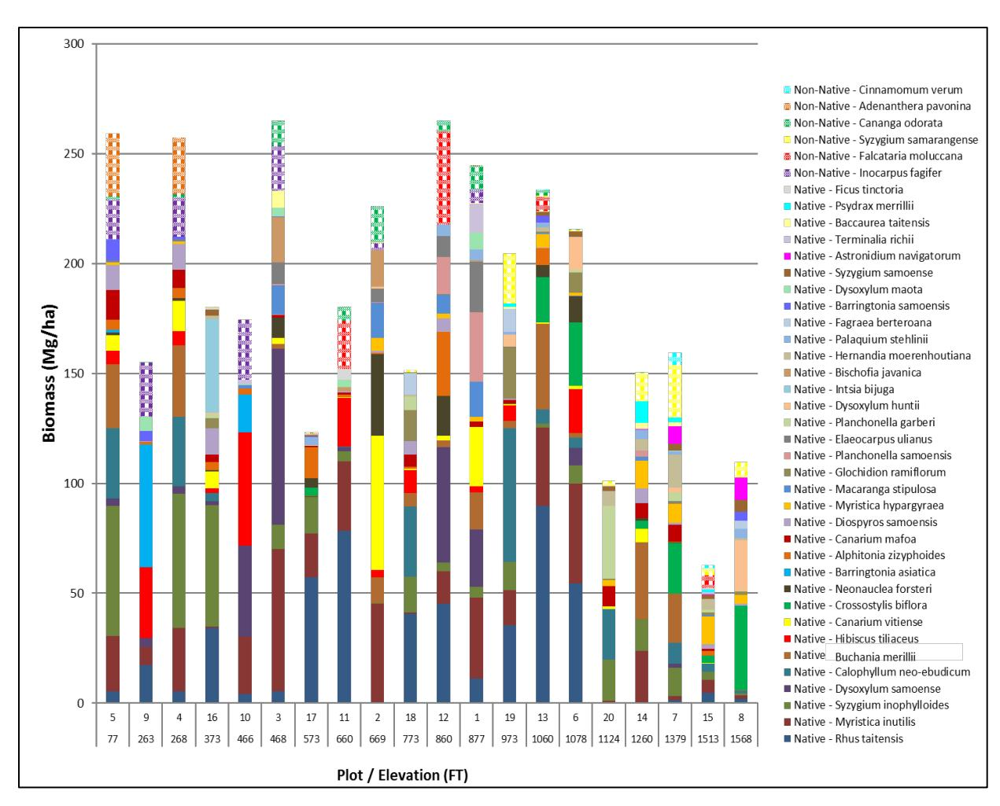

**Figure 114.** Top 40 species contributing to the biomass of Tutuila's forests. Source: Sowards et al. 2014.

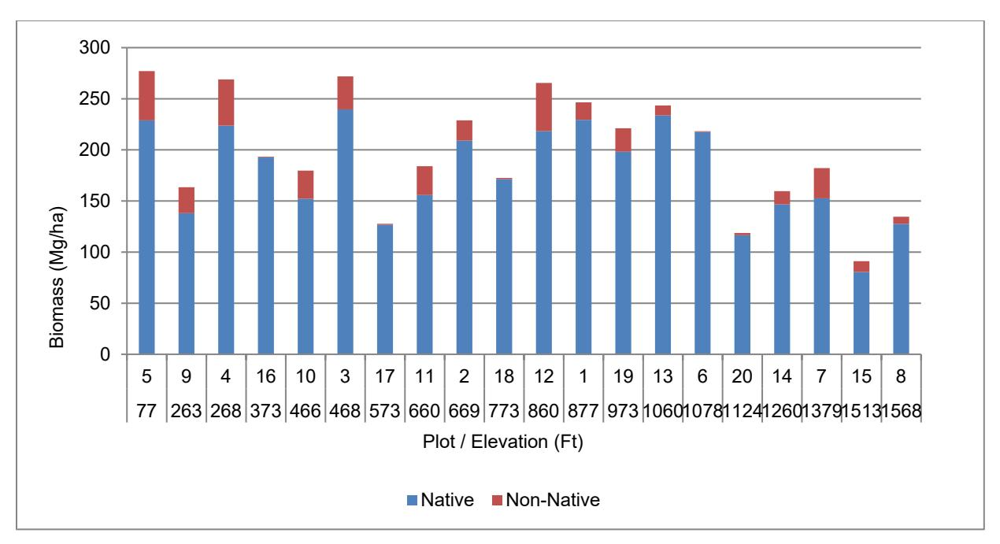

**Figure 115.** Contribution of non-native and native plant species to forest biomass of Tutuila's forests. Source: Sowards et al. 2014.

## Tamaligi Control Program

In the decade from 2000 to 2010 NPSA management invested in invasive species removal. The NPSA fielded a dedicated annual invasive tree control crew. The program is supported through partnerships and diverse funds. Project collaborators include the NPSA, NPS, the U.S. Forest Service, and several island schools and institutions. The program employs, trains, and equips the generally young island residents who comprise the crew (Figure 116). There is specific emphasis on education and professional skills development. Control of invasive species is a common problem for NPSA and the island villages. The invasive tree control crew is used to build social capital and capacity on the islands, as well as control invasive species. Their productivity has been recognized by the Secretary of the Interior and the Regional Director of the National Park Service. The invasive tree control crew has also been recognized by community organizations for their contributions within NPSA and in the villages. Figure 117 shows a hillside after tamaligi control efforts.

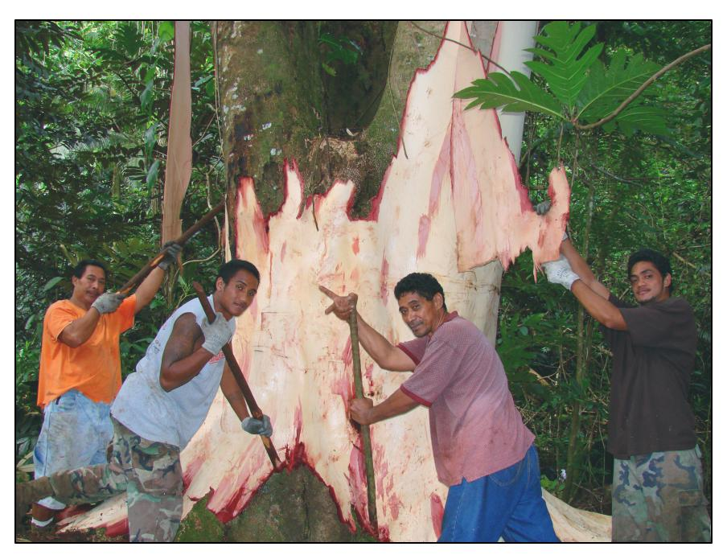

**Figure 116.** NPSA invasive species control crew girdling tamaligi (photo credit: Tavita Togia).

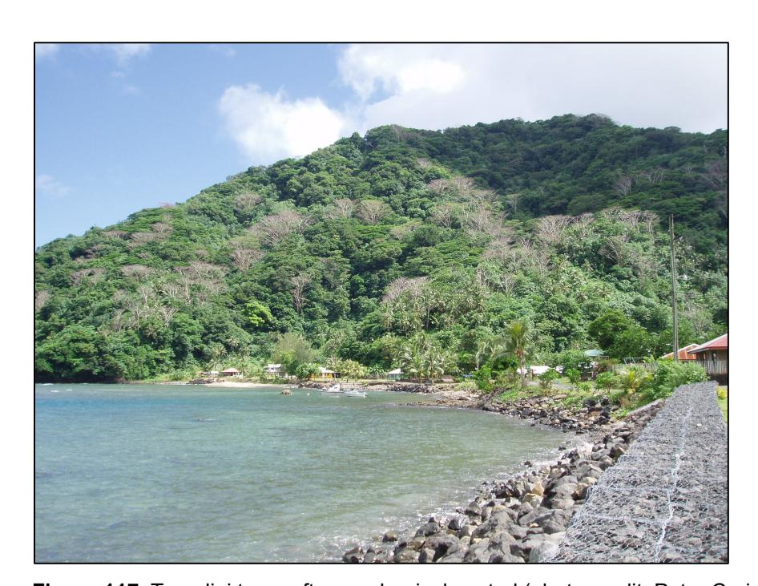

**Figure 117.** Tamaligi trees after mechanical control (photo credit: Peter Craig).

Figure 118 shows tamaligi distribution on Tutuila Island. The total number of tamaligi trees in the NPSA is not known. Consequently, the progress toward total control (i.e. removal of all tamaligi) from within NPSA is not known. Tamaligi's ability to spread across the park's boundaries requires that the tree be extirpated from the islands of American Samoa for control to be considered complete. As with most invasive plant species, extirpation is probably not achievable; thus continued monitoring and control will be necessary in perpetuity.

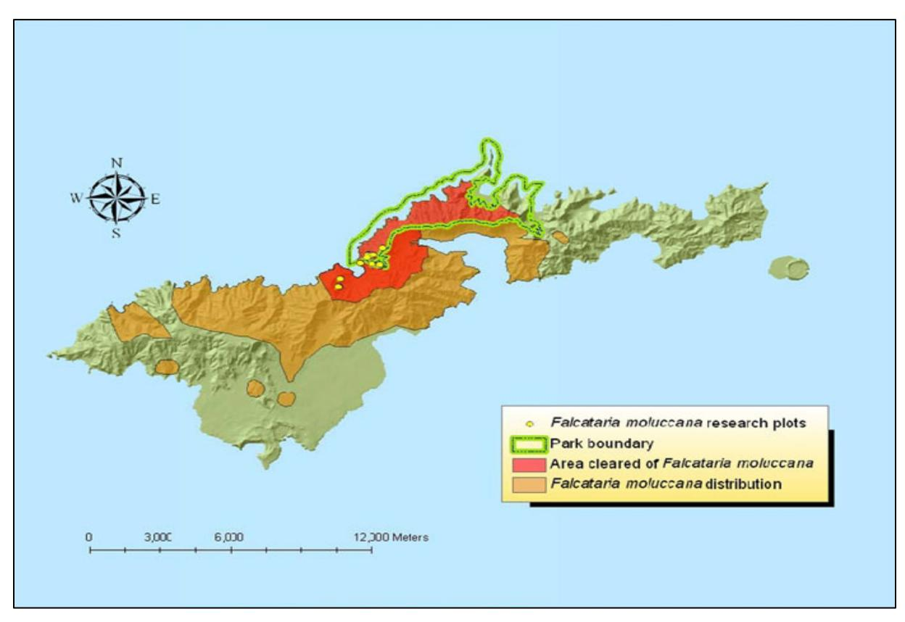

**Figure 118.** Map of Tutuila Island indicating the boundary of the National Park of American Samoa in the Tutuila Unit (green line). Red areas are those in which tamaligi (*Falcataria moluccana*) have been killed via girdling; orange areas are those currently infested by tamaligi. Yellow dots indicate locations of forest plots. Source: Hughes et al. 2012.

Figure 119 shows the number of tamaligi removed by year through the removal program efforts. Through 2016, over 19,000 invasive trees have been killed in park lands and surrounding areas, which restored 24 km2 of wildlife habitat on Tutuila and 2 km2 on Ta'u (T. Togia, pers. com., 2015). This is mentioned in Section 2.2.3. Also see section on Forest Bird Habitat Section 4.8.4. Figure 120 shows the number of trees removed by diameter. The majority of trees killed had diameters less than 40 in at breast height. Fewer very large trees have been removed.

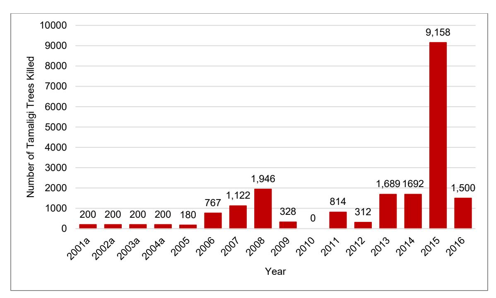

**Figure 119.** Tamaligi removal by year, American Samoa. For graphic purposes, the 800 trees removed during 2001 – 2004 are shown as yearly averages. Source: T. Toiga 2017.

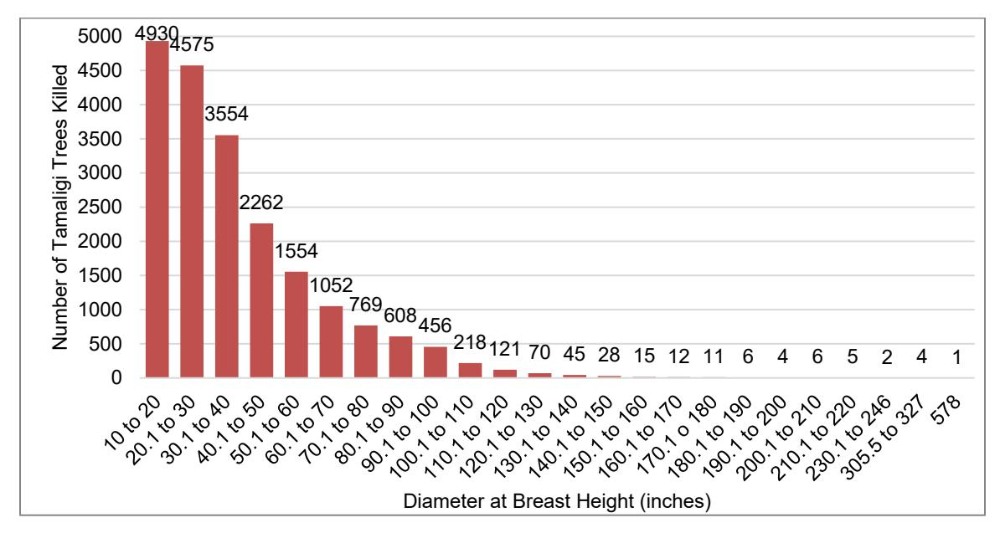

**Figure 120.** Tamaligi killed by diameter at breast height, American Samoa, 2001-2016. T. Toiga 2017.

The tamaligi control program is funded largely by competitive grants and cooperative programs. Its continuation is dependent upon the park's ability to continue receiving the funding and community support necessary to operate the program. Evidence of the impact that funding sources and community support can have on the control of tamaligi can be seen in the annual variability in tamaligi trees controlled.

Commitment to continued control is balanced by the geographical and financial realities of tamaligi populations and control programs. The easiest populations of tamaligi to access have already been eradicated, leaving only the more difficult trees to reach to be controlled. Remaining trees are in remote areas and on steep slopes. Consequently, the time required and danger associated with controlling these trees will be greater than that of previous efforts. Based on management estimates, there may be a 20 year seedbank of tamaligi seeds left in the soil, although NPSA, at least initially, found that the number of seedlings was much lower than expected (T. Togia, pers. com., 2015).

## Control of other invasive species in NPSA

Additional invasive tree species removal programs have been initiated in other areas of American Samoa. A program of removal of lopa was started in 2009 and a similar program of rubber tree removal began in 2007. Table 57 shows the number of lopa and rubber trees removed by year.

| Table 57. Lopa and rubber tree removal by year (2007-2013), American Samoa. |  |
|-----------------------------------------------------------------------------|--|
|-----------------------------------------------------------------------------|--|

| Year  | # Lopa Killed | # Rubber Trees Killed |
|-------|---------------|-----------------------|
| 2007  | –             | 10                    |
| 2008  | –             | 13                    |
| 2009  | 92            | 0                     |
| 2010  | 245           | 0                     |
| 2011  | 221           | 0                     |
| 2012  | 1,222         | 2,418                 |
| 2013  | 1,102         | –                     |
| Total | 2,882         | 2,441                 |

## Data needs/gaps

An islandwide monitoring program that tracks current and future outbreaks of invasive plants is essential. Furthermore, data on the spatial extent and locations of invasive species are needed.

## Threats

The most effective management actions in relation to invasive species are to prevent initial establishment. Control at ports of entry is essential, and land management officials should work closely with plant protection and quarantine officials to make them aware of known and potential invasive plant species. The largest threat to the NPSA from invasive plants like the tamaligi tree is the significant and pervasive impact they can have on NPSA's rainforest ecosystem. Significant progress has been made by park removal programs, but corollary threats to the control efforts are the tenuous nature of funding for the removal program and the time required and danger associated with eradication of remaining trees.

## Overall Condition

*Presence of invasive plant species in NPSA and American Samoa*

There are numerous alien plant species in American Samoa (Whistler 1995, Webb and Fa'aumu 1999, Webb et al. 1999, Space and Flynn 2000, Ragone and Lorence 2003), and eradication is

unlikely. This measure was assigned a Significance Level of 3 (High) and a Condition Level of 2 (Moderate)

#### *Tamaligi tree abundance and impact*

The tamaligi tree has been identified as a focal tree by NPSA in its campaigns to control invasive species. The park has had significant success in its removal program, but more work remains to be done. This will require follow-up control efforts in perpetuity which will require consistent funding and an islandwide monitoring program to continue to be successful.

Specific impact information for American Samoa is limited, but the tamaligi was outcompeting the native rainforest, particularly on the western portion of the Tutuila Unit. Based on the available scientific literature, it is reasonable to assume that tamaligi is affecting the function of the forest it inhabits, and has an impact on other species present there (Hughes et al. 2012, Space and Flynn 2000, Loope and Medeiros 2001). This measure was assigned a Significance Level of 3 (High) and a Condition Level of 2 (Moderate).

#### *Impact of other invasive plant species*

Long-term protection of NPSA may depend most on the success of keeping out of the park those new invasive species that are present elsewhere on the islands. There are more than 100 alien species in American Samoa. Most of them are of concern because of their potential to cause problems and outcompete the native vegetation. The scientific literature about the same and similar species at other insular locations indicates that conservation concern about this threat to the park is warranted. The threat of recolonization of current invasive species and colonization of new invasive plants taking hold is ever present. This measure was assigned a Significance Level of 2 (Moderate) and a Condition Level of 2 (Moderate).

## *Trend in Condition*

Due to active control efforts, and available knowledge of the problem of invasive plants in NPSA, the trend assigned to invasive plants is generally improving.

#### *Weighted condition score*

The driving factor in this assessment is that alien plants in American Samoa are already abundant, one in particular is out-competing native rainforest trees, whereas others are spreading or are alien species with invasive potential. Extensive studies support this concern. The weighted conditions score was 0.67, indicating that invasive vegetation is a condition of moderate to high concern to NPSA resources (Table 58). Confidence in this assessment is high because information specific to the park is available and current invasive plant communities have been identified.

**Table 58.** Significance levels and condition levels used to calculate the weighted condition score (WCS) for NPSA's invasive vegetation.

| Measures                                                         | Significance Level | Condition Level | WCS = 0.67                                                                                                        |
|------------------------------------------------------------------|--------------------|-----------------|-------------------------------------------------------------------------------------------------------------------|
| Presence of invasive plant species in NPSA and American Samoa | 3                  | 2               |                                                                                                                   |
| Tamaligi tree abundance and impact                               | 3                  | 2               |                                                                                                                   |
| Impact of other invasive plant species                           | 3                  | 2               | Condition of resource warrants significant concern; condition is improving; high confidence in the assessment. |

## *5.3.5. Sources of Expertise*

- Tavita Togia, Terrestrial Ecologist, National Park of American Samoa
- Art Whistler, Botanist, University of Hawaii

## *5.3.6. Literature Cited*

- Amerson Jr, A.B., Whistler, W.A. and Schwaner, T.D., 1982. Wildlife and wildlife habitat of American Samoa II: accounts of flora and fauna. US Fish and Wildlife Service, Honolulu, Hawaii.
- Brockie, R., L.L. Loope, M.B. Usher, and O. Hamann. 1988. Biological invasions of island nature reserves. Biological Conservation 44: 9-36.
- Craig, P., ed. 2009. Natural History Guide to American Samoa. National Park of American Samoa, available at [http://www.nps.gov/npsa/learn/nature/natlhistguide.htm.](http://www.nps.gov/npsa/learn/nature/natlhistguide.htm)
- Cuddihy, L.W., and C.P. Stone. 1990. Alteration of native Hawaiian vegetation: effects of humans, their activities and introductions. University of Hawaii, Department of Botany, Cooperative National Park Resource Studies Unit. Honolulu, Hawaii. 138 p.
- Hart, R. 2006. Appendix A: National Park of American Samoa resource overview. In: HaySmith, L., F. L. Klasner, S. H. Stephens, and G. H. Dicus. Pacific Island Network vital signs monitoring plan. Natural Resource Report NPS/PACN/NRR—2006/003 National Park Service, Fort Collins, Colorado.
- Hart, R. 2008. Environmental digital library for the Samoan archipelago. National Park Service, Pacific Network Inventory & Monitoring Program and National Park of American Samoa. DVD (Version 2). https://www.nps.gov/npsa/learn/nature/digitallibr.htm, http://www.botany.hawaii.edu/basch/uhnpscesu/picrp/complbibCont.htm#top, or http://www.botany.hawaii.edu/basch/uhnpscesu/picrp/complbibA.htm#top.
- Hobbs, R.J., and S.L. Humphries. 1995. The ecology and management of plant invasions: an integrated approach. Conservation Biology 9(4):761-770.
- Holt, A. 1996. An alliance of biodiversity, health, agriculture, and business interests for improved alien species management in Hawaii. Pp. 155-160 in O.T. Sandlund, P.J. Schei, and A. Viken

- (editors). 1996. Proceedings of the Norway/UN Conference on Alien Species. Directorate for Nature Management and Norwegian Institute for Nature Research, Trondheim, Norway.
- Hughes, R. F., Uowolo, A., and Togia, T. 2012. Recovery of native forest after removal of an invasive tree, *Falcataria moluccana*, in American Samoa. Biol. Invasions. doi: 10.1007/s10530- 011-0164-y.
- Loope, L., and A. Medeiros. 2001. Management-related considerations of biological invasions and the National Park of American Samoa: A preliminary report, with special reference to invasive species. US Geological Survey, Biological Resources Division, Pacific Island Ecosystem Research Center.
- Monello, R. 2004. Terrestrial resource report National Park of American Samoa. University of Hawaii. 20 pp. Retrieved from WWW April 4, 2016 [http://www.botany.hawaii.edu/basch/uhnpscesu/pdfs/sam/Monello2004AS.pdf.](http://www.botany.hawaii.edu/basch/uhnpscesu/pdfs/sam/Monello2004AS.pdf)
- Ragone, D., and D.H. Lorence. 2003. Botanical and ethnobotanical inventories of the National Park of American Samoa. Pacific Cooperative Studies Unit Final Report.
- Smith, C.W. 1985. Impacts of alien plants on Hawaii's native biota. Pp. 180-250 in C.P. Stone and J.M. Scott, (editors). Hawaii's terrestrial ecosystems: preservation and management. University of Hawaii Cooperative National Park Resource Studies Unit. Honolulu, Hawaii.
- Sowards, T., T. Togia, and F. Hughes. 2014. Forest composition and structure from ridge to reef: Tutuila, American Samoa (presentation).
- Space, J.C., and T. Flynn. 2000. Observations on invasive plant species in American Samoa. Pacific Island Ecosystems at Risk [\(www.hear.org/pier/asreport.htm\)](http://www.hear.org/pier/asreport.htm) U.S.D.A. Forest Service, Pacific Southwest Research Station, Institute of Pacific Islands Forestry, Honolulu, Hawaii.
- Stone, C.P., C.W. Smith, and J.T. Tunison, editors. 1992. Alien plan invasions in native ecosystems of Hawaii: management and research. University of Hawaii Cooperative National Park Resources Studies Unit, Honolulu, Hawaii.
- Webb, E.L., and S. Fa'aumu. 1999. Diversity and structure of tropical rain forest of Tutuila, American Samoa: effects of site age and substrate. Plant Ecology 144:257-274.
- Webb, E.L., B.J. Stanfield, and M.L. Jensen. 1999. Effects of topography on rainforest tree community structure and diversity in American Samoa, and implications for frugivore and nectarivore populations. Journal of Biogeography 26:887-897.
- Whistler, W.A. 1995. Permanent forest plot data from the National Park of American Samoa. Pacific Cooperative Studies Unit Technical Report 98.
- Whistler, W.A. 2002. The Samoan rainforest. A guide to the vegetation of the Samoan Archipelago. Isle Botanica, Honolulu.

## **5.4. Invasive Rats**

## *5.4.1. Description*

Remote oceanic islands like American Samoa have no native rodents. Indeed, the islands have almost no native mammals at all. Only two of the currently extant land mammals, both bats, colonized these islands prior to human arrival. But as the early Polynesians began colonizing the region 3000 years ago (Kirch and Hunt 1993, Steadman 2006, Addison and Matisoo-Smith 2010), they helped spread an alien rat species, the Polynesian rat (*Rattus exulans*). Later European explorers and modern sea commerce helped spread two additional species, the Norway rat (*R. norvegicus*) and roof rat (*R. rattus*). The current distribution of these rats in American Samoa is shown in Table 59.

**Table 59.** Confirmed distribution of rat and mouse species in American Samoa. All are aliens. Sources and abbreviations are listed below. PI – Polynesian introduction MI – Modern introduction E –Eradicated P – probable presence due to connecton between Ofu and Olosega islands. Sources: Mayor 1924, Nass 1971, Amerson et al. 1982, Rauzon and Fialua 2003, Titmus and Dauphine 2013, Adler and Seamon 2016.

| Common name    | Species name   | Origin | Tutuila | Ta'u | Ofu | Olosega | Rose* | Swains |
|----------------|----------------|--------|---------|------|-----|---------|-------|--------|
| Polynesian rat | Rattus exulans | PI     | ●       | ●    | ●   | ●       | E     | ●      |
| Norway rat     | R. norvegicus  | MI     | ●       | ●    | ●   | P       | –     | –      |
| Roof rat       | R. rattus      | MI     | ●       | –    | ●   | ●       | –     | –      |
| House mouse    | Mus musculus   | MI     | ●       | –    | –   | –       | –     | –      |

\* Swenson et al. (2004) mentions *R. rattus* at Rose Atoll based on Mayor (1924), but it is generally interpreted that Mayor was referring to *R. exulans*, and R. exulans was the species eradicated there in 1991 (Morrell et al. 1991).

Other alien mammals were introduced to American Samoa as well (mice, pigs, dogs, cats, horses, cattle), but rats are considered one of the most destructive invasive species affecting island ecosystems worldwide (e.g., Atkinson 1985, Howard et al. 2007, Jones et al. 2008, Drake and Hunt 2009, Varnham 2010, Harper and Bunbury 2015). Rats cause damage through predation, competition, and extirpation of many species on tropical islands. They have reached about 90% of the world's islands and are among the most successful invasive mammals due to their generalist foraging strategy and high adaptability to novel environments (Towns et al. 2006, Jones et al. 2008). Four species of rodents are commonly implicated as global conservation problems: three species of *Rattus* and the house mouse (*Mus musculus*) (Towns et al. 2006). All four occur in American Samoa.

Other researchers note that specific impacts of rats on native biotas in many archipelagoes are poorly known (Towns et al. 2006, Drake and Hunt 2009, Adler and Seamon 2016), and this applies to American Samoa. But because rats pose a potential threat to the park's ground-nesting seabirds, NPSA's management team included them in this NRCA process.

## *5.4.2. Data and Methods*

The topic of rat invasions on island ecosystems has generated considerable scientific interest (e.g., Atkinson 1985, Towns et al. 2006, Jones et al. 2008, Drake and Hunt 2009, Varnham 2010, Harper and Bunbury 2015), but there are no monitoring programs for rats in American Samoa and

information is limited. At Rose Atoll, a rat eradication project was successfully conducted in 1991 (Morrell et al. 1991, Murphy and Ohashi 1991, Swenson et al. 2006). On Ta'u Island, O'Connor and Rauzon (2004) conducted opportunistic rat trapping in the summit cloud forest in 1999-2002. Adler and Seamon (2016) investigated the distribution and abundance of rats in the main islands of the Territory in 2008-11. Other studies describe their occurrence based on opportunistic observations and trapping (Mayor 1924, Nass 1971, Amerson et al. 1982, Rauzon and Fialua 2003, Titmus and Dauphine 2013). Rat bones were recorded in archaeological excavations on Ofu and Tutuila Islands (Nagaoka 1993, Steadman and Pregill 2004).

## *5.4.3. Reference Condition*

The optimal abundance for an alien invasive species is zero. This goal has been achieved for rats on a number of small or unpopulated islands around the world, including Rose Atoll in American Samoa. However, on larger islands where total removal of rats is improbable given the size and terrain of the island (as in NPSA), control rather than eradication may be possible, but it presents risks and challenges (see discussion by O'Connor and Rauzon 2004).

#### *5.4.4. Status and Trend*

Three measures were used to evaluate invasive rats in American Samoa: distribution, abundance, and impact.

## Rat distribution

Three rat species occur widely in the Territory (Table 59). Their distribution on and among islands is patchy (Adler and Seamon 2016), but these islands are small, so it is reasonable to assume that rat species present on each island are also present in NPSA's park units. One species, the Polynesian rat (*Rattus exulans*), is a longterm Polynesian introduction. Its bones were found in archaeological excavations on both Ofu and Tutuila Islands (Nagaoka 1993, Steadman and Pregill 2004). The former site was dated at 1000-3000 years old, the latter about 450 years. The other two species (*R. norvegicus, R. rattus*) are more recent introductions, likely within the past 300 years (Atkinson 1985).

A fourth invasive rodent, the house mouse (*Mus musculus*), is also present in American Samoa (Amerson et al. 1982). Angel et al. (2009) state that its presence and potential impact should not be overlooked:

A key finding is that where mice occur as part of a complex of invasive mammals, especially other rodents, their densities appear to be suppressed and rat-like impacts have not been reported. Where mice are the only introduced mammal, a greater range of native biota is impacted and the impacts are most severe, and include the only examples of predation on seabird eggs and chicks. Thus mice can have devastating, irreversible and ecosystem-changing effects on islands, impacts typically associated with introduced rats *Rattus* spp.

## Rat abundance

Adler and Seamon (2016) examined the distribution and abundance of rats on the main volcanic islands of American Samoa. They captured 277 rats of the three species combined in 1116 trapnights (TN) which equates to 25 rats/100 TN. Maximum catches on any single transect were 28 *R. exulans*/100TN, 14 *R. norvegicus*/100 TN, and 32 *R. rattus*/100 TN. They concluded:

- As occurs elsewhere in the Pacific islands, the abundance of invasive rats in American Samoa varies widely, both spatially and temporally; and
- Rat abundances were not nearly as great in American Samoa as has been documented for these species on other tropical Pacific islands, particularly within the Hawaiian Islands. Their relatively low abundance and patchy distribution may permit the persistence of native biota in American Samoa in a relatively healthy state. [Note: this statement is highly speculative.]

Fewer rats were caught in the cloud forest of Ta'u Island during exploratory surveys by O'Connor and Rauzon (2004). In 1999-2002, they caught 18 Norway rats during 368 TN, for an average catch rate of 5 rats/100 TN (Figure 121).

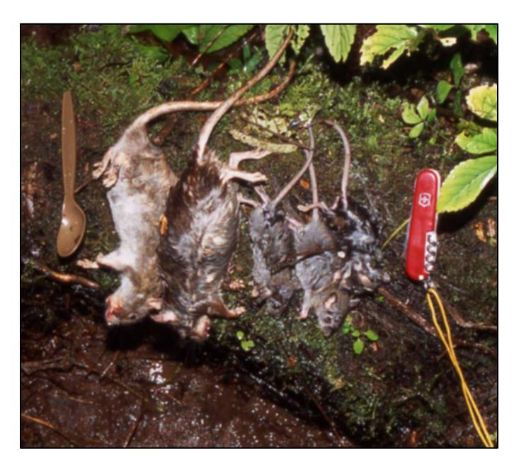

**Figure 121.** Norway rats (*Rattus norvegicus*) captured on the summit of Ta'u Island in 2001. Photo: M. Rauzon.

By way of comparison to the two studies mentioned above, the former rat situation at Rose Atoll is briefly described. This small island (6.3 ha) was plagued by Polynesian rats (e.g., Amerson et al. 1982, Forsell et al. 1989, Rodgers et al. 1993):

*The most prominent feature of the atoll is the presence of rats. There are so many rats on the island that trapping seems to be of little use as essentially all the traps are sprung….The eradication of the rats should be a priority of the [USFWS] service.* [Forsell et al. 1989]

These rats were successfully eradicated in 1991(Morrell et al. 1991, Murphy and Ohashi 1991). During the first two days of trapping, the catch rate was high, averaging 75 R. exulans/100 TN. Catch rates decreased thereafter. In total, 914 rats were removed from the atoll by trapping and poisoning,

and additional rats may have died in their burrows. Their minimum density was at least 148 rats/ha (1 rat/68 m2 ), with a total biomass of 6 kg/ha (1.7g/m 2 ). This infestation-level catch rate provides some perspective for the lower catch rates documented elsewhere in the Territory by O'Connor and Rauzon (2004), and Adler and Seamon (2016). However, such comparisons are limited by factors such as temporal and spatial variations in rat populations, and sampling effort*.* 

## Evidence of rat impacts

While there is ample evidence in the literature that rats consume bird eggs and nestlings, sea turtle hatchlings, invertebrates, and plant seeds, there is little specific information about their impact on the vegetation and wildlife in American Samoa. Polynesian rats were observed attacking sea turtle hatchlings and eating bird eggs at Rose Atoll (Sekora 1974, Fefer 1982, Swerdloff, pers. com. in Balazs 1995). After the eradication of rats on the atoll in 1991, several seabird populations increased, although only one of these changes was statistically significant (Swenson et al. 2006). This lack of statistical significance was due to the brief, opportunistic nature of surveys at Rose Atoll, so seasonal patterns of seabirds could not be assessed with accuracy to detect temporal trends.

Rat damage to and consumption of forest plant species has also been documented in American Samoa (J. Seamon, pers. com.), but not systematically, and impacts on plant populations are unknown. This evidence includes seed damage to *Canarium vitiense, C. mafoa, Freycinetia* spp., and *Inocarpus fagifer*, and fruit use from *Fagraea berteroana* and *Syzygium inophylloides*.

Finally, Varnham (2010) postulated that the worst impacts of the Pacific rat (*R. exulans*) on island biodiversity were probably completed as much as 3000 years ago when this species was first introduced to Pacific islands by early Polynesians. Now, *R. exulans* has been out-competed in much of its invaded range by *R. norvegicus* and *R. rattus*, although this does not appear to have happened in American Samoa (Table 59).

## Data needs/gaps

Information about rat abundance and impacts in NPSA's Tutuila and Ta'u Units is needed.

## Threats

Rats are one of the most destructive invasive species that affects island ecosystems worldwide (e.g., Atkinson 1985, Steadman 2006, Towns et al. 2006, Jones et al. 2008, Drake and Hunt 2009, Varnham 2010, Harper and Bunbury 2015). Rats have caused deleterious effects through predation, competition, and extirpation of many species on tropical islands.

## Overall threat level

*Rat distribution in American Samoa*

The three invasive rat species found in American Samoa are common throughout the islands of Oceania. These same species have caused conservation problems worldwide, thus concern about this threat in the park is warranted. This measure was assigned a Significance Level of 2 (Moderate) and a Threat Level of 2 (Moderate).

#### *Rat abundance*

In the one quantitative study of rat abundance in American Samoa, Adler and Seamon (2016) found that rat densities were less than those documented on other tropical Pacific islands, particularly the Hawaiian Islands. Exploratory trapping by O'Connor and Rauzon (2004) in NPSA's Tutuila Unit also caught low numbers of rats. The presence of barn owls (*Tyto alba*) and competition with, or predation by abundant terrestrial crabs (*Birgo latro*) may affect local rat abundance. This measure was assigned a Significance Level of 3 (High) and a Threat Level of 1 (Low).

## *Evidence of rat impacts*

Local evidence of rat impacts is limited but indicates that rats are a potential threat to seabirds, sea turtles, plants, and other organisms in NPSA. This measure was assigned a Significance Level of 3 (High) and a Threat Level of 2 (Moderate).

#### *Weighted threat score*

The driving factor in this assessment is that there is an extensive body of scientific literature describing devastating impacts that invasive rats can have on island ecosystems. It is reasonable to assume that ecosystems in NPSA and American Samoa have been impacted as well. The weighted threat score was 0.54, indicating that invasive rats are a moderate threat to NPSA resources (Table 60). Confidence in this assessment is low because information specific to the park is limited.

**Table 60.** Significance levels and condition levels used to calculate the weighted condition score (WCS) for NPSA's invasive rats.

| Measures            | Significance Level | Condition Level | WCS = 0.54                                                                                                                             |
|---------------------|--------------------|-----------------|----------------------------------------------------------------------------------------------------------------------------------------|
| Rat distribution    | 2                  | 2               |                                                                                                                                        |
| Rat abundance       | 3                  | 1               |                                                                                                                                        |
| Rat impact evidence | 3                  | 2               | Condition of resource warrants moderate concern; trend in condition is unknown or not applicable; low confidence in the assessment. |

## *5.4.5. Literature Cited*

- Addison, D., and E. Matisoo-Smith. 2010. Rethinking Polynesian origins: a West-Polynesia Triple-I Model. Archaeology in Oceania 45:1-12.
- Adler, G., and J. Seamon. 2016. Distribution and abundance of exotic rats in American Samoa (manuscript).
- Amerson, A., W. Whistler, and T. Schwaner. 1982. Wildlife and wildlife habitat of American Samoa. Vols. 1 & 2. US Fish and Wildlife Service Report, Washington D.C.
- Angel, A., R. Wanless, and J. Cooper. 2009. Review of impacts of the introduced house mouse on islands in the Southern Ocean: are mice equivalent to rats? Biological Invasions 11:1743-1754.
- Atkinson, I. 1985. The spread of commensal species of *Rattus* to oceanic islands and their effects on island avifaunas. Pages 35-81 in P. Moors (ed.). Conservation of Island Birds. ICBP Technical Publication No. 3, Cambridge, UK.

- Balazs, G. 1995. Status of sea turtles in the central Pacific Ocean. Pages 243-252. *In* K. Bjorndal (ed.), Biology and Conservation of Sea Turtles. Smithsonian Institution Press, Washington, DC. 583 p.
- Drake, D., and T. Hunt. 2009. Invasive rodents on islands: integrating historical and contemporary ecology. Biological Invasions 11:1483-1487.
- Fefer, S. 1982. Trip report Rose Atoll National Wildlife Refuge, March 23-26, 1982. US Fish and Wildlife Service, Hawaiian and Pacific Islands National Wildlife Refuge. 7 p. [in Rodgers et al. 1993]
- Forsell, D., R. Bauer, and W. Knowles. 1989. Fall survey of Rose Atoll, 11-15 October 1988. US Fish and Wildlife Service, Hawaiian and Pacific Islands National Wildlife Refuge Complex, HI. [in Morell et al. 1991].
- Harper, G., and N. Bunbury. 2015. Invasive rats on tropical islands: their population biology and impacts on native species. Global Ecology and Conservation 3:607-627.
- Howard, G., C. Donlan, J. Galvan, J. Russel, J. Parkes, A. Samaniego, Y. Wang, D. Veitch, P. Genovesi, M. Pascal, A. Saunders, and B. Tershy. 2007. Invasive rodent eradication on islands. Conservation Biology 21: 1258-1268, doi: 10.1111/j.1523-1739.2007.00755.x.
- Kirch, P., and T. Hunt. 1993. Synthesis and interpretation. Chapter 15. pp. 229-248. *In*: P. Kirch and T. Hunt (Eds.), The To'aga site: three millennia of Polynesian occupation in the Manu'a Islands, American Samoa. Contributions University of California (Berkeley) No. 51, 248 p.
- Jones, H., B. Tershy, E. Zavaleta, D. Croll, B. Keitt, M. Finkelstein, and G. Howald. 2008. Severity of the effects of invasive rat on seabirds: a global review. Conservation Biology 22(1):16-26. DOI: 10.1111/j.1523-1739.2007.00859.x.
- Mayor, A. 1924. Rose Atoll, American Samoa. Carnegie Inst. Wash., Dept. Marine Biology, Paper 19:73-91.
- Morrell, T., B. Ponwith, P. Craig, T. Ohashi, J. Murphy, and E. Flint. 1991. Eradication of Polynesian rats (*Rattus exulans*) from Rose Atoll National Wildlife Refuge, American Samoa. DMWR Biological Report Series No. 20.
- Murphy, J., and T. Ohashi. 1991. Report of rat eradication operations conducted under specific emergency exemption to use Talon-G containing brodifacoum in a field situation on Rose Atoll National Wildlife Refuge, American Samoa. USDA, APHIS ADC. Honolulu, HI.
- Nagaoka, L. 1993. Faunal assemblages from the Toaga site. Chapter 13. pp. 189–216. *In*: P. Kirch and T. Hunt (Eds.), The To'aga site: three millennia of Polynesian occupation in the Manu'a Islands, American Samoa. Contributions University of California (Berkeley) No. 51, 248 p.

- Nass, R. 1971. Rodent survey of American Samoa's Tutuila Island and Rose Island. Bureau of Sport Fisheries and Wildlife, Denver Wildlife Research Center, Hawaii.
- O'Conner, P., and M. Rauzon. 2004. Inventory and monitoring of seabirds in the National Park American Samoa. University of Hawai'i, Pacific Cooperative Studies Unit Technical Report 136. Honolulu, HI. [http://manoa.hawaii.edu/hpicesu/techr/136/08.pdf.](http://manoa.hawaii.edu/hpicesu/techr/136/08.pdf)
- Rauzon, J., and M. Fialua. 2003. Status of the spotless crake (*Porzana tabuensis*) in American Samoa. Wilson Bulletin 115:489-491.
- Rodgers, K., I. McAllan, C. Cantrell, and B. Ponwith. 1993. Rose Atoll: an annotated bibliography. Australian Museum (Sydney), Tech. Rept. 9, 37 p.
- Sekora, P. 1974. Trip report, Rose Atoll National Wildlife Refuge, November 21-24, 1974. U.S. Fish and Wildlife Service, Kailua, Hawaii. 5 pp. [in Amerson et al. 1982].
- Steadman, D., G. Pregill. 2004. A prehistoric, noncultural vertebrate assemblage from Tutuila, American Samoa. Pacific Science 58:615-624.
- Steadman, D. 2006. Extinction and biogeography of tropical Pacific birds. Chicago: University of Chicago Press.
- Swenson, C., C. Pelizza, A. Wegmann, and S. Holzwarth. 2006. Rose Atoll National Wildlife Refuge research compendium. US Fish and Wildlife Service, Pacific Island Coastal Program, Hawaii.
- Titmus, A., and N. Dauphine. 2013. Seabirds and shorebirds of Swains Island, American Samoa (abstract). 38th Annual Albert L. Tester Memorial Symposium, April 17-19, 2013.
- Towns, D., I. Atkinson, C. Daugherty. 2006. Have the harmful effects of introduced rats on islands been exaggerated? Biol. Invasions 8:863–891.
- Varnham, K.J., 2010. Invasive rats on tropical Islands: their history, ecology, impacts and eradication. Royal Society for the Protection of Birds, UK. RSPB Research Report No. 41.

## **Chapter 6. Discussion**

Chapter 6 provides a summary of assessment findings and discusses overarching themes or observations that have emerged for the featured components. The data gaps and needs identified for each component are also summarized here.

## **6.1. Reporting Category Data Gaps**

The identification of key data and information gaps is an important objective of NRCAs. Data gaps or needs are those pieces of information that are currently unavailable, but would help to illuminate or clarify the status or overall condition of a key reporting category in the park, or would allow the park to develop a more thorough understanding of the topic to support possible management decisions. Data gaps exist for nearly all reporting categories assessed in this NRCA. Table 61 provides a detailed list of the gaps identified in this assessment by reporting category. Each such gap or need is discussed in further detail in the individual assessments (Chapter 4).

**Table 61.** Identified data gaps or needs for components featured in this assessment.

| Reporting Category       | Data Gaps/Needs                                                                                                                                                                                                                                                                                                                                                                                                                                                                                            |
|--------------------------|------------------------------------------------------------------------------------------------------------------------------------------------------------------------------------------------------------------------------------------------------------------------------------------------------------------------------------------------------------------------------------------------------------------------------------------------------------------------------------------------------------|
| Marine Water Quality     | • Preparation of standard PACN I&M status and trend reports. • Continuous temperature monitoring of park's nearshore waters, or analysis of data from NOAA's nearshore temperature buoys, is needed. • Evaluation of land based pollution impacts to park's nearshore ecosystem. • Consolidation of information from studies of NPSA's coral reefs in Ofu lagoon over the past 30 years, including water quality data, into a single document that provides a comprehensive overview. |
| Benthic Marine Community | • Status and trend assessments for key invertebrate species. • Information on coral reefs in the Ofu and Ta'u Units is limited. • Consolidation of existing Ofu lagoon information into a single comprehensive document.                                                                                                                                                                                                                                                                          |
| Marine Fish              | • Quantification of subsistence and artisanal fisheries occurring in NPSA. • Status and trend assessments for key fish species. • Comparison of fish biomass inside and outside NPSA to assess effectiveness of park management. • Evaluation of hypothesis that park's fish populations are low due to limited larval recruitment to replenish populations. • Information about the condition of marine fish in NPSA's Ofu and Ta'u Units is limited.                                |
| Sea Turtles              | • Annual turtle nest counts in all park units. • Assessments of juvenile turtle abundance in park waters. • Additional tagging data to determine turtle movements and identify stocks. • Enlistment of international cooperation to conserve shared sea turtle stocks.                                                                                                                                                                                                                      |

**Table 61 (continued).** Identified data gaps or needs for components featured in this assessment.

| Reporting Category       | Data Gaps/Needs                                                                                                                                                                                                                                                                                                                                                    |
|--------------------------|--------------------------------------------------------------------------------------------------------------------------------------------------------------------------------------------------------------------------------------------------------------------------------------------------------------------------------------------------------------------|
| Rainforest               | • More recent, detailed data that treat the rainforest as a unit or ecological sphere is needed to fully assess its condition in a less piecemeal fashion.                                                                                                                                                                                                      |
| Cloud forest             | • Studies on the status of listing of species of concern and an overall assessment of the cloud forest are needed.                                                                                                                                                                                                                                              |
| Fruit bats               | • Information about fruit bat ecology, abundance, and utilization of NPSA itself is limited. • Monitor status and trends of park fruit bats.                                                                                                                                                                                                                 |
| Forest birds             | • Information about bird ecology and use of NPSA is limited. • Tagging data are needed to assess the extent of bird movements into and out of the park.                                                                                                                                                                                                      |
| Seabirds                 | • Information about the distribution and abundance of seabirds is limited in the park. Evaluate impact of rats.                                                                                                                                                                                                                                                 |
| Streams                  | • Documentation of distribution and quality of thermal habitats for stream species as a baseline for potential climate change impacts. • Document daily and annual fluctuations in park streams. • Assess the impact of the Mt. Alava dirt road on stream quality. • Preparation of status and trend reports for both water quality and macrofauna. |
| Air quality              | • Ongoing collection of air quality data in or near NPSA to determine current pollutant concentrations is needed.                                                                                                                                                                                                                                               |
| Threat: climate change   | –                                                                                                                                                                                                                                                                                                                                                                  |
| Threat: fishing pressure | • Quantitative data describing both the marine harvest in the park and subsequent impacts of fishing on fish and invertebrate populations.                                                                                                                                                                                                                      |
| Threat: invasive plants  | • An islandwide monitoring program that tracks current and future outbreaks of invasive plants is needed. • An historical summary report of NPSA's invasive species program, and annual accomplishment reports are needed.                                                                                                                                |
| Threat: invasive rats    | • Information about the distribution, abundance, and impacts of invasive rats in NPSA is needed.                                                                                                                                                                                                                                                                |

Many of the park's data needs involve the challenge of determining ways to effectively sample and monitor biological events in order to increase statistical confidence and to ensure that longterm monitoring techniques are possible. Most of the efforts to date to monitor the components addressed in this assessment have been conducted in the face of relatively limited funding. Statistical confidence will improve by simply repeating the existing surveys to increase the total number of samples, as some sampling methods have been repeated for only a few consecutive years. In addition, in several cases, existing data need to be summarized and synthesized into a single source that will allow managers to more easily access and use currently known information.

## **6.2. Reporting Category Condition Designations**

This section displays condition designations for each reporting category outlined in the original NRCA framework created for this project. It is important to remember that the symbols represent simple summaries of conditions and trends assigned to each component. Because the assigned condition of a reporting category is based on a number of factors and an assessment of multiple literature and data sources, it is strongly recommended that the reader refer back to each specific reporting category assessment in Chapters 4 and 5 for explanations and justifications of the assigned condition. Condition designations for some reporting categories are supported by existing datasets and monitoring information and/or the expertise of NPS staff, while other reporting categories lack historic data, a clear understanding of reference conditions (i.e., what is considered desirable or natural), or even current information.

For this review, the NRCA team selected seven terrestrial resources (rainforests, cloud forests, fruit bats, forest birds, seabirds, streams, and air quality) and four marine resources (marine water quality, coral reefs, fish, and sea turtles) for evaluation. In addition, the park requested reviews of four threats to these resources (climate change, fishing pressure, invasive plants, and invasive rats). The condition of these reporting categories was varied in 2015, and several components could not be accurately determined because data were lacking.

Overall, most of NPSA's natural resources were either in good condition or of moderate concern, with terrestrial resources scoring better than marine resources (Figure 122 and Figure 123). Five terrestrial resources were in good condition (rainforests, cloud forests, forest birds, fruit bats, and streams), one was of moderate conservation concern (seabirds), and another was not evaluated due to insufficient data (air quality). Key terrestrial threats were of moderate concern (climate change and invasive rats) or of significant concern (invasive plants).

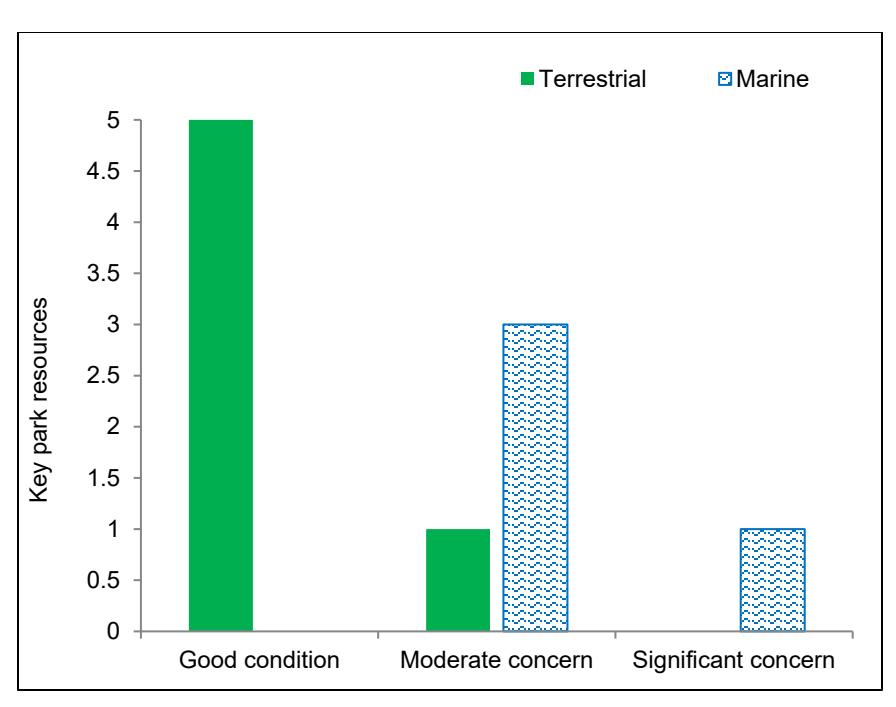

**Figure 122.** Condition comparison of selected resources in NPSA's terrestrial and marine environments. One resource (air quality) was not assessed due to insufficient data, based on analyses in this report.

**Figure 123.** Schematic diagram of NPSA showing the condition of key terrestrial and marine resources from mountain top to ocean. Major threats to resources (triangles) are also indicated. The background photo is Ta'u Island and all visible portions are within NPSA's Ta'u Unit. Illustration: P. Craig.

The park's marine resources were of moderate concern (marine water quality, coral reefs, and fish) or significant concern (sea turtles). Key marine threats were also of moderate concern (climate change and fishing pressure). Climate change was the main reason why marine resources did not score as well as terrestrial resources. Climate induced increases in water temperatures have caused multiple coral bleaching events in the park, which can kill corals. Baseline environmental conditions that formerly supported park reefs are changing and projected to worsen. Terrestrial impacts are likely to be occurring as well, but changes have been less visible and less studied to date.

Condition symbols are shown in more detail for all resources (Table 62), terrestrial resources with descriptions (Table 63), and marine resources also with descriptions (Table 64). The absence of trends for many of these resources reflects two points: first, the I&M Vital Signs monitoring program is relatively new in NPSA, and trend data were not available for most resources at the time of this review, and next, several resources selected for evaluation were not part of the Pacific Island Network (PACN) Vital Sign program and they lacked systematic monitoring data. The NRCA confidence level for several resource assessments was low because of data limitations.

**Table 62.** Summary of condition assessments for NPSA's reporting categories (ranked from high to low). Symbols: (1) resource condition — good condition (green); warrants moderate concern (yellow); warrants significant concern (red); insufficient data (blank); (2) resource trend arrow — up (improving); horizontal (not changing); down (deteriorating); (3) confidence in assessment — high (bold circle); medium (normal); low (dashed).

| Terrestrial Environment | Condition/ Trend                                                                                                                                                                                                                                                                                        | Marine Environment                           | Condition/ Trend                                                                                                                          |
|-------------------------|---------------------------------------------------------------------------------------------------------------------------------------------------------------------------------------------------------------------------------------------------------------------------------------------------------|----------------------------------------------|-------------------------------------------------------------------------------------------------------------------------------------------|
| Rainforest              | Resource is in good condition; trend in condition is unknown or not applicable; medium confidence in the assessment.                                                                                                                                                                                    | Marine benthic communities                | Condition of resource warrants moderate concern; condition is unchanging; medium confidence in the assessment.                            |
| Forest birds            | Resource is in good condition; trend in condition is unknown or not applicable; medium confidence in the assessment.                                                                                                                                                                                    | Marine fish                                  | Condition of resource warrants moderate concern; condition is unchanging; medium confidence in the assessment.                            |
| Fruit bats              | Resource is in good condition; trend in condition is unknown or not applicable; low confidence in the assessment.                                                                                                                                                                                       | Marine water quality                         | Condition of resource warrants moderate concern; trend in condition is unknown or not applicable; medium confidence in the assessment.    |
| Cloud forest            | Resource is in good condition; trend in condition is unknown or not applicable; low confidence in the assessment.                                                                                                                                                                                       | Sea turtles                                  | Condition of resource warrants significant concern; trend in condition is unknown or not applicable; medium confidence in the assessment. |
| Streams                 | Resource is in good condition; trend in condition is unknown or not applicable; low confidence in the assessment.                                                                                                                                                                                       | Threat: fishing pressure (marine harvest) | Condition of resource warrants moderate concern; trend in condition is unknown or not applicable; low confidence in the assessment.       |
| Seabirds                | Condition of resource warrants moderate concern; trend in condition is unknown or not applicable; low confidence in the assessment.                                                                                                                                                                     | Threat: climate change                       | Condition of resource warrants moderate concern; condition is deteriorating; medium confidence in the assessment.                         |
| Air quality             | Current condition is unknown or indeterminate due to inadequate data, lack of reference value(s) for comparative purposes, and/or insufficient expert knowledge to reach a more specific condition determination; trend in condition is unknown or not applicable; low confidence in the assessment. | –                                            | –                                                                                                                                         |
| Threat: invasive rats   | Condition of resource warrants moderate concern; trend in condition is unknown or not applicable; low confidence in the assessment.                                                                                                                                                                     | –                                            | –                                                                                                                                         |
| Threat: invasive plants | Condition of resource warrants significant concern; condition is improving; high confidence in the assessment.                                                                                                                                                                                          | –                                            | –                                                                                                                                         |

**Table 63.** NRCA summary of NPSA's terrestrial resources.

| Terrestrial                                                                                                                                                                                         |                                                            |                                                                                                                                                                                                                                                                                                                                                                                                                                                                                                                                                                                                                                                          |
|-----------------------------------------------------------------------------------------------------------------------------------------------------------------------------------------------------|------------------------------------------------------------|----------------------------------------------------------------------------------------------------------------------------------------------------------------------------------------------------------------------------------------------------------------------------------------------------------------------------------------------------------------------------------------------------------------------------------------------------------------------------------------------------------------------------------------------------------------------------------------------------------------------------------------------------------|
| Resources Rainforest Resource is in good condition; trend in condition is unknown or not applicable; medium confidence in the assessment.                                                  | Condition & Trend Condition: good Trend: unknown.    | NPSA Condition summary The rainforest in NPSA is relatively diverse, 30% endemic, generally with full canopy closure. The forest is protected by island steepness. Based on professional judgement, the rainforest condition is representative of expected regional diversity, but contains some invasive species which continue to be an issue. Despite historical loss of lowland rainforests on Tutuila Island to agriculture, rainforest continues to be the dominant habitat in NPSA's Ta'u and Tutuila Units. The condition of the rainforest is good, in part due to the park's success in controlling invasive trees. |
| Forest birds Resource is in good condition; trend in condition is unknown or not applicable; medium confidence in the assessment.                                                             | Condition: good Trend: unknown.                         | Forest bird populations are in generally good condition. Species are indigenous and their relative abundance has been stable for the past 25 years. Previously identified rare birds continue to be rare. The forest habitat used by forest birds is in good condition, and significant acreage has been restored by the park's program to control invasive tree species.                                                                                                                                                                                                                                                                 |
| Streams Resource is in good condition; trend in condition is unknown or not applicable; low confidence in the assessment.                                                                     | Condition: good Trend: unknown                          | NPSA's small, steep streams flow through rainforest mountains that are minimally impacted by human activities. Water quality generally complies with Territorial standards, except turbidities are high after rainfalls. High fecal bacterial counts in park streams are likely to be of natural rather than anthropogenic origin. Streams support amphidromous and catadromous fish, shrimp, and snails that are characteristic of stream fauna on oceanic tropical islands; none were considered to be endemic, threatened or endangered. Few alien species were detected.                                                     |
| Fruit bats Resource is in good condition; trend in condition is unknown or not applicable; low confidence in the assessment.                                                                  | Condition: good Trend: unknown                          | Island wide populations of the two fruit bat species (flying foxes) appear to be in good condition, having recovered from hunting and cyclone damages in 1990-91. Based on professional judgement, P. tonganus was considered to be abundant in 2015, and P. samoensis was moderately abundant and stable. Forest habitat used by fruit bats is in good condition, and significant acreage has been restored by the park's program to control invasive tree species. Information that is specific to the park about fruit bats is limited.                                                                                          |
| Cloud forest Resource is in good condition; trend in condition is unknown or not                                                                                                                 | Condition: good Trend: unknown                          | Cloud forest habitat in NPSA is small, remote, and inaccessible on the sparsely populated island of Ta'u. However, the cloud forest is periodically damaged by cyclone.                                                                                                                                                                                                                                                                                                                                                                                                                                                                            |
| applicable; low confidence in the assessment. Seabirds Condition of resource warrants moderate concern; trend in condition is unknown or not applicable; low confidence in the assessment. | Condition: warrants moderate concern Trend: unknown. | The Territory supports 19 breeding species, half of which are regionally or globally significant and most are of conservation concern in the Pacific due to low or declining numbers and/or restricted distributions. NPSA contains excellent habitat for seabirds, but their abundance is low compared to colonies elsewhere in Oceania. Alien predators (rats, cats, pigs) are present but their impact on local seabirds is not known.                                                                                                                                                                                              |

**Table 63 (continued).** NRCA summary of NPSA's terrestrial resources.

| Terrestrial Resources                                                                                                                                                                                                                                                                                                        | Condition & Trend                                                    | NPSA Condition summary                                                                                                                                                                                                                                                                                                                                                                                                                                                                                                                                                                                                                                                                       |
|---------------------------------------------------------------------------------------------------------------------------------------------------------------------------------------------------------------------------------------------------------------------------------------------------------------------------------|----------------------------------------------------------------------|----------------------------------------------------------------------------------------------------------------------------------------------------------------------------------------------------------------------------------------------------------------------------------------------------------------------------------------------------------------------------------------------------------------------------------------------------------------------------------------------------------------------------------------------------------------------------------------------------------------------------------------------------------------------------------------------|
| Air quality Current condition is unknown or indeterminate due to inadequate data, lack of reference value(s) for comparative purposes, and/or insufficient expert knowledge to reach a more specific condition determination; trend in condition is unknown or not applicable; low confidence in the assessment. | Condition: unknown Trend: unknown                                 | There was insufficient information on air quality parameters in the park (e.g., ozone levels, visibility, and sulfur and nitrogen deposition), although data indicate sulfur deposition warrants attention.                                                                                                                                                                                                                                                                                                                                                                                                                                                                            |
| Invasive rats Condition of resource warrants moderate concern; trend in condition is unknown or not applicable; low confidence in the assessment.                                                                                                                                                                         | Threat: warrants moderate concern Trend: unknown.              | The three invasive rat species found in American Samoa are serious pests throughout the islands of Oceania. Rat abundance in the main islands appears relatively low, but data are limited. Their impact on the park's native vegetation and wildlife has not been examined, but an extensive body of scientific literature on the same species at other insular locations indicates that conservation concern about this threat is warranted.                                                                                                                                                                                                                             |
| Invasive vegetation Condition of resource warrants significant concern; condition is improving; high confidence in the assessment.                                                                                                                                                                                     | Threat: warrants moderate to high concern Trend: improving. | There are numerous alien plant species in American Samoa and eradication is unlikely. The invasive tamaligi tree has been identified as a focal target by NPSA in its campaign to control invasive species. The park has had significant success in its removal program. This will require follow-up control efforts in perpetuity. Long term protection of NPSA may depend more on the success of keeping new invasive species already present elsewhere on the islands out of the park. The scientific literature about the same and similar species at other insular locations indicates that conservation concern about this threat in the park is warranted. |

**Table 64.** NRCA summary of NPSA's marine resources (ranked from high to low).

| Marine Resource                                                                                                                                                                                                                                                         | Condition & Trend                                                             | NPSA Condition summary                                                                                                                                                                                                                                                                                                                                                                                                                                                                                                                                 |
|----------------------------------------------------------------------------------------------------------------------------------------------------------------------------------------------------------------------------------------------------------------------------|-------------------------------------------------------------------------------|--------------------------------------------------------------------------------------------------------------------------------------------------------------------------------------------------------------------------------------------------------------------------------------------------------------------------------------------------------------------------------------------------------------------------------------------------------------------------------------------------------------------------------------------------------|
| Marine benthic communities Condition of resource warrants moderate concern; condition is unchanging; medium confidence in the assessment.                                                                                                                         | Condition: moderate concern Trend: stable.                              | Coral reef conditions are mixed. Reefs have been fairly stable over the past nine years, with moderate amounts of live coral and coralline algae, low macroalgae, and no invasive species, all of which are indicative of good reef conditions. However, the park's coral reefs were recently threatened by an outbreak of coral-eating starfish (COTs), and by climate change which is shifting the historical ranges of sea temperatures that have occurred for millennia, causing five mass coral bleaching events since 1990. |
| Marine fish Condition of resource warrants moderate concern; condition is unchanging; medium confidence in the assessment.                                                                                                                                           | Condition: moderate concern Trend: somewhat stable.                  | The coral reef fish assemblage in NPSA is indigenous and moderately diverse for the Indo-Pacific region. Overall, the assemblage has been relatively stable in recent years, but moderate concern is warranted due to its low biomass, declining density, and lack of large fish and sharks, all indicative of past or present fishing pressure, among other factors.                                                                                                                                                                   |
| Marine water quality Condition of resource warrants moderate concern; trend in condition is unknown or not applicable; medium confidence in the assessment.                                                                                                       | Condition: moderate concern Trend: stable, projected to deteriorate. | Marine waters in NPSA are shallow (0-40 m), warm (290 C), and generally clear. Water quality generally complies with Territorial standards, but indications of land-based pollution (nutrients, sediment, fecal bacteria) occur. A major concern is that climate induced increases in ocean temperature and acidification present a continuing threat that is projected to worsen. Baseline water quality conditions are changing from historical conditions                                                                         |
| Sea turtles Condition of resource warrants significant concern; trend in condition is unknown or not applicable; medium confidence in the assessment.                                                                                                                   | Condition: significant concern Trend: unknown.                          | The abundance of hawksbill and green sea turtles is low and few nest on park beaches. Their endangered species designation in the US Pacific Islands has been based on a substantial body of evidence and professional expertise. Both species are in danger of extinction. Local data are limited but support this finding.                                                                                                                                                                                                               |
| Fishing pressure Condition of resource warrants moderate concern; trend in condition is unknown or not applicable; low confidence in the assessment.                                                                                                                 | Threat: moderate concern Trend: unknown.                                | Nearshore fish and invertebrates are harvested for food in small scale subsistence fisheries in NPSA. Fishing is of moderate concern because local coral reefs have been impacted by past or present human activities, particularly fishing. Park-specific data are limited.                                                                                                                                                                                                                                                                  |
| Climate change Condition of resource warrants moderate concern; condition is deteriorating; medium confidence in the assessment. Condition of resource warrants moderate concern; trend in condition is unknown or not applicable; low confidence in the assessment. | Threat: warrants at least moderate concern Trend: deteriorating.        | Climate-induced increases in ocean temperature have caused multiple mass bleaching events on park reefs since 1990. Sea level is also rising. Projected changes, including ocean acidification, are projected to worsen. Baseline conditions for marine ecosystems are changing from historical levels.                                                                                                                                                                                                                                    |

Several general comments and recommendations follow:

• **Confidence level of assessments.** The extensive development and statistical framework of the PACN I&M monitoring protocols (Haysmith et al. 2005) has significantly improved NPSA's capability to assess its natural resources with a high level of confidence. In contrast, when the NRCA team attempted to evaluate several reporting categories that were not part of the PACN Vital Signs program (e.g., sea turtles, fruit bats, seabirds, fishing pressure, climate change, and invasive rats), the team used ad hoc measures of resource condition based on

available data, but the confidence in assessments was not high. This could be improved in future assessments by systematically obtaining data on the most appropriate condition measures for the park.

- **Threats to NPSA's natural resources.** Two threats to park resources were recurring themes in this assessment: invasive species and climate change.
  - o *Invasive species.* When NPSA's programs were developing in the late 1980s, the park recognized the threat posed by invasive species and initiated an aggressive and sustained control program that has been highly successful. It is perhaps one of the most tangible management efforts that can be made by a small park that benefits all of the park's terrestrial resources. Invasive species will continue to remain a priority threat for NPSA.
  - o *Climate change*. NPSA's marine resources have already been damaged by this threat, and it is presumably affecting terrestrial ecosystems as well. It is changing the fundamental physical, chemical, and biological conditions to which the park's flora and fauna have adapted. It is one of the park's most pressing environmental issues. To date, the park has been able to gather information on climate change and its impacts through partnerships with other agencies, universities, and researchers. This has been a productive and cost-effective approach.
- **Special management areas.** In taking a broad view of NPSA's diverse natural resources, two locations stand out as being distinctive ecosystems of high biological importance: Ofu lagoon and the Ta'u cloud forest. Both are vulnerable to human disturbance. They may warrant consideration as special management areas.
  - o *Ofu lagoon.* The southeastern coast of Ofu Island (commonly referred to as Ofu lagoon) has long been recognized for its tropical beauty and highly diverse marine ecosystem. The lagoon is also a valuable scientific resource. It is inhabited by unique temperature tolerant corals that are resistant to the effects of climate change (increasing ocean temperatures and acidification) that can cause coral bleaching and mortality. The lagoon is recognized as a world research site to investigate climate change impacts on coral reefs (over 50 reports and publications have focused on the ecology of this lagoon during the past 30 years). Additionally, the surrounding area (Toaga) is of high cultural value and contains important archaeological sites that are vulnerable to sea level rise.
  - o *Ta'u cloud forest.* The cloud forest at the summit of Ta'u Island is a distinctive plant community that may be one of the most important and diverse seabird breeding area in NPSA. There may be no other ecosystem like the summit of Ta'u in the jurisdiction of NPS, and there are few places remaining in the world that are known for ground nesting seabirds that can match this site (O'Conner and Rauzon 2004).

## **6.3. Literature Cited**

- HaySmith, L., F. Klasner, S. Stephens, and G. Dicus. 2005. Pacific Island Network vital signs monitoring plan. Natural Resource Report NPS/PACN/NRR—2006/003. National Park Service, Fort Collins, Colorado.
- O'Conner, P., and M. Rauzon. 2004. Inventory and monitoring of seabirds in the National Park American Samoa. University of Hawai'i Pacific Cooperative Studies Unit Technical Report 136. Honolulu, HI: University of Hawai'i. [http://manoa.hawaii.edu/hpicesu/techr/136/08.pdf.](http://manoa.hawaii.edu/hpicesu/techr/136/08.pdf)

**National Park Service U.S. Department of the Interior**

#### **[Natural Resource Stewardship and Science](https://www.nps.gov/orgs/1778/index.htm)**

1201 Oakridge Drive, Suite 150 Fort Collins, CO 80525