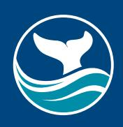

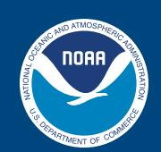

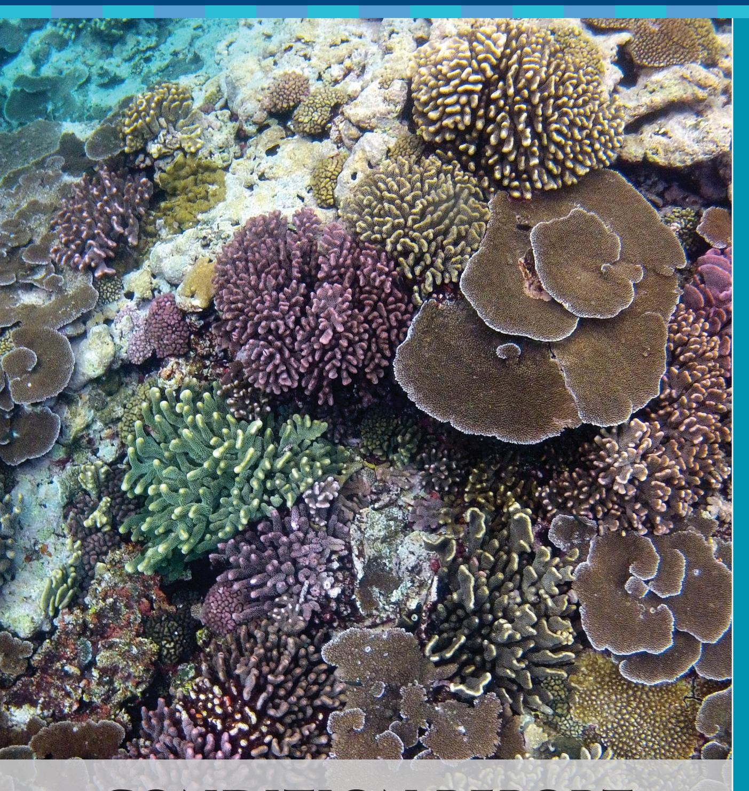

**CONDITION REPORT** 2007–2020

U.S. Department of Commerce Gina Raimondo, Secretary

National Oceanic and Atmospheric Administration Richard W. Spinrad, Ph.D., Under Secretary of Commerce for Oceans and Atmosphere and NOAA Administrator

National Ocean Service Nicole LeBoeuf, Assistant Administrator

Office of National Marine Sanctuaries John Armor, Director

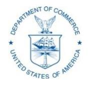

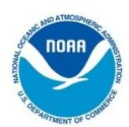

Cover photo: Corals, like these pictured in Fagatele Bay, are important foundation species, providing structure and food for many other reef organisms. Photo: Wendy Cover/NOAA

#### Suggested citation:

Office of National Marine Sanctuaries (2022). *National Marine Sanctuary of American Samoa Condition Report: 2007–2020*. U.S. Department of Commerce, National Oceanic and Atmospheric Administration. 318 pp.

# **Table of Contents**

| Table of Contents                                                 | i        |
|-------------------------------------------------------------------|----------|
| Authors                                                           | iv       |
| Office of National Marine Sanctuaries                             | v        |
| National Marine Sanctuary of American Samoa                       | <b>v</b> |
| Framework for Condition Reports                                   |          |
| About This Report                                                 | viii     |
| Executive Summary                                                 | 1        |
| NMSAS Summary of Resource Conditions                              | 15       |
| NMSAS Summary of Ecosystem Services                               | 22       |
| Sanctuary Setting                                                 | 28       |
| Overview                                                          | 28       |
| Designation of the Sanctuary                                      | 29       |
| Fa'a Samoa: The Samoan Way                                        | 30       |
| Human Settlement and Political History                            | 31       |
| Commerce                                                          | 32       |
| Geology                                                           | 33       |
| Climate                                                           | 33       |
| Currents, Tides, and Waves                                        | 33       |
| Habitat and Living Resources                                      | 35       |
| Maritime Heritage Resources                                       | 43       |
| Sanctuary Units                                                   | 43       |
| Drivers on the Sanctuary                                          | 54       |
| Government Relationships                                          | 57       |
| Traditional Management and Governance Structure of American Samoa | 57       |
| Population and Per Capita Income                                  | 58       |
| Fuel Prices                                                       | 58       |
| Demand for Seafood                                                | 59       |
| Technological Advancement                                         | 60       |
| Societal Values and Practices                                     | 60       |
| Ocean Policy                                                      | 61       |
| Pressures on Sanctuary Resources                                  | 62       |
| Accelerated Climate Change and Ocean Acidification                | 62       |
| Fishing                                                           | 66       |
| Coastal Development and Nearshore Construction                    | 67       |
| Nonpoint Source Pollution                                         | 68       |
| Point Source Pollution                                            | 68       |
| Marine Debris                                                     | 68       |
| Vessel Groundings                                                 | 69       |
| Visitation                                                        | 69       |
| Nuisance Species Outbreaks                                        |          |
| Research Activities                                               | 71       |

| State of Sanctuary Resources                                                                                        | 72  |
|------------------------------------------------------------------------------------------------------------------------|-----|
| Water Quality (Questions 1–5) 73                                                                                    |     |
| Q1: What is the eutrophic condition of sanctuary waters and how is it changing?73                                      |     |
| Q2: Do sanctuary waters pose risks to human health and how are they changing? 79                                    |     |
| Q3: Have recent, accelerated changes in climate altered water conditions and how are they changing? 84              |     |
| Q4: Are other stressors, individually or in combination, affecting water quality, and how are they changing?     | 90  |
| Q5: What are the levels of human activities that may adversely influence water quality and how are                     |     |
| they changing? 95                                                                                                   |     |
| Habitat (Questions 6–8)                                                                                                | 98  |
| Q6: What is the integrity of major habitat types and how are they changing? 98                                      |     |
| Q7: What are contaminant concentrations in sanctuary habitats and how are they changing?                               | 113 |
| Q8: What are the levels of human activities that may adversely influence habitats and how are they changing? 117 |     |
| Living Resources (Questions 9–13) 120                                                                               |     |
| Q9: What is the status of keystone and foundation species and how is it changing? 121                               |     |
| Q10: What is the status of other focal species and how is it changing?                                              | 132 |
| Q11: What is the status of non-indigenous species and how is it changing?                                              | 143 |
| Q12: What is the status of biodiversity and how is it changing?                                                     | 144 |
| Q13: What are the levels of human activities that may adversely influence living resources and how                     |     |
| are they changing?                                                                                                  | 160 |
| Maritime Heritage Resources (Questions 14–15)163                                                                       |     |
| Q14: What is the condition of known maritime heritage resources and how is it changing?                             | 163 |
| Q15: What are the levels of human activities that may adversely affect maritime heritage resources                     |     |
| and how are they changing?171                                                                                          |     |
| State of Ecosystem Services                                                                                            | 174 |
| Ecosystem Services Indicators176                                                                                       |     |
| Non-Consumptive Recreation176                                                                                          |     |
| Consumptive Recreation                                                                                                 | 180 |
| Science183                                                                                                             |     |
| Education 187                                                                                                       |     |
| Heritage and Sense of Place 200                                                                                     |     |
| Commercial Harvest                                                                                                     | 209 |
| Subsistence Harvest218                                                                                                 |     |
| Coastal Protection                                                                                                  | 220 |
| Response to Pressures224                                                                                               |     |
| Accelerated Climate Change                                                                                          | 227 |
| Fishing                                                                                                                | 229 |
| Coastal Development and Nearshore Construction                                                                         | 229 |
| Nonpoint Source Pollution                                                                                              | 229 |
| Point Source Pollution                                                                                              | 230 |
| Marine Debris                                                                                                       | 230 |
| Vessel Groundings                                                                                                      | 230 |
| Visitation 230                                                                                                      |     |
| Nuisance Species Outbreaks 231                                                                                      |     |
| Research Activities 231                                                                                             |     |

| Concluding Remarks 232                                                   |     |
|-----------------------------------------------------------------------------|-----|
| Acknowledgements 238                                                     |     |
| Literature Cited239                                                      |     |
| Appendix A: Questions and Rating Schemes for State of Sanctuary Resources   | 264 |
| Appendix B: Definitions and Rating Scheme for State of Ecosystem Services   | 283 |
| Appendix C: Fagatele Bay National Marine Sanctuary 2007 Condition Report    |     |
| Ratings292                                                                  |     |
| Appendix D: Consultation with Experts, Documenting Confidence, and Document |     |
| Review                                                                   | 297 |
| Appendix E: Glossary of Terms 304                                        |     |
| Appendix F: Additional Tables for Ecosystem Services 307                 |     |

## **Authors**

## *National Marine Sanctuary of American Samoa*

Gene Brighouse Valerie Brown Isabel Gaoteote Halatuituia Atuatasi Lelei Peau Nerelle Que

Mareike Sudek, Ph.D.

## *NOAA Office of National Marine Sanctuaries*

Kathy Broughton Stephen R. Gittings, Ph.D. Danielle Schwarzmann, Ph.D. Hans Van Tilburg, Ph.D.

## **Office of National Marine Sanctuaries**

The Office of National Marine Sanctuaries (ONMS), part of the National Oceanic and Atmospheric Administration (NOAA), serves as the trustee for a system of underwater parks encompassing more than 620,000 square miles of ocean and Great Lakes waters. The 15 national marine sanctuaries and two marine national monuments within the National Marine Sanctuary System represent areas of America's ocean and Great Lakes environment that are of special national significance. Within their waters, giant humpback whales breed and calve their young, coral colonies flourish, and shipwrecks tell stories of our maritime history. Habitats include beautiful coral reefs, lush kelp forests, whale migration corridors, spectacular deep-sea canyons, and underwater archaeological sites. These special places also provide homes to thousands of unique or endangered species and are important to America's cultural heritage. Sanctuaries range in size from less than one square mile to more than 582,000 square miles and serve as natural classrooms, cherished recreational spots, and are home to valuable commercial industries.

## **National Marine Sanctuary of American Samoa**

National Marine Sanctuary of American Samoa (NMSAS) comprises six protected areas covering 13,581 square miles of nearshore coral reef and offshore open ocean waters across the archipelago. Of these, three areas located on and near Tutuila are relatively accessible: Fagatele Bay and Fagalua/Fogama'a are along the southwest coast of the island, and Aunu'u Island (Aunu'u) is just southeast of Pago Pago Harbor. The other areas, Ta'u Island (Ta'u), Swains Island, and Muliāva, are remote and accessible only by boat. The sanctuary includes deep-water reefs, hydrothermal vents, some of the world's oldest and largest *Porites* coral heads, and rare archaeological resources, and also encompasses important fishing grounds. It is also the only true tropical reef within the National Marine Sanctuary System.

## **Framework for Condition Reports**

Sanctuary condition reports are used by NOAA to assess the condition and trends of national marine sanctuary resources and ecosystem services. Condition reports provide a standardized summary of resources in NOAA's national marine sanctuaries, drivers and pressures on those resources, and current conditions and trends for resources and ecosystem services. These reports also describe existing management responses to pressures that threaten the integrity of the marine environment. Condition reports include information on the status and trends of water quality, habitat, living resources, and maritime heritage resources, and the human activities that affect them. They present responses to a set of questions posed to all national marine sanctuaries (Appendix A). The reports also rate the status and trends of ecosystem services (Appendix B). Resource and ecosystem service statuses are assigned ratings ranging from good to poor, and the timelines used for comparison vary from topic to topic. Trends in the status of resources and ecosystem services are also reported, and are generally based on observed changes in status since the prior condition report, unless otherwise specified.

Sanctuary condition reports are structured around two frameworks: 1) a series of questions posed to all national marine sanctuaries; and 2) a management-logic model called the Drivers-Pressure-State-Ecosystem Services-Response (DPSER) framework (detailed below). The questions are derived from a conceptual, generic model of a marine ecosystem. The DPSER framework defines the structure of the condition reports themselves.

Although the National Marine Sanctuary System's 15 national marine sanctuaries and two marine national monuments are diverse in many ways, including size, location, and resources, condition reports allow ONMS to consistently analyze the status and trends of abiotic and biotic factors in each site's ecosystem to inform place-based management. To that end, each unit in the sanctuary system is asked to answer the same set of questions, located in Appendix A, during the preparation of each condition report. Additional details about how the condition report process has evolved over time are below.

## *DPSER Framework*

In 2019, ONMS began restructuring sanctuary condition reports based on a model that describes the interactions between driving societal forces (Drivers), resulting threats (Pressures), their influence on resource conditions (State), the impact to derived societal benefits (Ecosystem services), and management responses (Response) to control or improve them. The DPSER framework recognizes that human activities, the primary target of management actions, are linked to demographic, economic, social, and/or institutional values and conditions (collectively called drivers). Changes in these drivers affect the nature and level of pressures placed on both natural and heritage resources, which determines their condition (e.g., the quality of natural resources or aesthetic value). This, in turn, affects the availability of benefits that humans receive from the resources (ecosystem services1), which prompts targeted management responses intended to prevent, reduce, or mitigate undesirable changes (see Figure FCR.1).

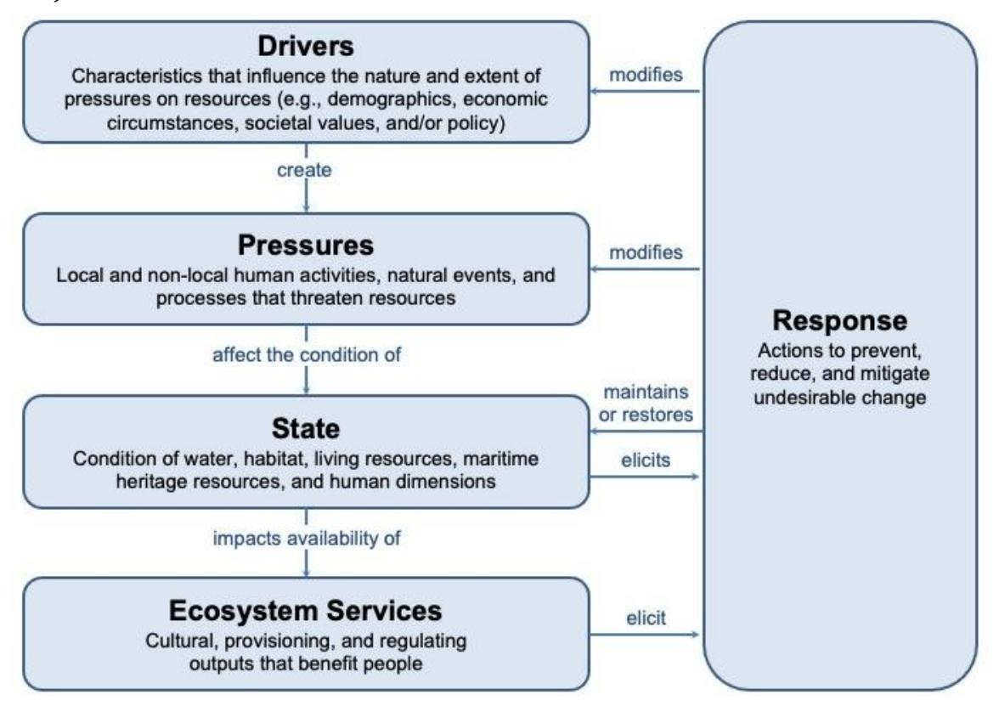

**Figure FCR.1.** This diagram of the DPSER framework illustrates the functional connections between compartments and the targets of management responses designed to modify drivers, pressures, and resource conditions. Image: NOAA

1 For the purposes of this report, ecosystem services are defined as benefits that humans desire from the environment (e.g., recreation, food). They are what link humans to ecosystems, can be goods (e.g., food) or services (e.g., coastal protection), are valued to varying degrees by various types of users, and can be regulated directly by the environment or managed by controlling human activities or ecosystem components (e.g., restoring habitats). Whether or not specific services are rendered can be evaluated directly or indirectly based on attributes of the natural ecosystem that people care about. For example, recreational scuba divers care about water clarity and visibility in coral reef ecosystems. These are attributes that can be measured and factored into status and trend ratings to assess ecosystem services.

## **About This Report**

The purpose of a condition report is to use the best available science and most recent data to assess the status and trends of various parts of the sanctuary's ecosystem. An initial condition report for Fagatele Bay National Marine Sanctuary was released in 2007 (National Marine Sanctuary Program, 2007); ratings from that report are provided in Appendix C. This condition report marks an updated and comprehensive description of the status and trends of resources and ecosystem services in the expanded sanctuary—National Marine Sanctuary of American Samoa. The findings in this condition report document status and trends in water quality, habitat, living resources, maritime heritage resources, and ecosystem services from 2007–2020, unless otherwise noted. The report helps identify gaps in current monitoring efforts, as well as causal factors that may require monitoring, and potential remediation through management actions in coming years. The data discussed will not only enable sanctuary resource managers and stakeholders to acknowledge and have a shared perspective on prior changes in resource status, but will also inform management efforts to address challenges stemming from pressures, such as increasing coastal populations and climate change.

The findings in this condition report will provide critical support for identifying high-priority sanctuary management actions, and will specifically help to shape updates to the NMSAS management plan. The management plan helps guide future work and resource allocation decisions at NMSAS by describing strategies and activities designed to address priority issues and advance core sanctuary programs. The next update to the sanctuary management plan will begin in 2023. The process will involve significant public input, agency consultation, and environmental compliance work, and may take one to three years to complete, depending on the complexity of actions proposed.

The State of Resources section of this document reports the status and trends of water quality, habitat, living resources, and maritime heritage resources from 2007–2020, unless otherwise noted. The State of Ecosystem Services section includes an assessment of human benefits derived from non-consumptive recreation, consumptive recreation, science, education, heritage and sense of place, commercial harvest, subsistence harvest, and coastal protection within the sanctuary.

In order to rate the status and trends of resources, human activities, and ecosystem services, sanctuary staff consulted with a group of non-ONMS experts familiar with resources, activities, and ecosystem services in the sanctuary. These experts also had knowledge of previous and current scientific efforts in the sanctuary (Appendix D). Evaluations of status and trends were based on the interpretation of quantitative and, when necessary, qualitative assessments, as well as observations of scientists, managers, and users.

Two other important changes to the condition report process since 2007 should be noted. First, in response to feedback provided to ONMS, the process used to generate the current condition report was more quantitatively robust and repeatable. This was achieved by using the NOAA Integrated Ecosystem Assessment (IEA) framework (National Oceanic and Atmospheric Administration [NOAA], 2020), which takes a literature-based approach to developing indicators for key components of the ecosystem. Status and trend assessments can then be made

#### About this Report

for selected indicators over time. This approach ensures that, whenever possible, the expert community has quantitative data representative of core ecosystem components available to them as they contribute to assessment ratings. These indicators continue to be tracked over time, and updated time series data can be used in subsequent assessments.

The second improvement pertains to communication of confidence, which was not done in a consistent way in earlier reports. Determination of confidence is now based on an evaluation of the quality and quantity of data used to determine the rating (e.g., peer-reviewed literature vs. expert opinion) and the level of agreement among experts (Appendix D). The new approach allows for a consistent and standardized characterization of confidence. The symbols used for status and trend ratings have been modified to depict levels of confidence as judged by the expert panel.

This condition report meets the aforementioned standardized format and framework prescribed for all ONMS condition reports. To the extent possible, authors have attempted to make each section's narrative consistent and comparable in terms of content, detail, and length; however, it is important to understand that each section contains different types and amounts of information given the realities and confines of data sets and expert opinions that were available during this process. In addition, this report is the result of a multi-year, collaborative effort across multiple authors, contributors, and reviewers and thus contains stylistic writing differences across some sections. These differences do not detract from the validity or quality of this report, but reflect the diversity of voices and cultures involved in generating the report. Finally, ratings reflect the collective interpretation of sanctuary staff and outside experts based on their knowledge and perception of local conditions. When the group could not agree on a rating, sanctuary staff determined the final rating with an acknowledgement of the differences in opinion noted in the report. The interpretation, ratings, and text in this condition report are final and the responsibility of ONMS. To emphasize this important point, authorship of the report is attributed to ONMS; subject matter experts are not authors, though their efforts and affiliations are acknowledged in the report. This report has been peer reviewed and complies with the White House Office of Management and Budget's peer review standards, as outlined in the Final Information Quality Bulletin for Peer Review (White House Office of Management and Budget, 2004).

### **Significant Challenges in the Samoan Archipelago**

When reading this report, it is important to consider that the people of the Samoan archipelago were presented with significant challenges from 2019–2021, including a measles outbreak in the fall of 2019, followed by the COVID-19 pandemic, which began in early 2020. These health crises had significant impacts on American Samoa, including disruptions to many services and programs provided by NMSAS. However, the COVID-19 pandemic and its impacts to both the state of the resources and ecosystem services are not included in this assessment, as it was a newly evolving situation at the time of the expert workshops.

## **Executive Summary**

National Marine Sanctuary of American Samoa (NMSAS) is a place of extraordinary beauty and is the most remote of the United States' national marine sanctuaries. It is located off the shores of American Samoa, the southernmost territory in the U.S. and one of only two U.S. territories that are south of the equator. NMSAS is composed of six separate protected areas that cover 13,581 square miles of ocean waters, making it the largest national marine sanctuary in the U.S. It is home to a great diversity of marine life, including corals and other invertebrates, fish, turtles, marine plants, and marine mammals. It is the only true tropical reef within the National Marine Sanctuary System and is home to some of the oldest and largest *Porites* coral colonies in the world. Its vast open ocean areas encompass two atolls, deep-water corals, seamounts, hydrothermal vents, and an undersea volcano.

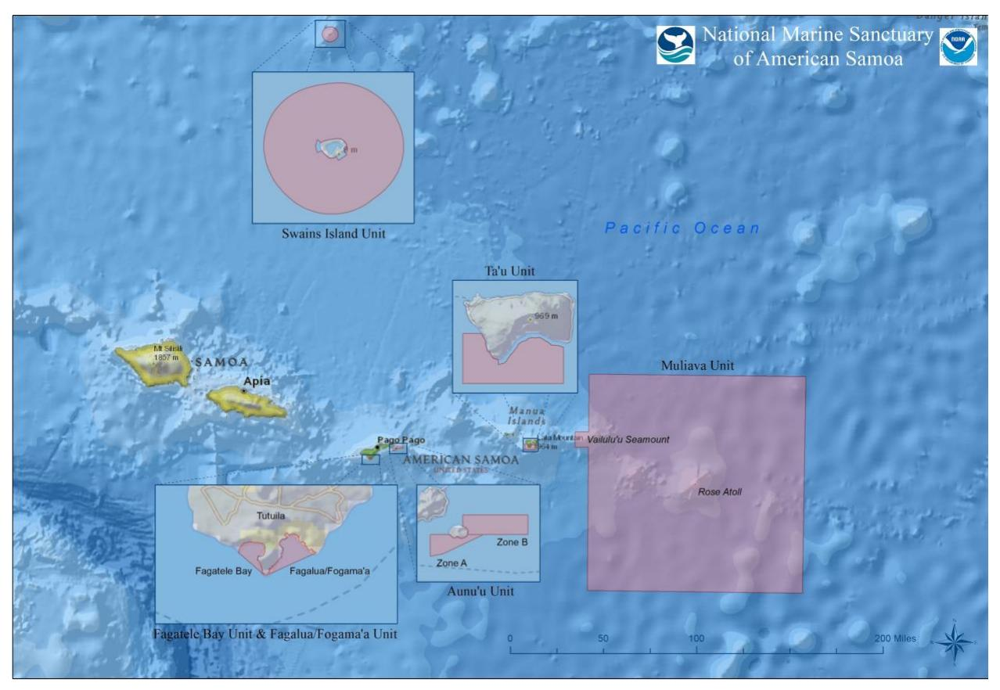

NMSAS is comprised of six protected areas (Fagatele Bay, Fagalua/Fogama'a, Aunu'u, Ta'u, Swains Island, and Muliāva), covering 13,581 mi2 of marine habitats, including nearshore coral reef, deep-sea, and pelagic areas across the Samoan archipelago. Image: NOAA

The small islands that compose American Samoa are not just unique because of their stunning natural environment, but also because cultural traditions and values thrive in these islands where one people, one language, and one common set of cultural practices, commonly referred to as Fa'a Samoa, or traditional Samoan way of life, continue to be perpetuated. NMSAS is located in the cradle of Polynesia's oldest culture, Samoa, which dates back 3,000 years. Despite Western influences, Samoan heritage is perpetuated in all facets of life, through family, village,

activity, and place, by Samoan people with a strong hold to ongoing cultural traditions. In addition to other practices, use of Samoan as the primary language spoken in American Samoa is an important attribute that makes NMSAS strikingly unique in comparison to other sites across the National Marine Sanctuary System.

The purpose of this condition report is to use the best available information to assess the status and trends of various components of NMSAS, including its natural and maritime heritage resources. The report is structured around a management-logic model called the Drivers-Pressure-State-Ecosystem Services-Response, or DPSER, model. This model enables NMSAS to comprehensively document the many factors that affect management responses, including the influence of societal drivers on pressures, the effects of those pressures on the condition of resources, and the effects of changing conditions on the services they provide to society.

The first condition report, which assessed resources in Fagatele Bay National Marine Sanctuary, was published in 2007. This condition report marks an updated and comprehensive description of the expanded sanctuary—National Marine Sanctuary of American Samoa. It includes status and trends of resources, covering the broad categories of water quality, habitat, living resources, and maritime heritage resources. This report also includes the status and trends of ecosystem services—the ways humans derive benefits from different ecosystem attributes that they care about for their lives and livelihoods. Ecosystem services evaluated in this report include nonconsumptive recreation, consumptive recreation, science, education, heritage, sense of place, commercial harvest, subsistence harvest, and coastal protection. The report documents the condition of sanctuary resources and ecosystem services from 2008–2020, unless otherwise noted. Throughout the report's development, sanctuary staff worked with numerous partners to identify and compile information and make assessments on resource and ecosystem service status and trends.

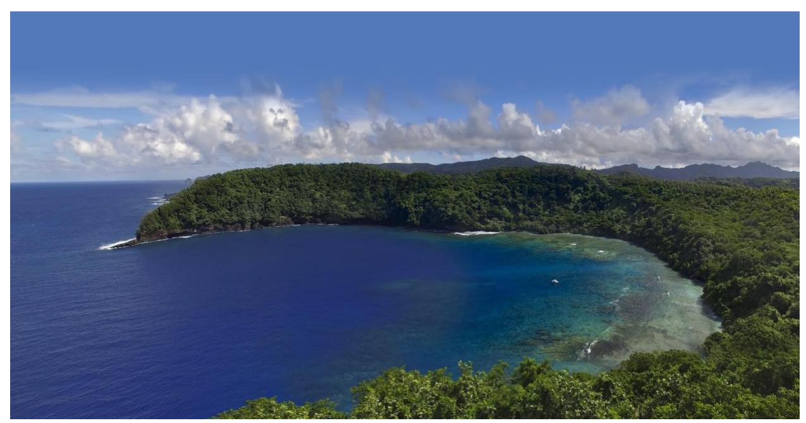

In 1986, Fagatele Bay was established as a national marine sanctuary in order to protect and preserve the unique coral reef ecosystem within the bay. Photo: Matt McIntosh/NOAA

The report also identifies gaps in current monitoring efforts, as well as factors that may require monitoring and potential remediation through management actions in the coming years. The ratings and conclusions in this report generally represent the shared perspective of sanctuary managers and subject matter experts on prior changes in resource status, and will inform future management, primarily through the management plan review process, to address significant challenges stemming from pressures on resources.

## *Drivers and Pressures*

The pressures on NMSAS resources associated with human activities are diverse, operate at varying scales, and differ significantly in their impact. Changes in ocean conditions resulting from accelerated climate change, pollution, marine debris, vessel groundings, visitor use, scientific and management activities, and nuisance species outbreaks operate throughout the sanctuary and likely cause the greatest impacts. Fishing also occurs in the sanctuary, and while it may be viewed as a pressure, it is also an ecosystem service, contributing to the wellbeing, livelihoods, and food security of many of the communities in American Samoa.

The societal drivers behind these pressures are not something NMSAS can manage, as they are primarily influenced by global, regional, and local demand for goods and services. Still, it is helpful to understand the connections between drivers and pressures in order to prioritize management actions. Drivers include economic factors, such as income and spending; demographics, like population levels and development; and societal values, such as levels of conservation awareness, political leanings, or changing opinions about the acceptability of specific behaviors (e.g., littering). All drivers influence pressures on resources by changing human preferences and, consequently, the levels of activities needed to meet the demand for resources and services.

## *State of Resources*

### **Water Quality**

The Samoan archipelago lies along the northern edge of the South Pacific Gyre, a series of connected ocean currents with a counterclockwise flow that spans the Pacific Basin. Surface waters in the region are low in nutrients and high in oxygen (oligotrophic) except for nearshore areas around populated islands affected by terrestrial runoff. Deep waters are nutrient rich, as American Samoa lies along the Circumpolar Deep Water flow, part of the global ocean conveyor belt that circulates oxygen- and nutrient-rich water in deep-sea areas.

In general, water quality in the sanctuary is good. The limited data available indicate that nutrient and contaminant levels are below recommended thresholds. However, the close proximity of the Futiga landfill to Fagatele Bay and Fagalua/Fogama'a, continued development, and the presence of a shallow sewage outfall in Aunu'u may require further monitoring.

Of significant concern, however, are the changing conditions associated with climate change. Pacific Islands are among the most vulnerable areas in the world to the predicted effects of climate change. Changes in ocean conditions resulting from accelerated climate change, like increased ocean temperatures and rising sea levels, are already affecting marine ecosystems

across NMSAS. Rising temperatures have led to significant coral bleaching events in 2015, 2017, and 2020, and a smaller event at Swains Island in 2016. During periods of high temperatures, corals eject their algal symbionts and appear white, or bleached. These events may result in widespread coral mortality. In addition, the prevalence of many coral diseases increases with rising ocean temperatures and thermal stress events. Even on a small scale, bleaching and disease can alter community structure, reduce reproductive output, and decrease coral cover. Global sea level rise has been locally exacerbated by rapid subsidence, leading to increased coastal erosion and shifts in intertidal ecosystems.

Many marine organisms are also threatened by ocean acidification, which results in a reduction of the pH of ocean water due to uptake of increased atmospheric carbon dioxide. Acidified waters compromise carbonate accretion and therefore directly affect the ability of calcifying organisms, such as corals, to secrete their calcareous skeletal structures. Lowered pH may also alter the behavior of larval fish and invertebrates, influence settlement success due to changes in suitable settlement substrate, and alter larval development or energy budgets. Fortunately, despite decreasing regional pH levels, aragonite saturation and calcification remain high in American Samoa; however, regional carbonate dynamics and acidification effects are not well understood. Climate change and ocean acidification are likely to have a significant influence on the status and trends of sanctuary resources in the future, and it is important that NMSAS work with partners to improve climate monitoring and research moving forward.

### **Habitat Quality**

Due to its vast geographic extent, NMSAS includes a diverse array of habitats. Shallow-water habitats (e.g., rocky shore, reef flat, coral reef) and mesophotic coral ecosystems generally only occur 0.5 to 2 miles from shore along the small insular shelf and atoll slopes. Pelagic (openocean) waters constitute the primary habitat within the archipelago. The sanctuary also includes banks, deep ocean floor habitats, an undersea volcano, hydrothermal vents, and seamounts.

Despite some fluctuations over the reporting period, habitats in the sanctuary are in good/fair condition. Shallow nearshore habitats were exposed to disturbances such as cyclones, coral bleaching events, and crown-of-thorns starfish invasions. Fortunately, these habitats, particularly coral reefs, have demonstrated resilience to these events. Shallow nearshore habitats are also exposed to anthropogenic impacts. For example, a vessel grounding in Aunu'u had a severe impact on coral reef habitat, but effects were constrained to a small area. Iron enrichment from a 1993 vessel grounding at Rose Atoll persists, but continues to improve. Marine debris continues to be a chronic but minor problem across all habitats. Data for habitats in the mesophotic and pelagic zones are limited, but there are no indications of any substantial impacts. Recent deep-sea expeditions have not identified any recent impacts or immediate threats to these habitats, but data are extremely limited and no previous data are available for comparison.

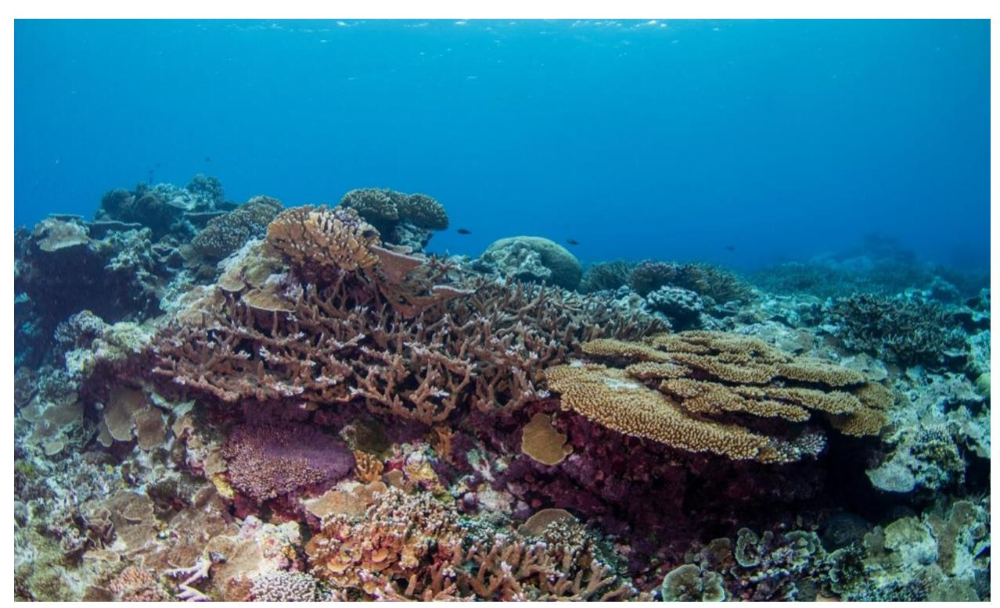

Vibrant coral reef ecosystems are an important part of the sanctuary. Corals are foundation species that provide structure and food for other species. They also provide ecosystem services such as coastal protection. Photo: Alexa Elliott/South Florida Public Broadcasting Service

## **Living Resources**

Living resources within the sanctuary have not been fully documented, but are best characterized in shallow coral reef ecosystems. Coral reefs are diverse, complex systems, and many species are highly specialized, making it difficult to identify keystone species. In the sanctuary's mesophotic and deep-sea ecosystems, too little is known about ecological interactions and individual species' roles in the ecosystem. Therefore, groups of ecologically important species were evaluated for their combined contributions to the ecological integrity of their respective ecosystems. Keystone and foundation species groupings include zooxanthellate scleractinian corals, crustose coralline algae, reef sharks, large parrotfish, surgeonfish and unicornfish, mesophotic corals, and deep-sea corals and sponges.

Stony (scleractinian) corals are important foundation species for shallow coral reef ecosystems, providing structure and food for many other reef organisms. Over 150 species of coral have been documented in the sanctuary, but species-specific data are limited. Scleractinian corals in the sanctuary are robust and include healthy populations of both large, old corals and recruits. Although repeated bleaching has affected these communities, particularly at Swains Island, they remain resilient. Crustose coralline algae are an important component of the reef in American Samoa, cementing the reef substrate together, stabilizing rubble after disturbances, building algal ridges along high-energy reef margins, creating habitat for fish and invertebrates, and attracting coral larvae to settle on reefs. Crustose coralline algae cover in the sanctuary remains high and has even increased at many sites.

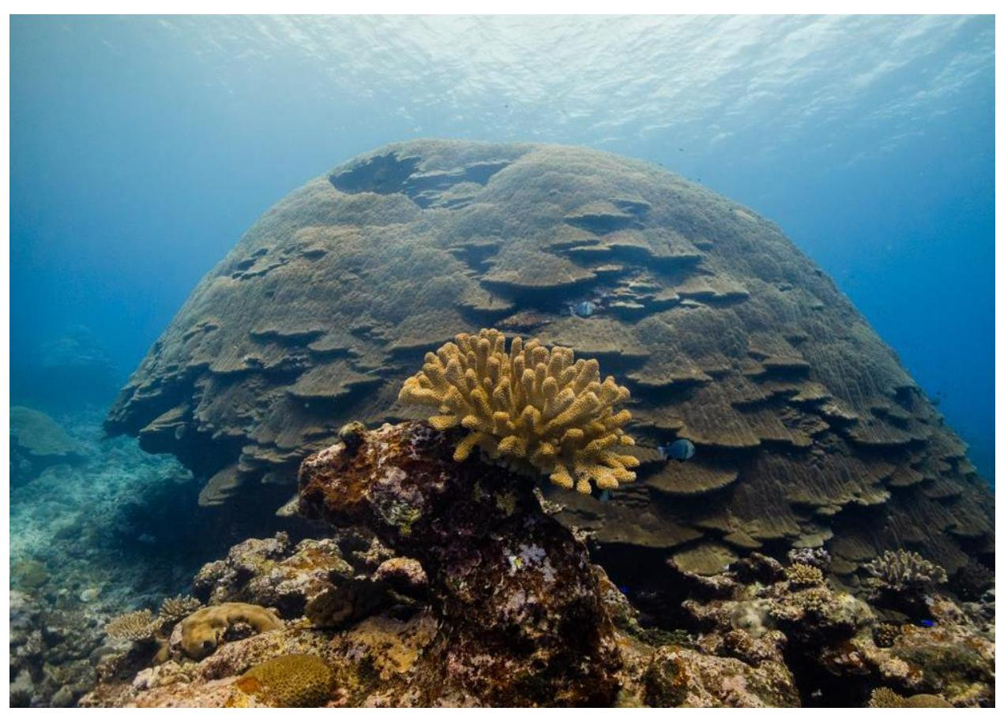

At over 500 years old, this giant *Porites* colony is one of the oldest residents of the sanctuary's Ta'u unit. Photo: Nerelle Que Moffitt/NOAA

Sharks, parrotfish, surgeonfish, and unicornfish are all important components of coral reef ecosystems. Whitetip, gray reef, blacktip, and nurse sharks are the most common reef sharks encountered in American Samoa; however, surveys have recorded very low shark densities in American Samoa compared to some other islands in the South Pacific. Large parrotfish, through their diverse feeding strategies, play an important role in coral reef ecosystem dynamics by removing algae, opening up substrate for coral settlement, and keeping fast-growing coral species in check. Surgeonfish and unicornfish are also important, filling a number of functional roles as grazers, browsers, detritivores, and planktivores. Low abundances of large fish, particularly sharks, large parrotfish, and surgeonfish, in the sanctuary are of great concern. Sharks are at 4–8% of their potential biomass, bumphead parrotfish are now functionally extinct, abundances of other large parrotfish species remain low, and low biomass estimates may indicate unsustainable fishing pressure. The continued lack of large predators and large herbivores in shallow coral reef habitats is a major concern, as this may compromise ecosystem resilience. Approximately 110 species of scleractinian corals are found at mesophotic depths in American Samoa, and corals and sponges provide important habitat for echinoderms and other organisms in the deep-sea habitats. Although there are limited monitoring data for mesophotic coral ecosystems and deep-sea corals and sponges, available information suggests that these species are in good condition. However, limited data in these areas do suggest that recruitment is low for deep-sea coral species.

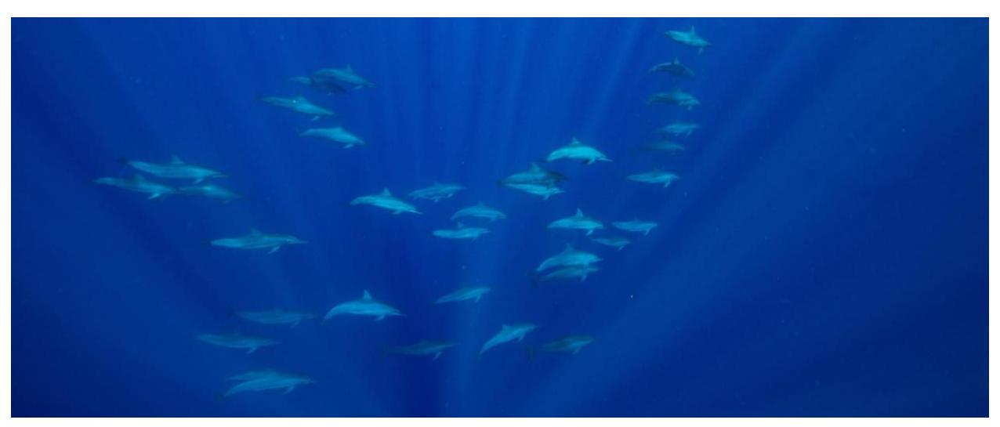

Spinner dolphins and other marine mammals are often observed within NMSAS. Photo: Nicolas Evensen

Other focal species in NMSAS include giant Porites corals, giant clams, humphead wrasse, sea turtles, and humpback whales. The abundance of harvested species, including giant clams, targeted food fish species, and humphead wrasse, is low and recovery is uncertain due to continued harvesting and life cycle characteristics. The decline in giant clams from 1996 to 2006 is particularly worrisome to resource managers, and there is some concern that ocean acidification and elevated seawater temperatures may be affecting these species. Data on sea turtles suggest that resident populations may be slowly recovering, but nesting activity is still limited. Humpback whale populations may also be increasing, but data are limited, and increasing ocean temperatures may shift the preferred habitat for this species away from American Samoa. More specific survey efforts for giant clams, humphead wrasse, and rare food fish species, as well as expanded survey efforts for sea turtles and humpback whales, are recommended.

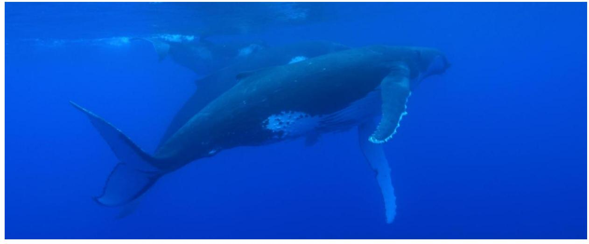

Each year between July and December, humpback whales journey from Antarctica to visit American Samoa for calving and breeding. Photo taken under NOAA permit 774-7714. Photo: Center for Coastal Studies and Hawaiian Islands Humpback Whale National Marine Sanctuary

Non-indigenous species have been observed in American Samoa, but have not exhibited invasive characteristics within sanctuary units. A tunicate and a green alga have recently exhibited invasive behavior, but are believed to be native species. No recent surveys have been conducted specifically to look for invasive species, and this is an important biosecurity gap that needs to be addressed.

Overall, biological diversity is high in NMSAS, but needs to be further explored, as additional species continue to be documented and new species have been recently discovered. Recent mesophotic and deep-sea expeditions have expanded the list of known species within the sanctuary, and further study is likely to expand this list further. The effect of disturbance events on species diversity has not been well documented in shallow coral reef habitats, and mesophotic, deep-sea, seabird, and marine mammal surveys have been limited.

### **Maritime Heritage Resources**

Maritime heritage resources are those tangible and intangible properties (archaeological, cultural, historical resources) that capture our human connections to ocean areas. Current knowledge of the nature, location, and significance of maritime heritage resources within NMSAS is limited. The most relevant information for addressing the condition of maritime heritage resources in the sanctuary comes from an existing desk-based assessment of heritage resources for the entirety of American Samoa, which includes the sanctuary. Therefore, resources outside the immediate boundaries of NMSAS were considered in order to estimate possible conditions of resources within the sanctuary itself. In general, maritime heritage resources have not been subject to human impacts that might otherwise diminish their aesthetic, cultural, historical, archaeological, scientific, or educational value. However, they have been subject to natural deterioration, erosion, and high-energy shoreline events. Resources like submerged shipwrecks and aircraft, which likely exist within the sanctuary, are presumed to be slowly degrading, primarily due to these natural processes.

## *State of Ecosystem Services*

Ecosystem services are the tangible and intangible benefits that humans receive from natural and cultural resources. Nine types are considered in this report: non-consumptive and consumptive recreation, science, education, heritage, sense of place, commercial and subsistence harvest, and coastal protection.

### **Non-consumptive Recreation**

Non-consumptive recreation services within the sanctuary are those that do not result in the intentional removal of or damage to natural and heritage resources, like swimming, snorkeling, scuba diving, boating, beach recreation, and beach camping. There have been no studies specific to these non-consumptive recreational activities in NMSAS, therefore, territory-wide studies were assessed as a proxy. These proxy data show that swimming and beach recreation are relatively common activities in American Samoa. Although the number of cruise ship arrivals has increased, the number of overall tourist arrivals to American Samoa decreased from 2007– 2015. Visitation to the nearby National Park of American Samoa has increased since 2008, with peak visitation occurring in 2017. Yet, despite increasing awareness of the sanctuary and

recreational opportunities available, a lack of infrastructure to promote access continues to be a limiting factor for non-consumptive recreation.

### **Consumptive Recreation**

Consumptive recreation is a term used to describe recreational activities that may result in the death of or disturbance to wildlife, or the destruction of natural habitats. This typically includes recreational fishing, sport fishing, and beachcombing. Within the National Marine Sanctuary System, sites try to balance access to these activities with resource protection to maintain this ecosystem service. Evaluating this service in the Pacific Islands is difficult, as island communities rely on fishing for subsistence and do not view it as a recreational activity. The majority of those who benefit from consumptive recreation in American Samoa are local residents, but they generally do not conduct the activity solely for recreational purposes, but rather, do so in conjunction with other responsibilities, such as food provision. The expansion of NMSAS restricted fishing access in two sites, but likely had a minimal impact on recreational fishing activities.

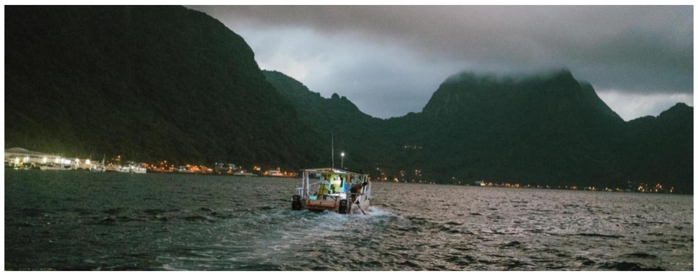

An alia heads out to participate in the Fagota Mo Taeao fishing tournament. Fishing is one of the many ecosystem services provided by NMSAS. Photo: Nerelle Que Moffitt/NOAA

### **Science**

Science is an important ecosystem service for NMSAS, and activities such as in situ research, publications, science capacity, and partnerships have been increasing. Sanctuary staff have successfully worked with partners to support research cruises for shallow coral reef ecosystem and deep-sea exploration, exploration of mesophotic systems, investigation of contaminants in Fagatele Bay, and installation of a buoy to monitor ocean acidification in Fagatele Bay. In addition, college interns and fellows have supported science efforts, and outreach staff have incorporated science into ocean literacy efforts. However, there are limitations on this service due to lack of vessel access and limited science staff capacity.

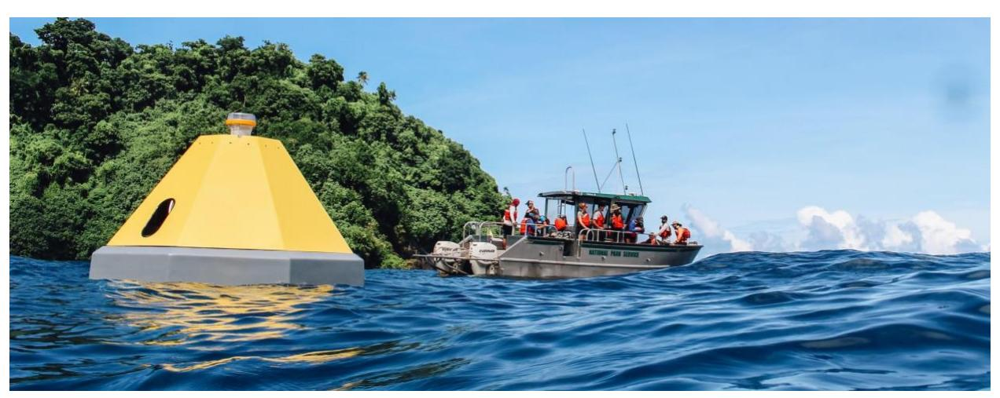

This buoy in Fagatele Bay continuously monitors ocean acidification and water quality parameters. Photo: Nerelle Que Moffitt/NOAA

### **Education**

Education and outreach is another important ecosystem service that has benefitted a wide range of audiences, participants, partners, communities, and networks locally, regionally, nationally, and internationally. Education and outreach efforts at NMSAS have consistently grown. A significant success has been harnessing support and building capacity for local residents, including students, teachers, village communities, and partners. Ensuring residents were the first to benefit from training, programs, activities, or other opportunities aimed at building pride in protecting sanctuary resources and enhancing skills has been essential. Additionally, the sanctuary has collaborated with local, regional, national, and international partners in order to gain a wider reach, projecting the place, people, special resources, and ecosystems of NMSAS via films, publications, and expeditions.

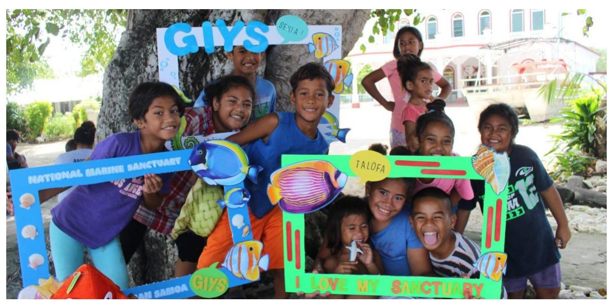

Education and outreach events, like Get Into Your Sanctuary, allow residents to learn about marine resources while also having fun. Photo: Iosefa Siatu'u/NOAA

### **Heritage and Sense of Place**

NMSAS is tasked with interpreting, protecting, and preserving historic and cultural resources and incorporating traditional knowledge and stewardship into management. Fa'a Samoa, the traditional Samoan way of life, provides the cultural context for all sanctuary activities and functions. The chiefs who were engaged in the condition report process stated that culture is too important and complex to capture in a rating. Therefore, there are no formal graded assessments for heritage and sense of place, as to do so would be considered inappropriate. Instead, the value of cultural heritage is presented in a narrative form, which includes the historical and cultural background of American Samoa and a summary of related resources and activities, such as community engagement and education and outreach events. These events highlight the cultural traditions and values of family, village, ecosystem, and Fa'a Samoa. Heritage and sense of place should be understood as shared and strongly supported by NMSAS and by the community of American Samoa.

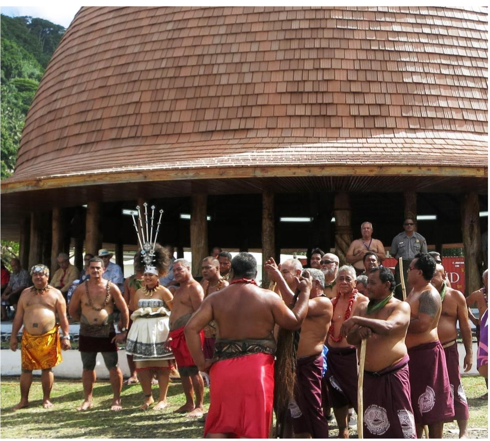

NMSAS staff place a high value on partnerships with sanctuary communities and maintain great respect for Fa'a Samoa, the Samoan way of life. Photo: Veronika Mortenson/NOAA

### **Commercial Harvest**

Worldwide, there is heavy pressure on fish assemblages from fishery activities, and assessments have demonstrated declines in reef fish abundance across the Pacific Islands. Except at Swains Island, reef fish populations across the territory are well below the biological potential for these systems. Fishing may quickly reduce the population of commercial reef fish species in constrained bays like Fagatele Bay and remote sites like Rose Atoll with limited fish recruitment. Fishing is now prohibited in Fagatele Bay and limited in other units like Aunu'u and Muliāva. Commercial fisheries data specific to sanctuary areas were not available, therefore aggregate data for the territory were evaluated for this service. These data indicate that the number of fishing vessels and fishers in the territory have declined over time. In 2019, pelagic catches were the lowest in the past decade, and NOAA Fisheries determined that the bottomfish fishery was overfished and experiencing overfishing. Social surveys suggest that reef shark populations have improved, but octopus, giant clams, akule, and palolo have declined or remained the same. Fishery independent data suggest that shallow reef fish biomass and giant clam abundance have declined. Due to the change in fishing regulations and lack of sanctuary-specific data, the status of this service was undetermined.

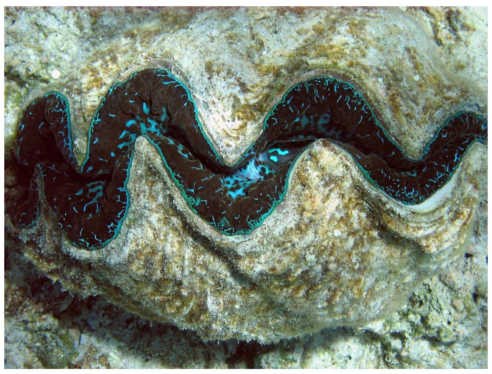

Giant clams (faisua) provide important ecological functions, but are also valued for subsistence and cultural purposes. Photo: NOAA

### **Subsistence Harvest**

Subsistence harvest is important to the American Samoan community to ensure that families have food on the table, have a healthy diet, and maintain a connection to the past through traditional fishing methods. Data indicate that most households have at least one member who fishes. The most common reasons for fishing are to feed family members and give to pastors and village leaders. But while most continue to participate in subsistence harvesting, many residents believe reef fishing is worse now than when they were young, including for the traditional harvest of species such as palolo, giant clams (faisua), and bigeye scad (akule). Also, although people may still be engaged in subsistence harvest, the frequency of harvest has decreased.

### **Coastal Protection**

Coral reefs protect infrastructure and support economic activity. Coral reefs and mangroves help to reduce flooding and wave energy at the shoreline. Rising sea level is of great concern, as it affects a large number of sites currently protected by these habitats. In addition to global sea level rise, American Samoa has experienced rapid subsidence since a powerful 2009 earthquake doublet in the Tonga Trench. The rate of subsidence in American Samoa is about 8–16 millimeters per year, making the island's relative sea level rise rate about 5 times the global average. This may make it difficult for coral reefs to maintain their capacity for coastal protection, as many species grow more slowly than this. Coral bleaching events, storms, and vessel groundings have impaired this function in some sanctuary areas, particularly Aunu'u. Although coastal protection is rated as fair in most sanctuary units, Muliāva is considered to be good/fair and Aunu'u is fair/poor.

## *Response to Pressures*

NMSAS is co-managed by the National Oceanic and Atmospheric Administration (NOAA) and the government of American Samoa. Partnerships with sanctuary-adjacent communities and Fa'a Samoa are highly valued as part of this management structure. In American Samoa, the relationship between the sanctuary and the village council is critical to the success of this partnership. Since the designation of Fagatele Bay National Marine Sanctuary in 1986, local administration of the sanctuary has been conducted through a cooperative agreement with the government of American Samoa. In 2002, a memorandum of agreement established a comanagement relationship between the NOAA Office of National Marine Sanctuaries and the American Samoa Department of Commerce. The co-development of a world class visitor and learning facility known as the Tauese P.F. Sunia Ocean Center and further collaboration on several efforts with the American Samoa Department of Commerce increased the reach and presence of the newly expanded NMSAS. In 2013, the government of American Samoa shifted co-management from the American Samoa Department of Commerce to the American Samoa Department of Marine and Wildlife Resources. With this change, NMSAS continued to engage the Department of Marine and Wildlife Resources on a regular basis and collaborated on opportunities that benefitted the territory, such as crown-of-thorns starfish removal and the Fagota mo Taeao Fishing Tournament.

The most significant management action since 2008 was the expansion of the sanctuary, which took place in 2012. During this process, the Office of National Marine Sanctuaries worked with

#### Executive Summary

stakeholders to evaluate issues affecting the sanctuary. This process led to regulatory changes, including the establishment of a no-take area in Fagatele Bay and prohibitions on damaging activities like anchoring throughout the sanctuary. Any exceptions to these regulations must be reviewed and permitted by the Office of National Marine Sanctuaries. Action plans were also developed through this process to guide sanctuary management on topics including resource protection and enforcement, climate change, cultural heritage and community engagement, and ocean literacy. NMSAS has implemented many of the strategies listed in the action plans to improve sanctuary management and respond to pressures. This includes expanded educational programs, improved science capacity, and implementation of resource protection activities such as crown-of-thorns starfish removal. In 2016, the sanctuary expansion allowed the Office of National Marine Sanctuaries to remove the fishing vessel *No. 1 Ji Hyun* from important fishing grounds in Aunu'u under the authority of the National Marine Sanctuaries Act.

Recommended actions are not presented in this report; however, in 2022, the Office of National Marine Sanctuaries will begin updating the NMSAS management plan, and the findings of this condition report will serve as an important foundation for recommendations of new action plans designed to address priority needs.

# **National Marine Sanctuary of American Samoa Summary of Resource Conditions**

The various resource status and trend evaluations presented in this report are summarized below. Each question used to rate the condition and trends sanctuary resources is listed, followed by:

- 1) A set of rating symbols that display key information. The first symbol includes a color and term to indicate status. The next symbol indicates trend. A shaded scale adjacent to both symbols indicates confidence (see key for example and definitions).
- 2) The status description, which is a statement that best characterizes resource status and corresponds to the assigned color rating and definition as described in Appendix A. The status description statements are customized for all possible ratings for each question.
- 3) The rationale, which is a short statement or list of criteria used to justify the rating.

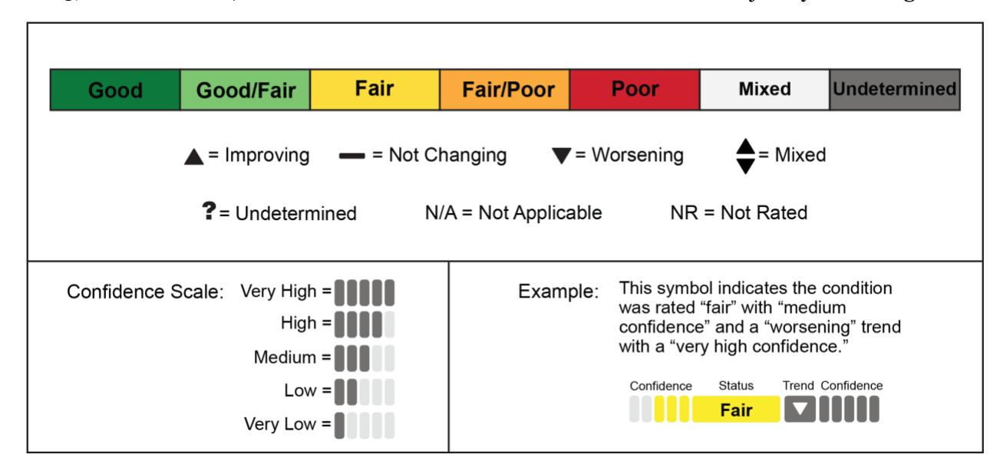

### **Water Quality**

*Question 1: What is the eutrophic condition of sanctuary waters and how is it changing?*

**Status Description:** Eutrophication has not been documented, or does not appear to have the potential to negatively affect ecological integrity.

**Rationale:** Data on eutrophication are limited, but available data suggest that nitrogen, phosphorus, and chlorophyll *a* concentrations remain below recommended threshold levels in sanctuary waters. However, dissolved inorganic nitrogen may be increasing in Fagatele Bay based on the most recent data. Macroalgae cover was evaluated as a proxy for nutrients and has been variable over the reporting period, but remains low overall within sanctuary units.

*Question 2: Do sanctuary waters pose risks to human health and how are they changing?*

**Status Description:** One or more water quality indicators suggest the potential for human health impacts, but human health impacts have not been reported.

**Rationale:** There are currently no known human health risks from NMSAS waters; however, data are limited and no trend data are available. Contaminants were detected in Fagatele Bay, but only nickel concentrations exceeded toxicology screening levels. Coliform bacteria have been detected in Fagatele Bay and there is a sewage outfall in the Aunu'u Multipurpose Zone, but sanctuary units are not part of regular water sampling efforts, so any potential health impact is unknown. No ciguatera poisoning has been reported from fish caught in the sanctuary.

*Question 3: Have recent, accelerated changes in climate altered water conditions and how are they changing?*

**Status Description:** Climate related changes have caused measurable, but not severe, degradation in some attributes of ecological integrity.

**Rationale:** Increasing sea surface temperatures have caused more frequent and more severe coral bleaching events. Ocean acidification is affecting water quality worldwide; however, aragonite saturation state and calcification rates have remained high in sanctuary units.

*Question 4: Are other stressors, individually or in combination, affecting water quality, and how are they changing?*

**Status Description:** Selected stressors are suspected and may degrade some attributes of ecological integrity, but have not yet caused measurable degradation.

**Rationale:** Nonpoint source pollution from landfill activity, agriculture, and development was raised as a concern for Tutuila and Aunu'u units; however, managers did not detect major impacts to the ecological integrity of these sites during the reporting period. Accelerated coastal erosion caused by subsidence has not caused significant deposition. Iron enrichment at a vessel grounding site continues to be a problem at Rose Atoll, but has improved. Bird populations at Rose Atoll have varied somewhat due to storms, but these fluctuations do not appear to have disturbed nutrient cycles around the atoll.

*Question 5: What are the levels of human activities that may adversely influence water quality and how are they changing?*

**Status Description:** Some potentially harmful activities exist, but they have not been shown to degrade water quality.

**Rationale:** There are measurable contaminant and nutrient inputs within NMSAS units, particularly in Fagatele Bay. Contaminants and nutrients from a landfill and agricultural activities have been documented at low levels in Fagatele Bay and it is likely that they have also reached Fagalua/Fogama'a. No measurable impact on water quality or biological communities has been detected. There is a sewage outfall in the Aunu'u Multipurpose Zone A Unit that may also discharge contaminants and nutrients to the shallow reef zone. Limited data prevent full assessment of these impacts and no trend data were available to assess changes over time.

### **Habitat Resources**

*Question 6: What is the integrity of major habitat types and how are they changing?*

**Status Description:** Selected habitat loss or alteration is suspected and may degrade some attributes of ecological integrity, but has not yet caused measurable degradation.

**Rationale:** Habitats within NMSAS have demonstrated resilience to disturbances from coral bleaching events, sea level rise, crown-of-thorns sea stars, and cyclones. These ecosystems have adapted to or recovered from these events. The damage from a vessel grounding in Aunu'u has had lasting impacts, but is constrained to a small area, and marine debris continues to be a chronic, but minor problem across all habitats. Data for pelagic and deep-sea habitats are limited, and no immediate threats were identified.

*Question 7: What are contaminant concentrations in sanctuary habitats and how are they changing?*

**Status Description:** Selected contaminants are suspected and may degrade some attributes of ecological integrity, but have not yet caused measurable degradation.

**Rationale:** Data on contaminants within NMSAS are limited. Heavy metals, hydrocarbons, pesticides, and pharmaceuticals were detected in water and sediment in Fagatele Bay in 2018, but only nickel was observed at concentrations above recommended screening levels. Iron contamination from the 1993 grounding at Rose Atoll persists but is limited in scope and continues to improve. As the Fagatele Bay data are from a single point in time and no recent data are available for other sanctuary units, the expert confidence in this rating is medium and experts were unable to determine a trend rating.

*Question 8: What are the levels of human activities that may adversely influence habitats and how are they changing?*

**Status Description:** Selected activities have caused measurable resource impacts, but effects are localized and not widespread or persistent.

**Rationale:** Vessel groundings have had localized effects on coral reef habitat in the Aunu'u and Muliāva units. Destructive fishing practices have not been observed recently, but abandoned fishing gear has been removed from sites on Tutuila. Marine debris is widespread across the sanctuary, but documented habitat impacts have been limited. Deep-sea surveys detected significant marine debris accumulations in the deep sea around Tutuila, but did not detect marine debris in the Muliāva unit. Limited data are available for all sites, particularly for pelagic, mesophotic, and deep-sea habitats.

### **Living Resources**

*Question 9: What is the status of keystone and foundation species and how is it changing?*

**Status Description:** The status of keystone and foundation species is mixed.

**Rationale:** The status of keystone and foundation species varies across taxa. Experts assigned a rating of fair/poor to fish taxa as the low abundance of large predators and herbivores in shallow coral reef habitats, may decrease ecosystem resilience. Benthic foundation species, such as corals and crustose coralline algae, were rated as good/fair. While experts are concerned that low reef fish biomass may eventually impair reef resilience, during this reporting period benthic foundation species demonstrated an ability to recover after coral bleaching, crown-of-thorns starfish outbreaks, a tsunami, and storms. Data for mesophotic and deep sea species are limited, but do not indicate degradation of these habitats.

*Question 10: What is the status of other focal species and how is it changing?*

**Status Description:** The status of keystone and foundation species is mixed.

**Rationale:** The abundances of giant clams (*Tridacna* spp.), targeted food fish species, and humphead wrasse (*Cheilinus undulatus*) are low, and their recovery is uncertain due to continued harvesting and life cycle characteristics. The continued low abundance of these species resulted in a rating of fair/poor. Giant Porites corals were added after the workshop based on expert recommendation and feedback. The status of these species is good. Data on sea turtles suggests that regional populations are stable and may be slowly recovering, but remain at risk. Sea turtle nesting activity is still limited and may be affected by harvest outside of American Samoa, coastal development and climate change. Humpback whale populations may be increasing, but data are limited and increasing ocean temperatures may be shifting their preferred habitat away from American Samoa. The status of sea turtles and humpback whales was considered fair.

*Question 11: What is the status of non-indigenous species and how is it changing?*

**Status Description:** Non-indigenous species are present and may preclude full community development and function, but have not yet caused measurable degradation.

**Rationale:** Non-indigenous species have been observed in American Samoa, but have not exhibited invasive characteristics within NMSAS units.

#### *Question 12: What is the status of biodiversity and how is it changing?*

**Status Description:** Selected biodiversity loss or change has caused measurable but not severe degradation in some attributes of ecological integrity.

**Rationale:** Diversity remains high in NMSAS, additional species have been documented, and new species continue to be discovered. Shallow scleractinian coral populations have fluctuated over time due to predation, cyclone, and coral bleaching events, but have proven resilient. Many large, ecologically important fish species are rare throughout the sanctuary and fish biomass is below island averages in Tutuila units and below estimated biological potential in all units except for Swains Island. Impaired fish community structure may affect overall coral reef ecosystem function, and resilience and was a primary driver for this rating.

*Question 13: What are the levels of human activities that may adversely influence living resources and how are they changing?*

**Status Description:** Selected activities have caused measurable resource impacts, but effects are localized and not widespread or persistent.

**Rationale:** Fishing appears to be a significant pressure on living resources in NMSAS. Experts believe that Fagatele Bay may deserve a fair/poor rating due to low fish biomass observed at the site. Fishing pressure appears to be decreasing, but fish biomass has not increased during the reporting period. Clam populations continue to decline. Sea turtle populations are stable or increasing. Vessel groundings reduced species diversity and abundance at the impact sites in Aunu'u and Rose Atoll. Limited data are available for pelagic, mesophotic, and deep-sea habitats.

### *Question 14: What is the condition of known maritime heritage resources and how is it changing?*

**Status Description:** The diminished condition of selected maritime heritage resources has reduced, to some extent, their aesthetic, cultural, historical, archaeological, scientific, or educational value, and may affect the eligibility of some sites for listing in the National Register of Historic Places.

**Rationale:** Maritime heritage resources have not been subject to human impacts that might otherwise diminish their aesthetic, cultural, historical, archaeological, scientific, or educational value. They have been subject to natural deterioration, erosion, and high-energy shoreline events, but have generally not been assessed, documented, or monitored. Therefore, their condition is rated as fair. However, the trend is worsening because maritime heritage resources are subject to ongoing natural forces like erosion and high-energy shoreline events, leading to concern regarding future conditions. Maritime heritage resources like submerged shipwrecks and aircraft, which likely exist within the sanctuary, are presumed to be slowly degrading, primarily due to natural processes.

### **Maritime Heritage Resources**

*Question 15: What are the levels of human activities that may adversely affect maritime heritage resources and how are they changing?*

**Status Description:** Some potentially damaging activities may exist, but they have not been shown to degrade maritime heritage resource condition.

**Rationale:** This question addresses human activities that may have adverse impacts, and is not meant to consider deterioration primarily due to natural processes. Based on observations by participating experts, few activities, either within or adjacent to NMSAS boundaries, are known to have the potential for adverse impacts to maritime heritage resources. Additionally, experts agreed that this low level of adverse activity has not changed since the previous condition report.

# **National Marine Sanctuary of American Samoa Summary of Ecosystem Services**

The various resource ecosystem service evaluations presented in this report are summarized below. Each ecosystem service is listed, followed by:

- 1) A set of rating symbols that display key information. The first symbol includes a color and term to indicate status, the next symbol indicates trend, and a shaded scale adjacent to both symbols indicates confidence (see key for example and definitions).
- 2) The status description, which is a statement that best characterizes status and corresponds to the assigned color rating and definition as described in Appendix B.
- 3) The rationale, a short statement or list of criteria used to justify the rating.

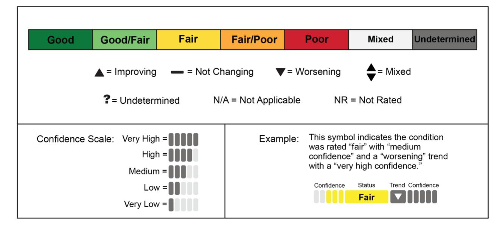

### **Cultural (Non-Material Benefits)**

*Non-Consumptive Recreation – Recreational activities that do not result in intentional removal of or harm to natural or cultural resources*

**Status Description:** The capacity to provide the ecosystem service is compromised, and existing management would require enhancement to enable acceptable performance.

**Rationale:** Though it is clear that both physical conditions and infrastructure limit access for non-consumptive recreation activities in the sanctuary, the levels of existing activities are not well understood or quantified. The improving trend reflects sanctuary and partner outreach and education activities that highlight recreational opportunities in the sanctuary. These create interest among residents and tourists in using the sanctuary.

*Consumptive Recreation – Recreational activities that result in the removal of or harm to natural or cultural resources*

**Status Description:** The capacity to provide the ecosystem service is compromised, but performance is acceptable.

**Rationale:** The status of good/fair was based primarily on the fact that recreational opportunities have not been significantly reduced by changes in resource availability or access restrictions. The expansion of NMSAS restricted fishing access at two sites, but likely had minimal impact on recreational fishing. People were still able to access resources, and NMSAS worked to increase awareness of responsible recreational fishing practices. Consumptive recreation in the sanctuary likely decreased after the expansion in 2012, then increased after subsequent outreach to enhance recreational fishing. There are insufficient data to determine the extent of these changes; therefore, the ratings for this service are based primarily upon expert opinion.

### *Science – The capacity to acquire and contribute information and knowledge*

**Status Description:** Demand for the service is not fully met, but performance is acceptable and may not warrant enhanced management.

**Rationale:** Science activity has been increasing at NMSAS throughout the reporting period and current levels are rated as good/fair. During this time, research activities, publications, science capacity, and partnerships have all increased. Experts noted that there are still limitations due to the lack of access to large research vessels and science staff capacity, and the program will need more support in the future, given the substantial expansion of the sanctuary in 2012. The incorporation of traditional knowledge and more student programs were highlighted as areas for future improvement.

#### *Education – The capacity to acquire and provide educational programs*

**Status Description:** The capacity to provide the ecosystem service has remained unaffected or has been restored.

**Rationale:** Education programs have strengthened the NMSAS mission to restore and protect marine ecosystems. NMSAS has a very robust education program that includes: pre-K through higher education programs for teachers and students that reach an average of over 3500 students and 100 teachers yearly; immersive summer programs that have reached over 850 participants; a wide range of community outreach events; and a well-regarded visitor center that serves both the local community and tourists—approximately 58,000 individuals have toured the center to date. The number of programs has expanded during the reporting period with new offerings added each year.

#### *Heritage & Sense of Place — Recognition of History, Heritage Legacy, Cultural Practices, Aesthetic Attraction, Spiritual Significance & Location Identity*

**Status and Trend Rating:** Specific ratings were not assigned for the heritage and sense of place ecosystem services, because measuring these services in the manner used to rate other services was determined to be culturally inappropriate for American Samoa. The physical condition of heritage resources and sites (distinct from heritage services or ecosystem benefits) was rated in the State section.

**Status Description:** Not Applicable.

**Rationale:** Cultural traditions and values, inherent to the ecosystem services of heritage and sense of place, currently thrive in American Samoa where one people, one language, and one common set of cultural practices continue to be perpetuated. The chiefs who were engaged in the workshop process stated that cultural values are too important and too complex to be captured in a rating scheme. This is an indication of the significance of these benefits. Therefore, there are no status or trend assessments for heritage and sense of place. Furthermore, heritage and sense of place are so similar in American Samoa that they can only be understood as a single, interrelated topic (and will thus be presented together here). ONMS places a high value on partnerships with sanctuary communities and maintains great respect for Fa'a Samoa. Fa'a Samoa, the traditional Samoan way of life, provides the cultural context for all sanctuary activities and functions.

Though not rated, the cultural aspects of heritage and sense of place have been a large part of the work that NMSAS has completed to date and since the sanctuary expanded. Workshop participants acknowledged the priority that NMSAS places on cultural traditions and values, and felt that these should continue to be included as a core emphasis for NMSAS programs and activities. The chiefs also recommended that NMSAS capture the importance of cultural information discussed during the workshop in a narrative format rather than in a rating scheme. Respecting the sensitive nature of cultural heritage information and accommodating a narrative format is an option supported by the condition report process and ONMS.

### **Provisioning (Material Benefits)**

*Commercial Harvest – The capacity to support commercial market demands for seafood products*

**Rationale:** Throughout the study period (2008–2018), the number of commercial fishing vessels has declined. Additionally, there is limited information specific to NMSAS, and regulations vary across sites within the sanctuary. Ecosystem changes linked to climate change may have impaired the ability of the ecosystem to provide commercial harvest.

*Subsistence Harvest – The capacity to support non-commercial harvesting of food and utilitarian products*

**Status Description:** The capacity to provide the ecosystem service is compromised, but performance is acceptable.

**Rationale:** Although evidence was limited to rate this service, experts agreed that the status of subsistence harvest was good/fair for the study period. In a 2014 survey, roughly one-third of respondents reported fishing at least two to three times per month. Additionally, several respondents indicated that they gathered other marine resources (such as shells, octopus, lobster, sea cucumber, and other non-fish species). The most common reasons people fished included feeding themselves and family, giving to extended family and friends, giving to pastors and village leaders, and for special occasions and cultural services. Frequency of fishing decreased among residents, likely because of the increased convenience of storing and purchasing food. The worsening trend was attributed to surveys that showed respondents believe fishing is worse now than when they were younger (Levine & Sauafea-Leau, 2013).

### **Regulating (Buffers to Change)**

*Coastal Protection — Natural features that control water movement and/or wind energy, thus protecting habitat, property, heritage resources, and coastlines*

**Status Description:** The status of coastal protection services is mixed.

**Rationale:** Although coastal protection was rated as fair in most sanctuary units, Muliāva was considered to be good/fair and Aunu'u was fair/poor. The overall fair rating was driven by sea level rise damage to shorelines, declining coral cover due to coral bleaching, and because vessel groundings and storms have damaged natural coastal protection defenses, such as corals and mangroves, in localized areas. The worsening trend is the result of the combined effects of sea level rise, subsidence, and increased coral bleaching. Experts noted that the rate of subsidence in American Samoa is about 8–16 mm yr-1 , making the island's relative sea level rise rate about five times the global average. In addition to deepening reefs, this causes coastal and inland flooding, which threatens reef growth and coastal habitats, crops, and infrastructure.

## **Sanctuary Setting**

## *Overview*

American Samoa is an unincorporated territory of the United States consisting of the eastern part of the Samoan archipelago, located in the south-central Pacific Ocean. It is located approximately 2,600 km northeast of New Zealand and 3,500 km southwest of Hawai'i. American Samoa includes the inhabited islands of Tutuila and Aunu'u, as well as the Manu'a islands (Ta'u, Olosega, and Ofu). Additional islands in the territory include Rose Atoll, an uninhabited coral atoll, and Swains Island, a formerly inhabited coral atoll. The capital of American Samoa is Pago Pago, located on Tutuila. In 2020, the population of American Samoa was 49,710 (U.S. Census Bureau, 2021), with the majority of residents living on Tutuila. The total land area is 199 km2 , slightly larger than the size of Washington, D.C. American Samoa is the southernmost territory in the U.S. and one of two U.S. territories south of the Equator (the other is the uninhabited Jarvis Island; ONMS, 2012).

National Marine Sanctuary of American Samoa (NMSAS) is composed of six protected areas covering 13,581 mi2 of marine habitat that includes nearshore coral reef, deep-sea, and pelagic areas across the Samoan archipelago (Figure SS.1). It was formerly known as Fagatele Bay National Marine Sanctuary, established in 1986 to protect 0.25 mi2 of coral reef habitat in Fagatele Bay. In 2012, the sanctuary expanded to include Fagalua/Fogama'a on Tutuila Island, as well as areas surrounding Aunu'u, Ta'u, and Swains Island, and Muliāva, a unit that overlays Rose Atoll Marine National Monument and includes nearby Vailulu'u Seamount.

NMSAS is located in the cradle of Polynesia's oldest culture. It is home to a great diversity of marine life, including corals and other invertebrates, fish, turtles, marine plants, and marine mammals. It also includes some of the oldest and largest *Porites* coral colonies in the world, along with deep-sea coral and sponge habitats, an undersea volcano, and important fishing grounds.

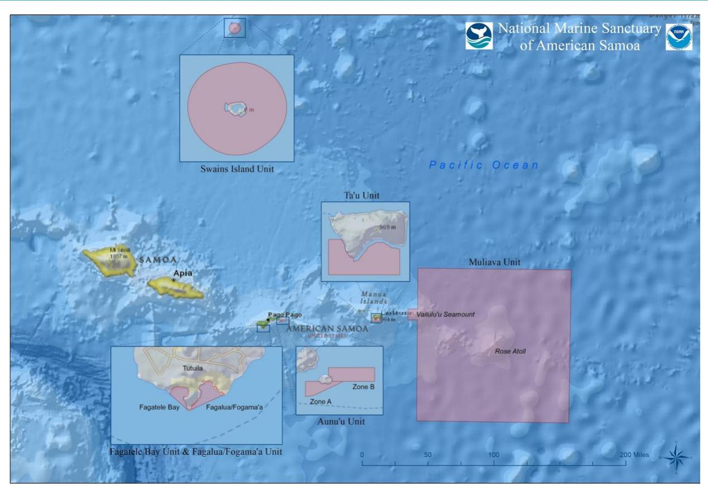

**Figure SS.1.** NMSAS is comprised of six protected areas (Fagatele Bay, Fagalua/Fogama'a, Aunu'u, Ta'u, Swains Island, and Muliāva), covering 13,581 mi2 of marine habitats, including nearshore coral reef, deep-sea, and pelagic areas across the Samoan archipelago. Image: NOAA

## *Designation of the Sanctuary*

In 1982, the governor of American Samoa proposed Fagatele Bay to the National Oceanic and Atmospheric Administration (NOAA) as a candidate for national marine sanctuary designation. After a lengthy public process, Fagatele Bay National Marine Sanctuary was designated on April 29, 1986 by an act of Congress. Fagatele Bay National Marine Sanctuary became part of American Samoa's conservation strategy, which includes the National Park of American Samoa and a community-based marine protected area program coordinated by the Department of Marine and Wildlife Resources (DMWR; Raynal et al., 2016).

On January 6, 2009, President George W. Bush established Rose Atoll Marine National Monument under the Antiquities Act (Proc. 8337, 74 Fed. Reg. 1577 [Jan 12, 2009]). The proclamation ordered the Department of Commerce to initiate a process to add the marine areas of the monument to Fagatele Bay National Marine Sanctuary. In 2008, NOAA initiated a process to expand Fagatele Bay National Marine Sanctuary. The Office of National Marine Sanctuaries (ONMS) worked closely with the American Samoan government and local communities, who wanted to protect these special places for future generations, to evaluate areas for proposed inclusion in the sanctuary. Through a series of public meetings, public input on the proposed areas was solicited and reviewed based on the metrics of ecological, cultural,

and scientific importance. Eventually, from an initial list of 11 proposed sites, five areas were selected for final evaluation: Swains Island, Ta'u, Aunu'u, Fagalua/Fogama'a, and Muliāva.

On July 26, 2012, a draft management plan and draft environmental impact statement were published, adding five new areas to the existing Fagatele Bay National Marine Sanctuary, for a total of six discrete management units; the name of the sanctuary was changed to National Marine Sanctuary of American Samoa (77 Fed. Reg. 43942 [Oct. 31, 2012]). NOAA also amended existing sanctuary regulations and applied these regulations to activities in the expanded sanctuary. These final regulations took effect on October 15, 2012 (77 Fed. Reg. 65815 [Oct 31, 2012]). NOAA co-manages the sanctuary with the American Samoa government and works closely with local communities to support Samoan cultural traditions and practices.

## *Fa'a Samoa: The Samoan Way*

American Samoans hold on to ancient traditions tightly (U.S. Department of Labor, 2007). Despite decades of foreign influence, most Samoans are still fluent in their native language and practice Fa'a Samoa, the traditional communal Samoan lifestyle, or way of life. Fa'a Samoa is the foundation of Polynesia's oldest culture—dating back 3,000 years. It emphasizes reciprocity rather than individual accumulation, and similarly, prestige is gained through generous distribution (not accumulation) of wealth. While it holds on to these traditions, Samoan culture has inherent flexibility, allowing ceremonial and traditional customs to be modified to suit modern situations (U.S. Department of Commerce, 1984). One key factor in the integrity of Samoan culture is the endurance of the Samoan language. Samoan is spoken in the workplace, including in the NMSAS offices and the American Samoa government. Samoans take pride in the tenets of respect, humility, and service as guiding principles of their culture. In this regard, as a courtesy and sign of respect, permission from families is required to cross or enter family lands. This includes beach areas that may be access points to NMSAS (Figure SS.2).

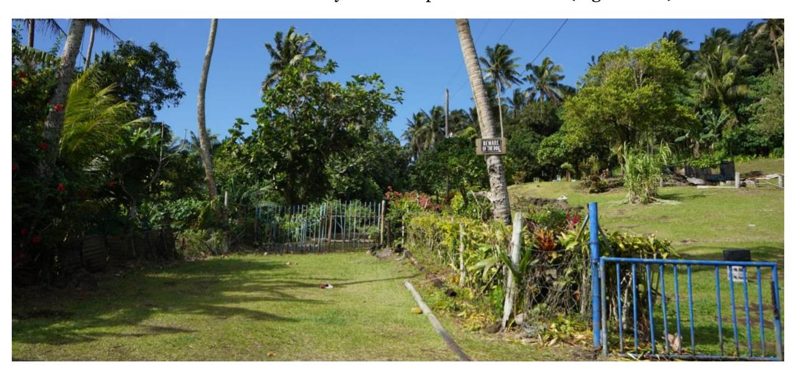

**Figure SS.2.** Reaching Fagatele Bay from Futiga requires permission, and sometimes a fee, from the local family. The site warden is responsible for unlocking the gate at the entrance to the Fagatele Bay Trail, which traverses private family land. Photo: Nerelle Que Moffitt/NOAA

NMSAS staff place a high value on partnerships with sanctuary communities and maintain great respect for Fa'a Samoa. The relationship between sanctuary staff and the matai (chiefs) is critical to successful resource management. The American Samoa Office of Samoan Affairs helps facilitate the sanctuary's community consultations in a culturally appropriate manner that is respectful of Fa'a Samoa. This includes consultations at saofa'iga a le nu'u (village council meeting) and individual matai (ONMS, 2012).

## *Human Settlement and Political History*

Human history in American Samoa dates back about 3,000 years (Craig, 2009; Linnekin et al., 2006). Polynesian culture developed following the voyaging discovery and settlement of the Fiji/Tonga/Samoa region. The settlement of the Pacific Islands millennia ago was guided by ancient seafarer navigation using the stars and other natural cues and observations—a vehicle for cultural renewal and pride to this day. This voyaging and settlement of the Pacific has been called the greatest ocean-borne human migration in history.

The first European contact with American Samoa occurred in 1722 (Davidson, 1969; Linnekin et al., 2006). The subsequent wave of outside visitors included European missionaries and explorers. The Wilkes Expedition from the U.S. in 1839 conducted the first systematic natural history and cultural surveys of Samoa. This expedition, along with the arrival of Christian missionaries, established Western influence over Samoan society that continues today (Figure SS.3).

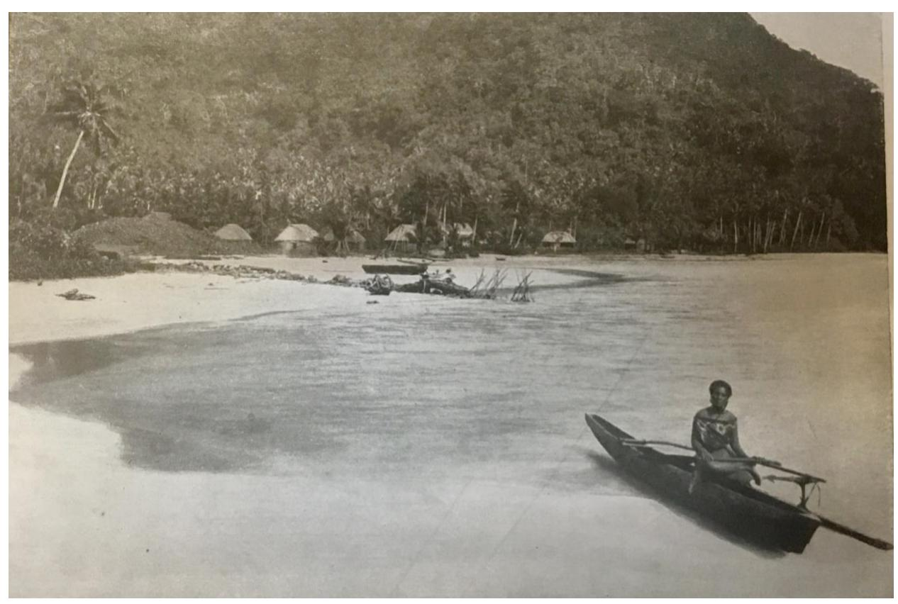

**Figure SS.3.** Fagatogo (Tutuila) during the time of European settlement. Note the pile of coal stored on the beach. Image: De Olivares, 1899

During the 1800s, three colonial powers, Germany, England, and the U.S., laid claim to the Samoan Islands, nearly coming to war before signing a tripartite agreement in 1899 that granted control of Upolu and Savai'i to Germany and control of Tutuila, Aunu'u, and Manu'a to the U.S. That year, the U.S. Department of the Navy assumed administration of "Tutuila Station" (Enright et al., 1997; Figure SS.4). The family chiefs, or matais, of Tutuila and Aunu'u ceded these islands to the U.S. on April 17, 1900. Tui Manu'a and other Manu'a chiefs ceded the Manu'a islands to the U.S. four years later on July 16, 1904. Several years later, the Navy began to refer to the region as "American Samoa" (Linnekin et al., 2006). On March 4, 1925, Olohega, or Swains Island, was annexed by the U.S. and became part of American Samoa. In 1951, per Executive Order 10264, administration of American Samoa transferred from the Department of the Navy to the Department of the Interior (DOI).

Today, American Samoa is an unincorporated, unorganized, and self-governing territory of the U.S. and remains administered by the DOI Office of Insular Affairs. Congress gave plenary authority over the territory to the President of the U.S., who then delegated that authority to the DOI. The Secretary of the Interior enabled American Samoans to draft a constitution, under which the American Samoa government functions (Office of Insular Affairs, 2010; U.S. Department of Labor, 2007). Individuals born in American Samoa are classified as U.S. nationals rather than full citizens. Consequently, they cannot vote in national elections, but have freedom of entry into the U.S. American Samoa has had an elected, non-voting member of Congress in the U.S. House of Representatives since 1981 (U.S. Department of Labor, 2007).

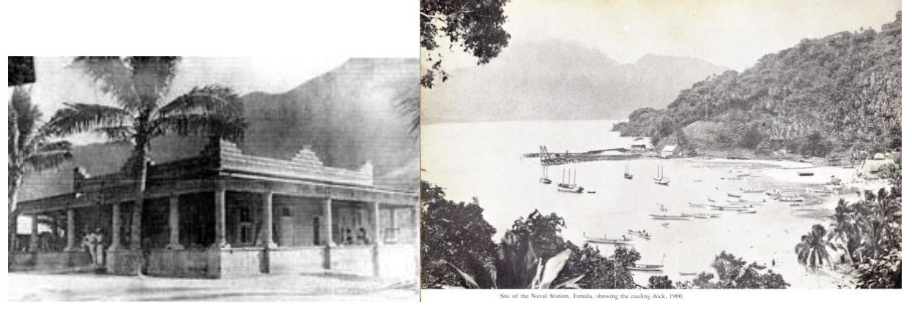

**Figure SS.4.** Tutuila Naval Station in 1900 (left) and Fagatele Bay (right). Images: American Samoa Office of Archives and Records Management

## *Commerce*

Today, the territorial government and tuna processing plants are the territory's largest employers and the mainstay of the economy. The government employs 36.9% of the local workforce (American Samoa Department of Commerce [ASDOC], 2019). Two large U.S. tuna canneries once formed the basis of an industry that employed more than 3,000 Samoan and foreign workers. In 2016, one of the canneries closed due to economic difficulties. The industry has also struggled due to staffing and supply chain issues associated with the COVID-19 pandemic. International fishing fleets supply catches to the canneries for export, while smallscale artisanal fisheries supply fish to local markets.

Retail trade and services dominate the rest of the territory's economy. Small-scale agriculture on the islands of American Samoa mainly supply local markets. The most important crops include taro, coconuts, bananas, citrus fruits, pineapples, papayas, breadfruit, and yams. Tourism is not well developed in American Samoa, with only a handful of small hotels on Tutuila. However, short visits by cruise ships periodically supplement the economy. Cruise traffic ceased during the 2019 measles outbreak and COVID-19 pandemic.

## *Geology*

The Samoan archipelago's geologic features are the result of plate tectonics, volcanism, and reef accretion. The archipelago is 124 mi north of the convergence of the Australian and Pacific plates. A geologic hotspot (a stationary source of molten rock) located 31 mi east of Ta'u created the main islands in the archipelago as the Pacific Plate moved over the hotspot in a westwardly direction at about three in yr-1 (Craig, 2009). Consequently, the age of the islands increases to the west (Thornberry-Ehrlich, 2008). Tutuila is about 1.5 million years old, Ofu and Olosega are about 300,000 years old, and Ta'u is about 100,000 years old (Brainard et al., 2008). Vailulu'u seamount, which sits on top of the Samoan hotspot, has recently grown due to volcanic activity (Staudigel et al., 2006). Swains Island and Rose Atoll arose from much older volcanoes and are geologically separate from the Samoan volcanic chain (Hart et al., 2004).

## *Climate*

The climate of American Samoa is characterized by warm, relatively stable air temperatures, variable precipitation, high humidity, predominant southeast tradewinds, and periodic tropical cyclone activity (ONMS, 2012). Rainfall and tradewinds in American Samoa are influenced by the South Pacific Convergence Zone, a low-pressure area that seasonally moves over and around the archipelago, resulting in a long rainy season from October–May and a slightly cooler and drier period with higher southeasterly trade wind activity from June–September (Finucane et al., 2012; ONMS, 2012). Average air temperature is 80.6°F (1967–2020) and has been increasing (Keener et al., 2021). Average monthly mean sea surface temperatures range from 82–84°F (Coral Reef Watch, 2021).

The Pacific Islands region experiences high inter-annual and inter-decadal climate variability as a result of the El Niño Southern Oscillation (ENSO), the Pacific Decadal Oscillation (PDO), and the Interdecadal Pacific Oscillation (IPO; Finucane et al., 2012; ONMS, 2012; Cheng & Gaskin, 2011). ENSO events, including La Niña (cold phase) and El Niño (warm phase), influence a variety of regional climate factors, such as tradewind activity, rainfall, storm tracks, ocean temperature, and sea level (Finucane et al., 2012; ONMS, 2012).

## *Currents, Tides, and Waves*

Ocean currents transport, among other things, nutrients, marine life, heat, oxygen, and carbon dioxide. At the broadest scale, the Samoan archipelago lies along the northern edge of the South Pacific Gyre, a series of connected ocean currents with a counterclockwise flow that spans the Pacific basin (Alory & Delcroix, 1999; Tomczak & Godfrey, 2003; Craig, 2009; Figure SS.5). At a regional scale centered on the Samoan archipelago, the major surface currents and eddies that affect the archipelago are the westward flowing South Equatorial Current, which occurs all year

between 5 and 15 °S; the South Equatorial Counter Current, which interrupts the South Equatorial Current between 9 and 12 °S during the summer; and the Tonga Trench Eddy, which regularly occurs between September and December south of the archipelago (Kendall & Poti, 2011). Of these, the South Equatorial Counter Current is the most prominent current feature in the region, occurring at approximately 200 m depth, and is strongest in January and February (Kessler & Taft, 1987; Chen & Qiu, 2004).

In addition to surface currents, deep-sea currents play an important role in regulating conditions in the deep sea. American Samoa lies along the Pacific Meridional Overturning Circulation (Voet et al., 2015), commonly referred to as the global ocean conveyor belt. The Circumpolar Deep Water flow is a deep thermohaline current that originates in Antarctica and flows past American Samoa along the Kermadec and Tonga Trenches before entering a region known as the Samoan Passage, just north of the exclusive economic zone (EEZ). This current carries oxygen and nutrients to deep-sea areas and is believed to be an important dispersal mechanism for deep-sea species across the tropical central Pacific.

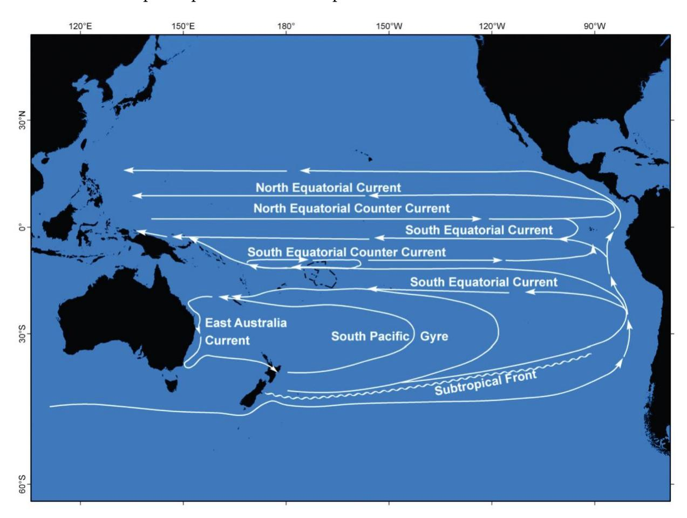

**Figure SS.5.** Major surface currents of the Southern Pacific Ocean. EEZs of Samoa and American Samoa are outlined in the center of the map. Image: Kendall & Poti, 2011

#### Sanctuary Setting

Tides in the archipelago consist of two daily highs and lows with a mean range of 0.78 m (as measured at Pago Pago) and extremes of 0.9 m and -0.84 m (NOAA, 2022) during king tides and ENSO events. Tides may influence nearshore currents. Extreme high tides may flood lowlying areas and extreme low tides can expose reef flat areas to the air. NOAA maintains one tidal station in American Samoa, located within Pago Pago harbor.

Wave height and power are highest on average on the eastern- and southern-facing coasts of the Samoan islands, but can vary seasonally and among years (Barstow & Haug, 1994). Seasonally, ocean swells from the south are highest during May–September (2–3 m wave height is common) due to the increased intensity and frequency of the trade winds at higher latitudes (Barstow & Haug, 1994; Brainard et al., 2008). November–March is a period often characterized by shorter-period waves, lower wave heights (about 2 m), and more variable directionality (Brainard et al., 2008). Large anomalous wave events occur when cyclones pass (e.g., wave heights greater than 8 m were recorded during Cyclone Ofa in 1990 and Cyclone Heta in 2004). Storms in the north Pacific can even cause unusually large swells on the typically calmer northern coasts of the islands (Barstow & Haug 1994; Brainard et al., 2008).

## *Habitat and Living Resources*

American Samoa is an oceanic archipelago with a small insular shelf. Therefore, shallow-water habitats, such as rocky shore, reef flat, and coral reef, generally only occur within 0.5 to 2 mi from shore because of the steep slope of the seafloor (Craig, 2009; Figure SS.6). Pelagic (openocean) waters constitute the primary habitat within the archipelago. NMSAS also includes banks, deep ocean floor habitats, hydrothermal vents, and seamounts.

Nearshore benthic (bottom) habitats include coral reefs (reef flats and reef slopes); seagrass beds; mangrove forests; and sandy, hard bottom, and rubble substrates in the subtidal and intertidal zones (see Fenner et al., 2008a; Brainard et al., 2008; Kendall & Poti, 2011 for habitat characterizations and benthic habitat maps for the entire archipelago). Each sanctuary unit contains shallow coral reefs (<30 m) and mesophotic reefs (30–150 m), with Aunu'u containing the largest area of known bottomfish habitat, and Fagatele Bay and Fagalua/Fogama'a containing submarine canyons. The Muliāva unit contains the greatest area of pelagic and deepsea habitat, including Vailulu'u and Malulu seamounts (ONMS, 2012).

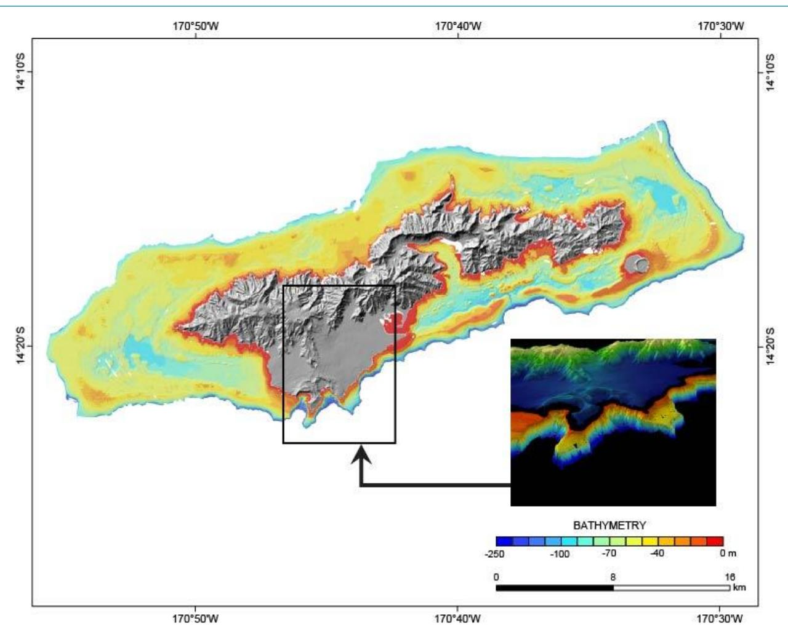

**Figure SS.6.** Bathymetric map of Tutuila. The inset is a three-dimensional visualization of Tutuila's southwestern shore from the mountains (top) to the seafloor (bottom). The inset shows Fagatele Bay, Larsen Bay, and Coconut Point (from left to right). Note the steep slope into the deep sea. Image: NOAA Fisheries, 2012

### **Intertidal**

Intertidal habitats in NMSAS include rocky cliffs and terraces, caves, beaches, and reef flats. These habitats experience frequent changes from tidal and wave action. Rocky intertidal fauna include limpets, chitons, blennies, and crabs that have specialized features to help them survive in these dynamic environments. Seabirds and shorebirds may also use these areas for resting and foraging. Intertidal reef flat areas and tide pools have more diversity and may support corals, macroalgae, fish, and a wide variety of invertebrates, but community development is limited by low tide exposure and is at elevated risk from disturbance events like cyclones and large waves.

### **Coral Reefs**

Coral reef ecosystems extend from sea level to a depth of approximately 150 m and include both shallow coral reefs (SCRs; <30 m) and mesophotic coral ecosystems (MCEs; 30–150 m; Figure SS.7). Shallow coral reefs are some of the most diverse habitats on the planet. Within NMSAS,

#### Sanctuary Setting

fringing coral reefs extend from shore, often including reef flat terraces and shallow reef crests where waves break, and create extensive fore reef slope habitats (Table SS.1). These reefs house a high diversity of framework-building species, such as scleractinian corals and coralline algae. Below 30 m, light is diminished and the species composition shifts to corals, sponges, and algae that can tolerate low light conditions. Recent work suggests that MCEs in American Samoa have distinct coral community assemblages compared to shallow reefs (Montgomery et al., 2019). Both SCRs and MCEs serve as essential fish habitat for some economically and ecologically important fish species, which use these areas for spawning, breeding, feeding, and growth to maturity. Approximately 2,700 species have been documented on the reefs of American Samoa (Fenner et al., 2008a), but the actual number is likely much higher as sampling has been limited, particularly for invertebrates.

**Table SS.1a.** Geodesic area (km²) and reef slope (m) for each NMSAS management area. SCR = shallow coral reef, MCE = mesophotic coral ecosystem. MCE areas are further broken down into upper (30–70 m) mid (70–110 m) and lower (110–150 m) zones. Source: Montgomery et al. 2019

|               | Aunu'u Island A | Aunu'u Island B | Fagalua/ Fogama'a | Fagatele Bay | Ta'u | Swains Island | Muliāva/ Rose Atoll |
|---------------|--------------------|--------------------|----------------------|-----------------|------|------------------|------------------------|
| SCRs          | 2.60               | 2.53               | 0.45                 | 0.42            | 1.23 | 1.68             | 1.10                   |
| Total MCEs | 2.34               | 6.94               | 0.49                 | 0.27            | 1.70 | 0.48             | 1.31                   |
| Upper MCEs | 1.26               | 6.08               | 0.22                 | 0.12            | 0.71 | 0.23             | 0.75                   |
| Mid MCEs      | 1.08               | 0.67               | 0.10                 | 0.07            | 0.54 | 0.18             | 0.43                   |
| Lower MCEs | 0.00               | 0.18               | 0.17                 | 0.07            | 0.45 | 0.07             | 0.13                   |

**Table SS.1b.** Mean reef slope (m; ± sd) for upper (30–70 m), mid (70–110 m), and lower (110–150 m) MCE zones in each NMSAS management area. Source: Montgomery et al., 2019

|               | Aunu'u Island A | Aunu'u Island B | Fagalua/ Fogama'a | Fagatele Bay | Ta'u        | Swains Island | Muliāva/ Rose Atoll |
|---------------|--------------------|--------------------|----------------------|-----------------|-------------|------------------|------------------------|
| Upper MCEs | 10.5 ± 8.8      | 3.8 ± 4.2          | 29.7 ± 15.1          | 29.5 ± 14.2     | 15.6 ± 8.0  | 50.9 ± 6.5       | 30.9 ± 13.8            |
| Mid MCEs   | 4.9 ± 5.1          | 8.1 ± 6.5          | 35.1 ± 14.3          | 29.0 ± 17.1     | 22.7 ± 9.8  | 56.1 ± 7.2       | 42.2 ± 17.2            |
| Lower MCEs | N/A                | 29.8 ± 16.2     | 31.7 ± 17.6          | 27.1 ± 17.6     | 30.9 ± 12.3 | 73.7 ± 8.1       | 70.5 ± 8.9             |

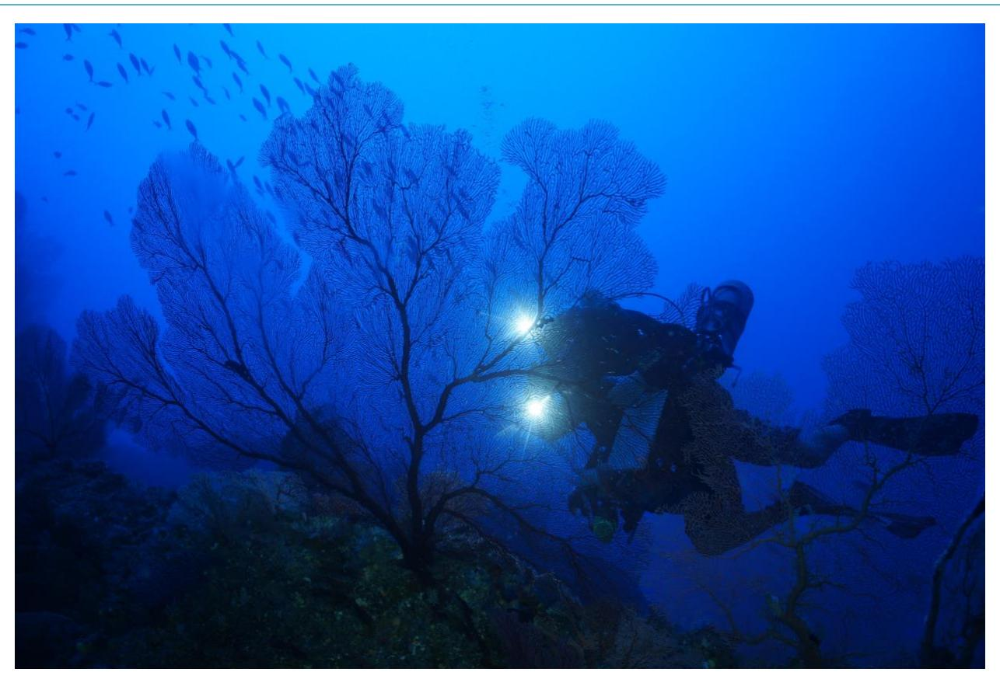

**Figure SS.7.** A diver surveys the mesophotic habitat in NMSAS at a depth of approximately 90 m. Photo: Daniel Wagner/NOAA

A total of 342 stony coral species are currently considered present or possibly present in American Samoa (Montgomery et al., 2019; Figure SS.8). Corals are part of the phylum Cnidaria, and are related to jellyfish. Coral colonies are made up of a collection of individual modules known as polyps. Living coral tissue secretes calcium carbonate to build the colony's skeleton. The slowest growing corals grow at a rate of 0.5–2.5 cm yr-1 and the fastest can grow up to 20 cm yr-1 (Gladfelter et al., 1978). Growth rates vary with light, temperature, nutrients, and aragonite saturation state (the measure of available calcium carbonate ions in seawater). Corals may extend their tentacles to actively feed on plankton in the water column, however in most shallow reef habitats, suspension feeding does not supply enough energy to sustain coral growth. Instead, corals rely on a highly productive symbiotic relationship with a type of singlecelled algae called zooxanthellae. These algae live inside the coral polyps, converting sunlight, carbon dioxide, and water into food for the coral. Most stony corals above a depth of 100–200 m have zooxanthellae. This relationship is sensitive to temperature, and most reef building corals prefer temperatures between 73–84°F. If temperatures exceed a coral's preferred range for too long, the coral may expel the algae in a process known as coral bleaching. The combined loss of the algae and heat stress may result in death if temperatures exceed a coral's temperature threshold for too long or if the temperature exceeds the coral's thermal tolerance.

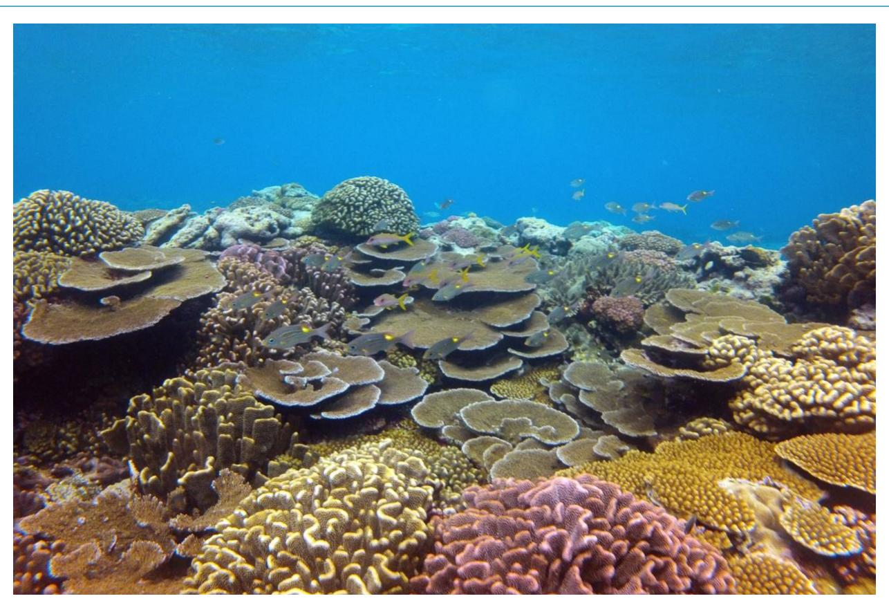

**Figure SS.8.** A coral reef at Fagatele Bay. Photo: Wendy Cover/NOAA

Algae found on the coral reefs in American Samoa include zooxanthellae, microalgae, macroalgae, filamentous algae (turf), and coralline algae (both crustose and branching forms). Algae play different roles in ecosystem function and are important to the coral reef environment. Macroalgae and filamentous algae provide food for herbivorous fish and shelter for juvenile fish and invertebrates, but also compete for space with corals. Skelton and South (2007) described 243 species of benthic macroalgae in American Samoa. Since their extensive survey, further species have been identified (e.g., Kraft & Saunders, 2014). While corals are the primary reef builders on coral reefs, other calcifiers, such as crustose coralline algae (CCA), are also very important to the ecosystem because they bind the reef together (Skelton, 2003; Craig, 2009) and provide substrate for settlement of coral larvae (Craig, 2009). Rose Atoll is known for its high CCA cover, which gives its slopes an incredible purple coloration. The distinctive CCA formations on the reef slopes at Rose Atoll are not common elsewhere in American Samoa (Figure SS.9).

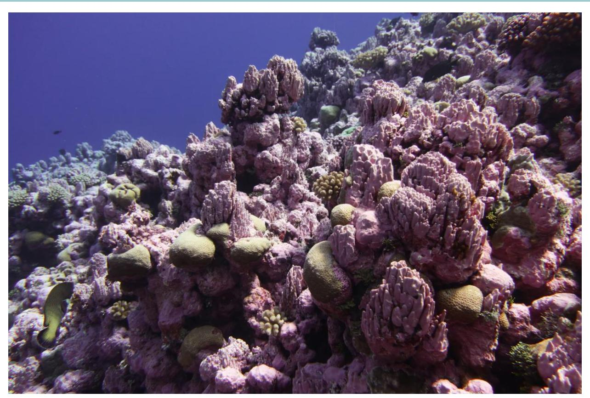

**Figure SS.9.** Purple CCA formations at Rose Atoll. Photo: Mareike Sudek/NOAA

Coral reefs in American Samoa provide habitat for over 900 species of reef fish (Wass, 1984; Montgomery et al., 2019) and over 1,000 known invertebrate species (ONMS, 2012). This includes a variety of species harvested for food, such as surgeonfish, jacks, snappers, parrotfish, groupers, lobsters, octopus, sea cucumbers, and giant clams. Fish and invertebrate biomass is generally higher in the more remote islands, presumably due to less human fishing pressure. Large fish like reef sharks, humphead wrasse, and groupers are rare throughout the territory (Fenner et al., 2008a). The lagoon at Rose Atoll was known for an exceptionally high density of giant clams (Green & Craig, 1999), but those numbers have declined precipitously in recent years (B. Peck/FWS, personal communication, 2020). Endangered green and hawksbill sea turtles are found on reefs throughout the territory. Coral reefs also serve as resting areas for resident spinner dolphin pods, and humpback whales with newborn calves are frequently observed near reefs from June to November.

## **Pelagic Zone**

Most of American Samoa's marine habitat is pelagic. Even though the pelagic habitat consists entirely of water hundreds of kilometers wide and thousands of meters deep, it should not be considered to lack structure and associated ecosystem zones. There are four distinct zones: epipelagic (<200 m), mesopelagic (200–1,000 m), bathypelagic (1000–4,000 m), and abyssopelagic (<4,000 m). Pelagic species are closely associated with their physical and chemical environments, and thus, their habitat range and distribution may be significantly altered by oceanographic variability, like ENSO events. Some organisms migrate through pelagic zones, or between pelagic and benthic habitats, during life cycle phases. Others are found in different zones during different activities such as migration, foraging, and reproduction (Garrison, 1999).

The epipelagic zone is highly dynamic, affected by the South Equatorial Current and the South Equatorial Countercurrent, which display seasonal and interannual variability. These currents, and their resultant eddies, are affected by ENSO events (Domokos et al., 2007; Domokos, 2009). Only 45 pelagic fish species have been identified in this zone (Wass, 1984), including important pelagic fishery targets such as albacore (*Thunnus alalunga*) and yellowfin tuna (*T. obesus),* blue marlin (*Makaira nigricans*), wahoo (*Acanthocybium solandri*), masimasi (*Coryphaena hippurus*), and skipjack tuna (*Katsuwonus pelamis*). Seabirds forage in these upper layers and some marine mammals spend most of their time in this zone.

Thirteen species of marine mammals have been observed in American Samoan waters (Craig, 2009). This includes two mysticetes (baleen whales): humpback and minke whale (Utzurrum et al., 2006). In addition, 11 odontocetes (toothed cetaceans) are found in American Samoa: sperm whale, killer whale, short finned pilot whale, common bottlenose dolphin, spinner dolphin, pantropical spotted dolphin, striped dolphin, rough toothed dolphin, Cuvier's beaked whale, dwarf sperm whale, and false killer whale (Utzurrum et al., 2006; Johnston et al., 2008). Each year, from July–October, humpback whales use the waters around American Samoa for breeding and calving (Lindsey et al., 2016).

The darker mesopelagic zone is a haven during the daylight hours for micronekton that comprise the deep scattering layer (small fish, crustaceans, and cephalopods), but these animals migrate to the epipelagic zone each night to feed on phytoplankton and smaller zooplankton found there (Domokos et al., 2007). Little is known about the bathypelagic and abyssopelagic zones in American Samoa.

### **Seamounts and Deep Sea**

Deep ocean benthic habitats include hard, soft, and biogenic habitats at water depths below 150 m; these are by far the largest benthic habitat by area in American Samoa. Soft sediments are mostly mud and sand, and are generally low in biological productivity. Deep-sea corals are found on hard bottom substrate in dark waters, where temperatures range from 4–12°C. For this reason, these corals are known as cold-water or deep-sea corals. Cold-water corals are also part of the taxonomic group Cnidaria, and are related to shallow corals. However, these corals lack the symbiotic algae that live in the tissues of shallow corals. Instead, cold-water corals feed by waiting for small food particles to flow past, then use their stinging cells to capture them. They also provide habitat for other species. Radiocarbon dating of deep-sea corals suggests that they may live for thousands of years (Roark et al., 2009). Deep-sea habitats have been poorly studied in American Samoa, but recent exploratory work indicates that deep-sea coral and sponge communities serve as fish habitat and are hotspots of biodiversity. The deep NMSAS units support a diverse biological community that includes deep-sea corals, crinoids, octocorals, and sponges (Kennedy et al., 2019; Deep Sea Coral Research and Technology Program [DSCRTP], 2020).

Biological hotspots may be found on ridgelines, near hydrothermal vents, and around seamounts. Seamounts are underwater volcanic mountains that rise from the seafloor and occur throughout all ocean basins (Wessel et al., 2010). Generally, seamounts are highly productive and support a rich biodiversity of organisms. Some species of bottomfish found on seamounts are important to commercial fisheries, such as snappers (Lutjanidae), groupers (Serranidae), jacks (Carangidae), and emperors (Lethrinidae). Most bottomfish are associated with hard substrates, holes, ledges, or caves, and are not believed to migrate between isolated seamounts. In comparison, highly migratory species, including bigeye and yellowfin tuna, traverse across the entire south Pacific basin, and are also attracted to geological features such as seamounts and islands (Morato et al., 2010).

There are 48 documented seamounts within the American Samoa EEZ (Kendall & Poti, 2011) rising from as deep as 4,000 m (Western Pacific Regional Fishery Management Council [WPRFMC], 2009). Vailulu'u Seamount (Figure SS.10) is located between Manu'a and Rose Atoll and is the only hydrothermally active seamount within the EEZ (Koppers et al., 2010). Discovered in 1975 and first mapped in 1999, Vailulu'u sits atop the active volcanic hotspot that created the Samoan archipelago. The caldera of Vailulu'u has risen and collapsed repeatedly over time and currently sits at about 708 m below the water's surface. Between 2001 and 2005, a new cone formed in the middle of the crater and was named Nafanua (after the Samoan goddess of war). Researchers have estimated that if activity continues at the observed rate, the seamount could eventually breach the surface within decades, forming a new island in the Samoan island chain (Staudigel et al., 2006). Vailulu'u supports a diverse biological community including polychaetes, crinoids, octocorals, sponges, and cutthroat eels (Staudigel et al., 2006). Malulu Seamount is located near Vailulu'u, but much less is known about this seamount. It is very deep, extending from 2,400 m to 4,800 m in depth (Seamount Biogeosciences Network, 2022).

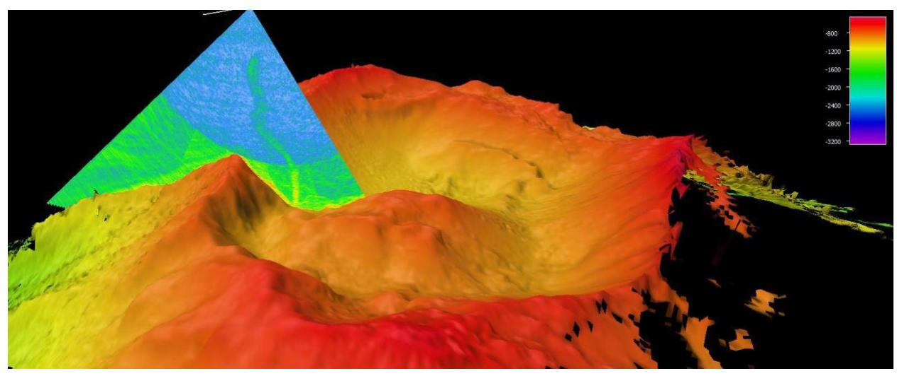

**Figure SS.10.** Multibeam sonar image of the Vailulu'u seamount in 2017, showing the Nafanua cone inside the crater. The triangular shape in the image is the "beam fan" from the multibeam sonar, which provides an image of the backscatter in the water column. The feature snaking up from the bottom of the crater, shown within the beam fan, is a gaseous plume emanating from the crater floor. The legend provides depth in meters for the bathymetry shown. The caldera currently sits at a depth of about 708 m. Image: NOAA

## *Maritime Heritage Resources*

Maritime heritage resources can provide insight on specific portions of American Samoan history and serve as windows to the past, though few specific surveys for heritage sites have been conducted. In general, known and potential maritime heritage resources in American Samoa fall into five categories:

- 1. Historical shipwrecks—35 reported lost; two located/assessed
- 2. World War II naval aircraft—43 lost between 1942–1944; none located
- 3. World War II fortifications, gun emplacements, and coastal pillboxes—multiple sites assessed, but none reported in NMSAS
- 4. Archaeological sites—more than fifty coastal/nearshore archaeological sites or features were identified following the 2009 tsunami, including coastal settlements, stone tool manufacturing sites, and isolated artifact scatters (Addison et al., 2010)
- 5. Marine/coastal natural resources associated with the legends and folklore of American Samoa—described by the American Samoa Historic Preservation Office as sites "of extraordinary significance to Samoan culture" (Volk et al., 1992, p. 32)

## *Sanctuary Units*

The sanctuary includes six discrete units that have unique habitats and varying regulations (see Table R.1 and Table R.2 in the Response section for further information). These units are Fagatele Bay, Fagalua/Fogama'a, Aunu'u, Ta'u, Swains Island, and Muliāva.

## **Fagatele Bay**

The Fagatele Bay unit is a 0.65 km2 coastal embayment that extends from Fagatele Point to Steps Point along the southwestern coast of Tutuila Island (Figure SS.11, Figure SS.12). This naturally protected bay was formed by a collapsed volcanic crater and is surrounded by steep, forested cliffs. It was designated as a national marine sanctuary in 1986 to protect its extensive coral reef ecosystem. In 2012, Fagatele Bay was declared a no-take marine protected area (ONMS, 2012), and as such, fishing and other extractive uses are not allowed. Activities that are allowed include non-extractive research, education, and recreation (see Table R.1 and Table R.2 in the Response section for further information). The shore of Fagatele Bay was the site of a historical coastal village from prehistoric times to the 1950s, but at present, no human settlement exists near the shoreline.

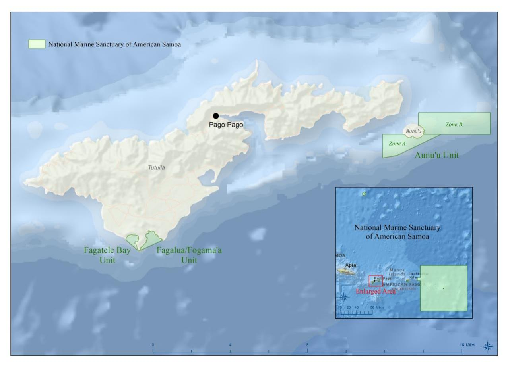

**Figure SS.11.** The Fagatele Bay and Fagalua/Fogama'a units are located on the island of Tutuila. Aunu'u is approximately 1.9 km southeast of Tutuila and includes two zones—a Multiple Use Zone (A) and a Research Zone (B). Image: Tony Reyer/NOAA

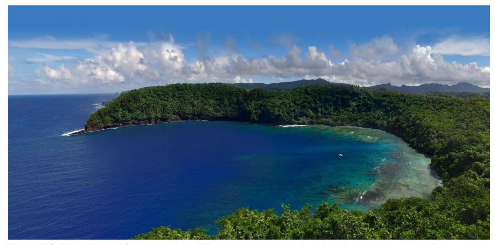

**Figure SS.12.** In 1986, NOAA established Fagatele Bay as a national marine sanctuary in order to protect and preserve the 0.65 km2 of coral reef ecosystem within the bay. Photo: Matt McIntosh/NOAA

### **Fagalua/Fogama'a**

Fagalua/Fogama'a unit is a 1.2 km2 bay on the southwest shore of Tutuila, just east of Fagatele Bay (Figure SS.13). Fagalua and Fogama'a coves make up the inner western portion of the entire bay area, which extends from Steps Point to Sail Point Rock. Like Fagatele Bay,

Fagalua/Fogama'a was formed by a flooded volcanic crater and is surrounded by steep, forested cliffs. The importance of the relationship between this bay and the surrounding environment is comparable to Fagatele Bay, with both bays having high coral cover, as well as many different types of coral and fish species. Thus, this area provides additional protection for and increases resilience of these important coral reef ecosystems, and also creates additional opportunities for scientific research (ONMS, 2012). A variety of activities are allowed in the Fagalua/Fogama'a unit, including research, education, recreation, hook-and-line fishing, cast nets, spearfishing (non-scuba-assisted), and traditional methods used for sustenance and cultural purposes such as gleaning, enu, and ola (traditional basket fishing; see Table R.1 and Table R.2 in the Response section for further information). The Turtle and Shark Lodge is found on the cliffs of Fogama'a alongside a few scattered houses and plantations, but otherwise no settlements are found on the shore of Fagalua/Fogama'a bay.

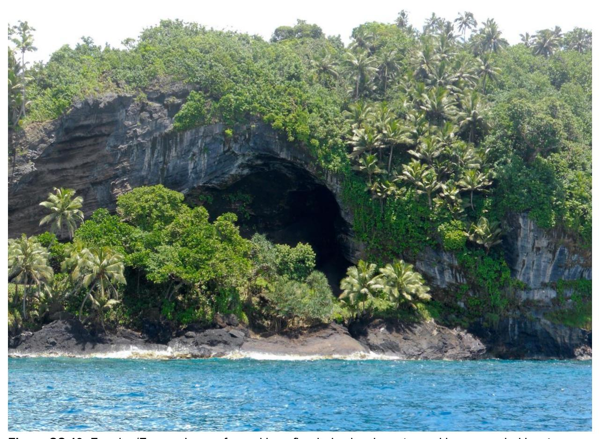

**Figure SS.13.** Fagalua/Fogama'a was formed by a flooded volcanic crater and is surrounded by steep, forested cliffs. Photo: Michelle A. Johnston/NOAA

### **Aunu'u**

Aunu'u is a small, volcanic island approximately 2 km southeast of Tutuila with a land area of 1.5 km2 . The Aunu'u unit encompasses 15 km2 and borders the island on three sides. The unit consists of coral reef, pelagic, and deep-sea habitat, including extensive mesophotic habitat. Based on limited survey data, the coral cover and number of species present in the Aunu'u sanctuary unit is generally moderate compared to other areas around Aunu'u.

The Aunu'u unit includes two zones—a Multiple Use Zone (4.9 km2) and a Research Zone (10.1 km2 ; Figure SS.14). The Multiple Use Zone is located on the southern side of the island, near the village. Allowed activities in the Multiple Use Zone include research, education, and recreation. Hook-and-line fishing, casting nets, spearfishing (non-scuba-assisted), and other nondestructive fishing methods, including those traditionally used for sustenance and cultural purposes, such as gleaning, enu, and ola (traditional basket fishing), are also permitted (see Table R.1 and Table R.2 in the Response section for further information). The Research Zone is located on the eastern side of the island. Allowed activities in the research zone include research, education, recreation, and surface fishing for pelagic species, including fishing by trolling. Bottom fishing, trawling, and fishing for bottom-dwelling species are prohibited in the Research Zone (see Table R.1 and Table R.2 in the Response section for further information).

The island of Aunu'u is home to one small village with a population of 402 (U.S. Census Bureau, 2021). The sanctuary unit is of high ecological and cultural significance for local residents, who commonly use the area for subsistence fishing.

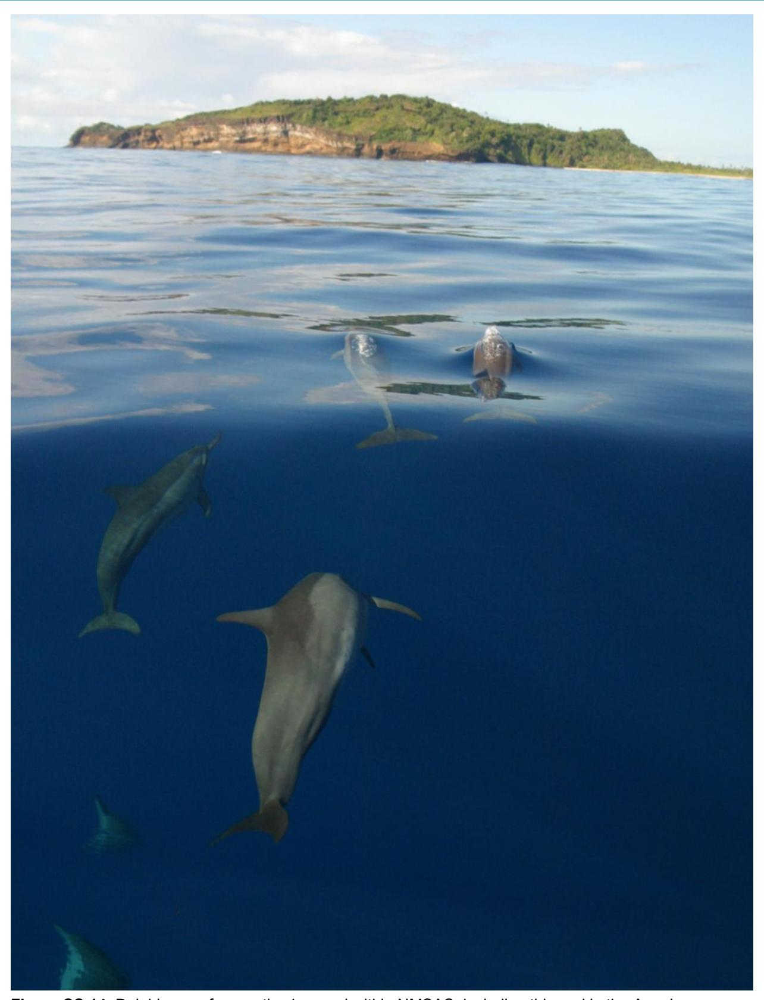

**Figure SS.14.** Dolphins are frequently observed within NMSAS, including this pod in the Aunu'u Research Zone. Photo: Ed Lyman/NOAA

### **Ta'u**

Ta'u, part of the Manu'a island group, is a volcanic island located approximately 112 km east of Tutuila Island (Figure SS.15). Ta'u is ringed by extremely steep sea cliffs and a steeply sloped seafloor. The island has a south-facing embayment, the result of collapse of and landslides from the remnants of a southern caldera similar to the Fagatele Bay formation. The Ta'u unit encompasses 37.8 km2 and includes waters from Vaita Point to Si'ufa'alele Point along the western coast, and from Si'ufa'alele Point to Si'u Point along the southern coast (Figure SS.16). The inner sanctuary boundary along the southern coast is adjacent to, but does not include, the nearshore waters of the National Park of American Samoa, which extend 0.46 km from shore.

The Ta'u unit includes the "Valley of the Giants," home to many large *Porites* corals. Among these is Big Momma, which is more than 500 years old, with a height greater than six m and a circumference of 41 m (Figure SS.17; Brown et al., 2009; Tangri et al., 2018). It is one of the largest recorded coral colonies in the world.

Activities allowed in the Ta'u unit include research, education, recreation, hook-and-line fishing, cast nets, spearfishing (non-scuba-assisted), and other non-destructive fishing methods, including those traditionally used for sustenance and cultural purposes (see Table R.1 and Table R.2 in the Response section for further information). The island of Ta'u is home to 553 people (U.S. Census Bureau, 2021).

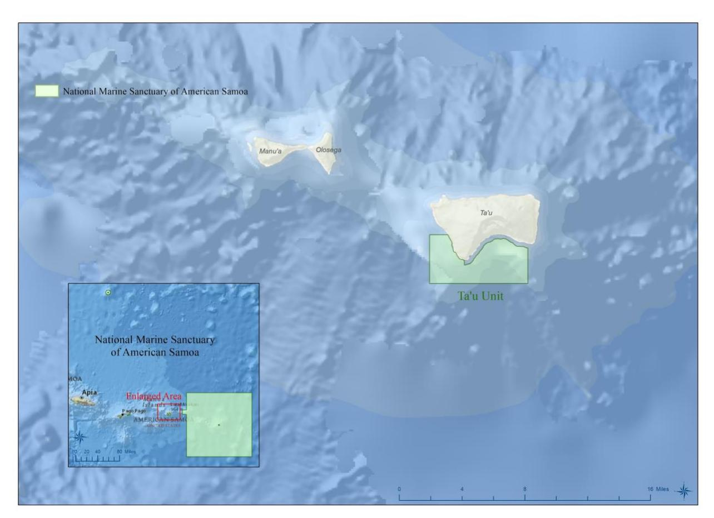

**Figure SS.15.** Map of the Ta'u unit. Image: Tony Reyer/NOAA

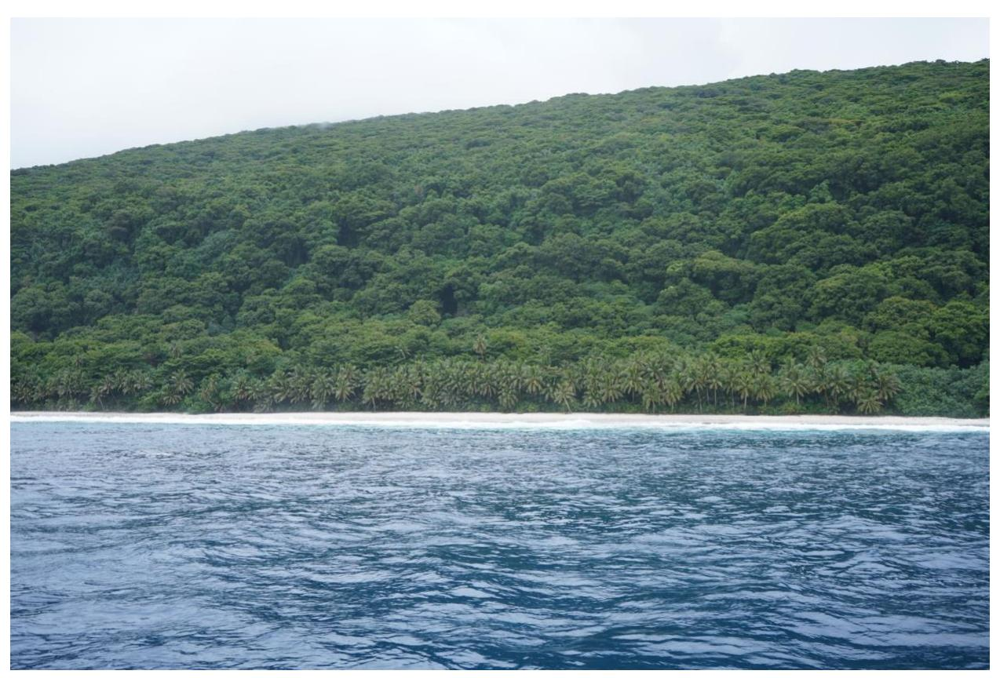

**Figure SS.16.** The coast of Ta'u Island. Photo: Nerelle Que Moffitt/NOAA

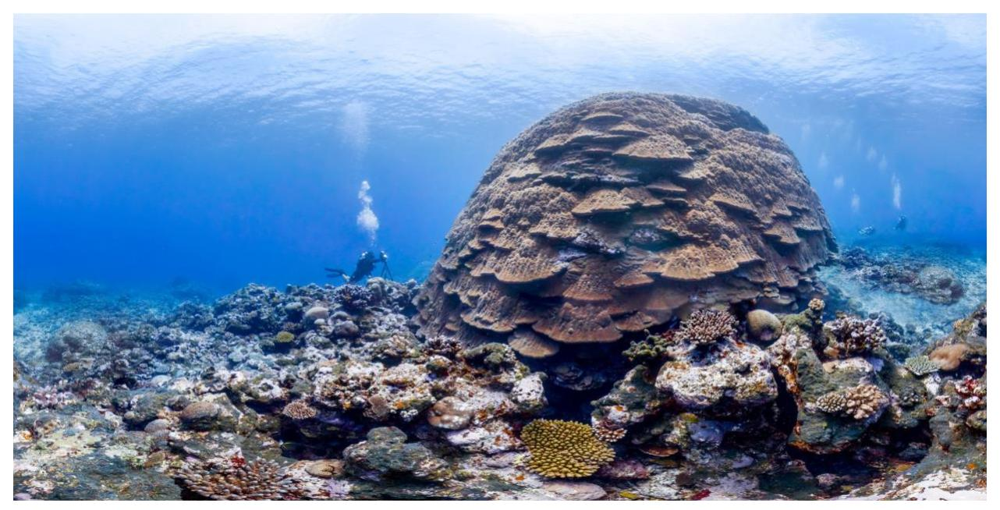

**Figure SS.17.** Giant *Porites* coral, known as Big Momma, is located in the waters off of Ta'u, American Samoa. Photo: XL Catlin Seaview Survey

### **Swains Island**

Swains Island is a privately owned, low-lying emergent seamount and coral atoll located about 350 km northwest of Tutuila. It is geologically part of the Tokelau volcanic island group and not the Samoan volcanic chain. The Swains Island unit encompasses 135.5 km2 of territorial waters (Figure SS.18, Figure SS.20). Swains Island is approximately 2.4 km in diameter, with approximately 2.6 km2 of highly vegetated land that has a maximum elevation of 1.8 m above sea level. The coral reef area is small and has a steep slope. The reef is dominated by *Pocillopora*  and plating *Montipora* corals and large schools of predators, mostly barracudas, jacks, and snappers, can be encountered.

Activities allowed in the Swains Island unit include research, education, recreation, hook-andline fishing, cast nets, spearfishing (non-scuba-assisted), and other non-destructive fishing methods including those traditionally used for sustenance and cultural purposes such as gleaning, enu, and ola (see Table R.1 and Table R.2 in the Response section for further information). Swains Island, initially known as Olosega, has a unique history of human occupation, but the island has been uninhabited since 2008 (Van Tilburg et al., 2013). In 2013, ONMS, along with partner agencies and institutions, conducted an eight-day on-island multidisciplinary survey of Swains Island. The field work focused on the unique environmental setting (including a survey of the geomorphology of the atoll) and past cultural heritage resources of the island (including a maritime archaeology survey to identify historic and prehistoric maritime heritage resources; Van Tilburg et al., 2013).

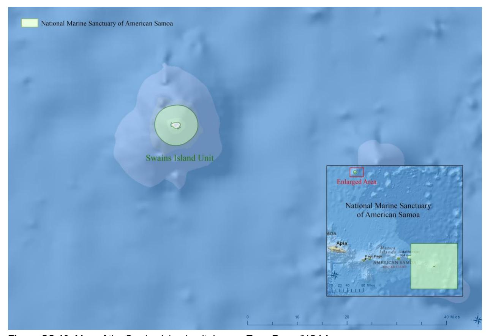

**Figure SS.18.** Map of the Swains Island unit. Image: Tony Reyer/NOAA

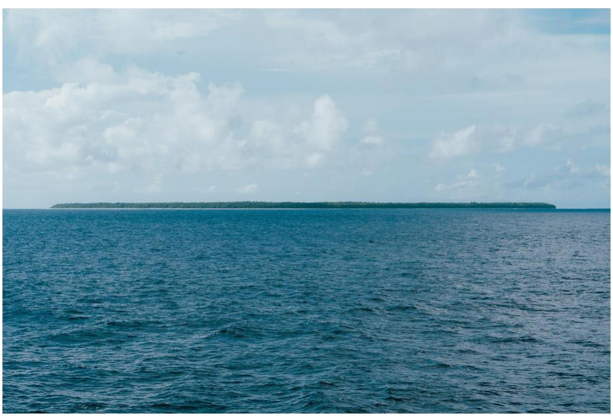

**Figure SS.19.** Swains Island is a low-lying coral atoll and is the most remote of the NMSAS units. Photo: Nerelle Que Moffitt/NOAA

### **Muliāva**

The Muliāva unit is the largest NMSAS unit, encompassing 34,985 km2 . It includes the marine waters of Rose Atoll Marine National Monument, as well as the waters surrounding Vailulu'u Seamount, a submerged volcanic cone and the only hydrothermally active seamount within the American Samoa EEZ. Rose Atoll National Wildlife Refuge lies within the center of Muliāva unit and includes the lagoon and islands within Rose Atoll. The refuge is managed by the U.S. Fish and Wildlife Service and is not part of NMSAS. The sanctuary begins at the mean low water mark on the outside of the lagoon and includes the outer reef slopes and deep-sea habitat around the atoll (Figure SS.20–Figure SS.22). Rose Atoll is approximately 240 km eastsoutheast of Tutuila Island's Pago Pago Harbor. It is the easternmost Samoan island and the southernmost point of the United States. One of the smallest atolls in the world, Rose Atoll consists of about 0.08 km2 of land and 6.5 km2 of lagoon surrounded by a narrow reef flat (ONMS, 2012).

Rose Atoll, also known as Motu o Manu (island of the birds) or Nu'u o Manu (village of the birds) is a distinct environment within the archipelago. The lagoon at Rose Atoll supports the highest densities of giant clams in the Samoan archipelago, and Rose Island is an important site for green turtle and seabird nesting in American Samoa. The outer reefs of the atoll are characterized by very high CCA cover and large numbers of fish. The atoll is positioned upstream in the South Equatorial Current relative to the rest of the Samoan archipelago and

therefore may be an important larval source for the territory (Kendall & Poti, 2011). The name Muliāva means "the end of the current" and refers to the marine waters around Rose Atoll. In addition to Rose Atoll, the Muliāva unit also includes vast deep-sea areas, as well as the submerged volcanic Vailulu'u Seamount, which is outside of Rose Atoll Marine National Monument boundaries but within NMSAS boundaries (Figure SS.22).

Fishing in Rose Atoll Marine National Monument is regulated by NOAA Fisheries, U.S. Fish and Wildlife Service, and the American Samoa government. Commercial fishing is prohibited within the monument, and in 2013, NOAA Fisheries enacted additional regulations that prohibited all fishing within 22 km of Rose Atoll unless authorized by a permit for sustenance or recreational fishing (78 Fed. Reg. 32996 [Jun 3, 2013]). Activities allowed in the area include research, education, recreation, and limited fishing with a permit (see Table R.1 and Table R.2 in the Response section for further information).

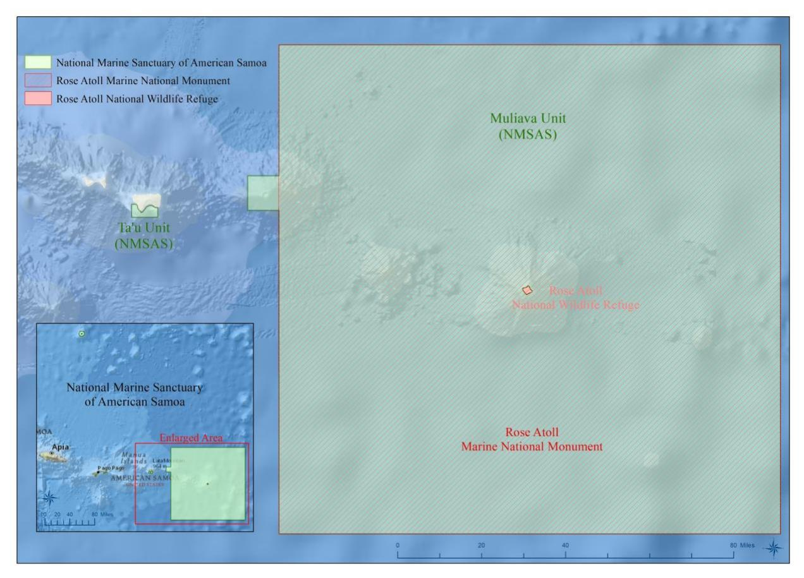

**Figure SS.20.** The Muliāva unit includes the marine waters of Rose Atoll Marine National Monument and the Vailulu'u Seamount. Image: Tony Reyer/NOAA

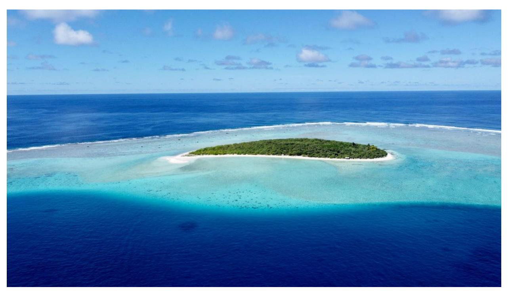

**Figure SS.21.** Aerial view of Rose Island, surrounded by a shallow sandy lagoon and deep reef slope on the outside of the lagoon. Photo: Tamiano Gurr/American Samoa Visitors Bureau

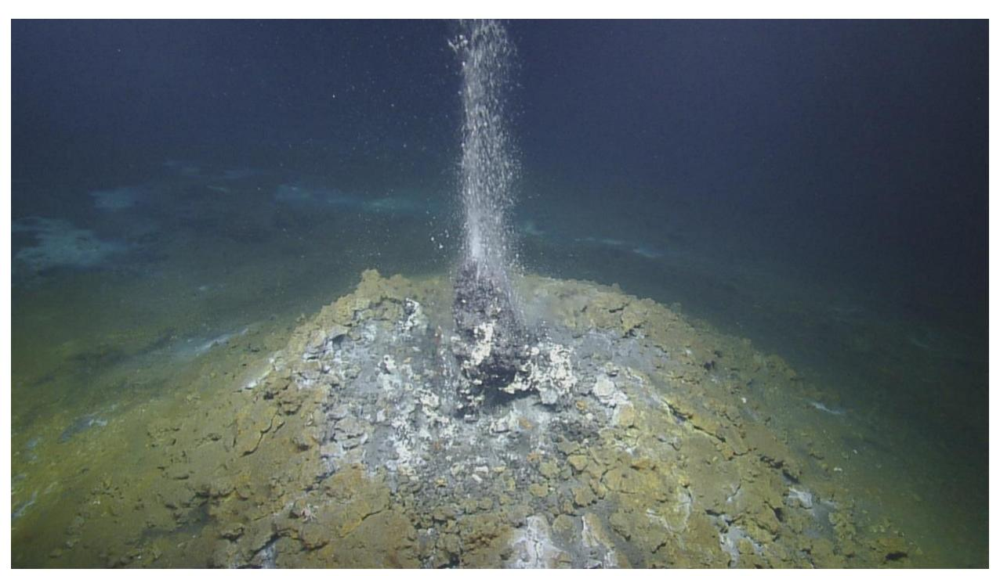

**Figure SS.22.** Gas bubbles rise from a hydrothermal vent at Vailulu'u Seamount, observed by Ocean Exploration Trust's E/V *Nautilus* in July 2019. Photo: Ocean Exploration Trust/NOAA

## **Drivers on the Sanctuary**

For the purposes of condition reports, drivers are defined as societal values, policies, and socioeconomic factors that influence different human uses of the ecosystem. Drivers can influence the condition, or state, of the environment, creating both negative results, considered pressures, and positive results that benefit the environment. Drivers can result in pressures that affect the condition, or state, of the environment. They help us understand the forces behind pressures and are the ultimate cause of anthropogenic changes in ecosystems. Further, drivers may be local, regional, national, or global in scale. Because the most influential drivers originate and operate at large geographic scales, this section begins with a broad focus on drivers, followed by a more locally focused discussion of pressures that directly affect water, habitat, living resources, and maritime heritage resources in National Marine Sanctuary of American Samoa (NMSAS). Trends in drivers and pressures support the assessment of these resources and can aid in forecasting the direction and influence of future pressures.

Pressures may be affected by one or more driving forces, which often affect multiple pressures. The most influential drivers of pressures at NMSAS are shown in Table DP.1 and are integrated into discussions of each pressure. Table DP.1 shows the relationships between drivers and pressures.

#### Drivers on the Sanctuary

**Table D.1.** Driving forces and their relationship to pressures that affect NMSAS resources. Bullets indicate a relationship between a given driver and pressure. Each cell with a bullet indicates that the driver in the row affects the corresponding pressure in the column. The geographic scales at which different drivers originate to affect pressures are also shown (G = global, N = national, R = regional, L = local). See text below for explanations of specific drivers and pressures.

|                                        |            | Pressures                            |             |                                                                                            |                                                         |                                                  |                          |                      |                |                                          |                                                                                |
|----------------------------------------|------------|--------------------------------------|-------------|--------------------------------------------------------------------------------------------|---------------------------------------------------------|--------------------------------------------------|--------------------------|----------------------|----------------|------------------------------------------|--------------------------------------------------------------------------------|
| Drivers                                | Scale      | Accelerated mate Change Cli | ng Fishi | ore ment on oastal Nearsh cti p onstru o Devel C and C | oint on ource olluti p on S P N | ource on olluti S nt P oi P | bris De ne Mari | Groundings Vessel | on Visitati | uisance Outbreaks pecies S N | (and ons) Research S A vities Operati S M N Acti |
| Government Relationships            | N, R, L    |                                      | •           | •                                                                                          | •                                                       | •                                                |                          |                      | •              |                                          | •                                                                              |
| Traditional Management              | L          |                                      | •           | •                                                                                          |                                                         |                                                  |                          |                      | •              |                                          | •                                                                              |
| Population                             | G, N, R, L | •                                    | •           | •                                                                                          | •                                                       | •                                                | •                        | •                    | •              | •                                        | •                                                                              |
| Per Capita Income                      | G, N, R, L | •                                    | •           | •                                                                                          | •                                                       | •                                                | •                        | •                    | •              | •                                        |                                                                                |
| Fuel Prices                            | G, N, R, L | •                                    | •           |                                                                                            |                                                         |                                                  | •                        | •                    | •              |                                          |                                                                                |
| Demand for Seafood                     | G, N, R, L | •                                    | •           |                                                                                            | •                                                       | •                                                | •                        | •                    | •              | •                                        |                                                                                |
| Technological Advancement           | G, N, R, L |                                      | •           |                                                                                            | •                                                       | •                                                | •                        | •                    |                |                                          |                                                                                |
| Societal Values/ Conservation Ethic | N, R, L    | •                                    | •           | •                                                                                          | •                                                       | •                                                | •                        |                      | •              | •                                        | •                                                                              |
| Ocean Policy                           | N, R, L    | •                                    | •           | •                                                                                          | •                                                       | •                                                | •                        |                      | •              | •                                        | •                                                                              |

Drivers operate at different, and sometimes multiple, scales, including global, national, regional, and local. Most affect demand for resources (e.g., government relationships, per capita income, fuel prices, etc.) and, thus, levels of activities (e.g., coastal development, fishing, visitation) that alter resource conditions. Some drivers, like the gross domestic product (GDP) of foreign countries, have global influence. Among other things, GDP affects global demand for seafood and commercial fishing pressure. Local drivers, on the other hand, are those that originate from and influence the NMSAS "local economy" (sometimes called the "study area" or "sanctuary economy"). This area is identified by first including villages adjacent to NMSAS boundaries, then working with NMSAS leadership to determine the spatial footprint of localized socioeconomic contributions stemming from the use of sanctuary resources. These contributions include income, jobs, and economic output, all of which respond to changes in resource conditions that are influenced by changing pressures.

Some drivers influence the supply of or access to resources. These stem mostly from management and policy actions, whether local, state, tribal, national, or international, and may increase or decrease the pressures on resources. Some, such as relationships established and dictated through treaties, create cooperative management approaches that can preempt pressures (e.g., cooperative fisheries management, preparation of oil spill response plans). Importantly, these drivers also exemplify a concept frequently expressed by Indigenous peoples, namely the reciprocal relationship between people and the environment. This originates from Indigenous peoples' sense of oneness with nature and emphasizes the mutual roles of both in supporting each other. Advocates of the modern conservation movement will recognize this as a foundational aspect of their efforts as well. In this way, both can be considered "positive" drivers.

It is important to consider NOAA and ONMS mandates as institutional drivers. Starting with federal agencies' basic obligation of public service, each employee has an oath-bound responsibility to the United States government and its citizens to display loyalty to the Constitution, laws, and ethical principles (5 C.F.R. § 2635.101). This includes fulfilling the responsibilities outlined in the National Marine Sanctuaries Act (16 U.S.C. § 1431), which:

"establishes areas of the marine environment [that] have special conservation, recreational, ecological, historical, cultural, archeological, scientific, educational, or esthetic qualities as national marine sanctuaries managed as the National Marine Sanctuary System will—(A) improve the conservation, understanding, management, and wise and sustainable use of marine resources; (B) enhance public awareness, understanding, and appreciation of the marine environment; and (C) maintain for future generations the habitat, and ecological services, of the natural assemblage of living resources that inhabit these areas."

This guiding language ensures that the National Marine Sanctuary System acts in a manner to improve conservation and management for generations to come.

NMSAS was expanded in response to the American Samoa governors Tauese Sunia and Togiola Tulafono committing to the goal of setting aside 20% of coral reef habitat within the territory for long-term protection. Additionally, Presidential Proclamation 8337 stated that "[t]he Secretary of Commerce shall initiate the process to add the marine areas of…[Rose Atoll Marine National

Monument] to…Fagatele Bay National Marine Sanctuary in accordance with the National Marine Sanctuaries Act" (74 Fed. Reg. 1577 [Jan 12, 2009]).

This section provides an overview of several key drivers; the discussion below is not an exhaustive list of all drivers affecting NMSAS.

## *Government Relationships*

Samoans are known as people who share a common language and a 3,000-year-old cultural code. A significant difference between Samoa and American Samoa is how the people are governed. Samoa is an independent nation with its head of state, while American Samoa is a self-governing territory of the U.S. American Samoans are classified as U.S. nationals rather than U.S. citizens.

American Samoa has an intergovernmental relationship with Samoa to collaborate effectively on shared environmental concerns. As part of a shared environmental agenda, the leaders of these two jurisdictions hold an annual forum to discuss areas of common interest (e.g., trade, health, education, communication and technology, fisheries, agriculture, food security, enforcement). This partnership allows both governments to collaborate and share information. This cooperation among peoples to ensure continued conservation, stewardship, and adaptation to environmental challenges may be considered a positive driver.

# *Traditional Management and Governance Structure of American Samoa*

The government of American Samoa is based on the United States party system, while honoring the Fa'a Samoa traditional village protocol, also known as the matai system (council of chiefs). This system is relevant at all levels of Samoan life—from the family, to the village, to the government. The matai (chiefs) are chosen by consensus of the fono (a group composed of matai) of the extended family and village(s) concerned. The matai and the fono decide on the distribution of family exchanges and the tenancy of communal lands; the majority of lands in American Samoa are communal. A matai can represent a small family group or a great extended family that reaches across islands and to both American Samoa and Samoa.

Fa'a Samoa, the Samoan way of life, emphasizes loyalty to family, respect for one's elders, and a commitment to serving the community, which is considered vitally important. For example, a seasonal village marine protected area may be guided and overseen by the council of chiefs. The village protected area is allowed to open for a short period to support village events or special occasions. The government is also informed of these arrangements and provides scientific and technical support, including data analysis. Since the local people control communal lands and waters, conservation and stewardship are entrusted with those who have an extended relationship with these areas across generations and space. This approach promotes more responsive and localized monitoring of the resources, promoting community well-being, continued cultural engagement, and environmental health of the sanctuary and surrounding waters.

## *Population and Per Capita Income*

International and domestic demand for goods and services at all scales, ranging from local to global, is directly tied to changes in population and real per capita income. It is and will remain a ubiquitous, primary driver of pressures on sanctuary resources. For example, as income or population increases, demand for goods like clothes, technology, and other consumer goods also increases. Because the majority of these goods are imported to American Samoa, higher demand for goods can increase vessel traffic. On the other hand, declines in income or population may have the opposite effect.

From 2010–2020, the population of American Samoa decreased by 10.5% from 55,519 to 49,710 people (U.S. Census Bureau, 2021). In 2010,2 annual per capita income in American Samoa was \$6,311 and the poverty rate was 57.8% (ASDOC, 2018). A relatively high poverty rate in a place with strong cultural linkages to ancestral practices may result in higher reliance on subsistence harvest to meet nutritional needs. If not managed sustainably, subsistence harvest could become a significant pressure on resources.

## *Fuel Prices*

Fuel prices are an important, and often immediate, driver of many ocean activities. Ocean users consider fuel prices in their decisions about whether to conduct activities like commercial fishing, buy and register boats for ocean recreation, or explore for offshore oil and gas (and in the longer term, install offshore renewable energy facilities). Figure DP.1 shows the average retail price for unleaded gasoline from 2007–2019 (ASDOC, 2018; ASDOC, 2019). Gasoline prices declined from 2014–2017, indicating that the cost of recreational and commercial activities within the sanctuary that utilize fuel were also likely declining. Lower activity cost may result in increased activities and thus pressure on sanctuary resources.

2 2020 per capita income and poverty rate data for American Samoa were not available at the time of publication.

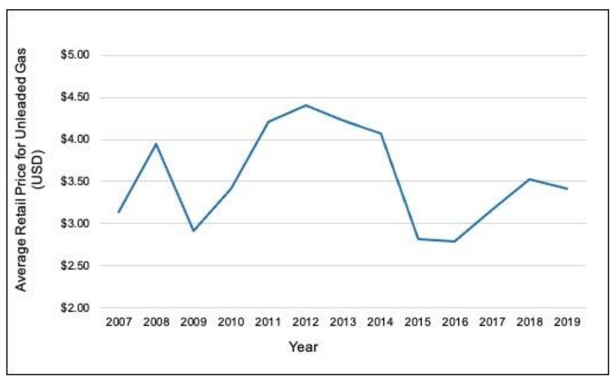

**Figure DP.1.** Average retail price for unleaded gasoline in American Samoa from 2007 to 2019. Source: ASDOC, 2018, 2019

## *Demand for Seafood*

As global and domestic demand for seafood grows, effective management of wild-caught fish and continued expansion of aquaculture will be required (NOAA Fisheries, 2020a). Yet, while these approaches are needed to meet demand, they may also lead to increased pressures on resources and ecosystems. While this section considers global and national demand, local and regional markets are likely to be affected and face increased pressures to meet global and national demands. Further, as prices fluctuate locally, this may change the willingness of commercial fishers to expend time and resources targeting specific species. For example, if the price of tuna increases while the price of surgeonfish stays the same, more effort may shift to harvesting tuna. For more information on harvest revenue and landings of species within NMSAS, see the Commercial Harvest section of this report.

The tuna canning industry plays a significant role in American Samoa's economy and trade. Processed tuna accounted for over 88% of exports to the United States from 1995 to 2018. The industry also provides direct and indirect benefits to transportation, warehousing, retail, wholesale, and construction industries and may offset the costs of shipping, transportation, and energy for the territory (U.S. Government Accountability Office, 2020). American Samoa's tuna canning industry faces multiple challenges, including increased competition and minimum wage increases, which led to cannery closures in 2018. The impact of the canneries completely closing would be significant, as canneries employ 14% of American Samoa's workforce (as of 2018; U.S. Government Accountability Office, 2020). Additionally, transportation, energy, and utility costs would rise because the canneries would no longer be available to share those costs.

## *Technological Advancement*

Technological advancement may be viewed as either a positive and negative driver depending on the technology and what it promotes. For example, requirements for seafloor mapping may act as a positive driver by increasing knowledge and awareness of sensitive habitats and refining our understanding of species distributions. Significant efforts to increase seafloor mapping in NMSAS by vessels, such as the NOAA Ship *Okeanos Explorer* and the E/V *Nautilus*, have taken place in the past decade. Seafloor mapping may identify previously unknown deposits of resources, which could increase pressures to extract those resources. Advancements in fishing technology in the past have increased harvests while decreasing the effort needed to catch fish. Improvements in fishing gear technology can also reduce bycatch of sensitive species. Advancements in autonomous vehicles have helped to estimate fish abundance to promote sustainable fishing while reducing risks to human health and fish (NOAA Fisheries, 2020b).

## *Societal Values and Practices*

Public access to beaches in American Samoa, and consequently the marine ecosystem, is under the purview of the village or individual families that reside adjacent to the water and public places. One must obtain permission or approval for access out of respect and courtesy. These families are the caretakers of these special places and help to maintain and safeguard them for current and future generations. This community-based approach to resource management helps to reduce pressures and identify changing conditions more rapidly.

The relationship between the peoples of Samoa and American Samoa may also provide a mix of positive and negative influences on drivers. This relationship exemplifies the longstanding connections between Samoa and American Samoa through trade of fish and the exportation of other foods based upon need (e.g., in response to tsunamis or other disasters). As a societal value, the desire to ensure food security across the region is a driver, as is the sharing of knowledge.

Another example of societal values that reduce fishing pressure is the belief that one does not play with their food. As such, participation in recreational activities on reefs is not common among native Samoans (Levine et al., 2016). In addition, NMSAS promotes awareness of allowable and responsible fishing practices within the sanctuary by bringing together and educating local fishing groups.

For places like American Samoa that have long-standing and vibrant Indigenous cultures, the associated cultural practices of communities are, collectively, a driver that may exert positive and/or negative impacts on resources. Religion significantly influences the Samoan way of life and society. Ceremonial events such as a church dedication or a death in the family may result in temporary pressures caused by more people fishing within the community. Most cultural practices in Indigenous cultures tend to reflect deep connections between people and the resources they depend on, and care is generally taken to moderate impacts while still respecting long-held traditions.

## *Ocean Policy*

The U.S. is party to numerous agreements that have established international entities composed of member governments that focus on various topics, ranging from managing shipping (International Maritime Organization), global whale stocks (International Whaling Commission), fisheries (Inter-American Tropical Tuna Commission, Western and Central Pacific Fisheries Commission, etc.), and oil spill response (Pacific Ocean Pollution Prevention Programme).

Since 2010, the United States has had an ocean policy, first through Executive Order 13547 (2010) and later replaced with Executive Order 13840 (2018). While the primary focus differs between these policies, both emphasize improving cross-agency coordination on management of the ocean and its resources, as well as access to data. Mapping the seafloor is a priority, as it will enhance navigation and development of the blue economy. Furthermore, a 2019 presidential memorandum set forth a strategy for mapping, exploring, and characterizing the U.S. EEZ through enhanced collaboration (86 Fed. Reg. 64699 [Nov 22, 2019]). The *American Samoa Ocean Plan* (Department of Port Administration, 2018) was an outcome of this executive order and includes the first spatial plan to be completed by the U.S. for its jurisdictions in the Pacific Ocean.

In 2009, President George W. Bush established Rose Atoll Marine National Monument through Presidential Proclamation 8337 (74 Fed. Reg. 1577 [Jan 12, 2009]). The proclamation banned commercial fishing within the monument, but does allow for limited subsistence and recreational fishing with a permit from NOAA Fisheries. This proclamation also directed the Secretary of Commerce to initiate the process to add the marine areas of the monument to Fagatele Bay National Marine Sanctuary. These areas became part of NMSAS 2012 and provide an example of ocean policy contributing to conservation and stewardship.

## **Pressures on Sanctuary Resources**

Human activities and natural processes affect the condition of natural, cultural, and maritime heritage resources in national marine sanctuaries. The following section discusses the nature and extent of the most prominent human influences upon NMSAS, including impacts from accelerated climate change, fishing, pollution, marine debris, vessel groundings, visitor use, scientific and management activities, and nuisance species outbreaks.

## *Accelerated Climate Change and Ocean Acidification*

Rising ocean temperatures associated with climate change were recognized as a pressure on coral reef ecosystems in Fagatele Bay in the 2007 condition report (National Marine Sanctuary Program, 2007). Ocean temperatures have continued to increase, and ocean acidification and stratification, increasing storm intensity, and rising sea levels are now known to affect marine ecosystems across the entire sanctuary. Pacific Islands are among the most vulnerable areas in the world to the predicted effects of climate change (Mimura et al., 2007; Howes et al., 2018).

### **Sea Surface Temperature**

Since the 1970s, sea surface temperatures in the Pacific Islands region have been increasing and are projected to continue increasing over the next century (Howes et al., 2018; Coral Reef Watch, 2021; Keener et al., 2021). Elevated water temperature is a well-known trigger for coral bleaching, a phenomenon where corals lose their colorful zooxanthellae, revealing their white skeleton in a process known as coral bleaching. Bleaching can be caused by short-term exposure (1–2 days) to temperature elevations of 3–4°C above ambient conditions, or by long-term exposure (weeks) to elevations of only 1–2°C. Depending on the severity of bleaching, zooxanthellae may repopulate and corals can survive. However, when high temperature stress occurs over extended periods, corals suffer high mortality, as observed during several mass bleaching events throughout the tropics (Glynn, 1984; Eakin et al., 2010; Eakin et al., 2019; Skirving et al., 2019). In American Samoa, mortality due to coral bleaching was documented in 1994 (Goreau & Hayes, 1994) and observed in 2002 and 2003 (Craig et al., 2005). Mass mortality of staghorn corals was documented at Airport Pools reef on Tutuila during a 2015 bleaching event (Department of Marine and Wildlife Resources, 2015; XL Catlin Seaview Survey, 2015; Figure DP.2). Since 2005, bleaching around Tutuila has been documented in shallow back reef pools nearly every summer, but until 2015 it had only caused minimal mortality (Fenner & Heron, 2009; Fenner, 2019). Widespread bleaching events were documented in 2015, 2017, and 2020 (Coward, et al., 2021; McCoy, et al., 2016; Vargas-Ángel et al., 2019; NMSAS, 2020b).

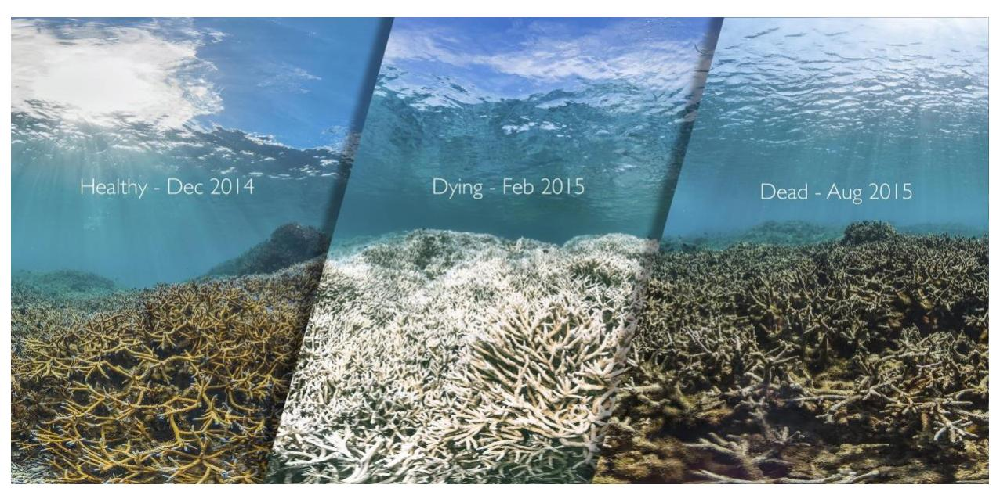

**Figure DP.2.** Time series of staghorn corals at Airport Pools reef on Tutuila during the 2015 coral bleaching event. Photos: Underwater Earth/XL Catlin Seaview Survey

### **Disease**

Epizootics are predicted to increase with climate warming (Harvell et al., 2002), and many coral diseases have been linked to increasing ocean temperatures (Randall & Van Woesik, 2015; Howells et al., 2020; Aeby et al., 2020). Even on a small scale, disease can alter community structure, reduce reproductive output, and decrease coral cover (Hughes, 1994; Kim & Harvell, 2004). Several diseases of corals and crustose coralline algae (CCA) have been documented in NMSAS. Coralline lethal orange disease, a bacterial infection that affects CCA (Littler & Littler, 1995), was found to be more prevalent in Fagatele Bay than in other sites examined around Tutuila (Aeby et al., 2008; Vargas-Ángel et al., 2019). A black fungal infection affecting CCA has also been reported in American Samoa (Littler & Littler, 1998). White syndrome, a general term used to describe coral disease lesions, is characterized by rapid tissue loss and a distinct lesion boundary between apparently healthy tissue and exposed white skeleton (Sussman et al., 2008) and is one of the most common coral diseases around Tutuila (Aeby et al., 2008). This disease can be very virulent and can result in acute tissue loss (Roff et al., 2011). *Acropora* table corals in American Samoa can display growth anomalies (hyperplasia) with distorted, tumor-like growths on the surface of the coral (Work et al., 2008a). This disease affects numerous table corals in Fagatele Bay. Over 35 coral diseases may be present in American Samoa, but many have not been fully investigated (Fenner, 2013a). A possible cyanobacterial disease has recently been reported in Ofu Pools (Manu'a islands), but appears to progress slowly and be influenced by temperature (D. Fenner/NOAA, personal communication, 2019; K. Nalasere, personal communication, February 24, 2021).

### **Ocean Acidification**

Corals and other calcifying organisms, including certain types of phytoplankton, coralline algae, crustaceans, mollusks, echinoderms, and other taxa, are threatened by ocean acidification,

which results in a reduction of the pH of ocean water due to uptake of increased atmospheric carbon dioxide (Caldeira & Wickett, 2003). Acidified waters compromise calcium carbonate accretion and therefore directly affect the ability of these organisms to secrete their calcareous skeletal structures (Orr et al., 2005; Fabry et al., 2008). Aragonite saturation state is directly linked to this process and is an important metric for assessing ocean acidification on coral reefs. Calcium carbonate accretion (i.e., coral calcification) declines at aragonite saturation values below 3.3 (Hoegh-Guldberg et al., 2007). In 2018, NOAA's Pacific Islands Fisheries Science Center (PIFSC) Ecosystem Services Division (ESD) reported near-optimum aragonite saturation states across the American Samoa archipelago (Vargas-Ángel et al., 2019). However, ocean acidification scenarios predict detrimental conditions for calcifying organisms that could lead to widespread changes in marine ecosystems (Orr et al., 2005; Hoegh-Guldberg et al., 2007; Fabry et al., 2008). Ocean acidification does not just affect calcifying organisms. Lowered pH may alter the behavior of larval fish and invertebrates, influence settlement success due to changes in suitable settlement substrate, and alter larval development and/or energy budgets (Espinel-Velasco et al., 2018).

### **Shifting Processes**

Rising temperatures are also shifting oceanographic processes that control ocean currents and mixing at both local and global scales. One potential impact is water column stratification. As surface temperatures increase and the ocean absorbs more heat energy, the upper layers warm more quickly and create sheets of warm water that reduce mixing between layers and block cycling of oxygen, carbon, nutrients, and heat within the water column. Stratification has increased globally by 5.3% since 1960 (Li et al., 2020). Most of the increase (~71%) occurred in the upper 200 m of the ocean and was largely influenced by temperature changes (>90%).

## **Salinity**

Salinity changes may play an important role at local scales. Ocean regions are connected by large thermohaline currents that transfer oxygen and nutrients from the poles toward the equator. American Samoa lies within the Pacific meridional overturning circulation (PMOC). North of American Samoa, the geological feature known as the Samoan Passage is an important conduit and mixing zone for these currents that move from Antarctica to the North Pacific (Roemmich et al., 1996; Voet et al., 2015). Recent studies have indicated that the PMOC is changing both in strength and temperature as surplus heat associated with climate change is reaching the deep ocean. Voet et al. (2016) assessed the abyssal flow through the Samoan Passage in 2012–2013. Over the past two decades, volume transport decreased by about 0.6 Sv (10%), and water temperature increased by 0.001°C/yr. This is consistent with numerical simulations that demonstrate the possibility of a slowing meridional overturning circulation due to climate change (Schmittner et al., 2005). It is unknown if this shift is already affecting deep-sea communities, but it could have significant implications for deep-sea habitats throughout NMSAS and the broader region in the coming years.

## **Cyclones**

American Samoa is susceptible to tropical cyclones during the austral (southern) summer from November to April. In 1990, 1991, 2004, 2005, and 2018, cyclones caused damage to coral reefs in American Samoa (Figure DP.3). Impacts included large amounts of coral rubble and redistributed sediments in shallow water in affected areas. As a result of climate change, storms are predicted to decrease in frequency, but increase in intensity (Howes et al., 2018; Knutson et al., 2020; Keener et al., 2021), providing an additional challenge to maintaining high coral cover in the future. In addition, rainfall is expected to increase by up to 10%, particularly during episodic heavy rain events such as cyclones and monsoons (ONMS, 2020a). These processes are infrequent and influenced by a number of factors including the El Niño Southern Oscillation (ENSO) and other complex ocean-atmospheric interactions, so it is difficult to determine if these have been affected by climate change. Fifty-three tropical cyclones have passed within 370 km of Tutuila since 1959 (Office for Coastal Management [OCM], 2020).

### *Impacts to Heritage Resources*

While only a few tangible heritage properties have been located within NMSAS boundaries, intangible heritage resources, including practices, traditions, belief systems, and Samoan knowledge related to the marine environment, exist within the sanctuary. These practices are threatened by climate change impacts, including ocean acidification, sea level rise, increased water temperatures, and increased storm intensity. Threats to culturally valued species (e.g., corals, fish, and invertebrates) from changing environmental conditions may negatively impact community valuation of offshore areas and the local environment, while more intense storm activity has the potential to affect human on-water activities such as boating, fishing, or gathering.

Cultural heritage and sense of place are intertwined; social roles and customs rely on strong attachments to specific locations. Climate change threatens these attachments in many ways, including direct destruction of coastal sites, weakening of social bonds as people relocate to avoid climate impacts, and loss of traditions as coastal access and resources change (Peau et al., 2022). The fautasi (Samoan long boat) race held on flag day in April, for example, may be threatened by more intense storms, as boats are vulnerable to cyclone impacts. Novel weather patterns and altered seasonality as a whole present similar concerns, as they may alter or limit pre-existing practices such as the timing of cultural events, such as akule (bigeye scad, *Selar crumenophthalmus*) fishing or the palolo (epitokes of the worm *Palola viridis)* harvest, or the ability to apply traditional knowledge and skill sets to localized resource management (McMillen et al., 2014). Further identification and documentation of intangible heritage resources will provide a better understanding of the impact of climate change to these resources.

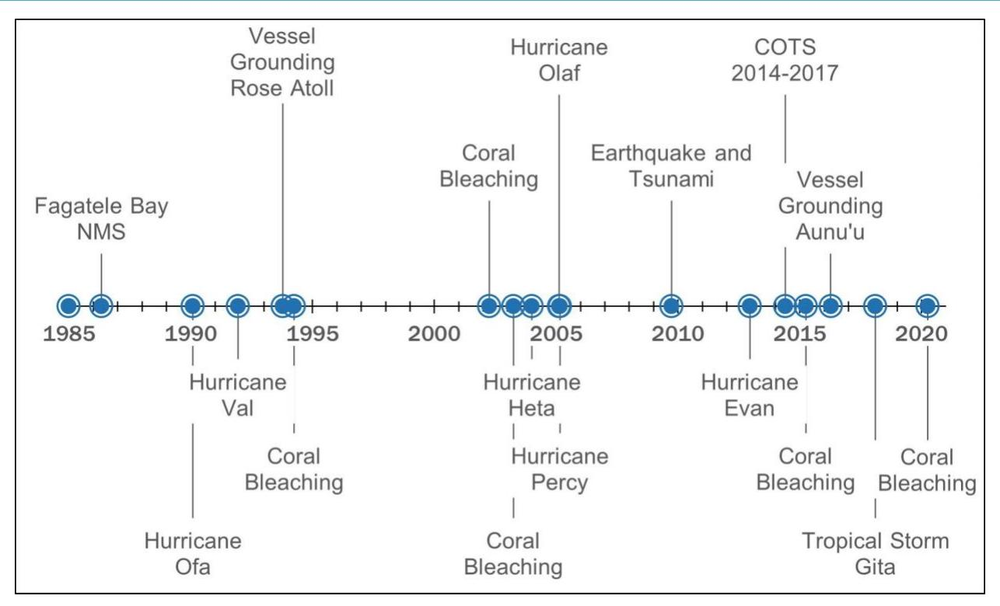

**Figure DP.3.** Timeline of major disturbance events that affected the condition of natural, cultural, or maritime heritage resources from 1985–2020. Image: NOAA

## *Fishing*

Worldwide, there is heavy pressure on fish assemblages from fishery activities, and assessments have demonstrated declines in reef fish abundance across the Pacific Islands (McCoy et al., 2018). These results suggest that the current level of harvest of reef fish and invertebrates is unsustainable in many locations (Secretariat of the Pacific Community [SPC], 2013). Assessment of the U.S. Pacific Islands indicated that reefs in American Samoa had only a quarter of the fish biomass observed in remote areas (Williams et al., 2011) and that reef fish populations in all islands, except for Swains, are well below the biological potential for these systems (Williams et al., 2015). Destructive fishing methods, including explosives and chemicals, that affect corals and non-target species are also a concern. Possible fishing with explosives has occurred in Fagatele Bay as recently as 2004 (National Marine Sanctuary Program, 2007). Although there has been no recent evidence of this practice, damage to the reef structure is still visible. Anchoring boats within fishing areas can also cause mechanical damage to reefs. Evidence of anchor damage, in the form of numerous flipped tabletop corals, was found on towboard surveys along southwest Aunu'u bank and Nafanua bank in 2014 (J. Paulin/NOAA, personal communication, 2022). Anchor damage and two illegal moorings have also been found in Fagatele Bay (J. Paulin/NOAA, personal communication, 2022).

A 2019 assessment of the Bottomfish Management Unit Species complex in American Samoa determined that the area is in an overfished state (Langseth et al., 2019). This includes shallow coral reef fish species such as bluestripe snapper (*Lutjanus kasmira),* green jobfish *(Aprion virescens),* yellow-edged lyretail *(Variola louti),* black jack *(Caranx lugubris),* and spotcheek

emperor *(Lethrinus rubrioperculatus),* as well as deeper species, including deep-water snappers (*Etelis coruscans* and *E. carbunculus)*. Pelagic resources appear to be more resilient to fishing pressure, but it is unclear how climate change may affect pelagic species distributions across the region (SPC, 2013).

Fishing is prohibited in Fagatele Bay and limited in Aunu'u Zone B and Muliāva; however, direct observation and enforcement of fishing activity in these areas is difficult. Fishing may quickly reduce the population of target reef fish species in constrained bays like Fagatele Bay and remote sites like Rose Atoll with limited fish recruitment. Several large species of reef fishes, characteristic of unfished reefs in the Indo-Pacific region, are conspicuously absent or small in size in Fagatele Bay and found in lower abundance at Rose Atoll than what oceanographic and habitat conditions would predict (Williams et al., 2015). These include species such as humphead wrasse (*Cheilinus undulatus*), sharks, and large species of grouper and parrotfish, all of which are known to be particularly vulnerable to fishing pressure.

## *Coastal Development and Nearshore Construction*

Due to the islands' small size, all terrestrial areas within American Samoa are considered "coastal." Development can significantly affect coastal habitats because of the small watershed size and short distances from ridge to reef. On Tutuila, developed areas increased by 5.8% from 2004–2010, despite a decline in population during this period (OCM, 2021). Additional development has taken place since 2010, but has not been quantified. Due to rising sea levels, many coastal areas have been armored with seawalls to protect valuable infrastructure and homes. In some areas, coastal protection structures have resulted in the loss of coastal and marine habitat, including benthic organisms, and ecological function associated with these habitats. This may, in turn, reduce larval connectivity through habitat fragmentation and the loss of brood stock (Hughes et al., 2005). Coastal armoring also disrupts the movement of sand and beach development which may affect both terrestrial and marine resources. Ongoing development and coastal armoring have reduced nesting habitat for sea turtles in Tutuila and Manu'a and may impair the recovery of sea turtles in the region (Tuato'o-Bartley et al., 1993; Saili, 2005). Based on data collected from 2007–2013, Seminoff et al. (2015) estimated that 105 green sea turtles nest at Rose Atoll, 23 nest at Swains Island, but only three nest in Tutuila. As of 2020, the only new development directly adjacent to NMSAS waters was a small seawall built on the south side of Aunu'u. It was built by the village from available debris following storm waves that inundated the Aunu'u power plant in 2019.

Agriculture in American Samoa is still largely at subsistence scale with mostly traditional staple food crops, chickens, and pigs. With shifting land use patterns, American Samoa is likely to experience increased agricultural development, including the land surrounding NMSAS units. Such development may threaten water quality, habitat integrity, and the biological health of the reefs, particularly if fertilizer and pesticide use and erosion are not controlled. Heavy sedimentation is currently not a problem in sanctuary units, but this could change with increasing coastal development and agricultural demand.

## *Nonpoint Source Pollution*

Land-based sources of pollution, including nutrients, sedimentation, and chemical contaminants, are major threats to coral reefs worldwide and can promote algae growth, cause stress to corals, and increase the likelihood of disease and bleaching (Vega-Thurber et al., 2014). Pollutants can be an issue in American Samoa, primarily in areas adjacent to populated coastal areas and industries (Houk et al., 2005). All NMSAS units are remote and not near highly populated coastal areas. However, pollutants could drift into the sanctuary and affect the condition of resources.

Human sewage/cesspool outflows, runoff of agricultural fertilizers, and animal waste (e.g., from piggeries) can increase loading of nutrients, primarily nitrogen and phosphorus, in nearshore waters. Nutrient inputs from surface runoff and submarine groundwater discharge contribute to eutrophication and algal blooms, which can hinder coral growth or recovery following disturbance (D'Angelo & Wiedenmann, 2014). Nutrients are also implicated in promoting crown-of-thorns sea star (CoTS; *Acanthaster planci* or alamea in Samoan) outbreaks (Brodie et al., 2005; Fabricius et al., 2010). Available data indicate that nutrient levels in sanctuary units are below recommended thresholds, but in Fagatele Bay, there is evidence nutrient input may be increasing, likely due to the presence of a landfill and increased agriculture in the surrounding watershed.

The Fagatele Bay and Fagalua/Fogama'a sanctuary units lie within one mile of the main landfill for the island of Tutuila. Although separated from Fagatele Bay by the high ridge that surrounds the bay, the Futiga landfill is unlined and contaminants such as heavy metals, petrochemicals, and pharmaceuticals may leach into groundwater that flows into the bay through ocean seeps. Heavy metals, hydrocarbons, pesticides, and pharmaceuticals were detected in low levels in water and sediment in Fagatele Bay in 2019 (Whitall et al., 2022). Aunu'u and Ta'u have their own landfills, but these are smaller.

## *Point Source Pollution*

Point source pollution originates from single, identifiable sources from which pollutants are discharged, such as a stream mouth. NMSAS units are far from major pollution sources, including the large sewage and cannery outfalls on Tutuila, but there are small pollution sources in the Aunu'u and Muliāva units. For instance, the sewage outfall in Aunu'u discharges in shallow waters just outside the reef margin and may be a source of contamination, but the chemical composition of the effluent is unknown and no testing has been conducted. The discharge zone is highly mixed and accumulation is unlikely. In Muliāva, there may be waste, ballast, and bilge discharges from ships transiting in or near the area.

## *Marine Debris*

Trash in its many forms has long been a problem on the shorelines and coastal waters of American Samoa, especially plastic trash, which persists and accumulates in the environment. Another problem is derelict fishing gear, which snags on reefs and can entangle marine mammals and turtles. Marine debris has a comparatively lower presence underwater in NMSAS, but it does accumulate on adjacent shorelines in some locations. The Fagalua/Fogama'a unit has persistent accumulation of both ocean- and shore-based debris, including abandoned fishing gear and discarded trash left by visitors. Recent deep-sea exploration cruises noted significant accumulations of marine debris in the deep sea near Tutuila, but presence was low in sanctuary units (Amon et al., 2020). The potential environmental impact of microplastics—plastic debris that breaks down in the marine environment—has become a growing concern worldwide (Cole et al., 2011; Wright et al., 2013; Huang et al., 2021). The extent to which microplastics are a concern in American Samoa and whether food fish are negatively impacted through trophic accumulation is currently known.

## *Vessel Groundings*

Ship groundings on coral reefs can cause extensive physical damage to the reef structure and can release toxic petrochemicals and harmful cargo, killing reef organisms. Any wreckage left on the reef can continue to cause physical damage and may release iron into nearby waters. Iron inputs are thought to be especially damaging on atolls, because unlike high volcanic islands, these systems do not have natural inputs of iron. Iron can contribute to blooms of cyanobacteria on the already damaged reef, preventing recovery of corals and other reef organisms, turning them into "black reefs" (Kelly et al., 2012). Other unanticipated consequences can occur, such as the corallimorph outbreak on Palmyra Atoll following a ship grounding in 1991 (Work et al., 2008b).

On Rose Atoll, the grounding of a 135-ft Taiwanese long-line tuna-fishing vessel in October 1993 released diesel lube oil into refuge waters. Prevailing currents carried these contaminants across the reef flat and into the lagoon, killing invertebrates and algae. The grounding itself physically damaged the reef when the ship hit the upper portion of the outer reef slope and moved across the reef before coming to rest (Green et al., 1997). Extensive removal efforts were undertaken over many years by the U.S. Fish and Wildlife Service, but some iron debris remains. Subsequent monitoring and assessment studies indicate that the reef has suffered ongoing injury due to the release of iron from the decaying ship debris (Schroeder et al., 2008). In April 2016, the 62-ft F/V *No.1 JiHyun* lost its main engines and grounded off the west side of Aunu'u Island in the Multiple Use Zone. This area is of ecological and cultural significance for the local residents and is considered an important location for fishing and gleaning. After a number of unsuccessful attempts, the vessel was removed in August 2016. The grounding impaired 4,250 km2 of reef habitat, leaving a large rubble field with low complexity and rugosity that has not recovered (Symons et al., 2017).

## *Visitation*

There is relatively little tourism in American Samoa and it is likely to be some years before the territory enters the mainstream of South Pacific tourism. Due to the remote location of NMSAS units, even on the main island of Tutuila, visitation numbers are low compared to other South Pacific island destinations. For example, in 2017, 5,579 tourists arrived in American Samoa (ASDOC, 2018); in contrast, 869,000 and 199,000 total visitors arrived in Fiji and Papua New Guinea, respectively, in the same year (Cheer et al., 2018). Access to Fagatele Bay is limited, as the adjacent land is privately owned and requires a small fee for access. However, Fagatele Bay is visited by eco tours associated with cruise ship visits. The beach at Fogama'a is becoming

more popular with local residents and visitors and is used for both day access and overnight camping. However, visitor numbers remain fairly low (<20 people on busy days). The Aunu'u and Ta'u units are used by local residents, but are not currently significant tourist destinations. There are no maintained trails to reach the Ta'u unit, so access by land is limited. Swains Island and Rose Atoll are occasionally visited by researchers but are not readily accessible to tourists.

There are few locally owned pleasure or charter boats. Local alia (fishing vessels based on traditional design) and sportfishing boats visit the Fagalua/Fogama'a, Aunu'u Multiple Use Zone, and Ta'u units to engage in fishing activities, including bottom fishing and spearfishing. Sportfishing for pelagic tuna, masimasi, and marlin is popular, and occasional fishing tournaments are held. The Aunu'u and Ta'u units are visited for pelagic fishing, but most pelagic fishing activity takes place in offshore waters outside sanctuary units. There are currently two commercial scuba diving operations in American Samoa, but recreational diving is infrequent due to lack of demand. Yachts occasionally enter Pago Pago Harbor to buy provisions and find shelter during the cyclone season and may visit the sanctuary units, but the sanctuary's anchoring prohibitions and lack of mooring buoys make this difficult for yacht operators.

Potential impacts to NMSAS units due to visitation include unregulated fishing, illegal collection of invertebrates, and damage to the reef from boat anchors and walking on the reef flat.

## *Nuisance Species Outbreaks*

American Samoa has not identified any significant marine invasive species threats, but there are a number of species that experience outbreaks that are detrimental to ecosystem health. These include CoTS, a tunicate (*Diplosoma similis*), and a green bubble algae (*Valonia fasciculata*).

The most serious of these is CoTS, which are coral-eating echinoderms whose populations periodically increase to outbreak levels and cause widespread coral mortality. CoTS are a natural component of Indo-Pacific coral reef ecosystems. Under normal conditions, CoTS prefer fast growing coral species (e.g., *Acropora* and *Montipora*; Pratchett, 2007) and may open up space for slower growing coral species (e.g., *Porites*) to recruit. As long as disturbances are infrequent, new coral recruitment and growth will replace the damage caused by the sea star. At outbreak levels, however, CoTS can have severe impacts on reef ecosystems (Pratchett et al., 2014).

CoTS eat the soft tissues of corals, often killing the coral colony, and each sea star consumes 13 to 134 km2 of coral each year (Dixon, 1996). In the late 1970s, a major outbreak of CoTS around Tutuila destroyed 80–90% of corals in Fagatele Bay (Birkeland et al., 1987). This severe and destructive event in one of the most pristine and coral-rich bays in American Samoa propelled the designation of Fagatele Bay as a national marine sanctuary, which would promote the future designation of NMSAS and its protection as a special place. More recently, another CoTS outbreak in 2014–2017 threatened corals around the island of Tutuila.

There is increasing evidence that overfishing of CoTS natural predators and eutrophication associated with land based sources of pollution contributes to the increased frequency of outbreaks throughout the Pacific (Brodie et al., 2005; Fabricius et al., 2010; Cowan et al., 2017, 2020; Pratchett et al., 2021). Management agencies across the Pacific, including NMSAS and the

#### Pressures on Sanctuary Resources

National Park of American Samoa, are increasingly taking direct action, such as physical removal or injections, to reduce problematic populations of CoTS.

In 2008, the tunicate *Diplosoma similis* was observed overgrowing live coral and benthic substrate along the north-northwest side of Swains Island (Vargas-Ángel et al., 2009). This raised concern about a potential shift in the reef habitat, but the outbreak subsided by 2010. More recently, the American Samoa Coral Reef Advisory Group and the National Park of American Samoa have been following an outbreak of the green bubble algae *Valonia fastigiata* in the Ofu pools. This algae has spread from a small patch to an extensive area and is now overgrowing corals in the area. No outbreaks have been reported in NMSAS. Corallivorous snails (*Drupella* and *Coralliophila* spp.) can also form smaller outbreaks and impact corals (Cumming, 2009; Hamman, 2018). Managers are concerned that shifts in land-based sources of pollution and changes in ocean conditions related to climate change may increase outbreaks or introduce invasive species.

## *Research Activities*

The NMSAS science program is growing and research is encouraged within sanctuary units. Projects often require the installation of scientific instruments, markers, or buoys. This has included the placement of two oceanographic buoys (a Moored Autonomous Partial Pressure of Carbon Dioxide [MAPCO2] buoy in Fagatele Bay and a wave buoy in the Aunu'u Research Zone), a climate station in Fagatele Bay with oceanographic instruments and settlement structures, an ecological acoustic recorder in Fagatele Bay, monitoring markers, and contaminant and sediment monitoring devices. NMSAS evaluated the value of each project and worked with the researchers to minimize impacts to sanctuary resources. Although there is a potential for impacts, no significant damage due to research activities has been observed.

This section provides summaries of resource status and trends within four areas: water quality, habitat, living resources, and maritime heritage resources. Virtual workshops were convened with subject matter experts from August to November 2020 to discuss and evaluate a series of questions about each resource area. It is important to note that, in general, the assessments of status and trends in National Marine Sanctuary of American Samoa (NMSAS) are for the period from 2007–2020. However, in some cases, data series extend into 2021. Answers for each question are supported by data and the rationale is provided at the end of each section for each resource area. Where published or additional information exists, the reader is provided with appropriate references. Workshop discussions and ratings were based on data available at the time (e.g., through 2020). However, in some instances, sanctuary staff later incorporated newly available data in order to more accurately describe the current status and trends of resources. Situations where data were used by sanctuary staff to support a rating, but were not presented or discussed during the workshop, are noted in the text. More information about each question can be found in Appendix A and additional information about the methods used to complete the assessments can be found in Appendix D.

## *Water Quality (Questions 1–5)*

The following is an assessment of the status and trends of water quality indicators in NMSAS from 2007–2020.

Question 1 focuses on eutrophication and its impacts on sanctuary resources. Eutrophication is usually caused by an excess amount of nutrients (primarily nitrogen and phosphorus) entering the ocean and leading to an increase in the growth of algae, including microalgae (phytoplankton), macroalgae (seaweed), and filamentous algae (turf).

Question 2 focuses on parameters affecting public health. Human health concerns can arise from water, beach, and/or seafood contamination (bacteria or chemical).

Question 3 focuses on shifts in water quality due to climate drivers. Climate indicators include water temperature, ocean acidification and calcification rates, and sea level rise. Increases in water temperature cause coral bleaching and increased susceptibility to disease. Acidification can affect organism survival, growth, and reproduction. Sea level rise causes increased erosion.

Question 4 assesses other biotic and abiotic stressors, individually or in combination, that may influence sanctuary water quality, but were not addressed in the above questions, such as turbidity and iron pollution from ship groundings.

Human activities that adversely impact water quality are the focus of Question 5. These include terrestrial point source discharges, commercial and recreational vessel-based activities, and coastal development.

## **Question 1: What is the eutrophic condition of sanctuary waters and how is it changing?**

**Status Description:** Eutrophication has not been documented, or does not appear to have the potential to negatively affect ecological integrity.

**Rationale:** Data on eutrophication are limited, but available data suggest that nitrogen, phosphorus, and chlorophyll *a* concentrations remain below recommended threshold levels in sanctuary waters. However, dissolved inorganic nitrogen may be increasing in Fagatele Bay based on the most recent data. Macroalgae cover was evaluated as a proxy for nutrients and has been variable over the reporting period, but remains low overall within sanctuary units.

**Question 1 Indicator Table.** Summaries for the key indicators related to eutrophication that were

| Indicator     | Habitat                                                                                                                                                                                                                        | Source                                                                                                                                                                                                 | Summary                                                                                                                                                                                                                                                                                                                                                                                                                                                                                                                                                                                                     |
|---------------|--------------------------------------------------------------------------------------------------------------------------------------------------------------------------------------------------------------------------------|--------------------------------------------------------------------------------------------------------------------------------------------------------------------------------------------------------|-------------------------------------------------------------------------------------------------------------------------------------------------------------------------------------------------------------------------------------------------------------------------------------------------------------------------------------------------------------------------------------------------------------------------------------------------------------------------------------------------------------------------------------------------------------------------------------------------------------|
| Nutrients     | Nearshore habitats                                                                                                                                                                                                          | Comeros Raynal et al., 2017, 2019; Whitall et al., 2022; Comeros Raynal et al., 2021; Shuler & Comeros Raynal, 2020; Coral Reef Ecosystem Division (CRED), 2010 | Sampling has been limited, but all samples taken during the reporting period met the American Samoa Environmental Protection Agency (AS-EPA) water quality standard levels ("median not to exceed"). In 2019, DIN in a set of water samples from Fagatele Bay approached the recommended maximum threshold value (Whitall et al., 2022), though previous samples indicated much lower levels. Recent modeling suggests that Fagatele Bay and Fagalua/Fogama'a should have low nutrient loading (Shuler & Comeros-Raynal, 2020). The other units were last sampled in 2010. |
|               | Pelagic                                                                                                                                                                                                                        |                                                                                                                                                                                                        | No nutrient data were available for pelagic waters.                                                                                                                                                                                                                                                                                                                                                                                                                                                                                                                                                         |
|               | Mesophotic coral ecosystems (MCEs)                                                                                                                                                                                    |                                                                                                                                                                                                        | No nutrient data were available for MCEs.                                                                                                                                                                                                                                                                                                                                                                                                                                                                                                                                                                   |
| Chlorophyll a | Nearshore Pacific Marine habitats Environmental Laboratory (PMEL), 2020; Sutton & Pacific Islands Ocean Observing System (PacIOOS), 2022; Ecosystem Sciences Division (ESD), 2020 |                                                                                                                                                                                                        | Automated sampling of chlorophyll a in Fagatele Bay suggests that levels are variable, but consistently below recommended levels for open ocean waters (PMEL, 2020; Sutton & PacIOOS, 2022). The other units were last sampled in 2010. Chlorophyll a was low at all sites, but approached AS-EPA water quality limits in Ta'u (ESD, 2020).                                                                                                                                                                                                                                      |
|               | Pelagic habitats                                                                                                                                                                                                            | NOAA Center for Satellite Applications and Research, 2022a, 2022b                                                                                                                          | Satellite data indicate that chlorophyll a levels are low (0.03–1 mg m3 ) across the territory and have low seasonal variation.                                                                                                                                                                                                                                                                                                                                                                                                                                                                 |
| Macroalgae    | Nearshore habitats                                                                                                                                                                                                          | Marine Applied Research Center (MARC), 2020; Fenner, 2013b; Vargas Ángel et al., 2019                                                                                                | Local and federal monitoring programs have recorded low (<10%) macroalgae abundances across all sanctuary units throughout the reporting period.                                                                                                                                                                                                                                                                                                                                                                                                                                                      |

| Indicator | Habitat | Source               | Summary                                                                                                                                                                                                       |
|-----------|---------|----------------------|---------------------------------------------------------------------------------------------------------------------------------------------------------------------------------------------------------------|
|           | MCE     | Bare et al., 2010 | Benthic camera tows along the Tutuila insular shelf in 2002, 2004, and 2008 indicated that macroalgae is low in the upper and lower mesophotic zones, but higher (15–20%) in the 50–79 m depth zone. |

Quantitative data on eutrophication within NMSAS boundaries are limited. Data collection has been intermittent and focused on nearshore habitats, particularly streams, sandy shores, and coral reefs. Fagatele Bay is the exception; its designation as a "pristine" watershed by the American Samoa Environmental Protection Agency (AS-EPA) made it an ideal control site for studies throughout the reporting period. Data for pelagic areas are limited to satellite-derived datasets and no recent data are available for mesophotic and deep-sea habitats.

Recent modeling efforts suggest that DIN loading in Fagatele Bay and Fagalua/Fogama'a units are likely low compared to other coastal areas in Tutuila (Shuler & Comeros-Raynal, 2020). Fagatele Bay had the lowest nutrient concentration out of 28 watersheds sampled by Comeros-Raynal et al. (2017, 2019) throughout Tutuila. Fagalua/Fogama'a, Aunu'u, Ta'u, Rose Atoll, and Swains Island were not included in the analysis. Overall, nutrient levels were below the AS-EPA water quality standard for embayments ("median not to exceed"), but recent nutrient measurements in Fagatele Bay were higher than previous studies, suggesting either fluctuating or increasing nutrient levels in the bay from land-based sources or perhaps other sources, such as submarine groundwater discharge (Whitall et al., 2022; Comeros-Raynal et al., 2021; Figure S.WQ.1.1). Workshop experts noted that discharge from the landfill and agricultural activities in the nearby watershed may be influencing nutrient dynamics within both Fagatele Bay and Fagalua/Fogama'a units and recommended continued monitoring of nutrients in these units. The high proportion of nitrate in DIN measurements from Fagatele Bay suggests these are possible sources of nitrogen enrichment. In 2010, NOAA's National Marine Fisheries Service (NMFS) collected and analyzed water samples from coral reef habitats around all of the islands in American Samoa (ESD, 2020). The results indicated that phosphate, nitrate, nitrite, and total nitrogen across all islands of American Samoa were below AS-EPA-recommended levels for open ocean waters (Figure S.WQ.1.2). However, these samples were limited to one point in time and no recent data are available, therefore it is not possible to determine any trends in open ocean nutrient levels.

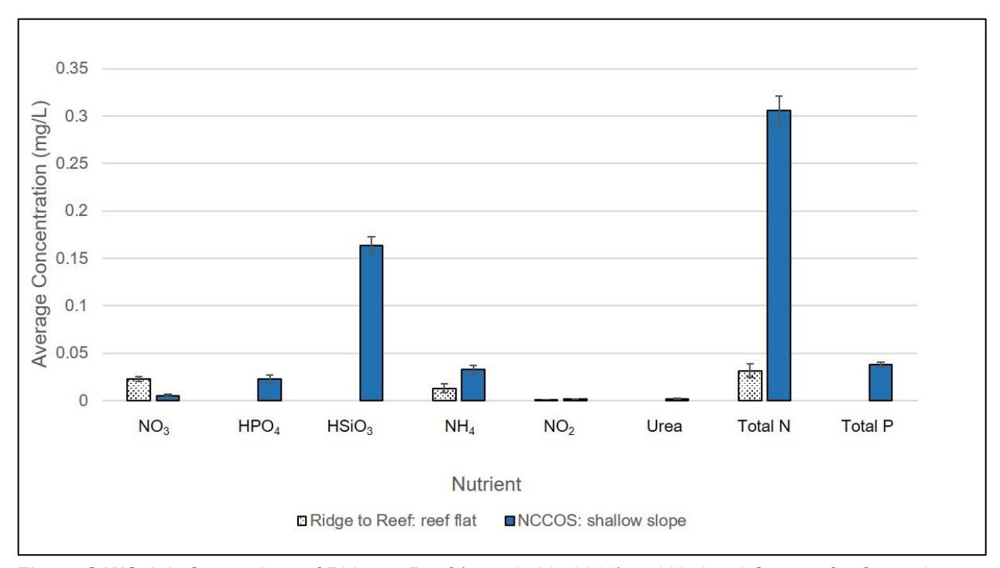

**Figure S.WQ.1.1.** Comparison of Ridge to Reef (sampled in 2016) and National Centers for Coastal Ocean Science (NCCOS; sampled in 2019) nutrient data for Fagatele Bay (average +/- standard error [SE]). The R2R study did not evaluate HPO4, HSiO3, Urea, or total P. Source: Whitall et al., 2022; Comeros-Raynal et al., 2021

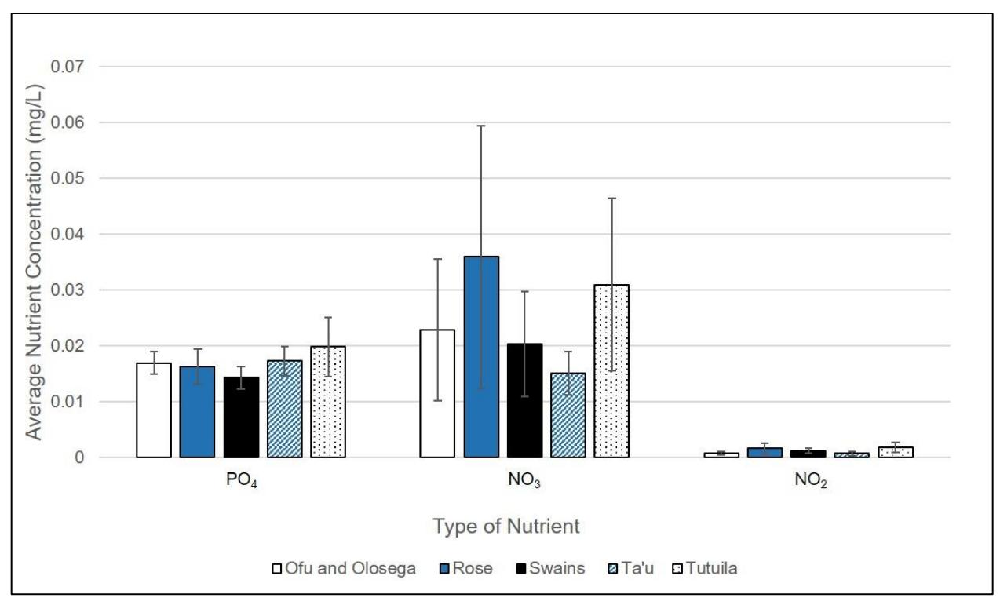

**Figure S.WQ.1.2.** Nutrient data collected in 2010 around all islands in American Samoa. Data have been converted to mg/L (average +/- standard deviation [SD]) to compare with AS-EPA standards. Source: ESD, 2020

Chlorophyll *a* is a useful indicator of eutrophication, as it measures the amount of primary production in the water column. Data on chlorophyll *a* concentrations in sanctuary units are sparse for most of the reporting period, so no trend data are available. Data from grab samples in 2010 and 2012 indicated that chlorophyll *a* levels were within the AS-EPA water quality standards for open coastal waters (ESD, 2020; Tuitele et al., 2018; Figure S.WQ.1.3). Since May 2019, chlorophyll *a* has been measured consistently by a sensor on the Moored Autonomous Partial Pressure of Carbon Dioxide (MAPCO2) buoy located in Fagatele Bay (Pacific Marine Environmental Laboratory [PMEL], 2020; PacIOOS, 2020). The buoy has recorded low chlorophyll *a* levels throughout the year, with slightly higher values from October–May; however, these data have not been verified and are insufficient to evaluate long-term trends. No other *in situ* data are available for any of the other sanctuary units. Satellite monitoring of the waters around American Samoa indicates that chlorophyll *a* concentrations are generally low across the territory (<0.1 mg/m2), with some slight seasonal fluctuations (Figure S.WQ.1.4). Based on these limited data, chlorophyll *a* levels do not indicate eutrophication in sanctuary units.

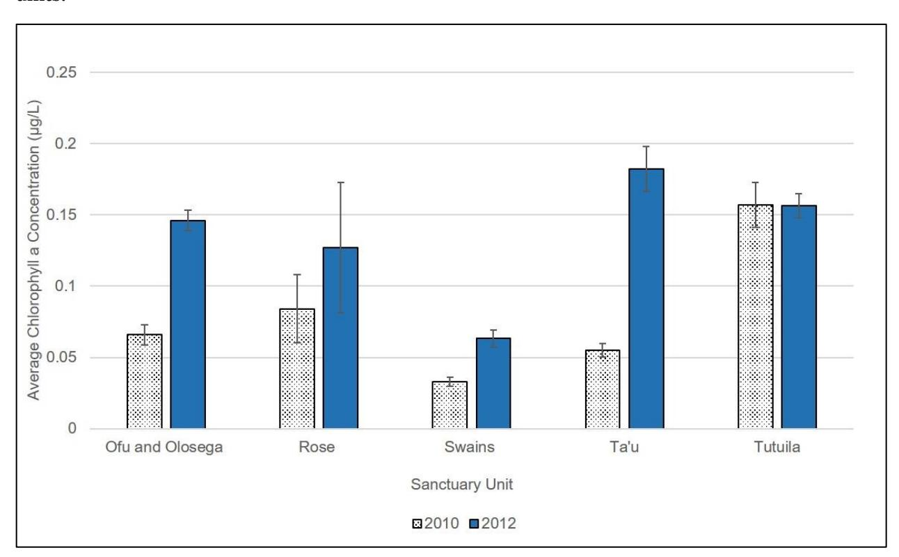

**Figure S.WQ.1.3.** Average chlorophyll *a* values (+/- SE) from grab samples at all islands in American Samoa in 2010 and 2012. All values are below the AS water quality standard of 0.25 μg/L for open ocean coastal waters (Tuitele et al., 2018). Source: ESD, 2020

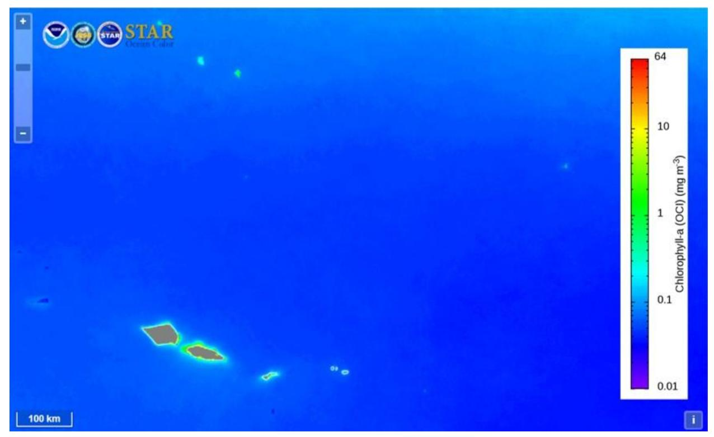

**Figure S.WQ.1.4.** The NOAA Center for Satellite Applications and Research Ocean Color Science Team has created experimental data products to illustrate chlorophyll *a* concentrations using satellite-derived datasets. The long-term climatology indicates that chlorophyll *a* concentrations are low (approximately 0.03–1 mg m3) in the waters surrounding American Samoa, with some enrichment around populated islands. Source: NOAA Center for Satellite Applications and Research, 2022a, 2022b

Macroalgae are another indicator of eutrophication, as cover tends to increase with nutrient inputs. Local and federal monitoring programs have recorded low macroalgae abundances across all sanctuary units throughout the reporting period (Fenner, 2013b; MARC 2020; Vargas-Ángel et al., 2019; Coral Reef Advisory Group [CRAG], 2021). Some temporal fluctuations have been observed, including a drop in cover in 2018 (Figure S.WQ.1.5), but macroalgae cover has generally remained low (<10% on average) throughout the years. Benthic camera tows along the Tutuila insular shelf in 2002, 2004, and 2008 indicated that macroalgae was low in the upper and lower mesophotic zones, but higher (15–20%) in the 50–79 m depth zone (Bare et al., 2010). However, there was considerable variation across sites and these surveys have not been repeated, so this may not reflect current mesophotic conditions in NMSAS.

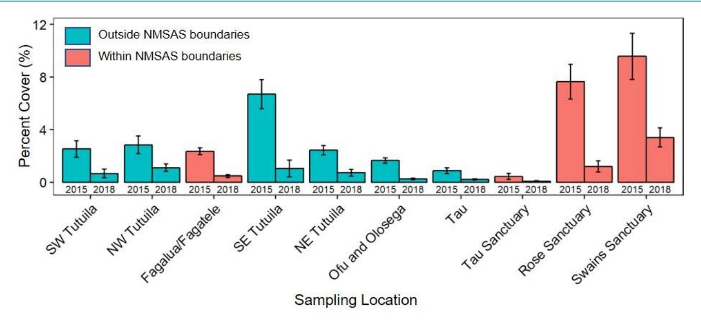

**Figure S.WQ.1.5.** Macroalgae cover in NMSAS units between 2015 and 2018. Image: Modified from Vargas-Ángel et al., 2019

### *Conclusion*

Quantitative data on eutrophication within NMSAS boundaries are limited. Data for Fagatele Bay are more robust and indicate that nutrient levels are below recommended thresholds, but may be increasing, likely due to the presence of a landfill and increased agriculture in the surrounding watershed. Macroalgae cover remains low within shallow coral reef habitats, and satellite data for chlorophyll *a* indicate low concentrations throughout the sanctuary. Quantitative *in situ* data are not available for pelagic, mesophotic, and deep-sea habitats, and experts recommended more frequent and expanded sampling across sanctuary units to address these gaps.

## **Question 2: Do sanctuary waters pose risks to human health and how are they changing?**

**Status Description:** One or more water quality indicators suggest the potential for human health impacts, but human health impacts have not been reported.

**Rationale:** There are currently no known human health risks from NMSAS waters; however, data are limited and no trend data are available. Contaminants were detected in Fagatele Bay, but only nickel concentrations exceeded toxicology screening levels. Coliform bacteria have been detected in Fagatele Bay and there is a sewage outfall in the Aunu'u Multipurpose Zone, but sanctuary units are not part of regular water sampling efforts, so any potential health impact is unknown. No ciguatera poisoning has been reported from fish caught in the sanctuary.

**Question 2 Indicator Table.** Summaries for the key indicators related to human health risks from

|                                 |                       |                                             | sanctuary waters that were discussed during the 2020 status and trends workshop.                                                                                                                                                                                                                                                                                                                                                                                                                                                                                                                                                                                                                                                                                                                                                                                                                                                                                                                                                                                                                                                                                     |
|---------------------------------|-----------------------|---------------------------------------------|----------------------------------------------------------------------------------------------------------------------------------------------------------------------------------------------------------------------------------------------------------------------------------------------------------------------------------------------------------------------------------------------------------------------------------------------------------------------------------------------------------------------------------------------------------------------------------------------------------------------------------------------------------------------------------------------------------------------------------------------------------------------------------------------------------------------------------------------------------------------------------------------------------------------------------------------------------------------------------------------------------------------------------------------------------------------------------------------------------------------------------------------------------------------|
| Indicator                       | Habitat               | Source                                      | Summary                                                                                                                                                                                                                                                                                                                                                                                                                                                                                                                                                                                                                                                                                                                                                                                                                                                                                                                                                                                                                                                                                                                                                              |
| Heavy metals                 | Nearshore habitats | Whitall et al., 2022                     | In 2019, 16 metals (silver, aluminum, arsenic, cadmium, chromium, copper, iron, mercury, manganese, nickel, lead, antimony, selenium, silicon, tin, and zinc) were measured in sediment samples from Fagatele Bay. Silver, arsenic, cadmium, chromium, copper, mercury, lead, and zinc were detected at levels below Effects Range Low (ERL; a measure of possible toxicity to benthic infauna). Nickel was the only metal that exceeded ERL at three out of five sites within Fagatele Bay and exceeded the Effects Range Median (ERM) value at one site, which may indicate toxicity to benthic infauna (Ni measurements = 69.6, 23.9, 24.1 μg/g; ERL = 20.9 μg/g; ERM = 51.6 μg/g). The team noted that concentrations of As, Cr, Ni, and Se at some stations in Fagatele Bay were higher than the mean values observed at Faga'alu (a more impacted watershed on Tutuila). ERL values are not available for some metals (aluminum, iron, manganese, antimony, selenium, silicon, and tin), but all values from Fagatele Bay were below mean values previously measured in Faga'alu except for selenium. |
| Chemical pollutants          | Nearshore habitats | Whitall et al., 2022                     | In 2019, water samples were screened for over 400 compounds. Only a small number were detected, and all were below published toxicity screening levels (i.e., lethal concentration 50 [LC50], the single exposure concentration that kills 50% of test animals). The compounds included polycyclic aromatic hydrocarbons (PAHs), pesticides, other organic compounds, and pharmaceuticals. While these chemicals were found in low concentrations, there is some concern that some compounds may have sublethal effects (e.g., endocrine disruption) even at very low concentrations.                                                                                                                                                                                                                                                                                                                                                                                                                                                                                                                                                  |
| Coliform bacteria/E. Coli | Nearshore habitats | Whitall et al., 2022; AS-EPA, 2021 | In 2019, NCCOS analyzed water collected at eight sites within Fagatele Bay and the inflowing stream for coliform bacteria and E. coli (Whitall et al., 2022). All samples tested positive for coliform bacteria, and over half the samples tested positive for E. coli, indicating that mammalian (e.g., bat, pig, human) wastes are entering the waters. Raw sewage is discharged in the Aunu'u Multipurpose Zone, but no quantitative data were available on volume or bacteria in receiving waters. Water quality at beaches near NMSAS units is generally good for recreational purposes (AS-EPA, 2021).                                                                                                                                                                                                                                                                                                                                                                                                                                                                                                                        |
| Ciguatera                       | Nearshore habitats | Clemens, 1997                            | Ciguatera fish poisoning has been reported from Tutuila (Clemens, 1997), but it is unclear if there have been recent cases. There is no available information on affected fish species or high-risk locations in American Samoa.                                                                                                                                                                                                                                                                                                                                                                                                                                                                                                                                                                                                                                                                                                                                                                                                                                                                                                                            |

Heavy metals, pesticides, bacteria, and harmful algal blooms can have detrimental impacts on human health through direct contact or bioaccumulation in organisms used for food. Some of these are linked to human activities through runoff, groundwater contamination, or sewer outfalls. Two known sources of potential contamination include the Futiga landfill, located north of the Fagatele Bay and Fagalua/Fogama'a units, and a sewage outfall on the western side of Aunu'u (see the Pressures chapter for more information). Incidents of ciguatera fish poisoning from *Gambierdiscus* blooms have been reported in American Samoa, but there is no clear link to human activities. As most of NMSAS has been perceived as "pristine," quantitative data on these indicators within sanctuary boundaries are very limited.

The Futiga landfill has been used as a municipal waste disposal site since the 1960s. The landfill was recompacted in 2018 to extend its lifespan, but is nearing its capacity. The lack of a liner and leachate collection system has caused concern about potential contamination to adjacent waters. In 2019, NCCOS tested for the presence of contaminants in Fagatele Bay. They collected sediment samples at eight sites across the bay to screen for heavy metals (Figure S.WQ.2.1). Values were compared to known toxicity ratings originally assembled by Long et al. (1995). In total, 17 metals were detected, but only nickel was present in concentrations above the ERL value, indicating that it may be toxic to benthic infauna (Figure S.WQ.2.1). All values from Fagatele Bay were below values previously recorded from other sites in Tutuila (Whitall et al., 2022).

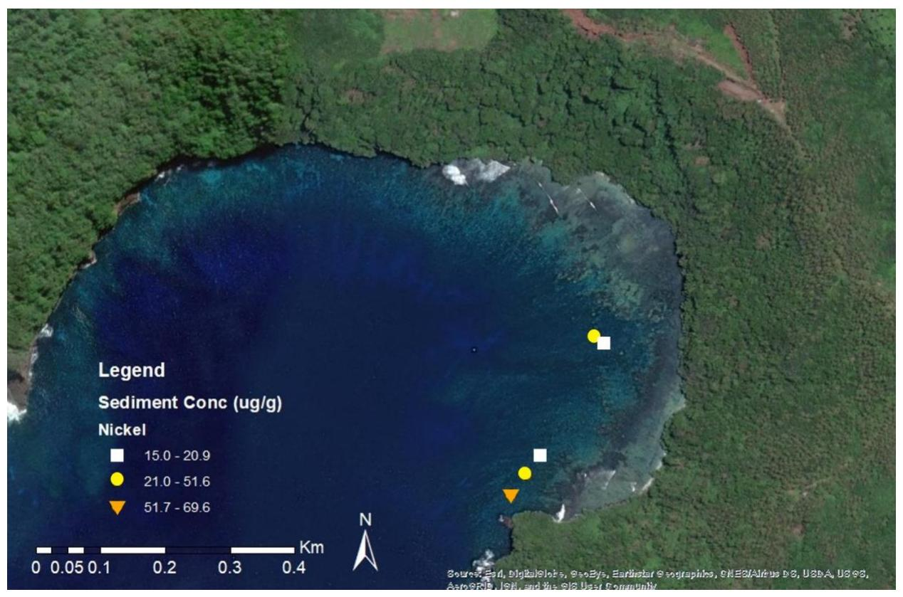

**Figure S.WQ.2.1.** The concentration of nickel in sediment samples taken from three sites in Fagatele Bay was above the ERL value, indicating possible toxicity to benthic infauna. At one site, the concentration was above the ERM value (51.6 μg/g), which may indicate toxicity to benthic infauna. Source: Whitall et al., 2022

To detect pesticides, hydrocarbon derivatives (PAHs), and pharmaceutical compounds, the same study deployed Continuous Low-Level Aquatic Monitoring samplers (CLAMs) at eight sites within Fagatele Bay (Figure S.WQ.2.2). CLAMs are *in situ* submersible field extraction units that are able to continuously sample by filtering water at a known flow rate. Results indicate that the vast majority of the 400 compounds tested were not detectable. However, 30 organic compounds were detected. None of these exceeded published LC50 values (where available), defined as the lethal concentration required to kill 50% of tested organisms. Of the compounds that were detected in Fagatele Bay, most were orders of magnitude below the LC50 values. However, LC50s are not available for nine of the detected PAHs and two of the detected organic compounds due to their water solubility or recent invention. While no immediate threats to human health were detected, these compounds may have sublethal effects (e.g., endocrine disruption). The fact that pesticides, PAHs, and pharmaceutical compounds were detected in Fagatele Bay is concerning and should be monitored (Whitall et al., 2022).

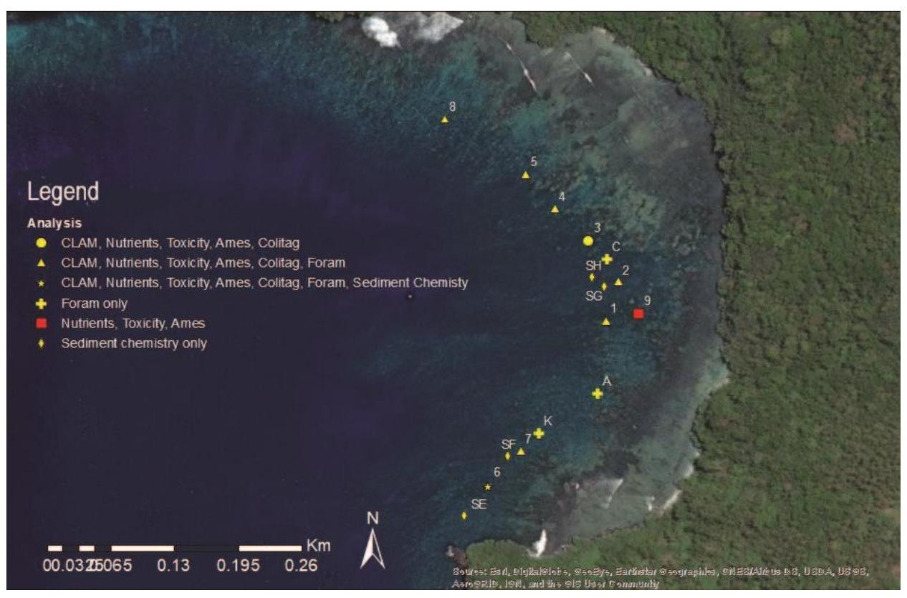

**Figure S.WQ.2.2.** In 2019, NCCOS collected water samples using CLAM devices at 8 sites in Fagatele Bay to evaluate the concentration of contaminants in the water. Thirty organic compounds were detected in low quantities. Source: Whitall et al., 2022

AS-EPA monitors popular recreational beaches around Tutuila for the presence of enterococci bacteria, which may indicate fecal contamination from animals or humans (Tuitele et al., 2018; Sunia et al., 2020; American Samoa Environmental Protection Agency [AS-EPA], 2021). However, none of their beach monitoring sites are within NMSAS boundaries. Monitoring sites in villages closest to the sanctuary (Leala-Taputimu Sliding Rock, Aunu'u Wharf, Ta'u Beach) generally have few advisories, but AS-EPA occasionally recommends avoiding swimming at

these sites (mostly Leala-Taputimu; Tuitele et al., 2018; Sunia et al., 2020; AS-EPA, 2021). AS-EPA's 2020 integrated monitoring report noted that Fagatele-Larson watershed was listed as impaired and was assigned a "Not Supporting (fair)" status for aquatic life in ocean shoreline waters in 2014 as a result of an "Undetermined NPS [nonpoint source] Stressor"; however, subsequent testing found the watershed was "Fully Supporting" (Sunia et al., 2020). In 2019, NCCOS analyzed water sampled at around 3 m depth at eight sites within Fagatele Bay and the inflowing stream for coliform bacteria and *E. coli* (Whitall et al., 2022). All samples tested positive for coliform bacteria and over half of the samples tested positive for *E. coli*, indicating that mammalian (e.g., bat, pig, human) wastes are entering the bay. However, this was a limited sampling effort and additional sampling is needed to evaluate whether these bacteria present a human health risk.

Experts noted that a sewage outfall in the Aunu'u Multipurpose Zone may be a potential source of contamination. The wastewater collection system for the village consists of a wet well with a grinder pump, and untreated sewage is discharged through an ocean outfall in shallow water on a fringing coral reef. It was constructed by the American Samoa Power Authority to protect shallow groundwater resources impacted by septic tanks and leach fields. Surveys conducted prior to 2007 indicate that bacterial counts for the waters in the area around the sewage outfall met American Samoa water quality standards for recreational beaches, although the location and depth of the outfall indicate a potential for unacceptable bacterial levels along these beaches. In 2007, the AS-EPA and U.S. Environmental Protection Agency developed a wastewater facilities plan for the village and island of Aunu'u (AS-EPA, 2007), but it was not implemented due to other American Samoa Power Authority priorities.

Ciguatera fish poisoning is caused by eating reef fish that are contaminated with ciguatoxin, a chemical produced by the dinoflagellate *Gambierdiscus toxicus*, which grows on algae that are eaten by herbivorous fish and bioaccumulates in larger fish through the food web. Ciguatera fish poisoning rarely causes death, but symptoms can last for months. It has been reported from Tutuila (Clemens, 1997) but there are limited data on the incidence of ciguatera in American Samoa and which species of fish or areas pose the greatest risk. No cases of ciguatera fish poisoning from fish caught in the sanctuary have been reported.

### *Conclusion*

Contaminants have been detected in Fagatele Bay, which poses some concern; however, levels are below documented thresholds for human health risks. Additional testing is necessary to determine if there is bacterial contamination of sanctuary waters, particularly Fagatele Bay, Fagalua/Fogama'a, and Aunu'u, based on identified threats. Human contact with pelagic and remote areas is limited, but risks should be evaluated in the future.

## **Question 3: Have recent, accelerated changes in climate altered water conditions and how are they changing?**

**Status Description:** Climate related changes have caused measurable, but not severe, degradation in some attributes of ecological integrity.

**Rationale:** Increasing sea surface temperatures have caused more frequent and more severe coral bleaching events. Ocean acidification is affecting water quality worldwide; however, aragonite saturation state and calcification rates have remained high in sanctuary units.

**Question 3 Indicator Table.** Summaries for the key indicators related to climate change that were

discussed during the 2020 status and trends workshop.

| Indicator   | Habitat               | Source                                                                                      | Summary                                                                                                                                                                                                                                                                                                                                                                                                                                                                                                                                                                                                                                                                                                                                           |
|-------------|-----------------------|---------------------------------------------------------------------------------------------|---------------------------------------------------------------------------------------------------------------------------------------------------------------------------------------------------------------------------------------------------------------------------------------------------------------------------------------------------------------------------------------------------------------------------------------------------------------------------------------------------------------------------------------------------------------------------------------------------------------------------------------------------------------------------------------------------------------------------------------------------|
| Temperature | Nearshore habitats | Coral Reef Watch, 2020; Vargas Ángel et al., 2019; Coward et al., 2021 | Sea surface temperature (SST) has steadily increased over recent decades, causing an increase in thermal stress events, including widespread coral bleaching (Coral Reef Watch, 2020). NMFS in situ data loggers confirmed that temperatures at 15 m exceeded the threshold for coral bleaching in 2015, 2016, and 2017 across all islands (Vargas-Ángel et al., 2019). Temperatures exceeding 34°C were recorded on reef flats during the 2015–2016 thermal stress event (Coward et al., 2021). In 2016, Swains Island experienced the greatest thermal anomalies, with water temperatures nearing 31°C (National Coral Reef Monitoring Program [NCRMP], 2018; Vargas-Ángel et al., 2019). |
|             | Pelagic               | PacIOOS, 2020                                                                            | In situ pelagic water temperatures at the PacIOOS wave buoy off of Aunu'u showed similar trends to satellite-based SST data.                                                                                                                                                                                                                                                                                                                                                                                                                                                                                                                                                                                                          |
|             | MCE, deep sea      | NOAA, Ocean Exploration Trust (OET)                                                | Temperature data from conductivity, temperature, and depth (CTD) sensor casts and remotely operated vehicle (ROV) instrumentation during cruises are available, but have not been analyzed.                                                                                                                                                                                                                                                                                                                                                                                                                                                                                                                                           |

| Indicator                                                                              | Habitat               | Source                                                                                                  | Summary                                                                                                                                                                                                                                                                                                                                                                                                                                                                                                                                                                                                                                                                                                                                                                                                                                                                                                                                                                                                                                   |
|----------------------------------------------------------------------------------------|-----------------------|---------------------------------------------------------------------------------------------------------|-------------------------------------------------------------------------------------------------------------------------------------------------------------------------------------------------------------------------------------------------------------------------------------------------------------------------------------------------------------------------------------------------------------------------------------------------------------------------------------------------------------------------------------------------------------------------------------------------------------------------------------------------------------------------------------------------------------------------------------------------------------------------------------------------------------------------------------------------------------------------------------------------------------------------------------------------------------------------------------------------------------------------------------------|
| Ocean acidification indicators (CO2, pH, aragonite saturation, calcification) | Nearshore habitats | PMEL, 2020                                                                                              | The MAPCO2 buoy located in Fagatele Bay measured CO2 and pH every three hours starting in May 2019. CO2 concentration and pH are highly variable due to natural diurnal fluxes in the semi-enclosed Fagatele Bay. Data have not been finalized by PMEL, but all pH measures are below the 8.1 global ocean average. ESD has recorded pH periodically during cruises since 2010, but the data are not robust enough to detect temporal trends. Values ranged from 8.0–-8.08. ESD also noted that American Samoa has some of the highest aragonite saturation state values in the U.S. Pacific Islands. The highest aragonite levels were recorded at Rose Atoll (3.91–4.35), and levels were slightly lower near Tutuila (3.49– 3.99). Fagatele Bay and Fagalua/Fogama'a were lower, but this may be due to biological demand. Calcification rates are some of the highest measured in the Pacific and follow the same spatial pattern as aragonite (NCRMP, 2018). |
|                                                                                        | Pelagic habitats   | Global Monitoring Laboratory, 2020; Woods Hole Oceanograp hic Institution, 2016 | Atmospheric carbon dioxide concentration has continued to rise and measurements at NOAA's American Samoa Baseline Observatory reached 410 µmol/mol in 2020. Woods Hole Oceanographic Institution compiled global data on changes in aragonite saturation from 1880–2015. The data indicate that aragonite saturation has declined by approximately 0.5–0.6 in American Samoa's pelagic areas during that time.                                                                                                                                                                                                                                                                                                                                                                                                                                                                                                                                                                                              |
|                                                                                        | MCE, deep sea      |                                                                                                         | No ocean acidification data were found for MCE or deep-sea habitats.                                                                                                                                                                                                                                                                                                                                                                                                                                                                                                                                                                                                                                                                                                                                                                                                                                                                                                                                                                   |
| Sea level rise                                                                         | Nearshore habitats | Cooperative Observer Program, 2020; Han et al., 2019                                     | Relative sea level increased 2.41 mm/yr based on monthly mean sea level data from 1948– 2009 (95% confidence interval of +/- 0.8 mm/yr). Continued subsidence following the 8.1 MW Samoa‐Tonga earthquake doublet (megathrust + normal faulting) in September 2009 has effectively increased the rate of sea level rise in the Samoan Archipelago to 7–9 mm/yr, or approximately 5 times the global average. Relative sea level has increased by 21 cm (8.4 in) since the earthquake, and this trend is expected to continue for decades (Han et al., 2019). It is unclear how much of the current sea level rise is due to climate change.                                                                                                                                                                                                                                                                                                                                            |

| Indicator                                         | Habitat                                                            | Source                                                                        | Summary                                                                                                                                                                                                                                                                                                                                                                                             |
|---------------------------------------------------|--------------------------------------------------------------------|-------------------------------------------------------------------------------|-----------------------------------------------------------------------------------------------------------------------------------------------------------------------------------------------------------------------------------------------------------------------------------------------------------------------------------------------------------------------------------------------------|
| Cyclones                                          | Nearshore habitats                                              | OCM, 2020                                                                     | Since 1959, 53 tropical cyclones have passed within 200 nm of Tutuila. Most (69%) of the strongest cyclones (Category 3–5) passed through the area after 2000, which suggests a slight increase in storm intensity. However, the sample size was too small for further analysis.                                                                                                     |
| Rainfall                                          | Nearshore habitats                                              | NOAA Weather Service Office Pago Pago, 2021                       | There is a slight increasing trend in rainfall, but totals were highly variable and heavily influenced by the El Niño Southern Oscillation (ENSO) and cyclone activity. An annual rainfall record was set in 2020, with 191.68 in recorded for the year. The previous record from 1981 (167.32 in) was surpassed on November 11, 2020.                                         |
| Currents                                          | Nearshore habitats, pelagic habitats, MCE, deep sea | Kendall & Poti, 2011                                                       | A biogeographic assessment used drifter data from 2004–2009 to validate a hydrographic model for the region and investigate current patterns, but no newer analyses or comparisons are available to assess changes.                                                                                                                                                                     |
| Stratification and thermohaline circulation | MCE, deep sea                                                   | NOAA Ocean Exploration, 2017; Ocean Exploration Trust, 2019 | Temperature data from CTD casts and ROV instrumentation during cruises are available, but have not been analyzed for comparisons or trends. Experts did note that there appeared to be a lack of recruitment of benthic organisms in some areas, but it is not clear if this is an emerging impact of changing conditions, or just a normal pattern in deep-sea succession. |

Climate change and ocean acidification are global pressures that are expected to increase sea surface and air temperatures, raise sea levels, make oceans more acidic, shift cyclone and rainfall patterns, and eventually impact oceanic currents, ocean stratification, and thermohaline circulation. The widespread effects of climate change are likely to affect all sanctuary waters from the surface to the deep sea, but shallow ecosystems, such as coral reefs, are expected to be the first affected.

Satellite-derived data indicate a steady increase in SST across American Samoa over the last few decades (Coral Reef Watch, 2020; Figure S.WQ.3.1). Shallow coral reef habitats are particularly susceptible to rising temperatures as corals live very close to their upper thermal tolerances (Jokiel & Coles, 1990). Temperature increases of just 1–2°C above local averages persisting for several weeks can cause widespread coral bleaching. As water temperatures have increased, so have the frequency and intensity of bleaching events (Coral Reef Watch, 2020). Bleaching events were documented in American Samoa in 2015 (Vargas-Ángel et al., 2019), 2017, and 2020. *In situ* temperature measurements indicate that the timing and magnitude of temperature patterns are similar across all of the islands. However, mean temperatures at Swains Island are 0.4°C higher in the summer (Dec–Mar) and 0.8°C higher in the winter (Jul–Oct) than the other

islands and, in 2016, Swains Island experienced an unprecedented high water temperature of almost 31°C. Experts believe this was the cause of a staggering decline (>60%) in the number of *Pocillopora* coral colonies at Swains Island between 2015–2018 (Vargas-Ángel et al., 2019; Figure S.WQ.3.2). Detailed data on bleaching prevalence and associated mortality in sanctuary units were not collected during these events.

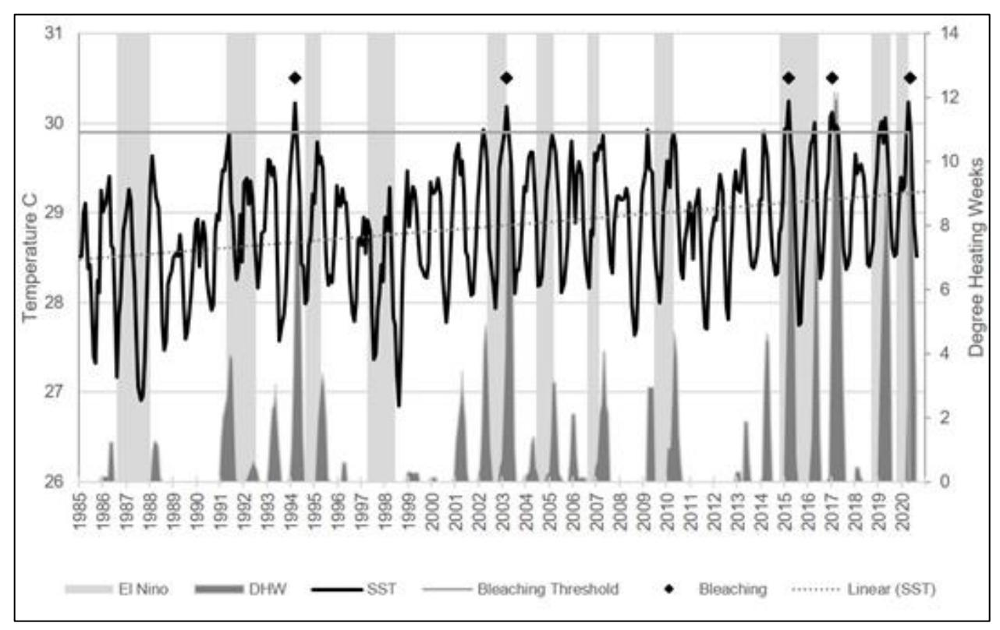

**Figure S.WQ.3.1.** SST and degree heating weeks (the number of weeks temperature remains above the bleaching threshold) from 1985–2020 from the Coral Reef Watch virtual station for the Samoan archipelago. Widespread bleaching events are noted by black diamonds. The 2016 bleaching event was limited to Swains Island and was not added to this figure. Source: Coral Reef Watch, 2020

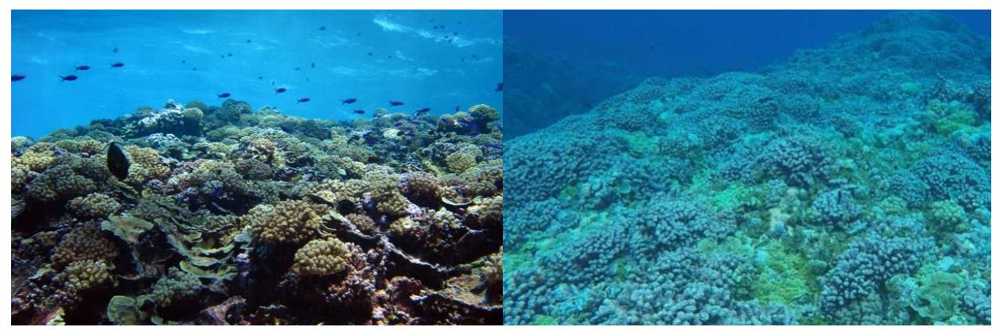

**Figure S.WQ.3.2.** Healthy and thriving *Pocillopora* community at Swains Island in 2010 (left) and widespread dead *Pocillopora* overgrown by crustose coralline algae in 2017 (right), likely caused by the bleaching events in 2015–2016. Photos: (left) Kerry Grimshaw/NOAA; (right) Mareike Sudek/Department of Marine and Wildlife Resources

Detailed water temperature data are limited to surface waters. It is not known if temperatures in mesophotic and deep-sea habitats are also changing. While NOAA does collect temperature data throughout the water column during research cruises, they are limited in spatial and temporal scale and have not been analyzed.

Global sea level has also been rising over the past century, and the rate has increased in recent decades. In American Samoa, NOAA tide gauge data indicated that sea level was increasing by 2.41 mm/yr up until 2009 (NOAA, 2022; Figure S.WQ.3.3). However, continued subsidence following the 8.1 *M*W Samoa‐Tonga earthquake doublet (megathrust + normal faulting) in September, 2009 has effectively increased the rate of sea level rise in American Samoa to approximately 8–16 mm/yr, or approximately five times the global average. So far, relative sea level may have increased by 21 cm since the earthquake, and this trend is expected to continue for decades (Han et al., 2019). Coastal inundation has been most noticeable adjacent to the Aunu'u unit, and the village started armoring the upper shoreline along the southwestern coastline in 2020.

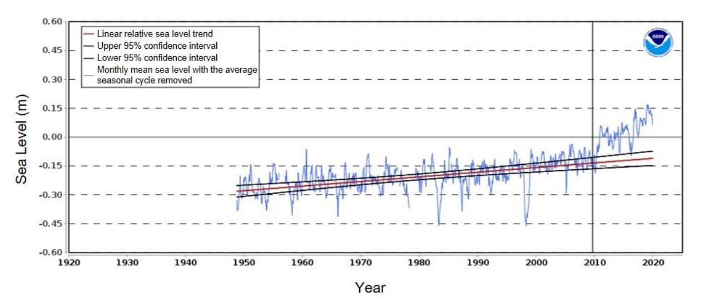

**Figure S.WQ.3.3.** Sea level in American Samoa from 1950–2020. The relative sea level trend is 2.42 mm/yr with a confidence interval of +/- 0.8 mm/yr based on mean sea level data from 1948 to 2009.The black bar denotes the 2009 earthquake and tsunami. Note that sea level rise accelerated after the 2009 event due to subsidence. Source: Center for Operational Oceanographic Products and Services, 2020

Data from the NOAA Global Monitoring Laboratory American Samoa Baseline Observatory indicate that atmospheric carbon dioxide (CO2) has been increasing rapidly since 1975 and is now above 400 ppm (Global Monitoring Laboratory, 2020). Rising CO2 levels in the atmosphere result in increased CO2 absorption by the ocean, forming carbonic acid, which lowers pH in a process known as ocean acidification. Acidification is expected to decrease calcification rates in organisms such as corals and giant clams and may affect larval development of fish and other animals. The MAPCO2 buoy, installed in Fagatele Bay in May 2019, measures pH and seawater CO2 concentration (PMEL, 2020; PacIOOS, 2020) and may provide more insight on these trends in the coming years. Initial data indicate that CO2 concentration and pH appear to be quite variable, likely due to biological processes and the longer residence time of water in the semi-enclosed bay. ESD has measured pH intermittently across the territory since 2010, but the data are not robust enough to detect temporal trends (ESD, 2020; Barkley et al., 2021). pH

values varied across time and location (range: 8.01–8.08), but were generally lower than the global ocean average of 8.07 +/- 0.02 (Jiang et al., 2019). Despite this, values for another ocean acidification indicator, aragonite saturation state, were still near optimal levels for coral growth and remain some of the highest recorded in the U.S. Pacific Islands. The highest aragonite values were recorded at Rose Atoll (Ω = 3.91–4.35) and values decreased slightly closer to Tutuila (Ω = 3.49–3.99). Fagatele Bay and Fagalua/Fogama'a have lower values, but this may be due to biological demand (Vargas-Ángel et al., 2019). High aragonite saturation likely facilitates the relatively high calcification rates observed in American Samoa, which follow the same spatial trend as aragonite saturation (Rose Atoll > Swains Island > Manu'a > Tutuila; Barkley et al., 2021; Figure S.WQ.3.4). Calcification rates around the island of Tutuila are among the lowest in American Samoa and the Pacific Remote Islands Marine National Monument area, but are higher than other islands monitored by NOAA's National Coral Reef Monitoring Program (NCRMP) in the Pacific Islands region (Halperin, 2021). Vargas-Ángel et al. (2015) suggest that lower values in Tutuila may be due to anthropogenic influences that reduce calcification.

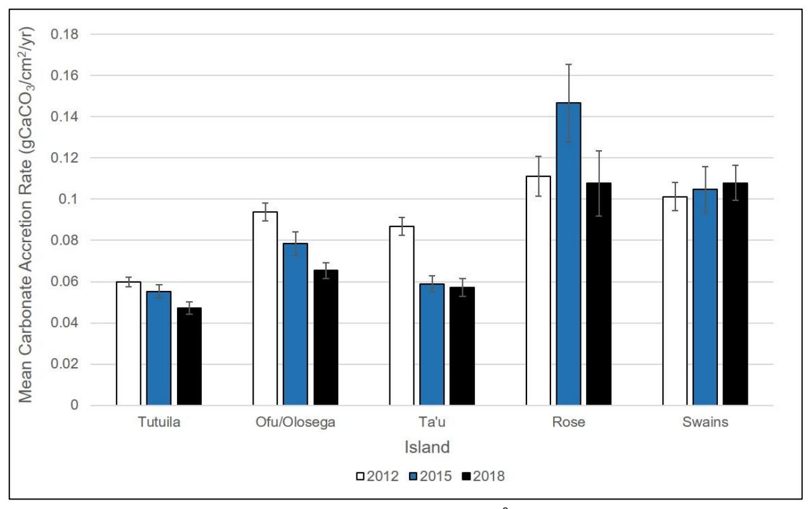

**Figure S.WQ.3.4.** Average carbonate accretion rate (g CaCO3/cm2 /yr) for all Calcification Accretion Unit locations in 2012, 2015, and 2018. Accretion was highest at Rose Atoll and Swains Island and lowest in Tutuila. Source: Halperin, 2021

Climate change is expected to decrease the number of cyclones in American Samoa, but storms are expected to be stronger and rainfall is expected to increase by up to 10%, particularly during episodic heavy rain events such as cyclones and monsoons (ONMS, 2020a). Cyclones and precipitation are influenced by a number of factors including ENSO and other complex oceanatmospheric interactions, so it is difficult to determine if these have been affected by climate change. Fifty-three tropical cyclones have passed within 200 nm of Tutuila since 1959 (OCM,

2020). Sixteen of those became strong hurricanes (Category 3–5), and most of these strong storms (69%) occurred between 2000–2020, which suggests a slight increase in storm intensity. Rainfall has also been variable, but the National Weather Service announced that a new annual precipitation record was set for Tutuila in November 2020. The final total rainfall for 2020 was 4.89 m, 0.67 m above the previous record set in 1981 (NOAA Weather Service Office Pago Pago, 2021). These data appear to align with climate change projections, but are not definitive.

At this time, there are no available data for mesophotic or deep-sea habitats. Monitoring is needed to determine climate change impacts on these deeper environments.

### *Conclusion*

Although climate change has not yet caused severe degradation within NMSAS ecosystems, there are clear indications of increasing SST and relative sea level. Rising temperatures have led to widespread coral bleaching events in 2015, 2017, and 2020, and a smaller event at Swains Island in 2016; however, limited data are available from these events to evaluate mortality, sublethal impacts, and extent of the events. Despite decreasing regional pH levels, aragonite saturation and calcification remain high in American Samoa, but carbonate dynamics are not well understood. Data are even more limited for pelagic, MCE, and deep-sea habitats, consisting of a few discrete sampling events and no long-term trend data. Climate change is likely to have a significant influence on the status and trends of sanctuary resources in the future, and it is important that NMSAS works with partners to address data gaps moving forward.

## **Question 4: Are other stressors, individually or in combination, affecting water quality, and how are they changing?**

**Status Description:** Selected stressors are suspected and may degrade some attributes of ecological integrity, but have not yet caused measurable degradation.

**Rationale:** Nonpoint source pollution from landfill activity, agriculture, and development was raised as a concern for Tutuila and Aunu'u units; however, managers did not detect major impacts to the ecological integrity of these sites during the reporting period. Accelerated coastal erosion caused by subsidence has not caused significant deposition. Iron enrichment at a vessel grounding site continues to be a problem at Rose Atoll, but has improved. Bird populations at Rose Atoll have varied somewhat due to storms, but these fluctuations do not appear to have disturbed nutrient cycles around the atoll.

**Question 4 Indicator Table.** Summaries for the key indicators related to other stressors that were

| discussed during the 2020 status and trends workshop. Indicator | Habitat               | Source                                                                | Summary                                                                                                                                                                                                                                                                                                                                                                                                                                                                                                                                                                                                                                                         |
|--------------------------------------------------------------------|-----------------------|-----------------------------------------------------------------------|-----------------------------------------------------------------------------------------------------------------------------------------------------------------------------------------------------------------------------------------------------------------------------------------------------------------------------------------------------------------------------------------------------------------------------------------------------------------------------------------------------------------------------------------------------------------------------------------------------------------------------------------------------------------|
| Nonpoint source pollution: Land use change                   | Nearshore habitats | OCM, 2021                                                             | The NOAA Coastal Change Analysis Program's land use change data indicate that forest cover declined in the watersheds of Fagatele Bay and Fogama'a between 2005 and 2010. This loss is related to a quarry, landfill, and agricultural clearing within the watersheds. On Swains Island, 0.26 km2 of forest shifted to scrub and on Rose Island, 0.26 km2 of scrub switched to forest. No changes were observed adjacent to the sanctuary unit in Ta'u and there were only minor changes in forest and wetland cover in Aunu'u.                                                                                                   |
| Nonpoint source pollution: Turbidity                         | Nearshore habitats | Comeros Raynal et al., 2021; PMEL, 2020; PacIOOS, 2020 | Sediment traps were deployed for one year (2018– 2019) in Fagatele Bay and six other sites. Average sediment collection rates in Fagatele Bay were comparatively low (1.42 mg/day/cm2 ) and researchers noted that there was little terrigenous sediment collected in the trap, suggesting that most of the sediment collected was resuspended reef sediment (Comeros-Raynal et al., 2021). The MAPCO2 buoy recorded turbidity data from May 2019–August 2020 (PMEL, 2020). Overall measures were low, but data indicate a slight increase in turbidity from December through March that may warrant further investigation. |
| Coastal erosion                                                    | Nearshore habitats | Han et al., 2019                                                   | Since 2009, continued subsidence following the 8.1 MW Samoa‐Tonga earthquake doublet (megathrust + normal faulting) in September 2009 has effectively increased the rate of sea level rise in the Samoan archipelago to 7–9 mm/yr, or approximately 5 times the global average. So far, sea level has increased by 25 cm since the earthquake and this trend is expected to continue for decades (Han et al., 2019).                                                                                                                                                                                                                 |
| Point source pollution                                          | Nearshore habitats | Schroeder et al., 2008; Google Earth                            | The metal remains of Jin Shiang Fa are still releasing iron into the water at Rose Atoll, which appears to support a persistent cyanobacteria bloom around the wreck site (Schroeder et al., 2008). The extent of the cyanobacteria bloom has decreased over time, but still produces visible impacts to the reef flat habitat.                                                                                                                                                                                                                                                                                                               |
| Seabird populations                                             | Nearshore habitats | U.S. Fish and Wildlife Service; Titmus et al., 2016       | Rose Atoll is the only rat-free island in American Samoa and is used by a large proportion of the territory's seabirds. Minor fluctuations in bird populations took place during the reporting period, but it is not clear if the change in nutrient levels affected marine resources. Seabird levels are depressed at Swains Island due to rat infestation (Titmus et al., 2016).                                                                                                                                                                                                                                                         |

Other processes known to affect water quality in sanctuary habitats include nonpoint source pollution, particularly sediment conveyed by runoff from entire watersheds, sedimentation from accelerated coastal erosion linked to subsidence, iron enrichment from a vessel grounding at Rose Atoll, and fluctuations in seabird populations and resultant nutrient enrichment at Rose Atoll.

NMSAS units have long been considered "pristine" areas, as they are located in areas with little or no human population and there has been limited paving and physical disturbance within their watershed catchment areas. There is no disturbed or paved land adjacent to units at Ta'u, Rose Atoll, and Swains Island. However, the village of Aunu'u is in close proximity to the sanctuary units, and there is a landfill, an active quarry, and some agricultural activity above the Fagatele Bay and Fagalua/Fogama'a units (Figure S.WQ.4.1). On Tutuila, developed areas increased by 5.8% from 2004–2010, and forest cover in the area surrounding Fagatele Bay and Fagalua/Fogama'a decreased (OCM, 2021). To evaluate sedimentation rates in Fagatele Bay, sediment traps were deployed for one year (2018–2019). Sediment collection rates in Fagatele Bay were comparatively low, with an average of 1.42 mg/day/cm2 (Figure S.WQ.4.2), and researchers noted that there was little terrigenous sediment collected in the trap, suggesting that most of the sediment collected was resuspended reef sediment (Comeros-Raynal et al., 2021). In addition to the sediment data, the MAPCO2 buoy recorded turbidity from May 2019–August 2020 (PMEL, 2020). Overall measures were low, but the data indicated a slight increase in turbidity from December through March that may warrant further investigation.

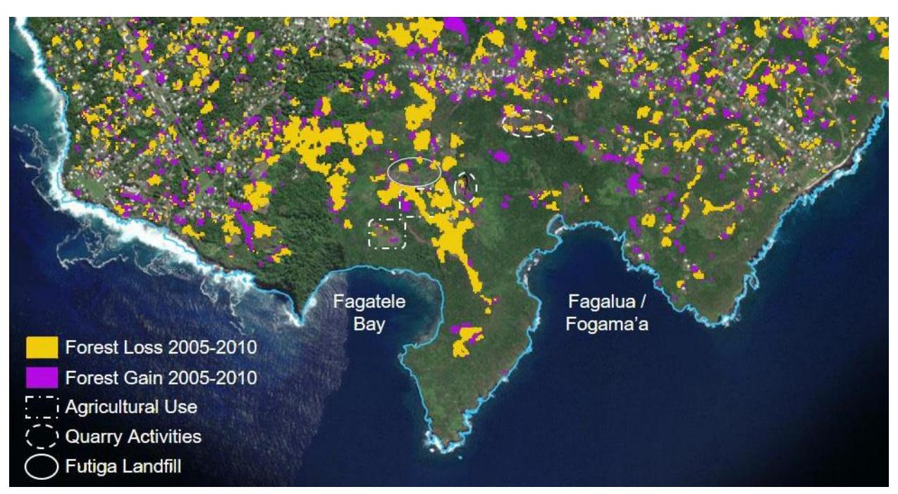

**Figure S.WQ.4.1.** An analysis of satellite imagery indicated that forest area in the Fagatele watershed decreased between 2005 and 2010. Current land use activities in the watershed include agriculture, rock quarrying, and the Futiga landfill. Source: OCM, 2021

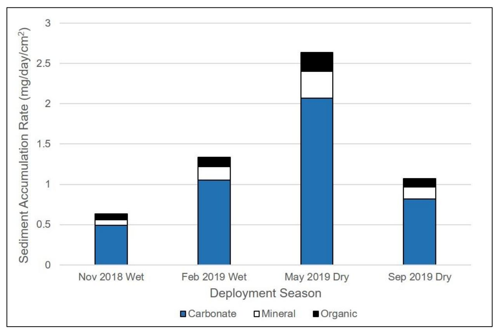

**Figure S.WQ.4.2.** Sediment accumulation rates in Fagatele Bay were low, with an average of 1.42 mg/day/cm2 . Sediments were primarily carbonate, which suggests that most of the sediment was resuspended reef sediment with little terrestrial input. Source: Comeros-Raynal et al., 2021

Sea level rise has exacerbated coastal erosion and may also contribute to higher sedimentation rates. Global sea level rise attributed to climate change increased sea level in American Samoa by 2.41 mm/yr from 1950–2009 (Cooperative Observer Program, 2020; see Figure S.WQ.3.3). However, continued subsidence following the September 2009 earthquake has effectively increased the rate of sea level rise by 8–16 mm/yr. So far, relative sea level may have increased by up to 21 cm since the earthquake (Han et al., 2019), leading to increased coastal erosion and inundation. Within NMSAS, coastal inundation has been most noticeable adjacent to the Aunu'u unit, where storm waves overflowed the road and damaged the village generator. The village began armoring the upper shoreline along the southwestern coast in 2020. It is not known if this inundation affected marine habitats and it is not clear what, if any, effects the new coastal armoring will have.

The 1993 grounding of the longline fishing vessel *Jin Shiang Fa* on the southwest edge of Rose Atoll left iron debris scattered across the reef. Most of the vessel debris was removed by 2005, but remaining metal is still releasing iron into the water and appears to support a persistent cyanobacteria bloom around the wreck site (Schroeder et al., 2008; Figure S.WQ.4.3). The extent of the cyanobacteria bloom has decreased over time, but still produces visible impacts to the reef flat habitat. Please see the question addressing the influence of human activities on water quality for more details on the grounding.

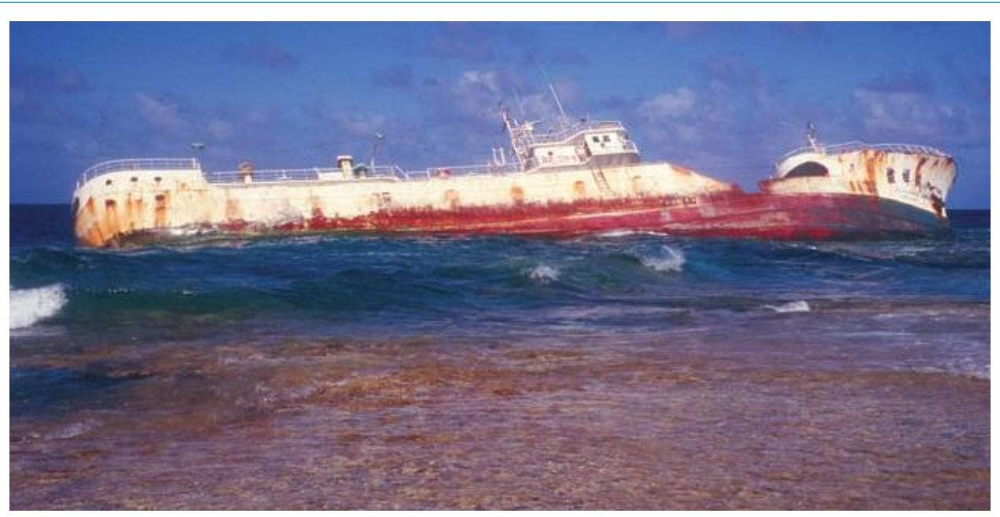

**Figure S.WQ.4.3.** The fishing vessel *Jin Shiang Fa* ran aground on Rose Atoll in 1993. Fuel and oil discharged from the vessel affected nearby reef flats, and the remaining metal continues to cause cyanobacteria outbreaks. Photo: John Naughton/NOAA

Recent research has shown that coral reefs thrive next to rat-free islands, because seabirds play a critical role in depositing nutrients via their guano that leach into the surrounding waters (Graham at al., 2018). Seabird populations may also change due to storm impacts and shifts in forage fish. Rose Atoll is the only rat-free island in American Samoa and is a key migratory stopover that provides vital nesting and roosting habitat for 12 federally protected seabird species (U.S. Fish and Wildlife Service [USFWS], 2014). Seabird populations have fluctuated during the report period, and while birds have always used the island, there are no data available on nutrient production (B. Peck/USFWS, personal communication, 2020). Titmus et al. (2016) noted that rats likely pose a threat to seabird populations at Swains Island and that predator control coupled with conversion of coconut plantations to native vegetation may improve seabird populations. The American Samoa Department of Marine and Wildlife Resources (DMWR) has identified rat control as an important step to reduce pressure on bird populations on Swains Island, but this project has not yet started and it is unclear if the depressed bird populations affect marine resources in sanctuary units.

### *Conclusion*

Nonpoint source pollution from landfill activity, agriculture, and development was raised as a concern for the Fagatele Bay, Fagalua/Fogama'a, and Aunu'u units, but agencies have not detected significant impacts to the ecological integrity of these sites during this reporting period. Subsidence has accelerated coastal erosion, and Tutuila has experienced 21 cm of sea level rise since 2009. This is starting to affect human communities adjacent to the sanctuary, but has not caused detectable impacts on marine habitats. Iron enrichment continues to occur at a vessel grounding site on Rose Atoll, but has improved over time and should improve further after a planned remediation project takes place. Seabird populations at Rose Atoll have experienced some variability due to storms, but these fluctuations did not appear to disturb nutrient cycles

around the atoll. Bird populations are still depressed by rat predation on Swains Island. Experts recommended that NMSAS continue to track these impacts and support remediation and mitigation efforts. Additional efforts may be required to address changes linked to sea level rise in Aunu'u.

## **Question 5: What are the levels of human activities that may adversely influence water quality and how are they changing?**

**Status Description:** Some potentially harmful activities exist, but they have not been shown to degrade water quality.

**Rationale:** There are measurable contaminant and nutrient inputs within NMSAS units, particularly in Fagatele Bay. Contaminants and nutrients from a landfill and agricultural activities have been documented at low levels in Fagatele Bay and it is likely that they have also reached Fagalua/Fogama'a. No measurable impact on water quality or biological communities has been detected. There is a sewage outfall in the Aunu'u Multipurpose Zone A Unit that may also discharge contaminants and nutrients to the shallow reef zone. Limited data prevent full assessment of these impacts and no trend data were available to assess changes over time.

The cumulative impacts of multiple anthropogenic activities, such as changing land use within watersheds, sewage discharge, and continued presence of vessel wreckage at Rose Atoll, have the potential to impact NMSAS water quality. These activities generally do not seem to be adversely influencing water quality; however, data on many of these human activities are limited. Terrestrial contaminant sources such as the landfill, agricultural chemicals, and sewage discharges, could influence water quality in the future. Few data are available on water quality impacts due to human activity in pelagic, mesophotic, and deep-sea habitats.

There are few human activities within NMSAS that directly impair water quality, but land-based sources of pollution from adjacent watersheds may affect nearshore sanctuary habitats (see Figure S.WQ.4.1). Quarrying and agricultural activities take place in the watersheds adjacent to the Fagatele Bay and Fagalua/Fogama'a units and the Futiga landfill is also located within close proximity to both units. The landfill has operated since the 1960s and is the only municipal landfill facility on Tutuila. The site was recompacted in 2018 to extend its life after experts warned it would fill by 2020 (Coleman, 2018). It is unlined and does not have a leachate collection system to prevent contaminants from reaching groundwater. The hydrology of the area is not well documented, but experts believe that landfill contaminants could enter sanctuary units via submarine groundwater discharge. Soil samples taken near the landfill showed high levels of lead, malathion (pesticide), PAHs, and phthalates (Polidoro et al., 2017). Even though NMSAS units were not specifically sampled, the results indicate possible contaminants that could enter Fagatele Bay and Fagalua/Fogama'a via overland flow or groundwater discharge.

A 2019 study analyzed water samples from Fagatele Bay for various contaminants (Whitall et al., 2022). Most chemicals were not detected or were detected in very low concentrations. PAHs and

other organic compounds were detected but did not exceed published screening levels. The recorded levels were low enough that there are likely no significant adverse biological effects at this time. Pharmaceutical compounds were also detected, but there is a lack of information about the potential ecological impacts of these chemicals. Some pharmaceutical compounds may act as endocrine disruptors in marine animals at very low concentrations. Further monitoring of these pollutants is highly recommended, as changes in hydrology, landfill inputs, and landfill decomposition processes could cause their concentrations to increase.

The study also tested marine sediment samples from Fagatele Bay for 17 different metals and found that most were below the ERL value, which is considered the threshold for possible toxicity to benthic infauna. Nickel was the only metal that exceeded ERL values (at three of five sites within the bay), but it did not exceed the ERM value, the threshold for probable toxicity to benthic infauna. These elevated nickel concentrations could be natural or the result of landfill discharge through groundwater, and could indicate possible toxicity to sediment infauna.

Nutrient sampling in Fagatele Bay indicated that levels were below the AS-EPA threshold for water quality (Comeros-Raynal et al., 2017; Figure S.WQ.5.1), but recent sampling has raised some concern regarding potential increases in nutrient concentrations in the bay (Whitall et al., 2022; see Question 1/Eutrophication).

A sewage outfall in the Aunu'u Multipurpose Zone A Unit discharges a small amount of untreated raw sewage from the village directly into the shallow reef zone. This discharge may contain contaminants, as well as nutrients that could impact water quality. Limited data are available for this outfall.

No water quality impairments are currently known from the Ta'u and Swains Island units, as the areas adjacent to these units are sparsely populated and have low levels of visitation. The Muliāva unit is relatively pristine due to its distance from human populations; however, a section of the reef suffers from long-term iron enrichment associated with the grounding of the Taiwanese longline fishing vessel *Jin Shiang Fa*.

In 1993, *Jin Shiang Fa* ran aground on the seaward edge of the southwest side of Rose Atoll. Four months after the grounding, a large amount of wreckage and debris was still present on the reef slope, covering an area of approximately 3,500 m2 . In subsequent years, most of the iron was removed from the reef but some remains (Green et al., 1997). The metal sections of the vessel are corroding and releasing iron into the water, causing a persistent cyanobacteria bloom near the wreck site (Schroeder et al., 2008) that was still impacting the reef as of 2020. Although iron is not normally considered a limiting nutrient on coral reefs, in remote atolls, iron enrichment from vessel groundings may cause a condition known as "black reefs," which are areas dominated by macroalgae, cyanobacterial mats, and corallimorphs (Kelly et al., 2012). In the iron-poor waters of Rose Atoll, ship debris promoted cyanobacterial growth that has prevented the full recovery of the reef ecosystem at the grounding site. The extent of the cyanobacteria bloom has decreased over time, but managers recommend the removal of the remaining wreckage to facilitate full recovery.

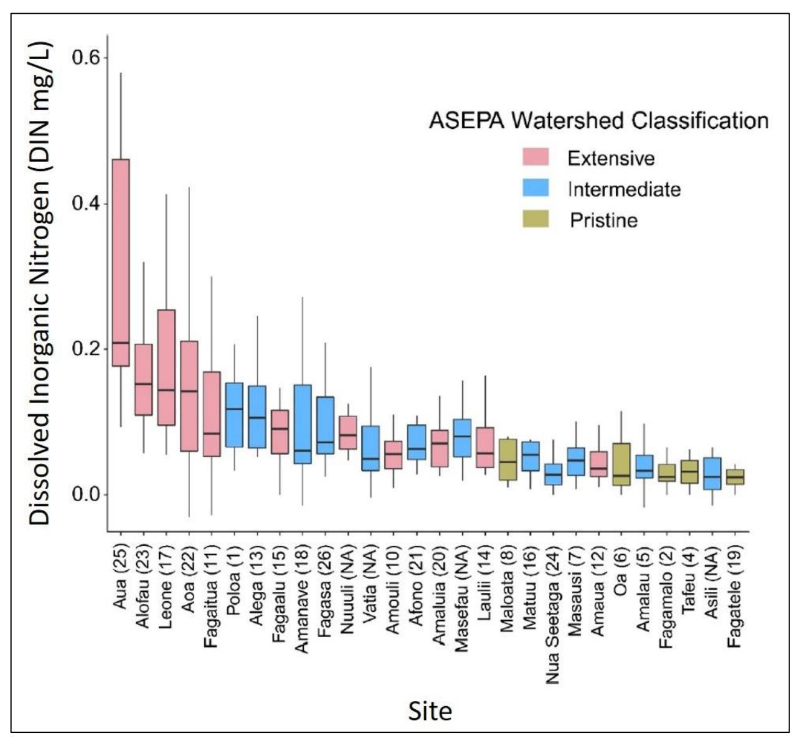

**Figure S.WQ.5.1.** The distribution of quarterly DIN concentrations (mg/L) collected between August 2018 and May 2019 in American Samoa watersheds (streams). Colors indicate AS-EPA watershed classifications. Black horizontal lines show median values, boxes show 25th and 75th percentile, and whiskers show 5th and 95th percentile. The blue dashed line represents the DIN threshold of 0.3 mg/L set by the American Samoa Water Quality Standards (AS-EPA, 2013). The red dashed line represents a DIN threshold of 0.15 mg/L. Source: Houk, 2019; Comeros-Raynal et al., 2017

### *Conclusion*

Quantitative data on contaminants and eutrophication within NMSAS boundaries are limited. Data for Fagatele Bay are more robust and indicate that nutrient levels are below recommended thresholds, but may be increasing, likely due to the landfill and increased agriculture in the surrounding watershed. The cyanobacteria bloom associated with the grounding of *Jin Shiang Fa* remains present at Rose Atoll, but has decreased in size over time. Quantitative *in situ* data are not available for pelagic, mesophotic, and deep-sea habitats, and experts recommended more frequent and expanded sampling across the sanctuary units to address these gaps.

## *Habitat (Questions 6–8)*

The following is an assessment of the status and trends of key habitat indicators in NMSAS from 2007–2020.

Question 6 focuses on the integrity of major habitats within the sanctuary, including shallow coral reef (SCR), MCE, and deep sea. The integrity of and disturbances to habitat-structuring benthic organisms that create structures used by other living marine resources, such as corals and sponges, was assessed. Changes to habitat integrity can significantly alter the diversity of living marine resources and ecosystem services.

Question 7 examines concentrations and variability of contaminants in major sanctuary habitats.

Question 8 covers human activities that may adversely influence habitats. Human activities often have structural impacts (e.g., removal or mechanical alteration) to habitats. Fishing activities that physically disrupt the seafloor (e.g., trawling and dredging), anchoring, commercial dredging, and pipe and cable installation are known to cause structural impacts.

## **Question 6: What is the integrity of major habitat types and how are they changing?**

**Status Description:** Selected habitat loss or alteration is suspected and may degrade some attributes of ecological integrity, but has not yet caused measurable degradation.

**Rationale:** Habitats within NMSAS have demonstrated resilience to disturbances from coral bleaching events, sea level rise, crown-of-thorns sea stars, and cyclones. These ecosystems have adapted to or recovered from these events. The damage from a vessel grounding in Aunu'u has had lasting impacts, but is constrained to a small area, and marine debris continues to be a chronic, but minor problem across all habitats. Data for pelagic and deep-sea habitats are limited, and no immediate threats were identified.

**Question 6 Indicator Table.** Summaries for key indicators related to the integrity of major habitat types

that were discussed during the 2020 status and trends workshop.

| Indicator   | Habitat                                                                           | Source                                                                                                                                                                                      | Summary                                                                                                                                                                                                                                                                                                                                                                                                                                                                                                                                                                                                                                                                                                                                                                                                                                                                                                                                                                                                                                                                                                                                                                                                                                                                                                                                                                                                                                                                                                                                                                                                                                                                                                                                                                                                                                                                                                                                |
|-------------|-----------------------------------------------------------------------------------|---------------------------------------------------------------------------------------------------------------------------------------------------------------------------------------------|----------------------------------------------------------------------------------------------------------------------------------------------------------------------------------------------------------------------------------------------------------------------------------------------------------------------------------------------------------------------------------------------------------------------------------------------------------------------------------------------------------------------------------------------------------------------------------------------------------------------------------------------------------------------------------------------------------------------------------------------------------------------------------------------------------------------------------------------------------------------------------------------------------------------------------------------------------------------------------------------------------------------------------------------------------------------------------------------------------------------------------------------------------------------------------------------------------------------------------------------------------------------------------------------------------------------------------------------------------------------------------------------------------------------------------------------------------------------------------------------------------------------------------------------------------------------------------------------------------------------------------------------------------------------------------------------------------------------------------------------------------------------------------------------------------------------------------------------------------------------------------------------------------------------------------------|
| Sea level   | Intertidal habitats: Rocky shores, sandy shores, and reef flats | Han et al., 2019; NMSAS, 2020a                                                                                                                                                        | Continued subsidence following the 8.1 MW Samoa‐ Tonga earthquake doublet (megathrust + normal faulting) in September 2009 has effectively increased the rate of sea level rise in the Samoan archipelago to 8–16 mm/yr, or approximately five times the global average. So far, sea level has increased by 21 cm since the earthquake, and this trend is expected to continue for decades (Han et al., 2019). This increase has likely shifted intertidal habitats, but there are limited data on intertidal habitats within the sanctuary. Corals on the reef flats at Fagatele Bay and Fogama'a were impacted by subaerial exposure during extreme low tides in 2020 (NMSAS, 2020a).                                                                                                                                                                                                                                                                                                                                                                                                                                                                                                                                                                                                                                                                                                                                                                                                                                                                                                                                                                                                                                                                                                                                                                                                   |
| Coral cover | SCR                                                                               | ESD, 2018; C. Birkeland/ University of Hawai'i, personal communication, 2020; Vargas Ángel et al., 2019; Coward et al., 2021; Fenner, 2013b; Houk, 2019 | Data derived from towed diver surveys suggest that coral cover in American Samoa was relatively stable from 2002–2015, and Swains Island had the highest coral cover (ESD, 2018). Bleaching events were documented, but not quantified, in 2015–2017. Anecdotal observations suggest coral abundance and age structure may have improved over time, particularly in Fagatele Bay, based on surveys completed in 1994–1995, 2002, and 2018(C. Birkeland/University of Hawai'i, personal communication, 2020). Preliminary data from the same surveys indicate that coral cover declined slightly around Tutuila from 2002 to 2018, but increased around Ta'u and Rose Atoll. Community structure was more robust, with both recruits and older size classes observed (C. Birkeland/University of Hawai'i, personal communication, 2020). ESD reported that average coral cover for the territory dropped from 28.7 ± 2.6% in 2015 to 18.2 ± 2.0% in 2018, representing a 36% decline. The 2018 sampling effort was greatly reduced due to weather, which may have affected these results and prevented site-based analysis. ESD noted that at Swains Island, the density of Pocillopora corals declined by over 60%, and there is strong evidence that this was associated with the 2015–2017 bleaching events (Vargas-Ángel et al., 2019). Site-based monitoring data collected by American Samoa's Coral Reef Advisory Group (CRAG) in Fagatele Bay and Aunu'u are not directly comparable across the reporting period due to staff and methodological changes in 2015. The data from 2015–2018 suggest that coral cover has increased in Fagatele Bay (Coward et al., 2021). The limited data available for Fagalua/Fogama'a suggest that average coral cover increased from 2007 (27%) to 2013 (49%; Houk, 2019). |

| Indicator | Habitat | Source                                                                                   | Summary                                                                                                                                                                                                                                                                                                                                                                                                                                                                                                                                                                                                                                                                                                                                                                                                                                                                                                                                                                                                                                                                                                                      |
|-----------|---------|------------------------------------------------------------------------------------------|------------------------------------------------------------------------------------------------------------------------------------------------------------------------------------------------------------------------------------------------------------------------------------------------------------------------------------------------------------------------------------------------------------------------------------------------------------------------------------------------------------------------------------------------------------------------------------------------------------------------------------------------------------------------------------------------------------------------------------------------------------------------------------------------------------------------------------------------------------------------------------------------------------------------------------------------------------------------------------------------------------------------------------------------------------------------------------------------------------------------------|
| CCA cover | SCR     | Vargas-Ángel et al., 2019; Coward et al., 2021; Fenner, 2013b; Houk, 2019 | CCA cover in American Samoa is generally high. ESD recorded significant increases in CCA cover in all NMSAS units from 2015–2018. CCA cover at Swains Island was historically high in 2018 (around 44%) and similar to CCA cover recorded at Rose Atoll (around 49%). The 2018 sampling effort was greatly reduced due to weather, which may have affected these results and prevented site-based analysis (Vargas-Ángel et al., 2019). In contrast, CRAG reported that CCA cover at a fixed monitoring site in Fagatele Bay was the lowest in 2018 (28%). CRAG data showed fluctuating, but overall high, CCA cover throughout the years (averaging 30–60%). CCA cover at CRAG's fixed monitoring site in Aunu'u did not change between 2015 (average 35%) and 2018 (average 34.5%) and generally appeared to be fairly stable over time (averaging 30–45%; Coward et al., 2021; Fenner, 2013b). There are fewer data available for Fagalua/Fogama'a, but the available data show that CCA decreased from 2007 (average 42%) to 2013 (average 27%; Houk, 2019). |

| Indicator   | Habitat | Source                                                                                   | Summary                                                                                                                                                                                                                                                                                                                                                                                                                                                                                                                                                                                                                                                                                                                                                                                                                                                                                                                                                                                                                                                                                                                                                                                                                                                                                                                                                                                                                                                                                                                                                                                                                                                                                                                                                                                                                                                  |
|-------------|---------|------------------------------------------------------------------------------------------|----------------------------------------------------------------------------------------------------------------------------------------------------------------------------------------------------------------------------------------------------------------------------------------------------------------------------------------------------------------------------------------------------------------------------------------------------------------------------------------------------------------------------------------------------------------------------------------------------------------------------------------------------------------------------------------------------------------------------------------------------------------------------------------------------------------------------------------------------------------------------------------------------------------------------------------------------------------------------------------------------------------------------------------------------------------------------------------------------------------------------------------------------------------------------------------------------------------------------------------------------------------------------------------------------------------------------------------------------------------------------------------------------------------------------------------------------------------------------------------------------------------------------------------------------------------------------------------------------------------------------------------------------------------------------------------------------------------------------------------------------------------------------------------------------------------------------------------------------------|
| Algae cover | SCR     | Vargas-Ángel et al., 2019; Coward et al., 2021; Fenner, 2013b; Houk, 2019 | Macroalgae cover in all NMSAS units was low (below 10%) during the study period. ESD recorded significant declines in macroalgae cover at all NMSAS units between 2015–2018, with the greatest decreases occurring at Swains Island (from 10% to 3%) and Rose Atoll (from 7% to 1%; Vargas-Ángel et al., 2019). CRAG reported that macroalgae cover at a fixed monitoring site in Fagatele Bay showed fluctuations throughout the years but remained low, with a spike in 2016 (average 5.5%) followed by a significant decline in 2018 (average 0.7%). CRAG reported that macroalgae cover at a fixed monitoring site in Aunu'u remained low over time. There was a slight increase from 0% in 2010 to 0.4–1.2% in 2012– 2018 (Coward et al., 2021; Fenner, 2013b). There are fewer data available for Fagalua/Fogama'a, but the available data show that macroalgae cover was stable from 2007 (average 1.1%) to 2013 (average 1.6%; Houk, 2019). Turf algae cover in NMSAS is generally low. ESD recorded fairly stable turf algae cover at all NMSAS units (averaging around 20%). Turf algae cover was highest at Ta'u (averaging around 40%), which is the only NMSAS unit where an increase in turf algae cover was recorded (Vargas-Ángel et al., 2019). CRAG reported that turf cover at a fixed monitoring site in Fagatele Bay showed fluctuations over time, but remained low (<8%) throughout the reporting period, with a slight spike in 2018 (average 12%). Turf algae cover at CRAG's fixed monitoring site in Aunu'u increased slightly from 2008 to 2018 and was highest in 2015 (average 15%; Coward et al., 2021; Fenner, 2013b). Turf cover has remained very low at Fagalua/Fogama'a from 2007–2013 (<0.3%; Houk, 2019). |
| Noise       | SCR     | PIFSC, 2009, 2010, 2011                                                               | From 2006–2007, an ecological acoustic recorder (EAR) was deployed in Fagatele Bay. The resulting acoustic data showed strong diel variability. Fish scrapes were the most common event-triggered noises recorded, but cetaceans and motorized vessels were also recorded, although the amount of noise created by motorized vessels was low. From 2008–2009, an EAR was deployed at Rose Atoll. Interestingly, diel variability was lower compared to Fagatele Bay. Cetaceans were the most common event-triggered noises recorded, but fish scrapes and motorized vessels were also recorded. Twenty-one distinct vessel noise events were recorded at Fagatele Bay and 20 were recorded at Rose Atoll (PIFSC, 2009, 2010, 2011).                                                                                                                                                                                                                                                                                                                                                                                                                                                                                                                                                                                                                                                                                                                                                                                                                                                                                                                                                                                                                                                                            |

| Indicator                                      | Habitat               | Source                                                                                                 | Summary                                                                                                                                                                                                                                                                                                                                                                                                                                                                                                                                                                                                                                                                                                                                                                                                                                                                                                                                                                                                                                                                                                                                                                                                                                                                                                                                                                                                                                                                                                                                                                                                                                                                                                                                       |
|------------------------------------------------|-----------------------|--------------------------------------------------------------------------------------------------------|-----------------------------------------------------------------------------------------------------------------------------------------------------------------------------------------------------------------------------------------------------------------------------------------------------------------------------------------------------------------------------------------------------------------------------------------------------------------------------------------------------------------------------------------------------------------------------------------------------------------------------------------------------------------------------------------------------------------------------------------------------------------------------------------------------------------------------------------------------------------------------------------------------------------------------------------------------------------------------------------------------------------------------------------------------------------------------------------------------------------------------------------------------------------------------------------------------------------------------------------------------------------------------------------------------------------------------------------------------------------------------------------------------------------------------------------------------------------------------------------------------------------------------------------------------------------------------------------------------------------------------------------------------------------------------------------------------------------------------------------------|
| Disturbance                                    | Nearshore habitats | NMSAS, 2020b; Schroeder et al., 2008; Green et al., 1997; OCM, 2020; Fenner, 2009 | A number of cyclones, bleaching events, crown-of thorns sea star (CoTS) outbreaks, ship groundings, and a tsunami have impacted NMSAS units in recent years. Since 1959, 53 tropical cyclones have passed within 200 nm of Tutuila (OCM, 2020). In 2018, Cyclone Gita damaged forests surrounding Fagatele Bay, dropping significant amounts of debris into the bay and damaging corals. The storm also toppled table corals and caused other physical damage to the reef in Fagatele Bay. Approximately 20% of the corals on the eastern side of the bay and 3–5% of the corals in other areas were damaged (NMSAS, 2020b). A CoTS outbreak from 2014–2017 mostly affected Taema Bank and the north side of Tutuila, but also caused some impacts to the south side and sanctuary units (Clark, 2014; National Park Service, 2020; NMSAS, 2018b). A ship grounding at Rose Atoll in 1993 caused considerable physical damage to the reef and a persistent cyanobacteria bloom due to iron enrichment from remaining debris (Green et al., 1997). In 2016, a ship grounding at Aunu'u caused considerable physical damage at the grounding site. The grounding and removal efforts impaired 1,641 m2 of reef habitat. Restoration was not possible due to the exposed conditions, and the site has not recovered (NMSAS, 2016a). The 2009 tsunami was devastating to Tutuila, but appeared to have only minor impacts in NMSAS units due to their orientation relative to the waves. In Fagatele Bay, Fenner (2009) noted that the waves redistributed rubble and damaged corals on the shelf, but areas below 40 ft appeared undisturbed. |
| Habitat structuring benthic organisms | MCE                   | Montgomery et al., 2019; Bare et al., 2010                                                       | NMSAS includes 13.53 km2 of MCEs compared to only 10.01 km2 of SCR ecosystems (Table S.H.6.1) and many MCEs remain unexplored and undocumented. The Aunu'u and Ta'u units have the highest proportion of hard substrate suitable for coral and sponge communities in the mesophotic zone (Montgomery et al., 2019; Figure S.H.6.5). A mesophotic habitat assessment of the Tutuila insular shelf (30–110 m) found that scleractinian coral cover decreased with depth and that plate-like and encrusting corals dominated the upper zones, with branching corals becoming more common in the middle mesophotic zone. Massive coral cover decreased with depth and dropped to zero below 80 m. Macroalgae was observed down to 100 m, but was most abundant in the mid-range depths (50–80 m; Bare et al., 2010).                                                                                                                                                                                                                                                                                                                                                                                                                                                                                                                                                                                                                                                                                                                                                                                                                                                                              |

| Indicator            | Habitat              | Source                                                                                                                 | Summary                                                                                                                                                                                                                                                                                                                                                                                                                                                                                                                                                                                                                                                                                                                                                                                                                                                                                                                                                                                                                                                                                                                                                                                                                                                                                     |
|----------------------|----------------------|------------------------------------------------------------------------------------------------------------------------|---------------------------------------------------------------------------------------------------------------------------------------------------------------------------------------------------------------------------------------------------------------------------------------------------------------------------------------------------------------------------------------------------------------------------------------------------------------------------------------------------------------------------------------------------------------------------------------------------------------------------------------------------------------------------------------------------------------------------------------------------------------------------------------------------------------------------------------------------------------------------------------------------------------------------------------------------------------------------------------------------------------------------------------------------------------------------------------------------------------------------------------------------------------------------------------------------------------------------------------------------------------------------------------------|
|                      | Deep sea             | OET, 2019; HURL, 2020; DSCRTP, 2020                                                                              | NOAA Ocean Exploration and the Ocean Exploration Trust (OET) led expeditions to American Samoa in 2017 and 2019, respectively. Analysis conducted by the Hawai'i Undersea Research Laboratory (Hawai'i Undersea Research Laboratory (HURL), 2020) indicated that the deep ridges along Swains Island supported the highest density of corals and sponges (1732 per km, as documented during the OET expedition); the outer slope of Aunu'u and a deep ridge along Rose Atoll also supported relatively high densities (1559 per km and 1319 per km, respectively). All three communities are considered moderate density communities, as they contain 1,000–2,999 corals and sponges per kilometer. The Ta'u site adjacent to the sanctuary had few sponges, but 693 corals per kilometer, while the young Vailulu'u seamount site only had 6 sponges per kilometer and no corals (OET, 2019; HURL, 2020). Densities were not calculated for the OE dives. Habitat-forming benthic organisms observed during these two expeditions included black, gorgonian, lace, soft, stoloniferan, and stony corals; sea pens; demosponges; and glass sponges (Deep Sea Coral Research and Technology Program [DSCRTP], 2020). |
| Habitat variation | Hydrothermal vent | Koppers et al., 2010; NOAA Ocean Exploration, 2017; OET, 2019; HURL, 2020; Staudigel et al., 2006 | The Nafanua cone at the center of the seamount formed between 2001 and 2004 (Koppers et al., 2010). Multibeam sonar surveys conducted by Okeanos Explorer in 2017 detected major depth changes in the summit caldera of Vailulu'u since the 2005 expedition, and comparisons of the data indicated that the cone grew in both height and width (NOAA Ocean Exploration, 2017). The crater is, by nature, a very unstable environment but appears to have four distinct habitats that are closely linked spatially but contrast sharply in their biota (Staudigel et al., 2006). The 2019 OET expedition did not detect any notable changes in the crater's bathymetry, but did locate a new hydrothermal vent on the east side of the crater. Water temperature was 202.7°C at the top of the plume outflow and 114°C at the base. A high abundance of crabs (Bythograeidae), shrimp, and isopods were present around the peak of the plume. Near the active plume, there was a field of dormant chimneys, ranging from approximately 0.5–2 m in height. Some of the chimneys still released warm water, but no bubbles were present (OET, 2019; HURL, 2020).                                                       |

| Indicator        | Habitat      | Source                                          | Summary                                                                                                                                                                                                                                                                                                                                                                                                                                                                                                                                                                                                                                                                                                                           |
|------------------|--------------|-------------------------------------------------|-----------------------------------------------------------------------------------------------------------------------------------------------------------------------------------------------------------------------------------------------------------------------------------------------------------------------------------------------------------------------------------------------------------------------------------------------------------------------------------------------------------------------------------------------------------------------------------------------------------------------------------------------------------------------------------------------------------------------------------|
| Marine debris | All habitats | NMSAS, 2020b, 2020c; Amon et al., 2020 | Marine debris affects all major habitat types in NMSAS, but has had minor detectable impacts. Marine debris accumulation surveys on the beaches of Fagalua/Fogama'a and Aunu'u showed that styrofoam and hard plastics are the main contributors (NMSAS, 2020c). Occasional marine debris items have been observed on dives in Fagatele Bay and Fagalua/Fogama'a (NMSAS, 2020b). In the deep sea, the highest estimates of marine debris were within the U.S. exclusive economic zone (not within protected areas) around American Samoa and the main Hawaiian Islands. However, NMSAS areas had small amounts of marine debris, mostly consisting of fishing gear (Amon et al., 2020). |

NMSAS covers 35,175 km2 and includes habitats from intertidal zones to 3,500 m below the surface. Habitats include intertidal habitats such as rocky shores, sandy shores and reef flats; SCR ecosystems; MCEs; deep slopes; pelagic; deep-sea coral and sponge communities; hydrothermal vents; and abyssal plain habitats. This question addresses the change in habitats since 2007, with a particular focus on those that may have been impacted by human activities.

### *Intertidal Habitats*

Due to their close proximity to human activities and the surface of the ocean, intertidal habitats and coral reefs are the habitats most likely to experience change. Intertidal habitats are found along the shoreline at the edges of the sanctuary. These areas are underwater during high tide and exposed during low tide. Surprisingly, little is known about NMSAS intertidal habitats along rocky cliffs, in caves, and on sandy beaches. The intertidal zone has shifted due to the eight-inch increase in sea level in the region over the last decade (Han et al., 2019), but no quantitative data are available to evaluate the effects of this shift. Coral reef habitats have been better studied. Key components of coral reef habitats include habitat-forming organisms such as corals, CCA, and macroalgae. These three components provide the foundation for coral reef habitats, including structure, shelter, and food for other reef organisms, but are sensitive to environmental variation. Substrates such as rocky cliffs, boulders, and pavement also provide structure, but can be more stable and less sensitive; changes in these habitats take place across longer time scales. In deeper waters, corals and sponges are the most common habitat-forming organisms, but other organisms also create habitat around hydrothermal vents at Vailulu'u Seamount.

### *Shallow Coral Reefs*

Corals are sessile colonial animals that accrete calcium carbonate to build their skeletons, which contribute to the creation of the geologic reef framework while also providing shelter and food for other reef organisms. Coral skeletons form the foundation of coral reefs, and healthy, live corals support diverse and highly interdependent faunal communities (Idjadi & Edmunds, 2006; Pratchett et al., 2012).

Corals are highly vulnerable to temperature extremes, pollution, and physical damage, so these animals are an important indicator of ecosystem health and impacts for sanctuary managers. Percent cover is a standard metric for coral habitat; it has been monitored for decades in Fagatele Bay and was collected on an island scale from 2002–2015 (NCRMP, 2018; Figure S.H.6.1). There have been fluctuations in cover throughout the years, but to date, American Samoa's reefs have demonstrated resilience in the face of natural disturbances and recovered after CoTS predation, cyclones (Fenner et al., 2008b), and, most recently, repeated coral bleaching events in 2015, 2016 (Swains only), and 2017.

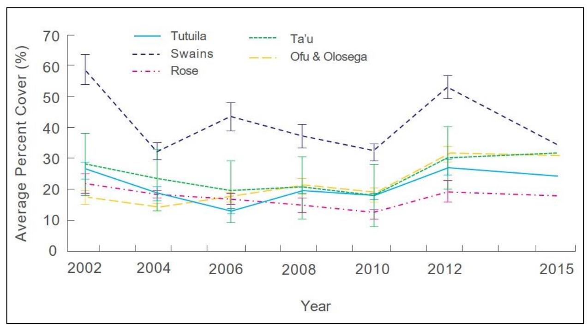

**Figure S.H.6.1.** Average coral cover observed during towed divers surveys from 2002–2015 across all islands of American Samoa. Source: NCRMP, 2018

Coral bleaching events have affected reefs across American Samoa in different ways. ESD reported a significant (α = 0.05) decline in coral cover between 2015–2018 at all sites that had sufficient sample sizes for analysis, including Rose Atoll and Ta'u Island. However, Fagatele Bay and Fagalua (combined for the purposes of the study) and Swains Island were omitted from the analysis due to insufficient sample size (Vargas-Ángel et al., 2019; Figure S.H.6.2). Coral cover data from CRAG's Fagatele Bay and Aunu'u monitoring sites (Figure S.H.6.3) indicate possible changes in coral cover during the reporting period; however, there were several changes in staff and a significant methods change in 2015, so values may not be directly comparable. Data collected since 2015 indicate that coral cover has increased or remained relatively stable in Fagatele Bay and many other sites around Tutuila from 2015–2019 (Coward et al., 2021). Anecdotal observations suggest that coral abundance and size structure was at a 40-year high at Fagatele Bay in 2018 (C. Birkeland/University of Hawai'i, personal communication, 2020). Limited observations and temperature data from Swains Island suggest that thermal stress events in 2015, 2016, and 2017 may have had more significant effects on corals there. Coral bleaching was observed in 2015, dead *Pocillopora* overgrown by CCA was observed in 2017

(Figure SS.WQ.3.2), and ESD calculated that over 60% of the *Pocillopora* colonies at study sites around Swains were lost between 2015–2018 (Vargas-Ángel et al., 2019).

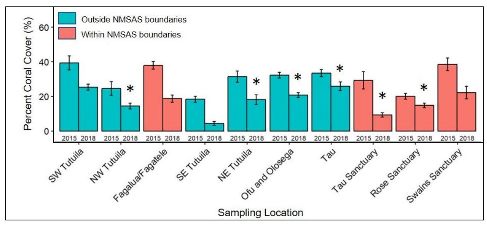

**Figure S.H.6.2.** Percent hard coral cover recorded by ESD, 2015–2018. ESD reported a significant (α = 0.05) decline in coral cover between 2015–2018 at all sites that had sufficient sample sizes for analysis (labeled ✱). Fagalua/Fagatele, Southwest Tutuila, Southeast Tutuila, and Swains were omitted from the analysis due to insufficient sample size. Image: Vargas-Ángel et al., 2019

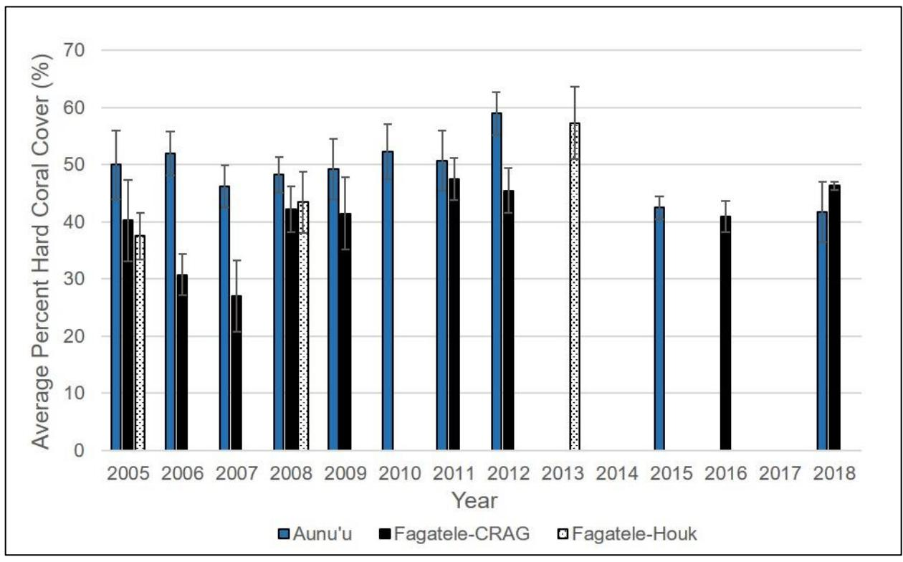

**Figure S.H.6.3.** Coral cover (± standard error) at CRAG monitoring sites in Fagatele Bay (Fagatele-CRAG) and Aunu'u from 2005–2018 and at an AS-EPA monitoring site in Fagatele Bay (Fagatele-Houk). Source: Coward et al., 2021 (Fagatele-CRAG, Aunu'u); Houk, 2019 (Fagatele-Houk)

CCA is another important component of reef habitat. CCA are important calcifiers that maintain reef structure and integrity, but some species also provide habitat for fish and invertebrates, and many induce larval settlement for benthic organisms, particularly corals. In American Samoa, CCA cover remains high, but is variable across spatial and temporal scales (Vargas-Ángel et al., 2019). ESD reported a significant (α = 0.05) increase in CCA cover between 2015 and 2018 at Rose Atoll, Ta'u Island, and Northern Tutuila. Further, in 2018, CCA cover at Swains Island was historically high (44.6 ± 4.6%), approaching levels observed at Rose Atoll (Vargas-Ángel et al., 2019). The historic level of CCA cover at Swains is likely attributable to *Pocillopora* coral mortality, which allowed for the growth of CCA over dead coral skeletons. In contrast, CRAG observed slight increases in CCA cover at permanent monitoring sites at Aunu'u in 2015 and Fagatele Bay in 2016; CCA remained stable in Aunu'u in 2018, but declined in Fagatele Bay (Coward et al., 2021).

Algae are also a valuable part of reef habitats, providing food for herbivorous fish and shelter for juvenile fish and invertebrates. But due to their rapid growth rates, algae can easily overwhelm corals and CCA, disrupting ecosystem functions (e.g., food web structure and space competition) and altering productivity (Kuffner et al., 2006; Birrell et al., 2008). Algae often increase following significant coral or CCA mortality events, when the system is exposed to high levels of nutrients or herbivory declines due to overharvest or lack of fish recruitment (Mumby et al., 2007; Sotka & Hay, 2009; Vermeij et al., 2010). Local and federal monitoring surveys have documented temporal fluctuations in macroalgae and turf algae cover but overall, it remains very low (<15%) within all sanctuary units (Coward et al., 2021; Vargas-Ángel et al., 2019). Turf algae cover was higher, but quite variable across time and space. Turf algae cover was highest in the Ta'u unit (Vargas-Ángel et al., 2019).

Noise can affect the integrity of ocean habitats, but data on noise pollution in sanctuary units are sparse. An ecological acoustic recorder (EAR) was deployed for one year in both Fagatele Bay (August 2006–July 2007) and Rose Atoll (March 2008–July 2009). Sound profiles from both sites were dominated by natural sounds, including snapping shrimp, whales, dolphins, fish, and rain. The data from Fagatele Bay demonstrate strong diel (day/night) variability. Interestingly, the differences were not as pronounced at Rose Atoll, and the two sites appeared to have different seasonal patterns. Although minimal, vessel noise was detected at both sites, with 21 and 20 distinct events recorded at Fagatele Bay and Rose Atoll, respectively (PIFSC, 2009, 2010, 2011).

Disturbance frequency and relative impacts can be important habitat indicators, as both natural and human disturbance events dramatically impact sanctuary resources. While ecosystems may have adapted to periodic natural disturbance events over time, changes in disturbance frequency and intensity, particularly those linked to climate change and human activities, may cause lasting impacts such as phase shifts. A number of disturbance events, including cyclones, bleaching, CoTS outbreaks, ship groundings, and a tsunami, have impacted NMSAS in recent years. Since 1959, 53 tropical cyclones have passed within 370 km of Tutuila (OCM, 2020). In 2018, Cyclone Gita damaged forests surrounding Fagatele Bay, which released significant amounts of debris into the bay, damaging corals. The storm also toppled table corals and caused other physical damage to the reef in Fagatele Bay. Approximately 20% of the corals on the eastern side of the bay and 3–5% in other areas of the bay were damaged (NMSAS, 2018a). A

CoTS outbreak in 2014–2017 mostly affected the north side of Tutuila, but also caused some impacts to sanctuary units (Clark, 2014; National Park Service, 2020; NMSAS, 2018b). Ship groundings at Rose Atoll in 1993 and Aunu'u in 2016 caused considerable physical damage (NMSAS, 2018c, 2020b; Schroeder et al., 2008; Green et al., 1997; Figure S.H.6.4). These physical disturbances, while limited in areal extent, have resulted in long-term impacts in these areas (see the Drivers and Pressures sections for more information). The 2009 tsunami was devastating to Tutuila, but based on wave exposure models (Center for Tsunami Research, 2010) and visual inspections, the tsunami appeared to have only minor impacts in NMSAS units. This is likely due to their orientation in relation to the tsunami waves. In Fagatele Bay, Fenner (2009) noted that the waves redistributed rubble and damaged corals on the shelf, but areas below 12 m appeared undisturbed. Fenner (2009) also noted that the intertidal zone was disturbed and that plants were damaged 6–7.5 m above the water line. With the exception of the physical damage from the vessel grounding in Aunu'u, workshop participants felt that shallow nearshore habitats have proven resilient to acute impacts and are in good condition. Cyclones, groundings, and the tsunami all caused an influx of marine debris into nearshore habitats (see the Drivers and Pressures sections for more information), but had limited lasting effects.

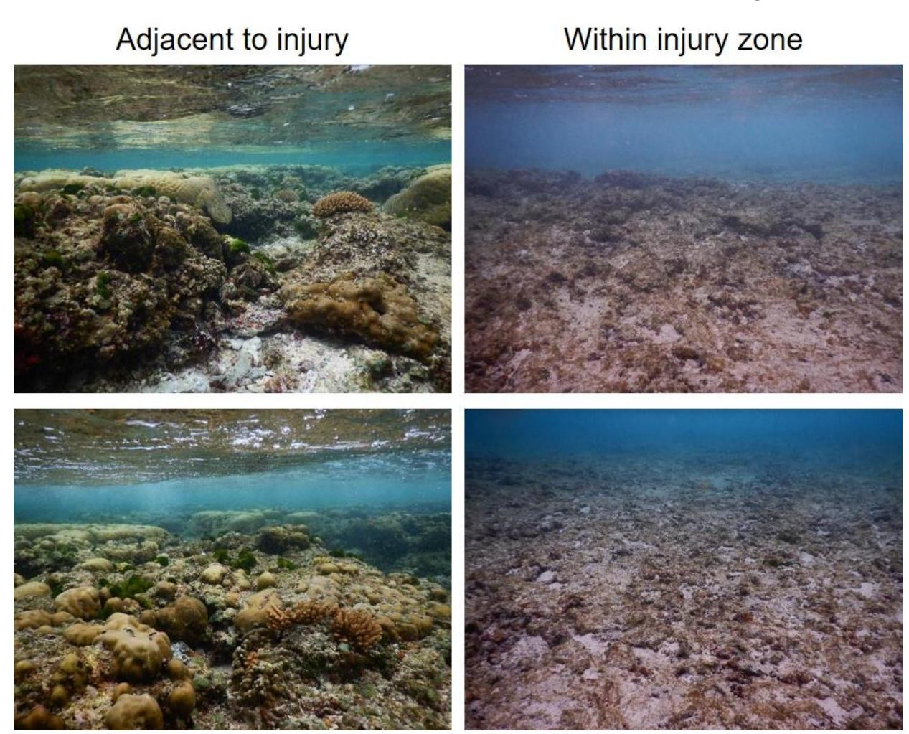

**Figure S.H.6.4.** Pictures of the reef adjacent to (left) and within (right) the ship grounding site in 2018 (two years after the grounding). Due to shifting rubble and reduced habitat complexity, this area has not recovered from the injury. Source: NMSAS, 2018c

### *Mesophotic Coral Ecosystems*

MCEs are found in every NMSAS unit (Table S.H.6.1). There are more MCEs in NMSAS than SCRs; Montgomery et al., 2019) and most of them remain unexplored and undocumented. The Aunu'u and Ta'u units have the highest proportion of hard substrate in the mesophotic zone (Figure S.H.6.5). These substrates are most likely to support habitat-structuring benthic organisms such as corals and sponges, but hard substrate appears to decrease with depth, shifting to predominantly unconsolidated substrate in the lower mesophotic zone (Montgomery et al., 2019). A mesophotic habitat assessment of the Tutuila insular shelf (30–110 m) found that scleractinian coral cover decreased with depth and that plate-like and encrusting corals dominated the upper zones, with branching corals more common in the middle mesophotic zone. Massive coral cover decreased with depth and dropped to zero below 80 m. Macroalgae were observed down to 100 m, but cover was most abundant in the mid-range depths (50–80 m; Bare et al., 2010).

**Table S.H.6.1.** Geodesic area (km2 ) of MCEs for each NMSAS management area. The mesophotic zones are upper (30–70 m), mid (70–110 m), and lower (110–150 m). SCR = shallow coral reef, MCE =

mesophotic coral ecosystem. Source: Montgomery et al., 2019

|       | Aunu'u Island A | Aunu'u Island B | Fagalua/ Fogama'a | Fagatele Bay | Ta'u Island | Swains Island | Muliāva/ Rose Atoll |
|-------|--------------------|--------------------|----------------------|-----------------|----------------|------------------|------------------------|
| SCRs  | 2.60               | 2.53               | 0.45                 | 0.42            | 1.23           | 1.68             | 1.10                   |
| MCEs  | 2.34               | 6.94               | 0.49                 | 0.27            | 1.70           | 0.48             | 1.31                   |
| Upper | 1.26               | 6.08               | 0.22                 | 0.12            | 0.71           | 0.23             | 0.75                   |
| Mid   | 1.08               | 0.67               | 0.10                 | 0.07            | 0.54           | 0.18             | 0.43                   |
| Lower | 0.00               | 0.18               | 0.17                 | 0.07            | 0.45           | 0.07             | 0.13                   |

In 2017, divers using rebreathers conducted deep dives in Fagatele Bay, Fagalua/Fogama'a, and Aunu'u. The divers documented mesophotic habitats in these units and sampled antipatharian and gorgonian corals, but were unable to collect quantitative data on habitat status (D. Wagner/NOAA, personal communication, 2017). In 2019, the exploration vessel *Nautilus* briefly explored the deep mesophotic zone just outside of the Aunu'u unit. Video taken from ROV *Hercules* showed a thriving mesophotic ecosystem extending to approximately 175 m. The deep mesophotic zone supported CCA, large sea fans, and black corals. At depths above 105 m, the coral community shifted, and more scleractinian corals were observed. Sharks, trevallies, and schools of snappers and dogtooth tuna were observed at approximately 100 m (OET, 2019; HURL, 2020). Though sparse, these data suggest the presence of significant mesophotic habitats within NMSAS and minimal direct human impact. Detailed data on habitat structure, status, and long-term trends for all indicators are lacking.

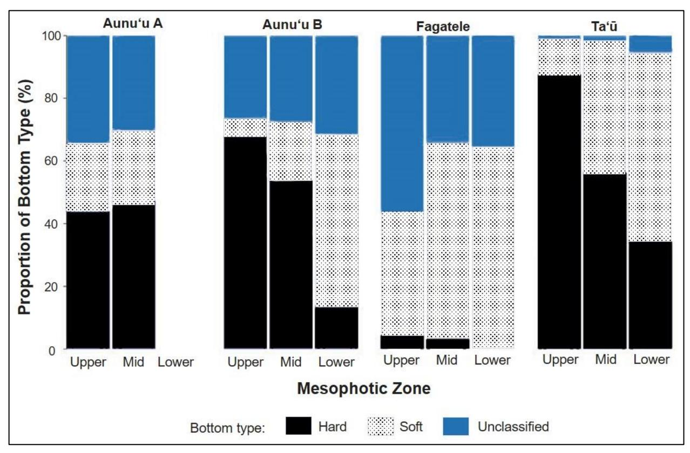

**Figure S.H.6.5.** Proportion of bottom types in NMSAS MCEs. Hard bottom types support corals and sponge communities that attract fish and invertebrates. MCEs in the Muliāva and Swains Island units were not classified due to the steep topographies along these atolls. Source: Montgomery et al., 2019

### *Pelagic and Deep Sea*

Pelagic and deep-sea habitats make up the majority of NMSAS habitats, but are the least well studied. NOAA Ocean Exploration and OET led expeditions to American Samoa in 2017 and 2019, respectively. The expedition teams made great strides in mapping and exploring deep-sea habitats across NMSAS using multibeam sonar, ROVs, and other specialized tools. The ROV surveys significantly expanded the knowledge of deep-sea habitats in American Samoa, including those along island ridges, seamounts, and active hydrothermal vents at Vailulu'u Seamount. Areas with hard substrate and steady currents were targeted, as they are most likely to support cnidarian and sponge communities that create habitat for other organisms. Although the data from these sites are not directly comparable, as they cover a wide range of depths, slopes, and substrates, and the surveys varied in length, the density of organisms observed can provide insight into the function of deep-sea habitats.

HURL analyzed footage from the OET expedition and calculated densities of organisms for each dive (OET, 2019; HURL, 2020). The deep ridges along Swains Island supported the highest density of corals and sponges (1732 per km), and the outer slope of Aunu'u and a deep ridge along Rose Atoll also supported relatively high densities (1559 and 1319 per km, respectively). All three communities are considered moderate-density communities, as they contain 1,000– 2,999 corals and sponges per kilometer. The Ta'u site adjacent to the sanctuary had few sponges, approximately 693 corals per km, while the young Vailulu'u seamount site only had six sponges

per km and no corals. Densities were not calculated for the NOAA Ocean Exploration dives. Habitat-forming benthic organisms observed during these two expeditions included black, gorgonian, lace, soft, stoloniferan, and stony corals; sea pens; demosponges; and glass sponges. The HURL analysis also noted that both sponges and corals serve as habitat for a wide range of organisms including echinoderms, arthropods, cnidarians, and mollusks. Ctenophores used sponges but not corals. The expeditions also noted marine debris, even at substantial depths (see Question 3), but these did not appear to cause significant habitat disturbance. These expeditions provide a glimpse into deep-sea habitats; however, detailed data and long-term trends for integrity indicators are lacking.

Vailulu'u Seamount is located between the Manu'a islands and Rose Atoll and is the only hydrothermally active seamount within the American Samoa exclusive economic zone (Koppers et al., 2010). It was discovered in 1975 and first mapped in 1999. Vailulu'u volcano is seismically and hydrothermally active, with frequent earthquakes and hydrothermal fluxes (Konter et al., 2004; Staudigel et al., 2006). The Nafanua cone, at the center of the seamount, formed between 2001 and 2004 (Koppers et al., 2010). Multibeam sonar surveys conducted by *Okeanos Explorer* in 2017 detected major depth changes in the summit caldera of Vailulu'u since the 2005 expedition, and comparisons of the data indicated that the cone grew in both height and width (Figure S.H.6.6). The 2019 OET expedition did not detect any notable changes in the crater's bathymetry, but did locate a new hydrothermal vent on the east side of the crater. The crater is, by nature, a very unstable environment but appears to have four distinct habitats that include: the Nafanua summit's iron oxide mats and cutthroat eel habitat; the hostile "Moat of Death"; intermediate zones with variable conditions; and rocky bottoms on the outside of the crater. These zones are contiguous, but contrast sharply in their biota (Staudigel et al., 2006). The hydrothermal vent discovered in 2019 supported a high abundance of organisms, including crabs, shrimp, and isopods around the plume. A field of dormant chimneys, ranging from 0.5 to about 2 m in height, was located nearby. Some of the chimneys still released warm water, but no bubbles were present (Sudek et al., 2020). The expeditions did not observe any human activity or unnatural alteration of the seamount.

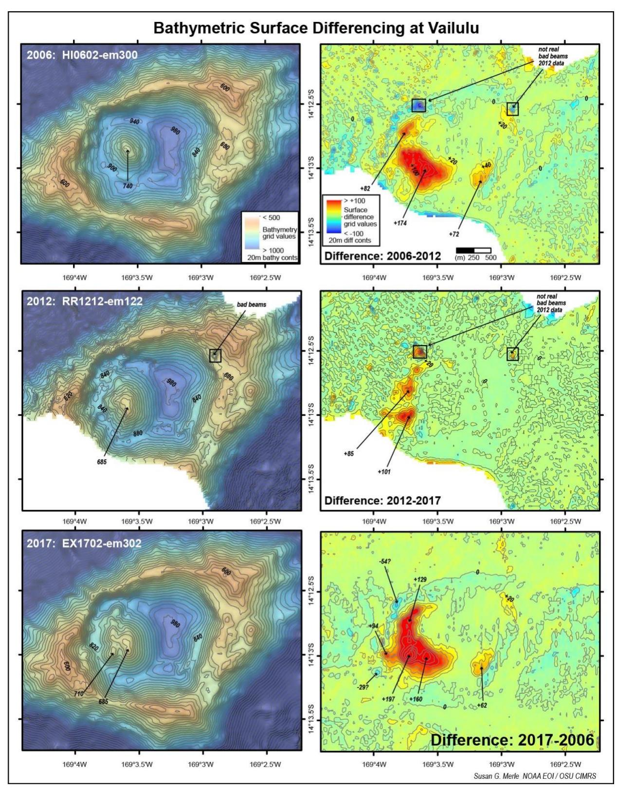

**Figure S.H.6.6.** Multibeam bathymetry of the crater at Vailulu'u Seamount (in meters), showing growth of the central cone over time. The map combines data from three different bathymetric surveys. Image: Susan Merle/Oregon State University and NOAA

### *Conclusion*

Despite some minor declines, indicators for habitat integrity suggest that sanctuary habitats are in good/fair condition. Shallow nearshore habitats were exposed to frequent disturbances, including cyclones, coral bleaching events, and CoTS, yet these habitats, particularly coral reefs, have demonstrated resilience to these events. However, shallow nearshore habitats are also exposed to direct anthropogenic impacts. For example, the damage from a vessel grounding in Aunu'u has had lasting impacts, but is constrained to a small area. Marine debris continues to be a chronic but minor problem across all habitats. Data for habitats in the mesophotic and pelagic zones are limited, but there are no indications of any substantial impacts. Recent deep-sea expeditions did not identify any recent impacts or immediate threats to these habitats, but data were extremely limited and no previous data were available for comparison.

## **Question 7: What are contaminant concentrations in sanctuary habitats and how are they changing?**

**Status Description:** Selected contaminants are suspected and may degrade some attributes of ecological integrity, but have not yet caused measurable degradation.

**Rationale:** Data on contaminants within NMSAS are limited. Heavy metals, hydrocarbons, pesticides, and pharmaceuticals were detected in water and sediment in Fagatele Bay in 2018, but only nickel was observed at concentrations above recommended screening levels. Iron contamination from the 1993 grounding at Rose Atoll persists but is limited in scope and continues to improve. As the Fagatele Bay data are from a single point in time and no recent data are available for other sanctuary units, the expert confidence in this rating is medium and experts were unable to determine a trend rating.

**Question 7 Indicator Table.** Summaries for the key indicators related to contaminants that were

| discussed during the 2020 status and trends workshop. |                       |                                                         |                                                                                                                                                                                                                                                                                                                                                                                                                                                                                                                                                                                                                                                                                                                                                                                                                                                                                                                                                                                                                                                                                                                                                                                                                                                                                                                                                                                                                                                                                                                                                                                                                                                                                                                                                                    |
|-------------------------------------------------------|-----------------------|---------------------------------------------------------|--------------------------------------------------------------------------------------------------------------------------------------------------------------------------------------------------------------------------------------------------------------------------------------------------------------------------------------------------------------------------------------------------------------------------------------------------------------------------------------------------------------------------------------------------------------------------------------------------------------------------------------------------------------------------------------------------------------------------------------------------------------------------------------------------------------------------------------------------------------------------------------------------------------------------------------------------------------------------------------------------------------------------------------------------------------------------------------------------------------------------------------------------------------------------------------------------------------------------------------------------------------------------------------------------------------------------------------------------------------------------------------------------------------------------------------------------------------------------------------------------------------------------------------------------------------------------------------------------------------------------------------------------------------------------------------------------------------------------------------------------------------------|
| Indicator                                             | Habitat               | Source                                                  | Summary                                                                                                                                                                                                                                                                                                                                                                                                                                                                                                                                                                                                                                                                                                                                                                                                                                                                                                                                                                                                                                                                                                                                                                                                                                                                                                                                                                                                                                                                                                                                                                                                                                                                                                                                                            |
| Nonpoint source pollution: Contaminants      | Nearshore habitats | Polidoro et al., 2017; Whitall et al., 2022 | Soil samples taken near the Futiga landfill in American Samoa showed high levels of lead, malathion (pesticide), PAHs, and phthalates (Polidoro et al., 2017). A study in 2019 collected water and sediment samples in Fagatele Bay for contaminant screening (Whitall et al., 2022). The water samples were screened for 400 compounds, including heavy metals, hydrocarbons, pesticides, pharmaceuticals and other organic compounds. Overall, the results indicated that Fagatele Bay, while not pristine, is a relatively clean marine environment. Most of the target compounds were not detected or were present in very low concentrations. No PAHs or organic compounds exceeded the available LC50 levels. Pharmaceuticals that could cause endocrine disruption at higher concentrations were detected. Sediment samples were tested for 16 different metals. Silver, arsenic, cadmium, chromium, copper, mercury, lead, and zinc were all below the ERL value. Nickel was the only metal that exceeded ERL values at three out of five sites within the bay and exceeded the ERM value at one site. Values above the ERL threshold indicate "possible toxicity to benthic infauna," while those above the ERM threshold may indicate "probable toxicity to benthic infauna" (nickel measurements = 69.6, 23.9, 24.1 ppm; ERL = 20.9 ppm; ERM = 51.6 ppm). ERL values are not available for some metals (aluminum, iron, manganese, antimony, selenium, silicon, tin). The concentration of arsenic, chromium, nickel, and selenium at some stations in Fagatele Bay was higher than the mean values observed at Faga'alu (a more impacted watershed on Tutuila). |
| Point source pollution: Iron                       | Nearshore habitats | Green et al., 1997; Schroed er et al., 2008 | Jin Shiang Fa grounded at Rose Atoll in 1993 and scattered metal debris over a 3,500 m2 area (Green et al., 1997). Most of the metal was removed, but approximately 1 ton of metallic debris remains. Iron is a limiting nutrient at Rose Atoll, and the remaining metal pieces release iron into the water, supporting a persistent cyanobacteria bloom on the reef flat surrounding the wreck site (Schroeder et al., 2008). Conditions appear to be improving, and most of the impacts are outside of the sanctuary on the reef flat. (Note: Iron is normally considered a nutrient, but as Rose Atoll is an iron-limited habitat, and elevated iron is the result of a discrete anthropogenic impact, it is considered a contaminant in this case.)                                                                                                                                                                                                                                                                                                                                                                                                                                                                                                                                                                                                                                                                                                                                                                                                                                                                                                                                                                     |

| Indicator                              | Habitat               | Source                                    | Summary                                                                                                                                                                                                                                                                                                                                                                                                                                                                                                                                                                                                                                                                                                                                                                                                                                                                                                                                                                                                                                                                                                                                                                           |
|----------------------------------------|-----------------------|-------------------------------------------|-----------------------------------------------------------------------------------------------------------------------------------------------------------------------------------------------------------------------------------------------------------------------------------------------------------------------------------------------------------------------------------------------------------------------------------------------------------------------------------------------------------------------------------------------------------------------------------------------------------------------------------------------------------------------------------------------------------------------------------------------------------------------------------------------------------------------------------------------------------------------------------------------------------------------------------------------------------------------------------------------------------------------------------------------------------------------------------------------------------------------------------------------------------------------------------|
| Point source pollution: Chemical | Nearshore habitats | Green et al., 1997; AS-EPA, 2007 | Jin Shiang Fa was carrying an estimated 100,000 gallons of diesel fuel (No. 2 fuel oil), 500 gallons of lube oil, and 2,500 pounds of refrigeration system ammonia when it struck the reef at Rose Atoll in 1993. All of these contaminants were discharged into the marine environment at the wreck site on the southwest side of the atoll, where they subsequently spread over the reef flat and into the lagoon. Responders noted that oil was pounded into the reef structure and sediments by waves. Petroleum products persisted in the sediment at the wreck site for at least 22 months after the spill (Green et al., 1997). It is not known if these chemicals persist. Pollution from the wreck of No. 1 Ji Hyun off of Aunu'u in 2016 was quickly removed, and any pollutants that may have reached the water likely dissipated rapidly in the high energy environment. No recent data were available regarding the effluent released by the Aunu'u sewage outfall, but AS-EPA noted that the discharge zone is highly mixed and nearby waters met recreational water standards (AS-EPA, 2007). |

Contaminants have been found in some of the world's most remote marine habitats (Jamieson et al., 2017), so it is likely that contaminants are present even in remote parts of NMSAS. Known sources of contamination include the Futiga landfill, vessel grounding sites at Rose Atoll and Aunu'u, and the sewage outfall at Aunu'u (see Questions 2 and 3).

Polidoro et al. (2017) confirmed the presence of lead, malathion (pesticide), PAHs, and phthalates in soils around the Futiga landfill on Tutuila. NMSAS partnered with NCCOS in 2019 to sample water and sediment in Fagatele Bay to determine if contaminants have reached the marine environment. The team screened the samples for over 400 compounds, including heavy metals, hydrocarbons, pesticides, pharmaceuticals, and other organic compounds. Many of these were not detected or were present in very low concentrations. Nickel was the only metal that exceeded ERL screening levels, indicating possible toxicity to benthic infauna in the bay (see Figure S.WQ.2.1). This elevated nickel concentration may be natural or a sign that contaminants from the landfill are reaching the bay. The concentrations of other metals and compounds were below established regulatory and screening levels, but there are no recommendations for a number of compounds detected. Ultimately, nothing alarming has been observed in terms of contaminants in Fagatele Bay, and it is a relatively clean system compared to other sites around the country (D. Whitall/NOAA, personal communication, 2020). The concentration of arsenic, chromium, nickel, and selenium at some stations in Fagatele Bay was higher than the mean values observed at Faga'alu (a more impacted watershed on Tutuila). Additionally, sub-lethal effects, such as endocrine disruption in marine animals, may occur at concentrations below the screening levels for some contaminants (D. Whitall/NOAA, personal communication, 2020; Whitall et al., 2022). More work is required to determine if the contaminants detected in Fagatele Bay originated from the landfill or other human activities,

such as agriculture. The adjacent bay, Fagalua/Fogama'a, may also be affected by the landfill and agricultural practices and should be evaluated. Experts agreed that further monitoring of these pollutants is essential, as these values could increase over time with landfill use and changes in hydrology.

In 1993, the Taiwanese longline fishing vessel *Jin Shiang Fa* ran aground on the seaward edge of southwest side of Rose Atoll (see Question 2 and Figure S.H.7.1). The wreck resulted in the release of fuel, oil, and refrigerant, and petroleum products were detectable in sediment at the wreck site for at least 22 months after the spill. Most of the vessel was removed, but some metal debris remains embedded in the reef (Green et al., 1997). The metal sections are corroding and releasing iron into the water, which has caused a persistent cyanobacteria bloom near the wreck site (Schroeder et al., 2008; Pendleton, 2012). Although iron enrichment and cyanobacteria blooms are normally considered a form of eutrophication, in this case, ONMS considers iron to be a contaminant at Rose Atoll, as it is naturally a limiting element in this remote ecosystem and was introduced through a discrete event. USFWS is evaluating a project to remove the remaining metal debris, but the project will be difficult, as the debris is embedded in the reef matrix. Pollution from the wreck of *No. 1 Ji Hyun* off of Aunu'u in 2016 was quickly removed, and any pollutants that may have reached the water likely dissipated rapidly in the high-energy environment (see Question 3 for more information on the grounding event).

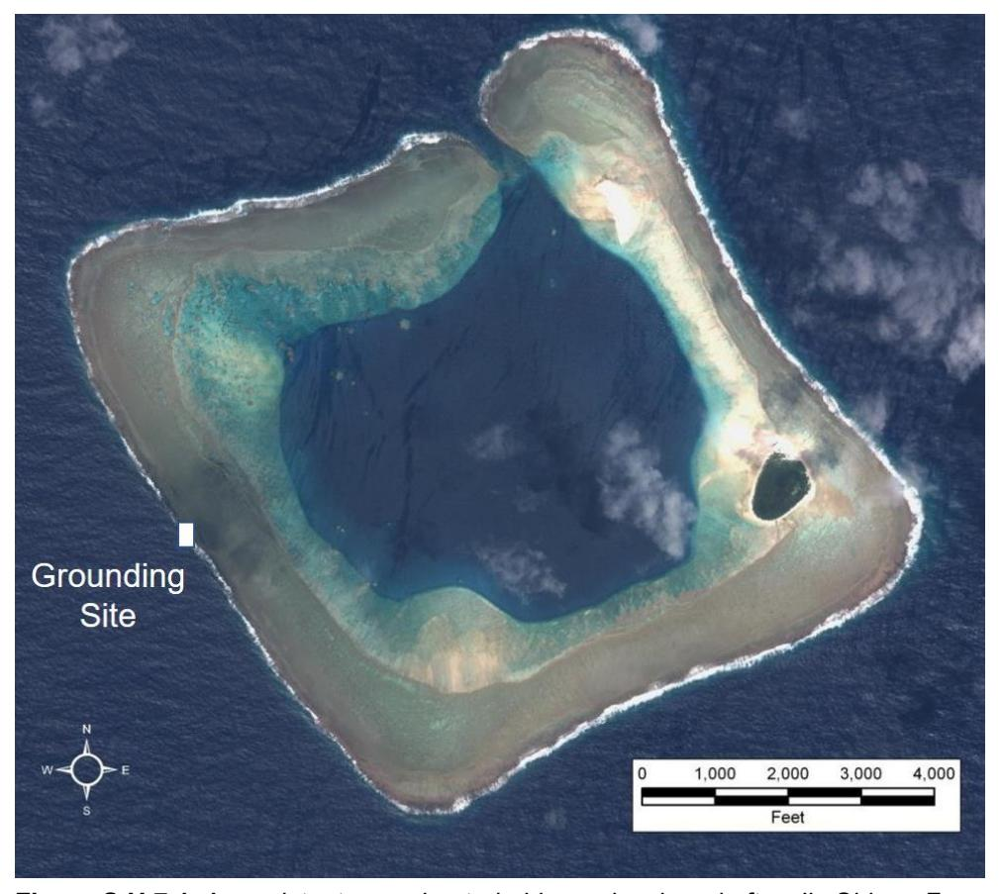

**Figure S.H.7.1.** A persistent cyanobacteria bloom developed after *Jin Shiang Fa* ran aground on the southwest side of Rose Atoll in 1993. The bloom was still visible by satellite imagery in 2010, but has decreased over time. Image: Pendleton, 2012

Recent data are not available regarding effluent released by the Aunu'u sewage outfall. While there is no industry on Aunu'u, household sewage may contain pharmaceuticals and other contaminants. AS-EPA stated that the discharge zone is highly mixed and bacterial counts for the waters in the area around the sewage outfall met American Samoa water quality standards for recreational beaches (AS-EPA, 2007).

### *Conclusion*

Contaminants have been observed in Fagatele Bay and Rose Atoll, but are present in low levels and have not caused measurable degradation to sanctuary resources. The potential sources of contamination identified may also affect Fagalua/Fogama'a and Aunu'u units, but contaminant screening has not been conducted at these locations. Heavy metals, hydrocarbons, pesticides, and pharmaceuticals were detected in water and sediment in Fagatele Bay in 2019, but only nickel was observed at concentrations above recommended screening levels. Experts agreed that further monitoring of these pollutants is essential, as their concentrations could increase over time with changes in landfill use and hydrology. The 1993 grounding of *Jin Shiang Fa* at Rose Atoll released contaminants into the water. Petroleum products were detectable in sediment at the wreck site for at least 22 months after the spill, but it is not clear if there is lasting contamination from these chemicals. Iron pollution from the grounding persists, but the impacts to the sanctuary are limited in scope and continue to improve. In Aunu'u, responders quickly removed pollutants from a 2016 vessel grounding, and any contaminants released from the vessel likely dissipated quickly. The sewage outfall in Aunu'u may be a source of contamination, but the chemical composition of the effluent is unknown, and no testing has been conducted. The discharge zone is highly mixed and accumulation of contaminants is unlikely.

## **Question 8: What are the levels of human activities that may adversely influence habitats and how are they changing?**

**Status Description:** Selected activities have caused measurable resource impacts, but effects are localized and not widespread or persistent.

**Rationale:** Vessel groundings have had localized effects on coral reef habitat in the Aunu'u and Muliāva units. Destructive fishing practices have not been observed recently, but abandoned fishing gear has been removed from sites on Tutuila. Marine debris is widespread across the sanctuary, but documented habitat impacts have been limited. Deep-sea surveys detected significant marine debris accumulations in the deep sea around Tutuila, but did not detect marine debris in the Muliāva unit. Limited data are available for all sites, particularly for pelagic, mesophotic, and deep-sea habitats.

Human activities can impact the structural (physical), biological, oceanographic, acoustic, and/or chemical characteristics of NMSAS habitats. Structural impacts, such as removal or mechanical alteration of habitat, can result from various destructive fishing methods (e.g., drag nets, chemicals, and explosives) and anchoring. Marine debris, including abandoned fishing gear, nets, and buoys, can damage fragile corals in SCRs. Ship groundings on coral reefs can

cause extensive physical damage to the reef structure and can release toxic petrochemicals, killing reef organisms. Any wreckage left on the reef can continue to cause physical damage and may release iron into nearby waters, disrupting natural nutrient cycles.

Destructive fishing methods, particularly dynamite fishing, were documented in the previous condition report, but no evidence of dynamite fishing has been detected since 2007 in any of the sanctuary units. Fishing lines, hooks, and weights have been removed from the reef at multiple sites and anchor damage has been observed in Aunu'u, Fagatele Bay, and Fagalua/Fogama'a, but damage has been limited and localized.

Marine debris has been documented along the beaches in all NMSAS units. Surveys in Fagalua/Fogama'a indicated that polystyrene foam and plastic are the biggest contributors to marine debris at these sites. A piece of abandoned net damaged a large table coral in Fagalua in 2019, and a drifter drogue became entangled in Fagatele Bay in 2020, breaking a large table coral and killing three additional corals due to shading and abrasion. Deep-sea surveys across the U.S. Pacific Islands in 2017 showed that Tutuila was a hot spot for deep-sea marine debris, likely due to cyclones and the 2009 tsunami. Marine debris in NMSAS was mostly associated with fishing (Amon et al., 2020).

Two vessel groundings have caused lasting habitat impacts to NMSAS coral reef habitats. On Rose Atoll, the grounding of a Taiwanese 40-m long-line tuna-fishing vessel in October 1993 released 100,000 gallons of diesel and 500 gallons of lube oil into refuge waters. Prevailing currents carried these contaminants across the reef flat and into the lagoon. The diesel and oil killed giant clams, sea cucumbers, reef-boring urchins, and a large area of coralline algae. The grounding itself physically damaged the reef when the ship hit the upper portion of the outer reef slope and moved across the reef before coming to rest (Green et al., 1997). Extensive removal efforts were undertaken over many years by USFWS, but some iron debris remains. Subsequent monitoring and assessment studies indicate that the high concentration of iron has led to algal blooms that further inhibit repopulation of CCA and filter-feeding marine organisms (Schroeder et al., 2008).

The 62-ft fishing vessel *No. 1 Ji Hyun* lost its main engines and grounded off the west side of Aunu'u in the NMSAS Multiple Use Zone on April 14, 2016 (Figure S.H.8.1). Severe weather (Category 3 Tropical Cyclone Amos), high winds and surf, limitations on site access, daylight high tides, and availability of resources including tugs, tow lines, and trained personnel made the response challenging. Three unsuccessful removal attempts under Oil Pollution Act authorization were led by the U.S. Coast Guard. An additional three removal efforts occurred, in consultation with the U.S. Coast Guard, under the authority of the National Marine Sanctuaries Act and leadership of ONMS, eventually resulting in the successful removal of *No. 1 Ji Hyun* on August 19, 2016.

Because of severe weather, the wreck shifted several times before it could be removed, resulting in significant scouring injuries. The grounding and removal efforts impaired 1,641 m2 of reef habitat, leaving a large rubble field with low complexity and rugosity (see Figure S.H.6.4). Subsequent monitoring showed that two years after the removal, no coral recruitment had occurred within the scouring injury, and most of the substrate was covered with turf and small, low-profile macroalgae. The decreased reef complexity and rugosity do not provide appropriate

habitat for most reef organisms and the site has not recovered. Due to the intensity of wave action in the grounding area, restoration of the site is not feasible.

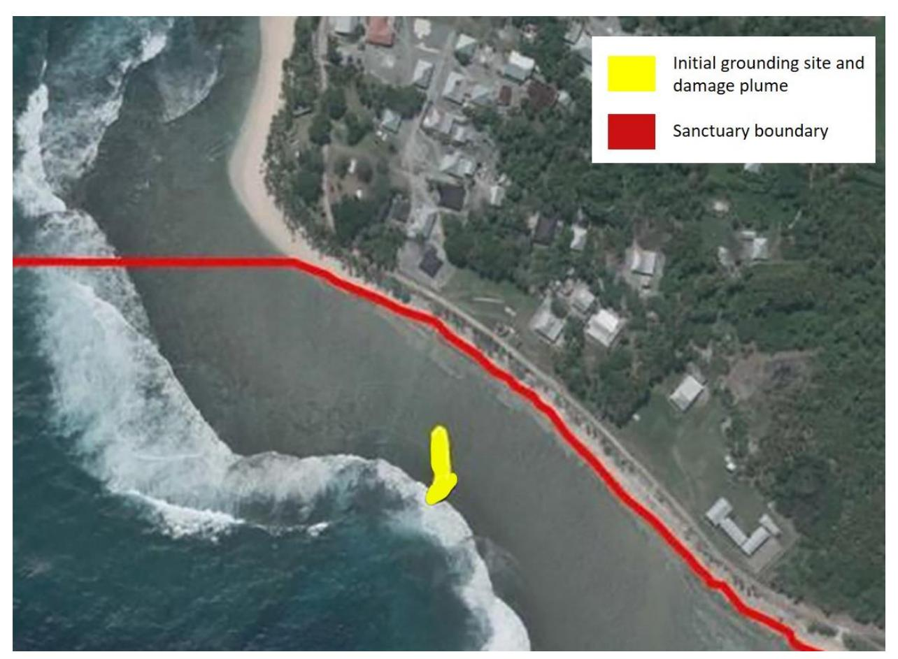

**Figure S.H.8.1.** Map of the reef area affected by the grounding of the fishing vessel *No.1 Ji Hyun* on August 19, 2016 in the Aunu'u Multiple Use Zone. Source: NMSAS, 2018c

Anthropogenic noise is an increasing concern in marine habitats. EARs were deployed in Fagatele Bay and at Rose Atoll in 2006–2007 to assess noise. The data collected from these devices indicate that anthropogenic noise is limited in these areas and appears to be associated with infrequent vessel visits to the sites (PIFSC, 2009, 2010, 2011). A new recorder was installed in Fagatele Bay in 2019, but data have not yet been analyzed (NMSAS, 2021a).

### *Conclusion*

Vessel groundings have had severe, localized effects on coral reef habitat in the Aunu'u and Muliāva units. Destructive fishing practices have not been observed recently, but abandoned fishing gear has been removed from sites on Tutuila. Marine debris is widespread across the sanctuary, but documented habitat impacts have been limited. Deep-sea surveys detected significant marine debris accumulations in the deep sea around Tutuila, but did not detect marine debris in the Muliāva unit. Limited data are available for all sites, but particularly for pelagic, mesophotic, and deep-sea habitats.

## *Living Resources (Questions 9–13)*

The following is an assessment of the status and trends of key living resource indicators in NMSAS from 2007–2020.

Question 9 evaluates the status of keystone and foundation species. Both are important components of the ecosystem. A "keystone" species has a disproportionately large effect on its environment relative to its abundance (Cottee-Jones & Whittaker, 2012). "Foundation" species are those that define much of the structure of a community by creating locally stable conditions, such as providing primary prey for local predators or serving as biogenic habitat (sensu Dayton, 1972).

Question 10 focuses on "other focal species." These include culturally important species, such as giant clams and food fish, large charismatic species such as sea turtles and humpback whales, indicator species, and species that are of interest for other reasons.

Question 11 assesses the impacts of non-indigenous species. Also called alien, exotic, non-native, or introduced species, and invasive species when they cause environmental or economic impacts, these are animals or plants living outside their endemic geographical range.

Question 12 addresses the status of biodiversity, which is defined as variation of life at all levels of biological organization, and commonly encompasses diversity within species (genetic diversity), among species (species diversity), and comparative diversity among ecosystems (ecosystem diversity). Biodiversity can be measured in many ways. The simplest measure is to count the number of species found in a certain habitat or ecosystem, termed species richness. Other indices of biodiversity couple species richness with relative abundance to provide a measure of evenness and heterogeneity. Whether measured or not, changes in biodiversity can be inferred through assessments of functionally important species, altered food web structure, and other proxies that reflect changes in relative abundance.

Human activities that have the potential to negatively impact living resources are the focus of Question 13. These include activities that remove plants or animals, as well as activities that have the potential to injure or degrade the condition of living resources. Activities that can facilitate the introduction or spread of non-indigenous species are also relevant to this question.

## **Question 9: What is the status of keystone and foundation species and how is it changing?**

**Status Description:** The status of keystone and foundation species is mixed.

**Rationale:** The status of keystone and foundation species varies across taxa. Experts assigned a rating of fair/poor to fish taxa as the low abundance of large predators and herbivores in shallow coral reef habitats, may decrease ecosystem resilience. Benthic foundation species, such as corals and crustose coralline algae, were rated as good/fair. While experts are concerned that low reef fish biomass may eventually impair reef resilience, during this reporting period benthic foundation species demonstrated an ability to recover after coral bleaching, crown-of-thorns starfish outbreaks, a tsunami, and storms. Data for mesophotic and deep sea species are limited, but do not indicate degradation of these habitats.

| Taxa            | Status    | Status Description                                                                                                                                      |
|-----------------|-----------|---------------------------------------------------------------------------------------------------------------------------------------------------------|
| Fish species    | Fair/poor | The status of keystone and foundation species suggests severe degradation in some, but not all, attributes of ecological integrity.                  |
| Benthic species | Good/fair | The status of keystone or foundation species may preclude full community development and function, but has not yet led to measurable degradation. |

3 Experts assigned a status rating of fair/poor at the workshop, but recommended splitting the status rating between fish and benthic species. Following the workshop, a new "mixed" status was introduced to the condition report rating scheme. ONMS staff determined that this new rating was more appropriate for this question based on expert opinion and available data.

**Question 9 Indicator Table.** Summaries for the key indicators related to keystone and foundation

species that were discussed during the 2020 status and trends workshop.

| Indicator                                                                    | Habitat               | Source                                                                                                            | species that were discussed during the 2020 status and trends workshop. Summary                                                                                                                                                                                                                                                                                                                                                                                                                                                                                                                                                                                                                                                                                                                                                                                                                                                                                                                                                                                                                                                                                                                                                                                                                                    |
|------------------------------------------------------------------------------|-----------------------|-------------------------------------------------------------------------------------------------------------------|-----------------------------------------------------------------------------------------------------------------------------------------------------------------------------------------------------------------------------------------------------------------------------------------------------------------------------------------------------------------------------------------------------------------------------------------------------------------------------------------------------------------------------------------------------------------------------------------------------------------------------------------------------------------------------------------------------------------------------------------------------------------------------------------------------------------------------------------------------------------------------------------------------------------------------------------------------------------------------------------------------------------------------------------------------------------------------------------------------------------------------------------------------------------------------------------------------------------------------------------------------------------------------------------------------------------------|
| Zooxanthellate scleractinian corals: Demographics, acute impacts | Nearshore habitats | C. Birkeland/ University of Hawai'i, personal communication, 2020; Vargas Ángel et al., 2019 | Corals in American Samoa have substantial recruitment and a size-frequency distribution characteristic of a healthy coral community (C. Birkeland/University of Hawai'i, personal communication, 2020). In 2018, adult coral density was highest in the mid-depth strata, and adult coral density was greater than juvenile density across all reporting units and depth strata. At Ta'u and Rose Atoll, the deep strata had higher adult coral density than other islands in American Samoa. This may reflect the impacts of coral bleaching events from 2015–2017. At Ta'u, the density of juvenile coral was high in the deep strata and almost equal to adult density. Throughout NMSAS, adult and juvenile coral density did not change significantly from 2015–2018. Disease prevalence remained low in all units (Vargas-Ángel et al., 2019). NMSAS noted that white syndrome prevalence appeared to increase during warming events; this potential trend warrants further study. Acropora communities in Fagatele Bay remained in good condition from 1995–2018, and, anecdotally, the coral community was in the best condition observed in the past 40 years (C. Birkeland/University of Hawai'i, personal communication, 2020). |
| Crustose coralline algae: Cover, disease prevalence                 | Nearshore habitats | Vargas-Ángel et al., 2019; NMSAS, 2020b                                                                     | CCA cover remained high and increased at many sites between 2015–2018. Low levels of coralline lethal orange disease (CLOD) have been observed in Fagatele Bay. In 2018, an increase in disease prevalence was observed in Fagatele Bay (Vargas Ángel et al., 2019) and NMSAS staff noted an additional spike in 2020 (NMSAS, 2020b). This disease has not been documented at Rose Atoll or Swains Island but was also recorded at a low level in the Ta'u unit in 2015 (Vargas-Ángel et al., 2019).                                                                                                                                                                                                                                                                                                                                                                                                                                                                                                                                                                                                                                                                                                                                                                                       |
| Reef sharks: Biomass                                                      | Nearshore habitats | Nadon et al., 2012; MacNeil et al., 2020                                                                 | Nadon et al. (2012) recorded grey reef, whitetip, blacktip, and nurse sharks in American Samoa. Whitetip reef sharks had the highest abundance of these species. Using a simulation, Nadon et al. (2012) estimated that unexploited shark densities would be between 1.2 and 2.4 sharks ha-1 ; current densities are at 4–8% of these estimates. Recent baited remote underwater video surveys also recorded very low shark densities in American Samoa compared to some other islands in the South Pacific (MacNeil et al., 2020).                                                                                                                                                                                                                                                                                                                                                                                                                                                                                                                                                                                                                                                                                                                                               |

| Indicator                                                             | Habitat            | Source                                                                                                                                                                                | Summary                                                                                                                                                                                                                                                                                                                                                                                                                                                                                                                                                                                                                                                                                                                                                                                                                                                                                                                                                                                                                                                                                                                                                                                                                                                                                                                                                                                                                                                                                                                  |
|-----------------------------------------------------------------------|--------------------|---------------------------------------------------------------------------------------------------------------------------------------------------------------------------------------|--------------------------------------------------------------------------------------------------------------------------------------------------------------------------------------------------------------------------------------------------------------------------------------------------------------------------------------------------------------------------------------------------------------------------------------------------------------------------------------------------------------------------------------------------------------------------------------------------------------------------------------------------------------------------------------------------------------------------------------------------------------------------------------------------------------------------------------------------------------------------------------------------------------------------------------------------------------------------------------------------------------------------------------------------------------------------------------------------------------------------------------------------------------------------------------------------------------------------------------------------------------------------------------------------------------------------------------------------------------------------------------------------------------------------------------------------------------------------------------------------------------------------|
| Large parrotfish: Fish biomass, size structure                        | Nearshore habitats | Comeros-Raynal et al., 2017; M. Comeros-Raynal/James Cook University, personal communication, 2020; MARC, 2020; Kobayashi et al., 2011; McCoy et al., 2018; Vargas-Ángel et al., 2019 | On Tutuila, parrotfish biomass in the 10–30 cm size class has remained stable since 2010, with a slight increase in 2018. Biomass of large parrotfish (>30 cm) was more variable, with a slight increase in 2018. In Ta'u, parrotfish biomass was dominated by larger individuals and was well above the American Samoa average. Swains Island had few parrotfish in the 10–30 cm size class, and biomass of larger parrotfish was variable. Rose Atoll had more small parrotfish, but relatively low parrotfish biomass. It is not clear what is driving these patterns (McCoy et al., 2018; Vargas-Ángel et al., 2019). Large-bodied parrotfish account for approximately 10% of the target reef fish community in Aunu'u and Fagatele Bay, while small-bodied parrotfish account for approximately 50%. Parrotfish abundances at both sites were below the average for Tutuila (Comeros-Raynal et al., 2017; MARC, 2020). Surveys in Fagatele Bay in 2019 recorded very low recruitment of parrotfish on the reef flat and reef slope compared to other sites on Tutuila (i.e., sites adjacent to intermediate and extensive watersheds; M. Comeros-Raynal/James Cook University, personal communication, 2020). Bumphead parrotfish (Bolbometopon muricatum) were observed at Ta'u (1.08 fish km-2) and at Tutuila (0.41 fish km-2) during towed diver surveys (Kobayashi et al., 2011). No recent sightings have been reported and this species is considered by many to be functionally extinct in American Samoa. |
| Surgeonfish and unicornfish: Fish biomass, size structure | Coral reef         | Comeros- Raynal et al., 2017; M. Comeros- Raynal/James Cook University, personal communication, 2020; MARC, 2020; WPRFMC, 2019                    | In Aunu'u, small surgeonfish make up about 10% of the monitored reef fish community and large-bodied surgeonfish (i.e., orangespine unicornfish) were not observed during surveys. In Fagatele Bay, small surgeonfish make up about 12% of the fish community and large-bodied surgeons (i.e., orangespine unicornfish) are approximately 10% of the monitored reef fish community (Comeros-Raynal et al., 2017; MARC, 2020). The mean size of surgeonfish is approximately 15 cm across all islands (Western Pacific Regional Fishery Management Council (WPRFMC), 2019), which may be cause for concern. Surgeonfish recruitment on the reef flat and reef slope in Fagatele Bay was moderate in 2019 and comparable to other sites surveyed in American Samoa. In general, fish recruitment was higher on the reef flat compared to the reef slope (M. Comeros-Raynal/James Cook University, personal communication, 2020).                                                                                                                                                                                                                                                                                                                                                                                                                                                                                                                                                                                           |

| Indicator                                   | Habitat                           | Source                                                                                            | Summary                                                                                                                                                                                                                                                                                                                                                                                                                                                                                                                                                                                                                                                                                                                                                                                                                                                                                                                                            |
|---------------------------------------------|-----------------------------------|---------------------------------------------------------------------------------------------------|----------------------------------------------------------------------------------------------------------------------------------------------------------------------------------------------------------------------------------------------------------------------------------------------------------------------------------------------------------------------------------------------------------------------------------------------------------------------------------------------------------------------------------------------------------------------------------------------------------------------------------------------------------------------------------------------------------------------------------------------------------------------------------------------------------------------------------------------------------------------------------------------------------------------------------------------------|
| Corals: species presence and richness | Mesophotic coral ecosystems | Bare et al., 2010; Montgomery et al., 2019; OET, 2019; HURL, 2020; Wagner, 2017 | Approximately 110 species of scleractinian corals have been observed at mesophotic depths in American Samoa (Montgomery et al., 2019). Encrusting and plate-like coral are the most common growth forms across depths. Branching corals appear to be most abundant at deeper depth ranges. Massive corals are more common at shallower depths (Bare et al., 2010). In 2019, ROV Hercules aboard the exploration vessel Nautilus captured video of Leptoseris corals as deep as 148 m near Aunu'u. Sea fans (Anella spp.) and unidentified antipatharian corals were observed in the deep mesophotic zone (OET, 2019). During rebreather surveys in Fagatele Bay and Fagalua/Fogama'a, a variety of gorgonian and black coral specimens were documented, and samples were collected for taxonomic identification purposes (Wagner, 2017). Data were insufficient to evaluate trends. |
| Corals and sponges: Cover, density    | Deep sea                          | Kennedy et al., 2019; DSCRTP, 2020; OET, 2019; HURL, 2020                          | Two expeditions documented a large number of black, gorgonian, lace, soft, stoloniferan, and stony corals; sea pens; demosponges; and glass sponges (Kennedy et al., 2019; DSCRTP, 2020). In 2019, moderate-density communities (1,000–2,999 combined individuals km-1 ) were observed at Swains Island, Aunu'u, and Rose Atoll. The 2019 Nautilus expedition documented over 1,500 animals, including echinoderms, arthropods, cnidarians, and mollusks associated with either a coral or sponge (OET, 2019; HURL, 2020).                                                                                                                                                                                                                                                                                                                                                                                        |

Shallow coral reefs in NMSAS are diverse, complex systems and many species are highly specialized, making it difficult to select single keystone and foundation species for evaluation. In the sanctuary's mesophotic and deep-sea ecosystems, too little is known about ecological interactions and individual species' roles in the ecosystem to identify individual keystone or foundation species at this time. Thus, for this question, groups of ecologically important species are evaluated for their combined contributions to the ecological integrity of their respective ecosystems.

### *Zooxanthellate Scleractinian Corals*

Scleractinian corals are important foundation species for SCR ecosystems, providing structure and food for many other reef organisms. Over 150 species of coral have been documented in NMSAS, but species-specific data are limited. Coral communities were affected by coral bleaching events in 2015, 2016, 2017, and 2020; a tsunami in 2009; a CoTS outbreak in 2014– 2017; and Cyclone Gita in 2018 (see Figure DP.3). Coral diseases have been observed, but prevalence has remained low. Despite these episodic events, overall coral cover has remained

stable since 2007 (see Habitat section), and expert opinion is that the condition of corals in Fagatele Bay is better at present than in the recorded past.

Coral cover provides a good metric of reef habitat quality, but coral community demographics provide deeper insight into the ecology of these foundational species. Despite frequent disturbances, reefs in American Samoa, and particularly in Fagatele Bay, appear to have substantial coral recruitment and a healthy size-frequency distribution (C. Birkeland/University of Hawai'i, personal communication, 2020). These are signs of healthy coral communities, indicating the presence of robust older corals that have been resilient to disturbance, as well as the successful recruitment of new corals into the ecosystem. *Acropora* species particularly exhibited these trends in Fagatele Bay; in 1995, the *Acropora* community was dominated by small to midsize colonies, and by 2018, the community had shifted to more midsize and large corals, including a number of colonies greater than 160 cm in diameter (C. Birkeland/University of Hawai'i, personal communication, 2020).

ESD noticed similar patterns in their 2015 and 2018 surveys, with evidence of recent recruitment and stable juvenile and adult colony densities observed across all sites despite repeated bleaching events (Figure S.LR.9.1). ESD noted that adult coral density in 2018 was highest in the mid-depth strata, which may reflect adult mortality in the shallow depth zone from repeated coral bleaching events. At Swains Island, observers noted that bleaching events had a visible effect on coral community demographics, and further analysis indicated that the density of *Pocillopora* colonies declined by over 60% between 2015–2018. Deep reefs in Ta'u appeared to have experienced higher mortality than other deep sites, but both adult and juvenile colony density were higher there in 2018 than most other sites and depth strata. Rose Atoll also had a relatively high proportion of adult colonies in the deep depth strata. Disease prevalence was low (1–2%) at all sites and did not vary significantly among years (Vargas-Ángel et al., 2019).

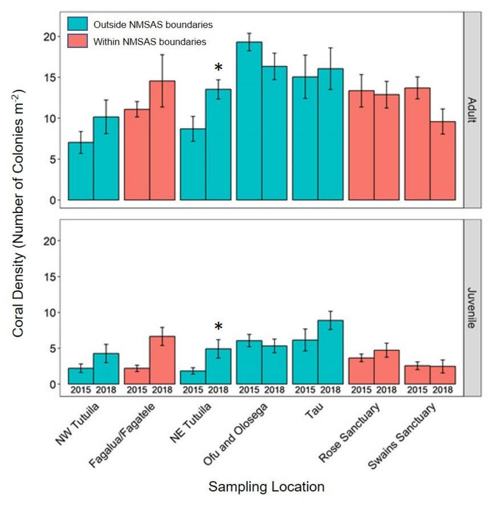

**Figure S.LR.9.1.** Mean density (colonies m-2 ± standard error) of adult (≥5 cm) and juvenile (<5 cm) of coral colonies in American Samoa in 2015 and 2018. Differences were not significant except for NE Tutuila (∗). No statistical comparisons were conducted for Fagalua/Fagatele or Swains due to unbalanced sample sizes. Image: Vargas-Ángel et al., 2019

## *Crustose Coralline Algae*

CCA are an important component of the reef in American Samoa, cementing the substrate together, stabilizing rubble after disturbances, building ridges along high-energy reef margins, creating habitat for fish and invertebrates, and attracting coral larvae to settle on reefs (Littler & Littler, 2013). Video taken from ROV *Hercules* off of Aunu'u in 2019 documented CCA as deep as 175 m (OET, 2019). At Rose Atoll, CCA are a major component of the reef framework and

large knob-forming CCA are common. Percent cover of CCA on shallow reefs increased temporarily after coral bleaching events, but has remained relatively stable and high since 2007 (see Habitat section). No quantitative data exist for mesophotic CCA. Coralline lethal orange disease (CLOD) has been observed consistently in Fagatele Bay, and prevalence appears to increase with sea surface temperature anomalies (NMSAS, 2020b). This is consistent with findings that elevated water temperatures are critical to infection and spread of CLOD (Cervino et al., 2005) and coralline fungal disease (Williams et al., 2014). Overall, mean CLOD occurrence (index based on number of coralline lethal orange disease cases ÷ CCA cover) was low (<0.2) across survey years. CLOD was not observed at Swains Island or Rose Atoll (Vargas-Ángel et al., 2019).

### *Reef Sharks*

Sharks are an important component of coral reef ecosystems. Whitetip, grey reef, blacktip, and nurse sharks are the most common reef sharks encountered in American Samoa. The status of sharks was listed as critical in a recent NCRMP status report on reef condition in American Samoa (NCRMP, 2018). This measure was based on ESD reef fish monitoring data from 2002– 2015 compared with a model-generated estimate of baseline shark abundance in American Samoa (Nadon et al., 2012). The model estimated that baseline reef shark densities should be between 1.2 and 2.4 sharks ha-1 . The observed reef shark density is currently at 4–8% of these calculated baseline levels (Nadon et al., 2012). Large fish biomass is low across the territory. Remote Swains Island has historically had the highest abundance of large fish, including sharks. A school of juvenile gray reef sharks (<1 m) was encountered at Swains Island in 2012. Surveys in Ta'u in 2021 noted several encounters with reef sharks (G. Coward/CRAG, personal communication, 2021). A recent global assessment of baited underwater video system deployments also concluded that American Samoa's reef shark populations are depleted and have low conservation potential (MacNeil et al., 2020). This may have impacts on reef fish populations and implications for long-term resilience of shallow coral reef ecosystems.

### *Large Parrotfishes*

Large parrotfishes, such as *Bolbometopon muricatum*, *Chlorurus microrhinos*, *Scarus rubroviolaceus*, *Hipposcarus longiceps*, *S. forsteni*, *S. altipinnis*, and *Cetoscarus ocellatus*, play an important role in coral reef ecosystem dynamics by removing algae, opening up substrate for coral settlement, and keeping fast growing coral species in check through their diverse feeding strategies (Green & Bellwood, 2009). These species are also desirable food fish and are common targets for spearfishing. Large parrotfishes were particularly impacted by scuba spearfishing practices in American Samoa in the 1990s (Page & Green, 1998). Some of these large species were harvested before reaching sexual maturity, and scuba spearfishing accounted for up to 89% of the total annual yield (Page & Green, 1998). The report recommended an immediate ban on the practice; this was also supported by the work of Dr. Alison Green and Dr. Chuck Birkeland (Gillet & Moy, 2006). Scuba spearfishing was banned in 2002, but these species are still harvested by free divers and have not fully recovered. For example, the bumphead parrotfish (*Bolbometopon muricatum*) is considered functionally extinct in American Samoa by local experts, as there have only been two observations of this species since 2002, one in Tutuila and one in Ta'u (Kobayashi et al., 2011). Other large parrotfish species have been observed, but large individuals are still rare around most islands (ESD, 2018).

ESD began survey efforts for large fishes (>50 cm) in 2004. Since that time, large fish biomass has remained low across the territory (NCRMP, 2018; ESD, 2018; CREP, 2017; Figure S.LR.9.2). In Tutuila, parrotfish communities are skewed toward smaller individuals (10–30 cm), but large parrotfish (>30 cm) biomass increased in 2018 (Vargas-Ángel et al., 2019; McCoy et al., 2018; Figure S.LR.9.3). Small parrotfishes accounted for over 50% of food fish biomass at CRAG's Aunu'u and Fagatele Bay monitoring sites, but large parrotfishes only accounted for 10% of fish biomass (Comeros-Raynal et al., 2017; MARC, 2020). A recent recruitment survey noted that parrotfish recruitment in Fagatele Bay was very low relative to sites adjacent to intermediate and disturbed watersheds. The emerging complexity of the nutritional ecology of parrotfishes, which suggests that they are microphages that target cyanobacteria or protein-rich autotrophs on calcareous substrata (Clements et al., 2016), may point to a mechanism driving the spatial pattern of parrotfish recruit densities (M. Comeros-Raynal/James Cook University, personal communication, 2020). Ta'u consistently had the highest biomass of large parrotfishes during surveys, and the biomass of large parrotfishes was greater than that of small parrotfishes. Swains Island also had a higher proportion of large parrotfishes compared to small parrotfishes in some years; but overall, parrotfish abundance was low. This may be due to the remote location of Swains Island and its position relative to major larval sources in the region (Kendall & Poti, 2011), or other factors. Rose Atoll also had a low abundance of large parrotfishes, but its small parrotfish biomass was comparable to Tutuila. Experts suggested this could indicate a lack of recruitment for large-bodied parrotfish species due to the atoll's location relative to major larval sources (Kendall & Poti, 2011), or may indicate unreported fishing activity.

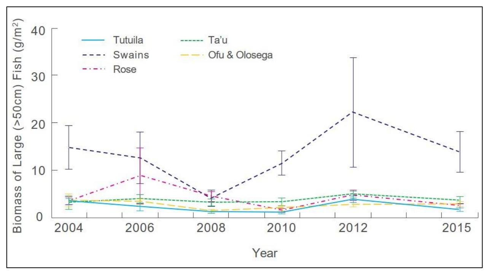

**Figure S.LR.9.2.** Average biomass (g/m2 ± standard error) of large (>50 cm) fish observed during towed diver surveys in American Samoa, 2004–2015. Source: NCRMP, 2018

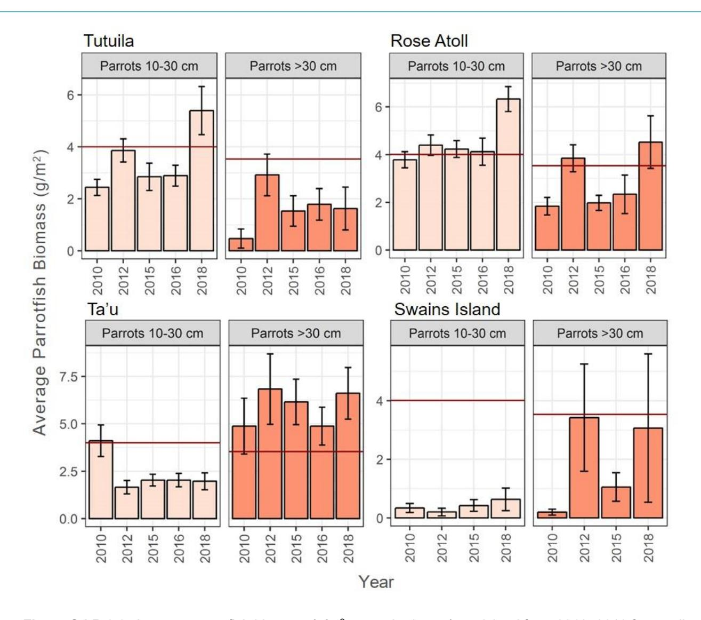

**Figure S.LR.9.3.** Average parrotfish biomass (g/m2 ± standard error) per island from 2010–2018 for small (10–30 cm) and large (>30 cm) parrotfishes. Note the scale on the y-axis varies with island. Image: McCoy et al., 2018

### *Surgeonfishes and Unicornfishes*

Surgeonfishes and unicornfishes play an important role in coral reef ecosystem dynamics, filling a number of functional roles as grazers, browsers, detritivores, and planktivores (Tebbett, 2022). Small surgeonfishes were the second most abundant functional group at CRAG's fixed monitoring site in Aunu'u in 2017, accounting for about 10% of total fish biomass. No unicornfishes were observed during the same survey (Comeros-Raynal et al., 2017; MARC, 2020). At CRAG's site in Fagatele Bay, small surgeonfishes made up about 12% of the fish community, and large-bodied surgeonfish (i.e., orangespine unicornfish) made up about 8% of the fish community (Comeros-Raynal et al., 2017; MARC, 2020). In 2019, there was moderate surgeonfish recruitment on the reef flat and reef slope in Fagatele Bay. This was comparable to other sites surveyed in American Samoa (M. Comeros-Raynal/James Cook University, personal communication, 2020). ESD included data for one heavily exploited species, the blue-lined

surgeonfish (*Acanthurus lineatus*), in its 2019 report. This territorial species is preferred for harvest. Overall *A. lineatus* biomass was highly variable between 2015–2018, but biomass increased at a number of sites and increased slightly in most sanctuary units. However, the 2018 data may not provide an accurate picture of species status, as this species prefers shallow reef habitats, and weather limited shallow surveys at some sites in 2018 (Vargas-Ángel et al., 2019).

Surgeonfishes are also valued for human consumption, and some species are easily exploited by spearfishing due to nocturnal resting behavior. Like parrotfishes, these species may have also been targeted by the scuba spearfishing practices in the 1990s. Based on visual surveys in 2010, 2012, and 2015, the mean size for adult (>10 cm) surgeonfishes and unicornfishes in American Samoa was approximately 15 cm (total length; WPRFMC, 2019). This is just above the size at first maturity for small surgeonfish species such as *Ctenochaetus striatus* (Ochavillo et al., 2011) and *A. lineatus* (Craig at al., 1997) and is well below the size at first maturity for larger target species such as *Naso unicornis* (Taylor et al., 2014). This may indicate that the harvest practices for some species in this complex are not sustainable.

### *Mesophotic Corals*

Approximately 110 species of scleractinian corals are found at mesophotic depths in American Samoa (Montgomery et al., 2019). Bare et al. (2010) described coral ecosystems down to 110 m, noting that encrusting and plate-like coral were the most common growth forms across the upper and mid-mesophotic zones, and branching corals appeared to be most abundant from 80–110 m. Massive corals were more common at shallower depths (Bare et al., 2010). More recently, ROV *Hercules* captured video of *Leptoseris* corals as deep as 148 m off the coast of Aunu'u during the 2019 *Nautilus* expedition to American Samoa (OET, 2019). *Anella* spp. sea fans and unidentified antipatharian corals were also observed in the deep mesophotic zone. Rebreather surveys in Fagatele Bay and Fagalua/Fogama'a, documented and collected a variety of gorgonian and black coral specimens, but did not provide detailed information about scleractinian corals (Wagner, 2017). These habitats are still being explored, and data are insufficient to evaluate trends at present.

### *Deep-sea Corals and Sponges*

Corals and sponges provide important habitat for echinoderms and other organisms in deep-sea habitats. The 2017 *Okeanos Explorer* and 2019 *Nautilus* expeditions provided unprecedented access to the deep sea, and the data and specimens from these expeditions are still being analyzed. The two expeditions documented a large number of corals and sponges including black, gorgonian, lace, soft, stoloniferan, and stony corals; sea pens; demosponges; and glass sponges (Kennedy et al., 2019; DSCRTP, 2020; OET, 2019; HURL, 2020). In 2019, moderatedensity communities (1,000–2,999 individuals km-1) were observed at Swains Island, Aunu'u, and Rose Atoll. Analysis of footage from the 2019 expedition aboard *Nautilus* found that over 1,500 animals including echinoderms, arthropods, cnidarians, and mollusks were associated with either a coral or sponge (Figure S.LR.9.4). In fact, most of the echinoderms (96%) observed on the expedition were associated with a coral or sponge host (OET, 2019; HURL 2020). As these expeditions were the first to explore these deep-sea areas, it is not possible to evaluate the status of or trends in these systems in this report.

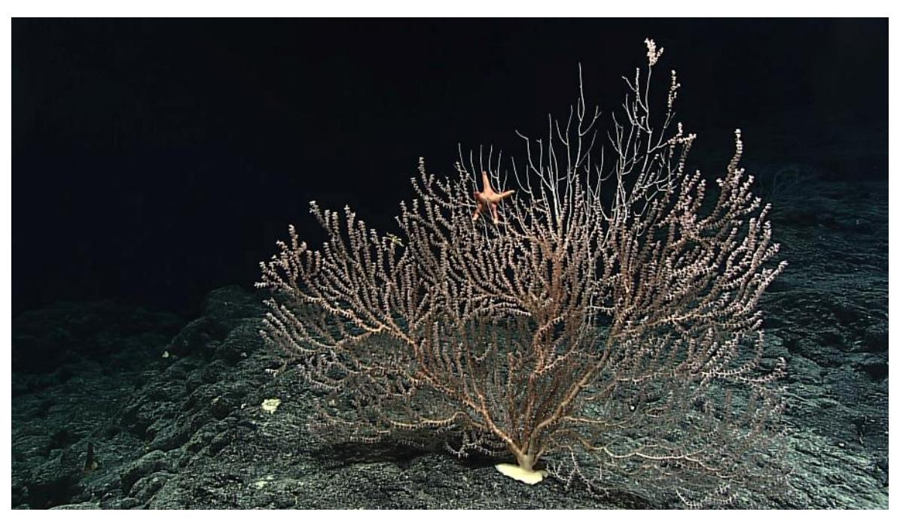

**Figure S.LR.9.4.** Deep-sea corals and sponges, like this gorgonian coral observed at Rose Atoll, provide habitat for other animals such as sea stars, brittle stars, snails, shrimp, and crabs. Photo: NOAA

### *Conclusion*

The scleractinian corals in the shallow reef ecosystems of NMSAS are robust and include healthy populations of both large, old corals and recruits. Although repeated bleaching has affected these communities, particularly at Swains Island, they remain resilient. The limited information on mesophotic coral ecosystems and deep-sea corals and sponges did not detect any impairments. Experts noted that coral recruitment seemed low for deep-sea species, but data are limited in these areas, precluding comparisons at present. Overall, these benthic keystone and foundation species were rated as good/fair. The continued low abundance of large fish, particularly sharks, large parrotfish, and surgeonfish, which provide important ecological services, is of great concern. Sharks are at 4–8% of their potential biomass, bumphead parrotfish are considered functionally extinct, low biomass and mean size of surgeonfishes and unicornfishes may indicate unsustainable fishing pressure, and biomass for other large parrotfish species remains low despite the implementation of a scuba spearfishing ban in 2002. The continued lack of large predators and large herbivores in shallow coral reef habitats may compromise ecosystem resilience, therefore fish keystone and foundation species were rated as fair/poor. The disparity in the status of different species groups thus resulted in an overall mixed rating for this question.

## **Question 10: What is the status of other focal species and how is it changing?**

**Status Description:** The status of keystone and foundation species is mixed.

**Rationale:** The abundances of giant clams (*Tridacna* spp*.*), targeted food fish species, and humphead wrasse (*Cheilinus undulatus*) are low, and their recovery is uncertain due to continued harvesting and life cycle characteristics. The continued low abundance of these species resulted in a rating of fair/poor. Giant Porites corals were added after the workshop based on expert recommendation and feedback. The status of these species is good. Data on sea turtles suggests that regional populations are stable and may be slowly recovering, but remain at risk. Sea turtle nesting activity is still limited and may be affected by harvest outside of American Samoa, coastal development and climate change. Humpback whale populations may be increasing, but data are limited and increasing ocean temperatures may be shifting their preferred habitat away from American Samoa. The status of sea turtles and humpback whales was considered fair.

| Taxa                                   | Status    | Status Description                                                                                      |  |
|----------------------------------------|-----------|---------------------------------------------------------------------------------------------------------|--|
| Select fish species and giant clams | Fair/poor | Selected focal species are at substantially reduced levels and prospects for recovery are uncertain. |  |
| Giant Porites                          | Good      | Selected focal species appear to reflect near-pristine conditions.                                      |  |
| Sea turtles and humpback whales     | Fair      | Selected focal species are at reduced levels, but recovery is possible.                                 |  |

4 Experts assigned a rating of fair/poor at the workshop, but recommended splitting the status rating between fish species, giant clams, giant *Porites*, sea turtles, and humpback whales. Following the workshop, a new "mixed" status was introduced to the condition report rating scheme. ONMS staff determined that this new rating was more appropriate to apply to this question based on expert opinion and available data.

**Question 10 Indicator Table.** Summaries for the key indicators related to other focal species that were discussed during the 2020 status and trends workshop.

| Indicator                           | Habitat               | Source                                                                                     | Summary                                                                                                                                                                                                                                                                                                                                                                                                                                                                                                                                                                                                                                                                                                                                                                                                                                                                                                                                                                                                                                                                                                                                                                                                                                                                                                                                                                                                                                                                                                                                                                                                                                                                                                                                                                                       |
|-------------------------------------|-----------------------|--------------------------------------------------------------------------------------------|-----------------------------------------------------------------------------------------------------------------------------------------------------------------------------------------------------------------------------------------------------------------------------------------------------------------------------------------------------------------------------------------------------------------------------------------------------------------------------------------------------------------------------------------------------------------------------------------------------------------------------------------------------------------------------------------------------------------------------------------------------------------------------------------------------------------------------------------------------------------------------------------------------------------------------------------------------------------------------------------------------------------------------------------------------------------------------------------------------------------------------------------------------------------------------------------------------------------------------------------------------------------------------------------------------------------------------------------------------------------------------------------------------------------------------------------------------------------------------------------------------------------------------------------------------------------------------------------------------------------------------------------------------------------------------------------------------------------------------------------------------------------------------------------------|
| Giant Porites corals          | Coral reefs        | Brown et al., 2009; Tangri et al., 2018; Coward et al., 2020                   | Ta'u is home to one of the largest and oldest reef-building corals ever documented. Known as Big Momma, the large <i>Porites lutea</i> colony is over 7 m high and 41 m around (Brown et al., 2009). Tangri et al. (2018) estimate that the colony is at least 500 years old based on a 6.1 m core taken from the center of the colony in 2011. Recent observations showed that the colony had one large growth anomaly and several smaller anomalies. There were no noticeable effects from recent coral bleaching events and extensive pufferfish bites did not appear to affect the colony's health. Tow surveys in the Ta'u unit documented a total of 28 <i>Porites</i> corals that were over 10 m in diameter. The surveys also noted 123 5–10 m colonies and another 128 2–5 m colonies (Coward et al., 2020). Large <i>Porites</i> colonies have also been observed in Fagatele Bay and Fagalua/Fogama'a units, but have not been measured.                                                                                                                                                                                                                                                                                                                                                                                                                                                                                                                                                                                                                                                                                                                                                                                                                                           |
| Giant clam abundance and size | Nearshore habitats | AS-EPA & CRAG, 2017; Green & Craig, 1999; Brainard et al., 2008; PIFSC, 2021; NMSAS, 2021b | Giant clam populations have declined over the past few decades. Historically, Rose Atoll had a high abundance of giant clams (3,000 clams ha-1 in the lagoon and 100 clams ha-1 on the forereef in 1995–1996; Green & Craig, 1999), but those numbers have declined precipitously (B. Peck/USFWS, personal communication, 2020). Towed diver surveys of adult clams in 2006 noted that Rose Atoll lagoon had the highest mean density of giant clams (~45 ha-1), followed by Ta'u (~8 ha-1), Tutuila and Aunu'u (~1 ha-1), Ofu-Olosega (~1 ha-1), Rose Atoll forereef (~0.25 ha-1), and Swains Island (no sightings; Brainard et al., 2008). Repeat surveys conducted in 2015 found lower densities at most sites. The highest density was in Ta'u (~7 ha-1), density on the Rose Atoll forereef increased slightly (~0.5 ha-1), followed by Ofu-Olosega (~0.8 ha-1), Tutuila and Aunu'u (~0.3 ha-1), and Swains Island (no sightings). No surveys were conducted in Rose Lagoon in 2015 (PIFSC, 2021). Belt transects conducted by AS-EPA and CRAG in 2017 surveyed all size classes. These surveys noted that overall giant clam abundance at 31 sites in Tutuila was low, and most clams were small to medium sized. The largest clam observed in Tutuila was a 42-cm individual in Fagasa. No clams were observed within transects at Fagatele Bay and 12 other sites, but a maximum of 10 clams per 300 m 2 site (~330 clams ha-1) were observed at Fagamalo. Giant clam abundance in Aunu'u (~267 clams ha-1) was the second highest recorded by the project, but the site was outside the sanctuary (AS-EPA & CRAG, 2017). NMSAS staff documented clams in Fagatele Bay, Fagalua/Fogama'a, and Aunu'u in 2020, but all were outside of monitoring transects (NMSAS, 2021b). |

| Indicator                       | Habitat               | Source                                                                                                                                 | Summary                                                                                                                                                                                                                                                                                                                                                                                                                                                                                                                                                                                                                                                                                                                                                                                                                                                                                                                                                                                                                                                                                                                                   |
|---------------------------------|-----------------------|----------------------------------------------------------------------------------------------------------------------------------------|-------------------------------------------------------------------------------------------------------------------------------------------------------------------------------------------------------------------------------------------------------------------------------------------------------------------------------------------------------------------------------------------------------------------------------------------------------------------------------------------------------------------------------------------------------------------------------------------------------------------------------------------------------------------------------------------------------------------------------------------------------------------------------------------------------------------------------------------------------------------------------------------------------------------------------------------------------------------------------------------------------------------------------------------------------------------------------------------------------------------------------------------|
| Food fish abundance          | Nearshore habitats | AS-EPA & CRAG, 2017; Comeros Raynal et al., 2017; MARC, 2020; A. Green/ KAUST, personal communication, 2020 | Results of the Ridge to Reef Project conducted by AS EPA and CRAG (2017) indicate that targeted food fish biomass in Fagatele Bay and Aunu'u was below both the Tutuila average and the average for southern reefs. Additionally, very few large fish were observed; most fish (70% in Fagatele Bay, 58% in Aunu'u) fell in the 0–10 cm size class. No fish larger than 30 cm were observed in Fagatele Bay, and in Aunu'u, fish from 20–50 cm were present in very low abundances. Herbivores made up almost 90% of the targeted reef fish biomass at Fagatele Bay, but only about 75% at Aunu'u. Predator abundance was low at both sites. The project report concluded that Fagatele Bay's reef fish assemblage suggested a disturbed and degraded site (Comeros-Raynal et al., 2017; MARC, 2020). Fish biomass, abundance, and richness in Fagatele Bay decreased from 2002–2018, and the lack of large fish species may impact the resilience of the reef ecosystem (A. Green/King Abdullah University of Science and Technology (KAUST), personal communication, 2020). |
| Humphead wrasse abundance | Nearshore Habitats | ESD, 2018; NMSAS, 2021b                                                                                                             | This species is still observed around American Samoa, but abundance is very low. Towed diver data from 2002– 2015 suggest that numbers were variable, with observations ranging from 0–19 individuals on each island (ESD, 2018). NMSAS staff observed sub-adults in Fagatele Bay in 2020 and 2021 (NMSAS, 2021b).                                                                                                                                                                                                                                                                                                                                                                                                                                                                                                                                                                                                                                                                                                                                                                                                         |

| Indicator                     | Habitat                           | Source                                                                                                                                                                                                                                              | Summary                                                                                                                                                                                                                                                                                                                                                                                                                                                                                                                                                                                                                                                                                                                                                                                                                                                                                                                                                                                                                                                                                                                                                                                                                                                                                                                                                                                                                                                                                                                                                                                                                                                                                                                                                                                                                                                            |
|-------------------------------|-----------------------------------|-----------------------------------------------------------------------------------------------------------------------------------------------------------------------------------------------------------------------------------------------------|--------------------------------------------------------------------------------------------------------------------------------------------------------------------------------------------------------------------------------------------------------------------------------------------------------------------------------------------------------------------------------------------------------------------------------------------------------------------------------------------------------------------------------------------------------------------------------------------------------------------------------------------------------------------------------------------------------------------------------------------------------------------------------------------------------------------------------------------------------------------------------------------------------------------------------------------------------------------------------------------------------------------------------------------------------------------------------------------------------------------------------------------------------------------------------------------------------------------------------------------------------------------------------------------------------------------------------------------------------------------------------------------------------------------------------------------------------------------------------------------------------------------------------------------------------------------------------------------------------------------------------------------------------------------------------------------------------------------------------------------------------------------------------------------------------------------------------------------------------------------|
| Sea turtle abundance       | Nearshore habitats, pelagic | Maison et al., 2010; Tagarino et al., 2008; Tagarino & Utzurrum, 2010; Seminoff et al., 2015; Craig et al., 2004; Craig et al., 2019; Becker et al., 2019; B. Peck/USFWS, personal communication, 2020 | Both hawksbill (Eretmochelys imbricata) and green (Chelonia mydas) sea turtles are listed as endangered under the U.S. Endangered Species Act (81 Fed. Reg. 20057 [April 6, 2016]). Sea turtle nesting surveys indicated that nesting abundance was low around Tutuila, Ofu, Olosega, Ta'u, and Swains Island (Maison et al., 2010; Tagarino et al., 2008; Tagarino & Utzurrum, 2010; Craig et al., 2019). Green sea turtle nesting abundance was stable to increasing at Rose Atoll and Swains Island, and Rose Atoll had the highest level of nesting activity with an estimated 105 nesters from 2007–2013 (Seminoff et al., 2015). Tagging data indicated that most green sea turtles nesting at Rose Atoll migrate to feeding grounds in Fiji, and hawksbills nesting in Tutuila and Manu'a dispersed across the region (Craig et al., 2004, 2019). Rose Atoll is an important nesting ground for turtles, but as they are a long-lived species, long-term monitoring would be required to detect trends in abundance (B. Peck/USFWS, personal communication, 2020). Becker et al. (2019) conducted in-water surveys of both species from 2002–2015 across the U.S. Pacific islands. The analysis indicated that turtle densities are stable to increasing and modeling identified SST and productivity as the highest-ranked drivers of sea turtle densities. In American Samoa, juveniles were the most common size class observed, followed by subadults, but Rose Atoll had a relatively high proportion of green sea turtle adults compared to the other islands. The study also noted that hawksbill sea turtles were rare across a broad portion of the Pacific, and American Samoa, specifically Ta'u and Tutuila, may be an important area for hawksbills. |
| Humpback whale presence | Pelagic                           | Robbins et al., 2011; Riekkola et al., 2018; Derville et al., 2019; J. Robbins/ Center for Coastal Studies, personal communication, 2020; Lindsay et al., 2016; Munger et al., 2012                    | Humpback whales travel from the waters around Antarctica to American Samoa from June to October to mate and raise their calves (Robbins et al., 2011; Riekkola et al., 2018). Between 2003–2008, 159 unique individuals were observed around Tutuila (Robbins et al., 2011). Tutuila has a higher encounter rate than many other islands in the South Pacific (Derville et al., 2019). Whales use all of the shelf waters around Tutuila, including an area just outside Fagatele Bay (J. Robbins/Center for Coastal Studies, personal communication, 2020; Lindsay et al., 2016). Occasional sightings have also occurred in the Aunu'u Research Zone. An EAR recorded a large number of humpback whale vocalizations at Rose Atoll, indicating that it may also be an important habitat (Munger et al., 2012). Topography and SST are important drivers of humpback whale distribution, and climate change may affect habitat suitability in a large portion of current breeding grounds in Oceania. Temperatures around American Samoa are currently near the threshold of suitable SST for humpback whales (Derville et al., 2019).                                                                                                                                                                                                                                                                                                                                                                                                                                                                                                                                                                                                                                                             |

Focal species may or may not have ecologically important roles in sanctuary ecosystems, but are deemed important in terms of their value to humans. These include culturally important species, such as giant clams, and food fish that are harvested for subsistence and cultural purposes. Focal species may also include large, charismatic species such as humphead wrasse, sea turtles, and humpback whales that may be valued both for cultural purposes, but also as potential economic resources for tourism.

### *Giant* **Porites** *Corals*

NMSAS is home to one of the world's largest known coral colonies, a *Porites* colony known as Big Momma, located in the Ta'u unit. It was first brought to scientific attention by Fale Tuilage and Dr. Alison Green in 1995. Brown et al. (2009) measured the colony as 7 m tall and 41 m in circumference and estimated that it comprised approximately 200 million polyps. Morphological characteristics and genetic analysis of tissue samples suggest that Big Momma is a *Porites lutea* colony*.* In 2011, a 6.01 m continuous core was removed from the coral and scanned by X-ray computer-automated tomography to reveal growth bands (Tangri et al., 2018). Based on this information, the colony is believed to be at least 500 years old. The colony was surveyed in 2021 and appeared to be in good health despite high ocean temperatures in 2020 (NMSAS, 2021b). There was still a large growth anomaly on one side, and several smaller anomalies in other locations. Pufferfish (*Arothron nigropunctatus* and *A. meleagris*) predation resulted in small tissue scars all over the colony, but these appeared to heal over. There was no lasting sign of the coral coring activity from 2011.

Big Momma is not the only large *Porites* coral in American Samoa. Brown et al. (2009) noted that at least 12 other large (16–24 m circumference) colonies within 1 km of the site and along the northeast corner of Ta'u. A larger colony, measuring 8 m tall and 69 m in circumference, was documented on the east side of Ta'u in 2019. Tow-board surveys associated with that effort found that large *Porites* corals (>10 m in diameter) were found on the western, northern, and eastern sides of Ta'u, with a large proportion of those colonies found within the NMSAS Ta'u unit (Coward et al., 2020; Figure S.LR.10.1). CRAG assessed a subset of these colonies in 2021 and reported that they appeared to be in good health and supported robust fish communities (G. Coward/CRAG, personal communication, 2021). Large *Porites* colonies have also been observed in Fagatele Bay and Fagalua/Fogama'a, but they are smaller compared to those observed in Ta'u. Some of the large *Porites* in Fagatele Bay suffered partial mortality during the 2020 coral bleaching event, but most regrew tissue and appeared to be doing well (NMSAS, 2020b).

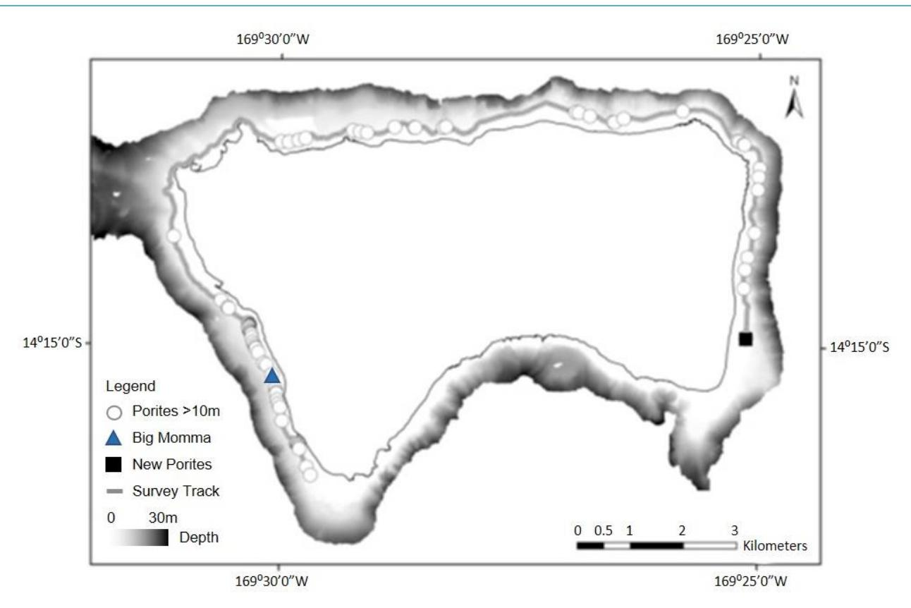

**Figure S.LR.10.1.** Tow-board surveys conducted by CRAG, NMSAS, and National Park of American Samoa revealed that there are numerous large *Porites* colonies over 10 m in diameter around Ta'u. Many are located within NMSAS. Source: Coward et al., 2020

### *Giant Clams*

Giant clams (*Tridacna* spp.) have both social and ecological value in American Samoa. Clams are a favored food item for residents, and shells have been used for tools and ornamentation. Clams also provide shelter and food for other reef species and may act as a reservoir and distributor of zooxanthellae (Neo et al., 2015; Umeki et al., 2020). Historically, Rose Atoll had a high abundance of giant clams (3,000 clams ha-1 in the lagoon and 100 clams ha-1 on the forereef in 1995–1996; Green & Craig, 1999), but those numbers have declined precipitously (Brainard et al., 2008). Towed diver surveys of adult clams conducted by PIFSC from 2006–2015 indicated a decline in adult giant clam densities across most sites. In 2015, the highest island-scale density was in Ta'u (~7 ha-1), followed by Ofu-Olosega (~0.8 ha-1), Rose Atoll forereef (~0.5 ha-1), Tutuila and Aunu'u (~0.3 ha-1), and Swains Island (no sightings; PIFSC, 2021). In 2018, researchers noted that numbers in the Rose Atoll lagoon were much lower than in the 1990s (A. Green/KAUST, personal communication, 2020), and empty shells were found near the pinnacles in the lagoon (D. Fenner/Lynker Technologies, LLC, personal communication, 2022). No towed diver surveys were conducted in the lagoon in 2015 or 2018, but USFWS reported that there have been further declines in giant clam densities inside the lagoon and at the pinnacles (B. Peck/USFWS, personal communication, 2020).

More recently, the Ridge to Reef Project evaluated the abundance and size of giant clams on belt transects at 31 watersheds (AS-EPA & CRAG, 2017), including Aunu'u and Fagatele Bay. Overall, giant clams were found in low abundances around Tutuila (Figure S.LR.10.2). More giant clams were observed just outside of the Aunu'u unit (~267 clams ha-1) than at most other sites. No giant clams were recorded in Fagatele Bay, though giant clams have been observed there during other projects. This emphasizes the difficulty in monitoring low-abundance organisms using transects and suggests that separate survey efforts may be warranted for this species. Craig et al. (2008) noted that approximately 35% of the giant clam harvest was composed of undersized animals (<15.2 cm). There is no clear indication of what has caused the decline in giant clams over the past two decades, but clams may be affected by high temperature anomalies and ocean acidification, in addition to harvest pressure.

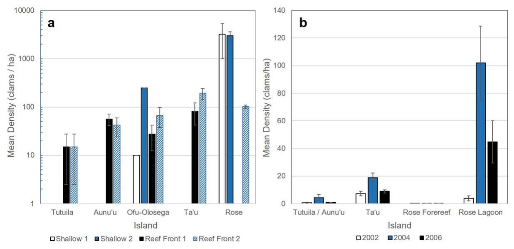

**Figure S.LR.10.2.** (a) Giant clam density was much higher in 1994–1995 (note the use of a logarithmic scale) compared to (b) giant clam density in 2002, 2004, and 2006. Density in 2002, 2004, and 2006 was measured using towed diver surveys; a different method was used in 1994–1995. Source: (a) Green & Craig, 1999; (b) Brainard et al., 2008

### *Food Fish*

Reef fish have historically been an important source of sustenance for human communities in American Samoa. Targeted species include parrotfish, surgeonfish, snappers, groupers, emperors, and goatfish (Craig et al., 2008). Many of these fish also have important ecological roles. CRAG monitors these species at sites in Fagatele Bay and just outside the sanctuary unit in Aunu'u. CRAG noted that food fish biomass declined across sites in 2016, likely due to coral bleaching in 2015. Recovery after this period appears to have been driven by small herbivores (CRAG, 2021; Figure S.LR.10.3). In 2017, CRAG and AS-EPA conducted an island-wide assessment of reef health. This assessment found that target fish biomass in Fagatele Bay and Aunu'u was below both the average for Tutuila and the average for southern reefs. It also noted that there were very few large fish, with most (70% in Fagatele Bay, 58% in Aunu'u) falling in the 0–10 cm size class (Comeros-Raynal et al., 2017; MARC, 2020). No fish larger than 30 cm were observed in Fagatele Bay, and in Aunu'u, fish from 20–50 cm were present in very low abundances. According to this report, herbivores make up almost 90% and 75% of the targeted reef fish biomass at Fagatele Bay and Aunu'u, respectively. Predator abundance was low at both

sites. An analysis of the reef fish community in Fagatele Bay suggested a disturbed and degraded site (CRAG, 2021b). ESD surveys in 2018 also noted that there were few fish over 30 cm in Fagatele Bay (only 1% of 956 fish surveyed) and the largest fish observed was a 48-cm parrotfish (McCoy et al., 2018).

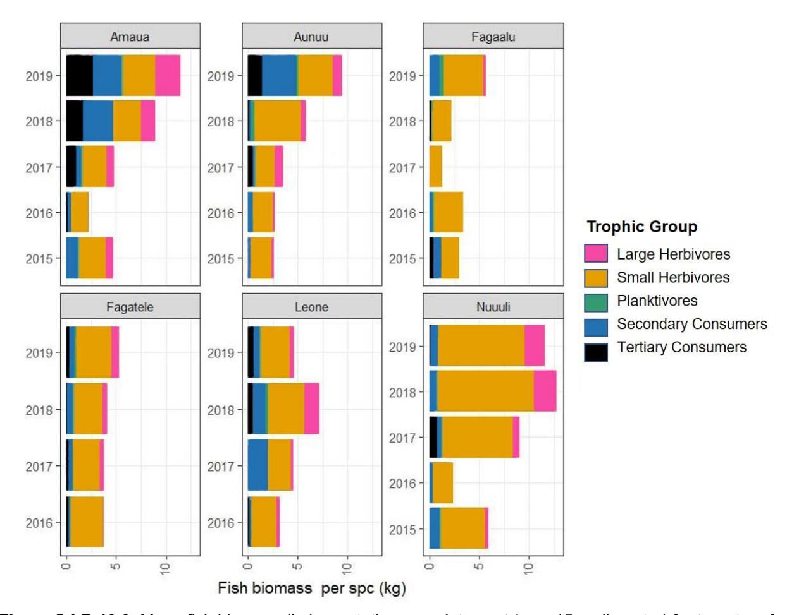

**Figure S.LR.10.3.** Mean fish biomass (kg) per stationary point count (spc; 15 m diameter) for target reef fish species from 2015–2019 at sites on the southern shore of Tutuila. Source: CRAG, 2018

Dr. Alison Green surveyed Fagatele Bay in 1994, 1998, 2001, 2004, 2007, and 2018 (Green, 1996, 2002, 2020; Green et al., 1999, 2005). These surveys indicated that fish biomass was low compared to many other sites throughout the territory, particularly for most families targeted for fishing. The exception was small parrotfish species (particularly *Chlorurus spilurus*), which increased significantly in both biomass and density from 2002–2018 (likely due to the ban on scuba spearfishing in 2001). Dr. Green noted that fish biomass values were below what is expected for a no-take marine protected area. Species richness declined from 34 species in 1994–1995 to 20 species per transect in 2018 for unknown reasons, and rare and threatened species (e.g., sharks, large groupers, wrasses, and parrotfishes) were rare throughout American Samoa, including in Fagatele Bay (Green, 2020). Stronger enforcement of the no-take regulations are recommended, as the bay's small size makes it vulnerable to fishing pressure (A. Green/KAUST, personal communication, 2020).

### *Humphead Wrasse*

Humphead wrasse (*Cheilinus undulatus*) are large, charismatic fish that are a favored attraction for sport divers. While fishing regulations are in place for this species, it has historically been harvested for food, and large males are sometimes regarded as trophies for free-dive spearfishing. These fish may also play an important role as a predator of CoTS. Humphead wrasse are also highly mobile and may not be properly assessed by standard fish monitoring techniques. Due to their slow growth rate, late sexual maturation, and sex reversal, this species is particularly vulnerable to exploitation.

Humphead wrasse are still observed around American Samoa, but in very low abundance. Sabater (2010) found that juvenile humphead wrasses were mostly observed in wide, sheltered reef flats with small patches of sand bordered with branching corals. This juvenile habitat comprises only 1.6% of the shallow reef habitat around Tutuila. Models based on underwater visual census and habitat maps estimated that these habitats may support approximately 350 individuals and suggested that this species may be limited by the availability of juvenile habitat (Sabater, 2010). Towed diver data from 2002–2015 suggested that numbers are variable, ranging from 0–19 individuals observed on each island (ESD, 2018; Figure S.LR.10.4); however, these observations should be interpreted with caution, as tow surveys sometimes lapped small islands, and individual fish around Rose Atoll and Swains Island may have been counted more than once (T. Kindiger/NOAA, personal communication, 2020). CRAG observed humphead wrasse in Aunu'u in 2009 and 2011 (A. Lawrence/CRAG, personal communication, 2020). In Fagatele Bay, NMSAS staff observed one large subadult humphead wrasse in 2020 and three smaller individuals in 2021 (NMSAS, 2021b). In 2018, ESD observed humphead wrasse during stationary point count surveys in Ta'u (T. Kindiger/NOAA, personal communication, 2020).

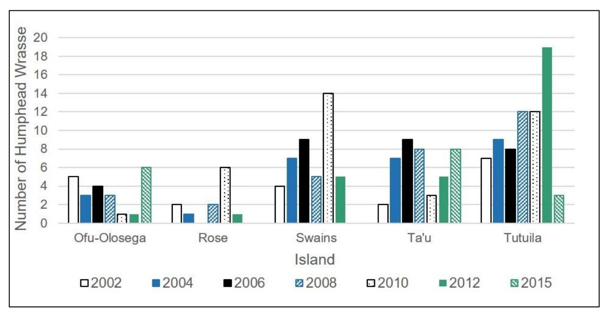

**Figure S.LR.10.4.** Humphead wrasse (*Cheilinus undulatus*) observed during towed diver surveys. Smaller islands may be surveyed twice in a given year, so numbers may be inflated by repeat observations of the same individual. Source: ESD, 2018; T. Kindinger/NOAA, personal communication, 2020

### *Sea Turtles*

Sea turtles, particularly green (*Chelonia mydas*) and hawksbill sea turtles (*Eretmochelys imbricata*), are found throughout NMSAS. These animals were historically harvested for both sustenance and ornamentation, and abundance in the region is quite low. Turtles have also been impacted by coastal development, particularly seawalls that remove nesting habitat, and animals may also become disoriented during nesting and hatching times due to the presence of land-based lights. Both species are now listed as endangered under the Endangered Species Act.

In American Samoa, subadult and adult green turtles occur in low abundance in nearshore waters around Tutuila, Ofu, Olosega, Ta'u, and Swains Island, with sporadic, low-level green turtle nesting on Tutuila and Swains Island (Maison et al., 2010; Tagarino et al., 2008; Tagarino & Utzurrum, 2010; Craig et al., 2019). Becker et al. (2019) evaluated sea turtle data from 13 years of towed diver surveys in the Pacific. Hawksbill sea turtles were found to be scarce across a broad portion of the Pacific, and American Samoa, specifically Ta'u and Tutuila, was identified as a population of significance for hawksbills. Regional trends indicate that turtle densities are stable to increasing, and modeling identified SST and productivity as the highest-ranked drivers of sea turtle densities. Juveniles were most common in American Samoa, followed by subadults and adults, and Rose Atoll had a relatively high proportion of adult green sea turtles compared to other islands in American Samoa (Becker et al., 2019; Figure S.LR.10.5). Green turtle nesting has been observed on Tutuila, Ofu, and Swains Island from August to March. Tagging data show that most green sea turtles nesting at Rose Atoll migrate to feeding grounds in Fiji, where they are vulnerable to harvest (Craig et al., 2004). Rose Atoll is an important nesting ground for turtles, but as they are a long-lived species, long-term monitoring is required to detect trends in abundance (B. Peck/USFWS, personal communication, 2020).

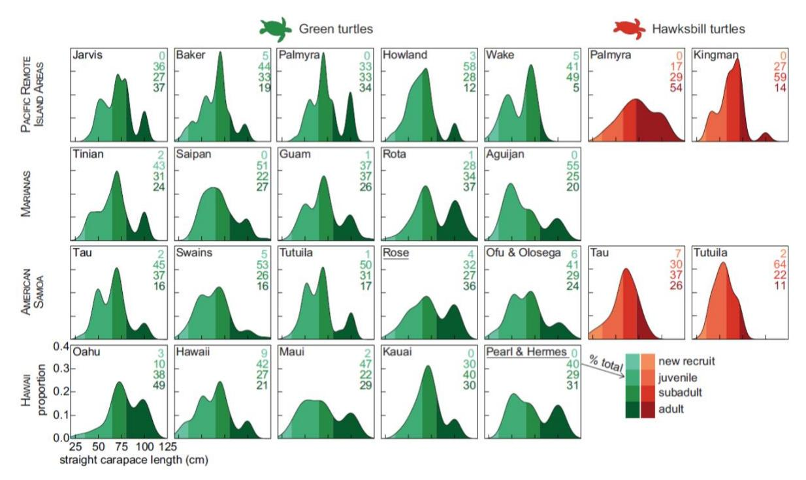

**Figure S.LR.10.5.** Sea turtle populations in the U.S. Pacific Islands based on 13 years of in-water observations. Image: Becker et al., 2019

### *Humpback Whales*

Humpback whales are present in American Samoa from June–October, when they mate and raise their calves. Topography and SST appear to be important drivers of humpback whale distribution in Oceania. Climate change is predicted to impact habitat suitability across most of the current breeding grounds in Oceania (Derville et al., 2019).

Oceania has smaller populations of humpback whales than other Southern Hemisphere areas (Constantine et al., 2012); but, within Oceania, American Samoa appears to be an attractive site (Derville et al., 2019). However, American Samoa's water temperatures are currently at the edge of this species' preferred temperature range, and whales may shift to cooler sites in the future (Derville et al., 2019). Robbins et al. (2011) identified 159 individual whales in American Samoa's waters between 2003–2008, and over 400 have been identified through 2019 (J. Robbins/Center for Coastal Studies, personal communication, 2020). These animals travel from feeding grounds in the Southern Ocean, including near the Antarctic Peninsula (Robbins et al., 2011; Riekkola et al., 2018). Whales were observed near the Aunu'u and Fagatele Bay units in 2019 and 2020. An EAR at Rose Atoll also picked up a large number of whale vocalizations, indicating Rose Atoll may also be an important habitat for visiting whales (Munger et al., 2012).

### *Conclusion*

Experts noted that monitoring data for these species are limited, and additional efforts may be necessary to accurately assess population trends. The abundance of harvested species, including giant clams (*Tridacna* spp.), targeted food fish species, and humphead wrasse (*Cheilinus undulatus*), is low, and recovery is uncertain due to continued harvest and life cycle characteristics. The decline in giant clams from 1996 to 2006 is particularly worrisome to resource managers, and there is some concern that ocean acidification and elevated seawater temperatures may also be affecting these species. The continued low abundance of harvested focal species drove the rating of fair/poor. Giant *Porites* corals were added after the workshop based on expert suggestion and feedback. The status of these species is good. Data on sea turtles suggest that resident populations may be slowly recovering, but nesting activity remains limited. Humpback whale populations may also be increasing, but data are limited, and increasing ocean temperatures may shift habitat preferences away from American Samoa. The status of sea turtles and humpback whales was considered fair. More specific survey efforts for giant clams, humphead wrasse, and rare food fish species are recommended, as well as expanded survey efforts for sea turtles and humpback whales.

## **Question 11: What is the status of non-indigenous species and how is it changing?**

**Status Description:** Non-indigenous species are present and may preclude full community development and function, but have not yet caused measurable degradation.

**Rationale:** Non-indigenous species have been observed in American Samoa, but have not exhibited invasive characteristics within NMSAS units.

**Question 11 Indicator Table.** Summaries for the key indicators related to non-indigenous species that

were discussed during the 2020 status and trends workshop.

| Indicator                          | Habitat               | Source                                               | Summary                                                                                                                                                                                                                                                                                                                                                                                                                     |
|------------------------------------|-----------------------|------------------------------------------------------|-----------------------------------------------------------------------------------------------------------------------------------------------------------------------------------------------------------------------------------------------------------------------------------------------------------------------------------------------------------------------------------------------------------------------------|
| Invasive species presence    | Nearshore habitats | Coles et al., 2003; Fenner, 2019            | Coles et al. (2003) reported two non-indigenous species (a tube forming annelid worm [Salmacina dysteri] and a bryozoan [Savignyella lafontii]) and three cryptogenic species in Fagatele Bay. The team noted that Fagatele Bay had high species diversity but low numbers of non indigenous species (Coles et al., 2003). Most introduced species have been found in Pago Pago harbor (Fenner, 2019). |
| Non-native species abundance | Nearshore habitats | Purcell & Ceccarelli, 2020; NMSAS, 2021b | In 2003 and 2006, trochus (Rochia nilotica) were introduced to reefs in Samoa for fishery purposes. A survey in 2018 revealed high densities of this species on the reefs there (Purcell & Ceccarelli, 2020). Although no specific surveys have been carried out in American Samoa to determine population levels, this species has been observed in the territory (NMSAS, 2021b).                        |

Non-indigenous species exist in NMSAS, but their abundance and distribution are poorly documented. Also called alien, exotic, non-native, or introduced species, these are animals or plants living outside their endemic geographical range that have been introduced intentionally or unintentionally by human activities. They are called invasive species if they cause ecological or economic harm. Species may be introduced through ballast water or fouling on hulls and other equipment (e.g., fishing nets), and in other forms of trade. In addition, climate change may increase the number of or susceptibility to introductions due to habitat alteration, warming waters, and changes in ocean circulation patterns.

Twenty-eight non-indigenous and cryptogenic species were documented in American Samoa in 2002 (Coles et al., 2003). Two non-indigenous and three cryptogenic species were found in Fagatele Bay, but none have exhibited invasive growth patterns. No invasive species surveys have been conducted since that time.

In 2003 and 2006, trochus (*Rochia nilotica*) were introduced to reefs in Samoa for fishery purposes. A survey in 2018 revealed high populations of this species on the reefs with no apparent negative impacts to coral communities (Purcell & Ceccarelli, 2020). Although no

specific surveys have been carried out in American Samoa to determine population levels, this species is present on the reefs (NMSAS, 2021b).

Two native species, a tunicate (*Diplosoma similis*) and a green alga (*Valonia* sp.), have formed outbreaks at Swains Island and Ofu Island respectively, but because these are believed to be native species, they will be addressed in the biodiversity section (such species are usually referred to as "nuisance" or "outbreak-forming" species).

No information on non-indigenous species is available for pelagic, mesophotic, and deep-sea habitats at this time.

### *Conclusion*

Non-indigenous species have been observed in American Samoa, but have not exhibited invasive characteristics within NMSAS units. Trochus has been introduced but has not displayed any invasive characteristics. A tunicate and a green alga have recently formed outbreaks, but are believed to be native species. No recent surveys have been conducted specifically to look for invasive species, and this is an important biosecurity gap that needs to be addressed.

## **Question 12: What is the status of biodiversity and how is it changing?**

**Status Description:** Selected biodiversity loss or change has caused measurable but not severe degradation in some attributes of ecological integrity.

**Rationale:** Diversity remains high in NMSAS, additional species have been documented, and new species continue to be discovered. Shallow scleractinian coral populations have fluctuated over time due to predation, cyclone, and coral bleaching events, but have proven resilient. Many large, ecologically important fish species are rare throughout the sanctuary and fish biomass is below island averages in Tutuila units and below estimated biological potential in all units except for Swains Island. Impaired fish community structure may affect overall coral reef ecosystem function, and resilience and was a primary driver for this rating.

**Question 12 Indicator Table.** Summaries for the key indicators related to biodiversity that were discussed during the 2020 status and trends workshop.

| Indicator                                       | Habitat               | Source                                                                                                                                                              | Summary                                                                                                                                                                                                                                                                                                                                                                                                                                                                                                                                                                                                                                                                                                                                                                                                                   |
|-------------------------------------------------|-----------------------|---------------------------------------------------------------------------------------------------------------------------------------------------------------------|---------------------------------------------------------------------------------------------------------------------------------------------------------------------------------------------------------------------------------------------------------------------------------------------------------------------------------------------------------------------------------------------------------------------------------------------------------------------------------------------------------------------------------------------------------------------------------------------------------------------------------------------------------------------------------------------------------------------------------------------------------------------------------------------------------------------------|
| Coral: Species richness                   | Nearshore habitats | Fenner, 2019; Vargas-Ángel et al., 2019; C. Birkeland/ University of Hawai'i, personal communication, 2020                                  | Approximately 250 coral species have been identified in American Samoa (Fenner, 2019). Recent species richness data for sanctuary management areas are limited. 2018 surveys by ESD found that generic richness was highest at Ta'u and lowest at Swains Island. The surveys did not detect a significant change in richness between 2015 and 2018 (Vargas-Ángel et al., 2019). However, these data should be interpreted with caution, as they did not capture changes within diverse genera such as Acropora, Montipora, and Pocillopora. Corals in American Samoa are characterized by substantial recruitment and even size classes, which are considered good signs of healthy coral communities (C. Birkeland/University of Hawai'i, personal communication, 2020). |
| Macroalgae: Species richness              | Nearshore habitats | Brainard et al., 2008; Diaz Ruiz et al., 2018; Kraft & Saunders, 2014; Skelton & South, 2007; Tribollet et al., 2010; Tsuda et al., 2011 | At least 240 species of macroalgae have been documented across American Samoa (Skelton & South, 2007), including 59 species at Swains Island (Tsuda et al., 2011), 45 species at Rose Atoll (Diaz Ruiz et. al., 2018), and at least 24 species in Ta'u (Brainard et al., 2008). Macroalgal assemblages were distinct at all islands, and Swains Island had the greatest dissimilarity from other islands (Tribollet et al., 2010). A new species, Dissimularia tauensis, was described by Kraft & Saunders (2014).                                                                                                                                                                                                                                                                             |
| Mobile invertebrates: Species richness | Nearshore habitats | Coles et al., 2003; CREP, 2017                                                                                                                                | At least 299 non-coral invertebrate species have been recorded in Fagatele Bay (Coles et al., 2003). Sampling at other sites has been limited. An assessment of cryptic reef diversity of colonizing marine invertebrates using Autonomous Reef Monitoring Structures included sites in Fagatele Bay, Fogama'a, Aunu'u, Ta'u, and Rose Atoll units from 2013–2018. Species richness varied across the sites and ranged from 119 to 205, with the highest number recorded at Ta'u (CREP, 2017).                                                                                                                                                                                                                                                                                                 |

| Indicator                                                                                            | Habitat               | Source                                                                                                                                                                                                                                               | Summary                                                                                                                                                                                                                                                                                                                                                                                                                                                                                                                                                                                                                                                                                                                                                                                                                                                                                                                                                                                                                                                                                                                                                                                                                                                                                                                                                                            |
|------------------------------------------------------------------------------------------------------|-----------------------|------------------------------------------------------------------------------------------------------------------------------------------------------------------------------------------------------------------------------------------------------|------------------------------------------------------------------------------------------------------------------------------------------------------------------------------------------------------------------------------------------------------------------------------------------------------------------------------------------------------------------------------------------------------------------------------------------------------------------------------------------------------------------------------------------------------------------------------------------------------------------------------------------------------------------------------------------------------------------------------------------------------------------------------------------------------------------------------------------------------------------------------------------------------------------------------------------------------------------------------------------------------------------------------------------------------------------------------------------------------------------------------------------------------------------------------------------------------------------------------------------------------------------------------------------------------------------------------------------------------------------------------------|
| Reef fish: Biomass, size, species richness                                                  | Nearshore habitats | Comeros Raynal et al., 2017; Comeros Raynal, 2020; Green, 2020; MARC, 2020; McCoy et al., 2018; Nadon et al., 2012; NCRMP, 2018; Vargas-Ángel et al., 2019; Williams et al., 2015                          | Fish biomass was estimated to be well below potential levels at Tutuila (-56%) and Ta'u (-42%). Biomass at Swains Island was within its estimated potential range, but biomass at Rose Atoll was slightly below its potential (Williams et al., 2015). Biomass of large fishes (>50 cm) and piscivores was low across the territory, but was highest at Swains Island and Rose Atoll. Biomass of small fish was relatively high, and primary consumers (herbivores) were a major contributor to biomass at all islands, but primary consumer biomass was lowest at Swains Island (McCoy et al., 2018). Total fish biomass increased significantly (α = 0.05) between 2015 and 2018 in the Fagatele Bay and Rose Atoll units and at the island of Ta'u (Vargas-Ángel et al., 2019). Despite this increase, CRAG found that biomass was still lower than the Tutuila average at Fagatele Bay and Aunu'u (MARC, 2020; Comeros-Raynal et al., 2017). Green (2020) noted that fish biomass and species richness remained unexpectedly low at Fagatele Bay despite improvements in coral since the 1980s, but biomass increased at Ta'u and Rose Atoll. Recruitment surveys indicated relatively low recruitment on the reef flat and reef slope at Fagatele Bay compared to other sites (Comeros-Raynal, 2020). |
| Nuisance species: CoTS, Drupella/ Coralliophila, tunicates, Rhodactis abundance | Nearshore habitats | Clark, 2014; NMSAS, 2018b, 2020b, 2021b; NPS, 2020; Vargas Ángel et al., 2009; B. Vargas-Ángel/ NOAA, personal communication, 2020; D. Fenner/Lynker Technologies, LLC, personal communication, 2020 | From 2011–2017, an outbreak of CoTS (Acanthaster planci) devastated some reefs around Tutuila. CoTS were observed in low numbers in Fagatele Bay, Fagalua/Fogama'a, and Aunu'u in 2013 and 2014. Diver interventions around the island removed over 25,000 starfish using ox bile and sodium bisulfite, and coral cover has started to recover in many places (Clark, 2014; NPS, 2020; NMSAS, 2018b). Low numbers of CoTS have been recorded in Fagatele Bay, Fagalua/Fogama'a, and Aunu'u since then (NMSAS, 2020b, 2021b). Predation on corals by Drupella snails has been observed. No data are available on snail abundance, but damage has been minor and is likely within normal levels (NMSAS, 2020b, 2021b). In 2008, a didemnid tunicate overgrew corals and reef habitat on the north-northwest side of Swains Island. At one site, the relative abundance of D. similis was 76.5%. The tunicate outbreak subsided by 2010, and the reef has recovered (Vargas-Ángel et al., 2008; B. Vargas Ángel/NOAA, personal communication, 2020; D. Fenner/Lynker Technologies, LLC, personal communication, 2020).                                                                                                                                                                                              |

| Indicator                                         | Habitat | Source                                                                                                                                                                                                                  | Summary                                                                                                                                                                                                                                                                                                                                                                                                                                                                                                                                                                                                                                                                                                                    |
|---------------------------------------------------|---------|-------------------------------------------------------------------------------------------------------------------------------------------------------------------------------------------------------------------------|----------------------------------------------------------------------------------------------------------------------------------------------------------------------------------------------------------------------------------------------------------------------------------------------------------------------------------------------------------------------------------------------------------------------------------------------------------------------------------------------------------------------------------------------------------------------------------------------------------------------------------------------------------------------------------------------------------------------------|
| Marine mammals: Species richness         | Pelagic | Craig, 2009; Johnston et al., 2008; D. Mattila/ International Whaling Commission, personal communication, 2020; Munger et al., 2012; NMSAS, 2021a, 2021b; Reeves et al., 1999 | Eight whale and five dolphin species have been reported in American Samoa (Craig, 2009). Three other whale and two dolphin species have been observed in the region (Reeves et al., 1999). Johnston et al. (2008) suggest some level of site fidelity for rough-toothed and spinner dolphins. Rough-toothed dolphins and spinner dolphins have been observed near Fagatele Bay and Aunu'u (D. Mattila/International Whaling Commission, personal communication, 2020). Humpback whales have been observed adjacent to NMSAS units (NMSAS, 2021b) and were captured on ecological acoustic recorders in Fagatele Bay and Rose Atoll from 2006–2009 (Munger et al., 2012; NMSAS, 2021a). |
| Seabirds: Species richness                  | Pelagic | Titmus et al., 2016; VanderWerf & Swift, 2017; Wegmann & Holzwarth, 2006                                                                                                                           | Seabirds are common in all sanctuary units. Six species are regularly observed at Aunu'u, Fagatele Bay, and Fagalua/Fogama'a (VanderWerf & Swift, 2017). Up to 15 species roost and nest at Rose Atoll and forage in sanctuary waters (Wegmann & Hozwarth, 2006). Four species were observed roosting and breeding at Swains Island (Titmus et al., 2016).                                                                                                                                                                                                                                                                                                                                               |
| Pelagic fish: Catch and species richness | Pelagic | WPRFMC, 2020a                                                                                                                                                                                                        | Total pelagic catch and catch per unit effort for albacore tuna in American Samoa have declined over the past decade, along with fishing effort. No data are available specifically from the sanctuary, but trolling methods are used in Aunu'u and may also be used in Ta'u. Species reported from the troll fishery in 2019 were limited to skipjack tuna, yellowfin tuna, kawakawa, blue marlin, mahimahi, wahoo, dogtooth tuna, sailfish, and rainbow runner (WPRFMC, 2020a).                                                                                                                                                                                                                  |
| Coral: Species richness                     | MCE     | Montgomery et al., 2019; D. Wagner/NOAA, personal communication, 2017)                                                                                                                                   | Rebreather surveys in 2016 identified 110 scleractinian coral species in the 30–60 m zone at eight sites around Tutuila. Six were new records for American Samoa. One corallimorpharian, 28 alcyonaceans (including 13 gorgonians), two milleporids, one stylasterid, two zoanthids, and four antipatharians were found (Montgomery et al., 2019). Rebreather dive surveys were completed in Fagatele Bay and Fagalua/Fogama'a in 2015 and 2017. Gorgonian and black coral specimens were collected for taxonomic identification (16 gorgonian genera, five families of black corals; D. Wagner/NOAA, personal communication, 2017).                                                   |

| Indicator                                                 | Habitat  | Source                                                                                              | Summary                                                                                                                                                                                                                                                                                                                                                                                                                                                                                                                                                                                                                                                                                                                                                                                                                                                                                                                                                                                                                                                                                        |
|-----------------------------------------------------------|----------|-----------------------------------------------------------------------------------------------------|------------------------------------------------------------------------------------------------------------------------------------------------------------------------------------------------------------------------------------------------------------------------------------------------------------------------------------------------------------------------------------------------------------------------------------------------------------------------------------------------------------------------------------------------------------------------------------------------------------------------------------------------------------------------------------------------------------------------------------------------------------------------------------------------------------------------------------------------------------------------------------------------------------------------------------------------------------------------------------------------------------------------------------------------------------------------------------------------|
| Fish: Species richness, harvest status, and age structure | MCE      | HURL, 2020; Langseth et al., 2019; Montgomery et al., 2019; O'Malley et al., 2019 | A total of 244 species among 118 genera have been recorded during rebreather surveys. These include 168 species (69%) from shallow reefs and 56 species (23%) from mesophotic depths (30–200 m). The remaining 20 species occur in both depth ranges. Rebreather surveys in Fagatele Bay and Fagalua/Fogama'a in 2017 identified 61 species, including five new records and four possible new species (Montgomery et al., 2019). NMFS determined that the bottomfish management unit species complex is undergoing overfishing and is in an overfished state (Langseth et al., 2019). Etelis and Pristipomoides species were observed in Aunu'u and Ta'u during the 2019 exploration vessel Nautilus expedition (HURL, 2020). A recent assessment of P. flavipinnis suggests that fishing has had significant impacts on the age structure of this species (O'Malley et al., 2019).                                                                                                                                                                                                            |
| Corals and sponges: Species richness, relative density    | Deep sea | Kennedy et al., 2019; DSCRTP, 2020; OET, 2019; HURL, 2020                            | Each of the top three deep-sea genera observed in American Samoa were corals: <i>Enallopsammia</i> , <i>Stichopathes</i> , and <i>Scleronephthya</i> ; combined, these represented 79.5% of genera observed. Anthozoan diversity was low (Shannon-Wiener diversity index [H'] = 1.47), and the American Samoa region had the least even distribution (J' = 0.40) of the areas surveyed by Kennedy et al. (2019). In 2017, anthozoan sightings were highest at Swains Island (486) and Rose Atoll (148 [Site 1], 75 [Site 2]). Poriferan sightings were highest at Swains Island (82), Malulu Seamount (77), and Ta'u (41; DSCRTP, 2020). Surveys conducted by OET (2019) found the highest relative density (# observed km -1 ) of corals and sponges at Swains Island (1732 km -1 ), Aunu'u (1559 km -1 ), and Rose Atoll (1319 km -1 ); these are considered moderate-density communities. The dynamic nature of Vailulu'u Seamount appears to have an effect on sessile fauna, as observations were low in these areas (OET, 2019; HURL, 2020). |
| Mobile invertebrate: Species richness            | Deep sea | Kennedy et al., 2019; OET, 2019; HURL, 2020                                                | Across the Pacific, echinoderm genera appear to be highly specific at shallow depths (200–500 m). Diversity in the 3,000–4,000 m depth range is considered to be undersampled. Mobile invertebrate data are limited, but the American Samoa region displayed the most unique taxonomic assemblage of the areas surveyed by Okeanos Explorer from 2015–2017. (Kennedy et al., 2019). At Vailulu'u Seamount, OET observed echinoderms, including asteroids, comatulid and isocrinid crinoids, and euryalid ophiuroids. High abundances of crabs (Bythograeidae), shrimp, and isopods were observed at a newly discovered vent in 2019 (OET, 2019; HURL, 2020).                                                                                                                                                                                                                                                                                                                                                                                                                                   |

| Indicator                 | Habitat  | Source                                                                                     | Summary                                                                                                                                                                                                                                                                                                                                                                                   |
|---------------------------|----------|--------------------------------------------------------------------------------------------|-------------------------------------------------------------------------------------------------------------------------------------------------------------------------------------------------------------------------------------------------------------------------------------------------------------------------------------------------------------------------------------------|
| Fish: Species richness | Deep sea | HURL, 2020; NOAA Ocean Exploration, 2017; OET, 2019; Staudigel et al., 2006 | Fish from 48 families were observed during the 2019 Nautilus expedition (OET, 2019; HURL, 2020). In 2005, small cutthroat eels (Dysommina rugosa) were observed in large numbers near low-temperature vents (Staudigel et al., 2006). ROV dives in 2017 and 2019 sighted significantly fewer cutthroat eels in the crater (NOAA Ocean Exploration, 2017; OET, 2019). |

Biodiversity is defined as variation of life at all levels of biological organization. The simplest measure is to count the number of species found in a certain habitat or ecosystem, termed species richness. Other indices of biodiversity couple species richness with relative abundance. In this section, the species richness and abundance of key species groups were considered in each sanctuary ecosystem, ranging from shallow nearshore habitats to the deep sea.

## *Nearshore (Sandy Shores, Rocky Shores, Coral Reef)* **Habitat-Structuring Organisms**

Coral abundance was evaluated in previous sections (climate change and keystone/foundation species). Over 150 species of coral have been documented in NMSAS, but there are limited data on species richness in individual sanctuary units. The 2018 surveys by ESD found that generic richness was highest at Ta'u and lowest at Swains Island. The surveys detected no significant change in generic richness across most sites between 2015–2018 (Vargas-Ángel et al., 2019). However, these surveys may not have detected changes within highly diverse, bleachingsensitive genera such as *Acropora*, *Montipora*, and *Pocillopora,* and should thus be interpreted with caution. Anecdotal observations suggest that corals in American Samoa generally have substantial recruitment and even size classes, which are indicators of healthy coral communities (C. Birkeland/University of Hawai'i, personal communication, 2020). In Fagatele Bay, *Acropora* recruitment has declined slightly since 1996, but corals in the upper size classes are now more abundant, which is also a good indicator of a robust reef community (C. Birkeland/University of Hawai'i, personal communication, 2020).

Few studies have been conducted on the algae of American Samoa. At least 240 species have been documented across American Samoa (Skelton & South, 2007). Tsuda et al. (2011) reported 59 species of marine benthic algae from Swains Island, Diaz-Ruiz et al. (2018) documented a total of 45 species at Rose Atoll, and Brainard et al. (2008) observed at least 24 species in Ta'u. A new algae species, *Dissimularia tauensis*, was described by Kraft & Saunders (2014). The highest species and generic richness has been documented in Tutuila. Tribollet et al. (2010) found that macroalgal assemblages at all islands in American Samoa were significantly different from each other, with Swains Island having the most dissimilarity from other islands, likely due to its geographic separation from the other islands. They noted that cyclone activity appeared to decrease macroalgae abundance and hypothesized that storms may have a significant effect on macroalgae communities in American Samoa. One algal species, *Valonia* sp*.,* has recently begun to overgrow coral reefs in Ofu and has become a nuisance species. This species is also present in NMSAS, but has only been observed in low abundances.

### **Mobile Invertebrates**

There are limited data on the recent status of marine invertebrates within NMSAS. Surveys have focused on giant clams, CoTS, and introduced species. At least 299 non-coral invertebrate species have been recorded in Fagatele Bay (Coles et al., 2003), but other sites have not been intensively sampled. From 2013–2018, PIFSC assessed cryptic reef diversity of colonizing marine invertebrates in the sanctuary using Autonomous Reef Monitoring Structures. These devices were developed in collaboration with scientists from the Census of Marine Life and mimic the complexity of a coral reef in a systematic manner. The structures were colonized by 11 invertebrate phyla (Table S.LR.12.1). Arthropoda was the most diverse phylum (55–107 species per site), followed by Mollusca (16–70 species per site), and Echinodermata (3–16 species per site). Species composition varied by site, with 119 to 205 species identified at each site. Aunu'u and Ta'u had the most diverse assemblages (CREP, 2017; Table S.LR.12.1).

**Table S.LR.12.1.** Cryptic reef diversity of colonizing marine invertebrates in NMSAS units assessed by PIFSC using Autonomous Reef Monitoring Structures from 2013–2018. Each structure was in place for three years. Source: CREP, 2017

| Phylum          | Fagatele Bay Site TUT 22 | Fagatele Bay Site TUT 75 | Fogama'a Site TUT-11 | Aunu'u Site TUT-73 | Ta'u Site TAU 12 | Rose Atoll Site ROS-4 | Rose Atoll Site ROS-19 | Rose Atoll Site ROS-25 |
|-----------------|-----------------------------------|-----------------------------------|----------------------------|--------------------------|---------------------------|--------------------------------|---------------------------------|---------------------------------|
| Annelida        | 3                                 | 5                                 | 2                          | 14                       | 7                         | 3                              | 3                               | 5                               |
| Arthropoda      | 65                                | 50                                | 55                         | 106                      | 85                        | 107                            | 87                              | 78                              |
| Chordata        | 2                                 | 5                                 | 7                          | 5                        | 1                         | -                              | 2                               | 3                               |
| Cnidaria        | -                                 | 2                                 | 1                          | -                        | -                         | -                              | -                               | -                               |
| Echinodermata   | 4                                 | 3                                 | 8                          | 16                       | 4                         | 4                              | 3                               | 5                               |
| Mollusca        | 42                                | 45                                | 48                         | 61                       | 70                        | 16                             | 36                              | 28                              |
| Nematoda        | -                                 | -                                 | -                          | -                        | 1                         | -                              | -                               | -                               |
| Nemertea        | -                                 | 1                                 | 2                          | 1                        | -                         | -                              | 2                               | -                               |
| Platyhelminthes | 1                                 | -                                 | -                          | -                        | -                         | -                              | -                               | -                               |
| Protozoa        | -                                 | -                                 | -                          | 2                        | -                         | -                              | -                               | -                               |
| Sipuncula       | 2                                 | 2                                 | 1                          | -                        | 2                         | -                              | 2                               | -                               |
| Unknown         | 1                                 | -                                 | 1                          | -                        | -                         | 1                              | -                               | -                               |
| Grand total     | 120                               | 122                               | 125                        | 205                      | 170                       | 131                            | 135                             | 119                             |

### **Fish**

A number of surveys and experts have noted the lack of large fish, including sharks, groupers, and parrotfish, throughout American Samoa, particularly in Tutuila (Williams et al., 2011; Nadon et al., 2012; Fenner, 2019; McCoy et al., 2018; Vargas-Ángel et al., 2019; NCRMP, 2018; A. Green/KAUST, personal communication, 2020). While the biomass of small fish (0–20 cm) is relatively high when compared to other sites across the Pacific (McCoy et al., 2018; Figure S.LR.12.1), overall fish biomass is below estimated unfished baseline levels at all sites except for Swains Island (Williams et al., 2015). Surveys conducted in 2016–2017 (Comeros-Raynal et al., 2017) found that the biomass of targeted food fish species in Fagatele Bay and a site just outside of Aunu'u Zone A was below average for the island of Tutuila (MARC, 2020).

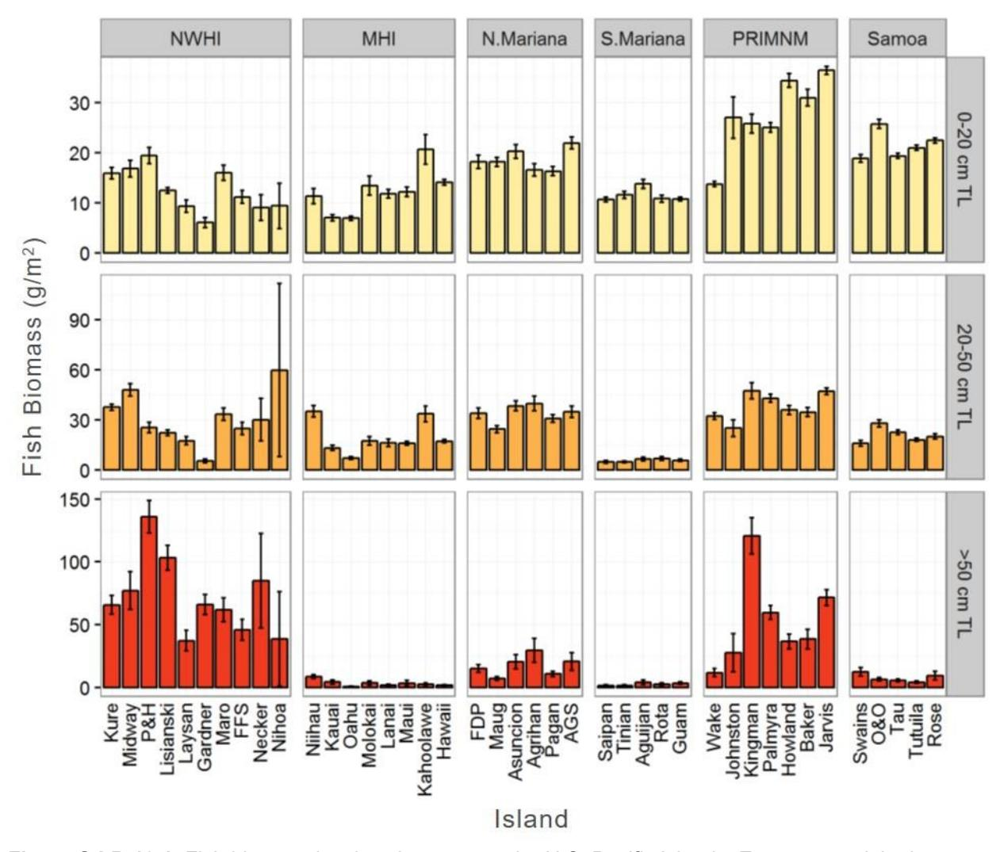

**Figure S.LR.12.1.** Fish biomass by size class across the U.S. Pacific Islands. Experts noted the low abundance of large fish (>50 cm total length [TL]) and relatively high abundance of small fish (0–20 cm TL) across the islands of American Samoa. NWHI = Northwestern Hawaiian Islands, MHI = Main Hawaiian Islands, N. Mariana = Northern Mariana Archipelago, S. Mariana = Southern Mariana Archipelago, PRIMNM = Pacific Remote Islands Marine National Monument, Samoa = American Samoa, P&H = Pearl and Hermes, FFS = French Frigate Shoals, FDP = Farallon de Pajaros, AGS = Alamagan, Guguan, and Sarigan islands, O&O = Ofu and Olosega islands. Image: McCoy et al., 2016

ESD noted an increase in fish biomass in Fagatele Bay, Ta'u, and Rose Atoll and increases in species richness across all sites between 2015 and 2018, but stated that diver bias may be responsible for the increase in species richness. No fish larger than 50 cm were observed in Fagatele Bay, Fagalua/Fogama'a, or Ta'u in 2018, but large fish were observed in Rose Atoll and Swains Island units. Aunu'u was not sampled in 2018, and sampling along southern exposures was limited due to weather (Vargas-Ángel et al., 2019). In 2018, fish biomass was highest in Rose Atoll, Ta'u, and Swains Island. Piscivore biomass was very low across all islands during the reporting period, and small herbivores were a major contributor to biomass (McCoy et al., 2018). Towed-diver surveys from 2004–2015 consistently found that the average biomass of large fish (>50 cm) was below 10 g m-2 at all sites except for Swains Island (NCRMP, 2018). Although fish density in Fagatele Bay has increased since the 1990s due to an increase in coralassociated damselfish, biomass values in 2018 were low compared to many other sites sampled throughout the territory, particularly for food fish species (A. Green/KAUST, personal communication, 2020). Fish biomass was lower than expected for a no-take MPA, and species richness in Fagatele Bay declined over time from 34 to 20 species per transect (A. Green/KAUST, personal communication, 2020). Sharks and large species of groupers, wrasses, and parrotfishes were rare throughout American Samoa, including in Fagatele Bay (Green, 2020).

A 2019 assessment determined that the bottomfish management unit species complex is undergoing overfishing and is in an overfished state in American Samoa (Langseth et al., 2019). This species complex includes SCR ecosystem species such as *Lutjanus kasmira*, *Aprion virescens*, *Variola louti*, *Caranx lugubris*, and *Lethrinus rubrioperculatus*, as well as deeper species, including *Etelis coruscans and E. carbunculus*. Research on the comparative demography of two other snappers (*Lutjanus gibbus* and *L. rufolineatus*) and an emperor species (*Lethrinus xanthochilus*) indicated a low level of exploitation for these shallow species (Taylor et al., 2018).

### **Nuisance Species**

CoTS (*Acanthaster planci*) are voracious coral predators that normally exist in low abundances on reefs throughout the Indo-Pacific. However, from 2011–2017, this species experienced a rapid increase in population that threatened corals around the island of Tutuila. CoTS were observed in Fagalua/Fogama'a in 2013 and 2014 and in low numbers in Fagatele Bay and Aunu'u (NMSAS, 2018b). The National Park of American Samoa and other sites on the north side of Tutuila were severely infested, and efforts were undertaken to stop the outbreak through diver interventions (Clark, 2014). Over 25,000 CoTS were removed across the island using injections of sodium bisulfite and ox bile salts, and coral cover has recovered in many places. Surprisingly, coral cover remained stable within the Tutuila unit of the National Park of American Samoa before, during, and after the outbreak (NPS, 2020). Low level CoTS predation and two adult CoTS were observed in Fagatele Bay in 2019. Limited surveys in 2020 revealed continued low-level predation, but no direct observations of CoTS were made (NMSAS 2020b, 2021b).

Predation on corals by snails in the genus *Drupella* has also been documented during surveys. No quantitative data on these mollusks are available, but the damage has been minor and

suggests that populations are within a normal range (NMSAS 2020b, 2021b). In 2008, a tunicate (*Diplosoma similis*) was observed overgrowing live coral and benthic substrate along the north-northwest side of Swains Island. Surveys documented *D. similis* cover as high as 76.5% at one site and 35% at a second site within this area, raising concern that it may overwhelm the reef (Vargas-Ángel et al., 2009). Biologists with NMFS noted that this outbreak may have been linked to impacts from Hurricane Heta in 2004, which may have allowed the tunicate to spread. By 2010, the species had subsided back to normal levels (D. Fenner/Lynker Technologies, LLC, personal communication, 2020).

### *Pelagic/Open Water*

#### **Marine Mammals**

Eight whale and five dolphin species have been reported in American Samoa (Craig, 2009). However, more recently, the presence of two species of baleen whale and 11 odontocete species have been verified (J. Robbins/Center for Coastal Studies, personal communication, 2020). Three other whale and two dolphin species have been observed in the region (Reeves et al., 1999). Based on resighting data, Johnston et al. (2008) suggested that rough-toothed (*Steno bredanensis*) and spinner dolphins (*Stenella longirostris*) appear to exhibit some level of site fidelity in American Samoa. Rough-toothed dolphins and spinner dolphins have been observed near Fagatele Bay and Aunu'u (D. Mattilla/International Whaling Commission, personal communication, 2020). The EAR installed at Fagatele Bay in 2019 will shed more light on marine mammal activity in the future, but data have not yet been analyzed (NMSAS, 2021a). Research suggests that marine mammal diversity in American Samoa is similar to other island nations in the region. There is a need for more expansive and regular surveys, as well assessments of marine mammals throughout the territory.

#### **Seabirds**

Seabirds are common in all sanctuary units. At Aunu'u, Fagatele Bay, and Fagalua/Fogama'a, a variety of seabirds use sanctuary waters to feed and roost on the adjacent cliffs. Species observed in these areas include brown boobies (*Sula leucogaster*), blue-gray noddies (*Procelsterna cerulea*), brown noddies (*Anous stolidus*), bridled terns (*Onychoprion anaethetus*), white terns (*Gygis alba*), and white-tailed tropicbirds (*Phaethon lepturus*; VanderWerf & Swift, 2017). Further research is needed to document species abundance in the sanctuary, identify the sanctuary resources on which these species rely, and evaluate the effect they have on nutrient cycling in these areas.

Rose Atoll is a key migratory stopover for seabird species and is an important roosting spot for resident seabirds. The waters of the sanctuary provide important foraging grounds. It is believed that the majority of seabird nesting in American Samoa takes place on Rose Island. Red-tailed tropicbirds (*Phaethon rubricauda*), frigatebirds (*Fregata aerial* and *F. minor*), three species of boobies (*Sula sula, S. leucogaster, S. dactylatra*), white terns (*Gygis alba*), sooty terns (*Onychoprion fuscatus)*, gray-backed tern (*Onychoprion lunatus)*, and noddies (*Anous stolidus, A. minutus)* all nest within Rose Atoll National Wildlife Refuge. Shearwaters (*Puffinus pacificus*, *P. navitatus*), white-tailed tropicbirds, and blue-gray noddies have been observed at Rose Atoll, but their breeding status is uncertain (Wegmann & Holzwarth, 2006). It is believed that sooty

terns and red-tailed tropicbirds may nest exclusively at Rose Island. Nesting is highly variable and may depend on foraging conditions in the waters around Rose Atoll. Seabird numbers increased after rats were eradicated from the island in 1992, but suffered losses from Cyclone Victor in 2016 (B. Peck/USFWS, personal communication, 2020).

In 2012, Titmus et al. (2016) surveyed the seabird community at Swains Island. The team noted that the seabird community was dominated by black noddy (*Anous minutus*), white tern (*Gygis alba*), and brown noddy (*Anous stolidus*). Inland surveys revealed four roosting or breeding species: black noddy, white tern, brown noddy, and red-footed booby (*Sula sula*). The presence of rats and limited amount of preferred roosting vegetation (i.e., *Pisonia* and *Pandanus*) may limit seabird populations at the island (Titmus et al., 2016).

#### **Fish**

There is limited information about pelagic fish communities within the sanctuary. Pelagic fisheries in American Samoa are monitored by NOAA Fisheries, but data are pooled and cannot be used to assess a specific geographic location. The Western Pacific Regional Fishery Management Council indicates that four tuna species—albacore, yellowfin, skipjack, and bigeye—make up most of the pelagic landings in American Samoa (WPRFMC, 2020a). Other species, in order of decreasing catch are: blue marlin, wahoo, swordfish, spearfish, masimasi, sailfish, striped marlin, thresher sharks, moonfish, dogtooth tuna, barracuda, pomfret, oilfish, and rainbow runner. This includes catch from longline (>50 miles from shore), trolling, and other methods. The longline fishery also caught and released silky, oceanic whitetip, blue, and shortfin mako sharks. No data are available specifically from the sanctuary, but trolling methods are used in the Aunu'u unit and may also be used in the Ta'u unit. Species reported from the troll fishery in 2019 were limited to skipjack tuna, yellowfin tuna, kawakawa, blue marlin, masimasi, wahoo, dogtooth tuna, sailfish, and rainbow runner. Catch per unit effort for albacore and total pelagic catch in American Samoa have declined over the past decade along with fishing effort (Figure S.LR.12.2). The decrease in catch could be linked to decreased effort or could indicate declines in fish populations. Harvest, climate change, and marine debris may all affect the abundance and distribution of pelagic fish. Fishery independent data are not available for these species, so it is difficult to assess the status of pelagic fish communities.

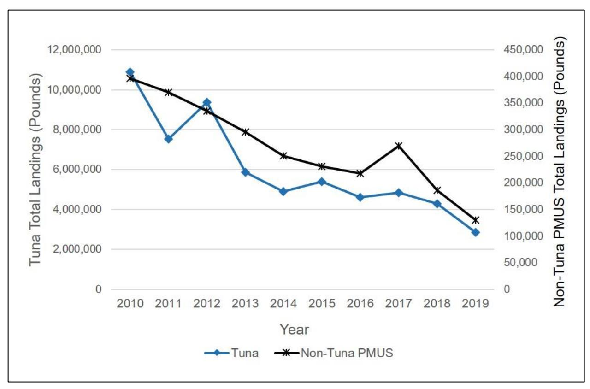

**Figure S.LR.12.2.** Estimated total landings of tuna and non-tuna pelagic management unit species (PMUS) from 2010 to 2019. Source: WPRFMC, 2020a

## *Mesophotic (MCE)*

### **Habitat-Structuring Organisms**

Island-wide surveys of mesophotic habitats around Tutuila and the Manu'a islands were conducted by NOAA Fisheries from 2002–2008 using a towed optical assessment device (Bare et al., 2010). Benthic habitat was categorized into scleractinian coral, macroalgae, other colonizers, unconsolidated hard bottom, and sand (Table S.LR.12.2). Percent cover of scleractinian coral was further classified by growth form. Encrusting and plate-like coral were the most common growth forms across mesophotic depths. Massive corals were more common in the upper (30–60 m) mesophotic zone (Bare et al., 2010), presumably due to light requirements. Branching corals that require less light were most abundant at deeper depths. Columnar and free-living corals were also observed, but in much lower abundance.

**Table S.LR.12.2.** Substrate type and mean percent living cover (with SD provided in parentheses) in MCE habitats around American Samoa (2002–2008), based on towed optical assessment device surveys. Source: Bare et al., 2010

| Depth Interval (m) | Number of Frames Analyzed | Scleractinian Coral | Macroalgae   | Other Colonizers | Unconsolidated Hard Bottom | Sand             | Total Hard Bottom |
|--------------------------|------------------------------------|------------------------|--------------|---------------------|-------------------------------|------------------|-------------------------|
| 30–39.9                  | 543                                | 15.5 (26.00)           | 3.1 (11.60)  | 14.7 (26.20)     | 24.1 (34.90)                  | 32.3 (38.20)  | 67 (38.30)           |
| 40–49.9                  | 1,181                              | 8.8 (20.70)            | 7.5 (18.90)  | 13.4 (23.20)     | 11.3 (22.20)                  | 53.4 (41.20)  | 44.9 (41.00)         |
| 50–59.9                  | 1,678                              | 4.7 (14.60)            | 20.3 (29.10) | 17 (25.90)          | 11.8 (23.00)                  | 45 (39.90)    | 54.4 (39.90)         |
| 60–69.9                  | 978                                | 6.6 (16.50)            | 16.9 (28.20) | 19.6 (28.70)     | 9.9 (21.70)                   | 40/9 (44.10)  | 54.6 (44.70)         |
| 70–79.9                  | 359                                | 6.7 (16.20)            | 15.4 (29.10) | 14.1 (26.40)     | 4.1 (11.60)                   | 56 (44.90)    | 41.40 (44.50)        |
| 80–89.9                  | 114                                | 1.9 (7.50)             | 3.2 (11.50)  | 5.8 (17.60)         | 3.5 (12.50)                   | 82.50 (30.70) | 14.6 (28.10)         |
| 90–99.9                  | 87                                 | 4.8 (14.60)            | 3 (11.60)    | 5.3 (18.70)         | 12.6 (27.00)                  | 47.8 (46.80)  | 48.7 (46.80)         |
| 100– 109.9            | 18                                 | 3.3 (7.70)             | 0 (-)        | 4.40 (14.60)     | 12.20 (19.60)                 | (-)              | 100 (-)                 |

Rebreather surveys in 2016 identified 110 scleractinian coral species in the 30–60 m zone at eight sites around Tutuila. Six of these were new records for American Samoa. One corallimorpharian, 28 alcyonaceans (including 13 gorgonians), 2 milleporids, 1 stylasterid, 2 zoanthids, and 4 antipatharians were found (Montgomery et al., 2019). During NOAA rebreather surveys in Fagatele Bay and Fagalua/Fogama'a in 2015 and 2017, divers documented the diversity of fish, gorgonians, and antipatharians. Gorgonian and black coral specimens were collected for taxonomic identification (16 gorgonian genera, 5 families of black corals; D. Wagner/NOAA, personal communication, 2017).

Data on macroalgae are limited in this zone, but Bare et al. (2010) documented vast swaths of Halimeda algae around Tutuila, particularly on deep reef slopes. Overall, data on mesophotic habitats are limited and insufficient to determine trends.

#### **Mobile Invertebrates**

Knowledge of the invertebrate fauna populating the MCE of American Samoa is extremely scarce.

### **Fish**

Very little data have been published on reef fish diversity in the MCEs of American Samoa. In American Samoa, a total of 244 reef fish species within 118 genera have been recorded during rebreather surveys. A total of 168 species (69%) were from SCRs and 56 species (23%) were from MCEs or deeper (30–200 m). The remaining 20 species occur on both SCRs and MCEs. This pattern of reef fish species richness in American Samoa is generally consistent with that of coral reef fish families elsewhere. Rebreather surveys conducted in 2017 around Fagatele Bay and Fagalua/Fogama'a detected 61 fish species in mesophotic depths. Five of these were new records for American Samoa and four may be new species (Montgomery et al., 2019). This highlights the need for further study of MCEs within NMSAS.

Many of the species in the bottomfish management unit species complex utilize mesophotic habitats. NMFS determined that the complex is undergoing overfishing and is in an overfished state (Langseth et al., 2019) The deeper species, including *Etelis coruscans, E. carbunculus,* and *Pristipomoides flavipinnis,* are long-lived species that may be more sensitive to fishing pressure than shorter-lived species. O'Malley et al. (2019) examined the age and size composition, growth, and mortality of *P. flavipinnis* in both fished and unfished areas in the Samoan archipelago. The results suggest that fishing has had significant impacts on the age structure of this species in fished areas and raised concerns about stock assessment models based on a species complex instead of individual species. Video taken during a 2019 cruise aboard the exploration vessel *Nautilus* and analyzed by the Hawai'i Undersea Research Laboratory (HURL) documented the presence of *Etelis* and *Pristipomoides* species in the Aunu'u unit and near the Ta'u unit, but did not assess abundance (OET, 2019; HURL, 2020).

### *Deep Sea*

### **Habitat-Structuring Organisms**

Knowledge of the cnidarian fauna populating the deep waters of American Samoa is extremely limited. From 2015–2017, the NOAA vessel *Okeanos Explorer* conducted surveys throughout the Pacific Islands region, including thirteen sites across American Samoa. The results indicated that American Samoa's deep-sea communities are distinct from the other regions sampled, including the nearby South Central Pacific region. This may be due to ocean circulation patterns linked to the Samoan Passage or location. The top three deep-sea genera observed in American Samoa were corals: *Enallopsammia*, *Stichopathes*, and *Scleronephthya*, which accounted for 79.5% of genera observed. Despite the high level of representation, overall anthozoan diversity was low (Shannon-Wiener diversity index H' = 1.47) and the American Samoa region had the least even distribution (J' = 0.40) of the areas surveyed (Kennedy et al., 2019). Anthozoan sightings were highest at Swains Island (486), followed by Rose Atoll (148 [Site 1], 75 [Site 2]), and Aunu'u (41). Poriferan sightings were highest at Swains Island (82), Malulu Seamount (77), and Ta'u (41; DSCRTP, 2020). The 10 most abundant families observed are listed in Table S.LR.12.3.

**Table S.LR.12.3.** Top 10 most abundant families observed during the *Okeanos Explorer* expedition in American Samoa to evaluate deep-sea habitats. Source: Kennedy et al., 2019

| Family           | Common Name  | Total # | Total for Region (%) |
|------------------|--------------|---------|----------------------|
| Dendrophylliidae | Stony coral  | 5508    | 39.30                |
| Antipathidae     | Black coral  | 3655    | 26.08                |
| Nephtheidae      | Soft coral   | 1660    | 11.85                |
| Chrysogorgiidae  | Soft coral   | 642     | 4.58                 |
| Schizopathidae   | Black coral  | 293     | 2.09                 |
| Euplectellidae   | Glass sponge | 272     | 1.94                 |
| Epigonidae       | Cardinalfish | 181     | 1.29                 |
| Amphianthidae    | Sea anemone  | 157     | 1.12                 |
| Isididae         | Bamboo coral | 137     | 0.98                 |
| Myxillidae       | Demosponge   | 104     | 0.74                 |

OET's exploration vessel *Nautilus* conducted additional deep-sea surveys in 2019 using ROVs *Argus* and *Hercules*. The highest numbers of benthic fauna sighted were at Swains Island (1310), Aunu'u (758), and Ta'u (639). HURL converted these observations into a count km-1 estimate of relative density (Table S.LR.12.4). The highest density of corals and sponges were observed at Swains Island (1732 km-1), Aunu'u (1559 km-1), and Rose Atoll (1319 km-1); these are considered moderate-density communities (OET, 2019; HURL, 2020).

At Vailulu'u Seamount, the strong environmental fluctuations in the crater have a particular effect on sessile habitat-structuring organisms, such as corals and sponges. Community assemblages and abundances appear to shift constantly in response to the ever-changing habitat conditions. Outside the crater, rocky bottoms not affected by hydrothermal activity support an epifauna dominated by octocorals (e.g., *Anthomastus* sp., *Iridogorgia* sp.) and hexactinellid sponges (Staudigel et al., 2006).

**Table S.LR.12.4.** Summary of coral and sponge densities and environmental parameters observed during the 2019 *Nautilus* expedition to American Samoa. Source: OET, 2019; HURL, 2020

| Dive # | Location       | Depth (m) | Porifera (# km -1 ) |      | Combined (# km -1 ) |      | IIAMN | Mean O 2 (mg/L) |
|--------|----------------|-----------|-----------------------------------|------|-----------------------------------|------|-------|-------------------------------|
| H1764  | Swains Island  | 1264–2432 | 164                               | 1568 | 1732                              | 1644 | 2.7   | 3.31                          |
| H1768  | Aunu'u         | 112–1003  | 196                               | 1363 | 1559                              | 315  | 18.2  | 4.78                          |
| H1772  | Rose Atoll     | 325–981   | 133                               | 1185 | 1319                              | 412  | 12.9  | 4.14                          |
| H1767  | Ta'u Unit West | 214–611   | 3                                 | 693  | 696                               | 275  | 18.5  | 4.52                          |

| Dive # | Location              | II IANTH (M) | Porifera (# km -1 ) | Cnidaria (# km -1 ) | Combined (# km -1 ) |      | IIAMN | Mean O₂ (mg/L) |
|--------|-----------------------|--------------|-----------------------------------|-----------------------------------|-----------------------------------|------|-------|-------------------|
| H1765  | Ofu-Olosega           | 1748–1832    | 51                                | 244                               | 295                               | 1771 | 2.5   | 3.52              |
| H1766  | Ta'u Unit East        | 452–769      | 6                                 | 24                                | 30                                | 602  | 6.8   | 4.05              |
| H1770  | Vailulu'u Seamount | 728-734      | 6                                 | 0                                 | 6                                 | 729  | 5.5   | 3.85              |
| H1773  | Vailulu'u Seamount | N/A          | 0                                 | 0                                 | 0                                 | N/A  | N/A   | N/A               |

#### **Mobile Invertebrates**

Knowledge of the invertebrate fauna populating the deep waters of American Samoa is also extremely limited. Available data from the *Okeanos Explorer* surveys suggest that at shallow depths (200–500 m), specific echinoderm genera are only present in a very narrow depth range, whereas in deep water (3,000–6,000 m), echinoderm genera were observed across a much broader depth range. The American Samoa region displayed the most unique taxonomic assemblage (Kennedy et al., 2019).

At Vailulu'u seamount, echinoderms, including asteroids, comatulid and isocrinid crinoids, and euryalid ophiuroids, were present. At a newly discovered hydrothermal vent, a high abundance of crabs (Bythograeidae), shrimp, and isopods were observed in 2019 (OET, 2019; HURL, 2020).

#### Fish

Deep-sea fish communities in American Samoa appear to be structured by depth. Overall, fish from 48 families were observed during the 2019 *Nautilus* expedition (OET, 2019; HURL, 2020). These data include fish observations from surveys conducted over a wide range of depth strata (110–2,432 m). Additional analysis is needed to evaluate species richness and relative density across sites and depth zones.

More research and monitoring is needed to shed light on fish diversity across the sanctuary's deep-sea habitats. One area of particular interest is the dynamic hydrothermal vent habitats located around Nafanua Cone on Vailulu'u Seamount. Environmental fluctuations appear to have a strong impact on fish distribution and abundance at these sites. In 2017, small cutthroat (synaphobranchid) eels (*Dysommina rugosa*) were observed in large numbers near low-temperature vents (NOAA Ocean Exploration, 2017); however, ROV dives in 2019 recorded significantly fewer cutthroat eels in the crater (OET, 2019; HURL, 2020).

#### Conclusion

Overall, biological diversity remains high in NMSAS. Shallow scleractinian coral populations have fluctuated over time due to predation, cyclone, and coral bleaching events, but have proven resilient to these stressors. Experts felt that many large, ecologically important fish species are rare throughout the sanctuary. Fish biomass in the Fagatele Bay and Aunu'u units is below island averages, and fish biomass is below estimated biological potential at all units except for

Swains Island. This impaired fish community structure may affect overall coral reef ecosystem function and resilience, and was a primary driver for this rating. Limited data suggest that marine mammal abundances are steady or increasing and that resident sea turtle populations, while still low, may be slowly increasing. Data for mesophotic, pelagic, and deep-sea habitats are limited, and there are no data on trends in these habitats. Mesophotic and deep-sea expeditions have expanded the list of known species in the sanctuary. New species continue to be discovered, and there is a need for further research.

## **Question 13: What are the levels of human activities that may adversely influence living resources and how are they changing?**

**Status Description:** Selected activities have caused measurable resource impacts, but effects are localized and not widespread or persistent.

**Rationale:** Fishing appears to be a significant pressure on living resources in NMSAS. Experts believe that Fagatele Bay may deserve a fair/poor rating due to low fish biomass observed at the site. Fishing pressure appears to be decreasing, but fish biomass has not increased during the reporting period. Clam populations continue to decline. Sea turtle populations are stable or increasing. Vessel groundings reduced species diversity and abundance at the impact sites in Aunu'u and Rose Atoll. Limited data are available for pelagic, mesophotic, and deep-sea habitats.

Data on human visitation and use in NMSAS are limited, but sanctuary sites are used for recreation and fishing activities on a regular basis. Human activities can impair living resources through breakage, harvest, or harassment. Fishing is not allowed in Fagatele Bay and is limited in the Aunu'u research zone, but enforcement is difficult. Commercial fishing is prohibited in most of the Muliāva unit, but subsistence fishing is allowed with a permit. Vessel groundings have impaired living resources at Aunu'u and Rose Atoll.

Fishing is an important activity in American Samoa. Fish are harvested to feed families, support extended families and friends, and support cultural practices (Levine et al., 2016). Data suggest that fishing activity has declined over the reporting period, with 46% of households in Aunu'u reporting that they fish less frequently (Levine et al., 2016). The number of registered boats, fishers, and overall harvest have also declined (ASDOC, 2018). Despite this decline in effort, fish biomass in the territory remains far below its estimated potential biomass (Williams et al., 2015; Figure S.LR.13.1), and total fish biomass values in Aunu'u and Fagatele Bay are lower than island averages (MARC, 2020). Large fish such as sharks, large parrotfish, and large groupers are rare, and the evidence suggests that bumphead parrotfish (*Bolbometopon muricatum*) may be functionally extinct or locally extirpated (D. Fenner/Lynker Technologies, LLC, personal communication, 2020).

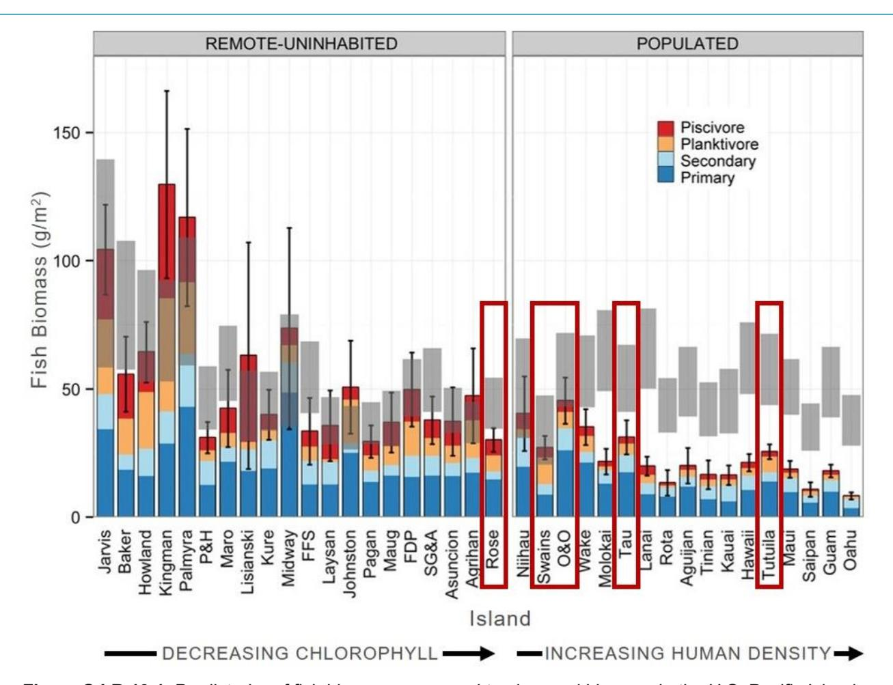

**Figure S.LR.13.1.** Predicted reef fish biomass compared to observed biomass in the U.S. Pacific Islands. The gray bars depict the predicted values of fish biomass in the absence of humans based on productivity and reef area and structure. The colored bars are observed fish biomass (+95% confidence interval per island). Islands are organized according to decreasing chlorophyll *a* values), used as a proxy for productivity, and increasing human population density. In American Samoa (indicated by red boxes), observed biomass meets the predicted values only at Swains Island and Ofu-Olosega (O&O). Source: Williams et al., 2015

A 2019 assessment of the bottomfish management unit species complex in American Samoa determined that the complex is undergoing overfishing and is in an overfished state (Langseth et al., 2019). This includes SCR species as well as deeper species. Pelagic resources appear to be more resilient to fishing pressure for now.

Giant clams (*Tridacna* spp.) are also harvested for food and cultural purposes. Abundances of these invertebrates have declined significantly over the past two decades (Green & Craig, 1999; Brainard et al., 2008) and small to medium sizes are now most prevalent (AS-EPA & CRAG, 2017; Figure S.LR.13.2). Harvest is a likely factor driving this trend, but further study is needed to evaluate possible environmental factors such as heat stress or changes in current patterns.

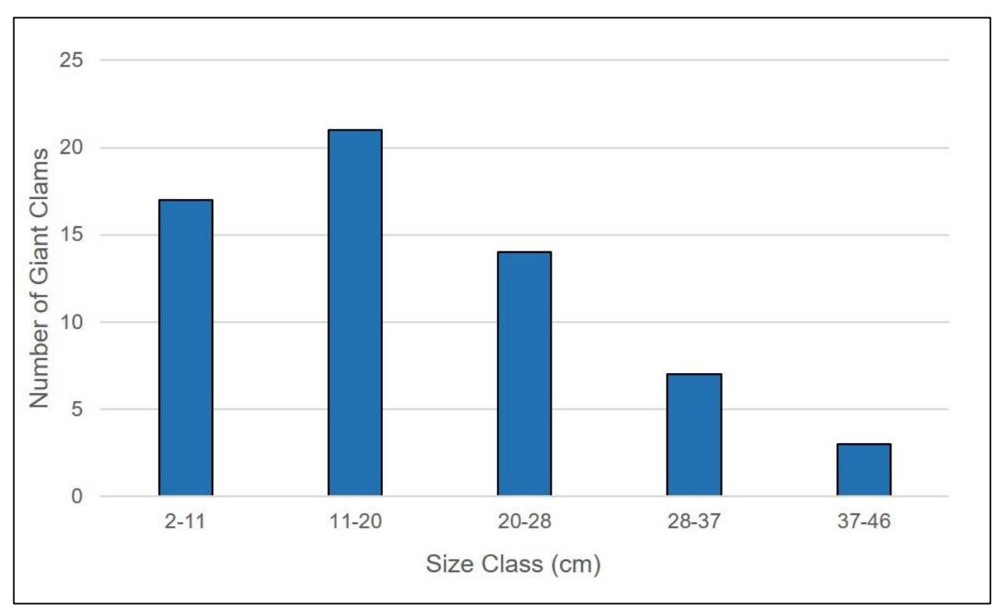

**Figure S.LR.13.2.** Most of the giant clams (*Tridacna* spp.) observed during 2016 surveys around Tutuila were less than 20 cm in size. The low number of individuals in larger size classes suggests that disturbance events or harvest pressure may affect survival. Source: AS-EPA & CRAG, 2017

Sea turtles have been protected by the Endangered Species Act since the 1980s. Seminoff et al. (2015) noted that legal and illegal harvest of green sea turtles and sea turtle eggs for human consumption continues to be a significant threat to green turtles in the region. Limited in-water surveys began in 2002. Since that time, resident sea turtle populations in American Samoa have remained stable or increased (Becker et al., 2019).

Vessel groundings in Aunu'u and Rose Atoll have had significant, localized effects on habitat. This loss of habitat has led to declines in species diversity and abundance within the impact sites as described in the previous section. These sites are limited in size and do not affect the overall rating.

### *Conclusion*

Fishing appears to be a significant pressure on living resources in NMSAS, particularly reef fish, bottomfish, and giant clams. Experts believe that Fagatele Bay and Fagalua/Fogama'a may deserve a fair/poor rating due to low fish biomass observed at the site. Other sites are doing better, but are still below potential fish biomass estimates. Data on fishing pressure suggest that effort appears to be decreasing, but fish biomass has not increased during the reporting period. Clam populations continue to decline, but it is not clear if this is linked to harvest or environmental stress. Sea turtle populations are stable or increasing. Vessel groundings reduced species diversity and abundance at the impact sites in Aunu'u and Rose Atoll, but these sites are small compared to the amount of reef habitat within the sanctuary. Limited data are available for pelagic, mesophotic, and deep-sea habitats.

## *Maritime Heritage Resources (Questions 14–15)*

The following is an assessment of the status and trends of maritime heritage resource indicators in NMSAS from 2007–2020.

The maritime heritage resources section of this report addresses the condition of and threats to heritage resources in NMSAS. Maritime heritage can encompass a wide variety of cultural, archaeological, and historic resources. Archaeological and historical resources are material evidence of past human activities and include vessels, aircraft, structures, habitation sites, and objects created or modified by humans. Cultural resources may include specific locations associated with traditional beliefs or where a community has traditionally carried out economic, artistic, or other cultural practices important to maintaining its historic identity. In the past, heritage preservation studies usually focused on land, so the majority of information currently available for the marine environment describes shipwreck (archaeological/historical) resources. Question 14 assesses the integrity of known maritime heritage resources in the sanctuary. The integrity of a heritage resource refers to its ability to convey information about the past, and can be impacted by both natural events and human activities. Archaeological integrity is generally linked to the condition of the resource, whereas historical significance may rely on other factors. The sanctuary system as a whole is working toward increasing consideration for non-shipwreck heritage resources. Human activities that adversely impact maritime heritage resources are the focus of Question 15.

## **Question 14: What is the condition of known maritime heritage resources and how is it changing?**

**Status Description:** The diminished condition of selected maritime heritage resources has reduced, to some extent, their aesthetic, cultural, historical, archaeological, scientific, or educational value, and may affect the eligibility of some sites for listing in the National Register of Historic Places.

**Rationale:** Maritime heritage resources have not been subject to human impacts that might otherwise diminish their aesthetic, cultural, historical, archaeological, scientific, or educational value. They have been subject to natural deterioration, erosion, and high-energy shoreline events, but have generally not been assessed, documented, or monitored. Therefore, their condition is rated as fair. However, the trend is worsening because maritime heritage resources are subject to ongoing natural forces like erosion and high-energy shoreline events, leading to concern regarding future conditions. Maritime heritage resources like submerged shipwrecks and aircraft, which likely exist within the sanctuary, are presumed to be slowly degrading, primarily due to natural processes.

## *Maritime Heritage Resources Studies*

Following the completion of the 2007 condition report, the initial *American Samoa Maritime Heritage Inventory* (Van Tilburg, 2007) was finalized by the ONMS Maritime Heritage Program. The report categorized types of maritime heritage resources within NMSAS and across the territory. In following years, other maritime heritage related studies were completed by ONMS, partners, and experts:

- *American Samoa Maritime Heritage Inventory* (Van Tilburg, 2007)
- *Historic Fishing Methods in American Samoa* (Armstrong et al., 2011)
- *American Samoa as a Fishing Community* (Levine & Allen 2009)
- *Damage to Archaeological Sites on Tutuila Island (American Samoa) Following the 29 September 2009 Tsunami* (Addison et al., 2010)
- *Unlocking the Secrets of Swains Island: A Maritime Heritage Resources Survey* (Van Tilburg et al., 2013)
- *Fautasi: The Race for Flag Day* (ONMS, 2014)
- *Row as One! A History of the Development and Use of the Sāmoan Fautasi* (Van Tilburg et al., 2018)
- *Fautasi Heritage of American Samoa* (ONMS, 2020b)

Importantly, the 2012 transition of Fagatele Bay National Marine Sanctuary to NMSAS expanded the original sanctuary area from 0.65 to 35,175 km2 , incorporating six protected areas ranging from the intertidal zone to the deep sea. Additionally, the focus on maritime archaeological resources in the previous condition report process was expanded to include maritime heritage (archaeological, cultural, historical) resources, more fully reflecting the federal preservation mandates defined within the National Historic Preservation Act and the National Marine Sanctuaries Act.

### *Key Data Sets*

Current ONMS knowledge of the nature, location, and significance of maritime heritage resources within NMSAS is limited. Descriptive resource inventories have been compiled mainly through desk-based assessment efforts. Field archeological surveys of submerged sanctuary areas, with the exception of Swains Island, have yet to be conducted. Due to limited formal studies and reports, the majority of evidence discussed below includes case studies from outside of sanctuary boundaries (as examples relevant to conditions within the sanctuary) and relies heavily on the experience and opinion of subject matter experts.

### **Shipwrecks**

There are at least 35 vessel losses recorded for American Samoa (Van Tilburg, 2007). These losses historically connect the territory to British colonization efforts in the Pacific, whaling heritage, fishing activities, inter-island transportation, and naval activities in World War II. Some of these losses are modern, such as fishing vessels that grounded during Cyclone Val in 1991 and were later disposed intentionally at sea, and several other groundings in more recent years. Approximately 10 lost ships, wrecked between 1828–1949, are potentially more historically significant (Table S.MH.14.1). However, field survey data are scarce. Of the 25 shipwrecks that have been located, 25 have been systematically assessed: 1) USS *Chehalis*, scuttled in Pago Pago Harbor following an onboard explosion/fire (outside sanctuary boundaries); and 2) *Jin Shiang Fa*, a longline fishing vessel grounded at Rose Atoll (within the marine national monument).

**Table S.MH.14.1.** Selected potentially historic shipwreck losses in American Samoa.

| Name              | Year Lost | Type       | Location            | Comment                                                                                                |
|-------------------|--------------|------------|---------------------|--------------------------------------------------------------------------------------------------------|
| Phoebe            | 1828         | Brig       | Tutuila             | Vessel stolen by Australian convicts, arrived (wrecked) at Tutuila via Huahine                      |
| Friendship        | 1849         | Schooner   | Rose Atoll          | British schooner lost at Rose Atoll, cargo saved                                                    |
| Speculateur       | 1849         | Schooner   | At sea              | Lost in a storm and abandoned at sea; crew reached American Samoa                                   |
| Wakulla           | 1853         | Schooner   | Rose Atoll          | Went onto the rocks, vessel stripped                                                                   |
| Metacom           | 1860         | Whaler     | Pago Pago        | Dragged anchor in gale while provisioning, went ashore on reef                                      |
| Good Templar   | 1868         | Schooner   | Rose Atoll          | En route from San Francisco, all hands but two perished                                          |
| Mary Winkelman | 1923         | Barkentine | Pago Pago        | Drifted onto reef while departing harbor                                                               |
| Tutuila           | 1940         | Steamer    | Leone Bay           | 31 children from Apia saved, two perished; local divers reported debris and an anchor in the bay |
| USS O'Brien    | 1942         | Destroyer  | Vicinity Tutuila | Torpedoed during war, sank while underway for repairs at Pago Pago                                  |
| USS Chehalis   | 1949         | Tanker     | Pago Pago        | Scuttled following explosion and fire near inner harbor fuel dock; AS-EPA site report completed  |

The naval gasoline tanker USS *Chehalis* AOG-48 (Figure S.MH.14.1) burned, exploded, and sank on October 7, 1949 in Pago Pago Harbor; six crewmen were lost, and remains were recovered for four of them. In 2007, AS-EPA completed an investigation of the site, confirming the presence of gasoline cargo, as well as the possibility of unexploded ordnance. In April 2009, the U.S. Navy conducted preliminary site investigations, and 60,000 gallons of cargo fuel were removed in April 2010 (Goldstein, 2013).

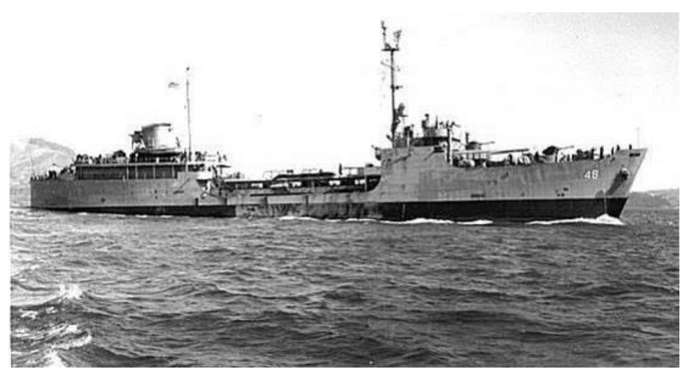

**Figure S.MH.14.1.** The Patapsco-class gasoline tanker USS *Chehalis*, prior to its loss at Pago Pago Harbor following an explosion and fire. Photo: U.S. Navy

In October 1993, a 137-foot Taiwanese longline fishing vessel, *Jin Shiang Fa* (Figure S.MH.14.2), ran aground on the western side of Rose Atoll. In 1999, the Taiwanese government funded the removal of the majority of the wreck. Over the next 14 years, the remaining debris was removed by the U.S. Coast Guard, USFWS, American Samoa government, NOAA, and other partners (Roberson, 2017). In addition to the mechanical damage to the reef and coralline algae, long-term impacts from the leaching of iron (overgrowth of cyanobacteria) into the ecosystem have been studied.

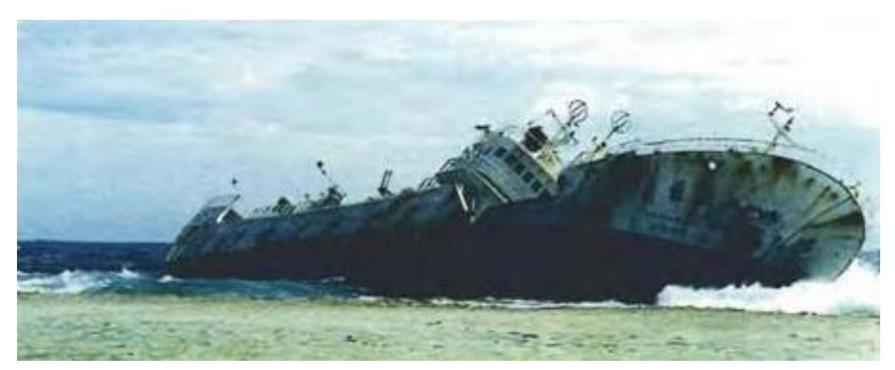

**Figure S.MH.14.2.** The longline fishing vessel *Jin Shiang Fa* aground on the reef at Rose Atoll in 1993. Photo: USFWS, 1997

### **Aircraft**

Between 1900–1950, American Samoa was under the administration of the Department of the Navy, and during the years of World War II, Tutuila supported a naval air station. As a consequence of intensive wartime training and patrols, 43 naval aircraft were recorded as having ditched or crashed into American Samoan waters between 1942–1944, mainly in the vicinity of Tutuila. None of these aircraft have been located or identified in the sanctuary or territory.

Tutuila may also be the site of one of the most famous commercial aircraft crashes in Pacific history. On January 12, 1939, Captain Edwin C. Musick, along with his six-man aircrew, suffered a fatal explosion and crashed into the ocean approximately 12 miles northwest of Pago Pago. Musick had inaugurated the Panamerican Flying Clipper service in the Pacific, the first transoceanic air link in the region. A 2019 deep-sea acoustic survey for the aircraft (Figure S.MH.14.3) was conducted by the Air/Sea Heritage Foundation and OET, but the site was not located (Matthews, 2020).

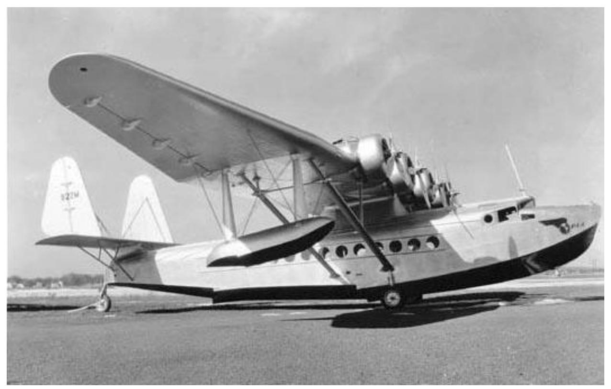

**Figure S.MH.14.3.** The Sikorsky S42 is the type of flying boat aircraft flown by PanAmerican/Edwin C. Musick and lost north of Tutuila Island in 1939. Photo: Library of Congress

Contemporary losses can also have significant cultural impacts. In 2014, a father and son team (Babar and Haris Suleman) were attempting an around-the-world flight, when their Beech A36 Bonanza aircraft developed problems and crashed shortly after takeoff from Pago Pago. The father's body was never recovered (Barbash, 2014).

### **Coastal Archaeological Sites/Features**

As of 2002, the American Samoa Historic Preservation Office's archaeological sites database maintained a record of 691 sites throughout the territory. As the largest and most populous island in American Samoa, there are numerous archaeological sites on Tutuila. However, only a few are known within or adjacent to marine and coastal/shoreline locations. These include features such as whetstones, petroglyphs, grinding holes/bait cups (Figure S.MH.14.4), and certain archaeological sites of coastal villages.

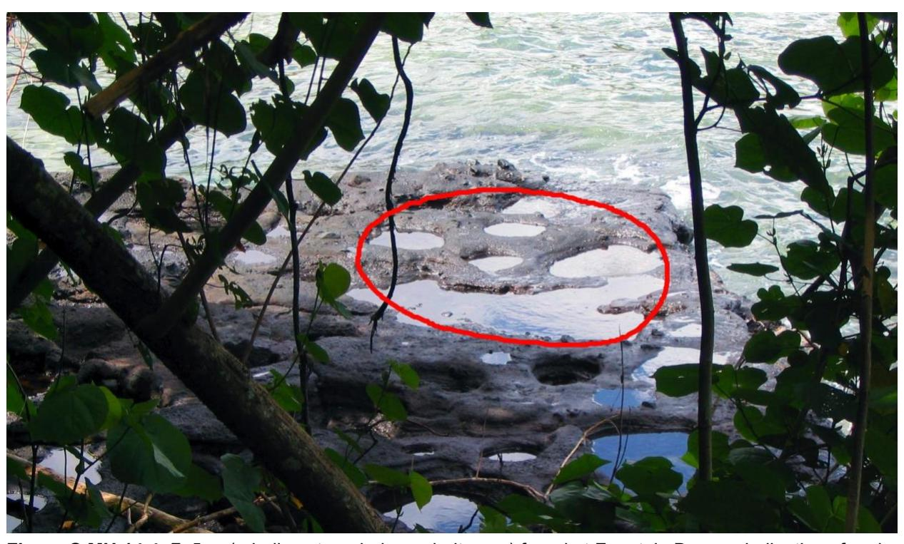

**Figure S.MH.14.4.** Foāga (grinding stone holes or bait cups) found at Fagatele Bay are indicative of early Samoan settlement in ancient times. Carved into the shoreline along the reef edge, the stone holes may have been used to sharpen basalt stone tools or to collect sea water to make sea salt. Photo: Hans Van Tilburg/NOAA

The 2010 article *Damage to Archaeological Sites on Tutuila Island (American Samoa) Following the 29 September 2009 Tsunami* (Addison et al., 2010) assessed post-tsunami impacts to shoreline cultural resource sites. More than fifty nearshore sites were identified during the survey. They ranged in size from whole coastal settlements (e.g., Fagafue, Aoloau Tuai) to single, isolated artifacts and included major lithic manufacture sites, exposed stratigraphy with cultural layers, and a variety of other archaeological remains. The authors found:

The presence of exposed stratigraphy with cultural strata at several locations around the island suggests that Tutuila's coasts are eroding and that archaeological deposits are being lost in coastal areas. Global climate change and sea-level rise should inspire a sense of urgency for the excavation and detailed study of these deposits before they are completely gone. (p. 39)

In 2013, ONMS, along with partner agencies, conducted a multidisciplinary survey of Swains Island (Van Tilburg et al., 2013). The fieldwork involved three areas of inter-related research: 1) a geomorphology survey that revealed the previous channel (now a filled swale) leading into the brackish lake; 2) a maritime archaeology survey of the lake and nearshore marine locations that identified historic and prehistoric maritime heritage resources; and 3) a terrestrial archaeology survey on land that identified 19th-century historic and possible prehistoric cultural artifacts from previous habitation phases. The project also resulted in the 2014 documentary *Swains Island—One of the Last Jewels of the Planet* by the Ocean Futures Society.

#### **Shoreline Pillboxes**

The remnants of numerous concrete pillboxes along the shoreline, as well as gun emplacements, bunkers, naval buildings, foundations, etc., are the more visible reminders of the World War II period in American Samoa (Kennedy et al., 2005). A National Register of Historic Places multiple property nomination for many of these World War II sites was prepared in 2005. Although outside of sanctuary boundaries, nearshore coastal pillbox sites are associated with the U.S. Marines and with the local Fitafita Samoan Marines (Figure S.MH.14.5). Individual pillboxes in the surf zone are subject to continuing erosion and change, and some have been knocked down, broken, or displaced. Still, these resources are robust, and even when impacted by erosion, may still be considered eligible for nomination to the National Register of Historic Places, as they are close enough to their original position and still retain their historic and educational value.

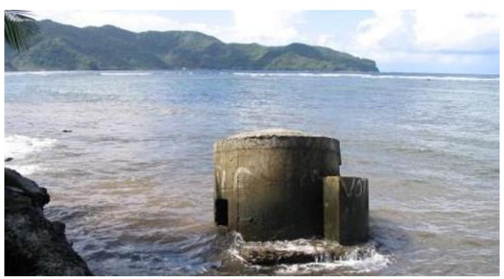

**Figure S.MH.14.5.** World War II pillbox defensive structures are located along the shorelines of Tutuila, where they are slowly being impacted by coastal erosion. Photo: Hans Van Tilburg/NOAA

### **Geocultural Features**

There are a number of legends and stories represented by natural features or specific locations within the coastal and marine context. Even specific locations underwater, such as freshwater springs or passages in the reef, can be associated with cultural folklore (Van Tilburg, 2007). Features of the landscape and seascape are visible touchstones of oral history. According to Volk et al. (1992):

These sites are of extraordinary significance to Samoan culture. Compared to all of the archaeological and historic sites that the [Historic Preservation Office] tries to protect, these sites are seen as the most significant to local residents. (p. 32)

Examples of geocultural locations include Turtle and Shark Cove, which is listed on the National Register of Historic Places. No negative impacts, or obstacles to access these cultural locations, are apparent (see the heritage and sense of place discussion in the Ecosystem Services section, which describes geocultural locations in NMSAS).

#### **Other Types of Resources**

Other resources and topics that enhance our understanding of maritime heritage within the territory and advance possible topics for future research both within and beyond the boundaries of NMSAS include:

- Reported World War II–era disposal of lots of vehicles, equipment, and even ammunition over the reef at Faga'alu Bay the elementary school (outside NMSAS boundaries);
- Reports from fishermen about ammunition (unexploded ordnance, disposed military munitions) located on Taema Bank and also at deeper locations off the north side of Tutuila Island (outside NMSAS boundaries);
- Unexploded ordnance at Rose Atoll (within NMSAS boundaries);
- Deterioration of the Rose Atoll concrete monument (USFWS jurisdiction);
- Basalt stones/boulders recorded at Rose Atoll both by 19th-century observers and on recent surveys by archaeologists (outside NMSAS boundaries; Sachet, 1954; Pickering, 1876; Kramer, 1995).

### *Conclusion*

Maritime heritage resources are the tangible and intangible properties (archaeological, cultural, historical resources) that capture our human connections to Great Lakes and ocean areas. Current ONMS knowledge of the nature, location, and significance of maritime heritage resources within NMSAS is limited. Significant data gaps exist for field assessments of submerged shipwrecks and aircraft, the updated condition of nearshore/coastal archaeological sites and features (since 2010), and the identification of geocultural locations, including associated folklore and Samoan place names. The most relevant information for addressing the condition of maritime heritage resources in the sanctuary comes from the existing desk-based assessment of heritage resources for the entirety of American Samoa, which includes the sanctuary. Therefore, resources outside NMSAS boundaries were considered in order to estimate possible conditions of potential resources within the sanctuary itself. In general, the

collective condition of maritime heritage resources is fair, as many known sites are in somewhat degraded condition, even though many have not been subject to human impacts that might otherwise diminish their aesthetic, cultural, historical, archaeological, scientific, or educational value. Maritime heritage resources have been subjected, however, to damaging natural forces like erosion and high-energy shoreline events, which are also cause for concern regarding trends and future conditions. Resources like submerged shipwrecks and aircraft, which likely exist within the sanctuary, are presumed to be slowly degrading, primarily due to natural processes.

## **Question 15: What are the levels of human activities that may adversely affect maritime heritage resources and how are they changing?**

**Status Description:** Some potentially damaging activities may exist, but they have not been shown to degrade maritime heritage resource condition.

**Rationale:** This question addresses human activities that may have adverse impacts, and is not meant to consider deterioration primarily due to natural processes. Based on observations by participating experts, few activities, either within or adjacent to NMSAS boundaries, are known to have the potential for adverse impacts to maritime heritage resources. Additionally, experts agreed that this low level of adverse activity has not changed since the previous condition report.

### *Key Data Sets*

NMSAS is not subject to many human activities that adversely impact maritime heritage resources. Potential activities that could have adverse impacts include:

- Anchor damage to submerged historic properties;
- Dredging channels/dumping dredge spoils;
- Trawling/fishing impacts of nets and lines to submerged properties;
- Illegal salvage of or damage to submerged shipwrecks and aircraft;
- Nearshore development, including coastal armoring or landfill, harbor/breakwater, pipeline, or submarine cable infrastructure;
- Offshore development, including submarine pipelines or cables, or renewable energy sources like wind turbines;
- Obstruction of public or practitioner access to culturally significant locations/features;
- Obstruction of cultural viewsheds by nearshore development or development of offshore wind turbines;
- Indirect impacts (e.g., sedimentation from land runoff or development).

There are no indications of permissible human activities that might adversely affect maritime heritage resources within the sanctuary, but some activities could have general impacts to areas outside or adjacent to sanctuary boundaries. Due to limited formal studies and reports, evidence supporting this question relies heavily on personal experience of subject matter experts.

### **Nearshore Activities and Development**

Sand removal, or sand "mining," may be a cause of increased coastal erosion, but it is not known to occur in the sanctuary. Sand mining for traditional use has been ongoing for years in the Fatu ma Futi area (e.g., beautification of the front yard during ceremonial events). Over the years, American Samoa has also experienced severe erosion at Utulei Beach as a result of climate change. Potential erosion due to the removal of sand in public places is of great concern. Palm trees once standing along the shoreline are now falling into the ocean. An area on Aunu'u may possibly be mined for sand (across from the sanctuary boundary), but that has not been confirmed.

Shoreline armoring could impact maritime heritage resources or locations, but there are no current plans proposed for the sanctuary. When under threat of erosion, it is common to consider a seawall as the fastest and most effective way to stabilize the coastline. Seawalls often bring other problems, including the loss of the high-tide beach and acceleration of erosion on adjacent land (Romine & Fletcher, 2012).

### **Offshore Activities and Development**

There are no offshore development activities that may impact maritime heritage resources within NMSAS. A fiber optic submarine cable was recently installed outside of sanctuary boundaries. This project required that a sidescan sonar survey be conducted to confirm that no historic properties were located within the area of potential effect, a requirement of Section 106 of the National Historic Preservation Act (TeleGeography, 2020).

#### **Access to Cultural Resources**

There are no known activities that might obstruct access to culturally significant locations or features (e.g., Turtle and Shark Cove).

### **Other Activities and Impacts**

In 2016, the longline fishing vessel *No. 1 Ji Hyun* grounded on the western reef of Aunu'u (Figure S.MH.15.1). No historic properties, like submerged shipwrecks or aircraft, are known to be present in the affected area, but the reef itself is culturally important to the community of Aunu'u as a viewshed and a location for fishing, gathering, subsistence, and traditional practices. The grounding assessment report (Peau, 2018) states: "This area is of ecological and cultural significance for local residents using hook-and-line, casting nets, spearfishing (nonscuba assisted), and other non-destructive fishing methods, including those traditionally used for sustenance and cultural purposes such as gleaning" (p. XXX). The 2016 grounding represents the one activity that has degraded a location with heritage significance within the sanctuary (this event and its impact to the reef ecosystem is discussed further in the State of Habitat and State of Living Resources sections). The grounding highlighted the need for greater response capabilities and supplies and to create clearer processes for accountability from vessel owners who ground within sanctuary waters (Weinberg, 2016).

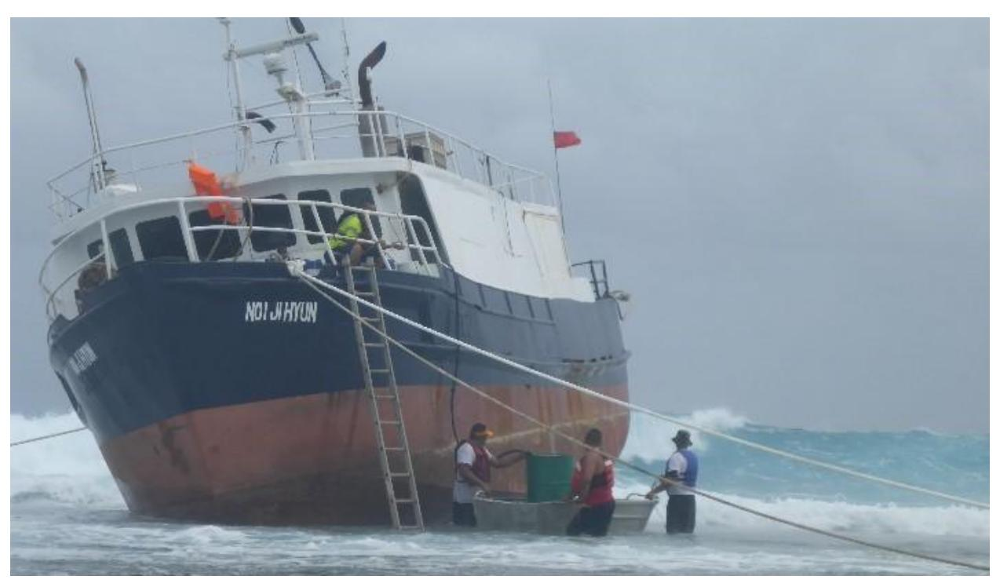

**Figure S.MH.15.1.** The fishing vessel *No. 1 Ji Hyun*, grounded on the western reef of Aunu'u (within NMSAS), April 2016. Photo: NOAA

### *Conclusion*

Current ONMS knowledge of the nature, location, and significance of maritime heritage resources within NMSAS is limited, and this data gap in recording and understanding tangible heritage resources and culturally significant locations within sanctuary boundaries affects the assessment of potential adverse impacts to those resources from human activities. Nevertheless, it is clear from NMSAS staff knowledge and the workshop discussion that the site and community place high priority on cultural traditions and practices, and that few human activities within American Samoa have obvious adverse impacts to heritage resources or locations. Due to limited formal studies and reports, this assessment relies heavily on the experience of subject matter experts. Based on their input, the status was rated as good/fair. Additionally, there was agreement that this low level of adverse activity has not changed since the previous condition report.

## **State of Ecosystem Services**

Ecosystem services are the benefits that humans receive from natural and cultural resources. Generally, the taxonomy of the Millennium Ecosystem Assessment (2005) is used in ONMS condition reports. The Millennium Ecosystem Assessment (2005) was an initiative of the United Nations to assess ecosystem services, including cultural, provisioning, regulating, and supporting services. Categories of ecosystem services include "final" services, which are directly valued by people, and "intermediate" services, which are ecological functions that support final services (Boyd & Banzhaf, 2007). In ONMS condition reports, only final ecosystem services are rated, which is consistent with the anthropogenic focus of the reports and highlights priority management successes and challenges in sanctuaries. The complete definitions of ecosystem services considered by ONMS are included in Appendix B.

There are two categories of ecosystem services: intermediate and final. Ecosystem services that are evaluated in condition reports are final ecosystem services. Intermediate services support other ecosystem services, whereas a good/service must be directly enjoyed by a person to be considered a final ecosystem service. For example, nutrient balance leads to clearer water and higher visibility for snorkeling and scuba diving. Nutrient balance is an intermediate service that supports the final ecosystem service of non-consumptive recreation via snorkeling and scuba diving.

### **Thirteen final ecosystem services may be rated in ONMS condition reports**

#### *Cultural* (non-material benefits)

- 1. Consumptive recreation Recreational activities that result in the removal of or harm to natural or cultural resources
- 2. Non-consumptive recreation Recreational activities that do not result in intentional removal of or harm to natural or cultural resources
- 3. Science The capacity to acquire and contribute information and knowledge
- 4. Education The capacity to acquire and provide intellectual enrichment
- 5. Heritage Recognition of historical and heritage legacy and cultural practices
- 6. Sense of Place Aesthetic attraction, spiritual significance, and location identity

#### *Provisioning* (material benefits)

- 7. Commercial harvest The capacity to support commercial market demand for seafood products
- 8. Subsistence harvest The capacity to support non-commercial demand for food and utilitarian products
- 9. Water Providing water for human use by minimizing pollution, including nutrients, sediments, pathogens, chemicals, and trash
- 10. Ornamentals Resources collected for decorative, aesthetic, or ceremonial purposes
- 11. Biotechnology Medicinal and other products derived or manufactured from sanctuary animals or plants for commercial use
- 12. Energy Use of ecosystem-derived materials or processes for the production of energy

#### *Regulating* (buffers to change)

13. Coastal protection — Flow regulation that protects habitats, property, coastlines, and other features

Notably, some consider consumptive recreational fishing as a provisioning service, but it is included here as a cultural ecosystem service due to the emphasis on recreation. Additionally, it is possible that services categorized as provisioning may also yield cultural benefits and support cultural activities. Also, even though biodiversity was listed as an ecosystem service by the Millennium Ecosystem Assessment (2005), ONMS decided to remove it, recognizing that biodiversity is an attribute of the ecosystem on which many final ecosystem services depend (e.g., recreation, harvest); therefore, it is addressed in the State section of this report. Lastly, although ONMS listed climate stability as an ecosystem service in 2015, it is no longer considered an ecosystem service in ONMS condition reports, because national marine sanctuaries are not large enough to influence climate stability (Fisher et al., 2008, 2009).

For National Marine Sanctuary of American Samoa (NMSAS), nine of the 13 final ecosystem services were rated during the 2020 workshops: non-consumptive recreation, consumptive recreation, science, education, heritage, sense of place, commercial harvest, subsistence harvest, and coastal protection. The other four ecosystem services were evaluated by staff, but were determined not to be applicable to the sanctuary.

## *Ecosystem Services Indicators*

The status and trends of ecosystem services are best evaluated using a combination of three types of indicators: economic, non-economic, and resource. Economic indicators may include direct measures of use (e.g., person-days of recreation, catch levels) that result in spending, income, jobs, gross regional product, and tax revenues, or non-market economic values (the difference between what people pay to use a good/service and what they would be willing to pay). Non-economic indicators can be used to complement economic indicators and include importance-satisfaction ratings for natural and cultural resources, facilities and services for recreation uses, limits of acceptable change for resource conditions, social values and preferences, social vulnerability indicators, perceptions of resource conditions in the present and expectations for the future, and access to resources. Finally, resource indicators are considered in determining status and trend ratings for each ecosystem service. Resource indicators are used to determine if current levels of use are sustainable or are causing degradation to resources. If resources cannot support current levels of use, this may downgrade a rating that may otherwise be higher based on economic and non-economic indicators alone. Together, these three types of indicators are considered when assessing the status and trends of ecosystem services in national marine sanctuaries.

## *Non-Consumptive Recreation*

**Recreational activities that do not result in intentional removal of or harm to natural or cultural resources**

**Status Description:** The capacity to provide the ecosystem service is compromised, and existing management would require enhancement to enable acceptable performance.

**Rationale:** Though it is clear that both physical conditions and infrastructure limit access for non-consumptive recreation activities in the sanctuary, the levels of existing activities are not well understood or quantified. The improving trend reflects sanctuary and partner outreach and education activities that highlight recreational opportunities in the sanctuary. These create interest among residents and tourists in using the sanctuary.

Non-consumptive recreational activities are those that do not result in the intentional removal of or damage to natural and heritage resources. In national marine sanctuaries, these include activities such as swimming, snorkeling, scuba diving, boating, beach recreation, and beach camping. Sanctuaries are directed to facilitate recreational activities to the extent compatible with resource protection. The goals of NMSAS include increasing awareness of responsible use in the sanctuary and minimizing user impacts. The status of non-consumptive recreation is fair, as non-consumptive recreation is limited in most of the NMSAS units due to the remote nature of and limited or challenging access to these areas. Direct impacts to sanctuary resources from non-consumptive recreation appear to be minimal. The trend is improving, as NMSAS has implemented efforts to improve access during the reporting period.

To access Fagatele Bay, most of Fagalua/Fogama'a, the Aunu'u Research Zone, and Ta'u, visitors must either hike across rough terrain or access the site by boat. There are no facilities at the sites, and land access is controlled by the traditional landowners. Limited area for beach camping is available adjacent to the Fagalua/Fogama'a unit, and campers often swim and fish within the sanctuary. Rowing, kayaking, and paddling in these areas are impractical due to access constraints and reef structure. Residents of Aunu'u can easily access the Aunu'u Multipurpose Zone, which abuts the southern side of the village; however, the waves along this coast can be treacherous, making shore access to deeper waters dangerous at times. Visitors may access Aunu'u via a ferry from Tutuila. Access to Rose Atoll and Swains Island is restricted and requires a lengthy boat trip, making recreational access impractical. The remote nature of the units also makes it difficult to evaluate visitor use; therefore, no data are available to directly assess this service at Rose Atoll or Swains Island.

Although there are no studies available that look specifically at non-consumptive recreational activities within the sanctuary itself, there have been studies that analyze marine-related activities and uses of the waters in American Samoa. For example, the National Coral Reef Monitoring Program conducted a socioeconomic survey in 2014 (Levine et al., 2016). The survey found that the most common non-consumptive recreational activities occurring in American Samoa were swimming, beach recreation, and beach camping (primarily at Fagalua/Fogama'a). Among residents of American Samoa surveyed (n = 448), 47% reported swimming more than once per month, 21% reported participating in beach recreation at least once in the past month, and 16% reported beach camping more than once per month. Less common activities included snorkeling, diving, boating, canoeing, and surfing (Levine, et al., 2016).

Outside of this survey, there is little evidence or documentation of visitation to NMSAS. In 2007, a trail leading from the ridge to the beach adjacent to Fagatele Bay was constructed to increase access. Public access to the beaches, and consequently the water, is under the purview of the village or individual families that reside adjacent to the water and public places, and one must obtain permission or approval for access. In some places, landowners charge an access fee (that does not go to NMSAS). These families are the caretakers of these special places and help to maintain and safeguard them for current and future generations. Sign-in sheet data maintained by landowners showed that 297 individuals visited Fagatele Bay in 2010 (Cheng & Gaskin, 2011). Data are not available for other years.

The only available data regarding the number of snorkeling trips by visitors are from 2004, when roughly 2,750 snorkel trips were taken in Fagatele Bay (Spurgeon et al., 2004). Data regarding diving activities are also limited, but the same report found that in 2004, there were 15 active divers living in American Samoa and they completed a total of approximately 450 dives in the sanctuary. In a more recent study, 70% of American Samoa residents surveyed reported that they never went snorkeling, and 93% reported that they never went diving (Levine et al., 2016). Five percent of respondents reported snorkeling four or more times a month and 2% reported diving four or more times a month.

Humpback whales can be seen in the waters of American Samoa from mid-July–November, although exact arrival and departure times vary from year to year. There were no commercial whale watching operators in American Samoa from 1991–1998, but in 2005 and 2008, a

#### State of Ecosystem Services

minimal amount of commercial whale watching may have occurred (O'Connor et al., 2009). Anecdotally, experts at the workshop noted they were unaware of any current commercial whale watching operations. However, it is possible that those on cruise ships, yachts, or along the shore engage in whale watching, but there is no information on these user groups relative to wildlife viewing.

Pago Pago Harbor is one of the deepest harbors in the Pacific and is an increasingly popular stop for cruise ships. The number of cruise ships visiting American Samoa has increased since 2006, and has more than doubled from six in 2006 to 14 in 2017 (Table App.F.1). Each ship carries hundreds to thousands of passengers. Cruise ship passengers generally disembark for a single day before traveling to the next destination. Cruise ship arrivals were canceled from December 2019–February 2020 due to a measles epidemic in neighboring Samoa, and ceased in March 2020 due to the COVID-19 pandemic. Arrivals by yachts vary from year to year, with a low of 50 arrivals in 2009 and a peak of 113 in 2011 (ASDOC, 2016, 2018).

The number of tourist arrivals by plane has also varied (ASDOC, 2016, 2018; Table App.F.2). During the study period, arrivals peaked at roughly 7,500 in 2007, then declined until 2015. Arrivals increased in 2016 and 2017 with 2,501 and 5,579 arrivals, respectively. Tourism is limited, and the majority of tourist arrivals are from the U.S. and New Zealand. Tourists frequently visit the nearby National Park of American Samoa. From 2008–2018, there was a steady increase in the number of visitors to the park (National Park Service, 2022; Figure ES.NCR.1). Visitors include both tourists and local residents. A notable peak in visitation occurred in 2017, with roughly 70,000 visitors entering the park. Although these data sources provide information on the total number of visitors to the island, it is unclear how many actually visit the sanctuary. Cruise, yacht, and airplane arrivals abruptly ended in 2020 due to the COVID-19 pandemic, and the amount of time it will take for visitation to return to pre-pandemic levels is unclear. Arrivals and departures by vessel type are shown in Table App.F.1 (ASDOC, 2016, 2018).

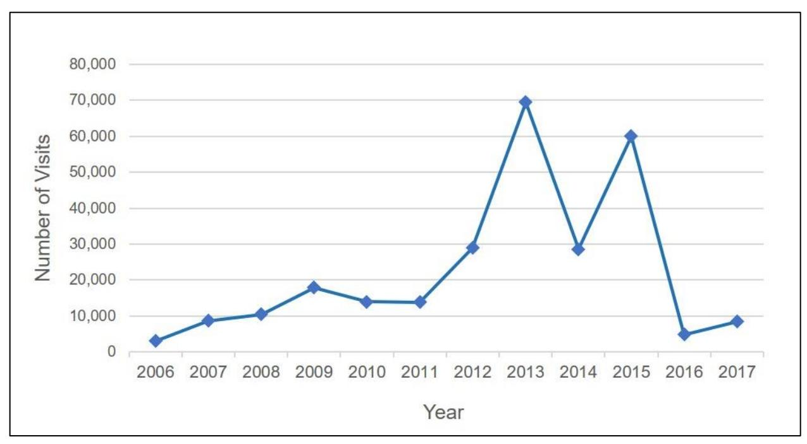

**Figure ES.NCR.1.** Number of visits to the National Park of American Samoa. From 2008–2018, visitation steadily increased. A notable peak occurred in 2017, with roughly 70,000 visitors entering the park. Source: National Park Service, 2022

Educational programs implemented by NMSAS have likely increased awareness of, and perhaps visitation and recreation within, the sanctuary. NMSAS has also supported efforts to increase awareness around ocean swimming and science. From 2011–2015, the Ocean Swimming/Ocean Science course, which included swimming instruction, offered one credit to participating Samoana High School students. The total number of students who took the course from 2012– 2015 was 160 (50 students in 2012, 50 students in 2013, 30 students in 2014, and 30 students in 2015). In the summer season, the Ocean Star course offered elementary school students the opportunity to learn about coral reefs and swimming. Thirty-five students participated in 2013, 35 participated in 2014, and 40 participated in 2015. A more complete list of educational programs is provided in the Education ecosystem service section.

Because of these outreach efforts, awareness of the various locations within the sanctuary has increased, which could possibly result in increased visitation. Despite increased awareness, access to many sanctuary sites remains challenging. NMSAS does not have the ability to improve infrastructure related to accessing the marine environment, since the surrounding lands are either community-owned or privately owned. Anchoring is prohibited in all sanctuary units, and NMSAS has not maintained mooring buoys during the study period, which may limit boat access. There is a limited number of for-hire and tour businesses that take snorkelers and boaters out to NMSAS units in Tutuila, including Aunu'u and Fagatele Bay, but the industry is not well developed. These businesses have begun taking a limited number of visitors to the Ta'u unit to snorkel or dive around the large *Porites* colonies there. The lack of access and limited capacity to provide this service may restrict non-consumptive use of the sanctuary.

The condition of natural resources is likely not significantly affected by non-consumptive recreation and, therefore, did not influence this rating. As described in the State of Water Quality section, the status of water quality is good. According to the American Samoa Environmental Protection Agency (AS-EPA), the open coastal waters in Fagatele Bay, Ta'u, and Aunu'u fully support recreational use. Coral communities remain robust, though they may be experiencing impacts from climate change. Antarctic humpback whales continue to journey to American Samoa for calving and breeding, with high densities observed near Fagatele Bay and Aunu'u. Lastly, relatively low fish biomass, particularly for larger parrotfish, groupers, and sharks, is unrelated to non-consumptive recreation.

### **Conclusion**

Although there have been no studies specific to non-consumptive recreation in NMSAS, there have been studies of participation rates across the entire region. This proxy data show that swimming and beach recreation are some relatively common activities in American Samoa. Although the number of cruise ship arrivals increased, the number of overall tourist arrivals to American Samoa decreased from 2007–2015 (although there have been some increases in recent years). Visitation to the National Park of American Samoa has increased since 2008, with peak visitation occurring in 2017 (Figure ES.NCR.1). Yet, despite increasing awareness of the sanctuary and the recreational opportunities available, a lack of infrastructure to promote access continues to be a limiting factor. Expert opinion, along with measurable proxy indicators, led to a status rating of fair with an improving trend.

## *Consumptive Recreation*

**Recreational activities that result in the removal of or harm to natural or cultural resources**

**Status Description:** The capacity to provide the ecosystem service is compromised, but performance is acceptable.

**Rationale:** The status of good/fair was based primarily on the fact that recreational opportunities have not been significantly reduced by changes in resource availability or access restrictions. The expansion of NMSAS restricted fishing access at two sites, but likely had minimal impact on recreational fishing. People were still able to access resources, and NMSAS worked to increase awareness of responsible recreational fishing practices. Consumptive recreation in the sanctuary likely decreased after the expansion in 2012, then increased after subsequent outreach to enhance recreational fishing. There are insufficient data to determine the extent of these changes; therefore, the ratings for this service are based primarily upon expert opinion.

Consumptive recreation is a term used to describe recreational activities that may result in the death of or disturbance to wildlife, or the destruction of natural habitats. In many places, this includes recreational fishing, sport fishing, and beachcombing. Within the National Marine Sanctuary System, sites try to balance access to these activities with resource protection to

#### State of Ecosystem Services

maintain this ecosystem service. Evaluating this service in the Pacific Islands is difficult, as island communities rely on fishing for subsistence and do not view it as a recreational activity. The National Coral Reef Monitoring Program found that in American Samoa, 24% of survey respondents reported fishing "for fun" on either "frequent[ly]" or "sometimes," but this was almost always coupled with other reasons, including food provision or fulfilling cultural obligations (Levine et al., 2016). When residents fish, it is primarily to support their families and communities, which is discussed further in the subsistence harvest section.

Due to the traditional marine tenure system, residents usually fish in their home village and do not require a license, special gear, or for-hire operations. This makes it difficult to track fishing activities in the territory, so data to assess the level of consumptive recreation as a stand-alone activity are limited. Non-residents (e.g., tourists or contract workers) may engage in recreational fishing activities; however, opportunities are limited, as only a few companies offer charter fishing services, and cruise ship tourists usually do not have enough time to engage in fishing activities during their short (<12 hours) visit to the island. Experts noted that they observed little recreational fishing, even by visitors to the island. Fishing tournaments (Figure ES.CR.1) are one of the few truly recreational fishing activities in American Samoa. Therefore, consumptive recreation is likely a small portion of total fishing when compared to commercial and subsistence harvests. What is known about the level of recreational fishing effort is summarized below.

During the expansion process, NMSAS worked with village councils to evaluate fisheries regulations for each unit. The Futiga Village Council requested that fishing activity be restricted in Fagatele Bay and in Aunu'u, and that some fishing be allowed within the research zone of the Aunu'u unit. Fagatele Bay is now a no-take marine protected area, and only surface fishing for pelagic species is allowed in the Aunu'u Research Zone. These units are difficult to access for fishing, requiring either a boat or a hike across rough terrain. Fishing is allowed in the Aunu'u Multiple Use Zone, which is the only NMSAS unit that is close to a village and is considered an important fishing ground.

In 2013, NOAA Fisheries designated a 22-km no-take zone around Rose Atoll; however, recreational fishing is allowed in this zone with a permit. Fishing access was not altered in Fagalua/Fogama'a, Ta'u, or Swains Island. The sanctuary expansion may have affected consumptive recreation by restricting fishing in Fagatele Bay and the Aunu'u Research Zone, but the estimated impact was minimal due to the location of and access constraints associated with these sites (ONMS, 2012). Residents were also confused about fishing access after the expansion, which may have curtailed activity immediately after the expansion. To counter this and to correct misperceptions related to the new units, NMSAS conducted outreach to educate the public about fishing access in the sanctuary, and hosts an annual fishing tournament to encourage pelagic fishing (Figure ES.CR.1).

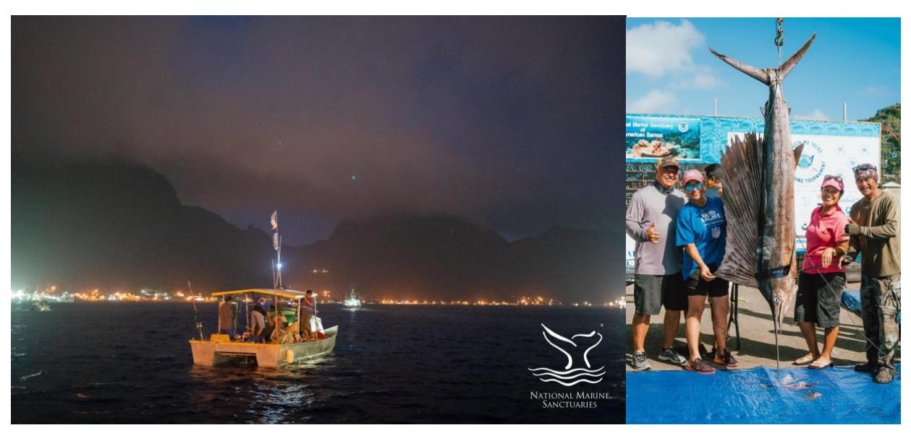

**Figure ES.CR.1.** Participants at the 2019 Fagota Mo Taeao Open Fishing Tournament. Photo: Nerelle Que/NOAA

Tourism is still limited in American Samoa, but cruise ship visits have increased over the reporting period, doubling from six in 2006 to 14 in 2017 (see Table App.F.1). Each ship carries hundreds of visitors. Pago Pago Harbor is one of the deepest harbors in the Pacific, making it an ideal stop for cruise ships and yachts. Although this may change in the future, at present, tourists do not appear to engage in consumptive recreation (see Table App.F.2). Cruise ships often arrive after peak fishing hours and do not stay long enough for passengers to engage in fishing charters. Also, due to the limited tourism market, there are only a few for-hire operations that take visitors to the sanctuary on tours. These businesses must rely on other activities (e.g., inter-island transport, commercial diving, etc.) throughout the year to sustain operations. Companies that coordinate cruise ship visits in American Samoa do not promote many waterbased recreation tours due to the lack of companies able to provide these tours. There are no fishing, whale watching, or island cruises listed as tour options for any of the ships.

Yachts often visit for longer periods and may engage in consumptive recreation activities during their stay, or during transit before or after their visit to Pago Pago. However, there are no data on fishing from yachts, including whether yachters fish within the sanctuary; any activity is believed to be minimal. Workshop experts noted that the National Park of American Samoa is a more established destination for tourists, with well-developed terrestrial access and the Ofu ranger station located close to the Ofu airport. The park also tracks visitor use. These data may be helpful for evaluating this service in the future, as it is possible that the same visitors that use the park also recreate in NMSAS. However, more research would be needed to confirm this. A full discussion of cruise ship, yacht, and other tourist arrivals is provided in the nonconsumptive recreation section (ASDOC, 2016, 2018).

The annual Fagota Mo Taeao Open Fishing Tournament, started in 2016, is hosted by the Sanctuary Advisory Council Fishing Committee, and is co-managed by NMSAS and the Department of Marine and Wildlife Resources (DMWR). The purpose of the tournament is to increase awareness of sustainable fishing practices in the sanctuary and bring traditional fishers and recreational anglers together. It is open to both residents and non-residents. The tournament receives extensive local sponsorship and provides donations of fish to a local charity. The tournament supports and is supported by local communities. Prizes are awarded to the three heaviest fish caught in six different species categories, and awards are also provided for outstanding sportsmanship and participation. In 2019, the two-day tournament had a total of 96 boats, including 80 local alia registered. The youngest recreational angler participating in the tournament was nine years old. The number of reported catches has increased since the tournament's inception. The most commonly kept fish caught were yellowfin, dogtooth, and skipjack tuna. Participants reported some catches from both Aunu'u and Ta'u, but most were from outside of the sanctuary.

### **Conclusion**

There is limited evidence related to consumptive recreation within NMSAS. At present, the majority of those who benefit from consumptive recreation in American Samoa are local residents. However, residents generally do not engage in fishing solely for recreational purposes, but do so in conjunction with other responsibilities, such as providing food. Tourists arriving via cruise ships, yachts, and other means have not been significant participants in these activities, and are not useful indicators for this service at this time.

## *Science*

**The capacity to acquire and contribute information and knowledge**

**Status Description:** Demand for the service is not fully met, but performance is acceptable and may not warrant enhanced management.

**Rationale:** Science activity has been increasing at NMSAS throughout the reporting period and current levels are rated as good/fair. During this time, research activities, publications, science capacity, and partnerships have all increased. Experts noted that there are still limitations due to the lack of access to large research vessels and science staff capacity, and the program will need more support in the future, given the substantial expansion of the sanctuary in 2012. The incorporation of traditional knowledge and more student programs were highlighted as areas for future improvement.

Science as an ecosystem service is defined as the capacity to acquire and contribute information and knowledge. This information and knowledge can come in many forms, from quantitative data on ecological parameters such as fish biomass and coral cover to traditional knowledge about seasonal trends and cycles. Science services often involve scientists, but can also be generated by students and community members. The information generated from these programs feeds directly into the adaptive management process at NMSAS.

Science capacity at NMSAS falls into three main categories: science conducted by sanctuary staff, science conducted by research partners, and science conducted by students and the community. NMSAS had limited scientific capacity during this reporting period, but has recently

#### State of Ecosystem Services

added a full-time research coordinator, a research scientist, and a marine operations coordinator to support scientific field operations. The lack of NMSAS science capacity limited sanctuary-led research activities in the past, but NMSAS has acquired funding and technical capacity to initiate a research program that includes long-term coral reef monitoring, which began in 2020. The program will address the priorities established in the marine conservation science and climate change action plans within the NMSAS management plan, including monitoring, characterization, climate science, and improving public science outreach (ONMS, 2012).

Most of the science conducted at NMSAS from 2007 to 2020 was implemented by partner organizations, including the ONMS Maritime Heritage Program, the National Oceanic and Atmospheric Administration (NOAA) Pacific Island Fisheries Science Center Ecosystem Services Division, NOAA National Centers for Coastal Ocean Science, NOAA Coral Reef Conservation Program (CRCP), NOAA Ocean Exploration, NOAA Ocean Acidification Program (OAP), American Samoa Historic Preservation Office, the Bishop Museum, the Ocean Exploration Trust (OET), XL Catlin Seaview Survey, the Ocean Futures Society, agencies associated with the American Samoa Coral Reef Advisory Group, and a number of academic institutions. Projects include shallow coral reef monitoring, ocean acidification monitoring, mesophotic reef characterization and exploration, bathymetric mapping, deep-sea exploration, targeted research on contaminants and coral disease, and archaeological and social science research to evaluate maritime heritage resources.

NMSAS has tracked the effort and outcomes of these projects. Figure ES.S.1 illustrates the increase in scientific permits within NMSAS since 2007. Prior to 2007, the highest number of permits in any given year was three, but this increased to nine in 2018. This activity decreased slightly in 2020 due to the COVID-19 pandemic, but is expected to increase as travel resumes. Figure ES.S.2 shows the number of publications related to NMSAS. Publications have increased since 2007, with seven publications specific to NMSAS and over 30 publications related to sanctuary units in some way.

Major partner efforts include the American Samoa Reef Assessment and Monitoring Program cruises, funded by CRCP in 2008, 2010, 2012, 2015, and 2018 (Brainard et al., 2008; CREP, 2016; Vargas-Ángel et al., 2019), which collected data on shallow coral reef ecosystems (0–30 m) around all the islands within the territory using a stratified random sampling design. This program is now part of the National Coral Reef Monitoring Program and monitors benthic habitat, coral demographics, fish biomass and diversity, and oceanographic parameters. Later cruises increased sampling in NMSAS units to improve data availability for the sanctuary. Divers from Papahānaumokuākea Marine National Monument, the National Park of American Samoa, the University of Hawai'i, and the Bishop Museum conducted exploration dives in Fagatele Bay, Fagalua/Fogama'a, and Aunu'u using rebreathers from 2015–2018.

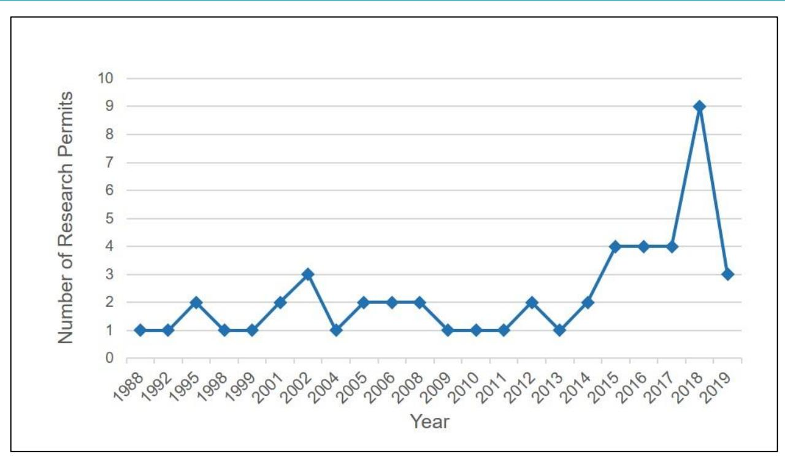

**Figure ES.S.1.** Number of research permits issued by NMSAS from 1988 to 2019. Source: NOAA

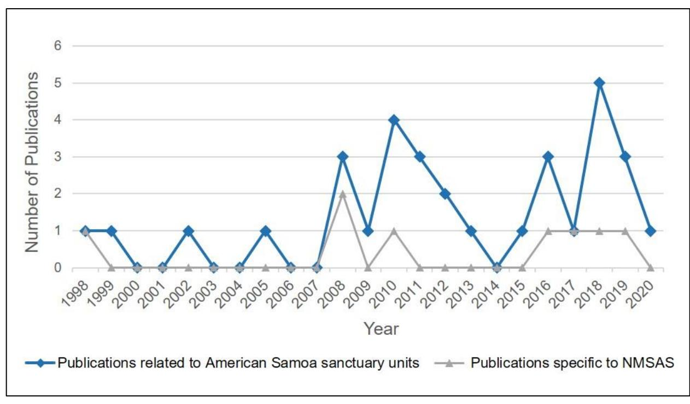

**Figure ES.S.2.** Number of scientific publications either related to NMSAS units or specific to NMSAS from 1998–2019. Source: NOAA

Another significant effort was the Campaign to Address Pacific Monument Science, Technology, and Ocean Needs (CAPSTONE) project conducted aboard *Okeanos Explorer* in 2017. This project assessed deep-sea habitats within NMSAS as part of its exploration efforts, and data are publicly accessible via the NOAA Deep-Sea Coral Research and Technology Program portal and a number of publications, including Kennedy et al. (2019) and Amon et al. (2020). The ship is well equipped for outreach and conducted telepresence activities for the local community. This was followed by OET's 2019 cruise aboard the exploration vessel *Nautilus*, which was telepresence enabled and included local agency staff and students as part of the science team (OET, 2019). Also in 2019, a Moored Autonomous Partial Pressure of Carbon Dioxide (MAPCO2) buoy was installed in Fagatele Bay to monitor ocean acidification and general oceanographic conditions as part of a partnership between NMSAS, OAP, and CRCP. The buoy transmits real-time data, which are available at the Pacific Marine Environmental Laboratory and Pacific Islands Ocean Observing System websites.

NMSAS also supports capacity building and stakeholder engagement through internships in partnership with Kupu and through the NOAA Hollings Scholarship Program, NOAA Dr. Nancy Foster Scholarship Program, and NOAA Experiential Research and Training Opportunities. NMSAS provides science information to the public through its visitor center (the Tauese P.F. Sunia Ocean Center or "Ocean Center") and education and outreach programs.

Workshop experts noted that science capacity at NMSAS is limited by a lack of access to vessels capable of supporting operations at Swains Island and Rose Atoll, the limited staff capacity at NMSAS for scientific operations, the lack of entry-level positions for emerging local scientists, and the lack of dedicated lab space, research facilities, and affordable housing for visiting researchers. They noted that science capacity in NMSAS has increased, but given the expansion of the sanctuary in 2012, more support is required to meet monitoring and conservation science needs. The NOAA ship *Hi'ialakai* was decommissioned in 2020, leaving a substantial gap in access to remote sites that needs to be addressed. In addition, experts recommended incorporating more traditional knowledge into sanctuary science activities and expanding opportunities for student engagement.

### **Conclusion**

Science is an important ecosystem service for NMSAS and science activity has increased throughout the reporting period. The service was rated as good/fair. Research activities, publications, science capacity, and partnerships have all increased during the reporting period. NMSAS has successfully worked with partners to support research cruises to study shallow coral reef and deep-sea ecosystems, explore mesophotic systems, investigate contaminants in Fagatele Bay, and install a buoy to monitor ocean acidification in Fagatele Bay. College interns and fellows have supported science efforts, and staff have incorporated science into education and outreach programs. Experts noted that there are still limitations due to a lack of vessel access and science staff capacity, and suggested that the NMSAS science program would benefit from more support. The incorporation of traditional knowledge and additional student programs were also highlighted as targets for improvement.

## *Education*

#### **The capacity to acquire and provide educational programs**

**Status Description:** The capacity to provide the ecosystem service has remained unaffected or has been restored.

**Rationale:** Education programs have strengthened the NMSAS mission to restore and protect marine ecosystems. NMSAS has a very robust education program that includes: pre-K through higher education programs for teachers and students that reach an average of over 3500 students and 100 teachers yearly; immersive summer programs that have reached over 850 participants; a wide range of community outreach events; and a well-regarded visitor center that serves both the local community and tourists—approximately 58,000 individuals have toured the center to date. The number of programs has expanded during the reporting period with new offerings added each year.

Education is the process by which individuals develop their knowledge, values, and skills. Education encompasses both teaching and learning. NMSAS provides unique opportunities that attract educators at many levels for both formal and informal education. Further, NMSAS and its partners provide students with opportunities to learn both onshore and within the sanctuary. This section provides information on both the formal and informal educational opportunities provided. Indicators include numbers of teachers and students that have benefitted from various NMSAS and partner programs.

## **Education Programs**

Since the 2007 condition report, NMSAS has developed a wide range of education and outreach programs to advance the sanctuary's mission. These programs have evolved and improved with time (NMSAS, 2021c;Table ES.E.1; Table.App.F.3). The educational programs have provided the following: 1) helpful resources for both students and teachers; 2) classroom visits; 3) summer programs; and 4) capacity building opportunities. Teachers and students from pre-K through college and the wider community have all benefited from these educational programs. School presentations have been the foundation of the NMSAS education program throughout the reporting period, reaching over 4,000 students from 2012–2020 (NMSAS, 2021c; Figure ES.E.1). School presentations include data and visuals, engaging discussions, and virtual technology (Figure ES.E.2). NMSAS also facilitates opportunities for students to interact directly with experts face-to-face or through virtual learning platforms (Figures ES.E.3). These experiences are meaningful and rewarding opportunities for students to learn about real-world science applications and different perspectives. The NMSAS education team continues to present or share important and specific information that may be forgotten or not elaborated on enough in a regular classroom setting, providing an improved learning experience for students and teachers. Classes often visit the Ocean Center, sanctuary units, or tour visiting research and exploration vessels as part of the educational experience.

**Table ES.E.1.** Summary of NMSAS education programs from 2012–2020.

| Programs                                          | Source                                                                                                                          | Summary                                                                                                                                                                                                                   |
|---------------------------------------------------|---------------------------------------------------------------------------------------------------------------------------------|---------------------------------------------------------------------------------------------------------------------------------------------------------------------------------------------------------------------------|
| Pre-K–12 education programs                 | NMSAS, 2021c; NOAA Ocean Exploration, 2021; I. Halatuituia/NOAA, personal communication, 2020                          | Between 2012 and 2020, 9,067 students participated in sanctuary education programs, including formal education programs, school presentations, career day, virtual reality presentations, and guest speakers. |
| Summer programs                                   | NMSAS, 2016b, 2017a, 2018d, 2019a, 2021c; I. Halatuituia/NOAA, personal communication 2020                             | The sanctuary engaged 853 students in summer programs from 2012–2020. These included the Ocean Swimming/Ocean Science, Ocean Star, and Sanctuary Summer Science in the Village programs.                      |
| Capacity building for teachers and students | NMSAS, 2017b, 2018e, 2019b, 2021c; NOAA Office of Education, 2021; I. Halatuituia/NOAA, personal communication 2020 | Capacity-building activities were attended by 1,380 teachers and students. These included teachers' orientations, school professional development, and partnership workshops.                                    |

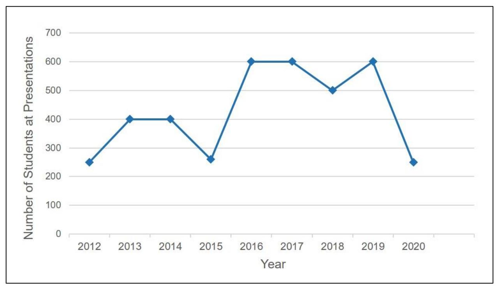

**Figure ES.E.1.** Number of students reached through in-school presentations. In 2015, the number of school presentations decreased, because more outreach programs were implemented; schools were also supported through the year-long Get Into Your Sanctuary campaign. There were more competitions in 2015, and schools pledged to do class-based projects (Taiala O le Sami). These efforts have boosted NMSAS presence in schools ever since. Source: NMSAS, 2021c

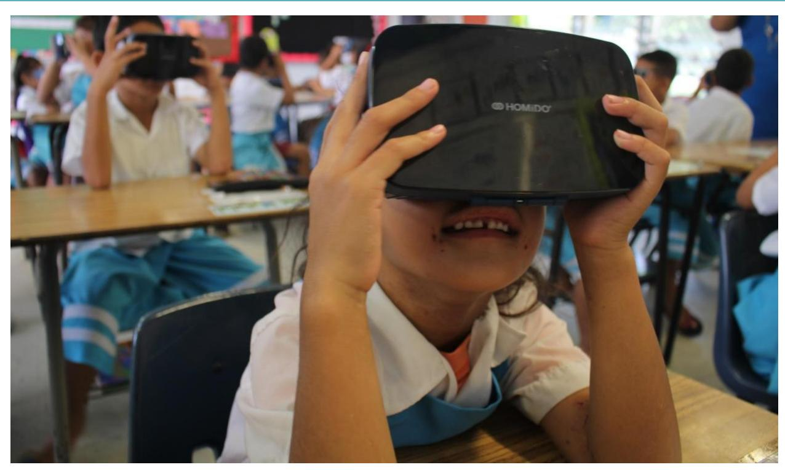

**Figure ES.E.2.** Tafuna Elementary students enjoying virtual national marine sanctuary tours. Photo: I. Halatuituia/NOAA

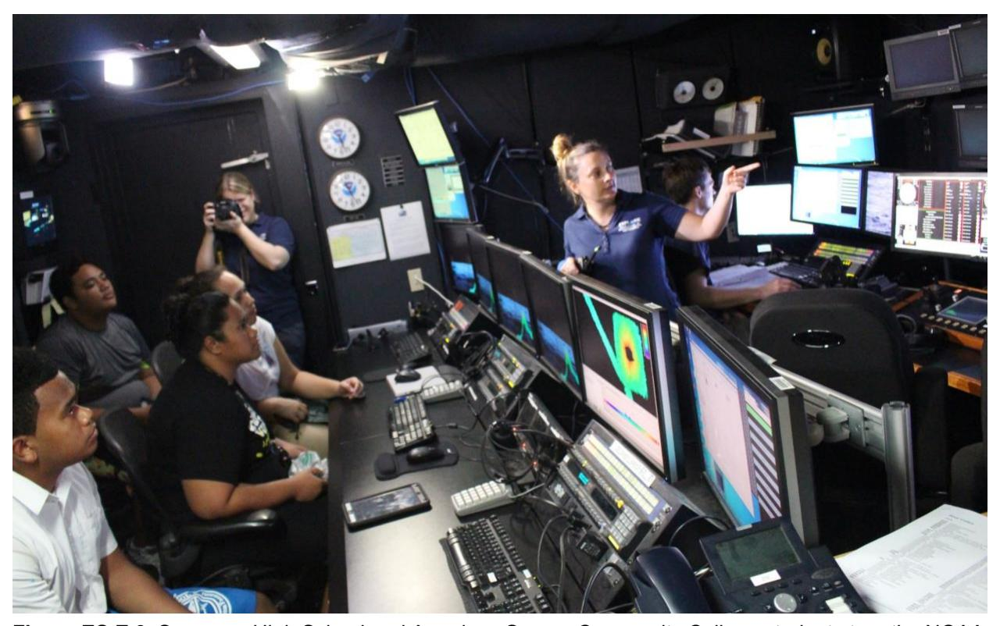

**Figure ES.E.3.** Samoana High School and American Samoa Community College students tour the NOAA ship *Okeanos Explorer*. Photo: NOAA

Summer programs create additional opportunities for students to learn about NMSAS, increase their ocean literacy, and understand the effects of human impact on the environment. Since 2013, over 850 students have participated in NMSAS's summer programs (NMSAS, 2021c; Figure ES.E.4). NMSAS has worked collaboratively with partners, such as the Le Tausagi group, to host the annual Environ-Discovery summer camp, which includes guest speakers from the sanctuary's Sanctuary Summer Science in the Village program. The Sanctuary Summer Science in the Village program focuses on sanctuary communities, exposing participants to ocean conservation (Figure ES.E.5), allowing them to implement new skill sets, and exposing them to science, technology, engineering, arts, and mathematics (STEAM) subject areas (Figure ES.E.6). STEAM programs provide an important opportunity for local students to enhance skill sets that could lead to advancement in the workforce and prepare for rapid changes in the global economy. Some of these students also participate in other sanctuary education programs, such as the underwater remotely operated vehicle (ROV) program, Taiala o le Sami, and Zero Waste Week.

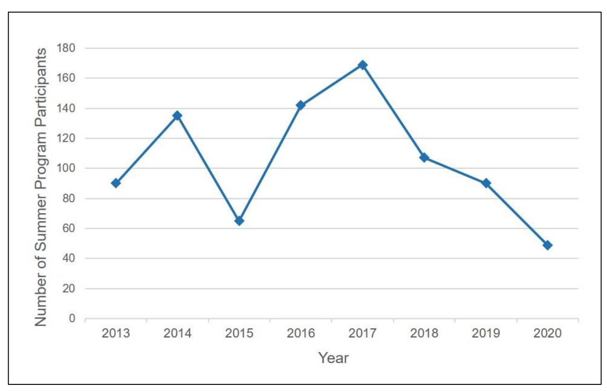

**Figure E.S. E4.** Number of participants in summer programs by year. Participation declined in 2015 and 2019 due to a decline in the number of summer programs held within sanctuary communities. Normally, NMSAS holds summer programs in four villages/islands. In 2015 and 2019, the team only went to the most remote sanctuary community (Ta'u) due to funding constraints. Source: NMSAS, 2021c

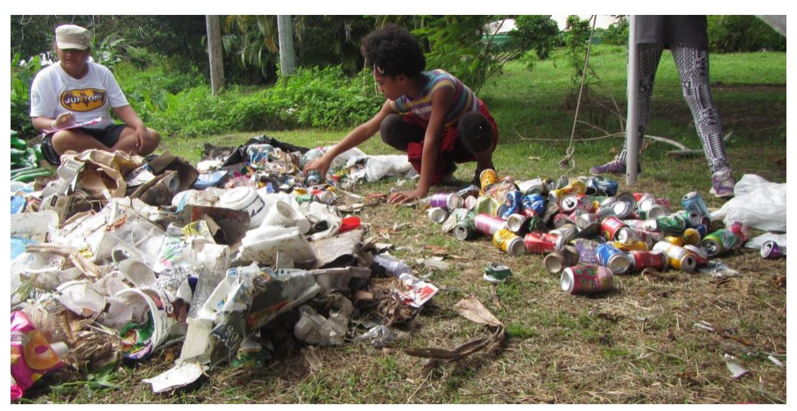

**Figure ES.E.5.** Students collect marine debris near Turtle and Shark Lookout Point in Vaitogi as part of the 2015 Sanctuary Summer Science in the Village program. Photo: I. Halatuituia/NOAA

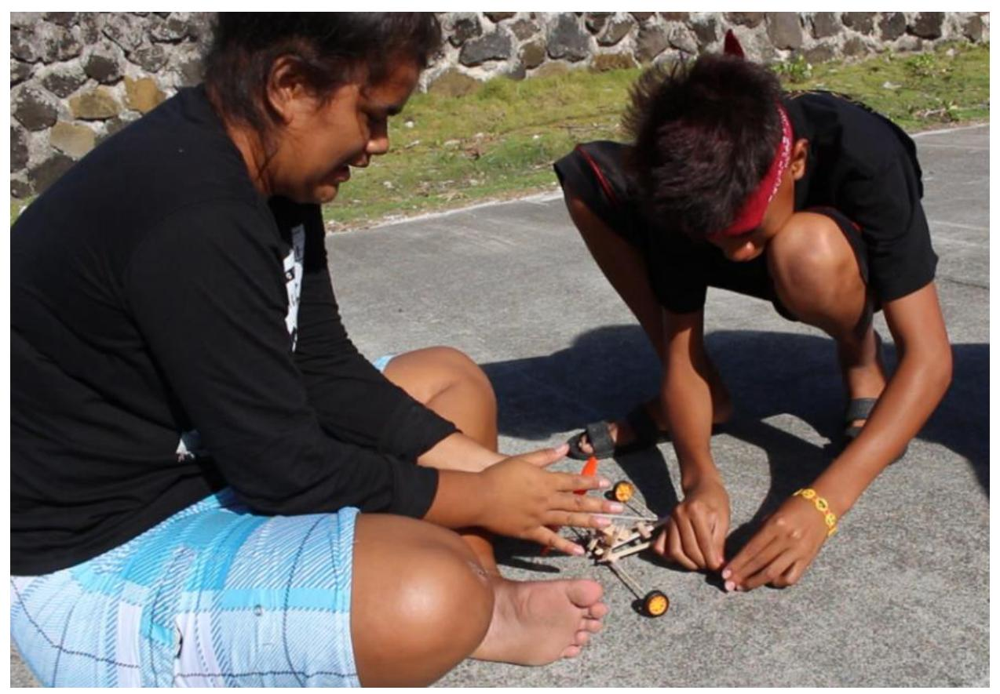

**Figure ES.E.6.** Students build cars using rubber bands, wheels, and popsicle sticks as part of the 2018 Sanctuary Summer Science in the Village program in Aunu'u. Photo: I. Halatuituia/NOAA

Education is an ongoing process, and teachers are continually encouraged to improve their craft, become more proficient at their jobs, and learn new learning and teaching styles that may be more effective and appropriate for their students. As such, NMSAS provides teacher development workshops to build teacher capacity, particularly in STEAM fields (NMSAS, 2017b, 2018e, 2019a, 2021c; Figure ES.E.7; Figure ES.E.8). Workshop content has included ocean exploration, Voyaging STEM (focused on STEM and climate change/environmental education using the Hōkūle'a Worldwide Voyage as a central example), and, most recently, through a partnership with the Marine Advanced Technology Education (MATE) program and the Stockbridge InvenTeam (from the Thunder Bay National Marine Sanctuary community), underwater ROVs. These workshops challenge teachers, taking them out of their comfort zone, and build confidence in unfamiliar subjects. The development of the underwater ROV program is a great example of this process. Teachers were first exposed to ROVs and ocean exploration through workshops and ship tours in cooperation with NOAA Ocean Exploration and the NOAA ship *Okeanos Explorer* in 2016 and 2017. ROV workshops followed, and after an intensive teacher workshop in 2019 (Figure ES.E.9), the program became more established and the local Department of Education applied to host an official ROV competition through MATE in 2020. NMSAS continues to support local teachers by hosting professional development and other workshops.

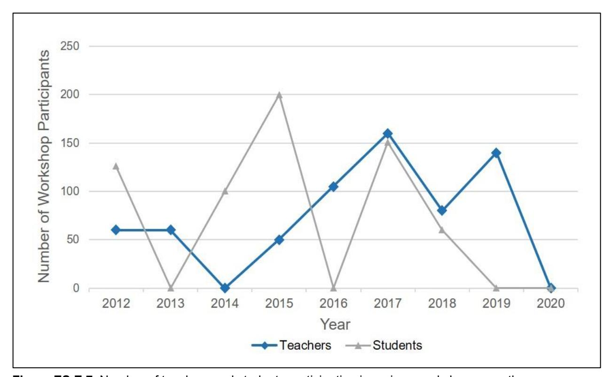

**Figure ES.E.7.** Number of teachers and students participating in various workshops over the years. Source: NMSAS, 2021c

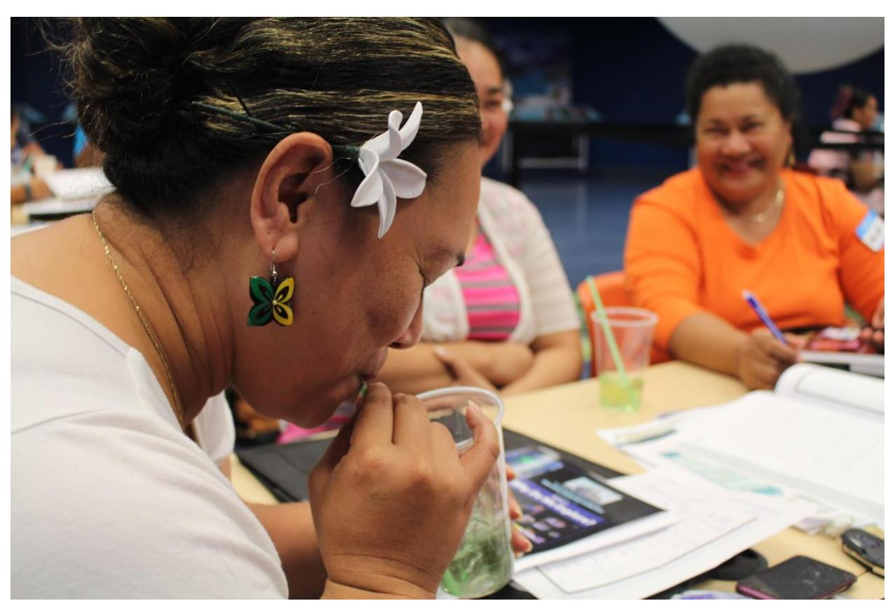

**Figure ES.E.8.** Teachers engage in an ocean acidification demonstration activity during the 2017 Why Do We Explore? workshop. Photo: NOAA

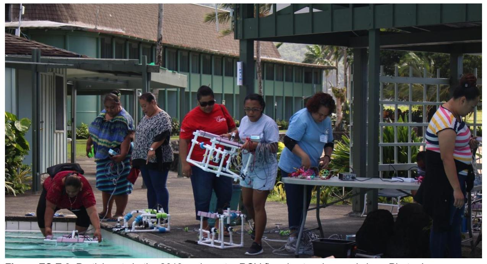

**Figure ES.E.9.** Participants in the 2019 underwater ROV five-day teacher workshop. Photo: I. Siatu'u/NOAA

NMSAS could not execute these programs alone. Over the years, NMSAS has developed many local, federal, and national partnerships in order to achieve common goals. Partnerships offer various perspectives for problem solving and innovation, while reducing the cost and effort required for specific projects. Most NMSAS programs and projects are a success because of the support of and contributions from partners.

### **Outreach Programs**

Community engagement and outreach connects conservation and culture by bringing people to place and place to people. NMSAS outreach programs are designed in conjunction with science and education initiatives. As an example, between 2007–2012, NMSAS worked with the National Park of American Samoa and stakeholders to develop the Fagatele Bay trail. Murals, exhibits, and kiosks were installed in high-traffic areas, including the Lyndon Baines Johnson Tropical Medical Center, Fagatogo Marketplace, and the Pago Pago International Airport.

Throughout the years, NMSAS has established outreach programs to target local communities, implemented recreation and tourism activities, and reached global audiences (Figure ES.E.10). Outreach programs, infrastructure, and virtual telepresence have evolved since the last condition report, and reach a diverse range of audiences and participants (NMSAS, 2021c; Table ES.E.2; Table App.D.3–Table App.D.10).

**Table ES.E.2.** Summary of NMSAS outreach programs and products from 2012–2020.

| Programs                      | Source                                                                 | Data Summary                                                                                                                                                                                                             |
|-------------------------------|------------------------------------------------------------------------|--------------------------------------------------------------------------------------------------------------------------------------------------------------------------------------------------------------------------|
| Community outreach events  | NMSAS, 2021c; N. Que, personal communication, 2020               | NMSAS reached 24,774 participants through outreach programs from 2012 to 2020. The number of programs has decreased over time; however, the number of engagements increased over this period.                   |
| Publications                  | NMSAS, 2021c                                                           | Six outreach publications were developed.                                                                                                                                                                                |
| Ship-to-shore telepresence | NMSAS, 2021c                                                           | Seven ship-to-shore telepresence opportunities with research vessels reached 100,229 people around the world.                                                                                                      |
| Workshops                     | NMSAS, 2021c                                                           | NMSAS hosted 29 workshops and outreach meetings from 2012–2020.                                                                                                                                                       |
| Films                         | NMSAS, 2021d                                                           | A total of 16 films about NMSAS were created.                                                                                                                                                                            |
| Radio jingles                 | NMSAS, 2021c                                                           | Four radio jingles were written and broadcasted on local radio.                                                                                                                                                       |
| Visitor center                | NMSAS, 2021c, 2021e; I. Siatu'u, personal communication, 2020 | A total of 58,123 people visited the Tauese P.F. Sunia Ocean Center. The frequency of walk-in visitors has decreased over time, but the quality of exhibits, multimedia, and visitor information has increased. |

In alignment with sanctuary goals and priorities, outreach has been fine-tuned each year to focus efforts and build upon past results to increase effectiveness. Additionally, NMSAS was prominently featured in 16 films produced by ONMS, Ocean Futures Society, South Florida Public Broadcasting Station, and others. These films highlighted the sanctuary's ecological, cultural, and recreational resources (NMSAS, 2021e). Many of these films have been viewed and shared beyond American Samoa, expanding the reach of NMSAS.

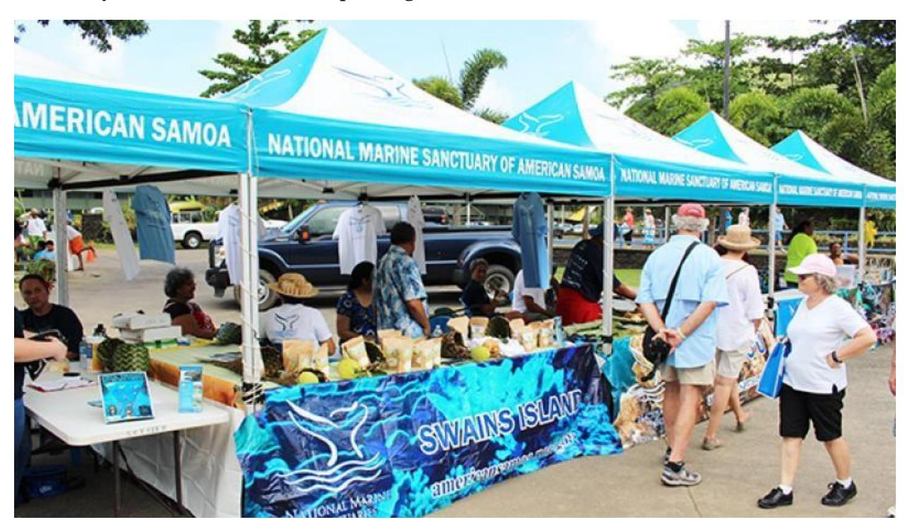

**Figure ES.E.10.** Visitors explore unique goods from sanctuary-adjacent villages at the Festival of Sites. Photo: NOAA

Figure ES.E.11 shows total participation in outreach programs by year (NMSAS, 2021c). Participation data are not available for all activities, and available data do not include recreational visitors to the individual sites. The dip in participation in 2016 was due to more focused outreach and limitations on school field trips to the Ocean Center. In 2017 and 2019, NMSAS worked with the NOAA ship *Okeanos Explorer* and OET exploration vessel *Nautilus* to host live ship-to-shore telepresence interactions, which garnered increased participation from a global audience online. Due to the COVID-19 pandemic, outreach programs shifted to virtual platforms in 2020.

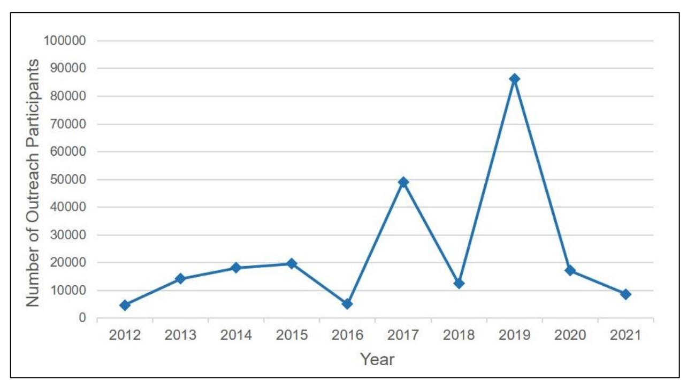

**Figure ES.E.11.** Outreach participation from 2012–2020. Source: NMSAS, 2021c

The Tauese P.F. Sunia Ocean Center was established in 2012 as NMSAS's information and research hub, as well as a site to host education and outreach programs (Figures ES.E.12–14). Two display areas in the Ocean Center are open to the public. The main rotunda includes a Science on a Sphere®️ display (currently being upgraded to the Science on a Sphere®️ Explorer system), plus two wall panel exhibit options highlighting: 1) American Samoa's marine resources, issues, and threats; and 2) fautasi maritime cultural heritage displays, added in 2019 as part of the Fautasi Heritage Symposium at the Ocean Center. The smaller sanctuary room has displays that focus on each of the six sanctuary units. Figure ES.E.15 shows total visitation to the Ocean Center from 2012–2020. This count is based on sign-ins and may reflect multiple visits to the center by the same individual. While visitation to the Ocean Center decreased after 2015, the quality of the exhibits was improved, multimedia was expanded, and dissemination of information also increased via social media. Recent health crises, including a measles outbreak in 2019 and the COVID-19 pandemic in 2020, reduced visitor numbers during these years, as cruise ships were not permitted to visit and student activities were constrained.

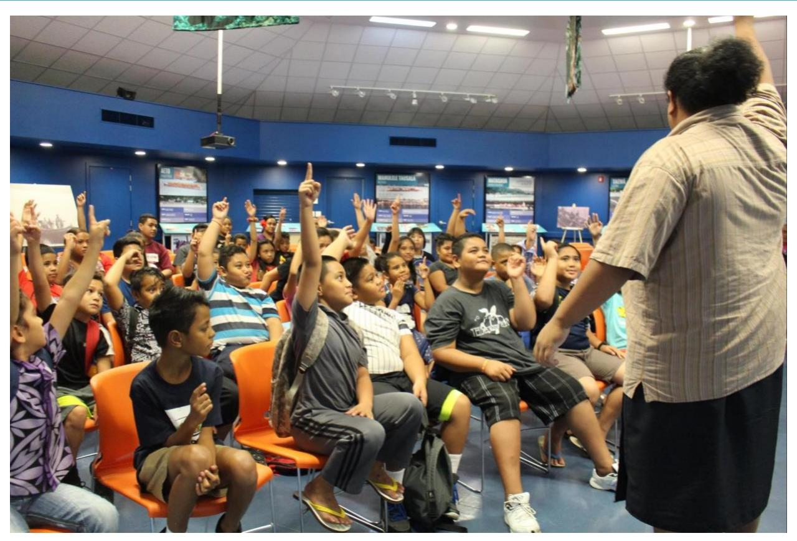

**Figure ES.E.12.** Young students are highly engaged during a tour at the Tauese P.F. Sunia Ocean Center. Photo: N. Que/NOAA

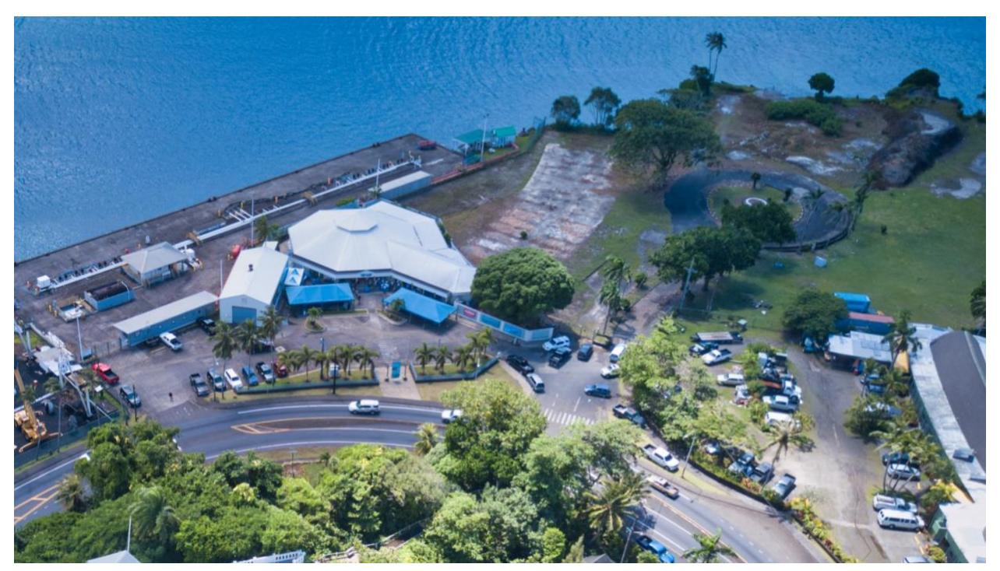

**Figure ES.E.13.** Aerial view of Tauese P.F. Sunia Ocean Center during the Fautasi Heritage Symposium in April 2019. Photo: N. Que/NOAA

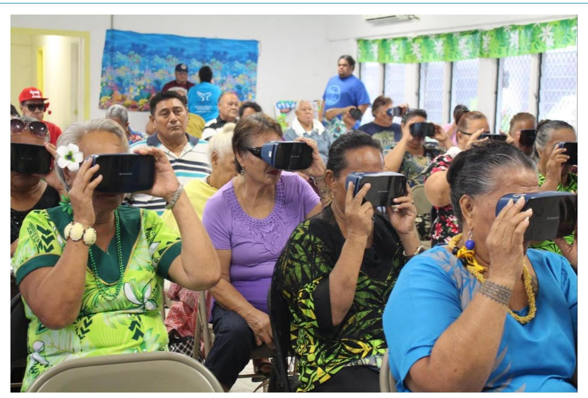

**Figure ES.E.14.** Samoan elders experience sanctuary sites through virtual reality goggles during a Get Into Your Sanctuary outreach event. Photo: N. Que/NOAA

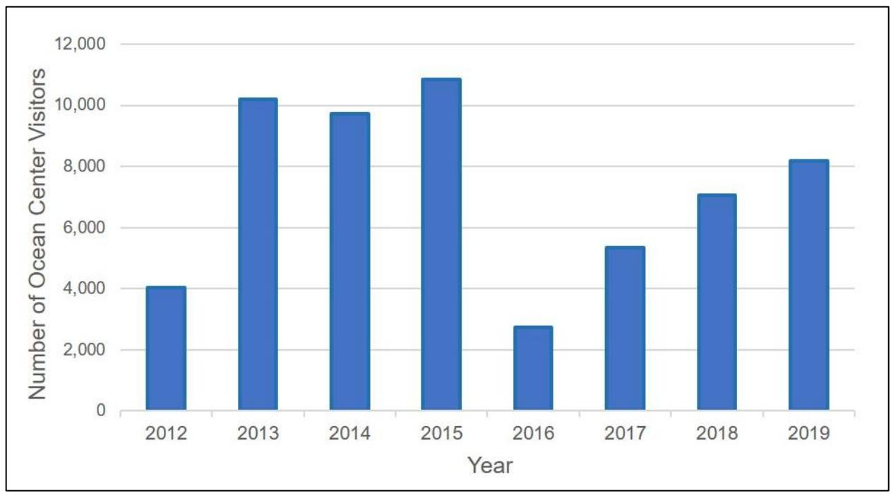

**Figure ES.E.15.** Number of annual visitors to the Tauese P.F. Sunia Ocean Center from 2012–2020. Source: NMSAS, 2021c

### **Conclusion**

Education is an important ecosystem service provided by NMSAS. Sanctuary education and outreach programs have benefitted a wide range of audiences, participants, partners, communities, and networks locally, regionally, nationally, and internationally. Education and outreach efforts consistently grew throughout the reporting period and, in some cases, included collaboration with partners in order to gain a wider reach. Many programs that were implemented throughout the years were evaluated, adapted, and adjusted to ensure effectiveness. A significant success has been harnessing support and building capacity for local residents, including students, teachers, village communities, and partners. Ensuring residents were the first to benefit from training, programs, activities, or other opportunities aimed at building pride in protecting sanctuary resources and enhancing skills was essential. Additionally, NMSAS has collaborated with local, regional, national, and international partners to share the place, people, special resources, and ecosystems of NMSAS via films, publications, and expeditions. Based on this information, the status of this service was rated as good.

## *Heritage and Sense of Place*

**Recognition of history, heritage legacy, cultural practices, aesthetic attraction, spiritual significance, and location identity**

**Status and Trend Rating:** Specific ratings were not assigned for the heritage and sense of place ecosystem services, because measuring these services in the manner used to rate other services was determined to be culturally inappropriate for American Samoa. The physical condition of heritage resources and sites (distinct from heritage services or ecosystem benefits) was rated in the State section.

**Status Description:** Not Applicable.

**Rationale:** Cultural traditions and values, inherent to the ecosystem services of heritage and sense of place, currently thrive in American Samoa where one people, one language, and one common set of cultural practices continue to be perpetuated. The chiefs who were engaged in the workshop process stated that cultural values are too important and too complex to be captured in a rating scheme. This is an indication of the significance of these benefits. Therefore, there are no status or trend assessments for heritage and sense of place. Furthermore, heritage and sense of place are so similar in American Samoa that they can only be understood as a single, interrelated topic (and will thus be presented together here). ONMS places a high value on partnerships with sanctuary communities and maintains great respect for Fa'a Samoa. Fa'a Samoa, the traditional Samoan way of life, provides the cultural context for all sanctuary activities and functions.

Though not rated, the cultural aspects of heritage and sense of place have been a large part of the work that NMSAS has completed to date and since the sanctuary expanded. Workshop participants acknowledged the priority that NMSAS places on cultural traditions and values, and felt that these should continue to be included as a core emphasis for NMSAS programs and activities. The chiefs also recommended that NMSAS capture the importance of cultural information discussed during the workshop in a narrative format rather than in a rating scheme. Respecting the sensitive nature of cultural heritage information and accommodating a narrative format is an option supported by the condition report process and ONMS.

The iconic nature of many sanctuary sites means that they have long been recognized, used, and valued. Communities developed around them, traveled through them, and depended on their resources. This shared past created the unique cultural character and heritage of these coastal communities. Marine environments also serve as places of aesthetic and spiritual attraction, and water or water-related activities may be a habitual or significant part of people's lives and cultures. NMSAS is tasked with interpreting, protecting, and preserving historic and cultural resources and incorporating traditional knowledge and stewardship into management. In other locations, heritage and sense of place values may be evaluated in economic terms, using indicators such as revenue, jobs, or willingness to pay. However, ONMS recognizes the value of incorporating traditional knowledge in discussions, deliberations, and understanding of the places and people associated with national marine sanctuaries. Thus, ONMS includes knowledge derived from a range of legitimate sources that include expertise built on experience, as well as traditional and unwritten (oral) systems of understanding and dissemination of knowledge. The

experts assembled to evaluate heritage and sense of place determined that, for NMSAS, these services should be described from these perspectives and not be rated.

## **Background for Heritage and Sense of Place Services in American Samoa**

Assessing the cultural benefits of heritage and sense of place requires an understanding of the historical and cultural background of American Samoa. Approximately 3,500 years before Columbus came to America, ancestors of the earliest Polynesians discovered a group of islands that became known as Samoa. In the ensuing 2,000 years, descendants created and established Samoa's culture and way of life, known as Fa'a Samoa. Samoans practice Fa'a Samoa, or traditional and cultural living, every day with pride as a normal way of life (Craig, 2009; Linnekin et al., 2006).

Through a set of treaties between the U.S. Navy and local chiefs in 1900 and 1904, American Samoa became an unincorporated territory of the United States and has maintained that status, reflecting the persistence of local identity (Enright et al., 1997). American Samoa's forefathers had incredible vision and foresight when they signed the Deed of Cession in 1900, ceding the islands to the United States. The founding fathers and traditional leaders understood that cultural values and traditions needed to be sustained within social, economic, and political spheres by the people for many generations. These small islands are not just unique because of their natural environment, but also because one culture, one heritage, and one language continue to survive and thrive, while some other Pacific peoples are facing cultural disintegration. As of the 2000 census, about 90% of the population in American Samoa speak Samoan at home, and 78% speak another language more frequently than English at home (U.S. Census Bureau, 2004). American Samoan heritage and culture provide a distinct identity, whether Samoans live on island or abroad.

Another key to the fortitude of Samoan culture is the commitment to maintaining Fa'a Samoa, the Samoan way of life, which is protected by Article 3 of the Bill of Rights in the American Samoa Revised Constitution:

"It shall be the policy of the government of American Samoa to protect persons of Samoan ancestry against alienation of their lands and the destruction of the Samoan way of life and language…" (U.S. Department of Labor, 2010, p. 5).

To understand heritage and sense of place, it is important to describe tenets of Samoan culture by recognizing that it is about one people, one language, and a communal core of values. NMSAS is one of only a few sites in the National Marine Sanctuary System specifically tasked with protecting Indigenous values. To capture heritage, there are two key units of social organization in Samoa, the aiga (extended family) or clan and the nu'u (village). The aiga consist of a group of people linked by blood, marriage, or adoption. At the head of each aiga is the matai. The matai is an individual who holds a chiefly title, either ali'i (chief) or tulafale (orator). At the core of the family organization are the rights to land use, which is dependent on two factors: genealogy and service. A genealogical tie must link a person to the group's founding ancestor. Those links can be traced through male and/or female lines. The name or the title of the founding ancestor identifies the kin group and is the chiefly title that the group gives to its leader (matai), chosen

#### State of Ecosystem Services

through consensus of the group. Because genealogical links may be traced through both female and male lines (or both), an individual may potentially belong to many kin groups. The innate principles of respect and service to the group or family are recognized by contributions of labor, goods, and money.

A matai brings prestige to a family, and the matai must uphold that prestige within the village and, to a larger extent, the district and country. Within the extended family itself, the matai is responsible for maintaining family unity and harmony, promoting participation in religious or church-related activities, and village priorities. The matai serves as the family spokesman in the village council of chiefs (saofa'iga a le nu'u), thereby providing the family with a voice in village matters and public affairs. One of the most important responsibilities of any matai is serving as trustee of family communal land. In Samoan society, land tenure is an integral part of social organization and is tied to both the kinship system and village organization (Shaffer, 2018). When family disputes over title holder or land have occurred in recent times, the Office of Samoan Affairs arbitrates matters to reach amicable outcomes to protect and maintain family and village relations. The Secretary of the Office of Samoan Affairs is a high-ranking matai who is appointed by the governor of American Samoa.

In every Samoan village, the fabric of culture and tradition recognizes the division of labor between men and women, and the young and old. Women are known for the art of siapo, or making specially designed cloth and crafting, in addition to skills at reef fishing. A women's group, known as aualuma, existed to support young women who were primed to become taupou, or village princesses (high chief's daughters). Over the years, aualuma changed considerably from its original description as a handpicked, select group of women who served the taupou. By the 1900s, as village taupou disappeared, the need to have an aualuma did as well. Instead, women were identified by their roles within the family rather than for the village. Conversely, the men's group of aumaga, or untitled men, have a prominent role in village structure to this day that aligns with implementing directions and tasks from the village council. The aumaga performed several duties that still exist today, such as fishing for family and ceremonial events, policing villages during daily village curfews (sa), and farming the land for traditional starches like taro, breadfruit, and bananas to provide food for families.

In the past, Samoans divided much of their time between subsistence agriculture and fishing. Prior to 1900, before European or canned food was readily available, villagers spent roughly equal amounts of time on the land or harvesting the resources of the sea. Cooking and food preparation, especially ceremonial cooking, remains an important aspect of life where the aumaga cook traditional foods for the chiefs and women prepare newer, "foreign" foods. The distinction is that women will cook additional food items in stoves or ovens. Traditional Samoan cooking takes place in the umu (an earthen oven built over a pile of hot stones where meat, breadfruit, taro, bananas, and palusami [bundles of taro leaves with coconut milk] are placed then covered with banana leaves to retain the heat from the stones and cook the food). Prior to European contact, Samoan fishermen spent significant time at sea to fish in preparation for to'onai (Sunday family feast) or ceremonial events. Samoans favor fish over other protein sources, the one exception being pua'a (pork). On the reef, fishers used wooden traps to capture shellfish and eels, various types of throwing nets for capturing larger fish, and spear guns that

resembled slingshots. At sea, fishermen used long, three-man canoes, called va'aalo (nearly 10 m in length) to fish for bonito.

Today, following some 120 years of affiliation with the U.S., the resident population takes pride in being part of the American family, but more importantly, still values the privilege of being American Samoan. Honoring the passage of this relationship over time is the annual celebration of Flag Day, with festivities that include siva ma pese (song and dance) and the revered fautasi (long boat) race. Fautasi represent a historical connection to the ocean, originally as traditional watercraft used for transport. Today, fautasi are rowed by up to 50-member crews as a village community who train for months prior to the Flag Day race. Participation in the fautasi race each year emphasizes more than physical strength for crews and villages; instead, greater importance is placed on unity, spirit, and village pride.

Despite Western influences, Samoan heritage is perpetuated in all facets of life through family, village, activity, and place by Samoan people with a strong connection to ongoing cultural traditions. Additionally, use of Samoan as the primary language spoken in American Samoa is an important attribute that makes NMSAS strikingly unique in comparison to all the sites across the National Marine Sanctuary System. It is normal for NMSAS staff to interpret and implement education, outreach, and community engagement programs in Samoan.

Fa'a Samoa is an everyday practice. Samoans who have migrated overseas for family, school, sports, and military opportunities take their heritage with them wherever they go. If and when they return home, the immersion into village and family life allows them to reintegrate into Samoan culture. Practices such as the Ava Ceremony, one of the most significant traditional events within Samoan culture, set the stage for ceremonial proceedings with the formal serving of ava (kava), village council debate, and oratorical rituals. During the management plan review process in 2009–2012, NMSAS was commended by the Secretary of the Office of Samoan Affairs for embodying respect and recognition of Samoan culture through engagement and consultation with village leaders in all steps of the process.

The recognition of cultural arts and their revival has also been embraced recently, with the establishment of programs led by the Territorial Office of Aging, American Samoa Community College Fine Arts and Samoan Studies Departments, and other agencies. Skills such as weaving numerous kinds of mats, including the highly valuable 'ie toga (fine mat), involve a long, arduous process and take months to complete. The fine mat was, and still is, an integral part of many of Samoan formal ceremonies. Additionally, cooking and food preparation, especially ceremonial cooking, has remained an important part of village life, and men play a major role in preparation and cooking of food. Growing local crops such as taro, breadfruit, and bananas that can be harvested for the Sunday to'onai is part of this traditional practice. Young men are assigned to prepare the to'onai, while skilled fishers go out to fish for this feast as a means to provide for the family.

## **Workshop Discussion of Heritage and Sense of Place**

Content presented during the workshop highlighted examples of how local traditional knowledge and the participation of traditional leaders are critical to the understanding of marine resources and ecosystem benefits in American Samoa. This section briefly summarizes their perspectives.

Customary lands dominate the total landmass in American Samoa. Without the land tenure system, there is no Samoa. The land (including the marine environment) is the inheritance of Samoans. It is the connection Samoans have with the past, present, and future. Land is fa'asinomaga (identity) and is what gives matai titles meaning. Without a connection to the fanua (land), non-Samoans are outsiders to this special place.

Fa'a Samoa places great importance on the dignity and achievements of the group, rather than on individual gain, which is a cultural value that perseveres through generational time to present.

During the workshop, traditional leaders and clergy voiced the importance of acknowledging Samoan culture, history, and people as essential for the success of the sanctuary program. They also reaffirmed that the condition report ranking system is not appropriate when considering the value of Samoan cultural ecosystem services. Also, through consultation, they reminded the participants that Fa'a Samoa is alive and real. It is the foundation of Polynesia's oldest culture, which dates back some 3,000 years.

The chiefs who gathered for the workshop felt that putting an economic value on heritage or sense of place would diminish the cultural values of belonging or association with the place. Therefore, many of the more familiar economic methods for assessing heritage and sense of place, particularly those based on compilation of individual gains, might not effectively convey value. Local knowledge; discussion of resources, activities, and the relationship between sanctuary and community; and non-market value data are of greater importance for NMSAS. Traditional leaders view sense of place as a duty, as Samoans are stewards of their native lands. It is their responsibility to safeguard the land for future generations.

The traditional leaders also felt that quantifying sense of place was difficult and not appropriate in the traditional context. Furthermore, it was determined that it may not be possible to rate some aspects of sense of place using the standard rating scheme of condition reports.

## **Key Heritage and Sense of Place Resources and Activities**

Since its establishment in 2012, NMSAS has embodied the importance of heritage and Fa'a Samoa in a number of programs and events. For all activities, NMSAS provides bilingual exhibits and translated materials in recognition of the significance of the Samoan language. These events and programs provide examples of how NMSAS has worked to enhance the cultural services of heritage and sense of place. Specific resources and activities are detailed below.

## *Working Directly with Sanctuary Village Communities*

*Removal of Fishing Vessel* No. 1 Ji Hyun *in Aunu'u –* The 2016 vessel grounding on the western reef of Aunu'u Island, and the removal efforts that followed, highlighted the importance of community collaboration for protecting the marine ecosystem of American Samoa. NMSAS, agencies, and village councils collaborated, especially in Aunu'u, where high talking chief Fonoti attended all the briefings and was on site for the removal attempts. His role was critical in

guiding the efforts, sharing concerns on behalf of local families, and keeping the community informed. This exemplifies the importance placed on achievements of the group rather than the individual in Fa'a Samoa (Weinberg, 2016).

*Festival of Sites* – These events directly involved village communities adjacent to sanctuary units. Community members participated in 2013–2016 events, showcasing unique traditions and cultural practices special to each area. Village members participated in the festival at the Ocean Center to share special foods, crafts, artifacts, and performances as a celebration of cultural heritage and connections between Samoans and the environment.

*Fagota Mo Taeao Fishing Tournament* – An annual event since 2015, recreational anglers aboard alia (traditional fishing vessels) compete together as a way to increase awareness among fishing communities of allowable and prohibited fishing methods in the sanctuary.

*Ta'iala ole Sami –* This educational program, launched in a school adjacent to Fagatele and Fagalua/Fogama'a sanctuary management units, aimed to encourage preservation and protection of ocean resources using a curriculum in coral reef conservation and ecology that was taught in Samoan and English from 2014–2017.

### *Outreach Films on Culture and Heritage*

NMSAS has showcased the importance of place, people, and culture in the territory through various outreach films since 2013. Select films are described in greater detail below.

*Penina Tutasi o Amerika Samoa* – This 2013 film depicted the importance of place and people through a journey illustrating the vibrant and thriving culture in the newly expanded sanctuary.

*Swains Island Heritage Survey and Documentary* – In the fall of 2013, NMSAS, along with partner agencies and institutions, conducted a multidisciplinary survey of Swains Island. The fieldwork focused on the unique ecosystem setting and past cultural heritage of the island, and led to a featured publication and award-winning Ocean Futures Society documentary, *Swains Island: One of the Last Jewels of the Planet*, in 2014 (Van Tilburg et al., 2013).

*Jean Michel Cousteau American Samoa Culture and Conservation Film Series* – Highlighting the importance of diversity, this film series captured the cultural tenets practiced by people in American Samoa, with themes that centered around community caretakers serving their village, church, and family, parts of the culture that pull Samoans together.

*Get Into Your Sanctuary Film 2021: Sanctuary Sense of Place and Siva Samoa* – This film was completed by NMSAS for the annual ONMS Get Into Your Sanctuary event all across the National Marine Sanctuary System. From the rolling waves to the swaying trees, there are many stories that can be shared through Samoan song and dance (pese ma siva). At the same time, the film offered viewers the opportunity to explore teeming life underwater, learn about rich Samoan culture, and pledge to protect wildlife.

*Get Into Your Sanctuary Film 2020: Connecting Conservation and Culture with National Marine Sanctuary of American Samoa* – This short film showcased the sanctuary through a virtual tour for the Get Into Your Sanctuary annual event. The film taught viewers about responsible recreation in the sanctuary, local culture, and ocean stewardship. Viewers dove

underwater in Fagatele Bay to take a look at the fish and coral that live there and learned about local food through a cooking demonstration of fa'ausi from Aunu'u.

### *Outreach Programs and Symposia*

*Fautasi Heritage Symposium and Magazine* – In April 2019, NMSAS and the American Samoa Historic Preservation Office co-sponsored one of the most important sanctuary efforts to preserve maritime connections to the ecosystem: the inaugural Fautasi Heritage Symposium. The workshop's goal was to share the cultural heritage and history of fautasi racing in American Samoa. Fautasi heritage and the results of the symposium are presented in the featured publication *Fautasi Heritage of American Samoa: Fa'aga I Le Tai: O Ala O Le Vavau A Samoa*  (ONMS, 2020)*.*

### *Non-Market Data Related to Heritage and Sense of Place*

Studies addressing elements of heritage and sense of place were reviewed and presented during the workshop. Data from Levine et al. (2016), Severance et al. (2013), and others were presented to workshop participants. These sources highlighted the importance of non-market data for the qualitative discussion of sense of place benefits of coral reefs and heritage benefits of traditional fishing practices (catch use). Territorial data serve as a general proxy for sanctuary-specific analysis. These data highlight the unique culture and history of American Samoa and the communal resource values related to sense of place and heritage.

Samoans place a great deal of importance on the cultural context of fishing. Severance et al. (2013) reviewed survey responses from 58 pelagic fishers in 1996. The data demonstrated the importance of catch distribution for cultural purposes. Forty-two respondents either sold at least half of their catch to the cannery (n = 3), local restaurants and markets (n = 21), or as fa'ataualofa (reduced price to friends and kin; n = 18). Of the remaining catch, 35 respondents reported contributing half or more of their unsold portion for use at ceremonies and other cultural events, and 14 respondents reported giving away half or more to friends or extended family. Specifically, fishers reported contributing at least half or more of their catch for the following non-market purposes: 25 gave fish as fa'alavelave (family function or ceremony), 19 gave half or more as feasoasoani (help), 14 reported giving over half to friends and family, and 12 provided fish as tautua (service gifts for village chief or clergy). Gifts of fish are part of the reciprocal relations and constant circulation of food and gifts that maintain Samoan social structure to this day. The amount of effort captured in this study speaks volumes of the importance of Samoan communal values, which place the greater good over individual gain. This is a cultural value that cannot be accurately captured through monetary assessments.

Severance et al. (2013) also found that 46% of unsold catch was frozen for later customary use; 21% was shared as fa'alavelave; 20% was distributed as feasoasoani, tautua, or to'onai; and only 13% of unsold catch was consumed by the fisher's household. Atu (skipjack tuna, *Katsuwonus pelamis*) were frequently given away for fa'alavelave and to'onai and nearly half were frozen for later cultural sharing. The distribution of asiasi (yellowfin tuna, *Thunnus albacares*) was similar, but were used more frequently for tautua exchanges. One third of the unsold asiasi was distributed for fa'alavelave, to'onai, and feasoasoani.

A 2014 survey polled residents across American Samoa to evaluate the importance of coral reef ecosystem services, including fishing, to local households (Levine et al., 2016). Fifty-three percent of the respondents engaged in fishing activities. Figure ES.HSP.1 shows the reasons for fishing reported by respondents. Notably, giving the catch to extended family, village leaders and pastors, and fishing for special cultural events (all non-market activities) are strongly represented. When asked about other ecosystem services, 88% of respondents agreed that coral reefs were important to the culture, and 75% agreed they are a way to attract tourists and protect communities from storm surge and natural disasters (Figure ES.HSP.2). Clearly, the marine environment is recognized as an important cultural ecosystem benefit in American Samoa.

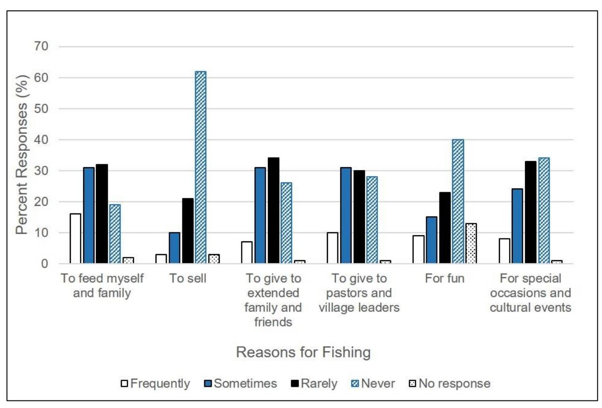

**Figure ES.HSP.1.** Household surveys conducted in 2014 evaluated the frequency of fishing for various purposes. The results indicated that non-market activities were an important reason for reef fishing in American Samoa. Source: Levine et al., 2016

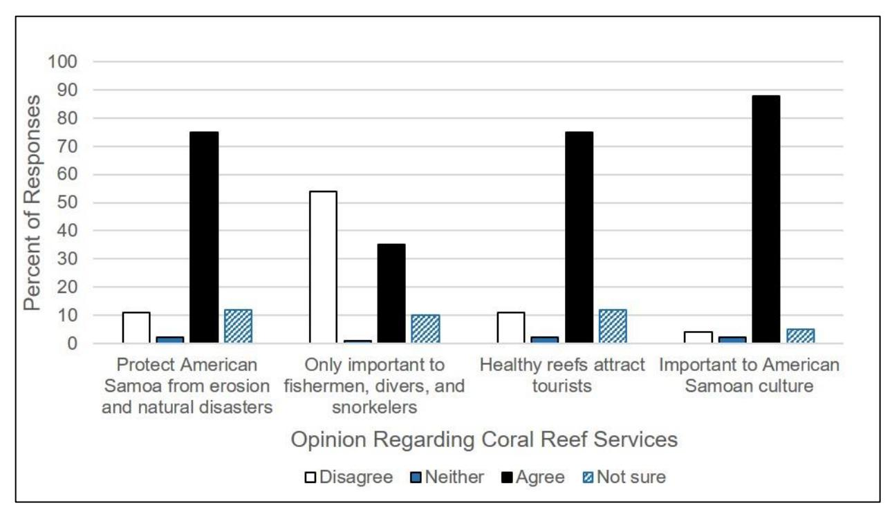

**Figure ES.HSP.2.** In 2014, residents agreed that coral reefs are important to the culture of American Samoa (88%), protect the coastlines from erosion and natural disasters (75%), and attract tourists (75%). Source: Levine et al., 2016

### **Conclusion**

Cultural traditions and values currently thrive in American Samoa where one people, one language, and one common set of cultural practices are perpetuated. The ecosystem services of heritage and sense of place, supported by NMSAS, are unique to the cultural setting of American Samoa; the relationship between NMSAS and the community is therefore unlike other national marine sanctuaries. NMSAS prioritizes cultural traditions and values as core emphases for programs and activities. The chiefs who engaged in the workshop process stated that culture is too important and too complex to capture in a rating. Therefore, there are no formal graded assessments for heritage and sense of place. Instead, the value of cultural heritage was presented in narrative form, including historical and cultural background for American Samoa and a summary of related resources and activities, such as community engagement and education and outreach events. These events highlight the cultural traditions and values of family, village, ecosystem, and Fa'a Samoa. Heritage and sense of place are shared and strongly supported by NMSAS and by the community of American Samoa.

## *Commercial Harvest*

#### **The capacity to support commercial market demands for seafood products**

**Rationale:** Throughout the study period (2008–2018), the number of commercial fishing vessels has declined. Additionally, there is limited information specific to NMSAS, and regulations vary across sites within the sanctuary. Ecosystem changes linked to climate change may have impaired the ability of the ecosystem to provide commercial harvest.

Humans consume a large variety and abundance of products that originate from the ocean, including fish, shellfish, and other invertebrates, for nutrition or for use in other sectors. Commercial fishing provides food for domestic and export markets, sold as wholesale and retail for household, restaurant, and institutional meals. For the purpose of ONMS condition reports, commercial harvest is defined as the capacity to support commercial market demand for seafood products. Artisanal fishing, which tends to be conducted by individuals or small groups who live near their harvest sites and use small-scale, low-technology, low-cost fishing practices, is also included in commercial harvest. Commercial fishing is allowed in Fagalua/Fogama'a, Aunu'u Multiple Use Zone A, Ta'u, and Swains Island units. There are gear limitations in all units to prevent damage to sensitive habitats or overharvest. Commercial fishing is prohibited within the Rose Atoll Marine National Monument and Fagatele Bay, and is limited in Aunu'u Multiple Use Zone B (NMSAS, 2019c).

Commercial fisheries data specific to sanctuary areas are not available, therefore aggregate data for the territory were evaluated to address this question, with the assumption that activities within the sanctuary follow overall territorial trends. Several indicators from territorial datasets suggest a decline in commercial fisheries effort and harvest across the territory. The numbers of fishing vessels and fishers in American Samoa have declined over the past ten years (ASDOC, 2018). In 2019, total estimated pelagic landings were approximately 2.9 million lbs, the lowest in the past decade (WPRFMC, 2020a) and a benchmark stock assessment determined that the bottomfish complex is overfished and experiencing overfishing (Langseth et al., 2019). Catch per unit effort for bottomfish in 2019 was lower than 10- and 20-year averages (WPRFMC, 2020b). In contrast, commercial data for the top five species based on cumulative harvest values from 2007–2019 (lined/blue-banded surgeonfish, yellowfin tuna, wahoo, parrotfish, and broadbill swordfish) remained variable, showing no clear trend over the study period (Western Pacific Fisheries Information Network [WPacFin], 2020). Experts noted that people who use the resources have noticed declines in various fish stocks, including reef fish. Due to the lack of sanctuary-specific data and mixed trends for key harvest parameters, experts agreed that the status and trend of commercial harvest are undetermined.

Fishing is the primary form of commercial harvest in American Samoa. From 2006–2016 longlining was the most productive fishing method, followed by bottom fishing and spearfishing (ASDOC, 2018). Longlining historically took place in the waters of the Muliāva unit, but that

activity was prohibited by the designation of the Rose Atoll Marine National Monument in 2009. Effort prior to 2009 was limited, and therefore the data are subject to privacy restrictions (which require data to be aggregated in a way that includes at least three entities) and could not be included in this assessment. A 2014 survey investigated other harvest practices in American Samoa, but did not differentiate between commercial and subsistence harvest. Thirty-two percent of respondents reported fishing more than once per month and 20% reported gathering marine resources more than once per month (Levine et al., 2016). Of those who engaged in fishing or gathering marine resources, 62% reported never fishing to sell, 21% reported rarely fishing to sell, 10% reported sometimes fishing to sell, and 3% reported frequently fishing to sell. And while the percentage of catch individuals sell for income is unknown, the available data suggest that most individuals fish for subsistence purposes for themselves or others and not for commercial purposes.

Another study conducted in 2014 evaluated how Aunu'u residents depend on and value sources of food and income (Levine & Kilarski, 2015). This is the only fishing data directly related to a sanctuary unit available for the reporting period. Most respondents felt that boat transport was "very important" for food/income (89%), followed by farming (77%), government (73%), and fishing (52%). The survey did not differentiate between subsistence and commercial use, so it is unclear whether respondents felt fishing was important for food (subsistence) or income (commercial). The least important sources of food/income were tourism, with 78% reporting it was "not at all important," the cannery (71%), private business (70%), and off-island remittances (70%).

When asked about the frequency of fishing and gathering to generate income, most Aunu'u respondents (71%) reported they never engaged in this activity for income, while others sometimes (15%) or frequently (13%) did so. Further, 64% reported fishing for food frequently and 36% reported fishing for food sometimes; 52% reported that fishing was very important because it provided them with food and income. In a 2017 follow-up survey, Kilarski & Levine (2018) found that Aunu'u households reported solely fishing for food and not to sell. Respondents from Aunu'u stated the cannery (42%), government jobs (34%), and fishing (19%) were the most important sources of income. The 2017 survey did not include a question about boat transport as a source of income. Therefore, those that reported fishing as important likely rely on the cannery for income, and thus value fishing. The most common types of seafood targeted by Aunu'u households were fish from the reef flat (31%), followed by invertebrates (25%), fish from the reef slope (24%), and pelagic fish (20%; Levine & Kilarski, 2015). The most frequently used fishing methods included rod/reel/handline and pole and line from shore. The next most common fishing methods were gleaning/gathering and spearfishing.

Using survey data collected in 2008, Levine & Sauafea-Leau (2013) found that 61% of respondents thought reef fishing was worse in 2008 than when they were younger. In Manu'a, roughly 15% thought reef fishing was worse, and in Tutuila, roughly a third thought fishing was worse. Trolling has declined since 2006, as has longlining. Spearfishing (which is allowed on the reef) and bottom fishing have increased, with variation over time (ASDOC, 2018; Table App.F.11).

Figure ES.CH.1 and Table App.F.12 show how the number of boats, fishers, and pounds landed have changed over time. From 2008–2010, there was a sharp decline in catch. To a lesser extent, the number of boats and fishers also declined. In 2016, there were roughly one-third the number of fishers compared to 2006. Possible explanations for this decline include the 2009 tsunami that destroyed a number of alia (local fishing boats) and increasing fuel costs. Additionally, experts noted that the cost per fish at the cannery has declined, meaning commercial fishing for species processed at the cannery has become less profitable. More specifically, the retail price of a 6.5-oz can of tuna declined from \$1.92 in 2007 to a low of \$1.34 in 2011; the price increased to \$1.90 in 2017 (ASDOC, 2018).

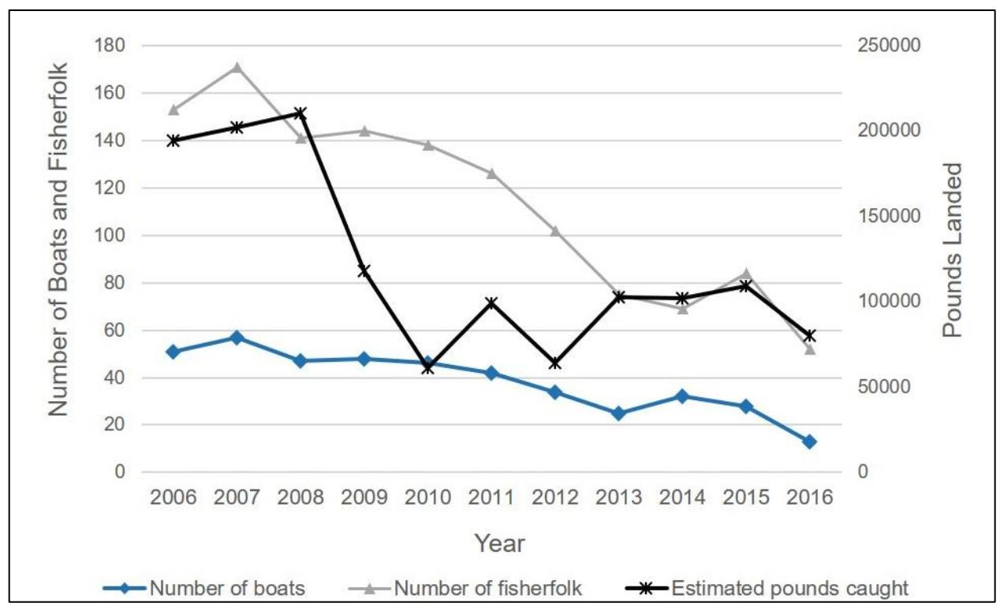

**Figure ES.CH.1.** Changes in fishing effort and participation between 2006 and 2016. Source: ASDOC, 2018

The number of permitted longline vessels also declined from 2008 to 2018 (PIFSC, 2018; Figure ES.CH.2), as have commercial landings recorded through boat-based creel surveys. Commercial dealer data show that landings have remained stable, as have landings recorded through shorebased creel surveys (Figure ES.CH.3).

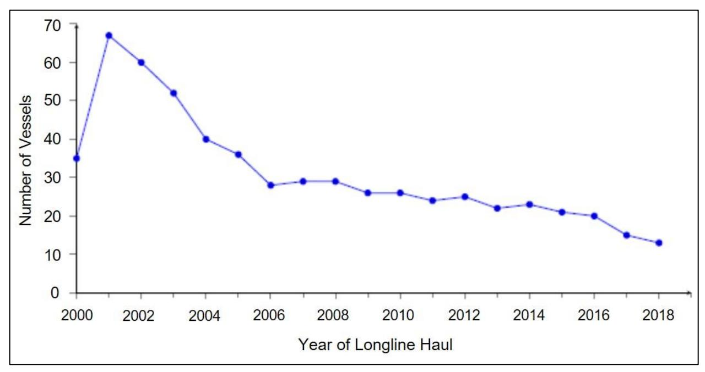

**Figure ES.CH.2.** Number of active longline vessels based in American Samoa by year, 2000–2018. Source: PIFSC, 2018

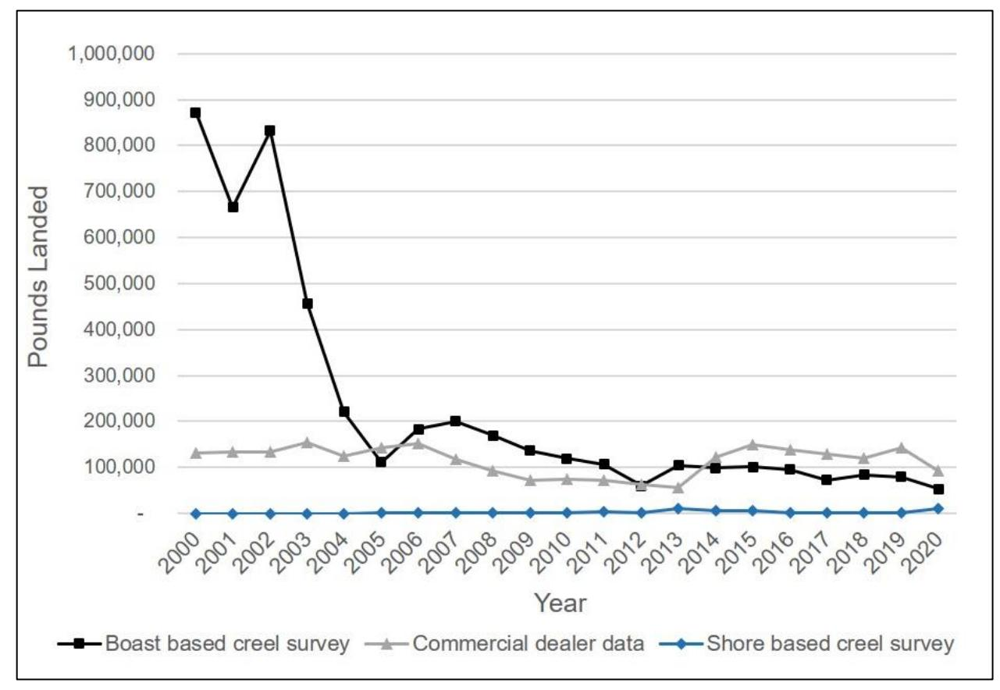

**Figure ES.CH.3.** Commercial seafood landings in American Samoa by survey/data type, 2000–2019. Source: PIFSC, 2022

Using data from the Western Pacific Fisheries Information Network (WPacFin, 2022), the top five highest-value species from 2007–2019 were lined/blue-banded surgeonfish, yellowfin tuna, wahoo, parrotfish, and broadbill swordfish (Figure ES.CH.4). Yellowfin tuna landings varied across the study period, with low catches from 2009–2013 and high catches from 2015–2018. There was no clear trend over time for wahoo, but the data reveal a low point in both catch and value for 2013. Broadbill swordfish had no clear trends in either pounds landed or value over the study period. Catch and harvest value for two reef species, lined/blue-banded surgeonfish and parrotfish, increased over the reporting period, peaked in 2015, then declined. Experts at the condition report workshop noted that coral bleaching in 2015 and later years may have affected reef species.

When evaluating consumptive or potentially damaging ecosystem services, it is important to consider the sustainability of resource impacts. Data on fish presented in the State section of this report indicate a lack of larger parrotfish, groupers, and sharks in NMSAS. Further, biomass of preferred fish species was low in Fagatele Bay and Aunu'u. Although resource indicators and the number of commercial boats indicate a decline, there are limited to no data about activity within the sanctuary specifically. All data available were collected for the entirety of American Samoa and cannot be analyzed for the sanctuary specifically or for particular sanctuary units. There are also several independent and interacting natural and socioeconomic factors that may explain variation in landings, including natural weather events and ecosystem changes associated with climate change. Additionally, gear types and fishery regulations vary by area and village, and data are limited overall. For these reasons, the status and trend were rated as undetermined.

### **Conclusion**

Sanctuary-specific data on commercial harvest was not available, so aggregate data for the territory were evaluated to assess this ecosystem service. The number of fishing vessels and fishers in American Samoa have declined over time. In 2019, pelagic catches were the lowest in the past decade, and NOAA Fisheries determined that the bottomfish fishery was overfished and experiencing overfishing. Commercial fish sales data indicated that commercial catch for the top three pelagic species was variable, and harvest of the top two reef species generally increased, with a peak in 2015 followed by a decline. Experts noted that a coral bleaching event in 2015 may have affected these species. Respondents to social surveys noted that reef shark populations have improved, but octopus, giant clams, akule (bigeye scad), and palolo declined or remained the same. Fishery-independent data suggest that shallow reef fish biomass and giant clam abundance have declined. For these reasons, both the status and trend of commercial harvest is undetermined.

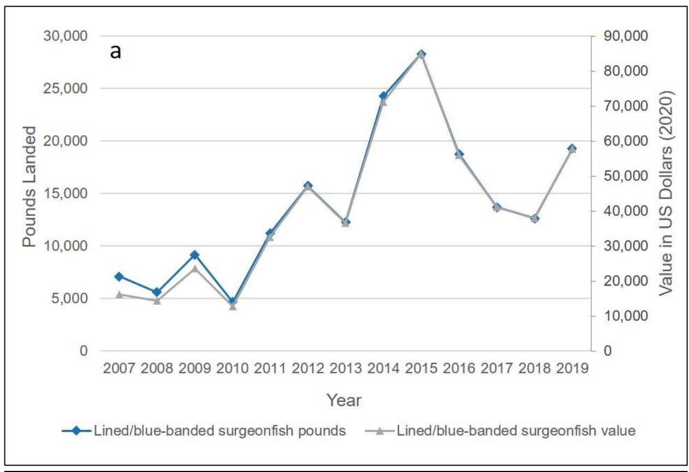

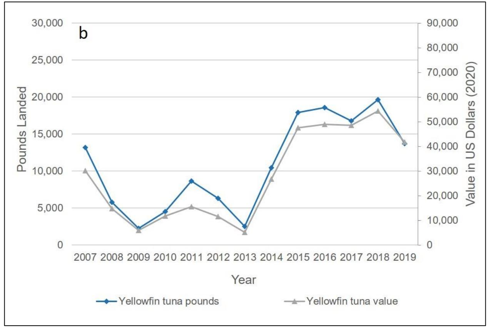

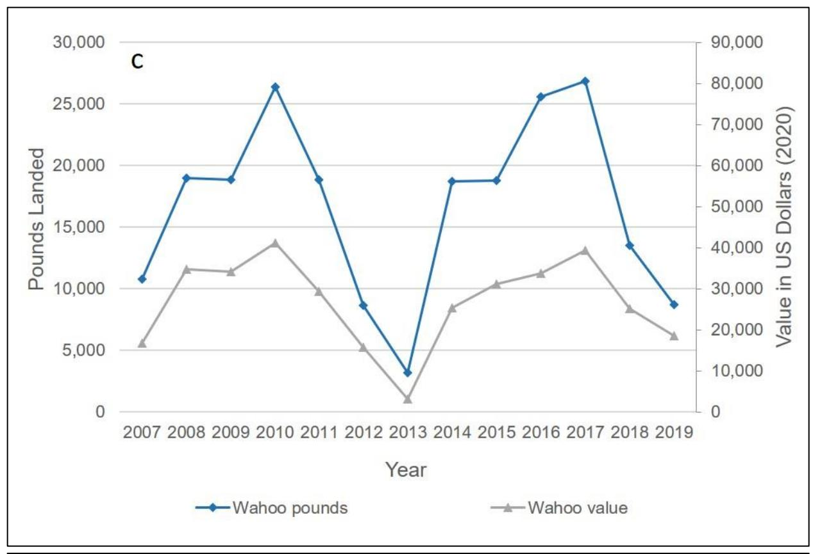

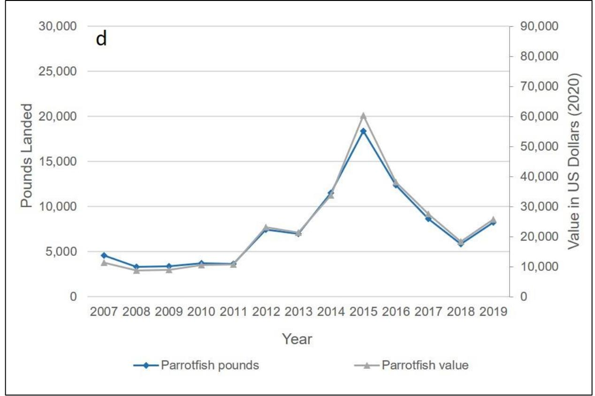

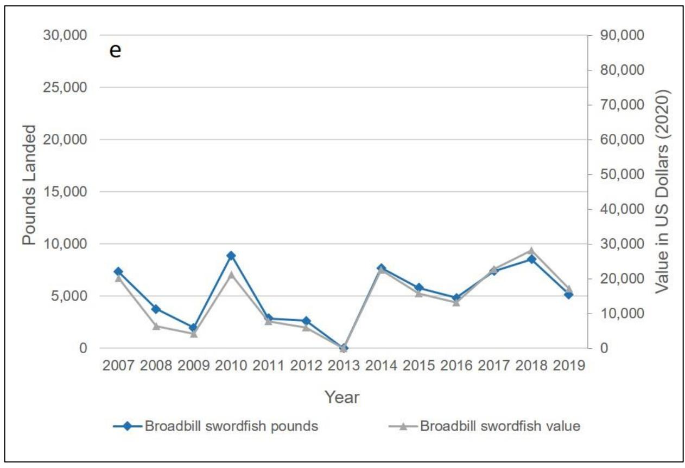

**Figures ES.CH.4.** Catch and value in American Samoa between 2007 and 2019 of (a) lined/blue-banded surgeonfish, (b) yellowfin tuna, (c) wahoo, (d) parrotfish, and (e) broadbill swordfish, the top five commercially harvested species by value. Source: WPacFin, 2022

**Commercial Harvest Indicator Table.** Summaries for the key indicators related to commercial harvest that were discussed during the 2020 status and trends workshop.

| Indicator                                | Source                     | Data Summary                                                                                                                                                                                                                                                                                                                                                                                                                                                                               |
|------------------------------------------|----------------------------|--------------------------------------------------------------------------------------------------------------------------------------------------------------------------------------------------------------------------------------------------------------------------------------------------------------------------------------------------------------------------------------------------------------------------------------------------------------------------------------------|
| Harvest participation                 | Levine et al., 2016     | Majority of respondents reported fishing in the past month and slightly less than half reported gathering marine resources in the past month.                                                                                                                                                                                                                                                                                                                                        |
| Reasons for fishing                      | Levine et al., 2016     | Only 3% of respondents sell fish frequently, most fish for subsistence.                                                                                                                                                                                                                                                                                                                                                                                                                 |
| Reasons for fishing/harvest Aunu'u | Levine & Kilarski, 2015 | Respondents reported either frequently or sometimes fishing for food. The overwhelming majority said they provide fish to their pastor or village leaders.                                                                                                                                                                                                                                                                                                                           |
| Frequency of fishing in Aunu'u        | Levine & Kilarski, 2015 | Only 21% of households reported that no one fished in their household. Most people fished at least once per month, and 18% reported fishing more than once per week. The most common fish targeted are reef flat fish (31%) and invertebrates (25%). Fishing from shore and gathering/gleaning were the most reported modes of fishing. Further, 46% of respondents reported fishing less frequently over the past 10 years, while 28% fish about the same amount. |

#### State of Ecosystem Services

| Indicator                                                                         | Source                                                           | Data Summary                                                                                                                                                                                                                                                           |
|-----------------------------------------------------------------------------------|------------------------------------------------------------------|------------------------------------------------------------------------------------------------------------------------------------------------------------------------------------------------------------------------------------------------------------------------|
| Fishing gear observed                                                          | Craig et al., 2008                                            | The most common gear observed in Manu'a was rod/reel, followed by bigeye scad weir.                                                                                                                                                                                 |
| Perceptions of changes in fishing quality                                   | Levine & Sauafea- Leau 2013                             | 61% of respondents stated fishing is worse now than when they were young. Only 1% stated that it was better. Reef sharks and sea turtles were identified as improving, but octopus, giant clams, akule, and palolo were considered worse or the same.      |
| Number of boats, fishers, and pounds landed                                 | ASDOC, 2018                                                      | The number of boats, fishers, and pounds landed declined from 2006–2017, with notable declines in 2010 and 2016.                                                                                                                                                    |
| Number of active longline vessels                                              | PIFSC, 2018                                                      | The number of longline vessels in American Samoa has declined since 2001. The rate of decline slowed beginning in 2006.                                                                                                                                          |
| Boat- and shore based creel survey data and commercial dealer data | PIFSC, 2022                                                      | Pounds landed by all collection methods remained stable during the study period (2007–2019).                                                                                                                                                                        |
| Value and pounds landed for commercial fish species                      | WPacFin, 2022                                                    | The top five species in value from 2007–2019 were lined/blue-banded surgeonfish, yellowfin tuna, wahoo, parrotfish, and broadbill swordfish. Parrotfish increased in value and pounds; the other four species showed no clear trend over the study period. |
| Fish                                                                              | Williams et al., 2015                                         | Shallow coral reef fish biomass is lower compared to potential biomass estimates. There is a lack of larger parrotfish, groupers, and sharks, and at least one keystone species is functionally extinct.                                                      |
| Giant clams                                                                       | Green & Craig, 1999; Brainard et al., 2008; PIFSC, 2021 | Shallow coral reef giant clam communities have declined across most sites. The decline in Rose Atoll is dramatic and troubling.                                                                                                                                  |
| Food fish                                                                         | MARC, 2020                                                       | Shallow coral reef biomass for targeted food fish species is low in Fagatele Bay and Aunu'u.                                                                                                                                                                        |

## *Subsistence Harvest*

### **The capacity to support non-commercial harvesting of food and utilitarian products**

**Status Description:** The capacity to provide the ecosystem service is compromised, but performance is acceptable.

**Rationale:** Although evidence was limited to rate this service, experts agreed that the status of subsistence harvest was good/fair for the study period. In a 2014 survey, roughly one-third of respondents reported fishing at least two to three times per month. Additionally, several respondents indicated that they gathered other marine resources (such as shells, octopus, lobster, sea cucumber, and other non-fish species). The most common reasons people fished included feeding themselves and family, giving to extended family and friends, giving to pastors and village leaders, and for special occasions and cultural services. Frequency of fishing decreased among residents, likely because of the increased convenience of storing and purchasing food. The worsening trend was attributed to surveys that showed respondents believe fishing is worse now than when they were younger (Levine & Sauafea-Leau, 2013).

Subsistence harvest is defined as the capacity to support non-commercial harvest of food and utilitarian products. Subsistence is conducted principally for personal and family use, and sometimes for community use, and harvested items may be distributed through ceremony, sharing, gifting, and bartering. Data sources used in this section included surveys that asked about the importance of fishing for food, how fish were used, and perceptions on how subsistence harvest species have changed over time. The data presented here represent fishing activities in village communities of American Samoa, and although some of these villages may be adjacent to sanctuary waters, the data are not specific to the sanctuary.

Although limited data were available, a study conducted in 2014 provided multiple data points related to subsistence fishing in American Samoa (Levine et al., 2016). Unfortunately, the data were not specific to fishing activity in the sanctuary. The majority of American Samoa residents who responded to the survey (slightly less than half) reported fishing within the prior month. Only 3% of participants reported selling fish; the majority cited fishing for subsistence. In total, 46% of respondents reported fishing to feed themselves, 41% reported fishing to give to pastors and village friends, and 38% reported fishing to give to extended family and friends either frequently or sometimes. In addition, 62% of respondents reported never fishing to sell, suggesting that the majority of fishing is to support a communal way of life, with personal and village consumption prioritized over commercial purposes.

A report by Levine & Kilarski (2015) looked specifically at households on Aunu'u. Only 21% of respondents reported that no one in their household engaged in fishing and/or harvesting marine resources. All Aunu'u households that engaged in fishing reported that they either fished frequently or sometimes for food, while 98% of respondents reported providing food for their pastor or village leader. Further, 88% of Aunu'u households reported fishing/harvesting marine resources at least 1–3 times per month. The most common types of fish targeted by Aunu'u households were reef flat (31%), reef slope (24%), and pelagic fish (20%). Invertebrates were

also harvested (25%). The most common fishing methods included rod/reel/handline pole (67% reported using these methods frequently) and shore-based gleaning and gathering (57% reported using these methods frequently).

When asked about the frequency of fishing today compared to ten years ago, 28% of respondents indicated they fish about the same amount, while 46% stated they fish less frequently (Levine & Kilarski, 2015). One of the reasons for reduced frequency of fishing may be a shift to a cash economy. It is more convenient for people today to purchase food than to fish and farm. Since the early 1970s, the American Samoans have increasingly relied on imported goods and services. Another possible reason for the decline in fishing activity may be the increased availability of freezers and stable electricity to store fish for longer periods.

Using survey data collected in 2008 from across American Samoa, Levine & Sauafea-Leau (2013) found that 61% of surveyed residents thought reef fishing was worse in 2008 compared to when they were younger. In Manu'a, roughly 15% thought it was worse, and in Tutuila, roughly a third thought fishing was worse. Survey respondents thought that sea turtles (25%) and reef sharks (22%) were better compared to when they were young, but 50%, 43%, and 41% considered akule, palolo, and giant clams to be worse, respectively. Octopus were reported by 50% of respondents as being the same.

Lastly, Spurgeon et al. (2004) found the direct consumer surplus of subsistence fishing to be \$73,000. Consumer surplus is the benefit to residents from fishing minus any monetary expenditure the fishers incur. Although this is a dated estimate, it demonstrates that subsistence fishing does provide a market value, albeit small, to households in addition to the non-market value of maintaining a connection to heritage and continuing cultural practices.

### **Conclusion**

Subsistence harvest is important to the American Samoan community, and ensures that families have food on the table, have a healthy diet, and maintain a connection to the past through traditional and sustainable fishing methods. Data show that at least one member fishes in most households. Further, the most common reasons for fishing were for personal consumption and to give to pastors and village leaders (Levine et al., 2016). But, while most continue to participate in subsistence harvest, many residents believe reef fishing is worse now than when they were young, including for the traditional harvest of species such as palolo and akule (Levine and Sauafea-Leau, 2013). Experts also noted that more people may be engaged in subsistence harvest, but the frequency of harvest per person has decreased. This is supported by information from the State section of the report that indicates declines in clam communities; a low abundance of large parrotfish, groupers, and sharks; and at least one functionally extinct species (humphead parrotfish). However, respondents considered harvest of sea turtles and reef sharks to be better than when they were young.

## *Coastal Protection*

**Natural features that control water movement and/or wind energy, thus protecting habitat, property, heritage resources, and coastlines**

**Status Description:** The status of coastal protection services is mixed.

**Rationale:** Although coastal protection was rated as fair in most sanctuary units, Muliāva was considered to be good/fair and Aunu'u was fair/poor. The overall fair rating was driven by sea level rise damage to shorelines, declining coral cover due to coral bleaching, and because vessel groundings and storms have damaged natural coastal protection defenses, such as corals and mangroves, in localized areas. The worsening trend is the result of the combined effects of sea level rise, subsidence, and increased coral bleaching. Experts noted that the rate of subsidence in American Samoa is about 8–16 mm yr-1 , making the island's relative sea level rise rate about five times the global average. In addition to deepening reefs, this causes coastal and inland flooding, which threatens reef growth and coastal habitats, crops, and infrastructure.

| Taxa         | Status    | Status Description                                                                                                                                      |
|--------------|-----------|---------------------------------------------------------------------------------------------------------------------------------------------------------|
| Aunu'u unit  | Fair/poor | The capacity to provide the ecosystem service is compromised, and substantial new or enhanced management is required to restore it.                  |
| Muliāva unit | Good/fair | The capacity to provide the ecosystem service is compromised, but performance is acceptable.                                                         |
| Other Units  | Fair      | The capacity to provide the ecosystem service is compromised, and existing management would require enhancement to enable acceptable performance. |

Coastal protection is defined as flow regulation that protects habitats, property, coastlines and other features. Coral reefs and mangroves around American Samoa protect coastlines by dissipating wave energy, resulting in smaller, less destructive waves reaching the shore. These natural buffers help protect against erosion, which may threaten coastal properties and resources. It is important to note that coastal protection is evaluated based on the ability of natural features (not human-made infrastructure) to provide protection. Although there are limited data available for this service, there was a robust discussion among experts that is summarized below.

In American Samoa, relative sea level has increased by approximately 25 cm since 2009 due to a combination of global sea level rise and subsidence linked to the 2009 earthquake along the Tongan trench (Han et al., 2019). The rate of subsidence in American Samoa increased by 8–16 mm yr-1 since 2009, and relative sea level rise is now approximately five times the global

5 Experts assigned a rating of fair at the workshop, but noted that status varied across individual sites. Following the workshop, a new "mixed" status was introduced to the condition report rating scheme. ONMS staff determined that this new rating was more appropriate to apply to this question based on the expert discussions and available data.

average. This has led to increased coastal erosion and inundation and widespread coastal armoring to protect important infrastructure across Tutuila. Coral reefs play an important role in coastal protection within all sanctuary units. Coral reef cover in NMSAS remained relatively stable from 2002–2018, with some declines due to bleaching events in 2015–2017 and 2020 (ESD, 2018). Gilman et al. (2007) found that there were no mangrove stands in the sanctuary to provide coastal protection, other than a small stand adjacent to Aunu'u Multiple Use Zone. They noted that these mangroves were retreating even before the rapid increase in sea level following the earthquake.

A study funded by the U.S. Geological Survey (USGS; Storlazzi et al., 2019; Gibbs et al., 2019) looked at the annual value of hazard risk mitigation provided by coral reefs for the islands of American Samoa. The study considered what the damage to four islands would be with and without existing coral reefs for several different flooding scenarios. The results of this study are presented in Table ES.CP.1. Coral reefs protect a total of \$25.9 million in buildings and \$7.3 million in economic activity (2010 dollars). The analysis indicates that beaches in the Fagatele Bay, Fagalua/Fogama'a, and Ta'u units would be affected by the loss of reefs, but only assessed values for buildings and economic activity, which are not common in these areas (Gibbs et al., 2019). The analysis suggests that the loss of reefs in these units could have significant impacts on beaches and intertidal biological communities, increase erosion impacts on reefs, submerge historic sites, and decrease recreational use values. The study did not include Aunu'u, Rose Atoll, or Swains Island.

**Table ES.CP.1** Economic value of buildings and economic activities that are currently protected from coastal flooding by coral reefs on Tutuila, Ofu and Olosega, and Ta'u. Source: Storlazzi et al., 2019

| Location        | Value of Buildings (U.S. dollars, 2010) | Value of Economic Activity (U.S. dollars, 2010) |
|-----------------|--------------------------------------------|----------------------------------------------------|
| Tutuila         | 25,019,327                                 | 7,074,370                                          |
| Ofu and Olosega | 77,852                                     | 41,228                                             |
| Ta'u            | 753,845                                    | 148,637                                            |
| Total           | 25,851,024                                 | 7,264,235                                          |

A previous study by Spurgeon et al. (2004) found that the indirect value of shoreline protection to American Samoa residents was \$447,000 from coral reefs and \$135,000 from mangroves. These benefits were assessed using replacement cost (how much it would cost to build an equivalent, human-made protection system). The shoreline protection evaluated considered both shoreline resources and assets protected from erosion and flooding by waves and storm surges. The study stated that there was low accuracy for current and future values, but used the best available data. The value in 2004 was relatively low because tourism and recreational access to corals were limited, and there were already extensive human-made shoreline revetment structures in Tutuila and at marinas in Ofu and Ta'u.

Updated economic values for coastal protection in Rose Atoll and Swains Island were not available, as these sites were not prioritized for analysis in the USGS study due to the lack of human inhabitants. These low-lying atolls provide important habitat for numerous species, but are particularly vulnerable to coastal hazards and sea level rise due to their low elevation. In 2016, Cyclone Victor hit Rose Atoll with 30-ft waves and 60 mph winds. The storm eroded large swaths of the beach, disturbed sea turtle nests, and killed hundreds of seabirds (National Marine Fisheries Service, 2018), but the reefs prevented more extensive damage, and the beach is rebuilding. Coral cover at Rose Atoll declined from 2015 to 2018 (ESD, 2018), likely due to coral bleaching, but crustose coralline algae increased. Based on this information, experts noted that coastal protection services at Rose Atoll remain good/fair. This indicates that the capacity to provide the ecosystem service is compromised, but performance is acceptable. Coral reefs at Swains Island experienced the greatest decreases between 2015 and 2018 (ESD, 2018). This is unlikely to have affected coastal protection in the short term, but may lead to cumulative effects to coastal protection due to the loss of reef-building corals.

The island of Aunu'u was also excluded from the USGS study. Aunu'u is considered to be more vulnerable to sea level rise, as most of the island's infrastructure, housing, and agricultural resources lie in low-lying areas. Coral reefs are likely an important defense for coastal areas on Aunu'u, but these services may have been impaired by the 2016 grounding of the fishing vessel *No. 1 Ji Hyun* along the southwest coast of the island. The vessel pulverized 468 m2 of coral along the reef margin, where conditions were too rough to allow restoration actions (Symons et al., 2017). In August 2019, large swells pushed coral rubble onto shore in this area, blocking the only road to the island's electrical generator and elementary school and flooding the generator building. While rubble naturally washes ashore during storm events (and is actually an essential process for many islands), these incidents exemplify how human degradation of reefs can exacerbate the impact and inconvenience of natural events. Coastal inundation in Aunu'u may also be exacerbating salt water intrusion into the island's taro patches and drinking water associated with sea level rise (Pacific Regional Integrated Sciences and Assessments, 2013; McIntosh, 2013). A Kupu internship project hosted by NMSAS documented brackish conditions in some areas within taro patches on Aunu'u in 2019 and 2020. Experts noted that the coastal protection services at Aunu'u are fair/poor. This indicates that the capacity to provide the ecosystem service is compromised, and substantial new or enhanced management is required to restore it.

Coral reefs provide protection to existing infrastructure and support economic activity. Stable conditions of natural resources help to ensure benefits to the islands continue. Experts noted that the status of coastal protection services varied significantly across the sanctuary units. Experts emphasized that the status of Rose Atoll was good/fair, as the reefs were in good condition, with significant crustose coralline algae growth and documented recovery after a major storm. Aunu'u was rated lower (fair/poor) because there have been significant negative impacts to infrastructure due to a vessel grounding and sea level rise. Experts felt there was limited evidence available on this service, but had high agreement on the rating, leading to a medium confidence rating. Experts noted that the trend is worsening for all sites, as sea level rise and coral bleaching have both increased over the reporting period, threatening coastal protection services provided by coral reefs. There was medium evidence to support the trend rating and high agreement, leading to a high confidence score for this trend.

### **Conclusion**

Coral reefs protect infrastructure and support economic activity. Coral reefs and mangroves help to reduce flooding and wave energy at the shoreline. Stable conditions of natural resources help to ensure these benefits to the islands continue. Rapidly rising sea level is of great concern, as it affects a large number of sites currently protected by these habitats. Sea level rise can also directly degrade these habitats through coastal erosion, further reducing their ability to provide protection. Increased development, erosion, and sedimentation, in addition to coral bleaching events, have also led to declines in coral populations, thus impacting their ability to protect the coastline. Because different ratings were prescribed for different sites within the sanctuary, the overall rating is mixed.

## **Response to Pressures**

The Drivers on the Sanctuary and Pressures on Sanctuary Resources chapters of this report describes a variety of issues and human activities occurring within and beyond the sanctuary that warrant attention, tracking, study, and in some cases, specific management action. Addressing any of these issues requires participation by and coordination with a variety of agencies and organizations. The Office of National Marine Sanctuaries (ONMS) is fortunate to be able to work with many entities that contribute to managing human activities and addressing marine conservation issues. Central to that collaborative approach is the National Marine Sanctuary of American Samoa (NMSAS) Advisory Council, a community-based advisory body established to provide advice and recommendations to the NMSAS superintendent on issues including management, science, service, and stewardship (see text box).

### **Advisory Council**

The Fagatele Bay National Marine Sanctuary Advisory Council was established in 2005 to assure continued public participation in management of the sanctuary. Since its establishment, the council has played a vital role in the decisions affecting the sanctuary, bringing valuable community advice and expertise to the task of assuring effective sanctuary management. The council provides a public forum for consultation and deliberation on resource management issues affecting sanctuary waters and surrounding areas. In 2012, National Marine Sanctuary of American Samoa was designated, and the advisory council was expanded to include members representing tourism, business, diving, the community at large (for Fagatele Bay, Fagalua/Fogama'a, Aunu'u, Ta'u/Manu'a, and Swains Island), recreational fishing, commercial fishing, non-consumptive recreation, education, research, conservation, and local, state, and federal government agencies. The council meets in public sessions up to three times a year.

NMSAS is co-managed with the American Samoa government and works closely with communities to manage sanctuary resources within the context of Samoan cultural traditions and practices. Since the designation of the Fagatele Bay National Marine Sanctuary in 1986, local administration of the sanctuary has been conducted through a cooperative agreement with the American Samoa government. In 2002, a memorandum of agreement became the instrument for the relationship between ONMS and the American Samoa Department of Commerce (ASDOC). The programs and presence of the newly established NMSAS expanded in scope with the co-development of a world-class visitor and learning facility known as the Tauese P.F. Sunia Ocean Center and further collaboration on several efforts with ASDOC. In 2013, the American Samoa government shifted co-management from ASDOC to the American Samoa Department of Marine and Wildlife Resources (DMWR). With this change, NMSAS continued to engage DMWR on a regular basis and collaborated on opportunities that benefit the territory such as crown-of-thorns sea star (CoTS) removal and the Fagota mo Taeao Fishing Tournament.

ONMS and NMSAS place a high value on partnerships with sanctuary communities and maintain great respect for Fa'a Samoa. In American Samoa, the relationship between the sanctuary and the village council is critical to the success of this partnership. From 2009–2012, ONMS staff and Office of Samoan Affairs helped facilitate the sanctuary's community engagement, public meetings, and individual consultations in a manner that is culturally appropriate and respectful of Fa'a Samoa. This work included following traditional protocols, including meaningful community engagement with saofa'iga a le nu'u (village councils), and consultation with the Office of Samoan Affairs. These relationships then helped facilitate shorebased access to Fagatele Bay, CoTS removal, and response to a vessel grounding in Aunu'u.

For each of the main issues and human activities presented in the Drivers on the Sanctuary and Pressures on Sanctuary Resources chapters, the section below summarizes relevant activities and management actions that ONMS has led or coordinated since 2007. The most significant action was the expansion of the sanctuary in 2012. During this process, ONMS worked with stakeholders to evaluate the issues affecting the sanctuary, which led to regulatory changes, including the establishment of a no-take area in Fagatele Bay and prohibitions on damaging activities like anchoring throughout the sanctuary (Table R.1; Table R.2). Any exceptions to these regulations must be reviewed and permitted by ONMS. Eight action plans were developed through this process to guide sanctuary management. The Resource Protection and Enforcement, Climate Change, Cultural Heritage and Community Engagement, and Ocean Literacy action plans each include strategies to reduce pressures on sanctuary resources (ONMS, 2012). The activities described below are not exhaustive of all the ways the sanctuary serves the community and the marine ecosystems surrounding NMSAS, but highlights significant contributions that are responsive to known or emerging pressures.

Recommended future response actions are not presented in this section; however, in 2022, ONMS will begin updating the NMSAS management plan, and the findings of this condition report will serve as an important foundation for new action plan recommendations designed to address priority needs.

**Table R.1.** Allowed fishing methods (indicated by "x" or text) in each NMSAS unit. Source: ONMS, 2012

| Examples of Allowable Fishing Methods | Fagatele Bay (No take Area) | Aunu'u Multiple Use Zone (Zone A) | Aunu'u Research Zone (Zone B)                                        | Fagalua/ Fogama'a | Ta'u | Swains Island | Muliāva (No-take Area Within 12 Miles of Rose Atoll) |
|------------------------------------------------|-----------------------------------|--------------------------------------------|-------------------------------------------------------------------------------|----------------------|------|------------------|---------------------------------------------------------------------|
| Hook-and-line fishing                       |                                   | x                                          | Surface fishing for pelagics only (bottom fishing is not allowed) | x                    | x    | x                |                                                                     |
| Cast nets                                      |                                   | x                                          |                                                                               | x                    | x    | x                |                                                                     |
| Spear fishing (non-scuba assisted)       |                                   | x                                          |                                                                               | x                    | x    | x                |                                                                     |
| Gleaning                                       |                                   | x                                          |                                                                               | x                    | x    | x                |                                                                     |

| Examples of Allowable Fishing Methods  | Fagatele Bay (No take Area) | Aunu'u Multiple Use Zone (Zone A) | Aunu'u Research Zone (Zone B)                                        | Fagalua/ Fogama'a | Ta'u | Swains Island | Muliāva (No-take Area Within 12 Miles of Rose Atoll) |
|-------------------------------------------------|-----------------------------------|--------------------------------------------|-------------------------------------------------------------------------------|----------------------|------|------------------|---------------------------------------------------------------------|
| 'Enu and ola (traditional basket fishing) |                                   | x                                          |                                                                               | x                    | x    | x                |                                                                     |
| Sustenance, subsistence, and traditional  |                                   | x                                          | Surface fishing for pelagics only (bottom fishing is not allowed) | x                    | x    | x                | NOAA permit required*                                         |
| Recreational                                    |                                   | x                                          | Surface fishing for pelagics only (bottom fishing is not allowed) | x                    | x    | x                | NOAA permit required*                                         |

\*A permit from the NOAA Fisheries Pacific Islands Regional Office is required for sustenance, subsistence, traditional, or recreational fishing within Rose Atoll Marine National Monument.

**Table R.2.** The following activities are prohibited within any unit of NMSAS except the Muliāva unit. Source: ONMS, 2012

| Prohibited or Otherwise Regulated Activities (15 C.F.R. § 922.104)                                                                                                                                         | Fagatele Bay (No take Area) | Aunu'u Multiple Use Zone (Zone A) | Aunu'u Research Zone (Zone B) | Fagalua/ Fogama'a | Ta'u | Swains Island | Muliāva (No-take Area Within 12 miles of Rose Atoll) |
|---------------------------------------------------------------------------------------------------------------------------------------------------------------------------------------------------------------------|--------------------------------------|-----------------------------------------------|----------------------------------------|----------------------|------|------------------|------------------------------------------------------------------------|
| Gathering, taking, breaking, cutting, damaging, destroying, or possessing any giant clam (Tridacna spp.), live coral, bottom formation including live rock, and crustose coralline algae | x                                    | x                                             | x                                      | x                    | x    | x                |                                                                        |
| Possessing or using poisons, electrical charges, explosives, or similar environmentally destructive methods of fishing or harvesting                                                                 | x                                    | x                                             | x                                      | x                    | x    | x                |                                                                        |

| Prohibited or Otherwise Regulated Activities (15 C.F.R. § 922.104)                                                                                                                                                                                                | Fagatele Bay (No take Area) | Aunu'u Multiple Use Zone (Zone A) | Aunu'u Research Zone (Zone B) | Fagalua/ Fogama'a | Ta'u | Swains Island | Muliāva (No-take Area Within 12 miles of Rose Atoll) |
|----------------------------------------------------------------------------------------------------------------------------------------------------------------------------------------------------------------------------------------------------------------------------|--------------------------------------|-----------------------------------------------|----------------------------------------|----------------------|------|------------------|------------------------------------------------------------------------|
| Possessing or using spearguns, including such devices known as Hawaiian slings, pole spears, arbaletes, pneumatic and spring loaded spearguns, bows and arrows, bang sticks, or any similar taking device while utilizing scuba equipment | x                                    | x                                             | x                                      | x                    | x    | x                |                                                                        |
| Possessing or using a seine, trammel, drift gill net, or any type of fixed net                                                                                                                                                                                    | x                                    | x                                             | x                                      | x                    | x    | x                |                                                                        |
| Disturbing the benthic community by bottom trawling                                                                                                                                                                                                                  | x                                    | x                                             | x                                      | x                    | x    | x                |                                                                        |
| There shall be a rebuttable presumption that any items listed in paragraph (a) of [15 C.F.R. § 922.104] found in the possession of a person within the sanctuary have been used, collected, or removed within or from the sanctuary.         | x                                    | x                                             | x                                      | x                    | x    | x                |                                                                        |

## *Accelerated Climate Change*

The 2007 condition report recognized that rising ocean temperatures associated with climate change were a growing pressure on the coral reef ecosystems in Fagatele Bay. Further assessments have clearly indicated that rising temperatures are just one component of climate change. Sea level rise, ocean acidification, changes in storm intensity, and rainfall will also affect the sanctuary's ecosystems. In 2011, ONMS developed a climate profile for Fagatele Bay (Cheng & Gaskin, 2011). The report compiled existing information on climate change and potential impacts on Fagatele Bay, including its ecosystems, ecosystem services, and maritime heritage

#### Response to Pressures

resources. As part of the management review and expansion, ONMS developed a Climate Change Action Plan that guides the sanctuary's response to climate change pressures.

Efforts described in the action plan aim to understand and characterize climate change drivers and impacts in the sanctuary, suggest "green" sanctuary operations, identify habitats vulnerable and resilient to climate change, conduct and prioritize climate change research and monitoring, and promote public awareness about the problem. As part of these efforts, NMSAS conducted initial assessments of greenhouse gas emissions for sanctuary operations and initiated efforts to reduce emissions. In 2016, NMSAS partnered with the National Marine Sanctuary Foundation and Eco Adapt to conduct a rapid vulnerability assessment and develop of adaptation strategies for NMSAS and the territory. This effort included two workshops and resulted in a report (Score, 2017). This was an important first step to evaluate climate threats and vulnerabilities to marine resources. Adaptation strategies were developed for ten focal resources.

In order to evaluate climate change effects, NMSAS has worked to increase the site's conservation science program. In 2019, a Moored Autonomous Partial Pressure of Carbon Dioxide (MAPCO2) buoy was installed in Fagatele Bay. The sensors on this buoy monitor ocean acidification and are part of a national array of moored carbon dioxide buoys across the Pacific, Atlantic, and Caribbean. The buoy is funded by the National Oceanic and Atmospheric Administration (NOAA) Ocean Acidification Program and involves many partners, including NOAA's Ocean Acidification Program, Pacific Marine Environmental Laboratory, Atlantic Oceanographic and Meteorological Laboratory, Coral Reef Conservation Program, Pacific Integrated Ocean Observing System (PacIOOS), and NMSAS. In 2020, NMSAS initiated an annual monitoring program for coral reefs in Fagatele, Fagalua/Fogama'a, Aunu'u, and Ta'u. The program is monitoring key indicators such as coral cover, demographics, and diversity; fish biomass and species richness; and macroinvertebrates.

ONMS also worked with NOAA Ocean Exploration and the Ocean Exploration Trust to conduct deep-sea expeditions in 2017 and 2019, respectively. These expeditions collected valuable information on deep-sea habitats in the sanctuary, providing a baseline for evaluating changes in deep-sea fauna and habitats in the future.

Ocean literacy programs hosted by NMSAS have included outreach efforts to raise awareness of climate change impacts in American Samoa. A full list of these activities is included in the Ecosystem Services section on education. These programs extended far beyond American Samoa, and included media partnerships with Jean-Michel Cousteau and the Ocean Futures Society to create a film about Swains Island; the XL Catlin Seaview Survey to create virtual reality imagery that is used in tours and resulted in an iconic coral bleaching photo at Fatumafuti; and the South Florida PBS program Changing Seas. These efforts reached global audiences and helped raise awareness of the threat climate poses to these special places.

In 2020, ONMS completed a NMSAS Climate Change Impacts Profile and created a Sanctuary Advisory Council Climate Change Working Group to provide input on NMSAS climate change efforts (ONMS, 2020a).

## *Fishing*

Fishing is an integral part of Samoan culture, but it also can impair ecosystem functions and resilience if not properly managed. For many years, scientists have noted that fish populations in Fagatele Bay are lower than they should be, and the 2007 condition report documented the use of destructive fishing practices, including dynamite fishing, within the bay (National Marine Sanctuary Program, 2007). As part of the management review and expansion, NMSAS worked with local communities to evaluate management options. In the end, fishing activities in Fagatele Bay and the Aunu'u Research Zone were restricted to improve fish biomass (Table R.1; Table R.2).

The Resource Protection and Enforcement Action Plan was developed during the expansion to guide efforts to improve compliance with fisheries restrictions and improve enforcement. Efforts included the production and dissemination of outreach materials to alert the fishing community of the new sanctuary regulations and improved partnership with the NOAA Fisheries Office of Law Enforcement and DMWR Law Enforcement through their Joint Enforcement Agreement. DMWR conducts regular patrols of sanctuary areas to support compliance with sanctuary regulations.

In 2016, NMSAS and partners initiated an annual fishing tournament to improve communication with the local fishing community and encourage pelagic fishing as a way to reduce pressures on reef fish populations. In 2020, NMSAS initiated efforts to improve monitoring of reef fish communities in the sanctuary.

## *Coastal Development and Nearshore Construction*

As noted in the State section, land use changes can have detrimental impacts to sanctuary resources. NMSAS does not have regulatory oversight over coastal development, but actively participates in the Coral Reef Advisory Group to support efforts to improve watershed management and has collaborated with ASDOC on coastal planning near sanctuary areas.

Some development is necessary to maintain vital services for local communities. This includes the need for improved vessel access to Swains Island. During the expansion, ONMS worked with the island's owners, the Jennings family, to establish boundaries for the sanctuary that would take these needs into account, while protecting the island's marine ecosystems.

## *Nonpoint Source Pollution*

Most sanctuary areas are considered pristine, located away from development and dense human settlements. However, they are not immune from contamination. The Resource Protection and Enforcement Action Plan includes a strategy to facilitate research on land-based sources of pollution and develop outreach materials. NMSAS worked cooperatively with researchers at the American Samoa Environmental Protection Agency (AS-EPA), NOAA National Centers for Coastal Ocean Science, and other organizations to assess land-based pollution and contaminants in Fagatele Bay. The results of these efforts were shared at the expert workshops and are incorporated into the State section of this report. These projects provide important information about nonpoint source pollution in the sanctuary and lay the groundwork for future

management efforts. Information about land-based sources of pollution are also included in ocean literacy efforts discussed in the Ecosystem Services section on education.

## *Point Source Pollution*

Point source pollution sources are limited to the Aunu'u sewage outfall, located in Aunu'u Zone A, and discharges from vessels passing through the Muliāva unit. In 2007, AS-EPA and the U.S. Environmental Protection Agency developed a wastewater facilities plan for the village and island of Aunu'u (AS-EPA, 2007). NMSAS encouraged AS-EPA to implement this plan, but it is a low priority due to the lack of detectable human health impairments.

## *Marine Debris*

Completely preventing marine debris from entering sanctuary boundaries is virtually impossible, as debris comes from a mix of ocean-based and land-based sources. NMSAS implements a marine debris strategy, described in the Resource Protection and Enforcement Action Plan, through routine monitoring of marine debris via towed snorkel and beach surveys. This has allowed sanctuary staff to evaluate and minimize marine debris within the sanctuary. Through these efforts, abandoned nets, a tire, a damaged drifter drogue, ropes, buoys, and many smaller debris items were removed from coral reef areas in Fagalua and Fagatele Bay, and beach cleanups were conducted at multiple sites. NMSAS has supported internships focused on marine debris and the topic is included in ocean literacy programs and many of the other education and outreach efforts listed in the Ecosystem Services section on education.

## *Vessel Groundings*

The Resource Protection and Enforcement Action Plan also includes a strategy to minimize damage through coordinated emergency preparedness and contingency planning. These strategies were implemented when a fishing vessel grounded on the reef in the Aunu'u unit in 2016. NMSAS worked with the U.S. Coast Guard and others to immediately respond to the grounding and removed the vessel under the authority of the NMSA as quickly as possible. Similar groundings in other areas have lingered for many years, compounding the damage to fragile reef ecosystems. Lessons learned from this response have been incorporated into response strategies. NMSAS also obtained funding to support capacity-building for coral restoration activities and a pilot coral nursery that should facilitate improved mitigation for future events.

## *Visitation*

Due to the remote location of NMSAS management areas, even on the main island of Tutuila, visitation numbers are thought to be low. However, visitors can cause physical damage, leave marine debris, or introduce invasive species or disease from other locations. NMSAS has developed education and outreach programs to encourage responsible use of the sanctuary, including ocean etiquette and student interpretation tour training. In 2015, NMSAS initiated the annual Get Into Your Sanctuary program, which is now conducted nationwide. Signs were maintained along the Fagatele Bay access trail to educate visitors about sanctuary resources. Visitors are also encouraged to visit the Ocean Center to learn more about sanctuary resources

and visitation guidelines. NMSAS has continuously improved outreach capacity during the reporting period. This includes Science on a SphereⓇ, SOS ExplorerⓇ (a flat screen version of Science on a SphereⓇ), and outdoor signage. In addition, NMSAS has created radio, television, and social media content to remind the community and visitors to care for sanctuary resources. In 2013–2014, NMSAS and the National Park of American Samoa partnered to conduct a tour guide training program to enhance interpretation and resource protection capacity.

## *Nuisance Species Outbreaks*

From 2011–2017, CoTS (*Acanthaster planci*) populations increased rapidly, threatening corals around the island of Tutuila. CoTS were observed in low numbers at Fagatele Bay and Aunu'u. More were observed in Fagalua/Fogama'a and along the Vaitogi coastline just outside of the sanctuary, however these numbers were much lower than northern sites, where thousands of starfish were observed. Sites on the north side of the island were severely infested, and efforts were undertaken by the National Park of American Samoa to stop the outbreak through diver interventions (NPS, 2014). The National Park of American Samoa estimated that over 25,000 CoTS were culled using injections of sodium bisulfite or ox bile salts. As part of this effort, NMSAS brought rebreather dive teams to American Samoa in 2014 and 2015 to implement control measures during the "CoTS Blitz." Sanctuary divers surveyed 29 miles of reef, spent 307 hours underwater, and culled over 1,600 sea stars during this effort. NMSAS has continued to monitor CoTS as part of its resource protection program and is prepared to implement control measures should an outbreak be observed within the sanctuary.

## *Research Activities*

The NMSAS science program has grown with the sanctuary, and research is encouraged within the sanctuary units. Projects often require the installation of scientific instruments, markers, or buoys. NMSAS carefully reviews permit applications and requires researchers to implement best practices to avoid damage to sanctuary resources. Permitted activities included the placement of two oceanographic buoys, the MAPCO2 buoy in Fagatele Bay and the PacIOOS wave buoy in the Aunu'u Research Zone; a climate station in Fagatele Bay with oceanographic instruments and settlement structures; an ecological acoustic recorder in Fagatele Bay; monitoring markers; and contaminant and sediment monitoring devices. No significant damage has been observed from these research activities. In response to the outbreak of stony coral tissue loss disease in the Caribbean, NMSAS initiated decontamination procedures for staff, partners, and outside researchers in 2020 to minimize the potential transfer of invasive species and diseases. Gear must now be decontaminated between islands.

# *A Statement from National Marine Sanctuary of American Samoa Superintendent Atuatasi Lelei Peau*

A lot has changed since the release of the Fagatele Bay National Marine Sanctuary Condition Report in 2007. In 2012, the sanctuary expanded, becoming National Marine Sanctuary of American Samoa (NMSAS), and is now the largest sanctuary in the National Marine Sanctuary System. In addition, the condition report process has been improved to evaluate the resources in the sanctuary and the ecosystem services that the sanctuary provides to our local community. This report is an essential step in our management process and will help us chart our next steps forward.

An important component of this report was the participation of our traditional leaders, scientists, local stakeholders, and partners. Over 130 experts provided their time and knowledge to assist NMSAS with this endeavor by attending our expert workshops and reviewing the draft report. I am grateful for their contributions. These experts distilled a tremendous amount of data to provide the status and trend ratings included in this report for water quality, habitat, living resources, maritime heritage resources, and ecosystem services.

A particular highlight of this process was the inclusion of our traditional leaders' perspectives on the sanctuary and its value to American Samoa. These traditional chiefs reinforced the significance NMSAS has placed on Samoan culture at the forefront of our mission, programs, and activities. They praised our efforts in developing and delivering programs and activities that benefit the community. We appreciate their participation in the workshops and review of the draft document to ensure the information was accurate and reflective of their opinions. I hope the condition report reflects and respects the unique setting of this sanctuary and the special relationship between the Samoan people and our natural environment.

The report process revealed that water quality and habitat throughout NMSAS remain in good condition. The coral reef habitat in Fagatele Bay and giant *Porites* corals in Ta'u remain bright spots of resilience in a changing world. The findings suggest that protected resources, like sea turtles and humpback whales, have seen modest improvements in status, but are still at risk. However, reef fish communities, including sharks, large parrotfish, bottom fish, and iconic species, like the hump head wrasse and bump head parrotfish, are still below the levels recommended for ecosystem resilience around populated islands, and giant clam populations have declined significantly over time. In addition, acute events such as vessel groundings, the 2009 tsunami, and tropical cyclones have challenged the sanctuary's resilience, damaging coral reefs and subjecting maritime heritage resources to high-energy shoreline events.

Although the coral reef habitat in NMSAS remains vibrant, coral bleaching events linked to climate change caused significant temporary declines in coral cover on reefs throughout American Samoa. In addition, sea level rise coupled with rapid subsidence is affecting shorelines and coastal resources throughout the sanctuary. Climate impacts were noted across many sections of this report, from water quality, habitat, and living resources to ecosystem services

such as coastal protection, fishing, and sense of place. This is a significant threat to the sanctuary and will certainly be a major focus of future management efforts. In addition to supporting the Moored Autonomous Partial Pressure of Carbon Dioxide buoy in Fagatele Bay, in 2021, the NMSAS Advisory Council established a climate change working group, and we are taking steps to designate NMSAS as an Office of National Marine Sanctuaries (ONMS) Sentinel Site for climate change. Next, we plan to use the information gathered in this report to conduct vulnerability assessments to improve management objectives to maintain resilience and develop adaptation strategies.

Despite these impacts, the sanctuary continues to provide valuable ecosystem services to American Samoa. Our education programs have improved ocean literacy, reaching tens of thousands through tours of the Tauese P.F. Sunia Ocean Center, school visits, and innovative programs at the sanctuary sites. Our outreach efforts have reached beyond our borders through social media, films, and documentaries that reached international audiences. Subsistence harvest and consumptive recreation services were rated as good/fair, but access to nonconsumptive recreational activities remains a concern. We hope to improve the visitor experience in the future and have been working with our local government partners and traditional landowners to discuss options.

NMSAS has made strides to improve its conservation science program, but the report highlighted numerous data gaps that we will need to address in the coming years. These include information about socioeconomic indicators, such as visitor use, community perceptions, and fishing pressure, and biophysical indicators, such as water quality; improved fish, sea turtle, seabird, and marine mammal data; connectivity; and climate change processes.

The dearth of information about the sanctuary's mesophotic coral ecosystems, deep-sea habitats, and open ocean areas remains a significant challenge but a difficult one to address. Access to our remote sites remains limited, as NOAA ship capacity in the region declined with the decommissioning of the NOAA ship *Hiʻialakai* in 2020. We hope to continue to improve our science program and develop new partnerships to increase our capability to fill these pressing data requirements.

This condition report provides a foundation for our next management plan. I look forward to engaging the public in the management plan review process and will continue to seek guidance from our Sanctuary Advisory Council members, community, and traditional leaders on our next steps forward.

The findings presented in this report draw on the efforts, knowledge, and expertise of dozens of individuals, Sanctuary Advisory Council members, and local and federal agency partners that provided us with data sets, participated in expert workshops, and reviewed earlier drafts. We greatly appreciate and value the input that was provided.

Special recognition and fa'afetai tele to the NMSAS team in collaboration with the ONMS Science and Heritage Division for your commitment and dedication to the condition report process. We are grateful for their contributions and diligence in ensuring the continued success of this project.

"Fa'afetai i le tapuaiga maualuga a le komiti fa'afoe ina ua mae'a le galuega sa fau ao fau po. A lea ua a'e ma le manuia le faiva o le ofisa. O le fa'amoemoe ua taunu'u o le laau lea o le soifua." We congratulate and celebrate them, like the fishermen returning from the sea with bounty in their nets.

Respectfully,

Atuatasi Lelei Peau

# *Faamatalaga mai le Supavaisa o le Gataifale Fa'asao a Amerika Samoa ma le Malo Tele Atuatasi Lelei Peau*

Ua tele suiga talu ona tuuina atu le Ripoti o le Tulaga o le Gataifale Fa'asao o Fagatele i le 2007. I le 2012, na faalautele ai le faasao ma avea o le Gataifale Fa'asao a Amerika Samoa ma le Malo Tele (NMSAS), ma ua avea nei ma faasao aupito telē i le tuuaofa'i o ogasami fa'asao o le malo tele. E le gata i lea, o le faagasologa o le ripoti atu o tulaga o loo iai, ua faaleleia ina ia mafai ai ona iloilo puna'oa i totonu o le faasao ma tautua tau le ekosisitema a le tatou faasao mo o tatou alaalafaga faalotoifale. O lenei ripoti, o se laasaga manaomia i le faagasologa o le tausiga ma o le a fesoasoani ia i matou e fetuuna'i ai matou laasaga agai i luma.

O se vaega taua o lenei ripoti, o le auai mai o a tatou matai, saienisi, totino faalotoifale ma paaga. E silia ma le 130 matuaofaiva na tuu mai o latou taimi ma le silafia e fesoasoani ai i le NMSAS in lenei taumafaiga e ala i le auai i aoaoga ma le iloiloga o le mua'i tusiga o le ripoti. Ou te lagona le loto faafetai mo lo latou sao. O nei matuaofaiva e matuā maualuga le sasaa o le silafia ua mafai ai ona ausia i lenei ripoti le lelei o le sami, nofoaga, punaoa o loo ola, tamaoaiga o punaoa poo alaga'oa o le gataifale ma tautua o le siosiomaga poo ekosisitema.

O se itu mata'ina tele o lenei faagasologa o le iai lea o manatu o tatou ta'ita'i fa'aleaganu'u i le fa'asao ma lona taua ia Amerika Samoa. O nei matai fa'ale-aganu'u na fa'amalosia le faataua na tu'uina e le NMSAS i le aganu'u Samoa, e ta'imua ai a la tatou misiona, polokalama, ma faatinoga. Na latou viia a matou taumafaiga i le atinaʻeina ma le tuʻuina atu o polokalama ma gaioiga e manuia ai tagata lautele. Matou te talisapaia lo latou auai i mafutaga faaleaoaoga ma le toe iloiloina o le ata faataitai o le ripoti ina ia mautinoa le sa'o o faamatalaga ma atagia ai o latou manatu. Ou te faamoemoe o le lipoti o tuutuuga e atagia ma faaaloalo ai le tulaga ese o lenei faasao ma le sootaga faapitoa i le va o tagata Samoa ma lo tatou siosiomaga faalenatura.

O le fa'agasologa o le lipoti na fa'aalia ai o lo'o tumau pea le tulaga lelei o le vai ma nofoaga e nonofo ai i le NMSAS. O le nofoaga o a'au i Fagatele ma amu lapo'a Porites i Ta'ū o lo'o tumau pea ona avea ma nofoaga atagia o le mafai ona fetuuna'i i le suiga o le lalolagi. Ua fa'ailoa mai i su'esu'ega o puna'oa puipuia, e pei o laumei ma tafolā, ua va'aia se faasiliga laitiiti, ae o lo'o lamatia pea. Peita'i, o faapotopotoga o i'a a'au, e aofia ai malie, laea, i'a o le toso, ma i'a iloga, e pei o le malakea, ma le galo uluto'i, o lo'o i lalo o le aofaiga o lo'o fautuaina mo se ekosisitema gafatia i atumotu o lo'o nonofo ai tagata, ma ua matuā fa'aitiitia le aofa'i o faisua tetele i le aluga o taimi. E le gata i lea, o mea mata'utia na tutupu e pei o le pa'ulia o va'a, le galulolo i le 2009, ma afā teropika sa lu'itauina ai le malosi gafatia o le fa'asao, fa'aleagaina ai 'amu, ma aafia ai puna'oa tāua i le gataifale, i le ma'ema'eā o le natura o mea e faaalia i le talafatai.

E ui o loo tumau pea le ola lelei o le nofoaga faasao o le a'au 'amu NMSAS, ae o loo alia'e le fa'asinasinaina o 'amu ona o le suiga o le tau, lea ua tele ina faaleagaina ai le ufi 'amu i aau i Amerika Samoa atoa. E lē gata i lena, o le siitia o le maualuga o le suasami atoa ma le vave magoto (o le eleele) ma ua aafia ai matafaga ma alagaoa i le talafatai i le nofoaga faasao. Sa faamauina aafiaga o le tau i vaega eseese o lenei ripoti, mai le tulaga lelei o le suavai, mea o nonofo ai, alagaoa o iai le ola, e o'o i auaunaga tau ekosisitema e pei o le faasaoina o le talafatai,

fagotaga ma le lagona fesootai i le nofoaga. O se taufaamata'u tele lea i le nofoaga faasao, ma e avea ma mataupu tele e taula'i i ai taumafaiga a le taupulega mo le lumana'i. E faaopoopo atu i le lagolagoina o le pole Karaponi taiokesaita (APPCD) i Fagatele i le 2021, na faatuina e le Fono Faufautua a le NMSAS se vaega galue o le suiga o le tau, ma ua iai a matou laasaga faataatia, ia tuuina atu le NMSAS e avea ma nofoaga o le Senteniel mo le suiga o le tau. E sosoo ai, ma le fuafuaina o le faaaogaina o faamatalaga na aoina mo lenei ripoti e faatino ai suesuega o le "aafia gofie" ina ia faaleleia sini a le taupulega, ia faatumauina le malosi gafatia, ma atia'e ni faiga fetuunai (talafeagai).

E ui i ia aafiaga, o loo faaauau pea ona tuuina atu e le nofoaga faasao tautua taua tau le ekosisitema, ia Amerika Samoa. Ua faaleleia faamatalaga mo le nofo silafia o le sami ia tatou polokalama tau aoaoga, ma ua o'o atu le faitau i le ta'i sefulu afe e ala atu i asiasiga i le nofoaga tau le sami o le Tauese P.F.Sunia, asiasiga a aoga, ma isi polokalama faapitoa i nofoaga faasao. Ua o'o fo'i a tatou polokalama e faatino i nofoaga i tua i se tulaga faavaomalo aua ua i luga o ala faasalalau a tagata lautele, ata tifaga ma ata taua'oa'oga e faavae i mea moni. Sa faatino ni a matou taumafaiga eseese e pei o le aso o seleselega masani sa sau a'i le atunuu ma o le finagalo faaali o i latou na auai e "Lelei/Feoloolo" lea faaatinoga. Peitai, o loo iai pea se atugaluga i taumafaiga faafiafia e pei o fagotaga (faataitaiga). O loo iai se faamoemoe e siitia le tautua mo tagata maimoa mai i le lumana'i, ma o loo matou galulue faatasi ma a tatou paaga i le malo, ma i latou e ana fanua faaleaganuu i ni faiga eseese (e aga'i i ai).

Ua iai ni taumafaiga a le NMSAS i ni laasaga e faaleleia ai le polokalama faasaienisi o le faasao, ae peita'i sa tele ni vaega e misi pe le'i o'o i ai, e manaomia ona fai faatatau i ai i tausaga o i luma. E aofia ai faamatalaga tau faailo o le tamaoaiga ma le soifua laulelei o tagata, e pei o mea e faaaoga e tagata asiasi, manatu o le lautele/alālafaga, malosi mo fagotaga, ma faailo tau aafiaga o tagata i le natura o mea e pei o le tulaga lelei o le vai, faasiliga i i'a, laumei, manu felelei, faamaumauga tau meaola o le gataifale; fesootaiga; ma faagasologa o suiga o le tau.

O le lē lava o faamatalaga ma tusitusiga e uiga i ekosisitema a'au 'amu mesofoti, o nofoaga i le sami loloto, ma vaega sa'oloto o le vasa, o ni tulaga o lo'o avea pea ma lu'itau, ma e le faigofie foi ona fai atu i ai se tali. O loo faaitiitia pea avanoa e fesootai atu ai i a matou nofoaga maotua, talu ai ua faaitiitia avanoa o le vaa o le NOAA i le itulagi ina ua toe faafo'i le vaa *Hi'ialakai* a le NOAA i le 2020. O loo iai le faamoemoe e toe faaleleia le polokalama faasaienisi, ma atia'e nisi paaga fou e siitia ai le mafai ona tali atu i faamaumauga matuā moomia.

O lenei ripoti o loo tuuina atu ai se faavae mo la tatou fono a ta'ita'i e sosoo ai. Ua ou fiafia lava o le a galulue faatasi ma le lautele e iloilo le fuafuaga faataatia a le taupulega, ma o le a faaauau pea le saili atu i se fautuaga mai sui o le Fono Faufautua o le Faasao, tagata lautele, ma ta'ita'i faaleaganuu aua le aga'i i luma.

O su'esu'ega o loʻo tuʻuina atu i lenei ripoti e faʻatatau i taumafaiga, malamalama'aga, ma tomai o le toʻatele o tagata ta'ito'atasi, sui o le Fono Faufautua o le Faʻasao, ma paʻaga o ofisa faʻalotoifale ma feterale na tuʻuina mai faʻamaumauga, auai i a'oa'oga, ma iloiloina ripoti ua mavae. Matou te matua fa'afetaia ai ma fa'atauaina finagalo na fa'aalia.

E fa'apitoa se fa'afetai tele i le vaega o le NMSAS lea sa galulue fa'atasi ma le Vaega o Saienisi ma Tu'ufa'asolo a le ONMS mo lo outou felagolagoma'i i le faiga o le ripoti o tulaga. E lagona la matou fa'agae'etia ona o lo outou sao ma le filigā ina ia fa'amautinoa le fa'aauau pea o le manuia o lenei poloketi.

"Fa'afetai i le tapuaiga maualuga a le komiti fa'afoe ina ua mae'a le galuega sa fau ao fau po. A lea ua a'e ma le manuia le faiva o le ofisa. O le fa'amoemoe ua taunu'u o le laau lea o le soifua."

E momoli atu ai le faamalo ma patipatia i latou, e pei o tautai ua taliu i uta ua mau o latou upega.

Ma le ava tele,

Atuatasi Lelei Peau

## **Acknowledgements**

The production of this report would not have been possible without the participation and contributions of traditional leaders, territorial and federal agencies, academic and nongovernmental organizations, consortia, partners, funders, and researchers. With gratitude, we recognize these individuals, who participated in meetings and workshops, contributed information, reviewed drafts, and/or provided general support to this effort: Aioletuna Sunia, Alaese Tauofe, Alison Green, Alice Lawrence, Andy Wearing, Anthony Montgomery, Arielle Levine, Bernardo Vargas-Ángel, Bert Fuiava, Brady Phillips, Brian Caldwell, Brian Greene, Brian Peck, Charles Birkeland, Chris Roman, David Whitall, David Herdrich, David Mattila, Denise Louie, Domingo Ochavillo, Douglas Fenner, Edna Noga, Elinor McMoore, Eric Brown, Erica Towle, Erika Radewagon, Fa'amao Asalele, Fatima Sauafea-Le'au, Frank Parrish, Genevieve Gregg, Georgia Coward, Gina Faiga-Naseri, Giselle Samonte, Grace Bottitta-Williamson, Hanae Spathias, Hannah Barkley, Heather Sagar, Hideyo Hattori, Ian Moffitt, Iosefa Siatu'u, Irina Irvine, Jeff Drazen, Jennifer Koss, Jewel Tuiasosopo, Joseph Paulin, Jooke Robbins, Kathryn Lohr, Katie Nalasere, Kaylyn McCoy, Kelley Anderson Tagarino, Kirsten Leong, Kitty M. Simonds, Lancelot Te'i, Lealavatalua Grohse, Les Watling, Letitia Peau-Folau, Magdalen Augafa, Makerita Gebauer, Mary Allen, Melissa Snover, Meme Lobecker, Mia Comeros-Raynal, Michael McDonald, Nolita Motu, Patrick Reid, Peter Craig, Peter Houk, Pua Tuaua, Randall Kosaki, Rhane Malae, Richard Hall, Richard Pyle, Ryan Shea, Sabrina Woofter, Scott Burch, Steve Gittings, Taimaleleagi Minnie Tuia, Tamafaiga Sagapolutele, Tamiano Gurr, Taotasi Archie Soliai, Thomas Oliver, Tim Clark, Tracy Hajduk, Tuimalo Elvis Pau'u Zodiacal, Va'amua Henry Sesepasara, Veronika Mortenson, Virginia Moriwake, Wendy Cover, and Zac Cannizzo.

We were particularly humbled by the valuable contributions of traditional leaders and spiritual representatives who attended the special session on heritage and sense of place: High Chief Alo Paul Stevenson, Eastern District Governor; High Chief Fuamatu Fuamatu, Western District Governor; High Talking Chief Mageo Patolo, Pago Pago Village Council; Representative Su'a Alex Jennings, Swains Island; Reverend Elder Faamao Asalele; and Reverend Penieli Tela.

We would also like to provide special recognition to collaborators who generously contributed original unpublished data and information toward this effort: Alice Lawrence, Alison Green, Ari Halperin, Bernardo Vargas-Ángel, Charles Birkeland, David Whitall, Doug Fenner, Georgia Coward, Hannah Barkley, Mia Comeros-Raynal, and Peter Houk.

ONMS is indebted to the thoughtful peer reviewers of this document: Doug Fenner, Erika Radewagen, Kirsten Leong, and Reverend Simon Mageo.

Finally, we are also grateful to Kathryn Lohr for providing copy edits and Dayna McLaughlin for design and layout of the final report.

- Addison, D. J., Filomoehala, C., Quintus, S. J., & Sapienza, T. (2010). Damage to archaeological sites on Tutuila Island (American Samoa) following the 29 September 2009 tsunami. *Rapa Nui Journal*, *24*(1), 34–44.
- Aeby, G., Work, T., Fenner D., & Didonato, E. (2008) Coral and crustose coralline algae disease on the reefs of American Samoa. In Riegl, B., & Dodge, R. E. (Eds.), *Proceedings of the 11th International Coral Reef Symposium* (pp. 197–201). National Coral Reef Institute, Nova Southeastern University. [https://nsuworks.nova.edu/occ\\_icrs/1/](https://nsuworks.nova.edu/occ_icrs/1/)
- Aeby, G. S., Howells, E. J., Work, T. M., Abrego, D., Williams, G. J., Wedding, L. M., Caldwell, J. M., Moritsch, M. M., & Burt, J. A. (2020). Localized outbreaks of coral disease on Arabian reefs are linked to extreme temperatures and environmental stressors. *Coral Reefs, 39*, 829–84[6.](https://doi.org/10.1007/s00338-020-01928-4) <https://doi.org/10.1007/s00338-020-01928-4>
- Alory, G., & Delcroix, T. (1999). Climatic variability in the vicinity of Wallis, Futuna, and Samoa islands (13°–15° S, 180°–170° W). *Oceanologica Acta, 22*(3), 249–263[. https://doi.org/10.1016/S0399-](https://doi.org/10.1016/S0399-1784(99)80050-4) [1784\(99\)80050-4](https://doi.org/10.1016/S0399-1784(99)80050-4)
- American Samoa Department of Commerce (2016). *American Samoa statistical yearbook 2016*. Department of Commerce Research and Statistics Division. [https://sdd.spc.int/digital\\_library/american-samoa-statistical-yearbook-2016](https://sdd.spc.int/digital_library/american-samoa-statistical-yearbook-2016)
- American Samoa Department of Commerce (2018). *American Samoa statistical yearbook 2017*. Department of Commerce Statistics Division. [https://sdd.spc.int/digital\\_library/american-samoa-2017](https://sdd.spc.int/digital_library/american-samoa-2017-statistical-yearbook) [statistical-yearbook](https://sdd.spc.int/digital_library/american-samoa-2017-statistical-yearbook)
- American Samoa Department of Commerce (2019). *American Samoa statistical yearbook 2018 and 2019*. Department of Commerce Statistics Division. [https://www.doc.as.gov/\\_files/ugd/614e4b\\_507ae1f369e5480585e6b9cd468bc1a8.pdf](https://www.doc.as.gov/_files/ugd/614e4b_507ae1f369e5480585e6b9cd468bc1a8.pdf)
- American Samoa Environmental Protection Agency (2007). *Small community wastewater facility plan for the village and island of Aunu'u, American Samoa* [Unpublished report]. Prepared by GDC.
- American Samoa Environmental Protection Agency (2013). *American Samoa water quality standards.*  <https://www.epa.as.gov/sites/default/files/documents/surface/ASWQS%202013.pdf>
- American Samoa Environmental Protection Agency (2021). *Current beach advisory*. <https://www.epa.as.gov/current-beach-advisory>
- American Samoa Environmental Protection Agency and Coral Reef Advisory Group (2017). *Applying a Ridge to Reef framework to support watershed, water quality, and community-based fisheries management in American Samoa* [Unpublished data set].
- Amon, D. J., Kennedy, B. R. C., Cantwell, K., Suhre, K., Glickson D., Shank, T. M., & Rotjan, R. D. (2020). Deep-sea debris in the central and western Pacific Ocean. *Frontiers in Marine Science*, *7*, 369[.](https://doi.org/10.3389/fmars.2020.00369) <https://doi.org/10.3389/fmars.2020.00369>
- Armstrong, K., Herdrich, D., & Levine, A. (2011). *Historic fishing methods in American Samoa*. NOAA Technical Memorandum NMFS-PIFSC-24. U.S. Department of Commerce, National Oceanic and Atmospheric Administration, National Marine Fisheries Service, Pacific Islands Fisheries Science Center.<https://repository.library.noaa.gov/view/noaa/4172>

- Barbash, F. (2014). Father and son round-the-world flight ends in tragedy in the Pacific. *Washington Post*[. https://www.washingtonpost.com/news/morning-mix/wp/2014/07/24/father-and-son-round](https://www.washingtonpost.com/news/morning-mix/wp/2014/07/24/father-and-son-round-the-world-flight-ends-in-tragedy-in-the-pacific/)[the-world-flight-ends-in-tragedy-in-the-pacific/](https://www.washingtonpost.com/news/morning-mix/wp/2014/07/24/father-and-son-round-the-world-flight-ends-in-tragedy-in-the-pacific/)
- Bare, A. Y., Grimshaw, K. L., Rooney, J. J., Sabater, M. G., Fenner, D., & Carroll, B. (2010). Mesophotic communities of the insular shelf at Tutuila, American Samoa. *Coral Reefs*, *29*(2), 369–377. <https://doi.org/10.1007/s00338-010-0600-y>
- Barkley, H. C., Halperin, A. A., Smith, J. N., Weible, R., & Pomeroy, N. (2021). National Coral Reef Monitoring Program: Dissolved inorganic carbon, total alkalinity, pH and other variables collected from surface discrete measurements using Coulometer, alkalinity titrator and other instruments from American Samoa, from 2018-06-19 to 2018-07-19 (NCEI Accession 0226976) [Data set]. U.S. Department of Commerce, National Oceanic and Atmospheric Administration, National Centers for Environmental Information[. https://doi.org/10.25921/jhqa-h606](https://doi.org/10.25921/jhqa-h606)
- Barstow, S. F., & Haug, O. (1994). The wave climate of Western Samoa. SOPAC Technical Report 204. Oceanographic Company of Norway.
- Becker, S. L., Brainard, R. E., & Van Houtan, K. S. (2019). Densities and drivers of sea turtle populations across Pacific coral reef ecosystems. PLoS ONE, 14(4), e0214972. <https://doi.org/10.1371/journal.pone.0214972>
- Birkeland, C., Randall, R., Wass, R., Smith, B., & Wilkens, S. (1987). Biological resource assessment of the Fagatele Bay National Marine Sanctuary. NOAA Technical Memorandum NOS MEMD 3. U.S. Department of Commerce, National Oceanic and Atmospheric Administration, Marine and Estuarine Management Division.<https://repository.library.noaa.gov/view/noaa/1624>
- Birrell, C. L., McCook, L. J., Willis, B. L., & Diaz-Pulido, G. A. (2008). Effects of benthic algae on the replenishment of corals and the implications for the resilience of coral reefs. In Gibson, R. N., Atkinson, R. J. A., & Gordon, J. D. M. (Eds.), Oceanography and marine biology (pp. 25–63). CRC Press. <https://doi.org/10.1201/9781420065756>
- Boyd, J., & Banzhaf, S. (2007). What are ecosystem services? The need for standardized environmental accounting units. Ecological Economics, 63(2–3), 616–626. <https://doi.org/10.1016/j.ecolecon.2007.01.002>
- Brainard, R., Asher, J., Gove, J., Helyer, J., Kenyon, J., Mancini, F., Miller, J., Myhre, S., Nadon, M., Rooney, J., Schroeder, R., Smith, E., Vargas-Angel, B., Vogt, S., Vroom, P., Balwani, S., Craig, P., DesRochers, A., Ferguson, S…& Vetter, O. (2008). Coral reef ecosystem monitoring report for American Samoa: 2002–2006. U.S. Department of Commerce, National Oceanic and Atmospheric Administration, National Marine Fisheries Service. <https://repository.library.noaa.gov/view/noaa/10472>
- Brodie, J., Fabricius, K., De'ath, G., & Okaji, K. (2005). Are increased nutrient inputs responsible for more outbreaks of crown-of-thorns starfish? An appraisal of the evidence. Marine Pollution Bulletin, 51(1–4), 266–278.<https://doi.org/10.1016/j.marpolbul.2004.10.035>
- Brown, D. P., Basch, L. Barshis, D., Forsman, Z., Fenner D., & Goldberg, J. (2009). American Samoa's island of giants: massive Porites colonies at Ta'u island. Coral Reefs 28, 735-735.
- Caldeira, K., & Wickett, M. E. (2003). Oceanography: Anthropogenic carbon and ocean pH. Nature, 425, 365.<https://doi.org/10.1038/425365a>
- Center for Tsunami Research (2010). Tsunami event September 29, 2009 Samoa: Local American Samoa modeling results. U.S. Department of Commerce, National Oceanic and Atmospheric

- Administration, Pacific Marine Environmental Laboratory. <https://nctr.pmel.noaa.gov/samoa20090929-local.html>
- Cervino, J. M., Littler, M. M., Littler, D. S., Polson, S., Goreau, T. F., Brooks, B. L., & Smith, G. W. (2005). Identification of microbes associated with coralline lethal algal disease and its relationship to glacial ice melt (global warming). Phytopathology, 95(Supplement S, 6), S120–S121.
- Cheer, J. M., Pratt, S., Tolkach, D., Bailey, A., Taumoepeau, S., & Movono, A. (2018). Tourism in Pacific island countries: A status quo round-up. Asia and the Pacific Policy Studies, 5(3), 442– 461. <https://doi.org/10.1002/app5.250>
- Chen, S. M., & Qiu, B. (2004). Seasonal variability of the South Equatorial Countercurrent. Journal of Geophysical Research, 109(C8), 1–12[. https://doi.org/10.1029/2003JC002243](https://doi.org/10.1029/2003JC002243)
- Cheng, B., & Gaskin, E. (2011). *Climate impacts to the nearshore marine environment and coastal communities: American Samoa and Fagatele Bay National Marine Sanctuary*. Marine Sanctuaries Conservation Series ONMS-11-05. U.S. Department of Commerce, National Oceanic and Atmospheric Administration, Office of National Marine Sanctuaries.
- [http://sanctuaries.noaa.gov/science/conservation/pdfs/fbnms\\_climate.pdf](http://sanctuaries.noaa.gov/science/conservation/pdfs/fbnms_climate.pdf)
- Clark, T. (2014). Control of crown of thorns starfish at the National Park of American Samoa. Status Report: November 2014. U.S. Department of the Interior, National Park Service, National Park of American Samoa.
- [https://www.ncei.noaa.gov/data/oceans/coris/library/NOAA/CRCP/NOS/OCM/Projects/198/NA15N](https://www.ncei.noaa.gov/data/oceans/coris/library/NOAA/CRCP/NOS/OCM/Projects/198/NA15NOS4820038/Clark2014_NPSA_COTStarfish_Report.pdf) [OS4820038/Clark2014\\_NPSA\\_COTStarfish\\_Report.pdf](https://www.ncei.noaa.gov/data/oceans/coris/library/NOAA/CRCP/NOS/OCM/Projects/198/NA15NOS4820038/Clark2014_NPSA_COTStarfish_Report.pdf)
- Clemens, J. A. G. (1997). Investigation of ciguatera in American Samoa. American Samoa Department of Marine and Wildlife Resources.
- <http://www.botany.hawaii.edu/basch/uhnpscesu/pdfs/sam/Clemens1997AS.pdf>
- Cole, M., Lindeque, P., Halsband, C., & Galloway, T. S. (2011). Microplastics as contaminants in the marine environment: A review. *Marine Pollution Bulletin*, *62*(12), 2588–2597. <https://doi.org/10.1016/j.marpolbul.2011.09.025>
- Coleman, A. (2018). American Samoa gets 'prettier' landfill. BBC News Online. <https://www.bbc.com/news/blogs-news-from-elsewhere-42974480>
- Coles, S. L., Reath, P. R., Skelton, P. A., Bonito, V., DeFelice, R. C., & Basch, L. (2003). *Introduced marine species in Pago Pago Harbor, Fagatele Bay, and the National Park coast, American Samoa*. Bishop Museum Technical Report No 26. Bishop Museum Press.
- <http://www.botany.hawaii.edu/basch/uhnpscesu/pdfs/sam/Coles2003AS.pdf>
- Comeros-Raynal, M. T. (2020). *Recruitment of herbivorous parrotfishes and surgeonfishes in American Samoa* [Unpublished data set].
- Comeros-Raynal, M. T., Lawrence, A., Sudek, M., Vaeoso, M., McGuire, K., Regis, J., & Houk, P. (2017). *Applying a Ridge to Reef framework to support watershed, water quality, and community-based fisheries management in American Samoa*. American Samoa Environmental Protection Agency.
- Comeros-Raynal, M. T., Lawrence, A., Sudek, M., Vaeoso, M., McGuire, K., Regis, J., & Houk, P. (2019). Applying a Ridge to Reef framework to support watershed, water quality, and community-based fisheries management in American Samoa. *Coral Reefs*, *38*(3), 505–520. <https://doi.org/10.1007/s00338-019-01806-8>
- Comeros-Raynal, M. T., Brodie, J., Bainbridge, Z., Curtis, M., Choat, J. H., Lewis, S., Stevens, T., Shuler, C., Sudek, M., & Hoey, A. (2021). Catchment to sea connection: Impacts of terrestrial run-off on benthic

- ecosystems in American Samoa. *Marine Pollution Bulletin*, *169*, 112530. <https://doi.org/10.1016/j.marpolbul.2021.112530>
- Constantine, R., Jackson, J. A., Steel, D. J., Baker, C. S., Brooks, L., Burns, D., Clapham, P., Hauser, N., Madon, B., Mattila, D., Oremus, M., Poole, M., Robbins, J., Thompson, K., & Garrigue, C. (2012). Abundance of humpback whales in Oceania using photo-identification and microsatellite genotyping. *Marine Ecology Progress Series*, *453*, 249–261.<https://doi.org/10.3354/meps09613>
- Center for Operational Oceanographic Products and Services (2020). *Daily sea level and temperature data at Pago Pago, AS Station ID: 1770000* [Data set]. U.S Department of Commerce, National Oceanic and Atmospheric Administration.
  - <https://tidesandcurrents.noaa.gov/noaatidepredictions.html?id=1770000>
- Coral Reef Advisory Group (2021). *American Samoa Coral Reef Monitoring Program final report (2005–2019)*. American Samoa Department of Marine and Wildlife Resources.
- Coral Reef Ecosystem Program (2016). *Summary report of baseline surveys and installations conducted in 2015 in the National Marine Sanctuary of American Samoa*. Data Report DR-16-007. U.S. Department of Commerce, National Oceanic and Atmospheric Administration, Pacific Islands Fisheries Science Center.<https://repository.library.noaa.gov/view/noaa/10661>
- Coral Reef Ecosystem Program (2017). National Coral Reef Monitoring Program: Assessing and monitoring cryptic reef diversity of colonizing marine invertebrates using autonomous reef monitoring structure (ARMS) deployed at coral reef sites across American Samoa from 2012-04-03 to 2015-03-26 (NCEI Accession 0162468) [Data set]. U.S. Department of Commerce, National Oceanic and Atmospheric Administration, National Centers for Environmental Information. <https://accession.nodc.noaa.gov/0162468>
- Coral Reef Watch (2021) *Daily global 5-km satellite virtual station time series data for Samoas, Jan 01, 2013–April 07, 2020* (Version 3.1) [Data set].<https://coralreefwatch.noaa.gov/product/5km/index.php>
- Cottee-Jones, H. E. W., & Whittaker, R. J. (2012). Perspective: The keystone species concept: A critical appraisal. *Frontiers of Biogeography*, *4*(3), 117–127[. https://doi.org/10.21425/F5FBG12533](https://doi.org/10.21425/F5FBG12533)
- Cowan, Z. L., Pratchett, M., Messmer, V., & Ling, S. (2017). Known predators of crown-of-thorns starfish (*Acanthaster* spp.) and their role in mitigating, if not preventing, population outbreaks. *Diversity*, *9*(1), 7.<https://doi.org/10.3390/d9010007>
- Cowan, Z. L., Ling, S., Caballes, C., Dworjanyn, S., & Pratchett, M. (2020). Crown-of-thorns starfish larvae are vulnerable to predation even in the presence of alternative prey. *Coral Reefs*, *39*, 293–303[.](https://doi.org/10.1007/s00338-019-01890-w) <https://doi.org/10.1007/s00338-019-01890-w>
- Coward, G., Lawrence, A., Ripley, N., Brown, V., Sudek, M., Brown, E., Moffitt, I., Fuiava, B., & Vargas-Ángel, B. (2020). A new record for a massive Porites colony at Ta'u Island, American Samoa. *Scientific Reports*, *10*, 21359[. https://doi.org/10.1038/s41598-020-77776-7](https://doi.org/10.1038/s41598-020-77776-7)
- Coward, G., Lawrence, A., Fenner, D., & Sudek, M. (2021). *American Samoa Territorial Monitoring Program: Assessment of coral reef benthic and fish communities in American Samoa from 2005-03-10 to 2017-04-21 (NCEI Accession 0232256)* [Data set]. U.S. Department of Commerce, National Oceanic and Atmospheric Administration, National Centers for Environmental Information. <https://www.ncei.noaa.gov/archive/accession/0232256>
- Craig, P. (Ed.). (2009). *Natural history guide to American Samoa* (3rd ed.). Pago Pago, AS: National Park of American Samoa, Department of Marine and Wildlife Resources, and American Samoa Community College.

- Craig, P. C., Choat, J. H., Axe, L. M., & Saucerman, S. (1997). Population biology and harvest of the coral reef surgeonfish *Acanthurus lineatus* in American Samoa. *Fishery Bulletin*, *95*(4), 680–693.
- Craig, P., Parker, D., Brainard, R., Rice, M., & Balazs, G. (2004). Migrations of green turtles in the central South Pacific. *Biological Conservation*, *116*(3), 433–438[. https://doi.org/10.1016/S0006-](https://doi.org/10.1016/S0006-3207(03)00217-9) [3207\(03\)00217-9](https://doi.org/10.1016/S0006-3207(03)00217-9)
- Craig, P., DiDonato, G., Fenner, D., & Hawkins, C. (2005). The state of coral reef ecosystems of American Samoa. In Waddell, J. E. (Ed.), *The state of coral reef ecosystems of the United States and Pacific freely associated states: 2005* (pp. 312–337). NOAA Technical Memorandum NOS NCCOS 11. U.S. Department of Commerce, National Oceanic and Atmospheric Administration, National Centers for Coastal Ocean Science, Center for Coastal Monitoring and Assessment, Biogeography Team. <https://repository.library.noaa.gov/view/noaa/17792>
- Craig, P., Green, A., Tuilagi, F. (2008). Subsistence harvest of coral reef resources in the outer islands of American Samoa: Modern, historic and prehistoric catches. *Fisheries Research*, *89*(3), 230–240. <https://doi.org/10.1016/j.fishres.2007.08.018>
- Craig, P., Wimpy, J., Reigner, N., Valliere, W., & Cummings, T. (2019). *Natural resource condition assessment: National Park of American Samoa*. Natural Resource Report NPS/NPSA/NRR— 2019/1894. U.S. Department of the Interior, National Park Service. <https://irma.nps.gov/DataStore/DownloadFile/620338>
- Cumming, R. L. (2009). *Population outbreaks and large aggregations of* Drupella *on the Great Barrier Reef*. Research Publication No. 96. Townsville, QLD: Great Barrier Reef Marine Park Authority.
- D'Angelo, C., & Wiedenmann, J. (2014). Impacts of nutrient enrichment on coral reefs: New perspectives and implications for coastal management and reef survival. *Current Opinion in Environmental Sustainability*, *7*, 82–93[. https://doi.org/10.1016/j.cosust.2013.11.029](https://doi.org/10.1016/j.cosust.2013.11.029)
- Davidson, J. M. (1969). Settlement patterns in Samoa before 1840. *The Journal of the Polynesian Society*, *78*(1), 44–82.
- Dayton, P. K. (1972). Toward an understanding of community resilience and the potential effects of enrichments to the benthos at McMurdo Sound, Antarctica. In Parker, B. C. (Ed.), *Proceedings of the colloquium on conservation problems in Antarctica* (pp. 81–96). Lawrence, KS: Allen Press.
- De Olivares, J. (1899). *Our islands and their people as seen with camera and pencil*. St. Louis, MO: N. D. Thompson Publishing Co.<https://archive.org/details/ourislandstheirp02oliv>
- Deep Sea Coral Research and Technology Program (2020). *NOAA deep-sea coral and sponge map portal* (Version 20201021-0) [Data set]. U.S. Department of Commerce, National Oceanic and Atmospheric Administration.<https://deepseacoraldata.noaa.gov/>
- Department of Marine and Wildlife Resources (2015). *Coral bleaching observations: 2015* [Unpublished data set]. American Samoa Government.
- Department of Port Administration (2018). *Draft American Samoa ocean plan: For the spatial planning of American Samoa's coasts and ocean*. American Samoa Government. <https://americansamoaport.as.gov/news-events/44-american-samoa-ocean-plan-2018.html>
- Derville, S., Torres, L.G., Albertson, R., Andrews, O., Baker, C.S., Carzon, P., Constantine, R., Donoghue, M., Dutheil, C., Gannier, A., Oremus, M., Poole, M.M., Robbins, J., & Garrigue, C. (2019). Whales in warming water: Assessing breeding habitat diversity and adaptability in Oceania's changing climate. *Global Change Biology*, *25*(4), 1466–1481[. https://doi.org/10.1111/gcb.14563](https://doi.org/10.1111/gcb.14563)

- Diaz Ruiz, M. C., Vroom, P. S., & Tsuda, R. T. (2018). Marine benthic macroalgae of a small uninhabited South Pacific atoll (Rose Atoll, American Samoa). *Atoll Research Bulletin*, *616*. <https://doi.org/10.5479/si.0077-5630.616>
- Dixon, I. (1996). Renewed crown-of-thorns threat. *Marine Pollution Bulletin*, *32*(3), 252. [https://doi.org/10.1016/S0025-326X\(96\)90115-0](https://doi.org/10.1016/S0025-326X(96)90115-0)
- Domokos, R. (2009). Environmental effects on forage and longline fishery performance for albacore (*Thunnus alalunga*) in the American Samoa Exclusive Economic Zone. *Fisheries Oceanography*, *18*(6), 419–438[. https://doi.org/10.1111/j.1365-2419.2009.00521.x](https://doi.org/10.1111/j.1365-2419.2009.00521.x)
- Domokos, R., Seki, M. P., Polovina, J. J., & Hawn, D. R. (2007). Oceanographic investigation of the American Samoa albacore (*Thunnus alalunga*) habitat and longline fishing grounds. *Fisheries Oceanography*, *16*(6), 555–572[. https://doi.org/10.1111/j.1365-2419.2007.00451.x](https://doi.org/10.1111/j.1365-2419.2007.00451.x)
- Eakin, C. M., Morgan, J. A., Heron, S. F., Smith, T. B., Liu, G., Alvarez-Filip, L., Baca, B., Bartels, E., Bastidas, C., Bouchon, C., Brandt, M., Bruckner, A. W., Bunkley-Williams, L., Cameron, A., Causey, B. D., Chiappone, M., Christensen, T. R. L., Crabbe, M. J. C., Day, O…& Yusuf, Y. (2010). Caribbean corals in crisis: Record thermal stress, bleaching, and mortality in 2005. *PLoS ONE*, *5*(11), e13969. <https://doi.org/10.1371/journal.pone.0013969>
- Eakin, C. M., Sweatman, H. P. A., & Brainard, R. E. (2019). The 2014–2017 global-scale coral bleaching event: Insights and impacts. *Coral Reefs*, 38, 539–545[. https://doi.org/10.1007/s00338-019-01844-2](https://doi.org/10.1007/s00338-019-01844-2)
- Ecosystem Services Division (2018). *National Coral Reef Monitoring Program: Towed-diver surveys of large-bodied fishes of American Samoa* [Data set]. U.S. Department of Commerce, National Oceanic and Atmospheric Administration, Pacific Islands Fisheries Science Center and National Centers for Environmental Information[. https://doi.org/10.7289/V5F769VR](https://doi.org/10.7289/V5F769VR)
- Ecosystem Services Division (2020). *Nutrient and chlorophyll* a *values for water samples taken in American Samoa in 2010 and 2012*. U.S. Department of Commerce, National Oceanic and Atmospheric Administration, Pacific Islands Fisheries Science Center [Unpublished data set].
- Enright, J., Sorenson, S., & Herdrich, D. J. (1997). *The past surrounds us: Historic preservation in American Samoa* [Draft manuscript]. Leone, AS: American Samoa Historic Preservation Office.
- Espinel-Velasco, N., Hoffmann, L., Agüera, A., Byrne, M., Dupont, S., Uthicke, S., Webster, N. S., & Lamare, M. (2018). Effects of ocean acidification on the settlement and metamorphosis of marine invertebrate and fish larvae: A review. *Marine Ecology Progress Series*, *606*, 237–257[.](https://doi.org/10.3354/meps12754) <https://doi.org/10.3354/meps12754>
- Fabricius, K. E., Okaji, K., & De'ath, G. (2010). Three lines of evidence to link outbreaks of the crown-ofthorns seastar *Acanthaster planci* to the release of larval food limitation. *Coral Reefs*, *29*, 593–605. <https://doi.org/10.1007/s00338-010-0628-z>
- Fabry, V. J., Seibel, B. A., Feely, R. A., & Orr, J. C. (2008). Impacts of ocean acidification on marine fauna and ecosystem processes. *ICES Journal of Marine Science*, *65*(3), 414–432. <https://doi.org/10.1093/icesjms/fsn048>
- Fenner, D. (2009). *Reef damage rapid assessment, tsunami of 9/29/09* [Unpublished report]. Department of Marine and Wildlife Resources, American Samoa.
- Fenner, D. (2013a). *Benthic identification for coral reef monitoring in American Samoa, an electronic field guidebook* (2nd Ed.). Pago Pago, AS: Department of Marine and Wildlife Resources.
- Fenner, D. (2013b). *Results of the territorial coral reef monitoring program of American Samoa for 2012, benthic section*. Pago Pago, AS: Department of Marine and Wildlife Resources.

- [https://www.ncei.noaa.gov/data/oceans/coris/library/NOAA/CRCP/other/grants/Fenner/2012-TMP](https://www.ncei.noaa.gov/data/oceans/coris/library/NOAA/CRCP/other/grants/Fenner/2012-TMP-report.pdf)[report.pdf](https://www.ncei.noaa.gov/data/oceans/coris/library/NOAA/CRCP/other/grants/Fenner/2012-TMP-report.pdf)
- Fenner, D. (2019). The Samoan archipelago. In C. Sheppard (Ed.), *World seas: An environmental evaluation* (2nd ed.) (pp. 619–644). London: Elsevier. [https://doi.org/10.1016/b978-0-08-100853-](https://doi.org/10.1016/b978-0-08-100853-9.00052-x) [9.00052-x](https://doi.org/10.1016/b978-0-08-100853-9.00052-x)
- Fenner, D., & Heron, S. (2009) Annual summer mass bleaching of a multi‐species coral community in American Samoa. In Riegl, B., & Dodge, R. E. (Eds.), *Proceedings of the 11th International Coral Reef Symposium* (pp. 1289–1293). Fort Lauderdale, FL: National Coral Reef Institute, Nova Southeastern University. [https://nsuworks.nova.edu/occ\\_icrs/1/](https://nsuworks.nova.edu/occ_icrs/1/)
- Fenner, D., Speicher, M., Gulick, S., Aeby, G., Cooper Aletto, S., Anderson, P., Carroll, B., DiDonato, E., DiDonato, G., Farmer, V., Gove, J., Houk, P., Lundblad, E., Nadon, M., Riolo, F., Sabater, M., Schroeder, R., Smith, E., Tuitele, C…& Vroom, P. (2008a). The state of coral reef ecosystems of American Samoa. In Waddell, J. E., & Clarke, A. M. (Eds.), *The state of coral reef ecosystems of the United States and Pacific freely associated states: 2008*. NOAA Technical Memorandum NOS NCCOS 73. U.S. Department of Commerce, National Oceanic and Atmospheric Administration, National Centers for Coastal Ocean Science, Center for Coastal Monitoring and Assessment, Biogeography Team. <https://repository.library.noaa.gov/view/noaa/17794>
- Fenner, D., Green, A., Birkeland, C., Squair, C., & Carroll, B. (2008b). *Long term monitoring of Fagatele Bay National Marine Sanctuary, Tutuila Island, American Samoa: Results of surveys conducted in 2007/8, including a re-survey of the historic Aua Transect*. U.S. Department of Commerce, National Oceanic and Atmospheric Administration, Office of National Marine Sanctuaries and American Samoa Government, Department of Commerce, Environment Division. [https://nmsamericansamoa.blob.core.windows.net/americansamoa](https://nmsamericansamoa.blob.core.windows.net/americansamoa-prod/media/docs/longterm_tut.pdf)[prod/media/docs/longterm\\_tut.pdf](https://nmsamericansamoa.blob.core.windows.net/americansamoa-prod/media/docs/longterm_tut.pdf)
- Finucane, M. L., Marra, J. J., Keener, V. W. & Smith, M. H. (2012). Pacific Islands region overview. In Keener, V. W., Marra, J. J., Finucane, M. L., Spooner, D., & Smith, M. H. (Eds.), *Climate change and Pacific Islands: Indicators and impacts; Report for the 2012 Pacific Islands Regional Climate Assessment* (pp. 1–34). Washington, DC: Island Press. [http://www.cakex.org/sites/default/files/documents/NCA-PIRCA-FINAL-int-print-1.13-web.form\\_.pdf](http://www.cakex.org/sites/default/files/documents/NCA-PIRCA-FINAL-int-print-1.13-web.form_.pdf)
- Fisher, B., & Turner, R. K. (2008). Ecosystem services: Classification for valuation. *Biological Conservation*, *141*(5), 1167–1169[. https://doi.org/10.1016/j.biocon.2008.02.019](https://doi.org/10.1016/j.biocon.2008.02.019)
- Fisher, B.,Turner, R. K., & Morling, P. (2009). Defining and classifying ecosystem services for decision making. *Ecological Economics*, *68*(3), 643–653[. https://doi.org/10.1016/j.ecolecon.2008.09.014](https://doi.org/10.1016/j.ecolecon.2008.09.014)
- Garrison, T. (1999). *Oceanography: An invitation to marine science* (3rd ed.). Belmont, CA: Wadsworth Publishing Company.
- Gibbs, A. E., Cole, A. D., Lowe, E., Reguero, B. G., & Storlazzi, C. D. (2019). *Projected flooding extents and depths based on 10-, 50-, 100-, and 500-year wave-energy return periods, with and without coral reefs, for the States of Hawaii and Florida, the Territories of Guam, American Samoa, Puerto Rico, and the U.S. Virgin Islands, and the Commonwealth of the Northern Mariana Islands* [Data set]. U.S. Department of the Interior, U.S. Geological Survey.<https://doi.org/10.5066/P9KMH2VX>
- Gillett, R., & Moy, W. (2006). *Spearfishing in the Pacific Islands: Current status and management issues*. Rome: Food and Agriculture Organization of the United Nations. <https://www.fao.org/publications/card/en/c/2b9bd4a6-479b-5aa0-b5d4-0917f80db502/>

- Gilman, E., Ellison, J., & Coleman, R. (2007). Assessment of mangrove response to projected relative sealevel rise and recent historical reconstruction of shoreline position. *Environmental Monitoring and Assessment*, *124*, 105–130[. https://doi.org/10.1007/s10661-006-9212-y](https://doi.org/10.1007/s10661-006-9212-y)
- Gladfelter, E. H., Monahan, R. K., & Gladfelter, W. B. (1978). Growth rates of five reef-building corals in the northeastern Caribbean. *Bulletin of Marine Science*, *28*(4), 728–734.
- Global Monitoring Laboratory (2020). *Data viewer: Carbon cycle gases—Samoa Observatory* [Data set]. U.S. Department of Commerce, National Oceanic and Atmospheric Administration, Earth System Research Laboratories. <https://gml.noaa.gov/dv/iadv/graph.php?code=SMO&program=ccgg&type=ts>
- Glynn, P. W. (1984). Widespread coral mortality and the 1982–83 El Niño warming event. *Environmental Conservation*, *11*(2), 133–146[. https://doi.org/10.1017/S0376892900013825](https://doi.org/10.1017/S0376892900013825)
- Goldstein, C. (2013). Success story—USS Chehalis: Investigation and fuel offload operation. *Enhance Plenary—Pacific Environmental Success Stories*. Presentation at Pacific Islands Environment Conference, Guam. [https://issuu.com/guamepa/docs/goldstein\\_uss\\_chehalis\\_investigatio](https://issuu.com/guamepa/docs/goldstein_uss_chehalis_investigatio)
- Goreau, T. J., & Hayes, R. (1994). *Survey of coral reef bleaching in the South Central Pacific during 1994: Report to the International Coral Reef Initiative*. Chappaqua, NY: Global Coral Reef Alliance.
- Graham, N. A. J., Wilson, S. K., Carr, P., Hoey, A., Jennings, S., & Macneil, A. (2018). Seabirds enhance coral reef productivity and functioning in the absence of invasive rats. *Nature*, *559*, 250–253. <https://doi.org/10.1038/s41586-018-0202-3>
- Green, A. L. (1996). *Status of the coral reefs of the Samoan archipelago*. Pago Pago, AS: Report to the Department of Marine and Wildlife Resources. <https://ecos.fws.gov/ServCat/DownloadFile/15708?Reference=16157>
- Green, A. L. (2002). *Status of the coral reefs on the main volcanic islands of American Samoa: a resurvey of long term monitoring sites (benthic communities, fish communities, and key macroinvertebrates)*. Pago Pago, AS: Report prepared for the Department of Marine and Wildlife Resources.<http://www.botany.hawaii.edu/basch/uhnpscesu/pdfs/sam/Green2002AS.pdf>
- Green, A. (2020). *Fish data collected for the American Samoa Historic Reefs project with the Coral Reef Advisory Group in 2018* [Unpublished data set].
- Green, A. L., & Bellwood, D. R. (2009). *Monitoring functional groups of herbivorous reef fishes as indicators of coral reef resilience: A practical guide for coral reef managers in the Asia Pacific region*. Gland, Switzerland: The International Union for the Conservation of Nature and Natural Resources. [https://www.iucn.org/sites/default/files/import/downloads/resilience\\_herbivorous\\_monitoring.pdf](https://www.iucn.org/sites/default/files/import/downloads/resilience_herbivorous_monitoring.pdf)
- Green, A., & Craig, P. (1999). Population size and structure of giant clams at Rose Atoll, an important refuge in the Samoan Archipelago. *Coral Reefs*, *18*, 205–211.<https://doi.org/10.1007/s003380050183>
- Green, A., Burgett, J., Molina, M., Palawski, D. & Gabrielson, P. (1997). *The impact of a ship grounding and associated fuel spill at Rose Atoll National Wildlife Refuge, American Samoa*. U.S. Department of the Interior, U.S. Fish and Wildlife Service, Pacific Islands Ecoregion.
- Green, A. L., Birkeland, C. E., & Randall, R. H. (1999). Twenty years of disturbance and change in Fagatele Bay National Marine Sanctuary, American Samoa. *Pacific Science*, *53*(4), 376–400. <http://hdl.handle.net/10125/711>
- Green, A., Miller, K., & Mundy, C. (2005). *Long term monitoring of Fagatele Bay National Marine Sanctuary, Tutuila Island, American Samoa: Results of surveys conducted in 2004, including a resurvey of the historic Aua Transect*. Report prepared for U.S. Department of Commerce, National Oceanic and Atmospheric Administration, Office of National Marine Sanctuaries and American Samoa

- Government, Department of Commerce, Environment Division. <http://www.botany.hawaii.edu/basch/uhnpscesu/pdfs/sam/Green2005AS.pdf>
- Halperin, A. (2021). *Calcification accretion unit data for American Samoa collected in 2012, 2015, and 2018* [Unpublished data set]. U.S. Department of Commerce, National Oceanic and Atmospheric Administration, Pacific Islands Fisheries Science Center, Ecosystem Services Division.
- Hamman, E. A. (2018). Aggregation patterns of two corallivorous snails and consequences for coral dynamics. *Coral Reefs*, *37*, 851–860[. https://doi.org/10.1007/s00338-018-1712-z](https://doi.org/10.1007/s00338-018-1712-z)
- Han, S. C., Sauber, J., Pollitz, F., & Ray, R. (2019). Sea level rise in the Samoan Islands escalated by viscoelastic relaxation after the 2009 Samoa‐Tonga earthquake. *Journal of Geophysical Research: Solid Earth*, *124*(4), 4142–4156[. https://doi.org/10.1029/2018JB017110](https://doi.org/10.1029/2018JB017110)
- Hart, S. R., Coetzee, M., Workman, R. K., Blusztajn, J., Johnson, K. T. M., Sinton, J. M., Steinberger, B., & Hawkins, J. W. (2004). Genesis of the Western Samoa seamount province: Age, geochemical fingerprint and tectonics. *Earth and Planetary Science Letters*, *227*(1–2), 37–56. <https://doi.org/10.1016/j.epsl.2004.08.005>
- Harvell, C. D., Mitchell, C. E., Ward, J. R., Altizer, S., Dobson, A. P., Ostfeld, R. S., & Samuel, M. D. (2002). Climate warming and disease risks for terrestrial and marine biota. *Science*, *296*(5576), 2158– 2162.<https://doi.org/10.1126/science.1063699>
- Hawai'i Undersea Research Laboratory (2020). *Analysis of video and photos from the 2019 Ocean Exploration Trust American Samoa cruise aboard the exploration vessel* Nautilus [Unpublished data set].
- Hoegh-Guldberg, O., Mumby, P., Hooten, A.J., Steneck, R.S., Greenfield, P., Gomez, E., Harvell, C., Sale, P., Edwards, A., Caldeira, K., Knowlton, N., Eakin, C. M., Iglesias-Prieto, R., Muthiga, N., Bradbury, R., Dubi, A., & Hatziolos, M. (2007). Coral reefs under rapid climate change and ocean acidification. *Science*, *318*(5857), 1737–1742[. https://doi.org/10.1126/science.1152509](https://doi.org/10.1126/science.1152509)
- Houk, P., Didonato, G., Iguel, J., & Van Woesik, R. (2005). Assessing the effects of nonpoint source pollution on American Samoa's coral reef communities. *Environmental Monitoring and Assessment*, *107*, 11–27[. https://doi.org/10.1007/s10661-005-2019-4](https://doi.org/10.1007/s10661-005-2019-4)
- Houk, P. (2019). *Survey data from American Samoa, 2005–2017* [Unpublished data set]. Micronesia Challenge Database.<https://mcterrestrialmeasures.org/#/intro>
- Howells, E. J., Vaughan, G. O., Work, T. M., Burt, J. A., & Abrego, D. (2020). Annual outbreaks of coral disease coincide with extreme seasonal warming. *Coral Reefs*, *39*, 771–781. <https://doi.org/10.1007/s00338-020-01946-2>
- Howes, E. L., Birchenough, S., & Lincoln, S. (2018). *Impacts of climate change relevant to the Pacific Islands*. Pacific Marine Climate Change Report Card, Science Review 2018, 1–19. Commonwealth Marine Economies Programme.
- Huang, W., Chen, M., Song, B., Deng, J., Shen, M., Chen, Q., Zeng, G., & Liang, J. (2021). Microplastics in the coral reefs and their potential impacts on corals: A mini-review. *Science of The Total Environment*, *762*, 143112.<https://doi.org/10.1016/j.scitotenv.2020.143112>
- Hughes, T. P. (1994). Catastrophes, phase shifts, and large-scale degradation of a Caribbean coral reef. *Science*, *265*(5178), 1547–1551.<https://doi.org/10.1126/science.265.5178.1547>
- Hughes, T. P., Bellwood, D. R., Folke, C., Steneck, R. S., & Wilson, J. (2005). New paradigms for supporting the resilience of marine ecosystems. *Trends in Ecology and Evolution*, *20*(7), 380–386. <https://doi.org/10.1016/j.tree.2005.03.022>

- Idjadi, J. A., & Edmunds, P. J. (2006). Scleractinian corals as facilitators for other invertebrates on a Caribbean reef. *Marine Ecology Progress Series*, *319*, 117–127.<https://doi.org/10.3354/meps319117>
- Jamieson, A., Malkocs, T., Piertney, S., Toyonobu, F., & Zhang, Z. (2017). Bioaccumulation of persistent organic pollutants in the deepest ocean fauna. *Nature Ecology and Evolution*, *1*, 0051. <https://doi.org/10.1038/s41559-016-0051>
- Jiang, L. Q., Carter, B. R., Feely, R. A., Lauvset, S. K., & Olsen, A. (2019). Surface ocean pH and buffer capacity: Past, present and future. *Scientific Reports*, *9*, 18624[. https://doi.org/10.1038/s41598-019-](https://doi.org/10.1038/s41598-019-55039-4) [55039-4](https://doi.org/10.1038/s41598-019-55039-4)
- Johnston, D. W., Robbins, J., Chapla, M. E., Mattila, D. K., & Andrews, K. R. (2008). Diversity, habitat associations and stock structure of odontocete cetaceans in the waters of American Samoa, 2003–06. *Journal of Cetacean Research and Management*, *10*(1), 59–66.
- Jokiel, P. L., & Coles, S. L. (1990). Response of Hawaiian and other Indo-Pacific reef corals to elevated temperature. *Coral Reefs*, *8*, 155–16[2.](https://doi.org/10.1007/BF00265006) <https://doi.org/10.1007/BF00265006>
- Keener, V., Grecni, Z., Anderson Tagarino, K., Shuler, C., & Miles, W. (2021). *Climate change in American Samoa: Indicators and considerations for key sectors*. Report for the Pacific Islands Regional Climate Assessment. Honolulu, HI: East-West Center[. https://eastwestcenter.org/PIRCA-AmericanSamoa](https://eastwestcenter.org/PIRCA-AmericanSamoa)
- Kelly, L. W., Barott, K. L., Dinsdale, E., Friedlander, A. M., Nosrat, B., Obura, D., Sala, E., Sandin, S. A., Smith, J. E., Vermeij, M. J., Williams, G. J., Willner, D., & Rohwer, F. (2012). Black reefs: Iron-induced phase shifts on coral reefs. *The ISME Journal*, *6*, 638–649.<https://doi.org/10.1038/ismej.2011.114>
- Kendall, M. S., & Poti, M. (2011). *A biogeographic assessment of the Samoan archipelago*. NOAA Technical Memorandum NOS NCCOS 132. U.S. Department of Commerce, National Oceanic and Atmospheric Administration, National Centers for Coastal Ocean Science. <https://repository.library.noaa.gov/view/noaa/666>
- Kennedy, J., Bevan, A., & Kennedy, M. E. (2005). *Results of an archaeological survey and archival research of WWII coastal defenses on Tutuila Island, American Samoa*. Haleiwa, Hawai`i: Archaeological Consultants of the Pacific.
- Kennedy, B. R. C., Cantwell, K., Malik, M., Kelley, C., Potter, J., Elliott, K., Lobecker, E., Gray, L. M., Sowers, D., White, M. P., France, S. C., Auscavitch, S., Mah, C., Moriwake, V., Bingo, S. R. D., Putts, M., & Rotjan, R. D. (2019). The unknown and the unexplored: Insights into the Pacific deep-sea following NOAA CAPSTONE expeditions. *Frontiers in Marine Science*, *6*, 480. <https://doi.org/10.3389/fmars.2019.00480>
- Kessler, W. S., & Taft, B. A. (1987). Dynamic heights and zonal geostrophic transports in the central tropical Pacific during 1979–84. *Journal of Physical Oceanography*, *17*, 97–122.
- Kilarski, S., & Levine, A. (2018). *Socioeconomic surveys of villager perceptions on marine resource management in American Samoa: Survey results October 2017*. Report to U.S. Department of Commerce, National Oceanic and Atmospheric Administration.
- Kim, K., & Harvell, C. D. (2004). The rise and fall of a six-year coral-fungal epizootic. *The American Naturalist*, *164*(S5), S52–S63.<https://doi.org/10.1086/424609>
- Knutson, T., Camargo, S.J., Chan, J. C. L., Emanuel, K., Ho, C., Kossin, J., Mohapatra, M., Satoh, M., Sugi, M., Walsh, K., & Wu, L. (2020). Tropical cyclones and climate change asessment: Part II; Projected response to anthropogenic warming. *Bulletin of the American Meteorological Society*, *101*(3), E303– E322.<https://doi.org/10.1175/BAMS-D-18-0194.1>

- Kobayashi, D. R., Friedlander, A., Grimes, C., Nichols, R., & Zgliczynski, B. (2011). *Bumphead parrotfish (*Bolbometopon muricatum*) status review*. NOAA Technical Memorandum NMFS-PIFSC-26. U.S. Department of Commerce, National Oceanic and Atmospheric Administration, National Marine Fisheries Service, Pacific Islands Fisheries Science Center. <https://repository.library.noaa.gov/view/noaa/4526>
- Konter, J. G., Staudigel, H., Hart, S. R., & Shearer, P. M. (2004). Seafloor seismic monitoring of an active submarine volcano: Local seismicity at Vailulu'u Seamount, Samoa. *Geochemistry, Geophysics, Geosystems*, *5*(6), Q06007[. https://doi.org/10.1029/2004GC000702](https://doi.org/10.1029/2004GC000702)
- Koppers, A. A. P., Staudigel, H., Hart, S. R., Young, C., & Konter, J. G. (2010). Vailulu'u seamount. *Oceanography*, *23*(1), 164–165[. https://doi.org/10.5670/oceanog.2010.80](https://doi.org/10.5670/oceanog.2010.80)
- Kraft, G. T., & Saunders, G. W. (2014). *Crebradomus* and *Dissimularia*, new genera in the family Chondrymeniaceae (Gigartinales, Rhodophyta) from the central, southern and western Pacific Ocean. *Phycologia*, *53*(2), 146–166.<https://doi.org/10.2216/13-213.1>
- Krämer, A. (1995). *The Samoa Islands: An outline of a monograph with particular consideration of German Samoa* (Vol. 1–2). Honolulu, HI: University of Hawai'i Press.
- Kuffner, I. B., Walters, L. J., Becerro, M. A., Paul, V. J., Ritson-Williams, R., & Beach, K. S. (2006). Inhibition of coral recruitment by macroalgae and cyanobacteria. *Marine Ecology Progress Series*, *323*, 107–117.<https://doi.org/10.3354/meps323107>
- Langseth, B., Syslo, J., Yau, A., & Carvalho, F. (2019). *Stock assessments of the bottomfish management unit species of Guam, the Commonwealth of the Northern Mariana Islands, and American Samoa, 2019*. NOAA Technical Memorandum NMFS-PIFSC-86. U.S. Department of Commerce, National Oceanic and Atmospheric Administration, National Marine Fisheries Service, Pacific Islands Fisheries Science Center.<https://doi.org/10.25923/bz8b-ng72>
- Levine, A., & Allen, S. (2009). *American Samoa as a fishing community*. NOAA Technical Memorandum NMFS-PIFSC-19. U.S. Department of Commerce, National Oceanic and Atmospheric Administration, National Marine Fisheries Service, Pacific Islands Fisheries Science Center. <https://repository.library.noaa.gov/view/noaa/3654>
- Levine, A., & Sauafea-Le'au, F. (2013). *Traditional knowledge, use, and management of living marine resources in American Samoa: Documenting changes over time through interviews with elder fishers*. *Pacific Science*, *67*(3), 395–407[. https://doi.org/10.2984/67.3.7](https://doi.org/10.2984/67.3.7)
- Levine, A., & Kilarski, S. (2015). *Socioeconomic survey on the marine environment, pollution, and village adaptive capacity: Vatia, Aunu'u, and Faga'alu villages survey results October and November 2014*. Report to U.S. Department of Commerce, National Oceanic and Atmospheric Administration. [https://www.ncei.noaa.gov/data/oceans/coris/library/NOAA/CRCP/NMFS/PIRO/Projects/170/AmSa](https://www.ncei.noaa.gov/data/oceans/coris/library/NOAA/CRCP/NMFS/PIRO/Projects/170/AmSamoaSoc-EconResults-AunuuFagaaluVatia.pdf) [moaSoc-EconResults-AunuuFagaaluVatia.pdf](https://www.ncei.noaa.gov/data/oceans/coris/library/NOAA/CRCP/NMFS/PIRO/Projects/170/AmSamoaSoc-EconResults-AunuuFagaaluVatia.pdf)
- Levine, A., Dillard, M., Loerzel, J., & Edwards, P. (2016). *National Coral Reef Monitoring Program socioeconomic monitoring component: Summary findings for American Samoa, 2014*. NOAA Technical Memorandum CRCP 24. U.S. Department of Commerce, National Oceanic and Atmospheric Administration, Coral Reef Conservation Program.<https://doi.org/10.7289/V5FB50Z1>
- Li, G., Cheng, L., Zhu, J., Trenberth, K. E., Mann, M. E., & Abraham, J. P. (2020). Increasing ocean stratification over the past half-century. *Nature Climate Change*, *10*, 1116–1123. <https://doi.org/10.1038/s41558-020-00918-2>
- Lindsay, R. E., Constantine, R., Robbins, J., Mattila, D. K., Tagarino, A., & Dennis, T. (2016). Characterising essential breeding habitat for whales informs the development of large-scale marine

- protected areas in the South Pacific. *Marine Ecology Progress Series*, *548*, 263–275. <https://doi.org/10.3354/meps11663>
- Linnekin, J., Hunt, T., Lang, L., & McCormick, T. (2006). *Ethnographic assessment and overview: National Park of American Samoa*. Technical Report 152. University of Hawai'i at Manoa, Pacific Cooperative Parks Study Unit.
- Littler, M. M., & Littler, D. S. (1995). Impact of CLOD pathogen on Pacific coral reefs. *Science*, *267*(5202), 1356–1360.<https://doi.org/10.1126/science.267.5202.1356>
- Littler, M. M., & Littler, D. S. (1998). An undescribed fungal pathogen of reef-forming crustose corraline algae discovered in American Samoa. *Coral Reefs*, *17*, 144[. https://doi.org/10.1007/s003380050108](https://doi.org/10.1007/s003380050108)
- Littler, M. M., & Littler, D. S. (2013). The nature of crustose coralline algae and their interactions on reefs. In M. A. Lang, R. L. Marinelli, S. J. Roberts, & P. R. Taylor (Eds.), *Research and discoveries: The revolution of science through scuba* (pp. 199–212). Washington, DCL: Smithsonian Institution Scholarly Press.
- Long, E. R., MacDonald, D. D., Smith, S. L., & Calder, F. D. (1995). Incidence of adverse biological effects within ranges of chemical concentrations in marine and estuarine sediments. *Environmental Management*, 19(1), 81–97[. https://doi.org/10.1007/BF02472006](https://doi.org/10.1007/BF02472006)
- MacNeil, M. A., Chapman, D. D., Heupel, M., Simpfendorfer, C. A., Heithaus, M., Meekan, M., Harvey, E., Goetze, J., Kiszka, J., Bond, M. E., Currey-Randall, L. M., Speed, C. W., Sherman, C. S., Rees, M. J., Udyawer, V., Flowers, K. I., Clementi, G., Valentin-Albanese, J., Gorham, T.,… Cinner, J. E. (2020). Global status and conservation potential of reef sharks. *Nature*, *583*, 801–806. <https://doi.org/10.1038/s41586-020-2519-y>
- Maison, K. A., Kelly, I. K., & Frutchey, K. P. (2010). *Green turtle nesting sites and sea turtle legislation throughout Oceania*. NOAA Technical Memorandum NMFS-F/SPO-110. U.S. Department of Commerce, National Oceanic and Atmospheric Administration, National Marine Fisheries Service. <https://repository.library.noaa.gov/view/noaa/3961>
- Marine Applied Research Center (2020). *Village-based planning in American Samoa to address threats posed to coral reefs by climate change*. Performance progress report for grant no. NA18NOS482011 to U.S. Department of Commerce, National Oceanic and Atmospheric Administration, Coral Reef Conservation Program.
- [https://www.ncei.noaa.gov/data/oceans/coris/library/NOAA/CRCP/other/grants/NA18NOS4820111/](https://www.ncei.noaa.gov/data/oceans/coris/library/NOAA/CRCP/other/grants/NA18NOS4820111/MARC_American%20Samoa_FINAL_merged.pdf) [MARC\\_American%20Samoa\\_FINAL\\_merged.pdf](https://www.ncei.noaa.gov/data/oceans/coris/library/NOAA/CRCP/other/grants/NA18NOS4820111/MARC_American%20Samoa_FINAL_merged.pdf)
- Matthews, R. (2020). *The search for the Samoan Clipper*. The Pan Am Historical Foundation. <https://www.panam.org/explorations/730-finding-the-samoan-clipper>
- McCoy, K., Heenan, A., Asher, J., Ayotte, P., Gorospe, K., Gray, A., Lino, K., Zamzow, J., & Williams, I. (2016). *Ecological monitoring 2015—reef fishes and benthic habitats of the main Hawaiian Islands, Northwestern Hawaiian Islands, Pacific Remote Island Areas, and American Samoa*. PIFSC Data Report DR-16-002. U.S. Department of Commerce, National Oceanic and Atmospheric Administration, National Marine Fisheries Service, Pacific Islands Fisheries Science Center. <https://repository.library.noaa.gov/view/noaa/17254>
- McCoy, K., Asher, J., Ayotte, P., Gray, A., Lino, K., Kindinger, T., & Williams, I. (2018) Ecological monitoring 2018—reef fishes and benthic habitats of the Pacific Remote Islands Marine National Monument and American Samoa. PIFSC Data Report DR-19-008. U.S. Department of Commerce, National Oceanic and Atmospheric Administration, National Marine Fisheries Service, Pacific Islands Fisheries Science Center.<https://repository.library.noaa.gov/view/noaa/19591>

- McIntosh, R. D. (2013). A projected sea level assessment of Tutuila and Aunu'u Islands, American Samoa. The East-West Center Pacific Regional Integrated Sciences and Assessments. Rosenstiel School of Marine and Atmospheric Science, University of Miami. [https://scholarship.miami.edu/esploro/outputs/report/A-projected-sea-level-assessment](https://scholarship.miami.edu/esploro/outputs/report/A-projected-sea-level-assessment-of/991031447840602976)[of/991031447840602976](https://scholarship.miami.edu/esploro/outputs/report/A-projected-sea-level-assessment-of/991031447840602976)
- McMillen, H. L., Ticktin, T., Friedlander, A., Jupiter, S. D., Thaman, R., Campbell, J., Veitayaki, J., Giambelluca, T., Nihmei, S., Rupeni, E., Apis-Overhoff, L., Aalbersberg, W., & Orcherton, D. F. (2014). Small islands, valuable insights: Systems of customary resource use and resilience to climate change in the Pacific. Ecology and Society, 19(4), 44.<http://dx.doi.org/10.5751/ES-06937-190444>
- Millennium Ecosystem Assessment (2005). Ecosystems and human well-being. Washington, DC: Island Press.
- Mimura, N., Nurse, L., McLean, R. F., Agard, J., Briguglio, L., Lefale, P., Payet, R., & Sem, G. (2007). Small islands. In Parry, M. L., Canziani, O. F., Palutikof, J. P., van der Linden, P. J., & Hanson, C. E. (Eds.), Climate change 2007: Impacts, adaptation and vulnerability; Contribution of working group II to the fourth assessment report of the Intergovernmental Panel on Climate Change (pp. 687–716). Cambridge, UK: Cambridge University Press.
- Montgomery, A. D., Fenner, D., Kosaki, R. K., Pyle, R. L., Wagner, D., & Toonen, R. J. (2019). American Samoa. In Loya, Y., Puglise, K. A., & Bridge, T. C. L. (Eds.), Mesophotic coral ecosystems (pp. 387–407). Cham, Switzerland: Springer[. https://doi.org/10.1007/978-3-319-92735-0\\_22](https://doi.org/10.1007/978-3-319-92735-0_22)
- Morato, T., Hoyle, S., Allain, V., & Nicol, S. (2010). Tuna longline fishing around West and Central Pacific seamounts. PLoS ONE, 5(12), e14453[. https://doi.org/10.1371/journal.pone.0014453](https://doi.org/10.1371/journal.pone.0014453)
- Mumby, P. J., Hastings, A., & Edwards, H. J. (2007). Thresholds and the resilience of Caribbean coral reefs. Nature, 450(7166), 98–101.<https://doi.org/10.1038/nature06252>
- Munger, L. M., Lammers, M. O., Fisher-Pool, P., & Wong, K. (2012). Humpback whale (Megaptera novaeangliae) song occurrence at American Samoa in long-term passive acoustic recordings, 2008– 2009. The Journal of the Acoustical Society of America, 132(4), 2265–2272. <https://doi.org/10.1121/1.4747014>
- Nadon, M. O., Baum, J. K., Williams, I. D., McPherson, J. M., Zgliczynski, B. J., Richards, B. L., Schroeder, R. E., & Brainard, R. E. (2012). Re-creating missing population baselines for Pacific reef sharks. Conservation Biology, 26(3), 493–503[. https://doi.org/10.1111/j.1523-1739.2012.01835.x](https://doi.org/10.1111/j.1523-1739.2012.01835.x)
- National Coral Reef Monitoring Program (2018). Coral reef condition: A status report for American Samoa. U.S. Department of Commerce, National Oceanic and Atmospheric Administration, Coral Reef Conservation Program.
  - [https://www.coris.noaa.gov/monitoring/status\\_report/docs/AmerSamoa\\_status\\_report\\_forweb.pdf](https://www.coris.noaa.gov/monitoring/status_report/docs/AmerSamoa_status_report_forweb.pdf)
- National Marine Fisheries Service (2018). Rose Atoll Marine National Monument. National Marine Fisheries Service Pacific Islands Regional Office. [https://www.fisheries.noaa.gov/pacific](https://www.fisheries.noaa.gov/pacific-islands/habitat-conservation/rose-atoll-marine-national-monument)[islands/habitat-conservation/rose-atoll-marine-national-monument](https://www.fisheries.noaa.gov/pacific-islands/habitat-conservation/rose-atoll-marine-national-monument)
- National Marine Sanctuary of American Samoa (2016a). Aunu'u grounding report [Unpublished report]. U.S. Department of Commerce, National Oceanic and Atmospheric Administration.
- National Marine Sanctuary of American Samoa (2016b). *NMSAS summer program report 2016* [Unpublished report]. U.S. Department of Commerce, National Oceanic and Atmospheric Administration.

- National Marine Sanctuary of American Samoa (2017a). *NMSAS summer program report 2017* [Unpublished report]. U.S. Department of Commerce, National Oceanic and Atmospheric Administration.
- National Marine Sanctuary of American Samoa (2017b). *NMSAS teacher workshop one pager 2017* [Unpublished report]. U.S. Department of Commerce, National Oceanic and Atmospheric Administration.
- National Marine Sanctuary of American Samoa (2018a). *Cyclone Gita coral reef damage assessment* [Unpublished report]. U.S. Department of Commerce, National Oceanic and Atmospheric Administration.
- National Marine Sanctuary of American Samoa (2018b). *Crown-of-thorns sea star observations and control, 2011–2017* [Unpublished data set]. U.S. Department of Commerce, National Oceanic and Atmospheric Administration.
- National Marine Sanctuary of American Samoa (2018c). *Final draft F/V No. 1 Ji Hyun vessel grounding injury assessment report and restoration plan* [Unpublished report]. U.S. Department of Commerce, National Oceanic and Atmospheric Administration.
- National Marine Sanctuary of American Samoa (2018d). *NMSAS summer program report 2018* [Unpublished report]. U.S. Department of Commerce, National Oceanic and Atmospheric Administration.
- National Marine Sanctuary of American Samoa (2018e). *NMSAS teacher workshop one pager 2018* [Unpublished report]. U.S. Department of Commerce, National Oceanic and Atmospheric Administration.
- National Marine Sanctuary of American Samoa (2019a). *NMSAS summer program report 2019* [Unpublished report]. U.S. Department of Commerce, National Oceanic and Atmospheric Administration.
- National Marine Sanctuary of American Samoa (2019b). *NMSAS teacher workshop one pager 2019* [Unpublished report]. U.S. Department of Commerce, National Oceanic and Atmospheric Administration.
- National Marine Sanctuary of American Samoa (2019c). *Sanctuary management areas—allowable and prohibited activities*. U.S. Department of Commerce, National Oceanic and Atmospheric Administration. [https://nmsamericansamoa.blob.core.windows.net/americansamoa](https://nmsamericansamoa.blob.core.windows.net/americansamoa-prod/media/docs/allowable-factsheet.pdf)[prod/media/docs/allowable-factsheet.pdf](https://nmsamericansamoa.blob.core.windows.net/americansamoa-prod/media/docs/allowable-factsheet.pdf)
- National Marine Sanctuary of American Samoa (2020a). *Low tide exposure data from Fagatele Bay and Fogama'a in spring 2020* [Unpublished data set]. U.S. Department of Commerce, National Oceanic and Atmospheric Administration.
- National Marine Sanctuary of American Samoa (2020b). *Towed snorkeler surveys in Fagatele Bay, Fagalua/Fogama'a, and Aunu'u, 2016–2020* [Unpublished data set]. U.S. Department of Commerce, National Oceanic and Atmospheric Administration.
- National Marine Sanctuary of American Samoa (2020c). *Marine debris surveys on beaches in Fagatele Bay, Fagalua/Fogama'a, and Aunu'u, 2016–2020* [Unpublished data set]. U.S. Department of Commerce, National Oceanic and Atmospheric Administration.
- National Marine Sanctuary of American Samoa (2021a). *Acoustic recordings from ecological acoustic recorder in Fagatele Bay* [Unpublished data set]. U.S. Department of Commerce, National Oceanic and Atmospheric Administration.

- National Marine Sanctuary of American Samoa (2021b). *Species observations and photographs in Fagatele Bay, Fagalua/Fogama'a, Aunu'u, and Ta'u, 2019–2021* [Unpublished data set]. U.S. Department of Commerce, National Oceanic and Atmospheric Administration.
- National Marine Sanctuary of American Samoa (2021c). *NMSAS education and outreach summary, 2012–2020* [Unpublished data set]. U.S. Department of Commerce, National Oceanic and Atmospheric Administration.
- National Marine Sanctuary of American Samoa (2021d). *Films about NMSAS, media tracking, 2012– 2020* [Unpublished data set]. U.S. Department of Commerce, National Oceanic and Atmospheric Administration.
- National Marine Sanctuary of American Samoa (2021e). *Tauese P.F. Sunia Ocean Center visitor count, 2012–2020* [Unpublished data set]. U.S. Department of Commerce, National Oceanic and Atmospheric Administration.
- National Marine Sanctuary Program (2007). *Fagatele Bay National Marine Sanctuary condition report 2007*. U.S. Department of Commerce, National Oceanic and Atmospheric Administration, National Marine Sanctuary Program.<https://sanctuaries.noaa.gov/science/condition/fbnms/state.html>
- National Oceanic and Atmospheric Administration (2022). *Daily sea level and temperature data at the Pago Pago, AS Station ID: 1770000* [Data set]. U.S. Department of Commerce, National Oceanic and Atmospheric Administration, Center for Operational Oceanographic Products and Service. <https://tidesandcurrents.noaa.gov/noaatidepredictions.html?id=1770000>
- National Park Service (2020). *Monitoring data from the National Park of American Samoa* [Unpublished data set]. U.S. Department of the Interior.
- National Park Service (2022). *Recreation visits by month: National Park of American Samoa* [Data set]. U.S. Department of the Interior, National Park Service, Integrated Resource Management Application[s.https://irma.nps.gov/STATS/Reports/Park/NPSA](https://irma.nps.gov/STATS/Reports/Park/NPSA)
- Neo, M. L., Eckman, W., Vicentuan, K., Teo, S. L., & Todd, P. A. (2015). The ecological significance of giant clams in coral reef ecosystems. *Biological Conservation*, *181*, 111–123. <https://doi.org/10.1016/j.biocon.2014.11.004>
- NOAA Center for Satellite Applications and Research (2022a). Ocean color viewer. U.S. Department of Commerce, National Oceanic and Atmospheric Administration, National Environmental Satellite, Data, and Information Service[. https://www.star.nesdis.noaa.gov/socd/mecb/color/ocview](https://www.star.nesdis.noaa.gov/socd/mecb/color/ocview/ocview.html#date=20200201/zoom=7)
- NOAA Center for Satellite Applications and Research (2022b). Chlorophyll (gap-filled DINEOF), NOAA S-NPP NOAA-20 VIIRS and Copernicus S-3A OLCI, science quality, global 9km, 2018-recent, daily (ERDDAP, version 2.12) [Data set]. U.S. Department of Commerce, National Oceanic and Atmospheric Administration, National Environmental Satellite, Data, and Information Service. <https://coastwatch.noaa.gov/erddap/griddap/noaacwNPPN20S3ASCIDINEOFDaily.html>
- NOAA Fisheries (2012). *Mapping cruise to study coral reefs of Manu'a Islands, American Samoa*. U.S. Department of Commerce, National Oceanic and Atmospheric Administration, Pacific Islands Fisheries Science Center Blog.<https://pifscblog.wordpress.com/2012/10/29/mapping-manua-american-samoa/>
- NOAA Fisheries (2020a). *Why is aquaculture needed to increase seafood supply?* <https://www.fisheries.noaa.gov/node/1301>
- NOAA Fisheries (2020b). *Autonomous vehicles help scientists estimate fish abundance while protecting human health and safety*. [https://www.fisheries.noaa.gov/feature-story/autonomous-vehicles-help](https://www.fisheries.noaa.gov/feature-story/autonomous-vehicles-help-scientists-estimate-fish-abundance-while-protecting-human)[scientists-estimate-fish-abundance-while-protecting-human](https://www.fisheries.noaa.gov/feature-story/autonomous-vehicles-help-scientists-estimate-fish-abundance-while-protecting-human)

- NOAA Ocean Exploration (2017). *2017 American Samoa expedition: Suesuega o le Moana o Amerika Samoa; Expedition summary*. U.S. Department of Commerce, National Oceanic and Atmospheric Administration.
  - <https://oceanexplorer.noaa.gov/okeanos/explorations/ex1702/logs/summary/welcome.html>
- NOAA Office of Education (2021). *National Marine Sanctuary of American Samoa data in the NOAA education knack database* [Unpublished data set]. U.S. Department of Commerce, National Oceanic and Atmospheric Administration.
- NOAA Weather Service Office Pago Pago (2021). *Climate NOWData—NOAA online weather data: Accumulated precipitation Pago Pago WSO* [Data set]. <https://www.weather.gov/wrh/Climate?wfo=ppg>
- O'Connor, S., Campbell, R., Cortez, H., & Knowles, T. (2009). *Whale watching worldwide: Tourism numbers, expenditures and expanding economic benefits*. Yarmouth, MA: A special report from the International Fund for Animal Welfare, prepared by Economists at Large.
- O'Malley, J. M., [Wakefield, C. B.,](https://researchrepository.murdoch.edu.au/view/author/Wakefield,%20Corey.html) Oyafuso, Z. S., Nichols, R. S., Taylor, B., Williams, A. J., Sapatu, M., & Marsik, M. (2019). Effects of exploitation evident in age-based demography of 2 deepwater snappers, the goldeneye jobfish (*Pristipomoides flavipinnis*) in the Samoa Archipelago and the goldflag jobfish (*P. auricilla*) in the Mariana Archipelago. *Fishery Bulletin*, *117*(4), 322–336. <https://doi.org/10.7755/FB.117.4.5>
- Ocean Exploration Trust (2019). *Video and data from the 2019 Ocean Exploration Trust expedition in American Samoa aboard the exploration vessel* Nautilus [Unpublished data set].
- Ochavillo, D., Tofaeono, S., Sabater, M., & Trip, E. L. (2011). Population structure of *Ctenochaetus striatus* (Acanthuridae) in Tutuila, American Samoa: The use of size-at-age data in multi-scale population size surveys. *Fisheries Research*, *107*(1–3), 14–21. <https://doi.org/10.1016/j.fishres.2010.10.001>
- Office for Coastal Management (2020). *Digital Coast: Historical hurricane tracks*. U.S. Department of Commerce, National Oceanic and Atmospheric Administration. <https://coast.noaa.gov/digitalcoast/tools/hurricanes.html>
- Office for Coastal Management (2021). *Digital Coast: C-CAP land cover atlas.* U.S. Department of Commerce, National Oceanic and Atmospheric Administration.<https://coast.noaa.gov/ccapatlas/>
- Office of Insular Affairs (2010). *American Samoa*. U.S. Department of the Interior. [https://www.doi.gov/oia/islands/american-samoa](http://www.doi.gov/oia/Islandpages/asgpage.htm)
- Office of National Marine Sanctuaries (2012). *Fagatele Bay National Marine Sanctuary final management plan/final environmental impact statement*. U.S. Department of Commerce, National Oceanic and Atmospheric Administration[. https://repository.library.noaa.gov/view/noaa/2647](https://repository.library.noaa.gov/view/noaa/2647)
- Office of National Marine Sanctuaries (2014). *Fautasi: The race for Flag Day* [Video file]. U.S. Department of Commerce, National Oceanic and Atmospheric Administration. <https://sanctuaries.noaa.gov/magazine/3/fautasi-the-race-for-flag-day/>
- Office of National Marine Sanctuaries (2020a). *Climate change impacts: National Marine Sanctuary of American Samoa*. U.S. Department of Commerce, National Oceanic and Atmospheric Administration, National Marine Protected Areas Center. https://sanctuaries.noaa.gov/media/docs/20200512-nmsasclimate-change-impacts-profile.pdf

- Office of National Marine Sanctuaries (2020b). *Fautasi heritage of American Samoa (Fa'aga I Le Tai: O Ala O Le Vavau A Samoa)*. U.S. Department of Commerce, National Oceanic and Atmospheric Administration.
- Orr, J. C., Fabry, V. J., Aumont, O., Bopp, L., Doney, S. C., Feely, R. A., Gnanadesikan, A., Gruber, N., Ishida, A., Joos, F., Key, R. M., Lindsay, K., Maier-Reimer, E., Matear, R., Monfray, P., Mouchet, A., Najjar, R. G., Plattner, G. K., Rodgers, K. B.,…Yool, A. (2005). Anthropogenic ocean acidification over the twenty-first century and its impact on calcifying organisms. *Nature*, *437*, 681–686. <https://doi.org/10.1038/nature04095>
- Pacific Islands Fisheries Science Center (2009). *American Samoa passive acoustic monitoring site FBAY Fagatele Bay, Tutuila Island* [Unpublished report]. PIFSC Internal Report IR-09-016.
- Pacific Islands Fisheries Science Center (2010). *American Samoa passive acoustic monitoring site FBAY Fagatele Bay, Tutuila Island* [Unpublished report]. PIFSC Internal Report IR-10-005.
- Pacific Islands Fisheries Science Center (2011). *American Samoa passive acoustic monitoring site ROSE Rose Atoll, American Samoa* [Unpublished report]. PIFSC Internal Report IR-11-001.
- Pacific Islands Fisheries Science Center (2018). *The American Samoa permitted longline fishery annual report 1 January–31 December, 2018*. U.S. Department of Commerce, National Oceanic and Atmospheric Administration.<https://doi.org/10.25923/6ega-wd85>
- Pacific Islands Fisheries Science Center (2021). *National Coral Reef Monitoring Program: Towed-diver surveys of benthic habitat, key benthic species, and marine debris sightings of American Samoa in 2015* [Data set]. U.S. Department of Commerce, National Oceanic and Atmospheric Administration, National Centers for Environmental Information[. https://www.fisheries.noaa.gov/inport/item/35768](https://www.fisheries.noaa.gov/inport/item/35768)
- Pacific Island Fisheries Science Center (2022). *American Samoa boat-based creel survey* [Data set]. U.S. Department of Commerce, National Oceanic and Atmospheric Administration.
- Pacific Marine Environmental Laboratory (2020). *Fagatele Bay MAPCO2 buoy*. U.S. Department of Commerce, National Oceanic and Atmospheric Administration. <https://www.pmel.noaa.gov/co2/story/Fagatele+Bay>
- Pacific Regional Integrated Sciences and Assessment (2013). *Case study: A projected sea-level assessment of Tutuila and Aunu'u Islands, American Samoa* [Unpublished report].
- Page, M., & Green, A. (1998). *Status of the coral reef of Swains Island*. Department of Marine and Wildlife Resources.<http://www.botany.hawaii.edu/basch/uhnpscesu/pdfs/sam/Page1998coralAS.pdf>
- Peau, A. L. (2018). *F/V* No.1 Ji Hyun *injury assessment report (draft)* [Unpublished report]. U.S. Department of Commerce, National Oceanic and Atmospheric Administration.
- Peau, A. L., Brighouse, G., Van Tilburg, H. K., & Brown, V. A. (2022). Cultural heritage, sense of place and the impacts of climate change in American Samoa. In D. A. DellaSalla & M. I. Goldstein, *Imperiled: The encyclopedia of conservation* (pp. 241-252). Cambridge, MA: Elsevier. [https://doi.org/10.1016/B978-0-](https://doi.org/10.1016/B978-0-12-821139-7.00186-0) [12-821139-7.00186-0](https://doi.org/10.1016/B978-0-12-821139-7.00186-0)
- Pendleton, F. (2012). *Rose Atoll 1993 shipwreck restoration status report* [Unpublished report]. U.S. Department of the Interior, U.S. Fish and Wildlife Service, Rose Atoll National Wildlife Refuge.
- Pickering, C. (1876). *The geographical distribution of animals and plants: Part II; Plants in their wild state*. Salem, MA: Naturalists Agency.
- Polidoro, B. A., Comeros-Raynal, M. T., Cahill, T., & Clement, C. (2017). Land-based sources of marine pollution: Pesticides, PAHs and phthalates in coastal stream water, and heavy metals in coastal stream

- sediments in American Samoa. *Marine Pollution Bulletin*, *116*(1–2), 501–507. <https://doi.org/10.1016/j.marpolbul.2016.12.058>
- Pratchett, M. S. (2007). Feeding preferences of *Acanthaster planci* (Echinodermata: Asteroidea) under controlled conditions of food availability. *Pacific Science*, *61*(1), 113–120. <https://doi.org/10.1353/psc.2007.0011>
- Pratchett, M., Hoey, A., Coker, D., & Gardiner, N. (2012). Interdependence between reef fishes and scleractinian corals. In Yellowlees, D., & Hughes, T. P. (Eds.), *Proceedings of the 12th International Coral Reef Symposium* (ICRS2012\_13C\_3). Cairns, Australia: James Cook University. <https://www.icrs2012.com/Proceedings.htm>
- Pratchett, M. S., Caballes, C. F., Rivera-Posada, J. A., & Sweatman, H. P. A. (2014). Limits to understanding and managing outbreaks of crown-of-thorns starfish (*Acanthaster* spp.). In Hughes, R. N., Hughes, D. J., & Smith, I. P. (Eds.), *Oceanography and marine biology: An annual review* (Vol. 52) (pp. 133–200). Boca Raton, FL: CRC Press.<https://doi.org/10.1201/b17143>
- Pratchett, M. S., Caballes, C. F., Wilmes, J. C., Matthews, S., Mellin, C., Sweatman, H. P. A., Nadler, L. E., Brodie, J., Thompson, C. A., Hoey, J., Bos, A. R., Byrne, M., Messmer, V., Fortunato, S. A. V., Chen, C. C. M., Buck, A. C. E., Babcok, R. C., & Uthicke, S. (2017). Thirty years of research on crown-of-thorns starfish (1986–2016): Scientific advances and emerging opportunities. *Diversity*, *9*(4), 41. <https://doi.org/10.3390/d9040041>
- Purcell, S. W., & Ceccarelli, D. M. (2020). Population colonization of introduced trochus (Gastropoda) on coral reefs in Samoa. *Restoration Ecology*, *29*(1), e13312[. https://doi.org/10.1111/rec.13312](https://doi.org/10.1111/rec.13312)
- Randall, C., & Van Woesik, R. (2015). Contemporary white-band disease in Caribbean corals driven by climate change. *Nature Climate Change*, *5*, 375–379[. https://doi.org/10.1038/nclimate2530](https://doi.org/10.1038/nclimate2530)
- Raynal, J. M., & Levine, A. S., & Comeros-Raynal, M. T. (2016). American Samoa's marine protected area system: Institutions, governance, and scale. *Journal of International Wildlife Law and Policy*, *19*(4), 301–316.<https://doi.org/10.1080/13880292.2016.1248679>
- Reeves, R., Leatherwood, S., Stone, G.S., & Eldredge, L.G. (1999). *Marine mammals in the area served by the South Pacific Regional Environment Programme*. Apia, Samoa: South Pacific Regional Environment Programme.
- Riekkola, L., Zerbini, A. N., Andrews, O., Andrews-Goff, V., Baker, C. S., Chandler, D., Childerhouse, S., Clapham, P., Dodemont, R., Donnelly, D., Friedlaender, A., Gallego, R., Garrigue, C., Ivashchenko, Y., Jarman, S., Lindsay, R., Pallin, L., Robbins, J., Steel, D.,...Constantine, R. (2018). Application of a multidisciplinary approach to reveal population structure and Southern Ocean feeding grounds of humpback whales. *Ecological Indicators*, *89*, 455–465[. https://doi.org/10.1016/j.ecolind.2018.02.030](https://doi.org/10.1016/j.ecolind.2018.02.030)
- Roark, E. B., Guilderson, T. P., Dunbar, R. B., Fallon, S. J., & Mucciarone, D. A. (2009). Extreme longevity in proteinaceous deep-sea corals. *Proceedings of the National Academy of Sciences*, *106*(13), 5204– 5208.<https://doi.org/10.1073/pnas.0810875106>
- Robbins, J., Rosa, L. D., Allen, J., Mattila, D., Secchi, E. R., Friedlaender, A., Stevick, P., Nowacek, D., & Steel, D. (2011). Return movement of a humpback whale between the Antarctic Peninsula and American Samoa: A seasonal migration record. *Endangered Species Research*, *13*, 117–121. <https://doi.org/10.3354/esr00328>
- Roberson, L. K. (2017). *A spatio-temporal analysis of the benthic habitat on Rose Atoll, American Samoa in response to the removal of the grounded* Jin Shiang Fa *fishing vessel debris* (Master's thesis). University of Hawai'i at Mānoa, Honolulu, HI.

- Roemmich, D., Hautala, S., & Rudnick, D. (1996). Northward abyssal transport through the Samoan passage and adjacent regions. *Journal of Geophysical Research*, *101*(C6), 14039–14055. <https://doi.org/10.1029/96JC00797>
- Roff, G., Kvennefors, E. C. E., Fine, M., Ortiz, J., Davy, J. E., & Hoegh-Guldberg, O. (2011). The ecology of 'Acroporid white syndrome', a coral disease from the southern Great Barrier Reef. *PLoS ONE*, *6*(12), e26829[. https://doi.org/10.1371/journal.pone.0026829](https://doi.org/10.1371/journal.pone.0026829)
- Romine, B. M., & Fletcher, C. H. (2012). Armoring on eroding coasts leads to beach narrowing and loss on Oahu, Hawaii. In J. A. G. Cooper & O. H. Pilkey (Eds.), *Pitfalls of shoreline stabilization: Selected case studies* (pp. 141–164). New York, NY: Springer Publishing.
- Sabater, M. G. (2010). *Mapping and assessing the critical habitats for the Pacific humphead wrasse (*Cheilinus undulatus*)*. Western Pacific Regional Fisheries Management Council. <https://www.wpcouncil.org/wp-content/uploads/2019/09/AS-humphead-wrasse-critical-habitat.pdf>
- Sachet, M. H. (1954). A summary of information on Rose Atoll (Samoan Islands). *Atoll Research Bulletin*, *29*, 1–25.
- Saili, K. (2005). *Investigations into the status of marine turtles in American Samoa* [Unpublished report]. NOAA/NMFS Unallied Management Grant: Award No. NA03NMF4540355 final report (September 1st, 2003–August 31st, 2005). Pago Pago, American Samoa: Department of Marine and Wildlife Resources.
- Schmittner, A., Latif, M., & Schneider, B. (2005). Model projections of the North Atlantic thermohaline circulation for the 21st century assessed by observations. *Geophysical Research Letters*, *32*(23), L23710. <https://doi.org/10.1029/2005GL024368>
- Schroeder, R. E., Green, A. L., DeMartini, E. E., & Kenyon, J. C. (2008). Long-term effects of a shipgrounding on coral reef fish assemblages at Rose Atoll, American Samoa. *Bulletin of Marine Science*, *82*(3), 345–364.
- Score, A. (Ed.). (2017). *Rapid vulnerability assessment and adaptation strategies for the National Marine Sanctuary and territory of American Samoa*. Bainbridge Island, WA: EcoAdapt.
- Seamount Biogeosciences Network (2022). *Seamount catalog: Malulu Seamount* [Data set]. Earthref.org. <https://earthref.org/SC/SMNT-145S-1686W/>
- Secretariat of the Pacific Community (2013). *Status report: Pacific Islands reef and nearshore fisheries and aquaculture*. Compiled by members of the SciCOFish Project team. Noumea, New Caledonia: Secretariat of the Pacific Community.
- Seminoff, J. A., Allen, C. D., Balazs, G. H., Dutton, P. H., Eguchi, T., Haas, H. L., Hargove, S. A., Jensen, M., Klemm, D. L., Lauritsen, A. M., MacPherson, S. L., Opay, P., Possardt, E. E., Pultz, S., Seney, E., Van Houtan, K. S., & Waples, R. S. (2015). *Status review of the green turtle (*Chelonia mydas*) under the Endangered Species Act*. NOAA Technical Memorandum NMFS-SWFSC-539. U.S. Department of Commerce, National Oceanic and Atmospheric Administration, National Marine Fisheries Service, Southwest Fisheries Science Center.<https://repository.library.noaa.gov/view/noaa/4922>
- Severance, C., Franco, R., Hamnett, M., Anderson, C., & Aitaoto, F. (2013). Effort triggers, fish flow, and customary exchange in American Samoa and the Northern Marianas: Critical human dimensions of Western Pacific fisheries. *Pacific Science*, *67*(3), 383–393[. https://doi.org/10.2984/67.3.6](https://doi.org/10.2984/67.3.6)
- Shaffer, J. R. (2018). *American Samoa: United States territory beneath the Southern Cross.* Waipahu, HI: Island Heritage Publishing.

- Shuler, C. K., & Comeros-Raynal, M. (2020). Ridge to reef management implications for the development of an open-source dissolved inorganic nitrogen-loading model in American Samoa. *Environmental Management*, *66*, 498–515[. https://doi.org/10.1007/s00267-020-01314-4](https://doi.org/10.1007/s00267-020-01314-4)
- Skelton, P. A. (2003). *Seaweeds of American Samoa*. Report prepared for Department of Marine and Wildlife Resources. Townsville, Australia: International Ocean Institute and Oceania Research and Development Associates.
- Skelton, P. A., & South, G. R. (2007). *The benthic marine algae of the Samoan Archipelago, South Pacific, with emphasis on the Apia District*. Berlin, Germany: J. Cramer.
- Skirving, W. J., Heron, S. F., Marsh, B. L., Liu, G., De La Cour, J. L., Geiger, E. F., & Eakin, C. M. (2019). The relentless march of mass coral bleaching: A global perspective of changing heat stress. *Coral Reefs*, 38, 547–557.<https://doi.org/10.1007/s00338-019-01799-4>
- Sotka, E. E., & Hay, M. E. (2009). Effects of herbivores, nutrient enrichment, and their interactions on macroalgal proliferation and coral growth. *Coral Reefs*, *28*, 555–568[. https://doi.org/10.1007/s00338-](https://doi.org/10.1007/s00338-009-0529-1) [009-0529-1](https://doi.org/10.1007/s00338-009-0529-1)
- Spurgeon, J., Roxburgh, T., O'Gorman, S., Lindley, R., Ramsey, D., & Polunin, N. (2004). Economic valuation of coral reefs and adjacent habitats in American Samoa. American Samoa Department of Commerce. [https://www.coralreef.gov/assets/meeting18/ascoralvaluation\\_samoa\\_2007.pdf](https://www.coralreef.gov/assets/meeting18/ascoralvaluation_samoa_2007.pdf)
- Staudigel, H., Hart, S. R., Pile, A., Bailey, B. E., Baker, E. T., Brooke, S., Connelly, D. P., Haucke, L., German, C. R., Hudson, I., Jones, D., Koppers, A. A., Konter, J., Lee, R., Pietsch, T. W., Tebo, B. M., Templeton, A. S., Zierenberg, R., & Young, C. M. (2006). Vailulu'u Seamount, Samoa: Life and death on an active submarine volcano. *Proceedings of the National Academy of Sciences of the United States of America*, *103*(17), 6448–6453.<https://doi.org/10.1073/pnas.0600830103>
- Storlazzi, C. D., Reguero, B. G., Cole, A. D., Lowe, E., Shope, J. B., Gibbs, A. E., Nickel, B. A., McCall, R. T., van Dongeren, A. R., & Beck, M. W. (2019). Rigorously valuing the role of U.S. coral reefs in coastal hazard risk reduction. [Open-File Report 2019-1027.](https://doi.org/10.3133/ofr20191027) U.S. Department of the Interior, [U.S. Geological](https://doi.org/10.3133/ofr20191027)  [Survey. https://doi.org/10.3133/ofr20191027](https://doi.org/10.3133/ofr20191027)
- Sudek, M., Spathias, H., Coward, G., Que, N., Kane, R., Schmidt, V., Ballard, R. D., & Roman, C. (2020). Expedition to the National Marine Sanctuary of American Samoa: Exploring the deep sea in the American Samoa archipelago. In: N. A. Raineault & J. Flanders (Eds.), New frontiers in ocean exploration: The E/V Nautilus, NOAA Ship Okeanos Explorer, and R/V Falkor 2019 field season (pp. 42–43). *Oceanography*, *33*(1), supplement. <https://doi.org/10.5670/oceanog.2020.supplement.01>
- Sunia, A., Skelton, S., Buchan, E. L., Tuitele, C., Tuiasosopo, J., & Faaiuaso, S. (2020). *Territory of American Samoa: Integrated water quality monitoring and assessment report*. American Samoa Environmental Protection Agency.
  - [https://www.epa.as.gov/sites/default/files/documents/public\\_notice/2020%20Draft%20IR%20for%2](https://www.epa.as.gov/sites/default/files/documents/public_notice/2020%20Draft%20IR%20for%20Public%20Comment%202021%2003%2016.pdf) [0Public%20Comment%202021%2003%2016.pdf](https://www.epa.as.gov/sites/default/files/documents/public_notice/2020%20Draft%20IR%20for%20Public%20Comment%202021%2003%2016.pdf)
- Sussman, M., Willis, B. L., Victor, S., & Bourne, D. G. (2008). Coral pathogens identified for White Syndrome (WS) epizootics in the Indo-Pacific. PloS one, 3(6), e2393. <https://doi.org/10.1371/journal.pone.0002393>
- Sutton, A. J., & Pacific Islands Ocean Observing System (2019). *MAPCO2 buoy: Fagatele, Tutuila, American Samoa* [Data set]. Distributed by the NOAA Pacific Marine Environmental Laboratory. <http://pacioos.org/metadata/MAPCO2-Fagatele.html>
- Symons, L. S., Paulin, J., & Peau, A. L. (2017). Challenges of Oil Pollution Act (OPA) and National Marine Sanctuaries Act (NMSA) related responses in the National Marine Sanctuary of American Samoa: *No. 1*

- *Ji Hyun*. *International Oil Spill Conference Proceedings*, *2017*(1), 2389–2407. <https://doi.org/10.7901/2169-3358-2017.1.2389>
- Tagarino, A., Saili, K. S., & Utzurrum, R. (2008). I*nvestigations into the status of marine turtles in American Samoa, with remediation of identified threats and impediments to conservation and recovery of species* [Unpublished report]. Final report for NOAA grant award No. NA04NMF4540126.
- Tagarino, A., & Utzurrum, R. (2010). *Investigations into the status of marine turtles in American Samoa: Assessment of threat to nesting activities and habitat in Swains Island* [Unpublished report]. Final report for NOAA grant award No. NA08NMF4540506.
- Tangri, N., Dunbar, R. B., Linsley, B. K., & Mucciarone, D. M. (2018). ENSO's shrinking twentieth‐century footprint revealed in a half‐millennium coral core from the South Pacific Convergence Zone. *Paleoceanography and Paleoclimatology*, *33*(11), 1136–1150[. https://doi.org/10.1029/2017PA003310](https://doi.org/10.1029/2017PA003310)
- Taylor, B. M., Rhodes, K. L., Marshell, A., & McIlwain, J. L. (2014). Age‐based demographic and reproductive assessment of orangespine *Naso lituratus* and bluespine *Naso unicornis* unicornfishes. *Journal of Fish Biology*, *85*(3), 901–916[. https://doi.org/10.1111/jfb.12479](https://doi.org/10.1111/jfb.12479)
- Taylor, B. M., Oyafuso, Z. S., Pardee, C. B., Ochavillo, D., & Newman, S. J. (2018). Comparative demography of commercially harvested snappers and an emperor from American Samoa. *PeerJ*, *6*, e5069<https://doi.org/10.7717/peerj.5069>
- Tebbett, S. B., Siqueira, A. C., & Bellwood, D. R. (2022). The functional roles of surgeonfishes on coral reefs: Past, present and future. *Reviews in Fish Biology and Fisheries*, *32*, 387–489. <https://doi.org/10.1007/s11160-021-09692-6>
- TeleGeography (2020). *Submarine cable map*[. https://www.submarinecablemap.com/submarine](https://www.submarinecablemap.com/submarine-cable/samoa-american-samoa-sas)[cable/samoa-american-samoa-sas](https://www.submarinecablemap.com/submarine-cable/samoa-american-samoa-sas)
- Thornberry-Ehrlich, T. (2008) *National Park of American Samoa geologic resource evaluation report*. Natural Resource Report NPS/NRPC/GRD/NRR—2008/025. U.S. Department of the Interior, National Park Service, Natural Resource Program Center. <https://irma.nps.gov/DataStore/Reference/Profile/652338>
- Titmus, A. J., Arcilla, N., & Lepczyk, C. A. (2016). Assessment of the birds of Swains Island, American Samoa. *The Wilson Journal of Ornithology*, *128*(1), 163–168[. https://doi.org/10.1676/1559-4491-](https://doi.org/10.1676/1559-4491-128.1.163) [128.1.163](https://doi.org/10.1676/1559-4491-128.1.163)
- Tomczak, M., & Godfrey, J. S. (2003). *Regional oceanography: An introduction* (2nd ed.). New Delhi, India: Daya Publishing House.
- Tribollet, A. D., Schils, T., & Vroom, P. S. (2010). Spatio-temporal variability in macroalgal assemblages of American Samoa. *Phycologia*, *49*(6), 574–591.<https://doi.org/10.2216/09-63.1>
- Tsuda, R. T., Fisher, J. R., & Vroom, P. S. (2011). First records of marine benthic algae from Swains Island, American Samoa. *Cryptogamie, Algologie*, *32*(3), 271–291. <https://doi.org/10.7872/crya.v32.iss3.2011.271>
- Tuato'o-Bartley, N., Morrell, T. E., & Craig, P. (1993). Status of sea turtles in American Samoa in 1991. *Pacific Science*, *47*(3), 213–221.<http://hdl.handle.net/10125/1762>
- Tuitele, C., Buchan, E. L., Tuiasosopo, J., Faaiuaso, S., & Fano, V. (2018). *Territory of American Samoa: Integrated water quality monitoring and assessment report*. American Samoa Environmental Protection Agency.
- [https://www.epa.as.gov/sites/default/files/documents/public\\_notice/2018%20American%20Samoa%](https://www.epa.as.gov/sites/default/files/documents/public_notice/2018%20American%20Samoa%20Integrated%20Report%20.pdf) [20Integrated%20Report%20.pdf](https://www.epa.as.gov/sites/default/files/documents/public_notice/2018%20American%20Samoa%20Integrated%20Report%20.pdf)

- U.S. Census Bureau (2004). *Population and housing profile: 2000; 2000 census of population and housing, American Samoa*. U.S. Department of Commerce, Economics and Statistics Administration. <https://www2.census.gov/library/publications/2003/dec/ASprofile.pdf>
- U.S. Census Bureau (2021). *2020 island areas censuses: American Samoa*; *Population and housing unit counts*; *Table 1: Population of American Samoa: 2010 and 2020* [Data set]. U.S. Department of Commerce, Economics and Statistics Administration.
- <https://www.census.gov/data/tables/2020/dec/2020-american-samoa.html#pophousingcounts>
- U.S. Department of Commerce (1984). *Final environmental impact statement and management plan for the proposed Fagatele Bay National Marine Sanctuary*. U.S. Department of Commerce, National Oceanic and Atmospheric Administration, National Ocean Service, Office of Ocean and Coastal Resource Management, Sanctuary Programs Division. <https://repository.library.noaa.gov/view/noaa/1422>
- U.S. Department of Labor (2007). Information on American Samoa geography, history, culture, government, and economics. In *Economic report: The minimum wage in American Samoa, 2007*. U.S. Department of Labor, Employment Standards Administration, Wage and Hour Division. <https://www.dol.gov/sites/dolgov/files/WHD/legacy/files/EconomicReport-2007.pdf>
- U.S. Fish and Wildlife Service (1997).*The impact of a ship grounding and associated fuel spill at Rose Atoll National Wildlife Refuge, American Samoa*. U.S. Fish and Wildlife Service, Pacific Islands Ecoregion.
- U.S. Fish and Wildlife Service (2014). *Rose Atoll National Wildlife Refuge comprehensive conservation plan*. U.S. Department of Interior[. https://www.fws.gov/media/rose-atoll-comprehensive-conservation](https://www.fws.gov/media/rose-atoll-comprehensive-conservation-plan-2014)[plan-2014](https://www.fws.gov/media/rose-atoll-comprehensive-conservation-plan-2014)
- U.S. Government Accountability Office (2020). *American Samoa: Economic trends, status of the tuna canning industry, and stakeholders' views on minimum wage increase*. GAO-20-467. <https://www.gao.gov/products/gao-20-467>
- Umeki, M., Yamashita, H., Suzuki, G., Sato, T., Ohara, S., & Koike, K. (2020). Fecal pellets of giant clams as a route for transporting Symbiodiniaceae to corals. *PLoS ONE*, *15*(12), e0243087. <https://doi.org/10.1371/journal.pone.0243087>
- Utzurrum, R. C. B., Seamon, J. O., & Schletz Saili, K. (2006). *A comprehensive strategy for wildlife conservation in American Samoa*. Pago Pago, American Samoa: Department of Marine and Wildlife Resources. [https://library.sprep.org/sites/default/files/10\\_17.pdf](https://library.sprep.org/sites/default/files/10_17.pdf)
- Van Tilburg, H. (2007). *American Samoa maritime heritage inventory.* U.S. Department of Commerce, National Oceanic and Atmospheric Administration, Office of National Marine Sanctuaries. [https://nmsamericansamoa.blob.core.windows.net/americansamoa-prod/media/docs/as\\_heritage.pdf](https://nmsamericansamoa.blob.core.windows.net/americansamoa-prod/media/docs/as_heritage.pdf)
- Van Tilburg, H. K., Herdrich, D. J., Suka, R., Lawrence, M., Filimoehala, C., & Gandulla, S. (2013). *Unlocking the secrets of Swains Island: A maritime heritage resources survey*. Maritime Heritage Program Series: Number 6. U.S. Department of Commerce, National Oceanic and Atmospheric Administration, Office of National Marine Sanctuaries.
  - [https://nmssanctuaries.blob.core.windows.net/sanctuaries-prod/media/docs/201309-unlocking](https://nmssanctuaries.blob.core.windows.net/sanctuaries-prod/media/docs/201309-unlocking-secrets-swains-island.pdf)[secrets-swains-island.pdf](https://nmssanctuaries.blob.core.windows.net/sanctuaries-prod/media/docs/201309-unlocking-secrets-swains-island.pdf)
- Van Tilburg, H. K., Herdrich, D. J., Howells, M. E., Sesepasara, V. H., Ausage, T. C., & Coszalter, M. D. (2018). Row as one! A history of the development and use of the Samoan fautasi. *Journal of the Polynesian Society*, *127*(1), 111–136[. https://www.jstor.org/stable/45017371](https://www.jstor.org/stable/45017371)

- VanderWerf, E., & Swift, R. (2017). *American Samoa trip report: November 2017*. Pacific Rim Conservation and U.S. Fish and Wildlife Service.
  - <https://ecos.fws.gov/ServCat/DownloadFile/150499?Reference=100109>
- Vargas-Ángel, B., Godwin, L. S., & Brainard, R. E. (2008). Invasive didemnid tunicate spreading across coral reefs at remote Swains Island, American Sāmoa. *Coral Reefs*, *28*, 53. <https://doi.org/10.1007/s00338-008-0428-x>
- Vargas-Ángel, B., Richards, C. L., Vroom, P. S., Price, N. N., Schils, T., Young, C. W., Smith, J., Johnson, M. D., & Brainard, R. E. (2015). Baseline assessment of net calcium carbonate accretion rates on U.S. Pacific reefs. *PLoS ONE*, *10*(12), e0142196[. https://doi.org/10.1371/journal.pone.0142196](https://doi.org/10.1371/journal.pone.0142196)
- Vargas-Ángel, B., Ayotte, P., Barkley, H., Couch, C., Halperin, A., Kindinger, T., & Winston, M. (2019). *Coral reef ecosystem monitoring report for the National Marine Sanctuary of American Samoa: 2018*. PIFSC Data Report DR-19-040. U.S. Department of Commerce, National Oceanic and Atmospheric Administration, Pacific Islands Fisheries Science Center, Ecosystem Services Division. <https://doi.org/10.25923/1sk7-vp89>
- Vega Thurber, R. L., Burkepile, D. E., Fuchs, C., Shantz, A. A., McMinds, R., & Zaneveld, J. R. (2014). Chronic nutrient enrichment increases prevalence and severity of coral disease and bleaching. *Global Change Biology*, *20*(2), 544–554[. https://doi.org/10.1111/gcb.12450](https://doi.org/10.1111/gcb.12450)
- Vermeij, M. J. A., van Moorselaar, I., Engelhard, S., Hörnlein, C., Vonk, S. M., & Visser, P. M. (2010). The effects of nutrient enrichment and herbivore abundance on the ability of turf algae to overgrow coral in the Caribbean. *PLoS ONE*, *5*(12), e14312[. https://doi.org/10.1371/journal.pone.0014312](https://doi.org/10.1371/journal.pone.0014312)
- Voet, G., Girton, J. B., Alford, M. H., Carter, G. S., Klymak, J. M., & Mickett, J. B. (2015). Pathways, volume transport, and mixing of abyssal water in the Samoan Passage. *Journal of Physical Oceanography*, *45*(2), 562–588[. https://doi.org/10.1175/JPO-D-14-0096.1](https://doi.org/10.1175/JPO-D-14-0096.1)
- Voet, G., Alford, M. H., Girton, J. B., Carter, G. S., Mickett, J. B., & Klymak, J. M. (2016). Warming and weakening of the abyssal flow through Samoan Passage. *Journal of Physical Oceanography*, *46*(8), 2389–2401.<https://doi.org/10.1175/JPO-D-16-0063.1>
- Volk, R. D., Knudsen, P. A., Kluge, K. D., & Herdrich, D. J. (1992). *Towards a territorial conservation strategy and the establishment of a conservation areas system for American Samoa: A report to the Natural Resources Commission*. Pago Pago, AS: Le Vaumatua, Inc. <http://www.botany.hawaii.edu/basch/uhnpscesu/pdfs/sam/Volk1992AS.pdf>
- Wass, R. C. (1984). *An annotated checklist of the fishes of Samoa*. NOAA Technical Report SSRF-781. U.S. Department of Commerce, National Oceanic Atmospheric Administration, National Marine Fisheries Service.
- Wagner, D. (2017, February 27). *Exploring deep reefs of American Samoa* [Oral presentation]. National Oceanic and Atmospheric Administration, Office of National Marine Sanctuaries, National Marine Sanctuary of American Samoa.
- Wegmann, A., & Holzwarth, S. (2006). *Rose Atoll National Wildlife Refuge research compendium*. Prepared for U.S. Department of the Interior, U.S. Fish and Wildlife Service.
- Weinberg, E. (2016). Wrecked on a reef: A community's effort to save their livelihood. *Earth is Blue Magazine*. U.S. Department of Commerce, National Oceanic and Atmospheric Administration, Office of National Marine Sanctuaries.<https://sanctuaries.noaa.gov/magazine/2/wrecked-on-a-reef/>
- Wessel, P., Sandwell, D. T., & Kim, S. S. (2010). The global seamount census. *Oceanography*, *23*(1), 24– 33.<https://doi.org/10.5670/oceanog.2010.60>

- Western Pacific Fisheries Information Network (2020). *Western Pacific fisheries information data portal* [Data set]. U.S. Department of Commerce, National Oceanic Atmospheric Administration, National Marine Fisheries Service, Pacific Islands Fisheries Science Center. [https://apps](https://apps-pifsc.fisheries.noaa.gov/wpacfin/total-landings.php)[pifsc.fisheries.noaa.gov/wpacfin/total-landings.php](https://apps-pifsc.fisheries.noaa.gov/wpacfin/total-landings.php)
- Western Pacific Fisheries Information Network (2022). Western Pacific Fisheries Information Network: *User queries; Total landings by island area* [Data set]. U.S. Department of Commerce, National Oceanic Atmospheric Administration, National Marine Fisheries Service, Pacific Islands Fisheries Science Center.<https://apps-pifsc.fisheries.noaa.gov/wpacfin/total-landings.php>
- Western Pacific Regional Fishery Management Council (2009). *Fishery ecosystem plan for Pacific pelagic fisheries of the Western Pacific region*[. https://www.fisheries.noaa.gov/management](https://www.fisheries.noaa.gov/management-plan/fishery-ecosystem-plan-pelagic-fisheries-western-pacific)[plan/fishery-ecosystem-plan-pelagic-fisheries-western-pacific](https://www.fisheries.noaa.gov/management-plan/fishery-ecosystem-plan-pelagic-fisheries-western-pacific)
- Western Pacific Regional Fishery Management Council (2020a). *Annual stock assessment and fishery evaluation report for U.S. Pacific island pelagic fishery ecosystem plan 2019*. Remington, T., Fitchett, M., DeMello, J., & Ishizaki, A. (Eds.). Honolulu, HI: Western Pacific Regional Fishery Management Council.
- Western Pacific Regional Fisheries Management Council (2020b). *Annual stock assessment and fishery evaluation report: American Samoa archipelago fishery ecosystem plan 2019*. Remington, T., Sabater, M., & Ishizaki, A. (Eds.). Honolulu, HI: Western Pacific Regional Fishery Management Council.
- Whitall, D., Webster, L., Mason, A., Martínez-Colón, M., Sudek, M., Spathias, H., Hattori, H., May, L., Guyon, J., & Woodley, C. (2022). *Assessment of contamination in Fagatele Bay (National Marine Sanctuary of American Samoa)*. NOAA Technical Memorandum NOS-NCCOS-303. U.S. Department of Commerce, National Oceanic and Atmospheric Administration, National Centers for Coastal Ocean Science, Stressor Detection and Impacts Division[. https://doi.org/10.25923/5vj3-0225](https://doi.org/10.25923/5vj3-0225)
- White House Office of Management and Budget. (2004). *Final information quality bulletin for peer review*.<https://georgewbush-whitehouse.archives.gov/omb/memoranda/fy2005/m05-03.pdf>
- Williams, G. J., Price, N. N., Ushijima, B., Aeby, G. S., Callahan, S., Davy, S. K., Gove, J. M., Johnson, M. D., Knapp, I. S., Shore-Maggio, A., Smith, J. E., Videau, P., & Work, T. M. (2014). Ocean warming and acidification have complex interactive effects on the dynamics of a marine fungal disease. *Proceedings of the Royal Society B: Biological Sciences*, *281*(1778), 20133069. <https://doi.org/10.1098/rspb.2013.3069>
- Williams, I. D., Richards, B. L., Sandin, S. A., Baum, J. K., Schroeder, R. E., Nadon, M. O., Zgliczynski, B., Craig, P., McIlwain, J. L., & Brainard, R. E. (2011). Differences in reef fish assemblages between populated and remote reefs spanning multiple archipelagos across the central and western Pacific. *Journal of Marine Biology*, *2011*, 826234[. https://doi.org/10.1155/2011/826234](https://doi.org/10.1155/2011/826234)
- Williams, I. D., Baum, J. K., Heenan, A., Hanson, K. M., Nadon, M. O., & Brainard, R. E. (2015). Human, oceanographic and habitat drivers of central and western Pacific coral reef fish assemblages. *PLoS ONE*, *10*(4), e0120516.<https://doi.org/10.1371/journal.pone.0120516>
- Woods Hole Oceanographic Institution (2016). *2016 update to data originally published in: Feely, R. A., Doney, S. C., & Cooley, S. R. (2009). Ocean acidification: Present conditions and future changes in a high-CO2 world.* Oceanography*,* 22*(4), 36–47*[. https://www.epa.gov/climate-indicators/climate](https://www.epa.gov/climate-indicators/climate-change-indicators-ocean-acidity#ref11)[change-indicators-ocean-acidity#ref11](https://www.epa.gov/climate-indicators/climate-change-indicators-ocean-acidity#ref11)
- Work, T. M., Aeby, G. S., & Coles, S. L. (2008a). Distribution and morphology of growth anomalies in *Acropora* from the Indo-Pacific. *Diseases of Aquatic Organisms*, *78*(3), 255–264. <https://doi.org/10.3354/dao01881>

- Work, T. M., Aeby, G. S., & Maragos, J. E. (2008). Phase shift from a coral to a corallimorph-dominated reef associated with a shipwreck on Palmyra Atoll. *PLoS ONE*, *3*(8), e2989. <https://doi.org/10.1371/journal.pone.0002989>
- Wright, S. L., Thompson, R. C., & Galloway, T. S. (2013). The physical impacts of microplastics on marine organisms: A review. *Environmental Pollution*, *178*, 483–492. <https://doi.org/10.1016/j.envpol.2013.02.031>
- XL Catlin Seaview Survey (2015). *Staghorn coral at Airport Pools reef on Tutuila, American Samoa (2014–2015)* [Unpublished data set].<https://www.catlinseaviewsurvey.com/>

# **Appendix A: Questions and Rating Schemes for State of Sanctuary Resources**

The purpose of this rating scheme is to clarify the questions and possible responses used to report the condition of sanctuary resources in condition reports for all national marine sanctuaries. ONMS and subject matter experts used this guidance, as well as their own understanding of the condition of resources, to make judgments about the status and trends of sanctuary resources.

The questions derive from the National Marine Sanctuary System's mission, and a system-wide monitoring framework developed to ensure the timely flow of data and information to those responsible for managing and protecting resources in the ocean and coastal zone, and to those that use, depend on, and study sanctuary resources. The questions are being used to guide ONMS and its partners at each of the sanctuary system's 14 units in the development of periodic sanctuary condition reports. Evaluations of status and trends were based on interpretation of quantitative and, when necessary, non-quantitative assessments and observations of scientists, managers, and users.

In 2012, ONMS led an effort to review and edit the set of questions and their possible responses that were developed for the first round of condition reports (drafted between 2007 and 2014) (National Marine Sanctuary Program, 2004). The questions that follow are revised and improved versions of those original questions. Although all questions have been edited to some degree, both in their description and status ratings, the nature and intent of most questions have not changed. Five questions, however, are either new or are significantly altered and therefore, are not directly comparable to the original questions. For these, a new baseline will need to be established.

- Among the Water Quality questions, one was added on climate change. This was necessary to address the constantly increasing awareness and attention to the issue following the original design of the condition report process, which began in 2002. It also removed the need to combine climate change discussions with other questions.
- Two Habitat Quality questions were combined due to feedback received during the development of the first round of reports. A single question regarding the "integrity of major habitat types" has been created and combines prior questions that separately inquired about non-biogenic and biogenic habitats. Our experience showed that species constituting biogenic habitat (e.g., kelp, corals, seagrass, etc.) were considered adequately within questions about living resources, and need not be covered twice in the reports.
- Among the Living Resource Quality questions, one used in the first round of condition reports was removed entirely. It asked about "the status of environmentally sustainable fishing." It was removed for a variety of reasons—it was the only question focused on a single, specific human activity and because fishing activity discussions were already included in the question regarding "human activities that may influence living resource

quality." In addition, living resource quality that would provide a basis for judgment for this question was typically considered as part of other living resource questions, and need not be covered twice. Another change to the Living Resource Quality questions pertains to the question about the "health of key species" which was previously addressed in a single question, but is now split into two. The first asks specifically about the status of "keystone and foundation" species, the second about "other focal species." In either case, the health of any species of interest can be considered in judgment of status and trends.

• One of the initial maritime archaeology questions addressed potential environmental hazards presented by heritage resources like shipwrecks. While the assessment of such threats is important, it was decided that the question should actually address environmental hazards in general rather than apply specifically to historic maritime properties. Therefore, the question was removed from the maritime heritage resources section of the report and the subject is discussed in the context of other questions.

Ratings for a number of questions depend on judgments of the "ecological integrity" within a national marine sanctuary. This is because one of the foundational principles behind the establishment of sanctuaries is to protect ocean ecosystems. The term ecological integrity is used to imply "the presence of naturally occurring species, populations and communities, and ecological processes functioning at appropriate rates, scales, and levels of natural variation, as well as the environmental conditions that support these attributes" (modified from the National Park Service's Vital Signs Monitoring Program). Sanctuaries have ecological integrity when they have their native components intact, including abiotic components (i.e., the physical forces and chemical elements, such as water), biotic elements (such as habitats), biodiversity (i.e., the composition and abundance of species and communities), and ecological processes (e.g., competition, predation, symbioses). For purposes of this report, the level of integrity that is judged to exist is based on the extent to which humans have altered specific components of the system, and the effect of that change on the ability of an ecosystem to resist continued change and recover from it. The statements for many questions are intended to reflect this judgment. Reference is made in the rating system to "near-pristine" conditions, for which this report would imply a status as near to an unaltered ecosystem as can reasonably be presumed to exist, recognizing that there are virtually no ecosystems on Earth completely free from human influence.

Not all questions, however, use ecological integrity as a basis for judgment. One focuses on the impacts of water quality factors on human health. Two questions rate the status of keystone and key species compared with that expected in an unaltered ecosystem. One rates maritime heritage resources based on their historical, archaeological, scientific, and educational value. Finally, four ask specifically about the levels of ongoing human activities (i.e., Pressures) that could affect resource condition.

During workshops in which status and trends are rated, subject matter experts discuss each question and available data, literature (e.g., published scientific studies, reports), and experience associated with the topic. They then discuss the statements provided as options for judgments about status; these statements have been customized for each question. Once a particular statement is agreed upon, a color code and status rating (e.g., good, fair, poor) is

assigned. Experts can also decide that the most appropriate rating is "N/A" (i.e., the question does not apply), "Undetermined" (i.e., resource status is undetermined due to a paucity of relevant information), or "Mixed" (i.e., resource status across a number of indicators is mixed).

A subsequent discussion is then held about the trend. Conditions are determined to be improving, remaining the same, or worsening in comparison to the results found in the first round of condition reports. Symbols used to indicate trends are the same for all questions: "**▲**"—conditions appear to be improving; "**▬**"—conditions do not appear to be changing; "**▼**" conditions appear to be worsening; " " —conditions appear to be mixed; and "**?**"—trend is undetermined.

## *Water Quality*

#### **1. What is the eutrophic condition of sanctuary waters and how is it changing?**

Eutrophication is the accelerated production of organic matter, particularly algae, in a water body. It is usually caused by an increase in the amount of nutrients (largely nitrogen and phosphorus) being discharged to the water body. As a result of accelerated algal production, a variety of interrelated impacts may occur, including nuisance and toxic algal blooms, depleted dissolved oxygen, and loss of submerged aquatic vegetation (Bricker et al., 1999). Indicators commonly used to detect eutrophication and associated problems include nutrient concentrations, chlorophyll content, rates of water column or benthic primary production, benthic algae cover, algae bloom frequency and intensity, oxygen levels, and light penetration.

Eutrophication of sanctuary waters can impact the condition of other sanctuary resources. Nutrient enrichment often leads to plankton and/or algae blooms. Blooms of benthic algae can affect benthic communities directly through space competition. Indirect effects of overgrowth and other competitive interactions (e.g., accumulation of algal-sediment mats) often lead to shifts in dominance in the benthic assemblage, oxygen depletion, etc. Disease incidence and frequency can also be affected by algae competition and changes in the chemical environment along competitive boundaries. Blooms can also affect water column conditions, including light penetration and plankton availability, which can alter pelagic food webs. HABs, some of which are exacerbated by eutrophic conditions, often affect other living resources, as biotoxins are consumed or released into the water and air, or decomposition depletes oxygen concentrations.

| Rating    | Status Description                                                                                                                     |
|-----------|----------------------------------------------------------------------------------------------------------------------------------------|
| Good      | Eutrophication has not been documented, or does not appear to have the potential to negatively affect ecological integrity.         |
| Good/Fair | Eutrophication is suspected and may degrade some attributes of ecological integrity, but has not yet caused measurable degradation. |
| Fair      | Eutrophication has caused measurable but not severe degradation in some attributes of ecological integrity.                         |
| Fair/Poor | Eutrophication has caused severe degradation in some but not all attributes of ecological integrity.                                |
| Poor      | Eutrophication has caused severe degradation in most if not all attributes of ecological integrity.                                 |

#### **2. Do sanctuary waters pose risks to human health and how are they changing?**

Human health concerns are generally aroused by evidence of contamination (usually bacterial or chemical) in bathing waters or seafood intended for consumption. They also arise when harmful algal blooms are reported or when cases of respiratory distress or other disorders attributable to harmful algal blooms increase dramatically. Any of these conditions should be considered in the course of judging the risk to humans posed by waters in a marine sanctuary.

Some sanctuaries may have access to specific information about beach closures and seafood contamination. In particular, beaches may be closed when criteria for water safety are exceeded. Shellfish harvesting and fishing may be prohibited when contaminant or biotoxin loads or infection rates exceed certain levels. Alternatively, seafood advisories may also be issued, recommending that people avoid or limit intake of particular types of seafood from certain areas (e.g., when ciguatera poisoning is reported). Any of these conditions, along with changing frequencies or intensities, can be important indicators of human health problems and can be characterized using the descriptions below.

| Rating    | Status Description                                                                                                                      |
|-----------|-----------------------------------------------------------------------------------------------------------------------------------------|
| Good      | Water quality does not appear to have the potential to negatively affect human health.                                               |
| Good/Fair | One or more water quality indicators suggest the potential for human health impacts but human health impacts have not been reported. |
| Fair      | Water quality problems have caused measurable human impacts, but effects are localized and not widespread or persistent.             |
| Fair/Poor | Water quality problems have caused severe impacts that are either widespread or persistent.                                          |
| Poor      | Water quality problems have caused severe, persistent, and widespread human impacts.                                                 |

### **3. Have recent, accelerated changes in climate altered water conditions and how are they changing?**

The purpose of this question is to capture shifts in water quality, and associated impacts on sanctuary resources, due to climate change. Though temporal changes in climate have always occurred on Earth, evidence is strong that changes over the last century have been accelerated by human activities. Indicators of climate change in sanctuary waters include water temperature, acidity, sea level, upwelling intensity and timing, storm intensity and frequency, changes in erosion and sedimentation patterns, and freshwater delivery (e.g., rainfall patterns). Climate-related changes in one or more of these indicators can impact the condition of habitats, living resources, and maritime archaeological resources in sanctuaries.

Increasing water temperature has been linked to changing growth rates, reduced disease resistance, and disruptions in symbiotic relationships (e.g., bleaching on coral reefs), and changes in water temperature exposure may affect a species' resistance or the capacity to adapt to disturbances. Acidification can affect the survival and growth of organisms throughout the food web, as well as the persistence of skeletal material after death (through changes in rates of dissolution and bioerosion). Recent findings also suggest acidification impacts at sensory and behavioral levels, which can alter vitality and species interactions. Sea level change alters habitats, as well as their use and persistence. Variations in the timing and intensity of upwelling is known to change water quality through factors such as oxygen content and nutrient flow, further disrupting food webs and the natural functioning of ecosystems. Changing patterns and intensities of storms alter community resistance and resilience within ecosystems that have, over long periods of time, adapted to such disturbances. Altered rates and volumes of freshwater delivery to coastal ecosystems affects salinity and turbidity regimes and can disrupt reproduction, recruitment, growth, disease incidence, phenology, and other important processes.

| Rating    | Status Description                                                                                                                                        |
|-----------|-----------------------------------------------------------------------------------------------------------------------------------------------------------|
| Good      | Climate-related changes in water conditions have not been documented or do not appear to have the potential to negatively affect ecological integrity. |
| Good/Fair | Climate-related changes are suspected and may degrade some attributes of ecological integrity, but have not yet caused measurable degradation.         |
| Fair      | Climate-related changes have caused measurable but not severe degradation in some attributes of ecological integrity.                                  |
| Fair/Poor | Climate-related changes have caused severe degradation in some but not all attributes of ecological integrity.                                         |
| Poor      | Climate-related changes have caused severe degradation in most if not all attributes of ecological integrity.                                          |

### **4. Are other stressors, individually or in combination, affecting water quality, and how are they changing?**

The purpose of this question is to capture shifts in water quality due to anthropogenic stressors not addressed in other questions. For example, localized changes in circulation or sedimentation resulting from coastal construction or dredge spoil disposal can affect light penetration, salinity regimes, oxygen levels, productivity, waste transport, and other aspects of water quality that in turn influence the condition of habitats and living resources. Human inputs, generally in the form of contaminants from point or nonpoint sources, including fertilizers, pesticides, hydrocarbons, heavy metals, and sewage, are common causes of environmental degradation. When present in the water column, any of these contaminants can affect marine life by direct contact or ingestion, or through bioaccumulation via the food chain.

(Note: Over time, accumulation in sediments can sequester and concentrate contaminants. Their effects may manifest only when the sediments are resuspended during storm or other energetic events. In such cases, reports of status should be made under in the habitat/contaminants question.)

| Rating    | Status Description                                                                                                                              |
|-----------|-------------------------------------------------------------------------------------------------------------------------------------------------|
| Good      | Other stressors on water quality have not been documented, or do not appear to have the potential to negatively affect ecological integrity. |
| Good/Fair | Selected stressors are suspected and may degrade some attributes of ecological integrity, but have not yet caused measurable degradation.    |
| Fair      | Selected stressors have caused measurable but not severe degradation in some attributes of ecological integrity.                             |
| Fair/Poor | Selected stressors have caused severe degradation in some but not all attributes of ecological integrity.                                    |
| Poor      | Selected stressors have caused severe degradation in most if not all attributes of ecological integrity.                                     |

### **5. What are the levels of human activities that may adversely influence water quality and how are they changing?**

Among the human activities in or near sanctuaries that affect water quality are those involving direct discharges and spills (vessels, onshore and offshore industrial facilities, public wastewater facilities), those that contribute contaminants to groundwater, stream, river, and water control discharges (agriculture, runoff from impermeable surfaces through storm drains, conversion of land use), and those releasing airborne chemicals that subsequently deposit via particulates at sea (vessels, land-based traffic, power plants, manufacturing facilities, refineries). In addition, dredging and trawling can cause resuspension of contaminants in sediments. Many of these activities can be controlled through management actions in order to limit their impact on protected resources.

| Rating    | Status Description                                                                                                          |  |  |  |  |
|-----------|-----------------------------------------------------------------------------------------------------------------------------|--|--|--|--|
| Good      | Few or no activities occur that are likely to negatively affect water quality.                                              |  |  |  |  |
| Good/Fair | Some potentially harmful activities exist, but they have not been shown to degrade water quality.                        |  |  |  |  |
| Fair      | Selected activities have caused measurable resource impacts, but effects are localized and not widespread or persistent. |  |  |  |  |
| Fair/Poor | Selected activities have caused severe impacts that are either widespread or persistent.                                 |  |  |  |  |
| Poor      | Selected activities have caused severe, persistent, and widespread impacts.                                                 |  |  |  |  |

## *Habitat*

#### **6. What is the integrity of major habitat types and how are they changing?**

Ocean habitats can be categorized in many different ways, including water column characteristics, benthic assemblages, substrate types, and structural character. There are intertidal and subtidal habitats. The water column itself is one habitat type (Federal Geographic Data Committee, 2012). There are habitats composed of substrates formed by rocks or sand that originate from purely physical processes. And, there are certain animals and plants that create, in life or after their death, substrates that attract or support other organisms (e.g., corals, kelp, beach wrack, drift algae). These are commonly called biogenic habitats.

Regardless of the habitat type, change and loss of habitat is of paramount concern when it comes to protecting marine and terrestrial ecosystems. Of greatest concern to sanctuaries are changes to habitats caused, either directly or indirectly, by human activities. Human activities like coastal development alter the distribution of habitat types along the shoreline. Changes in water conditions in estuaries, bays, and nearshore waters can negatively affect biogenic habitat formed by submerged aquatic vegetation. Intertidal habitats can be affected for long periods by oil spills or by chronic pollutant exposure. Marine debris, such trash and lost fishing gear, can degrade the quality of many different marine habitats including beaches, subtidal benthic habitats, and the water column. Sandy seafloor and hard bottom habitats, even rocky areas several hundred meters deep, can be disturbed or destroyed by certain types of fishing gear, including bottom trawls, shellfish dredges, bottom longlines, and fish traps. Groundings, anchors, and irresponsible diving practices damage submerged reefs. Cables and pipelines disturb corridors across numerous habitat types and can be destructive if they become mobile.

Integrity of biogenic habitats depends on the condition of particular living organisms. Coral, sponges, and kelp are well known examples of biogenic habitat-forming organisms. The diverse assemblages residing within these habitats depend on and interact with each other in tightly

linked food webs. They may also depend on each other for the recycling of wastes, hygiene, and the maintenance of water quality. Other communities that are dependent on biogenic habitat include intertidal communities structured by mussels, barnacles, and algae and subtidal hardbottom communities structured by bivalves, corals, or coralline algae. In numerous open ocean areas drift algal mats provide food and cover for juvenile fish, turtles, and other organisms. The integrity of these communities depends largely on the condition of species that provide structure for them.

This question is intended to address acute or chronic changes in both the extent of habitat available to organisms and the quality of that habitat, whether non-living or biogenic. It asks about the quality of habitats compared to those that would be expected in near-pristine conditions (see definition above).

| Rating    | Status Description                                                                                                                                          |
|-----------|-------------------------------------------------------------------------------------------------------------------------------------------------------------|
| Good      | Habitats are in near-pristine condition.                                                                                                                    |
| Good/Fair | Selected habitat loss or alteration is suspected and may degrade some attributes of ecological integrity, but has not yet caused measurable degradation. |
| Fair      | Selected habitat loss or alteration has caused measurable but not severe degradation in some attributes of ecological integrity.                         |
| Fair/Poor | Selected habitat loss or alteration has caused severe degradation in some but not all attributes of ecological integrity.                                |
| Poor      | Selected habitat loss or alteration has caused severe degradation in most if not all attributes of ecological integrity.                                 |

### **7. What are contaminant concentrations in sanctuary habitats and how are they changing?**

Habitat contaminants result from the introduction of unnatural levels of chemicals or other harmful material into the environment. Contaminants may be introduced through discrete entry locations, called point sources (e.g., rivers, pipes, or ships) and those with diffuse origins, called nonpoint sources (e.g., groundwater and urban runoff). Chemical contaminants themselves can be very specific, as in a spill from a containment facility or vessel grounding, or a complex mix, as with urban runoff. Familiar chemical contaminants include pesticides, hydrocarbons, heavy metals, and nutrients. Contaminants may also arrive in the form of materials that alter turbidity or smother plants or animals, therefore affecting metabolism and production.

This question is focused on risks posed primarily by contaminants within benthic formations, such as soft sediments, hard bottoms, or structure-forming organisms (see notes below). Not only are contaminants within benthic formations consumed or absorbed by benthic fauna, but resuspension due to benthic disturbance makes the contaminants available to water column

organisms. In both cases contaminants can be passed upwards through the food chain. While the contaminants of most common concern to sanctuaries are generally pesticides, hydrocarbons, and nutrients, the specific concerns of individual sanctuaries may differ substantially.

Notes: 1) Contaminants in the water column addressed in the water quality section of this report should be cited, but details need not be repeated here; 2) many consider noise a pollutant, but in the interest of focusing here on more traditional forms of habitat degradation caused by contaminants, ONMS recommends addressing the impacts of acoustic pollution within the living resource section, most likely as it impacts key species.

| Rating    | Status Description                                                                                                                              |  |  |
|-----------|-------------------------------------------------------------------------------------------------------------------------------------------------|--|--|
| Good      | Contaminants have not been documented, or do not appear to have the potential to negatively affect ecological integrity.                     |  |  |
| Good/Fair | Selected contaminants are suspected and may degrade some attributes of ecological integrity, but have not yet caused measurable degradation. |  |  |
| Fair      | Selected contaminants have caused measurable but not severe degradation in some attributes of ecological integrity.                          |  |  |
| Fair/Poor | Selected contaminants have caused severe degradation in some but not all attributes of ecological integrity.                                 |  |  |
| Poor      | Selected contaminants have caused severe degradation in most if not all attributes of ecological integrity.                                  |  |  |

### **8. What are the levels of human activities that may adversely influence habitats and how are they changing?**

Human activities that degrade habitat quality do so by affecting structural (physical), biological, oceanographic, acoustic, or chemical characteristics of the habitat. Structural impacts, such as removal or mechanical alteration of habitat, can result from various fishing methods (e.g., trawls, traps, dredges, longlines, and even hook-and-line in some habitats), dredging of channels and harbors, dumping dredge spoil, grounding of vessels, anchoring, laying pipelines and cables, installing offshore structures, discharging drill cuttings, dragging tow cables, and placing artificial reefs. Removal or alteration of critical biological components of habitats can occur due to several of the above activities, most notably trawling, groundings, and cable drags. Marine debris, particularly in large quantities (e.g., lost gill nets and other types of fishing gear), can degrade both biological and structural habitat components. Changes in water circulation often occur when channels are dredged, fill is added, coastlines are armored or other construction takes place. Management actions such as beach wrack removal or sand replenishment on high public-use beaches, may impact the integrity of the natural ecosystem. Alterations in circulations can lead to changes in food delivery, waste removal, water quality

(e.g., salinity, clarity and sedimentation), recruitment patterns, and a host of other ecological processes. Chemical alterations most commonly occur following spills and can have both acute and chronic impacts. Many of these activities can be controlled through management actions in order to limit their impact on protected resources.

| Rating    | Status Description                                                                                                          |  |  |  |
|-----------|-----------------------------------------------------------------------------------------------------------------------------|--|--|--|
| Good      | Few or no activities occur that are likely to negatively affect habitat quality.                                            |  |  |  |
| Good/Fair | Some potentially harmful activities exist, but they have not been shown to degrade habitat quality.                      |  |  |  |
| Fair      | Selected activities have caused measurable resource impacts, but effects are localized and not widespread or persistent. |  |  |  |
| Fair/Poor | Selected activities have caused severe impacts that are either widespread or persistent.                                 |  |  |  |
| Poor      | Selected activities have caused severe, persistent, and widespread impacts.                                                 |  |  |  |

## *Living Resources*

#### **9. What is the status of keystone and foundation species and how is it changing?**

Certain species are defined as "keystone" within ecosystems, meaning they are species on which the persistence of a large number of other species in the ecosystem depends (Paine, 1966). They are the pillars of community stability (among other things, they strongly affect both resistance and resilience) and their contribution to ecosystem function is disproportionate to their numerical abundance or biomass. Their impact is therefore important at the community or ecosystem level. Keystone species are often called "ecosystem engineers" and can include habitat creators (e.g., corals, kelp), predators that control food web structure (e.g., Humboldt squid, sea otters), herbivores that regulate benthic recruitment (e.g., certain sea urchins), and those involved in critical symbiotic relationships (e.g., cleaning or co-habitating species).

"Foundation" species are single species that define much of the structure of a community by creating locally stable conditions for other species, and by modulating and stabilizing fundamental ecosystem processes (Dayton, 1972). These are typically dominant biomass producers in an ecosystem and strongly influence the abundance and biomass of many other species. Examples include krill and other zooplankton, kelp, forage fish, such as rockfish anchovy, sardine, and coral. Foundation species exhibit similar control over ecosystems as keystone species, but their high abundance distinguishes them.

Changes in either keystone or foundation species may transform ecosystem structure through disappearances of or dramatic increases in the abundance of dependent species. Not only do the abundances of keystone and foundation species affect ecosystem integrity, but measures of condition can also be important to determining the likelihood that these species will persist and continue to provide vital ecosystem functions. Measures of condition may include growth rates, fecundity, recruitment, age-specific survival, contaminant loads, pathologies (e.g., disease incidence, tumors, deformities), the presence and abundance of critical symbionts, or parasite loads.

| Rating    | Status Description                                                                                                                                                              |  |  |
|-----------|---------------------------------------------------------------------------------------------------------------------------------------------------------------------------------|--|--|
| Good      | The status of keystone and foundation species appears to reflect near-pristine conditions and may promote ecological integrity (full community development and function). |  |  |
| Good/Fair | The status of keystone or foundation species may preclude full community development and function, but has not yet led to measurable degradation.                            |  |  |
| Fair      | The status of keystone or foundation species suggests measurable but not severe degradation in some attributes of ecological integrity.                                      |  |  |
| Fair/Poor | The status of keystone and foundation species suggests severe degradation in some but not all attributes of ecological integrity.                                            |  |  |
| Poor      | The status of keystone and foundation species suggests severe degradation in most if not all attributes of ecological integrity.                                             |  |  |

#### **10. What is the status of other focal species and how is it changing?**

This question targets other species of particular interest from the perspective of sanctuary management. These "focal species" may not be abundant or provide high value to ecosystem function, but their presence and health is important for the provision of other services, whether conservation, economic, or strategic. Examples include species targeted for special protection (e.g., threatened or endangered species), species for which specific regulations exist to minimize perturbations from human disturbance (e.g., touching corals, riding manta rays or whale sharks, disturbing white sharks, disturbing nesting birds), or indicator species (e.g., common murres as indicators of oil pollution). This category could also include so-called "flagship" species, which include charismatic or iconic species associated with specific locations, ecosystems or are in need of specific management actions, are highly popular and attract visitors or business, have marketing appeal, or represent rallying points for conservation action (e.g., humpback and blue whales, Dungeness crab).

Status of these other focal species can be assessed through measures of abundance, relative abundance, or condition, as described for keystone species. In contrast to keystone and foundation species, however, the impact of changes in the abundance or condition of focal species is more likely to be observed at the population or individual level, and less likely to result in ecosystem or community effects.

| Rating    | Status Description                                                                                       |  |  |  |
|-----------|----------------------------------------------------------------------------------------------------------|--|--|--|
| Good      | Selected focal species appear to reflect near-pristine conditions.                                       |  |  |  |
| Good/Fair | Reduced abundances in selected focal species are suspected but have not yet been measured.            |  |  |  |
| Fair      | Selected focal species are at reduced levels, but recovery is possible.                                  |  |  |  |
| Fair/Poor | Selected focal species are at substantially reduced levels, and prospects for recovery are uncertain. |  |  |  |
| Poor      | Selected focal species are at severely reduced levels, and recovery is unlikely.                         |  |  |  |

#### **11. What is the status of non-indigenous species and how is it changing?**

This question allows sanctuaries to report on the threat posed and impacts caused by nonindigenous species. Also called alien, exotic, non-native, or introduced species, these are animals or plants living outside their native distributional range, having arrived there by human activity, either deliberate or accidental. Activities that commonly facilitate invasions include vessel ballast water exchange, restaurant waste disposal, and trade in exotic species for aquaria. In some cases, climate change has resulted in water temperature fluctuations that have allowed range extensions for certain species.

Non-indigenous species that have damaging effects on ecosystems are called "invasive" species. Some can be extremely destructive, and because of this potential, non-indigenous species are usually considered problematic and warrant rapid response after invasion. For those that become established, however, their impacts can sometimes be assessed by quantifying changes in affected native species. In some cases, the presence of a species alone constitutes a significant threat (e.g., certain invasive algae and invertebrates). In other cases, impacts have been measured, and may or may not significantly affect ecosystem integrity.

Evaluating the potential impacts of non-indigenous species may require consideration of how climate change may enhance the recruitment, establishment, and/or severity of impacts of nonindigenous species. Altered temperature or salinity conditions, for example, may facilitate the range expansion, establishment and survival of non-indigenous species while stressing native species, thus reducing ecosystem resistance. This will also make management response decisions difficult, as changing conditions will make new areas even more hospitable for nonindigenous species targeted for removal.

| Rating    | Status Description                                                                                                                                   |  |  |  |
|-----------|------------------------------------------------------------------------------------------------------------------------------------------------------|--|--|--|
| Good      | Non-indigenous species are not suspected to be present or do not appear to affect ecological integrity (full community development and function). |  |  |  |
| Good/Fair | Non-indigenous species are present and may preclude full community development and function, but have not yet caused measurable degradation.      |  |  |  |
| Fair      | Non-indigenous species have caused measurable but not severe degradation in some attributes of ecological integrity.                              |  |  |  |
| Fair/Poor | Non-indigenous species have caused severe degradation in some but not all attributes of ecological integrity.                                     |  |  |  |
| Poor      | Non-indigenous species have caused severe degradation in most if not all attributes of ecological integrity.                                      |  |  |  |

#### **12. What is the status of biodiversity and how is it changing?**

Broadly defined, biodiversity refers to the variety of life on Earth, and includes the diversity of ecosystems, species and genes, and the ecological processes that support them [\(United Nations](https://sanctuaries.noaa.gov/exit.html?url=http%3A%2F%2Fwww.cbd.int%2Fconvention%2Farticles%2F%3Fa%3Dcbd-02)  [Convention on Biological Diversity\)](https://sanctuaries.noaa.gov/exit.html?url=http%3A%2F%2Fwww.cbd.int%2Fconvention%2Farticles%2F%3Fa%3Dcbd-02). This question is intended as an overall assessment of biodiversity compared to that expected in a near-pristine system (one as near to an unaltered ecosystem as people can reasonably expect, given that there are virtually no ecosystems completely free from human influence). It may include consideration of measures of biodiversity (usually aspects of species richness and evenness) and the status of functional interactions between species (e.g., trophic relationships and symbioses). Intact ecosystems require that all parts not only exist, but that they function together, resulting in natural symbioses, competition, predator-prey relationships, and redundancies (e.g., multiple species capable of performing the same ecological role). Intact structural elements, processes, and natural spatial and temporal variability are essential characteristics of community integrity and provide a natural adaptive capacity through resistance and resilience.

The response to this question will depend largely on changes in biodiversity that have occurred as a result of human activities that cause depletion, extirpation or extinction, illness, contamination, disturbance, and changes in environmental quality. Examples include collection of organisms, excessive visitation (e.g., trampling), industrial activities, coastal development, pollution, activities creating noise in the marine environment, and those that promote the spread of non-indigenous species.

Loss of species or changing relative abundances can be mediated through selective mortality or changing fecundity, either of which can influence ecosystem shifts. Human activities of particular interest in this regard are commercial and recreational harvesting. Both can be highly selective and disruptive activities, with a limited number of targeted species, and often result in the removal of high proportions of the populations, as well as large amounts of untargeted

species (bycatch). Extraction removes biomass from the ecosystem, reducing its availability to other consumers. When too much extraction occurs, ecosystem stability can be compromised through long-term disruptions to food web structure, as well as changes in species relationships and related functions and services (e.g. cleaning symbioses). This has been defined as "ecologically unsustainable" extraction (Zabel et al., 2003).

| Rating    | Status Description                                                                                                                                               |  |  |
|-----------|------------------------------------------------------------------------------------------------------------------------------------------------------------------|--|--|
| Good      | Biodiversity appears to reflect near-pristine conditions and promotes ecological integrity (full community development and function).                         |  |  |
| Good/Fair | Selected biodiversity loss or change is suspected and may preclude full community development and function, but has not yet caused measurable degradation. |  |  |
| Fair      | Selected biodiversity loss or change has caused measurable but not severe degradation in some attributes of ecological integrity.                             |  |  |
| Fair/Poor | Selected biodiversity loss or change has caused severe degradation in some but not all attributes of ecological integrity.                                    |  |  |
| Poor      | Selected biodiversity loss or change has caused severe degradation in most if not all attributes of ecological integrity.                                     |  |  |

### **13. What are the levels of human activities that may adversely influence living resources and how are they changing?**

Human activities that degrade the condition of living resources do so by causing a loss or reduction of one or more species, by disrupting critical life stages, by impairing various physiological processes, or by promoting the introduction of non-indigenous species or pathogens. (Note: Activities that impact habitat and water quality may also affect living resources. These activities are dealt with in the following human activity questions, and some may be repeated here as they also directly affect living resources).

For most sanctuaries, recreational or commercial fishing and collecting have direct effects on animal or plant populations, either through removal or injury of organisms. Related to this, lost fishing gear can cause extended periods of loss for some species through entanglement and "ghost fishing." In addition, some fishing techniques are size-selective, resulting in impacts to particular life stages. High levels of visitor use in some places also cause localized depletion, particularly in intertidal areas or on shallow coral reefs, where collecting and trampling can be chronic problems.

Mortality and injury to living resources has also been documented from cable drags (e.g., towed barge operations), dumping spoil or drill cuttings, vessel groundings, or repeated anchoring. Contamination caused by acute or chronic spills or increased sedimentation to nearshore ecosystems from road developments in watersheds (including runoff from coastal construction

or highly built coastal areas), discharges by vessels, or municipal and industrial facilities can make habitats unsuitable for recruitment or other ecosystem services (e.g., as nurseries or spawning grounds). And while coastal armoring and construction can increase the availability of surfaces suitable for hard bottom species, the activity may disrupt recruitment patterns for other species (e.g., intertidal soft bottom animals), and natural habitat may be lost.

Oil spills (and spill response actions), discharges, and contaminants released from sediments (e.g., by dredging and dumping) can all cause physiological impairment and tissue contamination. Such activities can affect all life stages by direct mortality, reducing fecundity, reducing disease resistance, loss as prey and disruption of predator-prey relationships, and increasing susceptibility to predation. Furthermore, bioaccumulation results in some contaminants moving upward through the food chain, disproportionately affecting certain species.

Activities that promote the introduction of non-indigenous species include bilge discharges and ballast water exchange, commercial shipping and vessel transportation. Intentional or accidental releases of aquarium fish and plants can also lead to introductions of non-indigenous species.

Many of these activities are controlled through management actions in order to limit their impact on protected resources.

| Rating    | Status Description                                                                                                                 |  |  |  |
|-----------|------------------------------------------------------------------------------------------------------------------------------------|--|--|--|
| Good      | Few or no activities occur that are likely to negatively affect living resource quality.                                        |  |  |  |
| Good/Fair | Some potentially harmful activities exist, but they have not been shown to degrade living resource quality.                     |  |  |  |
| Fair      | Selected activities have caused measurable living resource impacts, but effects are localized and not widespread or persistent. |  |  |  |
| Fair/Poor | Selected activities have caused severe impacts that are either widespread or persistent.                                        |  |  |  |
| Poor      | Selected activities have caused severe, persistent, and widespread impacts.                                                        |  |  |  |

## *Maritime Heritage Resources*

### **14. What is the condition of known maritime heritage resources and how is it changing?**

Maritime heritage resources are the wide variety of tangible and intangible elements (archaeological, cultural, historical properties) that reflect our human connections to Great Lakes and ocean areas.

Maritime heritage resources include archaeological and historical properties, and material evidence of past human activities, including vessels, aircraft, structures, habitation sites, and objects created or modified by humans. The condition of these resources in a marine sanctuary significantly affects their value for science and education, as well as the resource's eligibility for listing in the National Register of Historic Places. The "integrity" of archaeological/historical resources, as defined within the National Register criteria, refers to their ability to help scientists answer questions about the past through archaeological research. Historical significance of an archaeological resource depends on its integrity and/or its representativeness of past events that made a significant contribution to the broad patterns of history, its association with important persons, or its embodiment of a distinctive type or architecture.

Maritime heritage resources also include certain culturally significant resources, locations and viewsheds, the condition of which may change over time. Such resources, often more intangible in nature, may still be central to traditional practices and maintenance of cultural identity. The integrity of both cultural resources and cultural locations are included within the National Register criteria.

Section 110 of the National Historic Preservation Act requires federal agencies to inventory, assess, and nominate appropriate maritime heritage resources ("historic properties") to the National Register. The Maritime Cultural Landscape approach, adopted by the sanctuary system, provides a comprehensive tool for the assessment of archaeological, historical and cultural (maritime heritage) resources.

Assessments of heritage resources include evaluation of the apparent condition, which results from deterioration caused by human and natural forces (unlike questions about water, habitat, and living resources, the non-renewable nature of many heritage resources makes any reduction in integrity and condition, even if caused by natural forces, permanent). While maritime heritage resources have intrinsic value, these values may be diminished by changes to their condition.

| Rating    | Status Description                                                                                                                                                                                                                                                                                    |  |  |  |
|-----------|-------------------------------------------------------------------------------------------------------------------------------------------------------------------------------------------------------------------------------------------------------------------------------------------------------|--|--|--|
| Good      | Known maritime heritage resources appear to reflect little or no unexpected natural or human disturbance.                                                                                                                                                                                          |  |  |  |
| Good/Fair | Selected maritime heritage resources exhibit indications of natural or human disturbance, but there appears to have been little or no reduction in aesthetic, cultural, historical, archaeological, scientific, or educational value.                                                           |  |  |  |
| Fair      | The diminished condition of selected maritime heritage resources has reduced, to some extent, their aesthetic, cultural, historical, archaeological, scientific, or educational value, and may affect the eligibility of some sites for listing in the National Register of Historic Places. |  |  |  |
| Fair/Poor | The diminished condition of selected maritime heritage resources has substantially reduced their aesthetic, cultural, historical, archaeological, scientific, or educational value, and is likely to affect their eligibility for listing in the National Register of Historic Places.       |  |  |  |
| Poor      | The degraded condition of known maritime heritage resources in general makes them ineffective in terms of aesthetic, cultural, historical, archaeological, scientific, or educational value, and precludes their listing in the National Register of Historic Places.                        |  |  |  |

### **15. What are the levels of human activities that may adversely affect maritime heritage resources and how are they changing**?

Maritime heritage resources are the wide variety of tangible and intangible elements (archaeological, cultural, historical properties) that reflect our human connections to Great Lakes and ocean areas.

Some human activities threaten the archaeological or historical condition of maritime heritage resources. Archaeological or historical condition is compromised when elements are moved, removed, or otherwise damaged. Threats come from looting, inadvertent damage by recreational divers, improper research methods, vessel anchorings and groundings, and commercial and recreational fishing activities, among others. Other human activities may alter or damage heritage resources by impacting the landscape or viewshed of culturally significant places or locations. Many of these activities can be controlled through management actions in order to limit their impact to maritime heritage resources.

#### Appendix A: Questions and Rating Scheme for State of Sanctuary Resources

| Rating    | Status Description                                                                                                                                |  |  |  |
|-----------|---------------------------------------------------------------------------------------------------------------------------------------------------|--|--|--|
| Good      | Few or no activities occur at maritime heritage resource sites that are likely to adversely affect their condition.                            |  |  |  |
| Good/Fair | Some potentially damaging activities exist, but they have not been shown to degrade maritime heritage resource condition.                      |  |  |  |
| Fair      | Selected activities have caused measurable impacts to maritime heritage resources, but effects are localized and not widespread or persistent. |  |  |  |
| Fair/Poor | Selected activities have caused severe impacts that are either widespread or persistent.                                                       |  |  |  |
| Poor      | Selected activities have caused severe, persistent, and widespread impacts.                                                                       |  |  |  |

# **Appendix B: Definitions and Rating Scheme for State of Ecosystem Services**

The following provides descriptions of the various ecosystem services considered in sanctuary condition reports and the process for rating them. ONMS defines ecosystem services in a slightly more restrictive way than some other experts. Specifically, ecosystem services are defined herein as the benefits people obtain from nature through use, consumption, enjoyment, and/or simply knowing these resources exist (non-use). The descriptions below reflect this definition, and therefore, only those ecosystem services are evaluated in sanctuary conditions reports. In contrast, there are some supporting services, such as biodiversity, decomposition, and carbon storage, that are included in the State section of these reports instead. Specifically, these services are critical to ecosystem function and considered "intermediate" ecosystem services that are not directly used, consumed, or enjoyed by humans to meet the ONMS condition report definition of ecosystem services. In other words, these secondary or intermediate services support ecosystems and are not final ecosystem services in and of themselves.

As an example, biodiversity is often considered an ecosystem service, but ONMS recognizes biodiversity as an *attribute* of the ecosystem on which many "final" ecosystem services depend (e.g., recreation and food supply/commercial fishing). For this reason, it is considered a secondary ecosystem service and it is evaluated in the State section of the report.

In addition, ONMS does not consider climate regulation or stabilization in condition reports. The impacts of climate change on water quality and biodiversity, however, are considered separately in the State section of the report. While sanctuaries are not large enough to influence climate stability, they may locally buffer climate-related factors, such as temperature change and ocean acidity; thus, the extent to which they may locally buffer climate-related factors is reflected in resource conditions in the State section.

Certain other ecosystem services may not be assessed by individual sanctuaries because the activities required to achieve them are prohibited (e.g., collection of ornamentals) or there is simply no related activity underway or expected (e.g., energy production).

Below are brief descriptions of the ecosystem services considered within each sanctuary condition report (more complete descriptions are provided below the list).

#### *Cultural* **(non-material benefits)**

- 1. Consumptive recreation Recreational activities that result in the removal of or harm to natural or cultural resources
- 2. Non-consumptive recreation Recreational activities that do not result in intentional removal of or harm to natural or cultural resources
- 3. Science The capacity to acquire and contribute information and knowledge
- 4. Education The capacity to acquire and provide intellectual enrichment
- 5. Heritage Recognition of historical and heritage legacy and cultural practices
- 6. Sense of Place Aesthetic attraction, spiritual significance, and location identity

#### *Provisioning* **(material benefits)**

- 7. Commercial Harvest The capacity to support commercial market demands for seafood products
- 8. Subsistence Harvest The capacity to support non-commercial harvesting of food and utilitarian products
- 9. Drinking water Providing water for human use by minimizing pollution, including nutrients, sediments, pathogens, chemicals, and trash
- 10. Ornamentals Resources collected for decorative, aesthetic, ceremonial purposes
- 11. Biotechnology Medicinal and other products derived or manufactured from sanctuary animals or plants for commercial use
- 12. Renewable energy Use of ecosystem-derived materials or processes for the production of energy

#### *Regulating* **(buffers to change)**

13. Coastal protection — Flow regulation that protects habitats, property, coastlines, and other features

Sanctuaries vary with regard to the ecosystem services they support, so each sanctuary is likely to have a different mix of services and information to support its assessment. To rate the status and trends for each relevant ecosystem service, the following was considered:

- the ecosystem services relevant to the sanctuary
- the best available indicators for each ecosystem service (economic, non-economic human dimensions, and ecological)
- the status and direction of change of each ecosystem service
- whether economic and non-economic human dimensions indicators yield the same conclusions about the status and trend for each ecosystem service
- whether economic indicators send a false signal about the status and trend of an ecosystem service (namely, conflicting ecological and economic indicators, suggesting that people are sacrificing natural capital for short-term economic gain)

The steps used to rate ecosystem services were adapted from the multi-year study, "Marine and Estuarine Goal Setting for South Florida," of three south Florida marine ecosystems, including Florida Keys National Marine Sanctuary. It used Integrated Conceptual Ecosystem Models for each ecosystem under the DPSER Model (Nuttle & Fletcher, 2013) and evaluation of three types of indicators: 1) economic; 2) human dimension non-economic (Lovelace et al., 2013); and 3) resource for each ecosystem service.

The discussion of ecosystem services should consider whether economic and non-economic indicators yield the same conclusions as resource indicators; this will enable consideration of the sometimes conflicting relationship between economic gain and the preservation of natural capital. For example, economic indicators (e.g., dive operator income) may suggest improving recreational services while resource indicators (e.g., anchor damage) suggest that natural resource qualities are being sacrificed for short-term gain, making the activity unsustainable.

ONMS recognizes that the ecosystem services model is intentionally anthropocentric, designed to elicit a selected type of service-oriented rating useful in resource management decision making. Connections between ecosystems and culture and resource management are often more complex, beyond the scope of the condition report. Collectively, stakeholders may have multiple worldviews and ecosystem values equally important to consider, and some ecosystem elements may not be appropriate to rate in the ecosystem services approach (e.g., aspects of heritage and sense of place). Sites may want to consider the option of including a "context-specific perspective" or narrative (as proposed Diaz et al., 2018), without assigning a rating, for the purpose of providing appropriate information for management purposes. Cultural (nonmaterial) ecosystem services are particularly intricate and have been undervalued in the past. Evaluators should remember that deliberative processes engaging local stakeholders and subject matter experts are critical, and adherence to the process demands both flexibility and creativity.

## *Rating Scheme for Ecosystem Services*

| Rating    | Status Description                                                                                                                                   |  |
|-----------|------------------------------------------------------------------------------------------------------------------------------------------------------|--|
| Good      | The capacity to provide the ecosystem service has remained unaffected or has been restored.                                                       |  |
| Good/Fair | The capacity to provide the ecosystem service is compromised, but performance is acceptable.                                                      |  |
| Fair      | The capacity to provide the ecosystem service is compromised, and existing management would require enhancement to enable acceptable performance. |  |
| Fair/Poor | The capacity to provide the ecosystem service is compromised, and substantial new or enhanced management is required to restore it.               |  |
| Poor      | The capacity to provide the ecosystem service is compromised, and it is doubtful that new or enhanced management would restore it.                |  |

The discussion of ecosystem services ratings within the written report should focus on the influence of drivers and societal values considered responsible for the ratings. This discussion may also consideration of whether economic and non-economic indicators yield the same conclusions; this will enable consideration of the sometimes conflicting relationship between economic gain and the preservation of natural capital. For example, economic indicators (e.g., dive operator income) may suggest improving recreational services while resource indicators (e.g., anchor damage) suggest that natural resource qualities are being sacrificed for short-term gain, making the activity unsustainable.

## *Descriptions of Ecosystem Services*

### **Cultural (non-material benefits)**

*Consumptive recreation* — Recreational activities that result in the removal of or harm to natural or cultural resources

Perhaps the most popular activity that involves consumptive recreation is sport fishing from private boats and for-hire operations. Targeted species and bycatch are removed from the environment, and those that must be released due to regulations and prohibitions (e.g., undersized or out of season) sometimes die due to stress or predation. Nonetheless, fishing for consumptive purposes is a highly valued cultural tradition for many people, as well as a popular recreational activity. Other consumptive recreational activities include beachcombing, clam digs and shell collecting.

Indicators of status and trends for consumptive recreation often include levels of use (direct counts or estimates made from commercial vessel records and catch levels, and fishing license registrations) and production of economic value through job creation, income, spending, and tax revenue. Public polls can also be used to assess non-market indicators, such as importance and satisfaction, social values, willingness to pay, and facility and service availability.

*Non-consumptive recreation* — Recreational activities that do not result in intentional removal of or harm to natural or cultural resources

Recreational activities, including ecotourism and outdoor sports, are often considered a nonconsumptive ecosystem service that provides desirable experiential opportunities. Nonconsumptive recreational activities include those on shore or from private boats and for-hire operations, such as relaxing, exploring, diving and snorkeling, kayaking, birdwatching, surfing, sailing, and wildlife viewing. Activities that may have unintentional impacts on habitats or wildlife including catch-and-release fishing and tidepooling which could result in mortality or trampling, respectively, are also considered in this category.

It should be noted that private boating often includes both non-consumptive and consumptive recreational activities (e.g., snorkeling and fishing during a single trip). Thus, field and survey data can be ambiguous, reflecting the heterogeneous preferences of boaters. This also has implications for interpretations of data regarding attitudes and perceptions of management strategies and regulations to protect and restore natural and cultural resources.

Indicators used to assess status and trends in market values for recreation can include direct measures of use (e.g., person-days of use by type of activity) that result in spending, income, jobs, gross regional product, and tax revenues. They can also be non-market economic values (the difference between what people pay to use a good/service and what they would be willing to pay). The data can be used to estimate the value a consumer receives when using a good or service over and above what they pay to obtain the good or service. Indirect measures are also used. For example, populations and per capita incomes at numerous scales influence demand for recreational products and services. Fuel prices can even serve as indirect measures of recreational demand because the levels of use by some recreational users tracks fuel prices.

#### *Science* — The capacity to acquire and contribute information and knowledge

Sanctuaries serve as natural laboratories that can advance science and education. NOAA provides vessel support, facilities, and information that is valuable to the research community, including academic, corporate, non-governmental and government agency scientists, citizen scientists, and educators that instruct others using research. Sanctuaries serve as long-term monitoring sites, provide minimally disturbed focal areas for many studies, and provide opportunities to restore or maintain natural systems.

Status and trends for science can be assessed by counting and characterizing the number of research permits and tracking the accomplishments and growth of partnerships, activity levels of citizen monitoring, and participation of the research community in sanctuary management. The number and types of research cruises and other expeditions conducted can also provide useful indicators. Indirect indicators, such as per capita income and gross regional or national product, may be helpful as higher incomes and better economic conditions often result in higher investments in research and monitoring.

#### *Education* — The capacity to acquire and provide intellectual enrichment

As with science, national marine sanctuaries' protected natural systems and cultural resources attract educators at many levels for both formal and informal education. Students and teachers often either visit sanctuaries or use curricula and information provided by sanctuary educators.

The status and trends for education can be tracked by evaluating the number of educators and students visiting the sanctuary and visitor centers, the number of teacher trainings, use of sanctuary-related curricula in the classroom, and levels of activity in volunteer docent programs. The number of outreach offerings provided during sanctuary research and education expeditions can also be a good indicator. Education can also follow trends in populations and per capita income locally, regionally, and nationally. Populations create demand for services, and higher incomes lead to investment, making these useful indirect indicators.

#### *Heritage* — Recognition of historical and heritage legacy and cultural practices

The iconic nature of many national marine sanctuaries or particular places within them generally means that they have long been recognized, used, and valued. Communities developed around them, traveled through them, and depended on their resources. This shared history and heritage creates the unique cultural character of many present-day coastal communities, and can also be an important part of the current economy. Recognition of the past, including exhibits, artifacts, records, stories, songs, and chants provide not only a link to the history of these areas, but a way to better understand the maritime and cultural heritage within the environment itself. Tangible and intangible aspects of heritage blend together to contribute to the history and legacy of the place.

For some marine sanctuaries, vibrant and active indigenous cultures remain a defining and dominant element of the cultural heritage of these places. Not only are they a direct and priceless connection to the past, but they frame and influence modern-day economies, cultural landscapes, and conservation ethics and practices. Their very existence is intrinsic to the heritage of these places.

Given this broad range of cultural expression, benefits of heritage may take many forms. Additionally, cultural heritage resources will often be part of, or overlap with, other ecosystem service categories, and may be understood from multiple perspectives (such as, a living resource keystone species that may also be identified as a "cultural" keystone species, one of exceptional significance to a culture or a people). The Heritage ecosystem service category defines benefits from resources primarily attached to historical and heritage legacy and culture. Heritage resources, including certain living resources and traditional medicines, may also provide other benefits that can be addressed in other ecosystem service categories.

Economic indicators that reflect status and trends for heritage value as an ecosystem service may include spending, income, jobs, and other revenues generated from visitation, whether it is to dive on wreck sites or patronize museums and visitor centers where artifacts are displayed and interpreted. Non-market indicators, such as willingness to pay for protection of resources, activity levels for training and docent interpretation, and changes in threat levels (looting and damage caused by fishing), may also be considered. Sites may determine that some aspects of Heritage may simply not be ratable using the framework of condition reports.

*Sense of place* — Aesthetic attraction, spiritual significance, and location identity

A wide range of intangible meanings can be attributed to a specific place by people, both individually and collectively. Aesthetic attraction, spiritual significance, and location identity all influence our recognition and appreciation for a place, as well as efforts to protect its iconic elements.

Marine environments serve as places of aesthetic attraction for many people, and inspire works of art, music, architecture, and tradition. Many people also value particular places as sources of therapeutic rejuvenation and to offer a change of perspective. Aesthetic aspects are often reflected as motifs in books, film, artworks, and folklore and as part of national symbols, architecture, and advertising efforts. These elements of "place attachment" may develop and change over the short and long term.

Many people, families, and communities consider places as defining parts of their "self identity," especially if they have lived there during or since childhood. The relationship between self/family/community and place can run very deep, particularly where lineage is place-based, with genealogy going back many generations. "Place identity" develops over the long term, and is often expressed in reciprocal human-ecosystem relationships, and locations associated with spiritual significance. The recognition of very long term place-based stewardship, sometimes in excess of 10,000 years, provides a unique aspect of place identity.

Many people even incorporate water or water-related activities as habitual or significant parts of their lives and cultures. Different factors are considered to measure/assess sense of place, including level of uniqueness, recognition, reputation, reliance, and appreciation for a place. Accounting for sense of place can provide strong incentives for conservation, preservation, and restoration efforts.

Despite its value as a cultural ecosystem service, it is difficult to quantify sense of place with direct measures. Examples of indicators may include the quality and availability of opportunities to support rituals, ceremonies and narratives and the level of satisfaction knowing that a place

exists. Polls or surveys are often used to evaluate public opinions regarding economic and noneconomic values of a place. Non-economic values may include existence or bequest value, which use surveys to estimate the value people would be willing to pay for resources to stay in a certain condition even though they may never actually use them. To comprehensively evaluate sense of place, sites may find it useful to consider subcategories such as place attachment and place identity. Furthermore, sites may determine that some aspects of Sense of Place may simply not be ratable using the framework of condition reports.

### **Provisioning (material benefits)**

*Commercial Harvest* — The capacity to support commercial market demands for seafood products

Humans consume a large variety and abundance of products originating from the oceans and Great Lakes for nutrition or for use in other sectors. This includes fish, shellfish, other invertebrates, roe, and algae. Seafood is one of the largest traded food commodities in the world. Commercial fishing provides food for domestic and export markets, sold as wholesale and retail for household, restaurant and institutional meals. Seafood based industries include those that fish and harvest directly from wild capture and cultivated resources, as well as other businesses with functions throughout the supply chain including production of commercial gear, processors, storage facilities, buyers, transport and market outlets.

Within this category we also include what many call artisanal fishing, which can include commercial sale, but is also conducted by individuals or small groups who live near their harvest sites and use small scale, low technology, low cost fishing practices. Their catch is usually not processed (although it may be smoked or canned), and is mainly for local consumption or sale. Artisanal fishing uses traditional fishing techniques such as rod and tackle, fishing arrows and harpoons, cast nets, and sometimes small traditional fishing boats.

Fisheries located in national marine sanctuaries are usually encompassed by larger regional fisheries that are regulated by fisheries management plans. Fisheries management plans may include sanctuary-specific restrictions to protect sanctuary habitats, living resources, and archaeological resources, and to fulfill treaty obligations. Data that can be used to assess status and trends for this ecosystem service include: catch levels by species and species groups; and economic contributions in the form of sector-related jobs, income, sales, and tax revenue. Indirect measures include data on licensing, fleet size, fishing vessel types and sizes, days at sea, and commodity prices.

*Subsistence Harvest* – The capacity to support non-commercial harvesting of food and utilitarian products

Subsistence harvesting is the practice of collecting marine resources (e.g., fish, shellfish, marine mammals, seabirds, roe, and algae) either for food or for creating products that are utilitarian in nature (e.g., traditional medicine, shelter, clothing, fuel and tools) that are not for sale or income generation. Subsistence is conducted principally for personal and family use, and sometimes for community use, and may be distributed through ceremony, sharing, gifting, and bartering. Some people depend on subsistence fishing for food security and may have few other sources of income to provision their food and nutrition needs. Harvesting for subsistence is also a cultural

or traditional practice for some people. It typically operates on a smaller and more local scale than commercial fishing. Natural resources that support subsistence harvest may also be used as ceremonial regalia or for cultural traditions, and therefore support other ecosystem services, including Heritage, Sense of Place, and Ornamentals. Data from surveys, tribal and indigenous knowledge and the status of fishery stocks can be used to assess the status and trends of this service.

*Drinking water* — Providing water for human use by minimizing pollution, including nutrients, sediments, pathogens, chemicals, and trash

Clean water is considered a final ecosystem service when the natural environment is improving water quality for human consumption or other direct use (e.g., irrigation). Although sanctuary ecosystems often function to improve water quality, most do not result in the final ecosystem service of clean water for human use. For most natural resources, improving water quality in a sanctuary is a supporting or intermediate ecosystem service that may, for example, result in better water quality for fish species that are then enjoyed by commercial or recreational anglers, safer water in which to swim, or improved water clarity for diving. These are aspects of other final ecosystem services and the water quality itself is an indicator that is inherently important to them; however, ONMS does not include this aspect of clean water in condition reports because it would result in a double counting of its ecosystem service value. Instead, ONMS evaluates clean water as a final ecosystem service, where the natural environment is improving water for human consumption, such as drinking water, or for irrigation (e.g., through filtration or suitability for desalination). In this way, the benefits of management policies and actions that improve water quality are captured separately, but in relation to the relevant final ecosystem services they support.

*Ornamentals* — Resources collected for decorative, aesthetic, or ceremonial purposes

In sanctuaries where the collection of ornamental products is not prohibited or is allowed under permit, they are taken for their aesthetic or material value for artwork, souvenirs, fashion, handicrafts, jewelry, or display. This includes live animals for aquaria and trade, pearls, shells, corals, sea stars, furs, feathers, ivory, and more. Some, particularly animals for the aquarium trade, are sold commercially and can be valued like other commodities; others cannot. Some products may be decorative and relatively non-functional, others culturally significant and specifically functional, such as ceremonial regalia. Status and trends for the use of ornamentals can also be evaluated using indicators such as the number of permitted or other collectors, frequency and intensity of collection operations, and sales.

*Biotechnology* — Medicinal and other products derived or manufactured from sanctuary animals or plants for commercial use

Biochemical and genetic resources, medicines, chemical models, and test organisms are all potential products that can be derived or sourced from national marine sanctuaries. Biochemical resources include compounds extracted from marine animals and plants and used to develop or manufacture foods, pharmaceuticals, cosmetics, and other products (e.g., omega-3 fatty acids from fish oil, or microbes for spill or waste bioremediation). Genetic resources are the genetic content of marine organisms used for animal and plant breeding and for biotechnology. Natural

resources can also be used as a model for new products (e.g., the development of fiber optic technology, based on the properties of sponge spicules). Items harvested for food consumption are evaluated in Commercial and Subsistence Harvest.

Collections of products for biotechnology applications may be allowed under permit, and sanctuary permit databases can also be used to gauge demand and collection activity within a given national marine sanctuary. The value of commercially sold products associated with biotechnology may also be available.

*Renewable energy* — Use of ecosystem-derived materials or processes for the production of energy

In the offshore environment, energy production sources are considered to be either nonrenewable (oil and gas) or renewable (wind, solar, tidal, wave, or thermal). While oil and gas technically are ecosystem-sourced and may be renewable over a time frame measured in millions of years, as an ecosystem service, they are not subject to management decisions in human time frames; therefore, they are not considered an ecosystem service in this section. The activities and management actions related to hydrocarbon production are, however, considered elsewhere in condition reports, primarily with regard to resource threats, impacts, and protection measures.

In contrast, "renewable" forms of energy that depend on ecosystem materials and processes operating over shorter time periods are evaluated. Indicators of status and trends for these energy sources include the types and number of permitted or licensed experimental or permanent operations, energy production, revenues generated, and jobs created. Indirect indicators that inform trends and provide some predictive value include social and market trends, energy costs, and expected demand based on service market populations trends.

## **Regulating (buffers to change)**

*Coastal protection* — Natural features that control water movement and/or wind energy, thus protecting habitat, property, heritage resources and coastlines

Coastal and estuarine ecosystems can buffer the potentially destructive energy of environmental disturbances, such as floods, tidal surges and storm waves, and wind. Wetlands, kelp forests, mangroves, seagrass beds, and reefs of various types all absorb some of the energy of local disturbances, protecting themselves, submerged habitats closer to shore, intertidal ecosystems, and emergent land masses. They also can trap sediments and promote future protection through shoaling. They can also become sources of sediments for coastal dunes and beaches that control flooding and protect coastal properties from wave energy and the impacts of sea-level rise.

The value of coastal protection can be estimated by evaluating the basis of the value of vulnerable coastal properties and infrastructure and modeled estimates of losses expected under different qualities of coastal ecosystems (replacement cost). Levels of historical change under different energy scenarios can be used to support these estimates. Public polls can also reveal information on willingness to pay that is used to value this service.

## **Appendix C:**

# **Fagatele Bay National Marine Sanctuary 2007 Condition Report Ratings**

The following tables summarize the condition and trend ratings as presented in the 2007 Fagatele Bay National Marine Sanctuary Condition Report.

Condition summary: The results in the following table are a compilation of findings from the State of Sanctuary Resources section of the 2007 report. (For further clarification of the questions posted in the table, see Appendix A.)

### **Legend**

#### *Status*

| Good Good/Fair | Fair | Fair/Poor | Poor |
|-------------------|------|-----------|------|
|-------------------|------|-----------|------|

#### *Trend*

- "▲"—conditions appear to be improving
- "▬"—conditions do not appear to be changing
- "▼"—conditions appear to be worsening
- "?"—trend is undetermined
- "N/A"—the question does not apply)
- "Undetermined"—resource status is undetermined due to a paucity of relevant information

**2007 Water Quality Summary Table**

| Question Rating                                                                                                                                                       |   | Basis for Judgment                                                | Description of Findings                                                                                                                                                |
|--------------------------------------------------------------------------------------------------------------------------------------------------------------------------|---|-------------------------------------------------------------------|---------------------------------------------------------------------------------------------------------------------------------------------------------------------------|
| Are specific or multiple stressors, including changing oceanographic and atmospheric conditions, affecting water quality and how are they changing? | ▼ | Increasing number of warm water events causing coral bleaching | Selected conditions may inhibit the development of assemblages, and may cause measurable, but not severe, declines in living resources and habitats. |
| What is the eutrophic condition of sanctuary waters and how is it changing?                                                                                     | ▬ | Low nutrient levels, good water clarity, lack of fleshy algae  | Conditions do not appear to have the potential to negatively affect living resources or habitat quality.                                                      |
| Do sanctuary waters pose risks to human health?                                                                                                                    | ? | No known risks                                                    | Conditions do not appear to have the potential to negatively affect human health.                                                                                |
| What are the levels of human activities that may influence water quality and how are they changing?                                                          | ▼ | Land clearing for agriculture, proximity of island landfill    | Some potentially harmful activities exist, but they do not appear to have had a negative effect on water quality.                                             |

**2007 Summary Response for Water Quality:** American Samoa and sanctuary regulations have been designed to prevent any reduction in water quality. *Enterococcus* bacterial concentrations are measured to assess how land development affects water quality. Staff also propose to assess the groundwater beneath the island landfill to determine if contaminants are being transported into the marine environment.

**2007 Habitat Summary Table**

| Question                                                                                                          | Rating | Basis for Judgment                                                                  | Description of Findings                                                                                                                                                                                                                        |
|-------------------------------------------------------------------------------------------------------------------|--------|-------------------------------------------------------------------------------------|------------------------------------------------------------------------------------------------------------------------------------------------------------------------------------------------------------------------------------------------|
| What are the abundance and distribution of major habitat types and how are they changing?             | ?      | Resilient coral populations, destructive fishing activities, diseases present | Selected habitat loss or alteration has taken place, precluding full development of living resources assemblages, but it is unlikely to cause substantial or persistent degradation in living resources or water quality. |
| What is the condition of biologically structured habitats and how is it changing?                        | ▬      | Destructive events have not reduced biodiversity                                 | Selected habitat loss or alteration has taken place, precluding full development of living resources, but it is unlikely to cause substantial or persistent degradation in living resources or water quality.                |
| What are the contaminant concentrations in sanctuary habitats and how are they changing?              | ▬      | None identified                                                                     | Contaminants do not appear to have the potential to negatively affect living resources or water quality.                                                                                                                              |
| What are the levels of human activities that may influence habitat quality and how are they changing? | ▬      | Low visitation, but fishing impacts occur                                        | Some potentially harmful activities exist, but they do not appear to have had a negative effect on habitat quality.                                                                                                                   |

**2007 Summary Response for Habitat:** Regulations prohibit destructive activities, such as fishing and anchoring, that disturb or damage natural features. Mooring buoys were installed in 2006 to eliminate the need for anchoring.

**2007 Living Resources Summary Table**

| Question                                                                                                                     | Rating | Basis for Judgment                                               | Description of Findings                                                                                                                                                                                                                                                                                          |
|------------------------------------------------------------------------------------------------------------------------------|--------|------------------------------------------------------------------|------------------------------------------------------------------------------------------------------------------------------------------------------------------------------------------------------------------------------------------------------------------------------------------------------------------|
| What is the status of biodiversity and how is it changing?                                                             | ▬      | All species present, but some in low numbers                  | Biodiversity appears to reflect pristine or near-pristine conditions and promotes ecosystem integrity (full community development and function).                                                                                                                                                  |
| What is the status of environmentally sustainable fishing and how is it changing?                                   | ▬      | Fishing has removed large fish                                | Extraction has caused or is likely to cause severe declines in some, but not all, ecosystem components and reduce ecosystem integrity.                                                                                                                                                               |
| What is the status of non-indigenous species and how is it changing?                                                   | ▬      | Some non-indigenous algae and invertebrates may be present | Non-indigenous species are not suspected or do not appear to affect ecosystem integrity (full community development and function).                                                                                                                                                                   |
| What is the status of key species and how is it changing?                                                              | ▬      | Reduced numbers and size of certain predatory fish species    | The reduced abundance of selected keystone species has caused or is likely to cause severe declines in some, but not all, ecosystem components and reduce ecosystem integrity; or, selected key species are at substantially reduced levels and prospects for recovery are uncertain. |
| What is the condition or health of key species and how is it changing?                                                 | ▼      | Coral and coralline algae diseases                            | The condition of selected key resources is not optimal, perhaps precluding full ecological function, but substantial or persistent declines are not expected.                                                                                                                                     |
| What are the levels of human activities that may influence living resource quality and how are they changing? | ?      | Illegal and legal fishing continues to remove large fish      | Selected activities have caused or are likely to cause severe impacts, and cases to date suggest a pervasive problem.                                                                                                                                                                                   |

**2007 Summary Response for Living Resources:** Regulations prohibit removing or disturbing marine invertebrates or plants. Most fishing gears are excluded from the sanctuary. Regulations by federal and state partners protect marine mammals, birds, and sea turtles from "take," disturbance and harm. Field assessments of coral and fish populations, coral diseases, and other indicators of coral reef health are conducted.

**2007 Maritime Archaeological Resources Summary Table**

| Question                                                                                                                                         | Rating | Basis for Judgment                               | Description of Findings |
|--------------------------------------------------------------------------------------------------------------------------------------------------|--------|--------------------------------------------------|-------------------------|
| What is the integrity of known maritime archaeological resources and how is it changing?                                             | N/A    | No documented underwater archeological sites  | N/A                     |
| Do known maritime archaeological resources pose an environmental hazard and is this threat changing?                              | N/A    | No documented underwater archaeological sites | N/A                     |
| What are the levels of human activities that may influence maritime archaeological resource quality and how are they changing? | N/A    | No documented underwater archaeological sites | N/A                     |

**2007 Summary Response for Maritime Archaeological Resources:** Although no maritime archaeological artifacts have been identified in the sanctuary, regulations prohibit the removal, damage, or disturbance of any historical or cultural resource within the sanctuary.

## **Appendix D:**

# **Consultation with Experts, Documenting Confidence, and Document Review**

The process for preparing national marine sanctuary condition reports involves a combination of accepted techniques for collecting and interpreting information gathered from subject matter experts. The approach varies somewhat from sanctuary to sanctuary in order to accommodate different styles for working with partners, however, all include the evaluation of ecosystem indicators which is a well-established method for tracking ecosystem conditions and trends with the purpose of informing ecosystem-based management. The assessment of sanctuary resources and ecosystem services include quantitative measures of ecosystem indicators derived from regional monitoring data, supplemented by qualitative interpretations derived from expert opinions and local knowledge. This approach allows for a transparent and repeatable process.

In order to assess sanctuary resources and ecosystem services (see Appendices A and B), ONMS selected and consulted outside experts familiar with water quality, habitat, living resources, maritime heritage resources, and socioeconomics in the sanctuary. A list of experts who participated in the NMSAS condition report process is available in the Acknowledgements section of this report.

In order to assess an ecosystem's condition and health, the first step is to select indicators that reflect the status and trends of key components of the ecosystem. These indicators should be representative of the entire socio-ecological system, including individual components like biophysical indices, human activity, and community vulnerability. Indicators should meet certain criteria in order to be considered usable and appropriate for the condition report. This includes long-term data availability, importance to the ecosystem and culture, responsiveness to changes in environmental conditions, measurability, relevance to sanctuary condition report questions, and responsiveness to management actions. The indicator selection process for the NMSAS condition report began with sanctuary staff conducting a literature review of previous work focused on indicators in the region. Sanctuary staff then reviewed and prioritized each indicator based on the criteria previously described.

Next, a series of virtual workshops were held with subject matter experts from August to November 2020 to discuss and evaluate the series of questions about each resource and ecosystem service: human activities, water quality, habitat, living resources, maritime heritage resources, and ecosystem services (non-consumptive recreation, consumptive recreation, science, education, heritage, sense of place, commercial harvest, subsistence harvest, and coastal protection). During the virtual workshops, experts were first introduced to the questions and ecosystem services (see Appendices A and B). Next, the indicators for each topic were presented, accompanied by datasets ONMS had collected prior to the meeting.

Attendees were then asked to review the indicators and datasets, identify data gaps or misrepresentations, and suggest any additional datasets that may be relevant. Once all datasets were reviewed, experts were asked to provide status and trend recommendations and supporting arguments. NMSAS's approach in working with workshop experts was closely related to the Delphi Method, a technique designed to organize group communication among a panel of geographically dispersed experts by using questionnaires, ultimately facilitating the formation of a group judgment. This method can be applied when it is necessary for decision makers to combine the testimony of a group of experts, whether in the form of facts, informed opinion, or both, into a single useful statement. The Delphi Method requires experts to respond to questions with a limited number of choices to arrive at the best-supported answers. Feedback to the experts allows them to refine their views, gradually moving the group toward the most agreeable judgment. In order to ensure consistency with the Delphi Method, a critical role of the facilitator was to minimize dominance of the discussion by a single individual or opinion (which often leads to "follow the leader" tendencies in group meetings) and to encourage the expression of honest differences of opinion. As discussions progressed, the group converged on an opinion for each rating that most accurately described the resource or ecosystem service condition. After an appropriate amount of time, the facilitator asked whether the group could agree on a rating for the question or ecosystem service, as defined by specific language linked to each rating (see Appendices A and B). If an agreement was reached, the result was recorded and the group moved on to consider the trend in the same manner. If agreement was not reached, the facilitator recorded the vote of individuals for each rating category and that information helped to inform the confidence scoring process.

After assigning status ratings and trends, experts were asked to assign a level of confidence for each value by: (1) characterizing the sources of information they used to make judgments; and (2) their agreement with the selected status and trend ratings. The evidence and agreement ratings were then combined to determine the overall confidence ratings, as described in the three steps outlined below.

#### **Step 1: Rate Evidence**

Consider three categories of evidence typically used to make status or trend ratings: (1) data, (2) published information, and (3) personal experience.

| Limited                                                                                           | Medium                                                                                         | Robust                                                                                      |
|---------------------------------------------------------------------------------------------------|------------------------------------------------------------------------------------------------|---------------------------------------------------------------------------------------------|
| Limited data or published information, and little or no substantive personal experience. | Data available, some peer reviewed published information, or direct personal experience. | Considerable data, extensive record of publication, or extensive personal experience. |

#### **Step 2: Rate Agreement**

Rate agreement among those participating in determining the status and trend rating, or if possible, within the broader scientific community. Levels of agreement can be characterized as "low," "medium," or "high."

#### **Step 3: Rate Confidence**

Using the matrix below, combine ratings for both evidence and agreement to identify a level of confidence. Levels of confidence can be characterized as "very low," "low," "medium," "high," or "very high."

| Ag                    | "Medium"                                      | "High"                                          | "Very High"                                   |
|-----------------------|-----------------------------------------------|-------------------------------------------------|-----------------------------------------------|
|                       | High agreement                                | High agreement                                  | High agreement                                |
|                       | Limited evidence                              | Medium evidence                                 | Robust evidence                               |
| re em en t → | "Low" Medium agreement Limited evidence | "Medium" Medium agreement Medium evidence | "High" Medium agreement Robust evidence |
|                       | "Very Low"                                    | "Low"                                           | "Medium"                                      |
|                       | Low agreement                                 | Low agreement                                   | Low agreement                                 |
|                       | Limited evidence                              | Medium evidence                                 | Robust evidence                               |

Evidence (type, amount, quality, consistency) →

An initial draft of the report, written by ONMS, summarized new information, expert opinions, and levels of confidence expressed by the experts. Comments, data, and citations received from the experts were included, as appropriate, in text supporting the ratings and compiled in three appendices. This initial draft was made available to contributing experts and data providers, which allowed them to review the content and determine if the report accurately reflected their input, identify information gaps, provide comments, or suggest revisions to the ratings and text.

Following the expert review, the document was sent to representatives of partner agencies for a second review. These representatives were asked to review the technical merits of resource ratings and accompanying text, as well as to point out any omissions or factual errors. Upon receiving reviewer comments, ONMS revised the text and ratings as appropriate.

In February 2022, a draft final report was sent to four regional experts for a required external peer review. External peer review became a requirement when the White House Office of Management and Budget (OMB) issued a Final Information Quality Bulletin for Peer Review (OMB Bulletin) that established peer review standards to enhance the quality and credibility of the federal government's scientific information (OMB, 2004). Along with other information, these standards apply to "influential scientific information," which is information that can reasonably be determined to have a "clear and substantial impact on important public policies or private sector decisions" (OMB, 2004, p. 11). Condition reports are considered influential scientific information and are subject to the review requirements of both the Information Quality Act and the OMB Bulletin guidelines; therefore, every condition report is reviewed by a minimum of three individuals who are considered to be experts in their field, were not involved in the development of the report, and are not ONMS employees. Comments and recommendations of the peer reviewers were considered and incorporated, as appropriate, into the final text of this report. Furthermore, OMB Bulletin guidelines require that reviewer comments, names, and affiliations be posted on the agency website, http://www.cio.noaa.gov/. Reviewer comments, however, are not attributed to specific individuals. Comments by the external peer reviewers are posted at the same time as the formatted final document.

In all steps of the review process, experts were asked to review the technical merits of resource ratings and accompanying text, as well as to point out any omissions or factual errors; however, the interpretation, ratings, and text in the condition report are the responsibility of, and receive final approval by, ONMS. To emphasize this important point, authorship of the report is

attributed to ONMS; subject matter experts are not authors, though their efforts and affiliations are acknowledged in the report.

### **National Marine Sanctuary of American Samoa Confidence Ratings from August — November, 2020 Virtual Expert Workshops**

**Table AppD.1.** A summary of ratings and confidence scores for the NMSAS condition report. Note that an additional virtual workshop was held on August 25, 2020 with experts regarding deep sea corals. This information was compiled and considered in a number of questions and ecosystem services where

appropriate.

| Question                    | Virtual Workshop Date | Rating                 | Evidence (Limited, Medium, Robust) | Agreement (Low, Medium, High) | Confidence (Very Low, Low, Medium, High, Very High) |
|-----------------------------|-----------------------------|------------------------|---------------------------------------------|-------------------------------------|--------------------------------------------------------------|
| 1. Water/Eutrophic          | August 24,                  | Status: Good           | Limited                                     | High                                | Medium                                                       |
| Condition                   | 2020                        | Trend: Not Changing | Limited                                     | High                                | Medium                                                       |
| 2. Water/Human              | August 24,                  | Status: Good           | Limited                                     | Medium                              | Low                                                          |
| Health                      | 2020                        | Trend: Undetermined | Limited                                     | —                                   | —                                                            |
| 3. Water/Climate            | August 31,                  | Status: Fair           | Medium                                      | High                                | High                                                         |
| Change                      | 2020                        | Trend: Worsening    | Medium                                      | High                                | High                                                         |
| 4. Water/Other Stressors | August 24, 2020          | Status: Good/Fair   | Limited                                     | High                                | Medium                                                       |
|                             |                             | Trend: Not Changing | Limited                                     | Medium                              | Low                                                          |
| 5. Water/Human              | November 17,                | Status: Good/Fair   | Limited                                     | Medium                              | Low                                                          |
| Activities                  | 2020                        | Trend: Undetermined | Limited                                     | High                                | Medium                                                       |
| 6. Habitat/Integrity        | August 31,                  | Status: Good/Fair   | Medium                                      | High                                | High                                                         |
|                             | 2020                        | Trend: Worsening    | Medium                                      | High                                | High                                                         |

| Question                            | Virtual Workshop Date | Rating                 | Evidence (Limited, Medium, Robust) | Agreement (Low, Medium, High) | Confidence (Very Low, Low, Medium, High, Very High) |
|-------------------------------------|-----------------------------|------------------------|---------------------------------------------|-------------------------------------|--------------------------------------------------------------|
| 7. Habitat/                         | August 24,                  | Status: Good/Fair   | Limited                                     | High                                | Medium                                                       |
| Contaminants                        | 2020                        | Trend: Undetermined | Limited                                     | High                                | Medium                                                       |
| 8. Habitat/Human                    | November 17,                | Status: Fair           | Medium                                      | High                                | High                                                         |
| Activities                          | 2020                        | Trend: Undetermined | Limited                                     | High                                | Medium                                                       |
| 9. Living Resources/Keystone     | September 1,                | Status: Fair/Poor6  | Medium                                      | High                                | High                                                         |
| and Foundation Species           | 2020                        | Trend: Not Changing | Medium                                      | Medium                              | Medium                                                       |
| 10. Living Resources/Other       | September 1,                | Status: Fair/Poor7  | Medium                                      | High                                | High                                                         |
| Focal Species                       | 2020                        | Trend: Undetermined | Limited                                     | High                                | Medium                                                       |
| 11. Living                          | September 2,                | Status: Good/Fair   | Medium                                      | High                                | High                                                         |
| Resources/Non Indigenous Species | 2020                        | Trend: Not Changing | Medium                                      | High                                | High                                                         |
| 12. Living                          |                             | Status: Fair           | Medium                                      | High                                | High                                                         |
| Resources/Biodivers ity          | September 2, 2020        | Trend: Not Changing | Medium                                      | High                                | High                                                         |
| 13. Living Resources/Human       | November 17,                | Status: Fair           | Medium                                      | High                                | High                                                         |
| Activities                          | 2020                        | Trend: Undetermined | Medium                                      | High                                | High                                                         |

6 Experts assigned a rating of Fair/Poor at the workshop, but recommended splitting the status rating. Following the workshop, a new "mixed" status was introduced to the condition report rating scheme. ONMS staff determined that this new rating was more appropriate to apply to this question, based on the expert discussions and available data.

7 Experts assigned a rating of Fair/Poor at the workshop, but recommended splitting the status rating. Following the workshop, a new "mixed" status was introduced to the condition report rating scheme. ONMS staff determined that this new rating was more appropriate to apply to this question, based on the expert discussions and available data.

| Question                        | Virtual Workshop Date | Rating                 | Evidence (Limited, Medium, Robust) | Agreement (Low, Medium, High) | Confidence (Very Low, Low, Medium, High, Very High) |
|---------------------------------|-----------------------------|------------------------|---------------------------------------------|-------------------------------------|--------------------------------------------------------------|
| 14. Maritime                    |                             | Status: Fair           | Medium                                      | High                                | High                                                         |
| Heritage Resources/Condition | September 15, 2020       | Trend: Worsening    | Medium                                      | High                                | High                                                         |
| 15. Maritime Heritage        | September 15,               | Status: Good/Fair   | Medium                                      | High                                | High                                                         |
| Resources/Human Activities   | 2020                        | Trend: Not Changing | Medium                                      | High                                | High                                                         |

| Ecosystem Services | Virtual Workshop Date | Rating               | Evidence (Limited, Medium, Robust) | Agreement (Low, Medium, High) | Confidence (Very Low, Low, Medium, High, Very High) |
|-----------------------|-----------------------------|----------------------|---------------------------------------------|-------------------------------------|--------------------------------------------------------------|
| Non-Consumptive       | September 28,               | Status: Fair         | Medium                                      | High                                | High                                                         |
| Recreation            | 2020                        | Trend: Improving  | Medium                                      | High                                | High                                                         |
| Consumptive           | October 2,                  | Status: Good/Fair | Limited                                     | —                                   | —                                                            |
| Recreation            | 2020                        | Trend: Improving  | Limited                                     | —                                   | —                                                            |
|                       | September 28,               | Status: Good/Fair | Medium                                      | High                                | High                                                         |
| Science               | 2020                        | Trend: Improving  | Medium                                      | High                                | High                                                         |
|                       |                             | Status: Good         | Robust                                      | High                                | Very High                                                    |
| Education             | September 28, 2020       | Trend: Improving  | Robust                                      | High                                | Very High                                                    |
| Heritage              | September 18, 2020       | Not rated            |                                             |                                     |                                                              |
| Sense of Place        | September 18, 2020       | Not rated            |                                             |                                     |                                                              |

| Ecosystem Services | Virtual Workshop Date | Rating                  | Evidence (Limited, Medium, Robust) | Agreement (Low, Medium, High) | Confidence (Very Low, Low, Medium, High, Very High) |
|-----------------------|-----------------------------|-------------------------|---------------------------------------------|-------------------------------------|--------------------------------------------------------------|
| Commercial Harvest    | October 2,                  | Status: Undetermined | Limited                                     | High                                | Medium                                                       |
|                       | 2020                        | Trend: Undetermined  | Limited                                     | High                                | Medium                                                       |
|                       | October 2,                  | Status: Good/Fair    | Limited                                     | High                                | Medium                                                       |
| Subsistence Harvest   | 2020                        | Trend: Worsening     | Medium                                      | Medium                              | Medium                                                       |
|                       |                             | Status: Fair8           | Limited                                     | High                                | Medium                                                       |
| Coastal Protection    | September 14, 2020       | Trend: Worsening     | Medium                                      | High                                | High                                                         |

8 Experts assigned a rating of Fair at the workshop, but noted that status varied across individual sites. Following the workshop, a new "mixed" status was introduced to the condition report rating scheme. ONMS staff determined that this new rating was more appropriate to apply to this question, based on the expert discussions and available data.

# **Appendix E: Glossary of Terms**

## *Glossary of Samoan Terms*

aiga extended family

akule big eye scad (*Selar crumenophthalmus*)

alamea crown of thorns starfish

ali'I high chief

alia fishing vessels based on traditional design

asiasi yellowfin tuna atu skipjack tuna aualuma women's group aumaga untitled men

ava kava

enu traditional basket for juvenile fishing (ola)

Fa'a Samoa traditional Samoan way of life

fa'afetai thanks

fa'alavelave family function/ceremony

fa'asinomaga identity as Samoan

fa'ataualofa reduced-price to friends and family

Fagota Mo Taeao fishing for tomorrow (fishing tournament)

fagota savali gleaning

faisua giant clam (*Tridacna* spp.)

fanua land

fautasi Samoan long boat feasoasoani resource help

foāga grinding stone holes or bait cups

fono group of matai

'ie toga fine mat

masimasi dolphinfish or mahi mahi (*Coryphaena hippurus*)

matai chief

Motu o Manu Island of Birds (Rose Atoll)

Muliāva end of the current (waters surrounding Rose Atoll)

Nafanua Samoan goddess of war

nu'u village

Nu'u o Manu Village of Birds (Rose Atoll)

ola traditional basket for juvenile fishing (enu) palolo epitokes of polychaete worm *Palola viridis*

#### Appendix E: Glossary of Terms

palusami bundles of taro leaves with coconut milk

pua'a pig

sa village curfew

sami ocean

saofa'iga a le nu'u village council

siapo Samoan cloth made from bark of the paper mulberry tree

siva ma pese song and dance

tafauli black trevally (*Caranx lugubris*)

taupou village princesses

tautua service

*Ta'iala ole Sami* Guide to the Ocean (education program)

to'onai Sunday family feast

tulafale orator

umu above ground hot stones oven

va'aalo three man canoes

## *Glossary of Acronyms*

ASDOC American Samoa Department of Commerce

AS-EPA American Samoa Environmental Protection Agency

CCA crustose coralline algae

CLAM Continuous Low-Level Aquatic Monitoring samplers

CLOD coralline lethal orange disease

CoTS crown-of-thorns sea star CRAG Coral Reef Advisory Group

CRCP Coral Reef Conservation Program CTD conductivity, temperature, and depth

DIN dissolved inorganic nitrogen

DMWR American Samoa Department of Marine and Wildlife Resources

DOI U.S. Department of the Interior

DPSER Drivers-Pressures-State-Ecosystem services-Response DSCRTP Deep Sea Coral Research and Technology Program

ENSO El Niño Southern Oscillation

ERL Effects Range Low ERM Effects Range Median

ESD Ecosystem Sciences Division

GDP gross domestic product

HURL Hawai'i Undersea Research Laboratory

IEA Integrated Ecosystem Assessment

#### Appendix E: Glossary of Terms

IPO Interdecadal Pacific Oscillation

KAUST King Abdullah University of Science and Technology

LC50 lethal concentration 50

MAPCO2 Moored Autonomous Partial Pressure of Carbon Dioxide

MARC Marine Applied Research Center

MCE mesophotic coral ecosystem

NCCOS National Centers for Coastal Ocean Science NCRMP National Coral Reef Monitoring Program

NMFS National Marine Fisheries Service

NMSAS National Marine Sanctuary of American Samoa

NMSP National Marine Sanctuary Program

NOAA National Oceanic and Atmospheric Administration

OAP Ocean Acidification Program OCM Office for Coastal Management

OET Ocean Exploration Trust

ONMS Office of National Marine Sanctuaries PacIOOS Pacific Islands Ocean Observing System

PAH polycyclic aromatic hydrocarbon

PDO Pacific Decadal Oscillation

PIFSC Pacific Islands Fisheries Science Center PMEL Pacific Marine Environmental Laboratory PMOC Pacific meridional overturning circulation

R2R Ridge to Reef project

ROV remotely operated vehicle

SCR shallow coral reef SD standard deviation SE standard error

SST sea surface temperature

STAR Center for Satellite Applications and Research

STEAM science, technology, engineering, arts, and mathematics

USFWS U.S. Fish and Wildlife Service

USGS U.S. Geological Survey

WHOI Woods Hole Oceanographic Institution

WPRFMC Western Pacific Regional Fishery Management Council

# **Appendix F: Additional Tables for Ecosystem Services**

## *Non-Consumptive Recreation*

**Table App.F.1a.** Types of incoming vessel traffic at Pago Pago Harbor for fiscal year 2006–2017. Source: ASDOC, 2016, 2017

| Incoming Vessel Type   | 2006 | 2007 | 2008 | 2009 | 2010 | 2011 | 2012 | 2013 | 2014 | 2015 | 2016 | 2017 |
|---------------------------|------|------|------|------|------|------|------|------|------|------|------|------|
| Cruise ships              | 6    | 5    | 8    | 10   | 8    | 7    | 26   | 10   | 21   | 13   | 16   | 14   |
| Government boats       | 4    | -    | -    | -    | -    | -    | -    | -    | -    | -    | -    | -    |
| Freighters                | 172  | 146  | 114  | 124  | 111  | 96   | 66   | 93   | 106  | 121  | 121  | 146  |
| Tankers                   | 33   | 29   | 24   | 30   | 31   | 31   | 30   | 17   | 27   | 30   | 29   | 31   |
| Fishing boats             | 276  | 152  | 137  | 83   | 75   | -    | -    | -    | -    | 529  | -    | 344  |
| Yachts                    | 84   | 69   | 95   | 50   | 84   | 113  | 60   | 64   | 96   | 101  | 102  | 56   |
| Local boats               | -    | -    | -    | -    | -    | -    | -    | -    | -    | -    | -    | -    |
| Military/naval ships   | 1    | 1    | -    | -    | -    | -    | 3    | 1    | 2    | 7    | -    | 4    |
| Barges/tugs               | -    | 3    | -    | -    | -    | 1    | -    | -    | -    | -    | -    | -    |
| Reefers                   | 17   | 18   | 13   | 15   | 18   | 15   | 9    | 3    | 15   | 18   | 8    | -    |
| Others                    | 253  | 322  | 248  | 398  | 403  | 431  | 651  | 339  | 544  | 59   | 470  | 68   |
| Total Incoming Vessels | 846  | 745  | 639  | 710  | 730  | 694  | 845  | 527  | 811  | 878  | 746  | 663  |

**Table App.F.1b.** Types of outgoing vessel traffic at Pago Pago Harbor for fiscal year 2006–2017. Source: ASDOC, 2016, 2017

| Outgoing Vessel Type | 2006 | 2007 | 2008 | 2009 | 2010 | 2011 | 2012 | 2013 | 2014 | 2015 | 2016 | 2017 |
|-------------------------|------|------|------|------|------|------|------|------|------|------|------|------|
| Cruise ships            | 6    | 5    | 8    | 10   | 8    | 8    | 26   | 10   | 21   | 13   | 16   | 14   |
| Government boats     | -    | 2    | -    | -    | -    | -    | -    | -    | -    | -    | -    | -    |
| Freighters              | 171  | 147  | 114  | 124  | 101  | 96   | 66   | 93   | 106  | 122  | 123  | 146  |

| Outgoing Vessel Type   | 2006 | 2007 | 2008 | 2009 | 2010 | 2011 | 2012 | 2013 | 2014 | 2015 | 2016 | 2017 |
|---------------------------|------|------|------|------|------|------|------|------|------|------|------|------|
| Tankers                   | 33   | 29   | 24   | 29   | 31   | 28   | 30   | 17   | 31   | 28   | 29   | 31   |
| Fishing boats             | 250  | 160  | 140  | 95   | 76   | -    | -    | -    | -    | 573  | -    | 344  |
| Yachts                    | 77   | 71   | 75   | 60   | 79   | 79   | 62   | 55   | 69   | 102  | 99   | 56   |
| Local boats               | -    | -    | -    | -    | -    | -    | -    | -    | -    | -    | -    | -    |
| Military/naval ships   | 1    | 1    | -    | -    | -    | -    | 3    | 1    | 2    | 11   | -    | 4    |
| Barges/tugs               | -    | 2    | -    | -    | -    | 1    | -    | -    | -    | -    | -    | -    |
| Reefers                   | 18   | 15   | 14   | 11   | 13   | 13   | 7    | 3    | 13   | 18   | 6    | 3    |
| Others                    | 257  | 316  | 246  | 490  | 393  | 406  | 591  | 374  | 571  | 58   | 498  | 68   |
| Total Outgoing Vessels | 813  | 748  | 621  | 819  | 701  | 631  | 785  | 553  | 813  | 925  | 771  | 666  |

**Table App.F.2.** Tourist arrivals by month, 2006–2017. Source: ASDOC, 2016, 2017

| Month    | 2006 | 2007 | 2008  | 2009 | 2010 | 2011 | 2012 | 2013 | 2014 | 2015 | 2016 | 2017 |
|----------|------|------|-------|------|------|------|------|------|------|------|------|------|
| January  | 837  | 648  | 688   | 642  | 544  | 559  | 459  | 460  | 488  | 454  | 445  | 495  |
| February | 450  | 411  | 362   | 409  | 371  | 402  | 319  | 308  | 264  | 298  | 292  | 302  |
| March    | 639  | 505  | 533   | 531  | 468  | 482  | 372  | 385  | 365  | 395  | 366  | 425  |
| April    | 512  | 551  | 428   | 452  | 492  | 402  | 392  | 379  | 382  | 398  | 477  | 527  |
| May      | 567  | 613  | 584   | 482  | 508  | 400  | 603  | 451  | 387  | 364  | 363  | 471  |
| June     | 810  | 759  | 668   | 592  | 538  | 698  | 566  | 490  | 511  | 476  | 611  | 622  |
| July     | 837  | 928  | 1,197 | 712  | 707  | 559  | 838  | 766  | 440  | 451  | 567  | 677  |
| August   | 698  | 638  | 620   | 476  | 471  | 491  | 420  | 476  | 261  | 254  | 356  | 465  |

| Month     | 2006  | 2007  | 2008  | 2009  | 2010  | 2011  | 2012  | 2013  | 2014  | 2015  | 2016  | 2017  |
|-----------|-------|-------|-------|-------|-------|-------|-------|-------|-------|-------|-------|-------|
| September | 508   | 629   | 455   | 408   | 402   | 352   | 368   | 295   | 386   | 336   | 332   | 383   |
| October   | 622   | 477   | 502   | 607   | 415   | 270   | 331   | 309   | 429   | 350   | 371   | 376   |
| November  | 420   | 473   | 392   | 429   | 356   | 383   | 285   | 315   | 361   | 345   | 340   | 321   |
| December  | 862   | 889   | 655   | 734   | 854   | 684   | 610   | 496   | 538   | 534   | 531   | 515   |
| Total     | 7,762 | 7,521 | 7,084 | 6,474 | 6,126 | 5,682 | 5,563 | 5,130 | 4,812 | 4,655 | 5,051 | 5,579 |

## **Education**

Table App.F.3. NMSAS education and outreach programs. Source: NMSAS, 2021c

| Program Name                                                    | Years                     | Target Audience                | # Participants         | Location                                                       |
|-----------------------------------------------------------------|---------------------------|--------------------------------|------------------------|----------------------------------------------------------------|
| Ongoing school visits/presentations                             | 2011-present              | K–12, college                  | >4,000                 | Schools                                                        |
| Tauese P.F. Sunia Ocean Center Tour                          | 20012- present         | All                            | 39,688 (2015– 2020) | Ocean Center                                                   |
| Youth Ocean Summit                                              | 2012, 2013, 2015, 2017 | High school students/ teachers | 750+                   | 2012: Lee Auditorium; 2013, 2015, and 2017: Ocean Center |
| Ocean Swimming Ocean Science (Samoana High School course) | 2012–2014                 | High school students           | 100                    | Samoana High School and Utulei Beach Park                   |
| Ocean Swimming Ocean Science (Summer)                        | 2014–2015                 | High school students           | 60                     | Ocean Center, Utulei Beach                                  |
| Ocean Star                                                      | 2013–2015                 | Middle school students         | 110                    | Ocean Center, Utulei Beach                                  |
| Voyaging STEM                                                   | 2014–2016                 | Teachers                       | 50                     | DOE office, Ocean Center Schools                            |

| Program Name                                              | Years        | Target Audience                                                               | # Participants | Location                                                              |
|-----------------------------------------------------------|--------------|-------------------------------------------------------------------------------|----------------|-----------------------------------------------------------------------|
| Taiala o le Sami (Stewards of the Ocean)               | 2015–2018    | All                                                                           | >1,850         | Schools                                                               |
| 2019 Summer Sanctuary Science in the Village (SSSV) | 2016–present | Students age 5–15; specifically those in sanctuary-adjacent villages | 508            | Ta'u, Vaitogi, Aunu'u, Leone, Faleniu, STEAM Academy            |
| SSSV kits                                                 | 2020         | Community borrow kits                                                         | 49             |                                                                       |
| Teacher professional development workshops                | 2016-present | Teachers                                                                      | 180            | Ocean Center                                                          |
| Virtual reality tours                                     | 2017–present | K–12, college, adults                                                      | 2,200          | American Samoa Department of Education, Ocean Center Schools |
| Remotely operated vehicles program                        | 2018–present | High school students, teachers/mentors                                  | >280           | All high schools, Ocean Center, community pool                  |
| Student film workshop                                     | 2020         | High school students                                                          | 30             | Ocean Center, Fagatele Bay                                         |
| Sanctuary resource library                                | 2019-present | Teachers/students                                                             | 376            | Schools                                                               |

**Table App.F.4.** NMSAS community outreach events from 2007–2020. A blank cell indicates data were not available. Source: NMSAS, 2021c

| Outreach events                                   | Years     | Target Audience                                           | # Participants | Location          |
|---------------------------------------------------|-----------|-----------------------------------------------------------|----------------|-------------------|
| ONMS 40th event                                   | 2012      | General public                                            | 100            | Ocean Center      |
| Festival of Sites                                 | 2013–2017 | Cruise ship visitors, sanctuary village communities | 3,000          | Ocean Center      |
| Jean-Michel Cousteau presents at the Ocean Center | 2013      | General public                                            | 130            | Ocean Center      |
| Le Tausagi summer camps                           | 2013      | Students                                                  | 20             | Various locations |
| CoTS threat outreach presentation on removal      | 2013      | Science partners, affected coastal communities            | 75             | Ocean Center      |
| Sanctuary Wellness                                | 2013–2015 | General public                                            | 9,050          | Ocean Center      |

| Outreach events                                                                               | Years     | Target Audience                                | # Participants                                                                                              | Location                                    |
|-----------------------------------------------------------------------------------------------|-----------|------------------------------------------------|-------------------------------------------------------------------------------------------------------------|---------------------------------------------|
| Malama Honua Worldwide Voyage (three-month outreach program)                         | 2014      | General public                                 | 2,100                                                                                                       | Ocean Center and Malaloa Dock            |
| Healthy People Healthy Ocean                                                               | 2014      | General public                                 | 250                                                                                                         | Ocean Center                                |
| Google Streetview & XL Catlin Seaview Survey                                               | 2014      | General public                                 | 150                                                                                                         | Ocean Center                                |
| Get Into Your Sanctuary                                                                       | 2015–2020 | General public                                 | 2015: 1,230 (year round) 2016: 210 2017: 300 2018: 330 2019: 412 2020 (virtual): 5,700 | Various locations                           |
| Care for Your Sanctuary                                                                       | 2015      | Students (Lupele and A.P. Lutali school) | 40                                                                                                          | Fagatele Bay and Aunu'u                  |
| Launch of virtual experience                                                                  | 2015      | General public                                 | 300                                                                                                         | Ocean Center                                |
| Fagota Mo Taeao Open Fishing Tournament (formerly known as Buds and Suds)               | 2016–2019 | Fishing communities                         | 626                                                                                                         | Malaloa Marina and sanctuary sites |
| Rain Garden                                                                                   | 2016      | Students                                       | 50                                                                                                          | Aunu'u Elementary                        |
| Photo Fishing Contest                                                                         | 2016      | Students                                       | 60                                                                                                          | Aunu'u, Fogama'a                            |
| National Park Service Centennial Celebration: Virtual reality and education outreach | 2016      | General public                                 | 200                                                                                                         | Utulei Beach Park                        |
| Sanctuary outreach at American Samoa Community College                                  | 2016      | Students                                       | 18                                                                                                          | American Samoa Community College      |
| Coast Weeks Family Day                                                                        | 2017      | General public                                 | 250                                                                                                         | Utulei Beach Park                           |
| Fautasi Heritage Symposium (three-day event)                                               | 2019      | General public                                 | 173                                                                                                         | Ocean Center                                |

**Table App.F.5.** Outreach publications created by NMSAS, 2007–2020. A blank cell indicates data were not available. Source: NMSAS, 2021c

| Outreach Publication Title                                                      | Years | Target Audience                         | Location      |
|---------------------------------------------------------------------------------|-------|-----------------------------------------|---------------|
| Okeanos Expedition of American Samoa                                            | 2018  | General public                          |               |
| Unlocking the Secrets of Swains Island: A Maritime Heritage Resources Survey | 2013  | General public                          | Swains Island |
| Dive Magazine                                                                   | 2017  | General public                          |               |
| Fautasi Heritage of American Samoa Magazine                                  | 2021  | General public                          | Ocean Center  |
| NMSAS front cover of Islandtime Magazine                                     | 2013  | General public                          |               |
| Swains Island Poster                                                            | 2014  | Swains Island community, general public |               |

**Table App.F.6.** Infrastructure that supports NMSAS community outreach, 2007–2020. A blank cell indicates data were not available. Source: NMSAS, 2021c

| Outreach infrastructure                                                                                              | Years | Target Audience                                                        | # Participants | Location                                                                                     |
|----------------------------------------------------------------------------------------------------------------------|-------|------------------------------------------------------------------------|----------------|----------------------------------------------------------------------------------------------|
| Hiking trail developed for Fagatele Bay                                                                           | 2007  | Visitors to Fagatele Bay                                            | -              | Futiga village                                                                               |
| Sanctuary exhibits at convention center                                                                              | 2007  | General public                                                         | -              |                                                                                              |
| Pago Pago International Airport and Lyndon B. Johnson Tropical Medical Center murals and kiosks launched | 2011  | Tourism industry, returning residents, general public                  | -              | Pago Pago International Airport and Lyndon B. Johnson Tropical Medical Center |
| Hyperbaric chamber treatment center at Lyndon B. Johnson Tropical Medical Center                            | 2011  | Science partners                                                       | 20             | Lyndon B. Johnson Tropical Medical Center                                              |
| Mural                                                                                                                | 2011  | General public                                                         | -              | Fagatogo Market                                                                              |
| Tauese P.F. Sunia Ocean Center opening day                                                                        | 2012  | General public                                                         | 190            | Utulei                                                                                       |
| Aunu'u Rest Fale                                                                                                     | 2012  | Visitors to Aunu'u                                                     | 30             | Aunu'u wharf                                                                                 |
| Dive exhibit opens                                                                                                   | 2014  | General public                                                         | 30             | Ocean Center                                                                                 |
| Wyland mural and painting project                                                                                    | 2014  | American Samoa Community College art students, general public | 85             | Ocean Center                                                                                 |
| Google Street View launches for ocean and landscapes of NMSAS                                                        | 2015  | General public                                                         | 150            | Ocean Center                                                                                 |

| Outreach infrastructure                                         | Years | Target Audience | # Participants | Location     |
|-----------------------------------------------------------------|-------|-----------------|----------------|--------------|
| Fautasi Heritage exhibit at Ocean Center rotunda launches | 2019  | General public  | 75             | Ocean Center |
| NMSAS website revamp launch                                     | 2019  | General public  | -              | Online       |

**Table App.F.7.** Exploration vessels and virtual telepresence that supported NMSAS community outreach, 2007–2020. A blank cell indicates data were not available. Source: NMSAS, 2021c

| Exploration Vessels and Virtual Telepresence                                                               | Years | Target Audience             | # Participants | Location                               |
|------------------------------------------------------------------------------------------------------------|-------|-----------------------------|----------------|----------------------------------------|
| Okeanos Explorer village program with Office of Samoan Affairs                                             | 2016  | Office of Samoan Affairs | 50             | Office of Samoan Affairs            |
| Okeanos Explorer expedition ship tours and ship-to-shore telepresence                                      | 2017  | General public              | 488            | Pago Pago Harbor dock and online |
| Okeanos Explorer live telepresence online                                                                  | 2017  | General public              | 33,000         | Online                                 |
| NOAA ship <i>Hi'ialakai</i> Rapid Assessment and Monitoring Program cruise and outreach ship tour | 2018  | General public              | 120            | Pago Pago Harbor dock               |
| Exploration vessel <i>Nautilus</i> deep-sea research expedition in NMSAS: Telepresence at the Ocean Center | 2019  | General public              | 42             | Ocean Center                           |
| Exploration vessel <i>Nautilus</i> deep-sea research expedition live telepresence online                   | 2019  | General public              | 66,129         | Online                                 |
| Exploring by the Seat of Your Pants NMSAS telepresence                                                     | 2020  | General public              | 400            | Online                                 |

**Table App.F.8.** Workshops and in-reach meetings that NMSAS sponsored, 2007–2020. A blank cell indicates data were not available. Source: NMSAS, 2021c

| Workshop / In-Reach Meetings | Years      | Target Audience                                                                                                                                                                                                      | # Participants | Location     |
|---------------------------------|------------|----------------------------------------------------------------------------------------------------------------------------------------------------------------------------------------------------------------------|----------------|--------------|
| Dive training and drill         | 2013, 2016 | Government and private sector partners including American Samoa Department of Public Safety, American Samoa emergency medical services, Lyndon B. Johnson Tropical Medical Center, American Samoa Dive Network Group | 80             | Ocean Center |

| Workshop / In-Reach Meetings                                                             | Years      | Target Audience                                    | # Participants | Location                                        |
|---------------------------------------------------------------------------------------------|------------|----------------------------------------------------|----------------|-------------------------------------------------|
| Village tour guide interpretive training                                                    | 2013       | Village residents adjacent to sites                | 20             | Ocean Center and sanctuary sites                |
| Media coffee chats                                                                          | 2014       | Media partners                                     | 12             | Ocean Center                                    |
| The Two Samoas Exchange Visit meeting                                                    | 2013       | Government partners                                | 60             | Ocean Center                                    |
| Future Leaders of the Pacific Forum                                                      | 2013       | Government partners                                | 20             | Ocean Center                                    |
| In-reach briefing on NMSAS for tour operators, hotels, and airlines                   | 2013       | Tourism industry                                   | 10             | Ocean Center                                    |
| In-reach briefings on NMSAS with the Office of Samoan Affairs and Pulenu'u village | 2013       | Office of Samoan Affairs and Pulenu'u village      | 60             | Ocean Center                                    |
| Special Places meeting with DMWR, ASDOC, Office of Samoan Affairs                     | 2013       | Government partners                                | 25             | Ocean Center                                    |
| Samoa Tourism Exchange (two staff members represented NMSAS in Samoa)              | 2014       | Tourism                                            | 1,000          | Samoa                                           |
| NOAA vessel training                                                                        | 2014       | Science partners                                   | 20             | Ocean Center                                    |
| CoTS mission presentations                                                                  | 2014       | Science partners and Pulenu'u village partners  | 40             | Ocean Center                                    |
| Hyperbaric training for Lyndon B. Johnson Tropical Medical Center                     | 2014       | Science partners                                   | 10             | Lyndon B. Johnson Tropical Medical Center |
| Business exchange program to Hawaiʻi                                                     | 2014       | Tourism                                            | 10             | Hawai'i                                         |
| American Samoa and Hawaiʻi Student Cultural Exchange program                          | 2014       | Students                                           | 5              | Hawaiʻi                                         |
| CPR, first aid, and AED capacity building                                                   | 2015       | Training led by NOAA Corps officer for partners | 75             | Ocean Center                                    |
| Eco-tourism workshops                                                                       | 2015, 2016 | Tourism industry                                   | 20             | Ocean Center                                    |
| Certified interpretive training                                                             | 2015       | Outreach                                           | 6              | Ocean Center                                    |
| Mesophotic coral presentation                                                               | 2016       | Students & Science partners                        | 75             | Ocean Center                                    |
| Rapid Vulnerability Assessment Workshop                                                  | 2016       | Science partners                                   | 15             | Ocean Center                                    |
| Interpretive Student Guide Training                                                         | 2016       | Students                                           | 15             | Ocean Center and field sites                    |

| Workshop / In-Reach Meetings                                                             | Years | Target Audience              | # Participants | Location                         |
|---------------------------------------------------------------------------------------------|-------|------------------------------|----------------|----------------------------------|
| In-reach briefings with NOAA Office of Law Enforcement, U.S. congressionals, etc.  | 2017  | Government partners          | 25             | Ocean Center                     |
| Bishop Museum American Samoa deep-water coral and fish survey project presentation | 2017  | Schools and science partners | 75             | Ocean Center                     |
| Ocean Literacy Working Group meeting                                                     | 2019  | Educators                    | 25             | Ocean Center                     |
| Pacific Islanders in Communication film grant opportunities workshop                  | 2019  | Local filmmakers             | 24             | Ocean Center                     |
| In-reach with the National Park of American Samoa on social media opportunities    | 2020  | Science partners             | 5              | Remote                           |
| Sanctuary Student Film Workshop and Competition                                          | 2020  | Students                     | 30             | Ocean Center and Fagatele Bay |
| Virtual presentations for kids                                                              | 2020  | Students                     | 31             | Remote                           |
| In-reach with Visitor's Bureau Trade Show Coordinator                                 | 2020  | Tourism industry             | 3              | Ocean Center                     |

**Table App.F.9.** Films that feature NMSAS, 2007–2021. A blank cell indicates data were not available. Source: NMSAS, 2021e

| Filmed By                                                                    | Air/Release Date | Film Title                                                                                                          |
|------------------------------------------------------------------------------|------------------|---------------------------------------------------------------------------------------------------------------------|
| NOAA Office of National Marine Sanctuaries                                | 2013             | Penina Tutasi Amerika Samoa (first film on NMSAS)                                                                   |
| Ocean Futures Society                                                        | 2014             | Fagatele Bay: National Marine Sanctuary of American Samoa                                                           |
| Ocean Futures Society                                                        | 2014             | Sunday and Family                                                                                                   |
| Ocean Futures Society                                                        | 2014             | Youth in Ocean Conservation                                                                                         |
| Ocean Futures Society                                                        | 2014             | Two Dives in American Samoa                                                                                         |
| Ocean Futures Society                                                        | 2014             | Hokulea: Arrival in American Samoa                                                                                  |
| Ocean Futures Society                                                        | 2014             | Swains Island: One of the Last Jewels of the Planet                                                                 |
| ONMS Stories from the Blue                                                   | December 2017    | Fautasi                                                                                                             |
| ONMS Stories from the Blue                                                   | August 2017      | Paula Stevenson McDonald                                                                                            |
| ONMS Stories from the Blue                                                   | May 2017         | Peter Taliva'a                                                                                                      |
| ONMS Stories from the Blue                                                   | October 2017     | Fagatele Bay, National Marine Sanctuary of American Samoa                                                           |
| PBS Changing Seas - South Florida                                            | July 1, 2020     | American Samoa's Resilient Coral Reefs                                                                              |
| Sanctuary student film by Ann Villanueva and Sierra Fata (first place) | September 2020   | Fagatele Bay                                                                                                        |
| Sanctuary student film by Hope Tuinei (first place)                       | September 2020   | Love the Ocean                                                                                                      |
| NMSAS Get Into Your Sanctuary                                                | August 2020      | Get Into Your Sanctuary: Connecting Conservation and Culture with National Marine Sanctuary of American Samoa |
| NMSAS Get Into Your Sanctuary                                                | August 2021      | Get Into Your Sanctuary: Sense of Place and Siva Samoa                                                              |

**Table App.F.10.** Other programs that support NMSAS community outreach, 2007–2020. A blank cell indicates data were not available. Source: NMSAS, 2021c

| Other                                                                          | Years               | Target Audience     | # Participants                | Location                     |
|--------------------------------------------------------------------------------|---------------------|---------------------|-------------------------------|------------------------------|
| Student volunteer/internship programs                                          | 2012–2014           | Students            | 18                            | Ocean Center                 |
| Cruise ship tours                                                              | 2012–2019           | Tourism industry    | 18,120                        | Ocean Center                 |
| Visitor center visits                                                          | 2012–2020           | General public      | 58,123                        | Ocean Center                 |
| In-reach briefings                                                             | 2012                | Government partners | -                             | Ocean Center                 |
| Culture and Voyaging Camp Program                                           | 2016                |                     | 30                            |                              |
| Aunu'u grounded vessel removal                                                 | 2016                | Aunu'u community    | 13                            | Aunu'u                       |
| NMSAS Featured in American Samoa Visitors Bureau Talk Show               | 2016                | General public      | -                             | KVZK TV                      |
| Ocean exploration tours                                                        | 2017                | General public      | 150                           | On board Okeanos Explorer |
| Get In Your Sanctuary radio jingle airs on South Seas Broadcasting 93KHJ | 2017, 2019, 2020 | General public      | >7,000 active listeners daily | Local radio station          |
| Federal Pathway Open House                                                     | 2018                | Students            | >400                          |                              |
| U.S. Coral Reef Task Force Disaster Response Workshop – Vessel Grounding | 2018                | Government partners | 60                            |                              |
| Aunu'u marine debris survey led by Kupu intern                              | 2018                | Aunu'u community    | 100                           | Aunu'u                       |

## *Commercial Harvest*

**Table App.F.11.** Pounds landed by gear type, 2006–2016. Source: ASDOC, 2018

| Year  | Total     | Trolling | Bottom Fishing | Spear Fishing | Longlining |
|-------|-----------|----------|----------------|------------------|------------|
| 2006  | 194,395   | 19,254   | 11,433         | 13,691           | 149,935    |
| 2007  | 189,552   | 14,225   | 43,350         | 24,858           | 105,726    |
| 2008  | 210,442   | 40,064   | 103,959        | 9,357            | 53,529     |
| 2009  | 111,736   | 4,293    | 68,812         | 14,251           | 23,397     |
| 2010  | 61,020    | 2,205    | 23,146         | 31,971           | 2,711      |
| 2011  | 98,906    | 30,131   | 30,113         | 24,281           | 8,780      |
| 2012  | 63,945    | 20,724   | 19,689         | 18,003           | 2,081      |
| 2013  | 102,735   | 16,894   | 29,890         | 25,529           | 29,256     |
| 2014  | 102,122   | 19,178   | 31,799         | 27,548           | 18,936     |
| 2015  | 109,087   | 16,635   | 43,946         | 25,131           | 20,215     |
| 2016  | 80,353    | 8,444    | 22,228         | 33,022           | 4,658      |
| Total | 1,324,293 | 192,047  | 428,365        | 247,642          | 419,224    |

**Table App.F.12.** Number of boats, fishers, and pounds landed, 2006–2016. Source: ASDOC, 2018

| Year | Number of Boats | Number of Fishers | Estimated Pounds Caught |
|------|-----------------|-------------------|-------------------------|
| 2006 | 51              | 153               | 194,395                 |
| 2007 | 57              | 171               | 202,043                 |
| 2008 | 47              | 141               | 210,442                 |
| 2009 | 48              | 144               | 117,736                 |
| 2010 | 46              | 138               | 61,020                  |
| 2011 | 42              | 126               | 98,906                  |
| 2012 | 34              | 102               | 63,945                  |
| 2013 | 25              | 75                | 102,735                 |
| 2014 | 32              | 69                | 102,122                 |
| 2015 | 28              | 84                | 109,087                 |
| 2016 | 13              | 52                | 80,353                  |

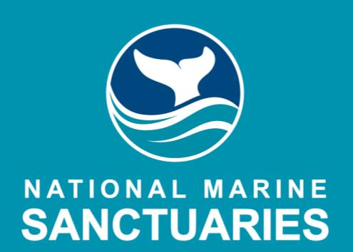

AMERICA'S UNDERWATER TREASURES

https://sanctuaries.noaa.gov