# THE PROGRESSION OF VOLCANISM IN THE SAMOAN LINEAR VOLCANIC CHAIN

## JAMES H. NATLAND

Geologic Research Division and Deep Sea Drilling Project, Scripps Institution of Oceanography, La Jolla, California 92093

ABSTRACT. The Samoan Islands are unique among the linear volcanic chains of the Pacific in that they are traversed by a single Pleistocene to historic volcanic rift zone for at least 300 km across extinct, deeply eroded older shield volcanoes of the Samoan Ridge. Petrologic criteria are established for distinguishing basalts of shield volcanoes from post-erosional alkali olivine basalts, basanites, and olivine nephelinites and used to document the distribution of post-erosional lavas along the chain. This distribution, the extent of erosion of shield volcanoes, the distribution of reefs, and paleomagnetic data (Tarling, 1966) all indicate that both the shield volcanoes and the post-erosional rift zone have propagated to the east; but post-erosional lavas are most voluminous at the western end of the island chain, giving islands there an anomalously youthful appearance.

Petrologic, geologic, and bathymetric data both on and around the islands indicate that the post-erosional rift zone developed in response to bending of the Pacific Plate southward into the west-northwest-trending limb of the Tonga Trench, less than 200 km south of the Samoan Ridge. The rift zone lies on the crest of the arch produced by the bending. The petrology of the post-erosional lavas and their virtually simultaneous eruption along a rift zone 300+ km long are plausibly explained by shear melting at the base of the lithosphere in response to plate bending near the Tonga Trench.

Samoan shield volcanoes resemble Hawaiian shield volcanoes in that they evolved petrologically from near-tholeiitic to distinctly alkalic basalt compositions, then in their waning stages extruded hawaiites, mugearites, and trachytes, primarily as intracaldera flows, tuffs, and plugs. At least three magmatic lineages leading to trachytes and phonolite occur on different shield volcanoes or seamounts, each resulting from a distinct basalt or basanite parent. Compositional differences among these parental materials resulted from differences in the extent and depth of melting in the mantle.

All Samoan lavas have an undepleted and radiogenic mantle source, but posterosional lavas have higher \*5Sr/\*\*\*Sr and Rb/Sr ratios and a lower K/Rb ratio than shield basalts. The geometry and length of the post-erosional rift zone rules out a mantle plume origin for these lavas. Their chemistry makes a plume source for the more depleted shield basalts petrologically unlikely. Samoan central volcanoes occur as short strings of shield volcanoes or as isolated seamounts on the sea floor. Their scattered placement and petrologic diversity suggest that they, too, result from thermal-convective disturbances in the mantle, caused by deformation of the Pacific plate at the "corner" of the Tonga Trench, rather than from the fortuitous occurrence of a deepmantle plume at this unusual location.

#### INTRODUCTION

Recent hypotheses regarding the origins of island chains have sought to link the general westward propagation of Pacific linear island chains to motions of the Pacific plate (Wilson, 1963; Morgan, 1972; Shaw, 1973; Shaw and Jackson, 1973). All these hypotheses have in common the concept of a rigid lithosphere up to 100 km thick translating over a rheid asthenosphere in which relatively fixed thermal perturbations produce melting and large volumes of volcanic rock. The melting is localized to the extent that at any one time the greatest volume of lava extrudes in one or two shield volcanoes centered over the thermal perturbation. As plate motion proceeds, the volcanoes move away from the perturbation. Volcanism wanes and eventually ceases. The volcanoes then become extensively eroded, are reduced to sealevel, and become submerged. In the

tropics, they can be capped with coral reefs which persist as atolls long after the volcanoes have disappeared beneath the sea.

The Samoan chain (fig. 1) stands as a distinct anomaly in this context. Unlike the Hawaiian, Society, Marquesas and other young linear volcanic chains on the Pacific plate, it appears to be propagating to the west, rather than to the east (Dana, 1849; Stearns, 1944; Chubb, 1957). That is, the island of Savai'i at the western end of the chain has a youthful, uneroded, domed shape and is dotted with hundreds of Recent and historic small cones (Kear and Wood, 1959), whereas to the east, the islands of Upolu and Tutuila are progressively more eroded and incised, consisting predominantly of lavas thought to date from as early as latest Pliocene (Stearns, 1944). An atoll, Rose Islet, is at the eastern, rather than the western end of the chain.

This peculiarity is emphasized even more by the very close similarity between Samoan volcanoes and those of Hawaii. On the island of Tutuila, Stearns (1944) identified the principal stages of volcanism he had seen in the Hawaiian islands (Stearns, 1940): initial shield building followed by caldera collapse, infilling of caldera regions mainly with felsic differentiated lavas, a prolonged period of quiescence and erosion, and finally, renewed volcanism, primarily of olivine basalts, which he termed "post-erosional" volcanism. In one respect, however, Samoan volcanism

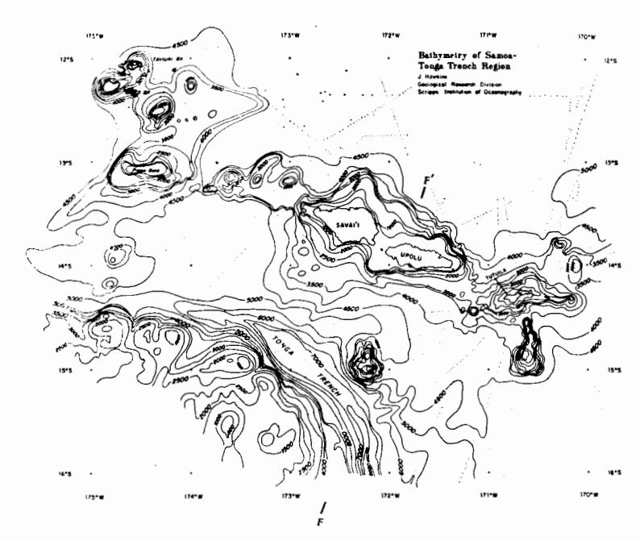

Fig. 1. Bathymetric chart of the Samoan Island-Tonga trench region, prepared by J. W. Hawkins, Jr. (Hawkins and Natland, 1975). Contours are in corrected meters for Area 41 Matthews Tables. Reproduced by permission of Elsevier Scientific Publishing Company.

differs from that of Hawaii. Macdonald (1968a) classified all Samoan basalts analyzed up to that time, including those erupted before caldera collapse, as alkalic. None were tholeitic, unlike the preponderance of Hawaiian basalts (Macdonald and Katsura, 1964; Macdonald, 1968b). Macdonald (1968a) classified Samoan felsic differentiated lavas as hawaiites, mugearites, and trachytes similar to those from Hawaii and inferred descent from an alkalic basalt parent.

Kear and Wood (1959) used geomorphologic criteria (erosion, extent of soil profiles, et cetera) and relation to offshore reefs to define relative ages of lavas in Western Samoa (Upolu and Savai'i). Barrier reefs around both Upolu and Tutuila were drowned during the rise of sealevel that followed the last glaciation (Mayor, 1924; Chamberlin, 1924; Daly, 1924; Stearns, 1944; Kear and Wood, 1959). Exposures of lavas along the northeast and southwest coasts of Upolu appear to be considerably older than these drowned reef complexes that were built upon them and are now shallow banks far offshore. The exposures are deeply eroded, have irregular coasts produced by drowning of river valleys, and stand as rugged topographic highs above considerably younger basalts. A few of these younger basalts may be as old as the youngest of the drowned reefs (Kear and Wood, 1959, p. 40), but most are younger. All are moderately eroded or virtually uneroded and lie relatively flat. having flowed from a line of vents marked by the hundreds of small, little-eroded cones along the axis of both Upolu and Savai'i (fig. 2). Where these flows reach the sea, young fringing reefs or barrier reefs are attached to them, except for the most recent (including historic) flows, which have no attached reefs. Stearns (1944) speculated that these younger lavas were in some sense equivalent to post-erosional lavas of Tutuila, since they are separated from the older lavas with rugged relief by an erosion surface representing a profound unconformity.

Hawkins and Natland (1975) determined that the younger lavas from Tutuila, Upolu, and Savai'i are alkali olivine basalts, basanites, and olivine nephelinites (using the normative classification of Green, 1969).

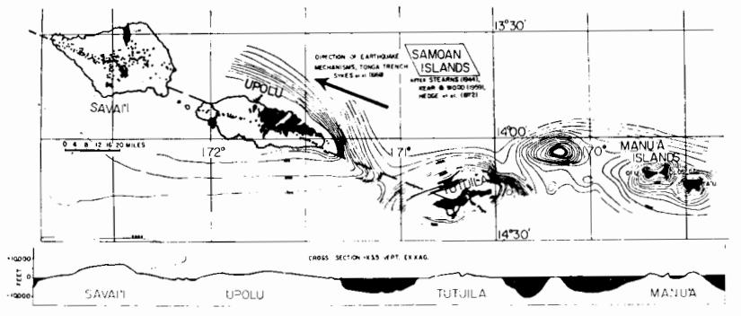

Fig. 2. Distribution of shield volcanoes (black), post-erosional lavas (white), and volcanic vents of the post-erosional volcanic rift zone (dots) in the Samoan Islands. Bathymetry in fathoms.

No basanites and olivine nephelinites, in particular, had been reported among the older (shield) lavas of Tutuila (Macdonald, 1968a), the Manu'a group (fig. 2) of American Samoa (Stice, 1968) or among the older (pre-unconformity) basalts of Upolu (Macdonald, 1968a; Hedge, Peterman, and Dickinson, 1972). It consequently appeared that there could be a major petrologic distinction between Samoan lavas separated by profound unconformities (hence long periods of time).

This paper reports the results of an investigation to characterize the composition of Samoan lavas through the various stages of volcanism defined by earlier workers, using their field criteria (Stearns, 1944; Kear and Wood, 1959). Some additional field investigations were undertaken to clarify relationships among lava types on the islands of Tutuila and Upolu. These investigations established that the older, deeply-eroded lavas were erupted primarily from a major center of volcanism at what is now Fagaloa Bay on the northeast coast (Natland, 1974 and ms). A major caldera with a physiographically pronounced ring fault bounds three sides of this bay (fig. 3). Like Pago Pago Bay on Tutuila, Fagaloa Bay appears to be a drowned river valley cut by streams into the flank of the caldera. Intracaldera lavas are mainly hawaiite and mugearite. Two trachytic plugs mark the ring fault, and a third plug (which I did not visit) is evident in aerial photographs taken just to the east of the caldera.

This discovery verified Stearns's (1994) conjecture that the younger lavas of Upolu are in essence comparable to post-erosional lavas of Tutuila, in that they erupted from a new rift system after a long period of erosion and quiescence of a major shield volcano in this part of the chain. It also suggested that the apparent westward propagation of the

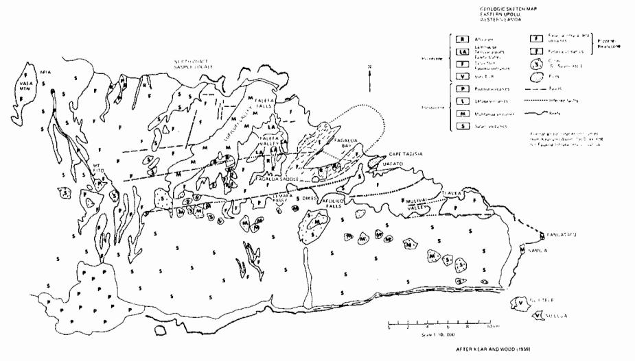

Fig. 3. Geologic sketch map of Eastern Upolu, Western Samoa, showing the Fagaloa caldera and the locations of post-erosional flows and vents. Based on map of Kear and Wood (1959) and additional field data (Natland, 1975).

Samoan chain should be re-evaluated in two parts: progression and history of shield volcanoes, and development of the post-erosional sequence of lavas.

In this paper I shall outline the compositional contrast between lavas of Samoan shield volcanoes and Samoan post-erosional lavas. On Tutuila, this is the contrast between what Stearns (1944) mapped as shield volcanoes (his Masefau, Olomoana, Alofau, Pago, and Taputapu volcanics), and post-erosional lavas (Leone volcanics). On Upolu and Savai'i, it is the contrast between the deeply eroded lavas Kear and Wood (1959) called the Fagaloa series (I shall distinguish Fagaloa shield from Fagaloa intra-caldera lavas) and the upper Pleistocene and younger lavas (divided on geomorphologic grounds into the Salani, Mulifanua, Lefaga, Puapua, and Aopo lavas, in order of decreasing age; Aopo lavas erupted in historic time). I shall term these latter volcanics "posterosional", in precisely the meaning implied by Stearns (1944) for Tutuila. The distribution of shield and post-erosional lavas in the Samoan chain is shown on figure 2 and in more detail for eastern Upolu on figure 3, which shows some of the subdivisions of post-erosional lavas of Kear and Wood (1959), as well as Fagaloa shield and intra-caldera lavas. Several hundred samples from all these lava series on Tutuila and Upolu were collected for petrographic examination. Of these, nearly a hundred were analyzed by X-ray fluorescence and atomic absorption techniques. The resulting data form the basis for this paper.

The chemical data establish that the Leone, Salini, Mulifanua, Lefaga, Puapua, and Aopo lavas are chemically and petrographically similar, yet clearly distinct from basalts of the older shield volcanoes. The chemical distinction is substantially comparable to the distinction between Hawaiian post-erosional lavas and "transitional" (term of Beeson, 1976) plus alkalic basalts of Hawaiian shield volcanoes (Macdonald, 1968b). The new analyses include a few basalts, found in the deeply eroded portions of Samoan shield volcanoes, which have many characteristics of tholeiites. The new analyses also define distinct lineages of felsic differentiation for the Pago series of Tutuila and the Fagaloa volcanics of Upolu. I shall use these chemical distinctions to clarify some heretofore ambiguous field relations in the Samoan Islands and will demonstrate that the weight of present evidence indicates that Samoan shield volcanoes are propagating to the east (more precisely, 20° south of east), just as are shield volcanoes in the Hawaiian Islands. They are capped to the west with extensive thicknesses of post-erosional lavas which lend that end of the chain a youthful appearance. This has led to the principal confusion surrounding the propagation direction of the chain. After analyzing the probable age progression along the chain, I shall speculate on the cause of the unusually thick sequences of posterosional lavas.

#### PETROLOGIC CONTRASTS BETWEEN SHIELD AND POST-EROSIONAL LAVAS

Table 1 lists average analyses of Samoan lavas, based on my new analyses. The complete table of analyses is available upon request. Con-

trasts between shield and post-erosional lavas are readily apparent on alkali-silica diagrams for Tutuila (fig. 4) and Upolu (fig. 5).

Basalts of the Tutuila shield volcanoes range from quartz or hypersthene normative to nepheline normative (4.7 percent ne) when (CIPW) norms are calculated with 1.5 percent Fe2O3. MgO content ranges from 12.3 to 6.9 percent. Olivine is the only phenocryst in these basalts. TiO2 content is high, ranging from 3.47 percent in the basalt with highest MgO content to 4.38 percent. The basalts have distinctly lower CaO

Table 1
Average analyses of Samoan lavas and Hawaiian basalts
Dry, reduced, normalized to 100%

|                   |                              |      |      | , .  |      |      |      |                      | 70   |      |      |      |      |  |  |
|-------------------|------------------------------|------|------|------|------|------|------|----------------------|------|------|------|------|------|--|--|
|                   | Tutuila Shield lavas         |      |      |      |      |      |      | Post-erosional lavas |      |      |      |      |      |  |  |
|                   | 1.                           | 2.   | 3.   | 4.   | 5.   | 6.   | 7.   | 8.                   | 9.   | 10.  | 11.  | 12.  | 13.  |  |  |
| SiO 2  | 47.3                         | 49.6 | 46.6 | 48.1 | 55.2 | 59.0 | 69.5 | 43.5                 | 42.7 | 41.1 | 46.0 | 44.5 | 40.3 |  |  |
| $Al_2O_3$         | 13.0                         | 13.3 | 13.3 | 15.9 | 17.0 | 18.3 | 17.0 | 11.7                 | 11.8 | 11.0 | 13.0 | 12.8 | 11.6 |  |  |
| FeO*              | 12.5                         | 12.8 | 12.3 | 13.4 | 9.3  | 7.6  | 2.2  | 12.4                 | 13.3 | 12.9 | 11.7 | 12.4 | 13.2 |  |  |
| MgO               | 9.4                          | 7.1  | 9.5  | 4.7  | 2.4  | 1.3  | .1   | 13.4                 | 12.0 | 12.1 | 9.3  | 11.3 | 12.3 |  |  |
| CaO               | 9.2                          | 9.2  | 9.4  | 7.7  | 5.6  | 3.4  | .8   | 10.7                 | 10.1 | 10.5 | 9.3  | 10.7 | 13.0 |  |  |
| Na 2 O | 2.9                          | 2.4  | 2.9  | 3.9  | 5.0  | 5.3  | 5.2  | 2.7                  | 3.7  | 4.4  | 2.8  | 3.6  | 3.9  |  |  |
| $K_2\bar{O}$      | 1.2                          | .6   | 1.5  | 1.5  | 2.5  | 3.2  | 4.9  | 1.4                  | 1.5  | 1.8  | 1.6  | 1.0  | 1.2  |  |  |
| TiO,              | 3.9                          | 4.1  | 4.0  | 3.9  | 1.9  | 1.2  | .1   | 3.7                  | 4.2  | 4.4  | 3.3  | 2.6  | 2.8  |  |  |
| $P_2O_5$          | .5                           | .6   | .5   | .7   | .9   | .5   | .1   | .5                   | .6   | .9   | .5   | .5   | .9   |  |  |
| MnÖ               | .2                           | .2   | .2   | .2   | .2   | .2   | .1   | .2                   | .2   | .2   | .2   | .2   | .2   |  |  |
| No. of            |                              |      |      |      |      |      |      |                      |      |      |      |      |      |  |  |
| analyses          | 11                           | I    | 6    | 12   | 6    | 3    | 3    | 11                   | 14   | 1    | 10   | 11   | 10   |  |  |
|                   | Upolu (Fagaloa) Shield lavas |      |      |      |      |      |      | Hawaiian basalts     |      |      |      |      |      |  |  |
|                   | 14.                          | Î5.  | 16.  | 17.  | 18.  | 19.  | 20.  | 21.                  | 22.  |      |      |      |      |  |  |
| SiO 2  | 47.3                         | 48.1 | 49.0 | 45.9 | 47.9 | 56.1 | 61.1 | 45.7                 | 50.0 |      |      |      |      |  |  |
| $Al_2\tilde{O}_3$ | 13.3                         | 13.7 | 13.9 | 13.4 | 16.4 | 18.8 | 18.8 | 14.8                 | 14.1 |      |      |      |      |  |  |
| FeO*              | 12.5                         | 12.3 | 12.0 | 12.8 | 11.8 | 7.9  | 5.4  | 13.0                 | 11.3 |      |      |      |      |  |  |
| MgO               | 8.8                          | 7.5  | 6.3  | 8.7  | 4.7  | 2.1  | 1.0  | 7.9                  | 8.5  |      |      |      |      |  |  |
| CaO               | 10.4                         | 10.7 | 10.7 | 10.7 | 9.1  | 4.6  | 1.4  | 10.6                 | 10.4 |      |      |      |      |  |  |
| Na 2 O | 2.7                          | 2.8  | 2.7  | 3.0  | 3.8  | 5.7  | 6.4  | 3.0                  | 2.2  |      |      |      |      |  |  |
| K 2 Ō  | .9                           | .8   | .8   | 1.1  | 1.7  | 3.1  | 4.8  | 1.0                  | .4   |      |      |      |      |  |  |
| TiO 2  | 3.5                          | 3.4  | 3.8  | 3.8  | 3.9  | 1.7  | .6   | 3.0                  | 2.5  |      |      |      |      |  |  |
| $P_2O_5$          | .5                           | .5   | .5   | .5   | .7   | .6   | .2   | .5                   | .3   |      |      |      |      |  |  |
| MnO No. of     | .2                           | .2   | .2   | .2   | .2   | .2   | .2   | .2                   | .2   |      |      |      |      |  |  |
| analyses          | 15                           | 8    | 4    | 4    | 10   | 1    | 4    | 35                   | 200  |      |      |      |      |  |  |

Column (I) average basalt, Tutuila; (2) tholeiitic basalt, Tutuila (SAM-30, Natland, ms); (3) average basalt, Tutuila, with K2O greater than 1.0 percent (Natland, ms); (4) average hawaiite, Tutuila, (Natland, ms); (5) average mugearite, Tutuila (Natland, ms); (6) average "benmoreite" or mugearite-trachyte, Tutuila (Natland, ms); (7) average trachyte, Tutuila (Natland, ms); (8) average Leone basanite, Tutuila (Natland, ms); Hawkins and Natland, 1975); (9) average basanite, Upolu (Natland, ms; Hedge and others, 1972); (10) representative olivine nephelinite, Puapua lavas, Upolu (Natland, ms); (11) average alkali olivine basalt, Savai'i (Macdonald, 1944; Hedge and others, 1972; Hawkins and Natland, ms); (12) average Hawaiian basanite (Macdonald, 1968b); (13) average Hawaiian olivine nephelinite (Macdonald, 1968b); (14) average Fagaloa basalt, Upolu (Natland, ms); (15) average Fagaloa tholeiitic plus transitional basalt, Upolu (Natland, ms); (16) average Fagaloa basalt with 1.0 percent K2O or more, Upolu (Natland, ms); (18) average Fagaloa hawaiite, Upolu (Natland, ms); (19) Fagaloa mugearite, Upolu (Natland, ms); (20) average Fagaloa trachyte, Upolu (Macdonald, 1944; Natland, ms); (21) average Hawaiian alkali olivine basalt (Macdonld, 1968b); (22) average Hawaiian tholeites plus olivine tholeiites (Macdonald, 1968b).

content (8.14 to 9.39 percent) than either post-erosional lavas or basalts from the Fagaloa shield volcano of Upolu (table 1 and fig. 6). Despite the norms, no nepheline occurs in any of these basalts, nor do hypersthene or quartz occur.

Felsic differentiated lavas from Tutuila include hawaiites, often distinguishable from basalts in the field by their blacker, duskier appearance, and in thin section by their abundant plagioclase and titanomagnetite and lack of olivine. TiO2 content ranges up to 4.77 percent among hawaiites; MgO content is between 4.0 and 5.1 percent. Successively more felsic differentiates (mugearites, benmoreites, trachytes) are light gray to cream-colored and fall in the high-silica (52-69 percent) portion of figure 4. P2O5, total iron, and TiO2 contents drop sharply as SiO2 increases among these rocks (table 1) reflecting late-stage apatite and opaquemineral fractionation. The differentiated lavas also progress from nepheline to quartz normative as SiO2 increases, and the trachytes contain minor interstitial quartz, as first noted by Daly (1924).

The Leone post-erosional lavas of Tutuila fall in a field completely distinct from shield lavas on figure 4. They all have lower SiO2 contents than Tutuila shield basalts and in general contain more MgO (11.4 to 14.8 percent). They also have higher CaO contents (9.63 to 11.7 percent) than shield basalts and comparable proportions of TiO2 (table 1), despite more abundant olivine. The principal petrographic distinction is that the Leone post-erosional lavas have more abundant groundmass clinopyroxene, with a pinker color than the shield basalts. Nepheline ranges from 9.3 to 13.6 percent in the norms calculated at 1.5 percent Fe2O3, and normative albite is less than 2 percent in some. The lavas therefore

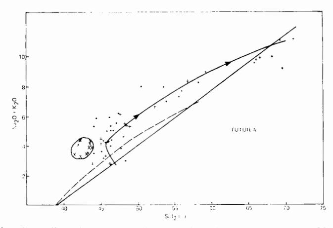

Fig. 4. Alkali-silica diagram, Tutuila, American Samoa. Plusses are older analyses (Macdonald, 1944, 1968a), dots are analyses of shield basalts and differentiates (Natland, 1975), and X's are post-erosional lavas (Natland, 1975; Hawkins and Natland, 1975). The arrowed line is a generalized trend line through the shield basalts and differentiates. The heavy straight line is the field boundary between Hawaiian tholeiitic basalts (below) and alkalic series lavas (above), from Macdonald (1968b). Curved dashed line is the boundary between tholeiitic and alkalic series lavas of Irvine and Baragar (1972).

include some olivine nephelinites. But the lavas are usually fairly glassy and consequently contain no modal nepheline.

Fagaloa shield volcano erupted basalts considerably different from the shield volcanoes of Tutuila. These range from hypersthene normative to as much as 4.36 percent nepheline normative. One additional lava has sufficient normative nepheline (8.82 percent) to be termed a basanite, using the normative definition of Green (1969). The basalts are distinguishable from Tutuila shield basalts in that, in addition to olivine, they usually contain large (0.5-1 cm) abundant titanaugite or augite and plagioclase phenocrysts. But like the Tutuila shield basalts, neither hypersthene nor nepheline occurs in any of them, despite the norms. Fagaloa basalts contain more CaO and generally less TiO2 than Tutuila shield basalts. The higher CaO content is reflected in the plagioclase and clinopyroxene phenocrysts.

Hawaiites on Upolu carry considerably more groundmass clinopyroxene and less titanomagnetite than their Tutuila counterparts and thus have a somewhat pinkish gray rather than dusky black appearance. Phenocrysts are rare in the hawaiites. The single mugearite sampled is light gray, and the trachytes contain groundmass aegerine—augite, making them light green. The trachytes also contain anorthoclase phenocrysts but no quartz. They are less siliceous and more alkalic than the trachytes of Tutuila (compare fig. 5 with fig. 4). The mugearite and the trachytes, though, show a similar drop in P2O5 and TiO2 with increasing SiO2 (table 1).

The contrasting trends of alkali enrichment in the Tutuila and Upolu siliceous differentiates probably reflect fractionation of a three-mineral assemblage — plagioclase, titanaugite, and olivine — from the parental alkali olivine basalt of the Upolu sequence, whereas only olivine fractionated from the Tutuila parental basalt, leading to a more pro-

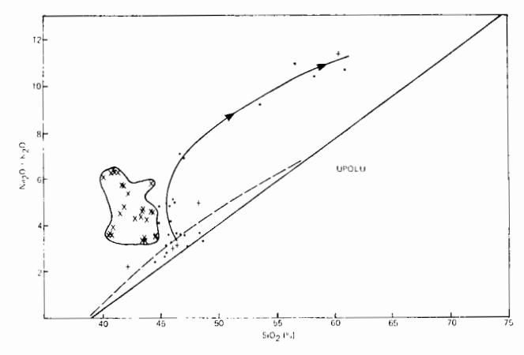

Fig. 5. Alkali-silica diagram, Upolu, Western Samoa. Symbols for older analyses, shield basalts, and differentiates, and post-erosional lavas as in figure 4. Post-erosional lavas of Hedge, Peterman, and Dickinson (1972) are included.

nouced silica enrichment. Daly (1924) and Stearns (1944) concluded that most fractionation occurred in the shallow sub-caldera Pago Pago magma chamber of Tutuila, and that many lavas erupted along the ring fault boundary. I infer a similar relationship for Upolu's Fagaloa volcano.

Post-erosional lavas of Upolu are completely distinguishable from Fagaloa shield basalts on figure 5. They have lower SiO2 contents overall (40.2-43.0 pecent) and as high or higher TiO2 contents (3.03-4.46 percent). Olivine is abundant as reflected in high contents of MgO (8.9-13.4 percent). The lavas include alkali olivine basalts, basanites, and olivine nephelinites; normative nepheline ranges from 3.97 to 20.63 percent. There are no known felsic differentiated post-erosional lavas. Petrographically, the Upolu post-erosional lavas all carry abundant olivine microphenocrysts. Groundmass plagioclase and titanaugite are present in about equal proportions in the alkali olivine basalts. Plagioclase is minor in the groundmass of the basanites and absent in the olivine nephelinites. Typical flows of these lavas contain abundant glass charged with tiny titanaugite and plagioclase crystals but no nepheline. Nepheline is present, however, in the coarser, holocrystalline interiors of thicker flows. Analcime occurs in vugs and cavities. Upolu's post-erosional lavas are similar to those of Tutuila in almost very respect but include some with higher total percentage alkalis (fig. 5) and more normative nepheline.

Trace elements can also be used to distinguish shield from posterosional lavas. Among 29 basalts and diabases of Tutuila and Upolu

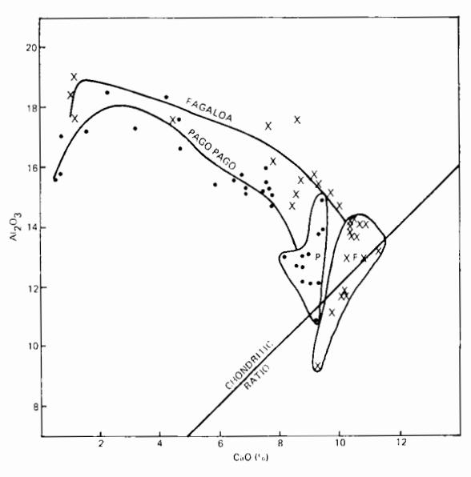

Fig. 6. Al2O3 versus CaO (wt percent), Samoan shield basalts and differentiated lavas, from Natland (1975). Dots are lavas of Tutuila, X's lavas of Fagaloa volcano, Upolu. Fields P and F enclose Pago (Tutuila) and Fagaloa (Upolu) basalts, respectively.

shield volcanoes I have analyzed, the Rb/Sr ratio ranges from 0.01 to 0.08, but in over two-thirds of these samples it is less than 0.04. In posterosional lavas, Rb/Sr is between 0.05 and 0.11. \*\*TSr/\*\*Sr is also higher in Samoan post-erosional lavas than in shield basalts (fig. 7). K/Rb ranges from around 1500 to about 300 among shield basalts (the basalts with lower K/Rb and higher Rb/Sr have higher normative nepheline), whereas K/Rb in post-erosional lavas is between 350 and 270. Absolute K, Rb, Ba, and Sr contents are higher among post-erosional lavas, especially the basanites and olivine nephelinites (Hawkins and Natland, 1975). These lavas not only contain less SiO2 and Al2O3 than alkalic olivine basalts of either the post-erosional or shield sequences, but the Si/Al ratio is higher in the nephelinites than in the basanites (table 1). This is an important similarity to Hawaiian post-erosional lavas (Macdonald, 1968b; Jackson and Wright, 1970).

The differences in CaO and TiO2 contents and in 87Sr/86Sr, Rb/Sr, and K/Rb ratios outlined above imply that differences in both depths of melting and the compositions of the magma sources are reflected in shield and post-erosional lava compositions, MacGregor (1969) and Akella and Boyd (1972) determined that the TiO2 content should increase in basalts extracted from the mantle to depths corresponding to 27 kb (90 km), at which point the effect levels off. Experiments involving diopside and pyrope garnet show that between 18 and 30 kb, liquidus compositions shift toward garnet and thus lower CaO compositions (O'Hara, 1968). Above 30 kb, however, the liquidus minimum shifts back toward diopside, giving melts with higher CaO contents and higher Si/Al. Kushiro (1969) showed that liquidus compositions in systems involving CaO, SiO2, MgO, and Al2O3 shift toward lower CaO, Al2O3, and SiO2 as pressure increases. Together, the experiments suggest that Tutuila shield basalts, with their higher TiO2 and lower CaO contents originated at greater depths than the Fagaloa shield basalts but not at as great depths as post-erosional lavas. The latter have the highest con-

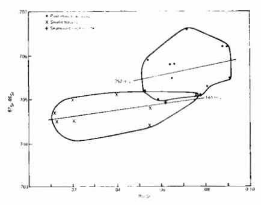

Fig. 7.  $^{87}$ Sr/ $^{86}$ Sr versus Rb/Sr for Samoan shield basalts (field lower left) and posterosional lavas (field upper right). Data from Hubbard (1969), Hedge, Peterman, and Dickinson (1972), Natland (1975), and J. Natland and A. Divis (unpub.). All  $^{87}$ Sr/ $^{88}$ Sr normalized to E and A SrCO3—0.7080. Correlation coefficients r for pseudo-isochrons are 0. 47 for shield basalts and 0.28 for post-erosional lavas.

centrations of TiO2 but apparently reflect the high-pressure shift (30+kb) to greater CaO contents and higher Si/Al. The trace elements imply that the deeper source of post-erosional lavas is richer in Rb and has a higher \$^{87}Sr/^{86}Sr than the sources of shield basalts. Considered separately, shield basalts and post-erosional lavas give flatter pseudo-isochrons (fig. 6) than that calculated for all Samoan lavas (510 m.y.) by Brooks and others (1976). Figure 6 includes five new Sr-isotope determinations (J. Natland and A. Divis, unpub.). The statistics on the shield and post-erosional pseudo-isochrons are weak, so I will not interpret them at this time except to say that they underscore the differences between shield and post-erosional lavas.

Earlier, I mentioned that a few Samoan shield basalts I have analyzed have many characteristics of tholeiites. Macdonald (1968a) thought that the high concentrations of TiO2 in Samoan basalts (0.5-1 percent higher than in comparable Hawaiian basalts) might enter pyroxenes rather than opaque mineral phases, thereby increasing the amount of free silica in the norms, compared with the actual rocks. My calculations show, however, that for some Samoan basalts, the amount of TiO2 is insufficient to explain all normative hypersthene in this way. Microprobe data for clinopyroxenes (fig. 8) demonstrate that in basalts with the most hypersthene in the norm, the TiO2 content is as low as in Hawaiian tholeiites reported by Fodor, Keil, and Bunch (1975) and fits criteria of LeBas (1962) for pyroxenes from tholeiitic basalts. Opaque minerals in these basalts are chiefly ilmenite, not ülvospinel as in comparable Hawaiian

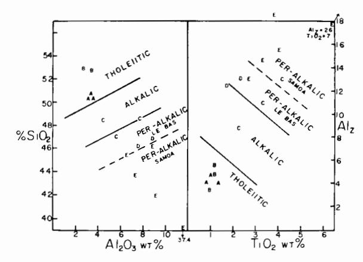

Fig. 8. Plots of SiO2 versus Al2O3 and Alz versus TiO2 for Samoan pyroxenes. (A) clinopyroxenes from SAM-30, tholeiitic basalts, Tutuila; (B) clinopyroxenes from UPO-4, tholeiitic basalt, Upolu; (C) clinopyroxenes from TUT-9D, alkalic basalt, Tutuila; (D) clinopyroxenes from UPO-F-6A, alkalic basalt, Upolu; (E) clinopyroxenes from TL-13, basanite from Leone Series post-erosional lavas, Tutuila; (F) clinopyroxenes from UPO-10A, basaltic hawaiite, Fagaloa intra-caldera lavas, Upolu. Sample locations and major elements analyses in Natland (ms). Tholeiitic, alkalic, and peralkalic fields of LeBas (1962) separated by heavy lines. Dashed lines separate Samoan alkalic basalts (C and D) from post-erosional basanite (E). Alz = Al1v • 100/Z where Z = 2 computed from structural formula.

lavas (Beeson, 1976). In the norms of some Samoan basalts, hypersthene thus appears to be a valid expression of their degree of silica saturation. These same basalts fall in the tholeitic fields of Irvine and Baragar (1971) or Macdonald (1968b) on figures 4 and 5 and have the highest K/Rb, lowest Rb/Sr (0.01-0.03), lowest \$\$^5Sr/\$^6Sr (0.7042-0.7047), lowest K\_2O, lowest Rb (5-8 ppm), and lowest Ba (95-110 ppm). Their only unusual characteristic, for tholeites, is the high whole-rock values for TiO\_2. But as explained earlier, this appears to be a result of the general great depth of melting of Samoan basalts.

Lava stratigraphy is difficult to work out on the jungle-covered Samoan slopes, so precise field relationships among the various shield basalts are uncertain. However, since the intra-caldera differentiates, especially the hawaiites, are similar to the alkalic basalts in the ratios K/Rb and Rb/Sr, and in low values of SiO2 and normative nepheline, I infer that the shield volcanoes evolved toward more undersaturated and more alkalic basalt compositions through time, before caldera collapse. The latest alkalic basalts to reach the summits of Samoan shield volcanoes lent the felsic differentiation sequences their distinctly alkalic stamp. Moreover, the inferred evolution of shield basalts toward more alkalic compositions suggests an important similarity to Hawaiian volcanoes, so that tholeiites as distinct and unequivocal as those of Kilauea and Mauna Loa may form the submerged portions of the Samoan Ridge.

### PROGRESSION OF VOLCANISM AMONG SAMOAN SHIELD VOLCANOES

Shaw, Jackson, and Bargar (1980) most confidently define the age progression of the Hawaiian-Emperor chain according to radiometric ages of lavas of the shield-building or post-caldera (tholeiitic and alkalic) stages of volcanism. In the Hawaiian-Emperor chain, absolute ages of tholeiitic basalts, whether obtained on the islands or by dredges from seamounts, probably represent the "age" of a volcano no later than perhaps 0.5 m.y. after it began building on the sea floor (MacDougall, 1964). But among dredged samples, alkalic basalts cannot readily be assigned to post-caldera or post-erosional lava sequences (although basanites and nephelinites are more typically post-erosional), so the radiometric age could postdate the principal shield-building stage of volcanism by as much as several million years.

In the Samoan chain, the problem of age progression, as it can be addressed at this time, is twofold: (1) there are no radiometric ages from the Samoan Islands, and (2) there are no unequivocal Samoan tholeiites. This paper has therefore sought to define petrologic distinctions among Samoan lavas and to relate these to stages of volanic activity. It is now possible, using a combination of field and petrologic data, to reinterpret the geomorphologic evidence for the age progression of Samoan volcanism. Radiometric ages would, of course, contribute significantly, but as with the Hawaiian chain, it is also worthwhile to establish a field and petrologic basis for future work in this direction.

There are seven well-exposed shield volcanoes in the Samoan Islands. These are (from east to west) Tau and Ofu-Olosega in the Manu'a group (fig. 2), mapped by Stice and McCoy (1968), the Taputapu, Pago, Alofau, and Olomoana centers of Tutuila, American Samoa (Stearns, 1944), and the Fagaloa volcano of Upolu, Western Samoa. In the past, the evidence for age progression among these volcanoes has generally been considered to indicate a westward rather than an eastward progression. I believe that this can now be reversed.

The Manu'a group.—Stice and McCov (1968) argued that lavas above an erosional unconformity on the northwest coast of Tau Island are "post-erosional." Chemical data for these flows (Stice, 1968) show, however, that they are similar to other alkali olivine basalts of the Tau shield volcano (compare fig. 3 of Stice, 1968, with figs. 4 and 5 of this paper). They do not resemble the post-erosional lavas as on Tutuila or Upolu. Moreover, the erosional unconformity is not nearly as extensive on Tau as on Tutuila or Upolu. Daly (1924) noted the youthful, relatively uneroded shapes of Tau and Ofu-Olosega and concluded that they were fairly youthful volcanoes. Tau and Ofu-Olosega have no wide offshore banks left from drowning of reefs during the late Pleistocene as do Tutuila and Upolu (Daly, 1924; Stearns, 1944). Instead, shallow sea cliffs without reefs occur at the edge of many Recent flows where they enter the sea, and the reefs that do exist on older flows are either fringing reefs or narrow barrier reefs, formed during the latest rise in sealevel (Stice and McCoy, 1968). Tau has a well-defined central caldera, partially destroyed by erosion on its southern side (Stice and McCoy, 1968, fig. 2). This volcano, therefore, appears to be in a caldera-infilling stage of volcanism. There can be little doubt that both Tau and Ofu-Olosega are substantially younger than the shield volcanoes of Tutuila, which were extinct and extensively eroded before drowning of the Pleistocene reefs.

Tutuila.—Stearns (1944) argued that the Taputapu shield volcano at the western end of Tutuila is younger than the Pago shield volcano (fig. 9). It shows relatively less erosional dissection, its lavas overlie those of the Pago volcano in places, and it has several small volcanic cones near its summit and along its northern shore that appear to be very young. Stearns conceded that some of these cones may more properly be judged predecessors of cones along the south coast, associated with the Leone (post-erosional) lavas, but he nevertheless mapped them as part of the Taputapu volcano.

My own field work and sampling establishes that the cinder cones along the southern part of the summit of Taputapu Ridge formed above a marked erosional unconformity. In a quarry and an adjacent road-cut near the summit at the Oloava cone (fig. 9), lapilli tuffs unconformably overlie a mugearite of the later phases of the older shield volcano. The tuffs extend from the cone northward, banking the Taputapu summit to depths between 5 and 50 m (depending on the irregular geometry of the unconformity), and extend down the northern slope (fig. 4). Chemically and petrographically the tuffs resemble the Leone lavas and tuffs

from the cones on the south coast. By both chemical and field criteria then, the tuffs are post-erosional. The youthful appearance of Taputapu volcano is thus the result of a veneer of post-erosional material concealing its older profile.

I was unable to visit the remote cones and flows overlapping those of the Pago volcano on the northern coast, but samples collected by R. Batiza indicate that lavas chemically equivalent to post-erosional flows overlie basalts chemically similar to those of shield volcanoes at the western end of the island (fig. 9). It seems likely, then, that post-erosional flows erupted from the near-summit cones and flowed to the north and west, over the Taputapu volcano.

Stearns (1944) also thought that Aunu'u Island at the eastern end of Tutuila is a small post-erosional cone (because it was built atop the drowned Pleistocene reef). Chemically, a partial analysis of a lava from Aunu'u, listed in Macdonald (1944) and obtained by Hobein in 1909, is that of a hawaiite similar to one I obtained from Cape Matatula at the eastern tip of Tutuila near Aunu'u Island. Cape Matatula is the result of a dense hawaiite plug banked on its landward side by soft, extensively weathered lapilli tuffs containing bombs of hawaiite. Erosion has cut back the tuffs around much of the plug, which probably formed as a lava lake within the throat of the tuff cone. The cone thus formed on one flank of the old Olomoana shield volcano in the waning stages of its activity. Its existence indicates relatively little erosional reduction of that volcano. Cape Matatula and Aunu'u island are similar to small satellitic cones of differentiated materials on Tau and Ofu-Olosega volcanoes to the east and to occurrences of hawaiite and mugearite on several Hawaiian volcanoes (Mauna Kea, Kohala, and West Maui, described in Macdonald and Abbott, 1970). They are not post-erosional

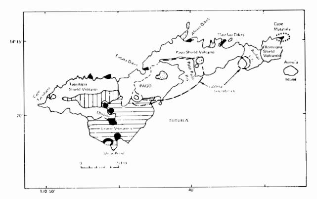

Fig. 9. Sketch geologic map of Tutuila, showing localities mentioned in text. Trachyte plugs are stippled, post-erosional lavas mapped by Stearns (1944) shown by horizontal lines, post-erosional cones shown by black dots, and post-erosional lavas capping Taputapu shield volcano mapped in this study by vertical lines. The two cones indicated along the north coast are small pit-craters described by Stearns (1944) as belonging to the Taputapu shield volcano but could be post-erosional cones.

cones, even though they both probably postdate the drowning of the old reef. They belong to the late post-caldera stage of Olomoana shield volcano and imply that this, rather than Taputapu, is the youngest shield volcano on Tutuila.

Upolu.—In many respects, Upolu is the key to the riddle of the progression of Samoan volcanoes. It is the only Samoan island with extensive exposures of both shield and post-erosional lavas. Stearns (1944) described the history of the island as that of a single volcanic ridge, active since the late Pliocene along the axis now marked by post-erosional cones. Kear and Wood (1959) distinguished the extensively eroded Fagaloa lavas from the younger flows by this line of cones and noted that they form an east-west ridge (the crest of which they called the Fagaloa Divide), crossed at a slightly oblique angle by the line of younger cones. This ridge extends offshore to the west as a prominent flat bank presumably capped by the extinct Pleistocene reefs (fig. 1).

Aerial photographs (available in black and white at the Univ. California Los Angeles Map Library Annex and in color at the Lands and Surveys Office, Apia Western Samoa) convinced me that Fagaloa Bay on the northeast coast is analogous to Pago Pago Bay on Tutuila, in that it is bounded on three sides by a ring fault marked with trachytic plugs (fig. 3), two of which I sampled. The ring fault is marked by a prominent, nearly sheer cliff on the west side of the caldera. On the northwest side of the caldera, alkalic basalts dip gently toward it, and the major rock type within the caldera is hawaiite.

The aerial photographs also reveal several east-west faults in the Fagaloa volcanics, down-dropped to the south (fig. 3). In the field, extensive forests obscure these faults, but they appear in the photographs as abrupt changes in the courses of streams, contrasts in vegetation, indentations in consecutive ridge crests, and hanging valleys above cliffs with drainage directions away from the edges of cliffs; they are further indicated by east-west trends along ridge-crests, even though the predominant drainage pattern is to the north. Some of the east-west faults cut both Fagaloa and post-erosional lavas and parallel a fault, truncating post-erosional exposures on the south coast, inferred by Kear and Wood (1959).

The present east-west Fagaloa Divide is thus at least partly an expression of Recent faulting. The original geometry of rift zones of the old Fagaloa shield volcano has been topographically obscured by this faulting and by subsequent post-erosional volcanism. But it is clear that volcanism has not always been concentrated along the present line of post-erosional cones. The Fagaloa shield volcano produced most of the lavas of this part of the Samoan Ridge and was extensively eroded before formation of the post-erosional volcanic rift zone.

Tarling (1966) argued on paleomagnetic evidence that the Fagaloa volcanics of Upolu are younger than the shield volcanoes of Tutuila. All the Tutuila basalts he sampled, except the Leone post-erosional lavas, have reversed polarity and so probably erupted during the last

reversed polarity epoch (the Matuyama, 1.6-0.7 m.y. ago). Fagaloa lavas have both normal and reversed polarities; Tarling concluded that some of them have erupted in the present (Brunhes normal) polarity epoch. He did not distinguish Fagaloa intra-caldera lavas from older extra-caldera shield basalts, however. One of his reversed samples (13° 56.24′ S, 171° 34.07′ W) is from within the Fagaloa caldera. All others are from outside it. If the intra-caldera lavas are among the youngest of the Fagaloa shield volcano, then it is likely that the normal lavas outside the caldera belong to the previous (Gilsa) normal polarity epoch. Fagaloa volcano was in its final stages, while the Tutuila shield volcanoes were still building.

Savai'i.—Kear and Wood (1959) argued that the line of cones in Upolu is contiguous with a more extensive array of similar cones on Savai'i. They divide the lavas that erupted from these vents into the same groups they defined for Upolu (the Salani, Mulifanua, Lefaga, and Puapua lavas) plus historic lavas (Aopo volcanics). Post-erosional lavas have thus erupted since the late Pleistocene along a single major rift zone down the lengths of Savai'i and Upolu, a distance of nearly 150 km. Fagaloa lavas also occur in small outcrops on Savai'i (fig. 2), but their petrology and age relative to Upolu's Fagaloa volcanics are unknown. Brothers (in Kear and Wood, 1959) described picrite basalts and an anorthoclase trachyte from boulders sampled in the Vanu River and assigned them to the Fagaloa series, but the chemical composition of these rocks has not been determined.

## EXTENT AND PROGRESSION OF THE POST-EROSIONAL VOLCANIC RIFT ZONE

The minimum extent of the post-erosional volcanic rift zone is the combined length of Upolu and Savai'i, plus nearby offshore cones, a total of over 150 km. The rift zone may have two or more branches in eastern Savai'i, or it may simply be wider there (as first noted by Dana, 1849). Post-erosional lavas of similar chemical compositions occur on Tutuila, which is almost directly on strike with the Upolu-Savai'i post-erosional volcanic rift zone. The continuation of the rift zone underwater to Tutuila makes its length nearly 300 km. Olivine nephelinites have also been dredged from Pasco Bank west of Savai'i (Hawkins and Natland, 1975). These lavas contain fresh olivine, have virtually no manganese oxide crust, and cap a bank that was apparently an atoll in the Pleistocene (Fairbridge and Stewart, 1960). They therefore probably represented an extension of the post-erosional rift zone (again on strike from Savai'i, but to the west). If they do, then the rift zone is at least 500 km long.

Fairbridge and Stewart (1960) described a series of flat banks (some shown on fig. 1) extending far to the west of Savai'i which they termed the Melanesian Border Plateau. In the Pleistocene these were apparently atolls that experienced the same reef drowning as Tutuila and Upolu. The easternmost of these, already mentioned, is Pasco Bank. Capping another of these are the small Recent volcanic islets and reefs that make up the Wallis Islands (Stearns, 1945). Lavas from Wallis appear to be

alkalic basalts (Macdonald, 1945). Whether Wallis properly belongs to the Samoan group can be questioned, but I believe that these submerged banks represent eroded volcanoes of the Samoan chain, once capped with atolls. In terms of the progression of the Samoan chain, they are comparable to the leeward Hawaiian atolls, except that the Samoan atolls have been drowned. Rose, the atoll at the eastern end of the Samoan chain, is much younger and smaller than these drowned platforms. The age of its volcanic substrate is unknown, but it could be very young, since it has no wide offshore bank.

On table 2, I have summarized the evidence for age progression of the Samoan chain, bearing in mind the distinction between shield and post-erosional lavas, and considering the two-stage history of Samoan reefs. When considered as an entire chain, with submerged atolls at the western end and still active shield volcanoes at the eastern end, the Samoan chain is manifestly younger at its eastern end. Details of the age progression, of course, await radiometric age determinations.

#### ASPECTS OF SAMOAN POST-EROSIONAL VOLCANISM

Fiske and Jackson (1972) developed a model for rift zones of Hawaiian shield volcanoes which bears on the contrast between shield and posterosional volcanism in the Samoan Islands. The model offers an explanation for lateral propagation of dikes from central feeder conduits (for example, Kilauea caldera and its flanking rift zone). The direction and position of dikes are controlled by gravitational stresses acting on the volcanic pile above the ocean floor. Shield volcanoes influence dike propagation in adjacent volcanoes by acting as buttresses and by contributing to stress fields within adjacent piles. The result is development of elongate rift zones in which dike propagation is constrained to very narrow zones along the length of the rift, the direction of the principal stress axis (see also Nakamura, 1977). One consequence of this is that rift zones are nested against rift zones of older Hawaiian shield volcanoes (Jackson, Silver, and Dalrymple, 1972).

Samoan shield volcanoes are similar to those of Hawaii in that flanking rift zones emanate from caldera regions centered on large Bouguer gravity anomalies (up to 300 Mgls; Machesky, 1965). Stice and McCoy (1968) described northeast and northwest rift zones on Tau volcano in the Manu'a Islands. Satellitic alkalic basalt and hawaiite cones have developed along these rifts. Ofu and Olosega are remnants of a shield volcano whose center was probably north of the two islands, judging by the position of the gravity anomaly. The northwest Tau rift may have been influenced by the position of this volcano, since it trends along a shallow ridge between Olosega and Tau Islands. Daly (1924) was told by islanders that an underwater eruption occurred between these islands in 1866.

Stearns (1944) described a number of dike complexes from old rift zones on Tutuila leading from the direction of Pago caldera. The exposures include several dozen to several hundred dikes. The orientation of those of the Masefau complex (fig. 9) is N70°E and of those of the Afono complex between N70°E and N70°W. These trends roughly parallel the trend of Tutuila. The Taputapu shield volcano on Tutuila may have been the southwest rift of the Pago volcano, since it parallels the trend of the dikes and lies on one flank of the gravity anomaly centered on Pago volcano. Machesky (1965) considered this as evidence that southwest Tutuila was a Pago volcano rift zone rather than a separate shield volcano.

Kear and Wood (1959) described several dike complexes in Fagaloa volcanics on Upolu. Two of these have trends paralleling nearby adjacent portions of the Fagaloa caldera (one at Fagaloa saddle and the other at Afulilo falls, shown on fig. 3) and thus may have been analogous to caldera-rim fissure zones on some Galapagos volcanoes (Delaney and

TABLE 2

Summary of age-diagnostic criteria for the Samoan chain. Islands and seamounts are arranged from west to east. Four categories of age-diagnostic criteria (I-IV) make up separate subdivisions of the table. II-IV are related to I in having indicators of increasing age (maturity) listed downward in the left-hand columns. Shaded squares show the estimated level of maturity for each part of the chain.

|                                |           | WEST                                                                                                                                                                                                                                                          |         |                               | WESTERN SAMOA    |               |                              |                                                                                                                                                                                                                                                                                                                                                                                                                                                                                                                                                                                                                                                                                                                                                                                                                                                                                                                                                                                                                                                                                                                                                                                                                                                                                                                                                                                                                                                                                                                                                                                                                                                                                                                                                                                                                                                                                                                                                                                                                                                                                                                                                                                                                                                                                                                                                                                                                                                                                                                                                                                                                                                                                                                                                                                                                                                                                                                                                                                                                                                                                                                                                                                                                                                                                                                                                                                                                                                                                                                                                |                           |          | AMERICAN SAMOA  |          |                               |
|--------------------------------|-----------|---------------------------------------------------------------------------------------------------------------------------------------------------------------------------------------------------------------------------------------------------------------|---------|-------------------------------|------------------|---------------|------------------------------|------------------------------------------------------------------------------------------------------------------------------------------------------------------------------------------------------------------------------------------------------------------------------------------------------------------------------------------------------------------------------------------------------------------------------------------------------------------------------------------------------------------------------------------------------------------------------------------------------------------------------------------------------------------------------------------------------------------------------------------------------------------------------------------------------------------------------------------------------------------------------------------------------------------------------------------------------------------------------------------------------------------------------------------------------------------------------------------------------------------------------------------------------------------------------------------------------------------------------------------------------------------------------------------------------------------------------------------------------------------------------------------------------------------------------------------------------------------------------------------------------------------------------------------------------------------------------------------------------------------------------------------------------------------------------------------------------------------------------------------------------------------------------------------------------------------------------------------------------------------------------------------------------------------------------------------------------------------------------------------------------------------------------------------------------------------------------------------------------------------------------------------------------------------------------------------------------------------------------------------------------------------------------------------------------------------------------------------------------------------------------------------------------------------------------------------------------------------------------------------------------------------------------------------------------------------------------------------------------------------------------------------------------------------------------------------------------------------------------------------------------------------------------------------------------------------------------------------------------------------------------------------------------------------------------------------------------------------------------------------------------------------------------------------------------------------------------------------------------------------------------------------------------------------------------------------------------------------------------------------------------------------------------------------------------------------------------------------------------------------------------------------------------------------------------------------------------------------------------------------------------------------------------------------------|---------------------------|----------|-----------------|----------|-------------------------------|
|                                |           |                                                                                                                                                                                                                                                               |         |                               |                  |               |                              |                                                                                                                                                                                                                                                                                                                                                                                                                                                                                                                                                                                                                                                                                                                                                                                                                                                                                                                                                                                                                                                                                                                                                                                                                                                                                                                                                                                                                                                                                                                                                                                                                                                                                                                                                                                                                                                                                                                                                                                                                                                                                                                                                                                                                                                                                                                                                                                                                                                                                                                                                                                                                                                                                                                                                                                                                                                                                                                                                                                                                                                                                                                                                                                                                                                                                                                                                                                                                                                                                                                                                |                           |          | Manu            | 'a       | EAS1                          |
|                                |           |                                                                                                                                                                                                                                                               |         | Melanesian Boriler Plateau | Wallis Island | Pasco Bank | Savai i                      | Upolu                                                                                                                                                                                                                                                                                                                                                                                                                                                                                                                                                                                                                                                                                                                                                                                                                                                                                                                                                                                                                                                                                                                                                                                                                                                                                                                                                                                                                                                                                                                                                                                                                                                                                                                                                                                                                                                                                                                                                                                                                                                                                                                                                                                                                                                                                                                                                                                                                                                                                                                                                                                                                                                                                                                                                                                                                                                                                                                                                                                                                                                                                                                                                                                                                                                                                                                                                                                                                                                                                                                                          | Seamount                  | Tutuila  | Otu/ Otosega | Tau      | Rose Atoli                 |
| 1                              | , trit    | Formation of a Submarine Ridge Formation of Shield Volcanoes Transition from near Tholeitic to Alkalic Basalt                                                                                                                                                 |         | \ \ \                         | · ·              | ×.            | ν.                           | √                                                                                                                                                                                                                                                                                                                                                                                                                                                                                                                                                                                                                                                                                                                                                                                                                                                                                                                                                                                                                                                                                                                                                                                                                                                                                                                                                                                                                                                                                                                                                                                                                                                                                                                                                                                                                                                                                                                                                                                                                                                                                                                                                                                                                                                                                                                                                                                                                                                                                                                                                                                                                                                                                                                                                                                                                                                                                                                                                                                                                                                                                                                                                                                                                                                                                                                                                                                                                                                                                                                                              | <                         |          | ν'              | <        | ./                            |
| E                              | 1         |                                                                                                                                                                                                                                                               |         | Possible                      | Possible         | Possible      | Possible                     | , ·                                                                                                                                                                                                                                                                                                                                                                                                                                                                                                                                                                                                                                                                                                                                                                                                                                                                                                                                                                                                                                                                                                                                                                                                                                                                                                                                                                                                                                                                                                                                                                                                                                                                                                                                                                                                                                                                                                                                                                                                                                                                                                                                                                                                                                                                                                                                                                                                                                                                                                                                                                                                                                                                                                                                                                                                                                                                                                                                                                                                                                                                                                                                                                                                                                                                                                                                                                                                                                                                                                                                            | ?                         | <b>√</b> | <u>\</u>        | ✓        | V                             |
| STAGES OF VOI CANISA           | nctear    |                                                                                                                                                                                                                                                               |         | Passible                      | Possible         | Possible      | Possible                     | <                                                                                                                                                                                                                                                                                                                                                                                                                                                                                                                                                                                                                                                                                                                                                                                                                                                                                                                                                                                                                                                                                                                                                                                                                                                                                                                                                                                                                                                                                                                                                                                                                                                                                                                                                                                                                                                                                                                                                                                                                                                                                                                                                                                                                                                                                                                                                                                                                                                                                                                                                                                                                                                                                                                                                                                                                                                                                                                                                                                                                                                                                                                                                                                                                                                                                                                                                                                                                                                                                                                                              | ?                         | ×.       | <'              | <b>√</b> |                               |
| 8                              | 7         | Caldera Collapse                                                                                                                                                                                                                                              |         | Passible                      | Possible         | Possible      | Possible                     |                                                                                                                                                                                                                                                                                                                                                                                                                                                                                                                                                                                                                                                                                                                                                                                                                                                                                                                                                                                                                                                                                                                                                                                                                                                                                                                                                                                                                                                                                                                                                                                                                                                                                                                                                                                                                                                                                                                                                                                                                                                                                                                                                                                                                                                                                                                                                                                                                                                                                                                                                                                                                                                                                                                                                                                                                                                                                                                                                                                                                                                                                                                                                                                                                                                                                                                                                                                                                                                                                                                                                | ?                         | v        | N               | V.       |                               |
| s of                           |           | Intra-Caldera Series Lavas                                                                                                                                                                                                                                 | Alkalic | Possible                      | Possible         | Possible      | Possible                     |                                                                                                                                                                                                                                                                                                                                                                                                                                                                                                                                                                                                                                                                                                                                                                                                                                                                                                                                                                                                                                                                                                                                                                                                                                                                                                                                                                                                                                                                                                                                                                                                                                                                                                                                                                                                                                                                                                                                                                                                                                                                                                                                                                                                                                                                                                                                                                                                                                                                                                                                                                                                                                                                                                                                                                                                                                                                                                                                                                                                                                                                                                                                                                                                                                                                                                                                                                                                                                                                                                                                                | ?                         | `        |                 | `\       |                               |
| 27.466                         |           | Post-Erosional Eruptions of Basanites and/or Nephelinites                                                                                                                                                                                            |         | Possible                      | Passible         | Possible      | ν,                           |                                                                                                                                                                                                                                                                                                                                                                                                                                                                                                                                                                                                                                                                                                                                                                                                                                                                                                                                                                                                                                                                                                                                                                                                                                                                                                                                                                                                                                                                                                                                                                                                                                                                                                                                                                                                                                                                                                                                                                                                                                                                                                                                                                                                                                                                                                                                                                                                                                                                                                                                                                                                                                                                                                                                                                                                                                                                                                                                                                                                                                                                                                                                                                                                                                                                                                                                                                                                                                                                                                                                                | ?                         |          |                 |          |                               |
|                                | Ť         | Post-Submera Volcanism                                                                                                                                                                                                                                     | teuce   | ?                             | J                | v             |                              |                                                                                                                                                                                                                                                                                                                                                                                                                                                                                                                                                                                                                                                                                                                                                                                                                                                                                                                                                                                                                                                                                                                                                                                                                                                                                                                                                                                                                                                                                                                                                                                                                                                                                                                                                                                                                                                                                                                                                                                                                                                                                                                                                                                                                                                                                                                                                                                                                                                                                                                                                                                                                                                                                                                                                                                                                                                                                                                                                                                                                                                                                                                                                                                                                                                                                                                                                                                                                                                                                                                                                | ?                         |          |                 |          |                               |
| of ter shield volcanous or Ext |           | Minor Extensive Leveled                                                                                                                                                                                                                                 | 81. 88  | - 100                         |                  |               | <u> </u>                     |                                                                                                                                                                                                                                                                                                                                                                                                                                                                                                                                                                                                                                                                                                                                                                                                                                                                                                                                                                                                                                                                                                                                                                                                                                                                                                                                                                                                                                                                                                                                                                                                                                                                                                                                                                                                                                                                                                                                                                                                                                                                                                                                                                                                                                                                                                                                                                                                                                                                                                                                                                                                                                                                                                                                                                                                                                                                                                                                                                                                                                                                                                                                                                                                                                                                                                                                                                                                                                                                                                                                                | 2 <u>7</u> 22             |          |                 |          |                               |
| 10                             | A.        | Recent Reefs Briefly Emeri Seamount                                                                                                                                                                                                                     |         |                               |                  |               |                              |                                                                                                                                                                                                                                                                                                                                                                                                                                                                                                                                                                                                                                                                                                                                                                                                                                                                                                                                                                                                                                                                                                                                                                                                                                                                                                                                                                                                                                                                                                                                                                                                                                                                                                                                                                                                                                                                                                                                                                                                                                                                                                                                                                                                                                                                                                                                                                                                                                                                                                                                                                                                                                                                                                                                                                                                                                                                                                                                                                                                                                                                                                                                                                                                                                                                                                                                                                                                                                                                                                                                                |                           |          |                 |          | 5.00.00 5.00.00 5.00.00 |
| REFS                           | ECENT     | Recent Reefs on Shield Volcanoes Recent Reefs on Post-Erosional Lavas                                                                                                                                                                                |         |                               |                  |               |                              | \'\                                                                                                                                                                                                                                                                                                                                                                                                                                                                                                                                                                                                                                                                                                                                                                                                                                                                                                                                                                                                                                                                                                                                                                                                                                                                                                                                                                                                                                                                                                                                                                                                                                                                                                                                                                                                                                                                                                                                                                                                                                                                                                                                                                                                                                                                                                                                                                                                                                                                                                                                                                                                                                                                                                                                                                                                                                                                                                                                                                                                                                                                                                                                                                                                                                                                                                                                                                                                                                                                                                                                            |                           | · · ·    | ,               | V.       |                               |
| T 0.F                          | HE        |                                                                                                                                                                                                                                                               |         |                               |                  |               |                              | \$1000 \$1000 \$1000 \$1000 \$1000 \$1000 \$1000 \$1000 \$1000 \$1000 \$1000 \$1000 \$1000 \$1000 \$1000 \$1000 \$1000 \$1000 \$1000 \$1000 \$1000 \$1000 \$1000 \$1000 \$1000 \$1000 \$1000 \$1000 \$1000 \$1000 \$1000 \$1000 \$1000 \$1000 \$1000 \$1000 \$1000 \$1000 \$1000 \$1000 \$1000 \$1000 \$1000 \$1000 \$1000 \$1000 \$1000 \$1000 \$1000 \$1000 \$1000 \$1000 \$1000 \$1000 \$1000 \$1000 \$1000 \$1000 \$1000 \$1000 \$1000 \$1000 \$1000 \$1000 \$1000 \$1000 \$1000 \$1000 \$1000 \$1000 \$1000 \$1000 \$1000 \$1000 \$1000 \$1000 \$1000 \$1000 \$1000 \$1000 \$1000 \$1000 \$1000 \$1000 \$1000 \$1000 \$1000 \$1000 \$1000 \$1000 \$1000 \$1000 \$1000 \$1000 \$1000 \$1000 \$1000 \$1000 \$1000 \$1000 \$1000 \$1000 \$1000 \$1000 \$1000 \$1000 \$1000 \$1000 \$1000 \$1000 \$1000 \$1000 \$1000 \$1000 \$1000 \$1000 \$1000 \$1000 \$1000 \$1000 \$1000 \$1000 \$1000 \$1000 \$1000 \$1000 \$1000 \$1000 \$1000 \$1000 \$1000 \$1000 \$1000 \$1000 \$1000 \$1000 \$1000 \$1000 \$1000 \$1000 \$1000 \$1000 \$1000 \$1000 \$1000 \$1000 \$1000 \$1000 \$1000 \$1000 \$1000 \$1000 \$1000 \$1000 \$1000 \$1000 \$1000 \$1000 \$1000 \$1000 \$1000 \$1000 \$1000 \$1000 \$1000 \$1000 \$1000 \$1000 \$1000 \$1000 \$1000 \$1000 \$1000 \$1000 \$1000 \$1000 \$1000 \$1000 \$1000 \$1000 \$1000 \$1000 \$1000 \$1000 \$1000 \$1000 \$1000 \$1000 \$1000 \$1000 \$1000 \$1000 \$1000 \$1000 \$1000 \$1000 \$1000 \$1000 \$1000 \$1000 \$1000 \$1000 \$1000 \$1000 \$1000 \$1000 \$1000 \$1000 \$1000 \$1000 \$1000 \$1000 \$1000 \$1000 \$1000 \$1000 \$1000 \$1000 \$1000 \$1000 \$1000 \$1000 \$1000 \$1000 \$1000 \$1000 \$1000 \$1000 \$1000 \$1000 \$1000 \$1000 \$1000 \$1000 \$1000 \$1000 \$1000 \$1000 \$1000 \$1000 \$1000 \$1000 \$1000 \$1000 \$1000 \$1000 \$1000 \$1000 \$1000 \$1000 \$1000 \$1000 \$1000 \$1000 \$1000 \$1000 \$1000 \$1000 \$1000 \$1000 \$1000 \$1000 \$1000 \$1000 \$1000 \$1000 \$1000 \$1000 \$1000 \$1000 \$1000 \$1000 \$1000 \$1000 \$1000 \$1000 \$1000 \$1000 \$1000 \$1000 \$1000 \$1000 \$1000 \$1000 \$1000 \$1000 \$1000 \$1000 \$1000 \$1000 \$1000 \$1000 \$1000 \$1000 \$1000 \$1000 \$1000 \$1000 \$1000 \$1000 \$1000 \$1000 \$1000 \$1000 \$1000 \$1000 \$1000 \$1000 \$1000 \$1000 \$1000 \$1000 \$1000 \$1000 \$1000 \$1000 \$1000 \$1000 \$1000 \$1000 \$1000 \$1000 \$1000 \$1000 \$1000 \$1000 \$1000 \$1000 \$1000 \$1000 \$1000 \$1000 \$1000 \$1000 \$1000 \$1000 \$1000 \$1000 \$1000 \$1000 \$1000 |                           | N. 10    |                 |          |                               |
| DEVELOPMENT OF REEFS           |           | Recent Reefs Post-Submer Lavas                                                                                                                                                                                                                          |         |                               |                  |               |                              | -                                                                                                                                                                                                                                                                                                                                                                                                                                                                                                                                                                                                                                                                                                                                                                                                                                                                                                                                                                                                                                                                                                                                                                                                                                                                                                                                                                                                                                                                                                                                                                                                                                                                                                                                                                                                                                                                                                                                                                                                                                                                                                                                                                                                                                                                                                                                                                                                                                                                                                                                                                                                                                                                                                                                                                                                                                                                                                                                                                                                                                                                                                                                                                                                                                                                                                                                                                                                                                                                                                                                              | `                         |          |                 |          |                               |
|                                | N. H.     | Never had Pleistocene R                                                                                                                                                                                                                                    | teefs   |                               |                  |               |                              |                                                                                                                                                                                                                                                                                                                                                                                                                                                                                                                                                                                                                                                                                                                                                                                                                                                                                                                                                                                                                                                                                                                                                                                                                                                                                                                                                                                                                                                                                                                                                                                                                                                                                                                                                                                                                                                                                                                                                                                                                                                                                                                                                                                                                                                                                                                                                                                                                                                                                                                                                                                                                                                                                                                                                                                                                                                                                                                                                                                                                                                                                                                                                                                                                                                                                                                                                                                                                                                                                                                                                |                           |          |                 | ν.       | ×                             |
|                                | EISTOCENE | Partial Submi after Reel Ex                                                                                                                                                                                                                                |         | 1                             |                  |               | N                            |                                                                                                                                                                                                                                                                                                                                                                                                                                                                                                                                                                                                                                                                                                                                                                                                                                                                                                                                                                                                                                                                                                                                                                                                                                                                                                                                                                                                                                                                                                                                                                                                                                                                                                                                                                                                                                                                                                                                                                                                                                                                                                                                                                                                                                                                                                                                                                                                                                                                                                                                                                                                                                                                                                                                                                                                                                                                                                                                                                                                                                                                                                                                                                                                                                                                                                                                                                                                                                                                                                                                                |                           | N.       |                 |          |                               |
|                                | PLE       | Complete Sui after Reef Ex                                                                                                                                                                                                                                 |         |                               |                  | , ,           |                              |                                                                                                                                                                                                                                                                                                                                                                                                                                                                                                                                                                                                                                                                                                                                                                                                                                                                                                                                                                                                                                                                                                                                                                                                                                                                                                                                                                                                                                                                                                                                                                                                                                                                                                                                                                                                                                                                                                                                                                                                                                                                                                                                                                                                                                                                                                                                                                                                                                                                                                                                                                                                                                                                                                                                                                                                                                                                                                                                                                                                                                                                                                                                                                                                                                                                                                                                                                                                                                                                                                                                                | ν.                        |          |                 |          |                               |
| 1)                             |           | Inferred Magnetic Enoch of Shield Budding Stage Inferred Magnetic Epoch of Intra- califors Stage Inferred Magnetic Epoch of Post Frostonal Stage Inferred Magnetic Epoch of Post Frostonal Stage Interred Magnetic Epoch of Post Submergence Stage K. 'An Age |         | ?                             | ?                | ?             | Normal Uncertain Epoch | Gilsa/ Matuyama Transition                                                                                                                                                                                                                                                                                                                                                                                                                                                                                                                                                                                                                                                                                                                                                                                                                                                                                                                                                                                                                                                                                                                                                                                                                                                                                                                                                                                                                                                                                                                                                                                                                                                                                                                                                                                                                                                                                                                                                                                                                                                                                                                                                                                                                                                                                                                                                                                                                                                                                                                                                                                                                                                                                                                                                                                                                                                                                                                                                                                                                                                                                                                                                                                                                                                                                                                                                                                                                                                                                                               | ?                         | Matuyama | Brunhes*        | Brunhes* |                               |
| 1.6 TION                       |           |                                                                                                                                                                                                                                                               |         | ?                             | ?                | ?             | ?                            | Matuyama                                                                                                                                                                                                                                                                                                                                                                                                                                                                                                                                                                                                                                                                                                                                                                                                                                                                                                                                                                                                                                                                                                                                                                                                                                                                                                                                                                                                                                                                                                                                                                                                                                                                                                                                                                                                                                                                                                                                                                                                                                                                                                                                                                                                                                                                                                                                                                                                                                                                                                                                                                                                                                                                                                                                                                                                                                                                                                                                                                                                                                                                                                                                                                                                                                                                                                                                                                                                                                                                                                                                       | ?                         | Matuyama | Brunhes*        | Brunhes* |                               |
| PALFOMAGAETIC ILFORNATION   |           |                                                                                                                                                                                                                                                               |         | ?                             | ?                | ?             | Brunhes                      | Brunhes                                                                                                                                                                                                                                                                                                                                                                                                                                                                                                                                                                                                                                                                                                                                                                                                                                                                                                                                                                                                                                                                                                                                                                                                                                                                                                                                                                                                                                                                                                                                                                                                                                                                                                                                                                                                                                                                                                                                                                                                                                                                                                                                                                                                                                                                                                                                                                                                                                                                                                                                                                                                                                                                                                                                                                                                                                                                                                                                                                                                                                                                                                                                                                                                                                                                                                                                                                                                                                                                                                                                        | ,                         | Brunhes  |                 |          |                               |
| 12                             |           |                                                                                                                                                                                                                                                               |         | ,                             | Brunhes*         | Brunhes*      | 7                            |                                                                                                                                                                                                                                                                                                                                                                                                                                                                                                                                                                                                                                                                                                                                                                                                                                                                                                                                                                                                                                                                                                                                                                                                                                                                                                                                                                                                                                                                                                                                                                                                                                                                                                                                                                                                                                                                                                                                                                                                                                                                                                                                                                                                                                                                                                                                                                                                                                                                                                                                                                                                                                                                                                                                                                                                                                                                                                                                                                                                                                                                                                                                                                                                                                                                                                                                                                                                                                                                                                                                                | ?                         |          |                 |          |                               |
|                                |           |                                                                                                                                                                                                                                                               |         |                               |                  |               |                              |                                                                                                                                                                                                                                                                                                                                                                                                                                                                                                                                                                                                                                                                                                                                                                                                                                                                                                                                                                                                                                                                                                                                                                                                                                                                                                                                                                                                                                                                                                                                                                                                                                                                                                                                                                                                                                                                                                                                                                                                                                                                                                                                                                                                                                                                                                                                                                                                                                                                                                                                                                                                                                                                                                                                                                                                                                                                                                                                                                                                                                                                                                                                                                                                                                                                                                                                                                                                                                                                                                                                                | 940,000 yrs (Matuyama) |          |                 |          |                               |

\* Based on Recent age of reefs older than these lavas.

others, 1973). No other complexes found can definitely be related to Fagaloa volcano.

The Samoan post-erosional rift zone differs in several significant ways from the flanking rift zones of Hawaiian and Samoan shield volcanoes, despite the large volume of post-erosional lavas that have erupted on Upolu and Savai'i. Perhaps the most important difference is its length, at least 300, possibly 500, km. In addition, several lines of evidence indicate that Samoan post-erosional eruptions were fed from essentially vertical conduits rather than from Kilauea-type lateral fissures:

- 1. The post-erosional rift zone has no central calderas anywhere along its length. Instead, lavas have vented from the hundreds of small, closely spaced cones along the axis of Upolu and Savai'i and from the several on Tutuila.
- 2. Post-erosional lavas contain abundant olivine and high percentages of MgO. The hallmark of basalts of Kilauea-type rift is that they usually become extensively fractionated after years or decades in small magma bodies within the rifts (Wright and Fiske, 1971). Many Samoan shield basalts are significantly fractionated, but post-erosional lavas are not.
- 3. Sheared and granular dunite, harzburgite, and Iherzolite xenoliths are abundant in Samoan post-erosional lavas. Preliminary microprobe data demonstrate that the xenoliths contain aluminous orthopyroxene, aluminous clinopyroxene, Mg-Al-Cr spinel, and olivine (Hawkins and Natland, 1975, based on unpub. data). Olivine phenocrysts are less magnesian than xenolith olivines, implying that the xenoliths are not cumulates crystallized from the magma, but instead were incorporated into the magma mechanically from wall rocks. The xenoliths range from xenocryst to golf ball size; this implies rapid vertical movements of magmas, with little or no residence time in magma reservoirs between their source and the surface.
- 4. Outcrop patterns for 11 of the most recent (Puapua and Aopo) eruptions on Upolu and Savai'i, from the maps of Kear and Wood (1959), indicate that rarely more than a few adjacent cones are involved in individual post-erosional eruptions. Calculations by Kear and Wood suggest an average post-erosional eruption frequency of one every 300 yrs (three have occurred since 1760, however). No evidence indicates lateral diking over long segments of the rift zone. The two largest historic flows on Savai'i were from single vents 10 km apart and occurred in 1760 and 1905. A minor eruption in 1902 involving four adjacent vents was near the source of the 1760 flows. On Upolu, the most recent eruptions were two Puapua flows spaced from single vents about 18 km apart. Before those, two Lefaga eruptions occurred, spaced about 20 km apart. There is no evidence that any of the four eruptions were related or occurred closely spaced in time.

Samoan post-erosional eruptions thus appear to be isolated individual events, as apt to occur on Savai'i as on Upolu, or at any other point along the post-erosional rift zone. In this respect, Samoan post-erosional volcanism resembles that on Oahu or Kauai in the Hawaiian Islands. The occurrence of markedly alkalic, mafic, silica undersaturated lavas charged with xenoliths is another strong point of comparison. Samoan post-erosional volcanism, however, has occurred along one main rift zone paralleling the island chain. On Oahu and Kauai, such volcanism occurs on numerous short rifts perpendicular to the main trend of the Hawaiian chain (Winchell, 1947; Jackson and Wright, 1970; Macdonald and Abbott, 1970).

Field and petrologic evidence points to a deep source for posterosional lavas that erupt in response to stresses acting on the lithosphere (rather than merely the surficial Samoan Ridge). The trend of the rift zone has not been deflected by shield volcanoes such as the Fagaloa volcano of Upolu, as it would were it a Kilauea-type rift zone, according to the experiments of Fiske and Jackson (1972) (fig. 10). Instead, the rift zone reaches elevations of over 1000 m on both Savai'i and Upolu along a single trend. This trend is unaffected by Recent faulting on Upolu, although both Fagaloa and post-erosional lavas are cut by eastwest normal faults along which blocks have dropped to the south. The post-erosional rift zone is oblique to such faults (fig. 3). These features of the rift zone are consistent with the apparent lack of large shallow magma reservoirs and lateral diking (from which I infer that feeder conduits are generally vertical) and with petrologic evidence for a deep origin for the lavas (30 kb or 100 km), already discussed. The Samoan post-erosional volcanic rift zone, then, is the surface expression of a fundamental earth fracture, which taps melts from depths as great as the probable thickness of the oceanic lithosphere.

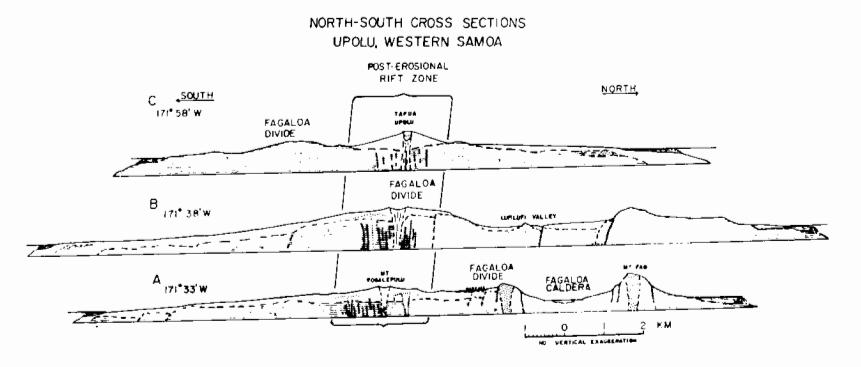

Fig. 10. North-south cross sections, Upolu, Western Samoa. Sub-surface structure is inferred from the geologic map of Kear and Wood (1959) and from figure 3. Cross sections A through C show the relationship of the post-erosional rift zone and lavas to the Fagaloa Divide. Fagaloa shield basalts are striped. Trachyte plugs are shown by irregularly oriented V's, and Fagaloa intracaldera lavas by irregularly oriented dashes. Inferred buried and living reefs are shown at or near the coasts of the island (heavy dots). The Fagaloa Divide, a term coined by Kear and Wood (1959), is the axis of highest elevation on Upolu and is an east-west ridge of older (Fagaloa) shield volcanic rocks.

## ORIGIN OF THE POST-EROSIONAL RIFT ZONE

Hawkins and Natland (1975) suggested that Pacific Plate deformation along the Tonga-Vitiaz trench system was a possible explanation for nearly simultaneous volcanism along about 1500 km of the Samoan chain (Tutuila to the Wallis Islands). Here I wish to concentrate on the eastern end of this system and discuss its effects on the larger Samoan Islands.

For most of its length, the Tonga trench trends slightly east of north, and the Pacific Plate converges on it at a relative rate of about 11 cm/yr (Sclater and others, 1971). South of Savai'i and Upolu, however, the axis of the trench swings from this near-northerly trend to about 290°, a trend nearly parallel to the direction of the Pacific Plate with respect to the Tongan arc (figs. 1 and 2). These directions are both nearly parallel to the direction of the Samoan post-erosional rift zone. In the terminology of plate tectonics, the Tonga trench here becomes an arc-arc transform fault. But its style of deformation is less one of faulting than of bending. There is no belt of earthquakes along the axis of this part of the trench. Instead, they occur to the south of the trench under the Lau Basin (Barazangi and Isacks, 1971). Faulting of the sea floor between the Samoan Islands and the trench has occurred (see air-gun profiler records in Hawkins and Natland, 1975; Lonsdale, 1975), but the seismicity implies that most of the plate rupturing is occurring beneath the Lau Basin, not at the trench. The Pacific Plate appears to bend laterally into the northwest-trending part of the Tonga trench as it moves past it (fig. 11).

Independent evidence supporting the plate-buckling hypothesis was provided by dredging of a seamount south of Upolu at 15°S, 172°W in 1972 on SIO's Expedition South Tow Leg 9 (Hawkins and Natland, 1975). The seamount sits essentially at the corner of the Tonga trench, where the trench axis curves most sharply to the northwest (fig. 1). The top of the seamount is at 1380 m water depth. The dredged material

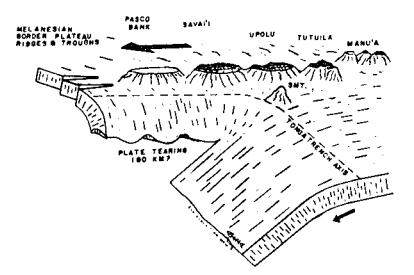

Fig. 11. Diagrammatic cut-away view of the Samoan Islands and Pacific Plate as it is inferred to enter the Tonga trench, showing the lateral bending of the plate along the north-west trending limb of the trench. The Samoan Ridge is built along the axis of this bend into the trench. The stippled zone is the region of faulted and deformed sediments between the Samoan Islands and the trench (from Lonsdale, 1975). The arrows indicate the direction of plate motion and subduction relative to the trench. Islands are shown by ribbed contours. Extinct and submerged reefs are found at Pasco Bank and west of the Manu'a Islands. The seamount (SMT) has submerged over 1 km since about 1 m.y. ago (Hawkins, 1974). Plate thickness and island size are not to scale.

included coral fragments, pieces of pahoehoe, and conglomeratic, cross-bedded lithic-vitric tuffs, all indicating that the seamount was once at or near wave base. A volcanic cobble was dated by K/Ar techniques as 940,000 ± 20,000 yrs old (Hawkins, 1974). About a million years ago, then, the summit of the seamount probably was an island. Hawkins and Natland (1975) considered that relative plate motion would have carried the seamount past the trench with little or no subsidence were it not for lateral buckling of the plate into the northwest-trending part of the Tonga trench. The buckling lowered the depth of the sea floor adjacent to the seamount by nearly a kilometer, accounting for most of its subsidence. Post-glacial rise in sealevel also contributed.

I propose that plate bending provides the principal zone of dilatancy allowing post-erosional lavas a route to the surface. A true-scale cross section across Upolu, the seamount, the Tonga trench, and a portion of the Lau arc (profile F-F' of fig. 1 and of fig. 2 of Hawkins and Natland, 1975) indicates that Upolu presently lies just about where the plate begins to bend laterally into the trench (fig. 12). If the difference between the depth of the sea floor north of Upolu (about 4.5 km) and the depth of the trench on this profile (about 7.5 km) is taken up by bending of the plate about a fulcrum at 100 km depth directly beneath Upolu (an angle of about 0.9°), then the maximum extension at the surface on Upolu is slightly less than 2 km. If the thickness of the plate is less than 100 km (which was taken from the inferred depth of origin of posterosional lavas), or if bending at the base of the plate is more curved, the amount of extension on Upolu should be less. From figure 3, the placement of post-erosional vents on eastern Upolu through the late Pleistocene has been in a belt about 5 km wide, but most of the vents are clearly in a narrower belt about 2 km wide. The width of the posterosional rift zone is thus in good agreement with the amount of crustal extension that can be inferred from plate bending on the basis of bathymetry. Moreover, because of plate bending, alignment of the posterosional rift will be in the direction of maximum principal stress, that is, parallel to the direction of plate motion (Nakamura, 1977). The

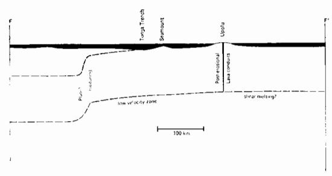

Fig. 12. True scale cross section of F-F' of figure 1 (from figure 2 of Hawkins and Natland, 1975). The Pacific Plate has bent laterally about 3 km between Upolu and the Tonga trench, allowing a maximum of 2 km of extension for the post-erosional rift zone on Upolu, assuming a plate thickness of 100 km (see text).

thickening of the post-erosional lava pile on Savai'i is then the result of continued volcanism along the western part of the post-erosional rift as it propagates eastward in response to plate bending.

Is plate bending somehow responsible for the production of posterosional melts? Several workers have suggested that the base of the lithosphere corresponds to a low-velocity zone resulting from small degrees of partial melting in a slightly hydrous mantle (Kushiro, 1969; Green, 1969; 1971; Wyllie, 1971). If this is so, then the Samoan posterosional rift zone can be tapping a zone of preexisting melt. Lithospheric flexure would serve to collect and channel partial melts to the surface but would have no fundamental role in their origin.

Shaw (1973) proposed, however, that linear island chain volcanism is a consequence of melting in response to differential shear in the mantle, whether that shear resulted from vertical or horizontal motions in the asthenosphere. The zone of greatest differential stress, he argued, is that between the moving lithospheric plates and the more rheid asthenosphere. In the plate-bending model presented here, in addition to the vertical shear gradient (between lithosphere and asthenosphere), there also should be a lateral gradient in shear (increasing toward the Tonga trench) where plate bending is most pronounced. Plate motion also requires that the hinge line of buckling be pushed (or pulled) along its length. Shear stresses will thus be unusually concentrated beneath the zone of greatest potential lithospheric dilatancy. Shear melting is therefore a plausible explanation for Samoan post-erosional volcanism.

## ORIGIN OF SAMOAN SHIELD VOLCANOES

Using estimated age ranges for Tau (<0.5 m.y.), Tutuila (0.7 to 1.6 m.y.), and Upolu (mostly >1.6 m.y.) shield volcanoes, inferred largely from Tarling's (1966) paleomagnetic data, the rate of progression of Samoan shield volcanoes crudely matches the plate convergence rate at the Tonga trench (11 cm/yr). Samoan shield volcanoes, therefore, appear to have formed to the north and east of the region of pronounced plate bending, probably at least as far away as the present Manu'a group (fig. 2).

Most Samoan shield volcanoes formed in short strings of volcanic centers. Tau, Ofu-Olosega, and a submerged bank west of Ofu-Olosega (fig. 2) form one such string. The shield volcanoes of Tutuila form another. The east-west Fagaloa ridge perhaps forms a third. Other Samoan volcanoes have formed as individual volcanic centers. Examples are the seamount in the Tonga trench south of Upolu, another seamount south of Tutuila (fig. 1), and perhaps isolated banks such as Taviuna (fig. 1) in the Melanesian Border Plateau.

Jackson and Shaw (1975) proposed that the nesting pattern of individual strings of Hawaiian volcanoes reflects the dominant stress field in the Pacific Plate beneath the Hawaiian chain. They suggested that the stress field is induced by the geometry of subduction in the northern and western Pacific. The strings of Hawaiian volcanoes all trend to the southeast, with marked hooks to the south (Jackson, Silver, and Dalrymple,

1972; Shaw, Jackson, and Bargar, 1980). But in the Samoan chain, the island of Tutuila is a short string of volcanoes trending to the north of east. If the Jackson-Shaw hypothesis is correct, then Tutuila could represent a short episode of local compression of the underlying lithosphere toward the corner of the Tonga trench. Alignment of rifts would be in the direction of maximum principal stress (Nakamura, 1977), that is, in the direction of the compression.

Samoan volcanic strings and individual centers are petrologically diverse. In addition to the contrasting lineages of Tutuila and the Fagaloa volcano of Upolu, a third strongly alkalic lineage (from olivine nephelinite to phonolite) occurs on the seamount that has dropped into the Tonga trench (Hawkins, 1974; Hawkins and Natland, 1975). The lineages imply differences in the extent of melting and in the probable depth of melting of inferred mafic parents, as previously explained.

Samoan central volcanoes thus have neither structural nor petrologic coherence. They contrast in this with volcanoes of other Pacific chains as diverse as the massive Hawaiian chain, with its strings of nested, primarily tholeiitic shield volcanoes, and the smaller Society chain, which has individual centers with radial dikes and consistently strongly alkalic basalts and differentiated lavas (Duncan and McDougall, 1976; Williams, 1933; McBirney and Aoki, 1968).

It is perhaps a personal impression, but one worth stating, to say that Samoan structural and petrologic diversity is somehow atypical of Pacific linear island chains. The diverse volume of lavas along the chain in strings of volcanoes and individual centers, the scattered placement of volcanoes, and inferred differences in the depth and extent of melting of parental magmas all imply an episodic and comparatively incoherent pattern of melting in the mantle. It is not possible to be very conclusive about the causes of this diversity, but I believe that Samoan shield volcanoes and submerged central volcanoes probably result from thermalconvective disturbances within the asthenosphere, caused by the complex pattern of subduction at the "corner" of the Tonga trench. The diversity would be a consequence of the generally "turbulent" nature of this process. Alternatively, but in my view less likely, a thermal perturbation of deeper origin (such as a plume) could fortuitously impinge on the base of the Pacific Plate at this peculiar location and be disturbed by the subduction process. The post-erosional volcanic rift zone, however, implies that plumes are unnecessary to produce either large volumes of lavas or strongly undepleted, radiogenic lavas in the Samoan chain. There is no petrologic reason, therefore, to suggest a plume origin for Samoan shield volcanoes.

#### ACKNOWLEDGMENTS

This work represents a portion of a doctoral dissertation completed at the University of California, San Diego (Scripps Institution of Ocean-ography). I am particularly indebted to my thesis advisor, Dr. J. W. Hawkins, for constant encouragement, many stimulating discussions, and other more tangible forms of support during the course of the study.

Conversations with D. A. Clague, E. D. Jackson, E. L. Winterer, A. E. J. Engel, and P. F. Lonsdale were very helpful during the early stages of this work. The manuscript was considerably improved by reviews of a first draft by J. W. Hawkins, Jr., R. J. Kirkpatrick, H.-U. Schmincke, and an anonymous reviewer. This work was supported by a National Science Foundation Grant GA-33227 to J. W. Hawkins, Jr., a Kennecott Copper student research fellowship to the author, and the SIO Analytical Facility under the direction of R. T. LaBorde. Thanks also to Roy and Betty DeHaven who prepared the many thin sections used in this study and to Philip Müller and the Tyrone Schwalger family for assistance during my field work in Western Samoa.

#### REFERENCES

- Akella, J., and Boyd, F. R., 1972, Partitioning of Ti and Al and its bearing on the origin of Mare basalts: Carnegie Inst. Washington Year Book 72, p. 623-629.
- Barazangi, M., and Isacks, B., 1971, Lateral variation of seismic-wave attenuation in the upper mantle above the inclined earthquake zone of the Tonga Island arc: deep anomaly in the mantle: Jour. Geophys. Research, v. 76, p. 8493-8515.
- deep anomaly in the mantle: Jour. Geophys. Research, v. 76, p. 8493-8515.

  Beeson, M. H., 1976, Petrology, mineralogy and geochemistry of the East Molokai volcanic series, Hawaii: U.S. Geol. Survey Prof. Paper 961, 53 p.
- Brooks, C., Hart, S. R., Hofmann, A., and James, D. E., 1976, Rb-Sr mantle isochrons from oceanic regions: Earth Planetary Sci. Letters, v. 32, p. 51-61.
- Chamberlin, R. T., 1924, The geological interpretation of the coral reefs of Tutuila, American Samoa, Papers from the Dept. of Marine Biology: Carnegie Inst. Washington Pub. 341, v. 19 (Mayor v.), p. 145-178.
- Chubb, L. J., 1957, The pattern of some Pacific island chains: Geol. Mag., v. 94, p. 221-228.
- Daly, R. A., 1924, The geology of American Samoa: Carnegie Inst. Washington Pub. 340, p. 95-145.
- Dana, J. D., 1849, U.S. Exploring expedition during the years 1838-1842 under command of Charles Wilkes, U.S.N.: Geology, v. 10, 307-336
- of Charles Wilkes, U.S.N.: Geology, v. 10, 307-336.

  Delaney, J. R., Colony, W. E., Gerlach, T. M., and Nordlie, B. E., 1973, Geology of the Volcan Chico area on Sierra Negra volcano, Galapagos Islands: Geol. Soc. America Bull., v. 84, p. 2455-2470.
- Duncan, R. A., and McDougall, I., 1976, Linear volcanism in French Polynesia: Jour. Volcan. Geotherm. Research, v. 1, p. 197-227.
- Fairbridge, R. W., and Stewart, H. B., 1960, Alexa Bank, a drowned atoll in the Melanesian border plateau: Deep-Sea Research, v. 7, p. 100-116.
- Fiske, R. F., and Jackson, E. D., 1972, Orientation and growth of Hawaiian volcanic rifts: the effect of regional structure and gravitational stresses: Royal Soc. London Proc., A, v, 320, p. 299-326.
- Proc., A, v. 320, p. 299-326.

  Fodor, R. V., Keil, K., and Bunch, T. E., 1975, Contributions to the mineral chemistry of Hawaiian Rocks, IV: Pyroxenes in rocks from Haleakala and West Maui volcanoes, Maui, Hawaii: Contr. Mineralogy Petrology, v. 50, p. 173-195.
- Green, D. H., 1969, The origin of basaltic and nephelinitic magmas in the earth's mantle: Tectonophysics, v. 7, p. 409-422.
- ——————————————————————————————————————
- Hawkins, J. W., Jr., 1974, Petrology of a differentiated alkalic rock series from a seamount near the Tonga Trench [abs.]: Geol. Soc. America Abs. with Programs, v. 6, no. 3, p. 189.
- Hawkins, J. W., and Natland, J. H., 1975, Nephelinites and basanites of the Samoan linear volcanic chain: their possible tectonic significance: Earth Planetary Sci Letters, v. 24, p. 426-439.
- Hedge, C., Peterman, Z., and Dickinson, W., 1972, Petrogenesis of lavas from Western Samoa: Geol. Soc. America Bull., v. 83, p. 2709-2714.
- Hubbard, N. J., 1971, Some chemical features of lavas from the Manu'a Islands, Samoa: Pacific Sci., v. 25, p. 178-187.
- Irvine, T. N., and Baragar, W. R. A., 1971, A guide to the chemical classification of the common igneous rocks: Canadian Jour. Earth Sci., v. 8, p. 523-548.

Jackson, E. D., and Shaw, H. R., 1975, Stress fields in the Pacific plate: delincated in time by linear volcanic chains: Jour. Geophys. Research, v. 80, p. 1861-1874.

Jackson, E. D., Silver, E. A., and Dalrymple, G. B., 1972, Hawaiian-Emperor chain and its relation to Cenozoic circum-Pacific tectonics: Geol. Soc. America Bull., v. 83, p. 601-618.

Jackson, E. D., and Wright, T. L., 1970, Xenoliths in the Honolulu volcanic series, Hawaii: Jour. Petrology, v. 11, p. 405-430. Kear, D., and Wood, B. L., 1959, The geology and hydrology of Western Samoa: New

Zealand Geol. Survey Bull. 63, 92 p.

Kushiro, I., 1969, Composition of magmas formed by partial zone melting of the Earth's upper mantle: Jour. Geophys. Research, v. 73, p. 619-634.

LeBas, M. J., 1962, The role of aluminum in igneous clinopyroxenes with relation to their parentage: Am. Jour. Sci., v. 260, p. 267-288.

Lonsdale, Peter, 1975, Sedimentation and tectonic modification of Samoan archipelagic apron: Am. Assoc. Petroleum Geologists Bull., v. 59, p. 780-798.

Macdonald, G. A., 1944, Petrography of the Samoan Islands: Geol. Soc. America Bull., v. 55, p. 1333-1362.

1945, Petrography of the Wallis Islands: Geol. Soc. America Bull., v. 56, p. 861-872.

1968a, A contribution to the petrology of Tutuila, American Samoa: Sonderdruck aus der geologischen rundschau, Band 57, p. 821-837.

- 1968b, Composition and origin of Hawaiian lavas: Geol. Soc. America Mem. 116, p. 477-522.

Macdonald, G. A., and Abbott, A. T., 1970, Volcanoes in the Sea: Honolulu, Univ. Hawaii Press, 441 p.

Macdonald, G. A., and Katsura, T., 1964, Chemical composition of Hawaiian lavas: Jour. Petrology, v. 5, p. 82-133. MacGregor, I. D., 1969, The system of MgO-SiO2-TiO2 and its bearing on the distri-

bution of TiO2 in basalts: Am. Jour. Sci., v. 267-A (Schairer v.), p. 342-363.

McDougall, Ian, 1964, Potassium-argon ages from lavas of the Hawaiian Islands: Geol. Soc. America Bull., v. 75, p. 107-128. Machesky, L. F., 1965, Gravity relations in American Samoa and the Society Islands:

Pacific Sci., v. 19, p. 367-373.

Mayor, A. G., 1924, Rose Atoll, American Samoa: Carnegie Inst. Washington Pub. 340, p. 73-91.

McBirney, A. R., and Aoki, K., 1968, Petrology of the island of Tahiti: Geol. Soc. America Mem. 116, p. 523-556.

Morgan, W. J., 1972, Deep mantle convection plumes and plate motion: Am. Assoc. Petroleum Geologists Bull., v. 56, p. 203-213.

Nakamura, K., 1977, Volcanoes as a possible indicator of tectonic stress orientationprinciple and proposal: Jour. Volcan. Geotherm. Research, v. 2, p. 1-16.

Natland, J. H., 1974, Geology and tectonics of the Fagaloa shield volcano, island of Upolu, Western Samoa: plate bending, faulting, and possible shear melting north of the Tonga Trench: Geol. Soc. America Abs. with Programs, v. 6, no. 3, p. 226. ms, 1975, Petrologic studies of linear island chains: Part I, The Samoan

Islands; Part 2:, The Line Islands: Ph.D. thesis, Univ. California, San Diego, 384 p. O'Hara, M. J., 1968, The bearing of phase eqilibria studies in synthetic and natural systems on the origin and evolution of basic and ultrabasic rocks: Earth Sci.

Reviews, v. 4, p. 69-133. Sclater, J. G., Hawkins, J. W., Mammerickx, J., and Chase, C. G., 1971, Crustal extension between the Tonga and Lau ridges: petrologic and geophysical evidence: Geol. Soc. America Bull., v. 83, p. 505.

Shaw, H. R., 1973, Mantle convection and volcanic periodicity in the Pacific: evidence from Hawaii: Geol. Soc. America Bull., v. 84, p. 1505-1526.

Shaw, H. R., and Jackson, E. D., 1973, Linear island chains in the Pacific: result of thermal plumes or gravitational anchors?: Jour. Geophys. Research, v. 78, p. 8634-

Shaw, H. R., Jackson, E. D., and Bargar, K. E., 1980, Volcanic periodicity along the Hawaiian-Emperor chain: Am. Jour. Sci., v. 280-A, p. 667-708.

Stearns, H. T., 1940, Four-phase volcanism in Hawaii [abs.]: Geol. Soc. America Bull., v. 51, p. 1947-1948.

- 1944, Geology of the Samoan Islands: Geol. Soc. America Bull., v. 55, p. 1279-1332.

1945, Geology of the Wallis Islands: Geol. Soc. America Bull., v. 56, p. 849-960.

Stice, G. D., 1968, Petrography of the Manu'a Islands, Samoa: Contr. Mineralogy Petrology, v. 19, p. 343-357.

Stice, G. D., and McCoy, F. W., Jr., 1968, The geology of the Manu'a Islands, Samoa: Pacific Sci., v. 22, p. 426-457.

Sykes, L. R., Isacks, B. L., and Oliver, J., 1969, Spatial distribution of deep and shallow earthquakes of small magnitude in the Fiji-Tonga region: Seismol. Soc. America

Bull., v. 59, p. 1092-113. Tarling, D. H., 1966, The paleomagnetism of the Samoan and Tongan Islands: Royal Astron. Soc. Geophys. Jour., v. 10, p. 497-513.

Williams, H., 1933, Geology of Tahiti, Moorea, and Maiao: Honolulu, Bernice P. Bishop Museum Bull. 105, 89 p.

Wilson, J. T., 1963, Evidence from islands on the spreading of the ocean floors: Nature, v. 197, p. 536-538.
Winchell, H., 1947, Honolulu Series, Oahu, Hawaii: Geol. Soc. America Bull., v. 58, p.

1-48.

Wright, T. L., and Fiske, R. S., 1971, Origin of differentiated and hybrid lavas of Kilauea volcano, Hawaii: Jour. Petrology, v. 12, p. 1-65. Wyllie, P. J., 1971, The Dynamic Earth: New York, John Wiley & Sons, 416 p.