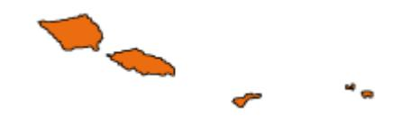
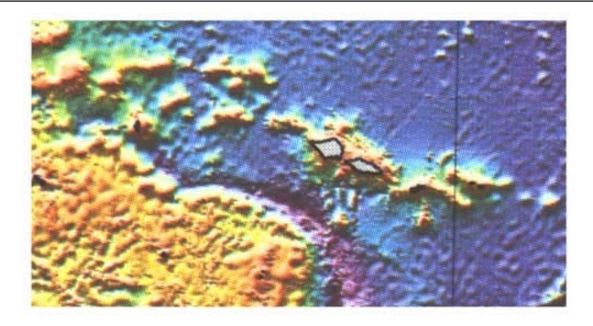
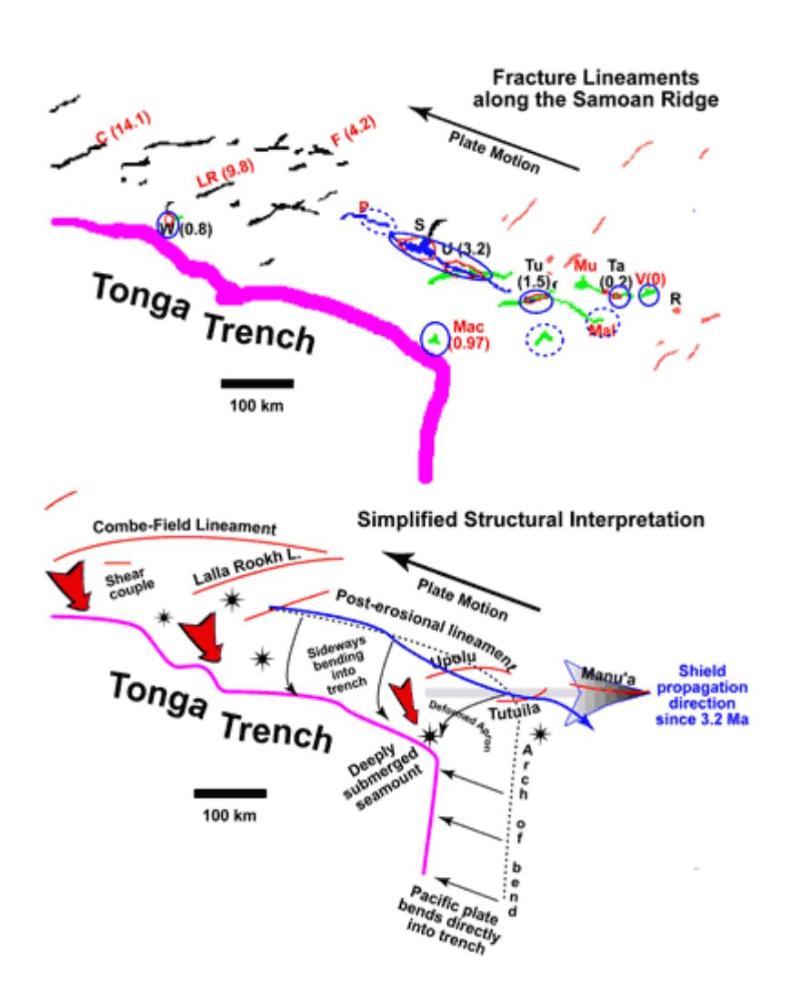
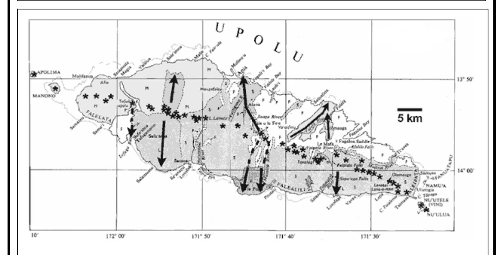
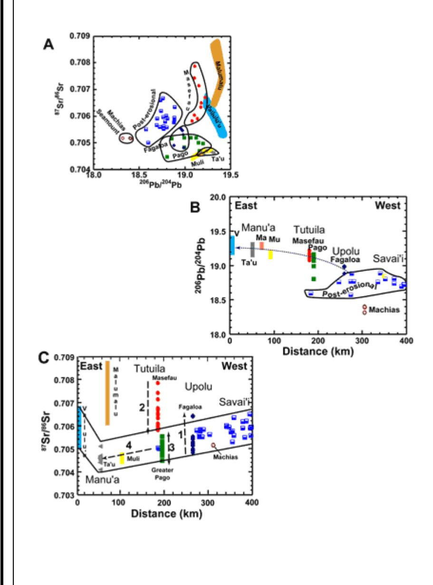
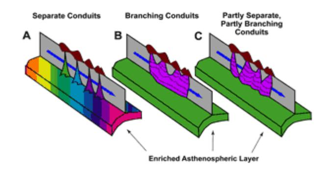
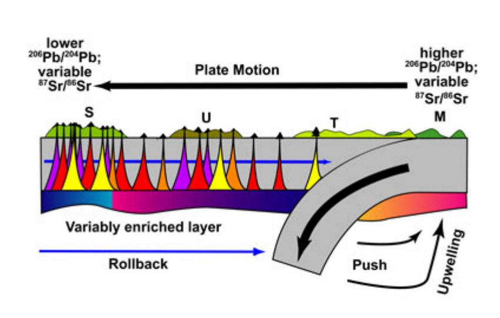

Samoa Page 1 of 10

**Roadmap | Home**

# *Samoa*

## **The Samoan Chain: A Shallow Lithospheric Fracture System**

## **James H. Natland**

*Rosenstiel School of Marine and Atmospheric Science, University of Miami, Miami, FL 33149* 

jnatland@msn.com

## **Abstract**

*Samoan volcanism has occurred mainly along a series of lithospheric fractures that are produced by deformation of the underlying Pacific plate near the Tonga Trench. Most are delineated by aligned volcanic centers 10-50 km apart. The centers coalesce into volcanic ridges that form serially at the eastern end of the chain as the approaching Pacific lithosphere first begins to experience shear stresses near the westward curving corner of the trench. One fracture, the Samoan post-erosional volcanic rift system, is superimposed on at least three of these, has small vents spaced only 1-6 km (average 2 km) apart, has erupted only nephelinite-series mafic lavas, and has been active along a length of > 200 km since the Quaternary. It results from lateral plate bending toward the transform portion of the trench. Although lava compositions systematically are greatly enriched in the radiogenic isotopes of Sr, Nd, and Pb, each lineament is geochemically distinctive. The lavas thus appear to be tapped from a laterally widespread layer of heterogeneously enriched mantle at the base of the lithosphere rather than a geochemically coherent mantle plume.*

## **Introduction**

The following is a shortened version a manuscript by the same title currently in review. First, I consider bathymetry, island geology, and lava geochemistry and present a general description of the patterns and style of volcanism in the Samoan chain. Then I apply simple principles of fracture mechanics to explain that Samoan volcanism results from tapping of a shallow enriched asthenospheric layer through fractures induced by deformation of the Pacific plate near the Tonga Trench (see also Cracks & Stress page).

#### **Bathymetry**

The Samoan linear volcanic chain lies near a portion of the Tonga Trench (Figure 1a). From west to east, the principal islands are Savai`ii, Upolu, Tutuila, Ofu-Olosega and Ta`u (Figure 1b). The Samoan chain has been attributed either to volcanism along a seafloor fracture (*Dana*, 1849; *Kear & Wood*, 1959; *Hawkins & Natland*, 1975; *Natland*, 1980), or to a mantle plume (*Farley et al.*, 1992; *Hart et al.*, 2000; *Courtillot et al.*, 2003). The chain was built in two principal stages:

1) A sequence of shield and associated satellite volcanoes (*Stearns*, 1944), each consisting mainly of alkalic olivine basalt and its differentiates, that are progressively younger toward the east (*Natland*, Samoa Page 2 of 10

1980; *Natland & Turner*, 1985) culminating in the active Vailulu`u (*Hart et al.*, 2000); and

2) A post-erosional succession of nephelinite-series lavas that erupted in substantial volume chiefly from hundreds of cones arrayed along a single rift system trending about 285Ú across the Western Samoan islands of Savai`i and Upolu, and reaching underwater from there to Tutuila (*Stearns*, 1944; *Kear & Wood*, 1959).

*Figure 1a Distribution of volcanic ridges of the Samoan linear volcanic chain north of the westerntrending, transform portion of the Tonga Trench. Bathymetry of the Samoan region shown as shaded relief illuminated from the north. From Smith & Sandwell (1996). Light shading: shallow; dark shading: deep. Islands are outlined with bold lines.*

The eastward progression of shield volcanoes is a continuation of that established for volcanic portions of submerged atolls to the west as far as Combe Bank (Figure 1c), which is dated at 14.1 Ma (*Duncan*, 1985).

An isolated volcano south of Upolu, Machias Seamount, dated radiometrically at 0.97 Ma (*Hawkins & Natland*, 1975), sits precisely at the curving corner of the trench (Figure 1b). Subaerial materials were dredged near its summit, which now is nearly 1 km deep, having subsided that far in < 1 Myr. Between Machias and Tutuila, sediments of the deformed Samoan apron (Figure 1c) are downfaulted toward the trench (*Lonsdale*, 1975). These are consequences Samoa Page 3 of 10

of the very complex subduction geometry around the curving corner of the Tonga Trench. Where the direction of plate motion is directly orthogonal to the trench, the Pacific Plate is subducted in a normal fashion (Figure 1c), and is traceable to depths of about 700 km beneath the Tongan arc and Lau Basin (*Sykes et al.*, 1969; *Barazangi & Isacks*, 1971). But because the northern part of the trench veers to the west, the trench itself becomes a transform boundary, and the Pacific Plate there bends laterally toward it. Beneath the northern Lau Basin, the plate tears apart (*Natland*, 1980; *Millen & Hamburger*, 1998).

*Figures 1b & c*

*b) (Top panel). Crest lines of volcanic ridges in the Samoan region, taken from Figure 1a. Radiometric ages are given in parentheses, from Duncan (1985) and Natland & Turner (1985). Circled locales have had Quaternary-Historic volcanism. Islands and banks are C = Combe Bank; F = Field Bank; LR = Lalla Rookh Bank; W = Wallis Islands; P = Pasco Bank; S = Savai`i Island; U = Upolu Island; T = Tutuila Island; Ta = Ta`u Island; Mac = Machias Seamount; MU = Muli Seamount; Mal = Malumalu Seamount; V = Vailulu`u; R = Rose Islet. Rose is an older volcanic feature not related to Samoan volcanism. c) (Bottom panel). Simplified structural interpretation showing trends of Samoan fracture lineaments in relation to the vector of plate motion and the transition from straightforward subduction along the northerly trending portion of the Tonga Trench, to lateral plate bending and likely shear coupling on the Pacific Plate along the westerly trending transform portion of the Trench. Isolated volcanoes are shown by stars.*

Bathymetry derived from satellite altimetry (Figure 1a) shows that the several seamount ridges of the Samoan chain are 100-250 km long (see scale bar in Figure 1b), but many can clearly be linked end to end as longer curving lineaments that are broken by short gaps. Some of the curving lineaments approach other, and their general concavity is toward the Trench (Figure 1c). The longest curving lineament extends from Combe Bank to Field Bank. Two shorter lineaments, one including Lalla Rookh Bank, are both closer and more strongly inclined to the transform portion of the Tonga trench. At the eastern end of the chain, separate lineaments can be Samoa Page 4 of 10

distinguished for Upolu, Tutuila and the Manu`a Group. Tutuila also curves toward the trench.

The post-erosional rift zone is parallel to the transform portion of the trench. It has possible submarine extensions toward Pasco Bank on the west and Malumalu Seamount to the east, a distance of more than 500 km.

*Figure 2 Summary geologic map of the island of Upolu, modified from Kear & Wood (1959). The overall trend of the island is 290°, parallel to that portion of the post-erosional volcanic rift system that spans the length of the island. Quaternary and younger post-erosional lava flows are shaded, with formation names of Kear & Wood (1959) given by letters S = Salani volcanics; M = Mulifanua volcanics; L = Lefaga volcanics; P = just prehistoric Puapua volcanics. Lavas of the older Fagaloa shield volcano (F) are not shaded. Asterisks give locations of the line of post-erosional cones that delineates the post-erosional rift on this island. Arrows show post-erosional flow directions, each one beginning near the vent from which the lava flows were emitted.*

## **Patterns of Samoan Volcanism**

*Stearns* (1944) attempted to assign his four stages of Hawaiian volcanism (*Stearns*, 1940) to Samoa. However, the two chains differ in important respects. Thus *Stearns* (1944) mapped four shield centers, two with calderas, along the 35-km length of Tutuila. A fifth center, the dike-ridden Masefau complex, is overlain unconformably by younger lavas. The length of the island is about half that of Kilauea's eastern rift on Hawaii, and less than the length of some individual lava flows on Kilauea or Mauna Loa. Centers of shield volcanism on Tutuila thus are greatly compressed physically compared with Hawaii, and they are strongly aligned.

The pattern of closely spaced and aligned centers continues along the Manu`a lineament, northeast of Tutuila. West to east, the lineament comprises four volcanic centers. Muli seamount is 55 km west of two emergent volcanoes at Ofu-Olosega and Ta`u Islands (*Stice & McCoy*, 1968), which are 23 km apart. The active, shallow, submarine volcano, Vailulu`u, is 50 km east of Ta`u.. Ofu-Olosega and Ta`u have coalesced into a single structure at shallow depth, but still have separate summits. Muli and Vailulu`u are linked to the central, larger pair of volcanoes only by deep swales. West of Tutuila, only one other similar volcanic center has been mapped, the Fagaloa shield volcano of Upolu (*Kear & Wood*, 1959; *Natland & Turner*, 1985).

Post-erosional volcanism is quite different. Hundreds of small volcanic cones mark the trace of the Samoan post-erosional rift zone across the islands of Savai`i and Upolu. Most of the rift is only a few Samoa Page 5 of 10

km wide, but it is nearly 200 km long. To the east, it extends under water to Tutuila (*Natland*, 1980). The principal feature of these vents and of all post-erosional eruptions is that the lava did not originate from a central conduit system, nor did it erupt along any secondary rift system supplied from a central conduit, like the Kilauea eastern or southwest rifts (e.g., *Fiske & Jackson*, 1972). Instead, individual eruptions issued from single vents and in scattered fashion from different locations along the rift system. Thus individual cones along the rift system are only a few km apart. On Upolu the average separation of 43 cones spaced over 84 km is 2.0 ± 1.2 km.

#### **Structural Interpretation**

Alignments of volcanoes and subordinate vents have often been described in terms of propagation of fractures in a direction perpendicular to that of least principal stress, in accordance with principles of fracture mechanics (cf. *Lawn & Wilshaw*, 1975; *Atkinson*, 1987). This can either be perpendicular to the direction of tension, as in the flanking rift systems of Hawaiian volcanoes (e.g., *Fiske & Jackson*, 1972), or parallel to the direction of compression, as in Pacific arc systems (*Nakamura*, 1977).

I have described the Samoan post-erosional rift as extending along the crest of a sideways bend of the underlying Pacific Plate toward the Tonga Trench (Figure 1c; *Natland*, 1980). Flexure of the plate toward the trench produces tensional stress across the bend. Therefore the rift system is for the most part orthogonal to the direction of least principal stress, which is toward the transform portion of the Tonga Trench. The stresses that control the location, width, and length of the post-erosional rift zone are within the lithosphere, not the superstructure of the volcanic ridges.

Along the curving older lineaments, the direction of least principal stress must have varied along the length of each, veering from nearly north-south furthest from the trench, thus producing easterlytrending ridges, to northwest closest to the trench, resulting in southwest-trending ridges. I interpret this to mean that the edge of the Pacific Plate was subject to a shear couple that distorted the stress field at the very edge of the Plate. A component of drag is imparted to the Pacific Plate along the transform portion of the trench. Curving tensional gashes thus develop one by one as this portion of the Plate passes the sharply curving corner of the Trench.

In Figure 1c, a dotted line corresponds to the crest of the gravity high that commonly results from plate bending outboard of trenches (e.g., *Caldwell et al.*, 1976). Northward past the corner of the trench, I have curved it toward the west (along the Samoan post-erosional rift system) at the same distance from the trench at all points. This should be the case if the location of the arch is determined by the thickness of the Mesozoic lithosphere in this region, which should be about the same at all points. This projected crest line curves through the island of Tutuila.

The seafloor itself arches gently upward toward the crest from the east (or north, past the corner), and more steeply downward away from it to the west (or south). There is little question, then, that some influence of subduction and plate bending extends as far east as the Manu`a lineament. What happens to the bend as it rounds the curving corner of the trench is no doubt complicated, but subsidence west of the arch is well demonstrated by deformation of the Samoan apron south of Tutuila and the deep, rapid submergence of Machias Seamount. Arcuate volcanic lineaments emanating from the most sharply curving portion of the bend are an expected consequence of the plate deformation occurring in this region.

## **Geochemistry**

Many Samoan shield and post-erosional basalts have 87Sr/86Sr > 0.705, a characteristic of several volcanic chains in Polynesia (*Hedge*, 1978, *Hart*, 1982), and a hallmark of the EMII isotopic signature (*Zindler & Hart*, 1986; *Hofmann*, 1997). At given 87Sr/86Sr, individual lineaments and seamounts such as Machias and Vailulu`u have distinctive 206Pb/204Pb (Figure 2a), with the latter being higher in basalts of the Upolu, Tutuila, and Manu`a lineaments, generally to the east, than in post-erosional lavas, generally to the west (Figure 2b). Lavas from Machias Seamount, the isolated edifice now subsiding rapidly at the curving corner of the Tonga Trench, have the least radiogenic 206Pb/204Pb.

Samoa Page 6 of 10

Among shield volcanoes, temporal changes (*Natland & Turner*, 1985) in expression of the EMII component in lavas are indicated by the numbered arrows in Figure 2c: 1) Upolu (3.2- 1.4 Ma): higher 87Sr/86Sr through time, from shield building to post-shield alkalic stages of volcanism; 2) Tutuila Masefau volcanics (1.53- 1.29 Ma): a maximum of 87Sr/86Sr at the beginning, diminishing sporadically, until eruption of 3) Greater Pago volcanic series (1.29-1.0 Ma), abruptly lower 87Sr/86Sr. East of Tutuila, lavas of 4) Muli and Ta`u volcanoes of the Manu`a lineament have 87Sr/86Sr as low or lower than lavas of Tutuila. Vailulu`u, however, has a stronger EMII signature than the other volcanoes of the Manu`a lineament. Malumalu seamount lies at the eastern end of a ridge that may be an extension of the posterosional volcanic rift zone. Its range of 87Sr/86Sr is the highest yet found among Samoan lavas, including those of the post-erosional rift zone, from which it differs in 206Pb/204Pb as well.

In summary, no systematic changes in isotopic composition can be traced through similar lava successions on different islands. Neither the post-erosional volcanic rift zone nor the grouped lineaments of Upolu, Tutuila, and Manu`a are consistent isotopically over their entire lengths. This is very different from the systematic trends toward more depleted compositions documented for several Hawaiian volcanic successions (e.g., *Feigenson et al.*, 1983; *Chen & Frey*, 1983; *Mukhopadhyay et al.*, 2003).

## **A Chemically Heterogeneous Source Layer beneath the Lithosphere**

The great distances over which distinctive lavas have simultaneously been tapped Samoa Page 7 of 10

since the Quaternary suggest that the uppermost asthenosphere is laterally enriched along the entire length of the chain. The simplest possibility is that everywhere beneath Samoa the shallow asthenosphere harbors an enriched layer of readily fusible mantle material. Wherever a deep fracture penetrates the lithosphere, enriched lavas erupt; what erupts is what each fracture encounters.

*Lineaments with central volcanoes tapping a layer underneath*

The layer is also variably enriched, especially in constituents of the EMII component such as 87Sr/86Sr. The 206Pb/204Pb signature of each lineament is much more consistent. Nevertheless, 206Pb/204Pb is lower along the western portion of the chain. Thus lineaments that form at the eastern end of the chain with high 206Pb/204Pb are carried by plate motion over mantle with lower 206Pb/204Pb, which shows up in the post-erosional lava succession (Figure 3). The general notion of a shallow enriched asthenospheric layer is in accord with the perisphere concept of *Anderson* (1995).

*Schematic of possible mechanisms of Samoan volcanism*

More complicated geometries might exist. A mantle plume active for at least the past 14 Ma could now be centered beneath Vailulu`u. However, placement of a deep plume (e.g., *Courtillot et al.*, 2003) right at the curving corner of the Tonga Trench must be entirely fortuitous. Alternatively, thermalconvective disturbances triggered by trench rollback and the complex geometry of subduction at the curving corner of the trench may initiate diapirlike uprise of mantle material beneath this part of the Pacific Plate (Figure 3).

Nevertheless, regardless of the depth or mechanism of upwelling, if the entire isotopic signal is contained within an upwelling mass of mantle that penetrates depleted mantle, a complicated form of zoning would still need to be hypothesized in order to account for distinctions in Pb isotopes between shield and post-erosional lavas, and an equally complicated model of sublithospheric dispersal developed in order to explain the long distance over which isotopically distinctive post-erosional lavas have simultaneously erupted.

Tapping of an enriched layer beneath the lithosphere, on the other hand, only requires a mechanism for concentrating enriched mantle at the base of the lithosphere. Perhaps the relatively rigid

Samoa Page 8 of 10

lithosphere simply acts as a permeability barrier. Small-degree partial melts of generally alkalic basaltic character might then derive from a widespread, veined, deeper mantle that is everywhere near its solidus. The melt only needs to ascend buoyantly and concentrate in a layer at the base of the lithosphere.

#### **Comment**

Geochemists now tend to ascribe the various isotopic end-members in ocean-island basalts to materials that must once have been at the Earth's surface. EMI and EMII thus represent varieties of sediment, and HiMu some type of hydrothermally altered ocean crust (*Zindler & Hart*, 1986; *Hofmann*, 1997; *Stracke et al.*, 2003). A plume individually featuring or combining these isotopic characteristics rising from the core-mantle boundary thus represents material that has cycled entirely down through the mantle, and then up again. All these materials originally were hydrous, the sediments in particular being feldspathic and clay-rich. Even if shallow subduction processes squeeze out most of the water (*Dixon et al.*, 2002), the sedimentary components at least are materials that are both never denser than mantle peridotite and which begin to melt at lower temperatures.

What is easier to imagine? Do these materials actually overcome their tendencies to be buoyant and begin to melt, proceed then to the deepest levels of the mantle, and then come all the way back up? Or upon subduction do they simply never get all the way down? Are they instead, in a complicated welter of ever-changing marginal subduction zones like that in the modern Philippine Sea, more usually cut off and abandoned in the shallow mantle, and then caught in collisional sutures? Over geological time, how much subducted ocean crust and affiliated sediment by such means comes to rest for many millions or billions of years in the shallow upper mantle? On achieving ambient mantle temperatures, would such materials then partially melt and supply small, buoyant enriched melt fractions to a layer beneath initially impermeable lithospheric plates passing overhead? Could an ancient region of such trapped or abandoned masses of ocean crust and sediment today show up as a broad, shallow zone of anomalous mantle and provide distinctive isotopic characteristics to seamount and island provinces over a broad area, such as much of Polynesia?

What would distinguish this geophysically from a superplume? Are the plates so rigid that they cannot deform either internally or at their edges, in this way releasing pent-up enriched melt accumulated at their base? Or do they depend for this, and for the enriched material itself, on the separate motive force of a deep mantle plume? At Samoa, why should a plume fortuitously impinge on the lithosphere precisely at the one place in the Pacific Basin where shallow deformation forces acting on the lithosphere are most concentrated, and where everything else around is subsiding?

Finally, if a shallow layered mantle source at Samoa is at all plausible, it has to call into question whether petrologically similar places such as Hawaii, Reunion, Tahiti or the Azores result from any greatly dissimilar process.

## *References*

- z Anderson, D.L., 1995. Lithosphere, asthenosphere, and perisphere. *Rev. Geophys.* **33**: 125- 149.
- z Atkinson, B. K., (Ed.), 1987. *Fracture Mechanics of Rocks*: San Diego, CA (Academic Press).
- z Barazangi, M., and Isacks, B., 1971. Lateral variation of seismic-wave attenuation in the upper mantle above the inclined earthquake zone of the Tonga Island arc: deep anomaly in the mantle. *J. Geophys. Res.*, **76**: 8493-8515.
- z Caldwell, J.G., Haxby, W.F., Karig, D.E., and Turcotte, D.L., 1976. On the applicability of a universal elastic trench profile. *Earth Planet. Sci. Lett.*, **31**: 239-246.
- z Chen, C.-Y., and Frey, F.A., 1983. Origin of Hawaiian tholeiite and alkalic basalt. *Nature*, **302**: 785-789.
- z Courtillot, V., A. Davaillie, J. Besse, and J. Stock, 2003. Three distinct types of hotspots in the Earth's mantle, *Earth planet. Sci. Lett.*, **205**: 295-308.

Samoa Page 9 of 10

z Dana, J.D., 1849. *U.S. Exploring Expedition during the years 1838-1842 under the command of Charles Wilkes, U.S.N.*, *Geology*, **10**: 307-336.

- z Dixon, J.E., Leist, L., Langmuir, C., and Schilling, J.-G., 2002. Recycled dehydrated lithosphere observed in plume-influenced mid-ocean-ridge basalt. *Nature* **420**: 385-389
- z Duncan, R.A., 1985. Radiometric ages from volcanic rocks along the New Hebrides-Samoa lineament. In Brocher, T.M. (ed.), Investigations of the Northern Melanesian Borderland, Circum- Pacific Council for Energy and Mineral Resources Earth Sci. Ser., **3**: 67-76.
- z Farley, K.A., Natland, J.H., and Craig, H., 1992. Binary mixing of enriched and undegassed (primitive?) mantle components in lavas from Tutuila, American Samoa. *Earth Planet. Sci. Lett.*, **111:**183-199.
- z Fiske, R.F, and Jackson, E.D., 1972. Orientation and growth of Hawaiian volcanic rifts: the effect of regional structure and gravitational stresses. *Proc. Royal Soc. (Lond.), A*, **329**: 299- 326.
- z Feigenson, M.D., Hofmann, A.W., and Spera, F.J., 1983. Case studies on the origin of basalt, II. The transition from tholeiitic to alkalic volcanism on Kohala volcano, Hawaii. *Cont. Min. Pet.*, **84**: 390-405.
- z Hart, S.R., 1982. A large-scale isotope anomaly in the southern Hemisphere mantle. *Nature*, **309**: 753-757.
- z Hart, S.R., Staudigel, H., Blusztajn, J., Baker, E.T., Workman, R., Jackson, M., Hauri, E., Kurz, M., Sims, K., Fornari, D., Saal, A., and Lyons, S., 2000. Vailulu`u undersea volcano: the new Samoa, *Geochem, Geophys. Geosyst.*, **1**: 2000GC000108, 1-13.
- z Hawkins, J.W., Jr., and Natland, J.H., 1975. Nephelinites and basanites of the Samoan linear volcanic chain: their possible tectonic significance. *Earth Planet. Sci. Lett.* **24**: 427-439.
- z Hedge, C., 1978. Strontium isotopes in basalts from the Pacific Ocean basin. *Earth Planet. Sci. Lett.*, **38**: 88-94.
- z Hofmann, A.W., 1997. Mantle geochemistry: the message from oceanic volcanism. *Nature*, **385**: 219-229.
- z Kear, D., and Wood, B.L., 1959. The geology and hydrology of Western Samoa. *N. Zeal. Geol. Surv. Bull.*, **63**.
- z Lawn, B.R., and Wilshaw, T.R., 1975. *Fracture of Brittle Solids*: New York (Cambridge University Press).
- z Lonsdale, P., 1975. Sedimentation and tectonic modification of the Samoan archipelagic apron. *Bull. Am. Assoc. Petrol. Geol.*, **59**: 780-798.
- z Millen, D.W., and Hamburger, M.W., 1998. Seismological evidence for tearing of the Pacific plate at the northern termination of the Tonga subduction zone. *Geology*, **26**: 659-662.
- z Mukhopadhyay, S., Lassiter, J.C., Farley, K.A., and Bogue, S.W., 2003. Geochemistry of Kauai shield-stage lavas: Implications for the chemical evolution of the Hawaiian plume. *Geochem. Geophys. Geosyst.*, **4(1)**: 1009, doi:10.1029/2002GC000342, 1-32.
- z Nakamura, K., 1977. Volcanoes as a possible indicator of tectonic stress orientation: principle and proposal. *J. Volcanol. Geotherm. Res.*, **2**: 1-16.
- z Natland, J.H., 1980. The progression of volcanism in the Samoan linear volcanic chain. *Am. J. Sci.*, **280A** (Jackson Volume), 709-735.
- z Natland, J.H., and Turner, D.L., 1985. Age progression and petrological development of Samoan shield volcanoes: evidence from K-Ar ages, lava compositions, and mineral studies. *In*  Brocher, T.M. (ed.), *Investigations of the Northern Melanesian Borderland, Circum-Pacific Council for Energy and Mineral Resources Earth Sci. Ser.,* **3**: 139-171.
- z Smith, W.H.F., and Sandwell, D., 1996. Predicted bathymetry. New global seafloor topography

Samoa Page 10 of 10

from satellite altimetry. *Eos, Trans. Amer. Geophys. Union,* **46**: 315.

- z Stearns, H.T., 1940. Four-phase volcanism in Hawaii (abs.), *Geol. Soc. Am. Bull.* **55**: 1947- 1948.
- z Stearns, H.T., 1944. Geology of the Samoan Islands. *Geol. Soc. Am. Bull.,* **55**: 1279-1332
- z Stice, G.D., and McCoy, F.W., Jr., 1968. The geology of the Manu`a Islands, Samoa. *Pac. Sci.*, **22**: 426-457.
- z Stracke, A., Bizimus, M., and Salters, V.J.M., 2003. Recycling oceanic crust: quantitative constraints. *Geochem. Geophys. Geosyst.,* **4(3)**: 8003, 10:1029/2001GC000223.
- z Sykes, L., Isacks, B., and Oliver, J., 1969. Spatial distribution of deep and shallow earthquakes of small magnitude in the Fiji-Tonga region. *Seismol. Soc. Amer. Bull.,* **59**:1093-1113.
- z Zindler, A., and Hart, S.R., 1986. Chemical geodynamics. *Ann. Rev. Earth Planet. Sci.*, **14**: 493-571.

**:: HOME :: MECHANISMS :: LOCALITIES :: GENERIC ::** 

© MantlePlumes.org