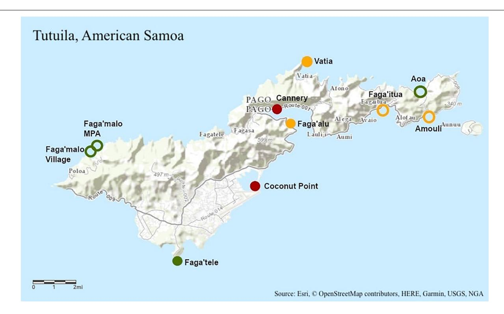
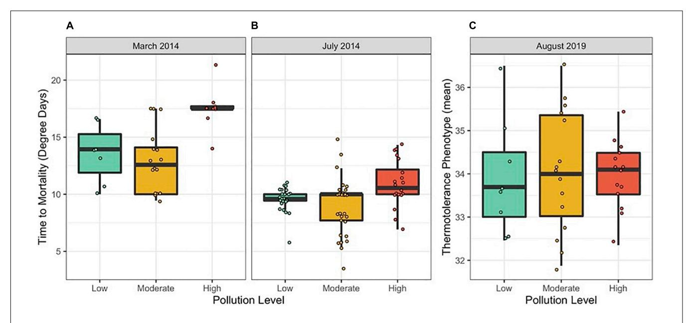
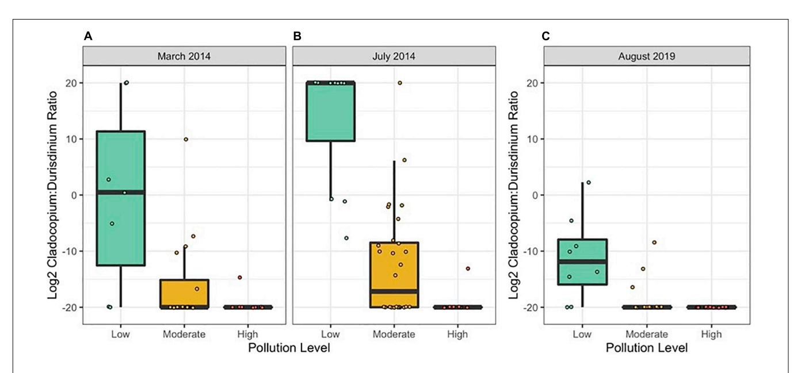
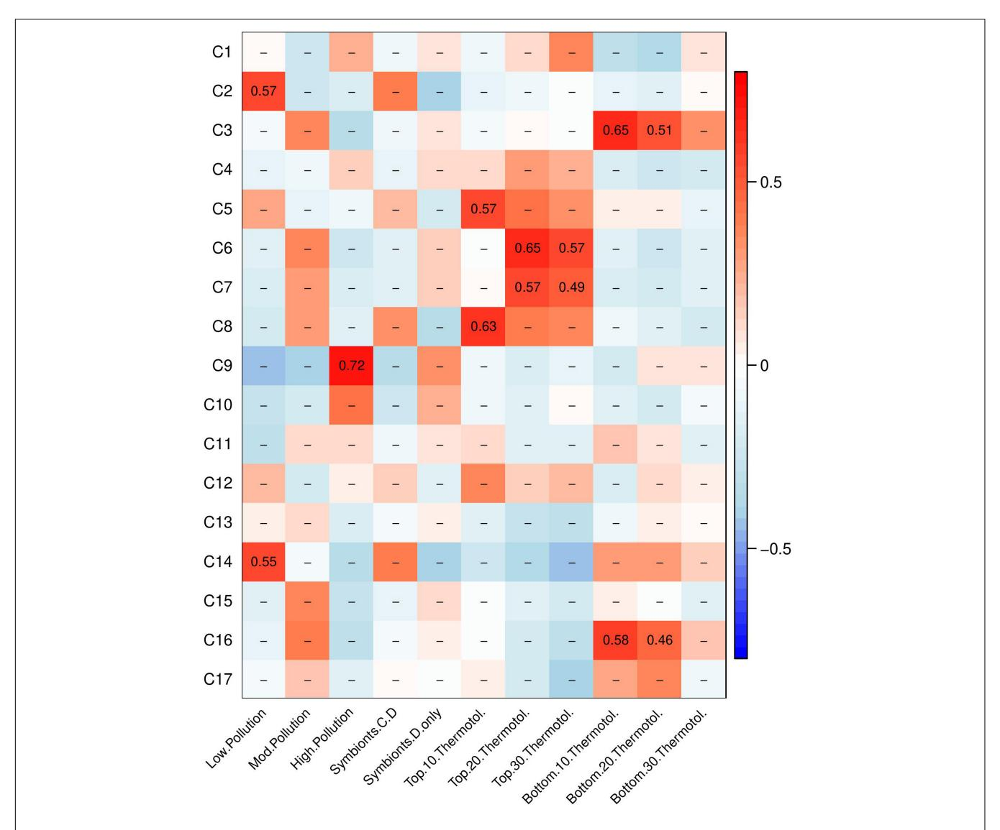
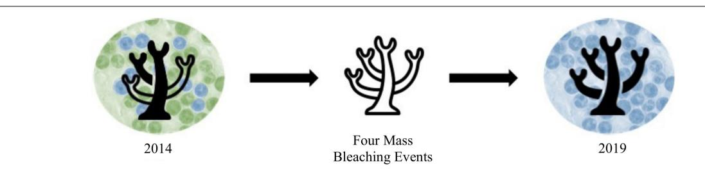

# Variation in Coral Thermotolerance [Across a Pollution Gradient Erodes](https://www.frontiersin.org/articles/10.3389/fmars.2021.760891/full) as Coral Symbionts Shift to More Heat-Tolerant Genera

Melissa S. Naugle1,2 \*, Thomas A. Oliver3 , Daniel J. Barshis4 , Ruth D. Gates5† and Cheryl A. Logan1

1 Department of Marine Science, California State University, Monterey Bay, Seaside, CA, United States, 2 Moss Landing Marine Laboratories, Moss Landing, CA, United States, 3 National Oceanic and Atmospheric Administration, Pacific Island Fisheries Science Center, Honolulu, HI, United States, 4 Department of Biological Sciences, Old Dominion University, Norfolk, VA, United States, 5 Hawai'i Institute of Marine Biology, University of Hawai'i at Manoa, K ¯ ane'ohe, HI, United States ¯

#### Edited by:

Jose M. Eirin-Lopez, Florida International University, United States

#### Reviewed by:

Noah Rose, Princeton University, United States Noriyuki Satoh, Okinawa Institute of Science and Technology Graduate University, Japan

#### \*Correspondence:

Melissa S. Naugle mnaugle@csumb.edu

†Deceased

#### Specialty section:

This article was submitted to Global Change and the Future Ocean, a section of the journal Frontiers in Marine Science

> Received: 19 August 2021 Accepted: 20 October 2021 Published: 18 November 2021

#### Citation:

Naugle MS, Oliver TA, Barshis DJ, Gates RD and Logan CA (2021) Variation in Coral Thermotolerance Across a Pollution Gradient Erodes as Coral Symbionts Shift to More Heat-Tolerant Genera. Front. Mar. Sci. 8:760891. doi: [10.3389/fmars.2021.760891](https://doi.org/10.3389/fmars.2021.760891) Phenotypic plasticity is one mechanism whereby species may cope with stressful environmental changes associated with climate change. Reef building corals present a good model for studying phenotypic plasticity because they have experienced rapid climate-driven declines in recent decades (within a single generation of many corals), often with differential survival among individuals during heat stress. Underlying differences in thermotolerance may be driven by differences in baseline levels of environmental stress, including pollution stress. To examine this possibility, acute heat stress experiments were conducted on Acropora hyacinthus from 10 sites around Tutuila, American Samoa with differing nutrient pollution impact. A threshold-based heat stress assay was conducted in 2014 and a ramp-hold based assay was conducted in 2019. Bleaching responses were measured by assessing color paling. Endosymbiont community composition was assessed at each site using quantitative PCR. RNA sequencing was used to compare differences in coral gene expression patterns prior to and during heat stress in 2019. In 2014, thermotolerance varied among sites, with polluted sites holding more thermotolerant corals. These differences in thermotolerance correlated with differences in symbiont communities, with higher proportions of heattolerant Durusdinium found in more polluted sites. By 2019, thermotolerance varied less among sites, with no clear trend by pollution level. This coincided with a shift toward Durusdinium across all sites, reducing symbiont community differences seen in 2014. While pollution and symbiont community no longer could explain variation in thermotolerance by 2019, gene expression patterns at baseline levels could be used to predict thermotolerance thresholds. These patterns suggest that the mechanisms underlying thermotolerance shifted between 2014 and 2019, though it is possible trends may have also been affected by methodological differences between heat stress assays. This study documents a shift in symbiont community over time and captures potential implications of that shift, including how it affects variation in thermotolerance among neighboring reefs. This work also highlights how gene expression patterns could help identify heat-tolerant corals in a future where most corals are dominated by Durusdinium and symbiont-driven thermotolerance has reached an upper limit.

Keywords: coral reefs, pollution, gene expression, symbiosis, phenotypic plasticity, climate change, thermal tolerance, acclimatization

#### INTRODUCTION

Anthropogenic climate change presents a bleak future for many species with major declines in global biodiversity projected [\(Bellard et al.,](#page-13-0) [2012\)](#page-13-0). Rising global temperatures and other changing environmental conditions are predicted to push many species past their physiological tolerance limits [\(Somero,](#page-15-0) [2010\)](#page-15-0). An important, yet often overlooked component of projecting the effects of climate change on species persistence is estimating both a taxa's thermal threshold for physiological stress, and its capacity for acclimatization [\(Seebacher et al.,](#page-14-0) [2015\)](#page-14-0).

Reef building corals present a good model for studying withingeneration acclimatization processes (i.e., phenotypic plasticity) because they are sessile and long-lived, and have experienced rapid climate-driven declines in the past two decades, often with differential survival among individuals [\(Marshall and](#page-14-1) [Baird,](#page-14-1) [2000;](#page-14-1) [West and Salm,](#page-15-1) [2003;](#page-15-1) [Hughes et al.,](#page-14-2) [2017\)](#page-14-2). These differences may be driven by microenvironmental differences, genetics, or phenotypic plasticity. Since corals have high specieslevel and individual-level differences in thermotolerance (e.g., [Fuller et al.,](#page-13-1) [2020;](#page-13-1) [Loya et al.,](#page-14-3) [2001\)](#page-14-3), they are good candidates for studies investigating plastic responses to climate change.

Acclimatization processes can occur at multiple levels within a coral "holobiont." A coral holobiont is the coral animal plus all of the associated microorganisms and symbiotic algae that live on and within the coral tissue [\(Rohwer et al.,](#page-14-4) [2002\)](#page-14-4). Plasticity can occur within the coral animal itself (e.g., gene expression shifts to increase heat shock proteins or antioxidants during thermal stress; [Dixon et al.,](#page-13-2) [2020\)](#page-13-2), or within the members of the coral holobiont community that contribute to coral thermotolerance (e.g., endosymbiont shifts toward more heattolerant species or "symbiont shuffling"; [Berkelmans and van](#page-13-3) [Oppen,](#page-13-3) [2006\)](#page-13-3). Symbiont shuffling may increase thermotolerance when there is a change in the proportions of different genera within the Symbiodiniaceae family, often seen as an increase in the proportion of heat-tolerant Durusdinium [\(Berkelmans and](#page-13-3) [van Oppen,](#page-13-3) [2006;](#page-13-3) [Stat and Gates,](#page-15-2) [2011;](#page-15-2) [Ladner et al.,](#page-14-5) [2012;](#page-14-5) [LaJeunesse et al.,](#page-14-6) [2018\)](#page-14-6). Gene expression shifts and symbiont shuffling may increase thermotolerance, but there are limits to that increase. Once symbiont shuffling has occurred and corals host entirely one species/strain of symbiont, they may have maximized their ability to improve their symbiont-driven thermotolerance [\(Howells et al.,](#page-14-7) [2020\)](#page-14-7). While other plasticity processes exist (e.g., transgenerational plasticity; [Putnam and](#page-14-8) [Gates,](#page-14-8) [2015\)](#page-14-8), gene expression shifts and symbiont shuffling are well-studied mechanisms by which corals are known to adjust their thermotolerance within the lifetime of an individual [\(Berkelmans and van Oppen,](#page-13-3) [2006;](#page-13-3) [Bellantuono et al.,](#page-13-4) [2012\)](#page-13-4) and are the focus of this study.

While gene expression shifts and symbiont shuffling have been examined in response to temperature stress, fewer studies have investigated how these processes respond when temperature stress interacts with local stressors such as pollution. Landbased pollution can carry nutrients and sediments into marine environments, affecting corals and their symbionts [\(Silbiger et al.,](#page-15-3) [2018\)](#page-15-3). There have been multiple accounts of elevated nutrients lowering thermotolerance [\(Wooldridge,](#page-15-4) [2009;](#page-15-4) [Wiedenmann](#page-15-5) [et al.,](#page-15-5) [2013;](#page-15-5) [Donovan et al.,](#page-13-5) [2020\)](#page-13-5) or conversely improving thermotolerance [\(Béraud et al.,](#page-13-6) [2013;](#page-13-6) [Zhou et al.,](#page-15-6) [2017;](#page-15-6) [Riegl et al.,](#page-14-9) [2019;](#page-14-9) [Becker et al.,](#page-13-7) [2021\)](#page-13-7). These discrepancies may be partially explained by differences in nutrient type or ratios among nutrient concentrations [\(Morris et al.,](#page-14-10) [2019;](#page-14-10) [Burkepile et al.,](#page-13-8) [2020\)](#page-13-8). While the effects of nutrient pollution have been investigated in lab-controlled studies, there are fewer instances of field-based assessments of pollution and thermotolerance [\(Wooldridge,](#page-15-4) [2009;](#page-15-4) [Becker and Silbiger,](#page-13-9) [2020;](#page-13-9) [Becker et al.,](#page-13-7) [2021\)](#page-13-7). Recent fieldbased studies of how pollution impacts thermotolerance have not explored underlying mechanisms such as symbiont shifts and coral host gene expression [\(Becker and Silbiger,](#page-13-9) [2020;](#page-13-9) [Becker](#page-13-7) [et al.,](#page-13-7) [2021\)](#page-13-7).

Long-term pollution stress could increase or decrease coral thermotolerance to acute heat stress. When corals are exposed to multiple stressors, many studies have shown synergistic effects, whereby the cumulative effect of two stressors is greater than each stressor independently [\(Kersting et al.,](#page-14-11) [2015;](#page-14-11) [Towle et al.,](#page-15-7) [2016;](#page-15-7) [Ellis et al.,](#page-13-10) [2019\)](#page-13-10). However, other studies have shown that multiple stressors can produce antagonistic effects in corals, whereby the cumulative effect of two stressors is less than that of each stressor alone [\(Zhou et al.,](#page-15-6) [2017;](#page-15-6) [Marangoni et al.,](#page-14-12) [2019;](#page-14-12) [Darling et al.,](#page-13-11) [2020\)](#page-13-11). Since the cellular stress response (CSR) is similar even for different types of environmental stresses (e.g., [Dixon et al.,](#page-13-2) [2020;](#page-13-2) [Kültz,](#page-14-13) [2020\)](#page-14-13), it is possible that if mild long-term pollution stress triggers macromolecular damage and increases constitutive expression of stress response genes, this could lead to higher thermotolerance during heat stress. This may be due to the "frontloading" of stress response genes in polluted waters, whereby the baseline gene expression more closely resembles CSR gene expression, better preparing the coral to tolerate acute stress [\(Barshis et al.,](#page-13-12) [2013;](#page-13-12) [Thomas et al.,](#page-15-8) [2018\)](#page-15-8). It is also possible that long-term pollution stress has induced symbiont community shifts in favor of more stress-tolerant symbionts, leading to higher thermotolerance [\(LaJeunesse et al.,](#page-14-14) [2010\)](#page-14-14). This concept of increased tolerance to one stressor due to exposure to a different stressor is termed "cross-tolerance"

FIGURE 1 | Topographic map of Tutuila, American Samoa of Tutuila, American Samoa with study site locations labeled. Green represents low pollution, yellow represents moderate pollution, and red represents high pollution. Pollution designations were determined using human population and nutrient loading data [\(DiDonato,](#page-13-13) [2004;](#page-13-13) [Sudek and Lawrence,](#page-15-9) [2017;](#page-15-9) [Shuler et al.,](#page-14-15) [2019;](#page-14-15) [Shuler and Comeros-Raynal,](#page-14-16) [2020\)](#page-14-16). Unfilled circles were sampled only in 2014 and filled in circles were sampled in 2014 and 2019.

and has been demonstrated in many species [\(Li and Hahn,](#page-14-17) [1978;](#page-14-17) [Sabehat et al.,](#page-14-18) [1998;](#page-14-18) [Ely et al.,](#page-13-14) [2014;](#page-13-14) [Gunderson et al.,](#page-13-15) [2016\)](#page-13-15).

In this study, we investigate thermotolerance of a common reef-building coral, Acropora hyacinthus, on reefs of differing pollution levels around the island of Tutuila, American Samoa in 2 years, 5 years apart (2014 and 2019). During this 5 year period, mass bleaching events occurred in 4 of the 5 years on American Samoan coral reefs (**[Supplementary Figure 1](#page-12-0)**, [Witze,](#page-15-10) [2015;](#page-15-10) [Sudek](#page-15-9) [and Lawrence,](#page-15-9) [2017;](#page-15-9) [Morikawa and Palumbi,](#page-14-19) [2019\)](#page-14-19). We also measure two underlying mechanisms of plasticity that may affect thermotolerance: endosymbiont community composition and gene expression shifts. We investigate the role of pollution in triggering these plastic mechanisms and their effect on coral thermotolerance.

#### MATERIALS AND METHODS

### Site Selection and Field Collections

Ten sites of differing pollution levels were chosen to represent a gradient of pollution around Tutuila, American Samoa (**[Figure 1](#page-2-0)**). Sites were categorized as either "low," "moderate," or "high" pollution based on human population and nutrient loading data, following established designations [\(DiDonato,](#page-13-13) [2004;](#page-13-13) [Sudek and Lawrence,](#page-15-9) [2017;](#page-15-9) [Shuler et al.,](#page-14-15) [2019;](#page-14-15) [Shuler](#page-14-16) [and Comeros-Raynal,](#page-14-16) [2020\)](#page-14-16). In March and July 2014, ten colonies of Acropora hyacinthus were sampled at each of ten sites between 07:00 and 11:00 (**[Figure 1](#page-2-0)**). Eight fragments of approximately 2 cm3 were collected haphazardly from each colony, with two replicates processed for genetic sampling (stored in RNA preservation buffer). The remaining six fragments were transported back to our experimental facility (in Vaitogi in March, and Coconut Point in July), and held at 28◦C overnight, with the assay to begin at sunrise the following day. Colonies were sampled at least 10 m apart to reduce the likelihood of sampling clones. All fragments were collected on snorkel and were sampled between 0 and 2 m in depth.

In August 2019, eight colonies of A. hyacinthus were sampled at a subset of five of the original 2014 sites between 07:00 and 11:00 (**[Figure 1](#page-2-0)**). Seventeen fragments of approximately 2 cm3 were collected haphazardly using stainless steel coral cutters from each colony: four replicates for each of four temperature treatments and one field control which was never placed in the temperature stress assay. Colonies were sampled at least 10 m apart to reduce the likelihood of sampling clones. All fragments were collected on snorkel and were sampled between 0 and 2 m in depth.

#### Threshold-Based Heat Stress Assay

Temperature dependent mortality in 2014 was measured using a 3-day threshold-based heat stress assay consisting of a ramp tank and a control. Replicate coral branches (n = 60 per tank, with three replicates of each of 10 colonies from two sites) were allowed to acclimate to tank conditions at 28°C for 16 h. The temperature stress assay began at 06:00, in which the control tank was held at 28°C for the duration of the stress, and the heated tank was brought to 30°C over the course of the first 30 min, and then continuously ramped at 2°C per 12 h during "daylight hours" (06:00-18:00), held overnight at the last ramp value, and then ramped between 06:00 and 18:00 for the following two successive days (Supplementary Figure 2). During daylight hours (06:00-18:00), full spectrum lights were measured using a planar Apogee PAR sensor and maintained at 500  $\mu$ mol m-2 s-1. Partial water changes were performed two times per day over the course of the assay. Water temperatures were controlled using a custom-built Arduino controller linked to aquarium heaters (Finnex HMA-200S Titanium Aquarium Heater) and Nova Tec IceProbe thermoelectric chillers (Nova Tec Products, San Rafael, CA). Water temperatures were measured every minute using HOBO UA-002-64 temperature and light loggers. Temperatures were kept to within 0.5°C of the desired temperature.

Coral color paling was measured every 4 h between 06:00 and 22:00 using the CoralWatch® Coral Health Chart (Siebeck et al., 2006) and was recorded over the course of the assay until fragments experienced mortality, as measured by tissue sloughing. A fragment's thermal threshold of "degree heating days" was calculated as the number of degrees above the local bleaching threshold of 29°C, as reported by NOAA's Coral Reef Watch, multiplied by the number of elapsed days above that threshold until mortality was reached. Data from colonies with controls that experienced mortality throughout the course of the experiment were discarded.

#### Ramp-Hold Heat Stress Assay

Thermal resistance to temperature stress in 2019 was measured using a standardized short-term acute heat stress assay and the Coral Bleaching Autonomous Stress System (CBASS; Voolstra et al., 2020). This approach has been shown to determine differences in coral thermotolerance similarly to a classic longterm heat stress assay (Voolstra et al., 2020; Evensen et al., 2021). We chose to use this 1-day ramp-hold assay in 2019 rather than repeat the 2014-style assay due to the logistical advantage of a 1-day assay and to be more comparable to recent studies using CBASS (Voolstra et al., 2020, 2021; Cunning et al., 2021; Evensen et al., 2021; Savary et al., 2021). This assay consists of four replicate tanks to test three experimental temperature treatments and one control, for a total of eight tanks. The temperature stress assay was conducted at 13:00 for each study site and continued until the following morning at 06:00 (Supplementary Figure 2). Replicate coral branches (n = 16 per tank, with two replicates of each of 8 colonies) were allowed to acclimate to tank conditions at 28°C for 1 h. At 14:00, corals were exposed to ramp-hold: control (28°C), 33°C, 34°C or 35°C during a 2 h ramp, 3 h hold, 1 h ramp down to 28°C, and overnight recovery at 28°C. Light levels were measured using an Apogee underwater quantum meter twice during the assay and maintained between 210 and 250 μmol m-2 s-1. To mimic natural field conditions, lights were turned off at 19:00 and turned on in the morning at 06:00 (Roleadro LED Aquarium Light). Partial water changes (~2 L)

using water from the sampling site were performed 4–5 times over the course of the assay. Water temperatures were controlled using a custom-built Arduino controller linked to aquarium heaters (Finnex HMA-200S Titanium Aquarium Heater) and custom-built cooling loops hooked to a Hamilton Technology Aqua Euro Max Aquarium Chiller. Water temperatures were measured every minute using HOBO UA-002-64 temperature and light loggers. Temperatures were kept to within 0.5°C of the desired temperature.

Thermotolerance was measured through changes in visual color paling using the CoralWatch® Coral Health Chart (Siebeck et al., 2006) with the same observer for all trials and colorimetric analysis using an Olympus TG-5 taken by the same photographer in the same location for all measurements (sensu Winters et al., 2009). A subset of coral fragments (n = 4 per temperature treatment) were collected during heat stress (at 19:00) for RNAseq analysis. Samples were preserved in an RNA preservation buffer and stored at  $-20^{\circ}$ C until analysis, though only the 28 and 35°C treatments were analyzed.

CoralWatch® Color Card and red pixel intensity measurements were used to generate a single metric for thermotolerance for each colony. Raw CoralWatch and red intensity values were normalized in an open interval from 0 to 1 for each temperature treatment from 28 to 35°C. Logistic curves were fit to the data across temperatures and the midpoint of the curves was used as an indication of temperature at which bleaching occurred, with a maximum of 36.5°C if curves did not reach the midpoint by 35°C (using the nlme function in R; Pinheiro et al., 2021). The mean of the two midpoints (CoralWatch and red intensity) was used to generate a two-variable mean threshold, in units of °C. This two-variable mean was used to determine the most and least thermotolerant corals. The highest and lowest 10, 20, and 30% of the two-variable means were used to classify the 10, 20, and 30% least and most thermotolerant corals. All data and code are available at: https://github.com/melissanaugle/SCLERA\_ Tutuila\_Thermotolerance. All analyses were conducted in R version 4.1.0 (R Core Team, 2021).

#### **Quantification of Symbiont Communities**

For symbiont analysis, ten replicates per site were used in 2014 and eight replicates per site were used in 2019. Total genomic DNA was extracted from preserved fragments that had never entered the heat stress assay using a Qiagen DNeasy® Blood and Tissue Kit. Samples were prepared by removing excess buffer and homogenizing in a TissueLyser LT for 5 min at 50 Hz. Total DNA was measured using a NanoDrop spectrophotometer and a Qubit fluorometer. All DNA quantifications met the following criteria:  $> 2 \text{ ng/}\mu\text{l}$  (on Qubit), 260:280 > 1.8, 260:230 > 1.59. Total DNA was prepared for qPCR using methods described in Cunning and Baker (2013) to quantify symbiont communities at each study site. Samples were run in duplicate in 2014 and triplicate in 2019, with a no-template control on a Biorad CFX96 Touch Real-Time PCR Detection System. Reaction volumes were 10 µl, with 5 µl Taqman Genotyping Master Mix and 1 μl genomic DNA template. qPCR analysis uses speciesspecific tags to identify Cladocopium and Durusdinium, which

comprise the majority of the Symbiodiniaceae in American Samoan *Acropora hyacinthus* (Ladner et al., 2012). Since *Durusdinium* are more thermally tolerant than *Cladocopium*, ratios between the two genera provide a metric to understand coral thermotolerance contributed by the symbiont community (Cunning and Baker, 2013).

Ratios of *Cladocopium* to *Durusdinium* cycle threshold (Ct) values were calculated using results from qPCR. Baseline thresholds were chosen for each run to remove background noise. Ct values were recorded for samples that amplified past the threshold in fewer than 40 cycles. Ct values were averaged across duplicates in 2014 and triplicates in 2019 and cell numbers of *Cladocopium* and *Durusdinium* were calculated using the following formula:  $2^{(40-Ct)}/\text{cell}$  copy number (where cell copy number = 9 for *Cladocopium* and 1 for *Durusdinium* (Cunning and Baker, 2013). Log base 2 *Cladocopium* to *Durusdinium* ratios were calculated using the following formula: log2(cell number *Cladocopium*/cell number *Durusdinium*). All data and code are available at: https://github.com/melissanaugle/SCLERA\_Tutuila\_Thermotolerance. All analyses were conducted in R version 4.1.0.

#### **RNA Sequencing**

Due to budget constraints, only the control and highest (28°C and 35°C) temperature treatments were used for mRNA sequencing and gene expression analysis. RNA extraction, cDNA library construction and sequencing were performed in two separate batches: once for Coconut Point, Faga'alu, and Faga'tele in February-March 2020 and again for Cannery and Vatia in March-April 2021. Total RNA was extracted using a Qiagen RNeasy® Plus Mini Kit, following the manufacturer's protocol. Samples were homogenized using a TissueLyser LT for 10 min at 50 Hz in 2020 and for 3 min at 50 Hz in 2021. RNA was assessed using a  $\mathsf{NanoDrop}^{\mathsf{TM}}$  (Thermo Fisher Scientific), Qubit fluorometer and on a BioAnalyzer. 38 cDNA libraries were constructed from 300 ng of total RNA using the NEBNext® Ultra II RNA Library Prep Kit for Illumina® (E7530) with the NEBNext® Poly(A) mRNA Magnetic Isolation Module (E7490). Paired-end libraries were sequenced on a single HiSeq4000 150 bp lane at NovoGene in Davis, CA. Raw data obtained from sequencing was submitted to the NCBI Sequence Read Archive (SRA) database (Bioproject accession: PRJNA762371; SRA accession: SRP339664).

#### **Differential Gene Expression Analysis**

Low quality reads and adapter sequences were discarded using Trimmomatic (Bolger et al., 2014). Trimmomatic parameters were set to remove reads below 25 bp long, leading and trailing bases below quality "5," and reads that did not meet quality standards for a sliding window where in a four base sliding window, the average quality per base drops below a 5. Sequences were also trimmed of adapter sequences including standard Illumina adapters and polyT sequences. Quality of trimmed reads was assessed using FastQC. Sequenced reads were aligned to the reference A. hyacinthus transcriptome described in Barshis et al. (2013) using bowtie2 and counted using

RSEM in UNIX (Li and Dewey, 2011; Langmead and Salzberg, 2012). Out of 33,496 possible contigs, 18,387 were discarded due to low expression, following methods described in Chen et al. (2016), and 15,109 contigs were retained and used for differential gene expression analysis. Gene expression statistical analyses were conducted using edgeR with a FDR of 0.001 and a fourfold change cut-off. A weighted gene co-expression network analysis (WGCNA) was conducted to compare coregulated gene networks and their association with pollution level, symbiont community, and thermotolerance (Langfelder and Horvath, 2008). WGCNA identifies co-expressed gene modules using hierarchical clustering of expression data and relates those modules to sample traits. WGCNA was performed on baseline gene expression from corals at control conditions, and separately on gene expression from corals under heat stress. Gene annotations were acquired from Barshis et al. (2013), and significant WGCNA modules (p < 0.05) were analyzed for enrichment of Biological Processes (BP) Gene Ontology (GO) terms using the GO\_MWU R script (Wright et al., 2015). The GO\_MWU R script uses a Mann-Whitney U-test and tests the kME (module membership score or eigengene-base connectivity) in among-module genes compared to other genes in the transcriptome outside the module to test if genes in the module of interest are significantly enriched (Wright et al., 2015; Huerta-Cepas et al., 2017).

#### Linear Mixed-Effects Models of Thermotolerance

Linear mixed-effects models were used to investigate the role of multiple variables in setting thermotolerance in 2014 and We built and present 5 mixed models, each using colony-level features (e.g., tolerance, symbionts), site-level features (e.g., pollution) or temporal data (e.g., season, year). Each model held Site as a random factor. We specifically model: the correlation of pollution level and season vs. thermal tolerance in 2014, the correlation of pollution and *Cladicopium:Durusdinium* ratio vs. thermal tolerance in 2019; the correlation of year and pollution level vs. *Cladicopium:Durusdinium* ratio; the correlation of pollution level, season, and *Cladicopium:Durusdinium* ratio vs. thermal tolerance in 2014, and the correlation of three eigengene expression modules vs. thermal tolerance in 2019.

To explore the potential for non-linearity, models were first built using a generalized additive model approach using the mgcv package in R (Wood, 2011), but due to minimal evidence of non-linearity, subsequent linear mixed-effects models were built using the lme4 package in R (Bates et al., 2015). Model assumptions were checked using the ggplot2 package in R (Wickham, 2016). Separate models were built for each year when investigating thermotolerance due to the differences in experimental design and thermotolerance metric between 2014 and 2019. To determine the importance of individual variables within each final model, we generated model sets from the final model using all-subsets regression (*dredge* in the package MuMIn), and then small sample size corrected Akaike information criterion (AICc) weight across each parameter (using *importance* in the MuMIn

 $^1 http://www.bioinformatics.babraham.ac.uk/projects/fastqc/\\$ 

FIGURE 2 | Thermotolerance variation among colonies by pollution level in (A) March 2014, (B) July 2014, and (C) August 2019. Thermotolerance was measured as mortality in degree days in 2014 and as a two-variable mean in 2019. Points represent individual colonies and are jittered to prevent overlapping.

package) to generate a relative importance metric, ranging from 0 to 1 [\(Kamil,](#page-14-28) [2020\)](#page-14-28).

In 2014, season, log2 ratio of Cladocopium:Durusdinium, and pollution level were included as explanatory variables of thermotolerance, measured as mortality in degree days, with site was included as a random factor. Model selection was based on AIC.

In 2019, log2 ratio of Cladocopium:Durusdinium, pollution level, and eigengene expression of significant WGCNA modules at baseline conditions (pre-heat stress) were included as explanatory variables of thermotolerance, measured as a two-variable mean value that represented thermotolerance. All data and code are available at: [https://github.com/](https://github.com/melissanaugle/SCLERA_Tutuila_Thermotolerance) [melissanaugle/SCLERA\\_Tutuila\\_Thermotolerance.](https://github.com/melissanaugle/SCLERA_Tutuila_Thermotolerance) All analyses were conducted in R version 4.1.0.

#### RESULTS

#### Thermotolerance Patterns in 2014 and 2019

We compared colony-level coral thermotolerance in March and July 2014 among sites, expressed as time to mortality in degree heating days (**[Figures 2A,B](#page-5-0)**). Thermotolerance varied among sites, with the most thermotolerant corals found at Cannery (high pollution) in March 2014 and Cannery (high pollution), Coconut Point (high pollution), Faga'alu (moderate pollution) and Faga'itua (moderate pollution) in July 2014. The least thermotolerant corals were found at Faga'alu (moderate pollution) and Faga'itua (moderate pollution) in March 2014 and at Amouli (moderate pollution), Aoa (low pollution) and Vatia (moderate pollution) in July 2014. In 2019, thermotolerance

TABLE 1 | ANOVA table from a linear mixed model of thermotolerance in 2014 with site as a random effect and season and pollution category as explanatory variables.

| Variable           | Sum Sq | Num DF | Den DF | F-value | P-value |
|--------------------|--------|--------|--------|---------|---------|
| Season             | 374.50 | 1      | 94.11  | 84.90   | 8.5e-15 |
| Pollution category | 61.04  | 2      | 5.03   | 6.92    | 0.04    |

We show that thermotolerance was higher both in the hotter season (i.e., March) and at sites ranked as high pollution. Marginal R2 = 0.520.

TABLE 2 | Colony-level linear mixed-effects model ANOVA table showing impact of Cladocopium to Durusdinium log2 ratio and pollution category in 2019.

| Variable           | Sum Sq | Mean Sq | Num DF | Den DF | F-value | P-value |
|--------------------|--------|---------|--------|--------|---------|---------|
| Pollution category | 0.40   | 0.20    | 2      | 2.11   | 0.15    | 0.87    |
| C:D log2 ratio     | 1.91   | 1.91    | 1      | 31.40  | 1.42    | 0.24    |

Marginal R2 = 0.038.

was measured as a two-variable mean and was less variable among sites, with the most thermotolerant corals found at Vatia (moderate pollution) and the least thermotolerant corals found at Faga'tele (low pollution; **[Supplementary Figure 3](#page-12-0)** and **[Figure 2C](#page-5-0)**).

Sites were pooled into their pollution level categories to examine trends between pollution and thermotolerance. In linear mixed models for 2014, holding site as a random effect, we show that thermotolerance was higher both in the hotter season (i.e., March) and at sites ranked as "High" for pollution level (**[Table 1](#page-5-1)** and **[Figures 2A,B](#page-5-0)**; N = 115, Season p << 0.001, Pollution p < 0.05). Pollution level held no explanatory power in 2019 (**[Table 2](#page-5-2)**).

TABLE 3 | Linear model of Cladocopium to Durusdinium ratio across both sampling years, with year and pollution category as explanatory variables.

| Variable           | Sum Sq  | Num DF | Den DF | F-value | P-value |
|--------------------|---------|--------|--------|---------|---------|
| Year               | 310.47  | 1      | 114.00 | 4.82    | 0.03    |
| Pollution category | 1004.37 | 2      | 4.12   | 7.79    | 0.04    |

Marginal R2 = 0.402.

# Shifts in Symbiont Community Between 2014 and 2019

In both 2014 and 2019, the log2 ratio of Cladocopium to Durusdinium favored Cladocopium at lower pollution levels and favored Durusdinium at higher pollution levels (**[Figure 3](#page-6-0)** and **[Table 3](#page-6-1)**; N = 154, Pollution p < 0.05). Yet, 2014 and 2019 differed in their log2 ratio of Cladocopium to Durusdinium, with 2019 showing a stronger preference for Durusdinium compared to that seen in 2014 (**[Figure 3](#page-6-0)** and **[Table 3](#page-6-1)**; N = 154, Year p < 0.05). Model estimates of Cladocopium to Durusdinium ratios controlling for pollution level showed a 16.7-fold decrease in 2019 compared to 2014 (i.e., mean log2 ratio reduced by 4.07 between years), suggesting a substantial and significant shift toward Durusdinium. Log2 Cladocopium to Durusdinium ratios also varied by site, with most sites across time points including corals hosting a combination of Cladocopium and Durusdinium, though both high pollution sites in 2019 hosted 100% Durusdinium (**[Supplementary Figure 4](#page-12-0)**).

#### Gene Expression Responses

Differential gene expression analysis was performed on coral fragments from 2019 from the five sample sites and from two treatments (heat stress at 35◦C and control at 28◦C). Gene expression profiles were driven strongly by temperature treatment, with 6,020 genes differentially expressed between heat and control treatments across all sites (edgeR, FDR < 0.001; **[Supplementary Figure 5](#page-12-0)**).

A weighted gene co-expression network analysis (WGCNA) was conducted to investigate how gene networks (called modules) from corals at control conditions (i.e., baseline expression patterns) correlated to pollution level, presence or absence of Cladocopium, and thermotolerance (**[Figure 4](#page-7-0)**). One module, module C9, correlated to pollution level. No modules correlated to symbiont type. However, multiple gene modules showed correlations with thermotolerance under control conditions. Two modules (C5 and C8) correlated with the top 10% most thermotolerant coral colonies and two modules (C6 and C7) correlated with the top 20–30% thermotolerant coral colonies. Two additional modules (C3 and C16) correlated with the bottom 10–20% thermotolerant coral colonies.

Gene Ontology (GO) analysis was performed on the four modules relating to the most thermotolerant corals: modules C5, C6, C7, and C8. These modules contained 496, 267, 406, 117 genes, respectively. Of these four modules, only C8 showed any significant enrichment for Biological Processes (BP) GO terms. Module C8 was enriched for genes involved primarily in immune response, cytokine production, and multi-organism processes (p < 0.05, **[Supplementary Table 1](#page-12-0)**).

Gene Ontology (GO) analysis was performed on modules C3 and C16 to determine which gene expression patterns at control conditions correlated with poor performance under heat stress. Module C3 contained 69 genes and module C16 contained 280 genes. Module C3 contained overrepresented GO categories relating to ion transport (p < 0.05, **[Supplementary Table 1](#page-12-0)**). Module C16 contained many overrepresented GO categories, including negative regulation of protein catabolic process,

FIGURE 3 | Colony-level log2 Cladocopium:Durusdinium ratios by pollution level in (A) March 2014, (B) July 2014, and (C) August 2019. Each point represents one coral colony. N = 10/site in 2014 and n = 8/site in 2019. Points represent individual colonies and are jittered to prevent overlapping.

FIGURE 4 | Weighted gene co-expression network analysis (WGCNA) heatmap of module-trait correlations showing gene modules of baseline gene expression that correlate to pollution level, symbiont community, and thermotolerance. Pearson's R for significant correlations (p < 0.05) are reported with red indicating a positive correlation and blue indicating a negative correlation.

negative regulation of proteasomal protein catabolic process, regulation of ubiquitin-dependent protein catabolic process, regulation of protein catabolic process, intrinsic apoptotic signaling pathway by p53 class mediator, tail-anchored membrane protein insertion into endoplasmic reticulum (ER) membrane, establishment of protein localization to membrane, negative regulation of neuron differentiation, intrinsic apoptotic signaling pathway in response to ER stress, and regulation of cellular protein catabolic process (p < 0.05, **[Supplementary](#page-12-0) [Table 1](#page-12-0)**). These overrepresented categories were contained within broader, parent categories of protein catabolic process regulation, protein localization, apoptotic signaling, negative regulation of nervous system development, and mRNA processing.

A WGCNA was also performed on gene expression on corals under heat stress at 35◦C to determine how gene expression under heat stress varies by pollution level, presence or absence of Cladocopium, and thermotolerance (**[Supplementary](#page-12-0) [Figure 6](#page-12-0)**). Module H5 related to high pollution; modules H3 and H4 related to low pollution. Four modules (H3, H4, H13, and H14) showed positive expression in corals hosting both Cladocopium and Durusdinium and negative expression in corals hosting only Durusdinium. Gene Ontology (GO) analysis for the four modules correlated to symbiont community type showed enrichment for calcium ion transport, DNA repair, RNA processing, and developmental processes, among other GO terms (**[Supplementary Table 2](#page-12-0)**). Four modules (H7, H8, H13, and H14) correlated with the 10–20% most thermotolerant corals. GO analysis for the four modules correlated to high thermotolerance showed enrichment for RNA processing, gene silencing by RNA, RNA splicing, and membrane docking, among other GO terms (**[Supplementary Table 2](#page-12-0)**). Two modules (H12 and H15) correlated with the 10–20% least thermotolerant corals. GO analysis for the two modules correlated to low thermotolerance showed enrichment for MAPK activity and vesicle-mediated transport, which were upregulated in the least thermotolerant corals (**[Supplementary Table 2](#page-12-0)**).

# Predictors of Thermotolerance in 2014 and 2019

Linear mixed-effects models were used to identify the factors contributing to thermotolerance in 2014 and 2019. In 2014, we investigated the role of symbiont community, season, and pollution level on setting thermotolerance. Log2 Cladocopium to Durusdinium ratio, season and pollution level were all retained in a linear mixed-effects model as explanatory variables of thermotolerance, as measured in mortality in degree days (**[Table 4](#page-8-0)**). Although Cladocopium to Durusdinium ratio is correlated with pollution level, pollution level adds additional explanatory power to the model, and its inclusion significantly improves the model fit and survives model simplification using likelihood ratio tests. Taken together, the model including symbiont genotype, season, and pollution level explained 46.9% of variation in thermotolerance in 2014 (marginal R 2 = 0.469; **[Table 4](#page-8-0)**, N = 81). Using a model set approach to quantify the relative importance of each variable, we found that season was the strongest predictor of thermotolerance (sum of AICc weights = 1.00), followed closely by pollution level (0.92), and log2 Cladocopium to Durusdinium ratio (0.12).

Applying the same model structure to the data from 2019, however, results in a fit with almost no explanatory power. In 2019, we investigated the role of symbiont community, pollution level, and baseline gene expression on setting thermotolerance. All 2019 sampling occurred in the same season, so that parameter was invariant in 2019. Yet, neither log2 Cladocopium to Durusdinium ratio nor pollution category was significantly correlated with the thermal tolerance phenotype in 2019, with the model explaining only 3.71% of variation in thermotolerance (marginal R 2 = 0.0371%, **[Table 2](#page-5-2)**; N = 37). Gene expression, however, showed substantive and significant power to predict thermotolerance phenotypes, even for a modest sample size (i.e., N = 18). After model simplification, eigengene expression values of three of the six significant WGCNA modules were retained in the model: modules C3, C5, and C8 (**[Table 5](#page-8-1)**), though models retaining module C7 were competitive. While including module C7 and other modules improved model predictive

TABLE 4 | Colony-level linear mixed-effects model ANOVA table showing impact of Cladocopium to Durusdinium log2 ratio and pollution category in explaining variation in thermotolerance in 2014.

| Variable           | Sum Sq | Mean Sq | Num DF | Den DF | F-value | P-value |
|--------------------|--------|---------|--------|--------|---------|---------|
| Season             | 123.87 | 123.87  | 1      | 39.74  | 26.85   | 6.7e-6  |
| Pollution category | 26.00  | 13.00   | 2      | 3.67   | 2.82    | 0.18    |
| C:D log2 ratio     | 17.83  | 17.83   | 1      | 75.68  | 3.86    | 0.05    |

Marginal R2 = 0.469.

TABLE 5 | Colony-level linear mixed-effects model ANOVA table showing impact of baseline eigengene expression of WGCNA modules in explaining variability in thermotolerance in 2019.

| Variable                                | Sum Sq | Mean Sq Num DF |   | Den DF | F-value | P-value |
|-----------------------------------------|--------|----------------|---|--------|---------|---------|
| Eigengene expression of module C3 | 4.64   | 4.64           | 1 | 13.82  | 6.88    | 0.02    |
| Eigengene expression of module C5 | 6.39   | 6.39           | 1 | 13.27  | 9.48    | 0.01    |
| Eigengene expression of module C8 | 5.20   | 5.20           | 1 | 13.53  | 7.72    | 0.02    |

Marginal R2 = 0.541.

power, we chose to limit the model to three predictor variables to avoid issues of overfitting. Taken together, expression of these three WGCNA modules explained 54.1% of variation in thermotolerance (N = 18). Using a model set approach to quantify the relative importance of each variable, we found that module C5 was the strongest predictor of thermotolerance (sum of AICc weights = 0.86), followed closely by module C8 (0.81), and module C3 (0.78).

#### DISCUSSION

In this study we measured coral thermotolerance and symbiont communities across a gradient of pollution in 2014 and 2019. In 2014, we found variation in thermotolerance by pollution level, largely driven by symbiont community differences. By 2019, we found no variation in thermotolerance by pollution level, likely due to shifts in symbiont communities over time toward Durusdinium, which reduced variation in symbiont communities among sites. Instead, thermotolerance in 2019 was best predicted by gene expression of a select number of modules during our control (i.e., baseline) treatment. Our results suggest that baseline gene expression may act as an important indicator of thermotolerance variation and may be especially important after shifts to more ecologically homogeneous symbiont communities, as we saw with Durusdinium.

### Thermotolerance Varied by Pollution Level in 2014, Driven in Part by Symbiont Community

In 2014, we found differences among sites in their degreeday mortality as an indicator of thermotolerance, with more polluted sites holding more thermotolerant corals. Variation in thermotolerance was best explained by season, followed by variation in pollution level and symbiont community. Thermotolerance was higher in March, at the end of austral summer, compared to in July, in the middle of austral winter. This finding is consistent with past work showing that thermotolerance fluctuates by season and tends to be highest during warmer months [\(Jurriaans and Hoogenboom,](#page-14-29) [2020\)](#page-14-29). In addition to season, symbiont community was important in driving differences in thermotolerance in 2014. Symbiont communities varied between the two time points in 2014, with a higher proportion of heat-tolerant Durusdinium in March compared to July (**[Figure 3](#page-6-0)**). It is well established that symbiont communities within corals fluctuate by season and corals tend to host a higher proportion of thermotolerant symbionts in warmer months [\(Fitt et al.,](#page-13-22) [2000;](#page-13-22) [Chen et al.,](#page-13-23) [2005;](#page-13-23) [Thornhill et al.,](#page-15-17) [2006\)](#page-15-17).

# Symbiont Communities Shifted Toward Durusdinium by 2019

At all sites over both years, the proportion of Cladocopium was greater at sites with lower pollution levels. This pattern of higher proportions of Durusdinium at high pollution sites aligns with previous work showing that corals living in more variable or stressful regions tend to favor Durusdinium [\(Fabricius et al.,](#page-13-24) [2004;](#page-13-24) [Oliver and Palumbi,](#page-14-30) [2009;](#page-14-30) [Carballo-Bolaños et al.,](#page-13-25) [2019\)](#page-13-25). Some work has also linked increased proportions of Durusdinium to areas with higher pollution level or human impact [\(LaJeunesse](#page-14-14) [et al.,](#page-14-14) [2010\)](#page-14-14). Our findings support the idea that corals exposed to chronic pollution stress, similarly to heat stress, favor Durusdinium. In 2014, this pattern was most apparent, with stronger differences in the Cladocopium to Durusdinium ratio between high and low pollution sites. By 2019, coral fragments at all sites shifted significantly toward Durusdinium, with sites considered moderately or highly polluted being at or nearly 100% Durusdinium. This shift over time may have occurred due to symbiont shifts after bleaching, such as after any of the four mass bleaching events that occurred between 2014 and 2019 [\(Witze,](#page-15-10) [2015;](#page-15-10) [Sudek and Lawrence,](#page-15-9) [2017;](#page-15-9) [Morikawa and](#page-14-19) [Palumbi,](#page-14-19) [2019;](#page-14-19) **[Figure 5](#page-9-0)**). However, it should be noted that colonies sampled in 2019 were not the same colonies as those sampled in 2014, so the significant shift toward Durusdinium we describe should not be interpreted as single colony "shuffling," but rather a landscape-scale phenomenon. Since Durusdinium outcompete other symbiont species in environmentally stressed corals, they are predicted to continue to overtake coral symbiont communities over time, especially after continual bleaching events [\(Stat and Gates,](#page-15-2) [2011;](#page-15-2) [Logan et al.,](#page-14-31) [2021\)](#page-14-31). Shifts to Durusdinium typically increase coral thermotolerance, but are accompanied by tradeoffs, including to growth rate [\(Little et al.,](#page-14-32) [2004\)](#page-14-32). While growth rate was not included in this study, it is possible that corals with high levels of Durusdinium (e.g., corals in high pollution sites and/or most corals in 2019) also had lower growth rates or other physiological differences not measured here.

In 2019, we observed an interesting exception to the established idea that corals hosting more Durusdinium are more thermotolerant. Though the majority of 2019 colonies hosted 100% Durusdinium, the two most thermotolerant coral colonies both hosted a small proportion of Cladocopium. The qPCR method used in this study to distinguish between Symbiodiniciae genera cannot distinguish among different species of Cladocopium. Therefore, it is possible that we have captured multiple different Cladocopium species, some of which have been shown to promote higher thermotolerance [\(Hoadley](#page-14-33) [et al.,](#page-14-33) [2021\)](#page-14-33). Also interestingly, even corals that hosted 100% Durusdinium varied in their thermotolerance, indicating that factors other than symbiont community can play a significant role in setting thermotolerance. Previous work has also shown that corals with similar symbiont communities may exhibit variation in thermotolerance due to differences in their environment [\(Oliver and Palumbi,](#page-14-34) [2011\)](#page-14-34).

The shift in symbiont communities toward Durusdinium from 2014 to 2019 is likely due to severe marine heatwaves that occurred in the interim (**[Supplementary Figure 1](#page-12-0)**). As symbiont communities become dominated by heat-tolerant Durusdinium, this facet of coral's adaptive capacity to future warming may become effectively exhausted. Global projections suggest that anthropogenic warming will favor shifts to heattolerant symbiont types under future climate change scenarios, and associated thermotolerance gains may reach an upper limit [\(Logan et al.,](#page-14-31) [2021\)](#page-14-31). This suggests that other types of acclimatization, such as changes in host gene and protein expression, may play an especially important role in determining thermotolerance when symbiont-driven thermotolerance is maximized for species that can undergo symbiont shifts.

# Thermotolerance Did Not Vary by Pollution in 2019, and Symbiont Community Variation Was Minimal

In 2014, we found differences among sites in their degreeday mortalities as an indicator of thermotolerance; yet by

FIGURE 5 | Hypothesized mechanisms underlying thermotolerance in A. hyacinthus in Tutuila, American Samoa over time with green representing Cladocopium and blue representing Durusdinium. In 2014, thermotolerance varied by site, with that variation driven by symbiont community differences. Likely due to the four mass bleaching events that took place between 2014 and 2019, symbiont communities became dominated by Durusdinium, thereby evening out differences in thermotolerance among sites. From 2019, we expect that mechanisms other than symbiont community variation are underlying variation in thermotolerance.

2019, pollution was no longer significant in our linear mixed model (p = 0.87, **[Table 2](#page-5-2)**). Thermotolerance differences in 2014 were related to variation in symbiont community among sites. By 2019, these differences were reduced and corals at all sites hosted almost entirely Durusdinium (with the exception of one individual). Since symbiont community was a strong predictor of thermotolerance in 2014, we attribute the minimal variation in thermotolerance in 2019 to the minimal variation in symbiont community. In a linear mixed model, we found that log2 Cladocopium to Durusdinium ratio was no longer predictive of thermotolerance in 2019 (p = 0.24, **[Table 2](#page-5-2)**). The minimal predictive power of symbiont community in 2019 may be attributed to shifts toward Durusdinium. Previous work has shown that symbiont fidelity may promote higher thermotolerance compared to symbiont flexibility (i.e., symbiont shifts), especially as co-evolution occurs between symbionts and coral hosts [\(Howells et al.,](#page-14-7) [2020\)](#page-14-7). Our findings suggest that Tutuila corals are shifting toward Durusdinium dominance, and may continue to shift toward even higher proportions of Durusdinium after future bleaching events.

Nevertheless, it is possible that differences in thermotolerance variation between 2014 and 2019 may be attributed to the differences in the heat stress assays. In 2014, a threshold-based assay (3 days) was used to determine differences in mortality while in 2019, a ramp-hold assay (6 h) was performed to determine differences in bleaching intensity. However, prior comparisons of the acute ramp-hold assay to longer-term assays (i.e., 2–3 weeks) showed similar response differences [\(Voolstra](#page-15-11) [et al.,](#page-15-11) [2020;](#page-15-11) [Evensen et al.,](#page-13-16) [2021\)](#page-13-16). Regardless, for this reason, we did not directly compare differences in thermotolerance over time, but focused on how differences in thermotolerance varied by other factors, including site. Yet, it is possible that variation among sites may still be affected by the difference in the assay between years. For example, the 2014 threshold-based assay tests a more sustained acute heat stress (3 days) whereby corals may exhibit greater variation in their ability to acclimate (perhaps due in part to pollution level) while the 2019 ramp-hold assay tests shorter acute heat stress (6 h) that may not allow for as much variation in acclimation by pollution level.

#### Gene Expression Correlates With Variation in Thermotolerance in 2019

While thermotolerance differences among sites were minimal in 2019 even after controlling for corals that host predominantly Durusdinium, there was variation in thermotolerance within sites. Since pollution level and symbiont community did not explain these within-site thermotolerance differences, we investigated baseline gene expression levels and gene expression responses to heat stress. Gene expression at control conditions was linked to thermotolerance during heat stress in six gene modules (**[Figure 4](#page-7-0)**). Interestingly, those gene expression patterns did not appear to be dictated by sample site, meaning that regardless of site, some corals express genes that correlate with future heat stress tolerance. In a linear mixed-effects model of thermotolerance, three of those six modules explained 54.1% of the variation in thermotolerance (**[Table 5](#page-8-1)**).

At control conditions, gene expression modules were correlated to thermotolerance as measured in the heat stress assay to examine the possibility of "front-loading" (sensu [Barshis](#page-13-12) [et al.,](#page-13-12) [2013\)](#page-13-12). We compared the genes in the four modules where baseline expression correlated to high thermotolerance (e.g., modules C5, C6, C7 and C8; **[Figure 4](#page-7-0)**) with frontloaded genes identified in [Barshis et al.](#page-13-12) [\(2013\)](#page-13-12). The four modules correlating to high thermotolerance in A. hyacinthus matched three of the 135 genes identified in [Barshis et al.](#page-13-12) [\(2013\)](#page-13-12), on the nearby American Samoa island of Ofu. These three genes were annotated as: a large repetitive protein, a non-collagenous (NC) domain protein, and a protein kinase family protein [\(Barshis et al.,](#page-13-12) [2013\)](#page-13-12). We examined the Biological Process (BP) Gene Ontology (GO) terms for these three shared genes, though no BP annotations were available. However, one gene was annotated for oxidoreductase activity as a Molecular Function (MF) GO term. We note that the analysis of gene expression differed between the two studies, which may have led to fewer similarities in frontloading genes than expected. We also compared these four modules (e.g., modules C5, C6, C7, and C8; **[Figure 4](#page-7-0)**) to three significant bleaching-associated modules from [Rose et al.](#page-14-35) [\(2016\)](#page-14-35). We found 131 genes shared with the 2459 genes in module 1, 38 genes shared with the 442 genes in module 10, and 10 genes shared with the 277 genes in module 12 [\(Rose](#page-14-35) [et al.,](#page-14-35) [2016\)](#page-14-35). We examined the Biological Process GO terms in these 179 shared genes with bleaching-related genes from [Rose](#page-14-35) [et al.](#page-14-35) [\(2016\)](#page-14-35) and found five occurrences of "apoptosis," "immune response" and "purine nucleotide biosynthetic process," four occurrences of "homophilic cell adhesion" and three occurrences of "defense response to virus," "DNA replication," "innate immune response," "negative regulation of viral reproduction," "proteolysis," and "regulation of transcription, DNA-dependent." The higher number of shared genes in the [Rose et al.](#page-14-35) [\(2016\)](#page-14-35) comparison vs. the [Barshis et al.](#page-13-12) [\(2013\)](#page-13-12) comparison may be due to the greater number of genes to compare against or due to the more comparable WGCNA study design. Additionally, both the [Barshis et al.](#page-13-12) [\(2013\)](#page-13-12) and the [Rose et al.](#page-14-35) [\(2016\)](#page-14-35) studies examined A. hyacinthus from Ofu, an island in American Samoa hosting remarkably thermotolerant corals. Regardless, these findings suggest that gene modules predictive of thermotolerance may vary regionally or over time, and that functional categories may be more important as predictors than individual genes.

In the least thermotolerant corals, baseline gene expression included upregulation of apoptosis and ion transport Gene Ontology (GO) categories, which are characteristic of the cellular stress response (CSR; [Kültz,](#page-14-36) [2005\)](#page-14-36). These patterns indicate that corals with baseline gene expression patterns characteristic of the CSR unexpectedly perform worse during heat stress. Expression of apoptotic or programmed cell death related genes could be indicative of severe or chronic stress. This idea has been proposed previously: constitutive expression of stress response genes may not benefit organisms if (1) overexpression of these genes is costly or (2) these genes drive tradeoffs in the stress response [\(Rivera et al.,](#page-14-37) [2021\)](#page-14-37).

Taken together, our results indicate that cytokine production and upregulation of immune response genes at baseline conditions may benefit A. hyacinthus during heat stress while upregulation of apoptosis-related genes may hinder thermotolerance. The most thermotolerant corals may use other gene pathways to protect against macromolecular damage without triggering apoptosis [\(Rivera et al.,](#page-14-37) [2021\)](#page-14-37). These results align with a finding that disease-tolerant corals upregulated cytokine-related pathways under stress while disease-susceptible corals upregulated apoptotic-related pathways [\(Fuess et al.,](#page-13-26) [2017\)](#page-13-26). These differences in baseline gene expression may be due to variables that were not measured in this study, including environmental, ecological, or evolutionary variation. It is also possible that the differences in baseline gene expression are not plastic, but rather signal differences in heritable variation in thermotolerance. Since genetic differences were not explored in this study, we cannot determine whether these gene expression differences occur due to plastic processes or genetic variation, though past work on A. hyacinthus in American Samoa has found that both adaptation and acclimatization shape thermotolerance [\(Oliver and Palumbi,](#page-14-34) [2011;](#page-14-34) [Palumbi et al.,](#page-14-38) [2014;](#page-14-38) [Barshis et al.,](#page-13-27) [2018;](#page-13-27) [Thomas et al.,](#page-15-8) [2018\)](#page-15-8).

The linear mixed model that best predicted thermotolerance in 2019 contained eigengene expression of three gene modules (**[Table 5](#page-8-1)**). These modules encompassed 681 genes whose baseline expression could be used to predict 54.1% of variation in future thermotolerance. This can be compared to the 46.9% of thermotolerance variation in 2014 that could be explained by season, log2 Cladocopium to Durusdinium ratio, and pollution level. However, if we had baseline gene expression data available for 2014, it is possible that more variation in thermotolerance could have been explained by the model.

Baseline expression of these three gene modules were shown to predict a substantial amount of variation in future thermotolerance. This presents a useful tool for reef managers or restoration specialists, who may test baseline expression to identify corals with high thermotolerance. However, additional research with higher sample sizes and broader geographic areas would need to be conducted before useful baseline gene expression lists could be generated. Our gene list was useful in predicting thermotolerance of our samples, yet, when compared to published gene lists (e.g., [Barshis et al.,](#page-13-12) [2013;](#page-13-12) [Rose et al.,](#page-14-35) [2016\)](#page-14-35), we find few genes overlapping. This suggests that baseline gene expression data may be context dependent and may be most useful when applied to the geographic region where they were generated. Further research into baseline gene expression and its ability to predict thermotolerance may give insight into its potential as a conservation tool.

#### Baseline Gene Expression Related to Pollution Level

In a WGCNA analysis of baseline gene expression patterns, module C9 showed opposing patterns in the low pollution vs. the high pollution sites (**[Figure 4](#page-7-0)**). When compared to Gene Ontology (GO) categories upregulated under nutrient stress in [Rosic et al.](#page-14-39) [\(2014\)](#page-14-39), none of the categories matched Biological Processes GO terms in module C9. We also compared the GO terms of genes in module C9 to the generalized Acropora stress response GO terms from [Dixon et al.](#page-13-2) [\(2020\)](#page-13-2) and found five of the 190 genes shared GO terms. These five genes were primarily mini-collagen and calcium-binding proteins. While few of the GO terms in module C9 matched previous studies, many of the GO terms appear to be involved in production of methionine, which is an amino acid that has been shown to mitigate oxidative stress [\(Luo and Levine,](#page-14-40) [2009;](#page-14-40) [Aguilar et al.,](#page-13-28) [2017\)](#page-13-28). Therefore, it is possible that pollution is inducing stress response genes that differ from those identified in the two previous studies. This may be due to the highly context-dependent nature of pollution, whereby differences in pollution may induce different stress response genes. This suggests that pollution may be inducing some level of cellular stress, even though pollution did not correlate with thermotolerance in 2019.

# Gene Expression Under Heat Stress Related to Pollution Level, Symbiont Community, and Thermotolerance

During heat stress, gene expression correlated with pollution but showed more significant correlations with symbiont community (**[Supplementary Figure 6](#page-12-0)**). Two gene modules showed opposite patterns in corals hosting entirely Durusdinium compared to those hosting Cladocopium and Durusdinium. This follows previous work showing that Symbiodiniaceae type can affect gene expression in the coral host [\(Yuyama et al.,](#page-15-18) [2012;](#page-15-18) [Barfield et al.,](#page-13-29) [2018;](#page-13-29) [Helmkampf et al.,](#page-13-30) [2019\)](#page-13-30). The modules that varied by Symbiodiniaceae type contained overrepresented Biological Processes (BP) Gene Ontology (GO) categories relating to RNA splicing, processing, and gene silencing. [Barfield](#page-13-29) [et al.](#page-13-29) [\(2018\)](#page-13-29) also found that RNA processing and modification genes were upregulated in corals hosting Cladocopium compared to those hosting Durusdinium. This suggests that maintaining symbiosis with Cladocopium may require post-transcriptional modifications [\(Baumgarten et al.,](#page-13-31) [2017;](#page-13-31) [Barfield et al.,](#page-13-29) [2018\)](#page-13-29).

Gene expression under heat stress was also correlated to thermotolerance, with four modules related to the 10– 20% most thermotolerant corals and two modules related to the 10–20% least thermotolerant corals (**[Supplementary](#page-12-0) [Figure 6](#page-12-0)**). Module H15, whose expression was upregulated in the least thermotolerant corals, was significantly enriched for MAPK signaling. Mitogen-activated protein kinases (MAPK) are signaling proteins involved in repairing oxidative damage that occurs during stress [\(Kültz,](#page-14-36) [2005\)](#page-14-36). The least thermotolerant corals may express higher levels of stress response genes during heat stress because they are encountering greater macromolecular damage than more thermotolerant corals.

Interestingly, two of the modules that were upregulated in Cladocopium-containing corals under heat stress were also upregulated in the most thermotolerant corals. This is unexpected since previous work shows that colonies hosting entirely Durusdinium are typically more thermotolerant [\(Berkelmans and van Oppen,](#page-13-3) [2006;](#page-13-3) [Stat and Gates,](#page-15-2) [2011;](#page-15-2) [Howells](#page-14-7) [et al.,](#page-14-7) [2020\)](#page-14-7). However, this pattern is driven by two individuals mentioned above hosting low levels (<1%) of Cladocopium which were among the top performing 10%.

#### CONCLUSION

This study explored the impact of pollution on coral thermotolerance, symbiont communities and gene expression in a field-based experiment. While our field-based experiment cannot disentangle the specific impacts of pollution on these variables, it is useful to study these effects in situ to determine how real-world environments vary. Symbiont communities showed trends with pollution level, with more polluted sites hosting higher proportions of heat-tolerant Durusdinium. Yet, by 2019, all sites overwhelmingly hosted Durusdinium, demonstrating a noticeable shift in symbiont communities from 2014, which contained much higher levels of heat-sensitive Cladocopium. Thermotolerance was not determined by symbiont communities nor pollution level by 2019, but did relate to baseline gene expression patterns prior to heat stress. This suggests that differences in baseline gene expression may allow some corals to better tolerate subsequent heat stress. We found that baseline expression of three gene modules was predictive of future thermotolerance. Future work should investigate what triggers these differences in baseline gene expression to better understand how management efforts can use them in conservation efforts. This study highlights how gene expression patterns could aid in the identification of heat-tolerant corals in a future where most corals are dominated by Durusdinium and symbiont-driven thermotolerance has reached an upper limit. Further, the work serves as a cautionary tale that we need to routinely re-examine our assumptions about patterns of coral thermotolerance as climate change effects become increasingly manifest.

#### DATA AVAILABILITY STATEMENT

The datasets presented in this study can be found in online repositories. The names of the repository/repositories and accession number(s) can be found below: the raw RNA sequencing reads are available on the NCBI Sequence Read Archive (SRA) database (Bioproject accession: PRJNA762371; SRA accession: SRP339664). All data and code are available at [https://github.com/melissanaugle/SCLERA\\_Tutuila\\_](https://github.com/melissanaugle/SCLERA_Tutuila_Thermotolerance) [Thermotolerance.](https://github.com/melissanaugle/SCLERA_Tutuila_Thermotolerance)

#### AUTHOR CONTRIBUTIONS

TO, DB, and CL collected the data in 2014. MN collected the data in 2019 and wrote the first draft of the manuscript. MN and TO performed the statistical analysis. MN, TO, and CL contributed to the interpretation of the results and wrote sections of the manuscript. All authors, excepting RG who sadly could not, contributed to manuscript revision, read, and approved the submitted version. All authors contributed to the conception and design of the study.

#### FUNDING

The 2014 component of this project was funded by a National Oceanic and Atmospheric Administration Coral Reef Conservation Program grant to TO, RG, and CL (NA13NOS4820018). Data collection and analysis in 2019 was funded by a California State University, Monterey Bay Research, Scholarship and Creative Activity grant to CL, an Earl H. and Ethel M. Myer's Oceanographic and Marine Biology Trust grant to MN, a California State University Program for Education and Research in Biotechnology grant to MN, an Explorer's Club-Mamont Scholar grant to MN, and a California State University Council on Ocean Affairs, Science&Technology (COAST) grant to MN.

# ACKNOWLEDGMENTS

We would like to thank Griffin Srednick, Hideyo Hattori, Johann Vollrath, Valentine Vaeoso, and Salvador Jorgensen for their roles in the 2014 field collections. We thank Jennifer Grossman and Casey Juliussen, who were supported by the Undergraduate Research Opportunities Center at California State University Monterey Bay (CSUMB), for their roles in 2019 field collections. We also thank J. Steve Ryan for his CBASS assistance. We additionally thank Melanie (Cuijuan) Yu, Jacoby Baker, Juliana Cornett, Arie Dash and the 2020 and 2021 Marine Experimental Physiology courses at CSUMB for their contributions to RNAseq sample preparation and preliminary data analysis. We would also like to thank two reviewers for their insightful comments and efforts toward improving our manuscript.

#### SUPPLEMENTARY MATERIAL

The Supplementary Material for this article can be found online at: [https://www.frontiersin.org/articles/10.3389/fmars.2021.](https://www.frontiersin.org/articles/10.3389/fmars.2021.760891/full#supplementary-material) [760891/full#supplementary-material](https://www.frontiersin.org/articles/10.3389/fmars.2021.760891/full#supplementary-material)

Supplementary Figure 1 | Timeline of marine heatwave occurrence from Coral Reef Watch "Samoa" virtual station, as measured by degree-heating weeks.

Supplementary Figure 2 | Visualization of heat ramp profiles for (A) the 2014 threshold-based heat stress assay and (B) the 2019 ramp-hold heat stress assay.

Supplementary Figure 3 | Thermotolerance variation among colonies by site in (A) March 2014, (B) July 2014, and (C) August 2019. Thermotolerance was measured as mortality in degree days in 2014 and as a two-variable bleaching metric in 2019. Sites are colored according to their pollution level with red representing high pollution, yellow representing moderate pollution and green representing low pollution. Points represent individual colonies and are jittered to prevent overlapping.

Supplementary Figure 4 | Colony-level visual representation of symbiont Cladocopium:Durusdinium ratios among sites in (A) March 2014, (B) July 2014, and (C) August 2019. N = 10 in 2014 and n = 8 in 2019. Sites are colored according to their pollution level with red representing high pollution, yellow representing moderate pollution, and green representing low pollution. Points represent individual colonies and are jittered to prevent overlapping.

Supplementary Figure 5 | Heatmap showing differential expression of 6,020 genes between the control and heat stress treatments (edgeR, FDR < 0.001, fold-change > 4). Green labels represent low pollution sites, orange represent moderate pollution and red represent high pollution. Expression of corals in control treatments are shown on the left and expression of heat stressed treatments are shown on the right.

Supplementary Figure 6 | Weighted gene co-expression network analysis (WGCNA) heatmap of module-trait correlations showing gene modules of gene expression during heat stress that correlate to pollution level, symbiont community, and thermotolerance. Pearson's R for significant correlations (p < 0.05) are reported with red indicating a positive correlation and blue indicating a negative correlation.

Supplementary Table 1 | Significantly enriched Biological Processes (BP) GO terms for the modules of baseline gene expression correlated with the most and least thermotolerant corals. GO terms were included if adjusted p-value ≤ 0.05. Modules C5, C6, C7, and C8 were upregulated in control conditions in the most thermotolerant corals. Modules C3 and C16 were upregulated in control conditions in the least thermotolerant corals.

#### REFERENCES

- Aguilar, C., Raina, J.-B., Motti, C. A., Fôret, S., Hayward, D. C., Lapeyre, B., et al. (2017). Transcriptomic analysis of the response of Acropora millepora to hypo-osmotic stress provides insights into DMSP biosynthesis by corals. BMC Genom. 18:612. [doi: 10.1186/s12864-017-](https://doi.org/10.1186/s12864-017-3959-0) [3959-0](https://doi.org/10.1186/s12864-017-3959-0)
- Barfield, S. J., Aglyamova, G. V., Bay, L. K., and Matz, M. V. (2018). Contrasting effects of Symbiodinium identity on coral host transcriptional profiles across latitudes. Mol. Ecol. 27, 3103–3115. [doi: 10.1111/mec.14774](https://doi.org/10.1111/mec.14774)
- Barshis, D. J., Birkeland, C., Toonen, R. J., Gates, R. D., and Stillman, J. H. (2018). High-frequency temperature variability mirrors fixed differences in thermal limits of the massive coral Porites lobata. J. Exp. Biol 221:jeb188581. [doi: 10.](https://doi.org/10.1242/jeb.188581) [1242/jeb.188581](https://doi.org/10.1242/jeb.188581)
- Barshis, D. J., Ladner, J. T., Oliver, T. A., Seneca, F. O., Traylor-Knowles, N., and Palumbi, S. R. (2013). Genomic basis for coral resilience to climate change. Proc. Natl. Acad. Sci.U.S.A. 110, 1387–1392. [doi: 10.1073/pnas.1210224110](https://doi.org/10.1073/pnas.1210224110)
- Bates, D., Mäechler, M., Bolker, B., and Walker, S. (2015). Fitting Linear mixedeffects models using lme4. J. Stat. Softw. 67, 1–48. [doi: 10.18637/jss.v067.i01](https://doi.org/10.18637/jss.v067.i01)
- Baumgarten, S., Cziesielski, M. J., Thomas, L., Michell, C., Esherick, L., Pringle, J., et al. (2017). Evidence for miRNA-mediated modulation of the host transcriptome in cnidarian-dinoflagellate symbiosis. Mol. Ecol 27, 403–418. [doi: 10.1111/mec.14452](https://doi.org/10.1111/mec.14452)
- Becker, D. M., and Silbiger, N. J. (2020). Nutrient and sediment loading affect multiple facets of functionality in a tropical branching coral. J. Exp. Biol. 223:jeb225045. [doi: 10.1242/jeb.225045](https://doi.org/10.1242/jeb.225045)
- Becker, D. M., Putnam, H. M., Burkepile, D. E., Adam, T. C., Vega Thurber, R., and Silbiger, N. J. (2021). Chronic low-level nutrient enrichment benefits coral thermal performance in a fore reef habitat. Coral Reefs 40, 1637–165. [doi: 10.1007/s00338-021-02138-2](https://doi.org/10.1007/s00338-021-02138-2)
- Bellantuono, A. J., Granados-Cifuentes, C., Miller, D. J., Hoegh-Guldberg, O., and Rodriguez-Lanetty, M. (2012). Coral thermal tolerance: tuning gene expression to resist thermal stress. PLoS One 7:e50685. [doi: 10.1371/journal.pone.0050685](https://doi.org/10.1371/journal.pone.0050685)
- Bellard, C., Bertelsmeier, C., Leadley, P., Thuiller, W., and Courchamp, F. (2012). Impacts of climate change on the future of biodiversity. Ecol. Lett. 15, 365–377. [doi: 10.1111/j.1461-0248.2011.01736.x](https://doi.org/10.1111/j.1461-0248.2011.01736.x)
- Béraud, E., Gevaert, F., Rottier, C., and Ferrier-Pagès, C. (2013). The response of the scleractinian coral Turbinaria reniformis to thermal stress depends on the nitrogen status of the coral holobiont. J. Exp. Biol. 216, 2665–2674. [doi:](https://doi.org/10.1242/jeb.085183) [10.1242/jeb.085183](https://doi.org/10.1242/jeb.085183)
- Berkelmans, R., and van Oppen, M. J. H. (2006). The role of zooxanthellae in the thermal tolerance of corals: a 'nugget of hope' for coral reefs in an era of climate change. Proc. Royal Soc. B. Biol. Sci. 273, 2305–2312. [doi: 10.1098/rspb.2006.](https://doi.org/10.1098/rspb.2006.3567) [3567](https://doi.org/10.1098/rspb.2006.3567)
- Bolger, A. M., Lohse, M., and Usadel, B. (2014). Trimmomatic: a flexible trimmer for Illumina sequence data. Bioinformatics 30, 2114–2120. [doi: 10.](https://doi.org/10.1093/bioinformatics/btu170) [1093/bioinformatics/btu170](https://doi.org/10.1093/bioinformatics/btu170)
- Burkepile, D. E., Shantz, A. A., Adam, T. C., Munsterman, K. S., Speare, K. E., Ladd, M. C., et al. (2020). Nitrogen identity drives differential impacts of nutrients on coral bleaching and mortality. Ecosystems 23, 798–811. [doi: 10.1007/s10021-](https://doi.org/10.1007/s10021-019-00433-2) [019-00433-2](https://doi.org/10.1007/s10021-019-00433-2)
- Carballo-Bolaños, R., Denis, V., Huang, Y.-Y., Keshavmurthy, S., and Chen, C. A. (2019). Temporal variation and photochemical efficiency of species in Symbiodinaceae associated with coral Leptoria phrygia (Scleractinia. Merulinidae) exposed to contrasting temperature regimes. PLoS One 14:e0218801. [doi: 10.1371/journal.pone.0218801](https://doi.org/10.1371/journal.pone.0218801)
- Chen, C. A., Wang, J.-T., Fang, L.-S., and Yang, Y.-W. (2005). Fluctuating algal symbiont communities in Acropora palifera (Scleractinia: Acroporidae) from Taiwan. Mar. Ecol. Prog. Ser. 295, 113–121. [doi: 10.3354/meps295113](https://doi.org/10.3354/meps295113)

Supplementary Table 2 | Significantly enriched Biological Processes (BP) GO terms for the modules of gene expression during heat stress that correlated with the most and least thermotolerant corals. GO terms were included if adjusted p-value ≤ 0.05. Modules H7, H8, H13, and H14 were upregulated under heat stress in the most thermotolerant corals. Modules H12 and H15 were upregulated under heat stress in the least thermotolerant corals.

- Chen, Y., Lun, A. T. L., and Smyth, G. K. (2016). From reads to genes to pathways: differential expression analysis of RNA-Seq experiments using Rsubread and the edgeR quasi-likelihood pipeline. F1000Res. 5:1438. [doi: 10.12688/f1000research.](https://doi.org/10.12688/f1000research.8987.2) [8987.2](https://doi.org/10.12688/f1000research.8987.2)
- Cunning, R., and Baker, A. C. (2013). Excess algal symbionts increase the susceptibility of reef corals to bleaching. Nat. Clim. Change 3:259. [doi: 10.1038/](https://doi.org/10.1038/nclimate1711) [nclimate1711](https://doi.org/10.1038/nclimate1711)
- Cunning, R., Parker, K. E., Johnson-Sapp, K., Karp, R. F., Wen, A. D., Williamson, O. M., et al. (2021). Census of heat tolerance among Florida's threatened staghorn corals finds resilient individuals throughout existing nursery populations. Proc. Royal Soc. B. Biol. Sci. 288, 20211613. [doi: 10.1098/](https://doi.org/10.1098/rspb.2021.1613) [rspb.2021.1613](https://doi.org/10.1098/rspb.2021.1613)
- Darling, E. S., McClanahan, T. R., and Côté, I. M. (2020). Combined effects of two stressors on Kenyan coral reefs are additive or antagonistic, not synergistic. Conserv. Lett. 3, 122–130.
- DiDonato, G. (2004). Developing an Initial Watershed Classification For American Samoa. Report From The American Samoa Environmental Protection Agency. Pago Pago, AS: The American Samoa Environmental Protection Agency.
- Dixon, G., Abbott, E., and Matz, M. (2020). Meta-analysis of the coral environmental stress response: Acropora corals show opposing responses depending on stress intensity. Mol. Ecol. 29, 2855–2870. [doi: 10.1111/mec.](https://doi.org/10.1111/mec.15535) [15535](https://doi.org/10.1111/mec.15535)
- Donovan, M. K., Adam, T. C., Shantz, A. A., Speare, K. E., Munsterman, K. S., Rice, M. M., et al. (2020). Nitrogen pollution interacts with heat stress to increase coral bleaching across the seascape. Proc. Natl. Acad. Sci. U.S.A. 117, 5351–5357. [doi: 10.1073/pnas.1915395117](https://doi.org/10.1073/pnas.1915395117)
- Ellis, J. I., Jamil, T., Anlauf, H., Coker, D. J., Curdia, J., Hewitt, J., et al. (2019). Multiple stressor effects on coral reef ecosystems. Glob. Chang. Biol. 25, 4131– 4146. [doi: 10.1111/gcb.14819](https://doi.org/10.1111/gcb.14819)
- Ely, B. R., Lovering, A. T., Horowitz, M., and Minson, C. T. (2014). Heat acclimation and cross tolerance to hypoxia. Temperature 1, 107–114. [doi: 10.](https://doi.org/10.4161/temp.29800) [4161/temp.29800](https://doi.org/10.4161/temp.29800)
- Evensen, N. R., Fine, M., Perna, G., Voolstra, C. R., and Barshis, D. J. (2021). Remarkably high and consistent tolerance of a Red Sea coral to acute and chronic thermal stress exposures. Limnol. Oceanogr. 66, 1718–1729. [doi: 10.](https://doi.org/10.1002/lno.11715) [1002/lno.11715](https://doi.org/10.1002/lno.11715)
- Fabricius, K., Mieog, J., Colin, P., Idip, D., and van Oppen, M. (2004). Identity and diversity of coral endosymbionts (zooxanthellae) from three Palauan reefs with contrasting bleaching, temperature and shading histories. Mol. Ecol. 13, 2445–2458. [doi: 10.1111/j.1365-294X.2004.02230.x](https://doi.org/10.1111/j.1365-294X.2004.02230.x)
- Fitt, W., McFarland, F., Warner, M., and Chilcoat, G. (2000). Seasonal patterns of tissue biomass and densities of symbiotic dinoflagellates in reef corals and relation to coral bleaching. Limnol. Oceanogr. 45, 677–685. [doi: 10.4319/lo.2000.](https://doi.org/10.4319/lo.2000.45.3.0677) [45.3.0677](https://doi.org/10.4319/lo.2000.45.3.0677)
- Fuess, L. E., Pinzón, C. J. H., Weil, E., Grinshpon, R. D., and Mydlarz, L. D. (2017). Life or death: disease-tolerant coral species activate autophagy following immune challenge. Proc. Royal Soc. B Biol. Sci. 284:20170771. [doi: 10.1098/rspb.](https://doi.org/10.1098/rspb.2017.0771) [2017.0771](https://doi.org/10.1098/rspb.2017.0771)
- Fuller, Z. L., Mocellin, V. J. L., Morris, L. A., Cantin, N., Shepherd, J., Sarre, L., et al. (2020). Population genetics of the coral Acropora millepora: toward genomic prediction of bleaching. Science 369:eaba4674. [doi: 10.1126/science.aba4674](https://doi.org/10.1126/science.aba4674)
- Gunderson, A. R., Armstrong, E. J., and Stillman, J. H. (2016). Multiple stressors in a changing world: the need for an improved perspective on physiological responses to the dynamic marine environment. Ann. Rev. Mar. Sci. 8, 357–378. [doi: 10.1146/annurev-marine-122414-033953](https://doi.org/10.1146/annurev-marine-122414-033953)
- Helmkampf, M., Bellinger, M. R., Frazier, M., and Takabayashi, M. (2019). Symbiont type and environmental factors affect transcriptome-wide gene expression in the coral Montipora capitata. Eco. Evol. 9, 378–392. [doi: 10.1002/](https://doi.org/10.1002/ece3.4756) [ece3.4756](https://doi.org/10.1002/ece3.4756)

- Hoadley, K. D., Pettay, D. T., Lewis, A., Wham, D., Grasso, C., Smith, R., et al. (2021). Different functional traits among closely related algal symbionts dictate stress endurance for vital Indo-Pacific reef-building corals. Glob. Chang. Biol. 27, 5295–5309. [doi: 10.1111/gcb.15799](https://doi.org/10.1111/gcb.15799)
- Howells, E. J., Bauman, A. G., Vaughan, G. O., Hume, B. C. C., Voolstra, C. R., and Burt, J. A. (2020). Corals in the hottest reefs in the world exhibit symbiont fidelity not flexibility. Mol. Ecol. 29, 899–911. [doi: 10.1111/mec.15372](https://doi.org/10.1111/mec.15372)
- Huerta-Cepas, J., Forslund, K., Coelho, L. P., Szklarczyk, D., Jensen, L. J., von Mering, C., et al. (2017). Fast genome-wide functional annotation through orthology assignment by eggNOG-Mapper. Mol. Biol. Evol. 34, 2115–2122. [doi: 10.1093/molbev/msx148](https://doi.org/10.1093/molbev/msx148)
- Hughes, T. P., Kerry, J. T., Álvarez-Noriega, M., Álvarez-Romero, J. G., Anderson, K. D., Baird, A. H., et al. (2017). Global warming and recurrent mass bleaching of corals. Nature 543, 373–377. [doi: 10.1038/nature21707](https://doi.org/10.1038/nature21707)
- Jurriaans, S., and Hoogenboom, M. O. (2020). Seasonal acclimation of thermal performance in two species of reef-building corals. Mar. Ecol. Prog. Ser. 635, 55–70. [doi: 10.3354/meps13203](https://doi.org/10.3354/meps13203)
- Kamil, B. (2020). MuMIn: Multi-Model Inference. R package version 1.43.17.
- Kersting, D. K., Cebrian, E., Casado, C., Teixidó, N., Garrabou, J., and Linares, C. (2015). Experimental evidence of the synergistic effects of warming and invasive algae on a temperate reef-builder coral. Sci. Rep. 5:18635. [doi: 10.1038/](https://doi.org/10.1038/srep18635) [srep18635](https://doi.org/10.1038/srep18635)
- Kültz, D. (2005). Molecular and evolutionary basis of the cellular stress response. Annu. Rev. Physiol. 67, 225–257. [doi: 10.1146/annurev.physiol.67.040403.](https://doi.org/10.1146/annurev.physiol.67.040403.103635) [103635](https://doi.org/10.1146/annurev.physiol.67.040403.103635)
- Kültz, D. (2020). Evolution of cellular stress response mechanisms. J. Exp. Zool. A Ecol. Integr. Physiol. 333, 359–378.
- Ladner, J. T., Barshis, D. J., and Palumbi, S. R. (2012). Protein evolution in two co-occurring types of Symbiodinium: an exploration into the genetic basis of thermal tolerance in Symbiodinium clade D. BMC Evol. Biol. 12:217. [doi: 10.](https://doi.org/10.1186/1471-2148-12-217) [1186/1471-2148-12-217](https://doi.org/10.1186/1471-2148-12-217)
- LaJeunesse, T. C., Pettay, D. T., Sampayo, E. M., Phongsuwan, N., Brown, B., Obura, D. O., et al. (2010). Long-standing environmental conditions, geographic isolation and host–symbiont specificity influence the relative ecological dominance and genetic diversification of coral endosymbionts in the genus Symbiodinium. J. Biogeogr. 37, 785–800. [doi: 10.1111/j.1365-2699.2010.](https://doi.org/10.1111/j.1365-2699.2010.02273.x) [02273.x](https://doi.org/10.1111/j.1365-2699.2010.02273.x)
- LaJeunesse, T. C., Parkinson, J. E., Gabrielson, P. W., Jeong, H. J., Reimer, J. D., Voolstra, C. R., et al. (2018). Systematic revision of symbiodiniaceae highlights the antiquity and diversity of coral endosymbionts. Curr. Biol. 28, 2570–2580.e6. [doi: 10.1016/j.cub.2018.07.008](https://doi.org/10.1016/j.cub.2018.07.008)
- Langfelder, P., and Horvath, S. (2008). WGCNA: an R package for weighted correlation network analysis. BMC Bioinform. 9:559. [doi: 10.1186/1471-2105-](https://doi.org/10.1186/1471-2105-9-559) [9-559](https://doi.org/10.1186/1471-2105-9-559)
- Langmead, B., and Salzberg, S. L. (2012). Fast gapped-read alignment with Bowtie 2. Nat. Methods 9, 357–359. [doi: 10.1038/nmeth.1923](https://doi.org/10.1038/nmeth.1923)
- Li, B., and Dewey, C. N. (2011). RSEM: accurate transcript quantification from RNA-Seq data with or without a reference genome. BMC Bioinform. 12:323. [doi: 10.1186/1471-2105-12-323](https://doi.org/10.1186/1471-2105-12-323)
- Li, G. C., and Hahn, G. M. (1978). Ethanol-induced tolerance to heat and to adriamycin. Nature 274, 699–701. [doi: 10.1038/274699a0](https://doi.org/10.1038/274699a0)
- Little, A. F., van Oppen, M. J. H., and Willis, B. L. (2004). Flexibility in algal endosymbioses shapes growth in reef corals. Science 304, 1492–1494. [doi: 10.](https://doi.org/10.1126/science.1095733) [1126/science.1095733](https://doi.org/10.1126/science.1095733)
- Logan, C. A., Dunne, J. P., Ryan, J. S., Baskett, M. L., and Donner, S. D. (2021). Quantifying global potential for coral evolutionary response to climate change. Nat. Clim. Change 11, 537–542. [doi: 10.1038/s41558-021-01](https://doi.org/10.1038/s41558-021-01037-2) [037-2](https://doi.org/10.1038/s41558-021-01037-2)
- Loya, Y., Sakai, K., Yamazato, K., Nakano, Y., Sambali, H., and van Woesik, R. (2001). Coral bleaching: the winners and the losers. Ecol. Lett. 4, 122–131. [doi: 10.1046/j.1461-0248.2001.00203.x](https://doi.org/10.1046/j.1461-0248.2001.00203.x)
- Luo, S., and Levine, R. L. (2009). Methionine in proteins defends against oxidative stress. FASEB J. 23, 464–472. [doi: 10.1096/fj.08-118414](https://doi.org/10.1096/fj.08-118414)
- Marangoni, L. F. B., Pinto, M. M., de, A. N., Marques, J. A., and Bianchini, A. (2019). Copper exposure and seawater acidification interaction: antagonistic effects on biomarkers in the zooxanthellate scleractinian coral Mussismilia harttii. Aquat. Toxicol. 206, 123–133. [doi: 10.1016/j.aquatox.2018.](https://doi.org/10.1016/j.aquatox.2018.11.005) [11.005](https://doi.org/10.1016/j.aquatox.2018.11.005)

- Marshall, P. A., and Baird, A. H. (2000). Bleaching of corals on the Great Barrier Reef: differential susceptibilities among taxa. Coral Reefs 19, 155–163. [doi: 10.](https://doi.org/10.1007/s003380000086) [1007/s003380000086](https://doi.org/10.1007/s003380000086)
- Morikawa, M. K., and Palumbi, S. R. (2019). Using naturally occurring climate resilient corals to construct bleaching-resistant nurseries. Proc. Natl. Acad. Sci. U.S.A. 116, 10586–10591. [doi: 10.1073/pnas.1721415116](https://doi.org/10.1073/pnas.1721415116)
- Morris, L. A., Voolstra, C. R., Quigley, K. M., Bourne, D. G., and Bay, L. K. (2019). Nutrient availability and metabolism affect the stability of coral-Symbiodiniaceae symbioses. Trends Microbiol. 27, 678–689. [doi: 10.1016/j.tim.](https://doi.org/10.1016/j.tim.2019.03.004) [2019.03.004](https://doi.org/10.1016/j.tim.2019.03.004)
- Oliver, T. A., and Palumbi, S. R. (2009). Distributions of stress-resistant coral symbionts match environmental patterns at local but not regional scales. Mar. Ecol. Prog. Ser. 378, 93–103. [doi: 10.3354/meps07871](https://doi.org/10.3354/meps07871)
- Oliver, T. A., and Palumbi, S. R. (2011). Do fluctuating temperature environments elevate coral thermal tolerance? Coral Reefs 30, 429–440. [doi: 10.1007/s00338-](https://doi.org/10.1007/s00338-011-0721-y) [011-0721-y](https://doi.org/10.1007/s00338-011-0721-y)
- Palumbi, S. R., Barshis, D. J., Traylor-Knowles, N., and Bay, R. A. (2014). Mechanisms of reef coral resistance to future climate change. Science 344, 895–898. [doi: 10.1126/science.1251336](https://doi.org/10.1126/science.1251336)
- Pinheiro, J., Bates, D., DebRoy, S., Sarkar, D., and R Core Team (2021). Nlme: Linear And Nonlinear Mixed Effects Models. R package version 3.1-152.
- Putnam, H. M., and Gates, R. D. (2015). Preconditioning in the reef-building coral Pocillopora damicornis and the potential for trans-generational acclimatization in coral larvae under future climate change conditions. J. Exp. Biol. 218, 2365–2372. [doi: 10.1242/jeb.123018](https://doi.org/10.1242/jeb.123018)
- R Core Team (2021). R: A language and environment for statistical computing. R Foundation for Statistical Computing. Vienna, Austria.
- Riegl, B., Glynn, P. W., Banks, S., Keith, I., Rivera, F., Vera-Zambrano, M., et al. (2019). Heat attenuation and nutrient delivery by localized upwelling avoided coral bleaching mortality in northern Galapagos during 2015/2016 ENSO. Coral Reefs 38, 773–785. [doi: 10.1007/s00338-019-01787-8](https://doi.org/10.1007/s00338-019-01787-8)
- Rivera, H. E., Aichelman, H. E., Fifer, J. E., Kriefall, N. G., Wuitchik, D. M., Wuitchik, S. J. S., et al. (2021). A framework for understanding gene expression plasticity and its influence on stress tolerance. Mol. Ecol. 30, 1381–1397. [doi:](https://doi.org/10.1111/mec.15820) [10.1111/mec.15820](https://doi.org/10.1111/mec.15820)
- Rohwer, F., Seguritan, V., Azam, F., and Knowlton, N. (2002). Diversity and distribution of coral-associated bacteria. Mar. Ecol. Prog. Ser. 243, 1–10. [doi:](https://doi.org/10.3354/meps243001) [10.3354/meps243001](https://doi.org/10.3354/meps243001)
- Rose, N. H., Seneca, F. O., and Palumbi, S. R. (2016). Gene networks in the wild: identifying transcriptional modules that mediate coral resistance to experimental heat stress. Genome Biol. Evol. 8, 243–252. [doi: 10.1093/gbe/](https://doi.org/10.1093/gbe/evv258) [evv258](https://doi.org/10.1093/gbe/evv258)
- Rosic, N., Kaniewska, P., Chan, C.-K. K., Ling, E. Y. S., Edwards, D., Dove, S., et al. (2014). Early transcriptional changes in the reef-building coral Acropora aspera in response to thermal and nutrient stress. BMC Genom. 15:1–17. [doi:](https://doi.org/10.1186/1471-2164-15-1052) [10.1186/1471-2164-15-1052](https://doi.org/10.1186/1471-2164-15-1052)
- Sabehat, A., Weiss, D., and Lurie, S. (1998). Heat-shock proteins and crosstolerance in plants. Physiol. Plant 103,437–441. [doi: 10.1034/j.1399-3054.1998.](https://doi.org/10.1034/j.1399-3054.1998.1030317.x) [1030317.x](https://doi.org/10.1034/j.1399-3054.1998.1030317.x)
- Savary, R., Barshis, D. J., Voolstra, C. R., Cárdenas, A., Evensen, N. R., Banc-Prandi, G., et al. (2021). Fast and pervasive transcriptomic resilience and acclimation of extremely heat-tolerant coral holobionts from the northern Red Sea. Proc. Natl. Acad. Sci. U.S.A. 118:e2023298118. [doi: 10.1073/pnas.202329](https://doi.org/10.1073/pnas.2023298118) [8118](https://doi.org/10.1073/pnas.2023298118)
- Seebacher, F., White, C. R., and Franklin, C. E. (2015). Physiological plasticity increases resilience of ectothermic animals to climate change. Nat. Clim. Change 5, 61–66. [doi: 10.1038/nclimate2457](https://doi.org/10.1038/nclimate2457)
- Shuler, C. K., Amato, D. W., Gibson, V., Baker, L., Olguin, A. N., Dulai, H., et al. (2019). Assessment of terrigenous nutrient loading to coastal ecosystems along a human land-use gradient, Tutuila, American Samoa. Hydrology 6:18. [doi: 10.3390/hydrology6010018](https://doi.org/10.3390/hydrology6010018)
- Shuler, C. K., and Comeros-Raynal, M. (2020). Ridge to reef management implications for the development of an open-source dissolved inorganic nitrogen-loading model in American Samoa. Environ. Manage. 66, 498–515. [doi: 10.1007/s00267-020-01314-4](https://doi.org/10.1007/s00267-020-01314-4)
- Siebeck, U. E., Marshall, N. J., Klüter, A., and Hoegh-Guldberg, O. (2006). Monitoring coral bleaching using a colour reference card. Coral Reefs 25, 453–460. [doi: 10.1007/s00338-006-0123-8](https://doi.org/10.1007/s00338-006-0123-8)

- Silbiger, N. J., Nelson, C. E., Remple, K., Sevilla, J. K., Quinlan, Z. A., Putnam, H. M., et al. (2018). Nutrient pollution disrupts key ecosystem functions on coral reefs. Proc. Royal Soc. B. Biol. Sci. 285:20172718. [doi: 10.1098/rspb.2017.](https://doi.org/10.1098/rspb.2017.2718) [2718](https://doi.org/10.1098/rspb.2017.2718)
- Somero, G. N. (2010). The physiology of climate change: how potentials for acclimatization and genetic adaptation will determine 'winners' and 'losers.'. J. Exp. Biol. 213, 912–920. [doi: 10.1242/jeb.](https://doi.org/10.1242/jeb.037473) [037473](https://doi.org/10.1242/jeb.037473)
- Stat, M., and Gates, R. (2011). Clade D Symbiodinium in scleractinian corals: a "nugget" of hope, a selfish opportunist, an ominous sign, or all of the above? J. Mar. Biol. 2011:730715. [doi: 10.1155/2011/](https://doi.org/10.1155/2011/730715) [730715](https://doi.org/10.1155/2011/730715)
- Sudek, M., and Lawrence, A. (2017). American Samoa Coral Reef Monitoring Program. Progress report FY13/14. Report to the Department of Marine and Wildlife Resources, Coral Reef Advisory Group and NOAA. Pago Pago, AS: Department of Marine and Wildlife Resources.
- Thomas, L., Rose, N. H., Bay, R. A., López, E. H., Morikawa, M. K., Ruiz-Jones, L., et al. (2018). Mechanisms of thermal tolerance in reefbuilding corals across a fine-grained environmental mosaic: lessons from Ofu, American Samoa. Front. Mar. Sci. 4:434. [doi: 10.3389/fmars.2017](https://doi.org/10.3389/fmars.2017.00434) [.00434](https://doi.org/10.3389/fmars.2017.00434)
- Thornhill, D. J., LaJeunesse, T. C., Kemp, D. W., Fitt, W. K., and Schmidt, G. W. (2006). Multi-year, seasonal genotypic surveys of coral-algal symbioses reveal prevalent stability or post-bleaching reversion. Mar. Biol. 148, 711–722. [doi:](https://doi.org/10.1007/s00227-005-0114-2) [10.1007/s00227-005-0114-2](https://doi.org/10.1007/s00227-005-0114-2)
- Towle, E. K., Baker, A. C., and Langdon, C. (2016). Preconditioning to high CO2 exacerbates the response of the Caribbean branching coral Porites porites to high temperature stress. Mar. Ecol. Prog. Ser. 546, 75–84. [doi: 10.3354/](https://doi.org/10.3354/meps11655) [meps11655](https://doi.org/10.3354/meps11655)
- Voolstra, C. R., Buitrago-López, C., Perna, G., Cárdenas, A., Hume, B. C. C., Rädecker, N., et al. (2020). Standardized short-term acute heat stress assays resolve historical differences in coral thermotolerance across microhabitat reef sites. Glob. Change Biol 26, 4328–4343. [doi: 10.1111/gcb.](https://doi.org/10.1111/gcb.15148) [15148](https://doi.org/10.1111/gcb.15148)
- Voolstra, C. R., Valenzuela, J. J., Turkarslan, S., Cárdenas, A., Hume, B. C. C., Perna, G., et al. (2021). Contrasting heat stress response patterns of coral holobionts across the Red Sea suggest distinct mechanisms of thermal tolerance. Mol. Ecol. 30, 4466–4480. [doi: 10.1111/mec.16064](https://doi.org/10.1111/mec.16064)
- West, J. M., and Salm, R. V. (2003). Resistance and resilience to coral bleaching: implications for coral reef conservation and management. Conserv. Biol. 17, 956–967. [doi: 10.1046/j.1523-1739.2003.02055.x](https://doi.org/10.1046/j.1523-1739.2003.02055.x)
- Wickham, H. (2016). ggplot2: Elegant Graphics For Data Analysis. New York, NY: Springer-Verlag.

- Wiedenmann, J., D'Angelo, C., Smith, E. G., Hunt, A. N., Legiret, F.-E., Postle, A. D., et al. (2013). Nutrient enrichment can increase the susceptibility of reef corals to bleaching. Nat. Clim. Change 3, 160–164. [doi: 10.1038/nclimate](https://doi.org/10.1038/nclimate1661) [1661](https://doi.org/10.1038/nclimate1661)
- Winters, G., Holzman, R., Blekhman, A., Beer, S., and Loya, Y. (2009). Photographic assessment of coral chlorophyll contents: implications for ecophysiological studies and coral monitoring. J. Exp. Mar. Biol. Ecol. 380, 25–35. [doi: 10.1016/j.jembe.2009.09.004](https://doi.org/10.1016/j.jembe.2009.09.004)
- Witze, A. (2015). Corals worldwide hit by bleaching. Nature 543, 373–377. [doi:](https://doi.org/10.1038/nature.2015.18527) [10.1038/nature.2015.18527](https://doi.org/10.1038/nature.2015.18527)
- Wood, S. N. (2011). Fast stable restricted maximum likelihood and marginal likelihood estimation of semiparametric generalized linear models. J. R. Stat. Soc. Ser. B Stat. Methodol. 73, 3–36. [doi: 10.1111/j.1467-9868.2010.00749.x](https://doi.org/10.1111/j.1467-9868.2010.00749.x)
- Wooldridge, S. A. (2009). Water quality and coral bleaching thresholds: formalising the linkage for the inshore reefs of the Great Barrier Reef, Australia. Mar. Pollut. Bull. 58, 745–751. [doi: 10.1016/j.marpolbul.2008.12.013](https://doi.org/10.1016/j.marpolbul.2008.12.013)
- Wright, R. M., Aglyamova, G. V., Meyer, E., and Matz, M. V. (2015). Gene expression associated with white syndromes in a reef building coral, Acropora hyacinthus. BMC Genomics 16:371. [doi: 10.1186/s12864-015-1540-2](https://doi.org/10.1186/s12864-015-1540-2)
- Yuyama, I., Harii, S., and Hidaka, M. (2012). Algal symbiont type affects gene expression in juveniles of the coral Acropora tenuis exposed to thermal stress. Mar. Environ. Res. 76, 41–47. [doi: 10.1016/j.marenvres.2011.09.004](https://doi.org/10.1016/j.marenvres.2011.09.004)
- Zhou, Z., Zhang, G., Chen, G., Ni, X., Guo, L., Yu, X., et al. (2017). Elevated ammonium reduces the negative effect of heat stress on the stony coral Pocillopora damicornis. Mar. Pollut. Bull. 118, 319–327. [doi: 10.1016/j.](https://doi.org/10.1016/j.marpolbul.2017.03.018) [marpolbul.2017.03.018](https://doi.org/10.1016/j.marpolbul.2017.03.018)

**Conflict of Interest:** The authors declare that the research was conducted in the absence of any commercial or financial relationships that could be construed as a potential conflict of interest.

**Publisher's Note:** All claims expressed in this article are solely those of the authors and do not necessarily represent those of their affiliated organizations, or those of the publisher, the editors and the reviewers. Any product that may be evaluated in this article, or claim that may be made by its manufacturer, is not guaranteed or endorsed by the publisher.

Copyright © 2021 Naugle, Oliver, Barshis, Gates and Logan. This is an open-access article distributed under the terms of the [Creative](http://creativecommons.org/licenses/by/4.0/) [Commons](http://creativecommons.org/licenses/by/4.0/) [Attribution](http://creativecommons.org/licenses/by/4.0/) [License](http://creativecommons.org/licenses/by/4.0/) [\(CC BY\).](http://creativecommons.org/licenses/by/4.0/) The use, distribution or reproduction in other forums is permitted, provided the original author(s) and the copyright owner(s) are credited and that the original publication in this journal is cited, in accordance with accepted academic practice. No use, distribution or reproduction is permitted which does not comply with these terms.