# Pacific Island Landscapes

Landscape and geological development of southwest Pacific Islands, especially Fiji, Samoa and Tonga

Patrick D. Nunn

Institute of Pacific Studies
The University of the South Pacific
1998

#### CHAPTER 7

### VOLCANISM, TECTONISM AND SEA-LEVEL CHANGE IN SAMOA

#### 7.1. Geographical context

The islands of Samoa are politically divisible into those which are part of American Samoa and those which come under Western Samoa (now Samoa).

The largest island in American Samoa is Tutuila, an elongate island formed from the coalescence of a number of young volcanoes. The Manua group of American Samoa comprises the islands Ofu, Olosega and Tau, also volcanic in origin. The territory also includes uninhabited Rose Atoll (Nuuomanu) and Swains Island.

Western Samoa comprises two main islands, Upolu and Savaii, both of which were built from the outpourings of volcanoes, the mouths of which are aligned approximately east-west along the high central spines (tuasivi) of the islands. Smaller islands, Apolima and Manono between Upolu and Savaii, and Nuutele1 and others off Upolu's east coast are commonly the remains of individual cones.

The islands of Samoa are aligned roughly east-west and are part of a linear volcanic chain (or cluster) extending from beyond Uvéa (Wallis) Island in the west to Rose Atoll in the east (Figure 7.1).

## 7.2. The origin and development of the Samoa-Uvéa i Island chain

#### 7.2.a. Hotspot volcanic activity and/or lithospheric flexure

Like many other islands in the Pacific, those of American and Western Samoa are arranged in a linear chain believed to extend west along a line of seamounts and islands (Figure 7.1). Most island chains in the Pacific are volcanically active at only one end, from which point the age of the islands2 increases uniformly along the chain. These observations have been explained by the movement of a lithospheric plate across a fixed hotspot, magma from which builds a volcanic island on the ocean floor above. This island eventually becomes volcanically inactive, cools and subsides as it is moved

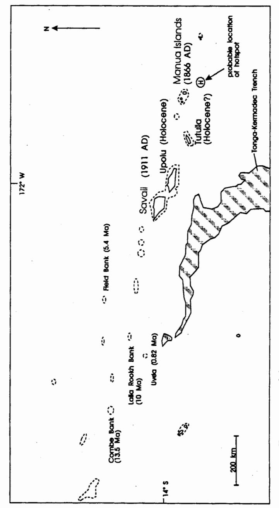

Figure 7.2. Known ages of the most recent volcanic activity on islands and seamounts along the Samoa-Uvéa chain. Broken lines define areas, usually submarine banks, less than 500 m deep. Shaded areas are those deeper than 5000 m.

away from the hotspot on the moving plate. An account of Pacific hotspot island chains and the ways in which they can be used to understand past plate movements is given in Chapter 1 and in Nunn (1994a).

It has long been recognized that the Samoan Island chain, although physiographically similar to hotspot island chains elsewhere in the Pacific, is also distinct from them because Holocene volcanism has not been confined to just one end of the chain. As can be seen in Figure 7.2, Holocene eruptive activity occurred on Savaii and Upolu in Western Samoa, on Tau in the Manua group and possibly Tutuila in American Samoa.

The earliest systematic investigations of the geochemistry of the volcanic products of the Samoa chain led Hawkins and Natland to state that it

...appears to have been volcanically active over most of its length more or less simultaneously...[and that]...a combination of lithospheric flexure and viscous shear melting at the base of the lithosphere provides a better explanation for its origin than does upwelling from a fixed "hotspot" in the mantle (1975:427).

More recent dates from the seamounts along the chain to the west of the Samoan Islands support a hotspot origin for at least that part of the chain extending through Field Bank, Lalla Rookh Bank and Combe Bank possibly to Alexa Bank in the west. Yet recent volcanism on Uvéa Island (0.8 Ma) and in Samoa is anomalous (Figure 7.2). Ignoring these anomalies, there is evidence of an age progression of shield volcanoes along the chain, consistent with their origin at a hotspot presently located 100-150 km east of Tutuila (Brocher and Holmes 1985, Duncan 1985). Nevertheless,

...the question of whether the Samoan chain is the result of passage of the Pacific plate over a fixed hotspot or instead is a consequence of convective thermal disturbance at the "corner" of the Tonga Trench ...is unresolved (Natland and Turner 1985:164).

#### 7.2.b. The geological record in American Samoa

Following Daly's (1924) research on the geology of American Samoa, the most recent comprehensive account is that by Stearns (1944) who made observations throughout the group and, though to a lesser extent, in Western Samoa. Stice and McCoy (1968) revised the geology of the Manua Islands. McDougall (1985) presented and interpreted recent potassium-argon (K-Ar) dates from Tutuila volcanoes.

Patrick D. Nunn

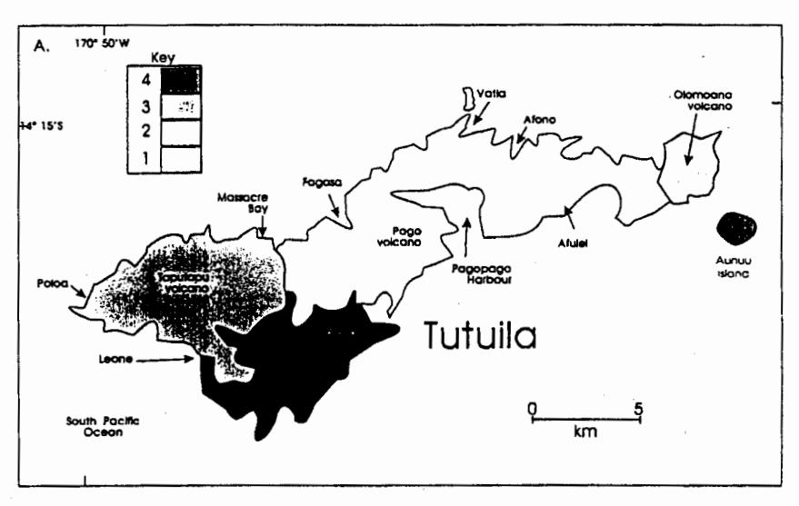

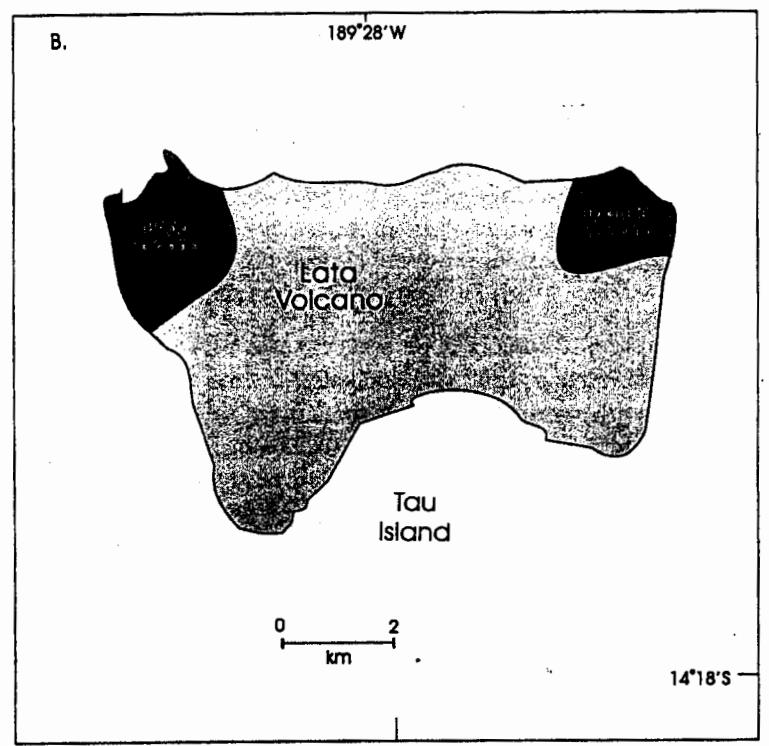

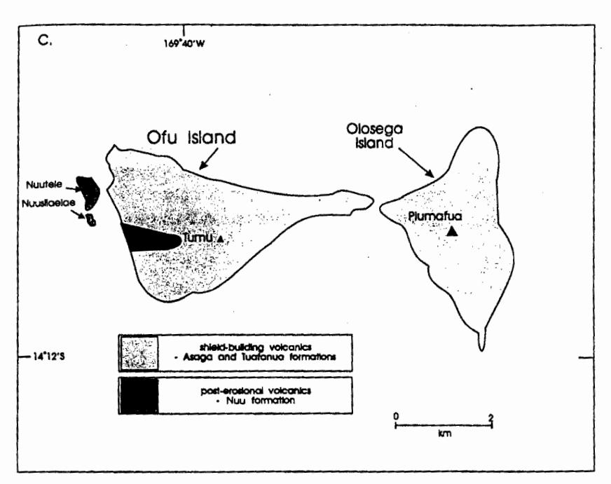

Figure 7.3. (left and above) Sketch maps of the geology of American Samoa showing the principal places mentioned in the text (after Stearns 1944, Stice and McCoy 1968). A - Tutuila; B - Tau; C - Ofu and Olosega. For Map A, shading categories are as follows: 4 - Leone Volcanics (Holocene?), 3 - Taputapu Volcanics, 2 - Olomoana Volcanics, 1 - Pago Volcanics.

Tutuila may be regarded largely as the product of three volcanoes associated with one or more parallel rifts trending approximately 70°. The main phase of subaerial volcanism lasted from 1.54 to 1.00 Ma. The products of the huge Pago Volcano, which dominates the centre of the island, were suggested by McDougall to extend into areas mapped as the separate Alofau Volcano by Stearns. The Olomoana and Taputapu volcanoes are attached to the eastern and western margins of the Pago Volcano respectively (Figure 7.3a).

Dates for the activity of the Pago Volcano range from 1.01±0.01 Ma to 1.54±0.02 Ma. Those for the Olomoana activity range from 1.11±0.02 Ma to 1.47±0.02 Ma, and for Taputapu from 1.01±0.02 Ma to 1.25±0.02 Ma. This suggests no regular spatial progression in volcanic activity along the axis of Tutuila, as Natland (1980) suggested, rather a simultaneous shield-

building period during which the Olomoana and Taputapu volcanoes developed as satellites around the main Pago Volcano.

Following the main shield-building volcanic phase on Tutuila, a long erosional interval occurred before the late-stage (or post-erosional) Leone Volcanics erupted. These were erupted from still-visible craters in 'recent' times. The Leone Volcanics form the lava and tuff plain between Leone and Tafuna on the southern side of western Tutuila. The tuff forming the island Aunuu off Tutuila's southwest extremity has also been classified as part of the Leone Volcanics. The precise age of the Leone Volcanics is unknown but they appear fresh enough in places to be late Quaternary in age, conceivably even late Holocene.

Tau Island in the Manua Group is formed largely from a single volcano (Lata Volcano) which passed through a caldera stage of development. The two smaller shield volcanoes of Luatele and Tunoa developed during the late stage of Tau volcanism in the northeast and northwest parts of the island respectively (Figure 7.3b). The average age of Tau volcanism is less than 0.1 Ma (McDougall 1985). Friedländer (1910) was given an eyewitness account of a submarine volcanic eruption that occurred around 1866 between Olosega and Tau.

Ofu and Olosega, also in the Manua Group, comprise at least six volcanic cones aligned parallel to the Tutuila trend (Figure 7.3c). Around 0.3 Ma, two of these cones went through shield-building stages represented by the summits of Piumafua and Tumu on Olosega and Ofu respectively. Localized caldera development followed, then a period of quiescence and erosion. This ended with a period of recent volcanism represented by the formation of lapilli tuff cones, remnants of which form Nuutele3 and Nuusilaelae islets. This volcanism was probably contemporary with that on Tau.

When all the ages of shield-building volcanism in American Samoa are examined together, it is evident that the youngest volcanism occurred in the east (on Tau) and the oldest in the west (on Tutuila). From the available dates, a rate of migration of the centre of volcanism from Manua to Tutuila of about 10 cm/year was derived by McDougall (1985). This conclusion is consistent with a hotspot origin for the shield volcanoes in American Samoa but cannot satisfactorily account for the recent post-erosional volcanism.

#### 7.2.c. The geological record in Western Samoa

Like all the other islands in the Samoan chain, those of Western Samoa are

composed almost wholly of the products of subaerial volcanic activity, mostly lava of either blocky structure (aa) or having a ropy appearance (pahoehoe) or pyroclastics (Figure 7.4). The most detailed account of the geology of Western Samoa is that by Kear and Wood (1959); earlier accounts of note are by Jensen (1907), Friedländer (1910), Thomson (1921) and Stearns (1944).

The oldest extrusive rocks are found on both Upolu and Savaii and were believed by Kear and Wood (1959) to be contemporaneous although Natland and Turner (1985) found that those on Savaii were older and distinct from those on Upolu. While those on Upolu were named Fagaloa Volcanics by Kear and Wood (1959), the name Vanu Volcanic Series was proposed by Natland and Turner (1985) for those rocks formerly mapped as Fagaloa Volcanics on Savaii. The Fagaloa/Vanu volcanics were formed in Pliocene-Pleistocene times, between 2.69 and 1.54 Ma (Kear and Wood 1959, Natland and Turner 1985). Based on their palaeomagnetic character, Keating (1992) regarded the Vanu Volcanics as erupted more than 2.5 Ma.

The original Fagaloa/Vanu landscape, where it has not been covered by later volcanics, exhibits the greatest degree of denudation because it has been exposed for longer than any other part of the islands; deep river valleys are cut into areas where few primary volcanic landforms are still discernible. The coastline is mostly steeply cliffed, a reflection of the amount of time which the sea has been eroding the shoreline.

All volcanic rocks younger than the Fagaloa/Vanu series are less than 700,000 years old (Keating 1985).

The Salani Volcanics were erupted in both main islands following a period of quiescence after the end of Fagaloa/Vanu volcanism. The degree of weathering of the lavas suggested to Kear and Wood (1959) a probable age for this activity of Last Interglacial (~125 000 BP). Most of the smaller islands in Western Samoa (Apolima, Fanuatapu, Namua, Nuulua and Nuutele) are built from Vini Tuff, the pyroclastic product of eruptions which are believed to have occurred during the early period of Salani volcanism.4 The presence of finely bedded shallow water or intertidal deposits containing molluscs and coral fragments up to 9 m above sea level within all the tuff islands was interpreted by Kear and Wood (1959) as meaning that sea level was around 9 m higher than present at the time of eruption.

That sea level must have been just above its present level between the end

Patrick D. Nunn

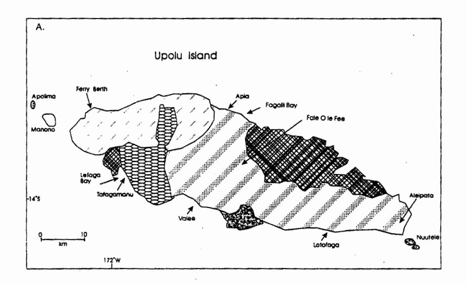

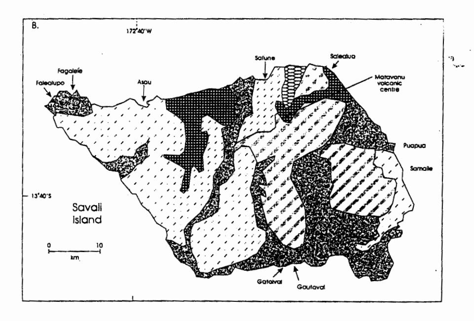

Key for Upolu and Savai'i only

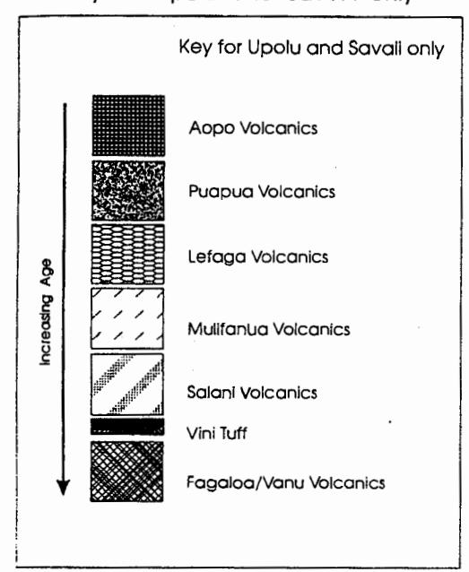

Figure 7.4. Sketch maps of the geology of the islands of Western Samoa (after Kear and Wood 1959, Kear et al. 1979, Natland and Turner 1985).

A - Upolu; B - Savaii.

of Salani volcanism and the commencement of Mulifanua volcanism is also indicated by the presence of a fossil coral reef in the bottom of the Afia well (Kear and Wood 1959) and elsewhere (Kear et al. 1979) sandwiched between Salani and Mulifanua lavas.

The Mulifanua Volcanics are similar to the Salani Volcanics except in the lesser degree of weathering exhibited by the former. They are found on both main islands and the offshore island Manono, and date from the Last Glaciation (70,000-10,000 BP) according to Kear and Wood (1959).

The Lefaga Volcanics are of early to middle Holocene age and were mapped by Kear and Wood (1959) only in Upolu although "it now seems likely that the Falealupo peninsula [in Savaii] could also be formed of lava flows of that age rather than Mulifanua [Volcanics]" (Kear et al. 1979:21).

The Puapua Volcanics are middle to late Holocene in age; radiocarbon dates of between 1850 BP and 750 BP have been obtained (Kear et al. 1979). Puapua eruptions occurred on both main islands.

The products of historical volcanism are classified as Aopo Volcanics. Major eruptions occurred only in Savaii in the years AD 1760, 1902 and 1905-

1911. Eruptions were located along a large fault associated with collapse of the volcanic pile in northern Savaii.

#### 7.2.d. Recent tectonic history - various theories

The Samoan Islands are located in a poorly understood area of the southwest Pacific close to the northern terminus of the Tonga-Kermadec Trench within which the Pacific Plate is being subducted under the Indo-Australian Plate (see Figure 7.1). It is possible that the whole Samoan Island chain is being tilted towards this trench resulting in emergence of the islands' north coasts and submergence of their south coasts. This interpretation is somewhat simplistic since it assumes an improbable degree of rigidity for the Pacific Plate in the area. It seems more likely that the plate here is being flexed or bent along the islands' volcanic axis. This view is suggested by the conclusion of Natland and Turner (1985) that recent eruptions in Samoa were the result of bending and dilation of the Pacific Plate in the area.

Such a suggestion is complicated by the observation of volcanic activity in the islands within the last hundred years. This implies that there is a lot of heat below the surface and that associated thermal expansion could have caused recent uplift of the islands, at least locally (Nunn 1994a).

An alternative view is that volcanic activity has been declining in intensity and frequency in recent millennia which points to a cooling of the earth's crust in the area which has resulted, as elsewhere, in subsidence of the islands. This view is favoured by Bloom (1980), Hopley (1987) and Richmond (1992), who thought that the loading effect of recent volcanism was also contributing to subsidence.

The lack of agreement about the recent tectonic history of the Samoan Islands is manifested by the three possible, yet mutually exclusive, theories summarized above. The solution to the puzzle lies partly in an understanding of recent tectonics, and it is surprising that so little has been done on this topic. Part of the reason for this may be the emphasis placed by Kear and Wood (1959) and Kear (1967) on a eustatic (sea-level) change rather than a eustatic-tectonic explanation of emerged shoreline indicators, a view they justified by the apparent uniformity in age-height relationships of these throughout Western Samoa.

A good starting point for a reassessment of the islands' tectonic history is thus an account of the evidence for low-level, implicitly Holocene, emergence preserved along their coasts.

#### 7.3. Recent land/sea-level changes along the Samoa-Uvéa Island chain5

#### 7.3.a. Recent land/sea-level changes in American Samoa

On Rose Atoll in the east of American Samoa, Mayor (1924) found fossil reef up to 1.7 m which he interpreted as indicating Holocene emergence. This conclusion was shared by Daly (1924) who found evidence for a greater degree of older emergence to around 6 m above present sea level throughout American Samoa. This evidence was almost wholly that of emerged wavecut platforms similar to those Daly had described elsewhere and regarded as indicating 'a worldwide sinking of ocean level' (Daly 1920, 1934).

Sachet (1954) also noted evidence for emergence of Rose Atoll in the form of reef rock above the present reef flat. She cautioned that these emerged reef remnants might be mistaken for storm-deposited blocks yet they contained corals in growth position and had aggradational surfaces at the same elevation thus should correctly be interpreted as evidence for emergence.

In the Manua Islands, Stearns (1944) reported evidence for both the 7.6 m and 1.5 m emergence levels on Ofu and Olosega. He found only the lower level on Tau.

On Tutuila, Stearns (1944) agreed with earlier writers that there existed a submerged barrier reef at a depth of around 122 m. He also gave the most comprehensive account of emerged shoreline indicators to date in American Samoa. He revised Daly's (1924) interpretation of emerged shore platforms as indicating a net emergence of about 1.5 m instead of 6 m and reported considerable corroborative evidence in the form of emerged cliffs and fossil reefs at 1.5 m above the present reef on the east side of Vatia Bay and around Massacre (Aasu) Bay on Tutuila (Plate 7.1). Stearns (1944) reported emerged sea caves up to 7.6 m above present sea level on Tutuila. These observations were broadly endorsed by Keating (1992).

Like Daly and in line with the prevailing wisdom, Stearns (1944) believed that the 7.6 m and 1.5 m emerged shoreline levels were both eustatic rather than tectonic; the higher he believed was late Pleistocene in age, the younger a standstill in the regression from this level to the present level. This interpretation is now redundant.

Recent fieldwork on Tutuila by Nunn concentrated on low-level indicators

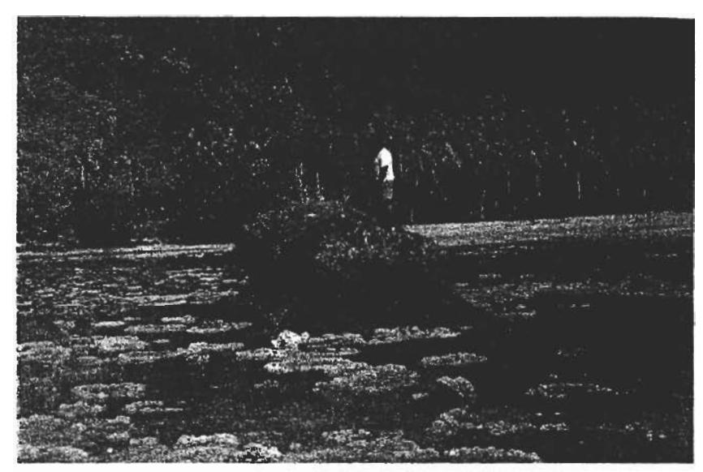

Plate 7.1 View of the principal piece of emerged reef at Vatia Bay on the north coast of Tutuila.

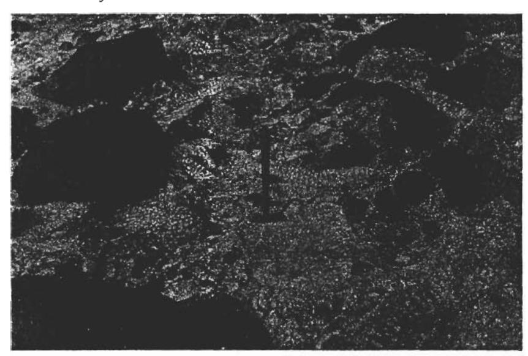

Plate 7.2 The emerged reef on the north coast of Tutuila, about 2 km northwest of Poloa. Corals in this reef have been dated to 690-740 BP.

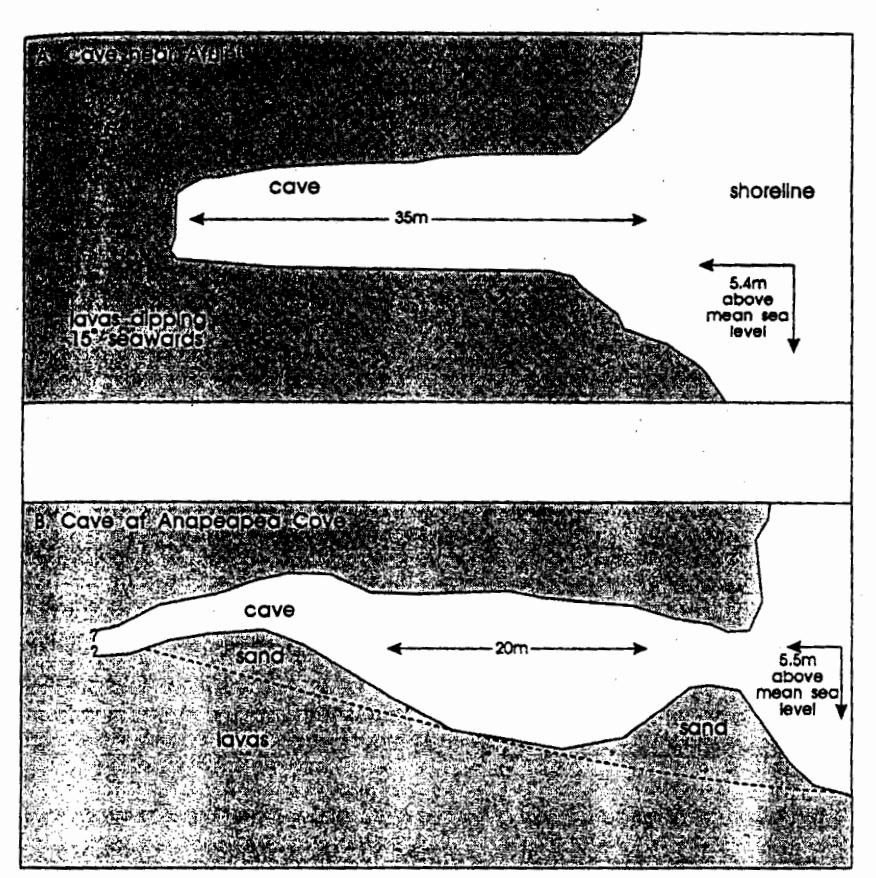

Figure 7.5. Possible evidence for high-level emergence of Tutuila. A - cave near Afulei; B - cave at Anapeapea Cove near Afono.

of emergence. The results suggest that much of the erosional evidence that Daly and Stearns recognised less than 10 m above present mean sea level is more likely to be the result of the preferential subaerial erosion of a less resistant stratum (commonly pyroclastics) rather than marine erosion at a higher relative sea level. Yet there is undoubted evidence of marine-like erosion having produced high level caves at several places along the south coast of Tutuila, notably at Afulei and in Anapeapea Cove near Afono (Figure 7.5). This level of emergence averages 3.9 m and is represented by a large piece of emerged reef in Vatia Bay (Plate 7.1).

Although Mayor (1924) believed that this block of 'emerged reef' had broken off the foundations of the modern reef at the entrance to Vatia Harbour during a storm and been deposited in its present position, the present writer agrees with Daly (1924) that it is *in situ*. Dates ranging from 350±50 BP to 490±60 BP for corals in growth position from this reef are inexplicably young.

A second, lower level of emergence ranges from 0.87 to 2.4 m and averages 1.55 m. It is found around all the coasts of Tutuila and includes both erosional evidence and emerged reef.

The lowest level of emergence is represented by emerged reef 0.06-0.39 m (average 0.25 m) and is confined to the north coast of Tutuila. Dates of 690±70 BP and 740±60 BP were obtained from an emerged reef at this level near Poloa (Plate 7.2) and are thought to indicate a slightly higher sea level around the end of the Little Climatic Optimum about 650-750 years ago (Nunn 1994a).

The distribution of emerged shoreline indicators around Tutuila does not support the idea of differential uplift (or tilting) of, say, the north versus the south coast of the island. The fact that most indicators, including all the emerged reef, occur only along the north coast is probably due to the presence there of deep embayments which have protected emerged shorelines from subsequent subaerial defacement.

#### 7.3.b. Recent land/sea-level changes on Upolu, Western Samoa

One of the earliest observations relating to land/sea-level changes on Upolu was that of Jensen who despite finding "no marked indication of raised beaches" (1907:646) clearly believed they (had) existed and emphasized the absence of evidence for submergence, which Dana (1849) speculated may have affected the western end of the island.

Friedländer (1910) thought that the estuaries of Upolu were drowned indicating recent submergence. The likelihood of recent fault movement as an explanation for the 'drowned' bays of Upolu was highlighted by Thomson (1921), especially for Fagaloa Bay. Coastal plains covered by coral sand in Aleipata and Salufata may have been uplifted but this could not have been uniform or widespread, Thomson argued, since no parts of the old reef were exposed. Yet emerged reef was observed by Stearns (1944) on the modern reef flat at Fagalii Bay (Plate 7.3) and corresponded, he believed, to the 1.5 m emergence he believed to have affected American Samoa. Stearns also

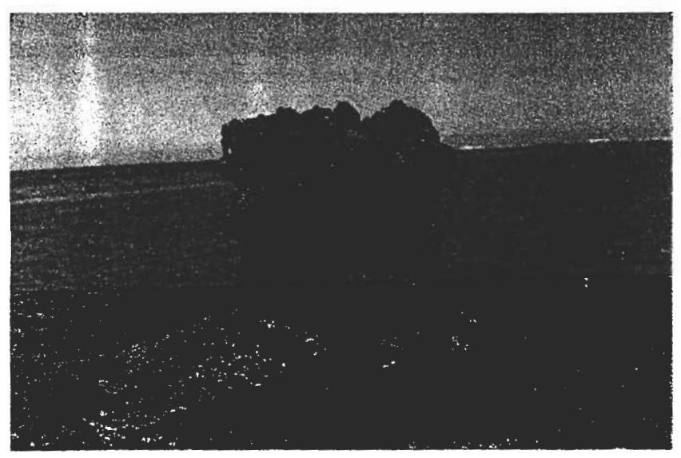

Plate 7.3 Emerged reef remnant at Fagalii Bay on the reef flat off the north coast of Upolu.

reported emerged cliffs and (intertidal) flats raised 1.8-2.4 m above sea level on Upolu.

A contrary view was taken by Mayor (1924) who reported that Upolu did not exhibit the emerged shore platform, so widespread in American Samoa, and speculated that this was due to a slight relative submergence of Upolu.

In their 1959 account of the geology of Western Samoa, Kear and Wood found sedimentary evidence of emergence at 1.5-2.4 m (Tafagamanu Sand), 4.6 m (Nuutele Sand) and 9 m (Vini Tuff). The latter two levels are found almost exclusively on the smaller islands in Western Samoa. Kear and Wood also reported erosional shorelines at higher levels on Upolu, particularly southeast of Falelatai and around the sides of Fagaloa Bay where "a single bench, imperfectly measured as 130-200 ft [39.7-61 m] above sea level, was noted" (1959:59). Schofield (nd) noted probable wave-cut platforms 5.5 m above low-tide level at Lalomanu and Leauvaa.

On Upolu's offshore islands, Kear and Wood (1959) tentatively recognized a 9 m emergence in the Vini Tuff who believed it marked a Last Interglacial (~125 000 BP) sea level. On all islands composed of Vini Tuff, the presence

of finely bedded molluscs and coral sand is found to a maximum height of 9 m. The apparent uniformity of this emergence was one reason why Kear and Wood (1959) regarded it as a eustatic rather than a tectonic level.

Also found only on the smaller islands in Western Samoa is the Nuutele Sand which represents a 4.6 m emergence believed to be of Holocene age (Kear and Wood 1959). This deposit rests mostly on weathered Vini Tuff and comprises rounded gravel with coral fragments. Kear and Wood (1959) thought it was contemporary with the emerged shore platform at the same level as Gataivai on Savaii (Section 7.3.c).

Limestone boulders are found around perhaps 458 m above sea level in the hills south of Apia and may represent the remains of a high level shoreline (Stearns 1955) with correlates elsewhere in the Pacific Islands (Stearns 1961). The proximity of the site of these boulders to the megalithic settlement of Fale O Le Fee may account for their presence at this level although their provenance is obscure (Kear and Wood 1959). The highly unusual nature of this occurrence makes it worth quoting Stearns' account in full.

In 1954 M.G. Irwin discovered a block of limestone weighing more than 10 tons on Upolu Island near Le Fale o le Fe'e in Soaga Canyon at an elevation above 650 feet [198 m]. The exact elevation is yet to be determined. A barometer reading, made in a rainstorm in 1941 at "Le Fale", was 1500 feet [458 m], but no accuracy can be claimed for it. A search is now being made in the heavily forested area for limestone in place, and accurate elevations will be established. J. Harlan Johnson reported recognizable fossil coral somewhat recrystallized in the limestone block but no recognizable algae in thin sections. The find is significant because it is the first high-level limestone reported on any island in the Central Pacific, except in the Hawaiian Islands. If the 10-ton block came from an outcrop close by, it indicates a large amount of emergence of Central Pacific Islands in late geologic time, possibly as a result of eustatic movements much greater than those attributed to glaciation and deglaciation during the Pleistocene (Stearns 1955:1681).

No subsequent reports concerning this limestone are known; this writer has been unable to locate any limestone in the Fale O Le Fee area despite two visits.

As indicators of recent tectonics, low level indicators of shoreline

displacement are more important than high level ones because they are both clearer and more numerous. The 1.5 m emergence recognized by Kear and Wood (1959) on the basis of the Tafagamanu Sand accounts both for the flats on which many coastal villages are built on Upolu and for the sand spits such as the Mulinuu Peninsula in Apia and that at Vaiee on Upolu's south coast. Kear and Wood (1959) regarded shore platforms 1.8-2.4 m above sea level on the coast east of Apia as coeval with the Tafagamanu Sand level, which they regarded as being formed at a higher sea level, dated at the type site to 1180±55 BP (Grant-Taylor and Rafter 1962).

Principally because of the similarity in height between remnants of low level shorelines, Kear and Wood (1959) regarded them as having emerged as the result of a sea-level fall rather than uplift (eustatic rather than tectonic), the character of which would more likely be uniform than differential in such situations. This is not wholly satisfactory reasoning, and it is significant that subsequent investigations brought the role of tectonics much more to the fore than it had been previously.

Archaeologists investigating the early settlement history of Pacific islands carried out the next phase of research on Upolu.

Work at Lotofaga on the south coast uncovered an ancient settlement on the Tafagamanu Sand which came to be regarded by the investigators as a "largely cultural" rather than a natural deposit (Davidson 1969:232). Yet it was also regarded as the product of emergence for

at the edge of the present beach, exposed at low tide, is an old coral reef. The area between this reef and the base of the cliff, which is now occupied by the cultural deposits under consideration, must at one time have been part of a lagoon. It seems that change in the land/sea level caused this reef to become "raised" and sand to accumulate behind it, forming the surface on which the cultural deposits later accumulated (Davidson 1969:232).

A minimum age for this emergence is provided by the date obtained from the cultural deposit of 735±85 BP (Davidson 1969).

Contrary to the interpretation of Kear and Wood (1959), the conclusion of archaeologists who had excavated sites in the Tafagamanu Sand was that "varying degrees of uplift of the land" (Green and Davidson 1974:223) had been responsible for associated emergence. Like Kear and Wood's (1959)

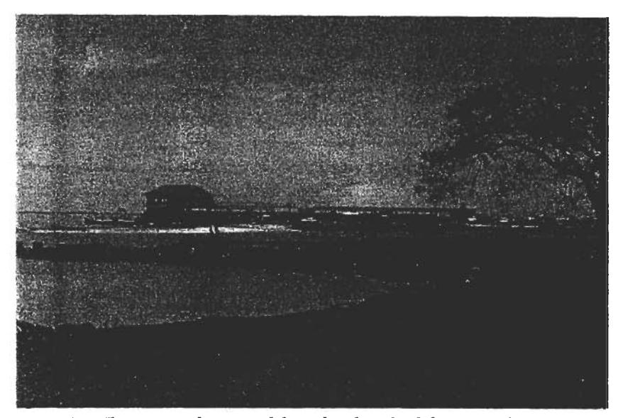

Plate 7.4 The turning basin and ferry berth at Mulifanua on the northwest coast of Upolu, the site of the only known evidence for Lapita occupation of Samoa.

ideas, this seems to be an inference based on prevailing wisdom rather than a deduction derived from field evidence. It was an inference that was rapidly called into question with the discovery of the Ferry Berth site, widely cited as evidence of recent subsidence of Upolu (Plate 7.4).

How so much significance came to be attached to this site in the interpretation of the recent tectonic history of Upolu, indeed the whole of Samoa, is difficult to understand, for the evidence and even the initial interpretation of the site's significance do not merit the importance which the site subsequently acquired.

The deepening of a turning basin for inter-island ferries at Mulifanua on the northwest coast of Upolu led to the discovery of a Lapita pottery deposit beneath a cemented coral/shell crust, the surface of which was about 1.8 m below sea level.6 The deposit paralleled the modern beach about 114 m offshore and comprised pottery in an organic 'soil' matrix. The pottery included Lapita ware, making it the oldest known settlement in Samoa. The zone of sherd concentration is approximately 2.7 m below mean sea level. A cross-section of the site is shown in Figure 7.6.

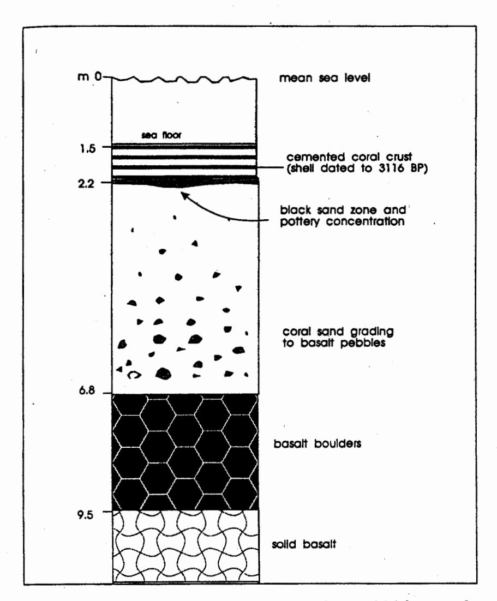

Figure 7.6. Cross-section through the Ferry Berth site at Mulifanua on the northwest coast of Upolu (after Jennings 1974).

The first archaeologist to examine the site favoured "sudden local subsidence" as the explanation for the site being underwater (Jennings 1974:177). The pottery sherds exhibited no signs of comminution from wave attack which,

argued Jennings, militated against the site having been submerged slowly. Sudden local subsidence of the type Jennings envisaged could be coseismic (coincident with large earthquakes) or related to landslides, as is common on the flanks of large mid-ocean volcanoes like Upolu.

Minimum dates of 2170±70 BP and 2890±80 BP7 for the settlement assumed to be associated with the pottery were obtained by Green and Richards (1975) from the overlying coral/shell crust. These authors favoured the interpretation of the site as indicating a standstill of sea level 2.7 m below its present level around 3000 years ago during the postglacial sea-level rise. The reasons for this are not clear although the influence of the 'Micronesia Curve' of Holocene sea-level changes, derived from the work of the Carmarsel expedition in the late 1960s, was perhaps significant. The Carmarsel results indicated that sea level in part of the northwest Pacific had been rising up until present and, although the extension of this scenario to other parts of the Pacific has been questioned, it was an idea which was gaining popularity in the mid-1970s and undoubtedly influenced contemporary interpretations of submerged sea-level indicators such as that at Ferry Berth.

Yet sea-level curves such as the Micronesia Curve involved much less than 2.7 m of sea-level rise in the past 3000 years or so. It fell to Jennings to explain the additional submergence by subsidence. Jennings (1976) cited unpublished work of Bloom (see below) in support of this view and noted that Hawkins and Natland (1975) "have concluded that Upolu is subsiding at the rate of 1.5 mm per annum, a figure interestingly congruent with Bloom's estimates, and equally compatible with the 3 meters submergence of the Ferry Berth site since 3000 B.P." (Jennings 1976:7). This statement involves a misreading of Hawkins and Natland who made no statement about the recent tectonic history of Upolu but noted that a date from a phonolite dredged from the surface of Machias Seamount, on the edge of the Tonga Trench about 180 km south of Savaii, indicates "a subsidence rate of about 1.5 mm/yr" (1975:431) for that seamount which is in a completely different tectonic setting to Upolu (Coulbourn et al., 1989). From such errors do false conclusions derive and persist.

Despite a lack of compelling evidence, the idea that Upolu subsided about 3 m in the last 3000 years or so persisted and is still widely quoted. An alternative explanation for the Ferry Berth site has presented itself following the discovery of postholes at Lapita sites in Papua New Guinea (Kirch 1988a). The implication is that Lapita people may have lived in stilt-houses thus the pottery level at the Ferry Berth site (and elsewhere) may bear no

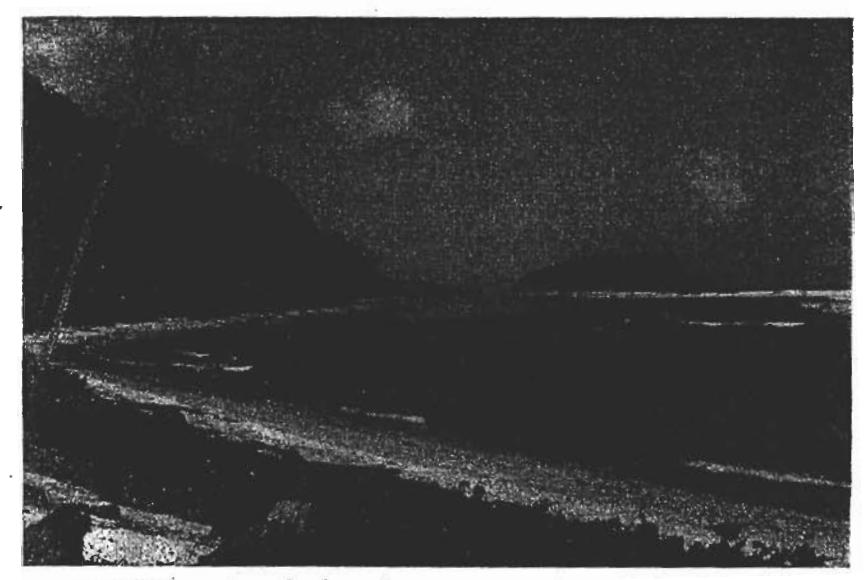

**Plate 7.5** View eastwards along the south coast of Upolu from near Tuiolemu with Nuutele Island in the distance. See Figure 7.10a for a sketch map of this area.

relation whatsoever to the contemporary shoreline level. Leach and Green (1989) tentatively inclined to this view.

In her summary of the prehistory of Western Samoa, Davidson (1979) favoured the idea that a uniform inundation of the Upolu coast had occurred.

Bloom reported several dates from peaty muds from Upolu's south coast which he interpreted as demonstrating "tectonic subsidence of Western Samoa in the Holocene, probably related to active effusive basalt volcanism" (1980: 508), a conclusion he supported by citing the Ferry Berth site. Bloom (1980) did not give the locations of his dated samples which is unfortunate since some parts of Upolu's south coast are unmistakably downfaulted. Neither did he explain whether allowance had been made for compaction of the peats, a factor which often causes them to be erroneously interpreted as indicating subsidence (Gill and Lang, 1977).9

The work of the HIPAC (Hydro-Isostasy in the Pacific) team in Upolu specifically addressed questions of Holocene shoreline displacement. Sugimura et al. (1988) found emerged beachrock reaching 0.95 m above

sea level at Safaatoa and Matautu on the coast of Lefaga Bay in southern Upolu.

Recent work by this writer in Upolu involved recording emerged shoreline indicators around the whole coast of the island but especially along its southern coast. The highest level indicator is the  $\sim$ 7 m notch found only on Nuutele Island (Plate 7.5). A  $\sim$ 1.5 m shoreline is more widespread. This comprises emerged notches, raised beaches and, at Fagalii Bay, an emerged reef (see Plate 7.3).10

#### 7.3.c. Recent land/sea-level changes on Savaii, Western Samoa

This section concentrates on reporting data with no account of the development of ideas as this has been adequately covered in the previous sections.

The observations of Jensen (1907) in the low, coral-sand covered Fasaleaga area of eastern Savaii led him to believe that it had probably once been an area of sea floor, uplifted subsequently 1.8-2.4 m. He noted similar areas, including that at Safune, but was more doubtful about their origin. Thomson (1921) also favoured the idea of uplift to explain coastal plains in Savaii, particularly those at Salealua (Matautu) and Fasaleleaga.

On Savaii, the Tafagamanu Sand is commonly covered with Puapua Volcanics but can still be interpreted as a raised beach correlatable with a sea level 1.5 m higher than present (Kear and Wood 1959). A date of 1850+80 BP was obtained from coral within the Tafagamanu Sand 0.92 m above sea level at Puapua (Grant-Taylor and Rafter 1962).

At Gataivai on the south coast of Savaii, Kear and Wood (1959) described an emerged notch and raised beach 4.6 m above sea level which emerged a minimum of 760±50 BP: another minimum age of 715±50 BP was obtained for the same site (Grant-Taylor and Rafter 1962). This emerged shoreline was regarded by Kear and Wood (1959) and Keating (1992) as contemporary with the Nuutele Sand found only on offshore islands (Section 7.3.d).

Unpublished work by Schofield (nd) concerning coring of sea-floor sediments in Asau Harbour concluded that submergence compatible with the 3 m since ~3000 BP, which had reportedly affected the Ferry Berth site on Upolu (Section 7.3.b), may also have occurred here.

Investigations by the HIPAC team in Savaii concentrated on the western

extremity of the island. An emerged notch at the back of the beach at Fagalele represents a possible emergence of 2.3 m (Sugimura et al. 1988). At Cape Mulinuu, the island's westernmost point, corals were found in emerged beachrock to around 1.05 m above present mean sea level (Sugimura et al. 1988). Beachrock, possibly above high-tide level therefore likely to indicate emergence, is also visible east of Utuloa and near the Asau airstrip (Rodda 1988). Rodda also cautioned,

many benches and notches can be seen along the basalt cliffs of northern Savaii, but most benches are flow tops, and most notches have probably not been cut at sea level—their elevations are almost certainly governed by the occurrence of breccia or tuff that is much softer than the flow basalt (1988:88).

The most interesting area observed by the present writer during recent field-work was on the south coast around Gautavai (near Gataivai) where the emerged reef flat and shore platform described by Kear and Wood (1959) was thoroughly examined. The landform has been interpreted as the product of localized thermal uplift, perhaps associated with the presence of a magma body close to the surface of south central Savaii (Nunn 1994a).

#### 7.3.d. Recent land/sea-level changes on Uvéa (Wallis) Island

Although Uvéa Island has volcanic rocks which are similar to those associated with shield-building (hotspot?) volcanism in Samoa, the closer morphological similarities between Uvéa and Nukulaelae Atoll in Tuvalu suggested to Brocher (1985) that Uvéa was part of the Tuvaluan rather than the Samoan island chain.

The only dated volcanic rocks on Uvéa are from probable post-erosional lavas erupted onto an older volcanic pedestal. This would account for their anomalously young age (0.82 Ma) when compared to the shield-building age of the rest of the Samoan island-seamount chain (see Table 7.1).

Evidence of emergence similar to that in Samoa exists on Uvéa (Stearns 1945). There are emerged shorelines at 7.6 m and 1.7 m which are largely erosional in character but also include patches of emerged reef and 'marine conglomeratic limestone'. Remnants of possible higher level shorelines exist.

#### 7.4. Synthesis and discussion

#### 7.4.a. Timing of shield-building volcanism

The youngest ages for shield-building (as opposed to late-stage or posterosional) volcanism along the Samoa-Uvéa chain are listed in Table 7.1.

When these ages are plotted (Figure 7.7), the best-fitting regression line yields a rate of movement of the lithosphere over a fixed hotspot some 150 km east of Tau of 7.69 cm/year. This figure is within Duncan's (1985) estimate of 7.7±2.5 cm/year for the age-progressive trend along the Samoa island-seamount chain. This relationship satisfies the hotspot explanation for shield-building volcanism along this line of islands and seamounts; yet it does not explain the occurrence of much younger (post-erosional) volcanism on many islands, principally Savaii, Upolu and Tutuila.

Table 7.1. Youngest ages for shield-building volcanism along the Samoa-Uvéa chain.

| Youngest age (Ma)            | Approximate distance from hotspot (km)                                                   | Source                                                                                                                                                      |
|---------------------------------|------------------------------------------------------------------------------------------|-------------------------------------------------------------------------------------------------------------------------------------------------------------|
| <0.1                            | 150                                                                                      | McDougall 1985                                                                                                                                              |
| 0.3                             | 180                                                                                      | McDougall 1985                                                                                                                                              |
| 1.11 <u>+</u> 0.02              | 240                                                                                      | McDougall 1985                                                                                                                                              |
| 1.01 <u>+</u> 0.01 1 | 255                                                                                      | McDougall 1985                                                                                                                                              |
| 1.01 <u>+</u> 0.02              | 270                                                                                      | McDougall 1985                                                                                                                                              |
| 1.54 <u>+</u> 0.05              | 320                                                                                      | Duncan 1985                                                                                                                                                 |
| $2.5^2$ ?                       | 410                                                                                      | Duncan 1985                                                                                                                                                 |
| 5.4 <u>+</u> 0.2                | 785                                                                                      | Duncan 1985                                                                                                                                                 |
| 10.0 <u>+</u> 0.3               | 900                                                                                      | Duncan 1985                                                                                                                                                 |
| $0.82 \pm 0.03^{3}$             | 958                                                                                      | Duncan 1985                                                                                                                                                 |
| 13.5 <u>+</u> 0.9               | 1120                                                                                     | Duncan 1985                                                                                                                                                 |
|                                 | (Ma)  <0.1 0.3 1.11±0.02 1.01±0.01 1.01±0.02 1.54±0.05 2.5²? 5.4±0.2 10.0±0.3 0.82±0.03³ | (Ma) distance from hotspot (km)  <0.1 150 0.3 180 1.11±0.02 240 1.01±0.01 255 1.01±0.02 270 1.54±0.05 320 2.5²? 410 5.4±0.2 785 10.0±0.3 900 0.82±0.03³ 958 |

&lt;sup>1age for youngest caldera intrusion following end of shield-building stage

#### 7.4.b. Significance of post-erosional volcanism

On Savaii, Upolu and Tutuila, volcanic activity much younger than that which built the main shields on the islands has occurred. That on Savaii ended only very recently: the last major eruption from the Matavanu centre occurred between 1905 and 1911 AD. On Tutuila, the Leone Volcanics

&lt;sup>2end of Gauss palaeomagnetic epoch (see Duncan 1985)

&lt;sup>3date for probable post-erosional lavas crupted onto an older volcanic pedestal

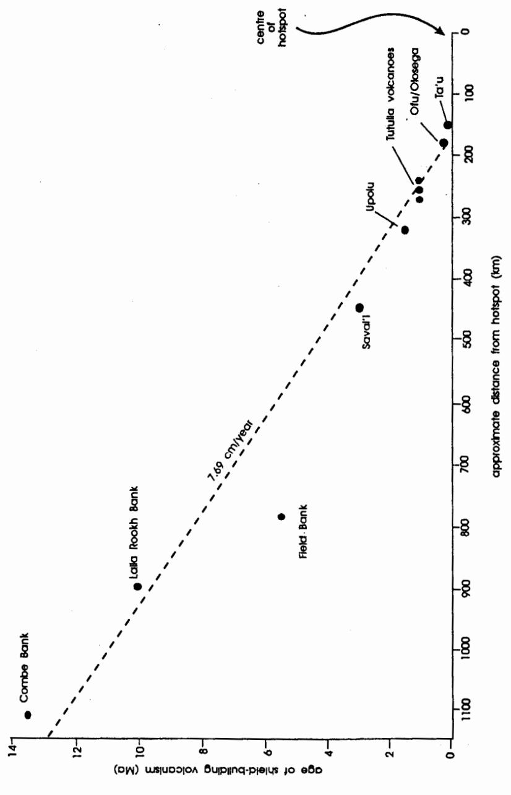

Figure 7.7. Age-distance relationship for samples listed in Table 7.1. Distances are from the probable hotspot location at the eastern end of the chain.

comprise the Leone-Tafuna plain and the small island, Aunuu. These rocks have not been dated but may—like the youngest volcanic rocks on Upolu—be Holocene in age. On Upolu, the youngest post-erosional volcanism is represented by the Puapua Volcanics, of middle to late Holocene age. The post-erosional volcanism on Uvéa has been dated to 0.82 Ma which makes it unlikely to have been contemporaneous with the post-erosional volcanism on Savaii, Upolu and Tutuila.

The character of post-erosional volcanism in Samoa is distinct from that of the earlier shield-building phases (Natland and Turner 1985). Most of the young volcanic centres are aligned along a rift trending 110°. It seems likely that this rift opened up as the result of the bending of the Pacific Plate associated with the hook at the northern end of the Tonga-Kermadec Trench. The suggested situation is shown in Figure 7.8.

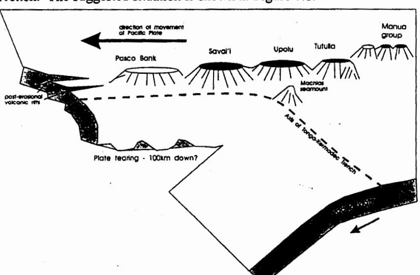

Figure 7.8. Three-dimensional diagram of the Samoa Islands and the Pacific Plate (after Natland and Turner 1985). Although the main direction of Pacific Plate subduction is westwards, the plate also bends into the Tonga-Kermadec Trench along its northern rim. The Samoa Islands rise from the crest of this upfold. Recent (post-erosional) volcanism in Savaii is not consistent with a hotspot origin for the islands and may be the result of upwelling along rifts running along the axis of the island chain in this area. Arrows indicate directions of plate movements. Islands are shown by ribbed contours. Plate thicknesses and island sizes are not to scale.

The mechanics of lithospheric bending around the northern end of the Tonga-Kermadec Trench are not well understood. It is unlikely that the Pacific Plate is being actively thrust southwards into the hook. The fact that there is an anomalously aligned section of trench there could be explained by plate tearing at depth (Figure 7.8). Such a process would cause north-south stretching of the lithosphere in Western Samoa, and it seems likely that certain of the rifts so formed have extended deep enough into the lithosphere to have encountered a magma source. The area of post-erosional volcanism in Samoa is close enough to the hotspot east of Tau to have derived from it. Yet the differences in character of post-erosional volcanism on Savaii and Tutuila and the recent shield-building volcanism in the Manua Group suggest that considerable differentiation may have taken place within the hotspot magma chamber (Figure 7.9).

Uvéa (Wallis) is too distant from the Tonga-Kermadec Trench to have been affected by processes such as those described above. Post-erosional volcanism on Uvéa was probably associated with anomalously late Vitiaz Trench subduction (Brocher 1985).

#### 7.4.c. Late Quaternary tectonic history

Disregarding the possibility of high level (458 m?) limestones on Upolu, the most plausible evidence for emergence in Samoa is all low level (< 10 m). Emerged shoreline indicators greater than about 2 m all tend to be congregated in small areas which suggests that the cause of their emergence was local rather than regional.

On Tutuila, the band of 3.9 m emergence crosses the island in a band from Afulei to Vatia. Interestingly, the orientation of this band is about 110°, the same as that of the post-erosional volcanic rift. Accordingly, it is possible that uplift here was associated with rifting and recent volcanism.

The 7 m emergence in Upolu is confined to the offshore tuff island Nuutele. This may lie on the (north/northeast) upthrown side of the well-marked south-coast fault between Saleapaga and Tuiolemu on Upolu. Recent movement along this fault may account for the comparatively high-level indicators of emergence on Nuutele (Figure 7.10).

On Savaii, the 4 m emergence of the Gautavai area has been attributed to localised thermal uplift (Nunn, 1994a).

Lower level emergence can all be explained by late Holocene sea-level

Patrick D. Nunn

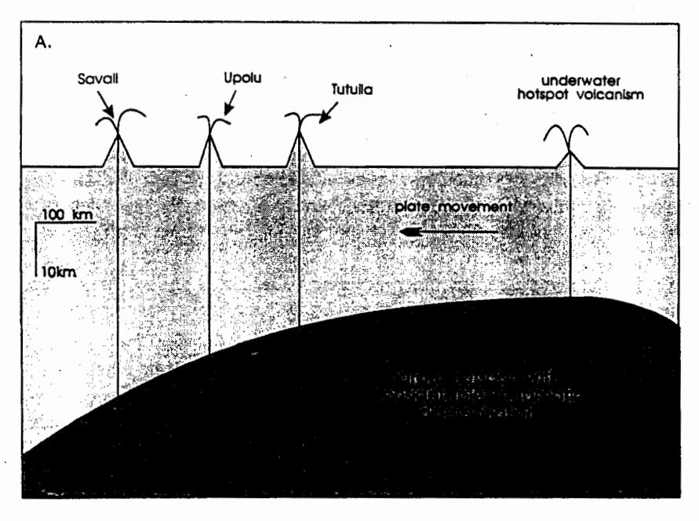

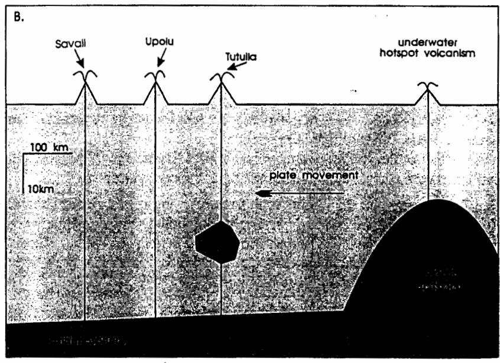

fall. Contrary to the opinion of many earlier writers, this writer believes that there is no good evidence for significant late Holocene submergence of Samoa.

The present tectonic condition of the Samoa Group is difficult to discern in many places. Such areas as south-central Savaii and perhaps part of central Tutuila may be slowly rising as the result of lithospheric upbending and/or heating. There are probably areas like that around the Ferry Berth site in Upolu and that along the easternmost part of Upolu's south coast which may have experienced rapid subsidence during the Holocene. Yet, the preservation of indications of recent emergence, particularly the Little Climatic Optimum high sea level at Poloa on Tutuila, suggest that subsidence is not the dominant process affecting the islands at present. If it is occurring at all, then it must be extremely slow.

#### 7.4.d. Holocene sea levels in Samoa

The most recent Holocene sea-level envelope for Samoa was presented by Nunn (1991a). With the addition of new dates from both American and Western Samoa, and the additional likelihood of the Ferry Berth site not being a reliable palaeosea-level indicator, the envelope has been revised as in Figure 7.11. Appropriate data are listed in Table 7.2.

Figure 7.9. (left) Alternative magma sources for recent volcanism in Samoa.

A. This model assumes that the Samoa hotspot is comparatively broad. It assumes that the magma feeding underwater volcanism associated with the centre of the hotspot east of Tau comes from the uppermost part of the associated asthenospheric bulge. Post-erosional volcanism on Samoan islands to the west has resulted from the intersection of vertical rifts with a lower part of the asthenospheric bulge. The chemical composition of the magma within this part of the bulge is distinct from that of the magma in its uppermost parts.

**B.** This model assumes that the Samoa hotspot is comparatively small and feeds only the underwater volcanic activity east of Tau. It is assumed that post-erosional rifts in the Samoan Islands to the west have either intersected directly with the asthenosphere or with associated magma chambers within the overlying lithosphere.

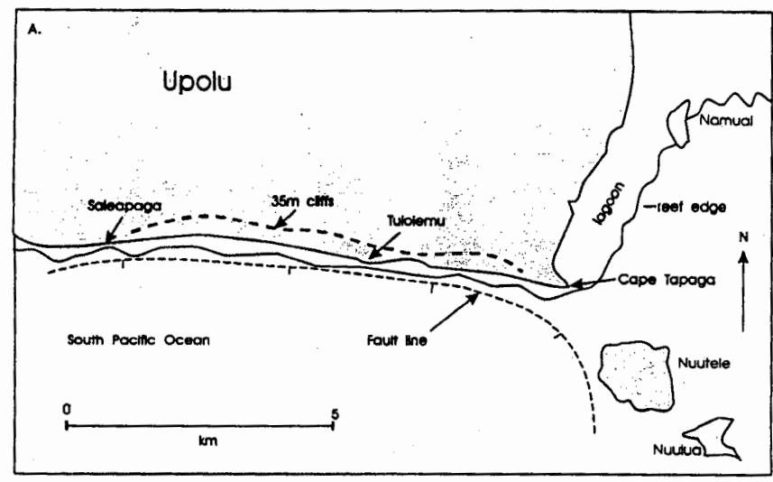

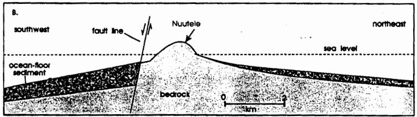

Figure 7.10. A. Sketch map of southeast Upolu (revised slightly from Kear and Wood 1959) to show the location of the inferred south-coast fault. Plate 7.5 is a view from west to east along the south coast near Tuiolemu. B. Cross-section from southwest to northeast to show the suggested effect of recent fault movement on Nuutele.

The new interpretation shown in Figure 7.11 suggests that the maximum Holocene sea level culminated in the formation of the Tafagamanu Sand about 2000 BP. Contemporary sea level may have slightly exceeded 2 m above its present mean level. This interpretation involves sea level rising during the middle Holocene at a rate of 1 m/1000 years, 11 then falling in the late Holocene at a rate perhaps as high as 2 m/1000 years. Without more information, particularly from the middle Holocene, it is impossible to be more precise.

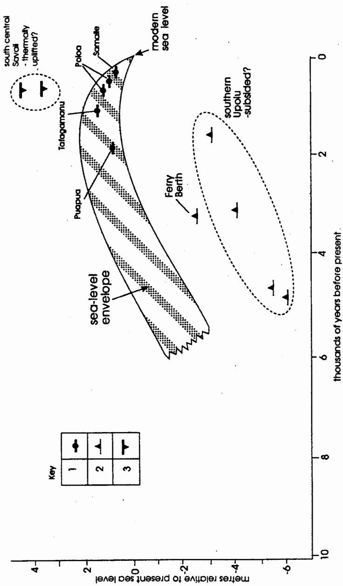

Figure 7.11. Holocene sea-level envelope for Samoa. During the past 5000 years, sea level is thought to have been within this envelope. Key; I - stable sites; 2 - sites which have subsided since formation; 3 - sites which have been uplisted since formation.

Table 7.2. Data relating to Holocene shoreline emergence in Samoa. Note that all height/depth data indicate actual emergence in metres as precisely as possible.

| Site        | Age (years BP) | Height/ depth | Source                       |
|-------------|-------------------|------------------|------------------------------|
| UPOLU ·     |                   |                  | •                            |
| Ferry Berth | 3116              | -2.25            | Leach and Green 1989         |
| Lefaga Bay  | 1580±160          | -1.63            | Saito 1990                   |
| south coast | 4845 <u>+</u> 95  | -5.95            | Bloom 1980                   |
| south coast | 4655 <u>+</u> 95  | -5.35            | Bloom 1980                   |
| south coast | 3060 <u>+</u> 95  | -3.95            | Bloom 1980                   |
| south coast | 1595 <u>+</u> 85  | -2.85            | Bloom 1980                   |
| Tafagamanu  | 1180 <u>+</u> 55  | 1.5              | Grant-Taylor and Rafter 1962 |
| SAVAII      | •                 |                  |                              |
| Gataivai    | 760+50            | 4.58             | Grant-Taylor and Rafter 1962 |
| Gataivai    | 715±50            | 3.66             | Grant-Taylor and Rafter 1962 |
| Puapua      | 1850+80           | 0.92             | Grant-Taylor and Rafter 1962 |
| Samaile     | 610 <u>+</u> 105  | 0.60             | this book                    |
| TUTUILA     |                   |                  | ·                            |
| Poloa       | 740+60            | 0.85             | Nunn 1994a                   |
| Poloa       | 690 <u>+</u> 70   | 0.72             | Nunn 1994a                   |

#### 7.5. Directions for future research

Although it now seems certain how the two-stage history of volcanism in Samoa is to be reconciled with the hotspot hypothesis, the relationship between lithospheric bending, fissuring and post-erosional volcanism is not yet well understood. The gaps which exist in our knowledge of the age of post-erosional volcanism, particularly on Upolu and Tutuila, need to be filled before we can begin to understand this period of the islands' tectonic and volcanic history fully.

Much more research on island tectonics is required. Some observations on post-formation tilting of volcanic structures would be illuminating.12 Heatflow measurements would allow the suggestion that lithospheric heating is an important cause of uplift locally to be evaluated. The high level limestone at Fale O Le Fee should be relocated and interpreted in a modern context.

Some unambiguous data on Holocene sea-level change are also needed. Coring of coastal plains in areas like Aleipata on Upolu might yield useful results and may also produce some surprises regarding the islands' tectonic history.

#### **Notes**

- 1 Not to be confused with the island of the same name off Ofu in the Manua group.
- 2 Commonly the date of the youngest (shield-building) volcanic activity.
- 3 Not to be confused with the tuff island of Nuutele off eastern Upolu in Western Samoa
- 4 A date of 22 110±370 BP obtained by the author for a marine mollusc within the Vini Tuff on Nuutele should give a maximum age for the formation. Yet, since it conflicts with other indicators of the age of this formation, it is not considered dependable. Interestingly, Schofield (nd) reported a date of 1915±65 BP for a thin bed of coral sand within the Vini Tuff but considered it unreliable for the same reason.
- Much of this account is based on the author's unpublished field research in Samoa. Where no reference is given, it can be assumed that the observation is the author's alone.
- 6 The significance of the Lapita cultural complex is explained in Chapter 9. Lapita is the name given to the earliest settlers of this part of the Pacific Islands.
- 7 This date has since been revised to 3116 (+283 or -337) using an updated marine correction factor (Leach and Green 1989).
- 8 See Nunn (1990a, 1995) for example.
- 9 Refer to Section 4.3.a for an extended discussion of this issue.
- 10 Richmond (1992) briefly examined this site and concluded that the reef was not *in situ*. This is true of some of the pieces on the seaward edge of the reef flat (such as that in plate 7.3) but not all.
- 11 Note that this revised rate is slower than that of 1.6m/1000 years proposed by Nunn (1991a).
- 12 As exemplified by the tilting of Seatura Volcano in Vanualevu (Section 6.2.b).