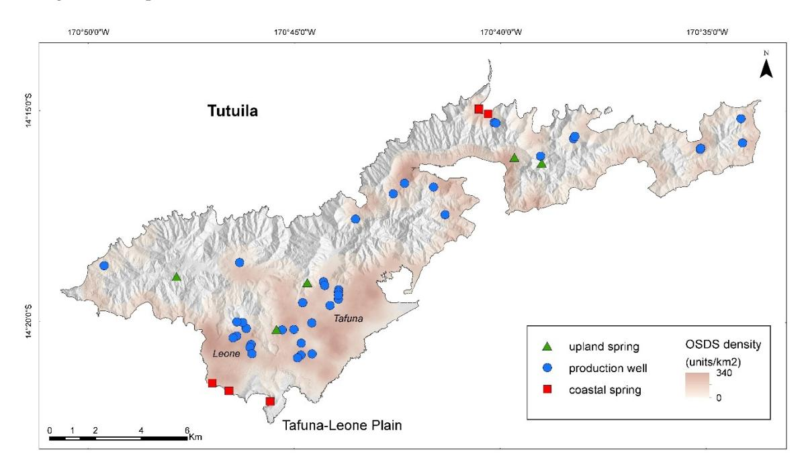
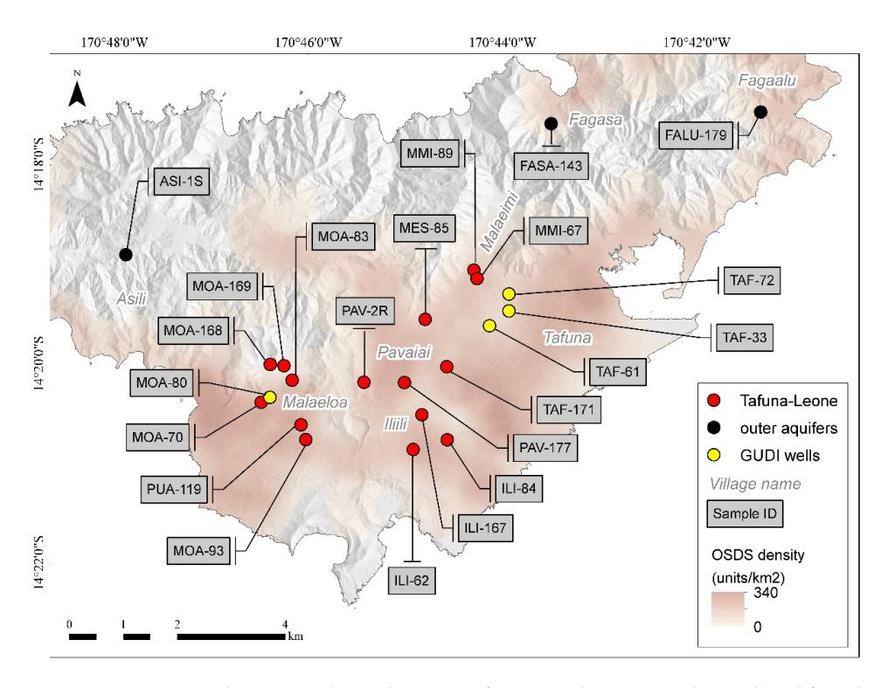
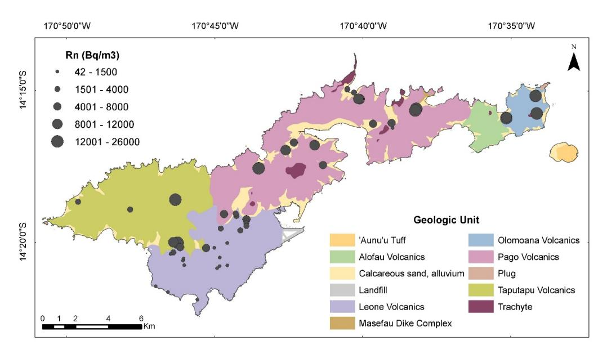
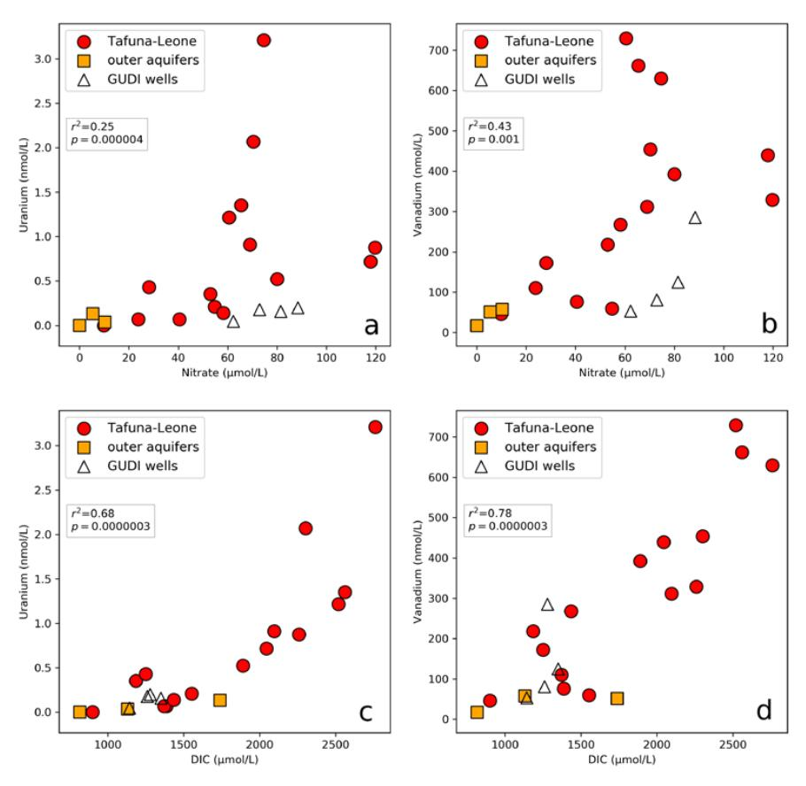
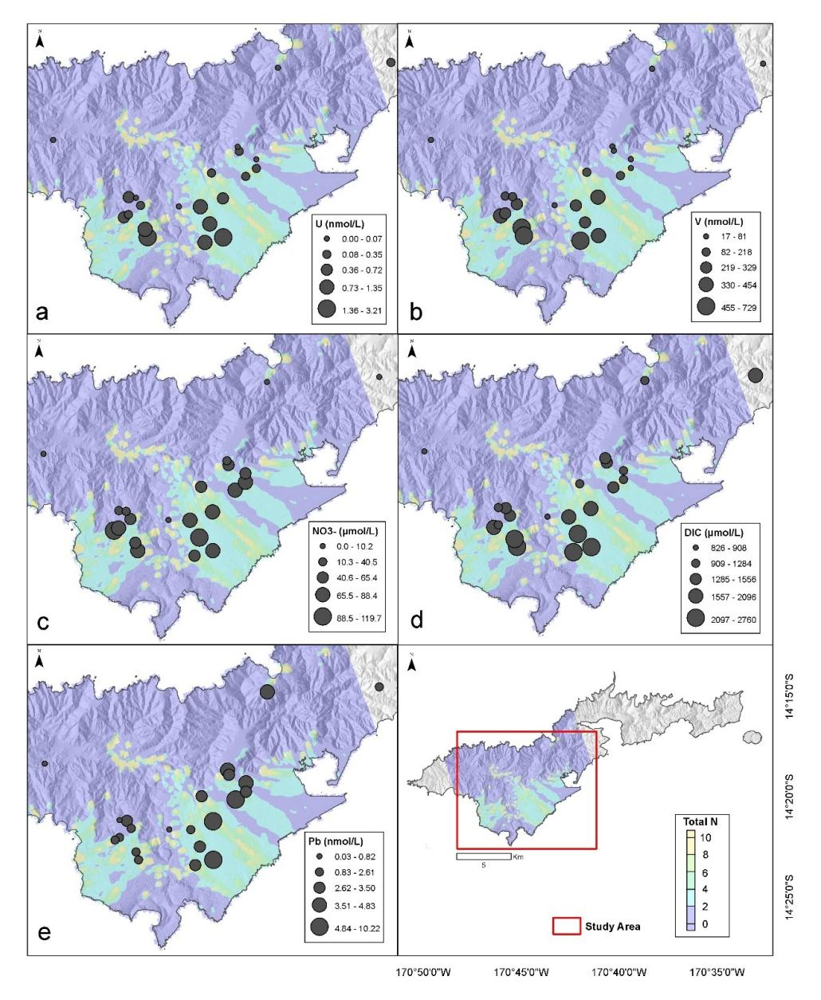
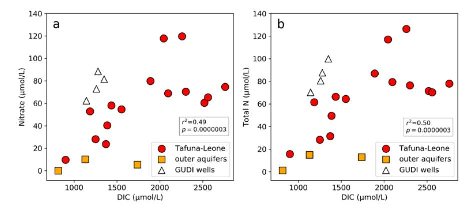
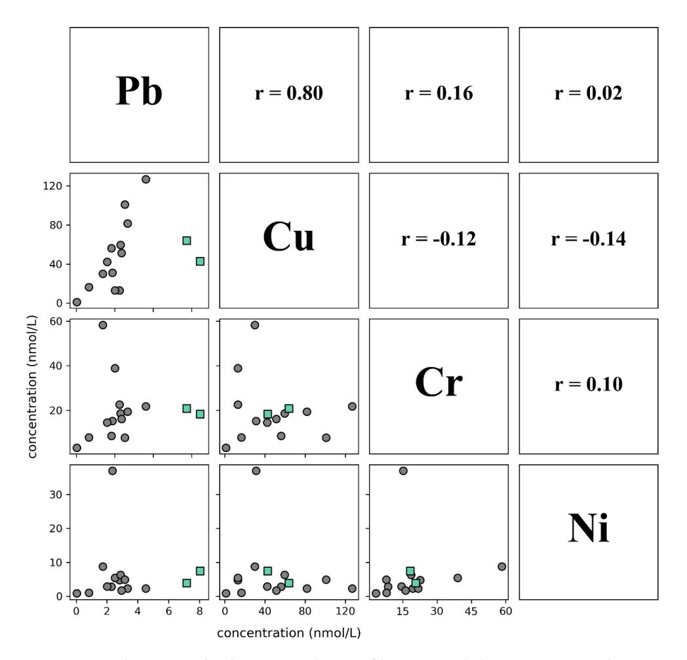
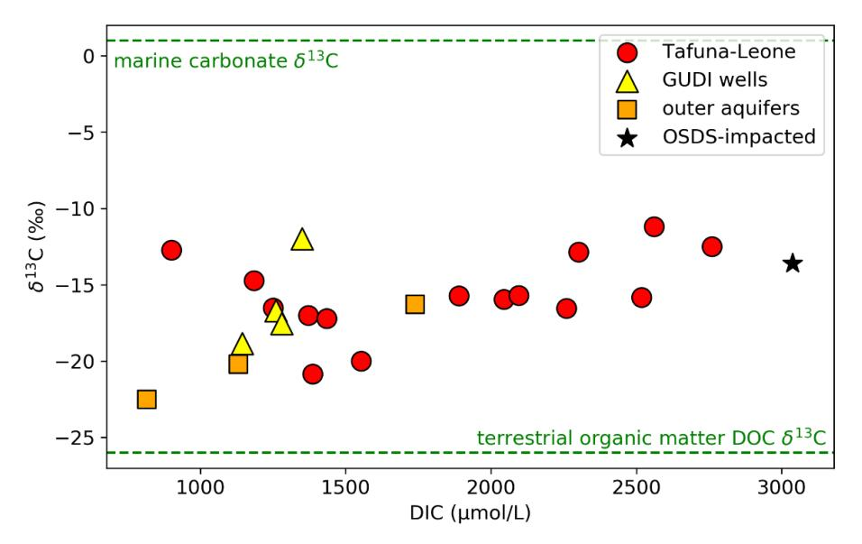
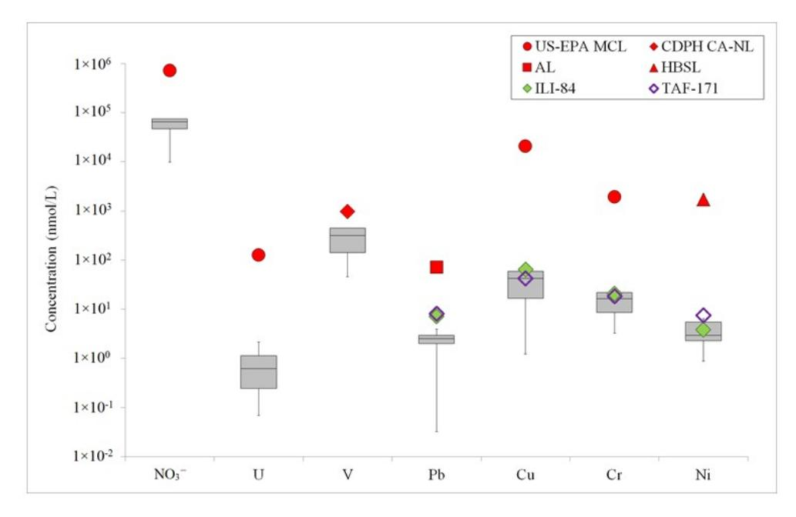

Article

# Metal Mobilization As An Effect of Anthropogenic Contamination in Groundwater Aquifers in Tutuila, American Samoa

Brytne K. Okuhata 1,\*, Henrietta Dulai 1, Christopher K. Shuler 2, Joseph K. Fackrell 1 and Aly I. El-Kadi 1,2

- Department of Earth Sciences, University of Hawai 'i at Mānoa, Honolulu, HI 96822, USA; hdulaiov@hawaii.edu (H.D.); jfackrell@usgs.gov (J.K.F.); elkadi@hawaii.edu (A.I.E.-K.)
- Water Resources Research Center, University of Hawai'i at Mānoa, Honolulu, HI 96822, USA; cshuler@hawaii.edu
- \* Correspondence: bokuhata@hawaii.edu

Received: 8 June 2020; Accepted: 23 July 2020; Published: 25 July 2020

Abstract: Groundwater is the primary drinking water source on most oceanic islands, including Tutuila, American Samoa. Drinking water quality on Tutuila is impacted by anthropogenic pollution sources such as on-site sewage disposal systems, piggeries, and agricultural leachate, particularly across the densely populated Tafuna–Leone Plain. The remineralization of anthropogenically sourced organic matter produces nitrate and dissolved inorganic carbon, which, according to previously published studies, have the potential to mobilize naturally occurring metals. This study provides further evidence that nutrients and dissolved inorganic carbon, along with naturally sourced metal concentrations, become elevated along pollution gradients and show correlation with each other. Across the Tafuna–Leone Plain, nitrate concentrations have a moderately positive correlation with uranium and vanadium. Dissolved inorganic carbon also positively correlate with nitrate, uranium, and vanadium. Similar studies elsewhere suggest that, in addition to nitrate, organic matter remineralization associated with carbonate create conditions to favor natural metal mobilization. Correlation analysis results imply that, while the surveyed trace metals are likely naturally sourced, some become soluble and more mobile in the presence of anthropogenically sourced nitrate and dissolved inorganic carbon, which alters redox conditions in the aquifer.

**Keywords:** groundwater pollution; uranium; vanadium; nitrate; dissolved inorganic carbon; American Samoa

## 1. Introduction

Groundwater is the primary source of fresh drinking water for most oceanic islands [1]. On Tutuila, the main island in the U.S. territory of American Samoa, groundwater supplies about 90% of the island's fresh drinking water to approximately 55,000 people. Relative to the island's less urbanized areas, the prevalence of residential units on the Tafuna–Leone Plain has the potential to cause a significant and measurable impact to groundwater quality, specifically, releases from on-site sewage disposal systems (OSDS), agricultural plantations, piggeries (small-scale pig farming operations), and a landfill [2]. Currently, about 70% of municipal water is pumped from wells on Tutuila's Tafuna–Leone Plain [3]. Regular groundwater monitoring on Tutuila is limited to the U.S. Environmental Protection Agency (EPA) safe drinking water testing standards, and is performed on an annual basis by the island's sole water utility. Water quality parameters in multiple wells across the Tafuna–Leone Plain fail to meet regulatory limits and several districts are under a boil water notice [4]. It is therefore important to better characterize the distribution and observable effects of groundwater contamination sources to

Water 2020, 12, 2118 2 of 19

support water resource management. Previous studies conducted in American Samoa have found elevated levels of groundwater nitrogen to be one of Tutuila's primary water quality concerns [2,5]. These studies found linkages between watershed population density and dissolved nitrogen in coastal waters, as well as links between groundwater nitrogen in the Tafuna–Leone Plain with wastewater from cesspools, where the prevalent chemical form of nitrogen found in these aquifers is nitrate  $(NO_3^{-})$  [2].

Previous studies elsewhere have shown that, in addition to primary contaminants released from anthropogenic sources, secondary contamination also affects water quality, as has been documented on the continental U.S. and in laboratory experiments, where an increase in  $NO_3^-$  resulted in remobilization of redox sensitive metals, such as, uranium (U) and vanadium (V) [6,7]. As polluted groundwater travels through the subsurface,  $NO_3^-$  oxidizes reduced forms of U and V, resulting in U and V mobilization [6]. In addition, the stability of dissolved trace metals is greatly enhanced by the availability of dissolved inorganic carbon (DIC) mainly occurring as carbonate ion that forms complexes with U and V (e.g., [8–10].) Anthropogenically introduced organic matter alters groundwater pH and redox conditions during its microbial degradation and the resulting joint release of  $NO_3^-$  and DIC forms soluble carbonate complexes of oxidized U and V species, thus increasing U and V ion concentrations in groundwater (e.g., [8–10]).

Building on these observations from previously characterized groundwater  $NO_3^-$  and DIC patterns for Tutuila [2], as well as U and V solubility dependencies on  $NO_3^-$  and DIC documented elsewhere [6], this study tested the hypothesis that U and V will be mobilized in the aquifer by  $NO_3^-$  and DIC. The confirmation of this hypothesis would be manifested by elevated nutrient, DIC, and trace metal concentrations along pollution gradients, with a statistically significant correlation between  $NO_3^-$  and DIC as explanatory variables and U and V as predicted variables of interest. To address this hypothesis, this study explores the relationships and spatial distribution of geochemical parameters of groundwater in Tutuila and looks at possible biogeochemical effects of anthropogenic organic matter and  $NO_3^-$  released into the aquifer. Specifically, the objective of this study is to evaluate the role of anthropogenically sourced dissolved  $NO_3^-$  and DIC in mobilization of trace metals, such as U and V, thereby increasing their transport and bioavailability.

In addition, this study also provides an inventory and distribution of multiple chemical species, for example, potentially harmful metals and radon. Radon-222 (222Rn) is a noble gas which is produced in geologic formations, including basaltic volcanic rocks [11]. It is the daughter product of radium-226 (226Ra) and belongs to the uranium-238 (238U) radioactive decay series [12]. Several parameters control 222Rn distribution and transport, including mineral surface alterations and pore water content [13]. This study looks at 222Rn levels as a regulated contaminant in drinking water [14] and also as a tracer for aquifer geology characterization.

Since fresh groundwater quantity is limited in Tutuila, it is necessary to understand the factors affecting groundwater quality. These include previously documented primary contaminants, such as nutrients and pathogens, but also secondarily mobilized naturally occurring metals. All of these factors can potentially be anthropogenically influenced, so to reduce the variables that may affect groundwater geochemistry, we focus on the aquifer that contains the most anthropogenic activity. This work provides information water resource managers can use for decision support by developing a better understanding of how human activities not only directly contribute contaminants to water supplies, but also how these constituents can modify the chemical conditions in basaltic island aquifers.

#### 2. Materials and Methods

## 2.1. Site Location and Sampling

Tutuila is a small (137 km $^2$ ) volcanic island located in the South Pacific (latitude:  $14^{\circ}19'55.24''$  S, longitude:  $170^{\circ}45'23.41''$  W) (Figure 1). The island is constructed of two geologically distinct regions [15]. The older region is a Pleistocene age complex of volcanic shields now deeply eroded into a rugged, mountainous edifice, while Holocene age rejuvenated volcanic eruptions later built the relatively flat

Water 2020, 12, 2118 3 of 19

Tafuna–Leone Plain on the shields' southwestern flank, which now supports much of the island's population and infrastructure [15]. The Tafuna–Leone Plain (~30 km²) is almost entirely covered with low-density residential development, with small areas of intense development that are located downgradient of production wells.

**Figure 1.** Location map of 50 groundwater sample sites on Tutuila, American Samoa. The density map, based on on-site sewage disposal systems (OSDS) locations from Shuler et al. [2], highlights the areas of urban development in relation to the sampling.

For this study, groundwater samples were collected from fifty locations, including six coastal springs, five upland springs, and thirty-nine production wells throughout Tutuila from 5–19 August 2013 (Figure 1). Upland springs and coastal spring samples were collected with a one-meter stainless steel push-point sampler (MHE Products) connected to a peristaltic pump that captured groundwater before it mixed with ocean water. Production well samples were collected from wellhead ports, which were located upstream of in-line chlorination. Of the samples assessed in this study, well depths ranged from 30 to 90 m below ground elevation and captured groundwater at the surface of the aquifer that is more susceptible to urban pollution. All of the samples were filtered during sample collection with 0.45  $\mu$ m hydrophilic polyethersulfone capsule filters. Nutrient, metal, ion, and DIC samples were collected in acid-washed, high-density polyethylene (HDPE) bottles and refrigerated immediately. Water for 222Rn analysis was collected in 250 mL glass bottles without head space. To ensure sample measurements were not impacted by anomalous events caused by weather, natural disasters, etc., four production wells (ILI-84, MMI-89, MOA-93, TAF-33) were each sampled nine times over the span of one year. These sample sites were located in different villages and regions (Figure 2), thus were spatially distributed across the Tafuna–Leone Plain.

Water 2020, 12, 2118 4 of 19

**Figure 2.** Location map with associated sample names of 22 groundwater samples analyzed for selected ions, nutrients, and trace metals across the Tafuna–Leone Plain, Tutuila, American Samoa. The density map, based on OSDS locations from Shuler et al. [2], highlights the areas of urban development in relation to the sampling. Analysis results can be found in Table 1 and Table S1.

# 2.2. Chemical Analysis

Groundwater samples were analyzed for dissolved inorganic nutrients (nitrate ( $NO_3^-$ ), nitrite ( $NO_2^-$ ), inorganic phosphorus (P), silicate ( $SiO_4^{\ 4}$ ), ammonium ( $NH_4^+$ ), total N (TN), and total P (TP)) using a Seal Analytical AA3® at the University of Hawai'i SOEST Laboratory for Analytical Biogeochemistry (S-LAB). Although this paper discusses the  $NO_3^-$ ,  $NO_2^-$ , and TN analysis, all other nutrient results are included in Table S1 for reference. The diazo reaction method is used to analyze  $NO_3^-$  and  $NO_2^-$  as detailed in Armstrong et al. (1967) [16] and Grasshoff et al. (1983) [17]. With a copper–cadmium redactor column, the  $NO_3^-$  is reduced to  $NO_2^-$ , which then reacts with sulfanilamide to form a diazo compound. The compound is coupled with N-1-naphthylethylene diamine dihydrochloride to create a purple azo dye, from which the concentration is colorimetrically determined at 550 nm. TN is determined using an on-line UV digestor according to the procedure established by the University of Hamburg. Persulfate oxidizes organic and inorganic nitrogen compounds to  $NO_3^-$ , which is then reduced to  $NO_2^-$  in a cadmium column. The sulfanilamide/NEDD reaction is used to determine the concentration with colorimetric detection at 520 nm. Concentrations of  $NO_3^-$  and  $NO_2^-$  were not determined for five of the samples (ILI-76, MES-22, PAV-178, TAF-81, VATI-CSP-21). These samples were therefore not considered when reporting geochemical ranges.

For a suite of dissolved trace metal analysis, including uranium (U), vanadium (V), chromium (Cr), lead (Pb), nickel (Ni), and copper (Cu), water was filtered in the field and acidified in a clean laboratory to pH  $\sim$ 1.8 using ultrapure 6 M HCl (Seastar Baseline) to a final acid concentration of 0.024 M. Acidified samples were analyzed similarly to the procedure in Shiller (2003) [18]. Briefly, prior to analysis, samples were slightly diluted (1.5×) by addition of ultrapure nitric acid (Seastar Baseline) containing known amounts of In, Sc, and Th as internal standards. The diluted samples were approximately 0.16 M in nitric acid and 2 ppm in the internal standards. Trace elements were then determined using a sector-field inductively coupled plasma—mass spectrometer (ICP–MS, Thermo-Fisher Element 2) at the University of Southern Mississippi Center for Trace Analysis (CETA). A low-flow (100  $\mu$ L/min)

*Water* **2020**, *12*, 2118 5 of 19

self-aspirating nebulizer (Elemental Scientific: Omaha, NE, USA) and Teflon spray chamber were utilized. Cs, Re, Pb, and U were determined in low resolution (as masses 133, 187, 208, and 238, respectively) and the other elements were determined in medium resolution (51 V, 52 Cr, 55 Mn, 56 Fe, 60 Ni, 63 Cu, 66 Zn, 85 Mo, 88 Sr, and 137 Ba). Calibration was done with external standards made in 0.16 M ultrapure nitric acid. The standards were independently checked against U.S. Geological Survey standard reference waters and an in-house consistency standard was also measured as a check on long-term stability of the standards. In was used for instrumental drift correction and sensitivity check, with the other internal standards serving as a check on the In. Sample acidification and other preparations for analysis were carried out in a laminar-flow clean bench. Since the Tafuna–Leone Plain is the most heavily urbanized location on Tutuila [\[2\]](#page-15-1), trace metal analysis was refined to this area for deeper investigation. Thus, 22 of the 50 sample sites were analyzed for trace metals (Figure [2\)](#page-3-0).

For additional water quality context, each sample was analyzed for concentrations of major ions using a Dionex ICS-1100s (IC) ion chromatography system at the University of Hawai'i Water Resources Research Center Analytical Laboratory. Results from major ion analyses are not discussed in this paper, but are included in Table S1 for reference. All DIC samples were analyzed using a Shimadzu TOC-V analyzer at the University of Hawai'i Water Resources Research Center Analytical Laboratory. All δ 13C of DIC samples were analyzed using a Delta V Isotope Ratio Mass Spectrometer at the Skidaway Institute Scientific Stable Isotope Laboratory at the University of Georgia. All 222Rn samples were measured with a RAD-H2O instrument (Durridge, Inc.) in the field on the day of collection and were corrected for radioactive decay to the time of sample collection. At least 10% of all nutrient and major ion samples were run as duplicates and used to assess analytical error. Analytical uncertainties were computed using the standard error of the line of best fit of duplicate samples (Table [1](#page-6-0) and Table S1). Duplicate trace metal samples were not analyzed.

## *2.3. Human Impact Levels and Statistical Analysis*

Due to the complexities in land use patterns and groundwater flow, the degree of impact from human land use on any given point is difficult to assess. However, we were able to use previously determined groundwater flow paths [\[2,](#page-15-1)[15\]](#page-16-11) combined with known locations of development [\[2\]](#page-15-1) to bin the wells into categories of being upgradient or downgradient of human development. To accomplish this, we delineated the geologic contact between the young Tafuna–Leone Plain and the old volcanic mountains, and identified the wells that were more than 300 m downgradient from the geologic contact as human-impacted wells. Wells located less than 300 m downgradient from the contact were identified as less-impacted wells (marked in Table [1\)](#page-6-0). While this distance of 300 m is somewhat arbitrary, it provided the best approximation of the delineation between impacted and less impacted wells that clearly have different geochemical signatures based upon their proximity to nonpoint pollution sources [\[2\]](#page-15-1). Two wells in particular (MOA-168 and MOA-169) are located in an undeveloped area of the Tafuna–Leone Plain with no upgradient human development (Figure [2\)](#page-3-0). Additionally, one of the upland spring samples, PAV-2R, was collected within a stream very near the spring source, located on a hill. Therefore, despite being in the middle of the plain in map view (Figure [2\)](#page-3-0), the sample location is elevated from surrounding human development.

Three samples (ASI-1S, FALU-179, FASA-143) were collected north of the Tafuna–Leone Plain, and are included in the statistical analysis, representing pristine samples that are not heavily impacted by anthropogenic sources. All *p*-values were determined with a Kruskal–Wallis H-test.

## **3. Results**

## *3.1. Radon*

Groundwater 222Rn concentrations range from 42 to 26,000 Bq/m3 across Tutuila (Table S1). The spatial distribution of 222Rn generally follows the geology of the island, where groundwater from the older volcanic rocks and alluvium contained higher 222Rn values (*n*=21, average 10,636±7020 Bq/m3 ,

Water 2020, 12, 2118 6 of 19

median 11,137 Bq/m³) and groundwater from the younger Leone Volcanics contained lower  $^{222}$ Rn values (n = 24, average  $2932 \pm 4075$  Bq/m³, median 1411 Bq/m³) (Figure 3). Currently, a drinking water standard for  $^{222}$ Rn is not federally enforced. The U.S. Environmental Protection Agency (EPA), however, recommends that  $^{222}$ Rn levels do not exceed 148,000 Bq/m³ (4000 pCi/L) in drinking water [14]. All measured values in this study were at least an order of magnitude below the EPA recommendation.

**Figure 3.** Spatial distribution of 222Rn concentrations measured from groundwater in Tutuila, American Samoa. Data are in Table S1.

The Olomoana Volcanics, Pago Volcanics, and Taputapu Volcanics formed during the Pliocene to earliest Pleistocene Epoch while the Leone Volcanics and sedimentary rocks formed during the recent Quaternary Period [19]. This relationship between 222Rn concentrations and geology was expected since 222Rn concentrations increase as groundwater residence times increase until steady-state concentrations are reached within about 20 days [13]. As the host rock surface area increases, more 238U and 226Ra become exposed at the mineral–water interface, thus enabling 222Rn to dissolve into the groundwater system [20]. Measured 222Rn activities therefore reflect the geology of the groundwater flow over the last 20 days before sampling. A distinct difference was detected between 222Rn concentrations in groundwater of the Tafuna–Leone Plain and groundwater sampled throughout the rest of Tutuila (Figure 3). This is consistent with the geochemical differences as previously described by [21] between the established geologic units [22]. The 222Rn chemistry indicates that samples were collected from two geochemically distinctive aquifer systems.

#### 3.2. Uranium, Vanadium, and Nutrients

Trace metals were analyzed from waters collected at 22 of the 50 sample sites. Four samples (MOA-80, TAF-33, TAF-61, TAF-72) were excluded from statistical analysis (but still displayed in figures) because they were collected from wells that are known to produce groundwater under the direct influence (GUDI) of surface water [23–26], thus limiting their comparability to unaffected groundwater samples. Uranium concentrations above detection limits range from 0.04 to 3.21 nmol/L and V concentrations range from 17 to 729 nmol/L (Table 1). Both U and V have a moderately strong but statistically significant positive correlation with NO3- ( $r^2 = 0.25$ ,  $p \le 0.01$  and  $r^2 = 0.43$ ,  $p \le 0.01$ , respectively) (Figure 4). Additionally, NO3-, U, and V all follow the same spatial trends (Figure 5a–c). Concentrations of U, V, and NO3- are lower inland of the plain and increase downgradient towards the southern areas of the plain (Figure 5a–c).

Water 2020, 12, 2118 7 of 19

**Table 1.** Groundwater samples analyzed for select ions, nutrients, and trace metals (arranged in ascending  $NO_3^-$  order). Measurements for all 50 samples can be found in Table S1. The mapped sample locations can be seen in Figure 2.

| Sample ID           | Lat     | Lon      | NO 3 - (μM) | TN (μM) | DIC * (μM) | δ 13 C * (‰) | U (nM) | V (nM) | Pb (nM) | Cu (nM) | Cr (nM) | Ni (nM) |
|---------------------|---------|----------|--------------------------------------|------------|------------|-------------------------|-----------|-----------|------------|------------|------------|------------|
| ASI-1S              | -14.315 | -170.798 | 0.0                                  | 1.2        | 826        | -22.3                   | 0.00      | 17        | 0.31       | 3.8        | 9.9        | 3.0        |
| FALU-179 ^          | -14.291 | -170.689 | 5.4                                  | 12.9       | 1741       | -16.1                   | 0.13      | 51        | 2.18       | 43.3       | 0.7        | 1.4        |
| PAV-2R §            | -14.336 | -170.757 | 9.8                                  | 15.7       | 908        | -12.6                   | 0.00      | 46        | 0.03       | 1.2        | 3.2        | 0.9        |
| FASA-143            | -14.293 | -170.725 | 10.2                                 | 14.9       | 1136       | -20.0                   | 0.04      | 58        | 4.16       | 82.2       | 1.0        | 2.1        |
| MOA-168 §           | -14.334 | -170.771 | 23.8                                 | 31.5       | 1375       | -16.9                   | 0.07      | 110       | 3.16       | 101.0      | 7.8        | 4.9        |
| MOA-169 §           | -14.333 | -170.773 | 28.1                                 | 28.3       | 1255       | -16.4                   | 0.43      | 173       | 0.82       | 16.5       | 7.9        | 1.1        |
| MMI-89 §            | -14.318 | -170.738 | 40.5                                 | 49.5       | 1391       | -20.7                   | 0.07      | 76        | 4.53       | 126.7      | 21.8       | 2.3        |
| MES-85 §            | -14.326 | -170.747 | 52.9                                 | 61.6       | 1190       | -14.6                   | 0.35      | 218       | 2.95       | 51.2       | 16.2       | 1.7        |
| MMI-67 §            | -14.319 | -170.738 | 54.7                                 | 64.4       | 1556       | -19.8                   | 0.21      | 60        | 3.34       | 81.6       | 19.4       | 2.3        |
| MOA-83 §            | -14.336 | -170.769 | 58.2                                 | 66.4       | 1438       | -17.1                   | 0.14      | 268       | 2.29       | 56.1       | 8.6        | 2.8        |
| MOA-93              | -14.343 | -170.768 | 60.5                                 | 71.5       | 2516       | -15.7                   | 1.22      | 729       | 2.52       | 13.0       | 38.9       | 5.4        |
| TAF-72 ‡            | -14.322 | -170.732 | 62.3                                 | 70.2       | 1147       | -18.7                   | 0.05      | 53        | 4.83       | 189.1      | 16.7       | 8.3        |
| ILI-62              | -14.348 | -170.749 | 65.4                                 | 70.2       | 2561       | -11.2                   | 1.35      | 662       | 2.82       | 12.9       | 22.6       | 4.7        |
| PAV-177             | -14.336 | -170.750 | 69.0                                 | 79.4       | 2096       | -15.7                   | 0.91      | 312       | 2.35       | 31.1       | 15.2       | 37.0       |
| ILI-84              | -14.346 | -170.743 | 70.3                                 | 76.4       | 2309       | -13.2                   | 2.07      | 454       | 7.18       | 63.9       | 20.7       | 3.9        |
| TAF-33 ‡            | -14.324 | -170.732 | 72.9                                 | 80.6       | 1260       | -16.7                   | 0.18      | 81        | 3.50       | 70.6       | 15.3       | 3.0        |
| PUA-119             | -14.346 | -170.767 | 74.6                                 | 77.9       | 2760       | -12.5                   | 3.21      | 630       | 1.72       | 30.0       | 58.3       | 8.8        |
| TAF-171             | -14.334 | -170.743 | 80.0                                 | 87.0       | 1888       | -15.9                   | 0.52      | 392       | 8.05       | 42.7       | 18.3       | 7.4        |
| TAF-61 ‡ | -14.327 | -170.736 | 81.5                                 | 99.9       | 1344       | -12.1                   | 0.16      | 125       | 10.22      | 103.9      | 18.7       | 6.3        |
| MOA-80 ‡            | -14.339 | -170.773 | 88.4                                 | 87.6       | 1284       | -17.4                   | 0.20      | 285       | 2.61       | 59.6       | 9.9        | 2.9        |
| MOA-70 §            | -14.340 | -170.775 | 117.9                                | 117.1      | 2044       | -15.8                   | 0.72      | 440       | 2.00       | 42.2       | 14.5       | 2.9        |
| ILI-167             | -14.342 | -170.747 | 119.7                                | 126.3      | 2259       | -16.5                   | 0.88      | 329       | 2.88       | 59.5       | 18.7       | 6.4        |

Analytical uncertainties:  $NO_3^- \pm 1.20~\mu mol/L$ ;  $TN \pm 3.27~\mu mol/L$ ;  $DIC \pm 61.14~\mu mol/L$ ;  $\delta^{13}C \pm 1.26~\infty$ . Detection limits: N + N 0.091  $\mu mol/L$ ; TN 0.14  $\mu mol/L$ ; U 0.01 nmol/L; V 1.0 nmol/L; V 0.01 nmol/L; V 0.01 nmol/L; V 0.01 nmol/L; V 0.01 nmol/L; V 0.01 nmol/L; V 0.01 v 0.01 v 0.01 v 0.01 v 0.01 v 0.01 v 0.01 v 0.01 v 0.01 v 0.01 v 0.01 v 0.01 v 0.01 v 0.01 v 0.01 v 0.01 v 0.01 v 0.01 v 0.01 v 0.01 v 0.01 v 0.01 v 0.01 v 0.01 v 0.01 v 0.01 v 0.01 v 0.01 v 0.01 v 0.01 v 0.01 v 0.01 v 0.01 v 0.01 v 0.01 v 0.01 v 0.01 v 0.01 v 0.01 v 0.01 v 0.01 v 0.01 v 0.01 v 0.01 v 0.01 v 0.01 v 0.01 v 0.01 v 0.01 v 0.01 v 0.01 v 0.01 v 0.01 v 0.01 v 0.01 v 0.01 v 0.01 v 0.01 v 0.01 v 0.01 v 0.01 v 0.01 v 0.01 v 0.01 v 0.01 v 0.01 v 0.01 v 0.01 v 0.01 v 0.01 v 0.01 v 0.01 v 0.01 v 0.01 v 0.01 v 0.01 v 0.01 v 0.01 v 0.01 v 0.01 v 0.01 v 0.01 v 0.01 v 0.01 v 0.01 v 0.01 v 0.01 v 0.01 v 0.01 v 0.01 v 0.01 v 0.01 v 0.01 v 0.01 v 0.01 v 0.01 v 0.01 v 0.01 v 0.01 v 0.01 v 0.01 v 0.01 v 0.01 v 0.01 v 0.01 v 0.01 v 0.01 v 0.01 v 0.01 v 0.01 v 0.01 v 0.01 v 0.01 v 0.01 v 0.01 v 0.01 v 0.01 v 0.01 v 0.01 v 0.01 v 0.01 v 0.01 v 0.01 v 0.01 v 0.01 v 0.01 v 0.01 v 0.01 v 0.01 v 0.01 v 0.01 v 0.01 v 0.01 v 0.01 v 0.01 v 0.01 v 0.01 v 0.01 v 0.01 v 0.01 v 0.01 v 0.01 v 0.01 v 0.01 v 0.01 v 0.01 v 0.01 v 0.01 v 0.01 v 0.01 v 0.01 v 0.01 v 0.01 v 0.01 v 0.01 v 0.01 v 0.01 v 0.01 v 0.01 v 0.01 v 0.01 v 0.01 v 0.01 v 0.01 v 0.01 v 0.01 v 0.01 v 0.01 v 0.01 v 0.01 v 0.01 v 0.01 v 0.01 v 0.01 v 0.01 v 0.01 v 0.01 v 0.01 v 0.01 v 0.01 v 0.01 v 0.01 v 0.01 v 0.01 v 0.01 v 0.01 v 0.01 v 0.01 v 0.01 v 0.01 v 0.01 v 0.01 v 0.

Figure 4. Scatterplots showing distribution and correlation between (a) NO3- and U1 (b) NO3- and

Water 2020, 12, 2118 8 of 19

V, (c) dissolved inorganic carbon (DIC) and U, and (d) DIC and V. Samples collected within the Tafuna–Leone Plain are indicated by red circles. Samples collected north of the Tafuna–Leone Plain, therefore from a different volcanic series and aquifers, are indicated by orange squares. GUDI wells (groundwater under the direct influence of surface water) from within the Tafuna–Leone Plain are indicated by white triangles. Trend and significance values computed for non-GUDI samples. Data for all plots are in Table 1.

**Figure 5.** Spatial distribution of (a) U concentrations, (b) V concentrations, (c) NO3- concentrations, (d) DIC concentrations, and (e) Pb concentrations measured from groundwater across the Tafuna–Leone Plain, Tutuila, American Samoa. Concentrations are placed over a modeled total N distribution map modified from Shuler et al. [2]. Since the modeled total N distribution is a function of anthropogenic activities (OSDS, piggeries, agriculture) superimposed on groundwater flow calculations, this represents the areas that are either urbanized or downgradient of urbanization. Bottom right map displays the extent of maps (a–e), outlined by the red box. Data can be found in Table 1. The sample names associated with each sample location can be seen in Figure 2.

Nitrate concentrations above detection limits of the 22 samples analyzed for trace metals range from 5.4 to  $119.7 \mu mol/L$  (Table 1), while concentrations of all 50 samples range from 1.7

Water 2020, 12, 2118 9 of 19

to 548.0  $\mu$ mol/L (Table S1). All NO2- concentrations are less than 0.4  $\mu$ mol/L, 80% of which are less than or equal to the analytical uncertainty of  $\pm 0.01~\mu$ mol/L (Table S1). Due to the extremely low NO2- concentration measurements, NO2- is considered negligible and only NO3- is used for correlation analysis. Concentrations of inorganic P range from 0.5 to 8.7  $\mu$ mol/L, SiO44- range from 304.6 to 1107.6  $\mu$ mol/L, NH4+ range from 0.01 to 6.8  $\mu$ mol/L, TN range from 1.2 to 570.1  $\mu$ mol/L, and TP range from 0.4 to 9.0  $\mu$ mol/L for all 50 samples across Tutuila.

#### 3.3. Dissolved Inorganic Carbon

In general, there are four main sources of groundwater DIC on oceanic islands: carbonate mineral dissolution, decomposition of organic matter from natural or anthropogenic sources (such as farming and OSDS leachate), dissolution of atmospheric carbon dioxide (CO2), and intrusion of ocean water [28]. The DIC concentrations of the 22 samples analyzed for trace metals range from 826 to 2760  $\mu$ mol/L (Table 1), while concentrations of all 50 samples range from 343 to 4064  $\mu$ mol/L (Table S1). Groundwater DIC correlated well with NO3- and TN concentrations (Figure 6). Samples collected from less-impacted areas, where there is minimal urbanization upgradient [2], displayed relatively low DIC and NO3- concentrations (Figure 5). Samples collected from populated areas, with moderate to heavy upgradient urbanization [2], displayed relatively high DIC and NO3- concentrations. Both U and V also display a strong positive correlation with DIC (Figure 4c,d).

**Figure 6.** Scatterplot showing correlation between DIC with (a) NO3- and (b) TN. Samples collected within the Tafuna–Leone Plain are indicated by red circles. Samples collected north of the Tafuna–Leone Plain, therefore from a different volcanic series and aquifers, are indicated by orange squares. GUDI wells from within the Tafuna–Leone Plain are indicated by white triangles. Trend and significance values computed for non-GUDI samples. Data for all plots are in Table 1.

#### 3.4. Lead, Copper, Chromium, Nickel

Heavy metals, such as lead (Pb), copper (Cu), chromium (Cr), and nickel (Ni), naturally occur in groundwater, but their concentrations are driven by different biogeochemical and anthropogenic processes [29]. The Tafuna aquifer shows mostly low or background concentrations of these metals with a few anomalies. Specifically, there are two samples in the Tafuna aquifer (ILI-84 and TAF-171) with relatively higher Pb concentrations. Those two enriched wells have an average Pb concentration of  $7.6 \pm 0.4$  nmol/L (n = 2) while the rest of the wells have an average of  $2.4 \pm 1.1$  nmol/L (n = 13). Since the other Pb samples within the Tafuna lavas did not reach the same level of concentration as the two outliers, it is probable that the increased Pb concentrations are not due to erosion of natural deposits. Lead concentrations range from 0.03-10.22 nmol/L; Cu range from 1.2-189.1 nmol/L; Cr range from 1.2-189.1 nmol/L; Ni range from 1.2-189.1 nmol/L; Cr range from 1.2-189.1 nmol/L; Cr, and Ni (Figure 7). Chromium also displays a positive correlation with Ni (Figure 7).

Water 2020, 12, 2118

**Figure 7.** Scatterplot matrix displaying correlation of heavy metal elements in groundwater. Teal squares highlight the two samples in which elevated Pb concentrations were measured (ILI-84, TAF-171). Data are in Table 1.

#### 4. Discussion

#### 4.1. Remobilization of U and V

In the Tafuna–Leone Plain, U concentrations display a positive correlation with  $NO_3^-$  levels and follow a spatial gradient of increasing concentrations toward the coastline and with urbanization (Figure 5a,c). Uranium is a redox-sensitive trace metal, commonly weathered from igneous parent rocks [6,30]. The mobility of U is primarily dependent on its oxidation state, where oxidized U(VI) is generally more soluble than reduced U(IV) [10,31]. With an increasing amount of oxidants present in the groundwater system, uraninite (UO2) will dissolve from minerals to aqueous forms of U [32]. For example,  $NO_3^-$  can oxidize  $UO_2$  following the reaction:

$$UO_2 + NO_3^- + 2H^+ \rightarrow UO_2^{2+} + NO_2^- + H_2O_7$$
 (1)

therefore being reduced to  $NO_2^-$  while  $UO_2$  becomes a uranyl cation ( $UO_2^{2+}$ ) [33]. N(III) contained within  $NO_2^-$  has a relatively unstable oxidation state [34]. Thus,  $NO_2^-$  is typically unstable in oxic groundwater systems and is readily oxidized to  $NO_3^-$  [34,35]. Further, during the denitrification process,  $NO_2^-$  acts as an electron acceptor while oxidizing organic matter within the groundwater and is thus reduced to  $N_2O$  or  $N_2$  [36]. As such, despite the proposed production described by Equation (1), changes in groundwater  $NO_2^-$  concentrations are undetectable and <0.05% of TN is comprised of  $NO_2^-$  in the current study.

Water 2020, 12, 2118

In its oxidized state, U(VI) can be transported as  $UO_2^{2+}$  when exposed to oxic–alkaline groundwater conditions [37]. Anoxic groundwater conditions, on the other hand, inhibit U mobility [38,39]. The groundwater samples at the 22 analyzed sites had a dissolved oxygen (DO) content >64% (average 80 ± 9%), therefore exhibiting reasonably oxic conditions (Table S1). Although DO is clearly present in this groundwater system, these values are relatively low compared to a fully oxygen-saturated state of groundwater observed in the upstream pristine locations and at other tropical, volcanic aquifers, where mean DO content typically averages >90% [40]. Despite the relatively high DO content measured in the Tafuna–Leone Plain, it has been shown in other studies that DO is not as effective at oxidizing U(IV) as  $NO_3^-$  [6,31]. Indeed we find no statistically significant correlation between DO and U ( $r^2 = 0.0006$ ).

There are numerous complexes formed around UO22+, which are typically more soluble and mobile than covalently bonded U(IV) [10,37]. With a positive correlation between U and  $NO_3^-$  ( $r^2 = 0.25$ ,  $p \le 0.01$ ) (Figure 4a), our data suggest that the previously reported mechanism of U mobilization by NO3- introduced into the groundwater system may be taking place. The solubility is further enhanced by the presence of DIC, as suggested by Cumberland et al. [10] and described in Section 4.2. Within the Tafuna–Leone Plain, groundwater generally flows from the mountains to the coast [15]. The Tafuna–Leone Plain contains 32% of Tutuila's total population [41] and 2800 OSDS units [3]. As groundwater contaminant plumes travel downgradient from the pollution sources, NO3-, acting as an oxidant, may be interacting with U by accepting electrons from the immobile U(IV), and oxidizing U to its mobile U(VI) form [6,7]. There is even the potential for NO3- to remobilize U that has been previously bioreduced [33]. Despite the fact that NO3- is being consumed during this U oxidation process, a decrease in NO3- concentration would not be significant due to the thousand-fold difference between the observed U (nM) and NO3- (µM) concentrations. A conversion of 3 nmol/L of U (the highest observed in this study) would result in a <0.01% decrease in NO3- concentration and build-up of nmol/L levels of NO2- that are below our detection limits. As such, low to undetectable levels of NO2- and persistently elevated NO3- levels despite its consumption during the proposed U oxidation process are consistent with our hypothesis of the proposed oxidative pathway.

Similar results were found by Nolan et al. [6] in the High Plains and Central Valley aquifers in the United States, where a strong positive correlation ( $r \ge 0.75$ ) between NO3- and U was found. Laboratory experiments conducted by Moon et al. [31] documented a similar relationship where U was reoxidized when in contact with NO3-. In these laboratory experiments, NO3- even served as a more efficient oxidant than O2, regardless of O2 being a more thermodynamically favorable oxidizer [31]. Moon et al. [31] determined that the free energy ( $\Delta G^{"}$ ) of U(IV) oxidation with O2 and NO3- as oxidants was -50.4 and -44.2 kJ/mol of electrons, respectively. Despite this, 1.7 times more U reoxidized when in contact with  $NO_3^-$  (264 µmol of U) relative to  $O_2$  (155 µmol of U) [31]. They found that this inconsistency was a result of the breakthrough characteristics of O2 and NO3-, where NO3- had a faster breakthrough time (the time when at least 50% of the introduced NO3- was detected in the sample) of 12 h compared to the O2 breakthrough time of 33 days [31]. This suggests that O2 quickly reacts with other species, such as iron (Fe3+) and sulfides, before its advancing front comes in contact with U [31]. In comparison, NO3- does not rapidly react with other species, therefore it is able to more readily oxidize U [31]. Additionally, other laboratory experiments suggest that dissimilatory NO3- reduction intermediates (nitrite, nitrous oxide, nitric oxide) can abiotically oxidize U(IV) [33]. In this study, we found minimal levels of NO2-, so its role in U oxidation and correlation with U could not be evaluated. Finally, numerical model simulations conducted by van Berk et al. [32] confirmed their hypothesis that the addition of NO3- (derived from fertilizers) shifted groundwater redox conditions to an oxidizing environment, thus mobilizing U.

Vanadium is also a redox-sensitive trace metal that is commonly found with U in deposits [10]. The mobility of V is governed by its oxidation state (V(III), V(IV), V(V)) under various redox and pH conditions [42]. It is generally accepted that V is most mobile when it is most oxidized as V(V) and becomes less mobile when in its V(IV) or lower state [43,44]. In natural waters with conditions applicable to U, V is most commonly found as  $H_2VO_4^{-}$ ,  $HVO_4^{2-}$ , and  $VO_2^{2+}$  [10]. The vanadate

Water 2020, 12, 2118 12 of 19

oxyanions  $H_2VO_4^-$  and  $HVO_4^{2-}$  are not as easily adsorbed onto solid particles while the oxycation  $VO^{2+}$  is much more easily adsorbed [42,45]. Vanadium is thus more soluble when in oxidizing waters [45]. Mobile V(V) is most stable in oxic groundwater conditions, where there is an abundant amount of  $O_2$  present to act as an electron acceptor [9,42]. Following the simplified equation:

$$4V + 5O_2 \rightarrow 2V_2O_5,$$
 (2)

V(IV) can be oxidized to V(V) using  $O_2$  as the redox reagent [46].

Based on these thermodynamic characteristics, V may also be mobilized by the presence of excess  $NO_3^-$  in groundwater, similarly to U. When in the oxidized state, V(V) is also able to combine with U(VI) [10]. Glenn et al. [47] found a positive correlation between V and  $NO_3^-$  in groundwater from the Gulf Coast aquifer in Texas. The V samples had a positive correlation with arsenic, which may suggest a geologic source, but both V and  $NO_3^-$  displayed a negative correlation with well depth [47]. Since the highest V and  $NO_3^-$  concentrations were measured at the shallowest depths, they suggest that these samples are affected by land surface sources [47]. Thus, the introduction of anthropogenically elevated  $NO_3^-$  has the potential to increase groundwater concentrations of naturally sourced metals that, in high concentrations, may pose a health risk to humans.

## 4.2. Formation of Soluble Carbonate Complexes

Besides acting alone as an electron acceptor for U and V, NO3- can also correlate with elevated levels of DIC because of their common source of organic matter remineralization (Figure 6). This in turn can alter groundwater redox conditions and enhance metal mobility by forming carbonate complexes. As previously mentioned, groundwater in this setting gains DIC through four primary mechanisms: carbonate mineral dissolution, anthropogenic and organic decomposition, dissolution of atmospheric CO2, and ocean water [28]. DIC concentrations from the four production wells (ILI-84, MMI-89, MOA-93, TAF-33) that were sampled nine times over the span of one year indicate that the elevated concentrations are relatively constant with standard deviations as a percent of the average DIC concentration for each production well of 6%, 5%, 10%, and 5%, respectively (Table S2). The DIC concentrations and aquifer conditions during this study are therefore relatively stable and unlikely impacted by abnormal events, such as drought conditions. So in areas with more anthropogenic carbon contributions, groundwater DIC concentrations would be expected to be higher than those in groundwater only affected by natural sources. Total N has been found to be a reliable proxy for human impact on groundwater systems [2]. Samples that display high concentrations of both DIC and TN can be assumed to have a relatively strong anthropogenic influence.

Measured  $\delta^{13}$ C values after unmixing of seawater contribution range from -11.2% to -22.3% (Table 1). Seawater contribution does not drastically impact  $\delta^{13}$ C values, as the average difference between raw and unmixed  $\delta^{13}$ C value pairs is <0.1‰. These isotopically depleted values suggest that the DIC is coming from either atmospheric sources or organic matter. While it is possible that these  $\delta^{13}$ C values could be produced through mixing with DIC dissolved from carbonate minerals, it is unlikely because limited carbonate exists in this area [48] and even in less-impacted areas where carbonate formations exist, elevated DIC concentrations were not found in wells, thus dismissing carbonate mineral dissolution as the sole mechanism of the elevated DIC concentrations. Further, carbonate mineral dissolution would impart  $\delta^{13}$ C values of ~1‰, so should therefore produce DIC with isotopically enriched  $\delta^{13}$ C values [49]. This therefore provides evidence that remineralization of organic matter is partially responsible for the isotopically depleted  $\delta^{13}$ C values and is the source of DIC.

Decomposition of organic C may be able to explain the remaining DIC variability. Anthropogenic activities simultaneously introduce both organic C and N to the aquifer system, which are subsequently oxidized to DIC and  $NO_3^-$ , thus creating a relationship between the two. Anthropogenic activities such as OSDS and piggeries are the primary sources of  $NO_3^-$  contamination in the Tafuna–Leone Plain [2].

Water 2020, 12, 2118 13 of 19

The correlation between DIC and  $NO_3^-$  (Figure 6) suggests that the DIC detected in the Tafuna–Leone Plain may also be anthropogenically sourced, since samples collected from populated areas show higher DIC concentrations than samples collected from natural areas (Figure 5d). Additionally,  $\delta^{13}$ C measurements suggest an anthropogenic source of DIC to the groundwater system. Literature values of DIC and  $\delta^{13}$ C from OSDS impacted groundwater are ~3000 µmol/L and –13‰, respectively [50]. The OSDS  $\delta^{13}$ C endmember literature value is similar to the measured values from the impacted areas of the Tafuna–Leone Plain (Figure 8).

Figure 8. Scatterplot showing the distribution of seawater-unmixed values of DIC and  $\delta^{13}C_{DIC}$ . The OSDS-impacted endmember is obtained from Richardson et al. [50]. This endmember represents mean DIC and  $\delta^{13}C$  values measured from OSDS impacted coastal springs in Hawai'i. Typical organic matter DOC  $\delta^{13}C$  is -26% [51]. Typical marine carbonate dissolution  $\delta^{13}C$  is  $\sim1\%$  [49]; however, DIC from a marine source is already accounted for during seawater-unmixing and there is a lack of carbonate in the study area to influence  $\delta^{13}C$  values.

We believe that most of the DIC in our samples is sourced from organic matter remineralization, and therefore, bicarbonate is present in the groundwater system. Although U(IV) is less soluble than U(VI), the presence of bicarbonate increases the solubility of U(IV) [10]. The most stable and soluble species of U is uranyl ( $UO_2^{2+}$ ) [8,52]. Under oxic conditions, carbonates can leach U from soils by forming stable uranyl-carbonate complexes following the oxidation reaction [8,10]:

$$UO_2(s) + O_2 + 3CO_3^{2-} \rightarrow UO_2(CO_3)_3^{4-},$$
 (3)

Further,  $UO_2^{2+}$  combines with carbonate to produce a stable U complex that is highly mobile due to its lack of retention to soil [8], thus increasing U concentrations in groundwater.

#### 4.3. Naturally Sourced Pb, Cu, Cr, Ni

While all trace metal concentrations observed in this study were well below advisory limits, it is nonetheless important to monitor the occurrence and concentration of U and V because of their potential health risks at higher concentrations. The consumption of U can lead to cancer and nephrotoxicity [6,31]. The U.S. EPA set a maximum contaminant level (MCL) for U of 30  $\mu$ g/L (126 nmol/L) [6,39,53] (Figure 9). Inhalation of vanadium-containing dust can lead to throat, nose, and ear irritation, pneumonia and bronchitis [54,55]. Studies that administered V supplements to both humans and animals found that side effects vary based on the duration of exposure and dosage of V. Some of the most common side effects include mild gastrointestinal disturbance and functional disturbances of the liver and

Water 2020, 12, 2118 14 of 19

kidneys [56]. The California Department of Public Health (CDPH) set a notification level (CA-NL) of  $50 \mu g/L$  (981 nmol/L) for V in water [9] (Figure 9).

**Figure 9.** Measurements of potentially harmful groundwater nutrient and trace metals with various drinking water standards (US-EPA MCL: U.S. Environmental Protection Agency maximum contaminant level; CDPH CA-NL: California Department of Public Health notification level; AL: Action Level (concentrations which trigger treatment according to U.S. EPA regulations); HBSL: Health-Based Screening Levels (developed by the U.S. Geological Survey with U.S. EPA data)). Minimum, Q1, median, Q3, and maximum values for Pb, Cu, Cr, and Ni omit the two sample locations with relatively high Pb concentrations (n = 13). Those two sample locations are instead indicated as green and purple diamonds. Data are in Table S3.

The U.S. EPA put a zero level on Pb maximum contaminant level goals (MCLGs) for drinking water, and MCLs are typically set as close to MCLGs as possible. Since Pb contamination typically results from plumbing systems, the EPA established a treatment regulation when >10% of water samples exceed a Pb action level of 15 µg/L (72 nmol/L) [39,57]. Since Pb is naturally produced in the Earth's crust [58], most of the wells across the Tafuna–Leone Plain have low Pb concentrations  $(2.4 \pm 1.1 \text{ nmol/L}, n = 13)$  except for two eastern wells with higher Pb concentrations  $(7.6 \pm 0.4 \text{ nmol/L}, 1.4 \pm 0.4 \text{ nmol/L})$ n = 2). It is possible to have higher Pb concentrations due to erosion of natural deposits, but since the 13 low Pb samples across the Tafuna-Leone Plain have Pb concentrations three times lower than the other two, we assumed that the area's geology is not a source of elevated Pb. It is suspected that while most of the Pb measurements represent natural background concentrations, the Pb measurements in those two wells are anthropogenically affected. One possible way Pb can be anthropogenically introduced to the aquifer is through the erosion of pipes and metal casings used in wells [39,59]. Secondly, Pb could have been introduced to the aquifer as lead-based antiknock gasoline additives (tetraethyl lead or tetramethyl lead) in the past, which were widely used across the United States from the 1920s to 1970s [60]. As an example of this, Polidoro et al. [61] detected a high concentration of Pb in sediments from Utulei, which is located just north of Fagaalu. It was determined that this elevated Pb levels, which was double that of other samples, was likely the result of leaking oil storage tanks [61].

To help determine if Pb is naturally or anthropogenically sourced, other trace metal concentrations (Cu, Cr, and Ni) were evaluated based on human impact levels. Eight samples collected from areas of low human impact, where little to no urbanization occurs upstream, have average Pb, Cu, Cr, and Ni concentrations of  $2.4 \pm 1.4$  nmol/L,  $59.6 \pm 42.0$  nmol/L,  $12.4 \pm 6.5$  nmol/L, and  $2.4 \pm 1.3$  nmol/L,

*Water* **2020**, *12*, 2118 15 of 19

respectively. Most of these values are lower than the seven samples collected from obviously human impacted areas: 3.9 ± 2.6 nmol/L (Pb), 36.2 ± 20.4 nmol/L (Cu), 27.5 ± 15.6 nmol/L (Cr), 10.5 ± 11.8 nmol/L (Ni). The only metal with a higher averaged concentration in the less-impacted areas compared to populated areas is Cu. There is a statistically significant difference between less-impacted and human-impacted wells of Cr and Ni concentrations (*p* = 0.04 and *p* = 0.005, respectively), but there is no statistically significant difference between the Pb and Cu concentrations measured in less-impacted wells compared to human-impacted wells. This spatial distribution suggests that urbanization slightly affects the heavy metal concentrations, but not drastically enough where they surpass health standards. Additionally, all of the detected Cu, Cr, and Ni concentrations are lower than various health standards (Figure [9\)](#page-13-0). The positive correlation between low Cr and Ni concentrations (Figure [7\)](#page-9-0) also suggests a natural source of trace metals. Thus, we assume that trace metals detected in the Tafuna–Leone Plain are mostly naturally sourced with a few exceptions of anthropogenically sourced Pb, Cr, and Ni.

## *4.4. Comparison of Trace Metal Chemistry in Similar Environments*

Overall, trace metal concentrations found across the Tafuna–Leone Plain are lower than U.S. EPA standards and are lower than trace metal concentrations found in groundwater of other Pacific islands. Prouty et al. [\[62\]](#page-18-14) found U concentrations ranging from <1 to 4 nmol/L and V concentrations ranging from 698 to 2176 nmol/L in Kona, Hawai'i Island. Swarzenski et al. [\[63\]](#page-18-15) measured groundwater discharge from Kahekili Beach Park, Maui, a wastewater affected site, and found average U and V concentrations of 0.8 nmol/L and 291 nmol/L, respectively, which are slightly higher than this study's U and V averages of 0.7 nmol/L and 286 nmol/L. Additionally, Swarzenski et al. [\[5\]](#page-16-2) also found an average Cr concentration of 82.8 nmol/L, which is higher than this study's average Cr concentration of 18.6 nmol/L.

As part of the National Water-Quality Assessment Program (NAWQA), the U.S. Geological Survey analyzed groundwater samples for trace metals from different aquifer groups across the United States [\[39\]](#page-17-15). The eight aquifer groups were categorized as unconsolidated sand and gravel (USG), glacial unconsolidated sand and gravel (GLA), semiconsolidated sand (SCS), sandstone (SAN), sandstone and carbonate rock (SCR), carbonate rock (CAR), basaltic and other volcanic rock (BAV), and crystalline rock (CRL). Less than 1% of samples exceeded Cu and Cr human-health benchmarks (HHBs) from all aquifer groups, and within the BAV group, none of the trace metals discussed in this paper exceeded HHBs in at least 1% of samples [\[39\]](#page-17-15). The only four trace metals that exceeded HHBs in the BAV group were Ar, Fe, Mg, and Rn [\[39\]](#page-17-15). In comparison, the two aquifer groups who had the largest percent of samples exceed HHBs were the USG and GLA groups [\[39\]](#page-17-15). Climate also greatly influenced trace metal concentrations, where Cu and Ni, as well as trace metals that form oxyanions (including U, V, Cr), had higher concentrations in dry regions compared to humid regions [\[39\]](#page-17-15). Additionally, older groundwater (pre-1953) generally had more oxyanion-forming trace metals than young groundwater [\[39\]](#page-17-15). The only exception here is that in humid regions, U concentrations were higher in young groundwater, which is attributed to the fact that old groundwater in humid regions typically have lower dissolved oxygen concentrations, which can prevent U mobility [\[39\]](#page-17-15).

The Tafuna–Leone Plain would be best classified as a BAV aquifer in a humid climate. Similar to the results reported from well samples in BAV aquifers across the United States, trace metal levels measured in Tafuna–Leone samples did not exceed HHBs. Additionally, Tafuna–Leone groundwater with lower 222Rn concentrations, which we attributed to mineral U content and weathering, also generally had higher U concentrations. The negative correlation between U and 222Rn (*r 2* = −0.41) is comparable to the trends found in other humid BAV aquifer regions.

# **5. Conclusions**

Land use and anthropogenic activities can impact groundwater pH and redox conditions, which in turn can affect the solubility and mobility of naturally-produced trace metals in groundwater aquifer systems [\[39\]](#page-17-15). Positive correlations were found between trace metals, nutrients, and DIC from Water 2020, 12, 2118 16 of 19

groundwater samples collected within the Tafuna–Leone Plain, Tutuila, American Samoa. The  $\delta^{13}C_{DIC}$  signatures suggest that DIC is derived from remineralization of organic matter, albeit is most likely partially derived from natural sources and partially from pollution. These geochemical relationships suggest that anthropogenically-sourced organic matter and nutrients alter the groundwater redox conditions, therefore mobilizing naturally occurring trace metals. Major findings show:

- 1. Elevated levels of anthropogenically-sourced NO3- are positively correlated with U and V concentrations. The NO3- likely acts as an electron acceptor, oxidizing U and V, making them soluble and mobile in the groundwater.
- 2. Elevated DIC concentrations in the Tafuna–Leone Plain are most likely a result of anthropogenic organic matter and are positively correlated with NO3-, U, and V. DIC forms soluble complexes with U and V, thus mobilizing both in the groundwater.
- 3. Observed groundwater concentrations of Pb, Cu, Cr, and Ni were all relatively low and positively correlated with each other. This indicates that trace metals, including U and V, in sampled groundwaters are assumed to be sourced from natural dissolution of aquifer materials rather than anthropogenically sourced. This further justifies the hypothesis that the increased U and V concentrations are due to remobilization initiated by NO3- and DIC.

These results support our hypothesis that organic matter and nutrients introduced through anthropogenic activities can induce secondary contamination, therefore affecting the groundwater quality by remobilizing trace metals such as U and V. Further understanding of Tutuila's groundwater system is crucial as the island's water quality continues to be affected by population increases. Trace metal consumption can negatively impact the health of residents. It is therefore important to understand how anthropogenic pollution can influence trace metal solubilization in groundwater, even though U and V concentrations in American Samoa are currently lower than EPA limits and generally lower than concentrations detected in the groundwater of other Pacific Islands.

**Supplementary Materials:** The following are available online at http://www.mdpi.com/2073-4441/12/8/2118/s1, Table S1: Chemical compounds analyzed in groundwater samples collected at 50 sites across Tutuila, American Samoa, Table S2: Repeat measurements for select DIC sampling sites, Table S3: Minimum, Q1, median, Q3, maximum, and standard concentrations of selected nutrients and trace metals.

**Author Contributions:** Conceptualization, B.K.O., H.D., C.K.S., J.K.F.; Methodology, C.K.S., J.K.F., B.K.O., H.D.; Validation, B.K.O., H.D., C.K.S., J.K.F.; Formal analysis, B.K.O.; Investigation, B.K.O., H.D., C.K.S., J.K.F.; Resources, H.D., C.K.S., J.K.F., A.I.E.-K.; Data curation, B.K.O.; Writing—original draft preparation, B.K.O.; Writing—review and editing, B.K.O., H.D., C.K.S., J.K.F., A.I.E.-K.; Visualization, B.K.O.; Supervision, H.D., A.I.E.-K.; Project administration, H.D., A.I.E.-K.; Funding acquisition, H.D., A.I.E.-K. All authors have read and agreed to the published version of the manuscript.

**Funding:** This research was funded by the USGS Water Resources Research Institute Program (WRRIP) grant 2015AS445B administered through the University of Hawai'i Water Resources Research Center (WRRC).

Acknowledgments: We thank the American Samoa Power Authority, and specifically Utu Abe Malae, William Spitzenberg, Katrina Mariner, Danielle Mauga, and Taylor Savusa, for providing site access and supporting sampling efforts integral to this work. Faculty and student intern collaborators at the American Samoa Community College were invaluable for assistance in sample collection as well, in particular Kelley Anderson-Tagarino, Rocco Tinitali, Hugh Fuimaono, Janet Chang, and Mona Chang. We also thank the American Samoa EPA for their support during fieldwork and analysis for this project. We would also like to thank the reviewers for their helpful comments and suggestions. This paper is SOEST Contribution #11104 and contributed paper CP-2021-01 of the Water Resources Research Center, University of Hawai'i at Mānoa.

Conflicts of Interest: The authors declare no conflict of interest.

## References

- 1. Edworthy, K.J. Groundwater development for oceanic island communities. In *Hydrogeology in the Service of Man*; IAHS Publication: Cambridge, UK, 1985; Volume 2, pp. 65–75. Available online: http://hydrologie.org/redbooks/a154/iahs\_154\_02\_0065.pdf (accessed on 23 July 2020).
-  Shuler, C.K.; El-Kadi, A.I.; Dulai, H.; Glenn, C.R.; Fackrell, J. Source partitioning of anthropogenic groundwater nitrogen in a mixed-use landscape, Tutuila, American Samoa. *Hydrogeol. J.* 2017, 25, 2419–2434. [CrossRef]

*Water* **2020**, *12*, 2118 17 of 19

3. AS-DOC (American Samoa Department of Commerce). 2013 Statistical Yearbook for American Samoa. Available online: http://doc.as.gov/wp-content/uploads/2011/06/[2013-Statistical-Yearbook-Final-Draft.pdf](http://doc.as.gov/wp-content/uploads/2011/06/2013-Statistical-Yearbook-Final-Draft.pdf) (accessed on 25 March 2020).

- 4. Shuler, C.K.; Dulai, H.; DeWees, R.; Kirs, M.; Glenn, C.R.; El-Kadi, A.I. Isotopes, Microbes, and Turbidity: A Multi-Tracer Approach to Understanding Recharge Dynamics and Groundwater Contamination in a Basaltic Island Aquifer. *Ground Water Monit. Remediat.* **2019**, *39*, 20–35. [\[CrossRef\]](http://dx.doi.org/10.1111/gwmr.12299)
- 5. Comeros-Raynal, M.T.; Lawrence, A.; Sudek, M.; Vaeoso, M.; McGuire, K.; Regis, J.; Houk, P. Applying a ridge-to-reef framework to support watershed, water quality, and community-based fisheries management in American Samoa. *Coral Reefs* **2019**, *38*, 505–520. [\[CrossRef\]](http://dx.doi.org/10.1007/s00338-019-01806-8)
- 6. Nolan, J.; Weber, K.A. Natural Uranium Contamination in Major U.S. Aquifers Linked to Nitrate. *Environ. Sci. Tech. Let.* **2015**, *2*, 215–220. [\[CrossRef\]](http://dx.doi.org/10.1021/acs.estlett.5b00174)
- 7. Burow, K.R.; Nolan, B.T.; Rupert, M.G.; Dubrovsky, N.M. Nitrate in Groundwater of the United States, 1991-2003. *Environ. Sci. Technol.* **2010**, *44*, 4988–4997. [\[CrossRef\]](http://dx.doi.org/10.1021/es100546y) [\[PubMed\]](http://www.ncbi.nlm.nih.gov/pubmed/20540531)
- 8. Zhou, P.; Gu, B. Extraction of Oxidized and Reduced Forms of Uranium from Contaminated Soils: Effects of Carbonate Concentration and pH. *Environ. Sci. Technol.* **2005**, *39*, 4435–4440. [\[CrossRef\]](http://dx.doi.org/10.1021/es0483443)
- 9. Wright, M.T.; Stollenwerk, K.G.; Belitz, K. Assessing the solubility controls on vanadium in groundwater, northeastern San Joaquin Valley, CA. *Appl. Geochem.* **2014**, *48*, 41–52. [\[CrossRef\]](http://dx.doi.org/10.1016/j.apgeochem.2014.06.025)
- 10. Cumberland, S.A.; Douglas, G.; Grice, K.; Moreau, J.W. Uranium mobility in organic matter-rich sediments: A review of geological and geochemical processes. *Earth-Sci. Rev.* **2016**, *159*, 160–185. [\[CrossRef\]](http://dx.doi.org/10.1016/j.earscirev.2016.05.010)
- 11. Thomas, D.M.; Cuff, K.E. The association between ground gas radon variations and geologic activity in Hawaii. *J. Geophys. Res.* **1986**, *91*, 12186–12198. [\[CrossRef\]](http://dx.doi.org/10.1029/JB091iB12p12186)
- 12. Michel, J. Relationship of radium and radon with geological formations. In *Radon, Radium and Uranium in Drinking Water*; Cothern, C.R., Rebers, P.A., Eds.; Lewis Publishers, Inc.: Chelsea, MI, USA, 1991; pp. 83–95. Available online: https://books.google.com/books?hl=en&lr=&id=[HU5ZDwAAQBAJ&oi](https://books.google.com/books?hl=en&lr=&id=HU5ZDwAAQBAJ&oi=fnd&pg=PA83&dq=relationship+of+radium+and+radon+with+geological+formations&ots=G4axh_2-Ac&sig=1EIO_JC3EuvDbjTpmmEPhJtg2p4#v=onepage&q=relationship%20of%20radium%20and%20radon%20with%20geological%20formations&f=false)=fnd&pg=PA83& dq=relationship+of+radium+and+radon+with+geological+formations&ots=[G4axh\\_2-Ac&sig](https://books.google.com/books?hl=en&lr=&id=HU5ZDwAAQBAJ&oi=fnd&pg=PA83&dq=relationship+of+radium+and+radon+with+geological+formations&ots=G4axh_2-Ac&sig=1EIO_JC3EuvDbjTpmmEPhJtg2p4#v=onepage&q=relationship%20of%20radium%20and%20radon%20with%20geological%20formations&f=false)=1EIO\_ JC3EuvDbjTpmmEPhJtg2p4#v=onepage&q=[relationship%20of%20radium%20and%20radon%20with%](https://books.google.com/books?hl=en&lr=&id=HU5ZDwAAQBAJ&oi=fnd&pg=PA83&dq=relationship+of+radium+and+radon+with+geological+formations&ots=G4axh_2-Ac&sig=1EIO_JC3EuvDbjTpmmEPhJtg2p4#v=onepage&q=relationship%20of%20radium%20and%20radon%20with%20geological%20formations&f=false) [20geological%20formations&f](https://books.google.com/books?hl=en&lr=&id=HU5ZDwAAQBAJ&oi=fnd&pg=PA83&dq=relationship+of+radium+and+radon+with+geological+formations&ots=G4axh_2-Ac&sig=1EIO_JC3EuvDbjTpmmEPhJtg2p4#v=onepage&q=relationship%20of%20radium%20and%20radon%20with%20geological%20formations&f=false)=false (accessed on 23 July 2020).
- 13. Hoehn, E.; von Gunten, H.R. Radon in Groundwater: A Tool to Assess Infiltration from Surface Waters to Aquifers. *Water Resour. Res.* **1989**, *25*, 1795–1803. [\[CrossRef\]](http://dx.doi.org/10.1029/WR025i008p01795)
- 14. U.S. EPA. Basic Information about Radon in Drinking Water. Available online: https://[archive.epa.gov](https://archive.epa.gov/water/archive/web/html/basicinformation-2.html)/water/ archive/web/html/[basicinformation-2.html](https://archive.epa.gov/water/archive/web/html/basicinformation-2.html) (accessed on 1 December 2019).
- 15. Izuka, S.K.; Perreault, J.A.; Presley, T.K. Areas contributing recharge to wells in the Tafuna-Leone plain, Tutuila, American Samoa. In *U.S. Geological Survey Scientific Investigations Report 2007-5167*; USGS: Reston, VA, USA, 2007; 51p. Available online: https://[pubs.usgs.gov](https://pubs.usgs.gov/sir/2007/5167/#pdf)/sir/2007/5167/#pdf (accessed on 23 July 2020).
- 16. Armstrong, F.A.J.; Sterns, C.R.; Strickland, J.D.H. The measurement of upwelling and subsequent biological processes by means of the Technicon AutoAnalyzer and associated equipment. *Deep-Sea Res.* **1967**, *14*, 381–389.
- 17. Grasshoff, K.; Ehrhardt, M.; Kremling, K. *Methods of Seawater Analysis*, 2nd ed.; Wiley-VCH: Weinheim, Germany, 1983; Available online: https://[www.researchgate.net](https://www.researchgate.net/profile/Meinrat_Andreae/publication/325091261_Arsenic_antimony_and_germanium_in_Methods_of_Seawater_Analysis_edited_by_K_Grasshof_K_Kremling_M_Ehrhard_pp_274-294_Wiley-VCH_Weinheim_1999/links/5af5b9b1aca2720af9c6af66/Arsenic-antimony-and-germanium-in-Methods-of-Seawater-Analysis-edited-by-K-Grasshof-K-Kremling-M-Ehrhard-pp-274-294-Wiley-VCH-Weinheim-1999.pdf)/profile/Meinrat\_Andreae/publication/325091261\_Arsenic\_ [antimony\\_and\\_germanium\\_in\\_Methods\\_of\\_Seawater\\_Analysis\\_edited\\_by\\_K\\_Grasshof\\_K\\_Kremling\\_M\\_](https://www.researchgate.net/profile/Meinrat_Andreae/publication/325091261_Arsenic_antimony_and_germanium_in_Methods_of_Seawater_Analysis_edited_by_K_Grasshof_K_Kremling_M_Ehrhard_pp_274-294_Wiley-VCH_Weinheim_1999/links/5af5b9b1aca2720af9c6af66/Arsenic-antimony-and-germanium-in-Methods-of-Seawater-Analysis-edited-by-K-Grasshof-K-Kremling-M-Ehrhard-pp-274-294-Wiley-VCH-Weinheim-1999.pdf) [Ehrhard\\_pp\\_274-294\\_Wiley-VCH\\_Weinheim\\_1999](https://www.researchgate.net/profile/Meinrat_Andreae/publication/325091261_Arsenic_antimony_and_germanium_in_Methods_of_Seawater_Analysis_edited_by_K_Grasshof_K_Kremling_M_Ehrhard_pp_274-294_Wiley-VCH_Weinheim_1999/links/5af5b9b1aca2720af9c6af66/Arsenic-antimony-and-germanium-in-Methods-of-Seawater-Analysis-edited-by-K-Grasshof-K-Kremling-M-Ehrhard-pp-274-294-Wiley-VCH-Weinheim-1999.pdf)/links/5af5b9b1aca2720af9c6af66/Arsenic-antimony-and[germanium-in-Methods-of-Seawater-Analysis-edited-by-K-Grasshof-K-Kremling-M-Ehrhard-pp-274-294-](https://www.researchgate.net/profile/Meinrat_Andreae/publication/325091261_Arsenic_antimony_and_germanium_in_Methods_of_Seawater_Analysis_edited_by_K_Grasshof_K_Kremling_M_Ehrhard_pp_274-294_Wiley-VCH_Weinheim_1999/links/5af5b9b1aca2720af9c6af66/Arsenic-antimony-and-germanium-in-Methods-of-Seawater-Analysis-edited-by-K-Grasshof-K-Kremling-M-Ehrhard-pp-274-294-Wiley-VCH-Weinheim-1999.pdf) [Wiley-VCH-Weinheim-1999.pdf](https://www.researchgate.net/profile/Meinrat_Andreae/publication/325091261_Arsenic_antimony_and_germanium_in_Methods_of_Seawater_Analysis_edited_by_K_Grasshof_K_Kremling_M_Ehrhard_pp_274-294_Wiley-VCH_Weinheim_1999/links/5af5b9b1aca2720af9c6af66/Arsenic-antimony-and-germanium-in-Methods-of-Seawater-Analysis-edited-by-K-Grasshof-K-Kremling-M-Ehrhard-pp-274-294-Wiley-VCH-Weinheim-1999.pdf) (accessed on 23 July 2020).
- 18. Shiller, A.M. Syringe filtration methods for examining dissolved and colloidal trace element distributions in remote field locations. *Environ. Sci. Technol.* **2003**, *37*, 3953–3957. [\[CrossRef\]](http://dx.doi.org/10.1021/es0341182) [\[PubMed\]](http://www.ncbi.nlm.nih.gov/pubmed/12967118)
- 19. Thornberry-Ehrlich, T. National Park of American Samoa Geologic Resource Evaluation Report. In *Natural Resource Report NPS*/*NRPC*/*GRD*/*NRR-2008*/*025*; National Park Service: Denver, CO, USA, 2008.
- 20. Stanton, M.R.; Wanty, R.B.; Lawrence, E.P.; Briggs, P.H. Dissolved Radon and Uranium, and Ground-Water Geochemistry in an Area near Hylas, Virgina. In *U.S. Geological Survey Bulletin 2070*; USGS: Reston, VA, USA, 1996; 23p. Available online: https://books.google.com/books?hl=en&lr=&id=[bm0u3D2IW94C&oi](https://books.google.com/books?hl=en&lr=&id=bm0u3D2IW94C&oi=fnd&pg=PA1&dq=stanton+dissolved+radon+and+uranium&ots=7nK7IaOLo8&sig=MjhbECbmJcSub-BV7jZW-7F4b2Q#v=onepage&q=stanton%20dissolved%20radon%20and%20uranium&f=false)=fnd& pg=PA1&dq=stanton+dissolved+radon+and+uranium&ots=7nK7IaOLo8&sig=[MjhbECbmJcSub-BV7jZW-](https://books.google.com/books?hl=en&lr=&id=bm0u3D2IW94C&oi=fnd&pg=PA1&dq=stanton+dissolved+radon+and+uranium&ots=7nK7IaOLo8&sig=MjhbECbmJcSub-BV7jZW-7F4b2Q#v=onepage&q=stanton%20dissolved%20radon%20and%20uranium&f=false)7F4b2Q#v=onepage&q=[stanton%20dissolved%20radon%20and%20uranium&f](https://books.google.com/books?hl=en&lr=&id=bm0u3D2IW94C&oi=fnd&pg=PA1&dq=stanton+dissolved+radon+and+uranium&ots=7nK7IaOLo8&sig=MjhbECbmJcSub-BV7jZW-7F4b2Q#v=onepage&q=stanton%20dissolved%20radon%20and%20uranium&f=false)=false (accessed on 23 July 2020).
- 21. McDougall, I. Age and Evolution of the Volcanoes of Tutuila, American Samoa. *Pac. Sci.* **1987**, *39*, 311–320.

*Water* **2020**, *12*, 2118 18 of 19

- 22. Stearns, H.T. Geology of the Samoan Islands. *Bull. Geol. Soc. Am.* **1944**, *55*, 1279–1333. [\[CrossRef\]](http://dx.doi.org/10.1130/GSAB-55-1279)
- 23. Setwyn, L.; Vold, S.; Regis, J.; Banks, K.; Gambatese, J. *AS-EPA and ASPA Report: Groundwater under the Direct Influence of Surface Water Study Well 080*; American Samoa Power Authority: Pago Pago, AS, USA, 2012; 10p.
- 24. Vold, S.; Regis, J.; Banks, K.; Gambatese, J. *AS-EPA and ASPA Report: Groundwater under the Direct Influence of Surface Water Study Well 033*; American Samoa Power Authority: Pago Pago, AS, USA, 2012; 9p.
- 25. Vold, S.; Regis, J.; Gambatese, J. *AS-EPA and ASPA Report: Groundwater under the Direct Influence of Surface Water Study Well 072*; American Samoa Power Authority: Pago Pago, AS, USA, 2012; 9p.
- 26. Vold, S.; Regis, J.; Gambatese, J. *AS-EPA and ASPA Report: Groundwater under the Direct Influence of Surface Water Study Well 061*; American Samoa Power Authority: Pago Pago, AS, USA, 2013; 8p.
- 27. Hunt, C.D., Jr.; Rosa, S.N. A multitracer approach to detecting waste-water plumes from municipal injection wells in nearshore marine waters at Kihei and Lahaina, Maui, Hawaii. In *U.S. Geol Surv Sci Invest Report 2009–5253*; USGS: Reston, VA, USA, 2009; 166p. Available online: https://[pubs.usgs.gov](https://pubs.usgs.gov/sir/2009/5253/)/sir/2009/5253/ (accessed on 23 July 2020).
- 28. Clark, I.; Fritz, P. *Environmental Isotopes in Hydrogeology*; CRC Press: Boca Raton, FL, USA, 1997; 352p.
- 29. Reimann, C.; Kashulina, G.; de Caritat, P.; Niskavaara, H. Multi-element, multi-medium regional geochemistry in the European Arctic: Element concentration, variation and correlation. *Appl Geochem.* **2001**, *16*, 759–780. [\[CrossRef\]](http://dx.doi.org/10.1016/S0883-2927(00)00070-6)
- 30. Morford, J.L.; Emerson, S.R.; Breckel, E.J.; Kim, S.H. Diagenesis of oxyanions (V, U, Re, and Mo) in pore waters and sediments from a continental margin. *Geochim. Cosmochim. Acta* **2005**, *21*, 5021–5032. [\[CrossRef\]](http://dx.doi.org/10.1016/j.gca.2005.05.015)
- 31. Moon, H.S.; Komlos, J.; Jaffe, P.R. Uranium Reoxidation in Previously Bioreduced Sediment by Dissolved Oxygen and Nitrate. *Environ. Sci. Technol.* **2007**, *41*, 4587–4592. [\[CrossRef\]](http://dx.doi.org/10.1021/es063063b)
- 32. van Berk, W.; Fu, Y. Redox roll-front mobilization of geogenic uranium by nitrate input into aquifers: Risk for groundwater resources. *Environ. Sci. Technol.* **2017**, *51*, 337–345. [\[CrossRef\]](http://dx.doi.org/10.1021/acs.est.6b01569)
- 33. Senko, J.M.; Istok, J.D.; Suflita, J.M.; Krumholz, L.R. In-Situ Evidence for Uranium Immobilization and Remobilization. *Environ. Sci. Technol.* **2002**, *36*, 1491–1496. [\[CrossRef\]](http://dx.doi.org/10.1021/es011240x)
- 34. World Health Organization. *Nitrate and Nitrite in Drinking-Water: Background Document for Development of WHO Guidelines for Drinking-Water Quality*; World Health Organization: Geneva, Switzerland, 2003; 16p.
- 35. Schullehner, J.; Stayner, L.; Hansen, B. Nitrate, nitrite, and ammonium variability in drinking water distribution systems. *Int. J. Environ. Res. Public Health* **2017**, *14*, 276. [\[CrossRef\]](http://dx.doi.org/10.3390/ijerph14030276)
- 36. Libes, S. *Introduction to Marine Biogeochemistry*; Academic Press: Cambridge, MA, USA, 2011.
- 37. Langmuir, D. *Aqueous Environmental Geochemistry*; Prentice Hall: Upper Saddle River, NJ, USA, 1997; 600p.
- 38. Rose, S.; Long, A. Monitoring dissolved oxygen in ground water: Some basic considerations. *Ground Water Monit. Remediat.* **1988**, *8*, 93–97. [\[CrossRef\]](http://dx.doi.org/10.1111/j.1745-6592.1988.tb00981.x)
- 39. Ayotte, J.D.; Gronberg, J.M.; Apodaca, L.E. Trace elements and radon in groundwater across the United States, 1992-2003. In *U.S. Geological Survey Scientific Investigations Report 2001-5059*; USGS: Reston, VA, USA, 2011; 115p. Available online: https://[pubs.usgs.gov](https://pubs.usgs.gov/sir/2011/5059/)/sir/2011/5059/ (accessed on 23 July 2020).
- 40. Richardson, C.M.; Dulai, H.; Whittier, R.B. Sources and spatial variability of groundwater-delivered nutrients in Maunalua Bay, O'ahu, Hawai'i. *J. Hydrol. Reg. Stud.* **2017**, *11*, 178–193. [\[CrossRef\]](http://dx.doi.org/10.1016/j.ejrh.2015.11.006)
- 41. U.S. Census Bureau. American Samoa Demographic Profile Summary File. Available online: [https:](https://www.census.gov/prod/cen2010/doc/dpsfas.pdf) //[www.census.gov](https://www.census.gov/prod/cen2010/doc/dpsfas.pdf)/prod/cen2010/doc/dpsfas.pdf (accessed on 20 October 2016).
- 42. Wright, M.T.; Belitz, K. Factors Controlling the Regional Distribution of Vanadium in Groundwater. *GroundWater* **2010**, *48*, 515–525. [\[CrossRef\]](http://dx.doi.org/10.1111/j.1745-6584.2009.00666.x)
- 43. Shiller, A.M.; Boyle, E.A. Dissolved vanadium in rivers and estuaries. *Earth Planet. Sci. Lett.* **1987**, *86*, 214–224. [\[CrossRef\]](http://dx.doi.org/10.1016/0012-821X(87)90222-6)
- 44. Krishnaiah, G.; Langan, L.V.; Rudesill, J.A.; Cheng, W.-C. Oxygen partial pressure effects on vanadium mobility and catalyst deactivation in a simulated FCCU regenerator. *Stud. Surf. Sci. Catal.* **2004**, *149*, 189–202.
- 45. Wehrli, B.; Stumm, W. Vanadyl in natural waters: Adsorption and hydrolysis promote oxygenation. *Geochim. Cosmochim. Acta* **1989**, *53*, 69–77. [\[CrossRef\]](http://dx.doi.org/10.1016/0016-7037(89)90273-1)
- 46. Huang, J.-H.; Huang, F.; Evans, L.; Glasauer, S. Vanadium: Global (bio)geochemistry. *Chem. Geol.* **2015**, *417*, 68–89. [\[CrossRef\]](http://dx.doi.org/10.1016/j.chemgeo.2015.09.019)
- 47. Glenn, S.M.; Lester, L.J. An analysis of the relationship between land use and arsenic, vanadium, nitrate and boron contamination in the Gulf Coast aquifer of Texas. *J. Hydrol.* **2010**, *389*, 214–226. [\[CrossRef\]](http://dx.doi.org/10.1016/j.jhydrol.2010.06.002)

*Water* **2020**, *12*, 2118 19 of 19

48. Bentley, C.B. Ground-water resources of American Samoa with emphasis on the Tafuna-Leone Plain, Tutuila Island. In *No. 75-29. U.S. Geological Survey Water-Resources Investigations*; USGS: Reston, VA, USA, 1975; 33p. Available online: https://www.usgs.gov/media/files/[American-Samoa-reports](https://www.usgs.gov/media/files/American-Samoa-reports) (accessed on 14 December 2016).

- 49. Miyajima, T.; Tsuboi, Y.; Tanaka, Y.; Koike, I. Export of inorganic carbon from two Southeast Asian mangrove forests to adjacent estuaries as estimated by the stable isotope composition of dissolved inorganic carbon. *J. Geophys. Res.* **2009**, *114*, GO1024. [\[CrossRef\]](http://dx.doi.org/10.1029/2008JG000861)
- 50. Richardson, C.M.; Dulai, H.; Popp, B.N.; Ruttenberg, K.; Fackrell, J.K. Submarine groundwater discharge drives biogeochemistry in two Hawaiian reefs. *Limnol. Oceanogr.* **2017**, *62*, S348–S363. [\[CrossRef\]](http://dx.doi.org/10.1002/lno.10654)
- 51. Griffith, D.R.; Barnes, R.T.; Raymond, P.A. Inputs of Fossil Carbon from Wastewater Treatment Plants to U.S. Rivers and Oceans. *Environ. Sci. Technol.* **2009**, *43*, 5647–5651. [\[CrossRef\]](http://dx.doi.org/10.1021/es9004043) [\[PubMed\]](http://www.ncbi.nlm.nih.gov/pubmed/19731657)
- 52. Maher, K.; Bargar, J.R.; Brown, G.E., Jr. Environmental Speciation of Actinides. *Inorg. Chem.* **2013**, *52*, 3510–3532. [\[CrossRef\]](http://dx.doi.org/10.1021/ic301686d) [\[PubMed\]](http://www.ncbi.nlm.nih.gov/pubmed/23137032)
- 53. U.S. EPA. Drinking Water Requirements for States and Public Water Systems: Radionuclide Rules. Available online: https://www.epa.gov/dwreginfo/[radionuclides-rule](https://www.epa.gov/dwreginfo/radionuclides-rule) (accessed on 20 October 2016).
- 54. ATSDR. Public Health Statement for Vanadium. Available online: https://[www.atsdr.cdc.gov](https://www.atsdr.cdc.gov/ToxProfiles/tp58-c1.pdf)/ToxProfiles/ [tp58-c1.pdf](https://www.atsdr.cdc.gov/ToxProfiles/tp58-c1.pdf) (accessed on 20 October 2016).
- 55. Walther, J.V. *Earth's Natural Resources*, 1st ed.; Jones & Bartlett Learning: Massachusetts, MA, USA, 2014.
- 56. Evangelou, A.M. Vanadium in cancer treatment. *Crit. Rev. Oncol. Hemat.* **2002**, *42*, 249–265. [\[CrossRef\]](http://dx.doi.org/10.1016/S1040-8428(01)00221-9)
- 57. U.S. EPA. Basic Information about Lead in Drinking Water. Available online: https://[www.epa.gov](https://www.epa.gov/ground-water-and-drinking-water/basic-information-about-lead-drinking-water#regs)/groundwater-and-drinking-water/[basic-information-about-lead-drinking-water#regs](https://www.epa.gov/ground-water-and-drinking-water/basic-information-about-lead-drinking-water#regs) (accessed on 1 December 2016).
- 58. Whitall, D.; Rice, S.H. *Pollution in surface sediments in Faga'alu Bay, Tutuila, American Samoa*; NOAA Technical Memorandum NOS/NCCOS 201; Silver Spring: MD, USA, 2015; 54p. Available online: [https:](https://repository.library.noaa.gov/view/noaa/16193) //[repository.library.noaa.gov](https://repository.library.noaa.gov/view/noaa/16193)/view/noaa/16193 (accessed on 23 July 2020).
- 59. Karavoltsos, S.; Sakellari, A.; Mihopoulos, N.; Dassenakis, M.; Scoullos, M.J. Evaluation of the quality of drinking water in regions of Greece. *Desalination* **2008**, *224*, 317–329. [\[CrossRef\]](http://dx.doi.org/10.1016/j.desal.2007.06.013)
- 60. Falta, R.W.; Bulsara, N.; Henderson, J.K.; Mayer, R.A. Leaded-gasoline additives still contaminate groundwater. *Environ. Sci. Technol.* **2005**, *39*, 379A–384A. [\[CrossRef\]](http://dx.doi.org/10.1021/es053352k)
- 61. Polidoro, B.A.; Comeros-Raynal, M.T.; Cahill, T.; Clement, C. Land-based sources of marine pollution: Pesticides, PAHs and phthalates in coastal stream water, and heavy metals in coastal stream sediments in American Samoa. *Mar. Pollut. Bull.* **2017**, *116*, 501–507. [\[CrossRef\]](http://dx.doi.org/10.1016/j.marpolbul.2016.12.058)
- 62. Prouty, N.G.; Swarzenski, P.W.; Fackrell, J.F.; Johannesson, K.; Palmore, C.D. Groundwater-derived nutrient and trace element transport to a nearshore Kona coral ecosystem: Experimental mixing model results. *J. Hydrol. Reg. Stud.* **2017**, *11*, 166–177. [\[CrossRef\]](http://dx.doi.org/10.1016/j.ejrh.2015.12.058)
- 63. Swarzenski, P.W.; Dulaiova, H.; Dailer, M.L.; Glenn, C.R.; Smith, C.G.; Storlazzi, C.D. A Geochemical and Geophysical Assessment of Coastal Groundwater Discharge at select sites in Maui and O'ahu, Hawai'I. In *Groundwater in the Coastal Zones of Asia-Pacific*; Wetzelhuetter, C., Ed.; Springer: Dordrecht, The Netherlands, 2013; Volume 7, pp. 27–46.

© 2020 by the authors. Licensee MDPI, Basel, Switzerland. This article is an open access article distributed under the terms and conditions of the Creative Commons Attribution (CC BY) license (http://[creativecommons.org](http://creativecommons.org/licenses/by/4.0/.)/licenses/by/4.0/).