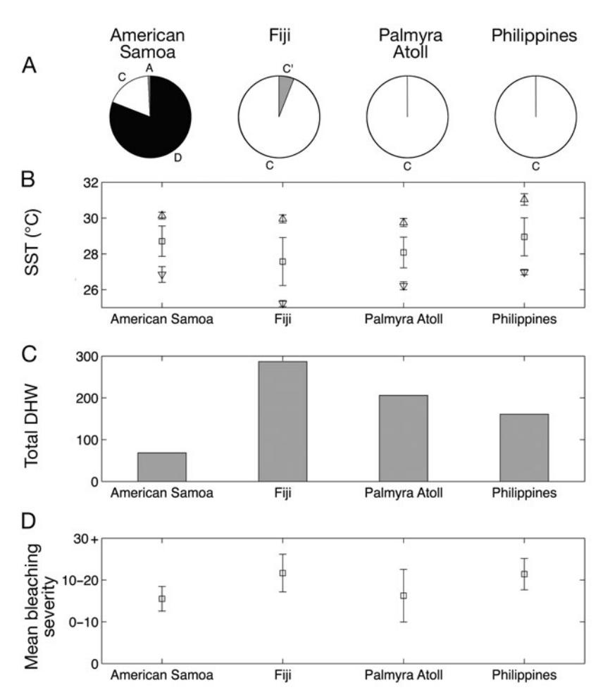
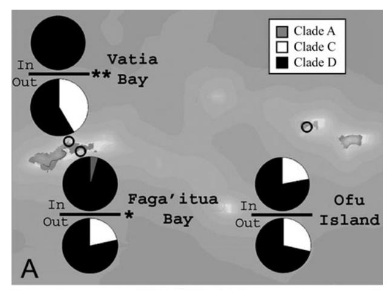
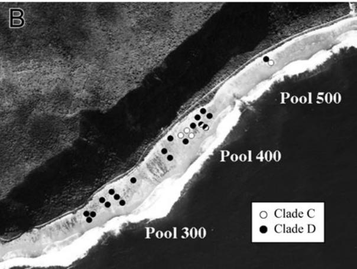
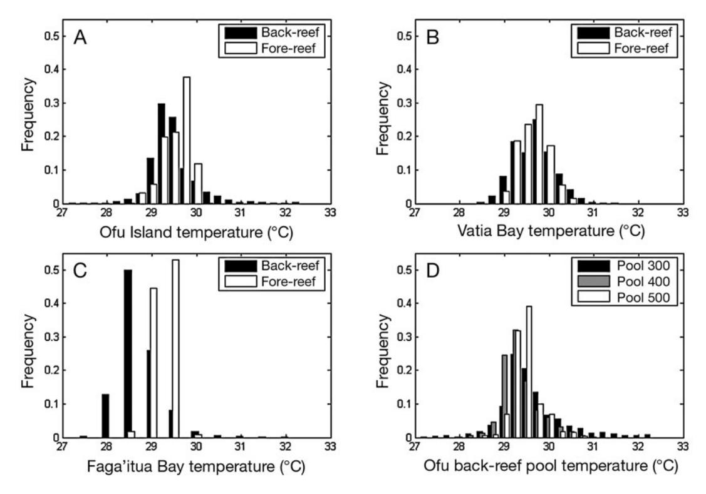

# Distributions of stress-resistant coral symbionts match environmental patterns at local but not regional scales

Thomas A. Oliver\*, Stephen R. Palumbi

Department of Biological Sciences, Hopkins Marine Station, Stanford University, 120 Oceanview Boulevard, Pacific Grove, California 93950, USA

ABSTRACT: Distribution patterns of stress-tolerant coral symbionts suggest that maximum habitat temperatures can drive local scale adaptation of symbiont populations, but at regional scales other processes can dominate. We assayed clade membership for symbionts of 2 closely related corals from American Samoa, Fiji, the Philippines and Palmyra Atoll. Temperature stress-tolerant Clade D symbionts occur more frequently in American Samoa (83%) than in Palmyra, Fiji or the Philippines (<1%). In American Samoa, Clade D symbionts dominate habitats with higher maximum temperatures, while Clades C and D are both common under lower maximum temperatures. While corals in American Samoa show more stress-tolerant symbionts, this region does not exhibit higher sea surface temperatures, a greater record of heating anomalies or more bleaching than the other 3 regions. That these local patterns do not hold regionally suggests the importance of other factors, including host responses, other environmental correlates, within-clade physiological diversity and dispersal limitation, in driving the distribution of coral symbionts.

KEY WORDS: Coral reefs · Climate change · Adaptation ·  $Acropora \cdot Symbiodinium \cdot$  Cytochrome  $b \cdot$  High temperature stress

- Resale or republication not permitted without written consent of the publisher -

## INTRODUCTION

Coral bleaching involves the breakdown of the symbiosis between reef-building corals and their obligate endosymbionts, dinoflagellates in the genus *Symbiodinium*. While bleaching can be triggered by a range of stimuli, mass bleaching events are most commonly induced by a synergistic effect between temperature and light (Fitt et al. 2001). Even an increase as small as 1°C above long-term maximum temperatures can trigger bleaching (Goreau & Hayes 1994). With projected warming trends due to global climate change (Bindoff et al. 2007, Meehl et al. 2007), corals will most likely be routinely exposed to physiological stress unless they can adapt to increased temperatures (Hoegh-Guldberg 1999, Hughes et al. 2003).

Many observational and experimental studies suggest that not all coral–*Symbiodinium* combinations react equally to bleaching-inducing stresses; therefore,

variability exists upon which natural selection may act (Rowan et al. 1997, Rowan 2004, Berkelmans & van Oppen 2006). For example, Rowan et al. (1997) observed that, within a single coral colony, regions of the colony hosting *Symbiodinium* symbionts in Clade C might bleach, while those hosting Clades A or B might not.

Similar observations have been made in Pacific corals. Before, during and after the 1998 bleaching event, Glynn et al. (2001) sampled *Pocillopora damicornis* in Pacific Panama. They noted that each of the 9 coral colonies sampled that hosted Clade C *Symbiodinium* bleached during the thermal stress, while none of the 33 that hosted Clade D bleached. Also, the frequency of Clade D *Symbiodinium* increased after the bleaching event (Baker et al. 2004).

Experimental work has followed up on these observations. Working with *Pocillopora verrucosa* from Guam, Rowan (2004) placed colonies bearing either Clade C or D *Symbiodinium* into tanks held at either

control (28.5°C) or elevated temperatures (31.3 or 32.0°C). Colonies hosting Clade C *Symbiodinium* in the 32.0°C treatment showed evidence of heatinduced damage to the light reactions of photosynthesis, while those hosting Clade D *Symbiodinium* did not. Rowan (2004) concluded that Clades C and D are adapted to different thermal regimes, and Clade D appears to be a high temperature specialist.

The increased thermal robustness provided by hosting Clade D may incur some cost to the coral. Little et al. (2004) documented that juvenile *Acropora tenuis* and *A. millepora* hosting Clade D *Symbiodinium* grew at half the rate of those hosting Clade C at the same site. This is the only published example of a trade-off for Clade D thermal resistance, and it remains unknown if the growth limitations apply to *A. tenuis* and *A. millepora* adults and/or other species.

Although some coral species host multiple symbiont types, others appear to host only a single type. Species in the genus *Porites* primarily associate with a single symbiont type (LaJeunesse et al. 2004, Thornhill et al. 2006a), while many species in the genera *Acropora* and *Pocillopora* commonly host multiple clades of *Symbiodinium* (van Oppen et al. 2001, Baker 2003, LaJeunesse et al. 2004). The proportion of scleractinian corals that can host multiple symbionts has been recently debated (Goulet 2006, Baker & Romanski 2007), but estimates using adequate sample sizes (n > 5 samples per species) suggest that at least 58% (72/124) of the species examined hosted more than one clade of symbiont (Baker & Romanski 2007). Even among those capable of hosting multiple symbionts, long-term monitoring studies have shown that without environmental perturbation, symbiont communities show little change over time (Thornhill et al. 2006b). However, multiple studies have shown rapid shifts in *Symbiodinium* communities following environmental perturbation (Baker et al. 2004, Thornhill et al. 2006b, Jones et al. 2008, LaJeunesse et al. 2008).

Because many coral species have the potential to host physiologically distinct symbionts (Baker 2003, Goulet 2006, Baker & Romanski 2007), much attention has focused on the potential for corals to raise their thermal tolerances by increasing the occurrence of stress-resistant *Symbiodinium* lineages (Buddemeier & Fautin 1993, Baker 2001, Baker et al. 2004, Berkelmans & van Oppen 2006, Jones et al. 2008). As originally proposed in the adaptive bleaching hypothesis, adult corals replace stress-susceptible symbionts with stressresistant symbionts to match a stressful environment (Buddemeier & Fautin 1993). The pattern of occurrence of stress-tolerant symbionts could be produced either by adults shifting their symbionts, new generations of corals preferentially acquiring resistant symbionts, or those corals bearing sensitive symbionts suffering differential mortality (Jones et al. 2008).

These studies (Buddemeier & Fautin 1993, Baker et al. 2004, Rowan 2004, Berkelmans & van Oppen 2006, Jones et al. 2008) strongly suggest that for corals able to support both Clades C and D there should be a relationship between the thermal environment of a coral population and its frequency of Clade C vs. D *Symbiodinium*. However, no studies to date have provided a definitive answer to this question. Most studies that have attempted to build a predictive relationship between *Symbiodinium* genotypes and their environments have focused on a local scale (Rowan et al. 1997, Glynn et al. 2001, Toller et al. 2001, Baker 2003, Chen et al. 2003), and the few studies that have attempted to draw general patterns on a regional scale have yet to return a definite set of environmental variables which predict *Symbiodinium* distributions (Baker et al. 2004, Garren et al. 2006, Lien et al. 2007).

Baker et al*.* (2004) compared patterns of *Symbiodinium* distribution from multiple coral hosts across regions ranging from cool, relatively unbleached Mauritius to the hotter and more bleached sites of Kenya, the Red Sea and the Persian Gulf. They concluded that the high proportion of Clade D in 2 of the 3 hotter regions suggests that reef-scale shifts to Clade D *Symbiodinium* is a common feature among reef corals globally (Baker et al. 2004). In their comparison of Panamanian and Belizian *Montastrea annularis* (sensu lato) populations, Garren et al*.* (2006) demonstrated that the *Symbiodinium* community compositions were more strongly correlated to region than the environmental variables at each site. Lien et al*.* (2007) examined the coral *Ouleastrea crispata*, which hosts Clade D almost exclusively. Of their 100 samples, they only found 4 instances of a coral hosting Clade C, all of which were in hotter, tropical regions (Lien et al. 2007).

Each of these studies (Baker et al. 2004, Garren et al. 2006, Lien et al. 2007) has a fundamental issue that obscures its ability to draw general conclusions about how environmental factors drive the distribution of *Symbiodinium* genotypes. Baker et al. (2004) sampled a different set of coral hosts in each region and did not address the existence of resistant strains outside of Clade D. Garren et al*.* (2006) only sampled from 2 regions, and used single time points to characterize site temperatures. Lein et al*.* (2007) focused on a minor member of reef communities that appears to have an atypically specific relationship to Clade D *Symbiodinum*.

To address these issues, we sampled from a consistent set of coral hosts at consistently shallow depths across multiple spatial scales and among multiple regions using time series environmental data. We surveyed a bleaching-susceptible pair of corals in the genus *Acropora*, a genus known as a major component of Pacific reefs with species known to host Clades C and D (T. A. Oliver & S. R. Palumbi unpubl. data). We sampled *A. hyacinthus* and *A. cytherea* for their *Symbiodinium* clade at 2 spatial scales: across the equatorial Pacific Ocean from the Philippines to Palmyra Atoll, and at a local scale contrasting inner reef and outer reef sites in American Samoa. These data confirm Baker et al.'s (2004) model that high temperatures affect the distribution of *Symbiodinium* on the local scale. However, the patterns appear to break down on a regional scale; data on heating history and bleaching across the Pacific suggest that the complexities of coral–*Symbiodinium* adaptation likely go beyond temperature and bleaching history.

# **MATERIALS AND METHODS**

**Sampling.** Between May 2005 and August 2006 we sampled sister species of table-top Acroporid corals, *Acropora hyacinthus* and *A. cytherea*, in 3 regions of the Pacific–Palmyra Atoll, the central Philippines and Fiji, and sampled *A. hyacinthus* in American Samoa (Table 1). In American Samoa, we explicitly sampled across habitat boundaries in 3 sites, sampling corals from 1 to 7 m deep from both thermally variable backreef environments and the nearby fore-reef in each site. In Ofu Island, American Samoa, we sampled from 3 back-reef pools that we refer to as Pool 300, 400 and 500. In Palmyra Atoll, the Philippines and Fiji we sampled from a range of shallow water habitats (1 to 5 m), including back-reef and fore reef-environments. In all cases, we sampled coral colonies separated by 10 to 30 m to minimize multiple samplings from a single ramet. Branchlets measuring ~1 cm long were preserved in 70% ethyl alcohol (EtOH) at room temperature (Table 1).

**Molecular characterization and significance testing.** All *Symbiodinium* samples were assigned to a specific clade using 351 bp of mitochondrial Cytochrome *b* (Table 2). Post-PCR, the samples were cleaned with exonuclease and shrimp alkaline phosphatase (NEB) and cycle-sequenced using BigDye dideoxy sequencing chemistry (Applied Biosystems). Labelled samples were ethanol-precipitated and capillary-sequenced on an ABI 3100 (Applied Biosystems).

After sequencing, we assigned each sample a clade distinction as A, C, D or C' (found only in Fiji). We then performed chi-square tests of the resulting clade frequencies to distinguish between regions, habitats or back-reef pools.

Genetically distinct *Symbiodinium* can exist in a single sample (van Oppen et al. 2001), but knowing the electropharograms of these distinct types in isolation, we could easily distinguish a mixed electropharogram. In samples exhibiting a mixed signal, we counted their contributions as half an instance for each clade.

Table 1. Sampling locations, habitat description and number of *Acropora hyacinthus* and *A. cytherea* samples collected

| Site                                                                 | Latitude  | Longitude  | Habitat (depth)   | A. hyacinthus |     | A. cytherea A. hyacinthus/ A. cythereaa | Regional totals |
|----------------------------------------------------------------------|-----------|------------|-------------------|---------------|-----|--------------------------------------------|--------------------|
| American Samoa                                                       |           |            |                   |               |     |                                            |                    |
| Ofu Island                                                           | 14.169° S | 169.665° W | Back-reef (1–3 m) | 24            | 0   |                                            |                    |
|                                                                      |           |            | Fore-reef (2–7 m) | 24            | 0   |                                            |                    |
| Vatia Bay                                                            | 14.272° S | 170.628° W | Back-reef (1–4 m) | 24            | 0   |                                            |                    |
|                                                                      |           |            | Fore-reef (1–4 m) | 23            | 0   |                                            |                    |
| Faga'itua Bay                                                        | 14.254° S | 170.615° W | Back-reef (1–3 m) | 23            | 0   |                                            |                    |
|                                                                      |           |            | Fore-reef (1–4 m) | 24            | 0   |                                            | 1420               |
| Fiji                                                                 |           |            |                   |               |     |                                            |                    |
| Bounty Island                                                        | 17.670° S | 177.302° E | (1–5 m)           | 18            | 120 |                                            |                    |
| Maui Bay                                                             | 18.217° S | 177.717° E | (1–5 m)           | 06            | 0   |                                            |                    |
| Makagai Island                                                       | 17.447° S | 178.946° E | (1–5 m)           | 04            | 0   |                                            |                    |
| Naigani Island                                                       | 17.579° S | 178.676° E | (1–5 m)           | 11            | 100 |                                            |                    |
| Votua                                                                | 16.624° S | 178.723° E | (1–5 m)           | 26            | 1   |                                            | 88                 |
| Philippines                                                          |           |            |                   |               |     |                                            |                    |
| Bacuit Bay, South Maniloc                                            | 11.087° N | 119.397° E | (1–5 m)           | 03            | 3   |                                            |                    |
| Coron Bay, San Gat                                                   | 11.981° N | 120.062° E | (1–5 m)           | 08            | 100 |                                            |                    |
| Coron Bay, Dynamite Pt.                                              | 11.920° N | 120.027° E | (1–5 m)           | 04            | 9   | 1                                          | 38                 |
| Palmyra Atoll                                                        |           |            |                   |               |     |                                            |                    |
| Penguin Spit                                                         | 5.871° N  | 162.101° W | (1–4 m)           | 23            | 180 |                                            | 41                 |
| a Sample could not be reliably identified to one of the 2 species |           |            |                   |               |     |                                            |                    |

Table 2. PCR primers and reaction conditions used in the molecular characterization of *Symbiodinium* samples. Init. denat.: inital denaturation temperature and time; Denat.: denaturation temperature and time; Ext.: extention temperature and time; Final ext.: final extention temperature and time. Temperatures and times apply separately to the DinoCob1 primer pair and the CytbF/R primer pair

| Locus             | Primer     | Primer sequence (5' → 3')                  | Init. denat. Denat. Anneal |      |      | Ext. | Final ext. | No. cycles | Source                 |
|-------------------|------------|-----------------------------------------------|----------------------------|------|------|------|------------|------------|------------------------|
| Cyto- chrome b | DinoCob1-f | ATG AAA TCT CAT TTA CAW WCA TAT CCT TGT CC | 94°C                       | 94°C | 55°C | 72°C | 72°C       | 30–40      | Zhang et al. (2005) |
|                   | DinoCob1-r | TCT CTT GAG GKA ATT GWK MAC CTA TCC A      | 1 min                      | 20 s | 30 s | 30 s | 10 min     |            |                        |
|                   | CytbF1     | TTA TCT GGA TGT GAG AAA GAA GAG AAA CC     | 94°C                       | 94°C | 55°C | 72°C | 72°C       | 30–40      | Present study       |
|                   | CytbR2     | CCA TTC AGG TAC TAT ATG TAA AGG AGT AAG    | 3 min                      | 30 s | 30 s | 30 s | 5 min      |            |                        |

**Temperature records.** *In situ***:** To compare thermal environments in the distinct habitats sampled in American Samoa, we placed temperature loggers in both back-reef and fore-reef environments. In Vatia Bay we deployed 2 LOTEK archival tags (LTD-2310), one in the fore-reef and one in the back-reef. These tags collected temperature data with a 30 s sampling interval and 0.05°C temperature resolution. In Faga'itua Bay, we deployed 4 I-buttons (DS1921G, Dallas Semiconductor), 2 in the fore-reef and 2 in the back-reef. These smaller data loggers collected a temperature data point every 20 min with a resolution of 0.5°C. Data loggers in both Vatia and Faga'itua Bays sampled from 12 March to 2 April 2006.

The National Park Service has collected temperature records from Ofu Island since 1999. Ofu temperatures were recorded using 4 Hobo Temp loggers (U22-001) with a 30 min sampling interval and 0.02°C temperature resolution. Three were placed in separate pools in the back-reef, and 1 on the fore-reef at Sili.

We selected only those measurements that occurred within the sampling period of 12 March through 2 April 2006. For sites with multiple loggers in a habitat, we pooled measurements across these loggers into a single distribution. Because we lack 2006 measurements from Ofu Island's fore-reef, we have plotted data from the same 21 d in 2005.

*Remotely sensed sea surface temperature***.** To compare temperatures between the 4 regions, we used 8 d composite sea surface temperature (SST) data from NOAA's Pathfinder v5 satellite. We extracted SST data from a 2° square area around each region. The reported temperature for a given measurement period is the mean of all measurements within the area. The data cover 1998 to 2006. Temperatures presented are the overall mean, the mean of the maximum 5%, and the mean of the minimum 5%, with associated SD.

**Degree heating week analyses.** To compare histories of heating anomalies across the 4 regions, we employed NOAA's measure of degree heating weeks (DHW). These values are a measure of both how extreme a heating anomaly is and how long it lasts. SST data from 1985 to 1994 were used to set the long-term baseline, with the exclusion of 1991 and 1992 due to Mt. Pinatubo's eruption. From this baseline dataset, NOAA derived mean hottest summer temperatures by selecting the maximum temperature from the longterm mean of each month in the year. Temperatures in excess of this long-term threshold are taken to be temperature anomalies, and logged as NOAA HotSpots. The measure of a DHW comes from the product of the how far the temperature is above the threshold (in °C) and the length of time the temperature has been above that threshold in weeks (Morgan et al. 2006). Raw data for DHW values are available from NOAA's National Climate Data Center covering December 2000 to present. Values from March 1998 to December 2000 were taken directly from images from NOAA's National Climate Data Center (NOAA 2007).

Each value in the DHW time series for a given region is the mean of a 2° square centered on the region. Total DHW data were calculated as the numerical integration of the DHW time series by summing the product of a measured DHW value and the time interval until the next sample.

**Bleaching records.** A database of bleaching reports exists at the online reef information center, ReefBase (www.reefbase.org). The source of these reports ranges from peer-reviewed publications, grey literature, to personal observations submitted to the website. All reports have been characterized by location, date and scale of bleaching from zero to 3, where zero is no bleaching, one is 1 to 10% of colonies on a reef bleached, 2 is 10 to 30% of colonies bleached and 3 is >30% colonies bleached.

We took all the records belonging to one of the 4 regions of interest (American Samoa, Philippines, Fiji and Palmyra Atoll) and then calculated both the mean and SE of the 0–3 scale of bleaching intensity. Error bars represent SE of bleaching intensity.

## **RESULTS**

#### **Genetic diversity**

For the 309 *Symbiodinium* samples that we generated we found 4 distinct sequences at Cytochrome *b*: 2 Clade C genotypes, 1 Clade A genotype and 1 Clade D genotype. One Clade C genotype was shared across all populations (186 instances) and one was specific to Fiji (5 instances). Both Clade A and D genotypes were restricted to American Samoa (A: 1 instance, D: 117 instances).

At cytochrome *b*, Clades C and D were separated by 2.53% (Kimura 2 parameter distance) with 20 single nucleotide polymorphisms, 16 of which were non-synonymous. An indicator of the degree of positive selection, the whole sequence Dn/Ds value, for this comparison is 1.18.

#### **Genetic comparisons**

Although the heat-resistant Clade D *Symbiodinium* made up 82.4% of the 142 samples from American Samoa, we did not find a single sample hosting Clade D from Fiji (n = 88), Palmyra Atoll

(n = 41), or the central Philippines (n = 31) in either *Acropora hyacinthus* or *A. cytherea*. Clade C in American Samoa, Palmyra Atoll, and the Philippines across both coral species showed the same haplotype for the 351 bp of cytochrome *b* sequenced. Clade C in Fiji showed both the haplotype found elsewhere (n = 83) and a subtype of Clade C (C') (n = 5) that differed from the other C by 2 substitutions at cytochrome *b* (Fig. 1a).

In contrast, we commonly found *Symbiodinium* Clades C and D in American Samoa. We also found one instance of Clade A *Symbiodinium* on the backreef of Faga'itua. Overall the *Symbiodinium* community hosted by *Acropora hyacinthus* was comprised of 82.4% Clade D, 16.9% Clade C and 0.7% Clade A. *A. cytherea* were not sampled in American Samoa.

Shifts in the frequencies of genotypes of *Symbiodinium* hosted by *Acropora hyacinthus* occurred across habitats. In both Vatia and Faga'itua Bays, Clade C was

Fig. 1. Regional *Symbiodinium* sp. clade frequencies and environmental characterizations. (A) *Symbiodinium* sp. clade frequencies by region; white: Clade C; light grey: Clade A; black: Clade D; medium grey: Clade C. (B) maximum 5% (n), mean (h) and minimum 5% (y) sea surface temperature (SST, in °C); (C) total degree heating weeks (DHW) from integrating 1998–2006 time series by region; and (D) mean annual bleaching severity by region, 1994–2006. Error bars are ±SD

absent from the back-reef habitats in which Clade D dominated. However, on the nearby fore-reefs, Clade C reached 37 and 21%, respectively. The shifting frequencies of Clade C and D across the fore-reef/back-reef divide were significant at both sites (χ2 , p = 0.0008, 0.041 for Vatia and Faga'itua Bays, respectively) (Fig. 2A).

At Ofu Island, back-reef frequencies of Clade C were lower than fore-reef frequencies, but not significantly so, with 19% C in the back-reef and 27% in the fore-reef (Fig. 2A). However, within the back-reef on Ofu we found exclusively Clade D in Pool 300, the pool with the largest swings in temperature (see 'Environmental comparisons'). We found clustered groups of Clade C within Pools 400 and 500, back-reef environments that more closely approximate fore-reef conditions (Fig. 2B). This back-reef structuring of C and D genotypes was not statistically significant due to the small numbers of table-top coral colonies available for

Fig. 2. *Symbiodinium* sp. clade designations in American Samoa. (A) Clade designations of *Symbiodinium* sp. from populations of *Acropora hyacinthus* in the back-reefs and fore-reefs in 3 bays. In: back-reef populations; Out: fore-reef populations. Chi-square comparison of 'In' to 'Out' clade distributions: Vatia Bay, p = 0.0008 (\*\*); Fagai'tua Bay, p = 0.041 (\*); and Ofu Island, not significant. (B) Clade designations of individual colonies of *A. hyacinthus* in back-reef pools in Ofu Island. Half-filled circles: mixed clade signatures

analysis (χ2 , p = 0.068), but it does qualitatively match the patterns seen across habitats in other sites, in which corals were dominated by Clade D in the most thermally extreme habitats and hosted either C or D in the more thermally moderate habitats.

# **Environmental comparisons**

# American Samoa temperature records

We compared temperatures from Ofu Island, Vatia Bay and Faga'itua Bay in both fore-reef and back-reef habitats (Fig. 3A–C). Across the 3 sites, mean temperatures across habitats differed only slightly, while maximum temperatures ranged from 0.95 to 2.2°C higher and minimum temperatures ranged from 0.59 to 1.17°C lower in the back-reef. The average variance of the temperature distributions across all back-reef sites (variance = 0.24) was >2.5 times higher than that of all fore-reef sites (variance = 0.089).

In Ofu Island, we found similar variation between discrete pools on the back-reef. One of 3 pools monitored (Pool 300) showed high thermal variability while the other 2 (400 and 500) were more moderate in their temperature swings (Fig. 3). If we restrict our analysis to the 3 wk analyzed for other sites, we find that maximum temperatures from Pool 300 were 1.5°C hotter than those from Pools 400 and 500, and minimum temperatures from Pool 300 were 0.92°C cooler than those from Pools 400 and 500. The temperature distributions also show differences in their variances. Pool 300's variance wss 0.49, while those of Pools 400 and 500 were 3 to 5 times lower (0.17 and 0.094, respectively). If we expand our analysis to the entire 6.5 yr temperature record from these pools, the differences between the habitats increase but the results do not qualitatively change. Thus, Pool 300 showed a temperature profile similar to back-reef environments elsewhere in American Samoa, while Pools 400 and 500 were more similar to fore-reef environments.

# Regional mean, maximum and minimum SST

Based on regional satellite-derived mean, maximum and minimum SST, American Samoa was slightly warmer than both Fiji and Palmyra, but the Philippines were consistently warmer than all other locations sampled (Table 3, Fig. 1B).

# Anomalous heating events

Regional temperatures themselves may not be the best measure of a region's history of bleaching stress. Potentially more relevant are the frequency, severity and duration of anomalous heating events. Soon after the 1998 El Niño bleaching events, NOAA developed an index to measure such events, the DHW. From 1998 to 2006, American Samoa showed 68.3 DHWs compared to 286.7 in Fiji, 160.9 in Palmyra and 206 in the Philippines (Fig. 1C).

#### Bleaching events

The bleaching event data demonstrate that American Samoa has not suffered an atypically high degree of bleaching. While American Samoa has bleached re-

Fig. 3. *In situ* temperature measurements from American Samoa. Fore-reef and back-reef distributions from (A) Ofu Island, (B) Vatia Bay and (C) Faga'itua Bay. (D) *In situ* temperature distributions from 3 back-reef pools in Ofu Island

Table 3. Regional environmental characterizations (±SD), including mean, maximum and minimum sea surface temperatures (SST), total number of degree heating weeks (DHW), annual mean bleaching severity (see 'Materials and methods' for description of scale), and number of bleaching reports

| Region         | Mean SST (°C) | Max. 5% SST (°C) | Min. > 5% SST (°C) | Total DHW | Annual mean bleaching severity (0–3) | No. bleaching reports |
|----------------|------------------|---------------------|-----------------------|--------------|--------------------------------------------|--------------------------|
| American Samoa | 28.71 ± 0.85     | 30.14 ± 0.19        | 26.85 ± 0.44          | 068.27       | 1.10 ± 0.59                                | 39                       |
| Fiji           | 27.57 ± 1.34     | 29.96 ± 0.22        | 25.23 ± 0.17          | 286.74       | 2.33 ± 0.90                                | 45                       |
| Palymra Atoll  | 28.08 ± 0.86     | 29.75 ± 0.23        | 26.22 ± 0.22          | 205.97       | 1.25 ± 1.26                                | 66                       |
| Philippines    | 28.95 ± 1.06     | 31.04 ± 0.32        | 26.98 ± 0.15          | 160.90       | 2.28 ± 0.75                                | 04                       |

peatedly in the past 9 yr, the events have been limited in scope with an average annual bleaching index of 1.25 out of 3, or slightly >10% of the reef bleached. Fiji and the Philippines showed repeated severe bleaching events which raised the average annual bleaching index values to 1.92 and 2.32, respectively. The data record from Palmyra Atoll suffers from severe underreporting due to its remote location. Over the period of time in which we have 39, 45 and 66 bleaching reports from American Samoa, Fiji and the Philippines, only 4 reports exist from Palmyra Atoll. With the exception of 1998, no reports exist from periods during or directly after the major DHW anomalies, so under-reporting is likely to underestimate bleaching severity. Even so, the average annual bleaching index over the past 9 yr is 1.33, slightly higher than that of American Samoa (Fig. 1D).

## **Environmental–symbiont correlations**

In American Samoa we found clear associations between *Symbiodinium* genotype and thermal regime in a given habitat. At 2 sites, Faga'itua and Vatia Bays, Clade D dominated back-reef habitats to the exclusion of Clade C. These back-reef habitats had both higher temperature maxima and variability in comparison to the cooler and more constant fore-reef where we saw Clade C in substantial proportions.

The correlations between environmental temperature regime and *Symbiodinium* genotype found at the local scale in American Samoa were not maintained in our analysis at the regional scale. No Clade D *Symbiodinium* was found outside of American Samoa, but American Samoa was no hotter than Fiji or Palmyra Atoll and was cooler than the Philippines. Of the 4 regions, American Samoa showed the lowest number of bleaching-relevant temperature anomalies and an equal or lesser number of bleaching events.

## **DISCUSSION**

Our data show that, at a local scale, sites with higher maximum temperatures had higher proportions of stress-tolerant symbionts. However, this relationship does not appear to hold at larger scales across the Pacific. In the table-top Acroporid corals, frequency shifts between Clade C and Clade D *Symbiodinium* across habitats in American Samoa correlated with shifts in the habitats' thermal regime, with the more stress-resistant Clade D dominating the habitats with higher maximum temperatures. While sampled corals from American Samoa were dominated by Clade D symbionts, samples from Fiji, Palmyra Atoll and the Philippines only showed symbiont Clade C. Contrary to expected patterns, American Samoa did not stand out as an outlier in either its thermal environment or bleaching history.

# **American Samoa: clade frequency differences among habitats**

Previous studies of Clade D *Symbiodinium* have demonstrated its potential role in resisting the negative effects of elevated temperatures on the coral–algal symbiosis (Glynn et al. 2001, Rowan 2004, Berkelmans & van Oppen 2006). In American Samoa, we observed that Clade D *Symbiodinium* were more common in back-reef habitats that reach high maximum temperatures than in nearby habitats with more moderate thermal environments (e.g. fore-reef). The observed association between *Symbiodinium* genotype and thermal habitat suggests that populations of *Acropora hyacinthus* in more thermally extreme habitats in American Samoa have matched their local environment by hosting a more heatresistant symbiont. On the fore-reef, corals may not require the thermal tolerance provided by Clade D and may grow faster with Clade C symbionts. This trade-off has been demonstrated in juvenile *A. tenuis* (Little et al. 2004). Whether the same trade-off applies to different coral species (e.g. *A. hyacinthus)*, adult corals or other locations is not yet known.

#### **Regional comparisons**

Although Clade D is common in American Samoa (83% of all samples), extensive sampling in Fiji, Palmyra Atoll and the Philippines revealed only Clade C *Symbiodinium* (Fig. 1A). If the same adaptive processes acting on a local scale in American Samoa are driving distributions of Clades C and D on a regional scale, we would expect regional patterns to match local patterns. That is, Clade D would appear in regions with a greater history of temperature extremes, abnormal heating events or coral bleaching.

Contrary to these predictions, the warmest regions with the highest bleaching histories had very low levels of Clade D. In addition, American Samoa did not appear to be an environmental outlier among the populations examined (Fig. 1B–D). It had an equal or lower bleaching history, lower record of high temperature anomalies and was intermediate with regard to temperature. From this we conclude that the environmental variables examined at the regional scale have poor predictive power to distinguish between American Samoa, with its high incidence of Clade D, and Fiji, Palmyra Atoll and the Philippines, with no Clade D.

## **Alternative hypotheses**

Our results suggest that while adaptation to temperature and bleaching history may play a role, there are other processes involved in the distribution patterns of *Symbiodinium* across the Pacific. Because the focal species of the present study can host both Clades C and D, host–symbiont specificity is unlikely to be an important factor. The failure of the strict environmental model to predict the proportion of resistant symbionts outside of American Samoa leads us to address other potential hypotheses: (1) coral adaptation, (2) unexamined environmental variables, (3) cryptic stress tolerance and (4) dispersal limitation.

#### Coral adaptation

There may be other mechanisms of stress tolerance occurring at the level of the coral host that are critical outside American Samoa. Researchers have documented variation in bleaching sensitivity across distinct coral species (McClanahan et al. 2001, 2007), and 2 studies have seen differences in thermal tolerance among members of a coral species that could be due to genetic differences (Smith-Keune & van Oppen 2006, Ulstrup et al. 2006). However, no study has yet linked variation in thermal sensitivity to specific genetic differences among corals. If corals themselves can adapt or acclimate to higher temperature, they may be able to survive environmental change without sacrificing the potential growth disadvantage shown for *Symbiodinium* Clade D.

a rapid means of recognizing newly identified heatresistant strains.

# Unexamined environmental variables

It is possible that other, unexamined environmental variables determine Clade D's distribution. This hypothesis would suggest that American Samoa would have an anomalously high record in one or more of the unexamined variables among the 4 sites sampled, and would likely share that characteristic with other sites with high proportions of Clade D. We have sampled a consistent set of species at consistent depths and have included the variables most often suggested to be linked to Clade D frequency, including DHW, maximum temperature and, especially, bleaching events (Buddemeier & Fautin 1993, Goreau & Hayes 1994, Glynn et al. 2001, Baker et al. 2004). However, these same studies also show that environmental parameters such as light exposure and sediment load affect Clade D's distribution; with the current dataset we cannot rule out the possibility that other factors are more important. Further analysis that covers many collection locations and other coral genera and examines correlations across a wide array of environmental variables is needed to provide this expanded search for relevant environmental variables.

Another related possibility is that we have been looking at the right environmental variables, but not at the right scale. In our regional comparisons, we have been using remotely sensed SST taken on a coarse scale, but detailed knowledge of microhabitat structure, like that observed in American Samoa, may be critical to this kind of analysis.

#### Cryptic stress tolerance

Perhaps other undetected, stress-tolerant *Symbiodinium* exist which are identical to Clade C using our genetic assay. Garren et al. (2006) identified a subtype of Clade C *Symbiodinium* in Caribbean *Montastrea* that associates with hot, turbid areas normally dominated only by Clade D (Garren et al. 2006). This suggests within-clade physiological variation may exist that serves the same function as that ascribed to members of Clade D. The present study found one instance of within-Clade C variation in Fiji, a population lacking Clade D. However, our genetic assay using cytochrome *b* almost certainly underestimates withinclade diversity that could identify physiologically distinct *Symbiodinium* within Clade C. This possibility underscores the need to study the genomic correlates of the high temperature resistance behavior, if only as

#### Dispersal limitation

Lack of Clade D *Symbiodinium* may result from failure of Clade D to migrate to distant Pacific locations. While possible, the hypothesis that *Symbiodinium* Clade D's range is dispersal-limited seems unlikely because genetic variants of *Symbiodinium* occur over 1000s of km. For example, a single cytochrome *b* haplotype is present in all 4 regions we studied, suggesting that alleles migrate across the ~8000 km faster than this locus mutates. In a similar vein, internal transcribe spacer sequences and microsatellite genotypes occur over wide ranges (Baillie et al. 2000, Santos et al. 2004, van Oppen et al. 2005). Because alleles have demonstrably spanned large distances, we find it likely that Clade D has been able to do so as well.

However, there is evidence that suggests that at large scales *Symbiodinium* are not truly panmictic. Even the relatively slowly evolving cytochrome *b* shows an allele in multiple individuals in Fiji that was not found elsewhere. One study has found strong structure in *Symbiodinium* from scleractinian coral over scales of 3000 to 5000 km, but host–symbiont interactions and environmental differentiation may be driving these differences rather than dispersal limitation in *Symbiodinium* populations (Loh et al. 2001).

#### **Implications for climate change**

Evidence suggests that corals reefs face a daunting risk from rapid climate change (e.g. Hoegh-Guldberg et al. 2007) and that corals might have the capacity to deal with these changes through acclimatization, host evolution or symbiont switching (Baker 2001, Berkelmans & van Oppen 2006, McClanahan et al. 2007). The fundamental question is whether these adaptive processes will proceed fast enough to match rates of environmental change.

*Symbiodinium* switching stands out as potentially more rapid and less costly to standing adult coral biomass than natural selection on the coral host. Therefore, the ability to identify areas with physiologically relevant diversity of *Symbiodinium* can greatly aid conservation planning in the face of climate change.

While a simple explanation of the patterns we document remain elusive, the identification of areas like American Samoa that have high availability of stresstolerant *Symbiodinium* may be important to policy makers. These areas may better resist coming environmental changes and might serve managers as resilient 'fortresses of diversity' around which to build their conservation strategy. The establishment of a US National Park in American Samoa may have been a particularly valuable move that allows a substantial area of temperature-resistant reef to be protected from the anthropogenic impacts of sedimentation, overfishing and eutrophication.

Definitively predicting what conditions favor heatresistant *Symbiodinium* on a more global scale is currently limited both by the local focus of most *Symbiodinium* genotyping studies and our inability to identify novel heat-resistant strains. To move forward, we will need broader reviews of the environmental correlates to the distribution of known heat-resistant *Symbiodinium* and a greater understanding of the functional genetic correlates of high temperature resistance in *Symbiodinium*.

*Acknowledgements.* The authors acknowledge the assistance of C. Birkeland, D. Barshis, L. Smith, and C. Squair at the University of Hawaii and P. Craig (US National Park Service, American Samoa) for their support in American Samoa; the Palmyra Atoll Research Consortium; the Hawaiian Undersea Research Lab; and the National Park of American Samoa. We also thank the NSF Predoctoral fellowship program, the Woods Institute for the Environment, NOAA and NSF for funding.

## LITERATURE CITED

- Baillie BK, Belda-Baillie CA, Maruyama T (2000) Conspecificity and Indo-Pacific distribution of *Symbiodinium* genotypes (Dinophyceae) from giant clams. J Phycol 36: 1153–1161 ➤
- Baker AC (2001) Ecosystems: reef corals bleach to survive change. Nature 411:765–766 ➤
- Baker AC, Romanski AM (2007) Multiple symbiotic partnerships are common in scleractinian corals, but not in octocorals: Comment on Goulet (2006). Mar Ecol Prog Ser 335: 237–242 ➤
- Baker AC, Starger CJ, McClanahan TR, Glynn PW (2004) Corals' adaptive response to climate change. Nature 430: 741 ➤
  - Baker C (2003) Flexibility and specificity in coral–algal symbiosis: diversity, ecology, and biogeography of *Symbiodinium*. Annu Rev Ecol Evol Syst 34:661–689
- Berkelmans R, van Oppen MJH (2006) The role of zooxanthellae in the thermal tolerance of corals: a 'nugget of hope' for coral reefs in an era of climate change. Proc R Soc Biol Sci Ser B 273:2305–2312 ➤
  - Bindoff NL, Willebrand J, Artale V, Cazenave A and others (2007) Observations: oceanic climate change and sea level. In: Solomon S, Qin D, Manning M, Chen Z and others (eds) Climate change 2007: the physical science basis. Contribution of Working Group I to the 4th assessment report of the Intergovernmental Panel on Climate Change. Cambridge University Press, Cambridge
- Buddemeier RW, Fautin DG (1993) Coral bleaching as an adaptive mechanism: a testable hypothesis. Bioscience 43: 320–326 ➤
  - Chen CA, Lam KK, Nakano Y, Tsai WS (2003) A stable association of the stress-tolerant zooxanthellae, *Symbiodinium* Clade D, with the low-temperature-tolerant coral, *Oulas-*

- *trea crispata* (Scleractinia: Faviidae) in subtropical nonreefal coral communities. Zool Stud 42:540–550
- Fitt WK, Brown BE, Warner ME, Dunne RP (2001) Coral bleaching: interpretation of thermal tolerance limits and thermal thresholds in tropical corals. Coral Reefs 20:51–65 ➤
- Garren M, Walsh SM, Caccone A, Knowlton N (2006) Patterns of association between *Symbiodinium* and members of the *Montastraea annularis* species complex on spatial scales ranging from within colonies to between geographic regions. Coral Reefs 25:503–512 ➤
  - Glynn PW, Mate JL, Baker AC, Calderon MO (2001) Coral bleaching and mortality in Panama and Ecuador during the 1997–1998 El Niño-Southern Oscillation event: spatial/ temporal patterns and comparisons with the 1982–1983 event. Bull Mar Sci 69:79–109
  - Goreau TJ, Hayes RL (1994) Coral bleaching and ocean hotspots. Ambio 23:176–180
- Goulet TL (2006) Most corals may not change their symbionts. Mar Ecol Prog Ser 321:1–7 ➤
- Hoegh-Guldberg O (1999) Climate change, coral bleaching and the future of the world's coral reefs. Mar Freshw Res 50:839–866 ➤
- Hoegh-Guldberg O, Mumby PJ, Hooten AJ, Steneck RS and others (2007) Coral reefs under rapid climate change and ocean acidification. Science 318:1737–1742 ➤
- Hughes TP, Baird AH, Bellwood DR, Card M and others (2003) Climate change, human impacts, and the resilience of coral reefs. Science 301:929–933 ➤
- Jones AM, Berkelmans R, van Oppen MJH, Mieog JC, Sinclair W (2008) A community change in the algal endosymbionts of a scleractinian coral following a natural bleaching event: field evidence of acclimatization. Proc R Soc Biol Sci Ser B 275:1359–1365 ➤
- LaJeunesse TC, Bhagooli R, Hidaka M, DeVantier L and others (2004) Closely related *Symbiodinium* spp. differ in relative dominance in coral reef host communities across environmental, latitudinal and biogeographic gradients. Mar Ecol Prog Ser 284:147–161 ➤
  - LaJeunesse TC, Finney J, Smith R, Oxenford H (2008) Proliferation of an opportunistic *Symbiodinium* sp. during the 2005 Eastern Caribbean mass coral 'bleaching.' 11th Int Coral Reef Symp, 7–11 July 2008, Fort Lauderdale, FL (Abstract). International Society for Reef Studies, Den Burg
- Lien YT, Nakano Y, Plathong S, Fukami H, Wang JT, Chen CA (2007) Occurrence of the putatively heat-tolerant *Symbiodinium* phylotype D in high-latitudinal outlying coral communities. Coral Reefs 26:35–44 ➤
- Little AF, van Oppen MJH, Willis BL (2004) Flexibility in algal endosymbioses shapes growth in reef corals. Science 304: 1492–1494 ➤
- Loh WKW, Loi T, Carter D, Hoegh-Guldberg O (2001) Genetic variability of the symbiotic dinoflagellates from the wide ranging coral species *Seriatopora hystrix* and *Acropora longicyathus* in the Indo-West Pacific. Mar Ecol Prog Ser 222:97–107 ➤
  - McClanahan TR, Muthiga NA, Mangi S (2001) Coral and algal changes after the 1998 coral bleaching: interaction with reef management and herbivores on Kenyan reefs. Coral Reefs 19:380–391
- McClanahan TR, Ateweberhan M, Graham NAJ, Wilson SK, Sebastian CR, Guillaume MMM, Bruggemann JH (2007) Western Indian Ocean coral communities: bleaching responses and susceptibility to extinction. Mar Ecol Prog Ser 337:1–13 ➤
  - Meehl GA, Stocker TF, Collins WD, Friedlingstein P and others (2007) Global climate projections. In: Solomon S, Qin

- D, Manning M, Chen Z and others (eds) Climate change 2007: the physical science basis. Contribution of Working Group I to the 4th assessment report of the Intergovernmental Panel on Climate Change. Cambridge University Press, Cambridge
- Morgan JA, Strong AE, Eakin CM, Arzayus LF and others (2006) NOAA Coral Reef Watch: global satellite-based analysis, monitoring, and alerts of ocean temperature and coral reef bleaching. Ocean Sciences Meeting, 20–24 February 2006, Honolulu, HI (Abstract). International Society for Reef Studies, Den Burg
- NOAA (2007) National Climatic Data Center. Available at: www.ncdc.noaa.gov/ao/ncdc.html
- Rowan R (2004) Coral bleaching: thermal adaptation in reef coral symbionts. Nature 430:742 ➤
- Rowan R, Knowlton N, Baker A, Jara J (1997) Landscape ecology of algal symbionts creates variation in episodes of coral bleaching. Nature 388:265–269 ➤
- Santos SR, Shearer TL, Hannes AR, Coffroth MA (2004) Fine-scale diversity and specificity in the most prevalent lineage of symbiotic dinoflagellates (*Symbiodinium*, Dinophyceae) of the Caribbean. Mol Ecol 13: 459–469 ➤
  - Smith-Keune C, van Oppen M (2006) Genetic structure of a reef-building coral from thermally distinct environments on the Great Barrier Reef. Coral Reefs 25:493–502
- Thornhill DJ, Fitt WK, Schmidt GW (2006a) Highly stable ➤

*Editorial responsibility: Charles Birkeland, Honolulu, Hawaii, USA*

- symbioses among western Atlantic brooding corals. Coral Reefs 25:515–519
- Thornhill DJ, LaJeunesse TC, Kemp DW, Fitt WK, Schmidt GW (2006b) Multi-year, seasonal genotypic surveys of coral–algal symbioses reveal prevalent stability or postbleaching reversion. Mar Biol 148:711–722 ➤
- Toller WW, Rowan R, Knowlton N (2001) Zooxanthellae of the *Montastraea annularis* species complex: patterns of distribution of four taxa of *Symbiodinium* on different reefs and across depths. Biol Bull 201:348–359 ➤
- Ulstrup KE, Berkelmans R, Ralph PJ, van Oppen MJH (2006) Variation in bleaching sensitivity of two coral species across a latitudinal gradient on the Great Barrier Reef: the role of zooxanthellae. Mar Ecol Prog Ser 314:135–148 ➤
- van Oppen MJH, Palstra FP, Piquet AMT, Miller DJ (2001) Patterns of coral–dinoflagellate associations in *Acropora*: significance of local availability and physiology of *Symbiodinium* strains and host–symbiont selectivity. Proc R Soc Biol Sci Ser B 268:1759–1767 ➤
- van Oppen MJH, Mahiny AJ, Done TJ (2005) Geographic distribution of zooxanthella types in three coral species on the Great Barrier Reef sampled after the 2002 bleaching event. Coral Reefs 24:482–487 ➤
  - Zhang H, Bhattacharya D, Lin S (2005) Phylogeny of dinoflagellates based on mitochondrial cytochrome *b* and nuclear small subunit rDNA sequence comparisons. J Phycol 41:411–420

*Submitted: May 20, 2008; Accepted: December 2, 2008 Proofs received from author(s): February 24, 2009*