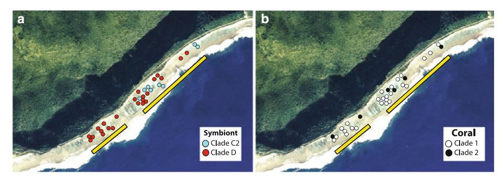
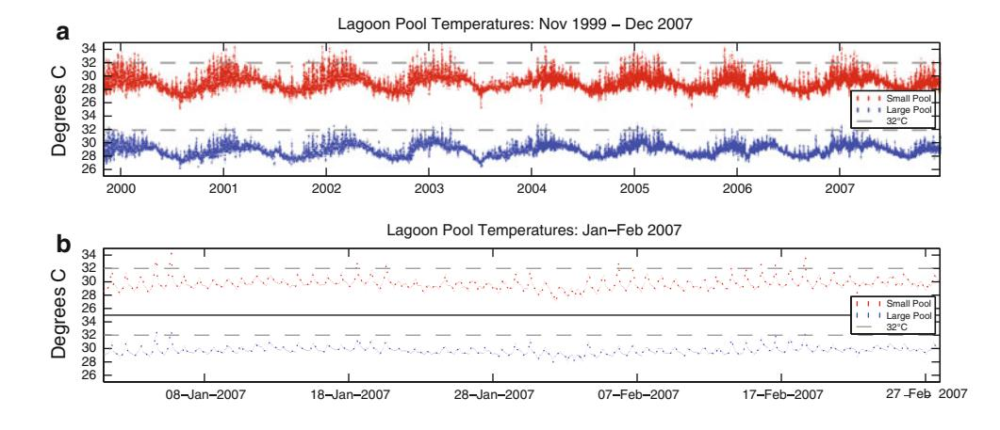
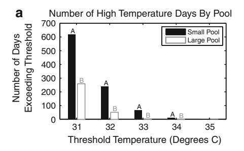
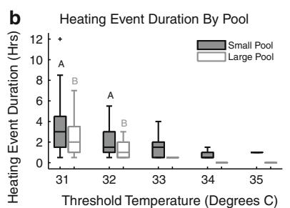
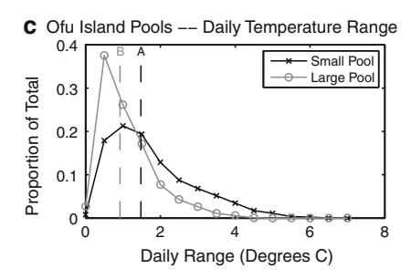
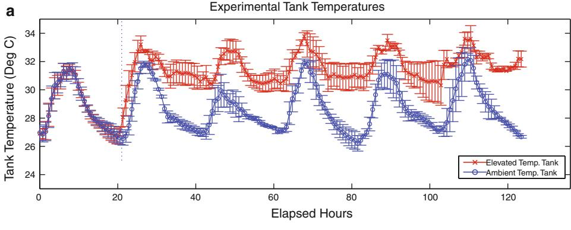
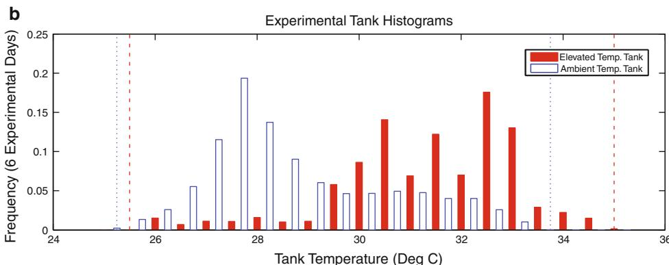
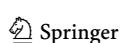
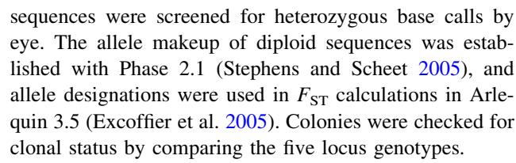
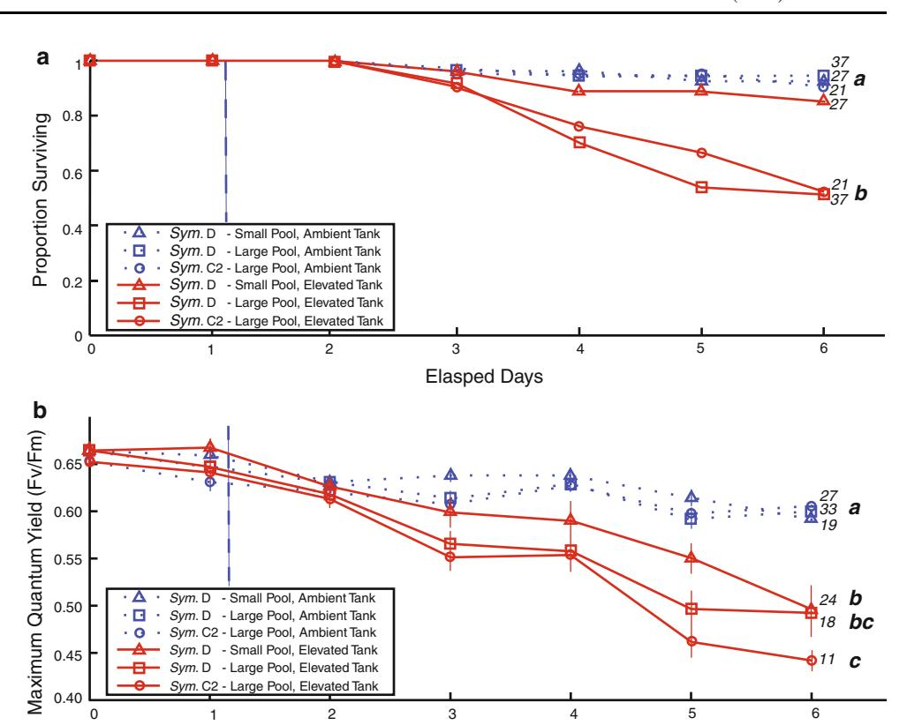

#### REPORT

# Do fluctuating temperature environments elevate coral thermal tolerance?

T. A. Oliver · S. R. Palumbi

Received: 11 March 2010/Accepted: 3 January 2011/Published online: 2 February 2011 © Springer-Verlag 2011

**Abstract** In reef corals, much research has focused on the capacity of corals to acclimatize and/or adapt to different thermal environments, but the majority of work has focused on distinctions in mean temperature. Across small spatial scales, distinctions in daily temperature variation are common, but the role of such environmental variation in setting coral thermal tolerances has received little attention. Here, we take advantage of back-reef pools in American Samoa that differ in thermal variation to investigate the effects of thermally fluctuating environments on coral thermal tolerance. We experimentally heat-stressed Acropora hyacinthus from a thermally moderate lagoon pool (temp range 26.5-33.3°C) and from a more thermally variable pool that naturally experiences 2-3 h high temperature events during summer low tides (temp range 25.0-35°C). We compared mortality and photosystem II photochemical efficiency of colony fragments exposed to ambient temperatures (median: 28.0°C) or elevated temperatures (median: 31.5°C). In the heated treatment, moderate pool corals showed nearly 50% mortality whether they hosted heat-sensitive (49.2  $\pm$  6.5% SE; C2) or heat-resistant (47.0  $\pm$  11.2% SE; D) symbionts. However, variable pool corals, all of which hosted heat-

Communicated by Biology Editor Dr. Mark Warner

**Electronic supplementary material** The online version of this article (doi:10.1007/s00338-011-0721-y) contains supplementary material, which is available to authorized users

T. A. Oliver ( ) · S. R. Palumbi Department of Biological Sciences, Hopkins Marine Station, Stanford University, 120 Oceanview Boulevard, Pacific Grove, CA 93950, USA e-mail: toliver@stanford.edu

S. R. Palumbi

e-mail: spalumbi@stanford.edu

**Keywords** Coral · Climate change · *Acropora* · *Symbiodinium* · Thermal tolerance

heat-resistant symbionts alone.

resistant symbionts, survived well, showing low mortalities

 $(16.6 \pm 8.8\% \text{ SE})$  statistically indistinguishable from con-

trols held at ambient temperatures (5.1–8.3  $\pm$  3.3–8.3% SE). Similarly, moderate pool corals hosting heat-sensitive

algae showed rapid rates of decline in algal photosystem II

photochemical efficiency in the elevated temperature treatment (slope =  $-0.04 \text{ day}^{-1} \pm 0.007 \text{ SE}$ ); moderate pool

corals hosting heat-resistant algae showed intermediate levels of decline (slope = -0.039 day-1  $\pm$  0.007 SE); and

variable pool corals hosting heat-resistant algae showed the

least decline (slope =  $-0.028 \text{ day}^{-1} \pm 0.004 \text{ SE}$ ). High

gene flow among pools suggests that these differences

probably reflect coral acclimatization not local genetic

adaptation. Our results suggest that previous exposure to

an environmentally variable microhabitat adds substantially

to coral-algal thermal tolerance, beyond that provided by

## Introduction

Reef corals and their algal endosymbionts can suffer heat stress in response to temperature changes as small as 1°C above long-term regional maxima (Goreau and Hayes 1994; Coles and Brown 2003). Exact thermal thresholds vary by region, with cooler areas like Rapa Nui showing thermally induced coral mortality at 27°C while other hotter regions like the Persian Gulf show a threshold as high as 35°C (Wellington et al. 2001; Coles and Brown 2003; Riegl 2003). Temperature anomalies that exceed these regional thresholds for days to weeks can induce mass coral bleaching, the breakdown of symbiosis between

a host coral and its algal symbionts, dinoflagellates in the genus Symbiodinium (Jokiel and Coles [1990;](#page-10-0) Hoegh-Guldberg [1999;](#page-10-0) Weis [2008\)](#page-11-0). Bleaching can be caused by a number of physical and biological factors, but the most common form of mass coral bleaching stems from elevated temperatures in high light environments (Coles and Brown [2003\)](#page-10-0). These conditions may induce cellular damage as well as the degradation and/or expulsion of algal symbionts (Fitt et al. [2001;](#page-10-0) Coles and Brown [2003](#page-10-0); Weis [2008](#page-11-0); Baird et al. [2009](#page-9-0); van Oppen and Lough [2009](#page-11-0)). Although sublethal bleaching events may pass without significant longer term effects (Suggett and Smith [2010](#page-11-0)), more severe bleaching events can slow coral growth, reduce reproduction, and lead to major mortalities (Szmant and Gassman [1990;](#page-11-0) Berkelmans and Oliver [1999](#page-9-0); McClanahan et al. [2001\)](#page-10-0).

Three mechanisms may occur to shift the thermal tolerances of corals and their endosymbionts: coral adaptation via natural selection for heat-tolerant lineages of the coral animal; Symbiodinium adaptation via natural selection for heat-tolerant lineages of the algal endosymbiont; or physiological acclimatization to the changing conditions by living individuals of either or both partners (Gates and Edmunds [1999](#page-10-0); Edmunds and Gates [2008](#page-10-0); Weis [2010](#page-11-0)). The term acclimation refers to organisms adjusting to experimentally applied treatments, not natural variation in the field (Roberts et al. [1997](#page-10-0)). While differences in thermal tolerance among regions with distinct annual mean temperatures were first recognized as evidence of coral thermal adaptation or acclimatization (e.g., Coles et al. [1976](#page-10-0)), thermal variation on much smaller spatial and temporal scales also appears to impact coral thermal tolerance. Experiments directly testing acclimation effects have shown that coral exposed to elevations in mean temperatures for long (56 days) or short (2 day) periods also showed elevated thermal tolerances (Coles and Jokiel [1978;](#page-10-0) Middlebrook et al. [2008](#page-10-0)).

In addition to acclimatization and host coral adaptation, much attention has been focused on the potential for corals to elevate their thermal tolerances via natural selection acting on populations of Symbiodinium within host corals (Buddemeier and Fautin [1993;](#page-10-0) Rowan et al. [1997;](#page-11-0) Baker [2001;](#page-9-0) Toller et al. [2001;](#page-11-0) Rowan [2004;](#page-10-0) Berkelmans and van Oppen [2006](#page-9-0); LaJeunesse et al. [2010\)](#page-10-0). Multiple studies have confirmed that corals hosting different clades of Symbiodinium show different thermal tolerance or bleaching susceptibility (Rowan [2004](#page-10-0); Berkelmans and van Oppen [2006;](#page-9-0) Abrego et al. [2008](#page-9-0)).

Taken together, these studies suggest that corals living in different thermal environments—even across small spatial scales—may show large differences in thermal tolerance and that temperature pulses over days or months can induce clear elevations in thermal tolerance. However, these data do not reveal the role of transient temperature change on acclimatization or adaptation.

Early work has suggested that rapid thermal fluctuations of 3–4C on the timescale of minutes to hours induced little bleaching or mortality with thermally sensitive corals (Coles [1975\)](#page-10-0), and two more recent experiments suggest that such fluctuations may induce some degree of beneficial change in coral thermal tolerance. Castillo and Helmuth ([2005\)](#page-10-0) showed that Montastraea annularis fragments taken from habitats with high daily thermal maxima showed higher photosynthesis to respiration (P:R) ratios across six temperature treatments (ranging from 29.5 to 35C), than M. annularis fragments from habitats with similar mean, but lower maximum, temperatures. Corals were exposed to the elevated temperatures for 1 h, and no differences in bleaching or mortality thresholds were reported. No information on symbiont genotypes was gathered. Warner et al. [\(1996](#page-11-0)) also show that upon experimental heat stress, two coral species commonly found on thermally moderate fore reefs (Montastraea annularis and Agaricia lamarki) showed greater declines in photosystem II photochemical efficiency and greater loss of symbionts than two coral species commonly found in thermally variable back-reef environments (A. agaricites and Siderastrea radians). Arguing from these data, the authors suggest that species living in environments with more rapid thermal fluctuations and higher maximum temperatures may have higher thermal tolerances. If these thermal environments drive adaptation across species, they may have similar effects on within-species adaptation or acclimatization.

These early results (Coles [1975](#page-10-0); Castillo and Helmuth [2005](#page-10-0); Warner et al. [1996\)](#page-11-0) suggest that temperature fluctuations from daily or tidal changes might expose coral to 'stressful' temperatures long enough to induce acclimatization or adaptation, but might maintain the period of exposure short enough as to avoid coral mortality. Investigating existing adaptive/acclimatization processes in environments with high and variable temperatures may provide insights into how corals may respond to coming global climate changes.

One such environment, the back-reef environment in Ofu Island, American Samoa is composed of distinct lagoon pools, which have statistically indistinguishable mean temperatures but experience different daily temperature variation driven by tidal fluctuations (Craig et al. [2001](#page-10-0); Smith et al. [2008](#page-11-0)). The most variable of these pools reaches 34–35C during summer low tides and shows a daily temperature range of as much as 6C. The daily temperature range on a nearby fore reef is 1.5C (Smith et al. [2007](#page-11-0)). Even faced with these high and variable temperatures, the pools host a diverse assemblage of corals and show high coral cover (Craig et al. [2001\)](#page-10-0).

In this system, environmental distinctions across small spatial scales appear to have physiological and ecological consequences. Porites lobata reciprocally transplanted between the back-reef pools and a thermally moderate fore reef showed both genetic and environmental effects on their growth rates (i.e., growth depended on both where a colony was from and where it was transplanted; Smith et al. [2007](#page-11-0)). Pocillopora eydouxi transplanted between a thermally variable and more thermally moderate pool showed significant changes in their growth patterns due to environmental influences, but no distinction due to genetic differences of the source populations (Smith et al. [2008](#page-11-0)). Goniastrea retiformis colonies show distinctions in photophysiology across the distinct pools, with corals in the hotter, more variable pool showing decreased values of maximum quantum yield of photosystem II (Piniak and Brown [2009\)](#page-10-0). Also, differences in symbiont genotypes in Acropora hyacinthus across the same two pools mirror distinctions seen across back-reef to fore-reef comparisons in other sites, with higher proportions of clade D Symbiodinium in the more thermally variable habitats (Oliver and Palumbi [2009\)](#page-10-0).

Here, we measure the timing of high thermal pulses in a pair of Ofu pools and test whether a coral population exposed to more frequent and more extreme pulses is associated with higher thermal tolerance relative to a population exposed to more moderate variation in the bleachingsensitive coral Acropora hyacinthus. Using experimentally elevated temperature treatments, we assayed lethal (coral mortality) and sublethal effects (symbiont photosystem II photochemical efficiency) on corals that either lived in a thermally variable or lived in a thermally moderate pool and that hosted either heat-susceptible or heat-resistant symbionts. We show that corals from the thermally variable pool, all of which hosted heat-resistant symbionts, show lower mortality and less severe declines in photochemical efficiency than corals from the thermally moderate pool, regardless of symbiont type.

## Materials and methods

Study site: lagoon pool temperature measurements

All experiments were performed on the southern coast of Ofu Island, American Samoa in March 2006 and March 2007, using corals sampled from two back-reef pools (Fig. 1). The National Park Service has been collecting temperature records from Ofu Island's back-reef pools since 1999. Shaded in situ temperatures were recorded using two Hobo Temp loggers (U22-001) with a thirty minute sampling interval and 0.02C temperature resolution, placed at \*1.5 m depth at low tide in regions of high coral cover. Existing loggers were replaced every 6 months, at which time new loggers were cross-calibrated to old loggers, ensuring that they read within 0.3C of each other. Loggers were also routinely placed in ice water to ensure that their calibrations had not drifted from 0C. Data were recorded from two pools: a small pool often referred to as Pool A or Pool 300 and a larger pool often referred to as Pool B or Pool 400 (Craig et al. [2001\)](#page-10-0). We will call them the small and large pool, respectively.

We also deployed 4 other loggers from mid-February through mid-July 2009 (Onset Water Temp Pro v. 1, at 1.5 m depth, 10 min sampling interval; Electronic Supplemental Material, ESM Fig. S1), giving a total of 4 loggers from the large pool and 2 from the smaller pool. These four loggers were cross-calibrated to within 0.1C in both a 0C ice bath and at a constant room temperature.

# Repeated experiment

The heating experiment was repeated three times, once in March 2006 and twice in March 2007. March marks the end of the summer season, in which corals have been exposed to intermittent high temperatures for up to 2 months, and temperatures still remain high. To perform the experiment, we used two outdoor 50-gallon fiberglass

Fig. 1 Distribution of Acropora hyacinthus and Symbiodinium sp. clade membership across the two lagoon pools. a Depicts Acropora hyacinthus hosting either Symbiodinium C2 or Symbiodinium D

b Depicts mitochondrial clade membership of Acropora hyacinthus colonies. Data shown for March 2007

tubs with flow-through seawater at ambient lagoon temperatures. The flow-through rate of both tanks kept as similar as possible and was maintained from 1. 5 to 2.0 liters per minute. The seawater system's intake was placed in a reef channel where incoming temperatures approximated the temperatures of the larger pool. Both tubs were fitted with 300 W ViaAqua Titanium Aquarium heaters, and 500 gph Rule bilge pumps to maintain circulation and even heating. Heaters and pumps were placed to minimize local heating and circulation effects, maintaining even thermal and flow environments across each tank. We randomly determined which of the tanks would be used for the elevated temperature treatment and which for the ambient treatment.

Temperature and light variation in each tank was monitored using LOTEK archival tags. These tags collected temperature and light data with a thirty second sampling interval and 0.05C temperature resolution. The loggers collect light data at a single wavelength band around 470 ± 50 nm and are reported in relative (LOTEK) units. Light regimes in the tanks were similar both to each other and to that recorded from the reef at \*1 m depth (ESM Fig. S2). Our light meters recorded incident light at a single wavelength band. Therefore, although light intensities were matched, we recognize that there may be discrepancies in spectral quality between in situ and tank light environments that could not be accounted for at the time of experimentation.

## Heating stress

The ambient tank's water temperatures remained comparable to the lagoon temperatures (Median: 28.0C, Max: 33.3C—Figs. 2a, b, [3,](#page-4-0) [4\)](#page-4-0). The elevated temperature tank's mean was raised 3.5C above ambient for a period of four to 5 days (Median: 31.5C, Max: 35.0C—Fig. [4a](#page-4-0), b). Because the elevated tank's mean temperature was 2.2C above the regional mean maximum monthly sea surface temperature (MMM-SST) for Ofu Island, American Samoa (29.3C), this scale of heating roughly simulated the heating stresses observed during the 1998–1999 bleaching events in some of the most thermally stressed areas like Heron Island, Australia; Palau, Micronesia; and Mombasa, Kenya. These areas suffered rapid onset heating that ranged from 2.1C above MMM-SST in Heron Island, to 2.2C in Male, The Maldives, to 2.4C in Palau (Liu et al. [2006\)](#page-10-0).

## Collection of coral fragments

All fragments of Acropora hyacinthus were collected from the lagoon pools on the southern coast of Ofu Island, in 0.5–3 m water (at spring low tide). In the 2006 experiment, we collected fragments from 24 lagoon coral colonies, GPS marked their locations, and returned the following season to the same colonies. In the 2007 experiments, we sampled from 23 of the 24 colonies from the year before and another 9, for a total of 32 colonies in each 2007 run. On each occasion, three neighboring coral fragments were taken from each colony. Two were placed in separate, labeled, seawater-filled Ziploc bags and maintained at ambient lagoon temperatures for transport back to the nearby laboratory. The third was preserved in 70% ethanol for genetic analysis.

Once returned to the laboratory, fragments were randomly assigned to either the elevated temperature or the ambient temperature treatments. The fragments were attached to labeled nylon bolts using Z-Spar Splash Zone epoxy putty. Each nylon bolt was through bolted to a plastic grid, formed by ''egg-crate'' fluorescent lighting diffusion gratings, which was submerged in each tank, suspended \*10 cm from the bottom of the tank.

Coral fragments were randomly assigned to an initial position in the tank. To minimize the effects of sampling and handling before the experiment, all corals were allowed to recover from the transplant stress for 24 h, under shade cloth that reduced ambient light by \*50%.

Fig. 2 Thermal Time series of Ofu's Lagoon Pools. a Time series of in situ temperatures from year 2000–2007 of the lagoon pools from which the coral colonies were sampled. b Same thermal time series for Jan–Feb 2007 to show daily fluctuations

**Fig. 3** Thermal Regime of Ofu's Lagoon Pools. **a** Numbers of days in which in situ temperatures exceeded a given threshold value by pool. Letters indicate a significant distinction between pools (Fisher's exact test, Bonferroni corrected for 5 comparisons,  $\alpha = 0.01$ ). **b** Distributions of heating event duration above a given thermal

threshold by pool. *Letters* indicate a significant difference between pools (Wilcoxon rank-sum test, Bonferroni corrected for 5 comparisons,  $\alpha = 0.01$ ). c Distributions of daily temperature range by pool. *Letters* indicate a significant difference between the distributions (Wilcoxon rank-sum test, P < 0.001)

Fig. 4 Experiment Heat Regime. a Time series of experimental heating regimes. Mean across three experimental runs, error bars represent SE. b Temperature histograms showing the frequencies of water temperatures in experimental heating regimes across all three experimental runs. The dashed lines show the minimum and maximum recorded values for each tank

A post-collection acclimation period to reduce transplant stress is a standard precaution with field-collected corals (see Rowan 2004; Berkelmans and van Oppen 2006).

#### Experimental data collection

We began the experiment the day following the 24-h recovery period, starting experimental hour 0 at 0500 h. Each morning before dawn, we measured the dark-adapted maximum quantum yield of each coral fragment, using a single saturating pulse from a Diving PAM fluorometer (Walz Gmbh). Twice daily, at 1000 and 1500 h, we monitored for coral mortality, by observing coral tissue sloughing off the

skeleton. Corals were noted as dead when all tissue had sloughed off, leaving only skeleton. Heaters were turned on after 24 h of data collection, at elapsed hour 24. In the 2006 run of the experiment, corals remained in their randomly assigned positions for the duration of the experiment; in both 2007 runs, all corals were randomly reassigned positions within their treatment tanks twice daily. In 2006, the experiment was terminated after 5 days, and in 2007, we ran the experiments for 6 days. While we have no reason to suspect that this difference in handling and duration affected our results, we have explicitly included experimental run as a factor in our statistical analyses and have relied on statistical techniques that are robust to distinctions in duration (ESM).

# Photosystem II photochemical efficiency: PAM fluorometry

The corals in this study were measured for maximum quantum yield (Fv/Fm) before morning twilight and therefore had \*11 h of darkness in which to relax photo-protective processes (Fitt et al. [2001;](#page-10-0) Warner et al. [2010](#page-11-0)). We calibrated the instrument to produce Fo measurements of 300–500 units across multiple healthy coral fragments, minimizing gain to avoid amplifying noise (Piniak and Brown [2009](#page-10-0), Fitt et al. [2001](#page-10-0)). Instrument settings were as follows: Measuring Light Intensity = 11; Saturation Intensity = 8; Saturation Pulse Width = 0.8 s; Gain = 1–2; Damping = 2. The measuring light intensity we employed may have been high enough to create actinic effects in the sampled coral (see Warner et al. [2010\)](#page-11-0). If so, the Fv/Fm values we report may underestimate the true values. This potential underestimation of Fv/Fm is not likely to broadly affect our conclusions, as (1) we applied the same PAM methodology to both control and experimental coral fragments and (2) our reported results depend upon the slope of the trend in Fv/Fm for each coral fragment over the course of the experiment and not on the absolute Fv/Fm values (see ''Statistical Analysis'' below).

Each coral fragment was repeatedly measured on the same side, as marked by the position of the fragment's numbered tag. The Fv/Fm from a dead coral–algal symbiosis should be zero, but continued measurements on a dead coral skeleton often detect the photosynthetic signal of endolithic algae (Fine et al. [2004\)](#page-10-0). Therefore, Fv/Fm measurements after a coral's recorded death were not measured or included in the regression (ESM Fig. S3). Also, the predawn measurements of a coral noted as dead upon sunrise were discarded.

# Genetic analysis

All tissue used in genetic analysis was preserved in 70% EtOH and transported back to Stanford University's Hopkins Marine Station for genetic analysis. We amplified PCR and capillary sequenced mitochondrial and nuclear loci for both the host coral and their Symbiodinium populations. The corals sampled represent virtually the entire A. hyacinthus population in both pools. For the Symbiodinium, we sequenced cytochrome B and ITS1 rDNA (ESM, Table S1). For Acropora, we sequenced the mitochondrial control region, the PaxC intron, and three nuclear exons: PMCA, Loc3684, and Loc5491 (ESM, Table S1). Post-PCR, the samples were SAP-EXO cleaned and cyclesequenced using BigDye di-deoxy sequencing chemistry (USB, Cleveland, OH; ABI, Foster City, CA). Labeled samples were ethanol precipitated and capillary sequenced on an ABI 3100 (ABI, Foster City, CA). Coral nuclear

Genetically distinct Symbiodinium can exist in a single sample, but by knowing the electropherograms of these distinct types in isolation, we could easily distinguish a mixed electropherogram. Because our cytochrome B samples were invariant within clades and varied between clades at 17 SNPs (in 508 basepairs), electropherograms indicating similar proportions of Symbiodinium C2 and D were easy to spot. One colony of the 32 showed mixed electropherograms, indicating that a coral hosted comparable amounts of both genotypes. Because this sample could not clearly be assigned to clade C2 or clade D, we excluded it from further analysis.

In each species, we employed both mitochondrial (cytochrome B and control region) and nuclear markers (ITS1; PaxC intron, PMCA, Loc3684, and Loc5491 exons) to ensure that processes specific to either genome did not dominate our genetic signal. In A. hyacinthus, this combination of markers has enough resolution to discriminate between populations in bays separated by 50–100 km (data not shown). In Symbiodinium, these markers have been shown to reveal subclade identities, but may not reflect population-level distinctions (LaJeunesse [2002\)](#page-10-0).

## Statistical analysis

For the analysis of both the mortality and the maximum quantum yield of photosystem II data, we divided the corals into three experimental groups: corals bearing C from the larger pool, those bearing D from the larger pool, and those bearing D from the smaller pool. To analyze the mortality data, we used Cox proportional hazards regression as implemented in R (Crawley [2007](#page-10-0)), with censoring of individuals that survived to the end of the experimental period. Coral time to mortality was recorded as the number of days since the start of the experiment. We used a multifactor model, with (1) experimental run, (2) temperature treatment, and (3) the treatment by experimental group interaction as factors. Experimental group alone was not significant and removed from the model during model simplification. We compared multilevel factors (#1 and #3) using independent contrasts. The experimental run contrasts were set to compare experimental run #1 to run #2 and run #2 to run #3. The experimental group contrasts were set to compare clade C bearing larger pool corals to clade D bearing larger pool corals, and clade D bearing larger pool corals to clade D bearing smaller pool corals (see statistical supplement ESM Table S2).

We analyzed the maximum quantum yield of photosystem II data by first fitting a line to the series of darkadapted maximum quantum yield measurements from each coral that survived the experiment using least squares linear regression across each experimental day (ESM Fig. S3). We then compared the maximum quantum yield declines by experimental group using ANOVA of the slopes of the fitted lines and performed post hoc testing using Tukey's honestly significant difference tests. We again employed a multifactor ANOVA, with (1) experimental run, (2) temperature treatment, and (3) experimental group interaction as factors (see statistical supplement ESM, Table S2).

#### Results

## Lagoon pool temperature records

The two pools on Ofu Island's back-reef have different thermal regimes (Craig et al. 2001). Both pools experience similar mean temperatures, but the smaller pool shows a significantly greater daily thermal range than the large pool (Wilcoxon P < 0.001; Fig. 3b) High temperature events also differ as: across 8 years, the small pool experienced over 225 days with temperatures above 32°C compared to only about 50 in the large pool (Fig. 2b, Fisher's exact test P < 0.01; Fig. 3a). The pools showed only short-term exposure to high temperatures, though the small pool also showed significantly greater duration of heating events above 31 and 32°C (Wilcoxon P < 0.01; Fig. 3c). Temperatures of 31 and 32°C occurred for 3 and 2 h on average in the small pool, respectively, compared to 1 and 0.5 h in the large pool. Durations in the small pool for larger temperature excursions were even shorter about 30 min at 33°C and less for 34 or 35°C.

Additional loggers placed in the two pools from February–July 2009 suggest that the single-site data are reflective of pool-wide conditions and support the patterns seen in the longer time series (ESM Fig. S4a). Each pool's loggers shows high similarities in measured temperatures within each pool (large pool  $R^2 = 0.97$ –0.99; small pool  $R^2 = 0.95$ ). Comparing loggers among pools, the small pool loggers show a significantly greater number of high temperature days (above 32°C, unpaired *t*-test, P < 0.001; ESM Fig. S4b), significantly longer heating events (time above 32°C, unpaired *t*-test of medians, P < 0.005; ESM Fig. S4c), and significantly greater daily thermal range (unpaired *t*-test of medians, P < 0.005; ESM, Fig. S4d).

## Symbiodinium and Acropora genetics

Among sampled corals, the ITS1 sequences of *Symbiodinium* fall into two types. Type D symbionts all had the

same ITS1 sequence, differing by a single base pair over 667 bases from type D1a (EU074900: Thornhill et al. 2007). All small pool corals hosted type D. In the large pool, 60% of sampled colonies showed an ITS1 variant identical across 272 base pairs to a sequence of type C2 from the Great Barrier Reef (AF380534, sample J93; van Oppen et al. 2001). All other corals in the large pool hosted the clade D variant (Fig. 1a, Oliver and Palumbi 2009).

The sampled corals themselves were genetically variable at the mitochondrial control region and all four nuclear genes (ESM Fig. S5). The joint mtDNA-nuclear allele signature was unique in all colony comparisons, and as a result, we treat all data as derived from non-clonal genets. There were six mitochondrial variants among 30 colonies tested, differing at up to 12 of 418 bases. The two most common haplotypes (G and I, see ESM) were common among pools, each occurring in 35-40% of individuals. Though haplotype B occurred only in the large pool,  $F_{\rm ST}$  calculations show no genetic differentiation ( $F_{\rm ST}$  = -0.071, P = 0.97). For the PaxC intron, we observed 19 SNPs across 217 bases that grouped together into 19 distinct alleles. Three common alleles have a joint frequency of 70% and occur in both pools: all alleles that occur more than once in the sample occur in both pools. Likewise, for the other three nuclear loci, all major alleles were shared among pools at similar frequencies. Measures of  $F_{ST}$  based on diploid sequence variation or allele designations show no significant difference among pools ( $F_{ST} = -0.012$ , P = 0.64). At mtDNA and the PaxC locus, colonies from these lagoon pools are genetically indistinguishable from local conspecifics on the fore reef (data not shown).

#### Stress treatments

Our experimental heat stress treatments brought mean water temperatures to 3.5°C above ambient temperatures, i.e., 2.2°C above the regional mean maximum monthly sea surface temperature (MMM-SST) for Ofu Island, American Samoa (29.3°C; Fig. 4a). Larger pool corals experienced near 50% mortality in 6 days independent of whether the colonies hosted *Symbiodinium* D or C2 (47.0% vs. 49.2%; Fig. 5a; ESM, Fig. S6a and Table S2) compared to 5–8% for control colonies in ambient conditions. Corals from the smaller pool fared better than those from the larger (Cox P = 0.013), showing approximately 16.6% mortality—a value statistically indistinguishable from controls (Cox P = 0.25; Fig. 5a; ESM Fig. S6a). Control mortalities were consistently low ( $\sim$ 5–8%), suggesting that transplant stress played little role in the observed treatment effect.

We also took daily predawn measurements of the coral symbiont's maximum quantum yield of photosystem II (Fv/Fm). We compared the changes in Fv/Fm among experimental corals using the slope of the decline in Fv/Fm

Fig. 5 Experimental Mortality and SubLethal Stress by Experimental Group. a Proportional mortality time series for control treatments (blue, dashed) and experimental treatments (red, solid). Symbols correspond to the experimental groups: Symbiodinium D-Smaller Pool (open triangle); Symbiodinium D-Larger Pool (open square); Symbiodinium C2—Larger Pool (open circle). Lowercase italicized letters correspond to significantly different groups. Numbers indicated the total number of coral individuals in comparison. Dashed line marks when heaters were turned on. b Dark-adapted maximum quantum yield time series for all corals that survived the experiment. Experimental treatments, groups, and significance displayed as in a above

**Elasped Days** 

across the days of the experiment, as fit by least squares linear regression.

Steep declines in Fv/Fm were strongly associated with coral mortality in our experimental samples. Corals that did not survive the experiment-hosted algae that showed significantly steeper Fv/Fm declines than corals that survived (mean slope of corals that died:  $-0.062 \pm 0.0078$  SE; mean slope of survivors:  $-0.021 \pm 0.0015$  SE; two-sample *t*-test P = 7.7e-6; ESM Fig. S7a).

Among surviving corals, all algae in control corals maintained high levels of maximum quantum yield during the experiment (mean slopes: -0.009 to  $-0.012 \pm 0.001$ to 0.002 SE), but in the elevated temperature tanks, the effects depended on a coral's pool of origin and symbiont type (Fig. 5b; ESM Fig. S6b, Table S2). Corals from the larger pool that hosted Symbiodinium C2 showed the most dramatic decline (C2 mean slope:  $-0.041 \pm 0.004$  SE). Symbiodinium D symbionts in corals from the smaller pool declined the least in maximum quantum yield, performing significantly better than the larger pool/Symbiodinium C2 hosting corals (D-small mean slope:  $-0.031 \pm 0.003$  SE; Tukey's HSD P = 0.0009; Fig. 5b; ESM Fig. S6b, Table S2). Those from the larger pool that hosted Symbiodinium D showed an intermediate decline that was not statistically different from either of the other two groups (D-large mean slope:  $-0.037 \pm 0.004$  SE; Tukey's HSD P = 0.12, 0.42; Fig. 5b; ESM Fig. S6b and Table S2).

These predawn results are consistent in both trends and significance with measurements taken 1–2 h after sunset and proportional changes from initial Fv/Fm (ESM Fig. S8 and Fig. S9).

## Discussion

By experimentally heat-stressing Acropora hyacinthus colonies for 5-6 days, we tested the heat tolerance of corals that had previously experienced differing levels of repeated, short-term temperature elevations. Our experimental results show that the corals naturally growing in a thermally variable lagoon pool resisted heat stress, while those corals from a larger, more moderate pool suffered high mortalities, regardless of their Symbiodinium type. Corals from the hotter, more variable pool, all of which hosted heat-resistant Symbiodinium D, suffered the least sublethal declines in their algae's photosystem II photochemical efficiency, while algae in corals from the larger pool hosting Symbiodinium C2 showed significantly steeper declines (Fig. 5; ESM Table S2). Corals hosting Symbiodinium D from the larger, cooler pool showed declines in PSII photochemical efficiency that were intermediate to, but not significantly distinct from, the two other groups (Fig. 5; ESM Table S2). Nuclear and mitochondrial genetics of the host coral suggest that gene flow between

these habitats is high. This observation rules out the possibility that highly distinct gene pools inhabit the two backreef pools, as has been suggested for corals in the genus Porites (Barshis et al. [2010](#page-9-0)). However, our comparisons of genetic identity at five loci cannot rule out the possibility that strong selection between pools is acting at a few loci that we did not sequence. Until such strong selection at key loci is documented, an alternative hypothesis is that coral– symbiont acclimatization to temperature spikes is a major cause of higher thermal tolerance.

Small pool corals benefit from a variable environment and heat-resistant symbionts

As acroporid corals are particularly bleaching sensitive (McClanahan et al. [2007\)](#page-10-0), the high mortalities seen in the larger pool's corals are not surprising. The unusually low mortalities seen in the smaller pool's corals are likely due to at least two simultaneous factors. First, all the corals in the smaller pool hosted the high temperature-resistant Symbiodinium D (Rowan [2004;](#page-10-0) Berkelmans and van Oppen [2006\)](#page-9-0), and second, they all had survived either selection or acclimatization to their native, thermally variable pool.

Our data suggest that both of these factors were necessary to allow these corals to resist such a strong heat stress, but each factor alone would not have been sufficient. That hosting heat-resistant symbionts was not sufficient on its own is suggested by the high mortality suffered by corals in the cooler pool that hosted Symbiodinium D. That acclimatizing to the environment of the small pool was not sufficient without hosting heat-resistant symbionts is suggested by the fact that Symbiodinium D entirely dominates the A. hyacinthus in the hotter pool. Although A. hyacinthus hosting Symbiodinium C2 are common across reef environments in American Samoa (Oliver and Palumbi [2009\)](#page-10-0), this coral–algal combination apparently did not tolerate the small pool's hotter, more variable environment.

However, corals from the larger pool hosting clade D showed declines in photosystem II photochemical efficiency that were intermediate to the other two groups (Fig. [5](#page-7-0)b), suggesting that tolerant Symbiodinium D, while not sufficient on its own, provides some thermal tolerance. Although these intermediate declines were not statistically significant within our 6-day experiment, monitoring coral response over a longer term might have provided stronger support for these intermediate results.

High-frequency, low-duration (HFLD) heating may build tolerance

In the 97 years since the phenomenon of coral bleaching in response to temperature has been known (Mayer [1914](#page-10-0)), sensitivity has been examined with response to coral host, symbiont types, coral habitat, and a myriad of other factors (see reviews in Hoegh-Guldberg [1999](#page-10-0); Baker [2003](#page-9-0); Coles and Brown [2003\)](#page-10-0). A key value of these previous studies has been a refinement in understanding of the mechanisms of coral bleaching (reviewed in Weis [2008\)](#page-11-0) and in the likely sensitivity of corals to future climate change (Hughes et al. [2003](#page-10-0); Hoegh-Guldberg et al. [2007](#page-10-0)). Our work suggests an additional element may be a factor in the hardening of corals to high temperatures: high-frequency, low-duration (HFLD) heating.

Examination of gene expression after HFLD events has provided key insights into the mechanisms by which model systems acclimatize to their environment (Walton and Pringle [1980;](#page-11-0) Feder [1996;](#page-10-0) Ketola et al. [2004](#page-10-0)). In other systems, repeated exposure to brief heat pulses may induce constitutive changes that improve tolerance to prolonged temperature stresses, including changes in gene expression of small molecular weight heat shock proteins, membrane fluidity modifiers, and global transcriptional modifiers (Heath et al. [1993](#page-10-0); Podrabsky and Somero [2004\)](#page-10-0). This study adds to the existing work examining the effects of thermally variable environments on reef corals (e.g., Castillo and Helmuth [2005\)](#page-10-0) and suggests that HFLD stress can induce important levels of thermal tolerance in A. hyacinthus.

The tolerance apparently induced by HFLD heating may be genetically based and be the result of selection for genes particularly relevant for high temperature fitness. The genetic comparisons we report here suggest high gene flow at neutral loci, and so genetically based adaptation would probably depend on strong selection on larvae washed in from elsewhere (e.g., Koehn et al. [1980](#page-10-0)). Such selection is possible (see Endler [1986\)](#page-10-0), and its affect on coral loci would be important to understand. Detecting such selection will require comparison at many genes.

Alternatively, the distinctions in mortality and photosystem II photochemical efficiency we observe among corals from differing pools might be due to acclimatization in individual coral physiology. This alternative seems likely because many species, including corals, have been shown to elevate their thermal tolerances after experimental acclimatization to high temperature conditions (critically reviewed in Edmunds and Gates [2008\)](#page-10-0). For example, both Coles and Jokiel ([1978\)](#page-10-0) and Middlebrook et al. ([2008](#page-10-0)) showed that coral fragments that had been previously held at high temperatures survived heat stress better than those held at lower temperatures. Brown et al. [\(2002](#page-10-0)) found reduced bleaching rates among corals previously exposed to high light, and Clausen and Roth ([1975\)](#page-10-0) found that colonies growing at higher temperatures had a higher temperature optimum for calcification rate.

The vast majority of studies that investigate the effects of fluctuating thermal regimes on thermal tolerance have

examined daily thermal cycles in which the hottest temperatures lasted on the timescale of hours (Hutchison and Ferrance [1970](#page-10-0); Otto [1974](#page-10-0); Sastry [1979;](#page-11-0) Thorp and Wineriter [1981](#page-11-0); Threader and Houston [1983;](#page-11-0) Heath et al. [1993;](#page-10-0) Dickerson and Vinyard [1999;](#page-10-0) Podrabsky and Somero [2004;](#page-10-0) Schaefer and Ryan [2006](#page-11-0); Putnam et al. [2010\)](#page-10-0). In eight of ten such experiments, performed on taxa as diverse as corals, crustaceans, fish, and amphibians, organisms that were acclimated to a daily fluctuating thermal regime showed thermal tolerance or tolerance-relevant gene expression (e.g., heat shock proteins) that was equal to or greater than that of organisms acclimated to a thermal regime held constant at the maximum temperature of the fluctuating regime (Hutchison and Ferrance [1970](#page-10-0); Otto [1974;](#page-10-0) Sastry [1979;](#page-11-0) Thorp and Wineriter [1981;](#page-11-0) Threader and Houston [1983](#page-11-0); Podrabsky and Somero [2004](#page-10-0); Schaefer and Ryan [2006;](#page-11-0) Putnam et al. [2010](#page-10-0)). Focusing on scleractinian corals, larval Pocillopora damacornis acclimated to a daily thermal variation between 21 and 28C have shown higher maximum quantum yields of photosystem II than those acclimated to a constant regime at 28C (Putnam et al. [2010\)](#page-10-0).

This daily variation matches well to common natural thermal cycles, but both longer and shorter timescales appear to affect thermal tolerances as well. In the ciliated protozoan Tetrahymena thermophila, increasing, acyclic noise in the thermal regime correlated well with increasing Hsp90 expression, even when dominant wavelengths in temporal variability ranged from 15 days to 2 h and heating durations ranged from days to minutes (Ketola et al. [2004\)](#page-10-0).

In the habitats we examined, we see daily fluctuations that range from 1 to 6C, with heating events that range from 2 to 4 h (Fig. [3;](#page-4-0) ESM Fig. S4). The difference between the large and small pools may suggest some of the components of temperature variation that provide protection. Elevated temperature treatments spent more than 35% of the time with temperatures above 32C (Fig. [4\)](#page-4-0), temperatures frequently seen in the small pool but rarely encountered by corals in the large pool (Figs. [2,](#page-3-0) [3\)](#page-4-0). Whether thermal protection would fail at 34C, a temperature only rarely seen in the small pool, is a question for future research. Also important would be investigations about whether long duration exposure to low temperature increases induces more or less tolerance than the HFLD events followed here.

Another key question is the maintenance of the tolerance we report here. If tolerance has a genetic basis, then corals in the small Ofu pool will show increased thermal resistance throughout their lives. However, if acclimatization plays a role, then resistance may decay over time. For example, thermal spikes occur principally in the summer months, and thermal acclimatization may be lower at the beginning of the summer than at the end. Such temporal shifts in tolerance may be the clearest signal of transitory acclimatization and may be an important component of understanding corals' interactions with environmental variation. Repeating this work, or similar studies, in both summer and winter may reveal a pattern of seasonal acclimatization and better distinguish between acclimatization and genetic adaptation.

Interacting processes affect thermal tolerance

The results presented here highlight the importance of monitoring multiple, potentially interacting mechanisms when considering the potential for reef corals to resist rising temperatures. In this case at least two processes, the hosting of heat-resistant symbionts and environmental acclimatization/adaptation, acted together to increase the small pool corals' thermal tolerance, allowing them to meet the environmental challenge we applied. Future work that aims to build a better mechanistic understanding of the processes involved in coral response to thermal stress would be advised to directly address the interacting components of symbiont genetics, host genetics, and coral–algal acclimatization.

Acknowledgments The authors would like to acknowledge the assistance of C. Birkeland, Dan Barshis, Lance Smith, and Cheryl Squair at University of Hawaii, Peter Craig and Fale Tuilagi (US National Park Service, American Samoa); Seabird McKeon at the University of Florida; and Kirsten Oleson and Jason Ladner of Stanford University for their support in American Samoa; the Hawaiian Undersea Research Lab; and the National Park of American Samoa. An NSF Predoctoral fellowship program, the Woods Institute for the Environment at Stanford University, NOAA and the National Science Foundation provided funding.

# References

Abrego D, Ulstrup K, Willis B, van Oppen M (2008) Species–specific interactions between algal endosymbionts and coral hosts define their bleaching response to heat and light stress. Proc R Soc Biol Sci Ser B 275:2273–2282

Baird AH, Bhagooli R, Ralph PJ, Takahashi S (2009) Coral bleaching: the role of the host. Trends Ecol Evol 24:16–20

Baker AC (2001) Ecosystems - Reef corals bleach to survive change. Nature 411:765–766

Baker AC (2003) Flexibility and specificity in coral-algal symbiosis: Diversity, ecology, and biogeography of Symbiodinium. Annu Rev Ecol Evol Syst 34:661–689

Barshis DJ, Stillman JH, Gates RD, Toonen RJ, Smith LW, Birkelands C (2010) Protein expression and genetic structure of the coral Porites lobata in an environmentally extreme Samoan back reef: does host genotype limit phenotypic plasticity? Mol Ecol 19:1705–1720

Berkelmans R, Oliver J (1999) Large-scale bleaching of corals on the Great Barrier Reef. Coral Reefs 18:55–60

Berkelmans R, van Oppen MJH (2006) The role of zooxanthellae in the thermal tolerance of corals: a 'nugget of hope' for coral reefs

- in an era of climate change. Proc R Soc Biol Sci Ser B 273: 2305–2312
- Brown BE, Dunne RP, Goodson MS, Douglas AE (2002) Experience shapes the susceptibility of a reef coral to bleaching. Coral Reefs 21:119–126
- Buddemeier RW, Fautin DG (1993) Coral bleaching as an adaptive mechanism - A testable hypothesis. Bioscience 43:320–326
- Castillo KD, Helmuth BST (2005) Influence of thermal history on the response of Montastraea annularis to short-term temperature exposure. Mar Biol (Berl) 148:261–270
- Clausen CD, Roth AA (1975) Effect of temperature and temperature adaptation on calcification rate in the hermatypic coral Pocillopora damicornis. Mar Biol 33:93–100
- Coles S (1975) A comparison of effects of elevated temperature versus temperature fluctuations on reef corals at Kahe Point, Oahu. Pac Sci 29:15–18
- Coles SL, Brown BE (2003) Coral bleaching Capacity for acclimatization and adaptation. Adv Mar Biol 46:183–223
- Coles SL, Jokiel PL (1978) Synergistic effects of temperature salinity and light on the hermatypic coral Montipora verrucosa. Mar Biol (Berl) 49:187–196
- Coles S, Jokiel P, Lewis C (1976) Thermal tolerance in tropical versus subtropical Pacific reef corals Pac Sci 30:159–166
- Craig P, Birkeland C, Belliveau S (2001) High temperatures tolerated by a diverse assemblage of shallow-water corals in American Samoa. Coral Reefs 20:185–189
- Crawley MJ (2007) The R Book. Wiley and Sons, West Sussex
- Dickerson BR, Vinyard GL (1999) Effects of high chronic temperatures and diel temperature cycles on the survival and growth of Lahontan cutthroat trout. Trans Am Fish Soc 128:516–521
- Edmunds P, Gates R (2008) Acclimatization in tropical reef corals. Mar Ecol Prog Ser 361:307–310
- Endler JA (1986) Natural selection in the wild. Princeton University Press, Princeton
- Excoffier L, Laval G, Schneider S (2005) Arlequin (version 3.0): an integrated software package for population genetics data analysis. Evol Bioinformatics Online 1:47
- Feder M (1996) Ecological and evolutionary physiology of stress proteins and the stress response: the Drosophila melanogaster model. In: Johnston IA, Bennett AF (eds) Animals and temperature: Phenotypic and evolutionary adaptation. Cambridge University Press, Cambridge, pp 79–102
- Fine M, Steindler L, Loya Y (2004) Endolithic algae photoacclimate to increased irradiance during coral bleaching. Mar Freshw Res 55:115–121
- Fitt WK, Brown BE, Warner ME, Dunne RP (2001) Coral bleaching: interpretation of thermal tolerance limits and thermal thresholds in tropical corals. Coral Reefs 20:51–65
- Gates RD, Edmunds PJ (1999) The physiological mechanisms of acclimatization in tropical reef corals. Am Zool 39:30–43
- Goreau TJ, Hayes RL (1994) Coral bleaching and ocean hotspots. Ambio 23:176–180
- Heath AG, Turner BJ, Davis WP (1993) Temperature preferences and tolerances of three fish species inhabiting hyperthermal ponds on mangrove islands. Hydrobiologia 259:47–55
- Hoegh-Guldberg O (1999) Climate change, coral bleaching and the future of the world's coral reefs. Mar Freshw Res 50:839–866
- Hoegh-Guldberg O, Mumby PJ, Hooten AJ, Steneck RS, Greenfield P, Gomez E, Harvell CD, Sale PF, Edwards AJ, Caldeira K, Knowlton N, Eakin CM, Iglesias-Prieto R, Muthiga N, Bradbury RH, Dubi A, Hatziolos ME (2007) Coral reefs under rapid climate change and ocean acidification. Science 318:1737–1742
- Hughes TP, Baird AH, Bellwood DR, Card M, Connolly SR, Folke C, Grosberg R, Hoegh-Guldberg O, Jackson JBC, Kleypas J, Lough JM, Marshall P, Nystrom M, Palumbi SR, Pandolfi JM, Rosen B,

- Roughgarden J (2003) Climate change, human impacts, and the resilience of coral reefs. Science 301:929–933
- Hutchison VH, Ferrance MR (1970) Thermal tolerances of Rana pipiens acclimated to daily temperature cycles. Herpetologica 26:1–8
- Jokiel P, Coles S (1990) Response of Hawaiian and other Indo-Pacific reef corals to elevated temperature. Coral Reefs 8:155–162
- Ketola T, Laakso J, Kaitala V, Airaksinen S (2004) Evolution of Hsp90 expression in Tetrahymena thermophila (Protozoa, Ciliata) populations exposed to thermally variable environments. Evolution 58:741–748
- Koehn R, Newell R, Immermann F (1980) Maintenance of an aminopeptidase allele frequency cline by natural selection. Proc Natl Acad Sci USA 77:5385–5389
- LaJeunesse TC (2002) Diversity and community structure of symbiotic dinoflagellates from Caribbean coral reefs. Mar Biol (Berl) 141:387–400
- LaJeunesse TC, Smith R, Walther M, Pinzo´n J, Pettay DT, McGinley M, Aschaffenburg M, Medina-Rosas P, Cupul-Magan˜a AL, Pe´rez AL, Reyes-Bonilla H, Warner ME (2010) Host–symbiont recombination versus natural selection in the response of coral– dinoflagellate symbioses to environmental disturbance. Proc R Soc Biol Sci Ser B 277:2925–2934
- Liu G, Strong AE, Skirving WJ, Arzayus LF (2006) Overview of NOAA Coral Reef Watch Program's Near-Real-Time Satellite Global Coral Bleaching Monitoring Activities. Proceedings 10th International Coral Reef Symp: 1783–1793
- Mayer A (1914) The effects of temperature upon tropical marine animals. Pap Tortugas Lab Carnegie Inst Wash VI:1–24
- McClanahan TR, Muthiga NA, Mangi S (2001) Coral and algal changes after the 1998 coral bleaching: Interaction with reef management and herbivores on Kenyan reefs. Coral Reefs 19:380–391
- McClanahan TR, Ateweberhan M, Graham NAJ, Wilson SK, Sebastian CR, Guillaume MMM, Bruggemann JH (2007) Western Indian Ocean coral communities: bleaching responses and susceptibility to extinction. Mar Ecol Prog Ser 337:1–13
- Middlebrook R, Hoegh-Guldberg O, Leggat W (2008) The effect of thermal history on the susceptibility of reef-building corals to thermal stress. J Exp Biol 211:1050–1056
- Oliver T, Palumbi S (2009) Distributions of stress-resistant coral symbionts match environmental patterns at local but not regional scales. Mar Ecol Prog Ser 378:93–103
- Otto R (1974) The effects of acclimation to cyclic thermal regimes on heat tolerance of the western mosquitofish. Trans Am Fish Soc 103:331–335
- Piniak G, Brown E (2009) Temporal variability in chlorophyll fluorescence of back-reef corals in Ofu, American Samoa. Biol Bull 216:55
- Podrabsky J, Somero G (2004) Changes in gene expression associated with acclimation to constant temperatures and fluctuating daily temperatures in an annual killifish Austrofundulus limnaeus. J Exp Biol 207:2237–2254
- Putnam H, Edmunds P, Fan T (2010) Effect of a fluctuating thermal regime on adult and larval reef corals. Invertebr Biol 129: 199–209
- Riegl B (2003) Climate change and coral reefs: different effects in two high-latitude areas (Arabian Gulf, South Africa). Coral Reefs 22:433–446
- Roberts DA, Hofman GE, Somero GN (1997) Heat-shock protein expression in Mytilus californianus: acclimatization (seasonal and tidal height comparisons) and acclimation effects. Biol Bull 192:309–320
- Rowan R (2004) Coral bleaching Thermal adaptation in reef coral symbionts. Nature 430:742–742

440 Coral Reefs (2011) 30:429–440

Rowan R, Knowlton N, Baker A, Jara J (1997) Landscape ecology of algal symbionts creates variation in episodes of coral bleaching. Nature (Lond) 388:265–269

- Sastry A (1979) Metabolic adaptation of Cancer irroratus developmental stages to cyclic temperatures. Mar Biol 51:243–250
- Schaefer J, Ryan A (2006) Developmental plasticity in the thermal tolerance of zebrafish Danio rerio J Fish Biol 722–734
- Smith L, Barshis D, Birkeland C (2007) Phenotypic plasticity for skeletal growth, density and calcification of Porites lobata in response to habitat type. Coral Reefs 26:559–567
- Smith L, Wirshing H, Baker A, Birkeland C (2008) Environmental versus genetic influences on growth rates of the corals Pocillopora eydouxi and Porites lobata (Anthozoa: Scleractinia) 1. Pac Sci 62:57–69
- Stephens M, Scheet P (2005) Accounting for decay of linkage disequilibrium in haplotype inference and missing-data imputation. Am J Hum Genet 76:449–462
- Suggett DJ, Smith DJ (2010) Interpreting the sign of coral bleaching as friend vs. foe. Global Change Biol published online: Dec 16 2009. doi[:10.1111/j.1365-2486.2009.02155.x](http://dx.doi.org/10.1111/j.1365-2486.2009.02155.x)
- Szmant A, Gassman N (1990) The effects of prolonged bleaching on the tissue biomass and reproduction of the reef coral Montastrea annularis. Coral Reefs 8:217–224
- Thornhill D, LaJeunesse T, Santos S (2007) Measuring rDNA diversity in eukaryotic microbial systems: how intragenomic variation, pseudogenes, and PCR artifacts confound biodiversity estimates. Mol Ecol 16:5326–5340
- Thorp JH, Wineriter SA (1981) Stress and growth response of juvenile crayfish to rhythmic and arrhythmic temperature fluctuations. Arch Environ Contam Toxicol 10:69–77
- Threader R, Houston AH (1983) Heat tolerance and resistance in juvenile rainbow trout acclimated to diurnally cycling temperatures. Comp Biochem Physiol 75:153–155

- Toller WW, Rowan R, Knowlton N (2001) Repopulation of zooxanthellae in the Caribbean corals Montastraea annularis and M . faveolata following experimental and disease-associated bleaching. Biol Bull (Woods Hole) 201:360–373
- van Oppen MJH, Lough JM (2009) Coral bleaching: Patterns, processes. causes and consequences. Ecological Studies Book Series. Springer, Berlin, Heidelberg
- van Oppen MJH, Palstra FP, Piquet AMT, Miller DJ (2001) Patterns of coral-dinoflagellate associations in Acropora: Significance of local availability and physiology of Symbiodinium strains and host-symbiont selectivity. Proc R Soc Biol Sci Ser B 268: 1759–1767
- Walton E, Pringle J (1980) Effect of growth temperature upon heat sensitivity in Saccharomyces cerevisiae. Arch Microbiol 124: 285–287
- Warner ME, Fitt WK, Schmidt GW (1996) The effects of elevated temperature on the photosynthetic efficiency of zooxanthellae in hospite from four different species of reef coral: A novel approach. Plant Cell Environ 19:291–299
- Warner ME, Lesser MP, Ralph PJ (2010) Chlorophyll fluorescence in reef building corals. In: Suggett DJ, Prasil O, Borowitzka M (eds) Chlorophyll fluorescence in aquatic sciences: Methods and applications. Springer, Berlin, pp 209–222
- Weis V (2008) Cellular mechanisms of Cnidarian bleaching: stress causes the collapse of symbiosis. J Exp Biol 211:3059
- Weis V (2010) The susceptibility and resilience of corals to thermal stress: adaptation, acclimatization or both? Mol Ecol 19: 1515–1517
- Wellington G, Glynn P, Strong A, Navarrete S, Wieters E, Hubbard D (2001) Crisis on coral reefs linked to climate change. EOS Trans Am Geophys Union 82:1–3

