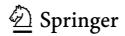
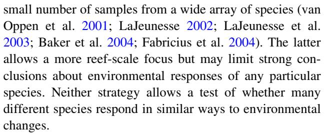
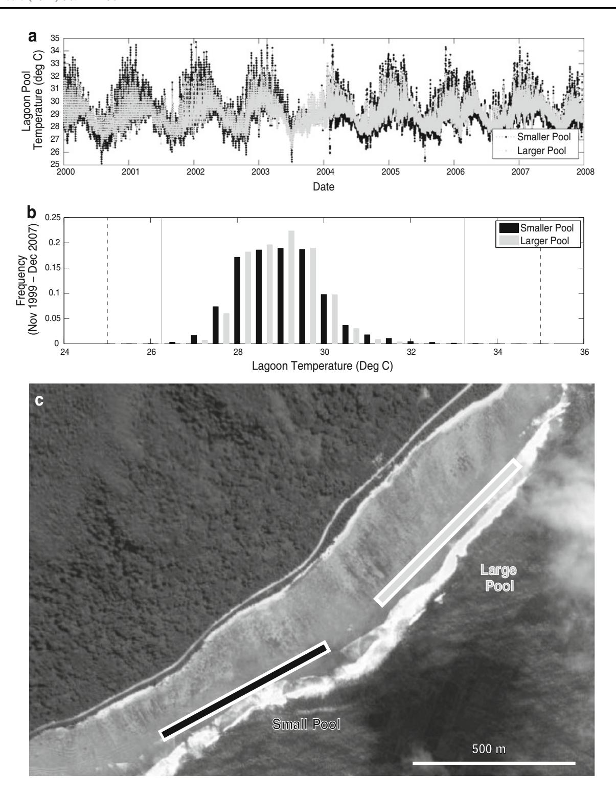
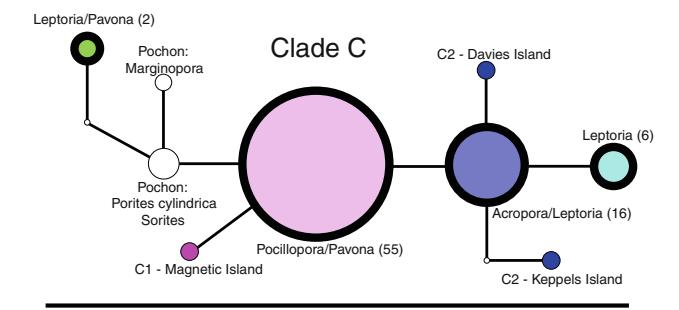
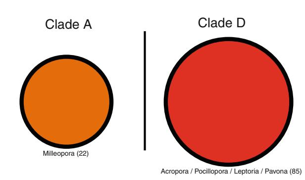
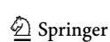
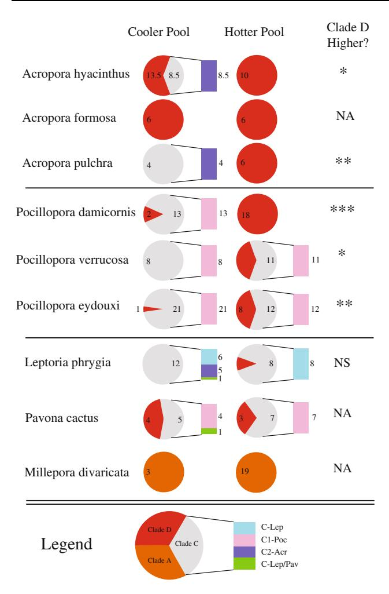
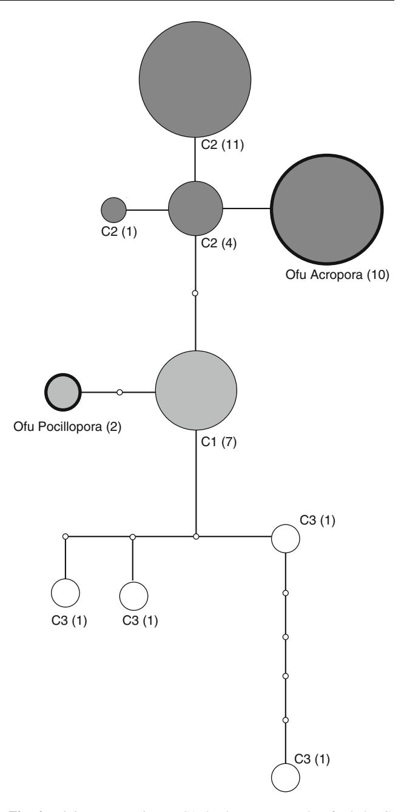

#### REPORT

# Many corals host thermally resistant symbionts in high-temperature habitat

T. A. Oliver · S. R. Palumbi

Received: 11 March 2010/Accepted: 5 November 2010/Published online: 2 December 2010 © Springer-Verlag 2010

**Abstract** Physiologically distinct lines of dinoflagellate symbionts, Symbiodinium spp., may confer distinct thermal tolerance thresholds on their host corals. Therefore, if a coral can alternately host distinct symbionts, changes in their Symbiodinium communities might allow corals to better tolerate increasing environmental temperatures. However, researchers are currently debating how commonly coral species can host different symbiont types. We sequenced chloroplast 23 s rDNA from the Symbiodinium communities of nine reef-building coral species across two thermally distinct lagoon pools separated by  $\sim 500$  m. The hotter of these pools reaches 35°C in the summer months, while the other pool's maximum temperature is 1.5°C cooler. Across 217 samples from nine species, we found a single haplotype in both *Symbiodinium* clades A and D, but four haplotypes in Symbiodinium clade C. Eight of nine species hosted a putatively thermally resistant member of clade D Symbiodinium at least once, one of which hosted this clade D symbiont exclusively. Of the remaining seven that hosted multiple Symbiodinium types, six species showed higher proportions of the clade D symbiont in the hotter pool. Average percentage rise in the frequency of the clade D symbiont from the hotter to cooler pool was 52% across these six species. Even though corals hosted members of both the genetically divergent clades D and C

Communicated by Biology Editor Dr. Mark Warner

T. A. Oliver (⋈) · S. R. Palumbi Department of Biological Sciences, Hopkins Marine Station, Stanford University, 120 Oceanview Boulevard, Pacific Grove, CA 93950, USA e-mail: toliver@stanford.edu

S. R. Palumbi

e-mail: spalumbi@stanford.edu

Symbiodinium, some showed patterns of host-symbiont specificity within clade C. Both Acropora species that hosted clade C exclusively hosted a member of sub-clade C2, while all three *Pocillopora* species hosted a member of sub-clade C1 (sensu van Oppen et al. 2001). Our results suggest that coral-algal symbioses often conform to particular temperature environments through changes in the identity of the algal symbiont.

**Keywords** Symbiodinium · Host–symbiont specificity · Acropora · Pocillopora · Pavona · Platygyra · Millepora · Clade D water temperature

#### Introduction

Observational studies of natural coral-bleaching events (Baker et al. 2004; Jones et al. 2008; LaJeunesse et al. 2010b) and physiological experiments (Rowan 2004; Berkelmans and van Oppen 2006) have shown that hosting genetically distinct types of algal endosymbionts, Symbiodinium spp., may alter the thermal tolerances of the coralalgal symbiosis. Therefore, changes in populations of Symbiodinium might play an important role in modifying coral thermal tolerance as oceans warm (Jones et al. 2008; LaJeunesse et al. 2010b), acting either alone or alongside other mechanisms (Gates and Edmunds 1999). However, substantial questions remain whether the ability of some coral species to host multiple, physiologically distinct types of symbiont is likely to apply to a wide variety of corals (Goulet 2006, 2007; Baker and Romanski 2007). If only a few species of coral can successfully host physiologically distinct symbionts, it is unlikely that changes in symbiont type would have reef-scale effects (Goulet 2006; Hoegh-Guldberg et al. 2007).

During natural bleaching events in the Pacific, corals hosting specific members of Symbiodinium clade D and, to a lesser extent, subtypes of clade C (e.g., C1 sensu van Oppen et al. [2001](#page-9-0)) have suffered significantly less bleaching and mortality than those hosting other members of clade C (e.g., C2 sensu van Oppen et al. [2001;](#page-9-0) Baker et al. [2004](#page-8-0); Jones et al. [2008;](#page-8-0) LaJeunesse et al. [2010b\)](#page-8-0). For members of clade D, these observations of distinct thermal tolerance are also supported by physiological experiments, showing that corals bearing these symbionts resist temperature-induced bleaching more than corals hosting common members of clade C (Rowan [2004](#page-8-0); Berkelmans and van Oppen [2006](#page-8-0)).

While much of the discussion around heat-resistant genotypes of Symbiodinium has focused on the distinctions between genetic clades (e.g., Rowan [2004;](#page-8-0) Baker et al. [2004\)](#page-8-0), temperature-resistant phenotypes are likely determined at a genotypic scale finer than clade (Tchernov et al. [2004;](#page-9-0) Baird et al. [2007](#page-8-0)) and the previous focus on cladelevel phenomena likely depended more on the resolution of our molecular markers and our limited sampling of Symbiodinium diversity than a true reflection of the phenotypic–genotypic map (Pochon et al. [2006;](#page-8-0) Baird et al. [2007\)](#page-8-0). That said, clade D Symbiodinium shows little genetic diversity relative to other clades (Pochon et al. [2006\)](#page-8-0), and members of clade D have repeatedly been shown to be thermally tolerant (Baker et al. [2004;](#page-8-0) Rowan [2004;](#page-8-0) Berkelmans and van Oppen [2006](#page-8-0); Jones et al. [2008](#page-8-0); LaJeunesse et al. [2010b;](#page-8-0) though see Abrego et al. [2008\)](#page-8-0) and/or to occur in high-temperature habitats (Ulstrup and van Oppen [2003](#page-9-0); Fabricius et al. [2004;](#page-8-0) Chen et al. [2005](#page-8-0); van Oppen and Gates [2006;](#page-9-0) Oliver and Palumbi [2009](#page-8-0); LaJeunesse et al. [2010a](#page-8-0)).

Whether the physiological distinctions between symbiont types will aid reefs as a whole to become more thermally tolerant will depend on how commonly corals are able to host alternate symbionts (Hoegh-Guldberg et al. [2007\)](#page-8-0). Recent studies have debated how common this flexibility is, with one set of estimates suggesting that only 23% of coral species have been shown to host multiple distinct Symbiodinium types (Goulet [2006](#page-8-0), [2007](#page-8-0)). A further study suggests that if one restricts the analysis to wellsampled, scleractinian coral species, 78% of sampled coral species have been shown to alternately host multiple types of Symbiodinium (Baker and Romanski [2007](#page-8-0)).

Sampling issues also cloud the question of whether different corals respond to environmental changes with corresponding changes in their symbiont populations. Studies that explicitly examine symbiont communities across environmental boundaries tend to either intensively sample a small number of species (Toller et al. [2001;](#page-9-0) Chen et al. [2003](#page-8-0); Ulstrup and van Oppen [2003;](#page-9-0) Garren et al. [2006;](#page-8-0) Lien et al. [2007](#page-8-0); Oliver and Palumbi [2009\)](#page-8-0) or take a

Here, we present a genetic survey taken from nine species of coral in five genera sampled from thermally distinct habitats, with a minimum per-species sample size of 10. The species in the study were common in their lagoon pool habitats (Craig et al. [2001\)](#page-8-0) and were easily identifiable. These populations are separated by only \*500 m in two back-reef pools that differ in maximum temperature and temperature range. The smaller of the two pools has warmer and more variable temperatures than the larger pool.

We show that the majority of species in this high-temperature habitat are able to host a member of clade D that is genetically identical to types proven heat-resistant elsewhere (Fabricius et al. [2004](#page-8-0); Rowan [2004](#page-8-0); Berkelmans and van Oppen [2006](#page-8-0); Jones et al. [2008](#page-8-0); LaJeunesse et al. [2010b](#page-8-0)). We also commonly see significantly higher proportions of this putatively temperature-resistant symbiont in the hotter habitat. Although most corals surveyed show distinctions in their symbiont communities across the distinct environments, we show that there are generic-level differences in overall proportions of this member of clade D and that a few corals commonly occur across both habitats without differences in their symbiont populations.

## Methods

Study site

All collections were performed in two back-reef pools on the southern coast of Ofu Island, American Samoa. Locally referred to as Pool 300 and Pool 400, we will call them the smaller pool and the larger pool, respectively. For a more thorough description of the pools, refer to Smith and Birkeland [\(2007](#page-9-0)). Temperature records have been kept for each of these pools since 1999, which were kindly provided to us by Peter Craig, National Park of American Samoa. Ofu temperatures were recorded using one Hobo Temp logger in each pool (U22-001) with a 30-min sampling interval and 0.028 C temperature resolution (Fig. [1\)](#page-2-0).

## Coral collection

In March 2007, we collected samples of nine species of coral in both back-reef pools. In this area, summer high

Coral Reefs (2011) 30:241–250 243

Fig. 1 Maps of back-reef pools along southern coast of Ofu Island, American Samoa, with 8-year time series of pool temperatures. a Time series of in situ water temperatures from the smaller and larger

pools from November 1999 to December 2007. b Histograms of in situ water temperatures from the smaller and larger pools, November 1999 to December 2007. c Aerial photograph of pools

temperatures generally last from December to March, so at sampling, corals had been exposed to seasonally high temperatures for 3–4 months. Species collected were Acropora hyacinthus, A. formosa, A. pulchra, Pocillopora damicornis, P. verrucosa, P. edouyxi, Leptoria phrygia, Pavona cactus, and Millepora divaricata. All samples were collected between 1 and 3 m in depth. All samples were held in glass vials at ambient seawater temperature until

being preserved in 70% EtOH within 1 h of collection. Samples were then returned to Stanford University for genetic analysis.

## Cp23s sequencing

Genomic DNA was extracted from all samples using Nucleospin columns (Clontech) and then PCR-amplified using cp23s forward and reverse primers: cp23s1: GCTGTAACT ATAACGGTCC; cp23s2: CCATCGTATTGAACCCAGC. Post-PCR, the samples were cleaned using SAP and EXO and cycle-sequenced using BigDye di-deoxy sequencing chemistry (USB, Cleveland, OH; ABI, Foster City, CA). Labeled samples were ethanol-precipitated and capillarysequenced on an ABI 3100 (ABI, Foster City, CA). Cycling conditions are given in Pochon et al. ([2006\)](#page-8-0). All Symbiodinium samples were sequenced at chloroplast 23 s rDNA and compared to existing databases of sequences from Pochon et al. [\(2006](#page-8-0)) and Jones et al. ([2008\)](#page-8-0). Samples were assigned major clade identities A, C, or D if they clustered within those groups as defined by Pochon et al. [\(2006](#page-8-0)). As we did not perform DGGE, SSCP, bacterial cloning, or qPCR (Ulstrup and van Oppen [2003](#page-9-0); Thornhill et al. [2007;](#page-9-0) Apprill and Gates [2007;](#page-8-0) Sampayo et al. [2009](#page-9-0)), we cannot address the proportional composition of a mixed symbiont community within a single sample. We simply report the dominant sequence present in a sample. However, as cp23s shows length variation across major clades (A/C/D), if a sample showed multiple bands on a gel, those bands were separately extracted and sequenced and any coral showing such variation was scored as half of the one Symbiodinium type and half of the other.

For those corals that showed higher proportions of clade D in the hotter pool, we tested whether the difference was statistically significant using one-tailed Fisher's exact tests. For the two species that hosted multiple subtypes within clade C (Leptoria phrygia and Pavona cactus), we tested whether the profile of symbiont types differed between pools using two-tailed Fisher's exact tests. To determine whether Acropora and Pocillopora hosted clade D at distinct frequencies, we employed a chi-square test.

## ITS1 sequencing

To verify the sub-cladal identities of the symbionts commonly found in Acropora and Pocillopora, we also sequenced a subset of samples from Acropora hyacinthus and Pocillopora damicornis at ITS1, using the primers S-DINO: CGCTCCTACCGA TTOAGTGA and D1R-rev: ATATGCTTAAATTCAGCGGGT. All other sequencing methods are as described above. Resulting sequences were compared to existing data to identify relevant sub-cladal ITS1 nomenclature (sensu van Oppen et al. [2001](#page-9-0)).

## Pool temperatures

In Ofu Island's lagoon pools, we found clear distinctions in the thermal regime of the two pools. While the mean temperatures of the two pools were similar over the 8-year record (small: 28.9C; large: 28.8C), the smaller pool showed high variability in daily temperatures with high maxima and low minima, while the larger pool showed more moderate temperature swings (Fig. [1\)](#page-2-0). This difference in the thermal extremes of the two pools is most striking during summer low-tide series, in which the smaller pool experiences 2- to 4-h periods during the day in which temperatures commonly reached above 33C (66 times on record, compared to the larger pool's 3 times), and reached an 8-year maximum of 35.4C (compared to the larger pool's 33.03C). The two time series are significantly different according to a Mann–Whitney U test (P 0.001), suggesting that they are drawn from different underlying distributions (Fig. [1](#page-2-0)b). As the smaller pool has higher maximum temperatures, we will also refer to it as the hotter pool.

## Clade identities

Across 217 samples from nine species, we found Symbiodinium from clades A, C, and D in the two Samoa pools. There was a single cp23s haplotype in clade A and one in clade D, but we found four separate clade C haplotypes (Fig. [2\)](#page-4-0). Clade C haplotypes from Acropora were 1–2 base pairs different from the cp23s sequence from Symbiodinium C2 from the Great Barrier Reef (EF140805.1– EF140806.1). Clade C haplotypes from Pocillopora and Pavona were one base pair different from Symbiodinium C1 from the Great Barrier Reef (EF140804.1; Table [1\)](#page-5-0).

All clade D samples from all species matched cp23s sequences sampled at Magnetic Island on the Great Barrier Reef taken from GenBank (EF140808.1). ITS sequences from 15 clade D samples in Acropora hyacinthus exactly matched 325 bp of sequence from bleaching-resistant clade D from the Great Barrier Reef (Jones et al. [2008\)](#page-8-0). These same sequences fell within the existing variation present in 667 base pairs of ITS sequence of type D1a sequences, not exactly matching any known D1a clones, but differing by a single base pair from two existing D1a clones. (EU074894.1–EU074900.1; Thornhill et al. [2007](#page-9-0); Table [1](#page-5-0)).

## Distinct clade proportions across pools

Of the nine species sampled, Acropora formosa hosted the D symbiont exclusively, Millepora divaricata hosted the A symbiont exclusively, and the remaining seven hosted

Fig. 2 Minimum-spanning cp23s haplotype networks of clades C, D, and A. Bold borders indicate haplotypes encountered in this study; other circles represent haplotypes taken from GenBank; numbers indicate the frequency of occurrence

members of both clades C and D, with the dominant clade differing among samples.

Of the seven species that hosted members of both clades C and D, six showed higher proportions of samples dominated by the clade D symbiont in the hotter pool by an average of 52% (95% CI = 25–79%), and five of those six species showed statistically significant differences. In some cases, the distinction was dramatic: Pocillopora damicornis showed 13% of samples dominated by the clade D symbiont in the cooler pool but 100% D in the hotter pool (P\0.001). Likewise, Acropora pulchra showed 100% of samples dominated by C in the cooler pool and 100% D in the hotter (P = 0.005). In other cases, species with multiple clades did not show dramatic differences. In Pavona cactus, for example, there was a slight decrease in the proportion of the clade D symbiont from 44% (4/9) to 30% (3/10). Millepora divaricata had the clade A symbiont in all samples from both pools (Fig. [3](#page-6-0)).

It also appears that the D symbiont is more commonly found among Acropora than Pocillopora. The three members of the genus Acropora had the highest proportions of the clade D symbiont (41.5/54 samples). In comparison, the three members of the genus Pocillopora sampled showed lower proportions of the D symbiont (36/101 samples; chisquare P\1.0e–7, Figs. 2, [3\)](#page-6-0). All three Acropora surveyed are entirely dominated by the D symbiont in the hotter pool (100%), while the three Pocillopora only hosted the D symbiont 57% of the time in the hotter pool (Fig. [3\)](#page-6-0).

Specificity for type C sub-clades

Though most Acropora and all Pocillopora hosted members of both clades C and D, the clade C sequences they carried differed between them. When Acropora species hosted clade C sequences, these haplotypes were most similar to cp23s sequences from heat-susceptible type C2 from the Great Barrier Reef (Table [1](#page-5-0); Fig. 2). ITS1 sequences of one of these species, Acropora hyacinthus, were most closely related to sub-clade C2 ITS1 (Table [1](#page-5-0); Fig. [4](#page-6-0)). Because all Acropora clade C Symbiodinium have the same cp23s sequence, we classify all Acropora C haplotypes as having this variant of C2 (sensu van Oppen et al. [2001\)](#page-9-0).

By contrast, the three Pocillopora species sampled showed specificity with a member of clade C whose cp23s sequence is closely related to more thermally resistant C1 from the Great Barrier Reef (sensu van Oppen et al. [2001](#page-9-0); Table [1](#page-5-0); Fig. 2). Samples from Pocillopora damicornis were also sequenced at ITS1 and were most closely related to the ITS1 sequences from clade C1 (Table [1;](#page-5-0) Fig. [4](#page-6-0)). Again, because all clade C Symbiodinium we sampled from Pocillopora have the same cp23s sequence, we classify all Pocillopora C haplotypes as having this variant of C1 (sensu van Oppen et al. [2001](#page-9-0)).

Two species, Leptoria phrygia and Pavona cactus, hosted multiple types of clade C. Neither species showed significantly higher levels of the clade D symbiont in the hotter pool. In L. phrygia, the population in the cooler pool hosted three distinct haplotypes of Symbiodinium C: the C2-like haplotype found in Acropora, a C1-like haplotype found in both L. phrygia and Pavona cactus, and a C2-like L. phrygia-specific haplotype. In the hotter pool, only the L. phrygia-specific haplotype was found. The differences between pools in L. phrygia symbiont types were statistically significant (P = 0.04). Pavona cactus hosted both the C1-like symbiont found in Pocillopora and the haplotype found in both L. phrygia and Pavona cactus. In the hotter pool, only the C1-like haplotype was found, but with this small sample size, the difference in symbiont types between pools was not statistically significant (P = 0.48, n = 5, 7).

# Discussion

The data collected in this study show three clear patterns: (1) in a high-temperature habitat in American Samoa, most of the surveyed corals host multiple symbiont types, including a putatively thermally resistant member of Symbiodinium clade D; (2) among corals that host multiple symbionts, most show higher proportions of this clade D symbiont in the hotter habitat; and (3) even corals that host

Table 1 Sequences and reference accession numbers

| Host                   | cp23s major clade    | cp23s closest named subtype(s)       | cp23s reference accession number             | cp23s reference publication                  | subtype(s) closest named ITS1 | accession number ITS reference        | ITS reference publication                        | This study's accession number             |
|------------------------|-------------------------|-----------------------------------------|-------------------------------------------------|-------------------------------------------------|----------------------------------------|------------------------------------------|-----------------------------------------------------|-------------------------------------------------|
| Acropora hyacinthus    | C (8.5); D (23.5) C2; D |                                         | EF140806.1; EF140808.1                          | Jones et al. (2008)                             | C2; D1a                                | EU074894.1; EU074900.1 AF380565.1; | van Oppen et al. (2001), Thornhill et al. (2007) | HQ631382; HQ631381; HQ631386; HQ631387 |
| Acropora formosa       | D (12)                  | D                                       | EF140808.1                                      | Jones et al. (2008)                             |                                        |                                          |                                                     | HQ631381                                        |
| Acropora pulchra       | C (4); D (6)            | C2; D                                   | EF140806.1; EF140808.1                          | Jones et al. (2008)                             |                                        |                                          |                                                     | HQ631382; HQ631381                           |
| Pocillopora damicornis | C (13); D (20)          | C1; D                                   | EF140804.1; EF140808.1                          | Jones et al. (2008)                             | C1                                     | AF380551.1                               | van Oppen et al. (2001)                             | HQ631383; HQ631381; HQ631388              |
| Pocillopora verrucosa  | C (19); D (7)           | C1; D                                   | EF140804.1; EF140808.1                          | Jones et al. (2008)                             |                                        |                                          |                                                     | HQ631383; HQ631381                           |
| Pocillopora eydouxi    | C (33); D (9)           | C1; D                                   | EF140804.1; EF140808.1                          | Jones et al. (2008)                             |                                        |                                          |                                                     | HQ631383; HQ631381                           |
| Leptoria phrygia       | C (20); D (1)           | C-Lep (14); C2 (5); C-Lep/Pav (1); D | EF140804.1; EF140804.1; AJ872083; EF140808.1 | Jones et al. (2008), Pochon et al. (2006) |                                        |                                          |                                                     | HQ631384; HQ631385; HQ631381              |
| Pavona cactus          | C (12); D (7)           | C1(11); C-Lep/ Pav(1); D             | EF140804.1; AJ872083; EF140808.1             | Jones et al. (2008), Pochon et al. (2006) |                                        |                                          |                                                     | HQ631383; HQ631385; HQ631381              |
| Millepora divaricata   | A (22)                  | A                                       | AY035404                                        | Pochon et al. (2006)                            |                                        |                                          |                                                     | HQ631380                                        |

Numbers in parentheses are sample sizes in both habitats. The order of subtype identities correspond to accession numbers, separated by semicolons. Accession numbers separated by commas indicate two sequences equally distant from the sequences

Fig. 3 Breakdown of Symbiodinium identity by pool and host coral. Pie charts represent clade-level identities, and the stack bar reports the sub-clade identities within clade C. Numbers indicate the numbers of samples in that clade/sub-clade. The symbols under the ''Clade D Higher?'' column indicate whether the proportion of clade D was significantly higher in the hotter pool using a one-tailed Fisher's exact test. \*\*\*P\0.001, \*\*P\0.01, \*P\0.05, NS not significant, and NA not applicable (no clade D elevation to test)

members of both of the very distinct clades C and D show strong preference, if not specificity, for specific members of clade C.

How many coral species host clade D?

Of the nine species in our survey, eight host the clade D symbiont in at least one sample (Fig. 3). The one species that is entirely dominated by the clade D symbiont, Acropora formosa, has been shown to host clade C elsewhere (LaJeunesse et al. [2003](#page-8-0), [2004](#page-8-0), [2010a\)](#page-8-0). The high percentage of species hosting multiple clades (88%) runs counter to suggestions that a majority of common reef-building corals

Fig. 4 Minimum-spanning ITS1 haplotype network of clade C, showing our samples in reference to van Oppen et al. [\(2001\)](#page-9-0). Bold borders indicate haplotypes encountered in this study; numbers indicate the frequency of occurrence

do not host multiple symbionts (Goulet [2006](#page-8-0), [2007](#page-8-0)). Instead, our data roughly agree with Baker and Romanski [\(2007](#page-8-0)) that 64–78% of scleractinian corals might host multiple clades. Our estimate, however, may over-estimate the true percentage because our study samples heavily within Acropora and Pocillopora, two genera previously known to host multiple types of symbionts.

Because we quantified symbiont identity in species from multiple genera across the same environmental gradient,

we can also test whether genera differ in their propensities to host certain Symbiodinium types. Our data show that Acropora more commonly host Symbiodinium D than do Pocillopora. We see this pattern across both pools (77% Acropora, 36% Pocillopora), but it is particularly dramatic in the hotter pool (100% Acropora, 57% Pocillopora). These results support the contention of Goulet [\(2007](#page-8-0)) that sampling strategies are likely to influence perceived rates of Symbiodinium D usage and that different samples from different genera might be expected to give different results.

## Hotter habitat, more clade D

Our data show significantly higher proportions of putatively heat-tolerant members of clade D in five of seven species across the sampled habitats. Previous studies also suggest that members of clade D may show high proportions in environments that may be more stressful for corals. In two studies of Caribbean Montastraea annularis (sensu lato), the authors more commonly found members of clade D in deeper areas, more turbid areas, and higher-temperature areas (Toller et al. [2001;](#page-9-0) Garren et al. [2006](#page-8-0)). In Acropora palifera, A. valida, and A. hyacinthus, proportions of clade D tend to be higher in higher-temperature sites or seasons (Ulstrup and van Oppen [2003;](#page-9-0) Chen et al. [2005;](#page-8-0) van Oppen and Gates [2006;](#page-9-0) Oliver and Palumbi [2009\)](#page-8-0). The marginal-habitat specialist Oulastrea crispata is almost always dominated by clade D, except in some warm, tropical sites where clade C occurs (Lien et al. [2007\)](#page-8-0). Studies also suggest that, across an array of species, clade D is common among turbid rock islands in Palau (Fabricius et al. [2004](#page-8-0)), uncommon on the cooler, southern, and central Great Barrier Reef (LaJeunesse et al. [2003,](#page-8-0) [2004\)](#page-8-0), patchily distributed on the warmer, northern Great Barrier Reef (van Oppen et al. [2001](#page-9-0)), common in the northeast Indian Ocean and Persian Gulf, but uncommon in the Red Sea and Mauritius (Baker et al. [2004](#page-8-0); LaJeunesse et al. [2010a](#page-8-0)).

These studies taken together build a picture in which members of clade D tend to occur in hotter habitats (Ulstrup and van Oppen [2003](#page-9-0); Fabricius et al. [2004](#page-8-0); Oliver and Palumbi [2009;](#page-8-0) LaJeunesse et al. [2010a,](#page-8-0) [b\)](#page-8-0). However, making direct, statistically verifiable comparisons between populations of the same coral species in environmentally distinct, but nearby habitats still remains a challenge in the field. Our data show a consistent, multispecies trend to higher proportions of clade D in the hotter thermal regime on a local scale while controlling for host species and potential regional differences.

However, not all coral species' Symbiodinium communities change with their habitat. The hydrocoral Millepora divaricata (Fig. [3\)](#page-6-0) is common in the high-temperature pools but hosts a single Symbiodinium type in every sample. The symbionts we found in M. divaricata are members of clade A, which is consistent with the pattern of clade A dominance found in other Millepora elsewhere in the Indo-Pacific (LaJeunesse et al. [2009\)](#page-8-0). The common back-reef corals in the genus Porites generally house a single symbiont type, and this specific coral–algal association has been shown to be heat-resistant relative to other corals (Baker [2003;](#page-8-0) LaJeunesse et al. [2003;](#page-8-0) Fitt et al. [2009](#page-8-0)). This suggests that although Symbiodinium dynamics may play an important role in thermal adaptation of many species, other species manage to successfully adapt to hightemperature areas without changes in their symbiont community.

## A subtle discrimination among C-types

Corals that host the taxonomically divergent clades C and D are nevertheless capable of discriminating among subtly different subtypes of Symbiodinium C. The clade C symbionts hosted by Acropora exclusively belonged to subclade C2, whereas the clade C symbionts from Pocillopora exclusively belonged to sub-clade C1.

On the Great Barrier Reef, Symbiodinium C2 has been shown to be highly sensitive to thermal stress, while Symbiodinium C1 is more thermally resistant (Berkelmans and van Oppen [2006;](#page-8-0) Jones et al. [2008\)](#page-8-0). Our ability to link Ofu Island C-types to specific thermal physiologies is indirect because we have no experimental data from Ofu that the Symbiodinium we find with C1- or C2-like sequences show the same thermal properties as those in Australia. In addition, the Australian C1 and C2 do not have the same cp23s or ITS1 sequences as do our Ofu samples, and it is possible that the C1- or C2-like symbionts we find in Ofu have different thermal properties. Nevertheless, if our C1-like Symbiodinium in Ofu has high thermal resistance, this might explain why corals with this C-type harbor clade D less abundantly than corals that host the C2-like Symbiodinium.

Differential sensitivity of Ofu clade C subtypes to temperature is also suggested by the significant distinction shown by Leptoria phrygia, with three C-types in the cooler pool and one in the hotter pool (Fig. [3,](#page-6-0) P = 0.0396). Further data on these C-types, two of which are closely related to the C2 subtype (Fig. [2\)](#page-4-0), are required to demonstrate meaningful differences.

## Prospects for the future of coral–symbiont acclimation

That many common reef-building corals in Ofu Island back reefs can associate with multiple, physiologically distinct symbionts is an important signpost for the prospects of coral adaptation to a warmer world. However, substantial cautions remain. Putatively heat-tolerant clade

D Symbiodinium are prevalent in coral communities living in warm-water habits around American Samoa (Oliver and Palumbi 2009), and it is possible that fewer species will host clade D in other areas where these symbionts are less common. Also, corals from the genera Acropora and Pocillopora were each likely to associate with specific types of symbionts within clade C, suggesting that even among species that are physiologically capable of hosting distinct symbionts, not all host–symbiont combinations are likely.

Acknowledgments The authors would like to acknowledge the assistance of C. Birkeland, Dan Barshis, and Cheryl Squair at University of Hawaii; Peter Craig and Fale Tuilagi (US National Park Service, American Samoa); Seabird McKeon at the University of Florida; and Kirsten Oleson and Jason Ladner of Stanford University for their support in American Samoa; and the National Park of American Samoa. We would also like to thank the NSF Predoctoral fellowship program, the Woods Institute for the Environment, NOAA and the National Science Foundation for funding.

## References

- Abrego D, Ulstrup K, Willis B, van Oppen M (2008) Species–specific interactions between algal endosymbionts and coral hosts define their bleaching response to heat and light stress. Proc R Soc, B 275:2273–2282
- Apprill AM, Gates RD (2007) Recognizing diversity in coral symbiotic dinoflagellate communities. Mol Ecol 16:1127–1134
- Baird AH, Cumbo VR, Leggat W, Rodriguez-Lanetty M (2007) Fidelity and flexibility in coral symbioses. Mar Ecol Prog Ser 347:307–309
- Baker A (2003) Flexibility and specificity in coral-algal symbiosis: Diversity, ecology, and biogeography of Symbiodinium. Annual Review of Ecology, Evolution, and Systematics 34:661–689
- Baker AC, Romanski AM (2007) Multiple symbiotic partnerships are common in scleractinian corals, but not in octocorals: Comment on Goulet (2006). Mar Ecol Prog Ser 335:237–242
- Baker AC, Starger CJ, McClanahan TR, Glynn PW (2004) Corals' adaptive response to climate change. Nature 430:741
- Berkelmans R, van Oppen MJH (2006) The role of zooxanthellae in the thermal tolerance of corals: a 'nugget of hope' for coral reefs in an era of climate change. Proc R Soc Biol Sci Ser B 273:2305–2312
- Chen CA, Lam KK, Nakano Y, Tsai WS (2003) A stable association of the stress-tolerant zooxanthellae, Symbiodinium clade D, with the low-temperature-tolerant coral, Oulastrea crispata (Scleractinia: Faviidae) in subtropical non-reefal coral communities. Zool Stud 42:540–550
- Chen CA, Wang AT, Fang LS, Yang YW (2005) Fluctuating algal symbiont communities in Acropora palifera (Scleractinia : Acroporidae) from Taiwan. Mar Ecol Prog Ser 295:113–121
- Craig P, Birkeland C, Belliveau S (2001) High temperatures tolerated by a diverse assemblage of shallow-water corals in American Samoa. Coral Reefs 20:185–189
- Fabricius KE, Mieog JC, Colin PL, Idip D, van Oppen MJH (2004) Identity and diversity of coral endosymbionts (zooxanthellae) from three Palauan reefs with contrasting bleaching, temperature and shading histories. Mol Ecol 13:2445–2458
- Fitt W, Gates R, Hoegh-Guldberg O, Bythell J, Jatkar A, Grottoli A, Gomez M, Fisher P, Lajuenesse T, Pantos O (2009) Response of two species of Indo-Pacific corals, Porites cylindrica and Stylophora pistillata, to short-term thermal stress: The host does

- matter in determining the tolerance of corals to bleaching. J Exp Mar Biol Ecol 373:102–110
- Garren M, Walsh SM, Caccone A, Knowlton N (2006) Patterns of association between Symbiodinium and members of the Montastraea annularis species complex on spatial scales ranging from within colonies to between geographic regions. Coral Reefs 25:503–512
- Gates RD, Edmunds PJ (1999) The physiological mechanisms of acclimatization in tropical reef corals. Am Zool 39:30–43
- Goulet TL (2006) Most corals may not change their symbionts. Mar Ecol Prog Ser 321:1–7
- Goulet TL (2007) Most scleractinian corals and octocorals host a single symbiotic zooxanthella clade. Mar Ecol Prog Ser 335:243–248
- Hoegh-Guldberg O, Mumby PJ, Hooten AJ, Steneck RS, Greenfield P, Gomez E, Harvell CD, Sale PF, Edwards AJ, Caldeira K, Knowlton N, Eakin CM, Iglesias-Prieto R, Muthiga N, Bradbury RH, Dubi A, Hatziolos ME (2007) Coral reefs under rapid climate change and ocean acidification. Science 318:1737–1742
- Jones AM, Berkelmans R, van Oppen MJH, Mieog JC, Sinclair W (2008) A community change in the algal endosymbionts of a scleractinian coral following a natural bleaching event: field evidence of acclimatization. Proc R Soc Biol Sci Ser B 275:1359–1365
- LaJeunesse TC (2002) Diversity and community structure of symbiotic dinoflagellates from Caribbean coral reefs. Mar Biol (Berl) 141:387–400
- LaJeunesse TC, Loh WKW, van Woesik R, Hoegh-Guldberg O, Schmidt GW, Fitt WK (2003) Low symbiont diversity in southern Great Barrier Reef corals, relative to those of the Caribbean. Limnol Oceanogr 48:2046–2054
- LaJeunesse TC, Bhagooli R, Hidaka M, deVantier L, Done T, Schmidt GW, Fitt WK, Hoegh-Guldberg O (2004) Closely related Symbiodinium spp. differ in relative dominance in coral reef host communities across environmental, latitudinal and biogeographic gradients. Mar Ecol Prog Ser 284:147–161
- LaJeunesse TC, Loh W, Trench RK (2009) Do introduced endosymbiotic dinoflagellates 'take' to new hosts? Biol Invasions 11:995–1003
- LaJeunesse TC, Pettay T, Sampayo EM, Phongsuwan N, Brown B, Obura D, Hoegh-Guldberg O, Fitt WK (2010a) Long-standing environmental conditions, geographic isolation and host–symbiont specificity influence the relative ecological dominance and genetic diversification of coral endosymbionts in the genus Symbiodinium. J Biogeogr 37:785–800
- LaJeunesse TC, Smith R, Walther M, Pinzo´n J, Pettay DT, McGinley M, Aschaffenburg M, Medina-Rosas P, Cupul-Magan˜a AL, Pe´rez AL, Reyes-Bonilla H, Warner ME (2010b) Host–symbiont recombination versus natural selection in the response of coral– dinoflagellate symbioses to environmental disturbance. Proc R Soc Biol Sci Ser B 277:2925–2934
- Lien YT, Nakano Y, Plathong S, Fukami H, Wang JT, Chen CA (2007) Occurrence of the putatively heat-tolerant Symbiodinium phylotype D in high-latitudinal outlying coral communities. Coral Reefs 26:35–44
- Oliver T, Palumbi S (2009) Distributions of stress-resistant coral symbionts match environmental patterns at local but not regional scales. Mar Ecol Prog Ser 378:93–103
- Pochon X, Montoya-Burgos JI, Stadelmann B, Pawlowski J (2006) Molecular phylogeny, evolutionary rates, and divergence timing of the symbiotic dinoflagellate genus Symbiodinium. Mol Phylogenet Evol 38:20–30
- Rowan R (2004) Coral bleaching—Thermal adaptation in reef coral symbionts. Nature 430:742

250 Coral Reefs (2011) 30:241–250

Sampayo EM, Dove S, LaJeunesse TC (2009) Cohesive molecular genetic data delineate species diversity in the dinoflagellate genus Symbiodinium. Mol Ecol 18:500–519

- Smith L, Birkeland C (2007) Effects of intermittent flow and irradiance level on back reef Porites corals at elevated seawater temperatures. J Exp Mar Biol Ecol 341:282–294
- Tchernov D, Gorbunov MY, de Vargas C, Yadav SN, Milligan AJ, Haggblom M, Falkowski PG (2004) Membrane lipids of symbiotic algae are diagnostic of sensitivity to thermal bleaching in corals. Proc Natl Acad Sci USA 101:13531–13535
- Thornhill D, LaJeunesse T, Santos S (2007) Measuring rDNA diversity in eukaryotic microbial systems: how intragenomic variation, pseudogenes, and PCR artifacts confound biodiversity estimates. Mol Ecol 16:5326–5340
- Toller WW, Rowan R, Knowlton N (2001) Zooxanthellae of the Montastraea annularis species complex: Patterns of distribution of four taxa of Symbiodinium on different reefs and across depths. Biol Bull (Woods Hole) 201:348–359
- Ulstrup KE, van Oppen MJH (2003) Geographic and habitat partitioning of genetically distinct zooxanthellae (Symbiodinium) in Acropora corals on the Great Barrier Reef. Mol Ecol 12:3477–3484
- van Oppen MJH, Gates RD (2006) Conservation genetics and the resilience of reef-building corals. Mol Ecol 15:3863–3883
- van Oppen MJH, Palstra FP, Piquet AMT, Miller DJ (2001) Patterns of coral-dinoflagellate associations in Acropora: Significance of local availability and physiology of Symbiodinium strains and hostsymbiont selectivity. Proc R Soc Biol Sci Ser B 268:1759–1767

