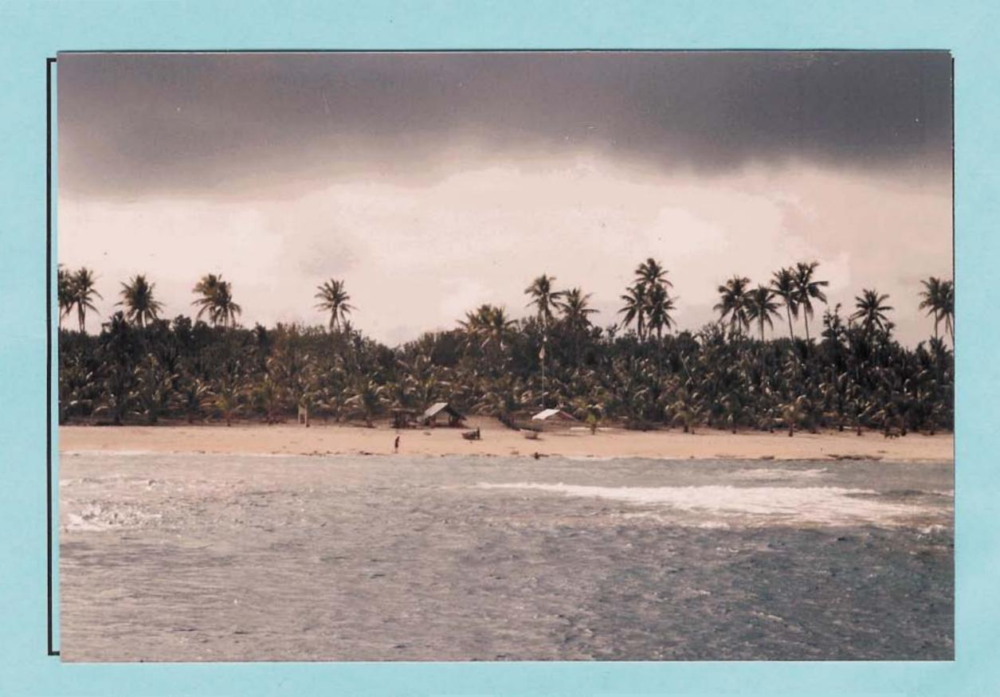
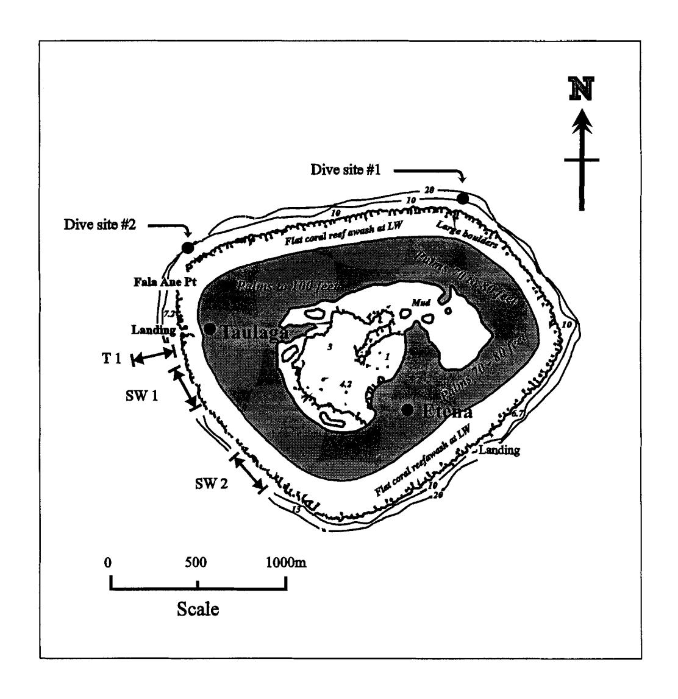
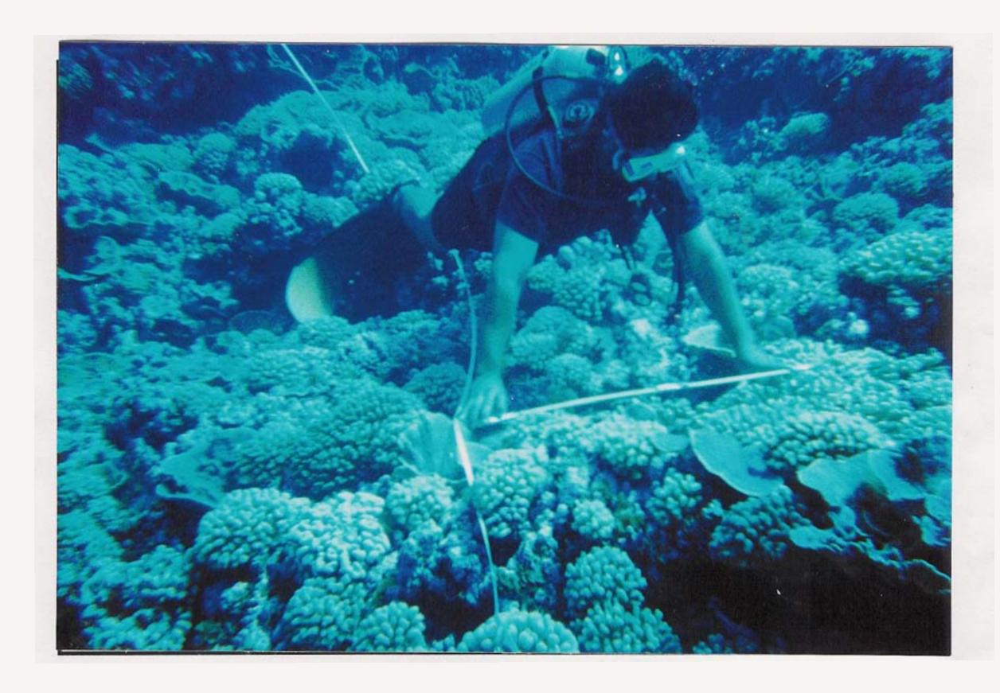
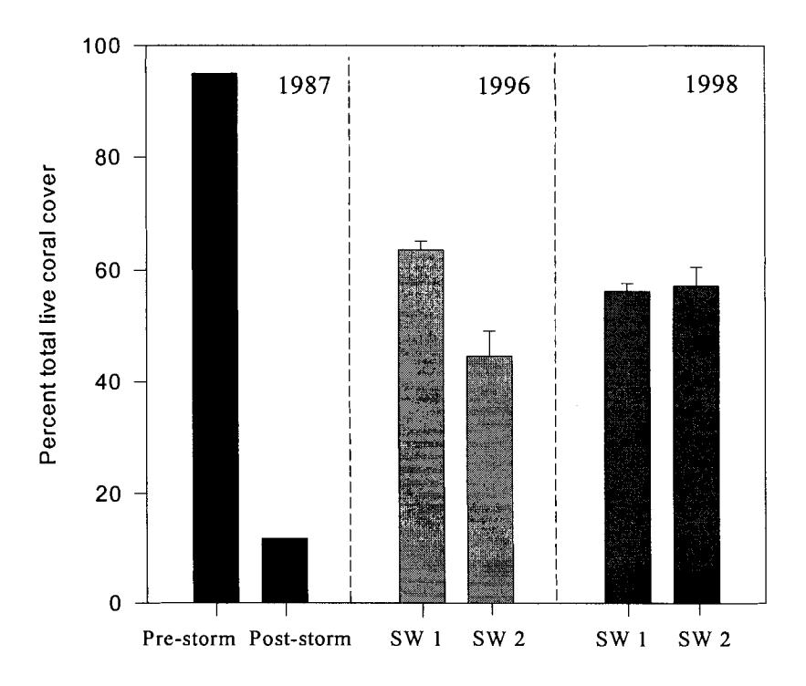
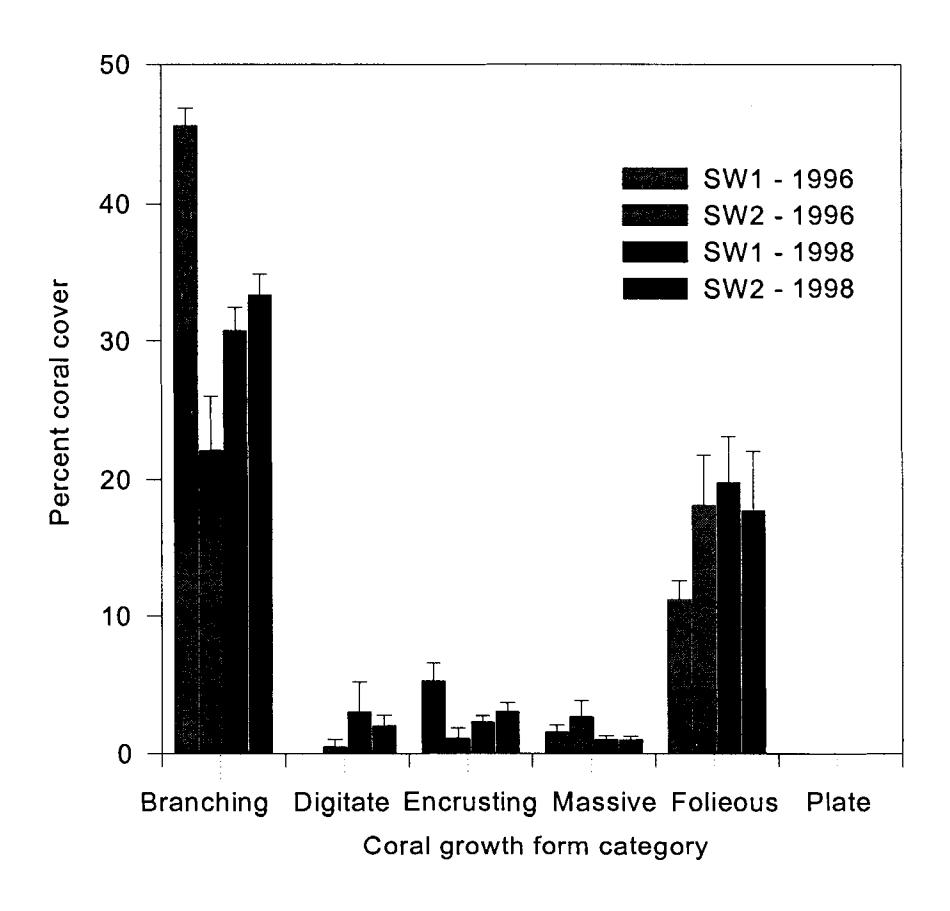
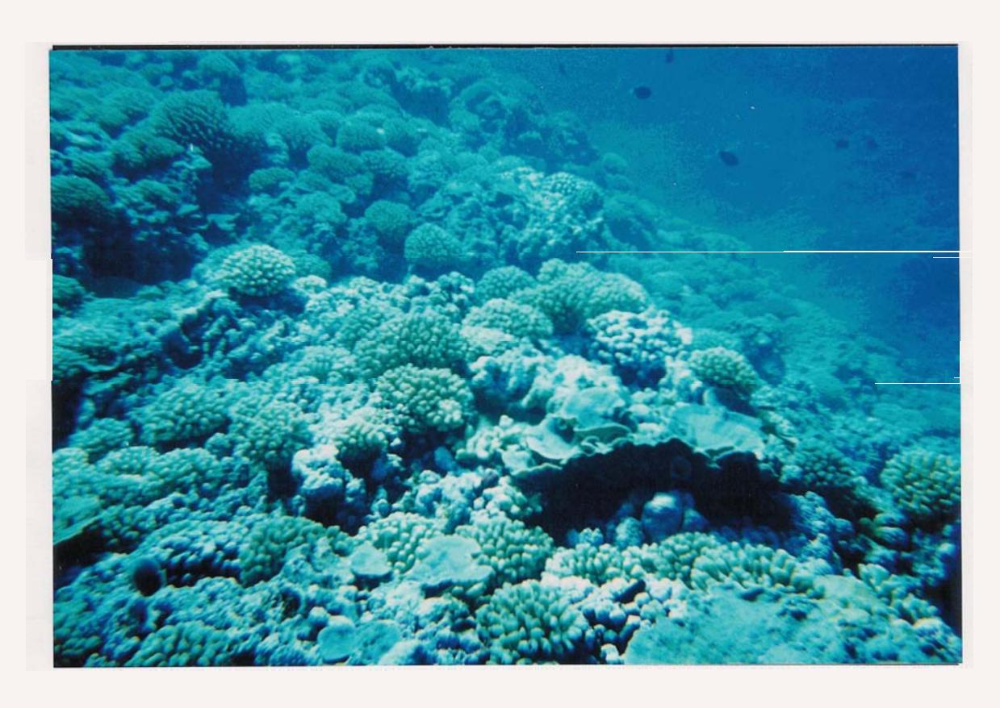

# **Status of the Coral Reef of Swains Island 1998**

**Mike Page and Alison Green** 

**Department of Marine and Wildlife Resources Government of American Samoa P.O. Box 3730 American Samoa 96799** 

Swains Island - showing the extent of the fPinging reef and entrance **to** the landing at Taulaga on the south-western side of the island.

#### THE STATUS OF THE CORAL REEF OF SWAINS ISLAND - **1998**

*by Mike Page* & *Alison Green Department of Marine* & *Wildlife Resources PO Box 3730, Pago Pago, American Samoa, 967* 

## INTRODUCTION

Swains Island, located approximately 370 km due north of Tutuila, is one of two atolls incorporated in the US territory of American Samoa. The island has a large brackish water lagoon surrounded by a narrow fringing reef with reef flats dominated by pink coralline algae extending out 100-300m from the shoreline (Fig. 1). The reef front slopes gently down to 20-25m, then falls vertically to depths greater than 60m (Green, 1996a).

The coral reef on Swains is typical of those found on remote oceanic atolls which have high coral cover and low species diversity. The reef fish community is also characterized by low diversity and high biomass. Green (1 996a) found the reef fish community on the reef front to be dominated by planktovorous species such as damselfishes and fairy basslets. She also noted the predominance of large piscivores such as snappers, reef sharks and trevally, which form an important part of the subsistence catch for the 30 inhabitants of the island.

During February 1987, Swains Island was struck by a severe storm. High waves damaged a major part of the shoreline and decimated the village of Taulaga on the south-west side of the island (Itano, 1987). The island was visited by Department of Marine and Wildlife (DMWR) biologists to assess the impact of damage to the reef and fish resources caused by the storm. Coral cover recorded prior to the storm at the Taulaga transects on the SW side of the island, (see Itano, 1987), had decreased by 93-100%. There was a corresponding reduction in fish species diversity and density. Noticeably lacking were the larger predatory fishes such as sharks, jacks, barracuda, and large snappers.

A survey conducted by DMWR nine years later (March 1996) showed that coral cover and fish density had recovered markedly. Coral cover was high (45-65%) and species composition, fish abundance and density were similar to pre-storm observations (Green, 1996a).

During March 1998 Hurricane Ron passed within 8 km north-east of Swains island causing high winds and large waves (>5m) to batter the south-western side of the island (Capt. W. Thompson, pers. comm.). Two months later DlMWR biologists visited the island to assess if any significant damage had occurred to the reef at Taulaga.

Figure 1. Map of Swains Island showing the location of coral survey sites. T1 was surveyed by Itano (1986, 1987) and SW1 and SW2 surveyed by Green (1996) and the present study. \* note depths shown are in fathoms.

## METHODS

Five 50m transects were laid consecutively on the reef front in 1 Om of water, at each of two sites on the south-west facing side of Swains Island (Fig. 1). Transects were located in approximately the same position as surveyed by Green (1996d) on the south-westem side of the island. Site SW1 transects started close to 300m south of the ava and proceeded in a southerly direction, and site SW2 started approximately 500m south of the end of the SW1 transects at SW2. Data was collected using the points-based method for habitat description, refer plate 1 (see Green, 1996d for details).

Plate 1. A DMWR biologist measuring and estimating percent cover of coral growth form categories along a 50m transect line in 10 metres of water.

This method was used to provide an estimate of percent cover for 4 non-living, (reef matrix, sand, rubble or holelcrevice), and 16 living categories (plate coral, massive coral, submassive coral, digitate coral, branching coral, foliose coral, encrusting coral, gorgonians, hydrozoans, sponges zooanthids, ascidians, echinoderms, macroalgae, filamentous algae, or pink coraline algae).

The 1996 and 1998 surveys were analyzed using Analysis of Variance (ANOVA) for comparison of variation between sampling times and among sites based on the total

cover of each substratum type. Transformations were applied to normalize data where appropriate.

#### RESULTS

A visual survey of the reef front from 3 -25m on the south-west side of Swains Island opposite the village of Taulaga (Fig. I), detected no obvious physical damage to the reef or live corals. Accordingly, there was no significant change in mean percent total live coral cover (mean + s.e.) between 1996 and 1998 surveys (p= 0.563) or among sites within surveys **0,** = 0.02). The mean total percent coral cover at SW1 was slightly greater in 1996 (63.7 k1.6) than in 1998 (56.2 + 1.5). Conversely, total coral cover at SW2 was lower in 1996 (44.5 + 4.5) than in 1998 (57.2 + 3.9, refer Fig. 2. These differences are most likely to be attributed to natural variation in coral density and location of survey transects.

Figure 2. Mean percent total live coral cover (+ s.e.) for surveys conducted during 1986, 1987 Itano (1 987), 1996 Green (1 996) and 1998 (present study). n = 1 transect for 1986, 1987 and n = 5 for 1996, 1998 study sites.

Percent cover of coral growth categories also showed little variation between 1996 and 1998 surveys (Fig. 3). Branching corals (predominantly Pocillopora spp.) were the dominant growth form in 1996 and 1998 (Plate 2). With the exception of branching foliose corals (Montipora spp.), other growth forms showed no change in mean percent cover over 2 years.

Dives conducted at the north-east and north-west sides of the island (Fig. 1) found no evidence of recently damaged corals. Total coral cover and species composition was estimated to be similar to the survey sites off Taulaga. There did appear, however, to be less foliose corals on the reef front at the dive sites on the NE and NW sides of the island.

Figure 3. Mean percent cover (f s.e.) of coral growth forms recorded within each of two sites on the south-west side of Swains Island (SW1 & SW2) by Green (1996) and in the present survey (n = 5 transects).

Plate 2. Typical view of the reef front coral community showing low species diversity, with dominance of branching corals *(Pocillogora* spp.) interspersed with more fragile foliose corals *(Montipora* spp.) in the foreground.

## DISCUSSION

Heavy south-west swells generated by hurricane Ron as it passed to the north of Swains Island in March 1998 had no visible impact on the coral reef. There was no significant change in total coral cover between 1996 and 1998 on the reef front south of Taulaga.

Both this study and the previous survey by Green (1996) indicate that the coral community has recovered well over the past 11 years. Coral cover is high (56-57%), and species composition and growth forms are similar to the pre '87 levels. Fast growing, opportunist branching corals such as Pocillopora spp. were dominant on the reef front followed by foliose corals (Montipora spp.). Coral species diversity was also low, which is characteristic of isolated oceanic atolls.

Given the pristine nature of the oceanic waters surrounding the reef, and no large-scale physical or biological perturbations, the coral community should continue to regenerate to pre '87 levels where coral cover was close to 100% on the reef front. This study provide mher evidence that exposed atoll reef communities are adapted to periodic large-scale natural perturbations such as hurricanes, and can recruit and grow relatively quickly in undisturbed conditions.

We were asked by Captain Thompson to detail some observations that we made on the brackish water lagoon in Swains island. The lagoon had a sulfurous odour which suggests either anoxic bacterial metabolism, or spring water of volcanic origin. There was, however, no evidence of anoxia in the sediments or cyanobacterial mats examined from the lake edge opposite Taulaga. Moreover, divers noted plumes of fresh water at survey sites on the south-western side of the island (Fig. 1) in 5-10m on the reef front. These observations therefore suggest that the lagoon is spring water fed, probably of volcanic origin. The lagoon water should be tested for trace minerals and nutrients before any firm conclusions can be drawn

## AKNOWLEDGEMENTS

Our survey would not have been possible without the help of a number of people. Firstly, we would like to thank Captain Wally Thompson and the Director of DMWR, Ufagafa Ray Tulafono for giving us the opportunity to conduct this survey. Secondly, we are grateful to Joanna Martin for enduring monotonous hours assisting with the survey, and Marsh Uele for his capable boat driving. Lastly, but certainly not least, we would like to thank the residents of Swains Island for a warm welcome to their beautiful island in the sun, excellent food, a great place to stay and wonderful company. Also, a special thanks to Eliza Jennings for recounting some of the old stories of her ancestors and their island.

## REFERENCES

- Green, A. L. 1996a Coral reefs of Swains Island, American Samoa. Department of Marine & Wildlife Resources Biological Report Series, P.O. Box 3730, Pago Pago, American Samoa. 96799.2~~.
- Green, A.L. 1996d Status of Coral reefs of the Samoan Archipelago. Department of Marine & Wildlife Resources Biological Report Series, P.O. Box 3730, Pago Pago, American Samoa 96799.48~~.
- Itano D. 1997 Swains Island Trip Report (April 7- 12, 1987) Report to the Director, Department of Marine & Wildlife Resources, P.O. Box 3730, Pago Pago, American Samoa 96799.6~~.