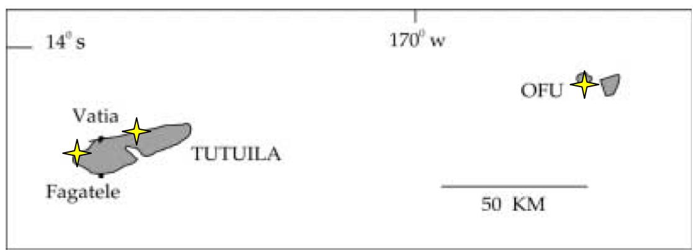
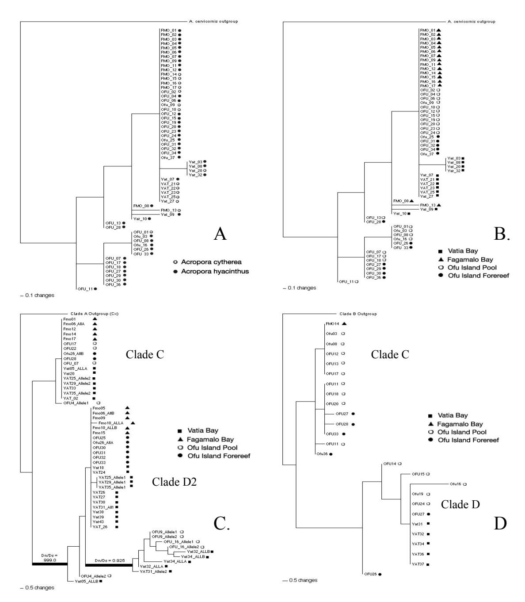
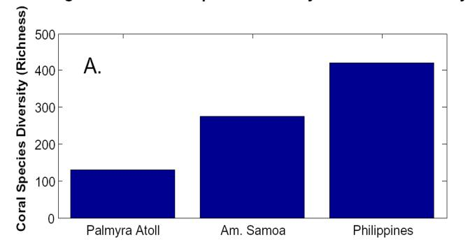
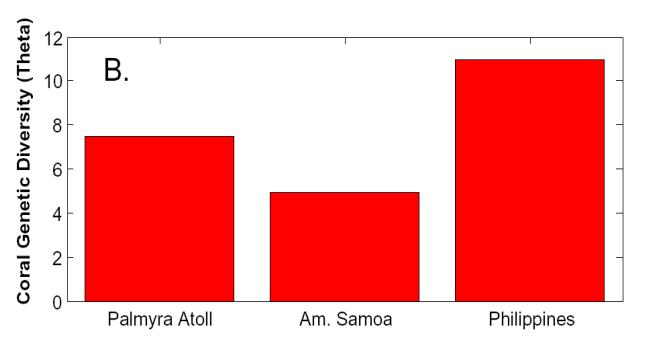
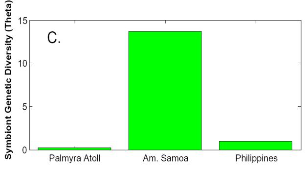

# *Genetic Evidence of Dispersal Limitation and Local Adaptation in Samoan Reef Corals: Report on Ongoing Research: March, 2006*

Stephen Palumbi and Thomas Oliver, Stanford University

*Summary***:** Our research has used genetic sampling to document the genetic diversity of corals and their dinoflagellate symbionts (*Symbiodinium sp*.) in three locations in American Samoa. Our major goals have been to assess these species' scale of dispersal and quantify American Samoa's level of genetic diversity relative to other sampled sites in the Pacific.

In August of 2004 we collected samples of two species of staghorn corals, *Acropora hyacinthus and Acropora cytherea*, at three sites in American Samoa: Vatia Bay (43 samples), Fagamalo Bay (18 samples) and Ofu Island (37 samples). In two of these sites, Vatia and Ofu, samples were taken in two distinct habitats: the warmer, less exposed back reef, represented in Ofu by intertidal pools, and the cooler, more exposed fore reef. Samples were PCR amplified and direct sequenced at a mitochondrial locus for the coral and a mitochondrial and nuclear locus for its *Symbiodinium* partner.

Analysis of the resulting sequences shows four major findings: 1) genetic distinction between the two morphologically distinct species of coral is low, indicating some level of introgression; 2) Analysis of F-statistics shows strongly that the coral populations from each sampled location are genetically distinct, implying that coral dispersal between localities occurs only rarely, whereas locations in close proximity (back reef vs fore reef) show no genetic distinction for the corals; 3) *Symbiodinium sp.* shows little evidence of isolation between islands or separate locations within islands, but it shows genetic distinction across habitat boundaries at a single site. This suggests that local selection is playing a larger role in determining *Symbiodinium* genotype at the local level. This is further supported by evidence of positive selection in the *cytochrome b* phylogeny, in which *Symbiodinium* carrying a positively selected type of *cytochrome b* occur only in warm back reef environments at two sites. 4) Contrary to hypotheses that geographic patterns in genetic diversity should mirror species richness patterns, *Symbiodinium* genetic diversity housed in sampled *Acropora*  species from American Samoa dwarfs that of Palmyra Atoll and the Philippines.

These results show strongly that reef corals in different bays in American Samoa are separate gene pools unlikely to be connected by large amounts of larval exchange. The environmental pressures these corals are exposed to, however, may be quite different on a local scale and may lead to functionally different strains of *Symbiodinium*. If there is a link between symbiont genetic diversity and environmental flexibility, then the large degree of genetic diversity in Samoan *Symbiodinium* may signal the ability of coral in this region of the Pacific to adapt to climate change more quickly than in other regions.

The above results clearly can only apply to the two sampled coral species. In addition, because our original study was not designed to detect patterns of local adaptation across small scales, our sample sizes across such habitat boundaries are limited. In further studies, we hope to explore these patterns in a wider array of coral species, sample more intensively in distinct habitats exposed local adaptation, and use selection experiments to document the range of thermal tolerance given genotypes exhibit. As a highly diverse system with strong physical gradients, American Samoa provides an excellent laboratory to study the processes of selection currently occurring on reefs.

### **I. Introduction**

 Our research on coral recovery tries to ask: Where do new coral recruits come from? How far do young corals disperse before landing on a reef? We are trying to answer this question for corals through genetic testing of populations sampled from different reefs. Comparing the genetic families of corals from one reef to those found on other reefs will help determine the extent to which these family lines mix together when larvae disperse in ocean currents.

Modern genetic methods have greatly furthered our attempts to understand critical components of reef coral population dynamics (Vollmer and Palumbi 2003, Ayres and Hughes 2004). Before the advent of genetic technologies, understanding the scale of larval dispersal was dependent on heroic sampling schemes and was limited in its applicability (Sammarco and Andrews 1988). Also the diversity of reef coral's vital partner, *Symbiodinium sp.*, was entirely unknown until the first genetic assays were developed (Rowan and Powers 1991).

 The study described below has relied upon genetic sampling and statistical analysis of the resulting sequences to describe the scale of movement of coral and *Symbiodinium* populations. We targeted two coral species in American Samoa, the tabletop corals *Acropora hyacinthus* and *A.cytherea*. We distinguished these species by the details of polyp morphology: *A. hyacinthus* has radial polyps in a floret arrangement whereas *A. cytherea* has more elongated radial polyps that appear similar to bamboo than in *hyacinthus*. In addition, after sampling was completed we have been able to access genetic information about the naturally occurring dinoflagellate symbionts of corals across species, islands and habitats.

 Combined with an excellent ecological system (Craig et al. 2001) these genetic tools can provide clear, simple answers to fundamental questions about the life of reef corals. Initial descriptions of such answers are described below. While they require further study to verify their consistency over time and broad-scale applicability, such answers bring us closer to a full understanding of the process at work in the life of reef coral.

### **II. Methods**

### A. *Collections:*

In the August of 2004, we collected tissue samples (~2 cm2 ) *Acropora hyacinthus* 

**Figure 1:** Map of American Samoa with marked sampling locations (After Craig et al. 2001)

and *Acropora cytherea* colonies from three sites in American Samoa: Fagamalo Bay (18 samples), Vatia Bay (43), and Ofu Island (37). On Ofu we collected tissue samples both within the intertidal pools on Ofu's south shore (24/37) and on the fore reef east of the airport runway (13/37). All samples were preserved in 70% isopropanol for future genetic analysis. (See Table 1 and Figure 1 for sample locations).

Inside the lagoon at Ofu Island, we found mostly *A. hyacinthus* scattered occasionally. We surveyed four outer reef sites as well: two on the south side, two on the north side of Ofu. All sites had been severely impacted by recent hurricanes. Only the site near the airstrip on the northern side held any table tops of the correct species. These corals were small, less than 200 cm across, but had clear morphology of *A. hyacinthus.* They were collected from 25-40 ft depth.

The third site was in Vatia Bay, on Tutuila. Long conversations with Mrs. Hall preceded exploration of this area. We found abundant table top corals on the southern shore of the bay, near the bay's mouth. The mouth of the bay tended to be favored by *A. hyacinthus*  whereas the interior of the bay had more *A. cytherea*. This gradient was not sharp, and extended over about 1 km.

The fourth site was in Fagemelo Bay. The Mayor of Fagemelo told us that the bay had once been festooned with corals, fish and crab. We snorkeled there and found a seascape destroyed by recent hurricanes. Algae covered most reef surfaces, and few corals or fish remained. We sampled all the remnant *A. hyacinthus* we could discover; about twelve colonies were re-growing from broken bases.

**Samoa Collections August 2004** 

| Collecting Site                 | Latitude       | Longitude       | Number Samples |
|---------------------------------|----------------|-----------------|----------------|
| Vatia Bay                       | 14° 15' 40'' S | 170° 37' 23'' W | 43             |
| Fagamalo Bay                    | 14° 18' 19'' S | 170° 49' 04'' W | 18             |
| Ofu Island – Pools              | 14° 11' 04'' S | 169° 39' 25'' W | 24             |
| Ofu Island - Forereef (Airport) | 14° 11' 21'' S | 169° 40' 46'' W | 13             |

**Table 1:** Sampling locations August 2004

### B. *Genetic Analysis:*

*DNA Extraction:* Genomic DNA was extracted from the tissue samples using a Nucleospin Tissue Kit extraction column, and then preserved at -20° C.

*PCR Amplification:* Mitochondrial genes from the host and both mitochondrial and nuclear genes from the symbiont were amplified from the same DNA extraction using species and locus-specific primers. From the corals, we amplified 418 base pairs the mitochondrial control region and from the symbionts, 290 base pairs of cytochrome b and 384 base pairs of chloroplast ferredoxin, a nuclear encoded gene for a chloroplast product.

*Sequencing:* After verifying our amplifications with agarose gel electrophoresis, we SAP-EXO cleaned our PCR product, then Sanger di-deoxy cycle-sequenced them, and isopropanol precipitated the cycle-sequence product. Following formamide

resuspension, we analyzed each sample, forward and reverse, using an ABI 3100 automated sequencer.

### C. *Data Analysis:*

We used F-statistics to describe geographic boundaries to gene flow, largely implemented in Arlequin 2.0 (Schneider et al. 2000). We compared coral control region sequences from four sites: Fagmalo Bay, Vatia Bay, Ofu Lagoon and Ofu outer reef. We also compared *Symbiodinium* sequences at these locations.

We also made use of the interpretation of phylogenetic signatures of natural selection found in substitution patterns in protein-coding regions of the genome of *Symbiodinium*. By monitoring how selectively distinct copies of a gene are distributed geographically, we can further understand the role of selection in ecological distributions.

*Phylogenetic Analysis by Maximum Likelihood (PAML):* To investigate the possible patterns of selection in cytochrome b, we used the software PAML to perform maximum likelihood ratio tests to estimate Dn/Ds ratios. The Dn/Ds ratio exploits the fact that a substitution in a protein-coding DNA sequence can either cause a change in the resulting amino acid sequence (a nonsynonymous substitution – Dn), or the substitution can cause no change in the amino acid sequence (a synonymous substitution – Ds). In most protein coding sequences, we expect most changes in amino acid sequence to be detrimental to the organism and therefore selected against, resulting in an overabundance of synonymous substitutions (Ds) and a low Dn/Ds ratio. However, if selection is maintaining two functionally distinct types of a protein in two closely related individuals adapted to distinct environmental conditions, we would expect to see an overabundance of non-synonymous substitutions (Dn) and therefore a high Dn/Ds ratio. Testing for elevated Dn/Ds ratio across a whole locus is a very conservative test, given that often only a few codons in that sequence are actually under selection, therefore a positive result for this test is a strong indication of natural selection at work. (See Yang 1994,1998). Therefore, a Dn/Ds ratio between two samples higher than the background Dn/Ds ratio indicates functional diversification stronger than that expected by chance alone. Such a result is strong evidence for natural selection.

 We ran two mutation models on phylogenies of *Symbiodinium*:M0 which forced the Dn/Ds ratio to be constant across the entire phylogeny and M2 which allowed only two specific branches (those that determine the distinct subtypes of clade D Symbiodinium) to vary. Dn/Ds were estimated in the calculation and likelihood ratio tests determined which model was the most likely.

### **III. Results / Discussion**

 The focus of our research is to understand the population structure of reef corals and their symbionts, derive from that information the scale of dispersal and build hypotheses regarding the factors limiting the distribution of genetic diversity in the species. In this analysis we've employed three statistical tools to aid in our description, phylogenetic trees to explore evolutionary relationships between individuals in distinct locations, F-statistic analysis to quantitatively assess relatedness between sites, and maximum likelihood analysis of a molecular signature of selection (Dn/Ds). We've

simply compared summary statistics representing genetic diversity across these regions in the central/western Pacific.

### *Coral genetic differences among populations*

Seven genetic variants of control region sequences are shown in Figure 2, including several variants with very non-random geographic distributions. Most Vatia Bay samples fell into the most common grouping of four sequence variants, along with most samples from Fagmalo and some from Ofu Lagoon. Although the low level of coral variation at Vatia Bay and Fagmalo hampers quantification of connectivity, a distinct control region type only found at Vatia Bay (Figure 2B) suggests limited connections, and generates a statistically significant level of genetic structure (Table 2). A more variable genetic marker – preliminary data show PaxC introns to be appropriate - would be useful to test the short scale connections among these bays.

The second major group of sequences has no members from Vatia Bay or Fagmalo, but instead has members only from Ofu. Genetic structure between Ofu and Tutuila is extremely strong, indicating very limited dispersal of coral larvae between islands in American Samoa. This analysis suggests that reef coral populations are effectively closed units on these two islands, and that larval exchange is rare among bays or among islands.

Samples from the Ofu outer reef and from the Ofu lagoon group together in both the first and second clusters, and there are no statistically significant differences in coral sequences inside vs outside the Ofu lagoon (Table 2). The populations sampled are within 1 km of each other, and larval exchange of coral across the reef crest appears common in this analysis.

 The two species sampled, *A. cytherea* and *A. hyacinthus* are indistinguishable in mtDNA sequence, suggesting a high degree of genetic introgression at this locus. This finding does not suggest that these two species are not good phylogenetic units because the morphology of individual colonies falls nicely within the bounds described for these distinct species elsewhere in the Pacific. However, enough genetic leakage seems to be occurring at this mitochondrial locus that mtDNA data are not a reliable indictor of species. We have found in other *Acropora* studies that some loci pass the species barrier well and that others do not.

### Symbiodinium *genetics*

The phylogenetic relationships among *Symbiodinium sp.* cytochrome b sequences shows the distinct clade structure well known in *Symbiodinium* genetics. Clades C and D, the most common *Symbiodinium* types found in the Pacific, are present in numerous coral samples from both Tutuila and Ofu. An additional clade that is related to clade D (denoted here as clade DX) has strongly divergent sequences of cytochrome b. The *Symbiodinium* sequences do not appear to cluster by island as strongly as the *Acropora*  sequences (Figure 2C). However, on a small spatial scale there is strong structure because clade DX only occurs within specific habitats in particular sites (Ofu pool and the Vatia backreef).

Figure 2. Maximum Parsimony Trees of : A) *Acropora hyacinthus / cytherea* mitochondrial control region, highlighting sequences with distinct morphotypes, B) *Acropora hyacinthus / cytherea* mitochondrial control region, highlighting distinct sites of origin, C) *Symbiodinium sp* cytochrome b, highlighting distinct sites of origin, and D) *Symbiodinium sp* nuclear encoded ferredoxin, highlighting distinct sites of origin*.*

Clades D and DX have cytochrome b sequences that show a signature of natural selection. The black bars on the phylogenetic tree in Fig. 2C. represent branches of the phylogeny that showed significant increase in the degree of amino acid substitution. This result implies that positive selection for functional diversification of the cytochrome b protein occurred along those lineages.

Figure 2D shows the phylogenetic relationships between sequences of *Symbiodinium sp.* ferredoxin, a nuclear-encoded protein integral to the photosynthetic electron transport chain. It is included as an example of the novel nuclear loci that we are developing to study the functional genetics of *Symbiodinium.* The ferredoxin tree exhibits the familiar *Symbiodinium* clade structure, including both clades C and D, but current samples do not include enough sequences to distinguish Clades D and DX as in Fig. 2C. Ferredoxin shows some within-clade diversity, but has a low degree of amino acid divergence and the functional significance of this variation within clades is unclear.

# Ofu Pool (17) Ofu Pool (9) Fagamalo Bay (17) 0.272\*\* 0.621\*\*\* Fagamalo Bay (11) 0.13271**†** -0.02449

# **(A)** *Acropora* **Pairwise Fsts (CR) (B)** *Symbiodinium* **Pairwise Fsts (CytB)**

|                   | Ofu Pool | Ofu Forereef | Fagamalo Bay |                   | Ofu Pool | Ofu Forereef | Fagamalo Bay |
|-------------------|----------|--------------|--------------|-------------------|----------|--------------|--------------|
| Ofu Pool (17)     |          |              |              | Ofu Pool (9)      |          |              |              |
| Ofu Forereef (10) | 0.0734   |              |              | Ofu Forereef (8)  | 0.19259† |              |              |
| Fagamalo Bay (17) | 0.272**  | 0.621***     |              | Fagamalo Bay (11) | 0.13271† | -0.02449     |              |
| Vatia Bay (11)    | 0.215*   | 0.532***     | 0.118*       | Vatia Bay (25)    | 0.07633† | -0.03527     | 0.01077      |
| Overall AMOVA:    | 0.333    | P value:     | 0.00000      | Overall AMOVA:    | 0.0487   | P value:     | 0.140        |

Table 2. Pairwise Fst Values for A) *Acropora hyacinthus/cytherea* across sites using mitochondrial control region, and B) *Symbiodinium sp.* across sites using cytochrome b. Symbols denote significance level, with no symbol indicating a non-significant value, **†** = P < 0.1, \* = P <0.05, \*\* = P<0.01, and \*\*\* = P<0.001.

### *Fst Analysis:*

Table 2 present the pairwise F-statistic comparisons of genetic sequences from various sites and habitats in American Samoa. The measure presented here, Fst, measures the degree of differentiation between populations of genetic sequences, with a value of 1 indicating complete genetic differentiation and a value of 0 indicating no viable genetic distinction between populations. A significantly large value of Fst is taken as a sign that the two populations being compared are genetically distinct and unlikely to share a large fraction of their populations through migration.

 From Table 2, one can see that for *Acropora*, all island by island comparisons are strongly significant, while the single within island comparison (Ofu Pool and Ofu Forereef) does not show significantly differentiation. On the other hand, for the *Symbiodinium*, while most island by island comparisons are not significantly different, all comparisons between Ofu Pool and other locations are weakly significant. We also see that the largest Fst value in *Symbiodinium* populations occurs within Ofu (0.19259). While the limited number of sequences across habitat boundaries from Vatia Bay prevents reliable F-statistic analysis (corals: 5 fore reef/ 6 back reef; symbionts: 3 fore reef / 22 back reef), results are consistent with the existing patterns. Both coral and symbiont comparisons are weakly significant (P < 0.1), with corals showing an Fst of 0.200 and symbionts, 0.178.

*Biological implications of genetic results for corals and symbionts* 

 These results suggest that populations of the corals *Acropora hyacinthus* and *A. cytherea* pooled across species in distinct sites separated by 50-100 km are strongly

divergent. This suggests that the population in each site has limited dispersal and therefore acts as a demographically closed population. Therefore, these sites appear to exchange individuals only rarely and could not be counted upon to seed each other in the event of catastrophe. However, populations within Ofu island are exchanging individuals across habitats from the Ofu Pool to Ofu Forereef commonly enough to prevent large scale differentiation over this small spatial scale.

 By contrast, examining the *Symbiodinium* cytochrome b Fst data, we see the strongest divergence in the dataset between Ofu lagoon and forereef or the Vatia Bay forereef to backreef because a distinct clade of symbionts (Clade DX) is only found in the pool and the backreef. Because migration across the reef crest from lagoon to pool is high for the corals, genetic differentiation in the symbionts across this habitat range suggests that natural selection and local adaptation to environmental constraints may be playing a role in symbioint genetics.

### PAML Analysis:

 To further examine the role of selection in *Symbiodinium* populations we analyzed patterns of substitution across the cytochrome b phylogeny, testing to see if particular sequence comparisons showed a high Dn/Ds ratio, a molecular signature of selection (see Introduction for explanation).

## PAML Dn/Ds Testing

| Model | Description                         | Log Likehood |
|-------|-------------------------------------|-----------------|
| M0    | Equal Dn/Ds across whole phylogeny  | -857.758        |
| M2    | Vary Dn/Ds across specific branches | -854.300        |

2∆ln(L): 6.916274

 Degrees of Freedom: 2 **P-value (chi-square): 0.0314**

**Table 3**: Results of likelihood ratio tests of molecular signature of positive selection (Dn/Ds) in the cytochrome b phylogeny of *Symbiodinium sp.*

 The results of the likelihood ratio test (Table 3) shows that the model in which Dn/Ds is kept constant across the tree (M0) receives the less support than the model in which Dn/Ds is allowed to vary (M2, p-value 0.0314). Robust estimates of inflated Dn/Ds occur in both the branch leading to all of clade D (Dn/Ds = 999.0 ) and in the branch separating clade DX from the rest of clade D (Dn/Ds = 0.925) (See Figure 2C). This result adds to the perception of clade D as having a distinct ecological role as a potentially stress resistant *Symbiodinium* type, but also raises the interesting question regarding subtypes of D found in both in Ofu's hot pools and in the back reefs of Vatia Bay.

### *Diversity Comparison:*

To test how patterns of coral species richness relate to observed patterns in symbiont genetic diversity, we compared observed symbiont genetic diversity as measured by average pairwise genetic distance (θπ) pooled across the Samoan region to that measured in the high-speciesdiversity Philippines and in the isolated and comparatively depauperate Palmyra Atoll. While the correlation between local species richness and within-species genetic diversity is not universally established, evidence exists that species richness and genetic diversity are often promoted through parallel processes, and therefore one would reasonably expect that genetic diversity would track species diversity (Velland, Velland and Geber, Palumbi 1997).

The results of this comparison are presented in Figure 3. Figure 3A shows the regional species richness at Palmyra Atoll, American Samoa and the Philippines. The results for genetic diversity of *Acropora*  mitochondrial control region presented in Figure3B do not contradict the hypothesis that patterns in genetic diversity parallel species richness patterns. The Philippines appear to be both the most species rich and

Figure 3. Patterns of regional species richness and genetic diversity of reef corals and their symbionts. A) Regional species richness for three regions: Palmyra Atoll, American Samoa, and the Philippines. B) Regional genetic diversity (θπ) for *Acropora hyacinthus / cytherea* assessed at mitochondrial control region. C) Regional genetic diversity (θπ) for *Symbiodinium sp.* housed within *Acropora hyacinthus / cytherea* assessed at mitochondrial cytochrome b.

genetically diverse areas sampled, and while the values for Palmyra and American Samoa are lower. The higher diversity of coral genotypes in Palmyra is unexpected, and we do not yet know if this is because Samoa is low or Palmyra is high.

 More strikingly, Figure 3C completely refutes any clear pattern between marine species richness and *Symbiodinium* genetic diversity housed within a species. While both Palmyra and the Philippines show quite low diversity, the genetic diversity of *Symbiodinium* in American Samoa is extremely high. Much of this trend is driven by the

widespread distribution of different sub-clades in clade D *Symbiodinium*, shown in our PAML results to be the products of selection for divergent function.

### **IV. Future Work**

In the upcoming field season, we hope to re-sample Samoan *Acropora* across three sites in American Samoa*,* and expand our sampling to include other reef corals of diverse life histories, including *Porites cylindrica*, and *Poccillopora eydouxi*. We also hope to examine selection and environmental variation occurring on small scales on local reefs. We will first deploy environmental monitors at two sites for the duration of our one-month field season. We will then perform selection experiments on Ofu's *Acropora*  populations from distinct habitats, using the water table setup in the national park. Finally we will monitor coral photosynthetic physiology in-situ during thermal stress in Ofu's pools.

 We will be coupling this more intensive sampling with improved genetic tools recently developed in the Palumbi Lab. By genotyping *Symbiodinium* and corals at many nuclear loci, we will also be able to examine processes of recombination in these organisms' populations. As migration of distinct functional types across a geographical boundary may allow population persistence in the face of change, so might migration of different functional alleles into distinct genetic backgrounds. Further understanding recombination in the uniquely diverse populations in American Samoa will potentially allow us to delineate boundaries to adaptive recombination and describe the process for the first time in *Symbiodnium.*

 This more intensive sampling and selection-oriented investigations will provide a deeper and broader picture of dispersal and selection occurring on reefs in American Samoa. This information will aid policy-making institutions in the act of protecting the unique diversity of the Samoan archipelago.

### **V. References:**

- Ayre, DJ; Hughes, TP (2004) Climate change, genotypic diversity and gene flow in reef-building corals. Ecology Letters; v.7, no.4, p.273-278
- Bohonak, AJ (1999) Dispersal, gene flow, and population structure. Quarterly Review of Biology; March, 1999; v.74, no.1, p.21-45
- Craig, P; Birkeland, C; Belliveau, S (2001) High temperatures tolerated by a diverse assemblage of shallow-water corals in American Samoa. Coral Reefs; v.20, no.2, p.185-189.
- Rowan, R., and Powers, DA. (1991)*.* A molecular genetic classification of zooxanthellae and the evolution of animal-algal symbiosis. Science 251: 1348-135 1.
- Rowan, R; Knowlton, N; Baker, A; Jara, J (1997) Landscape ecology of algal symbionts creates variation in episodes of coral bleaching. Nature (London); 1997; v.388, no.6639, p.265-269
- Sammarco, PW; Andrews, JC (1988) Localized Dispersal And Recruitment In Great Barrier Reef Corals The Helix Experiment. Science (Washington D C); v.239, no.4846, p.1422-1424
- Vollmer, SV; Palumbi, SR (2002) Hybridization and the evolution of reef coral diversity Science (Washington D C); v.296, no.5575, p.2023-2025.
- Yang, ZH. (1994). PAML: a program package for phylogenetic analysis by maximum likelihood. Computer Applications in the Biosciences, 13, 555-556.
- Yang, ZH (1998) Likelihood ratio tests for detecting positive selection and application to primate lysozyme evolution. Molecular Biology and Evolution; v.15, no.5, p.568-573