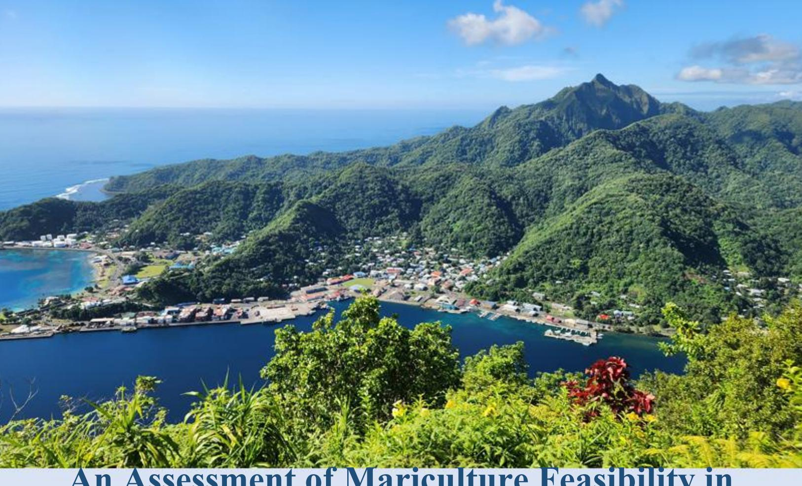

# **An Assessment of Mariculture Feasibility in American Samoa**

August 31, 2023

**Authors:** Sarah Pautzke, Jeremy Harris, Maria Haws, Keniseli Lafaele, Sean Morrison, Joshua Nowlis, Aileen San, Brett Wiedoff, Chris Woolridge NOAA Award NA19OAR4170334

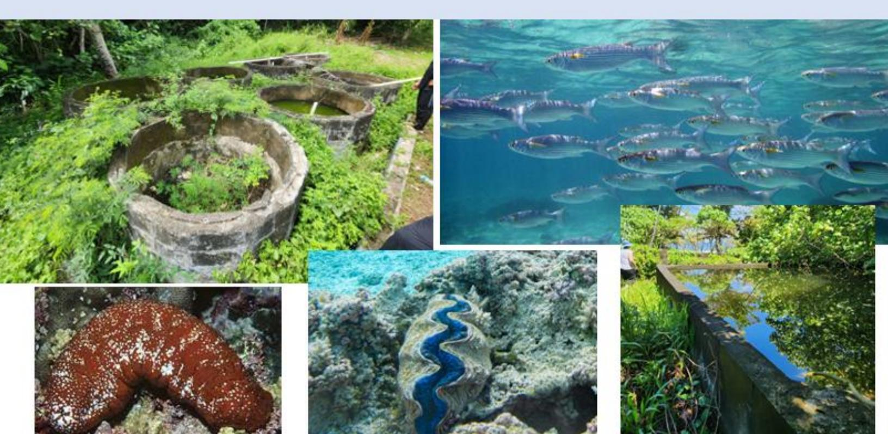

# **Thank You**

Thank you to everyone who supported the development and execution of this project, especially Mr. Keniseli Lafaele. He has a vision, one in which mariculture and aquaculture can help support food security for the people of American Samoa. Mr. Lafaele brought this idea to the table during the development of the American Samoa Ocean Plan, and then offered his support of this mariculture project first as the Director of American Samoa's Department of Commerce, then as a cultural liaison directly facilitating our community engagement.

Thank you to the people of American Samoa - those who participated in this project offering information as pulenu'u, fishermen, and community members of their villages, those who participated on behalf of local and federal agencies, and those who participated from the economic aspect - shippers, restaurateurs, and suppliers. The list is long!

Thank you to staff at the Department of Commerce for their unwavering support. They set up and attended engagements, provided matching funds for this project, and provided GIS support. Thank you to the Department of Marine and Wildlife Resources for their biological information, input regarding their shared vision for aquaculture, and details about their upcoming giant clam mariculture.

Without the support of Mr. Lafaele, staff at the Department of Commerce, Department of Marine and Wildlife Resources, the community members, and business owners, this project would not have been a success. Fa`afetai tele lava!

# **Dedication**

This report is dedicated to the late Va'amua Henry Sesepesara, whose dedication to the people of American Samoa and to aquaculture was the inspiration for pursuing this project. *O le ala i le Pule o le Tautua* is a Samoan saying that means the way to leadership is service, which sums up Va'amua's life of service to the people of American Samoa. A product of American Samoa's public school system, he completed his college education as a government scholarship student in marine science in Missouri and returned home to begin a long rewarding and distinguished career of service to his God, family, village, government, and people of American Samoa as a high school biology/marine science classroom teacher, government department director (Marine and Wildlife Resources), Fono representative (legislator), village chief (*Va'amua* chieftain title that means 'first boat'), rower and captain of his beloved Pago Pago village *Fautasi* (long boat) called *Aeto* (eagle), businessman, and family man (Va'amua and his wife Margaret Sesepasara raised a beautiful family). *Aua le tu'u lou va'a i le moana, ina ne'i 'ai oe e i'a tetele. Ae fagota i le aloalo* is a Samoan saying cautioning fishermen it's safer to fish in near-shore waters than the deep beyond. Va'amua took the road less traveled and started a business partnership - micro-processing fish in his village of Pago Pago in 2009. Unfortunately, the tsunami of that year demolished the newly built facility. In his later years, he planned to open a fish micro processing facility in Olosega, Manu'a, but his health became an obstacle that proved too much to overcome. Notwithstanding, Va'amua planted a seed that is now growing roots. He ushered ocean planning from the onset through completion of the American Samoa Ocean Plan from his position at Department of Marine and Wildlife Resources, providing staff support and his own time and effort. Then he assisted with the development of this project, promising assistance to complete this project. His untimely

passing meant he did not get to see the fruits of his commitment to aquaculture and this project. We miss him dearly and wish he was still here.

*O Sa'afiafiga mo Director Va'amua Henry Sesepasara:* 

*"Ua fa'afetai, ua fa'afetai. Ua malie mata e va'ai. Ua tasi oe i le fa'amoemoe. Tofa se, Tofa oe. Tofa filemu i le alofa o le Atua Soifua.."*

# **Project Partners**

Ms. Sarah Pautzke Principal Investigator Lynker

Mr. Keniseli Lafaele Cultural Liaison, Economist Pan Pasifika Solutions

Mr. Doug Harper, J.D. Planning Specialist

Mr. Francisco Santos Aquaculture Expert

Mr. Christopher Woolridge Aquaculture Specialist FISH

Ms. Aileen San Planning Specialist Lynker

Ms. Tori Spence Aquaculture Specialist NOAA NMFS PIRO

Dr. Christopher Hawkins Social Scientist, Planning Specialist Lynker

Dr. Maria Haws Aquaculture Expert University of Hawaii

Mr. Joshua Nowlis Economist Lynker

Mr. Jeremy Harris Aquaculture Specialist Lynker

Mr. Brett Wiedoff Planning Specialist Petra Consulting

Mr. Sean Morrison, J.D. Regulatory Specialist Sean Morrison Law Offices

American Samoa Department of Commerce American Samoa Department of Marine and Wildlife Resources

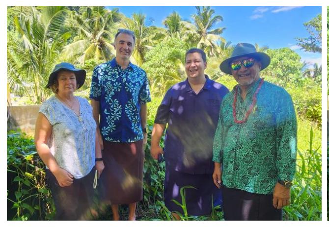

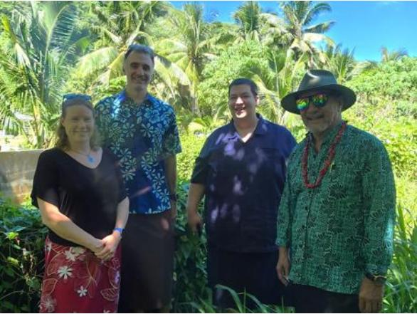

Left to right: Dr. Maria Haws, Mr. Doug Harper, Representative Gurr, Mr. Tony Langkilde, Ms. Sarah Pautzke, Mr. Doug Harper, Representative Gurr, Mr. Tony Langkilde

# **Preface**

Talk about project structure, aims/goals Talk about COVID set back, GIS missing parts No Aunuu

# **Table of Contents**

| Thank You[1]                                                                                                                                                                                                                                                                                       | 1  |
|----------------------------------------------------------------------------------------------------------------------------------------------------------------------------------------------------------------------------------------------------------------------------------------------------|----|
| Dedication                                                                                                                                                                                                                                                                                         | 1  |
| Project Partners                                                                                                                                                                                                                                                                                   | 2  |
| Preface                                                                                                                                                                                                                                                                                            | 3  |
| INTRODUCTION                                                                                                                                                                                                                                                                                       | 1  |
| History of Aquaculture in the Pacific Region                                                                                                                                                                                                                                                       | 1  |
| Current Status of Aquaculture in American Samoa                                                                                                                                                                                                                                                    | 2  |
| Need for Aquaculture Feasibility Study                                                                                                                                                                                                                                                             | 3  |
| Synopsis of the Study                                                                                                                                                                                                                                                                              | 3  |
| Study for Determining Local Sentiment and Potential for Mariculture                                                                                                                                                                                                                                | 5  |
| SPECIES RESEARCHED                                                                                                                                                                                                                                                                                 | 5  |
| SOCIAL CLIMATE                                                                                                                                                                                                                                                                                     | 18 |
| We researched the social climate in American Samoa with respect to interest and [2]receptiveness in aquaculture to determine if there were particular villages more interested in aquaculture than others. Success of a venture depends on the willingness of village elders and members. | 18 |
| Local Restaurant and Grocers                                                                                                                                                                                                                                                                       | 18 |
| Village Interest, Current Local Species, and Maps                                                                                                                                                                                                                                                  | 19 |
| Tutuila                                                                                                                                                                                                                                                                                            | 21 |
| Fagamalo                                                                                                                                                                                                                                                                                           | 21 |
| Maloata                                                                                                                                                                                                                                                                                            | 23 |
| Fagali'i                                                                                                                                                                                                                                                                                           | 24 |
| Poloa                                                                                                                                                                                                                                                                                              | 25 |
| Amanave                                                                                                                                                                                                                                                                                            | 25 |
| Afao, Asili, and Amaluia                                                                                                                                                                                                                                                                           | 27 |
| Leone                                                                                                                                                                                                                                                                                              | 28 |
| Malaeloa Aitulagi                                                                                                                                                                                                                                                                                  | 29 |
| Nuuuli                                                                                                                                                                                                                                                                                             | 29 |
| Fagaalu                                                                                                                                                                                                                                                                                            | 30 |
| Aua                                                                                                                                                                                                                                                                                                | 32 |
| Alofau                                                                                                                                                                                                                                                                                             | 33 |
| Auasi                                                                                                                                                                                                                                                                                              | 34 |
| Utumea East                                                                                                                                                                                                                                                                                        | 35 |
| Alao                                                                                                                                                                                                                                                                                               | 36 |
| Tula                                                                                                                                                                                                                                                                                               | 37 |
| Onenoa                                                                                                                                                                                                                                                                                             | 38 |

| Masausi                                                                    | 39 |
|----------------------------------------------------------------------------|----|
| Masefau                                                                    | 40 |
| Afono                                                                      | 40 |
| Vatia                                                                      | 42 |
| Amouli                                                                     | 43 |
| Manua                                                                      | 44 |
| Ofu                                                                        | 44 |
| Olosega                                                                    | 45 |
| Ta'u                                                                       | 45 |
| Fitiuta                                                                    | 47 |
| Faleasao                                                                   | 48 |
| ECONOMIC OPPORTUNITIES, CHALLENGES, AND CONSTRAINTS                        | 49 |
| COSTS OF INPUTS                                                            | 50 |
| EFFICIENCY OF PRODUCTION AND VALUE OF PRODUCTS                             | 53 |
| ENVIRONMENTAL ANALYSIS                                                     | 55 |
| ANALYSIS OF REGULATIONS                                                    | 58 |
| Federal Regulations                                                        | 58 |
| Overview of the Federal Regulatory Landscape                               | 58 |
| Detailed Review of Key Federal Statutes and Regulations                    | 59 |
| Role of Key Federal Agencies                                               | 63 |
| Local Regulations in American Samoa                                        | 64 |
| Overview of local regulations and authorities overseeing aquaculture       | 64 |
| Other Issues                                                               | 65 |
| International Regulations                                                  | 66 |
| Comparison of Regulations for Inshore and Marine Aquaculture               | 67 |
| Regulatory Process for Starting an Aquaculture Operation in American Samoa | 68 |
| REFERENCES                                                                 | 71 |
| APPENDIX A: Additional Mariculture Fish Species                            | 79 |
| APPENDIX B: Freshwater Eel Aquaculture Information                         | 94 |

# **INTRODUCTION**

# **History of Aquaculture in the Pacific Region**

Since 1950, th[e](https://aquaculture.spc.int/) [Secretariat of the Pacific Community](https://aquaculture.spc.int/) has studied and attempted to develop several aquaculture programs throughout the Pacific region with varying degrees of success. The majority of these operations were developed on land (using fresh water). However some included nearshore operations in saltwater lagoons and include hatchery production operations to help develop "seed" stock, such as the giant clam. In [American Samoa,](https://aquaculture.spc.int/index.php?option=com_countries&view=country&id=1&Itemid=4) baitfish, tilapia and giant clam aquaculture programs were developed, but only tilapia is currently grown in one facility on land.

The United States Territory of American Samoa is an isolated archipelago in the South Pacific located at 14 degrees south latitude, approximately 5,000 miles south of Hawaii (Figure 1), with a limited economic base that relies predominantly on tuna canning (StarKist) and the territorial and federal governments for employment.

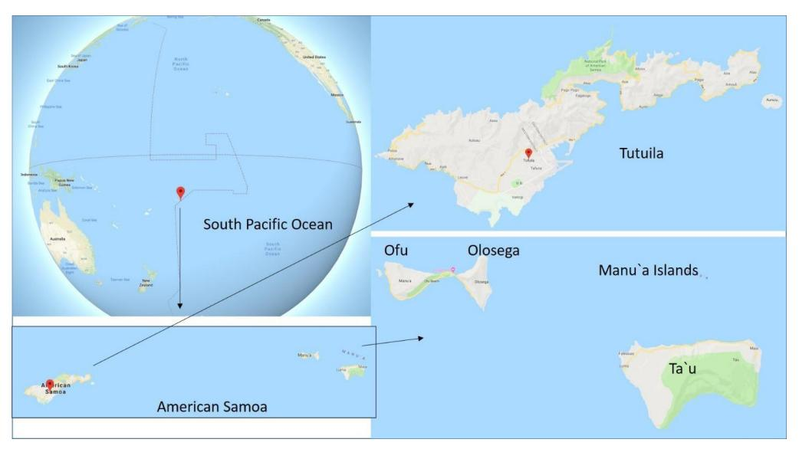

*Figure 1. American Samoa's location in the South Pacific Ocean, with increasing resolution to the Territory, then to the major islands of the territory.*

American Samoa's territorial [Ocean Plan](https://pacificislandsrpb.org/american-samoa/)[1](#page-7-2) (December 2018) describes mariculture as potentially important to the Territory's food and economic security. The finalization of the Ocean Plan, a three-year undertaking by territorial staff, federal representatives, and non-profit organizations, provides a solid, verifiable foundation and justification for the development of a mariculture feasibility study: the plan highlights the spatial planning of aquaculture siting as a necessary component of economic development. Similarly, other Pacific Islands, such as the Commonwealth of the Northern Mariana Islands (CNMI), have successfully assessed the feasibility of mariculture with respect to positive impact to local economies; achieve the parallel goal of minimizing impact to native species; and identify, evaluate, and prioritize sitting and socioeconomic opportunities and

1 The American Samoa Ocean Plan can be found on the AS Port Administration's website at: [https://portadministration.as.gov/images/documents/AS-Ocean-Plan-FNL-Interactive\\_9MB.pdf.](https://portadministration.as.gov/images/documents/AS-Ocean-Plan-FNL-Interactive_9MB.pdf)

challenges (Northern Marianas College 2011). In addition, Western Samoa developed a [Aquaculture Management and Development Plan](https://fame-archive.spc.int/doc/part13/Samoa-Aquaculture-Plan-23052013.pdf) (2013-2018) to set "out a clear guide for the future expansion of the aquaculture sector in Samoa, and a comprehensive pathway for the Fisheries Division to ensure the long-term sustainability of the activity." Finally, the SPC provided a [framework for developing aquaculture in the Pacific Region](https://brusselsbriefings.files.wordpress.com/2013/07/study-on-the-potential-of-aquaculture-in-the-pacific.pdf) in 2014 to guide further discussion and potential development. This information can help identify previous successes and failures to help inform decision-making for interested parties in developing aquaculture or mariculture in American Samoa.

# **Current Status of Aquaculture in American Samoa**

There currently are no active mariculture or aquaculture ventures in American Samoa besides a few "backyard" tilapia aquaculture pens. Various mariculture ventures have been attempted in American Samoa, with some limited positive results. However, these were established in an adhoc way with limited information and little to no community engagement. This feasibility study will therefore assess the receptiveness of the social climate in American Samoa at the village level. Success must include increasing the capacity of interested villages to provide enforcement and monitoring of mariculture sites (local village enforcement is part of the culture of Samoa, with the community-owned land managed by the village chiefs). At the village level, the villages provide their own enforcement of their nearshore waters because those are the waters that provide sustenance for their families. The chief includes the village in decisions about their waters, but is the ultimate decision maker. Thus, engaging with village chiefs and their villages, or "community stakeholders," we can ensure that the fishing communities are engaged and participating in the feedback about siting and types of mariculture.

Significant challenges to mariculture exist in American Samoa, including but not limited to: time and complexity of obtaining permits; limited land availability; acquiring seed species; building and facilities start-up costs; infrequent shipping schedules and availability of supplies on island. Biological constraints include ensuring the species selected will thrive in the tropical climate of American Samoa - whether it is an on-land small tank tilapia pen, recirculating aquaculture facility that requires pumping seawater from depths so colder water species can live, or determining the best sites for coastal or open ocean mariculture based on biophysical characteristics of the area and the species. Overlaying these factors are basic questions regarding the sociocultural acceptance of mariculture in general and in its specific forms, as well as community concerns about the distribution of benefits and ensuring security for mariculture ventures.

Basic requirements such as readily available ice and refrigeration, outlets to sell products locally, and facilities for processing products are further potential barriers to entry. Additional important considerations include the costs associated with and availability/ accessibility of export distribution channels to US and international markets. For example, Tahitian pearl mariculture may require extensive shipping support, from ice to product processing depending on if the entire oyster or just the pearl is being shipped (which would also require security). However, a locallyfocused seaweed mariculture venture may require few low cost supplies to sustain the product long enough to reach target markets. Some fish may require processing prior to distribution across Tutuila or export to Independent Samoa, New Zealand, or Japan (examples), or may need minimal ice/refrigeration to be shipped from the Manu`a Islands to Tutuila.

# **Need for Aquaculture Feasibility Study**

Mariculture and aquaculture have been identified by local planners in both the American Samoa Comprehensive Economic Strategy (ASCES) and the American Samoa Ocean Plan as one prong of economic development and as a way to increase resilience and food security of the Territory. Implemented on a broader scale, mariculture could contribute significantly to job creation, and the production of healthy food for residents of American Samoa. The ASCES identified mariculture as a key priority and possibly highly valuable activity that could expand the Territory's relatively narrow economic base[\[2\]](#page-9-2) and benefit the local population. It also identified mariculture as critical to promoting sustainability of its regional fish stocks and habitats.

Mariculture can reduce negative stressors on local fish populations while providing food security and/or economic security. Our approach identified which fish and shellfish species, technologies, and practices are most appropriate for American Samoa and most likely to result in an economically robust and sustainable mariculture industry, as well as those that are not feasible at this point. These include but are not necessarily limited to: nearshore aquaculture of various fish, shellfish, and seaweed species; offshore aquaculture such as tuna; and onshore aquaculture and mariculture. We also conducted comprehensive, evidence-based cost benefit analyses on various mariculture approaches to assess potential benefits to the local resources should a species be shifted to aquaculture harvest from wild harvest. For example, wild sea cucumber could be harvested by aquaculture for shipment to foreign countries instead of harvested from local waters. While harvesting from local waters may have improved the economic resilience for some people, i[t](https://www.radionz.co.nz/international/pacific-news/230575/american-samoa-bans-sea-cucumber-fishing-for-first-time) [devastated the local sea cucumber population](https://www.radionz.co.nz/international/pacific-news/230575/american-samoa-bans-sea-cucumber-fishing-for-first-time) and resulted in a [moratorium on sea cucumber](http://www.samoanews.com/moratorium-removal-sea-cucumbers)  [harvests](http://www.samoanews.com/moratorium-removal-sea-cucumbers)igned in 2013 by Governor Lolo Moliga. Shifting to mariculture before wild sea cucumber populations were depleted may have been wise.

Success of an aquaculture venture also depends on other factors, including establishing operations in areas conducive to growing and harvesting the desired species. Some species more than others thrive in a mariculture environment, and the biophysical characteristics of particular nearshore and marine environments can greatly influence which species will thrive. Our study will identify species that are most appropriate to rear on small tropical islands with steep bathymetry and warm air temperatures. However, this study will not delve into the multi-agency analyses required by National Environmental Policy Act (NEPA) for each recommended site. That extensive in-depth analysis is more properly the purview of mariculture ventures.

# **Synopsis of the Study**

Our study examined current challenges to pursuing a mariculture venture in American Samoa that must be overcome to create a viable, vibrant, and thriving marine mariculture industry. Our study also serves as a guideline for individuals, villages, companies, cooperatives, and other parties interested in entering and establishing a mariculture industry in the Territory.

This project was rather substantial in size and encompassed far more than we were able to complete. We met for our kick-off meeting in February 2020 - a team consisting of an aquaculture

2 The number of tuna canneries shrunk from 3 to 1 over the past decade and there is concern about the international quotas. StarKist regularly threatens to move its cannery to a foreign country, which would leave American Samoa with no cannery. This would remove several hundred jobs and a major source of revenue from the Territory.

economist, aquaculture expert, planner, and the director of the American Samoa Department of Commerce (AS DOC) - having no idea that the COVID-19 pandemic was about to shut down the borders. By August 2022, American Samoa's border was open with no required quarantine, which included a 10-day stay in a hotel in Tafuna before being allowed to interact with the public. Planning re-commenced and our schedules aligned for our first trip to American Samoa in January 2023. Given our deadline with no further extension from Sea Grant of August 2023, we eliminated from the study the extensive GIS work that would identify various locations by temperature, salinity, depth, and current, which would have added several months to the project.

By January 2023, the director of AS DOC had changed, so we brought Mr. Keniseli Lafaele on board as our cultural liaison to assist with this project. Aquaculture is his passion - he feels that this is a great opportunity to increase food security and economic gains for the Territory. Dr. Maria Haws (aquaculture expert), Mr. Doug Harper (planner), and Ms. Sarah Pautzke (Project Manager) met with Mr. Lafaele in American Samoa. Together, the team provided presentations to villages from the Western District, including Fagamalo and Fagali'i. We also presented to representatives from Manua, who graciously attended a meeting on Tutuila, as well as the Office of Samoan Affairs, Cabinet members, and the public. The team met with several agencies as well, including the American Samoa Department of Marine and Wildlife Resources, AS Environmental Protection Agency, AS Power Authority, and NOAA's National Marine Sanctuary of American Samoa. During this trip we also visited with the Gurr family, who had set up tilapia tanks in Malaota but the plumbing of which was destroyed in the 2009 tsunami. During these meetings, we sought input on the types of aquaculture and mariculture the villages and agencies may be interested in pursuing, and what issues they think they may face during implementation.

During a second trip in April 2023, Ms. Pautzke and Mr. Keniseli met with several villages who expressed interest during the public meeting in January, as well as conducted participatory GIS to identify which species of interest already occur within their village waters, where previous efforts were, and where the village felt potential sites could be. This trip included feedback from the residents of the Manua Islands - Ofu, Olesega, and Tau.

Our study is intended to inform several social, economic, and geographical questions that surround the development of mariculture in American Samoa - fully in line with the Sea Grant Aquaculture mission to assess potential for mariculture development, including identifying barriers to entry, identifying social and cultural perceptions of commercial mariculture, and economic analyses to evaluate the relative cost and value of various mariculture ventures.

In addition, our feasibility study identifies permits that are or may be needed depending, for example, on the anticipated locations for mariculture. Needed permits will vary depending on whether the venture is on land, nearshore, or offshore. For example, a NOAA National Marine Fisheries Service (NMFS) permit would probably not be needed on land. Similarly, the Project Notification Review System of American Samoa's Coastal Management Program may not be involved if the venture is beyond 3 nm from shore. This final report also identifies permitting process gaps that may need to be addressed by local and federal agencies (e.g. when it is unclear during permitting which agency has the lead, which, for example, occurred during the permitting of native Hawaiian fish ponds in Hawaii).

# **Study for Determining Local Sentiment and Potential for Mariculture**

We conducted an interactive presentation of mariculture information to villages, the Office of Samoan Affairs, and several businesses during which we asked about perceptions of and interest in mariculture. Because many people understand the word aquaculture, but not necessarily mariculture, we utilized "aquaculture" in our surveys and presentations. We provided a paper survey to participants that attended village meetings so that participants could anonymously provide information they may have been hesitant to provide verbally in a group setting. We interviewed local business, including freight handling/shipping companies, hardware supply stores, engineering experts, grocers, restaurateurs, and educational and government institutions. The questionnaires focused on overall sentiment of mariculture and thoughts regarding the feasibility of mariculture on land, nearshore or offshore ocean areas, and which species respondents were interested in growing/purchasing. In addition, the questionnaires included six main areas to gather local knowledge or experience: Shipping and Transportation, Environmental Analysis, Labor Force, Local Restaurant and Grocers, Engineering Support, and Supplies and Equipment. A summary and discussion of their responses are provided in the following sections.

The overall sentiment of respondents was positive regarding the potential development of mariculture, whether this occurs on land, in the nearshore or open ocean areas. Most respondents supported on-land operations despite the limited flat land and potential cost increases in plant operations due to infrastructure construction, reliable power sources and continuous/reliable food sources for growth. This is predominantly due to residents already having conducted tilapia aquaculture. They also supported nearshore aquaculture. Respondents focused far less on offshore aquaculture. In addition, if mariculture could be done in a sustainable, environmentally friendly way yet provide employment, there would likely be long-term support.

In general, respondents believe that locally sourced products (island-wide or a single village) would benefit their community, provide a consistent supply of certain products and provid[e](https://www.usaid.gov/agriculture-and-food-security#:~:text=Food%20security%20means%20having%2C%20at,a%20productive%20and%20healthy%20life.) [food](https://www.usaid.gov/agriculture-and-food-security#:~:text=Food%20security%20means%20having%2C%20at,a%20productive%20and%20healthy%20life.)  [security.](https://www.usaid.gov/agriculture-and-food-security#:~:text=Food%20security%20means%20having%2C%20at,a%20productive%20and%20healthy%20life.) Most respondents, particularly in villages, focused on food security necessitating aquaculture, as opposed to financial gain. For instance, one village resident commented that the cost of a case of chicken has gone up 30 percent the past couple years. Additionally, there is a strong desire to purchase and support fresh, locally produced products (fish and vegetables) rather than importing products from mainland areas, even if the price is higher (e.g., vegetables, frozen fish or aquaculture products). Fishermen cannot always provide a consistent supply or diverse product line for local consumption, therefore aquaculture and mariculture may provide a consistent supply of other desirable species such as mud crabs, limu (seaweed), faisua (giant clam), freshwater eel, fe'e (octopus), kuikui (urchin), mullet, sea cucumber, and alili (sea snail).

# **SPECIES RESEARCHED**

Several species were identified for their potential for aquaculture, including faisua (giant clam), tilapia, freshwater eel, freshwater prawn, mullet, red limu, green limu (sea grapes), sea cucumber, alili (turban snail), mud crab (or mangrove crab), oyster, milkfish, fe'e (octopus), and kuikui (urchin). These are the species that the villages and restaurateurs mentioned they would be interested in having grown locally. This list however contains species that may not be that easy to propagate and grow in captivity, such as the freshwater eel (Table 1), as well as species that were only mentioned once or twice. We present thorough information in Appendix A, including for species not identified by the community members during our visit (e.g. tuna). Here we will provide brief information for the most mentioned desired species broken into sections: freshwater or brackish fish, saltwater fish, crustaceans, mollusks, seaweed, and echinoderms.

#### **Freshwater or brackish water fish**

The chief advantage of freshwater fish aquaculture is that it is already widely practiced throughout the world and extensive resources are available to guide any project in American Samoa. Additionally, most freshwater fish can be stocked at higher densities than marine fish, and will tolerate greater variation in water temperature and conditions. In general, it is easier to breed freshwater fish in captivity and establishing a broodstock for aquaculture is not a major challenge, unlike marine fish aquaculture. Most freshwater aquaculture is relatively low tech, and does not require advanced training to practice. The chief challenge of freshwater fish aquaculture is that these species typically do not have a high market price and must be produced at high volume if commercial profit is desired. Intensive aquaculture of these species can produce a significant amount of waste that requires extra effort and infrastructure to manage sustainably. On the other hand, the relatively low cost and low technical requirements can make these species good candidates for non-commercial efforts to promote local food security and reduce the dependence on imported fish.

Here, we summarize three species that may be of interest. Tilapia is one of the most commonly farmed fish species in the world and exemplifies many of the points discussed above. Similarly, the farming of various catfish from the genus Pangasius is widely practiced. Also included in this section is a discussion of aquaculture opportunities for species of mullet. Mullets are euryhaline, and can be adapted to fresh, brackish, or marine environments. The requirements for mullet aquaculture are more similar to those of freshwater species than of other marine fish, which typically require more sophisticated facilities and techniques.

#### **Tilapia**

The term "tilapia" refers to a wide range of cichlid fish species in the genera *Oreochromis*, *Sarotherodon* and *Tilapia*. Each species, as well as hybrids between species, have unique characteristics that must be evaluated in the context of the local situation (Haws et al. 2020). There is great variation in their feeding and reproductive habits, as well as salinity tolerance. Tilapia have become one of the most common freshwater species for aquaculture on a global basis due to their rapid growth, tolerance of extreme environmental conditions and ease of reproduction. Some tilapia species can benefit from fertilizing the pond which produces an algal bloom and zooplankton which the fish can eat (Haws et al. 2020). This can greatly reduce the amount of feed required. Despite being one of the easiest fish to culture, caution is indicated because there is a requirement for some degree of technical expertise (Haws et al. 2020).

American Samoa imports a large amount of frozen fish which could possibly be replaced by local tilapia production (Haws et al. 2020). Locally produced tilapia could become profitable if feed costs can be reduced by developing local sources. Previous studies suggest that tilapia culture is ready for expansion and could become a significant source of food and income, particularly with the already-established tanks on Tutuila. Additionally, even small-scale production can be important as a local food source. Many countries have school-based food production programs including fish culture, which can provide a steady source of food for school children (Haws et al. 2020).

Tilapia culture could be another way to take advantage of the freshwater resources of American

Samoa. Particularly in the case of villages which surround wetlands, freshwater could be extracted to support tilapia culture. This is best done by diverting a limited amount of water from the upland areas to supply ponds built outside of the wetlands, rather than citing ponds in the wetlands (Haws et al. 2020). Wetland areas are generally poor sites for ponds due to flooding and because ponds built in low-lying areas cannot be drained. The latter is particularly important for tilapia farming because these species tend to breed prolifically[3] in ponds and exceed the carrying capacity. The ponds must be periodically drained and dried to get rid of the overabundance of small fish (Haws et al. 2020). In any case, if tilapia farming is expanded, it may be important to calculate a water budget for the farming area to avoid creating competition for freshwater between residents and fish farmers.

# **Freshwater eel**[4][5]

Three species of native, tropical Pacific freshwater eels occur throughout American Samoa: *Anguilla australis australis* (shortfin eel), *A. celebesensis* (Celebes longfin eel) and *A. marmorata* (giant mottled eel). Typically, the giant mottled eel is harvested in streams in American Samoa for subsistence.

Freshwater eels are considered an economically important high-valued species worldwide. The most common eels that are currently being farmed around the world are the European eel (*Anguilla anguilla*) mainly in Netherlands, Italy, and Denmark; American eel (*Anguilla rostrata*) in eastern United States; Japanese eel (*Anguilla japonica*) in Japan, Korea, China and Taiwan; and longfin eel (*Anguilla reinhardtii*) and shortfin eel (*Anguilla australis*) in Australia and New Zealand. Freshwater eels are catadromous, spending their juvenile and adult stages in freshwater and must return to the ocean to spawn. The fertilized eggs are carried by the ocean current as they change into larvae, and then after around 18 months they develop into "glass eels" (thefishsite.org 2023a). These juvenile eels are under-developed and have a transparent appearance, hence the name. This brood stock then returns to rivers and streams (around age 2 to 3) to live to adulthood. Since this life cycle is complex, breeding eels for commercial farming purposes has not been successful. Therefore, eels are harvested in the wild and grown out to marketable sizes. Many eels are harvested as "glass eels" then shipped around the world to grow out facilities or consumed (glass eels are known to fetch up to \$2,000 per lb). World demand for freshwater eels has been increasing due to the market expansion and increased popularity of several eel dishes. In American Samoa, glass eel collection should be done locally; therefore, collection sites would need to be identified. Glass eels are collected using fishing gears such as fyke nets, scoop nets, fry bulldozer (trawling) and fine mesh nets, as well as other materials, such as light and oxygen tanks.

There are three general main methods to grow eels. The primary way they would be grown in American Samoa is with a recirculating system that includes a system of square or circular tanks (25-100 m²), usually built of cement or fiberglass. A few people expressed interest in freshwater eel aquaculture on land for food security and could use already-built concrete tanks; others have interest in building tanks to aquaculture eels. This method will require continuous water exchange to remove impurities and fecal matter; tanks also require proper temperature ranges and control, and aeration. Individual growth rates vary and grading every 6 weeks is necessary to reach a high overall growth performance and reduce cannibalism (FAO 2023a). Freshwater eels are carnivorous species that feed on a wide range of diets. Water parameters, aeration systems, and feed for eels is discussed in Appendix B. Eels are typically large enough for harvest within 10-12 months.

Electricity for the tanks to run the aeration and filtration is necessary, thus communication with American Samoa Power Authority (ASPA) is vital for determining the best route for continuous power. This includes the option to have solar and/or generator backup power.

#### **Marine fish**

Marine fish species present a different set of challenges and potential opportunities from freshwater fish. Marine species are typically accustomed to larger spaces, lower population density, and more stable water conditions than are found in freshwater environments. These factors raise the technical requirements for any farming operation. While many freshwater species can be reared in outdoor ponds, marine species are often raised in pens or enclosures located in lagoons or other sheltered marine environments. This limits the number of suitable sites relative to freshwater aquaculture. Marine aquaculture can also be located offshore which allows sites to be located more easily, but this method requires complex engineering to construct and greater logistical effort to provide supplies and labor to offshore locations. If raised indoors or in artificial pools, water quality, temperature, dissolved oxygen, and other variables must be monitored and controlled, and high quality filtration systems are required. Marine fish often require higher quality feed products, and they often rely on wild caught "trash" or non-marketable fish. Due to the difficulty growing these fish, only mullet, which is readily available to catch and grow to maturity in a nearshore net pen, is included here.

#### **Mullet**

Mullets (Mullidae) are a group of small to moderate sized fish with a wide distribution throughout the world. The most commonly farmed species is the grey mullet (*Mugil cephalus*), which does occur in American Samoa, and aquaculture of this species is well established in places like Egypt and India (thefishsite.com 2022b). In Egypt and India, mullet have been grown in small ponds or small enclosures near estuaries for centuries, and the technical requirements for a basic operation are quite low. Most mullet species are detritivores, and can be fed from agricultural scraps, and a significant amount of their diet can come from algae that occurs naturally in ponds (thefishsite.com 2022b). This species can also be grown in polyculture with other species such as tilapia, where it will consume any leftover feed from the other fish. The grey mullet is tolerant of a broad range of salinities, meaning aquaculture facilities can be placed near either fresh or saltwater depending on availability and the needs of the community (thefishsite.com 2022b). While widely consumed around the world, mullet is not a high value fish and is typically marketed and eaten within the local community (thefishsite.com 2022b, NMFS 2018).

The fringelip mullet (*Crenimugil crenilabis*) is most commonly caught and consumed in American Samoa (WPFMC 2021). Aquaculture for this species is scarce, though a small program was initiated in Papua New Guinea aimed at supplementing declining wild populations. A further investigation of this species may prove useful, especially if the wild population can be used as a source of fingerlings. During meetings with the villages, residents expressed interest in possibly catching mullet to rear to maturity in nearshore net pens.

Similar to other species, the main challenge involves establishing a broodstock. Many mullets migrate in order to spawn, and the change in temperature and salinity often appears necessary to trigger reproduction (thefishsite.com 2022b). These conditions are usually difficult to replicate in captivity, and some operations use hormone injections instead. A second option is to capture eggs, larvae, or fingerlings in the wild and transport them to a secure pond or enclosure until they reach harvest size (thefishsite.com 2022b). This method is less technical, but does require some organization and requires fine mesh nets that may differ from the gear used in other fishing boats. The locations where wild fish spawn and where aggregations of larval fish can be found must be known, and it is necessary to gradually transition larval fish to new conditions on the farm. In American Samoa, fishermen know exactly where to locate passing mullet schools, and likely could locate juveniles as well. Pre-industrial aquaculture of this species relied on small ponds attached to estuaries that could be opened during particular times of year to allow small fish to enter, and then closed again to trap and raise them (NMFS 2018). In American Samoa, as mentioned above, catching the younger mullet and raising them in a nearshore pen would be the easiest avenue. However, given the ability to harvest wild mullet, unless the purpose is to sell continually to restaurants and grocers, consumption for the village will most likely occur through fishing the wild stocks. Additionally, harvesting wild stock to grow and sell may harm the wild population numbers, thus would need additional research on feasibility.

#### **Crustaceans**

Crustacean aquaculture is another possibility and has requirements somewhat intermediate between freshwater and marine fish aquaculture. As with marine fish, one of the chief concerns is establishing a breeding program that can be propagated out each generation. However, unlike marine fish, there are many successful examples and even some commercially available products that can ease the early phases of any aquaculture operation. Crustacean facilities generally consist of a land based area where the egg and larval stages are raised and then juveniles and adults can be grown out in ponds, or enclosed areas attached to wetlands. Because crustaceans are often grown at high densities, a system to manage waste products leaving the facility should be planned and developed from the outset.

The simplest crustacean to culture is most likely a variety of shrimp. Shrimp farming is well established with clear methods and is expected to continue growing, though it has been associated with environmental degradation in some places. Cultivation of mud crabs is a third option with difficulties and requirements similar to those for lobster (detailed in Appendix A).

#### **Shrimp**

Shrimp aquaculture is similar to crabs in many respects, and is widely practiced across Southeast Asia. The whiteleg shrimp (*Litopenaeus vannamei*) and tiger prawn (*Penaeus monodon*) are the most common species (Seachoice.org 2023). The technology necessary to breed shrimp is well established and not especially complex relative to other forms of aquaculture. Shrimp can be bred in indoor tanks, and the eggs are collected and moved to a hatching tank. The shrimp larvae are transitioned to progressively larger tanks as they grow before being moved to outdoor ponds or enclosures placed in wetland areas (Seachoice.org 2023). Shrimp require less protein in their feed than other crustaceans and can be given a variety of inexpensive foods, though fish is still often used. In theory, shrimp provides a better yield of marketable protein relative to feed than either fish or other crustaceans. It is also possible to polyculture shrimp with other crustaceans such as crabs, though procedures and stocking densities must be adjusted. Shrimp are popular worldwide and there is usually a strong market for them.

Intensive farming of shrimp has caused major damage to wetland and mangrove areas due to deforestation and the waste products leaking into natural areas, and plans should be made to mitigate any such effects from the outset (Seachoice.org 2023). Aquacultured shrimp can also be vulnerable to disease, which may require chemicals or antibiotics additives to be added, which can then also leak into the environment. Because they can be raised in tanks, there is a trend towards moving shrimp aquaculture further inland to separate it from wetlands (thefishsite.org 2020). While these operations are more complex and tend to be smaller, they offer more options for responsibly managing waste products and are more ecologically sustainable.

There are freshwater prawns in the streams across Tutuila. Many people in the villages expressed interest in aquaculture of these prawns.

#### **Crabs**

Mud crabs or mangrove crabs may refer to a variety of crab species depending on the location, usually of the genus *Scylla*. These animals are typically found on mud or silt bottoms and will not venture onto land, though they may be caught there during low tides. Seagrass and mangrove areas may be preferred, depending on the species and local habitat (Shelley et al. 2011). A simple method of farming crabs is similar to lobster, in that it involves capturing larvae or juveniles and raising them in a tank or pen until they reach adult size. Breeding crabs in captivity is less complicated than lobster and is widely practiced in Australia and Vietnam, and commercial manuals and products are available to assist in the design and implementation of an aquaculture program (Shelley et al. 2011). While much of the process is not particularly technical, the rearing process can be somewhat complex as the developing crabs must be separated during certain stages to avoid cannibalism. Crabs can typically be fed using manufactured feed products, though will exhibit faster growth using miscellaneous fish or other high protein products (Shelley et al. 2011).

Intensive farming of crabs can lead to a build-up of waste products and damage to the surrounding environment. In particular, pens are often located near mangroves as this is the natural habitat for many species (Haws et al. 2020). Development of high density aquaculture around these vulnerable habitats should be pursued with caution and careful planning.

Mangrove crabs, or mud crabs, were mentioned several times as a desired species to mariculture. They would be grown using seawater on land. The source of the stock is harvested from the nearshore environment in a few mangrove locations around Tutuila (e.g. Leone and Nuuuli Pala), thus there would be concern about a full scale mariculture operation leading to population declines. The effort is nascent, with two individuals expressing a lot of interest, one of whom had started but abandoned the effort when his assistant moved off island. The other intends to begin in 2024.

#### **Mollusks**

Aquaculture of sessile mollusks presents a different set of potential benefits and challenges from any of the types discussed thus far. These animals are filter feeders and typically do not require feed or enclosures, making their hatcheries very simple to build and operate. However, yields are typically lower and most of these organisms grow and mature slowly, requiring at least two years to reach marketable size. Choosing a site for oyster or clam beds is a major consideration, and can have a large impact on the potential size and sustainability of the venture. Additionally, these animals may accumulate bacteria or toxins, so it is important that they be located some distance from human populations or any significant source of waste.

Two types are considered in this document: giant clams (faisua) and oysters. Faisua are one of the simplest forms of mariculture available, but they do not produce a high yield or commercial value and face some novel difficulties, notably theft or poaching. Oyster aquaculture is somewhat similar to other forms of aquaculture, but special effort is required to find suitable sites that have the proper water conditions.

#### **Faisua**

Faisua is Samoan for giant clam. The term giant clam can refer to any member of the genus *Tridacna*, which typically reach a large size (Ellis 2000). The methods necessary to culture giant clams are well established and successful examples exist in several places throughout southeast Asia, notably Samoa (Moorhead 2018). The production cycle for giant clams typically involves a moderately sized central breeding facility that houses adult clams that are used for broodstock and several additional tanks used for growing the early life stages. The larvae are reared in this facility until they reach the stage of maturity where they become sessile and implant into the substrate. They are then grown until they reach a suitable size and their shells harden enough to survive transport, usually 5-10 mm (Ellis 2000). At this point, the clams can be moved to favorable locations in a wild habitat and where they will grow naturally. The clams may be placed in the seabed, or are sometimes grown for a time in small cages or enclosures to keep away fish and octopus that can feed on smaller clams (Ellis 2000). Farmers inspect their clams periodically to look for signs of disease, poor growth, or predation and take appropriate measures. Depending on conditions and the particular species, it can take up to 5 years for the clams to grow to harvest size.

Many successful giant clam aquaculture operations work as a partnership between a central facility (sometimes government operated) and several villages or smaller operations. The central facility maintains the broodstock and provides small clams to their partners at various times around the year (Moorhead 2018). Because the most technically complex aspects of the operation are easy to centralize, this improves efficiency and helps to keep costs low. Despite their size, much of the body of giant clams is inedible and can not be sold. Given their long growth cycle before harvest, giant clams work well as a means of providing food security to village areas rather than as an export product (Haws et al. 2020). Giant clams can also be used as part of efforts to restore reef areas, and once mature they may provide a tourist attraction for divers.

Faisua was the most mentioned and desired mariculture species in American Samoa. Restaurateurs and community members alike desire the faisua meat. DMWR is working hard to develop an aquaculture facility that could not just rear faisua, but also propagate. It's easy to grow and highly desired, thus would be a great species to mariculture. Western Samoa is giving American Samoa 600 young giant clams as a gift out of the Two Samoas talks in 2022. In early 2023, the Division of Marine and Wildlife Resources (DMWR) was determining the best locations to grow the clams on Tutuila in cages on or near the reef based on community desire and engagement, as well as biophysical needs. The faisua that are typically grown in mariculture are Palauan, with smoother shells and a different habitat requirement than Samoan faisua. Palauan faisua are typically grown in a sandy environment in cages, instead of outplanted to a reef where you would find Samoan faisua.

Many giant clam aquaculture operations have been inhibited by the problem of theft (Haws et al. 2020, Moorhead 2018). Because they are often grown in the ocean and with few barriers, boats can come into the bay at night to steal the cage(s), often never seen or able to be confronted quickly if they are spotted. Since each clam may represent years of investment, this loss is often enough to render the entire effort unsustainable; a previous attempt to institute giant clam aquaculture in American Samoa failed for this reason (Haws et al. 2020). While it is possible to grow clams in cages that provide additional security, Samoa and the Philippines have had some success with local villages instituting cultural measures that seem to reduce theft to a tolerable level (Moorhead 2018). It is recommended that any effort in American Samoa also attempt to replicate this success by focusing on community relations.

#### **Oysters and other bivalves**

Many places in southeast Asia and the Pacific islands practice aquaculture of bivalves and a variety of tropical oysters and clams are potentially suitable for aquaculture in American Samoa. While each species has some distinctions, the overall requirements are similar and this section focuses on oysters. While a dedicated hatchery is necessary for the breeding of larvae, these species are grown in wild habitats with relatively simple methods and little specialized infrastructure. Oyster growth is partially dependent on temperature, meaning that tropical regions can achieve faster growth rates and reduce the time before harvest (Nowland et al. 2019). Examples of successful bivalve aquaculture are split between technically simpler operations aimed at local food security and sustainability versus larger and more complex hatcheries geared towards the global market (Nowland et al. 2019).

Oyster aquaculture begins by identifying a source of "spat," which is the juvenile stage of development that occurs immediately after the free swimming larvae attach to a hard surface. Spat can be obtained from a hatchery or collected from the wild. Hatchery developed spat have the advantage of consistency and can be used to implement selective-breeding programs or other valuable features (Nowland et al. 2019). However, this requires a considerable investment in facilities and expertise. A simple alternative to collect spat from the wild and transfer them to the desired location for continued growth. The spat can be attached to a variety of cages, ropes, or meshes that facilitate easy monitoring and cleaning (Haws et al. 2020). Depending on the species and conditions, tropical oysters may reach harvest size in one year or less (Nowland et al. 2019).

An early decision in oyster aquaculture is whether to invest in developing methods for the local species of the genus *Saccostrea* or to import the Pacific oysters (*Crassostrea gigas)* from Hawaii or elsewhere. Importation of spat is not expensive (Haws et al. 2020), but the local species allow for wild collection and may be better adapted to local conditions. A second major concern is choosing a location with suitable water quality. As filter-feeders, oysters will accumulate bacteria and chemicals from the water, and they must be monitored to ensure these levels remain safe for human consumption (Haws et al. 2020). On occasion, oysters can also be used as a tool in environmental restoration because they will filter pollutants out of the water, though this renders them unsafe to eat.

#### **Seaweed**

Several types of seaweed are cultivated in different parts of the world at both an industrial and at a smaller scale. At either level, it is one of the easiest products to grow and requires almost no specialized expertise or equipment. The simplest method is to identify a flat sand bed or similar growing area and lay out several long lines of rope to which seaweed cuttings have been attached. These lines can be hauled to shore to collect the harvest and attach new cuttings (Bjerregaard et al. 2016). More advanced systems make use of floating buoys with wire or mesh cages with cuttings attached. While slightly more complicated to operate, the materials are still inexpensive relative to almost any other aquaculture venture and the investment in equipment may reduce time and labor costs (Bjerregaard et al. 2016). The ability to locate materials further from shore can also reduce conflict with other community members who make use of near-shore environments.

Reducing costs is important because seaweed does not typically fetch a high price at market, and many potential farmers might prefer to invest in more lucrative fish or shellfish farms (Haws et al. 2020). In theory, seaweed has incredible potential as a sustainable product, but demand remains relatively low thus far. While seaweed is a part of traditional culture in American Samoa, the practice appears to be in decline among younger generations (Haws et al. 2020). At least three species of seaweed are consumed in American Samoa and a pilot study should be conducted to determine which, if any, are economically viable (Haws et al. 2020). The predominant seaweed, or limu, mentioned during our visits were red limu and green sea grapes. Communities and restaurateurs both expressed a desire to have a consistent limu supply. Importation of other species for aquaculture is not recommended due to the risk of the non-native species escaping and becoming invasive.

In addition to food resources, seaweed cultivation can also fill a variety of other roles. A few varieties of seaweed are important as a source of valuable chemical compounds and can be sold to specialized pharmaceutical or nutrition companies (Haws et al. 2020). However, this requires careful monitoring of the chemical composition of the seaweed and the investment in lab facilities and personnel. Alternatively, seaweeds can be used in restoration to remove nitrogen and phosphorus that results from human waste or agricultural runoff, as well as providing habitat for animal species (Haws et al. 2020, Bjerregaard et al. 2016).

#### **Echinoderms and Polychaetes**

Sea cucumbers are the only echinoderm that was mentioned for food security and export purposes during our village visits. There are plenty along the coastlines upon which to begin a mariculture venture. The sea cucumber venture would primarily be aimed at the production of high quality goods for export, and may have little community involvement beyond hiring labor.

#### **Sea cucumbers**

Sea cucumbers (family *Holothuriidae*) have been harvested for hundreds of years for trade with Asia and were probably one of the first real 'exports' from the Pacific Islands (Hair et al. 2012). Sea cucumbers are threatened worldwide with over exploitation. There have been documented efforts to cultivate these animals. Researchers in the Indian Ocean region with regards to *Holothuriidae* aquaculture summarized in their assessment, "it is in the context of depleted fisheries, high export demand and weak governance that the development of sea cucumber aquaculture is gaining momentum in the region." (Eriksson et al. 2012) A research team in Japan performed a study showing the possibility of integrated multi-trophic aquaculture in which *Apostichopus japonicus* was cultured successfully in the water column below fish cages, because the survival and growth of the sea cucumbers were enhanced due to the ability to avoid predator interactions and adverse environmental conditions as well as nutritional feed supply from the fish cage (Yokohama 2013).

There are at least two species of sea cucumbers that American Samoa residents consume. *Actinopyga mauritiana* is a large brown and white speckled sea cucumber (Atafua et al. 2008), and *Holothuria atra* (loli). *H. atra* species is extremely useful in the Samoan culture as it is considered a food source by many families. People in the Pacific scrape off the black skin of the *H. atra* until they can see or feel the white layer below. The white flesh is cut into cubes and stored in sea water until eaten (Atafua et al. 2008). Factors that work in favor of successful aquaculture include pristine marine environments, long familiarity with sea cucumbers as a commodity, and traditional marine tenure systems that in some places can provide a basis for management of released sea cucumbers. Challenges include lack of technical capacity, unproven effectiveness of sea cucumber releases and poaching (Hair et al. 2012).

Sea cucumbers seem relatively easy to grow in an ocean setting. However, there is an extensive hatchery rearing period, which would make growing sea cucumbers in American Samoa more difficult due to a lack of facilities. Production costs are relatively high during the cultivation period (thefishsite.com 2023b).

#### **Polychaete Worms**

The predominant species of polychaete worm being raised in aquaculture for food and fish feed is the "Ragworm" (*Hediste diversicolor*, formerly known as *Nereis diversicolor*). Ragworms are commonly used as live bait in recreational and commercial fishing due to their attractiveness to various fish species. There are species of ragworms that can be found in American Samoa. One example is the species *Hediste (Nereis) diadroma*, which is commonly known as the Pacific ragworm, prevalent in various marine environments, including sandy and muddy substrates along the coasts.

These Nereididae polychaetes are relatively easy to cultivate and can be grown in controlled environments, making them suitable for aquaculture purposes. They are also rich in protein and critical essential nutrients, such as HUFAs, which makes them a valuable food source for fish and other aquatic organisms. Polychaetes are able to adapt their feeding behaviors to their environmental conditions, switching among carnivorous, herbivorous, planktivorous, bacterivorous, detritivorous and omnivorous feeding (Bischoff 2014). *Nereis diversicolor*, a marine polychaete belonging to the family Nereididae, can tolerate a wide range of surrounding temperatures (4 to 25 degrees-C) as well as salinities, from only a few units to more than double the salinity prevalent in the oceans. Its reproduction is monotelic, so it reproduces only once in its lifetime, with death always following reproduction (Bischoff 2014).

Increased aquaculture production will result in increased amounts of waste produced, and these wastes are highly underexploited. Polychaetes might effectively consume such waste and transfer them into compounds as marine proteins and lipids. In a study using the polychaete *H. diversicolor*, the authors showed that not only can these polychaetes be successfully reared on waste sludge from land-based salmon smolt aquaculture, but they also contain high valuable compounds, and therefore can help to increase the protein and lipid availability meanwhile decreasing the environmental impact from aquaculture activities (Wang et al. 2019). Another study demonstrated that cultured polychaetes were able to grow using the clam feces. These findings suggest that a suspension of bivalve feces can be used in the rearing of juvenile *N. diversicolor* in an integrated polyculture system (Batista et al. 2003).

A polychaete worm of particular interest in American Samoa is the palolo worm, *Palola viridis*, which has been harvested from the wild for generations and enjoyed as a delicacy either raw or cooked. This worm is very important culturally and economically as well as a boon for tourism in October and November when they spawn. It is entirely feasible to use this species in the place of more traditional cultured polychaete marine worms as a primary culture species or in combination with other species to help remove detritus, recycle waste and excess feed, as well as recycle the worms themselves as feedstock for carnivorous fishes and or invertebrates.

Table 1. Species discussed that have potential for the development of a mariculture or aquaculture system.

| Name                            | Species Name                                  | Location / Type  | Food Security / Business              | Technical Difficulty | Expense  | Notes                                                                               |
|---------------------------------|--------------------------------------------------|---------------------|------------------------------------------|-------------------------|----------|-------------------------------------------------------------------------------------|
| Seaweed                         | Variable                                         | Marine              | Food Security/ Restoration            | Low                     | Low      | Very simple, but low economic potential; popularity as food is not high             |
| Palolo (polychaete worms) | Genus Hediste                                 | Brackish/ Marine | Food Security/ Bait/ Feed             | Low                     | Low      | Potential for integrated multitrophic mariculture                                   |
| Shrimp                          | Litopenaeus vannamei or Penaeus monodon | Brackish/ Marine | Food Security/ Export                 | Low                     | Moderate | Low barrier to entry and popular product; may cause degradation of wetland habitats |
| Giant clam                      | Genus Tridacna                                | Marine              | Food Security                            | Low                     | Moderate | Relatively low barrier to entry; theft is a major issue                             |
| Oysters                         | Crassostrea gigas or any from genus Saccostrea   | Marine              | Food Security/ Export/ Restoration | Low                     | Moderate | Specifics will depend on the intended use and scale                                 |
| Sea Cucumber                 | Genus Holothuria                              | Marine              | Export / Food Security                | Low                     | Moderate | Potential for integrated multitrophic mariculture                                   |

| Name       | Species Name                                  | Location / Type                    | Food Security / Business | Technical Difficulty                             | Expense  | Notes                                                                                                                                                            |
|------------|--------------------------------------------------|---------------------------------------|-----------------------------|-----------------------------------------------------|----------|------------------------------------------------------------------------------------------------------------------------------------------------------------------|
| Mullet     | Mugil cephalus or Crenimugil crenilabis | Freshwater, brackish, or marine | Food Security               | Moderate                                            | Low      | Potentially easier than other freshwater options, but less profitable; suitable for polyculture with other fish                                                  |
| Tilapia    | Variable                                         | Freshwater                            | Food Security/ Export    | Moderate                                            | Moderate | Widely practiced with well established techniques                                                                                                                |
| Crab       | Genus Scylla                                  | Brackish/ Marine                   | Food Security/ Export    | Moderate                                            | Moderate | Popular product; may cause degradation of wetland habitats                                                                                                       |
| Freshwater | Genus Anguilla                                | Freshwater/ Marine or Brackish  | Food Security/ Export    | Land-based (high); Valliculture (Moderate) | High     | Valliculture (lagoon/estuarine) may be more cost-effective; return on investment for land-based may be high but complex infrastructure w/ power/water is needed. |

Green = low technical difficulty and low expenses

Yellow = moderate technical difficulty, varying expenses

Red = technically difficult and/or very high expense

## **SOCIAL CLIMATE**

We researched the social climate in American Samoa with respect to interest and receptiveness in aquaculture to determine if there were particular villages more interested in aquaculture than others. Success of a venture depends on the willingness of village elders and members.

Many villages were interested in the idea of mariculture, but did not know how to get an endeavor started. Residents and agency personnel alike cautioned that start up funds would be necessary and enquired about assistance for grant writing. The potential for loans set up specifically for aquaculture was raised. Residents in Fagali'i stressed that aquaculture is important for the economy and food security, but raised concerns about past efforts. However, Manua residents pointed out that it would be great to have local fish on more menus to replace chicken, as well as more opportunities to purchase fish in markets. They offered that time is of the essence - we should not just be talking with them about their interest, but telling them what they should do, and that the focus should first be on local consumption.

During discussion with staff at ASCC, we learned that mud crab aquaculture has been tried, but folded. However, tilapia aquaculture projects that provided tilapia to the stores found the fish sold out in a couple hours. Limu is also in demand and easy to culture. The small clams, tuane, were sold by residents of American Samoa to build their villages, and they could be a possible mariculture species.

Of the issues raised, theft and training were predominant after funding needs. Many villages talked about the theft of the faisua cages. Many also talked about the need for trained individuals. It is easy to come into a village and assist in setting up an aquaculture or mariculture venture, but if no one is skilled to maintain it, the effort will fail. Another issue raised was that villages want fast results. It can be difficult to watch an animal grow very slowly. Thus, projects are abandoned before the results can be realized. This is where dedicated trained individuals will be crucial to a project's success.

The last issue that was raised was raised by American Samoa Power Authority. Sewer outfalls in Tafuna and Pago could lead to tainting of maricultured products. On the north and west sides of Tutuila, residents utilize septic systems, thus may also have issues in their nearshore environment. However, they offered on a positive note that they are installing wind turbines and a solar farm, which would mitigate costs of aquaculture projects.

# **Local Restaurant and Grocers**

As noted earlier, there is a strong desire to support the development of aquaculture products. The general sentiment is that demand for them would materialize if provided in a consistent manner. Several restaurant owners and local merchants provided their perspectives.

Merchants noted that fresh fish product availability has dwindled, and they are eager to provide a variety and continuous supply of local products to their customers. Currently, local fresh fish is purchased from local longline vessels, alias or road-side vendors (when available) such as marlin, swordfish, ahi tuna, and wahoo. There is a demand for fresh versus imported frozen since imports tend to be more expensive or less desirable. However, local supply seems to be inconsistent or low in volume, depending on where it can be purchased. Therefore, merchants and restaurants would like to provide a wider variety of items when the supply of items fluctuates. The sentiment is that if a local, consistent supply is provided, it would stabilize availability for customers and create a steady, predictable income. It was noted that customers would likely purchase local products, including aquaculture, even if it was more expensive.

Current aquaculture products being imported and sold are mainly tilapia (some local supply), swai (catfish from Vietnam), shrimp, salmon (from New Zealand) and various vegetables. It was noted that these products tend to be more expensive if they are imported. Therefore, locally produced products would be desirable. Respondents provided their thoughts on what aquaculture products they believe would best meet the potential demand of their customers. The list includes mud crabs, limu (seaweed), faisua (giant clam), freshwater eel, fe'e (octopus), kuikui (urchin), mullet, sea cucumber, and alili (sea snail), snapper, milk fish, parrot fish, and vegetables such as tutuila lettuce, cucumber and cabbage.

# **Village Interest, Current Local Species, and Maps**

In this section, we detail the current potentially-aquacultured species that are present in the local environment. The maps show where the species of interest are, as well as previous aquaculture and mariculture ventures and other items of interest[6][7][8][9][10][11][12][13][14][15].

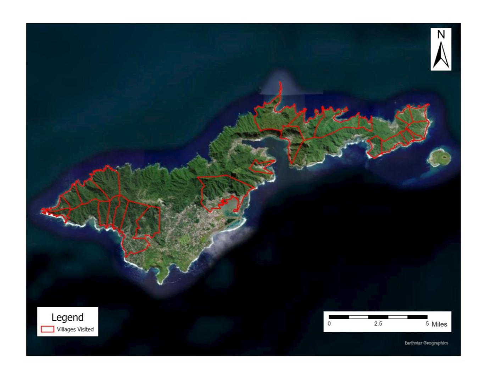

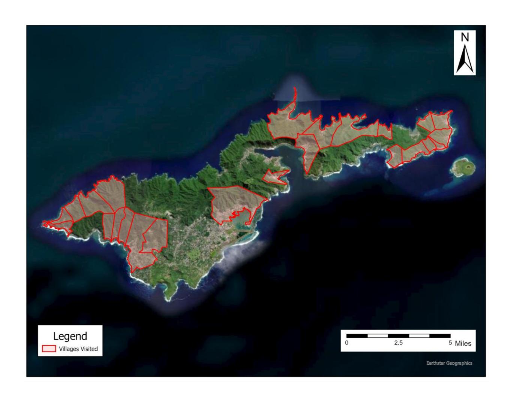

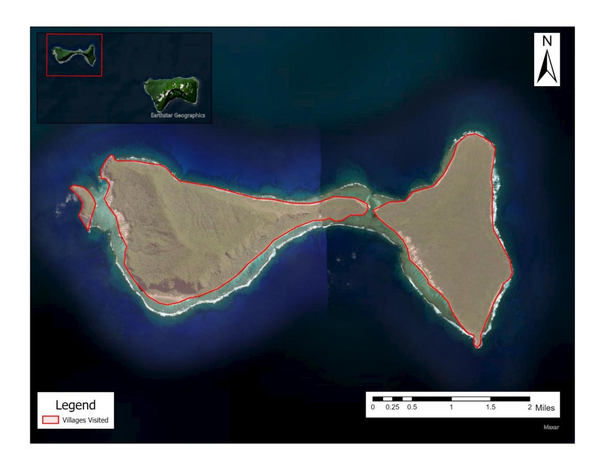

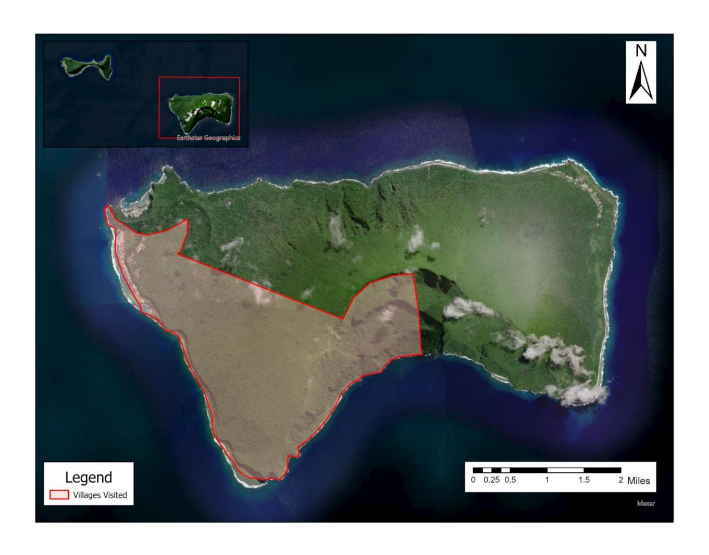

# **Tutuila**

#### **Fagamalo**

Current species: red limu, faisua, alili, aliao, mullet

Fagamalo has a marine protected area off its coast in which residents can fish for one year, then it is closed the subsequent year. There are plenty of reef fish in addition to the species listed above, and two year-round freshwater streams. Their streams contain eels, prawns, and sesele.

About 20 years ago, DMWR positioned a Palauan faisua cage farm off the coast. However, due to high wave action, it was washed away. The village said they may be interested in limu and faisua mariculture, and also entertained the idea of freshwater eel aquaculture. The interest was based on food security because the cost of meat has increased substantially. However, they also said they have no interest in tilapia aquaculture.

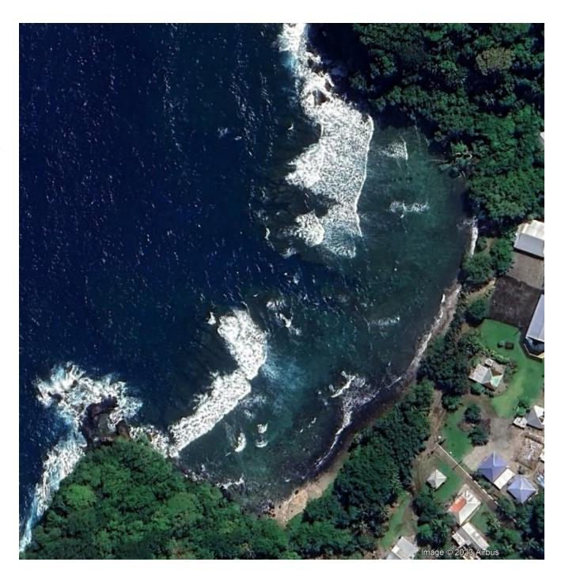

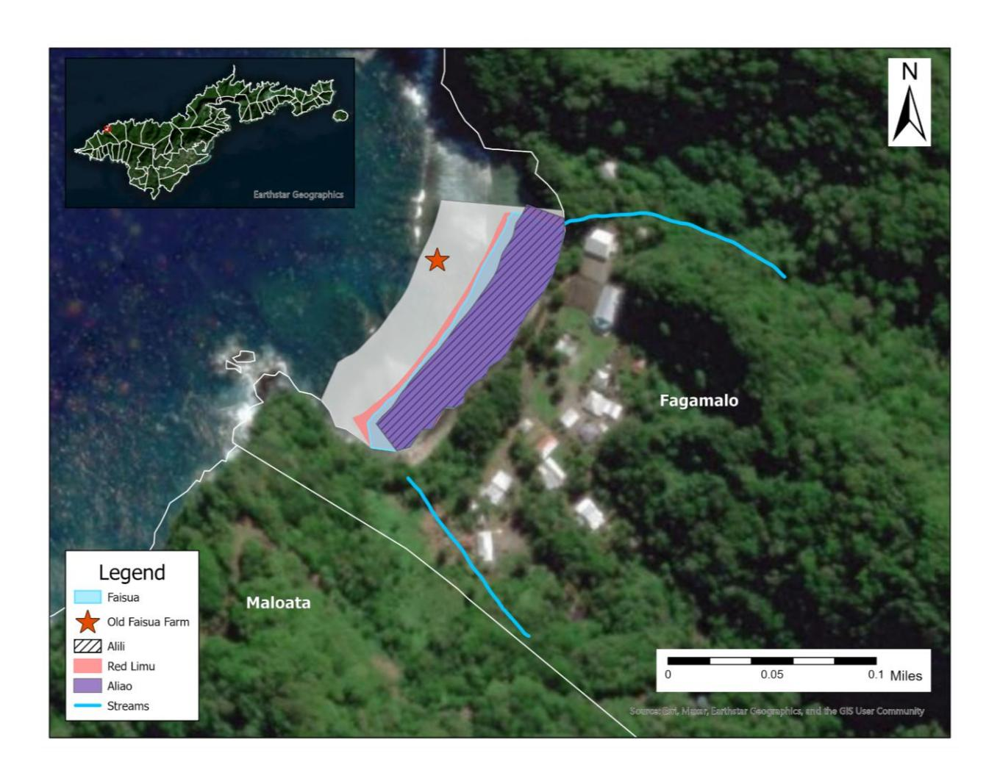

#### **Maloata**

Current species: mullet, alili, red limu

Maloata gets really rough during certain times of the year, however the pulenu'u suggested mariculture could probably be positioned behind the reef. We were cautioned that faisua would probably be stolen before fully grown, just as they were previously. Should limu mariculture utilizing a single rope be pursued, the pulenu'u suggested that the rope could be pulled into an on-shore seawater tank during storms.

There is a freshwater stream in Maloata that could be used for freshwater aquaculture such as tilapia. The freshwater stream contains eel. A tilapia venture was pursued by the Gurr family in the early 2000s, but the 2009 tsunami caused such damage to the plumbing that the tanks were abandoned. They are now considering sea cucumber aquaculture in the tanks to provide sea cucumbers across the island with the goal of enhancing food security.

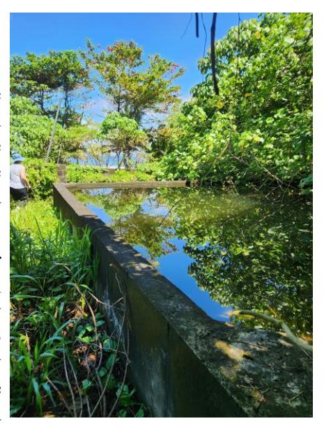

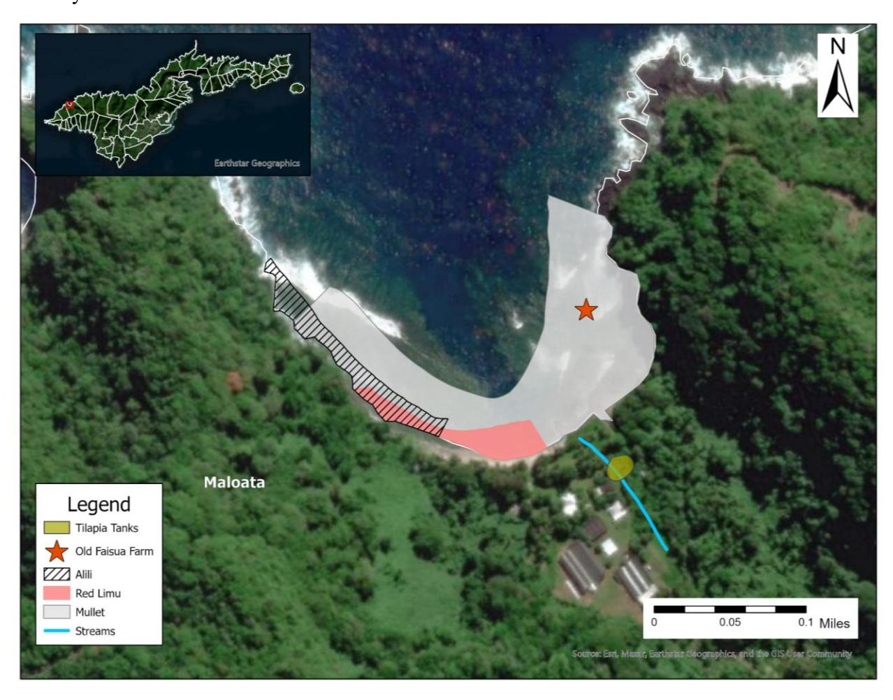

#### **Fagali'i**

Current species: faisua, alili, red limu, sea cucumber, mullet

Fagali'i's shore is very rough, which could make it difficult for mariculture. DMWR analyzed the location for suitability for a faisua cage, but ultimately decided on other locations due to the rough waters. However, Fagali'i boasts two year-round freshwater streams that contain eels, prawns, and sesele. The pulenu'u expressed interest in aquaculture of

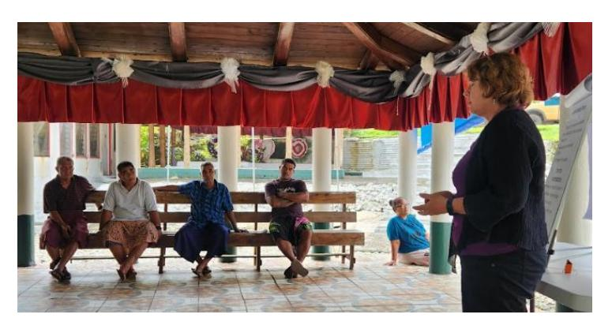

eels, tilapia, and prawns for food security purposes.

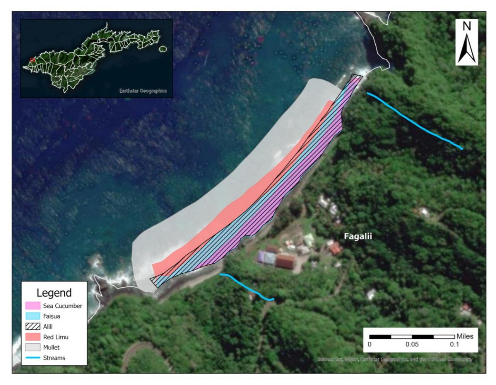

#### **Poloa**

Current species: faisua, aliao, sea cucumber, alili

Poloa has a stretch of coast that contains faisua, aliao, sea cucumbers, and alili. However, there are concerns about theft of any mariculture because there are so few houses associated with the coastline. Poloa has extensive freshwater input, with a stream that contains eel and prawns. The idea of an aquaculture venture for eel or prawns was thoughtfully received with the purpose of promoting food security.

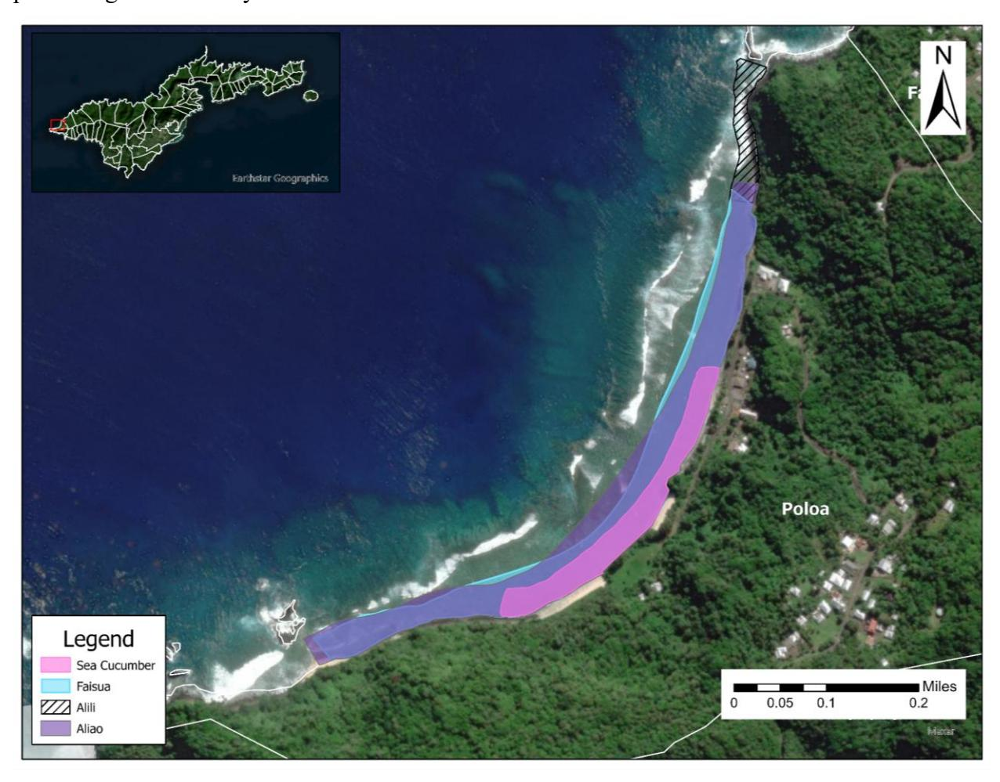

#### **Amanave**

Current species: faisua, alili, sea grapes, sea cucumbers, aliao, mullet

Amanave has a long stretch of coastline, much of which is protected. Mullet frequently swim the length, starting at the pass between the large island and the Amanave coast at the northwest top of the village and swimming southeast. Just off the coast in the center of the village, the pulenu'u suggested might be a good place for a mullet cage, and perhaps limu mariculture.

Amanave has participated in a marine protected area program with DMWR since 2009 in which the village conducts rotation harvest generally every other year, but closes for fishing on opposite years. There are two year-round freshwater streams that contain eel and prawns. The village said they would be interested in aquaculture or mariculture if it benefits the whole village for food security purposes.

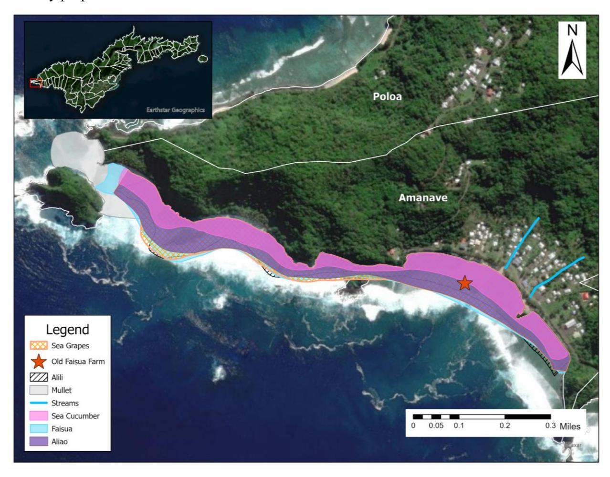

#### **Afao, Asili, and Amaluia**

Current species: red limu, alili, sea grapes, faisua, mullet, sea cucumber

In addition to the species listed above, Afao and Asili also have fe'e (octopus). Both bays are very protected. In Asili, there is a deep protected area that may be a good place for a mullet cage (Figure, yellow area #1). Amaluia's bay is less protected than the other two villages.

Asili also has two year-round freshwater streams that contain freshwater eels and prawns, as well as other small fish. This village may be a good place for freshwater aquaculture.

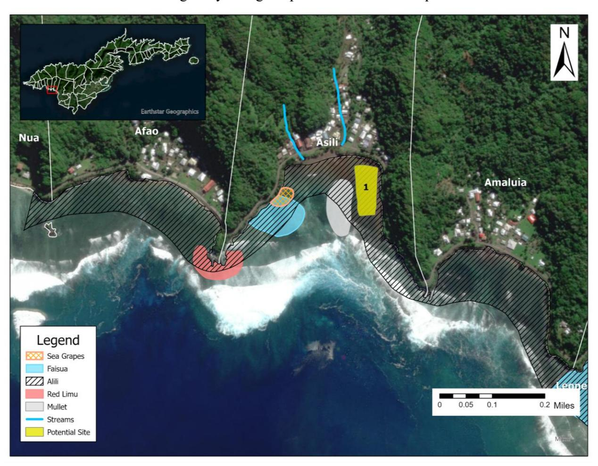

#### **Leone**

Current species: sea cucumber, mullet, faisua, alili, aliao

Leone has substantial protected shorelines that would be good for mariculture, as well as viable village security, which the pulenu'u emphasized. The area in yellow below (Figure, yellow potential site #2), may be a good site for faisua or limu mariculture. There are also extensive wetlands with mangroves that host a variety of species including freshwater eel and mud crabs (Figure ). The pulenu'u expressed interest in freshwater eel aquaculture.

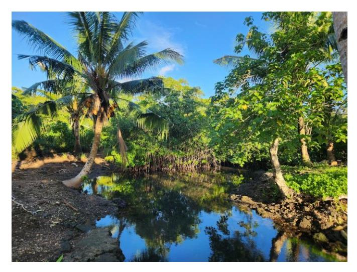

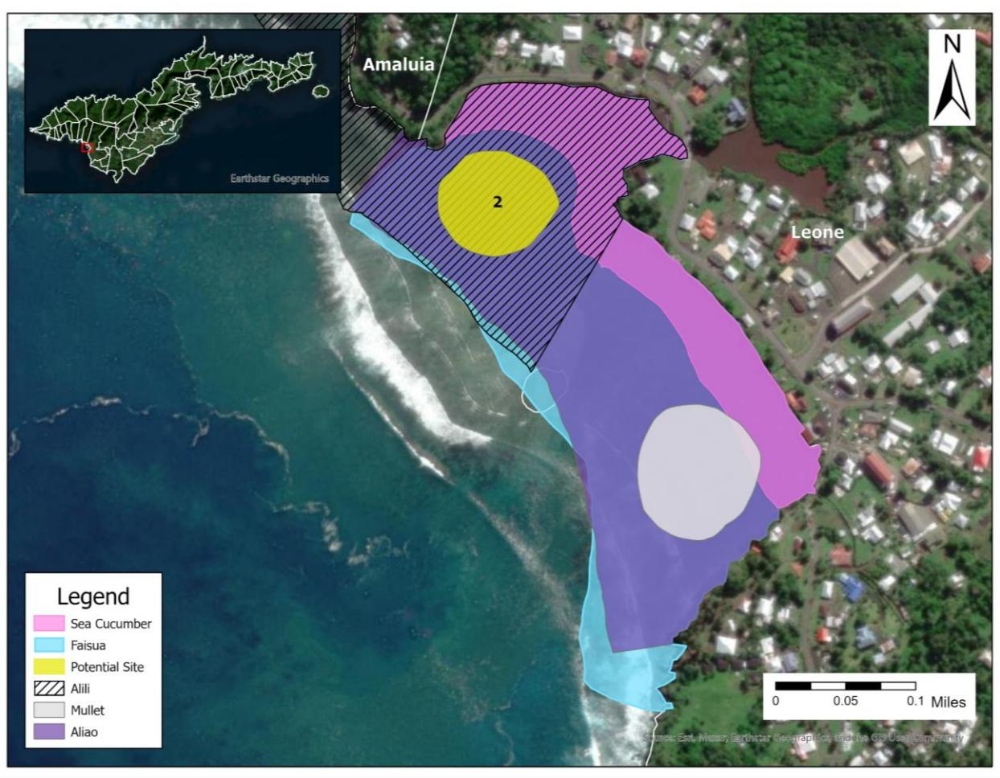

# **Malaeloa Aitulagi**

Current species: none

This location is a large wetland that has been used for agriculture in the past, such as taro. There is still some farming in this area. This expanse of wetland could be used for freshwater aquaculture[16].

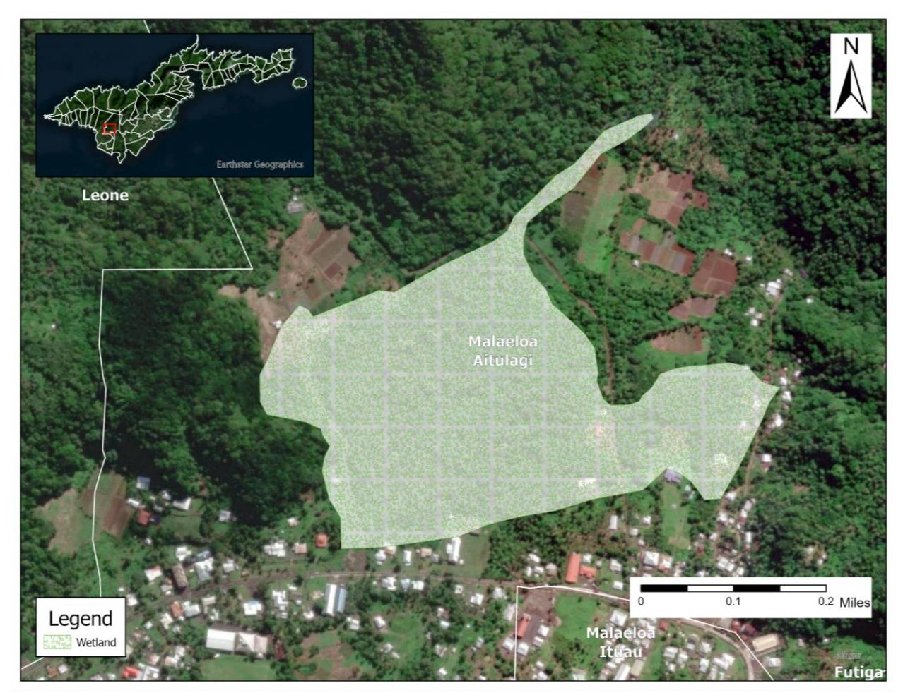

#### **Nuuuli**

Current species: mud (mangrove) crab, mullet, faisua, alili, sea cucumber

These species are dispersed throughout the Nuuuli Pala (lagoon). The young mud crabs are associated with the mangroves, while larger crabs are dispersed throughout the lagoon. A small mud crab aquaculture tank was set up, but due to the family members who were assisting with the set up moving off island, the venture was abandoned.

On the ocean side of Coconut Point, there were two faisua mariculture ventures, one of which was operated by DMWR.

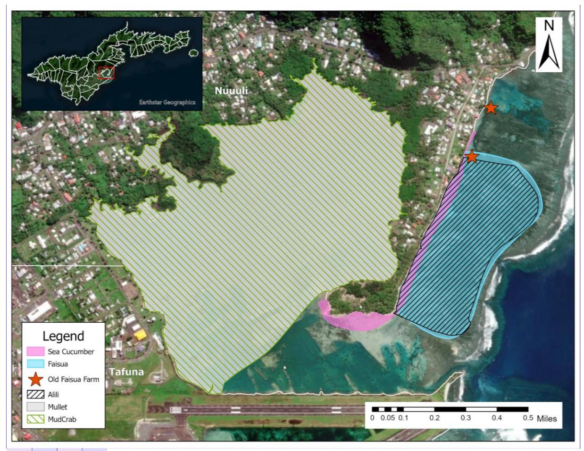

[17][18][19][20]

# **Fagaalu**

Current species: faisua, alili, sea cucumber, freshwater eels, freshwater shrimp

Fagaalu has a relatively protected bay that contains an area that was dredged for construction. The village suggested that a good place for a faisua cage might be right off the coast (Figure, yellow area Potential Site 3). It could also be a location for limu mariculture. The pulenu'u expressed interest in mariculture of sea cucumber, faisua, and alili. The freshwater stream hosts freshwater eels and shrimp.

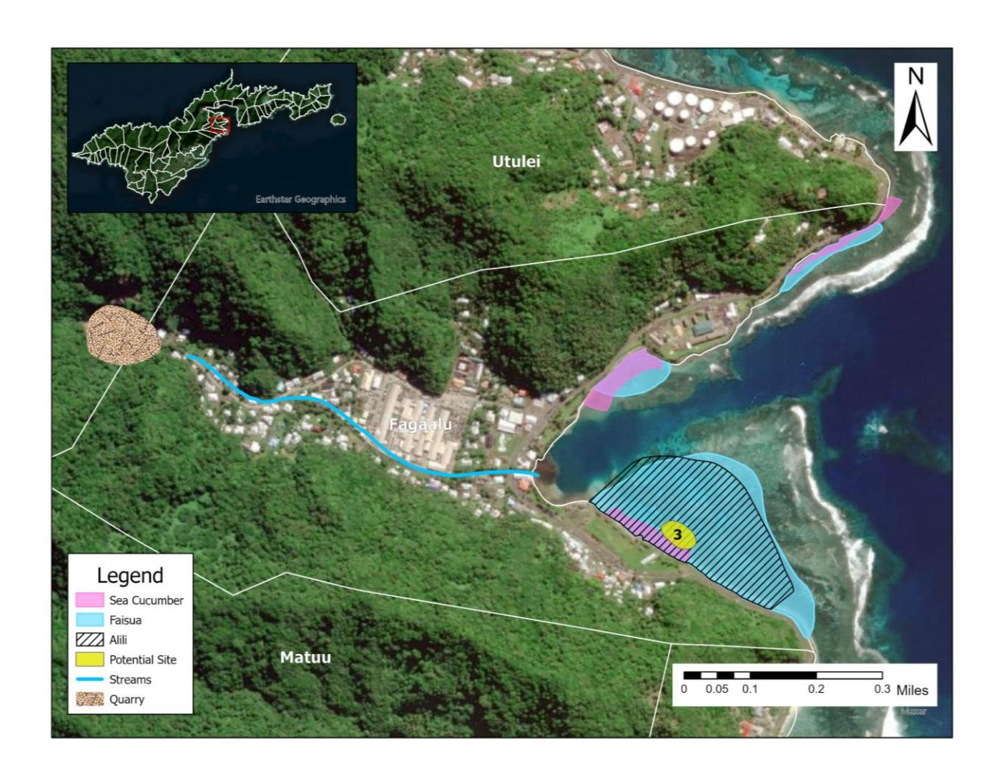

# **Aua**

Current species: sea grapes, faisua, oysters, aliao

There are no faisua in Aua, however there may have been a faisua venture in Aua previously hosted by DMWR. There is a good channel in the bay that is good for clams and oysters. Unfortunately there have been changes to the bay's ecosystem in the last 30 years, which the residents attribute to the canneries. The canneries outfall is 10 miles out of the harbor, but residents believe that currents bring the waste back in. There are no more gau (jellyfish), and there has been no palolo since the 1980s. The pulenu'u said that he would need to bring up mariculture before the village council before responding about whether the village is interested.

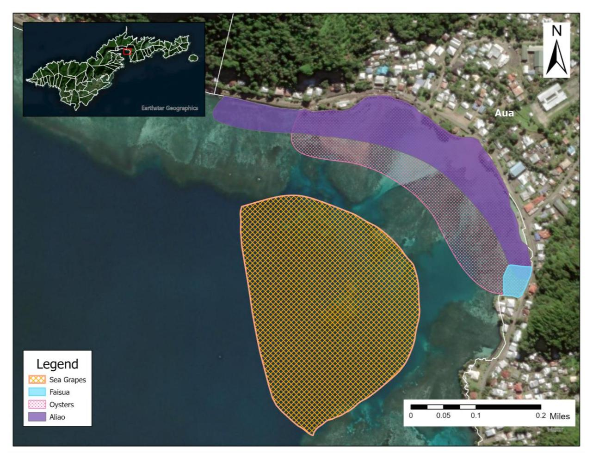

# **Alofau**

Current species: alili, some faisua, seasonal sea grapes, mullet

Alofau has no freshwater input, thus would make on-land freshwater aquaculture not feasible. There are a few protected areas that may be good for sea grape mariculture and the bay is also deep enough for a mullet net pen (Figure , Potential Site 4). The village used to have a faisua farm and they are interested in having one again at Potential Site #5 (Figure , yellow 5). Their desire for mariculture is to enhance food security.

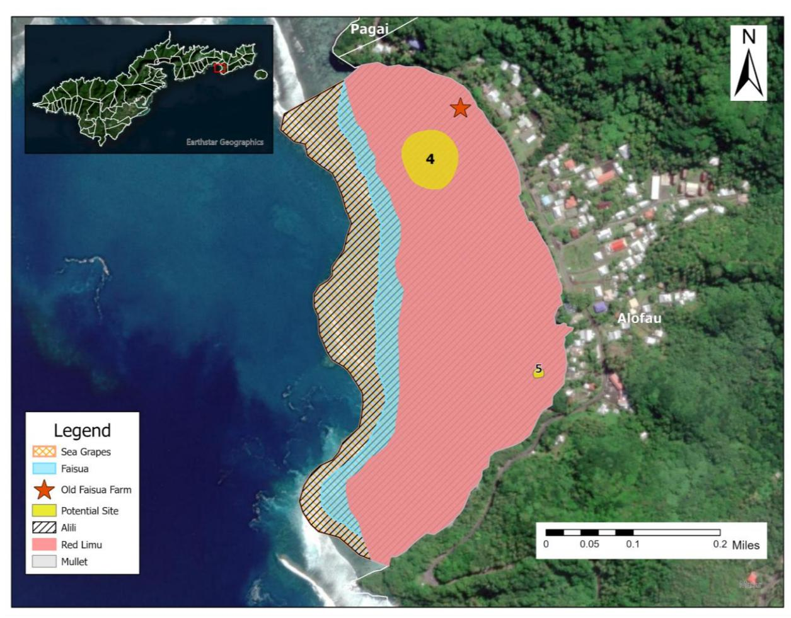

# **Auasi**

Species: faisua, oysters, sea grapes

Auasi's coast includes the harbor from which alias travel to Aunu'u. The shoreline has faisua, oysters, and sea grapes. The northwest corner of the coast is protected and could be a good location for mariculture of limu, oysters, faisua, and mullet (Figure X, yellow Potential Site 6). The pulenu'u said there is already a proposed upland tilapia aquaculture venture.

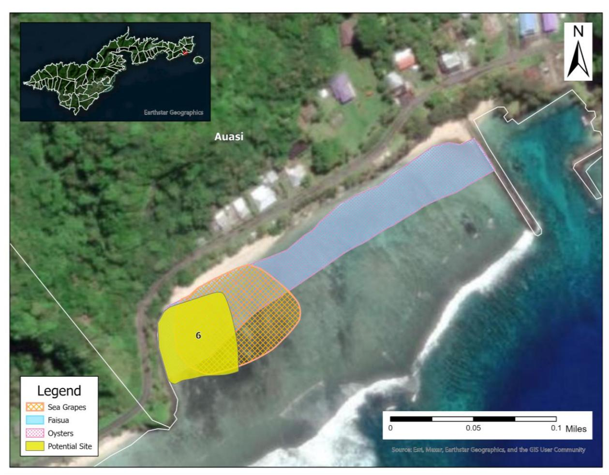

# **Utumea East**

Species: sea grapes

The shoreline for Utumea East is very rough and would be problematic for most mariculture ventures. While sea grapes are plentiful, a mariculture venture to propagate sea grapes to sell would likely be ruined quickly in the pounding surf.

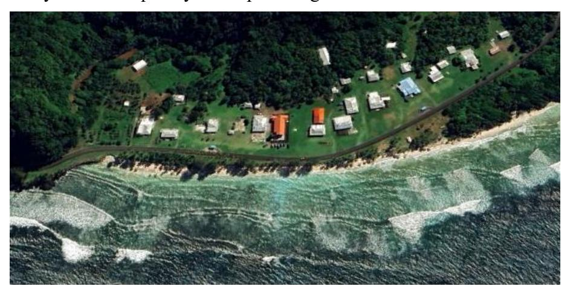

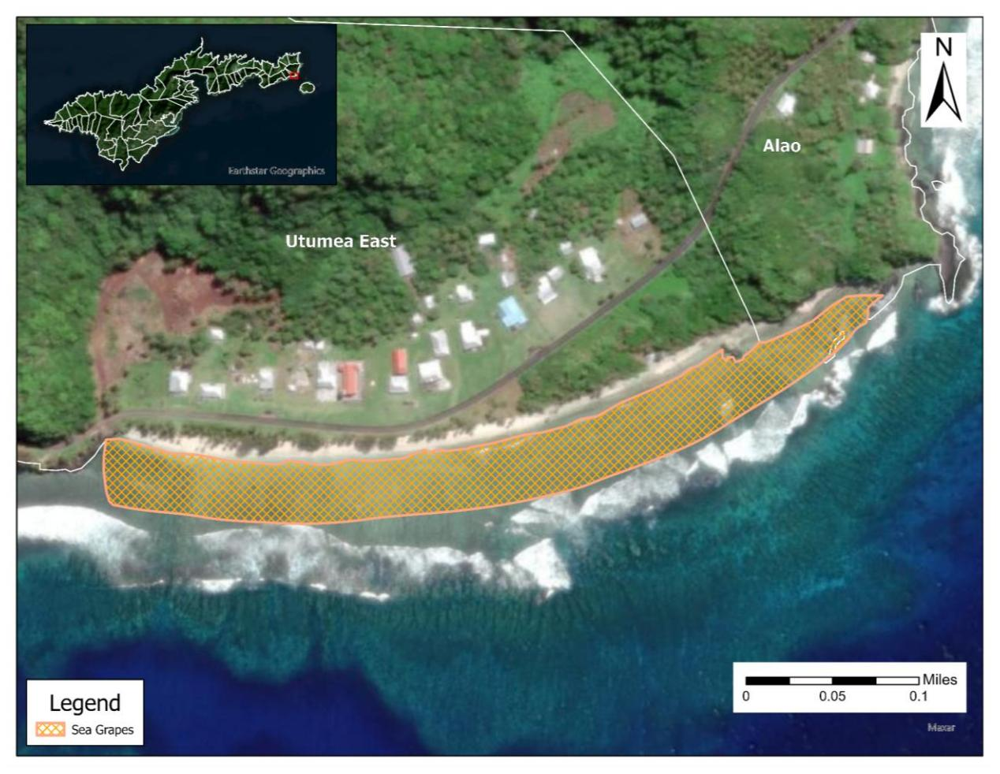

# **Alao**

Species: sea grapes

The coast here boasts sea grapes and sea turtles. Given the high numbers of sea turtles found along this stretch of coast, there may be considerations under the Endangered Species Act that mariculture ventures would need to take. This coastline has a long stretch of sand, but also a lot of unprotected wave action.

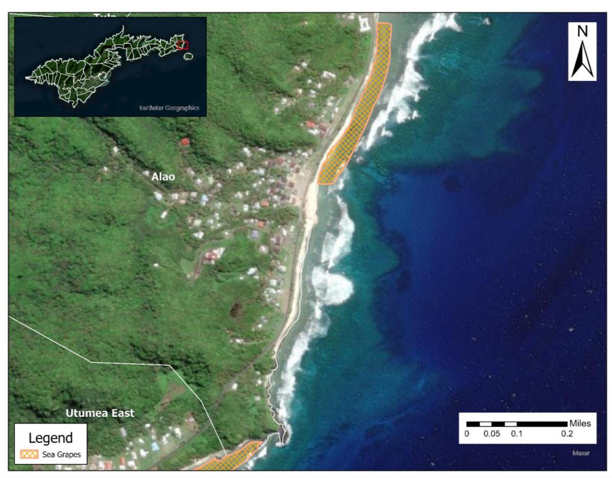

# **Tula**

Species: limu, faisua, oysters,

Tula boasts a long coastline fronting the north and east. Along the east side, there is a seawall with which limu is associated, as well as a long stretch of reef containing faisua and oysters. Along the northern coast, there are plenty of oysters and faisua along the reefs. The north and south coasts of the outcrop finger have steep cliffs and deep water. Village members sell the oysters grown on the reef. Theft at night by people arriving via alia is problematic in this village. The area between the northern coastline and the small islands has deep and calm water, which would be good for mariculture such as oysters, limu, and fish (Figure X, yellow Potential Site 7). Tula is unique in that it also has expansive wetlands that are good for farming taro and raising tilapia via aquaculture.

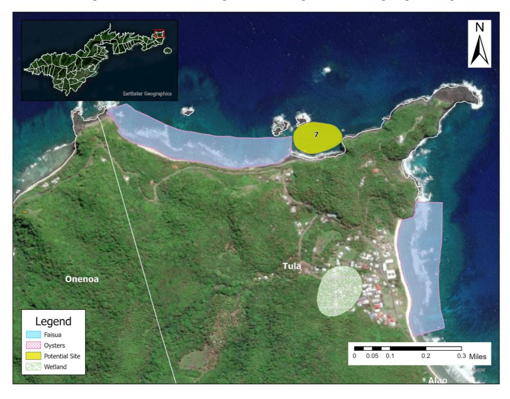

# **Onenoa**

Species: limu, faisua, alili, oysters, mullet

Onenoa is bountiful with seafood including trevally, mullet, limu, oysters, faisua, and much more. This village once hosted a freshwater tilapia farm, but the family moved off island. The pulenu'u said that this village does not need mariculture for food security, however was thoughtful about the idea of putting the old tilapia tanks back to use.

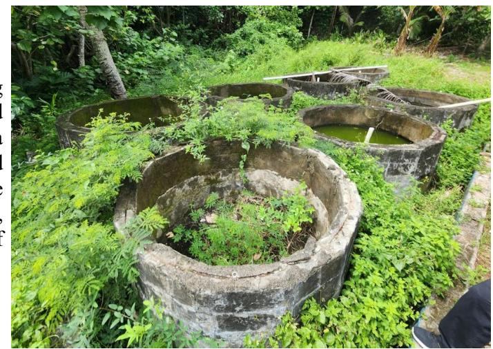

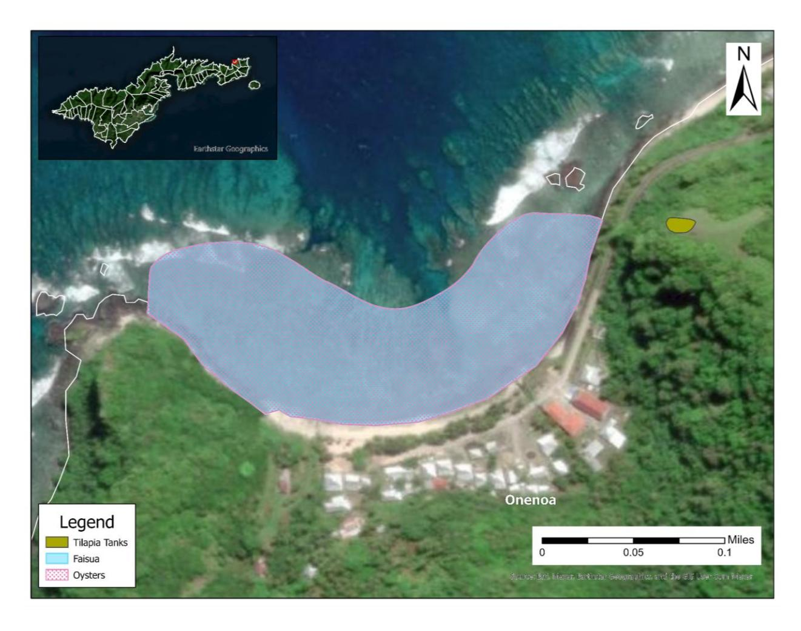

# **Masausi**

Current species: sea cucumber, faisua, alili, limu[21][22][23][24]

Masausi is on the northern side of Tutuila. It has extensive sea cucumbers and alili, as well as some red limu and faisua. The bay is well protected and has previously hosted a faisua cage. There are two continuous freshwater streams. DMWR is assessing this location for a future faisua cage. Masausi is a marine protected area under DMWR's Community-based Fishery Management Plan.

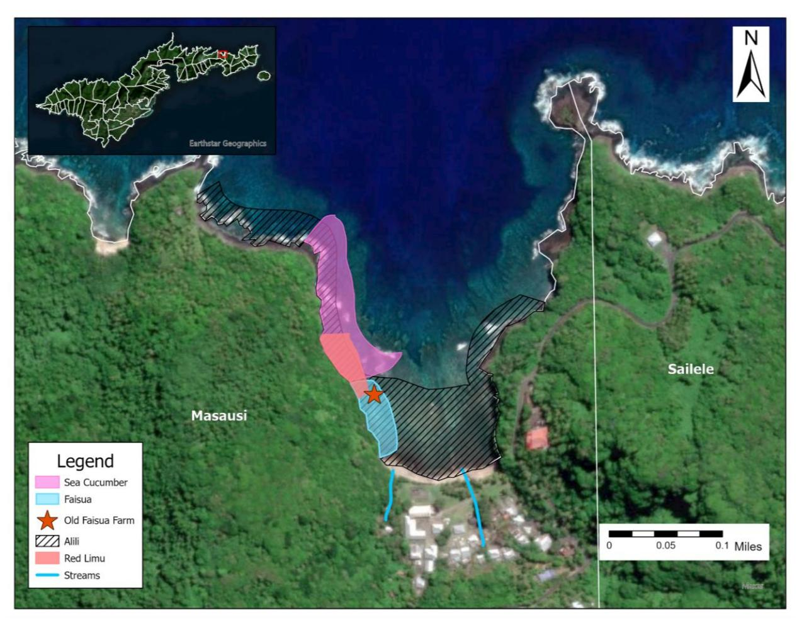

# **Masefau**

Current species: faisua, oysters, alili, aliao

Masefau has bountiful species within its protected bay. Sumu and malau are found throughout the bay. Trevally and sharks are also present in the central deeper area. Snappers are found at the outer part of the bay and extend northward past the island. The bay is relatively protected, which would allow for a mariculture venture for faisua, oysters, alili, or aliao likely along the northern side of the bay where it is more heavily populated.

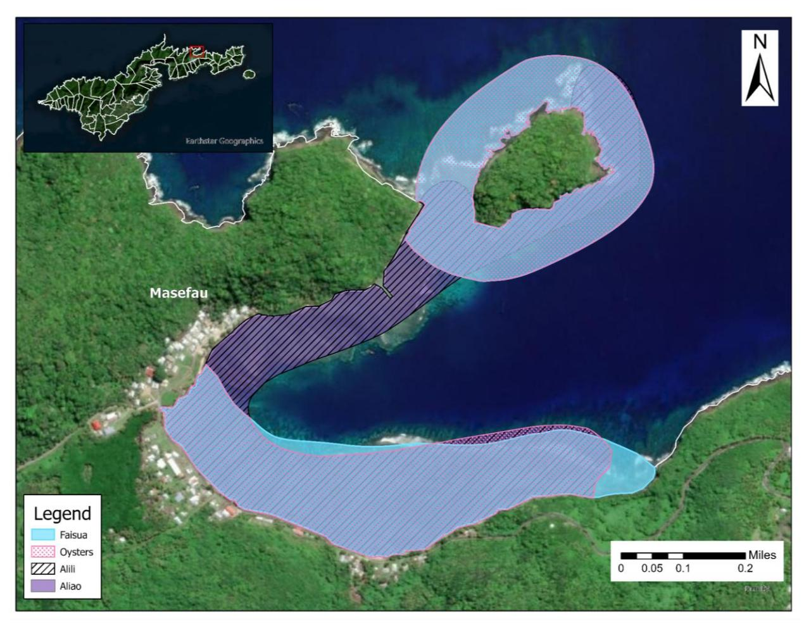

# **Afono**

Current species: faisua, alili, sea grapes, red limu, mullet

Faisua, sea grapes, and red limu are present in this bay. There is also plenty of alili, sisi (smaller snail), and aliao. We were told there are also plenty of lobster and crabs. Mullet also swim through occasionally. All these species are harvested for consumption.

In the 1970s, there were two DMWR faisua farms, but DMWR pulled them despite being very productive. This village is interested in raising faisua again. While no tilapia has been aquacultured in Afono, the village is interested. They are also interested in mariculture for food security and economic gains, but the village would need to approve the effort.

The Afono pulenu'u said that their main bay along the eastern and western coasts is a great place for limu and oyster mariculture because the bay is protected (Figure , yellow Potential Sites 8 and 10). He also suggested that a net pen for mullet would also be feasible in the southwest corner of the bay (Figure , yellow Potential Site 9). The pulenu'u mentioned that the coastline to the east has lots of seafood including oysters and faisua with clean water (Figure , yellow Potential Site 11), however they would need security in that area because no-one lives there who could constantly be monitoring the venture.

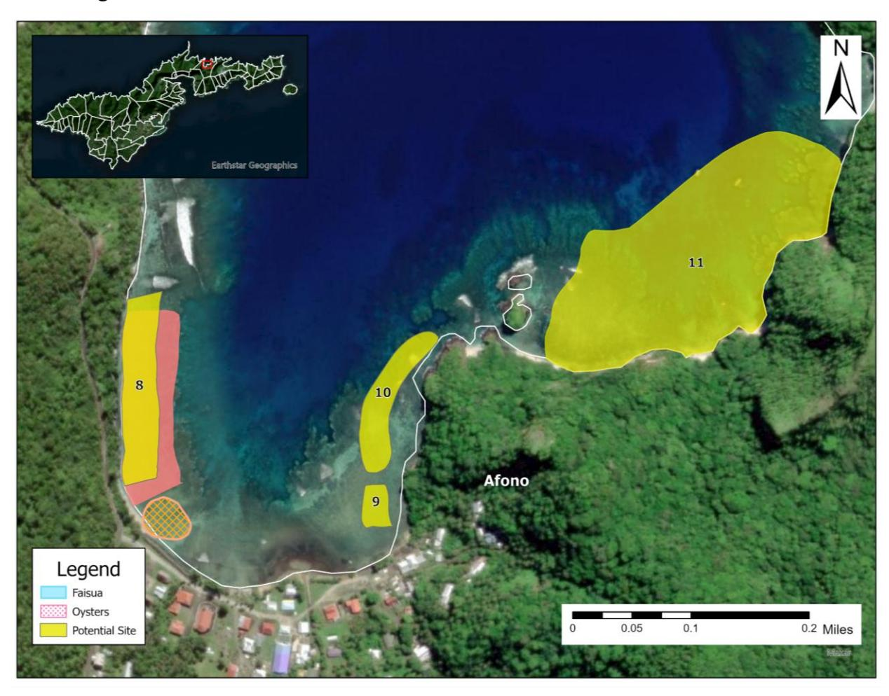

# **Vatia**

Current species: faisua, snappers, alili

The primary bay of Vatia village is predominantly sandy along the coastline, particularly at the head of the bay. Along the stretch of beach on the upper side of the village, sand periodically covers the reef. In April 2023, the area was covered with sand. Just beyond that stretch however is great for fishing and contains faisua. On the southern stretch of shore beyond the village homes, faisua also are present and there is good snapper fishing (Figure X, Point of Interest 2).

Vatia has a peninsula along its northern boundary. Fishermen hike to the other side of the peninsula to access better fishing for grouper, mullet, trevally (mololi), and other finfish (Figure X, Point of Interest 1). That area also has alili, aliao, and faisua. The village fishermen fish for consumption, but also for sale. Other villages on the island pre-order fish from the Vatia fishermen.

Vatia has a freshwater input from three continuous streams. There are also substantial wetlands. It may be a good place for a freshwater aquaculture facility if there is interest, however the village was not interested in tilapia. The pulenu'u expressed interest in limu mariculture. However, given there is no limu currently present, the feasibility would need to be researched. There has been a faisua farm in the past but the pulenu'u expressed concern that the bay may not be clean enough for a faisua farm. Mullet are plentiful in the bay, but we are not sure if there is a decent location for a mullet cage.

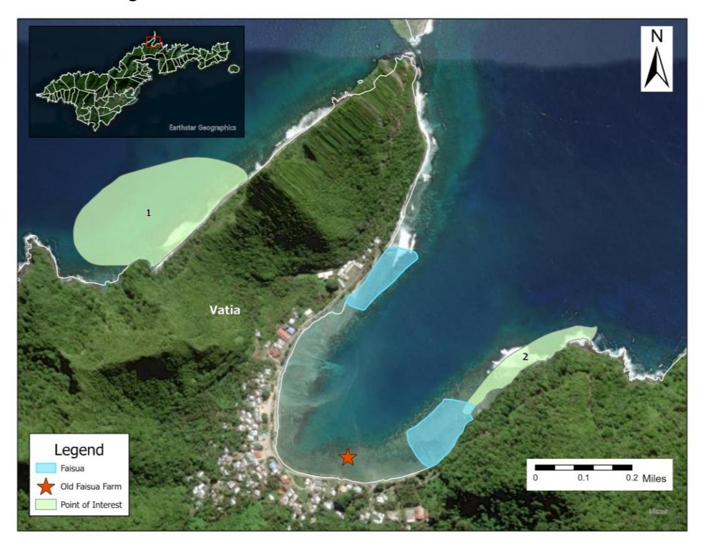

# **Amouli**

Species: limu, faisua, alili, oysters

Amouli [25][26][27][28]is very protected and hosts a variety of species including alili and faisua. This village might be good for a mullet net pen. The pulenu'u said that this village does not need mariculture for food security.

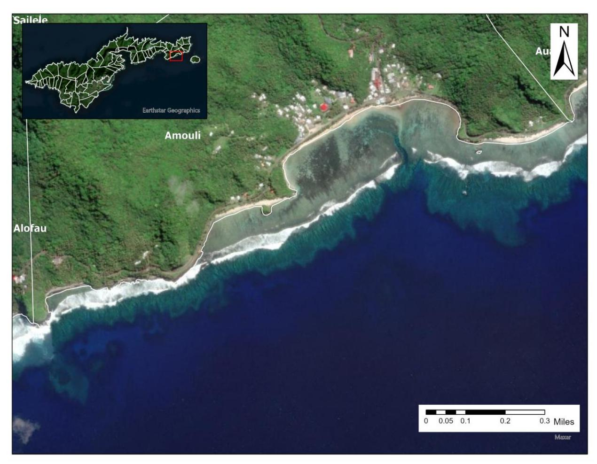

# **Manua**

# **Ofu**

Current species: faisua, alili, sea cucumber, mullet

On Ofu, there are several places that may be good for mariculture. There are several protected areas in which mariculture could hold promise. Sea cucumbers grow plentiful along the coast. However, in the area closest to the harbor that spans the length of the largest village on Ofu, the shallow lagoon area is not healthy. Algae is taking over and corals are dying. However, it is protected and therefore could provide a decent location for faisua and limu mariculture depending on water quality requirements for either species.

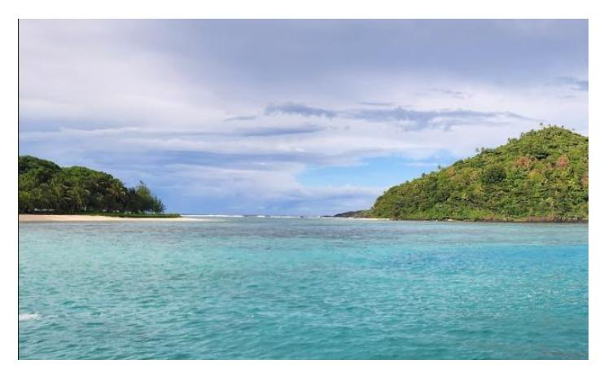

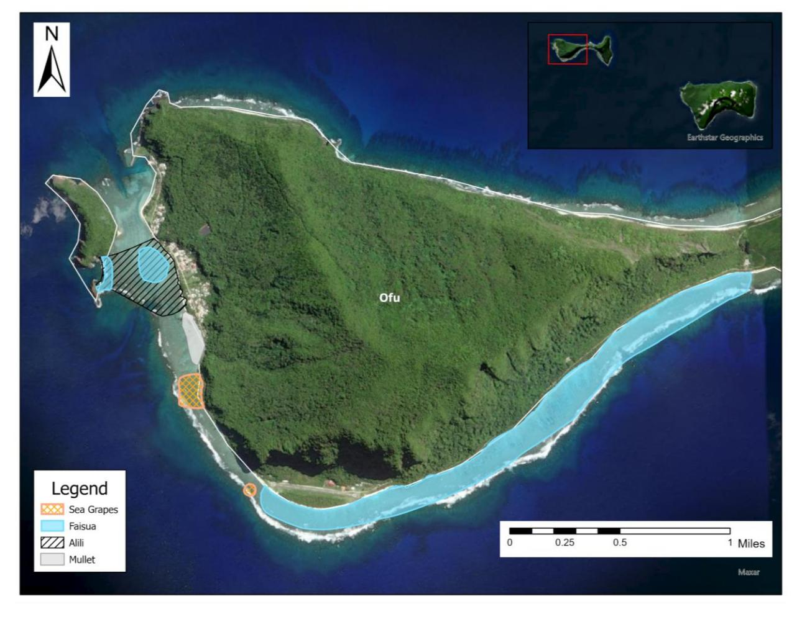

# **Olosega**

Current species: mullet

Mullet traverses along the northwestern shore, down between Ofu and Olosega Islands, then along the southwestern shore of Olosega. While there may be areas for mariculture along the coast, the village does not have many residents, and therefore implementing, then long-term care of, a mariculture project may not be feasible. A resident suggested a great location for faisua and oyster mariculture might be along the southeastern shore, but this is an uninhabited area which would make maintenance infeasible (Figure , yellow Potential Site 14).

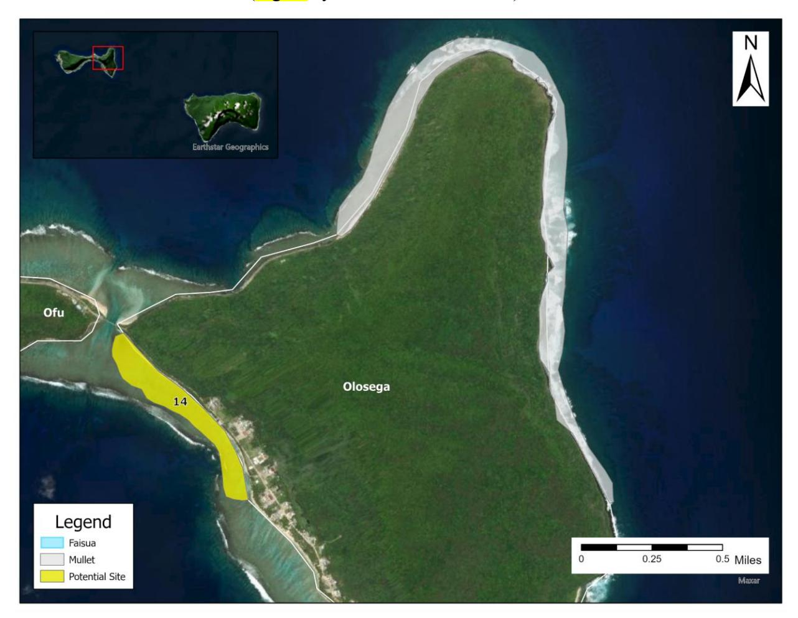

**Ta'u**

Current species: faisua, alili, sea cucumber

The shoreline along Luma down to Siufaga on Ta'u has a lot of alili, faisua, and sea cucumbers. Along the northern coast going from Luma to Faleasao is deep ocean with no on-shore houses. Faleasao hosts a harbor and a coastline that is relatively protected. Luma has extensive wetlands with freshwater eel.

The residents of Ta'u were interested in the benefits of mariculture and aquaculture to promote food security and economy, but also said that the Manua Islands are so bountiful that food security really is not an issue.

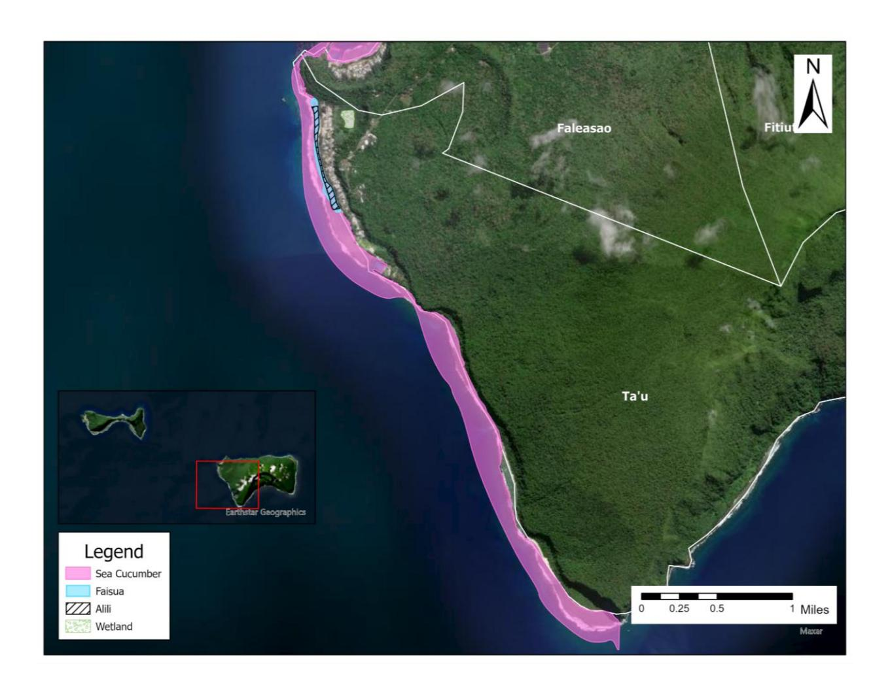

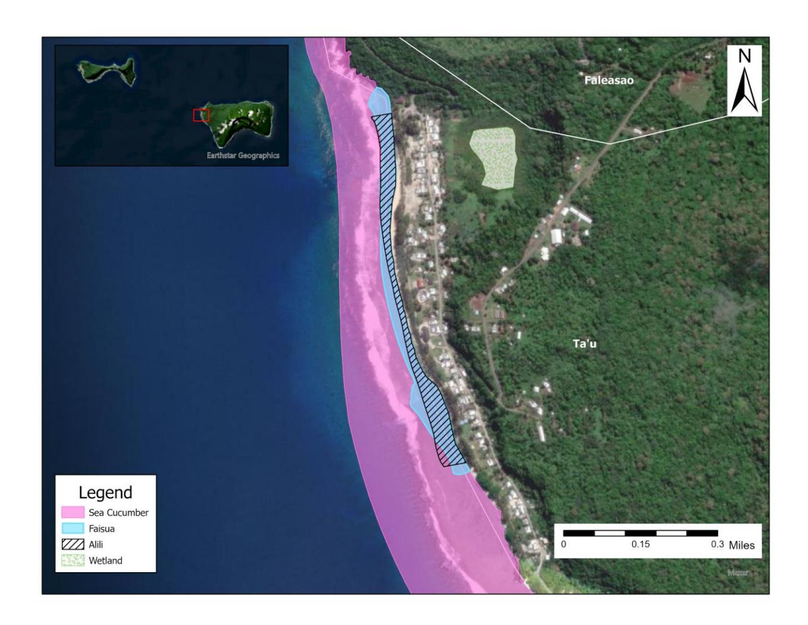

# Fitiuta

Current species: sea cucumber, faisua, alili

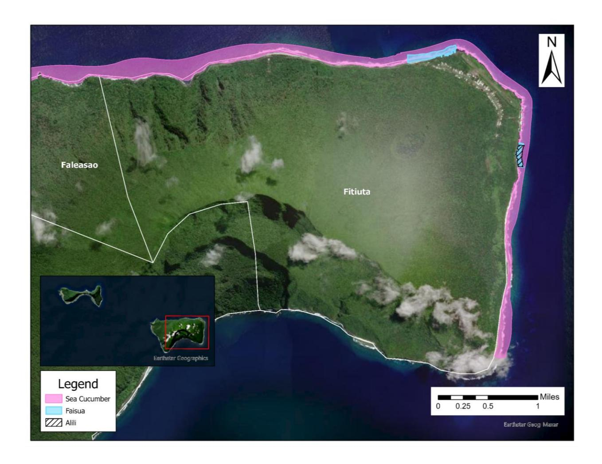

# **Faleasao**

Current species: sea cucumber

Along the shores of Faleasao are bountiful sea cucumbers that the village residents sometimes harvest. That was the predominant species the residents described. The primary issue for Faleasao is how quickly the shore drops off to deep water, making their reef flat very narrow and unprotected.

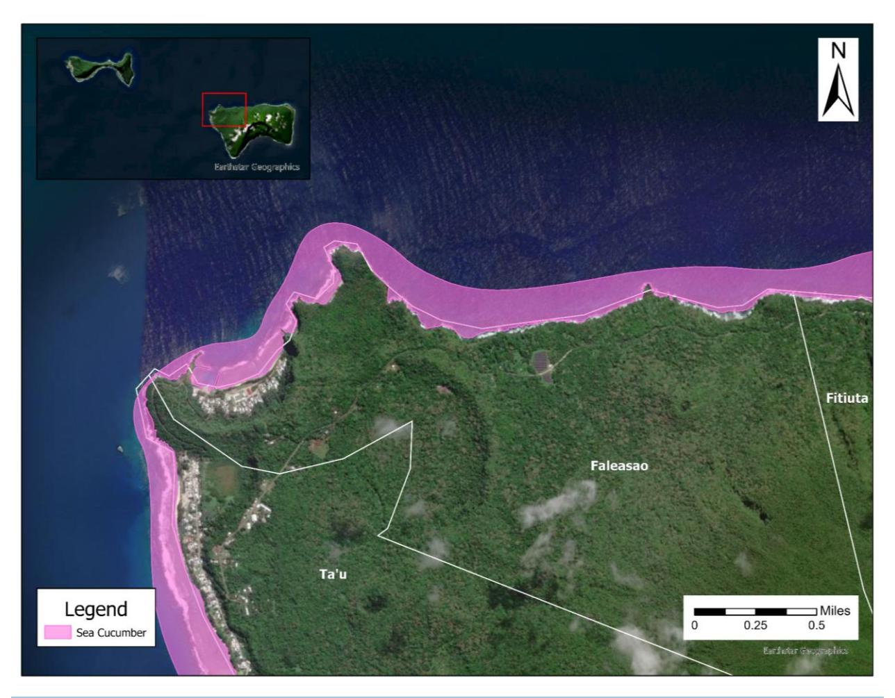

# **ECONOMIC OPPORTUNITIES, CHALLENGES, AND CONSTRAINTS[29][30][31][32]**

Various forms of mariculture and aquaculture have become profitable in recent decades, which has contributed to aquaculture equaling wild capture fisheries in quantity and exceeding it in value produced (FAO 2022b). Some of these fish and shellfish farming operations raise concerns about sustainability (e.g., shrimp–see previous discussion) and profitability is not assured. As with any business venture, the profitability will depend on the costs of inputs, the efficiency of production, and the value of products and associated sales costs.

American Samoa is exploring aquaculture as part of a broader effort to diversify its economy. The economy is currently dominated by government services and tuna canning, the latter of which has been in decline in recent years (GAO 2020). Part of this decline comes from geopolitical competition. Chinese catches of pelagic fishes like tuna has skyrocketed since 2000, and may be dramatically higher than reported values due to misreporting (Asche et al., 2022) and underreporting (Myers et al. 2022) by a heavily-subsidized distant water fleet (Sala et al., 2018). This competition may also influence access by the U.S. tuna fleet to other countries' EEZs (e.g., Felton 2022; Kwan 2022). At the same time the American Samoa tuna industry is facing tougher global competition, it faces growing costs in the form of increasing minimum wages, and reduced local fishing grounds through the proposed designation of the Pacific Remote Islands National Marine Sanctuary, and of green turtle critical habitat.

In the case of mariculture and aquaculture in American Samoa, specific factors affect these elements of profitability. The islands are remote, which increases the costs of materials and equipment and the expense of shipping products. They are mountainous with relatively little flat coastal acreage, driving land prices higher. They are also small, so that any production is likely to be primarily focused on export markets. As a territory of the U.S., American Samoa is held to environmental and labor standards that can be stricter than competitors, making costs higher.

In this economic analysis, these factors will be considered across a range of inputs, outputs, and efficiency considerations. Then, specific case studies of aquaculture operations elsewhere will be examined through a lens of differential economic conditions for American Samoa, with conclusions made regarding profitability in the islands.

# **COSTS OF INPUTS**

#### **Start-Up Costs**

#### *Facilities*

It was noted that basic aquaculture supplies and equipment may be obtained on the island through three stores. Respondents cited that, unless highly specialized items are required, items to build and maintain systems may be available. However, systems that are developed on land versus in the ocean (nearshore or offshore) would differ. Therefore, specialized pumps, nets/netting, feed or chemicals may need to be ordered well in advance (approximately 3 months) and shipped to the island. If products are needed on a regular basis, respondents said they could provide a consistent supply/stock as needed.

Engineers would be needed to assist in developing systems regardless of whether they are on land, nearshore or offshore. There was a positive sentiment that local engineers could be used to develop such systems. Respondents noted there are at least three engineering companies[33][34][35] that could support the development of basic or complex aquaculture systems. In addition, engineers could partner with off-island companies for support and guidance in design and maintenance of the systems.

#### *Capital*

The costs of a project should include the costs of acquiring funds for its development and initial operations. Within American Samoa, the Development Bank of American Samoa makes commercial loans up to \$100,000 at an interest rate of 9%, while the Territorial Bank of American Samoa will make secured loans at 13% and unsecured loans at 15% to 24% interest, depending on various factors. Outside of the islands, the federal government might offer long-term financing with fees as low as 0.5% and interest rates 2% over the Department of Treasury's cost of funds (currently at 3%, 88 Fed. Reg. 32,820 (May 22, 2023)). These loans are currently available for the Southeast, Northeast, and Northwest regions of the U.S. but would be worth pursuing for American Samoa given the much lower interest rate.

Startup costs can also be defrayed through NOAA Competitive Grants Programs for aquaculture, including the Sea Grant Marine Aquaculture Program, the NOAA Small Business Innovation Research Program, the Saltonstall-Kennedy Grant Program, and the Marine Fisheries Initiative. Moreover, direct funds are currently supplied for aquaculture projects through the Atlantic, Gulf, and Pacific States Marine Fisheries Commissions. Once again, it would be worth pursuing a similar arrangement for American Samoa.

#### **Production Costs**

#### *Land*

Flat land is a valuable commodity in American Samoa. Over 40% of the land area of these islands is cliff-like, with a grade over 70% (Nakamura 1984). Land leasing prices are available from the government industrial park (\$1250/hectare/month) and the American Samoa Power Authority (\$370/hectare/month). Discussions with private landowners indicated that it may be possible to lease land for as little as \$200/hectare/month.

Because our case studies rely on economic conditions in the Philippines, it is important to consider land costs there. Land and water use in the Philippines is governed by various laws, and land can be a premium commodity there. Most fish ponds in the country are brackish water ponds that were developed out of mangrove swamps. However, laws now restrict additional mangrove conversion. Other affordable sources of land can be scarce. Because agricultural production is usually more profitable, it is rare to excavate quality agricultural lands and convert them into fish ponds. An informal survey of land prices in the Philippines suggests that areas suitable for fish pond development lease for 1 to 1.5 million[36] Philippine pesos annually, equivalent to \$1500 to \$2200/hectare/month. These values are consistent with the most expensive land prices found in American Samoa.

#### *Labor*

Unskilled and skilled labor would be needed to develop and maintain aquaculture systems. It was noted that the unskilled labor force may be available to assist in basic construction; however technical and highly technical skilled labor is likely not available. It was suggested that if a system is easy to use then unskilled labor may suffice (e.g., tilapia ponds). However, many large-scale systems can be complicated (e.g., saltwater hatchery, open ocean systems) and would require highly technical skilled labor and training. The labor force for general technical services (e.g. plumbing) and those with certifications (e.g., boat licensing/safety at sea/harvest operations or SCUBA certifications) would require local training as necessary. Some institutions were cited that may be able to provide these basic technical trainings or certifications for those seeking employment to support the development of aquaculture systems, such as [American Samoa](https://www.amsamoa.edu/academicprograms.html)  Community College - [Trades and Tech Division,](https://www.amsamoa.edu/academicprograms.html) American Samoa Government Youth Summer Employment Program and [Nu'uuli Vocational Technical High School.](https://www.doe.as/NVTHS/1495-Trades-Department.html) However, these institutions likely do not have specific courses or certifications that are highly technical and directly related to aquaculture. Therefore, specific aquaculture training may need to be sought off-island, which could be costly to individuals or companies.

Some challenges were cited regarding development and support of a labor force. There was concern that highly skilled labor, once obtained, may leave for other higher salaried positions and if technical foreign labor was sought it may be difficult to secure due to visa requirements. Finally, temporary or permanent housing may also be a challenge in certain areas or villages due to a lack of availability or costs.

The labor rates for American Samoa are on the rise due to regular increases in the minimum wage. The most recent increase, in 2021, raised the minimum wage from a range of \$5.00-\$6.20 depending on the industry, to a range of \$5.50-\$6.80, an increase of about 10% across the board.

By comparison, wages in the Philippines for unskilled workers such as helpers, start at 71.25 Philippine pesos per hour and may be 87.5 Philippine pesos for more skilled jobs such as welding and carpentry. These wages translate into a range of \$1.25 to \$1.55/hr, about four times lower than wages in American Samoa.

#### *Energy and Water*

Energy and water are both scarce resources in American Samoa. Energy is produced mainly by diesel generators, with a current diesel price of ?[37][38][39][40][41][42] \$3.45 per gallon, or \$0.91 per liter. Fresh water is primarily derived from wells and costs ?[43][44][45][46] approximately \$0.005 per gallon or \$1.32 per cubic meter. Electricity in American Samoa costs about \$0.35 per kilowatt hour.

By comparison, prices in the Philippines are 50 Philippine pesos (\$) per liter, while water sells for 50-100 Philippine pesos per cubic meter. Estimates were not available for electricity costs, but note that diesel costs about the same both places, while water is 50% more expensive in American Samoa.

#### *Materials and Equipment*

It was noted that basic aquaculture supplies and equipment may be obtained on the island through three stores. Respondents cited that, unless highly specialized items are required, items to build and maintain systems may be available. However, systems that are developed on land versus in the ocean (nearshore or offshore) would differ. Therefore, specialized pumps, nets/netting, feed or chemicals may need to be ordered well in advance (approximately 3 months) and shipped to the island. If products are needed on a regular basis, respondents said they could provide a consistent supply/stock as needed.

## *Shipping and Transportation*

Shipping and transportation between islands and mainland areas such as New Zealand, Asia, and the U.S. is limited. The development of an aquaculture facility or program would likely require the shipment of supplies and equipment, including specialty items that cannot be found on-island, and the potential shipment of aquaculture products within the island area or to the mainland. Therefore, while supply store owners said they can order and ship just about anything, shipping experts provided insight regarding cargo schedules, the capacity to accommodate incoming aquaculture equipment, capacity to ship fresh and frozen product, and identified any transportation issues or considerations that could disrupt the development and sustainability of aquaculture programs in the long-term.

There is capacity to ship aquaculture supplies and equipment to American Samoa via vessels that sail between 1 and 5 times per month depending on the country in which product may be ordered. It was noted that vessels sail to and from Asia (two to five times per month) versus the U.S (two times per month) and New Zealand (once per month). However, it's important to note that space can be limited; therefore, it's important to plan well in advance to get equipment onto a vessel and it may take up to 3 months in certain situations to receive a product (especially for specialty equipment or supplies that require customs clearance such as farm equipment or chemicals). In addition, these vessels have the capacity to ship fresh and frozen products to mainland areas. There was some concern over delays due to port congestion or arrival times since voyages can take between one to three weeks of sail time. One respondent noted that two shipping companies will no longer service American Samoa, which may limit available space, voyages and price

competition. The number of inter-island vessels is limited. The vessel [Manu'a Tele](https://portadministration.as.gov/services/water-transportation-wtd) was cited as a potential source to move product and supplies between American Samoa and Manu'a Islands roughly two to three times per month. In addition, th[e Lady Naomi Ferry](https://www.ssc.ws/services/ferries-and-charters/cargo) operates a weekly service between Apia, Samoa and Pago Pago, American Samoa.

Shipping via airlines is possible; however, there are no cargo planes servicing American Samoa and the allowable cargo on passenger planes is limited (e.g., cold products only, no chemicals). Therefore, the cost to ship allowable products may be cost-prohibitive. According to the [American](https://www.americansamoa.travel/travel)  [Samoa Visitors Bureau:](https://www.americansamoa.travel/travel) "Three international airlines fly to American Samoa from Hawaii, USA, Samoa and Tonga. Hawaiian Airlines operates bi-weekly flights from Honolulu to Pago Pago, while both Samoa Airways and Talofa Airways operate daily services from Apia, Samoa. Talofa Airways also offers a twice a week service from Tonga to American Samoa."

# **EFFICIENCY OF PRODUCTION AND VALUE OF PRODUCTS**

In addition to costs of production, mariculture and aquaculture in American Samoa face distinct conditions regarding production. As described earlier, shipping services are limited and potentially expensive. As such, the sale of live product for export is unlikely to be viable. However, frozen products are possible and they could benefit from the existing distribution network for the canned tuna industry.

Fresh product may also have a local market. In a recent study of the potential for aquaculture in American Samoa, all local restaurants were interested and willing to pay a premium price for locally produced, fresh tilapia (Sea Grant 2019).

As the following case studies show, there is potential for highly profitable aquaculture and mariculture operations in American Samoa.

# **CASE STUDY: TILAPIA (***Oreochromis niloticus***)**

Tilapia production is well-developed world-wide. The extensive experience has led to advances and efficiencies in production. And, while this production in concept could have saturated markets, the reality is that the demand for mild white fish fillets remains strong and the consistent availability of tilapia has likely increased its value.

Producing tilapia from fingerlings can be costly. Analyses of start-up costs based on Philippine experience, indicated initial investment required of approximately \$65,000. Approximately \$50,000 of this initial investment would cover such items as pond construction, and other land improvements, and solid waste and wastewater treatment systems. An additional approximately \$15,000 would cover a vehicle and miscellaneous other equipment. On top of these initial investments, annual production is anticipated to cost approximately \$125,000, including land rental, labor, energy and water use, fingerlings, feed, and miscellaneous materials. Much of this cost comes from water and labor. This expense is estimated to produce 20 metric tons of tilapia.

At \$3 per pound (typical price when sold in American Samoa), annual revenues are expected to be \$132,000. Thus, profit margins are predicted to be thin but positive, and with a valuable community service in providing jobs and a source of fresh protein. Given the thin margins, it is expected that there would be no discounted return on investment even after 20 years. However, if the government or other sources believed the benefits of tilapia production to society were worth providing grants, the balance could shift. It is estimated that a \$25,000 per farm grant would result in a 41% discounted return on investment in tilapia cultivation over the course of 20 years (Table 2).

Alternatively, the American Samoa Community College's Land Grant Aquaculture Program has been providing all resources except feed to farmers producing tilapia in American Samoa. Feed costs approximately \$0.25 per pound, and 1.5 pounds of feed are necessary to produce a pound of tilapia. Under these circumstances, the annual production costs drop to \$16,500 and result in a nearly 2000% discounted return on investment over 20 years (100% per year on average).

These figures show that, without subsidies, tilapia is a challenging industry. With current subsidies, though, it would be highly profitable to expand.

**Table 2. Economics of Tilapia Production. A: Costs. B: Revenue. C: Profitability**

| Costs                   | Units | \$/unit         | Cost             |
|-------------------------|-------|-----------------|------------------|
| Initial (investment)    |       |                 |                  |
| Facilities/construction | 1     | \$ 49,138.05 | \$ 49,138.05  |
| Equipment               | 1     | \$ 15,565.37 | \$ 15,565.37  |
| Total Investment        |       |                 | \$ 64,703.42  |
| Annual                  |       |                 |                  |
| Land                    | 1     | \$ 4,440.00  | \$ 4,440.00   |
| Labor                   | 2     | \$ 22,464.00 | \$ 44,928.00  |
| Energy/Water            | 1     | \$ 53,003.53 | \$ 53,003.53  |
| Materials               | 1     | \$ 22,066.37 | \$ 22,066.37  |
| Total annual costs      |       |                 | \$ 124,437.91 |

| Revenue       | Units | \$/unit        | Revenue          |  |
|---------------|-------|----------------|------------------|--|
| Gross sales   | 20    | \$ 6,600.00 | \$ 132,000.00 |  |
| Total revenue |       |                | \$ 132,000.00    |  |

| Profits                                  | Revenue       | Cost            | Profit          |
|------------------------------------------|---------------|-----------------|-----------------|
| Year 1                                   | \$ 132,000.00 | \$ (189,141.33) | \$ (57,141.33)  |
| Year 2                                   | \$ 135,960.00 | \$ (128,171.04) | \$ 7,788.96  |
| Year 3                                   | \$ 140,038.80 | \$ (132,016.17) | \$ 8,022.63  |
| Year 4                                   | \$ 144,239.96 | \$ (135,976.66) | \$ 8,263.31  |
| Year 5                                   | \$ 148,567.16 | \$ (140,055.96) | \$ 8,511.20  |
| Year 6                                   | \$ 153,024.18 | \$ (144,257.64) | \$ 8,766.54  |
| Year 7                                   | \$ 157,614.90 | \$ (148,585.37) | \$ 9,029.54  |
| Year 8                                   | \$ 162,343.35 | \$ (153,042.93) | \$ 9,300.42  |
| Year 9                                   | \$ 167,213.65 | \$ (157,634.22) | \$ 9,579.44  |
| Year 10                                  | \$ 172,230.06 | \$ (162,363.24) | \$ 9,866.82  |
| Year 11                                  | \$ 177,396.96 | \$ (167,234.14) | \$ 10,162.82 |
| Year 12                                  | \$ 182,718.87 | \$ (172,251.16) | \$ 10,467.71 |
| Year 13                                  | \$ 188,200.44 | \$ (177,418.70) | \$ 10,781.74 |
| Year 14                                  | \$ 193,846.45 | \$ (182,741.26) | \$ 11,105.19 |
| Year 15                                  | \$ 199,661.84 | \$ (188,223.50) | \$ 11,438.35 |
| Year 16                                  | \$ 205,651.70 | \$ (193,870.20) | \$ 11,781.50 |
| Year 17                                  | \$ 211,821.25 | \$ (199,686.31) | \$ 12,134.94 |
| Year 18                                  | \$ 218,175.89 | \$ (205,676.90) | \$ 12,498.99 |
| Year 19                                  | \$ 224,721.16 | \$ (211,847.20) | \$ 12,873.96 |
| Year 20                                  | \$ 231,462.80 | \$ (218,202.62) | \$ 13,260.18 |
| Discounted Return on Investment (20 yrs) | -49%          |                 |                 |

# **CASE STUDY: GIANT CLAMS (***Tridacna gigas***)**

By contrast, the culture of giant clams looks far more promising. Values for this analysis were taken from Tisdell and colleagues (1990, 1991). These studies are quite old and in Australian dollars. Therefore, they were adjusted to account for the conversion rate (1.56 AUD/USD) and the amount of inflation since the early 1990s (approximately 125% inflation from 1991 to 2023).

If giant clam 'seed' are purchased and used for production, the startup costs are estimated at approximately \$165,000: \$115,000 for facility construction and \$50,000 for equipment–namely a tractor and a utility truck (Table 3). Annual costs are estimated at \$180,000 including cost of land for the base of operation, labor, energy, and materials. The largest cost among these items is the price of giant clam seed: estimated at a bit over \$1 per clam with 100,000 purchased annually.

**Table 2. Economics of Giant Clam Production. A: Costs. B: Revenue. C: Profitability**

| Costs                   | Units | \$/unit          | Cost             |
|-------------------------|-------|------------------|------------------|
| Initial (investment)    |       |                  |                  |
| Facilities/construction | 1     | \$ 115,384.62 | \$ 115,384.62 |
| Equipment               | 1     | \$ 50,480.77  | \$ 50,480.77  |
| Total Investment        |       |                  | \$ 165,865.38 |
| Annual                  |       |                  |                  |
| Land                    | 1     | \$ 4,440.00   | \$ 4,440.00   |
| Labor                   | 1     | \$ 22,464.00  | \$ 22,464.00  |
| Energy/Water            | 1     | \$ 3,000.00   | \$ 3,000.00   |
| Materials               | 1     | \$ 151,153.85 | \$ 151,153.85 |
| Total annual costs      |       |                  | \$ 181,057.85 |

| Revenue       | Units  | \$/unit |      | Revenue         |
|---------------|--------|---------|------|-----------------|
| Gross sales   | 194348 | \$      | 7.21 | \$ 1,401,548.08 |
| Total revenue |        |         |      | \$ 1,401,548.08 |

| Profits | Revenue | Cost            | Profit          |
|---------|---------|-----------------|-----------------|
| Year 1  |         | \$ (346,923.23) | \$ (346,923.23) |
| Year 2  |         | \$ (186,489.58) | \$ (186,489.58) |
| Year 3  |         | \$ (192,084.27) | \$ (192,084.27) |
| Year 4  |         | \$ (197,846.80) | \$ (197,846.80) |

| Year 5                                   |                 | \$ (203,782.20) | \$ (203,782.20) |
|------------------------------------------|-----------------|-----------------|-----------------|
| Year 6                                   |                 | \$ (209,895.67) | \$ (209,895.67) |
| Year 7                                   |                 | \$ (216,192.54) | \$ (216,192.54) |
| Year 8                                   |                 | \$ (222,678.31) | \$ (222,678.31) |
| Year 9                                   |                 | \$ (229,358.66) | \$ (229,358.66) |
| Year 10                                  |                 | \$ (236,239.42) | \$ (236,239.42) |
| Year 11                                  | \$ 1,883,563.42 | \$ (243,326.61) | \$ 1,640,236.81 |
| Year 12                                  | \$ 1,940,070.32 | \$ (250,626.40) | \$ 1,689,443.92 |
| Year 13                                  | \$ 1,998,272.43 | \$ (258,145.20) | \$ 1,740,127.23 |
| Year 14                                  | \$ 2,058,220.60 | \$ (265,889.55) | \$ 1,792,331.05 |
| Year 15                                  | \$ 2,119,967.22 | \$ (273,866.24) | \$ 1,846,100.98 |
| Year 16                                  | \$ 2,183,566.24 | \$ (282,082.22) | \$ 1,901,484.01 |
| Year 17                                  | \$ 2,249,073.22 | \$ (290,544.69) | \$ 1,958,528.53 |
| Year 18                                  | \$ 2,316,545.42 | \$ (299,261.03) | \$ 2,017,284.39 |
| Year 19                                  | \$ 2,386,041.78 | \$ (308,238.86) | \$ 2,077,802.92 |
| Year 20                                  | \$ 2,457,623.04 | \$ (317,486.03) | \$ 2,140,137.01 |
| Discounted Return on Investment (20 yrs) |                 | 2442%           |                 |

Revenues would be significantly delayed. The most profitable rearing time has been determined to be 10 years (Tisdell, et al., 1991), meaning there would be a significant lag before generating a revenue stream. However, when revenues began to come in, these operations would be highly profitable since annual revenues are estimated at \$1.4 million. But, given the 10 year wait for any revenues, it would take 12 years before any operation was profitable.

Moreover, locals in American Samoa are wary of giant clam operations because of a history of theft. If they were to succeed, these operations would likely have to invest in some advanced security measures and those would cut into profits. Given how big the profit margins are, though, giant clam mariculture looks extremely promising for American Samoa for any entities willing to make the long-term investment.

#### **Business Opportunities with the US Government**

The United States federal government has a longstanding policy of prioritizing the purchase of domestically produced goods, including food items, for use by federal agencies, including the military. This policy, often referred to as the Buy American Act, was enacted in 1933 and is intended to support domestic industries and protect American jobs. Products made in American Samoa support this policy.[3](#page-67-0) These policies can create a significant demand for domestically produced seafood.

## **Buy American Act (41 U.S.C. 10a-c)**

The BAA requires federal agencies to give preference to domestic end products in their procurement processes. In the context of food, this means agencies are required to prioritize purchasing food that is grown and processed within the United States, provided that the food is available at a reasonable cost and is of satisfactory quality. This could mean that aquaculture and mariculture products grown in American Samoa may be required to supplant the current products at the local Army Reserves. The Act does not ban foreign purchases, but adds a price preference to domestic products to make them more competitive in the bidding process. The price preference adds a specified percentage to the price of any foreign products, including import duties, and then measures this adjusted price against the domestic product. For example, large businesses get a 20 percent price preference, and small businesses get a 30 percent price preference.[4](#page-67-1) This still means pricing is important, and a domestic product that surpasses a foreign product's price, even with the added price preference, may fail to secure the contract. But it provides a huge advantage to domestic products in procurement.

#### **The Berry Amendment (10 U.S.C. §2533a)**

Another critical piece of legislation that impacts military food procurement is the Berry Amendment, which requires the Department of Defense to give preference to domestically produced, manufactured, or home-grown products, including food. This is not a price preference, as in the BAA, but a prohibition on purchasing foreign products except in limited circumstances. Only if DOD cannot procure a product in the quality or quantity necessary may it seek nondomestic sources.[5](#page-67-2)

The most restrictive regulations apply to seafood. The Berry Amendment requires that DOD procure seafood only from U.S. flagged vessels or obtained from fishing within the U.S. AND be processed in the U.S.[6](#page-67-3) This would apply to aquaculture in American Samoa waters, that is also processed in the territory, or elsewhere in the U.S.

#### **Small Business Administration Certifications**

In addition, operations in American Samoa likely qualify for a number of Small Business Administration small business certifications, which are designed to help firms owned by socially and economically disadvantaged individuals. They provide benefits when contracting with the federal government, including the ability to participate in set-aside (contracts specifically for businesses with SBA certifications) and sole-source contracts (those that do not go through a larger bidding process) with government agencies. Certified companies can often act as subcontractors for larger contractors to help make the total bid more competitive. And in some competitive bids,

5 Buying American: The Berry and Kissell Amendments, Congressional Research Service (Updated January 20, 2023), available at https://crsreports.congress.gov/product/pdf/IF/IF10605.

3 See FAR Part 25.003 applying procurement regulations to the "50 States, the District of Columbia, and outlying areas," which include the U.S. Territories.

4 FAR Part 25.

6 48 CFR § 225.7002-2(l).

HUBZone companies can receive a 10 percent price preference.[7](#page-68-1) Federal agencies have awarded more than \$100 billion to small business contractors each fiscal year since FY 2016.[8](#page-68-2)

Some of the certifications available to American Samoan operations include the Small Disadvantaged Business certification (which includes Asian Pacific Americans as a socially disadvantaged group) and Historically Underutilized Business Zone certification (the entire territory is classified as a HUBZone[9](#page-68-3) ).

In addition, American Samoa hosts a large proportion of veterans, who also qualify for certain certifications. These include:

- SBA 8a Service Disabled Veteran Owned Small business (SDVOSB) A certification validation process is required. Only Veterans who are service-connected disabled Veterans can apply.
- Veteran-Owned Small Business (VOSB). This status is self-certified by the business owner in the System for Award Management (SAM) Website.
- Service Disabled Veteran Owned Small Business (SDVOSB). This status is self-certified by the business owner in the SAM Website.
- Veteran Administration (VA) Certified Veteran Enterprise (CVE) Veteran Owned Small Business. The VA CVE is primarily used for the VA's Vets First program. It is not a substitute for the SBA 8a certification.

While certification, registering as a federal vendor, and submitting bids can require significant work, the SBA has a presence on-island to help. The SBA Small Business Development Center has an office located across the street from the Tradewinds Hotel in Tafuna. They provide counseling, training, and resources to small businesses in the territory.[10](#page-68-4)

# **ENVIRONMENTAL ANALYSIS[47][48][49]**

An environmental analysis for the potential impacts of aquaculture systems on the human environment would be required prior to finalization and permitting of any aquaculture system. This would be developed by local and potentially Federal entities. The survey attempted to identify which authorities may need to be involved in the development of an environmental analysis and the monitoring of any impacts over time should a system be implemented. There was limited participation in this portion of the survey; however, American Samoa DMWR, U.S. Fish and Wildlife Service, NOAA NMFS, and/or an off-island subcontracting company could assist or lead these tasks. Currently, for example, when the American Samoa Department of Port Administration requires assistance with their assessments, they call on DMWR to assist.

#### **Summary of Commonalities Across Village and Agency Meetings**

62

7 FAR Part 19.1307. The price preference for HUBZones works similar to the price preferences for domestic products vs. foreign products as described in the Buy American Act section above.

8 SBA, "Small Business Procurement Scorecard Overview," at https://www.sba.gov/document/support-smallbusinessprocurement-scorecard-overview.

9 See the SBA's HUBZone map, located a[t https://maps.certify.sba.gov/hubzone/map.](https://maps.certify.sba.gov/hubzone/map) Last accessed August 29, 2023.

10 https://as-sbdc.com/

Interest in mariculture: There is keen interest in mariculture across different villages, agencies, and the public in American Samoa. Communities are interested in exploring mariculture for economic diversification and food security.

Target Species: The species for which the villages and residents expressed the most interest in for mariculture and aquaculture include faisua, alili, limu, tilapia, freshwater eel, seaweed (limu), sea cucumber, and oysters.

Technical Assistance: Several entities are seeking technical assistance in setting up mariculture and aquaculture projects, selecting appropriate species, and understanding the process of mariculture. DMWR is looking for assistance with developing an aquaculture facility on-island and after securing one, would need technical assistance. American Samoa Community College (ACCNR) is available to provide technical assistance, but they are capacity limited with only a handful of people being able to provide assistance. They would welcome additional people onisland with the technical assistance to implement aquaculture and mariculture. Independent Samoa, and Hawaii both offer opportunities for assistance.

Sustainable Funding: Funding is a critical aspect of successful mariculture projects. Sustainable funding is needed to support maintenance, restocking, and other aspects of mariculture. Funding is needed to set up a project at the outset, and a well-developed business plan would be necessary for the venture to continue into the future. Without a return on investment, or another source of funding, implemented ventures will not be successful. There are limited businesses capable of undertaking mariculture, and even fewer non-profits, so careful thought or partnerships will need to be undertaken to apply-for, and manage funding.

Community-Based Approach: Many entities emphasize the importance of a community-based approach in mariculture projects. Engaging the villages continually, providing training to the communities, and ensuring partnership and ownership are essential factors for success.

Lessons from Past Failures: There have been past failures in mariculture attempts, particularly in faisua theft and restocking. These failures highlight the importance of better site selection, monitoring, and especially enforcement plans.

Regulatory Oversight: There is a need to clarify the government agency responsible for regulating mariculture and aquaculture, especially regarding species like tilapia, to prevent invasive species and ensure responsible management.

Market Research: There is a lack of economic data and market research on mariculture opportunities in American Samoa. We also lack data regarding aquaculture and aquaponics ventures.

Environmental Considerations: Environmental factors such as water quality, pollution, and potential impacts on marine ecosystem (particularly when sourcing from the ecosystem) need to be carefully considered when planning mariculture projects. The lack of space makes the ability to dilute or treat waste more challenging.

Collaboration and Support: Collaboration between agencies, communities, and experts is crucial for the success of mariculture projects. Support from external organizations and experts can aid in project development and funding opportunities.

Public Engagement: Public engagement, including community meetings and outreach, is necessary to gain support and buy-in from local communities for mariculture initiatives.

Training and Capacity Building: Training is needed not only for community members but also for trainers and staff involved in mariculture and aquaculture projects.

Consideration for Local Consumption: There should be a focus on providing mariculture products for local consumption to address food security concerns before considering export opportunities.

# There are common themes across some areas of the Pacific, including from neighboring Western Samoa:[50][51]

- 1. Mariculture and aquaculture is seen as a means to improve food security, generate income, and create jobs in various countries.
- 2. Governments and international organizations play a crucial role in supporting mariculture development through funding, research, and technical assistance.
- 3. Research and development efforts focus on improving production methods, developing hatchery technologies, and identifying suitable species for mariculture.
- 4. The sustainability and environmental impact of mariculture are important considerations, with efforts to develop eco-friendly practices.
- 5. Restocking and stock enhancement programs aim to enhance local populations of valuable marine species.
- 6. Collaboration and knowledge-sharing among countries and organizations are crucial for the growth of mariculture in the Pacific region.
- 7. The development of mariculture depends on novel technologies and good farming practices.
- 8. Prospects for live seafood trade include tropical abalone, groupers, and crabs.
- 9. The capture and culture of larvae could improve productivity and reduce impacts on natural populations.
- 10. Further development of mariculture requires research and demonstration of economic viability.
- 11. Mariculture can bring economic benefits, improve food security, and conserve biodiversity in Pacific Island nations.
- 12. Continued support for research, training, and collaboration is essential for sustainable mariculture development in the region.

# **ANALYSIS OF REGULATIONS**

This report provides a comprehensive overview of the regulatory landscape for aquaculture operations in American Samoa, with a focus on both onshore aquaculture and off-shore mariculture. It is intended to serve as a guide for government decision-makers, regulators, and potential aquaculture operators in American Samoa.

Aquaculture in American Samoa operates under a complex framework of local, federal, and international regulations. The regulatory framework is significantly different between on-shore and off-shore projects, as the latter involves more intense regulation, especially at the federal level. At the local level, the American Samoa Department of Marine and Wildlife Resources (DMWR) and the Project Notification and Review System (PNRS) Board play key roles in overseeing aquaculture operations.

At the federal level, several agencies have jurisdiction over aspects of aquaculture operations, including the National Oceanic and Atmospheric Administration (NOAA), the U.S. Fish and Wildlife Service (USFWS), the U.S. Army Corps of Engineers (USACE), and others. Key federal statutes and regulations include the Magnuson-Stevens Fishery Conservation and Management Act (MSA), the National Aquaculture Act, and the Lacey Act.

Internationally, the Convention on International Trade in Endangered Species of Wild Fauna and Flora (CITES) is particularly relevant for aquaculture operations that involve international trade of species listed in the CITES Appendices, such as giant clams, sea cucumbers, and corals.

Starting and operating an aquaculture operation in American Samoa involves navigating a complex regulatory landscape. However, with careful planning and compliance with all relevant regulations, aquaculture presents a promising opportunity for sustainable economic development in the territory.

# **Federal Regulations**

# **Overview of the Federal Regulatory Landscape**

As a U.S. Territory, American Samoa is subject to federal laws, especially those related to natural resources and environment. Many more federal regulations apply to mariculture than on-shore aquaculture, as the territory's coastal area includes delicate habitats for important species, marine mammals, and natural resources.

Due to the diversity of laws that cover the territory, there are a number of federal agencies that could be involved when dealing with mariculture aquaculture. Aquaculture was designated a national policy priority in 1980 under the National Aquaculture Development Act (16 U.S.C. 2801-2810), which created what is now known as the Subcommittee on Aquaculture. The Subcommittee involves a number of federal agencies.

These agencies include NOAA, USACE, USFWS, the Environmental Protection Agency (EPA), the USDA Animal and Plant Health Inspection Service (APHIS), the FDA Center for Veterinary Medicine (CVM), and the FDA Center for Food Safety and Applied Nutrition (CFSAN).

These agencies oversee their relevant regulations, including disease management, water discharge, siting of gear, seafood safety, use of medication, feed ingredients, and the protection of marine mammals, fish habitat, and threatened and endangered species.

# **Detailed Review of Key Federal Statutes and Regulations**

There are many federal rules that might impact aquaculture in American Samoa. Federal oversight is significantly heavier for off-shore mariculture due to the potential impact on habitats and species. The following is a review of some of the key statutes and regulations:

#### **Key Federal Statutes**

There are a number of key federal statutes and regulations that may be impacted by aquaculture projects in American Samoa. This is not an exhaustive list:

#### *Environment and Natural Resources*

**Magnuson-Stevens Fishery Conservation and Management Act (16 U.S.C. §§1801-1891d):** Magnuson-Stevens governs the conservation and management of fishery resources within the U.S. Exclusive Economic Zone. It establishes eight regional fishery management councils that prepare and amend fishery management plans. Aquaculture operations must comply with these plans, which aim to prevent overfishing, rebuild overfished stocks, increase long-term economic and social benefits, and ensure a safe and sustainable supply of seafood. American Samoa is a member of the Western Pacific Regional Fishery Management Council. While Magnuson-Stevens primarily focuses on wild fisheries, it includes regulations pertaining to offshore aquaculture.[11](#page-72-1)

**Endangered Species Act (16 U.S.C. §§1531-1544):** The ESA provides for the conservation of species that are endangered or threatened and the ecosystems upon which they depend. Aquaculture operations must ensure they do not harm these species or their habitats. Any operation that could potentially impact listed species or critical habitat must consult with the USFWS or the National Marine Fisheries Service. American Samoa's waters include a number of species under various levels of ESA protection such as green and hawksbill sea turtles and six coral species [\(NOAA NMFS\)](https://www.fisheries.noaa.gov/pacific-islands/endangered-species-conservation/marine-protected-species-american-samoa).

**Marine Mammal Protection Act (16 U.S.C. §§1361-1383b, 1401-1406, 1411-1421h):** The MMPA protects all marine mammals within the waters of the United States. It prohibits the "take" of marine mammals, and a permit is required for any incidental take by commercial fisheries, including aquaculture. American Samoa's waters include a number of marine mammals under MMPA protection, including but not limited to botttlenose dolphins, false killer whales, melonheaded whales, and rough-toothed and spinner dolphins, and includes local protections under ASCA 24.0960. A complete list can be found in the final NMFS [Programmatic Environmental](https://www.google.com/url?q=https://www.regulations.gov/document/NOAA-NMFS-2021-0044-0158&sa=D&source=docs&ust=1693230088165656&usg=AOvVaw2iaDARentSzHm3URp-E7Nr)  [Impact Statement](https://www.google.com/url?q=https://www.regulations.gov/document/NOAA-NMFS-2021-0044-0158&sa=D&source=docs&ust=1693230088165656&usg=AOvVaw2iaDARentSzHm3URp-E7Nr) for the Pacific Islands Aquaculture Management Program.

**National Marine Sanctuary Act (16 U.S.C. §§ 1431 et seq.):** This Act authorizes the designation and management of marine areas of special national significance due to their conservation, recreational, ecological, historical, scientific, cultural, archaeological, educational, or aesthetic qualities. Aquaculture operations within or near these areas must comply with sanctuary regulations. The National Marine Sanctuary of American Samoa encompasses numerous areas around the territorial waters.

**Coastal Zone Management Act (16 U.S.C. 1451 et seq.):** The CZMA encourages the preservation, protection, and balanced development of the coastal zone. It requires that federal

11 It should be noted that at least one court has challenged aquaculture permits. The United States Court of Appeals, Fifth Circuit held in Gulf Fishermens Ass'n v. Nat'l Marine Fisheries Serv., 968 F.3d 454 (5th Cir. 2020) that NMFS did not have authority under Magnuson-Stevens to regulate aquaculture.

actions are consistent with approved state Coastal Zone Management Plans. Aquaculture operations must be consistent with these state plans. This will be covered in more depth in the section on local regulations, as these are typically enforced by the local government.

**National Environmental Policy Act (42 U.S.C. 4321 et seq.):** NEPA requires federal agencies to assess the environmental effects of their proposed actions prior to making decisions. Depending on the scale of the operation, aquaculture projects may require an Environmental Assessment or more detailed Environmental Impact Statement, especially if there is federal funding involved.

**Migratory Bird Treaty Act (16 U.S.C. 703-712):** The MBTA protects migratory birds. It makes it unlawful to pursue, hunt, take, capture, kill, or sell birds listed as migratory birds, unless permitted by regulations. It also extends to the bird's nests and eggs. Aquaculture facilities, depending on their design and location, can attract migratory birds. If aquaculture operations inadvertently harm protected birds, nests, or eggs, this can constitute a violation of the MBTA. For instance, certain netting or infrastructure could potentially trap or harm birds, or certain practices might disturb nesting sites.

**Fish and Wildlife Coordination Act (16 U.S.C. §§ 661 – 666c):** The FWCA provides for the coordination of federal proposals that affect fish and wildlife with state agencies. It ensures that wildlife conservation receives equal consideration and is coordinated with other features of waterresource development programs.

**Rivers and Harbors Act (33 U.S.C. Sec. 401 et seq.):** The RHA regulates any work or structures in, over, or under navigable waters of the United States. Section 10 tasks the U.S. Army Corps of Engineers (USACE) with reviewing and permitting such projects. Aquaculture projects that are situated in navigable waters (e.g., floating cages in bays or estuaries) or that involve structures like piers, intake or discharge pipes, or other infrastructure in such waters are subject to the RHA. USACE permitting is discussed in more detail below.

**The Clean Water Act (33 U.S.C. 1251-1387):** The CWA is a primary piece of federal legislation in the U.S. governing water pollution. Its objective is to restore and maintain the chemical, physical, and biological integrity of the nation's waters. It provides authority for both the NPDES program and Section 404 Permits. Both are discussed in more detail below.

**The Antiquities Act (54 U.S.C. 3203):** The Antiquities Act gives the President of the United States the authority to create national monuments from federal lands to protect significant natural, cultural, or scientific features. American Samoa includes the Rose Atoll Marine National Monument, which encompasses the Rose Atoll National Wildlife Refuge, and has been part of the National Marine Sanctuary of American Samoa since 2014.

**National Historic Preservation Act (16 U.S.C. §§ 470a et seq.):** The NHPA's primary focus is on preserving historic and archaeological sites across the United States. Although the Act itself is not specifically tailored for aquaculture projects, its provisions can indeed impact such projects if they have the potential to affect historic properties. American Samoa has 31 sites listed on the National Register of Historic Places.[12](#page-73-0)

## *Trade*

**The Lacey Act (16 U.S.C. §§ 3371-3378):** The Lacey Act is the United States' oldest wildlife protection statute. It enforces civil and criminal penalties for the illegal trade of animals and plants.

12 National Park Service, NPGallery at<https://npgallery.nps.gov/> (referenced on August 25, 2023).

It prohibits trade in wildlife, fish, and plants that have been illegally taken, possessed, transported, or sold.

#### *Food Protection*

**Animal Health Protection Act:** This act gives the Animal and Plant Health Inspection Service (APHIS) the authority to protect and ensure animal health. Under this act, APHIS can regulate the import, movement, and health of certain aquacultured species, especially concerning diseases. APHIS has published a National Aquaculture Health Plan & Standards for 2021-2023 which establishes guidance for national disease reporting, laboratory and testing standardization, surveillance, response, biosecurity, data management, and education and training.[13](#page-74-0)

**Federal Food, Drug, and Cosmetic Act (FDCA):** Administered by the U.S. Food & Drug Administration, this act plays a role in ensuring the safety of drugs used in aquaculture and the safety of aquacultured products intended for human consumption. It is primarily targeted towards seafood.

Each of these statutes plays a crucial role in shaping the federal regulatory landscape for aquaculture. They ensure that aquaculture operations are conducted in a manner that is sustainable, environmentally friendly, and respectful of the nation's valuable natural resources.

#### **Federal Permitting and Reviews**

The following are various permitting actions and reviews that may need to occur depending on the extent of the proposed mariculture project.

#### **Federal Environmental Assessments (EA) and Environmental Impact Statements (EIS)**

**Legal Authority:** Derived from the National Environmental Policy Act of 1969 (NEPA) and further guidelines found under Title 40 CFR, Parts 1500-1508.

**Purpose:** NEPA ensures environmental impacts (alongside economic, social, and cultural effects) are reviewed and alternatives are considered before project decisions.

**Applicability to Aquaculture:** Any federal agency decision that might significantly affect the human environment requires an environmental review. Actions needing review can include those affecting historic places, wetlands, navigable waters, and endangered species.

**Administering Agency:** All executive branch federal agencies are responsible for implementing NEPA. The "lead" agency is typically the one with the most involvement. An EA or EIS may also be required under local regulations. Typically, if the American Samoa PNRS Board requires an EA or EIS, that is sufficient for both local and federal requirements.

#### **U.S. Department of the Army 404 Permit Overview**

13 Available at https://www.aphis.usda.gov/animal\_health/animal\_dis\_spec/aquaculture/downloads/nationalaquacult-health-plan-standards-2021-2023.pdf

**Legal Authority:** The permit is authorized by several acts, including Section 10 of the Rivers and Harbor Act of 1899, Section 404 of the Clean Water Act, and Section 103 of the Marine Protection, Research and Sanctuaries Act.

**Purpose:** The permit is designed to protect the navigational qualities of U.S. coastal waters from being impacted by development, but includes all waters that can affect commerce, including wetlands and ponds. Permit requirements vary based on the type of work and the waters affected. For instance, any structure or work in navigable waters (like piers or breakwaters) needs a permit. There are two types of permits: general and individual. Individual permits are more likely for aquaculture projects.

**Applicability to Aquaculture:** Aquaculture activities in navigable waters (as defined by specific criteria) require a DA permit.

**Administering Agency:** The USACE is the agency responsible for processing and granting these permits. However, USACE does not have a presence in American Samoa, so minor reviews are often delegated to the local ASCMP. Significant projects, such as mariculture, would still be reviewed by USACE out of Hawaii.

#### **Section 106 Review: National Historic Preservation Act Overview**

**Legal Authority:** Enacted under the National Historic Preservation Act of 1966 (Public Law 89‐ 665; 16 U.S.C. 470 et seq.) and regulated by Title 36 CFR, Part 800, Protection of Historic Properties.

**Purpose:** Section 106 of the NHPA is designed to minimize or avert damage to U.S. historic resources from federal actions, which means it only applies to projects undergoing federal permitting or receiving federal funds.

**Applicability to Aquaculture:** If an aquaculture activity impacts a historic site and is federally funded, it may include this review.

**Administering Agency:** The review process is overseen by the Advisory Council on Historic Preservation (ACHP) in conjunction with the State Historic Preservation Officer (SHPO). Any historic review will first be initiated by the American Samoa Historic Preservation Office as part of the PNRS permit review process.

#### **National Pollutant Discharge Elimination System (NPDES) Permit Overview**

**Legal Authority:** Grounded in the Clean Water Act (33 U.S.C. 1342) and elaborated by Title 40 CFR, § 122.

**Purpose:** The NPDES permit aims to safeguard water quality across the U.S. by overseeing the discharge of pollutants from specified point sources into surface waters, including wetlands and coastal waters. Point sources can include infrastructure like pipes, channels, ponds, and aquaculture tanks.

**Applicability to Aquaculture:** The permit is applicable to various aquaculture systems, particularly those termed as "Aquaculture Project" and "Concentrated Aquatic Animal Production Facility (CAAP)." Both of these categories have specific criteria that classify them under the permit's regulations. For example, an "Aquaculture Project" involves a designated area where pollutants are discharged for maintaining or producing aquatic organisms. The CAAP designation focuses on production volume and includes various categories of fish and aquatic animals. Any discharge from these facilities must meet specific volume and effluent concentration limits set by the permit.

**Administering Agency:** The American Samoa Environmental Protection Agency is in charge of the NPDES permit's administrative requirements

# **Role of Key Federal Agencies**

**National Oceanic and Atmospheric Administration (NOAA):** NOAA plays a significant role in the regulation of marine aquaculture. Under the Magnuson-Stevens Act, NOAA NMFS and and the Western Pacific Fishery Management Council are responsible for the development of fishery ecosystem plans. NOAA has permitted aquaculture projects in the Pacific under exempted fishing permits in some cases. NOAA also oversees the protection of marine mammals, endangered species and their critical habitats, and essential fish habitats, which can be impacted by aquaculture operations. Furthermore, NOAA provides scientific research, tools, and technical assistance to support the sustainable growth of aquaculture. This support includes the local Coastal Management Program.

**Environmental Protection Agency (EPA):** The EPA is responsible for regulating discharges from aquaculture facilities under the Clean Water Act. Aquaculture operations must obtain a National Pollutant Discharge Elimination System (NPDES) permit from the EPA to discharge pollutants into waters of the United States. The EPA also sets effluent limitations and develops best management practices for aquaculture facilities.

**U.S. Army Corps of Engineers (USACE):** The USACE regulates structures or work in the navigable waters of the United States under Section 10 of the Rivers and Harbors Act and discharges of dredged or fill material into waters of the United States, including wetlands, under Section 404 of the Clean Water Act. Aquaculture operations may require a permit from the USACE if they involve these activities.

**USDA Animal and Plant Health Inspection Service (APHIS):** APHIS is responsible for protecting and promoting U.S. agricultural health, including aquaculture. APHIS sets health standards for the import and export of aquaculture species and works to improve aquaculture health through research and partnerships.

**FDA Center for Veterinary Medicine (CVM):** The CVM regulates the manufacture and distribution of food additives and drugs given to animals. This includes animals from which human foods are derived, such as fish. Aquaculture operations must comply with CVM regulations when using food additives and drugs in their operations.

**FDA Center for Food Safety and Applied Nutrition (CFSAN):** The CFSAN is responsible for promoting and protecting the public's health by ensuring that the nation's food supply is safe, sanitary, wholesome, and honestly labeled. This includes seafood products derived from aquaculture.

**U.S. Fish and Wildlife Service (USFWS):** The USFWS works to conserve, protect, and enhance fish, wildlife, plants, and their habitats. The USFWS regulates the import and export of aquaculture species and has responsibilities under the Endangered Species Act and the Fish and Wildlife Coordination Act.

# **Local Regulations in American Samoa**

# **Overview of local regulations and authorities overseeing aquaculture**

Aquaculture in American Samoa operates under a comprehensive local regulatory framework that is designed to ensure that aquaculture operations are conducted responsibly and sustainably, with due consideration for environmental protection, conservation of resources, and public health. However, given the realities on the ground, it is not always clear which regulations apply, and who is tasked with enforcing them.

Aquaculture in American Samoa is enforced through two permitting schemes: the aquaculture permit and PNRS. The primary local authority overseeing aquaculture in American Samoa is DMWR, which is responsible for the management and conservation of the territory's marine and wildlife resources. As part of its mandate, DMWR issues permits for various aquaculture activities. All aquaculture operations in the territory require an aquaculture permit from DMWR under ASAC 24.0980. This permit covers a wide range of aquaculture activities, and there may be a special aquaculture permit for giant claims (ASAC 24.0953). The DMWR has applications for these permits at its offices.

The other major permit is managed and issued by the American Samoa Coastal Management Program's (ASCMP) Project Notification and Review System (PNRS) Board. The PNRS Board has jurisdiction over any land use development in the territory's coastal zone, which for American Samoa, encompasses the entire island territory. ASCMP also provides federal consistency reviews for any federal or federally funded project, but these reviews are parallel and part of the PNRS Board review process.

The agencies on the Board are: Department of Commerce (as represented by ASCMP), American Samoa EPA, American Samoa Historic Preservation Office, the American Samoa Power Authority, the Department of Health, DMWR, the Department of Parks and Recreation, and the Department of Public Works.

Part of the PNRS Board's task is to evaluate a project's impact on the environment. This includes avoiding water pollution and the proper disposal of solid waste. Dead fish from aquaculture operations are classified as solid waste under American Samoa's Solid Waste regulations (A.S.A.C. Title 25, Chapter 5). Dead animals, including fish, must be removed within a reasonable time after death, or before they constitute a nuisance (A.S.A.C. 25.0507(a)). Dead animals are to be accepted at disposal facilities during operating hours (A.S.A.C. 25.0507(c) and (d)). The volume of dead fish is a deciding factor in how the fish should be disposed of.

Failure to discard solid waste, or otherwise contaminate the water would be a violation of American Samoa's Environmental Quality Act (A.S.C.A. Title 24, Chapter 1). "water pollution" is defined as the presence in the water of various materials that can harm the environment or aquatic life (A.S.C.A. 24.0103(a)(22)). The penalty for the discharge of water pollutants is \$500 for each initial separate violation, and \$1,000 for each subsequent separate violation. Each day of violation constitutes a separate offense (A.S.C.A. 24.0167).

Since ASCMP managed the program under the federal Coastal Zone Management Act, it has certain authorities even over federal projects. It is possible that other local permits may be required in certain cases. For example, an operation involving a large construction project, or a building, may require a building permit from the Department of Public Works, or zoning approval from the Department of Commerce. If the operation is a business, it may require a business license from the Department of Revenue, and other related approvals.

# **Other Issues**

#### **Lease**

The waters of American Samoa include tidelands, submerged lands, and filled lands. (ASAC 26.0222(D)(1)(a).) This includes all lands below the line of mean high tide. Therefore, any offshore project near the territory's coastline would necessarily be within the government's jurisdiction and may require a lease from the American Samoa Government. Any project involving government land, whether on-shore or off-shore, would need to go through the government lease process outlined in ASCA 37.2020 et al. The lease process is beyond the scope of this report.

#### **Importation**

Importing species, such as spat or specimens, into the territory for aquaculture requires additional permits. Any animal importation requires permission from the Governor, and may not be imported by plane without prior authorization (ASAC 24.0314, 24.0315. These provisions do not apply to the Department of Agriculture. ASAC 24.0316).

Any importation of living aquatic organisms requires an import permit from DMWR (ASAC 24.0984). Even fish products, if they are of the same species as found in American Samoan waters, will also require a DMWR import permit (ASAC 24.0983).

Any animals entering the territory may be inspected by the Department of Agriculture for contagious disease at the port of entry (ASAC 24.0311).

For practical purposes, this generally means importation requires an import permit from DMWR, with consultation and ultimate inspection from the Department of Agriculture.

# **International Regulations**

In addition to local and federal regulations, aquaculture companies in American Samoa involved with off-island trade may also be subject to international treaties. These international agreements aim to promote sustainable aquaculture practices, protect biodiversity, and prevent the spread of invasive species and diseases.

The key international agreement of note is the Convention on International Trade in Endangered Species of Wild Fauna and Flora (CITES). CITES is an international agreement that aims to ensure that international trade in specimens of wild animals and plants does not threaten their survival. CITES import and export permits are often required for international trade of certain species. The level of restrictions are based on which appendix (if any) a species falls under.

This agreement is particularly relevant to aquaculture operations in American Samoa that involve species listed in the CITES Appendices, such as giant clams (faisua), sea cucumbers, and corals.

● Giant Clams: Several species of giant clams are listed in Appendix II of CITES, which includes species that are not necessarily threatened with extinction, but may become so unless trade is closely controlled. Aquaculture operations that involve these species must comply with CITES regulations, which may include obtaining export permits and ensuring that the clams are sourced sustainably and legally.

- Sea Cucumbers: While most species of sea cucumbers are not currently listed in the CITES Appendices, there has been growing concern about the impact of international trade on sea cucumber populations. Aquaculture operations that involve sea cucumbers should monitor any changes in CITES listings and regulations.
- Corals: Many species of corals are listed in Appendix II of CITES. Aquaculture operations that involve these species must comply with CITES regulations, which may include obtaining export permits and ensuring that the corals are sourced sustainably and legally. In addition, the trade in corals must not be detrimental to the survival of the species in the wild.

Compliance with CITES regulations is crucial for aquaculture operations in American Samoa that involve CITES-listed species. These regulations not only help to protect these species from overexploitation, but also contribute to the sustainability and reputation of the aquaculture industry in American Samoa. As a U.S. Territory, such permits would be issued by the U.S. Fish & Wildlife Service's Division of Management Authority. It is recommended to consult with CITES authorities or legal counsel to ensure full compliance with all relevant CITES regulations.

Food and Agriculture Organization (FAO) Code of Conduct for Responsible Fisheries: The FAO Code of Conduct for Responsible Fisheries provides principles and standards for responsible fishing and aquaculture, including the conservation of aquatic ecosystems and biodiversity. While not legally binding, the Code of Conduct is widely recognized and adopted by countries around the world, including the United States.

World Organisation for Animal Health (OIE) Aquatic Animal Health Code: The OIE Aquatic Animal Health Code provides standards for the health of aquatic animals, including those used in aquaculture. The Code includes measures to prevent the spread of diseases through the international trade of aquatic animals and their products.

These international regulations and treaties provide a framework for sustainable and responsible aquaculture practices. However, the specific requirements and how they are implemented can vary depending on the details of the aquaculture operation and the species involved. It is recommended to consult with legal counsel or an expert in international fisheries law to ensure full compliance with all relevant international regulations.

Federal Rules Related to International Trade: If an operation engages in international trade, it must also navigate various federal rules. For example, the Tariff Act may impact importation of certain aquaculture equipment; certain products may be subject to trade agreements; the USDA regulates country of origin labeling; NOAA's Seafood Import Monitoring Program may oversee importation of species; and the Bioterrorism Act requires the registration of animal food producing facilities with the FDA, and for "prior notice" to be provided to FDA for each shipment of imported food before arrival in the U.S.

# **Comparison of Regulations for Inshore and Marine Aquaculture**

Aquaculture operations can take place in a variety of environments, each with its own unique regulatory considerations. In American Samoa, these environments primarily include inshore (near the coast) and marine (in the ocean) locations. While many regulations apply to aquaculture operations in general, there are some key differences between inshore and marine aquaculture that should be noted.

#### **Inshore Aquaculture**

Inshore aquaculture operations are typically located in coastal waters or other bodies of water close to land. These operations are often more accessible and easier to monitor, but they may also be more likely to interact with human activities and terrestrial ecosystems.

Land Use Permits: In-shore aquaculture operations may require land use permits, particularly if they involve the construction of facilities on land or in coastal waters. These permits are issued by the Project Notification and Review System (PNRS) Board and require a detailed application process (ASAC 26.0207).

Solid Waste Disposal: In-shore aquaculture operations are subject to solid waste disposal regulations, which require the proper disposal of dead fish and other waste products (A.S.A.C. Title 25, Chapter 5).

Special Management Areas: Certain coastal areas in American Samoa are designated as Special Management Areas, including Pago Harbor, Leone Pala Lagoon, and Nuuuli Pala Lagoon. Inshore aquaculture operations in these areas require a public hearing and are classified as major projects (ASAC 26.0221).

#### **Marine Aquaculture**

Marine aquaculture operations are located in the open ocean, often far from land. These operations can be more challenging to manage and monitor due to their remote locations, but they may also have less direct interaction with human activities and terrestrial ecosystems.

Lease for Territorial Waters: Marine aquaculture operations in territorial waters likely require a lease (ASAC 26.0222(D)). This lease may include specific environmental requirements to protect the marine environment.

Federal Regulations: Mariculture operations may be subject to additional federal regulations, particularly those related to the protection of marine mammals and endangered species. These regulations are enforced by agencies such as NOAA and the USFWS.

Water Pollution: Marine aquaculture operations must comply with water pollution regulations under the American Samoa's Environmental Quality Act (A.S.C.A. Title 24, Chapter 1). These regulations aim to prevent the discharge of pollutants into the waters of American Samoa.

In both inshore and marine aquaculture, operators must comply with a range of regulations to ensure the sustainability of their operations and the protection of the environment. However, the specific regulatory requirements may vary depending on the location and nature of the aquaculture operation.

# **Regulatory Process for Starting an Aquaculture Operation in American Samoa**

Starting an aquaculture operation in American Samoa involves several steps to ensure compliance with local, federal, and international regulations. Here is a step-by-step guide to help navigate this process:

**Business Plan and Species Selection:** The operator should first develop a comprehensive business plan that includes details about the type of aquaculture operation, the species to be cultivated, the technology and equipment needed, and the projected costs and revenues. The species selected for cultivation will have a significant impact on the regulatory requirements, so it's important to

consider this carefully. Part of this determination will also entail whether the project is on land, inshore, or offshore. In the case of offshore projects, the applicant may require a lease from the American Samoa government (ASAC 26.0222(D)).

**Review of Regulations:** The operator should review all relevant local, federal, and international regulations to understand the requirements for your specific aquaculture operation. This includes regulations related to aquaculture permits, environmental protection, animal health, and the trade of endangered species. Part of this may be done with the relevant stakeholders, as most agencies will provide comments and review prior to the permitting process.

**Permitting:** The process of obtaining necessary permits and licenses for aquaculture operations in American Samoa involves several steps and interactions with local authorities, particularly DMWR and the PNRS Board.

#### 1. PNRS Application

Any aquaculture project should start with an application to the PNRS Board. Since it consists of various agencies, PNRS acts a[14](#page-81-0)s a "one-stop shop" for many regulations. The application process includes a scoping meeting, where the applicant has a chance to speak with a permitting officer to go over the project, the regulations, and identify any special approvals that may be necessary. Often, this is an opportunity for both the regulators and the applicant to identify other permits that may be required. For example, in an aquaculture situation, the parties may highlight the need for a separate aquaculture permit from DMWR. If not identified at the scoping meeting, DMWR may do so when reviewing the file later in the process.

The PNRS application is found and delivered at the front desk of the American Samoa Department of Commerce. The application packet requires several components, such as a detailed project description, site plans, and an environmental assessment (ASAC 26.0207). Fees for the application are based on the cost of the project (26.0207(I)(1)(b)).

### 2. Scoping Meeting

With the application filed, the parties can schedule a scoping meeting (ASAC 26.0207(D)). It should be noted that such meetings are available prior to application, and applicants should schedule these as early as possible to identify any issues, studies, or data that needs to be addressed.

Based on the application and the meeting, the permitting officer will determine whether the project qualifies as a minor project, with a streamlined process, or a major project with more review. A Major Project is one that is likely to have significant adverse impacts on coastal resources (ASAC 26.0208(D)(2)(j)(2))). Aquaculture is classified in the regulations as a Major Project, and a waterdependent project as it requires access or proximity to water to function (ASAC 26.0204(W)).

Certain areas in American Samoa are designated as Special Management Areas (26.0221). These include Pago Harbor, Leone Pala Lagoon, and Nuuuli Pala Lagoon. (26.0221(C)(6)(a)(b)(1). Note that Mariculture is also a protected use for Pago Harbor under the DMWR regulations, ASAC 24.0205.) In these areas, water-dependent activities, such as aquaculture, have the highest priority, but also increased regulatory scrutiny. Any projects in these areas require a public hearing and are classified as major projects, and may need to comply with special management plans in place for those areas.

14 PNRS Permit application: https://www.doc.as.gov/\_files/ugd/778996\_1686d39e0b3b469e9c127c40db1e2e31.pdf

#### 3. Site Visit

A major project review includes public notice and a site visit. Representatives from all of the PNRS Board member agencies attend the site visit in order to identify any regulatory issues that fall within their jurisdiction (ASAC 26.0209(C)). Following this visit, the applicant may be required to provide more information, amend the application, or answer questions. Additional requirements may be imposed in certain situations, such as a Village Level Public Meeting, or an Environmental Assessment (ASAC 26.0224).

#### 4. Federal Review

The PNRS Board also attempts to identify any federal regulations that may be impacted. When identified, the PNRS Board may forward the materials to their federal counterparts, or request the applicant do so. In some instances, the local agency may be able to make certain decisions on its own. For example, for projects that impact wetlands, the applicant may need a 404 Permit from the USACE. Since USACE does not have a presence on the island, the application and review of that permit is often done by an officer in ASCMP on their behalf unless it has a significant impact. If there could be a significant impact, then the USACE office out of Honolulu, Hawaii handles the permit review.

#### 5. PNRS Board Meeting

Finally, the PNRS Board holds a meeting, generally once per month. The projects are discussed among the Board member agencies, and any regulatory issues are raised. A project may be approved, rejected, or approved with conditions at that meeting (ASAC 26.0209(F)(1)). Often, a project will be approved by the PNRS Board on the condition that other identified permits are received from other agencies, like DMWR or EPA. If a project is approved, the PNRS Board issues a permit. Permits expire after one year, so work must begin before that time (ASAC 26.0210).

#### 6. Other Permits

The PNRS Permit is not the end of the permitting process, but rather the beginning. As the permit requirements are identified, the applicant must then apply for any other relevant permits. Any aquaculture project will require a permit from the Department of Marine and Wildlife Resources (DMWR) under ASAC 24.0980. This permit covers a wide range of aquaculture activities. There may be a special aquaculture permit for giant claims (ASAC 24.0953). The DMWR has applications for these permits at its offices.

It needs to be stressed that many regulations and procedures in American Samoa are not well defined. Even as the regulations provide an outline of a procedure to follow, that does not mean that is how the process will necessarily go. For example, will PNRS require an aquaculture permit prior to the PNRS permit, or make it a condition of the permit? Will the entire project be stalled if there is no business license? How can zoning get approved if there is no active Zoning Board? When importing species, what is the appropriate quarantine time, and how is it quarantined? Who makes that determination? These, and many other questions, remain unanswered. It is not because the review has not been thorough, but because *currently there are no answers*. It is very common for two similar projects to have two very different experiences.

This guide provides a general overview of the process of starting an aquaculture operation in American Samoa. The specific steps and requirements may vary depending on the nature and location of the operation, as well as the species being cultivated. It is recommended to consult with local authorities, legal counsel, and industry experts to ensure full compliance with all regulations.

# **REFERENCES**

Abel, b.; José Manuel, M.;Mario, F; and María Araceli, A. 2019 *Sponge Fishery and Aquaculture in Cuba: Impacts and Challenges.* DOI: [10.5772/intechopen.84785](https://www.intechopen.com/chapters/65948)

Aquaculture Stewardship Council Foundation (ASCF). Site accessed 2023. Farming and eating grouper responsibly. [\(https://www.asc-aqua.org/aquaculture-explained/how-asc-can-help-you-eat-seafood](https://www.asc-aqua.org/aquaculture-explained/how-asc-can-help-you-eat-seafood-responsibly/farming-and-eating-grouper-responsibly)[responsibly/farming-and-eating-grouper-responsibly/](https://www.asc-aqua.org/aquaculture-explained/how-asc-can-help-you-eat-seafood-responsibly/farming-and-eating-grouper-responsibly))

Aquaculture Stewardship Council Foundation (ASCF). Accessed 2022. [https://asc-aqua.org/learn-about](https://asc-aqua.org/learn-about-seafood-farming/farmed-pangasius/)[seafood-farming/farmed-pangasius/.](https://asc-aqua.org/learn-about-seafood-farming/farmed-pangasius/)

Asche, F, B Yang, JA Gephart, MD Smith, JL Anderson, EV Camp, TM Garlock, DC Love, A Oglend, H-M Straume. 2022. Chinese seafood impors—Not for domestic consumption?

*Science* 375, 386. DOI: 10.1126/science.abl4756

Atafua, J., Leiato, F., Mamea, A., Passi, T., Temple, E. (Eds.), Godwin, S. (Eds.), Rivera, M. (Eds.) (2008). "Sea Cucumbers of American Samoa" by Marine Science Students of American Samoa Community College, Spring 2008. Available at:

(https://nmssanctuaries.blob.core.windows.net/sanctuariesprod/media/archive/about/pdfs/seacucumber.pdf )

Batista, F. M., Fidalgo e Costa, P., Matias, D., Joaquim, S., Massapina, C., Passos, A. M., Pousão Ferreira, P., & Cancela da Fonseca, L. (2003). Preliminary results on the growth and survival of the polychaete Nereis diversicolor (O. F. Müller, 1776), when fed with faeces from the carpet shell clam Ruditapes decussatus (L., 1758). Bolitin Instituto Espanol De Oceanographia, 19(1-4), 443-446.

Bischoff, Adrian. 2014. Polychaete worms reduce waste, provide food in aquaculture. Global Seafood Alliance. [\(https://www.globalseafood.org/advocate/polychaete-worms-reduce-waste-provide-food-in](https://www.globalseafood.org/advocate/polychaete-worms-reduce-waste-provide-food-in-aquaculture/)[aquaculture/\)](https://www.globalseafood.org/advocate/polychaete-worms-reduce-waste-provide-food-in-aquaculture/)

Bjerregaard, Rasmus; Valderrama,Diego; Radulovich,Ricardo; Diana,James; Capron,Mark; Mckinnie,Cedric Amir; Cedric,Michael; Hopkins,Kevin; Yarish,Charles; Goudey,Clifford; Forster,John. 2016. *Seaweed aquaculture for food security, income generation and environmental health in Tropical Developing Countries (English).* Washington, D.C. : World Bank Group.Report No.: 107147 Document Date: July 1, 2016 [http://documents.worldbank.org/curated/en/947831469090666344/Seaweed](http://documents.worldbank.org/curated/en/947831469090666344/Seaweed-aquaculture-for-food-security-income-generation-and-environmental-health-in-Tropical-Developing-Countries)[aquaculture-for-food-security-income-generation-and-environmental-health-in-Tropical-Developing-](http://documents.worldbank.org/curated/en/947831469090666344/Seaweed-aquaculture-for-food-security-income-generation-and-environmental-health-in-Tropical-Developing-Countries)[Countries](http://documents.worldbank.org/curated/en/947831469090666344/Seaweed-aquaculture-for-food-security-income-generation-and-environmental-health-in-Tropical-Developing-Countries)

Bonafide. 2019. Pacific Bluefin Tuna: Full Cycle Aquaculture. [https://www.bonafide](https://www.bonafide-ltd.com/en/blog/pacific-bluefin-tuna-full-cycle-aquaculture)[ltd.com/en/blog/pacific-bluefin-tuna-full-cycle-aquaculture](https://www.bonafide-ltd.com/en/blog/pacific-bluefin-tuna-full-cycle-aquaculture)

Botany.hawaii.edu. Accessed 2023a. "Siganidae - Lo or Rabbitfishes." From: Park Species List - NPSpecies Summary Report. Generated: 12/15/2008. National Park of American Samoa (Fishes). Available at: [\(http://www.botany.hawaii.edu/basch/uhnpscesu/htms/NPSAfish/family/Siganid.htm\)](http://www.botany.hawaii.edu/basch/uhnpscesu/htms/NPSAfish/family/Siganid.htm).

Botany.hawaii.edu. Accessed 2023b. Fishes of the National Park of American Samoa: Lutjanidae [\(http://www.botany.hawaii.edu/basch/uhnpscesu/htms/NPSAfish/family/Lutjanid.htm\)](http://www.botany.hawaii.edu/basch/uhnpscesu/htms/NPSAfish/family/Lutjanid.htm)

Cameron, R. A., and Hinegardner, R.T.. 1974. Initiation of Metamorphosis in Laboratory Cultured Sea Urchins. Biological Bulletin, Vol. 146, No. 3, pp. 335-342. Published By: The University of Chicago Press.

Ellis, S. 2000. Nursery and Grow-out Techniques for Giant Clams (Bivalvia: Tridacnidae)

Center for Tropical and Subtropical Aquaculture Publication No. 143 [\(http://www.ctsa.org/files/publications/CTSA\\_1436316728551872928521.pdf\)](http://www.ctsa.org/files/publications/CTSA_1436316728551872928521.pdf) Emata, A.C. and I.G. Borlongan. 2003 "A practical broodstock diet for the mangrove red snapper, *Lutjanus argentimaculatus*." Aquaculture, vol. 225, issues 1–4, 2003, pp. 83-88.

Eriksson, H., Robinson, G., Slater, M. J., & Troell, M. (2012). Sea Cucumber Aquaculture in the Western Indian Ocean: Challenges for Sustainable Livelihood and Stock Improvement. Ambio, 41(2), 109–121. Published online 2011 Oct 20. doi: 10.1007/s13280-011-0195-8.

Felton, B. 2022. Solomon Islands blocks all naval port visits after U.S. Coast Guard cutter denied entry. *US Naval Institute News*. 30-Aug-2022. [https://news.usni.org/2022/08/30/solomon-islands-blocks-all](https://news.usni.org/2022/08/30/solomon-islands-blocks-all-naval-port-visits-after-u-s-coast-guard-cutter-denied-entry)[naval-port-visits-after-u-s-coast-guard-cutter-denied-entry](https://news.usni.org/2022/08/30/solomon-islands-blocks-all-naval-port-visits-after-u-s-coast-guard-cutter-denied-entry)

Fisheries.noaa.gov Accessesd 2023. NOAA Fisheries.gov-Crimson Jobfish [\(https://www.fisheries.noaa.gov/species/crimson-jobfish](https://www.fisheries.noaa.gov/species/crimson-jobfish) )

Food and Agriculture Organization of the United Nations (FAO). 2022a. Rabbitfish farming in Asia - FAO report [\(https://www.fao.org/3/cc0797en/cc0797en.pdf](https://www.fao.org/3/cc0797en/cc0797en.pdf) )

Food and Agriculture Organization (FAO), U.N. 2022b. *The State of World Fisheries and Aquaculture 2022. Towards Blue Transformation*. Rome, FAO. [https://doi.org/10.4060/cc0461en.](https://doi.org/10.4060/cc0461en)

Food and Agriculture Organization of the United Nations. Accessed 2023c. [\(https://www.fao.org/fishery/en/culturedspecies/anguilla\\_anguilla/en\)](https://www.fao.org/fishery/en/culturedspecies/anguilla_anguilla/en)

Food and Agriculture Organization of the United Nations. Accessed 2023d. <https://www.fao.org/3/af012e/AF012E01.htm>

Fraungruber, Pamelia; Eddy, Stephen D.; Brown, Nicholas P.; and Harris, Larry. 2015. Fluorochrome Marking of Out-planted Green Sea Urchins, *Strongylocentrotus droebachiensis*, for Sea Ranching and Restocking Programs in the Gulf of Maine, USA. Bull. Fish. Res. Agen. No. 40,135- 143,2015.

Frimodt, C. 1995. Multilingual illustrated guide to the world's commercial coldwater fish. Fishing News Books, Osney Mead, Oxford, England. 215 p. Cited from FishBase: <https://www.fishbase.se/summary/381>

Government Accountability Office (GAO), U.S. 2020. *American Samoa: Economic Trends, Status of the Tuna Canning Industry, and Stakeholders' Views on Minimum Wage Increases*. GAO-20-467, A Report to Congressional Committees. Washington, D.C., GAO. Available online at https://www.gao.gov/products/gao-20-467

Gharbi, M.; Glaviano, F.; Federico, S.; Pinto, B.; Cosmo, A.D.; Costantini, M.; Zupo, V. Scale-Up of an Aquaculture Plant for Reproduction and Conservation of the Sea Urchin Paracentrotus lividus: Development of Post-Larval Feeds. J. Mar. Sci. Eng. 2023, 11, 154. <https://doi.org/10.3390/jmse11010154>

Global Seafood Alliance. 2004. Basa catfish: Aquaculture candidate for tropical America? <https://www.globalseafood.org/advocate/basa-catfish-aquaculture-candidate-for-tropical-america/>

Global Seafood Alliance. 2009. Tuna aquaculture faces challenges in continued growth. [https://www.globalseafood.org/advocate/tuna-aquaculture-faces-challenges-in-continued](https://www.globalseafood.org/advocate/tuna-aquaculture-faces-challenges-in-continued-growth/#:~:text=Tuna%20farming%2C%20or%20ranching%2C%20is,speed%20to%20the%20tuna%20ranch)[growth/#:~:text=Tuna%20farming%2C%20or%20ranching%2C%20is,speed%20to%20the%20tuna%20r](https://www.globalseafood.org/advocate/tuna-aquaculture-faces-challenges-in-continued-growth/#:~:text=Tuna%20farming%2C%20or%20ranching%2C%20is,speed%20to%20the%20tuna%20ranch) [anch](https://www.globalseafood.org/advocate/tuna-aquaculture-faces-challenges-in-continued-growth/#:~:text=Tuna%20farming%2C%20or%20ranching%2C%20is,speed%20to%20the%20tuna%20ranch) 

Global Seafood Alliance. 2010.Spiny lobster aquaculture. [\(https://www.globalseafood.org/advocate/spiny-lobster-aquaculture/](https://www.globalseafood.org/advocate/spiny-lobster-aquaculture/) )

Hair C.A., Pickering T.D. and Mills D.J. (eds) 2012. Asia–Pacific tropical sea cucumber

aquaculture. Proceedings of an international symposium held in Noumea, New

Caledonia, 15–17 February 2011. ACIAR Proceedings No. 136. Australian Centre for

International Agricultural Research: Canberra. 209pp. Retrieved from:

[https://citeseerx.ist.psu.edu/document?repid=rep1&type=pdf&doi=653a9c9cd8c203100018ac942b4af298](https://citeseerx.ist.psu.edu/document?repid=rep1&type=pdf&doi=653a9c9cd8c203100018ac942b4af2984af424da#page=13) [4af424da#page=13](https://citeseerx.ist.psu.edu/document?repid=rep1&type=pdf&doi=653a9c9cd8c203100018ac942b4af2984af424da#page=13)

Hawaii-Seafood.org. Accessed 2023. Pink Snapper. (Opakapaka) [\(https://www.hawaii-seafood.org/wild](https://www.hawaii-seafood.org/wild-hawaii-fish/pink-snapper-opakapaka/)[hawaii-fish/pink-snapper-opakapaka/](https://www.hawaii-seafood.org/wild-hawaii-fish/pink-snapper-opakapaka/) )

Haws, Maria. 2002. Basic Methods of Pearl Farming: a Layman's guide. CTSA Publication No. 127. [\(https://www.ctsa.org/files/publications/CTSA\\_1276316728619239483681.pdf\)](https://www.ctsa.org/files/publications/CTSA_1276316728619239483681.pdf)

Haws, M.; Helg, H.; Nisbet, D. 2020. American Samoa Aquaculture Feasibility Study. Prepared for the American Samoa Coastal Zone Management Program Department of Commerce. Funded by: American Samoa Department of Commerce. pp 30

Jerez Herrera, S. & Vassallo Agius, R. (2016). CARANGIDAE. Cultured Aquatic Species Information Programme. Fisheries and Aquaculture Division [online]. Rome: Food and Agriculture Organization (FAO). Retrieved July 19th, 2023, from

[https://www.fao.org/fishery/en/culturedspecies/seriola\\_dumerili?lang=en](https://www.fao.org/fishery/en/culturedspecies/seriola_dumerili?lang=en) 

Ko-fi.com. Accessed 2023. Raising Bumphead Parrotfish in captivity to provide food security [\(https://ko](https://ko-fi.com/post/Raising-Bumphead-Parrotfish-in-captivity-to-provid-I2I63LBTK)[fi.com/post/Raising-Bumphead-Parrotfish-in-captivity-to-provid-I2I63LBTK\)](https://ko-fi.com/post/Raising-Bumphead-Parrotfish-in-captivity-to-provid-I2I63LBTK)

Kwan, M. 2022. Was China behind Kiribati's withdrawal from the Pacific Islands Forum? *The Diplomat*. 19-Jul-2022[. https://thediplomat.com/2022/07/was-china-behind-kiribatis-withdrawal-from-the-pacific](https://thediplomat.com/2022/07/was-china-behind-kiribatis-withdrawal-from-the-pacific-islands-forum)[islands-forum](https://thediplomat.com/2022/07/was-china-behind-kiribatis-withdrawal-from-the-pacific-islands-forum)

Leu, M.Y., Chen, I.H., & Fang, L.S. 2003 "Natural spawning and rearing of mangrove red snapper, Lutjanus argentimaculatus, larvae in captivity." The Israeli Journal of Aquaculture — Bamidgeh, vol. 55, no. 1, 2003, pp. 22-30.

Li Y-Y, Su F-J, Hsieh Y-J, Huang T-C and Wang Y-S. 2021. Embryo Development and Behavior in Sea Urchin (Tripneustes gratilla) Under Different Light Emitting Diodes Condition. Front. Mar. Sci. 8:684330. doi: 10.3389/fmars.2021.684330.

MacMillan, Scott. 1996. *Starting A Successful Commercial Sponge Aquaculture Farm. Prepared for Center for Tropical and Subtropical Aquaculture.* University of Hawaii Sea Grant College Program Communications Office School of Ocean and Earth Science and Technology. CTSA Publication No. 120. pp. 20.

Mejia, E.; Magranet, L.; De Voogd, N.; TenDyke, K. Qiu, D.; Yongchun Shen, Y.; Zhou, Z.; and Phillip Crews, P. *Structures and Cytotoxic Evaluation of New and Known Acyclic Ene-Ynes from an American Samoa Petrosia sp. Sponge.* J. Nat. Prod. 2013, 76, 3, 425–432. January 31, 2013.

#### <https://doi.org/10.1021/np3008446>

Monterey Bay Aquarium Seafood Watch. Accessed 2023. Amberjack Species Retrieved from: [https://www.seafoodwatch.org/recommendations/search?query=%3Aspecies%3BAlmaco%20jack%2CA](https://www.seafoodwatch.org/recommendations/search?query=%3Aspecies%3BAlmaco%20jack%2CAmberjack) [mberjack](https://www.seafoodwatch.org/recommendations/search?query=%3Aspecies%3BAlmaco%20jack%2CAmberjack)

Moorhead, A. 2018. Giant clam aquaculture in the Pacific region: perceptions of value and impact, Development in Practice, 28:5, 624-635, DOI[:](https://doi.org/10.1080/09614524.2018.1467378) [10.1080/09614524.2018.1467378](https://doi.org/10.1080/09614524.2018.1467378)

Muyot, F.B., Magistrado, M.L., Muyot, M.C., & Mutia, M.T.M. 2021. "Growth Performance of the Mangrove Red Snapper (Lutjanus argentimaculatus) in Freshwater Pond Comparing Two Stocking Densities and Three Feed Types." The Philippine Journal of Fisheries, vol. 28, no. 1, January - June 2021,

#### pp. 1-17. Retrieved from:

[\(https://pdfs.semanticscholar.org/6b7f/c808a9b339f2c2827de6782948e0248bfa07.pdf](https://pdfs.semanticscholar.org/6b7f/c808a9b339f2c2827de6782948e0248bfa07.pdf) )

Myers, SL, A Chang, D Watkins, C Fu. 2022. How China targets the global fish supply. *New York Times*. 26-Sep-2022. [https://www.nytimes.com/interactive/2022/09/26/world/asia/china-fishing-south](https://www.nytimes.com/interactive/2022/09/26/world/asia/china-fishing-south-america.html)[america.html](https://www.nytimes.com/interactive/2022/09/26/world/asia/china-fishing-south-america.html)

Nakamura, S. 1984. Soil Survey of American Samoa. A publication of the United States Department of Agriculture, Soil Conservation Service in cooperation with the Government of American Samoa. <https://repository.library.noaa.gov/view/noaa/2193>

National Marine Fisheries Service (NMFS). 2018. Hatchery-Born Mullets Spell New Things for Ancient Hawaiian Fishponds.

Northern Marianas College. 2011. [Commonwealth of the Northern Mariana Islands aquaculture](https://www.spc.int/DigitalLibrary/Doc/FAME/Reports/Anon_11_CNMI_Aquaculture_Plan.html)  [development plan:](https://www.spc.int/DigitalLibrary/Doc/FAME/Reports/Anon_11_CNMI_Aquaculture_Plan.html) 2011-2015. Noumea, New Caledonia: Secretariat of the Pacific Community (SPC). 32 p.

Nowland, Samantha & O'Connor, Wayne & Osborne, Matthew & Southgate, Paul. (2019). Current Status and Potential of Tropical Rock Oyster Aquaculture. Reviews in Fisheries Science & Aquaculture. 28. 1- 14. [10.1080/23308249.2019.1670134.](https://www.researchgate.net/publication/336812524_Current_Status_and_Potential_of_Tropical_Rock_Oyster_Aquaculture)

Orellana, J., Waller, U., & Wecker, B. 2014. Culture of yellowtail kingfish (*Seriola lalandi*) in a marine recirculating aquaculture system (RAS) with artificial seawater. Aquacultural Engineering, 58, 20-28. Retrieved from[: https://doi.org/10.1016/j.aquaeng.2013.09.004](https://doi.org/10.1016/j.aquaeng.2013.09.004)

Quiñones-Arreola M, Arcos-Ortega G, Gracia-López V, Casillas-Hernández R, Weirich C, Morris T, Díaz-Tenorio M, Ibarra-Gámez C. 2017. Reproductive broodstock performance and egg quality of wildcaught and first-generation domesticated Seriola rivoliana reared under same culture conditions. Lat. Am. J. Aquat. Res. 43(5): 953-962. Available from: doi:10.3856/vol43-issue5-fulltext-15 [Accessed 9 Aug. 2023].

Raberinary, D., Benbow, S. 2012[.](https://www.sciencedirect.com/science/article/abs/pii/S0165783612001051) [The reproductive cycle of](https://www.sciencedirect.com/science/article/abs/pii/S0165783612001051) *[Octopus cyanea](https://www.sciencedirect.com/science/article/abs/pii/S0165783612001051)* [in southwest Madagascar](https://www.sciencedirect.com/science/article/abs/pii/S0165783612001051)  [and implications for fisheries management.](https://www.sciencedirect.com/science/article/abs/pii/S0165783612001051) Fisheries Research: Volumes 125–126, August 2012, Pages 190-197.

Reef To Rainforest. Accessed 2023. Bumphead Breakthrough: Tank Raised Parrotfish. Excerpt from the May/June 2014 issue of CORAL Magazine. [\(https://www.reef2rainforest.com/2014/04/25/bumphead](https://www.reef2rainforest.com/2014/04/25/bumphead-breakthrough-tank-raised-parrotfish/)[breakthrough-tank-raised-parrotfish/\)](https://www.reef2rainforest.com/2014/04/25/bumphead-breakthrough-tank-raised-parrotfish/)

Sala, E, J Mayorga, C Costello, D Kroodsma, MLD Palomares, D Pauly, UR Sumaila, D Zeller. 2018. The economics of fishing the high seas. *Science Advances* 4: eaat2504, DOI: 10.1126/sciadv.aat2504

Seachoice.org. Accessed 2023 Farmed tropical shrimp. [\(https://www.seachoice.org/our](https://www.seachoice.org/our-work/species/farmed-tropical-shrimp/)[work/species/farmed-tropical-shrimp/\)](https://www.seachoice.org/our-work/species/farmed-tropical-shrimp/)

Sea Grant. 2019. Tilapia Market Report: American Samoa, 2019. University of Hawai'i Sea Grant College Program, Honolulu, HI.<https://seagrant.soest.hawaii.edu/tilapia-market-report-american-samoa/>

Seale, A.P. and Ellis, S. 2019. "Sustainable Capture-Based Aquaculture of Rabbitfish in Pacific Island Lagoons." Aquaculture and Aquaponics, July 2019, AA-1, ISBN 978-1-929054-15-2. Available at: [\(https://www.ctahr.hawaii.edu/oc/freepubs/pdf/AA-1.pdf](https://www.ctahr.hawaii.edu/oc/freepubs/pdf/AA-1.pdf) )

Shelley, Colin & Lovatelli, Alessandro. (2011). Mud crab aquaculture - A practical manual. Mud crab aquaculture: a practical manual.

[\(https://www.researchgate.net/publication/332369386\\_Mud\\_crab\\_aquaculture\\_-\\_A\\_practical\\_manual\)](https://www.researchgate.net/publication/332369386_Mud_crab_aquaculture_-_A_practical_manual)

Southeast Asian Fisheries Development Center/Aquaculture Department. (SEAFDEC/AQD). 2018a. Mangrove red snapper nursery and grow-out [Brochure]. Tigbauan, Iloilo, Philippines: [\(https://www.seafdec.org.ph/mangrove-red-snapper/\)](https://www.seafdec.org.ph/mangrove-red-snapper/)

SEAFDEC/AQD. 2018b. Mangrove snapper nursery and growout brochure, 2018 [\(https://www.seafdec.org.ph/wp-content/uploads/2018/01/snapper-nursery-grow-out-brochure\\_mass](https://www.seafdec.org.ph/wp-content/uploads/2018/01/snapper-nursery-grow-out-brochure_mass-printing_2018.04.18.pdf)[printing\\_2018.04.18.pdf](https://www.seafdec.org.ph/wp-content/uploads/2018/01/snapper-nursery-grow-out-brochure_mass-printing_2018.04.18.pdf) )

Tamaru, C., Haverkort-Yeh, R.D., Gorospe, K.D., & Rivera, M.A.J. 2014. "Exploring larval development and applications in marine fish aquaculture using pink snapper embryos." Journal of Biological Education, vol. 48, issue 4, 2014, pp. 231-241. Published online: 22 Oct 2013. Available at: [\(https://www.tandfonline.com/doi/abs/10.1080/00219266.2013.837403?journalCode=rjbe20](https://www.tandfonline.com/doi/full/10.1080/00219266.2013.837403) )

Teitelbaum, A., Legarrec, F., Oengpepa, C., & Mesia, P. (2008). "RABBITFISH: A CANDIDATE FOR AQUACULTURE IN THE PACIFIC?" SPC Fisheries Newsletter, (127), 40-44, October/December 2008. Available at: [\(https://coastfish.spc.int/News/Fish\\_News/127/FishNews\\_127\\_08Teitelbaum.pdf](https://coastfish.spc.int/News/Fish_News/127/FishNews_127_08Teitelbaum.pdf) )

Thefishsite.com. Accessed 2020. Why small-scale, tank-based shrimp production is on the rise

[\(https://thefishsite.com/articles/why-small-scale-tank-based-shrimp-production-is-on-the-rise\)](https://thefishsite.com/articles/why-small-scale-tank-based-shrimp-production-is-on-the-rise)

Thefishsite.com. Accessed 2022a[. www.thefishsite.com/articles/pangasius-farming-an-overview](http://www.thefishsite.com/articles/pangasius-farming-an-overview) 

Thefishsite.com. Accessed 2022b. [https://thefishsite.com/articles/cultured-aquaculture-species-flathead](https://thefishsite.com/articles/cultured-aquaculture-species-flathead-grey-mullet)[grey-mullet](https://thefishsite.com/articles/cultured-aquaculture-species-flathead-grey-mullet)

Thefishsite.com. Accessed 2022c. How to Farm Japanese Amberjack. [\(https://thefishsite.com/articles/cultured-aquatic-species-japanese-amberjack\)](https://thefishsite.com/articles/cultured-aquatic-species-japanese-amberjack)

Thefishsite.com. Accessed 2022d. How to Farm Orange-Spotted Grouper. [\(https://thefishsite.com/articles/cultured-aquatic-species-orangespotted-grouper\)](https://thefishsite.com/articles/cultured-aquatic-species-orangespotted-grouper)

Thefishsite.org. Accessed 2023a. A guide to eel farming. [https://thefishsite.com/articles/a-guide-to-eel](https://thefishsite.com/articles/a-guide-to-eel-farming)[farming](https://thefishsite.com/articles/a-guide-to-eel-farming)

Thefishsite.com Accessed 2023b. How to farm Japanese sea cucumber.

[\(https://thefishsite.com/articles/cultured-aquatic-species-japanese-sea-cucumber\)](https://thefishsite.com/articles/cultured-aquatic-species-japanese-sea-cucumber)

Thefishsite.com. Accessed 2023c. How to farm scalloped spiny lobster [\(https://thefishsite.com/articles/cultured-aquatic-species-scalloped-spiny-lobster](https://thefishsite.com/articles/cultured-aquatic-species-scalloped-spiny-lobster) )

Thefishsite.org. Accessed 2023d. Soaking up the benefits of sea sponge aquaculture. <https://thefishsite.com/articles/soaking-up-the-benefits-of-sea-sponge-aquaculture>

Tisdell, CA, JS Lucas, WR Thomas. 1990. *An Analysis of the Cost of Producing Giant Clam (*Tridacna gigas*) Seed in Australia*. Working Paper 11. University of Queensland.

Tisdell, CA, JR Barker, JS Lucas, L Tacconi, WR Thomas. 1991. *Ocean Culture of Giant Clams (*Tridacna gigas*): An Economic Analysis*. Working Paper 18. University of Queensland..

Vorotnikov, V. 2015. "Australian researchers report spawning success with mangrove snapper." Hatchery International, July 15, 2015. Retrieved from: [\(https://www.hatcheryinternational.com/australian](https://www.hatcheryinternational.com/australian-researchers-report-spawning-success-with-mangrove-1514/)[researchers-report-spawning-success-with-mangrove-1514/](https://www.hatcheryinternational.com/australian-researchers-report-spawning-success-with-mangrove-1514/) )

Wang, H., Seekamp, I., Malzahn, A., Hagemann, A., Carvajal, A. K., Slizyte, R., Standal, I. B., Handå, A., Reitan, K. I. (2019). Growth and nutritional composition of the polychaete Hediste diversicolor (O.F. Müller, 1776) cultivated on waste from land-based salmon smolt aquaculture. Aquaculture, 502, 232-241. <https://doi.org/10.1016/j.aquaculture.2018.12.047>

Western Pacific Fishery Management Council (WPFMC). 2021. [American Samoa FEP Annual Stock](https://www.wpcouncil.org/wp-content/uploads/2022/07/American-Samoa-FEP-SAFE-Report-2021-Final-v1.pdf)  [Assessment and Fisheries Evaluation Report.](https://www.wpcouncil.org/wp-content/uploads/2022/07/American-Samoa-FEP-SAFE-Report-2021-Final-v1.pdf) A report of the Western Pacific Regional Fishery Management Council 1164 Bishop Street, Suite 1400, Honolulu, HI 96813.

Yokoyama, H. (2013). Growth and food source of the sea cucumber *Apostichopus japonicus* cultured below fish cages — Potential for integrated multi-trophic aquaculture. Aquaculture, Volumes 372–375, 24 January 2013, Pages 28-38.<https://doi.org/10.1016/j.aquaculture.2012.10.022>

# **APPENDIX A: Additional Mariculture Fish Species**

Several species were identified for their potential for aquaculture, including faisua (giant clam), tilapia, freshwater eel, freshwater prawn, mullet, red limu, green limu (sea grapes), sea cucumber, alili (turban snail), mud crab (or mangrove crab), oyster, milkfish, fe'e (octopus), and kuikui (urchin), which were discussed above. However, there are several additional species not identified by the community members during our visit (e.g. tuna) that may have the potential to be grown in the future. Below we describe potential species that were not identified, or that were only identified once or twice.

#### **Freshwater or brackish water fish**

#### **Pangasius catfish**

The genus *Pangasius* includes several species of catfish that are commonly farmed throughout southeast Asia and are sold under a variety of trade names (swai, basa, etc.) around the world. These fish are tolerant to very high seasonal temperatures and can be grown at very high densities in pens or earthen ponds. These catfish do not tolerate salinity greater than 1% and so freshwater must be diverted for aquaculture ponds and facilities (thefishsite.com 2022a).

Developing a broodstock is the chief challenge for these species, as they often rely on particular temperature conditions to trigger spawning. If they do not spawn naturally, spawning can be induced with hormone injections at the appropriate time of year (thefishsite.com 2022a). Eggs are transferred into growing tanks and the larvae are fed prepared food for several weeks, until they can be transferred to a growing pond. Most fish reach harvest size in approximately 8 months (thefishsite.com 2022a). In general, growth considerations are similar to tilapia. Pangasid catfish do not require complex or expensive feed, and can be grown with relatively simple facilities (ASCF 2022).

Although it is a type of catfish, pangasids can not be sold as "catfish" in US markets due to regulations meant to distinguish it from the native ictalurid catfish species that are farmed in several states (ASCF 2022). However, this has not reduced the demand for these products and they are one of the top 10 fish species consumed in the US by volume (Global Seafood Alliance 2004).

#### **Marine fish**

Marine fish species present a different set of challenges and potential opportunities from freshwater fish. As mentioned above, marine species are typically accustomed to larger spaces, lower population density, and more stable water conditions that are found in freshwater environments. Marine aquaculture can be located offshore, but this requires complex engineering and greater logistical support. If raised indoors or in artificial pools, water quality, temperature, dissolved oxygen, and other variables must be monitored and controlled, and high quality filtration systems are required.

A primary motivator of marine fish aquaculture is that many marine fish are premium products in the international market. If supply chain issues are resolved, high-grade tuna can be sold in Japan or elsewhere for a strong profit. Additionally, natural populations of many prized species are depleted and there is strong demand for aquacultured substitutes. The potential for high profits can compensate for the higher startup costs associated with these species. As marine aquaculture often requires freshly caught wild fish as feed, it is not suitable for food sustainability efforts; several pounds of small fish may be used as feed for each pound of mature fish that is harvested.

This section provides background for several species that may be potential candidates for American Samoa. Each fits the above description in various ways. Canned tuna is already one of the major exports for American Samoa, but an aquaculture program aimed at higher grade tuna might be feasible given enough effort. Similarly, amberjack (*Seriola*) is a popular fish in Japanese cuisine and can fetch a high price when sold as sashimi. Groupers are another group that has seen a notable increase in aquaculture operations in recent years, largely due to declines or closures of wild fisheries. Lastly, the options for culture of parrotfish are examined. There have been few successful attempts to culture parrotfishes, but it may be worthwhile given the importance of this group to the environment and culture of American Samoa.

#### **Tuna**

Tuna aquaculture, often referred to as "ranching," is increasingly practiced in a number of countries including Australia. At current, it is not practical to spawn tuna in captivity. A tuna ranch begins by capturing juvenile fish and placing them in a large floating pen while still at sea. This large pen is then slowly towed to suitable a location where it can be anchored or docked for the long term (Global Seafood Alliance 2009). Captured tuna are fed squid, sardines, or similar fish during growth, and may be moved to additional enclosures if necessary (Global Seafood Alliance 2009). Harvested tuna are sold as steaks, or sometimes shipped whole to Japan where they can obtain a high price as sashimi. Each season, additional juveniles are caught and added to the ranch.

Farming tuna is complex and expensive, and is not economically viable for common canned species like skipjack and albacore tuna, and instead it focuses on high priced sashimi species. Yellowtail tuna is the most commonly encountered species in American Samoa that would be suitable for this kind of aquaculture (WPFMC 2021). Although the tuna industry is well established, an aquaculture operation would require significant investments in infrastructure for the various pens, as well as the boats needed to catch the initial stock of juveniles. While feed can be imported, it is more economical to source these items from local fisheries and it is unclear if the current fleet in American Samoa is positioned to provide these items in sufficient quantities.

In contrast to full-cycle aquaculture where animals are bred in tanks, the practice of ranching has been criticized for its potential adverse effects on wild populations. Removing juveniles from the wild population may contribute to the overall decline of tuna stocks worldwide (Global Seafood Alliance 2009). Aquaculture operations of this sort may also provoke resistance by competing with local fisheries for a valuable and limited species. However, the demand for this kind of tuna is very high and there is significant ongoing research aimed at improving the environmental and economic sustainability of ranching operations (Bonafide 2019).

#### **Amberjack**

Amberjack can refer to any of several species of fish from the genus *Seriola*. These are fast swimming carnivorous fish somewhat similar to tuna that live in tropical and subtropical reef environments around the world. Two species are commonly farmed: the Japanese amberjack (*S. quinqueradiata*) and the greater amberjack (also called Mediterranean amberjack; *S. dumerili*) (Herrera and Agius 2016). Japan is the leader in aquaculture of this group with most efforts focused on *S. quinqueradiata* (Frimodt 1995), but a number of Mediterranean countries have developed

successful aquaculture methods for *S. dumerili* in recent years ( Herrera and Agius 2016). In either case, the goal of aquaculture is to produce high-grade sashimi for a premium domestic or international market. As such, the technical requirements for the operation and the logistics of freezing and shipping the harvested product are complex.

Amberjack fingerlings can be either wild caught or bred in tanks, though each method involves some complications. Amberjack have been successfully bred in captivity, though the process requires large tanks with excellent filtration and water movement (Herrera and Agius 2016). Even in successful farms, fish often must be induced to spawn via hormone injections. A second option is to catch wild fry and transport them to tanks or pens where they can be grown to marketable size. This method is less complex and the fish often grow well in their new environment (Herrera and Agius 2016, thefishsite.com 2022c). However, it does require reliable information on spawning and growth of the species in the local environment, as well as appropriate fishing equipment. Captive fish can be fed high quality pellets when young, but must be given fresh or chopped fish as they grow in size. Fish reach a harvest size approximately 2-3 years after the fingerling stage (Herrera and Agius 2016).

In order to control costs, an aquaculture effort in American Samoa would likely begin by locating a source of wild fingerlings. While the Japanese amberjack is not found south of Taiwan and the Ryukyu Islands, the greater amberjack is known to occur around American Samoa (Herrera and Agius 2016). However, it is not currently targeted in the fishery, and it does not receive a stock assessment or population estimate (WPFMC 2021). Considering these factors, additional preliminary research would be necessary to determine the feasibility of culturing this species.

The almaco jack (*Seriola rivoliana*), also called the longfin yellowtail jack is currently being cultured by Blue Ocean Mariculture after considerable investment of time and resources has successfully domesticated broodstock of this species, reared fingerlings from eggs raised in a nursery then transported and grown these fish to market size in offshore cages near Kona, Hawaii. Researchers in Mexico did a study indicating that wild caught broostock (*Seriola rivoliana*) showed a better reproductive performance than domesticated broodstock in terms of fertilization rate, total number of spawning, monthly spawning frequency and total number of eggs produced. However, biochemical composition and egg diameter did not show statistical differences (P < 0.05) between the two groups, the domesticated group being grown from fingerlings obtained from Kona Blue sea farm (now Blue Ocean Mariculture) (Quiñones-Arreola et al. 2017). This species could also be grown the same way as Hawaii in American Samoa, but may require major investment in offshore cage technology and monitoring equipment. Potential farmers could rely on Hawaiian farmers for fingerlings; however, it is notable that most *Seriola* farmers in Japan rely on wild caught fingerlings grown out in cages nearshore (thefishsite.com 2022c).

Another potential option for raising Seriola species in American Samoa is using Recirculating Aquaculture System technology, RAS. Researchers in Chile published a paper on the culture of yellowtail kingfish (*Seriola lalandi*) in a marine recirculating aquaculture system (RAS) with artificial seawater in 2014 where the author states they had produced fingerlings for this species at a commercial export scale since 2009 (Orellana et al. 2014). RAS technology offers the necessary biosecurity for cultivating non-native species, ensuring water quality control, and efficient waste management. Biosecure RAS also mitigates the risk of disease outbreaks and parasite infestations due to the absence of intermediate hosts (Orellana et al. 2014).

Modern closed RAS can function using artificial seawater and require less than 1% water renewal per day. These advanced systems enable the land-based cultivation of 'exotic' species with high commercial value, close to consumers, and with no discharge of nutrients and organic matter into natural ecosystems when combined with multi-trophic integrated aquaculture (IMTA). Additionally, these systems allow for product traceability. Such technology is environmentally sustainable and contributes to the overall sustainability of aquatic food production (Orellana et al. 2014). Sustainability advocate Seafoodwatch.org recommends as a "best choice" *Seriola* raised in indoor RAS systems with wastewater treatment. They also report that *Seriola* reared in marine cages is also a "good alternative" in those countries with strong fisheries protections (Monterey Bay Aquarium Seafood Watch 2023). RAS technology is still expensive and typically requires high amounts of electricity to run pumps, cooling equipment and back up generators.

#### **Grouper**

Groupers (*Epinephelinae*) are a widespread group of moderate to large fish that dwell in tropical and subtropical reef habitats. In its natural habitat, the fish feeds on a variety of crustaceans and smaller fish, and groupers are often among the largest predatory fish on many reefs. Some species are particularly colorful and are prized by aquarists. Grouper is a popular species for consumption around the world and is typically sold at a high price (thefishsite.com 2022d). Many species of groupers have been overfished in their native habitats which has led to a significant interest in aquaculture efforts in the last 20 years, with successful operations established in Thailand, Australia, and the United States.

The chief obstacle to grouper aquaculture is the need to develop a broodstock. While it is possible to purchase fingerlings from other producers or harvest them from the wild, this should only be a temporary measure. Many species of grouper display sequential hermaphroditism, usually with individuals beginning life as female and they may undergo several spawning cycles as female until a certain size is reached and the fish develop into males (ASCF 2023). While the sex of fish can be manipulated with hormone injections, many individuals will not spawn during their first year in captivity and may require several years before they acclimate to farm conditions. Particular conditions or a special diet is often necessary to induce spawning, and a few years of experimentation may be required to produce a stable broodstock. Fortunately, future generations adapt to the captive environment and outputs can be expected to increase over time. Once spawned, eggs and larvae are raised in tanks until they reach the juvenile stage. At this point, they can be transitioned to outdoor pens located along the coast (thefishsite.com 2022d). Grouper grow slowly on processed feeds and fresh caught fish is often used to supplement their diet (thefishsite.com 2022d, 20).

Several species of grouper are native to American Samoa and additional studies would be necessary to determine the best aquaculture candidate (WPFMC 2021a). As described above, the upfront costs associated with grouper aquaculture are high, and several years of focused effort must be devoted to establishing a breeding population. If this can be accomplished, grouper aquaculture can turn a high profit and helps reduce pressure on wild populations. The primary issue identified by DMWR with grouper mariculture in American Samoa is feed supply.

#### **Parrotfish**

Parrotfish (Scaridae) are an important part of the local economy and culture of many Pacific islands, but they present a number of challenges to any attempts at aquaculture. Parrotfish are found on tropical reefs throughout the world where they feed on a variety of algae associated with rocky or coraline habitats. Larger species have crushing jaw morphologies that allow them to feed on coral directly and are an important part of the natural cycle of erosion are reefs. Many species are very colorful and the largest species are often popular attractions for divers. These characteristics, as well as ongoing threats to the health of coral reefs, have led to significant concern about many parrotfish populations and their harvest.

The only successful example of parrotfish aquaculture was part of a large-scale research program on Palau, which was focused on environmental restoration and not food production (reef2rainforest.com 2023). This program found success by incorporating parrotfish into coral restoration and farming, with the intention of releasing the mature fish to bolster struggling populations (reef2rainforest.com 2023, ko-fi.com 2023). While not economically profitable, given their ecological and cultural importance, this may be an interesting option, particularly if combined with a coral growth program.

#### **Rabbitfish**

Rabbitfish *Siganidae* have considerable potential for small-scale sustainable aquaculture across Southeast Asia: They are relatively easy to grow, have high local demand and are herbivorous, feeding on a variety of freely available feeds. Rabbitfish are mainly cultured in the Philippines, due mainly to government investment in rabbitfish aquaculture research, they are also cultured in Egypt, India, Indonesia and Saudi Arabia (FAO 2022a). There are generally two types of rabbitfish, the brightly colored pairing site-tenacious type and the drab colored schooling type. These schooling species are important food fishes, typical examples are *S. argenteus* and *S. canaliculatus* (FAO 2022a). Of which the forktail rabbitfish, *S. argenteas* is found in the National Park of American Samoa (Botany.hawaii.edu 2023). Another native rabbitfish species listed in the National Park of American Samoa that is used in research aquaculture is the dusky rabbitfish or *S. fuscescens* (botany.hawaii.edu 2023a). Rabbitfish aquaculture is fairly well understood and documented. More importantly, this group is very abundant during its recruitment periods, making it easy to catch in the shallows and thus keeping down the costs of acquiring fingerlings (Teitelbaum, et al. 2008).

Rabbitfish are herbivores, feeding mainly on macroalgae of the genus *Caulerpa* and *Sargassum.*  Herbivores require less protein in their diet for good growth than many species of marine fishes. Their plant-based diet means that formulated diets for them can have less protein and more plantbased materials, which improves sustainability and lowers costs (Seale and Ellis 2019).

Some species of rabbitfish have additional traits that make them good for aquaculture, namely schooling behavior, or grouping together, and mass spawning in large numbers (Seale and Ellis 2019). The non-aggressive and herbivorous nature of rabbitfish makes them an ideal species to be grown in polyculture pond systems with milkfish, mud crab or shrimp. They have also been cultured with grouper, with small numbers of rabbitfish added to grouper cages to keep the floating nets relatively free of algae and seaweeds (FAO 2022a). Culturing marine herbivores such as rabbitfish, which feed low in the food chain, is crucial for ensuring food security in developing countries surrounded by vast amounts of seawater (FAO 2022a). Farmers can save money raising rabbitfish because they can feed on a variety of natural food sources, such as macroalgae and seagrass, which may be available in coastal areas. Incorporating these natural feeds into their diet can reduce the reliance on costly formulated feeds. By implementing integrated farming systems

rabbitfish farmers can also be economically beneficial (Seale and Ellis 2019). According to Seale and Ellis suitable sites for rabbitfish grow-out cages will have these characteristics:

- Near to the farmer's house, making the cages readily accessible on a daily basis.
- Deeper areas or "blue holes" at least 30 feet (10 m) deep suitable for cage placement.
- Well flushed by oxygen-rich clean water.
- Sheltered from strong winds.
- Far enough from rivers to ensure salinity is not regularly lower than 12 ppt.
- Surrounded by their natural seagrass habitats (Seale and Ellis 2019).

#### **Snapper**

There are over two dozen species of Lutjanidae found in American Samoa. There is at least one species found in AS that has been cultured intensively for some time in Asia, *Lutjanus argentimaculatus*, the mangrove or river snapper (botany.hawaii.edu 2023b). It is a fast-growing fish that can be reared easily in captivity and can survive well in all phases of culture, from hatchery to grow-out (SEAFDEC/AQD 2018a). Mangrove snapper is considered as a euryhaline, hardy and fast growing fish capable of tolerating stress and crowding (Leu et al. 2003). This species also has potential for freshwater aquaculture in ponds or in floating net cages in marine waters. World production of mangrove red snapper in 2016 was 9,815 tons from capture fisheries, while aquaculture production was recorded at 10,240 tons (FAO 2018). SEAFDEC Aquaculture Department (SEAFDEC/AQD) in the Philippines recommends using net pens for snapper nurseries, feeding 4-5 times daily and harvesting at around 50 grams, then transferring fingerlings to grow out in ponds where pumps may be used to do water changes at high tide or maintain the pond level which would require a coastal situation (SEAFDEC/AQD 2018b). Most of the aquaculture production of *L. argentimaculatus* comes from Southeast Asia where they are reared in marine cages and brackish water ponds (Leu et al. 2003). However, the culture of this species is still exclusively dependent on wild fry (2003) where the supply is limited, seasonal and unpredictable (Emata and Borlongan 2003). This limits the sustainability of its aquaculture. Thus, a reliable breeding and fry production technique must be developed to ensure consistent production of good quality fry to meet the demand of the industry (Emata and Borlongan 2003). In 2015, Australian researchers were able to grow 4,000 fingerlings of mangrove jack, *L. argentimaculatus* from captive broodstock through induced spawning and stripping eggs manually (Vorotnikov 2015). Philippine researchers were able to acclimate wild captured fingerlings (3.1 g mean weight, 2.5 cm mean TL) of *L. argentimaculatus* to fresh water from 30 ppt seawater in seven days and found a diet of trash fish and formulated dry pellets to be the most cost effective to grow out size (Muyot et al. 2021).

Another native snapper species that could potentially be cultured is the crimson snapper or crimson jobfish, (Hawaii: Opakapaka) (*Pristipomoides filamentosus*). Crimson jobfish—commonly known as 'ōpakapaka—is a species of snapper fish found throughout the tropical Pacific Ocean, including American Samoa, Guam, Hawaii, and the Northern Mariana Islands. They are one of the Main Hawaiian Islands (MHI) Deep 7 bottomfish and live at depths from 240 to 720 feet (fisheries.noaa.gov 2023). 'Ōpakapaka is a popular and important species for the fishing industry in and around the Pacific Islands region. It is caught year-round and is highly prized for its mild flavor and premium texture. In Hawaii, smaller-sized fish is often prepared whole by steaming or baking, also for soup and sashimi (fisheries.noaa.gov 2023). The population status of the American Samoa Bottomfish Multi-species Complex, which includes crimson jobfish, is overfished and

subject to overfishing (2019 stock assessment) (fisheries.noaa.gov 2023). Opakapaka fillets are well suited for an array of preparations, including baking, poaching and sauteing (Hawaii-Seafood.org 2023). This would make an ideal candidate because smaller fish take less time to bring to market. However their habitat is marine and they typically inhabit hard bottoms at depths from 40 to 120 fathoms (fisheries.noaa.gov 2023).

University of Hawaii Manoa researchers have reared captive bred pink snapper, *P. filamentosus*, since the early 2000s and are an important source of literature, seedstock and technology dissemination for the culture of this species. Clyde Tamaru et al. published a paper where they describe teaching high school students aquaculture techniques for raising *P. filamentosus* from embryos and the outcomes from that exercise (Tamaru et al. 2014). This could be important to the future, potentially using university resources and grants for outreach to the people interested in American Samoan mariculture. The primary issue identified by DMWR with snapper mariculture in American Samoa is feed supply.

#### **Crustaceans**

Crustacean aquaculture is another possibility and has requirements somewhat intermediate between freshwater and marine fish aquaculture. As with marine fish, one of the chief concerns is establishing a breeding program that can be propagated out each generation. However, there are many successful examples and even some commercially available products that can ease the early phases of any aquaculture operation. Tropical rock lobsters are an option that is becoming increasingly popular and may provide a good fit due to its presence in the culture of American Samoa.

#### **Lobster**

Farming of tropical lobsters of the genus Panulirus, known as spiny or rock lobsters, is practiced in Vietnam, Australia, and Indonesia. The simplest method involves capturing free swimming larval lobsters or "puereli" from local waters and then raising them to adulthood (thefishsite.com 2023c). This is the most widely practiced method, as most species have an extended pelagic period that may last up to 6 months before they move close to shore. A number of research efforts in Australia have successfully managed to breed lobster, but the technology is in the early stages of commercial development (Global Seafood Alliance 2010). However they are obtained, the puereli must be raised in tanks until they reach the juvenile stage and begin to walk on the bottom. At this point, they can be moved into larger tanks, or to cages located on the edge of wetland or mangrove areas (thefishsite.com 2023). While lobsters can be given formulated feeds, this may result in poor growth, and most successful lobster farms feed a variety of fresh fish as a supplement to other feeds. Depending on the species used, lobsters grow in these cages for 9 months to 2 years before harvest (thefishsite.com 2023c).

The most widely farmed variety of lobster is the ornate spiny lobster *P. ornatus* (thefishsite.com 2023c). The most common species caught and eaten in American Samoa is the green spiny lobster P. penicillatus (WPFMC 2021), which is somewhat smaller than *P. ornatus*. While the P penicillatus is more commonly eaten and consumed, both species are native to American Samoa, and both species have been successfully farmed elsewhere. Additional study may help determine if either species is a superior fit for aquaculture in American Samoa.

While lobster is a popular food item that can be exported profitably, lobsters are not frequently marketed in American Samoa (WPFMC 2021). Instead, they are often caught on a small scale by local fisherman or divers and traded or bartered, usually to be used in holiday dishes or at other special occasions. While the lack of a local market may be a hindrance in the early stages of developing a large aquaculture operation, it also suggests that a smaller scale effort focused on food security might be viable.

#### **Mollusks**

Aquaculture of sessile mollusks presents a different set of potential benefits and challenges from any of the types discussed thus far. These animals are filter feeders and typically do not require feed or enclosures, making their hatcheries very simple to build and operate. However, yields are typically lower and most of these organisms grow and mature slowly, requiring at least two years to reach marketable size. Giant clams (faisua) and oysters are discussed above. Here we discuss pearl aquaculture.Cultured pearls can be a lucrative field but it requires a large investment and entails significant economic risks.

#### **Pearl Oysters**

Pearls are produced when sand or grit becomes lodged in the mantle cavity of a bivalve mollusk. Over time, the grit is covered in a smooth material called nacre (mother of pearl) which accumulates in layers over time. Natural pearls are very rare, but they can be cultured by introducing a small irritant such as a tiny plastic bead into an oyster to stimulate the process. This process is carried out by skilled technicians who must individually implant every oyster and typically command high rates for their services. The oysters can then be attached to ropes, cages, or platforms that are placed at an appropriate growth location. After 2-3 years, the implanted pearl can be harvested, cleaned, assessed for quality, and hopefully sold.

Only certain species of oyster are suitable for culturing pearls, such as members of the genus *Pinctada*. These oysters typically grow at deeper depths somewhat below coral reefs and only a few specimens have been observed in American Samoa (Haws et al. 2020). Since this genus does not appear to be common, a hatchery would be necessary to produce the oyster spat in sufficient numbers for pearl culture. This increases the upfront costs, but hatchery produced oysters can be selectively bred to produce higher quality nacre and seem to tolerate the grafting process better than ones collected from the wild.

Culturing pearls requires a considerable investment in infrastructure and expertise and entails considerable risk. After 2-3 years, the first pearls can be harvested, but it may take 2-3 harvests to begin making money (Haws 2002). Even in a successful farm, upwards of 90% of cultured pearls may be below minimal quality and unmarketable. The entire profit of the enterprise is thus dependent on the production of a few high quality pearls and can fail due to mistakes or inattention at any point in the chain. Pearls also make an attractive target for thieves and the security of the growth site needs to be considered.

#### **Ornamental Products**

While food production is the chief reason to promote aquaculture and mariculture, a variety of other businesses make use of marine species and the environment. The nature of these enterprises vary in terms of complexity and their community impact. For the most part, these businesses are aimed at the production of high quality goods for export, and may have little community involvement beyond hiring labor. As such, logistics, advertising, and other considerations are likely to play a large role in the success or failure of these projects. Many involve the sale of live animals, which involves a carefully planned system for transporting the product to customers. Residents we spoke to did not express much interest in ornamental products, despite the ease of live rock propagation.

This document outlines a number of non-agricultural aquaculture businesses that are potentially possible in American Samoa. Live rock is a necessary component of saltwater aquaria, and it can be produced very easily. Coral cultivation is often complex and requires a high level of technical expertise, but can be very lucrative. Similarly, ornamental fish require considerable experience to care and raise, but can be sold internationally at a high profit.

#### **Live Rock**

Live rock is rock that has been colonized by various forms of marine microorganisms, particularly certain types of bacteria and algae. When placed in a saltwater aquarium, these organisms will help to process waste products produced by animals in the tank. The rocks are also used as structural elements to make crevasses for fish and invertebrates in the aquarium or as attachment points for corals, and some may provide aesthetic value on their own. Many aquarium guides recommend that a pound of live rock be used for each gallon of water in the aquarium, meaning that all but the smallest aquaria require a significant investment in rock.

Live rock is very simple to produce. Suitable rocks are collected from around the local environment and are placed in shallow water near naturally occurring reefs (Haws et al. 2020). Volcanic rock that is porous and lightweight is best as the pores allow numerous sites for marine bacteria to colonize and lightweight rock is easier to collect and less expensive to transport. After a few months in the environment, the colonized rocks can be collected and sold to a commercial distributor. Care must be taken to ensure that live rock is not being obtained by damaging natural coral reefs (Haws et al. 2020), and some distributors will pay a premium for certified or sustainably sourced materials.

#### **Coral**

Corals are a popular addition to ornamental aquaria in many countries around the world. Coral is usually sold in the form of a "frag" or small fragment that can be placed in a home aquarium. Coral frags are produced by breaking or cutting a piece from another coral, and provided that the parent organism is large enough, this process can be repeated at intervals with no lasting harm. While the original parent coral must be collected from a natural reef, the goal is to avoid reliance on wild corals.

While corals can be grown in outdoor areas through marine gardens, most corals do not grow fast enough under natural conditions to be profitable. Therefore, coral farms use high-end technology to provide optimized conditions that encourage rapid growth. Land based operations also protect from pollution, storm damage, theft, and other potential losses. A typical facility involves a number of shallow aquaria with excellent filtration and superior quality artificial lighting. Regular chemical testing of the water is conducted to ensure the proper conditions. Additional nutrients may also be added to improve the color and aesthetic quality of the corals. Some corals require supplemental feeding with cultured zooplankton, which must be raised in a separate tank with its own requirements.

Coral farming can serve a dual purpose if some of the corals grown are used for restoration purposes. In fact, the driver behind many coral farming operations is to provide a sustainably sourced product. In the past, most corals were collected from the wild and the aquarium trade has been criticized for causing damage to vulnerable reefs. Although it requires additional resources and expertise, many facilities that grow and sell coral also breed ornamental fish and invertebrates. Because of the complexity of sourcing and shipping live marine animals, suppliers of aquarium goods prefer to purchase multiple product types from a single farm.

#### **Sponges**

Sponges, classified under the *phylum Porifera*, are exceedingly basic multicellular creatures. These organisms are sessile in nature, affixing themselves to diverse hard and soft surfaces. Exhibiting a wide array of shapes, colors, and sizes, sponges can range from a mere few millimeters to exceeding heights of 2 meters (Abel et al. 2019). They predominantly inhabit marine environments, occupying various depths; non-polluted coastal zones and tropical reefs are especially rich in this type of species. Many can be grown via mariculture in shallow depths of at least five feet deep at low-tide (MacMillan 1996).

The demand for sponges has increased over time due to the demand in the areas such as domestic, cosmetic, biomedicine, pharmaceutical, pottery, art industry, filter, cleaning and industrial purposes, among other uses (Abel et al. 2019). Therefore wild sponge collection is becoming less common due to issues of sustainability. This issue provides an opportunity to transition from wild collection to mariculture of a variety of sponges. In addition, sponges are now being examined for their molecular properties in order to combat cancer (Mejia et al. 2013). One particular sponge in American Samoa (*Petrosia* sp.) was studied; some compounds were found to be broadly cytotoxic with limited selectivity for cancer cells, as they were moderately active against some human cancer cell lines as well as human fibroblast cells.

Sponge mariculture is a global practice that, when carried out in the right locations, can prove to be an economical and highly productive approach. Sponges can be cultivated by utilizing fragments from existing organisms. The advantage of their filter-feeding behavior is that farmers do not need to incur costs for feeding, as highlighted in a report by thefishsite.org in 2023d.

A cost-effective and easily accessible mariculture system can be established through suspended line culture. This method involves using horizontal lines anchored to the seabed, with sponges strung along these lines. This design facilitates convenient maintenance and harvesting processes, as outlined in works by MacMillan in 1996 and Abel et al. in 2019.

Initiating the mariculture process is straightforward and careful site selection is a crucial factor. Sustainable harvesting of local sponges provides the initial seed stock. The larger sponges can be divided into smaller fragments, which are then allowed to grow until they reach the desired marketable size. This growth phase generally spans from approximately 15 to 18 months, extending up to three years. The chosen location should allow for uncomplicated access without the need for SCUBA gear. Additionally, it should be sufficiently deep to avoid boat propeller interference, while also accommodating tidal movements that ensure a constant supply of fresh water and nutrients. The site must be positioned away from freshwater stream outlets. It's imperative that the water's depth prevents the sponges from touching the seafloor and shields them from excessive heat during low tide ( MacMillan in 1996).

Interestingly, reports from Marinecultures.org indicate that the establishment of sponge farms in Zanzibar has not adversely impacted natural coral or sponge populations. In some instances, it has even contributed positively to the enhancement of natural stocks (thefishsite.org in 2023c).

#### **Aquarium Fish**

Ornamental fish are another key component of the aquarium trade. Ornamental fish suppliers have been criticized for profiting from unsustainable practices in the collection of wild fish. A cheap and efficient method of collecting wild fish is to use chemicals such as rotenone to stun many fish on a reef and collect them as they float to the surface. This and similar practices result in high mortality rates among the fish and are especially damaging to invertebrates including coral. This has led to increased interest in tank bred fish that do not risk harming wild populations of environments. While many marine species important as food are too large to be practically bred in captivity, most ornamental fish are relatively small. Fish that are bred in captivity tend to adapt to home aquaria better than wild specimens and experience lower mortality rates.

The requirements for raising ornamental fish for the aquarium trade are similar to those for corals, and it is recommended that any venture should aim to provide both products. A large number of indoor aquaria are necessary, and these must be equipped with high-end filtration. While some popular species such as clownfish are widely bred in aquaria, many tropical reef species require particular care and experimentation to induce spawning behavior. Rather than a single protocol, raising ornamental marine fish requires dedicated aquarists with a good understanding of multiple species. The facility will usually also need to breed a steady supply of zooplankton and other invertebrates as feed. As explained in the coral section, ornamental fish breeders usually improve their business if they diversify to provide a variety of products. Unlike corals, aquarium bred fish are typically not suitable for reintroduction to the wild and are not used in restoration.

#### **Octopus**

*Octopus cyane*a, also known as the big blue octopus or the day octopus is the main species harvested in American Samoa and important to local consumers via subsistence and commercial harvest. In general, productivity for this species is high (females lay between 150,000 and 700,000 eggs in a single clutch); however, little is known about survivability and reproductive timing (Raberinary and Benbow 2012). In addition, distribution and settling of the clutch is generally understood where larvae disperse to the water column for one to two months; dispersal is thought to be wide ranging with larvae traveling up to several hundred kilometers in ocean currents. Therefore, it is likely that spawning females contribute to the maintenance and replenishment of stocks at a regional level, not simply in the vicinity of the spawning locality. This complicated and poorly understood life cycle makes potential aquaculture of the species highly challenging and very technical. During our visits, people talked about harvesting octopus, but did not express interest in their mariculture.

Octopus aquaculture from larvae reproduction to fully marketable sizes is not commercially viable at this time but the potential is being investigated worldwide (mainly Spain) since the demand for octopus has risen over the years. The main issue constraining development is difficulties in controlling the animals' reproduction and developing a sustainable diet. Captive breeding for larvae is not currently viable; therefore, brood stock is needed for outgrowth to a marketable size. Another challenge is the necessary food source; octopus need a highly nutritious diet (mainly crustaceans such as crabs and lobsters) for optimal growth. Harvesting or growing this food source can be expensive. Further research regarding proper lighting (type and intensity) needs to be investigated to optimize their growth on land. Finally, their captive environment needs to be spacious enough to prevent cannibalism (since they are solitary creatures) and secure enough to prevent escape.

#### **Sea Urchin**

The main species of urchin harvested in American Samoa are *Echinometra mathaei* or burrowing urchin. It is easily harvested in shallow waters around the islands and commonly eaten. Another species, but no longer commonly found, is *Tripneustes*. The increasing desire for premium sea urchins in the past thirty years has resulted in the extensive collection and utilization of wild sea urchin populations. Due to the detrimental effects of excessive harvesting and the declining sea urchin populations in numerous nations, the practice of cultivating sea urchins has emerged as a promising industry. One main challenge to successful cultures of urchins is to establish a breeding system that allows urchins to undergo a complex metamorphosis (Cameron and Hinegardner 1974; Li Y-Y, et. al. 2021). However, a system to breed and grow urchins to marketable sizes requires technical expertise, specialized equipment, and a self-sustaining system to fund operating costs. Furthermore, enhancing the formulation of suitable diets for different developmental phases and refining the best practices for cultivating post-larval and mature sea urchins remains an area that requires further development (Gharbi et al. 2023). There was no interest expressed in mariculture of sea urchins in our meetings.

In Honolulu, HI th[e](https://dlnr.hawaii.gov/ais/2020/02/27/sea-urchins-helping-to-control-invasive-seaweed-honolulu/) [Hawaii Department of Land and Natural Resources](https://dlnr.hawaii.gov/ais/2020/02/27/sea-urchins-helping-to-control-invasive-seaweed-honolulu/) is cultivating thousands of urchins for release at certain reefs of Oahu to battle invasive seaweed. A similar system could be developed as a food source locally or for export. In addition, it may be possible to release cultured urchins to enhance local populations for harvest or create a "sea ranching" or system as researched by the [University of Maine Center for Cooperative Aquaculture Research](https://umaine.edu/cooperative-aquaculture/sea-urchin-growout-strategies/) (Fraungruber et al. 2015).

Tabel X. Species discussed that have potential for the development of a mariculture or aquaculture system.

| Name               | Species Name                                         | Location / Type      | Food Security / Business | Technical Difficulty                     | Expense           | Notes                                                                                                                                                                         |
|--------------------|---------------------------------------------------------|-------------------------|--------------------------------|---------------------------------------------|-------------------|-------------------------------------------------------------------------------------------------------------------------------------------------------------------------------|
| Live Rock          | NA                                                      | Marine                  | Export                         | Low                                         | Low               | Very simple                                                                                                                                                                   |
| Sponge             | Petrosia                                                | Marine                  | Export                         | Low                                         | Low               | Very simple, widely practiced with well established techniques                                                                                                             |
| Rabbitfish         | Siganidae.                                              | Brackish/ Marine     | Food Security/ Export    | Moderate                                    | Low               | Popular food in AS with export potential/herbivorous                                                                                                                       |
| Swai (Catfish)  | Genus Pangasius                                      | Freshwater              | Food Security/ Export    | Moderate                                    | Moderate          | Widely practiced with well established techniques                                                                                                                          |
| Lobster            | Panulirus ornatus or Panulirus penicillatus | Marine                  | Food Security/ Export    | Moderate                                    | Moderate          | Popular food in AS with export potential                                                                                                                                      |
| Snapper            | Lutjanus                                                | Brackish/ Marine     | Export                         | Moderate                                    | High              | Several species from which to choose; successful mariculture already occurring                                                                                             |
| Urchin (Kuikui) | Genus Echinoidea                                     | Land-based or Marine | Export / Food Security   | Land-based (high), Marine (medium) | Medium to High | Tank farming better growth and survival but high operating and feed costs, 3+ years to market; Marine is lower cost, but slow growth and losses of out-planted seed. |

| Name               | Species Name      | Location / Type  | Food Security / Business | Technical Difficulty | Expense  | Notes                                                                                                                                               |
|--------------------|----------------------|---------------------|--------------------------------|-------------------------|----------|-----------------------------------------------------------------------------------------------------------------------------------------------------|
| Coral              | Variable             | Land-based          | Export/ Restoration         | High                    | Moderate | Highly technical, but low environmental footprint and may help restoration; typically combined with ornamental fish breeding and live rock |
| Ornamental fish | Variable             | Land- based      | Export                         | High                    | Moderate | Highly technical, but low environmental footprint                                                                                                |
| Amberjack          | Seriola dumerili  | Marine              | Export                         | High                    | High     | High potential profit but difficult and expensive, requires a local population to be located                                                     |
| Grouper            | Variable             | Marine              | Export                         | High                    | High     | High potential profit but difficult and expensive; expect several years development before first crop                                         |
| Pearls             | Genus Pinctada    | Marine              | Export                         | High                    | High     | Difficult and risky unless experienced personnel are found; high potential profit                                                                |
| Parrotfish         | Variable             | Marine              | Restoration                    | Very High               | High     | Very difficult with no direct profit and limited food potential                                                                                  |
| Tuna               | Thunnus albacares | Marine, floating | Export                         | Very High               | High     | High potential profit but difficult and expensive; may create unwelcome competition with tuna fishing                                         |
| Octopus (Fe'e)  | Octopus              | Land-based          | Food Security               | Very High               | High     | Highly technical; brood stock needed/difficult to breed; need lots of space/equipment. low volume return                                      |

# **APPENDIX B: Freshwater Eel Aquaculture Information**

In this section, we discuss further information regarding aquaculture of freshwater eels. Due to the extensive knowledge Dr. Santos provided about freshwater eel aquaculture, we had far more information regarding this species than many others. Additionally, residents expressed a keen interest in rearing eels due to their abundance in the streams.

#### **Water Parameters**

Temperature: Ambient/warm (25–30°C); Cold during stocking of glass eels (18–20°C)

Salinity Freshwater: (0–0.5 ppt), pH: 7.5–8.5

Water Depth: 20–40 cm (nursery in tanks); 50–60cm (grow-out in tanks); 1.0–1.5 m (grow-out in ponds).

There are three general main methods to grow eels. Extensive pond systems are the traditional form of eel culture in Europe (ponds of about 100-350 m²). A second method is a recirculating system that includes a system of square or circular tanks (25-100 m²), usually built of cement or fiberglass. The eels are stocked at a size of 50 g. Densities reach up to 100-150 kg/m². Extruded dry feed (1.5-3 mm) is fed automatically several times a day. Individual growth rates vary and grading every 6 weeks is necessary to reach a high overall growth performance (FAO 2023a).

These two methods require continuous water exchange to remove impurities and fecal matter; they also require proper temperature ranges and control. As noted, these methods require 'grading' to separate larger eels to prevent cannibalism on the smaller eel brood stock (thefishsite.org 2023a), which can be labor intensive. Freshwater is an important factor that would need to be sourced from the deep-well pump groundwater or an adequate surface water supply; however, minimal water is required. In each culture tank, a water depth of 20-30 cm is maintained throughout the nursery stage (kuruko stage in nursery in tanks); 50–60cm (grow-out in tanks); 1.0–1.5 m (grow-out in ponds).

Lastly, valliculture (another form of aquaculture) can be used in marine or brackish waters. Farmers use the seasonal migrations of the species to capture them returning from the sea into coastal, lagoonal or estuary zones to prevent them from returning to the sea (FAO 2023d). In Mediterranean systems, small eels (15-35 g) are stocked at the rate of 4-15 kg/ha. The elvers are mainly imported from France, Denmark, the Netherlands and Sweden (FAO 2023c).

The success in the culture of freshwater eels lies in the proper siting, design of facilities and the use of appropriate support systems in American Samoa. Glass eel collection should be done locally; therefore, collection sites would need to be identified. In addition, fishing gears such as fyke nets, scoop nets, fry bulldozer (traveling) and fine mesh nets, and other materials, such as light and oxygen tanks would be needed to collect them.

A few people expressed interest in freshwater eel aquaculture on land for food security. American Samoa has a few places with already built concrete tanks, which can be used for freshwater eel aquaculture. However, canvas and fiber tanks can also be utilized. Concrete tanks can hold larger volumes of cultured eels. The shape of the tank has no effect on the growth and survival of cultured eels, although circular tanks are recommendable due to the eels constant swimming behavior.

The tanks would require aeration. There are three kinds of aeration system designs that can be used in eel culture: airstone diffuser aerator, perforated pipe aerator, and paddle wheels. Airstone diffuser aerators consist of air tubes suspended above the tank, with air stones to introduce air bubbles into the water as well as keep the air tubes in place. Perforated pipe diffuser aerators are made out of perforated pipes set in the tank bottom. Most eel culture facilities employ airstone diffuser aerators. Grow-out culture facilities usually employ paddle wheels in concrete ponds. Adequate supply of dissolved oxygen is a vital requirement during culture, particularly with high stocking densities.

The tanks also require water filtration and maintenance. Water from a deep well or from a yearround stream would be filtered prior to being pumped into the tank. Filtration typically uses sand, charcoal, corals, and pebbles. Water parameters include temperature, salinity, pH, and water depth. Freshwater eels are cultured in freshwater at 0 ppt, although during stocking, glass eels are cultured in 0.5 ppt for several days. Water temperature is usually at ambient temperature or at 25 to 30°C. However, during stocking, glass eels are cultured at 18 to 20°C for several days after stocking by placing crushed ice in the water to minimize stress caused by transport and stocking. This would require a substantial ice supply on island. The temperature is gradually increased after several days. The pH of the water is maintained at a range of 7.5 to 8.5. Due to eels' demersal behavior, the water level is kept low from 10 to 30 cm depending on the eels' size during nursery culture, although it can be increased up to 1 meter during grow-out culture.

Water flow-through, recirculating and standing water (zero or minimal water exchange) are practiced. The flow-through system where water flows into the tank and flows out directly to the environment is the best practice, thus having a year-round stream could prove critical to success of raising eels in American Samoa. Facilities that use the recirculating system use sand, corals, fiber and biofoam as filtration media when water is recirculated and reused. Water exchange may occur once or twice daily. During water exchange, water is partially or completely drained. When completely drained, the tank bottom is cleaned manually or via a siphon. Eels are temporarily transferred to a separate container during total drainage. This will require an empty tank in which to hold the eels.

Electricity for the tanks to run the aeration and filtration is necessary, thus communication with American Samoa Power Authority (ASPA) is vital for determining the best route for continuous power. This includes the option to have solar and/or generator backup power.

#### **Feeding Management**

Freshwater eels are carnivorous species that feed on a wide range of diets. They are generally nocturnal benthic feeders that feed on insect larvae, annelids, crustaceans, mussels and small fishes. Variety of feeds can be utilized during culture. Eels can be fed with commercial feeds, trash fish, or bloodworm *Tubifix sp.* or a combination. Commercial feeds used in eel culture come from local feed companies or from Southeast Asian countries, such as Japan, Korea, China and Taiwan, where eel culture technologies have already been developed. Crude protein content varies per country and brand. Feeds bought from Taiwan have a crude protein of 45%. Feeds from Japan have a higher crude protein content at 72-74% depending on the size of eels. Korean feeds have a crude protein content of 49-50%. On the other hand, local feeds have a protein content of 48-50%. Feeds are usually prepared by mixing commercial feeds with water and fish oil, which serves as

binder. Fish oil content is usually added at 3 to 7% per kg of feed depending on the size of the eels. Aside from fish oil, cassava powder can also be used as binder.

Feeds are placed in porous plastic containers or containers covered with nets or wire mesh, with a wide range of mesh size depending on the size of eels. Feeding trays are suspended just below the water surface. Eels enter the feeding trays through the holes during feeding. The use of the bloodworm *Tubifix sp*. as initial live feed during the 1st few weeks of eel culture prior to feeding with commercial feeds is also recommended. Tubifix is usually bought from piggery farms. The use of the said live feed lasts for one to three weeks. Eels are fed with bloodworm daily or as much or as often as necessary or desired. Due to its origin, bloodworms must be washed thoroughly by placing them in holding tanks provided with running water and proper aeration. After the first few weeks of culture, commercial feeds are gradually introduced to the diet by mixing bloodworm and commercial feeds. However, it should be noted that the use of *Tubifix sp.* is not highly recommendable due to health concerns.

The shrimp *Acetes sp*. can also be used as an initial live feed. Aside from commercial feed, they use trash fish or tuna waste as feed for eels. The usual species used are round scads *Decapterus sp.* (mackerel scad) bought from local markets. Feeds are prepared by grinding fresh or dried mackerel scad, and then mixing with commercial feeds and fish oil. Due to its nocturnal nature, it is recommended that eel culture must be done in a dark environment to enhance the appetite of eels. It is recommended that feeding should be in the late afternoon or at night.

#### **Disease Management**

Most of the mortalities in farms are caused by bacteria, fungi and parasites. Examples of such diseases include gill parasite infestation, fin rot and white spot (Ich). Mortalities could also be caused by improper water management. The change of feed type and brand may also lead to mortalities. Mortalities could also be attributed to unskilled workers and growers who use improper technology in culture. Disease occurrence is the leading factor for eel mortalities during culture. Due to this, disease management is important in eel culture facilities in order to attain high survival. Salt bath is the most practiced form of treatment and prevention in eel farms. Antibiotics and chemicals are only used during severe cases. It is important to segregate diseased eels in separate tanks during treatment.

#### **Harvesting**

Eels are cultured until they reach the legal size of 15 cm or 6 inches. By then, eels are ready for export. Culture period lasts for 5-6 months depending on the growth rate of the eels. For table size eels, it takes almost 10-12 months before 200 to 230 g is achieved. Full and partial harvests are both practiced. Partial harvest is done when several shooters achieve the target size faster than most of the cultured eels. Regular size grading is practiced sorting larger eels from smaller ones to segregate the shooters. This method is also done to avoid cannibalism and minimize competition of food among eels.

#### **Marketing**

The price of glass eels and juvenile eels (kuroko) are most often dictated by the buyer, although in several instances, negotiations are held. Prices of glass eels vary per season, depending on supply and demand. Although glass eel supply is stable all throughout the year, the species composition determines its price. After 5-6 months of culture, kuroko (*A. bicolor pacifica*) may be sold directly abroad or sold to other exporters. The market size for export is 6 to 7 inches, weighing approximately 6-7 g or at 150 pieces per kilogram. The buying price is USD \$1 per piece. The price of *A. marmorata* is 50% lower than *A. bicolor pacifica*. The major market for kuroko is Japan, followed by Taiwan and Korea. China is also a market, although on small volumes.