# **Coastal Vulnerability Assessment of National Park of American Samoa (NPSA) to Sea-Level Rise**

Any use of trade, firm, or product names is for descriptive purposes only and does not imply endorsement by the U.S. Government

Open-File Report 2005-1055

**U.S. Department of the Interior** 

**U.S. Geological Survey** 

#### **U.S. Department of the Interior**

Gale A. Norton, Secretary

#### **U.S. Geological Survey**

P. Patrick Leahy, Acting Director

U.S. Geological Survey, Reston, Virginia 2005-1055

#### For Additional Information:

See the National Park Unit Coastal Vulnerability study at [http://woodshole.er.usgs.gov/project-pages/nps-cvi/,](http://woodshole.er.usgs.gov/project-pages/nps-cvi/) the National Coastal Vulnerability study at [http://woodshole.er.usgs.gov/project-pages/cvi/](http://woodshole.er.usgs.gov/project-pages/cvi), or view the USGS online fact sheet for this project in PDF format at <http://pubs.usgs.gov/fs/fs095-02/>. To visit the National Park of American Samoa Web site go to [http://www.nps.gov/npsa/index.htm.](http://www.nps.gov/caha/index.htm)

#### Contact:

Elizabeth A. Pendleton, E. Robert Thieler, S. Jeffress Williams U.S. Geological Survey 384 Woods Hole Road Woods Hole, MA 02543 [ependleton@usgs.gov,](mailto:ependleton@usgs.gov) [rthieler@usgs.gov](mailto:rthieler@usgs.gov), [jwilliams@usgs.gov](mailto:jwilliams@usgs.gov) Telephone: 508-457-2259 or 508-548-8700

Rebecca Beavers National Park Service Natural Resource Program Center Geologic Resources Division P.O. Box 25287 Denver, CO 80225-0287 [Rebecca\\_Beavers@nps.gov](mailto:Rebecca_Beavers@nps.gov) Telephone: 303-987-6945

For product and ordering information:

World Wide Web: http://www.usgs.gov/pubprod

Telephone: 1-888-ASK-USGS

Telephone: 1-888-ASK-USGS

For more information on the USGS—the Federal source for science about the Earth, its natural and living resources, natural hazards, and the environment: World Wide Web: http://www.usgs.gov

Although this report is in the public domain, permission must be secured from the individual copyright owners to reproduce any copyrighted material contained within this report.

# Contents

| Abstract                          | 4  |
|-----------------------------------|----|
| Introduction                      |    |
| Data Ranking                      | 5  |
| The Channel Islands National Park | 5  |
| Methodology                       | 6  |
| Geologic Variables                | 6  |
| Physical Process Variables        |    |
| Coastal Vulnerability Index       | 7  |
| Results                           | 8  |
| Discussion                        | 8  |
| Conclusions                       | 8  |
| References                        | 9  |
| List of Figures                   | 10 |
| List of Tables                    |    |

# Coastal Vulnerability Assessment of National Park of American Samoa (NPSA) to Sea-Level Rise

By Elizabeth A. Pendleton, E. Robert Thieler, S. and Jeffress Williams

### **Abstract**

A coastal vulnerability index (CVI) was used to map the relative vulnerability of the coast to future sealevel rise within National Park of American Samoa. The CVI ranks the following in terms of their physical contribution to sea-level rise-related coastal change: geomorphology, regional coastal slope, rate of relative sea-level rise, historical shoreline change rates, mean tidal range and mean significant wave height. The rankings for each input variable were combined and an index value calculated for 500-meter grid cells covering the park. The CVI highlights those regions where the physical effects of sea-level rise might be the greatest. This approach combines the coastal system's susceptibility to change with its natural ability to adapt to changing environmental conditions, yielding a quantitative, although relative, measure of the park's natural vulnerability to the effects of sea-level rise. The CVI provides an objective technique for evaluation and long-term planning by scientists and park managers. The National Park of American Samoa consists of carbonate sand and coral rubble beaches, rock cliffs and platforms, and back-reef lagoon shorelines. The areas within National Park of American Samoa that are likely to be most vulnerable to sea-level rise are areas of unconsolidated sediment where coastal slope is shallowest and wave energy is high.

### **Introduction**

The National Park Service (NPS) is responsible for managing nearly 12,000 km (7,500 miles) of shoreline along oceans and lakes. In 2001, the U.S. Geological Survey (USGS), in partnership with the NPS Geologic Resources Division, began conducting hazard assessments of future sea-level change by creating maps to assist NPS in managing its valuable coastal resources. This report presents the results of a vulnerability assessment for National Park of American Samoa, highlighting areas that are likely to be most affected by future sea-level rise.

Global sea level has risen approximately 18 centimeters (7.1 inches) in the past century (Douglas, 1997). Climate models predict an additional rise of 48 cm (18.9 in.) by 2100 (IPCC, 2001), which is more than double the rate of rise for the 20th century. Potential coastal impacts of sea-level rise include shoreline erosion, saltwater intrusion into groundwater aquifers, inundation of wetlands and estuaries, and threats to cultural and historic resources as well as infrastructure. Predicted accelerated global sea-level rise has generated a need in coastal geology to determine the likely response of a coastline to sea-level rise. However, an accurate and quantitative approach to predicting coastal change is difficult to establish. Even the kinds of data necessary to predict shoreline response are the subject of scientific debate. A number of predictive approaches have been proposed (National Research Council, 1990 and 1995), including: 1) extrapolation of historical data (e.g., coastal erosion rates), 2) static inundation modeling, 3) application of a simple geometric model (e.g., the Bruun Rule), 4) application of a sediment dynamics/budget model, or 5) Monte Carlo (probabilistic) simulation based on parameterized physical forcing variables. However, each of these approaches has inadequacies or can be invalid for certain applications (National Research Council, 1990). Additionally, shoreline response to sea-level change is further complicated by human modification of the natural coast such as beach nourishment projects, and engineered structures such as seawalls, revetments, groins, and jetties. Understanding how a natural or modified coast will respond to sea-level change is essential to preserving vulnerable coastal resources.

The primary challenge in predicting shoreline response to sea-level rise is quantifying the important variables that contribute to coastal evolution in a given area. In order to address the multi-faceted task of predicting sea-level rise impact, the USGS has implemented a methodology to identify areas that may be most vulnerable to future sea-level rise (see Hammar-Klose and Thieler, 2001). This technique uses different ranges of vulnerability (low to very high) to describe a coast's susceptibility to physical change as sea level rises. The vulnerability index determined here focuses on six variables that strongly influence coastal evolution:

- 1. Geomorphology
- 2. Historical shoreline change rate
- 3. Regional coastal slope
- 4. Relative sea-level change
- 5. Mean significant wave height
- 6. Mean tidal range

These variables can be divided into two groups: 1) geologic variables and 2) physical process variables. The geologic variables are geomorphology, historic shoreline change rate, and coastal slope; they account for a shoreline's relative resistance to erosion, long-term erosion/accretion trend, and its susceptibility to flooding, respectively. The physical process variables include significant wave height, tidal range, and sea-level change, all of which contribute to the inundation hazards of a particular section of coastline over time scales from hours to centuries. A relatively simple vulnerability ranking system (Table 1) allows the six variables to be incorporated into an equation that produces a coastal vulnerability index (CVI). The CVI can be used by scientists and park managers to evaluate the likelihood that physical change may occur along a shoreline as sea level continues to rise. Additionally, NPS staff will be able to incorporate information provided by this vulnerability assessment technique into general management plans.

# **Data Ranking**

 Table 1 shows the six variables described in the Introduction, which include both quantitative and qualitative information. The five quantitative variables are assigned a vulnerability ranking based on their actual values, whereas the non-numerical geomorphology variable is ranked qualitatively according to the relative resistance of a given landform to erosion. Shorelines with erosion/accretion rates between -1.0 and +1.0 m/yr are ranked as being of moderate vulnerability in terms of that particular variable. Increasingly higher erosion or accretion rates are ranked as correspondingly higher or lower vulnerability. Regional coastal slopes range from very high vulnerability, <4.59 percent, to very low vulnerability at values >14.7 percent. The rate of relative sea-level change is ranked using the modern rate of eustatic rise (1.8 mm/yr) as very low vulnerability. Since this is a global or "background" rate common to all shorelines, the sea-level rise ranking reflects primarily local to regional isostatic or tectonic adjustment. Mean wave height contributions to vulnerability range from very low (<1.1 m) to very high (>2.6 m). Tidal range is ranked such that microtidal (<1 m) coasts are very high vulnerability and macrotidal (>6 m) coasts are very low vulnerability.

# **The National Park of American Samoa**

The National Park of American Samoa is separated into 3 main units on four islands. The four islands on which the park resides are: Tutuila (the largest and most populous of American Samoa), Ofu, Olosega, and Ta'u. Rose and Swain atolls are also within the US Territory of American Samoa, but there are no National Parklands on these islands.

 The park boundary on Tutuila lies along the northeast coast and largely consists of steep volcanic cliffs and headlands with small embayments containing carbonate beaches, alluvium, and wetlands (Richmond, 1995). Most of the fringing coral reefs and carbonate beaches are on Ofu and Olosega. Ta'u, like Tutuila, has areas of fringing coral reef, but the park coastline is primarily rocky cliff. Coral reefs in American Samoa are vulnerable to not only expected sea-level rise acceleration, but also storm damage, increased water temperatures, coral diseases, and land runoff and sedimentation. Because coral reef systems need light to grow, sea-level rise will likely result in death to ecosystems at the depth limit of light penetration (Hoegh-Guldberg, 1999). Some scientists would argue that sea-level rise alone could result in increased coral growth by providing more 'headroom' for ecosystems that have reached their limit of vertical growth. Although this could be a scenario, sea-level rise is likely to be accompanied by increased water temperatures and changes in salinity, which could further damage or stress coral ecosystems. Further, slow growing corals may not be able to keep pace with potential increases in the rate of sealevel rise (Hoegh-Guldberg 1999; Graus, 1998).

Other natural hazards that can impact coastal evolution in American Samoa include tropical cyclones, tsunamis, and landslides, but they are not directly addressed in the methodology of this report because their occurrence is episodic and the coastal impacts are difficult to predict.

American Samoa supports a diverse ecosystem that National Park of American Samoa is trying to preserve. In addition to the vast natural resources along this coast (Craig, 2002), there are also 3,000 years of Samoan cultural and archaeological resources within the park. For more information on park resources please see the National Park of American Samoa Web page:http://www.nps.gov/npsa.

# **Methodology**

In order to develop a database for a park-wide assessment of coastal vulnerability, data for each of the six variables mentioned above were gathered from state and federal agencies (Table 2). The database is based on that used by Thieler and Hammar-Klose (1999) and loosely follows an earlier database developed by Gornitz and White (1992). A comparable assessment of the sensitivity of the Canadian coast to sea-level rise is presented by Shaw and others (1998).

The database was constructed using a 1:3780-scale shoreline for Tutuila, Ofu, Olosega, and Ta'u that was obtained from NOAA/NOS's Biogeography Program (http://biogeo.nos.noaa.gov/projects/mapping/pacific/territories/data/). Data for each of the six variables (geomorphology, shoreline change, coastal slope, relative sea-level rise, significant wave height, and tidal range) were added to the shoreline attribute table using a 500-meter grid (Figure 3). Next each variable in each shoreline segment was assigned a vulnerability value from 1-5 (1 is very low vulnerability, 5 is very high vulnerability) based on the potential magnitude of its contribution to physical changes on the coast as sea level rises (Table 1).

# **Geologic Variables**

The **geomorphology** variable expresses the relative erodibility of different landform types (Table 1). These data were derived using habitat maps provided by the Pacific Islands GIS Project and NOAA/NOS (http://www.csc.noaa.gov/islandsgis/resources.html). For Tutuila a coastal resource inventory report was used to help differentiate geomorphology types (Richmond, 1995). In addition, during the fieldwork portion of this research an aerial overflight was conducted within the park and oblique aerial photos of the coast were obtained (Figure 4, Figure 5, and Figure 6). The National Park of American Samoa consists of several geomorphology types, including very high vulnerability carbonate sand beaches, high vulnerability rubble to rocky shoreline skirted by fringing reef, moderate vulnerability alluvium and narrow fringing reef with cliffs, and low and very low vulnerability rock cliffs (Figure 7).

**Shoreline erosion and accretion rates** for the National Park of American Samoa were estimated using oblique aerial photos. Historical digital vector shorelines are used to calculate a rate of shoreline change where historic shoreline information is available. These data were not available for American Samoa, so the oblique aerial photos collected for geomorphologic determination were used to qualitatively estimate what areas within in the park might be experiencing high erosion/accretion rates. The oblique aerial photos provided no geoindicators (dune scarps, trees at the water line, etc. for more information on geoindicators see: http://www.lgt.lt/geoin/) for shoreline change rates greater that +/- 1 m/yr, therefore, shoreline change rates within the park were all classified as moderate vulnerability, between -1 m/yr and +1 m/yr (Figure 8).

The determination of r**egional coastal slope** is an indication of the relative vulnerability to inundation and the potential rapidity of shoreline retreat because low-sloping coastal regions should retreat faster than steeper regions (Pilkey and Davis, 1987). The regional slope of the coastal zone was calculated from a grid of topographic and bathymetric elevations extending 2 km landward and seaward of the shoreline. Elevation data were obtained from the National Geophysical Data Center (NGDC) as gridded topographic and bathymetric elevations at 0.1-meter vertical resolution for 1-minute grid cells. This data was supplemented using DEM data from NOAA's Biogeography Program (Table 2). Regional coastal slopes for National Park of American Samoa fall within the low to high vulnerability category (4.6% - 14.7%) (Figure 9).

### **Physical Process Variables**

The determination of **relative sea-level change** variable is derived from the change in annual mean water elevation over time as measured at tide gauge stations along the coast. The rate of sea-level rise for Pago Pago on Tutuila is 1.48 +/- 0.56 mm/yr based on 52 years of data (Zervas, 2001). This variable inherently includes both eustatic sea-level rise as well as regional sea-level rise due to isostatic and tectonic adjustments of the land surface. Relative sea-level change data are a historical record, and thus portray only the recent sea-level trend (<150 years). Relative sea-level rise for National Park of American Samoa falls within the very low vulnerability category based on water elevation data in Pago Pago (Figure 10).

**Mean significant wave height** is used here as a proxy for wave energy which drives the coastal sediment budget. Wave energy is directly related to the square of wave height;

$$E = 1/8 \rho gH^2$$

where *E* is energy density, *H* is wave height, ρ is water density and *g* is acceleration due to gravity. Thus, the ability to mobilize and transport coastal sediments is a function of wave height squared. In this report, we use modeled mean significant wave height data from Oceanor's World Wave Atlas [\(http://www.oceanor.no/products/software/wwa/](http://www.oceanor.no/products/software/wwa/)). Significant wave heights along south and east facing coasts (high vulnerability) are slightly higher than along north-facing shorelines (moderate vulnerability). Where fringing coral reefs are present significant wave heights are considered low vulnerability (Figure 11).

**Tidal range** linked to both permanent and episodic inundation hazards. Tide range data were obtained from a NOAA/NOS published benchmark in Pago Pago Harbor, where the mean tidal range is 0.765 m (very high vulnerability), and from a NOAA Nautical Chart for the Manu'a Islands, where mean tidal range is 1.128 m (high vulnerability) (Figure 12).

### **Coastal Vulnerability Index**

The coastal vulnerability index (CVI) presented here is the same as that used in Thieler and Hammar-Klose (1999) and is similar to that used in Gornitz and others (1994), as well as to the sensitivity index employed by Shaw and others (1998). The CVI allows the six variables to be related in a quantifiable manner that expresses the relative vulnerability of the coast to physical changes due to future sea-level rise. This method yields numerical data that cannot be equated directly with particular physical effects. It does, however, highlight areas where the various effects of sea-level rise may be the greatest. Once each section of coastline is assigned a vulnerability value for each specific data variable, the coastal vulnerability index (CVI) is calculated as the square root of the product of the ranked variables divided by the total number of variables;

$$CVI = \frac{\sqrt{a*b*c*d*e*f}}{6}$$

where, a = geomorphology, b = shoreline erosion/accretion rate, c = coastal slope, d =relative sea-level rise rate, e = mean significant wave height, and f = mean tide range. The calculated CVI value is then divided into quartile ranges to highlight different vulnerabilities within the park. The CVI ranges (low - very high) reported here apply specifically to National Park of American Samoa, and are not comparable to CVI ranges in other parks where

the CVI has been employed (i.e. very high vulnerability means the same among parks; it's the numeric values that differ, such that a numeric value that equals very high vulnerability in one park may equal moderate vulnerability in another). To compare vulnerability between coastal parks, the national-scale studies should be used (Thieler and Hammar-Klose, 1999, 2000a, and 2000b). We feel this approach best describes and highlights the vulnerability specific to each park.

# **Results**

 The CVI values calculated for National Park of American Samoa range from 1.58 to 4.00. The mean CVI value is 2.73; the mode is 2.83 and the median is 2.74. The standard deviation is 0.59. The 25th, 50th, and 75th percentiles are 2.30, 2.75 and 3.15, respectively.

Figure 13 shows a map of the coastal vulnerability index for National Park of American Samoa. The CVI scores are divided into low, moderate, high, and very high-vulnerability categories based on the quartile ranges and visual inspection of the data. CVI values below 2.30 are assigned to the low vulnerability category. Values from 2.31 to 2.75 are considered moderate vulnerability. High-vulnerability values lie between 2.76 and 3.15. CVI values above 3.15 are classified as very high vulnerability. Figure 14 shows the percentage of National Park of American Samoa shoreline in each vulnerability category. Nearly 60 km (37 miles) of shoreline are evaluated along the national park. Of this total, twenty-seven percent of the mapped shoreline is classified as being at very high vulnerability due to future sea-level rise. Twenty percent is classified as high vulnerability, twenty percent as moderate vulnerability, and thirty-four percent as low vulnerability.

### **Discussion**

The data within the coastal vulnerability index (CVI) show variability at different spatial scales (Figure 13). However, the ranked values for the physical process variables vary less over the extent of the shoreline. The value of the relative sea-level rise variable is constant at very low vulnerability for the entire study area. The significant wave height vulnerability is low to high vulnerability. The tidal range is high to very high vulnerability for National Park of American Samoa.

The geologic variables show the most spatial variability and thus have the most influence on CVI variability (Figure 13). Geomorphology in the park includes very high vulnerability sandy beach shoreline with fringing reef, high vulnerability rubble to cobble shoreline with fringing reef, moderate vulnerability alluvium or rocky coast with fringing reef, and low to very low vulnerability rock cliffs (Figure 4, Figure 5, Figure 6, and Figure 7). Vulnerability assessment based on shoreline change rate is constant at moderate vulnerability. Regional coastal slope is classified as low to high vulnerability (Figure 8).

The most influential variables in the CVI are geomorphology, regional coastal slope, significant wave height, and tidal range to a lesser extent; therefore they may be considered the dominant factors controlling how American Samoa will evolve as sea level rises.

# **Conclusions**

The coastal vulnerability index (CVI) provides insight into the relative potential of coastal change due to future sea-level rise. The maps and data presented here can be viewed in at least two ways:

- 1. as an indication of where physical changes are most likely to occur as sea level continues to rise; and
- 2. as a planning tool for the National Park of American Samoa.

As ranked in this study, geomorphology, regional coastal slope, and significant wave height are the most important variables in determining the spatial variability of the CVI for American Samoa. Tidal range, shoreline change, and sea-level rise rate do not contribute to the spatial variability in the coastal vulnerability index. National Park of American Samoa preserves a dynamic natural environment, which must be understood in order to be managed properly. The CVI is one way that park managers can assess objectively the natural factors that contribute to the evolution of the coastal zone, and thus how the park may evolve in the future. The CVI ranges (low - very high) reported here apply specifically to National Park of American Samoa, and are not comparable to CVI ranges in other parks where the CVI has been employed. We feel this approach best describes and highlights the vulnerability specific the National Park of American Samoa.

# **References**

- Craig, P., 2002, Natural history guide to American Samoa; a collection of articles, in Craig, P., ed., National Park Service and the Department of Marine and Wildlife Resources, 76 p.
- Douglas, B.C., 1997, Global sea rise, a redetermination: Surveys in Geophysis, v. 18, p. 279-292.
- Gornitz, V., and White, T.W., 1992, A coastal hazards database for the U.S. West Coast: ORNL/CDIAC-81, NDP-043C, Oak Ridge National Laboratory, Oak Ridge, Tenn.
- Gornitz, V.M., Daniels, R.C., White, T.W., and Birdwell, K.R., 1994, The development of a coastal vulnerability assessment database, vulnerability to sea-level rise in the U.S. southeast: Journal of Coastal Research, Special Issue No. 12, p. 327-338.
- Graus, R.R. and Macintyre I.G., 1998, Global warming and the future of Caribbean coral reefs: Carbonates and Evaporites, v. 13, no. 1, p. 43-47.
- Hammar-Klose, E.S., and Thieler, E.R., 2001, Coastal vulnerability to sea-level rise; A preliminary database for the U.S. Atlantic, Pacific, and Gulf of Mexico coasts: U.S. Geological Survey, Digital Data Series, DDS-68, CD-ROM. Online
- Hart, S.R., STa'udigel, H., Blusztajn, J., Baker, E.T., Workman, R., Jackson, M., Hauri, E., Kurz, M., Sims, K., Fornari, D., Saal, A., and Lyons, S., 2000. Vailulu`u undersea volcano: the new Samoa, Geochemistry, Geophysics and Geosystems, vol. 1, no. 2000GC000108, p. 1-13.
- Hoegh-Guldberg, O., 1999, Climate Change, coral bleaching and the future of the world's coral reefs: Marine Freshwater Research, vol. 50, p. 839-866.
- IPCC (Intergovernmental Panel on Climate Change), 2001, Climate Change 2001, in Houghton, J.T., Ding, Y., Griggs, D.J., Noguer, M., van der Linden, P.J., and Xiaosu, D., eds., The Scientific Basis; Contribution of Working Group I to the Third Assessment Report of the Intergovernmental Panel on Climate Change (IPCC): Cambridge, University Press, U.K., 944 p. (Also available at http://www.ipcc.ch/)
- National Research Council, 1990, Managing Coastal Erosion, Washington: National Academy Press, 163 p.
- National Research Council, 1995, Beach Nourishment and Protection, Washington: National Academy Press, 334 p.
- Pilkey, O.H., and Davis, T.W., 1987, An analysis of coastal recession models, North Carolina coast, in Nummedal, D., Pilkey, O.H., and Howard, J.D., eds., Sea-level Fluctuation and Coastal Evolution: SEPM (Society for Sedimentary Geology) Special Publications No. 41, Tulsa, Okla., p. 59-68.
- Richmond, B.M., 1995, Tutuila, American Samoa coastal resource inventory sites: reconnaissance shoreline geology: U.S. Geological Survey Open-File Report 95-512, 28 p.
- Shaw, J., Taylor, R.B., Forbes, D.L., Ruz, M.H., and Solomon, S., 1998, Sensitivity of the Canadian Coast to Sea-Level Rise: Geological Survey of Canada Bulletin 505, 114 p.
- Thieler, E.R., and Hammar-Klose, E.S., 1999, National assessment of coastal vulnerability to sea-level rise, U.S. Atlantic Coast: U.S. Geological Survey Open-File Report 99-593, 1 sheet. Online
- Thieler, E.R., and Hammar-Klose, E.S., 2000a, National assessment of coastal vulnerability to sea-level rise, U.S. Pacific Coast: U.S. Geological Survey Open-File Report 00-178, 1 sheet. Online
- Thieler, E.R., and Hammar-Klose, E.S., 2000b, National assessment of coastal vulnerability to sea-level rise, U.S. Gulf of Mexico Coast: U.S. Geological Survey Open-File Report 00-179, 1 sheet. Online
- Zervas, C., 2001, Sea Level Variations of the United States 1854-1999: NOAA Technical Report NOS CO-OPS 36, 201 p. .

# **List of Figures**

- Figure 1. Location of Samoa Islands in the South Pacific Ocean: http://www.nps.gov/npsa/pphtml/maps.html.
- Figure 2. Location of National Park of American Samoa. Click on boxes for a more detailed view of A) Tutuila Island and B) Ofu, Olesega, and Ta'u (Manu'a Islands).
- Figure 3. Shoreline grid for National Park of American Samoa. Each cell is approximately 500 meters of shoreline and represents a shoreline segment for which each variable is defined.
- Figure 4. Photographs of geomorphic features on Tutuila in the National Park of American Samoa. The map at the top left is showing the locations of photos A - D. A) A view of the rocky coast north of Fagasa Bay; vulnerability is low to very low. B) A slope failure is noticeable in the center of the photo, the alluvium (center) is ranked as moderate vulnerability and the surrounding cliffs are low vulnerability. C) Pola Island was ranked as very low vulnerability while the mainland is moderate vulnerability due to the presence of fringing coral reef. D) The small embayment between Vatia and Afono Bay is ranked as moderate vulnerability, while the surrounding cliffs are low to very low vulnerability.
- Figure 5. Photographs of geomorphologic features on Ofu and Olosega in National Park of American Samoa. The map at the top left is showing the locations of photos A - D. A) A view of the carbonate sand beach on the south side of Ofu; vulnerability is ranked as very high. B) The beach along the north coast contains more rubble and rock than the south coast, therefore ranked somewhat lower as high vulnerability. C) A coral rubble and rock beach along the southwest side of Olosega, high vulnerability. D) Leaumasili Point transitions from low vulnerability cliffs on the east side (left) of Olosega to high vulnerability beach (right).
- Figure 6. Photographs of geomorphologic features on Ta'u in National Park of American Samoa. The map at the top left is showing the locations of photos A - D. A) This photo shows the transition from low vulnerability cliff (left) to moderate vulnerability alluvium coast (right) just north of Si'ufa'aelele Point. The coral reef becomes more prominent along the moderately ranked section of shoreline. B) Photograph of low vulnerability cliffs in an area lacking a fringing coral reef. C) The beach at Tufu Point is ranked as high vulnerability because of the presence of beach rock. D) A high vulnerability beach along the east side of Ta'u.
- Figure 7. Vulnerability ranking for coastal geomorphology within the National Park of American Samoa. The colored shoreline represents the variations in coastal geomorphic within the park. The National Park of American Samoa consists of several geomorphology types, including very high vulnerability carbonate sand beaches, high vulnerability rubble to cobble shoreline skirted by fringing reef, moderate vulnerability alluvium and narrow fringing reef with cliffs, and low and very low vulnerability rock cliffs.
- Figure 8. Vulnerability ranking for shoreline change rates for the National Park of American Samoa. The colored shoreline represents the estimated rate of shoreline erosion or accretion. All of National Park of American Samoa is ranked as moderate vulnerability (-1m/yr - +1m/yr) with respect to shoreline change.
- Figure 9. Vulnerability ranking for regional coastal slope of the National Park of American Samoa. The colored shoreline represents the regional slope of the land, 2 km landward and seaward of the shoreline. The low vulnerability areas with respect to coastal slope are primarily concentrated on Ta'u. Tutuila is moderate to high vulnerability, and Ofu and Olosega are mostly moderate to high vulnerability with a small area of low vulnerability along the north coast.
- Figure 10. Vulnerability ranking for the rate of relative sea-level rise for the National Park of American Samoa. The colored shoreline represents the ranked rate of rise for Pago Pago. All of National Park of American Samoa is ranked as very low vulnerability with respect to relative sea-level rise.
- Figure 11. Vulnerability ranking for mean significant wave heights for the National Park of American Samoa based on World Wave Atlas data. The colored shoreline represents the mean significant wave heights within the park. Waves are largest along the south and southeast facing coasts (high vulnerability), although areas with fringing coral reef experience low vulnerability wave heights at the shoreline (e.g. Ofu and Olosega).
- Figure 12. Vulnerability ranking for mean tidal range in the National Park of American Samoa. The colored shoreline represents the ranked mean tidal range for Tutuila and the Manu'a Islands. Tutuila is very high vulnerability (< 1 m) and the Manu'a Islands are high vulnerability (1 - 2 m).

Figure 13. Relative Coastal Vulnerability ranking for National Park of American Samoa. The colored shoreline represents the relative coastal vulnerability index (CVI) determined from the six variables. The very high vulnerability shoreline is located along unconsolidated segments of shoreline, within embayments, and where wide fringing reef is present. High vulnerability shoreline is present on Ta'u and along the north coast of Ofu and Olosega where narrow fringing reef is present. Low vulnerability shoreline is primarily located along rock cliff coastline where coral is absent.

Figure 14. Percentage of the National Park of American Samoa shoreline in each CVI category

# **List of Tables**

Table 1. Ranges for Vulnerability Ranking of Variables on the Pacific Coast

Table 2. Sources of Data

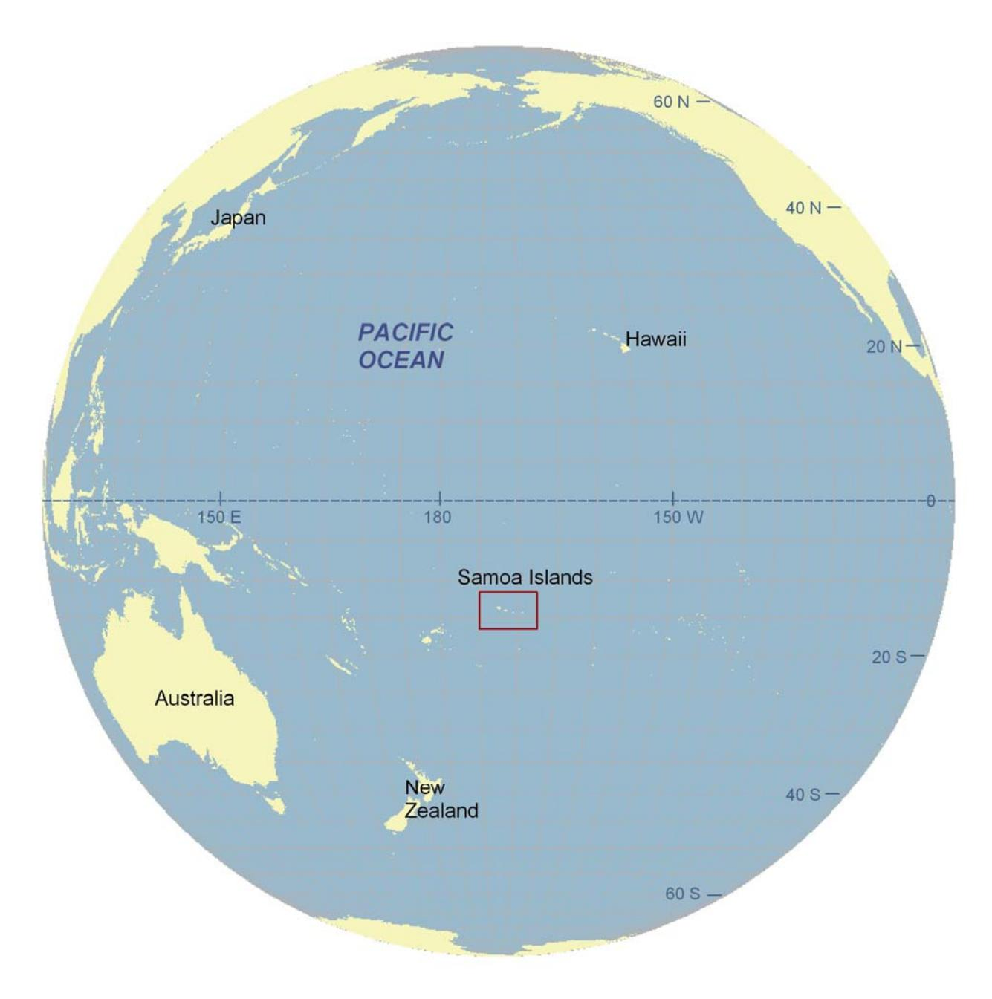

Figure 1. Location of Samoa Islands in the South Pacific Ocean: http://www.nps.gov/npsa/pphtml/maps.html

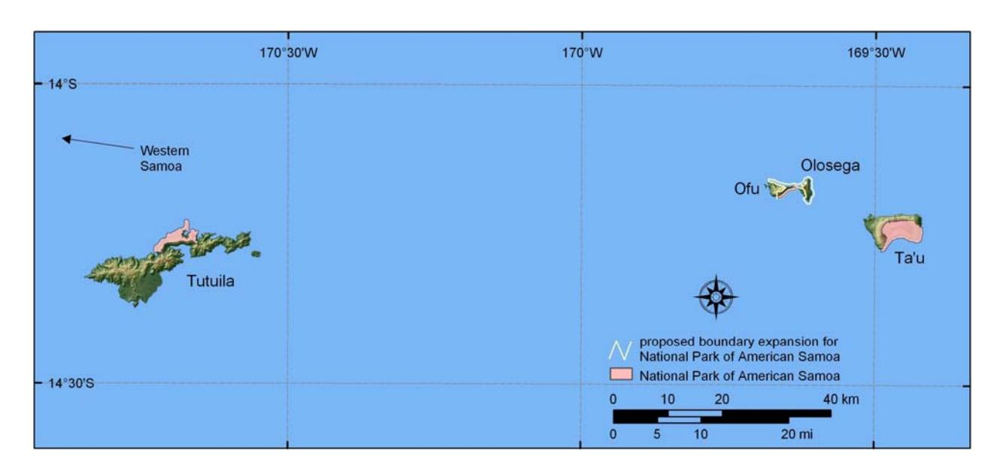

Figure 2. Location of National Park of American Samoa. A) Tutuila Island and B) Ofu, Olesega, and Ta'u (Manu'a Islands).

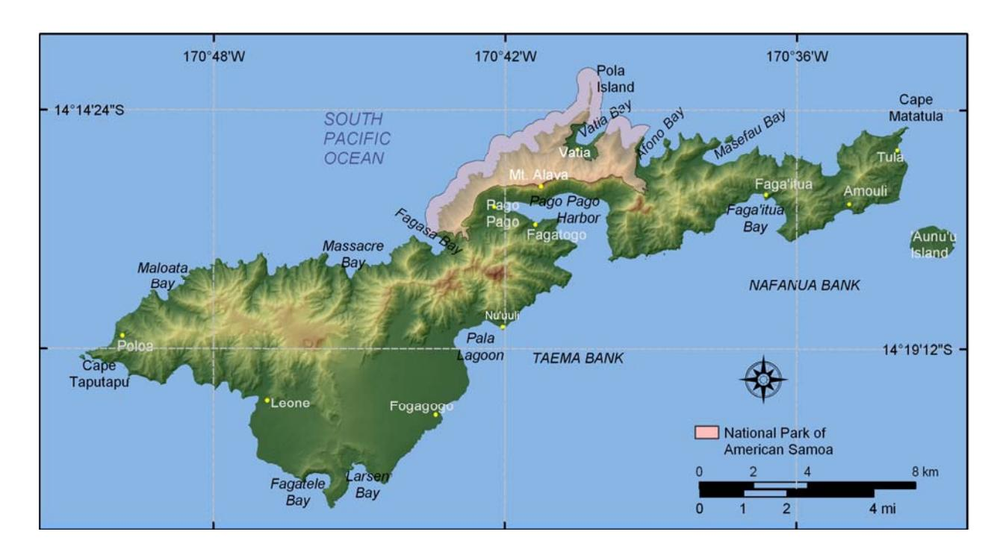

Figure 2A. Location of Tutuila Island.

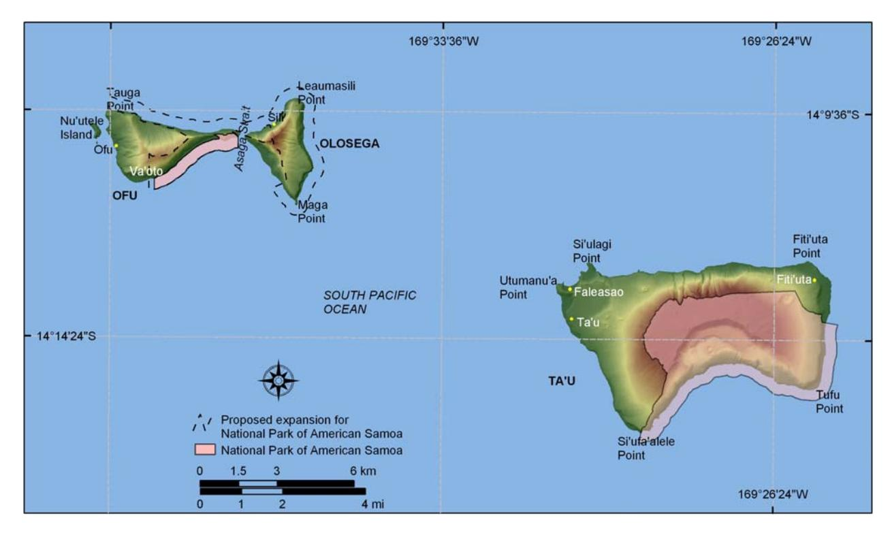

Figure 2B. Location of Ofu, Olesega, and Ta'u (Manu'a Islands).

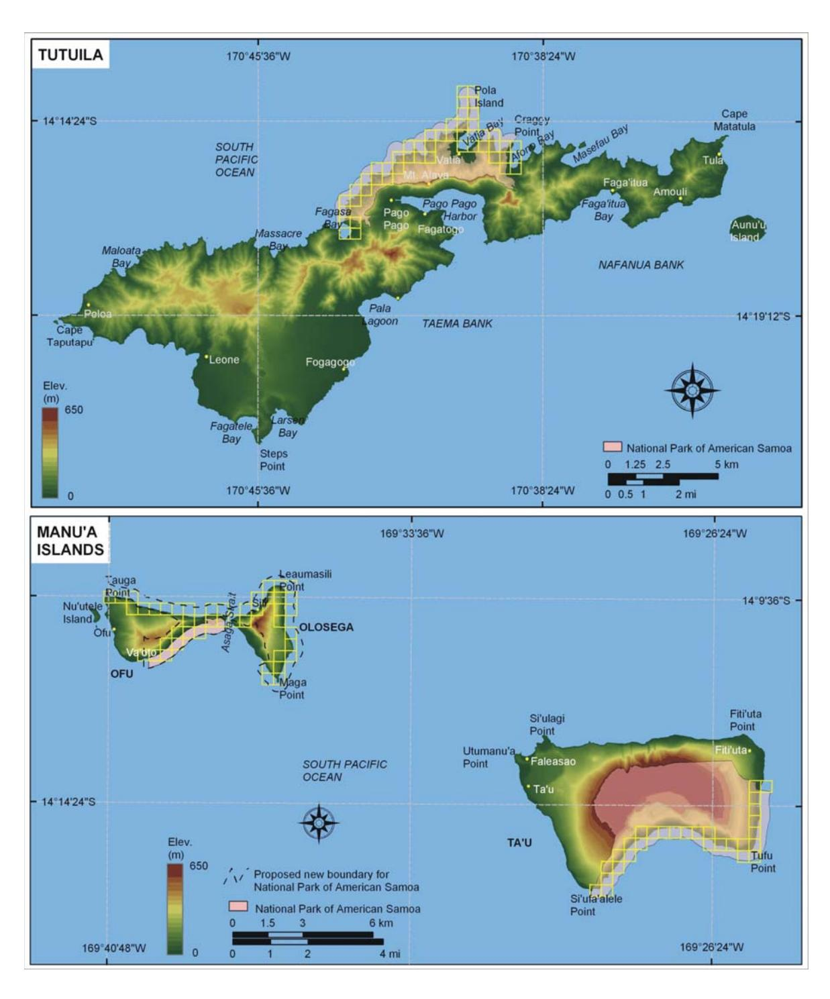

Figures 3. Shoreline grid for National Park of American Samoa. Each cell is approximately 500 meters of shoreline and represents a shoreline segment for which each variable is defined.

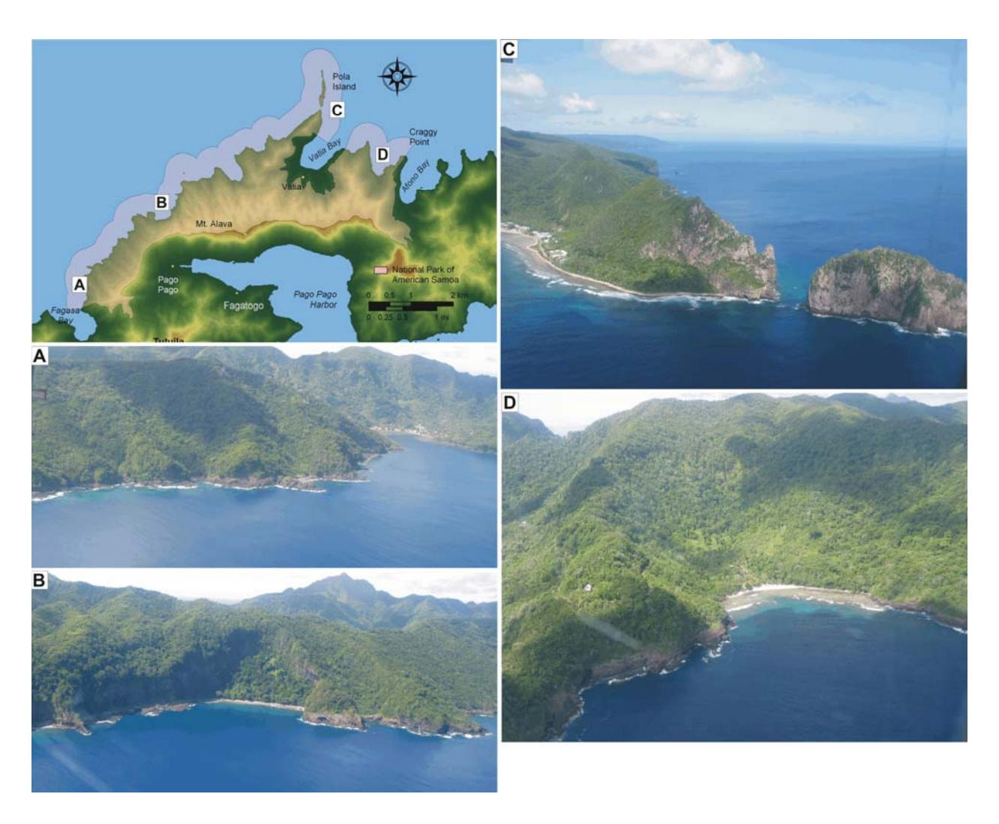

Figure 4. Photographs of geomorphic features on Tutuila in the National Park of American Samoa. The map at the top left is showing the locations of photos A - D. A) A view of the rocky coast north of Fagasa Bay; vulnerability is low to very low. B) A slope failure is noticeable in the center of the photo, the alluvium (center) is ranked as moderate vulnerability and the surrounding cliffs are low vulnerability. C) Pola Island was ranked as very low vulnerability while the mainland is moderate vulnerability due to the presence of fringing coral reef. D) The small embayment between Vatia and Afono Bay is ranked as moderate vulnerability, while the surrounding cliffs are low to very low vulnerability.

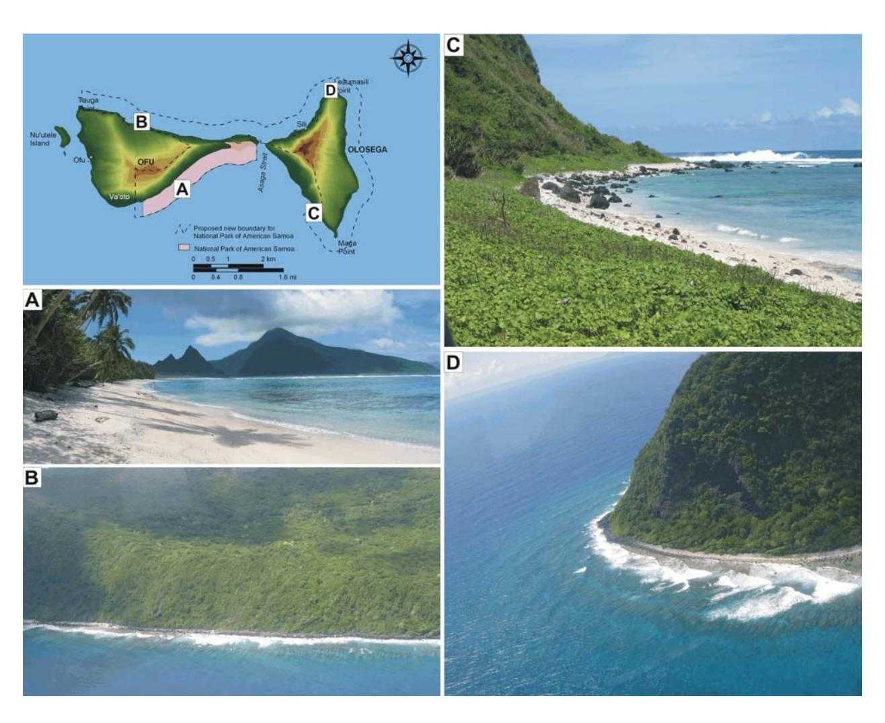

Figure 5. Photographs of geomorphologic features on Ofu and Olosega in National Park of American Samoa. The map at the top left is showing the locations of photos A - D. A) A view of the carbonate sand beach on the south side of Ofu; vulnerability is ranked as very high. B) The beach along the north coast contains more rubble and rock than the south coast, therefore ranked somewhat lower as high vulnerability. C) A coral rubble and rock beach along the southwest side of Olosega, high vulnerability. D) Leaumasili Point transitions from low vulnerability cliffs on the east side (left) of Olosega to high vulnerability beach (right).

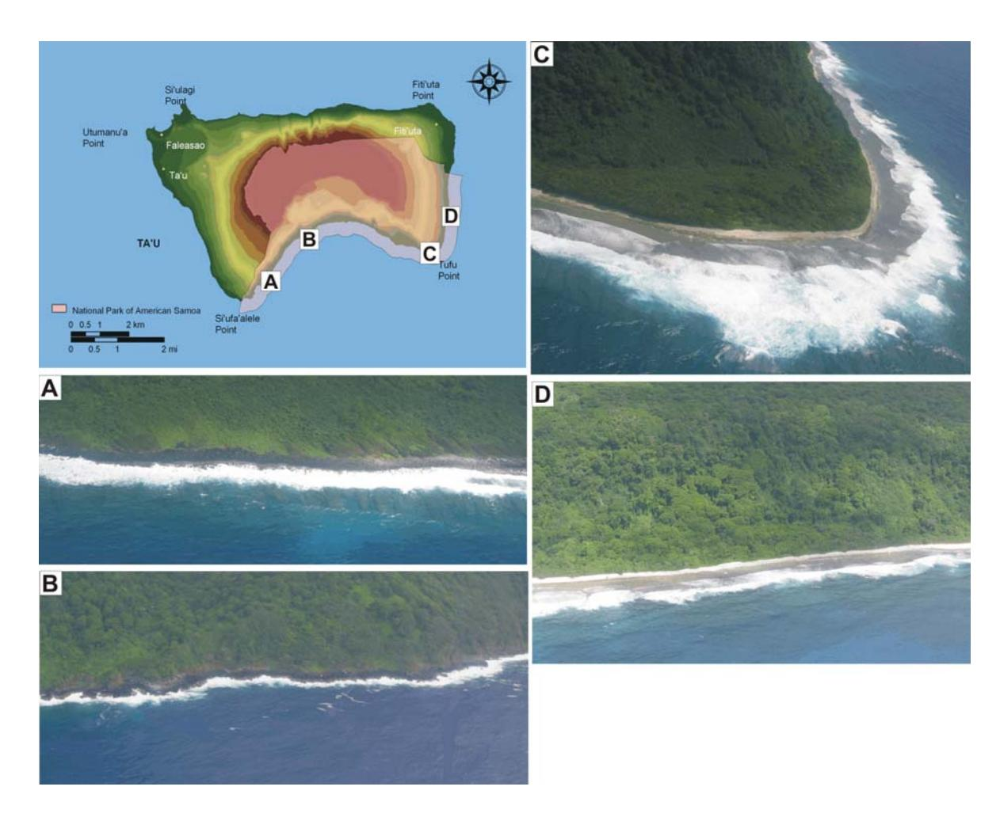

Figure 6. Photographs of geomorphologic features on Ta'u in National Park of American Samoa. The map at the top left is showing the locations of photos A - D. A) This photo shows the transition from low vulnerability cliff (left) to moderate vulnerability alluvium coast (right) just north of Si'ufa'aelele Point. The coral reef becomes more prominent along the moderately ranked section of shoreline. B) Photograph of low vulnerability cliffs in an area lacking a fringing coral reef. C) The beach at Tufu Point is ranked as high vulnerability because of the presence of beach rock. D) A high vulnerability beach along the east side of Ta'u.

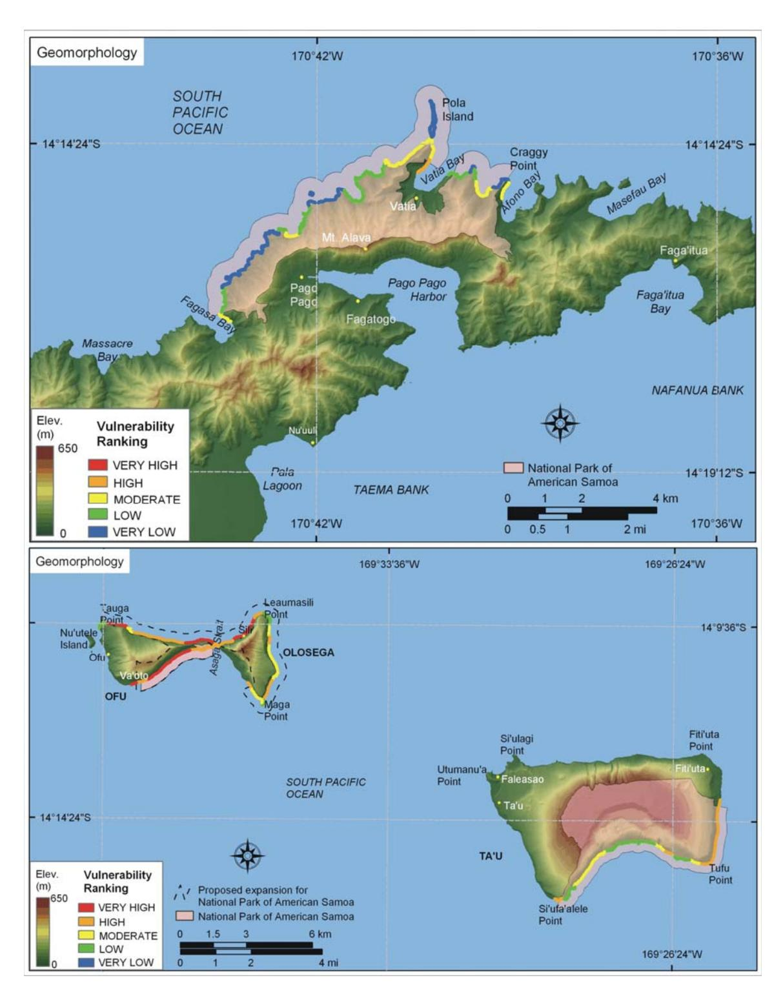

Figure 7. Vulnerability ranking for coastal geomorphology within the National Park of American Samoa. The colored shoreline represents the variations in coastal geomorphic within the park. The National Park of American Samoa consists of several geomorphology types, including very high vulnerability carbonate sand beaches, high vulnerability rubble to cobble shoreline skirted by fringing reef, moderate vulnerability alluvium and narrow fringing reef with cliffs, and low and very low vulnerability rock cliffs.

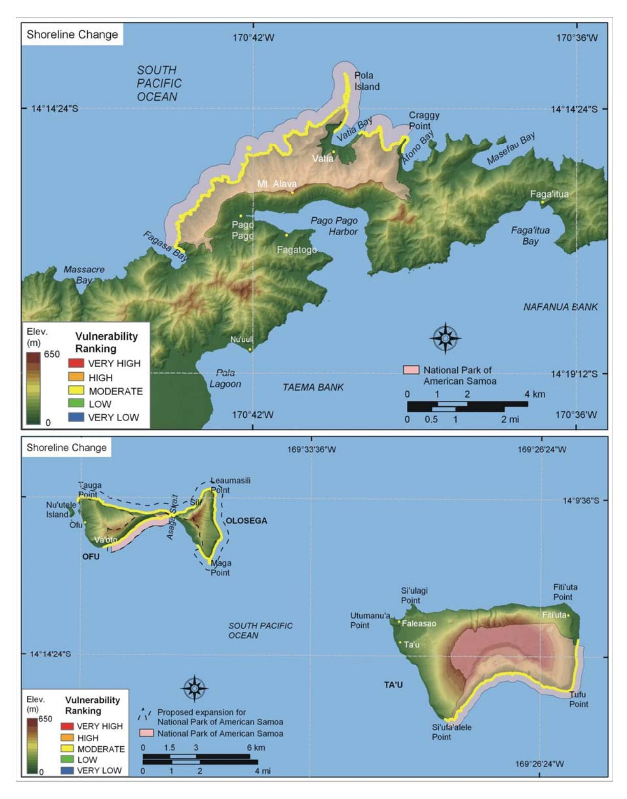

Figure 8. Vulnerability ranking for shoreline change rates for the National Park of American Samoa. The colored shoreline represents the estimated rate of shoreline erosion or accretion. All of National Park of American Samoa is ranked as moderate vulnerability (-1m/yr - +1m/yr) with respect to shoreline change.

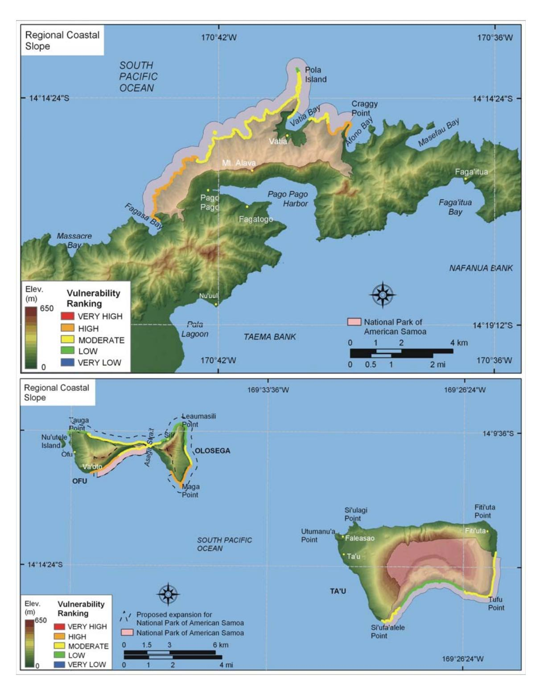

Figure 9. Vulnerability ranking for regional coastal slope of the National Park of American Samoa. The colored shoreline represents the regional slope of the land, 2 km landward and seaward of the shoreline. The low vulnerability areas with respect to coastal slope are primarily concentrated on Ta'u. Tutuila is moderate to high vulnerability, and Ofu and Olosega are mostly moderate to high vulnerability with a small area of low vulnerability along the north coast.

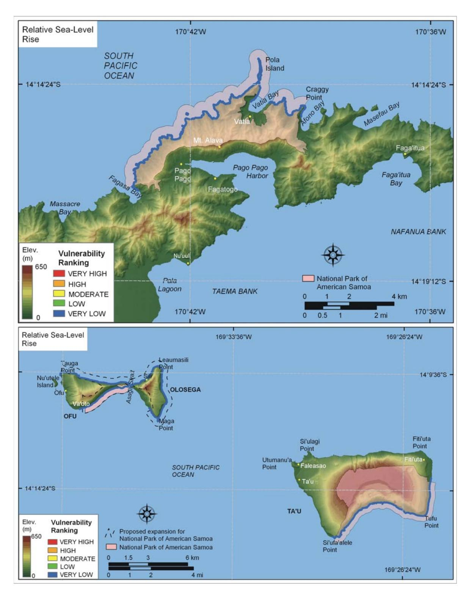

Figure 10. Vulnerability ranking for the rate of relative sea-level rise for the National Park of American Samoa. The colored shoreline represents the ranked rate of rise for Pago Pago. All of National Park of American Samoa is ranked as very low vulnerability with respect to relative sea-level rise.

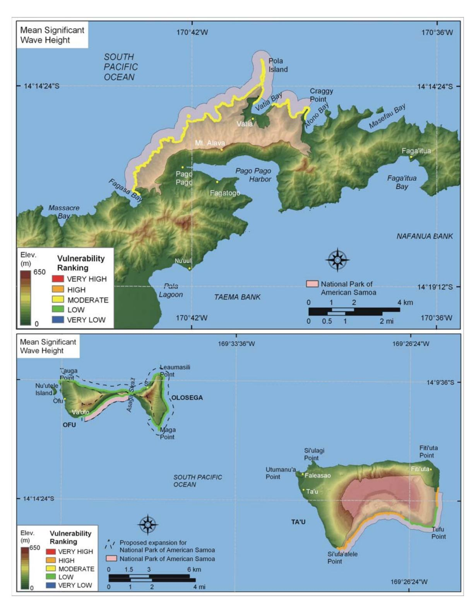

Figure 11. Vulnerability ranking for mean significant wave heights for the National Park of American Samoa based on World Wave Atlas data. The colored shoreline represents the mean significant wave heights within the park. Waves are largest along the south and southeast facing coasts (high vulnerability), although areas with fringing coral reef experience low vulnerability wave heights at the shoreline (e.g. Ofu and Olosega).

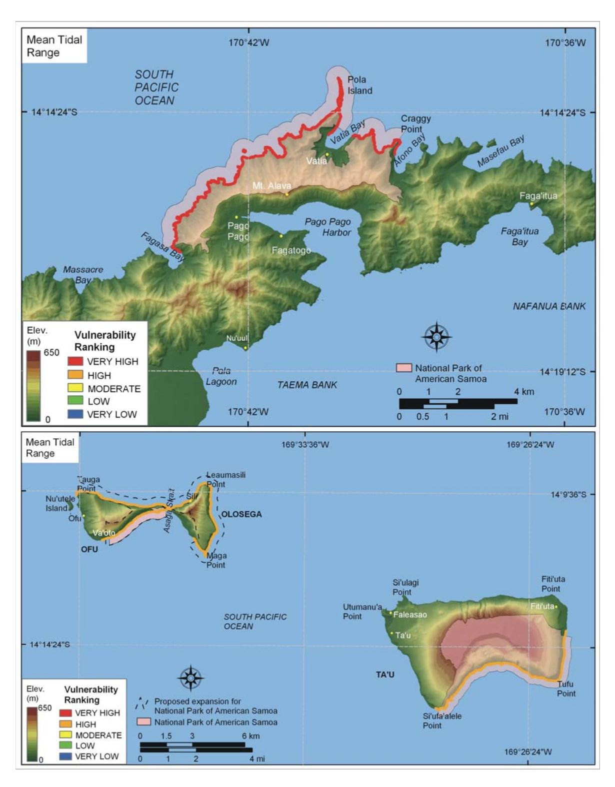

Figure 12. Vulnerability ranking for mean tidal range in the National Park of American Samoa. The colored shoreline represents the ranked mean tidal range for Tutuila and the Manu'a Islands. Tutuila is very high vulnerability (< 1 m) and the Manu'a Islands are high vulnerability (1 - 2 m).

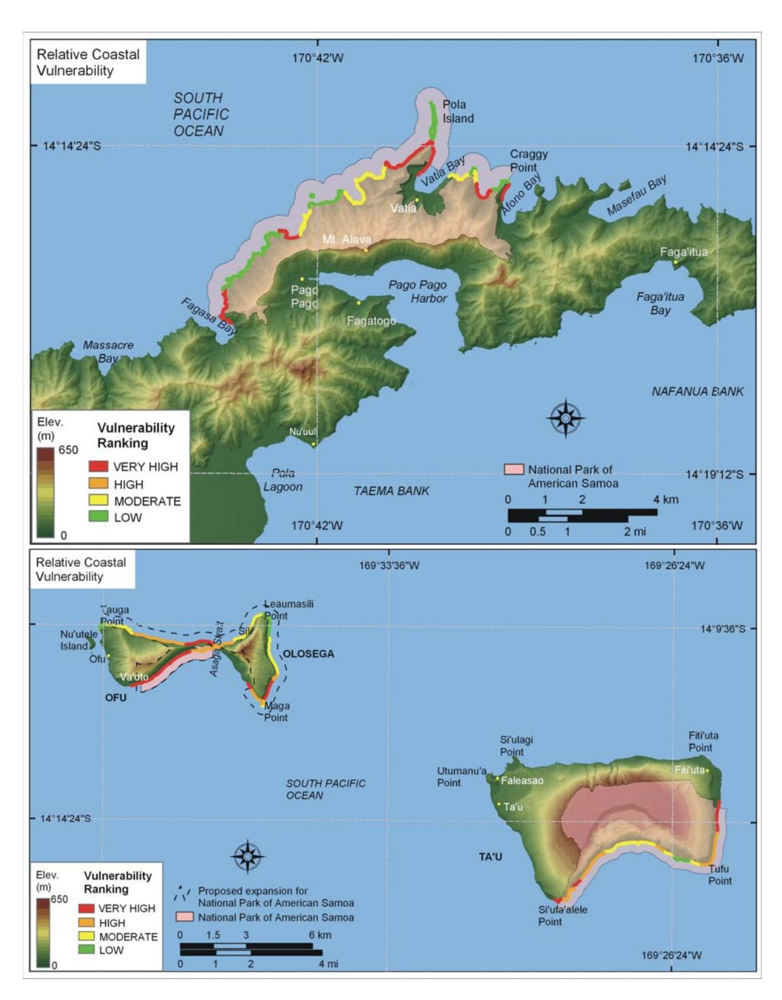

Figure 13. Relative Coastal Vulnerability ranking for National Park of American Samoa. The colored shoreline represents the relative coastal vulnerability index (CVI) determined from the six variables. The very high vulnerability shoreline is located along unconsolidated segments of shoreline, within embayments, and where wide fringing reef is present. High vulnerability shoreline is present on Ta'u and along the north coast of Ofu and Olosega where narrow fringing reef is present. Low vulnerability shoreline is primarily located along rock cliff coastline where coral is absent.

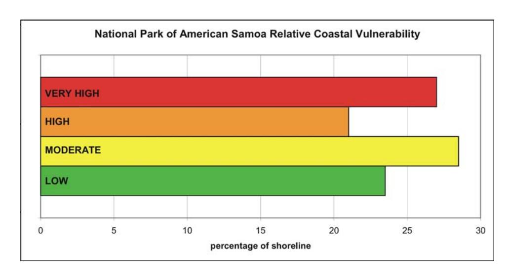

Figure 14. Percentage of the National Park of American Samoa shoreline in each CVI category.

Table 1. Ranges for Vulnerability Ranking of Variables on the US Pacific Coast

|                                        | Very Low                              | Low                                  | Moderate                                         | High                               | Very High                                                                                 |
|----------------------------------------|---------------------------------------|--------------------------------------|--------------------------------------------------|------------------------------------|-------------------------------------------------------------------------------------------|
| Variables                              | 1                                     | 2                                    | 3                                                | 4                                  | 5                                                                                         |
| GEOMORPHOLOGY                          | Rocky cliffed coasts, Fjords | Medium cliffs, Indented coasts | Low cliffs, Glacial drift, Alluvial plains | Cobble Beaches, Estuary, Lagoon | Barrier beaches, Sand beaches, Salt marsh, Mud flats, Deltas, Mangrove, Coral reefs |
| SHORELINE EROSION/ ACCRETION (m/yr) | > 2.0                                 | 1.0 - 2.0                            | -1.0 - 1.0                                       | -2.01.0                            | < -2.0                                                                                    |
| COASTAL SLOPE (%)                      | > 14.70                               | 10.90 - 14.69                        | 7.75 - 10.89                                     | 4.60 - 7.74                        | < 4.59                                                                                    |
| RELATIVE SEA-LEVEL CHANGE (mm/yr)   | < 1.8                                 | 1.8 - 2.5                            | 2.5 - 3.0                                        | 3.0 - 3.4                          | > 3.4                                                                                     |
| MEAN WAVE HEIGHT (m)                   | < 1.1                                 | 1.1 -2.0                             | 2.01 - 2.25                                      | 2.26 - 2.6                         | > 2.6                                                                                     |
| MEAN TIDE RANGE (m)                    | > 6.0                                 | 4.0 - 6.0                            | 2.0 - 4.0                                        | 1.0 - 2.0                          | < 1.0                                                                                     |

| Variables                                | Source                                                                                                                                                                                                                                                                                              | URL (Not all sources are downloadable)                                                                                 |  |  |  |
|------------------------------------------|-----------------------------------------------------------------------------------------------------------------------------------------------------------------------------------------------------------------------------------------------------------------------------------------------------|---------------------------------------------------------------------------------------------------------------------------|--|--|--|
| GEOMORPHOLOGY                            | 1) Habitat maps produced by NOAA's Biogeography Program 2) USGS open file report 95-512: Tutuila, American Samoa Coastal Resource Inventory Sites: Reconnaissance Shoreline Geology (Richmond, 1995) 3) Oblique aerials photographs obtained during field research | http://biogeo.nos.noaa.gov/projects/mapping/pacific/territories/data/                                                     |  |  |  |
| SHORELINE EROSION/ACCRETION (m/yr) | Qualitative analysis of oblique aerial photos of the park shoreline                                                                                                                                                                                                                           | None available                                                                                                            |  |  |  |
| COASTAL SLOPE (%)                        | 1) NGDC ETOPO2 Global 2' Elevations and 2) Digital Elevation models produced by NOAA's Biogeography Program                                                                                                                                                                             | http://biogeo.nos.noaa.gov/projects/mapping/pacific/territories/data/ http://www.ngdc.noaa.gov/mgg/fliers/01mgg04.html |  |  |  |
| RELATIVE SEA-LEVEL CHANGE (mm/yr)     | NOAA Technical Report NOS CO-OPS 36 SEA LEVEL VARIATIONS OF THE UNITED STATES 1854-1999 (Zervas, 2001)                                                                                                                                                                                  | http://www.co-ops.nos.noaa.gov/publications/techrpt36doc.pdf                                                              |  |  |  |
| MEAN WAVE HEIGHT (m)                  | Oceanor's World Wave Atlas combined with reef extent data from the Fagatele Bay National Marine Sanctuary GIS Data Archive                                                                                                                                                           | http://www.oceanor.no/products/software/wwa/ http://dusk.geo.orst.edu/djl/samoa/#geol                                  |  |  |  |
| MEAN TIDE RANGE (m)                      | NOAA/NOS CO-OPS Historical Water Level Station Index                                                                                                                                                                                                                                          | http://www.co-ops.nos.noaa.gov/usmap.html                                                                                 |  |  |  |