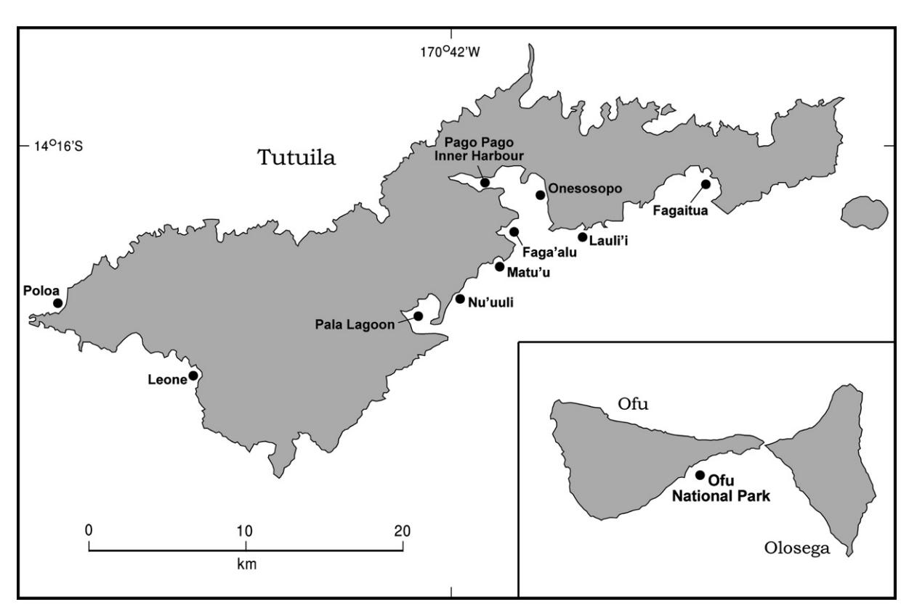

Available online at www.sciencedirect.com

**CHEMOSPHERE** 

Chemosphere xxx (2007) xxx-xxx

www.elsevier.com/locate/chemosphere

# Arsenic speciation in marine fish and shellfish from American Samoa

Peter J. Peshut a,b,\*, R. John Morrison Barbara A. Brooks c

American Samoa Environmental Protection Agency, P.O. Box PPA, Utulei Office Building, Pago Pago, AS 96799, United States
School of Earth and Environmental Sciences, University of Wollongong, Australia
Hawaii Department of Health, Honolulu, United States

Received 28 April 2007; received in revised form 28 September 2007; accepted 9 October 2007

#### **Abstract**

We speciated arsenic compounds in marine fish and shellfish from two islands of the United States Territory of American Samoa in the South Pacific, and found that inorganic arsenic occurred as a minor fraction. The proportion of inorganic arsenic was generally far below the levels of prevailing assumptions typically used in human health risk assessments when only total arsenic is analysed. Fish and shellfish were collected from Tutuila and Ofu between May 2001 and March 2002 (n = 383 individual specimens, with 117 composites); sites were selected based on habitat type and were representative of those frequented by local fishers. These islands have moderately developed reef fish fisheries among artisanal fishers, are far removed from any industrial or mining sources of arsenic, and presented an opportunity to study arsenic variations in marine biota from un-impacted environments. Target species were from various trophic levels and are among those frequently harvested for human consumption. We found evidence that arsenic concentrated in some marine species, but did not tend to follow classic trophic patterns for biomagnification or bioaccumulation. For the majority of samples, inorganic arsenic was less than 0.5% of total arsenic, with only a few samples in the range of 1–5%, the latter being mollusks which are recognized to have unusually high arsenic levels in general. This work supports the importance of speciation analysis for arsenic, because of the ubiquitous occurrence of arsenic in the environment, and its variable toxicity depending on chemical form.

Keywords: Toxicity; Speciation analysis; Risk assessment; Fish advisory

### 1. Introduction

Arsenic is the 20th most abundant element in the Earth's crust, and is primarily associated with igneous and sedimentary rocks where it occurs mostly as inorganic forms at an average concentration of 2–5 mg kg-1 (Tamaki and Frankenberger, 1992). Arsenic is ubiquitous in the global environment and occurs at low background levels in all environmental media. Despite being recognised early as a poison, arsenic has been widely used by humans since ancient times (Azcue and Nriagu, 1994; Gorby, 1994; Feld-

0045-6535/\$ - see front matter © 2007 Elsevier Ltd. All rights reserved. doi:10.1016/j.chemosphere.2007.10.014

man, 2001). It is used in the manufacture of glassware, metal alloys, microelectronics, agricultural pesticides, and wood preservatives. It is released through mineral processing and fossil fuel combustion. Arsenic is also mobilized naturally through volcanic, geothermal and microbiological processes, and by weathering of crustal rocks. Buat-Menard et al. (1987) estimated that anthropogenic activities release around 30000 tonnes of arsenic to the atmosphere each year. A more recent review (Matschullat, 2000) estimates that the total anthropogenic and natural releases to the global environment are considerably higher. In many locations, environmental concentrations are high enough to pose serious human health concerns. Examples include groundwater contamination in Bangladesh (Anawar et al., 2002), West Bengal (Mazumder et al., 2000), and the black-foot disease area of Taiwan (Chen et al., 1994; Chiou et al., 1995), and coastal marine pollution near

\* Corresponding author. Address: American Samoa Environmental Protection Agency, P.O. Box PPA, Utulei Office Bldg., Pago Pago, AS 96799, United States. Tel.: +1 684 633 2304; fax: +1 684 633 5801. E-mail address: pip617@uow.edu.au (P.J. Peshut).

sites of mining and mineral processing ([Azcue and Nriagu,](#page-7-0) [1994\)](#page-7-0). The toxic effects of arsenic depend on oxidation state, chemical species, exposure and dose, solubility in the biological media, and rate of excretion. Chemical form is the principal factor for determining human health risks from exposure to arsenic ([Phillips, 1990; Yokel et al.,](#page-7-0) [2006\)](#page-7-0).

Although arsenic can occur in the environment in several oxidation states, the chemical forms normally encountered are not particularly toxic to aquatic organisms [\(Moore, 1991\)](#page-7-0). Among the commonly encountered forms inorganic trivalent arsenite is more mobile, more soluble, and some 50 times more toxic than pentavalent inorganic arsenate, and several hundred times more toxic than monomethylarsonic acid (MMA) and dimethylarsinic acid (DMA) ([Jain and Ali, 2000\)](#page-7-0). Some other organo-arsenicals, such as arsenobetaine, arsenoribosides, and arsenocholine are effectively non-toxic [\(Shrain et al., 1999](#page-7-0)). The chemical form of arsenic depends on many geochemical and biochemical processes, and arsenic species in environmental media vary widely depending on organism, media, and geographic location [\(Cullen and Reimer, 1989; Matsc](#page-7-0)[hullat, 2000; Mandal and Suzuki, 2002](#page-7-0)). Because of this variability, arsenic toxicity towards humans is not accurately assessed when analyses are limited to total arsenic alone ([ATSDR, 2000; US EPA, 2000; Yokel et al., 2006;](#page-7-0) [Greene and Crecelius, 2006\)](#page-7-0). We note that the use of assumptions to define the toxic fraction for arsenic can be excessively conservative, and could lead to inappropriate public health determinations or unnecessary government regulatory actions.

For human health risk assessments, speciation analysis for arsenic compounds is necessary to determine the toxic and non-toxic fractions in the media of concern. Here, we analysed inorganic and total arsenic in marine fish and shellfish, and found that the former occurs generally as a minor fraction, far below the levels of prevailing assumptions often used in risk assessments when only total arsenic is analysed. Given the varied forms and toxicities for this common element, our results support the importance of speciation analysis for risk assessments for arsenic exposure from marine biota.

## 2. Methods

The work was undertaken on two islands of the United States Territory of American Samoa, a group of volcanic islands and coral atolls (total land area 200 km2 ) in the remote South Pacific. The volcanic island of Tutuila (135 km2 , pop. 60 000) is the centre of government and commerce, and was selected to represent remote islands with significant population density and economic development. Other islands in this group are small and sparsely populated, or uninhabited. The volcanic island of Ofu (8 km2 , pop. 200), located 110 km east of Tutuila, was selected as representative of remote islands with small populations and little development. Tutuila and Ofu have moderately developed reef fish fisheries among artisanal fishers, though the number of fishers is small in proportion to population. These islands are far removed from any industrial or mining sources of arsenic, and presented an opportunity to study arsenic variations in marine biota from un-impacted environments. The work was part of a seafood toxicity study (not reported here) completed by the American Samoa Environmental Protection Agency (ASEPA) that determined if consumption advisories were warranted for the archipelago.

Fish and shellfish were collected from 10 locations on Tutuila and one location on Ofu between May 2001 and March 2002 ([Fig. 1\)](#page-2-0). Sites were selected based on habitat type (high island fringing coral reef, or sheltered marine bay with no reef). Fringing reefs on exposed coasts are the most common marine habitat of American Samoa, and are where all reef gleaning and most fishing occurs. Target species were collected from eight coastal locations on Tutuila, and from one coastal location on Ofu. There are few sheltered bays in the archipelago and sheltered sites were limited to Tutuila. These included Pago Pago Inner Harbour and Pala Lagoon. The Inner Harbour is currently under a fish advisory by the ASEPA and was selected to expand on previous data on toxicity. Pala Lagoon was selected because it is a shallow sea bay with limited flushing by coastal water. There is extensive residential and commercial development in watersheds of the Lagoon and Inner Harbour, and there is potential that accumulated terrigenous sediments are a sink and source for contaminants in aquatic biota. All coastal and bay sites were representative of those frequented by local fishers. Target species were from various trophic levels and are among those frequently harvested for human consumption.

For coastal sites, the holocentrid Sargocentron spp. (squirrelfish, malau in Samoan), and Panulirus sp. (reef lobster, ula) were the target organisms. For fish, 18–30 specimens were collected from each location and composited for analyses. Three composites were prepared for whole fish, and three for muscle tissue. Each composite contained three to five individual fish. To the extent possible, the fish in each composite were of similar size. For lobster, three individuals of Panulirus were collected from each location, except for Onesosopo, where two Panulirus and one Parribacus (slipper lobster) were collected. Lobsters were analysed individually due to limited availability. In addition to squirrelfish and lobster, the Ofu site included three composites of muscle tissue for Acanthurus lineatus (lined surgeonfish, alogo). The surgeonfish were not a target species for arsenic, but the composites were inadvertently analysed so these data were included in the data set.

For sheltered bay sites, composites were prepared the same as for coastal sites, except that shellfish composites were limited to whole fish. Target species for Pago Pago Inner Harbour included Asaphis violascens (clam, pipi), Caranx papuensis (brassy trevally, malaulie), Megalaspis cordyla (torpedo scad, atualo), and Mugilidae spp. (mullet, anae). For Pala Lagoon, target species were the

Fig. 1. Fish and shellfish collection sites on American Samoa

mugilids, A. violascens, and a shore crab (pa'a). The crabs were not identified due to a lack of available expertise for marine invertebrates. However, it was assumed that all crabs belonged to the same family, and it is highly probable that all specimens belonged to the same species (morphologically identical and occupying identical habitat).

Where necessary, species complexes were used for composites. This was primarily due to limited abundance, given that diversity on coral reefs is high but abundance may be low for some groups (Birkeland, 1997). Several genera and many species of holocentrids occur in American Samoa waters, and other family groups such as the mugilids are similar in this regard (Wass, 1984; Myers, 1991; Randall, 2005).

In the field, fish and shellfish were collected by hand, dip net, hook and line, and spear. Specimens were measured at collection (standard length for fish, carapace length/width for lobster/crab, and greatest shell dimension for clams). All specimens were immediately double wrapped in heavy-duty aluminium foil after body measurements were taken. *Asaphis* were immediately rinsed in native marine water and all epiphytic growth and debris were removed from the shell with a small stainless steel brush. *Asaphis* were held in clean seawater for 6 h immediately after collection to facilitate depuration. Data labels were prepared for each individual specimen and labels and foil-wrapped specimens were placed in zip-seal type

plastic bags. Bagged specimens were immediately placed on ice and transported to freezer storage within 4 h after collection. For *Asaphis*, wrapping, labelling, and freezing followed the depuration period. Specimens were stored frozen at -20 °C in American Samoa until transport to the analytical laboratory.

Arsenic was analysed by a commercial laboratory that specializes in marine metals chemistry (Battelle Pacific Northwest Laboratories, Washington, USA). For transport to the lab, frozen specimens were packed on ice in heavy-duty polypropylene coolers and sent via over-night air-freight (trans-shipped through Honolulu). Specimens remained frozen throughout the transport period. Chain-of-custody discipline was maintained, and all samples were maintained within specified holding times.

At the laboratory, total arsenic was analysed by inductively coupled plasma mass spectrometry (US EPA, 1994) with an achieved detection limit of 0.0025  $\mu g \, g^{-1}$  wetweight. Inorganic arsenic was analysed by quartz furnace atomic absorption spectrometry (US EPA, 2001) with an achieved detection limit of 0.0091  $\mu g \, g^{-1}$  wet-weight. Fish muscle tissue included dorsal muscle without skin, whole fish included the entire fish with scales and viscera, and whole shellfish included all soft parts and body fluids without shell. Tissue samples were freeze-dried then ground in a ball mill for homogenization. For both total and inorganic arsenic analysis, 10 mL of 2 M NaOH was added to a 0.5 g representative aliquot of homogenized tissue in a 15 mL

Table 1 Recovery of arsenic from certified reference material (μg g-1 wet-weight)

| Reference material a | As (total) b | Certified value (range) | % Difference |
|---------------------------------|-------------------------|-------------------------|--------------|
| DORM-2 replicate 1              | 14.8                    | 18.0 (±1.10)            | 18           |
| DORM-2 replicate 2              | 14.8                    | $18.0 \ (\pm 1.10)$     | 18           |
| DORM-2 replicate 3              | 19.3                    | $18.0 \ (\pm 1.10)$     | 7            |
| DORM-2 replicate 4              | 18.0                    | $18.0 \ (\pm 1.10)$     | 0            |
| DORM-2 replicate 5              | 19.4                    | $18.0 \ (\pm 1.10)$     | 8            |

&lt;sup>a Dogfish muscle tissue; National Research Council of Canada, Marine Analytical Chemistry Standards.

plastic test tube, then while capped, heated overnight in an oven at 75–85 °C, and cooled prior to analysis. Inorganic arsenic included all NaBH4 reducible As3+ and As5+ found in the samples, but further speciation of the trivalent and pentavalent species was not completed.

All handling and analyses were performed in accordance with normal quality assurance programs. Quality assurance included laboratory duplicates, reference materials, matrix spikes (with duplicates), laboratory control samples, and method blanks. Recovery of total arsenic in reference materials is shown in Table 1. Blanks were analysed for each batch of analysis, with not more than 20 samples per run. Values for inorganic arsenic were blank corrected, due to the potential for arsenic contamination in reagents used for analyses, although the laboratory makes every effort to procure low-arsenic or arsenic-free reagents. Total arsenic was not blank corrected because all results were two orders of magnitude or more above the detection limit (DL) and blank correction would not significantly change results.

#### 3. Results

Arsenic concentrations in American Samoa target species per composite, by location, are summarized in Table 2. For comparison, arsenic data for biota from other tropical locations are presented in Table 3.

There was considerable variation of arsenic levels among organisms and media from American Samoa. Overall, values for total arsenic ranged from 0.235 to 98.2  $\mu$ g g-1, and from <DL-0.2438  $\mu$ g g-1 for the inorganic fraction, for 117 composites (n = 383 individual specimens), from 11 locations. Inorganic arsenic was below the DL for 80 of 117 composites. For composites where inorganic arsenic was measurable, concentrations ranged from 0.0096 to 0.2438  $\mu g g^{-1}$ , and comprised 0.01–37% of total arsenic. Disregarding the whole fish mullet anomaly (see below) the detectable inorganic fraction was 0.01-6.7% of total arsenic for 31 of 37 composites, and <1% of total arsenic for 22 of 37 composites. For composites where inorganic arsenic was below the DL, a potential maximum was calculated using the DL and the value for total arsenic. Of the 80 composites where inorganic arsenic was below the DL, all had calculated values <4%, and 65 of the 80 were <1%. Combining detectable inorganic arsenic

and calculated maximums, 87 of 117 composites had <1% inorganic arsenic as a fraction of total arsenic. Shell-fish composites accounted for most of the detected inorganic arsenic (25 of 31 composites) if the whole fish mullet anomaly is excluded from the data set.

As a group, lobster had the highest total arsenic of all species studied (19.8–98.2  $\mu g \, g^{-1}$ ) and the lowest measurable percentage of inorganic arsenic (0.01–0.20%). Inorganic arsenic in lobster ranged from <DL-0.0828  $\mu g \, g^{-1}$ , and was detected in 18 of 27 specimens. Lobsters accounted for about half of the composites where inorganic arsenic was above the DL (18 of 37). The other crustacean (crab) had considerably less total arsenic than lobster (0.527–1.93  $\mu g \, g^{-1}$ ) but was roughly comparable for inorganic arsenic (<DL-0.0126  $\mu g \, g^{-1}$ ).

After lobster, the squirrelfish had the next highest total arsenic, ranging from 0.235 to 60.0  $\mu g \, g^{-1}$ . There are some apparent outliers in the squirrelfish total arsenic data, with 49 of 54 composites within 2.11–19.6  $\mu g \, g^{-1}$ . For *C. papuensis* (trevally), total arsenic ranged from 0.277 to 0.935  $\mu g \, g^{-1}$ . Total arsenic for *M. cordyla* (scad) was higher than for trevally (1.17–2.53  $\mu g \, g^{-1}$ ) and lower than for squirrelfish (with one exception). Inorganic arsenic was below the DL for all trevally, all scad, and for all but 3 of 54 composites for squirrelfish. The fraction of inorganic arsenic (detectable and calculated maximum) in trevally, scad and squirrelfish was 0.05–<4.0% of total arsenic.

Total arsenic in the clam *A. violascens* was relatively low,  $1.26-5.90~\mu g~g^{-1}$ , being generally about one-twentieth that of the lobster, yet, clams from Pago Pago Inner Harbour had the highest inorganic arsenic of all species studied ( $0.2118-0.2438~\mu g~g^{-1}$ ). Clams from Pala Lagoon had about one-third to one-half the inorganic arsenic as those from the Inner Harbour,  $0.0711-0.1018~\mu g~g^{-1}$ , although the fraction of inorganic arsenic was similar for clams from these two sites (4-7%). These bivalves had the highest % fraction of inorganic arsenic if the whole mullet are excluded from the analysis.

Total arsenic in the mugilids was lower than the clams by one-half to nearly an order of magnitude (0.316–0.944  $\mu g \, g^{-1}$ , muscle tissue and whole fish, inclusive), which was amongst the lowest total arsenic overall. Inorganic arsenic in muscle tissue from the mullet was below the DL for five of six composites. In contrast, the whole mullet had the next highest inorganic arsenic after *Asaphis*, ranging from 0.0946 to 0.1818  $\mu g \, g^{-1}$  (10–37% of total arsenic), which appeared anomalously high compared to all other species, and might be explained by sediment or detritus in the gut. Whole mullet from Pala Lagoon had about twice the average percentage of inorganic arsenic as those from the Inner Harbour.

#### 4. Discussion

We found evidence that arsenic concentrated in some marine species, but did not tend to follow classic trophic

&lt;sup>b Certified value not available for inorganic arsenic.

#### P.J. Peshut et al. / Chemosphere xxx (2007) xxx–xxx 5

Table 2 Arsenic in fish and shellfish from American Samoa (lg g-1 wet-weight)

| Location          | Species composite              | Individuals/composite | Mediaa     | As           | As                                                             | As              |
|-------------------|--------------------------------|-----------------------|------------|--------------|----------------------------------------------------------------|-----------------|
|                   |                                |                       |            | (Total)      | (Inorganic)b                                                   | (Inorganic, %)c |
| Faga'alu          | Panulirus sp.                  | 1                     | WSF        | 46.3         | <dl< td=""><td>&lt;0.02</td></dl<>                             | <0.02           |
|                   | Panulirus sp.                  | 1                     | WSF        | 49.1         | 0.0130                                                         | 0.03            |
|                   | Panulirus sp.                  | 1                     | WSF        | 35.6         | 0.0303                                                         | 0.09            |
|                   | Sargocentron spp.              | 4                     | MT         | 0.270        | <dl< td=""><td>&lt;4.0</td></dl<>                              | <4.0            |
|                   | Sargocentron spp.              | 3                     | MT         | 0.235        | <dl< td=""><td>&lt;4.0</td></dl<>                              | <4.0            |
|                   | Sargocentron spp.              | 4                     | MT         | 0.257        | <dl< td=""><td>&lt;4.0</td></dl<>                              | <4.0            |
|                   | Sargocentron spp.              | 4                     | WF         | 7.96         | <dl< td=""><td>&lt;0.20</td></dl<>                             | <0.20           |
|                   | Sargocentron spp.              | 4                     | WF         | 5.77         | <dl< td=""><td>&lt;0.20</td></dl<>                             | <0.20           |
|                   | Sargocentron spp.              | 4                     | WF         | 6.32         | <dl< td=""><td>&lt;0.20</td></dl<>                             | <0.20           |
| Faga'itua         | Panulirus sp.                  | 1                     | WSF        | 48.5         | <dl< td=""><td>&lt;0.02</td></dl<>                             | <0.02           |
|                   | Panulirus sp.                  | 1                     | WSF        | 53.3         | 0.0319                                                         | 0.06            |
|                   | Panulirus sp.                  | 1                     | WSF        | 21.5         | <dl< td=""><td>&lt;0.05</td></dl<>                             | <0.05           |
|                   | Sargocentron spp.              | 5                     | MT         | 6.53         | 0.0258                                                         | 0.39            |
|                   |                                |                       |            |              |                                                                |                 |
|                   | Sargocentron spp.              | 5                     | MT         | 15.3         | 0.0258                                                         | 0.17            |
|                   | Sargocentron spp.              | 5                     | MT         | 7.91         | <dl< td=""><td>&lt;0.20</td></dl<>                             | <0.20           |
|                   | Sargocentron spp.              | 5                     | WF         | 4.03         | 0.0195                                                         | 0.48            |
|                   | Sargocentron spp.              | 5                     | WF         | 4.11         | <dl< td=""><td>&lt;0.30</td></dl<>                             | <0.30           |
|                   | Sargocentron spp.              | 5                     | WF         | 9.84         | <dl< td=""><td>&lt;0.10</td></dl<>                             | <0.10           |
| Lauli'i           | Panulirus sp.                  | 1                     | WSF        | 30.4         | 0.0096                                                         | 0.03            |
|                   | Panulirus sp.                  | 1                     | WSF        | 81.7         | 0.0119                                                         | 0.01            |
|                   | Panulirus sp.                  | 1                     | WSF        | 19.8         | <dl< td=""><td>&lt;0.05</td></dl<>                             | <0.05           |
|                   | Sargocentron spp.              | 5                     | MT         | 18.3         | <dl< td=""><td>&lt;0.05</td></dl<>                             | <0.05           |
|                   | Sargocentron spp.              | 5                     | MT         | 18.7         | <dl< td=""><td>&lt;0.05</td></dl<>                             | <0.05           |
|                   | Sargocentron spp.              | 5                     | MT         | 16.9         | <dl< td=""><td>&lt;0.10</td></dl<>                             | <0.10           |
|                   | Sargocentron spp.              | 5                     | WF         | 11.9         | <dl< td=""><td>&lt;0.10</td></dl<>                             | <0.10           |
|                   | Sargocentron spp.              | 5                     | WF         | 10.0         | <dl< td=""><td>&lt;0.10</td></dl<>                             | <0.10           |
|                   | Sargocentron spp.              | 5                     | WF         | 7.85         | <dl< td=""><td>&lt;0.20</td></dl<>                             | <0.20           |
| Leone             | Panulirus sp.                  | 1                     | WSF        | 89.7         | 0.0419                                                         | 0.05            |
|                   | Panulirus sp.                  | 1                     | WSF        | 81.9         | 0.0315                                                         | 0.04            |
|                   | Panulirus sp.                  | 1                     | WSF        | 95.9         | 0.0226                                                         | 0.02            |
|                   | Sargocentron spp.              | 5                     | MT         | 6.13         | <dl< td=""><td>&lt;0.20</td></dl<>                             | <0.20           |
|                   | Sargocentron spp.              | 5                     | MT         | 7.29         | <dl< td=""><td>&lt;0.20</td></dl<>                             | <0.20           |
|                   | Sargocentron spp.              | 5                     | MT         | 11.5         | <dl< td=""><td>&lt;0.10</td></dl<>                             | <0.10           |
|                   | Sargocentron spp.              | 3                     | WF         | 4.19         | <dl< td=""><td>&lt;0.30</td></dl<>                             | <0.30           |
|                   | Sargocentron spp.              | 3                     | WF         | 5.65         | <dl< td=""><td>&lt;0.20</td></dl<>                             | <0.20           |
|                   | Sargocentron spp.              | 3                     | WF         | 4.96         | <dl< td=""><td>&lt;0.20</td></dl<>                             | <0.20           |
|                   |                                |                       |            |              |                                                                |                 |
| Matu'u            | Panulirus sp.                  | 1                     | WSF        | 79.3         | 0.0172                                                         | 0.02            |
|                   | Panulirus sp.                  | 1                     | WSF        | 27.0         | 0.0170                                                         | 0.06            |
|                   | Panulirus sp.                  | 1                     | WSF        | 38.4         | 0.0097                                                         | 0.03            |
|                   | Sargocentron spp.              | 5                     | MT         | 12.1         | <dl< td=""><td>&lt;0.10</td></dl<>                             | <0.10           |
|                   | Sargocentron spp.              | 5                     | MT         | 14.4         | <dl< td=""><td>&lt;0.10</td></dl<>                             | <0.10           |
|                   | Sargocentron spp.              | 5                     | MT         | 14.2         | <dl< td=""><td>&lt;0.10</td></dl<>                             | <0.10           |
|                   | Sargocentron spp.              | 4                     | WF         | 5.46         | <dl< td=""><td>&lt;0.20</td></dl<>                             | <0.20           |
|                   | Sargocentron spp.              | 4                     | WF         | 7.21         | <dl< td=""><td>&lt;0.20</td></dl<>                             | <0.20           |
|                   | Sargocentron spp.              | 4                     | WF         | 60.0         | <dl< td=""><td>&lt;0.02</td></dl<>                             | <0.02           |
| Nu'uuli           | Panulirus sp.                  | 1                     | WSF        | 55.2         | 0.0423                                                         | 0.08            |
|                   | Panulirus sp.                  | 1                     | WSF        | 40.6         | 0.0828                                                         | 0.20            |
|                   | Panulirus sp.                  | 1                     | WSF        | 38.1         | <dl< td=""><td>&lt;0.03</td></dl<>                             | <0.03           |
|                   | Sargocentron spp.              | 3                     | MT         | 7.47         | <dl< td=""><td>&lt;0.20</td></dl<>                             | <0.20           |
|                   | Sargocentron spp.              | 3                     | MT         | 11.6         | <dl< td=""><td>&lt;0.10</td></dl<>                             | <0.10           |
|                   | Sargocentron spp.              | 3                     | MT         | 10.4         | <dl< td=""><td>&lt;0.10</td></dl<>                             | <0.10           |
|                   | Sargocentron spp.              | 3                     | WF         | 7.86         | <dl< td=""><td>&lt;0.20</td></dl<>                             | <0.20           |
|                   | Sargocentron spp.              | 3                     | WF         | 5.26         | <dl< td=""><td>&lt;0.20</td></dl<>                             | <0.20           |
|                   | Sargocentron spp.              | 3                     | WF         | 11.2         | <dl< td=""><td>&lt;0.10</td></dl<>                             | <0.10           |
|                   |                                |                       |            |              |                                                                |                 |
| Ofu National Park | Acanthurus lineatus            | 4                     | MT         | 0.328        | <dl< td=""><td>&lt;3.0</td></dl<>                              | <3.0            |
|                   | Acanthurus lineatus            | 4                     | MT         | 0.559        | 0.0244                                                         | 4.4             |
|                   | Acanthurus lineatus            | 3                     | MT         | 0.432        | 0.0168                                                         | 3.9             |
|                   | Panulirus sp. Panulirus sp. | 1 1                | WSF WSF | 42.5 21.7 | <dl <dl< td=""><td>&lt;0.03 &lt;0.05</td></dl<></dl  | <0.03 <0.05  |
|                   |                                |                       |            |              |                                                                |                 |

Please cite this article in press as: Peshut, P.J. et al., Arsenic speciation in marine fish and shellfish from American Samoa, Chemosphere (2007), doi:10.1016/j.chemosphere.2007.10.014

Table 2 (continued)

| Location           | Species composite                           | Individuals/composite | Mediaa     | As             | As                                                  | As              |
|--------------------|---------------------------------------------|-----------------------|------------|----------------|-----------------------------------------------------|-----------------|
|                    |                                             |                       |            | (Total)        | (Inorganic)b                                        | (Inorganic, %)c |
|                    | Panulirus sp.                               | 1                     | WSF        | 29.8           | <dl< td=""><td>&lt;0.04</td></dl<>                  | <0.04           |
|                    | Sargocentron spp.                           | 4                     | MT         | 13.8           | <dl< td=""><td>&lt;0.10</td></dl<>                  | <0.10           |
|                    | Sargocentron spp.                           | 4                     | MT         | 11.9           | <dl< td=""><td>&lt;0.10</td></dl<>                  | <0.10           |
|                    | Sargocentron spp.                           | 3                     | MT         | 8.91           | <dl< td=""><td>&lt;0.10</td></dl<>                  | <0.10           |
|                    | Sargocentron spp.                           | 3                     | WF         | 14.5           | <dl< td=""><td>&lt;0.10</td></dl<>                  | <0.10           |
|                    | Sargocentron spp.                           | 3                     | WF         | 2.11           | <dl< td=""><td>&lt;0.50</td></dl<>                  | <0.50           |
|                    | Sargocentron spp.                           | 3                     | WF         | 3.05           | <dl< td=""><td>&lt;0.30</td></dl<>                  | <0.30           |
| Onesosopo          | Panulirus sp.                               | 1                     | WSF        | 98.2           | 0.0315                                              | 0.03            |
|                    | Panulirus sp.                               | 1                     | WSF        | 97.4           | 0.0271                                              | 0.03            |
|                    | Parribacus sp.                              | 1                     | WSF        | 32.1           | <dl< td=""><td>&lt;0.03</td></dl<>                  | <0.03           |
|                    | Sargocentron spp.                           | 3                     | MT         | 13.0           | <dl< td=""><td>&lt;0.10</td></dl<>                  | <0.10           |
|                    | Sargocentron spp.                           | 4                     | MT         | 19.6           | <dl< td=""><td>&lt;0.05</td></dl<>                  | <0.05           |
|                    | Sargocentron spp.                           | 3                     | MT         | 14.2           | <dl< td=""><td>&lt;0.10</td></dl<>                  | <0.10           |
|                    | Sargocentron spp.                           | 4                     | WF         | 7.49           | <dl< td=""><td>&lt;0.20</td></dl<>                  | <0.20           |
|                    | Sargocentron spp.                           | 4                     | WF         | 7.83           | <dl< td=""><td>&lt;0.20</td></dl<>                  | <0.20           |
|                    | Sargocentron spp.                           | 3                     | WF         | 8.65           | <dl< td=""><td>&lt;0.20</td></dl<>                  | <0.20           |
| Pago inner harbour | Asaphis violascens                          | 3                     | WSF        | 5.08           | 0.2118                                              | 4.2             |
|                    | Asaphis violascens                          | 3                     | WSF        | 4.70           | 0.2168                                              | 4.6             |
|                    | Asaphis violascens                          | 5                     | WSF        | 5.90           | 0.2438                                              | 4.1             |
|                    | Caranx papuensis                            | 3                     | MT         | 0.311          | <dl< td=""><td>&lt;3.0</td></dl<>                   | <3.0            |
|                    | Caranx papuensis                            | 3                     | MT         | 0.294          | <dl< td=""><td>&lt;3.0</td></dl<>                   | <3.0            |
|                    | Caranx papuensis                            | 3                     | MT         | 0.675          | <dl< td=""><td>&lt;2.0</td></dl<>                   | <2.0            |
|                    | Caranx papuensis                            | 3                     | WF         | 0.277          | <dl< td=""><td>&lt;4.0</td></dl<>                   | <4.0            |
|                    | Caranx papuensis                            | 3                     | WF         | 0.380          | <dl< td=""><td>&lt;3.0</td></dl<>                   | <3.0            |
|                    | Caranx papuensis                            | 3                     | WF         | 0.935          | <dl< td=""><td>&lt;1.0</td></dl<>                   | <1.0            |
|                    | Megalaspis cordyla                          | 5                     | MT         | 2.04           | <dl< td=""><td>&lt;0.50</td></dl<>                  | <0.50           |
|                    | Megalaspis cordyla                          | 5                     | MT         | 1.88           | <dl< td=""><td>&lt;0.50</td></dl<>                  | <0.50           |
|                    | Megalaspis cordyla                          | 5                     | MT         | 2.53           | <dl< td=""><td>&lt;0.40</td></dl<>                  | <0.40           |
|                    | Megalaspis cordyla                          | 5                     | WF         | 1.55           | <dl< td=""><td>&lt;0.60</td></dl<>                  | <0.60           |
|                    | Megalaspis cordyla                          | 5                     | WF         | 1.17           | <dl< td=""><td>&lt;0.80</td></dl<>                  | <0.80           |
|                    | Megalaspis cordyla                          | 5                     | WF         | 1.43           | <dl< td=""><td>&lt;0.70</td></dl<>                  | <0.70           |
|                    | Mugilidae spp.                              | 3                     | MT         | 0.807          | 0.0164                                              | 2.0             |
|                    | Mugilidae spp.                              | 3                     | MT         | 0.607          | <dl< td=""><td>&lt;2.0</td></dl<>                   | <2.0            |
|                    | Mugilidae spp.                              | 3                     | MT         | 0.371          | <dl< td=""><td>&lt;3.0</td></dl<>                   | <3.0            |
|                    | Mugilidae spp.                              | 3                     | WF         | 0.779          | 0.1298                                              | 17              |
|                    | Mugilidae spp. Mugilidae spp.            | 3 3                | WF WF   | 0.770 0.944 | 0.1098 0.0946                                    | 14 10        |
|                    |                                             |                       |            |                |                                                     |                 |
| Pala Lagoon        | Asaphis violascens                          | 5                     | WSF        | 1.26           | 0.0834                                              | 6.6             |
|                    | Asaphis violascens                          | 5                     | WSF        | 1.30           | 0.0711                                              | 5.5             |
|                    | Asaphis violascens Crab (not identified) | 5 3                | WSF WSF | 1.53 1.16   | 0.1018 <dl< td=""><td>6.7 &lt;1.0</td></dl<> | 6.7 <1.0     |
|                    | Crab (not identified)                       | 3                     | WSF        | 0.527          | <dl< td=""><td>&lt;2.0</td></dl<>                   | <2.0            |
|                    | Crab (not identified)                       | 3                     | WSF        | 1.93           | 0.0126                                              | 0.65            |
|                    | Mugilidae spp.                              | 5                     | MT         | 0.389          | <dl< td=""><td>&lt;3.0</td></dl<>                   | <3.0            |
|                    | Mugilidae spp.                              | 5                     | MT         | 0.432          | <dl< td=""><td>&lt;3.0</td></dl<>                   | <3.0            |
|                    | Mugilidae spp.                              | 5                     | MT         | 0.316          | <dl< td=""><td>&lt;3.0</td></dl<>                   | <3.0            |
|                    | Mugilidae spp.                              | 5                     | WF         | 0.496          | 0.1818                                              | 37              |
|                    | Mugilidae spp.                              | 5                     | WF         | 0.570          | 0.1088                                              | 19              |
|                    | Mugilidae spp.                              | 5                     | WF         | 0.602          | 0.1358                                              | 23              |
| Poloa              | Panulirus sp.                               | 1                     | WSF        | 43.9           | 0.0146                                              | 0.03            |
|                    | Panulirus sp.                               | 1                     | WSF        | 60.1           | 0.0267                                              | 0.04            |
|                    | Panulirus sp.                               | 1                     | WSF        | 65.4           | 0.0406                                              | 0.06            |
|                    | Sargocentron spp.                           | 3                     | MT         | 11.8           | <dl< td=""><td>&lt;0.10</td></dl<>                  | <0.10           |
|                    | Sargocentron spp.                           | 3                     | MT         | 13.3           | <dl< td=""><td>&lt;0.10</td></dl<>                  | <0.10           |
|                    | Sargocentron spp.                           | 3                     | MT         | 26.9           | <dl< td=""><td>&lt;0.04</td></dl<>                  | <0.04           |
|                    | Sargocentron spp.                           | 4                     | WF         | 4.85           | <dl< td=""><td>&lt;0.20</td></dl<>                  | <0.20           |
|                    | Sargocentron spp.                           | 4                     | WF         | 15.5           | <dl< td=""><td>&lt;0.10</td></dl<>                  | <0.10           |
|                    | Sargocentron spp.                           | 4                     | WF         | 13.2           | <dl< td=""><td>&lt;0.10</td></dl<>                  | <0.10           |

a WF = whole fish, WSF = whole shellfish, MT = muscle tissue. b Value is blank corrected; DL = detection limit (0.0091 lg g-1 wet-weight).

c Value reported as ''<'' calculated as DL/As (total).

Table 3 Arsenic in fish and shellfish from various tropical locations (lg g-1 dry-weight)a

| Location                     | Species (media)b              | As        | As          | As             | Reference                      |
|------------------------------|-------------------------------|-----------|-------------|----------------|--------------------------------|
|                              |                               | (Total)   | (Inorganic) | (Inorganic, %) |                                |
| Great Astrolabe Lagoon, Fiji | Anadara sp. (WSF)             | 13–23     | –           | –              | Morrison et al. (1997)         |
| Fanga'uta Lagoon, Tonga      | Gafarium sp. (WSF)            | 3.4–80    | –           | –              | Morrison and Brown (2003)      |
| Sopu, Tonga                  | Gafarium sp. (WSF)            | 20–68     | –           | –              | Morrison and Brown (2003)      |
| Pak Panang estuary, Thailand | Sardine (WF)                  | 5.8       | 0.3         | 5.2            | Rattanachongkiat et al. (2004) |
| Pak Panang estuary, Thailand | Catfish (MT)                  | 2.5       | 0.2         | 8.0            | Rattanachongkiat et al. (2004) |
| Pak Panang estuary, Thailand | Tiger Prawn (WSF)             | 11        | 0.8         | 7.3            | Rattanachongkiat et al. (2004) |
| Pak Panang estuary, Thailand | Swimming crab (WSF)           | 17        | 0.9         | 5.3            | Rattanachongkiat et al. (2004) |
| Apra Harbour Guam            | Saccostrea cuculluta (WSF)    | 8.3–21.8  | –           | –              | Denton et al. (1999)           |
| Merizo Pier, Guam            | Saccostrea cuculluta (WSF)    | 21.3–32.9 | –           | –              | Denton et al. (1999)           |
| Agana Boat Basin, Guam       | Striostrea cf mytloides (WSF) | 16.5–35.5 | –           | –              | Denton et al. (1999)           |
| Apra Harbor, Guam            | Striostrea cf mytloides (WSF) | 9.5–25.1  | –           | –              | Denton et al. (1999)           |
| Agat Marina, Guam            | Striostrea cf mytloides (WSF) | 28.7–38.4 | –           | –              | Denton et al. (1999)           |
| Merizo Pier, Guam            | Striostrea cf mytloides (WSF) | 27.2      | –           | –              | Denton et al. (1999)           |
| Apra Harbor, Guam            | Chama brassica (WSF)          | 23.6–51.6 | –           | –              | Denton et al. (1999)           |
| Apra Harbor, Guam            | Chama lazarus (WSF)           | 21.6–331  | –           | –              | Denton et al. (1999)           |
| Merizo Pier, Guam            | Chama lazarus (WSF)           | 103–225   | –           | –              | Denton et al. (1999)           |
| Agana Boat Basin, Guam       | Spondylus sp.                 | 33.0–52.3 | –           | –              | Denton et al. (1999)           |
| Agat Marina, Guam            | Spondylus sp.                 | 46.7–195  | –           | –              | Denton et al. (1999)           |
| Apra Harbor, Guam            | Gonodactylus sp. (MT)         | 5.06      | –           | –              | Denton et al. (1999)           |
| Guam Harbors                 | Fish (MT)                     | 0.63–77.6 | –           | –              | Denton et al. (1999)           |
| Guam Harbors                 | Fish (liver)                  | 0.4–18.2  | –           | –              | Denton et al. (1999)           |

a For wet-weight comparison, moisture content = 0.81–0.86 for Saccostrea, Striostrea, Chama, Spondylus, and Gonodactylus, 0.68–0.82 for fish (MT), and 0.21–0.83 for fish (liver).

patterns for biomagnification or bioaccumulation, which agrees with observations by others [\(US EPA, 1979, 1982;](#page-8-0) [Spehar et al., 1980; Eisler, 1994; Davis et al., 1996; Mason](#page-8-0) [et al., 2000](#page-8-0)). The piscivorous top carnivore C. papuensis (trevally) had amongst the lowest total arsenic in this study, and inorganic arsenic was below the DL for all trevally composites. Moreover, these fish were collected from the Inner Harbour, where terrigenous sediment input and accumulation is high compared to other areas of the Harbour or to fringing reefs (Peshut, P., unpublished data). The mid-level carnivore Sargocentron (squirrelfish) had typically much higher concentrations of total arsenic than did the trevally, but like the trevally, had inorganic arsenic levels below the DL for most composites (51 of 54). There was no observable pattern of arsenic compartmentalization for the squirrelfish, and arsenic concentrations in these fish varied widely and inconsistently between media and amongst composites. Our data suggest that inorganic arsenic does not readily accumulate in these tropical carnivorous fish. It might be that biochemical processes convert ingested inorganic arsenic to the non-toxic forms, either in the predator or the prey species. The detritivore Panulirus (lobster) had total arsenic in the range of two orders of magnitude greater than the trevally, and in the range of one order of magnitude higher than the squirrelfish. This could indicate that a benthic feeding regime is more important than a pelagic one for arsenic ingestion. Lower total arsenic in crab than in lobster, with roughly comparable inorganic arsenic levels, may be attributable to a difference in habitat or to the non-aquatic component in the crabs' diet.

Our results reinforce two important points regarding arsenic toxicity: total arsenic in seafood may not be a good indicator of arsenic toxicity towards humans; and, speciation analysis is necessary for accurate human health risk assessments. Risk assessors who limit analyses to total arsenic must assume a factor for the inorganic arsenic concentration; the calculated inorganic fraction is then used to establish consumption limits. This is usually done in the interests of expediency and cost. In general, factors of 5– 10% are applied to total arsenic values [\(USFDA, 1993\)](#page-8-0). A few examples show that investigators should look at this practice more closely. In two studies from the same location for oyster consumption in Taiwan, [Han et al. \(1998\)](#page-7-0) assumed 10% as the inorganic fraction of arsenic in Crassostrea gigas, and calculated cancer risk factors nearly 10 times greater than [Liu et al. \(2006\)](#page-7-0) who measured inorganic arsenic in C. gigas at 1.64%. [Greene and Crecelius \(2006\)](#page-7-0) applied speciation analysis and showed that a fish advisory for arsenic was unnecessary for important recreational and commercial marine fish from the Delaware Inland Bays on the east coast of the United States. Speciation analysis for our work also proved to be of advantage.

We provided evidence that inorganic arsenic levels in biota from coastal waters of American Samoa are generally not a concern, and we showed that the inorganic arsenic component of the Pago Pago Inner Harbour fish advisory could be limited to shellfish. We were also able to justify that a regulatory action to require the territory to establish a Total Maximum Daily Load for arsenic for the Inner Harbour was not applicable (Peshut, P., personal communication).

b WF = whole fish, WSF = whole shellfish, MT = muscle tissue.

Our results are consistent with recent literature where arsenic speciation is described for biota. For the majority of our samples the proportion of inorganic arsenic was less than 0.5%, with only a few samples in the range of 1–5%, the latter being mollusks which are recognized to have unusually high arsenic levels in general.

Given the recognized health advantages of seafood consumption, it is important to note the indications of assumed inorganic arsenic concentrations in human health risk assessments. The use of assumptions by risk assessors and risk managers could unduly influence populations against local seafood gathering and consumption. This could result in a loss of health benefits, and negative impacts on the important socio-economic activities of mariculture and wild harvest. Erroneous ratios could also lead regulatory authorities to require costly but unnecessary remediation or mitigation actions. These could be especially important issues for areas with small economies, and where there is no industrial source of arsenic to justify remediation actions or consumption advisories.

This work supports that speciation analysis for arsenic deserves greater attention in studies of arsenic toxicity, because of the ubiquitous occurrence of arsenic in the environment, and its variable toxicity depending on chemical form.

## Acknowledgements

The authors gratefully acknowledge the many individuals who assisted with this work. From American Samoa EPA these include Edna Buchan and her staff, and the late Director, Muaavatele Togipa Tausaga. Louie DeNolfo tirelessly pursued collections. Eric Crecelius of Battelle Pacific Northwest Laboratories managed analyses and patiently addressed questions and concerns. Carl Goldstein of US EPA Region IX, San Francisco, provided material and administrative resources.

# References

- Anawar, H.H., Akai, J., Mostofa, K.M.G., Safiullah, S., Tareq, S.M., 2002. Arsenic poisoning in groundwater: health risk and geochemical sources in Bangladesh. Environ. Int. 27, 597–604.
- ATSDR, 2000. Toxicological Profile for Arsenic. Agency for Toxic Substances and Disease Registry, US Department of Health and Human Services, Atlanta, GA.
- Azcue, J.M., Nriagu, J.O., 1994. Arsenic: historical perspectives. Adv. Environ Sci. Technol. 26, 1–15.
- Birkeland, C. (Ed.), 1997. Life and Death of Coral Reefs. Chapman & Hall, New York.
- Buat-Menard, P., Peterson, P.J., Havas, M., Steinnes, H.M., Turner, G.R., 1987. Arsenic. In: Hutchinson, T.C., Meena, K.M. (Eds.), Lead, Mercury, Cadmium and Arsenic in the Environment. John Wiley, New York, pp. 43–48.
- Chen, S.L., Dzeng, S.R., Yan, M.-H., 1994. Arsenic species in groundwaters of the blackfoot disease area, Taiwan. Environ Sci. Technol. 28, 877–881.
- Chiou, H.-Y., Hsueh, Y.-M., Liaw, K.-F., Horng, S.-F., Chiang, M.-H., Pu, Y.-S., Lin, J. S.-H., Huang, C.-H., Chen, C.-J., 1995. Incidence of

- internal cancers and ingested inorganic arsenic: a seven-year follow-up study in Taiwan. Cancer Res. 55, 1296–1300.
- Cullen, W.R., Reimer, K.J., 1989. Arsenic speciation in the environment. Chem. Rev. 89, 713–764.
- Davis, A., Sellstone, C., Clough, S., Barrick, R., Yare, B., 1996. Bioaccumulation of arsenic, chromium and lead in fish: constraints imposed by sediment geochemistry. Appl. Geochem. 11, 409–423.
- Denton, G.R.W., Concepcion, L.P., Wood, H.R., Eflin, V.S., Pangelinan, G.T., 1999. Heavy metals, PCBs, and PAHs in marine organisms from four harbor locations on Guam. Technical report no. 87, Water and Environment Research Institute of the Western Pacific, University of Guam, Mangilao.
- Eisler, R., 1994. A review of arsenic hazards to plants and animals with emphasis on fishery and wildlife. In: Nriagu, J.O. (Ed.), Arsenic In the Environment: Part II Human Health and Ecosystem Effects. John Wiley, New York, pp. 185–259.
- Feldman, J., 2001. An appetite for arsenic. Chem. Brit. 37, 31–32.
- Gorby, M.S., 1994. Arsenic in human medicine. In: Nriagu, J.O. (Ed.), Arsenic In the Environment: Part II Human Health and Ecosystem Effects. John Wiley, New York, pp. 1–16.
- Greene, R., Crecelius, E.A., 2006. Total and inorganic arsenic in mid-Atlantic marine fish and shellfish and implications for fish advisories. Integr. Environ. Assess. Manage. 2, 344–354.
- Han, B.C., Jeng, W.L., Chen, R.Y., Fang, G.Y., 1998. Estimation of target hazard quotients and potential health risk for metals by consumption of seafood in Taiwan. Arch. Environ Contam. Toxicol. 35, 711–720.
- Jain, C.K., Ali, I., 2000. Arsenic: occurrence, toxicity and speciation techniques. Water Res. 34, 4304–4312.
- Liu, C.W., Liang, C.P., Huang, F.M., Hsueh, Y.M., 2006. Assessing the human health risks from exposure of inorganic arsenic through oyster (Crassostrea gigas) consumption in Taiwan. Sci. Total Environ. 361, 57–66.
- Mandal, B.D., Suzuki, K.T., 2002. Arsenic round the world: a review. Talanta 58, 201–235.
- Mason, R.P., Laporte, J.-M., Andres, S., 2000. Factors controlling the bioaccumulation of mercury, methylmercury, arsenic, selenium, and cadmium by freshwater invertebrates and fish. Arch. Environ Contam. Toxicol.. 38, 283–297.
- Matschullat, J., 2000. Arsenic in the geosphere: a review. Sci. Total Environ. 249, 297–312.
- Mazumder, D.N.G., Haque, R., Ghosh, N., De, B.K., Santra, A., Chakraborti, D., Smith, A.H., 2000. Arsenic in drinking water and the prevalence of respiratory effects in West Bengal, India. Int. J. Epidemiol. 29, 1047–1052.
- Moore, J.W., 1991. Inorganic Contaminants in Surface Waters. Research and Monitoring Priorities. Springer-Verlag, New York.
- Morrison, R.J., Gangaiya, P., Naqasima, M., Naidu, R., 1997. Trace metal studies in the Great Astrolabe Lagoon, Fiji, a pristine marine environment. Mar. Pollut. Bull. 34, 353–356.
- Morrison, R.J., Brown, P.L., 2003. Trace metals in Fanga'uta Lagoon, Kingdom of Tonga. Mar. Pollut. Bull. 46, 139–152.
- Myers, R.F., 1991. Micronesian Reef Fishes, second ed. Coral Graphics, Territory of Guam, USA.
- Phillips, D.J.H., 1990. Arsenic in aquatic organisms; a review emphasizing chemical speciation. Aquat. Toxicol. 16, 151–186.
- Randall, J.E., 2005. Reef and Shore Fishes of the South Pacific, New Caledonia to Tahiti and the Pitcairn Islands. University of Hawaii Press, Honolulu.
- Rattanachongkiat, S., Millward, G.E., Foulkes, M.E., 2004. Determination of arsenic species in fish, crustacean and sediment samples from Thailand using high performance liquid chromatography (HPLC) coupled with inductively coupled plasma mass spectrometry (ICP-MS). J. Environ. Monitor. 6, 254–261.
- Shrain, A., Chiswell, B., Olszowy, H., 1999. Speciation of arsenic by hydride generation-atomic absorption spectrometry (HG-AAS) in hydrochloric acid reaction medium. Talanta 50, 1109–1127.

#### P.J. Peshut et al. / Chemosphere xxx (2007) xxx–xxx 9

- Spehar, R.L., Fiandt, J.T., Anderson, R.L., DeFoe, D.L., 1980. Comparative toxicity of arsenic compounds and their accumulation in invertebrates and fish. Arch. Environ Contam. Toxicol. 9, 53–63.
- Tamaki, S., Frankenberger, W.T., 1992. Environmental biochemistry of arsenic. Rev. Environ. Contam. Toxicol. 124, 79–110.
- US EPA, 1979. Water-related environmental fate of 129 priority pollutants: vol I. Introduction and Technical Background Metals and Inorganics, Pesticides and PCBs. EPA-440/4-79-029a. US Environmental Protection Agency, Office of Water Planning and Standards, Washington, DC.
- US EPA, 1982. Exposure and Risk Assessment for Arsenic. PB 85-221711. EPA-440/4-85-005. US Environmental Protection Agency, Office of Water Regulations and Standards, Washington, DC.
- US EPA, 1994. Method 200.8, Revision 5.4: Determination of Trace Elements in Waters and Wastes by Inductively Coupled Plasma-Mass Spectrometry. US Environmental Protection Agency, Office of Research and Development, Cincinnati, OH.
- US EPA, 2000. Guidance for Assessing Chemical Contaminant Data for Use in Fish Advisories: vol 1. Fish sampling and analysis, third ed.

- EPA-823-B-00-007. US Environmental Protection Agency, Office of Water, Washington, DC.
- US EPA, 2001. Method 1632, Revision A: Chemical Speciation of Arsenic in Water and Tissue by Hydride Generation Quartz Furnace Atomic Absorption Spectrometry. US Environmental Protection Agency, Office of Water, Washington, DC.
- US FDA, 1993. Guidance Document for Arsenic in Shellfish. Food and Drug Administration, US Department of Health and Human Services, Washington, DC.
- Wass, R.C., 1984. An Annotated Checklist of the Fishes of American Samoa. NOAA Technical Report NMFS SSRF-781. National Oceanic and Atmospheric Administration, US Department of Commerce, Washington, DC.
- Yokel, R.A., Lasley, S.M., Dorman, D.C., 2006. The speciation of metals in mammals influences their toxicokinetics and toxicodynamics and therefore human health risk assessments. J. Toxicol. Environ. Health B 9, 63–85.