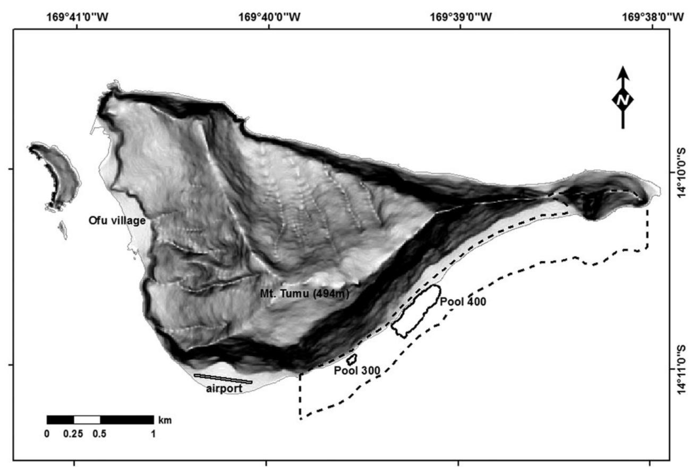
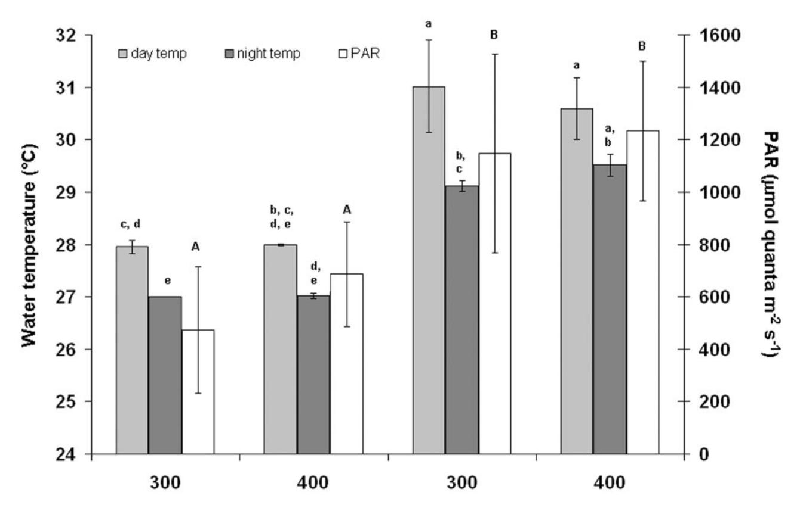
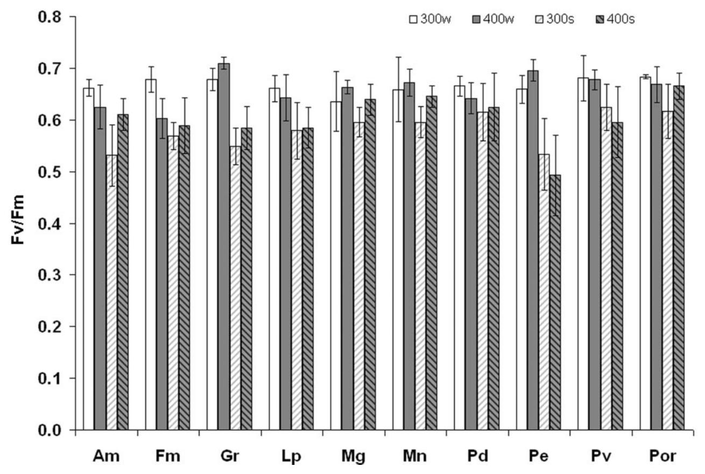
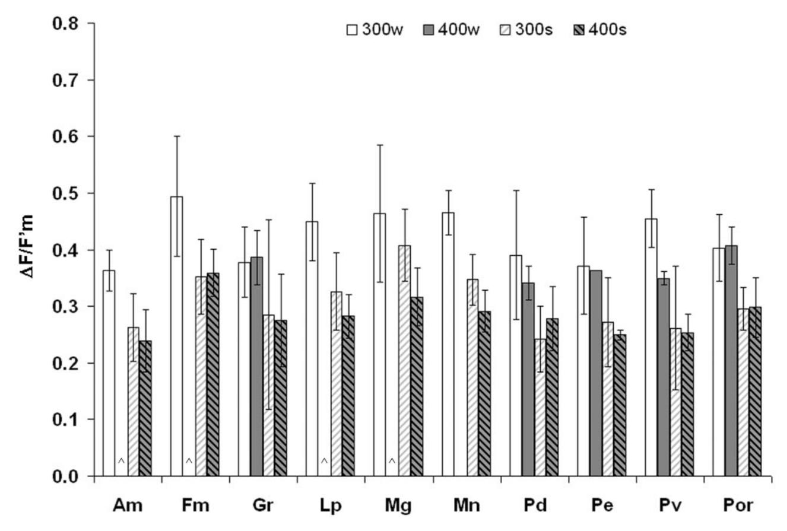
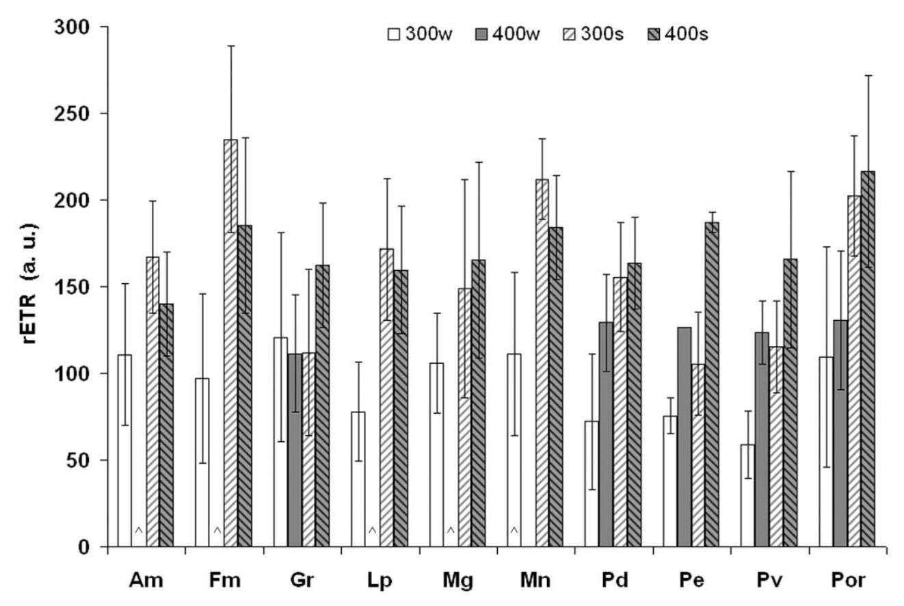

# **Temporal Variability in Chlorophyll Fluorescence of Back-Reef Corals in Ofu, American Samoa**

GREGORY A. PINIAK1,\* AND ERIC K. BROWN2,†

1 *USGS Pacific Science Center, 400 Natural Bridges Drive, Santa Cruz, California 95060; and* 2 *Hawai'i Institute of Marine Biology, P.O. Box 1346, Ka¯ne'ohe, Hawaii 96744*

**Abstract.** Change in the yield of chlorophyll *a* fluorescence is a common indicator of thermal stress in corals. The present study reports temporal variability in quantum yield measurements for 10 coral species in Ofu, American Samoa—a place known to experience elevated and variable seawater temperatures. In winter, the zooxanthellae generally had higher darkadapted maximum quantum yield (*Fv /Fm*), higher lightadapted effective quantum yield (*F*/*Fm*- ), and lower relative electron transport rates (rETR) than in the summer. Temporal changes appeared unrelated to the expected bleaching sensitivity of corals. All species surveyed, with the exception of *Montipora grisea*, demonstrated significant temporal changes in the three fluorescence parameters. Fluorescence responses were influenced by the microhabitat—temporal differences in fluorescence parameters were usually observed in the habitat with a more variable temperature regime (pool 300), while differences in *Fv /Fm* between species were observed only in the more environmentally stable habitat (pool 400). Such species-specific responses and microhabitat variability should be considered when attempting to determine whether observed i*n situ* changes are normal seasonal changes or early signs of bleaching.

## **Introduction**

Elevated temperatures may make corals more vulnerable to excess irradiance and bleaching (*i.e.,* loss of zooxanthel-

Received 6 December 2007; accepted 8 October 2008.

*Abbreviations: Fv /Fm ,* maximum photosynthetic yield; *F/F m*- , effective photosynthetic yield; rETR, relative electron transport rate; PAR, photosynthetically active radiation.

lae, pigmentation, or both; reviewed by Hoegh-Guldberg, 1999; Fitt *et al*., 2001). At current warming rates the thermal tolerances of reef-building corals are likely to be exceeded annually within the next several decades (Hoegh-Guldberg, 1999). However, this steadily increasing pattern may not be applicable to all tropical coral reef regions (Coles and Brown, 2003), and geographic variability in bleaching thresholds within a given species implies ongoing evolution of temperature tolerance (Hughes *et al*., 2003). Bleaching susceptibility and recovery of Great Barrier Reef corals has been attributed both to latitude (*e.g.,* local adaptation) and to the type of zooxanthellae found in the coral (Ulstrup *et al*., 2006). Bleaching can also depend on the prior bleaching history of the colony (Brown *et al*., 2002). Corals that naturally experience wide fluctuations in temperature may be less susceptible to thermal stress (Cook *et al*., 1990), and corals in shallow and back-reef environments that are subject to high light and elevated temperatures are less susceptible to experimental bleaching than corals from deeper fore-reef habitats (Salih *et al*., 1998; Warner *et al*., 1999). Areas with high warming rates also have high temperature variability and relatively lower coral mortality (McClanahan *et al*., 2007). Understanding the physiological adaptations of corals to thermally variable environments may therefore provide insights into possible responses of corals to increasing thermal stresses.

Pulse-amplitude modulated (PAM) and fast repetition rate (FRR) fluorometers provide a rapid, noninvasive technique for assessing the state of the photosynthetic apparatus. Experimental work attributes the maximum photosynthetic yield (*Fv /Fm*) bleaching response to elevated temperature (Warner *et al*., 1996, 1999), high light intensity (Jones and Hoegh-Guldberg, 2001) or ultraviolet radiation (Ferrier-Page`s *et al*., 2007), and the synergistic effects of light and temperature (Salih *et al*., 1998; Ferrier-Page`s *et al*., 2007).

\* To whom correspondence should be addressed, at NOAA Center for Coastal Fisheries and Habitat Research, 101 Pivers Island Road, Beaufort, NC 28516. E-mail: greg.piniak@noaa.gov

† Current address: Kalaupapa National Historic Park, P.O. Box 2222, Kalaupapa, HI 96742. E-mail: Eric\_Brown@nps.gov

Experimental manipulations have documented inconsistent patterns in the relative roles of these factors. Bhagooli and Hidaka (2003) found that the effect of light on  $F_{\nu}/F_{m}$  was greater than the effect of temperature. In contrast, Yakovleva and Hidaka (2004), using one of the same species as Bhagooli and Hidaka and a similar range of temperatures and light, found reductions in  $F_{\nu}/F_{m}$  in corals exposed to high light to be independent of temperature, while recovery of  $F_{\nu}/F_{m}$  was temperature-dependent.

Interpretation of *in situ* data from bleaching events is difficult, as light and temperature covary in the field. Bleaching interpretations are further complicated by variability in coral photosynthetic efficiency on daily to seasonal scales (Fitt et al., 2001). PAM fluorometry measurements in situ have revealed a typical diurnal pattern in that fluorescence yield is elevated at night (with a possible early morning spike), decreases during the day, and recovers as night falls. The short-term photoprotective and photoinhibitory mechanisms underlying this daily pattern are well described (e.g., Brown et al., 1999b; Jones and Hoegh-Guldberg, 2001; Lesser and Gorbunov, 2001; Winters et al., 2003; Hill and Ralph, 2005). Superimposed upon these daily responses to light are longer term physiological reactions. The energetic costs of daily photoinhibition may be negligible, but photoacclimation can decrease energy acquisition over the long term because excessive irradiance reduces photosynthetic capacity over several days (Hoogenboom et al., 2006). As corals photoacclimate, saturation irradiance kinetics stabilize within 1-2 weeks, consistent with main periodicities in daily irradiance (Anthony and Hoegh-Guldberg, 2003a).

Long-term changes in photosynthetic properties may be more important than diurnal patterns in understanding the ecological impacts of changes in environmental light (Hoogenboom *et al.*, 2006). However, few papers have described seasonal variability in coral fluorescence, and they differ in their findings. All three species tested by Hill and Ralph (2005) had no seasonal response. In contrast, two other studies found higher  $F_{\nu}/F_{m}$  in the winter than in the summer. Warner *et al.* (2002) found that this result was correlated with both light and temperature, while Winters *et al.* (2006) saw an effect due to light but not temperature. Baseline data such as these are critical to distinguish whether changes in  $F_{\nu}/F_{m}$  are normal seasonal changes or early indications of bleaching (Winters *et al.*, 2006).

This paper describes baseline temporal patterns in chlorophyll *a* fluorescence for 10 zooxanthellate coral species in Ofu, American Samoa. The back-reef pools in Ofu are known to experience elevated temperatures, with daily variability of up to 6.3 °C (Craig *et al.*, 2001). The purpose of this study was to determine whether back-reef corals in Ofu differ in their fluorescence signals at different times of the year. Ten species were tested to examine whether any observed differences reflect expected species-specific

bleaching sensitivity, since elevated temperatures are known to decrease fluorescence yield (e.g., Warner et al., 1996; Ralph et al., 2001; Bhagooli and Hidaka, 2003; Hill et al., 2004; Ferrier-Pagès et al., 2007). Measurements in two back-reef pools at two different time periods were used to test the hypothesis that corals in thermally stable microhabitats experience smaller temporal differences in their photobiology than corals in more variable environments.

#### **Materials and Methods**

Study site

The National Park of American Samoa on the southeast coast of Ofu Island (Fig. 1) contains a well-developed fringing reef and a series of back-reef pools (Craig et al., 2001). At least 85 scleractinian species inhabit the Ofu pools, with coral cover of about 25% (Craig et al., 2001). The pools are characterized by elevated seawater temperatures (average daily temperatures of 25.8–33.5 °C, with daily fluctuations of  $\approx$ 6 °C); low turbidity (typically <2 NTU); highly variable dissolved oxygen content (23%-212%); relatively constant salinity (practical salinity  $\approx$ 36); and semidiurnal, intermittent water flow (Craig et al., 2001; Smith and Birkeland, 2003). The physical environments of the two pools selected for the present study (Fig. 1) are well described elsewhere (Smith and Birkeland, 2003; Smith et al., 2007, 2008). Turbidity and salinity do not differ between the two pools (Smith and Birkeland, 2003). Both pools are fairly protected from waves by the extensive, shallow reef crest that becomes emergent at spring low tides, but pool 300 has higher current velocities than pool 400 (Smith and Birkeland, 2003; Smith et al., 2008). Pool 300 is smaller, shallower, and more thermally variable (Smith and Birkeland, 2003), making it a potentially more stressful environment than the relatively stable pool 400. However, coral diversity and coverage in the two pools are similar (Craig et al., 2001).

## Fluorescence yield measurements

Chlorophyll a fluorescence of coral zooxanthellae was measured using a pulse-amplitude modulated fluorometer (DIVING-PAM, Walz GmbH, Germany). The fiber-optic probe (5.5-mm working diameter) was oriented perpendicular to and 3 mm from the coral surface, using a universal sample holder (DIVING-USH). The DIVING-PAM was calibrated so that the settings produced initial chlorophyll a fluorescence measurements (F) of  $\approx 300-500$  units when a weak pulsed blue light was applied to the surface of the corals. Maximum fluorescence ( $F'_m$ ) was measured using a saturating light pulse (0.8 s,  $\approx 8000 \ \mu \text{mol quanta m}^{-2} \text{ s}^{-1}$ ), and the change in fluorescence ( $\Delta F = F'_m - F$ ) was used to make daytime measurements of effective quantum yield ( $\Delta F/F'_m$ ) for light-adapted corals (Genty  $et\ al.$ , 1989). Max-

**Figure 1.** Study sites in Ofu, American Samoa. Dashed line indicates boundary of Ofu unit of the National Park of American Samoa.

imum quantum yield  $[(F_m - F_o)/F_m)$ , or  $F_v/F_m]$  was measured for dark-adapted (e.g., nocturnal) samples. Photosynthetically active radiation (PAR) near the surface of the coral colony was measured with the DIVING-PAM's cosine-corrected quantum sensor, calibrated against a Licor LI-192SA light meter. Water temperature at the time of each measurement was also logged using the DIVING-PAM's sensor. The relative electron transport rate (rETR) was calculated using a modified equation

$$rETR = \Delta F/F'_m \times PAR \times 0.5;$$

where 0.5 is a constant assuming equal distribution of photons absorbed by the two photosystems (Hoegh-Guldberg and Jones, 1999). In the above equation, relative ETR does not account for the fraction of light absorbed by the photosynthetic tissue (Hoegh-Guldberg and Jones, 1999), which is very difficult to measure for corals (see Enriquez *et al.*, 2005).

Zooxanthellae fluorescence was measured for 10 coral species: *Astreopora myriophthalma* (Lamarck, 1816), *Favia matthaii* (Vaughan, 1918), *Goniastrea retiformis* (Lamarck, 1816), *Leptoria phrygia* (Ellis and Solander, 1786), *Monti-*

pora grisea (Bernard, 1897), Montipora nodosa (Dana, 1846), Platygyra daedalea (Ellis and Solander, 1786), Pocillopora eydouxi (Milne Edwards and Haime, 1860), Pocillopora verrucosa (Ellis and Solander, 1786), and massive *Porites* spp. These species were chosen to include a range of colony morphologies and expected thermal tolerances (Table 1). Fifteen fluorescence measurements were made haphazardly across the upward-facing surface of each colony, and the results were averaged prior to analysis (n = 5)colonies per species). Colonies were not tagged for repeated measurements; instead colonies were sampled haphazardly in the order in which they were encountered in the field. This was done to reduce temporal bias due to changes in the light field during the sampling period (between 1000 and 1400 h on days with minimal cloud cover). Haphazard surveys also were an attempt to distribute sampling among a greater proportion of the population: abundant species such as *Porites*, *Goniastrea*, and *Montipora* were not likely to be re-sampled; other species (e.g., Pocillopora) were rare, so the same colonies were measured during each sampling period. Nocturnal measurements were made at least 2 h after sunset. When strong waves during high tides

**Table 1**

*Ofu coral species surveyed in August 2004 and January 2005*

| Species                  | Morphology    | Polyp size | Expected bleaching susceptibility* |
|--------------------------|---------------|------------|------------------------------------|
| Astreopora myriophthalma | hemispherical | medium     | low                                |
| Favia matthaii           | hemispherical | large      | moderate                           |
| Goniastrea retiformis    | hemispherical | medium     | moderate                           |
| Leptoria phrygia         | brain         | large      | moderate                           |
| Montipora grisea         | encrusting    | small      | moderate/high                      |
| Montipora nodosa         | encrusting    | small      | moderate/high                      |
| Platygyra daedalea       | brain         | large      | moderate                           |
| Pocillopora eydouxi      | branching     | small      | high                               |
| Pocillopora verrucosa    | branching     | small      | high                               |
| massive Porites          | hemispherical | small      | low/moderate                       |

\* Expected bleaching susceptibility (based on Davies *et al.,* 1997; Marshall and Baird, 2000; McClanahan *et al.,* 2004; Marshall and Shuttenberg, 2006).

made this impractical, nocturnal measurements were made several hours before sunrise and stopped before the DIVING-PAM's light sensor recorded non-zero values at depth. The initial winter sampling (5–13 August 2004) included night measurements in both pools and daytime light-adapted measurements in pool 300. A small number of daytime measurements for pool 400 were also collected. This design was expanded during the summer season (19–28 January 2005) to include five colonies for all 10 species, in both pools, and at both times of day (Table 2), as greater site familiarity allowed more efficient sampling in the time available.

### *Statistical analysis*

Statistical tests were conducted using STATISTICA 7.1 (StatSoft, 2006). Normality assumptions were tested using a Kolmogorov-Smirnoff test for goodness of fit (Zar, 1984), and data were tested for homogeneity of variance using Levene's test. Data that did not meet these assumptions were transformed as appropriate (log for PAR and water temperature, square-root for rETR, and arcsin–square root for yield measurements).

The effects of season, pool, and time of day (categorical variables) on the various physical or biological data were tested using parametric ANOVAs or nonparametric equivalents, followed by *post hoc* comparisons as appropriate. PAR and water temperatures did not meet parametric assumptions after transformation; therefore season, pool, and time of day were tested using a nonparametric Kruskal-Wallis test with *post hoc* multiple comparisons of mean ranks for all groups. Light-adapted daytime and darkadapted night fluorescence characteristics were analyzed separately for each species, and effects of season and pool were tested using a factorial two-way ANOVA. Expansion

**Table 2** *Number of coral colonies tested in the unbalanced experimental design created by expanding the sampling scheme in the summer*

|         |     |          | Winter (August 2004) |          | Summer (January 2005) |          |     |          |
|---------|-----|----------|----------------------|----------|-----------------------|----------|-----|----------|
|         |     | Pool 300 |                      | Pool 400 |                       | Pool 300 |     | Pool 400 |
| Species | Day | Night    | Day                  | Night    | Day                   | Night    | Day | Night    |
| Am      | 5   | 5        | 0                    | 5        | 5                     | 5        | 5   | 5        |
| Fm      | 5   | 5        | 0                    | 5        | 5                     | 5        | 5   | 5        |
| Gr      | 5   | 5        | 3                    | 5        | 5                     | 4        | 5   | 5        |
| Lp      | 5   | 5        | 0                    | 5        | 5                     | 5        | 5   | 5        |
| Mg      | 5   | 5        | 0                    | 5        | 5                     | 5        | 5   | 5        |
| Mn      | 5   | 5        | 0                    | 5        | 5                     | 5        | 5   | 5        |
| Pd      | 5   | 5        | 3                    | 5        | 5                     | 5        | 5   | 5        |
| Pe      | 5   | 5        | 1                    | 5        | 5                     | 5        | 2   | 5        |
| Pv      | 5   | 5        | 2                    | 5        | 5                     | 5        | 5   | 5        |
| Por     | 5   | 5        | 5                    | 5        | 5                     | 5        | 5   | 5        |

Am *Astreopora myriophthalma*, Fm *Favia matthaii*, Gr *Goniastrea retiformis*, Lp *Leptoria phrygia*, Mg *Montipora grisea*, Mn *Montipora nodosa*, Pd *Platygyra daedalea*, Pe *Pocillopora eydouxi*, Pv *Pocillopora verrucosa*, Por massive *Porites.*

of the sampling scheme in the summer season (Table 2) resulted in an unbalanced experimental design for some species, which was further complicated by partial bleaching in one species during stressful summer conditions (some colonies of *Pocillopora eydouxi* in pool 400 lacked sufficient pigment on upward-facing surfaces to produce a reliable fluorescence response despite adjustments to the PAM settings). For these cases, each season/pool combination was coded, and effects on fluorescence parameters were tested using a one-way ANOVA. *Post hoc* comparisons for significant ANOVAs were made using Tukey's unequal HSD tests. When transformed data did not meet the assumption of equal variance, *post hoc* comparisons were made using Dunnett's test.

### **Results**

# *Physical parameters*

Instantaneous water temperature at the time of fluorescence measurements (Fig. 2) varied significantly (df 7, *n* 360, *H* 344.17, *P* 0.0001). Temperatures were significantly warmer in the day than at night, and in the summer than in winter (*post hoc* comparison of mean ranks *P* 0.0017), but there was no difference between pools. Mean water temperature during the fluorometry measurements in pool 300 ranged from 30.9 °C (summer day) to 27.0 °C (winter night), with intermediate temperatures in pool 400 (27.0–30.6 °C). Summer temperatures were 3.9 °C warmer than winter water in pool 300 and 3.6 °C in pool 400. Diurnal temperature differences were greater in pool 300 than in pool 400 in the summer (1.8 °C *vs.* 1.1 °C, respectively), although winter diurnal differences were similar in both pools (0.95 °C in pool 300 and 0.98 °C in pool 400).

Maximum light intensity at the coral surface during the summer was 2370 mol quanta m2 s 1 , but only 1945 mol quanta m2 s 1 in winter. PAR (Fig. 2) varied significantly during the two sampling periods (df 3, *n* 161, *H* 88.26, *P* 0.0001). Average summer light levels were twice as high as those in the winter (*post hoc* comparison of mean ranks *P* 0.01), but within each season there were no differences between pools (*post hoc* comparison of mean ranks *P* 0.05). To reduce temporal bias due to changes in the light field during a given sampling period, colonies were sampled haphazardly in the order in which they were encountered in the field. There was no difference in PAR among species in either season (winter: df 9, *n* 64, *H* 8.43, *P* 0.49; summer: df 9, *n* 97, *H* 15.18, *P* 0.09).

**Figure 2.** Average water temperatures and light levels in pools 300 and 400 during collection of fluorescence data. Error bars are standard deviation. Significant differences detected by *post hoc* comparison (Tukey HSD, *P* 0.05) are indicated by lower-case letters for temperature and upper-case letters for light.

### *Fluorometric responses*

Night-time *Fv /Fm* of zooxanthellae (Fig. 3) showed significant differences among species only in pool 400 (winter *F*9,40 5.76, *P* 0.0001; summer *F*9,40 4.61, *P* 0.0003). Differences among species varied from August 2004 to January 2005. In the winter, *Goniastrea retiformis* and *Pocillopora eydouxi* had the highest zooxanthellate *Fv /Fm*, and these values were significantly higher (Tukey HSD, *P* 0.05) than in *Astreopora myriopthalma* and *Favia matthaii*. *Pocillopora eydouxi* and *G. retiformis* zooxanthellae had the lowest summer *Fv /Fm*, with values in *Pocillopora eydouxi* significantly lower than in massive *Porites* spp., *Montipora nodosa*, *M. grisea*, *Platygyra daedalea* (Tukey HSD, *P* 0.05), and *A. myriophthalma* (Dunnett's test, *P* 0.05).

Factorial ANOVAs found statistically significant temporal effects for dark-adapted yields in 8 of the 10 species tested (Table 3; also see Table 6). *G. retiformis* and *Pocillopora eydouxi* zooxanthellae showed temporal patterns, with yields much lower in the summer than in the winter. Dark-adapted yields did not differ significantly between pools. Only *G. retiformis* had a statistically significant pool effect, while three species (*A. myriophthalma*, *G. retiformis*, and massive *Porites* spp.) had significant species-pool interactions (Table 3). Temporal differences in *Fv /Fm* varied among species between the two pools. In pool 300, zooxanthellate *Fv /Fm* was higher in the winter than in the summer for *A. myriophthalma*, *F. matthaii*, *G. retiformis*, *Leptoria phrygia*, *Pocillopora eydouxi*, *Pocillopora verrucosa*, and massive *Porites* spp. (Tukey HSD, *P* 0.05). Only *G. retiformis* and *Pocillopora eydouxi* had temporal differences in *Fv /Fm* in pool 400. *Fv /Fm* values could not be correlated to ambient PAR since yields were collected in the dark; however, there was a significant negative correlation between yield and water temperature (*b* 0.55, *P* 0.0001).

Light-adapted daytime yields (*F/Fm*- ) were generally lower in the summer than in the winter (Fig. 4). There was only one statistically significant difference in daytime yields between species in a given season/pool—zooxanthellae in

**Figure 3.** Average dark-adapted maximum fluorescence yield (*Fv /Fm*) for 10 coral species, by sampling period (s summer, w winter) and pool (300 and 400). Am *Astreopora myriophthalma*, Fm *Favia matthaii*, Gr *Goniastrea retiformis*, Lp *Leptoria phrygia*, Mg *Montipora grisea*, Mn *Montipora nodosa*, Pd *Platygyra daedalea*, Pe *Pocillopora eydouxi*, Pv *Pocillopora verrucosa*, Por massive *Porites*. Error bars are standard deviation.

**Table 3** *Results of factorial ANOVA for dark-adapted, night fluorescence yields (Fv /Fm)*

| Species | Factor      | ANOVA results               |
|---------|-------------|-----------------------------|
| Am      | month       | F1,16 16.97, P  0.0008   |
|         | pool        | F1,16 0.84, P  0.3744 |
|         | interaction | F1,16 10.31, P  0.0055   |
| Fm      | month       | F1,16 13.54, P  0.0020   |
|         | pool        | F1,16 2.70, P  0.1201 |
|         | interaction | F1,16 8.07, P  0.0018 |
| Gr(t)   | month       | F1,15 98.45, P  0.0001   |
|         | pool        | F1,15 7.57, P  0.0149 |
|         | interaction | F1,15 0.23, P  0.6406 |
| Lp      | month       | F1,16 13.47, P  0.0021   |
|         | pool        | F1,16 0.11, P  0.7467 |
|         | interaction | F1,16 0.37, P  0.5411 |
| Mg(t)   | month       | F1,16 4.35, P  0.0534 |
|         | pool        | F1,16 4.46, P  0.0508 |
|         | interaction | F1,16 0.27, P  0.6083 |
| Mn      | month       | F1,16 6.93, P  0.0181 |
|         | pool        | F1,16 3.43, P  0.0825 |
|         | interaction | F1,16 1.11, P  0.3074 |
| Pd(t)   | month       | F1,16 2.07, P  0.1693 |
|         | pool        | F1,16 0.10, P  0.7583 |
|         | interaction | F1,16 0.72, P  0.4093 |
| Pe(t)   | month       | F1,16 54.10, P  0.0001   |
|         | pool        | F1,16 0.10, P  0.7576 |
|         | interaction | F1,16 3.53, P  0.0787 |
| Pv      | month       | F1,16 10.65, P  0.0049   |
|         | pool        | F1,16 0.59, P  0.4554 |
|         | interaction | F1,16 0.37, P  0.5525 |
| Por(t)  | month       | F1,16 5.87, P  0.0276 |
|         | pool        | F1,16 1.19, P  0.2913 |
|         | interaction | F1,16 4.50, P  0.0499 |

Am *Astreopora myriophthalma*, Fm *Favia matthaii*, Gr *Goniastrea retiformis*, Lp *Leptoria phrygia*, Mg *Montipora grisea*, Mn *Montipora nodosa*, Pd *Platygyra daedalea*, Pe *Pocillopora eydouxi*, Pv *Pocillopora verrucosa*, Por massive *Porites.* A superscript (t) after species name indicates arcsin–square root transformation prior to analysis.

*F. matthaii* had higher *F/Fm* than those in *A. myriophthalma* in pool 400 in the summer (Tukey HSD, *P* 0.05). Interpretation of temporal changes in *F/Fm* is less straightforward, due to variability in the ambient light field and the expansion of the sampling strategy from the winter to the summer seasons. *F/Fm* values were negatively correlated with PAR (*r* -0.72, *P* 0.0001) and water temperature (*r* 0.68, *P* 0.0001). PAR and water temperature also covaried (*r* 0.81, *P* 0.0001).

Of the five species analyzed with factorial ANOVAs, zooxanthellae in three corals (*Platygyra daedalea*, *Pocillopora verrucosa*, and massive *Porites* spp.) had significantly higher *F/Fm* in winter than in summer (Table 4). Massive *Porites* spp. had temporal differences in both pools (Tukey HSD, *P* 0.05), but *Platygyra daedalea* and *Pocillopora verrucosa* had temporal differences only in pool 300 (Dunnett's test, *P* 0.05). Four other species (*A. myriophthalma*, *F. matthaii*, *L. phyrgia*, and *M. nodosa*), in pool 300 had significantly higher *F/Fm* in winter than in summer (Tukey HSD, *P* 0.05). No temporal differences in pool 400 could be tested for these latter species due to the unbalanced design.

For most coral species, zooxanthellae had higher relative electron transport rates in summer than in winter (Fig. 5). Electron transport was significantly correlated with PAR (*r* 0.83, *P* 0.0001) and water temperature (*r* 0.58, *P* 0.0001). Four of the five species had statistically significant temporal effects (Table 5). *Post hoc* analyses indicated significant temporal differences for *Platygyra daedalea, F. matthaii*, *L. phrygia*, and *M. nodosa* in pool 300 and for massive *Porites* spp. in both pools. (Table 5; Tukey HSD, *P* 0.05). The only statistically significant difference in rETR between species was for pool 300 in the summer (*F*9,40 6.05, *P* 0.0001). *F. matthaii, G. retiformis,* and massive *Porites* spp. had higher rETR than *Pocillopora eydouxi, Pocillopora verrucosa,* and *G. retiformis* (Tukey HSD, *P* 0.05).

### **Discussion**

Dark-adapted fluorescence yield (*Fv /Fm*) has proven to be a robust predictor of numerous physiological stressors in corals, and may be the best indicator of long-term shifts in the integrity of photosystem II and photoacclimatization due to changes in concentrations of zooxanthellae and photosynthetic pigments. *F/Fm* and rETR also have some predictive capability for bleaching (Lesser and Gorbunov, 2001; Yakovleva and Hidaka, 2004). However, determining whether changes in fluorescence are due to natural seasonal photoadaptation or actual bleaching events is difficult in the absence of baseline data (Fitt *et al*., 2001; Winters *et al*., 2006). The intent of this study was to provide such baseline data for corals subject to elevated and variable temperatures in the back-reef pools of Ofu, American Samoa.

### *Temporal differences in fluorescence response*

The 10 coral species showed four separate types of temporal fluorescence responses in *Fv /Fm*, *F/Fm*- , and ETR. First, *Montipora grisea* showed no seasonal response in any fluorescence parameter—which suggests that for this species the observed summer conditions were relatively benign and no long-term photoinhibitory damage had occurred since winter. This is consistent with the results of Hill and Ralph (2005), who observed no variability in diurnal patterns of *Fv /Fm* in three Great Bearrier Reef species. In contrast, *Goniastrea retiformis* and *Pocillopora eydouxi* in the present study had significantly higher *Fv /Fm* in the winter than in the summer. Similar results have been demonstrated for three coral species in the Bahamas (Warner *et al*., 2002) and two in the Red Sea (Winters *et al*., 2006). A

**Figure 4.** Average daytime, light-adapted fluorescence yield (*F/F m*- ) for 10 coral species, by sampling period (s summer, w winter) and pool (300 and 400). Am *Astreopora myriophthalma*, Fm *Favia matthaii*, Gr *Goniastrea retiformis*, Lp *Leptoria phrygia*, Mg *Montipora grisea*, Mn *Montipora nodosa*, Pd *Platygyra daedalea*, Pe *Pocillopora eydouxi*, Pv *Pocillopora verrucosa*, Por massive *Porites*. Error bars are standard deviation. A chevron (^) denotes species lacking measurements in pool 400 in the winter.

summertime depression in *Fv /Fm* could be due to photodamage and photoprotective processes in the zooxanthellae (Warner *et al.,* 2002), or to photoinhibition in the summer and optimized light-harvesting in winter (Winters *et al*., 2006). Temporal shifts are likely due to changes in biochemical processes within the zooxanthellae (Warner *et al*., 2002), although the host can also modify the *Fv /Fm* response (Bhagooli and Hidaka, 2003). Coral tissue biomass, zooxanthellate density, and chlorophyll content all vary seasonally (Stimson, 1997; Brown *et al*., 1999a; Fagoonee *et al*., 1999; Fitt *et al*., 2000)—any combination of these could account for changes in light-harvesting capability underlying the temporal difference in *Fv /Fm* observed in the present study.

A third group of corals (*Astreopora myriophthalma*, *Favia matthaii*, *Leptoria phrygia*, and massive *Porites* spp.) showed significant temporal differences in *Fv /Fm*, likely for the same possible reasons described above. However, these species also had significant temporal differences in *F/Fm*and rETR. Differences in these parameters could, like *Fv /Fm*, reflect a response to long-term temporal variability. However, they are also highly dependent on the light intensity immediately preceding the measurements. The summer decrease in *F/Fm* is matched by an increase in non-photochemical quenching (data not shown), suggesting increased regulation of the photosystem by dynamic photoinhibition (*e.g.,* Lesser and Gorbunov, 2001). A prolonged reduction in electron transport following stress can be indicative of photoinhibition (Yakovleva and Hidaka, 2004). However, it is also likely that differences in *F/Fm* or rETR simply reflect differences in ambient light between summer and winter (Fig. 2). The other three coral species—*Pocillopora verrucosa*, *Platygyra daedalea,* and *Montipora nodosa*—showed significant temporal differences in *F/Fm* or rETR but not *Fv /Fm*.

*Fluorescence responses to environmental variability*

Light and temperature are the environmental parameters most commonly associated with seasonal patterns in coral

**Table 4** *Results of factorial and one-way ANOVAs for light-adapted, mid-day (1000-1400) fluorescence yields (F/F m*-*).*

| Species | Factor      | ANOVA results               |
|---------|-------------|-----------------------------|
| Am      | code        | F2,12 8.29, P  0.0054 |
| Fm      | code        | F2,12 5.61, P  0.0191 |
| Gr(t)   | month       | F1,14 4.03, P  0.0644 |
|         | pool        | F1,14 0.01, P  0.9323 |
|         | interaction | F1,14 0.01, P  0.9438 |
| Lp      | code        | F2,12 10.35, P  0.0024   |
| Mg      | code        | F2,12 3.84, P  0.0515 |
| Mn      | code        | F2,12 24.48, P  0.0001   |
| Pd(t)   | month       | F1,14 8.51, P  0.0113 |
|         | pool        | F1,14 0.01, P  0.9271 |
|         | interaction | F1,14 1.33, P  0.2689 |
| Pe      | month       | F1,9 3.95, P  0.0780  |
|         | pool        | F1,9 0.09, P  0.7733  |
|         | interaction | F1,9 0.02, P  0.9048  |
| Pv(t)   | month       | F1,13 16.24, P  0.0014   |
|         | pool        | F1,13 2.04, P  0.1766 |
|         | interaction | F1,13 1.75, P  0.2087 |
| Por     | month       | F1,16 26.60, P  0.0001   |
|         | pool        | F1,16 0.02, P  0.8832 |
|         | interaction | F1,16 0.002, P  0.9636   |

Effects of sampling period and pool were combined into a single code for one-way ANOVAs when sampling design precluded factorial analysis. Am *Astreopora myriophthalma*, Fm *Favia matthaii*, Gr *Goniastrea retiformis*, Lp *Leptoria phrygia*, Mg *Montipora grisea*, Mn *Montipora nodosa*, Pd *Platygyra daedalea*, Pe *Pocillopora eydouxi*, Pv *Pocillopora verrucosa*, Por massive *Porites.* A superscript (t) after species name indicates arcsin-square root transformation prior to analysis.

physiology. In previous seasonal studies, Warner *et al*. (2002) found that *Fv /Fm* was significantly correlated to both light and temperature, while Winters *et al*. (2006) found that *Fv /Fm* was correlated with light but not temperature. Temperature variability (skewness and standard deviation) is a stronger predictor of bleaching and mortality than rates of temperature increase (McClanahan *et al*., 2007). Therefore, it may be that temperature variability also explains the discrepancy in temperature effects on seasonal *Fv /Fm*. Seasonal variability in maximum daily water temperatures was 11 °C in the Bahamas (24°N latitude; Warner *et al*., 2002), but only 6 °C in the Red Sea (29°N; Winters *et al*., 2006) and Australia (24°S latitude; Hill and Ralph, 2005). Latitude is also directly related to the amplitude of seasonal thermal variability (Leichter *et al*., 2006). In Ofu, seasonal mean water temperatures vary by 4 °C, daily maxima vary by 6–8 °C, and daily temperature fluctuations can be up to 6 °C (Craig *et al*., 2001; Smith and Birkeland, 2003; Smith *et al*., 2008). Water temperatures in pool 300 showed greater daily variability than in pool 400 (short-term measurements in Fig. 2, long-term monitoring in Smith *et al*., 2008), and temporal differences in fluorescence parameters were more commonly observed for corals in pool 300 than in pool 400 (Table 6). This suggests that the sensitivity of corals to temporal variability might depend on the thermal stability of the microhabitat, with increased temperature variability causing greater variation in fluorescence.

Alternatively, temporal differences among fluorescence parameters could be due to light. This would be particularly important for *F/Fm* and rETR, for which *in situ* measurement includes the practical issue of ensuring that light conditions are relatively constant during sampling conditions. The most common way to address this issue is to sample during a relatively narrow time frame—for example, Iglesias-Prieto *et al*. (2004) sampled corals in Panama at local noon 15 min, while Lesser and Gorbunov (2001) measured *F/Fm* between 0900 and 1000 h for *Montastrea faveolata* in the Bahamas. In the present study, daytime measurements were made between 1000 and 1400 h on days with minimal cloud cover. However, the present study was conducted at a lower latitude (14°S rather than 24°N) and over a much smaller depth range (0.5–2 m) than previous studies (Lesser and Gorbunov, 2001; Iglesias-Prieto *et al*., 2004), so solar declination was less of a concern. In the present study, species were haphazardly sampled in the order in which they were encountered in the field. This helped to minimize temporal bias of the measurements (and the resultant variability in ambient light among samples). Only upward-facing surfaces of unshaded colonies were measured, but haphazard sampling also helped to reduce any effects of light microclimate (known to affect *Fv /Fm* and electron transport rates; Anthony and Hoegh-Guldberg, 2003b). As a result of this sampling design, within a given season there was no significant difference in PAR during light-adapted measurements within a pool (Fig. 2) or among species. There are signficant differences between these short-term PAR measurements in winter and summer. Long-term changes in ambient PAR would drive the photoacclimation patterns in the zooxnathellae and are likely to be highly correlated with *Fv /Fm*; however, this hypothesis could not be tested here as the available PAR data are short-term, instantaneous measurements over the span of several hours rather than averages over time scales appropriate for photoacclimation (*e.g.,* Anthony and Hoegh-Guldberg, 2003a).

Seasonal differences are not always driven by light or temperature. For example, Fagoonee *et al.* (1999) found that season explains variation in zooxanthellate density better than temperature or solar radiation. In the present study, all daytime measurements were made on mid- to low tides, but tides were greater in the summer (January samples during new moon, August samples during last quarter moon). Consequently, increased flow during larger summer tides could have reduced the observed differences in yield between the seasons in this study, particularly during daylight hours when light warms the water in the pools. Water flow is known to reduce the photoinhibitory effects of high light

**Figure 5.** Average daytime, light-adapted relative electron transport rate (rETR) for 10 coral species, by sampling period (s summer, w winter) and pool (300 and 400). Am *Astreopora myriophthalma*, Fm *Favia matthaii*, Gr *Goniastrea retiformis*, Lp *Leptoria phrygia*, Mg *Montipora grisea*, Mn *Montipora nodosa*, Pd *Platygyra daedalea*, Pe *Pocillopora eydouxi*, Pv *Pocillopora verrucosa*, Por massive *Porites*. Error bars are standard deviation. A chevron (^) denotes species lacking measurements in pool 400 in the winter.

and temperature (Nakamura *et al*., 2005), because flowdependent mass transfer removes excess oxygen from corals and modulates photosynthetic efficiency (Finelli *et al*., 2006). Similar processes have been observed in flume experiments with Ofu corals (Smith and Birkeland, 2007). In addition to any seasonal differences in flow, preliminary results suggest that flow in pool 300 is higher than in the larger and slightly deeper pool 400 (Smith and Birkeland, 2003). Additional work is required to evaluate the potential effects of flow and other factors (nutrients, *etc.*) on the temporal differences observed here.

## *Species differences and implications for bleaching*

Although the temporal differences in fluorescence above were primarily found in pool 300, differences between species were observed only in pool 400, which tends to be more environmentally stable (Smith and Birkeland, 2003; Smith *et al*., 2008). Highly variable conditions in shallow water are known to cause greater fluctuations in *Fv /Fm* than are produced by the more constant conditions at depth (*e.g.,* Warner *et al*., 2002). It may be that environmental fluctuations in pool 300 are sufficient to obscure any speciesspecific fluorescence responses, while pool 400 may be sufficiently stable that differences among species are more apparent.

The 10 zooxanthellate coral species used in this study were chosen to cover a range of morphologies and expected bleaching susceptibilities (Table 1), but there was no consistent relationship with temporal patterns of fluorescence. The two brain corals (*F. matthaii* and *L. phrygia*) and massive *Porites* spp. had temporal differences in all three parameters, but significant temporal differences in *Fv /Fm* and *F/Fm* were found across the full range of expected thermal tolerance. Temporal differences in rETR appeared restricted to species with large polyps and moderate bleaching susceptibility, but no physiological explanation for this observation is apparent.

Interestingly, closely related species had drastically dif-

ferent temporal patterns—M. nodosa had temporal changes in  $\Delta F/F'_m$  and rETR, whereas M. grisea showed no temporal changes. This suggests that grouping species by genus for bleaching susceptibility (e.g., Marshall and Shuttenberg, 2006) may be an oversimplification. As another example, Pocillopora verrucosa was relatively insensitive to temporal changes (Table 6), while fluorescence patterns of its branching congener Pocillopora eydouxi were most similar to those of the hemispherical coral Goniastrea retiformis. These latter two species had the highest  $F_v/F_m$  in the winter in pool 400, significantly higher than A. myriophthalma and F. matthaii (Fig. 3). However, in summer, G. retiformis and Pocillopora eydouxi had the lowest  $F_v/F_m$  measured—significantly below those of Porites spp., M. nodosa, M. grisea, Platygyra daedalea, and A. myriophthalma. This suggests that G. retiformis and Pocillopora eydouxi are the most vulnerable to bleaching of the species in this study. Pocillopora eydouxi did show some visible signs of bleaching during this study, and few colonies in pool 400 gave a baseline signal sufficient for summer fluorescence measurements (Table 2).

Bleaching may best be viewed as the end point of seasonal variability in photosynthetic capacity (Warner *et al.*, 2002). This study showed significant temporal vari-

Table 5

Results of factorial and one-way ANOVAs for light-adapted, mid-day (1000-1400) relative electron transport rates (rETR)

| Species           | Factor      | ANOVA results                  |
|-------------------|-------------|--------------------------------|
| Am                | code        | $F_{2.12} = 3.29, P = 0.0726$  |
| Fm                | code        | $F_{2.12} = 9.33, P = 0.0036$  |
| Gr (t) | month       | $F_{1.14} = 0.86, P = 0.3708$  |
|                   | pool        | $F_{1,14} = 0.81, P = 0.3840$  |
|                   | interaction | $F_{1.14} = 1.74, P = 0.2080$  |
| Lp                | code        | $F_{2,12} = 10.21, P = 0.0026$ |
| Mg                | code        | $F_{2,12} = 1.78, P = 0.2105$  |
| Mn                | code        | $F_{2.12} = 11.23, P = 0.0018$ |
| Pd                | month       | $F_{1,14} = 14.44, P = 0.0020$ |
|                   | pool        | $F_{1.14} = 4.41, P = 0.0543$  |
|                   | interaction | $F_{1.14} = 2.49, P = 0.1370$  |
| Pe (t) | month       | $F_{1.9} = 7.85,  P = 0.0206$  |
|                   | pool        | $F_{1.9} = 18.55, P = 0.0020$  |
|                   | interaction | $F_{1.9} = 0.41,  P = 0.5356$  |
| Pv                | month       | $F_{1.13} = 7.64, P = 0.0161$  |
|                   | pool        | $F_{1,13} = 10.46, P = 0.0065$ |
|                   | interaction | $F_{1.13} = 0.16, P = 0.6942$  |
| Por               | month       | $F_{1.16} = 16.10, P = 0.0010$ |
|                   | pool        | $F_{1,16} = 0.63, P = 0.4393$  |
|                   | interaction | $F_{1,16} = 0.02, P = 0.8790$  |

Am = Astreopora myriophthalma, Fm = Favia matthaii, Gr = Goniastrea retiformis, Lp = Leptoria phrygia, Mg = Montipora grisea, Mn = Montipora nodosa, Pd = Platygyra daedalea, Pe = Pocillopora eydouxi, Pv = Pocillopora verrucosa, Por = massive Porites. A superscript (t) after species name indicates square root transformation prior to analysis.

Table 6

Summary of temporal differences in fluorescence patterns in the different pools, as determined by post hoc comparisons (Tukey's HSD; Dunnett's test when variances were unequal)

| Species | $F_v/F_m$ |     | $\Delta F/F'_m$ |     | rETR |     |
|---------|-----------|-----|-----------------|-----|------|-----|
|         | 300       | 400 | 300             | 400 | 300  | 400 |
| Am      | ***       | ns  | *               |     | ns   |     |
| Fm      | **        | ns  | *               |     | **   |     |
| Gr      | ***       | *** | ns              | ns  | ns   | ns  |
| Lp      | *         | ns  | *               |     | **   |     |
| Mg      | ns        | ns  | ns              |     | ns   |     |
| Mn      | ns        | ns  | **              |     | **   |     |
| Pd      | ns        | ns  | *               | ns  | **   | ns  |
| Pe      | **        | *** | ns              | ns  | ns   | ns  |
| Pv      | ns        | ns  | **              | ns  | ns   | ns  |
| Por     | *         | ns  | *               | **  | *    | ns  |

\*= P < 0.05, \*\*= P < 0.01, \*\*\*= P < 0.001, ns = not significant; blanks indicate the comparison could not be made due to the unbalanced design. Am = Astreopora myriophthalma, Fm = Favia matthaii, Gr = Goniastrea retiformis, Lp = Leptoria phrygia, Mg = Montipora grisea, Mn = Montipora nodosa, Pd = Platygyra daedalea, Pe = Pocillopora eydouxi, Pv = Pocillopora verrucosa, Por = massive Porites.  $F_v/F_m$  = dark-adapted night yield,  $\Delta F/F_m'$  = ambient light-adapted daytime yield, rETR = relative electron transport rate.

ability in three different fluorescence patterns ( $F_v/F_m$ ,  $\Delta F/F_m'$ , and rETR) between summer and winter, but  $F_v/F_m$  is the simplest to interpret and may be the best tool for interpreting seasonal changes in photosynthetic capacity. Visible signs of bleaching were rare—therefore, differences in fluorescence are interpreted as normal seasonal differences. Temporal variability was observed only in pool 400, while differences among species for a given fluorescence parameter were observed only in pool 300. These pools are known to differ in their environmental variability, especially with respect to temperature (e.g., Smith and Birkeland, 2003; Smith et. al., 2008), but determining the specific parameters driving temporal fluorescence variability in these microhabitats will require further study.

#### Acknowledgments

This study was funded by a United States Geological Survey Biological Resources Division grant to Charles Birkeland, with additional support to GAP from the USGS Mendenhall postdoctoral program. The authors thank Lance Smith, Dan Barshis, and Ginger Garrison for field support. This manuscript was improved by comments by Mike Field, Charles Birkeland, Dan Barshis, Gisèle Muller-Parker, and anonymous reviewers. The use of trademark names does not imply endorsement of products by any federal agency.

## **Literature Cited**

- **Anthony, K. R. N., and O. Hoegh-Guldberg. 2003a.** Kinetics of photoacclimation in corals. *Oecologia* **134:** 23–31.
- **Anthony, K. R. N., and O. Hoegh-Guldberg. 2003b.** Variation in coral photosynthesis, respiration and growth characteristics in contrasting light microhabitats: an analogue to plants in forest gaps and understoreys? *Funct. Ecol*. **17:** 246–259.
- **Bhagooli, R., and M. Hidaka, M. 2003.** Comparison of stress susceptibility of *in hospite* and isolated zooxanthellae among five coral species. *J. Exp. Mar. Biol. Ecol.* **291:** 181–197.
- **Brown, B. E., R. P. Dunne, I. Ambarsari, M. D. A. LeTissier, and U. Satapoomin. 1999a.** Seasonal fluctuations in environmental factors and variations in symbiotic algae and chlorophyll pigments in four Indo-Pacific coral species. *Mar. Ecol. Prog. Ser.* **191:** 53–69.
- **Brown, B. E., I. Ambarsari, M. E. Warner, W. K. Fitt, R. P. Dunne, S. W. Gibb, and D. G. Cummings. 1999b.** Diurnal changes in photochemical efficiency in shallow water reef corals: evidence for photoinhibition and photoprotection. *Coral Reefs* **18:** 99–105.
- **Brown, B. E., R. P. Dunne, M. S. Goodson, and A. E. Douglas. 2002.** Experience shapes the susceptibility of a reef coral to bleaching. *Coral Reefs* **21:** 119–126.
- **Coles, S. L. and B. E. Brown. 2003.** Coral bleaching—capacity for acclimation and adaptation. *Adv. Mar. Biol.* **46:** 183–223.
- **Cook, C. B., A. Logan, J. Ward, B. Luckhurst, and C. J. Berg, Jr. 1990.** Elevated temperatures and bleaching on a high latitude coral reef: the 1988 Bermuda event. *Coral Reefs* **9:** 45–49.
- **Craig, P., C. Birkeland, and S. Belliveau. 2001.** High temperatures tolerated by a diverse assemblage of shallow-water corals in American Samoa. *Coral Reefs* **20:** 185–189.
- **Davies, J. M., R. P. Dunne, and B. E. Brown. 1997.** Coral bleaching and elevated sea-water temperature in Milne Bay Province, Papua New Guinea, 1996. *Mar. Freshw. Res*. **48:** 513–516.
- **Enriquez, S., E. R. Mendez, and R. Iglesias-Prieto. 2005.** Multiple scattering on coral skeletons enhances light absorption by symbiotic algae. *Limnol. Oceanogr*. **50:** 1025–1032.
- **Fagoonee, I., H. B. Wilson, M. P. Hassell, and J. R. Turner. 1999.** The dynamics of zooxanthellae populations: a long-term study in the field. *Science* **283:** 843–845.
- **Ferrier-Page`s, C., C. Richard, D. Forcioli, D. Allemand, M. Pichon, and J. M. Shick. 2007.** Effects of temperature and UV radiation increases on the photosynthetic efficiency in four scleractinian coral species. *Biol. Bull.* **213:** 76–87.
- **Finelli, C. M., B. S. T. Helmuth, N. D. Pentcheff, and D. S. Wethey. 2006.** Water flow influences oxygen transport and photosynthetic efficiency in corals. *Coral Reefs* **25:** 45–57.
- **Fitt, W. K., F. K. McFarland, M. E. Warner, and G. C. Chilcoat. 2000.** Seasonal patterns of tissue biomass and densities of symbiotic dinoflagellates in reef corals and relation to coral bleaching. *Limnol. Oceanogr*. **45:** 677–685.
- **Fitt, W. K., B. E. Brown, M. E. Warner, and R. P. Dunne. 2001.** Coral bleaching: interpretation of thermal tolerance limits and thresholds in tropical corals. *Coral Reefs* **20:** 51–65.
- **Genty, B., J. M. Briantais, and N. R. Baker. 1989.** The relationship between quantum yield of photosynthetic electron transport and quenching of chlorophyll fluorescence. *Biochem. Biophys. Acta* **990:** 87–92.
- **Hill, R., and P. J. Ralph. 2005.** Diel and seasonal changes in fluorescence rise kinetics of three scleractinian corals. *Funct. Plant Biol.* **32:** 549–559.
- **Hill, R., U. Schreiber, R. Gademann, A. W. D. Larkum, M. Kuhl, and P. J. Ralph. 2004.** Spatial heterogeneity of photosynthesis and the

- effect of temperature-induced bleaching conditions in three species of corals. *Mar. Biol.* **144:** 633–640.
- **Hoegh-Guldberg, O. 1999.** Climate change, coral bleaching and the future of the world's coral reefs. *Mar. Freshw. Res.* **50:** 839–869.
- **Hoegh-Guldberg, O., and R. J. Jones. 1999.** Photoinhibition and photoprotection in symbiotic dinoflagellates from reef-building corals. *Mar. Ecol. Prog. Ser.* **183:** 73–86.
- **Hoogenboom, M. O., K. R. N. Anthony, and S. R. Connolly. 2006.** Energetic cost of photoinhibition in corals. *Mar. Ecol. Prog. Ser.* **313:** 1–12.
- **Hughes, T. P., A. H. Baird, D. R. Bellwood, M. Card, S. R. Connolly, C. Folke, R. Grosberg, O. Hoegh-Guldberg, J. B. C. Jackson, J. Kelypas,** *et al.* **2003.** Climate change, human impacts, and the resilience of coral reefs. *Science* **301:** 929–933.
- **Iglesias-Prieto, R., V. H. Beltran, T. C. LaJeunesse, H. Reyes-Bonilla, and P. E. Thome. 2004.** Different algal symbionts explain the vertical distribution of dominant reef corals in the eastern Pacific. *Proc. R. Soc. Lond. B* **271:** 1757–1763.
- **Jones, R. J., and O. Hoegh-Guldberg. 2001.** Diurnal changes in the photochemical efficiency of the symbiotic dinoflagellates (Dinophyceae) of corals: photoprotection, photoinactivation and the relationship to coral bleaching. *Plant Cell Environ*. **24:** 89–99.
- **Leichter, J. L., B. Helmuth, and A. M. Fischer. 2006.** Variation beneath the surface: quantifying complex thermal environments on coral reefs in the Caribbean, Bahamas and Florida. *J. Mar. Res*. **64:** 563–588.
- **Lesser, M. P., and M. Y. Gorbunov. 2001.** Diurnal and bathymetric changes in chlorophyll fluorescence yields of reef corals measured *in situ* with a fast repetition rate fluorometer. *Mar. Ecol. Prog. Ser.* **212:** 69–77.
- **Marshall, P. A., and A. H. Baird. 2000.** Bleaching of corals on the Great Barrier Reef: differential susceptibilities among taxa. *Coral Reefs* **19:** 155–163.
- **Marshall, P. A., and H. Z. Shuttenberg. 2006.** *A Reef Manager's Guide to Coral Bleaching.* Great Barrier Reef Marine Park Authority, Townsville, QLD, Australia.
- **McClanahan, T. R., A. H. Baird, P. A. Marshall, and M. A. Toscano. 2004.** Comparing bleaching and mortality responses of hard coals between southern Kenya and the Great Barrier Reef, Australia. *Mar. Pollut. Bull.* **48:** 327–335.
- **McClanahan, T. R., M. Ateweberhan, C. A. Muhando, J. Maina, and M. S. Mohammed. 2007.** Effects of climate and seawater temperature variation on coral bleaching and mortality. *Ecol. Monogr.* **77:** 503–525.
- **Nakamura, T., R. van Woesik, and H. Yamasaki. 2005.** Photoinhibition of photosynthesis is reduced by water flow in the reef-building coral *Acropora digitifera*. *Mar. Ecol. Prog. Ser.* **301:** 109–118.
- **Ralph, P. J., R. Gademann, and A. W. D. Larkum. 2001.** Zooxanthellae expelled from bleached corals at 33°C are photosynthetically competent. *Mar. Ecol. Prog. Ser.* **220:** 163–168.
- **Salih, A., O. Hoegh-Guldberg, and G. Cox. 1998.** Bleaching response of symbiotic dinoflagellates in corals: the effects of light and elevated temperature on their morphology and physiology. Pp. 199–216 in *Proceedings of the Australian Coral Reef Society*, Heron Island October 1997, J. G. Greenwood and N.J. Hall, eds. University of Queensland, Brisbane.
- **Smith, L. W., and C. Birkeland. 2003.** *Managing NPSA's Coral Reefs in the Face of Global Warming: Research Project Report for Year 1.* Hawaii Cooperative Fishery Research Unit, University of Hawaii at Manoa, Honolulu.
- **Smith, L. W., and C. Birkeland. 2007.** Effects of intermittent flow and irradiance level on back reef *Porites* corals at elevated seawater temperatures. *J. Exp. Mar. Biol. Ecol.* **341:** 282–294.
- **Smith, L. W., H. H. Wirshing, A. C. Baker, and C. Birkeland. 2008.**

- Environmental versus genetic influences on growth rates of the corals *Pocillopora eydouxi* and *Porites lobata*. *Pac. Sci.* **62:** 57–69.
- **Smith, L. W., D. Barshis, and C. Birkeland. 2007.** Phenotypic plasticity for skeletal growth, density and calcification of *Porites lobata* in response to habitat type. *Coral Reefs* **26:** 559–567.
- **StatSoft. 2006.** STATISTICA Data Analysis Software System, Version 7.1. StatSoft, Inc., Tulsa, Oklahoma.
- **Stimson, J., 1997.** The annual cycle of density of zooxanthellae in the tissues of field and laboratory-held *Pocillopora damicornis* (Linnaeus). *J. Exp. Mar. Biol. Ecol.* **214:** 35–48.
- **Ulstrup, K. E., R. Berkelmans, P. J. Ralph, and M. J. H. van Oppen. 2006.** Variation in bleaching sensitivity of two coral species across a latitudinal gradient on the Great Barrier Reef: the role of zooxanthellae. *Mar. Ecol. Prog. Ser.* **314:** 135–148.
- **Warner, M. E., W. K. Fitt, and G. W. Schmidt. 1996.** The effects of elevated temperature on the photosynthetic efficiency of zooxanthellae *in hospite* from four different species of reef coral: a novel approach. *Plant Cell Environ.* **19:** 291–299.

- **Warner, M. E., W. K. Fitt, and G. W. Schmidt. 1999.** Damage to photosystem II in symbiotic dinoflagellates: a determinant of coral bleaching. *Proc. Natl. Acad. Sci. USA* **96:** 8007–8012.
- **Warner, M. E., G. C. Chilcoat, F. K. McFarland, and W. K. Fitt. 2002.** Seasonal fluctuations in photosynthetic capacity of photosytem II in symbiotic dinoflagellates in the Caribbean reef-building coral *Montastraea*. *Mar. Biol.* **141:** 31–38.
- **Winters, G., Y. Loya, R. Rottgers, and S. Beer. 2003.** Photoinhibition in shallow-water colonies of the coral *Stylophora pistillata* as measured in situ. *Limnol. Oceanogr.* **48:** 1388–1393.
- **Winters, G., Y. Loya, and S. Beer. 2006.** In situ measured seasonal variations in *Fv/Fm* of two common Red Sea corals. *Coral Reefs* **25:** 593–598.
- **Yakovleva, I., and M. Hidaka. 2004.** Differential recovery of PSII function and electron transport rate in symbiotic dinoflagellates as a possible determinant of bleaching susceptibility of corals. *Mar. Ecol. Prog. Ser.* **268:** 43–53.
- **Zar, J. H. 1984.** *Biostatistical Analysis.* Prentice-Hall, Englewood Cliffs, NJ.