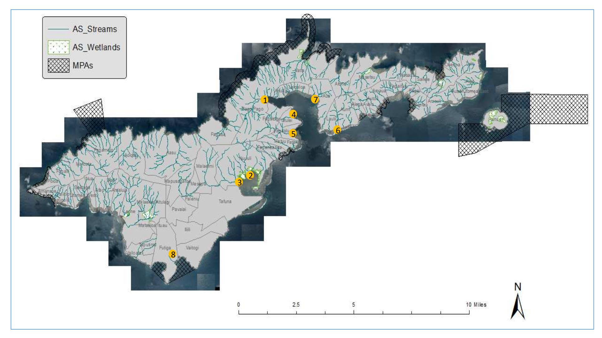
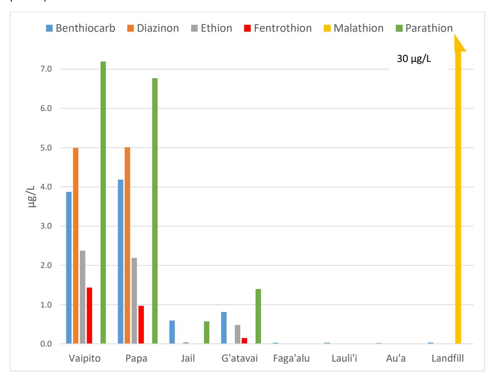
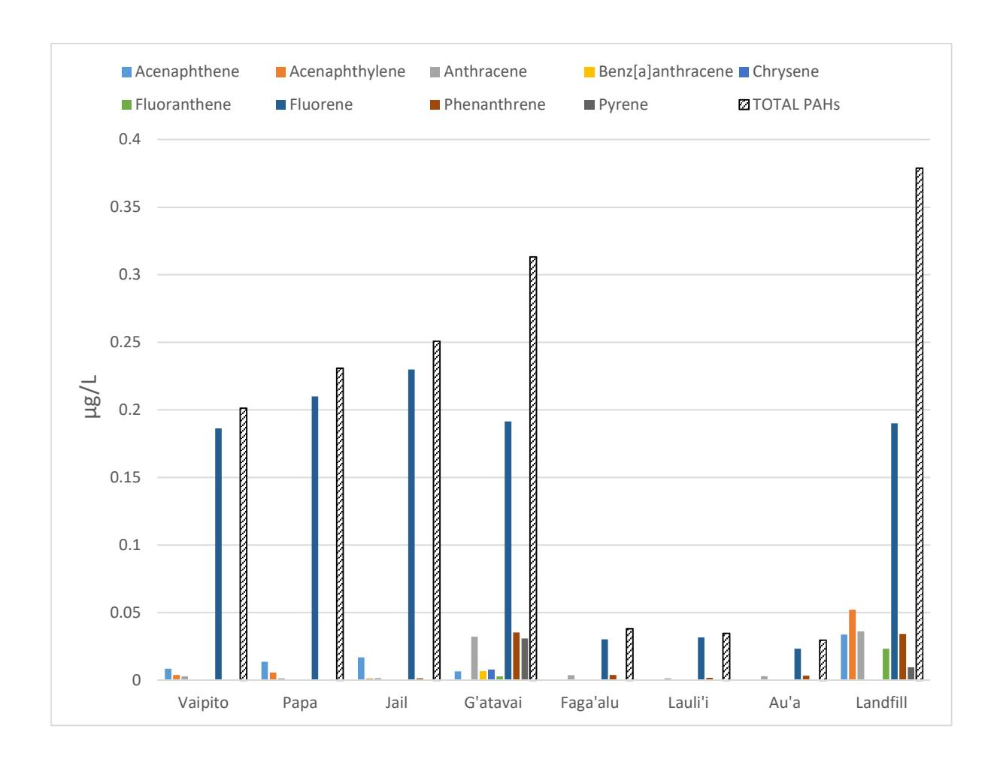
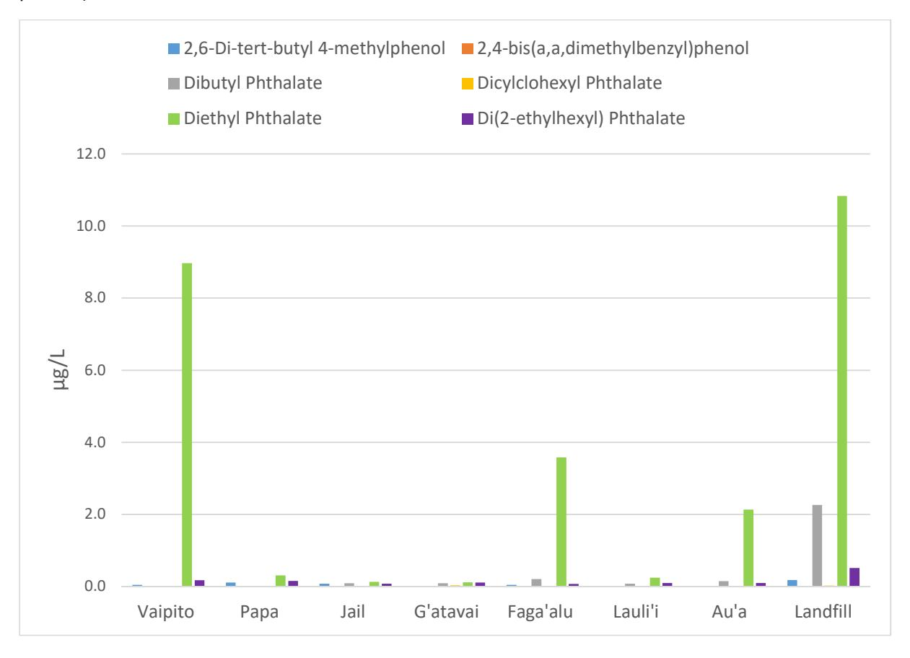

**Land-based sources of marine pollution: pesticides, PAHs and phthalates in coastal stream water, and heavy metals in coastal stream sediments in American Samoa** 

**Authors:** Beth A. Polidoro a\*, Mia T. Comeros-Raynalb, Thomas Cahilla, Cassandra Clementa .

## **Affiliations:**

- a School of Mathematics and Natural Sciences, Arizona State University, 4701 W. Thunderbird Rd, Glendale, AZ, USA.
- b American Samoa Environmental Protection Agency, Pago Pago, American Samoa

## **Abstract**

The island nations and territories of the South Pacific are facing a number pressing environmental concerns, including solid waste management and coastal pollution. Here we provide baseline information on the presence and concentration of heavy metals and selected organic contaminants (pesticides, PAHs, phthalates) in 7 coastal streams and in surface waters adjacent to the Futiga landfill in American Samoa. All sampled stream sediments contained high concentrations of lead, and some of mercury. Several coastal stream waters showed relatively high concentrations of diethyl phthalate and of organophosphate pesticides, above chronic toxicity values for fish and other aquatic organisms. Parathion, which has been banned by the US Environmental Protection Agency since 2006, was detected in several stream sites. Increased monitoring and initiatives to limit non-point source land-based pollution will greatly improve the state of freshwater and coastal resources, as well as reduce risks to human health in American Samoa.

**Keywords: water pollution, toxic metals, pesticides, plastics, Pacific islands, contaminants** 

The island nations and territories of the South Pacific are facing a number pressing environmental and humanitarian concerns, including preparing for the impacts of climate change, solid waste management and harnessing cost-efficient and sustainable energy sources, among others (Morrison and Munro, 1999; Craig et al., 2005; McCarroll et al., 2015). Tens of thousands of tons of goods and materials are shipped annually to island nations (e.g. furniture, electronics, packaged foods, clothing, medicines, etc.), but very few, if any, nations have means to recycle or properly dispose of solid and other wastes (Morrison and Munro, 1999). As a result, landfills are quickly reaching capacity, especially on small islands or atolls where the total land area might be as little as a few square kilometers. As the costs of shipping long oceanic distances often prohibits removal or recycling of wastes off island, island states are extremely vulnerable to increased contamination of freshwater and coastal resources, especially in light of potentially increasing sea-level rise and storm activity from climate change (Walsh et al., 2012).

\*Corresponding author: beth.polidoro@asu.edu

The US island territory of American Samoa, located approximately 4,200 km south of Hawai'i is the southernmost of all U.S. possessions and the only U.S. jurisdiction in the South Pacific. American Samoa comprises seven islands (five volcanic islands and two coral atolls) with a total combined land area of approximately 200 km2 . The largest island of Tutuila (140 km2 ) is the center of government and business, and supports a population of more than 56,000 residents. With a population density of more than 1,350 people/km2 along the coast and growth rate of 2.1% per year, the most pressing environmental concerns include extensive coastal alterations, fishing pressure, loss of wetlands, soil erosion, coastal sedimentation, solid and hazardous waste disposal, and pollution (Craig et al., 2005).

As in much of the Pacific, local streams in American Samoa serve as temporary waste receptacles, and contain plastics, household and agricultural waste, and other trash that is eventually deposited downstream in nearshore coastal areas, deteriorating freshwater and marine habitats. Particularly during storm events, household and industrial waste and debris often end up in streams and coastal beaches as landfills, stream and coastal litter, and infrastructures are eroded and washed away. Historical industrial, commercial, and military activity in the main Pago Pago harbor on Tutuila has also contributed to coastal pollution, including degradation of water quality and local reef habitats. Coral reefs in American Samoa support a high diversity of Indo-Pacific corals (over 200 species), fishes (890 species), and high numbers of invertebrates (Craig et al., 2005). Overfishing, point and non-point source pollution from storm water run-off, erosion from agricultural plots and urban development have been identified as the primary threats contributing to the decline of American Samoa's coral reef resources (Craig et al., 2005).

In addition to solid waste, stream water quality in American Samoa is also affected by riparian development causing changes in hydrology and shading, by watershed development causing erosion and increased turbidity, and by nutrient and bacterial pollution from poorly constructed human and pig waste disposal systems (Tuitele et al., 2014). The American Samoa Environmental Protection Agency (AS-EPA) is actively engaged in long term stream and beach water quality monitoring. Monthly assessments of water hydrography (pH, turbidity, temperature, dissolved oxygen), water chemistry (total nitrogen, total phosphorus, nitrate, ammonium) and fecal bacterial contamination are conducted in selected perennial streams on Tutuila (Craig et al., 2005).

Given the nature of solid waste observed in coastal streams and associated beaches (comprised of plastics, electronics, fabrics, furniture, etc.), as well as documented agricultural runoff (that can contribute pesticides, fertilizer, and sediments) and urban/industrial runoff (that can contribute toxic metals and petrochemicals), there is great potential for coastal streams to be a source of organic and heavy metal pollutants to near-shore coastal resources. However, no studies are known to have examined the presence of organic or elemental pollutants in American Samoa coastal streams or near-shore sediments. Therefore, the objective of this study was to provide a baseline information for the presence and concentration of selected organic contaminants (pesticides, PAHs, and phthalates) and toxic metals in selected coastal

streams and sediments in American Samoa for the purposes of determining if increased monitoring, regulatory policy and conservation actions are needed.

In June 2015, seven coastal streams were selected for sampling based on observations of high solid waste content (Figure 1). The majority of these sampled streams are within close proximity of the main town and harbor of Pago Pago. An eighth sampling site was included in an area of perched surface water that is thought to be draining from Tutuila's main landfill, located in Futiga. With the exception of the Futiga landfill, all streams were sampled very close to the mouth of the stream within the near-shore environment, where there was observed potential mixing with marine waters during extreme high tide or storm events. It is important to note, the sampling occurred during and just after a major storm event, with high rainfall, stream discharge and tidal surges.

At each surface water site, 3 composite sediment samples were randomly taken from 0-10cm depth. Composite sediment samples were air-dried, homogenized and passed through a 2mm sieve to remove rocks and other debris. Approximately 3 grams of each sample were prepared for microwave digestion using nitric acid and hydrofluoric acid followed by a boron quench, and analyzed for 30 different elements using Inductively Coupled Plasma-Optical Emission Spectrometry (ICP-OES) at ASU's Goldwater Facility. Results are reported in mg/kg dry weight. The National Institute of Standards and Technology's Trace Elements in Soil Containing Lead from Paint (SRM 2587) was used at the Certified Reference Material for sediment elemental analyses.

Water sampling consisted of collecting two 1-liter water samples from each stream. Within 12 hours, each 1-liter water sample was pre-filtered with 47mm glass fiber filters, and then extracted with solid-phase extraction C18 disks (Empore 3M, 47 mm) conditioned with acetone. Immediately after extraction, all C18 disks were frozen until arrival at Arizona State University. For Gas Chromatography-Mass Spectrometry (GC-MS) analyses, C-18 disks were eluted with 5mL acetone, 5mL acetonitrile and 8 mL of hexane and concentrated to a volume of about 0.5 mL. Concentrated sample extracts were passed through a sodium sulfate column with hexane, and then concentrated to a final volume of 0.5 ml with nitrogen gas. Method recoveries for detected organic contaminants ranged from 60% to greater than 100% for pesticides, from 40% to 94% for phthalates, and from 15% to 40% for PAHs. All surface water samples, including field blanks, were analyzed for organic contaminants using a Varian 3800 gas chromatograph in tandem with a Saturn 2200 electron ionization mass spectrometer. Two field and two laboratory blanks were also analyzed. A complete list of potential contaminants searched for, with minimum detection limits, is shown in Table S1 (Supplemental Materials). Minimum detection limits (MDL) were estimated by doubling the lowest standard concentration that showed a peak, with a signal-to-noise ratio greater than 3.

Maximum elemental concentrations detected in composite sediment samples at each of the sites are shown in Table 1, along with selected screening level limits based on modeled amphipod toxicity in marine sediments (Field et al., 2002; Buchman, 2008). Screening levels were available for only 9 of the 30 elements quantified, and for these, almost all sampled sediments showed elemental concentrations that exceeded the modelled 10-day marine amphipod acute toxicity values (Field et al., 2002). However, assuming that the geology of American Samoa is similar to that of Hawaii, some of the high concentrations found may be attributed to naturally high concentrations in the bedrock and soils, as estimated in Hawai'i (HDH, 2012). As expected, some of the highest concentrations of metals were found in sediments located near the landfill. Accounting for potential background levels, the high concentrations of lead found across all sites (and especially at G'atavai which contained more than 726 mg/kg of lead), and of mercury particularly in Au'a and Tafuna Correctional Facility (Jail) streams sediments (with concentrations of 417 mg/kg and 242 mg/kg respectively) may be of potential concern. In Hawaiian sediments, lead can be leached out of parent material and complexed in fine stream deposits, particularly in estuarine sediments, where it may have the highest concentration (AECOS, 1991).

The high concentration of lead found in G'atavai sediments, which was more than double the lead concentrations found in other sites, may be in part due to drainage from a removed fuel storage facility and resulting poorly-capped oil storage tanks, which was visually observed as oil and gas present in the stream when sampling occurred in June 2015. However, the sources of the relatively high lead concentrations throughout almost all sampling sites, and high mercury concentrations in Au'a and the Tafuna Correctional Facility (Jail) coastal stream sediments are not entirely clear. It is generally known that throughout the Pacific islands, military waste and equipment in use during World War II had been buried underground or left to degrade in place (Maragos, 1993; Monfils et al., 2006). Since association with the US in 1900, Pago Pago harbor was also used as a coaling and repair station for the US Navy. Although the military presence has decreased significantly after WWII, there may be several sites on Tutuila where military materials have been abandoned and are polluting the watershed, although the historical records, placement and function of the military installations are not clear (ASEPA, 2001). On Tutuila, military waste sites have been anecdotally reported in Faga'alu and above Au'a.

Recent unpublished studies of toxic metals in near-shore marine sediments in the village of Faga'alu (NOAA, 2015) found much lower concentrations of lead (0.6 – 45 mg/kg) than this study (311 mg/kg), likely due to sampling in different areas (e.g. inner harbor marine sediments vs. coastal stream sediments). Similarly, studies conducted in the inner Pago Pago harbor between 1990-1996 found sediment lead concentrations of up to 110 mg/kg, which was considered comparable to Hawaiian estuarine sediments (ASEPA, 2001). In addition to historic coaling, shipping and military installments, other sources of lead in the inner harbor can include current industrial activities. Just east of Vaipito stream, on the north shore of Pago Pago harbor, tuna canneries have operated for more than 50 years, with wastes pumped out to sea. There is also an electrical power generating plant on the north shore, a shipyard for painting and repair, as well as the main port and container yard in Fagatogo for incoming shipping vessels (ASEPA, 2001). In 1997, a study of sediment lead concentrations in streams associated with the inner harbor, found concentrations of more than 777 mg/kg in Fagatogo and up to 320 mg/kg in storm drain sediment from the South West Marine shipyard (ASEPA, 2001). As a result, in 1998 the inner Pago Pago Harbor was included on the list of American Samoa impaired water bodies,

due to high concentrations of lead in fish (ASEPA, 2001), which can cause serious health effects in residents eating fish from the harbor.

In 2005, a study conducted by CH2M Hill sampled sediments in Pago Pago harbor and coastal stream sediments for selected metals, PCBs, and pesticides (CH2M Hill, 2007). Although specific results could not be located, the executive summary concludes that metals in inner harbor sediments are a combination of general watershed contributions with likely point source contributions from industrial facilities, but are not of sufficient concern to warrant any additional action other than future monitoring. This is as the toxicity of precipitated or adsorbed forms of lead in soils and sediments may not be of concern, as long as pH remains relatively neutral, sediments are not remobilized, and the aerobic/anoxic conditions at the sediment-water interface are not disturbed. However, ingested lead can bioconcentrate in the bones, skin, kidneys and livers of fish rather than muscle, and therefore may pose a threat to those who eat the entire fish and/or are habitually exposed to the stream sediments (Write and Welbourn, 2002).

Mercury sediment concentrations were found to range from non-detects in 4 sites to as much as 417 mg/kg in Au'a. However, a recent study of mercury in fringing reefs off of Tutuila found only trace levels of inorganic mercury in marine waters (averaging ~0.322 ng/L), and averages of 3.4 to 27.2 µg/kg mercury in marine sediments, with the highest concentrations found just inside Pago Pago harbor and attributed to non-point, anthropogenic sources (Morrison et al., 2015). Although there are no other studies of mercury for coastal stream or inner harbor sediments known, sources of high levels of mercury in soils and coastal sediments that may be relevant for American Samoa include erosion from military waste and agriculture (from pesticides containing mercury), municipal and medical waste incineration, urban runoff, and atmospheric deposition (Wang et al., 2004; Wang et al., 2012). At the sediment-water interface, high levels of mercury can change into its most toxic form, organic methylmercury, by naturally occurring bacteria in aquatic ecosystems (Wright and Welbourn, 2002). Once dissolved in water, methylmercury crosses biological membranes, and can bioconcentrate in fatty tissues of fishes and other organisms, resulting in mercury concentrations in top predator fishes that are thousands or millions of times higher than in water or sediments. Consumption of seafood with high levels of mercury has been shown to have several health impacts, including cancer, birth defects, and neurological damage (Wright and Welbourn, 2002; Landis and Yu, 2003; Bradl, 2005). In the same study of mercury in fringing reefs, mercury concentrations in several species of reef fishes were higher in Pago Pago harbor compared to other sites around Tutuila, with some goatfishes (*Parupeneus spp*) estimated have concentrations of more than 370 ng/g-wet weight total mercury and methylmercury (Morrison et al., 2015), justifying fish consumption advisories for Pago Pago harbor.

The most commonly detected pesticides in coastal streams were benthiocarb, diazinon, ethion, fenitrothion and parathion, with malathion detected very high quantities (>30 µg/L) only in surface waters in a taro farm adjacent to the landfill (Figure 2), likely due to sampling after a recent application. Diazinon, ethion, parathion, fenitrothion and malathion are all

organophosphate insecticides, which are considered moderately to highly toxic to freshwater and marine fishes, and as acetyl cholinesterase inhibitors, can be highly toxic to pesticide applicators (Pope, 1999; Jaga and Dharmani, 2003). Parathion (also known as ethyl parathion) has been banned for use in many countries around the world, including the United States in 2006, as it has been responsible for hundreds of pesticide applicator deaths around the world (Eddleston et al., 2002). Diazinon is a restricted use pesticide in the US, and since 2004 has been prohibited from use in all residential applications and in select agricultural applications (Harper et al., 2009). Benthiocarb (also known as thiobencarb) is an herbicide that is also an acetyl cholinesterase inhibitor, and is considered moderately toxic to fish, highly toxic to aquatic invertebrates, and acutely toxic to marine estuarine fish and mollusks (Ceesay, 2000).

Tropical agriculture occupies more than 30% of the land area of American Samoa (USDA, 2008), and a wide variety of crops are grown for household consumption, with taro, coconut, cocoa, and banana grown in relatively larger quantities. However, it appears that all pesticides being used in American Samoa are not being tracked in terms of importation, uses and application frequencies. Currently, there are no active monitoring programs for pesticides in American Samoan fresh or marine waters, and none of the pesticides found in this study have EPA Pacific Basin screening level recommendations for surface or coastal waters (USEPA, 2015).

The levels of pesticides detected in coastal streams, with the potential exception of benthiocarb, all exceeded several other reported measures of chronic toxicity to fish and aquatic invertebrates. For example, based on NOAA screening levels, the chronic toxicity threshold for diazinon in fresh and marine waters is 0.17 µg/L and 0.82 µg /L respectively; 0.2 µg /L for fenitrothion in freshwaters, 0.1 µg/L for malathion in both fresh and marine waters; 2.8 µg/L for thiobencarb and 0.13 µg/L for parathion in freshwaters (Buchman, 2008). Declines in total numbers of macroinvertebrates and diversity indices have been observed in freshwaters with concentrations of malathion ranging from 0.3 to 4.5 µg /L (FDEP, 1998). Although parathion and diazinon may be the most toxic pesticides detected for humans (Fritschi et al., 2015), ethion may be the most toxic to aquatic organisms, with an acute toxicity (LC50) concentration of 0.056 to 7.7 µg/L for freshwater invertebrates, and 5.6 to 49 µg /L for marine and estuarine invertebrates (USEPA, 1989). Ethion has also been shown to accumulate in the tissues of fish (USEPA, 1989).

In terms of environmental fate, most of the pesticides detected degrade rather rapidly in surface waters in climates similar to American Samoa, with half-lives in ranging from less than 1 week (malathion, diazinon) up to about 1 week (benthiocarb, parathion), with the exception of ethion, which is highly insoluble and can persist for several months in natural waters, and even longer in sediments (Hartely and Kidd, 1983; Dierberg and Pfeuffer, 1983).

Several polycyclic aromatic hydrocarbons (PAHs) were detected in coastal streams, with the highest total concentrations in G'atavai and surface waters adjacent to the landfill (Figures 3). Although PAHs can occur naturally in the environment (e.g. from forest fires), there are many anthropogenic sources of PAHs from the incomplete combustion of organic materials during

power generation, incineration, vehicle emissions, as well as from petrochemical refinement (Augusto et al., 2011). Many PAHs are known or suspected carcinogens, and have been shown to have chronic toxicity effects in surface waters at concentrations as low as 0.01 µg/L for some of the detected compounds (Kalf et al., 1997). However, even though all of the PAHs detected are considered part of the EPA's priority-pollutants (Bojes and Pope, 2007), none of the concentrations detected in this study were above EPA (USEPA, 2015) or NOAA (Buchman, 2008) acute or chronic screening thresholds for fresh, marine or estuarine waters.

Although the distribution and fate of PAHs in fresh and marine waters is controlled by each compound's individual water solubility, many PAHs eventually associate with sediments (Douben, 2003). In surface waters, photochemical and microbial respiration are main degradation pathways, and many PAHs have been shown to degrade relatively rapidly in less than a few hours to a few days (Payne and Phillips, 1985). It is important to note that there was significant oil slicks and tarred sediments observed in the G'atavai stream during sampling. Crude and refined oils are comprised of hundreds of individual components, the majority of which are measured as total petroleum hydrocarbons, of which only 0.2 to 7% may be PAHs (Bojes and Pope, 2007). Measurements of total petroleum hydrocarbons was beyond the scope of this study, but should be included in future studies especially in light of the observed need for remediation of leaking oil into G'atavai stream, as well as other potential sources of crude and refined oil in the inner harbor.

Across all stream sites, diethyl phthalate was the most commonly detected phthalate, ranging in concentrations from 0.12 to 10.8 µg/L, with the highest concentrations detected in Vaipito, Faga'alu, Au'a and the landfill (Figure 4). Phthalate esters have been in use for more than 50 years, mainly in the manufacture of PVC and other plastic resins, including plasticizers for building materials, home furnishings, food packaging, personal care products and a variety of other sources (Staples et al., 1997). Given the dramatic increase in the use of plastics over the past few decades in American Samoa, and around the world, combined with improper disposal and/or lack of recycling facilities, phthalate esters, which include suspected and known endocrine disruptors, have been identified in all environmental compartments (air, water, sediment, biota) around the world (Barse et al., 2007). Diethyl phthalate, which is used in a variety of industrial, household and personal care products, is generally difficult to biologically and photochemically degrade, and as such, is one of the more frequently encountered phthalates in fresh and marine waters (Yuan et al., 2002), and has been shown to partition into fish and other aquatic organisms, but does not biomagnify (Mackintosh et al., 2004). Diethyl phthalate is also one of the smaller and more water soluble phthalates, so it might be present at higher concentrations in the dissolved water fraction compared to the larger and more hydrophobic phthalates. Levels of diethyl phthalate found in Vaipito, Faga'alu, Au'a and the Landfill sites all exceeded the EPA screening level of 1.50 µg/L for chronic toxicity in estuarine waters (USEPA, 2015).

In this preliminary study, a number of potential contaminants of concern were identified as priorities for future monitoring and potential remediation in Tutuila, American Samoa. All of the stream sites draining into Pago Pago harbor and Nu'uili Pala Lagoon showed high

concentrations of lead, and some of mercury, in coastal stream sediments. Investigating the sources of these metals, with concentrations above putative background levels, should be a priority, especially if they are determined to be bioavailable for uptake by locally consumed fishes. Similarly, given the high concentrations of lead and mercury detected in stream sediments, and that several metals (Cadmium, Chromium, Copper, Nickel and Zinc) exceeded marine sediment screening concentrations, more research is needed to determine metal concentrations in water and locally consumed fishes.

In several coastal streams concentrations of pesticides, some of which are banned or restricted in the US, were above chronic toxicity values to fish and other aquatic organisms. More information is needed on the import and use of agrochemicals in American Samoa to better identify pesticides and application rates, as well as the potential risks to aquatic ecosystems and pesticide applicators.

As in many parts of the world, pollution from the overuse and improper disposal of plastic products is evidenced by the high concentrations of diethyl phthalate detected in at least 3 coastal streams. In addition to lead and mercury, the presence of diethyl phthalate in local seafood should also be tested, in order to estimate potential for adverse impacts from endocrine disruption and ensure safe human consumption levels. Ecological and human health risk assessments that can quantify the source, environmental exposure and toxicological impacts of plastics, microplastics and the chemicals they comprise are rapidly emerging as research priorities (Syberg et al., 2015). As sampling for this study occurred during and just after a major storm event, any future contaminant monitoring program for fresh and marine waters, as well as for locally consumed fishes, should aim to implement a more balanced temporal and spatial sampling scheme, in order to better understand any seasonal, temporal or other trends in contaminant presence and concentration.

Of special concern is the Futiga landfill, which reportedly accumulates approximately 70 tons of solid waste per day, was predicted to reach capacity by 2015 (PIDP, 2013). Currently the American Samoa Strategic Energy Plan and the American Samoa Power Authority are looking at waste to energy strategies to reduce the amount of solid waste buried on island. These include anaerobic digestion, small-scale biomass power, biodiesel options, electricity generation from municipal solid waste, and investigation of new technologies for waste to energy and waste reduction.

Although there have been several sources of historical and current pollution identified in Pago Pago Harbor (e.g. marina and port traffic, shipyard, tuna canneries, energy plant, sewage treatment plant, etc.), all point sources currently have National Pollutant Discharge Elimination System permits. Additionally, due to the segregation and transportation of cannery waste beyond the inner harbor, better treatment of sewage, and more effective monitoring and prosecution by the Coast Guard of commercial vessels that pollute the harbor, the water quality in the inner harbor has greatly improved in the last two decades (Tuitele et al., 2014). Section 24.0206(g)(3) of the American Samoa Water Quality Standards (ASWQS), states that the concentration of toxic pollutants in all embayments shall not exceed the continuous

concentration criteria for marine waters and for human consumption of organisms, as listed in the most recent toxics criteria published in 40 CFR Part 131.36 (b) (AS-EPA 2001). However, many of the contaminants detected in this study are not currently included in 40 CFR Part 131.36 (b). Increased provisions for monitoring and limiting non-point source land-based pollution (e.g. pesticides from commercial and household agriculture, plastics from domestic and industrial use, and fossil fuels from industry, emissions and other sources) will greatly improve the state of freshwater resources and near-shore coastal ecosystems in American Samoa.

## **Acknowledgements**

We thank the American Samoa Environmental Protection Agency (AS-EPA) for providing information and advice in accessing study sites, the American Samoa Department of Marine and Wildlife Resources, Coral Reef Advisory Group (CRAG), and NOAA Pacific Islands Regional Office Pago Pago branch. We are grateful to AS-EPA Director Ameko Pato and Deputy Director Fa'amao Asalele, Jr. for the support and assistance with field work logistics and in providing environmental regulatory knowledge in the Territory. We are also thankful for the support of AS-EPA staff: William Sili, Ioane Tomanogi, Christianera Tuitele and Josephine Regis. Many thanks to Roger Brewer of the State of Hawaii for assistance with screening and background levels, and to David Whitehall for sharing his Faga'alu study and the NOAA National Status and Trends Database. Funding for this study was made possible by Arizona State University.

## **References**

AECOS, 1991. A preliminary toxics scan of water, sediment, and fish tissues from inner Pago Pago Harbor in AS. AECOS, Inc. Kane'ohe, Hawai'i. Report to ASG, DMWR, ASEPA, ASCMP. 75 pp.

ASEPA (American Samoa Environmental Protection Agency), 2001. TMDL development for lead, Pago Pago Harbor, Territory of American Samoa. ASEPA. 22 pp.

Augusto, S., Gonzalez, C., Vieira, A.R., Máguas, C., Branquinho, C., 2011. Evaluating sources of PAHs in urban streams based on land use and biomonitors. Environ. Sci. Tech. 45, 3731–3738.

Barse, A.V., Chakrabarti, T., Ghosh, T.K., Pal, A.K., Jadhao, S.B., 2007. Endocrine disruption and metabolic changes following exposure of Cyprinus carpio to diethyl phthalate. Pestic. Biochem. Physiol. 88, 36-42.

Bojes, H.K., Pope, P.G., 2007. Characterization of EPA's 16 priority pollutant polycyclic aromatic hydrocarbons (PAHs) in tank bottom solids and associated contaminated soils at oil exploration and production sites in Texas. Reg. Toxicol. Pharmacol. 47, 288-295.

Bradl, H., 2005. Heavy Metals in the Environment: Origin, Interaction and Remediation. Elsevier Academic Press, London.

Buchman, M.F., 2008. NOAA Screening Quick Reference Tables, NOAA OR&R Report 08-1, Seattle, WA, Office of Response and Restoration Division, NOAA, 34 pp.

Ceesay, S., 2000. Environmental Fate of Thiobencarb. California EPA, California, USA.

CH2M Hill, 2007. Summary Findings report Pago Pago Harbor Sediment Toxicity Study. Submitted to AS EPA and USEPA, December 2007.

Craig, P., DiDonato, G., Fenner, D., Hawkins, C., 2005. The State of Coral Reef Ecosystems of American Samoa. In: Waddell J (ed.), The State of Coral Reef Ecosystems of the United States and Pacific Freely Associated States, NOAA Technical Memorandum NOS NCCOS 11, Silver Spring, Maryland USA, 522 pp.

Dierberg, F.E., Pfeuffer, R.J., 1983. Fate of Ethion in canals draining a Florida citrus grove. J. Agric. Food Chem. 4, 704-709.

Douben, P.E.T., 2003. PAHs: an ecotoxicological perspective. Ecological and Environmental Toxicology Series. John Wiley and Sons, England.

Eddleston, M., Karalliedde, L., Buckley, N., Fernando, R., Hutchinson, G., Isbister, G., Konradsen, F., Murray, D., Piola, J.C., Senanayake, N., Sheriff, R., 2002. Pesticide poisoning in the developing world—a minimum pesticides list. Lancet 360, 1163-1167.

FDEP (Florida Department of Environmental Protection), 1998. Biological Assessment of Five Lakes in the Umatilla, Florida Area in Response to application of Malathion for the Control of the Mediterranean Fruitfly (*Ceratitis capitata*), FDEP Surface Water Monitoring Section.

Field, L.J., MacDonald, D.D., Norton, S.B., Ingersoll, C.G., Severn, C.G., Smorong, D., Lindskoog, R., 2002. Predicting amphipod toxicity from sediment chemistry using logistic regression models. Environ. Toxicol. Chem. 21, 1993-2005.

Fritschi, L., McLaughlin, J., Sergi, C.M., Calaf, G.M., Le Curieux, F., Forastiere, F., Kromhout, H., Egeghy, P., Jahnke, G.D., Jameson, C.W., Martin, M.T., 2015. Carcinogenicity of tetrachlorvinphos, parathion, malathion, diazinon, and glyphosate. Lancet Oncol. http://dx.doi.org/10.1016/S1470-2045(15)70134-8.

Harper, B., Luukinen, B., Gervais, J.A., Buhl, K., Stone, D., 2009. Diazinon Technical Fact Sheet. National Pesticide Information Center, Oregon State University Extension Services.

Hartley, D., Kidd, H., 1983. The Agrochemicals Handbook. Royal Society of Chemistry, Nottingham, England.

HDH (Hawai'i Department of Health), 2012. Hawaiian Islands Soil Metal Background Evaluation Report. Hawai'i Department of Health, Honolulu, HI.

Jaga, K., Dharmani, C., 2003. Sources of exposure to and public health implications of organophosphate pesticides. Rev. Panam. Salud Publica 14, 171-185.

Kalf, D.F., Crommentuijn, T., van de Plassche, E.J., 1997. Environmental quality objectives for 10 polycyclic aromatic hydrocarbons (PAHs). Ecotox. Environ. Safe. 36, 89-97.

Landis, W.G., Yu, M-H., 2003. Introduction to Environmental Toxicology: Impacts of Chemicals Upon Ecological Systems. CRC Press, Lewis Publishers, Boca Raton, FL .

Mackintosh, C.E., Maldonado, J., Hongwu, J., Hoover, N., Chong, A., Ikonomou, M.G., Gobas, F.A., 2004. Distribution of phthalate esters in a marine aquatic food web: comparison to polychlorinated biphenyls. Environ. Sci. Tech. 38, 2011-2020.

Maragos, J.E., 1993. Impact of coastal construction on coral reefs in the US-affiliated Pacific Islands. Coast. Manage. 21, 235-269.

Mc Carroll, J., Blumenfeld, J., Polidoro, B., Curtis, M., Matagi, R., Talouli, A., 2015. Panel of Ocean Health. Oral Presentation: Pacific Islands Environmental Conference, June 15-18, 2015. Pago Pago, American Samoa.

Monfils, R., Gilbert, T., Nawadra, S., 2006. Sunken WWII shipwrecks of the Pacific and East Asia: the need for regional collaboration to address the potential marine pollution threat. Ocean Coast. Manage. 49, 779-788.

Morrison, R.J., Munro, AJ., 1999. Waste management in the small island developing states of the South Pacific: an overview. Aust. J. Environ. Manage. 6, 232-246.

Morrison, R.J., Peshut, P.J., West, R.J., Lasorsa, B.K. 2015. Mercury (Hg) speciation in coral reef systems of remote Oceania: Implications for the artisanal fisheries of Tutuila, Samoa Islands. Mar. Poll. Bull. 96, 41-56.

NOAA (National Oceanic and Atmospheric Administration), 2015. National Status and Trends Database, http://egisws02.nos.noaa.gov/nsandt/, accessed December 2015.

PIDP (Pacific Islands Development Program), 2013. Am. Samoa Landfill Could Reach 'Critical Mass' in 2015, Pacific Islands Report, East-West Center, Honolulu, HI.

Payne, J.R., Phillips, C.R. 1985. Photochemistry of petroleum in water. Environ. Sci. Tech. 19, 569-579.

Pope, C.N., 1999. Organophosphorus pesticides: do they all have the same mechanism of toxicity? J. Toxicol. Environ. Health B 2,161-181.

Tuitele, C., Buchan, E.L., Regis, J., Potoa'e, J., Fale, C., 2014. Territory of American Samoa Integrated Water Quality Monitoring and Assessment Report. American Samoa EPA, Pago Pago, 67pp.

Staples, C.A., Peterson, D.R., Parkerton, T.F., Adams, W.J., 1997. The environmental fate of phthalate esters: a literature review. Chemosphere 35, 667–749.

Syberg, K., Khan, F.R., Selck, H., Palmqvist, A., Banta, G.T., Daley, J., Sano, L., Duhaime, M.B., 2015. Microplastics: addressing ecological risk through lessons learned. Environ. Toxicol. Chem. 34, 945-953.

USDA (United States Department of Agriculture), 2008. 2007 Consensus of Agriculture. American Samoa (2008) Territory, District and County Data. Volume 1. Geographic Area Series, Part 55. US Department of Agriculture, Washington DC.

USEPA (United States Environmental Protection Agency), 1989. Pesticide Fact Sheet Number 209: Ethion. Office of Pesticides and Toxic Substances, Office of Pesticide Programs, US EPA, Washington, DC.

USEPA (United States Environmental Protection Agency), 2015. Evaluation of Environmental Hazards at Sites with Contaminated Soil and Groundwater, Volume 2: Background Documentation for the Development of Tier 1 Environmental Action Levels. Pacific Basin Edition, USEPA, CNMI DEQ, Guam EPA.

Walsh, K.J, McInnes, K.L, McBride, J.L., 2012. Climate change impacts on tropical cyclones and extreme sea levels in the South Pacific—A regional assessment. Global Planet. Change 80, 149- 164.

Wang, Q., Kim, D., Dionysiou, D.D., Sorial, G.A., Timberlake, D.. 2004. Sources and remediation for mercury contamination in aquatic systems—a literature review. Environ. Poll. 131, 323-336.

Wang, J., Feng, X., Anderson, C.W., Xing, Y., Shang, L., 2012. Remediation of mercury contaminated sites–a review. J. Hazard. Mater. 221, 1-8.

Wright, D.A., Welbourn, P., 2002. Environmental Toxicology. Cambridge University Press, Cambridge, U.K.

Yuan, S.Y., Liu, C., Liao, C.S., Chang, B.V., 2002. Occurrence and microbial degradation of phthalate esters in Taiwan river sediments. Chemosphere 49, 1295–1299.

Figure 1: Location of coastal stream sampling sites on Tutuila, American Samoa. Village names given in parentheses. 1) Vaipito (Pago Pago), 2) Papa (Nuuli), 3) Jail or Vitele (Lauliituai), 4) G'atavai or Vailoa (Utulei), 5) Faga'alu (Faga'alu), 6) Visa (Lauli'i), 7) Lalolamauta (Aua), and 8) Landfill Leachate (Futiga). MPAs = marine protected areas.

Table 1: Elemental composition of coastal stream sediments and soils below landfill (based on the maximum value reported from 3 composite samples taken at each site). Concentrations exceeding potential background levels highlighted in red. \*Modelled amphipod toxicity screening levels (T20) from Buchman 2008, specifically Field et al. 2002. #Maximum potential background concentrations in Hawai'i soils (HI Dept of Health 2012). Blanks represent non-detected concentrations.

| Element (mg/kg) dry weight | Marine Sediment Screening (mg/kg)* | Hawai'i Maximum Background Levels# (mg/kg) | Vaipito | Papa   | Jail  | G'atavai | Faga'aglu | Au'a   | Lauli'i | Landfill |
|-------------------------------|---------------------------------------|--------------------------------------------------|---------|--------|-------|----------|-----------|--------|---------|----------|
| Aluminum                      |                                       | 166138                                           | 70366   | 82271  | 58901 | 69189    | 106424    | 47312  | 70632   | 45936    |
| Antimony                      | 0.63                                  | 2.4                                              |         |        |       |          |           |        |         |          |
| Arsenic                       | 7.4                                   | 50                                               |         |        |       |          |           |        |         |          |
| Barium                        |                                       | 926                                              | 215     | 290    | 238   | 309      | 475       | 394    | 310     | 291      |
| Beryllium                     |                                       | 3.82                                             | 2.0     | 1.8    | 0.4   |          |           |        |         |          |
| Bismuth                       |                                       |                                                  | 118     | 114    | 116   | 122      | 123       | 147    | 149     | 139      |
| Cadmium                       | 0.38                                  | 17                                               | 2.1     | 2.1    | 2.0   | 2.6      | 2.7       | 3.1    | 3.0     | 2.8      |
| Cesium                        |                                       |                                                  |         |        |       |          |           |        |         |          |
| Chromium                      | 49                                    | 3180                                             | 191     | 130    | 233   | 85       | 120       | 346    | 364     | 324      |
| Cobalt                        |                                       | 113.5                                            | 52.2    | 45.3   | 61.4  | 50.3     | 61.5      | 92.3   | 95.1    | 83.0     |
| Copper                        | 32                                    | 450                                              | 23.6    | 35.0   | 63.6  | 41.0     | 50.4      | 84.4   | 77.1    | 59.0     |
| Gold                          |                                       |                                                  |         |        |       |          |           |        |         |          |
| Indium                        |                                       |                                                  | 1136    | 1092   | 1119  | 1160     | 1374      | 1668   | 1973    | 1432     |
| Iron                          |                                       | 260082                                           | 91649   | 155004 | 92389 | 101052   | 136300    | 134134 | 145573  | 115491   |
| Lead                          | 30                                    | 72.8                                             | 241     | 318    | 275   | 727      | 311       | 328    | 326     | 375      |
| Lithium                       |                                       |                                                  | 28.9    | 13.2   | 16.5  | 5.1      | 1.8       | 8.3    | 16.8    | 10.1     |
| Magnesium                     |                                       | 68611                                            | 13674   | 8339   | 13431 | 7565     | 6615      | 23608  | 16593   | 20395    |
| Manganese                     |                                       | 4880                                             | 1063    | 1088   | 1190  | 1335     | 1947      | 1471   | 1829    | 1570     |
| Mercury                       | 0.14                                  | 1.4                                              | 18      | 9      | 242   |          |           | 417    |         |          |
| Molybdenum                    |                                       | 4.0                                              | 198     | 198    | 9     | 158      | 290       | 11     | 32      | 18       |
| Nickel                        | 15                                    | 767                                              | 383     | 410    | 452   | 336      | 346       | 585    | 502     | 646      |
| Phosphorus                    |                                       | 18078                                            | 1606    | 2356   | 2396  | 2975     | 3288      | 2780   | 2583    | 2203     |
| Selenium                      |                                       | 12.2                                             |         |        |       |          |           |        |         |          |
| Strontium                     |                                       | 1094                                             | 1271    | 228    | 212   | 862      | 328       | 390    | 280     | 305      |
| Thallium                      |                                       |                                                  |         |        |       |          |           |        |         |          |
| Tin                           |                                       | 10                                               | 20      | 16     | 17    | 18       | 37        | 27     | 17      | 17       |
| Titanium                      |                                       | 53032                                            | 15596   | 14831  | 15908 | 16221    | 18873     | 23656  | 28148   | 20205    |
| Uranium                       |                                       |                                                  |         |        |       |          |           |        |         |          |
| Vanadium                      |                                       | 1090                                             | 214     | 192    | 176   | 150      | 188       | 305    | 308     | 246      |
| Zinc                          | 94                                    | 1200                                             | 295     | 295    | 197   | 773      | 701       | 390    | 414     | 332      |

Figure 2. Pesticides detected in water samples (maximum value reported from two 1-L samples taken per site).

Figure 3. PAHs detected in water samples (maximum value reported from two 1-L samples taken per site).

Figure 4. Phthalates detected in water samples (maximum value reported from two 1-L samples taken per site).

