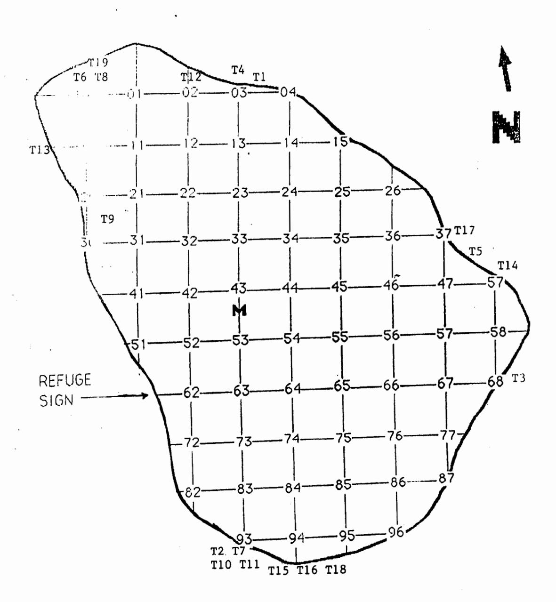
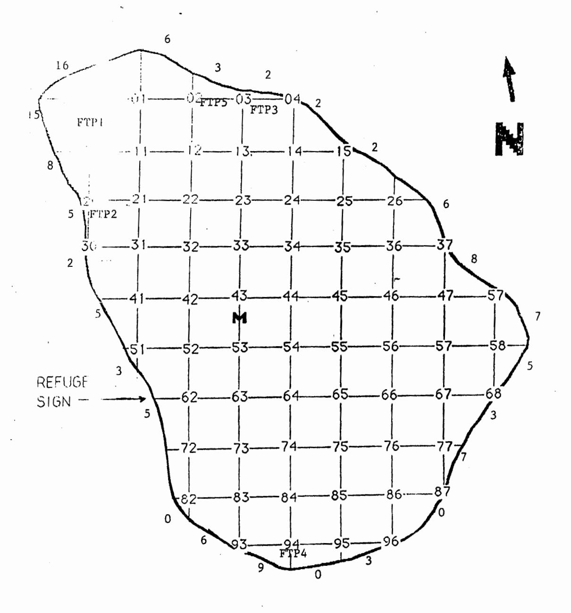
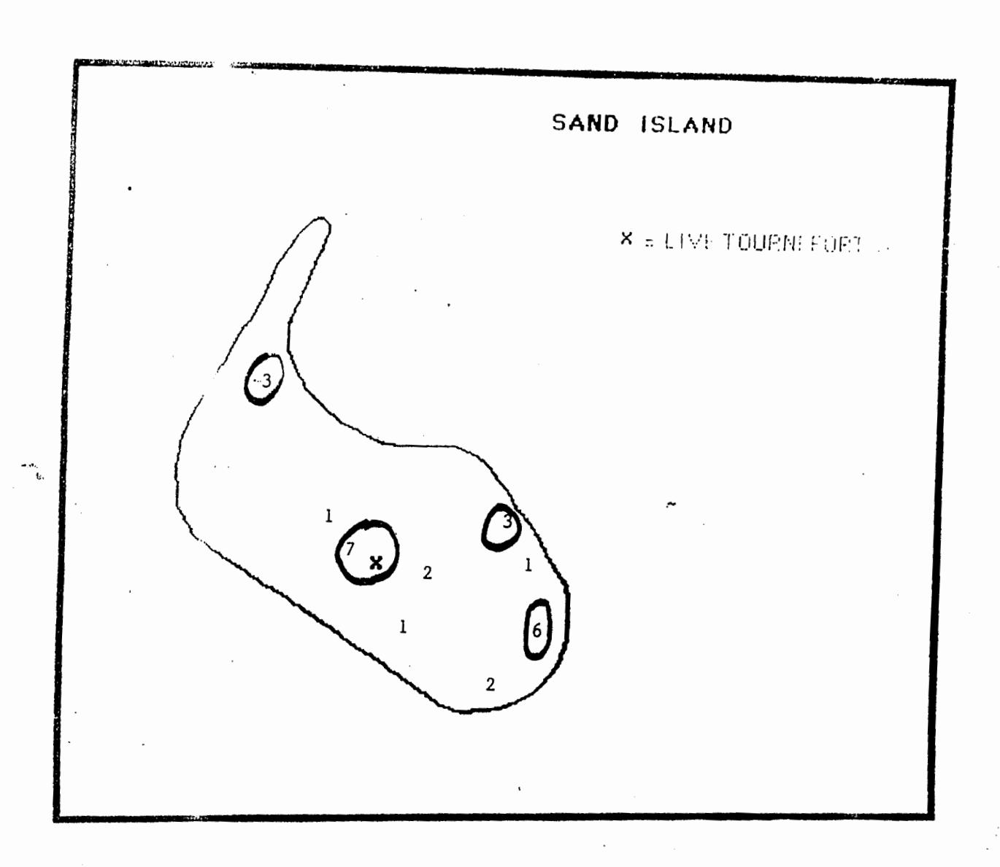

### TURTLE OBSERVATIONS FROM ROSE ATOLL 18 OCTOBER TO 28 NOVEMBER, 1990

# Submitted by:

Bonnie J. Ponwith

Department of Marine and Wildlife Resources
Pago Pago, American Samoa

19 December, 1990

### SUMMARY

Nightly surveys of Rose Island were conducted to monitor turtle activity from 18 October to 28 November, 1990. Two turtles were tagged and one tag recovery was noted. A total of 19 turtle or turtle track observations were made, 10 of which involved the tagged turtles. We observed 128 pits on Rose and 26 pits on Sand Island.

#### INTRODUCTION

A six week project, jointly funded by the Department of Marine and Wildlife Resources (DMWR), the U.S. Fish and Wildlife Service (USF&W), and Office of Development Planning was conducted to eradicate the rat population on Rose Atoll. Based on a review of past trip reports, this is the longest visit to Rose on record for DMWR or USF&W staff. Thus, it provided an excellent opportunity for DMWR and USF&W to gather data of broader scope than that past trips, which avereaged three to five days duration. This is a summary of turtle activity data collected during the study.

#### **METHODS**

Nightly surveys were conducted on Rose Island from 18 October to 28 November, 1990. Surveys consisted of one to two observers walking the perimeter of the island at two hour intervals, documenting all observations of turtles and fresh turtle tracks, false pits and nests.

All observations of fresh tracks and of turtles were recorded on a field form. For each observation, the number of false pits (pits in which no eggs were deposited) that were dug was recorded in addition to whether or not a nest had been dug. Nests were defined as those freshly dug areas that were completely filled with sand (flush with surrounding sand level), whereas false pits were defined as those freshly dug areas that were unfilled or partially dug. Five false pits on Rose Island were marked with stakes to track how long they remain visible. An attempt was made to tag each turtle observed although there were cases where this was not possible. The tags and tagging apparatus used were provided by National Marine Fisheries Service (NMFS), Honolulu Lab.

Sand Island was visited intermittently and surveyed for turtle tracks and pits. New pits were marked with spray paint and the location recorded on a map.

#### RESULTS AND DISCUSSION

All turtles seen during the study, both hatchling and adult, were green turtles (Chelonia mydas). Specifics pertaining to each sighting are summarized in Table 1. The north by northwest end of the island supported the highest concentration of turtle activity based on turtle observations and previously dug pits (Figs. 1 and 2). This area is characterized by a broad reach of coral rubble above the high tide line and some areas of

sand within the adjacent margin of Tournefortia.

Two turtles were tagged and one tag recovery was made during the study period. Each of these three turtles made multiple visits to the beach at Rose, accounting for 10 of the 12 turtle observations (excluding the seven sightings of tracks only).

NMFS records show that one turtle we observed, tag recovery HIMB 5804, was tagged on Rose Island on 11 November, 1981. Curved carapace length at tagging time was 106 cm compared to 109 cm on the recovery date. The tag, found on the right flipper, had been applied to one of the hard plates on the flipper rather than in the fleshy tissue that separates the plates. The tag appeared to be secure and in good condition. The turtle's entire left front flipper had been amputated, leaving a stump approximately 5 cm in length. Although the wound had healed, the scar tissue appeared to be irritated.

Individual turtle hatchlings were seen on seven occasions during the study, and a pair was seen once. A hatchling was observed being attacked by a crab during one of the night surveys. Another hatchling crawled into the main camp tent one evening, presumably attracted by the light.

We observed 128 turtle pits on Rose Island (Fig. 2). All pits except those suspected to be a year old or older (filled with debris or with spray paint from the October 1989 trip still visible) were counted. It is probable that most of the older pits counted were false pits rather than nests.

Eighteen turtle pits were observed on Sand Island upon arrival in October (Fig. 3). Two pits appeared to be fresh, probably dug within the first two weeks of October. The remaining sixteen pits had been dug sometime since our last visit to the island in August, 1990. As was the case on Rose Island, many of the pits had not been filled, indicating they did not contain eggs. During the duration of our stay, approximately eight pits were dug on Sand Island. The area at the base of the lone tree on the island had the highest concentration of pits and in many cases, turtles excavated areas where pits had been previously dug, making it difficult to keep an accurate count.

## RECOMMENDATIONS

Rose and Sand Island turtles' tenancy to dig several pits before laying their eggs confounds efforts to quantify nesting activity there. If the ratio of blank pits to actual nests remains constant over the years, pit counts can be used as a relative index of abundance, but not as indicator of successful nesting. However, if data were maintained on the number of false pits dug per nest for each witnessed nesting event, that ratio could be applied to future pit counts to get a rough indicator of egg-bearing nests.

Pit counts would also be more valuable if it were possible to

differentiate between pits dug by year or by nesting season. One approach would be to stake every pit on the island. Another would be to stake test pits from the various substrate types and with different levels of exposure (i.e. surrounded by vegetation, on vegetation margin, leeward, windward) and track how long they are visible.

Rose Atoll turtle sighting log covering the time period of 16 November to 28 November, 1990. Table 1.

| COMMENTS                     | Dug 4 false pits, moved to an existing false pit and finished digging it, laid eggs, dug one more false pit returned to sea. | Missing left flipper. Encountered 2m from shore returning to sea. Had dug one false pit and what appeared to be a true nest. | Tracks only. Dug what appeared to be a true nest. | Dug 3 false pits, gave up and returned to sea. Could not tag. | Observed laying eggs. Tag N110 void. | Dug two false pits and returned to sea. | Tried to crawl through a heavy branch for .5 hr, gave up and returned to sea. | Dug a false pit in very woody area, gave up and returned to sea. | Dug one false pit, dug nest and laid eggs (observed). |
|------------------------------|------------------------------------------------------------------------------------------------------------------------------|------------------------------------------------------------------------------------------------------------------------------|---------------------------------------------------|---------------------------------------------------------------|--------------------------------------|-----------------------------------------|-------------------------------------------------------------------------------|------------------------------------------------------------------|-------------------------------------------------------|
| TAG # (left, right)          | N107, N108 103cm                                                                                                          | 5804 (Recovery) 109cm                                                                                                  | Not observed                                      | Not tagged                                                    | N111, N109 101cm                  | N107, N108 (Return)                  | 5804 (Return)                                                              | N107, N108 (Return)                                           | 5804 (Return)                                      |
| NEAREST TRANSECT STAKE | 03                                                                                                                           | 633                                                                                                                          | 89                                                | 03                                                            | 47                                   | 100                                     | წ <b>6</b>                                                                 | 100                                                              | 31                                                    |
| DATE                         | 18 Oct                                                                                                                       | 18 Oct                                                                                                                       | 26 oct                                            | 27 Oct                                                        | 29 Oct                               | 30 Oct                                  | 30 Oct                                                                        | 31 Oct                                                           | 1 Nov                                                 |
| SIGHTING NUMBER           | 1                                                                                                                            | Ν                                                                                                                            | ю                                                 | 4                                                             | ഗ                                    | 9                                       | 7                                                                             | ω                                                                | O                                                     |

Table 1. cont.

| COMMENTS                     | Dug one false pit, followed embankment 100' E., returned to sea. | Tracks noted. Dug what appeared to be true nest and returned to sea. | Tracks noted. Dug one false pit and returned to sea. | Dug one false pit and returned to sea. | Tracks noted. Tracks went up the beach and back to sea - no digging. | Tracks noted. Tracks went up the beach and back to sea - no digging. | Dug one false pit and returned to sea. | Dug one false pit, dug nest and deposited 80 eggs. Tag N107 pulled out. Flipper re-tagged with N112. | Tracks noted. No pits. | Tracks noted. Dug 2 false pits among several existing ones and returned to sea. |
|------------------------------|------------------------------------------------------------------|-------------------------------------------------------------------------|------------------------------------------------------|----------------------------------------|----------------------------------------------------------------------|----------------------------------------------------------------------|-------------------------------------------|------------------------------------------------------------------------------------------------------|------------------------|---------------------------------------------------------------------------------|
|                              |                                                                  |                                                                         |                                                      |                                        |                                                                      |                                                                      | ~                                         |                                                                                                      |                        |                                                                                 |
| TAG # (right,left)           | Not tagged                                                       | Not observed                                                            | Not observed                                         | 5804 (Return)                       | Not observed                                                         | Not observed                                                         | N111, N109 (Return)                    | N112, N108 (Return)                                                                               | Not observed           | Not observed                                                                    |
| NEAREST TRANSECT STAKE | 93                                                               | 93                                                                      | 02                                                   | 10                                     | 48                                                                   | 93                                                                   | 94                                        | 37                                                                                                   | 94                     | 00                                                                              |
| DATE                         | 8 Nov                                                            | on 6                                                                    | 11 Nov                                               | 12 Nov                                 | 19 Nov                                                               | VON 91                                                               | NON CC                                    | 22 Nov                                                                                               | 22 Nov                 | 22 Nov                                                                          |
| SIGHTING                     | 10                                                               | 11                                                                      | 12                                                   | 13                                     | 14                                                                   | 15                                                                   | 16                                        | 17                                                                                                   | 18                     | 19                                                                              |

# ROSE ISLAND SAMPLING GRID

Figure 1. Location of turtle sightings by observation number made 18 October to 28 November, 1990.

# ROSE ISLAND SAMPLING GRID

Figure 2. Turtle pit count by transect grid, 26 November, 1990. FTP1-5 are locations of staked false pits.

Figure 3. Locations of turtle pits on Sand Island, 26 November, 1990.