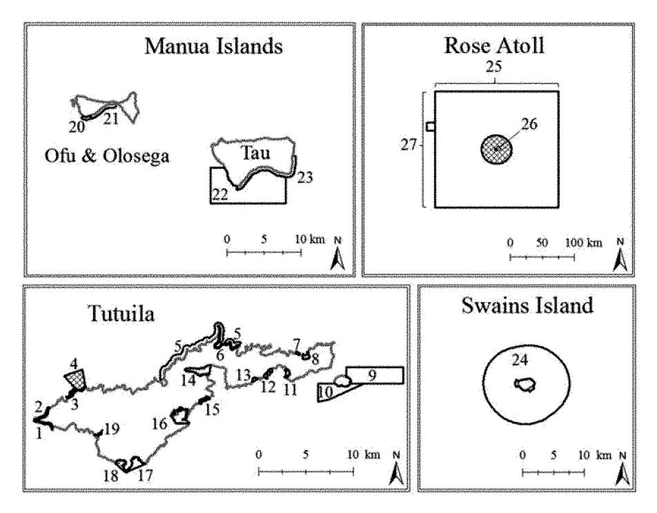

DATE DOWNLOADED: Thu Jan 25 17:36:39 2024 SOURCE: Content Downloaded from [HeinOnline](https://heinonline.org/HOL/Page?handle=hein.journals/intwlp19&collection=journals&id=303&startid=&endid=318)

#### Citations:

Please note: citations are provided as a general guideline. Users should consult their preferred citation format's style manual for proper citation formatting.

#### Bluebook 21st ed.

Jeremy M. Raynal, Arielle S. Levine & Mia T. Comeros-Raynal, American Samoa's Marine Protected Area System: Institutions, Governance, and Scale, 19 J. INT'l WILDLIFE L. & POL'y 301 (2016).

#### ALWD 7th ed.

Jeremy M. Raynal, Arielle S. Levine & Mia T. Comeros-Raynal, American Samoa's Marine Protected Area System: Institutions, Governance, and Scale, 19 J. Int'l Wildlife L. & Pol'y 301 (2016).

#### APA 7th ed.

Raynal, J. M., Levine, A. S., & Comeros-Raynal, M. T. (2016). American samoa's marine protected area system: institutions, governance, and scale. Journal of International Wildlife Law and Policy, 19(4), 301-316.

#### Chicago 17th ed.

Jeremy M. Raynal; Arielle S. Levine; Mia T. Comeros-Raynal, "American Samoa's Marine Protected Area System: Institutions, Governance, and Scale," Journal of International Wildlife Law and Policy 19, no. 4 (2016): 301-316

### McGill Guide 9th ed.

Jeremy M. Raynal, Arielle S. Levine & Mia T. Comeros-Raynal, "American Samoa's Marine Protected Area System: Institutions, Governance, and Scale" (2016) 19:4 J Int'l Wildlife L & Pol'y 301.

### AGLC 4th ed.

Jeremy M. Raynal, Arielle S. Levine and Mia T. Comeros-Raynal, 'American Samoa's Marine Protected Area System: Institutions, Governance, and Scale' (2016) 19(4) Journal of International Wildlife Law and Policy 301

#### MLA 9th ed.

Raynal, Jeremy M., et al. "American Samoa's Marine Protected Area System: Institutions, Governance, and Scale." Journal of International Wildlife Law and Policy, vol. 19, no. 4, 2016, pp. 301-316. HeinOnline.

#### OSCOLA 4th ed.

Jeremy M. Raynal, Arielle S. Levine & Mia T. Comeros-Raynal, 'American Samoa's Marine Protected Area System: Institutions, Governance, and Scale' (2016) 19 J Int'l Wildlife L & Pol'y 301 Please note: citations are provided as a general guideline. Users should consult their preferred citation format's style manual for proper citation formatting.

#### Provided by:

William S. Richardson School of Law Library

# American Samoa's Marine Protected Area System: Institutions, Governance, and Scale

Jeremy M. Raynala, Arielle **S.** Levineb, and Mia T. Comeros-Raynalc

### **1.** Introduction

Marine protected areas (MPAs) are a primary marine conservation strategy in the **US** territory of American Samoa, which has a goal to protect 20 percent of its coral reef area under "no-take" MPAs. The territory implements MPAs **by** using diverse governance approaches involving a range of institutions operating at different scales and including federal, territorial, and local village entities. This innovative approach to management takes advantage of the territory's traditional marine tenure system while drawing on resources available from the **US** federal government. Since 2000, total MPA coverage in American Samoa has expanded to encompass approximately **25** percent of coral reef area in the territory, with nearly **7** percent of reefs in notake reserves. This represents a level of resource protection and inter-institutional collaboration that is unusual in the Pacific and, indeed, worldwide.' However, the territory still falls far short of its stated goal.

This article is the first comprehensive description and governance analysis of the American Samoa MPA system, exploring the unique institutional arrangements that have been established, with traditional Samoan governance systems operating semi-independently under a US-based legal system and in coordination with the **US** government. We begin with an overview of the global push for MPA expansion and the literature on MPA governance. We then explain the context for marine resource governance in American Samoa. Next, we lay out the origins and rationale behind each MPA type in the territory, the institutions involved and governance approaches taken, and how each type of MPA fits into the unique social-ecological and governance context in American Samoa. We evaluate governance opportunities and challenges involved in combining Western management approaches with Samoan cultural institutions and tenure systems; compliance with and enforcement

**CONTACT** Jeremy M. Raynal **0** Jeremy.raynal@crag.as Coral Reef Advisory Group, P.O. Box **3730** Pago Pago, American Samoa, **AS 96799.**

aCoral Reef Advisory Group, American Samoa.

bDepartment of Geography, San Diego State University, San Diego, California, **USA;** and **NOAA** Coral Reef Conservation Program (The Baldwin Group, Inc.).

cIUCN Global Species Programme/Biological Sciences, **Old** Dominion University, Norfolk, Virginia, **USA;** and American Samoa Environmental Protection Agency, Pago Pago, **AS.**

1Jane Lubchenco, Making Waves: TheScience and Politics of Ocean Protection, **350 SCIENCE 382 (2015)** (estimating global MPA coverage at **3.5** percent, with only **1.6** percent "strongly protected").

**of** village, territorial, and **US** federal rules and regulations; interagency coordination and leadership; and considerations of scale in MPA planning, design, and implementation. This evaluation of the unique features of American Samoa's MPA system can strengthen MPA governance in the territory and can provide a more broadly valuable understanding of the complex interdependences between culture, institutions, politics, and scale in marine resource governance.

### 2. The global push for MPAs as a marine conservation strategy

To address global declines in marine biodiversity, ecosystem functioning, and marine ecosystem services, nations and international bodies have called for coordinated action. One of the primary mechanisms advocated is the creation and expansion of MPAs and MPA networks. International goals, including the **UN** Sustainable Development GoalS2and the Convention on Biological Diversity's (CBD) Aichi Biodiversity Targets **(#11),3** currently call for protection of at least **10** percent of ocean areas. The Aichi Target specifically calls for coastal and marine areas to be conserved through "effectively and equitably managed, ecologically representative and wellconnected systems of protected areas and other effective area-based conservation measures, [which are] integrated into the wider **...** seascape."' Bolder calls focus on expanding marine reserves (no-take areas) and areas where uses are strongly restricted in order to achieve greater ecological benefits,s with some calling for an increase in no-take MPAs to **30** percent global coverage.' 7Despite these targets and commitments, only about **3.5** percent of the marine realm is covered **by** protected areas,8with only **13** percent of countries and territories protecting less than **10** percent of marine areas under their national jurisdictions, and 0.2 percent of international waters beyond national jurisdiction.9

While MPAs have expanded in area **by 513** percent since **1990,10** the push to rapidly achieve ambitious numerical targets encourages the establishment of large MPAs in areas that are under little threat, while neglecting more challenging areas where protection is most needed." Assessments of the non-numeric elements outlined in the SDGs and Aichi Targets, including MPA effectiveness, equity,

2**U.N.** GAOR, 68th Sess., at 14.5, **U.N.** Doc. **A/68/970** (August 12,2014).

Convention on Biological Diversity, Aichi Biodiversity Targets: Target **11,** https://www.cbd.int/sp/targets/ (last visited October 4,2016).

*4* Id.

**5**Lubchenco, supra note **1;** Mark **J.** Costello **&** Bill Ballantine, Biodiversity Conservation Should Focus on No-Take Marine Reserves: 94% ofMarine ProtectedAreas Allow Fishing, **30** TRENDS **ECOLOGY & EVOLUTION 507 (2015).**

**6 IUCN** World Parks Congress, **A** Strategy of Innovative Approaches and Recommendations to Enhance Implementation of Marine Conservation in the Next Decade **1** (2014), http://worldparkscongress.org/downloads/approaches/ThemeM.pdf.

**IUCN** World Conservation Congress, September **9,2016,** MembersAssemblyMotion **053:** Increasing marine protected area coverage for effective marine biodiversity conservation, https://portals.iucn.org/congress/motion/053.

**8** Lubchenco, supra note **1.**

**9** Stuart H. M. Butchart et al., Shortfalls and Solutions for Meeting National and Global Conservation Area Targets, **8 CON-SERVATION** LETTERS **329 (2015). 10***Id.*

Megan Barnes, Aichi Targets: Protect Biodiversity, Not Just Area, **526 NATU** RE **195 (2015).**

representativeness, connectivity, and integration, are limited,12leading to concerns about the potential loss of species and ecosystems, the financial and political burden on governments to meet these biodiversity conservation goals,13and the effects on human populations reliant on marine resources.

Determining what makes an effective MPA is not a simple task. Scholars have documented numerous factors that contribute to or inhibit successful MPA outcomes, including ecological factors, geographic and habitat isolation, socioeconomic characteristics, level of community engagement, MPA design, duration, and enforcement.14While ecological and geographic features must generally be taken as given at any particular site, MPA success is otherwise contingent on establishing appropriate and effective governance. This remains a challenge throughout the world, and many MPAs are no more than paper parks.'s Governance challenges include both management policies themselves and the design of institutions that are appropriate for particular local and regional contexts.

Successful management policies promote trust-building,1 6effectively disseminate information,' 7and include mechanisms for conflict resolution and accountability.' 8Adaptive management is also frequently cited as a critical component of MPA success. 19

Management policies must also be effectively linked to the institutions that govern MPAs, because the involvement of diverse institutions, at multiple scales and with cross-scale linkages among institutions, is important in strengthening and legitimizing governance to set the stage for establishing resilient MPAs and MPA networks. 2 0 Strong leadership within governing institutions is also critical to successful outcomes, 2 1 and in some contexts co-management and community-based

12 James **E.** M. Watson et al., BolderScience Needed Nowfor ProtectedAreas, **30 CONSERVATION** BIOLOGY 2 **(2016).**

**13**Barnes, supra note **11.**

14 Graham **J.** Edgar et al., Global Conservation Outcomes Depend on Marine Protected Areas with Five Key Features, **506 NATURE** 216(2014); Jaime Speed Rossiter **&** Arielle Levine, WhatMakes a "Successful"Marine ProtectedArea? The Unique Context ofHawaii's Fish ReplenishmentAreas, 44 MARI **NE** POL'Y **196** (2014).

**15**Peter Kareiva, Conservation Biology: Beyond Marine Protected Areas, **16 CU** RRENT BIOLOGY R533 **(2006).**

**16**Joshua **E.** Cinner et al., Comanagement of Coral Reef Social-Ecological Systems, **109** PROC. **NAT'L ACAD. Scl. 5219** (2012); Helen **E.** Fox et al., Reexamining the Science of Marine Protected Areas: Linking Knowledge to Action, **5 CONSERVATION** LETTERS **1** (2012).

**17**Tundy Agardy, Dangerous Targets? Unresolved Issues and Ideological Clashes Around Marine ProtectedAreas, **13 AQUAT IC CONSERVATION:** MARI **NE &** FRESHWATER ECOSYSTEMS **353 (2003);** Leanne Fernandes, Establishing Representative No-Take Areas in the Great Barrier Reef: Large-Scale Implementation of Theory on Marine Protected Areas, **19 CONSE RVATION** BIOL-OGY **1733 (2005).**

**18P** Christie **&** Alan T. White, Best Practices for Improved Governance of Coral Reef Marine ProtectedAreas, **26** CORAL REEFS **1047-1056 (2007);** Fox et al., supra note **16;** Robert **S.** Pomeroy et al., Howls YourMPA Doing?A Methodology for Evaluating theManagement Effectiveness ofMarine ProtectedAreas, 48 **OCEAN & COASTAL** MGMT. **485(2005).**

**19**Natalie Ban et al., Recasting Shortfalls of Marine Protected Areas as Opportunities Through Adaptive Management, 22 **AQUATIC CONSERVATION:** MARINE **&** FRESHWATER ECOSYSTEMS **262** (2012);Timothy McClanahann et al., Factors Influencing Resource Users andManagers'Perceptions Towards Marine ProtectedArea Management in Kenya, **32 ENVTL. CONSERVATION** 42 **(2005);** Michael B. Mascia, The Human Dimension of Coral Reef Marine Protected Areas: Recent Social Science Research and Its Policy Implications, **17 CONSERVATION** BIOLOGY **630 (2003).**

20P..Jones, GoverningMarineProtectedAreas:Social-Ecological Resilience Through Institutional Diversity, 41 MARIN **E** POL'Y **5 (2013);** Fikret Berkes, Cross-Scale InstitutionalLinkages: Perspectives from theBottom **Up,** in **THE** DRAMA OF **THE COMMONS:** COMMITTEE **ON** THE **HUMAN DIMENSIONS** OF GLOBAL **CHANGE 293** (Elinor Ostrom et al. eds., 2002).

21 Nicolas L. Gutierrez et al., Leadership, Social Capital and Incentives Promote Successful Fisheries, 470 **NATU** RE **386** (2011); Emily T. Saarman **&** Mark H. Carr, The California Marine Life Protection Act:A Balance of Top Down and Bottom **Up** Governance in MPA Planning, 41 MARINE POL'Y **41(2013).**

management have been more effective at achieving MPA goals than top-down (politically driven) governance strategies.2 2 The development of appropriate mechanisms and institutions capable of undertaking effective natural resource governance is **highly** dependent, however, on local biophysical, socio-political, cultural, and economic contexts, as well as local property rights, tenure systems, and livelihood strategies.23Given the diversity of these factors amongst countries around the globe, particularly among the island nations and states that comprise a large component of political bodies establishing MPAs, a variety of place-specific governance approaches are needed to effectively meet international targets of MPA establishment and achieve marine resource sustainability.

# **3.** The governance context for marine resource management in American Samoa

American Samoa, an island territory of the United States in the South Pacific, has a unique governance context where Samoan culture and traditional institutions are adapted and incorporated into a political system that conforms, for the most part, to the **US** legal system and constitution. The **US** Department of the Interior has official oversight over the territory and provides considerable funding to support the American Samoan government. 24American Samoa is an unorganized and unincorporated territory of the United States, meaning that the Organic Act establishing a civil government has not been enacted **by** the **US** Congress, and the provisions of the **US** Constitution do not fully apply. Amongst **US** territories, American Samoa is unique in this unorganized and unincorporated status, which has allowed traditional systems of land and sea tenure to continue without federal interference.2 5

MPAs in American Samoa are intended to maintain, restore, or improve marine biodiversity and ecosystem function, improve socioeconomic conditions **by** increasing fisheries production, and foster ecological resilience from human stressors and climate change impacts.26However, the implementation and management of MPAs in America Samoa, an unincorporated territory subject to **US** national law but operating under its own constitution with its own social and governance structures, 27 must respond to both traditional Samoan and Western values in law and in social standards. Samoan social structure, for example, continues to be based on family *(aiga)* and village units, and the American Samoan government is modeled after the

22 Wanfei Qiu, The Sanyo Coral ReefNationalMarine Nature Reserve, China:A GovernanceAnalysis, 41 MARI **NE** POL'Y **50 (2013);** Bonnie **J.** McCay **&** Peter **J.S.** Jones, Marine Protected Areas and the Governance of Marine Ecosystems and Fisheries, **25 CONSERVATION** BIOLOGY **1130** (2011); McClanahann et al.,supra note **19.**

**2** See ELINOR OSTROM, **GOVERNING** THE COMMONS: THE **EVOLUTION** OF **INSTITUTIONS** FOR **COLLECTIVE ACTION (1990);** Rossiter **&** Levine, supra note 14; Joshua **E.** Cinner **&** Shankar Aswani, Integrating Customary Management into Marine Conservation, 140 BIOLOGICAL **CONSERVATION** 201 **(2007);** Kareiva, supra note **15;** Paige West et al., Parks and Peoples: The Social Impact ofProtectedAreas, **35 AN N.** REV. ANTHROPOLOGY **251 (2006).**

24Merrily Stover, IndividualLand Tenure in American Samoa, **11 CONTEMPORARY PAC. 69,71 (1999).**

251**INTERNATIONAL BUSINESS PUBLICATIONS, SAMOA AMERICAN** COUNTRY **STUDY GUIDE** 194 (2011).

**26**LUCY **JACOB &** RISA ORAM, MARINE PROTECTED AREA MASTER **PLAN** (2012).

**27 US GEN.** Acc. OFF., **GAO/OGC-98-5,** REPORT TO THE CHAIRMAN, COMM. **ON** RESOURCES, HOUSE OF REPRESENTATIVES: **U.S. INSULAR** AREAS **APPLICATION** TO THE **U.S. CONSTITUTION (1997),** available at http://www.gao.gov/archive/1998/ **og98005.pdf.**

representative structure of the **US** system with modifications appropriate to Samoan tradition. So only individuals holding *matai28*title can serve in the legislature, and villages function under a system of chiefs and a village council made of *matai-titled* representatives.

Like **US** states, American Samoa has jurisdiction over waters **up** to three nautical miles offshore. However, the waters adjacent to coastal villages are typically considered to be under local village jurisdiction, and the territorial government rarely interferes with the traditional management and livelihoods associated with village reefs. Villages traditionally hold tenure over adjacent waters and reefs and enforce many restrictions on access to and use of coastal resources. Such restrictions include designating individuals to regulate village fishing, the delineation of areas where fishing is not permitted for a period of time in order to preserve reef fish for special occasions, and the naming of species that only village chiefs are allowed to consume. 29Traditional village tenure is still, for the most part, recognized today and extends to prohibitions against fishing **by** nonresidents without prior permission, temporary restrictions on fishing certain species, 30and some annual and even short daily periods where entering the sea is forbidden *(sa).*

While tradition limits some marine resource use, resources also face additional and more recent pressures resulting, for example, from a larger island population relying on nearshore waters for fishing and other uses, accumulating impacts of land-based development and vulnerability to climate change. Enforcement of traditional rules limiting marine resource extraction and degradation is also challenged **by** the erosion of traditional authority in many villages, greater demand for natural resources and their commercialization under market economics, and advances in technology that allow for more efficient resource extraction and the ability to enter and exit village waters unnoticed via motorboat. Recognizing the declining state of marine resources on the islands and the territory's heavy economic reliance on fisheries, the territorial government has recently taken increased interest in marine resource management, emphasizing protection of nearshore marine environments through area-based management strategies, including MPAs.

### 4. American Samoa's system of MPAs

In August 2000, the former governor of American Samoa, Tauese Sunia, set an ambitious target of protecting 20 percent (-23.4 km2 ) of territorial reefs in no-take MPAs due to "a pressing need to protect our over-fished coral reef resources. **31** While scholars have argued that establishing numeric targets without also considering ecological and social aspects **of** protection or management effectiveness can

28 Matai are holders of family chief title under the aiga system.

**29 KEVIN** ARMSTRONG, **DAVID** HERDRICH, **&** ARIELLE **LEVINE,** HISTORIC **FISHING METHODS IN AMERICAN SAMOA** (NOAATechnical MEMORANDUM 2011), available at https://pifsc-www.irc.noaa.gov/tech/NOAATechMemoPIFSC\_24.pdf.

**30**Arielle Levine **&** Fatima Sauafea-Leau, Traditional Knowledge, Use, and Management of Living Marine Resources in American Samoa, **67 PAC. SCI. 395 (2013).**

**31**Letter from Governor Tauese Sunia to Lelei Peau, Chairperson of Am. Sam. Governor's Coral Reef Advisory Group (August 2,2000).

be detrimental to overall conservation goals, 32 the governor's target was in line with national and global recommendations and served as a strategic means to call on additional US federal resources in the establishment of MPAs. To reach this target, the governor assembled the territorial Coral Reef Advisory Group (CRAG) to coordinate coral reef management among member agencies, including implementation of a territorial initiative to develop a unified MPA network.

CRAG is a collaboration of five agencies, including the American Samoan Department of Marine and Wildlife Resources (DMWR), the American Samoan Department of Commerce (ASDOC), American Samoan Community College (ASCC), National Park of American Samoa (NPSA), and American Samoa Environmental Protection Agency (ASEPA). This governor-designated body is tasked with "planning achievable programs, identifying and collaborating with other partners, obtaining funding for projects, tracking project compliance, promoting public awareness, and developing local capacity for eventual self-sustainability," as well as enhancing "cooperation between all CRAG member agencies" to conserve coral reefs.33

Several federal (US government-designated) MPAs were already in place in American Samoa when the goal of having 20 percent of coral reef area under no-take MPAs was established, including the Rose Atoll National Wildlife Refuge, Fagatele Bay National Marine Sanctuary, and the National Park. At the territorial level, the former governor's push for increased MPA coverage led to two new programs within the DMWR: the Community-based Fisheries Management Program (CFMP) and the no-take MPA program, both of which were intended to work with local communities to establish village-based MPAs throughout the territory. As a result, the American Samoa MPA system is now composed of federal, territorial, and villagebased management bodies together overseeing approximately 35,203 km2, or about 25 percent of the territory's approximately 117 km2 of reef area, 34 across 27 sites. 35

### 4.1 Federally managed MPAs

### 4.1.1 National Marine Sanctuary of American Samoa (NMSAS)

Originally designated by Congress in 1983 as Fagatele Bay National Marine Sanctuary, the NMSAS has been managed in partnership between the US Office of the National Marine Sanctuaries and ASDOC, and there is currently a pending shift in American Samoan Government agency responsibility from ASDOC to DMWR. There are now seven federally designated NMSAS sites36 covering a total of 35,175.19 km2. These sites have varying levels of use restrictions, ranging from no-take to limited uses (e.g., only subsistence uses or no bottom fishing allowed).37

&lt;sup>32 Barnes, supra note 11; Jonas Geldmann et al., Changes in Protected Area Management Effectiveness over Time, 191 B10-LOGICAL CONSERVATION 692 (2015).

&lt;sup>33 CRAG Cooperative Agreement, GM No. 003–2006 (2006).

&lt;sup>34 "Reef area" is herein defined as hard-bottom substrate to a maximum depth of 150 meters.

35 See Figure 1, infra & Table 1, infra.

&lt;sup>36 Table 1, supra.

&lt;sup>37 15 C.F.R. §§ 922.103-.105 (2012).

**Figurel.** Maps of the American Samoan islands including all MPAs to scale. No-take zones are marked with cross hatching. Numbers can be referenced in Table **1** in order to identify characteristics of each MPA site.

The **NMSAS** Muliava Management Area is the territory's largest MPA, encompassing 34,985.04 km2of waters seaward of the Rose Atoll National Wildlife Refuge (which includes Rose Atoll land, lagoon, and reef seaward to the reef crest). Rose Atoll Marine National Monument, established **by US** presidential proclamation, overlaps both of these sites and includes the entire National Wildlife Refuge as well as the majority **of** Mulifva, excluding the Vailulu'u Seamount area. Rose Atoll National Wildlife Refuge is managed **by** the **US** Fish and Wildlife Service **(USFWS)** in cooperation with DMWR. Rose Atoll Marine National Monument is managed **by** the **USFWS** and the **US** National Marine Fisheries Service **(NMFS)** as dictated **by** the presidential proclamation. The combined Rose Atoll MPAs cover a total of **34,990.78 km2**and contain the territory's largest designated no-take zone, including the entire National Wildlife Refuge and extending 12 nautical miles offshore.

### **4.1.2 National Park ofAmerican Samoa (NPSA)**

**NPSA** has jurisdiction over National Park lands and waters in American Samoa and operates in partnership with the villages and families from whom Park land is leased. The **NPSA** includes marine areas adjacent to their sites on Tutuila, **Ofu,** and Ta'i islands, with a total coverage of **10.33 km 2 38**Collectively, these sites include waters of five villages that are under lease for a period of **50** years starting in **1988.39**

38 Table **1,** supra.

39An Act to Establish the National Park of American Samoa, Pub. L. **No.100-571, §** 2,102 Stat.2879 **(1988).**

308

Table 1. American Samoa's MPAs, including governance level, managing organization, frequency of management plan review, locations, site reference to Figure 1, permitted area use, total area, and reef area covered per site. Area is measured in square kilometers, and reef area includes all hard bottom structure from shore to a depth of 150 meters.

| Governance Level                 | Organization | Management Plan Review | Island  | Village/Name                             | Figure 1 Reference | Type/Use/Restrictions                             | Area (km²) | Reef Area (km²) |
|----------------------------------|--------------|------------------------|---------|------------------------------------------|--------------------|---------------------------------------------------|------------|-----------------|
| Federal                          | NPSA         | 10 years               | Tutuila | Fagasā, Pago Pago, Vatia                 | ۲۰ ۲۰              | Subsistence Fishing Only                          | 4.86       | 2.80            |
|                                  |              |                        | Ta⁄ū    | Olu National Park Ta'ii National Park | 73                 | Subsistence Fishing Only Subsistence Fishing Only | 4.05       | 2.16            |
|                                  | NMSAS        | 5 years                | Tutuila | Aunu'u Management Areas                  | 1 0                | A: Subsistence Fishing Only                       | 4.95       | 2.90            |
|                                  |              | •                      |         | )                                        | 6                  | B: No Bottom Fishing                              | 10.15      | 4.79            |
|                                  |              |                        |         | Fagalua/Fogāma'a Management Area         | 17                 | Subsistence Fishing Only                          | 1.19       | 0.98            |
|                                  |              |                        |         | Fagatele Bay Management Area             | 92                 | No-Take MPA                                       | 0.7        | 0.64            |
|                                  |              |                        | Ta⁄ū    | Ta'ū Island Management Area              | 22                 | Open to Fishing                                   | 37.81      | 0.85            |
|                                  |              |                        | Swains  | Swains Island Management Area            | 24                 | Open to Fishing                                   | 135.35     | 1.54            |
|                                  |              |                        | Rose    | Muliāva Management Area                  | 27                 | Multi-use Including No-Take                       | *34985.04  | *1.2054         |
|                                  | USFWS        | 15,                    | Rose    | Rose Atoll National Wildlife Refuge      | 56                 | No-Take MPA                                       | *6.74      | *4.90105        |
|                                  | NMFS/USFWS   | 5–15 Years             | Rose    | Rose Atoll Marine National Monument      | 25                 | Multi-use Including No-Take                       | *34681.64  | *6.10641        |
| Total Area (Federal)             |              |                        |         |                                          |                    |                                                   | 35192.26   | 23.95           |
| Territorial                      | DOC          | n/a                    | Tutuila | Pago Pago                                | 14                 | SMA                                               | 1.62       | 0.55            |
|                                  |              |                        |         | Na'auli Na'auli                       | 16                 | SMA                                               | 2.07       | 0.10            |
|                                  |              |                        |         | Leone                                    | 19                 | SMA                                               | 60:0       | 00:0            |
|                                  | PR           |                        | Ofu     | Ofu Teritorial Marine Park               | 20                 | None                                              | 0.48       | 0.41            |
| Total Area (Territorial)         |              |                        |         |                                          |                    |                                                   | 4.26       | 1.07            |
| Territorial/Village              | DMWR/CFMP    | 2 years                | Tutuila | Amanave                                  | 1                  | Village MPA                                       | 0.34       | 0.33            |
| (Co-managed)                     |              |                        |         | Paloa                                    | 2                  | Village MPA                                       | 0.36       | 0.35            |
| •                                |              |                        |         | Fagamalo                                 | m                  | No-Take MPA                                       | 2.89       | 1,34            |
|                                  |              |                        |         | ) =                                      | 4                  | Village No-Take                                   | 0.38       | 0.32            |
|                                  |              |                        |         | Vatia                                    | 9                  | Village MPA                                       | 0.62       | 09.0            |
|                                  |              |                        |         | Sa'ilele                                 | 7                  | Village No-Take                                   | 0.08       | 0.08            |
|                                  |              |                        |         | Aoa                                      | ∞                  | Village MPA                                       | 0.34       | 0.27            |
|                                  |              |                        |         | Alofau                                   | E                  | Village MPA                                       | 0.32       | 0.30            |
|                                  |              |                        |         | Auto/Amaua                               | 12                 | Joint Village MPA                                 | 0.37       | 0.35            |
|                                  |              |                        |         | Alega                                    | 13                 | Village No-Take/Private MPA                       | 0.15       | 0.13            |
|                                  |              |                        |         | Matuʻu/Faganeanea                        | 15                 | Joint Village MPA                                 | 0.32       | 0.29            |
| Total Area (Co-managed)          | (pa          |                        |         |                                          |                    |                                                   | 6.17       | 4.36            |
| Total Area (Overall)             |              |                        |         |                                          |                    |                                                   | 35202.69   | 29.38           |
| Total Reef Area in No-Take Zones | o-Take Zones |                        |         |                                          |                    |                                                   |            | 8.62            |

\*The three Rose Atoll management units partially overlap so their areas are not additive. The National Wildlife Refuge includes the area landward of the reef crest within the Marine National Monument. Muliava Management Area extends seaward from the reef crest to the outer boundary of the Marine National Monument, plus also includes the Vailulu'u Seamount area.

**NPSA** enabling legislation allows fishing and other extraction for subsistence purposes only. Given the absence of an enforcement officer on staff, however, **NPSA** has no means to distinguish between subsistence and commercial fishing practices inside its jurisdiction. 4 0 While **NMSAS** sites are designated permanently **by** federal law, **NPSA** relies on long-term leases and the voluntary cooperation of the villages and individuals who own the park land.

### *4.2 Territorial managed areas*

Before the former governor's call to expand MPAs in American Samoa, the territorial government had already designated a few sites for marine management. Three Special Management Areas (SMAs) exist in estuarine habitat and are under the jurisdiction of **ASDOC.** They include inner Pago Pago Harbor and two of the small remaining mangrove areas on Tutuila, Pala Lagoon, and Leone **SMA. 4 1** Additionally, the Office of Parks and Recreation (PR) designated a marine park on Ofu Island.4 2 While designation as an **SMA** legally requires that any proposed development of the sites is subject to additional scrutiny regarding its environmental and cultural impacts, these sites are, for the most part, not actively managed.

### *4.3 Village co-management*

DMWR is the primary agency responsible for overseeing management and regulation of marine resources in territorial waters. In the same year as the former governor's call to implement an MPA network, DMWR established the Communitybased Fisheries Management Program (CFMP) and a no-take program, which has since been combined with CFMP, in order to institutionalize a system of marine co-management in partnership with villages. Twelve villages currently participate in the CFMP program, covering approximately **6.2 km2**of marine area. The CFMP is based on traditional Samoan systems of marine tenure, which are still strong in many villages, but also provides government support for the formalization of management plans for village waters and supports village rules and regulations with legislative backing. 4 3 Under the CFMP agreements, DMWR enforces formalized village regulations and deputizes villagers as local enforcement agents.44CFMP sites are regulated based on an adaptive management approach with two-year commitments **by** communities, at which intervals villages can reevaluate their agreements with DMWR and adjust regulations based on their changing goals. For example, revisions to the regulations often occur with changes in village leadership *(matai).* Functionally, village rules are often flexible based on local circumstances; even areas designated off-limits to extraction may be opened to fishing for church functions

40Personal communication between authors and T. Clark.

41 AM. **SAMOA ADMIN. CODE §** 26.0221(B). 42

1d. **§** 26. 0208(D)(2)(m)(4).

43Arielle **S.** Levine **&** Laurie **S.** Richmond, Examining Enabling Conditions for Community-Based Fisheries Comanagement: Comparing Efforts in Hawai'i and American Samoa, **19** ECOLOGY **&** Soc'y 24 (2014).

44AM. SAM. **ADMIN. CODE §** 24.1004(f) **(2016).**

and other culturally significant occasions, a practice that is in accordance with traditional Samoan management practices.4 5

Only one MPA has been successfully established under DMWR's no-take program, which designates marine areas as off-limits to fishing for eight to ten years. The village of Fagamalo established a **2.89 km 2**no-take area, as well as an adjacent MPA site with more flexible management under the CFMP. Fagamalo has actively enforced traditional rules, even banishing one villager for poaching in the no-take area.

### *4.4 Informal managed areas*

Private MPAs have also historically been in place in American Samoa. In Alega Bay, for example, the owner of the local beach and Tisa's Barefoot Bar has tenure over village waterside property and has enforced local fishing restrictions since the business's opening in **1989.** This makes it one of the oldest and possibly one of the best monitored and enforced MPAs in the territory due to local support, proximity to the village, and its ability to be easily monitored from the business property. This area is now part of the CFMP MPA network with enabling legislation authorizing deputized villagers to act as local enforcers.

## **5.** Governance strengths and challenges in meeting MPA network goals

With the territorial push to expand MPAs and increase institutional participation in MPA establishment, MPAs now cover approximately **25** percent of coral reef area in the territory, with nearly **7** percent of coral reef area within no-take reserves. While this is an impressive accomplishment when compared to global MPA statistics, the territory still falls far short of its stated goal of 20 percent of coral reef area under no-take MPAs.4 6 The territory has drawn on multiple institutions to support MPA establishment and has developed innovative cross-scale institutional partnerships that incorporate aspects of Samoan and **US** governance structures to implement its current system of MPAs. Among the issues still needing attention are the combining of Western management approaches with Samoan cultural institutions and tenure systems, compliance with and enforcement of both village and territorial rules and regulations, problems of interagency coordination and leadership, and scale consideration in MPA planning, design, and implementation.

### *5.1 Issues in marine tenure*

To protect the tenure rights of local residents, the **US** federal government recognized the majority of land in American Samoa as native land held jointly **by** family groups. **A** person must have a minimum of **50** percent Samoan blood in order to own land

45 ARMSTRONG, HERDRICH **&** LEVINE, supra note 29.

46 Table **1,** supra.

in the territory.4 7 While areas in the ocean cannot be bought or **sold,** marine tenure is associated with adjacent village land, and villages traditionally have decisionmaking authority over their nearshore bays and reefs. These tenure arrangements make it extremely challenging for a federal or territorial government agency, or a non-Samoan individual or organization, to restrict access to any marine territory adjacent to villages in American Samoa. **NPSA** has been able to designate national park lands and waters **by** leasing them from local villages, which means that, unlike other national park lands in the United States, their park status is secure only for a period of **50** years, and use restrictions are contingent on village agreement and cooperation. Indeed, establishment of permanent no-take MPAs has been very challenging in any marine region adjacent to villages. **Of** note, the only sizeable no-take MPA in the territory, within Rose Atoll Marine National Monument, encompasses 12 nautical miles around uninhabited (and mostly submerged) Rose Atoll, where village tenure systems do not apply. The **NMSAS** no-take area in Fagatele Bay is isolated and owned **by** a single family, greatly simplifying negotiations required to restrict fishing there compared with villages where tenure rights involve multiple families and individuals who may not agree on site boundaries and use restrictions.

American Samoa's DMWR has tried to use the strength of intact village marine tenure systems to expand MPA coverage through the CFMP program. Village MPAs, however, make up only a small fraction of American Samoa's total MPA system, although they do comprise nearly 20 percent of protected coral reef area adjacent to inhabited land in the territory. In spite of DMWR's efforts to encourage local villages to establish no-take MPAs within their waters, there are currently only three village MPAs (Fagamalo, Sa'ilele, and Alega)48that include explicit no-take areas, covering approximately **3.5 km2**of area. The mayors of three additional CFMP villages have expressed interest in incorporating no-take zones, but this requires careful negotiations with the village councils, meaning expansion of the CFMP program has proceeded at a slow pace.

### 5.2 Compliance and *enforcement*

One advantage of working through traditional Samoan village systems to establish marine regulations is that village residents are likely to comply with rules and regulations established **by** their village council. Additionally, local villagers are best able to monitor the waters adjacent to their own land, particularly given that remote locations and typically rough waters often make CFMP sites inaccessible to territory enforcement vessels. While this has strengthened local compliance, the flexible nature of village management systems means that rules and regulations are subject to frequent change based on village needs and preferences.

47Merrily Stover, Individual Land Tenure in American Samoa, **11 CONTEMP. PAC. 69 (2009).**

480nly Fagamalo has a long-term no-take area; Sa'ilele and Alega are flexible no-take areas under the CFMP

There have also been challenges in enforcing village regulations, particularly when these regulations are not well understood **by** outside fishermen or are in conflict with the American Samoan territorial legal system. In **2005,** for example, the village of Fagamalo encountered difficulties when residents tried to enforce village regulations prohibiting fishing under the CFMP. Village officials confiscated a vessel fishing in their no-take MPA, leaving two poachers stranded at sea.49The Fagamalo officials were charged with attempted murder and abandonment for endangering the lives of the fishermen, but their defense was that they were acting in accordance with village regulations formalized under an agreement between the village and DMWR. The acting judge on the case noted that "[w] hile village regulations and conditions regarding fishery management are statutorily permitted, we have serious reservations about the legality of having village members impose criminal-type sanctions (for example, imposition of fines, impounding vessels, making arrests) outside of the American Samoa judicial system."so This prompted DMWR to develop legislation enabling village-level enforcement through local deputies,5and, since then, the CFMP program has had authority to officially deputize community members at all of their sites. Ambiguity regarding the rights of village enforcement agents remains, however. Indeed, enforcement remains a challenge for MPAs designated under all governance levels throughout the territory.

Although federally managed MPAs account for the greatest total area under American Samoa's MPA system, federal agencies have devoted only limited resources and personnel to MPA enforcement. While **NOAA** Fisheries supports the monitoring of large-scale commercial fishing activities, NOAAs Sanctuary program supports only a limited number of on-island staff to manage and monitor the extensive **NMSAS,** with no local enforcement units. Enforcement of Sanctuary units is currently contracted out to the DMWR Enforcement Office, and the **US** government provides the territory with some financial support to assist with the additional enforcement burden. However, DMWR Enforcement is already strained to meet its own territorial enforcement obligations, and the cumbersome bureaucratic process involved in moving money from the American Samoa Government **(ASG)** to DMWR generally takes several months or more. This makes it difficult for DMWR's enforcement unit to maintain boats and equipment, purchase fuel for patrols, or take any action in a timely manner. These challenges present an obstacle to enforcement in both federal and territorial MPAs.

# *5.3 Challenges in agency coordination and leadership*

American Samoa's MPA system is strengthened **by** its emphasis on interagency inclusiveness, involving diverse institutions at multiple scales and governance levels.

49American Samoa Chiefs Charged with Attempted Murder (Radio New Zealand broadcast November 4, **2005),** http://www.radionz.co.nz/international/pacific-news/158456/american-samoa-chiefs-charged-with-attemptedmurder.

50 La Poasa, Fagamalo Officials Found Guilty in Fishery Reserve Case, Samoa News [Pago Pago], July 14,2006, at **1 & 11.**

**51** Levine **&** Richmond, supra note 43.

However, this has not fostered a unified, coordinated effort. Although an MPA Program Master Plan was supposed to establish MPAs through strategic and systematic methodology,5 2 the expansion of MPA coverage has essentially been stagnant since 2012. MPAs have, for the most part, been established **by** individual agencies operating through complex and ambiguous institutional arrangements. Indeed, these diverse institutions often have different goals and compete for limited resources, and there is no binding document or official agreement as to how they will work together to implement a system of MPAs in the territory. An independent body, CRAG, is in place to coordinate federal, territorial, and local units, and it receives yearly **US** federal funding for distribution among local institutions to support efforts to protect coral reefs in the territory. But since CRAG leadership includes the governorappointed directors of each member agency, the group's focus is **highly** dependent on the priorities of the incumbent territorial administration. CRAG, as a coordinating body, has no directive power of its own, so its success relies on cultivating unity and shared goals amongst agency directors, a process that **by** its nature adds complexity to-and sometimes creates conflict in-MPA governance.

The lack of institutional coordination in MPA establishment and management has, in some cases, created confusion and conflict amongst the institutions involved in American Samoa's MPA system. **NPSA,** for instance, cooperates with villages that are also involved with the territorial CFMP program, an obvious source of confusion in matters related to marine resource management. Lack of inter-institutional coordination in program expansion has also created conflict in the establishment of new MPA sites. For example, in **2009** the CFMP initiated discussions with the village of Aunu'u to establish a potential no-take MPA site. But after extensive outreach, biological and socioeconomic assessments, and participatory village workshops, negotiations with the village fell apart in 2012 when **NMSAS** announced the expansion of the Sanctuary to include Aunu'u waters. While it would be possible to have both Sanctuary and CFMP sites in Aunu'u, the Sanctuary expansion process left many village leaders distrustful and reluctant to impose additional restrictions within their fishing grounds, and DMWR staff were frustrated that their investment of time and resources to create village-level management plans was ultimately overtaken and undone **by** top-down governance. Although **NMSAS** staff now take care to strengthen relationships and trust with other agencies and villages, frustration with the Sanctuary expansion process remains.

Leadership, or a lack thereof, at multiple levels has also played a strong role in fostering or hindering success of the territory's current MPA system. CRAG's influence as a coordinating body waxes and wanes with the shifting priorities of the territory's executive leadership. Federal and territorial agencies operating in American Samoa are, in large part, dependent on supportive territorial agency leaders appointed **by** the governor and on cooperative collaborating villages. Village leadership has

52 R.G. ORAM, MARINE PROTECTED AREA PROGRAM MASTER **PLAN: A MANUAL** TO GUIDE THE **ESTABLISHMENT AND MAN-AGEMENT OF** NO-TAKE MARINE PROTECTED AREAS (2008), availableat http://www.botany.hawaii.edu/basch/uhnpscesu/ pdfs/sam/Oram2008AS.pdf.

clearly influenced the outcomes of the CFMP. However, given that CFMP management plans are reviewed every two years, changes in village leadership dramatically influence the strength and longevity of MPAs established under the program. The Fagamalo village MPA, for example, was established in **2003** and has endured over time, with the addition of no-take restrictions, under a **highly** supportive village mayor. But other villages involved in the program have dropped out after changes in village leadership and priorities.

### *5.4 Scale considerations in MPA planning and design*

Achieving desired MPA outcomes is dependent on diverse inputs, including ecological and socioeconomic characteristics, level of community engagement, MPA design, governance, and enforcement, 53and these inputs are often interrelated. For example, while the inadequate size of individual MPAs is a commonly cited design flaw, 54there can be specific potential ecological benefits of varying MPA sizes.55Some reef species with small home ranges that are targeted **by** spear fishermen in American Samoa, including lined surgeonfish *(Acanthurus lineatus)* and heavily fished invertebrates, may be sufficiently protected **by** MPAs the size of territorial program sites (averaging **<0.7 km2 ). 56**While these sites are not likely to contribute significantly to conservation of fishes with movement patterns exceeding this area, it must be recognized that large MPAs are not usually socially or politically feasible in waters adjacent to American Samoa's villages because of complexities associated with management agreements and alignment of goals that must be arranged with village leaders and those holding tenure over the adjacent coastline. While a few neighboring villages have collaborated to create contiguous MPAs through the CFMP program (e.g., Faganeanea with Matu'u, and Auto with Amaua expanding the total connected area under protection at their sites), these arrangements depend on the mindsets of individual village chiefs and on village relationships, and the total connected protected area under cooperative village MPAs still remains relatively small. However, the ecological and social benefits gained from engaging local villages in MPA establishment may outweigh the geographic constrictions. And large-scale MPAs are still feasible in the territory's uninhabited regions. The Mulidva Management Area/Rose Atoll Marine National Monument unit, for example, covers over 34,990 km2 **of** area located far from any village's territory. **By** relying on a range of institutional relationships operating at diverse spatial scales, the territory has achieved greater

**53**Rossiter **&** Levine, supra note 14, at **196-203.**

54 Tundi Agardy, Giuseppe Notarbartolo di Sciara, **&** Patrick Christie, Mind the Gap:Addressing theShortcomings ofMarine Protected Areas Through Large Scale Marine Spatial Planning, **35** MARINE POL'Y **226** (2011); Edgar et al., supra note 14, at 216-220.

**55**Alison L. Green et al., Larval Dispersal and Movement Patterns of Coral Reef Fishes, and Implications for Marine Reserve Network Design, **90 BIOLOGICAL** REVS. **1215** (2014).

**561d.;** Unpublished data, Am. Sam. Dep't of Marine and Wildlife Res.

flexibility and has strengthened its ability to work toward territorial MPA network goals.

# **6.** Conclusion: Opportunities and challenges in American Samoa's system of MPAs

American Samoa's unique social and political context for marine resource management has set the stage for innovative institutional relationships and strategies to establish a system of MPAs. The system has been strengthened **by** the involvement of multiple institutions across a range of governance scales, benefiting from financial and technical resources from the **US** federal government as well as communitylevel monitoring, support, and enforcement from local villages. American Samoa's unique context, including a relatively low reliance on subsistence extraction, a limited commercial market for reef fishes for food or aquarium use, and a notable lack of tourism or industrial development, has kept the pressure on American Samoa's coral reef resources low compared to other Pacific island nations, enabling the MPA network's goals of protecting biodiversity while not limiting socioeconomic opportunities.

Still, the territory is only slowly making progress towards achieving its goal of protecting 20 percent of its coral reefs under no-take reserves. Achieving this numerical target may ultimately be less important, however, than ensuring MPA effectiveness **by** meeting the challenges of coordinating governance across multiple institutions and scales. While the goals of American Samoa's MPA system are clear for the most part, institutional relationships are, in many cases, confusing or disjointed. The lack of coordination across MPAs is an obstacle to MPA planning and implementation, as are the changing priorities of leadership at the territorial, agency, and village levels. Strengthening communication between and across institutions and placing more emphasis on interagency coordination would strengthen the territory's progress in developing an extensive and effective MPA network.

American Samoa is notable for its cultivation of village involvement in MPA establishment and management and for its leveraging of traditional management institutions. Working through traditional Samoan social structures provides a culturally appropriate means of involving village stakeholders in the planning, decision-making, design, and implementation of village-based and local government-led MPA initiatives. For example, DMWR's CFMP works with titled village leaders, an untitled mens group *(aumaga),* and womens groups to ensure inclusivity and community support in the establishment of village management plans,17 maximizing the likelihood of village buy-in across multiple levels of society. In marine areas not under the tenure of local residents, the territory has made use of **US** federal resources and partnerships to advance the establishment and management of MPAs on a larger scale. American Samoa's use of multi-institutional and multi-scalar

**57** Levine **& Richmond,** supra **note 43, at 9-17.**

arrangements incorporates many polycentric features that have been advocated as critical to achieving effective natural resource governance." While operating across multiple institutions and scales is far from easy, the territory's acknowledgement of the importance of involving diverse institutions, working across governance levels and scales, and adapting to the territory's cultural, political, and economic context has resulted in a significant expansion of the marine area under protection, achieving a level of resource protection and interinstitutional collaboration that is unusual in the Pacific and, indeed, worldwide.

58 Fikret Berkes, Cross-Scalelnstitutional Linkages: Perspectives From the Bottom **Up,** in THE DRAMA OF THE COMMONs **293- 323 (E.U.** Weber, **E.** Ostrom, T. Dietz, **N.** Dolsak, **P.C.** Stern, **S.** Stonich eds., 2002).