## U.S. DEPARTMENT OF THE INTERIOR U.S. GEOLOGICAL SURVEY

### TUTUILA, AMERICAN SAMOA COASTAL RESOURCE INVENTORY SITES: RECONNAISSANCE SHORELINE GEOLOGY

by
Bruce M. Richmond1
1995
Open-File Report 95-512

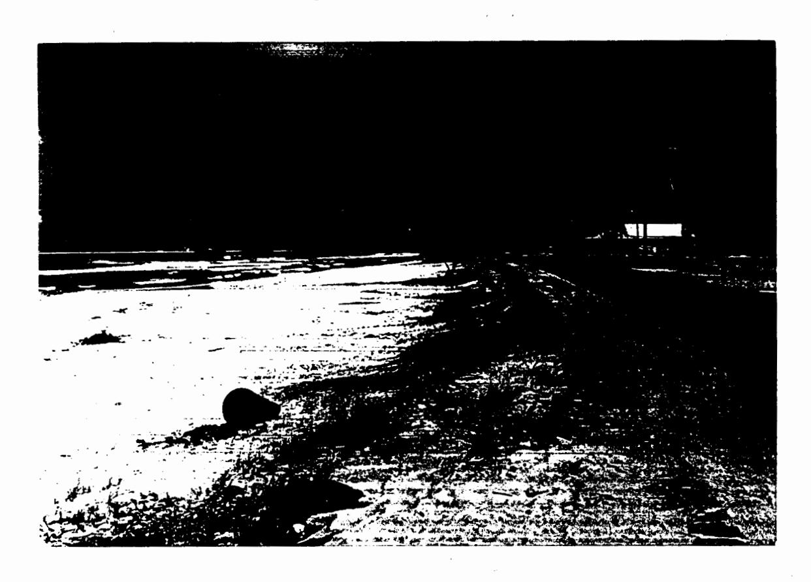

Prepared in cooperation with the University of Hawaii Sea Grant Extension Service and the U.S. Army Corps of Engineers.

This report is preliminary and has not been reviewed for conformity with U.S. Geological Survey editorial standards. Any use of trade, product, or firm names is for descriptive purposes only and does not imply endorsement by the U.S. Government.

1 U.S. Geological Survey, Menlo Park, California

#### TABLE OF CONTENTS

| Abstract                                      | 4     |
|-----------------------------------------------|-------|
| Introduction                                  | 5     |
| Methodology and Analysis Conditions           | 5     |
| Climatology                                   | 6     |
| Characteristics of the Natural Coastal System | 7     |
| Beach and Coastal Plain Environments          |       |
| Coastal Wetlands                              | 8     |
| Cliffed Coastlines                            |       |
| Area Descriptions (Coastal Geology)           | 10    |
| Discussion                                    | 15    |
| Acknowledgments                               | 19    |
| References Cited                              | ۱9    |
| Plates                                        | 20    |
| Annendices                                    | A T 1 |

Cover Photograph: East coast beach near the village of Alao; view to the south.

## LIST OF FIGURES

| Figure 1. Coastal site locations, Tutuila                                 | 6        |
|---------------------------------------------------------------------------|----------|
| Figure 2. Sketch of coastal features                                      | 9        |
| Figure 3. Area boundaries and locations                                   | 10       |
|                                                                           |          |
| LIST OF PLATES                                                            |          |
| Plate 1. Vertical aerial photograph of Pago Pago Harbor (Central Tutuila) | 20       |
| Plate 2. Vertical aerial photograph of Fagaitua Bay (SE Tutuila)          |          |
| Plate 3. Vertical aerial photograph of Amouli and Auasi (SE Tutuila)      |          |
| Plate 4. Vertical aerial photograph of Alao and Tula (E Tutuila)          |          |
| Plate 5. Vertical aerial photograph of Aoa Bay (NE Tutuila)               |          |
|                                                                           |          |
| Plate 6. Vertical aerial photograph of Cape Taputapu (W Tutuila)          |          |
| Plate 7. Vertical aerial photograph of Leone Bay (SW Tutuila)             |          |
| Plate 8. Vertical aerial photograph of Vaitogi (S central Tutuila)        |          |
| Plate 9. Vertical aerial photograph of Pala Lagoon (S central Tutuila)    | 28       |
| LIST OF TABLES                                                            |          |
|                                                                           |          |
| Table I. Summary characteristics of shoreline features                    | 17       |
| APPENDICES                                                                |          |
| Appendix I Individual shoreline site descriptions                         | ΔT 1_4Ω  |
| Appendix II. Individual site location maps                                |          |
| ppendix ii. individual site totation maps                                 | CTI 1-1. |

#### **ABSTRACT**

Tutuila, American Samoa, is a high volcanic island with a highly embayed and irregular coastline. A narrow fringing reef borders most of the coast. As part of this study, 47 sites along the coast of Tutuila were examined using a combination of brief field visits (where accessible), aerial reconnaissance overflight, and reference to selected maps, vertical aerial photographs, and publications. This report contains a brief review of some of the relevant geologic parameters, descriptions of the 7 research areas and individual 47 sites, and a discussion of the "natural" coast.

Coastal plains, composed of a mixture of terrigenous and marine sediment, occupy the heads of most embayments. Headlands of volcanic rocks, often forming steep cliffs, separate the embayments. Beaches, wetlands, alluvial fans, stream valleys, and mangrove forests are the main physiographic components of the coastal plains. Depositional beach morphological features include pocket beaches, barrier spits, tombolos, and small flood-deltas at stream mouths. Somewhat atypical environments on Tutuila include: a) the deep harbor of Pago Pago, b) the shallow lagoon, barrier reef, and extended barrier spit in the Pala Lagoon / Coconut Point area, c) recent basalt flows forming a low cliffed coastline with marginal fringing reef from Fogagogo to Sogi, and, d) the extensive coral rubble coastal plain of 'Aunu'u Island.

The coast of Tutuila has been shaped by volcanic activity, changes in relative sea level, reef growth, erosion of the hinterland, and more recently by storms and human activities. Tutuila lies within the easterly tradewind zone where winds, and hence waves, are consistently high along east- and southeast-facing coasts. Long distance swell waves and tropical storms are less common but can affect any part of the Tutuila coastline. Waves and wave-generated currents are responsible for transporting reef detritus landward resulting in beach deposits dominated by carbonate sand.

Approximately 20% of the Tutuila coast is fronted by beaches. Where villages, buildings, or roads have been threatened by erosion, these beaches are bordered by some type of engineering structure such as revetments (sloping structure), seawalls (vertical structure), or loosely placed rip-rap. This shoreline armoring has caused a severe reduction in the amount of beached coastline available for traditional uses. While engineering structures may stabilize the position of the shoreline they often result in the loss of "normal" recreational beach shoreline. Although the proliferation of shoreline engineering structures may be necessary to protect investments, it has led to a decline in the natural state of Tutuila beaches.

#### INTRODUCTION

Tutuila is the largest island of American Samoa and the center of government and commerce. The 1980 population was about 30,000 (American Samoa Government, 1981). It is a high volcanic island with a maximum elevation of 653 m (2,142') and is roughly 32 km long (20 mi.) and 10 km wide (6 mi.) covering an area of about 137 km² (53 sq. mi.; Fig. 1). Of the 125 km of coast (78 mi.) approximately 60% is bordered by a fringing reef and about 20% of the natural coast was fronted by beach (much of this coast is now fronted by engineering structures). The rugged interior is covered by dense tropical rain forest. A broad gently-rolling plain has developed on older basalt flows in the Leone-Tafuna area (detailed locations and topography are shown in map segments of Appendix II). Low-lying coastal plains of relatively low relief occupy a narrow fringe around the island, separating the rugged highlands from the reefs.

The islands of the Samoan Archipelago are formed primarily from large gently-sloping shield volcanoes and their associated volcanics (Stearns, 1944). Exposed rocks include basalt and andesite lavas, tuff and tuff cones, plugs and dykes, all of which form the base upon which the coral reefs have developed. Erosion of the volcanics has resulted in seacliffs, stream valleys, and alluvial plains. Eruptives range in age from Pliocene to Late Quaternary (Stearns, 1944; American Samoa Government, 1981). Recent basalt flows in the Leone-Tafuna area flowed over a fringing reef creating the most extensive gently-sloping land area of Tutuila.

The shoreline of American Samoa has been described in detail in the American Samoa Shoreline Inventory (U.S. Army Corps of Engineers; 1980, 1989). These two comprehensive reports cover most of American Samoa's developed shoreline, with the emphasis on engineering structures and erosion but also containing much other useful information.

#### Methodology and Analysis Conditions

Forty-seven sites were chosen for detailed study by the Coastal Resources Inventory Team in consultation with government representatives of American Samoa. These sites were chosen to represent the variety of coastal environments on Tutuila with emphasis on areas of cultural, economic, or environmental significance. This report describes the coastal geology from these sites and is based on field work conducted from April 8-16, 1992. All Tutuila sites accessible by road, and the sites on 'Aunu'u were visited during this study. Sites that are accessible only by boat were not examined, these include: Pola Island (20), Agapie Cove (21), Fagafue Bay (23), and A'asu (Massacre Bay; 24). Work undertaken at each site included: a) reconnaissance-scale observations of shoreline type, coastal plain characteristics, adjacent reef features, and anthropogenic development; b) reference photographs of the coast; and c) narrated videotape of the coast. The site locations are shown in Figure 1 and Table I lists some of their physical characteristics. Appendix I includes individual site descriptions for the 47 sites and Appendix II shows the site locations on segments of the USGS 1:24,000 scale topographic map of Tutuila.

The objectives of this work are to provide an accurate physical characterization of the natural coastal system to compliment the biological information collected on the adjacent reefs and coastal vegetation by other members of the team. This information

should assist other workers on the natural environment of American Samoa with their management and planning activities.

Climatology (after American Samoa Government, 1981)

Tutuila lies within the easterly tradewind zone where winds from the east and southeast predominate. The tradewinds are more consistent in the winter (June - September) months with more variable winds and greater rainfall occurring during the summer months (December - March). Tropical storms and cyclones are also more likely to occur during summer months and have an average recurrence interval of about one every 2.5 years. Although little is known about ocean currents in the area, the tradewinds drive a general westward-flowing current which may undergo local reversals as it passes the islands. The average diurnal tide range is 0.73 m (2.4').

Breaking waves are the primary agent of mechanical reef breakdown and transportation of reef debris to the shore. The most common waves striking the shore are tradewind-generated and arrive from the eastern sectors. These waves are typically low and short-period. Long-distance swell waves, originating from either Antarctic or North Pacific storms, are less common but can have very large heights when they reach the shores of Tutuila. Swell waves can affect all coasts of the island. Waves associated with tropical cyclones are probably the most destructive to strike Tutuila because they are of high energy and coincident with elevated water levels due to storm surge and wind set-up. Tsunamis are relatively rare and probably only have a significant effect within the embayments, such as Pago Pago Harbor.

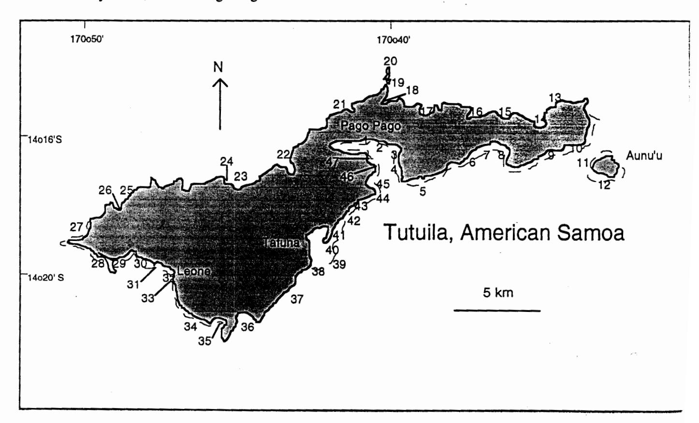

Figure 1. Location of coastal study sites for Tutuila and Aunu'u Islands, American Samoa

#### CHARACTERISTICS OF THE NATURAL COASTAL SYSTEM

Most of the shoreline features of Tutuila are geologically young. They are Holocene in age, having formed during approximately the last 6,000 years, the period where sea level stabilized near its present position. About 18,000 years ago, during the last glacial maximum, sea level was approximately 125 m below present level and subsequently rose rapidly to its present position as the glacial ice melted. The Quaternary has been marked by significant changes in sea level position as the ice caps advance and recede. Presently, there is a warm period where the ice caps are relatively small and sea level is high. This is significant because, in geologic terms, coastal landforms have had only a relatively brief period (~ 6,000 yrs) to develop at the present base level (mean sea level; msl).

Coral reefs thrive in warm, clear tropical water. Framework-building corals are limited to between the approximate mean low-water level and shallow water depths (generally < 20m). Corals and the organisms living in the reef provide much of the sediment that forms the coastal deposits in tropical areas. The reefs also provide protection to the coast by dissipating wave energy. Therefore, the stability of the shoreline is dependent to a large extent upon the health of the reefs. Any environmental changes, such as a decrease in water quality due to excess turbidity or nutrient loading, can ultimately have a negative impact on shoreline stability. Reef health and shoreline stability are complex issues whose interrelationships are poorly understood at present.

Fringing reefs are the common reef form on Tutuila. They consist of a reef flat extending out from the shoreline and terminating in a reef crest. A steep reef front marks the seaward margin. A shallow submarine terrace commonly borders the reef front and is often visible in the vertical aerial photographs.

There are two primary types of coastline on Tutuila: a) depositional coasts consisting of coastal plains, beaches, wetlands and mangrove forests, and b) erosional coasts characterized by seacliffs. Although there is overlap between the two, such as a cliffed coast fronted by a narrow cobble or sand beach, in general they are distinguishable. Moreover, a beach undergoing erosion is still primarily a depositional feature.

#### **Beach and Coastal Plain Environments**

Coastal plains are low-lying, low-relief depositional features formed by a combination of alluvial fan, stream valley, and beach-building processes. Erosion of hillsides results in alluvial fan deposition, stream flooding causes overwash deposition on floodplains, and storm waves and strong winds result in deposition above normal tidal limits. Typically, terrestrial deposits mark the landward margins of the plains and marine (beach) sediments flank the seaward margins. The highly embayed coastline of Tutuila is characteristic of areas where drowned stream valleys are filled with sediment.

Several types of depositional coastal morphological features (Fig. 2) are widespread on Tutuila. *Pocket beaches* are beaches bounded by rocky headlands and are generally arcuate in outline. Adjacent pocket beaches can have either similar characteristics or can vary markedly as a result of isolated or unique processes affecting them. *Barrier spits* typically form at stream mouths. They have an "attached" end where the spit is a continuation of the shoreline and a "free" end that recurves and typically "points" in the downdrift direction. Where an offshore obstruction such as a sea stack or

small islet occurs, the adjacent depositional shoreline commonly forms a seaward bulge or tombolo. The obstruction causes a reduction in wave energy reaching the shore behind it resulting in reduced sediment transport rates and, hence, deposition of sediment. Streams that debouche directly onto the reef flat often form small flood deltas. During high rainfall events, ephemeral streams deposit their sediment loads as lobate fans on the reef flat because the flows are no longer constrained by the stream valley walls. These deposits are rapidly reworked with the finer sediment being transported alongshore leaving behind a lag deposit of gravel-size material.

Coastal plain sediment type is dependent upon material availability and energy levels at the depositional site. As a general rule coarser sediment, such as gravel, is associated with deposition under higher energy conditions than fine-grained sediment, however, this is subject to size of material available. Reefs produce sediment from limemud through coral-rubble size ranges. Likewise streams and alluvial fans incorporate a wide-range of sediment sizes. Therefore, because there is a wide size range of available sediment on Tutuila, sediment texture can be used as a rough guide for relative energy level at the depositional site with coarser material indicating higher energy and finer material indicative of a more protected environment.

Coastal plains are extremely important as sites for villages and roads. Most stream valleys that have well-developed coastal plains on Tutuila also have a village. Embayments developed at major stream valleys and headed by coastal plains with established villages include: Pago Pago Harbor (numerous), Fagaitua Bay, Aoa Bay, Masefau, Afono Bay, Vatia Bay, Fagasa Bay, Massacre Bay, Poloa Bay, Amanave Bay, Nua-Se'etaga Bay, Leone Bay, and Pala Lagoon/Nu'uuli. In addition there are numerous smaller embayments with well-developed but narrow coastal plains. Areas with predominantly carbonate sediment marine-derived coastal plains include perched beaches such as Vaitogi and Fogagogo, and the broad beach-ridge plains between Matuli Pt. and Fagasa Pt. (the eastern villages of Alao and Tula). The south and west coasts of 'Aunu'u Island are also a broad beach-ridge plain built in the lee of a recent tuff cone.

Coastal Wetlands (adapted from American Samoa Government, 1981).

The two types of coastal wetlands occurring in American Samoa are coastal marsh and mangrove forest. Coastal marshes, composed of herbaceous vegetation, are isolated depressions with fresh to slightly brackish water. The sediments typically have a high organic content with either a mud, sand, or gravel matrix. Because this habitat is used extensively for taro cultivation nearly all natural areas have been modified with the exception of the marsh within 'Aunu'u crater on 'Aunu'u. In contrast, mangrove forest occurs in open brackish or saline environments. The woody mangrove species present in American Samoa include *Bruguiera gymnorhiza* and *Rhizophora samoense*. Areas where mangrove forest remains include Pala Lagoon, Masefau, Aoa, and Pala Lake on 'Aunu'u. The sediments are typically organic-rich peaty mud and sand several meters or more in thickness. Mangrove forests are important for maintaining shoreline stability and are habitats for many juvenile marine fishes. They should be preserved wherever possible.

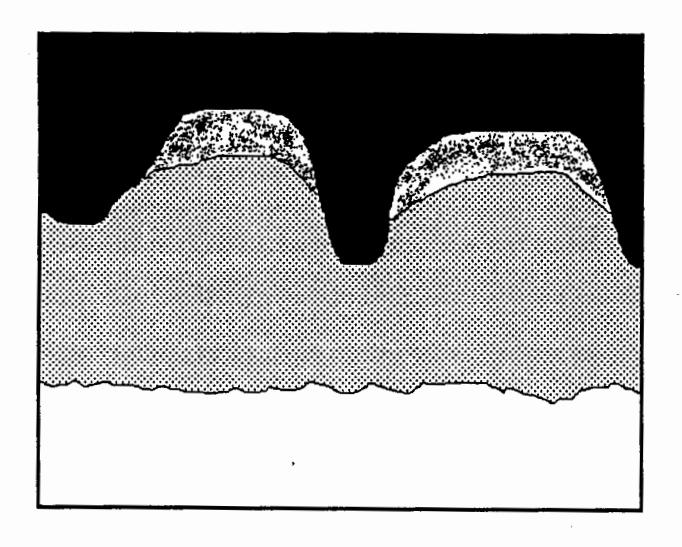

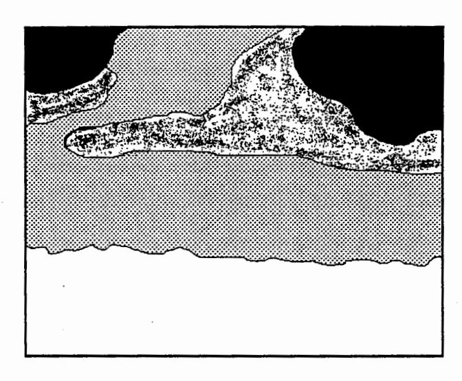

Pocket Beach

Barrier Spit

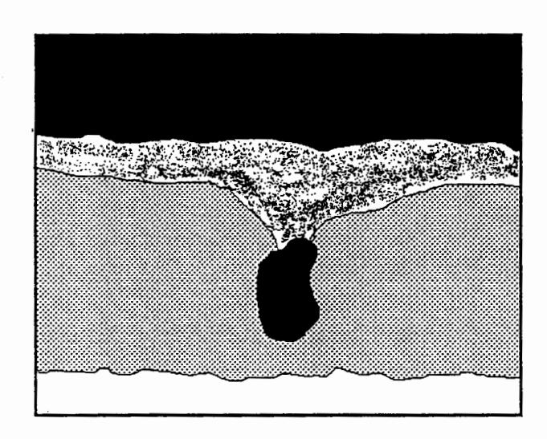

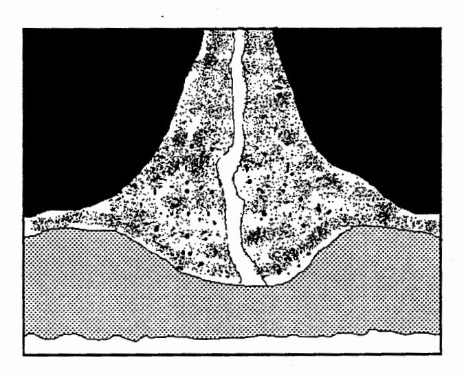

Tombolo

Flood Delta

Figure 2. Sketch diagrams showing the general relationships between the volcanic rock basement (black), depositional features (stippled), and reef flat (gray) for pocket beach, barrier spit, tombolo, and flood delta morphological features.

#### Cliffed Coasts

As soon as volcanic islands form, terrestrial and marine erosion processes begin attacking the newly formed land. Seacliffs can be created by wave attack along the shore or by mass wasting (landslides) associated with caldera buildup and collapse. Coastal cliffs are often remnants of giant landslides that create humongous debris fields scattered on the ocean floor (Moore and others, 1989). Where the steep slopes continue offshore, there is no substrate capable of supporting broad reef development and the cliffs are maintained. In some cases seacliffs may also be constructional in origin. For example, recent basalt flows in southwest Tutuila between Nu'uuli and Leone (Area 6) flowed over older barrier reef deposits forming cliffs along their seaward margin where they poured over the reef front (Stearns, 1944).

Most of the north coast of Tutuila is cliffed with little or no fringing reef development with the exception of the deep embayments at Aoa, Masefau, Afono, Vatia, Fagasa, Fagafue, Aasu, Aoloau, and Maloata. Cliffs of 60 m (200 ft) are common with some steep hillsides extending for 300 m (1,000 ft). The south coast is also cliffed however, in general, the cliffs are lower, less rugged, and interrupted by more prominent valley development than along the north coast. Nearly continuous cliffs occur along most of the coast between Nu'uuli and Leone, consisting of low (5 - 25 m; 20 - 80 ft) basalt cliffs and high cliffs of the old craters at Fagatele and Fagalua (Larsen) Bays.

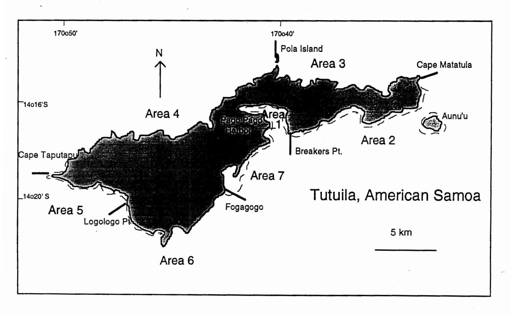

Figure 3. Locations of area boundaries for Tutuila.

#### AREA DESCRIPTIONS

#### Area 1: Pago Pago Harbor

Area 1 incorporates Pago Pago Harbor extending from Niuloa Point (Point Distress) on the western entrance to Breakers Point at the eastern entrance. This protected harbor contains coastal inventory sites 1 through 4 and 45 to 47. Rugged volcanic mountains surround the harbor. Coastal plains of predominantly alluvial material are best developed in stream valleys (Plate 1), notably the Vaipito and Lalolamauta Valleys, and along the northern harbor boundary.

Most of the shoreline within Pago Pago Harbor is armored; seawalls (vertical structures) and revetments (sloping structures) are common features. Reclaimed coastal land is also common and includes a park in Fagaalu, hotel development at Nu'tutai Point (Rainmaker Hotel), the main dock and customs house, the playing fields at the head of the harbor, the cannery docks, and sanitary landfill at Anasosopo. Based on examination of aerial photographs, nearshore reef-flat dredging operations appear to have taken place opposite Utulei village between Tulutulu and Goat Island Points.

#### Area 2: Breakers point to Cape Matatula

The coast in Area 2 can be subdivided into three separate segments based on variations in coastal morphology and exposure: 1) Breakers Point to Matuli Point, 2) Matuli Point to Cape Matatula, and 3) 'Aunu'u Island.

1) Breakers Point to Matuli Point. The southeast coast of Tutuila is characterized by a moderate to steep volcanic coast broken by alluvial valleys and pocket beaches fronted by a narrow to moderately wide (up to 500 m wide) fringing reef (Plates 2 & 3). Numerous streams enter the sea along the coast with the larger streams commonly associated with alluvial valley and coastal plain deposits. Most of the coast faces to the south or southeast except for the eastern margin of Fagaitua Bay which faces west. Most of the coast therefore, is exposed to southeasterly tradewinds.

With the exception of Cape Fogausa, the main highway follows the coast very closely for most of the length of Area 2. To protect the road, seawalls and revetments of various designs and degrees of structural integrity have been constructed along the majority of the coast fronting the coastal road. Where these structures occur, it presumably signifies an earlier erosion problem necessitating remedial action. Other erosion indicators include recent backbeach scarps, World War II pillboxes that are undermined and tilted, and beachrock exposures on the lower beachface. Overall, shoreline erosion is a moderate to severe problem with the continued loss of recreational beaches likely.

The beaches are composed mostly of carbonate sand and gravel with minor amounts of terrigenous material. They are exclusively of the pocket beach type, typically concave seaward in plan view, but occasionally convex seaward or near-linear such as at Lauliifou, Aumi, Avaio, and Utumea. Beach heights, or in most cases elevation of the coastal road because the natural beach ridge has been modified, varies from a low at Alofau of about 2 m above mlwl (mean low-water level) to a high of nearly 5 m above

mlwl at Lauliifou and Aganoa. Beach ridge height appears to be directly related to exposure with higher elevations occurring at more exposed localities.

In addition to road protection structures, other man-made features include a small boat harbor at Auasi and former dredging sites on the inner reef flat at Alofau and Fagaitua. The harbor was completed by the U.S. Army Corps of Engineers in 1981 and was possibly responsible for accelerated erosion at adjacent beaches. Revetments were constructed to stabilize the shoreline. Former dredge pits at Alofau and Fagaitua are visible as rectangular-shaped depressions and causeway remnants on the reef flat. Both areas are presently extensively bordered by coastal protection works.

2) Matuli Point to Cape Matatula. This area does not contain any of the offshore inventory sites but it is extremely important as a coastal site because it represents the longest, relatively undisturbed, opencoast sandy shoreline on Tutuila. This windward coast faces east directly towards the predominant tradewind direction. A gently-curved carbonate sand beach extends about 2 km from Lealaeli Hill to Fagasa Point (Plate 4). The villages of Alao and Tula occur on coastal plain deposits, extending nearly 500 m inland in places, and are separated by a ridge (Tapepe Ridge) of Olomoana Volcanics. The Ma'alatetele Rocks appear to be the offshore extension of Tapepe Ridge and result in a cuspate headland (convex seaward bulge in the shoreline).

The beach is composed of medium to coarse carbonate sand and ranges in elevation from 2.5 m above mlwl at Tula to about 4.5 m above mlwl at Alao. Beachrock occurs at several locations and several backbeach scarps were observed but, in general, the erosion problem does not appear to be severe. The fringing reef averages about 100 m wide except in the vicinity of the Ma'alatetele Rocks where it widens to about 250 m.

The coastal road follows the shoreline closely up to Tula where it turns inland. Numerous buildings are on the seaward side of the road in Tula, elsewhere they occur on the landward side. Shore protection structures occur in front of the school in Tula and to the north of Maliuga Point.

3) Aunu'u Island. The eastern half of Aunu'u Island is the semi-circular remnant of a cinder cone with steep seaward slopes and very little reef development. The western (leeward) half of Aunu'u is depositional consisting of a prominent coastal plain of carbonate beach ridge deposits and backbeach wetlands. The semi-concentric beach ridge deposits form a hemispherical, convex seaward, border around the island.

The beaches range from a poorly-sorted coral rubble along north and south stretches to coarse carbonate sand on the leeward (western) shore. Beach ridge heights up to 5 m above mlwl occur, and beachrock outcrops are common on the north and south shores.

A small-boat harbor was constructed on the eastern shore and at present it is bordered by erosional backbeach scarps on the adjacent beaches. There is a low seawall constructed on the backbeach near the school on the south shore of the island.

#### Area 3: Cape Matatula to Pola Island

The northeast coast of Tutuila is characterized by high cliffs separated by broad, flat, alluvial valleys which form embayments within the rugged coast (Plates 4 & 5). The shoreline is either cliffed, with a narrow or occasionally absent shore platform, or, comprised of beach ridges and valley fill within the embayments. The low beach ridges are composed of a mixture of carbonate and terrigenous sediment. Beach-ridge height varies with exposure from a low of about 1.5 m at Aoa (14), Masefau (17), and Vatia (18) to a high of nearly 4 m at exposed Sailele.

No engineering structures were observed along the cliffed coasts, however bare rock surfaces attest to a high landslide susceptibility, which is exasperated by wave abrasion at the base of the seacliffs. There are some protective structures constructed within the embayments to protect roads and buildings. Revetments occur in NW Vatia Bay, a small one in Afono Bay, and along the road in Masefau and Aoa Bays. In general, shoreline erosion does not appear critical except for Masefau Bay where there is nearly 800 m of seawall.

Much of the cliffed coast plunges directly into the sea with little or no reef development. Fringing reefs line the embayments with a maximum width of about 400 m in Aoa Bay; average widths are less than 150 m.

#### Area 4: Pola Island to Cape Taputapu.

NW Tutuila (Area 4) is morphologically very similar to NE Tutuila (Area 3). Rugged cliffs, which plunge directly into the sea, are separated by embayments formed at the mouths of stream valleys (Plate 6). In general, the embayments are smaller and less indented than those in Area 3 resulting in greater wave exposure as indicated by numerous gravel beaches. A terrigenous gravel beach occurs at Fagasa Bay (22) and coral gravel beaches occur at Fagamalo (25) and Poloa Bay (27). Beach heights are about 2.4 m in Fagasa and over 6 m at Poloa. Although Poloa is located on the leeward side of the island the high beach height indicates exposure to occasional large waves.

Most of the shoreline is remote and accessible only by sea. Villages are few and limited to stream-mouth embayments. Consequently, coastal engineering structures are few, notably a road protection structure in Fagasa Bay and a massive revetment protecting the school at Poloa.

As in Area 3, the fringing reefs are best developed within embayments where a suitable sloping platform occurs. The open coast is typically comprised of seacliffs with little or no adjacent reef development.

#### Area 5: Cape Taputapu to Logologo Pt.

Southwest Tutuila is an area with numerous protected embayments backed by low-lying land, which provides the setting for many coastal villages (Plates 6 & 7). As elsewhere on Tutuila the embayments form at the mouths of coastal streams. The largest of these is Leone Bay, developed at the mouth of Leafu Stream and an area where a small coastal mangrove forest is developed. The embayments and associated arcuate beaches are separated by rocky headlands and seacliffs. Terrigenous sand is the dominant beach

sediment within Leone Bay whereas carbonate sand predominates along the other beaches. A narrow finger of beachrock in line with the current shoreline extends across the mouth of Leafu Stream at Leone, which probably denotes a former shoreline position of the barrier spit and beach.

Shoreline engineering structures are intermittent and typically consist of loosely dumped basalt boulders. Natural basalt boulders and basalt benches also back the shoreline in this area.

The fringing reef is well-developed and nearly continuous. Maximum reef widths are about 300 m in Leone Bay and opposite Mu Pt. Storm deposits of reef-derived rubble (Cyclone Ofa?) occur on the reef flat opposite Leone.

#### Area 6: Logologo Pt. to Fogagogo

The southernmost shoreline of Tutuila can be distinguished from the rest of the coast by the presence of an extensive lava seacliff of recent origin. These basalt flows form a bench that varies from a few meters to nearly 30 m above the adjacent reef. The relatively low-lying basalt flows are broken by high cliffs (up to 150 m) formed by the old craters at Fagatele and Larsen Bays. Because access to the ocean is limited in this area there only a few villages with Vailoatai and Vaitogi (Plate 8) being the largest.

The beaches in Area 6 are perched on the basalt terraces above the high tide level, presumably the result of storm wind and wave action. Beaches occur on less than 10% of this cliff-dominated coast which prevents the accumulation of extensive coastal deposits. Coastal engineering structures are not present because there are few developments to protect and the basalt shorelines are very stable. Reef flats and fringing reef are present in a limited manner only near Vailoatai.

#### Area 7: Fogagogo to Breakers Pt. (excluding Pago Pago Harbor).

Three types of coast occur in this area. 1) A basalt-cliffed shoreline stretching from Fogagogo to Matautuotafuna Pt. (Pt. Deceit). This coast is essentially a continuation of Area 6 where recent basalt flows form steep cliffs fronted by little or no reef development. Small perched beaches of storm-derived material are scattered on the basalt bench. 2) Shallow barrier reef and lagoon and barrier spit occur in the Pala Lagoon and Coconut Pt. area. This is the largest shallow reef/barrier spit complex on the island. The lagoon entrance and shallow reef have been extensively modified by the construction of the main International Airport (Plate 9), which has included reef flat dredging combined with land reclamation (thereby seriously affecting water exchange over the reef). The Coconut Pt. barrier spit is composed mostly of carbonate sand and the morphology indicates a growth direction (net longshore drift direction) from northeast to southwest. Most of the seaward edge of the spit shoreline is undergoing erosion with rates of 1 to 1.5 m/yr in the south and about 0.5 m/yr in the north (U.S. Army Corps of Engineers, 1980, 1989). Crude basalt boulder seawalls have been constructed in an attempt to halt the erosion. 3) From Nu'uuli to Breakers Pt. is an embayed coastline with pocket beaches separated by headlands typical of most of Tutuila. The main coastal road parallels the shoreline and is protected by various seawall and revetment structures. Villages nestled within small embayments occur at Faganeanea, Vasa'aiga, and Matu'u.

#### **DISCUSSION**

Tutuila has many characteristics typical of a slowly subsiding, relatively young, volcanic island such as drowned river valleys, fringing and incipient shallow barrier reefs, and narrow coastal plains. The coastal plains are generally small in extent but are very important as sites for both traditional and modern anthropogenic development. Coastal plains are composed primarily of unconsolidated sediment, and therefore are prone to rapid erosional and depositional events. Extreme care should be exercised in the management of these features to prevent further loss of valuable beach and land areas.

There is about 26 km of beach shoreline on Tutuila (excluding inner Pago Pago Harbor) constituting nearly 20% of the total shoreline with pocket beaches being the predominant type of beach landform. The majority of villages are sited on the coast and most of these villages, along with large segments of the connecting coastal road, are located on coastal plains composed mostly of back-beach deposits. Because of their importance to human occupation, the coastal plains are one of the most significant landforms on Tutuila.

Extensive segments of the Tutuila shoreline are fronted by engineering structures designed to protect adjacent land. Where rigid structures are constructed on beaches, they essentially prevent the shoreline from migrating in response to extreme events. Beaches typically erode during large storms and accrete during fair-weather conditions. Fixed structures often interfere with this natural cycle of beach response and can prevent the long-term accretion of beach sediment. Structures may stabilize the shoreline position and protect adjacent property but at the cost of an overall reduction in the amount of recreational beach. This is clearly evident on Tutuila where the recent (over the last several decades) proliferation of seawalls and revetments has greatly reduced the amount of sandy shoreline. With the exception of the windward (east) coast and isolated pocket beaches, most Tutuila beaches have at least a portion fronted by a structure, thereby reducing the natural, traditional (in a cultural sense), and recreational appeal of the beach. The remaining natural beaches on Tutuila should be viewed as a valuable natural resource and protected accordingly. Healthy, natural beaches are an essential ingredient to successful tourism in the Pacific and the cost of beach preservation is usually small when compared to beach value.

A few general conclusions and recommendations can be summarized as follows:

- 1) Although Tutuila is a high volcanic island, most of the sediment composing the beaches is derived from the adjacent reef. Therefore any activity, whether natural or human-induced, that affects the health of the reef and its ability to produce carbonate sediment may adversely affect the islands beaches. In particular, changes in water quality due to excess nutrients (such as sewage disposal) and turbidity (from either on-land erosion or reef-flat mining) should be closely monitored.
- 2) Catastrophic storms are a natural and geologically frequent phenomena that are responsible for the much of the long-term geologic development of the coast. Storms are a primary mechanism responsible for the deposition of sediment above normal tide limits. The recognition and mapping of storm deposits can be used in some instances in the prevention and avoidance of costly damage associated with catastrophic events.

- 3) Many of the embayed shorelines of Tutuila have been significantly modified by human activities. Further coastal development should be carefully examined and designed to protect the diminishing "natural" embayed shorelines. The headlands are in better condition except in areas where the coastal road follows extremely close to the shore.
- 4) Recent evidence of shoreline erosion is widespread on Tutuila and the causes are poorly understood. In some cases the erosion exhibited a possible link to human activities, in other areas there is no obvious causative factor. The proliferation of shoreline engineering structures attests to the widespread nature of the problem. Possible reasons for the apparent increase in erosion include: accelerated sea-level rise, a reduction in carbonate productivity of the reefs, beach sand mining, recent storm activity, and interference of natural processes by engineering structures. Further research is required to document the extent and the magnitude of the problem in Samoa and the significant causes.
- 5) Beaches are a natural buffer that protect the coast during extreme events, they are a recreational resource, and they have high cultural significance, hence, beach preservation should be a high priority among coastal planners and managers in Samoa. All beach-sand mining should be discouraged and the potential adverse impacts of engineering structures should be carefully considered before any new structures are built.

Table I. Summary characteristics of shoreline features for the individual study sites.

| Site | Site Name         | Beach Height a | Sediment             | Sediment   | Compositionc | Reef Widthd |
|------|-------------------|---------------------------|----------------------|------------|--------------|-------------|
|      |                   | (m)                       | Texture b | Carbonate  | Terrigenous  | (m)         |
| 1    | Atu'u             | 1.8 (es)                  | ms / vcs             | 85         | 15           | 150         |
| 2    | Leloaloa          | 1.8 (es)                  | (cobble/vcs)         | (80)       | (20)         | 200         |
| 3    | Aua               | 1.8 (es)                  | ms/cs                | 99 .       | 1            | 100 -300    |
| 4    | Anasosopo         | 3.4 (es)                  | ps / vcs             | 99         | 1            | 120         |
| 5    | Lauli'ituai       | 3.4 (es)                  | ps/cs                | 95         | 5            | 300         |
| 6    | Auto              | 2.7 (es)                  | ps / vcs             | 98         | 2            | 150 - 200   |
| 7    | Fagaitua          | 3.7 (es)                  | ms / vcs             | 99         | tr           | 300 - 500   |
| 8    | Alofau            | 1.8 (es)                  | ms / cs              | 100        | tr           | 250 - 450   |
| 9    | Amouli            | 4.0 (es)                  | ms/cs                | 100        | tr           | 200         |
| 10   | Au'asi            | 4.0 (es)                  | ps/cs                | 100        | tr           | 200         |
| 11   | 'Aunu'u (west)    | 3.1                       | cobble               | 100        |              | 50 - 150    |
| 12   | 'Aunu'u (south)   | 3.4                       | (cobble/vcs)         | 100        |              | 100 - 200   |
| 13   | Onenoa            | 3.7 (es)                  | [ps/ms]              | [90]       | [10]         | 100         |
| 14   | Aoa Bay           | 1.8                       | mws / cs             | 100 [80]   | tr [20]      | 100 - 400   |
| 15   | Masausi           | 2.7                       | mws/cs               | 99         | 1            | 180         |
| 16   | Masefau           | 1.7 (es)                  | mws / cs             | 97         | 3            | 100 - 300   |
| 17   | Afono             | 4.0                       | ms/ms                | 75         | 25           | 50 - 120    |
| 18   | Vatia             | 1.8 - 2.7 (es)            | (ps/ms-cs)           | (95)       | (5)          | 50 - 150    |
| 19   | Vatia Bay (north) | 3.1                       | (cobble)             | (80)       | (20)         | 100         |
| 20   | Pola Island       | none                      |                      |            |              | 0           |
| 21   | Agapie Cove       | none                      |                      |            |              | 0           |
| 22   | Fagasa            | 2.1 - 2.4 (es)            | mws/cs               | 93         | 7            | 0 - 150     |
| 23   | Fagafue           | (low)                     |                      |            |              | 80          |
| 24   | Aasu              | (low)                     |                      |            |              | 50 - 150    |
| 25   | Fagamalo          | (4+)                      | ws/ms                | 80         | 20           | 120         |
| 26   | Maloata           | (< 2)                     | ps / vcs             | <b>7</b> 0 | 30           | 0 - 150     |
| 27   | Poloa             | 6.1                       | ps / vcs             | 90         | 10           | 150         |
| 28   | 'Amanave          | 4.5 (es)                  | vws / cs             | 95         | 5            | 200         |
| 29   | Utumea            | 3.7 (es)                  | ps / vcs             | 93         | 7            | 100 - 150   |
| 30   | Afao              | 4.3(es)                   | ps / cs              | 50         | 50           | 150         |
| 31   | Asili Pt          |                           | ps / cs              | 75         | 25           | 150 - 200   |
| 32   | Niu'aveve Rock    |                           | mws/cs               | 1          | 99           | 50 - 150    |
| 33   | Sogi              |                           | mws/cs               | 2          | 98           | 50          |
| 34   | Avaloa            |                           |                      |            |              | 100         |
| 35   | Fagatele Bay      |                           |                      |            |              | 50          |
| 36   | Larsen Bay        |                           |                      |            |              | 0           |
| 37   | Vaitogi           |                           | ws/ms                | 93         | 7            | 0           |
| _38  | Fogagogo          |                           | ws/cs                | 93         | 7            | 0           |
| 39   | Avatele Pt        |                           |                      |            |              | 500+        |
| 40   | Coconut Pt        | 2.7                       | ps/cs                | 99         | 1            | 500+        |

| 41 | Nu'uuli    |           |             |      |      | 350       |
|----|------------|-----------|-------------|------|------|-----------|
| 42 | Faganeanea | (3)       | ps / gravel | (80) | (20) | 100 - 150 |
| 43 | Matu'u     | (3.5 - 4) | ps / gravel | (80) | (20) | 100 -150  |
| 44 | Fatumafuti | (3.5 -4)  | ps / vcs    | (95) | (5)  | 300       |
| 45 | Faga'alu   | 2.2 (es)  |             |      |      | 50 - 500  |
| 46 | Punaoa     | (< 2)     | ps / cs     | (90) | (10) | 150       |
| 47 | Utulei     | (< 2)     | ps/cs       | (90) | (10) | 150       |

- a. Height of beach or coastal engineering structure (es) above mean low-water level as determined from profiles in U.S. Army Corps of Engineers (1980, 1989). The closest profile to the study site was used. Estimates from this study are in (parentheses). b. Texture of beach sand based on data from Dingler and others, 1986. Sorting term given first followed after the slash by the grain-size term. Sorting abbreviations are: vws = very-well sorted, ws = well sorted, mws = moderately-well sorted, ms = moderately sorted, ps = poorly sorted, vps = very-poorly sorted. Grain-size abbreviations are: ms = medium sand, cs = coarse sand, vcs = very-coarse sand. For example "ps / vcs" is a poorly-sorted very-coarse sand. Values in parentheses are from field observations during this study.
- c. Estimate of the percent carbonate and percent terrigenous component of the beach sand. Data from Dingler and others, 1986. A trace component is indicated by "tr". Values in () are estimates from this study and values in [] are estimates from the U.S. Army Corps of Engineers, 1980, 1989.
- d. Width of fringing reef measured from 1:24,000-scale USGS topographic map of Tutuila.

#### **ACKNOWLEDGMENTS**

The field work for this study was funded by the U.S. Geological Survey Center for Coastal Studies in St. Petersburg, Florida with additional support by the Branch of Pacific Marine Geology. Field logistic support and vertical aerial photographs were provided by the University of Hawaii Sea Grant Extension Program. In particular, Peter Rappa and Kim Des Rochers cheerfully provided much needed assistance. The staff of the American Samoa Department of Marine and Wildlife Resources were invaluable in their assistance during the field studies and are greatfully appreciated. Zolezzi Enterprises gratefully provided a helicopter and pilot for a coastal overflight.

#### REFERENCES CITED

- American Samoa Government, 1981. A Coastal Zone Management Atlas of American Samoa. Development Planning Office, American Samoa.
- Dingler, J.R., Wolf, S.C., and Carlson, D., 1986. Offshore sand resources along the south shore of Tutuila Island, American Samoa. U.S. Geological Survey Open-File Report 86-112, 43 pp.
- Dingler, J.R., Carlson, D.V., and Sallenger, A.H., 1987. Map showing locations and statistical parameters of beach and offshore sand samples, Tutuila Island, American Samoa. U.S. Geological Survey Misc. Field Studies Map, MF-1875 (1:48,000).
- Moore, J.G., Clague, D.A., Holcolmb, R.T., Lipman, P.W., Normark, W.R., and Torresan, M.E., 1989. Prodigious submarine landslides on the Hawaiian Ridge. Jour. Geophys. Res., 94: 17,465 17,484.
- Stearns, H.T., 1944. Geology of the Samoan Islands. Bull. Geol. Soc. America, 55:1279-1332.
- U.S. Army Corps of Engineers, 1980. American Samoa Shoreline Inventory. Pacific Ocean Division, Honolulu.
- U.S. Army Corps of Engineers, 1989. American Samoa Shoreline Inventory. Pacific Ocean Division, Honolulu.

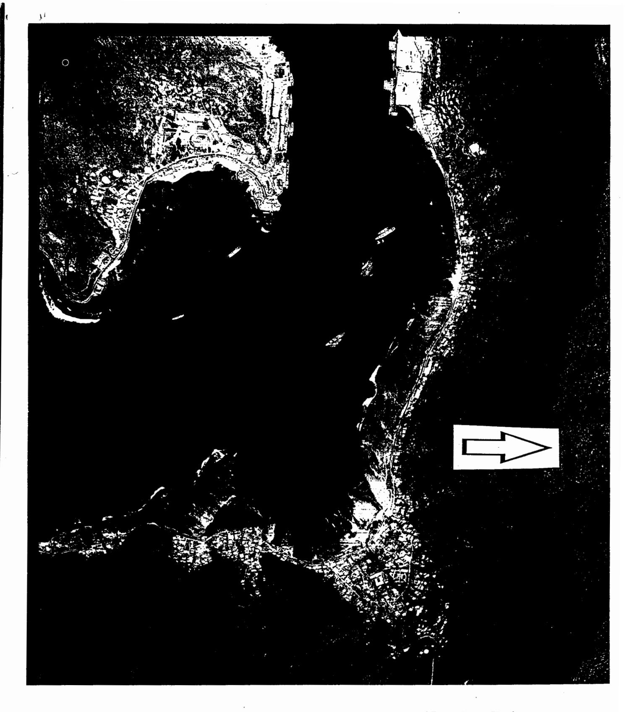

Plate 1. Vertical aerial photograph of the central portion of Pago Pago Harbor showing wharf construction, coastal plain development (most notably at Aua), and reef flat areas that have been dredged between Goat Island and Tulutulu Pts. and Aua and Anasosopo Pts. Photograph by R.M. Towill Corporation, August 1990.

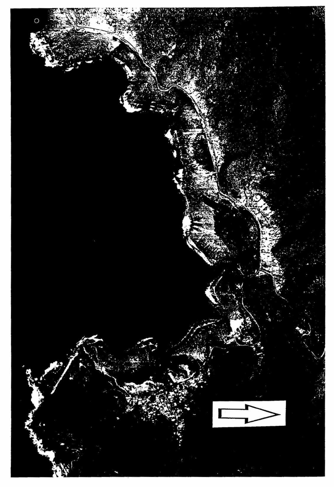

Plate 2. Vertical aerial photograph of Fagaitua Bay, southeastern Tutuila. The narrow coastal plains are well-defined by areas of housing. Several reef flat dredge sites are visible as dark areas between the reef crest and shoreline. Note the gaps in the reef opposite the stream mouths. Photograph by R.M. Towill Corporation, August 1990.

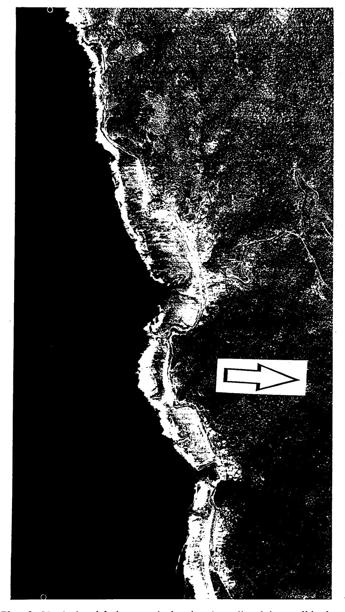

Plate 3. Vertical aerial photograph showing Amouli and the small harbor constructed in the fringing reef at Auasi. There is a small flood-delta on the reef flat opposite Televai Stream in Amouli. Photograph by R.M. Towill Corporation, August 1990.

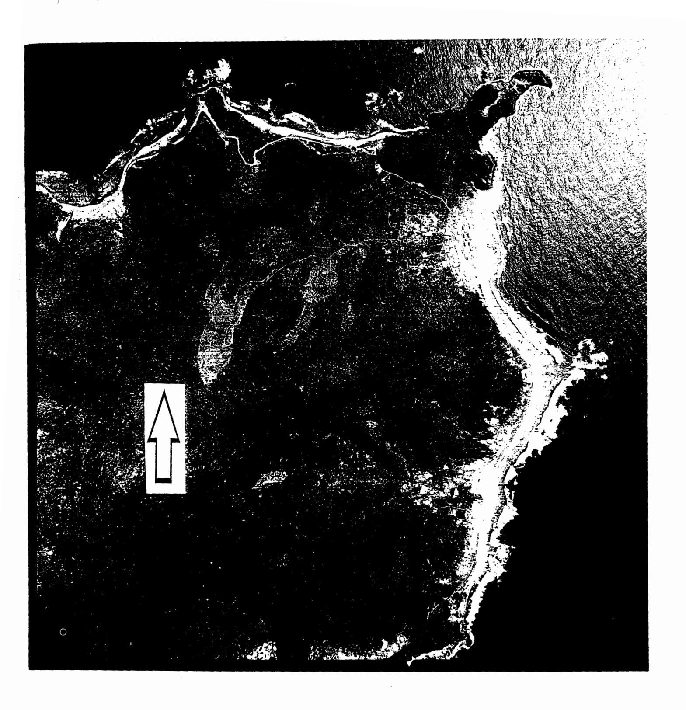

Plate 4. Vertical aerial photograph of the east and northeast coast of Tutuila showing the extensive carbonate beach and coastal plain at Alau and Tulk. The alluvial and coastal plain of Onenoa (13) is to the top left of the photo. Photograph by R.M. Towill Corporation, August 1990.

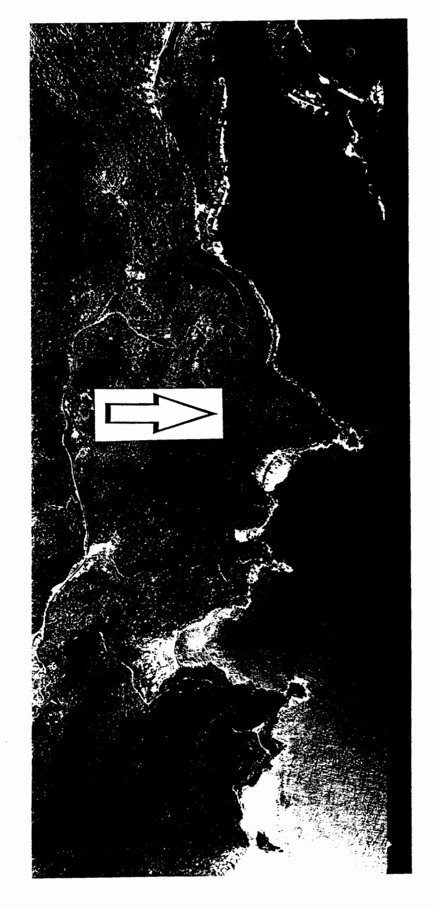

Plate 5. Vertical aerial photograph showing Aoa Bay (14) with a narrow fringing reef at the headlands and wider (up to 400 m) fringing reef within the embayment. Photograph by R.M. Towill Corporation, August 1990.

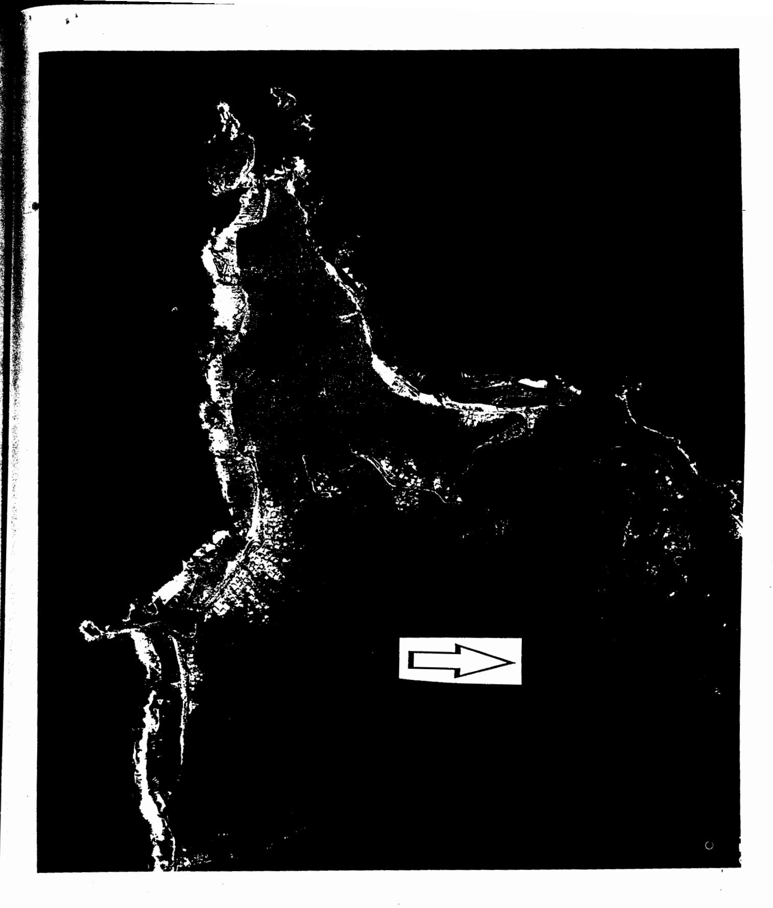

Plate 6. Vertical aerial photograph of the western tip (Cape Taputapu) of Tutuila showing pocket beaches separated by steep cliffs. Note the revetment at Poloa and tombolo at Amanave. Photograph by R.M. Towill Corporation, August 1990.

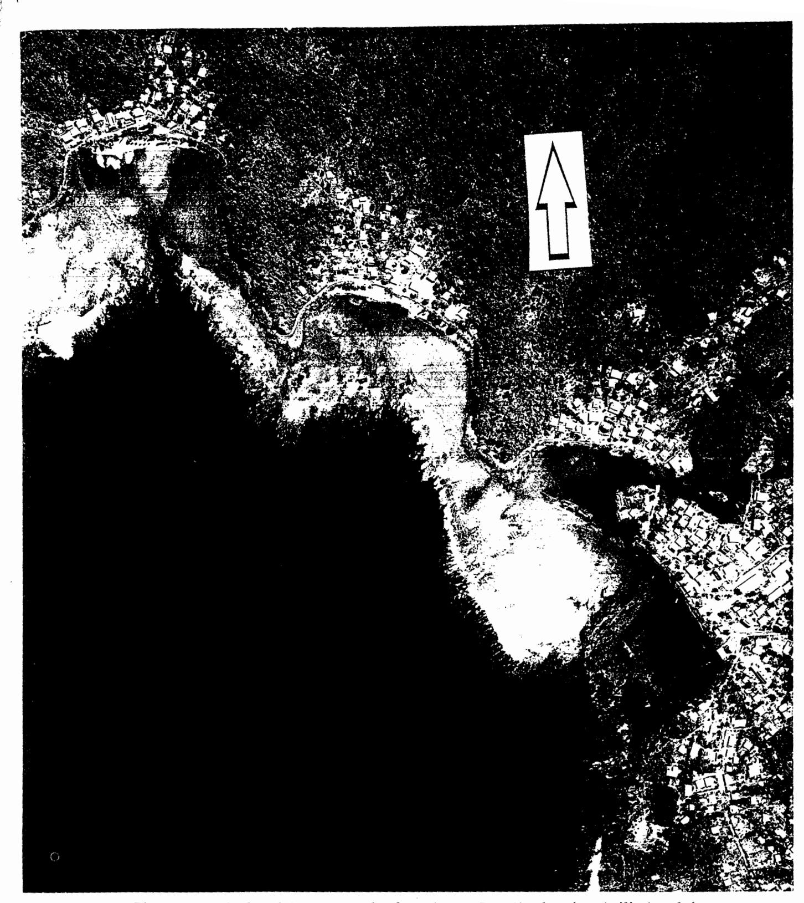

Plate 7. Vertical aerial photograph of southwest Tutuila showing Asili, Amaluia, Auma, and Leone Bays. Note the detached beachrock ridge extending across the entrance to Pala lagoon denoting the former barrier spit shoreline position. The light areas on the reef flat opposite Leone are rubble storm deposits. Photograph by R.M. Towill Corporation, August 1990.

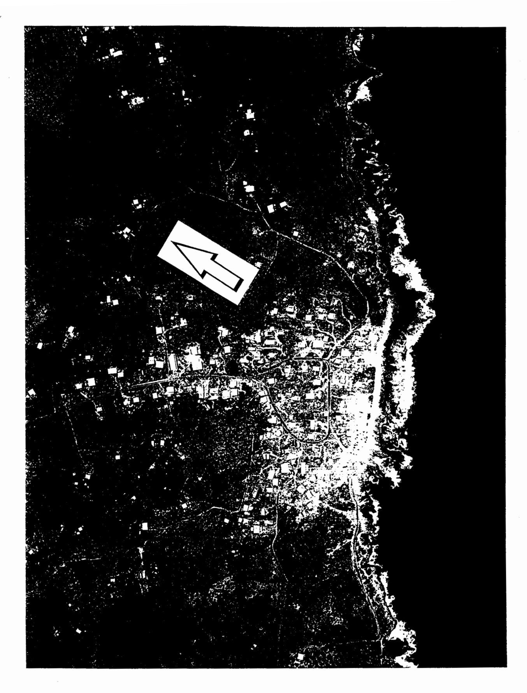

Plate 8. Vertical aerial photograph of Vaitogi showing the basalt cliffs which form most of the shoreline. A perched beach composed of carbonate sediment fronts the village. Photograph by R.M. Towill Corporation, August 1990.

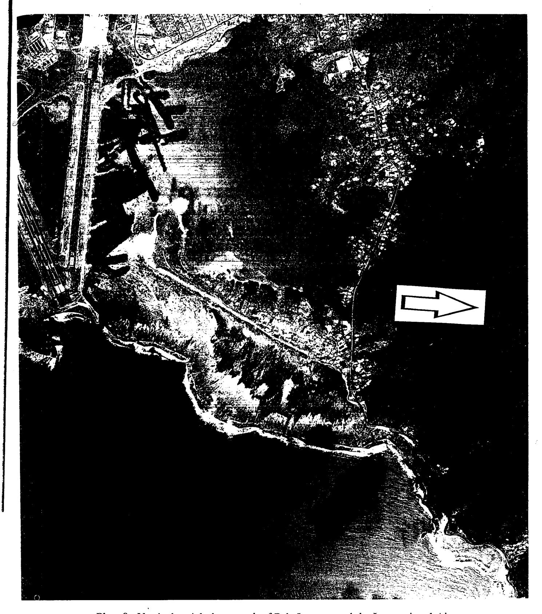

Plate 9. Vertical aerial photograph of Pala Lagoon and the International Airport showing extensive dredging scars and reclaimed land on the reef. Photograph by R.M. Towill Corporation, August 1990.

## APPENDIX I

## SHORELINE SITE DESCRIPTIONS

Site Number: 1

Site Name: Atu'u

Location: Pago Pago Harbor

Coastal Geologic and Morphologic Setting: South-facing shoreline on the northern margin of inner Pago Pago Harbor. A narrow, east-west trending, coastal plain formed mostly by alluvial material at the base of Alava Mountain (490 m).

Shoreline Type: The natural shoreline was most likely a sinuous beach of mixed sediment fronting a narrow coastal plain. Mostly marine sediment (carbonate sand) occurs on the foreshore. The former beach height was probably about 2 m above mlwm. Because of the inner harbor setting this is a relatively low wave-energy shoreline.

Engineering Structures and Coastal Stability: To the west are the marine railway and tuna cannery docks while to the east lies the main coastal road fronted by rock revetments. An erosional scarp is commonly developed between the revetment and fill material. The tuna cannery is built mostly on reclaimed land over the reef flat surface.

Adjacent Reef Characteristics: A continuous fringing reef about 150 m wide fronts the shoreline. Dredging and landfill associated with the Tuna Cannery development has significantly altered the reef in the area.

Remarks: The original natural shoreline is not recognizable because of the extensive modifications.

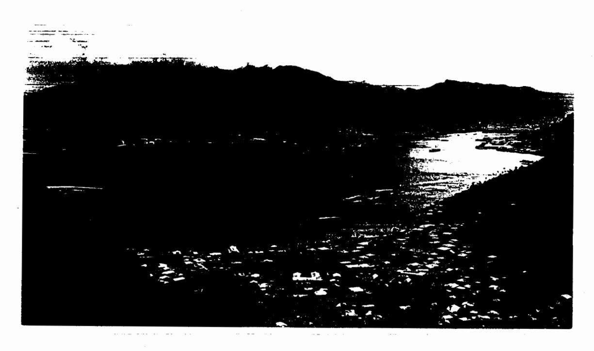

Plate A1. View to the west of Pago Pago Harbor. The village of Aua in the foreground and Site 1, Atu'u near the docks on the right.

Site Number: 2 Site Name: Leloaloa

Location: Pago Pago Harbor

Coastal Geologic and Morphologic Setting: Identical to Site No. 1. South-facing shoreline of the northern margin of inner Pago Pago Harbor. A narrow, east-west trending, coastal plain formed mostly by alluvial material at the base of Alava Mountain (490 m) and Maugaloa Ridge (~ 425 m).

Shoreline Type: The natural shoreline was probably a sinuous beach of mixed terrigenous/carbonate sediment.

Engineering Structures and Coastal Stability: The main road parallels the coast and is fronted by a basalt boulder revetment often backed by an erosional scarp because of poor construction. A remnant of an older shore-normal groin structure extends about two-thirds across the reef flat. Enhanced sediment deposition on the eastern flank of the structure indicates a net east-to-west transport direction. Low scarps on the margins of the groin indicate erosion.

Adjacent Reef Characteristics: A fringing reef 150 to 200 m wide occurs here. At the time of the field survey several fishing boats were grounded on the reef flat.

Remarks: Little remains of the natural shoreline. Photos of the groin in U.S. Army Corps of Engineers (1980, 1989) show three coconut palms; at the time of this survey only two remained.

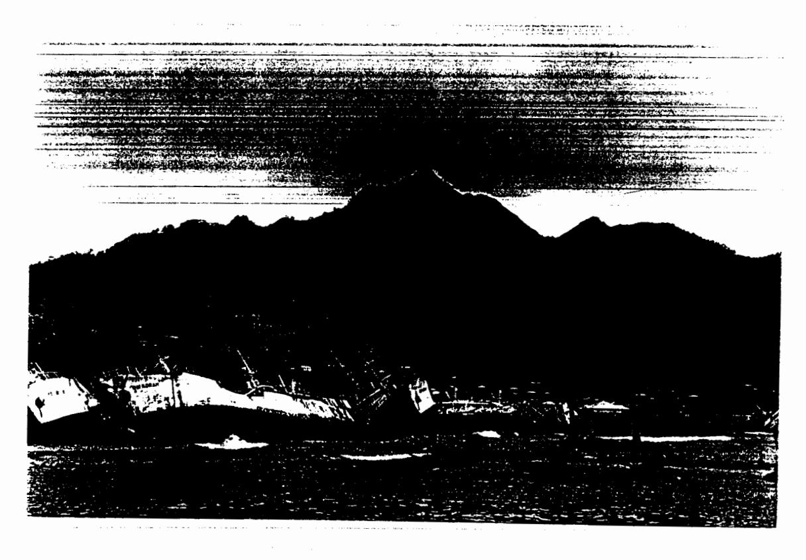

Plate A2. Photograph showing the groin remnant and stranded ships on the reef flat at Leloaloa. View to the southwest.

Site Number: 3 Site Name: Aua

Location: Northeast corner of Pago Pago Harbor.

Coastal Geologic and Morphologic Setting: Broad coastal plain and alluvial valley, up to 400 m wide, occurring at the confluence of the Lalolamauta, Suaia, Matagimalie, and Leasi Streams. The hinterland consists of the high Maugaloa Ridge (425 m) and North Pioa Mountain (525 m).

Shoreline Type: Beach ridge plain and alluvial valley fill. The beach occurs as small remnants of a formerly more continuous beach and consists mostly of carbonate sand.

Engineering Structures and Coastal Stability: The main road parallels the coast although there are several houses located on the seaward side of the road. Low scarps and boulder seawalls/revetments are common indicating a chronic erosion problem.

Adjacent Reef Characteristics: The fringing reef is up to 300 m wide and a small patch reef, Amu'ula Rock, occurs offshore. The inner reef flat is covered by sediment. The seaward edge of the reef flat is highly irregular, probably due to freshwater outflow of the streams.

Remarks: The houses on the seaward side of the road are in a hazardous location because of the low elevation of the coastal plain and chronic erosion in the area.

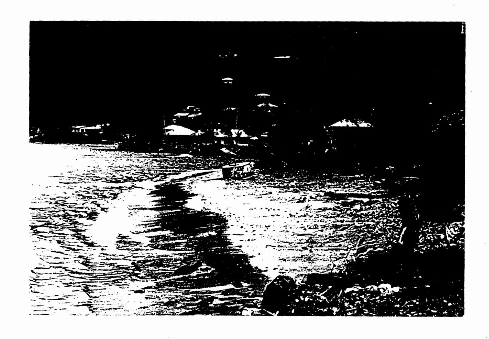

Plate A3. Shoreline at Aua showing crude seawalls in the background and a narrow beach in the foreground. View to the north.

Site Number: 4 Site Name: Anasosopo (Pago Harbor)

Location: East-central Pago Pago Harbor

Coastal Geologic and Morphologic Setting: Narrow coastal plain on north-south trending coast and backed by Papatele Ridge (up to 325 m high). At Anasosopo Pt. the volcanic ridge extends to the shoreline.

Shoreline Type: The natural shoreline has been completely disturbed in this area, but presumably it consisted of a narrow sand beach. Existing sediment is a carbonate-rich sand. A broader coastal plain occurs both to the north and south of Anasosopo Pt.

Engineering Structures and Coastal Stability: An extensive land reclamation project (sanitary landfill) has been built on the reef flat surface. It extends about 100 m seaward of the former shoreline (approximately marked by the road location) and is fronted along its seaward margin by loosely placed basalt boulders. The coastal road is also bounded by a basalt boulder revetment.

Adjacent Reef Characteristics: A narrow fringing reef borders the shore, varying from 120 m near Anasosopo to nearly 400 m at the next village to the north, which is also the location of an inner-reef dredge site.

Remarks: The seaward margin of the sanitary landfill appears to be undergoing slight to moderate erosion and leaching.

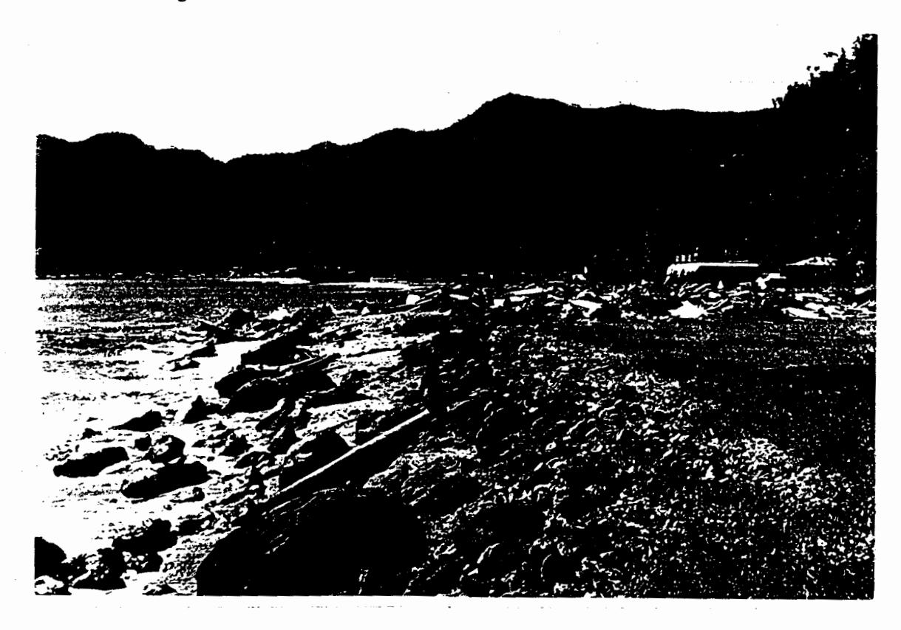

Plate A4. Shoreline of the sanitary landfill reclaimed land showing loosely-placed boulders and erosion of the upper seaward edge. View to the north.

Site Number: 5 Site Name: Lauli'ituai

Location: South coast, E of Pago Pago Harbor

Coastal Geology/Morphology Description: South facing exposed coastline composed of a carbonate sand beach fronting an alluvial valley filled with talus and alluvium. The valley is bounded by volcanics (mostly basaltic and andesitic flows and associated cone and dyke deposits), which form a steep coastline. Small carbonate-sand pocket beaches occur adjacently at Lauli'ifou and Aumi.

Shoreline Type: Narrow (~ 10 m) carbonate sand beach backed by basalt boulders placed to protect the coastal road. The center of the beach is cut by a basalt dyke outcrop. Beach sediment is a poorly-sorted coarse sand composed of about 95% carbonate and 5% terrigenous material.

Adjacent Reef Characteristics: Narrow (~150 m) fringing reef interrupted by a prominent indentation opposite the mouth of Lesea Stream. The reef flat is a pavement covered by scattered basalt boulders.

Engineering Structures: Loosely placed basalt boulders form a revetment between the beach and coastal road presumably indicative of a long-term erosion problem. Undermining and erosion of the boulders is evident in some stretches.

Remarks: The adjacent beach to the west at Lauliifou contains a building foundation on the seaward side of the coastal road, which includes a vertical seawall. This foundation has interfered with littoral drift in the area. During the study illegal sandmining using shovels and a pick-up truck was observed. At Aumi, to the east, a WWII pillbox is undermined and tilted indicating erosion has occurred since its construction.

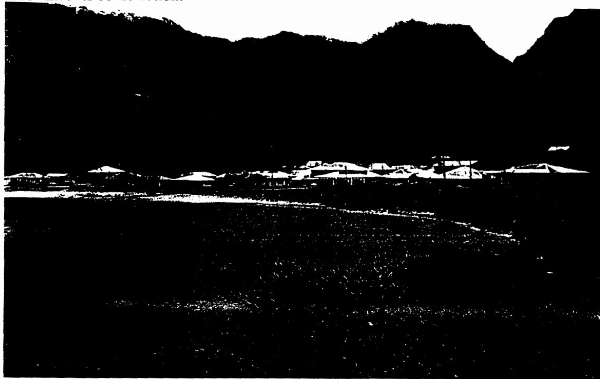

Plate A5. View from Lafiga Pt. to the north showing the village of Lauli'ituai and the adjacent shoreline.

Site Number: 6 Site Name: Auto (Fagaitua Bay)

Location: Western shore of Fagaitua Bay, south coast.

Coastal Geologic and Morphologic Setting: Southeast-facing coastline along the western shore of Fagaitua Bay. Carbonate sand beach ridge fronting valley terrigenous talus and alluvial deposits. Adjacent volcanic rock headlands occur to the SW at Fagailiili Point and NE at Anapeapea Point separating about 700 m of depositional shoreline between Auto and Afulei. The coastal plain beach ridge and road is about 3 m above mlwl.

Shoreline Type: Narrow (< 10 m) carbonate sand beach fronting basalt-boulder road revetment. In some segments the beach is virtually non-existent and the revetment forms the shoreline; the beach is best developed to the SW and gradually diminishes in width towards the embayment (NE). Limited beachrock exposures are present and a small sandy flood delta occurs at the mouth of Muliolevai Stream.

Engineering Structures and Shoreline Stability: Basalt boulders are emplaced along the entire backshore as erosion protection for the coastal road. In many places a vertical scarp is present and boulders are scattered on the foreshore suggesting an ongoing erosion problem.

Adjacent Reef Characteristics: The fringing reef opposite Faasouga Point is nearly 300 m wide narrowing to about 200 m opposite Auto where it gradually widens towards the northeast (Fagaitua Bay). Opposite the mouth of Muliolevai Stream the reef is slightly indented forming a narrow channel. The inner reef flat is covered by a veneer of sandy sediment; further seaward rubble and coral/algal growth becomes prominent.

Remarks: Well-developed sandy shoreline and tombolo occurs to the west at Avaio. A WWII pillbox is stranded on the inner reef flat at Afulei indicating erosion.

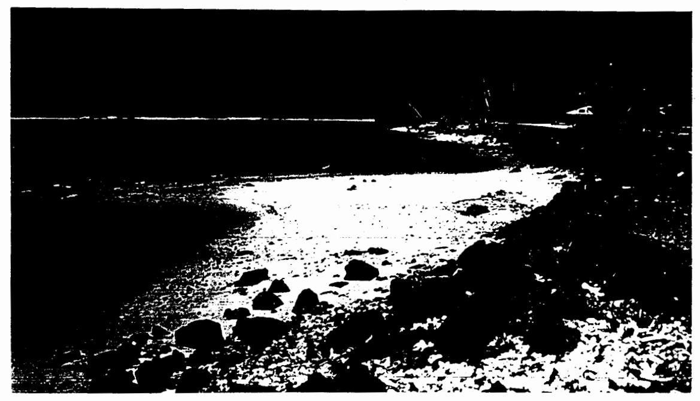

Plate A6. Shoreline near Auto showing basalt boulder revetment to stabilize the coast road and an accumulation of carbonate sand on the reef flat. Only small areas of beach remain.

Site Number: 7 Site Name: Fagaitua

Location: Fagaitua Bay, southeast coast of Tutuila.

Coastal Geologic and Morphologic Setting: South-facing moderately protected pocket beach of carbonate and terrigenous coastal plain deposits up 150 m wide. Further inland are alluvial/colluvial deposits. Rocky headlands occur to the east and west.

Shoreline Type: The original shoreline, which probably was a carbonate sand beach, is presently a near-continuous boulder reverment

Engineering Structures and Coastal Stability: The coastal road is protected by a 600 m long boulder revetment and sits about 2.5 m above the mean low water level. Erosional scarps are common between the boulders and the road. The village is sited landward of the road with the exception of a single dwelling/foundation on the seaward side.

Adjacent Reef Characteristics: Up to 600 m wide fringing reef bisected by a central channel. Rubble storm deposits occur on the outer reef flat. Rectangular outlines on the inner reef flat, visible on vertical aerial photographs, indicate possible former dredge sites.

Remarks: The shoreline to the west at Utusia is marked by a beach about 10 m wide composed of carbonate sand and gravel and scattered basalt pebbles. Shore parallel bands of beachrock also occur here. To the east is Pagai, a small (~250 m) pocket beach of carbonate and some terrigenous sediment. A small flood delta is developed on the reef flat opposite Punaomanuia Stream and the adjacent indentation in the fringing reef.

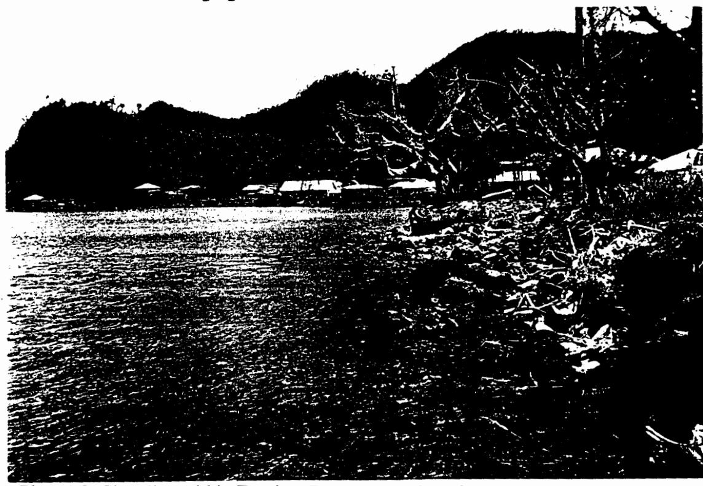

Plate A7. Shoreline within Fagaitua Bay showing loosely placed basalt boulders on the seaward side of the road.

Site Name: Alofau Site Number: 8 Location: Southeast coast along the eastern margin of Fagaitua Bay.

Coastal Geologic and Morphologic Setting: Southwest-facing pocket beach fronting a coastal plain of carbonate and alluvium sediment. The adjacent headlands (Asasama and Lifalifa Points) and hinterland are composed of thin-bedded basalt and associated rocks of the Alofau Volcanics.

Shoreline Type: Except for a few small sandy segments, the original beachface at Alofau is presently marked by a boulder revetment. The elevation of the coastal road and backshore area is only about 2.2 m above the mlwl. The shoreline is relatively protected due to the western exposure and 300 to 400 m wide fringing reef. Beachrock exposures occur to the northwest section of beach. The lower shoreface is composed of a carbonate rich medium-coarse sand which extends across the inner reef flat.

Engineering Structures and Coastal Stability: A low (< 2m) seawall/revetment of small boulders and occasional gabion walls borders the shoreline protecting the coastal road and dwellings. To the southwest about a dozen dwellings are situated between the road and the protected shoreline. Rectangular-shaped depressions in the reef flat indicate areas of former dredging activities. Aerial photographs from 1971 depict a causeway and dredging operation underway (U.S. Army Engineer District, Honolulu, 1989), which may be responsible for the local erosion problems. A WWII pillbox is undermined, tilted, and detached from the present shoreline.

Adjacent Reef Characteristics: The wide fringing reef (300-400 m) has one main channel opposite the mouth of the Fogalilimu Stream. Former dredging borrow pits form seagrass(?)-covered sediment-infilled depressions of the reef flat. Wave-energy on the reef appears to decrease from south to north.

Remarks: To the south, between Uea and Sinatau Points (Cape Fogausa), is a narrow (~100 m)

fringing reef and undeveloped pocket beach.

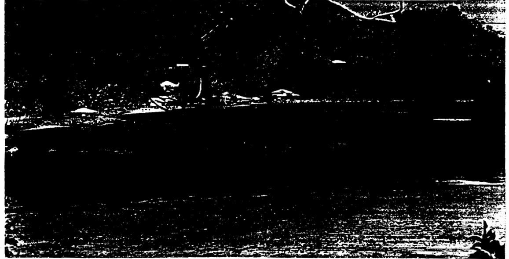

Plate A8. View from the coastal road towards the east of the small embayment at Alofau. Most of the shoreline is bordered by emplaced basalt boulders.

Site Number: 9 Site Name: Amouli

Location: Southeast coast, Tutuila

Coastal Geologic and Morphologic Setting: Small south-facing arcuate embayment with pocket beach between Falaseeitoafa Point (Alofau Volcanics) and Matautuele Point (Olomoana Volcanics). The coastal plain, which includes the villages of Siufaga and Amouli, consists of reef-derived carbonate sediment at the shore and alluvium/colluvium further inland.

Shoreline Type: Very-coarse sand carbonate pocket beach with several sets of beachrock exposures. The beachrock occurs opposite Siufaga village (where there are also undercut coconut palms) and at the eastern end of the embayment. The elevation of the coastal road and, presumably height of the beach ridge deposits, is about 3.8 m above mlwm.

Engineering Structures and Coastal Stability: Basalt boulders have been haphazardly dumped in an effort to retard erosion of the backbeach bluff and coastal road. Several dwellings are sited on the oceanside of the coast road and seawalls have been constructed for protection. The presence of beachrock, undercut trees, and seawalls/revetments indicate an ongoing erosion problem.

Adjacent Reef Characteristics: Fringing reef averaging about 250 m wide with a narrow channel opposite the mouth of Televai Stream. A small remnant of a flood delta deposit is present on the inner reef flat near Televai Stream.

Remarks: At Foga'au, to the west of Siufaga, is a small carbonate sand pocket beach with a tombolo attached to a large volcanic rock outcrop on the inner reef flat. A rusted shipwreck is lodged next to the bluffs at the west end of Foga'au. Further west the shore is characterized by steep coastal bluffs fronted by narrow pocket beaches. To the east at Aganoa is a convex-seaward carbonate beach and small village between Taulaotoga Rock and Taugamalama Point.

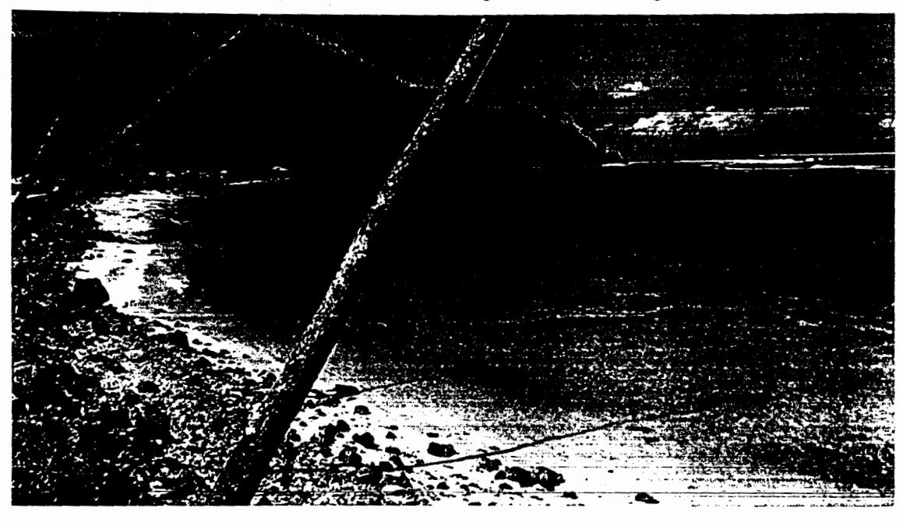

Plate A9. View to the east of the embayment at Amouli. The dark bands in the center of the picture at the toe of the beach are beachrock exposures.

Site Number: 10 Site Name: Au'asi

Location: Southeast coast of Tutuila.

Coastal Geologic and Morphologic Setting: South/southeast-facing pocket beach between Taugamalama and Ma'atulaumea Points at the mouth of Leafu Stream. The shoreline is nearly linear and the hinterland consists of basalt and associated rocks of the Olomoana Volcanics.

Shoreline Type: The beach is composed of a poorly-sorted coarse carbonate sand and is about 4 m above the adjacent reef flat. The coastal road and village have extensively modified the original beach plain.

Engineering Structures and Coastal Stability: Construction for the Ausi Small Boat Harbor (completed in 1981) has significantly altered the shoreline and reef flat. An entrance channel and turning basin has been excavated from the reef flat and breakwater, revetment, and jetty has also been constructed. Critical erosion has occurred along the adjacent sand shoreline (U.S. Army Corps of Engineers, 1989). Shore protection structures for the coast road are also present.

Adjacent Reef Characteristics: A fringing reef, up to 200 m wide, is fronted by a submarine terrace, which is clearly visible on the aerial photographs.

Remarks: The beach, reef, and shoreline are in a relatively exposed, high-energy location.

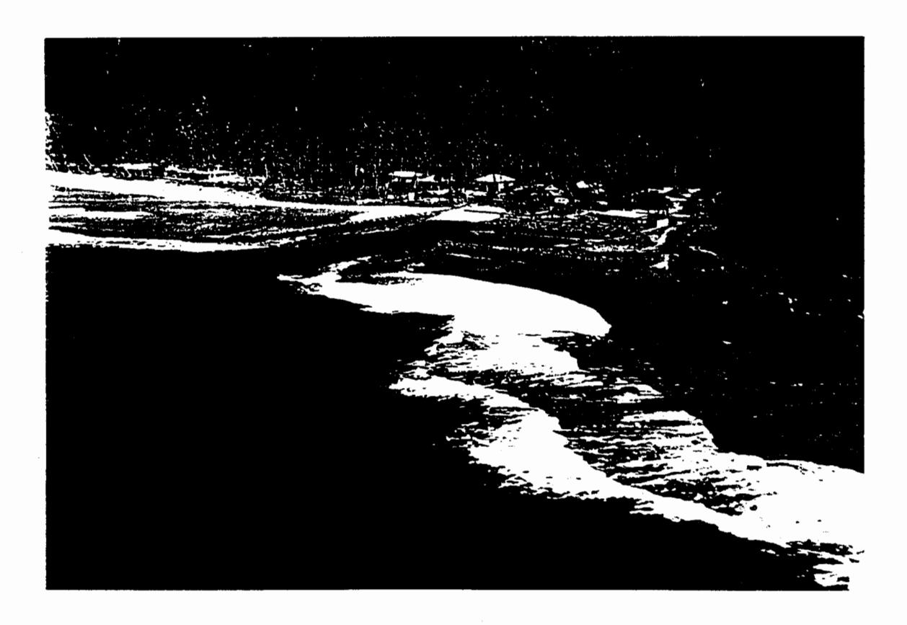

Plate A10. Oblique aerial view of the Ausi Small Boat Harbor showing the dredged channel and protection structures. Photo by J. Maragos.

Site Number: 11 & 12 Site Name: 'Aunu'u West & South

Location: West and south coasts of 'Aunu'u Island, off southeast coast of Tutuila.

Coastal Geologic and Morphologic Setting: 'Aunu'u Island consists of a remnant of a volcanic cinder cone surrounded on its western half by reef-derived carbonate deposits. The broad coastal plain, up to 700 m wide, is composed of a combination of carbonate sediment beach ridges on the seaward margin and low-lying wetlands and taro swamps inland. The wetland soils are derived from carbonate sediment and volcanic ashes. The beach ridges form a concentric half-ring around the western part of a volcanic cone of 'Aunu'u Tuff deposits.

Shoreline Type: A carbonate sand and rubble beach forms the shore and fronts the deposits of several beach ridges. Berm height is about 3 m above mlwl. Grain size of the beach deposits decreases towards the west from coral rubble to sand and appears to be directly related to the incident wave energy becoming lower towards the leeward western shore. Extensive beachrock outcrops occur along the north and south sections of coast.

Engineering Structures and Coastal Stability: A small boat harbor was constructed by the U.S. Army Corps of Engineers on the leeward west coast. The harbor consists of a dredged turning basin and access channel protected by revetments and a breakwater. Erosional beach scarps to the north and south of the harbor suggest an erosion problem created by harbor construction and interruption of the local sediment transport processes and wave/current activity. Beachrock exposures along the north and south shorelines appear to be far enough removed from the harbor as to represent "natural" shoreline readjustments.

Adjacent Reef Characteristics: The fringing reef varies from a narrow 50 m width on the west coast to over 300 m in the southwest. At the time of observations, large waves (3 m+) were breaking on the north and south reefs. Wave height decreased dramatically towards the west.

Remarks: The eastern volcanic cone portion of 'Aunu'u is composed of steep cliffs with virtually no reef development. The broad coastal plain appears to have developed by deposition of reef-derived sediment in the lee of the volcanic edifice.

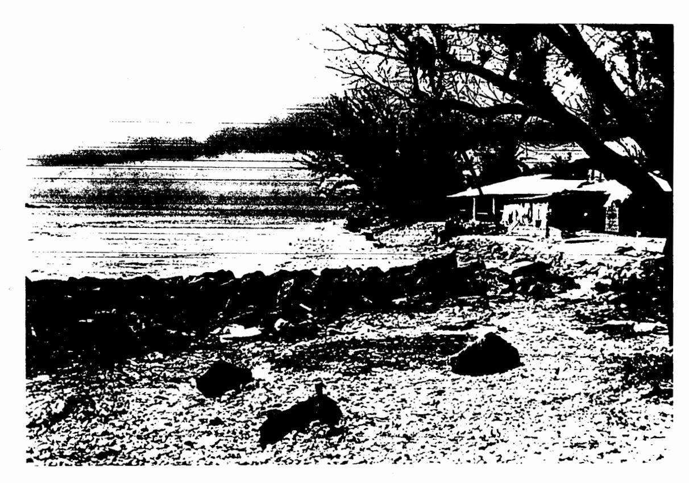

Plate A11. Shoreline of western 'Aunu'u showing a small groin of basalt boulders constructed as a result of erosion associated with the small boat harbor.

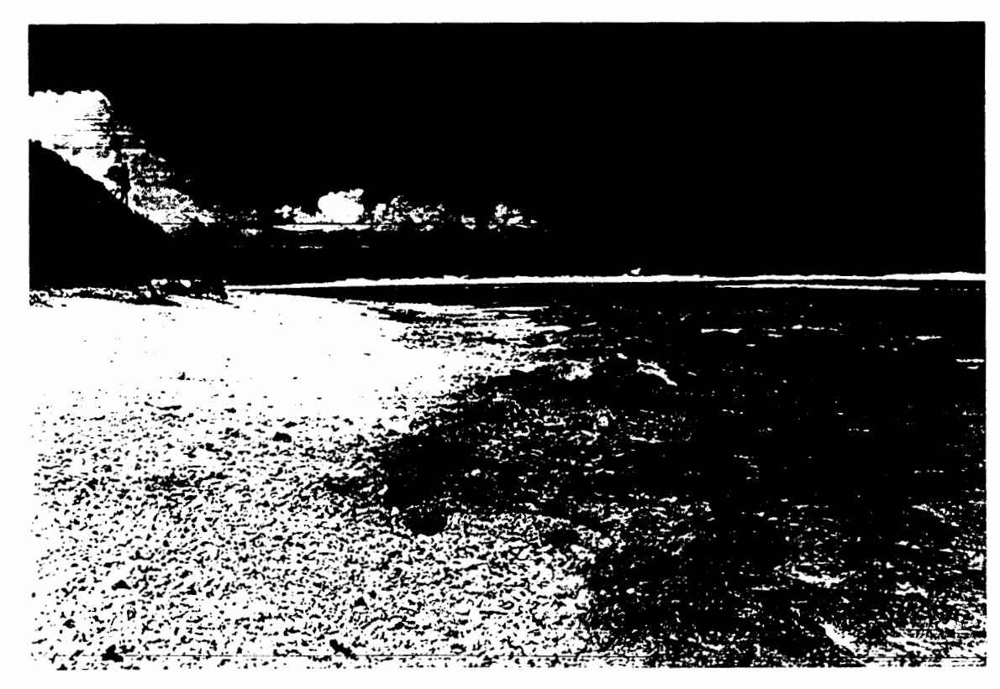

Plate A12. Southern 'Aunu'u shoreline showing extensive beachrock exposures which denote a former position of the shoreline.

Site Number: 13

Site Name: Onenoa

Location: Northeast Tutuila

Coastal Geologic and Morphologic Setting: Small embayment and coastal plain developed at the mouth of Vaisa Stream between Solo and Papaloa Points. The drainage is controlled by the Afimuao and Lefutu Ridges.

Shoreline Type: Arcuate pocket beach bounded by basalt headlands. The beach is in a reasonably natural state because the road passes through the backbeach area. Limited beachrock exposures occur along the foreshore. The backbeach is almost 4 m above the mlwl. Carbonate sand with some pebble-size material is the dominant sediment.

Engineering Structures and Coastal Stability: A few older coral rubble seawalls protect some of the houses in the backbeach area. Small scarps at the base of some of the coconut palms in the upper beachface suggests a minor amount of erosion has occurred.

Adjacent Reef Characteristics: The adjacent fringing reef is about 100 m wide within the embayment and narrows towards the headlands. A prominent indentation of the reef outline occurs opposite the stream mouth in the center of the bay.

*Remarks:* The backbeach area has been cleared of most vegetation increasing the potential susceptibility to overwash damage.

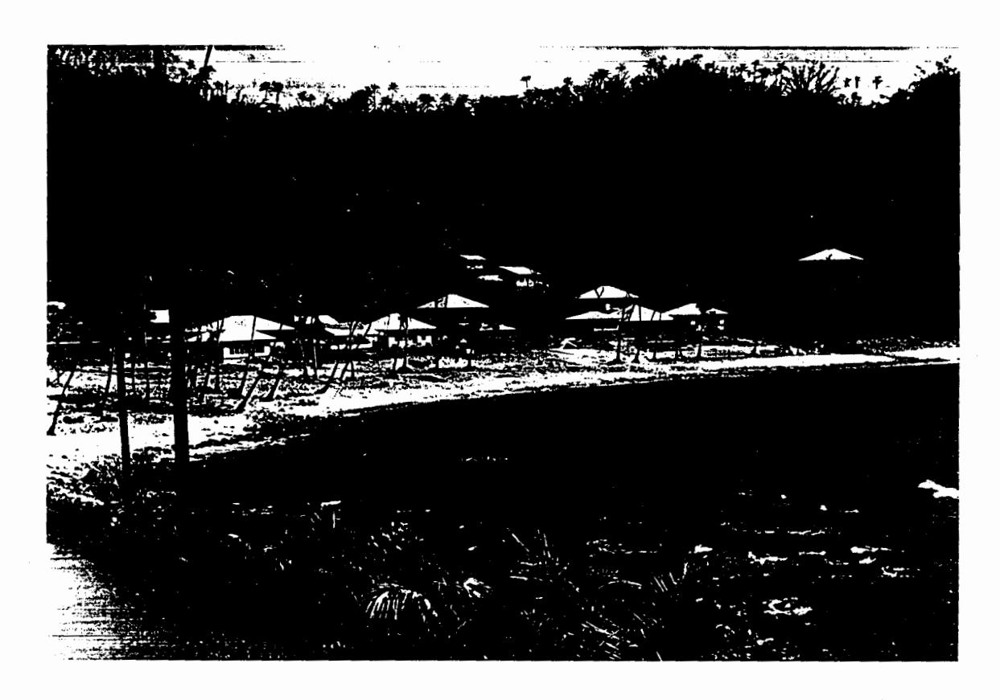

Plate A13. The beach at Onenoa. View to the southwest.

Site Number: 14 Site Name: Aoa Bay

Location: Northeast Tutuila.

Coastal Geologic and Morphologic Setting: Aoa Bay is a box-shaped embayment with a broad (up to 500 m) coastal plain and alluvial valley surrounded by Afimuao and Patupatu Ridges and Leila Mountain. Laoulu, Puna, Tapua and Vaitolu Streams empty into the bay. The coastal plain is low-lying and relatively protected because it is recessed between 450 and 600 m from the open coast.

Shoreline Type: The pocket beach at Aoa Bay is bounded by steep cliffs on both sides. A small flood-delta and basalt cobble beach is present at the mouth of Laoulu Stream. The remainder of the shoreline is mostly sand-size sediment of dominantly carbonate composition.

Engineering Structures and Coastal Stability: Approximately one-half of the pocket beach shoreline is fronted by seawall or revetment structures. Small scarps and eroded bases of coconut trees indicate recent erosion along parts of the shoreline not bordered by engineering structures.

Adjacent Reef Characteristics: The fringing reef occupies most of the embayment and is up to 400 m wide. The outer edge has a large indentation where freshwater from the streams is channeled. Most of the reef is exposed at low tide.

Remarks: The low-lying coastal plain is appears subject to inundation and overwash during storms. Sailele, to the west, is a linear pocket beach fronted by a narrow fringing reef and exposed to wave action.

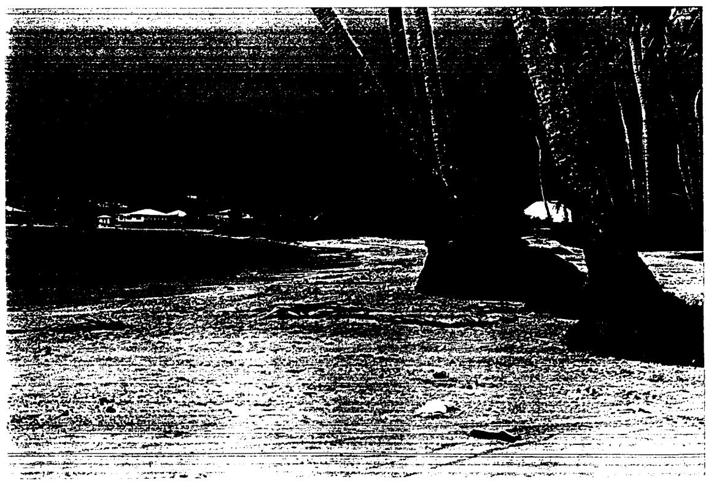

Plate A14. View to the east of the shoreline in Aoa Bay showing slightly eroded bases of the coconut palms (foreground) and massive revetment in the background.

Site Number: 15 Site Name: Masausi

Location: North-central Tutuila.

Coastal Geologic and Morphologic Setting: A small north-facing embayment bounded by cliffs and backed by a small coastal plain. Two small streams, Panota and Vaipito, enter the coast here.

Shoreline Type: An arcuate pocket beach of carbonate sand and scattered basalt gravel occurs at the head of the embayment. Beach ridge elevation is nearly 3 m above mlwm. The margins of the embayment are marked by cliffs.

Engineering Structures and Coastal Stability: The village houses are set back from the active beach face, and consequently, there are no engineering structures or an apparent erosion problem.

Adjacent Reef Characteristics: The fringing reef, which fills most of the embayment, is about 180 m wide. Most of the reef is exposed at low tide.

Remarks: The shoreline is relatively protected from waves with the exception of those from a direct northerly approach because of the narrow (~ 300 m) entrance to the bay.

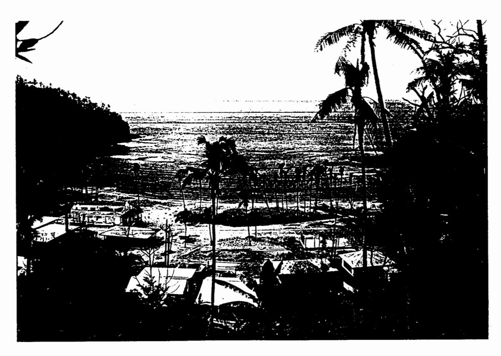

Plate A15. View to the north of the village and coastal plain at Masausi.

Site Number: 16 Site Name: Masefau

Location: North-central Tutuila.

Coastal Geologic and Morphologic Setting: A roughly east-west aligned embayment opening to the northeast. The broad opening (~800 m) lies between Nu'usetoga Island and Tiape Pt. Masefau Bay is relatively deep (7 to 40+ m) and is adjacent to the narrow but long coastal plain formed at the confluence of the Talaloa and Tagau Streams.

Shoreline Type: A pocket beach occupies the head of the embayment and low-lying, poorly-developed beaches flank the margins. Beach elevations are generally less than 2 m. There is only about 75 m of natural unprotected beach (near the mouth of Talaloa Stream) within the bay.

Engineering Structures and Coastal Stability: Most of the shoreline is fronted by some form of shore protection works; either basalt boulder seawalls or revetments. Chronic erosion is probably exasperated by the low backshore elevations and often minimal setbacks from the coast.

Adjacent Reef Characteristics: A fringing reef, from 100 to 300 m wide, lines the inner margins of the bay. Near the entrance to the bay the reef is only a thin veneer on the basement rocks. shallow channels link the streams to the reef front.

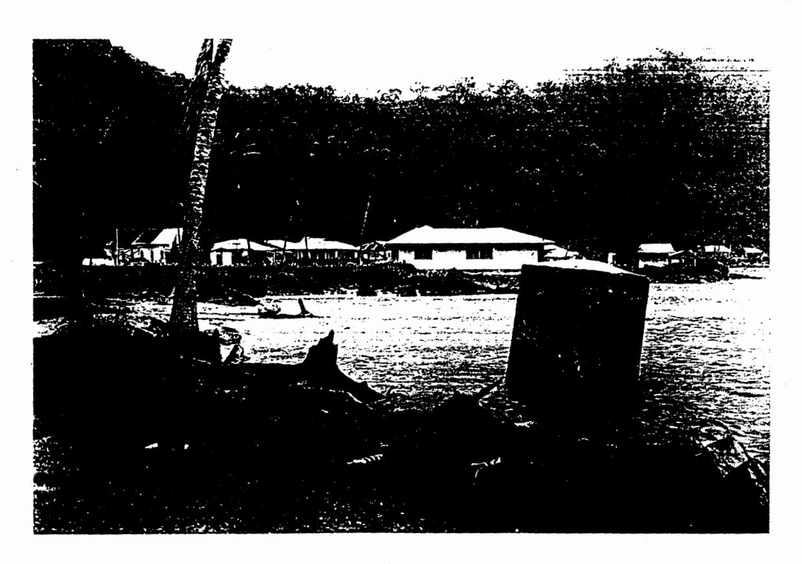

Plate A16. Stranded WWII pillbox and basalt boulder rip-rap of the low-lying Masefau shoreline.

Site Number: 17 Site Name: Afono

Location: North-central Tutuila.

Coastal Geologic and Morphologic Setting: The village and coastal plain of Afono is an embayment within the larger embayment of Afono Bay. Pago Stream forms the alluvial valley and coastal plain that the village is built on. Olo and Ogetu Ridges enclose Afono Bay.

Shoreline Type: Narrow, steep gravel beaches composed of basalt fragments and coral rubble are typical. A small gravel flood-delta is formed at the mouth of Pago Stream. Elevation of the beaches approaches 4 m.

Engineering Structures and Coastal Stability: A 100 m long revetment is constructed in the middle of the shoreline to protect the school. A stranded WWII bunker indicates a minimum of 5 m erosion since its construction.

Adjacent Reef Characteristics: An irregular fringing reef lines the embayment with widths ranging from 50 to 120 m. A large indentation in the reef front occurs opposite the mouth of Pago Stream.

*Remarks:* The shoreline of Afono Village is relatively protected from all wave approach directions except for those arriving from the north.

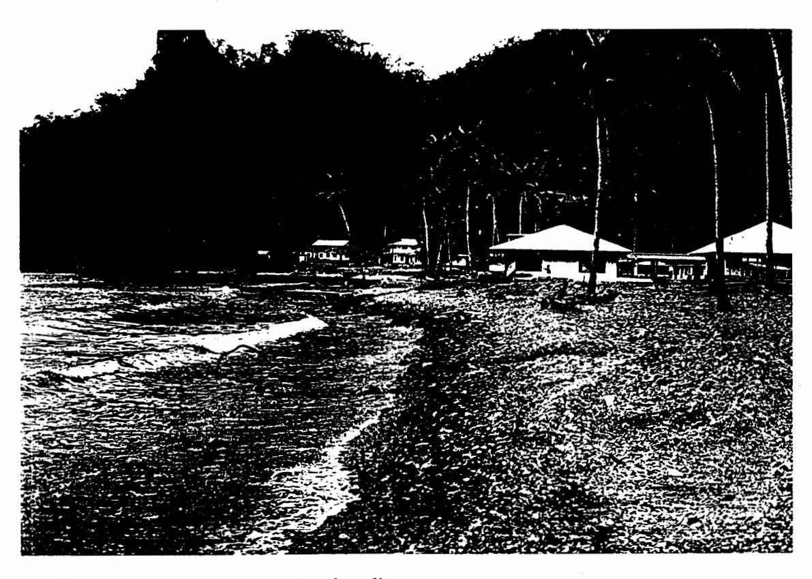

Plate A17. Gravel beach of the shoreline at Afono.

Site Number: 18 Site Name: Vatia

Location: North-central Tutuila, north of Pago Pago Harbor.

Coastal Geologic and Morphologic Setting: A northeast trending embayment very similar in characteristics to Masefau Bay (16). Polauta Ridge (200 m) and Pola Island form the northwestern boundary of the bay. Several streams enter the bay (Leafu, Gaoa, Lausa'a, Fa'atafe, and Mulivai).

Shoreline Type: The embayment is lined by beaches that are coarser and higher towards the entrance and finer and lower at the head of the bay. Beach height varies from less than 2 m in the inner bay to nearly 3 m along the outer northwestern rim. Poorly sorted carbonate sand is the dominant sediment type within the bay beaches. Coral rubble and basalt gravel beaches occur in the exposed localities. Small deltas extending onto the reef flat have formed at the stream mouths.

Engineering Structures and Coastal Stability: Several revetments have been constructed along the northern margin of the bay to protect the coastal road and housing. Small scarps and eroded coconut tree bases indicate recent erosion.

Adjacent Reef Characteristics: A fringing reef borders the shoreline and varies from 50 to 150 m wide. Shallow channels connect Leafu Stream and an indentation in the fringing reef.

Remarks: The northern margin is exposed to easterly wind and waves.

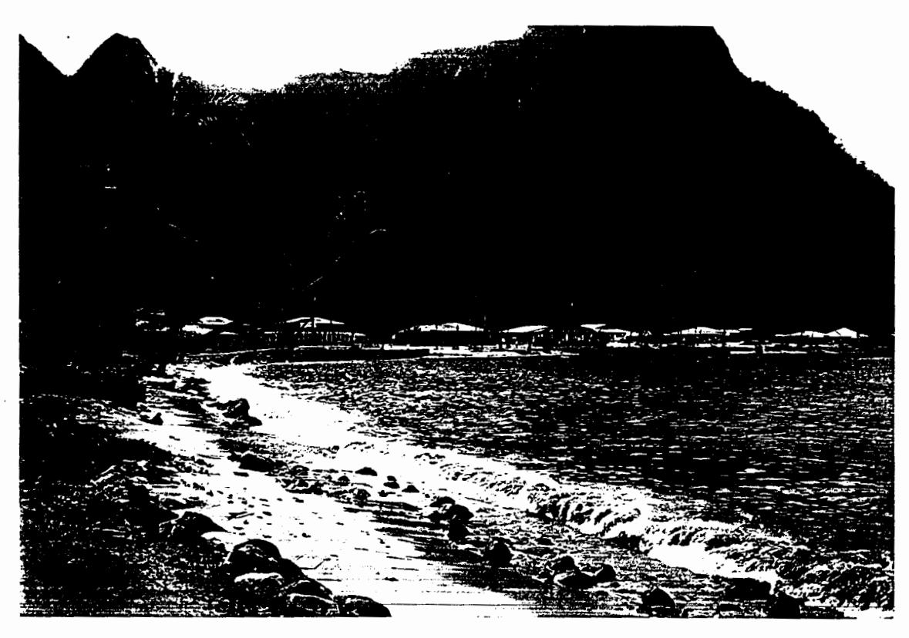

Plate A18. Shoreline near the village of Vatia showing eroded basalt boulders littering the foreshore.

Site Number: 19 Site Name: Vatia Bay (north)

Location: North-central Tutuila, north of Pago Pago Harbor.

Coastal Geologic and Morphologic Setting: Eastern shore of a Peninsula formed by Polauta Ridge.

Shoreline Type: Steep cliffs bordered by a narrow coastal bench and cobble beach about 3 m above mlwl.

Engineering Structures and Coastal Stability: No engineering structures at this site. The cliffs are most likely prone to landslides.

Adjacent Reef Characteristics: Narrow fringing reef up to 100 m wide tapering to a reef veneer at the end of the peninsula.

Remarks: Relatively exposed location to easterly winds and waves.

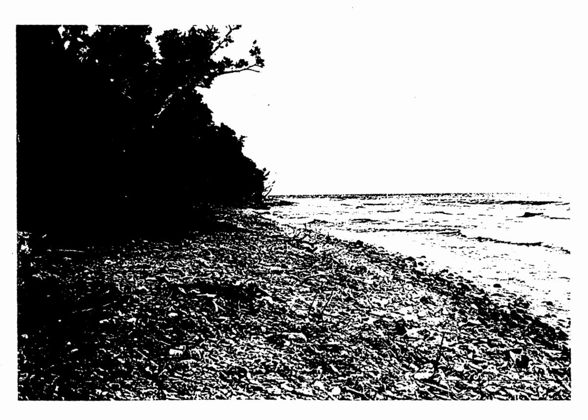

Plate A19. Gravel beach near the end of the peninsula at Vatia.

Site Number: 20 Site Name: Pola Rock

Location: North-central Tutuila, north of Pago Pago Harbor.

Coastal Geologic and Morphologic Setting: Razorback ridge of volcanic rocks forming Pola

Island.

sea.

Shoreline Type: Seacliffs.

Engineering Structures and Coastal Stability: No engineering structures; the site is probably prone to landsliding.

Adjacent Reef Characteristics: No fringing reef present, probably only a veneer of coral on basement rocks.

Remarks: Exposed to easterly, northerly, and westerly conditions.

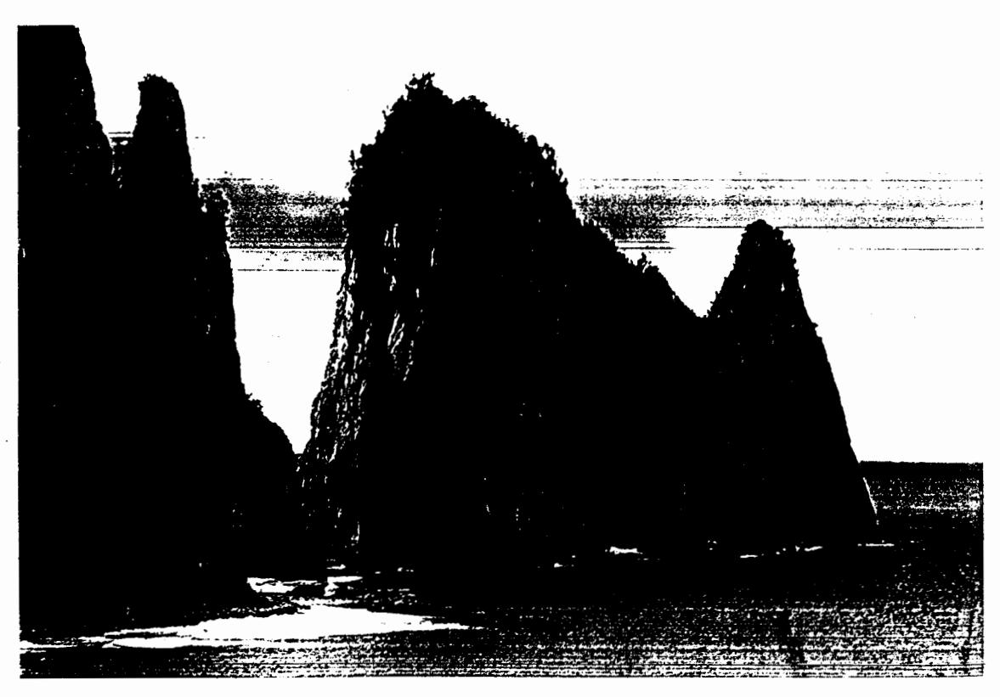

Plate A20. Eastern side of Pola Island showing the steep cliffs plunging directly into the

Site Number: 21

Site Name: Agapie Cove

Location: North-central Tutuila.

Coastal Geologic and Morphologic Setting: Steep cliffs descending from Tia and Tialeogaumu Ridges enclose Agapie Cove. There is no coastal plain developed.

Shoreline Type: Steep cliffs plunge directly into the sea.

Engineering Structures and Coastal Stability: No engineering structures; landslides probably common.

Adjacent Reef Characteristics: No fringing reef present.

Remarks: Exposed and rugged uninhabited coastline.

Plate A21. No photo available of Agapie Cove.

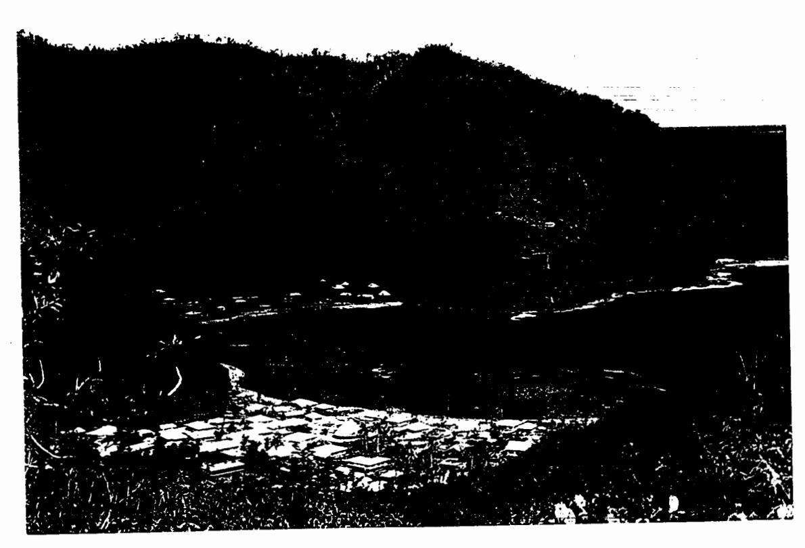

Plate A22a. Fagasa Bay from the entrance road showing the reef indentations associated with the stream mouths.

Site Number: 22 Site Name: Fagasa Bay

Location: North-central Tutuila.

Coastal Geologic and Morphologic Setting: Northwest-facing embayment bounded by high ridges and containing a small coastal plain. Several streams enter the bay, including the Agasi'i, Lesina, Le'ele, and Leua.

Shoreline Type: Narrow, steep, and coarse beaches rim the embayment. Basalt gravel is common on the foreshore along with carbonate sand.

Engineering Structures and Coastal Stability: Several revetments and a concrete boat ramp mark the foreshore. The revetments are in generally poor shape. Several beach scarps were observed and a stranded WWII bunker indicates a potential chronic erosion problem.

Adjacent Reef Characteristics: Natural channels in the fringing reef opposite two streams extend almost to the shoreline. The reef is up to 150 m wide and tapers to practically nothing beyond the bay entrance.

Remarks: Adjacent coastline consists of rugged cliffs. The bay is exposed to the northwest.

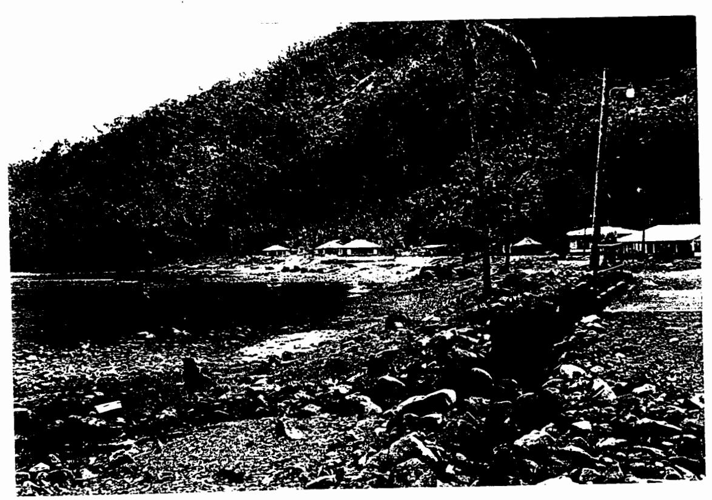

Plate A22b. Gravel shoreline of mostly basalt sediment near the village of Fagasa.

Site Number: 23

Site Name: Fagapue Bay

Location: Northwest Tutuila.

Coastal Geologic and Morphologic Setting: Small north-facing embayment backed by the narrow alluvial valley of Leaveave Stream. The bay is enclosed by steep ridges.

Shoreline Type: Small pocket beach at the head of the embayment.

Engineering Structures and Coastal Stability: No structures present.

Adjacent Reef Characteristics: The bay is rimmed by a narrow (~ 80 m) fringing reef with an indentation in the reef opposite the stream mouth.

Remarks: Uninhabited bay. No on-land visit was made during the study.

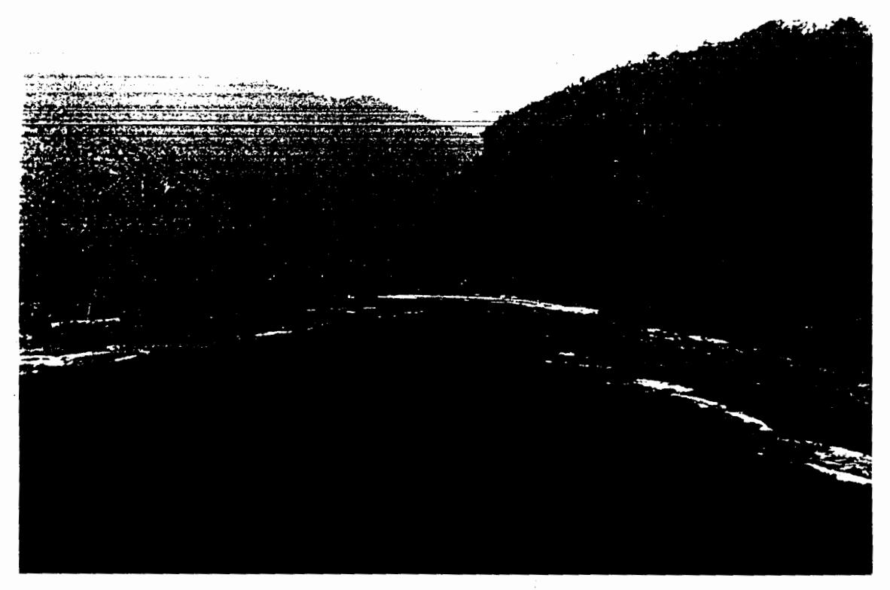

Plate A23. Oblique aerial view of Fagafue Bay showing the small coastal plain and alluvial valley. Fringing reef borders the shoreline which consists of an erosional bench towards the entrance of the bay. Photograph by J. Maragos.

Site Number: 24 Site Name: Aasu (Massacre Bay)

Location: Northwest Tutuila.

Coastal Geologic and Morphologic Setting: North-northeast facing small embayment bordered by high cliffs and backed a narrow coastal plain and two small alluvial valleys. Assu Stream is the main stream reaching the bay.

Shoreline Type: Pocket beach bounded by basalt headlands.

Engineering Structures and Coastal Stability: No structures present.

Adjacent Reef Characteristics: The bay is bordered by a narrow (50 to 150 m) fringing reef that has an indentation opposite the stream mouth.

Remarks: This site was not visited by the author. The adjacent coastline is comprised of rugged cliffs.

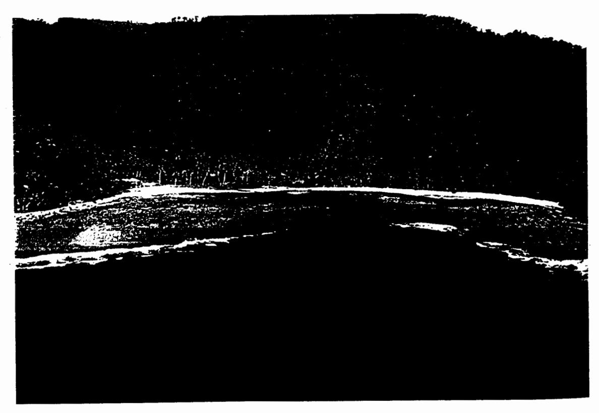

Plate A24. Oblique aerial view of Massacre Bay showing the well-developed pocket beach in its natural state. Photograph by J. Maragos.

Site Number: 25

Site Name: Fagamalo

Location: Western Tutuila

Coastal Geologic and Morphologic Setting: Northwest facing embayment and small coastal plain. The coastal plain is poorly developed because of the steep backshore area. Matavai and Amate Streams empty into the bay.

Shoreline Type: Steep, gravel, pocket beach that slopes from the reef flat to over about 4 m above mlwm. The gravel is a mixture of reef rubble and basalt material.

Engineering Structures and Coastal Stability: No foreshore engineering structures are present. The beach is subject to high run-up from large waves approaching from the west.

Adjacent Reef Characteristics: Fringing reef about 120 m wide that extends across the bay from Vaoaga Pt. to Leelee Pt. The inner reef flat is covered by scattered boulders.

Remarks: The beach face is kept clean and groomed by villagers.

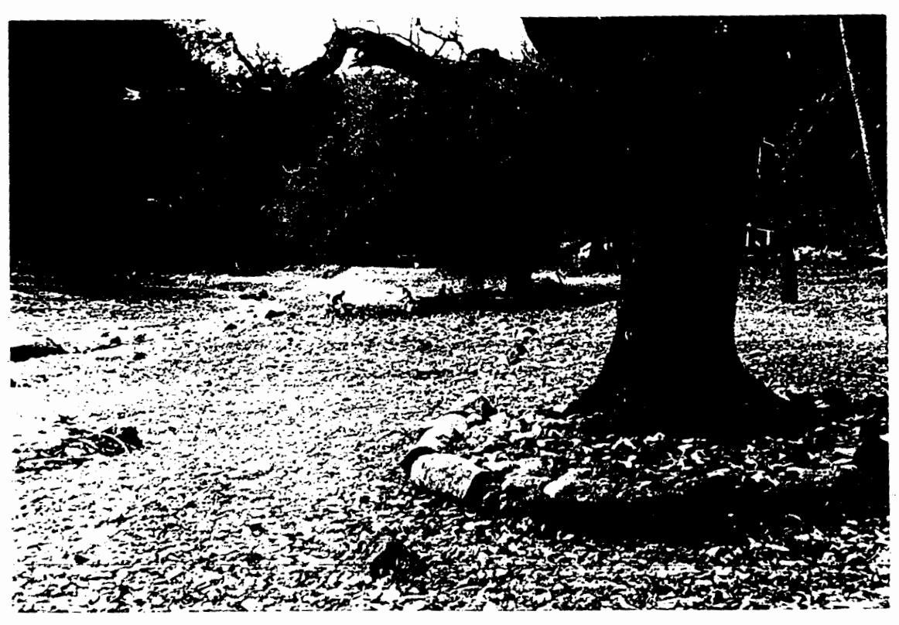

Plate A25. Gravel beach face at Fagamalo. View to the north.

Site Number: 26 Site Name: Maloata Bay

Location: Western Tutuila.

Coastal Geologic and Morphologic Setting: Northwest-facing coastal embayment backed by a well-developed low-lying coastal plain. The coastal plain and alluvial valley are developed in the Maloata Stream valley, which is bounded by Tuasina and Tuatafa Ridges.

Shoreline Type: Low-lying (~ 2m) pocket beach of mixed carbonate/terrigenous sediment. A small flood-delta of gravel sediment has formed at the mouth of Maloata Stream.

Engineering Structures and Coastal Stability: No engineering structures are present and the natural shoreline appears stable.

Adjacent Reef Characteristics: The fringing reef tapers from a veneer at the headlands to nearly 150 m wide within the bay. The inner reef flat is covered by a sheet of scattered gravel. A channel in the reef extends off the mouth of Maloata Stream.

Remarks: A protected embayment that is exposed only to the northwest.

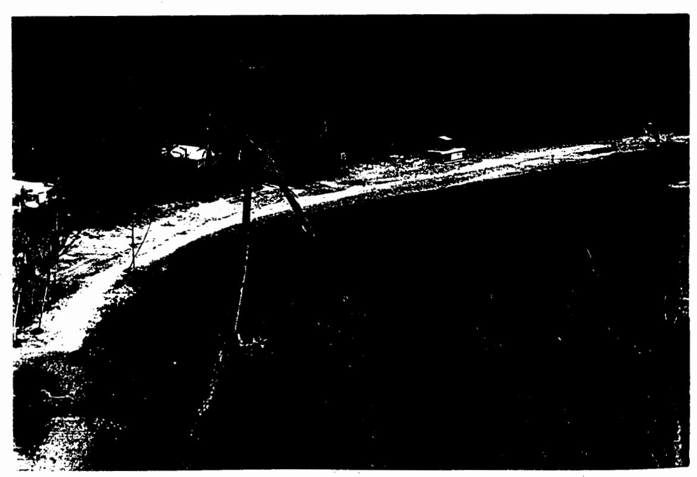

Plate A26. The shoreline and pocket beach of Maloata Bay. View from the coastal road.

Site Number: 27

Site Name: Poloa Bay

Location: Western Tutuila.

Coastal Geologic and Morphologic Setting: West-facing, slightly-indented embayment backed by a narrow, elongated coastal plain. The alluvial valley of Vaitele Stream is narrow and covers a relatively limited area.

Shoreline Type: A narrow pocket beach, which is slightly concave seaward. The beach height, about 6 m above mlwm, is one of the highest on the island. The sediment is mostly a poorly-sorted carbonate sand. A volcanic rock remnant (seastack) occurs in the middle of the beach.

Engineering Structures and Coastal Stability: A massive revetment, about 145 m long, protects the Poloa School in the southern part of the beach. The revetment was recently overtopped causing damage to the school. Small erosional scarps were visible on the beachface, but a WWII bunker is still set back from the active beach suggesting relative long-term stability.

Adjacent Reef Characteristics: A fringing reef, up to 150 m wide, borders the pocket beach. There are two narrow indentations of the reef in the central part of the bay, and a large triangular-shaped submarine terrace occurs to the north.

Remarks: Because of its west-facing nature, open exposure, and narrow fringing reef, the shoreline is subject to severe overwash as indicated by the high beach height, however; this is the leeward side of the island and extreme events are relatively uncommon (but geologically significant).

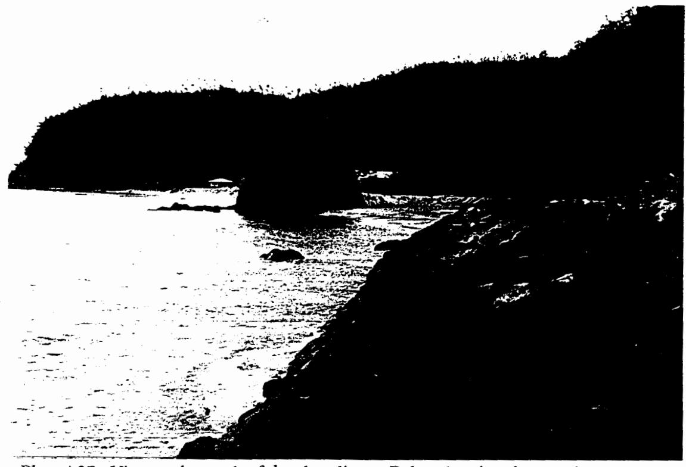

Plate A27. View to the north of the shoreline at Poloa showing the massive revetment (foreground) and basalt seastack (middle).

Site Number: 28

Site Name: 'Amanave

Location: Southwest Tutuila.

Coastal Geologic and Morphologic Setting: Southwest-facing exposed embayment with a broad (up to 300 m) coastal plain and alluvial valley. Several streams enter here: Puna, Maululu, Laloafu, and Leafu.

Shoreline Type: The beach is mostly carbonate sand and the beach ridge is up to 4.5 m above mlwm. A seastack (Utusiva Rock) in the center of the bay has formed a tombolo with the shoreline by beach progradation to the landward edge of the seastack.

Engineering Structures and Coastal Stability: A revetment of loosely placed basalt boulders in the center of the bay forms the seaward margin of a small area of apparently reclaimed land. Small erosional scarps are common and the coastal road appears threatened in some areas. A WWII bunker is stranded in an unvegetated backbeach area indicating a small amount of long-term erosion likely. Beachrock exposures are discontinuous along the waterline.

Adjacent Reef Characteristics: A well-developed fringing reef about 200 m wide encloses the shoreline. The seaward margin is indented in the center of the bay in response to the onland drainage patterns. A wide submarine terrace is visible on the aerial photographs of the area.

*Remarks:* Rocky points occur both to the east and west. The coastal plain appears to be heavily modified by road and village construction activities.

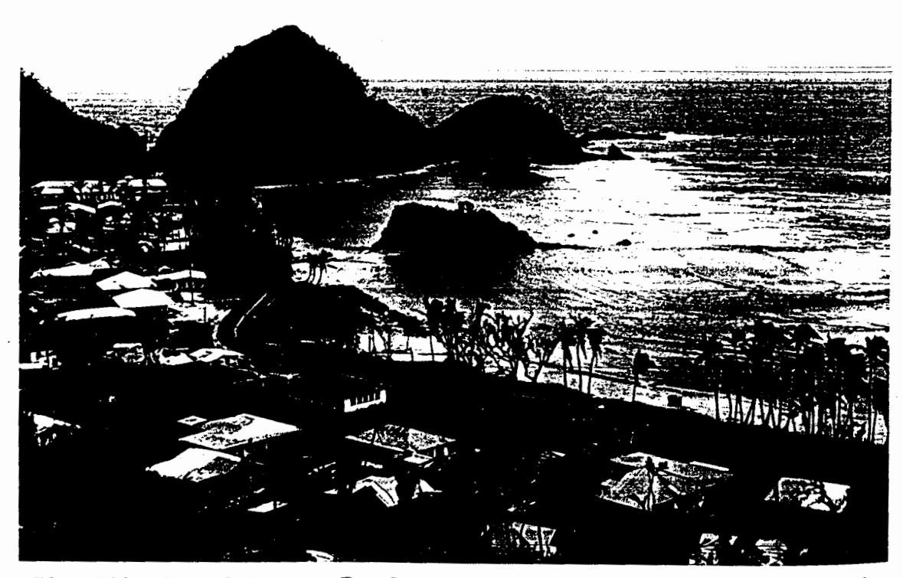

Plate A28. View of 'Amanave Bay from the road to Poloa. The seastack and tombolo are visible in the center of the photograph.

Site Number: 29

Site Name: Utumea

Location: Southwest Tutuila.

Coastal Geologic and Morphologic Setting: Utumea is the southeast-facing western margin of Nua-se'etaga Bay. Coastal plains and associated alluvial valleys are developed at Utumea, Se'etaga, and Nua. Vaialae Stream enters the coast at Maugatele Rock near Utumea.

Shoreline Type: Pocket beach composed of a mixture of carbonate and terrigenous sediment. Basalt benches and beachrock outcrop along the shoreline. Terrigenous component of the beach sand increases towards the inner bay.

Engineering Structures and Coastal Stability: The coastal road parallels the coast in this area and is protected by basalt boulders and the natural basalt bench. Backbeach scarps are common.

Adjacent Reef Characteristics: The fringing reef is between 100 and 150 m wide along this stretch of coast.

Remarks: In general, the terrigenous component of the beach sand decreases away from the stream mouths.

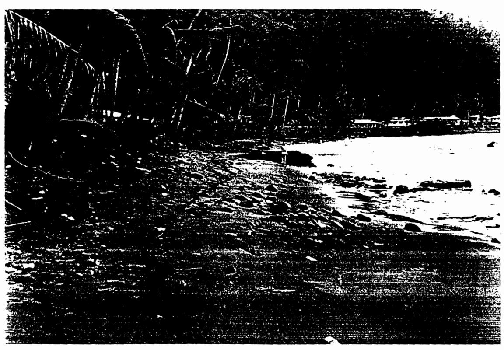

Plate A29. The beach at Utumea showing a high amount of terrigenous beach sand as indicated by the dark color. A basalt bench is outcropping in the center of the photograph.

Site Number: 30 Site Name: Afao

Location: Southwest, Tutuila.

Coastal Geologic and Morphologic Setting: Small coastal plain and alluvial valley sandwiched between Mu and Vaisigano Points. Atauloma Stream enters the coast here.

Shoreline Type: Pocket beach of approximate equally mixed carbonate/terrigenous sediment. The backshore is up to 4 m above the mlwm. A small flood-delta is developed at the mouth of Atauloma Stream.

Engineering Structures and Coastal Stability: The main road follows the coast closely. Loosely dumped basalt and the basalt bench assists in road stabilization although there is a scarp along much of the backshore. Beachrock increases towards the west.

Adjacent Reef Characteristics: The fringing reef is about 150 m wide and fronted by an irregular submarine terrace. A passage is developed opposite Atauloma Stream.

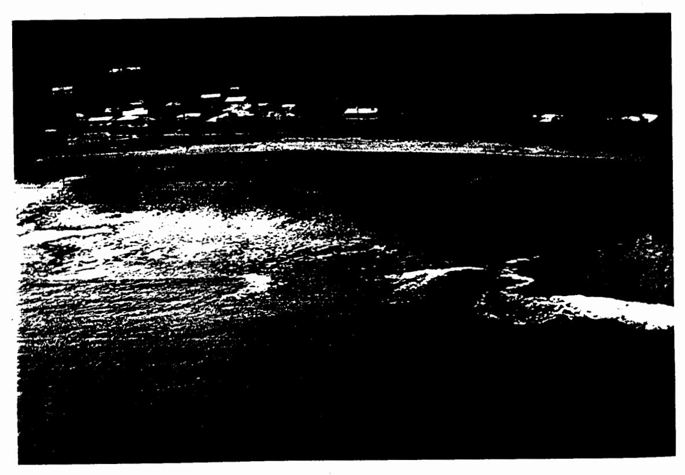

Plate A30. Oblique aerial photograph of Afao showing the narrow coastal plain and erosion in the backshore region. Photograph by J. Maragos.

Site Number: 31 Site Name: Asili Pt. (Leone Bay)

Location: Southwest Tutuila.

Coastal Geologic and Morphologic Setting: South-facing basalt headland separating pocket beaches at Afao and Asili.

Shoreline Type: Basalt cliffs and bench with coral rubble storm deposits. The sediment on the point is mostly carbonate rubble whereas the adjacent beaches are a mixture of terrigenous and carbonate sand.

Engineering Structures and Coastal Stability: No engineering structures are present on the point and the basalt is stable.

Adjacent Reef Characteristics: The fringing reef is well-developed and varies from about 50 m wide opposite the point to 200 m within the adjacent embayments.

Remarks: The pocket beach at adjacent Asili formed at the mouth of the Asili Stream, which has also deposited a small flood-delta on the adjacent reef flat.

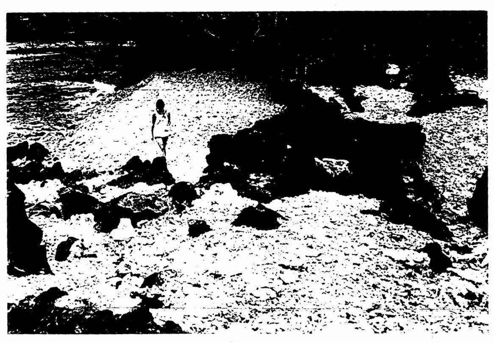

Plate A31. Storm beach of coral rubble resting on basalt at Asili Point.

Site Number: 32 Site Name: Niu'avea Rock (Leone Bay)

Location: Southwest Tutuila.

Coastal Geologic and Morphologic Setting: Greater Leone Bay includes the smaller embayments of Asili, Amaluia, Auma, and Leone. Niu'avea Rock is a small basalt sea stack opposite Apolima Point. The coastal plain of Auma/Leone is developed at the mouth of the large (~700 X 1000 m) alluvial valley of Leafu Stream. Mangroves border the small estuary (Pala Lagoon).

Shoreline Type: Arcuate pocket beaches of mostly terrigenous sediment occur at Auma and Leone and are separated by the basalt headland at Apolima Pt. A barrier spit forms the foundation for most of the village of Leone. The beaches are relatively low ( $\sim$  2m).

Engineering Structures and Coastal Stability: The road closely follows the coast and is protected by a basalt seawall at Auma and segments of Leone. Several houses are located on the seaward side of the road in Leone and subject to overwash during storms. The former shoreline of the barrier spit is demarked by an arcuate beachrock exposure on the reef flat and detached from the shoreline.

Adjacent Reef Characteristics: The fringing reef varies from 50 m wide near Apolima Pt. to near 150 m wide opposite the village of Leone. A shallow channel is extends from the mouth of Leafu Stream causing an indentation in the reef front. Storm rubble deposits occur on the reef flat.

Remarks: As evidenced by the beachrock remnant on the reef flat opposite Leone, a large amount of shoreline reorientation has occurred.

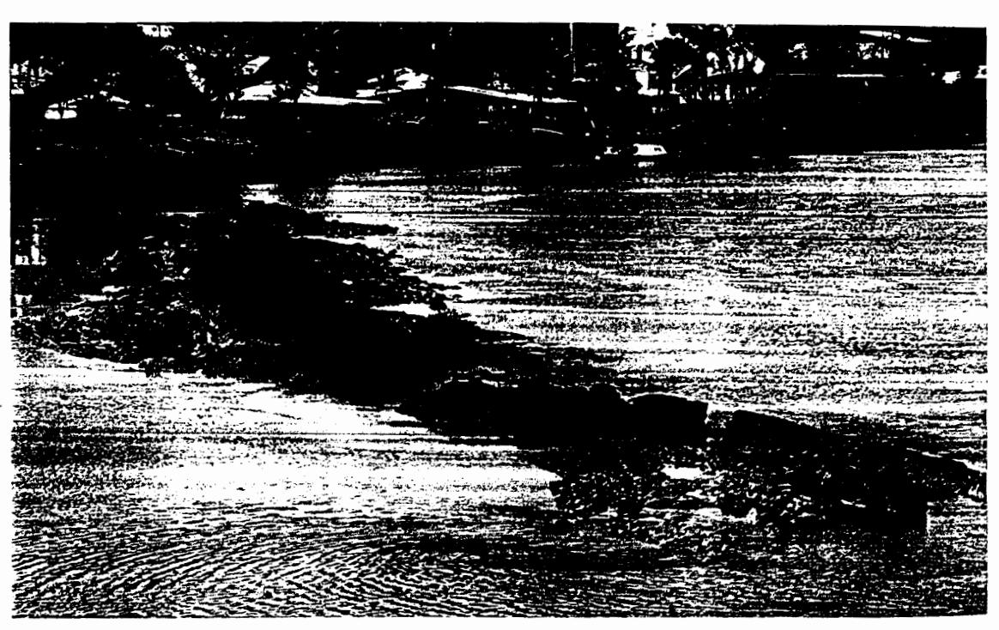

Plate A32. Beachrock denoting the former shoreline position of the barrier spit at the entrance to Pala Lagoon at Leone. View towards the east. The dark color of the beach is from the terrigenous component of the sand.

Site Number: 33 Site Name: Sogi (Fagatele High School)

Location: Southwest Tutuila

THE PERSON OF THE PERSON OF THE PERSON OF THE PERSON OF THE PERSON OF THE PERSON OF THE PERSON OF THE PERSON OF THE PERSON OF THE PERSON OF THE PERSON OF THE PERSON OF THE PERSON OF THE PERSON OF THE PERSON OF THE PERSON OF THE PERSON OF THE PERSON OF THE PERSON OF THE PERSON OF THE PERSON OF THE PERSON OF THE PERSON OF THE PERSON OF THE PERSON OF THE PERSON OF THE PERSON OF THE PERSON OF THE PERSON OF THE PERSON OF THE PERSON OF THE PERSON OF THE PERSON OF THE PERSON OF THE PERSON OF THE PERSON OF THE PERSON OF THE PERSON OF THE PERSON OF THE PERSON OF THE PERSON OF THE PERSON OF THE PERSON OF THE PERSON OF THE PERSON OF THE PERSON OF THE PERSON OF THE PERSON OF THE PERSON OF THE PERSON OF THE PERSON OF THE PERSON OF THE PERSON OF THE PERSON OF THE PERSON OF THE PERSON OF THE PERSON OF THE PERSON OF THE PERSON OF THE PERSON OF THE PERSON OF THE PERSON OF THE PERSON OF THE PERSON OF THE PERSON OF THE PERSON OF THE PERSON OF THE PERSON OF THE PERSON OF THE PERSON OF THE PERSON OF THE PERSON OF THE PERSON OF THE PERSON OF THE PERSON OF THE PERSON OF THE PERSON OF THE PERSON OF THE PERSON OF THE PERSON OF THE PERSON OF THE PERSON OF THE PERSON OF THE PERSON OF THE PERSON OF THE PERSON OF THE PERSON OF THE PERSON OF THE PERSON OF THE PERSON OF THE PERSON OF THE PERSON OF THE PERSON OF THE PERSON OF THE PERSON OF THE PERSON OF THE PERSON OF THE PERSON OF THE PERSON OF THE PERSON OF THE PERSON OF THE PERSON OF THE PERSON OF THE PERSON OF THE PERSON OF THE PERSON OF THE PERSON OF THE PERSON OF THE PERSON OF THE PERSON OF THE PERSON OF THE PERSON OF THE PERSON OF THE PERSON OF THE PERSON OF THE PERSON OF THE PERSON OF THE PERSON OF THE PERSON OF THE PERSON OF THE PERSON OF THE PERSON OF THE PERSON OF THE PERSON OF THE PERSON OF THE PERSON OF THE PERSON OF THE PERSON OF THE PERSON OF THE PERSON OF THE PERSON OF THE PERSON OF THE PERSON OF THE PERSON OF THE PERSON OF THE PERSON OF THE PERSON OF THE PERSON OF THE PERSON OF THE PERSON OF THE PERSON OF THE PERSON OF THE PERSON OF THE PERSON OF THE PERSON OF THE PERSON OF TH

Coastal Geologic and Morphologic Setting: Recent basalt flows (Leone Volcanics) have formed gently-sloping low-lying land fronted by low cliffs along the coast. The volcanics were deposited on the former reef surface.

Shoreline Type: The lava has formed rugged seacliffs up to 6 m high. A narrow bench is typical at the base of the cliffs and storm deposits are scattered along the coast.

Engineering Structures and Coastal Stability: The basalt cliffs form a relatively stable coast. Engineering structures are absent.

Adjacent Reef Characteristics: Narrow fringing reef about 50 m wide. Reef width narrows towards the south where low basalt cliffs form the shoreline and widens to the north and west in the embayment of Leone Bay.

Remarks: This site marks a dramatic change in coastal type from embayed coast to the west and recent basalt flows to the east.

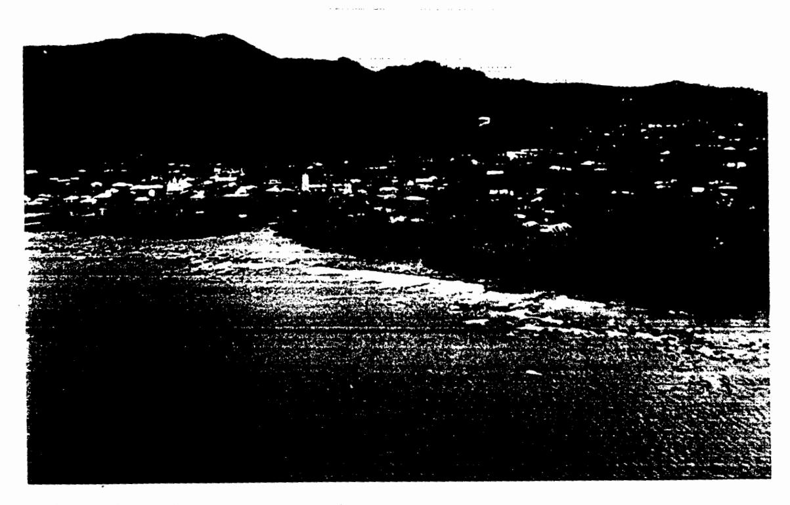

Plate A33. Oblique aerial view of the coastline near Leone showing the transition between embayment and low basalt cliffs. View towards the northeast. Photograph by J. Maragos.

Site Number: 34

Site Name: Avaloa

L

C

F

S

r

E

Location: Southwest Tutuila

Coastal Geologic and Morphologic Setting: Basalt flows and cinder cones of the recent Leone Volcanics form seacliffs.

Shoreline Type: Basalt seacliffs and narrow benches with scattered storm beach deposits of coral rubble.

Engineering Structures and Coastal Stability: Generally stable coastline devoid of engineering structures.

Adjacent Reef Characteristics: Narrow (<100 m) fringing reef and reef veneer overlying old basalt flows.

Remarks: Exposed and rugged coastline.

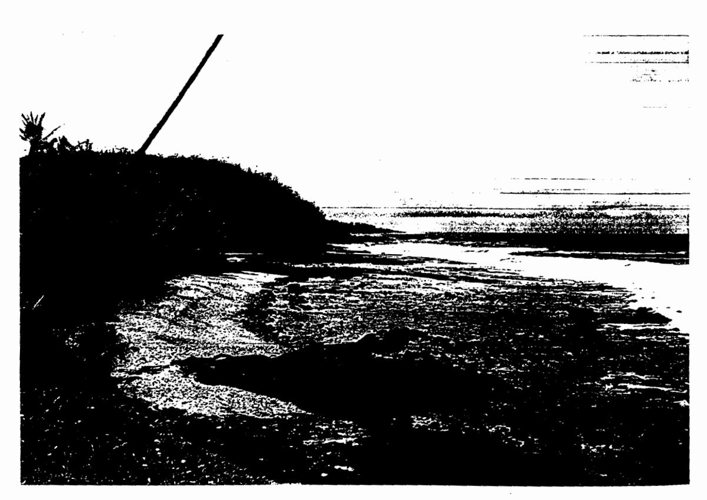

Plate A34. View towards the west of the coastline near Avaloa Pt. showing the narrow fringing reef, basalt benches, and small pocket beaches of coral rubble.

Site Number: 35

Site Name: Fagatele Bay

Location: Southwest Tutuila

Coastal Geologic and Morphologic Setting: Steep coastline and embayment formed by erosion of Fagatele Crater - a remnant cone of Leone Volcanics.

Shoreline Type: Protected embayment shoreline with cliffs near the entrance and scattered, thin, pocket beaches of carbonate sand along the interior of the embayment. Narrow benches have been carved into the volcanics.

Engineering Structures and Coastal Stability: No engineering structures are present. The areas with high cliffs (up to 120 m) are subject to landslides.

Adjacent Reef Characteristics: Narrow (<50 m) fringing reef at head of embayment, which thins towards entrance.

Remarks: Isolated embayment exposed to the south-southwest.


Plate A35. Oblique aerial view towards the northwest of Fagatele Bay showing the remaining rim of the volcanic crater. Photograph by J.Maragos.

Site Number: 36 Site Name: Larsen (Fagalua) Bay

Location: Southwest Tutuila

Coastal Geologic and Morphologic Setting: Steep coastline and embayment formed by erosion of Fogama'a Crater.

Shoreline Type: Steep cliffs at the entrance to the bay with carbonate pocket beaches lining the inner bay.

Engineering Structures and Coastal Stability: No engineering structures are present. The areas with high cliffs (up to 60 m) are subject to landslides

Adjacent Reef Characteristics: A narrow fringing reef is limited to the inner bay.

Remarks: Exposed to tradewinds from the southeast.


Plate A36. Oblique aerial view of the western margin of Larsen Bay showing carbonate sand pocket beaches in the inner bay. Photograph by J.Maragos.

Site Number: 37 Site Name: Vaitogi

Location: South-central Tutuila.

Coastal Geologic and Morphologic Setting: Southeast-facing coast composed of basalt flows of the Leone Volcanics which form the Leone-Tafuna plain. Inland areas are overlain by tuffs from the nearby craters.

Shoreline Type: Perched pocket beach overlying a basalt bench. The beach is composed mostly of carbonate sediment and some aeolian deposits may be present in backbeach areas.

Engineering Structures and Coastal Stability: No major engineering structures were observed. Low (< 2 m) scarps in the beach face were observed and recent undermining of backbeach concrete (gravesite) structures has occurred. The erosion appears to be event related and not representative of a chronic problem.

Adjacent Reef Characteristics: The recent basalt flows have covered the older reef forming a cliffed shoreline with little or no fringing reef development (a coral reef veneer on basalt). A narrow submarine terrace is present.

*Remarks:* Vaitogi is near the southernmost tip of Tutuila and exposed to the southeasterly tradewinds.


Plate A37. View of the Vaitogi shoreline showing the carbonate sand beach and backbeach deposits perched on a basalt bench. View towards the northeast. The low basalt bench forms the shoreline. Note the lack of fringing reef development.

Site Number: 38

Site Name: Fogagogo

Location: South-central Tutuila.

Coastal Geologic and Morphologic Setting: Similar to Site 37; gently-sloping recent basalt flows which form low cliffs at the shoreline.

Shoreline Type: Perched storm beach overlying basalt benches.

Engineering Structures and Coastal Stability: No engineering structures were observed and the basalt shoreline appeared stable.

Adjacent Reef Characteristics: Thin veneer of coral reef overlying the recent basalt flows.

Remarks: Exposed to southeast tradewinds.


Plate A38. View to the south at Fogagogo showing the low basalt cliffs and bench at the shoreline. Storm deposits in the foreground are composed of coral rubble.

Site Number: 39 Site Name: Avatele Pt. (Airport)

Location: South-central Tutuila.

Coastal Geologic and Morphologic Setting: Shallow barrier reef developed opposite Pala Lagoon. Gently-sloping recent basalt flows occur to the west.

Shoreline Type: Artificial shoreline of airport runway constructed in shallow backreef lagoon.

Engineering Structures and Coastal Stability: Stabilized artificial shoreline as part of airport runway.

Adjacent Reef Characteristics: Well-developed shallow barrier reef with wide reef flat, prominent spur-and-grooves on reef front, and shallow backreef lagoon.

Remarks: The reef is exposed to southeast tradewinds. Reworked storm deposits (Cyclone Ofa?) are present on the reef flat. An extensive submarine terrace is developed opposite Avatele Pt. bordering the lagoon entrance and forming an indentation in the reef.


Plate A39. Oblique aerial view of the reef front showing the breaker zone, algal rim, reef flat, and the end of the airport runway. Photograph by J. Maragos.

Site Number: 40 Site Name: Coconut Pt.

Location: South-central Tutuila.

Coastal Geologic and Morphologic Setting: Barrier spit developed near the entrance to Pala Lagoon. The spit extends into the shallow backreef lagoon in a NNE/SSW orientation.

Shoreline Type: Near-linear sandy shoreline fronting the barrier spit. The sand is mostly carbonate and beach ridge heights are about 2.5 m. Beachrock exposures are scattered along the spit.

Engineering Structures and Coastal Stability: Loosely placed basalt boulders forming crude seawalls have been constructed along the seaward margin of the spit to impede the erosion, which is estimated to range from 1 - 1.5 m/yr in the south to 0.5 m/yr in the north (U.S. Army Corps of Engineers, 1980, 1989).

Adjacent Reef Characteristics: Wide reef fronting the barrier spit. Large dredge borrow pits in the backreef occur to the south of Coconut Pt. Water exchange between the shallow lagoon and the ocean is concentrated in the narrow channel between Coconut Pt. and the airport runway.

Remarks: Inner Pala Lagoon is rich in fine sediment, and much of the shoreline is bordered by mangrove forest.


Plate A40. View north along the barrier spit showing the narrow beach with concrete bunkers and rip-rap in foreground and undermined coconut palms in the background.

Site Number: 41

Site Name: Nu'uuli

Location: South-central Tutuila.

Coastal Geologic and Morphologic Setting: Base of the barrier spit where it is attached to the mainland. The hinterland is composed of intra-caldera volcanics consisting of andesitic and basaltic flows.

Shoreline Type: Barrier spit beach and mixed terrigenous/carbonate beach at the mouth of Amaile Stream. A near 90° bend in the coast is formed where the barrier spit attaches to the mainland. The lagoon shoreline is bordered by mangroves.

Engineering Structures and Coastal Stability: The seaward edge of the barrier spit shoreline is marked by intermittent basalt boulder seawalls emplaced to protect houses built along the backbeach. The rate of historical shoreline retreat in this area is about 0.5 m/yr (U.S. Army Corps of Engineers, 1980, 1989).

Adjacent Reef Characteristics: Fringing reef up to 350 m wide. An extensive area of backreef deposits has been mined forming a deep pool within the reef flat surface.

Remarks: Borrow-pit remnants from a former dredging site extend about two-thirds across the reef flat.


Plate A41. Shoreline at the intersection of the barrier spit with the mainland. A small flood-delta has formed at the mouth of Amaile Stream in the foreground.

Site Number: 42 Site Name: Faganeanea

Location: South-central Tutuila

Coastal Geologic and Morphologic Setting: Small southeast-facing alluvial valley and coastal plain.

Shoreline Type: Pocket beach of mixed sediment.

Engineering Structures and Coastal Stability: The natural shoreline has been extensively modified by the construction of the coastal road. Due to the steep coast and limited available land area the road is located on the former beach berm. The coast in this area is either armored by engineering structures or consists of natural basalt cliffs. The road is subject to undermining and overtopping during storms. The road is about 3 m above the reef flat.

Adjacent Reef Characteristics: A continuous fringing reef borders the coast and varies between 100 and 150 m in width. The reef is indented opposite the mouth of Afu Stream.

Remarks: Exposed area to southeast tradewinds. Little natural shoreline remains.


Plate A42. View from the roadway towards the southwest with Fatu'uli Rock in the background.

Site Number: 43

Site Name: Matu'u

Location: South-central Tutuila.

Coastal Geologic and Morphologic Setting: Southeast-facing alluvial valley and embayment surrounded by volcanic hills. Afuelo Stream enters the coast

Shoreline Type: Narrow pocket beach of mixed sediment. The natural beach has been highly modified due to the construction and protection of the road.

Engineering Structures and Coastal Stability: A revetment, approximately 270 m long, borders the coast stabilizing the main road.

Adjacent Reef Characteristics: Continuous fringing reef ranging from 100 to 150 m wide.

*Remarks:* Minor amounts of deposition have occurred at the base of the revetment, which borders the entire Matu'u shoreline.


Plate A43. Basalt revetment protecting the coastal road along the shoreline near Matu'u. View towards the southwest.

Site Number: 44 Site Name: Fatumafuti

Location: South-central Tutuila.

Coastal Geologic and Morphologic Setting: Steep, near-straight, section of coast forming a headland between Niuloa and Matautuloa Pts. near the entrance to Pago Pago Harbor. No major streams enter the coast here.

Shoreline Type: Narrow pocket beach fronting steep hillsides; the beach has been extensively modified by road construction.

Engineering Structures and Coastal Stability: About 1,000 m of solid revetment borders the coast.

Adjacent Reef Characteristics: Fringing reef up to 300 m wide with two sea stacks (Fatu and Futi Rocks) protruding from the reef-flat surface.

Remarks: The present small beach is deposited at the base of the revetment.


Plate A 44. Oblique aerial view of the convex seaward pocket beach at Fatumafuti. Fatu Rock and Futi Rock are visible protruding from the reef flat. Photograph by J. Maragos.

Site Number: 45 Site Name: Faga'alu

Location: South-central Tutuila, near entrance to Pago Pago Harbor

Coastal Geologic and Morphologic Setting: Embayment formed within the Faga'alu Stream valley and bounded by Niuloa and Tulutulu Pts. Gently-sloping alluvial valley extends about 800 m inland.

Shoreline Type: A pocket beach lines the embayment and fronts the coastal plain opposite the village and at the base of the cliffs in the arms of the bay (very little natural beach remains). Because the embayment is semi-protected, the beaches are lower (~2 m) than those to the south.

Engineering Structures and Coastal Stability: Seawalls and revetments occur along about twothirds of this section of coast. Beaches are most common along the southern margin.

Adjacent Reef Characteristics: The fringing reef varies from virtually nothing at the head of the bay to about 500 m wide opposite the village. A deep channel extends opposite the Faga'alu Stream mouth.

Remarks: The deep reef passage is occasionally used for boat mooring.


Plate A45. Oblique aerial view of the embayment, pocket beach, and fringing reef at Faga'alu. View towards the northwest. Photograph by J. Maragos.

Site Number: 46 Site Name: Punaoa

Location: South-central Tutuila; western Pago Pago Harbor.

Coastal Geologic and Morphologic Setting: Punaoa valley, along with Utulei, is part of a double coastal plain embayment with Utulei Ridge separating the two coastal plains. The entire embayment extends from Goat Island to Tulutulu Pts. Vailoa Stream is the main stream entering the bay.

Shoreline Type: Much of the present shoreline is the seaward margin of reclaimed land. The beach sediment is mostly a coarse carbonate sand and beach heights are less than 2 m above the reef flat.

Engineering Structures and Coastal Stability: An erosional scarp was present along most of the reclaimed area.

Adjacent Reef Characteristics: The fringing reef is about 150 m wide and is characterized by numerous dredged borrow pits on the inner reef flat.

Remarks: Little remains of the natural shoreline.


Plate A46. Shoreline of the reclaimed land area at Punaoa. Note the small scarp along the backbeach. View towards the northwest.

Site Number: 47 Site Name: Utulei

Location: South-central Tutuila; western Pago Pago Harbor.

Coastal Geologic and Morphologic Setting: Similar to Site 46 although the coastal plain and alluvial valley are about twice the size of Punaoa.

Shoreline Type: The present shoreline consists primarily of a convex seaward sinuous pocket beach of mostly carbonate sand. Beach heights are less than 2 m above the reef flat.

Engineering Structures and Coastal Stability: Revetments border the Rainmaker Hotel to the north and other small sections of the coast.

Adjacent Reef Characteristics: The fringing reef is about 150 m wide and, as at Punaoa, it is scarred by dredging activities.


Plate A47. Beach fronting the DMWR office near Utulei. View to the south.

## APPENDIX II

# SHORELINE SITE LOCATIONS: TOPOGRAPHIC MAPS


Segment of USGS 1:24,000 Topographic Map showing sites 1, 2, 21, 42, 43, 44, 45, 46, & 47: Central Tutuila, Pago Pago Harbor.


Segment of USGS 1:24,000 Topographic Map showing sites 3, 4, & 5: South-central Tutuila.


Segment of USGS 1:24,000 Topographic Map showing sites 6, 7, 8, 15, & 16: East-central Tutuila.


Segment of USGS 1:24,000 Topographic Map showing sites 9, 10, 13, & 14: Eastern, Tutuila.


Segment of USGS 1:24,000 Topographic Map showing sites 11 & 12: 'Aunu'u Island.


Segment of USGS 1:24,000 Topographic Map showing sites 17, 18, 19, & 20: Northeastern Tutuila.


Segment of USGS 1:24,000 Topographic Map showing sites 22, 23, & 24: North-central Tutuila.


Segment of USGS 1:24,000 Topographic Map showing sites 25, 26, 27, 28, & 29: Western Tutuila.


Segment of USGS 1:24,000 Topographic Map showing sites 30, 31, 32, 33, & 34: Southwestern Tutuila.


Segment of USGS 1:24,000 Topographic Map showing sites 35, 36, & 37: South-central Tutuila.


Segment of USGS 1:24,000 Topographic Map showing sites 38, 39, 40, & 41: South-central Tutuila.

## UNITED STATES DEPARTMENT OF THE INTERIOR GEOLOGICAL SURVEY

TOPOGRAPHIC MAP OF

## **TUTUILA ISLAND**

#### **AMERICAN SAMOA**

SCALE 1:24 000


#### **CONTOUR INTERVAL 40 FEET**

SUPPLEMENTARY CONTOUR INTERVAL 20 FEET

DATUM IS MEAN SEA LEVEL
DEPTH CURVES AND SOUNDING IN FEET-DATUM IS MEAN LOWER LOW WATER
THE RELATIONSHIP BETWEEN THE TWO DATUMS IS VARIABLE
SHORELINE SHOWN REPRESENTS THE APPROXIMATE LINE OF MEAN HIGH WATER
THE MEAN RANGE OF TIDE IS APPROXIMATELY 3 FEET

Produced by the United States Geological Survey in cooperation with the American Samoa Government Department of Public Works

Control by USGS, NOS/NOAA and USCE

Compiled by photogrammetric methods from aerial photographs taken 1961. Field checked 1963

Limited Revision from aerial photographs taken 1984 Field checked 1987. Map edited 1989

Selected hydrographic data compiled from NOS/NOAA Chart 4190 (1962)
This information is not intended for navigational purposes

Projection and 1000 meter grid

Universal Transverse Mercator, zone 2. International spheroid 10 000-foot grid ticks: American Samoa coordinate system and zone 1962 American Samoa datum

| LOCATION DIAGRAM                   |  |  |  |  |
|------------------------------------|--|--|--|--|
| SAVAII I.  SAMOA ISLANDS  UPOLU I. |  |  |  |  |
| TUTUILA I. € MANUA I. '' ⇔         |  |  |  |  |

| TRUE NORTH | MAGNETIC NORTH |
|------------|----------------|
| APPROXIM   | IATE MEAN      |

DECLINATION, 1988

ROAD CLASSIFICATION

Secondary highway, Light-duty road, hard or improved surface...

Unimproved road \_\_\_\_\_ Tra

Trail . . . . . . .

THIS MAP COMPLIES WITH NATIONAL MAP ACCURACY STANDARDS
FOR SALE BY U. S. GEOLOGICAL SURVEY, DENVER, COLORADO 80225 OR RESTON, VIRGINIA 22092

14170-T5-TF-024

1989

Legend for the USGS 1:24,000 Topographic Map of Tutuila.