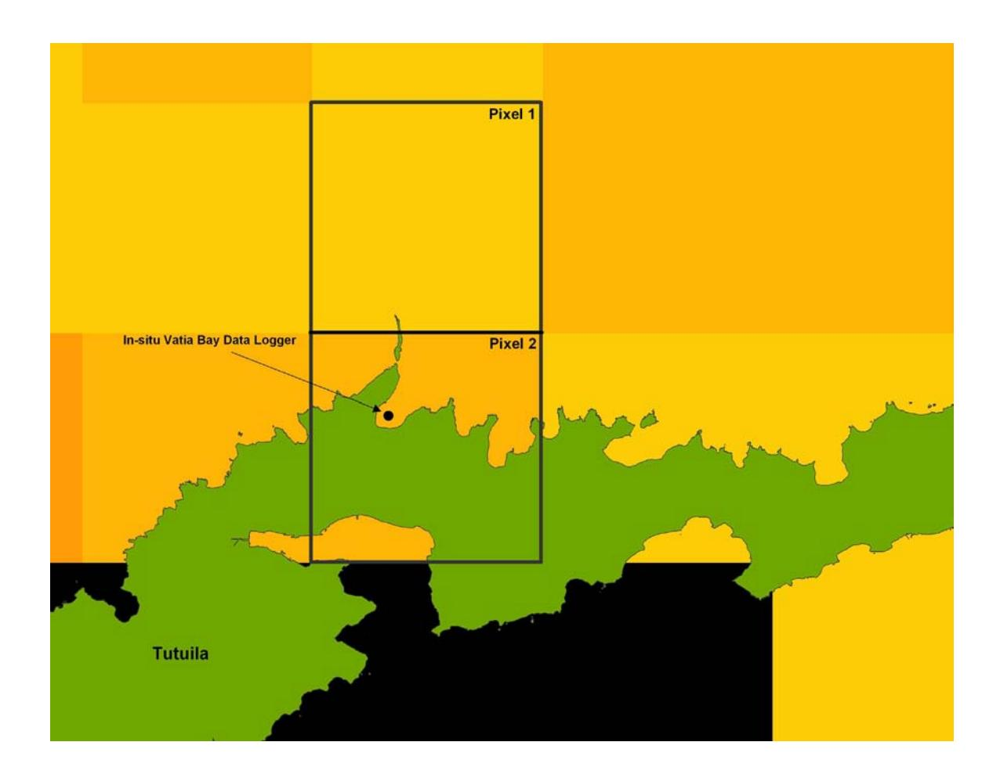
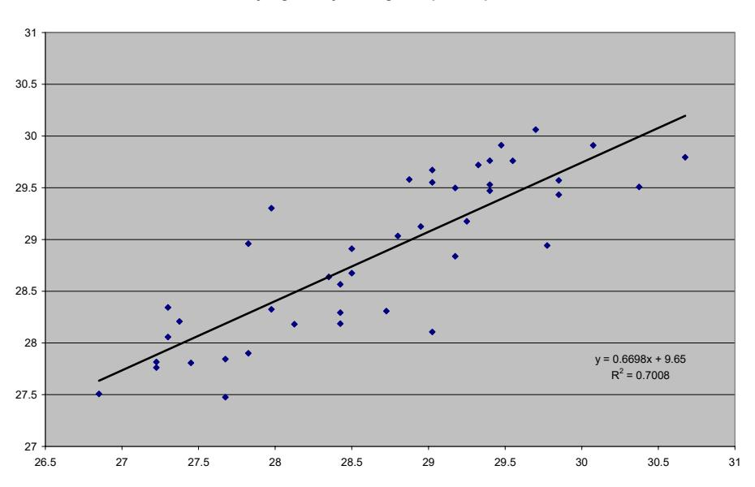
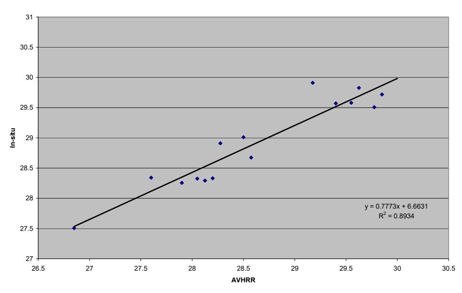
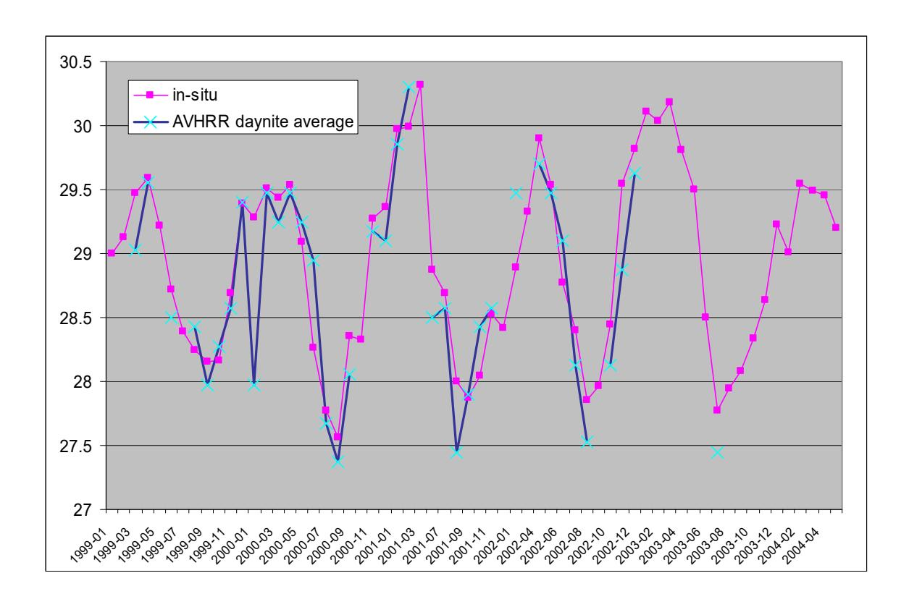

## **COMPARING IN-SITU DATALOGGER SEA TEMPERATURE DATA WITH AVHRR SATELLITE DERIVED SEA SURFACE TEMPERATURE DATA IN VATIA BAY, AMERICAN SAMOA.**

*Francesca Riolo (wildgis@freesurf.fr) Department of Marine and Wildlife Resources, Pobox 3730, Pago Pago 96799, American Samoa* 

### **INTRODUCTION**

### **Sea Surface Temperature**

A wide variety of oceanic parameters can be measured by satellite remote sensing (Robinson, 1985). These include ocean color, sea surface height and surface roughness. Sea surface temperature is another, which "due to its accessibility and location at the thermal boundary between the ocean and the atmosphere" has become "the most widely observed oceanic parameter" (Emery & Thompson, 1997, p. 24).

Sea surface temperature (SST) is an important physical parameter in marine environments (Badenas *et al*, 1997a; Emery & Yu, 1997; Huang & Robinson, 1995), involved in many physical and biological processes occurring within a water mass and also in air-sea interaction processes (Huang & Robinson, 1995).

The term 'sea surface temperature' requires appropriate definition. Robinson, Wells & Charnock (1984) define true sea surface temperature as the temperature of the first few millimetres of the ocean surface (skin). Since this is exactly what a radiometer viewing the ocean surface measure (Schluessel *et al*, 1990), it can be said that remotely sensed values for SST constitute the true sea surface temperature. However Robinson (1984) points out that the temperature difference driving the heat flow is that between the sea temperature few centimetres below the surface and the atmospheric temperature. Thus conceptually the temperature below the skin may be the most appropriate definition of SST as well as the most useful oceanographic parameter (Schluessel *et al*, 1990).

SST is subject to considerable variability in space and time and it is controlled by factors as vertical turbulent flux, advection, diffusion and interaction with the atmosphere (Huang & Robinson, 1995).

Its associated spatial and temporal patterns are of considerable interest to researchers in a variety of fields, from oceanography and meteorology to fisheries research (Strong & McClain, 1984; 1985; Ramos *et al*, 1996; Myers & Hick, 1990).

Direct methods for measuring SST include sensors aboard the so-called "ships of opportunity", moored and drifting buoys, and SST loggers (Strong & McClain, 1984). However, the irregular spatial distribution (ie. their lack of spatial coverage) of these observations is a long-standing problem. Advances and improvements in the satellite remote sensing of SST present a cost effective and efficient means of solving this problem (Strong & McClain, 1984) and it helps meteorologists and oceanographers alike in understand climate and its variability (Robinson, 1985, p. 20).

Remote sensing methods present SST in a two-dimensional synoptic view and "provide a low-frequency time series over long periods ranging from weeks to years, even at isolated oceanic locations" (Robinson, 1985, p. 20), which is rarely possible with in situ measurements (Strong & McClain, 1984).

Satellite-derived SSTs have proven useful in delimiting suspected areas of coral bleaching using either temperature "threshold" technique (Montgomery and Strong, 1994) or using a bleaching index based on "degree heating weeks" (Strong and Gleeson, 1995; and Glynn 1996). Another technique that has been employed uses "hot spot" observation based on satellite data (Goreau and Hayes 1994). "Hot spots" are areas of anomalously high temperature SSTs exceeding +1°C above the warmest monthly mean SST, based on climatology.

Clearly, the remote sensing of SST (and other oceanic parameters) has, is and will continue to significantly contribute to oceanography and marine research in general (Robinson, 1985). This type of sentiment is also reflected by many others including (to name a few) Schluessel *et al* (1990), Stewart (1985), Robinson *et al* (1984), McAlister & McLeish (1969) and Ewing & McAlister (1960).

#### **Comparing satellite derived SST with in-situ sea temperature**

The inherent difference between a SST parameter measured in situ and that estimated by remote sensing makes their comparison particularly difficult (Schluessel *et al*, 1990; Robinsons *et al*, 1984). In order to relate and compare these two SST parameters it is necessary to understand how each is derived. In situ measurements are straightforward and have their limitations of representing bulk temperature at the surface rather than true sea surface temperature, and being a point measurement and thus potentially not being representative of the surrounding area element (Robinson, 1985).

The use of techniques that calibrate remotely sensed SST by comparisons (usually in the form of regression analysis) with in situ buoy and ship data (McClain *et al*, 1985, McClain, 1989) leads to a final satellite imagery product representing bulk temperature rather than 'true' sea surface temperature (Robinson, 1985), although they are a way to manage the difference between the two measurement.

The AVHRR Oceans Pathfinder SST and buoy matchup data containing the in-situ moored and drifting buoy data that is used to calibrate the Pathfinder satellite sea surface temperatures can be obtained from the PO.DAAC website (Podesta et al.)

(http://podaac.jpl.nasa.gov/products/product089.html).

Several studies aiming to compare AVHRR SST temperature data and in situ measurements are available from around the world at coarser resolution than the one investigated during this study (50Km and 9Km *vs.* 4Km).

In general, the agreement between the AVHRR Pathfinder SSTs and in situ measurement devices is very high. When differences between the two datasets are presents interesting local phenomena can be investigated like seasonal changes in atmospheric aerosols, tidal flushing or currents.

A Match up Catalog is currently being developed by Kenneth Casey and Marguerite Toscano at NOAA's National Oceanographic Data Center and it currently provides match up data for 20 reefs locations around the world. The in situ records were collected from a variety of sources and measurement devices. The 24-hour mean in situ temperature was compared with the 3x3 pixel mean Pathfinder SST value computed using both daytime and nighttime values.

Strong et al. compared 50km twice weekly nighttime data with several *in situ* near-seasurface temperature time series in shallow water areas in Japan. The comparisons show that the *in situ* temperatures in shallow water areas were frequently warmer than the satellite SSTs at pixels near the islands. This is expected because during the summer season SST in these more shallow waters around the island is usually higher than SST offshore. During the three month period, the mean difference between *in situ*

temperatures and SSTs at the pixels closest to them ranged from -0.55+/-0.51°C to 0.54+/-0.84°C with the best match of 0.10+/-0.29°C in the Miyako Island, and 0.02+/- 0.49°C in the Okinawa Island.

At Rainbow Garden Reef, Bahamas, Hendee *et al*. found that satellite differences from *in situ* 24-hour and nighttime 12-hour mean logger temperature data for a one-year period (1 October 2000 through 30 September 2001), in terms of daily comparisons, were -0.14 +/- 0.64°C and 0.01 °C +/- 0.72°C, respectively and for the summer season -0.25°C +/- 0.61°C and -0.04oC +/- 0.63°C. Comparing weekly mean satellite 50-km twice-weekly nighttime SST data, to summer season weekly means of daily *in situ* nighttime temperatures at a depth of about 3 meters at Rainbow Gardens Reef, was about -0.05 +/- 0.30°C. Toscano *et al* performed statistical analyses of 9km Pathfinder SSTs vs. *in situ*  temperature records from Caribbean and tropical Pacific locations finding high correlation for both 9km SSTs for specific sites, and for the 3x3 pixel means surrounding each site. Biases were generally small and ranged from 0.007 +/- 0.58 to 0.65 +/- 1.58.

#### **DATA**

# **NOAA/NASA Pathfinder Advanced Very High Resolution Radiometer (AVHRR) SST**

The NOAA/NASA Pathfinder Advanced Very High Resolution Radiometer (AVHRR) SST product is a high quality dataset derived from the NOAA polar-orbiting series of satellites that start with the NOAA-9 in 1985. This dataset represents a historical reprocessing of the entire AVHRR time series using consistent SST algorithms, improved satellite and inter-satellite calibration, quality control and cloud detection. These data is available until 2004 at daily, 8-day and monthly averages and 4km, 9km, 18km, and 54km resolutions. Data gaps occur primarily due to cloud cover because of the inability of the infrared sensor to detect ocean temperatures in these conditions. Quality flag information is available that allows the user to apply various levels cloud masking strigency. Error estimates for this dataset range from 0.3 degrees Celsius to 0.5 degrees Celsius (http://podaac.jpl.nasa.gov/sst/).

The datasets utilized in this analysis are night and day passes, subsetted Pathfinder Version 5.0 Sea Surface Temperature Data, for the period 1985 to present, resolution of 4 X 4 km, provided by Kenneth S. Casey at NOAA National Oceanographic Data Center in Silver Spring MD. More information at http://www.nodc.noaa.gov.sog/pathfinder4km .

#### **In-situ temperature logger in the Vatia Bay, American Samoa**

The in-situ data logger is deployed and maintained by Peter Craig from the American Samoa National Park Service. The ONSET data logger is located approximately at 2 meters depth (at low tide) and, 14 deg 15' 9" latitude and 170 deg, 40', 8" longitude in the Vatia Bay on the main island of Tutuila. Data were collected from 99 to present using an Onset StowAway Tidbit from the 7th of January 1999 to the8th of December 2003 and Onset Water Temperature Pro from the 8th of December 2003 to present. The ONSET family of data loggers are miniature, battery-operated instruments for continuous temperature recording with an accuracy of about 0.2 degrees Celsius and a resolution of 0.? Degrees Celsius. Data are being recorded every two hours and were provided for this study as daily averages in an excel spreadsheet with "Date" and "Daily average temperature" fields.

#### **OBJECTIVE**

The aim of this study is to provide a combined satellite and in situ dataset to assess the capability of the AVHRR Pathfinder data to accurately monitor SST on coral reefs around American Samoa and to fill temporal and spatial data gap of available in situ measurements.

TO DO: Compute MMM (monthly maximum mean) climatology for all pixels on American Samoa coral reef areas for coral bleaching thresholds.

### **METHODS**

A combined dataset including satellite and in situ data was created respectively for daily, 8 days averages and monthly temperature data.

A utility was written in Visual Basic for Application (VBA) within a Microsoft ACCESS database to produce monthly and 8 days averages from the daily in situ dataset.

Another utility was written using VBA and ARCObjects within ARCGIS 8.3 to extract satellite derived sea surface temperature values from the GEOTIFF raster format satellite datasets. Two 4X4 km pixels in the raster dataset were chosen for the analysis. Pixel 2 is the pixel within which the in situ logger and Vatia Bay locations fall. A second adjacent pixel (Pixel 1) situated north of Vatia Bay was also chosen (Figure 1) as, although Pixel 2

Figure 1. *Vatia Bay and the location of the insitu datalogger and the analyzed pixels.* 

covers the Vatia Bay location, it also include areas situated on the other side of the island (Pago Pago harbor) as well as extensive land masses, thus its values could have not been representative of the Vatia Bay waters. Also characterizing the statistics for an adjacent pixel would provide a backup to use when data in the other pixel are obscured by clouds. The routines read pixel 1 and 2 values from the GEOTIFF as well as parse the name of the raster file to obtain the date value and write the information in an ASCII files. To obtain temperature values from the pixel values the following formula needs to be applied:

Temperature = 
$$(pixel value * 0.15) - 3$$

The ASCII file data were written in the form of Julian date, pixel1 value, pixel2 value, temperature1, temperature2. One ASCII file was produced for each time average (daily, 8 days and monthly) and each satellite pass (day and night). A total of about 21980 raster dataset were processed (1985 to present, although matching in situ data are only available for the period 1999 to present).

ASCII files were imported into ACCESS together with the insitu data and links based on Julian date were performed among the relevant tables to produce combined table of night and day satellite data, and in situ data for daily, 8 days and monthly average temperature measurements. Tables were then exported in spreadsheet to study the correlation among datasets. Scatter plot charts were generate in Microsoft Excel for each satellite datasets against the in-situ one. A linear trendline was added to the plot and Pearson Product-Moment Correlation Coefficient and R2 were obtained from the line equation.

**RESULTS**  Results of the correlation analysis are reported in table 1.

| DATASET                  | R2 P1 | R2 P2 | Equation P1          | Equation P2          |
|--------------------------|----------|----------|----------------------|----------------------|
| Daily Daytime            | 0.52     | 0.59     | y = 0.57x + 12.513   | y = 0.6192x + 11.143 |
| Daily Nighttime          | 0.57     | 0.48     | y = 0.6388x + 10.667 | y = 0.5433x + 13.409 |
| Daily Day & Night        | 0.63     | 0.83     | y = 0.6979x + 8.9813 | y = 0.5388x + 13.645 |
| 8Days Daytime            | 0.58     | 0.60     | y = 0.6018x + 11.528 | y = 0.6359x + 10.578 |
| 8Days Nighttime          | 0.57     | 0.47     | y = 0.6141x + 11.338 | y = 0.5203x + 14.075 |
| 8Days Day & Night        | 0.70     | 0.89     | y = 0.6698x + 9.65   | y = 0.7773x + 6.6631 |
| 8 Days Day&Nite - 8days  | N/A      | 0.84     | N/A                  | y = 0.6542x + 10.131 |
| 8 Days Day&Nite + 8days  | N/A      | 0.90     | N/A                  | y = 0.7331x + 7.8508 |
| 8 Days Day&Nite + 16days | N/A      | 0.78     | N/A                  | y = 0.7149x + 8.4144 |
| Monthly Daytime          | 0.62     | 0.58     | y = 0.6032x + 11.472 | y = 0.6519x + 10.075 |
| Monthly Nighttime        | 0.64     | 0.51     | y = 0.6779x + 9.4103 | y = 0.4943x + 14.728 |
| Monthly Day & Night      | 0.79     | 0.69     | y = 0.8313x + 4.9608 | y = 0.6629x + 9.7885 |

Table 1. *Correlation analysis results for pixel 1 and pixel 2 for different SST averages.* 

The correlation is always higher when comparing AVHRR data averaged over night and day passes with the in-situ data. 'Night only' satellite data have always lower correlation than 'day only' for pixel 2 but the number of available observation is also always lower. Day and night only AVHRR data have similar correlations for pixel 1 and also closer number of available observations. To take in account the number of observations, minimum values of the Pearson Product-Moment Correlation Coefficient required to prove the statistical significance of the correlation depending on the degrees of freedom (number of observations – 2) for a P = 0.05 (two tailed test) are provided in table 2.

| DATASET                  | #obs P1 | #obs. P2 | Pearson r P1 | Pearson r P2 | Min value Pearson P1 at 0.05 two tailed | Min value Pearson P2 At 0.05 two tailed |
|--------------------------|------------|-------------|-----------------|-----------------|--------------------------------------------------|--------------------------------------------------|
| Daily Daytime            | 187        | 136         | 0.72            | 0.77            | 0.139                                            | 0.139                                            |
| Daily Nighttime          | 142        | 52          | 0.75            | 0.69            | 0.139                                            | 0.279                                            |
| Daily Day & Night        | 21         | 5           | 0.80            | 0.90            | 0.456                                            | 0.878                                            |
| 8Days Daytime            | 119        | 97          | 0.76            | 0.77            | 0.197                                            | 0.207                                            |
| 8Days Nighttime          | 89         | 36          | 0.75            | 0.69            | 0.207                                            | 0.334                                            |
| 8Days Day & Night        | 45         | 17          | 0.84            | 0.95            | 0.294                                            | 0.514                                            |
| 8 Days Day&Nite - 8days  |            | 17          |                 | 0.94            |                                                  | 0.514                                            |
| 8 Days Day&Nite + 8days  |            | 17          |                 | 0.95            |                                                  | 0.514                                            |
| 8 Days Day&Nite + 16days |            | 17          |                 | 0.89            |                                                  | 0.514                                            |
| Monthly Daytime          | 56         | 51          | 0.79            | 0.76            | 0.279                                            | 0.279                                            |
| Monthly Nighttime        | 41         | 21          | 0.80            | 0.73            | 0.312                                            | 0.456                                            |
| Monthly Day & Night      | 37         | 17          | 0.89            | 0.83            | 0.334                                            | 0.514                                            |

Table 2. *Pearson Product-Moment Correlation Coefficient for pixel 1 and pixel 2 correlation analysis and critical values at P<0.05 for a two tailed test.* 

A test was performed to look at the correlation of 8 days AVHRR averages with previous and following 8 days in situ data. The correlation was smaller when comparing with the previous in situ 8 days average; it slightly increased when comparing with the following in situ 8 days average and start decreasing again when comparing with 2 following 8 days average (16 days delay). This aspect requires further investigation.

Regression line charts are shown in Figure 2 for Day Night averages satellite data vs in situ data for pixel 1 and 2 respectively.

#### **Day Night 8 days average comparison pixel1**

#### **Day and Night 8 days average comparison pixel2**

Figure 2. *Regression line charts for day and night average satellite data vs in situ data for pixel 1 and 2.* 

The biases analysis was performed on day and night averages as they shown the higher correlation in all cases. Although, it is necessary to point out that the number of observations available for day night averages was always lower then for day only and night only analysis as not always both day and night passes data were available for the analyzed pixels. Bias analysis results are reported in table 3.

| DATASET    | Mean bias                   | Stand.    | Bias range  | #       |
|------------|-----------------------------|-----------|-------------|---------|
|            | (In-situ – satellite Temp.) | deviation |             | observ. |
| Daily P1   | 0.33                        | 0.55      | 0.02 – 1.42 | 19      |
| Daily P2   | 0.51                        | 0.37      | 0.14 – 1.04 | 5       |
| 8 Days P1  | 0.18                        | 0.52      | 0.06 – 1.33 | 43      |
| 8 Days P2  | 0.29                        | 0.31      | 0.03 – 0.74 | 15      |
| Monthly P1 | 0.12                        | 0.35      | 0.01 – 1.31 | 37      |
| Monthly P2 | 0.14                        | 0.47      | 0.06 – 1.15 | 17      |

Table 3. *Bias analysis results.*

The chart in Figure 3 compares monthly averages for AVHRR day night average and in situ data for the period January 1999 to April 2004.

Figure 3. Monthly averages for AVHRR day night average and in situ data.

#### DISCUSSION

This study is one of the first attempts to compare in situ data with high resolution AVHRR Pathfinder data at 4X4 km resolution (first one to the knowledge of the author). This finer scale satellite data should better match scientific needs in studying coral reef associated processes (e.g. bleaching) as they should closer represent local conditions to which the coral reef ecosystem is exposed. Although not as adequate as in-situ loggers to represent coral reef thermal stresses, they become highly valuable when in-situ data are not available, limited in time or have gaps. The statistical analysis shows a promising correlation and biases between the Vatia Bay insitu logger data and the AVHRR derived SST. Satellite data could be meaningfully used to retrieve thermal status of the bay prior to logger deployment (1999) and for those months in which data are not available (e.g. March – May 2001, February – March 2002). Both analyzed pixels shows high correlation and relatively small biases thus both pixel can be used to provide temperature data for the Vatia Bay (pixel 1 has more available observations than pixel 2).

AVHRR data tend to underestimate the temperature in the Vatia Bay (all mean biases between insitu and AVHRR data are positive). This is consistent with most of previous comparison analysis in the tropics. This is probably due to under-correction for atmospheric water vapor and cloud effects between 20ºS-20ºN (Kilpatrick et al., 2001) as well as to the averaging over colder off shore water included in the 4x4km pixel.

Higher correlation coefficients were obtained when comparing in-situ data with 'day and night' average satellite data rather than day and night only data. This could be expected as in situ data are 24 hours averages though thermal structures in the water body might have lead to different results thus made worth investigating. Also, the number of available observations for day only and night only passes is higher than the necessary concurrent observations to obtain the day and night average thus day only and night only datasets might be a more complete data source. It would be interesting to investigate the correlation of day and night satellite datasets with corresponding 12 hours averages of in situ data. It is also important to notice that the number of observations available for each comparison was different making the comparison among datasets not straightforward.

#### **CONCLUSION**

This study opens the opportunity of using high resolution (4X4km) AVHRR satellite data for long term monitoring of thermal stresses over coral reef areas in American Samoa and provide a case of study to be used at much wider geographical extent. Historical temperature data as far back as 1985 become meaningfully available and bring valuable information on environmental conditions to be used in conjunction with historical coral bleaching observations and coral monitoring data.

TO BE DONE: The computed thresholds based on MMM will help identify thermal anomalies that historically induced bleaching as well as help predicting bleaching in the future and will provide a fine scale alert system for American Samoa (e.g. vs. globally available 50km).

#### **REFERENCES**

Badenas, C., Caselles, V., Estrela, M. J. & Marchuet, R. (1997a). Some improvements on the processes to obtain accurate maps of sea surface temperature from AVHRR raw data transmitted in real time. Part 1: HRPT images. *Int. J. Remote Sensing*. VOL. 18. NO. 8. 1743 – 1767.

Casey Kenneth & Toscano Marguerite (2001). AVHRR Pathfinder and In Situ Sea Surface Temperatures on Coral Reefs http://www.nodc.noaa.gov/sog/hotspots/catalog.pdf

Emery, W. J. & Thomson, R. E. (1997). *Data analysis methods in Physical Oceanography*. Pergamon. Oxford, United Kingdom.

Emery, W. J. & Yu, Y. (1997). Satellite sea surface temperature patterns. *Int. J. Remote Sensing*. VOL. 18. NO. 2. 323 – 334.

Ewing, G. & McAlister, E. D. (1960). On the Thermal Boundary Layer of the Ocean. *Science.* VOL. 131. 1374 – 1376.

Gleeson, M.W., Strong A.E., 1995. Applying MCSST to coral reef bleaching. *Adv Space Res* 16(10): 151-154

Glynn P., 1996. Coral reef bleaching: Fact, hipotheses and implication. Submitted to Global Change Biology

Goreau T.J., Hayes R.L., 1994. Coral bleaching and "ocean hot spot". *AMBIO* **23**: 176- 180

Hendee, J.C., G. Liu, A. Strong, J. Sapper, D. Sasko, and C. Dahgren. 2002. Near realtime validation of satellite sea surface temperature products at Rainbow Gardens Reef, Lee Stocking Island, Bahamas. *Proceedings, Seventh International Conference on Remote Sensing for Marine and Coastal Environments*, Miami, FL, May 20-22, 2002. Veridian Systems Division, CD-ROM, 9 pp.

Huang, W. G. & Robinson, I. S. (1995). Size estimates of the factors controlling sea surface temperature with AVHRR data. *Int. J. Remote Sensing*. VOL. 16. NO. 4. 597 – 612.

Kilpatrick, K. A., Podesta, G., and R. Evans. 2001. Overview of the NOAA/NASA advanced very high resolution radiometer Pathfinder algorithm for sea surface temperature and associated matchup database. *Jour. Geophys.* Res. 106: 9179-9197

McAlister, E. D. & McLeish, W. (1969). Heat Transfer in the Top Millimeter of the Ocean. *J. Geophys. Res.* VOL. 74. NO. 13. 3408 – 3414.

McClain, E. P., Pichel, W. G. & Walton, C. C. (1985). Comparative performance of AVHRR-based Multi-channel Sea Surface Temperatures. *J. Geophys. Res.* VOL. 90. NO. C6. 11 587 – 11 601.

Myers, D. G. & Hick, P. T. (1990). An application of satellite-derived sea surface temperature data to the Australian fishing industry in near real time. *Int. J. Remote Sensing*. VOL. 11. NO. 11. 2103 – 2112.

Montgomery, R. S., and A. E. Strong, 1995: Coral Bleaching threatens oceans, life. *Eos*, Transactions, American Geophysical Union, 75, 145-147.

Podesta, G.P., J.W. Brown, R.H.Evans, "AVHRR Pathfinder Oceans Matchup Database 1985-1993", Draft 1995, Document (PO.DAAC 069.D001) provided with tape of data.

Ramos, A. G., Santiago, J., Sangra, P., & Canton, M. (1996). An application of satellitederived sea surface temperature data to the skipjack (*Katsuwonus pelamis* Linnaeus, 1758) and albacore tuna (*Thunnus alalung* Bonaterre, 1788) fisheries in the north-east Atlantic. *Int. J. Remote Sensing*. VOL. 17. NO. 4. 749 – 759.

Robinson, I. S., Wells, N. C. & Charnock, H. (1984). The sea surface thermal boundary layer and its relevance to the measurement of sea surface temperature by airborne and spaceborne radiometers. *Int. J. Remote Sensing.* VOL. 5. NO. 1. 19 – 45.

Robinson, I. S. (1985). *Satellite oceanography: an introduction for oceanographers and remote sensing scientists*. Ellis Horwood. England.

Schluessel, P., Emery, W. J., Grassi, H. & Mammen, T. (1990). On the Buls-Skin Temperature Difference and Its Impact on Satellite Remote Sensing of Sea Surface Temperature. *J. Geophys. Res.* VOL. 95. NO. C8. 13341 – 13356.

Strong, A.E., G. Liu, T. Kimura, H. Yamano, M. Tsuchiya, S. Kakuma, and R. van Woesik. 2002. Detecting and monitoring 2001 coral reef bleaching events in Ryukyu Islands, Japan using satellite bleaching hotSpot remote sensing technique. *Proc. 2002 IEEE Int. Geosci. Remote Sensing Symp. and 24th Canadian Symp. Remote Sensing*, Toronto, Canada.

Strong, A. E., McClain, E. P. & Fung, A. (1985). Regional and moisture-related accuracy variations in NOAA's global MCSST algorithms for satellite-based sea surface temperature. *EOS: Trans. of the Am. Geophys. Union*. VOL. 66. NO. 51. 1268.

Stewart, R. H. (1985). *Methods of Satellite Oceanograhy.* University of California Press. Berkeley, California.