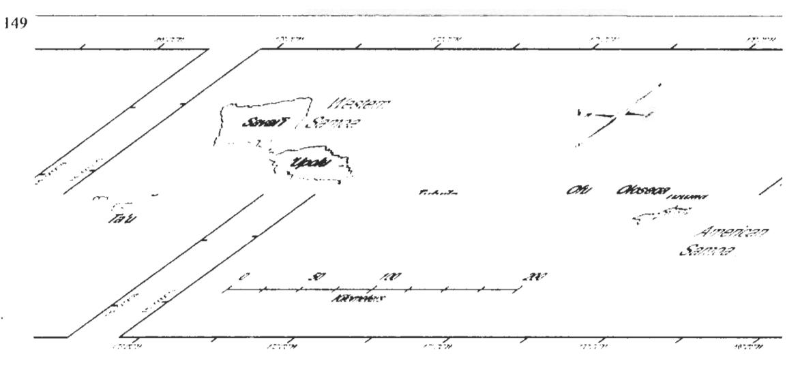
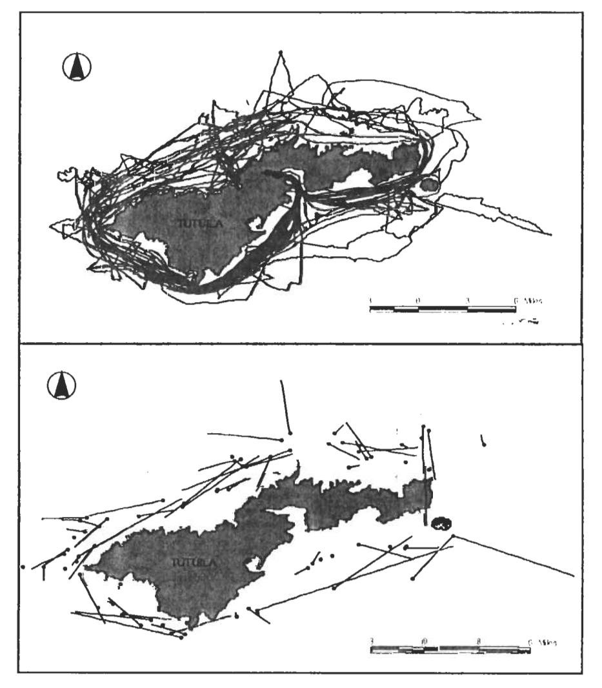

# Summary of humpback whale research at American Samoa, 2003-2005

- 3 ROBBINS, JOOKE AND DAVID K. MATTILA2
- 4 Provincetown Center for Coastal Studies, 5 Holway Avenue, Provincetown, Massachusetts, 02657, U.S.A.
- 5 e-mail: jrobbins@coastalstudies.org
- 6 2Hawaiian Islands Humpback Whale National Marine Sanctuary, 726 South Kihei Road, Kihei, Hawai'i, 96753
- 7 U.S.A.

9

18

19

20 21 22

23

24

36

37

## 8 ABSTRACT

American Samoa is a poorly understood wintering site for humpback whales in Oceania. Here we describe the results of photo-identification and biopsy sampling performed on 27 days between September 18 and October 7, 2003-2005. Work was performed from a 7-meter vessel working in the coastal waters of Tutuila, the primary island of American Samoa. The detection rate was consistently low, averaging 5.5 humpback whales per day in all three years. The most common sightings were of singletons (31%) and paired whales (23%). Four singletons were confirmed to be singing, but not all were checked for that behavior. Mother-calf pairs were alone (15%) or escorted by a single large whale (12%). One mother was observed on two occasions prior to her first sighting with a calf, making it likely that the birth took place in American Samoa waters. Competitive activity was observed in 9% of groups sighted, despite the low densities observed. Competitive groups were small, ranging from only three to six whales (average=3.8). Overall, the behaviors observed were consistent with those at other low-density breeding grounds, although apparent feeding was also noted on one occasion. Of 50 individuals with sufficient photo-documentation, none were re-sighted there between years. However, 11% (n-4) of those photo-identified prior to 2005 were successfully matched to other breeding sites in Oceania, including the Cook Islands, Tonga and Moorea (French Polynesia). Together, these results indicate that American Samoa is part of a widely dispersed breeding population. In the future, molecular genetic analysis of skin samples from this area (n=45) may belp to clarify breeding stock structure and migratory destinations.

KEYWORDS: SOUTHERN OCEAN, BREEDING GROUNDS, PHOTO-ID

## INTRODUCTION

25 The distribution, abundance and stock structure of humpback whales, Megaptera novaeangliae, in Oceania are 26 poorly understood. Recent studies indicate a complex situation of genetic heterogeneity (Garrigue et. al., 2006a) 27 and limited movement between regions previously assumed to be a single breeding population (Garrigue et. al., 28 2006b). The majority of data with which to address these questions come from a few areas in Oceania, 29 especially Tonga, French Polynesia, New Caledonia and the Cook Islands (Garrigue et al., 2006b). The Samoan 30 Archipelago, located west of the French Polynesia and northeast of Tonga, is also a known wintering site for 31 humpback whales (Kaufman, 1983; Reeves et al, 1999, and Craig, 2005). In one unpublished study, humpback 32 whales were detected at American Samoa from June 26 through November 15, and were most common from 33 September 15 to October 1 (Kaufman, 1983). However, no research has been performed since 1983, and a recent 34 visual/acoustic survey at the adjacent nation of Western Samoa identified only three-humpback whales (Noad et 35 al., 2006). In 2003, photo-identification and biopsy-based research were initiated to clarify the stock identity and

#### METHODS

- 38 Between 2003 and 2005, vessel surveys were performed in the coastal waters of Tutuila, the main island of
- American Samoa (Figure 1). Effort focussed on late September and early October in order to maximize the number of animals available for photo-identification and biopsy sampling efforts. Surveys were performed on a
- 40 number of animals available for photo-identification and biopsy sampling efforts. Surveys were performed on a 41 total of 27 days over the three seasons, from a 7-meter vessel working within three miles of the Tutuila coastline.
- The vessel was launched daily from either the north or south side of the island, depending on prevailing weather.
- Two experienced observers were on watch at all times, except during other unfavorable sighting conditions and
- 44 to and from the launch site. Vessel track was automatically logged by GPS at 1-minute intervals.
- 45 When humpback whales were encountered, the time, position, group size and group behavior were recorded.
- 46 Photographs were obtained of the right and left flank and the flukes using a Canon digital SLR equipped with a
- 47 100-300-mm zoom lens. Images were shot in 24-bit color at a resolution of 3072 x 2048 pixels and saved in
- 48 jpeg format. Tissue samples were obtained from selected individuals following biopsy techniques (Palsbøll et
- 49 al., 1991) or by the collection of sloughed skin (Clapham et al., 1993).

habitat use patterns of humpback whales in American Samoa waters.

- 50 Behavioral classes were assigned based on group size, composition and the presence of stereotypical wintering
- 51 ground behaviors, such as competitive groups (Tyack and Whitehead 1983) or singing. Although not a primary
- 52 objective of this project, songs were recorded on six occasions. In 2003, recordings were made with a video

у,

- camera in an underwater housing and built-in hydrophone. In 2004 and 2005, a hydrophone was used and 53
- recordings were made with a Sony ICD-MS1 digital recorder. Recordings were submitted to Michael Noad 54
- (University of Sydney, Australia). Short-term patterns of animal movement were inferred from the angle of 55
- displacement between the start and end positions of each sighting, as calculated in ArcView 3.2 (Jenness 2004). 56
- Individuals were matched within and between years using standard photo-identification techniques for fluke 57
- images. Dorsal fin shape and flank pigmentation were used as secondary keys to identification. All fluke 58
- images were also compared to the Antarctic Humpback Whale Catalog (Allen et al. 2006), although images from 59
- 2005 were only compared to a slightly smaller subset available on-line. Fluke photographs obtained in 2003 and 60
- 2004 were also compared to those held by the South Pacific Whale Research Consortium (Garrigue et. al. 61
- 62 2006b).

63

# RESULTS

- Six surveys were limited to the northern side of Tutuila, 10 to the southern side and 11 encompassed portions of 64
- both or circumnavigated the island (Figure 2, top). Whales were found in all of these areas, but were slightly 65
- less common to the south and east (Figure 2, bottom). Daily detection rates ranged from 0 to 13 whales per day, -66
- 67 with an average of 5.5 whales per day in all three years. As shown in Figure 3, animal movement tended to
- parallel the coastline. Otherwise, there was no apparent preferred direction of travel. 68
- The most common sightings were of singletons (31%) and paired whales (23%). Four singletons were confirmed 69
- to be singing, but not all were checked for that behavior. Calves made up 13.5% of all individuals sighted. 70
- Mother-calf pairs were alone (15%) or escorted by a single large whale (12%). One mother was observed on two 71
- occasions prior to her first sighting with a calf, making it likely that the birth took place in American Samoa 72
- waters. Competitive activity was observed in 9% of groups sighted, despite the low densities observed. 73
- Competitive groups were small, ranging from only three to six whales (average=3.8). The waters of American 74
- Samoa are relatively productive and feeding was observed on one occasion. Several other sightings occurred in 75
- the vicinity of seabird activity, although we did not witness feeding in these instances. Defecation was never 76
- 77 observed.
- 78 Tissue samples were obtained from nearly half of the individuals encountered over three seasons. Samples
- 79 represent a range of behavioral classes, including singers (n=2), other singletons (n=3), paired whales (n=15),
- 80 single escorts to mothers (n=6), and competitive group members (n=17). Sloughed skin was obtained from two
- 81 calves, but biopsy sampling of mothers and calves was prohibited by permit. Tissue samples have been offered
- 82 to geneticists studying humpback whales in the Southern Ocean, but no results are currently available.
- 83 Of 92 animals that could potentially be re-identified within a single season, 19 (20.7%) were seen on 2 or 3 days.
- 84 The maximum interval between re-sightings was 14 days (n=1) and the average was 2.8 days. High quality fluke
- 85 documentation was obtained from 50 individuals, none of which were re-sighted between years. Nevertheless,
- 86 11% (n=4) of those photo-identified prior to 2005 were successfully matched to other breeding sites in Oceania,
- 87 including the Cook Islands, Tonga and French Polynesia (n=2). To date, there have been no successful high
- latitude matches.

#### DISCUSSION 89

- The results of this study indicate that American Samoa is a low-density wintering area where mating and calving 90
- 91 likely take place. We observed the full range of behaviors typically found on humpback whale breeding
- 92 grounds, including singing and competitive group activity. Furthermore, the observation of one female both
- 93 before and after calving strongly suggests that at least some births occur in American Samoa waters. Although
- 704 our encounter rates were low compared to some breeding grounds, they were considerably higher than recent
- 95 observations at Western Samoa, just 80 km west of our study area. In 24 days at sea, Noad et. al. (2006)
- 96 reported an average of only 0.125 whales sighted per day. A co-operative project with the Western Samoa
- 97 Division of Conservation and Environment is planned for 2006 and may provide insight into differential habitat
- use between these two areas. Remote acoustic packages, planned for deployment at American Samoa in 2006, 98
- 99 should also improve insight into humpback whale use in that area.
- 100 Based on the frequency and span of within-season resightings, lack of clear directional travel and evidence for in 101
- situ calving, it is possible that American Samoa is a migratory end point for some whales. However, we have
- 102 not yet re-identified any individuals between years. By contrast, 11% of identified individuals have been
- successfully matched to other breeding sites. This discrepancy may reflect a lower likelihood of return to 103
- 104 American Samoa, or a lower probability of making a successful match with our small existing catalog. 105 However, matches to other, larger catalogs confirm that animals found at American Samoa use other wintering
- 106 sites in Oceania. At a longitude of 170.5°W, American Samoa lies near the boundary of breeding stocks E and

£1.

- 107 F. Three matches to date were made to the Cook Islands and French Polynesia (breeding stock F), and the fourth
- 108 was to Tonga (proposed breeding stock E3). By contrast, no matches were made to New Caledonia (proposed
- 109 breeding stock E2). Continuation of work at American Samoa may therefore help to clarify the issue of breeding
- 110 stock boundaries in Oceania. The feeding range of American Samoa whales is similarly unclear. Humpback
- 111 whales in this part of the wintering range are assumed to migrate more or less directly to the Antarctic, which
- 112 could place them in either Antarctic Area V or Area VI. Tonga lies slightly west of American Samoa and has
- 113 produced matches to both Antarctic regions. In the future, larger photographic sample sizes and molecular
- 114 genetic analysis of skin samples from this area may help to clarify breeding stock structure and migratory
- 115 destinations.

#### 116 **ACKNOWLEDGEMENTS**

- 117 We are grateful to the Government of American Samoa Division of Marine and Wildlife Resources for use of
- 118 their boat, captain and crew, especially Terry and Alia. We also thank Nancy Daschbach and the rest of the staff
- of the Fagatele Bay National Marine Sanctuary, and Peter Craig of the National Park of American Samoa. Ed 119
- 120 Lyman and Katie Jones (Hawaiian Island Humpback Whale National Marine Sanctuary) and Amy Kennedy
- 121 (Provincetown Center for Coastal Studies) provided assistance in the field and with photographic matching.
- 122 Research activities were conducted under the authorization of NOAA fisheries permit 774-1437 and a scientific
- 123 permit issued by the Government of American Samoa.

#### 124 REFERENCES

- 125 Allen, J. M., C. Carlson, P. Stevick. 2006. Interim report: IWC research contract 16, Antarctic Humpback Whale Catalog.
- Clapham, P. J., P. J. Palsbøll and D. K. Mattila. 1993. High energy behaviors in humpback whales as a source of sloughed skin for molecular 127 analysis. Marine Mammal Science 9(2): 214-220.
- 128 Craig, P. 2005. Natural History Guide to American Samoa. 2nd Ed. Pp. 38-40. [Available from the National Park of American Samoa, 129 Pago Pago, American Samoal
- 130 Garrigue, C., C. Olavarria, C. S. Baker, D. Steel, R. Dodemont, R. Constantine and K. Russell. 2006a. Demographic and genetic isolation of 131 New Caldonia (E2) and Tonga (E3) breeding stocks. SC/A06/HW19, Presented to the IWC Workshop on the Comprehensive Assessment
- 132 of Southern Hemisphere Humpback Whales, 4-7 April, 2006, Hobart, Australia
- 133 Garrigue, C., C. S. Baker, R. Constantine, M. Poole, N. Hauser, P. Clapham, M. Donoghue, K. Russell, D. Paton and D. Mattila. 2006b.
- Interchange of humpback whales in Oceania (South Pacific), 1999 to 2004. SC/A06/HW55, Presented to the IWC Workshop on the
- 135 Comprehensive Assessment of Southern Hemisphere Humpback Whales, 4-7 April, 2006, Hobart, Australia
- 136 Jenness, J. 2004. Distance and bearing between matched features (distbyid.avx) extension for ArcView 3.x, v. 2. Jenness Enterprises. 137
- Available at: http://www.jennessent.com/arcview/distance by id.htm.
- 138 Kaufman, G. D. 1983. Ecology of humpback whales in American Samoa. Proceedings of the Fifth Biennial Conference on the Biology of 139 Marine Mammals, November 27-December 1, 1983, Boston, MA.
- 140 Noad, M. J., D. A. Paton, N. J. Gibbs and S. J. Childerhouse, 2006. A combined visual and acoustic survey of humpback whales and other cetaceans of Samoa. SC/A06/HW28. Presented to the IWC Workshop on the Comprehensive Assessment of Southern Hemisphere Humpback Whales, 4-7 April, 2006, Hobart, Australia
- 142
- 143 Palsbøll, P. J., F. Larsen and E. Sigurd Hansen. 1991. Samping of skin biopsies from free-ranging large cetaceans in West Greenland: Development of new biopsy tips and bolt designs. Report of the International Whaling Commission (Special Issue 13): 71-79
- 145 Reeves, R. R., S. Leatherwood, G. S. Stone and L. G. Eldredge. 1999. Marine Mammals in the Area served by the South Pacific 146 Environment Programme (SPREP). South Pacific Environmental Programme, Apia, Samoa. VII. +48p.
- 147 Tyack, P. and H. Whitehead. 1983. Male competition in large groups of wintering humpback whales. - Behaviour 83, p. 132-154.

148

Figure 1: Location of Tutuila, the main island of American Samoa, in the Samoan Archipelago.

Figure 2: Track lines (top) and humpback whale sightings (closed circles, bottom) at Tutuila, American Samoa, 2003-2005. Lines emanating from sighting positions indicate the distance and direction of observed displacement (not adjusted for intervaning coastline).