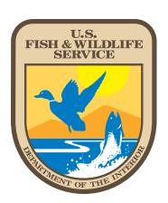
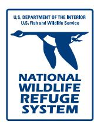
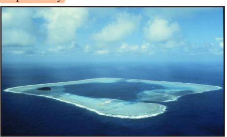
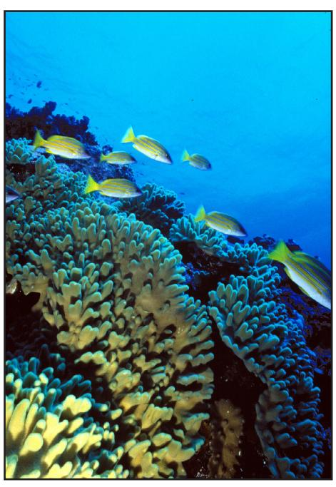
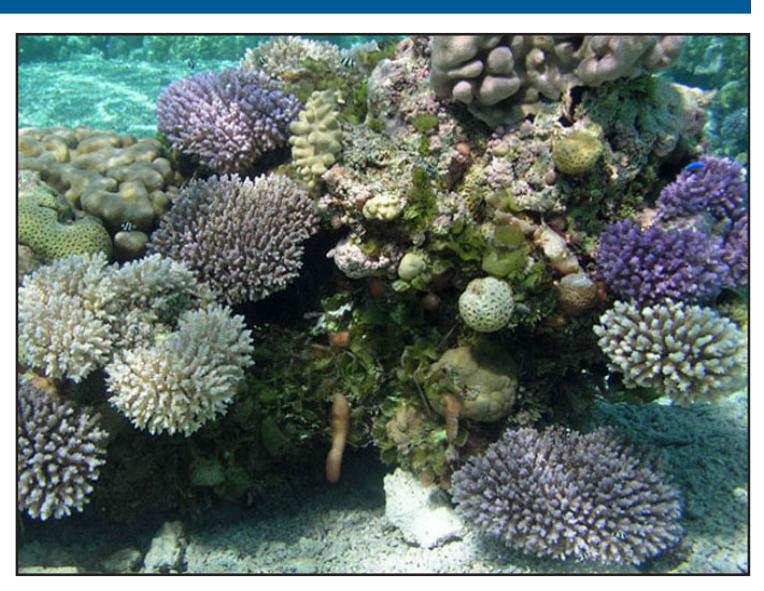

Rose Atoll Marine National Monument consists of approximately 13,451 square miles of emergent and submerged lands and waters of and around Rose Atoll in American Samoa. It includes Rose Atoll National Wildlife Refuge, with approximately 21 acres of emergent land and 1,600 acres of lagoon. The monument's outer boundary is approximately 50 nautical miles from the mean low water line of Rose Atoll.

Presidential Proclamation 8337 established Rose Atoll Marine National Monument in January 2009 and assigned management responsibility to the Secretary of the Interior, in consultation with the Secretary of Commerce. The Secretary of Commerce, through the National Oceanic and Atmospheric Administration, has primary management responsibility for fishery-related activities and is to initiate the process to add the monument's marine areas to the Fagatele Bay National Marine Sanctuary. The Government of American Samoa will be a cooperating agency in development of a monument management plan.

Rose Atoll is located approximately 130 nautical miles east-southeast of Pago Pago Harbor, American Samoa. It is the easternmost Samoan island and the southernmost point of the United States.

Rose Atoll is nearly square, with the ocean-side slopes about 1.5 miles in length. It is one of the smallest atolls in the world and includes two low sandy islets, Rose and Sand, located on a coralline algal reef enclosing a lagoon. The lagoon is about 1.2 miles wide and up to about 65 feet deep. Rose and Sand Islands are about 14 and 7 acres respectively.

# **U.S. Fish & Wildlife Service**

# **Rose Atoll Marine National Monument**

#### Human History

The early Polynesians of Samoa likely visited the atoll periodically over the past millennium or more, and the atoll has a Samoan name "Motu o Manu," literally meaning "island of seabirds." Captain Louise de Freycinet christened the isle "Rose" on October 21, 1819, after his wife who was traveling with him at the time.

The first scientist to land on the island was probably Dr. Charles Pickering, a physician naturalist who explored the atoll in 1839. Rose Atoll has been the subject of approximately 300 papers and reports over the last century. These describe the geology, geography, biology, meteorology, and history of the area.

Rose Island has sustained only brief human habitation in recent history. In the 1860s, a short-lived attempt was made by a German firm to establish a fishing station and coconut plantation at Rose Atoll. Sand Island is a shifting sand bank and could not support human habitation.

In October 1993, the 120-foot Taiwanese longline fishing vessel F/V Jin Shiang Fa ran hard aground and broke up within weeks on the reef on the southwest arm of the atoll. As a result of the grounding, the entire 100,000 gallons of diesel fuel aboard the vessel was discharged into the marine environment. Supported by the ship's insurance, limited salvage operations were attempted within a month and were successful in removing the bow section of the wreck. However, the rest of the wreck deteriorated quickly, and dissolved iron from the wreckage stimulated invasive blue-green algae and prevented natural recovery of coralline algae within the grounding area.

In 2004, the U.S. Coast Guard awarded Fish and Wildlife Service \$1.3 million from the Oil Spill Liability Trust Fund to remove the rest of the shipwreck and monitor reef recovery for 15 years. In 2007, the last remaining debris was removed from the atoll, and monitoring of reef recovery will continue into the future.

*Coral garden and fish Photo credit: Phillip Colla*

Existing uses are limited to research and monitoring activities carried out by the Fish and Wildlife Service, National Marine Fisheries Service, and the American Samoa government. Because Rose Atoll is one of the most unique and least visited areas of the world, its marine and terrestrial communities provide a unique opportunity for research and afford an invaluable scientific baseline for biological and geological studies of the low Pacific islands.

## Marine Resources

One of the most striking features of Rose Atoll is the pink hue of the fringing reef, caused by the dominance of a crustose coralline algae that is also the primary reef-building species at the atoll in shallow depths.

Rose Atoll's outer reef slope is located on the seaward side of the atoll and consists of an irregular and often steep slope down to a depth of more than 650 feet, presently dominated by mixed corals and coralline algae to depths of 150 feet. In some areas, a shallow reef terrace is located on the upper slope before the reef plunges almost vertically to deeper waters. Spur and

groove formations occur on the shallow reef terrace in some locations. The reef flat is hard consolidated substratum that is exposed during monthly spring tides.

The lagoon is almost entirely enclosed by shallow perimeter reefs, except for a narrow channel on the northwest side. About 15 patch reefs reach the lagoon sea surface from depths of 20 to 50 feet and are concentrated on the southwestern half of the lagoon. The lagoon floor is sandy with a few isolated Acropora tablecoral patches on the bottom and scattered around the perimeter of the flat-topped, steep-sided pinnacles that extend up to the surface.

Coral communities at Rose presently include 113 species and are distinctive and quite different from those of the other islands in Samoa. Dominant corals at Rose include Favia, Acropora, Porites, Montipora, Astreopora, Montastrea, and Pocillopora.

Despite its small size, Rose supports the largest populations of giant clams, nesting sea turtles, nesting seabirds, and rare species of reef fish in American Samoa.

The fish communities at Rose are also distinct from others in the Samoan Archipelago. Fish density is very high and species diversity is moderately high at Rose Atoll. However, fish biomass is relatively low due to the dominance of small, planktivorous species. The fish assemblages at Rose also differ from the rest of the archipelago by having a much lower density of herbivorous fishes (especially parrotfishes and damselfishes) and a high density of planktivorous and carnivorous fishes (especially unicornfishes and snappers).

To date, about 270 species of reef fish have been recorded and surveys have indicated little change in the reef fish composition in the past 15 years. Pelagic fish species found outside the lagoon include various species of tuna, mahimahi, billfish, barracuda, and sharks. A new species of cardinal fish was collected and described from the lagoon at Rose in 2006. Deep diving submersible surveys in 2005 sponsored by the Hawaii Undersea Research Laboratory and Fish and Wildlife Service revealed a plethora of species and life forms not observed

at shallow depths including tunicates, stalked crinoids, many fish, and unusual sea stars.

The two islands at Rose Atoll are important nesting sites for the threatened green and endangered hawksbill turtles in American Samoa. Satellite tags attached to the nesting green

turtles at Rose have shown that these turtles migrate between American Samoa and other Pacific island nations (i.e., Fiji and French Polynesia). In addition to the migratory breeding population of turtles at the atoll during the nesting season (August to February), a small apparently resident population of juveniles lives on the atoll.

Endangered humpback whales, pilot whales, and dolphins in the genus Stenella have all been seen at Rose Atoll.

## Terrestrial Resources

Rose Island is located on the eastern corner of the atoll. It is roughly oval and has a maximum elevation of about 8 feet. It consists of raised reef rock and soft limestone composed of worn fragments of reef building organisms. The phosphatic soil is rich in humus that has developed on the substrate beneath a previously large grove of Pisonia trees.

Rose Island has been vegetated throughout recent history, but older studies indicate that it was home to only one or two species of vascular plants. The current flora of Rose Island is more complex, perhaps as a result of the Fish and Wildlife Service's successful eradication of introduced rats in 1993.

The only Pisonia forest community remaining in Samoa is found on Rose Island. Alien species of ants and scale insects have attacked the Pisonia forest during the past decade, leaving only a few healthy trees still alive and standing. Aside from this, vegetation at Rose is luxuriant due to the high annual rainfall

*Rose Atoll coral head Photo credit: James Maragos*

and perennial growing season. Frequent tropical storms and hurricanes cause severe damage in the forest.

Sand Island is a small sand bank located on the lagoon side of the reef due east of the channel opening. It also is oval in shape and approximately the same height as Rose Island. It has been vegetated in the past with at least two species of vascular plants. Currently, however, the bank is swept clean of vegetation, probably due to recent hurricanes.

Insect fauna at Rose Atoll are poorly known. Sphinx moth caterpillars, gnats, flies, crickets, ants, beetles, scale insects, and earthworms have been observed. Two species of land hermit crabs occur in high densities on both Rose and Sand Islands.

Rose Atoll is the most important seabird colony in the region, since approximately 97 percent of the seabird population of American Samoa resides on Rose. The two islands provide important nesting and roosting habitat for 12 species of federally protected migratory seabirds.

Only one year after removal of rats, two species of shearwaters landed on Rose Island, the first record of any Procellariform bird since ornithological observations began. Additionally, five species of federally protected migratory shorebirds and one species of forest bird, the long-tailed cuckoo (a migrant from New Zealand), use the atoll for feeding, resting, and roosting.