# **Rose Atoll National Wildlife Refuge**

# **Comprehensive Conservation Plan**

Prepared by: Rose Atoll National Wildlife Refuge c/o National Park Service Pago Pago, American Samoa 96799

Pacific Reefs and Hawaiian and Pacific Islands Planning Team U.S. Fish and Wildlife Service 300 Ala Moana Boulevard, Room 5-231 Honolulu, Hawai'i 96850

May 2014

### **U.S. Fish and Wildlife Service Rose Atoll National Wildlife Refuge Comprehensive Conservation Plan Approval Submission**

In accordance with the National Wildlife Refuge System Administration Act of 1966, as amended, a Comprehensive Conservation Plan (CCP) has been preparedfor Rose Atoll National Wildlife Refuge. The purpose of the CCP is to specify a management direction for the Refuge for the next 15 years. The CCP charts a vision of the Refuge's future desired conditions, the types of habitat that will be provided, species protected, public use, partnership opportunities, and the management actions needed to achieve that vision. The effects of the CCP on the human environment were described in the Draft CCP and Environmental Assessment. This CCP is submitted for approval by the Regional Director.

| Submitted by:                                                                                                              |     |
|----------------------------------------------------------------------------------------------------------------------------|-----|
| ~QJAAJJi;/A                                                                                                                |     |
| Frank Pendleton                                                                                                            |     |
| Refuge Manager, Rose Atoll National Wildlife Refuge                                                                        |     |
|                                                                                                                            |     |
|                                                                                                                            |     |
|                                                                                                                            |     |
|                                                                                                                            |     |
|                                                                                                                            |     |
|                                                                                                                            |     |
| Approved::::-;'~'-;;;;·                                                                                                    |     |
| ~ Robyn Thorson,:::,~:';-;::::::::::-:;:c::;::q-'-±-Z:=-7;,"fL<br>Regional Director, Region I, Portland, Oregon<br>t-(;"\~ | ate |

#### **FINDING OF NO SIGNIFICANT IMPACT**

#### **for the**

#### **Rose Atoll National Wildlife Refuge Comprehensive Conservation Plan**

The U.S. Fish and Wildlife Service (Service) has completed the Comprehensive Conservation Plan (CCP) and Environmental Assessment (EA) for Rose Atoll National Wildlife Refuge (Refuge). The CCP will guide management of the Refuge for the next 15 years. The CCP and EA described the Service's proposals for managing the Refuge and their effects on the human environment under two alternatives, including the no action alternative.

### **Decision**

Following comprehensive review and analysis of the two alternatives, the Service selected Alternative B for implementation because it is the alternative that best meets the following criteria:

- Achieves the mission of the National Wildlife Refuge System;
- Achieves the purposes of the Refuge;
- Will be able to achieve the vision and goals for the Refuge;
- Maintains and restores the ecological integrity of Refuge habitats and populations;
- Addresses the important issues identified during the scoping process;
- Addresses the legal mandates of the Service and the Refuge; and
- Is consistent with the scientific principles of sound wildlife management and endangered species recovery.

#### **Summary of the Actions to be Implemented**

Implementing the selected alternative will have no significant impacts on any of the environmental resources identified in the CCP/EA. Refuge management under the selected alternative will protect, maintain, and enhance habitat for priority species and resources of concern. A detailed summary of the CCP actions we will implement can be found in Chapter 2, Table 2.1; however major management actions include:

- Protecting, restoring, and maintaining habitats including the lagoon, perimeter crustose coralline algal reef, ava, beach strand, and littoral forest. This will include developing monitoring protocols, installing a remote camera system, increasing surveys, implementing a rapid response program to nonnative species, restoring native plants, and increasing applied research;
- Protecting, restoring, and maintaining the species that rely on the habitats above, including corals, fish, seabirds, shorebirds, sea turtles, native plants, faisua, and invertebrates;
- Expanding outreach, interpretation, and environmental education by working with partners to develop materials and curriculum;
- Protecting and perpetuating cultural resources related to Rose Atoll; and
- Focusing scientific information and research needs to better support adaptive management on the Refuge.

**Public Involvement and Changes to the Selected Alternative Based on Comments**  Beginning with the public scoping in 2009, the planning process incorporated public involvement **in** developing and reviewing the CCP. This included seven public open houses/meetings, three planning updates, updates provided through meetings with partners, elected officials, and chiefs, Notices of Availability in the Federal Register, website postings, mail and email list circulations, news releases, and public review and comment on the Draft CCP/EA during the extended public comment period of October 9-November 27, 2012. Public involvement details, our responses to comments, and any changes made to the CCP are outlined in detail in Appendix J.

Based on public comments received, two new research strategies (i.e., to investigate breeding seabird diets and to correlate seabird reproduction with oceanographic conditions and prey locations) were added in Objective 6.2, clarification on the relationship between seabirds and pelagic fish was made on a section of the biological chapter, and a strategy to work with the National Oceanic and Atmospheric Administration to identifY the Refuge on nautical charts and other marine information products was added to a revised law enforcement section in Chapter 2. Some additional text changes were made to improve readability and accuracy.

#### **Conclusions**

Based on review and evaluation of the information contained in the supporting references, I have determined that implementing Alternative B as the CCP for management of Rose Atoll National Wildlife Refuge is not a major Federal action that would significantly affect the quality of the human environment within the meaning of section 102(2) (c) of the National Environmental Policy Act of I 969. Accordingly, the Service is not required to prepare an environmental impact statement.

S. Regional Director, Region I

**'t-t.O..<\$'** Portland, Oregon

**Supporting References** 

U.S. Fish and Wildlife Service. 2012. Rose Atoll National Wildlife Refuge Draft Comprehensive Conservation Plan and Environmental Assessment. U.S. Department of the Interior, Fish and Wildlife Service, Region I. Portland, OR. 313 pp.

U.S. Fish and Wildlife Service. 2013. Rose Atoll National Wildlife Refuge Comprehensive Conservation Plan. U.S. Department of the Interior, Fish and Wildlife Service, Region I. Portland, OR.

Note: This Finding ofNo Significant Impact and supporting references are on file at the Rose Atoll NWR in the National Park Service office, Pago Pago, American Samoa; the Pacific Reefs National Wildlife Refuge Complex, 300 Ala Moana Boulevard, Room 5-23 I, Honolulu, Hawai'i, 96826; and U.S. Fish and Wildlife Service, Division of Planning and Visitor Services, 9 I I NE 1 I th Avenue, Portland, Oregon, 97232. These documents can also be found at www.fws.gov/roseatolllplanning.htrnl. These documents are available for public inspe[ction.](http://www.fws.gov/roseatoll/planning.html)  [Interested and affected parties are bein](http://www.fws.gov/roseatoll/planning.html)g notified of our decision.

# **Table of Contents**

| Chapter 1.<br>Introduction and Background<br>1-1                                               |      |
|------------------------------------------------------------------------------------------------|------|
| 1.1Purpose and Need for the CCP<br>1-2                                                         |      |
| 1.2<br>Legal and Policy Guidance<br>1-2                                                        |      |
| 1.2.1 U.S. Fish and Wildlife Service<br>                                                       | 1-2  |
| 1.2.2 National Wildlife Refuge System<br>                                                      | 1-5  |
| 1.2.3 National Wildlife Refuge System Mission and Goals                                        | 1-5  |
| 1.2.4 National Wildlife Refuge System Administration Act of 1966<br>                           | 1-5  |
| 1.2.5<br>Presidential Proclamation 8337<br>                                                    | 1-6  |
| 1.2.6<br>Other Laws and Mandates                                                               | 1-7  |
| 1.3<br>Refuge Establishment and Purposes1-8                                                    |      |
| 1.3.1<br>Refuge Establishment<br>                                                              | 1-8  |
| 1.3.2 Purpose                                                                                  | 1-8  |
| 1.3.3 Land Status and Ownership<br>                                                            | 1-8  |
| 1.4 Refuge Goals1-11                                                                           |      |
| 1.5 Relationship to Other Planning Efforts1-12                                                 |      |
| 1.6<br>Planning and Issue Identification1-13                                                   |      |
| 1.6.1 Issues Addressed in the CCP<br>                                                          | 1-13 |
| 1.6.2 Issues outside the Scope of the CCP                                                      | 1-13 |
|                                                                                                |      |
| Chapter 2.<br>Refuge Management Direction2-1                                                   |      |
| 2.1 Overview2-1                                                                                |      |
| 2.2 General Guidelines2-1                                                                      |      |
| 2.3 Rose Atoll<br>NWR Management2-9                                                            |      |
| 2.3.1 Goal 1: Protect and maintain the lagoon habitats to meet the life-history needs of       |      |
| native species in this community.<br>                                                          | 2-9  |
| 2.3.2 Goal 2: Restore, protect, and maintain the perimeter crustose coralline algal reef to    |      |
| meet the life-history needs of native species in this community.<br>                           | 2-11 |
| 2.3.3 Goal 3: Protect and maintain the natural state of the ava (channel) to protect all other |      |
| Refuge habitats and the hydrology of the lagoon.<br>                                           | 2-13 |
| 2.3.4 Goal 4: Restore, protect, and maintain the beach strand habitat to meet the life         |      |
| history needs of native species in this community                                              | 2-14 |
| 2.3.5 Goal 5: Restore, protect, and maintain littoral forest to meet the life-history needs of |      |
| native species in this community including plants, seabirds, shorebirds, landbirds,            |      |
| waterbirds, reptiles, and land crabs                                                           | 2-16 |
| 2.3.6 Goal 6: Gather scientific information (inventories, monitoring, assessments, and         |      |
| research) to support adaptive management decisions under objectives for Goals 1-5.<br>         | 2-18 |
| 2.3.7 Goal 7: Strengthen resource conservation and the public's shared stewardship of the      |      |
| ecological, geologic, and cultural richness of the Refuge by providing outreach,               |      |
| interpretation, and environmental education opportunities                                      | 2-22 |
| 2.3.8 Goal 8: Identify, protect, preserve, and interpret the Refuge's Samoan cultural          |      |
| resources and facilitate, where appropriate, cultural practices.<br>                           | 2-25 |
| Chapter 3.<br>Physical Environment3-1                                                          |      |
| 3.1 Climate3-1                                                                                 |      |
| 3.1.1 Climate<br>Change                                                                        | 3-1  |
| 3.1.2 Climate Change<br>at Rose Atoll                                                          | 3-2  |
|                                                                                                |      |

Table of Contents i

|   | 3.2 Hydrology                                                            | 3-6  |
|---|--------------------------------------------------------------------------|------|
|   | 3.3 Topography and Bathymetry                                            |      |
|   | 3.4 Geology and Geomorphology                                            |      |
|   | 3.5 Soils.                                                               |      |
|   | 3.6 Environmental Contaminants                                           |      |
|   | 3.6.1 Military Use in WWII                                               |      |
|   | 3.6.2 Wreck of the <i>Jin Shiang Fa</i> 1993                             | 3-10 |
|   | 3.7 Air Quality                                                          |      |
|   | 3.8 Water Quality                                                        |      |
|   | 3.9 Surrounding Land and Water Use                                       |      |
|   | 517 Surrounding Band and Water Colonia                                   | 5 12 |
| C | Chapter 4. Biological Environment                                        | 4-1  |
|   | 4.1 Biological Integrity Analysis                                        | 4-1  |
|   | 4.2 Selection of Priority Resources of Concern                           | 4-3  |
|   | 4.2.1 Analysis of Priority Resources of Concern                          |      |
|   | 4.3 Habitat Types                                                        |      |
|   | 4.3.1 Ava                                                                |      |
|   | 4.3.2 Reef (Crest and Back)                                              | 4-12 |
|   | 4.3.3 Lagoon                                                             | 4-12 |
|   | 4.3.4 Intertidal                                                         |      |
|   | 4.3.5 Beach Strand                                                       |      |
|   | 4.3.6 Littoral Forest.                                                   |      |
|   | 4.4 Threatened, Endangered, and Sensitive Species                        |      |
|   | 4.4.1 Tuli ( <i>Numenius tahitiensis</i> ) or Bristle-thighed Curlew     |      |
|   | 4.4.2 Tuli ( <i>Pluvialis fulva</i> ) or Pacific Golden Plover           |      |
|   | 4.4.3 I'a sa ( <i>Chelonia mydas</i> ) or Green Turtle                   |      |
|   | 4.4.4 Hawksbill Turtle ( <i>Eretmochelys imbricata</i> )                 |      |
|   | 4.4.5 Faisua ( <i>Tridacna maxima</i> ) or Giant Clam                    |      |
|   | 4.5 Seabirds                                                             |      |
|   | 4.5.1 Tava'e'ula ( <i>Phaethon rubricauda</i> ) or Red-tailed Tropicbird |      |
|   | 4.5.2 Atafa ( <i>Fregata minor</i> ) or Great Frigatebird                |      |
|   | 4.5.3 Atafa ( <i>Fregata ariel</i> ) or Lesser Frigatebird               |      |
|   | 4.5.4 Fua'o ( <i>Sula dactylatra</i> ) or Masked Booby                   |      |
|   | 4.5.5 Fua'o ( <i>Sula leucogaster</i> ) or Brown Booby                   |      |
|   | 4.5.6 Fua'o (Sula sula) or Red-footed Booby                              |      |
|   | 4.5.7 Gogo Uli ( <i>Anous minutus</i> ) or Black Noddy                   |      |
|   | 4.5.8 Gogo (Anous stolidus) or Brown Noddy                               |      |
|   | 4.5.9 Manu Sina ( <i>Gygis alba</i> ) or White Tern                      |      |
|   | 4.5.10 Gogo Uli ( <i>Onychoprion fuscatus</i> ) or Sooty Tern            |      |
|   | 4.5.11 Gogosina ( <i>Onychoprion lunatus</i> ) or Gray-backed Tern       |      |
|   | 4.5.12 Gogosina (Sterna sumatrana) or Black-naped Tern                   |      |
|   | 4.6 Shorebirds and Wading Birds                                          |      |
|   | 4.6.1 Tuli ( <i>Arenaria interpres</i> ) or Ruddy Turnstone              |      |
|   | 4.6.2 Tuli ( <i>Calidris alba</i> ) or Sanderling                        |      |
|   | 4.6.3 Tuli ( <i>Canaris atoa</i> ) or Wandering Tattler                  |      |
|   | 4.6.4 Matu'u ( <i>Egretta sacra</i> ) or Pacific Reef Heron              |      |
|   | 4.7 Land Birds                                                           |      |
|   | 4.7.1 Aleva ( <i>Eudynamis taitensis</i> ) or Long-tailed Cuckoo         |      |
|   | 4.8 Invertebrates                                                        |      |
|   | 1.0 111 to 1.00 1 and 0                                                  | 1-55 |

| 4.8.1 Tuitui (Sea Urchin)                                             | 4-35 |
|-----------------------------------------------------------------------|------|
| 4.8.2 Terrestrial Invertebrates                                       |      |
| 4.9 Reef Building Species                                             |      |
| 4.9.1 Coral                                                           |      |
| 4.9.2 Coralline Algae                                                 |      |
| 4.10 Fish                                                             |      |
| 4.11 Invasive and Nuisance Species                                    |      |
| 4.11.1 Mammals                                                        |      |
| 4.11.2 Reptiles                                                       |      |
| 4.11.3 Invertebrates                                                  |      |
| 4.11.4 Vegetation                                                     | 4-49 |
| 4.12 Wildlife and Habitat Research Inventory and Monitoring           | 4-50 |
| Chapter 5. Social and Economic Environment                            | 5-1  |
| 5.1 Cultural Resources                                                |      |
| 5.1.1 Historical Background                                           |      |
| 5.1.2 Rose Atoll and Manu'a Islands                                   |      |
| 5.2 Refuge Facilities                                                 |      |
| 5.3 Public Use Overview                                               |      |
| 5.4 Wildlife-Dependent Public Uses                                    |      |
| 5.4.1 Hunting                                                         |      |
| 5.4.2 Fishing                                                         |      |
| 5.4.3 Wildlife Observation and Photography                            |      |
| 5.4.4 Environmental Education                                         | 5-7  |
| 5.4.5 Interpretation/Outreach                                         |      |
| 5.4.6 Cultural Resources Interpretation                               |      |
| 5.5 Illegal Uses                                                      | 5-7  |
| 5.6 Social/Economic Environment                                       | 5-8  |
| 5.6.1 Communities near Rose Atoll National Wildlife Refuge            | 5-8  |
| 5.6.2 Population, Housing, and Income                                 |      |
| 5.6.3 Employment and Business                                         | 5-9  |
| 5.6.4 Refuge Impact on Local Economies                                | 5-10 |
| 5.6.5 Additional Economic Contributions                               | 5-11 |
| Appendices                                                            |      |
| Appendix A. Rose Atoll NWR Species Lists                              | A-1  |
| Appendix B. Appropriate Use Findings                                  | B-1  |
| Appendix C. Compatibility Determinations                              |      |
| Appendix D. Implementation                                            |      |
| Appendix E. Wilderness Review for Rose Atoll National Wildlife Refuge |      |
| Appendix F. Biological Resources of Concern                           |      |
| Appendix G. Integrated Pest Management (IPM) Program                  |      |
| Appendix H. Statement of Compliance                                   |      |
| Appendix I. Common Acronyms and Abbreviations                         |      |
| Appendix J. Summary of Public Involvement                             |      |
| Appendix K. Cooperative Agreement and Presidential Proclamations      |      |
| Appendix L. Best Management Practices for Visitors to Rose Atoll      | L-1  |
| Appendix M. CCP Team Members                                          |      |

| Appendix N. ReferencesN-1                                                                     |  |
|-----------------------------------------------------------------------------------------------|--|
| Figures                                                                                       |  |
| Figure 1-1. Regional and local area.<br>1-3                                                   |  |
| Figure 1-2. Refuge overview and land status1-9                                                |  |
| Figure 2-1. Management direction2-7                                                           |  |
| Figure 3-1. Atoll formation3-8                                                                |  |
| Figure 4-1. Habitats.<br>4-8                                                                  |  |
| Tables                                                                                        |  |
| Table 2-1. Summary of Management Direction<br>2-6                                             |  |
| Table 4-1. Biological Integrity, Diversity, and Environmental Health4-2                       |  |
| Table 4-2. Priority Resources of Concern4-5                                                   |  |
| Table 4-3. Shorebirds and Wading Birds of Primary Conservation Importance in the U.S. Pacific |  |
| Region4-32                                                                                    |  |
| Table 5-1. Employment and Labor Income 2002<br>5-9                                            |  |
| Table 5-2. Economic Projections 2000-20155-10                                                 |  |

iv Table of Contents

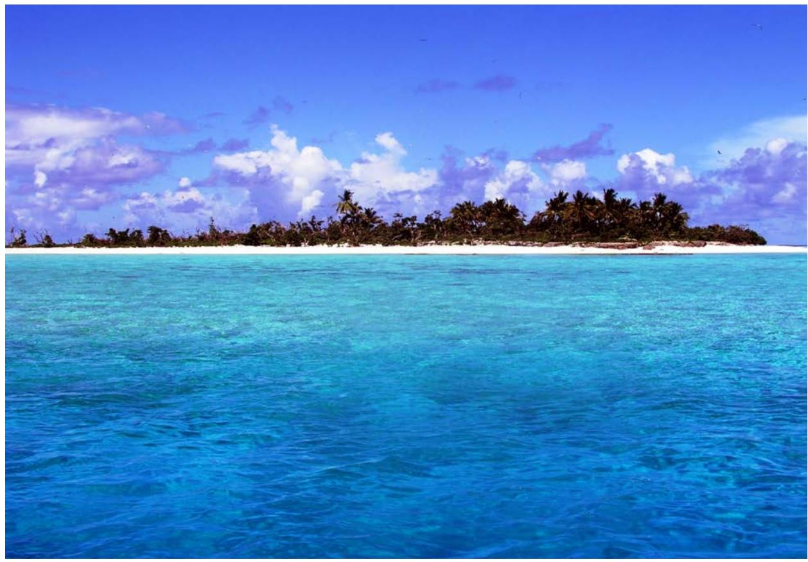

*Lovely Rose Atoll rises above the azure blue sea.* Jean Kenyon/USFWS

# **Chapter 1. Introduction and Background**

Rose Atoll National Wildlife Refuge (NWR or Refuge) is located approximately 180 miles east of Tutuila in American Samoa. The next closest island to Rose is Ta'ū Island in Manu'a, 78 miles away. The 1,613-acre Refuge was established on August 24, 1973, with the American Samoa Government (ASG) by a cooperative agreement (Appendix K). It is the southernmost unit of the National Wildlife Refuge System (Refuge System) and shares the distinction with Jarvis Island NWR of being one of two NWRs located south of the equator.

One of the smallest atolls in the world, Rose Atoll consists of a perimeter reef encircling a central lagoon. The atoll is a nearly square geographical feature, with sides that are approximately 1.5 miles in length. There are two low, sandy islands—Rose and Sand—located on the coralline algal reef. A single ava (channel) links the lagoon to the sea surrounding the atoll. The lagoon is roughly 1.2 miles wide and 98 feet deep. The Refuge provides habitat for migratory seabirds and shorebirds, sea turtles, and unique marine fish, coral reefs, and other invertebrates.

Coral communities at Rose Atoll are distinct from reefs around the other islands in Samoa. The fringing reef is a striking pink hue due to the crustose coralline algae (CCA) that is the primary reefbuilding species at the atoll. The CCA reef plays a significant role at the atoll, stabilizing the perimeter and protecting the lagoon and islands from ocean swells. Unlike the rest of the Samoan Archipelago where they are harvested by humans, the spectacularly colored faisua (giant clams) are found in high densities at the Refuge. Similarly, fish density is very high and species diversity moderately high when compared to other reefs in the Samoan Archipelago.

Rose Atoll's beach strand provides important nesting sites for the threatened green turtle, which migrates between American Samoa and other Pacific Island nations. As the only terrestrial rat-free areas in American Samoa, Rose Atoll's islands are vital nesting and roosting habitat supporting 12 species of federally-protected seabirds and sea turtles. The Refuge's tropical pu'a vai (*Pisonia grandis)* forest provides habitat for many nesting seabird species. This forest type is declining in the Pacific due to the effects of human habitation, coconut plantings, and pests such as rats and insects.

# **1.1 Purpose and Need for the CCP**

The purpose of developing the CCP is to provide the refuge manager with a 15-year management plan for the conservation of fish, wildlife, and plant resources and their related habitats, while providing opportunities for compatible, wildlife-dependent recreational uses if compatible. The CCP, when fully implemented, should achieve refuge purposes; help fulfill the Refuge System mission; maintain and, where appropriate, restore the biological integrity, diversity, and environmental health (BIDEH) of the refuge and the Refuge System; help achieve the goals of the National Wilderness Preservation System (NWPS); and meet other mandates. The CCP must be specific to the planning unit and identify the overarching wildlife, public use, or management needs for the refuge (602 FW 3.4C1d).

# **1.2 Legal and Policy Guidance**

The U.S. Fish and Wildlife Service (Service), an agency within the Department of the Interior (DOI), is the principal Federal agency responsible for conserving, protecting, and enhancing fish, wildlife, and plants and their habitats. Refuge management is guided by Federal laws, Executive Orders, Service policies, and international treaties. Fundamental guidelines are found in the mission and goals of the Refuge System and the designated purposes of the Refuge as described in establishing legislation, Executive Orders, or other documents establishing, authorizing, or expanding a refuge.

Key concepts and guidance of the Refuge System derive from the National Wildlife Refuge System Administration Act of 1966 (Administration Act), the Refuge Recreation Act of 1962 (16 U.S.C. 460k-460k-4), as amended, Title 50 of the Code of Federal Regulations (CFR), and the Fish and Wildlife Service Manual (FW). The Administration Act is implemented through regulations covering the Refuge System, published in Title 50, subchapter C of the CFR. These regulations govern general administration of units of the Refuge System.

### **1.2.1 U.S. Fish and Wildlife Service**

All refuges are managed by the Service, an agency within the Department of the Interior (DOI). The Service is the principal Federal agency responsible for conserving, protecting, and enhancing the Nation's fish and wildlife populations and their habitats. The mission of the Service is "working with others, to conserve, protect, and enhance fish and wildlife and their habitats for the continuing benefit of the American people." National natural resources entrusted to the Service for conservation and protection include migratory birds, endangered and threatened species, interjurisdictional fish, wetlands, and certain marine mammals.

*Figure 1-1. Regional and local area.* 

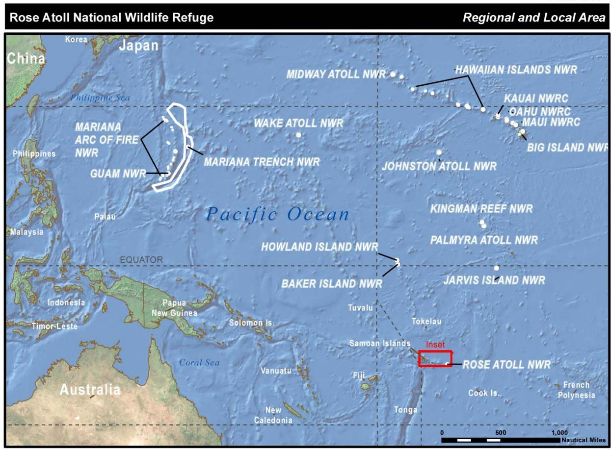

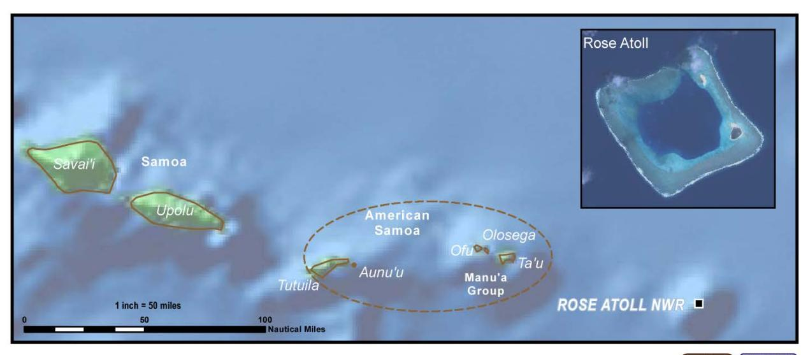

**The back sides of maps are blank to improve readability.** 

The Service also manages national fish hatcheries, enforces Federal wildlife laws and international treaties on importing and exporting wildlife, assists with State and Territorial fish and wildlife programs, and helps other countries develop wildlife conservation programs.

### **1.2.2 National Wildlife Refuge System**

The Refuge System is the world's largest network of public lands and waters set aside specifically for conserving wildlife and protecting ecosystems. From its inception in 1903, the Refuge System has grown to encompass over 550 national wildlife refuges in all 50 States, and waterfowl production areas in 10 States, covering more than 150 million acres of public lands and waters. More than 40 million visitors annually fish, hunt, observe and photograph wildlife, or participate in environmental education and interpretive activities on national wildlife refuges.

### **1.2.3 National Wildlife Refuge System Mission and Goals**

The mission of the Refuge System is "to administer a national network of lands and waters for the conservation, management, and, where appropriate, restoration of the fish, wildlife, and plant resources and their habitats within the United States for the benefit of present and future generations of Americans." The goals of the Refuge System, as articulated in the Mission, Goals, and Purposes policy (601 FW1), follow:

- Conserve a diversity of fish, wildlife, and plants and their habitats, including species that are endangered or threatened with becoming endangered;
- Develop and maintain a network of habitats for migratory birds, anadromous and interjurisdictional fish, and marine mammal populations that is strategically distributed and carefully managed to meet important life history needs of these species across their ranges;
- Conserve those ecosystems, plant communities, wetlands of national or international significance, and landscapes and seascapes that are unique, rare, declining, or underrepresented in existing protection efforts;
- Provide and enhance opportunities to participate in compatible wildlife-dependent recreation (hunting, fishing, wildlife observation and photography, and environmental education and interpretation); and
- Foster understanding and instill appreciation of the diversity and interconnectedness of fish, wildlife, and plants and their habitats.

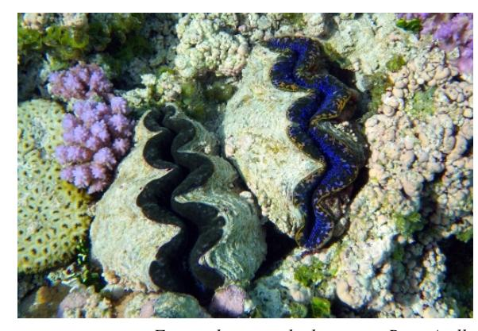

*Faisua decorate the lagoon at Rose Atoll.*  Mark MacDonald/ASG-DMWR

# **1.2.4 National Wildlife Refuge System Administration Act of 1966**

Of all the laws governing activities on national wildlife refuges, the Administration Act exerts the greatest influence. The Administration Act was amended by the National Wildlife Refuge System Improvement Act of 1997 (Improvement Act). The Improvement Act included a unifying mission for all national wildlife refuges, a new process for determining compatible uses on refuges, and a requirement that each refuge will be managed under a CCP developed in an open public process. The

Administration Act states that the Secretary shall provide for the conservation of fish, wildlife, plants, and their habitats within the Refuge System, and ensure that the biological integrity, diversity, and environmental health of the Refuge System are maintained. House Report 105–106 accompanying the Improvement Act states ''…the fundamental mission of our System is wildlife conservation: wildlife and wildlife conservation must come first.'' Biological integrity, diversity, and environmental health are critical components of wildlife conservation. As later made clear in the Biological Integrity, Diversity, and Environmental Health (BIDEH) policy, "the highest measure of biological integrity, diversity, and environmental health is viewed as those intact and self-sustaining habitats and wildlife populations that existed during historic conditions."

Each refuge must be managed to fulfill the Refuge System mission as well as the specific purpose for which it was established. The Administration Act requires the Service to monitor the status and trends of fish, wildlife, and plants on every refuge.

Additionally, the Administration Act identifies six wildlife-dependent recreational uses for the Refuge System. These uses are hunting, fishing, wildlife observation and photography, and environmental education and interpretation. Under the Administration Act, the Service is to grant these six wildlife-dependent public uses, when compatible, special consideration in the planning for, management of, and establishment and expansion of units of the Refuge System. The overarching goal of the wildlife-dependent public use programs is to enhance opportunities and access to quality wildlife-dependent visitor experiences on refuges while managing refuges to conserve fish, wildlife, plants, and their habitats. When determined compatible on a refuge-specific basis, these six uses assume priority status among all uses of the refuge in question. The Service is to make extra efforts to facilitate priority wildlife-dependent public use opportunities.

When preparing a CCP, refuge managers must re-evaluate all general public, recreational, and economic uses (even those occurring to further refuge habitat management goals) proposed or occurring on a refuge for appropriateness and compatibility. No refuge use may be allowed or continued unless it is determined to be appropriate and compatible. Generally, an appropriate use is one that contributes to fulfilling the refuge purposes, the Refuge System mission, or goals or objectives described in an approved refuge management plan. A compatible use is a use that, in the sound professional judgment of the refuge manager, will not materially interfere with or detract from the purpose(s) of the refuge or the fulfillment of the Refuge System. Updated appropriate use findings and compatibility determinations for existing and planned uses for Rose Atoll NWR are in Appendices B and C of this CCP, respectively.

The Administration Act also requires that, in addition to formally established guidance, the CCP must be developed with the participation of the public. Issues and concerns articulated by the public play a role in guiding alternatives considered during the development of the CCP, and together with the formal guidance, can play a role in selection of the preferred alternative. It is Service policy that CCPs are developed in an open public process and that the Service is committed to securing public input throughout the process. Appendix J of the CCP details public involvement that has been undertaken during this CCP process.

### **1.2.5 Presidential Proclamation 8337**

On January 6, 2009, President George W. Bush signed Presidential Proclamation 8337, designating the Rose Atoll Marine National Monument (Monument) which included the Rose Atoll NWR. The President directed that the Secretary of the Interior shall have management responsibility for the

Monument, including the Refuge, in consultation with the Secretary of Commerce, except that the Secretary of Commerce, through the National Oceanic and Atmospheric Administration (NOAA), shall have the primary management responsibility regarding the management of the marine areas of the Monument seaward of mean low water, with respect to fishery-related activities regulated pursuant to the Magnuson-Stevens Fishery Conservation and Management Act (16 U.S.C. 1801 *et seq*.; MSFCMA), and any other applicable authorities. On January 16, 2009, Secretary of the Interior Kempthorne issued Secretarial Order 3284, delegating all his responsibilities for the Monument to the Service Director, and directed that the Refuge continue to be managed consistent with the Proclamation and within boundaries set forth in the Notice of Establishment, 71 FR 13183 (April 5, 1974).

Additionally, the President directed the Secretary of Commerce to initiate the process to add the marine areas of the Monument to the National Marine Sanctuary of American Samoa (NMSAS) in accordance with the National Marine Sanctuaries Act (16 U.S.C. 1431 *et seq*.). This process was concluded in 2012. This Rose Atoll NWR CCP is a separate plan for the conservation of the Refuge area only.

### **1.2.6 Other Laws and Mandates**

Many other Federal laws, Executive orders, Service policies, and international treaties govern the Service and Refuge System. Examples include the Migratory Bird Treaty Act of 1918 (MBTA), Refuge Recreation Act of 1962, National Historic Preservation Act of 1966 (NHPA), and the Endangered Species Act of 1973 (ESA).

In addition, over the last few years, the Service has developed or revised numerous policies and Director's Orders to implement the mandates and

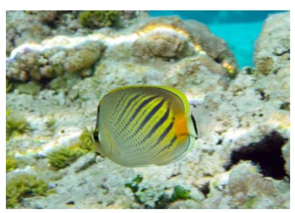

*Sunset Butterfly Fish.* Mark MacDonald/ASG-DMWR

intent of the Administration Act. Some of these key policies include BIDEH; Refuge Compatibility [\(603 FW 2\)](http://www.fws.gov/policy/603fw2.html); Comprehensive Conservation Planning [\(602 FW 3\)](http://www.fws.gov/policy/602fw3.html); Mission and Goals and Refuge Purposes [\(601 FW 1\)](http://www.fws.gov/policy/601fw1.html), Appropriate Refuge Uses [\(603 FW 1\)](http://www.fws.gov/policy/603fw1.html); Wildlife-Dependent Public Uses [\(605](http://edocket.access.gpo.gov/2006/pdf/06-5644.pdf)  [FW 1-](http://edocket.access.gpo.gov/2006/pdf/06-5644.pdf)8); Wilderness Stewardship policies [\(610 FW 1-5\)](http://www.fws.gov/policy/manuals/part.cfm?series=000&seriestitle=SERVICE%20MANAGEMENT%20SERIES), and the Director's Order for Coordination and Cooperative Work with State/Territorial Fish and Wildlife Agency representatives on management of the Refuge System.

In developing a CCP, we must consider these broader laws and policies as well as Refuge System and ecosystem goals and vision. The CCP must be consistent with these and also with the refuge purpose(s). For Rose Atoll NWR, specific examples of these broader laws include:

- ESA;
- MBTA;
- Clean Water Act;
- Federal Insecticide, Fungicide, and Rodenticide Act (FIFRA); and the
- MSFCMA (all waters and substrates, including corals, at Rose Atoll are identified as Essential Fish Habitat).

# **1.3 Refuge Establishment and Purposes**

Lands within the Refuge System are acquired and managed under a variety of legislative acts, administrative orders, and legal authorities. The official purpose or purposes for a refuge are specified in or derived from the law, Presidential proclamation, Executive order, agreement, public land order, donation document, or administrative memorandum establishing, authorizing, or expanding a refuge, refuge unit, or refuge subunit. The Service defines the purpose of a refuge when it is established or when new land is added to an existing refuge. When an addition to a refuge is acquired under an authority different from the authority used to establish the original refuge, the addition takes on the purposes of the original refuge, but the original refuge does not take on the purposes of the addition. Refuge managers must consider all of the purposes. However, purposes dealing with the conservation, management, and restoration of fish, wildlife, and plants and their habitats take precedence over other purposes in the management and administration of a refuge.

### **1.3.1 Refuge Establishment**

Rose Atoll is part of the Territory of American Samoa and was established as a National Wildlife Refuge by cooperative agreement between the Government of American Samoa and the Bureau of Sport Fisheries and Wildlife (a predecessor of the U.S. Fish & Wildlife Service) on August 24, 1973. The establishment authority for the Refuge is the Fish and Wildlife Act of 1956, as amended.

### **1.3.2 Purpose**

The purposes for Rose Atoll NWR are "… for the development, advancement, management, conservation, and protection of fish and wildlife resources …" 16 U.S.C. § 742f(a)(4); and "… for the benefit of the United States Fish and Wildlife Service, in performing its activities and services…" 16 U.S.C. § 742f(b)(1) (Fish and Wildlife Act of 1956, 16 U.S.C. §742(a)-754, as amended).

### **1.3.3 Land Status and Ownership**

Rose Atoll is managed by the Service in cooperation with the ASG as a National Wildlife Refuge under a cooperative agreement with the Government of American Samoa. The American Samoa Legislature (Fono) officially approved of the cooperative agreement with the passage of Senate Concurrent Resolution No. 14 in August 1973 (see Appendix K). Per Presidential Proclamation 4347, the U.S. government maintains jurisdiction over the submerged lands and waters of the atoll and surrounding territorial seas.

The exterior boundary of the Refuge is the extreme low waterline outside the perimeter reef, except at the entrance ava where the boundary is a line extended between the extreme low waterlines on each side of the entrance ava (*Figure 1-2*, page 1-9).

*Figure 1-2. Refuge overview and land status.*

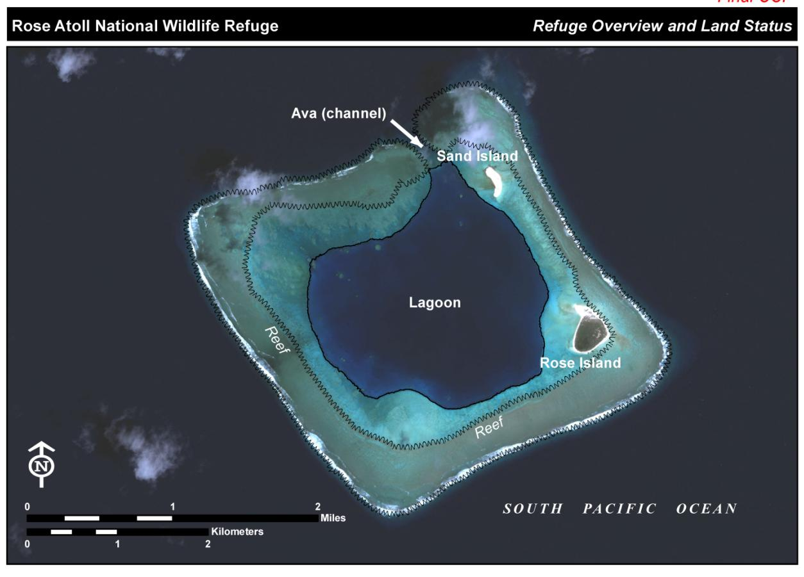

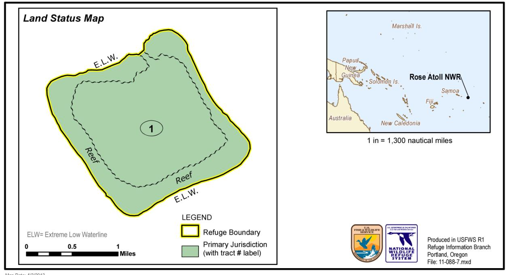

**The back sides of maps are blank to improve readability.** 

# **1.4 Refuge Goals**

Goals are the unifying elements of successful refuge management. They identify and focus management priorities, resolve issues, and link to refuge purposes, Service policy, and the Refuge System mission. A CCP describes management actions that help bring a refuge closer to its vision. The Rose Atoll NWR vision is described on the inside front cover of this document. A vision broadly reflects refuge purposes, Refuge System mission and goals, other statutory requirements, and largerscale plans as appropriate. Goals define general targets in support of the vision, followed by objectives that direct efforts into incremental and measurable steps toward achieving those goals. Finally, strategies identify specific tools and actions to accomplish objectives. The following are our goals in both Samoan and English language versions.

### **Manulautī o le Faasao mo Meaola**

- 1. Puipuia ma toe faaleleia nofoaga 'ainā i le aloalo ina ia o gatasi ma tulaga moomia na iai ituaiga olaga faamauina o meaola eseese i lea lotoifale.
- 2. Fa'afo'isia, puipui, ma toe faaleleia le si'omaga e ola ai le ituaiga limu e ta'ua o le "crustose coralline algae" i le a'au ina ia 'ausia tulaga moomia tau le faaolaolaga o meaola i ituaiga eseese o lo o i lea itulagi.
- 3. Puipui ma toe faaleleia foliga ma tulaga masani o le ava e puipuia uma isi nofoaga ua 'ainā e meaola o le Faasao ma le aafia o le pala mātū ona o le fogāsami o lo o si'omia ai le aloalo.
- 4. Fa'afo'isia, puipui, ma toe faaleleia le gataifale o lo o fai ma nofoaga o meaola o lea si'omaga ina ia o gatasi ma tulaga moomia na iai se ituaiga olaga faamauina o meaola eseese i lea lotoifale.
- 5. Fa'afo'isia, puipui, ma toe faaleleia nofoaga o lo o folasia i le oneone o le gataifale ina ia o gatasi ma tulaga moomia na iai se ituaiga olaga faamauina o meaola eseese i lea lotoifale e aofia ai laau, manufelelei o le sami, manufelelei e masani ona aumau i le nofoaga oneonea o le matafaga, manufelelei o le laueleele, manufelelei e aumau i se vai o i le laueleele, o ituaiga manu fetolofi e i le faatulagaga e faaperetania o "reptiles", ma pa'a e maua i le pala

mātū.

- 6. Faamaopoopo faamatalaga faasaienitisi (faamaumauga tau tamaoaiga, vaavaaiga o le itu i fafo ma totonu, laulilīuga, ma su'esu'ega) e lagolagoa fa'ai'uga fai a le taupulega e pei ona folasia mai e manulauti 1-5.
- 7. Fa'atāua le faatoetoe o alagaoa ma opogi faatasi le faiva faatausimea e va'ava'alua ai ma tagata lautele e tusa ai o le si'osi'omaga o meaola uma, su'esu'ega tau le eleele, ma le tele o le tamaoaiga fa'aleaganu'u o le Faasao e ala i le faafoega o polokalama e feso'ota'i atu ai ma tagata lautele, o galuega tau faaliliu upu, ma a'oa'oga tau le si'osi'omaga.
- 8. Faailoa ma'oti, puipui, faatoetoe, ma faaliliu tulaga tau alagaoa fa'aleaganu'u o le Faasao ma faafaigofie, pe a talafeagai ai, faagaoioiga fa'aleaganu'u. *Fua'o.* Frank Pendleton/USFWS

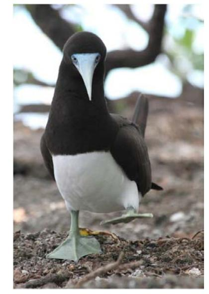

## **Refuge Goals**

- 1. Protect and maintain the lagoon habitats to meet the life-history needs of native species in this community.
- 2. Restore, protect, and maintain the perimeter crustose coralline algal reef to meet the life-history needs of native species in this community.
- 3. Protect and maintain the natural state of the ava (channel) to protect all other Refuge habitats and the hydrology of the lagoon.
- 4. Restore, protect, and maintain the beach strand habitat to meet the life-history needs of native species in this community.
- 5. Restore, protect, and maintain littoral forest to meet the life-history needs of native species in this community including plants, seabirds, shorebirds, land birds, waterbirds, reptiles, and land crabs.
- 6. Gather scientific information (inventories, monitoring, assessments, and research) to guide adaptive management decisions in support of Goals 1-5.
- 7. Strengthen resource conservation and the public's shared stewardship of the ecological, geologic, and cultural richness of the Refuge by providing outreach, interpretation, and environmental education opportunities.
- 8. Identify, protect, preserve, and interpret the Refuge's Samoan cultural resources and, where appropriate, facilitate cultural practices.

# **1.5 Relationship to Other Planning Efforts**

When developing a CCP, the Service considers the goals and objectives of existing national, regional, State/Territorial, and ecosystem plans and/or assessments. The CCP is expected to be consistent, as much as possible, with existing plans and assist in meeting their conservation goals and objectives (602 FW 3). This section summarizes some of the key plans reviewed by members of the core team while developing this CCP.

*Final Restoration Plan for Rose Atoll National Wildlife Refuge* (USFWS and DMWR 2001). The *Jin Shiang Fa* fishing vessel ran aground on the western reef of the atoll in 1993 and broke up before a salvage tug could reach the atoll, resulting in the release of over 100,000 gallons of diesel and lube oil across the reef killing a large area of CCA near the wreck site. Invasive species of cyanobacteria and articulated coralline algae immediately began colonizing those areas of the reef. This plan covered removal of vessel debris and monitoring the recovery of the injured reef community.

*Recovery Plan for U.S. Pacific Populations of the Green Turtle* (NMFS and USFWS 1998a). The green turtle is listed as threatened throughout its Pacific Range, except for the endangered population nesting on the Pacific coast of Mexico, which is covered under the Recovery Plan for the East Pacific green turtle. By far, the most serious threat to these green turtles is from direct take of turtles and eggs, both within U.S. jurisdiction and on shared stocks that are killed when they migrate out of U.S. jurisdiction. Human development is also having an increasingly serious impact on nesting beaches.

*Recovery Plan for U.S. Pacific Populations of the Hawksbill Turtle* (NMFS and USFWS 1998b). The Hawksbill turtle is listed as endangered throughout its range. Threats to these turtles include harvest of species for meat, eggs, and the tortoiseshell and stuffed curio trade and increasing human populations and subsequent destruction of habitat. Actions identified to recover the species include addressing harvesting and development threats, reducing incidental mortalities by commercial and artisanal fisheries, better surveying and monitoring, supporting management in areas that have existing populations, identifying stock home ranges and primary nesting and foraging areas, and controlling nonnative predators.

*U.S. Pacific Islands Regional Shorebird Conservation Plan* (Engilis and Naughton 2004). Conservation and restoration of shorebird habitats is essential for the protection of endangered and declining shorebird populations. Monitoring and research needs include assessment of population sizes and trends; assessment of the timing and abundance of birds at key wintering and migration stopover sites; assessment of habitat use and requirements at wintering and migration areas; exploration of the geographic linkages between wintering, stopover, and breeding areas; and evaluation of habitat restoration and management techniques to meet the needs of resident and migratory species. Education and public outreach are critical components of this plan. Resource management agencies of Federal, Territorial, Commonwealth, and State governments will need to work together with military agencies, nongovernmental organizations, and the scientific community. On a larger scale, coordination at the international level will be key to the conservation of vulnerable species, both migratory and resident.

# **1.6 Planning and Issue Identification**

### **1.6.1 Issues Addressed in the CCP**

The planning process for the CCP is described in detail in Appendix J. Summary of Public Involvement. The following key issues were identified in the planning process:

*Wildlife and Habitat Resources*: How can habitat and species management be improved? How can we maximize the ability of habitats and species to adapt and resist effects of climate change and ocean acidification? What are our priority research and survey needs to support management?

*Cultural/historic resources***:** How is Rose Atoll connected to Samoan culture and what is its significance? How can we facilitate and support cultural connections to Rose Atoll? How can they be woven together with public interpretation? How can historic resource management be enhanced?

*Visitor services and wildlife-dependent recreation:* What are appropriate and compatible uses in relation to on-site levels of environmental education and interpretation?

*Law enforcement***:** How can trespass, illegal activity, and human-caused disturbance to wildlife be managed more effectively given limited personnel and remoteness of the Refuge?

### **1.6.2 Issues outside the Scope of the CCP**

*Management of the Monument:* While CCPs are very comprehensive plans, no single plan can cover all issues. Management of the Monument is complex, with two Federal agencies (the Service and NOAA) and two Government of American Samoa Territorial departments (Department of

Commerce (ASDOC) and Department of Marine and Wildlife Resources (DMWR)) working together. The Secretary of the Interior through the Service has management responsibility for the Monument, including Rose Atoll NWR. However, the Secretary of Commerce, through NOAA NMFS has primary management responsibility regarding the management of the marine areas of the Monument seaward of mean low water, with respect to fishery-related activities. Additionally, the area in the Monument excluding the Refuge is part of the National Marine Sanctuary of American Samoa.

*Fishing:* Commercial fishing is prohibited in the Monument according to the Proclamation and all fishing is prohibited within 12 nautical miles (nmi) of the Refuge. Non-commercial fishing is allowed in the Monument outside of the 12 nmi no-fishing zone. Non-commercial fishing includes subsistence fishing and recreational fishing. The prohibition on all fishing within 12 nmi of the Refuge will be reviewed by the Western Pacific Regional Fisheries Council and NOAA's National Marine Fisheries Service (NMFS) in 2016. Additionally, the areas of the Monument that are outside of the Refuge became part of the National Marine Sanctuary of American Samoa in 2012. In developing and implementing any management plans, the Secretaries of the Interior and the Commerce shall involve as cooperating agencies the agencies with jurisdiction or special expertise, including the U.S. Department of Defense, U.S. Department of Commerce, and other agencies, through scoping in accordance with National Environmental Policy Act (42 U.S.C. 4321 *et seq*.; NEPA), its implementing regulations, and with Executive Order 13352, and shall treat as a cooperating agency the American Samoa Government through the DMWR and ASDOC consistent with the above authorities.

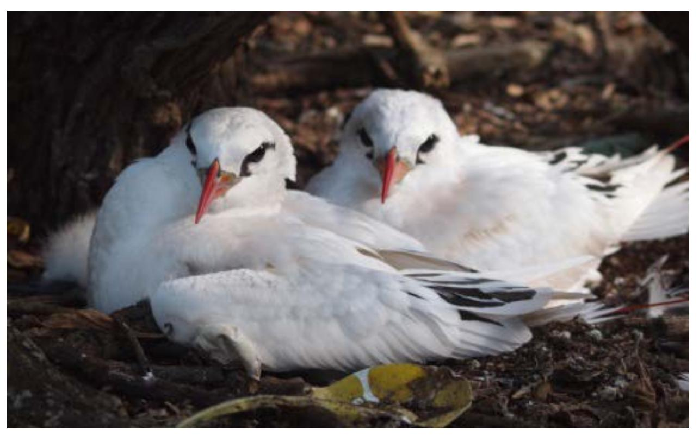

*Tava'e'ula (red-tailed tropicbird).* Kelsie Ernsberger/USFWS

# **Chapter 2. Refuge Management Direction**

# **2.1 Overview**

During development of the CCP, the Service reviewed and considered a variety of resource, social, economic, and organizational aspects important for managing the Refuge. As is appropriate for a national wildlife refuge, resource considerations were fundamental in designing alternatives. [House](ftp://ftp.loc.gov/pub/thomas/cp105/hr106.txt)  [Report 105-106](ftp://ftp.loc.gov/pub/thomas/cp105/hr106.txt) accompanying the Improvement Act states "… the fundamental mission of our System is wildlife conservation: wildlife and wildlife conservation must come first." American Samoa and Federal agencies, elected officials, local villages, and non-profit organizations were contacted by the planning team to ascertain priorities and problems as perceived by others. Public scoping in American Samoa occurred during 2009 and over 60 people participated in the public meetings. This helped us to further identify issues and priorities. Further details of public involvement and participation can be found in Appendix J.

# **2.2 General Guidelines**

General guidelines for implementing the CCP follow. To reduce the length and redundancy of the descriptions for individual strategies, common features are presented below.

**Implementation subject to funding availability.** After the CCP is completed, actions will be implemented over a period of 15 years as funding becomes available. Project priorities and projected staffing/funding needs are included in Appendix D.

**Access.** The Refuge is closed to general public use and access in accordance with the Administration Act. The specific planned uses of the Refuge are described in Appendices B and C. Specific requests to access the Refuge associated with planned uses will be evaluated on a case-by-case basis and authorized through issuance of a Refuge Special Use Permit (SUP) by the Refuge/Monument Manager.

**Biosecurity measures.** Refuge visitation protocols will continue to include strict biosecurity measures to prevent nonnative introductions (e.g., rats, ants, scale insects, etc.) and impacts from reactive materials (e.g., iron). Anyone entering the Refuge for management activities or under SUP will be required to follow the written aquatic and terrestrial quarantine procedures used for all uninhabited refuges in the Pacific Reefs NWRC. Restrictions are designed to remove or kill pest species that may be in clothes or gear before they are taken to the Refuge. Additional information can be found in Appendix L (Best management practices for visitors to Rose Atoll).

**Threatened and Endangered Species Protection and Recovery.** Protection of threatened and endangered species is common across all alternatives. It is Service policy to give priority consideration to the protection, enhancement, and recovery of these species on national wildlife refuges. The protection of federally listed species is mandated through the Endangered Species Act of 1973 (ESA). Section 7 of the ESA, called "Interagency Cooperation," is the mechanism by which Federal agencies ensure the actions they take, including those they fund or authorize, do not jeopardize the existence of any listed species. To ensure adequate protection, the Refuge is required to review all activities, programs, and projects occurring on lands and waters of the Refuge to determine if they may affect listed species. If the determination is that an action may adversely affect an endangered species, then the Refuge conducts a formal review, known as a consultation, to identify those effects and means to mitigate those effects.

**Cultural and historic resource protection.** Cultural and historic resources on refuges receive protection and consideration in accordance with Federal cultural resources laws, Executive orders, and regulations, as well as policies and procedures established by the Department of the Interior (DOI) and the Service. Actions with the potential to affect cultural and historic resources will undergo a thorough review before being implemented, as is consistent with the requirements of cultural resource laws. All ground-disturbing projects will undergo a review (including but not limited to archaeological and cultural surveys) under Section 106 of the NHPA. The Service will provide our Regional Historic Preservation Officer (RHPO) a description and location of all projects and activities that affect ground and structures, including project requests from third parties. Information will also include any alternatives being considered. We will also coordinate and consult with the American Samoa Historic Preservation Office (ASHPO) and the Office of Samoan Affairs (OSA) and seek assistance from the Manu'a people on issues related to cultural resource education and interpretation, special programs, and the NHPA. We will expand Refuge cultural resource management by working with the ASHPO, OSA, and other partners to conduct archaeological surveys at Rose Atoll, integrate cultural resources into interpretation and environmental education (EE), and improve dialogue with Manu'a villages. We will also work with local officials to facilitate appropriate cultural practices.

**Law enforcement.** The service will continue to work with NOAA to identify the Refuge on U.S. nautical charts and other official marine information products. To deter ship groundings, we will develop targeted outreach materials and work within the international maritime community (e.g., International Maritime Organization), through appropriate U.S. agencies, to designate the Refuge as "area to be avoided." Also, the Service will reinstall signage at the Refuge and improve outreach

materials to educate the sailing community that the Refuge is closed. This information will be made available to yachtsmen and other mariners at regional embarkation points (e.g., harbors in Samoa and French Polynesia). These points are where boaters may depart from, en route to other destinations, and may pass by the Refuge.

**Adaptive management.** Based on 522 Departmental Manual (DM) 1 (Adaptive Management Implementation policy), Refuge staff shall utilize adaptive management for conserving, protecting, and, where appropriate, restoring lands and resources. Within Title 43 of the CFR 46.30, adaptive management is defined as a system of management practices based upon clearly identified outcomes, where monitoring evaluates whether management actions are achieving desired results (objectives). Adaptive management accounts for the fact that complete knowledge about fish, wildlife, plants, habitats, and the ecological processes supporting them may be lacking. Adaptive management emphasizes learning while doing based upon available scientific information and best professional judgment considering site-specific biotic and abiotic factors on refuge lands and waters. Part of measuring the success of adaptive management in the Refuge also includes 5-year reviews and a 15 year revision of the CCP, which will be initiated by the Service.

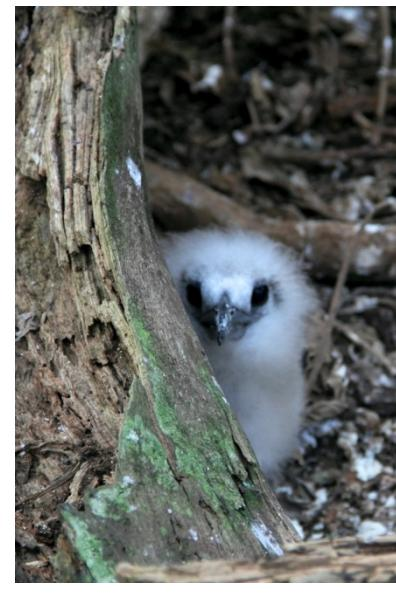

*Tava'e'ula chick.* Tracy Hart/USFWS

**Integrated pest management (IPM).** In accordance with 517 DM 1 and 569 FW 1, an IPM approach will be used, where practicable, to eradicate, control, or contain pest and invasive species (herein collectively referred to as pests) on refuges. IPM will involve using methods based upon effectiveness, cost, and minimal ecological disruption, which considers minimum potential effects to non-target species and the refuge environment. Pesticides may be used where physical, cultural, and biological methods or combinations thereof are impractical or incapable of providing adequate control, eradication, or containment. If a pesticide is needed on refuge lands or waters, the most specific (selective) chemical available for the target species will be used unless considerations of persistence or other environmental and/or biotic hazards would preclude it. In accordance with 517 DM 1, pesticide usage will be further restricted because only pesticides registered with the U.S. Environmental Protection Agency (EPA) in full compliance with FIFRA and as provided in regulations, orders, or permits issued by EPA may be applied on lands and waters under refuge jurisdiction.

Environmental harm by pest species refers to a biologically substantial decrease in environmental quality as indicated by a variety of potential factors including declines in native species populations or communities, degraded habitat quality or long-term habitat loss, and altered ecological processes. Environmental harm may be a result of direct effects of pests on native species including preying and feeding on them; causing or vectoring diseases; killing their young or preventing them from reproducing; out-competing them for food, nutrients, light, nest sites, or other vital resources; or hybridizing with them so frequently that within a few generations few, if any, truly native individuals remain. Environmental harm also can be the result of an indirect effect of pest species. For example, decreased seabird reproduction may result from a pest killing native plants that provide nesting habitat.

Environmental harm may involve detrimental changes in ecological processes. For example, cyanobacterial infestations can inhibit the growth of CCA which is a very important reef builder. This can lead to a situation where reef growth does not keep up with reef erosion, lowering the reef elevation and threatening the islands with ocean inundation. Environmental harm may also cause or be associated with economic losses and damage to human, plant, and animal health. Predator management is aimed at minimizing entry of nonnative predators using quarantine protocols, exclusion, habitat modification, control, and eradication. For example, live trapping and use of bait stations could be used to eradicate illegally introduced rats and mice. Predator and pest management will be conducted by Service personnel or contractors.

See Appendix G for the Refuge's IPM program documentation to manage pests for this CCP. Along with a more detailed discussion of IPM techniques, this documentation describes the selective use of pesticides for pest management on refuges, where necessary. Throughout the life of the CCP, most proposed pesticide uses on the Refuge will be evaluated for potential effects to biological resources and environmental quality. Pesticide uses with appropriate and practical best management practices for habitat management will be approved for use where there likely will be only minor, temporary, and localized effects to species and environmental quality based upon non-exceedance of threshold values in Chemical Profiles. However, pesticides may be used where substantial effects to species and the environment are possible (exceed threshold values) in order to protect human health and safety.

**Outreach, interpretation, and environmental education (EE).** Refuge staff will provide outreach and interpretation opportunities and develop an EE program for American Samoa schools. We will develop programs to inform elected officials, students, and the general public of American Samoa about the ecology of Rose Atoll and the mission of the Service. We will work closely with our partners to develop complementary interpretive displays for visitor centers.

**Partnerships.** Partnerships are critical components in refuge management, including maintaining and restoring resources, conducting inventories and surveys, providing for cultural uses, and coordinating education and outreach opportunities. These important partnerships typically involve joining forces with the ASG as well as other Monument partners, other Federal partners, villages, businesses, and non-governmental organizations in meeting common mission objectives. Some current examples of valued partnerships the Service will maintain include:

The Service will maintain regular discussions with the ASG to coordinate management of the Refuge. The Service will work with the DMWR to continue research, monitoring, education, outreach, interpretation, law enforcement, and management activities at the Refuge. We will continue to work with the Office of Samoan Affairs (OSA) to facilitate and maintain appropriate relationships with people in the villages in Manu'a and Tutuila. The Service will also keep the ASDOC and the DMWR informed of activities through regular discussions and common forums such as the Coral Reef Advisory Group and the Rose Atoll Marine National Monument Intergovernmental Committee.

The Service will maintain its partnership with NOAA through its National Ocean Service, NMFS's Marine National Monument Program (MNMP), and Pacific Islands Fisheries Science Center (PIFSC) and its Coral Reef Ecosystem Division (CRED). The CRED provides intensive oceanography, water quality, habitat, biological population, and acoustic data as well as benthic habitat mapping as part of their Reef Assessment Monitoring Program (RAMP). The RAMP missions to the Refuge took place every 2 years between 2002-2012; however, due to decreased funding, NOAA has scaled back missions to every 3 years after 2012. The most recent CRED trip to Rose occurred in 2012, with the next one scheduled in 2015. The Service has also worked closely with DMWR since the creation of the Refuge for conducting biological monitoring and habitat restoration projects. The Service will

also maintain its partnership with the U.S. Coast Guard (USCG). The USCG has provided a law enforcement presence by having vessels patrol the area, and through overflights of the Refuge.

Additionally we have partnerships with the National Park Service (NPS), Office of National Marine Sanctuaries (ONMS), U.S. Geological Survey, and the ASDOC. NPS provides the Service office space and will assist with biological monitoring and habitat restoration projects in the future. We will also work closely with NPS on interpretation, EE, and outreach (e.g., Refuge display in their visitor center). Management of the Monument involves many partners. The Service has management responsibility for the Monument in consultation with NMFS. Additionally, the Muliava Unit of the National Marine Sanctuary of American Samoa overlays the marine areas of the Monument outside of the Refuge. The Service is building a partnership with ONMS and ASDOC regarding management of the Sanctuary/Monument overlay area.

**Response capacity.** Within 5 years, we will create response capacity to minimize trespass and poaching using outreach, education, remote sensing, law enforcement, and other methods (e.g., evaluate the possibility of enforcement officers from American Samoa patrolling the Refuge, formalize partnership with USCG for surveillance).

**Vessel.** The Service will seek to acquire a vessel, part ownership in a vessel, or long-term vessel charter contract to assist with management actions, law enforcement, and monitoring.

**Wildlife and habitat.** Implementing the CCP's management direction will enhance protection and management of resources with improved monitoring, law enforcement, and an enhanced understanding of the atoll. More frequent visits (at least twice annually) will allow for the collection of year-round data which will aid management decisions, improve information for law enforcement (e.g., documentation of unauthorized entry into the Refuge), and provide a presence to deter illegal activity. A remote sensing system (e.g., automated camera) will be set up to monitor nesting seabirds, turtles, and other wildlife.

We will explore restoration of the littoral forest on Rose Island by extirpating the introduced scale insect (*Pulvinaria urbicola*) and propagating native forest trees. Other pest species will be detected and controlled or eradicated with regular monitoring and a rapid response program. We will continue the restoration effort from the 1993 ship grounding through consistent surveying of the wreck site, removal of any debris, and continued monitoring.

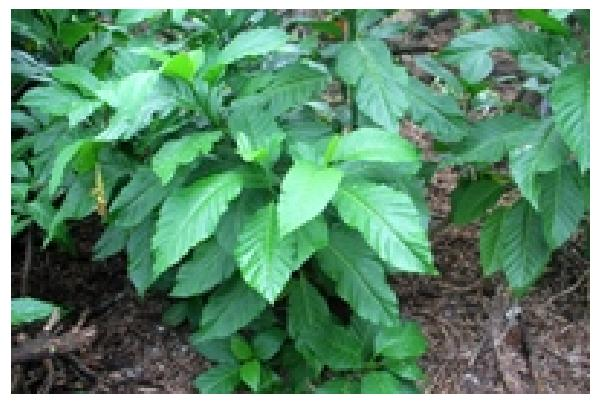

*Young pu'a vai.* Frank Pendleton/USFWS

**Table 2-1. Summary of Management Direction** 

| Key Themes                                | Objectives                                                                                                    | Management Direction                                                                                                                                                                                                                                                                                                                                           |  |
|-------------------------------------------|---------------------------------------------------------------------------------------------------------------|----------------------------------------------------------------------------------------------------------------------------------------------------------------------------------------------------------------------------------------------------------------------------------------------------------------------------------------------------------------|--|
| Lagoon Habitat                            | 1.1 Protect and<br>maintain the lagoon<br>habitats                                                            | Work with partners to continue collecting data on<br>bathymetry, water quality, and species diversity.<br>Develop and implement monitoring protocols for fish,<br>corals, other invertebrates, and marine pests to manage<br>populations as needed. Install remote sensing system<br>(e.g., camera) to monitor resources and document<br>illegal boat traffic. |  |
| Perimeter Reef                            | 2.1 Restore, protect,<br>and maintain the<br>perimeter reef                                                   | Monitor cyanobacterial cover which greatly increased<br>in response to the 1993 shipwreck, continue to remove<br>debris. Continue and expand reef monitoring program.                                                                                                                                                                                          |  |
| Ava                                       | 3.1 Protect and<br>maintain the ava                                                                           | Work with partners to continue collecting data on<br>water flow and bathymetry. Survey for predator and<br>prey fish species.                                                                                                                                                                                                                                  |  |
| Beach Strand                              | 4.1 Restore, protect,<br>and maintain the<br>beach strand                                                     | Restore tamole (Portulaca lutea). Prepare and<br>implement a monitoring plan and rapid response<br>program for terrestrial nonnative species.                                                                                                                                                                                                                  |  |
| Littoral Forest                           | 5.1 Restore, protect,<br>and maintain littoral<br>forest                                                      | Monitor seabirds and control niu (Cocos nucifera).<br>Restore native littoral forest and improve monitoring<br>of seabirds, vegetation, and pest species.                                                                                                                                                                                                      |  |
| Inventory,<br>Monitoring, and<br>Research | 6.1 Conduct high<br>priority inventory and<br>monitoring (survey)<br>activities and scientific<br>assessments | Work with partners to continue monitoring water<br>quality, bathymetry, species distribution, and habitat<br>associations. Improve the quality and quantity of<br>monitoring efforts by monitoring more often, creating<br>standardized protocols, and management databases.                                                                                   |  |
|                                           | 6.2 Conduct high<br>priority research                                                                         | Increase research as part of restoration efforts for<br>habitats and wildlife populations.                                                                                                                                                                                                                                                                     |  |
| Outreach,<br>Interpretation,<br>and       | 7.1 Enhance and<br>expand interpretation<br>and outreach                                                      | Maintain website. Participate in community events.<br>Develop more interpretive opportunities with our<br>partners.                                                                                                                                                                                                                                            |  |
| Environmental<br>Education (EE)           | 7.2 Develop EE                                                                                                | Develop an EE program.                                                                                                                                                                                                                                                                                                                                         |  |
| Cultural<br>Resources                     | 8.1 Protect and<br>perpetuate cultural<br>resources related to<br>Rose Atoll                                  | Work with partners to create information materials.<br>Inventory, restore, and maintain cultural resources and<br>work with local representatives to facilitate appropriate<br>cultural traditions related to Rose Atoll, and regularly<br>meet with OSA and Manu'a village councils                                                                           |  |

**Figure 2-1. Management direction.** 

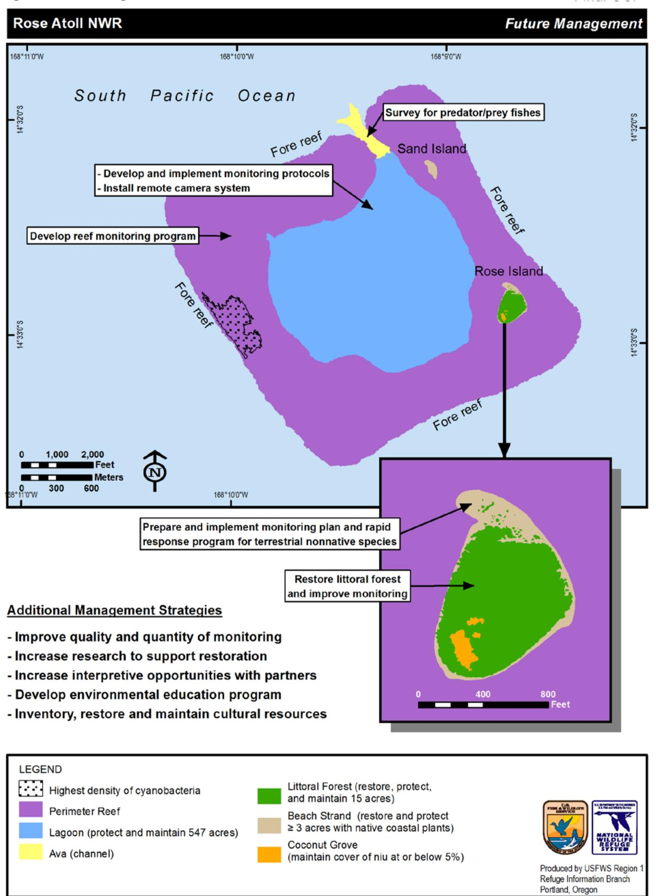

**The back sides of maps are blank to improve readability.**

# **2.3 Rose Atoll NWR Management**

Goals, objectives, and strategies are the unifying elements of successful refuge management. They identify and focus management priorities, resolve issues, and link to refuge purposes, Service policy, and the Refuge System mission. The goals for the Refuge are presented on the following pages followed by the objectives that pertain to it. Some objectives pertain to multiple goals and have simply been placed in the most appropriate spot. Similarly, some strategies pertain to multiple objectives. The goal order does not imply any priority in this CCP. Priority actions are identified in the staffing and funding analysis (see Appendix D).

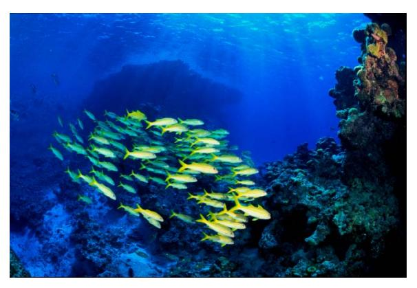

*Goatfish in lagoon.* Jim Maragos/USFWS

**Readers, please note the following:** Below each objective statement are the strategies that could be employed in order to accomplish the objectives. Symbols used in the following tables include:

- ~ Approximately;
- % Percent;
- > Greater than;
- < Less than;
- > Greater than or equal to; and
- < Less than or equal to.

# **2.3.1 Goal 1. Protect and maintain the lagoon habitats to meet the life-history needs of native species in this community.**

### **Objective 1.1 Protect and maintain the lagoon habitats.**

Protect and maintain lagoon reef habitats to provide the following attributes:

- 547 acres of shallow (<100 feet) water lagoon habitat to meet life-history requirements of all existing native members of the lagoon community. See Appendix A for species listings;
- Natural flow of marine water with quality measures of pH, salinity, temperature, nutrients, chlorophyll-*a*, that are appropriate to maintain native organisms in the lagoon community;
- Benthic bottom cover of sand interspersed with patch reefs, limestone blocks, and pinnacles providing a variety of substrates and rugose structure to provide habitat for lagoon species;
- Species diversity including algae, fish, turtles, and invertebrates including reef-building corals and reef-building crustose coralline algae;
- Lagoon free of debris; and
- Minimal human disturbance.

#### *Strategies Applied to Achieve Objective*

Work with partners to collect bathymetry data every 10 years in order to document changes in the lagoon, reef, or ava that could affect hydrography or habitat characteristics

Work with NOAA's CRED and other partners to collect oceanographic and water quality data in order to track changes that could affect the reef or wildlife

Work with partners to conduct Rapid Ecological Assessment (REA) to document habitat associations and species distribution, density, and diversity in marine habitats

Identify, prioritize, and implement restoration needs such as debris removal in lagoon habitats affected by anthropogenic impacts such as iron contamination from shipwrecks

Within 5 years, develop and implement monitoring protocols to track populations of focal lagoon species, including fish, corals, faisua, other invertebrates, and marine pests to determine abundance, density, and biomass of each at selected sites

Within 10 years, characterize nutrient budgets and dynamics at Rose Atoll and evaluate them relative to data from other similar reef sites to identify possible stressors and the positive effects of healthy seabird colonies adjacent to living reefs

Within 4 years, install remote sensing system (e.g., camera) to document boat traffic in the lagoon

*Rationale***:** In the middle of an ocean that is mostly over 10,000 feet deep, the lagoon provides 547 acres of shallow water habitat (< 100 feet deep). The reef protects this lagoon from the large swells of the open ocean, and light is able to penetrate to the bottom so corals and other sea life can thrive. While the deepest part of the lagoon has a simple sand bottom, sections on the edge have coral pinnacles which grow up close to the surface providing excellent habitat for faisua (*Tridacna maxima*). This shallow lagoon hosts a unique assemblage of fish and the largest population of faisua in American Samoa. These faisua are listed under the Convention on International Trade in Endangered Species (CITES) and have suffered serious depletion throughout their range due to over-harvesting. While it can provide larval fish recruitment for the other Samoan Islands, the small size of the lagoon and its limited fish and invertebrate community make it particularly susceptible to fishing pressure.

Monitoring fish and invertebrate abundance and biomass as well as abiotic factors is critical so we can assess whether the Service is maintaining BIDEH of the lagoon (see Goal 6). Monitoring is key to refining the metrics in the attributes (which currently reflect how little is known at present about this habitat). Ongoing restoration efforts emphasize removal of debris and monitoring the cyanobacteria bloom. A remote sensing system (e.g., camera) will document unauthorized boat traffic in the lagoon since such traffic could involve unregulated fishing or damage other Refuge resources.

## **2.3.2 Goal 2. Restore, protect, and maintain the perimeter crustose coralline algal reef to meet the life-history needs of native species in this community.**

### **Objective 2.1 Restore, protect, and maintain the perimeter crustose coralline algal reef.**

Restore, protect, and maintain the perimeter crustose coralline algal reef to support habitats and species with the following attributes:

- Healthy living reef dominated by CCA (*Porolithon* spp.) in a mosaic with corals forming a network of pools and raised areas that provide habitat for reeftop organisms;
- Geomorphic structure intact with elements of rugosity and a mosaic of microhabitats;
- Tuitui (boring sea urchins / *Echinometra, Echinostrephus* spp.) are present in at least 50% of available holes along the entire seaward margin of the perimeter reef;
- Holes that can be occupied by tuitui are present at a density of at least 1/m² in the "urchin zone" along the entire seaward margin of the perimeter reef;
- CCA are present in 80% of sampling sites and occupy >25% of total solid substratum;
- Cyanobacteria (*Lyngbya, Oscillotoria, Symploca, Calothrix* spp.) are rare (<5% total cover);
- The erect coralline alga *Jania adherens*, and the mat-forming green alga *Codium* spp., are rare (i.e., present in < 5% of sample sites);
- CCA characterized as eroded is not a prominent cover type and the proportion of this type does not fluctuate significantly between surveys;
- Variation in cover of CCA is primarily due to reef position (i.e., fore, mid, or inner reef),
- reflecting the wave energy and structural gradients across the reef flat; and
- 100% removal of manmade debris including fishing gear and metallic debris from shipwrecks.

#### *Strategies Applied to Achieve Objective*

Continue monitoring abundance and distribution of the cyanobacterial community

Within 5 years, work with partners to continue and expand the reef monitoring program, including rate of growth, elevation change, chemical composition and other variables related to reef growth and the atoll's ability to maintain itself in an anticipated environment of climate change and ocean acidification

Within 5 years, develop and implement monitoring protocols to track abundance and distribution of focal perimeter reef species including eels and urchins to determine abundance, density, and biomass of each at selected sites

Monitor benthic succession of the reef which was damaged due to the 1993 shipwreck

Within 2 years, establish systematic marine debris removal program

*Rationale***:** The reef crest of Rose Atoll has a pink hue because it is primarily composed of CCA. It varies between 1,000–3,000 feet wide and has a single ava connecting the inner lagoon with the open ocean. Waves can break hard over the reef crest, but during low tides it can be completely exposed. Several of the dominant species of algae on this reef (*Porolithon onkodes, P. craspedium,* and *P. gardineri*) are reefbuilding organisms that form a strong and resilient reef platform upon which all the other shallow water organisms depend. Two other cover types on the reef platform are a coralline red algae *Jania* spp. that

forms turfs rather than a crust, and areas of eroded and dead coralline algae that are bare reef matrixes without macroscopic algae present.

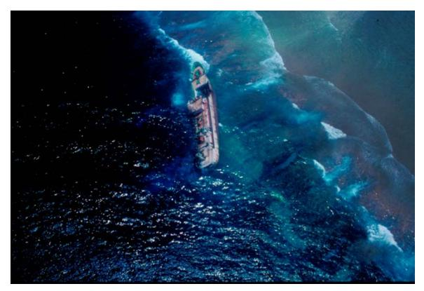

*Grounded vessel.* USFWS

In 1993 a fishing vessel ran aground on the southwest arm of the reef and broke apart. The vessel released roughly 100,000 gallons of fuel, 500 gallons of oil, and 2,500 pounds of ammonia into the environment. This killed a large area of CCA, and facilitated a population explosion of cyanobacteria and non-reef building algae. Major salvage operations began 6 weeks after the wreck and continued until 2007 due to the large tonnage of metal and the difficulty of working on a remote atoll. The ship rocking back and forth in the waves physically damaged the reef by grinding it away.

Because iron is a limiting nutrient at remote oceanic atoll locations, the increased iron levels led to a drastic increase in several species of cyanobacteria (*Symploca* spp., *Oscillatoria* spp., *Lyngbia* spp., and *Calothrix* spp.) and turf forming coralline algae near the shipwreck site. These species are not reef building organisms, and in places where they grow in thick mats, reef building corals and CCA cannot compete, so the reef can begin to erode. These cyanobacterial species initially formed a carpet, covering large sections of the reef near the wreck. It is vital to control them in order to maintain the reef.

Though the vast majority of the ship has been removed and the area is recovering, there are likely scattered pieces on the fore reef continuing to release iron into the water and promoting the growth of cyanobacteria. This, combined with the acute effects of the initial spill and the physical destruction of the reef by the ship, has seriously damaged the CCA near the shipwreck site and recovery efforts will be ongoing. It is vital to maintain the living coralline algae on these perimeter reefs because they form a growing platform that is resistant to physical and bio-erosion upon which all the shallow water and terrestrial organisms at the Refuge depend. The focal species of urchins serve as indicators of the state of the reef on areas least affected by the shipwreck and areas where subsequent urchin mortality resulted from spilled fuel and cyanobacterial overgrowth. Densities of peppered morays foraging on the reef flat also are an indication of the productivity and health of that habitat.

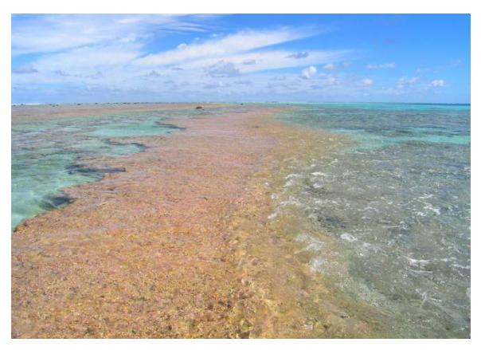

*Reef crest spillway.* Jim Maragos/USFWS

### **2.3.3 Goal 3. Protect and maintain the natural state of the ava (channel) to protect all other Refuge habitats and the hydrology of the lagoon.**

### **Objective 3.1 Protect and maintain the ava.**

Protect and maintain the natural state of the ava to support habitats and species with the following attributes:

- Unobstructed water flow between the lagoon and the ocean;
- Geomorphology that supports the hydrology of the atoll; and
- Species diversity and biomass of reef builders and reef dwellers, including large predator and prey fishes, remains high.

#### **Strategies Applied to Achieve Objective:**

Within 5 years, work with partners to monitor water flow rate and direction in the ava using archival pressure and flow rate instruments that can be downloaded at every visit in order to document any changes in flow through the ava

Work with partners to collect bathymetry data every 10 years in order to document changes in the lagoon, reef, or ava which could affect hydrography or habitat characteristics

Within 5 years, develop and implement monitoring protocol to track abundance and biomass of fish, including predator and prey fish species, around the opening of the ava to detect any changes in structure or function of this important geological feature for large predators in the Refuge

Work toward the inclusion of better warnings about the hazard to mariners of waters in and near the ava to prevent vessel groundings, and improve public communications about the Refuge being closed

*Rationale***:** The ava is a small, direct connection between the lagoon and the open ocean. As ocean water spills into the lagoon over the sides of the reef, it is released out through the ava. Though water usually flows out the ava, tides and waves occasionally create a situation where water flows into the lagoon. The elevation of the ava controls the water movement out of the lagoon, and plays a major role in the layering of lagoon water by temperature and salinity. Additionally, the shape and location of the ava is an important factor in the location and longevity of the islands on the atoll. Water movement inside the atoll creates currents that remove sand from some areas and deposit it in other areas. This sediment transport regime has created and maintained Rose and Sand Islands as islands dynamic in size and shape but in roughly the same location since Captain Rantzau mapped Rose Atoll in 1873 (Rodgers et al. 1993).

The ava is also the major passageway for fish and other organisms in and out of the lagoon, where species that require more shelter from rough water to breed or live may concentrate. Sharks and other predators congregate at the mouth of the ava waiting for prey. For these reasons, it is vital to protect and maintain the ava because it is fundamental to the functioning of many systems in Rose Atoll. Though there are currently no known threats to the ava and it is stable, given potential climate change impacts, constant alertness to changing conditions is important. As identified in Figure 1-2 in Chapter 1, the ava where this work will occur is the exterior boundary of the Refuge where the boundary line is extended between the extreme low waterlines on each side of the channel.

## **2.3.4 Goal 4. Restore, protect, and maintain the beach strand habitat to meet the life-history needs of native species in this community.**

### **Objective 4.1 Restore, protect, and maintain beach strand habitat for shorebirds, groundnesting seabirds, and nesting turtles.**

Restore, protect, and maintain >3 acres of the beach strand on Sand and Rose Islands to support habitats and species with the following attributes:

- Open ground maintained, with native plants (e.g., tamole) occupying the edge between beach strand and littoral forest;
- Free of terrestrial nonnative predators and other nonnative animals; and
- Free of pest and nonnative plants.

#### **Strategies Applied to Achieve Objective:**

Within 2 years, use GPS to map the perimeter of the islands at high and low tide on each visit to the Refuge and obtain any available satellite imagery for incorporation into GIS in order to document changes in island size, shape, and location

Within 15 years, restore and protect native coastal plants using best available information about the original indigenous ecosystem. Restore native tamole (*Portulaca lutea*; a native yellow purslane) population that was extirpated on Rose Atoll by introduced rats (*Rattus exulans*) but survived on an offshore coral block. Monitor survivorship, growth, and maturation of planted tamole

Within 10 years, investigate the ecological relationships between marine gastropods such as turban shells (*Turbo* spp.) and land hermit crabs (*Coenobita perlatus* and *C. brevimanus*). Evaluate factors affecting crab populations, including observed reduction in availability of shells to crabs at the Refuge and what management may improve mollusk shell availability to the *Coenobita* spp. which are important scavengers and herbivores on both islands

Within 5 years, work with universities and other partners to evaluate the geomorphology, hydrology, and sediment budget of Rose Atoll to understand the processes that have maintained the islands as dynamic units

Within 6 months, revise existing biosecurity measures to comprehensively address prevention of introducing nonnative pest species to the atoll

Within 2 years, prepare and implement a monitoring plan and rapid response program for terrestrial nonnative species and respond immediately if detected

Within 2 years, working with NOAA/NMFS, DMWR, and other partners, develop and implement monitoring protocol to track turtle abundance and movements using field counts, tagging, remote sensing (e.g., camera), and satellite telemetry

Within 5 years, working with NOAA/NMFS and other partners, develop a cooperative management plan with Fiji to protect shared stocks of threatened green turtles that migrate between Rose Atoll (to nest) and Fiji (to feed). Meet with appropriate Fiji managers as needed

*Rationale***:** Beach strand is a very dynamic habitat that is constantly being reshaped by the wind, waves, currents, and tides. Likely this will be exacerbated by climate change with more frequent storms, changes in sea level, and coral calcification. All of Sand Island can be classified as beach strand, as can the sandy section of Rose Island between the water and the vegetation. During a storm, beach strand habitat can change dramatically, but when conditions are right, it reforms quickly and is stable in the long run. This is the case with the beach strand habitats of the Refuge. After any given storm the islands may change size and shape, but since the area was mapped by Rantzau in 1873 (Rodgers et al. 1993) the location and total area of the islands has remained surprisingly stable.

Because the Refuge provides beach strand habitat free of predators since the 1993 eradication of Polynesian rats (*Rattus exulans*) and is far from human populations, it is ideal foraging habitat for wintering shorebirds and nesting habitat for seabirds and i'a sa, and possibly hawksbill turtles. The beach strand is used extensively by nesting gogosina (sooty terns), gogo (brown noddies), fua'o (brown boobies), and i'a sa (green turtles). The Refuge provides the only known rat-free area in American Samoa for several of these ground-nesting species. Part of enhancing this habitat for these birds and fulfilling BIDEH is restoring previously extirpated plants such as the tamole, a rare plant that used to exist on the beach strand habitat.

Ghost crabs (*Ocypoda* spp.) forage and dig their burrows in the beach strand as well. The land hermit crabs *Coenobita perlatus* and *C. brevimanus* are numerically and ecologically important in the terrestrial ecosystem of Rose Atoll, serving as the dominant herbivores and scavengers of the system. Densities of these two species have decreased markedly since 1991 and biologists visiting the Refuge have noticed a change in the condition and type of the marine gastropod shells that the crabs are using for their homes. There seem to be fewer of the preferred shells in the genus *Turbo* and those that are being used have more damage and wear. Substitutes such as the partridge tun (*Tonna perdix*) shells are more fragile and presumably offer less protection.

Tagging data demonstrates that Rose Atoll and Fiji share a common stock of i'a sa. After nesting at Rose Atoll, the turtles tagged in the 1990s migrated directly to Fiji to feed on extensive seagrass beds there (there is little seagrass in American Samoa). A comprehensive recovery plan requires protection at both its nesting and feeding destinations of this species. While turtle harvesting is prohibited in Fiji, enforcement there is difficult due to the hundreds of small islands and remote villages, thus poaching is considered a serious threat. I'a sa are a threatened species with a very small population size at Rose Atoll (est. 24-36 nesting females).

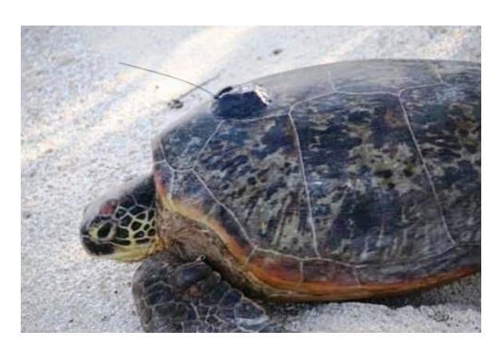

*Satellite tagged i'a sa.* Frank Pendleton/USFWS

In order to maintain the beach strand as a naturally occurring dynamic habitat which benefits many species, we will control any plant or animal pest species, and monitor the size and shape of the islands to determine if they are maintaining themselves under changing climatic conditions.

# **2.3.5 Goal 5. Restore, protect, and maintain littoral forest to meet the lifehistory needs of native species in this community including plants, seabirds, shorebirds, landbirds, waterbirds, reptiles, and land crabs.**

### **Objective 5.1 Restore, protect, and maintain littoral forest.**

Restore, protect, and maintain 15 acres of the littoral forest with the following attributes:

- Forest species composition includes a mixture of pu'a vai (*Pisonia grandis*), taukanave (*Cordia subcordata*), tausuni (*Tournefortia argentea*), fotulona (*Hernandia nymphaeifolia*), talie (*Terminalia samoensis*), fao (*Neisosperma oppositifolium*), fau (*Hibiscus tiliaceus*), and all other indigenous species that recruit through natural means and resemble comparable islands in the region that have not been previously affected by rats;
- <5% introduced niu cover of total vegetated area;
- Free of introduced terrestrial nonnative predators and other nonnative animals; and
- Free of pest and nonnative plants.

#### *Strategies Applied to Achieve Objective*

Within 2 years, prepare a monitoring and rapid response program for terrestrial nonnative species and respond immediately if detected

Maintain cover of introduced niu at or below 5% using mechanical removal or direct application of herbicides as appropriate

Within 2 years, review existing vegetation community distribution data and develop GIS database of terrestrial and marine habitats and update them regularly

Within 3 years and working with experts, prepare a restoration design that identifies which desired species will require active propagation and outplanting and which will recruit naturally now that rat herbivory has been eliminated. Part of this strategy will be to work with universities and other partners to investigate composition and structure of terrestrial communities on Rose Island prior to the introduction of rats to inform ecological restoration activities

Within 4 years, review available vegetation data and develop and implement a monitoring protocol to track changes in numbers, cover, and basal area of different species

Within 5 years, implement restoration design and begin outplanting vegetation if required

Within 3 years, develop and implement a monitoring protocol to track seabird abundance, nesting rates, and feeding territories. Include remote sensing (e.g., cameras) observations to improve future monitoring efforts

Within 10 years, eradicate the scale insect (*Pulvinaria urbicola*) and any other nonnative insects, specifically focusing on eradicating introduced ant species that facilitate scale growth and spread

*Rationale***:** The tropical wet littoral forest ecotype has become very rare in the Pacific Islands due to the value of mesic coastal sites for human habitation. There are no records of the species composition of the forest on Rose Island prior to the introduction of Polynesian rats. When first described, Rose Island had a native plant community made up of only pu'a vai, tamole, and ufi'atuli (Mayor 1921, Setchell 1924, Satchet 1954) and the introduced niu. Presently, the forest is dominated by tausuni but this is a recent

change in forest community. Tausuni was not recorded on Rose Island until 1970 (Swerdloff and Needham 1970).

Tausuni is indigenous to the Pacific and provides habitat for tree-nesting seabirds. Since rats were eradicated at the Refuge in 1993, the plant community has been released from this source of seed and seedling herbivory so propagules that wash ashore are now able to survive, increasing the total number of species present to at least eight. Factors leading to the decline of the pu'a vai forest and subsequent dominance of tausuni include hurricane damage from six significant storms since 1987, and the introduction of the scale insect. In March 2011, there were only three very unhealthy large pu'a vai trees remaining on Rose Island but a number of seedlings and saplings survive.

The littoral forest on Rose Island provides nesting habitat for the majority of seabird species in the Refuge as well as the Pacific reef heron. Various seabirds nest in different parts of the forest with some nesting in the trees and others nesting on the ground. Niu have been planted on Rose Island on several occasions (Satchet 1954). While early attempts to establish niu failed (perhaps due to the presence of the rat), there is presently a thriving population that is spreading rapidly. If no efforts are made to control the niu, it is very possible they will become the dominant vegetation on Rose Island. This would be highly detrimental to seabird populations since the straight trunks of nui do not provide places to build nests, and falling coconuts can crush birds. While eradication of nui is a possibility, it is desirable to maintain a small nui grove due to their importance in Samoan culture.

Invasive ants, including *Pheidole megacephala* and *Tetramorium bicarinatum*, are severely disrupting the ecology of the atoll, including facilitating an outbreak of *Pulvinaria urbicola*, an invasive scale insect responsible for killing pu'a vai trees. These aggressive, predatory ants are also likely reducing numbers of arthropods native to the atoll. Once ants are removed, natural enemies of the scale, such as predaceous beetles and parasitic wasps that may now be prevented from attacking the scale by the ants, may increase in number and reduce scale abundances to a level better tolerated by pu'a vai. Pu'a vai trees are declining throughout their range, and the eradication of ants will facilitate the removal of *Pulvinaria* scale and help in the recovery of the pu'a vai forest.

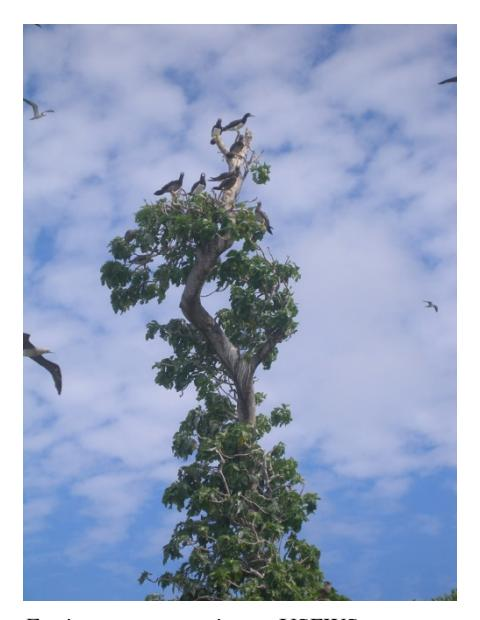

*Fua'o nesting in pu'a vai.* USFWS

# **2.3.6 Goal 6. Gather scientific information (inventories, monitoring, assessments, and research) to support adaptive management decisions under objectives for Goals 1-5.**

### **Objective 6.1 Conduct high priority inventory and monitoring (survey) activities and scientific assessments.**

Conduct inventory and monitoring activities that evaluate resource management activities to facilitate adaptive management. These surveys contribute to the enhancement, protection, preservation, and management of wildlife populations and their habitats on and off Refuge lands. Specifically, they can be used to determine if we are meeting resource management objectives identified under Goals 1-5. These surveys have the following attributes:

- Data collection techniques will have zero to minimal animal mortality or disturbance and zero to minimal habitat destruction;
- Collect minimum number of samples (i.e., water, soils, vegetative litter, plants, macroinvertebrates, vertebrates) to meet statistical analysis requirements for identification and/or experimentation in order to minimize long-term or cumulative impacts;
- Studies will be designed to statistically detect early stages of habitat changes that would minimize long-term or cumulative impacts;
- Use proper cleaning of investigator equipment and clothing as well as quarantine methods, where necessary, to minimize the potential spread or introduction of pest species;
- Projects will adhere to scientifically defensible protocols for data collection, where available and applicable; and
- Annual and cumulative reports will be completed for all inventory, monitoring, and research activities to document results and provide comprehensive analyses.

#### *Priority inventory and monitoring activities*

Finalize Memorandum of Understanding (MOU) with DMWR to coordinate data collection and management activities at the Refuge

Work with partners to deploy an Ecological Acoustic Recorder (EAR) in the ava to collect biological data that may improve monitoring of behavior and abundance of marine organisms

Within 5 years, begin to monitor climate change variables including sea level, temperature (air/water/substrate), water quality (pH, conductivity, dissolved oxygen, nitrogen, photosynthetically available light (PAR), phosphorus, iron), the frequency and duration of extreme storm events, and biological responses (phenological, developmental, physiological)

Work with partners to monitor status and trends of focal communities (hard corals, algae), including the incidence and severity of coral and algal disease and bleaching

Within 5 years, monitor the growth and survival rate of coral colonies at different depths

Work with partners to conduct REA to document habitat associations and species distribution, density, and diversity in marine habitats

Work with NOAA's CRED and other partners to collect oceanographic and water quality data in order to track changes that could affect the reef or wildlife

#### *Priority inventory and monitoring activities (continued)*

Within 5 years, develop and implement monitoring protocols to track populations of focal lagoon species, including fish, corals, faisua, other invertebrates, and marine pests to determine abundance, density, and biomass of each at selected sites

Work with partners to collect bathymetry data every 10 years in order to document changes in the lagoon, reef, or ava which could affect hydrography or habitat characteristics

Within 5 years, develop and implement monitoring protocols to track abundance and distribution of focal perimeter reef species including eels and urchins to determine abundance, density, and biomass of each at selected sites

Continue monitoring abundance and distribution of the cyanobacterial community which became dominant on a section of the southwest arm of the atoll following the 1993 shipwreck

Monitor benthic succession of the reef which was damaged due to the 1993 shipwreck

Within 5 years, work with partners to expand the reef monitoring program, including rate of growth, elevation change, chemical composition, and other variables related to reef growth and the atoll's ability to maintain itself in an anticipated environment of climate change and ocean acidification

Within 5 years, work with partners to monitor water flow rate and direction in the ava using archival pressure and flow rate instruments that can be downloaded at every visit in order to document any changes in flow through the ava

Within 5 years, develop and implement monitoring protocol to track abundance and biomass of fish, including predator and prey fish species, around the opening of the ava to detect any changes in structure or function of this important geological feature for large predators in the Refuge

Conduct study to determine if aquifer exists at Rose Atoll. If found, within 5 years begin monitoring the lens to document extent and changes

Within 2 years, working with NOAA/NMFS and other partners, develop and implement monitoring protocol to track turtle abundance and movements using field counts, tagging, remote sensing, and satellite telemetry

Within 2 years, use GPS to map the perimeter of the islands at high and low tide on each visit to the Refuge and obtain any available satellite imagery for incorporation into GIS in order to document changes in island size, shape, and location

Monitor survivorship, growth, and maturation of outplanted tamole

Within 2 years, prepare and implement a monitoring plan and rapid response program for terrestrial nonnative species and respond immediately if detected

Within 2 years, review existing vegetation community distribution data and develop GIS database of terrestrial and marine habitats and update them regularly

Within 4 years, review available vegetation data and develop and implement a monitoring protocol to track changes in numbers, cover, and basal area of different species

Within 3 years, develop and implement a monitoring protocol to track seabird abundance, nesting rates, and feeding territories. Include remote sensing (e.g., camera) observations to improve future monitoring efforts

Install weather station for long-term monitoring of weather data

*Rationale***:** The Administration Act requires us to "monitor the status and trends of fish, wildlife, and plants in each refuge." Surveys will be used to track populations and abiotic variables in order to assess progress toward achieving refuge management objectives (under Goals 1-5 in this CCP) derived from the Refuge System mission, refuge purposes, and maintenance of BIDEH (601 FW 3). Determining resource status and evaluating progress toward achieving objectives is essential to implementing adaptive management on DOI lands and waters as required by policy (522 DM 1). Specifically, results of surveys will be used to refine management strategies over time in order to achieve resource objectives. Surveys will provide the best available scientific information to promote a transparent decision-making process for resource management on refuge lands and waters.

Monitoring data will help us track the effects of climate change and ocean acidification on the Refuge. As a living reef, built and maintained by CCA, corals, and other calcifying organisms, Rose Atoll will be particularly susceptible to sea level rise and ocean acidification. As the sea rises, the reef will need to grow faster to maintain the same elevation in relation to sea level. At the same time, the concentration of carbonate ions (needed by calcifying organisms to build the reef) will be declining due to ocean acidification. Coral bleaching will also become more common as the ocean warms. Monitoring the growth of the reef and abiotic factors will help us understand what is happening to the reef and predict and plan for future conditions.

In accordance with DOI policy for implementing adaptive management on refuge lands (522 DM 1), appropriate and applicable environmental assessments are necessary to determine resource status, promote learning, and evaluate progress toward achieving objectives whenever using adaptive management. These assessments will provide fundamental information about biotic (e.g., vegetation data layer) as well as abiotic processes and conditions (e.g., soils, topography) that are necessary to ensure that implementation of on-the-ground resource management achieve resource management objectives identified under Goals 1-5.

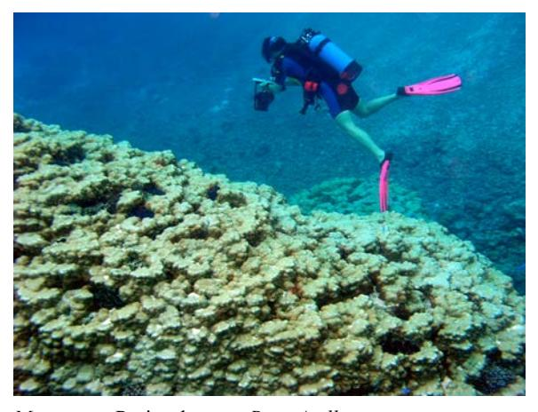

*Monitoring* Porites lutea *at Rose Atoll.*  Jim Maragos/USFWS

### **Objective 6.2 Facilitate high priority research at the Refuge to directly support management objectives and guide management decisions.**

Facilitate research projects that provide the best science for habitat and wildlife management on and off the Refuge. Scientific findings gained through these projects will expand knowledge regarding lifehistory needs of species and species groups as well as identify or refine habitat and wildlife management actions. These research projects have the following attributes:

- Focus wildlife population research on assessments of species-habitat relationships. Develop models that predict wildlife response to management;
- Design and conduct issue-driven (problem-driven) research unlikely to be reliably addressed using long-term monitoring;
- Promote Refuge research and science priorities within the broader scientific community. Ensure that cooperative research focuses on meeting information needs identified in biological goals and objectives;
- Assign a high priority to the collection of information that will help managers predict, understand, and address the effects of climate change and ocean acidification on fish, wildlife, and their habitats at all spatial scales in the Refuge;
- Data collection techniques will have zero to minimal animal mortality or disturbance and zero to minimal habitat destruction;
- Collect minimum number of samples (i.e., water, soils, vegetative litter, plants, macroinvertebrates, vertebrates) to meet statistical analysis requirements for identification and/or experimentation in order to minimize long-term or cumulative impacts;
- Annual and cumulative reports will be completed for all inventory, monitoring, and research activities to document results and provide comprehensive analyses.
- Follow quarantine and cleaning protocols to avoid or minimize the potential spread or introduction of nonnative and pest species; and
- Often result in peer-reviewed articles in scientific journals or symposium publications.

#### *Priority research needed*

Characterize nutrient budgets and dynamics at Rose Atoll and evaluate them relative to data from other similar reef sites to identify possible stressors and the positive effects of healthy seabird colonies adjacent to living reefs

Evaluate the geomorphology, hydrology, and sediment budget of Rose Atoll to understand the processes that have maintained the islands as dynamic units

Investigate the ecological relationships between marine gastropods such as turban shells (*Turbo* spp.) and land hermit crabs (*Coenobita perlatus* and *C. brevimanus*). Evaluate factors affecting crab populations, including observed reduction in availability of shells to crabs at the Refuge and what management may improve mollusk shell availability to the *Coenobita* spp., which are important scavengers and herbivores on both islands

Investigate composition and structure of terrestrial communities on Rose Island prior to the introduction of rats to inform ecological restoration activities

Investigate food habits of seabirds breeding at Rose Atoll using stable isotopes and stomach samples

Correlate reproductive performance indicators and breeding chronology variation in Rose seabird populations with oceanographic conditions and location of migratory fish schools relative to the atoll *Rationale***:** Rose Atoll is unique in the Samoan Archipelago in being a coralline algal atoll. Research projects on Refuge lands and waters will address a wide range of natural resource questions. Examples of research projects include habitat use and life-history requirements for particular species, practical methods for habitat management and restoration, extent and severity of environmental

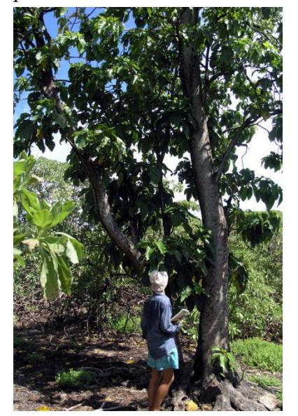

*Pu'a vai research.* USFWS

contaminants, techniques to control or eradicate pest species, effects of climate change, and ocean acidification on environmental conditions and associated habitat and wildlife response, identification and analyses of paleontological specimens, wilderness character, and modeling of wildlife populations. Projects may be species-specific, Refuge-specific, or evaluate the relative contribution of the Refuge to larger landscape (e.g., archipelago, regional, Pacific, global) issues and trends.

As with monitoring, results of research projects will expand the best available scientific information and potentially reduce uncertainties to promote transparent decision-making processes for resource management over time on the Refuge and other protected areas. In combination with results of surveys, research will promote adaptive management on the Refuge. Scientific publications resulting from research on the Refuge will help increase the understanding of the Refuge System for resource conservation and management in the larger science realm.

# **2.3.7 Goal 7. Strengthen resource conservation and the public's shared stewardship of the ecological, geologic, and cultural richness of the Refuge by providing outreach, interpretation, and environmental education opportunities.**

### **Objective 7.1 Enhance and expand interpretation and outreach.**

Provide high quality interpretation and outreach that supports a knowledgeable public who are aware of the conservation provided by the Refuge. The public is informed about the Refuge's complex ecosystem, cultural connections, geologic history, and management challenges by focusing on "bringing the Refuge to the people, instead of the people to the Refuge." Interpretation and outreach associated with the Refuge will have the following attributes:

- People are exposed to at least one of the four key interpretive themes regarding Ecology; Geology; Samoan Culture; and/or the NWRS;
- Products and messages engage a diverse audience from American Samoa and across the United States and Oceania;
- Outreach and interpretation use standard media as well as social media and evolving technologies; and
- Supports the Service's "Connecting People with Nature" emphasis.

#### *Strategies Applied to Achieve Objective*

Install minimal signage on Rose Island to inform people of Refuge boundary and regulations

Maintain Refuge website and update at least annually with current information such as species lists, interactive tools, management updates, news releases, science reports, etc.

Develop brochures, Website, and utilize social media and other outreach tools specifically designed to communicate Refuge protection and safety issues and make these available to mariners

Develop outreach messages using social media such as blogs or interpretive videos online to "bring the Refuge to the people"

Develop virtual fieldtrip to Rose Atoll with link on Website by 2016

Explore opportunities and community interest for supporting the development of a Refuge "Friends" group to help with interpretation, outreach, and other Refuge needs

Develop a Refuge volunteer program to provide local and national stewardship opportunities and assist in Refuge management activities

Work with partners (especially within the Manu'a Islands) to develop multi-lingual interpretive displays and print materials to provide outreach messages at visitor centers as well as mobile displays for traveling exhibits

Participate in community meetings and local events to educate people about the Refuge, especially within the Manu'a Islands

Enhance law enforcement through the production of interpretive brochures for distribution in American Samoa and to the yachting community

Collaborate with the USCG and NOAA for law enforcement

Work with partners to deploy an EAR in the ava to collect data on boat entry into the lagoon

*Rationale***:** The fundamental purpose of Service outreach is to build understanding, trust, and support from a variety of groups by helping them understand what the Service does and why we do it. Because the Refuge is closed to the general public, our interpretation and outreach program will be based on "bringing the Refuge to the people," instead of bringing the people to the Refuge. We will work with our partners to establish Refuge displays for visitor centers in American Samoa, and develop outreach materials and social media capacity to provide other interpretive opportunities for people in American Samoa and around the world. Virtual field trips are alternatives to more costly real-world field trips. In addition to being inexpensive in consideration with the number of students who can be reached, they are engaging to students because they enable students to make connections between themselves and wide-ranging environments they can explore on-line.

The Service did not have staff stationed in American Samoa prior to 2011, so outreach messages describing how Rose Atoll NWR fits in the Refuge System need to be developed for the local communities. Good communication with elected officials is essential for the Service to be effective and responsive to the American Samoa public. Conservation groups have a great interest in resource management, and their support can influence others. Businesses can be a source of funding or support through partnerships. Other Federal agencies, as well as American Samoa and village governments, can help give momentum to the Service's outreach initiatives, and their support can enhance a project's likelihood of success.

**Objective 7.2 Develop environmental education products and programs to perpetuate and enhance knowledge and appreciation of wildlife, habitats, and their importance to American Samoa culture and the world.** 

Provide a high quality Rose Atoll EE program with the following attributes:

- Focuses on students in American Samoa from pre-K through college;
- Aligns with the American Samoa Department Of Education Learning Management System;
- Involves local teachers to ensure program is relevant to local students and curricula;
- Incorporates measurable learning objectives and uses audience-appropriate curricula; and
- Supports and complements the Service's mission, and the Refuge's purposes and goals.

#### *Strategies Applied to Achieve Objective*

Create Rose Atoll EE materials such as DVDs and posters for use with school groups

Work with partners to develop EE curricula and classroom materials that introduce students to American Samoa wildlife, protected areas, and conservation of natural resources, especially in relation to effects from man-made climate change

Partner with schools and universities to conduct surveys and/or relevant research

Explore appropriate on-site EE opportunities (<once every 3 years) to allow a small group of teachers and students (<10 people) to visit the Refuge for specific EE purposes developed with the Refuge's EE program

Develop a brief, picture-oriented presentation describing the ecology of the Refuge and present this to three American Samoa schools each year

Develop a student intern program with the Refuge office to introduce students to protected areas and wildlife management

*Rationale*: American Samoa is a rapidly changing society which is in the process of enhancing EE in the schools' curriculum. This creates an excellent opportunity for the Service to play a role in helping to develop EE programs. As a small Refuge with a small staff, working with our partners will be vital to the success of any EE program. Because we manage a coral and crustose coralline algal atoll in American Samoa, the Service is in a position to educate people about the effects of climate change and ocean acidification.

In the past, the Service has had a very limited EE program. There have been rare trips to the Refuge for teachers and students, but these trips are very expensive, can only be done with strict biological restrictions in place to avoid disturbance, and only reach a handful of students. We will be able to reach many more students offsite through outdoor programs, classroom presentations and activities, and internship programs. We can include people outside of American Samoa with an improved presence on the Internet and the development of classroom materials for downloading.

### **2.3.8 Goal 8. Identify, protect, preserve, and interpret the Refuge's Samoan cultural resources and facilitate, where appropriate, cultural practices.**

### **Objective 8.1 Encourage and facilitate identification, protection, and perpetuation of Samoan cultural resources, practices, and traditions related to Rose Atoll.**

Increase identification, monitoring, and protection of cultural resources, while increasing staff and public support and appreciation. These efforts will focus on accomplishing the following:

- Expand knowledge of the Samoan cultural resources related to Refuge; and
- Facilitate Refuge-appropriate cultural practices.

#### *Strategies Applied to Achieve Objective*

Research the history of Samoan names for Rose Atoll and consider changing Refuge name accordingly

Work with the American Samoa Historical Preservation Office to conduct an archaeological survey at Rose Atoll

Consult with the OSA and local villagers to understand and perpetuate Refuge-appropriate traditional cultural practices related to Rose Atoll

Work with partners to collect and compile oral histories from village leaders

Work with partners to create bilingual education materials such as videos, reports, and pamphlets regarding cultural uses and the oral history of Rose Atoll

Restore the cement monument erected on Rose Island during the Governor's 1920 visit

*Rationale***:** During public meetings held in 2009, people expressed the desire that the oral history and cultural resources and traditions of Rose Atoll be preserved. There was also the desire that the Samoan people be allowed some access to the Refuge for cultural practices. The Service recognizes that observing and perpetuating cultural practices and resources is an essential part of 3000 years of a unique Samoan heritage and we will work closely with the OSA and villages to protect these resources and manage the Refuge consistent with *fa'asamoa* (the Samoan way).

# **Chapter 3. Physical Environment**

# **3.1 Climate**

The climate of Rose Atoll can be generalized as tropical, with moderate breezes and moderate rainfall. Because Rose Atoll is a small atoll with two tiny islands only a few feet above sea level, the climate there is similar to the open ocean. The ocean temperature in American Samoa averages near 82˚F and may vary by 2–3 degrees seasonally. Since both islands are at 14 degrees south latitude, temperature data are comparable between the islands. The constant ocean temperature has a strong moderating effect on the climate. Data must be generalized from Tutuila Island 180 miles away because there is not a climate monitoring station at Rose Atoll.

While the climate of American Samoa is warm and wet year-round, there is some seasonal variability. The wetter, warmer season is October–May and the cooler, drier season is June– September. In the warm season air temperature averages 83˚F, and rainfall averages about 13 inches a month at the airport in Tutuila. In the cool season, air temperature averages around 81˚F, and rainfall averages about 6 inches a month. Due to a lack of any real topography, Rose Atoll receives substantially less rain than Tutuila, but the precipitation is enough to support the littoral forest (Wegmann and Holzwarth 2006).

Aside from being the drier and cooler season, June–September is also the trade wind season with winds blowing out of the southeast. Hurricanes are more common November–April when the ocean is slightly warmer (Craig 2009). There have been six hurricanes in Samoa between 1980–2011, some of which have caused forest and reef damage at Rose Atoll.

## **3.1.1 Climate Change**

Climate change can be defined as a change in the state of the climate characterized by changes in the mean or the variability of its properties, persisting for an extended period, typically decades or longer (IPCC 2007). Climate variables that may change include temperature, water vapor, sea level,

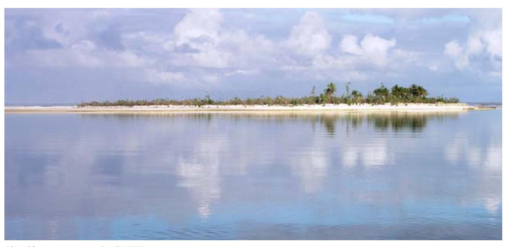

*Placid lagoon.* Greg Sanders/USFWS

precipitation, etc. Such changes are part of the natural system, but can also be affected by human activities, particularly in the form of emissions of greenhouse gases (GHG) such as carbon dioxide (CO2). The Intergovernmental Panel on Climate Change (IPCC) is a scientific intergovernmental body organized by the World Meteorological Organization and the United Nations Environment Programme to assess the causes, impacts, and response strategies to changes in climatic conditions. According to the Fourth Assessment Report by the IPCC, global temperatures on the Earth's surface have increased by 1.33°F over the last 100 years. This warming trend has accelerated within the last 50 years, increasing by 0.23°F each decade. Global ocean temperatures to a depth of almost 2*,*300 feet have also increased, rising by 0.18°F between 1961 and 2003 (IPCC 2007).

Global climate models offer a variety of projections based on different emission scenarios. The U.S. Global Change Research Program suggests that a continuing increase in GHG emissions (CO2, methane, and nitrous oxides of primary concern) could double atmospheric concentrations of CO2 by 2060 and subsequently increase temperatures by as much as 2–6.5°F over the next century. Sea level rise (SLR) is expected to accelerate by 2–5 times the current rate due to both ocean thermal expansion and the melting of glaciers and polar ice caps. Recent modeling projects sea level rising by 0.59-1.93 feet by the end of the 21st century. These changes may lead to more severe weather, shifts in ocean circulation (currents, upwelling), as well as adverse impacts to economies and human health. The extent and ultimate impact these changes will have on Earth's environment remains under considerable debate (OPIC 2000, Buddemeier et al. 2004, IPCC 2007).

### **3.1.2 Climate Change at Rose Atoll.**

Small island groups are particularly vulnerable to climate change. The following characteristics contribute to this vulnerability: small emergent land area compared to the large expanses of surrounding ocean; limited natural resources; high susceptibility to natural disasters; and inadequate funds to mitigate impacts (IPCC 2001). Thus, Rose Atoll is considered to have a limited capacity to adapt to future climate changes. Other stressors brought on by increased CO2 will be increasing at the same time, and some of them may work synergistically (Anlauf et al. 2010, Hoeke et al. 2011). Sea-level rise, higher ocean temperatures, ocean acidification, and a likely increase in hurricane strength will all affect the reef and organisms of Rose Atoll and some factors will intensify others.

**Sea Level Rise.** According to the IPCC, the oceans are now absorbing more than 80% of the heat added to the Earth's climate system. Since 1961, this absorption has caused average global ocean temperatures to increase and seawater to expand. Thermal expansion of the sea is the primary cause of global sea level changes. Melting ice-sheets, ice caps, and alpine glaciers also influence ocean levels. Worldwide, sea level changes have occurred *18-foot storm surge effects on Rose Island.* 

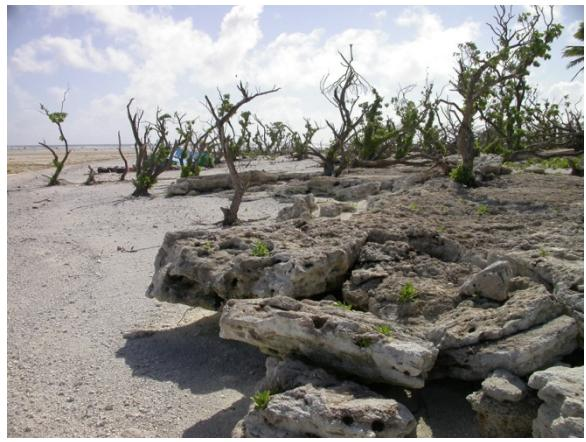

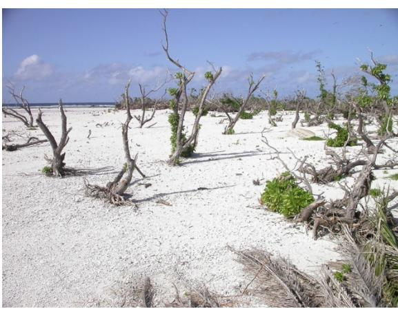

Holly Freifeld/USFWS

historically on a small scale; however, scientific evidence suggests that the current, accelerated rate of global change began between the mid*-*1800s and 1900s. Similarly, sea levels in the Pacific have regularly changed over the centuries due to variations in solar radiation. Since 1800, sea levels in the Pacific region have been rising. During the last century, these levels rose about 6 inches and this is likely to rapidly increase in the next century (Noye and Grzechnik 2001, GAO 2007).

Near Pacific Island ecosystems, SLR is influenced by the rate and extent of global SLR, as well as changes in episodic events, such as the El Niño Southern Oscillation (ENSO, which results in light trade winds in the western Pacific and drier conditions) and the varying strength of trade winds over multi-year timespans. Furthermore, it is important to note that shoreline sea levels are historically and currently influenced by isostatic tectonic changes as the islands move with the Pacific Plate, which are not due to global changes in sea level. Thus, sea level change in the Pacific is highly variable due to geologic uplift (Michener et al. 1997, Carter et al. 2001).

Despite this variability, SLR will have an impact on Rose Atoll, specifically to the reef height that currently protects the islands and lagoon habitats. The rate of growth of corals and CCA (i.e., calcification) must meet or exceed the rate of erosion and SLR to maintain current conditions. Biological accretion of the reef will also be affected by increased temperatures, changes in seawater chemistry, and increases in destructive weather events. For Samoa, monthly averages of the historical tide gauge, satellite (since 1993), and gridded sea-level (since 1950) data agree well after 1993 and indicate interannual variability in sea levels of about 7.9 inches (estimated 5–95% range) after removal of the seasonal cycle. The SLR near Samoa measured by satellite altimeters since 1993 is about 0.16 inches per year, slightly larger than the global average of 0.13 ± 0.016 inches per year. This rise is partly linked to a pattern related to climate variability from year to year and decade to decade (PCCSP 2011). Increased water depths on reef flats may allow for faster upward growth of the reef flat (Brown et al. 2011) but other factors such as ocean acidification may be slowing reef growth at the same time. It is not yet clear whether reefs will continue to produce enough sand to add to both islands to maintain them above sea level.

**Ocean Temperatures.** Many corals are living near the limit of their thermal tolerance, and increasing sea-surface temperatures are leading to more frequent cases of coral bleaching. Coral bleaching is a condition where corals expel the tiny zooxanthellae (microscopic plants) that live inside the coral tissues and provide food for the coral through photosynthesis. The zooxanthellae give coral their colors. When corals expel their zooxanthellae in high temperature conditions, the coral appears bleached white because we see through the translucent live coral tissue to the skeleton. If temperatures rise just slightly above the bleaching threshold, corals can recover, but higher temperatures typically cause coral mortality. The longer the corals are exposed to higher temperatures, the less likely they are to recover. With warming oceans, corals will suffer more frequent, more severe, and longer duration bleaching events. More frequent and severe coral die offs are expected to cause coral populations to decline because they will have less time to recover between these stress events and while under this stress, their reproductive capacity is diminished (Hoeke et al. 2011, Buddemeier et al. 2004, Hoegh-Guldberg et al. 2007).

Different corals have different tolerances to sea-surface temperature (Fabricius et al. 2011), so bleaching will likely lead to changes in the coral communities. American Samoa is already experiencing this with mass bleaching events in 1994, 2002, and 2003 (Craig 2009) and annual summer bleaching in back reef pools of Tutuila (Fenner and Heron 2009). By mid-century, coral reefs are predicted to be shifting rapidly from coral-dominated to algae-dominated (Hoeke et al. 2011, Buddemeier et al. 2004, Hoegh-Guldberg et al. 2007).

**Storm Frequency and Intensity**. Most climate projections suggest that more intense wind speeds and precipitation amounts will accompany tropical hurricanes and increased tropical sea surface temperatures in the next 50 years. The intensity of tropical hurricanes is likely to increase by 10–20% in the Pacific region when atmospheric levels of CO2 reach double preindustrial levels (McCarthy et al. 2001). One model projects a doubling of the frequency of 4 inches per day rainfall events and a 15–18% increase in rainfall intensity over large areas of the Pacific. While powerful storms can move through deep ocean without leaving much evidence, these hurricanes have the ability to cause great damage to terrestrial species on islands – as seen in 2005 when Hurricane Olaf, a Category 5 storm, hit Rose Atoll and washed over much of Rose and all of Sand Islands causing loss of forest cover and mortality of seabird eggs and chicks.

Shallow reef organisms are also affected by being buried by redistributed sediment. Coral reefs are also damaged by hurricanes when wave height and energy break apart coral reefs. Storms toss chunks of the fore reef up onto the reef platform, leaving Rose's characteristic boulder-strewn reef flat. During the past 30 years, hurricanes have impacted American Samoa at intervals of 1–13 years: 1981 (Esau), 1987 (Tusi), 1990 (Ofa), 1991 (Val), 2004 (Heta) and 2005 (Olaf), and 2010 (Wilma).

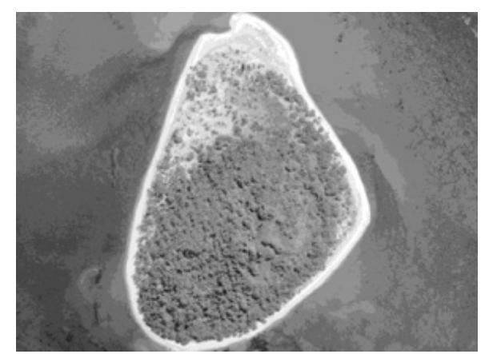

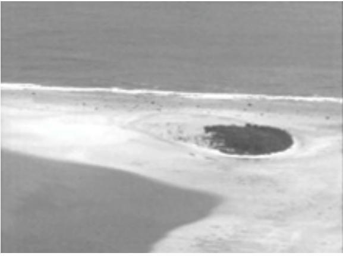

*Rose Island before Olaf (top) and Rose Island after Olaf (below), where ocean inundation is clearly visible.* USFWS

**Ocean Acidification.** In addition to SLR and warmer ocean temperatures, as CO2 levels rise, corals and coralline algae will live in an ocean that is more acidic and contains less carbonate. Corals and CCA need a minimum concentration of carbonate ion (CO2) in sea water to build their calcium carbonate skeletons. As CO2 increases in the ocean it triggers a series of reactions that remove CO2 from the water. Thus, the same process that makes the ocean more acidic, reduces the concentration of CO2. Reef building requires a minimum carbonate concentration of 200 micromoles per kilogram, and concentrations are presently at 210 micromoles per kilogram and dropping (Hoegh-Guldberg et al. 2007). Once atmospheric CO2 reaches 550 parts per million, scientists predict calcification of corals will stop in the Samoa area (Jokiel et al. 2008, Guinotte et al. 2003). Early research shows that CCA are even more susceptible to reductions in carbonate than corals (Kuffner et al. 2008). Coralline algae form the rose-colored reef crest that protects the reef flat and islands from erosion. Once acidification slows or stops that growth, the reef flats and islands will be at risk. While research still needs to be done, the long-term outlook for Rose Atoll and other coral reefs is one of slowed growth due to decreased calcification and increased erosion.

**Additional Ecological Responses to Climate Change**. Evidence suggests that recent climatic changes have affected a broad range of individual species and populations in both the marine and terrestrial environment. Organisms have responded by changes in phenology (timing of seasonal activities) and physiology; range and distribution; community composition and interaction; and

ecosystem structure and dynamics. For example, paleoecological studies have shown that the distribution of vegetation is highly influenced by climate. The reproductive physiology and population dynamics of amphibians and reptiles are highly influenced by environmental conditions such as temperature and humidity (i.e., sea turtle gender is determined by the temperature of the nest environment; thus, higher temperatures could result in a higher female-to-male ratio). In addition, increases in atmospheric temperatures during seabird nesting seasons will also have an effect on seabirds (Duffy 1993, Walther et al. 2002, Baker et al. 2006) by increasing thermoregulatory stress in young chicks.

Warming has also caused species to shift toward the poles or higher altitudes and changes in climatic conditions can alter community composition. Increases in CO2 levels can affect plant photosynthetic rates, reduce water stress, decrease nutrient content, and lower herbivore weights. Climate change can also increase the loss of species as has been shown by the extirpation of two populations of the Bay checkerspot butterfly (*Euphydryas editha bayensis*) in California (Bedoya et al. 2008). Some of the characteristics that make species vulnerable include small population sizes, restricted or patchy ranges (such as those organisms that live on isolated islands), occurrences at either high or low-lying areas, with limited climatic ranges, and narrow or specific habitat requirements. Although there is uncertainty regarding these trajectories, it is probable that there will be ecological consequences (Vitousek 1994, Walther et al. 2002, Ehleringer et al. 2002).

Effects of climate change to nesting i'a sa on Rose Island could include loss or degradation of nesting habitat from sand erosion, and changes in incubation times, hatchling success, and sex ratios. As incubation temperature increases, incubation time goes down, the sex ratio is predicted to be highly biased toward females, and hatchling survival will be reduced (Fuentes et al. 2011).

Effects of climate change to seabirds could include loss/degradation of nesting habitat from sand erosion and changes in food source abundance or behavior because of changes in the pelagic ecosystem. Increased salt water intrusion onto Rose Island may lead to the loss of vegetation that is less tolerant of salt water, while increased erosion would lead to the loss of terrestrial habitats. Climate change represents a growing concern for the management of national wildlife refuges. The Service's climate change strategy, titled "Rising to the Urgent Challenge," establishes a basic framework for the agency to work within a larger conservation community to help ensure wildlife, plant, and habitat sustainability (USFWS 2010). In addition, the Service is supporting regional Landscape Conservation Cooperatives (LCC). These cooperatives are public-private partnerships that recognize conservation challenges transcend political and jurisdictional boundaries and require a more networked approach to conservation—holistic, collaborative, adaptive, and grounded in science to ensure the sustainability of America's land, water, wildlife and cultural resources.

The local LCC is the Pacific Islands Climate Change Cooperative (PICCC), headquartered in Honolulu, Hawai'i, and working across the Pacific. The PICCC was established in 2010 to assist those who manage native species, island ecosystems, and key cultural resources in adapting their management to climate change for the continuing benefit of the people of the Pacific Islands. The PICCC steering committee consists of more than 25 Federal, State, private, indigenous, and nongovernmental conservation organizations and academic institutions, forming a cooperative partnership that determines the overall organizational vision, mission, and goals.

# **3.2 Hydrology**

No known hydrological studies have been conducted at Rose Atoll. There are no streams, lakes, wetlands, or any other surface water on Rose Atoll (Brainard et al. 2008). Rain water on Rose Island is likely taken up by plant roots and lost through transpiration. It is unlikely that any freshwater is stored in the sediments of Rose Island in a lens above sea level because of the small size of the islands. However, no aquifer studies have been conducted at either Rose or Sand Islands.

# **3.3 Topography and Bathymetry**

Both islands have elevations of less than 15 feet and are subject to wash overs by waves in larger storms. Because both islands have components of mobile sand and coral rubble, they can vary in size and shape (Mayor 1921, Satchet 1954, Setchell 1924, Shallenberger et al. 1980, Williamson 1998), but maintain their position on the reef due to central cores of rock. Freycinet pointed out in 1826 that Rose Island was highest in the southwest and gradually sloped down toward the northeast where it merged with the sand of the shore (Rodgers et al. 1993). Rose Island has the same basic shape today. Sand Island is more variable in shape because it is not a pinned island. Mostly likely, Sand Island maintains the same basic size and location over the years because of its location in the eddy of the ava.

Below the elevation of the islands is the reef crest which maintains roughly the same elevation all the way around the atoll. The one exception is the ava, the channel that connects the lagoon with the outside ocean, which is between 6 and 50 feet deep. Inside the reef crest is the lagoon slope, which is mostly less than 10 feet deep. In the middle of the atoll is the lagoon with a maximum depth near 98 feet. On the outside of the reef crest the atoll plummets steeply to the bottom of the Pacific Ocean over 2 miles below the surface. In 2006 the NOAA CRED mapped the bathymetry in and around Rose Atoll using multibeam equipment and towed-diver surveys.

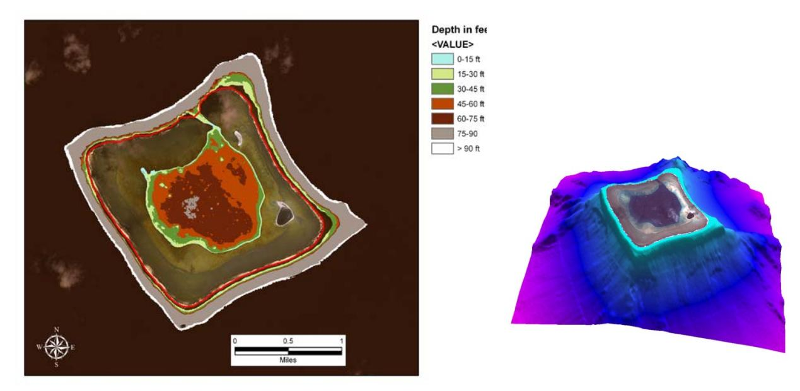

*Depths at Rose Atoll.* USFWS

*Image showing the steep sides of Rose Atoll sloping rapidly down to more than 2 miles deep.* 

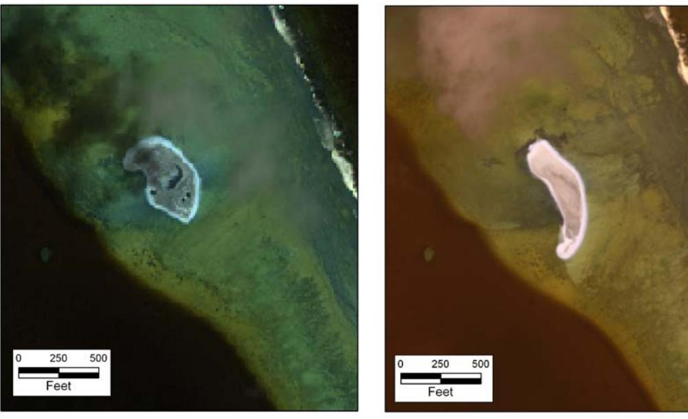

*These photos illustrate how variable island size can be given the dynamic nature of the environment.* USFWS

# **3.4 Geology and Geomorphology**

The Samoan Island chain is a series of volcanic islands that are sinking back into the Pacific Ocean over millions of years. These islands are on the Pacific tectonic plate and surrounded by ocean which is mostly 2–3 miles deep. The Pacific plate is moving northwest averaging about 2–3 inches a year. About 100 miles south of the Samoan chain, part of the Pacific Plate sinks into the 6-mile-deep Tongan Trench and ultimately under the Australian Plate. As the plate moves, it bends and cracks creating volcanic hot spots where lava oozes out forming volcanoes and ultimately islands (Birkeland et al. 2008).

Most of the Samoan Island chain was created by a volcanic hot spot, presently located between Rose Atoll and Ta'ū under Vailulu'u seamount. The peak of this seamount is about 1,800 feet deep. Savai'i is the westernmost island and the oldest with an estimated age around 5 million years. Ta'ū is the easternmost island and the youngest with an estimated age around 1 million years. There are seamounts west of Savai'i, some of which were likely islands that have sunk below the sea surface. Rose Atoll is an anomaly in the Samoan Island chain. It is older than any of the other islands, but lies at the younger end of the chain. This is because Rose Atoll was not created by the same hot spot that created the rest of the Samoan Islands. It was created by volcanic activity that took place before the present hot spot became active (Birkeland et al. 2008).

Rose started as an ancient volcano that built up from eruptions beginning on the deep sea floor many millions of years ago. The ancient volcano emerged as a volcanic island that eventually went extinct, leading to its subsidence due to the growing of the volcano pushing down on the ocean floor beneath it and natural erosion. The first corals and other reef-building organisms settled on the fringes of the volcano and continued to survive, grow, and die, leaving their skeletons behind and allowing younger reef builders to settle upon them and grow. This maintained proximity to the sea surface during the long period of subsidence. Over millions of years the upward growth rate of the reef kept pace with the downward rate of subsidence of the volcano, leading to the creation of a coral cap encircling and

eventually covering the summit of the extinct volcano. Eventually the volcano disappeared altogether beneath the sea surface and was replaced by a lagoon, completing the transition from volcanic island with reefs fringing its coasts to an atoll.

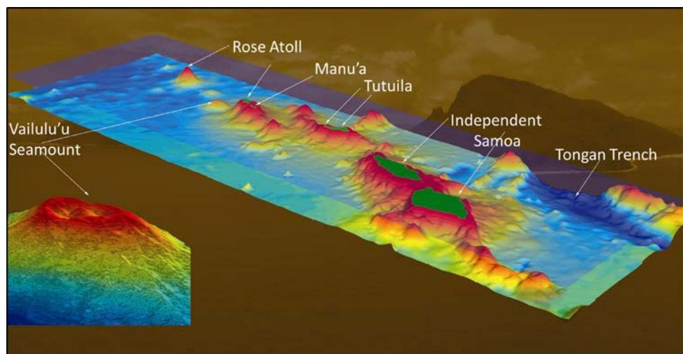

*Samoan Island Chain.* National Park of American Samoa

Darwin's idea that atolls were perched atop sinking volcanos was verified when scientists drilled through more than 4,000 feet of calcium carbonate reef to hit basalt from an ancient volcano. However, today we know that the creation of atolls is a more complex process, which has happened over the last several thousands of years, not over the millions of years that it takes a volcano to sink. The creation of atolls as we know them today, a ringed reef surrounding a lagoon often with sand islets, is the result of changes in sea levels that have occurred during glacial and interglacial times. During the last glacial period about 20,000 years ago, sea level was over 100 meters (328.1 feet)

lower than it is today. Reefs that had grown during times of higher sea level protruded out of the sea and were subject to thousands of years of erosion and subsidence.

As the sea rose again, these eroded reefs began to grow again, but now their centers had been eroded. Five thousand years ago, sea levels were about 6.6 feet higher than today, so these reefs grew higher than present day sea level. As sea levels have gone down, a few yards of reef have been exposed, and islands

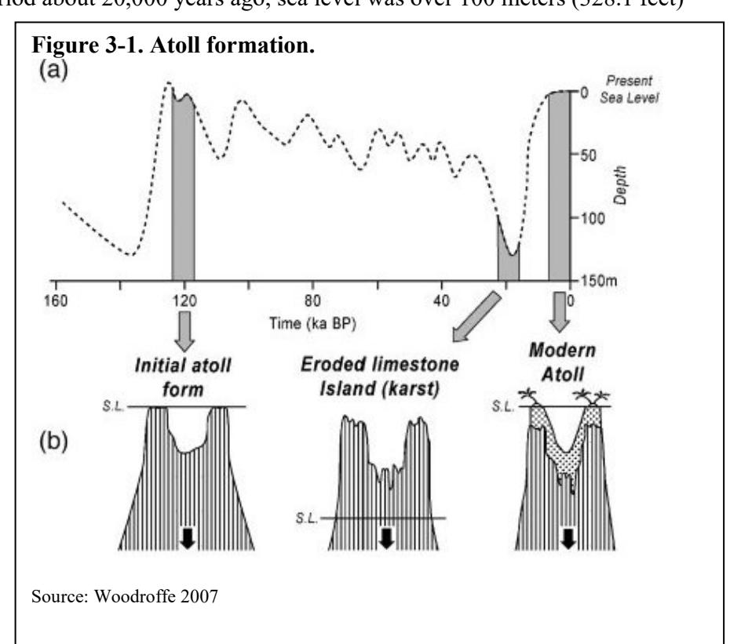

have formed on some of these newly exposed reefs (Dickinson 2009, Woodroffe 2007).

For most of the last 100,000 years Rose Atoll has been out of the sea. The islands we see at the atoll today have likely only existed for a few thousand years. The distinctive square shape of the reef structure today is thought to reflect the shape of the ancient volcano that had dikes of more resistant rock intersecting at a right angle. Although there is insufficient evidence to determine the thickness of the coral reef cap at Rose Atoll, coral drilling on Enewetak Atoll in the Marshall Islands has revealed a coral reef cap attaining a thickness of over 4,000 feet in depth that began its growth more than 50 million years ago (Maragos 2011a).

Rose has a higher percentage of CCA than most atolls, and this gives Rose a pink hue (Brainard et al. 2008, Green et al. 1997, Mayor 1921). Aside from the main ring of the atoll, there is a series of blocks and pinnacles created by coral and CCA that provide habitat diversity in the lagoon and on the back reef. Rose Atoll is one of about 500 surviving atolls in the Pacific today, but countless others have drowned well below the lighted (photic) zone of the ocean because their upward reef growth could not keep pace with the corresponding downward subsidence and sea level fluctuations during the Pleistocene.

# **3.5 Soils**

The soils on Sand Island and the unvegetated parts of Rose Island are composed of limestone sands and rubble of algal and coral origin surrounding and partially covering a core of paleoreef rock. This soil is considered to be a Fusi soil type (Amerson et al. 1982). These soils are non-consolidated sands that are often washed over during storm events. The sands shift around the rock island core with the wave and wind action making the shape and size of the islands dynamic. This is evident in the constant necessity to replace grid markers used for biological surveys during visits by Service personnel between 1980 and the present. Due to the large numbers of seabirds nesting on the islands, there is a substantial input of guano. All the seabirds at Rose forage over deep ocean thus there is a constant input of nutrients from outside the atoll system.

The description of the soil that follows is based on a 1924 survey under the *Pisonia* forest (Lipman and Shelley 1924). Changes have taken place as the *Pisonia* trees have died back and been replaced by *Tournefortia argentea*. The soils in the *Pisonia* forest can be divided into a top organic layer of rich chocolate-colored humus, an intermediate layer of very porous, partially decomposed limestone, and a bedrock layer of compact, fine-textured, pure calcium carbonate without texture and no vital structure (also described as coquina). Lipman and Shelley (1924) also found high concentrations of salt and postulated that the toxic effects of the salts might be mitigated to some degree by the high content of organic matter. The soils analysis (from bedrock to soil) also indicated increasingly high percentages of aluminum, phosphorus, sulfur, sodium, and potassium, compared to decreasing percentages of calcium and magnesium, and little change in silicon. The increased sodium, potassium, and sulfur resulted from the large absorptive capacity of the soil, differential leaching, and contribution from ocean spray. Nitrate and nitrate producing bacteria were also present in the soils. Based on comparison to soils from *Pisonia* forests in the Marshall Islands, it was suggested that bird guano was acidified by humus as it washed down through the soil, leading to a lack of hardpan below the humus layer. Lipman and Shelley linked the fertility of Rose Island to the phosphatization, followed by bacterial nitrogen-fixation.

# **3.6 Environmental Contaminants**

The Agency for Toxic Substance and Disease Registry (ATSDR), a Federal bureau of the U.S. Department of Health and Human Services, defines a contaminant as "a substance that is either present in an environment where it does not belong or is present at levels that might cause harmful (adverse) health effects" (ATSDR 2009). Contaminants commonly include pesticides and their residues, industrial chemicals, fertilizers, metals, and other toxic substances. By altering biological or physical processes, contaminants may produce detrimental effects to an ecosystem.

### **3.6.1 Military Use in WWII**

On February 14, 1941, the territorial waters surrounding the islands of Rose Atoll were established and reserved as the Rose Island Naval Defensive Sea Area. These airspaces over the territorial waters and islands were set apart and reserved as the Rose Island Naval Airspace Reservation (Executive Order 8683). In 1943 the 4th Marine Base Defense Wing was given permission to use Rose Atoll as a dive bomb practice area. In 1996 the Army Corps of Engineers completed a Defense Environmental Restoration Project for Formerly Used Defense Sites (FUDS) for Rose Atoll (USACE 1996). In the Army FUDS investigation, the only reported ordnance was a single MK–23 practice bomb and two 0.30-caliber cartridge casings found by biologists. They found no paperwork indicating that Rose was ever used for bomb practice. It is also believed that it was not used for storage of fuel or other hazardous materials. The FUDS report states, "No land-based evidence of OEW (Ordnance or Exploded Wastes) or other military remnants were observed during visual reconnaissance of Rose Atoll …. The site was otherwise unremarkable with no signs of Ordnance and Explosive Waste (OEW) or environmental stress attributable to former military use" (USACE 1996).

# **3.6.2 Wreck of the** *Jin Shiang Fa* **1993**

On October 14, 1993, the Taiwanese long-line fishing vessel *Jin Shiang Fa* ran aground on the southwest arm of Rose Atoll spilling 100,000 gallons of diesel fuel, 500 gallons of lube oil, and 2,500 pounds of ammonia. The vessel broke up before a salvage tug could reach the atoll, depositing 200 tons of iron on the reef as well as miles of fishing line and other materials from the ship (Green et al. 1997).

The contaminants spilled over a 6-week period were washed over the reef and into the lagoon by waves and currents. Traces of fuel and oil were detected in sediments 22 months later (USFWS and DMWR 2001). The spill killed the coral and CCA, which created openings on the reef for opportunistic cyanobacteria and turf algae to colonize. Ultimately this led to a phase shift from a CCA-dominated reef community to a cyanobacteria/turf algae-dominated reef community (USFWS and DMWR 2001). Early

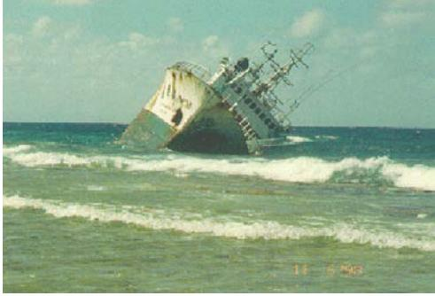

*Jin Shiang Fa.* USFWS

observations at Rose Atoll also suggested that fish populations may have been affected and large numbers of faisua and tuitui died (Green et al. 1997). The iron scattered about the reef from the wreck has promoted the continued prevalence of cyanobacteria and turf algae in the reef flat community.

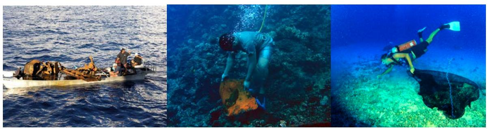

*Debris clean up.* Jim Maragos/USFWS

Though iron removal from the shipwreck was completed in 2007, monitoring of the site continues. The natural resource damage assessment, restoration, and monitoring being done by the Service was funded by the Oil Spill Liability Trust Fund, established by the Oil Pollution Act of 1990 and managed by the U.S. Coast Guard National Pollution Funds Center.

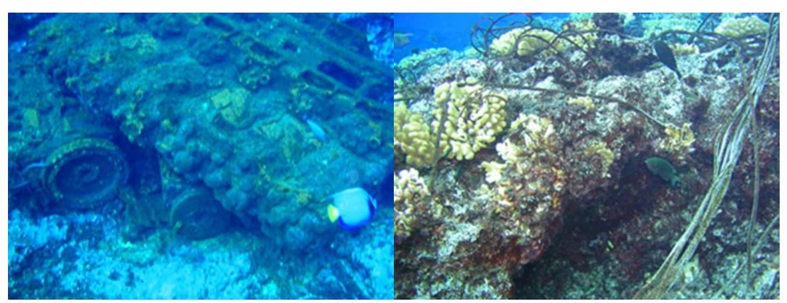

*Disarticulated engine block and scrap metal on coral.* USFWS

# **3.7 Air Quality**

Being over 2,700 miles to Sydney, Australia, 4,700 to Los Angeles, California, and 6,000 miles to Peru, Rose Atoll is a long way from any major source of air pollution. No known air quality sampling has taken place, however, due to the lack of human presence and on-site vehicles (other than boats used for Refuge management 1–2 times a year), distance to air polluted areas, and trade winds, air quality is thought not to be impaired.

# **3.8 Water Quality**

Though little water quality monitoring has been done at the Refuge, given its remote location, it is anticipated that ocean water quality is not impaired. Water quality testing was conducted after the *Jin Shiang Fa* ran aground on the atoll in 1993, spilling 100,000 gallons of diesel fuel and other contaminants into the waters in and around Rose Atoll. Shortly after the grounding, the majority of the vessel hull was removed from the reef. Despite the removal of much of the metallic debris from the fore reef slope, there was a sufficient source of dissolved iron seaward of the reef edge to sustain

elevated iron levels in the water flowing over the reef platform. In 2002, concentrations of iron were still elevated 5–10 fold above background levels (approximately 0.6 nanomoles) within a plume of water approximately 557 yards wide flowing onto the reef platform. However, peak concentrations within the plume in 2002 were only half of the peak values found in 1998.

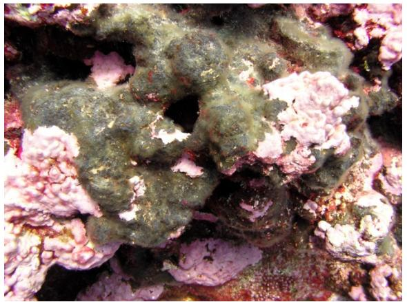

*Cyanobacteria overgrows pink crustose coralline algae.*  Jean Kenyon/USFWS

Iron is a limiting element in atoll marine environments that are far from continental margins, and this increased iron resulted in higher cyanobacterial growth near the wreck site (Green et al. 1997). There have been several cleanup operations funded to remove the remaining pieces of the ship, and by 2007 all major pieces had been removed. Measurements of iron concentration in the water upstream and downstream of the wreck site continue as part of the monitoring program evaluating recovery from the *Jin Shiang Fa* grounding. Monitoring is ongoing and new strategies for active restoration of the area are being evaluated.

Storm wash over and sand erosion on the two islands may periodically lead to temporary turbidity in near shore waters. Storm wash and rainfall could also lead to nutrient enrichment from bird guano in the marine environment. The nutrient budgets of coral reef systems adjacent to healthy seabird colonies and areas where seabird populations have been extirpated is currently an area of active investigation in tropical regions around the world.

# **3.9 Surrounding Land and Water Use**

In 2009, Presidential Proclamation 8337 created the Monument which overlays the Refuge and extends out 50 nmi covering a total of 13,451 square miles. There is no commercial fishing allowed in the Monument, and large vessels (greater than 50 feet) are excluded from fishing in an area roughly 50 nmi from all the islands and atolls of American Samoa per NMFS regulations (Federal Register 2012). The Refuge and the Monument are in the American Samoa Exclusive Economic Zone.

Commercial fishing is prohibited in the Monument, and all fishing is prohibited within 12 nmi of the Refuge. Non-commercial fishing is allowed in the Monument outside of the 12 nmi no-fishing zone. Non-commercial fishing includes subsistence fishing and recreational fishing. The prohibition on all fishing within 12 nmi of the Refuge will be reviewed by the Western Pacific Regional Fisheries Council and NMFS in 2016. Additionally, the areas of the Monument that are outside of the Refuge became part of the National Marine Sanctuary of American Samoa in 2012.

Given the remoteness of Rose Atoll NWR, there is very little use of this area. However, Service staff have seen recreational sailboats accessing the area. In June 2009, the *S/V Paul Eric* entered the Refuge as an emergency stop to repair its engine. Unfortunately, as the vessel weighed anchor in preparation to depart, strong winds and currents pushed the vessel aground on the shallow eastern reef near Sand Island. During the removal of the *Paul Eric* from the reef, a second large yacht, the *Southwest* was seen approaching Rose from the south. Additionally, during a two day research visit

in August 2012, one vessel that had entered the lagoon left after being informed that entrance was only by Special Use Permit, and two other vessels asked for permission to enter the lagoon but were denied.

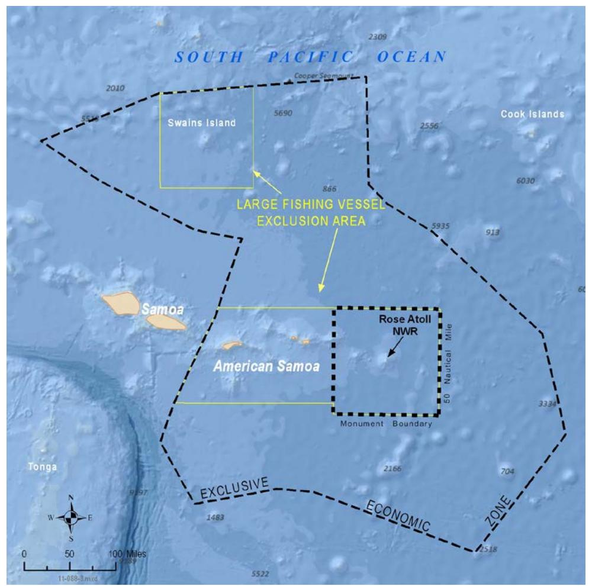

*Surrounding land use: the Monument, Exclusive Economic Zone, and Large Fishing Vessel Exclusion Zone.* USFWS

# **Chapter 4. Biological Environment**

This chapter addresses the biological resources and habitats found on Rose Atoll NWR. However, it is not an exhaustive review of all species occurring within the Refuge. The chapter begins with a discussion of biological integrity (historic conditions and ecosystem function), as required under the Administration Act. The bulk of the chapter is then focused on the presentation of pertinent background information for habitats used by each of the Priority Resources of Concern (ROC) and other benefiting species designated under the CCP. The background information includes descriptions, conditions, and trends of habitats and threats (stresses and sources of stress) to the habitats and/or associated ROC. This information was used to develop goals and objectives for the CCP.

# **4.1 Biological Integrity Analysis**

The Administration Act, as amended, directs the Service to ensure that BIDEH of the Refuge System is maintained for the benefit of present and future generations of Americans. The elements of BIDEH are represented by native fish, wildlife, plants, and their habitats, as well as those ecological processes that support them. The Refuge System policy on BIDEH (601 FW 3) also provides guidance on consideration and protection of the broad spectrum of fish, wildlife, and habitat resources found on a refuge and in associated ecosystems that represent BIDEH.

Biological integrity lies along a continuum from a completely natural system to a biological system extensively altered by considerable human impacts to the landscape (which includes seascapes). No modern landscape retains complete BIDEH. We strive to prevent the further loss of natural biological features and processes. Maintaining or restoring biological integrity is not the same as maximizing biological diversity. Maintaining biological integrity may entail managing for a single species or community at some refuges and combinations of species or communities at other refuges. Maintaining critical habitat for a specific endangered species, even though it may reduce biological diversity at the refuge scale, helps maintain biological integrity and diversity at the ecosystem or national landscape scale.

On refuges, we typically focus our evaluations of biological diversity at the refuge scale; however, these refuge evaluations can contribute to assessments at larger landscape scales. We strive to maintain populations of breeding individuals that are genetically viable and functional. Evaluations of biological diversity begin with population surveys and studies of flora and fauna. The Refuge System's focus is on native species and natural communities such as those found under historical conditions (BIDEH policy). However, given the likely impacts of climate change (e.g., SLR, ocean acidification, ocean temperature) on reefs and atoll islands, maintaining historic conditions may not be possible in the future. The Service will continue to promote resilience by minimizing other anthropogenic effects to the Refuge so the species and habitats have improved chances of adapting to a changing climate. Additionally, we will incorporate new climate science into our management as it becomes available.

We evaluate environmental health by examining the extent to which environmental composition, structure, and function have been altered from historic conditions. Environmental composition refers to abiotic components such as air, water, and soils, all of which are generally interwoven with biotic components (e.g., decomposers live in soils). Environmental structure refers to the organization of abiotic components, such as atmospheric layering, aquifer structure, and topography. Environmental

function refers to the processes undergone by abiotic components, such as wind, tidal regimes, evaporation, and erosion. A diversity of abiotic composition, structure, and function tends to support a diversity of biological composition, structure, and function.

Due to its remoteness and limited acreage, Rose Atoll is a far more natural system than most landscapes. The atoll has had very limited human contact and no development on it. Its distinctive CCA, declining *Pisonia* forest, terrestrial fauna, and unique assemblage of marine fishes and invertebrates in the lagoon are all critical components of BIDEH. The overarching BIDEH principles that were integrated into the CCP analysis included the Refuge purposes, Refuge System mission, and where appropriate, maintenance of BIDEH for wildlife and habitat, and BIDEH in a landscape context. The BIDEH for the Refuge is summarized in Table 4-1.

**Table 4-1. Biological Integrity, Diversity, and Environmental Health** 

| Habitats                                         | Population/Habitat<br>Attributes                                                                                                                                                                                                                                                                                                                                                 | Natural Processes<br>Responsible for These<br>Conditions                                                                                                                                                                                                                                                                           | Limiting Factors                                                                                                                                                                       |
|--------------------------------------------------|----------------------------------------------------------------------------------------------------------------------------------------------------------------------------------------------------------------------------------------------------------------------------------------------------------------------------------------------------------------------------------|------------------------------------------------------------------------------------------------------------------------------------------------------------------------------------------------------------------------------------------------------------------------------------------------------------------------------------|----------------------------------------------------------------------------------------------------------------------------------------------------------------------------------------|
| Lagoon                                           | Lagoon floor (to ~98 feet<br>depth) and back reef<br>composed of carbonate sand<br>and rubble, with low coral and<br>CCA cover (< 1%). Hard<br>substrate pinnacles and patch<br>reefs with moderate coral and<br>CCA cover (>10%),<br>supporting diverse fish<br>assemblage and faisua<br>Potential conservation<br>species: faisua, sea turtles,<br>candidate ESA coral species | Intact perimeter reef<br>(present-day height, width,<br>biotic construction) and ava<br>(present-day depth, width,<br>location unblocked flow)<br>that regulate seawater<br>exchange with surrounding<br>ocean and seawater flow<br>inside lagoon; natural<br>breakdown of calcifying<br>organisms providing<br>carbonate sediment | Proliferation of cyanobacteria;<br>illegal fishing and faisua<br>poaching; reduced calcification<br>linked to ocean acidification                                                      |
| Perimeter<br>Crustose<br>Coralline<br>Algal Reef | Living reef dominated by<br>CCA, with intact geomorphic<br>structure providing mosaic of<br>microhabitats for<br>invertebrates including corals<br>and sea urchins<br>Potential conservation<br>species: candidate ESA coral<br>species                                                                                                                                          | Growth of CCA and other<br>calcifying organisms, and<br>accretion of carbonate<br>through biochemical<br>processes, maintains<br>constructional platform<br>between open ocean and<br>lagoon                                                                                                                                       | Rate of SLR relative to natural<br>capacities for growth and<br>accretion; reduced calcification<br>linked to ocean acidification;<br>overgrowth by non-reef-building<br>cyanobacteria |
| Ava                                              | Unobstructed channel<br>between lagoon and fore reef<br>with present-day depth, width,<br>and location<br>Potential conservation<br>species: faisua, sea turtles,<br>candidate ESA coral species                                                                                                                                                                                 | Natural hydrological regimes<br>of oceanic and lagoonal<br>seawater flow                                                                                                                                                                                                                                                           | Impedance of natural flow<br>patterns by boat grounding or<br>other obstacles                                                                                                          |

| Beach Strand       | Beach strand habitat clear of<br>invasive introduced plants and<br>marine debris that provides<br>nesting sites for ground<br>nesting seabirds and turtles<br>and foraging sites for<br>migratory shorebirds                                                                                                                | Sand and rubble formed by<br>the action of storms and bio<br>erosion of living CCA reef<br>community is deposited and<br>re-arranged by ocean waves.<br>Plant community on the<br>beach strand areas are kept at<br>seral stage by repeated<br>overwashing and storms<br>Current sea level | Nonnative invasive species of<br>plants and animals; human<br>disturbance and trampling;<br>interruption in the supply of<br>gastropod shells from the reef that<br>are used by land hermit crabs; sea<br>level rise; reduced calcification<br>linked to ocean acidification;<br>increased storm frequency and<br>intensity changing sediment<br>distribution patterns |
|--------------------|-----------------------------------------------------------------------------------------------------------------------------------------------------------------------------------------------------------------------------------------------------------------------------------------------------------------------------|--------------------------------------------------------------------------------------------------------------------------------------------------------------------------------------------------------------------------------------------------------------------------------------------|------------------------------------------------------------------------------------------------------------------------------------------------------------------------------------------------------------------------------------------------------------------------------------------------------------------------------------------------------------------------|
| Littoral<br>Forest | South Central tropical Pacific<br>littoral forest with a native<br>species composition typical of<br>other intact habitats of similar<br>rainfall and soil type. This<br>forest provides nesting sites<br>for arboreal and ground<br>nesting seabirds as well as<br>native land crabs, insects, and<br>migratory shorebirds | Nutrient input from seabird<br>guano and precipitation<br>favor pu'a vai and other<br>species of plants dispersed<br>by birds or ocean currents                                                                                                                                            | Nonnative invasive species of<br>plants, animals, and pathogens,<br>human disturbance; SLR; reduced<br>calcification linked to ocean<br>acidification; increased storm<br>frequency and intensity; changing<br>sediment distribution patterns                                                                                                                          |

# **4.2 Selection of Priority Resources of Concern**

### **4.2.1 Analysis of Priority Resources of Concern**

Wildlife and habitat goals and objectives were designed directly around the habitat requirements of species designated as Priority ROC (ROC are called conservation targets in conservation planning methodologies used by other agencies and NGOs). As defined in the Service's Policy on Habitat Management Plans (620 FW 1), resources of concern are:

"all plant and/or animal species, species groups, or communities specifically identified in refuge purpose(s), System mission, or international, national, regional, state, or ecosystem conservation plans or acts. For example, waterfowl and shorebirds are a resource of concern on a refuge whose purpose is to protect 'migrating waterfowl and shorebirds.' Federal or State threatened and endangered species on that same refuge are also a resource of concern under terms of the respective endangered species acts (620 FW 1.4G)…

Habitats or plant communities are resources of concern when they are specifically identified in refuge purposes, when they support species or species groups identified in refuge purposes, when they support NWRS resources of concern, and/or when they are important in the maintenance or restoration of biological integrity, diversity, and environmental health."

Therefore, ROC for a refuge may be a species or species group, or the habitat/plant community that supports a priority species/species group.

In developing its listing of Priority ROC, the planning team selected not only species mentioned in establishing documents for the Refuge, but also species that captured the ecological attributes of habitats required by larger suites of species. The ecological attributes of habitats should be analyzed to meet the life-history requirements of ROC, and are therefore critical to sustain the long-term

viability of the ROC and other benefiting species. Ecological attributes of terrestrial habitats include vegetation structure, species composition, age class, patch size and/or contiguity with other habitats; hydrologic regime; and disturbance events (e.g., flooding, fire). Likewise, in the marine environment, ecological attributes include benthic structure; species composition and distribution; oceanographic regime (waves, tides, currents, upwelling); water quality parameters such as pH, temperature, salinity, light attenuation, nutrient levels; and disturbance events (e.g., tropical storms). These provide measurable indicators that strongly correlate with the ability of a habitat to support a given species.

Tables listing the desired conditions for habitat types found on the Refuge incorporate "desired" conditions that were based on scientific literature review and team members' professional judgment. These desired conditions for specific ecological attributes were then used to help design habitat objectives, as presented in Chapter 2. However, not all ecological attributes or indicators were deemed ultimately feasible or necessary around which to design an objective. Other factors, such as feasibility and the Refuge's ability to reasonably influence or measure certain indicators, played a role in determining the ultimate parameters chosen for each habitat objective. Thus, ecological attributes should be viewed as a step in the planning process. The ultimate design of objectives was subject to further discussion and consideration.

Limiting factors were also considered in developing objectives. A limiting factor is a threat to, or an impairment or degradation of, the natural processes responsible for creating and maintaining plant and animal communities. In developing objectives and strategies, the team gave priority to mitigating or abating limiting factors that presented high risk to ROC. In many cases, limiting factors occur on a regional or landscape scale and are beyond the control of individual refuges. Through the consideration of BIDEH, the Refuge will provide for or maintain all appropriate native habitats and species. Refuge management priorities may change over time, and because the CCP is designed to be a living, flexible document, changes will be made at appropriate times.

Early in the planning process, the planning team cooperatively identified priority species for the Refuge, as recommended under the Service's 620 FW 1. These ROC frame the development of goals and objectives for wildlife and habitat. The ROC may be species, species groups, or features that the Refuge will actively manage to conserve and restore over the life of the CCP, or species that are indicators of habitat quality for a larger suite of species. Negative features of the landscape, such as invasive plants, may demand Refuge management effort, but are not designated as ROC.

The main criteria for selecting priority ROC included the following requirements:

- The resource must be reflective of the refuge's establishing purposes and the Refuge System mission;
- The resource must include the main natural habitat types found at the refuge;
- The resource must be recommended as a conservation priority in the Wildlife and Habitat Management Review; or
- The resource must be federally or State/Territory-listed as a candidate for listing, or a species of concern.

Other criteria that were considered in the selection of the resources of concern included the following:

- Species groups or Refuge features of special management concern;
- Species contributing to the BIDEH of the ecosystem; or
- Species for which it is feasible to estimate population size (needed for future monitoring and adaptive management).

**Table 4-2. Priority Resources of Concern**

| Focal Species                                                                                                                                                                                                     | Habitat Type               | Habitat Structure                                                                                                                                                  | Life History<br>Requirements                                                                            | Other Benefiting<br>Species                                                                                                                                             |
|-------------------------------------------------------------------------------------------------------------------------------------------------------------------------------------------------------------------|----------------------------|--------------------------------------------------------------------------------------------------------------------------------------------------------------------|---------------------------------------------------------------------------------------------------------|-------------------------------------------------------------------------------------------------------------------------------------------------------------------------|
| Pu'a vai<br>(Pisonia)                                                                                                                                                                                             | Littoral Forest            | Sandy and phosphate<br>soils with elevation<br>sufficient to avoid<br>overwashing in all<br>but the largest storms<br>(> 6.6 feet)                                 | All                                                                                                     | Tree-nesting seabirds<br>fua'o (red-footed<br>booby), atafa (lesser<br>frigatebird), atafa (great<br>frigatebird), gogo uli<br>(black noddy), white tern<br>(manu sina) |
| Littoral forest<br>tree species –<br>Cordia<br>subcordata,<br>Tournefortia<br>argentea,<br>Hernandia<br>nymphaeifolia,<br>Terminalia<br>samoensis,<br>Neisosperma<br>oppositifolium,<br>and Hibiscus<br>tiliaceus | Littoral forest<br>(mesic) | Sandy and phosphate<br>soils with elevation<br>sufficient to avoid<br>overwashing in all<br>but the largest storms<br>(> 6.6 feet)                                 | All                                                                                                     | Matu'u (Pacific reef<br>heron) for nesting<br>habitat and aleva (long<br>tailed cuckoo) for<br>wintering, molting, and<br>foraging                                      |
| Tava'e'ula (red<br>tailed<br>tropicbird)                                                                                                                                                                          | Littoral forest            | Ground under<br>vegetation in<br>understory and base<br>of trees; sites that<br>provide adequate<br>shade for nestling for<br>the duration of the<br>growth period | Nesting                                                                                                 | Gogo (brown noddy),<br>fua'o (brown booby)                                                                                                                              |
| Fua'o (red<br>footed booby)                                                                                                                                                                                       | Littoral forest            | Tournefortia and<br>Pisonia trees that<br>provide appropriate<br>structure for nest<br>construction above<br>the ground                                            | Nesting                                                                                                 | Atafa (lesser<br>frigatebird), atafa (great<br>frigatebird), gogo uli<br>(black noddy)                                                                                  |
| Land hermit<br>crabs Coenobita<br>perlatus and<br>Coenobita                                                                                                                                                       | Littoral forest            | Sandy and phosphate<br>soils, vegetation and<br>shade protection from<br>tropical sun                                                                              | Reproduction – aquatic<br>larvae, terrestrial adults,<br>foraging, proximity to<br>sea water source for | Tuli prey upon land<br>hermit crabs.<br>Entire forest community<br>benefits from Coenobita                                                                              |

| Focal Species                                                                                                                                   | Habitat Type                                                      | Habitat Structure                                                                                                                                                                                                                                             | Life History<br>Requirements                                                       | Other Benefiting<br>Species                                                                                                                                                                                                                                                                                                                  |
|-------------------------------------------------------------------------------------------------------------------------------------------------|-------------------------------------------------------------------|---------------------------------------------------------------------------------------------------------------------------------------------------------------------------------------------------------------------------------------------------------------|------------------------------------------------------------------------------------|----------------------------------------------------------------------------------------------------------------------------------------------------------------------------------------------------------------------------------------------------------------------------------------------------------------------------------------------|
| brevimanus                                                                                                                                      |                                                                   |                                                                                                                                                                                                                                                               | osmoregulation and gill<br>maintenance                                             | acting as scavengers and<br>nutrient recyclers                                                                                                                                                                                                                                                                                               |
| Gogo Uli (sooty<br>tern)                                                                                                                        | Beach strand and<br>littoral forest                               | Open beach habitat<br>or forest sites with<br>minimal understory<br>that provide open<br>access for landing<br>and takeoff and<br>visibility for these<br>highly social nesters                                                                               | Nesting                                                                            | Gogosina (gray-backed<br>tern), gogosina (black<br>naped tern), tuli, ruddy<br>turnstones that prey on<br>sooty tern eggs                                                                                                                                                                                                                    |
| Tuli (bristle<br>thighed curlew)                                                                                                                | Beach strand and<br>littoral forest                               | Open beach habitat<br>or open forest                                                                                                                                                                                                                          | Wintering, molting,<br>feeding                                                     | Tuli (ruddy turnstone),<br>tuli (sanderling), tuli<br>(wandering tattler), tuli<br>(whimbrel), tuli (Pacific<br>golden plover)                                                                                                                                                                                                               |
| I'a sa (green<br>turtle) and<br>laumei uga<br>(hawksbill<br>turtle)                                                                             | Beach<br>strand/littoral<br>forest/lagoon                         | Sand with access to<br>the water but above<br>the high tide line                                                                                                                                                                                              | Nesting (green turtle<br>only), resting, feeding                                   |                                                                                                                                                                                                                                                                                                                                              |
| Tamole (yellow<br>purslane,<br>Portulaca lutea)                                                                                                 | Beach strand                                                      | Open sand, no over<br>story                                                                                                                                                                                                                                   | All                                                                                |                                                                                                                                                                                                                                                                                                                                              |
| Malie (gray reef<br>shark)                                                                                                                      | Lagoon, ava                                                       | Pinnacles, patch<br>reefs, back reefs                                                                                                                                                                                                                         | All                                                                                | Malie alamata (blacktip<br>reef shark), whitetip reef<br>shark (Triaenodon<br>obesus), bumphead<br>parrotfish, Maori wrasse,<br>gatala-uli (peacock<br>grouper), leopard<br>grouper, coral hind,<br>strawberry grouper,<br>mata'ele (flagtail<br>grouper), honeycomb<br>grouper, gatala-aloalo<br>(dwarf spotted grouper),<br>masked grouper |
| Amu (stony<br>corals)<br>Acropora,<br>Astreopora,<br>Cyphastrea,<br>Favia,<br>Leptastrea,<br>Montastrea,<br>Montipora,<br>Pavona,<br>Platygyra, | Reef crest, back<br>reef, lagoon<br>pinnacles, and<br>patch reefs | Hard substrate, depth<br>and water clarity<br>sufficient for light<br>penetration, moderate<br>temperatures,<br>seawater immersion<br>time sufficient to<br>prevent desiccation,<br>low nutrients, low<br>algae and<br>cyanobacteria,<br>herbivorous fish and | All (growth, feeding<br>[endosymbiosis, and<br>plankton capture],<br>reproduction) | Reef fish; other benthic<br>invertebrates (soft<br>corals, mollusks,<br>crustaceans, worms,<br>echinoderms, tunicates)                                                                                                                                                                                                                       |

| Focal Species                                                                | Habitat Type                                                      | Habitat Structure                                                                                            | Life History<br>Requirements                                                    | Other Benefiting<br>Species                                                                              |
|------------------------------------------------------------------------------|-------------------------------------------------------------------|--------------------------------------------------------------------------------------------------------------|---------------------------------------------------------------------------------|----------------------------------------------------------------------------------------------------------|
| Porites,<br>Psammocora,<br>Stylocoeniella<br>spp.                            |                                                                   | invertebrates                                                                                                |                                                                                 |                                                                                                          |
| Faisua (giant<br>clam) (Tridacna<br>maxima)                                  | Lagoon<br>pinnacles and<br>patch reefs                            | Hard substrate, water<br>depth and clarity<br>sufficient for light<br>penetration                            | All (growth, feeding<br>[endosymbiosis, and<br>filter-feeding],<br>reproduction |                                                                                                          |
| Sea urchins<br>(tuitui)                                                      | Reef crest, back<br>reef, lagoon<br>pinnacles, and<br>patch reefs | Hard substrate,<br>available holes for<br>occupancy, algal<br>films, and turf for<br>grazing                 | All (growth, grazing,<br>reproduction)                                          | Corals, CCA                                                                                              |
| Turban shells<br>(Turbo crassus,<br>Turbo setosus,<br>Turbo<br>argyrostomus) | Reef and lagoon<br>habitats                                       | CCA reef flats with<br>epilithic algae for<br>grazing                                                        | Foraging (herbivores<br>and detritus feeders)                                   | Land hermit crabs<br>(Coenobita perlatus and<br>C. brevimanus) that use<br>shells of these<br>gastropods |
| Crustose<br>coralline algae<br>(Porolithon<br>spp.,<br>Hydrolithon<br>spp.)  | Reef                                                              | Hard substrate,<br>moderate<br>temperatures, low<br>cyanobacteria,<br>herbivorous fish, and<br>invertebrates | All (growth,<br>photosynthesis,<br>reproduction)                                | Stony corals                                                                                             |

# **4.3 Habitat Types**

An atoll is a reef formation atop a subsiding extinct volcano that includes a lagoon surrounded by a shallow perimeter reef, at least one emergent island, and regular surface water exchange between the lagoon and the open ocean (Woodroffe and Biribo 2011, Maragos and Williams 2011). Rose Atoll has all these major habitats and associated biological groups found on Pacific atolls. It supports island and marine species groups that are adapted to each of these habitats.

All biological communities and habitats at Rose Atoll are profoundly influenced by the ocean and associated climate. The early life cycle stages of most reef species at Rose are tiny and moved by tides, waves, and ocean currents. Water quality, motion, temperature, light, salinity, and substrate characteristics influence the behavior of these small organisms causing them to settle on or near favorable habitats to begin the transition to adult phases.

**This page intentionally left blank.** 

**Figure 4-1. Habitats.** 

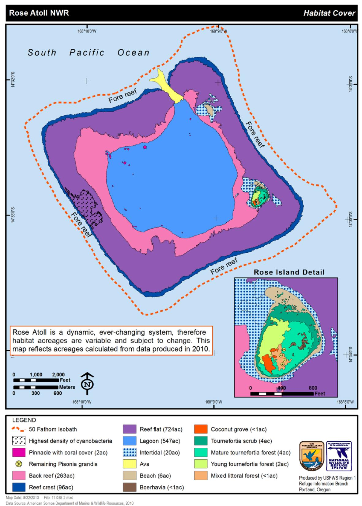

**The back sides of maps are blank to improve readability.**

### **4.3.1 Ava**

The ava is a shallow (less than 50 feet) and narrow (130 feet) passage that connects the open ocean to the lagoon. The shape, size, and location of the ava is vital to maintaining the lagoon, reef, and island habitats. As ocean water spills into the lagoon over the sides of the reef, it is released out through the ava. Though water usually flows out the ava, tides and waves occasionally create a situation where water flows into the lagoon through the ava. A data-logging current meter deployed in the ava by NMFS PIFSC in 2002 showed that water flowed predominantly out of the ava from the lagoon, attaining flow rates of 3.3 knots, with only short periods of flow reversal (NMFS PIFSC unpubl. data 2011).

The elevation of the ava controls the water movement out of the lagoon, and plays a major role in the layering of lagoon water by temperature and salinity. Additionally, the shape and location of the ava is an important factor in the location and longevity of the islands on the atoll. Water movement inside the atoll creates currents that remove sand from some areas and deposit it in other areas. This sediment transport regime has created and maintained Rose and Sand Islands as dynamic islands in roughly the same location since Rantzau mapped Rose Atoll in 1873 (Rodgers et al. 1993). The ava is also the major passageway for fish and other organisms in and out of the lagoon, where species that require more shelter from rough water to breed or live may concentrate. Sharks and other predators congregate at the mouth of the ava waiting for prey. As such, the ava connects reef life on both sides of the perimeter reef at Rose Atoll.

In addition, the size and depth of the ava affect the amount of water exchange between the lagoon and the ocean, and indirectly the height and width of the perimeter reef crest and reef slopes surrounding the lagoon. In the case of Rose, the two islands are relatively small in relation to the total circumference of the open reef crests, allowing more water to enter the lagoon over the crests during high tides and heavy wave action. Because the ava is shallow and narrow, water exiting the ava is less than the amount of water entering over the perimeter reefs during tidal cycles. As a consequence, water levels in the lagoon remain higher than those on the ocean side except at the highest tides. This allows the perimeter reef crests to remain wet as water spills over them, and that allows the reef builders on the crests to grow slightly higher, to levels above mean low water. Over time, the crest of the perimeter reef can maintain itself above the surrounding ocean at low tides. As a result, water levels in the lagoon are higher than that of the surrounding ocean, and the quantity and velocity of water flowing "downstream" out the ava greatly exceeds that which enters the ava during rising tides.

Thus, any modification of the ava, such as widening or deepening it to facilitate better or larger boat passage, or having a large vessel disabled and blocking the flow of water through the ava, can have drastic effects on the biology of the lagoon and kill the reef builders on the crests of the perimeter reefs. Widening or creating boat channels through atoll reefs have degraded the lagoons of Kanton Atoll in the Phoenix Islands, atolls in Tuvalu, and several other atolls (Carpenter and Maragos 1989, Kaly and Jones 1991, Maragos 1993, 2011a, 2011b) and even the lagoons in some NWRs such as Johnston Atoll, Midway Atoll, and Palmyra Atoll.

The ava is used by Refuge staff to enter the atoll when conducting management. No active management of the ava is conducted other than regulating boat traffic through the pass.

## **4.3.2 Reef (Crest and Back)**

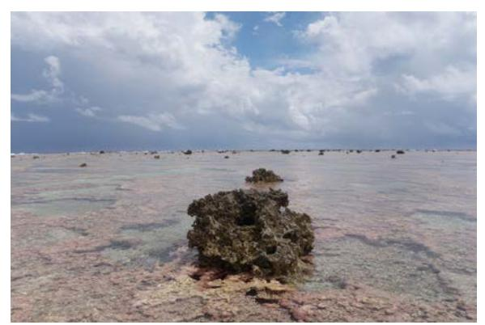

*Reef flat.* Frank Pendleton/USFWS

The reef crest at Rose Atoll, constructed by countless generations of calcifying marine organisms whose remains have been cemented together over time by biochemical processes, varies from 1,000 to 3,000 feet wide. The predominance of CCA was noted by early scientific visitors (Mayor 1921, Setchell 1924) and has been reiterated many times. The reef crest is the living veneer of the ancient physical barrier separating the deep surrounding ocean from the shallow interior lagoon. By breaking the force of waves and currents, the shallow reef crest provides a sheltered environment inside

which lagoon habitats have developed, and itself harbors a biotic assemblage adapted to shallow intertidal conditions. This living platform, which continues to accrete with successive generations of calcifying organisms, is resistant to physical- and bio-erosion, enabling formation and maintenance of the marine and terrestrial lagoon habitats in which other organisms exist. The reef crest is a vital habitat for Pacific reef herons and snowflake eels.

In the aftermath of the 1993 grounding, extensive damage resulted to CCA, corals, sea urchins, and other biota on the reef crest and neighboring lagoon back reef from mechanical abrasion and chemical release. Iron released by the deterioration of metallic debris stimulated cyanobacterial populations on the reef crest and neighboring back and patch reefs and caused them to spread to other parts of the atoll that were not directly affected by the grounding. Transects conducted on the reef crest from 1995 to 2010 showed continuing recovery of CCA cover.

The perimeter reef includes the back reef which consists of unconsolidated terrain encircling the lagoon, composed largely of rubble that slopes from the reef crest to the more interior, sandier benthos.

# **4.3.3 Lagoon**

Rose has an almost completely enclosed lagoon, measuring less than 1.2 miles at its widest point, with only one ava at the northwest corner. Because the ava is shallow and narrow, the volume of water exiting the ava is less than the volume of water entering over the reef crest during tidal cycles. As a consequence, water levels in the lagoon remain higher than those on the ocean side except at the highest tides, and the volume and velocity of water flowing out the ava greatly exceeds that which enters at that site.

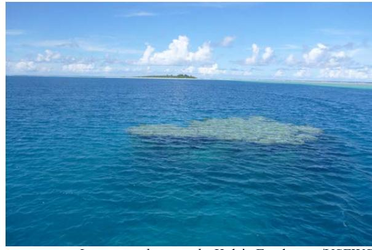

*Lagoon with pinnacle.* Kelsie Ernsberger/USFWS

The lagoon includes the more finely divided "shallow lagoon," "lagoon floor," and "lagoon pinnacles." Detailed bathymetry produced by NMFS PIFSC shows the lagoon floor maximum depth at 98 feet. Circulation and water mixing in tropical reef lagoons and back reef areas is restricted compared to neighboring fore reef slopes and surrounding oceanic surface waters. This restricted circulation frequently results in temperature differences of several degrees between the lagoon reservoir and the surrounding ocean. This effect is especially apparent in enclosed atoll morphologies during periods of high solar radiation and low winds. At Rose Atoll, interpolation of *in situ* surface water temperatures measured from conductivity/temperature/depth instruments and towed thermistors in February 2002 showed surface waters up to 5.5°F higher inside the lagoon and back reef areas compared to the cooler, relatively well-mixed waters in the fore reef area and surrounding ocean. Turbidity as indicated by short-term measurements of beam transmission was notably higher inside the lagoon compared with other areas outside the perimeter reef crest (NMFS PIFSC 2008). The lagoon also displayed higher values of Chlorophyll-*a*, NO2, and SiO2 when compared with the fore reef. Finally, the lagoon consistently registered the densest and most saline waters at Rose, especially below the sill depth (approximately 16 feet) of the ava. These elevated nutrient concentrations, coupled with increased or variable turbidity, suggest prolonged periods of mixing,

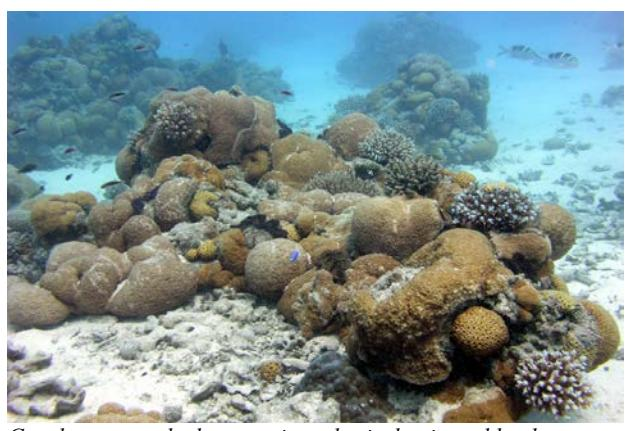

*Coral cover on the lagoon pinnacles is dominated by the genera*  Favia*,* Montipora*,* Porites*, and* Astreopora*.*  Jean Kenyon/USFWS

flushing, and nutrient cycling within the surface-water layers of the protected shallowwater lagoon.

Wave-induced lagoon circulation is tidally modulated as more wave set-up occurs during high tides and less during low tides. The net effect is that surface waters in the lagoon likely have a short residence time. The highsalinity and high-density subsurface waters in the lagoon, on the other hand, have no obvious means to circulate and flush out of the lagoon. Hence, lagoon bottom waters likely have much longer residence times.

While much of the lagoon floor consists of unconsolidated sand and rubble (Kenyon et al.

2010), a number of hard-bottom pinnacles are found rising toward the surface, providing substrate that supports corals, faisua, other macroinvertebrates, and diverse fish populations. Coral cover on the lagoon pinnacles is dominated by the genera *Favia, Montipora, Porites,* and *Astreopora*. Faisua density is highest at the base of the lagoon pinnacles. Small- to medium-sized fish are very abundant around several of the larger pinnacle patch reefs inside the lagoon, where parrotfish, snapper, emperor, goatfish, and jacks are common (NMFS PIFSC 2008).

### **4.3.4 Intertidal**

The north end of Rose Island is characterized by an expanse of sand and rubble that is exposed at low tide. Large groups of terns (primarily brown noddies and sooty terns) form "clubs" here when the area is exposed, possibly because it is not being used for nest territories and offers good visibility for quick escape. Seabird clubs are ephemeral single-species groups of birds that congregate and socialize or rest together. Shorebirds such as wandering tattlers and ruddy turnstones also forage on the exposed sediment. When the tide comes in reef fish move in as well to forage in the shallow water.

### **4.3.5 Beach Strand**

Whistler (1992) defines littoral/herbaceous strand (part of beach strand) as a narrow zone of vegetation occupying the upper portion of sandy or rocky beaches, limited inland by littoral forest or littoral shrubland, and seaward by the high-tide mark of the ocean. Littoral strand occupies the

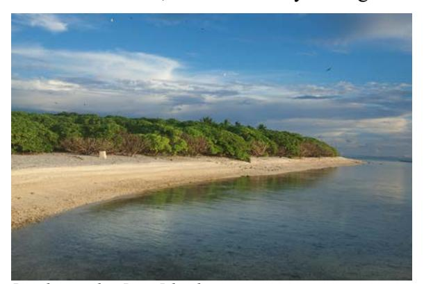

*Beach strand at Rose Island.*  Kelsie Ernsberger/USFWS

transition zone between the sea and the forest (Amerson et al. 1982). This community is dominated by herbaceous creeping vines, and shrubby species up to 6.5 feet or more in height (sometimes prostrate or dwarfed by the strong, salty sea winds). It also includes strand species found on coasts with exposed rocks within, or beyond, the reef (Amerson et al. 1982). The beach strand habitat is a harsh environment, subjected to dry conditions, high temperatures, salt spray, or occasional inundations by salt water. In addition, plants in this community must grow in direct tropical sunlight and grow on poor sandy or rocky soil.

Beach strand habitat is a result of dynamic, natural processes of waves washing away and rebuilding sediment on both Rose and Sand Islands. On Sand Island the habitat is often devoid of vegetation or sparsely vegetated while on Rose Island the habitat supports *Tournefortia argentea* (tree heliotrope) shrubs. The beach strand vegetation on Rose Island is dominated by *Boerhavia repens* and historically also consisted of tamole (*Portulaca lutea*) (Amerson et al. 1982, IUCN 1991, Setchell 1924). It is presently confined to a single boulder in the reef crest. These large coral blocks thrown up by extreme storm events serve as roosts for Pacific reef herons and brown boobies. It is likely that seeds of additional species regularly wash up on the beach and then die back as storm surges wash them away. In 1921 when Mayor described the atoll, Sand Island had absolutely no vegetation; however, some species would be established periodically until the next storm waves washed them away.

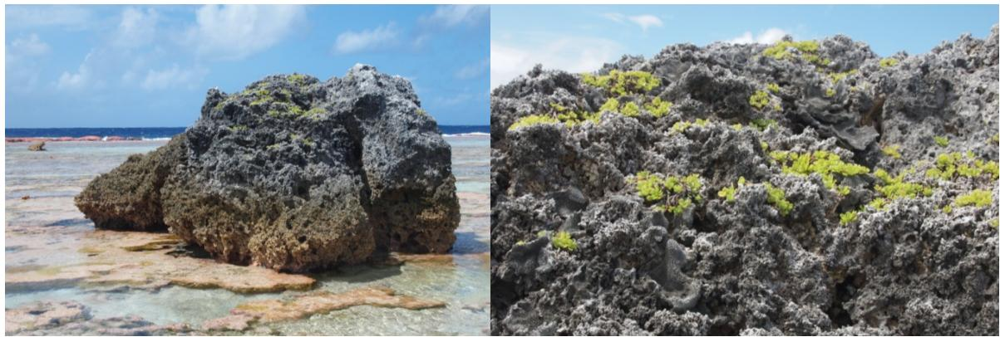

Portulaca lutea *growing on a block at Rose Atoll.* Jiny Kim/USFWS

Some native ground-nesting seabirds (i.e., sooty terns) thrive in this open habitat. Sooty terns, brown noddies, gray-backed terns, and black-naped terns use (mainly for nesting) the beach strand habitat on Rose and Sand Islands. Rose Atoll beach strand habitat is an important foraging, resting, and

molting ground for six migratory shorebirds: the ruddy turnstone, sanderling, wandering tattler, whimbrel, bristle-thighed curlew, and the Pacific golden plover. Ghost crabs forage and dig their burrows in the beach strand and *Coenobita* (hermit) crabs traverse the sand at night to get to the water's edge for hydration. Due to overharvest, loss of beach habitat, incidental kills in fishing gear, and other reasons, green turtle numbers have declined worldwide and the beach strand at Rose Atoll provides a vital nesting area for this species. Present management of the beach strand includes removing marine debris and looking for and controlling invasive plants.

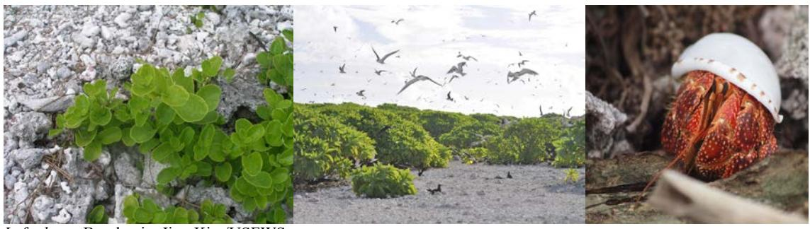

*Left photo:* Boerhavia*.* Jiny Kim/USFWS *Middle photo: Seabirds using beach strand habitat.* Jiny Kim/USFWS *Right photo:* Coenobita *crab.* Kelsie Ernsberger/USFWS

### **4.3.6 Littoral Forest**

Littoral forest is a common vegetation type occurring on tropical shores. It often consists of a dense forest dominated by a single tree species. The major factor determining the distribution and extent of littoral forests is the ocean. Common characteristics for tree species in the community include tolerance of bright sunny conditions, dispersal by buoyant, salt-tolerant seeds (or hitchhiking on seabirds), and tolerance to salt spray and wind. However, most species are not tolerant of standing water or frequent incursions of saltwater (Amerson et al. 1982). Typically, the forest floor is open due to the lack of bright sunlight required for germination and growth of most herbs and shrubs on the beach strand (Whistler 1992). The limiting factor for tree species is substrate and soils (Amerson et al. 1982). The dominant tree species of Samoa include: *Barringtonia asiatica* and *Calophyllum inophyllum* in certain beach areas and historically pu'a vai on Rose Atoll. But other tree species that may also thrive in this forest type include *Hernandia nymphaeifolia*, *Terminalia catappa*, *Cordia subcordata*, *Neisosperma oppositifolium*, *Guettarda speciosa*, *Thespesia populnea*, *Tournefortia argentea*, and *Cocos nucifera*. Although common and sometimes dominant on Polynesian shores, coconut trees have presumably been planted or are remnants of former cultivation due to their presence mostly in or near villages and coastal plantations.

A map made in 1839 shows Rose Island extended across the width of the atoll rim and was covered by forests (Keating 1992). When Alfred Goldsborough Mayor did the first scientific account of Rose Atoll in 1920, he found the southern and southeastern half of Rose Island covered with a dense pu'a vai-dominated forest, with no other understory plants, except a single coconut tree. The largest trees were found near the southern end of the forest. Plant observations from 1974 to 1988 have documented at least 10 additional species that were established at one point (Wegmann and Holzwarth 2006). However, during the visit in 2010, eight species (*Boerhavia repens*, *Tournefortia argentea*, *Pisonia grandis*, *Portulaca lutea*, *Hibiscus tiliaceus*, *Nephrolepis hirsutula*, *Cocos nucifera*, *Cordia subcordata*) were documented. Appendix A lists the plant species of Rose Atoll, collections or first observations, and most recent information about current presence or absence. Rose Atoll's littoral forest is currently dominated by *Tournefortia argentea* which forms a forest up to 25 feet tall. Historically Rose Island supported a mature stand of pu'a vai.

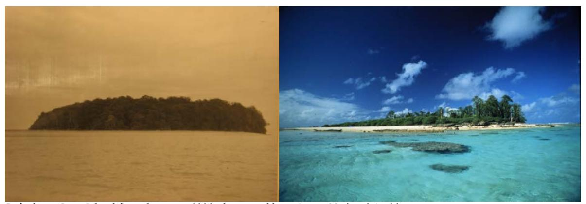

*Left photo: Rose Island from the sea in 1939, dominated by pu'a vai.* National Archives *Right photo: Rose Island from the lagoon in 2007 with just a few unhealthy trees remaining.* USFWS

Pu'a vai *(Pisonia grandis)*, found almost exclusively in Indo-Pacific islands from tropical Africa to eastern Polynesia and Micronesia, is spread by sticky fruits that become attached to seabirds. It is a shade-intolerant plant that thrives on sandy shores and islands, particularly in soil enriched with guano from seabirds. The distinct soil in the *Pu'a vai*grove on Rose Island consists of an upper layer of rich chocolate-colored humus, which extends to over 6 feet in depth (Mayor 1921, Lipman and Taylor 1924) overlying the calcium carbonate bedrock. *Pu'a vai* is considered "one of the most salttolerant plants of which we have record at present" that is able to inhabit the unusually high salt concentrations in the soil on Rose Island (Lipman and Shelley 1924). The lack of fresh surface water and the properties of the soil most likely explain the limited number of plant species that are on the atoll (Amerson et al. 1982).

*Pisonia* forests are declining throughout the Pacific. Historically, the best example of a *Pisonia* forest in American Samoa, Rose Island's *Pisonia* forest has undergone several gradual periods of dieback and regeneration. The dieback was noted in the early 1970s but the forest was regenerating by 1976 (Amerson et al. 1982). The cause of this dieback was unknown, but thought to be disease, drought, or an insect attack (Amerson et al. 1982). First documented in 2002, the soft scale insect (*Pulvinaria urbicola*) is associated with the once healthy forest's decline (Wegmann and Holzwarth 2006). In

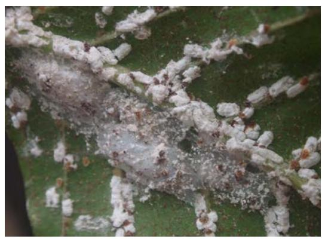

*Scale insect on* Pisonia *leaf.*  Kelsie Ernsberger/USFWS

May 2004, 10 of the remaining 11 mature *Pisonia* trees were treated with injections of a systemic pesticide called imidacloprid (Trade name Imicide ®). Loss of trees continued so it appears the response may have come too late and this approach alone has not significantly deterred the scale infestation. Scale insect infestation is associated with significant loss of *Pisonia* forests worldwide (Queensland Parks and Wildlife Service 2006, 2007). Additionally, since the Polynesian rat was eradicated in 1993 coconut palms have been released from rat herbivory and have increased to a population size that threatens to shade out recruitment of native canopy trees.

The *Pisonia* trees along with tree heliotrope serve as important nesting and roosting habitat for the red-footed booby, great and lesser frigatebird, gogo uli , and white tern, which prefer to nest above the ground on trees. Tree heliotrope also provides cover for red-tailed tropicbirds, brown noddies, sooty terns, and brown boobies, which nest directly on the ground. Shrubs and rock piles also provide shade and daytime cover for the numerous land hermit crabs that inhabit the island. Thick vegetation and rock crevices also provide shelter and protection for the largest land crab, the coconut crab (*Birgus latro*). This species seems to have increased in density since the eradication of rats at Rose Atoll. The relatively open understory of the *Pisonia* forest is also favored habitat for Pacific goldenplovers, wandering tattlers, and ruddy turnstones (Engilis and Naughton 2004). Littoral forests were at one time a common habitat in the Pacific; however, human alteration of island landscapes has limited this forest type. The eradication of rats from Rose Atoll by 1993 provides important habitat for plant species that will be able to recolonize the atoll and perpetuate the littoral habitats that are in decline throughout the Pacific region.

# **4.4 Threatened, Endangered, and Sensitive Species**

One goal of the Refuge System is "to conserve, restore where appropriate, and enhance all species of fish, wildlife, and plants that are endangered or threatened with becoming endangered." In the policy clarifying the mission of the Refuge System, it is stated, "we protect and manage candidate and proposed species to enhance their status and help preclude the need for listing." In accordance with this policy, the CCP planning team considered species with Federal or State/Territory status, and other special status species, in the planning process.

## **4.4.1 Tuli'olovalu (***Numenius tahitiensis***) or Bristle-thighed Curlew**

Tuli'olovalu breed in western Alaska and migrate during the winter to remote, small islands and atolls in the tropical Pacific Ocean (Marks and Redmond 1994). The beaches and littoral forest of the atoll are important wintering ground for tuli'olovalu . This rare shorebird is the only migratory species whose entire population is restricted to the insular Pacific (Hayman et al. 1986, Marks et al. 1990). Marks and Redmond (1996) documented the strong fidelity shown by tuli to wintering sites. At Laysan Island in the Northwestern Hawaiian Islands (NWHI), only 1 of 16 marked adult tuli'olovalu changed its wintering home range area in 3 years of study (Marks and Redmond 1996).

This species undergoes a molt-induced flightless period (unique in shorebirds) and leaves many birds more susceptible to predatory attacks during that time (Marks 1993, Marks and Redmond 1994). Therefore, predator-free islands to which these birds are adapted have become increasingly important as competition for space increases and less habitat is available due to an increasing human population. With a global population of approximately 10,000 individuals (Morrison et al. 2006), the Service (USFWS 2008) has designated the curlew as a Bird of Conservation Concern and it is also ranked as Vulnerable by the International Union for Conservation of Nature (IUCN) (Engilis and Naughton 2004, IUCN 2008). It is also highlighted as a globally threatened species in need of regional action by the South Pacific Regional Environmental Programme.

### **4.4.2 Tuli (***Pluvialis fulva***) or Pacific Golden Plover**

The Pacific golden plover breeds in western Alaska and Siberia and winters throughout the Pacific Islands. Plovers foraging at Rose Atoll likely come from the Alaskan breeding population, however, these affinities are still poorly understood (Engilis and Naughton 2004). Tuli are widespread across the Pacific region in any open habitat from beach strands to upland pastures, occurring in good numbers on remote islands and atolls. Amerson et al. (1982) estimated 4,500 tuli in American Samoa, a small population number relative to the total United States Pacific Islands (USPI) populations (Engilis and Naughton 2004). Johnson et al. (2008) studied migration behavior of Pacific golden plover in American Samoa and were able to confirm that at least 1 of the 30 birds they tagged on Tutuila Island was breeding in Alaska. The birds departed Samoa for the northward migration in mid-April. The return of the plovers began in late August and peaked in mid-September. This represents at least a 5,594-mile trip from American Samoa. Johnson et al. (2008) estimated there were 500 tuli on Tutuila. The largest count of tuli recorded at Rose Atoll was 49 individuals in 1984. The USPI Regional Shorebird Conservation Plan identified the Pacific Golden Plover as a species of High Conservation Concern (Engilis and Naughton 2004).

### **4.4.3 I'a sa (***Chelonia mydas***) or Green Turtle**

I'a sa is listed as threatened under the ESA. Adults can weigh up to 500 pounds and are often found living near tropical reefs and rocky shorelines. Females may lay up to 6 clutches per season in pits excavated in soft beach sand, with each clutch containing about 100 eggs. Hatchlings and juveniles live in pelagic waters. Little information exists on the feeding behavior of post-hatchlings and juveniles living in pelagic habitats, but most likely they are exclusively carnivorous (e.g., soft-bodied invertebrates, jellyfish, and fish eggs). Subadult and adult turtles residing in nearshore benthic environments are almost completely herbivorous; their common name is derived from the color of the animals' body fat, which is green from the marine algae and sea grasses they eat.

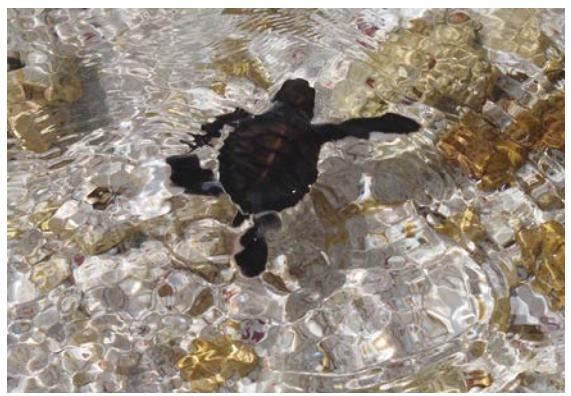

*I'a sa swimming in Rose Atoll lagoon.*  Kelsie Ernsberger/USFWS

I'a sa use the protected habitats of Rose Atoll for feeding and nesting. Their numbers have declined throughout the south Pacific due to the combined effects of habitat destruction, human harvest for meat and shells, depredation by introduced predators, and incidental drowning in fishing gear (Kinan 2005, Craig 2002). The isolated beaches on Rose Atoll provide an important nesting ground for i'a sa. The number of i'a sa nesting annually at Rose Atoll has been estimated at 24–36 (Tuato'o-Bartley et al. 1993). However, the total number of i'a sa using Rose Atoll as a nesting ground could actually be several fold higher, since females only nest every 2–5 years (Spotila 2004, NMFS and USFWS

1998a), and thus a different set of turtles nest each season. Given the scarcity of beaches where turtles can nest and their eggs hatch unmolested, the value of the isolated beaches at Rose Atoll is considerable, even if only 120 or so i'a sa nest there.

The Historical Summary of Turtle Observations at Rose Atoll, American Samoa, 1839–1991 (Balazs 1991) is a compilation of historical data and notations. The document lists a total of 47 entries for that time period, most of the earlier ones simply report presence or absence of turtles. From 1970

onward, turtle observations were more quantitative, if no less sporadic and opportunistic due to the expense of reaching the remote atoll. Aerial, land-based, and water-based surveys recorded the number of turtles, their tracks, nest pits, eggs, hatchlings, and nesting and mating behaviors (Balazs 1991). An estimated 200 turtles were seen in the lagoon during an aerial survey in August 1974, the highest value recorded. A total of 406 pits were counted on both Rose and Sand Islands during a survey in October 1976. A decade later, in fall 1985, biologists counted a total of 244 pits on both islands, and a decade after that, in fall 1992, the total count was 81 nesting pits. However, the problem with nest pit counts is that female turtles often dig test pits before actually laying eggs, and they lay multiple clutches the year they make the long migration to their natal nesting beach. Also, unless there is a major storm event that wipes the beach clean, it is difficult to reliably discern if a pit was dug that season or the season before (Ponwith 1990). These limitations, as well as uneven survey effort, should be taken into account when comparing pit counts from various years, and it should be recognized that pit counts are not the equivalent of a population count.

The i'a sa that visit Rose do so seasonally for reproduction, and spend the rest of their time in other parts of the south Pacific. Metal flipper tags were applied to a total of 46 nesting females from 1971 to 1996 in order to see where they traveled (Balazs 1991). Three of these tags were re-sighted after the turtles were killed for food or fatally injured from a hunting attempt. Two were located in Fiji at the time of tag recovery and one in Vanuatu (both island groups to the west of Samoa). A fourth turtle was re-sighted at Rose Atoll, 9 years after she was initially tagged (Ponwith 1990), making multiple visits to the beach to nest.

Given the limited re-sighting rate of flipper tags, satellite tagging was subsequently employed in an effort to better comprehend the migration routes of green turtles in the south Pacific (Craig et al. 2004). Seven females at Rose Atoll were outfitted with satellite tags during the nesting seasons of 1993 to 1995. After 2 months of nesting at Rose, six of the turtles traveled to feeding grounds in Fiji. The seventh turtle traveled due east to Raiatea, an island in French Polynesia. The turtles' migration route crossed 994 miles of ocean and took an average of 40 days. The route followed prevailing surface currents as recorded by satellite-linked ocean drifters deployed from Rose in February 2002, though the drifters traveled more slowly (net rate of 1.0 foot per hour) than the turtles (3.6 feet per hour). While these i'a sa spend the majority of their life in Fiji, accumulating the fat stores that will enable them to reproduce, the remote beaches at Rose Atoll provide invaluable undisturbed nesting habitat (Craig et al. 2004).

Unlike many places in their range, at Rose Atoll, turtles can approach the beach without risk of being harvested for meat or drowned in nets, and eggs and hatchlings are free from depredation by wild pigs, rats, dogs, and humans. Marine debris can also prove deadly when it entangles turtles or is mistaken for food and ingested. Plastics are particularly harmful as they may remain in the turtle's stomach for long periods of time, releasing toxic substances, and can clog the digestive system. Natural predators and dangers inherent to the human populated areas east of Samoa where the turtles feed continue to impact turtle populations. Craig et al. (2004) stresses the importance of working towards protection for turtles in their foraging waters east of Samoa, since this is where turtles spend 90% of their adult life. Continued monitoring of the nesting beaches at Rose Atoll will give researchers a proxy for population trends of i'a sa in the region.

# **4.4.4 Hawksbill Turtle (***Eretmochelys imbricata***)**

Hawksbill turtles use the protected habitats of Rose Atoll. Similar to i'a sa, their numbers have declined throughout the south Pacific, reduced by the combined effects of habitat destruction, human harvest for meat and tortoise shell, depredation by introduced predators, and incidental drowning in fishing gear (Kinan 2005; Craig 2002). Although it is not clear if hawksbills nest at Rose Atoll, they are consistently sighted using the lagoon and open water habitats around the atoll.

The hawksbill turtle is listed as endangered under the ESA. It is one of the smaller turtles and takes its species name (*imbricata*) from the overlapping plates on its upper shell and its common name from the shape of its hooked jaw. The carapace (top shell) of an adult ranges from 25-35 inches in length and has a "tortoiseshell" coloring, ranging from dark to golden brown, with streaks of orange, red, and/or black. Hawksbill turtles use different habitats at different stages of their life cycle, but are typically found around coastal reefs, rocky areas, estuaries, and lagoons. Their narrow head and jaws, shaped like a beak, allow them to get food from crevices in tropical reefs. They eat sponges, anemones, squid, and shrimp. Hawksbills have been consistently reported at Rose Atoll in historical accounts (Setchell 1924), as well as more recent surveys (Sekora 1974, Ludwig 1981, Amerson et al. 1982, Morrell et al. 1991, Flint 1992, NMFS PIFSC 2006).

### **4.4.5 Faisua (***Tridacna maxima***) or Giant Clam**

The colloquial term "giant clam" refers to eight species of marine bivalves found in two genera (*Hippopus* and *Tridacna*) of the molluscan subfamily Tridacninae. Surveys of faisua populations at Rose Atoll have identified a single species, *Tridacna maxima* (Wass 1981, Green and Craig 1999). Less than a third of the size of the "true" giant clam *Tridacna gigas*, *T. maxima* is commonly referred to as the "small giant clam," with shells generally not exceeding 9 inches in length. Found living on the surface of reefs or sand, or partly embedded in coral, the faisua occupies well-lit areas, due to the symbiotic relationship with single-celled photosynthetic algae (zooxanthellae) found in its fleshy mantle that require sunlight for energy production. Faisua also filter-feed on phytoplankton extracted from seawater siphoned through their body.

Mature faisua are hermaphrodites that reproduce by broadcast spawning, releasing sperm first, followed by eggs. The fertilized egg develops into a larva within 3 hours and passes through two additional larval stages before undergoing metamorphosis after 8-10 days into a juvenile, sessile

faisua that acquires zooxanthellae. Reproductive and growth studies at Rose Atoll (Radtke 1985) showed the clams reach maturity at about 10 years of age corresponding to a shell size of 3–5 inches. Young faisua are male and put most of their energy into growth, becoming hermaphrodites upon maturity and accompanied by a slower growth phase. Reproduction is stimulated by the lunar cycle, the time of day, and the presence of others eggs and sperm in the water. Faisua lifespan at Rose Atoll is estimated to be approximately 28 years.

*Tridacna maxima* has the widest geographic range of all giant clam species. It is found in the oceans surrounding east Africa, India, China,

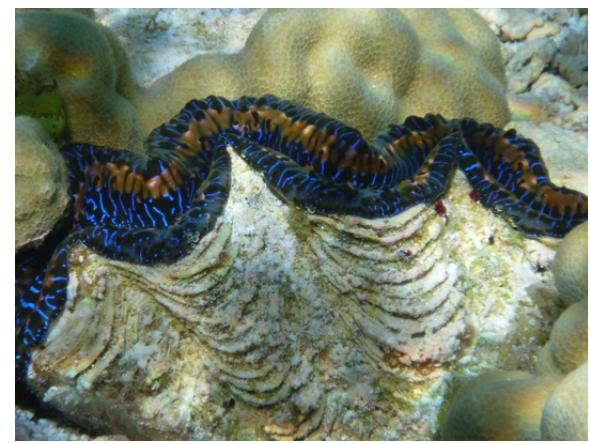

*Faisua (*Tridacna maxima*) embedded in* Astreopora *coral.*  Kelsie Ernsberger/USFWS

Australia, Southeast Asia, and the islands of the Pacific. Although classified as Least Concern on the IUCN Red List, this culturally and ecologically important marine animal has declined precipitously from overharvesting in many populated areas including the high islands of American Samoa, but

remains abundant at Rose Atoll (Green and Craig 1999). *Tridacna maxima* is listed under Appendix II of CITES meaning it is not necessarily threatened but that trade must be controlled in order to avoid use incompatible with its survival.

The first survey of faisua at Rose was undertaken by the American Samoa DMWR in an attempt to quantify the resource in response to requests by the Samoans that they be allowed to harvest the clams (Wass 1981). The study found faisua to be uncommon in the ava and fore reef but abundant in the lagoon. Distribution in the lagoon was patchy, with faisua abundant on solid substrate in the shallow, relatively clear parts of the lagoon, but with lower densities in the southern lagoon and below approximately 45 feet where water became more turbid. Constraints of time as well as the uneven distribution of suitable clam substrate in the lagoon made density determinations difficult, with the single transect survey in the southwestern lagoon yielding an average density of 0.33 clams per square yard. Size frequency data were collected at four lagoon locations; shell measurements ranged from 0.4 to 9 inches, with approximately 31% being greater than 5.5 inches, the size at which all clams are fully hermaphroditic.

More extensive transects by Radtke (1985) in various habitats showed marked differences related to depth and substrate. Lagoon patch reefs in 20–40 feet of water were concluded to be prime habitat for faisua, with densities of 3.6–7.2 clams per square yard and 40–50% of the area colonized. Smaller coral patches (with up to 3.6 clams per square yard) and lagoon substrate (with up to 6 clams per square yard) were colonized at approximately 20%. Shell measurement ranged from 0.4 to 9 inches, with bimodal peaks around 1–2 inches and 6–7 inches. Radtke's total estimated number of faisua in the lagoon was approximately 1,338,000. Unlike Wass (1981) Radtke did not favor controlled harvesting, stating, "they have a respectable number of organisms in this ecosystem, but due to their slow growth would have a small sustainable yield … quantitative balance of production of *Tridacna maxima* at Rose Atoll does not appear to be within the scope of rational exploitation and exploitation could endanger the perpetuity of the unique environment."

A pivotal study by Green and Craig (1999) highlights the importance of Rose Atoll as a refuge for faisua. From 1994 to 1995 they surveyed all 6 islands of American Samoa and recorded a total of 2,853 clams in survey transects, 97% of which were found at Rose. The majority were located in the lagoon, with faisua favoring areas at the base of pinnacle patch reefs. Roughly a quarter of the clams were mature in size, and mortality was estimated as being very low, due mostly to natural causes. The largest clam recorded was 11 inches across the widest part of the shell. Given the mean density of faisua, the population at Rose was estimated to be approximately 27,800 clams. The dramatically lower estimate than that provided by Radtke (1985) was considered to be the result of differences in sampling design rather than a population decline. The authors theoretically considered Rose to be a potential source of faisua recruits to other islands in the Samoan archipelago, given larval longevity (approximately 8 days, range 5–15 days) and water currents flowing westward from Rose at 16 miles per day.

Towed-diver surveys conducted by NMFS PIFSC in 2006 recorded more than 1,100 giant clams on 30 linear miles of transect, with approximately 95% recorded on reefs inside the lagoon (NMFS PIFSC 2006). Researchers have noted that the pinnacle just inside the ava had a markedly lower density of faisua than the rest of the lagoon and it seems likely that this is where illegal harvesting has taken place (Wegmann and Holzwarth 2006).

# **4.5 Seabirds**

Rose Atoll's importance to seabirds in the South central Pacific is disproportionately large relative to the size of its islands because some of the seabird species have been extirpated on most other islands in the region. There are very few uninhabited islands in the region so Rose provides breeding habitat for species that do not thrive in proximity to human settlements. Seabirds and migratory shorebirds are the numerically dominant terrestrial vertebrates. Since 1975, 16 species of seabirds have been recorded on land and 12 species are known to breed there. Efforts to eradicate the island of Polynesian rats began in 1991, with eradication declared in 1993. This enhanced the value of the atoll for seabird conservation and has increased the possibilities that other Pacific seabird species that are currently threatened from habitat loss, predation, and invasive species, such as ta'i'o (wedge-tailed shearwaters), Christmas shearwaters, Bulwer's petrel, Phoenix petrel, and the Polynesian storm petrel, might someday colonize the site. Social attraction methods may accelerate or facilitate this process of recruitment. Rose Atoll falls into the North American Bird Conservation Region called "Other U.S. Pacific Islands" and is now considered separately from sites in the Caribbean (USFWS 2008).

For most if not all of the seabirds, listed terrestrial threats such as habitat destruction, invasive weeds, disturbance, ungulates, and introduced predators limit populations (Metz and Schreiber 2002). Introduced predators such as rats, mongooses, and cats have reduced populations at many sites worldwide (Harrison 1990).

Seabirds using terrestrial habitats at Rose Atoll all forage in the pelagic zone typically in association with large epipelagic subsurface predators such as skipjack (*Katsuwonus pelamis*) and yellowfin tunas (*Thunnus albacares*). These fish concentrate and force prey to the surface in the course of their own foraging and also make it available to foraging seabirds (Au and Pitman 1988). El Niño-Southern Oscillation conditions can cause total or partial breeding failure in some locations (Schreiber and Schreiber 1989, Schreiber 1994, Orta 1992b) when changes in the temperature of water masses in proximity to the breeding sites change and force tuna to move elsewhere to find their preferred thermal conditions. A reduction in the biomass of these subsurface predators may render the preferred prey of tropical pelagic seabirds unavailable or difficult for the birds to detect. The relationships between these species is complex and poorly understood but it is a reasonable probability that exploitation of populations of large epipelagic fish by fishing may also affect the breeding success and survival of seabirds at Rose Atoll by reducing opportunities for this type of feeding interaction. The trophic relationships and effects on reproductive performance in this complex system have not been well quantified.

# **4.5.1 Tava'e'ula (***Phaethon rubricauda***) or Red-tailed Tropicbird**

The tava'e'ula is a medium-sized bird with shining pinkish-white feathers and red tail plumes. They breed mainly on oceanic islands and coral atolls in the Indian and Pacific oceans. Breeding adults are mostly sedentary; however, they avoid land when not breeding and are among the most pelagic and solitary of seabirds (Schreiber and Schreiber 1993, Harrison 1990, Harrison et al. 1983). At sea, tava'e'ula are evenly distributed throughout their range (Schreiber and Schreiber 1993, King 1970). Little is known about their movements outside the breeding season.

The world population is estimated at 17,000–21,000 pairs; with an estimated 12,000–14,000 pairs in the Pacific (Schreiber and Schreiber 1993, Gould et al. 1974). Small colonies exist in American

Samoa and other remote Pacific islands. The largest number of active nests observed at Rose on any particular visit was 38 in 2002. The world population seems stable in many areas and may be increasing in some areas, but there is a lack of information on past population estimates so comparisons are difficult (Schreiber and Schreiber 1993). Within the USPI, tava'e'ula populations appear stable overall.

Tava'e'ula nest on the ground under vegetation in the understory and base of trees, among rocks, roots, or logs and less commonly in the cavities of cliff faces (Schreiber and Schreiber 1993, Orta 1992a). At Rose, red-tailed tropicbirds choose to nest under *Tournefortia* or *Pisonia* (Morell and Aquilani 2000). Nests are scrapes that vary from a shallow depression in the sand to more elaborate structures consisting of twigs and leaves (Schreiber and Schreiber 1993, Harrison 1990, Fleet 1974). Breeding occurs annually, but timing varies depending on locality (Schreiber and Schreiber 1993, Harrison 1990). First breeding usually occurs around 2–4 years (Schreiber and Schreiber 1993, Harrison 1990). The oldest-living bird recorded was 23 years (Klimkiewicz and Futcher 1989).

Tava'e'ula are attracted to ships, presumably because flying fish, their main prey, are scattered by ships (Harrison et al. 1983). Previously the tava'e'ula also nested on Tutuila, however the abundance of introduced animals such as rats, cats, and dogs that attack ground-nesting birds likely led to their extirpation. Introduced ants have been recorded attacking incubating adults, chicks, and eggs at some colonies in the Pacific.

### **4.5.2 Atafa (***Fregata minor***) or Great Frigatebird**

The atafa has a pantropical distribution that overlaps with lesser frigatebirds (Orta 1992b) and breeds mainly on small remote islands, typically within regions with tradewinds in the tropical Atlantic, Indian, and Pacific Oceans. At sea, birds can be found any distance from land but they are most abundant within 50 miles of breeding and roosting sites (King 1967). Adults, juveniles, and nonbreeders disperse widely throughout the tropical seas.

The world population is estimated at 500,000-1,000,000 birds (Orta 1992b). A small population of fewer than 50 pairs nests on Rose Island. They are colonial nesters, often constructing platform nests in the tops of bushes and trees. At Rose Island they nest in *Tournefortia* and *Pisonia* trees. Breeding occurs throughout the year depending on locality, with egg laying primarily in the dry season (Orta 1992b). Great frigatebirds are sexually dimorphic; females tend to be 25% heavier than males (Orta 1992b) and males are almost entirely black, with varying amounts of dark metallic green and purple

feathers and a large, red gular pouch that they inflate during courtship. Females are black with a white breast patch. Atafa are seasonally monogamous; it is extremely rare for pairs to remain together for subsequent breeding attempts (Orta 1992b). Females breed biannually, sometimes every 3–4 years (Orta 1992b). Postfledging care, which continues for up to 18 months, is provided by females. Sexual maturity begins around 8–10 years and most birds return to the natal colony to breed (Orta 1992b).

Atafa usually feed in mixed-species flocks over tuna schools (Orta 1992b, King 1967). Their diet

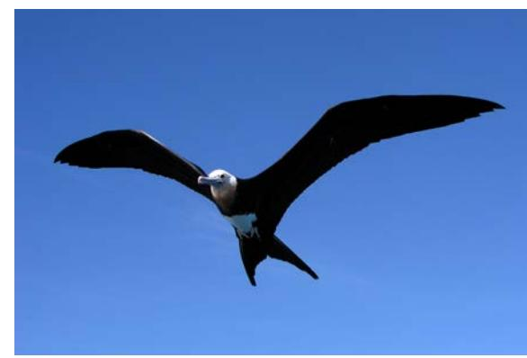

*Atafa.* Jim Maragos/USFWS

consists mostly of flying fish and squid which they capture at or above the water's surface (Harrison et al. 1983). Frigatebirds are notorious for their kleptoparasitism (a form of feeding where one animal takes prey from another that has caught or killed it), but most of their food is obtained by fishing (Harrison et al. 1983). Tuna fisheries exploitation likely could lead to the decrease in availability of prey for atafa (Metz and Schreiber 2002).

### **4.5.3 Atafa (***Fregata ariel***) or Lesser Frigatebird**

The lesser frigatebird is also called atafa and has a pantropical distribution that coincides with, but is smaller than, that of the great frigatebird (Orta 1992b, Clements 2000). At sea, birds are most abundant within 50 miles of breeding and roosting islands although they can be found any distance from land (King 1967). Juveniles and nonbreeders disperse throughout tropical seas (Harrison 1990).

The species' world population is estimated at several hundred thousand birds (Orta 1992b). Small colonies exist in American Samoa (Amerson et al. 1982) with fewer than 100 pairs nesting at Rose Atoll. Within the USPI, lesser frigatebird populations have significantly declined due to the introduction of cats and rats; however, eradication of cats at Howland Island and Jarvis Island NWRs seems to have resulted in an increase in lesser frigatebird populations at those sites (USFWS 2005, Rauzon et al. 2011). Human exploitation of tuna fisheries could potentially affect prey availability for lesser frigatebirds because they rely upon the large subsurface predators to push the species on which they feed to the surface (Orta 1992b).

Breeding takes place on small, remote tropical islands. Nests and stick platforms are constructed on trees and bushes (e.g., *Pisonia* and *Tournefortia* bushes and trees on Rose Island), but when suitable vegetation is not available birds nest on bare ground (Orta 1992b). Lesser frigatebirds are sexually dimorphic; females tend to be heavier than males and males have a scarlet gular pouch that is inflated during courtship displays (Orta 1992b). They are seasonally monogamous; it is unlikely that pairs remain together for future breeding attempts (Orta 1992b). If successful, females can only breed successfully every 2–3 years since post-fledging care is provided by the female and can last 4–6+ months (Orta 1992b). Age to sexual maturity is unknown (Orta 1992b) but probably similar to that of great frigatebird at 8–10 years.

Lesser frigatebirds feed in pelagic waters, usually in mixed-species flocks over tuna schools (Orta 1992b, King 1967). Their diet consists primarily of flying fish and squid that they capture at or above the water's surface (Nelson 1976). Lesser frigatebirds are also notorious for kleptoparasitism but obtain most of their food by direct capture (Nelson 1976).

# **4.5.4 Fua'o (***Sula dactylatra***) or Masked Booby**

Masked boobies have a pantropical distribution (Anderson 1993, Woodward 1972). There are four subspecies; *S. d. personata* breeds on islands in the central and western Pacific (Clements 2000). Within the USPI, the largest colonies are on Howland, Baker, and Jarvis Islands, but a significant portion of the population nests in the Northwestern Hawaiian Islands. Birds forage in offshore and pelagic waters (King 1967). They are most abundant in the vicinity of breeding islands, but they can be encountered far out at sea (King 1967). During nonbreeding periods, adults may visit sites 622– 1,243 miles from breeding colonies (Woodward 1972, Clapp and Wirtz 1975, O'Brien and Davies 1990).

The world population is widely distributed and therefore difficult to estimate but is thought to be several hundred thousand birds (Anderson 1993). Within the USPI, there are approximately 8,300 breeding pairs with 1,200 pairs on Jarvis Island and over 1,500 pairs each on Howland and Baker Islands (Forsell 2002). Small colonies occur in American Samoa and Palmyra Atoll (Woodward 1972, King 1967, Anderson et al. 1982), and Wake Atoll was recently recolonized by birds banded at Johnston Atoll (Rauzon et al. 2011). Rose Atoll is home to approximately 25 pairs.

Masked boobies breed on oceanic islands and atolls. They tend to nest on open ground often near a cliff edge or on low sandy beaches or rocky ground (Anderson 1993, Harrison 1990). At Rose Atoll, they nest in open areas on the ground. They also form "clubs" or aggregations of nonbreeding birds on the fringe of breeding colonies (Woodward 1972). Breeding is fairly synchronous but timing varies depending on locality (Harrison 1990). Masked boobies are seasonally monogamous and at least 45% of pairs at Kure Atoll retained their mates through a second breeding season (Kepler 1969). Two eggs are laid but broods are typically reduced to one chick by siblicide (Anderson 1993). Sexual maturity begins around 3–4 years and most birds return to their natal colony to breed (Anderson 1993, Nelson 1978, Kepler 1969). Adults sometimes skip a year between breeding attempts (Woodward 1972, Harrison 1990).

Masked boobies feed by plunge-diving and can be found more than 93 miles from land (Harrison 1990). They forage singly or in mixed-species flocks associated with schooling tuna (King 1967, Harrison et al. 1983). In Hawai'i, fish constituted greater than 97% of the diet and squid less than

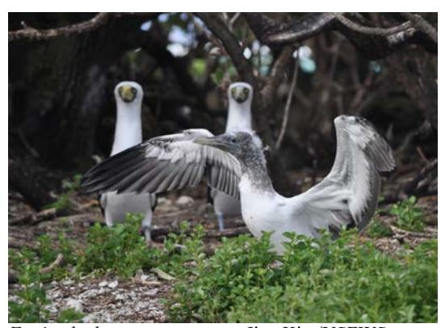

*Fua'o chick testing its wings.* Jiny Kim/USFWS

3%; flying fish and jacks were the most important prey (Harrison et al. 1983). The oldest-known bird was 25 years. On Kure Atoll, annual adult mortality was less than 8.6%; mortality between independence and age 4 was 72% (Harrison et al. 1983).

Masked boobies breed on a few islands with human populations but they are vulnerable to human disturbance (Anderson 1993). Depletion of tuna due to fishing could potentially have an impact on the availability of prey (Harrison 1990). Commercial-size mackerel scad were important in the diet of masked boobies at some locations, and potential effects of commercial fisheries are unknown (Harrison 1990).

# **4.5.5 Fua'o (***Sula leucogaster***) or Brown Booby**

Fua'o have a pantropical distribution (Schreiber and Norton 2002). There are four subspecies; *S. l. plotus* breeds on islands in the central and western Pacific (Clements 2000). In the USPI, brown boobies occur in the greatest numbers in the Hawaiian Islands. Breeding adults are mostly sedentary and juveniles disperse throughout the tropical seas (Carboneras 1992, Harrison 1990). At sea, they occur more nearshore than the other booby species (*Sula dactylatra*) and they are rarely seen over 50 miles from the nearest land (King 1967). Little is known of movements during nonbreeding periods but adults have been found up to 1,802 miles from breeding sites (Schreiber and Norton 2002).

Worldwide, the number of brown boobies is estimated at 221,000–275,000 pairs, which includes 50,000–70,000 pairs of *S. l. plotus* (Schreiber and Norton 2002). About 3,700 pairs nest in the USPI; approximately 700 nest in American Samoa. At Rose there are approximately 375 breeding pairs of

brown boobies. The world population has declined dramatically over the past 200 years and possibly only 1–10% of historic populations remain (Schreiber and Norton 2002). Currently the USPI population appears stable, with populations on Wake Atoll and Howland and Baker Islands gradually rebounding following eradication or control of cats (Rauzon et al. 2011).

Fua'o breeding range overlaps with that of the other two species of booby on oceanic islands and atolls (Carboneras 1992, Harrison 1990). Nesting occurs on flat ground, often on cliff ledges, but they will also nest on sandy islands and bare coral atolls (Schreiber and Norton 2002). At Rose Atoll, brown boobies nest on the ground under the canopy of *Pisonia* and *Tournefortia* trees. Nests vary from a scrape in the sand to a fairly well-formed pile of twigs and grasses. Breeding is synchronous but timing varies depending on locality and occurs throughout the year (Schreiber and Norton 2002). Brown boobies are monogamous but maintenance of long-term pair bonds varies by location (Schreiber and Norton 2002). Pairs lay two (vary rarely three) eggs but the brood is often reduced to one chick as a result of siblicide (Schreiber and Norton 2002). Age of first breeding is typically 4–5 years (Schreiber and Norton 2002, Harrison 1990).

Fua'o feed by plunge-diving and feeding is often solitary, but they may be found in feeding flocks with other species (Schreiber and Norton 2002, Harrison 1990). They forage in nearshore waters, ranging from 5 to 44 miles from land, and feed mostly on flying fish, squid, mackerel scad, juvenile goatfish, and anchovy (Harrison 1990, Harrison et al. 1983). The oldest-known bird was 26 years, but they probably live to at least 30 years (Schreiber and Norton 2002, Simmons 1967). Adult

survivorship was 93.2% at Kure Atoll (Tershey 1998). At Johnston Atoll, survival from fledging to breeding ranged from 30 to 40% in an 18-year study (Schreiber and Norton 2002).

A major threat to fua'o has been the loss of habitat to development and human disturbance; newer pairs are especially vulnerable at the beginning of the breeding season (Schreiber and Norton 2002). In American Samoa, hunting pressure on brown boobies was high during historic times and this may still occur on occasion (Amerson et al. 1982).

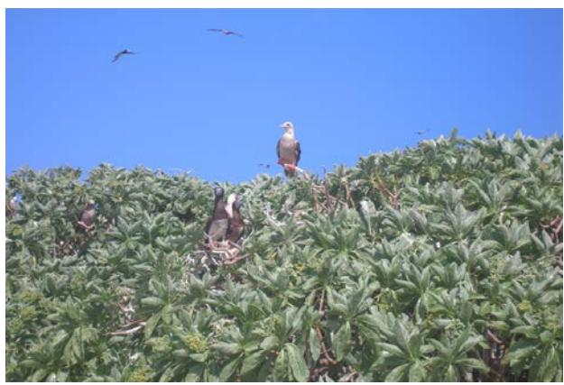

*Brown and red-footed boobies.* USFWS

# **4.5.6 Fua'o (***Sula sula***) or Red-footed Booby**

Red-footed boobies have a pantropical distribution that overlaps other booby species (*S. dactylatra* and *S. leucogaster*) (Schreiber et al. 1996, Carboneras 1992). There are three subspecies; *S. s. rubripes* breeds in the central and western Pacific (Clements 2000). Red-footed boobies nest throughout the USPI. Distribution is pelagic; feeding flocks occur hundreds of miles from land (Harrison 1990). Breeding adults are mostly sedentary but juveniles roost near colonies on islands other than their natal island (Schreiber et al. 1996, Harrison 1990). Little is known about adult movements outside of the nesting season (Schreiber et al. 1996).

The world population was estimated at less than 300,000 pairs in 1996 (Schreiber et al. 1996). In the USPI, there are approximately 19,000 pairs. Approximately 2,000 pairs nest in American Samoa

(Amerson et al. 1982). Rose Atoll hosts 700 pairs of this species. The world population has been severely reduced over the last two centuries (Schreiber et al. 1996) and few data exist on current numbers (Cao et al. 2005). Cao et al. (2005) suggest the present day population size has declined to 10% of their historical values.

This species of booby is the smallest of the booby species and breeds on oceanic islands and atolls (Schreiber et al. 1996, Carboneras 1992). Unlike the masked and brown boobies, these boobies roost and nest on shrubs and trees but will use bare ground or low piles of vegetation (Schreiber et al. 1996, Carboneras 1992, Harrison 1990). On Rose Island, red-footed boobies build nests in *Tournefortia* and *Pisonia* trees. Nests are made of twigs, grass, and other vegetation. Breeding is fairly synchronous but occurs throughout the year and timing varies by locality (Schreiber et al. 1996, Harrison 1990). Several color phases exist, ranging from all brown to all white (Schreiber et al. 1996, Nelson 1978). The most common color morph at Rose is the intermediate form. They are monogamous and generally retain their mates throughout subsequent breeding seasons (Schreiber et al. 1996). They lay 1 egg and continue to feed the young 1–2 months after fledging (Schreiber et al. 1996, Carboneras 1992). Sexual maturity begins around 3–4 years and most birds return to their natal colony to breed (Schreiber et al. 1996, Harrison 1990). Adults usually breed every year but sometimes take a "rest" year (Schreiber et al. 1996, Harrison 1990).

Red-footed boobies feed on flying fish, squid, mackerel scads, saury, and anchovies (Harrison 1990). Red-footed boobies often depart the colony to feed well before daylight and most return to the colony to roost at night (Carboneras 1992, Harrison 1990). Red-footed boobies feed by plunge-diving and may feed solitarily or in mixed-species foraging flocks (Au and Pitman 1986). They forage further from land than other boobies except possibly the masked booby (Nelson 1978). Annual adult survival was estimated at 90% in a 2-year study at French Frigate Shoals in the NWHI (Hu 1991). At Johnston Atoll, survival of chicks to breeding ranged from 27 to 52% depending on the year (Schreiber et al. 1996). The oldest-known bird was 22 years (Clapp et al. 1982).

The large areas of mangrove forests destroyed in American Samoa may have once been important habitat for this species. Introduced scale insects and other factors at Rose Island are destroying the *Pisonia* forest. Human predation on adults, chicks, and eggs may occur in parts of American Samoa (Amerson et al. 1982). El Niño-Southern Oscillation conditions can cause total or partial breeding failure in some locations (Schreiber and Schreiber 1989, Schreiber 1994).

### **4.5.7 Gogo Uli (***Anous minutus***) or Black Noddy**

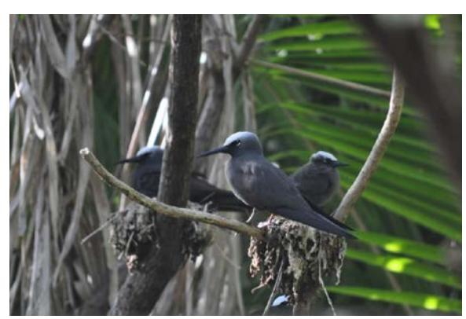

*Nesting gogo uli.* USFWS

The gogo uli is an abundant and gregarious, medium-sized bird with a pantropical distribution (Gauger 1999, Clements 2000). Adults are sooty black with a white cap on the top of the head. There are seven recognized subspecies and at least three breed in the USPI: *A. m. melanogenys* in the main Hawaiian Islands; *A. m. marcusi* in the NWHI, Wake, and throughout Micronesia; and *A. m. minutus* in Samoa (Gauger 1999, Gochfeld and Burger 1996). Breeding adults are mostly sedentary remaining at colonies year-round and foraging within approximately 50 miles of nesting islands

(Gauger 1999, Ashmole and Ashmole 1967, King 1967). Juveniles probably remain at breeding colonies or travel to nearby roosting sites (Gauger 1999).

The world population is estimated to be 1,000,000–1,500,000 pairs (Gauger 1999). In the USPI, there are approximately 22,400 pairs. An estimated 12,000 pairs nest in the Hawaiian Islands, and smaller colonies exist in American Samoa, Palmyra, Johnston, and Wake Atolls, and the Marianas. Approximately 750 pairs use Rose Atoll. Worldwide population trends are unknown.

The gogo uli nest on oceanic and offshore islands (Gauger 1999). They place their nests on trees and bushes (Howard and Moore 1984, Harrison 1990); the nests on Rose Island are in *Tournefortia*  branches. Breeding is asynchronous and aseasonal. Birds are monogamous, mate retention is high, and pairs retain their territory from year to year, often reusing the same nest (Gauger 1999, Schreiber and Ashmole 1970). The gogo uli are capable of producing more than one brood per year and some lay a second egg while still tending the first chick (Gauger 1999). Sexual maturity begins around 2–3 years (Gauger 1999). The oldest-known bird was 25 years (Gauger 1999).

Black noddies feed by hover-dipping and contact-dipping, and typically forage in multi-species flocks over schools of predatory fish, especially tunas and jacks (Ashmole and Ashmole 1967). They feed mainly inshore (<6 miles from shore) and sometimes within several feet of the shoreline (Harrison 1990, Gauger 1999). Black noddies eat fish almost exclusively and very small amounts of squid and crustaceans (Gauger 1999). In the central Pacific, flying fish, blennies, mackerel, and anchovies are important components of the diet (Gauger 1999).

Predation by introduced mammals in the breeding colonies limits populations and depletion of large predatory fish density due to fishing may reduce feeding opportunities (Gauger 1999).

# **4.5.8 Gogo (***Anous stolidus***) or Brown Noddy**

The brown noddy is a medium-sized tern with a pantropical distribution (Chardine and Morris 1996), dark brown in color all over except for the whitish-gray cap on the top of its head. There are five subspecies; *A. s. pileatus* breed in the central and western Pacific (Harrison and Stoneburner 1981). Brown noddies have been shown to breed more than once per year in the NWHI (Megyesi and Griffin 1996). Breeding adults remain within sight of the colony, foraging in waters several tens-ofmiles from the colony (Morris and Chardine 1992, Clements 2000). During nonbreeding periods, brown noddy have been shown to stay within 62 miles of colonies (Clapp et al. 1983, Harrison 1990)

or to migrate out of the area for several months (Murphy 1936, Morris and Chardine 1992). Little is known of the movements of juveniles (Chardine and Morris 1996).

The world population is estimated at 500,000–1,000,000 pairs (Chardine and Morris 1996). Within the USPI, there are about 135,000 pairs (Harrison et al. 1983). Approximately 9,000–11,000 pairs nest in American Samoa, the Marianas, and Johnston Atoll (Amerson et al. 1982, Reichel 1991). Approximately 200 pairs nest at Rose Atoll. The population trend is probably

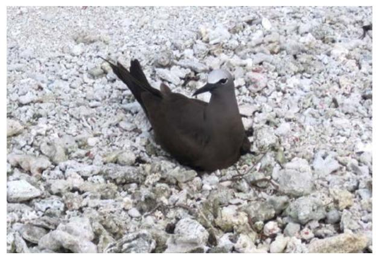

*Nesting gogo.* USFWS

stable, but increasing in areas where predators were removed (e.g., Midway, Kure) (Chardine and Morris 1996).

Brown noddies usually nest in loose groups or colonies and are flexible in nesting behavior. Nests are on the ground, often on open slopes or under vegetation but the brown noddy also nest on cliffs and in trees, especially where introduced mammalian predators are present (Harrison 1990, USFWS 1983). Brown noddy pairs stay together throughout the year, but there is little information on mate retention in subsequent years (Chardine and Morris 1996). Sexual maturity begins around 3–7 years and it is unknown whether birds return to their natal colony to breed (Chardine and Morris 1996, Harrison 1990). The oldest-known bird was 25 years (Chardine and Morris 1996).

Brown noddies feed by hover and contact-dipping in nearshore and off-shore waters (Harrison et al. 1983). They often feed in association with tuna schools and can be found in mixed-species feeding flocks.

The greatest threat is introduced predators, and where there are predators, brown noddy often nest in trees (Chardine and Morris 1996, Harrison et al. 1983). Predation by introduced mammals, such as the Polynesian rat, has contributed to the extirpation of brown noddy from islands where they formerly nested (e.g., Lehua) (VanderWerf et al. 2004). Disturbance of the colonies can lead to increased predation by native predators: unprotected eggs are taken by atafa and shorebirds, especially when adults are flushed from nests by human disturbance.

### **4.5.9 Manu Sina (***Gygis alba***) or White Tern**

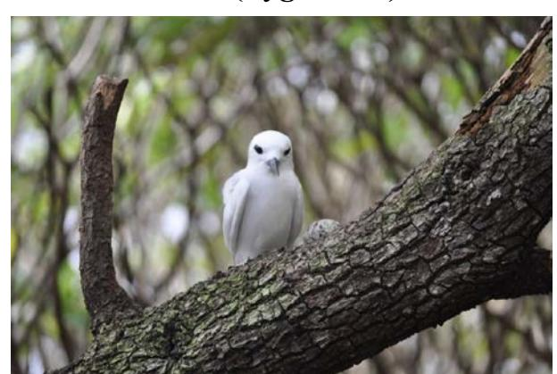

*Nesting manu sina with egg on* Tournefortia *branch.*  USFWS

The manu sina is small and entirely white, with a pantropical distribution (Niethammer and Patrick 1998, Gochfeld and Burger 1996). The manu sina has adapted well to humanaltered landscapes better than many other seabirds. It is perhaps the most familiar bird in Samoa (Craig 2002). There are four subspecies; *G. a. alba* breed in the central and western Pacific (Gochfeld and Burger 1996, Clements 2000). Breeding adults remain close to colonies, foraging primarily inshore in shoals and banks but sometimes in offshore waters (Niethammer and Patrick 1998). During nonbreeding periods they disperse

from breeding grounds to sea but their range is unknown (Niethammer and Patrick 1998). Some adults are year-round residents on the colony (Harrison 1990). Little is known of the movements of immature manu sina.

World population is unknown but probably exceeds 100,000 pairs (Gochfeld and Burger 1996). In the USPI, there are about 17,000 pairs. Large colonies exist in American Samoa (3,900 pairs) (Amerson et al. 1982). Rose Atoll supports at least 60 pairs. World and USPI population trends are unknown.

Manu sina nest on volcanic pinnacles, cliffs, rocky slopes, in large bushes or trees, or on artificial substrates (Niethammer and Patrick 1998, Rauzon and Kenyon 1984). They do not build nests but lay a single egg on a suitable depression, sometimes precariously balancing on small tree branches. Manu sina are monomorphic and monogamous, and partners remain together for several seasons, often returning to the same nest site (Niethammer and Patrick 1998, Harrison 1990). Clutch size is one egg and some breeding pairs may successfully raise two or even three broods within a nesting season (Niethammer and Patrick 1998, VanderWerf 2003, Miles 1985).

Manu sina feed primarily by dipping- and surface-diving (Niethammer and Patrick 1998). They often occur in mixed feeding flocks and usually in association with predatory fish (Niethammer and Patrick 1998, Harrison 1990). Prey items include juvenile goatfish, flying fish, squid, needlefishes, halfbeaks, dolphinfishes, and blennies (Niethammer and Patrick 1998, Harrison et al. 1983).

Although manu sina exhibit lower vulnerability to introduced predators than most seabirds because of their ability to use inaccessible (e.g., trees and sheer cliffs) nesting sites, introduced predators such as rats and cats have been the primary factor affecting populations (Niethammer and Patrick 1998). Scale insects have been introduced to Kure, Rose, and Palmyra Atolls where they attack native vegetation and reduce the number of nest sites in the native forest; the effects on manu sina nesting populations are not known. Depletion from fishing of large predatory fish stocks that drive prey to the surface may reduce foraging opportunities for manu sina (Niethammer and Patrick 1998, Gochfeld and Burger 1996).

### **4.5.10 Gogosina (***Onychoprion fuscatus***) or Sooty Tern**

Sooty terns have a pantropical distribution (Gochfeld and Burger 1996, Clements 2000, Schreiber et al. 2002). There are eight subspecies; *O. f. oahuensis* breed in the central and south Pacific (Gochfeld and Burger 1996, Clements 2000). Breeding adults remain relatively close to colonies and forage up to 311 miles from breeding islands (Flint 1991, Gould 1974). During nonbreeding periods, they are highly pelagic and tend to avoid regions with cold-water upwelling (Gochfeld and Burger 1996, Schreiber et al. 2002). Juveniles disperse widely after fledging and remain at sea, sometimes not touching land for several years (Schreiber et al. 2002).

The world population is estimated to range from 60 to 80 million pairs with 18–23 million pairs breeding each year (Schreiber et al. 2002). In the USPI, there are approximately 3.2 million pairs. A large colony of more than 100,000 pairs breeds at Rose Atoll (Amerson et al. 1982). Sooty tern nest on oceanic islands and atolls in large dense colonies (Gochfeld and Burger 1996, Schreiber et al. 2002). A colony usually consists of several subcolonies and each subcolony breeds very synchronously. Sooty tern nest on the ground in sandy substrate with sparse vegetation (Schreiber et

al. 2002). On Rose Island sooty terns also move into the forest and lay eggs in the open understory there. Sexual maturity begins around age 4–10 years (Schreiber et al. 2002, Harrington 1974). The oldest-known bird was 32 years (Harrison 1990).

Sooty terns, the most pelagic of the tropical terns (King 1967), feed mainly by aerial-dipping, contactdipping, and aerial capture, although they will plunge-dive (Gochfeld and Burger 1996, Schreiber et al. 2002). Sooty terns tend to feed in large flocks with other species in association with predatory fishes, such as yellowfin and skipjack tunas

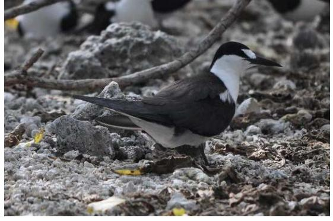

*Gogosina.* Jiny Kim/USFWS

(Schreiber et al. 2002, Harrison 1990, USFWS 1983). El-Niño-Southern Oscillation conditions can cause breeding failure in the Pacific (Schreiber and Schreiber 1989).

Native predators such as atafa and tuli take chicks and eggs (Schreiber et al. 2002, Harrison 1990). Sooty terns are vulnerable to oil pollution from tankers and spills. Depletion of tuna by fisheries could potentially have an impact on the availability of prey (Schreiber et al. 2002).

### **4.5.11 Gogosina (***Onychoprion lunatus***) or Gray-backed Tern**

Gray-backed terns are endemic to the tropical and subtropical Pacific but are most common in the Central Pacific (Mostello et al. 2000, Harrison 1990). Breeding adults are mostly sedentary and forage up to 230 miles from land (Harrison 1990, Dixon and Starrett 1952). During nonbreeding periods, they are highly pelagic and occur far from breeding colonies, but their range is unknown (Mostello et al. 2000). At sea, gray-backed terns are found in highly saline waters (Ainley and Boekelheide 1983). There are limited data on movements, but juveniles travel great distances after leaving the natal colony (Mostello et al. 2000).

The world population size is unknown but possibly on the order of 70,000 pairs (Mostello et al. 2000). Lack of adequate information on breeding phenology in many areas complicates estimates (Mostello et al. 2000). In the USPI there are approximately 48,000 pairs and 30 pairs nesting on Sand Island at Rose Atoll. The global population trend is difficult to assess, but probably has declined since some colonies have been extirpated (Mostello et al. 2000). In the USPI, the population appears stable or increasing, but historical declines occurred at remote Pacific islands due to introduced predators. Trends in the USPI may be increasing with the removal of predators such as cats from many islands and places such as Howland, Jarvis, and Wake Atoll (Rauzon et al. 2011).

Gray-backed terns breed on remote islands and atolls, on rocky ledges or sandy beaches often along vegetated edges bordering open areas (Amerson 1971, Ely and Clapp 1973). Their nests are shallow depressions in sand or gravel. Breeding occurs throughout the year. The clutch is one egg and chicks are semi-precocial when hatched (Mostello et al. 2000). Fledglings may remain at the colony up to 6 weeks after first flight (Harrison 1990). The oldest-known gray-backed tern was 25 years (Mostello et al. 2000).

Gray-backed terns feed mainly by plunge-diving or contact/hover-dipping. They are described as an inshore, offshore, or pelagic feeder due to the geographical and seasonal differences in foraging habitat (Mostello et al. 2000). Gray-backed terns eat five-horned cowfish, juvenile flying fish, goatfish, herring, dolphinfish, squid, crustaceans, mollusks, and marine and terrestrial insects (Harrison 1990). Gray-backed terns can be found foraging in mixed-species flocks, especially with sooty terns and sometimes with ta'i'o (Gould 1971).

In the USPI, their gravest threat is predation by introduced mammals such as rats and cats (Harrison 1990, Woodward 1972, Harrison et al. 1983). They are sensitive to disturbance, leaving their eggs when humans approach (Harrison 1990). Unattended eggs and chicks are vulnerable to predators such as atafa and ruddy turnstones and curlews (Mostello et al. 2000). Gray-backed terns tend to nest near the surf zone and nests are often lost to storm tides (Mostello et al. 2000, Harrison 1990).

### **4.5.12 Gogosina (***Sterna sumatrana***) or Black-naped Tern**

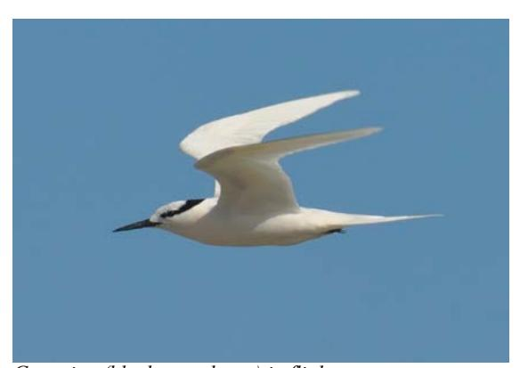

*Gogosina (black-naped tern) in flight.* Joshua Fisher/USFWS

The black-naped tern is a white, small-sized bird with grayish-white back and wings and black beak and legs. This species has only recently (2010) been observed at Sand Island when a single adult individual was seen acting as if it might have a nest territory. No egg or chick was found. They breed on tropical and subtropical islands throughout the Indian and western Pacific Oceans. Breeding takes place on small offshore islands, reeds, sand spits, and rocky cays (Bird Life International 2011). Breeding season depends on locality (Bird Life International 2011) but have been recorded at breeding stations throughout the year, suggesting mainly sedentary habits (Harrison 1985). Colonies of 5–20 pairs are

formed, but sometimes up to 200 pairs can be formed (Bird Life International 2011). Colonies tend to be linear, or parallel to the water's edge, (Hulsman and Smith 1988) in the sand or gravel pockets on coral banks close to the high tide line and monospecific (del Hoyo et al. 1996). They are also known to form colonies on shipwrecks (Hulsman and Smith 1988). One to two eggs, but occasionally three, are laid in either a shallow scrape on open ground or no nest is made (Hulsman and Smith 1988). Hulsman and Smith (1988) found that pebbles and small debris were thrown up toward the nest, having the effect of building up the nest edge, during nesting relief ceremonies.

Black-naped terns hunt singly or in loose groups (Hulsman 1979) in atoll lagoons and nearshore, but they occasionally join flocks of black noddies when predatory fish are active near the reef (Hulsman and Smith 1988). Black-naped terns feed predominantly by plunging or air diving directly onto prey (Hulsman and Smith 1988, Bird Life International 2011), but become only semi-submerged (Harrison 1985).

Both parents feed their young and make frequent flights to hunting grounds and young. Hulsman (1979) found anchovy to be a main food source for adults, but adults also consumed flying fish, mullet, barracuda, trevally or jack, tuna, damselfish, sardines, dolphinfish, grubfish, goby, blennies, and wrasse. Chicks were fed principally on the silver schooling fish belonging to the hardyheads and sprats, anchovies, and garfish.

Black-naped terns are sensitive to human disturbance, either in terms of reduced breeding success or colony desertion. Black-naped terns nest in the open, which exposes their eggs and young to the weather. Adults must, therefore, shelter their eggs and chicks from the wide range of weather conditions experienced in tropical and sub-tropical areas. On two islands in Australia, the major causes of mortality of eggs and chicks were predation by gulls and flooding of nesting areas (Hulsman and Smith 1988), indicating that any introduced predators or excessive human disturbance would cause birds to flush, rendering chicks vulnerable to nonnative predators as well as native birds like tuli or atafa.

# **4.6 Shorebirds and Wading Birds**

The Pacific Island Region functions as an essential migratory habitat for maintaining global shorebird populations. Rose Atoll is an important wintering ground for shorebirds in the Pacific. Seven species have been recorded at Rose Atoll. The most common migratory shorebirds are the Pacific golden plover, ruddy turnstone, and wandering tattler. Some shorebirds primarily use the beach strand habitat; however, the littoral forest also serves as important habitat. The Pacific golden plover is the most abundant of the shorebird species in American Samoa (Engilis and Naughton 2004) and also the species that has been seen in largest numbers at Rose Atoll.

Information on the status, trends, and ecology of shorebirds in the Pacific and their use of Rose Atoll is lacking in published literature (Engilis and Naughton 2004). Information needs include assessment of population sizes and trends; assessment of the timing and abundance of birds at key wintering and migration stopover sites; assessment of habitat use and requirements at wintering and migration areas; exploration of the geographic linkages between wintering, stopover and breeding areas; and evaluation of habitat restoration and management techniques to meet the needs of resident and migratory species (Engilis and Naughton 2004).

Many shorebirds wintering in the Pacific migrate over 2,486–7,458 miles of open ocean. Based on banding recoveries, patterns of distribution, and species assemblages, the following three flyways have been proposed: Asiatic-Palauan Flyway (birds move from Asia to Western Pacific and Philippine Sea Islands), Japanese-Mariana Flyway (mostly Asian birds move through Japan into the Mariana Islands and Caroline Islands), Nearctic-Hawaiian Flyway (birds breeding in Alaska and Eastern Siberia [Beringia] move through Hawai'i to Marshalls and Polynesia) (Baker 1953).

The Service developed the USPI Regional Shorebird Conservation Plan (Engilis and Naughton 2004) over concerns of declining shorebird populations and loss of habitat. Threats to shorebirds in the Pacific region include loss of habitat, nonnative plants, nonnative animals (predation, disease, and competition), human disturbance, and environmental contaminants.

Conservation and restoration of shorebird habitats in the USPI is a growing effort and essential for the protection of endangered and declining shorebird populations. Wetlands, beach strand, coastal forests, and mangrove habitats are particularly vulnerable on Pacific islands due to increasing development pressures and limited acreage.

**Table 4-3. Shorebirds and Wading Birds of Primary Conservation Importance in the U.S. Pacific Region** 

| Species                | Regional Trend | Conservation category |
|------------------------|----------------|-----------------------|
| Pacific golden plover  | Unknown        | High concern          |
| Bristle-thighed curlew | Unknown        | High concern          |
| Sanderling             | Unknown        | High concern (?)      |
| Wandering tattler      | Unknown        | Moderate concern      |
| Ruddy turnstone        | Unknown        | Low concern           |
| Pacific reef heron     | Unknown        | IUCN Least Concern    |

Source: Engilis and Naughton 2004; USFWS 2008.

### **4.6.1 Tuli (***Arenaria interpres***) or Ruddy Turnstone**

The ruddy turnstone is a common shorebird throughout the Pacific Islands; however, it is recognized as a species of Low Concern (Engilis and Naughton 2004) because the vast majority of its world population uses other areas for wintering grounds. Remote sandy islands appear to support the largest numbers of turnstones in the USPI, but there are no available survey estimates for the wintering population at American Samoa (Engilis and Naughton 2004). The largest group ever recorded at Rose Atoll was 45 in 1982. Ruddy turnstones use sandy and rocky beaches, reefs, and mudflats.

### **4.6.2 Tuli (***Calidris alba***) or Sanderling**

The sanderling is widespread and locally common throughout the Pacific Islands. In the USPI, the sanderling is less often seen than wandering tattlers and tuli. The USPI Regional Shorebird Conservation Plan (Engilis and Naughton 2004) designated this shorebird as a species of limited importance in the Pacific Islands since the vast majority of sanderlings overwinter in other regions of the world. They are usually found on the water's edge in small groups where they run back and forth from the waves to feed on the small invertebrates exposed by the retreating waves.

### **4.6.3 Tuli (***Tringa incana***) or Wandering Tattler**

The wandering tattler is nowhere common but is ubiquitous throughout the Pacific region. Predominantly nearctic breeders, wandering tattlers migrate from their breeding grounds in Alaska and northwest Canada (Gill et al. 2002) to islands throughout the Pacific. During winter, they are solitary or occur in small groups of two to three birds throughout the Pacific Basin (Gill et al. 2002). They are most common on rocky beaches but they also use a wide range of habitats including exposed reefs, sandy beaches, and mudflats (Engilis and Naughton 2004, Gill et al. 2002). The USPI Regional Shorebird Conservation Plan (Engilis and Naughton 2004) estimated the total population of wandering tattlers between 10,000 and 25,000 individuals. There are an estimated 900 wandering tattlers wintering in American Samoa (Amerson et al. 1982).

# **4.6.4 Matu'u (***Egretta sacra***) or Pacific Reef Heron**

The matu'u is a common bird in Samoa, with long legs and a long neck that is often curved in an Sshape. There are three color morphs: dark gray, pure white, or a combination of both colors in patches, and all have been observed at Rose Atoll. The herons forage across the reef crest for a wide variety of reef fish, crabs, and snails, as well as freshwater streams for food. Matu'u construct their large nests in trees that are safe from predators. At Rose Island nests have been found in niu and *Cordia* surrounded by thick ferns (*Nephrolepis hirsutula*). In the 2010 field visit to Rose Atoll, there were two nests, one with two chicks and one with one chick. The white and dark color morphs were both seen on this visit. Population numbers in American Samoa are not known.

# **4.7 Land Birds**

Rose serves as nonbreeding habitat for one austral migrant, the long-tailed cuckoo or aleva (*Eudynamis taitensis*). Vagrant birds are those that occasionally are blown off course by storms or by faulty directional decision during migration. Three vagrant species have been sighted at Rose Atoll: the cattle egret (*Bubulcus ibis*), snowy egret (*Egretta thula*), and the wattled honeyeater (*Foulehaio carunculata*).

### **4.7.1 Aleva (***Eudynamis taitensis***) or Long-tailed Cuckoo**

The aleva migrates from New Zealand in the winter and forages toward the southwest Pacific. The center of its winter range lies in central Polynesia (Kepler et al. 1994). On Rose Island, its habitat is in dense and thick cover of the littoral forest. Single birds have been sighted 1976, 1980, 1990, and 1992. Two were observed in 1984. The very cryptic and stealthy behavior of this species makes it likely that it is more common than field observations would indicate and on some visits the bird is heard but not seen as in 2010.

# **4.8 Invertebrates**

### **4.8.1 Tuitui (Sea Urchin)**

Tuitui are marine animals that belong to the phylum Echinodermata (meaning "spiny skin"), a group that includes sea stars (also called starfish), sea cucumbers, sand dollars, brittle stars, and sea feathers. All tuitui are in the Class Echinoidea. Sea urchins are important herbivores in reef and other marine habitats, grazing on a variety of benthic algae. An urchin's mouth lies on the undersurface of its hard shell; the jaws of the mouth are made from five teeth held in a muscular sling. Together these teeth form a five-pointed beak that is very effective at scraping algae from rocks and other hard surfaces. The scraping jaws of rock-boring urchins are also used to enlarge natural cavities or holes in the hard substrate, providing the animal with shelter from the full force of waves on exposed reef flats and the wave-swept surge zone.

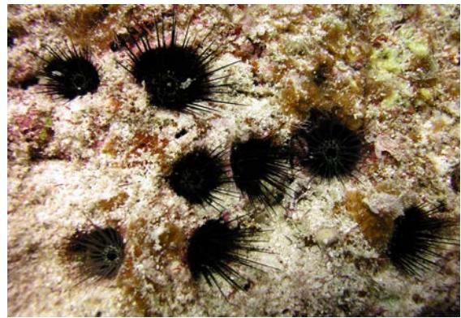

*Tuitui.* Jean Kenyon/USFWS

Tuitui feeding has two important consequences. First, their grazing reduces the total amount of fleshy algae on a reef, which enables corals and CCA (which compete with algae and cyanobacteria for space and sunlight) to grow better. Second, when they scrape algae from the substrate, they create vacant spaces that can then be colonized by the larvae of other bottom-dwelling marine animals. This helps to keep the diversity of marine animals high. In the absence of such grazing, reefs may become overgrown with algae, and the diversity of reef animals may be reduced. The important ecological role of tuitui became apparent on Caribbean reefs after a disease outbreak in 1983–84 killed more than

93% of the long-spined urchins (*Diadema antillarum*). During the following years, coral abundance decreased and reefs were covered with unprecedented levels of algal growth.

Tuitui in the genera *Heterocentrotus, Diadema*, *Echinometra, Echinothrix*, and *Echinostrephus* have been recorded from Rose Atoll (Swerdloff and Needham 1970, Green et al. 1997, NMFS PIFSC 2008). Following the longliner grounding in 1993, biologists documented an extensive area where oil caused high mortality to tuitui as well as CCA, marine snails, and faisua. Surveys in 1993 revealed that boring tuitui were extirpated from a zone 295 feet north and 197 feet south of the spill site (Molina 1994, Green et al. 1997). Surveys conducted in 1995 and 1996 revealed that tuitui densities had declined along the atoll's entire southwest arm (Green et al. 1997). As of 1997, the tuitui population continued to be reduced within 3,279 feet of the grounding site, and remained depressed as of 2001 (USFWS and DMWR 2001). With the clean-up of the shipwreck completed, the area is recovering, and it is likely that tuitui numbers are rebounding as well.

### **4.8.2 Terrestrial Invertebrates**

With the exception of scale insect documentation in reports from 2002 to 2005, few observations of terrestrial invertebrates were reported by visitors to Rose Atoll. In his 1980 trip report, Shallenberger notes that Darrell Herbst collected "various insects" while on Rose and Sand Islands. Shallenberger also states that the strawberry hermit crab (*Coenobita perlatus*) gather under the *T*. *argentea* during the day, and forage across the island at night. Strawberry hermit crabs were observed foraging on dead birds, fish, coconut

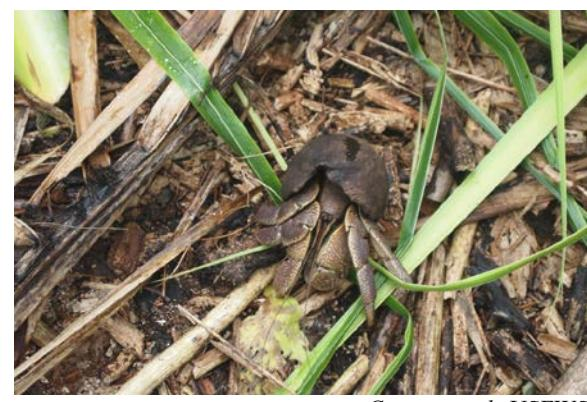

*Coconut crab.* USFWS

meat, and bird eggs (Shallenberger 1980). Though found in smaller numbers than the strawberry hermit, purple hermits (*Coenobita brevimanus*) were also extremely common until the mid-90s when densities of both hermit species appeared to decline.

With the coincident decline in overall numbers came a change in the quality of the gastropod shells these crabs were using. It became more common to see highly worn shells and a lower proportion of the favored *Turbo* shells in the population. The largest terrestrial arthropod on earth, the coconut crab (*Birgus latro*), ranges throughout the tropical Indo-Pacific. Due to its popularity as a food source, coconut crabs are rare or absent on most inhabited islands (Kepler and Kepler 1994). A single small coconut crab was captured in a live trap set for rats in 1991. Possibly related to the elimination of rats and the subsequent increase in niu, two dens and a large adult *Birgus* was observed on Rose Island during the 2010 Refuge visit. Terrestrial invertebrates also observed on a Service trip to Rose Atoll led by Flint (Flint 1990) documented fruit flies, crickets, scales, wasps, houseflies, ants, earwigs, beetles, moths, cockroaches, orb-weaving spiders, wolf spiders, jumping spiders, and red spider mites. However, they were not collected or identified to species.

In April 2012 a team of five entomologists from the U.S. Geological Survey, American Samoa Community College (ASCC), DMWR, and the Service spent 5 days surveying invertebrates on Rose Island. They set out a variety of traps in about 100-foot grids covering the island. The final report of their findings was not yet available at the time of this writing.

## 4.9 Reef Building Species

Coral reefs can be considered geologic structures built by countless generations of corals, coralline algae, and other calcifying marine organisms. While coral reefs are the world's largest structures made by living organisms, an individual coral polyp is a tiny animal. What many people think of as a

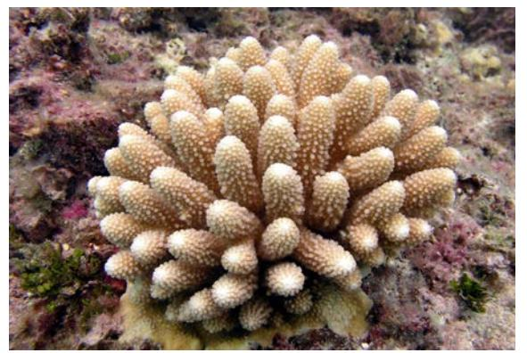

Each small bump on the branches of this coral colony (Acropora humilis) is a corallite that protects a soft-bodied polyp inside. Jean Kenyon/USFWS

single coral is actually a colony of hundreds to thousands of tiny coral animals living side by side on a colonial skeleton they have excreted. Because many of these organisms are attached to the substrate, their skeletons remain in that position after they die. Loose pieces of coral, shells, and other hard building blocks can be cemented together by coralline algae to build the reef. New reef organisms settle on or grow over the remains of the previous generation and deposit their skeletal material over the older surface. By this process a wave-resistant reef builds upward and outward.

Due to the critical symbiosis between stony corals and their photosynthetic zooxanthellae, reef construction requires warm, clear, well-lighted marine waters. Coral reefs are mostly found between 30°N and 25°S latitude where the surface water temperature ranges between 77° and 86°F throughout the year. In deep water (164-328 feet), where much of the sunlight is filtered out, the number of reef-building species of corals is greatly reduced, and at deeper depths (greater than 328 feet) most reef builders disappear altogether.

Atolls vary in the degree to which their annular reef encloses the central lagoon and are sometimes further described on a gradient of "open" to "classical" as the perimeter reef becomes more fully enclosing. An operational definition of a classical atoll, therefore, is a reef formation atop a subsiding extinct volcano that includes a lagoon surrounded by a shallow perimeter reef, at least one emergent island, and regular surface water exchange between the lagoon and the open ocean (Woodroffe and Biribo 2011, Maragos and Williams 2011). In this regard, Rose Atoll, despite its small size, meets this definition of a classical atoll and also has all the major habitats and associated biological groups found on Pacific atolls:

- Perimeter (annular) reef enclosing the lagoon;
- Reef crest (reef flat);
- Back reef (slopes facing the lagoon);
- Lagoon;
- Lagoon reefs;
- Islands:
- Natural channel (ava); and
- Fore reef (slopes facing the ocean).

#### **4.9.1 Coral**

Corals and reefs in many regions of the world are reported to be in a state of decline due to numerous local and global anthropogenic stressors including coastal point source pollution, agricultural and

land use practices, overuse for commercial or recreational purposes, disease and predation, and impacts of climate change including increased sea surface temperature and ocean acidification (Wilkinson 2004). While the reefs of Rose Atoll have been spared many of the anthropogenic threats and impacts that afflict reefs located closer to human population centers, some threats such as climate change are very widespread and challenge the ability of protected areas to limit their effects. Veron et al. (2009) state that "reefs are likely to be the first major planetary-scale ecosystem to collapse in the face of climate changes now in progress".

**Taxonomy.** Stony corals are marine invertebrates in the phylum Cnidaria that secrete a calcium carbonate exoskeleton. The basic soft body form of a coral is called a polyp, consisting of a sac-like cavity with only one opening that serves as both mouth and anus. This opening is surrounded by tentacles that have stinging cells called nematocysts. The skeleton secreted by an individual polyp is called a corallite. Some corals are solitary, consisting of a single polyp and its corallite, but most are colonial, consisting of multiple interconnected polyps that developed by a process of budding from an original parent polyp.

From a taxonomic perspective, stony corals include members of both the Class Hydrozoa (fire corals) and the Class Anthozoa, Order Scleractinia (true stony corals). From a functional perspective, corals that contain single-celled, endosymbiotic, photosynthetic algae known as zooxanthellae in their gastrodermal tissues are called hermatypic or reef-building corals. The rapid calcification rates of these corals have been linked to their mutualistic association with the zooxanthellae.

One hundred forty-five stony corals (143 scleractinian and 2 hydrozoan) (Appendix A) have been reported from the Refuge and the adjoining fore reef slopes (Kenyon et al. 2010, 2011). Higher coral diversity than expected at Rose Atoll may result from its proximity to the high islands in American Samoa where 326 scleractinian species have been recorded (Birkeland et al. 2008) and from its additional lagoon habitats compared to those islands.

Of these 145 stony coral species at Rose Atoll, 21 are listed as Vulnerable according to the IUCN Red List Categories and Criteria. These criteria have been widely used to classify, in an objective framework, the extinction risk of a broad range of species and rely primarily on population size reduction and geographic range information. Categories used to classify species for which adequate data exist range from "Least Concern" (with very little probability of extinction) to high risk "Critically Endangered." The categories collectively considered as "threatened" (Vulnerable, Endangered, Critically Endangered) are intended to serve as one means of setting priority measures for biodiversity conservation (Carpenter et al. 2008). Of these 21 species at Rose Atoll listed as

Vulnerable, 19 were evaluated by NOAA NMFS for possible listing in accordance with the ESA, in response to a petition in 2009 from the nongovernmental organization (NGO) Center for Biological Diversity (Kenyon et al. 2011). On November 30, 2012, NOAA found 12 of these species warranted listing as threatened and initiated a 90-day public comment period. Of the remaining 124 stony coral species at Rose Atoll, 36 are listed by the IUCN as "Near Threatened," 78 as "Least Concern," 2 as "Data Deficient," and 8 are not

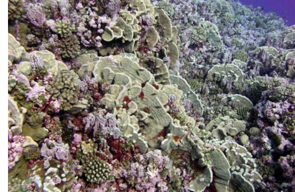

found in the Red List. *The fore reef slope supports a diverse assemblage of corals, other invertebrates, and coralline algae.*  Jean Kenyon/USFWS

For coral reef ecosystem species, Essential Fish Habitat (EFH) (MSFCMA; 16 U.S.C. 1855(b)) (§305(b)) has been designated as the water column above the reefs and all bottom out to 328 feet depth across all the USPI. Federal agencies which fund, permit, or undertake activities that may adversely affect EFH are required to consult with the NMFS regarding the potential effects of their actions on EFH.

**Zooxanthellae**. In addition to enhancing calcification, zooxanthellae provide a substantial phototrophic contribution to the coral's energy budget and give the coral most of its color. Those corals that lack zooxanthellae deposit mineralized skeletal materials at a lower rate and are called ahermatypic or nonreef-building corals. The largest colonial members of the Scleractinia help produce the carbonate structures known as coral reefs in shallow tropical and subtropical seas around the world. Stony corals with massive and branching growth forms are the major framework builders and a source of carbonate sediment on the reef. Corals provide substrate for colonization by other benthic organisms, construct complex protective habitats for a myriad of other species including commercially important invertebrates and fishes, and serve as food resources for a variety of animals.

**Rose Atoll Coral Distribution**. Coral cover and composition naturally vary among atoll habitats because species show differential growth and survivorship responses to different environmental circumstances including wave energy, depth and turbidity (light penetration), and temperature range tolerance. In 2002, average coral cover derived from quantitative analysis of imagery recorded during towed-diver surveys that circumnavigated the Rose Atoll fore reef in 3 depth strata was 23% (Kenyon et al. 2010); average coral cover was highest (38%) on the deep (greater than 59 feet) southeast fore reef slope but lowest (13%) on the same slope at moderate depths (30–59 feet). Sitespecific transect and photoquadrat surveys show that *Pocillopora*, *Montipora*, and *Montastrea* are the most abundant genera on the fore reef. Along the soft, unconsolidated floor of the lagoon, coral is found only on isolated patches of firm substrate, averaging only 0.9% cover. Average coral cover on the sloping rubble back reef inside the lagoon is also low (0.1%). Coral cover is higher on the limestone pinnacles scattered within the lagoon, averaging 10%, with the genera *Favia, Montipora, Porites*, and *Astreopora* as the primary components.

**Reproduction.** Corals reproduce both sexually and asexually. Sexual reproduction involves the process of gametogenesis (generation of gametes), which may require from a few weeks for sperm to more than 10 months for eggs. The dominant reproductive mode of scleractinian (true stony) corals in the Pacific Ocean is broadcast spawning of gametes followed by external fertilization. Subsequent cell divisions of the fertilized eggs result in small, dispersive propagules (planula larvae) which may settle, metamorphose, and develop into primary polyps. The phenology of spawning and degree of synchrony within and between species can vary widely among locations and along latitudinal gradients, ranging from annual multi-species mass spawning events on the Great Barrier Reef in late austral spring to little apparent synchrony among species in Hawai'i or the Red Sea**.** 

Relatively little is known of the phenology of coral spawning in American Samoa. Seven species have been observed spawning off Tutuila in the week following the October or November full moon (Itano and Buckley 1988, Mundy and Green 1999), and measurements of the sizes of developing eggs from two additional species off Tutuila also suggest spawning occurs after the October or November full moon (Kenyon, unpubl. data 2008). However, egg size data from several other species sampled off Tutuila suggest spawning is more spread out through the year and that some species may have at least two spawning periods in different seasons.

Limited sampling of four *Acropora* species on the back reef and fore reef at Rose Atoll in late February revealed that colonies of one species would spawn within the following month, two other species were nearing maturity, and one species had no gravid polyps (Kenyon, unpubl. data 2002). Clearly, much remains to be determined concerning coral spawning cycles at Rose Atoll and within the larger region of American Samoa.

The gametes and developing embryos of most broadcast-spawning corals are positively buoyant and therefore vulnerable to natural and anthropogenic disturbances that can substantially impact successful reproduction, including lowered salinity, extremes of temperature or irradiance, turbidity, eutrophication, and pollution. The capacity to maintain or renew genetically diverse coral populations through sexual reproduction is a key attribute of reef resilience; consequently, reef managers' understanding of regeneration and recovery processes is informed by knowledge of the timing of coral sexual reproduction.

Asexual reproduction from coral fragments is a common process of colony replication. Asexual reproductive results in a new coral colony that is genetically identical to the parent colony (a clone). Colonies started from fragments have the advantages of large initial size and locally adapted genotypes. The ability of some species of *Acropora* to survive fragmentation and rapidly fill space has led to an interest in using these species for programs of reef restoration.

#### **Threats to Corals at Rose Atoll**

The grounding of a large steel-hulled Taiwanese long-line fishing vessel in October 1993 resulted in a fuel and ammonia spill and break-up of the ship into thousands of pieces during the following years. The cumulative impacts included massive kills of corals and coralline algae from the spills and subsequent invasion of cyanobacteria that were increasingly stimulated by the corrosion and release of dissolved iron from the metallic components of the wreckage. The invasive cyanobacteria also displaced other indigenous marine species over a broader area including reef

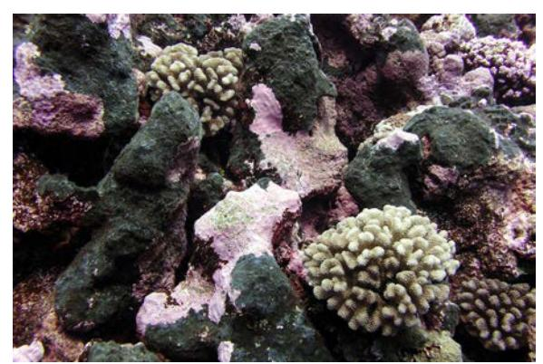

*Cyanobacteria stimulated by the 1993 shipwreck continue to overgrow the substrate.*  Jean Kenyon/USFWS

areas beyond the spill and grounding zone. Collectively the ship grounding and its breakup fueled the demise of many species in the affected habitats concentrated along the southwest perimeter reef and adjacent lagoon where the ship struck the reef.

From 1999 to 2007, seven visits to the Refuge by Samoan salvagers, supported by NWR funds and the Oil Spill Liability Trust Fund Act managed by the USCG, succeeded in removing more than 99% of the ship debris. Monitoring efforts since 1999, coinciding with debris cleanup efforts as well as cooperative surveys conducted with NMFS PIFSC, have revealed slow but persistent recovery of corals, coralline algae, and echinoderms that normally dominate the affected reef crests, shallow fore reefs, back reefs, and lagoon reefs near the grounding site (Green et al. 1997, Maragos 1994, Schroeder et al. 2008, Kenyon et al. 2010).

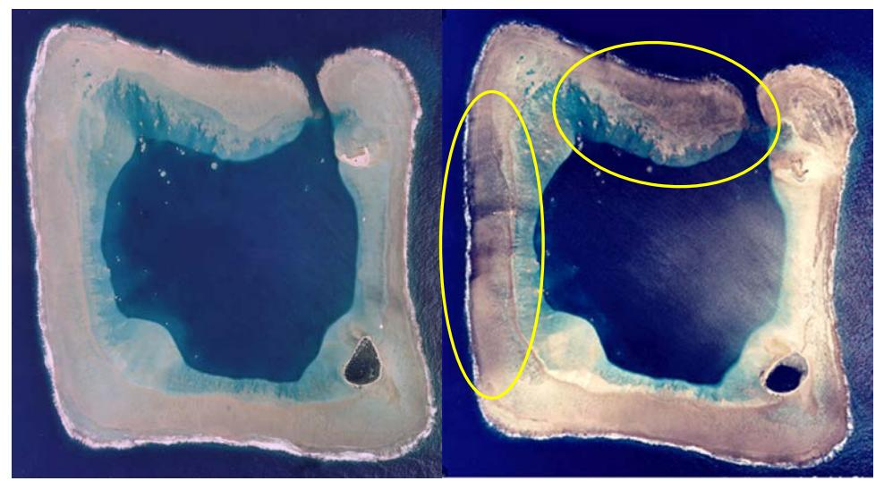

*Rose Atoll before the grounding (left) and Rose Atoll after the grounding (1994). Note the discoloration (circled in yellow) where the cyanobacteria impacted the CCA.* USFWS

Maragos (1994) noted widespread bleaching of numerous species of scleractinian corals in several environments at Rose Atoll in March 1994 to depths of 66 feet. Concurrent widespread bleaching at Tutuila suggested the bleaching was a regional phenomenon related to increases in surface water temperatures associated with ENSO rather than the result of local perturbations caused by the October 1993 ship grounding and chemical spill. Nonetheless, bleaching was most pronounced along the southwest fore reef, and its severity increased slightly when moving towards the wreckage, a sign that stress to corals from the shipwreck may have contributed to the severity of the bleaching event.

Though quantitative observations of the severity and geographical extent of bleaching at Rose Atoll could not be made during the 1994 event, qualitative snorkeling observations revealed that most of the outside perimeter of the atoll reef was consistently bleached to depths of 66 feet (Maragos 1994). Although the extent of subsequent mortality is unknown due to a hiatus in scientific surveys between 1994 and 1999, quantitative observations from NMFS PIFSC monitoring surveys in 2002 and 2004 indicate coral populations in the early stages of recovery from both the 1993 ship grounding and 1994 bleaching event (Kenyon et al. 2010). Although the bleaching event did not result in chronic damage to the reefs at Rose Atoll, some reef communities shifted to other species from what was observed in 1994.

The size and depth of the ava connecting the lagoon to the ocean is very important to maintaining the coral and other communities of Rose Atoll. Any modification to the ava would change the water flow regime and could exacerbate the effects of climatic warming and lead to permanent losses of corals during future bleaching events, especially within the lagoon where ambient temperatures are naturally slightly higher than deeper waters on the ocean side of the atoll (NMFS PIFSC 2008). This type of occurrence has already been documented at Palmyra Atoll (Williams et al. 2010). There were no bleaching events reported at Rose between 1995 and 2011.

Pacific-wide, there is growing concern pertaining to the threat of increased prevalence, geographic distribution, and host range of coral diseases. Disease is defined as any impairment that interferes with or modifies the performance of normal physiological functions, including responses to environmental factors, toxicants, and climate; infectious agents; inherent or congenital defects; or a combination of these factors (Wobeser 2006). Quantitative coral disease assessments conducted by NMFS PIFSC at 40 different U.S. Pacific coral islands, banks, and atolls between 2006 and 2007 revealed Pacific-wide mean disease prevalence (proportion of colonies affected) was low (regional means less than 5%), but site-specific hotspots occurred at Rose Atoll (11.7%) and four other islands/atolls (Vargas-Ángel and Wheeler 2008). In addition to minor bleaching, white syndrome, pigmentation responses, and other lesions were documented, with algal/cyanophyte infestions accounting for greater than 75% of all disease cases, most notably abundant in the vicinity of the 1993 shipwreck site.

### **4.9.2 Coralline Algae**

Crustose coralline algae are an important component of reef systems, and the reefs at Rose Atoll are dominated by CCA. Together with hard corals, CCA represent a major source of reef limestone. The CCA cement and consolidate carbonate material, thus contributing to the growth and persistence of tropical reef structures. The capacity of coral communities on fore reefs to recover from disturbances is probably partially a result of the ability of CCA to bind loose rubble into a stable substratum (Birkeland et al. 2008). Settlement and metamorphosis of many key benthic reef elements, including scleractinian corals and octocorals, are induced by external biochemical cues associated with live CCA (Heyward and Negri 1999, Harrington et al. 2004). In addition, CCA are important sources of primary production. Water temperature and motion, light availability, sedimentation, and predation represent major influential factors determining patterns of CCA distribution, abundance, and

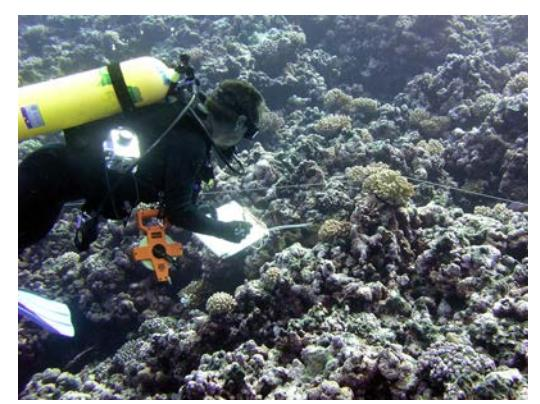

*A diver conducts a quantitative survey of corals and CCA along a transect line.*  Jean Kenyon/USFWS

zonation on tropical reef ecosystems (Littler and Doty1975, Fabricius and De'ath 2001).

Although the critical importance of CCA to the formation and ecology of tropical reefs is well documented, many aspects of the biology, ecology, and taxonomy of this flora are still poorly understood (Chisholm 2003). The CCA only live in marine waters, and they are hard because of calcareous deposits contained within the cell walls. They are typically pink or some other shade of red. Coralline algae are in the order Corallinales, in the red algal division Rhodophyta. Coralline algae have typically been divided into two groups based on their morphological form (though this division does not constitute a

taxonomic grouping): the geniculate (articulated or connected by a flexible joint) corallines and the nongeniculate (nonarticulated) corallines. Geniculate corallines (e.g., *Jania* sp.) are branching, treelike plants that are attached to the substratum by calcified, root-like holdfasts. The plants are made flexible by having noncalcified sections (genicula) separating longer calcified sections (intergenicula). Nongeniculate corallines range from a few micrometers to several-centimeter-thick crusts; there are more than 1,600 described species of nongeniculate coralline algae. Those with a growth habit that closely adheres the thallus to the substrate are commonly called CCA (*Porolithon* sp., *Hydrolithon* sp., *Lithothamnion* sp.).

Mayor (1924) noted that the exceptionally well-developed shallow calcareous algal ridge at Rose Atoll had the densest growth of calcareous algae he had encountered anywhere, and suggested it could be called a "*Lithothamnion*-atoll rather than a coral atoll". Observations following the 1993 longliner grounding indicated that the reef flat coralline algal community was severely affected and significantly altered by the petroleum released during the grounding. A massive die-off of CCA, extending 3,279 feet along the reef flat and reef margin, occurred on the southwest arm of the atoll where the vessel grounded (Maragos 1994). The large-scale die-off of the CCA was accompanied by a bloom of invasive cyanobacteria that were previously uncommon on the atoll. Within a year, the cyanobacteria had spread across the atoll's entire southwest arm and had begun to invade adjacent areas of the lagoon as well as portions of the northwest arm (Green et al. 1997). Quantitative surveys of CCA and cyanobacteria cover using transects along the seaward, mid-reef, and lagoon edge of the southwest arm of the reef flat were conducted in 1995, 1996, 1998, and 2002. In contrast to other arms of the atoll, which are pink in color due to the dominance of CCA, in 1995, 2 years after the spill, the southwest arm had very low abundance (less than 20% cover) of this key algal group. On the outer (seaward) reef edge, CCA was absent except at the northern end of the arm. In 1996, 1998, and 2002 CCA abundance had steadily increased on the outer edge, except near the wreck site; an area of low CCA cover (approximately 10%) had persisted near the wreck even following debris removal efforts. On the inner (lagoon) edge of the reef flat, cover of CCA was highly variable in the survey years and in 2002 had dropped to low levels (less than 30%), especially at the southern end of the southwest arm (Burgett 2003). Removal of remaining visible metallic debris from the grounding was completed in 2007, and the last transect surveys to monitor whether a more natural algal community is developing on this arm of the reef flat were done in 2010.

Although the fore reef slopes are not included within the Refuge boundaries, its biological communities serve as sources of colonizing propagules to those protected within the Refuge. In 2002, average CCA cover derived from quantitative analysis of imagery recorded during towed-diver surveys that circumnavigated the Rose Atoll fore reef in 3 depth strata was 48% (Kenyon et al. 2010), more than twice the average cover provided by corals (23%). Mean CCA cover was highest (65%) on the shallow (less than 30 feet) southwest fore reef slope and lowest (27%) on the deep (greater than 59 feet) northeast fore reef. On all four fore reef exposures (northeast, southeast, southwest, northwest), mean CCA cover decreases as depth increases from shallow to moderate (30– 59 feet) to deep depth strata (Kenyon et al. 2010).

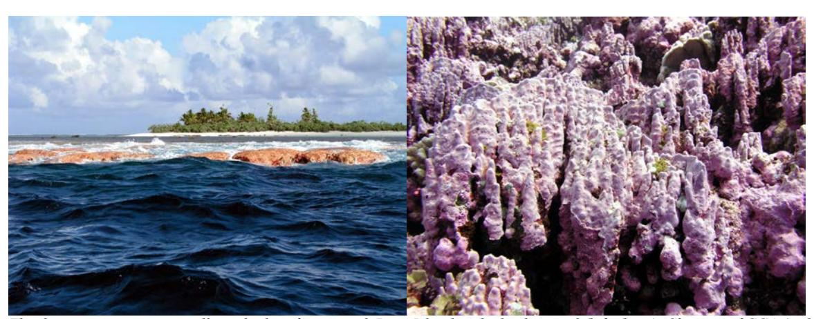

*The distinctive crustose coralline algal reef crest, with Rose Island in the background (left photo). Close up of CCA (right photo).* Jean Kenyon/USFWS

Although there is growing consensus pertaining to the increased threat of disease to corals, little is known about coralline algal disease distribution, abundance, and the potential implications to declining CCA flora. Quantitative coral disease assessments conducted by NMFS PIFSC at 42 different U.S. Pacific coral islands, banks, and atolls between 2006 and 2008 revealed the highest average CCA percent cover occurred at Rose Atoll (Vargas-Ángel 2010). In 2006, of the islands/atolls in American Samoa, Rose Atoll had the lowest ratio of the number of cases of CCA disease relative to percent cover (0.1), but in 2008 this ratio had significantly increased to 0.8. While this U.S. Pacific-wide study could not

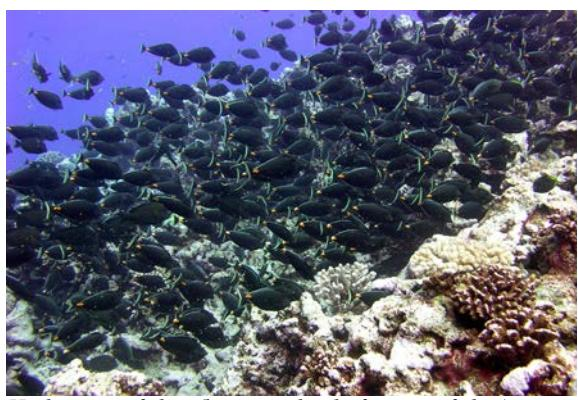

*Herbivorous fishes (here, a school of surgeonfishes) are abundant where cyanobacteria and turf algae have proliferated as a long-term response to shipwreck metallic debris.* Jean Kenyon/USFWS

make clear large-scale patterns linking CCA disease occurrence with natural reef physiographic or geomorphological features (e.g., carbonate vs. volcanic islands; windward vs. leeward wave exposures), the author noted that at Rose Atoll and a few other locations, leeward and protected habitats exhibited 60% more CCA disease cases when compared to exposed windward sites.

# **4.10 Fish**

The number of reef fish species at Rose Atoll is estimated to be 272, based upon surveys conducted from 1981 to 2004 (Wegmann and Holzwarth 2006) (Appendix A). While this is a subset of the 991 reef fish species listed for all of American Samoa and Samoa in Wass (1984), the proportion found at Rose is substantial given that the atoll has less than 1% of the total reef habitat in the archipelago. Reef fish living amongst or in close proximity to tropical reefs have evolved many specializations adapted to survival on the reef. Their range of feeding strategies includes herbivores that graze on benthic algae, corallivores that feed on coral polyps, generalized carnivores that feed on a variety of animal prey, and specialized carnivores with more focused animal prey preferences such as zooplankton.

Reef fish surveys at Rose Atoll have documented an assortment of reef fish families and genera similar to other central Pacific shallow reefs (Green 1996, Whaylen 2005, NMFS PIFSC 2008). Damselfishes, surgeonfishes, wrasses, and parrotfishes were the most common families of small (less than 8 inches total length [TL]) to medium (8–20 inches TL) reef fish encountered. Snappers (Lutjanidae), groupers (Serranidae), and jacks (Carangidae) were the most common large (greater than 20 inches TL) reef fishes observed at Rose Atoll. Sharks (Carcharhinidae) were present but uncommon, mainly seen in shallow water on the fore reef just below the surf.

Reef fish surveys conducted by NMFS PIFSC using standardized methods showed that mean fish biomass per reef area at Rose Atoll is higher than at Tutuila but significantly lower than at other Pacific Remote Island refuges distant from human population (Howland, Baker, and Jarvis Islands, Johnston, Palmyra, and Wake Atolls, Kingman Reef) (Williams et al. 2011). At Rose Atoll, fish biomass appears to be highest inside the lagoon and on the southwest fore reef compared to other areas of the atoll (NMFS PIFSC 2008). Small to medium-sized fish were very abundant around

several of the larger pinnacle patch reefs inside the lagoon, where parrotfish, snapper, emperor, goatfish, and jacks were common. Herbivores (surgeonfish, parrotfish, and angelfish) were abundant on the southwest fore reef, with significantly greater numbers and biomass at the site of the 1993 longliner grounding than at neighboring sites (Schroeder et al. 2008). This greater abundance of herbivores at the impact site was associated with significantly greater substrate cover of turf algae and cyanobacteria. The highest densities of large fish (greater than 20 inches TL), such as jacks and barracuda, were recorded just outside the ava along the northwest fore reef. This may be a preferred site for feeding on prey or plankton flowing out of the lagoon or may be a preferred site for spawning activity (NMFS PIFSC 2008).

Of concern is the conservation status of two species previously found at Rose Atoll: the Maori wrasse, *Cheilinus undulatus,* and the bumphead parrotfish, *Bolbometapon muricatum*. Both of these species have been subject to heavy fishing pressure. However, in response to a listing petition under

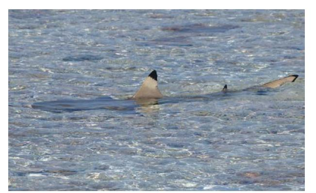

*Malie alamata in Rose Atoll lagoon.* Kelsie Ernsberger/USFWS

the ESA, NOAA NMFS recently completed a status review of the bumphead parrotfish and determined that listing as an endangered or threatened species was not warranted. (77 Fed.Reg. 66799 November 7, 2012).

The peppered moray (*Gymnothorax pictus*) is commonly found in shallow water up on the reef flat at Rose where it feeds on crustaceans and fish (Lieske and Myers 1994). Its size, (up to 4.5 feet long), its abundance at Rose, and habit of coming out of the water in pursuit of prey makes it a good candidate for long-term

monitoring. It is distributed throughout the Indo-Pacific and Eastern Pacific: East Africa to the Galapagos, Cocos, and Clipperton islands; north to the Hawaiian and Ryukyu islands; and south to Australia and the Kermadec Islands (Chen et al. 1994).

Sharks are a group of fishes characterized by a cartilaginous skeleton and 5–7 gill slits on the sides of the head. There are more than 440 species of sharks belonging to 8 taxonomic orders. The three species of shark that have been recorded at Rose Atoll NWR (gray reef shark, blacktip reef shark, and whitetip reef shark; *Carcharhinus amblyrhychos*, *Carcharhinus melanopterus*, and *Triaenodon obesus*, respectively) belong to the order Carcharhiniformes, family Carcharhinidae, commonly known as requiem sharks. They are distinguished by an elongated snout, a nictitating membrane that

protects the eyes during an attack, and viviparity (live birth). These three species are the most common sharks inhabiting Indo-Pacific reefs.

The gray reef shark, which is found as far east as Easter Island and as far west as South Africa, is most often seen in shallow water near the dropoffs of coral reefs, and less commonly within lagoons or open ocean. They are agile predators that feed primarily on bony fishes and cephalopods (e.g., octopi, squid). Despite their moderate size, their aggressive demeanor enables them to dominate many other shark species on

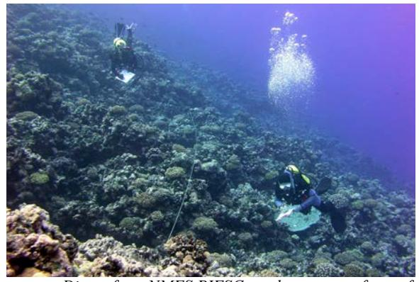

*Divers from NMFS PIFSC conduct surveys for reefassociated fish along transect lines.* Jean Kenyon/USFWS

the reef. Many gray reef sharks have a home range on a specific area of the reef to which they continually return. Gray reef sharks were the first shark species known to perform a threat display, a stereotypical behavior warning that it is prepared to attack. The display involves a hunched posture with dropped fins and an exaggerated, side-to-side swimming motion. They do so if they are cornered by divers, indicating they perceive a threat. This species has been responsible for a number of attacks on humans, so should be treated with caution, especially if they begin to display. They are caught in many fisheries and are susceptible to local population depletion due to their low reproductive rate (litters of 1–6 pups are born every other year) and limited dispersal. As a result, the IUCN has assessed this species as Near Threatened (Smale 2009).

The malia alamata (blacktip reef shark), found throughout the nearshore waters of the tropical and subtropical Indo-Pacific, prefers shallow, inshore waters. It is usually found in water only a few yards deep and can often be seen swimming close to shore with its black-tipped dorsal fin exposed. Younger sharks prefer shallow, sandy flats, while older sharks are most common around reef ledges and near reef drop-offs. A tracking study off Palmyra Atoll in the central Pacific found the malie alamata had a home range of about 0.21 square mile, among the smallest of any shark species (Papastamatiou et al. 2009). Often the most abundant apex predator in its ecosystem, the malie alamata plays a major role in structuring inshore ecological communities. Its diet is composed primarily of small bony fish, though cephalopods are also consumed. Sharks off Palmyra Atoll have been documented preying on seabird chicks that have fallen out of their nests into the water (Papastamatiou et al. 2009). Under most circumstances, the malie alamata has a timid demeanor and is easily frightened away by swimmers. However, its inshore habitat preferences bring it into frequent contact with humans, and thus it is regarded as potentially dangerous. Though it remains widespread and common overall, substantial local declines due to overfishing have been documented in many areas. This species has a low reproductive rate, with a litter size of 2–5 pups, limiting its capacity for recovering from depletion. The IUCN has assessed the malie alamata as Near Threatened (Heupel 2009).

The whitetip reef shark, which is found as far east as Central America and as far west as South Africa, is typically found on or near the bottom in clear, shallow water. The habitat preferences of this species overlap those of the malie alamata and the gray reef shark, though it does not tend to frequent very shallow water like the malie alamata or the outer reef like the gray reef shark. Unlike other requiem sharks, which rely on ram ventilation and must constantly swim to breathe, the whitetip reef shark can pump water over its gills and lie still on the bottom. During the day whitetip reef sharks spend much of their time resting beneath overhangs or in caves, emerging at night to hunt bony fishes, octopi, and crustaceans. Individual whitetip reef sharks may stay within a particular area of the reef for months to years, returning time and again to the same shelter. Females give birth to 1– 6 pups every other year. Whitetip reef sharks are rarely aggressive towards humans, though they may investigate swimmers closely. The IUCN has assessed the whitetip reef shark as Near Threatened, noting that its numbers are dwindling due to increasing levels of unregulated fishing activity across its range (Smale 2005). The slow reproductive rate and limited habitat preferences of this species renders its global populations vulnerable to over-exploitation.

# **4.11 Invasive and Nuisance Species**

Invasive species displace native vegetation, alter the composition and structure of vegetation communities, affect food webs, and modify ecosystem processes, resulting in considerable impacts to native wildlife. For the purpose of this CCP, "invasive" is a subset of nonnative species or indigenous species that have started to proliferate and modify the species composition or function of the existing native community, typically due to some human action. An invasive species is defined as a species whose migration and growth within a new range is causing detrimental effects on the native biota in that range. These species become invasive because their population and growth are no longer balanced by natural predators or biological processes that kept them in balance in their native ecosystems. In the absence of these restraints, invasive species have the potential to compete with native species for limited resources, alter or destroy habitats, shift ecological relationships, and transmit diseases. The cyanobacteria previously discussed is an example of a native species that has become invasive.

Invasive species are one of the most serious problems in conserving and managing natural resources. In particular, the ecological integrity of Pacific Island environments is greatly threatened by invasive species. Islands which have existed in isolation for millions of years are ideal environments for invasive species. Most native species have evolved without the necessity for defense and therefore lost their natural defense mechanisms and are more vulnerable to introduced species. Island ecosystems are key areas for conservation of global biological diversity. While islands make up only about 3% of the earth's surface, they are home to 15–20% of all plant, reptile, and bird species (Whittaker 1998). Small population sizes and limited habitat availability make species endemic to islands especially vulnerable to extinction and their adaptation to isolated environments makes them particularly vulnerable to aggressive introduced species (Diamond 1985, Diamond 1989, Olson 1989). Of the 484 recorded animal species extinctions since 1600, 75% were species endemic to islands (World Conservation Monitoring Center 1992).

### **4.11.1 Mammals**

The impacts from invasive predatory mammals are one of the leading causes of species extinction on islands (Blackburn et al. 2004, Duncan and Blackburn 2007). Rats living in close association, or commensally, with humans (Norway rat, *Rattus norvegicus*; black rat, *R. rattus*; and Polynesian rat, *R. exulans*) have been introduced to about 90% of the world's islands and have a pronounced effect on island ecosystems (Towns et al. 2006). In addition, the extinction of many island species of mammals, birds, reptiles, and invertebrates have been attributed to the impacts of invasive rats (Andrews 1909, Daniel and Williams 1984, Meads et al. 1984, Atkinson 1985, Tomich 1986, Hutton et al. 2007), and estimates of 40-60% of all recorded bird and reptile extinctions globally were directly attributable to invasive rats (Atkinson 1985, Island Conservation n.d.).

Even if species are not extirpated, rats can have negative direct and indirect effects on native species and ecosystem functions. For example, a comparison of rat-infested and rat-free islands, and pre- and post-rat eradication experiments have shown that rats depressed the population size and recruitment of birds (Campbell 1991, Thibault 1995, Jouventin et al. 2003), reptiles (Whitaker 1973, Bullock 1986, Towns 1991, Cree et al. 1995), plants (Pye et al. 1999), and terrestrial invertebrates (Bremner et al. 1984, Campbell et al. 1984). In particular, rats have significant impacts on seabirds, migratory shorebirds, and other birds by preying upon eggs, nestlings, chicks, and adults and causing

population declines, with the most severe impacts on burrow-nesting seabirds (Atkinson 1985, Towns et al. 2006, Jones et al. 2008). Ground- and burrow-nesting seabirds are particularly vulnerable to rat predation.

In addition to preying on seabirds, introduced rats feed opportunistically on plants, and alter the floral communities of island ecosystems (Campbell and Atkinson 2002); in some cases degrading the quality of nesting habitat for birds that depend on the vegetation. Small, oceanic islands have simplified seed dispersal systems that generally lack mammalian vectors and are vulnerable to disruption by invasive species (Drake et al. 2002). Rats can disrupt seed dispersal mutualisms by depositing seeds in microhabitats that are ill-suited for germination or subsequent growth. Native crab species prey on seeds as well, although they only eat the fleshy pulp, leaving the seed coat intact, allowing the seed to germinate. Rats are able to consume the fleshy pulp and chew through the seed coat killing the existing seed and preventing germination and recruitment of native plants. It is possible that rats can also indirectly reduce plant fitness by reducing the effectiveness or numbers of native dispersers through competition and predation (Wegmann 2009).

On Tiritiri Matangi Island, New Zealand, ripe fruits, seeds, and understory vegetation underwent significant increases after rats were eradicated from the island, indicating the rats' previous impacts on the vegetation (Graham and Veitch 2002). At Palmyra Atoll, in a very similar *Pisonia*-dominated coastal strand forest ecosystem, an eradication project to eliminate *Rattus rattus* was implemented in June 2011. By August of that year total counts of all tree seedlings in 56 transects had increased significantly, including those of native pu'a vai changing from no seedlings detected before eradication to 12.3 seedlings per transect post-eradication. Seedling censuses under five rare native tree species showed significant increases between 2004 and post-eradication, including the first ever documentation of seedling *Cordia subcordata* at Palmyra. This species was first detected at Rose in 1994 after *Rattus exulans* was removed there (USFWS 2011).

Rats are also documented to directly affect the abundance and age structure of intertidal invertebrates (Navarrete and Castilla 1993), indirectly affect species richness and abundance of a range of invertebrates (Towns et al. 2009), and contribute to the decline of endemic land snails in Hawai'i (Hadfield et al. 1993), Japan (Chiba 2010), and American Samoa (Cowie 2001).

Polynesian rats are speculated to have been a contributing factor in the large-scale extinctions of Hawaiian bird species during Polynesian settlement prior to European contact. Rats also consume plants, insects, mollusks, herpetofauna, and other invertebrates (Olson and James 1982, Brisbin et al. 2002, Engilis et al. 2002, Mitchell et al. 2005).

Polynesian rats and humans are the only known terrestrial mammals to reach Rose Atoll. The rats were first documented in 1920 (Mayor 1924). Rats have a varied diet that includes seabirds and turtle eggs and hatchlings as well as a variety of plants and their seeds. The population of rats on Rose Island was estimated to be 1,000–1,600 in 1990. Rats were eradicated in an operation beginning in 1991 by the Service under the guidance of U.S. Department of Agriculture Wildlife Services using live traps, kill traps, and bait stations armed with Talon ® anti-coagulant rodenticide containing brodifacoum spaced 82 feet apart over the entire island. No rats have been detected on the island since.

Subsequent to the eradication of Polynesian rats at Rose, the number of plant species has increased from only four species on Rose Island in 1990 to at least eight species in 2010. While it is likely that rat eradication provided a beneficial effect for all nesting seabirds at Rose, the only species for which adequate pre- and post-eradication data exist to demonstrate a statistically significant effect was the red-tailed tropicbird (Wegmann and Holzwarth 2006).

### **4.11.2 Reptiles**

Reptiles have not been well studied at Rose Atoll. There are at least two species of gecko on Rose Island: the Oceanic gecko (*Gehyra oceanica*) and the mourning gecko (*Lepidodactylus lugubris*) (Amerson et al. 1982), which were likely introduced by humans but are indigenous to the central tropical Pacific and at present do not show signs of posing a threat to BIDEH.

### **4.11.3 Invertebrates**

Invasive ants and scale insects (*Pulvenaria urbicola*) have contributed to mortality of Pu'a vai at Rose Island. These insects work together to invade and feed on sap from the leaves and petioles of the trees. The ants defend the scale insects and "farm" them for the concentrated liquid that they exude. This weakens the trees and may cause them to repeatedly shed their foliage until they eventually die. In 1994 Rose Island was covered with a thick forest of pu'a vai, but by 2005, all but about 11 trees had perished. The surviving trees were treated with systemic imidacloprid. In 2010, three of the treated trees remained alive but not healthy. The ants and scale invaders may have reached Rose Island on plantings and food or packing material of human visitors in recent decades.

### **4.11.4 Vegetation**

Coconut trees were first observed on Rose Island in the mid-19th century and were likely planted by Samoan visitors (Setchell 1924). Mayor's 1920 scientific account of Rose Atoll recorded about 6

coconut trees remaining of about 15 that were planted in 1902 and 1920 by Governors Tilly and Terhune (Mayor 1921). Amerson and colleagues (Amerson et al. 1982) mapped 13 trees on the island in the mid-1970s. The Department of Agriculture visited Rose Atoll in 1957 and planted 50 coconut seedlings (Swerdloff and Needham 1970). In 1987, a DMWR expedition mapped 30 coconut trees on Rose, including several trees planted around the island by a "vessel crew" the previous year. Several trip reports make note of the coconut infestation and call for management (Shallenberger 1980).

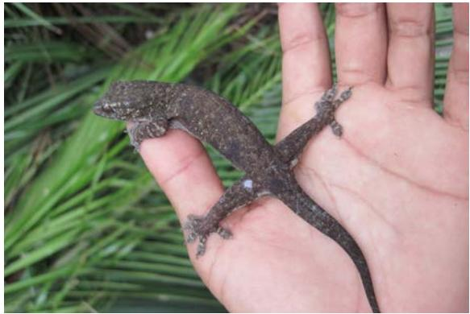

*Oceanic gecko.* USFWS

The elimination of rats in 1991 allowed many more nuts to germinate. In 2005, Hurricane Olaf uprooted many of the native canopy trees on Rose Island. Three dense patches of adult coconut trees survived and by 2010 had spread. Niu are very aggressive in displacing indigenous shrubs and trees because the nuts form an impenetrable mat over the ground and form a shading canopy monoculture that prevents the recruitment of native canopy trees. In 2010, Refuge and DMWR staff and contractors removed and destroyed 1,038 sprouted nuts, 94 green nuts from the trees, and 38 young palms. An additional 42 large palms were treated by drilling holes in the stem and applying glyphosate. They left one large coconut tree undisturbed in each of the three patches.

In 1994, patches of the nonnative grasses *Cenchrus echinatus* and *Chloris barbata* were removed from Rose Island (Craig et al. 1994), and a few individuals have had to be removed since then. No plants of either species were detected in 2010.

# **4.12 Wildlife and Habitat Research Inventory and Monitoring**

Several scientific expeditions to Rose Atoll took place during the 1930s. In 1937 and 1938, Wray Harris, a scientist at the Bishop Museum, visited Rose Atoll to collect samples of mollusks and plants (Sachet 1954). The USCG brought a group of scientists to Rose Atoll in 1938; the observations were published by E.H. Bryan in 1939 and 1942 and W. Donaggho in 1953. In 1939, the U.S.S. *Bushnell* conducted a survey of islands in the Pacific and 11 days were spent collecting specimens of fish from Rose Atoll (Sachet 1954). Under Executive Order 8683, President Franklin Delano Roosevelt designated Rose Island as a Naval Defense Sea Area on February 14, 1941. The United States Navy Hydrographic Office published a map of Tutuila, the Manu'a Islands, and Rose Island in 1941. The data were gathered between 1901 and 1939 (Hudson and Hudson 1994).

In February 1953, the Office of the Territories, DOI conducted a fishing survey at Rose Atoll (Sachet 1954). In 1968, Rose Atoll was proposed as an "Island for Science" under the International Biological Programme (UNEP and IUCN 1988, IUCN 1991). The ASG sponsored a 1970 survey of Rose and Sand Islands, the reef flats, and the surrounding lagoon. The 1970 survey stressed the importance of Rose Atoll to breeding seabirds and i'a sa and recommended the atoll be designated a wildlife preserve (Swerdloff and Needham 1970). Between the years 1973 (the Refuge's establishment) and 2005, 49 documented expeditions visited Rose Atoll (Wegmann and Holzwarth 2006). The Service and ASG have cooperated on scientific visits and aerial reconnaissance trips to the Refuge. Between 2002 and 2012, the NMFS PIFSC organized and conducted biennial American Samoa Reef Assessment and Monitoring research cruises.

# **Chapter 5. Social and Economic Environment**

# **5.1 Cultural Resources**

Archaeological and other cultural resources are important components of our nation's heritage. The Service is committed to protecting valuable evidence of plant, animal, and human interactions with each other and the landscape over time. These may include previously recorded or yet undocumented historic, cultural, archaeological, and paleontological resources as well as traditional cultural properties and the historic built environment. Protection of cultural resources is legally mandated under numerous Federal laws and regulations. Foremost among these are the NHPA, as amended, the Antiquities Act, Historic Sites Act, Archaeological Resources Protection Act, as amended, and Native American Graves Protection and Repatriation Act. Additionally, the Refuge seeks to maintain a working relationship and consult on a regular basis with villages that are or were traditionally tied to Rose Atoll.

### **5.1.1 Historical Background**

The seafaring Polynesians settled the Samoan Archipelago about 3,000 years ago. They are thought to have been from Southeast Asia, making their way through Melanesia and Fiji to Samoa and Tonga. They brought with them plants, pigs, dogs, chickens, and likely the Polynesian rat. Most settlement occurred in coastal areas and other islands, resulting in archaeological sites lost to ocean waters. Early archaeological sites housed pottery, basalt flakes and tools, volcanic glass, shell fishhooks and ornaments, and faunal remains. Stone quarries (used for tools such as adzes) have also been discovered on Tutuila and basalt from Tutuila has been found on the Manu'a Islands. Grinding stones have also been found in the Manu'a Islands. Despite surveys, no quarries have been identified in Manu'a (ASHPO 2012).

In the later period of Samoan pre-contact, warfare for titled positions was frequent in Samoa and it likely influenced Tutuila and Manu'a. Oral traditions in the Manu'a Islands refer to leaders of islands to the west (Fiji, Samoa, etc.) visiting on sometimes hostile missions. Defensive fortification sites, often located high on ridges and mountains, define this period, with one such structure in Tutuila (a large defensive wall) on the National Register of Historic Places and another structure (fortification) on Ofu Island planned for nomination to the National Register. A typical layout of a Samoan village was a central open space (malae), surrounded by meeting houses, chiefs' houses, other residences, and cooking houses (ASHPO 2012).

European contact occurred in 1722, with Dutch navigator Jacob Roggeveen followed by French explorers Louis-Antoine de Bougainville in 1768 and Jean-Francois de La Perouse in 1787. Englishman John Williams of the London Missionary Society arrived in 1830, bringing with him Christianity which changed Samoan culture and ways. It was also when Westerners started to settle these islands. European traders and military personnel also changed Samoan society. Local warfare ceased, quarries were abandoned with the introduction of metal tools, and local customs and practices changed (ASHPO 2012).

The Tripartite Convention of 1899 formally partitioned the Samoan Archipelago into a German colony and a U.S. territory. This convention resulted from several years of civil war among Samoan factions and the rivalry between the U.S., Germany, and Britain. The U.S. acquired the eastern

islands, while Germany took control of what now comprises Samoa, which New Zealand forces took from the Germans in 1914 until 1962 (ASHPO 2012).

American Samoa, under U.S. Naval control from 1900 to 1951, was a coaling station for its fleets. World War II (WWII) began the transition of the economy from subsistence toward commercial. The U.S. Naval Station Tutuila (now a Historic District listed on the National Register) was the headquarters of the Samoan Defense Group, which included several adjacent island groups. Historic properties from WWII are found throughout the islands. Post WWII, American Samoa's military importance declined and the 1940s and 1950s saw severe economic distress with the Navy leaving. This period started the exodus of the Samoan workforce to Hawai'i and the mainland U.S. In 1951, the administrative responsibility for coordinating Federal policy to the Territory was transferred to the DOI, where it remains today. Between 1951 and 1977, Territorial Governors were appointed by the Secretary of the Interior; but since 1977, they have been elected by universal suffrage (ASHPO 2012). American Samoa has its own constitution, its own legislature, its own court system, and a non-voting delegate in the U.S. House of Representatives.

Starting in 1954, the tuna industry started to invest in American Samoa with the opening of canneries by the Van Camp Seafood Company of California and Starkist Incorporated. It became a major industry for the Territory, attracting workers from Samoa as well as China. This last decade has seen a decline, however, with the canneries downsizing or shutting down (ASHPO 2012).

Despite its post-contact history and Western interactions, the Samoan culture and societal structure remains strong (often reflected in the phrase fa'a Samoa or the Samoan way of life). Communal or *aiga* (family) land and *matai* (chief) systems remain intact. The matai are divided into *ali'i* (high chiefs) and *tulafale* (talking chiefs or orators who usually serve as executive agents for *ali'i*). The basic unit of Samoan society, the *aiga* or extended family group, is a group of people related by blood, marriage, or adoption. This family group can number from a few to several hundred who also acknowledge a common allegiance to a particular *matai.* The *matai* possesses some authority over the members of his family and regulates some of their activities as well as family resources (especially land–up to 90% of land in American Samoa is communally owned). However, traditionally, the *matai* consults the *aiga* before exercising his authority. The *matai* title holder will always be from the same family line. A non-family/descent line cannot hold a ranking *matai* title within a family. The resilience of the Samoan culture also has to do with its preservation being codified in its Bill of Rights (Article 3) and American Samoa Code Annotated (Title 1, section 1.0202).

### **5.1.2 Rose Atoll and Manu'a Islands**

The Manu'a Islands are comprised of Ofu, Olosega, and Ta'ū Islands, and Rose Atoll. Manu'a contains the origins of Samoans and the genealogy of Polynesians east of Samoa is said to have originated here. The Solo'o Va recounts the creation of Samoa and Manu'a is described as the first of lands, and the high peak of the island of Ta'ū, home of *Tagaloa* (the earthly offspring of the creator god). As such, the islands of Manu'a are considered sacred and the title of *Tui Manu'a*, seen as being the highest in rank of all the chiefly titles of Samoa. When the last Tui Manu'a died in 1909, the Tui Manu'a title was distributed amongst the different villages in Manu'a (e.g., Tui Olosega, Ofu).

The Manu'a Islands were always independent of the other Samoan Islands, though songs, stories, and genealogies show contact occurred among all the islands. It was known that De Bougainville had traded with Manuans at Ofu in 1768, but did not land (Taomia 1997). John Williams and other

Christian missionaries arrived in Manu'a in 1832. The cession of the Manu'a Islands to the U.S. occurred in 1904 and included Rose Atoll (though it is said that the *Tuimanu'a* at the time traveled to Rose Atoll after this partition and took with him a flag representing the five islands of Ofu, Fo'isia, Olosega, Ta'ū, and Rose Atoll which he staked at the atoll to reassert his authority [SSI 2012]). The Manu'a Islands form, administratively, the Manu'a District, one of three districts in American Samoa. Ofu, Olosega, and Ta'ū are all high islands and all lands are communally owned. Ta'ū is physically the largest island. Villages in Manu'a usually number about 300 people. Local farming and fishing is prevalent. The Manu'a Islands were also where famed anthropologist Margaret Mead did her research (in the village of Ta'ū) and based her 1928 book *Coming of Age in Samoa*.

Although archaeological studies have been conducted on the Manu'a Islands, prior to 2012, none of the studies included Rose Atoll. The people of Ta'ū tend to call the atoll Muliāva, which means "the end of the reef" or Muli A'au which means "the last reef" (Gray 1960, Krämer 1995), while the people of Ofu tend to refer to the atoll as Nu'u of Manu, meaning "village of seabirds" (Krämer 1995, Maragos, pers. comm. 2010). Other less common names include Motu o Manu (island of seabirds) and Nu'umanu (place of the sea monsters). Written documentation of historical uses of Rose Atoll by the Samoans is extremely limited, as the primary method of passing down information through the generations was through oral tradition. However, in general, Samoans believe that their relationship to lands and contiguous reefs and seas is a covenant with the Almighty. Samoans were gifted these resources to use for sustenance and their perpetuation, but also given the responsibility to properly conserve and husband these resources (SSI 2012). It is said that the *Tui Manu'a* routinely visited the atoll. The kings of Samoa would assemble near the atoll and often participated in games and leisurely activities, which included the snaring of terns. Due to the use of the atoll by the high chiefs, it was considered sacred and visitors were forbidden from setting foot on the atoll. The atoll was also believed to be guarded by *ilamutu* (supernatural protectors) (SSI 2012).

According to local knowledge, the Manuans used celestial navigation to reach Rose Atoll. Rose Atoll is featured in a Manuan chant entitled "O le Solo a Fitiaumua" (Krämer 1995). The song tells the story of a husband and wife chased away from their home in Fitiuta after the husband stole food from a chief's taro plantation for his starving pregnant wife. The couple was banished, set adrift on the ocean and landed at Rose Atoll, where they had a son, Fitiaumua. When the boy became an adult, he learned of his parents' story and sought revenge. He overran and conquered Samoa, Fiji, and Tonga in a war, and became a successful king residing in Manu'a.

Samoan islanders visited Rose Atoll to fish and collect birds (including feathers for cultural adornments and handicrafts, the most prized of which came from the red and white-tailed tropicbirds), turtles, faisua, and other resources (Amerson et al. 1982). Terns were especially used to direct fishermen to schools of fish. It was customary for the strongest males of Manu'a to go out with the *tautai* (master fishermen) to fish for sharks and skipjack tuna. However, the 2012 Samoan Studies Institute report notes that of the fishermen who had been interviewed (all in their 60s), none had been to Rose Atoll until the 2011 trip and that it had been their father's generation who had first-hand experience fishing at the atoll. The report also noted that a village men's group described that fishing trips to Rose Atoll were only conducted when season fish were not abundant in immediate waters and reefs (SSI 2012).

Many of the seabirds found at Rose Atoll are also reflected in Samoan sayings, such as: *Seu le manu ae taga'i i le galu* (refers to the boobies)–applied in advising one to take caution; *Taape le fuāmanusina* (refers to the tropicbirds)–used at the closing of meetings to mean that everyone will depart together; *Ua pafuga le ā e pei o le faiva o le seugā gogo* (refers to terns and the sound of their calls)–said in happy salutations and occasions. There are also similar sayings related to sharks (SSI 2012).

Samoans also brought volcanic rocks to use as cooking stones when they fished and hunted turtles (Keating 1992). However, because Rose Island has no fresh water, visitors likely stayed for short durations. The first recorded Western sighting of Rose occurred in July 1722 by Dutch explorer Jacob Roggeveen, who referred to the atoll as "foul island" after observing the island was surrounded by a reef of rocks and had a low elevation (Sharp 1970, Krämer 1995). However, the atoll was given its lasting Western name in 1819 by French navigator Louis de Freycinet who named it after his wife.

Louis de Freycinet was the Commander of the French vessel *L'Uranie* on a voyage of discovery that circumnavigated the globe. The 22-year-old Rose de Freycinet was smuggled on board dressed as a man and also has Cape Rose in Western Australia named after her (Bassett 1962, Western Australia Museum 2012, Sharp 1970).

Additional western observations came in 1824 by Russian explorer Otto von Kotzebue and Frenchman Dumont D'Urville in 1838. The first recorded landing at Rose was documented by Captain Charles Wilkes of the U.S. Navy. He led an expedition to the atoll in 1839 where botanists and an anthropologist collected specimens. Two plants, *Portulaca* and *Pisonia grandis,* were recorded.

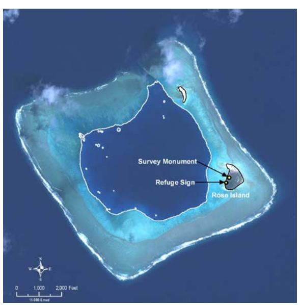

*Fallen monument and location of former Refuge sign.*  USFWS

The only documented case of people living on Rose Atoll came in the 1860s when a German company bought the right to establish a fishing station and coconut plantation from the Tui Manu'a (High Chief of the Manu'a Islands) and a Samoan family was stationed on Rose Island for a few years (Gray 1960, Sachet 1954). In 1990 the remains of the foundation of a *fale* (traditional Samoan house) that could have dated to the 1860s was located by David Herdrich from ASHPO (Herdrich, pers. comm. 2011).

In January 1920, Governor Terhune went to Rose Island and erected a concrete monument commemorating the visit with the words "Rose Island, American Samoa, Trespassing Prohibited, Warren J. Terhune Governor, January 10, 1920". The monument is 4 feet high, 4 feet wide, and 1 foot thick. It is still on

the island but is no longer standing upright due to unstable ground. The area is presently a *Tournefortia* forest and the monument is no longer visible from the water or beach. There is a second, smaller concrete U.S. Navy survey marker. It had fallen over as well, but was righted in March 2008 during a NOAA CRED mission which included Governor Tulafono.

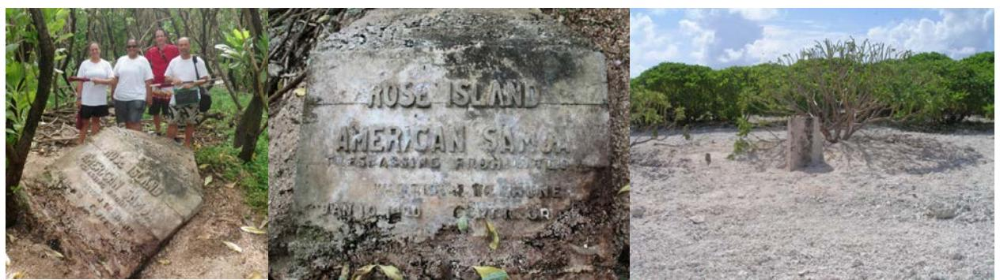

*Fallen monument (archaeological team visit with USFWS and NPS staff) and Navy survey marker (right photo).*  USFWS

Rose Island is subject to wash overs by waves during hurricanes, making it a poor environment for maintaining archeological artifacts. There are no historic properties at the atoll.

There are four known records of shipwrecks in the area: schooner *Friendship* (1849), schooner *Wakulla* (1853), schooner *Good Templar* (1868), and the fishing vessel *Jin Shiang Fa* (1993). The *Jin Shiang Fa* ran into the southwest section of the atoll and broke apart. The largest sections of it were towed off the reef and dumped in the deep ocean, but pieces of it may still wash up on the reef in hurricanes to this day. There are no signs of the older wrecks.

A pre-contact canoe anchor was found at Rose Atoll and given to the National Park of American Samoa and displayed in their visitor center. The anchor was lost in the September 2009 tsunami that destroyed the visitor's center.

In March 2011, 12 Manu'a community representatives, and 5 students and 5 teachers from Manu'a schools attended a trip to the Refuge. The purpose of the trip was documenting the oral history of Rose Atoll. It was sponsored by the IGC (consisting of the DMWR, the Service, ONMS, NMFS and ASDOC) and was funded by a grant from the NMFS to the DMWR. The SSI completed a report (entitled "Oral Traditions of Rose Atoll

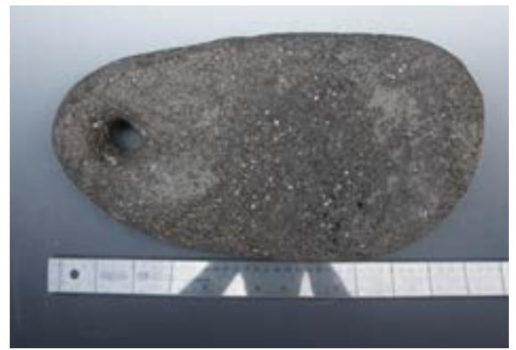

*A canoe anchor that was found on Sand Island by David Herdrich, ASHPO, in 1990.* NPS

(Muliava)"), along with a bilingual brochure and DVD, to document the trip as well as the connections between the people of Manu'a and Rose Atoll (Muliava, Nu'u o Manu).

The information generated from this trip will be used to produce EE and cultural interpretation materials for use by communities and outreach to the larger public.

In February 2012, 3 archeologists (including lead archaeologist David Herdrich from ASHPO) conducted a 5-day survey of Rose Atoll on a Service-sponsored trip. This was the first in-depth archeology trip to Rose Atoll conducted. At the time of this writing their results are still being analyzed, which will be available to the public when completed.

# **5.2 Refuge Facilities**

Refuge facilities are usually structures that support both visitor services and biological management at a refuge. However, Rose Atoll NWR is closed to general public use and has no permanent infrastructure such as roads, fences, trails, etc. At one time, the Refuge did have a sign at Rose Island identifying the atoll as a NWR and being closed to visitors; however, due to weather conditions and storm events, it has since fallen into disrepair and is no longer on the island.

Though the Refuge does not have facilities at the atoll, it does have office space co-located with the National Park of American Samoa in Tutuila and also contracts a boat for transportation to the atoll for management purposes.

# **5.3 Public Use Overview**

The Refuge is closed to general public use to protect the sensitive habitats and wildlife at the atoll. Its remote location, logistical challenges, and safety issues also substantiate its closure to the general public.

# **5.4 Wildlife-Dependent Public Uses**

The Improvement Act identified wildlife observation and photography, hunting and fishing, and EE and interpretation as wildlife-dependent, priority public uses for the Refuge System, when compatible. An SUP is required to enter the Refuge for any purpose.

# **5.4.1 Hunting**

The Refuge is not open for hunting due to the sensitive wildlife found at the atoll.

# **5.4.2 Fishing**

In the 1980s, the Refuge's Public Use Policy permitted fishing in the Refuge as long as the fish were released or consumed within the Refuge (USFWS 1987). However, this policy was discontinued in the early 1990s. The Refuge continues to be closed for fishing due to the small size of the lagoon and its limited fish and invertebrate community. The ecological limits of these populations make them particularly vulnerable to fishing pressure. Closure to fishing also adheres to the Monument Proclamation (which directs us to prohibit commercial fishing in the Monument), meets the Refuge's purposes, and fulfills the Governor of American Samoa's support for a no-take area to protect the coral reef ecosystem. Fishing is offered in other parts of American Samoa.

# **5.4.3 Wildlife Observation and Photography**

The Refuge is not open to wildlife observation or photography and no SUPs have been issued in the past for this activity. Wildlife observation and photography opportunities are offered on the high islands of American Samoa (e.g., National Park of American Samoa).

### **5.4.4 Environmental Education**

During the 1980s and 1990s, field trips for students and teachers to the Refuge occurred. However, given the disturbance to wildlife, logistical difficulties, safety issues, and lack of available staff, such opportunities were discontinued and there is no EE currently offered at the Refuge. However, other types of EE about the Refuge are offered on Tutuila and the Manu'a Islands (see Chapter 2 regarding the future focus of EE on bringing the Refuge to the people, not bringing the people to the Refuge).

### **5.4.5 Interpretation/Outreach**

The Service maintains a website [\(http://www.fws.gov/roseatoll/\)](http://www.fws.gov/roseatoll/) and we have given regular talks about Rose Atoll to students at the American Samoa Community College. Prior to the 2009 tsunami, there was interpretive information about Rose Atoll and the Refuge at the National Park of American Samoa visitor center. The Service is presently working with NPS to have displays again in their new visitor center. There is also an exhibit on Rose Atoll at the Tauese P.F. Sunia Ocean Center.

### **5.4.6 Cultural Resources Interpretation**

Currently no cultural resources interpretation is conducted. However, the March 2011 and February 2012 trips identified in the previous section will provide information that can be used for these purposes in the future.

# **5.5 Illegal Uses**

Due to the remoteness of the Refuge, systematically documenting illegal use is challenging. Documented cases between 1973-2005 (Wegmann and Holzwarth 2006) recorded two illegal incidents. Additionally, according to the annual law enforcement Refuge System reports, one incident of trespass was recorded in 2010. However, given accounts provided to Refuge staff and encounters during Refuge visits, it is known that recreational boaters and fishermen enter the Refuge illegally. In June 2009, Service staff were called upon to help rescue a grounded boat in the lagoon. On a September 2010 trip to Rose Atoll conducted by the Service and the DMWR, two private vessels expecting to enter the Refuge were turned away. Vessels over 50 feet are excluded from fishing within 50 nautical miles of Rose Atoll. NOAA NMFS established the final rule for fishing within the Monument in June 2013 and the Service is working with partners to develop enforcement options.

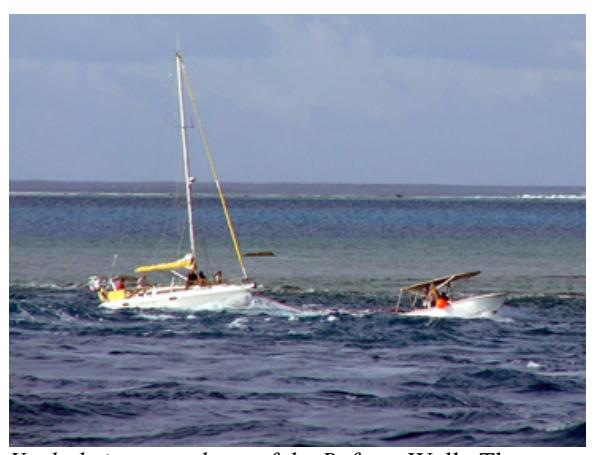

*Yacht being towed out of the Refuge.* Wally Thompson

The Service law enforcement issues on lands and waters of the Refuge are under the jurisdiction of the Refuge Zone Officer based in Honolulu. The role of this officer is to conduct and document law enforcement incidents and coordinate and/or meet with Refuge staff as well as law enforcement partners. Primary laws and regulations enforced include, but are not limited to the:

- Administration Act;
- Lacey Act;
- Archaeological Resource Protection Act;
- ESA;
- MBTA;
- MSFCMA; and
- Marine Mammal Protection Act.

Zone officers are also empowered to enforce all criminal laws and often partner with other law enforcement agencies. The USCG enforces natural resource laws by providing patrol and surveillance of the Refuge, both on-site and through remote sensing. The Refuge Zone Officer coordinates with the USCG on issues of trespass and illegal activities.

# **5.6 Social/Economic Environment**

### **5.6.1 Communities near Rose Atoll National Wildlife Refuge**

The nearest community to the Refuge is the Manu'a Islands, approximately 80 miles away. The next group of islands closest to the Refuge is Tutuila and Aunu'u, approximately 180 miles away. Tutuila is where the main population, government, and industries in American Samoa are located.

### **5.6.2 Population, Housing, and Income**

In 2010, the population of American Samoa was around 55,519. This represented a decrease of 3.1% from the 2000 Census population of 57,291. A majority of this population lives on Tutuila with only about 1,100 people living in the Manu'a Islands. In 2009, the median household income was \$28,892 (U.S. Census Bureau 2010). The total population of American Samoa is comprised of approximately 93% native Pacific islanders, 4% Asian, 1% white, and 2% other ethnic origin. The median age is 23 years (OIA 2012). For people on Ta'ū Village (Si'ufaga) and Faleasao (Leusoali'i), there was a high percentage of high school graduates or higher (70.5% and 56.8% respectively). These two villages also were overwhelmingly Samoan in terms of population composition (91.3% and 99.4% respectively) (U.S. Census Bureau 2003).

Measuring economic welfare in American Samoa is challenging due to lack of data. It should also be noted that cost of living and income cannot be compared to the continental U.S. as American Samoa still maintains traditional lifestyles where subsistence living is a common way of life. Three common measures of economic welfare are the unemployment rate, per capita income, and gross domestic product per worker; however, there are almost no data on these measures. Based on a study that was conducted for the American Samoa Department of Commerce (McPhee et al. 2008), the unemployment rate in 2002 was in the vicinity of 7%, roughly one-half the rate in 1977, real per capita income rose at a 2.1% annual rate between 1977 and 2002, and nominal-dollar gross domestic product (GDP) per worker increased from \$6,054 in 1977 to \$27,048 in 2002. The study found that employment had doubled between 1977 and 2002, the unemployment rate had fallen, and per capita income rose by about 2%.

### **5.6.3 Employment and Business**

Major employers are the ASG and the fish processing industry, including fresh fish export and canning operations. The Chicken of the Sea tuna cannery closed in 2009, and in 2011, the StarKist cannery reduced its workforce due to changes in minimum wage standards (CIA Factbook). TriMarine, or Samoa Tuna Processors as known locally, took over Chicken of the Sea's vacated facilities and started fresh fish export operations shortly thereafter. The American Samoa economy is not well diversified, leaving the Territory very dependent on the fish processing industries and Federal grants and aid.

According to the U.S. Census Bureau's 2007 Economic Census for Island Areas, the Manu'a District had 12 establishments with payroll which qualified for this census. A majority of this (8) was identified as retail trade. However, construction and educational, health, and social services were the industries which employed the largest percentage of workers in both Si'ufaga and Leusoali'i. About 51.9% and 47.1% of Si'ufaga and Leusoali'i, respectively, were in the labor force and 14.3% of Si'ufaga people unemployed (there are no data for Leusoali'i) (U.S. Census Bureau 2003).

**Table 5-1. Employment and Labor Income 2002** 

|                                               | Employment | Percent<br>of Total | Labor<br>Income<br>(mil. \$) | Percent<br>of Total | Average<br>Labor<br>Income<br>(\$) |
|-----------------------------------------------|------------|---------------------|------------------------------|---------------------|------------------------------------|
| Agriculture, fishing, and mining <sup>1</sup> | 520        | 2.9                 | 12.2                         | 4.3                 | 23,462                             |
| Construction                                  | 598        | 3.4                 | 9.6                          | 3.4                 | 16,054                             |
| Fish processing                               | 5,538      | 31.1                | 49.4                         | 17.3                | 8,920                              |
| Other manufacturing                           | 56         | 0.3                 | 0.3                          | 0.1                 | 5,357                              |
| Wholesale trade                               | 352        | 2.0                 | 3.9                          | 1.4                 | 11,080                             |
| Retail trade                                  | 1,854      | 10.4                | 17.5                         | 6.1                 | 9,439                              |
| Transportation and warehousing                | 786        | 4.4                 | 6.3                          | 2.2                 | 8,015                              |
| Information                                   | 294        | 1.7                 | 4.4                          | 1.5                 | 14,966                             |
| Financial activities                          | 327        | 1.8                 | 6.4                          | 2.2                 | 19,572                             |
| Professional and business services            | 900        | 5.1                 | 18.2                         | 6.4                 | 20,222                             |
| Educational and healthcare services           | 766        | 4.3                 | 15.6                         | 5.5                 | 20,366                             |
| Accommodation                                 | 44         | 0.2                 | 0.3                          | 0.1                 | 6,818                              |
| Food services and drinking places             | 571        | 3.2                 | 4.2                          | 1.5                 | 7,356                              |
| Other services                                | 351        | 2.0                 | 3.9                          | 1.4                 | 11,111                             |
| Government authorities                        | 496        | 2.8                 | 9.3                          | 3.3                 | 18,750                             |
| American Samoa government                     | 4,187      | 23.5                | 79.2                         | 27.7                | 18,916                             |
| Federal government                            | 158        | 0.9                 | 6.9                          | 2.4                 | 43,671                             |
| Agriculture for self-consumption              |            |                     | 38.0                         | 38.0                |                                    |
| Total                                         | 17,798     | 100.0               | 285.6                        | 100.0               | 13,912²                            |

Source: McPhee et al. 2008

**Table 5-2. Economic Projections 2000-2015** 

|                                    | 2000   | 2005   | 2010   | 2015   |
|------------------------------------|--------|--------|--------|--------|
| BASELINE                           |        |        |        |        |
|                                    |        |        |        |        |
| Employment                         | 16,718 | 17,344 | 19,075 | 19,910 |
| Fish processing                    | 5,100  | 4,546  | 5,100  | 5,200  |
| Other industries                   | 6,618  | 6,734  | 7,366  | 7,730  |
| Government                         | 5,000  | 6,064  | 6,609  | 6,980  |
| Personal income (mils. \$)         | 340.7  | 488.0  | 648.9  | 800.2  |
| Consumer prices index (1997.3=100) | 104.2  | 127.2  | 148.9  | 170.1  |
| Population (July 1)                | 57,700 | 65,500 | 72,000 | 75,200 |
| HIGH                               |        |        |        |        |
| Employment                         | 16,718 | 17,344 | 20,100 | 22,003 |
| Fish processing                    | 5,100  | 4,546  | 5,600  | 6,200. |
| Other industries                   | 6,618  | 6,734  | 7,682  | 8,381  |
| Government                         | 5,000  | 6,064  | 6,818  | 7,422  |
| Personal income (mils. \$)         | 340.7  | 488.0  | 678.5  | 871.7  |
| Consumer prices index (1997.3=100) | 104.2  | 127.2  | 148.9  | 170.1  |
| Population (July 1)                | 57,700 | 65,500 | 74,400 | 80,000 |
| LOW                                |        |        |        |        |
| Employment                         | 16,718 | 17,344 | 17,449 | 12,222 |
| Fish processing                    | 5,100  | 4,546  | 4,000  | 0      |
| Other industries                   | 6,618  | 6,734  | 6,974  | 5,877  |
| Government                         | 5,000  | 6,064  | 6,475  | 6,345  |
| Personal income (mils. \$)         | 340.7  | 488.0  | 594.0  | 538.5  |
| Consumer prices index (1997.3=100) | 104.2  | 127.2  | 148.9  | 170.1  |
| Population (July 1)                | 57,700 | 65,500 | 67,100 | 55,600 |

Note: Projections in the table above may have been affected by the 2008 economic downturn.

Source: McPhee et al. 2008

### **5.6.4 Refuge Impact on Local Economies**

The Refuge has no substantial impact on the local economy. There is no visitation by the general public allowed to the Refuge, so impacts to the surrounding community economies does not exist as they do for other refuges. However, permitted activities, such as research, can contribute to the local economy via purchase of supplies, contracts for transportation and personnel, housing, food, etc. There is only one Refuge employee (a Refuge/Monument Manager) based out of Tutuila, so staff contribution to the local economy is negligible (e.g., personal expenditures such as rent, groceries, and work related expenditures such as operational supplies). Related Refuge personnel based in Honolulu, Hawai'i, sometimes assist with Refuge management and can contribute to the local economy similar to research activities. The Fiscal Year (FY) 12 budget for the Refuge was \$291,550.

### **5.6.5 Additional Economic Contributions**

It is important to note that the economic value of the Refuge encompasses more than just the impacts on the regional economy. The Refuge also provides substantial nonmarket values (values for items not exchanged in established markets) that should also be considered. Examples include maintaining endangered species, preserving habitats, educating future generations, and adding stability to the ecosystem (Carver and Caudill 2007). According to a recent report, the total value of ecosystem services provided by natural habitats in the Refuge System in the contiguous states totaled \$32.3 billion per year, or \$2,900 thousand per acre per year (Southwick Associates 2011).

# **Appendix A. Rose Atoll NWR Species Lists**

### **A.1 Lists of Observed Species**

**Table A-1. Stony Coral List for Rose Atoll**

| Species*                 | IUCN Status** |
|--------------------------|---------------|
| Acanthastrea brevis      | VU            |
| Acanthastrea echinata    | LC            |
| Acropora aspera          | VU            |
| Acropora cerealis        | LC            |
| Acropora digitifera      | NT            |
| Acropora exquisita       | DD            |
| Acropora gemmifera       | LC            |
| Acropora globiceps       | VU            |
| Acropora granulosa       | NT            |
| Acropora humilis         | NT            |
| Acropora kirstyae        | VU            |
| Acropora latistella      | LC            |
| Acropora longicyathus    | LC            |
| Acropora loripes         | NT            |
| Acropora nana            | NT            |
| Acropora nasuta          | NT            |
| Acropora paniculata      | VU            |
| Acropora retusa          | VU            |
| Acropora samoensis       | LC            |
| Acropora selago          | NT            |
| Acropora sp.             | not listed    |
| Acropora squarrosa       | LC            |
| Acropora tenuis          | NT            |
| Acropora valida          | LC            |
| Alveopora verrilliana    | VU            |
| Astreopora cucullata     | VU            |
| Astreopora listeri       | LC            |
| Astreopora myriophthalma | LC            |
| Astreopora ocellata      | LC            |
| Barabattoia laddi        | VU            |
| Coeloseris mayeri        | LC            |
| Coscinaraea columna      | LC            |
| Coscinaraea exesa        | LC            |
| Cycloseris fragilis      | LC            |
| Cyphastrea chalcidicum   | LC            |
| Cyphastrea decadia       | LC            |
| Cyphastrea microphthalma | LC            |
| Cyphastrea serailia      | LC            |
| Echinophyllia aspera     | LC            |
| Echinopora<br>lamellosa  | LC            |
| Favia favus              | LC            |
|                          |               |

| Species*                             | IUCN Status** |
|--------------------------------------|---------------|
| Favia matthaii                       | NT            |
| Favia maxima                         | NT            |
| Favia pallida                        | LC            |
| Favia rotumana                       | LC            |
| Favia speciosa                       | LC            |
| Favia stelligera                     | NT            |
| Favites flexuosa                     | NT            |
| Favites halicora                     | NT            |
| Favites russelli                     | NT            |
| Favites sp.                          | not listed    |
| Fungia concinna                      | LC            |
| Fungia granulosa                     | LC            |
| Fungia repanda                       | LC            |
| Fungia scutaria                      | LC            |
| Galaxea fascicularis                 | NT            |
| Goniastrea pectinata                 | LC            |
| Goniastrea retiformis                | LC            |
| Goniopora somaliensis                | LC            |
| Herpolitha limax                     | LC            |
| Hydnophora exesa                     | NT            |
| Isopora brueggemanni                 | VU            |
| Isopora palifera                     | NT            |
| Leptastrea bewickensis               | NT            |
| Leptastrea pruinosa                  | LC            |
| Leptastrea purpurea                  | LC            |
| Leptastrea sp. [small round calices] | not listed    |
| Leptoseris foliosa                   | LC            |
| Leptoseris incrustans                | VU            |
| Leptoseris mycetoseroides            | LC            |
| Leptoseris scabra                    | LC            |
| Leptoseris sp. [small round calices] | not listed    |
| Leptoseris yabei                     | VU            |
| Lobophyllia corymbosa                | LC            |
| Lobophyllia hemprichii               | LC            |
| Merulina ampliata                    | LC            |
| Millepora platyphylla***             | LC            |
| Montastrea annuligera                | NT            |
| Montastrea curta                     | LC            |
| Montipora aequituberculata           | LC            |
| Montipora angulata                   | VU            |
| Montipora calcarea                   | VU            |
| Montipora caliculata                 | VU            |
| Montipora danae                      | LC            |
| Montipora efflorescens               | NT            |
| Montipora foliosa                    | NT            |
| Montipora foveolata                  | NT            |
| Montipora hoffmeisteri               | LC            |

| Species*                    | IUCN Status** |
|-----------------------------|---------------|
| Stylaster<br>cf. elegans*** | not listed    |
| Stylocoeniella armata       | LC            |
| Stylocoeniella guentheri    | LC            |
| Stylophora pistillata       | NT            |
| Symphyllia agaricia         | LC            |
| Symphyllia recta            | LC            |
| Turbinaria frondens         | LC            |
| Turbinaria mesenterina      | VU            |
| Turbinaria reniformis       | VU            |
| Turbinaria stellulata       | VU            |

<sup>\*</sup> The 19 species in bold were petitioned by the Center for Biological Diversity for listing under the U.S. Endangered Species. The NOAA NMFS found the 12 species underlined warrant listing as threatened.

Sources: Kenyon et al. (2010, 2011), IUCN (2008).

**Table A-2. Fish List for Rose Atoll**

| Scientific Name*          | Common Names             | Samoan Names              | Wass Habitats** |
|---------------------------|--------------------------|---------------------------|-----------------|
| Abudefduf spp.            | Sergeant major           |                           |                 |
| Acanthurus achilles       | Achilles tang            |                           | CB, P           |
| Acanthurus albipectoralis | Whitefin surgeonfish     |                           |                 |
| Acanthurus blochii        | Ringtail surgeonfish     |                           |                 |
| Acanthurus glaucoparieus  |                          |                           | CB              |
| (or A.nigricauda?)        |                          |                           |                 |
| Acanthurus guttatus       | Whitespotted surgeonfish |                           |                 |
| Acanthurus lineatus       | Striped surgeonfish      |                           |                 |
| Acanthurus mata           |                          |                           | CB, P           |
| Acanthurus nigricans      | Whitecheek surgeonfish   | pone-i'usina              |                 |
| Acanthurus nigricauda     | Blackstreak surgeonfish  | pone-i'usina              |                 |
| Acanthurus nigrofuscus    | Brown surgeonfish        | ponepone                  | CB              |
| Acanthurus nigroris       |                          |                           | CB, RF, P       |
| Acanthurus olivaceus      | Orangeband surgeonfish   | pone-apasama,<br>afinamea | RF              |
| Acanthurus pyroferus      | Mimic surgeonfish        | pone-i'usama              | LF, P           |
| Acanthurus thompsoni      |                          |                           | P               |
| Acanthurus triostegus     | Convict tang             | manini                    | CB, RF          |
| Acanthurus xanthopterus   | Yellowfin surgeonfish    |                           |                 |
| Adioryx microstomus       |                          |                           | CB              |
| Adioryx spinifer          |                          |                           | CB, P           |
| Adioryx tiere             |                          |                           | Lagoon          |
| Aluterus scriptus         | Scrawled filefish        |                           |                 |
| Amphiprion chrysopterus   |                          |                           | Reef front      |
| Anampses twistii          | Yellowbreasted wrasse    | sugale-tatanu             |                 |
| Anthias lori              |                          |                           | Reef front      |
| Anthias pascalus          |                          |                           | Reef front      |
| Aphareus furca            | Smalltooth jobfish       | palu-aloalo               |                 |
| Aphareus furcatus         |                          |                           | P               |

<sup>\*\*</sup> DD = Data Deficient, LC = Least Concern, NT = Near Threatened, and VU = Vulnerable.

<sup>\*\*\*</sup>Hydrozoan coral.

| Scientific Name*                             | <b>Common Names</b>      | Samoan Names                              | Wass Habitats** |
|----------------------------------------------|--------------------------|-------------------------------------------|-----------------|
| Apogon apogonides                            | Goldbelly cardinalfish   |                                           |                 |
| Aprion virescens                             | Green jobfish            | asoama, utu                               | LF, P           |
| Arothron meleagris                           | Guineafowl pufferfish    | sue-puleuli (dark), sue-<br>lega (yellow) |                 |
| Balistapus undulatus                         | Orange-lined triggerfish | sumu-aimaunu                              | CB, LF, P       |
| Balistoides viridescens                      |                          |                                           | Reef front      |
| Belonidae                                    |                          |                                           | RF              |
| Belonoperca chabanaudi                       |                          |                                           | Reef front      |
| Bodianus anthioides                          |                          |                                           | Reef front      |
| Bodianus axillaris                           |                          |                                           |                 |
| Bodianus diana                               |                          |                                           |                 |
| Bodianus loxozonus                           | Blackfin hogfish         |                                           |                 |
| Bolbometopon muricatum                       | Bumphead parrotfish      |                                           |                 |
| -                                            | Yellow and               |                                           |                 |
| Caesio teres                                 | bluebackfusilier         |                                           |                 |
| Calotomus carolinus                          | Carolines parrotfish     |                                           |                 |
| Calotomus zonarchus                          | Yellowbar parrot         |                                           |                 |
| Cantherhines dumerili                        | Barred filefish          | pa'umalō                                  |                 |
| Canthidermis dumerili                        | Yelloweye filefish       | pa umaio                                  | Reef front      |
| Canthigaster solandri                        | Spotted toby             | sue-mimi                                  | CB              |
| Ü                                            | Black-saddled toby       |                                           | СВ              |
| Canthigaster valentini Caracanthus maculatus | Spotted croucher         | sue-mu                                    |                 |
| Caracaninus macutatus                        | 1                        |                                           |                 |
| Carangoides ferdau                           | Blue trevally (Barred    |                                           |                 |
|                                              | trevally)                |                                           |                 |
| Carangoides                                  | Yellow-spotted trevally  |                                           |                 |
| orthogrammus                                 | (Island jack)            |                                           |                 |
| Caranx ignoblis                              | Giant trevally           |                                           |                 |
| Caranx lugubris                              | Black trevally           |                                           | P               |
| Caranx melampygus                            | Bluefin trevally         | malauli-matalapo'a                        | RF              |
| Caranx sexfasciatus                          | Bigeye trevally          |                                           |                 |
| Carcharhinus                                 | Gray reef shark          |                                           | RF              |
| amblyrhynchos                                | Gruy reer smarr          |                                           |                 |
| Carcharhinus<br>melanopterus                 | Blacktip reef shark      | apeape, malie-<br>alamata                 | RF              |
| Triaenodon obesus                            | Whitetip reef shark      | aiamata                                   | RF, P           |
| Tridenodon obesus                            | Two-spined angelfish     |                                           | кг, г           |
| Centropyge bispinosus                        | (Dusky angelfish)        | tu'u'u-alomu                              | CB              |
| ~                                            |                          | tu'u'u-sama, tu'u'u-                      |                 |
| Centropyge flavissimus                       | Lemonpeel angelfish      | lega                                      | CB, P           |
| Centropyge heraldi                           |                          |                                           | СВ              |
| Centropyge loriculus                         | Flame angelfish          | tu'u'u-tusiuli                            |                 |
| Centropyge multifasciata                     | Barred angelfish         |                                           |                 |
| Cephalopholis argus                          | Peacock grouper          | gatala-uli                                | CB, LF, P       |
| Cephalopholis guttatus                       |                          |                                           | Reef front      |
| Cephalopholis leopardus                      | Leopard grouper          |                                           |                 |
| Cephalopholis miniata                        |                          |                                           |                 |
| Cephalopholis n. sp.                         |                          |                                           | Reef front      |

| Scientific Name*          | Common Names                                   | Samoan Names                              | Wass Habitats** |
|---------------------------|------------------------------------------------|-------------------------------------------|-----------------|
| Cephalopholis spiloparaea | Strawberry grouper                             |                                           |                 |
| Cephalopholis urodelus    |                                                |                                           | CB, LF, P       |
| Cephalopholis urodeta     | Flagtail grouper                               | mata'ele                                  |                 |
| Chaetodon auriga          | Threadfin butterflyfish                        | si'u, i'uusamasama                        | CB, LF, P       |
| Chaetodon bennetti        |                                                |                                           | Reef front      |
| Chaetodon citrinellus     | Speckled butterflyfish                         | tifitifi-moamanu                          | CB, LF          |
| Chaetodon ephippium       | Saddled butterflyfish                          | tifitifi-tauli                            | CB, LF, P       |
| Chaetodon flavirostris    |                                                |                                           | Lagoon          |
| Chaetodon kleinii         |                                                |                                           |                 |
| Chaetodon lineolatus      | Lined butterflyfish                            |                                           |                 |
| Chaetodon lunula          | Raccoon butterflyfish                          | tifitifi-laumea                           | CB, LF, P       |
| Chaetodon lunulatus       | Redfin butterflyfish                           | tifitifi-manifi                           |                 |
| Chaetodon mertensii       | Oval butterflyfish                             |                                           |                 |
| Chaetodon ornatissimus    | Ornate butterflyfish                           |                                           |                 |
| Chaetodon pelewensis      | Dot & dash butterflyfish                       | tifitifi-tusiloloa                        | CB RF LF P      |
| Chaetodon                 |                                                |                                           |                 |
| quadrimaculatus           | Fourspot butterflyfish                         | tifitifi-segasega                         | CB, LF, P       |
| Chaetodon reticulatus     | Reticulated butterflyfish                      | tifitifi-maono                            | CB, P           |
| Chaetodon speculum        |                                                |                                           |                 |
| Chaetodon trifascialis    |                                                |                                           | LF              |
| Chaetodon trifasciatus    |                                                |                                           | CB, LF          |
| Chaetodon ulietensis      | Pacific double-saddle<br>butterflyfish         | tifitifi-gutu'uli                         | CB              |
| Chaetodon unimaculatus    |                                                |                                           | LF              |
| Chaetodon vagabundus      | Vagabond butterflyfish                         | tifitifi-matapua'a                        | CB              |
| Chanos chanos             | Milkfish                                       |                                           |                 |
| Cheilinus chlorourus      |                                                |                                           | LF              |
| Cheilinus oxycephalus     |                                                |                                           | LF              |
| Cheilinus rhodochrous     |                                                |                                           | CB, LF          |
| Cheilinus trilobatus      |                                                |                                           | LF              |
| Cheilinus undulatus       | Maori wrasse                                   |                                           |                 |
| Cheilio inermis           |                                                |                                           |                 |
| Cheliodipterus            |                                                |                                           |                 |
| quinquelineatus           | Fivelined cardinalfish                         | fō                                        | CB              |
| Chlorurus frontalis       | Tan-faced parrotfish<br>(Reefcrest parrotfish) |                                           |                 |
| Chlorurus japanensis      | Japanese parrotfish                            | fuga-si'umū (IP), laea<br>ulusama (TP)    |                 |
| Chlorurus microrhinos     | Steephead parrotfish                           | laea (sm), ulumato<br>(med), galo (lg)    |                 |
| Chlorurus sordidus        | Bullethead parrotfish                          | fuga-gutumū (IP),<br>fugausi-tuavela (TP) |                 |
| Chromis acares            | Midget chromis                                 | tu'u'u-fō                                 |                 |
| Chromis agilis            | Reef chromis<br>(Agile chromis)                |                                           |                 |
| Chromis caerulea          |                                                |                                           | RF, LF, P       |

| Scientific Name*          | Common Names                                 | Samoan Names                                           | Wass Habitats** |
|---------------------------|----------------------------------------------|--------------------------------------------------------|-----------------|
| Chromis iomelas           | Pacific half-and-half<br>chromis             | tu'u'u-i'usina                                         | CB, P           |
| Chromis margaritifer      | Bicolor chromis                              | tu'u'u-I'usina                                         | P               |
| Chromis vanderbilti       | Vanderbilt's chromis                         | Tu'u'u-fō                                              |                 |
| Chromis viridis           | Blue-green chromis                           | i'alanumoana, tu'u'u<br>segasega                       |                 |
| Chromis xanthura          | Pale-tail chromis                            |                                                        |                 |
| Chrysiptera biocellata    | Twospot demoiselle                           |                                                        |                 |
| Chrysiptera brownriggii   | Surge damselfish                             |                                                        |                 |
| Chrysiptera glauca        | Gray demoiselle                              |                                                        |                 |
| Chrysiptera taupou        | South<br>sea devil                           | tu'u'u-mo'o, vaiuli<br>sama                            |                 |
| Cirrhilabrus punctatus    | Dotted wrasse                                |                                                        |                 |
|                           | Redtailed wrasse                             |                                                        |                 |
| Cirrhilabrus scottorum    | (Scott's wrasse)                             |                                                        |                 |
| Cirrhilabrus sp.          |                                              |                                                        | RF, LF          |
| Cirrhitus pinnulatus      | Stocky hawkfish                              |                                                        |                 |
| Cirripectes polyzona      | Barred blenny                                | mano'o                                                 |                 |
| Cirripectes stigmaticus   | Red-streaked blenny                          |                                                        |                 |
| Cirripectes variolosus    | Red-speckled blenny                          | mano'o                                                 | CB              |
| Coris aygula              | Clown coris                                  | sugale-uluto'i                                         | RF              |
| Coris gaimard             | Yellowtail coris                             | sugale-mūmū, sugale<br>tala'ula                        | RF              |
| Coryphopterus duospilus   | Twospot sand goby                            |                                                        |                 |
| Ctenochaetus cyanocheilus | Bluelipped bristletooth                      |                                                        |                 |
| Ctenochaetus flavicauda   | Whitetail bristletooth                       |                                                        |                 |
| Ctenochaetus striatus     | Striped bristletooth<br>(Lined bristletooth) | pone (adults), pala'ia,<br>logoulia (schooling<br>juv) | CB, LF, P       |
| Ctenochaetus strigosus    | Spotted surgeonfish                          |                                                        | CB              |
| Ctenogobiops pomastictus  | Gold-speckled<br>shrimpgoby                  |                                                        |                 |
| Dascyllus aruanus         | Humbug dascyllus                             | mamo                                                   | RF, LF, P       |
| Dascyllus reticulatus     | Reticulated dascyllus                        |                                                        | RF              |
| Dascyllus trimaculatus    | Threespot dascyllus                          | tu'u'u-pulelua                                         |                 |
| Diodon hystrix            | Porcupinefish                                | tauta, tautu                                           | CB, P           |
| Echeneis naucrates        | Sharksucker                                  |                                                        |                 |
| Ecsenius fourmanoiri      | Fourmanoir's blenny                          |                                                        |                 |
| Elagatis bipinnulata      | Rainbow runner                               |                                                        |                 |
| Epibulus insdiator        | Slingjaw wrasse                              |                                                        |                 |
| Epinephelus hexagonatus   | Honeycomb grouper                            |                                                        |                 |
| Epinephelus merra         | Dwarf spotted grouper                        | gatala-aloalo, gatala<br>pulepule                      | CB, RF, LF      |
| Epinephelus tauvina       |                                              |                                                        |                 |
| Eviota guttata            | Spotted pygmy goby                           |                                                        |                 |
| Eviota punctulata         | Green bubblegoby                             |                                                        |                 |
| Fistularia commersonii    | Cornetfish                                   | taoto-ama, taotao                                      |                 |

| Scientific Name*           | Common Names                                        | Samoan Names                         | Wass Habitats** |
|----------------------------|-----------------------------------------------------|--------------------------------------|-----------------|
| Flammeo opercularis        |                                                     |                                      | Lagoon          |
| Flammeo sammara            |                                                     |                                      | CB              |
| Forcipiger flavissimus     | Longnose butterflyfish<br>(Forcepsfish)             | gutumanu                             | CB, P           |
| Forcipiger longirostris    | Big longnose butterflyfish                          | gutumanu                             |                 |
| Glyphidodontops cyaneus    |                                                     |                                      | CB, RF, P       |
| Gnathodentex               | Yellowspot emperor                                  |                                      |                 |
| aureolineatus              | (Striped large-eye bream)                           | mumu, tolai                          | CB, P           |
| Gnatholepis cauerensis     | Shoulderspot goby                                   |                                      |                 |
| Gomphosus varius           | Bird wrasse                                         | gutusi'o, gutu'umi,<br>sugale-lupe   | CB, LF, P       |
| Gracila albomarginata      | Masked grouper                                      |                                      |                 |
| Gymnosarda unicolor        |                                                     |                                      | Reef front      |
| Gymnothorax javanicus      | Giant moray                                         |                                      |                 |
| Gymnothorax meleagris      | Turkey moray                                        |                                      |                 |
| Gymnothorax pictus         | Peppered moray                                      |                                      |                 |
| Halichoeres hortulanus     | Checkerboard wrasse                                 | sugale-a'au, sugale<br>pagota, ifigi | CB, RF          |
| Halichoeres                |                                                     |                                      | Reef front      |
| melasmapomus               |                                                     |                                      |                 |
| Halichoeres ornatissimus   | Ornate wrasse                                       |                                      |                 |
| Halichoeres trimaculatus   | Threespot wrasse                                    | lape, sugale-pagota                  | RF, LF          |
| Hemigymnus fasciatus       | Barred thicklip                                     | sugale-gutumafia                     |                 |
| Hemitaurichthys polylepis  |                                                     |                                      | Reef front      |
| Hemitaurichthys thompsoni  | Gray butterflyfish<br>(Thompson's<br>butterflyfish) |                                      |                 |
| Heniochus chrysostomus     | Pennant bannerfish                                  | laulaufau-laumea                     |                 |
| Heniochus monoceros        | Masked bannerfish                                   |                                      |                 |
| Heniochus varius           |                                                     |                                      |                 |
| Kyphosus sp.               | Chub                                                | nanue                                |                 |
| Labrichthys unilineatus    |                                                     |                                      |                 |
| Labroides bicolor          | Bicolor cleaner wrasse                              | sugale-i'usina                       | CB, P           |
| Labroides dimidatus        | Bluestreak cleaner wrasse                           | sugale-mo'otai                       | CB, LF, P       |
| Labroides praetextatus     | Knife razorfish                                     |                                      |                 |
| Labroides rubrolabiatus    | Redlip cleaner wrasse                               |                                      | CB, P           |
| Labropsis sp.              |                                                     |                                      | Reef front      |
| Labropsis xanthonota       | Wedgetail wrasse<br>(Yellowback tubelip<br>wrasse)  |                                      |                 |
| Lethrinus erythracanthus   | Yellowfin emperor                                   |                                      |                 |
| Lethrinus rubrioperculatus |                                                     |                                      | RF, LF, P       |
| Lethrinus xanthochilus     | Yellowlip emperor                                   |                                      |                 |
| Lutjanus bohar             | Red snapper (Twinspot<br>snapper)                   | mū                                   | RF, P           |
| Lutjanus fulvus            | Blacktail snapper                                   | tamala, tāiva                        | CB, P           |
| Lutjanus gibbus            | Humpback snapper                                    | mala'ī                               | CB, P           |

| Scientific Name*                | Common Names                           | Samoan Names                                | Wass Habitats** |
|---------------------------------|----------------------------------------|---------------------------------------------|-----------------|
| Lutjanus kasmira                | Bluestripe snapper                     | savane                                      | CB, P           |
| Lutjanus monostigmus            | Onespot snapper (Bluelined snapper)    | tāiva, feloitega                            | СВ              |
| Macolor niger                   |                                        |                                             | Reef front      |
| Macolor spp.                    | Black or Midnight snapper              | matala'oa                                   |                 |
| Malacanthus latovittatus        | Blue blanquilllo                       |                                             |                 |
| Melichthys niger                | Black triggerfish                      | sumu-uli                                    |                 |
| Melichthys vidua                | Pinktail triggerfish                   | sumu-apa'apasina,<br>Sumu-si'umumu          | CB, P           |
| Monotaxis grandoculis           | Bigeye emperor (Humpnose bigeye bream) | mū-matavaivai                               | CB, LF, P       |
| Mulloidichthys<br>flavolineatus | Yellowstripe goatfish                  |                                             | P               |
| Mulloidichthys<br>vanicolensis  | Yellowfin goatfish                     | i'asina, vete, afulu,<br>afolu              | CB, P           |
| Myripristis berndti             | Big-scale soldierfish                  | uroru                                       | СВ              |
| Myripristis kuntee              | Epaulet soldierfish                    |                                             | CD              |
| Myripristis vittata             | Whitetip soldierfish                   |                                             | Reef front      |
| Naso brevirostris               | Spotted unicornfish                    | ume-ulutao                                  | Reef Hont       |
| Naso hexacanthus                | Sleek unicornfish                      | unic uratao                                 | Reef front      |
| Naso lituratus                  | Orangespine unicornfish                | ili'ilia (sm) umelei<br>(large)             | CB, LF          |
| Naso tuberosus                  | Humpnose unicornfish                   |                                             |                 |
| Naso unicornis                  | Bluespine unicornfish                  | ume-isu                                     | P               |
| Naso tonganus                   | Bulbnose unicornfish                   |                                             |                 |
| Naso vlamingii                  | Bignose unicornfish                    | ume-masimasi                                | CB, LF, P       |
| Nemateleotris magnifica         | Fire goby                              |                                             |                 |
| Neocirrhites armatus            | Flame hawkfish                         |                                             | Reef front      |
| Neomyxus leuciscus              | Sharpnose mullet                       |                                             |                 |
| Neoniphon opercularis           | Blackfin squirrelfish                  |                                             |                 |
| Novaculichthys taeniourus       | Rockmover wrasse                       | sugale-la'o (juv),<br>sugale-tāili (adult), | RF              |
| Ostorhincus apogonides          |                                        | sugale-gasufi                               |                 |
| Ostorhincus leslie              | New cardinalfish species               |                                             |                 |
| Ostracion meleagris             |                                        |                                             | RF, P           |
| Oxycheilinus digrammus          | Cheeklined wrasse                      | lalafi-gutu'umi                             |                 |
| Oxycheilinus unifasciatus       | Ringtail wrasse                        | lalafi                                      |                 |
| Paracirrhites arcatus           | Arceye hawkfish                        | lausiva                                     | RF              |
| Paracirrhites forsteri          | Freckled hawkfish                      | lausiva                                     |                 |
| Paracirrhites hemistictus       | Halfspotted hawkfish                   |                                             |                 |
| Parapercis cephalopunctata      |                                        |                                             | RF              |
| Parapercis clathrata            | Latticed sandperch                     | ta'oto                                      |                 |
| Parapercis millepunctata        | Black dotted sand perch                |                                             |                 |
| Parupeneus barberinus           | Dash-dot goatfish                      | tusia                                       | RF, LF          |
| Parupeneus bifasciatus          | Doublebar goatfish                     | matūlau-moana                               | RF              |
| Parupeneus chryserydros         |                                        |                                             | RF, LF, P       |

| Scientific Name*                   | Common Names                                | Samoan Names                       | Wass Habitats** |
|------------------------------------|---------------------------------------------|------------------------------------|-----------------|
| Parupeneus cyclostomus             | Goldsaddle goatfish                         | moana                              |                 |
| Parupeneus insularis               | Twosaddle goatfish                          |                                    |                 |
| Parupeneus multifasciatus          | Manybar goatfish                            |                                    |                 |
| Parupeneus pleurostigma            | Sidespot goatfish                           | matūlau-ilamutu                    | RF, LF          |
| Parupeneus trifasciatus            |                                             |                                    | RF, LF, P       |
| Pempheris oualensis                | Copper sweeper                              |                                    |                 |
| Plagiotremus tapeinosoma           | Piano fangblenny                            | mano'o-to'ito'i                    | CB              |
| Plectroglyphidodon dickii          | Dick's damselfish                           | tu'u'u-i'usina                     | P               |
| Plectroglyphidodon johnstonianus   | Johnston damselfish                         | tu'u'u-I'uuli                      |                 |
| Plectroglyphidodon lacrymatus      | Jewel damselfish                            | tu'u'u-lau,<br>i'usamasama         |                 |
| Plectroglyphidodon<br>phoenixensis | Phoenix devil                               |                                    |                 |
| Pomacentrus brachialis             | Charcoal damselfish                         | tu'u'u-faga                        |                 |
| Pomacentrus coelestis              | Neon damselfish                             | tu'u'u-segasega                    |                 |
| Pomacentrus vaiuli                 | Princess damselfish                         | tu'u'u-vaiuli                      | CB, RF, P       |
| Pomocanthus imperator              | Emperor angelfish                           |                                    | , ,             |
| Pristiapogon exostigma             | Narrowstripe cardinalfish                   |                                    |                 |
| Pristiapogon fraenatus             | Spurcheek cardinalfish                      |                                    |                 |
| Pristiapogon kallopterus           | Iridescent cardinalfish                     |                                    |                 |
| Pseudanthias pascalus              | Purple queen                                |                                    |                 |
| Pseudobalistes<br>flavimarginatus  | Yellowmargin triggerfish                    | sumu-laulau (<20cm)<br>Umu (>20cm) | RF, LF, P       |
| Pseudochelinus evanidus            | Disappearing wrasse (Striated wrasse)       |                                    | RF, LF          |
| Pseudochelinus hexataenia          | Sixstripe wrasse                            | sugale-manifi                      | CB, LF, P       |
| Pseudochelinus ocotaenia           | Eightstripe wrasse                          | sugale-manifi                      |                 |
| Pseudochelinus tetrataenia         | Fourstripe wrasse                           |                                    |                 |
| Pseudodax moluccanus               | Chiseltooth wrasse                          |                                    |                 |
| Ptereleotris evides                | Twotone dartfish (Blackfin dartfish)        | ma'ulu                             | RF, LF, P       |
| Ptereleotris microlepis            | Pearly dartfish                             |                                    |                 |
| Ptereleotris zebra                 | Zebra dartfish                              |                                    |                 |
| Pterocaesio kohleri                |                                             |                                    | P               |
| Pterocaesio tile                   | Bluestreak fusilier                         |                                    | P               |
| Pterois antennata                  | Antenna turkeyfish (Spotfin lionfish)       |                                    |                 |
| Pterois volitans                   | Turkeyfish                                  |                                    |                 |
| Pygoplites diacanthus              | Regal angelfish                             | tu'u'u-moana                       | CB, P           |
| Remora remora                      | Remora                                      |                                    |                 |
| Rhinecanthus aculeatus             | Picasso triggerfish<br>(Lagoon triggerfish) | sumu-uo'uo                         | RF, LF          |
| Rhinecanthus rectangulus           | Wedgetail triggerfish                       | sumu-aloalo                        |                 |
| Sargocentron microstoma            | Smallmouth squirrelfish                     | malau-tianiu                       |                 |

| Scientific Name*                             | Common Names                                      | Samoan Names                                                                  | Wass Habitats** |
|----------------------------------------------|---------------------------------------------------|-------------------------------------------------------------------------------|-----------------|
| Sargocentron spiniferum                      | Sabre squirrelfish                                | tāmalau (<30cm), mu<br>malau (>30cm), malau<br>toa                            |                 |
| Sargocentron tiere                           | Tahitian squirrelfish                             |                                                                               |                 |
| Saurida gracilis                             | Slender lizardfish                                |                                                                               | P               |
| Scarus altipinnis                            |                                                   |                                                                               |                 |
| Scarus atropectoralis<br>(S. caudofasicatus) | Filament-fin parrotfish                           |                                                                               | CB, P           |
| Scarus festivus                              | Festive parrotfish                                |                                                                               |                 |
| Scarus forsteni                              | Bluepatch parrotfish<br>(Rainbow parrotfish)      |                                                                               |                 |
| Scarus frenatus                              | Bridled parrotfish                                | laea-mea (IP), laea<br>si'umoano (TP)                                         |                 |
| Scarus ghobban                               |                                                   |                                                                               | RF              |
| Scarus gibbus                                |                                                   |                                                                               | RF              |
| Scarus globiceps                             | Violet-lined parrotfish<br>(Roundhead parrotfish) |                                                                               |                 |
| Scarus oviceps                               | Dark capped parrotfish                            |                                                                               |                 |
| Scarus psittacus                             | Palenose parrotfish                               | fuga-matapua'a (juv),<br>fugausi-matapua'a<br>(IP),<br>laea-matapua'a<br>(TP) |                 |
| Scarus rubroviolaceus                        | Redlip parrotfish                                 | laea-mea (IP), laea<br>mala (TP)                                              |                 |
| Scarus schlegeli                             | Yellowbar parrotfish                              | fuga-matapua'a (IP),<br>laea-tusi (TP)                                        | RF, LF, P       |
| Scarus sordidus                              |                                                   |                                                                               | CB RF LF P      |
| Scarus tricolor                              |                                                   |                                                                               | Reef front      |
| Scarus xanthopleura                          | Red parrotfish                                    |                                                                               |                 |
| Scomberoides lysan                           | Doublespotted queenfish                           |                                                                               |                 |
| Sphryaena helleri                            | Heller's barracuda                                |                                                                               |                 |
| Sphyraena barracuda                          | Barracuda                                         | sapatū                                                                        |                 |
| Sphyraena sp.                                |                                                   |                                                                               | Reef front      |
| Sphyraena qenie                              | Blackfin barracuda                                |                                                                               |                 |
| Spratelloides sp.                            |                                                   |                                                                               | RF              |
| Stegastes albifasciatus                      | Whitebar gregory                                  | tu'u'u-pa, ulavapua                                                           |                 |
| Stegastes nigricans                          | Dusky gregory                                     | tu'u'u-moi                                                                    |                 |
| Stethojulis bandanensis                      | Redshoulder wrasse                                | lape-a'au                                                                     |                 |
| Sufflamen bursa                              | Scythe triggerfish<br>(Lei triggerfish)           | sumu-pa'epa'e                                                                 | LF              |
| Sufflamen chrysopterus                       | Flagtail triggerfish                              | sumu-gasemoana                                                                | LF              |
| Synodus variegatus                           | Reef lizardfish                                   | ta'oto                                                                        |                 |
| Taeniura meyeni                              |                                                   |                                                                               |                 |
| Thalassoma                                   | Bluehead wrasse                                   |                                                                               |                 |
| amblycephalum                                | (Two-tone wrasse)                                 | sugale-aloama                                                                 | CB              |
| Thalassoma hardwicke                         | Sixbar wrasse                                     | sugale-a'au, lape<br>ele'ele                                                  | CB, P           |
| Thalassoma lutescens                         | Sunset wrasse                                     | sugale-samasama                                                               | LF, P           |

| Scientific Name*          | Common Names            | Samoan Names                         | Wass Habitats** |
|---------------------------|-------------------------|--------------------------------------|-----------------|
| Thalassoma nigrofasciatum | Blackbar wrasse         |                                      |                 |
| Thalassoma purpureum      | Surge wrasse            | uloulo-gatal (IP),<br>patagaloa (TP) | RF              |
| Thalassoma                | Fivestripe wrasse       | lape-moana                           | CB, RF, P       |
| quinquevittatum           | (Redribbon wrasse)      |                                      |                 |
| Thalassoma trilobatum     | Christmas wrasse        |                                      |                 |
| Trachinotus baillonii     | Small-spotted dart      |                                      |                 |
|                           | (Small-spotted pompano) |                                      |                 |
| Trimma sp.                | Goby                    |                                      |                 |
| Valenciennea strigata     | Bluestreak goby         | mano'o-sina                          | RF, LF          |
| Zanclus cornutus          | Moorish idol            | pe'ape'a, laulaufau                  | CB, LF, P       |
| Zebrasoma rostratum       |                         |                                      | Reef front      |
| Zebrasoma scopas          | Brushtail tang          | pitopito, pe'ape'a                   | CB, LF          |
| Zebrasoma veliferum       | Pacific sailfin tang    | iliū                                 | CB, P           |

<sup>\*</sup> Bolded font = fish species IUCN listed.

**Table A-3. Flora List for Rose Atoll**

| Species                | Common Name         | Samoan<br>Name | Invasive |
|------------------------|---------------------|----------------|----------|
| Terrestrial:           |                     |                |          |
| Auricularia polytricha | Wood fungus         |                |          |
| Nephrolepis hirsutula  | Scaly sword-fern    |                |          |
| Barringtonia asiatica  | Fish-poison tree    | Futu           |          |
| Boerhavia repens       | Boerhavia, Alena    | Ufi'atuli      |          |
| Calophyllum inophyllum | Alexandrian laurel  | Fetau          |          |
| Cenchrus echinatus     | Southern sandbur    |                | Invasive |
| Chloris barbata        | Swollen fingergrass |                | Invasive |
| Cocos nucifera         | Coconut palm        | Niu            | Invasive |
| Cordia subcordata      | Cordia, Kou         | Taukanave      |          |
| Gossypium hirsutum     | Polynesian cotton   | Vavae          |          |
| Hibiscus tiliaceus     | Beach hibiscus      | Fau            |          |
| Ipomoea macrantha      | Morning glory       |                |          |
| Ipomoea pes-caprae     | Beach morning glory | Fue moa        |          |
| Pisonia grandis        | Pisonia             | Pu'a vai       |          |
| Portulaca sp.          | Purslane            | Tamole         |          |
| Suriana maritima       | Bay-cedar           |                |          |
| Terminalia sp.         |                     | Talie          |          |
| Tournefortia argentea  | Tree heliotrope     | Tausuni        |          |
| Marine:*               |                     |                |          |
| Bryoposis pennata      |                     |                |          |
| Halimeda taenicola     |                     |                |          |
| Halimeda fragilis      |                     |                |          |
| Halimeda micronesica   |                     |                |          |
| Halimeda minima        |                     |                |          |
| Halimeda opuntia       |                     |                |          |
| Ostreobium queketti    |                     |                |          |

<sup>\*\*</sup> Wass (1981) habitats: CB = coral blocks; RF = rubble flats; LF = lagoon floor; P = pinnacle.

| Species                            | Common Name              | Samoan<br>Name | Invasive   |
|------------------------------------|--------------------------|----------------|------------|
| Valonia fastigiata                 |                          |                |            |
| Microdictyon setchellianum         |                          |                |            |
| Dictyosphaeria<br>versluysii       |                          |                |            |
| Caulerpa cupressoides (West)       |                          |                |            |
| Caulerpa cupressoides var.         |                          |                |            |
| lycopodium                         |                          |                |            |
| Lobophora variegata                |                          |                |            |
| Galaxaura filamentosa              |                          |                |            |
| Porolithon onkodes, P. craspedium, | Crustose coralline algae |                |            |
| P. gardineri                       |                          |                |            |
| Jania spp.                         | Coralline red algae      |                |            |
| Peyssonnelia                       |                          |                |            |
| Turf algae                         |                          |                |            |
| Lyngbya, Oscillotoria, Symploca,   | Cyanobacteria            |                | Can become |
| Calothrix spp.                     |                          |                | invasive   |

<sup>\*</sup>For the marine flora, the list is preliminary.

Source: USFWS, CRED surveys (Brainard et al. 2008, Vroom, pers. comm. 2012, Burgett 2003).

**Table A-4. Bird List for the Refuge**

| Species              | Common Name             | Samoan Name        |  |
|----------------------|-------------------------|--------------------|--|
| Fregata ariel        | Lesser frigatebird      | Atafa              |  |
| Fregata minor        | Great frigatebird       | Atafa              |  |
| Puffinus pacificus   | Wedge-tailed shearwater | Ta'i'o             |  |
| Phaethon rubricauda  | Red-tailed tropicbird   | Tava'e'ula         |  |
| Phaethon lepturus    | White-tailed tropicbird | Tava'e             |  |
| Sula sula            | Red-footed booby        | Fua'o              |  |
| Sula leucogaster     | Brown booby             | Fua'o              |  |
| Sula dactylatra      | Masked booby            | Fua'o              |  |
| Egretta sacra        | Pacific reef heron      | Matu'u             |  |
| Pluvialis fulva      | Pacific golden plover   | Tuli               |  |
| Arenaria interpres   | Ruddy turnstone         | Tuli'alomalala     |  |
| Numenius phaeopus    | Whimbrel                | Tuli               |  |
| Numenius tahitiensis | Bristle-thighed curlew  | Tuli'olovalu       |  |
| Calidris alba        | Sanderling              | Tuli               |  |
| Tringa incana        | Wandering tattler       | Tuli               |  |
| Sterna sumatrana     | Black-naped tern        | Gogosina           |  |
| Onychoprion lunatus  | Gray-backed tern        | Gogosina           |  |
| Onychoprion fuscatus | Sooty tern              | Gogosina, Gogo uli |  |
| Procelsterna cerulea | Blue noddy              | Laia               |  |
| Anous minutus        | Black noddy             | Gogo uli           |  |
| Anous stolidus       | Brown noddy             | Gogo               |  |
| Gygis alba           | White tern              | Manusina           |  |
| Eudynamis taitensis  | Long-tailed cuckoo      | Aleva              |  |

**Table A-5. Reptile List for the Refuge**

| Species*                | Common Name*     | Samoan<br>Name | ESA Status |
|-------------------------|------------------|----------------|------------|
| Chelonia mydas          | Green turtle     | I'a sa         | Threatened |
| Eretmochelys imbricata  | Hawksbill turtle |                | Endangered |
| Gehyra oceanica         | Oceanic gecko    |                |            |
| Lepidodactylus lugubris | Mourning gecko   |                |            |

#### **Table A-6. Selected Invertebrates Known to Occur at Rose Atoll**

| Species                                                                           | Common Name           | Samoan Name            | Introduced                    |
|-----------------------------------------------------------------------------------|-----------------------|------------------------|-------------------------------|
| Tridacna maxima                                                                   | Giant clam            | Faisua                 |                               |
| Heterocentrotus, Diadema,<br>Echinometra, Echinothrix, and<br>Echinostrephus spp. | Sea urchins           | Tuitui                 |                               |
| Ocypoda spp.                                                                      | Ghost crabs           |                        |                               |
| Coenobita perlatus<br>and<br>Coenobita brevimanus                                 | Land hermit crabs     |                        |                               |
| Birgus latro                                                                      | Coconut crab          |                        |                               |
| Pulvinaria urbicola                                                               | Scale insect          | Urbicola soft<br>scale | Introduced<br>and<br>invasive |
| Pheidole megacephala                                                              | Big-headed ant        |                        | Introduced and<br>Invasive    |
| Tetramorium bicarinatum                                                           | Guinea ant, Tramp ant |                        | Introduced and<br>Invasive    |

# **Appendix B. Appropriate Use Findings**

# **B.1 Introduction**

The Appropriate Refuge Uses policy outlines the process that the Service uses to determine when general public uses on refuges may be considered. Priority public uses previously defined as wildlifedependent uses (hunting, fishing, wildlife observation and photography, and environmental education and interpretation) under the National Wildlife Refuge System Improvement Act of 1997 are generally exempt from appropriate use review. Other exempt uses include those where the Service does not have adequate jurisdiction to control the activity and refuge management activities. In essence, the Appropriate Refuge Use policy, 603 FW 1 (2006), provides refuge managers with a consistent procedure to first screen and then document decisions concerning a public use. When a use is determined to be appropriate, a refuge manager must then decide if the use is compatible before allowing it on a refuge. During the CCP process the Refuge Manager evaluated all existing and proposed refuge uses at Rose Atoll National Wildlife Refuge using the following guidelines and criteria as outlined in the Appropriate Refuge Use policy:

- Do we have jurisdiction over the use?
- Does the use comply with applicable laws and regulations (Federal, State/Territorial, tribal and local)?
- Is the use consistent with applicable Executive orders and Department and Service policies?
- Is the use consistent with public safety?
- Is the use consistent with goals and objectives in an approved management plan or other document?
- Has an earlier documented analysis not denied the use or is this the first the use has been proposed?
- Is the use manageable within available budget and staff?
- Will this be manageable in the future within existing resources?
- Does the use contribute to the public's understanding and appreciation of the refuge's natural or cultural resources, or is the use beneficial to the refuge's natural or cultural resources?
- Can the use be accommodated without impairing existing wildlife-dependent recreational uses or reducing the potential to provide quality (see section 1.6D, 603 FW 3, for description), compatible, wildlife-dependent recreation into the future?

Using this process and these criteria, and as documented on the following pages, the Refuge Manager determined the following uses are appropriate:

| Refuge Use –<br>Rose Atoll<br>NWR            | Appropriate? |
|----------------------------------------------|--------------|
| Research, Survey, and Scientific Collections | Yes          |

#### FINDING OF APPROPRIATENESS OF A REFUGE USE

Refuge Name: Rose Atoll National Wildlife Refuge, Manu'a District, American Samoa

Use: Research, Surveys, and Scientific Collections

This form is not required for wildlife-dependent recreational uses, take regulated by the Territory, or uses already described in a

refuge CCP or step-down management plan approved after October 9, 1997.

| refuge CCr of step-down management plan approved and october 3, 1557.                                                                                                                                                                                  | T   | 1  |
|--------------------------------------------------------------------------------------------------------------------------------------------------------------------------------------------------------------------------------------------------------|-----|----|
| Decision criteria:                                                                                                                                                                                                                                     | YES | NO |
| (a) Do we have jurisdiction over the use?                                                                                                                                                                                                              | х   |    |
| (b) Does the use comply with applicable laws and regulations (Federal, State/Territorial, tribal, and local)?                                                                                                                                          | Х   |    |
| (c) Is the use consistent with applicable Executive orders and Department and Service policies?                                                                                                                                                        | х   |    |
| (d) Is the use consistent with public safety?                                                                                                                                                                                                          | Х   |    |
| (e) Is the use consistent with goals and objectives in an approved management plan or other document?                                                                                                                                                  | Х   |    |
| (f) Has an earlier documented analysis not denied the use or is this the first time the use has been proposed?                                                                                                                                         | Х   |    |
| (g) Is the use manageable within available budget and staff?                                                                                                                                                                                           | Х   |    |
| (h) Will this be manageable in the future within existing resources?                                                                                                                                                                                   | Х   |    |
| (i) Does the use contribute to the public's understanding and appreciation of the refuge's natural or cultural resources, or is the use beneficial to the refuge's natural or cultural resources?                                                      | х   |    |
| (j) Can the use be accommodated without impairing existing wildlife-dependent recreational uses or reducing the potential to provide quality (see section 1.6D, 603 FW 1, for description), compatible, wildlife-dependent recreation into the future? | х   |    |

Where we do not have jurisdiction over the use ("no" to (a)), there is no need to evaluate it further as we cannot control the use. Uses that are illegal, inconsistent with existing policy, or unsafe ("no" to (b), (c), or (d)) may not be found appropriate. If the answer is "no" to any of the other questions above, we will generally not allow the use.

If indicated, the refuge manager has consulted with Territorial fish and wildlife agencies. Yes <u>X</u> No \_\_

When the refuge manager finds the use appropriate based on sound professional judgment, the refuge manager must justify the use in writing on an attached sheet and obtain the refuge supervisor's concurrence.

Based on an overall assessment of these factors, my summary conclusion is that the proposed use is:

| Refuge Manager: Thosa Purclitar Date: 9-4-13                                                                      |
|-------------------------------------------------------------------------------------------------------------------|
| If found to be Not Appropriate, the refuge supervisor does not need to sign concurrence if the use is a new use.  |
| If an existing use is found Not Appropriate outside the CCP process, the refuge supervisor must sign concurrence. |
| If found to be Appropriate, the refuge supervisor must sign concurrence.  Refuge Supervisor: Date: 9/17/13        |

A compatibility determination is required before the use may be allowed. FWS Form 3-2319

02/06

39/19/13

Not Appropriate

#### **Justification for "Appropriate" finding.**

The use evaluated herein for appropriateness is more fully described and evaluated in the compatibility determination (CD) for this use and the documents referenced in that CD.

#### **a. Do we have jurisdiction over the use?**

The area for this use lies within Rose Atoll National Wildlife Refuge (Refuge). The Refuge lands and waters are administered by the U.S. Fish and Wildlife Service (Service), consistent with Title 50 of the Code of Federal Regulations (CFR). The Service has jurisdiction over public uses of the Refuge.

#### **b. Does the use comply with applicable laws and regulations (Federal and Territorial)?**

This use will comply with applicable laws and regulations. Permittees will be required to obtain necessary Territorial and Federal permits.

#### **c. Is the use consistent with applicable Executive orders and Department and Service policies?**

This use will be consistent with applicable Executive orders and U.S. Department of the Interior and Service policies, including the policies on Research and Management Studies (4 Refuge Manual [RM] 6) and Administration of Specialized Uses (5 RM 17).

#### **d. Is the use consistent with public safety?**

This use will be consistent with public safety. Permittees will be required to limit their use of the Refuge to specifically designated areas, and review and understand Refuge rules and regulations, and any hazardous conditions.

#### **e. Is the use consistent with goals and objectives in an approved management plan or other document?**

This use will not be inconsistent with any Refuge goals, and will usually support several goals. Each research proposal will need to be evaluated individually to determine the degree of support.

### **f. Has an earlier documented analysis not denied the use or is this the first time the use has been proposed?**

Earlier documented analysis has not denied this use.

#### **g. Is the use manageable within available budget and staff?**

Research, surveys, and scientific collections will be manageable within available budget and staff. Stipulations contained within the compatibility determination will help ensure that administration of the uses remain manageable within available budget and staff.

#### **h. Will this be manageable in the future within existing resources?**

The activity will be manageable in the future with existing resources. Research, surveys, and collections will be conducted by the Service, partnering agencies, and other research institutions.

### **i. Does the use contribute to the public's understanding and appreciation of the Refuge's natural or cultural resources, or is the use beneficial to the Refuge's natural or cultural resources?**

The Service believes that wildlife and habitat conservation and management on the Refuge should be based upon statistically viable scientific research combined with long-term monitoring. The information gained through appropriate, compatible research on Refuge lands will be beneficial to the Refuge's natural resources through application of this information into adaptive management strategies. The Refuge will also distribute any information gained to the public or incorporate into environmental education and interpretation programs and products, which will allow them to better understand and appreciate the Refuge resources and the need for protecting them.

**j. Can the use be accommodated without impairing existing wildlife-dependent recreational uses or reducing the potential to provide quality (see section 1.6D, 603 FW 1, for description), compatible, wildlife-dependent recreation into the future?**

Research activities as described will not impair quality wildlife-dependent recreation should it be permitted in the future.

# **Appendix C. Compatibility Determinations**

# **C.1 Introduction**

The compatibility determinations (CDs) we developed during the Comprehensive Conservation Plan (CCP) planning process evaluate uses as projected to occur under Alternative B, the Preferred Alternative, in the Draft CCP/Environmental Assessment (EA) for the Rose Atoll National Wildlife Refuge (Refuge) (USFWS 2012). Alternative B has been carried forward as the management direction for the Refuge in this CCP. The evaluation of funds needed for management and implementation of each use is described in Appendix D, Implementation. Chapter 6 of the Draft CCP/EA also contains an analysis of the impacts of public uses to wildlife and habitats. That portion of the document is incorporated through reference into this set of CDs.

# **C.2 Uses Evaluated At This Time**

The following section includes full CDs for uses at the Refuge that are required to be evaluated at this time. According to Service policy, CDs are to be completed for all uses proposed under a CCP that have been determined to be appropriate. Existing wildlife-dependent recreational uses must also be re-evaluated and new CDs prepared during development of a CCP. According to the Service's Compatibility policy, uses other than wildlife-dependent recreational uses are not explicitly required to be re-evaluated in concert with preparation of a CCP, unless conditions of the use have changed or unless significant new information relative to the use and its effects have become available or the existing CDs are more than 10 years old. However, the Service planning policy recommends preparing CDs for all individual uses, specific use programs, or groups of related uses associated with the proposed action. Accordingly, the following CDs are included in this document for public review.

| Refuge Use –<br>Rose Atoll NWR                | Compatible | Year Due for<br>Re-evaluation |  |
|-----------------------------------------------|------------|-------------------------------|--|
| Research, Surveys, and Scientific Collections | Yes        | 2023                          |  |
| Environmental Education                       | Yes        | 2028                          |  |

# **C.3 Compatibility–Legal and Historical Context**

Compatibility is a tool refuge managers use to ensure that recreational and other uses do not interfere with wildlife conservation, the primary focus of refuges. Compatibility is not new to the Refuge System and dates back to 1918 as a concept. As policy, it has been used since 1962. The Refuge Recreation Act of 1962 directed the Secretary of the Interior to allow only those public uses of Refuge lands that were "compatible with the primary purposes for which the area was established."

Legally, refuges outside of Alaska are closed to all public uses until officially opened through a CD. Regulations require that adequate funds be available for administration and protection of refuges before opening them to any public uses. However, wildlife-dependent recreational uses (hunting, fishing, wildlife observation and photography, environmental education (EE) and interpretation) are to receive enhanced consideration and cannot be rejected simply for lack of funding resources unless the refuge has made a concerted effort to seek out funds from all potential partners. Once found compatible, wildlife-dependent recreational uses are deemed the priority public uses at the refuge. If a proposed use is found not compatible, the refuge manager is legally precluded from approving it. Economic uses that are conducted by or authorized by the refuge also require a CD.

Under the Compatibility policy, uses are defined as recreational, economic/commercial, or management use of a refuge by the public or a non-Refuge System entity. Uses generally providing an economic return (even if conducted for the purposes of habitat management) are also subject to CDs. The Service does not prepare CDs for uses when the Service does not have jurisdiction. For example, the Service may have limited jurisdiction over refuge areas where property rights are vested in others; where legally binding agreements exist; or where there are treaty rights held by tribes. In addition, aircraft overflights, emergency actions, some activities on navigable waters, and activities by other Federal agencies on "overlay refuges" are exempt from the CD process.

Compatibility regulations, required by the National Wildlife Refuge System Improvement Act of 1997 (Improvement Act), were adopted by the Service in October 2000 (http://refuges.fws.gov/ policymakers/nwrpolicies.html). The regulations require that a use must be compatible with both the purpose(s) of the individual refuge and the Refuge System mission. This standard helps to ensure consistency in application across the Refuge System. The Improvement Act also requires that CDs be in writing and that the public have an opportunity to comment on most use evaluations.

The Refuge System mission emphasizes that the needs of fish, wildlife, and plants must be of primary consideration. The Improvement Act defined a compatible use as one that "… in the sound professional judgment of the Director, will not materially interfere with or detract from the fulfillment of the mission of the System or the purposes of the Refuge." Sound professional judgment is defined under the Improvement Act as "… a finding, determination, or decision, that is consistent with principles of sound fish and wildlife management and administration, available science and resources …" Compatibility for priority wildlife-dependent uses may depend on the level or extent of a use.

Court interpretations of the compatibility standard have found that compatibility is a biological standard and cannot be used to balance or weigh economic, political, or recreational interests against the primary purpose of the refuge (Defenders of Wildlife v. Andrus [Ruby Lake Refuge]). The Service recognizes that CDs are complex. For this reason, refuge managers are required to consider "principles of sound fish and wildlife management" and "best available science" in making these determinations (House of Representatives Report 105-106). Evaluations of the existing uses on Rose Atoll National Wildlife Refuge are based on the professional judgment of Refuge and planning personnel including observations of Refuge uses and reviews of relevant scientific literature.

In July 2006, the Service published its Appropriate Refuge Uses policy (603 FW 1). Under this policy, most proposed uses must also undergo a review prior to compatibility. Uses excepted from the policy include wildlife-dependent recreational uses and uses under reserved rights (see policy for more detail). An Appropriate Refuge Uses Finding is included in Appendix B.

### **Compatibility Determination**

**Use:** Research, Surveys, and Scientific Collections.

**Refuge Name:** Rose Atoll National Wildlife Refuge, Manu'a District, American Samoa.

**Establishing and Acquisition Authority(ies):** Fish and Wildlife Act of 1956.

Refuge Purpose(s):

"… for the development, advancement, management, conservation, and protection of fish and wildlife resources …" 16 USC § 742f (a)(4); "… for the benefit of the United States Fish and Wildlife Service, in performing its activities and services. Such acceptance may be subject to the terms of any restrictive or affirmative covenant, or condition of servitude …" 16 USC § 742f(b)(1) (Fish and Wildlife Act of 1956, 16 U.S.C. §742(a)-754, as amended).

#### **National Wildlife Refuge System (Refuge System or NWRS) Mission:**

"The mission of the [National Wildlife Refuge] System is to administer a national network of lands and waters for the conservation, management, and where appropriate, restoration of the fish, wildlife, and plant resources and their habitats within the United States for the benefit of present and future generations of Americans" (National Wildlife Refuge System Improvement Act).

#### **Other Management Direction:**

#### *Presidential Proclamation 8337*

"… for the purposes of protecting the objects identified in the above preceding paragraphs …" "For the purposes of protecting the objects identified above, the Secretaries of the Interior and Commerce, respectively, shall not allow or permit any appropriation, injury, destruction, or removal of any feature of this monument except as provided for by this proclamation or as otherwise provided for by law."

#### *Secretarial Order 3284*

"… For each of the areas subject to this delegation, the [Fish and Wildlife Service] Director shall provide for the proper care and management of the monument, including all objects of scientific and historic interest therein; the conservation of fish and wildlife; and the development of programs to assess and promote national and international monument-related scientific exploration and research." (Section 4.a.(2). "… The Director shall manage the emergent and submerged lands and waters out to 50 nautical miles from the mean low water line at Rose Atoll as the Rose Atoll Marine National Monument. The Director shall continue to manage the existing wildlife refuge at Rose Atoll within the boundaries set forth in the Notice of Establishment, 71 FR 13183 (April 5, 1974). Those areas beyond such mean low water line for which NOAA has the primary management responsibility for fishery-related activities are not included in the National Wildlife Refuge System." (Section 4.c.).

#### **Description of Use(s):**

This use involves research, surveys, and scientific collections conducted by non-National Wildlife Refuge System (Refuge System) parties on Rose Atoll National Wildlife Refuge (NWR or Refuge). Research refers to a planned, organized, and systematic investigation of a scientific nature. Such studies are designed to determine the cause(s) of observed biotic or abiotic phenomenon over a finite time period, where cause and effect relationships usually can be inferred through statistical analyses.

Survey activities include scientific inventories and monitoring of fish, wildlife and plants, public use, and abiotic refuge resources (e.g., soils, water).

Scientific collecting involves gathering of refuge natural resources or cultural artifacts for scientific purposes. Examples include collection of vegetation, marine invertebrates, and soils; contaminant sampling; adult and larval insect collection; and collection and curation of cultural resources.

Refuge staff periodically receive requests from outside parties (e.g., universities, Territorial agencies, other Federal agencies, and nongovernmental organizations) to conduct research, surveys, and scientific collecting on Refuge lands and waters. These project requests can involve a wide range of natural and cultural resources as well as public-use management issues such as basic absence/presence surveys, collection of undescribed species for identification, study of habitat use and life-history requirements for specific species or species groups, evaluation of practical methods for habitat restoration, documenting extent and severity of environmental contaminants, testing techniques to control or eradicate pest species, measuring effects of climate change on environmental conditions and associated wildlife and habitat response, identification and analyses of paleontological specimens, documenting wilderness character, modeling wildlife populations, and assessing response of habitat and wildlife to disturbance from public uses. Projects may be species-specific, Refugespecific, or evaluate the relative contribution of Refuge lands and waters to larger landscapes (e.g., ecoregion, region, flyway, national, and international) issues and trends.

The U.S. Fish and Wildlife Service's (Service) Research and Management Studies (4 RM 6) and Appropriate Refuge Uses (603 FW 1) policies indicate priority for scientific investigatory studies that contribute to the enhancement, protection, use, preservation, and management of native wildlife populations and their habitat as well as their natural diversity. Projects that contribute to refugespecific needs for resource management goals and objectives, where applicable, will be given a higher priority over other requests. Attached to this compatibility determination (CD) are examples of high-priority research, survey, and scientific collection topics for Rose Atoll NWR.

This use is a privilege and not a right. It is not a wildlife-dependent recreational use. Research, surveys, and scientific collections on the Refuge will generally be authorized through individual Special Use Permits (SUPs) consistent with Refuge regulations (Title 50 of the Code of Federal Regulations [CFR] Parts 25- 37) and Service policy (5 Refuge Manual [RM] 17). Applicants will also be required to obtain any other relevant permits. Within the SUP, conditions will be clearly defined so as to protect and conserve the existing resources found within the Refuge. Before being allowed on the Refuge, this use will need to be found appropriate (603 FW 1) and then be determined compatible (603 FW 2).

Research and exploration proposals may be for any time of the year and may be requested for any area of the Refuge. The Service, in consultation with the National Oceanic and Atmospheric Administration (NOAA) and others, as applicable, will evaluate each proposal and may put limits on the activities to ensure that negative impacts to resources are avoided or limited.

Each research, survey, or scientific collections project will likely have different protocols and methods; therefore, each study necessitates its own scientific review. Each project will be carefully reviewed to prevent any significant short-term, long-term, or cumulative impacts. New research or exploration requests will be evaluated by Service staff, applicable scientific partners at NOAA and American Samoa government, as well as other subject-matter experts if determined necessary by the Service. Evaluations and reviews will be conducted to determine if the species studied, methods used, or habitat type and locations affected may lead to undesirable cumulative impacts. Some of the standard and specific conditions are included in this CD under Stipulations Necessary to Ensure Compatibility.

Collections of scientific specimens will be closely monitored and tracked as donations or loans to the permittee. Requirements for entering biological data or metadata into a national open-access database may be specified on SUPs. Donations or loans of collections will be managed in accordance with Title 50 of the CFR, sections 12.35-12.38, FWS Manual 701 FW 5, and Director's Order No. 109, as amended. Permittees may use specimens collected under a permit, any components of any specimens (including natural organisms, enzymes, genetic materials or seeds), and research results derived from collected specimens for scientific or educational purposes only, and not for commercial purposes unless they have entered into a Cooperative Research and Development Agreement (CRADA) with the Service. The Service prohibits the sale of collected research specimens and other transfers to third parties must have Service authorization prior to any transfer. Permittees may be also required to transfer specimens to a museum or other curator, as identified by the Service.

Projects that involve public or private economic use of the natural resources of the Refuge will need to comply with relevant Federal regulations for such uses (50 CFR 29.1). In such cases, the Refuge will need to first determine that the use contributed to the achievement of Refuge purpose or the Refuge System mission prior to making a determination regarding the project's compatibility. Public or private economic uses of specimens collected are not allowed in this CD.

This use was proposed primarily because the collection and analysis of scientific data are extremely valuable to the Service for its ongoing management of the Refuge. The gathered information will also be used by other scientists, managers, decision-makers, and educators around the world. The published manuscripts from this research help to disseminate the Service mission and the significance of the Refuge resources to other researchers and the public.

This programmatic CD has been developed and was made publicly available concurrent with the Draft Comprehensive Conservation Plan (CCP) and associated Environmental Assessment (EA) for Rose Atoll NWR. Much of the information and some of the analyses contained in this CD are addressed in greater detail in the Draft CCP/EA, which are incorporated through reference herein.

#### **Availability of Resources:**

Refuge responsibilities for research, surveys, and scientific collections by non-Refuge System entities are primarily limited to the following: review of proposals, preparation of an SUP(s) and reviewing other appropriate compliance documents submitted (pursuant to the National Environmental Policy Act, Endangered Species Act (ESA), National Historic Preservation Act, etc.), monitoring project implementation to ensure that impacts and conflicts remain within acceptable levels (remain compatible) over time, and reviewing scientific results. Additional administrative, logistical, and operational support could also be provided depending on each specific request. Law enforcement and dissemination of information about research and surveys in the Refuge are not included in these cost estimates. Estimated costs for one-time and annually re-occurring tasks by Refuge staff are determined on a project-by-project basis. Sufficient funding in the Refuge's general

operating budget will need to be available to cover expenses for these projects. The terms and conditions for funding and staff support necessary to administer each project on the Refuge will be clearly stated in the SUP(s).

The Refuge has the following staffing and funding to administratively support and monitor research, surveys, and scientific collections that are currently taking place on Rose Atoll NWR (see table below). Within the past 5 years, no more than 3 SUPs have been issued in a calendar year for Rose Atoll NWR. We will manage this use at the projected level with current capabilities of the Rose Atoll NWR and the Pacific Reefs NWR Complex. Any substantial increase in the number of projects will create a need for additional resources to satisfy administrative and monitoring needs to ensure the projects were implemented in a compatible manner. Any substantial additional costs above those itemized below could result in determining a project not compatible unless expenses were offset by the investigator, sponsoring organization, or other party.

Following is an estimate of costs associated with administering this use on the Refuge.

| Category and Itemization                                        | One-time (\$) | 1<br>Annual (\$/yr) |
|-----------------------------------------------------------------|---------------|---------------------|
| Administration and management                                   |               | \$7,000             |
| Monitoring and Adaptive Management                              |               | \$6,800             |
| Refuge overhead costs associated with the above-listed<br>work2 |               | \$3,000             |
| Offsetting revenues                                             |               | \$16,800            |

<sup>1</sup> Annual costs. Annual personnel costs include salary, locality pay and COLA, and benefits for a GS-12 Refuge manager, GS-12 Refuge biologist, and GS-7 biological technician.

#### **Anticipated Impacts of the Use(s):**

Use of the Refuge to conduct research, surveys, or scientific collecting will generally provide information of benefit to native fish, wildlife, plants, and their habitats or cultural resources. Scientific findings gained through these projects could provide important information regarding lifehistory needs of species and species groups as well as identify or refine management actions to achieve natural or cultural resource management objectives. Reducing uncertainty regarding wildlife and habitat responses to refuge management actions undertaken in order to achieve desired outcomes (objectives) is essential for adaptive management (522 Departmental Manual [DM] 1).

Potentially, some projects' methods could cause impacts to or conflict with Refuge-specific natural or cultural resources, other high-priority research, or Refuge management programs. In such cases, in order for the project to be determined compatible in the SUP review, it will need to be clearly demonstrated that the project's scientific findings will contribute to Refuge management and that the project could not be conducted off-Refuge. The investigator(s) will need to identify approaches, methods, and strategies in advance to minimize or eliminate potential impacts and conflicts. If unacceptable impacts, including long-term and cumulative impacts, could not be avoided, then the project could not be determined compatible.

<sup>2</sup> Overhead costs include overhead expenses such as support personnel and do not include salary-related benefits.

#### *Refuge Goals and NWRS Mission*

It is likely that most proposed research, survey, or scientific collection projects will support one or more of the Refuge goals (particularly Goal 6), but each will need to be evaluated separately. Projects that were determined supportive of Refuge purposes, goals, and the Refuge System mission will have a greater chance of being found appropriate, determined compatible, and authorized for implementation.

#### *Fish, Wildlife, Plants, and Their Habitats*

Impacts will be project- and site-specific, and will vary depending upon the nature and scope of the field work. Data collection techniques will generally avoid or have minimal animal mortality or disturbance, habitat destruction, no introduction of contaminants, and no introduction of species. In contrast, projects involving the collection of biotic samples (plants or animals) or requiring intensive ground-based data or sample collection will at least have short-term, localized impacts.

Disturbance to seabirds will likely be one of the greatest wildlife effects caused by terrestrial and nearshore research, surveys, and scientific collections. When birds are breeding they are all more vulnerable to disturbance. Flushing birds or even raising their alert levels creates stress and requires animals to expend energy that would otherwise be invested in essential life-history activities such as foraging, mating, nesting, brood-rearing, and predator avoidance. Disturbance can cause nest desertion; affect survival of individual birds, eggs, nestlings, or broods; and alter behavior of nonbreeding birds.

Sea turtles that have come ashore to dig nests and lay eggs are highly focused on their reproductive objective. Turtles are easily disturbed during the early stages of the nesting process. Hatchlings may have difficulty emerging from the nest if the overlying sand has been compacted by human trampling and activities that introduce artificial light into the environment such as camping may disorient them on their way to the water. Disturbance and physical damage to fish, marine invertebrates, and corals may result during snorkeling, swimming, or diving activities.

Field research could also cause trampling of native plants and benthic marine biota, erosion, and introduction or spread of exotic species, including microbes, invertebrates, terrestrial plants, algae, and other pest species. All of these impacts could adversely affect native fish, wildlife, plants, and their habitats.

Improper boat operation could result in localized impacts to the coral reef from anchoring, touching, or other avoidable physical disturbance to the benthos including coral and crustose coralline algae. Lights on vessels working or transiting near the island at night may cause collisions with the vessel by birds returing to or leaving the island.

Spread of nonnative or pest plants, invertebrates, or pathogens is possible from ground disturbance and transportation of project equipment and personnel. These effects will be minimized or eliminated by requiring proper cleaning of investigator equipment and adherence to quarantine protocols for clothing and camping gear and supplies. Restoration or mitigation plans in place and regular surveillance for new invasions will minimize damage from accidental introductions.

Increased use of waters also increases the potential for introductions of nonnative species and interactions (some negative) by boats or snorkelers/divers with sea turtles, fish, cetaceans, and live corals. One accidental introduction of a nonnative species on a boat or dive equipment could devastate the Refuge. Groundings by inappropriate boat operation could cause physical damage and introduce elements to enhance the spread of invasive species, such as was the case with the *Jin Shiang Fa*.

There also could be localized and temporary effects from collecting of soil, plant, and algal samples, or trapping, handling, or collection of fish and wildlife. Impacts could also occur from infrastructure necessary to support a project (e.g., permanent transects or plot markers, exclosure devices).

All of these impacts could adversely affect native fish, wildlife, plants, and their habitats. Increased activity increases risk of adverse impacts also. Individual circumstances associated with specific studies will determine the degree of actual effects upon reproduction, survival of individuals, and diversity and abundance of native species (community health).

However, given the experience of staff with similar research projects conducted at the Refuge and other refuge atolls it is anticipated that these impacts can be avoided altogether or minimized. Examples includes avoiding nesting areas, minimizing lights used at night, Refuge-authorized personnel accompanying researchers and educating them on minimizing such impacts, requiring existing biosecurity protocols be followed, live-boating (i.e. having someone tending the boat instead of anchoring), using a diver to hand-place the anchor, using a diver to clear the anchor from the bottom before it is hauled up, and frequently checking the position of the boat for drift or anchor drag.

#### **Public Review and Comment:**

Public availability of this CD was widely announced together with announcement of the availability of the Refuge's Draft CCP/EA. The review and comment period was also the same as for the Draft CCP/EA. Appendix J of the CCP contains a summary of the comments and Service responses.

# **Determination: (check one below)** Use is Not Compatible X Use is Compatible with following Stipulations

#### **Stipulations Necessary to Ensure Compatibility:**

Permission to use the Refuge for research, surveys, or scientific collections will be officially authorized through issuance of an SUP. Generally, SUPs may only be issued on a year-to-year basis. The SUP will cover use by a specified individual or organization and may not be assigned or subpermitted to others. These permits may stipulate more detailed access restrictions and regulations to protect wildlife or Refuge integrity from anticipated site-specific negative effects caused by the research project. At the discretion of the Refuge Manager, Refuge-approved staff may be assigned to accompany researchers.

Prior to potential SUP renewal, Refuge staff will communicate with researchers to share new information, discuss results of monitoring, review compliance with SUP conditions, and address other issues. Other meetings will be scheduled as needed.

The Refuge staff will supply researchers with information about the Refuge; its purposes and goals; natural and cultural resources of concern; rules and regulations; and any hazardous conditions. Researchers are responsible for reviewing and understanding this information and ensuring that any associates entering the Refuge also received, reviewed, understood, and complied with this information.

#### *General*

- 1. In addition to the stipulations listed here, the general SUP conditions and requirements, and the special SUP conditions, researchers and their colleagues are required to comply with Refuge System-related and other applicable laws, regulations, and policies including "Prohibited Acts" listed in Title 50 of the CFR 27.
- 2. Only activities specifically authorized in an SUP will be permitted. Other activities are prohibited, for example (but not limited to):
  - a. Rose Atoll NWR is closed to general public use, so the SUP will include maps clearly depicting the areas researchers are authorized to access and use, including the Refuge entry point(s). Permittees are prohibited from straying outside the areas depicted on the maps.
  - b. Researchers are prohibited from constructing new or maintaining existing structures on the Refuge without specific, prior written approval of the Refuge Manager.
  - c. Consistent with Service policy regarding management of non-hazardous solid waste on refuges (561 FW 5), permittees are prohibited from littering, dumping refuse, abandoning equipment or materials, or otherwise discarding any items on the Refuge.
  - d. Unless it was an element included in their approved project proposal, researchers and their colleagues are prohibited from collecting and removing any archaeological or historic artifacts, abiotic or biological specimens or samples, or mementos from the Refuge.
- 3. Researchers will adhere to best management practices to minimize wildlife disturbance while at the Refuge as identified by the Refuge Manager through their SUP.
- 4. No changes may be made to any of these stipulations without specific, prior written approval of the Refuge Manager.

#### *Specific Terms and Conditions (include but are not limited to):*

1. All scientific specimens are the property of the Service and collections are required to comply with Service regulations and policy as donations or loans to the permittee. Donations or loans of collected specimens will be managed in accordance with Title 50 of the CFR, sections 12.35- 12.38, FWS Manual 701 FW 5, Director's Order No. 109 (as amended), and any other applicable Service or Department of the Interior regulation or guidance. Collections shall not be shared or distributed beyond the permittee without the expressed permission of the Service. Any loan remains the property of the Service and the Service may require its return at any time. The Service reserves the right to require the permittee to enter specimen data and metadata into a national, open-access database.

- 2. All research permit holders will be required to submit an annual report to the Refuge Manager that summarizes their activities for a given year and a final report when the project is completed. The report will include at a minimum the following: study title, SUP number, fiscal year, progress, important findings, and problems encountered, proposed resolution to problems, disposition of any collected samples, preparer, and date prepared. Final project reports are due in January following at least 1 year after expiration of the SUP.
- 3. All publications and products derived from the SUP will appropriately acknowledge the Service and state the activities were conducted under Refuge System SUP. Appropriate acknowledgement should also be given to NOAA when applicable. All reports, publications, or products will reference the Rose Atoll National Wildlife Refuge and Rose Atoll Marine National Monument.
- 4. Researchers are required to provide Refuge staff with the following:
  - a. An opportunity to review and comment on draft manuscripts prior to their submittal to a scientific journal for consideration for publication.
  - b. At least two copies (reprints) of all publications articles, or other product created as a result of information gained or work completed under this permit, including materials generated at any time in the future following expiration of this permit.
  - c. At the conclusion of the project, raw data (preferably in an electronic database format) or unrestricted access to the raw data upon request.
- 5. Upon completion of the project or annually, the researcher is required to remove all equipment and physical markers (unless required for long-term projects) and restore sites to the Refuge Manager's satisfaction. The SUP will specify conditions for removal and clean up.
- 6. The SUP does not remove the permittees' obligation to obtain all additional permits, authorizations, or regulatory compliance, including but not limited to local, Territorial, and Federal permits for collections, or ESA or MMPA consultation.
- 7. To reduce impacts, the minimum number of samples (e.g., water, soils, vegetative litter, plants, macroinvertebrates, vertebrates, and artifacts) adequate for addressing the question in a credible manner will be collected for identification or experimentation.
- 8. Researchers and related crew practice rigorous light control to avoid impacts to wildlife.
- 9. If the proposed research methods will materially impact, or cause appropriation, injury, destruction, or removal of any Refuge resource, the permittee must identify the issues in advance. Highly intrusive or manipulative research is generally not permitted. As much of this work will be experimental due to the extreme environment, any unanticipated disturbance will immediately be brought to the attention of the Refuge Manager.
- 10. Where possible, researchers will be required to coordinate and share collections with other investigators. This could reduce sampling needed for multiple projects and any associated mortality and disturbance. For example, if one investigator collected fish for a diet study and another researcher was examining otoliths, then it could be possible to accomplish sampling for both projects with one collection effort.

- 11. To minimize the introduction of pests, sampling equipment as well as researcher's clothing and vehicles (e.g., boats) need to be thoroughly cleaned (free of marine fouling organisms, dirt and plant material) before being used on the Refuge. Depending on the project, quarantine protocols may be necessary.
- 12. Researchers are required to secure approval from the Service prior to use of any pesticides (including uses of herbicides, fungicides, and insecticides) on the Refuge. This will involve researchers submitting to the Refuge Manager a completed Pesticide Use Proposal (PUP) for each proposed pesticide use. These PUPs will need to be submitted at least 90 days prior to proposed use of the pesticide to allow adequate time for evaluation and processing.
- 13. At any time, Refuge staff may accompany researchers in the field, with the researcher required to provide transportation unless other arrangements are made prior to the trip. The Refuge Manager or designee can suspend or modify an SUP or its conditions or terminate research, surveys, or collections that are already permitted and in progress should unacceptable, unforeseen, or unexpected impacts or issues arise or be noted.
- 14. Violation of any of these stipulations could result in temporary or permanent withdrawal of official permission to continue research, surveys, or scientific collections on the Refuge. The SUP could be revoked by the Refuge Manager immediately for non-compliance with these stipulations.

#### *Monitoring, Adaptive Management, and Enforcement*

- 1. The Refuge has the right to add to or otherwise modify the stipulations listed herein in order to ensure the continued compatibility of this use.
- 2. Failure to complete administrative and reporting requirements may be used as a reason to deny future permit requests.

#### **Justification:**

Research, surveys, and scientific collections on refuges can be inherently valuable to the Service because they expand scientific information available for resource management decisions about fish, wildlife, plants, and their habitats; cultural resources; or public use. In many cases, if it were not for the refuge staff providing access to refuge lands and waters along with some support, the project would never occur and less scientific information would be available to aid the Service in managing and conserving refuge resources.

By allowing the use to occur under the stipulations described above, it is anticipated that wildlife which could be disturbed by this use will find sufficient food resources and resting places so their abundance and use will not be measurably lessened on the Refuge. Additionally, it is anticipated that monitoring, as needed, will prevent unacceptable or irreversible impacts to fish, wildlife, plants, and their habitats; cultural resources; and public use. Where this was not the case, the proposed project will likely not be compatible and will not be authorized for implementation. The Refuge staff will also monitor habitat quantity and quality, wildlife use and productivity, water quality, cultural resources, and other relevant endpoints to determine if stipulations associated with research, surveys, and scientific collections were resulting in expected and desirable outcomes. In consultation with

researchers, the Refuge staff will apply adaptive management principles to modify stipulations or adjust objectives, as necessary, to achieve desirable results.

As a result, potential research, surveys, and scientific collections, consistent with the stipulations described herein, will not materially interfere with or detract from maintenance of the Refuge's biological integrity, diversity, and environmental health; fulfillment of the Rose Atoll NWR purposes; or the Refuge System mission.

|               | Mandatory 10- or 15-Year Re-evaluation Date:                                               |
|---------------|--------------------------------------------------------------------------------------------|
|               | Mandatory 15-year reevaluation date (for wildlife-dependent public uses)                   |
| 2023<br>uses) | Mandatory 10-year reevaluation date (for all uses other than wildlife-dependent public     |
|               | NEPA Compliance for Refuge Use Decision: (check one below)                                 |
|               | Categorical Exclusion without Environmental Action Statement                               |
|               | Categorical Exclusion and Environmental Action Statement                                   |
|               | X Environmental Assessment and Finding of No Significant Impact                            |
|               | Environmental Impact Statement and Record of Decision                                      |
|               | This CD has been developed and issued concurrent with the Final CCP<br>for Rose Atoll NWR. |

#### Refuge Determination:

Approved by Refuge Manager Rose Atoll National Wildlife Refuge

Twon Yund (Signature)  $\frac{C_1 - C_2 - C_3}{\text{(Date)}}$ 

#### Concurrence:

Project Leader Pacific Reefs National Wildlife Refuge Complex:

(Signature)

9/13/13 (Date)

Refuge Supervisor Hawaiian and Pacific Islands National Wildlife Refuge Complex:

(Signature)

9/17/13 (Date)

Regional Chief, National Wildlife Refuge System Pacific Region:

Acting

(Signature)

 $\frac{9/20/13}{\text{(Date)}}$ 

#### **References Used and Cited, and Glossary of Acronyms and Terms:**

Adaptive Management (522 DM 1).

Administration of Specialized Uses (5 RM 17).

Appropriate Refuge Uses (603 FW 1).

National Historic Preservation Act of 1966, as amended (16 U.S.C. 470).

National Wildlife Refuge System Administration Act of 1966, as amended (16 U.S.C. 668dd-668ee).

National Environmental Policy Act of 1969, as amended (42 U.S.C. 4321-4347).

Prohibited Acts (50 CFR 27).

Refuge Compatibility (603 FW 2).

Solid Waste (Nonhazardous) (561 FW 5).

### **High-Priority Research, Surveys, and Scientific Collections**

Following are examples of high-priority research, survey, and scientific collection topics for Rose Atoll NWR. They are not listed in priority order.

Work with partners to deploy an Ecological Acoustic Recorder (EAR) in the ava to collect biological data that may improve monitoring of behavior and abundance of marine organisms

Within 5 years, begin to monitor climate change variables including sea level, temperature (air/water/substrate), water quality (pH, conductivity, dissolved oxygen, nitrogen, photosynthetically available light (PAR), phosphorus, iron) and the frequency and duration of extreme storm events and biological responses (phenological, developmental, physiological)

Work with partners to monitor status and trends of focal communities (hard corals, algae), including the incidence and severity of coral and algal disease and bleaching

Within 5 years, monitor the growth and survival rate of coral colonies at different depths

Work with partners to conduct REA to document habitat associations and species distribution, density, and diversity in marine habitats

Work with NOAA's CRED and other partners to collect oceanographic and water quality data in order to track changes that could affect the reef or wildlife

Within 5 years, develop and implement monitoring protocols to track populations of focal lagoon species including fish, corals, faisua, other invertebrates, and marine pests to determine abundance, density, and biomass of each at selected sites

Work with partners to collect bathymetry data every 10 years in order to document changes in the lagoon, reef, or ava that could affect hydrography or habitat characteristics

Within 5 years, develop and implement monitoring protocols to track abundance and distribution of focal perimeter reef species including eels and urchins to determine abundance, density, and biomass of each at selected sites

Continue monitoring abundance and distribution of the cyanobacterial community which became dominant on a section of the southwest arm of the atoll due to elevated iron levels following a 1993 shipwreck

Monitor benthic succession of the reef which was damaged due to the 1993 shipwreck

Within 5 years, work with partners to develop and implement reef monitoring program, including rate of growth, elevation change, chemical composition, and other variables related to reef growth and the atoll's ability to maintain itself in an anticipated environment of climate change and ocean acidification

Within 5 years, work with partners to monitor water flow rate and direction in the ava using archival pressure and flow rate instruments that can be downloaded at every visit in order to document any changes in flow through the ava

Within 5 years, develop and implement monitoring protocol to track abundance and biomass of fish, including predatory and prey fish species, around the opening of the ava to detect any changes in structure or function of this important geological feature for large predators in the Refuge

Within 2 years, working with NOAA/NMFS and other partners, develop and implement monitoring protocol to track turtle abundance and movements using field counts, tagging, a remote camera system, and satellite telemetry

Within 2 years, use GPS to map the perimeter of the islands at high and low tide on each visit to the Refuge and obtain any available satellite imagery for incorporation into GIS in order to document changes in island size and location

Monitor survivorship, growth, and maturation of outplanted tamole

Within 2 years, prepare and implement a monitoring plan and rapid response program for terrestrial nonnative species and respond immediately if detected

Within 2 years, review existing vegetation community distribution data and develop GIS database of terrestrial and marine habitats and update them regularly

Within 4 years, review available vegetation data and develop and implement a monitoring protocol to track changes in numbers, cover, and basal area of different species

Within 3 years, develop and implement a monitoring protocol to track seabird abundance, nesting rates, and feeding territories. Include remote camera observations to improve future monitoring efforts

Within 10 years, characterize nutrient budgets and dynamics at Rose Atoll and evaluate them relative to data from other similar reef sites to identify possible stressors and the positive effects of healthy seabird colonies adjacent to living reefs

Within 5 years, work with universities and other partners to evaluate the geomorphology, hydrology, and sediment budget of Rose Atoll to understand the processes that have maintained the islands as dynamic units

Within 10 years, investigate the ecological relationships between marine gastropods such as turban shells (*Turbo* spp.) and land hermit crabs (*Coenobita perlatus* and *C. brevimanus*). Evaluate factors affecting crab populations, including observed reduction in availability of shells to crabs, at the Refuge and what management may improve mollusk shell availability to the *Coenobita* spp. which are important scavengers and herbivores on both islands

Within 3 years, work with universities and other partners to investigate composition and structure of terrestrial communities on Rose Island prior to the introduction of rats to inform ecological restoration activities

Work with universities and other partners to investigate food habits of seabirds breeding at Rose Atoll using stable isotopes and stomach samples

Work with universities and other partners to correlate reproductive performance indicators and breeding chronology variation with oceanographic conditions and location of migratory fish schools relative to the atoll

Conduct study to determine if aquifer exists at Rose Atoll. If found, within 5 years, begin monitoring the lens to document extent and changes

### **Compatibility Determination**

**Use:** Environmental Education.

**Refuge Name:** Rose Atoll National Wildlife Refuge, Manu'a District, American Samoa.

**Establishing and Acquisition Authority(ies):** Fish and Wildlife Act of 1956.

#### **Refuge Purpose(s):**

"… for the development, advancement, management, conservation, and protection of fish and wildlife resources …" 16 USC § 742f(a)(4); "… for the benefit of the United States Fish and Wildlife Service, in performing its activities and services. Such acceptance may be subject to the terms of any restrictive or affirmative covenant, or condition of servitude …" 16 USC § 742f(b)(1) (Fish and Wildlife Act of 1956, 16 U.S.C. §742(a)-754, as amended).

#### **National Wildlife Refuge System (Refuge System or NWRS) Mission:**

"The mission of the [National Wildlife Refuge] System is to administer a national network of lands and waters for the conservation, management, and where appropriate, restoration of the fish, wildlife, and plant resources and their habitats within the United States for the benefit of present and future generations of Americans" (National Wildlife Refuge System Improvement Act).

### **Other Management Direction:**

#### *Presidential Proclamation 8337*

"… for the purposes of protecting the objects identified in the above preceding paragraphs …" "For the purposes of protecting the objects identified above, the Secretaries of the Interior and Commerce, respectively, shall not allow or permit any appropriation, injury, destruction, or removal of any feature of this monument except as provided for by this proclamation or as otherwise provided for by law."

#### *Secretarial Order 3284*

"… For each of the areas subject to this delegation, the [Fish and Wildlife Service] Director shall provide for the proper care and management of the monument, including all objects of scientific and historic interest therein; the conservation of fish and wildlife; and the development of programs to assess and promote national and international monument-related scientific exploration and research." (Section 4.a.(2). "… The Director shall manage the emergent and submerged lands and waters out to 50 nautical miles from the mean low water line at Rose Atoll as the Rose Atoll Marine National Monument. The Director shall continue to manage the existing wildlife refuge at Rose Atoll within the boundaries set forth in the Notice of Establishment, 71 FR 13183 (April 5, 1974). Those areas beyond such mean low water line for which NOAA has the primary management responsibility for fishery-related activities are not included in the National Wildlife Refuge System." (Section 4.c).

#### **Description of Use(s):**

Environmental education (EE) is a wildlife-dependent general public use and is to be given special consideration in refuge planning and management when compatible. When determined compatible

on a refuge-specific basis, a wildlife-dependent use becomes a priority public use for that refuge and is to be facilitated (see 16 U.S.C. 668dd-668ee).

Service policy defines EE to be "a process designed to teach citizens and visitors the history and importance of conservation and the biological and the scientific knowledge of our … natural resources. Through this process … [the Service] … can help develop a citizenry that has the awareness, knowledge, attitudes, skills, motivation, and commitment to work cooperatively towards the conservation of our … environmental resources. Environmental education within the Refuge System incorporates on-site, off-site, and distance learning materials, activities, programs, and products that address the audience's course of study, refuge purpose(s), physical attributes, ecosystem dynamics, conservation strategies, and the Refuge System mission" (605 Fish and Wildlife [FW] 6).

Environmental education is a formal, structured program that incorporates measurable learning objectives and uses audience-appropriate curricula to satisfy Territorial or other standards. Environmental education activities can be provided by Refuge personnel, a volunteer(s), or other Service-authorized agent(s); or through partnerships with groups that share similar goals (e.g., a new Refuge friends group, partners, or others). For purposes of this CD, EE includes education regarding natural, historic, and cultural resources and values.

Although there were some activities in the past, the Service currently offers no EE program for the Rose Atoll NWR. Under the CCP's management direction, the Service will provide EE, with an objective of eventually serving EE once every 3 years for on-site opportunities in small groups of fewer than 10 people. These visits will be led by a Refuge-authorized agent with the stipulations identified to ensure compatibility with this activity. Other EE opportunities will be provided off-site in the form of materials developed, classroom instruction and curriculum, student intern programs, satellite transmissions to schools, and partnering.

This CD has been developed and made publicly available concurrent with the Draft CCP and associated EA for Rose Atoll NWR. Much of the information and some of the analyses contained in this CD are addressed in greater detail in the Draft CCP/EA, which are incorporated through reference herein.

#### **Availability of Resources:**

Following is an estimate of costs associated with administering this use on the Refuge.

| Tasks                                                        | Estimated Costs<br>per Year1 |
|--------------------------------------------------------------|------------------------------|
| Oversight of program by Refuge Manager GS-12 (5%);           | \$5,870                      |
| Biological monitoring by Biologist GS-12 (1%)                | \$1,260                      |
| Supplies and equipment                                       | \$500                        |
| Refuge overhead costs associated with the above-listed work2 | \$1,000                      |
| Total Costs                                                  | \$8,630                      |

<sup>1</sup> Annual costs. Annual personnel costs include salary, locality pay and COLA, and benefits.

<sup>2</sup> Overhead costs include overhead expenses such as support personnel and do not include salary-related benefits.

The Refuge does not currently have adequate budget and staff to support the annual costs associated with the full planned EE program for the Refuge. Smaller components of it are feasible with the existing budget, however it will be necessary to recruit, train, and utilize volunteers, an intern, or other partners to fully support all the planned activities as identified in the CCP.

Additional funding for specialized telepresence technology will need to be made available (either through the Service budget system or from an outside source) in order to allow this use to occur in a compatible manner. Should internal funding not materialize, the Service will seek outside funding (e.g., from other agency partners or private conservation organizations).

Transportation costs to reach the Refuge, costs of upkeep and replacement of Refuge special equipment, and costs of activities on the Refuge are paid for by the participant or covered through grants or partners.

#### **Anticipated Impacts of the Use(s):**

#### *Refuge Goals and Refuge System Mission*

Environmental education will support Refuge Goal 7.

#### *Fish, Wildlife, Plants, and Their Habitats*

The Refuge purpose is for the development, advancement, management, conservation, and protection of fish and wildlife resources. The focus of management is on supporting the unique habitats and species found at Rose Atoll (e.g., *Pisonia* forest, lagoon habitat, perimeter reef, ava, seabirds, faisua, turtles, corals, fishes, etc.).

On-site EE activities will be expected to cause some wildlife disturbance. Disturbance to nesting and resting seabirds and other migratory birds can include flushing birds or even raising their alert levels, creating stress and requiring animals to expend energy that will otherwise be invested in essential life-history activities such as foraging, mating, nesting, brood-rearing, and predator avoidance. Such stress reactions (elevated heart rate, elevated levels of corticosterone, and behavioral responses) have been documented in several species of nesting seabirds at several ecotourism locations as a result of human activities in nesting colonies (Jungius and Mirsch 1979, Fowler 1995, Nimon et al. 1995, Kitaysky et al., 2003). Disturbance can cause nest desertion; reduce survival of individual birds, eggs, nestlings, or broods; and alter behavior of nonbreeding birds (Trulio 2005). Kitaysky et al. (2003) showed that limited duration disturbance, however, has only minor, short-term effects. Observation periods for any particular bird or group of birds will be kept to 15 minutes or less for this reason. Bright lights from the boat may cause birds returning to the island at night to collide with the vessel.

Sea turtles coming ashore to dig nests and lay eggs are highly focused on their reproductive behavior. Turtles are easily disturbed during the early stages of the nesting process. Hatchlings may have difficulty emerging from the nest, however, if the overlying sand has been compacted by considerable human trampling. Artificial light from night activities on shore or offshore ship lights may disorient hatchlings as they make their way to the ocean from their nest. Disturbance to fish, marine invertebrates, and corals may result during snorkeling, swimming, or diving activities (Hawkins et al. 1999).

As educators and students walk on the islands, trampling of native plants, benthic marine biota, erosion, and introduction or spread of nonnative species, including microbes, invertebrates, plants, algae, and other pest species could occur. All of these impacts will adversely affect native wildlife, plants, and their habitats; and will be of special concern in Refuge areas struggling with reestablishment of native plant communities. The degree of actual effects upon reproduction, survival of individuals, and diversity and abundance of native species (community health) will depend on specific circumstances.

Improper boat operation could result in localized impacts to the coral reef from anchoring, touching, or other avoidable physical disturbance to the benthos including coral and crustose coralline algae (CCA). Lights on vessels working or transiting near the island at night may cause collisions with the vessel by birds returing to or leaving the island.

Inexperienced or inattentive snorkelers and divers can also cause localized damage by standing on the reef, flushing sediment onto living reef biota, and breaking coral and CCA with hands or fins.

Spread of nonnative or pest plants, invertebrates, or pathogens is possible from ground disturbance or transportation of equipment and personnel. These effects will be avoided or minimized by requiring proper cleaning of investigator equipment and clothing as well as adhering to quarantine methods and possibly restoration or mitigation plans, where appropriate.

Due to the very limited nature of this activity (once every 3 years), the small group size (<10 people), accompaniment by Refuge-authorized personnel, selection of terrestrial and marine viewing areas based on limiting wildlife and habitat disturbance; and instruction and training provided prior and during the trip (including biosecurity protocols), we do not expect any additional short-term, longterm, or cumulative and indirect or secondary impacts from this use.

#### **Public Review and Comment:**

Public availability of this CD was widely announced together with announcement of the availability of the Refuge's Draft CCP/EA. The review and comment period was also the same as for the Draft CCP/EA. Appendix J of the CCP contains a summary of the comments and Service responses.

# **Determination: (check one below)** Use is Not Compatible X Use is Compatible with following Stipulations

### **Stipulations Necessary to Ensure Compatibility:**

Permission to use the Refuge for EE will be officially authorized through issuance of an SUP. Generally, an SUP may only be issued on a year-to-year basis. The SUP will cover use by a specified individual or organization and could not be assigned or sub-permitted to others. These permits may stipulate more detailed access restrictions and regulations to protect wildlife or Refuge integrity from anticipated site-specific negative effects caused by the EE project. At the discretion of the Refuge Manager, Refuge-approved staff may be assigned to accompany EE participants.

The Refuge staff will supply EE participants with information about the Refuge; its purposes and goals; natural and cultural resources of concern; rules and regulations; and any hazardous conditions. Participants are responsible for reviewing and understanding this information and ensuring that any people entering the Refuge also received, reviewed, understood, and complied with this information.

#### *General*

- 1. In addition to the stipulations listed here, the general SUP conditions and requirements, and the special SUP conditions, EE participants are required to comply with Refuge System-related and other applicable laws, regulations, and policies including "Prohibited Acts" listed in Title 50 of the Code of Federal Regulations (CFR) 27.
- 2. Only activities specifically authorized in an SUP will be permitted. Other activities are prohibited, for example (but not limited to):
  - a. Rose Atoll NWR is closed to general public use, so the SUP will include maps clearly depicting the areas educators and students are authorized to access and use, including the Refuge entry point(s). Permittees are prohibited from straying outside the areas depicted on the maps and may be accompanied by a Refuge-authorized agent during their stay.
  - b. Educators and students are prohibited from constructing new or maintaining existing structures on the Refuge without specific, prior written approval of the Refuge Manager.
  - c. Consistent with Service policy regarding management of non-hazardous solid waste on refuges (561 FW 5), permittees are prohibited from littering, dumping refuse, abandoning equipment or materials, or otherwise discarding any items on the Refuge.
  - d. Unless it was an element included in their approved project proposal, educators and their students are prohibited from collecting and removing any archaeological or historic artifacts, abiotic or biological specimens or samples, or mementos from the Refuge.
- 3. Only educators who had successfully participated in an EE Refuge program will be allowed to lead EE groups at the Refuge. For activities at the Refuge, EE group size (including students, educators, parents, and others participating in the activity) will be limited to no more than 10 individuals in the group per visit.
- 4. To minimize the introduction of pests, equipment as well as educator's and student's clothing and vehicles (e.g., boats) need to be thoroughly cleaned (free of marine fouling organisms, dirt and plant material) before being used on the Refuge.
- 5. Educators, students, and related personnel will adhere to best management practices to minimize wildlife disturbance while at the Refuge as identified by the Refuge Manager through their SUP.
- 6. No changes may be made to any of these stipulations without specific, prior written approval of the Refuge Manager.

#### *Monitoring, Adaptive Management, and Enforcement*

- 1. The Refuge Manager has the right to add to or otherwise modify the stipulations listed herein in order to ensure the continued compatibility of this use.
- 2. Violation of any of these stipulations could result in temporary or permanent withdrawal of official permission to continue EE on the Refuge. The Refuge Manager may also suspend or revoke the SUP if unacceptable impacts were occurring to native wildlife, plants, or their

habitats, cultural resources, or other Refuge visitors. The SUP may be revoked by the Refuge Manager immediately for non-compliance with these stipulations.

#### **Justification:**

Service policy states that EE programs can "… promote understanding and appreciation of natural and cultural resources and their management on all lands and waters in the Refuge System" (605 FW 6). Service policy strongly encourages refuge managers to provide quality, compatible EE programs.

There may be some potential for wildlife disturbance at the on-site location. Effects will be mitigated through timing of visits, instruction of participants, Refuge-authorized attendant, and other measures as identified previously. Stipulations will ensure that any other effects of EE will be minor or not measurable.

| Mandatory 10- or 15-Year Re-evaluation Date:                                                    |
|-------------------------------------------------------------------------------------------------|
| 2028<br>Mandatory 15-year reevaluation date (for wildlife-dependent public uses)                |
| Mandatory 10-year reevaluation date (for all uses other than wildlife-dependent public<br>uses) |
| NEPA Compliance for Refuge Use Decision: (check one below)                                      |
| Categorical Exclusion without Environmental Action Statement                                    |
| Categorical Exclusion and Environmental Action Statement                                        |
| X Environmental Assessment and Finding of No Significant Impact                                 |
| Environmental Impact Statement and Record of Decision                                           |
| This CD has been developed and issued concurrent with the Final CCP<br>for Rose Atoll NWR.      |

#### Refuge Determination:

Approved by Refuge Manager Rose Atoll National Wildlife Refuge

Than Yulh (Signature) 9-4-13 (Date)

#### Concurrence:

Project Leader Pacific Reefs National Wildlife Refuge Complex:

(Signature)

 $\frac{9/17/13}{\text{(Date)}}$ 

Refuge Supervisor Hawaiian and Pacific Islands National Wildlife Refuge Complex:

(Signature)

<u>9/17/13</u> (Date)

Regional Chief, National Wildlife Refuge System Pacific Region:

Acting

(Signature)

9/20/13 (Date)

#### **References Used and Cited, and Glossary of Acronyms and Terms:**

Endangered Species Act of 1973, as amended (16 U.S.C. 1531-1544).

Environmental Education (605 FW 6).

Fowler, G.S. 1995. Ecotourism, field studies and stress: behavioral and hormonal responses of Magellanic penguins to nest site disturbance. In: Abstracts to Pacific Seabird Group Annual Meeting, 1995.

Hawkins, J.P., C.M. Roberts, T.V.T. Hof, K.D. Meyer, J. Tratalos, and C. Aldam. 1999. Effects of recreational scuba diving on Caribbean coral and fish communities. Conservation Biology 13(4):888- 897.

Jungius, H. and U. Mirsch. 1979. Changes in heartbeats in nesting birds at Galapagos by human disturbance. Journal of Field Ornithology 120:299-310.

Kitaysky, A., M. Benowitz-Fredericks, Z. Kitaiskaia, M. Shultz, and B. Zaun. 2003. Effects of tourist disturbance on stress physiology of wedge-tailed shearwaters (*Puffinus pacificus*) chicks at Kilauea Point National Wildlife Refuge, Kauai, Hawaii. Unpublished report. Kilauea Point National Wildlife Refuge. Kauai, HI.

National Wildlife Refuge System Administration Act of 1966, as amended (16 U.S.C. 668dd-668ee).

Nimon, A.J., R.C. Schroter, and B. Stonehouse. 1995. Heart rate of disturbed penguins. Nature 374:415.

Prohibited Acts (50 CFR 27).

Refuge System-authorized agents: Include "… contractors, cooperating agencies, cooperating associations, refuge support groups, and volunteers" (603 FW 2).

Trulio, L. 2005. Science syntheses for Issue 9: understanding the effects of public access and recreation on wildlife and their habitats in the restoration project area. Available at: http://www.southbayrestoration.org/pdf\_files/Issue%209%20Public%20Access%20&%20Wildlife.p df.

# **Appendix D. Implementation**

# **D.1 Overview**

There are no guarantees that additional Federal funds will be made available to implement any or all of these projects. Therefore, implementation of the entire CCP will require funding which will be sought from a variety of sources. This plan will depend on additional appropriations, partnerships, and grants (both public and private). Activities and projects identified will be implemented as funds become available. Funding for Rose Atoll NWR for Fiscal Year 2012 was \$291,550.

The CCP describes several projects to be implemented over the next 15 years. All of these projects are included in the Refuge Management Information System (Refuge Operational Needs System or Maintenance Management System), which are used to identify funding and resource needs.

Monitoring activities will be conducted on a percentage of all new and existing projects and activities to document wildlife populations and changes across time, habitat conditions, and responses to management practices. Actual monitoring and evaluation procedures will be detailed in SDMP (see below). In addition to the actual strategies outlined in the CCP, some activities will require more detailed plans. An Inventory and Monitoring Plan (by 2017) has been identified as an SDMP that will be developed as part of implementation as well as a Wildlife Habitat Review (and if needed, Habitat Management Plan).

# **D.2 Costs to Implement CCP**

The following sections detail both one-time and recurring costs for various projects. One-time costs (Table D-1) reflect the initial costs associated with a project, such as the purchase of equipment, contracting services, etc. Recurring costs (Tables D-2 and D-3) reflect the future operational and maintenance costs associated with the project. Table D-4 summarizes the total budgets needed to implement the CCP. The potential funding sources identify both base funding that is appropriated by Congress as part of the NWRS budget (e.g., 1261=operations, 1262=maintenance, 1263=visitor services, etc.) and grants/external funds received (e.g., Endangered Species [ES], Deferred Maintenance [DM], etc.). Note that for both tables D-1 and D-2, only costs the Refuge is directly responsible for have been identified. For partnering strategies identified, due to the unknown costs associated and timing, these costs have not been identified in the tables below. However some partnering costs have been identified in section D.4 (partnering opportunities).

**Table D-1. One-Time Costs in Thousands**

| CCP Objective/Strategy                                                                                                                                                                                                                                                       | Current<br>(\$K) | Future<br>(\$K) | Potential<br>Fund Source |
|------------------------------------------------------------------------------------------------------------------------------------------------------------------------------------------------------------------------------------------------------------------------------|------------------|-----------------|--------------------------|
| Obj. 1.1: Within 10 years characterize nutrient budgets and<br>dynamics at Rose Atoll and evaluate them relative to data from<br>other similar reef sites to identify possible stressors and the<br>positive effects of healthy seabird colonies adjacent to living<br>reefs |                  | \$30            | 1261                     |
| Obj. 1.1: Within 4 years, install a remote camera<br>system<br>to<br>document boat traffic in the lagoon                                                                                                                                                                     |                  | \$100           | 1265                     |

| CCP Objective/Strategy                                                                                                                                                                                                                                                                                                                                                                                                                                                                                       | Current<br>(\$K) | Future<br>(\$K) | Potential<br>Fund Source |
|--------------------------------------------------------------------------------------------------------------------------------------------------------------------------------------------------------------------------------------------------------------------------------------------------------------------------------------------------------------------------------------------------------------------------------------------------------------------------------------------------------------|------------------|-----------------|--------------------------|
| Obj. 4.1: Within 10 years, investigate the ecological<br>relationships between marine gastropods such as turban shells<br>(Turbo<br>spp.)<br>and land hermit crabs (Coenobita perlatus<br>and C.<br>brevimanus). Evaluate factors affecting crab populations,<br>including observed reduction in availability of shells to crabs<br>at the Refuge and what management may improve mollusk<br>shell availability<br>to the Coenobita<br>spp. which are important<br>scavengers and herbivores on both islands |                  | \$100           | 1261                     |
| Obj. 6.1: Conduct study to determine if aquifer exists at Rose<br>Atoll. If found, within 5 years, begin monitoring the lens to<br>document extent and changes                                                                                                                                                                                                                                                                                                                                               |                  | TBD             | I&M                      |
| Obj. 7.1: Install minimal signage on Rose Island to inform<br>people of Refuge boundary and regulations                                                                                                                                                                                                                                                                                                                                                                                                      | \$1              | \$1             | 1263 or DFM              |
| Obj. 7.1: Develop brochures, website, and utilize social media<br>and other outreach tools specifically designed to communicate<br>Refuge<br>protection and safety issues and make these available<br>to mariners                                                                                                                                                                                                                                                                                            |                  | \$30            | 1263                     |
| Obj. 7.1: Develop outreach messages using social media such<br>as blogs or interpretive videos online to "bring the Refuge to<br>the people"                                                                                                                                                                                                                                                                                                                                                                 |                  | \$30            | 1263                     |
| Obj. 7.1: Enhance law enforcement through the production of<br>interpretive brochures for distribution in American Samoa and<br>to the yachting community and collaborate<br>with the USCG and<br>NOAA for enforcement                                                                                                                                                                                                                                                                                       |                  | \$150           | 1263 or 1265             |
| Obj. 7.2: Create EE materials such as DVDs and posters for<br>use with school groups                                                                                                                                                                                                                                                                                                                                                                                                                         |                  | \$30            | 1263                     |
| Obj. 8.1: Restore the cement monument erected on Rose Island<br>during the Governor's 1920 visit                                                                                                                                                                                                                                                                                                                                                                                                             |                  | \$100           | DFM                      |
| To support strategies, purchase of one vehicle for Refuge staff                                                                                                                                                                                                                                                                                                                                                                                                                                              |                  | \$30            | 1261                     |
| TOTAL:                                                                                                                                                                                                                                                                                                                                                                                                                                                                                                       | \$1              | \$601           |                          |

**Table D-2. Recurring Operational Recurring Costs Annual in Thousands**

| CCP Objective/Strategy (these costs will<br>run through the<br>entire 15-year plan and are annual)                                                                                              |      | Future<br>(\$K) | Potential<br>Fund<br>Source |
|-------------------------------------------------------------------------------------------------------------------------------------------------------------------------------------------------|------|-----------------|-----------------------------|
| Obj. 1.1: Identify, prioritize, and implement restoration needs<br>such as debris removal in lagoon habitats affected by<br>anthropogenic impacts such as iron contamination from<br>shipwrecks | \$10 | \$20            | NRDA                        |

| CCP Objective/Strategy (these costs will<br>run through the<br>entire 15-year plan and are annual)                                                                                                                                                                                                                                                                                            | Current<br>(\$K) | Future<br>(\$K) | Potential<br>Fund<br>Source |
|-----------------------------------------------------------------------------------------------------------------------------------------------------------------------------------------------------------------------------------------------------------------------------------------------------------------------------------------------------------------------------------------------|------------------|-----------------|-----------------------------|
| Obj. 1.1:<br>Within 5 years, develop and implement monitoring<br>protocols to track populations of focal lagoon species including<br>fish, corals, faisua, other invertebrates, and marine pests to<br>determine abundance, density, and biomass of each at selected<br>sites                                                                                                                 |                  | \$20            | I&M<br>grant or<br>1261     |
| Obj. 2.1:<br>Continue monitoring abundance and distribution of the<br>cyanobacteria community which became dominant on a section<br>of the southwest arm of the atoll due to elevated iron levels<br>following a 1993 shipwreck                                                                                                                                                               | \$20             | \$60            | NRDA                        |
| Obj. 2.1:<br>Within 5 years, develop and implement monitoring<br>protocols to track abundance and distribution of focal perimeter<br>reef species including eels and urchins to determine abundance,<br>density, and biomass of each at selected sites                                                                                                                                        |                  | \$20            | I&M<br>grant or<br>1261     |
| Obj. 2.1:<br>Monitor benthic succession of the reef which was<br>damaged due to the 1993 shipwreck                                                                                                                                                                                                                                                                                            |                  | \$20            | NRDA                        |
| Obj. 2.1:<br>Within 2 years, establish systematic marine debris<br>removal program                                                                                                                                                                                                                                                                                                            |                  | \$10            | NRDA                        |
| Obj. 3.1:<br>Within 5 years, develop and implement monitoring<br>protocol to track abundance and biomass of fish, including<br>predatory and prey fish species, around the opening of the ava to<br>detect any changes in structure or function of this important<br>geological feature for large predators in the Refuge                                                                     |                  | \$10            | I&M<br>grant or<br>1261     |
| Obj. 3.1:<br>Work toward the inclusion of better warnings about<br>the hazard to mariners of waters in and near the ava to prevent<br>vessel groundings, and improve public communications about<br>the Refuge being closed                                                                                                                                                                   |                  | \$10            | 1263                        |
| Obj. 4.1:<br>Within 2 years, use GPS to map the perimeter of the<br>islands at high and low tide on each visit to the Refuge and<br>obtain any available satellite imagery for incorporation into GIS<br>in order to document changes in island size and location                                                                                                                             |                  | \$5             | PICCC<br>grant              |
| Obj. 4.1:<br>Within 15 years, restore and protect native coastal<br>plants using best available information about original<br>indigenous ecosystem. Restore native tamole (Portulaca lutea)<br>population that was extirpated on Rose Atoll by introduced rats<br>(Rattus exulans) but survived on an offshore coral block.<br>Monitor survivorship, growth, and maturation of planted tamole | \$5              | \$5             | 1261                        |
| Obj.<br>4.1<br>& 5.1:<br>Within 2 years, prepare and implement a<br>monitoring plan and rapid response program for terrestrial<br>nonnative pest species and respond immediately if detected                                                                                                                                                                                                  |                  | \$35            | ISST                        |

| CCP Objective/Strategy (these costs will<br>run through the<br>entire 15-year plan and are annual)                                                                                                                                                                                                                                                                                                     | Current<br>(\$K) | Future<br>(\$K)                       | Potential<br>Fund<br>Source |
|--------------------------------------------------------------------------------------------------------------------------------------------------------------------------------------------------------------------------------------------------------------------------------------------------------------------------------------------------------------------------------------------------------|------------------|---------------------------------------|-----------------------------|
| Obj. 5.1:<br>Within 10 years, eradicate the scale insect (Pulvenaria<br>urbicola) and<br>any other nonnative insects, specifically focusing<br>on eradicating introduced ant species that facilitate scale growth<br>and spread                                                                                                                                                                        |                  | \$40                                  | ISST                        |
| Obj. 5.1: Continue monitoring presence or absence of breeding<br>bird populations (annual or less often depending on visit<br>schedule to the Refuge) as one indicator of the success of<br>habitat restoration measures                                                                                                                                                                               | \$5              |                                       | 1261                        |
| Obj. 5.1:<br>Within 3 years, develop and implement a monitoring<br>protocol to track seabird abundance, nesting rates, and feeding<br>territories. Include remote<br>camera<br>observations to improve<br>future monitoring efforts                                                                                                                                                                    |                  | \$10                                  | I&M<br>grant or<br>1261     |
| Obj. 5.1:<br>Within 4 years, review available vegetation data and<br>develop and implement a monitoring protocol to track changes<br>in numbers, cover, and basal area of different species                                                                                                                                                                                                            |                  | \$3                                   | 1261                        |
| Obj. 5.1:<br>Within 2 years, review existing vegetation community<br>distribution data and develop GIS database of terrestrial and<br>marine habitats and update them regularly                                                                                                                                                                                                                        |                  | \$4                                   | I&M<br>grant or<br>1261     |
| Obj. 5.1:<br>Maintain cover of niu (Cocos nucifera) at or below 5%<br>using mechanical removal or direct application of herbicides as<br>appropriate                                                                                                                                                                                                                                                   | \$1              | \$1                                   | ISST or<br>1262             |
| Obj. 5.1:<br>Within 5 years, implement restoration design and<br>begin outplanting vegetation<br>if required                                                                                                                                                                                                                                                                                           |                  | TBD                                   | 1261                        |
| Obj. 6.1: Within 5 years, begin to monitor climate change<br>variables including sea level, temperature (air/water/substrate),<br>water quality (pH, conductivity, dissolved oxygen, nitrogen,<br>photosynthetically available light (PAR), phosphorus, iron) and<br>the frequency and duration<br>of extreme storm events and<br>biological responses (phenological, developmental,<br>physiological) |                  | \$15                                  | PICCC<br>grant or<br>I&M    |
| Obj. 6.1: Within 5 years, monitor the growth and survival rate of<br>coral colonies at different depths                                                                                                                                                                                                                                                                                                |                  | \$10                                  | I&M                         |
| Vessel acquisition and maintenance for management, law<br>enforcement, and monitoring:<br>full ownership;<br>partial ownership; or<br>contract of a vessel for management.                                                                                                                                                                                                                             | \$20             | -<br>\$550<br>-<br>\$275<br>-<br>\$60 | 1262                        |

| CCP Objective/Strategy (these costs will<br>run through the<br>entire 15-year plan and are annual) | Current<br>(\$K) | Future<br>(\$K)                                                                                                              | Potential<br>Fund<br>Source |
|----------------------------------------------------------------------------------------------------|------------------|------------------------------------------------------------------------------------------------------------------------------|-----------------------------|
| TOTAL:                                                                                             | \$61             | \$294<br>+<br>\$12 (5 year<br>interval veg.<br>mapping)<br>+<br>•<br>\$550<br>•<br>\$275<br>•<br>\$60<br>(vessel<br>options) |                             |

Costs identified below in Table D-3 include salary, COLA, and benefits (applicable only to Federal employees). The Refuge/Monument Manager is supported by staff in Honolulu (notably the biologist) that are part of the larger Pacific Reefs National Wildlife Refuge Complex (Complex). Therefore (\*) positions are these Complex positions and staffing costs identified for these positions is equally proportioned among the other refuges in the Complex.

**Table D-3. Staffing Costs (annual in thousands)**

| Staff                                                                 | Current<br>(\$K) | Future<br>(\$K) | Potential Funding<br>Source |
|-----------------------------------------------------------------------|------------------|-----------------|-----------------------------|
| Current Staff                                                         |                  |                 |                             |
| Refuge/Monument Manager (GS-12) –<br>Permanent                        | \$117,392        | \$117,392       | 1261                        |
| Staff at Honolulu Complex Headquarters also supporting Rose Atoll NWR |                  |                 |                             |
| Superintendent/Project Leader (GS-14)* –<br>Permanent                 | \$16,309         | \$16,309        | 1261                        |
| Wildlife Biologist (GS-12)* –<br>Permanent                            | \$12,594         | \$12,594        | 1261                        |
| Administrative Officer (GS-9)* –<br>Permanent                         | \$8,859          | \$8,859         | 1261                        |
| Planned Additional Staff                                              |                  |                 |                             |
| Wildlife Biologist (GS-11)                                            |                  | \$84,411        | 1261                        |
| Biological Technician (GS-7)                                          |                  | \$57,404        | 1261                        |
| Admin officer (GS-5/7)                                                |                  | \$57,404        | 1261                        |
| Park Ranger (GS-5/7) –<br>Half time                                   |                  | \$28,702        | 1261                        |
| TOTAL:                                                                | \$155,154        | \$383,075       |                             |

In 2008, the Refuge System undertook a comprehensive review of staffing needs on all refuges based on a set of 15 standard criteria (e.g., acreage, annual public visitation, number of invasive species populations, etc.). The staffing needs identified under this review (National Staffing Model) for Rose NWR/MNM was 4.5.

The following table summarizes data from Tables D-1 through D-3 and displays the overall funding needed for the Refuge to implement the CCP.

**Table D-4. Budget Summary (annual in thousands/millions)**

|                       | Current Management |                                    | Future Management                            |                                                                                                                                                                                                  |
|-----------------------|--------------------|------------------------------------|----------------------------------------------|--------------------------------------------------------------------------------------------------------------------------------------------------------------------------------------------------|
| Budget Category       | One-time<br>Cost   | Annual Recurring<br>Cost           | One-time Cost                                | Annual Recurring<br>Cost                                                                                                                                                                         |
| Management<br>Actions | \$1,000            | \$61,000 x 15 years<br>= \$915,000 | \$601,000                                    | \$294,000 x 15<br>years +<br>\$12,000 (5-year<br>interval veg.<br>mapping) +<br>\$550,000<br>\$275,000<br>\$60,000<br>(vessel option<br>range)<br>=<br>\$4,972,000<br>\$4,697,000<br>\$4,482,000 |
| Staffing              |                    | \$155,154 x 15 years = \$2,327,310 | \$383,075 x 15 years = \$5,746,125           |                                                                                                                                                                                                  |
| TOTAL:                |                    | \$3,243,310                        | \$11,319,125<br>\$11,044,125<br>\$10,829,125 |                                                                                                                                                                                                  |

# **D.3 Timeline for CCP Implementation**

The following table depicts the timeline for implementing the strategies outlined in Chapter 2. As stated previously, the timeline is funding dependent but does reflect Refuge priorities.

**Table D-5. Timeline for Implementation of Management Direction**

| CCP Objective/strategy                                                                                                                                                                       | Implementation Year                                                                  |
|----------------------------------------------------------------------------------------------------------------------------------------------------------------------------------------------|--------------------------------------------------------------------------------------|
| Obj. 4.1: Within 6 months, revise existing biosecurity measures to<br>comprehensively address prevention of introducing nonnative pest species to<br>the atoll                               | 6 months (2014)                                                                      |
| Obj. 1.1: Identify, prioritize, and implement restoration needs such as debris<br>removal in lagoon habitats affected by anthropogenic impacts such as iron<br>contamination from shipwrecks | Year 1 (2014) to<br>identify/prioritize<br>(implementation TBD<br>based on findings) |
| Obj. 6.1: Finalize Memorandum of Understanding (MOU) with DMWR to<br>coordinate data collection and management activities at the Refuge                                                      | Year 1 (2014)                                                                        |
| Obj. 8.1: Work with the American Samoa Historical Preservation Office to<br>conduct an archaeological survey at Rose Atoll                                                                   | Year 1 (2014)                                                                        |

| CCP Objective/strategy                                                                                                                                                                                                                                                                                                                                                                                                                                                                                                                           | Implementation Year |
|--------------------------------------------------------------------------------------------------------------------------------------------------------------------------------------------------------------------------------------------------------------------------------------------------------------------------------------------------------------------------------------------------------------------------------------------------------------------------------------------------------------------------------------------------|---------------------|
| Obj. 8.1: Work with partners to create information materials such as videos,<br>reports, and<br>pamphlets regarding cultural uses and the oral history of Rose<br>Atoll                                                                                                                                                                                                                                                                                                                                                                          | Year 1 (2014)       |
| Obj. 2.1:<br>Within 2 years, establish systematic marine debris removal program                                                                                                                                                                                                                                                                                                                                                                                                                                                                  | Year 2 (2015)       |
| Obj. 4.1 and 6.1: Within 2 years, use GPS to map the perimeter of the islands<br>at high and low tide on each visit to the Refuge and obtain any available<br>satellite imagery for incorporation into GIS in order to document changes in<br>island size and location                                                                                                                                                                                                                                                                           | Year 2 (2015)       |
| Obj. 4.1 and 6.1: Within 2 years, working with NOAA/NMFS, DMWR,<br>and<br>other partners, develop and implement monitoring protocol to track turtle<br>abundance and movements using field counts, tagging, a remote camera<br>system, and satellite telemetry                                                                                                                                                                                                                                                                                   | Year 2 (2015)       |
| Obj. 4.1, 5.1, and 6.1: Within 2 years, prepare and implement a monitoring<br>plan and rapid response program for terrestrial nonnative species and respond<br>immediately if detected                                                                                                                                                                                                                                                                                                                                                           | Year 2 (2015)       |
| Obj. 5.1 and 6.1: Within 2 years, review existing vegetation community<br>distribution data and develop GIS database of terrestrial and marine habitats<br>and update them regularly                                                                                                                                                                                                                                                                                                                                                             | Year 2 (2015)       |
| Obj. 8.1: Research the history of Samoan names for Rose Atoll and consider<br>changing Refuge name accordingly                                                                                                                                                                                                                                                                                                                                                                                                                                   | Year 2 (2015)       |
| Obj. 1.1 and 6.1: Work with partners to conduct REA to document habitat<br>associations and species distribution, density, and diversity in marine habitats                                                                                                                                                                                                                                                                                                                                                                                      | Year 3 (2016)       |
| Obj. 3.1: Work toward the inclusion of better warnings about the hazard to<br>mariners of waters in and near the ava to prevent vessel groundings, and<br>improve public communications about the Refuge being closed                                                                                                                                                                                                                                                                                                                            | Year 3 (2016)       |
| Obj. 5.1: Within 3 years and working with experts, prepare a restoration design<br>that identifies which desired species will<br>require active propagation and<br>outplanting and which will<br>recruit naturally now that rat herbivory has been<br>eliminated.<br>Part of this strategy will<br>be to work with universities and other<br>partners to investigate composition and structure of terrestrial communities on<br>Rose Island prior to the introduction of rats to inform ecological restoration<br>activities (see Objective 6.2) | Year 3 (2016)       |
| Obj. 5.1<br>and 6.1: Within 3 years, develop and implement a monitoring protocol<br>to track seabird abundance, nesting rates, and feeding territories. Include<br>remote camera<br>observations to improve future monitoring efforts                                                                                                                                                                                                                                                                                                            | Year 3 (2016)       |
| Obj. 7.1: Explore opportunities and community interest for supporting the<br>development of a Refuge "Friends" group to help with interpretation, outreach,<br>and other Refuge needs                                                                                                                                                                                                                                                                                                                                                            | Year 3 (2016)       |
| Obj. 7.1: Install minimal signage on Rose Island to inform on Refuge boundary<br>and regulations                                                                                                                                                                                                                                                                                                                                                                                                                                                 | Year 3 (2016)       |

| CCP Objective/strategy                                                                                                                                                                                                                                                                                                                               | Implementation Year |
|------------------------------------------------------------------------------------------------------------------------------------------------------------------------------------------------------------------------------------------------------------------------------------------------------------------------------------------------------|---------------------|
| Obj. 7.1: Develop brochures, website, social media, and other outreach tools<br>specifically designed to communicate Refuge protection and safety issues and<br>make these available to mariners                                                                                                                                                     | Year 3 (2016)       |
| Obj. 7.2:<br>Create EE materials such as DVDs and posters for use with school<br>groups                                                                                                                                                                                                                                                              | Year 3 (2016)       |
| Obj. 7.2: Develop a brief, picture-oriented Powerpoint presentation describing<br>the ecology of the Refuge and present this to three American Samoa schools<br>each year                                                                                                                                                                            | Year 3 (2016)       |
| Obj. 7.2: Develop a student intern program with the Refuge office to introduce<br>students to protected areas and wildlife management                                                                                                                                                                                                                | Year 3 (2016)       |
| Obj. 1.1:<br>Within 4 years, install a remote camera<br>system<br>to document boat<br>traffic in the lagoon                                                                                                                                                                                                                                          | Year 4 (2017)       |
| Obj. 5.1 and 6.1: Within 4 years, review available vegetation data and develop<br>and implement a monitoring protocol to track changes in numbers, cover, and<br>basal area of different species                                                                                                                                                     | Year 4 (2017)       |
| Obj. 7.1: Work with partners to develop interpretive displays and printed<br>materials to provide outreach messages at visitor centers as well as mobile<br>displays for traveling exhibits                                                                                                                                                          | Year 4 (2017)       |
| Obj. 7.2: Explore appropriate on-site EE opportunities ( <once 3="" every="" to<br="" years)="">allow a small group of teachers and students (&lt;10 people) to visit the Refuge<br/>for specific EE purposes developed with the Refuge's EE program</once>                                                                                          | Year 4 (2017)       |
| Obj. 1.1 and 6.1: Within 5 years, develop and implement monitoring protocols<br>to track populations of focal lagoon species including<br>fish, corals, faisua, other<br>invertebrates, and marine pests to determine abundance, density, and biomass<br>of each at selected sites                                                                   | Year 5 (2018)       |
| Obj. 2.1 and 6.1:<br>Within 5 years, work with partners to develop and implement<br>reef monitoring program, including rate of growth, elevation change, chemical<br>composition and other variables related to reef growth and the atoll's ability to<br>maintain itself in an anticipated environment of climate change and ocean<br>acidification | Year 5 (2018)       |
| Obj. 2.1 and 6.1:<br>Within 5 years, develop and implement monitoring protocols<br>to track abundance and distribution of focal perimeter reef species including<br>eels and urchins to determine abundance, density, and biomass of each at<br>selected sites                                                                                       | Year 5 (2018)       |
| Obj. 3.1 and 6.1:<br>Within 5 years, work with partners to monitor water flow rate<br>and direction in the ava using archival pressure and flow rate instruments that<br>can be downloaded at every visit in order to document any changes in flow<br>through the ava                                                                                | Year 5 (2018)       |
| Obj. 3.1 and 6.1: Within 5 years, develop and implement monitoring protocol<br>to track abundance and biomass of fish, including predatory and prey fish<br>species, around the opening<br>of the ava to detect any changes in structure or<br>function of this important geological feature for large predators in the Refuge                       | Year 5 (2018)       |

| CCP Objective/strategy                                                                                                                                                                                                                                                                                                                                                                                                                                                                                         | Implementation Year   |
|----------------------------------------------------------------------------------------------------------------------------------------------------------------------------------------------------------------------------------------------------------------------------------------------------------------------------------------------------------------------------------------------------------------------------------------------------------------------------------------------------------------|-----------------------|
| Obj. 4.1 Within 5 years, working with NOAA/NMFS and other partners,<br>develop a cooperative management plan with Fiji to protect shared stocks of<br>threatened green turtles that migrate between Rose Atoll (to nest) and Fiji (to<br>feed).<br>Meet with appropriate Fiji managers as needed                                                                                                                                                                                                               | Year 5 (2018)         |
| Obj. 4.1 and 6.2: Within 5 years, work with universities and other<br>partners to<br>evaluate the geomorphology, hydrology, and sediment budget of Rose Atoll to<br>understand the processes that have maintained the islands as dynamic units                                                                                                                                                                                                                                                                 | Year 5 (2018)         |
| Obj. 5.1: Within 5 years, implement restoration design and begin outplanting<br>vegetation<br>if required                                                                                                                                                                                                                                                                                                                                                                                                      | Year 5 (2018)         |
| Obj. 6.1: Within 5 years, begin to monitor climate change variables including<br>sea level, temperature (air/water/substrate), water quality (pH, conductivity,<br>dissolved oxygen, nitrogen, photosynthetically available light (PAR),<br>phosphorus, iron) and the frequency and duration of extreme storm events and<br>biological responses (phenological, developmental, physiological)                                                                                                                  | Year 5 (2018)         |
| Obj. 6.1: Within 5 years, monitor the growth and survival rate of coral<br>colonies<br>at different depths                                                                                                                                                                                                                                                                                                                                                                                                     | Year 5 (2018)         |
| Obj. 7.1: Develop outreach messages using social media such as blogs or<br>interpretive videos on line to "bring the Refuge to the people"                                                                                                                                                                                                                                                                                                                                                                     | Year 5 (2018)         |
| Obj. 7.1: Enhance law enforcement through the production of interpretive<br>brochures for distribution in American Samoa and to the yachting community<br>and collaborate with the USCG and NOAA for enforcement                                                                                                                                                                                                                                                                                               | Year 5 (2018)         |
| Obj. 7.1: Develop a Refuge volunteer program to provide local and national<br>stewardship<br>opportunities and assist in Refuge management activities                                                                                                                                                                                                                                                                                                                                                          | Year 5 (2018)         |
| Obj. 1.1 and 6.2: Within 10 years characterize nutrient budgets and dynamics<br>at Rose Atoll and evaluate them relative to data from other similar reef sites to<br>identify possible stressors and the positive effects of healthy seabird colonies<br>adjacent to living reefs                                                                                                                                                                                                                              | Year 10 (2023)        |
| Obj. 4.1 and 6.2: Within 10 years, investigate the ecological relationships<br>between marine gastropods such as turban shells (Turbo<br>spp.)<br>and land hermit<br>crabs (Coenobita perlatus<br>and C. brevimanus). Evaluate factors affecting crab<br>populations, including observed reduction in availability of shells to crabs at<br>the Refuge and what management may improve mollusk shell availability to<br>the Coenobita<br>spp. which are important scavengers and herbivores on both<br>islands | Year 10 (2023)        |
| Obj. 5.1: Within 10 years, eradicate the scale insect (Pulvenaria urbicola) and<br>any other nonnative insects, specifically focusing on eradicating introduced ant<br>species that facilitate scale growth and spread                                                                                                                                                                                                                                                                                         | Year 10 (2023)        |
| Obj. 8.1: Restore the cement monument erected on Rose Island during the<br>Governor's 1920 visit                                                                                                                                                                                                                                                                                                                                                                                                               | Year 10 (2023)        |
| Obj. 6.2: Work with universities and other partners to investigate food habits of<br>seabirds breeding at Rose Atoll using stable isotopes and stomach samples                                                                                                                                                                                                                                                                                                                                                 | Over lifespan of plan |

| CCP Objective/strategy                                                                                                                                                                                                                                                                                                                                                                          | Implementation Year   |
|-------------------------------------------------------------------------------------------------------------------------------------------------------------------------------------------------------------------------------------------------------------------------------------------------------------------------------------------------------------------------------------------------|-----------------------|
| Obj. 6.2: Work with universities and other partners to correlate reproductive<br>performance indicators and breeding chronology variation with oceanographic<br>conditions and location of migratory fish schools relative to the atoll                                                                                                                                                         | Over lifespan of plan |
| Obj. 1.1 and 6.1: Work with NOAA's CRED and other partners to collect<br>oceanographic and water quality data in order to track changes that could affect<br>the reef or wildlife                                                                                                                                                                                                               | Ongoing               |
| Obj. 1.1, 3.1, and 6.1: Work with partners to collect bathymetry data every 10<br>years in order to document changes in the lagoon, reef, or ava that could affect<br>hydrography or habitat characteristics                                                                                                                                                                                    | Ongoing               |
| Obj. 2.1:<br>Continue monitoring abundance and distribution of the cyanobacterial<br>community which became dominant on a section of the southwest arm of the<br>atoll due to elevated iron levels following a 1993 shipwreck                                                                                                                                                                   | Ongoing               |
| Obj. 2.1 and 6.1:<br>Monitor benthic succession of the reef which was damaged<br>due to the 1993 shipwreck                                                                                                                                                                                                                                                                                      | Ongoing               |
| Obj. 4.1 and 6.1: Within 15 years, restore and protect native coastal plants<br>using best available information about original indigenous ecosystem. Restore<br>native tamole (Portulaca lutea) population that was extirpated on Rose Atoll<br>by introduced rats (Rattus exulans) but survived on an offshore coral block.<br>Monitor survivorship, growth, and maturation of planted tamole | Ongoing               |
| Obj. 5.1: Continue monitoring presence or absence of breeding bird<br>populations (annual or less often depending on visit schedule to the Refuge) as<br>one indicator of the success of habitat restoration measures                                                                                                                                                                           | Ongoing               |
| Obj. 5.1: Maintain cover of niu (Cocos nucifera) at or below 5% using<br>mechanical removal or direct application of herbicides as appropriate                                                                                                                                                                                                                                                  | Ongoing               |
| Obj. 6.1: Work with partners to monitor status and trends of focal communities<br>(hard corals, algae), including the incidence and severity of coral and algal<br>disease and bleaching                                                                                                                                                                                                        | Ongoing               |
| Obj. 6.1: Work with partners to deploy an Ecological Acoustic Recorder<br>(EAR) in the ava to collect biological data that may improve monitoring of<br>behavior and abundance of marine organisms                                                                                                                                                                                              | Ongoing               |
| Obj. 7.1: Maintain Refuge website and update at least annually with current<br>information such as species<br>lists, interactive tools, management updates, news<br>releases, science reports, etc.                                                                                                                                                                                             | Ongoing               |
| Obj. 7.1: Participate in community meetings and local events to educate people<br>about the Refuge, especially within the Manu'a Islands                                                                                                                                                                                                                                                        | Ongoing               |
| Obj. 7.1: Work with partners to deploy an EAR in the ava to collect data on<br>boat entry into the lagoon                                                                                                                                                                                                                                                                                       | Ongoing               |
| Obj. 7.2: Work with partners to develop EE curriculum and classroom<br>materials that introduce students to American Samoa wildlife, protected areas,<br>and conservation of natural resources, especially in relation to effects from<br>man-made climate change                                                                                                                               | Ongoing               |

| CCP Objective/strategy                                                                                                                                        | Implementation Year |
|---------------------------------------------------------------------------------------------------------------------------------------------------------------|---------------------|
| Obj. 7.2: Partner with schools and universities to conduct surveys and/or<br>relevant research                                                                | Ongoing             |
| Obj. 8.1: Consult with the OSA and local villagers to understand and<br>perpetuate Refuge-appropriate traditional cultural practices related to Rose<br>Atoll | Ongoing             |

# **D.4 Partnering Opportunities**

Partnerships are an important component of the implementation of this CCP. The Refuge has never been fully funded to accomplish adequate Refuge management. Towards this end, we rely on partnering opportunities to assist with this shortfall, both in terms of funding and personnel. Partnering opportunities are reflected in the goals, objectives, and strategies identified in Chapter 2. Coordinated partnership efforts focus on species and habitat restoration and protection; surveys, inventories, and research; and cultural resources management. Refuge staff will work to strengthen existing partnerships and will actively look for new partnerships to assist in achieving the goals, objectives, and strategies in this CCP.

The following list of partners and recently funded projects provides some information on how the Refuge has benefitted from partnerships for Refuge management. This information illuminates how partnering is critical for the Refuge to accomplish species and habitat restoration and protection.

- Refuge Inventory and Monitoring Program has funded a survey of arthropods and distribution of invasive ants on Rose Atoll and development of methods (\$38,437);
- The ASCC, USGS, and AmeriCorps provided entomologists to conduct arthropod surveys;
- The NOAA CRED has conducted coral reef assessment and monitoring surveys in the Refuge and adjoining fore reef biannually since 2002, providing more than a dozen specialists each survey period in oceanography, fishes, corals, other invertebrates, algae, and data management. NOAA vessels have also provided Refuge access for Service terrestrial biologists and American Samoa government representatives, including the Governor;
- The DMWR has provided biologists for monitoring and management actions, as well as assisting with transportation to the Refuge;
- The NMFS provided funds for a trip to Rose Atoll for Manu'a chiefs, teachers, and students;
- The ONMS and ASDOC provided staff on the trip funded by NMFS;
- The NPS and ASHPO provided archeologists to conduct the first in-depth archeology survey of Rose Island;
- The NPS provided experienced scuba divers to conduct coral surveys; and
- The NPS provides office space and support for the Refuge/Monument office.

# **Appendix E. Wilderness Review for Rose Atoll NWR**

# **E.1 Policy and Direction for Wilderness Reviews**

U.S. Fish and Wildlife Service policy (Part 602 FW 3.4 C.(1) (c)) requires that wilderness reviews be completed as part of the CCP process. This review includes the re-evaluation of refuge lands existing during the initial 10-year review period of The Wilderness Act of 1964, as amended (16 U.S.C. 1131-1136), as well as new lands and waters added to the Refuge System since 1974. A preliminary inventory of the wilderness resources is to be conducted during pre-acquisition planning for new or expanded refuges (341 FW 2.4 B - Land Acquisition Planning). Refuge System policy on Wilderness Stewardship (610 FW 1–5) includes guidance for conducting wilderness reviews (610 FW 4 - Wilderness Review and Evaluation).

A wilderness review is the process of determining whether the Service should recommend Refuge System lands and waters to Congress through the Department of the Interior and President for wilderness designation. The wilderness review process consists of three phases: wilderness inventory, wilderness study, and wilderness recommendation.

### **E.1.1 Wilderness Inventory**

The inventory is a broad look at a refuge to identify lands and waters that meet the minimum criteria for wilderness: size, naturalness, and outstanding opportunities for solitude or primitive and unconfined type of recreation. All areas meeting the criteria are preliminarily classified as Wilderness Study Areas (WSA). If WSA are identified, the review proceeds to the study phase.

# **E.1.2 Wilderness Study**

During the study phase, WSAs are further analyzed:

- 1) For all values ecological, recreational, cultural, economic, symbolic;
- 2) For all resources, including wildlife, vegetation, water, minerals, soils;
- 3) For existing and proposed public uses;
- 4) For existing and proposed refuge management activities within the area; and
- 5) To assess a refuge's ability to manage and maintain the wilderness character in perpetuity, given the current and proposed management activities. Factors for evaluation may include, but are not limited to, staffing and funding capabilities, increasing development and urbanization, public uses, and safety.

We evaluate at least an "All Wilderness Alternative" and a "No Wilderness Alternative" for each WSA to compare the benefits and impacts of managing the area as wilderness as opposed to managing the area under an alternate set of goals, objectives, and strategies that do not involve wilderness designation. We may also develop "Partial Wilderness Alternatives" that evaluate the benefits and impacts of managing portions of a WSA as wilderness.

In the alternatives, we evaluate:

- 1) The benefits and impacts to wilderness values and other resources;
- 2) How each alternative would achieve the purposes of the Wilderness Act and the NWPS;

- 3) How each alternative would affect achievement of refuge purpose(s) and the Refuge System mission;
- 4) How each alternative would affect maintaining and, where appropriate, restoring BIDEH at various landscape scales;
- 5) Other legal and policy mandates; and
- 6) Whether a WSA can be effectively managed as wilderness by considering the effects of existing private rights, land status and Service jurisdiction, refuge management activities and refuge uses and the need for or possibility of eliminating Section 4(c) prohibited uses.

### **E.1.3 Wilderness Recommendation**

If the wilderness study demonstrates that a WSA meets the requirements for inclusion in the NWPS, a wilderness study report should be written that presents the results of the wilderness review, accompanied by a Legislative Environmental Impact Statement (LEIS). The wilderness study report and LEIS that support wilderness designation are then transmitted through the Secretary of the Interior to the President of United States, and ultimately to the Congress for action. Refuge lands recommended for wilderness consideration by the wilderness study report would retain their WSA status and be managed as "… wilderness according to the management direction in the final CCP until Congress makes a decision on the area or we amend the CCP to modify or remove the wilderness recommendation" (610 FW 4.22B). When a WSA is revised or eliminated, or when there is a revision in "wilderness stewardship direction, we include appropriate interagency and tribal coordination, public involvement, and documentation of compliance with NEPA" (610 FW 3.13).

The following constitutes the wilderness inventory phase of the wilderness review for the Rose Atoll NWR.

# **E.2 Wilderness Inventory**

# **E.2.1 Criteria for Evaluating Lands for Possible Inclusion in the National Wilderness Preservation System**

The Wilderness Act of 1964, as amended (16 U.S.C. 1131-1136), provides the following description of wilderness:

*"A wilderness, in contrast with those areas where man and his own works dominate the landscape, is hereby recognized as an area where the earth and its community of life are untrammeled by man, where man himself is a visitor who does not remain. An area of wilderness is further defined to mean in this Act as an area of undeveloped Federal land retaining its primeval character and influence, without permanent improvements or human habitation, which is protected and managed so as to preserve its natural conditions..."*

The following criteria for identifying areas as wilderness are outlined in Section 2(c) of the Act and are further expanded upon in NWRS policy (610 FW 4). The first three criteria are evaluated during the wilderness inventory phase; the fourth criterion is evaluated during the wilderness study phase:

1) Generally appears to have been affected primarily by the forces of nature, with the imprint of man's work substantially unnoticeable;

- 2) Has outstanding opportunities for solitude or a primitive and unconfined type of recreation;
- 3) Has at least 5,000 acres of land or is of a sufficient size as to make practicable its preservation and use in an unimpaired condition; and
- 4) May also contain ecological, geological, or other features of scientific, educational, scenic, or historic value.

Criterion 3 is further defined in Section 3(c) of the Act as: 1) a roadless area of 5,000 contiguous acres or more, or 2) a roadless island. Roadless is defined as the absence of improved roads suitable and maintained for public travel by means of four-wheeled, motorized vehicles that are intended for highway use.

# **E.3 Process of Analysis**

The following evaluation process was used in identifying the suitability of refuge units for wilderness designation:

- Determination of refuge unit sizes;
- Assessment of the units' capacity to provide opportunities for solitude or primitive and unconfined recreation; and
- Assessment of "naturalness" of refuge units.

More detail on the actual factors considered and used for each assessment step follows.

#### **Unit Size: Roadless areas meet the size criteria if any one of the following standards apply:**

- An area with over 5,000 contiguous acres solely in Service ownership.
- A roadless island of any size. A roadless island is defined as an area surrounded by permanent waters or an area that is markedly distinguished from the surrounding lands by topographical or ecological features.
- An area of less than 5,000 contiguous Federal acres that is of sufficient size as to make practicable its preservation and use in an unimpaired condition, and of a size suitable for wilderness management.
- An area of less than 5,000 contiguous Federal acres that is contiguous with a designated wilderness, recommended wilderness, or area under wilderness review by another Federal wilderness managing agency such as the Forest Service, National Park Service, or Bureau of Land Management.

Inventory Unit A consists of the entire Rose Atoll NWR (Figure E-1) at 1,613 acres. As a low-lying atoll with two roadless islands, Rose Atoll NWR meets the size criteria for a wilderness study area.

#### **Outstanding Solitude or Primitive or Unconfined Recreation.**

A designated wilderness area must provide outstanding opportunities for solitude, or a primitive and unconfined type of recreation. Possession of only one of these outstanding opportunities is sufficient for an area to qualify as wilderness, and it is not necessary for one of these outstanding opportunities to be available on every acre. Furthermore, an area does not have to be open to public use and access to qualify under these criteria.

Opportunities for solitude refers to the ability of a visitor to be alone and secluded from other visitors in the area. Primitive and unconfined recreation means non-motorized, dispersed outdoor recreation activities that are compatible and do not require developed facilities or mechanical transport. Primitive recreation activities may provide opportunities to experience challenge and risk, selfreliance, and adventure.

Solitude is an overwhelming force that visitors experience on Rose Atoll. The atoll is over 2,700 miles to Sydney, Australia; 4,700 to Los Angeles, California; and 6,000 miles to Peru. The closest inhabited area is Ta'u Island at almost 80 miles away. Expanses of open ocean with no other landform are visible from every angle. Since its establishment as a refuge, Rose Atoll has been closed to general public access in order to conserve the unique and valuable fish and wildlife resources. Research, survey, and management activities involving human presence are infrequent and temporary and thus would not detract from opportunities for solitude or primitive and unconfined recreation. With no freshwater or facilities, a challenging channel crossing, extreme isolation, and sharks present in the lagoon, opportunities to experience challenge and risk, self-reliance, and adventure are present.

The Rose Atoll NWR inventory unit thus meets the criteria for solitude as well as primitive and unconfined recreation.

### **Naturalness and Wildness: the area generally appears to have been affected primarily by the forces of nature, with the imprint of man's work substantially unnoticeable.**

This criterion must be evaluated in the context of current natural conditions and societal values and expectations without compromising the original intent of the Wilderness Act. It is well recognized that there are few areas remaining on the planet that could be truly classified as primeval or pristine, with even fewer, if any, existing in the conterminous U.S. Likewise, few areas exist that do not exhibit some impact from anthropogenic influences, be it noise, light, or air pollution; water quality or hydrological manipulations; past and current land management practices; roads or trails, suppression of wildfires; invasions by pest species of plants and animals; or public uses. While allowing for the near-complete pervasiveness of modern society on the landscape, the spirit of the Wilderness Act is to protect lands that still retain the wilderness qualities of: 1) natural, 2) untrammeled, 3) undeveloped. These three qualities are cornerstones of wilderness character. For areas proposed or designated as wilderness, wilderness character must be monitored to determine baseline conditions and thereafter be periodically monitored to assess the condition of these wilderness qualities. Proposed and designated wilderness areas by law and policy are required to maintain wilderness character through management and/or restoration in perpetuity.

Defining the first two qualities (natural and untrammeled) requires a knowledge and understanding of the ecological systems which are being evaluated as potential wilderness. Ecological systems are comprised of three primary attributes: composition, structure, function. Composition is the components that make up an ecosystem, such as the habitat types, native species of plants and animals, and abiotic (physical and chemical) features. These contribute to the diversity of the area. Structure is the spatial arrangement of the components that contribute to the complexity of the area. Composition and structure are evaluated to determine the naturalness of the area. Function is the processes that result from the interaction of the various components both temporally and spatially, and the disturbance processes that shape the landscape. These processes include but are not limited to predator-prey relationships, insect and disease outbreaks, nutrient and water cycles, decomposition,

fire, windstorms, flooding, and both general and cyclic weather patterns. Ecological functions are evaluated to determine the wildness or untrammeled quality of the area.

The third quality assessment is whether an area is undeveloped. Undeveloped refers to the absence of permanent structures such as roads, buildings, dams, fences, and other human alterations to the landscape. Exceptions can be made for historic structures or structures required for safety or health considerations, providing they are made of natural materials and relatively unobtrusive on the landscape.

General guidelines used for evaluating areas for wilderness potential during this wilderness inventory process include:

- 1) The area should provide a variety of habitat types and associated abiotic features, as well as a nearly complete complement of native plants and wildlife indicative of those habitat types. Pest species should comprise a negligible portion of the landscape.
- 2) The area should be spatially complex (vertically and/or horizontally) and exhibit all levels of vegetation structure typical of the habitat type, have an interspersion of these habitats, and provide avenues for plant and wildlife dispersal.
- 3) The area should retain the basic natural functions that define and shape the associated habitats including but not limited to flooding regimes, fire cycles, unaltered hydrology and flowage regimes, and basic predator-prey relationships including herbivory patterns.
- 4) Due to their size, islands may not meet the habitat guidelines in 1 and 2 above. Islands should, however, exhibit the natural cover type with which they evolved and continue to be shaped and modified by natural processes. Islands should be further analyzed during the study portion of the review, if they provide habitat for a significant portion of a population, or key lifecycle requirements for any resources of concern, or listed species.
- 5) Potential wilderness areas should be relatively free of permanent structures or human alterations. Areas may be elevated to the study phase if existing structures or alterations can be removed or remediated within a reasonable timeframe, and prior to wilderness recommendation to the Secretary of the Interior.

Rose Atoll's remote location and difficult access have allowed nature to remain the primary sculpting force of the atoll's resources, leaving ecological composition, structure, and function intact. Crustose coralline algae continue to build up the reef crest on the perimeter reef. The littoral forest and beach strand host colonies of seabirds and migratory shorebirds and nesting green turtles. Underwater, patch coral reefs and pinnacles support a dense community of fish, foraging green and hawksbill turtles, and faisua. There is a complete complement of native plants and wildlife indicative of habitat types with pest species comprising a negligible portion of the landscape.

The 1993 grounding of the longliner *Jin Shiang Fa* and resultant oil spill and wreckage have not affected the Refuge's overall naturalness, despite damages on the southwestern side of the perimeter reef. All visible debris from the grounding has been removed as of 2007 and the atoll continues to recover. Other forms of marine debris have been rarely observed and do not constitute a significant visual presence in the atoll. There is only one monument, which cannot be seen from the lagoon.

Physical evidence of management and research activities are limited to a few monitoring plots on Rose Island and in reef areas, composed of PVC and steel, as well as infrequent, temporary field camps. These features are substantially unnoticeable in the Refuge as a whole.

The Rose Atoll NWR meets the naturalness criteria for a wilderness study area.

#### **Evaluation of Supplemental Values**

Supplemental values are defined by the Wilderness Act as "ecological, geological, or other features of scientific, educational, scenic, or historic value."

One of the smallest atolls in the world, Rose supports the largest populations of faisua, nesting sea turtles, nesting seabirds, and rare species of fish in American Samoa. The diversity of coral species in the atoll is significant given its small size. Rose Island is the most important seabird colony in the region due to the rat-free habitat. These resources, along with the atoll's small size, well-defined boundaries, and limited anthropogenic influence make it of significant value for studying the processes of atoll systems. Healthy crustose coralline algae, the primary reef-building species, give Rose a striking pink hue. More water pours into the lagoon over the reef crest than exits the ava and causes the reef crest to grow higher, which makes it one of the few atolls with an elevated lagoon and enriches its scenic quality. The Refuge has ecological, geological, or other features of scientific and educational values which enhance wilderness characteristics.

# **E.4 Inventory Summary and Conclusion**

Based on the analysis conducted above, Unit A meets the wilderness inventory criteria; therefore a wilderness study, in coordination with the American Samoan government and others, is recommended.

| Wilderness Inventory Analysis                                                                                                                                            | Inventory Unit A: Rose<br>Atoll<br>NWR (1,613<br>ac)         |
|--------------------------------------------------------------------------------------------------------------------------------------------------------------------------|--------------------------------------------------------------|
| (1) Has at least 5,000 acres<br>of land or is of sufficient size to make<br>practicable its preservation and use in an unconfined condition, or is a<br>roadless island. | Yes                                                          |
| (2) Generally appears to have been affected primarily by the forces of<br>nature, with the imprint of man's work substantially unnoticeable.                             | Yes                                                          |
| (3a) Has outstanding opportunities for solitude.                                                                                                                         | Yes                                                          |
| (3b) Has outstanding opportunities for a primitive and unconfined type<br>of<br>recreation.                                                                              | Yes                                                          |
| (4) Contains ecological, geological,<br>or other features of scientific,<br>educational, scenic, or historical value.                                                    | Yes (ecological, geologic,<br>scientific, educational value) |
| Parcel qualifies as a wilderness study area (meets criteria 1, 2 & 3a or<br>3b).                                                                                         | Yes                                                          |

**Figure E-1. Wilderness Inventory Unit A, Rose Atoll NWR.**

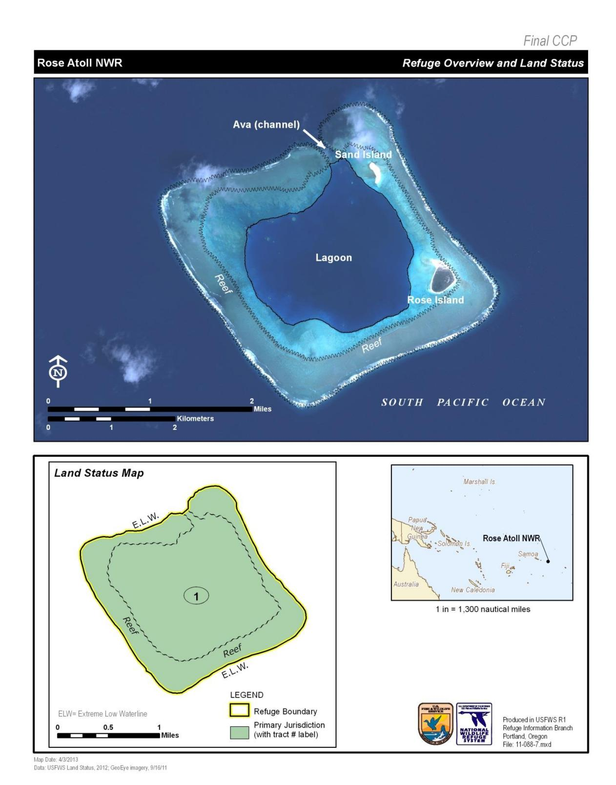

**The back sides of maps are blank to improve readability.**

# **Appendix F. Biological Resources of Concern**

# **F.1. Introduction**

Early in the planning process, the team cooperatively identified species, species groups, and communities of concern for the Refuge. A comprehensive list of these resources was compiled based on review of numerous plans, many of which highlight priority species or habitats for conservation. The Comprehensive Resources of Concern table was further culled in developing a more targeted assemblage of Priority Resources of Concern. Most of the biological emphasis of the CCP is focused on maintaining and restoring these priority resources.

Definitions for the column headings in Table F-2 are as follows:

- Focal Species: Species selected as representatives or indicators for the overall condition of the conservation target. In situations where the conservation target may include a broad variety of habitat structures and plant associations, several different conservation focal species may be listed. In addition, species with specific "niche" ecological requirements may be listed as a focal species. Management will be focused on attaining conditions required by the focal species. Other species utilizing the conservation target will generally be expected to benefit as a result of management for the focal species.
- Habitat Type: The general habitat description utilized by the focal species.
- Habitat Structure: The specific and measurable habitat attributes considered necessary to support the focal species.
- Life-History Requirement: The general reason of use for the focal species.
- Other Benefiting Species: Other species that are expected to benefit from management for the selected focal species. The list is not comprehensive; see Appendix A for a more complete list.

**Table F-1. Biological Integrity, Diversity, and Environmental Health**

| Habitats | Population/Habitat<br>Attributes                                                                                                                                                                                                                                                                                                                                               | Natural Processes<br>Responsible for These<br>Conditions                                                                                                                                                                                                                                                                                 | Limiting Factors                                                                                                                  |
|----------|--------------------------------------------------------------------------------------------------------------------------------------------------------------------------------------------------------------------------------------------------------------------------------------------------------------------------------------------------------------------------------|------------------------------------------------------------------------------------------------------------------------------------------------------------------------------------------------------------------------------------------------------------------------------------------------------------------------------------------|-----------------------------------------------------------------------------------------------------------------------------------|
| Lagoon   | Lagoon floor (to ~98 feet<br>depth) and back reef<br>composed of carbonate<br>sand and rubble, with low<br>coral and CCA cover (<<br>1%). Hard-substrate<br>pinnacles and patch reefs<br>with moderate coral and<br>CCA cover (>10%),<br>supporting diverse fish<br>assemblage and faisua<br>Potential conservation<br>species: faisua, sea turtles,<br>candidate<br>ESA coral | Intact perimeter reef<br>(present-day height,<br>width, biotic construction)<br>and ava (present-day<br>depth, width, location<br>unblocked flow) that<br>regulate seawater<br>exchange with<br>surrounding ocean and<br>seawater flow inside<br>lagoon; natural<br>breakdown of calcifying<br>organisms providing<br>carbonate sediment | Proliferation of cyanobacteria;<br>illegal fishing and faisua<br>poaching; reduced calcification<br>linked to ocean acidification |

| Habitats                                         | Population/Habitat<br>Attributes                                                                                                                                                                                                                                                                                                     | Natural Processes<br>Responsible for These<br>Conditions                                                                                                                                                                                                                                             | Limiting Factors                                                                                                                                                                                                                                                                                                                                                                |
|--------------------------------------------------|--------------------------------------------------------------------------------------------------------------------------------------------------------------------------------------------------------------------------------------------------------------------------------------------------------------------------------------|------------------------------------------------------------------------------------------------------------------------------------------------------------------------------------------------------------------------------------------------------------------------------------------------------|---------------------------------------------------------------------------------------------------------------------------------------------------------------------------------------------------------------------------------------------------------------------------------------------------------------------------------------------------------------------------------|
|                                                  | species                                                                                                                                                                                                                                                                                                                              |                                                                                                                                                                                                                                                                                                      |                                                                                                                                                                                                                                                                                                                                                                                 |
| Perimeter<br>Crustose<br>Coralline<br>Algal Reef | Living reef dominated by<br>CCA, with intact<br>geomorphic structure<br>providing mosaic of<br>microhabitats for<br>invertebrates including<br>corals and sea urchins                                                                                                                                                                | Growth of CCA and other<br>calcifying organisms, and<br>accretion of carbonate<br>through biochemical<br>processes, maintains<br>constructional platform<br>between open ocean and<br>lagoon                                                                                                         | Rate of SLR<br>relative to natural<br>capacities for growth and<br>accretion; reduced calcification<br>linked to ocean acidification;<br>overgrowth by non-reef<br>building<br>cyanobacteria                                                                                                                                                                                    |
|                                                  | Potential conservation<br>species: candidate ESA<br>coral species                                                                                                                                                                                                                                                                    |                                                                                                                                                                                                                                                                                                      |                                                                                                                                                                                                                                                                                                                                                                                 |
| Ava                                              | Unobstructed channel<br>between lagoon and fore<br>reef with present-day<br>depth, width, and location                                                                                                                                                                                                                               | Natural hydrological<br>regimes of oceanic and<br>lagoonal seawater flow                                                                                                                                                                                                                             | Impedance of natural flow<br>patterns by boat grounding or<br>other obstacles                                                                                                                                                                                                                                                                                                   |
|                                                  | Potential conservation<br>species: faisua, sea turtles,<br>candidate ESA coral<br>species                                                                                                                                                                                                                                            |                                                                                                                                                                                                                                                                                                      |                                                                                                                                                                                                                                                                                                                                                                                 |
| Beach<br>Strand                                  | Beach strand habitat clear<br>of invasive introduced<br>plants and marine debris<br>that provides nesting sites<br>for ground-nesting seabirds<br>and turtles and foraging<br>sites for migratory<br>shorebirds                                                                                                                      | Sand and rubble formed<br>by the<br>action of storms<br>and bio-erosion of living<br>CCA reef community is<br>deposited and re-arranged<br>by ocean waves.<br>Plant<br>community on the beach<br>strand areas are kept at<br>seral stage by repeated<br>overwashing and storms.<br>Current sea level | Nonnative<br>invasive species of<br>plants and animals;<br>human<br>disturbance and trampling;<br>interruption in the supply of<br>gastropod shells from the reef<br>that are used by land hermit<br>crabs; sea level rise; reduced<br>calcification linked to ocean<br>acidification; increased storm<br>frequency and intensity<br>changing sediment distribution<br>patterns |
| Littoral<br>Forest                               | South Central tropical<br>Pacific littoral forest with a<br>native species composition<br>typical of other intact<br>habitats of similar rainfall<br>and soil type.<br>This forest<br>provides nesting sites for<br>arboreal and ground<br>nesting seabirds as well as<br>native land crabs, insects,<br>and<br>migratory shorebirds | Nutrient input from<br>seabird guano and<br>precipitation favor pu'a<br>vai and other species of<br>plants dispersed by birds<br>or ocean currents                                                                                                                                                   | Nonnative<br>invasive species of<br>plants, animals, and pathogens,<br>human disturbance; SLR;<br>reduced calcification linked to<br>ocean acidification; increased<br>storm frequency and intensity;<br>changing sediment distribution<br>patterns                                                                                                                             |

**Table F-2. Priority Resources of Concern**

|                                                                                                                                                                                                                      |                            |                                                                                                                                                                       | Life History                                                                                                                                         | Other Benefiting                                                                                                                                                    |
|----------------------------------------------------------------------------------------------------------------------------------------------------------------------------------------------------------------------|----------------------------|-----------------------------------------------------------------------------------------------------------------------------------------------------------------------|------------------------------------------------------------------------------------------------------------------------------------------------------|---------------------------------------------------------------------------------------------------------------------------------------------------------------------|
| Focal Species                                                                                                                                                                                                        | Habitat Type               | Habitat Structure                                                                                                                                                     | Requirements                                                                                                                                         | Species                                                                                                                                                             |
| Pu'a vai<br>(Pisonia)                                                                                                                                                                                                | Littoral Forest            | Sandy and<br>phosphate soils<br>with elevation<br>sufficient to avoid<br>overwashing in all<br>but the largest<br>storms (> 6.6 feet)                                 | All                                                                                                                                                  | Tree-nesting seabirds<br>fua'o (red-footed<br>booby), atafa (lesser<br>frigatebird), atafa<br>(great frigatebird),<br>gogo (black noddy),<br>white tern (manu sina) |
| Littoral forest<br>tree species –<br>Cordia<br>subcordata,<br>Tournefortia<br>argentea,<br>Hernandia<br>nymphaeifolia,<br>Terminalia<br>samoensis,<br>Neisosperma<br>oppositifolium,<br>and<br>Hibiscus<br>tiliaceus | Littoral forest<br>(mesic) | Sandy and<br>phosphate soils<br>with elevation<br>sufficient to avoid<br>overwashing in all<br>but the largest<br>storms (><br>6.6 feet)                              | All                                                                                                                                                  | Matu'u<br>(Pacific reef<br>heron) for nesting<br>habitat and aleva<br>(long-tailed cuckoo)<br>for wintering, molting,<br>and foraging                               |
| Tava'e'ula<br>(red-tailed<br>tropicbird)                                                                                                                                                                             | Littoral forest            | Ground under<br>vegetation in<br>understory and<br>base of trees; sites<br>that provide<br>adequate shade for<br>nestling for the<br>duration of the<br>growth period | Nesting                                                                                                                                              | Gogo (brown noddy),<br>fua'o (brown booby)                                                                                                                          |
| Fua'o (red<br>footed booby)                                                                                                                                                                                          | Littoral forest            | Tournefortia<br>and<br>Pisonia<br>trees that<br>provide appropriate<br>structure for nest<br>construction above<br>the ground                                         | Nesting                                                                                                                                              | Atafa (lesser<br>frigatebird), atafa<br>(great frigatebird),<br>gogo (black noddy)                                                                                  |
| Land hermit<br>crabs<br>Coenobita<br>perlatus<br>and<br>Coenobita<br>brevimanus                                                                                                                                      | Littoral forest            | Sandy and<br>phosphate soils,<br>vegetation and<br>shade protection<br>from tropical sun                                                                              | Reproduction –<br>aquatic larvae,<br>terrestrial adults,<br>foraging, proximity<br>to sea water source<br>for osmoregulation<br>and gill maintenance | Tuli prey upon land<br>hermit crabs.<br>Entire forest<br>community benefits<br>from Coenobita<br>acting<br>as scavengers and<br>nutrient recyclers                  |

| Focal Species                                                          | Habitat Type                              | Habitat Structure                                                                                                                                                                  | Life History<br>Requirements                     | Other Benefiting<br>Species                                                                                                                                                                                                                                                                                                                                       |
|------------------------------------------------------------------------|-------------------------------------------|------------------------------------------------------------------------------------------------------------------------------------------------------------------------------------|--------------------------------------------------|-------------------------------------------------------------------------------------------------------------------------------------------------------------------------------------------------------------------------------------------------------------------------------------------------------------------------------------------------------------------|
| Gogo uli<br>(sooty tern)                                               | Beach strand<br>and littoral<br>forest    | Open beach habitat<br>or forest sites with<br>minimal understory<br>that provide open<br>access for landing<br>and takeoff and<br>visibility for these<br>highly social<br>nesters | Nesting                                          | Gogosina (gray<br>backed tern), gogosina<br>(black-naped tern),<br>bristle-thighed<br>curlews, ruddy<br>turnstones that prey on<br>sooty tern eggs                                                                                                                                                                                                                |
| Tuli (bristle<br>thighed<br>curlew)                                    | Beach strand<br>and littoral<br>forest    | Open beach habitat<br>or open forest                                                                                                                                               | Wintering, molting,<br>feeding                   | Tuli (ruddy turnstone),<br>tuli (sanderling), tuli<br>(wandering tattler),<br>tuli (whimbrel), tuli<br>(Pacific golden<br>plover)                                                                                                                                                                                                                                 |
| I'a sa<br>(green<br>turtle) and<br>laumei uga<br>(hawksbill<br>turtle) | Beach<br>strand/littoral<br>forest/lagoon | Sand with access to<br>the water but above<br>the high tide line                                                                                                                   | Nesting<br>(i'a sa<br>only),<br>resting, feeding |                                                                                                                                                                                                                                                                                                                                                                   |
| Tamole<br>(yellow<br>purslane,<br>Portulaca<br>lutea)                  | Beach strand                              | Open sand, no over<br>story                                                                                                                                                        | All                                              |                                                                                                                                                                                                                                                                                                                                                                   |
| Malie<br>(gray<br>reef shark)                                          | Lagoon, ava                               | Pinnacles, patch<br>reefs, back reefs                                                                                                                                              | All                                              | Malie alamata<br>(blacktip reef shark),<br>whitetip reef shark<br>(Triaenodon obesus),<br>bumphead parrotfish,<br>Maori wrasse,<br>gatala<br>uli<br>(peacock grouper),<br>leopard grouper,<br>coral<br>hind,<br>strawberry<br>grouper,<br>mata'ele<br>(flagtail grouper),<br>honeycomb grouper,<br>gatala-aloalo<br>(dwarf<br>spotted grouper),<br>masked grouper |

| Focal Species                                                                                                                                                                                        | Habitat Type                                                        | Habitat Structure                                                                                                                                                                                                                                                                       | Life History<br>Requirements                                                       | Other Benefiting<br>Species                                                                                                  |
|------------------------------------------------------------------------------------------------------------------------------------------------------------------------------------------------------|---------------------------------------------------------------------|-----------------------------------------------------------------------------------------------------------------------------------------------------------------------------------------------------------------------------------------------------------------------------------------|------------------------------------------------------------------------------------|------------------------------------------------------------------------------------------------------------------------------|
| Amu (stony<br>corals)<br>Acropora,<br>Astreopora,<br>Cyphastrea,<br>Favia,<br>Leptastrea,<br>Montastrea,<br>Montipora,<br>Pavona,<br>Platygyra,<br>Porites,<br>Psammocora,<br>Stylocoeniella<br>spp. | Reef crest,<br>back reef,<br>lagoon<br>pinnacles and<br>patch reefs | Hard substrate,<br>depth and water<br>clarity sufficient<br>for light<br>penetration,<br>moderate<br>temperatures,<br>seawater<br>immersion time<br>sufficient to<br>prevent<br>desiccation, low<br>nutrients, low algae<br>and cyanobacteria,<br>herbivorous fish<br>and invertebrates | All (growth, feeding<br>(endosymbiosis, and<br>plankton capture),<br>reproduction) | Reef<br>fish; other<br>benthic invertebrates<br>(soft corals, mollusks,<br>crustaceans, worms,<br>echinoderms,<br>tunicates) |
| Faisua (giant<br>clam)<br>(Tridacna<br>maxima)                                                                                                                                                       | Lagoon<br>pinnacles and<br>patch reefs                              | Hard substrate,<br>water depth and<br>clarity sufficient<br>for light<br>penetration                                                                                                                                                                                                    | All (growth, feeding<br>(endosymbiosis, and<br>filter-feeding),<br>reproduction    |                                                                                                                              |
| Sea urchins<br>(tuitui)                                                                                                                                                                              | Reef crest,<br>back reef,<br>lagoon<br>pinnacles and<br>patch reefs | Hard substrate,<br>available holes for<br>occupancy, algal<br>films and turf for<br>grazing                                                                                                                                                                                             | All (growth, grazing,<br>reproduction)                                             | Corals, CCA                                                                                                                  |
| Turban shells<br>(Turbo<br>crassus, Turbo<br>setosus, Turbo<br>argyrostomus)                                                                                                                         | Reef and<br>lagoon habitats                                         | CCA reef flats with<br>epilithic algae for<br>grazing                                                                                                                                                                                                                                   | Foraging (herbivores<br>and detritus feeders)                                      | Land hermit crabs<br>(Coenobita perlatus<br>and C. brevimanus)<br>that use shells of these<br>gastropods                     |
| Crustose<br>coralline algae<br>(Porolithon<br>spp.,<br>Hydrolithon<br>spp.)                                                                                                                          | Reef                                                                | Hard substrate,<br>moderate<br>temperatures, low<br>cyanobacteria,<br>herbivorous fish<br>and invertebrates                                                                                                                                                                             | All (growth,<br>photosynthesis,<br>reproduction)                                   | Stony corals                                                                                                                 |

# **Appendix G. Integrated Pest Management (IPM) Program**

# **G.1 Background**

IPM is an interdisciplinary approach utilizing methods to prevent, eliminate, contain, and/or control pest species in concert with other management activities on refuge lands and waters to achieve wildlife and habitat management goals and objectives. IPM is also a scientifically based, adaptive management process where available scientific information and best professional judgment of the refuge staff as well as other resource experts will be used to identify and implement appropriate management strategies that can be modified and/or changed over time to ensure effective, site-specific management of pest species to achieve desired outcomes. In accordance with 43 CFR 46.145, adaptive management will be particularly relevant where long-term impacts may be uncertain and future monitoring will be needed to make adjustments in subsequent implementation decisions. After a tolerable pest population (threshold) is determined considering achievement of refuge resource objectives and the ecology of pest species, one or more methods, or combinations thereof, will be selected that are feasible, efficacious, and most protective of non-target resources, including native species (fish, wildlife, and plants), and Service personnel, Service authorized agents, volunteers, and the public. Staff time and available funding will be considered when determining feasibility/practicality of various treatments.

IPM techniques to address pests are presented as CCP strategies (see Chapter 2 of this CCP) in an adaptive management context to achieve refuge resource objectives. In order to satisfy requirements for IPM planning as identified in the Director's Memo (dated September 9, 2004) entitled *Integrated Pest Management Plans and Pesticide Use Proposals: Updates, Guidance, and an Online Database*, the following elements of an IPM program have been incorporated into this CCP:

- Habitat and/or wildlife objectives that identify pest species and appropriate thresholds to indicate the need for and successful implementation of IPM techniques; and
- Monitoring before and/or after treatment to assess progress toward achieving objectives including pest thresholds.

Where pesticides would be necessary to address pests, this Appendix provides a structured procedure to evaluate potential effects of proposed uses involving ground-based applications to refuge biological resources and environmental quality in accordance with effects analyses (environmental consequences) presented in Chapter 6 of the Rose Atoll National Wildlife Refuge Draft CCP/EA. Only pesticide uses that likely would cause minor, temporary, or localized effects to refuge biological resources and environmental quality with appropriate best management practices (BMPs), where necessary, would be allowed for use on the refuge.

This Appendix does not describe the more detailed process to evaluate potential effects associated with aerial applications of pesticides. However, the basic framework to assess potential effects to refuge biological resources and environmental quality from aerial application of pesticides would be similar to the process described in this Appendix for ground-based treatments of other pesticides.

# **G.2 Pest Management Laws and Policies**

In accordance with Service policy 569 FW 1 (Integrated Pest Management), plant, invertebrate, and vertebrate pests on units of the National Wildlife Refuge System can be controlled to ensure balanced wildlife and fish populations in support of refuge-specific wildlife and habitat management objectives. Pest control on Federal (refuge) lands and waters also is authorized under the following legal mandates:

- National Wildlife Refuge System Administration Act of 1966, as amended (16 USC 668dd-668ee);
- Plant Protection Act of 2000 (7 USC 7701 *et seq*.);
- Noxious Weed Control and Eradication Act of 2004 (7 USC 7781-7786, Subtitle E);
- Federal Insecticide, Fungicide, and Rodenticide Act of 1996 (7 USC 136-136y);
- National Invasive Species Act of 1996 (16 USC 4701);
- Nonindigenous Aquatic Nuisance Prevention and Control Act of 1990 (16 USC 4701);
- Food Quality Protection Act of 1996 (7 USC 136);
- Executive Order 13148, Section 601(a);
- Executive Order 13112; and
- Animal Damage Control Act of 1931 (7 USC 426-426c, 46 Stat. 1468).

Pests are defined as "… living organisms that may interfere with the site-specific purposes, operations, or management objectives or that jeopardize human health or safety" from Department policy 517 DM 1 (Integrated Pest Management Policy). Similarly, 569 FW 1 defines pests as "… invasive plants and introduced or native organisms that may interfere with achieving our management goals and objectives on or off our lands, or that jeopardize human health or safety." 517 DM 1 also defines an invasive species as "a species that is nonnative to the ecosystem under consideration and whose introduction causes or is likely to cause economic or environmental harm or harm to human health." Throughout the remainder of this CCP, the terms pest and invasive species are used interchangeably because both can prevent/impede achievement of refuge wildlife and habitat objectives and/or degrade environmental quality.

In general, control of pests (vertebrate or invertebrate) on the refuge would conserve and protect the nation's fish, wildlife, and plant resources as well as maintain environmental quality. From 569 FW 1, animal or plant species, which are considered pests, may be managed if the following criteria are met:

- Threat to human health and well being or private property, the acceptable level of damage by the pest has been exceeded, or State or local government has designated the pest as noxious;
- Detrimental to resource objectives as specified in a refuge resource management plan (e.g., comprehensive conservation plan, habitat management plan), if available; and
- Control would not conflict with attainment of resource objectives or the purpose(s) for which the refuge was established.

The specific justifications for pest management activities on the refuge are the following:

- Protect human health and well being;
- Prevent substantial damage to important to refuge resources;
- Protect newly introduced or re-establish native species;
- Control nonnative (exotic) species in order to support existence for populations of native species;
- Prevent damage to private property; and
- Provide the public with quality, compatible wildlife-dependent recreational opportunities.

In accordance with Service policy 620 FW 1 (Habitat Management Plans), there are additional management directives regarding invasive species found on the refuge:

- "We are prohibited by Executive Order, law, and policy from authorizing, funding, or carrying out actions that are likely to cause or promote the introduction or spread of invasive species in the United States or elsewhere."
- "Manage invasive species to improve or stabilize biotic communities to minimize unacceptable change to ecosystem structure and function and prevent new and expanded infestations of invasive

species. Conduct refuge habitat management activities to prevent, control, or eradicate invasive species..."

Animal species damaging/destroying Federal property and/or detrimental to the management program of a refuge may be controlled as described in 50 CFR 31.14 (Official Animal Control Operations). For example, on the mainland, the incidental removal of beaver damaging refuge infrastructure (e.g., clogging with subsequent damaging of water control structures) and/or negatively affecting habitats (e.g., removing woody species from existing or restored riparian areas) managed on refuge lands may be conducted without a pest control proposal. Exotic nutria, whose denning and burrowing activities in wetland dikes causes cave-ins and breaches, can be controlled using the most effective techniques considering sitespecific factors without a pest control proposal. Along with the loss of quality wetland habitats associated with breaching of impoundments, the safety of refuge staff and public (e.g., auto tour routes) driving on structurally compromised levees and dikes can be threatened by sudden and unexpected cave-ins.

Trespass and feral animals also may be controlled on refuge lands. Based upon 50 CFR 28.43 (Destruction of Dogs and Cats), dogs and cats running at large on a national wildlife refuge and observed in the act of killing, injuring, harassing or molesting humans or wildlife may be disposed of in the interest of public safety and protection of the wildlife. Feral animals should be disposed by the most humane method(s) available and in accordance with relevant Service directives (including Executive Order 11643). Disposed wildlife specimens may be donated or loaned to public institutions. Donation or loans of resident wildlife species will only be made after securing State approval (50 CFR 30.11 [Donation and Loan of Wildlife Specimens]). Surplus wildlife specimens may be sold alive or butchered, dressed and processed subject to federal and state laws and regulations (50 CFR 30.12 [Sale of Wildlife Specimens]).

# **G.3 Strategies**

To fully embrace IPM as identified in 569 FW 1, the following strategies, where applicable, would be carefully considered on the refuge for each pest species.

• **Prevention.** This would be the most effective and least expensive long-term management option for pests. It encompasses methods to prevent new introductions or the spread of the established pests to un-infested areas. It requires identifying potential routes of invasion to reduce the likelihood of infestation. Hazard Analysis and Critical Control Points (HACCP) planning can be used to determine if current management activities on a refuge may introduce and/or spread invasive species in order to identify appropriate BMPs for prevention. See http://www.haccp-nrm.org/ for more information about HACCP planning.

Prevention may include source reduction, using pathogen-free or weed-free seeds or fill; exclusion methods (e.g., barriers) and/or sanitation methods (e.g., wash stations) to prevent re-introductions by various mechanisms including vehicles, personnel, livestock, and horses. Because invasive species are frequently the first to establish newly disturbed sites, prevention would require a reporting mechanism for early detection of new pest occurrences with quick response to eliminate any new satellite pest populations. Prevention would require consideration of the scale and scope of land management activities that may promote pest establishment within un-infested areas or promote reproduction and spread of existing populations. Along with preventing initial introduction, prevention would involve halting the spread of existing infestations to new sites (Mullin et al. 2000). The primary reason for prevention would be to keep pest-free lands or waters from becoming infested. Executive Order 11312 emphasizes the priority for prevention with respect to managing pests.

The following would be methods to prevent the introduction and/or spread of pests on refuge lands:

- o Before beginning ground-disturbing activities (e.g., disking, scraping), inventory and prioritize pest infestations in project operating areas and along access routes. Refuge staff would identify pest species on-site or within reasonably expected potential invasion vicinity. Where possible, the refuge staff would begin project activities in un-infested areas before working in pest-infested areas.
- o The refuge staff would locate and use pest-free project staging areas. They would avoid or minimize travel through pest-infested areas, or restrict to those periods when spread of seed or propagules of invasive plants would be least likely.
- o The refuge staff would determine the need for, and when appropriate, identify sanitation sites where equipment can be cleaned of pests. Where possible, the refuge staff would clean equipment before entering lands at on-refuge approved cleaning site(s). This practice does not pertain to vehicles traveling frequently in and out of the project area that will remain on roadways. Seeds and plant parts of pest plants would need to be collected, where practical. The refuge staff would remove mud, dirt, and plant parts from project equipment before moving it into a project area.
- o The refuge staff would clean all equipment, before leaving the project site, if operating in areas infested with pests. The refuge staff would determine the need for, and when appropriate, identify sanitation sites where equipment can be cleaned.
- o Refuge staff, their authorized agents, and refuge volunteers would, where possible, inspect, remove, and properly dispose of seed and parts of invasive plants found on their clothing and equipment. Proper disposal means bagging the seeds and plant parts and then properly discarding of them (e.g., incinerating).
- o The refuge staff would evaluate options, including closure, to restrict the traffic on sites with on-going restoration of desired vegetation. The refuge staff would revegetate disturbed soil (except travel ways on surfaced projects) to optimize plant establishment for each specific site. Revegetation may include topsoil replacement, planting, seeding, fertilization, liming, and weed-free mulching as necessary. The refuge staff would use native material, where appropriate and feasible. The refuge staff would use certified weed-free or weed-seed-free hay or straw where certified materials are reasonably available.
- o The refuge staff would provide information, training, and appropriate pest identification materials to permit holders and recreational visitors. The refuge staff would educate them about pest identification, biology, impacts, and effective prevention measures.
- o The refuge staff would require grazing permittees to utilize preventative measures for their livestock while on refuge lands.
- o The refuge staff would inspect borrow material for invasive plants prior to use and transport onto and/or within refuge lands.
- o The refuge staff would consider invasive plants in planning for road maintenance activities.
- o The refuge staff would restrict off-road travel to designated routes.

The following would be methods to prevent the introduction and/or spread of pests into refuge waters:

- o The refuge staff would inspect boats (including air boats), trailers, and other boating equipment. Where possible, the refuge staff would remove any visible plants, animals, or mud before leaving any waters or boat launching facilities. Where possible, the refuge staff would drain water from motor, live well, bilge, and transom wells while on land before leaving the site.
- o If possible, the refuge staff would wash and dry boats, downriggers, anchors, nets, floors of boats, propellers, axles, trailers, and other boating equipment to kill pests not visible at the boat launch.

o Where feasible, the refuge staff would maintain a 100-foot buffer of aquatic pest-free clearance around boat launches and docks or quarantine areas when cleaning around culverts, canals, or irrigation sites. Where possible, the refuge staff would inspect and clean equipment before moving to new sites or one project area to another.

These prevention methods to minimize/eliminate the introduction and/or spread of pests were taken verbatim or slightly modified from Appendix E of USFS (2005).

• **Mechanical/Physical Methods.** These methods would remove and destroy, disrupt the growth of, or interfere with the reproduction of pest species. For plants species, these treatments can be accomplished by hand, hand tool (manual), or power tools (mechanical) and include pulling, grubbing, digging, tilling/disking, cutting, swathing, grinding, shearing, girdling, mowing, and mulching of the pest plants.

For animal species, Service employees or their authorized agents could use mechanical/physical methods (including trapping) to control pests as a refuge management activity. Based upon 50 CFR 31.2, trapping can be used on a refuge to reduce surplus wildlife populations for a "balanced conservation program" in accordance with Federal or state laws and regulations. In some cases, nonlethally trapped animals would be relocated to off-refuge sites with prior approval from the state.

Each of these tools would be efficacious to some degree and applicable to specific situations. In general, mechanical controls can effectively control annual and biennial pest plants. However, to control perennial plants, the root system has to be destroyed or it would resprout and continue to grow and develop. Mechanical controls are typically not capable of destroying a perennial plant's root system. Although some mechanical tools (e.g., disking, plowing) may damage root systems, they may stimulate regrowth producing a denser plant population that may aid in the spread depending upon the target species. In addition, steep terrain and soil conditions would be major factors that can limit the use of many mechanical control methods.

Some mechanical control methods (e.g., mowing), which would be used in combination with herbicides, can be a very effective technique to control perennial species. For example, mowing perennial plants followed sequentially by treating the plant regrowth with a systemic herbicide often would improve the efficacy of the herbicide compared to herbicide treatment only.

- **Cultural Methods.** These methods would involve manipulating habitat to increase pest mortality by reducing its suitability to the pest. Cultural methods would include water-level manipulation, mulching, winter cover crops, changing planting dates to minimize pest impact, prescribed burning (facilitate revegetation, increase herbicide efficacy, and remove litter to assist in emergence of desirable species), flaming with propane torches, trap crops, crop rotations that would include nonsusceptible crops, moisture management, addition of beneficial insect habitat, reducing clutter, proper trash disposal, planting or seeding desirable species to shade or out-compete invasive plants, applying fertilizer to enhance desirable vegetation, prescriptive grazing, and other habitat alterations.
- **Biological Control Agents.** Classical biological control would involve the deliberate introduction and management of natural enemies (parasites, predators, or pathogens) to reduce pest populations. Many of the most ecologically or economically damaging pest species in the United States originated in foreign countries. These newly introduced pests, which are free from natural enemies found in their country or region of origin, may have a competitive advantage over cultivated and native species. This competitive advantage often allows introduced species to flourish, and they may cause widespread economic damage to crops or out compete and displace native vegetation. Once the introduced pest species population reaches a certain level, traditional methods of pest management

may be cost-prohibitive or impractical. Biological controls typically are used when these pest populations have become so widespread that eradication or effective control would be difficult or no longer practical.

Biological control has advantages as well as disadvantages. Benefits would include reducing pesticide usage, host specificity for target pests, long-term self-perpetuating control, low cost/acre, capacity for searching and locating hosts, synchronizing biological control agents to hosts' life cycles, and the unlikelihood that hosts will develop resistance to agents. Disadvantages would include the following: limited availability of agents from their native lands, the dependence of control on target species density, slow rate at which control occurs, biotype matching, the difficulty and expense of conflicts over control of the target pest, and host specificity when host populations are low.

A reduction in target species populations from biological controls is typically a slow process, and efficacy can be highly variable. It may not work well in a particular area although it does work well in other areas. Biological control agents would require specific environmental conditions to survive over time. Some of these conditions are understood; whereas, others are only partially understood or not at all.

Biological control agents would not eradicate a target pest. When using biological control agents, residual levels of the target pest typically are expected; the agent population level or survival would be dependent upon the density of its host. After the pest population decreases, the population of the biological control agent would decrease correspondingly. This is a natural cycle. Some pest populations (e.g., invasive plants) would tend to persist for several years after a biological control agent becomes established due to seed reserves in the soil, inefficiencies in the agents search behavior, and the natural lag in population buildup of the agent.

The full range of pest groups potentially found on refuge lands and waters would include diseases, invertebrates (insects, mollusks), vertebrates, and invasive plants (the most common group). Often it is assumed that biological control would address many if not most of these pest problems. There are several well-documented success stories of biological control of invasive weed species in the Pacific Northwest including Mediterranean sage, St. Johnswort (Klamath weed) and tansy ragwort. Emerging success stories include Dalmatian toadflax, diffuse knapweed, leafy spurge, purple loosestrife, and yellow star thistle. However, historically, each new introduction of a biological control agent in the United States has only about a 30% success rate (Coombs et al. 2004). Refer to Coombs et al. (2004) for the status of biological control agents for invasive plants.

Introduced species without desirable close relatives in the United States would generally be selected as biological controls. Natural enemies that are restricted to one or a few closely related plants in their country of origin are targeted as biological controls (Center et al. 1997, Hasan and Ayres 1990).

The refuge staff would ensure introduced agents are approved by the applicable authorities. Except for a small number of formulated biological control products registered by EPA under FIFRA, most biological control agents are regulated by the U.S. Department of Agriculture (USDA)-Animal Plant Health Inspection Service, Plant Protection and Quarantine (APHIS-PPQ). State departments of agriculture and, in some cases, county agricultural commissioners or weed districts, have additional approval authority.

Federal permits (USDA-APHIS-PPQ Form 526) are required to import biocontrols agents from another state. Form 526 may be obtained by writing:

USDA-APHIS-PPQ Biological Assessment and Taxonomic Support 4700 River Road, Unit 113 Riverdale, MD 20737

Or through the internet at http://www.aphis.usda.gov/ppq/permits/bioligical/weedbio.html.

The Service strongly supports the development, and legal and responsible use of appropriate, safe, and effective biological control agents for nuisance and non-indigenous or pest species.

State and county agriculture departments may also be sources for biological control agents or they may have information about where biological control agents may be obtained. Commercial sources should have an Application and Permit to Move Live Plant Pests and Noxious Weeds (USDA-PPQ Form 226 USDA-APHIS-PPQ, Biological Assessment and Taxonomic Support, 4700 River Road, Unit 113, Riverdale, MD 20737) to release specific biological control agents in a state and/or county. Furthermore, certification regarding the biological control agent's identity (genus, specific epithet, sub-species and variety) and purity (e.g., parasite free, pathogen free, and biotic and abiotic contaminants) should be specified in purchase orders.

Biological control agents are subject to 7 RM 8 (Exotic Species Introduction and Management). In addition, the refuge staff would follow the International Code of Best Practice for Classical Biological Control of Weeds (http://sric.ucdavis.edu/exotic/exotic.htm) as ratified by delegates to the X International Symposium on Biological Control of Weeds, Bozeman, MT, July 9, 1999. This code identifies the following:

- o Release only approved biological control agents;
- O Use the most effective agents:
- o Document releases; and
- o Monitor for impact to the target pest species, non-target species, and the environment.

Biological control agents formulated as pesticide products and registered by the USEPA (e.g., *Bti*) are also subject to PUP review and approval (see below).

A record of all releases would be maintained with date(s), location(s), and environmental conditions of the release site(s); the identity, quantity, and condition of the biological control agents released; and other relevant data and comments such as weather conditions. Systematic monitoring to determine the establishment and effectiveness of the release is also recommended.

The NEPA documents regarding biological and other environmental effects of biological control agents prepared by another federal agency, where the scope is relevant to evaluation of releases on refuge lands, would be reviewed. Possible source agencies for such NEPA documents include the Bureau of Land Management, U.S. Forest Service, National Park Service, U.S. Department of Agriculture-Animal and Plant Health Inspection Service, and the military services. It might be appropriate to incorporate by reference parts or all of existing document(s) from the review. Incorporating by reference (43 CFR 46.135) is a technique used to avoid redundancies in analysis. It also can reduce the bulk of a Service NEPA document, which only must identify the documents that are incorporated by reference. In addition, relevant portions must be summarized in the Service NEPA document to the extent necessary to provide the decision maker and public with an understanding of relevance of the referenced material to the current analysis.

• **Pesticides.** The selective use of pesticides would be based upon pest ecology (including mode of reproduction), the size and distribution of its populations, site-specific conditions (e.g., soils, topography), known efficacy under similar site conditions, and the capability to utilize best management practices (BMPs) to reduce/eliminate potential effects to non-target species, sensitive habitats, and potential to contaminate surface and groundwater. All pesticide usage (pesticide, target species, application rate, and method of application) would comply with the applicable federal (FIFRA) and state regulations pertaining to pesticide use, safety, storage, disposal, and reporting. Before pesticides can be used to eradicate, control, or contain pests on refuge lands and waters, pesticide use proposals (PUPs) would be prepared and approved in accordance with 569 FW 1. The PUP records would provide a detailed, time-, site-, and target-specific description of the proposed use of pesticides on the Refuge. All PUPs would be created, approved or disapproved, and stored in the Pesticide Use Proposal System (PUPS), which is a centralized database only accessible on the Service's intranet (https://systems.fws.gov/pups). Only Service employees would be authorized to access PUP records for a refuge in this database.

Application equipment would be selected to provide site-specific delivery to target pests while minimizing/eliminating direct or indirect (e.g., drift) exposure to non-target areas and degradation of surface and groundwater quality. Where possible, target-specific equipment (e.g., backpack sprayer, wiper) would be used to treat target pests. Other target-specific equipment to apply pesticides would include soaked wicks or paint brushes for wiping vegetation and lances, hatchets, or syringes for direct injection into stems. Granular pesticides may be applied using seeders or other specialized dispensers. In contrast, aerial spraying (e.g., fixed wing or helicopter) would only be used where access is difficult (remoteness) and/or the size/distribution of infestations precludes practical use of ground-based methods.

Because repeated use of one pesticide may allow resistant organisms to survive and reproduce, multiple pesticides with variable modes of action would be considered for treatments on refuge lands and waters. This is especially important if multiple applications within years and/or over a growing season likely would be necessary for habitat maintenance and restoration activities to achieve resource objectives. Integrated chemical and non-chemical controls also are highly effective, where practical, because pesticide-resistant organisms can be removed from the site.

Cost may not be the primary factor in selecting a pesticide for use on a refuge. If the least expensive pesticide would potentially harm natural resources or people, then a different product would be selected, if available. The most efficacious pesticide available with the least potential to degrade environment quality (soils, surface water, and groundwater) as well as least potential effect to native species and communities of fish, wildlife, plants, and their habitats would be acceptable for use on refuge lands in the context of an IPM approach.

• **Habitat restoration/maintenance.** Restoration and/or proper maintenance of refuge habitats associated with achieving wildlife and habitat objectives would be essential for long-term prevention, eradication, or control (at or below threshold levels) of pests. Promoting desirable plant communities through the manipulation of species composition, plant density, and growth rate is an essential component of invasive plant management (Masters et al. 1996, Masters and Sheley 2001, Brooks et al. 2004). The following three components of succession could be manipulated through habitat maintenance and restoration: site availability, species availability, and species performance (Cox and Anderson 2004). Although a single method (e.g., herbicide treatment) may eliminate or suppress pest species in the short term, the resulting gaps and bare soil create niches that are conducive to further invasion by the species and/or other invasive plants. On degraded sites where desirable species are absent or in low abundance, revegetation with native/desirable grasses, forbs, and legumes may be necessary to direct and accelerate plant community recovery, and achieve site-specific objectives in a

reasonable time frame. The selection of appropriate species for revegetation would be dependent on a number of factors including resource objectives and site-specific, abiotic factors (e.g., soil texture, precipitation/temperature regimes, and shade conditions). Seed availability and cost, ease of establishment, seed production, and competitive ability also would be important considerations.

# **G.4 Priorities for Treatments**

For many refuges, the magnitude (number, distribution, and sizes of infestations) of pest problems is too extensive and beyond the available capital resources to effectively address during any single field season. To manage pests on the Refuge, it would be essential to prioritize treatment of infestations. Highest priority treatments would be focused on early detection and rapid response to eliminate infestations of new pests, if possible. This would be especially important for aggressive pests potentially impacting species, species groups, communities, and/or habitats associated refuge purpose(s), NWRS resources of concern (Federally listed species, migratory birds, selected marine mammals, and interjurisdictional fish), and native species for maintaining/restoring biological integrity, diversity, and environmental health.

The next priority would be treating established pests that appear in one or more previously un-infested areas. Moody and Mack (1988) demonstrated through modeling that small, new outbreaks of invasive plants eventually would infest an area larger than the established, source population. They also found that control efforts focusing on the large, main infestation rather than the new, small satellites reduced the chances of overall success. The lowest priority would be treating large infestations (sometimes monotypic stands) of well-established pests. In this case, initial efforts would focus upon containment of the perimeter followed by work to control/eradicate the established infested area. If containment and/or control of a large infestation is not effective, then efforts would focus upon halting pest reproduction or managing source populations. Maxwell et al. (2009) found treating fewer populations that are sources represents an effective long-term strategy to reduce of total number of invasive populations and decreasing meta-population growth rates.

Although state-listed noxious weeds would always be of high priority for management, other pest species known to cause substantial ecological impact would also be considered. For example, cheatgrass may not be listed by a state as noxious, but it can greatly alter fire regimes in shrub steppe habitats resulting in large monotypic stands that displace native bunch grasses, forbs, and shrubs. Pest control would likely require a multi-year commitment from the refuge staff. Essential to the long-term success of pest management would be pre- and post-treatment monitoring, assessment of the successes and failures of treatments, and development of new approaches when proposed methods do not achieve desired outcomes.

# **G.5 Best Management Practices (BMPs)**

The BMPs can minimize or eliminate possible effects associated with pesticide usage to non-target species and/or sensitive habitats as well as degradation of water quality from drift, surface runoff, or leaching. Based upon the Department of the Interior Pesticide Use Policy (517 DM 1) and the Service Integrated Pest Management policy (569 FW 1), the use of applicable BMPs (where feasible) also would likely ensure that pesticide uses may not adversely affect federally listed species and/or their critical habitats through determinations made using the process described in 50 CFR part 402.

The following are BMPs pertaining to mixing/handling and applying pesticides for all ground-based treatments of pesticides, which would be considered and utilized, where feasible, based upon target- and site-specific factors and time-specific environmental conditions. Although not listed below, the most

important BMP to eliminate/reduce potential impacts to non-target resources would be an IPM approach to prevent, control, eradicate, and contain pests.

### **G.5.1 Pesticide Handling and Mixing**

- As a precaution against spilling, spray tanks would not be left unattended during filling.
- All pesticide containers would be triple rinsed and the rinsate would be used as water in the sprayer tank and applied to treatment areas.
- All pesticide spray equipment would be properly cleaned. Where possible, rinsate would be used as part of the make-up water in the sprayer tank and applied to treatment areas.
- The refuge staff would triple rinse and recycle (where feasible) pesticide containers.
- All unused pesticides would be properly discarded at a local "safe send" collection.
- Pesticides and pesticide containers would be lawfully stored, handled, and disposed of in accordance
  with the label and in a manner safeguarding human health, fish, and wildlife and prevent soil and
  water contaminant.
- The refuge staff would consider the water quality parameters (e.g., pH, hardness) that are important to ensure greatest efficacy where specified on the pesticide label.
- All pesticide spills would be addressed immediately using procedures identified in the refuge spill response plan.

### **G.5.2 Applying Pesticides**

- Pesticide treatments would only be conducted by or under the supervision of Service personnel and non-Service applicators with the appropriate state or Bureau of Land Management certification to safely and effectively conduct these activities on refuge lands and waters.
- The refuge staff would comply with all federal, state, and local pesticide use laws and regulations as well as Departmental, Service, and Refuge System pesticide-related policies. For example, the refuge staff would use application equipment and apply rates for the specific pest(s) identified on the pesticide label as required under FIFRA.
- Before each treatment season and prior to mixing or applying any product for the first time each season, all applicators would review the labels, MSDSs, and PUPs for each pesticide, determining the target pest, appropriate mix rate(s), PPE, and other requirements listed on the pesticide label.
- A 1-foot no-spray buffer from the water's edge would be used, where applicable, and where it does not detrimentally influence effective control of pest species.
- Use low-impact herbicide application techniques (e.g., spot treatment, cut stump, oil basal, Thinvert system applications) rather than broadcast foliar applications (e.g., boom sprayer, other larger tank wand applications), where practical.
- Use low-volume rather than high-volume foliar applications where low-impact methods above are not feasible or practical, to maximize herbicide effectiveness and ensure correct and uniform application rates.
- Applicators would use and adjust spray equipment to apply the coarsest droplet size spectrum with optimal coverage of the target species while reducing drift.
- Applicators would use the largest droplet size that results in uniform coverage.
- Applicators would use drift reduction technologies such as low-drift nozzles, where possible.
- Where possible, spraying would occur during low (average <7 mph and preferably 3-5 mph) and consistent direction wind conditions with moderate temperatures (typically <85°F).
- Where possible, applicators would avoid spraying during inversion conditions (often associated with calm and very low wind conditions) that can cause large-scale herbicide drift to non-target areas.

- Equipment would be calibrated regularly to ensure that the proper rate of pesticide is applied to the target area or species.
- Spray applications would be made at the lowest height for uniform coverage of target pests to minimize/eliminate potential drift.
- If windy conditions frequently occur during afternoons, spraying (especially boom treatments) would typically be conducted during early morning hours.
- Spray applications would not be conducted on days with >30% forecast for rain within 6 hours, except for pesticides that are rapidly rain fast (e.g., glyphosate in 1 hour) to minimize/eliminate potential runoff.
- Where possible, applicators would use drift retardant adjuvants during spray applications, especially adjacent to sensitive areas.
- Where possible, applicators would use a non-toxic dye to aid in identifying target area treated as well as potential over spray or drift. A dye can also aid in detecting equipment leaks. If a leak is discovered, the application would be stopped until repairs can be made to the sprayer.
- For pesticide uses associated with cropland and facilities management, buffers, as appropriate, would be used to protect sensitive habitats, especially wetlands and other aquatic habitats.
- When drift cannot be sufficiently reduced through altering equipment set up and application techniques, buffer zones may be identified to protect sensitive areas downwind of applications. The refuge staff would only apply adjacent to sensitive areas when the wind is blowing the opposite direction.
- Applicators would utilize scouting for early detection of pests to eliminate unnecessary pesticide applications.
- The refuge staff would consider timing of application so native plants are protected (e.g., senescence) while effectively treating invasive plants.
- Rinsate from cleaning spray equipment after application would be recaptured and reused or applied to an appropriate pest plant infestation.
- Application equipment (e.g., sprayer, all-terrain vehicle, tractor) would be thoroughly cleaned and personal protective equipment (PPE) would be removed/disposed of on-site by applicators after treatments to eliminate the potential spread of pests to un-infested areas.

# **G.6 Safety**

# **G.6.1 Personal Protective Equipment**

All applicators would wear the specific PPE identified on the pesticide label. The appropriate PPE would be worn at all times during handling, mixing, and applying. PPE can include the following: disposable (e.g., Tyvek) or laundered coveralls; gloves (latex, rubber, or nitrile); rubber boots; and/or an NIOSHapproved respirator. Because exposure to concentrated product is usually greatest during mixing, extra care should be taken while preparing pesticide solutions. Persons mixing these solutions can be best protected if they wear long gloves, an apron, footwear, and a face shield.

Coveralls and other protective clothing used during an application would be laundered separately from other laundry items. Transporting, storing, handling, mixing and disposing of pesticide containers would be consistent with label requirements, EPA and OSHA requirements, and Service policy.

If a respirator is necessary for a pesticide use, then the following requirements would be met in accordance with Service safety policy: a written Respirator Program, fit testing, physical examination (including pulmonary function and blood work for contaminants), and proper storage of the respirator.

### **G.6.2 Notification**

The restricted entry interval (REI) is the time period required after the application at which point someone may safely enter a treated area without PPE. Refuge staff, authorized management agents of the Service, volunteers, and members of the public who could be in or near a pesticide treated area within the stated re-entry time period on the label would be notified about treatment areas. Posting would occur at any site where individuals might inadvertently become exposed to a pesticide during other activities on the Refuge. Where required by the label and/or state-specific regulations, sites would also be posted on its perimeter and at other likely locations of entry. The refuge staff would also notify appropriate private property owners of an intended application, including any private individuals who have requested notification. Special efforts would be made to contact nearby individuals who are beekeepers or who have expressed chemical sensitivities.

### **G.6.3 Medical Surveillance**

Medical surveillance may be required for Service personnel and approved volunteers who mix, apply, and/or monitor use of pesticides (see 242 FW 7 [Pesticide Users] and 242 FW 4 [Medical Surveillance]). In accordance with 242 FW 7.12A, Service personnel would be medically monitoring if one or more of the following criteria is met: exposed or may be exposed to concentrations at or above the published permissible exposure limits or threshold limit values (see 242 FW 4); use pesticides in a manner considered "frequent pesticide use"; or use pesticides in a manner that requires a respirator (see 242 FW 14 for respirator use requirements). In 242 FW 7.7A, "Frequent Pesticide Use means when a person applying pesticide handles, mixes, or applies pesticides, with a Health Hazard rating of 3 or higher, for 8 or more hours in any week or 16 or more hours in any 30-day period." Under some circumstances, individuals may be medically monitored who use pesticides infrequently (see Section G.7.7), experience an acute exposure (sudden, short-term), or use pesticides with a health hazard ranking of 1 or 2. This decision would consider the individual's health and fitness level, the pesticide's specific health risks, and the potential risks from other pesticide-related activities. Refuge cooperators (e.g., cooperative farmers) and other authorized agents (e.g., state and county employees) would be responsible for their own medical monitoring needs and costs.

Standard examinations (at refuge expense) of appropriate refuge staff would be provided by the nearest certified occupational health and safety physician as determined by Federal Occupational Health.

# **G.6.4 Certification and Supervision of Pesticide Applicators**

Appropriate refuge staff or approved volunteers handling, mixing, and/or applying or directly supervising others engaged in pesticide use activities would be trained and state or federally (BLM) licensed to apply pesticides to refuge lands or waters. In accordance with 242 FW 7.18A and 569 FW 1.10B, certification is required to apply restricted use pesticides based upon EPA regulations. For safety reasons, all individuals participating in pest management activities with general use pesticides also are encouraged to attend appropriate training or acquire pesticide applicator certification. The certification requirement would be for a commercial or private applicator depending upon the state. New staff unfamiliar with proper procedures for storing, mixing, handling, applying, and disposing of herbicides and containers would receive orientation and training before handling or using any products. Documentation of training would be kept in the files at the refuge office.

### **G.6.5 Record Keeping**

#### **G.6.5.1 Labels and material safety data sheets**

Pesticide labels and material safety data sheets (MSDSs) would be maintained at the refuge shop and laminated copies in the mixing area. These documents also would be carried by field applicators, where possible. A written reference (e.g., note pad, chalk board, dry erase board) for each tank to be mixed would be kept in the mixing area for quick reference while mixing is in progress. In addition, approved PUPs stored in the PUPS database typically contain website links (URLs) to pesticide labels and MSDSs.

#### **G.6.5.2 Pesticide use proposals (PUPs)**

A PUP would be prepared for each proposed pesticide use associated with annual pest management on refuge lands and waters. A PUP would include specific information about the proposed pesticide use including the common and chemical names of the pesticide(s), target pest species, size and location of treatment site(s), application rate(s) and method(s), and federally listed species determinations, where applicable.

In accordance with Service guidelines (Director's memo [December 12, 2007]), refuge staff may receive up to 5-year approvals for Washington Office and field reviewed proposed pesticide uses based upon meeting identified criteria including an approved IPM plan, where necessary (see http://www.fws.gov/contaminants/Issues/IPM.cfm). For a refuge, an IPM plan (requirements described herein) can be completed independently or in association with a CCP or habitat management plan (HMP) if IPM strategies and potential environmental effects are adequately addressed within appropriate NEPA documentation.

The PUPs would be created, approved or disapproved, and stored as records in the Pesticide Use Proposal System (PUPS), which is centralized database on the Service's intranet (https://systems.fws.gov/pups). Only Service employees can access PUP records in this database.

#### **G.6.5.3 Pesticide usage**

In accordance with 569 FW 1, the refuge project leader would be required to maintain records of all pesticides annually applied on lands or waters under refuge jurisdiction. This would encompass pesticides applied by other Federal agencies, state and county governments, non-government applicators including cooperators and their pest management service providers with Service permission. For clarification, pesticide means all insecticides, insect and plant growth regulators, desiccants, herbicides, fungicides, rodenticides, acaricides, nematicides, fumigants, avicides, and piscicides.

The following usage information can be reported for approved PUPs in the PUPS database:

- Pesticide trade name(s);
- Active ingredient(s);
- Total acres treated;
- Total amount of pesticides used (lbs or gallons);
- Total amount of active ingredient(s) used (lbs);
- Target pest(s); and
- Efficacy (% control).

To determine whether treatments are efficacious (eradicating, controlling, or containing the target pest) and achieving resource objectives, habitat and/or wildlife response would be monitored both pre- and

post-treatment, where possible. Considering available annual funding and staffing, appropriate monitoring data regarding characteristics (attributes) of pest infestations (e.g., area, perimeter, degree of infestationdensity, % cover, density) as well as habitat and/or wildlife response to treatments may be collected and stored in a relational database (e.g., Refuge Habitat Management Database), preferably a geo-referenced data management system (e.g., Refuge Lands GIS) to facilitate data analyses and subsequent reporting. In accordance with adaptive management, data analysis and interpretation would allow treatments to be modified or changed over time, as necessary, to achieve resource objectives considering site-specific conditions in conjunction with habitat and/or wildlife responses. Monitoring could also identify short- and long-term impacts to natural resources and environmental quality associated with IPM treatments in accordance with adaptive management principles identified in 43 CFR 46.145.

# **G.7 Evaluating Pesticide Use Proposals**

Pesticides would only be used on refuge lands for habitat management as well as facilities maintenance after approval of a PUP. In general, proposed pesticide uses on refuge lands would only be approved where there would likely be minor, temporary, or localized effects to fish and wildlife species as well as minimal potential to degrade environmental quality. Potential effects to listed and non-listed species would be evaluated with quantitative ecological risk assessments and other screening measures. Potential effects to environmental quality would be based upon pesticide characteristics of environmental fate (water solubility, soil mobility, soil persistence, and volatilization) and other quantitative screening tools. Ecological risk assessments as well as characteristics of environmental fate and potential to degrade environmental quality for pesticides would be documented in Chemical Profiles (see Section G.7.5). These profiles would include threshold values for quantitative measures of ecological risk assessments and screening tools for environmental fate that represent minimal potential effects to species and environmental quality. In general, only pesticide uses with appropriate BMPs (see Section G.4) for habitat management and cropland/facilities maintenance on refuge lands that would potentially have minor, temporary, or localized effects on refuge biological and environmental quality (threshold values not exceeded) would be approved.

# **G.7.1 Overview of Ecological Risk Assessment**

An ecological risk assessment process would be used to evaluate potential adverse effects to biological resources as a result of a pesticide(s) proposed for use on refuge lands. It is an established quantitative and qualitative methodology for comparing and prioritizing risks of pesticides and conveying an estimate of the potential risk for an adverse effect. This quantitative methodology provides an efficient mechanism to integrate best available scientific information regarding hazard, patterns of use (exposure), and doseresponse relationships in a manner that is useful for ecological risk decision-making. It would provide an effective way to evaluate potential effects where there is missing or unavailable scientific information (data gaps) to address reasonable, foreseeable adverse effects in the field as required under 40 CFR Part 1502.22. Protocols for ecological risk assessment of pesticide uses on the refuge were developed through research and established by the USEPA (2004). Assumptions for these risk assessments are presented in Section G.7.2.3.

The toxicological data used in ecological risk assessments are typically results of standardized laboratory studies provided by pesticide registrants to the EPA to meet regulatory requirements under the Federal Insecticide, Fungicide and Rodenticide Act of 1996 (FIFRA). These studies assess the acute (lethality) and chronic (reproductive) effects associated with short- and long-term exposure to pesticides on representative species of birds, mammals, freshwater fish, aquatic invertebrates, and terrestrial and aquatic plants. Other effects data publicly available would also be utilized for risk assessment protocols

described herein. Toxicity endpoint and environmental fate data are available from a variety of resources. Some of the more useful resources can be found at the end of Section G.7.5.

**Table G-1. Ecotoxicity Tests Used to Evaluate Potential Effects to Birds, Fish, and Mammals to Establish Toxicity Endpoints for Risk Quotient Calculations**

| Species Group | Exposure | Measurement endpoint                                                                            |
|---------------|----------|-------------------------------------------------------------------------------------------------|
|               | Acute    | Median Lethal Concentration (LC50)                                                              |
| Bird          | Chronic  | No Observed Effect Concentration (NOEC) or<br>No Observed Adverse Effect Concentration (NOAEC)1 |
|               | Acute    | Median Lethal Concentration (LC50)                                                              |
| Fish          | Chronic  | No Observed Effect Concentration (NOEC) or<br>No Observed Adverse Effect Concentration (NOAEC)2 |
| Acute         |          | Oral Lethal Dose (LD50)                                                                         |
| Mammal        | Chronic  | No Observed Effect Concentration (NOEC) or<br>No Observed Adverse Effect Concentration (NOAEC)3 |

<sup>1</sup> Measurement endpoints typically include a variety of reproductive parameters (e.g., number of eggs, number of offspring, eggshell thickness, and number of cracked eggs). <sup>2</sup>

### **G.7.2 Determining Ecological Risk to Fish and Wildlife**

The potential for pesticides used on the refuge to cause direct adverse effects to fish and wildlife would be evaluated using EPA's Ecological Risk Assessment Process (2004). This deterministic approach, which is based upon a two-phase process involving estimation of environmental concentrations and then characterization of risk, would be used for ecological risk assessments. This method integrates exposure estimates (estimated environmental concentration (EEC) and toxicological endpoints [e.g., LC50 and oral LD50]) to evaluate the potential for adverse effects to species groups (birds, mammals, and fish) representative of legal mandates for managing units of the Refuge System. This integration is achieved through risk quotients (RQs) calculated by dividing the EEC by acute and chronic toxicity values selected from standardized toxicological endpoints or published effect (Table G-1).

$$RQ = EEC/Toxicological\ Endpoint$$

The level of risk associated with direct effects of pesticide use would be characterized by comparing calculated RQs to the appropriate Level of Concern (LOC) established by EPA (1998b) (Table G-2). The LOC represents a quantitative threshold value for screening potential adverse effects to fish and wildlife resources associated with pesticide use. The following are four exposure-species group scenarios that would be used to characterize ecological risk to fish and wildlife on the Refuge: acute-listed species, acute-nonlisted species, chronic-listed species, and chronic-nonlisted species.

Acute risk would indicate the potential for mortality associated with short-term dietary exposure to pesticides immediately after an application. For characterization of acute risks, median values from LC50 and LD50 tests would be used as toxicological endpoints for RQ calculations. In contrast, chronic risks would indicate the potential for adverse effects associated with long-term dietary exposure to pesticides from a single application or multiple applications over time (within a season and over years). For

Measurement endpoints for early life stage/life cycle typically include embryo hatch rates, time to hatch, growth, and time to swim-up. <sup>3</sup>

Measurement endpoints include maternal toxicity, teratogenic effects or developmental anomalies, evidence of mutagenicity or genotoxicity, and interference with cellular mechanisms such as DNA synthesis and DNA repair.

characterization of chronic risks, the no observed concentration (NOAEC) or no observed effect concentration (NOEC) for reproduction would be used as toxicological endpoints for RQ calculations. Where available, the NOAEC would be preferred over a NOEC value.

Listed species are those federally designated as threatened, endangered, or proposed in accordance with the Endangered Species Act of 1973 (16 USC 1531-1544, 87 Stat. 884, as amended-Public Law 93-205). For listed species, potential adverse effects would be assessed at the individual level because loss of individuals from a population could detrimentally impact a species. In contrast, risks to nonlisted species would consider effects at the population level. A RQ<LOC would indicate the proposed pesticide use "may affect, not likely to adversely affect" individuals (listed species) and it would not pose an unacceptable risk for adverse effects to populations (non-listed species) for each taxonomic group (Table G-2). In contrast, a RQ>LOC would indicate a "may affect, likely to adversely affect" for listed species and it would also pose unacceptable ecological risk for adverse effects to nonlisted species.

| Table G-2. |  |  | Presumption of Unacceptable Risk for Birds, Fish, and Mammals (USEPA | 1998b) |
|------------|--|--|----------------------------------------------------------------------|--------|
|------------|--|--|----------------------------------------------------------------------|--------|

| Risk Presumption |         |                | Level of Concern   |  |
|------------------|---------|----------------|--------------------|--|
|                  |         | Listed Species | Non-listed Species |  |
| Acute            | Birds   | 0.1            | 0.5                |  |
|                  | Fish    | 0.05           | 0.5                |  |
|                  | Mammals | 0.1            | 0.5                |  |
| Chronic          | Birds   | 1.0            | 1.0                |  |
|                  | Fish    | 1.0            | 1.0                |  |
|                  | Mammals | 1.0            | 1.0                |  |

#### **G.7.2.1 Environmental exposure**

Following release into the environment through application, pesticides would experience several different routes of environmental fate. Pesticides which would be sprayed can move through the air (e.g., particle or vapor drift) and may eventually end up in other parts of the environment such as non-target vegetation, soil, or water. Pesticides applied directly to the soil may be washed off the soil into nearby bodies of surface water (e.g., surface runoff) or may percolate through the soil to lower soil layers and groundwater (e.g., leaching) (Baker and Miller 1999, Pope et al. 1999, Butler et al. 1998, Ramsay et al. 1995, EXTOXNET 1993). Pesticides which would be injected into the soil may also be subject to the latter two fates. The aforementioned possibilities are by no means complete, but it does indicate movement of pesticides in the environment is very complex with transfers occurring continually among different environmental compartments. In some cases, these exchanges occur not only between areas that are close together, but it also may involve transportation of pesticides over long distances (Barry 2004, Woods 2004).

#### *G.7.2.1.1 Terrestrial exposure*

The estimated environmental concentration (ECC) for exposure to terrestrial wildlife would be quantified using an USEPA screening-level approach (USEPA 2004). This screening-level approach is not affected by product formulation because it evaluates pesticide active ingredient(s). This approach would vary depending upon the proposed pesticide application method: spray or granular.

#### *G.7.2.1.1.1 Terrestrial-spray application*

For spray applications, exposure would be determined using the Kanaga nomogram method (USEPA 2005a, USEPA 2004, Pfleeger et al*.* 1996) through the USEPA's Terrestrial Residue Exposure model (T-REX) version 1.2.3 (USEPA 2005b). To estimate the maximum (initial) pesticide residue on short grass (<20 cm tall) as a general food item category for terrestrial vertebrate species, T-REX input variables would include the following from the pesticide label: maximum pesticide application rate (pounds active ingredient [acid equivalent]/acre) and pesticide half-life (days) in soil. Although there are other food item categories (tall grasses; broadleaf plants and small insects; and fruits, pods, seeds and large insects), short grass was selected because it would yield maximum EECs (240 ppm per lb ai/acre) for worst-case risk assessments. Short grass is not representative of forage for carnivorous species (e.g., raptors), but it would characterize the maximum potential exposure through the diet of avian and mammalian prey items. Consequently, this approach would provide a conservative screening tool for pesticides that do not biomagnify.

For RQ calculations in T-REX, the model would require the weight of surrogate species and Mineau scaling factors (Mineau et al. 1996). Body weights of bobwhite quail and mallard are included in T-REX by default, but body weights of other organisms (Table G-3) would be entered manually. The Mineau scaling factor accounts for small-bodied bird species that may be more sensitive to pesticide exposure than would be predicted only by body weight. Mineau scaling factors would be entered manually with values ranging from 1 to 1.55 that are unique to a particular pesticide or group of pesticides. If specific information to select a scaling factor is not available, then a value of 1.15 would be used as a default. Alternatively, zero would be entered if it is known that body weight does not influence toxicity of pesticide(s) being assessed. The upper bound estimate output from the T-REX Kanaga nomogram would be used as an EEC for calculation of RQs. This approach would yield a conservative estimate of ecological risk.

**Table G-3. Average Body Weight of Selected Terrestrial Wildlife Species Frequently Used in Research to Establish Toxicological Endpoints (Dunning 1984)**

| Species                | Body Weight (kg) |
|------------------------|------------------|
| Mammal (15 g)          | 0.015            |
| House sparrow          | 0.0277           |
| Mammal (35 g)          | 0.035            |
| Starling               | 0.0823           |
| Red-winged blackbird   | 0.0526           |
| Common grackle         | 0.114            |
| Japanese quail         | 0.178            |
| Bobwhite quail         | 0.178            |
| Rat                    | 0.200            |
| Rock dove (aka pigeon) | 0.542            |
| Mammal (1,000 g)       | 1.000            |
| Mallard                | 1.082            |
| Ring-necked pheasant   | 1.135            |

#### G.7.2.1.1.2 Terrestrial – granular application

Granular pesticide formulations and pesticide-treated seed would pose a unique route of exposure for avian and mammalian species. The pesticide is applied in discrete units which birds or mammals might ingest accidentally with food items or intentionally as in the case of some bird species actively seeking and picking up gravel or grit to aid digestion or seed as a food source. Granules may also be consumed by wildlife foraging on earthworms, slugs or other soft-bodied soil organisms to which the granules may adhere.

Terrestrial wildlife RQs for granular formulations or seed treatments would be calculated by dividing the maximum milligrams of active ingredient (a.i.) exposed (e.g., EEC) on the surface of an area equal to 1 square foot by the appropriate LD<sub>50</sub> value multiplied by the surrogate's body weight (Table G-3). An adjustment to surface area calculations would be made for broadcast, banded, and in-furrow applications. An adjustment also would be made for applications with and without incorporation of the granules. Without incorporation, it would be assumed that 100% of the granules remain on the soil surface available to foraging birds and mammals. Press wheels push granules flat with the soil surface, but they are not incorporated into the soil. If granules are incorporated in the soil during band or T-band applications or after broadcast applications, it would be assumed only 15% of the applied granules remain available to wildlife. It would be assumed that only 1% of the granules are available on the soil surface following in-furrow applications.

EECs for pesticides applied in granular form and as seed treatments would be determined considering potential ingestion rates of avian or mammalian species (e.g., 10-30% body weight/day). This would provide an estimate of maximum exposure that may occur as a result of granule or seed treatment spills such as those that commonly occur at end rows during application and planting. The availability of granules and seed treatments to terrestrial vertebrates would also be considered by calculating the loading per unit area (LD<sub>50</sub>/ft<sup>2</sup>) for comparison to USEPA Level of Concerns (USEPA 1998b). The T-REX version 1.2.3 (USEPA 2005b) contains a submodel which automates Kanaga exposure calculations for granular pesticides and treated seed.

The following formulas would be used to calculate EECs depending upon the type of granular pesticide application:

• In-furrow applications assume a typical value of 1% granules, bait, or seed remain unincorporated.

```
 mg \ a.i./ft.^2 = [(lbs.\ product/acre)(\%\ a.i.)(453,580\ mg/lbs)(1\%\ exposed))] \ / \ \{[(43,560\ ft.^2/acre)/(row\ spacing\ (ft.))] \ / \ (row\ spacing\ (ft.))\}  or  mg\ a.i./ft^2 = [(lbs\ product/1,000\ ft.\ row)(\%\ a.i.)(1,000\ ft\ row)(453,580\ mg/lb.)(1\%\ exposed)   EEC = [(mg\ a.i./ft.^2)(\%\ of\ pesticide\ biologically\ available)]
```

• Incorporated banded treatments assume that 15% of granules, bait, and seeds are unincorporated.

```
 mg~a.i./ft.^2 = [(lbs.~product/1,000~row~ft.)(\%~a.i.)(453,580~mg/lb.)(1-\%~incorporated)]~/~(1,000~ft.)(band~width~(ft.)) \\ EEC = [(mg~a.i./ft.^2)(\%~of~pesticide~biologically~available)]
```

• Broadcast treatment without incorporation assumes 100% of granules, bait, seeds are unincorporated.

$$mg\ a.i./ft.^2 = [(lbs.\ product/acre)(\%\ a.i.)(453,590\ mg/lb.)]/(43,560\ ft.^2/acre)$$

$$EEC = [(mg\ a.i./ft.^2)(\%\ of\ pesticide\ biologically\ available)]$$

#### Where:

- % of pesticide biologically available = 100% without species specific ingestion rates
- Conversion for calculating mg a.i./ft.2 using ounces: 453,580 mg/lb. /16 = 28,349 mg/oz.

The following equation would be used to calculate an RQ based on the EEC calculated by one of the above equations. The EEC would be divided by the surrogate LD50 toxicological endpoint multiplied by the body weight (Table G-3) of the surrogate.

$$RQ = EEC / [LD_{50} (mg/kg) * body weight (kg)]$$

As with other risk assessments, an RQ>LOC would be a presumption of unacceptable ecological risk. An RQ<LOC would be a presumption of acceptable risk with only minor, temporary, or localized effects to species.

#### *G.7.2.1.2 Aquatic exposure*

Exposures to aquatic habitats (e.g., wetlands, meadows, ephemeral pools, water delivery ditches) would be evaluated separately for ground-based pesticide treatments of habitats managed for fish and wildlife compared with cropland/facilities maintenance. The primary exposure pathway for aquatic organisms from any ground-based treatments likely would be particle drift during the pesticide application. However, different exposure scenarios would be necessary as a result of contrasting application equipment and techniques as well as pesticides used to control pests on agricultural lands (especially those cultivated by cooperative farmers for economic return from crop yields) and facilities maintenance (e.g., roadsides, parking lots, trails) compared with other managed habitats on the Refuge. In addition, pesticide applications may be done <25 feet of the high water mark of aquatic habitats for habitat management treatments; whereas, no-spray buffers (≥25 feet) would be used for croplands/facilities maintenance treatments.

#### *G.7.2.1.2.1 Habitat treatments*

For the worst-case exposure scenario to non-target aquatic habitats, EECs (Table G-4) would be would be derived from Urban and Cook (1986) that assumes an intentional overspray to an entire, non-target water body (1-foot depth) from a treatment <25 feet from the high water mark using the max application rate (acid basis [see above]). However, use of BMPs for applying pesticides (see Section G.4.2) would likely minimize/eliminate potential drift to non-target aquatic habitats during actual treatments. If there would be unacceptable (acute or chronic) risk to fish and wildlife with the simulated 100% overspray (RQ>LOC), then the proposed pesticide use may be disapproved or the PUP would be approved at a lower application rate to minimize/eliminate unacceptable risk to aquatic organisms (RQ=LOC).

**Table G-4. Estimated Environmental Concentrations (ppb) of Pesticides in Aquatic Habitats (1 foot depth) Immediately after Direct Application (Urban and Cook 1986)**

| Lbs/acre | EEC (ppb) |
|----------|-----------|
| 0.10     | 36.7      |
| 0.20     | 73.5      |
| 0.25     | 91.9      |
| 0.30     | 110.2     |
| 0.40     | 147.0     |
| 0.50     | 183.7     |
| 0.75     | 275.6     |
| 1.00     | 367.5     |
| 1.25     | 459.7     |
| 1.50     | 551.6     |
| 1.75     | 643.5     |
| 2.00     | 735.7     |
| 2.25     | 827.6     |
| 2.50     | 919.4     |
| 3.00     | 1,103.5   |
| 4.00     | 1,471.4   |
| 5.00     | 1,839     |
| 6.00     | 2,207     |
| 7.00     | 2,575     |
| 8.00     | 2,943     |
| 9.00     | 3,311     |
| 10.00    | 3,678     |

#### *G.7.2.1.2.2 Cropland/facilities maintenance treatments*

Field drift studies conducted by the Spray Drift Task Force, which is a joint project of several agricultural chemical businesses, were used to develop a generic spray drift database. From this database, the AgDRIFT computer model was created to satisfy USEPA pesticide registration spray drift data requirements and as a scientific basis to evaluate off-target movement of pesticides from particle drift and assess potential effects of exposure to wildlife. Several versions of the computer model have been developed (i.e., v2.01 through v2.10). The Spray Drift Task Force AgDRIFT® model version 2.01 (SDTF 2003, AgDRIFT 2001) would be used to derive EECs resulting from drift of pesticides to refuge aquatic resources from ground-based pesticide applications >25 feet from the high water mark. The Spray Drift Task Force AgDRIFT model is publicly available at [http://www.agdrift.com.](http://www.agdrift.com/) At this website, click "AgDRIFT 2.0" and then click "Download Now" and follow the instructions to obtain the computer model.

The AgDRIFT model is composed of submodels called tiers. Tier I Ground submodel would be used to assess ground-based applications of pesticides. Tier outputs (EECs) would be calculated with AgDRIFT using the following input variables: max application rate (acid basis [see above]), low boom (20 inches), fine to medium droplet size, EPA-defined wetland, and a ≥25-foot distance (buffer) from treated area to water.

#### **G.7.2.2 Use of information on effects of biological control agents, pesticides, degradates, and adjuvants**

NEPA documents regarding biological and other environmental effects of biological control agents, pesticides, degradates, and adjuvants prepared by another federal agency, where the scope would be relevant to evaluation of effects from pesticide uses on refuge lands, would be reviewed. Possible source agencies for such NEPA documents would include the Bureau of Land Management, U.S. Forest Service, National Park Service, U.S. Department of Agriculture-Animal and Plant Health Inspection Service, and the military services. It might be appropriate to incorporate by reference parts or all of existing document(s). Incorporating by reference (40 CFR 1502.21) is a technique used to avoid redundancies in analysis. It also would reduce the bulk of a Service NEPA document, which only would identify the documents that are incorporated by reference. In addition, relevant portions would be summarized in the Service NEPA document to the extent necessary to provide the decision maker and public with an understanding of relevance of the referenced material to the current analysis.

In accordance with the requirements set forth in 43 CFR 46.135, the Service would specifically incorporate through reference ecological risk assessments prepared by the U.S. Forest Service (http://www.fs.fed.us/r6/invasiveplant-eis/Risk-Assessments/Herbicides-Analyzed-InvPlant-EIS.htm) and Bureau of Land Management (http://www.blm.gov/wo/st/en/prog/more/veg\_eis.html). These risk assessments and associated documentation also are available in total with the administrative record for the Final Environmental Impact Statement entitled *Pacific Northwest Region Invasive Plant Program – Preventing and Managing Invasive Plants* (USFS 2005) and *Vegetation Treatments Using Herbicides on Bureau of Land Management Lands in 17 Western States Programmatic EIS (PEIS)* (BLM 2007). In accordance with 43 CFR 46.120(d), use of existing NEPA documents by supplementing, tiering to, incorporating by reference, or adopting previous NEPA environmental analyses would avoid redundancy and unnecessary paperwork.

As a basis for completing "Chemical Profiles" for approving or disapproving refuge PUPs, ecological risk assessments for the following herbicide and adjuvant uses prepared by the U.S. Forest Service would be incorporated by reference:

- 2,4-D;
- Chlorsulfuron;
- Clopyralid;
- Dicamba;
- Glyphosate;
- Imazapic;
- Imazapyr;
- Metsulfuron methyl;
- Picloram;
- Sethoxydim;
- Sulfometuron methyl;
- Triclopyr; and
- Nonylphenol polyethylate (NPE) based surfactants.

As a basis for completing "Chemical Profiles" for approving or disapproving refuge PUPs, ecological risk assessments for the following herbicide uses as well as evaluation of risks associated with pesticide degradates and adjuvants prepared by the Bureau of Land Management would be incorporated by reference:

- Bromacil;
- Chlorsulfuron;
- Diflufenzopyr;
- Diquat;
- Diuron;
- Fluridone;
- Imazapic;
- Overdrive (diflufenzopyr and dicamba);
- Sulfometuron methyl;
- Tebuthiuron;
- Pesticide degradates and adjuvants (*Appendix D – Evaluation of risks from degradates, polyoxyethylene-amine (POEA) and R-11, and endocrine disrupting chemicals*).

#### **G.7.2.3 Assumptions for ecological risk assessments**

There are a number of assumptions involved with the ecological risk assessment process for terrestrial and aquatic organisms associated with utilization of the USEPA's (2004) process. These assumptions may be risk neutral or may lead to an over- or under-estimation of risk from pesticide exposure depending upon site-specific conditions. The following describes these assumptions, their application to the conditions typically encountered, and whether or not they may lead to recommendations that are risk neutral, underestimate, or overestimate ecological risk from potential pesticide exposure.

- Indirect effects would not be evaluated by ecological risk assessments. These effects include the mechanisms of indirect exposure to pesticides: consuming prey items (fish, birds, or small mammals), reductions in the availability of prey items, and disturbance associated with pesticide application activities.
- Exposure to a pesticide product can be assessed based upon the active ingredient. However, exposure to a chemical mixture (pesticide formulation) may result in effects that are similar or substantially different compared to only the active ingredient. Non-target organisms may be exposed directly to the pesticide formulation or only various constituents of the formulation as they dissipate and partition in the environment. If toxicological information for both the active ingredient and formulated product are available, then data representing the greatest potential toxicity would be selected for use in the risk assessment process (USEPA 2004). As a result, this conservative approach may lead to an overestimation of risk characterization from pesticide exposure.
- Because toxicity tests with listed or candidate species or closely related species are not available, data for surrogate species would be most often used for risk assessments. Specifically, bobwhite quail and mallard duck are the most frequently used surrogates for evaluating potential toxicity to federally listed avian species. Bluegill sunfish, rainbow trout, and fathead minnow are the most common surrogates for evaluating toxicity for freshwater fishes. However, sheep's head minnow can be an appropriate surrogate marine species for coastal environments. Rats and mice are the most common surrogates for evaluating toxicity for mammals. Interspecies sensitivity is a major source of uncertainty in pesticide assessments. As a result of this uncertainty, data are selected for the most sensitive species tested within a taxonomic group (birds, fish, and mammals) given the quality of the data is acceptable. If additional toxicity data for more species of organisms in a particular group are available, the selected data would not be limited to the species previously listed as common surrogates.
- The Kanaga nomogram outputs maximum EEC values that may be used to calculate an average daily concentration over a specified interval of time, which is referred to as a time-weighted-average (TWA). The maximum EEC would be selected as the exposure input for both acute and chronic risk assessments in the screening-level evaluations. The initial or maximum EEC derived from the Kanaga

nomogram represents the maximum expected instantaneous or acute exposure to a pesticide. Acute toxicity endpoints are determined using a single exposure to a known pesticide concentration typically for 48 to 96 hours. This value is assumed to represent ecological risk from acute exposure to a pesticide. On the other hand, chronic risk to pesticide exposure is a function of pesticide concentration and duration of exposure to the pesticide. An organism's response to chronic pesticide exposure may result from either the concentration of the pesticide, length of exposure, or some combination of both factors. Standardized tests for chronic toxicity typically involve exposing an organism to several different pesticide concentrations for a specified length of time (days, weeks, months, years, or generations). For example, avian reproduction tests include a 10-week exposure phase. Because a single length of time is used in the test, time response data are usually not available for inclusion into risk assessments. Without time response data it is difficult to determine the concentration which elicited a toxicological response.

- Using maximum EECs for chronic risk estimates may result in an overestimate of risk, particularly for compounds that dissipate rapidly. Conversely, using TWAs for chronic risk estimates may underestimate risk if it is the concentration rather than the duration of exposure that is primarily responsible for the observed adverse effect. The maximum EEC would be used for chronic risk assessments although it may result in an overestimate of risk. TWAs may be used for chronic risk assessments, but they would be applied judiciously considering the potential for an underestimate or overestimate of risk. For example, the number of days exposure exceeds a Level of Concern may influence the suitability of a pesticide use. The greater the number of days the EEC exceeds the Level of Concern translates into greater the ecological risk. This is a qualitative assessment, and is subject to reviewer's expertise in ecological risk assessment and tolerance for risk.
- The length of time used to calculate the TWA can have a substantial effect on the exposure estimates and there is no standard method for determining the appropriate duration for this estimate. The T-REX model assumes a 21-week exposure period, which is equivalent to avian reproductive studies designed to establish a steady-state concentration for bioaccumulative compounds. However, this does not necessarily define the true exposure duration needed to elicit a toxicological response. Pesticides, which do not bioaccumulate, may achieve a steady-state concentration earlier than 21 weeks. The duration of time for calculating TWAs would require justification and it would not exceed the duration of exposure in the chronic toxicity test (approximately 70 days for the standard avian reproduction study). An alternative to using the duration of the chronic toxicity study is to base the TWA on the application interval. In this case, increasing the application interval would suppress both the estimated peak pesticide concentration and the TWA. Another alternative to using TWAs would be to consider the number of days that a chemical is predicted to exceed the LOC.
- Pesticide dissipation is assumed to be first-order in the absence of data suggesting alternative dissipation patterns such as bi-phasic. Field dissipation data would generally be the most pertinent for assessing exposure in terrestrial species that forage on vegetation. However, these data are often not available and it can be misleading particularly if the compound is prone to "wash-off." Soil half-life is the most common degradation data available. Dissipation or degradation data that would reflect the environmental conditions typical of refuge lands would be utilized, if available.
- For species found in the water column, it would be assumed that the greatest bioavailable fraction of the pesticide active ingredient in surface waters is freely dissolved in the water column.
- Actual habitat requirements of any particular terrestrial species are not considered, and it is assumed that species exclusively and permanently occupy the treated area, or adjacent areas receiving pesticide at rates commensurate with the treatment rate. This assumption would produce a maximum estimate of exposure for risk characterization. This assumption would likely lead to an overestimation of exposure for species that do not permanently and exclusively occupy the treated area (USEPA 2004).
- Exposure through incidental ingestion of pesticide contaminated soil is not considered in the USEPA risk assessment protocols. Research suggests <15% of the diet can consist of incidentally ingested soil depending upon species and feeding strategy (Beyer et al. 1994). An assessment of pesticide

concentrations in soil compared to food item categories in the Kanaga nomogram indicates incidental soil ingestion would not likely increase dietary exposure to pesticides. Inclusion of soil into the diet would effectively reduce the overall dietary concentration compared to the present assumption that the entire diet consists of a contaminated food source (Fletcher et al. 1994). An exception to this may be soil-applied pesticides in which exposure from incidental ingestion of soil may increase. Potential for pesticide exposure under this assumption may be underestimated for soil-applied pesticides and overestimated for foliar-applied pesticides. The concentration of a pesticide in soil would likely be less than predicted on food items.

- Exposure through inhalation of pesticides is not considered in the USEPA risk assessment protocols. Such exposure may occur through three potential sources: spray material in droplet form at time of application, vapor phase with the pesticide volatilizing from treated surfaces, and airborne particulates (soil, vegetative matter, and pesticide dusts). The USEPA (1990) reported exposure from inhaling spray droplets at the time of application is not an appreciable route of exposure for birds. According to research on mallards and bobwhite quail, respirable particle size (particles reaching the lung) in birds is limited to maximum diameter of 2 to 5 microns. The spray droplet spectra covering the majority of pesticide application scenarios indicate that less than 1% of the applied material is within the respirable particle size. This route of exposure is further limited because the permissible spray drop size distribution for ground pesticide applications is restricted to ASAE medium or coarser drop size distribution.
- Inhalation of a pesticide in the vapor phase may be another source of exposure for some pesticides under certain conditions. This mechanism of exposure to pesticides occurs post application, and it would pertain to those pesticides with a high vapor pressure. The USEPA is currently evaluating protocols for modeling inhalation exposure from pesticides including near-field and near-ground air concentrations based upon equilibrium and kinetics-based models. Risk characterization for exposure with this mechanism is unavailable.
- The effect from exposure to dusts contaminated with the pesticide cannot be assessed generically as partitioning issues related to application site soils and chemical properties of the applied pesticides render the exposure potential from this route highly situation specific.
- Dermal exposure may occur through three potential sources: direct application of spray to terrestrial wildlife in the treated area or within the drift footprint, incidental contact with contaminated vegetation, or contact with contaminated water or soil. Interception of spray and incidental contact with treated substrates may pose risk to avian wildlife (Driver et al. 1991). However, available research related to wildlife dermal contact with pesticides is extremely limited, except dermal toxicity values are common for some mammals used as human surrogates (rats and mice). The USEPA is currently evaluating protocols for modeling dermal exposure. Risk characterization may be underestimated for this route of exposure, particularly with high-risk pesticides such as some organophosphates or carbamate insecticides. If protocols are established by the USEPA for assessing dermal exposure to pesticides, they would be considered for incorporation into pesticide assessment protocols.
- Exposure to a pesticide may occur from consuming surface water, dew or other water on treated surfaces. Water soluble pesticides have the potential to dissolve in surface runoff and puddles in a treated area may contain pesticide residues. Similarly, pesticides with lower organic carbon partitioning characteristics and higher solubility in water have a greater potential to dissolve in dew and other water associated with plant surfaces. Estimating the extent to which such pesticide loadings to drinking water occurs is complex and would depend upon the partitioning characteristics of the active ingredient, soils types in the treatment area, and the meteorology of the treatment area. In addition, the use of various water sources by wildlife is highly species-specific. Currently, risk characterization for this exposure mechanism is not available. The USEPA is actively developing protocols to quantify drinking water exposures from puddles and dew. If and when protocols are

- formally established by the USEPA for assessing exposure to pesticides through drinking water, these protocols would be incorporated into pesticide risk assessment protocols.
- Risk assessments are based upon the assumption that the entire treatment area would be subject to pesticide application at the rates specified on the label. In most cases, there is potential for uneven application of pesticides through such plausible incidents such as changes in calibration of application equipment, spillage, and localized releases at specific areas in or near the treated field that are associated with mixing and handling and application equipment as well as applicator skill. Inappropriate use of pesticides and the occurrence of spills represent a potential underestimate of risk. It is likely not an important factor for risk characterization. All pesticide applicators are required to be certified by the state in which they apply pesticides. Certification training includes the safe storage, transport, handling, and mixing of pesticides; equipment calibration; and proper application with annual continuing education.
- The USEPA relies on Fletcher (1994) for setting the assumed pesticide residues in wildlife dietary items. The USEPA (2004) "believes that these residue assumptions reflect a realistic upper-bound residue estimate, although the degree to which this assumption reflects a specific percentile estimate is difficult to quantify." Fletcher's (1994) research suggests that the pesticide active ingredient residue assumptions used by the USEPA represent a 95th percentile estimate. However, research conducted by Pfleeger et al. (1996) indicates USEPA residue assumptions for short grass was not exceeded. Baehr and Habig (2000) compared USEPA residue assumptions with distributions of measured pesticide residues for the USEPA's UTAB database. Overall residue selection level tends to overestimate risk characterization. This is particularly evident when wildlife individuals are likely to have selected a variety of food items acquired from multiple locations. Some food items may be contaminated with pesticide residues whereas others are not contaminated. However, it is important to recognize differences in species feeding behavior. Some species may consume whole above-ground plant material, but others will preferentially select different plant structures. Also, species may preferentially select a food item although multiple food items may be present. Without species specific knowledge regarding foraging behavior characterizing ecological risk other than in general terms is not possible.
- Acute and chronic risk assessments rely on comparisons of wildlife dietary residues with LC50 or NOEC values expressed as concentrations of pesticides in laboratory feed. These comparisons assume that ingestion of food items in the field occurs at rates commensurate with those in the laboratory. Although the screening assessment process adjusts dry-weight estimates of food intake to reflect the increased mass in fresh-weight wildlife food intake estimates, it does not allow for gross energy and assimilative efficiency differences between wildlife food items and laboratory feed. Differences in assimilative efficiency between laboratory and wild diets suggest that current screening assessment methods are not accounting for a potentially important aspect of food requirements.
- There are several other assumptions that can affect non-target species not considered in the risk assessment process. These include possible additive or synergistic effects from applying two or more pesticides or additives in a single application, co-location of pesticides in the environment, cumulative effects from pesticides with the same mode of action, effects of multiple stressors (e.g., combination of pesticide exposure, adverse abiotic and biotic factors) and behavioral changes induced by exposure to a pesticide. These factors may exist at some level contributing to adverse effects to non-target species, but they are usually characterized in the published literature in only a general manner limiting their value in the risk assessment process.
- It is assumed that aquatic species exclusively and permanently occupy the water body being assessed. Actual habitat requirements of aquatic species are not considered. With the possible exception of scenarios where pesticides are directly applied to water, it is assumed that no habitat use considerations specific for any species would place the organisms in closer proximity to pesticide use sites. This assumption produces a maximum estimate of exposure or risk characterization. It would likely be realistic for many aquatic species that may be found in aquatic habitats within or in close

- proximity to treated terrestrial habitats. However, the spatial distribution of wildlife is usually not random because wildlife distributions are often related to habitat requirements of species. Clumped distributions of wildlife may result in an under- or over-estimation of risk depending upon where the initial pesticide concentration occurs relative to the species or species habitat.
- For species found in the water column, it would be assumed that the greatest bioavailable fraction of the pesticide active ingredient in surface waters is freely dissolved in the water column. Additional chemical exposure from materials associated with suspended solids or food items is not considered because partitioning onto sediments likely is minimal. Adsorption and bioconcentration occurs at lower levels for many newer pesticides compared with older more persistent bioaccumulative compounds. Pesticides with RQs close to the listed species level of concern, the potential for additional exposure from these routes may be a limitation of risk assessments, where potential pesticide exposure or risk may be underestimated.
- Mass transport losses of pesticide from a water body (except for losses by volatilization, degradation, and sediment partitioning) would not be considered for ecological risk assessment. The water body would be assumed to capture all pesticide active ingredients entering as runoff, drift, and adsorbed to eroded soil particles. It would also be assumed that pesticide active ingredient is not lost from the water body by overtopping or flow-through, nor is concentration reduced by dilution. In total, these assumptions would lead to a near maximum possible water-borne concentration. However, this assumption would not account for the potential to concentrate pesticide through the evaporative loss. This limitation may have the greatest impact on water bodies with high surface-to-volume ratios such as ephemeral wetlands, where evaporative losses are accentuated and applied pesticides have low rates of degradation and volatilization.
- For acute risk assessments, there would be no averaging time for exposure. An instantaneous peak concentration would be assumed, where instantaneous exposure is sufficient in duration to elicit acute effects comparable to those observed over more protracted exposure periods (typically 48 to 96 hours) tested in the laboratory. In the absence of data regarding time-to-toxic event, analyses, and latent responses to instantaneous exposure, risk would likely be overestimated.
- For chronic exposure risk assessments, the averaging times considered for exposure are commensurate with the duration of invertebrate life-cycle or fish-early life stage tests (e.g., 21-28 days and 56-60 days, respectively). Response profiles (time to effect and latency of effect) to pesticides likely vary widely with mode of action and species and should be evaluated on a case-bycase basis as available data allow. Nevertheless, because the USEPA relies on chronic exposure toxicity endpoints based on a finding of no observed effect, the potential for any latent toxicity effects or averaging time assumptions to alter the results of an acceptable chronic risk assessment prediction is limited. The extent to which duration of exposure from water-borne concentrations overestimate or underestimate actual exposure depends on several factors. These include the following: localized meteorological conditions, runoff characteristics of the watershed (e.g., soils, topography), the hydrological characteristics of receiving waters, environmental fate of the pesticide active ingredient, and the method of pesticide application. It should also be understood that chronic effects studies are performed using a method that holds water concentration in a steady state. This method is not likely to reflect conditions associated with pesticide runoff. Pesticide concentrations in the field increase and decrease in surface water on a cycle influenced by rainfall, pesticide use patterns, and degradation rates. As a result of the dependency of this assumption on several undefined variables, risk associated with chronic exposure may in some situations underestimate risk and overestimate risk in others.
- There are several other factors that can affect non-target species not considered in the risk assessment process. These would include the following: possible additive or synergistic effects from applying two or more pesticides or additives in a single application, co-location of pesticides in the environment, cumulative effects from pesticides with the same mode of action, effects of multiple stressors (e.g., combination of pesticide exposure, adverse abiotic [not pesticides] and biotic factors), and sub-lethal effects such as behavioral changes induced by exposure to a pesticide. These factors

- may exist at some level contributing to adverse effects to non-target species, but they are not routinely assessed by regulatory agencies. Therefore, information on the factors is not extensive limiting their value for the risk assessment process. As this type of information becomes available, it would be included, either quantitatively or qualitatively, in this risk assessment process.
- USEPA is required by the Food Quality Protection Act to assess the cumulative risks of pesticides that share common mechanisms of toxicity, or act the same within an organism. Currently, USEPA has identified four groups of pesticides that have a common mechanism of toxicity requiring cumulative risk assessments. These four groups are: the organophosphate insecticides, N-methyl carbamate insecticides, triazine herbicides, and chloroacetanilide herbicides.

### **G.7.3 Pesticide Mixtures and Degradates**

Pesticide products are usually a formulation of several components generally categorized as active ingredients and inert or other ingredients. The term active ingredient is defined by the FIFRA as preventing, destroying, repelling, or mitigating the effects of a pest, or it is a plant regulator, defoliant, desiccant, or nitrogen stabilizer. In accordance with FIFRA, the active ingredient(s) must be identified by name(s) on the pesticide label along with its relative composition expressed in percentage(s) by weight. In contrast, inert ingredient(s) are not intended to affect a target pest. Their role in the pesticide formulation is to act as a solvent (keep the active ingredient is a liquid phase), an emulsifying or suspending agent (keep the active ingredient from separating out of solution), or a carrier (such as clay in which the active ingredient is impregnated on the clay particle in dry formulations). For example, if isopropyl alcohol would be used as a solvent in a pesticide formulation, then it would be considered an inert ingredient. FIFRA only requires that inert ingredients identified as hazardous and associated percent composition, and the total percentage of all inert ingredients must be declared on a product label. Inert ingredients that are not classified as hazardous are not required to be identified.

The USEPA (September 1997) issued Pesticide Regulation Notice 97-6, which encouraged manufacturers, formulators, producers, and registrants of pesticide products to voluntarily substitute the term "other ingredients" for "inert ingredients" in the ingredient statement. This change recognized that all components in a pesticide formulation potentially could elicit or contribute to an adverse effect on non-target organisms and, therefore, are not necessarily inert. Whether referred to as "inerts" or "other ingredients," these constituents within a pesticide product have the potential to affect species or environmental quality. The USEPA categorizes regulated inert ingredients into the following four lists (http://www.epa.gov/opprd001/inerts/index.html):

- List 1 Inert Ingredients of Toxicological Concern;
- List 2 Potentially Toxic Inert Ingredients;
- List 3 Inerts of Unknown Toxicity;
- List 4 Inerts of Minimal Toxicity.

Several of the List 4 compounds are naturally-occurring earthen materials (e.g., clay materials, simple salts) that would not elicit toxicological response at applied concentrations. However, some of the inerts (particularly the List 3 compounds and unlisted compounds) may have moderate to high potential toxicity to aquatic species based on MSDSs or published data.

Comprehensively assessing potential effects to non-target fish, wildlife, plants, and/or their habitats from pesticide use is a complex task. It would be preferable to assess the cumulative effects from exposure to the active ingredient, its degradates, and inert ingredients as well as other active ingredients in the spray mixture. However, it would only be feasible to conduct deterministic risk assessments for each component in the spray mixture singly. Limited scientific information is available regarding ecological

effects (additive or synergistic) from chemical mixtures that typically rely upon broadly encompassing assumptions. For example, the USFS (2005) found that mixtures of pesticides used in land (forest) management likely would not cause additive or synergistic effects to non-target species based upon a review of scientific literature regarding toxicological effects and interactions of agricultural chemicals (ATSDR 2004). Moreover, information on inert ingredients, adjuvants, and degradates is often limited by the availability of and access to reliable toxicological data for these constituents.

Toxicological information regarding "other ingredients" may be available from sources such as the following:

- TOMES (a proprietary toxicological database including USEPA's IRIS, the Hazardous Substance Data Bank, the Registry of Toxic Effects of Chemical Substances [RTECS]).
- USEPA's ECOTOX database, which includes AQUIRE (a database containing scientific papers published on the toxic effects of chemicals to aquatic organisms).
- TOXLINE (a literature searching tool).
- Material Safety Data Sheets (MSDSs) from pesticide suppliers.
- Other sources such as the Farm Chemicals Handbook.

Because there is a lack of specific inert toxicological data, inert(s) in a pesticide may cause adverse ecological effects. However, inert ingredients typically represent only a small percentage of the pesticide spray mixture, and it would be assumed that negligible effects would be expected to result from inert ingredient(s).

Although the potential effects of degradates should be considered when selecting a pesticide, it is beyond the scope of this assessment process to consider all possible breakdown chemicals of the various product formulations containing an active ingredient. Degradates may be more or less mobile and more or less hazardous in the environment than their parent pesticides (Battaglin et al. 2003). Differences in environmental behavior (e.g., mobility) and toxicity between parent pesticides and degradates would make assessing potential degradate effects extremely difficult. For example, a less toxic and more mobile, bioaccumulative, or persistent degradate may have potentially greater effects on species and/or degrade environmental quality. The lack of data on the toxicity of degradates for many pesticides would represent a source of uncertainty for assessing risk.

A USEPA-approved label specifies whether a product can be mixed with one or more pesticides. Without product-specific toxicological data, it would not be possible to quantify the potential effects of these mixtures. In addition, a quantitative analysis could only be conducted if reliable scientific information allowed a determination of whether the joint action of a mixture would be additive, synergistic, or antagonistic. Such information would not likely exist unless the mode of action would be common among the chemicals and receptors. Moreover, the composition of and exposure to mixtures would be highly site- and/or time-specific and, therefore, it would be nearly impossible to assess potential effects to species and environmental quality.

To minimize or eliminate potential negative effects associated with applying two or more pesticides as a mixture, the use would be conducted in accordance with the labeling requirements. Labels for two or more pesticides applied as a mixture should be completely reviewed, where products with the least potential for negative effects would be selected for use on the Refuge. This is especially relevant when a mixture would be applied in a manner that may already have the potential for an effect(s) associated with an individual pesticide (e.g., runoff to ponds in sandy watersheds). Use of a tank mix under these conditions would increase the level of uncertainty in terms of risk to species or potential to degrade environmental quality.

Adjuvants generally function to enhance or prolong the activity of pesticide. For terrestrial herbicides, adjuvants aid in the absorption into plant tissue. Adjuvant is a broad term that generally applies to surfactants, selected oils, anti-foaming agents, buffering compounds, drift control agents, compatibility agents, stickers, and spreaders. Adjuvants are not under the same registration requirements as pesticides and the USEPA does not register or approve the labeling of spray adjuvants. Individual pesticide labels identify types of adjuvants approved for use with it. In general, adjuvants compose a relatively small portion of the volume of pesticides applied. Selection of adjuvants with limited toxicity and low volumes would be recommended to reduce the potential for the adjuvant to influence the toxicity of the pesticide.

### **G.7.4 Determining Effects to Soil and Water Quality**

The approval process for pesticide uses would consider potential to degrade water quality on and off refuge lands. A pesticide can only affect water quality through movement away from the treatment site. After application, pesticide mobilization can be characterized by one or more of the following (Kerle et al. 1996):

- Attach (sorb) to soil, vegetation, or other surfaces and remain at or near the treated area;
- Attach to soil and move off-site through erosion from runoff or wind;
- Dissolve in water that can be subjected to runoff or leaching.

As an initial screening tool, selected chemical characteristics and rating criteria for a pesticide can be evaluated to assess potential to enter ground and/or surface waters. These would include the following: persistence, sorption coefficient (Koc), groundwater ubiquity score (GUS), and solubility.

Persistence, which is expressed as half-life (t½), represents the length of time required for 50% of the deposited pesticide to degrade (completely or partially). Persistence in the soil can be categorized as the following: non-persistent <30 days, moderately persistent = 30 to 100 days, and persistent >100 days (Kerle et al. 1996). Half-life data are usually available for aquatic and terrestrial environments.

Another measure of pesticide persistence is dissipation time (DT50). It represents the time required for 50% of the deposited pesticide to degrade and move from a treated site; whereas, half-life describes the rate for degradation only. As for half-life, units of dissipation time are usually expressed in days. Field or foliar dissipation time is the preferred data for use to estimate pesticide concentrations in the environment. However, soil half-life is the most common persistence data cited in published literature. If field or foliar dissipation data are not available, soil half-life data may be used. The average or representative half-life value of most important degradation mechanism would be selected for quantitative analysis for both terrestrial and aquatic environments.

Mobility of a pesticide is a function of how strongly it is adsorbed to soil particles and organic matter, its solubility in water, and its persistence in the environment. Pesticides strongly adsorbed to soil particles, relatively insoluble in water, and not environmentally persistent would be less likely to move across the soil surface into surface waters or to leach through the soil profile and contaminate groundwater. Conversely, pesticides that are not strongly adsorbed to soil particles, are highly water soluble, and are persistent in the environment would have greater potential to move from the application site (off-site movement).

The degree of pesticide adsorption to soil particles and organic matter (Kerle et al. 1996) is expressed as the soil adsorption coefficient (Koc). The soil adsorption coefficient is measured as micrograms of pesticide per gram of soil (μg/g) that can range from near zero to the thousands. Pesticides with higher Koc values are strongly sorbed to soil and, therefore, would be less subject to movement.

Water solubility describes the amount of pesticide that would dissolve in a known quantity of water. The water solubility of a pesticide is expressed as milligrams of pesticide dissolved in a liter of water (mg/l or parts per millions [ppm]). Pesticide with solubility <0.1 ppm are virtually insoluble in water, 100-1,000 ppm are moderately soluble, and >10,000 ppm highly soluble (USGS 2000). As pesticide solubility increases, there would be greater potential for off-site movement.

The Groundwater Ubiquity Score (GUS) is a quantitative screening tool to estimate a pesticide's potential to move in the environment. It utilizes soil persistence and adsorption coefficients in the following formula.

$$GUS = log_{10}(t_{1/2}) \times [4 - log_{10}(K_{oc})]$$

The potential pesticide movement rating would be based upon its GUS value. Pesticides with a GUS <0.1 would considered to have an extremely low potential to move toward groundwater. Values of 1.0-2.0 would be low, 2.0-3.0 would be moderate, 3.0-4.0 would be high, and >4.0 would have a very high potential to move toward groundwater.

Water solubility describes the amount of pesticide dissolving in a specific quantity of water, where it is usually measured as mg/l or ppm. Solubility is useful as a comparative measure because pesticides with higher values are more likely to move by runoff or leaching. GUS, water solubility, t½, and Koc values are available for selected pesticides from the OSU Extension Pesticide Properties Database at http://npic.orst.edu/ppdmove.htm. Many of the values in this database were derived from the SCS/ARS/CES Pesticide Properties Database for Environmental Decision Making (Wauchope et al. 1992).

Soil properties influence the fate of pesticides in the environment. The following six properties are mostly likely to affect pesticide degradation and the potential for pesticides to move off-site by leaching (vertical movement through the soil) or runoff (lateral movement across the soil surface).

- Permeability is the rate of water movement vertically through the soil. It is affected by soil texture and structure. Coarse textured soils (e.g., high sand content) have a larger pore size and they are generally more permeable than fine textured soils (i.e., high clay content). The more permeable soils would have a greater potential for pesticides to move vertically down through the soil profile. Soil permeability rates (inches/hour) are usually available in county soil survey reports.
- Soil texture describes the relative percentage of sand, silt, and clay. In general, greater clay content with smaller the pore size would lower the likelihood and rate water that would move through the soil profile. Clay also serves to adsorb (bind) pesticides to soil particles. Soils with high clay content would adsorb more pesticide than soils with relatively low clay content. In contrast, sandy soils with coarser texture and lower water holding capacity would have a greater potential for water to leach through them.
- Soil structure describes soil aggregation. Soils with a well-developed soil structure have looser, more aggregated, structure that would be less likely to be compacted. Both characteristics would allow for less restricted flow of water through the soil profile resulting in greater infiltration.
- Organic matter would be the single most important factor affecting pesticide adsorption in soils. Many pesticides are adsorbed to organic matter which would reduce their rate of downward movement through the soil profile. Also, soils high in organic matter would tend to hold more water, which may make less water available for leaching.
- Soil moisture affects how fast water would move through the soil. If soils are already wet or saturated before rainfall or irrigation, excess moisture would runoff rather than infiltrate into the soil profile. Soil moisture also would influence microbial and chemical activity in soil, which affects pesticide degradation.

• Soil pH would influence chemical reactions that occur in the soil which in turn determines whether or not a pesticide would degrade, rate of degradation, and, in some instances, which degradation products are produced.

Based upon the aforementioned properties, soils most vulnerable to groundwater contamination would be sandy soils with low organic matter. In contrast, the least vulnerable soils would be well-drained clayey soils with high organic matter. Consequently, pesticides with the lowest potential for movement in conjunction with appropriate best management practices (see below) would be used in an IPM framework to treat pests while minimizing effects to non-target biota and protecting environmental quality.

Along with soil properties, the potential for a pesticide to affect water quality through runoff and leaching would consider site-specific environmental and abiotic conditions including rainfall, water table conditions, and topography (Huddleston 1996).

- Water is necessary to separate pesticides from soil. This can occur in two basic ways. Pesticides that are soluble move easily with runoff water. Pesticide-laden soil particles can be dislodged and transported from the application site in runoff. The concentration of pesticides in the surface runoff would be greatest for the first runoff event following treatment. The rainfall intensity and route of water infiltration into soil, to a large extent, determine pesticide concentrations and losses in surface runoff. The timing of the rainfall after application also would have an effect. Rainfall interacts with pesticides at a shallow soil depth (¼ to ½ inch), which is called the mixing zone (Baker and Miller 1999). The pesticide/water mixture in the mixing zone would tend to leach down into the soil or runoff depending upon how quickly the soil surface becomes saturated and how rapidly water can infiltrate into the soil. Leaching would decrease the amount of pesticide available near the soil surface (mixing zone) to runoff during the initial rainfall event following application and subsequent rainfall events.
- Terrain slope would affect the potential for surface runoff and the intensity of runoff. Steeper slopes would have greater potential for runoff following a rainfall event. In contrast, soils that are relatively flat would have little potential for runoff, except during intense rainfall events. In addition, soils in lower areas would be more susceptible to leaching as a result of receiving excessive water from surrounding higher elevations.
- Depth to groundwater would be an important factor affecting the potential for pesticides to leach into groundwater. If the distance from the soil surface to the top of the water table is shallow, pesticides would have less distance to travel to reach groundwater. Shallower water tables that persist for longer periods would be more likely to experience groundwater contamination. Soil survey reports are available for individual counties. These reports provide data in tabular format regarding the water table depths and the months during which it persists. In some situations, a hard pan exists above the water table that would prevent pesticide contamination from leaching.

### **G.7.5 Determining Effects to Air Quality**

Pesticides may volatilize from soil and plant surfaces and move from the treated area into the atmosphere. The potential for a pesticide to volatilize is determined by the pesticide's vapor pressure which would be affected by temperature, sorption, soil moisture, and the pesticide's water solubility. Vapor pressure is often expressed in mm Hg. To make these numbers easier to compare, vapor pressure may be expressed in exponent form (I x 10-7 ), where I represents a vapor pressure index. In general, pesticides with I<10 would have a low potential to volatilize; whereas, pesticides with I>1,000 would have a high potential to volatilize (Oregon State University 1996). Vapor pressure values for pesticides are usually available in the pesticide product MSDS or the USDA Agricultural Research Service (ARS) pesticide database.

### **G.7.6 Preparing a Chemical Profile**

The following instructions would be used by Service personnel to complete Chemical Profiles for pesticides. Specifically, profiles would be prepared for pesticide active ingredients (e.g., glyphosate, imazapic) that would be contained in one or more trade name products that are registered and labeled with USEPA. All information fields under each category (e.g., Toxicological Endpoints, Environmental Fate) would be completed for a Chemical Profile. If no information is available for a specific field, then "No data are available in references" would be recorded in the profile. Available scientific information would be used to complete Chemical Profiles. Each entry of scientific information would be shown with applicable references.

Completed Chemical Profiles would provide a structured decision-making process utilizing quantitative assessment/screening tools with threshold values (where appropriate) that would be used to evaluate potential biological and other environmental effects to refuge resources. For ecological risk assessments presented in these profiles, the "worst-case scenario" would be evaluated to determine whether a pesticide could be approved for use considering the maximum single application rate specified on pesticide labels for habitat management and croplands/facilities maintenance treatments pertaining to refuges. Where the "worst-case scenario" likely would only result in minor, temporary, and localized effects to listed and non-listed species with appropriate BMPs (see Section G.5), the proposed pesticide's use in a PUP would have a scientific basis for approval under any application rate specified on the label that is at or below rates evaluated in a Chemical Profile. In some cases, the Chemical Profile would include a lower application rate than the maximum labeled rate in order to protect refuge resources. As necessary, Chemical Profiles would be periodically updated with new scientific information or as pesticides with the same active ingredient are proposed for use on the refuge in PUPs.

Throughout this section, threshold values (to prevent or minimize potential biological and environmental effects) would be clearly identified for specific information presented in a completed Chemical Profile. Comparison with these threshold values provides an explicit scientific basis to approve or disapprove PUPs for habitat management and cropland/facilities maintenance on refuge lands. In general, PUPs would be approved for pesticides with Chemical Profiles where there would be no exceedances of threshold values. However, BMPs are identified for some screening tools that would minimize/eliminate potential effects (exceedance of the threshold value) as a basis for approving PUPs.

**Date:** Service personnel would record the date when the Chemical Profile is completed or updated. Chemical Profiles (e.g., currently approved pesticide use patterns) would be periodically reviewed and updated, as necessary. The most recent review date would be recorded on a profile to document when it was last updated.

**Trade Name(s):** Service personnel would accurately and completely record the trade name(s) from the pesticide label, which includes a suffix that describes the formulation (e.g., WP, DG, EC, L, SP, I, II or 64). The suffix often distinguishes a specific product among several pesticides with the same active ingredient. Service personnel would record a trade name for each pesticide product with the same active ingredient.

**Common chemical name(s):** Service personnel would record the common name(s) listed on the pesticide label or material safety data sheet (MSDS) for an active ingredient. The common name of a pesticide is listed as the active ingredient on the title page of the product label immediately following the trade name, and the MSDS, Section 2: Composition/Information on Ingredients. A Chemical Profile is completed for each active ingredient.

**Pesticide Type:** Service personnel would record the type of pesticide for an active ingredient as one of the following: herbicide, desiccant, fungicide, fumigant, growth regulator, insecticide, piscicide, or rodenticide.

**EPA Registration Number(s):** This number (EPA Reg. No.) appears on the title page of the label and MSDS, Section 1: Chemical Product and Company Description. It is not the EPA Establishment Number that is usually located near it. Service personnel would record the EPA Reg. No. for each trade name product with an active ingredient based upon PUPs.

**Pesticide Class:** Service personnel would list the general chemical class for the pesticide (active ingredient). For example, malathion is an organophosphate and carbaryl is a carbamate.

**CAS (Chemical Abstract Service) Number:** This number is often located in the second section (Composition/Information on Ingredients) of the MSDS. The MSDS table listing components usually contains this number immediately prior to or following the % composition.

**Other Ingredients:** From the most recent MSDS for the proposed pesticide product(s), Service personnel would include any chemicals in the pesticide formulation not listed as an active ingredient that are described as toxic or hazardous, or regulated under the Superfund Amendments and Reauthorization Act (SARA), Comprehensive Environmental Response, Compensation, and Liability Act (CERCLA), Toxic Substances Control Act (TSCA), Occupational Safety and Health Administration (OSHA), State Right-to-Know, or other listed authorities. These are usually found in MSDS sections titled "Hazardous Identifications," "Exposure Control/Personal Protection," and "Regulatory Information". If concentrations of other ingredients are available for any compounds identified as toxic or hazardous, then Service personnel would record this information in the Chemical Profile by trade name. MSDS(s) may be obtained from the manufacturer, manufacturer's website or from an on-line database maintained by Crop Data Management Systems, Inc. (see list below).

#### **Toxicological Endpoints**

Toxicological endpoint data would be collected for acute and chronic tests with mammals, birds, and fish. Data would be recorded for species available in the scientific literature. If no data are found for a particular taxonomic group, then "No data are available in references" would be recorded as the data entry. Throughout the Chemical Profile, references (including toxicological endpoint data) would be cited using parentheses (#) following the recorded data.

**Mammalian LD50:** For test species in the scientific literature, Service personnel would record available data for oral lethal dose (LD50) in mg/kg-bw (body weight) or ppm-bw. Most common test species in scientific literature are the rat and mouse. The lowest LD50 value found for a rat would be used as a toxicological endpoint for dose-based RQ calculations to assess acute risk to mammals (see Table G-1 in Section G.7.1).

**Mammalian LC50:** For test species in the scientific literature, Service personnel would record available data for dietary lethal concentration (LC50) as reported (e.g., mg/kg-diet or ppm-diet). Most common test species in scientific literature are the rat and mouse. The lowest LC50 value found for a rat would be used as a toxicological endpoint for diet-based RQ calculations to assess acute risk (see Table G-1 in Section G.7.1).

**Mammalian Reproduction:** For test species listed in the scientific literature, Service personnel would record the test results (e.g., Lowest Observed Effect Concentration [LOEC], Lowest Observed Effect Level [LOEL], No Observed Adverse Effect Level [NOAEL], No Observed Adverse Effect

Concentration [NOAEC]) in mg/kg-bw or mg/kg-diet for reproductive test procedure(s) (e.g., generational studies [preferred], fertility, new born weight). Most common test species available in scientific literature are rats and mice. The lowest NOEC, NOAEC, NOEL, or NOAEL test results found for a rat would be used as a toxicological endpoint for RQ calculations to assess chronic risk (see Table G-1 in Section G.7.1).

**Avian LD50:** For test species available in the scientific literature, Service personnel would record values for oral lethal dose (LD50) in mg/kg-bw or ppm-bw. Most common test species available in scientific literature are the bobwhite quail and mallard. The lowest LD50 value found for an avian species would be used as a toxicological endpoint for dose-based RQ calculations to assess acute risk (see Table G-1 in Section G.7.1).

**Avian LC50:** For test species available in the scientific literature, Service personnel would record values for dietary lethal concentration (LC50) as reported (e.g., mg/kg-diet or ppm-diet). Most common test species available in scientific literature are the bobwhite quail and mallard. The lowest LC50 value found for an avian species would be used as a toxicological endpoint for dietary-based RQ calculations to assess acute risk (see Table G-1 in Section G.7.1).

**Avian Reproduction:** For test species available in the scientific literature, Service personnel would record test results (e.g., LOEC, LOEL, NOAEC, NOAEL) in mg/kg-bw or mg/kg-diet consumed for reproductive test procedure(s) (e.g., early life cycle, reproductive). Most common test species available in scientific literature are the bobwhite quail and mallard. The lowest NOEC, NOAEC, NOEL, or NOAEL test results found for an avian species would be used as a toxicological endpoint for RQ calculations to assess chronic risk (see Table G-1 in Section G.7.1).

**Fish LC50:** For test freshwater or marine species listed in the scientific literature, Service personnel would record a LC50 in ppm or mg/L. Most common test species available in the scientific literature are the bluegill, rainbow trout, and fathead minnow (marine). Test results for many game species may also be available. The lowest LC50 value found for a freshwater fish species would be used as a toxicological endpoint for RQ calculations to assess acute risk (see Table G-1 in Section G.7.1).

**Fish Early Life Stage (ELS)/Life Cycle:** For test freshwater or marine species available in the scientific literature, Service personnel would record test results (e.g., LOEC, NOAEL, NOAEC, LOAEC) in ppm for test procedure(s) (e.g., early life cycle, life cycle). Most common test species available in the scientific literature are bluegill, rainbow trout, and fathead minnow. Test results for other game species may also be available. The lowest test value found for a fish species (preferably freshwater) would be used as a toxicological endpoint for RQ calculations to assess chronic risk (see Table G-1 in Section G.7.1).

**Other:** For test invertebrate as well as non-vascular and vascular plant species available in the scientific literature, Service personnel would record LC50, LD50, LOEC, LOEL, NOAEC, NOAEL, or EC50 (environmental concentration) values in ppm or mg/L. Most common test invertebrate species available in scientific literature are the honey bee and the water flea (*Daphnia magna*). Green algae (*Selenastrum capricornutum*) and pondweed (*Lemna minor*) are frequently available test species for aquatic nonvascular and vascular plants, respectively.

**Ecological Incident Reports:** After a site has been treated with pesticide(s), wildlife may be exposed to these chemical(s). When exposure is high relative to the toxicity of the pesticides, wildlife may be killed or visibly harmed (incapacitated). Such events are called ecological incidents. The USEPA maintains a database (Ecological Incident Information System) of ecological incidents. This database stores information extracted from incident reports submitted by various federal and state agencies and nongovernment organizations. Information included in an incident report is date and location of the incident, type and magnitude of effects observed in various species, use(s) of pesticides known or suspected of contributing to the incident, and results of any chemical residue and cholinesterase activity analyses conducted during the investigation.

Incident reports can play an important role in evaluating the effects of pesticides by supplementing quantitative risk assessments. All incident reports for pesticide(s) with the active ingredient and associated information would be recorded.

#### **Environmental Fate**

**Water Solubility:** Service personnel would record values for water solubility (Sw), which describes the amount of pesticide that dissolves in a known quantity of water. Sw is expressed as mg/L (ppm). Pesticide Sw values would be categorized as one of the following: insoluble <0.1 ppm, moderately soluble = 100 to 1,000 ppm, highly soluble >10,000 ppm (USGS 2000). As pesticide Sw increases, there would be greater potential to degrade water quality through runoff and leaching.

Sw would be used to evaluate potential for bioaccumulation in aquatic species [see **Octanol-Water Partition Coefficient (Kow)** below].

**Soil Mobility:** Service personnel would record available values for soil adsorption coefficient (Koc [μg/g]). It provides a measure of a chemical's mobility and leaching potential in soil. Koc values are directly proportional to organic content, clay content, and surface area of the soil. Koc data for a pesticide may be available for a variety of soil types (e.g., clay, loam, sand).

Koc values would be used in evaluating the potential to degrade groundwater by leaching (see **Potential to Move to Groundwater** below).

**Soil Persistence:** Service personnel would record values for soil half-life (t½), which represents the length of time (days) required for 50% of the deposited pesticide to degrade (completely or partially) in the soil. Based upon the t½ value, soil persistence would be categorized as one of the following: non-persistent <30 days, moderately persistent = 30 to 100 days, and persistent >100 days (Kerle et al. 1996).

#### *Threshold for Approving PUPs:*

*If soil t½ ≤100 days, then a PUP would be approved without additional BMPs to protect water quality.*

*If soil t½ >100 days, then a PUP would only be approved with additional BMPs specifically to protect water quality. One or more BMPs such as the following would be included in the* **Specific Best Management Practices (BMPs) section** *to minimize potential surface runoff and leaching that can degrade water quality:*

- *Do not exceed one application per site per year.*
- *Do not use on coarse-textured soils where the ground water table is <10 feet and average annual precipitation >12 inches.*
- *Do not use on steep slopes if substantial rainfall is expected within 24 hours or ground is saturated.*

Along with Koc, soil t½ values would be used in evaluating the potential to degrade groundwater by leaching (see **Potential to Move to Groundwater** below).

**Soil Dissipation:** Dissipation time (DT50) represents the time required for 50% of the deposited pesticide to degrade and move from a treated site; whereas, soil t½ describes the rate for degradation only. As for t½, units of dissipation time are usually expressed in days. Field dissipation time would be the preferred data for use to estimate pesticide concentrations in the environment because it is based upon field studies compared to soil t½, which is derived in a laboratory. However, soil t½ is the most common persistence data available in the published literature. If field dissipation data are not available, soil half-life data would be used in a Chemical Profile. The average or representative half-life value of most important degradation mechanism would be selected for quantitative analysis for both terrestrial and aquatic environments.

Based upon the DT50 value, environmental persistence in the soil also would be categorized as one of the following: non-persistent <30 days, moderately persistent = 30 to 100 days, and persistent >100 days.

#### *Threshold for Approving PUPs:*

*If soil DT50 ≤100 days, then a PUP would be approved without additional BMPs to protect water quality.*

*If soil DT50 >100 days, then a PUP would only be approved with additional BMPs specifically to protect water quality. One or more BMPs such as the following would be included in the* **Specific Best Management Practices (BMPs) section** *to minimize potential surface runoff and leaching that can degrade water quality:*

- *Do not exceed one application per site per year.*
- *Do not use on coarse-textured soils where the ground water table is <10 feet and average annual precipitation >12 inches.*
- *Do not use on steep slopes if substantial rainfall is expected within 24 hours or ground is saturated.*

Along with Koc, soil DT50 values (preferred over soil t½) would be used in evaluating the potential to degrade groundwater by leaching (see **Potential to Move to Groundwater** below), if available.

**Aquatic Persistence:** Service personnel would record values for aquatic t½, which represents the length of time required for 50% of the deposited pesticide to degrade (completely or partially) in water. Based upon the t½ value, aquatic persistence would be categorized as one of the following: non-persistent <30 days, moderately persistent = 30 to 100 days, and persistent >100 days (Kerle et al. 1996).

#### *Threshold for Approving PUPs:*

*If aquatic t½ ≤100 days, then a PUP would be approved without additional BMPs to protect water quality.*

*If aquatic t½ >100 days, then a PUP would only be approved with additional BMPs specifically to protect water quality. One or more BMPs such as the following would be included in the* **Specific Best Management Practices (BMPs) section** *to minimize potential surface runoff and leaching that can degrade water quality:*

- *Do not exceed one application per site per year.*
- *Do not use on coarse-textured soils where the ground water table is <10 feet and average annual precipitation >12 inches.*
- *Do not use on steep slopes if substantial rainfall is expected within 24 hours or ground is saturated.*

**Aquatic Dissipation**: Dissipation time (DT50) represents the time required for 50% of the deposited pesticide to degrade or move (dissipate); whereas, aquatic t½ describes the rate for degradation only. As for t½, units of dissipation time are usually expressed in days. Based upon the DT50 value, environmental persistence in aquatic habitats also would be categorized as one of the following: non-persistent <30 days, moderately persistent = 30 to 100 days, and persistent >100 days.

#### *Threshold for Approving PUPs:*

*If aquatic DT50 ≤100 days, then a PUP would be approved without additional BMPs to protect water quality.*

*If aquatic DT50 >100 days, then a PUP would only be approved with additional BMPs specifically to protect water quality. One or more BMPs such as the following would be included in the* **Specific Best Management Practices (BMPs) section** *to minimize potential surface runoff and leaching that can degrade water quality:*

- *Do not exceed one application per site per year.*
- *Do not use on coarse-textured soils where the ground water table is <10 feet and average annual precipitation >12 inches.*
- *Do not use on steep slopes if substantial rainfall is expected within 24 hours or ground is saturated.*

**Potential to Move to Groundwater:** Groundwater Ubiquity Score (GUS) = log10(soil t ½) x [4 – log10(Koc)]. If a DT50 value is available, it would be used rather than a t ½ value to calculate a GUS score. Based upon the GUS value, the potential to move toward groundwater would be recorded as one of the following categories: extremely low potential <1.0; low = 1.0 to 2.0; moderate = 2.0 to 3.0; high = 3.0 to 4.0; or very high >4.0.

#### *Threshold for Approving PUPs:*

*If GUS ≤4.0, then a PUP would be approved without additional BMPs to protect water quality.*

*If GUS>4.0, then a PUP would only be approved with additional BMPs specifically to protect water quality. One or more BMPs such as the following would be included in the* **Specific Best Management Practices (BMPs) section** *to minimize potential surface runoff and leaching that can degrade water quality:*

- *Do not exceed one application per site per year.*
- *Do not use on coarse-textured soils where the ground water table is <10 feet and average annual precipitation >12 inches.*
- *Do not use on steep slopes if substantial rainfall is expected within 24 hours or ground is saturated.*

**Volatilization:** Pesticides may volatilize (evaporate) from soil and plant surfaces and move off-target into the atmosphere. The potential for a pesticide to volatilize is a function of its vapor pressure that is affected by temperature, sorption, soil moisture, and the pesticide's water solubility. Vapor pressure is often expressed in mm Hg. To make these values easier to compare, vapor pressure would be recorded by Service personnel in exponential form (I x 10-7 ), where I represents a vapor pressure index. In general, pesticides with I<10 would have low potential to volatilize; whereas, pesticides with I >1,000 would have a high potential to volatilize (Oregon State University 1996). Vapor pressure values for pesticides are usually available in the pesticide product MSDS or the USDA Agricultural Research Service (ARS) pesticide database (see **References**).

#### *Threshold for Approving PUPs:*

*If I ≤1,000, then a PUP would be approved without additional BMPs to minimize drift and protect air quality.*

*If I>1,000, then a PUP would only be approved with additional BMPs specifically to minimize drift and protect air quality. One or more BMPs such as the following would be included in the* **Specific Best Management Practices (BMPs) section** *to reduce volatilization and potential to drift and degrade air quality:*

- *Do not treat when wind velocities are <2 or >10 mph with existing or potential inversion conditions.*
- *Apply the large-diameter droplets possible for spray treatments.*
- *Avoid spraying when air temperatures >85o F.*
- *Use the lowest spray height possible above target canopy.*
- *Where identified on the pesticide label, soil incorporate pesticide as soon as possible during or after application.*

**Octanol-Water Partition Coefficient (Kow):** The octanol-water partition coefficient (Kow) is the concentration of a pesticide in octanol and water at equilibrium at a specific temperature. Because octanol is an organic solvent, it is considered a surrogate for natural organic matter. Therefore, Kow would be used to assess potential for a pesticide to bioaccumulate in tissues of aquatic species (e.g., fish). If Kow >1,000 or Sw<1 mg/L and soil t½>30 days, then there would be high potential for a pesticide to bioaccumulate in aquatic species such as fish (USGS 2000).

#### *Threshold for Approving PUPs:*

*If there is not a high potential for a pesticide to bioaccumulate in aquatic species, then the PUP would be approved.*

*If there is a high potential to bioaccumulate in aquatic species (Kow>1,000 or Sw<1 mg/L and soil t½>30 days), then the PUP would not approved, except under unusual circumstances where approval would only be granted by the Washington Office.*

**Bioaccumulation/Bioconcentration:** The physiological process where pesticide concentrations in tissue would increase in biota because they are taken and stored at a faster rate than they are metabolized or excreted. The potential for bioaccumulation would be evaluated through bioaccumulation factors (BAFs) or bioconcentration factors (BCFs). Based upon BAF or BCF values, the potential to bioaccumulate would be recorded as one of the following: low = 0 to 300; moderate = 300 to 1,000; or high >1,000 (Calabrese and Baldwin 1993).

#### *Threshold for Approving PUPs:*

*If BAF or BCF≤1,000, then a PUP would be approved without additional BMPs.*

*If BAF or BCF>1,000, then a PUP would not approved, except under unusual circumstances where approval would only be granted by the Washington Office.*

#### *Worst-Case Ecological Risk Assessment*

**Max Application Rates (acid equivalent):** Service personnel would record the highest application rate of an active ingredient (ae basis) for habitat management and cropland/facilities maintenance treatments in this data field of a Chemical Profile. These rates can be found in Table CP.1 under the column heading "Max Product Rate – Single Application (lbs/acre – AI on acid equiv basis)". This table would be prepared for a Chemical Profile from information specified in labels for trade name products identified in PUPs. If these data are not available in pesticide labels, then write "NS" for "not specified on label" in this table.

**EECs:** An estimated environmental concentration (ECC) represents potential exposure to fish and wildlife (birds and mammals) from using a pesticide. EECs would be derived by Service personnel using an USEPA screening-level approach (USEPA 2004). For each max application rate [see description under **Max Application Rates (acid equivalent)**], Service personnel would record 2 EEC values in a Chemical Profile; these would represent the worst-case terrestrial and aquatic exposures for habitat management and croplands/facilities maintenance treatments. For terrestrial and aquatic EEC calculations, see description for data entry under **Presumption of Unacceptable Risk/Risk Quotients**, which is the next field for a Chemical Profile.

**Presumption of Unacceptable Risk/Risk Quotients:** Service personnel would calculate and record acute and chronic risk quotients (RQs) for birds, mammals, and fish using the provided tabular formats for habitat management and/or cropland/facilities maintenance treatments. RQs recorded in a Chemical Profile would represent the worst-case assessment for ecological risk. See Section G.7.2 for discussion regarding the calculations of RQs.

For aquatic assessments associated with habitat management treatments, RQ calculations would be based upon selected acute and chronic toxicological endpoints for fish and the EEC would be derived from Urban and Cook (1986) assuming 100% overspray to an entire 1-foot deep water body using the max application rate (ae basis [see above]).

For aquatic assessments associated with cropland/facilities maintenance treatments, RQ calculations would be done by Service personnel based upon selected acute and chronic toxicological endpoints for fish and an EEC would be derived from the aquatic assessment in AgDRIFT® model version 2.01 under Tier I ground-based application with the following input variables: max application rate (acid basis [see above]), low boom (20 inches), fine to medium/coarse droplet size, 20 swaths, EPA-defined wetland, and 25-foot distance (buffer) from treated area to water.

See Section G.7.2.1.2 for more details regarding the calculation of EECs for aquatic habitats for habitat management and cropland/facilities maintenance treatments.

For terrestrial avian and mammalian assessments, RQ calculations would be done by Service personnel based upon dietary exposure, where the "short grass" food item category would represent the worst-case scenario. For terrestrial spray applications associated with habitat management and cropland/facilities maintenance treatments, exposure (EECs and RQs) would be determined using the Kanaga nomogram method through the USEPA's Terrestrial Residue Exposure model (T-REX) version 1.2.3. T-REX input variables would include the following: max application rate (acid basis [see above]) and pesticide half-life (days) in soil to estimate the initial, maximum pesticide residue concentration on general food items for terrestrial vertebrate species in short (<20 cm tall) grass.

For granular pesticide formulations and pesticide-treated seed with a unique route of exposure for terrestrial avian and mammalian wildlife, see Section G.7.2.1.1.2 for the procedure that would be used to calculate RQs.

All calculated RQs in both tables would be compared with Levels of Concern (LOCs) established by USEPA (see Table G-2 in Section G.7.2). If a calculated RQ exceeds an established LOC value (in

brackets inside the table), then there would be a potential for an acute or chronic effect (unacceptable risk) to federally listed (T&E) species and nonlisted species. See Section G.7.2 for detailed descriptions of acute and chronic RQ calculations and comparison to LOCs to assess risk.

#### *Threshold for approving PUPs:*

*If RQs≤LOCs, then a PUP would be approved without additional BMPs.*

*If RQs>LOCs, then a PUP would only be approved with additional BMPs specifically to minimize exposure (ecological risk) to bird, mammal, and/or fish species. One or more BMPs such as the following would be included in the* **Specific Best Management Practices (BMPs) section** *to reduce potential risk to non-listed or listed species:*

- *Lower application rate and/or fewer number of applications so RQs≤LOCs*
- *For aquatic assessments (fish) associated with cropland/facilities maintenance, increase the buffer distance beyond 25 feet so RQs≤LOCs.*

**Justification for Use:** Service personnel would describe the reason for using the pesticide based control of specific pests or groups of pests. In most cases, the pesticide label would provide the appropriate information regarding control of pests to describe in the section.

**Specific Best Management Practices (BMPs):** Service personnel would record specific BMPs necessary to minimize or eliminate potential effects to non-target species and/or degradation of environmental quality from drift, surface runoff, or leaching. These BMPs would be based upon scientific information documented in previous data fields of a Chemical Profile. Where necessary and feasible, these specific practices would be included in PUPs as a basis for approval.

If there are no specific BMPs that are appropriate, then Service personnel would describe why the potential effects to refuge resources and/or degradation of environmental quality is outweighed by the overall resource benefit(s) from the proposed pesticide use in the BMP section of the PUP. See Section G.4 of this document for a complete list of BMPs associated with mixing and applying pesticides appropriate for all PUPs with ground-based treatments that would be additive to any necessary, chemicalspecific BMPs.

**References:** Service personnel would record scientific resources used to provide data/information for a chemical profile. Use the number sequence to uniquely reference data in a chemical profile.

The following on-line data resources are readily available for toxicological endpoint and environmental fate data for pesticides:

- 1. California Product/Label Database. Department of Pesticide Regulation, California Environmental Protection Agency. (http://www.cdpr.ca.gov/docs/label/labelque.htm#regprods)
- 2. ECOTOX database. Office of Pesticide Programs, U.S. Environmental Protection Agency, Washington, D.C. (http://cfpub.epa.gov/ecotox/)
- 3. Extension Toxicology Network (EXTOXNET) Pesticide Information Profiles. Cooperative effort of University of California-Davis, Oregon State University, Michigan State University, Cornell University and University of Idaho through Oregon State University, Corvallis, Oregon. (http://extoxnet.orst.edu/pips/ghindex.html)

- 4. FAO specifications and evaluations for plant protection products. Pesticide Management Unit, Plant Protection Services, Food and Agriculture Organization, United Nations. (http://www.fao.org/WAICENT/FAOINFO/AGRICULT/AGP/AGPP/Pesticid/)
- 5. Human health and ecological risk assessments. Pesticide Management and Coordination, Forest Health Protection, US Department of Agriculture, US Forest Service. (http://www.fs.fed.us/foresthealth/pesticide/risk.htm)
- 6. Pesticide Chemical Fact Sheets. Clemson University Pesticide Information Center. (http://entweb.clemson.edu/pesticid/Document/Labels/factshee.htm)
- 7. Pesticide Fact Sheets. Published by Information Ventures, Inc. for Bureau of Land Management, Dept. of Interior; Bonneville Power Administration, U.S. Dept. of Energy; and Forest Service, US Department of Agriculture. (http://infoventures.com/e-hlth/pesticide/pest-fac.html)
- 8. Pesticide Fact Sheets. National Pesticide Information Center. (http://npic.orst.edu/npicfact.htm)
- 9. Pesticide Fate Database. US Environmental Protection Agency, Washington, D.C. (http://cfpub.epa.gov/pfate/home.cfm)
- 10. Pesticide product labels and material safety data sheets. Crop Data Management Systems, Inc. (CDMS) (http://www.cdms.net/pfa/LUpdateMsg.asp) or multiple websites maintained by agrichemical companies.
- 11. Registered Pesticide Products (Oregon database). Oregon Department of Agriculture. (http://www.oda.state.or.us/dbs/pest\_products/search.lasso)
- 12. Regulatory notes. Pest Management Regulatory Agency, Health Canada, Ontario, Canada. (http://www.hc-sc.gc.ca/pmra-arla/)
- 13. Reptile and Amphibian Toxicology Literature. Canadian Wildlife Service, Environment Canada, Ontario, Canada. (http://www.cws-scf.ec.gc.ca/nwrc-cnrf/ratl/index\_e.cfm)
- 14. Specific Chemical Fact Sheet New Active Ingredients, Biopesticide Fact Sheet and Registration Fact Sheet. U.S. Environmental Protection Agency, Washington, D.C. (http://www.epa.gov/pestidides/factsheets/chemical\_fs.htm)
- 15. Weed Control Methods Handbook: Tools and Techniques for Use in Natural Areas. The Invasive Species Initiative. The Nature Conservancy. (http://tnsweeds.ucdavis.edu/handbook.html)
- 16. Wildlife Contaminants Online. US Geological Survey, Department of Interior, Washington, D.C. (http://www.pwrc.usgs.gov/contaminants-online/)
- 17. One-liner database. 2000. US Environmental Protection Agency, Office of Pesticide Programs, Washington, D.C.

#### **Chemical Profile**

| Date:              |                  |
|--------------------|------------------|
| Trade Name(s):     | Common Chemical  |
|                    | Name(s):         |
| Pesticide Type:    | EPA Registration |
|                    | Number:          |
| Pesticide Class:   | CAS Number:      |
| Other Ingredients: |                  |

**Toxicological Endpoints**

| Mammalian LD50:         |  |
|-------------------------|--|
| Mammalian LC50:         |  |
| Mammalian Reproduction: |  |
| Avian LD50:             |  |
| Avian LC50:             |  |
| Avian Reproduction:     |  |
| Fish LC50:              |  |
| Fish ELS/Life Cycle:    |  |
| Other:                  |  |

| Water solubility (Sw):              |       |
|-------------------------------------|-------|
| Soil Mobility (Koc):                |       |
| Soil Persistence (t½):              |       |
| Soil Dissipation (DT50):            |       |
| Aquatic Persistence (t½):           |       |
| Aquatic Dissipation (DT50):         |       |
| Potential to Move to Groundwater    |       |
| (GUS score):                        |       |
| Volatilization (mm Hg):             |       |
| Octanol-Water Partition Coefficient |       |
| (Kow):                              |       |
| Bioaccumulation/Bioconcentration:   | BAF:` |
|                                     | BCF:  |

**Worst Case Ecological Risk Assessment**

| Max Application      | Habitat Management:                             |
|----------------------|-------------------------------------------------|
| Rate                 | Croplands/Facilities Maintenance:               |
| (ai lbs/acre –<br>ae |                                                 |
| basis)               |                                                 |
| EECs                 | Terrestrial (Habitat Management):               |
|                      | Terrestrial (Croplands/Facilities Maintenance): |
|                      | Aquatic (Habitat Management):                   |
|                      | Aquatic (Croplands/Facilities Maintenance):     |

#### Habitat Management Treatments:

| Presumption of Unacceptable Risk |         | Risk Quotient<br>(RQ)   |                   |  |
|----------------------------------|---------|-------------------------|-------------------|--|
|                                  |         | Listed (T&E)<br>Species | Nonlisted Species |  |
| Acute                            | Birds   | [0.1]                   | [0.5]             |  |
|                                  | Mammals | [0.1]                   | [0.5]             |  |
|                                  | Fish    | [0.05]                  | [0.5]             |  |
| Chronic                          | Birds   | [1]                     | [1]               |  |
|                                  | Mammals | [1]                     | [1]               |  |
|                                  | Fish    | [1]                     | [1]               |  |

Cropland/Facilities Maintenance Treatments:

| Presumption of Unacceptable Risk |         |                         | Risk Quotient<br>(RQ) |  |  |
|----------------------------------|---------|-------------------------|-----------------------|--|--|
|                                  |         | Listed (T&E)<br>Species | Nonlisted Species     |  |  |
| Acute                            | Birds   | [0.1]                   | [0.5]                 |  |  |
|                                  | Mammals | [0.1]                   | [0.5]                 |  |  |
|                                  | Fish    | [0.05]                  | [0.5]                 |  |  |
| Chronic                          | Birds   | [1]                     | [1]                   |  |  |
|                                  | Mammals | [1]                     | [1]                   |  |  |
|                                  | Fish    | [1]                     | [1]                   |  |  |

| Justification for Use: |  |
|------------------------|--|
| Specific Best          |  |
| Management Practices   |  |
| (BMPs):                |  |
| References:            |  |

**Table CP.1 Pesticide Name**

| Trade Namea | Treatm<br>ent<br>Typeb | Max Product<br>Rate –<br>Single<br>Application<br>(lbs/acre or<br>gal/acre) | Max<br>Product<br>Rate -Single<br>Application<br>(lbs/acre -<br>AI on acid<br>equiv basis) | Max Number<br>of<br>Applications<br>Per Season | Max Product<br>Rate Per<br>Season<br>(lbs/acre/seas<br>on or<br>gal/acre/seaso<br>n) | Minimum<br>Time<br>Between<br>Application<br>s (Days) |
|-------------|------------------------|-----------------------------------------------------------------------------|--------------------------------------------------------------------------------------------|------------------------------------------------|--------------------------------------------------------------------------------------|-------------------------------------------------------|
|             |                        |                                                                             |                                                                                            |                                                |                                                                                      |                                                       |

a From each label for a pesticide identified in pesticide use proposals (PUPs), Service personnel would record application information associated with possible/known uses on Service lands.

b Treatment type: H – habitat management or CF – cropland/facilities maintenance. If a pesticide is labeled for both types of treatments (uses), then record separate data for H and CF applications.

# **G.8 References**

AgDrift. 2001. A user's guide for AgDrift 2.04: a tiered approach for the assessment of spray drift of pesticides. Spray Drift Task Force. Macon, MO.

ATSDR (Agency for Toxic Substances and Disease Registry) U.S. Department of Health and Human Services. 2004. Guidance manual for the assessment of joint toxic action of chemical mixtures. U.S. Department of Health and Human Services, Public Health Service, ATSDR, Division of Toxicology. 62 pp. (+ appendices).

Baehr, C.H. and C. Habig. 2000. Statistical evaluation of the UTAB database for use in terrestrial nontarget organism risk assessment. Presentation at the American Society for Testing and Materials (ASTM) Tenth Symposium on Environmental Toxicology and Risk Assessment, April 2000, Toronto, Canada.

Baker, J. and G. Miller. 1999. Understanding and reducing pesticide losses. Extension Publication PM 1495. Iowa State University Extension. Ames, IA. 6 pp.

Barry, T. 2004. Characterization of propanil prune foliage residues as related to propanil use patterns in the Sacramento Valley, CA. Proceedings of the International Conference on Pesticide Application for Drift Management. Waikoloa, HI. 15 pp.

Battaglin, W.A., E.M. Thurman, S.J. Kalkhoff, and S.D. Porter. 2003. Herbicides and transformation products in surface waters of the midwestern United States. Journal of the American Water Resources Association (JAWRA) 39(4):743-756.

Beyer, W.N., E.E. Connor, and S. Gerould. 1994. Estimates of soil ingestion by wildlife. Journal of Wildlife Management 58:375-382.

BLM (Bureau of Land Management). 2007. Vegetation treatments using herbicides on Bureau of Land Management Lands in 17 western states Programmatic EIS (PEIS). Bureau of Land Management. Washington, D.C. 539 pp.

Brooks, M.L., C.M. D'Antonio, D.M. Richardson, J.B. Grace, J.E. Keeley, J.M. DiTomaso, R.J. Hobbs, M. Pellant, and D. Pyke. 2004. Effects of invasive alien plants on fire regimes. BioScience 54:77-88.

Butler, T., W. Martinkovic, and O.N. Nesheim. 1998. Factors influencing pesticide movement to ground water. Extension Publication PI-2, University of Florida, Cooperative Extension Service, Gainesville, FL. 4 pp.

Calabrese, E.J. and L.A. Baldwin. 1993. Performing ecological risk assessments. Chelsea, MI: Lewis Publishers.

Center, T.D., J.H. Frank, and F.A. Dray, Jr. 1997. Biological control. Pages 245-263 in: D. Simberloff, D.C. Schmitz, and T.C. Brown, eds. Strangers in paradise: impact and management of nonindigenous species in Florida. Washington, D.C.: Island Press.

Coombs, E.M., J.K. Clark, G.L. Piper, and A.F. Cofrancesco, Jr. 2004. Biological control of invasive plants in the United States. Corvallis, OR: Oregon State University Press.

Cox, R.D. and V.J. Anderson. 2004. Increasing native diversity of cheatgrass-dominated rangeland through assisted succession. Journal of Range Management 57:203-210.

Driver, C.J., M.W. Ligotke, P. Van Voris, B.D. McVeety, B.J. Greenspan, and D.B. Brown. 1991. Routes of uptake and their relative contribution to the toxicologic response of northern bobwhite (*Colinus virginianus*) to an organophosphate pesticide. Environmental Toxicology and Chemistry 10:21-33.

Dunning, J.B. 1984. Body weights of 686 species of North American birds. Western Bird Banding Association. Monograph No. 1. Cave Creek, AZ: Eldon Publishing.

EXTOXNET. 1993. Movement of pesticides in the environment. Pesticide Information Project of Cooperative Extension Offices of Cornell University, Oregon State University, University of Idaho, University of California – Davis, and the Institute for Environmental Toxicology, Michigan State University. 4 pp.

Fletcher, J.S., J.E. Nellessen, and T.G. Pfleeger. 1994. Literature review and evaluation of the EPA foodchain (Kanaga) nomogram, and instrument for estimating pesticide residue on plants. Environmental Toxicology and Chemistry 13:1381-1391.

Hasan, S. and P.G. Ayres. 1990. The control of weeds through fungi: principles and prospects. Tansley Review 23:201-222.

Huddleston, J.H. 1996. How soil properties affect groundwater vulnerability to pesticide contamination. EM 8559. Oregon State University Extension Service. Corvallis, OR. 4 pp.

Kerle, E.A., J.J. Jenkins, and P.A. Vogue. 1996. Understanding pesticide persistence and mobility for groundwater and surface water protection. EM 8561. Oregon State University Extension Service. Corvallis, OR. 8 pp.

Masters, R.A. and R.L. Sheley. 2001. Invited synthesis paper: principles and practices for managing rangeland invasive plants. Journal of Range Management 54:502-517.

Masters, R.A., S.J. Nissen, R.E. Gaussoin, D.D. Beran, and R.N. Stougaard. 1996. Imidazolinone herbicides improve restoration of Great Plains grasslands. Weed Technology 10:392-403.

Maxwell, B.D., E. Lehnhoff, and L.J. Rew. 2009. The rationale for monitoring invasive plant populations as a crucial step for management. Invasive Plant Science and Management 2:1-9

Mineau, P., B.T. Collins, and A. Baril. 1996. On the use of scaling factors to improve interspecies extrapolation to acute toxicity in birds. Regulatory Toxicology and Pharmacology 24:24-29.

Moody, M.E. and R.N. Mack. 1988. Controlling the spread of plant invasions: the importance of nascent foci. Journal of Applied Ecology 25:1009-1021.

Mullin, B.H., L.W. Anderson, J.M. DiTomaso, R.E. Eplee, and K.D. Getsinger. 2000. Invasive plant species. Council for Agricultural Science and Technology Issue Paper (13):1-18.

Oregon State University. 1996. EXTOXNET-Extension Toxicology Network, Pesticide Information Profiles. Oregon State University. Corvallis, OR.

Pfleeger, T.G., A. Fong, R. Hayes, H. Ratsch, and C. Wickliff. 1996. Field evaluation of the EPA (Kanaga) nomogram, a method for estimating wildlife exposure to pesticide residues on plants. Environmental Toxicology and Chemistry 15:535-543.

Pope, R., J. DeWitt, and J. Ellerhoff. 1999. Pesticide movement: what farmers need to know. Extension Publication PAT 36. Iowa State University Extension, Ames, IA, and Iowa Department of Agriculture and Land Stewardship, Des Moines, IA. 6 pp.

Ramsay, C.A., G.C. Craig, and C.B. McConnell. 1995. Clean water for Washington—protecting groundwater from pesticide contamination. Extension Publication EB1644. Washington State University Extension. Pullman, WA. 12 pp.

SDTF 2003 (Spray Drift Task Force 2003). 2003. A summary of chemigation application studies. Spray Drift Task Force. Macon, MO.

Urban, D.J. and N.J. Cook. 1986. Ecological risk assessment. EPA 540/9-85-001. U.S. Environmental Protection Agency, Office of Pesticide Programs. Washington, D.C. 94 pp.

USEPA (U.S. Environmental Protection Agency). 1990. Laboratory test methods of exposure to microbial pest control agents by the respiratory route to nontarget avian species. EPA/600/3-90/070. Environmental Research Laboratory. Corvallis, OR. 82 pp.

USEPA. 1998b. A comparative analysis of ecological risks from pesticides and their uses: background, methodology and case study. Environmental Fate and Effects Division, Office of Pesticide Programs, U.S. Environmental Protection Agency. Washington, D.C. 105 pp.

USEPA. 2004. Overview of the ecological risk assessment process in the Office of Pesticide Programs, U.S. Environmental Protection Agency: endangered and threatened species effects determinations. Office of Pesticide Programs. Washington, D.C. 101 pp.

USEPA. 2005a. Technical overview of ecological risk assessment risk characterization; approaches for evaluating exposure; granular, bait, and treated seed applications. Available at: http://www.epa.gov/oppefed1/ecorisk\_ders/toera\_analysis\_exp.htm.

USEPA. 2005b. User's guide TREX v1.2.3. Available at: http://www.epa.gov/oppefed1/models/terrestrial/trex\_usersguide.htm.

USFS (U.S. Forest Service). 2005. Pacific Northwest Region invasive plant program preventing and managing invasive plants final environmental impact statement. U.S. Forest Service. Portland, OR. 359 pp.

USGS (U.S. Geological Survey). 2000. Pesticides in stream sediment and aquatic biota—current understanding of distribution and major influences. USGS Fact Sheet 092-00. U.S. Geological Survey. Sacramento, CA. 4 pp.

Wauchope, R.D., T.M. Buttler, A.G. Hornsby, P.M. Augustijn-Beckers, and J.P. Burt. 1992. The SCS/ARS/CES pesticide properties database for environmental decision making. Reviews of Environmental Contamination and Toxicology 123:1-155.

Woods, N. 2004. Australian developments in spray drift management. Proceedings of the International Conference on Pesticide Application for Drift Management. Waikoloa, HI. 8 pp.

# **Appendix H. Statement of Compliance**

#### **STATEMENT OF COMPLIANCE**

**for Implementation of the Rose Atoll National Wildlife Refuge, American Samoa Comprehensive Conservation Plan**

The following Executive orders and legislative acts have been reviewed as they apply to implementation of the Rose Atoll National Wildlife Refuge CCP.

**Coastal Zone Management Act, Section 307.** Section 307(c)(1) of the Coastal Zone Management Act of 1972 as amended, requires each Federal agency conducting or supporting activities directly affecting the coastal zone, to conduct or support those activities in a manner which is, to the maximum extent practicable, consistent with approved U.S. Territory coastal management programs.

**Endangered Species Act of 1973.** This Act provides for the conservation of threatened and endangered species of fish, wildlife, and plants by Federal action and by encouraging the establishment of state programs. It provides for the determination and listing of endangered and threatened species and the designation of critical habitats. The CCP implementation is expected to result in supporting listed species and their recovery. Section 7 requires refuge managers to perform consultation before initiating projects that affect or may affect endangered species. The Refuge will conduct consultation under Section 7 of the Endangered Species Act for any Refuge management program actions that have the potential to affect listed species.

**Essential Fish Habitat provision of the Magnuson-Stevens Fishery Conservation and Management Act (16 U.S.C. 1855(b))) provisions (§305(b)).** Essential fish habitat (EFH) is defined as "those waters and substrates necessary to fish for spawning, breeding, feeding, or growth to maturity" and has been designated for all Management Unit Species Groups in the Pacific Islands Region, including Rose Atoll, for federally managed marine species. For coral reefs, EFH includes the water column above the reefs and all bottom out to 328-foot depth. The Refuge will conduct consultation for any Refuge management program actions that have the potential to adversely affect EFH.

**Executive Order 12372. Intergovernmental Review.** Coordination and consultation with affected Tribal, local and State/Territorial governments, other Federal agencies, and the landowners has been completed through personal contact by the Refuge/Monument Manager.

**Executive Order 12898. Federal Actions to Address Environmental Justice in Minority and Low-Income Populations.** All Federal actions must address and identify, as appropriate, disproportionally high and adverse human health or environmental effects of its programs, policies, and activities on minority populations, low-income populations, and Indian Tribes in the United States. The CCP was evaluated and no adverse human health or environmental effects were identified for minority or low-income populations, Indian Tribes, or anyone else.

**Executive Order 13186. Responsibilities of Federal Agencies to Protect Migratory Birds.** The CCP is consistent with Executive Order 13186 because the CCP and NEPA analyses evaluate the effects of agency actions on migratory birds and also, through its proposed actions, supports conservation of these species.

Integrated Pest Management (IPM), 517 DM 1 and 7 RM 14. In accordance with 517 DM 1 and 7 RM 14, an IPM approach has been adopted to eradicate, control, or contain pest and invasive species. In accordance with 517 DM 1, only pesticides registered with the EPA in full compliance with FIFRA and as provided in regulations, orders, or permits issued by EPA may be applied on lands and waters under refuge jurisdiction.

Migratory Bird Treaty Act. Established in 1918 with subsequent amendments and provisions following, this Act protects migrating birds between the U.S. and Canada. Mexico, Union of Soviet Republics, and Japan. This Act makes it illegal for people to "take" migratory birds, their eggs, feathers or nests ("take" is any means or in any manner, any attempt at hunting, pursuing, wounding, killing, possessing or transporting any migratory bird, nest, egg, or part thereof).

National Environmental Policy Act of 1969. The planning process has been conducted in accordance with NEPA Implementing Procedures, Department of the Interior and Service procedures, and has been performed in coordination with the affected public.

An environmental assessment (EA) was prepared that integrated the CCP into the NEPA document and process. The Draft CCP/EA was released for a 30-day public comment period. The affected public was notified of the availability of the Draft CCP/EA through a Federal Register notice, news release to local media outlets, the Service's refuge and refuge planning websites, and a planning update. Copies of the Draft CCP/EA and/or planning update were distributed to an extensive mailing list.

The CCP is programmatic in many respects and specific details of certain projects and actions cannot be determined until a later date depending on funding and implementation schedules. Certain projects or actions may require additional NEPA compliance.

National Historic Preservation Act of 1966. The implementation of the CCP should not affect cultural resources. The Service will comply with the NHPA if any management actions have the potential to affect any historic properties which may be present.

National Wildlife Refuge System Administration Act of 1966, as amended (16 U.S.C. 668dd-668ee). Appropriate Refuge Use Findings and Compatibility Determinations have been prepared and can be found under Appendices B and C of this CCP.

Wilderness Act of 1964. The Service has evaluated the suitability of the Refuge for wilderness designation and recommended a wilderness study.

9/17/13

# **Appendix I. Common Acronyms and Abbreviations**

Administration Act National Wildlife Refuge System Administration Act of 1966 (16 U.S.C.

668dd-668ee)

AHPA Archaeological and Historic Preservation Act

AM Adaptive Management

ASCC American Samoa Community College

ASG American Samoa Government

ASDOC American Samoa Department of Commerce ASHPO American Samoa Historic Preservation Office ATSDR Agency for Toxic Substances and Disease Registry

AUF Appropriate Use Findings

BIDEH Biological Integrity, Diversity, and Environmental Health

BLM Bureau of Land Management BMP Best Management Practice CCA Crustose coralline algae

CCP Comprehensive Conservation Plan CD Compatibility Determination

CEQ White House Council on Environmental Quality

CFR Code of Federal Regulations

CITES Convention on International Trade in Endangered Species

CRED Coral Reef Ecosystem Division

CO<sup>2</sup> Carbon Dioxide

DCCP/EA Draft Comprehensive Conservation Plan and Environmental Assessment

DM Departmental Manual

DMWR American Samoa Department of Marine and Wildlife Resources

DO U.S. Fish and Wildlife Service Director's Order

DOI Department of the Interior EA Environmental Assessment EAR Ecological Acoustic Recorder EE Environmental Education EFH Essential Fish Habitat ENSO El Niño Southern Oscillation

EO Executive Order

EPA U.S. Environmental Protection Agency

ES Ecological Services

ESA Endangered Species Act of 1973

FIFRA Federal Insecticide, Fungicide, and Rodenticide Act

FONSI Finding of No Significant Impact

Ft Feet (Foot)

FUDS Formerly Used Defense Sites

FW U.S. Fish and Wildlife Service Manual

FY Fiscal Year

GDP Gross Domestic Product GHG Greenhouse Gases

HPINWRC Hawaiian and Pacific Islands National Wildlife Refuge Complex

I&M Inventory and Monitoring IGC Inter-governmental Committee Improvement Act National Wildlife Refuge System Improvement Act of 1997

In Inch(es)

IPCC Intergovernmental Panel on Climate Change

IPM Integrated Pest Management ISST Invasive Species Strike Team

IUCN International Union for Conservation of Nature

LCC Landscape Conservation Cooperative

LE Law Enforcement

LEIS Legislative Environmental Impact Statement

MBCA Migratory Bird Conservation Act MBTA Migratory Bird Treaty Act of 1918

Mi Mile(s)

MLLW Mean Lower Low Water

MMPA Marine Mammal Protection Act

MNMP NOAA's Marine National Monument Program

Monument Rose Atoll Marine National Monument

MOU Memorandum of Understanding

MPA Marine Protected Area

MSFCMA Magnuson-Stevens Fishery Conservation and Management Act

NEPA National Environmental Policy Act NGO Non-governmental organization NHPA National Historic Preservation Act

NMI Nautical Miles

NMFS National Marine Fisheries Service

NMSAS National Marine Sanctuary of American Samoa NOAA National Oceanic and Atmospheric Administration

NOI Notice of Intent NPS National Park Service

NRDA Natural Resource Damage Assessment NRHP National Register of Historic Places NWPS National Wilderness Preservation System

NWR National Wildlife Refuge

NWRC National Wildlife Refuge Complex

NWRS or

Refuge System National Wildlife Refuge System ONMS Office of National Marine Sanctuaries

OSA Office of Samoan Affairs

PICCC Pacific Islands Climate Change Cooperative PIFSC Pacific Islands Fisheries Science Center

PUP Pesticide Use Proposal

RAMP Reef Assessment Monitoring Program RAPP Refuge Annual Performance Plan REA Rapid Ecological Assessment

Refuge or RANWR Rose Atoll NWR

RHPO Regional Historic Preservation Officer RM National Wildlife Refuge System Manual

RO Regional Office ROC Resources of Concern SDMP Step-down Management Plan SLR Sea Level Rise

SSI Samoan Studies Institute SUP Special Use Permit

T&E Threatened and Endangered

TBD To Be Determined TL Total Length USC United States Code USCG U.S. Coast Guard

USFWS, FWS,

the Service U.S. Fish and Wildlife Service USGS U. S. Geological Survey USPI U.S. Pacific Islands

WSA Wilderness Study Area

# **Appendix J. Summary of Public Involvement**

# **J.1 Summary of Public Involvement**

The initial CCP planning process for the Refuge began in 2005. However, due to staff turnover and change in management, efforts did not truly get underway again until 2009. Public scoping began in the fall of 2009 with a notice in the *Federal Register* (November 9, 2009) and a total of three public meetings held in November 2009 at Manu'a Islands and on the Island of Tutuila. In all, over 60 people participated in these meetings. Public input was also solicited through distribution of planning updates to our mailing list. Additionally, meetings with American Samoa and Federal agencies and elected officials, villages and chiefs, community groups, non-profit organizations, and others were also held. The comments and suggestions made through this process helped further develop and refine the management alternatives for the CCP, including the preferred alternative. It also helped to identify the top priority species, groups, and communities for the Refuge. The following is a brief summary of public involvement:

- 2005 CCP process briefing to DMWR;
- November 9, 2009 Federal Register Notice (Vol. 74, No. 215) announcing a Notice of Intent to prepare the Draft CCP/EA and public open house meetings;
- November 2009 Planning Update 1 announcing the official start of public scoping with public open house meetings and previewing preliminary issues and goals for CCP consideration;
- November 2009 Public scoping meetings on Ofu Island (November 14), Ta'u Island (November 16), and on the Island of Tutuila (November 19);
- 2010–2011 Refuge staff held specific meetings to provide updates and discuss management considerations with partners and interested parties (e.g., DMWR, Office of Samoan Affairs, etc.);
- March–April 2011– Formal letters inviting IGC members to participate sent (though briefings had been provided to individual members since 2005 even before the IGC had been formed);
- May 2011 Planning Update 2 summarizing public scoping comments and identifying issues outside the scope of the CCP;
- March 2012 IGC review of draft Chapter 2 (Management Actions and Alternatives);
- June 2012 IGC review of Draft Rose Atoll NWR CCP/EA;
- Fall 2012 Release of Draft Rose Atoll NWR CCP/EA for an extended 50-day comment period (October 9-November 27, 2012) along with Planning Update 3 to the public and partners, which included public open houses in Tuituila and the Manu'a islands and community meetings and targeted meetings with interested groups/individuals.

Distribution and notification of the opportunities above was accomplished using multiple methods including news releases, a mail/email list of over 200 people (from scoping to Draft CCP/EA) which included interested individuals, local conservation and interest groups, research organizations, and Territorial and Federal government agencies and elected officials; community events/meetings; and CCP-specific website (http://www.fws.gov/roseatoll/planning.html).

The Draft CCP/EA and Final CCP reflect this extensive public involvement in all chapters as issues identified, related goals/objectives/strategies and alternatives drafted, and final management direction were shaped by the feedback received during public involvement. The following table summarizes the comments heard during public scoping and identifies where and/or how it was addressed in the Draft CCP/EA and Final CCP.

For all comments related to the Monument areas outside of the Refuge, the CCP only addresses the Refuge so these non-Refuge areas will be addressed through a later Monument planning process if necessary. The NOAA NMFS has management responsibility for fisheries outside of the Refuge area, in consultation with DOI.

| Issue                                                                                                                                                                                                                                                                                                                                                                                                                                                                                                                                                                                                                                                                                                                                                                                                                                                              | Where/How Addressed in Draft<br>CCP/EA                                                                                                                                                                                                     |  |
|--------------------------------------------------------------------------------------------------------------------------------------------------------------------------------------------------------------------------------------------------------------------------------------------------------------------------------------------------------------------------------------------------------------------------------------------------------------------------------------------------------------------------------------------------------------------------------------------------------------------------------------------------------------------------------------------------------------------------------------------------------------------------------------------------------------------------------------------------------------------|--------------------------------------------------------------------------------------------------------------------------------------------------------------------------------------------------------------------------------------------|--|
| Protection and Management                                                                                                                                                                                                                                                                                                                                                                                                                                                                                                                                                                                                                                                                                                                                                                                                                                          |                                                                                                                                                                                                                                            |  |
| How will the unique status of the coral reef fish and invertebrates at<br>Rose Atoll both inside and outside the lagoon be considered? The atoll<br>is one of the smallest in the world and only the upper 300 feet of the<br>pinnacle forming Rose Atoll receives enough light to support<br>significant coral growth.<br>This small extent of habitat does not provide<br>the resilience afforded to larger coral reefs that have more habitat<br>complexity and larger fish populations to maintain the natural<br>replenishment populations.<br>Small areas like Rose Atoll are easily<br>fished out.<br>Rose Atoll should be viewed in its regional context –<br>it is<br>part of a remote group of Pacific Islands (the Samoan Archipelago)<br>that form an integrated biological unit that is critical to the continuity<br>of local coral reef ecosystems. | Proposed management actions can be<br>found in Chapter 2 addressing protection<br>of the unique coral reef fish and<br>invertebrates at Rose Atoll; recognition of<br>Rose's small area and fishing concerns<br>can be found in Chapter 4. |  |
| Create an effective management strategy that multiple government<br>agencies with competing mandates and priorities will adhere to, in<br>order to provide effective oversight and protection of the area.                                                                                                                                                                                                                                                                                                                                                                                                                                                                                                                                                                                                                                                         | Proposed management actions<br>highlighting partnering can be found in<br>Chapter 2.                                                                                                                                                       |  |
| Include a comprehensive threats section and concrete steps to address<br>these threats. The threats to consider should include, but are not limited<br>to, illegal foreign/domestic fishing; potential ship groundings; by‐catch<br>of monument seabirds, sea turtles,<br>and migratory fishes in waters<br>adjacent to monument boundaries; invasive species; altered and<br>disrupted landscapes and habitats; land and marine debris; and global<br>warming impacts.                                                                                                                                                                                                                                                                                                                                                                                            | Threats to habitats and species can be<br>found in Chapter 4; proposed<br>management actions to address threats<br>can be found in Chapter 2.                                                                                              |  |
| Research and Monitoring                                                                                                                                                                                                                                                                                                                                                                                                                                                                                                                                                                                                                                                                                                                                                                                                                                            |                                                                                                                                                                                                                                            |  |
| Encourage and support research to document the condition of the<br>ecosystems in the monument, track resource trends, and identify the<br>connections between the island and its surrounding pelagic waters and<br>seafloor.                                                                                                                                                                                                                                                                                                                                                                                                                                                                                                                                                                                                                                       | Proposed management actions<br>highlighting such research can be found<br>in Chapter 2 under Goal 6.                                                                                                                                       |  |
| How will the CCP consider and analyze the impacts of climate change?<br>The CCP should outline a plan to inventory and monitor climate<br>change-related variables and trends.<br>The CCP should include climate<br>change information in environmental education programs.<br>The CCP<br>must address non-climate stressors (climate change will add to existing<br>stressors such as invasive species, habitat fragmentation,<br>overharvesting,<br>so these issues must also be addressed).<br>The CCP<br>vision should acknowledge important role that climate change will play<br>in<br>future conditions of Rose Atoll NWR.<br>Refuge should promote<br>ecosystem resiliency.                                                                                                                                                                                | Climate change is analyzed as part of<br>affected environment Chapter 3,<br>biological environment Chapter 4,<br>environmental consequences Chapter 6 as<br>well as proposed management actions in<br>Chapter 2.                           |  |

| Issue                                                                                                                                                                                                                                                                                                                                                                                                                                                                                                                                                                                                                                                                                                                                                                                                                                    | Where/How Addressed in Draft<br>CCP/EA                                                                                                                                                                                                                                                                                                                               |
|------------------------------------------------------------------------------------------------------------------------------------------------------------------------------------------------------------------------------------------------------------------------------------------------------------------------------------------------------------------------------------------------------------------------------------------------------------------------------------------------------------------------------------------------------------------------------------------------------------------------------------------------------------------------------------------------------------------------------------------------------------------------------------------------------------------------------------------|----------------------------------------------------------------------------------------------------------------------------------------------------------------------------------------------------------------------------------------------------------------------------------------------------------------------------------------------------------------------|
| Enforcement                                                                                                                                                                                                                                                                                                                                                                                                                                                                                                                                                                                                                                                                                                                                                                                                                              |                                                                                                                                                                                                                                                                                                                                                                      |
| How will the enforcement of the atoll be conducted [the commitment<br>was made that the need for a boat for enforcement will be identified in<br>the CCP] and will Manu'a residents be considered to conduct<br>enforcement (e.g., as first responders)?                                                                                                                                                                                                                                                                                                                                                                                                                                                                                                                                                                                 | Enforcement<br>considering Manu'a<br>residents is identified in Chapter 2.                                                                                                                                                                                                                                                                                           |
| Include a realistic plan for effective surveillance and enforcement of<br>the monument.                                                                                                                                                                                                                                                                                                                                                                                                                                                                                                                                                                                                                                                                                                                                                  | Surveillance and enforcement of the<br>Refuge (which is part of the Monument)<br>is identified in Chapter 2.                                                                                                                                                                                                                                                         |
| Visitor Services and Education                                                                                                                                                                                                                                                                                                                                                                                                                                                                                                                                                                                                                                                                                                                                                                                                           |                                                                                                                                                                                                                                                                                                                                                                      |
| What educational opportunities can be provided?<br>Education can be<br>used to gain support and participation of youth in Manu'a in the<br>conservation of Rose Atoll.<br>There is a need to send over educational<br>materials and resources to help enhance community awareness and<br>understanding.<br>A science education program for local students to learn<br>more about the marine environment and resources would help<br>encourage Manu'a students to pursue interests<br>in science and to<br>become scientists (marine biologists) in the future. Fish and habitats of<br>Rose Atoll should be in DVDs and posters.<br>Hold community<br>workshops to educate about the resources<br>[at the meeting, the<br>commitment was made that education programs and opportunities<br>would be developed and included in the plan]. | Educational opportunities are identified in<br>Chapter 2.                                                                                                                                                                                                                                                                                                            |
| What opportunities for tourism can be developed and will there be<br>opportunities for touring the atoll?                                                                                                                                                                                                                                                                                                                                                                                                                                                                                                                                                                                                                                                                                                                                | Tourism does not meet the Refuge<br>purpose (outlined in Chapter 1).<br>Therefore, tourism was not considered<br>(see Chapter 2).                                                                                                                                                                                                                                    |
| Cultural                                                                                                                                                                                                                                                                                                                                                                                                                                                                                                                                                                                                                                                                                                                                                                                                                                 |                                                                                                                                                                                                                                                                                                                                                                      |
| The name of Rose Atoll could be changed back to the original Samoan<br>name to protect the<br>culture and heritage.                                                                                                                                                                                                                                                                                                                                                                                                                                                                                                                                                                                                                                                                                                                      | This is identified as a strategy under Goal<br>8 in Chapter 2.                                                                                                                                                                                                                                                                                                       |
| Discussion of subsistence, sustenance,<br>and recreational fishing<br>opportunities should be discussed.                                                                                                                                                                                                                                                                                                                                                                                                                                                                                                                                                                                                                                                                                                                                 | For areas within the Refuge, this issue is<br>addressed in Chapter 2, with<br>biological<br>justifications outlined in Chapter 4.<br>The<br>conclusion was that fishing was<br>considered, but not developed further in<br>the CCP. For areas outside the Refuge<br>(and therefore outside the scope of the<br>CCP), a separate process through NMFS<br>is underway. |
| Local participation should be<br>included in management of the atoll (e.g.,<br>jobs for ASCC<br>and high school students).                                                                                                                                                                                                                                                                                                                                                                                                                                                                                                                                                                                                                                                                                                               | Through cultural practices, enforcement,<br>environmental education, outreach, and<br>research, local participation was<br>integrated into proposed management<br>actions found in Chapter 2.                                                                                                                                                                        |

#### **Issues Outside the Scope of the CCP**

- How can the boundary of the Rose Atoll National Monument be changed? Please consider our request to reduce the area closure around Rose Atoll National Monument to 12 miles.
- Will the Manu'a people, especially those in Ta'u Island, be allowed to fish at the atoll? Can the Manu'a people be allowed to fish within the 50-nmi zone? There were a number of individuals that expressed concern that the waters of Manu'a should be kept for the people of Manu'a to carry on their tradition of fishing and allow them to develop their fisheries.
- Will the establishment of the Monument provide jobs for the Manu'a people? NOAA should establish an office in the Manu'a Islands to assist the community in enforcement and management of the Monument.

Major comments received during the Draft CCP/EA public comment period and how they were addressed in the Final CCP are reflected below. However, comments concerning technical/minor edits are not reflected, but were incorporated where relevant into the Final CCP. Authors of comments are included in parentheses.

| Issue                                                                                                                                                                                                                                                                                                                                                                                                                                                                                        | Where/How Addressed in Final CCP                                                                                                                                                                                                                                                                                                                                                                                                                                                                                                                                                 |  |
|----------------------------------------------------------------------------------------------------------------------------------------------------------------------------------------------------------------------------------------------------------------------------------------------------------------------------------------------------------------------------------------------------------------------------------------------------------------------------------------------|----------------------------------------------------------------------------------------------------------------------------------------------------------------------------------------------------------------------------------------------------------------------------------------------------------------------------------------------------------------------------------------------------------------------------------------------------------------------------------------------------------------------------------------------------------------------------------|--|
| Explain the relationship between seabirds and pelagic fish<br>(NOAA)                                                                                                                                                                                                                                                                                                                                                                                                                         | Clarifying text was added to the beginning of<br>section 4.5 in Chapter 4.                                                                                                                                                                                                                                                                                                                                                                                                                                                                                                       |  |
| Desire for more than 30 days to comment (ASDOC)                                                                                                                                                                                                                                                                                                                                                                                                                                              | The public comment period was extended<br>through November 27, 2012 (from initial close<br>date of November 9, 2012),<br>for a total time<br>period of 50 days.                                                                                                                                                                                                                                                                                                                                                                                                                  |  |
| Clarification needed on how the Service plans to build on co<br>management and coordination for resources, enforcement, and<br>outreach (ASDOC and Marine Conservation Initiative)                                                                                                                                                                                                                                                                                                           | This issue was addressed in Chapter 1,<br>section1.9.3, last paragraph. The Monument is<br>managed by the Service in consultation with our<br>partners and Monument management is outside<br>the scope of this document.<br>The Service has sole<br>management responsibility for the Refuge, but<br>we work very closely with DMWR and treat<br>them as a cooperating agency.                                                                                                                                                                                                   |  |
| The following comments were submitted by the Marine<br>Conservation Initiative:<br>1.<br>Urge NOAA to<br>advance fishing regulations<br>outside<br>refuge<br>2.<br>Increase the penalty for fishing/trespass in the atoll<br>(\$500 is too small)<br>3.<br>Ensure monument/refuge boundaries are accurately<br>portrayed on government/commercial nautical charts<br>with outreach to vessel owners/captains<br>4.<br>Better identify in goal 6 research related to linking land<br>and sea. | 1.<br>Agree.<br>The final rule for fishery<br>management measures within the<br>Monument were established by NOAA in<br>June 2013.<br>2.<br>This penalty is not specific to the Refuge,<br>but is the penalty set for all refuges for such<br>violations.<br>3.<br>Additional text was added to Chapter 2,<br>section 2.3 under law enforcement.<br>The<br>Service is presently working with NOAA to<br>ensure that all Pacific Island refuges are<br>labeled as Monuments on nautical charts.<br>4.<br>Two new research strategies were added in<br>Objective 6.2 in Chapter 2. |  |
| Allow fishing at Rose Island once or twice a year under the<br>National Park Rules (anonymous)                                                                                                                                                                                                                                                                                                                                                                                               | This issue was addressed in chapter 2 (section<br>2.2) as to why fishing will not be allowed. NPS<br>regulations do not apply to Rose Atoll NWR.                                                                                                                                                                                                                                                                                                                                                                                                                                 |  |

In addition to the above, four public open houses were held involving over 40 participants (see summaries below).

### **October 16, 2012, 2:00 p.m. Rose Atoll NWR CCP Public Open House** Sadie's by the Sea, Pago Pago

Comments and responses were as follows:

- The Refuge cannot be there because of the Deed of Cession. A man pulled out a copy of the Fagatele Bay (National Marine Sanctuary of American Samoa) Federal Register and asked about 48 U.S.C. 1661.
  - o We cannot answer technical legal questions. Additionally, it was pointed out that the Governor, the Fono (American Samoa Legislature), and the President have all signed papers confirming that Rose Atoll is indeed a NWR.
- Had we met with the chiefs of Manu'a?
  - o Ray Tulafono (Director of DMWR) explained that we approached the Secretary of Samoan Affairs before the comment period opened and explained that our comment period would close on November 9 and that Service would be available for a meeting with the chiefs of Manu'a at any time. The Secretary of Samoan Affairs explained that several of the chiefs were candidates for governor, and that a meeting could not be planned until after November 9.
- A goal relating to cultural issues is identified. Have we given the chiefs a chance to comment?
  - o The Refuge Manager (Frank Pendleton) explained again that we approached the Secretary of Samoan Affairs who did not want to have a meeting until after the election. The Service will meet with the chiefs when the Secretary sets up a meeting. While this will be after the comment period for the CCP the Service will still listen to their comments and consider them in the management of the Refuge.

Note: The public meeting in Ta'ū was attended by 15 local chiefs. Additionally, following standard protocols to arrange a meeting with Manu'a chiefs, we contacted the OSA on several occasions. Initial contact with OSA was made in September by the Director of our cooperating agency, the DMWR. However, due to the gubernatorial election and transition of the OSA, the Refuge Manager was advised that no action would be taking place at this time. We plan to continue discussions with all parties interested in the management of the Refuge on a regular basis. The OSA will be reengaged and discussions with the Manu'a chiefs will be on going. It should also be noted that the goal relating to cultural issues was also developed in part from feedback from the Manu'a chiefs when the Refuge began its public scoping process in 2009.

#### **October 18, 2012, 9:00 a.m., Rose Atoll NWR CCP Public Open House** Ofu Community Center

Participants asked a few questions about the natural history of Rose Atoll, but nothing about the CCP.

#### **October 22, 2012, 1:00 p.m., Rose Atoll NWR CCP Public Open House** Pita's Fale

- Can we fish at Rose?
  - o No. The Refuge is closed to all entry, including for fishing, to protect the fish and wildlife in the Refuge. Additionally, NMFS is working on Fishing Regulations for the Monument and it is likely that fishing will be prohibited within 12 nmi of the Refuge. (Attendees were directed to NOAA NMFS handouts explaining fishing regulations).
- Can local people go on Service trips to Rose?
  - o Anyone wishing to enter the Refuge must obtain a Special Use Permit from the Refuge Manager. On rare occasions a local resident may be able to come on a trip with the Service, but we only go 3 times a year and most boats are full of researchers.
- Can we eat the faisua (giant clams)?
  - o Nothing may be taken from the Refuge, including the faisua.
- Can sailboats go to Rose?
  - o Sailboats wishing to enter the Refuge must have a Special Use Permit.
- Is Rose part of American Samoa?
  - o Yes, Rose Atoll is part of American Samoa, and specifically part of Manu'a. It is managed under the Service's jurisdiction, but is still owned by/part of American Samoa.

In addition to the two open houses, a NPS employee accompanied the Refuge Manager Frank Pendleton around Ofu and Olosega to meet with various people. One was the daughter of the Pulenu'u (Mayor). She was acting in his place while the Pulenu'u was off island. He informed her about the meeting to be held on the 22nd and gave her a copy of the CCP.

### **October 23, 2012, 2:00 p.m., Rose Atoll NWR CCP Public Open House** Manu'a High School (Ta'ū)

Many of the attendees were members of the Village Council and several of the attendees spoke in Samoan in formal style before the beginning of the presentation.

- Rose Atoll is part of Manu'a, and was taken away without consultation.
  - o Rose Atoll has not been taken away. It is still part of American Samoa and specifically part of Manu'a. Additionally, it is also a National Wildlife Refuge. The Refuge was created in 1973 by a Cooperative Agreement between the Service and Governor Haydon, which was approved of by the Fono (American Samoa Legislature) by a Concurrent Resolution. Both of these documents are in the Draft CCP/EA (attendees were shown where they could find this in the document).
- The chiefs who actually live in Manu'a should be taken to Rose Atoll.

- o It would not be possible to take all the Chiefs who actually live in Manu'a to Rose Atoll; on occasion a Manu'a Chief could be taken on a trip to Rose Atoll [Some already have been and Goal 7 is related to this].
- The Fono was not aware of 48 U.S.C. 61 and 62 when they prepared the Senate Concurrent Resolution approving the Cooperative Agreement that created the Refuge.
  - o The Refuge Manager Frank Pendleton cannot comment on what the Fono knew in 1973.
- The chiefs have filed a claim concerning the 50 nmi area and would like to see it shrunk back down to 12 nmi.
  - o The President of the United States, the Governor of American Samoa, the Fono, and the Regional Director of the Service have all signed papers creating or legitimizing the Refuge.
  - o NOAA NMFS is working on the fishing regulations for the Monument areas outside of the Refuge. The area that will likely be closed to all fishing is 12 nmi from the Refuge. Local, non-commercial fisherman will likely be allowed to fish in the Monument as long as they are more than 12 nmi from the Refuge.
  - o A handout from NOAA NMFS was made available explaining the "No Fishing Zone".
- Since Rose Island is in Manu'a it would be a good idea to put the Service office in Manu'a.
  - o An office in Manu'a would be nice, but there are many challenges to locating an office in Manu'a. Currently an office in Tutuila exists.
- We do not like the name Rose Island. It should be changed to a Samoan name, either Muliava or Nuu o Manu, or a combination of the two.
  - o A name change to a Samoan name is being considered. [Note Goal 7.]
- We would like to see some jobs created in Manu'a regarding the Refuge/Monument.
  - o The Service would also like to see this, but under present budget considerations any jobs that may develop are unlikely any time soon.
- The Service should come to Manu'a more often.
  - o Yes, the Service should come to Manu'a more often. Now that we have a person stationed on Tutuila this is possible.
- Manu'a would like something out of this (e.g., jobs, environmental education, etc.).
  - o Refuge Manager Frank Pendleton gave a talk at Olosega Elementary School, and will be giving talks at Manu'a High School during this trip. [In the Final CCP, increased outreach as well as environmental education is proposed under Goal 7.]
- Manu'a kids should have the chance to be interns before other kids.
  - o We will consider it. A consideration would be if students are enrolled at American Samoa Community College in a Natural Resource program.
- Only Manu'a people should be able to fish in the Monument and they should also be able to fish the Refuge.

.

- o There is presently no fishing in the Refuge to protect the tiny lagoon which could easily be overfished. NOAA NMFS creates fishing regulations for the Monument.
- It is important to meet with the Village Council here in Manu'a, and not only with the Chiefs and Pulenu'u that the OSA suggests.
  - o The Service will strive to meet with the Village Council regularly.
- The Service should inform the Manu'a Representatives in the Fono about the CCP and anything else going on at Rose Atoll.
  - o Upon the Refuge Manager's return to Tutuila, he will try to meet with the Manu'a Representative in the Fono.

# **Appendix K. Cooperative Agreement and Presidential Proclamations**

This cooperative agreement was the basis for the establishment of Rose Atoll National Wildlife Refuge.

Appendix K. Cooperative Agreement and Presidential Proclamation K-1

#### MALILIEGA FELAGOLAGOMAI

i le va

O le Malo o Amerika Samoa ma le Ofisa o Taaloga Faigafaiva ma Vaomatua

O lenei maliega ua faia i le va o le Malo o Amerika Samoa, ma o le a taua o "Samoa" ma le Matagaluega o le Initeria, Ofisa o Taaloga Faigafaiva ma Vaomatua, ma o le a taua o le "Ofisa" o loo molimau:

TALU Al, ua faailoa aloaia o le Motu Amu o Rose o se vaega o Amerika Samoa, e tu i le 78 maila i sasae – sautesasae o le Motu o Tau i Manua, i le taatiaga 14º 32′ 52″ i Toga ma le 168º 08′34″ Sisifo, ma

TALU Al, o Samoa ma le Ofisa ua malilie e alagatatau le puipuia ma tuueseina o le Motu Amu o Rose ona e tulagaese ma taua naua lea vaega o Vaomatua ma Siosiomaga e le aina. Ma le isi, ua faaalia le naunau o Samoa e tuuina atu i le Ofisa le Motu Amu o Rose mo le faamoemoe e faasao, vaaia ma puipuia punaoa o le vaomatua o loo iai, ma

TALU AI, ua talia e le Ofisa le iai o le Motu Amu o Rose i totonu o le Vaega Mo Vaomatua Puipuia ale Atunuu i lalo o el pulega o le Tulafono o la ma Vaomatua o le 1956 (16 USC 742(a)).

O LEA LA, ua talia e itu e luao mea o loo ta'ua:

- 1. Ua malie le Ofisa e totogi le tau o asiasiga faavaitau mai le vateatea o le Motu Amu o Rose i se faatulalaga talafeagao, i le maua o tupe faatatau mai le Konekaresi.
- 2. E tuuina atu e le Ofisa mo sui ma tagata aloaia faalotoifale e pei ona tofia e le Kovana o Amerika Samoa mo le faamalosia o Tulafono ma aiaiga o le puipuia o le Vaomatua e tusa ma le Title 50 CFR.
- 3. O le Faatuina o le Puipuiga o le Vaomatua o le Motu Amu o Rose o le a faamautuina i le faamaonia e le Fono Faitulafono o Samoa o se Faamanatu poo se Tulafono e lagolagoina ai lenei Nofoaga.

MOLIMAU E TUSA AI, o lenei maliliega ua faia i le Aso 5 Iulai 1973

| MALO O AMERIKA SAMOA                   |
|----------------------------------------|
| Faia                                   |
| Kovana                                 |
|                                        |
| OFISA O TAALOGA FAIGAFAIVA MA VAOMATUA |
| Faia                                   |
| Faatonu Itulag                         |

Second Regular Session

S.C.R. No. 14

#### SENATE CONCURRENT RESOLUTION

Relating to Rose Island

WHEREAS, there exist within the American Samoa archipelago a small atoll and a sand island together with about 20 acres of submerged and tidelands commonly known as Rose Island; and

WHEREAS, this island is one of the few remaining uninhabited islands unspoiled by the social or commercial activities of man; and

WHEREAS, the island as observed by fishermen, marrine biologists and others who have had occasion to visit it is a home and resting place for large numbers of pelagic birds and sea turtles of varying species; and

WHEREAS, unless this island is given official status and recognition as a wild life preserve and refuge it may wll suffer the depredation of thoughtless or careless persons who happen to come upon the island in the course of their travels; and

whereas, the continuing loss and possible extinction of these birds and turtles would do irreparable damage to the heritage and culture of our marine and avian life denying to future generations the pleasure and knowledge which may be derived from the study and observation of these creatures; NOW, THEREFORE

BE IT RESOLVED by the Senate of the Legislature of American Samoa, the House concurring that all possible and necessary steps be taken to bring Rose Island within the protection of the federal government by designating it as a national wildlife refuge under a cooperative agreement with the government of American Samoa for the protection and preservation of those creatures who make it their home or resting place; and

BE IT FURTHER RESOLVED that copies of this resolution be forwarded to the Honorable John M. Haydon, Governor, the Honorable Rogers C.B. Morton, Secretary of the Interior; the Honorable Stanley S. Carpenter, Director of Territorial Affairs and to the Honorable John D. Findlay, Regional Director of the Board of Sport Fisheries and wildlife, Portland, Oregan.

SKINNON S.P. AUMOEURLOGO
President of the Senate

Speaker Mouse of Representatives

1.5

Fono Tele Lona Lua

I.M.F.M.M. Nu. '14

#### IUGAFONO MALILIE FAATASI MAOTA MAUALUGA

E uiga i Rose Island

TALUAT, o lo o i ai nei i le atu motu o Amerika Samoa se motu oneone itiiti faatasi pe tusa i le 20 eka o le ele'ele e taua o Rose Island faatasi ma le ele'ele o lo o ufitia e le sami; ma

TALUAI, o lenei motu o se tasi o motu le ainā e le'i pisia i mea faafiafia po o gaoioiga faapisinisi a tagata; ma

TALUAI, o le motu e pei ona fuafua e tagata faifaiva, tagata-su'esu'e o mea ola o le sami ma i latou ua
asiasi atu i lea motu o se nofoaga ma se mea e malolo i
ai le tele o manu e felelei i le vasa ma laumei sami o so
o se ituaiga; ma

TALUAI, se'i vagana ua tuuina i lenei motu le tulaga taualoa e faalauiloa ai o se puipuiga o manu e le pine ona faaleagaina e tagata faale-taupulea e ö atu i lenei motu a'o latou faimalaga i le vasa; ma

TALUAT, o le mamate ma le soloiesea o ia manu ma laumei o le avea ma mea e le toe mafai ai ona mava ia ituaiga manu ma o le a faafitia ai a tatou tupulaga i se malamalama e maua mai le a'oa'oina o nei manu; O LENEI, O LE MEA LEA

UA FAAIUGAFONOINA AI e le Maota Maualuga a le Fono Faitulafono a Amerika Samoa, malilie faatasi ai ma le Maota o Sui ina ia uia ala tatau uma ina ia tuuina Rose Island i le puipuiga a le malo tele faatasi ma le galulue felagolagoma'i ma le Malo o Amerika samoa ina ia faasinoina lea motu o le lafitaga o manu mo le puipuiga ma le faatumawina o ia manu ua faia lea motu ma o latou aiga po o se malologa; ma

UN TOE FAAIUGAFONOINA FOI ina ia auina atu" kope o lenei iugafono i le Afioga John M. Haydon, Kovana; le Afioga Rogers C.B. Morton, Failautusi a le Initeria; le Afioga Stanley S. Carpenter, Pule o Mataupu tau Teritori ma le Afioga John M. Findlay, Pule o le Ofisa o le Puipuiga ma lafitaga o Manu ma I'a.

SALANOA S.P. AUMOEUALOGO Peresecene Maota Maualuga

rofoga Petalai Maota o Jul.

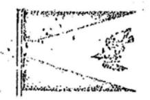

#### Federal Register Notice of Establishment (39 FR 13183)

NOTICES

Broadway, Denver, Colorado 80202, within the time specified herein.

EVERETT K. WEEDIN, Chief, Branch of Land Operations.

[FR Doc.74-8284 Filed 4-10-74;8:45 am]

#### Fish and Wildlife Service ROSE ATOLL NATIONAL WILDLIFE REFUGE, AMERICAN SAMOA Notice of Establishment

Notice is hereby given that the Government of American Samoa and the U.S. Fish and Wildlife Service, Department of the Interior, did, by Cooperative Agreement dated July 5, 1973, under au-thority of the Fish and Wildlife Act of 1956 (16 U.S.C. 742f(5)), establish the Rose Atoll National Wildlife Refuge to be administered in accordance with applicable rules and regulations contained in Title 50, Code of Federal Regulations, relating to national wildlife refuges and the terms and conditions of the cooperative agreement.

The Rose Atoll National Wildlife Refuge is a part of American Samoa and is located 78 miles east-southeast of Tau Island in the Manua Group at latitude 14°32'52" south and longitude 168°08'34" west. This area has been set aside for the conservation, management and protection of its unique and valuable fish and wildlife resources. The exterior boundary of this refuge is the extreme low waterline outside the perimeter reef except at the entrance channel where the boundary is a line extended between the extreme low waterlines on each side of the entrance channel.

Dated: April 5, 1974.

LYNN A. GREENWALT, Director, Bureau of Sport Fisheries and Wildlife.

[FR Doc.74-8297 Filed 4-10-74;8:45 am]

Office of Hearings and Appeals -IDocket No. M 74-601

#### BLUE DIAMOND COAL CO.

Modification of Mandatory Safety Standard

Notice is hereby given that in accordance with the provisions of section 301(c) of the Federal Coal Mine Health and Safety Act of 1969, 30 U.S.C. 861(c) (1970), Blue Diamond Coal Company has filed a petition to modify the application of 30 CFR 75.802 to its Leatherwood Mine, at Leatherwood, Kentucky.

30 CFR 75.802 reads in pertinent part as follows:

High-voltage circuits extending under-ground and supplying portable, mobile, or stationary high-voltage equipment shall con-tain either a direct or derived neutral which shall be grounded through a suitable resistor at the source transformers, and a grounding circuit, originating at the grounded side of circuit, originating at the grounded side of the grounding resistor, shall extend along with the power conductors and serve as a grounding conductor for the frames of all high-voltage equipment supplied power from that circuit. \* \* \*

In support of its petition to secure a waiver of 30 CFR 75.802 Petitioner states that.

(1) The underground high-voltage power distribution systems in question would cerve only 7200V A.C. to 275V D.C. rectifiers the outputs of which are connected to the D.C. trolley system.

(2) Trolley locomotives are operated from the system and face distribution boxes, with proper breakers attached to the trolley

(3) The rectifiers are considered to be sta-

tionary in that they are moved only every six months. (4) The cable connecting the outcide power facility and the underground high-voltage system conforms with cafety standard 30 CFR 75,804 and is installed in compilance with § 75.807.

Petitioner's proposal is supported by exhibits detailing the electrical system of the subject mine.

Petitioner asserts that its proposed alternative will at all times afford the same protection as the application of the mandatory standard.

Persons interested in this petition may equest a hearing on the petition or furnish comments on or before May 13, 1974. Such requests or comments must be filed with the Office of Hearings and Appeals, Hearings Division, U.S. Department of the Interior, 4015 Wilson Boulevard, Arlington, Virginia 22203. Copies of the petition are available for inspection at that address.

> JAMES R. RICHARDS. Director, Office of Hearings and Appeals.

March 26, 1974

[FR Doc.74-8278 Filed 4-10-74:8:45 am]

#### [Docket No. M 74-73]

### BLUE DIAMOND COAL CO., INC.

Modification of Mandatory Safety Standard

Notice is hereby given that in accordance with the provisions of section 301(c) of the Federal Coal Mine Health and Safety Act of 1969, 30 U.S.C. 4861(c) (1970), Blue Diamond Coal Company, Inc., has filed a petition to modify the application of 30 CFR 75.305 to its Leatherwood Mine located at Leather-

wood, Kentucky. 30 CFR 75.305 reads in pertinent part as follows:

In addition to the preshift and daily ex-aminations required by this Subpart D. examinations for hazardous conditions, including tests for methane, and for compliance with the mandatory health or cafety standards, shall be made at least once each week by a certified person designated by the operator in the return of each collt of air where it enters the main return, on pillar falls, at seals, in the main return, at least one entry of each intake and return aircource in its en-tirety, idle workings, and, incolar as cafety considerations permit, abandoned areas.

In support of its petition Petitioner states:

(1) The sections of the subject mine to which the safety standard pertains are ven-tilated by separate fans. Each section also has two escapeways.

(2) Each section in question has a life ex-

12183

(2) Each faction in question has a life expectancy of fact than one year.
(3) It would be unage to travel the main return alreaure in its entirety, therefore Fatilitien seels a waiver of the mandatory standard in this instance.

(4) Fetitioner's alternative method will provide the same measure of protection as afforded by the mandatory standard.

Persons interested in this petition may request a hearing on the petition or furnish comments on or before May 13, 1974. Such requests or comments must be filed with the Office of Hearings and Appeals, Hearings Division, U.S. Department of the Interior, 4015 Wilson Boulevard, Ar-lington, Virginia 22203. Copies of the petition are available for inspection at that address.

JAMES R. RICHARDS. Director, Office of Hearings and Appeals.

March 20, 1974.

[FR Doc.74-8277 Filed 4-10-74;8:45 am]

#### [Docket No. M 74-891 HELVETIA COAL CO.

Modification of Mandatory Safety Standard

Notice is hereby given that in accordance with the provisions of section 301 (c) of the Federal Coal Mine Health and Safety Act of 1969, 30 U.S.C. 861(c) (1970), Helvertia Coal Company has filed a petition to modify the application of 30 CFR 75.1405 to its Lucerne #6 and #8 Mines, located at Indiana, Pennsyl-

30 CFR 75.1405 reads as follows:

All haulage equipment acquired by an op-All haulage equipment acquired by an operator of a coal mine on or after March 30, 1971, chall be equipped with automatic couplers which couple by impact and uncouple without the necessity of persons going between the ends of such equipment. All haulage equipment without automatic couplers in use in a mine on March 30, 1970, shall also be so equipped within 4 years after March 30, 1970.

To be read concurrently with § 75.1405 is § 75.1405-1 which provides:

The requirement of § 75,1405 with respect to automatic couplers applies only to track haulage cars which are regularly coupled and uncoupled.

In support of its petition Petitioner states:

- (1) On February 14, 1974, MESA informed Patitioner that, contrary to earlier practice, section 314(f) would, effective March 39, 1974, he deemed applicable and would be enforced with respect to bolt haulage mines and to all vehicles used on track even if equipped for off-track use. Said application will result in a diminution of safety to the miners in Petitioner's mines.
- (2) Petitioner's mines do not employ a track coal haulage system, but rather a bett coal haulage system. Track is used for sup-plies and personnel transport only.
- (3) Because of the belt system, Petitioner's mines are characterized by entries having a relatively narrow radius of curre, a less uniformly even bottom, and lighter weight ralis than mines using a track haulage system.
- (4) The cumulative effect of the foregoing characteristics on automatic couplers is to make them susceptible to accidental un-

FEDERAL REGISTER, VOL. 39 NO. 71-THURSDAY, APRIL 11, 1974

No. 71-16

Presidential Proclamation 4347 establishing additional jurisdiction.

#### PROCLAMATION 4347—FEB. 1, 1975

89 STAT. 1239

48 USC 1705. of Public Law 93-435 (88 Stat. 1210), unless the President, under Section 1(b) (vii) of that Act, designates otherwise.

NOW, THEREFORE, I, GERALD R. FORD, President of the United States of America, by virtue of authority vested in me by Section 1(b)(vii) of Public Law 93-435 (88 Stat. 1210) do hereby proclaim that the lands hereinafter described are excepted from the transfer to the Government of American Samoa, the Government of Guam and the Government of the United States Virgin Islands under Section 1(a) of Public Law 93-435.

American Samoa. The submerged lands adjacent to Rose Atoll located 78 miles east-southeast of Tau Island in the Manua Group at latitude 14°32'52" south and longitude 168°08'34" west, which lands shall be under the joint administrative jurisdiction of the Department of Commerce and the Department of the Interior.

Guam. (1) The submerged lands of inner and outer Apra Harbor; and, (2) the submerged lands adjacent to the following uplands: (a) Unsurveyed land, Municipality of Machanao, Guam, as delineated on Commander Naval Forces, Marianas Y & D Drawing Numbered 597-464, lying between the seaward boundaries of Lots Numbered 9992 through 9997 and the mean high tide, containing an undetermined area of land, (b) unsurveyed land, Municipality of Machanao, Guam, as delineated on Commander Naval Forces, Marianas Y & D Drawing Numbered 597-464, lying between the seaward boundary of Lot Numbered 10080 and the line of mean high tide, containing an undetermined amount of land, and (c) Lot Numbered PO 4.1 in the Municipality of Machanao, Guam, as delineated on Y & D Drawing Numbered 597-464, more particularly described as surveyed land bordered on the north by Lot Numbered 10080, Machanao, east by Northwest Air Force Base, south by U.S. Naval Communication Station (Finegayan) and west by the sea containing a computed area of 125.50 acres, more or less. All of the above lands within the territory of Guam shall be under the administrative jurisdiction of the Department of the Navy.

The Virgin Islands. (1) The submerged lands as described in the Code of Federal Regulations revised as of July 1, 1974, cited as 33 CFR 207.817 areas "A" & "B", (2) the submerged lands seaward of the 100 fathom curve off the coast of St. Croix beginning at a point 17°40'30" N and ending at a point 17°46'30" North as depicted on Coast and Geodetic Survey Chart Numbered 25250, Third Edition; Tide: St. Croix, Virgin Islands Underwater Range, and (3) the submerged lands seaward of the Underwater Range Operational Control Center, St. Croix, Virgin Islands presently leased to the Department of the Navy and described as Plot #18 of Estate Sprat Hall subdivision, located in northside Quarter "A", St. Croix containing 4.84 acres of land. All of the above lands within the territory of the Virgin Islands shall

be under the administrative jurisdiction of the Department of the Navy.

IN WITNESS WHEREOF, I have hereunto set my hand this first day of February, in the year of our Lord nineteen hundred seventy-five, and of the Independence of the United States of America the one hundred and ninety-ninth.

GERALD R. FORD

1577

#### Federal Register

Vol. 74, No. 7

Monday, January 12, 2009

#### **Presidential Documents**

Title 3—

Proclamation 8337 of January 6, 2009

#### The President

#### Establishment of the Rose Atoll Marine National Monument

#### By the President of the United States of America

#### A Proclamation

In the Pacific Ocean approximately 130 nautical miles east-southeast of Pago Pago Harbor, American Samoa, lies Rose Atoll—the easternmost Samoan island and the southernmost point of the United States. This small atoll, which includes the Rose Atoll National Wildlife Refuge with about 20 acres of land and 1,600 acres of lagoon, remains one of the most pristine atolls in the world. The lands, submerged lands, waters, and marine environment around Rose Atoll support a dynamic reef ecosystem that is home to a very diverse assemblage of terrestrial and marine species, many of which are threatened or endangered.

One of the most striking features of Rose Atoll is the pink hue of fringing reef caused by the dominance of coralline algae, which is the primary reef-building species. Though there are roughly 100 species of stony corals, the shallow reefs are dominated by crustose coralline algae, making them distinctive and quite different from those found at other Samoan islands. The marine area provides isolated, unmolested nesting grounds for green and hawksbill turtles and has the largest number of nesting turtles in American Samoa. Its waters are frequented by numerous large predators: whitetip reef sharks, blacktip reef sharks, gray reef sharks, snappers, jacks, groupers, and barracudas. Species that have faced depletion elsewhere, some of which have declined worldwide by as much as 98 percent, are found in abundance at Rose Atoll, including giant clams, Maori wrasse, large parrotfishes, and blacktip, whitetip, and gray reef sharks. Humpback whales, pilot whales, and the porpoise genus Stenella have all been spotted at Rose Atoll. There are 272 species of reef fish, with seven species first described by scientists at Rose and dozens more new species discovered on the first deep water dive to 200 meters. Recent submersible dives around Rose Atoll have revealed abundant marine life, deep sea coral forests, and several new fish and invertebrate species.

Rose Atoll supports most of the seabird population of American Samoa, including 12 federally protected migratory seabirds, five species of federally protected shorebirds, and a migrant forest bird, the long-tailed cuckoo. Rare species of nesting petrels, shearwaters, and terns are thriving at Rose Atoll and increasing in number. The atoll is known to Samoans, who have periodically visited over the past millennium, as "Nu'u O Manu" ("Village of seabirds"). It is believed that Polynesians have harvested at Rose Atoll for millennia and several species, such as the giant clam, were used for cultural celebrations and events. Few relatively undisturbed islands remain in the world and Rose Atoll is one of the last remaining refuges for the seabird and turtle species of the Central Pacific. Threatened Pisonia atoll forest trees are also found at Rose Atoll.

WHEREAS the lands, submerged lands, and waters of and marine environment around Rose Atoll contain objects of historic or scientific interest that are situated upon lands owned or controlled by the Government of the United States;

WHEREAS the United States continues to act in accordance with the balance of interests relating to traditional uses of the oceans recognizing freedom of navigation and overflight and other internationally recognized lawful uses of the sea;

WHEREAS section 2 of the Act of June 8, 1906 (34 Stat. 225, 16 U.S.C. 431) (the "Antiquities Act") authorizes the President, in his discretion, to declare by public proclamation historic landmarks, historic and prehistoric structures, and other objects of historic or scientific interest that are situated upon lands owned or controlled by the Government of the United States to be national monuments, and to reserve as a part thereof parcels of land, the limits of which in all cases shall be confined to the smallest area compatible with the proper care and management of the objects to be protected:

WHEREAS it is in the public interest to preserve the lands, submerged lands and waters of, and marine environment around Rose Atoll as necessary for the care and management of the historic and scientific objects therein:

NOW, THEREFORE, I, GEORGE W. BUSH, President of the United States of America, by the authority vested in me by section 2 of the Antiquities Act, do proclaim that there are hereby set apart and reserved as the Rose Atoll Marine National Monument (the "monument" or "marine national monument") for the purpose of protecting the objects described in the above preceding paragraphs, all lands and interests in lands owned or controlled by the Government of the United States within the boundaries that lie approximately 50 nautical miles from the mean low water line of Rose Atoll as depicted on the accompanying map entitled "Rose Atoll Marine National Monument" attached to and forming a part of this proclamation. The Federal land and interests in land reserved consists of approximately 3,451 square miles of emergent and submerged lands and waters of and around Rose Atoll in American Samoa, which is the smallest area compatible with the proper care and management of the objects to be protected.

All Federal lands and interests in lands within the boundaries of this monument are hereby withdrawn from all forms of entry, location, selection, sale, or leasing or other disposition under the public land laws to the extent that those laws apply.

#### Management of the Marine National Monument

The Secretary of the Interior shall have management responsibility for the monument, including Rose Atoll National Wildlife Refuge, in consultation with the Secretary of Commerce, except that the Secretary of Commerce, through the National Oceanic and Atmospheric Administration, shall have the primary management responsibility regarding the management of the marine areas of the monument seaward of mean low water, with respect to fishery-related activities regulated pursuant to the Magnuson-Stevens Fishery Conservation and Management Act (16 U.S.C. 1801 et seq.), and any other applicable authorities. The Secretary of Commerce shall initiate the process to add the marine areas of the monument to the Fagatele Bay National Marine Sanctuary in accordance with the National Marine Sanctuaries Act (16 U.S.C. 1431 et seq.), including its provision for consultation with an advisory council, to further the protection of the objects identified in this proclamation. In developing and implementing any management plans and any management rules and regulations, the Secretary of Commerce shall consult with the Secretary of the Interior and shall designate and involve as cooperating agencies the agencies with jurisdiction or special expertise, including the Department of State, the Department of Defense, and other agencies through scoping in accordance with the National Environmental Policy Act (42 U.S.C. 4321 et seq.), its implementing regulations and with Executive Order 13352 of August 26, 2004, Facilitation of Cooperative Conservation, and shall treat as a cooperating agency the Government of American Samoa, consistent with these authorities.

The Secretary of the Interior shall continue to manage the Rose Atoll National Wildlife Refuge consistent with the protection of the objects identified in this proclamation. The Secretary of the Interior shall, in developing any

management plans and any management rules and regulations governing the Rose Atoll National Wildlife Refuge, comply with the National Environmental Policy Act and consult with the Secretary of Commerce.

For the purposes of protecting the objects identified above, the Secretaries of the Interior and Commerce, respectively, shall not allow or permit any appropriation, injury, destruction, or removal of any feature of this monument except as provided for by this proclamation or as otherwise provided for by law.

#### Regulation of Scientific Exploration and Research

Subject to such terms and conditions as the Secretaries deem necessary for the care and management of the objects of this monument, the Secretary of the Interior may permit scientific exploration and research within the monument, including incidental appropriation, injury, destruction, or removal of features of this monument for scientific study, and the Secretary of Commerce may permit fishing within the monument for scientific exploration and research purposes to the extent authorized by the Magnuson-Stevens Fishery Conservation and Management Act. The prohibitions required by this proclamation shall not restrict scientific exploration or research activities by or for the Secretaries, and nothing in this proclamation shall be construed to require a permit or other authorization from the other Secretary for their respective scientific activities.

#### Regulation of Fishing and Management of Fishery Resources

The Secretaries shall prohibit commercial fishing within the monument. Subject to such terms and conditions as the Secretaries deem necessary for the care and management of the objects of this monument, the Secretaries may permit noncommercial and sustenance fishing or, after consultation with the Government of American Samoa, traditional indigenous fishing within the monument. The Secretaries of the Interior and Commerce, respectively, in consultation with the Government of American Samoa, shall provide for a process to ensure that recreational fishing shall be managed as a sustainable activity consistent with Executive Order 12962 of June 7, 1995, as amended, and other applicable law.

This proclamation shall be applied in accordance with international law. No restrictions shall apply to or be enforced against a person who is not a citizen, national, or resident alien of the United States (including foreign flag vessels) unless in accordance with international law. The management plan and implementing regulations shall impose no restrictions on innocent passage in the territorial sea or otherwise restrict navigation and overflight and other internationally recognized lawful uses of the sea in the monument and shall incorporate the provisions of this proclamation regarding Armed Forces actions and compliance with international law.

Nothing in this proclamation shall be deemed to diminish or enlarge the jurisdiction of the Government of American Samoa. The Secretaries of the Interior and Commerce shall, in developing any management plans and any management rules and regulations governing the marine areas of the monument, as described above, consult with the Government of American Samoa

#### Emergencies, National Security, and Law Enforcement Activities

- 1. The prohibitions required by this proclamation shall not apply to activities necessary to respond to emergencies threatening life, property, or the environment, or to activities necessary for national security or law enforcement purposes.
- 2. Nothing in this proclamation shall limit agency actions to respond to emergencies posing an unacceptable threat to human health or safety or to the marine environment and admitting of no other feasible solution.

#### Armed Forces Actions

- 1. The prohibitions required by this proclamation shall not apply to activities and exercises of the Armed Forces (including those carried out by the United States Coast Guard).
- 2. The Armed Forces shall ensure, by the adoption of appropriate measures not impairing operations or operational capabilities, that its vessels and aircraft act in a manner consistent, so far as is reasonable and practicable, with this proclamation.
- 3. In the event of threatened or actual destruction of, loss of, or injury to a monument living marine resource resulting from an incident, including but not limited to spills and groundings, caused by a component of the Department of Defense or the United States Coast Guard, the cognizant component shall promptly coordinate with the Secretary of the Interior or Commerce, as appropriate for the purpose of taking appropriate actions to respond to and mitigate any actual harm and, if possible, restore or replace the monument resource or quality.
- 4. Nothing in this proclamation or any regulation implementing it shall limit or otherwise affect the Armed Forces'; discretion to use, maintain, improve, manage, or control any property under the administrative control of a Military Department or otherwise limit the availability of such property for military mission purposes.

The establishment of this monument is subject to valid existing rights.

This proclamation is not intended to, and does not, create any right or benefit, substantive or procedural, enforceable at law or in equity, by any party against the United States, its agencies, instrumentalities, or entities, its officers, employees, or agents, or any other person.

Nothing in this proclamation shall be deemed to revoke any existing withdrawal, reservation, or appropriation; however, the national monument shall be dominant over any other existing Federal withdrawal, reservation, or appropriation.

Warning is hereby given to all unauthorized persons not to appropriate, excavate, injure, destroy, or remove any feature of this monument and not to locate or settle upon any lands thereof.

IN WITNESS WHEREOF, I have hereunto set my hand this sixth day of January, in the year of our Lord two thousand nine, and of the Independence of the United States of America the two hundred and thirty-third.

/zuze

Billing code 3195-W9-P

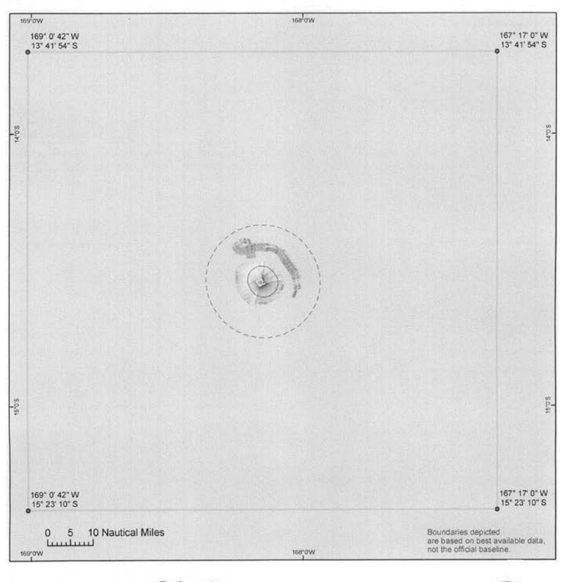

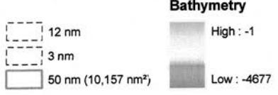

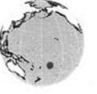

| Rose Atoll National Wildlife Refuge Comprehensive Conservation Plan |
|---------------------------------------------------------------------|
|                                                                     |
|                                                                     |
|                                                                     |
|                                                                     |
|                                                                     |
|                                                                     |
|                                                                     |
|                                                                     |
|                                                                     |
|                                                                     |
|                                                                     |
|                                                                     |
|                                                                     |
|                                                                     |
|                                                                     |
|                                                                     |
|                                                                     |
|                                                                     |
|                                                                     |
|                                                                     |
|                                                                     |
|                                                                     |
|                                                                     |
|                                                                     |

# **Appendix L.**

# **Best Management Practices for Visitors to Rose Atoll NWR**

Best Management Practices (BMPs) for Rose Atoll NWR are in place to minimize the effects of visitors to the Refuge. They are designed to prevent the introduction of nonnative species and to minimize disturbance of wildlife. There are strict requirements for vessels to have their hulls cleaned and to be treated for insects, mice, and rats, and quarantines for all gear that will be brought to the Refuge to prevent the introduction of plants and insects. Additionally, the use of lights is minimized to prevent disturbing seabirds and sea turtles.

### **Quarantine Requirements:**

Introduced species are a big threat to Rose Atoll. The introductions of rats (*Rattus exulans*), the scale insect (*Pulvinaria urbicola*), and multiple species of ants have caused severe damage to the native communities of Rose Atoll. Rats were successfully eradicated from Rose Atoll in 1992 at considerable expense. The scale insect has contributed to the drastic decline of the pu'a vai forest (*Pisonia grandis*) on Rose Island, and is tended by introduced ants. Other Pacific remote refuges have had various plant, insect, rodent, and other pest species introduced. In some cases, these pests have caused major changes to natural communities, greatly reduced the value of islands as seabird nesting sites, and have cost millions of dollars to control.

While the policies and practices outlined below may seem severe, they are required to prevent other introductions and must be followed. The Service has found them to be effective at preventing new introductions of invasive species on National Wildlife Refuges throughout the tropical Pacific. Remember: just one gravid female or one seed can be enough to introduce an unwanted species. "*An ounce of prevention can be worth millions of dollars in eradication.*"

#### **Suitable Plastic Packing Container:**

Packing containers must be constructed of smooth, durable plastic which can be easily cleaned and will not harbor seeds or insects. Corrugated plastic boxes such as mail totes are not acceptable. Packing containers may be re-used for multiple trips to Rose, but must be thoroughly cleaned before each trip.

#### **Quarantine Inspections:**

All personal gear, supplies, equipment, machinery, and vessels will be inspected for quarantine compliance by Service staff in Tutuila prior to departure for Rose Atoll.

### **Prohibited Items:**

- Fresh fruits and vegetables, rooted plants, cuttings, flowers, and seeds;
- Soil, sand, and gravel;
- Animals; and
- Cardboard (paper and plastic cardboard harbors seeds and insects).

#### **Regulated Items:**

Food items have the potential to carry alien pests and are therefore selected, packed, and shipped with great care. Fresh fruits and vegetables are not allowed on Rose Island. Wood products often harbor seeds and insects. Therefore, only treated wood that has been painted or varnished may be taken to Rose. Wood items must be approved by the Refuge Manager.

#### **Packing Procedures:**

Ensure that the environment selected for packing has been well cleaned and free of seeds and insects. Keep packing containers closed as much as possible throughout the packing process so insects cannot crawl in before the containers have been securely closed. Quarantine procedures should be performed as close to the transportation date as possible to minimize the chances for pests to infect them.

#### **Clothing and Soft Gear:**

All persons going ashore on Rose Island or Sand Island must have NEW or ROSE-DEDICATED clothing and soft gear (including all footwear). This rule applies to anyone stepping on to dry land past the intertidal zone.

All clothing and soft gear must be **frozen for 48 hours** (including both new and Rose-dedicated).

#### **Aquatic Gear:**

All aquatic gear such as nets and traps must be Rose-dedicated and must not be used at other research sites.

Dive gear must be visually inspected for any algae or other marine life, soaked in fresh water for 24 hours, and then allowed to dry. Visual inspections should include inside pockets.

Alternatively, dive gear can be soaked in a bleach solution (1 cup bleach/5 gallon water) for a minimum of 5 minutes, and then rinsed in fresh water and allowed to dry.

#### **Sensitive Equipment:**

All sensitive gear (optical equipment, computers, satellite phones, and other electronic equipment) need not be frozen or fumigated, but must be thoroughly inspected and cleaned.

Straps for cameras and binoculars or other gear must be visually inspected for seeds and insects and frozen for 48 hours.

#### **Non-Sensitive Equipment and Construction Materials:**

All non-sensitive equipment, machinery and construction materials that are water resistant must be steam-cleaned or pressure-washed to ensure the removal of all dirt, insects, and seeds from external surfaces.

All non-water resistant items must be tented and fumigated to kill unwanted pests, or frozen for 48 hours.

Small boats must be thoroughly washed down, fumigated, and hulls carefully cleaned before transport to Rose Atoll NWR.

#### **Commercial Ships and Private Sailing and Motor Vessel Quarantine:**

Ship owners or captains will ensure that ships are free of rats, insects, seeds, and all other alien species prior to departing for Rose Atoll. They will ensure that rodent bait stations containing rodenticide and traps have been placed on the ship and barge decks and holds throughout their voyage to Rose as well as throughout the duration of the stay within the Refuge.

Ship owners or captains will notify the Refuge Manager at least 5 working days prior to a vessel departing for Rose Atoll in order to arrange a quarantine inspection. The inspection will be scheduled as close to the departure date as possible.

Ship owners or captains will ensure that all ships entering Rose Atoll have had their hulls cleaned of fouling marine organisms. The ships must depart for Rose Atoll within 14 days of having had the hulls cleaned. All ship hulls must be re-cleaned should the vessel return to a port for greater than 14 days before returning to Rose Atoll. The Refuge Manager must be notified prior to cleaning the hull, in order to observe the cleaning and inspect the hull.

No discharge of ballast water, grey water, sewage (blackwater), or waste of any kind will be allowed by any vessel within 12 nautical miles of Rose Atoll.

### **Minimizing Disturbance of Wildlife**

#### **Seabirds:**

Most seabirds exhibit insular tameness, which is behavior characterized by a lack of the wariness you might observe in birds living in areas with terrestrial predators. Because of this, it sometimes appears by their actions as if humans pose no problems for them. In fact there are a number of potentially serious consequences every time a seabird colony is entered, even by experienced researchers.

Mechanical – At most seabird colonies in the central Pacific you will see birds nesting on three different levels; under the ground, on the surface, and in the shrubs and trees. At many times of the year it is difficult to walk in some parts of the colony without stepping on eggs or caving in the burrows of the petrels and shearwaters. Chicks of several of the tern species hide in vegetation so you should be careful about setting your foot where you cannot see the surface of the ground. Ground-nesting gogosina (grey-backed terns) and gogo (brown noddies) are often affected by your activities because they are very timid and nest in open areas that may be travel pathways. If you have occasion to have to walk in burrow areas you must be prepared to rescue a shearwater or petrel by digging if you accidentally cave in its home. Special care should be taken never to leave string or line anywhere in the colony. Seabirds have an uncanny ability to find it and get tangled in any material of this kind.

Thermal – Eggs and small chicks of all the species live a precarious life on the edge of thermal disaster. The attendance pattern of adults reflects this with eggs and tiny chicks rarely left unattended. Great care and attention must be given to avoid keeping a bird off its egg or chick for more than a few minutes. Keep this in mind if you must spend more than 3 or 4 minutes in any area. This is an issue when it is hot as well as when it is cool and wet. When first approaching a site look for any nests or adults flushed from an inconspicuous nest and plan your work to minimize the time parents are kept away from eggs or chicks.

Biological – In some colonies, one species may learn to take advantage of human disturbance to prey upon others. Atafa (frigatebirds) will take chicks and steal nest material from booby nests and other frigatebird nests when the owners of the nest are frightened off by human disturbance. Unattended eggs of ground-nesting species are often eaten by shorebirds such as ruddy turnstones.

When first arriving at the landing area, a careful reconnaissance of existing ground nests in the area of the proposed camp should be made by a person familiar with the behavior of brown noddies and brown boobies. Campsite locations of tents and the cooking area should be chosen to avoid causing any modification of the behavior of incubating or brooding seabirds. Proximity of camp activity to active ground nests will result in a nest failure if the adult bird is too frightened to return and protect the egg or chick from temperature extremes or to feed the chick.

It is also important to be careful with lights when camping. Lights should be kept to a minimum, and should not be pointed into nesting colonies or into trees where birds are nesting. Bright lights can temporarily blind and disorient birds, and cause them to flush. This can cause the bird to hurt itself by falling from the nest or flying into trees, or cause eggs to be broken.

#### **Turtles:**

Hawksbill turtles occur in the Refuge, but have not been seen nesting. I'a sa (green turtles) mate and nest on Rose Atoll August–February. Turtles nesting on Rose Island have been known to dig as many as five nest pits before depositing their eggs. To avoid scaring nesting turtles away, lights in camp should be minimized, and red lights should be used August–February.

#### **Land Crabs:**

 The shells of marine mollusks are abundant on the beaches of Rose Atoll but almost every one of them is already being used by the land crabs resident there. Even the tiniest shells often have young crabs in them so shell collecting is not permitted while visiting Rose.

# **Appendix M. CCP Team Members**

# **M.1 CCP Team Members**

The CCP was developed and prepared primarily by a core team made up of refuge staff (both local and at the Honolulu offices). The core team sought expertise and review from other professionals from several different agencies and organizations. The List of Preparers below includes core team members as well as other persons responsible for writing specific portions of the plan. Many others provided assistance in developing and reviewing the CCP and associated products and in providing advice through the planning process. These people are captured in the List of Reviewers and Advisors.

**Table M-1. List of Preparers (in alphabetical order)**

| Name and Title                                                                                   | CCP Contributions                                                                                                                                                                                                                                                                                                                                                                                                      |
|--------------------------------------------------------------------------------------------------|------------------------------------------------------------------------------------------------------------------------------------------------------------------------------------------------------------------------------------------------------------------------------------------------------------------------------------------------------------------------------------------------------------------------|
| Liz Cruz, Geographer/GIS Specialist, RO<br>replaced,<br>David Hoy, Geographer/GIS Specialist, RO | GIS data gathering and analysis (e.g., habitats and<br>vegetation, infrastructure, alternatives development);<br>development of maps for<br>public involvement and<br>documents                                                                                                                                                                                                                                        |
| Beth Flint, Biologist, Pacific Reefs NWRC                                                        | Writer of biological affected environment; reviewer;<br>lead on biological goals/objectives/strategies,<br>biological component on affected environment and<br>related environmental consequences; biological<br>resources of concern, taxa lists,<br>and habitats,<br>integrated pest management; research/analysis;<br>coordinated<br>with biological and natural resource<br>management partners; reviewed AUFs/CDs |
| Jean Kenyon, Biologist, Inventory and<br>Monitoring Program, RO                                  | Writer of biological affected environment; reviewer;<br>lead on marine biological goals/objectives/<br>strategies,<br>biological component on affected environment and<br>related environmental consequences; biological<br>resources of concern, taxa lists,<br>and habitats;<br>research/analysis; reviewed AUFs/CDs                                                                                                 |
| Jiny Kim, Biologist, Pacific Reefs NWRC                                                          | Writer of biological affected environment; reviewer;<br>biological goals/objectives/strategies; biological<br>resources of concern, taxa lists,<br>and habitats;<br>research/analysis                                                                                                                                                                                                                                  |
| Jim Maragos, Biologist, Pacific Reefs NWRC<br>(retired)                                          | Writer of biological affected environment; taxa lists<br>and habitats                                                                                                                                                                                                                                                                                                                                                  |

| Name and Title                                                                                                                                             | CCP Contributions                                                                                                                                                                                                                                                                                                                                                                                                                   |  |
|------------------------------------------------------------------------------------------------------------------------------------------------------------|-------------------------------------------------------------------------------------------------------------------------------------------------------------------------------------------------------------------------------------------------------------------------------------------------------------------------------------------------------------------------------------------------------------------------------------|--|
| Frank Pendleton, Refuge/Monument Manager,<br>Rose Atoll NWR and Marine National<br>Monument                                                                | Team leader; decision-maker<br>and document quality<br>reviewer; writer of affected environment, public<br>involvement and communications (including<br>coordination of Federal, Territorial, partner, and<br>community organizations); compatibility<br>determinations and implementation; overall guidance<br>for CCP development and coordination with staff                                                                     |  |
| Khemarith So, Planner, RO replaced,<br>Christine Ogura, Natural Resource Planner,<br>HPINWRC<br>replaced,<br>Bill Perry, Natural Resource Planner, HPINWRC | CCP lead planner responsible for RO and Honolulu<br>office coordination and process and policy guidance<br>for CCP development; CCP schedule manager;<br>facilitator of team, partner, and public<br>meetings/workshops; document and related product<br>management (including planning record); writer of<br>affected environment and environmental<br>consequences and planning updates; public<br>involvement and communications |  |
| Susan White, Project Leader, Pacific Reefs<br>NWRC                                                                                                         | Decision-maker<br>and document quality reviewer;<br>overall guidance for CCP and CDs development and<br>coordination with staff                                                                                                                                                                                                                                                                                                     |  |

**Table M-2. List of Reviewers and Advisors (in alphabetical order)**

| Name and Title                                                                                                                      | CCP Contributions                                                                                                                                                      |  |
|-------------------------------------------------------------------------------------------------------------------------------------|------------------------------------------------------------------------------------------------------------------------------------------------------------------------|--|
| Midori Akamine, Director, Marine National<br>Monument<br>Program in the Pacific Islands Region                                      | Review of Chapter 2 and entire document                                                                                                                                |  |
| Laura Beauregard, Acting Deputy Refuge<br>Supervisor, HPINWRC replaced<br>Don Palawski, Deputy Project Leader,<br>HPINWRC (retired) | Assist with regional office coordination; reviewer of<br>document and related products; guidance on overall<br>process and components; technical review and<br>editing |  |
| Gene Brighouse, Superintendent, National<br>Marine Sanctuary of American Samoa                                                      | Review of Chapter 2<br>and entire document                                                                                                                             |  |
| Samantha Brooke, Fishery Policy Analyst,<br>NOAA Fisheries Pacific Islands Regional Office,<br>Marine National Monument<br>Program  | Review of Chapter 2 and entire document                                                                                                                                |  |
| Tim Clark, Marine Ecologist, National Park of<br>American Samoa                                                                     | Review of Chapter 2 and entire document                                                                                                                                |  |
| Peter Craig, Chief of Natural Resources, National<br>Park of American Samoa (retired)                                               | Review of Chapter 2 and entire document                                                                                                                                |  |
| Sean Eagan, Chief of Resources Management,<br>National Park of American Samoa                                                       | Review of Chapter 2 and entire document                                                                                                                                |  |
| Joe Engler, Assistant Regional Biologist, RO                                                                                        | Review of biological goals/objectives/strategies                                                                                                                       |  |

| Name and Title                                                                                              | CCP Contributions                                                                                                                                                                                    |
|-------------------------------------------------------------------------------------------------------------|------------------------------------------------------------------------------------------------------------------------------------------------------------------------------------------------------|
| Bridgette Flanders-Wanner, Assistant Regional<br>Refuge Biologist<br>and Regional IPM Coordinator,<br>RO    | Lead reviewer of biological<br>goals/objectives/strategies; IPM                                                                                                                                      |
| Holly Freifeld, Biologist, Division of Migratory<br>Birds and Habitat Programs, RO                          | Reviewer of biological goals/objectives/strategies                                                                                                                                                   |
| Kevin Grant, Deputy Superintendent, National<br>Marine Sanctuary of American Samoa                          | Review of Chapter 2 and entire<br>document                                                                                                                                                           |
| Richard Hall, Fishery Policy Analyst, NOAA,<br>Pacific Islands Region, National Marine<br>Fisheries Service | Review of entire document, coordinated comments<br>from NOAA's PIRO's Protected Resources, Habitat<br>Conservation, and Sustainable Fisheries Divisions,<br>and the National Marine Monument Program |
| Ben Harrison, Deputy Regional Chief of<br>Refuges,<br>RO                                                    | CCP Advisor, reviewer of policy, AUF, CDs,<br>environmental consequences                                                                                                                             |
| Charles Houghten, Division Chief Planning,<br>Visitor Services, Transportation, RO                          | CCP Advisor for planning policy and guidance;<br>reviewer (including wilderness); coordination with<br>other divisions and the Washington D.C. office                                                |
| Kay Kier-Haggenjos, Writer/Editor, RO                                                                       | Technical edit review; review and processing of<br>document and related products (e.g., planning<br>updates)                                                                                         |
| Nicole McCarthy, Writer/Editor, RO                                                                          | Assist with public comment period coordination<br>and<br>processing of Federal Register notices                                                                                                      |
| Scott McCarthy, Chief, Conservation<br>Planning,<br>RO                                                      | CCP Advisor for planning policy and guidance;<br>planning workload priorities; coordination with other<br>divisions                                                                                  |
| Kevin O'Hara, Planner                                                                                       | Reviewed Chapter 6 effects analysis                                                                                                                                                                  |
| Sandra Hall, External Affairs, HPINWRC                                                                      | Layout and reviewer of planning updates; Website<br>management; CCP cover editing                                                                                                                    |
| Domingo Ochavillo, DMWR Fisheries Biologist                                                                 | Review of Chapter 2 and entire document                                                                                                                                                              |
| Charles Parrott, Realty Specialist, RO                                                                      | Realty analysis, review of related sections in<br>document, assisted with verifying map accuracy                                                                                                     |
| Lelei Peau, Deputy Director, American Samoa<br>Department of Commerce                                       | Review of Chapter 2 and entire document                                                                                                                                                              |
| Mike Reynolds, Superintendent, National Park of<br>American Samoa                                           | Review of Chapter 2 and entire document                                                                                                                                                              |
| Patrick Stark, Visitor Services and<br>Communication, RO                                                    | Document and related products (e.g., planning<br>update) print management; CCP cover design                                                                                                          |
| Barry Stieglitz, Refuge Supervisor, HPINWRC                                                                 | Decision-maker<br>and document quality reviewer<br>(including CDs)                                                                                                                                   |

| Name and Title                                                               | CCP Contributions                                                                                                      |
|------------------------------------------------------------------------------|------------------------------------------------------------------------------------------------------------------------|
| Robyn Thorson, Regional Director, RO                                         | Final decision-maker on<br>DCCP/EA and Final CCP;<br>Federal Register Notice approvals                                 |
| Ray Tulafono, Director, DMWR                                                 | Review of Chapter 2 and entire document;<br>coordinated and assisted with public meetings and<br>document translations |
| Jared Underwood, Zone Inventory and<br>Monitoring Biologist, HPINWRC         | Reviewer of<br>biological inventory and monitoring<br>strategies                                                       |
| Robin West, Regional Chief of Refuges, RO                                    | Major decisions on CCP direction, DCCP/EA and<br>Final CCP and CDs; Federal Register Notice<br>approvals               |
| Lee Ann Woodward, Resource Contaminants<br>Specialist, Pacific Reefs<br>NWRC | Contaminants section in affected environments                                                                          |

# **Appendix N. References**

AgDrift. 2001. A user's guide for AgDrift 2.04: a tiered approach for the assessment of spray drift of pesticides. Spray Drift Task Force. Macon, MO.

Ainley, D.G. and R.J. Boekelheide. 1983. An ecological comparison of oceanic seabird communities of the south Pacific Ocean. Studies in Avian Biology 8:2–23.

Amerson, A.B., Jr. 1971. The natural history of French Frigate Shoals, Northwestern Hawaiian Islands. Atoll Research Bulletin 150:1–383.

Amerson, A.B., W.A. Whistler, and T. Schwaner. 1982. Wildlife and wildlife habitat of American Samoa. 1. Environment and ecology. U.S. Department of the Interior, U.S. Fish and Wildlife Service. Washington, D.C. 119 pp.

Anderson, D.J. 1993. Masked booby (*Sula dactylatra*). No. 73 in: A. Poole and F. Gill, eds. The birds of North America. The Academy of Natural Sciences, Philadelphia, PA, and the American Ornithologists' Union, Washington, D.C.

Andrews, C. 1909. On the fauna of Christmas Island. Proceedings of the Zoological Society of London 1909:101–103.

Anlauf, H., L. D'Croz, and A. O'Dea. 2010. A corrosive concoction: the combined effects of ocean warming and acidification on the early growth of a stony coral are multiplicative. Journal of Experimental Marine Biology and Ecology 397(2011):13–20.

Ashmole, N.P. and M.J. Ashmole. 1967. Comparative feeding ecology of sea birds of a tropical oceanic island. Bulletin of the Peabody Museum Natural History 24:1–131.

ASHPO (American Samoa Historic Preservation Office). 2012. About the ASHPO. Available at: http://ashpo.org/.

Atkinson, I. 1985. The spread of commensal species of *Rattus* to oceanic islands and their effects on island avifaunas. Pages 35–81 in: P.J. Moors, ed. Conservation of island birds: case studies for the management of threatened birds. Cambridge, United Kingdom: International Council for Bird Preservation.

ATSDR (Agency for Toxic Substances and Disease Registry) U.S. Department of Health and Human Services. 2004. Guidance manual for the assessment of joint toxic action of chemical mixtures. U.S. Department of Health and Human Services, Public Health Service, ATSDR, Division of Toxicology. 62 pp. + appendices.

ATSDR. 2009. Glossary of terms. Available at: http://www.atsdr.cdc.gov/glossary.html.

Au, D.W. and R.L. Pitman. 1986. Seabird interactions with dolphin and tuna in the eastern tropical Pacific. Condor 88:304–317.

Au, D.W. and R.L. Pitman. 1988. Seabird relationships with tropical tunas and dolphins. Pages 245– 263 in: J. Burger ed. Seabirds and other marine vertebrates: competition, predation, and other interactions. New York: Columbia University Press.

Baehr, C.H. and C. Habig. 2000. Statistical evaluation of the UTAB database for use in terrestrial nontarget organism risk assessment. Presentation at the American Society for Testing and Materials (ASTM) Tenth Symposium on Environmental Toxicology and Risk Assessment, April 2000, Toronto, Canada.

Baker, R.H. 1953. Divisional discussion on problems of bird migration in the Pacific. Pages 383–387 in: Proceedings of the Seventh Pacific Science Congress Vol. IV. Whitcomb and Tombs. Auckland, NZ.

Baker, J.D., C.L. Littnan, and D.W. Johnston. 2006. Potential effects of sea level rise on the terrestrial habitats of endangered and endemic megafauna in the Northwestern Hawaiian Islands. Endangered Species Research 4:1–10.

Baker, J. and G. Miller. 1999. Understanding and reducing pesticide losses. Extension Publication PM 1495. Iowa State University Extension. Ames, IA. 6 pp.

Balazs, G.H. 1996. Historical summary of sea turtle observations at Rose Atoll, American Samoa, 1839–1993. Unpublished report. National Marine Fisheries Service, Honolulu Laboratory. Honolulu, HI. 6 pp.

Barry, T. 2004. Characterization of propanil prune foliage residues as related to propanil use patterns in the Sacramento Valley, CA. Proceedings of the International Conference on Pesticide Application for Drift Management. Waikoloa, HI. 15 pp.

Bassett, M. 1962. Realms and islands: the world voyage of Rose de Freycinet 1817–1820. London, United Kingdom, and New York: NY: Oxford University Press.

Battaglin, W.A., E.M. Thurman, S.J. Kalkhoff, and S.D. Porter. 2003. Herbicides and transformation products in surface waters of the midwestern United States. Journal of the American Water Resources Association (JAWRA) 39(4):743–756.

Bedoya, M., J. Kates, and E. Van Metter. 2008. A primer on climate change and the National Wildlife Refuge System. April 2008. University of Maryland. College Park, MD. 76pp.

Beyer, W.N., E.E. Connor, and S. Gerould. 1994. Estimates of soil ingestion by wildlife. Journal of Wildlife Management 58:375–382.

Bird Life International. 2011. Species factsheet: *Sterna sumatrana*. Available at: http://www.birdlife.org.

Birkeland, C., P. Craig, D. Fenner, L. Smith, W.E. Kiene, and B. Riegl. 2008. Geologic setting and ecological functioning of coral reefs in American Samoa. Pages 741–765 in: B.M. Riegl and R.E. Dodge, eds. Coral reefs of the U.S.A. Dordrecht and London: Springer.

Blackburn, T.M., P. Cassey, R.P. Duncan, K.L. Evans, and K.J. Gaston. 2004. Avian extinction and mammalian introductions on oceanic islands. Science 305:1955–1958.

BLM (Bureau of Land Management). 2007. Vegetation treatments using herbicides on Bureau of Land Management Lands in 17 western states Programmatic EIS (PEIS). Bureau of Land Management. Washington, D.C. 539 pp.

Brainard, R., J. Asher, J. Gove, J. Helyer, J. Kenyon, F. Mancini, J. Miller, S. Myhre, M. Nadon, J. Rooney, R. Schroder, E. Smith, B. Vargas-Angel, S. Vogt, P. Vroom, S. Balwani, P. Craig, A. DesRochers, S. Ferguson, R. Hoeke, M. Lammers, E. Lundblad, J. Maragos, R. Moffitt, M. Timmers, and O. Vetter. 2008. Coral reef ecosystem monitoring report for American Samoa 2002–2006. NOAA Special Report NMFS PIFSC SP-08-002. U.S. Department of Commerce, National Oceanic and Atmospheric Administration, National Marine Fisheries Service. Honolulu, HI. 472 pp.

Bremner, A., C. Butcher, and G. Patterson. 1984. The density of indigenous invertebrates on three islands in Breaksea Sound, Fiordland, in relation to the distribution of introduced mammals. Journal of the Royal Society of New Zealand 14:379–386.

Brisbin, I.L., Jr., H.D. Pratt, and T.B. Mowbray. 2002. American coot (*Fulica Americana*) and Hawaiian coot (*Fulica alai*). No. 697 in: A. Poole and F. Gill, eds. The birds of North America. The Academy of Natural Sciences, Philadelphia, PA, and the American Ornithologists' Union, Washington, D.C.

Brooks, M.L., C.M. D'Antonio, D.M. Richardson, J.B. Grace, J.E. Keeley, J.M. DiTomaso, R.J. Hobbs, M. Pellant, and D. Pyke. 2004. Effects of invasive alien plants on fire regimes. BioScience 54:77–88.

Brown, B.E., R.P. Dunne, N. Phongsuwan, and P.J. Somerfield. 2011. Increased sea level promotes coral cover on shallow reef flats in the Andaman Sea, eastern Indian Ocean. Coral Reefs 30(4):867– 878.

Buddemeier, R.W., J. Kleypas, and R. Aronson. 2004. Coral reefs and global climate change: potential contributions of climate change to stresses on coral reef ecosystems. Pew Center on Global Climate Change. Arlington, VA. 42 pp.

Bullock, D. 1986. The ecology and conservation of reptiles on Round Island and Gunner's Quoin, Mauritius. Biological Conservation 37:135–156.

Burgett, J. 2003. Summary of algal community changes observed on the southwest arm of Rose Atoll from 1995–2002. Administrative report. U.S. Fish and Wildlife Service, Pacific Reefs National Wildlife Refuge Complex Office. Honolulu, HI. 12 pp.

Butler, T., W. Martinkovic, and O.N. Nesheim. 1998. Factors influencing pesticide movement to ground water. Extension Publication PI–2, University of Florida, Cooperative Extension Service, Gainesville, FL. 4 pp.

Calabrese, E.J. and L.A. Baldwin. 1993. Performing ecological risk assessments. Chelsea, MI: Lewis Publishers.

Campbell, E. 1991. The effects of introduced roof rats on bird diversity of Antillean Cays. Journal of Field Ornithology 62:343–348.

Campbell, D. and I. Atkinson. 2002. Depression of tree recruitment by the Pacific rat (*Rattus exulans*  Peale) on New Zealand's northern offshore islands. Biological Conservation 107:19–35.

Campbell, D., H. Moller, G.W. Ramsay, and J. Watt. 1984. Observations on food of kiore (*Rattus exulans*) found in husking stations on northern offshore islands of New Zealand. New Zealand Journal of Ecology 7:131–138.

Cao, L., Y.L. Pang, and N.F. Liu. 2005. Status of the red-footed Booby on the Xisha Archipelago, South China Sea. Waterbirds 28(4):411–419.

Carboneras, C. 1992. Family Sulidae (gannets and boobies). Pages 312–325 in: J. del Hoyo, A. Elliott, and J. Sargatal, eds. Handbook of the birds of the world, vol. 1: ostrich to ducks. Barcelona, Spain: Lynx Edicions.

Carpenter, K.E., M. Abrar, G. Aeby, R.B. Aronson, S. Banks, A. Bruckner, A. Chiriboga, J. Cortés, J.C. Delbeek, L. DeVantier, G.J. Edgar, A.J. Edwards, D. Fenner, H.M. Guzmán, B.W. Hoeksema, G. Hodgson, O. Johan, W.Y. Licuanan, S.R. Livingstone, E.R. Lovell, J.A. Moore, D.O. Obura, D. Ochavillo, B.A. Polidoro, W.F. Precht, M.C. Quibilan, C. Reboton, Z.T. Richards, A.D. Rogers, J. Sanciangco, A. Sheppard, C. Sheppard, J. Smith, S. Stuart, E. Turak, J.E.N. Veron, C. Wallace, E. Weil and E. Wood. 2008. One-third of reef-building corals face elevated extinction risk from climate change and local impacts. Science 321(5888):560–563.

Carpenter, R.E. and J.E. Maragos, eds. 1989. How to assess environmental impacts on tropical islands and coastal areas*.* South Pacific Regional Environment Programme Training Manual. Environment and Policy Institute, East-West Center. 345 pp.

Carter, L.M., E. Shea, M. Hamnett, C. Anderson, G. Dolcemascolo, C. Guard, M. Taylor, T. Barnston, Y. He, M. Larsen, L. Loope, L. Malone, and G. Meehl. 2001. Potential consequences of climate variability and change for the U.S.-affiliated islands of the Pacific and Caribbean. Pages 315– 349 in: National Assessment Synthesis Team, U.S. Global Change Research Program. Climate change impacts on the United States: the potential consequences of climate variability and change. Cambridge, United Kingdom: Cambridge University Press.

Carver, E. and J. Caudill. 2007. Banking on nature 2006: the economic benefits to local communities of national wildlife refuge visitation. U.S. Department of the Interior, Fish and Wildlife Service, Division of Economics. Washington, D.C. 372 pp.

Center, T.D., J.H. Frank, and F.A. Dray, Jr. 1997. Biological control. Pages 245–263 in: D. Simberloff, D.C. Schmitz, and T.C. Brown, eds. Strangers in paradise: impact and management of nonindigenous species in Florida. Washington, D.C.: Island Press.

Chardine, J.W. and R.D. Morris. 1996. Brown noddy (*Anous stolidus*). No. 220 in: A. Poole and F. Gill, eds. The birds of North America. The Academy of Natural Sciences, Philadelphia, PA, and the American Ornithologists' Union, Washington, D.C.

Chen, H.-M., K.-T. Shao, and C.T. Chen. 1994. A review of the muraenid eels (Family Muraenidae) from Taiwan with descriptions of twelve new records. Zoological Studies 33(1):44–64.

Chiba, S. 2010. Invasive rats alter assemblage characteristics of land snails in the Ogasawara Islands. Biological Conservation 143:1558–1563.

Chisholm, J.R. 2003. Primary productivity of reef-building crustose coralline algae. Limnology and Oceanography 48:1376–1387.

CIA (Central Intelligence Agency). 2011. World fact book. Available at: https://www.cia.gov/library/publications/the-world-factbook/geos/aq.html.

Clapp, R.B., M.K. Klimkiewicz, and J.H. Kennard. 1982. Longevity record of North American birds: Gaviidae through Alcidae. Journal of Field Ornithology 53:81–124.

Clapp, R.B., D. Morgan-Jacobs, and R.C. Banks. 1983. Marine birds of the southeastern United States and Gulf of Mexico. Part III. Charadriiformes. FWS/OBS-83/30. U.S. Fish and Wildlife Service. Washington, D.C.

Clapp, R.B. and W.O. Wirtz, II. 1975. The natural history of Lisianski Islands, Northwestern Hawaiian Islands. Atoll Research Bulletin 186:1–196.

Clements, J.F. 2000. Birds of the world: a checklist. 5th edition. Vista, CA: Ibis Publishing Company.

Coombs, E.M., J.K. Clark, G.L. Piper, and A.F. Cofrancesco, Jr. 2004. Biological control of invasive plants in the United States. Corvallis, OR: Oregon State University Press.

Cowie, R.H. 2001. Decline and homogenization of Pacific faunas: the land snails of American Samoa. Biological Conservation 99:207–222.

Cox, R.D. and V.J. Anderson. 2004. Increasing native diversity of cheatgrass-dominated rangeland through assisted succession. Journal of Range Management 57:203–210.

Craig, P. 2002. Rapidly approaching extinction: sea turtles in the central South Pacific. Western Pacific sea turtle cooperative research and management workshop. Honolulu, HI, 5–8 Feb. 2002. Western Pacific Regional Fishery Management Council, Honolulu, HI.

Craig, P., ed. 2009. Natural history guide to American Samoa. 3rd edition. National Park of American Samoa, Department of Marine and Wildlife Resources, and American Samoa Community College. Pago Pago, AS. 131 pp. Available at: http://www.botany.hawaii.edu/basch/uhnpscesu/pdfs/NatHistGuideAS09op.pdf.

Craig, P., H. Freifeld, and A. Green. 1994. Rose Atoll trip report. Prepared for U.S. Fish and Wildlife Service. Department of Marine and Wildlife Resources. Pago Pago, AS.

Craig, P., D. Parker, R. Brainard, M. Rice, and G. Balazs. 2004. Migrations of green turtles in the central South Pacific. Biological Conservation 116:433–438.

Cree, A., C. Daughtery, and J.M. Hay. 1995. Reproduction of a rare New Zealand reptile, the tuatara *Sphenodon punctatus* on rat-free and rat-inhabited islands. Conservation Biology 9:373–383.

Daniel, M. and G. Williams. 1984. A survey of the distribution, seasonal activity and roost sites of New Zealand bats. New Zealand Journal of Ecology 7:9–25.

del Hoyo, J., A. Elliott, and J. Sargatal. 1996. Handbook of the birds of the world, vol. 3: hoatzin to auks. Barcelona, Spain: Lynx Edicions.

Diamond, J. 1985. Population processes in island birds: immigration, extinction, and fluctuations. Pages 17–21. In: P.J. Moors, ed. Conservation of island birds: case studies for the management of threatened birds. Cambridge, United Kingdom: International Council for Bird Preservation.

Diamond, J. 1989. Overview of recent extinctions. Pages 37–41 in: D. Western and M. Pearl, eds. Conservation for the twenty-first century. New York, NY: Oxford University Press.

Dickinson, W. 2009. Pacific atoll living: how long already, and until when? GSA Today 19(3):4–10.

Dixon, K.L. and W.C. Starrett. 1952. Offshore observations of tropical sea birds in the western Pacific. Auk 69:266–272.

Drake, D.R., C.P.H. Mulder, D.R. Towns, and C.H. Daugherty. 2002. The biology of insularity: an introduction. Journal of Biogeography 29:563–569.

Driver, C.J., M.W. Ligotke, P. Van Voris, B.D. McVeety, B.J. Greenspan, and D.B. Brown. 1991. Routes of uptake and their relative contribution to the toxicologic response of northern bobwhite (*Colinus virginianus*) to an organophosphate pesticide. Environmental Toxicology and Chemistry 10:21–33.

Duffy, D.C. 1993. Stalking the Southern Oscillation: environmental uncertainty, climate change and North Pacific seabirds. Pages 61–67 in: K. Vermeer, K.T. Briggs, K.H. Morgan, and D. Siegel-Causey, eds. The status, ecology, and conservation of marine birds of the North Pacific. Special publication. Canadian Wildlife Service. Ottawa, Canada.

Duncan, R. and T. Blackburn. 2007. Causes of extinction in island birds. Animal Conservation 10:149–150.

Dunning, J.B. 1984. Body weights of 686 species of North American birds. Western Bird Banding Association. Monograph No. 1. Cave Creek, AZ: Eldon Publishing.

Ehleringer, J.R., T.E. Cerling, and M.D. Dearing. 2002. Atmospheric CO2 as a global driver influencing plant–animal interactions. Integrative and Comparative Biology 42:424–430.

Ely, C.A. and R.B. Clapp. 1973. The natural history of Laysan Island, Northwestern Hawaiian Islands. Atoll Research Bulletin 171:1–361.

Engilis, A., Jr. and M. Naughton. 2004. U.S. Pacific Islands regional shorebird conservation plan. U.S. Department of the Interior, Fish and Wildlife Service. Portland, OR. 67pp.

Engilis, A., Jr., K.J. Uyehara, and J.G. Giffin. 2002. Hawaiian duck (*Anas wyvilliana*). No. 694 in: A. Poole and F. Gill, eds. The birds of North America. The Academy of Natural Sciences, Philadelphia, PA, and the American Ornithologists' Union, Washington, D.C. EXTOXNET. 1993. Movement of pesticides in the environment. Pesticide Information Project of Cooperative Extension Offices of Cornell University, Oregon State University, University of Idaho, University of California – Davis, and the Institute for Environmental Toxicology, Michigan State University. 4 pp.

Fabricius, K, and G. De'ath. 2001. Environmental factors associated with the spatial distribution of crustose coralline algae on the Great Barrier Reef. Coral Reefs 19:303–309.

Fabricius, K.E., C. Langdon, S. Uthicke, C. Humphrey, S. Noonan, G. De'ath, R. Okazaki, N. Muehllehner, M. Glas, and J. Lough. 2011. Losers and winners in coral reefs acclimatized to elevated carbon dioxide concentrations. Nature Climate Change 1:165–169.

Federal Register. 2012. Western Pacific pelagic fisheries; modification of American Samoa large vessel prohibited area. Federal Register 77:34260–34262.

Fenner, D. and S.F. Heron. 2009. Annual summer bleaching of a multi-species coral community in backreef pools of American Samoa: a window on the future? Pages 80–85 in: Proceedings of the 11th International Coral Reef Symposium, Ft. Lauderdale, FL 7–11 July 2008. Vol. 1.

Fleet, R.R. 1974. The red-tailed tropicbird on Kure Atoll. Ornithological Monographs 16:1–64.

Fletcher, J.S., J.E. Nellessen, and T.G. Pfleeger. 1994. Literature review and evaluation of the EPA food-chain (Kanaga) nomogram, and instrument for estimating pesticide residue on plants. Environmental Toxicology and Chemistry 13:1381–1391.

Flint, E.N. 1990. Rose Atoll trip report 14 October to 5 November, 1990. U.S. Fish and Wildlife Service. On file, U.S. Fish and Wildlife Service, Pacific Reefs National Wildlife Refuge Complex, Honolulu, HI.

Flint, E.N. 1991. Time and energy limits to the foraging radius of sooty terns *Sterna fuscata*. Ibis 133:43–46.

Flint, E. 1992. Trip report—Rose Atoll NWR June 11–25, 1992. Internal memo. U.S. Fish and Wildlife Service, Pacific Reefs National Wildlife Refuge Complex. Honolulu, HI.

Forsell, D. 2002. Trip report to Howland and Baker Island, 2002. Unpublished report. U.S. Fish and Wildlife Service. Pacific Reefs National Wildlife Refuge Complex. Honolulu, HI.

Fowler, G.S. 1995. Ecotourism, field studies and stress: behavioral and hormonal responses of Magellanic penguins to nest site disturbance. In: Abstracts to Pacific Seabird Group Annual Meeting, 1995.

Fuentes, M.M.P.B., C.J. Limpus, and M. Hamann. 2011. Vulnerability of sea turtle nesting grounds to climate change. Global Change Biology 17(1):140–153.

GAO (Government Accountability Office). 2007. Climate change: agencies should develop guidance for addressing the effects on federal land and water resources. Report to Congressional Requesters. GAO-07-863. Government Accountability Office. Washington, D.C. 179 pp.

Gauger, V.H. 1999. Black noddy (*Anous minutus*). No. 412 in: A. Poole and F. Gill, eds. The birds of North America. The Academy of Natural Sciences, Philadelphia, PA, and the American Ornithologists' Union, Washington, D.C.

Gill, R.E., B.J. McCaffery, and P.S. Tomkovich. 2002. Wandering tattler (*Heteroscelus incanus*). No. 201–202 in: A. Poole and F. Gill, eds. The birds of North America. The Academy of Natural Sciences, Philadelphia, PA, and the American Ornithologists' Union, Washington, D.C.

Gochfeld, M. and J. Burger. 1996. Family Sternidae (Terns). Pages 624–667 in: J. del Hoyo, A. Elliott, and J. Sargatal, eds. Handbook of the birds of the world, vol. 3: hoatzin to auks. Barcelona, Spain: Lynx Edicions.

Gould, P.J. 1971. Interactions of seabirds over the open ocean. Ph.D. dissertation. University of Arizona, Tucson.

Gould, P.J. 1974. Sooty tern (*Sterna fuscata*). Pages 6–52 in: W.B. King, ed. Pelagic studies of seabirds in the central and eastern Pacific Ocean. Smithsonian Contribution Zoology No. 158. Washington, D.C.: Smithsonian Institution Press.

Gould, P.J., W.B. King, and G.A. Sanger. 1974. Red-tailed tropicbird (*Phaethon rubricauda*). Pages 206–231 in: W.B. King, ed. Pelagic studies of seabirds in the central and eastern Pacific Ocean. Smithsonian Contribution Zoology No. 158. Washington, D.C.: Smithsonian Institution Press.

Graham, M. and C. Veitch. 2002. Changes in bird numbers on Tiritiri Matangi Island, New Zealand, over the period of rat eradication. Pages 120–123 in: C. Veitch and M. Clout, eds. Turning the tide: the eradication of invasive species. IUCN SSC Invasive Species Specialist Group. Gland, Switzerland, and Cambridge, United Kingdom.

Gray, J.A.C. 1960. Amerika Samoa: a history of American Samoa and its United States Naval Administration. Annapolis, MD: U.S. Naval Institute.

Green, A. 1996. Status of the coral reefs of the Samoan archipelago. Department of Marine and Wildlife Resources. Pago, Pago, AS. 125 pp.

Green, A. and P. Craig. 1999. Population size and structure of giant clams at Rose Atoll, an important refuge in the Samoan Archipelago. Coral Reefs 18:205–211.

Green, A.L., J. Burgett, M. Molina, D. Palawski, and P. Gabrielson. 1997. The impact of a ship grounding and associated fuel spill at Rose Atoll National Wildlife Refuge, American Samoa. U.S. Fish and Wildlife Service, Pacific Islands Office. Honolulu, HI. 60 pp.

Guinotte, J.M., R.W. Buddemeier, and J.A. Kleypas. 2003. Future coral reef habitat marginality: temporal and spatial effects of climate change in the Pacific basin. Coral Reefs 22:551–558.

Hadfield, M.G., S.E. Miller, and A.H. Carwile. 1993. The decimation of endemic Hawai'ian tree snails by alien predators. American Zoologist 33(6):610–622.

Harrington, B.A. 1974. Colony visitation behavior and breeding ages of sooty terns (*Sterna fuscata*). Bird-Banding 45:115–144.

Harrington, L., K. Fabricius, G. De'ath, and A. Negri. 2004. Recognition and selection of settlement substrata determine port-settlement survival in corals. Ecology 85:3428–3437.

Harrison, P. 1985. Seabirds: an identification guide. Boston, MA: Houghton Mifflin Company.

Harrison, C.S. 1990. Seabirds of Hawai'i: natural history and conservation. Ithaca, NY: Cornell University Press.

Harrison, C.S., T.S. Hida, and M.P. Seki. 1983. Hawaiian seabird feeding ecology. Wildlife Monographs 85:1–71.

Harrison, C.S. and D.L. Stoneburner. 1981. Radiotelemetry of the brown noddy in Hawaii. Journal of Wildlife Management 45:1021–1025.

Hasan, S. and P.G. Ayres. 1990. The control of weeds through fungi: principles and prospects. Tansley Review 23:201–222.

Hawkins, J.P., C.M. Roberts, T.V.T. Hof, K.D. Meyer, J. Tratalos, and C. Aldam. 1999. Effects of recreational scuba diving on Caribbean coral and fish communities. Conservation Biology 13(4):888–897.

Hayman, P., J. Marchant, and T. Prater. 1986. Shorebirds: an identification guide to the waders of the world. Boston, MA: Houghton Mifflin.

Herdrich, D. 2011. Personal communication between David Herdrich, Historic Preservation Officer, American Samoa Historic Preservation Office, and Frank Pendleton, Rose Atoll National Wildlife Refuge Manager, U.S. Fish and Wildlife Service, regarding cultural resources at the Refuge.

Heupel, M. 2009. *Carcharhinus melanopterus*. In: International Union for the Conservation of Nature and Natural Resources red list of threatened species. Version 2011.2. Available at: [www.iucnredlist.org.](http://www.iucnredlist.org/)

Heyward, A.J. and A.P. Negri. 1999. Natural inducers for coral larval metamorphosis. Coral Reefs 18:273–279.

Hoegh-Guldberg, O., P.J. Mumby, A.J. Hooten, R.S. Steneck, P. Greenfield, E. Gomez, C.D. Harvell, P.F. Sale, A.J. Edwards, K. Caldeira, N. Knowlton, C.M. Eakin, R. Iglesias-Prieto, N. Muthiga, R.H. Bradbury, A. Dubi, and M.E. Hatziolos. 2007. Coral reefs under rapid climate change and ocean acidification. Science 318:1737–1742.

Hoeke, R., P. Jokiel, R. Buddemeier, R. Brainard. 2011. Projected changes to growth and mortality of Hawaiian corals over the next 100 years. PLoS ONE 6(3). Available at: www.plosone.org.

Howard, R. and A. Moore. 1984. A complete checklist of the birds of the world. London: Macmillan.

Hu, D.E. 1991. Age-related reproductive effort in the red-footed booby (*Sula sula*). Master's thesis. University of California, Davis.

Huddleston, J.H. 1996. How soil properties affect groundwater vulnerability to pesticide contamination. EM 8559. Oregon State University Extension Service. Corvallis, OR. 4 pp.

Hudson, J.C. and K.G. Hudson. 1994. American Samoa in World War II. Prepared for the American Samoa Government, Department of Parks and Recreation. Cultural Resource Services, Inc. Seabrook, TX. 106pp.

Hulsman, K. 1979. Reactions of fish to hunting methods of terns: a means of segregation. Proceedings of the Colonial Waterbird Group 2:105–109.

Hulsman, K. and G. Smith. 1988. Biology and growth of the black-naped tern *Sterna sumatrana*: an hypothesis to explain the relative growth rates of inshore, offshore and pelagic feeders. Emu 88(4):234–242.

Hutton, I., J. Parkes, and A. Sinclair. 2007. Reassembling island ecosystems: the case of Lord Howe Island. Animal Conservation 10:22–29.

IPCC (Intergovernmental Panel on Climate Change). 2001. Climate change 2001: the scientific basis. J.T. Houghton, Y. Ding, D.J. Griggs, M. Noguer, P.J. van der Linden, X. Dai, K. Maskell, and C.A. Johnson, eds. Contribution of Working Group I to the third assessment report of the Intergovernmental Panel on Climate Change. Cambridge University Press. Cambridge, United Kingdom and New York, NY. 881 pp.

IPCC. 2007. Climate change 2007: the physical science basis. S. Solomon, D. Qin, M. Manning, Z. Chen, M. Marquis, K.B. Averyt, M. Tignor and H.L. Miller, eds. Contribution of Working Group I to the fourth assessment report of the Intergovernmental Panel on Climate Change. Cambridge University Press. Cambridge, United Kingdom and New York, NY. 996 pp.

Island Conservation. n.d. Analysis of UNEP World Conservation Monitoring Center data. Unpublished analysis. On file, U.S. Fish and Wildlife Service, Pacific Reefs National Wildlife Refuge Complex, Honolulu, HI.

Itano, D. and T. Buckley. 1988 Observations of the mass spawning of corals and palolo *Eunice viridis* in American Samoa, October–November 1988. DMWR Biological Report Series 11. Department of Marine and Wildlife Resources. Pago Pago, AS. 13 pp.

IUCN (International Union for the Conservation of Nature and Natural Resources). 1991. IUCN directory of protected areas in Oceania. World Conservation Monitoring Centre. International Union for the Conservation of Nature and Natural Resources. Gland, Switzerland, and Cambridge, United Kingdom. 447pp.

IUCN. 2008. IUCN red list of threatened species. Available at: http://www.iucnredlist.org/.

Johnson, O.W., R.H. Goodwill, A.E. Bruner, P.M. Johnson, R.S. Gold, R.B. Utzurrum, and J.O. Seamon. 2008. Pacific golden-plovers *Pluvialis fulva* in American Samoa: spring migration, fall return of marked birds, and other observations. Wader Study Group Bulletin 115(1):20–23.

Jokiel, P.L., K. Rodgers, I. Kuffner, A. Andersson, E. Cox, and F. Mackenzie 2008. Ocean acidification and calcifying reef organisms: a mesocosm investigation. Coral Reefs 27:473–483.

Jones, H., B. Tershy, E. Zavaleta, D. Croll, B. Keitt, M. Finkelstein, and G. Howald. 2008. Severity of the effects of invasive rats on seabirds: a global review. Conservation Biology 22:16–26.

Jouventin, P., J. Bried, and T. Micol. 2003. Insular bird populations can be saved from rats: a longterm experimental study of white-chinned petrels *Procellaria aequinoctialis* on Ile de la Possession (Crozet archipelago). Polar Biology 26:371–378.

Jungius, H. and U. Mirsch. 1979. Changes in heartbeats in nesting birds at Galapagos by human disturbance. Journal of Field Ornithology 120:299–310.

Kaly, U.L. and G.P. Jones, 1990. The construction of boat channels by blasting on coral reefs: immediate effects of blasting and broad scale survey of channels on three islands in Tuvalu*.* Report Number 3, an environmental assessment of the impact of reef channels in the Pacific. Prepared for New Zealand Ministry of External Relations and Trade. Zoology Department, University of Aukland. Aukland, New Zealand.

Keating, B.H. 1992. The geology of the Samoan Islands. Pages 127–178. In: B.H. Keating and B.R. Bolton, eds. Geology and offshore mineral resources of the Central Pacific basin. Circum-Pacific Council for Energy and Mineral Resources, Earth Science Series, Vol. 14. New York, NY: Springer-Verlag.

Kenyon, J. n.d. Coral spawning observations. Unpublished data on file, U.S. Fish and Wildlife Service, Hawaiian and Pacific Islands National Wildlife Refuge Complex, Honolulu, HI.

Kenyon, J.C., J.E. Maragos, and S. Cooper. 2010. Characterization of coral communities at Rose Atoll, American Samoa. Atoll Research Bulletin 586:1–28.

Kenyon, J.C., J.E. Maragos, and D. Fenner. 2011. The occurrence of coral species reported as threatened in federally protected waters of the U.S. Pacific. Journal of Marine Biology 2011: article ID 358687. 12 pp. doi:10.1155/2011/358687.

Kepler, C.B. 1969. Breeding biology of the blue-faced booby, *Sula dactulatra personata*, on Green Island, Kure Atoll. Publications of the Nuttall Ornithological Club No. 8. Available at: [http://pubs.er.usgs.gov/publication/5200013.](http://pubs.er.usgs.gov/publication/5200013)

Kepler, A. and C. Kepler. 1994. Natural history of Caroline Island. Part I: history, physiography, botany, and isle description. Atoll Research Bulletin 397:1–225.

Kepler, C.B., A.K. Kepler, and D.H. Ellis. 1994. Part II. Seabirds, other terrestrial animals and conservation. Atoll Research Bulletin 398:1–61.

Kerle, E.A., J.J. Jenkins, and P.A. Vogue. 1996. Understanding pesticide persistence and mobility for groundwater and surface water protection. EM 8561. Oregon State University Extension Service. Corvallis, OR. 8 pp.

Kinan, I., ed. 2005. Proceedings of the Second Western Pacific Sea Turtle Cooperative Research and Management Workshop. Vol. 1: West Pacific Leatherback and Southwest Pacific Hawksbill Sea Turtles. 17–21 May 2004, Honolulu, HI. Western Pacific Regional Fishery Management Council. Honolulu, HI.

King, W.B. 1967. Preliminary Smithsonian identification manual of seabirds of the tropical Pacific Ocean. Washington, D.C.: Smithsonian Institution.

King, W.B. 1970. The trade wind zone oceanography pilot study part VII: observations of seabirds March 1964 to June 1965. Special Scientific Report—Fisheries No. 586. U.S. Fish and Wildlife Service.

Kitaysky, A., M. Benowitz-Fredericks, Z. Kitaiskaia, M. Shultz, and B. Zaun. 2003. Effects of tourist disturbance on stress physiology of wedge-tailed shearwaters (*Puffinus pacificus*) chicks at Kilauea Point National Wildlife Refuge, Kauai, Hawaii. Unpublished report. Kilauea Point National Wildlife Refuge. Kauai, HI.

Klimkiewicz, M.K. and A.G. Futcher. 1989. Longevity records of North American birds, supplement 1. Journal Field Ornithology 60:469–494.

Krämer, A. 1995. The Samoa Islands: an outline of a monograph with particular consideration of German Samoa. Vol. 1–2. Translated by Theodore Verhaaren. Honolulu, HI: University of Hawai'i Press.

Kuffner, I.B., A. Anderson, P. Jokiel, K. Rodgers, and F. Mackenzie. 2008. Decreased abundance of crustose coralline algae due to ocean acidification. Nature Geoscience 1:114–117.

Lieske, E. and R. Myers, 1994. Collins pocket guide. Coral reef fishes. Indo-Pacific & Caribbean including the Red Sea. Harper Collins Publishers. 400pp.

Lipman, C.B. and P.E. Shelley. 1924. Studies of the origin and composition of the soil at Rose Islet. Carnegie Institute of Washington, Department of Marine Biology Publication 19:201–208.

Lipman, C.B. and J.K. Taylor. 1924. Bacteriological studies on Rose Islet soils. Carnegie Institute of Washington, Department of Marine Biology Publication 19: 211–217.

Littler, M.C. and M.S. Doty. 1975. Ecological components structuring the seaward edges of tropical Pacific reefs: the distribution, communities, and productivity of *Porolithon*. Journal of Ecology 63:117–129.

Ludwig, G. 1981. Trip report—Rose Atoll NWR November 18–20, 1981. Internal memo. USFWS, Pacific Reefs National Wildlife Refuge Complex. Honolulu, HI.

Maragos, J.E. 1993. Impact of coastal construction on coral reefs in the U.S.-affiliated Pacific Islands. Coastal Management 21:235–269.

Maragos, J.E. 1994. Reef and coral observations on the impact of the grounding of the longliner *Jin Shiang Fa* at Rose Atoll, American Samoa. Prepared for U.S. Fish and Wildlife Service, Pacific Island Office, Honolulu, HI. 27 pp.

Maragos, J. 2010. Personal communication between Jim Maragos, Marine Biologist, Pacific Reefs National Wildlife Refuge Complex, and Frank Pendleton, Rose Atoll National Wildlife Refuge Manager, U.S. Fish and Wildlife Service, October 2010.

Maragos, J.E. 2011a. Enewetak Atoll, Marshall Island. Pages 380–390 in: D. Hopley, ed. Encyclopedia of modern coral reefs: structure form and process. Dordrecht, Netherlands, and New York, NY: Springer.

Maragos, J.E. 2011b. Engineering on coral reefs with emphasis on Pacific Reefs. Pages 391–404 in: D. Hopley, ed. Encyclopedia of modern coral reefs: structure form and process. Dordrecht, Netherlands, and New York, NY: Springer.

Maragos, J.E. and G.J. Williams, 2011. Pacific reefs: an introduction. Pages 753–776 in: D. Hopley, ed. Encyclopedia of modern coral reefs: structure form and process. Dordrecht, Netherlands, and New York, NY: Springer.

Marks, J.S. 1993. Molt of bristle-thighed curlews in the Northwestern Hawaiian Islands. Auk 110:573–587.

Marks, J.S. and R.L. Redmond. 1994. Migration of bristle-thighed curlews on Laysan Island: timing, behavior, and estimated flight range. Condor 96:316–330.

Marks, J.S. and R.L. Redmond. 1996. Demography of bristle-thighed curlews, *Numenius tahitiensis*, wintering on Laysan Island. Ibis 138:438–447.

Marks, J.S., R.L. Redmond, P. Hendricks, R.B. Clapp, and R.E. Gill, Jr. 1990. Notes on longevity and flightlessness in bristle-thighed curlews. Auk 107:779–781.

Masters, R.A., S.J. Nissen, R.E. Gaussoin, D.D. Beran, and R.N. Stougaard. 1996. Imidazolinone herbicides improve restoration of Great Plains grasslands. Weed Technology 10:392–403.

Masters, R.A. and R.L. Sheley. 2001. Invited synthesis paper: principles and practices for managing rangeland invasive plants. Journal of Range Management 54:502–517.

Maxwell, B.D., E. Lehnhoff, and L.J. Rew. 2009. The rationale for monitoring invasive plant populations as a crucial step for management. Invasive Plant Science and Management 2:1–9.

Mayor, A.G. 1921. Rose Atoll, America Samoa. Proceedings of the American Philosophical Society 60(2):62–70.

Mayor, A.G. 1924. Rose Atoll, American Samoa. Carnegie Institute Publication 340:73–79.

McCarthy, J.J., F. Osvaldo, F. Canziani, N.A. Leary, D.J. Dokken, and K.S. White. 2001. Climate change 2001: impacts, adaptation, and vulnerability. Contribution of Working Group II to the third assessment report of the Intergovernmental Panel on Climate Change. Cambridge University Press. Cambridge, United Kingdom, and New York.

McPhee, M.D. and Associates, D. Conway, and L. Wolman. 2008. America Samoa's economic future and the cannery industry. Prepared for the Department of Commerce, American Samoa Government. Malcolm D. McPhee and Associates. Sequim, WA. 77 pp. + appendices. Available at: http://www.spc.int/prism/country/as/stats/canneries.pdf.

Meads, M.J., K.J. Walker, and G.P. Elliot. 1984. Status, conservation, and management of the land snails of the genus *Powelliphanta* (Mollusca: Pulmonata). New Zealand Journal of Zoology 11:277– 306.

Megyesi, J.L. and C.R. Griffin. 1996. Breeding biology of the brown noddy on Tern Island, Hawaii. Wilson Bulletin 108(2):317–334.

Metz, V.G. and E.A. Schreiber. 2002. Great frigatebird (*Fregata minor*). No. 681 in: A. Poole and F. Gill, eds. The birds of North America. The Academy of Natural Sciences, Philadelphia, PA, and the American Ornithologists' Union, Washington, D.C.

Michener, W.K., E.R. Blood, K.L. Bildstein, M.M. Brinson, and L.R. Gardner. 1997. Climate change, hurricanes and tropical storms, and rising sea level in coastal wetlands. Ecological Applications 7(3):770–801.

Miles, D.H. 1985. White terns on O'ahu produce siblings five months apart. Western Birds 16:131– 141.

Mineau, P., B.T. Collins, and A. Baril. 1996. On the use of scaling factors to improve interspecies extrapolation to acute toxicity in birds. Regulatory Toxicology and Pharmacology 24:24–29.

Mitchell, C., C. Ogura, D.W. Meadows, A. Kane, L. Strommer, S. Fretz, D. Leonard, and A. McClung. 2005. Hawaii's comprehensive wildlife conservation strategy. Department of Land and Natural Resources. Honolulu, HI. 734 pp.

Molina, M. 1994. Trip report: Rose Atoll National Wildlife Refuge, American Samoa: October 31 to November 8, 1993. Administrative report. U.S. Fish and Wildlife Service. Honolulu, HI. 13 pp. + appendices.

Moody, M.E. and R.N. Mack. 1988. Controlling the spread of plant invasions: the importance of nascent foci. Journal of Applied Ecology 25:1009–1021.

Morrell, T.E. and S.M. Aquilani. 2000. Nest-site characteristics of red-tailed tropicbirds on Rose Atoll, American Samoa. Journal of Field Ornithology 71:455–459.

Morrell, T., B. Ponwith, P. Craig, T. Ohashi, J. Murphy, and E. Flint. 1991. Eradication of Polynesian rats (*Rattus exulans*) from Rose Atoll National Wildlife Refuge, American Samoa. Unpublished report. On file, U.S. Fish and Wildlife Service, Pacific Reefs National Wildlife Refuge Complex, Honolulu, HI. 24 pp.

Morris, R.D. and J.W. Chardine. 1992. The breeding biology and aspects of the feeding ecology of brown noddies nesting near Culebra, Puerto Rico, 1985–1989. Journal of Zoology 226:65–79.

Morrison, R.I.G., B.J. Mccaffery, R.E. Gill, S.K. Skagen, S.L. Jones, G.W. Page, C.L. Gratto-Trevor, and B.A. Andres. 2006. Population estimates of North American shorebirds, 2006. Wader Study Group Bulletin 111:67–85.

Mostello, C.S., N.A. Palaia, and R.B. Clapp. 2000. Gray-backed tern (*Sterna lunata*) No. 525 in: A. Poole and F. Gill, eds. The birds of North America. The Academy of Natural Sciences, Philadelphia, PA, and the American Ornithologists' Union, Washington, D.C.

Mullin, B.H., L.W. Anderson, J.M. DiTomaso, R.E. Eplee, and K.D. Getsinger. 2000. Invasive plant species. Council for Agricultural Science and Technology Issue Paper 13:1–18.

Mundy, C. and A. Green. 1999. Spawning observations of corals and other invertebrates in American Samoa. Prepared for American Samoa Department of Marine and Wildlife Resources. School of Zoology, University of Tasmania. Tasmania, Australia. 12 pp. Available at: [www.botany.hawaii.edu/basch/uhnpscesu/pdfs/sam/Mundy1999AS.pdf.](http://www.botany.hawaii.edu/basch/uhnpscesu/pdfs/sam/Mundy1999AS.pdf)

Murphy, R.C. 1936. Oceanic birds of South America, vol. II. New York, NY: American Museum of Natural History.

Navarrete, S. and J. Castilla. 1993. Predation by Norway rats in the intertidal zone of central Chile. Marine Ecology Progress Series 92:187–199.

Nelson, J.B. 1976. The breeding biology of frigatebirds—a comparative review. Living Birds 14:113–155.

Nelson, J.B. 1978. The Sulidae. Oxford, United Kingdom: Oxford University Press.

Niethammer, K.R. and L.B. Patrick. 1998. White tern (*Gygis alba*). No. 371 in: A. Poole and F. Gill, eds. The birds of North America. The Academy of Natural Sciences, Philadelphia, PA, and the American Ornithologists' Union, Washington, D.C.

Nimon, A.J., R.C. Schroter, and B. Stonehouse. 1995. Heart rate of disturbed penguins. Nature 374:415.

NMFS PIFSC (National Marine Fisheries Service Pacific Islands Fisheries Science Center). 2006. 2006 EM300 and EM3002D multibeam sonar data from Cruise *Hi'ialakai* HI-06-02—American Samoa. Coral Reef Ecosystem Division, NOAA Pacific Islands Fisheries Science Center, Pacific Islands Benthic Habitat Mapping Center. 109 pp.

NMFS PIFSC. 2008. Coral reef ecosystem monitoring report for American Samoa: 2002–2006. SP-08-002. NOAA National Marine Fisheries Service Pacific Islands Fisheries Science Center. Honolulu, HI. 472 pp. + appendices.

NMFS PIFSC. n.d. Graphs showing current speed, direction, and seawater temperature and current speed distribution plot, Rose Atoll ava, February 2002–December 2003. Unpublished data on file, U.S. Fish and Wildlife Service, Hawaiian and Pacific Islands National Wildlife Refuge Complex, Honolulu, HI.

NMFS and USFWS (U.S. Fish and Wildlife Service). 1998a. Recovery plan for U.S. Pacific populations of the green turtle (*Chelonia mydas*). National Marine Fisheries Service, Silver Spring, MD, and U.S. Fish and Wildlife Service, Portland, OR. 84 pp.

NMFS and USFWS. 1998b. Recovery plan for U.S. Pacific populations of the hawksbill turtle (*Eretmochelys imbricata*). National Marine Fisheries Service, Silver Spring, MD, and U.S. Fish and Wildlife Service, Portland, OR. 83 pp.

Noye, J. and M. Grzechnik. 2001. Sea level changes and their effects. Singapore and River Edge, NJ: World Scientific.

O'Brien, R.M. and J. Davies. 1990. A new subspecies of masked booby *Sula dactylatra* from Lord Howe, Norkfolk and Kermadec Islands. Marine Ornithology 18:1–7.

OIA (Office of Insular Affairs). 2012. American Samoa: insular area summary for American Samoa. Available at: http://www.doi.gov/oia/islands/american-samoa.cfm.

Olson, S. 1989. Extinction on islands: man as a catastrophe. Pages 50–53. In: D. Western and M. Pearl, eds. Conservation for the twenty-first century. New York, NY: Oxford University Press.

Olson, S.L. and H.F. James. 1982. Prodromus of the fossil avifauna of the Hawaiian Islands. Smithsonian Contributions to Zoology 365:1–59.

OPIC (Overseas Private Investment Corporation). 2000. Climate change: assessing our actions. Overseas Private Investment Corporation. Washington, D.C. 106pp.

Oregon State University. 1996. EXTOXNET-Extension Toxicology Network, Pesticide Information Profiles. Oregon State University. Corvallis, OR.

Orta, J. 1992a. Family Phaethontidae (tropicbirds). Pages 281–289 in: J. del Hoyo, A. Elliott, and J. Sargatal, eds. Handbook of the birds of the world, vol. 1: ostrich to ducks. Barcelona, Spain: Lynx Edicions.

Orta, J. 1992b. Family Fregatidae (frigatebirds). Pages 362–375 in: J. del Hoyo, A. Elliott, and J. Sargatal, eds. Handbook of the birds of the world, vol. 1: ostrich to ducks. Barcelona, Spain: Lynx Edicions.

Pacificweb.org. 2011. 2000 American Samoa census. Available at: http://www.pacificweb.org/DOCS/amsamoa/2000ASamoaCensus2.htm.

Papastamatiou, Y.P., J.E. Caselle, A.M. Friedlander, and C.G. Lowe. 2009. Distribution, size frequency, and sex ratios of blacktip reef sharks *Carcharhinus melanopterus* at Palmyra Atoll: a predator-dominated ecosystem. Journal of Fish Biology 75(3):647–654.

PCCSP (Pacific Climate Change Science Program). 2011. Samoa. Chapter 12 (pp. 185–198) in: Climate change in the Pacific, volume 2. Australian Bureau of Meteorology and Commonwealth Scientific and Industrial Research Organisation. Available at: http://www.cawcr.gov.au/projects/PCCSP/publications.html.

Pfleeger, T.G., A. Fong, R. Hayes, H. Ratsch, and C. Wickliff. 1996. Field evaluation of the EPA (Kanaga) nomogram, a method for estimating wildlife exposure to pesticide residues on plants. Environmental Toxicology and Chemistry 15:535–543.

Ponwith, B. 1990. Turtle observations from Rose Atoll 18 October to 28 November 1990. Prepared for American Samoa Department of Marine and Wildlife Resources. Pago Pago, American Samoa. 8 pp. Available at:

[http://www.botany.hawaii.edu/basch/uhnpscesu/pdfs/sam/Ponwith1990TurtleAS.pdf.](http://www.botany.hawaii.edu/basch/uhnpscesu/pdfs/sam/Ponwith1990TurtleAS.pdf)

Pope, R., J. DeWitt, and J. Ellerhoff. 1999. Pesticide movement: what farmers need to know. Extension Publication PAT 36. Iowa State University Extension, Ames, IA, and Iowa Department of Agriculture and Land Stewardship, Des Moines, IA. 6 pp.

Pye, T., R. Swain, and R. Seppelt. 1999. Distribution and habitat use of the feral black rat (*Rattus rattus*) on subantarctic Macquarie Island. Journal of Zoology 247:429–438.

Queensland Parks and Wildlife Service. 2006. Scale and ant outbreak on *Pisonia grandis* forest in the Capricornia Cays. Environmental Protection Agency. Brisbane, Australia.

Queensland Parks and Wildlife Service. 2007. Managing scale insect outbreaks in the Capricornia Cays. Environmental Protection Agency. Brisbane, Australia. 2pp. Available at: [http://www.nprsr.qld.gov.au/parks/capricornia-cays/pdf/scale-insect.pdf.](http://www.nprsr.qld.gov.au/parks/capricornia-cays/pdf/scale-insect.pdf)

Radtke, R. 1985. Population dynamics of the giant clam, *Tridacna maxima*, at Rose Atoll. Hawaii Institute of Marine Biology. Kane'ohe, HI. 25 pp.

Ramsay, C.A., G.C. Craig, and C.B. McConnell. 1995. Clean water for Washington—protecting groundwater from pesticide contamination. Extension Publication EB1644. Washington State University Extension. Pullman, WA. 12 pp.

Rauzon, M.J., D.J. Forsell, E.N. Flint, and J.M. Gove. 2011. Howland, Baker and Jarvis Islands 25 years after cat eradication: the recovery of seabirds in a biogeographical context. Pages 345–349 in: C.R. Veitch, M.N. Clout, and D.R. Towns, eds. Island invasives: eradication and management. IUCN. Gland, Switzerland.

Rauzon, M.J. and K.W. Kenyon. 1984. White tern nest sites in altered habitat. 'Elepaio 44(8):79– 80.Reichel, J.D. 1991. Status and conservation of seabirds in the Mariana Islands. Pages 248–262 in: J.P. Croxall, ed. Seabird status and conservation: a supplement. Technical Publication No. 11. International Council for Bird Preservation. Cambridge, United Kingdom.

Rodgers, K.A., I.AW. McAllen, C. Cantrell, and B.J. Ponwith. 1993. Rose Atoll: an annotated bibliography. Technical Reports of the Australian Museum No. 9. 39 pp.

Sachet, M.H. 1954. A summary of information on Rose Atoll. Atoll Research Bulletin 29:1–25.

Schreiber, E.A. 1994. El Niño-Southern Oscillation effects on provisioning and growth in the redtailed tropicbirds. Colonial Waterbirds 17:105–215.

Schreiber, R.W. and P.A. Ashmole. 1970. Sea-bird breeding seasons on Christmas Island, Pacific Ocean. Ibis 112:363–394.

Schreiber, E.A., C.J. Feare, B.A. Harrington, B. Murray, W.B. Robertson, M.J. Robertson and G.E. Woolfenden. 2002. Sooty tern (*Sterna fuscata*). No. 665 in: A. Poole and F. Gill, eds. The birds of North America. The Academy of Natural Sciences, Philadelphia, PA, and the American Ornithologists' Union, Washington, D.C.

Schreiber, E.A. and R.L. Norton. 2002. Brown booby (*Sula leucogaster*). In: A. Poole, ed. The birds of North America online. Available (subscription required) at: bna.birds.cornell.edu.bnaproxy.birds. cornell.edu/bna/species/649. doi:bna.649.

Schreiber, E.A. and R.W. Schreiber. 1989. Insights into seabird ecology from a global "natural experiment." National Geographic Research 5:64–81.

Schreiber, E.A. and R.W. Schreiber. 1993. Red-tailed tropicbird (*Phaethon rubricauda*). No. 43 in: A. Poole and F. Gill, eds. The birds of North America. The Academy of Natural Sciences, Philadelphia, PA, and the American Ornithologists' Union, Washington, D.C.

Schreiber, E.A., R.W. Schreiber, and G.A. Schenk. 1996. Red-footed booby (*Sula sula*). No. 241 in: A. Poole and F. Gill, eds. The birds of North America. The Academy of Natural Sciences, Philadelphia, PA, and the American Ornithologists' Union, Washington, D.C.

Schroeder, R.E., A.L. Green, E.E. DeMartini, and J.C. Kenyon. 2008. Long-term effects of a shipgrounding on coral reef assemblages at Rose Atoll, American Samoa. Bulletin of Marine Science 82(3):345–364.

SDTF 2003 (Spray Drift Task Force 2003). 2003. A summary of chemigation application studies. Spray Drift Task Force. Macon, MO.

Sekora, P.C. 1974. Trip report: Rose Atoll National Wildlife Refuge, November 21–24, 1974. U.S. Fish and Wildlife Service. Honolulu, HI. 5 pp.

Setchell, W.A. 1924. American Samoa: part III. Vegetation of Rose Atoll. Carnegie Institute of Washington Publication 341:225–261.

Shallenberger, R. 1980. Rose Atoll NWR trip report. U.S. Fish and Wildlife Service. Pacific Reefs National Wildlife Refuge Complex. Honolulu, HI.

Shallenberger, R., E. Kosaka, D. Herbst, G. Balazs, R. Wass, and W. Pedro. 1980. Trip report: Rose Atoll National Wildlife Refuge, Nov 10–13, 1980. U.S. Fish and Wildlife Service. Pacific Reefs National Wildlife Refuge Complex. Honolulu, HI.

Sharp, A., ed. 1970. The journal of Jacob Roggeveen. Oxford, United Kingdom: Clarendon Press.

Simmons, K.E.L. 1967. Ecological adaptations in the life history of the brown booby on Ascension Island. Living Bird 6:187–212.

Smale, M.J. 2005. *Triaenodon obesus*. In: International Union for the Conservation of Nature and Natural Resources red list of threatened species. Version 2011.2. Available at: [www.iucnredlist.org.](http://www.iucnredlist.org/)

Smale, M.J. 2009. *Carcharhinus amblyrhynchos*. In: International Union for the Conservation of Nature and Natural Resources red list of threatened species. Version 2011.2. Available at: [www.iucnredlist.org.](http://www.iucnredlist.org/)

Southwick Associates. 2011. The economics associated with outdoor recreation, natural resources conservation and historic preservation in the United States. Prepared for the National Fish and Wildlife Foundation. Southwick Associates. Fernandina Beach, FL. 33 pp. Available at: http://www.nfwf.org/Content/ContentFolders/NationalFishandWildlifeFoundation/HomePage/Conse rvationSpotlights/TheEconomicValueofOutdoorRecreation.pdf.

Spotila, J.R. 2004. Sea turtles: a complete guide to their biology, behavior, and conservation. Baltimore, MD: John Hopkins University Press.

SSI (Samoan Studies Institute). 2012. Oral traditions of Rose Atoll (Muliava). American Samoa Community College. Pago Pago, AS.

Swerdloff, S.N. and R. Needham. 1970. Rose Atoll—a survey: August 21, 1970. American Samoa Department of Marine and Wildlife Resources. Pago Pago, AS. 12pp. Available at: [http://www.botany.hawaii.edu/basch/uhnpscesu/pdfs/sam/Swerdloff1970AS.pdf.](http://www.botany.hawaii.edu/basch/uhnpscesu/pdfs/sam/Swerdloff1970AS.pdf)

Taomia, J.M.E. 1997. Results of an historical properties identification survey of the western Tafuna Plain, Tualauta County, Tutuila Island, American Samoa during July 1997. Report No. 7500447. American Samoa Historic Preservation Office. Pago Pago, AS.

Tershey, B.R. 1998. Sexual dimorphism in the brown booby. Ph.D. dissertation. Cornell University, Ithaca, NY.

Thibault, J.-C. 1995. Effect of predation by the black rat *Rattus rattus* on the breeding success of Cory's shearwater *Calonectris diomedea* in Corsica. Marine Ornithology 23:1–10.

Tomich, P. 1986. Mammals in Hawai'i. 2nd edition. Honolulu, HI: Bishop Museum Press.

Towns, D. 1991. Response of lizard assemblages in the Mercury Islands, New Zealand, to removal of an introduced rodent, the kiore (*Rattus exulans*). Journal of the Royal Society of New Zealand 21:119–136.

Towns, D., I. Atkinson, and C. Daugherty. 2006. Have the harmful effects of introduced rats on islands been exaggerated? Biological Invasions 8:863–891.

Towns, D.R., D.A. Wardle, C.P.H. Mulder, G.W. Yeates, B.M. Fitzgerald, R.P. Parrish, P.J. Bellingham, and K.I. Bonner. 2009. Predation of seabirds by invasive rats: multiple indirect consequences for invertebrate communities. Oikos 118:420–430.

Trulio, L. 2005. Science syntheses for Issue 9: understanding the effects of public access and recreation on wildlife and their habitats in the restoration project area. Available at: http://www.southbayrestoration.org/pdf\_files/Issue%209%20Public%20Access%20&%20Wildlife.p df.

Tuato'o-Bartley, N., T. Morrell, and P. Craig. 1993. The status of sea turtles in American Samoa in 1991. Pacific Science 47:215–221.

UNEP (United Nations Environment Programme) and IUCN (International Union for Conservation of Nature and Natural Resources). 1988. Coral reefs of the world. Volume 3: central and west Pacific. UNEP Regional Seas Directories and Bibliographies. IUCN, Gland, Switzerland, and Cambridge, United Kingdom, and UNEP, Nairobi, Kenya. 329 pp.

Urban, D.J. and N.J. Cook. 1986. Ecological risk assessment. EPA 540/9-85-001. U.S. Environmental Protection Agency, Office of Pesticide Programs. Washington, D.C. 94 pp.

U.S. Census Bureau. 2003. 2000 census of population and housing, social, economic, and housing characteristics. American Samoa. (PHC-4-AS). U.S. Census Bureau. Washington, D.C.

U.S. Census Bureau. 2010. 2010 American Samoa summary file, generated using American FactFinder. U.S. Census Bureau. Washington, D.C. Available at: http://factfinder2.census.gov. Accessed August 13, 2013.

USACE (U.S. Army Corps of Engineers). 1996. Defense environmental restoration project for formerly used defense sites. Rose Atoll Manu'a Islands, American Samoa. site no. H09AS000900. 20 September 1996. U.S. Army Engineer District, Pacific Ocean Division. Fort Shafter, HI. 27 pp.

USEPA (U.S. Environmental Protection Agency). 1990. Laboratory test methods of exposure to microbial pest control agents by the respiratory route to nontarget avian species. EPA/600/3-90/070. Environmental Research Laboratory. Corvallis, OR. 82 pp.

USEPA. 1998. A comparative analysis of ecological risks from pesticides and their uses: background, methodology and case study. Environmental Fate and Effects Division, Office of Pesticide Programs, U.S. Environmental Protection Agency. Washington, D.C. 105 pp.

USEPA. 2004. Overview of the ecological risk assessment process in the Office of Pesticide Programs, U.S. Environmental Protection Agency: endangered and threatened species effects determinations. Office of Pesticide Programs. Washington, D.C. 101 pp.

USEPA. 2005a. Technical overview of ecological risk assessment risk characterization; approaches for evaluating exposure; granular, bait, and treated seed applications. Available at: http://www.epa.gov/oppefed1/ecorisk\_ders/toera\_analysis\_exp.htm.

USEPA. 2005b. User's guide TREX v1.2.3. Available at: http://www.epa.gov/oppefed1/models/terrestrial/trex\_usersguide.htm.

USFS (U.S. Forest Service). 2005. Pacific Northwest Region invasive plant program preventing and managing invasive plants final environmental impact statement. U.S. Forest Service. Portland, OR. 359 pp.

USFWS (U.S. Fish and Wildlife Service). 1983. Atlas of the Hawaiian seabird colonies. Unpublished report. U.S. Fish and Wildlife Service. Honolulu, HI.

USFWS. 1987. Rose Atoll National Wildlife Refuge public use policy. U.S. Fish and Wildlife Service. Pacific Reefs National Wildlife Refuge Complex. Honolulu, HI.

USFWS. 2005. Seabird conservation plan Pacific region. U.S. Fish and Wildlife Service, Pacific Region. Portland, OR. 261 pp.

USFWS. 2008. Birds of conservation concern 2008. U.S. Department of Interior, Fish and Wildlife Service, Division of Migratory Bird Management. Arlington, VA. 85 pp. Available at: http://www.fws.gov/migratorybirds/.

USFWS. 2010. Rising to the urgent challenge, strategic plan for responding to accelerating climate change. U.S. Department of the Interior, Fish and Wildlife Service. Washington, D.C. 32 pp. Available at: http://www.fws.gov/home/climatechange/pdf/CCStrategicPlan.pdf.

USFWS. 2011. Palmyra trip report. September 2011. U.S. Fish and Wildlife Service. Pacific Reefs National Wildlife Refuge Complex. Honolulu, HI.

USFWS. 2012. Draft comprehensive conservation plan and environmental assessment, Rose Atoll National Wildlife Refuge. U.S. Department of the Interior, Fish and Wildlife Service, Region 1. Portland, OR. 313 pp.

USFWS and DMWR (American Samoa Department of Marine and Wildlife Resources). 2001. Final restoration plan for Rose Atoll National Wildlife Refuge. U.S. Fish and Wildlife Service, Divisions of Environmental Contaminants, Refuges, and Ecological Services, and the Department of Marine and Wildlife Resources, Government of American Samoa. 77 pp.

USFWS and USGS (U.S. Geological Survey). 2004. Writing refuge management goals and objectives: a handbook. Available at:

http://www.fws.gov/refuges/policiesandbudget/pdfs/WritingRefugeGoals\_022504.pdf.

USGS (U.S. Geological Survey). 2000. Pesticides in stream sediment and aquatic biota—current understanding of distribution and major influences. USGS Fact Sheet 092-00. U.S. Geological Survey. Sacramento, CA. 4 pp.

VanderWerf, E.A. 2003. Distribution, abundance, and breeding biology of white terns on O'ahu, Hawai'i. Wilson Bulletin 115: 258–262.

VanderWerf, E.A., K.R. Wood, M. LeGrande, H. Eijzenga, C. Swenson, and R.L. Walker. 2004. Biological inventory and assessment of Lehua Islet, Kaua'i County, Hawai'i. Final report. Part 2: avifauna. USFWS Research Grant No: 12200-1-J014. May 24, 2004. Prepared for the U.S. Fish and Wildlife Service, Pacific Islands Fish and Wildlife Office. Available at: http://www.hawaiioirc.org/OIRC-PROJECTS/Lehua-Island-Baseline-Survey-2004.pdf.

Vargas-Ángel, B. 2010. Crustose coralline algal diseases in the U.S.-affiliated Pacific Islands. Coral Reefs 29:943–956.

Vargas-Ángel, B. and B. Wheeler. 2008. Coral health and disease assessment in the U.S. Pacific territories and affiliated states. Pages 175–179 in: Proceedings of the 11th International Coral Reef Symposium, Ft. Lauderdale, FL.

Veron, J.E.N., O. Hoegh-Guldberg, T.M. Lenton, J.M. Lough, D.O. Obura, P. Pearce-Kelly, C.R.C. Sheppard, M. Spalding, M.G. Stafford-Smith, and A.D. Rogers. 2009. The coral reef crisis: the critical importance of <350 ppm CO2. Marine Pollution Bulletin 58:1428–1436.

Vitousek, P.M. 1994. Beyond global warming: ecology and global change. Ecology 75(7):1861– 1876.

Vroom, P.S. 2012. Personal communication via e-mail between Peter S. Vroom, National Oceanic and Atmospheric Administration, National Marine Fisheries Service, and Jean Kenyon, Biologist, Inventory and Monitoring, U.S. Fish and Wildlife Service, regarding preliminary flora list for lagoon species.

Walther, G-R., E. Post, P. Convey, A. Menzel, C. Parmesan, T.J.C. Beebee, J-M. Fromentin, O. Hoegh-Guidberg, and F. Bairlein. 2002. Ecological responses to recent climate change. Nature 416:389–395.

Wass, R. 1981. The *Tridacna* clams of Rose Atoll. DMWR Biological Report Series 4. Department of Marine and Wildlife Resources. Pago Pago, AS. 9 pp.

Wass, R. 1984. An annotated checklist of the fishes of Samoa. DMWR Biological Report Series 7. NOAA Technical Report NMFS SSRF-781. 43 pp.

Wauchope, R.D., T.M. Buttler, A.G. Hornsby, P.M. Augustijn-Beckers, and J.P. Burt. 1992. The SCS/ARS/CES pesticide properties database for environmental decision making. Reviews of Environmental Contamination and Toxicology 123:1–155.

Wegmann, A.S. 2009. Limitations to tree seedling recruitment at Palmyra Atoll. University of Hawaii. Honolulu, HI.

Wegmann, A. and S. Holzwarth. 2006. [Draft] Rose Atoll National Wildlife Refuge research compendium. Prepared for the U.S. Fish and Wildlife Service. Sula Restoration Ecology, Honolulu, HI. Western Australia Museum. 2012. The *Uranie* voyage. Available at: www.museum.wa.gov.au/maritime-archaeology-web/content/uranie-voyage.

Whaylen, L. 2005. Rose Atoll fish biodiversity survey. Prepared for U.S. Fish and Wildlife Service, HI, and Department of Marine and Wildlife Resources, AS.

Whistler, W.A. 1992. Flowers of the Pacific Island seashore. Honolulu, HI: Isle Botanica.

Whitaker, A.H. 1973. Lizard populations on islands with and without Polynesian rats *Rattus exulans* (Peale). Proceedings of the New Zealand Ecological Society 20:121–130.

Whittaker, R. 1998. Island biogeography: ecology, evolution, and conservation. New York, NY: Oxford University Press.

Wilkinson, C. 2004. Status of coral reefs of the world. Global Coral Reef Monitoring Network, Australian Institute of Marine Science. Townsville, Australia. 296 pp.

Williams, G.J., I. Knapp, J.E. Maragos, and K. Davy, 2010. Modeling patterns of coral bleaching at a remote Pacific atoll. Marine Pollution Bulletin 60(9):1467–1476.

Williams, I.D., B.L. Richards, S.S. Sandin, J.K. Baum, R.E. Schroeder, M.O. Nadon, B. Zgliczynski, P. Craig, J.L. McIlwain, and R.E. Brainard. 2011. Differences in reef fish assemblages between populated and remote reefs spanning multiple archipelagos across the central and western Pacific. Journal of Marine Biology 2011: article ID 826234. 14 pp. doi:10.1155/2011/826234.

Williamson, D. 1998. Rose Atoll trip report (Feb 2–6, 1998). U.S. Fish and Wildlife Service. Pacific Reefs National Wildlife Refuge Complex. Honolulu, HI.

Wobeser, G.A. 2006. Essentials of disease in wild animals. Ames, IA: Blackwell Publishing Professional.

Woodroffe, C.D. 2007. Reef-island topography and the vulnerability of atolls to sea level rise. Global Planetary Change 62(1-2):77–96.

Woodroffe, C.D. and N. Biribo, 2011. Atolls. Pages 51–71 in: D. Hopley, ed. Encyclopedia of modern coral reefs: structure form and process. Dordrecht, Netherlands, and New York, NY: Springer.

Woods, N. 2004. Australian developments in spray drift management. Proceedings of the International Conference on Pesticide Application for Drift Management. Waikoloa, HI. 8 pp. Woodward, P.W. 1972. The natural history of Kure Atoll, Northwestern Hawaiian Islands. Atoll Research Bulletin 164: 1–318.

World Conservation Monitoring Center. 1992. Global biodiversity: status of the earth's living resources. London, United Kingdom: Chapman and Hall.

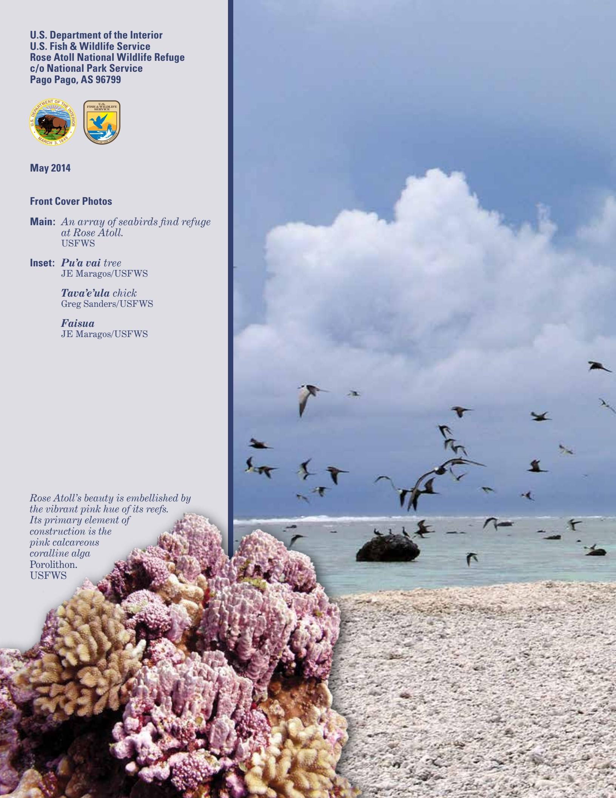