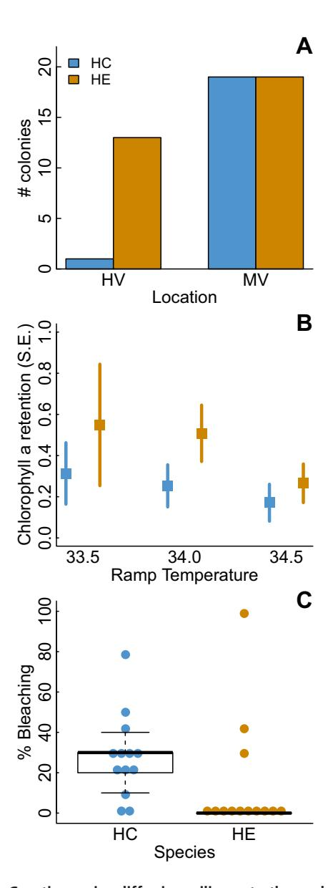
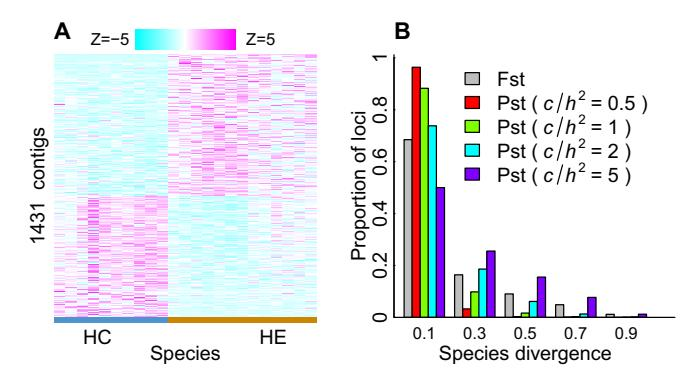
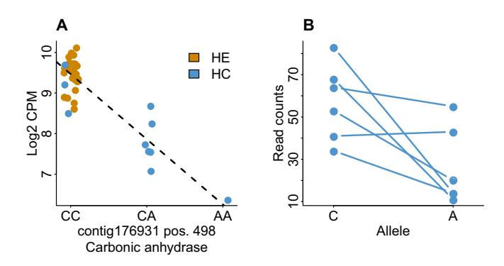
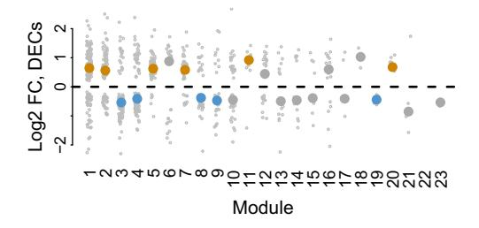

# Polygenic evolution drives species divergence and climate adaptation in corals

Noah H. Rose,1,2,3 Rachael A. Bay,4 Megan K. Morikawa,1 and Stephen R. Palumbi1

1Hopkins Marine Station, Department of Biology, Stanford University, Pacific Grove, California 93950

2Current Address: Department of Ecology and Evolutionary Biology, Princeton University, Princeton, New Jersey

3E-mail: noahrose@stanford.edu

4Institute of the Environment and Sustainability, University of California, Los Angeles, California 90095

Received November 1, 2016 Accepted October 23, 2017

Closely related species often show substantial differences in ecological traits that allow them to occupy different environmental niches. For few of these systems is it clear what the genomic basis of adaptation is and whether a few loci of major effect or many genome-wide differences drive species divergence. Four cryptic species of the tabletop coral *Acropora hyacinthus* are broadly sympatric in American Samoa; here we show that two common species have differences in key environmental traits such as microhabitat distributions and thermal stress tolerance. We compared gene expression patterns and genetic polymorphism between these two species using RNA-Seq. The vast majority of polymorphisms are shared between species, but the two species show widespread differences in allele frequencies and gene expression, and tend to host different symbiont types. We find that changes in gene expression are related to changes in the frequencies of many gene regulatory variants, but that many of these differences are consistent with the action of genetic drift. However, we observe greater genetic divergence between species in amino acid replacement polymorphisms compared to synonymous variants. These findings suggest that polygenic evolution plays a major role in driving species differences in ecology and resilience to climate change.

**KEY WORDS:** Adaptation, climate change, coral bleaching, gene expression.

Although great progress has been made in understanding the ecological factors that determine the distribution and abundance of species across variable environments, the genomic mechanisms that drive species or subspecies differences in ecology remain some of the most interesting challenges in evolutionary biology (Seehausen et al. 2014). In some cases, ecological divergence has been related to functional differences at just a few loci of major effect. For instance, mimicry in Heliconius butterflies is strongly linked to a small number of key developmental regulators that lead to differences in wing patterning (Kronforst and Papa 2015). Similarly, lighter coats in Peromyscus polionotus mice that live on beach sand are strongly linked to a single amino acid changing mutation in the melanocortin-1 receptor gene (Hoekstra et al. 2006), and lighter coats in Peromyscus maniculatus are linked to several mutations across the Agouti locus (Linnen et al. 2013). In other cases, a small or moderate number of independent loci may drive differences in ecology; 11 loci were

found to play a major role in cichlid adaptation to lake habitats (Franchini et al. 2014).

In contrast, in many systems a significant proportion of the genome appears to be under selection between closely related species. Seventy-six out of 408 genome-wide markers are significant QTLs for ecological divergence in sticklebacks adapted to benthic versus limnetic lifestyles (Arnegard et al. 2014), and studies of protein coding changes between *Drosophila* species estimate that as many as half of genome-wide differences in protein sequence are adaptive (Sella et al. 2009). Similarly, differences in the expression of hundreds of genes are related to ecological differences in lake whitefish (Bernatchez et al. 2010). Polygenic adaptation often occurs through widespread changes in the frequencies of functionally related variants, rather than fixation of a few alleles of major effect (Barrett and Schluter 2008; Rockman 2012; Berg and Coop 2014; Wellenreuther and Hansson 2016). Under neutral divergence, alleles that slightly increase or slightly

decrease a trait value are equally likely to drift to higher or lower frequency in a given population (Orr 1998). Under directional selection, however, alleles associated with the directional change being selected for should be found at consistently higher frequencies in the population under selection. For instance, across 139 heightrelated SNPs, height-increasing alleles are consistently more frequent in Northern Europe than Southern Europe, contrary to the neutral expectation (Turchin et al. 2012).

Understanding the functional consequences and cellular mechanisms of genomic differences between species when hundreds or thousands of unique variants are involved in driving species differences remains a major challenge, and is of fundamental importance to understanding how species adapt to different environments. In this study, we test the role of functional genetic variation in driving genomic divergence between two closely related cryptic species of the tabletop coral *Acropora hyacinthus* that have minor morphological differences but strong differences in thermal stress tolerance. Acroporid corals underwent a rapid adaptive radiation into a wide array of Indo-Pacific ecological niches about 26 million years ago (Wilson and Rosen 1998). These corals are known to have very high populations sizes, and experience relatively high levels of gene flow between species and hybridize readily (Oppen et al. 2001; Willis et al. 2006; Ladner and Palumbi 2012). Recent divergence, large effective population size, and substantial introgression can severely slow the accumulation of fixed neutral genetic differences between species (Ladner and Palumbi 2012), providing an opportunity to identify genetic variants that are strongly associated with species differences in ecology.

Coral reefs are ecologically, economically, and culturally important ecosystems that are particularly threatened by environmental change (Hoegh-Guldberg et al. 2007). One major threat to corals is the increasing incidence of "coral bleaching," the breakdown of symbiosis between corals and the dinoflagellate symbionts that provide most of their fixed carbon (Brown 1997). A great deal of recent work has focused on identifying variation in bleaching susceptibility within and between coral species and symbiont strains (Baker et al. 2004; Sampayo et al. 2008; Barshis et al. 2013; Palumbi et al. 2014). However, despite recent progress in identifying genetic variants or gene expression patterns that show signatures of selection or association with bleaching resilience, the mechanisms that link genetic variation to expression variation and ultimately physiological divergence in environmental tolerance are still unclear.

We use RNA sequencing to examine coding region variation and gene expression divergence in the two most common cryptic species of *A. hyacinthus* present in the backreef lagoons of Ofu Island, American Samoa. RNA Seq datasets are increasingly common for nonmodel species sampled in field settings, and we show such datasets can be systematically analyzed for features related to adaptive genomic divergence. First, we test for SNP differentiation between species across 39,290 SNPs in 7413 expressed sequences. We also partition gene expression variation within and between species to estimate PST, the degree of expression divergence between species. We show that two cryptic species of *A. hyacinthus* have very few fixed genetic differences but have widespread divergence in gene expression. Next, we search for SNP variants associated with allelic differences in gene expression, known as *cis-*regulatory expression quantitative trait loci (*cis-*eQTLs), as well as SNPs that cause changes in protein sequence. We specifically test for *cis-*eQTLs, because this class of variants has been frequently proposed to play an important role in driving species differences and is straightforward to test for in RNA-Seq datasets (Wray 2007; Tung et al. 2015). Although eQTLs that affect the expression of far-away genes or that perturb the expression of master regulators of a large number of downstream genes may also play an important role in evolution (Coolon et al. 2014), these eQTLs are much more difficult to test for given the extremely large number of possible pairwise relationships between all genes and all genome-wide SNPs. We find that genes that are differentially expressed between species are enriched for *cis-*eQTLs, but that many changes in gene expression between species appear to be driven by neutral genetic drift. Conversely, nonsynonymous SNPs in stress-related gene networks show larger differences in allele frequency between species than synonymous SNPs. Our approach is general to other analyses of closely related species using RNASeq datasets and can help pinpoint some of the underlying genetic causes for species differentiation early in species divergence.

## *Methods*

### **MONITORING AND DETERMINATION OF CRYPTIC SPECIES**

From 2009 to 2015, we tagged and monitored *A. hyacinthus* colonies across two backreef pools on Ofu Island, American Samoa. These colonies represented our effort to include all colonies that existed in these sites in 2009, and all new recruits between 2009 and 2013. The highly variable pool experiences temperatures that reach up to 35˚C during warm low tides while the moderately variable pool rarely exceeds 32˚C (Craig et al. 2001). Over the 6-year span, we tagged and monitored 79 colonies. Cryptic species designations were taken from Sheets and Palumbi (in review), in which the cryptic species designations and distributions of hundreds of *A. hyacinthus* colonies from across the Pacific are discussed. Of the 79 monitored colonies on Ofu, 11 were species HA, 20 were species HC, 13 were species HD, and 35 were species HE. These cryptic species are morphologically difficult to distinguish but can be differentiated on the basis of differences in allele frequencies across many loci. The cryptic lineages exist in sympatry across multiple locations throughout the Pacific (Ladner and Palumbi 2012). Because gene flow is high across thousands of kilometers within cryptic lineages, but low between populations of different cryptic lineages on the same reef, Ladner and Palumbi designated them as cryptic species with broad distributions rather than strongly subdivided populations within each reef. Although four species are known to exist in Ofu, we focus on the two most common species at this location: species HC and HE. To confirm that species designation using transcriptome-wide SNP information agreed with earlier multilocus assignments, we also carried out a principal components analysis of transcriptome-wide SNPs (see below). We found that species HE and HC were clearly separated along the first principal component, which explained 17% of genetic variation among samples (Fig. S1).

### **EXPERIMENTAL HEAT STRESS**

We used portable heat stress tanks to experimentally measure thermal tolerance in the HE and HC cryptic species in April 2015. Tanks were made from 6 L coolers fitted with 100W aquarium heaters and Nova Tec peltier chillers, controlled by Newport temperature controller. Flow through seawater was maintained at a rate of 3.6 L/hour and samples were exposed to standardized light conditions of 700 uE set on a 12 h: 12 h light-dark cycle. The heat stress ramp was as follows: a 3-hour ramp from 29˚C to a maximum temperature, followed by a three hour plateau at that maximum temperature, then decrease back to 29˚C where it was held stably overnight. We used three different maximum heat stress temperatures (33.5˚C, 34˚C, and 34.5˚C) along with a control that was held at 29˚C for the duration of the experiment. Four branches were collected from each of 12 colonies (six HC and six HE) and one branch per colony was place in each tank so that every genotype was assayed in every treatment. To minimize effects of environmental history, all colonies were taken from the moderately variable pool. We started the heat ramp at 10 am and collected bleached corals at 6 am the following morning. At that time, each branch was placed in 3 mL 95% ethanol, which efficiently extracts chlorophyll from marine assemblages (Ritchie 2008), at 4˚C in the dark and transported to Stanford University for analysis.

As a proxy for bleaching, we measured the concentration of chlorophyll—a from each branch used in the heat stress experiment, with a lower concentration of chlorophyll in the ethanol corresponding to fewer symbionts and more extensive bleaching. Chlorophyll extracted into the ethanol was measured using spectrophotometric analysis (Ritchie 2008). This concentration was normalized by surface area, which we measured using the wax dip method (Vytopil and Willis 2001). Chlorophyll retention for each genotype for each heat stress temperature was calculated by dividing chlorophyll a concentration of the heat stressed branch by chlorophyll a concentration of that genotype under control conditions. This proportion was log transformed and ANOVA was used to test for different levels of bleaching between species while accounting for different heat stress temperatures.

### **BLEACHING**

A natural bleaching event occurred in American Samoa in early 2015. In April, we monitored the bleaching status of each *A. hyacinthus* colony for which we had cryptic species designations. For each colony, we visually estimated a bleaching score, from 0% (no bleaching) to 100% (no visible pigment). Similar to laboratory thermal stress assays, we analyzed bleaching data in colonies of both species from the moderately variable pool only, to minimize impacts of thermal history on bleaching status.

#### **RNA-Seq**

In August 2011, we collected fragments from 38 *A. hyacinthus*individuals for transcriptome sequencing. These samples included 10 from the species HC (found in the moderately variable pool) and 28 from species HE (nine from the highly variable pool, 13 from the moderately variable pool, and six from the fore-reef). We collected all fragments at local noon within 30 minutes of one another and preserved them in RNA-stabilizing solution (De Wit et al. 2012) within 15 minutes of collection. At the time of sampling, the water was 28˚C. We stored samples at 4˚C for 24 hours, then at –20˚C until they were transported to Stanford, at which time they were kept at –80˚C. Total RNA was extracted using the RNAqueous-4PCR Total RNA Isolation Kit (Ambion) and cDNA libraries for each sample were created using the Illumina TruSeq mRNA Sample Prep Kit. We barcoded samples with Illumina adapters and pooled them for sequencing. The samples from the moderately and highly variable pools were sequenced across three lanes (Lane 1: five HE and six HC; Lane 2: seven HE and four HC; Lane 3: 10 HE) of 100 bp single end reads were sequenced on an Illumina 2000 at the Center for Genomics and Personalized Medicine at Stanford University; we used a permutational MANOVA, implemented in the function *adonis* from the R package *vegan*, using the Euclidian distance option, to test for lane effects on expression; we did not find a significant effect (*F* = 0.56, *df* = 2, permutation *P* = 0.8), so we did not include a lane effect covariate in our differential expression analysis. The six additional fore-reef HE individuals were sequenced in a separate lane. The pool of origin covariate used in *cis-*eQTL analyses (see below) would therefore also include any potential lane effects among these samples; these samples were not used to test for differential expression between species (see below), but were used for detecting *cis-*eQTLs and calculating allele frequencies within species HE. Patterns of genetic differentiation between HE samples from the two different lagoon pools were discussed in a previous study (Bay and Palumbi 2014); here we focus on ecological, gene expression, and genetic divergence between species HE and HC.

We filtered demultiplexed reads for adapter sequences, low quality sequences (Q *<* 20), and short reads (*<*20 bp) using the Fastx-toolkit. We mapped high quality reads to an existing reference transcriptome (Barshis et al. 2013) using *hisat2* with the setting "—very-sensitive" (Pertea et al. 2016) and retained reads with a quality score greater than 10. We used the software WASP to filter reads that showed mapping bias related to SNP variation. We used samtools to count the number of reads mapped to each contig. We tested for functional enrichments in differentially expressed genes using DAVID 6.8 (Huang et al. 2008). We mapped reads to *Symbiodinium* clade C and D ITS1/2 and CP23S sequences (Oliver and Palumbi 2011), and tested whether coral species differed in symbiont associations using a Mann–Whitney U test. Copy numbers of these markers could vary between strains, potentially leading to distortion of the proportions of clades C and D within individuals with mixed symbioses. However, we found a strong 1:1 correspondence between proportions derived from CP23S and ITS1/2 (Fig. S2). In addition, if multiple loci are systematically biased in copy number between symbiont strains, the rank test used to test for differences in symbiotic associations between coral species should be robust to these effects, since in this case the observed proportion of reads from the two strains is a monotonic function of the true proportion.

### **VARIANT DISCOVERY AND ANALYSIS OF FUNCTIONAL POLYMORPHISM**

We called SNPs using *samtools*/*bcftools* (Li et al. 2009) and retained biallelic SNPs with a minor allele frequency greater than 5%, and no missing data. We disabled base alignment quality (BAQ) scores during SNP calling to avoid introducing reference bias in allele counts in heterozygotes. We used this set of 39,290 SNPs for analysis of global patterns of FST and for analysis of protein coding polymorphism. We used the R package *outFLANK* to calculate FST (Whitlock and Lotterhos 2015), using the Weir and Cockerham method (Weir and Cockerham 1984), between cryptic species at each SNP. To examine patterns of linkage disequilibrium, we calculated the squared Pearson correlation (*R*2) between all within-contig pairs of SNPs. To account for population structure between cryptic species, we performed this analysis within species HE samples only, using SNPs with an allele frequency *>*10% in species HE. Across 100-bp bins of pairwise SNP distances, we calculated the 25th percentile, median, and 75th percentile of *R*2 for each distance.

For *cis-*eQTL discovery, we also excluded sites that did not have at least two heterozygotes, did not have representatives of all three possible genotypes, or that showed significant heterozygote excess in a Hardy–Weinberg exact test, to reduce the effects of paralog assembly artifacts that appear as low-expression heterozygous alleles present across most individuals. After filtering, we tested 17,495 SNPs for *cis-*eQTL status. We tested for two separate signals of SNP associations with expression in our RNA Seq dataset (Sun 2012). First, we tested for associations between SNP genotype and individual expression of the contig in which the SNP was located by fitting linear models of *voom*-normalized and precision-weighted expression values as a function of SNP genotype using the R function *lm* (Law et al. 2014), including a covariate for the lagoon pool that samples were collected from to account for differences in environmental history and a covariate for species identity to account for the effects of genomic background on gene expression. We fit separate precision-weighted *lm* models for each SNP rather than using the *limma* function because the design matrix differed for each test SNP, whereas *limma* makes use of a fixed design matrix across many genes in a common experiment. Second, we tested for imbalance in the expression of the two alleles of a SNP within heterozygotes. We used the R function *optim* to carry out a likelihood-ratio test (LRT) of whether the beta-binomially distributed proportion of reads derived from the alternate allele was significantly different from 0.5 (Tung et al. 2015). We used Fisher's method to combine *P*-values from these two tests into a single *cis-*eQTL *P*-value. We then used the Benjamini–Hochberg method to adjust *P-*values for multiple testing across all tests (Benjamini and Hochberg 1995).

We used a permutation test, implemented using the R package *permute*, to test whether *cis-*eQTLs showed greater divergence between species than would be expected among randomly selected sets of SNPs. Because it might be difficult to detect eQTLs among SNPs with few heterozygotes and high divergence between species, we selected sets of random SNPs matched for the number of heterozygous individuals found in each significant *cis-*eQTL. We calculated multilocus FST across these SNPs using the R package *OutFLANK* and compared this value to the observed multilocus FST across *cis-*eQTLs.

We used DESeq2 to detect differentially expressed contigs between the two species (Love et al. 2014), using only the samples that were found in the moderately variable pool to account for the effects of environmental history. We used Fisher's exact test to test whether differentially expressed contigs were more likely to contain *cis-*eQTLs than would be expected due to random chance. We calculated PST, an index of phenotypic differentiation between species for the expression of each contig among corals of both species in the common environment of the moderately variable pool as *c*σb 2/(*c*σb 2+*h2*σw2), where *c* is the proportion of phenotypic variation across species that is assumed to have a heritable basis, σb 2 is the measured phenotypic variance between species, σw2 is the measured phenotypic variance within species, and *h2* is the heritability of phenotypic variation within species (Leinonen et al. 2006). Because heritability is unknown in this context, it is important to test how different assumed values for *c* and *h2* affect conclusions about neutrality, specifically to determine the range of assumptions about the relative heritability of between-species and within-species variation (i.e., the ratio *c/h2*) that are associated with different conclusions (Brommer 2011). In particular, Brommer recommended constructing a 95% confidence interval for Pst for different assumed values of *c/h2* and determining the critical value of that ratio for which neutrality is rejected. Because samples were taken at the same time from sessile coral colonies growing in the same environment, PST here may more closely approximate quantitative genetic differentiation (QST) than in measurements from highly mobile species with unknown environmental history, but stochastic variation and micro-habitat differences between colonies likely contribute to some of the observed variation. Because we were interested in comparing the distributions of PST and FST across thousands of genes, rather than testing individual genes for high levels of phenotypic divergence, we did not construct 95% confidence intervals for each gene. Instead, we compared the distributions of PST and FST over a wide range of possible heritabilities and determined the values of *c/h2* for which the distributions of PST and FST strongly differed.

We used binomial tests, as implemented in the R function *binom.test*, to test whether differentially expressed genes in specific gene networks (Modules 1–23 in Rose et al. 2016) were more commonly upregulated or downregulated in species HE compared to species HC. These differences could be related to differences in the *trans-*regulation of coexpressed genes or could be driven by many independent *cis*-regulatory changes in the regulation of genes with similar functions. If *cis-*eQTLs within a given gene network consistently increase expression in one species relative to the other, this could provide evidence for selection for a change in gene expression levels between species in this gene network, since neutral drift is not expected to favor changes in the frequencies of alleles that change expression in one direction over the other, though there is an expected bias in direction if testing is conditioned on an observed change in expression between species (Fraser et al. 2012; Martin et al. 2012; Fraser 2013). This test is related to the QTL sign test discussed by Orr (Orr 1998; Anderson and Slatkin 2003) but differs in some important respects. Orr's QTL sign test tests if more QTLs affecting a trait cause change in the observed direction of phenotypic change than would be expected after conditioning for the initial ascertainment of trait differentiation between lineages. In this case, eQTL effects could drive expression in the opposite direction of a strong *trans*-regulatory effect that causes differential expression between lineages, since we test for *cis-*eQTL effects within species, explicitly regressing out any *trans*-regulatory divergence. For this reason, a polygenic signature could even point in the opposite direction of expression divergence between lineages, for example contributing to compensatory changes in expression after major *trans*-regulatory changes in the expression of a set of genes (Goncalves et al. 2012). We designated *cis-*eQTLs as increasing HE expression if the higher expressed allele was more common in species HE or as decreasing HE expression if the higher expressed allele was more common in species HC. We then used a permutational chi-squared test to test whether the proportion of HE-increasing alleles differed between transcriptional modules. We tested whether *cis-*eQTLs in the same module showed greater linkage disequilibrium within species HE than random sets of genes by constructing a pairwise Pearson correlation matrix (1– *R2*) among SNPs with minor allele frequency *>*10% in species HE and then using a permutational MANOVA, as implemented in the *vegan* function *adonis* to test whether linkage among *cis*eQTLs within modules was greater than would be expected in random sets of genes.

We used custom python scripts to designate SNPs in protein coding sequences as synonymous or nonsynonymous. We used Kolmogorov–Smirnov tests to test whether distributions of FST and heterozygosity differed between synonymous and nonsynonymous SNPs.

### *Results*

### **ECOLOGICAL AND PHYSIOLOGICAL DIVERGENCE BETWEEN CRYPTIC SPECIES**

We tagged, monitored, and genotyped a total of 79 *A. hyacinthus* colonies across the highly variable and moderately variable pools in Ofu from 2009–2015; we surveyed both pools equally and these colonies represent our efforts to tag and monitor all colonies present at these sites. Of these, we identified 35 as species HE and 20 as HC. While HE colonies were abundant in both locations, species HC was nearly absent from the highly variable pool (Fig. 1A, Fisher's exact test *P* = 0.008). We only found a single individual of species HC in the highly variable pool.

Bleaching experiments conducted in the laboratory and natural bleaching observations revealed higher thermal tolerance in the HE species than in the HC species. Under experimental heat stress at 33.5˚C, 34˚C, and 34.5˚C species HE bleached less than species HC (Fig. 1B, ANOVA *F* = 15.6, *df* = 1, *P* = 0.0004). For example, species HC lost about 70% of its chlorophyll a after a 33.5˚C stress, whereas it took a stress of 34.5˚C to elicit this strong of a response in species HE (Fig. 1B).

Patterns of bleaching within the moderately variable pool during a natural bleaching event were consistent with results from the laboratory experiment. We were able to assay bleaching for 13 individuals of each species at this location after the 2015 global bleaching event. Colonies of HC *A. hyacinthus* bleached more than HE corals; only three of 13 HE corals in the moderately variable pool showed any signs of bleaching while the majority of HC corals (11/13) were visibly bleached (Fig. 1C, Wilcoxon rank sum test *P* = 0.02).

Figure 1. Cryptic species differ in resilience to thermal extremes. (A) Species HE is found in both the more thermally stressful highly variable (HV) pool and the less stressful moderately variable (MV) pool, while species HC is only common in the less stressful moderately variable pool. (B) Species HC bleaches more than species HE, retaining less chlorophyll, in response to a range of experimental heat stresses (see Methods). (C) During a natural bleaching event observed in April 2015, species HC bleached more than species HE in the moderately variable pool.

Both coral species contained both clade C and clade D symbionts. However, clade D was present at low abundances in coral species HC: all colonies had clade D abundance less than 1%. By contrast, Clade D was largely dominant in coral species HE: 21 of 28 colonies showed >10% Clade D, and 16 colonies showed >90% Clade D (Fig. S3, Mann–Whitney U test P=0.0003). Some of this effect is likely attributable to differences in dis-

**Figure 2.** Expression divergence and genetic divergence between species. (A) A heatmap shows 1431 contigs that are differentially expressed between cryptic species. Each column represents an individual sample collected at the same time in the same lagoon pool; each row represents a differentially expressed contig. Heatmap colors correspond to the *Z*-score associated with the standardized expression level (mean = 0, SD = 1) for a given contig in a given sample. (B) Most SNPs are present at similar frequencies in both species, resulting in low genome-wide values of  $F_{ST}$ ; across 39,290 SNPs, we found only 16 SNPs fixed between species. We also show the distribution of phenotypic differentiation in gene expression ( $P_{ST}$ ) for different possible values of the ratio between the proportion of phenotypic variation across species due to additive genetic variation and the proportion of phenotypic variation within species due to additive genetic variation ( $c/h^2$ ).

tribution across microenvironments between species (Oliver and Palumbi 2011). However, within the moderately variable pool, where both species coexisted, we found a similar pattern: HC never was dominated by clade D symbionts (mean abundance 1%) whereas six of 13 HE had majority clade D symbionts (Fig. S3, one-tailed Mann–Whitney U test P=0.04). Interestingly, of the three HE colonies that bleached, two were dominated by clade C symbionts (>99% of reads mapped to clade C), and one had a mixed association (36% clade C).

# WIDESPREAD ALLELE FREQUENCY DIVERGENCE BUT FEW FIXED DIFFERENCES BETWEEN SPECIES

Across our set of 39,290 SNPs, we found a global  $F_{ST}$  of 0.18 (Fig. 2B), between species. This was far higher than differentiation across locations within species HE ( $F_{ST}=0.003$ ). Between species, 2334 SNPs showed  $F_{ST}$  greater than 0.5. Linkage disequilibrium decayed rapidly over hundreds of bases within contigs (Fig. S4). We found only 16 fixed variants between species. Four proteins contained multiple fixed variants. A putative actin regulator ARPC3 (contig178480) contained four fixed differences, a putative proteasomal subunit PSMD11 (contig174897) contained four fixed differences, a putative ortholog of the NPC2 secretory protein (contig151352) contained three fixed differences, and a putative peroxidasin protein (contig600117) contained two fixed

differences. However, we also found substantial allele frequency differences at many loci. Differentiation between cryptic species was much stronger than differentiation across sites within species HE (FST = 0.003).

### **EXPRESSION DIVERGENCE APPEARS LARGELY NEUTRAL**

At Benjamini–Hochberg adjusted *P* = 0.05, we found that 1431 contigs out of 17,690 expressed contigs (8%) were differentially expressed between species growing in the same pool (Fig. 2A). However, these expression differences were usually quite subtle; 825 contigs had a less than twofold difference in mean expression between species, and only 45 contigs showed fourfold or greater difference. Across the set of 1431 differentially expressed contigs we did not find any significant gene ontology (GO) enrichments (Benjamini–Hochberg adjusted *P >* 0.05 for all terms).

We sought to test whether gene expression shows greater or less divergence between species than would be expected if gene expression divergence were driven solely by neutral genetic drift by comparing distributions of expression differences between species to the distributions of FST. One approach to this question is to use QST-FST comparison to test whether phenotypic differentiation is greater than would be expected due to genetic drift alone (Leinonen et al. 2013). Because QST requires estimates of heritable variation, usually from common garden experiments, we cannot directly calculate this statistic from our field-collected samples. However, we were able to calculate PST, the proportion of phenotypic variation explained by species designation under different assumptions for the heritability of phenotypic variation within and between species (Brommer 2011). We used this index to produce an estimate of whether gene expression differences between species were much stronger or much weaker than neutral genetic differentiation.

If variation within species is assumed to have a greater heritability than the observed variation between species (*c < h2,* see methods), the level of gene expression differentiation between species is much less than would be expected under neutrality (Fig. 2B, compare red and gray bars). If variation within species is less heritable than variation between species (*c>h2*, see Methods), we find the same pattern for *c/h2* = 2 (Fig. 2B, compare blue and gray bars). Variation within species would have to be much less heritable than variation between species (*c/h2* = 5) to find a similar proportion of loci showing high PST as show high FST (Fig. 2B, compare purple bars and gray bars at FST *>* 0.8). Ultimately, we cannot make definitive conclusions about the role of selection in shaping these distributions without knowing the heritability of expression variation. However, the observation that for a wide range of assumed heritabilities we find fewer high PST genes than would be predicted from the distribution of FST, in combination with the lack of strong enrichment for any particular cellular function in gene expression differences between species, suggests that much of the gene expression differentiation between species may be driven by neutral drift in regulatory polymorphisms affecting genes under weak selective constraint.

However, these results do not preclude the possibility that a subset of gene expression differences is important for physiology and ecological niche differences. Next, we sought to search for regulatory polymorphisms that might drive this divergence, and specifically test them for signatures of selection.

### **eQTLs: ASSOCIATIONS BETWEEN SNPS AND GENE EXPRESSION**

We detected 1419 SNPs in 868 contigs that were significantly correlated with expression variation within species and showed allelic imbalance in expression within heterozygotes (FDR *<* 0.05, Appendix 1). Measures of these allelic imbalances within individuals correlated strongly and positively with differences in expression between individuals. Across all 17,495 tested SNPs, fold-change effects on expression from association analysis and allelic imbalance analysis were positively correlated (Spearman rho = 0.23, *P &lt;* 2.2 × 10–16); this relatively weak but highly significant correlation suggests that many expression differences are driven via a *cis*-regulatory mechanism, since local *trans*-eQTLs (i.e., eQTLs found in the coding sequence of the affected gene that affect the expression of both alleles) would not be expected to show imbalance within heterozygotes (Knight 2004; Gilad et al. 2008). We designated these SNPs as *cis-*eQTLs because they are highly associated with variation in gene expression between different alleles within heterozygous individuals, as well as between individuals with different genotypes. Because we included a covariate for species identity during eQTL testing, these associations cannot be explained by species differences in gene expression in contigs containing high-FST SNPs. Rather, the association between genotype and expression at these eQTLs were detected on the basis of their ability to explain variation in expression between colonies of the same species.

Next, we tested whether *cis-*eQTLs were enriched in particular functional categories of SNPs (synonymous, nonsynonymous, and untranslated region). We found that *cis-*eQTLs were enriched among nonsynonymous and untranslated region SNPs (Fisher's exact test, OR = 1.27 and 1.26, *P* = 8 × 10–5 and 5 × 10–5, respectively). Across *cis-*eQTLs, multilocus FST was 0.18, slightly lower than global FST across all 17,495 SNPs tested for *cis-*eQTL effects (0.20). Because this pattern could also be explained by lower power to detect *cis-* eQTLs among SNPs with high FST and relatively few heterozygotes, we shuffled *cis-*eQTL designations among SNPs with the same number of heterozygotes 1000 times. We found that random sets of SNPs matched for the same number of heterozygotes had similar levels of FST (mean = 0.17,

Figure 3. Differences in cis-eQTL allele frequencies explain species differences in gene expression. A cis-eQTL in a putative carbonic anhydrase that is differentially expressed between species shows a strong association between cis-eQTL genotype and expression among individuals (panel A) as well as strong imbalance in expression within heterozygotes (panel B). The higher expressed C allele is more common in species HE and the lower expressed A allele is more common in species HC; this difference in cis-eQTL frequency explains the observed differential expression between species. Although we included a covariate for sampling location during transcriptome-wide association testing, sampling location was not significantly associated with the expression of this contig (ANOVA F = 0.05, df = 2, P = 0.95), and so expression levels in panel A have not been adjusted for sampling location. Counts in panel A show logtransformed limma/voom normalized counts per million (CPM), whereas counts in panel B show total read counts from each allele, with the two alleles present within each sample connected by line seaments.

permutation P = 0.7), suggesting that many *cis*-eQTLs are diverging neutrally between species.

We identified 234 cis-eQTLs in 41 genes differentially expressed between species. For example, we found a strong cis-eQTL at position 498 of a putative Carbonic anhydrase transcript (Fig. 3). Individuals that showed a CC genotype had fourfold higher expression of this gene than the AA genotype, and the AC genotype showed twofold higher expression compared to the AA genotype (Fig. 3A). Within heterozygotes the C allele was expressed at about twice the level of the A allele on average (Fig. 3B). In this case, the discrepancy between the effect sizes of the cis-eQTL association across individuals (fourfold) and allelic imbalance within individuals (twofold) suggests that the cis-regulatory effect may be modulated by a trans-regulatory effect. Differentially expressed genes were 40% more likely to contain an cis-eQTL than genes that were not differentially expressed (Fisher's exact test, OR = 1.4, P = 0.002). This finding suggests that variants that are associated with expression variation within species also play an important role in driving differences in expression between species.

Figure 4. Cryptic species differences in the regulation of stressrelated gene networks. Genes in previously identified transcriptional modules that showed coordinated responses to experimental heat stress also showed coordinate differences in expression
between species. Small gray points are individual differentially
expressed contigs (DECs). Large points show median log2 fold
change (FC) for each module; orange points denote modules with
a significant excess of increases in HE expression, blue points denote modules with a significant excess of increases in HC expression, and gray points are nonsignificant.

# EXPRESSION DIVERGENCE BETWEEN SPECIES IN STRESS-RELATED GENE NETWORKS

We sought to test whether specific gene networks showed differences in regulation between species in a common environment. We had previously identified 23 transcriptional modules that show coordinated responses to acute experimental heat stress in species HE (Rose et al. 2016). We tested whether these same previously defined gene sets that show coordinated responses to stress within species showed coordinated differences in expression between species with different stress tolerances. We found that the direction of expression change between species differed strongly between modules. For instance, genes in Module 1, which showed a rapid increase in expression immediately following heat stress but quickly returned to control expression levels, were three times more likely to be upregulated in species HE than in HC (Fig. 4). Overall, genes in Modules 1, 2, 5, and 7 were significantly more likely to be upregulated in species HE, and genes in Modules 3, 4, 8, 9, and 19 were more likely to be upregulated in species HC. All of these modules, with the exception of Module 19, showed strong acute responses to experimental heat stress in the previous study in which they were defined; eight other modules showed acute responses to heat stress in the previous study but did not show strong differences in expression between species (Modules 12–16, 22, and 23, Rose et al. 2016).

These coordinated differences in expression between species could be related to changes in the expression of master regulators of these coexpressed gene sets. Alternatively, if these differences in expression are related to many independent directional changes in the regulation of stress-responsive genes, this could provide evidence for selection between species on the expression of these gene networks, since drift is unlikely to favor

divergence in SNPs that change expression in one direction over another (Fraser et al. 2012; Fraser 2013). We asked whether the direction of *cis-*eQTL effects differed across the previously defined transcriptional modules. Across all *cis-*eQTLs, we did not find a difference in the proportion of *cis-*eQTLs that increased HE expression between modules (permutational Chi-squared test *P* = 0.6*)*; although many *cis-*eQTLs contributed to expression divergence between species, we cannot reject the hypothesis that the overlapping effects of neutral drift in *cis* and *trans-*regulatory variants have driven the expression differences observed between these species. These changes involved a large number of loci; even closely linked SNPs show little linkage disequilibrium within species HE (Fig. S4), suggesting that small differences in *cis-*eQTL allele frequencies across many independent loci contribute to expression divergence between species. We used a permutational MANOVA to test whether *cis-*eQTLs in the same modules showed stronger linkage disequilibrium within species HE than random sets of genes, but did not find a significant effect (*F* = 0.99, *df* = 22, permutation *P* = 0.16).

### **NONSYNONYMOUS CODING VARIANTS SHOW POLYGENIC SIGNATURES OF SELECTION**

Across 24,762 coding SNPs, nonsynonymous protein coding variants (*N* = 10,876) showed a significant difference in the distribution of FST values relative to synonymous variants (N = 13,886; Kolmogorov–Smirnov Test D = 0.04, *P* = 5.9 × 10–8); nonsynonymous SNPs were 18% more likely than synonymous variants to have values of FST greater than the genome-wide FST of 0.18. Differences in the levels of heterozygosity among these two categories of variants could lead to differences in FST distributions; however, we found no significant difference in the distribution of heterozygosity between these two categories (Kolmogorov–Smirnov Test D = 0.006, *P* = 0.95), suggesting that the higher levels of differentiation among nonsynonymous variants are driven by selection and not differences in heterozygosity. We sought to test whether nonsynonymous variants showing strong differentiation between species are concentrated in previously identified gene networks (Modules 1–23 from Rose et al. 2016). We found that two modules (5 and 22) showed significant enrichment of high values of FST among nonsynonymous variants relative to synonymous variants (one-sided Fisher's exact test, Bonferroni-adjusted *P <* 0.05, Table S5). Two hundred twenty-five out of 754 (30%) of Module 5 nonsynonymous variants showed FST *>* 0.18 versus only 299 out of 1389 (22%) synonymous variants. Nineteen out of 37 (51%) of Module 22 nonsynonymous variants showed FST*>*0.18 versus only eight out of 45 (18%) synonymous variants. This enrichment was not significant in the other 21 modules after multiple test correction.

### *Discussion*

*A. hyacinthus* cryptic species HE (*sensu* Ladner and Palumbi 2012) occurs in warmer micro-habitats, is more resistant to experimental bleaching, has higher levels of the heat-stress resistant symbiont Clade D (Baker et al. 2004; Oliver and Palumbi 2011), and bleached much less during a 2015 bleaching episode than close congener *A. hyacinthus* HC. These ecological differences allow species HE to inhabit warmer back reef areas, survive more frequent extreme heating events, and resist coral bleaching. Differences in environmental range between closely related species, for example in limpets and mussels along the U.S. west coast (Crummett and Eernisse 2007; Lockwood et al. 2010), or across latitude or altitude in plants and many vertebrates (Cadena et al. 2012; Anacker and Strauss 2014), are common. Understanding the evolution of these differences in the context of ecological speciation requires a fuller understanding of the kinds of genetic changes that accompany ecological divergence.

### **GENOMIC ARCHITECTURE OF SPECIES DIFFERENCES**

Previous studies have found strong population differences in coral bleaching susceptibility associated with local adaptation to different environments (Coles et al. 1976; Barshis et al. 2013; Bay and Palumbi 2014; Dixon et al. 2015). Our results suggest that pervasive differences in environmental physiology between cryptic species of *A. hyacinthus* do not result from fixation of many genetic differences but rather arise from polymorphic alleles at many loci that change protein sequences and gene expression patterns. We identified 1419 *cis-*eQTLs, defined as polymorphisms that are correlated with variation in gene expression within species (e.g., Fig. 3A) and also show increased allelic imbalance within heterozygotes (e.g., Fig. 3B). Because linkage disequilibrium decays over hundreds of bases in this system, these *cis-*eQTLs are likely to be closely linked to causal variants (Fig. S4). Because we are only able to test among transcript sequences, and many *cis-*eQTLs are expected to occur in upstream regulatory regions, we are likely only detecting a fraction of the total gene regulatory polymorphism present in this system (Lappalainen et al. 2013; Tung et al. 2015). However, we found that *cis-*eQTLs were enriched among nonsynonymous variants, which may affect regulatory feedbacks, and variants in untranslated regions; these enrichments have also been observed among human eQTLs (Lappalainen et al. 2013). This biological signal suggests that our *cis-*eQTLs may include several causal variants that fall within transcribed sequences, accounting for our detection of many *cis-*eQTLs even though linkage disequilibrium with upstream regulatory regions is expected to be weak. Contigs that were differentially expressed between species were enriched for *cis-*eQTLs, suggesting that differences in the frequencies of many regulatory variants contribute to expression differences between species. However, the lack of functional enrichments among differentially expressed contigs, PST-FST comparisons, and patterns of FST across eQTLs all suggest that many gene expression differences between species may be related to neutral drift in gene regulation. In addition, in this study we were unable to systematically test for *trans-*eQTL effects, which could play an important additional role in driving expression differences between species, including the observed differences in the regulation of stress-related transcriptional modules (Fig. 4), which could not be explained by systematic changes in the frequencies of *cis-*eQTLs.

We find that amino acid replacement alleles in genes from two stress-related transcriptional modules (Modules 5 and 22) were more likely than synonymous alleles to show large allele frequency differences between species. Because linkage disequilibrium between selected nonsynonymous variants and nearby synonymous variants could reduce differences in the distribution of FST for synonymous and nonsynonymous variants (Messer and Petrov 2013), it is likely that these modules represent the gene networks where the signal is strongest, rather than being the only gene networks under selection between species. Selection on stress tolerance in different cryptic lineages of *A. hyacinthus* may have sorted functional variants that shape stress tolerance between ecologically distinct lineages, resulting in the particularly stresstolerant lineage that we recognize as species HE. Assortment of preexisting variation across many loci during ecological speciation has been frequently observed in other systems, as in the cline from lower to upper intertidal that distinguishes species of the snail *Littorina saxatilis* (Johannesson et al. 2010; Westram et al. 2014), or in repeated adaptation to freshwater environments in sticklebacks (Jones et al. 2012). Genetic variation within cryptic species at loci that drive differences in stress tolerance between cryptic species could drive rapid adaptation to changing ocean temperatures, and gene flow from stress tolerant corals to less stress tolerant populations could promote adaptation to changing conditions (Dixon et al. 2015). However, highly polygenic traits may respond more slowly to selection than traits involving a few loci of major effect, potentially limiting the adaptive response of vulnerable corals (Gomulkiewicz et al. 2010).

### **DIFFERENCES IN STRESS TOLERANCE AND SYMBIONTS BETWEEN SPECIES**

Corals in the highly variable pool show a strong association with the heat tolerant symbiont group *Symbiodinium* Clade D (Oliver and Palumbi 2011). Once we had identified cryptic species, we were able to also show that species HE tended to harbor *Symbiodinium* Clade D more commonly even in the milder environment of the moderately variable pool. Cryptic species differences in symbiont associations raises the possibility that the association of specific symbiont types with bleaching resilience may reflect not just differences in the physiology of these symbionts (Baker 2003), but also correlated differences in the heritable phenotypes of the corals that tend to host them. Because of the association between host species and symbiont type, it is possible that some of the physiological and gene expression differences between species are driven primarily by differences in symbiosis. However, the presence of a large number of host *cis-*eQTLs that explain species differences in expression as well as evidence of polygenic selection on nonsynonymous SNPs between species suggests that host-level differences beyond those that drive differences in symbiosis also play an important role. Other studies have hinted at similar patterns. In *Stylophora pistillata*, a bleaching event resulted in an increase in the proportion of coral colonies hosting *Symbiodinium* Clade D. However, in this case, the change was due to high mortality in colonies that contained the less heat tolerant Clade C symbiont rather than switching of clade content in individual colonies (Sampayo et al. 2008). Our findings suggest that such results could derive from a heritable propensity of different colonies or cryptic species to house different symbionts in the same environment. These findings are consistent with work in other systems that shows strong specificity between different coral species and their symbionts (Thornhill et al. 2005; LaJeunesse et al. 2008), and suggests that coadaptation between corals and symbionts may play an important role in bleaching tolerance (Parkinson and Baums 2014).

### **PATTERNS OF ECOLOGICAL DIFFERENTIATION AND GENE FLOW IN CORALS**

Reef building corals in the speciose genus *Acropora* present the conundrum of rapid speciation over the last 23 million years despite widely overlapping ranges and extensive gene flow through hybridization (Veron 1995; Oppen et al. 2001). Data from neutral SNPs assayed with standard exon sequencing suggested widespread allele sharing among the cryptic species of *A. hyacinthus*; here we confirm that most polymorphic loci show little structure between two of those cryptic species. Previous work in this system suggests that within species, stress tolerance alleles are concentrated by selection in colonies that survive in warmwater habitats (Bay and Palumbi 2014). The data we present here indicate that many differences in allele frequencies have accumulated between HC and HE, associated with the higher heat tolerance of HE colonies.

Because the present work was carried out using a de novo transcriptome assembly, we are unable to determine the chromosomal distribution of functional variants that show signs of selection between species. In addition, in our comparison of two species we cannot tell if one species in particular is experiencing strong directional selection or if both species are under selection at a given locus. Future work using whole-genome approaches and comparing changes across more than two cryptic species could address these issues. This work shows that polygenic divergence involving many functional genomic variants is associated with species differences in ecology; further determination of the selective mechanisms that underlie this divergence will greatly improve our understanding of how species differences in ecology are generated.

### **AUTHOR CONTRIBUTIONS**

NHR contributed to experimental design, field work, data analysis, and writing and revising the manuscript. RAB contributed to experimental design, field work, transcriptomic library preparation and processing, and writing and revising the manuscript. MKM contributed to field work, data analysis, and writing and revising the manuscript. SRP contributed to experimental design, field work, and writing and revising the manuscript.

### **ACKNOWLEDGMENTS**

This work was supported by an NSF GRF to NHR, funds from the Gordon and Betty Moore Foundation and an NSF RAPID grant. We would like to thank Carlo Caruso and the U.S. National Park Service of American Samoa for support in the field.

#### **DATA ARCHIVING**

Processed data and scripts will be posted on github.com/noahrose. Raw sequencing reads have been deposited in the NCBI SRA under accession PRJNA379450.

#### **LITERATURE CITED**

- Anacker, B. L., and S. Y. Strauss. 2014. The geography and ecology of plant speciation: range overlap and niche divergence in sister species. Proc. R Soc. Lond. B Biol. Sci. 281:20132980.
- Anderson, E. C., and M. Slatkin. 2003. Orr's quantitative trait loci sign test under conditions of trait ascertainment. Genetics 165:445–446.
- Arnegard, M. E., M. D. McGee, B. Matthews, K. B. Marchinko, G. L. Conte, S. Kabir, N. Bedford, S. Bergek, Y. F. Chan, F. C. Jones, et al. 2014. Genetics of ecological divergence during speciation. Nature 511:307– 311.
- Baker, A. C., C. J. Starger, T. R. McClanahan, and P. W. Glynn. 2004. Coral reefs: corals' adaptive response to climate change. Nature 430:741–741.
- Barrett, R. D. H., and D. Schluter. 2008. Adaptation from standing genetic variation. Trends Ecol. Evol. 23:38–44.
- Barshis, D. J., J. T. Ladner, T. A. Oliver, F. O. Seneca, N. Traylor-Knowles, and S. R. Palumbi. 2013. Genomic basis for coral resilience to climate change. Proc. Natl. Acad. Sci. 110:1387–1392.
- Bay, R. A., and S. R. Palumbi. 2014. Multilocus adaptation associated with heat resistance in reef-building corals. Curr. Biol. CB 24:2952–2956.
- Benjamini, Y., and Y. Hochberg. 1995. Controlling the false discovery rate: a practical and powerful approach to multiple testing. J. R Stat. Soc. Ser. B Methodol. 57:289–300.
- Berg, J. J., and G. Coop. 2014. A population genetic signal of polygenic adaptation. PLoS Genet. 10:e1004412.
- Bernatchez, L., S. Renaut, A. R. Whiteley, N. Derome, J. Jeukens, L. Landry, G. Lu, A. W. Nolte, K. Ostbye, S. M. Rogers, et al. 2010. On the origin of species: insights from the ecological genomics of lake whitefish. Philos. Trans. R Soc. Lond. B Biol. Sci. 365:1783–1800.
- Brommer, J. E. 2011. Whither Pst? The approximation of Qst by Pst in evolutionary and conservation biology. J. Evol. Biol. 24:1160–1168.
- Brown, B. E. 1997. Coral bleaching: causes and consequences. Coral Reefs 16:S129–S138.
- Cadena, C. D., K. H. Kozak, J. P. Gomez, J. L. Parra, C. M. McCain, R. C. K. ´ Bowie, A. C. Carnaval, C. Moritz, C. Rahbek, T. E. Roberts, et al. 2012.

- Latitude, elevational climatic zonation and speciation in New World vertebrates. Proc. R Soc. B 279:194–201.
- Coles, S. L., E. C. I. Hawaiian, P. L. Jokiel, and C. R. Lewis. 1976. Thermal tolerance in tropical versus subtropical pacific reef corals. Pac. Sci. US 30:2.
- Coolon, J. D., C. J. McManus, K. R. Stevenson, B. R. Graveley, and P. J. Wittkopp. 2014. Tempo and mode of regulatory evolution in *Drosophila*. Genome Res. 24:797–808.
- Craig, P., C. Birkeland, and S. Belliveau. 2001. High temperatures tolerated by a diverse assemblage of shallow-water corals in American Samoa. Coral Reefs 20:185–189.
- Crummett, L. T., and D. J. Eernisse. 2007. Genetic evidence for the cryptic species pair, *Lottia digitalis* and *Lottia austrodigitalis* and microhabitat partitioning in sympatry. Mar. Biol. 152:1–13.
- De Wit, P., M. H. Pespeni, J. T. Ladner, D. J. Barshis, F. Seneca, H. Jaris, N. O. Therkildsen, M. Morikawa, and S. R. Palumbi. 2012. The simple fool's guide to population genomics via RNA-Seq: an introduction to high-throughput sequencing data analysis. Mol. Ecol. Resour. 12:1058– 1067.
- Dixon, G. B., S. W. Davies, G. A. Aglyamova, E. Meyer, L. K. Bay, and M. V. Matz. 2015. Genomic determinants of coral heat tolerance across latitudes. Science 348:1460–1462.
- Franchini, P., C. Fruciano, M. L. Spreitzer, J. C. Jones, K. R. Elmer, F. Henning, and A. Meyer. 2014. Genomic architecture of ecologically divergent body shape in a pair of sympatric crater lake cichlid fishes. Mol. Ecol. 23:1828–1845.
- Fraser, H. B. 2013. Gene expression drives local adaptation in humans. Genome Res. 23:1089–1096. [https://doi.org/10.1101/gr.152710.112.](https://doi.org/10.1101/gr.152710.112)
- Fraser, H. B., S. Levy, A. Chavan, H. B. Shah, J. C. Perez, Y. Zhou, M. L. Siegal, and H. Sinha. 2012. Polygenic cis-regulatory adaptation in the evolution of yeast pathogenicity. Genome Res. 22:1930– 1939.
- Gilad, Y., S. A. Rifkin, and J. K. Pritchard. 2008. Revealing the architecture of gene regulation: the promise of eQTL studies. Trends Genet. 24:408– 415.
- Gomulkiewicz, R., R. D. Holt, M. Barfield, and S. L. Nuismer. 2010. Genetics, adaptation, and invasion in harsh environments. Evol. Appl. 3: 97–108.
- Goncalves, A., S. Leigh-Brown, D. Thybert, K. Stefflova, E. Turro, P. Flicek, A. Brazma, D. T. Odom, and J. C. Marioni. 2012. Extensive compensatory cis-trans regulation in the evolution of mouse gene expression. Genome Res. 22:2376–2384.
- Hoegh-Guldberg, O., P. J. Mumby, A. J. Hooten, R. S. Steneck, P. Greenfield, E. Gomez, C. D. Harvell, P. F. Sale, A. J. Edwards, K. Caldeira, et al. 2007. Coral reefs under rapid climate change and ocean acidification. Science 318:1737–1742.
- Hoekstra, H. E., R. J. Hirschmann, R. A. Bundey, P. A. Insel, and J. P. Crossland. 2006. A single amino acid mutation contributes to adaptive beach mouse color pattern. Science 313:101–104.
- Huang, D. W., B. T. Sherman, and R. A. Lempicki. 2008. Systematic and integrative analysis of large gene lists using DAVID bioinformatics resources. Nat. Protoc. 4:44–57.
- Johannesson, K., M. Panova, P. Kemppainen, C. Andre, E. Rol ´ an-Alvarez, ´ and R. K. Butlin. 2010. Repeated evolution of reproductive isolation in a marine snail: unveiling mechanisms of speciation. Philos. Trans. R Soc. Lond. B Biol. Sci. 365:1735–1747.
- Jones, F. C., M. G. Grabherr, Y. F. Chan, P. Russell, E. Mauceli, J. Johnson, R. Swofford, M. Pirun, M. C. Zody, S. White, et al. 2012. The genomic basis of adaptive evolution in threespine sticklebacks. Nature 484:55–61.
- Knight, J. C. 2004. Allele-specific gene expression uncovered. Trends Genet. 20:113–116.

- Kronforst, M. R., and R. Papa. 2015. The functional basis of wing patterning in heliconius butterflies: the molecules behind mimicry. Genetics 200:1– 19.
- Ladner, J. T., and S. R. Palumbi. 2012. Extensive sympatry, cryptic diversity and introgression throughout the geographic distribution of two coral species complexes. Mol. Ecol. 21:2224–2238.
- LaJeunesse, T. C., H. R. Bonilla, M. E. Warner, M. Wills, G. W. Schmidt, and W. K. Fitt. 2008. Specificity and stability in high latitude eastern Pacific coral-algal symbioses. Limnol. Oceanogr. 53:719–727.
- Lappalainen, T., M. Sammeth, M. R. Friedlander, P. A. C. 't Hoen, J. Monlong, ¨ M. A. Rivas, M. Gonzalez-Porta, N. Kurbatova, T. Griebel, P. G. Ferreira, ` et al. 2013. Transcriptome and genome sequencing uncovers functional variation in humans. Nature 501:506–511.
- Law, C. W., Y. Chen, W. Shi, and G. K. Smyth. 2014. voom: precision weights unlock linear model analysis tools for RNA-seq read counts. Genome Biol. 15:R29.
- Leinonen, T., J. M. Cano, H. Makinen, and J. Meril ¨ a. 2006. Contrasting ¨ patterns of body shape and neutral genetic divergence in marine and lake populations of threespine sticklebacks. J. Evol. Biol. 19:1803–1812.
- Leinonen, T., R. J. S. McCairns, R. B. O'Hara, and J. Merila. 2013. QST– ¨ FST comparisons: evolutionary and ecological insights from genomic heterogeneity. Nat. Rev. Genet. 14:179–190.
- Li, H., B. Handsaker, A. Wysoker, T. Fennell, J. Ruan, N. Homer, G. Marth, G. Abecasis, and R. Durbin. 2009. The sequence alignment/map format and SAM tools. Bioinformatics 25:2078–2079.
- Linnen, C. R., Y.-P. Poh, B. K. Peterson, R. D. H. Barrett, J. G. Larson, J. D. Jensen, and H. E. Hoekstra. 2013. Adaptive evolution of multiple traits through multiple mutations at a single gene. Science 339:1312– 1316.
- Lockwood, B. L., J. G. Sanders, and G. N. Somero. 2010. Transcriptomic responses to heat stress in invasive and native blue mussels (genus *Mytilus*): molecular correlates of invasive success. J. Exp. Biol. 213:3548– 3558.
- Love, M. I., W. Huber, and S. Anders. 2014. Moderated estimation of fold change and dispersion for RNA-seq data with DESeq2. Genome Biol. 15:550.
- Martin, H. C., J. I. Roop, J. G. Schraiber, T. Y. Hsu, and R. B. Brem. 2012. Evolution of a membrane protein regulon in Saccharomyces. Mol. Biol. Evol. 29:1747–1756.
- Messer, P. W., and D. A. Petrov. 2013. Frequent adaptation and the McDonald– Kreitman test. Proc. Natl. Acad. Sci. 110:8615–8620.
- Oliver, T. A., and S. R. Palumbi. 2011. Many corals host thermally resistant symbionts in high-temperature habitat. Coral Reefs 30:241–250.
- Oppen, M. J. H. van, B. J. McDonald, B. Willis, and D. J. Miller. 2001. The evolutionary history of the coral genus *Acropora* (Scleractinia, Cnidaria) based on a mitochondrial and a nuclear marker: reticulation, incomplete lineage sorting, or morphological convergence? Mol. Biol. Evol. 18:1315–1329.
- Orr, H. A. 1998. Testing natural selection vs. genetic drift in phenotypic evolution using quantitative trait locus data. Genetics 149:2099– 2104.
- Palumbi, S. R., D. J. Barshis, N. Traylor-Knowles, and R. A. Bay. 2014. Mechanisms of reef coral resistance to future climate change. Science 344:895–898.
- Parkinson, J. E., and I. B. Baums. 2014. The extended phenotypes of marine symbioses: ecological and evolutionary consequences of intraspecific genetic diversity in coral–algal associations. Front. Microbiol. 5: 445.
- Pertea, M., D. Kim, G. M. Pertea, J. T. Leek, and S. L. Salzberg. 2016. Transcript-level expression analysis of RNA-seq experiments with HISAT, StringTie and Ballgown. Nat. Protoc. 11:1650–1667.

- Ritchie, R. J. 2008. Universal chlorophyll equations for estimating chlorophylls a, b, c, and d and total chlorophylls in natural assemblages of photosynthetic organisms using acetone, methanol, or ethanol solvents. Photosynthetica 46:115–126.
- Rockman, M. V. 2012. The Qtn program and the alleles that matter for evolution: all that's gold does not glitter. Evolution 66:1–17.
- Rose, N. H., F. O. Seneca, and S. R. Palumbi. 2016. Gene networks in the wild: identifying transcriptional modules that mediate coral resistance to experimental heat stress. Genome Biol. Evol. 8:243–252.
- Sampayo, E. M., T. Ridgway, P. Bongaerts, and O. Hoegh-Guldberg. 2008. Bleaching susceptibility and mortality of corals are determined by finescale differences in symbiont type. Proc. Natl. Acad. Sci. 105:10444– 10449.
- Seehausen, O., R. K. Butlin, I. Keller, C. E. Wagner, J. W. Boughman, P. A. Hohenlohe, C. L. Peichel, G.-P. Saetre, C. Bank, A. Br ˚ annstr ¨ om, et al. ¨ 2014. Genomics and the origin of species. Nat. Rev. Genet. 15:176–192.
- Sella, G., D. A. Petrov, M. Przeworski, and P. Andolfatto. 2009. Pervasive natural selection in the *Drosophila* genome? PLoS Genet. 5:e1000495.
- Sun, W. 2012. A statistical framework for eQTL mapping using RNA-seq data. Biometrics 68:1–11.
- Thornhill, D. J., T. C. LaJeunesse, D. W. Kemp, W. K. Fitt, and G. W. Schmidt. 2005. Multi-year, seasonal genotypic surveys of coral-algal symbioses reveal prevalent stability or post-bleaching reversion. Mar. Biol. 148:711–722.
- Tung, J., X. Zhou, S. C. Alberts, M. Stephens, and Y. Gilad. 2015. The genetic architecture of gene expression levels in wild baboons. eLife 4:e04729.
- Turchin, M. C., C. W. Chiang, C. D. Palmer, S. Sankararaman, D. Reich, Genetic Investigation of ANthropometric Traits (GIANT) Consortium, and J. N. Hirschhorn. 2012. Evidence of widespread selection on standing variation in Europe at height-associated SNPs. Nat. Genet. 44:1015– 1019.
- Veron, J. E. N. 1995. Corals in space and time: The biogeography and evolution of the scleractinia. Cornell Univ. Press, Ithaca, New York.
- Vytopil, E., and B. Willis. 2001. Epifaunal community structure in *Acropora* spp. (Scleractinia) on the Great Barrier Reef: implications of coral morphology and habitat complexity. Coral Reefs 20:281–288.
- Weir, B. S., and C. C. Cockerham. 1984. Estimating F-statistics for the analysis of population structure. Evolution 38:1358–1370.
- Wellenreuther, M., and B. Hansson. 2016. Detecting polygenic evolution: problems, pitfalls, and promises. Trends Genet. 32:155–164.
- Westram, A. M., J. Galindo, M. Alm Rosenblad, J. W. Grahame, M. Panova, and R. K. Butlin. 2014. Do the same genes underlie parallel phenotypic divergence in different *Littorina saxatilis* populations? Mol. Ecol. 23:4603–4616.
- Whitlock, M. C., and K. E. Lotterhos. 2015. Reliable detection of loci responsible for local adaptation: inference of a null model through trimming the distribution of FST. Am. Nat. 186:S24–S36.
- Willis, B. L., M. J. H. van Oppen, D. J. Miller, S. V. Vollmer, and D. J. Ayre. 2006. The role of hybridization in the evolution of reef corals. Annu. Rev. Ecol. Evol. Syst. 37:489–517.
- Wilson, M. E., and B. R. Rosen. 1998. Implications of paucity of corals in the Paleogene of SE Asia: plate tectonics or centre of origin. P. 165–195 in Biogeogr. Geol. Evol. SE Asia Backhuys Publishers, Leiden, The Netherlands.
- Wray, G. A. 2007. The evolutionary significance of cis-regulatory mutations. Nat. Rev. Genet. 8:206–216.

Associate Editor: L.-M. Chevin Handling Editor: P. Tiffin

### *Supporting Information*

Additional Supporting Information may be found in the online version of this article at the publisher's website:

**Appendix 1.** Results of eQTL testing across a filtered set of 17,495 transcriptome-wide SNPs.

**Figure S1.** Principal components analysis of transcriptome-wide genotype data separates cryptic species. Cryptic species HE and HC are strongly separated along PC1, which explained 17% of transcriptome wide genetic variation.

**Figure S2.** Concordance of symbiont proportions across different markers. We found a strong 1:1 relationship (Slope = 1.0, *R*2 = 0.99) between estimates of symbiont clade proportions from Cp23S and ITS1/2.

**Figure S3.** Cryptic species differ in symbiont associations. Cryptic species differ in the proportion of clade D symbionts hosted; clade D is present at low abundances in species HC but is present at a wide range of abundances and is sometimes the dominant symbiont in species HE. This signal, however, is confounded by differences in microhabitat distributions of the two species; clade D is less abundant in the moderately variable pool, where the coral species HC is most common. Variation in the copy number of different markers between strains could affect the proportion of reads resulting from each strain in mixed individuals, but should not affect the rank order of proportions between samples.

**Figure S4.** Linkage disequilibrium (LD, Pearson *R*2) between SNPs in the same contig. LD was calculated using only samples from the more numerous species HE (*N* = 28) to prevent the detection spurious signals of linkage disequilibrium related to genetic divergence between species HE and HC. We only used SNPs with a minor allele frequency *>*10% in species HE to calculate LD. The bright red line shows median LD between SNPs in bins of distance of 100 base pairs. The dark red lines show the 25th and 75th percentiles of LD for each bin.

**Table S5.** One-tailed Fisher's exact tests for enrichment of high values of FST (*>*0.18) in nonsynonymous relative to synonymous SNPs in each of 23 transcriptional modules described in Rose et al. (2016).