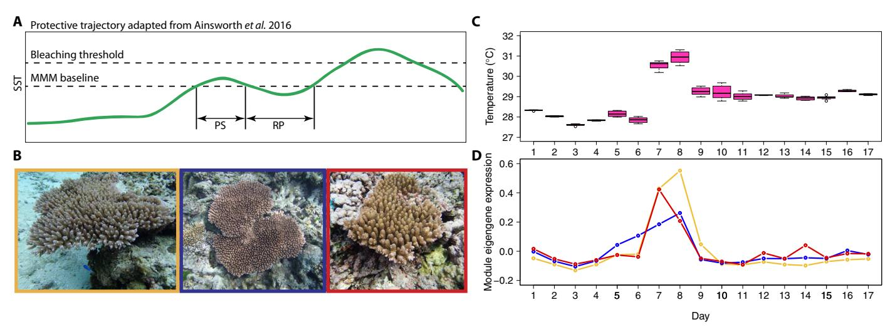
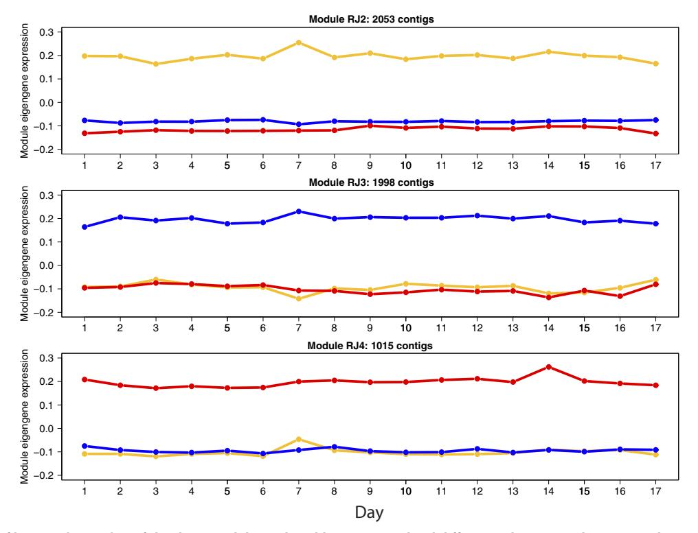
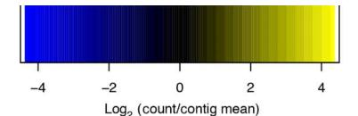
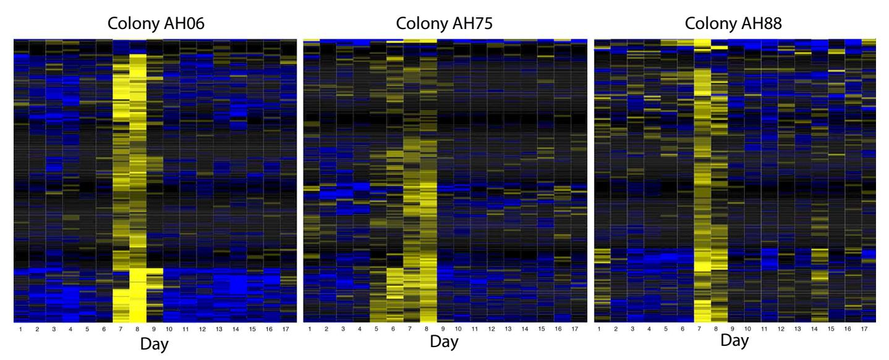
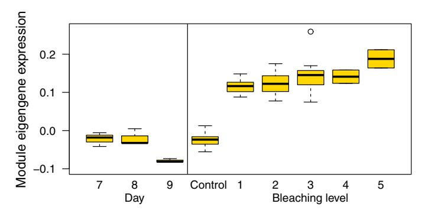

#### MARINE BIOLOGY 2017 © The Authors,

# Tidal heat pulses on a reef trigger a fine-tuned transcriptional response in corals to maintain homeostasis

Lupita J. Ruiz-Jones\* and Stephen R. Palumbi

For reef-building corals, extreme stress exposure can result in loss of endosymbionts, leaving colonies bleached. However, corals in some habitats are commonly exposed to natural cycles of sub-bleaching stress, often leading to higher stress tolerance. We monitored transcription in the tabletop coral Acropora hyacinthus daily for 17 days over a strong tidal cycle that included extreme temperature spikes, and show that increases in temperature above 30.5°C triggered a strong transcriptional response. The transcriptomic time series data allowed us to identify a set of genes with coordinated expression that were activated only on days with strong tides, high temperature, and large diel pH and oxygen changes. The responsive genes are enriched for gene products essential to the unfolded protein response, an ancient cellular response to endoplasmic reticulum stress. After the temporary heat pulses passed, expression of these genes immediately decreased, suggesting that homeostasis was restored to the endoplasmic reticulum. In a laboratory temperature stress experiment, we found that the expression of these environmentally responsive genes increased as corals bleached, showing that the unfolded protein response becomes more intense during more severe stress. Our results point to the unfolded protein response as a first line of defense that acroporid corals use when coping with environmental stress on the reef, thus enhancing our understanding of coral stress physiology during a time of major concern for reefs.

some rights reserved; exclusive licensee American Association for the Advancement of Science. Distributed under a Creative Commons Attribution NonCommercial License 4.0 (CC BY-NC).

## INTRODUCTION

The environmental stress continuum represents the range of abiotic conditions that can trigger a stress response in an organism. For scleractinian corals, the conditions along this continuum range from temporary mild stress, such as a spike in temperature in the middle of the day, to chronic stress (1–8) manifested as coral bleaching [reviewed by Douglas (9) and Lesser (10)]. Repeated exposure to temporary mild stress on the reef may increase coral thermal tolerance, via acclimatization, and provide a mechanism for corals to withstand chronic stress that typically results in bleaching (3, 11–13). Physiological and transcriptomic data show that coral acclimatization can occur within 1 to 2 weeks (14, 15), suggesting that even weeklong increases in mean water temperature might play a protective role for corals on future reefs. Recently, Ainsworth and colleagues (16) showed that many of the thermal stress events on the Great Barrier Reef occurred in what they termed a "protective" pattern, where an initial pulse of warm water potentially a trigger for adaptive acclimatization—is followed later by a stronger warm water episode (that is, temperatures exceed the local bleaching threshold) (16).

Although many studies previously described a strong transcriptional response in corals to bleaching (11, 13–15, 17–21), none investigated whether natural tidal heat pulses on the reef cause transcriptomic changes, what temperatures are required, or what physiological mechanisms are subject to change. This information will be highly useful in identifying future temperature trajectories that might continue to provide the kind of bleaching protection that Ainsworth et al. (16) describe.

For many organisms, stress triggers a physiological response that begins with alterations in gene transcription (22–24). This pattern is seen in corals before (17, 18) and during bleaching in the laboratory (11, 13–15, 17, 19–21). A handful of field-based studies identified significant gene expression alterations in corals faced with chronic

environmental stress or disease outbreaks (25–27). However, identifying the environmental conditions that trigger the initial disruption to organismal homeostasis requires monitoring the same coral individuals as they experience diverse degrees of environmental stress. Using high-resolution transcriptomic and environmental profiling, we monitored transcriptional regulation in coral colonies on a reef exposed to a natural short-term pulse of warm water, analogous to the prestress period followed by a recovery period in the protective trajectory reported by Ainsworth et al. (16) (Fig. 1A). We used the water temperature changes that occur across a typical 2-week tidal cycle to impose a variety of daily environmental extremes on corals, monitored the environment, and tested for transcriptional changes. We selected a highly variable back-reef pool of Ofu Island, American Samoa, that has been shown to reach 34° to 35°C during summer daytime low tides (3, 13). Similar high variability reef environments exist throughout the Pacific, such as Palmyra Atoll (4, 5, 28); Davies Reef, Great Barrier Reef (29); Heron Island (8); and Kaneohe Bay, Hawaii (30). We focused on colonies of the tabletop coral Acropora hyacinthus living in the U.S. National Park of American Samoa, where previous studies found that coral colonies adjusted to thermal stress conditions through physiological acclimatization and genetic adaptation (12, 31, 32). Our field experiment identified a pivotal temperature, above which these corals mounted a strong but temporary transcriptional response, and a group of genes with coordinated expression that increased only on days with the highest temperatures. This set of genes is enriched for unfolded protein response (UPR) proteins. The UPR is an ancient eukaryotic cellular pathway involved in detecting and responding to the early stages of physiological stress. In corals, this mechanism may have been co-opted as a first line of defense to heat stress.

#### RESULTS

## Tidally driven environmental change

We monitored corals and their environment from 14 to 30 August 2013 as the timing and magnitude of daytime low tides shifted (fig. S1). These shifts exposed our sampled colonies (Fig. 1B) to environmental change.

Department of Biology, Hopkins Marine Station, Stanford University, 120 Ocean View Boulevard, Pacific Grove, CA 93950, USA. \*Corresponding author. Email: gjrj@stanford.edu

Fig. 1. Coral reef temperature and gene module expression profile. (A) Protective temperature trajectory as in the study of Ainsworth et al. (16). PS, prestress period; RP, recovery period; SST, sea surface temperature; MMM, the maximum monthly mean. (B) Three colonies of A. hyacinthusthat were sampled. Gold box (left), AH06; blue box (middle), AH75; red box (right), AH88. (C) Temperature during the 1 hour before transcriptome sampling for each day of the 17-day time series (1300 to 1410; n = 8 time points). Temperature data are the average for the three colonies, which had near-identical temperature profiles (see fig. S5). (D) Expression profile for the UPR and calcium homeostasis module (also known as module RJ9), which was significantly associated with changes in the environment [analysis of variance (ANOVA), false discovery rate (FDR)–corrected, all P < 0.0001]. Expression levels are represented by eigengenes for each day. Each color represents a different colony. Gold, AH06; blue, AH75; red, AH88.

On days 1 and 2 and then again on days 13 and 14, the highest tides occurred around midday, whereas on days 7, 8, and 9, low tides occurred around midday (1208, 1258, and 1348, respectively). The tidal shifts are reflected in monitored conditions during the 1 hour before transcriptome sampling (approximately 1300 to 1410). Midday low tides on days 7 and 8 resulted in high temperature, pH, and dissolved oxygen (DO) saturation levels: Temperature reached about 31.5°C (Fig. 1C), pH reached about 8.15, and DO saturation exceeded 200% (fig. S2). As the tide shifted so that low tide occurred after 1400, temperature, pH, and DO saturation decreased to levels similar to those during the first 4 days when tidal conditions were comparable. The magnitude of day-to-night variability in temperature, pH, and DO saturation followed the tidal trend as well. On days 7 and 8, the SDs and ranges for temperature, pH, and DO saturation during the 12 hours before sampling (between 0200 and 1410) were the highest: Day-to-night temperature varied by about 4°C, pH varied by 0.35 units, and DO saturation varied by about 150% (fig. S3). The sampled colonies were not exposed to the air during the low tides, and we did not observe any signs of bleaching during our field experiment.

## Coral transcriptional response

We sampled the coral transcriptomes at approximately 1400 every day for 17 days to identify patterns of transcriptional regulation associated with environmental change. Furthermore, by sampling once a day, we controlled for circadian and day-night gene expression oscillations [for example, see the studies of Levy et al. (33) and Ruiz-Jones and Palumbi (34)]. Across all 51 field samples of A. hyacinthus, there were 17,315 contigs with a mean read depth greater than five. Using the Weighted Gene Correlation Network Analysis (WGCNA) (35) package implemented in R, we identified gene modules, which are groups of co-regulated genes. Studying the dynamics of groups of co-regulated genes provides a more holistic understanding of physiology than studying individual genes (18, 35). We ran an unsigned network analysis so that our modules could include coordinated genes with both positive and negative influences. A parallel test using signed network analysis in WGCNA showed similar results but separated positively and negatively regulated genes into different modules.

In the unsigned network analysis, 63% of contigs analyzed were placed in 1 of 13 modules, which range in size from 45 to 4075 contigs (Table 1 and table S1). Of the contigs assigned to a module, 55% have an absolute module membership of ≥0.70 (Table 1), which is similar to the 46% reported in a recent coral study (18). The gene coexpression analysis shows two strong temporal signatures: transcriptional stability through time and environmentally driven transcriptional regulation.

## Stable expression level differences in genotype-specific modules

There are three coral modules (RJ2, RJ3, and RJ4) that each have <1% of their variance explained by Day (ANOVA, Day FDR-corrected, P > 0.1) (Fig. 2 and table S2). In each of these modules, expression level differences between the colonies are stable over the 17 days: They differ in that each has a different colony with higher eigengene expression than the other two colonies (ANOVA, Genotype FDR-corrected, P < 10−13). Our WGCNA analysis would not have detected any modules that were stable through time at the same expression level in all colonies. The contigs in the three stable, but genotypically variable, modules represent 48% (5066) of contigs that were placed into any module (Table 1). No gene ontology (GO) terms are significantly enriched in these modules. The lack of functional enrichment may be due to the large number of genes in these modules and may not necessarily imply that expression differences across colonies do not result in functional differences. Genotypic differences in gene expression levels are reported in other coral studies (11, 13, 17, 18, 25, 36–41). The temporarily stable expression level differences we observed may be genetically hardwired or stable in the long term. This area of coral transcriptomics merits further investigation.

## Environmentally driven transcriptional regulation of coexpressed genes

We identified three gene modules (RJ9, RJ6, and RJ11) that are significantly associated with changes in the environment (ANOVA,

Table 1. Gene modules, sizes, and number and percent of contigs with a module membership of ≥[0.70]. The WGCNA R package was used to identify gene modules in A. hyacinthus.

| Module | Number of contigs in module | Number of contigs with a module membership of ≤−0.70 | Number of contigs with a module membership of ≥0.70 | Number of contigs with an absolute module membership of ≥0.70 | Percent of contigs with a module membership of ≥[0.70] |
|--------|--------------------------------|------------------------------------------------------------|-----------------------------------------------------------|---------------------------------------------------------------------|--------------------------------------------------------------|
| 1      | 4075                           | 322                                                        | 1837                                                      | 2159                                                                | 53                                                           |
| 2      | 2053                           | 415                                                        | 666                                                       | 1081                                                                | 53                                                           |
| 3      | 1998                           | 258                                                        | 866                                                       | 1124                                                                | 56                                                           |
| 4      | 1015                           | 213                                                        | 386                                                       | 599                                                                 | 59                                                           |
| 5      | 642                            | 29                                                         | 205                                                       | 234                                                                 | 36                                                           |
| 6      | 251                            | 3                                                          | 183                                                       | 186                                                                 | 74                                                           |
| 7      | 185                            | 0                                                          | 115                                                       | 115                                                                 | 62                                                           |
| 8      | 184                            | 11                                                         | 133                                                       | 144                                                                 | 78                                                           |
| 9      | 177                            | 1                                                          | 110                                                       | 111                                                                 | 63                                                           |
| 10     | 89                             | 0                                                          | 70                                                        | 70                                                                  | 79                                                           |
| 11     | 84                             | 0                                                          | 81                                                        | 81                                                                  | 96                                                           |
| 12     | 52                             | 0                                                          | 42                                                        | 42                                                                  | 81                                                           |
| 13     | 46                             | 0                                                          | 45                                                        | 45                                                                  | 98                                                           |

Fig. 2. Expression profiles in A. hyacinthus of the three modules with stable expression level differences between colonies over the 17 days. Expression levels are represented by eigengenes for each day. Each color represents a different colony. Gold, AH06; blue, AH75; red, AH88. The number of contigs in each module is listed above each plot.

FDR-corrected, all P < 0.01) (fig. S4 and table S2). The expression of module RJ9 had a positive relationship to temperature, pH, and DO saturation and a negative relationship to depth (ANOVA, FDRcorrected, all P < 0.0001). Expression of module RJ9 was also significantly associated with the magnitude of day-night variability in temperature, pH, and DO saturation (ANOVA, FDR-corrected, all P < 0.0001) (table S2).

The expression of module RJ6 also had a relationship to temperature and the magnitude of day-night variability in light, temperature, pH, and DO saturation (ANOVA, FDR-corrected, all P < 0.01) (table S2). Colonies AH06 and AH88 increased the expression of module RJ6 on days 7 and 8, whereas colony AH75 only showed a slight increase; however, there was high genotypic variation on other days (fig. S4). The expression of module RJ11 had a relationship to the magnitude of day-night variability in temperature (ANOVA, FDR-corrected, P < 0.01). Module 11 only showed strong induction in colony AH88 on day 7 (fig. S4).

## Nature of the environmental stress response

Of the 177 contigs in module RJ9, 139 have UniProt annotations (78%) and 119 of those are unique. Eight GO terms are enriched in this module (Benjamini-Hochberg–adjusted, P < 0.05) (table S3). Six cellular component terms are associated with the endoplasmic reticulum (ER), including the sarcoplasmic reticulum, and there are two molecular function terms for unfolded protein binding and calcium ion binding. Thirty-seven unique genes are responsible for this enrichment, 14 of which are associated with more than one of the GO terms (table S4). Included in these 37 genes are genes whose protein products are involved in the UPR during ER stress, such as protein folding, calcium ion homeostasis, ER-associated protein degradation, protein translocation, and transcription activation. The molecular chaperones and co-chaperones present are heat shock 70-kDa protein C, heat shock protein 68, heat shock protein 90, two DnaJ homologs, endoplasmin, calreticulin, and hypoxia up-regulated protein 1. There are other genes involved in protein folding: two peptidyl-prolyl cis-trans isomerases and nucleotide exchange factor SIL1. The genes involved in calcium ion binding and calcium homeostasis include sarcoplasmic/endoplasmic reticulum calcium ATPase 2 (SERCA2), calsequestrin-2, calreticulin, calcium-binding protein CML19, reticulocalbin-3, synaptotagmin-4, and synaptotagmin-7. ER degradation–enhancing a-mannosidase– like 1 is involved in ER-associated protein degradation. Two genes are involved in protein translocation: ER-Golgi intermediate compartment protein 1 and nucleotide exchange factor SIL1. The transcription factor cyclic adenosine monophosphate (AMP)–responsive element– binding protein 3–like protein 3 is present in this set of 37 genes; however, cyclic AMP–dependent transcription factor ATF-2 is also found in module RJ9 (table S1). Both are transcription factors that induce the expression of UPR target genes, such as chaperones (42). Hereafter, we refer to this module as the UPR and calcium homeostasis module.

Module 6, which has UniProt annotations for 74% of contigs, is enriched for six GO terms (Benjamini-Hochberg–adjusted, P < 0.05) (table S5). Four molecular function terms are associated with transcription, transcription factor activity, and DNA binding. In addition, there are two biological process terms for the regulation of transcription and RNA metabolic process. Thirty-four unique genes are responsible for the enrichment (table S6). Module 11, with 86% of contigs having UniProt annotations, is not significantly enriched for any GO term.

## Expression profile of the UPR and calcium homeostasis module

The UPR and calcium homeostasis module is comprised of 168 contigs that are positively correlated to each other, and the remaining 5% have negative correlations (that is, they decrease when the other 95%

Fig. 3. Heat maps of the 177 contigs in the UPR and calcium homeostasis module for three colonies of A. hyacinthus. Values are the log2(contig expression on Day/mean contig expression for 17 days). The rows are contigs, and the columns are days.

increase). Because of the large number of positively correlated genes and the positive correlation between eigengene expression and temperature, we consider this module to be a positive response module. Expression of the UPR and calcium homeostasis module was at steady-state levels in colonies AH06 and AH88 until increasing on day 7 when temperatures exceeded 30.5°C. Expression remained high on day 8, when midday temperatures neared 31.5°C, and returned to baseline levels on day 9, when midday temperatures fell below 30°C (Fig. 1, C and D, and fig. S5). In colony AH75, expression began to increase on day 5, peaking on day 8 before returning to baseline levels on day 9 (Fig. 1D). Notwithstanding these genotypic differences, the UPR and calcium homeostasis module showed the highest similarity across all colonies for the environmentally responsive modules.

Expression of the UPR and calcium homeostasis module was the highest in all three colonies on days 7 and 8. There are 177 contigs in this module, as demonstrated by the colony heat maps (Fig. 3). Principal components analyses (PCAs) of these contigs for each colony show that the expression patterns on days 7 and 8 are highly divergent from other days (fig. S6). For colony AH75, days 5 and 6 are also separated from the other days. We are unsure why colony AH75 began increasing expression of this module on day 5. There were no obvious environmental correlates to explain these differences: The three colonies are within 20 m of one another on the same reef, and temperature profiles measured with individual data loggers for each colony were nearly identical during the time series (fig. S5). However, it is typical to see high levels of genotypic variability in expression profiles—in our data set, genotype had a significant effect in 10 of the 13 modules (table S2).

## UPR and calcium homeostasis module induced in high heat stress experiment

A recent laboratory study used gene coexpression network analysis to identify gene modules involved in the heat stress response of A. hyacinthus that are predictive of bleaching outcome (18). In particular, Rose and colleagues (18) found a large group of genes involved in the general heat stress response (module Rose1), as well as two sets of genes that correlate well with differences in bleaching outcome (modules Rose10 and Rose12). Our environmentally responsive modules (UPR and calcium homeostasis module, RJ6, and RJ11) are enriched for genes that Rose and colleagues (18) showed to be predictive of bleaching tolerance (module Rose12), as well as genes in their heat stress cluster (module Rose1), and a group related to DNA repair (module Rose8) (table S7) (Fisher's exact test for overrepresentation, P < 0.005).

We investigated how the UPR and calcium homeostasis module expression we observed in the field on days 7, 8, and 9 compared to levels seen in laboratory bleaching experiments, using data from Seneca and Palumbi (17). We found that as bleaching severity increased, the expression of the UPR and calcium homeostasis module increased, with the most severely bleached corals having the highest expression levels (Fig. 4). Furthermore, expression levels in the field (where bleaching did not occur) did not reach the levels seen in heat-stressed corals. Control samples from Seneca and Palumbi (17) had higher expression of the UPR and calcium homeostasis module than the baseline level in the field-collected samples (for example, day 9), perhaps representing a response of these genes to the stress of experimental handling (Fig. 4).

## DISCUSSION

Using environmental transcriptional profiling and gene coexpression network analysis, we show that tabletop corals in field settings rapidly make transcriptional adjustments when faced with stress far below the threshold that induces bleaching. Our findings document the specific transcriptional changes that occur in A. hyacinthus in a back-reef environment during 2 days of mild stress events. Although we did not test for acclimatization in this experiment, previous studies showed enhanced thermal tolerance in acroporids after 7 to 11 days of similar temperature cycles in laboratory trials (14, 15). In our study, expression changes were clearly visible above a maximum daily temperature of 30.5°C, and expression quickly decreased when temperatures fell below 30°C, suggesting that corals have a fine-tuned response mechanism to maintain homeostasis during periods of environmental stress.

# Temperature spikes trigger transcriptomic response

On days reaching above 30.5°C, the sampled corals all increased expression of the UPR and calcium homeostasis module. On Ofu Island back reefs, corals routinely experience high temperatures but only for brief periods of time. In the area we sampled, temperatures reach or exceed 30.5°C on approximately 85 days in a typical year, for a total of about 2.5% of the time. Although the corals activated the UPR on days above 30.5°C, the response was short lived: The expression returned to baseline levels a day later when temperatures fell below 30°C (Fig. 1, C and D). The fine-tuned expression changes of the UPR and calcium homeostasis module from day to day follow an impulse-like pattern that is typical of expression changes in response to environmental stimuli; there was a temporary spike in expression associated with an environmental stimulus followed by a return to baseline levels once the stimulus was removed (23). Repetitive stress events, such as those that occur during strong midday low tides, may serve to increase coral thermal tolerance (11–13), which is especially important in the lead-up to a bleaching-inducing stress event (16). For example, daily fluctuations from 29° to 31°C for 7 to 11 days induced thermal acclimation in Acropora nana just as strongly as did constant exposure to 31°C (15).

Fig. 4. Expression levels of the UPR and calcium homeostasis module in field-collected and experimentally stressed corals of A. hyacinthus. (Left) Expression values for the field samples on days 7, 8, and 9. (Right) Expression values for the samples from the laboratory experiment by Seneca and Palumbi (17). The bleaching level refers to the level of bleaching in heat-stressed samples. Expression values for controls (n = 35), treated samples that had not bleached (bleaching level 1; n = 8), treated samples that had slightly bleached (bleaching level 2; n = 12), treated samples that had moderately bleached (bleaching level 3; n = 11), treated samples that had visibly bleached (bleaching level 4; n = 2), and treated samples that had severely bleached (bleaching level 5; n = 2) are plotted. In this combined data set, the eigengene values for our field samples are different from the expression levels reported in Fig. 1D, because renormalizing and recalculating eigengene values in comparison with the experimentally stressed corals modify the expression values.

Transcriptomic data from laboratory bleaching experiments with corals from the same back reef (17) show a different pattern at higher temperatures than what we measured on the reef. After a 3-hour exposure to 34°C in the laboratory, genes in the UPR and calcium homeostasis module also increase, but expression levels for unbleached colonies (bleaching level 1 in Fig. 4) are higher than field expression on days 7 and 8. Colonies with substantial bleaching after a 34°C treatment show even higher expression levels of the UPR and calcium homeostasis module (Fig. 4), suggesting that a transient UPR response at low temperatures might convert to a stronger response under more intense stress.

# Environmental correlates of temperature stress

In addition to temperature, other stressors occur on days with strong low tides around midday and midnight: On the nights of days 7 and 8, the corals were exposed to pH 7.78 and DO saturation around 50%. At night, DO levels at the coral boundary layer can be significantly lower than levels in the surrounding water column (43, 44). Furthermore, days 7 and 8 had the highest day-night variability in temperature, pH, and DO saturation, exposing the colonies to a wide range of these variables over a relatively short period of time. The daily variability in pH and DO levels is driven by biogeochemical cycles in the reef (4–6, 28, 45).

## The role of the UPR

The UPR and calcium homeostasis module is enriched for genes associated with the UPR during ER stress. The ER serves three main functions in eukaryotes: It is the site of protein folding for newly synthesized secretory and membrane proteins, with at least one-third of the cell's proteins passing through the ER (46); it stores intracellular calcium ions; and the membrane is the site of lipid and sterol biosynthesis (42). The UPR is an evolutionarily conserved set of signaling pathways that are activated when unfolded proteins accumulate in the ER (47). ER stress can be triggered by environmental stress, point mutations that affect protein folding efficiency, and loss of calcium homeostasis. When the stress is mild, the UPR initiates an adaptive response that restores proteostasis and homeostasis. However, when the stress is more severe and damage is irreparable, the UPR switches to a terminal response that ultimately results in apoptosis (46). As part of the adaptive response, the UPR reduces translation of most proteins in a cell (47) but induces transcription of a specific set of genes, including those that encode ER-resident chaperones and genes for proteins involved in ER-associated protein degradation (48). To reestablish homeostasis in the ER, the adaptive UPR induces changes that increase the ER's protein folding capacity, increase the capacity to clear out misfolded proteins from the ER through the up-regulation of ER-associated protein degradation, and globally reduce de novo protein synthesis to minimize protein congestion in the ER (46).

There are multiple genes in the UPR and calcium homeostasis module that encode protein products localized to the ER and involved in the UPR that are up-regulated during the strong midday low tides. There are ER-resident chaperones, such as heat shock 70 kDa, and co-chaperones, such as DnaJ homolog and calreticulin (42). Furthermore, ER degradation–enhancing a-mannosidase–like 1, which is essential to the ER-associated protein degradation activity of the UPR and is up-regulated during ER stress (49), is present in the UPR and calcium homeostasis module. One of the transcription factors that induce expression of several chaperones as part of the UPR is cyclic AMP– dependent transcription factor ATF-2 (42). This gene is present in the

UPR and calcium homeostasis module, suggesting an association between its expression and those of the chaperones. There is also a second ER-localized transcription factor in the UPR and calcium homeostasis module, cyclic AMP–responsive element–binding protein 3–like protein 3, that activates some UPR target genes during ER stress (50). In our field experiment on corals, increased expression of multiple genes, whose protein products are involved in the UPR, suggests that a cellular response was under way to restore homeostasis to the ER. The high temperatures during the strong midday low tides were likely a mild stress that triggered a temporary loss of homeostasis in the ER and caused the induction of the UPR in A. hyacinthus.

Our field results also suggest increased calcium ion–binding activity during the strong midday low tides. Calcium-binding proteins are an essential part of the ER's function because the cell's major store of intracellular calcium ions and ER stress can disrupt intracellular calcium homeostasis (42). Several studies show that genes involved in calcium ion signaling and homeostasis are differentially expressed in heat-stressed corals (13, 14, 19–21). In A. hyacinthus, we identified at least seven different genes in the UPR and calcium homeostasis module that are involved in calcium ion binding and calcium homeostasis: calcium-binding protein CML19, calreticulin, calsequestrin-2, calumenin, reticulocalbin-3, SERCA2, synaptotagmin-4, and synaptotagmin-7. SERCA2 is involved in controlling the influx and efflux of calcium ions in the ER and is activated by a UPR-associated transcription factor (42). The abundance of calreticulin, a calcium ion–binding chaperone in the ER, has a positive relationship with the concentration of calcium ions in the ER (51). Calumenin is a calcium-binding protein localized to the ER and involved in protein folding (52). In Acropora millepora, calumenin expression decreased in colonies that bleached after an extreme heat stress but increased in thermally acclimated colonies that did not bleach (14), possibly indicating that the thermally acclimated colonies experienced sub-bleaching stress, as we see a similar pattern in the field. The presence of multiple calcium ion–binding proteins in the UPR and calcium homeostasis module, as well as their up-regulation during the strong midday low tides, further supports the finding that homeostasis in the ER was disrupted. Our interpretations are based on the expression pattern and functional enrichment of the UPR and calcium homeostasis module. Future investigation of essential UPR genes in corals, through in situ hybridization and proteomics, would be valuable.

## Dynamic switching of the UPR and bleaching

A key feature of the UPR is that it switches to a terminal response when the stress is extreme and/or persistent (that is, it becomes chronic) and the damage is irremediable. The balance between maintaining an adaptive UPR and switching to the terminal UPR involves the signaling dynamics of the UPR sensors.When ERstress becomes chronic, the PERK and IRE1a signaling proteins induce apoptosis through multiple cell death networks, including making changes to several caspases and activation of the canonical apoptosis pathway in the mitochondria (46). Ainsworth and colleagues (16) found that expression levels of six apoptosis genes in corals of Acropora aspera exposed to their protective temperature profile were more similar to nonstressed corals than corals exposed to their more severe heat stress that induced bleaching. Similarly, in our data, there are no signs that apoptosis was initiated—genes involved in apoptosis did not increase expression during the strong midday low tides. However, multiple apoptosis-related genes are upregulated when corals are experimentally bleached, suggesting that the apoptosis pathway is part of bleaching physiology (13, 14, 17, 19–21). The absence of a significant transcriptional signal of apoptosis in our field experiment leads us to conclude that the corals were exposed to a mild stress at the lower end of the environmental stress continuum and that the UPR remained capable of restoring proteostasis and homeostasis (that is, it remained adaptive).

When corals are exposed to environmental stress, the ER may be the first cellular component to lose homeostasis, and ER stress may represent the first type of cellular stress that occurs. Activation of the UPR to cope with ER stress then represents the initial physiological response corals have to restore homeostasis to the ER and the organism. Stress-induced genes, such as HSP70, tend to ramp up expression as stress is amplified or persists (53–55). In corals, thousands of additional genes are up-regulated after experimental bleaching (17). The fact that expression of the UPR and calcium homeostasis module is higher in bleached corals than our field corals and that thousands of additional genes are activated in bleached corals suggests that our field observation of the UPR represents the first line of defense corals initiate when coping with environmental stress. However, if the environmental stress persists and homeostasis is not restored to the ER, perhaps the UPR switches to a terminal response, which is then associated with the initiation of the physiological adjustments that are made during bleaching.

Our hypothesis is that the UPR, with its dynamic ability to switch from an adaptive to a terminal response, is a first line of defense when corals are initially coping with environmental stress. However, if homeostasis cannot be restored, then the UPR would play an important role in initiating bleaching. Whether the cellular mechanisms known to regulate the terminal branch of the UPR in model systems also contribute to the physiological events leading to bleaching is a topic for future investigation that may elucidate some of the less understood mechanisms of bleaching.

## Protective heat pulses and bleaching acclimatization

Our data do not fully explore the induction of heat tolerance from protective warm water pulses. Our use of a tidal cycle as a proxy for a natural heating event did not include enough days with temperature extremes to expect substantial acclimatization [see the studies of Bellantuono et al. (14) and Bay and Palumbi (15)], nor was it followed by a period with temperatures above the local bleaching threshold. We also followed only one tidal cycle with a limited range of temperature extremes. Nevertheless, our data suggest that transient temperatures above 30.5°C trigger the first physiological response to stress, compared to the average summer water temperature of about 29.3°C for this location (1). For this species, bleaching does not occur until about 33°C for temperature-sensitive colonies and 34°C for acclimatized individuals (12). These values are difficult to put into context with the predictions of current bleaching models that focus on degree heating weeks (56), because current models emphasize broader temperature profiles collected remotely over longer time intervals than our coral temperature loggers. However, as the ability to characterize local reefs and their temperature microhabitats improves, it may be possible to define the daily temperature rhythms that are associated with protective heat signatures that lead to short-term heat tolerance (16).

Our data suggest that there may be an additional type of protective thermal signature. On Ofu Island, strong low tides tend to be in the middle of the day year-round, exposing corals in the back reef to large swings in temperature. In laboratory experiments, these swings are just as effective at inducing thermal acclimation as are chronic high temperatures (15). The synchrony of low tides and midday high temperature has been offered as one of the reasons why Ofu corals are so

temperature-resilient (3). Because these facets of the tidal cycles are broadly predictable and stable, it may be possible to create a map of where tidal protection is likely for corals.

#### CONCLUSIONS

Temporary heat pulses during strong midday low tides on the reef triggered transcriptional changes and the activation of the UPR in A. hyacinthus. Repeated exposure to similar short-term spikes in temperature may increase coral thermal tolerance and may be especially beneficial in the lead-up to a chronic stress event. Our field experiment highlights the role of the UPR during these short-term stress events and suggests that it is the first line of defense corals initiate when coping with environmental stress. Whether this transcriptional mechanism is common across other coral species, in particular, those living in less environmentally variable reefs, is a topic for future investigation. The rapid expression changes of UPR genes from day to day in A. hyacinthus reveal the high synchrony coral physiology has with the surrounding environment. However, the physiological capacity of corals to quickly bounce back from short-term stress events and build up acclimatization will be tested in future oceans.

## MATERIALS AND METHODS

## Experimental design

We selected three colonies of A. hyacinthus [cryptic species E; see the study of Ladner and Palumbi (57)] living in the back reef of Ofu Island, American Samoa, for our time series gene expression study. They are identified as colonies AH06, AH75, and AH88. These colonies are a small subset of the colonies of A. hyacinthus that our group has been monitoring for several years [see previous studies (3, 12, 13, 32)]. From previous transcriptomic analyses of these same three colonies (13, 32), we know that they all host mostly clade D Symbiodinium. From genomewide single-nucleotide polymorphism analysis, we know that they are not clones and are not more closely related genetically to each other than to other colonies in the population (32). These colonies have been monitored for size and daily temperature since 2010. The colonies are located within 20 m of each other and at similar depths (within 1 m). For 17 consecutive days (14 to 30 August 2013), we sampled the transcriptomes of the three colonies at 1400. Our intent for sampling once a day was to control for oscillating expression patterns due to circadian rhythm [for example, see the study of Levy et al. (33)] and day-night gene regulation [for example, see the study of Ruiz-Jones and Palumbi (34)]. It took approximately 10 min to sample the colonies (American Samoan Department of Marine and Wildlife Resources permit number 2012-65 and National Park Service Scientific Research and Collecting Permit number NPSA-2012-SCI-0008). We selected a sample time of 1400 because the highest temperatures in the Ofu back reef typically occur between 1300 and 1500, and this is also the time when pH reaches maximum values(fig. S7). At each sampling time point, a branch was cut from the perimeter of the colony 1 to 3 cm from the cut site made the previous day, moving counterclockwise around the colony. Cut branches were placed in Ziploc bags and transported to the beach, where they were individually placed in 5-ml vials of RNAlater. Fresh RNAlater was added to each vial within 30 min of collection upon return to the field laboratory. Samples were stored at 4°C for 24 hours and then placed in −20°C until being transported to Hopkins Marine Station, Pacific Grove, CA, where they were stored at −80°C until RNA extraction.

## Environmental data

Temperature and light loggers (HOBO Pendant), placed within 30 cm of each colony, recorded every 10 min during the time series. A continuous-recording pH sensor (SeaFET), which recorded pH every 20 min, was located within 30 m of the colonies. A discrete water sample was collected within 1 m of the pH sensor 48 hours after deployment for a vicarious calibration. These samples were analyzed for total dissolved inorganic carbon (CM5015 Coulometer, UIC Inc.), total alkalinity (TitroLine 6000, SI Analytics), and salinity (3200 Conductivity Instrument, YSI). For the measurements of total dissolved inorganic carbon and total alkalinity, we used certified reference material standards provided by A. Dickson (Scripps Institution of Oceanography, La Jolla, CA). The total dissolved inorganic carbon, total alkalinity, salinity, and temperature of the seawater sample at the time of collection were used to calculate the pH of the discrete water sample using the R package seacarb (v3.0). The pH of the discrete water sample was applied as a vicarious calibration to the pH sensor. A YSI data sonde (model 6600 V2-4), positioned within 10 m of the colonies, recorded DO saturation and depth every 10 min for the first 14 days of the experiment.

## mRNA extraction and transcriptome sequencing

For each of 17 sampling days, a branch from each colony was prepared for transcriptomic analysis via RNA sequencing. Total RNA was extracted from each sample with TRIzol (Life Technologies). Total mRNA was then separated from the total RNA and complementary DNA (cDNA) synthesized following the manufacturer's instructions (Illumina TruSeq RNA Sample Prep Kit v2). Because lanes in the flow cell were multiplexed, adapters were used to identify samples.

After quantification of DNA concentration (Qubit, Life Technologies), the samples were submitted to the University of Utah Microarray and Genomic Analysis Core Facility. At the Core Facility, the concentration and quality of the 51 cDNA libraries were determined with an Agilent Bioanalyzer DNA 1000 chip and by quantitative polymerase chain reaction. The 51 samples were divided into three groups of 13 and one group of 12 that were pooled and multiplexed together in one lane. The four lanes were run on the same flow cell of an Illumina HiSeq 2000 with 50-cycle single-end read sequencing. All reads per sample were processed following the quality check and filtering steps outlined by De Wit et al. (58). The 51 samples represented 17 time points for three colonies.

Reads that passed specific quality checks (duplicate reads removed, length of >20 base pairs, and quality score of >20) were mapped with Bowtie 2 (version 2.2.3) (59) against a reference transcriptome for A. hyacinthus, which is composed of 33,496 contigs (14.9 MB) (13). The number of reads that map to each coral contig provides a measure of gene expression for that contig. After duplicate reads were removed and before read count normalization, the number of A. hyacinthusreads per sample ranged from 733,000 to 1.74 million.

## Read count normalization and filtering

The package DESeq v1.12.0 (60) was used in R (v3.1.1, CRAN.R-project. org) to normalize the raw read counts. The normalization procedure involves the following: (i) For each contig, the geometric mean across all samples was calculated; (ii) for each sample, every contig's raw read value was divided by the geometric mean for that contig; (iii) for each sample, the median of all the ratios of raw read number over geometric mean per contig was used as a size factor; and (iv) all raw read values for a sample were divided by the sample's size factor to produce the

normalized read value. After normalization, we filtered for contigs with a mean read depth greater than five across all 51 samples. Of the 33,496 contigs present in the reference transcriptome for A. hyacinthus, 17,315 contigs met our cutoff and were used in subsequent analyses.

## Gene module identification

The WGCNA (v1.48) package was used in R (v3.1.1) to identify modules of coexpressed genes based on their correlated expression patterns (35). Beginning with the filtered data set of 17,315A. hyacinthus contigs, we ran an automatic network construction analysis in WGCNA and included expression data for all three colonies (17 time points each) so that the clustering analysis was done across all 51 samples and not individually for each colony. We used unsigned Pearson correlations with a weighting power of 14 and four blocks ranging in size from 3088 to 4996 contigs to identify modules. We chose an unsigned analysis to avoid making assumptions about the types of gene networks we expected to find in our data. With the unsigned analysis, our modules contained genes that are coordinated and can have either a negative or positive influence on the gene networks they are part of. Our minimum module size cutoff was 30 contigs. The daily expression level of a module in each colony is represented by an eigengene, which is the first principal component of the normalized read counts of all the contigs in that module. The module membership for each contig is the correlation between the contig's expression and the eigengene of the module to which it is assigned (35). For each colony, we identified shifts in expression from day to day for the UPR and calcium homeostasis module using PCA with the prcomp function implemented in R. Heat maps of the UPR and calcium homeostasis module were made with the heatmap.2 function of gplots implemented in R.

## Statistical analysis

To characterize the environmental conditions at the time of transcriptome sampling, we calculated the 1-hour mean before sampling (1300 to 1410) for light intensity (photosynthetically active radiation), temperature (°C), pH, DO saturation (%), and depth (m) (for depth, we used the mean from 1351 to 1411). We quantified the magnitude of day-to-night environmental variability each day by calculating the SD and range for the same five environmental variables during the 12 hours before sampling (0200 to 1410).

To determine whether there were transcriptional changes associated with environmental change from day to day inA. hyacinthus, we looked for changes in module expression that had a relationship to changes in the environment. We used the trait heat map function in WGCNA to examine the correlations between module eigengenes across all 51 samples and the mean environmental conditions during the 1 hour before sampling for light intensity, temperature, pH, DO saturation, and depth, and also the day-night variability of these variables (SD for the 12 hours before sampling) (see fig. S8). This analysis does not take Genotype into account. We then used ANOVAs in R (aov function) to test for the significance of the same environmental variables in addition to Genotype and Day on module eigengene expression. We report the P values from the ANOVAs because these analyses take Genotype into account. An FDR correction using the Benjamini-Hochberg method was applied to all tests with the built-in p.adjust function in R (61).

Functional enrichment analyses of gene modules were done with the Database for Annotation, Visualization and Integrated Discovery (DAVID v6.7) (62, 63). Using the functional annotation tool in DAVID, we tested for overrepresentation in our gene modules of GO terms and KEGG (Kyoto Encyclopedia of Genes and Genomes) pathways at P < 0.05 after Benjamini-Hochberg correction. Our background list was composed of 13,308 contigs from our filtered data set of 17,315 contigs that had UniProt annotations.

Transcriptomic studies were recently published for A. hyacinthus from the same back reef in American Samoa, where our field experiment was conducted. In one study, the transcriptional response of single genes to experimental bleaching conditions was described (17). Rose and colleagues (18) assembled these data into coexpression gene modules (modules Rose1 to Rose23) and reported module-specific responses to bleaching conditions. We tested our gene modules for overrepresentation of genes identified by Rose and colleagues (18) to be in modules involved in the coral heat stress response and bleaching using a Fisher's exact test implemented in R.

To investigate the relationship between our field expression levels of the UPR and calcium homeostasis module and levels seen during experimentally induced bleaching, we normalized the raw read counts of our field samples and raw read counts from 70 heated and control samples (35 from each treatment; included only the 5-hour time point) from Seneca and Palumbi (17) using DE-Seq2 v1.8.1 implemented in R (64). We then identified the contigs for our UPR and calcium homeostasis module in the combined normalized data set and calculated eigengenes for both the field and experimental samples using WGCNA. In this combined data set, the eigengene values for our field samples are different from the expression levels in Fig. 1D, because renormalizing and recalculating eigengene values in the comparison with the experimentally stressed corals modify the expression values. We categorized the 35 heated samples into those that bleached severely (visual bleaching score, 5; n = 2), visibly (visual bleaching score, 4; n = 2), moderately (visual bleaching score, 3; n = 11), slightly (visual bleaching score, 2; n = 12), and not at all (visual bleaching score, 1; n = 8). Using boxplots, we examined the expression levels of the UPR and calcium homeostasis module for each of these bleaching states, the controls (n = 35), and our three field-collected samples on days 7, 8, and 9.

## SUPPLEMENTARY MATERIALS

Supplementary material for this article is available at [http://advances.sciencemag.org/cgi/](http://advances.sciencemag.org/cgi/content/full/3/3/e1601298/DC1) [content/full/3/3/e1601298/DC1](http://advances.sciencemag.org/cgi/content/full/3/3/e1601298/DC1)

fig. S1. Light intensity, temperature, and pH over the 17 days, and DO saturation and depth for the first 14 days of the time series.

fig. S2. Temperature, pH, and DO saturation during the 1 hour before transcriptome sampling for each day of the 17-day experiment.

fig. S3. The magnitude of day-to-night variability in temperature, pH, and DO saturation for the time series.

fig. S4. Expression profiles in A. hyacinthus of the three environmentally responsive modules during the time series.

fig. S5. Temperature profiles during the time series for each colony of A. hyacinthus.

fig. S6. Results from the PCA of the 177 contigs in the UPR and calcium homeostasis module for each colony of A. hyacinthus.

fig. S7. Minimum, mean, and maximum temperature and pH for each time point in a day. fig. S8. Trait heat map of the correlations between module eigengene values and the environmental variables.

table S1. Contigs in each of the 13 modules for A. hyacinthus and their module membership. table S2. Results from ANOVA tests looking at the relationship of module expression in A. hyacinthus to multiple factors.

table S3. Functional enrichment results for the UPR and calcium homeostasis module in A. hyacinthus.

table S4. The 37 unique functional enrichment genes for the UPR and calcium homeostasis module in A. hyacinthus.

table S5. Functional enrichment results for module RJ6 in A. hyacinthus.

table S6. The 34 unique functional enrichment genes for module RJ6 in A. hyacinthus. table S7. The number of contigs in modules RJ6, RJ9, and RJ11 that are present in each of the gene modules identified by Rose and colleagues (18).

## REFERENCES AND NOTES

- 1. P. Craig, C. Birkeland, S. Belliveau, High temperatures tolerated by a diverse assemblage of shallow-water corals in American Samoa. Coral Reefs 20, 185–189 (2001).
- 2. A. C. Baker, P. W. Glynn, B. Riegl, Climate change and coral reef bleaching: An ecological assessment of long-term impacts, recovery trends and future outlook. Estuarine Coastal Shelf Sci. 80, 435–471 (2008).
- 3. T. Oliver, S. R. Palumbi, Do fluctuating temperature environments elevate coral thermal tolerance? Coral Reefs 30, 429–440 (2011).
- 4. G. E. Hofmann, J. E. Smith, K. S. Johnson, U. Send, L. A. Levin, F. Micheli, A. Paytan, N. N. Price, B. Peterson, Y. Takeshita, P. G. Matson, E. D. Crook, K. J. Kroeker, M. C. Gambi, E. B. Rivest, C. A. Frieder, P. C. Yu, T. R. Martz, High-frequency dynamics of ocean pH: A multi-ecosystem comparison. PLOS ONE 6, e28983 (2011).
- 5. N. N. Price, T. R. Martz, R. E. Brainard, J. E. Smith, Diel variability in seawater pH relates to calcification and benthic community structure on coral reefs. PLOS ONE 7, e43843 (2012).
- 6. D. A. Koweek, R. B. Dunbar, S. G. Monismith, D. A. Mucciarone, C. Brock Woodson, L. Samuel, High-resolution physical and biogeochemical variability from a shallow back reef on Ofu, American Samoa: An end-member perspective. Coral Reefs 34, 979–991 (2015).
- 7. J. M. Gove, G. J. Williams, M. A. McManus, S. F. Heron, S. A. Sandin, O. J. Vetter, D. G. Foley, Quantifying climatological ranges and anomalies for pacific coral reef ecosystems. PLOS ONE 8, e61974 (2013).
- 8. D. I. Kline, L. Teneva, C. Hauri, K. Schneider, T. Miard, A. Chai, M. Marker, R. Dunbar, K. Caldeira, B. Lazar, T. Rivlin, B. G. Mitchell, S. Dove, O. Hoegh-Guldberg, Six month in situ high-resolution carbonate chemistry and temperature study on a coral reef flat reveals asynchronous pH and temperature anomalies. PLOS ONE 10, e0127648 (2015).
- 9. A. E. Douglas, Coral bleaching––How and why? Mar. Pollut. Bull. 46, 385–392 (2003).
- 10. M. P. Lesser, in Coral Reefs: An Ecosystem in Transition, Z. Dubinsky, N. Stambler, Eds. (Springer, 2010), pp. 405–419.
- 11. C. D. Kenkel, E. Meyer, M. V. Matz, Gene expression under chronic heat stress in populations of the mustard hill coral (Porites astreoides) from different thermal environments. Mol. Ecol. 22, 4322–4334 (2013).
- 12. S. R. Palumbi, D. J. Barshis, N. Traylor-Knowles, R. Bay, Mechanisms of reef coral resistance to future climate change. Science 344, 895–898 (2014).
- 13. D. Barshis, J. T. Ladner, T. A. Oliver, F. O. Seneca, N. Traylor-Knowles, S. R. Palumbi, Genomic basis for coral resilience to climate change. Proc. Natl. Acad. Sci. U.S.A. 110, 1387–1392 (2013).
- 14. A. J. Bellantuono, C. Granados-Cifuentes, D. J. Miller, O. Hoegh-Guldberg, M. Rodriguez-Lanetty, Coral thermal tolerance: Tuning gene expression to resist thermal stress. PLOS ONE 7, e50685 (2012).
- 15. R. A. Bay, S. R. Palumbi, Rapid acclimation ability mediated by transcriptome changes in reef-building corals. Genome Biol. Evol. 7, 1602–1612 (2015).
- 16. T. D. Ainsworth, S. F. Heron, J. C. Ortiz, P. J. Mumby, A. Grech, D. Ogawa, C. M. Eakin, W. Leggat, Climate change disables coral bleaching protection on the Great Barrier Reef. Science 352, 338–342 (2016).
- 17. F. O. Seneca, S. R. Palumbi, The role of transcriptome resilience in resistance of corals to bleaching. Mol. Ecol. 24, 1467–1484 (2015).
- 18. N. H. Rose, F. O. Seneca, S. R. Palumbi, Gene networks in the wild: Identifying transcriptional modules that mediate coral resistance to experimental heat stress. Genome Biol. Evol. 8, 243–252 (2016).
- 19. M. K. DeSalvo, C. R. Voolstra, S. Sunagawa, J. A. Schwarz, J. H. Stillman, M. A. Coffroth, A. M. Szmant, M. Medina, Differential gene expression during thermal stress and bleaching in the Caribbean coral Montastraea faveolata. Mol. Ecol. 17, 3952–3971 (2008).
- 20. M. DeSalvo, S. Sunagawa, C. Voolstra, M. Medina, Transcriptomic responses to heat stress and bleaching in the elkhorn coral Acropora palmata. Mar. Ecol. Prog. Ser. 402, 97–113 (2010).
- 21. P. Kaniewska, C.-K. K. Chan, D. Kline, E. Y. S. Ling, N. Rosic, D. Edwards, O. Hoegh-Guldberg, S. Dove, Transcriptomic changes in coral holobionts provide insights into physiological challenges of future climate and ocean change. PLOS ONE 10, e0139223 (2015).
- 22. G. Gibson, The environmental contribution to gene expression profiles. Nat. Rev. Genet. 9, 575–581 (2008).
- 23. N. Yosef, A. Regev, Impulse control: Temporal dynamics in gene transcription. Cell 144, 886–896 (2011).

- 24. L. López-Maury, S. Marguerat, J. Bähler, Tuning gene expression to changing environments: From rapid responses to evolutionary adaptation. Nat. Rev. Genet. 9, 583–593 (2008).
- 25. F. O. Seneca, S. Forêt, E. E. Ball, C. Smith-Keune, D. J. Miller, M. J. H. van Oppen, Patterns of gene expression in a scleractinian coral undergoing natural bleaching. Mar. Biotechnol. 12, 594–604 (2010).
- 26. J. H. Pinzon, B. Kamel, C. A. Burge, C. Drew Harvell, M. Medina, E. Weil, L. D. Mydlarz, Whole transcriptome analysis reveals changes in expression of immune-related genes during and after bleaching in a reef-building coral. R. Soc. Open Sci. 2, 140214 (2015).
- 27. D. A. Anderson, M. E. Walz, E. Weil, P. Tonellato, M. C. Smith, RNA-Seq of the Caribbean reef-building coral Orbicella faveolata (Scleractinia-Merulinidae) under bleaching and disease stress expands models of coral innate immunity. PeerJ 4, e1616 (2016).
- 28. D. Koweek, R. B. Dunbar, J. S. Rogers, G. J. Williams, N. Price, D. Mucciarone, L. Teneva, Environmental and ecological controls of coral community metabolism on Palmyra Atoll. Coral Reefs 34, 339–351 (2014).
- 29. R. Albright, C. Langdon, K. R. N. Anthony, Dynamics of seawater carbonate chemistry, production, and calcification of a coral reef flat, central Great Barrier Reef. Biogeosciences 10, 6747–6758 (2013).
- 30. Ò. Guadayol, N. J. Silbiger, M. J. Donahue, F. I. M. Thomas, Patterns in temporal variability of temperature, oxygen and pH along an environmental gradient in a coral reef. PLOS ONE 9, e85213 (2014).
- 31. D. Barshis, J. H. Stillman, R. D. Gates, R. J. Toonen, L. W. Smith, C. Birkeland, Protein expression and genetic structure of the coral Porites lobata in an environmentally extreme Samoan back reef: Does host genotype limit phenotypic plasticity? Mol. Ecol. 19, 1705–1720 (2010).
- 32. R. A. Bay, S. R. Palumbi, Multilocus adaptation associated with heat resistance in reef-building corals. Curr. Biol. 24, 2952–2956 (2014).
- 33. O. Levy, P. Kaniewska, S. Alon, E. Eisenberg, S. Karako-Lampert, L. K. Bay, R. Reef, M. Rodriguez-Lanetty, D. J. Miller, O. Hoegh-Guldberg, Complex diel cycles of gene expression in coral-algal symbiosis. Science 331, 175 (2011).
- 34. L. J. Ruiz-Jones, S. R. Palumbi, Transcriptome-wide changes in coral gene expression at noon and midnight under field conditions. Biol. Bull. 228, 227–241 (2015).
- 35. P. Langfelder, S. Horvath, WGCNA: An R package for weighted correlation network analysis. BMC Bioinformatics 9, 559 (2008).
- 36. C. Granados-Cifuentes, A. J. Bellantuono, T. Ridgway, O. Hoegh-Guldberg, M. Rodriguez-Lanetty, High natural gene expression variation in the reef-building coral Acropora millepora: Potential for acclimative and adaptive plasticity. BMC Genomics 14, 228 (2013).
- 37. N. R. Polato, N. S. Altman, I. B. Baums, Variation in the transcriptional response of threatened coral larvae to elevated temperatures. Mol. Ecol. 22, 1366–1382 (2013).
- 38. E. Meyer, S. Davies, S. Wang, B. L. Willis, D. Abrego, T. E. Juenger, M. V. Matz, Genetic variation in responses to a settlement cue and elevated temperature in the reef-building coral Acropora millepora. Mar. Ecol. Prog. Ser. 392, 81–92 (2009).
- 39. L. K. Bay, H. B. Nielsen, H. Jarmer, F. Seneca, M. J. H. van Oppen, Transcriptomic variation in a coral reveals pathways of clonal organisation. Mar. Genomics 2, 119–125 (2009).
- 40. L. K. Bay, K. E. Ulstrup, H. B. Nielsen, H. Jarmer, N. Goffard, B. L. Willis, D. J. Miller, M. J. H. van Oppen, Microarray analysis reveals transcriptional plasticity in the reef building coral Acropora millepora. Mol. Ecol. 18, 3062–3075 (2009).
- 41. G. B. Dixon, S. W. Davies, G. V. Aglyamova, E. Meyer, L. K. Bay, M. V. Matz, Genomic determinants of coral heat tolerance across latitudes. Science 348, 1460–1462 (2015).
- 42. M. Schröder, Endoplasmic reticulum stress responses. Cell. Mol. Life Sci. 65, 862–894 (2007).
- 43. N. Shashar, Y. Cohen, Y. Loya, Extreme diel fluctuations of oxygen in diffusive boundary layers surrounding stony corals. Biol. Bull. 185, 455–461 (1993).
- 44. M. Kühl, Y. Cohen, T. Dalsgaard, B. B. Jorgensen, N. P. Revsbech, Microenvironment and photosynthesis of zooxanthellae in scleractinian corals studied with microsensors for O2, pH and light. Mar. Ecol. Prog. Ser. 117, 159–172 (1995).
- 45. J. E. Smith, N. N. Price, C. E. Nelson, A. F. Haas, Coupled changes in oxygen concentration and pH caused by metabolism of benthic coral reef organisms. Mar. Biol. 160, 2437–2447 (2013).
- 46. C. Hetz, E. Chevet, S. A. Oakes, Proteostasis control by the unfolded protein response. Nat. Cell Biol. 17, 829–838 (2015).
- 47. P. Walter, D. Ron, The unfolded protein response: From stress pathway to homeostatic regulation. Science 334, 1081–1086 (2011).
- 48. K. J. Travers, C. K. Patil, L. Wodicka, D. J. Lockhart, J. S. Weissman, P. Walter, Functional and genomic analyses reveal an essential coordination between the unfolded protein response and ER-associated degradation. Cell 101, 249–258 (2000).
- 49. M. Molinari, V. Calanca, C. Galli, P. Lucca, P. Paganetti, Role of EDEM in the release of misfolded glycoproteins from the calnexin cycle. Science 299, 1397–1400 (2003).

- 50. K. Zhang, X. Shen, J. Wu, K. Sakaki, T. Saunders, D. Thomas Rutkowski, S. H. Back, R. J. Kaufman, Endoplasmic reticulum stress activates cleavage of CREBH to induce a systemic inflammatory response. Cell 124, 587–599 (2006).
- 51. P. Gelebart, M. Opas, M. Michalak, Calreticulin, a Ca2+-binding chaperone of the endoplasmic reticulum. Int. J. Biochem. Cell Biol. 37, 260–266 (2005).
- 52. D. Yabe, T. Nakamura, N. Kanazawa, K. Tashiro, T. Honjo, Calumenin, a Ca2+-binding protein retained in the endoplasmic reticulum with a novel carboxyl-terminal sequence, HDEF\*. J. Biol. Chem. 272, 18232–18239 (1997).
- 53. D. J. Marshall, Y.-w. Dong, C. D. McQuaid, G. A. Williams, Thermal adaptation in the intertidal snail Echinolittorina malaccana contradicts current theory by revealing the crucial roles of resting metabolism. J. Exp. Biol. 214, 3649–3657 (2011).
- 54. C. A. Logan, G. N. Somero, Effects of thermal acclimation on transcriptional responses to acute heat stress in the eurythermal fish Gillichthys mirabilis (Cooper). Am. J. Physiol. Regul. Integr. Comp. Physiol. 300, R1373–R1383 (2011).
- 55. A. Y. Gracey, M. L. Chaney, J. P. Boomhower, W. R. Tyburczy, K. Connor, G. N. Somero, Rhythms of gene expression in a fluctuating intertidal environment. Curr. Biol. 18, 1501–1507 (2008).
- 56. G. M. Wellington, P. W. Glynn, A. E. Strong, S. A. Navarrete, E. Wieters, D. Hubbard, Crisis on coral reefs linked to climate change. Eos 82, 1–7 (2001).
- 57. J. T. Ladner, S. R. Palumbi, Extensive sympatry, cryptic diversity and introgression throughout the geographic distribution of two coral species complexes. Mol. Ecol. 21, 2224–2238 (2012).
- 58. P. De Wit, M. H. Pespeni, J. T. Ladner, D. J. Barshis, F. Seneca, H. Jaris, N. O. Therkildsen, M. Morikawa, S. R. Palumbi, The simple fool's guide to population genomics via RNA-Seq: An introduction to high-throughput sequencing data analysis. Mol. Ecol. Resour. 12, 1058–1067 (2012).
- 59. B. Langmead, S. L. Salzberg, Fast gapped-read alignment with Bowtie 2. Nat. Methods 9, 357–359 (2012).
- 60. S. Anders, W. Huber, Differential expression analysis for sequence count data. Genome Biol. 11, R106 (2010).
- 61. Y. Benjamini, Y. Hochberg, Controlling the false discovery rate: A practical and powerful approach to multiple testing. J. R. Stat. Soc. Ser. B 57, 289–300 (1995).
- 62. D. W. Huang, B. T. Sherman, R. A. Lempicki, Bioinformatics enrichment tools: Paths toward the comprehensive functional analysis of large gene lists. Nucleic Acids Res. 37, 1–13 (2009).
- 63. D. W. Huang, B. T. Sherman, R. A. Lempicki, Systematic and integrative analysis of large gene lists using DAVID bioinformatics resources. Nat. Protoc. 4, 44–57 (2009).
- 64. M. I. Love, W. Huber, S. Anders, Moderated estimation of fold change and dispersion for RNA-seq data with DESeq2. Genome Biol. 15, 550–521 (2014).

Acknowledgments: We acknowledge Z. Gold, C. Caruso, and R. Misa'alefua for valuable field assistance. N. Rose was very helpful with multiple analyses. The National Park Service of American Samoa was helpful with logistical and field support. Several Palumbi laboratory members were instrumental in data collection. P. Craig provided us with extensive temperature time series for Ofu and T. Ainsworth shared sequences for several apoptosis genes. L.J.R-J. is appreciative of discussions with G. Somero. We are grateful for the valuable suggestions provided by three anonymous reviewers that improved our manuscript. L.J.R-J. is inspired by beautiful coral reefs. Funding: This research was supported by the Gordon and Betty Moore Foundation (grant 2629) and the Stanford Woods Institute for the Environment. L.J.R-J. was supported by an NSF Graduate Research Fellowship and a Stanford DARE (Diversifying Academia, Recruiting Excellence) fellowship. Author contributions: The experiment was designed by L.J.R-J. and S.R.P. The data were collected by L.J.R-J. The data were analyzed by L.J.R-J. and S.R.P. The manuscript was written by L.J.R-J. and S.R.P. Competing interests: The authors declare that they have no competing interests. Data and materials availability: All data needed to evaluate the conclusions in the paper are present in the paper and/or the Supplementary Materials. Additional data related to this paper may be requested from the authors. Environmental and transcriptomic data are available from L. J. Ruiz-Jones and S. R. Palumbi ("Field coral transcriptomics," Open Science Framework, 2016; DOI: 10.17605/OSF.IO/W65QB). Raw short-read sequences for each sample (51 BAM files) are available at the National Center for Biotechnology Information Sequence Read Archive (BioProject accession no. PRJNA338455).

Submitted 8 June 2016 Accepted 30 January 2017 Published 8 March 2017 10.1126/sciadv.1601298

Citation: L. J. Ruiz-Jones, S. R. Palumbi, Tidal heat pulses on a reef trigger a fine-tuned transcriptional response in corals to maintain homeostasis. Sci. Adv. 3, e1601298 (2017).

**response in corals to maintain homeostasis Tidal heat pulses on a reef trigger a fine-tuned transcriptional**

Sci Adv 2017, 3:. Lupita J. Ruiz-Jones and Stephen R. Palumbi (March 8, 2017)

doi: 10.1126/sciadv.1601298

this article is published is noted on the first page. This article is publisher under a Creative Commons license. The specific license under which

article, including for commercial purposes, provided you give proper attribution. For articles published under [CC BY l](https://creativecommons.org/licenses/by/4.0/)icenses, you may freely distribute, adapt, or reuse the

[here](http://www.sciencemag.org/site/help/about/permissions.xhtml#perm). Association for the Advancement of Science (AAAS). You may request permission by clicking for non-commerical purposes. Commercial use requires prior permission from the American For articles published under [CC BY-NC l](http://creativecommons.org/licenses/by-nc/4.0/)icenses, you may distribute, adapt, or reuse the article

**http://advances.sciencemag.org. (This information is current as of March 9, 2017): The following resources related to this article are available online at**

<http://advances.sciencemag.org/content/3/3/e1601298.full> online version of this article at: **Updated information and services,** including high-resolution figures, can be found in the

**Supporting Online Material** can be found at:

<http://advances.sciencemag.org/content/suppl/2017/03/06/3.3.e1601298.DC1>

<http://advances.sciencemag.org/content/3/3/e1601298#BIBL> This article **cites 63 articles,** 16 of which you can access for free at:

trademark of AAAS otherwise. AAAS is the exclusive licensee. The title Science Advances is a registered York Avenue NW, Washington, DC 20005. Copyright is held by the Authors unless stated published by the American Association for the Advancement of Science (AAAS), 1200 New Science Advances (ISSN 2375-2548) publishes new articles weekly. The journal is