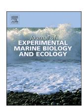
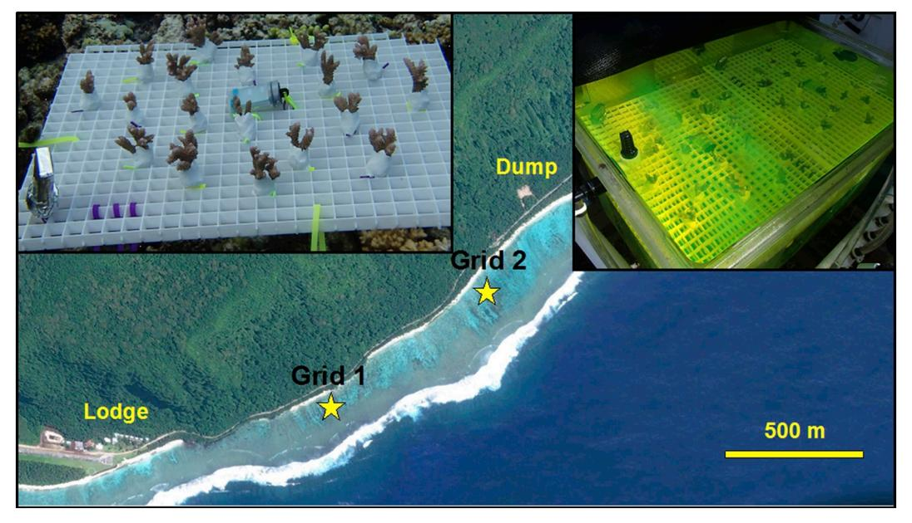
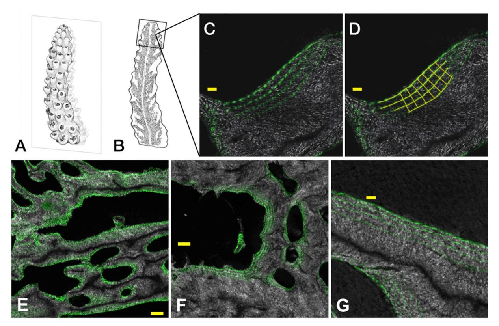
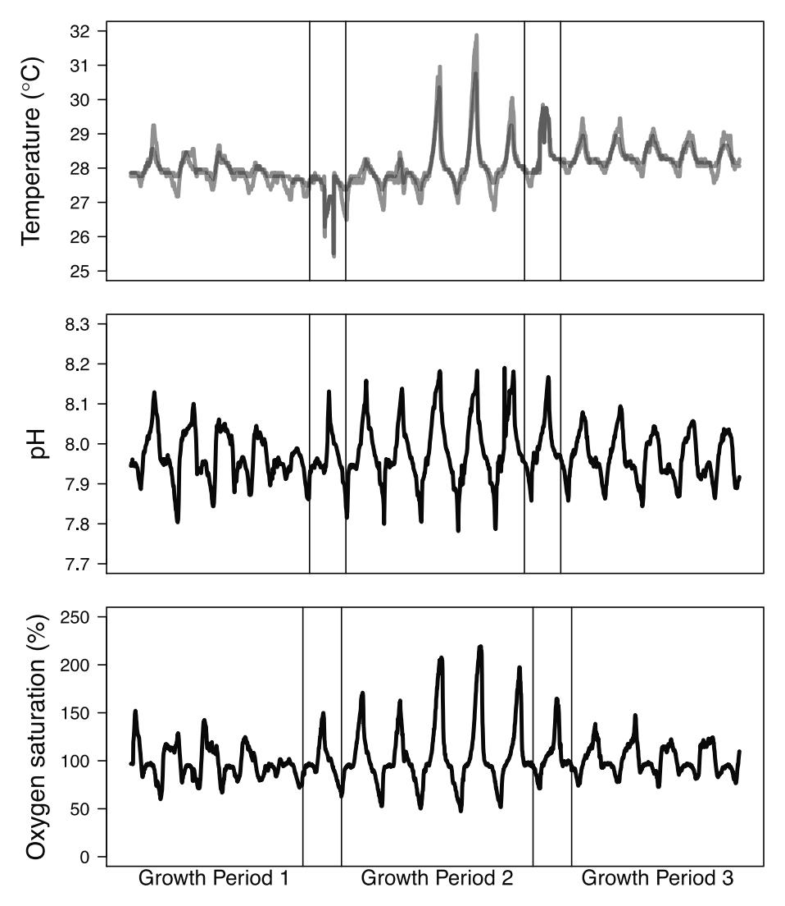
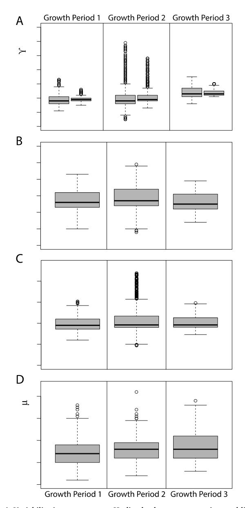
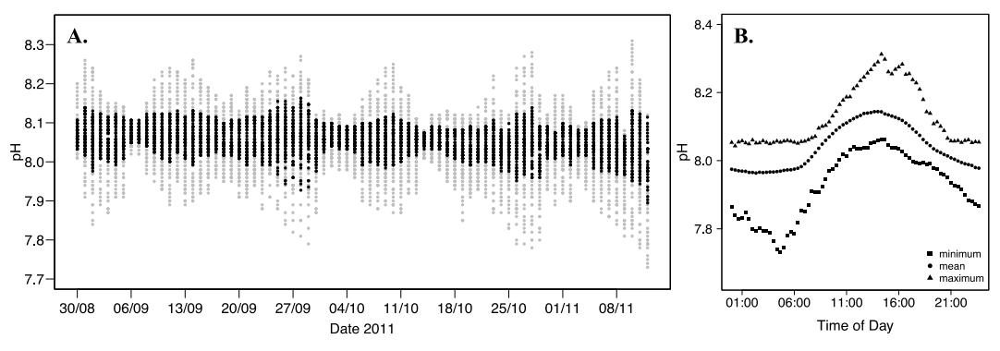

Contents lists available at [ScienceDirect](http://www.sciencedirect.com/science/journal/00220981)

# Journal of Experimental Marine Biology and Ecology

journal homepage: [www.elsevier.com/locate/jembe](https://www.elsevier.com/locate/jembe)

# Sub-weekly coral linear extension measurements in a coral reef

Lupita J. Ruiz-Jones[⁎](#page-0-0)[,1](#page-0-1) , Stephen R. Palumbi

*Hopkins Marine Station, Stanford University, 120 Oceanview Blvd. Pacific Grove, CA 93950, United States*

#### ARTICLE INFO

*Keywords:* Coral growth Calcification Skeletal linear extension Calcein Coral reef

#### ABSTRACT

Coral growth rates are often used as a metric of coral health and are measured extensively in the laboratory under controlled conditions to better understand the potential impacts of future climate change scenarios. However, in the field, corals live in dynamic environments, which can be subjected to multiple types of stressors that can not be mimicked in the laboratory. Furthermore, the temporal scales over which many environmental conditions can vary in the reef, such as extreme temperature anomalies, tidal fluctuations, and point source pollution events are far shorter than most field estimates of coral growth, which are generally at annual or seasonal scales. To measure the impact to coral growth of environmental variables that vary on time scales of less than a year or a few months requires developing new growth measurement techniques. With the goal of measuring coral growth at sub-weekly scales in the field, we developed a technique to measure 5-day linear extension growth rates. We tested our approach on colonies of *Acropora hyacinthus* living in a shallow back-reef ecosystem with routine extreme daily fluctuations in temperature, pH, and dissolved oxygen saturation. Using serial skeletal staining and petrographic thin sectioning we measured linear extension in *A. hyacinthus* during three consecutive 5-day growth periods that had differing amounts of environmental variability. At our field site in American Samoa, the second growth period had the largest tidal swings, resulting in higher variability: within a day temperature ranged up to 5.4 °C (reaching a maximum of 31.9 °C) and pH ranged up to 0.41 units (with a minimum of pH 7.78). We tested whether corals are able to maintain even linear extension rates across these short periods of time or not. After confocal microscopy analysis of stained skeletal samples we found that linear extension rates were similar across the three growth periods. Our fine-scale measurements suggest that during periods with different magnitudes of tidally driven environmental variability, but constant mean conditions, short-term linear extension growth rates remain consistent.

## **1. Introduction**

Having accurate measurements of reef and coral colony growth in different coral reef ecosystems is important for understanding the impact of environmental change on reef sustainability and their ability to provide ecosystem services, such as reducing wave energy by 97% ([Ferrario et al., 2014](#page-8-0)). Globally, reefs are under pressure from local stressors and global environmental shifts [\(Scheffer et al., 2015](#page-8-1)). For instance, net community calcification on Lizard Island, Great Barrier Reef decreased over a 33 year period by 27–49% ([Silverman et al.,](#page-8-2) [2014\)](#page-8-2) likely due to ocean acidification. At the same time, individual colonies of massive *Porites* species living on the inshore section of the central Great Barrier Reef show a decline in calcification rates over the past several decades, likely due to high sedimentation and nutrient input from the coastline [\(D'Olivo et al., 2013](#page-8-3)). In the Red Sea, *Diploastrea heliopra* showed a 30% decrease in linear extension rates since 1998, the same period that seawater temperatures rose [\(Cantin et al.,](#page-7-0) [2010\)](#page-7-0). Long-term reef-wide and colony-level growth measurements such as these are invaluable for ascertaining broad scale patterns over long time periods. However, environmental change also occurs over short time periods and corals can have physiological reactions to day changes in their environment ([Ruiz-Jones and Palumbi, 2017](#page-8-4)). Whether or not environmental changes in the reef that occur at weekly or monthly time scales impact coral calcification remains to be understood.

Growth is frequently used as a proxy for coral health. However, common approaches to measure growth in the field are at annual and seasonal timescales [\(Anderson et al., 2015](#page-7-1); [Barnes and Lough, 1989](#page-7-2); [Cantin et al., 2010;](#page-7-0) [Dandan et al., 2015](#page-8-5); [Dodge and Brass, 1984](#page-8-6); [Knutson et al., 1972;](#page-8-7) [Kuffner et al., 2013](#page-8-8); [Lough and Barnes, 2000](#page-8-9); [Lough et al., 2015](#page-8-10); [Manzello, 2010](#page-8-11); [Manzello et al., 2015](#page-8-12); [Neal et al.,](#page-8-13) [2015;](#page-8-13) [Samiei et al., 2016](#page-8-14); [Tortolero-Langarica et al., 2016](#page-8-15); [Venti et al.,](#page-8-16)

⁎ Corresponding author.

*E-mail address:* [gjrj@stanford.edu](mailto:gjrj@stanford.edu) (L.J. Ruiz-Jones).

1 Current address: Stanford University, 590 Escondido Mall, Stanford, CA 94305.

[2014\)](#page-8-16). These approaches measure growth at temporal scales far longer than the time scale at which many types of environmental stressors occur, such as extreme temperature anomalies and point source pollution episodes.

Growth measurements of colonies living in their natural reef setting can be made using buoyant weight [\(Dandan et al., 2015;](#page-8-5) [Kuffner et al.,](#page-8-8) [2013\)](#page-8-8), alizarin red staining ([Anderson et al., 2015](#page-7-1); [Manzello, 2010\)](#page-8-11), Xradiography ([Barnes and Lough, 1989;](#page-7-2) [Dodge and Brass, 1984](#page-8-6); [Knutson](#page-8-7) [et al., 1972;](#page-8-7) [Lough et al., 2015;](#page-8-10) [Lough and Barnes, 2000](#page-8-9); [Tortolero-](#page-8-15)[Langarica et al., 2016\)](#page-8-15), 3D computed tomography (CT) scanning ([Cantin et al., 2010;](#page-7-0) [Manzello et al., 2015](#page-8-12)), and reflectance optical microscopy ([Risk and Pearce, 1992\)](#page-8-17), and are generally at the resolution of annual or seasonal growth. For reviews of different coral growth measuring techniques see [\(Holcomb et al., 2013](#page-8-18); [Lough, 2010;](#page-8-19) [Lough](#page-8-20) [and Cantin, 2014;](#page-8-20) [Pratchett et al., 2015](#page-8-21)). These techniques reveal patterns in coral growth that are associated with long-term patterns in the environment, such as the seasonal density bands detected by 3D CT scanning (reviewed in ([Lough and Cantin, 2014](#page-8-20))).

Coral growth measurements over time periods shorter than seasonal and annual scales are commonly made in the laboratory using radioactive calcium-45 [\(Goreau, 1959](#page-8-22)), fluorescent stains that mark the skeleton (e.g., ([Venn et al., 2012](#page-8-23))), secondary ion mass spectrometry ([Holcomb et al., 2009](#page-8-24)), the alkalinity depletion method (e.g., ([Holcomb](#page-8-25) [et al., 2014\)](#page-8-25)), and the buoyant weight technique ([Davies, 1989\)](#page-8-26). These higher resolution growth measurements are valuable for understanding the mechanism of calcification [\(Goreau, 1959](#page-8-22); [Holcomb et al., 2014\)](#page-8-25) and how specific stressors affect calcification rates over short time scales [\(Venn et al., 2012\)](#page-8-23), because they are done in controlled settings. In one of the earliest studies of coral growth, [Goreau \(1959\)](#page-8-22) measured daily rates of calcification by quantifying the incorporation of calcium-45 into the skeleton. Using this method, the positive effects of light, zooxanthellae, and carbonic anhydrase on daily calcification rates were first demonstrated [\(Goreau, 1959](#page-8-22)).

Despite many long-term studies in the field, and short-term studies in the laboratory, we know little about how evenly corals calcify from week to week when there are varying environmental conditions. Due to their structure and flow dynamics shallow lagoon reefs (i.e., back-reefs) have high environmental variability for brief periods of time. The water can have high residence time due to restricted water flow at low tide, resulting in increased environmental variability [\(Monismith, 2013](#page-8-27)). Light, temperature, pH, dissolved oxygen (DO) saturation, and depth can vary drastically over the diel cycle, often in a correlated way ([Hofmann et al., 2011;](#page-8-28) [Koweek et al., 2014, 2015;](#page-8-29) [Price et al., 2012](#page-8-30); [Smith et al., 2013\)](#page-8-31). Biogeochemical processes within the reef cause pH and oxygen levels to rise and fall daily [\(Smith et al., 2013](#page-8-31)). On Ofu Island, American Samoa diel temperature and pH ranges can be as high as 6 °C and 0.58, respectively ([Craig et al., 2001](#page-8-32); [Koweek et al., 2015](#page-8-33)), on days with strong low tides around midday and midnight. Daily environmental variability has been recorded on many other coral reefs, such as: Moorea ([Hofmann et al., 2011\)](#page-8-28); Palmyra [\(Hofmann et al.,](#page-8-28) [2011;](#page-8-28) [Koweek et al., 2014;](#page-8-29) [Price et al., 2012\)](#page-8-30); Kingman Reef and Jarvis ([Price et al., 2012\)](#page-8-30); Davies Reef, Great Barrier Reef ([Albright et al.,](#page-7-3) [2013\)](#page-7-3); Heron Island ([Kline et al., 2015](#page-8-34)); Kaneohe Bay, Hawai'i ([Guadayol et al., 2014\)](#page-8-35); and, Puerto Rico ([Gray et al., 2012\)](#page-8-36).

Corals living in reefs with high environmental variability show signs of local adaptation ([Barshis et al., 2013;](#page-7-4) [Bay and Palumbi, 2014](#page-7-5)), acclimatization to increased temperature variability ([Palumbi et al.,](#page-8-37) [2014\)](#page-8-37), and physiological responses to cope with cellular stress [\(Ruiz-](#page-8-4)[Jones and Palumbi, 2017](#page-8-4)). Evidence suggests that reefs with high-frequency temperature variability will be important as the climate continues to change due to coral species having increased thermal tolerance in these reef ([Safaie et al., 2018](#page-8-38)). Whether such daily environmental variation also impacts coral growth is unknown—addressing this requires the ability to measure growth rates in the field at temporal scales relevant to this type of environmental change.

Our study objective was to develop a technique that allowed us to accurately measure coral linear extension growth rates in the field at sub-weekly time intervals. We applied this technique to investigate whether variations in the magnitude of dial ranges in temperature, pH, and DO affect linear extension growth under similar mean conditions. Of the two parameters needed to calculate coral calcification rates, linear extension and density, the technique described here measures linear extension. There are no studies that report both density and linear extension for corals in the reef at sub-seasonal scales. However, [D'Olivo et al. \(2013\)](#page-8-3) report that in *Porites* corals across the Great Barrier Reef annual linear extension rates are positively correlated with annual calcification rates. We acknowledge that being able to quantify density as well as linear extension would be ideal, but given the limitations of working in the field at a sub-weekly temporal scale we only measured linear extension.

We tested if the mechanism of calcification resulted in even linear extension growth rates across periods with different amounts of environmental variability or not. To do this, we used the fluorescent dye calcein to mark the coral skeleton at four time points demarcating three separate 5-day growth periods. Calcein binds to calcium, which crosses coral tissues via paracellular pathways, and is incorporated into the calcium carbonate skeleton during active calcification ([Tambutte et al.,](#page-8-39) [2011\)](#page-8-39). A comparative study of different coral staining techniques found that calcein, alizarin, alizarin complexone, and isotope spikes (Ba and Sr) had no significant effect on growth; however, calcein was recommended for short-term growth studies due to its intense fluorescent mark in the skeleton ([Holcomb et al., 2013](#page-8-18)). Calcein is regularly used in laboratory settings to study calcification over short time periods ([Brahmi et al., 2009;](#page-7-6) [Gagnon et al., 2012, 2013;](#page-8-40) [Tambutte et al., 2011](#page-8-39); [Venn et al., 2012\)](#page-8-23), but in the field, it has mostly been used as a skeletal marker in long-term studies [\(Venti et al., 2014\)](#page-8-16). We tested our method to measure sub-weekly linear extension growth in corals of *Acropora hyacinthus* living in the back-reef environment of Ofu Island, American Samoa. We found that our approach provides the accuracy of laboratory-based methods, but in the field over short periods of time and use it to show that high levels of tidally driven environmental variation do not perturb corals in their native habitat.

## **2. Materials and methods**

## *2.1. Sample collection*

Five-day linear extension measurements were made on individual branches from colonies of *A. hyacinthus* (*cryptic species E*; see [\(Ladner](#page-8-41) [and Palumbi, 2012\)](#page-8-41)), hosting majority clade D *Symbiodinium*. At two locations (approximately 500 m apart) in the back-reef of Ofu, American Samoa, within the US National Park, a total of six colonies were selected (three colonies per location) ([Fig. 1\)](#page-2-0). Six fragments, each with approximately 3–5 branches, were removed from the perimeter of each colony (all necessary permits were in hand: American Samoan Department of Marine and Wildlife Resources permit number 2012–65 and National Park Service Scientific Research and Collecting Permit number NPSA-2012-SCI-0008). Each fragment was attached to a plastic bolt with epoxy and assembled on a plastic grid. To minimize stress, the coral fragments were attached to the plastic grids immediately after being removed from the colony by working directly underwater; therefore, there was no need to transport the fragments to shore. Once a grid was assembled it was placed securely on the substratum with zip ties in the area where the samples were collected. One grid was assembled for each of the two locations for the colonies from that location (labeled Grid 1 and Grid 2; [Fig. 1](#page-2-0)). During the following three days the samples were allowed to recover prior to the start of the experiment. The fragments were monitored once a day for three days and at all times the tentacles were out and there were no signs of mortality.

**Fig. 1.** The back-reef of Ofu Island, American Samoa and a unit of the US National Park of American Samoa. The stars mark the placement of the two grids with attached coral samples that were collected from the same area of the back-reef. The top left photo shows one grid of coral fragments in the reef. The top right photos shows the two grids in the 75 L tank of calcein-seawater solution at a final concentration of 0.01 g l−1.

#### *2.2. Staining protocol*

Calcein was used to mark the skeleton at specific time intervals, allowing us to measure linear extension growth rates in sequential periods of time. The coral branches were stained four times with five full days between the days during which calcein was applied; therefore, we were able to measure 5-day linear extension growth rates. The coral fragments were stained in temperature controlled tanks with water circulation (designed by the National Park Service staff on Ofu Island). On the day calcein was applied, each grid of coral fragments was retrieved from their respective locations, transported to the field laboratory in seawater containers, and placed in a tank of seawater (75 L) set to 29 °C. Calcein (Sigma-Aldrich) was added to the seawater for a final concentration of 0.01 g l−1. The coral fragments were exposed to calcein for 6 h, from about midmorning to midafternoon.

Prior to this experiment we conducted a pilot study to determine the duration of the exposure to calcein. Our goal was to minimize stress to the corals and also ensure that the resulting stain lines were easily visible with confocal microscopy. [Holcomb et al. \(2013\)](#page-8-18) report incubating corals in calcein for ~24 h and found that calcein did not affect growth. In two other studies, the duration of calcein exposure ranged from 5 min [\(Venn et al., 2012](#page-8-23)) to 18-24 h ([Venti et al., 2014](#page-8-16)). [Venn et al. \(2012\)](#page-8-23) examined isolated crystals in the laboratory and measured increases in cross-sectional area over a 4 h period. [Venti et al.](#page-8-16) [\(2014\)](#page-8-16) measured seasonal calcification rates in the field and marked the skeletons by tenting the colonies with calcein for 18-24 h; they report that the colonies showed no signs of stress.

Because calcein is incorporated into the skeleton during active calcification, the exposure needs to be long enough so that substantial crystals are incorporated into the skeleton that the stain line is easily visible with confocal microscopy. Furthermore, during our pilot study we observed that the longer the corals remained in the reef the more the stain line would start to photobleach. In our pilot study we observed that during a 6 h calcein exposure the coral tentacles were out, suggesting they were not severely stressed, and the resulting stain line was clearly visible with confocal microscopy. In our experiment the corals needed to be out in the reef for 3 weeks and we wanted to ensure that the first stain was still clearly visible after being exposed to the sun for that long; therefore, we choose a 6 h calcein exposure to ensure a substantial amount of calcein was incorporated into the skeleton.

During the staining period, we observed that the polyps were out. At the end of the staining incubation, each grid was transferred back to its respective location in the reef. After the fourth stain, we waited 2.5 days before removing the tissue so that a small amount of skeleton was accreted. The tissue was removed by placing the grid of coral fragments in a solution of 3% bleach for several hours, after which the samples were air-dried. We noticed that the corals had started to secrete skeletal material over the epoxy, suggesting that they were not completely stressed by the fragmentation, attachment to grid, or staining.

#### *2.3. Environmental data*

A temperature logger (HOBO Pendant), which recorded every 10 min, was attached to each grid. A continuous-recording pH sensor (SeaFET) recorded pH every 20 min and a YSI DataSonde (model 6600V2-4) recorded DO saturation (%) every 10 min. We only had one pH sensor and one DO sensor; both were attached to dead substratum at about 1.5 m depth within 20 m of Grid 1. A discrete water sample was collected within 1 m of the pH sensor 48 h post deployment for a vicarious calibration. These samples were analyzed for salinity (YSI 3200 Conductivity Instrument), total alkalinity (TA) (SI Analytics Tritroline 6000), and total dissolved inorganic carbon (TDIC) (UIC Inc. CM5015 Coulometer). For the measurements of TA and TDIC we used certified reference material standards provided by Andrew Dickson (Scripps Institution of Oceanography, La Jolla, CA). The estimated precision for the TA and DIC measurements is ± 8.5 umol kg-1 and 10 umol kg-1 respectively; we used the same instruments and methodology reported in [Koweek et al. \(2015\)](#page-8-33). The salinity, TA, TDIC, and temperature of the seawater sample at the time of collection were used to calculate the pH of the discrete water sample using the R package SeaCarb (v3.0). The pH of the discrete water sample was used to apply a vicarious calibration to the pH sensor. For each environmental variable (i.e., temperature, pH, and DO) we calculated the mean, standard deviation, and range for each of the 5-day growth periods. With these data we determined which growth period had the highest environmental variability.

**Fig. 2.** A representation of how linear extension was measured in *Acropora hyacinthus*. A) Coral branches were petrographically thin sectioned down the middle. B) The 20 μm sections were mounted on glass slides. A 5 mm by 5 mm box was designated around the branch tip and this region was examined with confocal microscopy. C) A micrograph of a measureable area (i.e., four calcein stain lines visible) for Colony AH86 within the 5 mm by 5 mm box at 20× magnification. D) In ImageJ the stain lines were traced and measurements were made across a measureable area every 20 μm. E) A micrograph of colony AH06 at 5× showing most of the branch tip and the areas where the four stain lines are apparent. F) A micrograph of colony AH61 at 5× showing most of the branch tip and the areas where the four stain lines are apparent. G) A micrograph of colony AH89 at 20× showing that the fourth stain line is the most intense due to the reduced exposure to the sun. In C, D, and G scale bar is 20 μm. In E and F scale bar is 100 μm. Illustrations by Mattias Lanas.

#### *2.4. Measuring skeletal linear extension with microscopy*

All accessible individual branches on each coral fragment were thin sectioned using petrographic techniques (sent to vendor Burnham Petrographic). For each branch, thin sectioning was done straight down the middle of the branch parallel to the axis of growth to produce 20 μm sections ([Fig. 2](#page-3-0)A and B). The thin sections were mounted on glass slides and covered with glass cover slips.

For each branch, we determined linear extension for each growth period by measuring the distance between adjacent stain lines; growth period 1 was between stain lines 1 and 2, growth period 2 was between stain lines 2 and 3, and growth period 3 was between stain lines 3 and 4. We focused our measurements to a 5 mm by 5 mm box around the branch tip ([Fig. 2](#page-3-0)B). With a confocal microscope (Zeiss LSM 700), set to excite calcein (488 nm) and detect the wavelength emitted (~520 nm), we scanned the branch tips for areas where the four parallel stain lines were visible. For convenience we will use the term 'measurable area' to identify the areas where measurements were made (see [Fig. 2C](#page-3-0) and G for representative examples). Linear extension was measured on micrographs of the thin sections taken at 20× on the confocal microscope. At each measureable area, the stain lines were traced over in ImageJ (v1.46r) (with the freehand line tool) ([Fig. 2](#page-3-0)D). We then measured linear extension every 20 μm along the length of the measureable area (see [Fig. 2](#page-3-0)D). We averaged among these values to produce an extension value for each growth period for each measureable area. We observed that not all areas of the axial corallite had four stain lines demonstrating variability in the location of the skeleton where linear extension growth occurs at these short time scales [\(Fig. 2E](#page-3-0) and F). Due to variability in the amount and direction of linear extension within the branch tip, the length of the measureable areas was variable; therefore, the number of measurements made at each measureable area (every 20 μm) ranged from 3 to 14.

For each colony, we calculated the mean ( ± SD) linear extension per growth period. To examine linear extension rate differences between the three growth periods across all measureable areas, we needed to look at relative differences in growth due to the spatial variability in the amount of linear extension across the branch tip (i.e., we observed that some areas of the branch tip grew more than other areas). To do this for each measureable area, we calculated the ratios of linear extension that occurred during a given growth period over the mean growth of the three growth periods at that measureable area. To test for differences in relative growth among growth periods, we used a Chisquare test. The null hypothesis being that there are as many observations of growth that are below the mean as above the mean for a particular growth period. We use boxplots to show the distribution of linear extension values for all measureable areas across all colonies for each growth period. All analyses were done in R (v3.0).

#### **3. Results**

#### *3.1. Measurable areas*

The number of areas where four stain lines were visible and, thus, where measurements were made (i.e., measureable areas) ranged from 3 to 44 per colony ([Table 1\)](#page-4-0). The number of branch tips from which these measurements came ranged from 2 to 17 per colony [\(Table 1](#page-4-0)). Skeletal thin sections prepared from colony AH75 revealed that there were very few measureable areas. Across the six fragments stained for

**Table 1** The number of linear extension measurements made per colony of *Acropora hyacinthus* and the mean ( ± SD) linear extension per 5-day growth period. SD; standard deviation.

| Colony | Grid   | No. of axial corallites with growth data | Total # of measurable areas | Mean ( ± SD) linear extension (μm) during growth period 1 | Mean ( ± SD) linear extension (μm) during growth period 2 | Mean ( ± SD) linear extension (μm) during growth period 3 |
|--------|--------|---------------------------------------------|--------------------------------|--------------------------------------------------------------|--------------------------------------------------------------|--------------------------------------------------------------|
| AH06   | Grid 1 | 9                                           | 30                             | 13 ± 4.3                                                     | 14 ± 4.6                                                     | 14 ± 6.1                                                     |
| AH75   | Grid 1 | 2                                           | 3                              | 22 ± 14.1                                                    | 27 ± 14.1                                                    | 20 ± 3.0                                                     |
| AH86   | Grid 1 | 12                                          | 38                             | 14 ± 5.3                                                     | 14 ± 5.6                                                     | 16 ± 7.4                                                     |
| AH28   | Grid 2 | 5                                           | 10                             | 9 ± 4.6                                                      | 11 ± 4.2                                                     | 13 ± 4.6                                                     |
| AH61   | Grid 2 | 13                                          | 39                             | 16 ± 7.1                                                     | 18 ± 5.2                                                     | 21 ± 7.8                                                     |
| AH89   | Grid 2 | 17                                          | 44                             | 16 ± 6.3                                                     | 18 ± 5.7                                                     | 19 ± 7.8                                                     |

colony AH75, there were only three areas in two branch tips where the four stain lines were distinct, but we often observed areas with two and three stain lines. We do not know why this was the case with this colony. Our analyses only include measurements where all four stain lines were visible.

### *3.2. Five-day linear extension growth in the reef*

In total we were able to make measurements at 164 measureable areas across 58 axial corallites from the six colonies of *A. hyacinthus*. Not all parts of the skeleton grew equally, but of the areas where linear extension growth occurred during all three growth periods we found that it was fairly consistent through time and the amounts were fairly similar across colonies. The average linear extension for each 5-day growth period ranged from 9 to 27 μm ([Table 1\)](#page-4-0). Across all samples, the distribution of linear extension values was similar for the three growth periods ([Fig. 4D](#page-6-0)); the means are all within a couple microns of each other, at about 15 μm per 5-day growth period. We did not observe any significant differences in mean linear extension between the different corals on the two grids that were placed in the two back-reef locations ([Table 1](#page-4-0)).

### *3.3. Environmental differences between growth periods*

The environmental data collected during the experiment demonstrate that the coral fragments were exposed to variable temperature, pH, and DO saturation ([Fig. 3\)](#page-5-0). Growth period 2 had higher variability than growth periods 1 and 3 due to a series of strong low tides that occurred around midday and midnight ([Fig. 4A](#page-6-0)–C and [Table 2\)](#page-6-1). The mean temperature, pH, and DO saturation were similar across the three growth periods, but the standard deviations were higher during growth period 2 than growth periods 1 and 3 ([Table 2](#page-6-1)). The temperature of Grid 1 had a range of 5.4 °C, from a minimum of 26.5 °C to a maximum of 31.9 °C during growth period 2. For Grid 2, the range was 3.5 °C, from 27.3 to 30.8 °C ([Table 2;](#page-6-1) [Fig. 4](#page-6-0)A). By contrast, during growth periods 1 and 3 the temperature ranges for Grid 1 were 2.2 °C and 1.9 °C, respectively, and for Grid 2 the ranges were 1.1 °C and 0.9 °C, respectively [\(Table 2;](#page-6-1) [Fig. 4](#page-6-0)A). Seawater pH followed a similar temporal pattern. During growth period 2 the pH varied from 7.78 to 8.19, a range of 0.41 units, and during growth periods 1 and 3 the ranges were 0.33 and 0.25, respectively [\(Table 2;](#page-6-1) [Fig. 4B](#page-6-0)). The DO saturation during growth period 2 ranged from 47%, the lowest value during the experiment, to 219%, a range of 172%; the ranges for growth periods 1 and 3 were 92% and 75%, respectively ([Table 2;](#page-6-1) [Fig. 4C](#page-6-0)).

As mentioned in the methods section, the pH and DO sensors were placed closer to Grid 1, which was in the part of the back reef that has been observed to have higher variability (i.e., high-variability pool) in temperature (small pool in([Oliver and Palumbi, 2011](#page-8-42))). Grid 2 was placed in the part of the back reef where less variability (i.e., mediumvariability pool) in temperature has been observed (large pool in ([Oliver and Palumbi, 2011](#page-8-42))). Because temperature, pH, and DO co-vary at this site (see ([Ruiz-Jones and Palumbi, 2017](#page-8-4))) we suspect that pH and DO also had reduced variability (smaller ranges) in the location where Grid 2 was compared to Grid 1. A long-term pH record we collected using two SeaFET pH sensors in 2011 shows exactly this pattern; reduced variability in the range of pH for the part of the reef where Grid 2 was place (the medium-variability pool in [Fig. 5\)](#page-7-7). From the pH data collected in 2011, and in 2013 during the calcein experiment, we see that pH increases during the day, reaching the maximum at around 14:00 and falling to the minimum in the pre-dawn hours ([Fig. 5B](#page-7-7)).

#### *3.4. Coral linear extension growth rates remained consistent across varying environmental conditions*

We observed that linear extension was not significantly different between the three growth periods; all three growth periods have similar means and ranges ([Fig. 4D](#page-6-0)). For each measurable area across all our samples, the differences in linear extension during each growth period from the mean growth (for the three growth periods) were small; the majority of measurements were within 5 μm. We estimate the precision of our measurements is between 1 and 3 μm because calcein is not uniformly incorporated into the skeleton, resulting in a stain line that is about 1–3 μm thick (visible in [Fig. 2](#page-3-0)). We are able to measure this because the micrographs were taken on a confocal microscope at 20×. Growth during growth period 2 was on average very close to the mean for the three growth periods. We found that there was no observable increase or decrease in the amount of linear extension during growth period 2, when there was increased environmental variability, compared to the other two growth periods, which had more similar environmental conditions ([Fig. 4](#page-6-0)D). Overall, we found that despite higher environmental variability during growth period 2, growth at measurable areas remained consistent through time with minor differences between growth periods that were mostly at the scale of 1–5 μm.

## **4. Discussion**

We established an accurate field-based method to measure subweekly linear extension growth in reef-building corals. This allowed us to carefully measure 5-day linear extension growth in colonies of *A. hyacinthus* living in a back-reef section of the US National Park of American Samoa. We sequentially marked the skeleton and tracked linear extension during three consecutive growth periods with varying levels of environmental variability due to the tidal cycle. We found that linear extension in *A. hyacinthus* on average ranges from 9 to 27 μm for a 5-day period, varies by a few microns from week to week, and is variable within the branch tip. Despite temperature changes of 5 °C, swings in pH of almost half a unit, and shifts in oxygen availability we observed consistent linear extension across the three growth periods. Our results suggest that the mechanism of calcification in *A. hyacinthus* results in consistent linear extension growth across the tidal cycle and if there are fluctuations in calcification rates over a daily cycle they are averaged out over several days. However, as the environment changes and there are shifts in the mean temperature and pH corals are exposed to, the expectation is that calcification rates will be impacted in the long-term [\(Jokiel, 2016](#page-8-43)). We think that the approach to measuring short-term linear extension rates we describe here is best suited for

**Fig. 3.** Temperature, pH, and dissolved oxygen saturation during the three consecutive 5-day growth periods (data span August 12–28, 2013). For temperature, the lighter gray temperature record is for grid 1, which was positioned closer to the pH and DO sensors. Temperature was recorded every 10 min, pH was recorded every 20 min, and dissolved oxygen saturation was recorded every 10 min over the course of the experiment. The vertical lines mark the staining days between growth periods 1 and 2 (August 17) and between growth periods 2 and 3 (August 23).

tracking changes in response to a sudden or rapid change in the environment, such as a temperature anomaly that results in bleaching or a point source pollution event in a coral reef.

#### *4.1. Measuring short-term coral growth in the field*

Our approach used repeated staining with calcein to mark sequential sub-weekly growth periods that could be discerned under confocal microscopy. Because this technique does not demand limited culture volumes during coral growth (as does the alkalinity depletion method, for example), it allowed us to measure linear extension over short time periods in field conditions. However, our protocol is limited is several important ways. First, it requires that corals be transferred to a laboratory setting in order to mark the skeleton with calcein during a 6 h incubation. We took care to reduce experimental stress as much as possible by first attaching coral fragments onto grids that could be easily moved, then allowing the coral fragments to recover for 3 days in the field, and limiting the staining incubation to 6 h. However, there is a possibility that our measurements are not what they would have been had the corals been handled less. If stress from fragmentation and attachment to the grid was reduced over time, then we might expect to see increases in linear extension from one growth period to the next, but this is not apparent in the spread of linear extension values we measured [\(Fig. 4D](#page-6-0)).

The second limitation is that measurements require careful thin sectioning of the coral skeleton and meticulous examination with a powerful microscope. Even then, we were unable to obtain a large sample size for one of the colonies (AH75) due to the necessity of only examining locations in the branch tip where all four stain lines were visible. We are unsure as to why colony AH75 had so few complete measureable areas, but one possibility is that the skeleton was less dense and therefore, more sensitive to shattering by the petrographic thin sectioning process.

The third limitation is that there is high variation in absolute linear extension across the branch tip. As a result, we focused on relative linear extension by measuring the relative change among growth periods. Lastly, our measurements only reflect one aspect of growth, linear extension. Due to the limitations of measuring growth over 5 days in the field, we did not quantify the density of the newly added skeleton during each growth period and therefore, cannot calculate calcification rates. In *Porites* corals across the central Great Barrier Reef there is a positive relationship between linear extension and calcification at annual scales ([D'Olivo et al., 2013](#page-8-3)), but under the circumstances of our study we are not able to determine if this is also the case for *A.*

**Fig. 4.** Variability in temperature, pH, dissolved oxygen saturation, and linear extension for growth periods 1, 2, and 3. A) Boxplots of temperature for Grids 1 (on the left) and 2 (on the right) for each growth period. B) Boxplots of pH for each growth period. C) Boxplots of DO saturation for each growth period. D) Boxplots of linear extension growth for all samples for each growth period (n = 164). The samples from the two grids are not separated, because there was no difference in linear extension between samples on the two grids.

*hyacinthus* at sub-weekly scales. The advantage of our approach is that we were able to accurately quantify the amount of linear extension growth during 5 days in corals living in a coral reef at the precision of 1–3 μm.

*4.2. The mechanism of calcification is buffered from tidally-driven environmental variability resulting in uniform linear extension growth rates across the tidal cycle*

In our study, linear extension growth rates of *A. hyacinthus* remained consistent across the varying environmental conditions caused by the tidal cycle in the Ofu back-reef. We found that during a period of increased environmental variability, but with fairly constant averages, *A. hyacinthus* showed as high a level of linear extension growth as during periods with less variability. We were able to measure differences in linear extension of a few microns between the three growth periods. As a result, we very likely would have detected responses to the increased environmental variability during the second growth period if there was a change greater than 5 μm. [Table 2](#page-6-1) shows that the means for temperature, pH, and DO were not statistically different between the three growth periods, but the ranges were. Going into the study we knew from previous studies looking at coral reef biogeochemistry that the mean values for temperature, pH, and DO remain similar during periods with different magnitude of diel variability [\(Koweek et al.,](#page-8-33) [2015\)](#page-8-33). The results of our study suggest that under constant mean conditions, but variability in diel ranges linear extension remains constant and stable.

We are aware of one other study that looked at the relationship between calcification and environmental variability in coral reef systems. [Price et al. \(2012\)](#page-8-30) examined the percent cover of early successional benthic reef calcifiers on PVC plates after seven months at sites across three Central Pacific islands with different magnitudes of diel pH variability. Of the three polymorphs of calcium carbonate examined, only the percent cover of magnesium calcite, secreted primarily by crustose coralline algae and bryozoans, increased as the number of hours spent at high pH values each day increased. Aragonite and calcite calcification rates did not show any relationship with diel pH variability ([Price et al., 2012](#page-8-30)); we also found that linear extension of the aragonite skeleton produced by *A. hyacinthus* in this study had no relationship with pH variability. [Price et al. \(2012\)](#page-8-30) measured calcification/accretion after seven months; our study is the first we are aware of to measure linear extension over periods of less than a week in corals exposed to environmental variability in coral reef systems.

Our observations suggest that in *A. hyacinthus* the mechanism of calcification is not impacted by the increased variability in temperature, pH, and DO saturation that occur during days with strong low tides around midday and midnight, when temperature can vary by as much at 6 °C [\(Craig et al., 2001](#page-8-32)) and pH by as much at 0.58 units ([Koweek et al., 2015](#page-8-33)). The calcification resilience to the short-term environmental variation we observed in the Ofu back-reef could take several different forms. Corals may have acclimatized to these

**Table 2** The mean ( ± SD) and range for temperature, pH, and dissolved oxygen saturation during growth periods 1, 2, and 3. Temperature was recorded every 10 min, pH was recorded every 20 min, and dissolved oxygen saturation was recorded every 10 min over the course of the experiment. SD, standard deviation.

| Environmental variable                       | Period 1       | Period 2       | Period 3       |
|----------------------------------------------|----------------|----------------|----------------|
| Temperature (°C) mean ( ± SD) grid 1         | 27.9 ( ± 0.4)  | 28.1 ( ± 0.9)  | 28.4 ( ± 0.4)  |
| Temperature (°C) range grid 1                | 2.2            | 5.4            | 1.9            |
| Temperature (°C) mean ( ± SD) grid 2         | 28.0 ( ± 0.2)  | 28.1 ( ± 0.6)  | 28.4 ( ± 0.2)  |
| Temperature (°C) range grid 2                | 1.1            | 3.5            | 0.9            |
| pH mean ( ± SD)                              | 7.97 ( ± 0.06) | 7.99 ( ± 0.09) | 7.96 ( ± 0.06) |
| pH range                                     | 0.33           | 0.41           | 0.25           |
| Dissolved oxygen saturation (%) mean ( ± SD) | 97 ( ± 17)     | 107 ( ± 37)    | 100 ( ± 14)    |
| Dissolved oxygen saturation (%) range        | 92             | 172            | 75             |

**Fig. 5.** The pH of the Ofu back-reef at two locations, the high- and medium-variability pools (A) and the maximum, mean, and minimum pH values at 20 min intervals over the 24 h cycle for the high-variability pool (B). In 2011 the SeaFET pH sensors were approximately 0.5 km apart at the locations designated by the stars in [Fig. 1.](#page-2-0) The dataset used in the 24 h plot is from the 73 days of data shown in plot A.

conditions or have genetic adaptions to deal with such environmental variability. From previous research at this particular reef, we know that corals are capable of acclimatizing to more variable environments by shifting gene expression at many genes ([Palumbi et al., 2014\)](#page-8-37) and that over 100 single nucleotide polymorphisms are differentially observed between highly- and moderately-variable areas of the back-reef ([Bay](#page-7-5) [and Palumbi, 2014\)](#page-7-5). Alternatively, during periods of increased environmental variability the drawdown of CO2 by photosynthesis during daytime low tides, coupled with higher temperatures, may provide more favorable calcification conditions due to increased pH and the potential for higher metabolic rates. However, a more likely scenario is that any diel variability in the environment has no influence because corals highly regulate the calcification process.

At the site of calcification, pH, carbonate ion concentration, and aragonite saturation state are elevated by cellular mechanisms [\(Cai](#page-7-8) [et al., 2016](#page-7-8); [Georgiou et al., 2015;](#page-8-44) [Sevilgen et al., 2019](#page-8-45); [Venn et al.,](#page-8-23) [2012\)](#page-8-23). Laboratory studies that exposed corals to oscillating pH found no negative effect on calcification ([Comeau et al., 2014;](#page-7-9) [Dufault et al.,](#page-8-46) [2012\)](#page-8-46), suggesting that short-term growth is resilient to pH variability. In fact, naturally oscillating pH in the reef may benefit corals by increasing nighttime storage of dissolved inorganic carbon to fuel daytime calcification [\(Dufault et al., 2012\)](#page-8-46) and may also reduce the negative effects of ocean acidification [\(Comeau et al., 2014\)](#page-7-9). Furthermore, corals living in the Kimberley region of Australia, where there are extreme temperature variations due to the tides, show signs of calcification resilience to the extreme conditions ([Dandan et al., 2015](#page-8-5)). Our methodology highlights the feasibility of quantifying linear extension at short temporal scales in corals living in their native habitat. Being able to measure different aspects of coral growth in the reef is important to understanding the link between coral physiology and environment during a time of increased prevalence of stressors in coral reefs.

## **5. Conclusions**

Around the world coral reefs are facing both local and global stressors ([Hughes et al., 2017](#page-8-47)). The recent increase in the frequency of mass bleaching events highlights the need for more immediate action towards effectively managing reefs. Managing local stressors can increase coral resilience to climate change [\(Scheffer et al., 2015](#page-8-1)). For example, when pollution, sedimentation, and overfishing are managed at regional and local scales, reefs can be more resilient to pulse-type stressors such as bleaching events, tropical cyclones, and crown of thorns starfish outbreaks [\(Anthony et al., 2014\)](#page-7-10). Coral growth can be used as a physiological metric for coral health. Traditionally field coral growth measurements are over annual and seasonal timescales, but some local stressors may occur at shorter timescales. Our sub-weekly linear extension measurement technique can be implemented immediately following a pulse-type stress event in the reef to quantify the impact on coral skeletal linear extension. By monitoring diverse aspects of coral physiology at time scales relevant to metabolic and environmental cycles, we improve our ability to develop diagnostic coral health tools.

#### **Acknowledgements**

We are grateful for the assistance the National Park Service of American Samoa provided, especially Carlo Caruso and Ricky Misa'alefua. We are grateful for advice from Michael Holcomb and Anne Cohen. Funding was provided by a NPS George M. Wright Climate Change Youth Initiative Fellowship to LJRJ. Additional funding was provided by the Gordon and Betty Moore Foundation (grant #2629) and the Stanford Woods Institute for the Environment. Several Palumbi Lab members, especially Zack Gold, were instrumental in data collection—thank you. LJRJ was supported by a National Science Foundation Graduate Research Fellowship and a Stanford DARE fellowship. We appreciate the time and effort of two anonymous reviewers whose comments helped improve the article.

#### **References**

Albright, R., Langdon, C., Anthony, K.R.N., 2013. Dynamics of seawater carbonate chemistry, production, and calcification of a coral reef flat, central Great Barrier Reef. Biogeosciences 10, 6747–6758. <https://doi.org/10.5194/bg-10-6747-2013>.

Anderson, K.D., Heron, S.F., Pratchett, M.S., 2015. Species-specific declines in the linear extension of branching corals at a subtropical reef, Lord Howe Island. Coral Reefs 34, 479–490. <https://doi.org/10.1007/s00338-014-1251-1>.

Anthony, K.R.N., Marshall, P.A., Abdulla, A., Beeden, R., Bergh, C., Black, R., Eakin, C.M., Game, E.T., Gooch, M., Graham, N.A.J., Green, A., Heron, S.F., van Hooidonk, R., Knowland, C., Mangubhai, S., Marshall, N., Maynard, J.A., McGinnity, P., McLeod, E., Mumby, P.J., Nyström, M., Obura, D., Oliver, J., Possingham, H.P., Pressey, R.L., Rowlands, G.P., Tamelander, J., Wachenfeld, D., Wear, S., 2014. Operationalizing resilience for adaptive coral reef management under global environmental change. Glob. Chang. Biol. 21, 48–61. [https://doi.org/10.1111/gcb.12700.](https://doi.org/10.1111/gcb.12700)

[Barnes, D.J., Lough, J.M., 1989. The nature of skeletal density banding in scleractinian](http://refhub.elsevier.com/S0022-0981(18)30394-0/rf0020) [corals: fine banding and seasonal patterns. J. Exp. Mar. Biol. Ecol. 126, 119–134](http://refhub.elsevier.com/S0022-0981(18)30394-0/rf0020). Barshis, D., Ladner, J.T., Oliver, T., Seneca, F., Traylor-Knowles, N., Palumbi, S., 2013. Genomic basis for coral resilience to climate change. Proc. Natl. Acad. Sci. 110, 1387–1392. <https://doi.org/10.5061/dryad.bc0v0>.

Bay, R.A., Palumbi, S.R., 2014. Multilocus adaptation associated with heat resistance in reef-building corals. Curr. Biol. 24, 1–5. [https://doi.org/10.1016/j.cub.2014.10.044.](https://doi.org/10.1016/j.cub.2014.10.044) Brahmi, C., Meibom, A., Smith, D.C., Stolarski, J., Auzoux-Bordenave, S., Nouet, J.,

Doumenc, D., Djediat, C., Domart-Coulon, I., 2009. Skeletal growth, ultrastructure and composition of the azooxanthellate scleractinian coral *Balanophyllia regia*. Coral Reefs 29, 175–189. <https://doi.org/10.1007/s00338-009-0557-x>.

Cai, W.-J., Ma, Y., Hopkinson, B.M., Grottoli, A.G., Warner, M.E., Ding, Q., Hu, X., Yuan, X., Schoepf, V., Xu, H., Han, C., Melman, T.F., Hoadley, K.D., Pettay, D.T., Matsui, Y., Baumann, J.H., Levas, S., Ying, Y., Wang, Y., 2016. Microelectrode characterization of coral daytime interior pH and carbonate chemistry. Nat. Commun. 7, 11144. [https://doi.org/10.1038/ncomms11144.](https://doi.org/10.1038/ncomms11144)

Cantin, N.E., Cohen, A.L., Karnauskas, K.B., Tarrant, A.M., McCorkle, D.C., 2010. Ocean warming slows coral growth in the central red sea. Science 329, 322–325. [https://](https://doi.org/10.1126/science.1190182) [doi.org/10.1126/science.1190182](https://doi.org/10.1126/science.1190182).

Comeau, S., Edmunds, P.J., Spindel, N.B., Carpenter, R.C., 2014. Diel pCO2 oscillations modulate the response of the coral *Acropora hyacinthus* to ocean acidification. Mar.

- Ecol. Prog. Ser. 501, 99–111. <https://doi.org/10.3354/meps10690>.
- Craig, P., Birkeland, C., Belliveau, S., 2001. High temperatures tolerated by a diverse assemblage of shallow-water corals in American Samoa. Coral Reefs 20, 185–189. [https://doi.org/10.1007/s003380100159.](https://doi.org/10.1007/s003380100159)
- Dandan, S.S., Falter, J.L., Lowe, R.J., McCulloch, M.T., 2015. Resilience of coral calcification to extreme temperature variations in the Kimberley region, Northwest
- Australia. Coral Reefs 34, 1151–1163. [https://doi.org/10.1007/s00338-015-1335-6.](https://doi.org/10.1007/s00338-015-1335-6) [Davies, P.S., 1989. Short-term growth measurements of corals using an accurate buoyant](http://refhub.elsevier.com/S0022-0981(18)30394-0/rf0065) [weighing technique. Mar. Biol. 101, 389–395.](http://refhub.elsevier.com/S0022-0981(18)30394-0/rf0065)
- [Dodge, R.E., Brass, G.W., 1984. Skeletal extension, density and calcification of the reef](http://refhub.elsevier.com/S0022-0981(18)30394-0/rf0070) coral, *Montastrea annularis*[: St. Croix, US Virgin Islands. B Mar. Sci. 34, 288–307](http://refhub.elsevier.com/S0022-0981(18)30394-0/rf0070).
- D'Olivo, J.P., McCulloch, M.T., Judd, K., 2013. Long-term records of coral calcification across the central Great Barrier Reef: assessing the impacts of river runoff and climate change. Coral Reefs 32, 999–1012. <https://doi.org/10.1007/s00338-013-1071-8>.
- Dufault, A.M., Cumbo, V.R., Fan, T.-Y., Edmunds, P.J., 2012. Effects of diurnally oscillating *p*CO2 on the calcification and survival of coral recruits. P R. Soc. B-Biol. Sci. 279, 2951–2958. <https://doi.org/10.1098/rspb.2011.2545>.
- Ferrario, F., Beck, M.W., Storlazzi, C.D., Micheli, F., Shepard, C.C., Airoldi, L., 2014. The effectiveness of coral reefs for coastal hazard risk reduction and adaptation. Nat. Commun. 5, 1–9. <https://doi.org/10.1038/ncomms4794>.
- Gagnon, A.C., Adkins, J.F., Erez, J., 2012. Seawater transport during coral biomineralization. Earth Planet. Sci. Lett. 329-330, 150–161. [https://doi.org/10.1016/j.epsl.](https://doi.org/10.1016/j.epsl.2012.03.005) [2012.03.005](https://doi.org/10.1016/j.epsl.2012.03.005).
- Gagnon, A.C., Adkins, J.F., Erez, J., Eiler, J.M., Guan, Y., 2013. Sr/Ca sensitivity to aragonite saturation state in cultured subsamples from a single colony of coral: mechanism of biomineralization during ocean acidification. Geochim. Cosmochim. Ac. 105, 240–254. [https://doi.org/10.1016/j.gca.2012.11.038.](https://doi.org/10.1016/j.gca.2012.11.038)
- Georgiou, L., Falter, J., Trotter, J., Kline, D.I., Holcomb, M., Dove, S.G., Hoegh-Guldberg, O., McCulloch, M., 2015. pH homeostasis during coral calcification in a free ocean CO 2enrichment (FOCE) experiment, Heron Island reef flat, Great Barrier Reef. Proc. Natl. Acad. Sci. 112, 13219–13224. [https://doi.org/10.1073/pnas.1505586112.](https://doi.org/10.1073/pnas.1505586112)
- [Goreau, T.F., 1959. The physiology of skeleton formation in corals. I. A method for](http://refhub.elsevier.com/S0022-0981(18)30394-0/rf0105) [measuring the rate of calcium deposition by corals under different conditions. Biol.](http://refhub.elsevier.com/S0022-0981(18)30394-0/rf0105) [Bull. 116, 59–75.](http://refhub.elsevier.com/S0022-0981(18)30394-0/rf0105)
- Gray, S.E.C., DeGrandpre, M.D., Langdon, C., Corredor, J.E., 2012. Short-term and seasonal pH, pCO 2and saturation state variability in a coral-reef ecosystem. Glob. Biogeochem. Cycles 26, 1–13. [https://doi.org/10.1029/2011GB004114.](https://doi.org/10.1029/2011GB004114)
- Guadayol, Ò., Silbiger, N.J., Donahue, M.J., Thomas, F.I.M., 2014. Patterns in temporal variability of temperature, oxygen and pH along an environmental gradient in a coral reef. PLoS One 9, e85213. <https://doi.org/10.1371/journal.pone.0085213.t002>.
- Hofmann, G.E., Smith, J.E., Johnson, K.S., Send, U., Levin, L.A., Micheli, F., Paytan, A., Price, N.N., Peterson, B., Takeshita, Y., Matson, P.G., Crook, E.D., Kroeker, K.J., Gambi, M.C., Rivest, E.B., Frieder, C.A., Yu, P.C., Martz, T.R., 2011. High-frequency dynamics of ocean pH: a multi-ecosystem comparison. PLoS One 6, e28983. [https://](https://doi.org/10.1371/journal.pone.0028983) [doi.org/10.1371/journal.pone.0028983.](https://doi.org/10.1371/journal.pone.0028983)
- Holcomb, M., Cohen, A.L., Gabitov, R.I., Hutter, J.L., 2009. Compositional and morphological features of aragonite precipitated experimentally from seawater and biogenically by corals. Geochim. Cosmochim. Ac. 73, 4166–4179. [https://doi.org/10.](https://doi.org/10.1016/j.gca.2009.04.015) [1016/j.gca.2009.04.015.](https://doi.org/10.1016/j.gca.2009.04.015)
- Holcomb, M., Cohen, A.L., McCorkle, D.C., 2013. An evaluation of staining techniques for marking daily growth in scleractinian corals. J. Exp. Mar. Biol. Ecol. 440, 126–131. [https://doi.org/10.1016/j.jembe.2012.12.003.](https://doi.org/10.1016/j.jembe.2012.12.003)
- Holcomb, M., Tambutté, É., Allemand, D., Tambutté, S., 2014. Light enhanced calcification in *Stylophora pistillata*: effects of glucose, glycerol and oxygen. Peer J. 2, 1–18. <https://doi.org/10.7717/peerj.375/supp-1>.
- Hughes, T.P., Barnes, M.L., Bellwood, D.R., Cinner, J.E., Cumming, G.S., Jackson, J.B.C., Kleypas, J., van de Leemput, I.A., Lough, J.M., Morrison, T.H., Palumbi, S.R., van Nes, E.H., Scheffer, M., 2017. Coral reefs in theaAnthropocene. Nature 546, 82–90. [https://doi.org/10.1038/nature22901.](https://doi.org/10.1038/nature22901)
- Jokiel, P.L., 2016. Predicting the impact of ocean acidification on coral reefs: evaluating the assumptions involved. ICES J. Mar. Sci. 73, 550–557. [https://doi.org/10.1093/](https://doi.org/10.1093/icesjms/fsv091) [icesjms/fsv091.](https://doi.org/10.1093/icesjms/fsv091)
- Kline, D.I., Teneva, L., Hauri, C., Schneider, K., Miard, T., Chai, A., Marker, M., Dunbar, R., Caldeira, K., Lazar, B., Rivlin, T., Mitchell, B.G., Dove, S., Hoegh-Guldberg, O., 2015. Six month in situ high-resolution carbonate chemistry and temperature study on a coral reef flat reveals asynchronous pH and temperature anomalies. PLoS One 10, e0127648. <https://doi.org/10.1371/journal.pone.0127648.s002>.
- [Knutson, D.W., Buddemeier, R.W., Smith, S.V., 1972. Coral chronometers: seasonal](http://refhub.elsevier.com/S0022-0981(18)30394-0/rf0155) [growth bands in reef corals. Science 177, 270–272](http://refhub.elsevier.com/S0022-0981(18)30394-0/rf0155).
- Koweek, D., Dunbar, R.B., Rogers, J.S., Williams, G.J., Price, N., Mucciarone, D., Teneva, L., 2014. Environmental and ecological controls of coral community metabolism on Palmyra Atoll. Coral Reefs 34, 339–351. [https://doi.org/10.1007/s00338-014-](https://doi.org/10.1007/s00338-014-1217-3) [1217-3.](https://doi.org/10.1007/s00338-014-1217-3)
- Koweek, D.A., Dunbar, R.B., Monismith, S.G., Mucciarone, D.A., Woodson, C.B., Samuel, L., 2015. High-resolution physical and biogeochemical variability from a shallow back reef on Ofu, American Samoa: an end-member perspective. Coral Reefs 34, 979–991. <https://doi.org/10.1007/s00338-015-1308-9>.
- Kuffner, I.B., Hickey, T.D., Morrison, J.M., 2013. Calcification rates of the massive coral *Siderastrea siderea* and crustose coralline algae along the Florida Keys (USA) outerreef tract. Coral Reefs 32, 987–997. [https://doi.org/10.1007/s00338-013-1047-8.](https://doi.org/10.1007/s00338-013-1047-8)
- Ladner, J.T., Palumbi, S.R., 2012. Extensive sympatry, cryptic diversity and introgression

- throughout the geographic distribution of two coral species complexes. Mol. Ecol. 21, 2224–2238. [https://doi.org/10.1111/j.1365-294X.2012.05528.x.](https://doi.org/10.1111/j.1365-294X.2012.05528.x)
- Lough, J.M., 2010. Climate records from corals. WIREs Clim. Change 1, 318–331. [https://](https://doi.org/10.1002/wcc.39) [doi.org/10.1002/wcc.39](https://doi.org/10.1002/wcc.39).
- [Lough, J.M., Barnes, D.J., 2000. Environmental controls on growth of the massive coral](http://refhub.elsevier.com/S0022-0981(18)30394-0/rf0185) *Porites*[. J. Exp. Mar. Biol. Ecol. 245, 225–243.](http://refhub.elsevier.com/S0022-0981(18)30394-0/rf0185)
- [Lough, J.M., Cantin, N.E., 2014. Perspectives on massive coral growth rates in a changing](http://refhub.elsevier.com/S0022-0981(18)30394-0/rf0190) [ocean. Biol. Bull. 226, 187–202.](http://refhub.elsevier.com/S0022-0981(18)30394-0/rf0190)
- Lough, J.M., Cantin, N.E., Benthuysen, J.A., Cooper, T.F., 2015. Environmental drivers of growth in massive *Porites* corals over 16 degrees of latitude along Australia's northwest shelf. Limnol. Oceanogr. 61, 684–700. <https://doi.org/10.1002/lno.10244>.
- Manzello, D.P., 2010. Coral growth with thermal stress and ocean acidification: lessons from the eastern tropical Pacific. Coral Reefs 29, 749–758. [https://doi.org/10.1007/](https://doi.org/10.1007/s00338-010-0623-4) [s00338-010-0623-4.](https://doi.org/10.1007/s00338-010-0623-4)
- Manzello, D.P., Enochs, I.C., Kolodziej, G., Carlton, R., 2015. Recent decade of growth and calcification of *Orbicella faveolata* in the Florida keys: an inshore-offshore comparison. Mar. Ecol. Prog. Ser. 521, 81–89. [https://doi.org/10.3354/meps11085.](https://doi.org/10.3354/meps11085)
- Monismith, S.G., 2013. Flow through a rough, shallow reef. Coral Reefs 33, 99–104. [https://doi.org/10.1007/s00338-013-1107-0.](https://doi.org/10.1007/s00338-013-1107-0)
- Neal, B.P., Lin, T.-H., Winter, R.N., Treibitz, T., Beijbom, O., Kriegman, D., Kline, D.I., Greg Mitchell, B., 2015. Methods and measurement variance for field estimations of coral colony planar area using underwater photographs and semi-automated image segmentation. Environ. Monit. Assess. 18[7https://doi.org/10.1007/s10661-015-](https://doi.org/10.1007/s10661-015-4690-4) 4690-4. [496–11.](https://doi.org/10.1007/s10661-015-4690-4)
- Oliver, T., Palumbi, S.R., 2011. Do fluctuating temperature environments elevate coral thermal tolerance? Coral Reefs 30, 429–440. [https://doi.org/10.1007/s00338-011-](https://doi.org/10.1007/s00338-011-0721-y) [0721-y](https://doi.org/10.1007/s00338-011-0721-y).
- Palumbi, S.R., Barshis, D.J., Traylor-Knowles, N., Bay, R., 2014. Mechanisms of reef coral resistance to future climate change. Science 344, 895–898. [https://doi.org/10.1126/](https://doi.org/10.1126/science.1250466) [science.1250466.](https://doi.org/10.1126/science.1250466)
- [Pratchett, M.S., Anderson, K.D., Hoogenboom, M.O., Widman, E., Baird, A.H., Pandolfi,](http://refhub.elsevier.com/S0022-0981(18)30394-0/rf0230) [J.M., Edmunds, P.J., Lough, J.M., 2015. Spatial, temporal and taxonomic variation in](http://refhub.elsevier.com/S0022-0981(18)30394-0/rf0230) [coral growth—implications for the structure and function of coral reef ecosystems.](http://refhub.elsevier.com/S0022-0981(18)30394-0/rf0230) [Oceanogr. Mar. Biol. Annu. Rev. 53, 215–295](http://refhub.elsevier.com/S0022-0981(18)30394-0/rf0230).
- Price, N.N., Martz, T.R., Brainard, R.E., Smith, J.E., 2012. Diel variability in seawater pH relates to calcification and benthic community structure on coral reefs. PLoS One 7, e43843. <https://doi.org/10.1371/journal.pone.0043843.s009>.
- [Risk, M.J., Pearce, T.H., 1992. Interference imaging of daily growth bands in massive](http://refhub.elsevier.com/S0022-0981(18)30394-0/rf0240) [corals. Nature 358, 572–573.](http://refhub.elsevier.com/S0022-0981(18)30394-0/rf0240)
- Ruiz-Jones, L.J., Palumbi, S.R., 2017. Tidal heat pulses on a reef trigger a fine-tuned transcriptional response in corals to maintain homeostasis. Sci. Adv. [https://doi.org/](https://doi.org/10.1126/sciadv.1601298) [10.1126/sciadv.1601298.](https://doi.org/10.1126/sciadv.1601298) e1601298–11.
- Safaie, Aryan, Nyssa J. Silbiger, Timothy R. McClanahan, Geno Pawlak, Daniel J. Barshis, James L. Hench, Justin S. Rogers, Gareth J. Williams, Kristen A. Davis, 2018. High frequency temperature variability reduces the risk of coral bleaching. Nat. Comm. 9 (1), 1–12. <https://doi.org/10.1038/s41467-018-04074-2>.
- Samiei, J.V., Saleh, A., Shirvani, A., Fumani, N.S., Hashtroudi, M., Pratchett, M.S., 2016. Variation in calcification rate of *Acropora downingi* relative to seasonal changes in environmental conditions in the northeastern Persian Gulf. Coral Reefs 35, 1–12. [https://doi.org/10.1007/s00338-016-1464-6.](https://doi.org/10.1007/s00338-016-1464-6)
- Scheffer, M., Barrett, S., Carpenter, S.R., Folke, C., Green, A.J., Holmgren, M., Hughes, T.P., Kosten, S., van de Leemput, I.A., Nepstad, D.C., van Nes, E.H., Peeters, E., Walker, B., 2015. Creating a safe operating space for iconic ecosystems. Science 347, 1317–1319. <https://doi.org/10.1126/science.aaa9484>.
- Sevilgen, D.S., Venn, A.A., Hu, M.Y., Tambutté, É., de Beer, D., Planas-Bielsa, V., Tambutté, S., 2019. Full in vivo characterization of carbonate chemistry at the site of calcification in corals. Sci. Adv. 5, eaau7447. [https://doi.org/10.1126/sciadv.](https://doi.org/10.1126/sciadv.aau7447) [aau7447](https://doi.org/10.1126/sciadv.aau7447).
- Silverman, J., Schneider, K., Kline, D.I., Rivlin, T., Rivlin, A., Hamylton, S., Lazar, B., Erez, J., Caldeira, K., 2014. Community calcification in Lizard Island, Great Barrier Reef: a 33 year perspective. Geochim. Cosmochim. Ac. 144, 72–81. [https://doi.org/10.](https://doi.org/10.1016/j.gca.2014.09.011) [1016/j.gca.2014.09.011.](https://doi.org/10.1016/j.gca.2014.09.011)
- Smith, J.E., Price, N.N., Nelson, C.E., Haas, A.F., 2013. Coupled changes in oxygen concentration and pH caused by metabolism of benthic coral reef organisms. Mar. Biol. 160, 2437–2447. [https://doi.org/10.1007/s00227-013-2239-z.](https://doi.org/10.1007/s00227-013-2239-z)
- Tambutte, E., Tambutte, S., Segonds, N., Zoccola, D., Venn, A., Erez, J., Allemand, D., 2011. Calcein labelling and electrophysiology: insights on coral tissue permeability and calcification. P R. Soc. B-Biol. Sci. 279, 19–27. [https://doi.org/10.1098/rspb.](https://doi.org/10.1098/rspb.2011.0733) [2011.0733](https://doi.org/10.1098/rspb.2011.0733).
- Tortolero-Langarica, J.J.A., Rodríguez-Troncoso, A.P., Carricart-Ganivet, J.P., Cupul-Magaña, A.L., 2016. Skeletal extension, density and calcification rates of massive free-living coral *Porites lobata* Dana, 1846. J. Exp. Mar. Biol. Ecol. 478, 68–76. [https://doi.org/10.1016/j.jembe.2016.02.005.](https://doi.org/10.1016/j.jembe.2016.02.005)
- Venn, A.A., Tambutte, E., Holcomb, M., Laurent, J., Allemand, D., 2012. Impact of seawater acidification on pH at the tissue-skeleton interface and calcification in reef corals. Proc. Natl. Acad. Sci. 110, 1634–1639. [https://doi.org/10.1073/pnas.](https://doi.org/10.1073/pnas.1216153110/-/DCSupplemental/pnas.201216153SI.pdf) [1216153110/-/DCSupplemental/pnas.201216153SI.pdf](https://doi.org/10.1073/pnas.1216153110/-/DCSupplemental/pnas.201216153SI.pdf).
- Venti, A., Andersson, A., Langdon, C., 2014. Multiple driving factors explain spatial and temporal variability in coral calcification rates on the Bermuda platform. Coral Reefs 33, 979–997. <https://doi.org/10.1007/s00338-014-1191-9>.