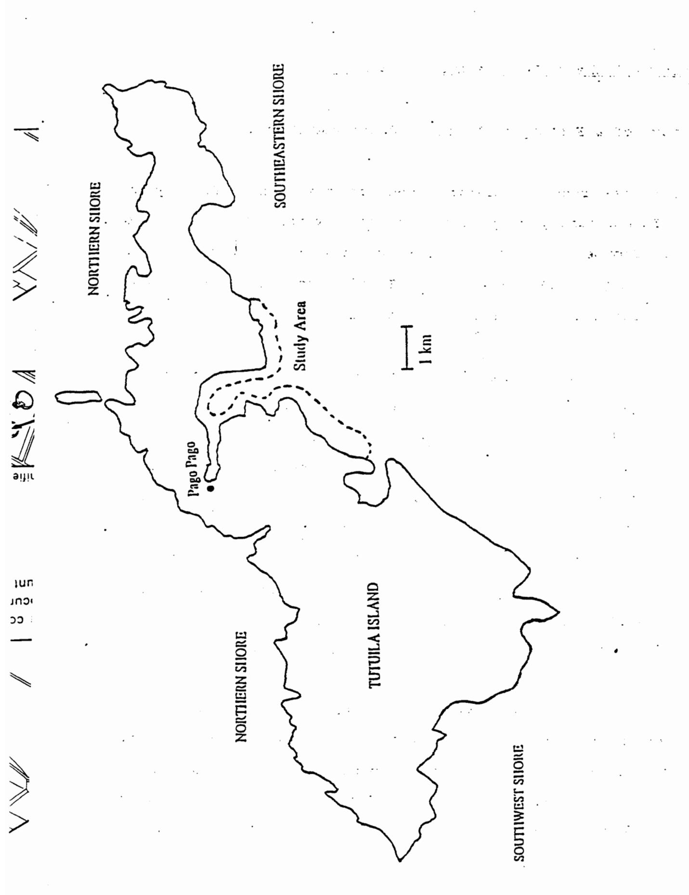
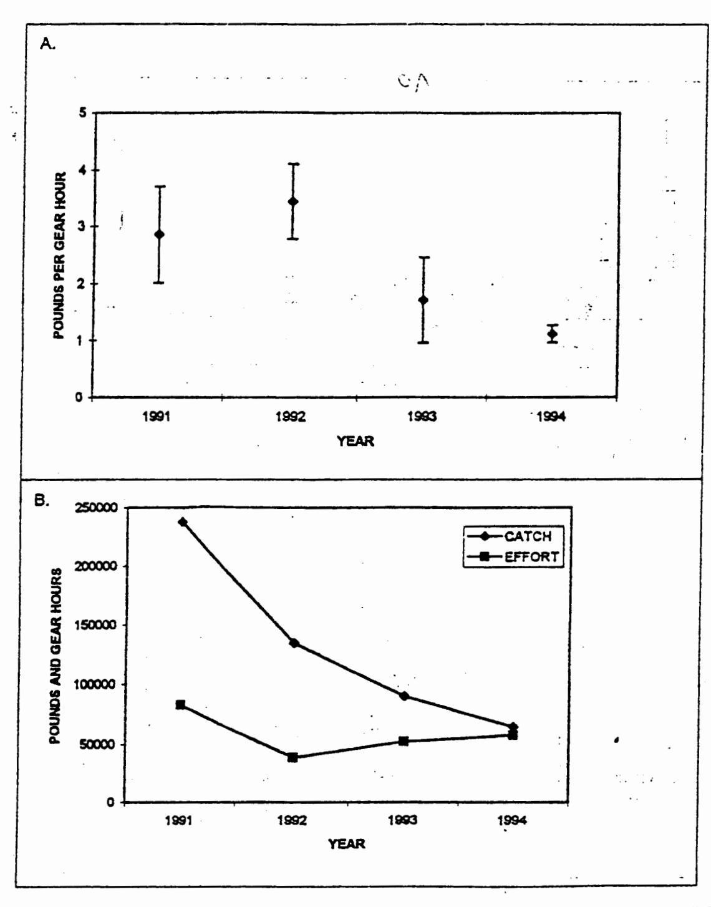
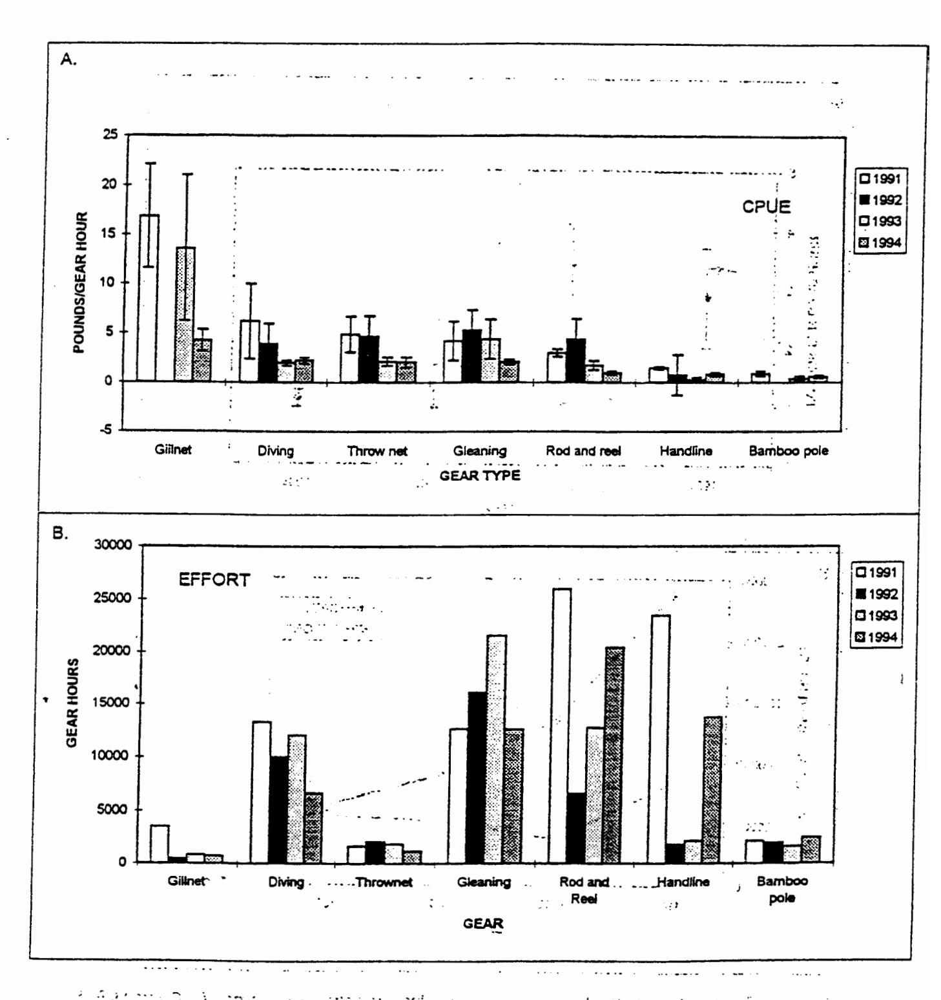
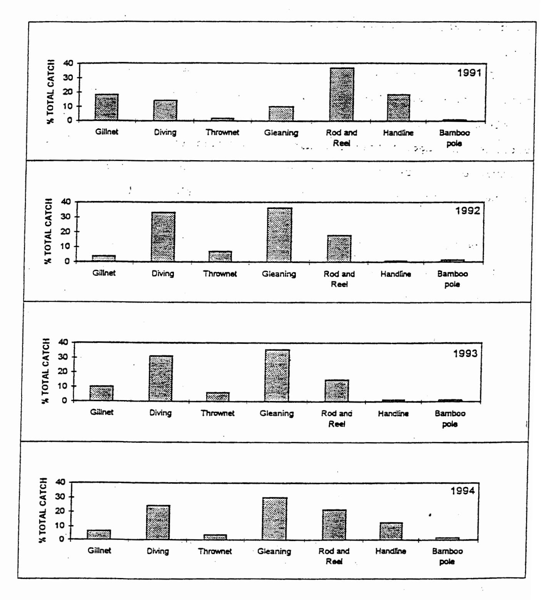
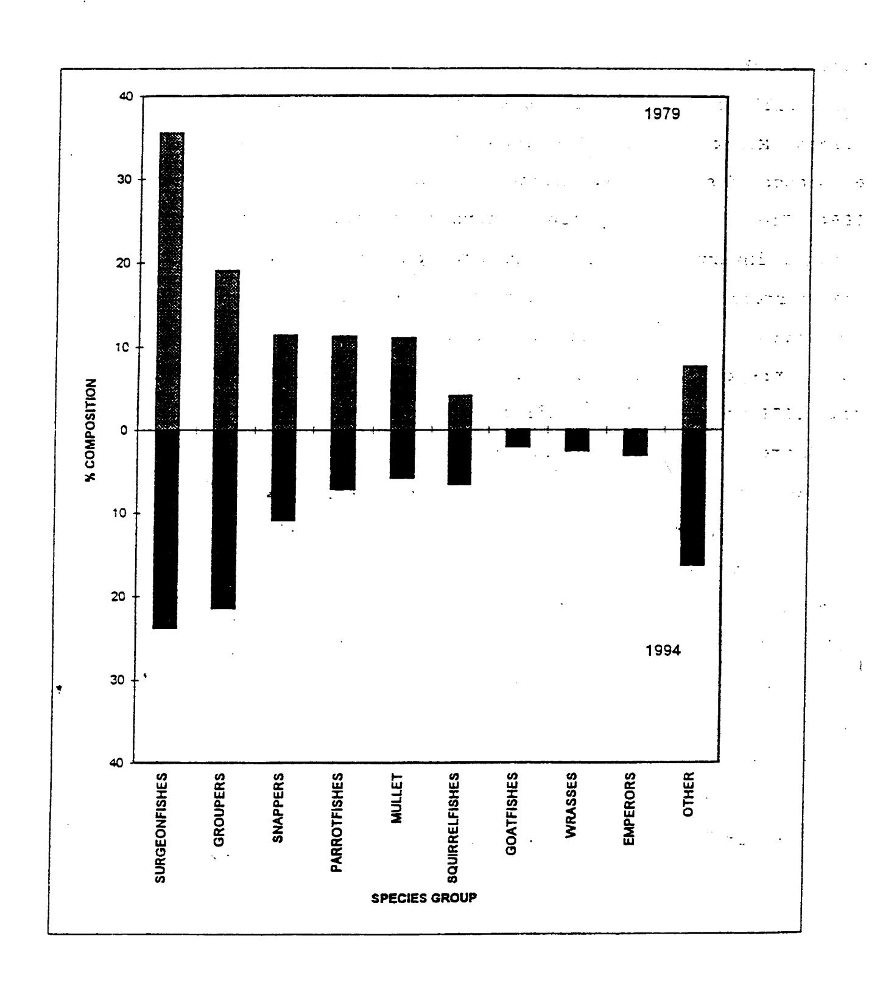
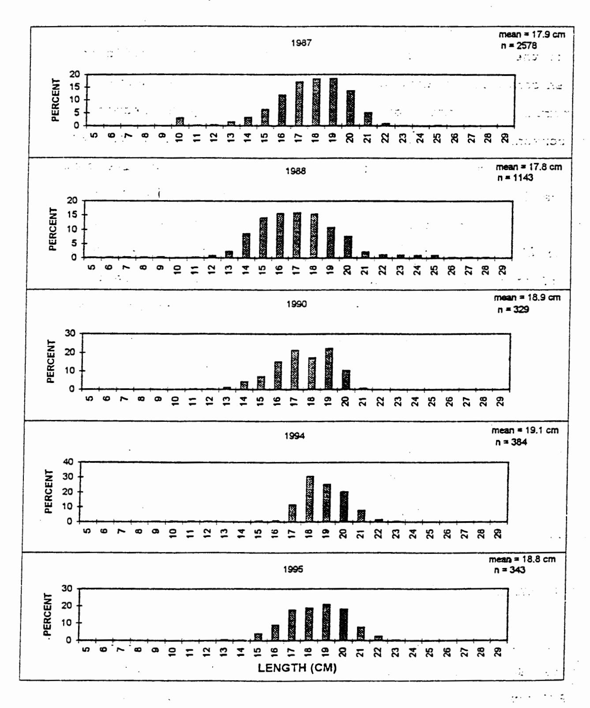

1 June 1995

1116

ORIGINAL

ORIGINAL : ENGLISH

DMWR Report Series #73

# SOUTH PACIFIC COMMISSION

# JOINT FFA/SPC WORKSHOP ON THE MANAGEMENT OF SOUTH PACIFIC INSHORE FISHERIES

(Noumea, New Caledonia, 26 June - 7 July 1995)

ASSESSING THE MANAGEMENT NEEDS OF A CORAL REEF FISHERY IN DECLINE

BY

S. Saucerman

Dept. of Marine & Wildlife Resources
Pago Pago, American Samoa

DEPARTMENT OF MARINE &
DEPARTMENT OF MARINE &
P.O. BOX 3730
PAGO PAGO, AMERICAN SAMOA 96799
PAGO PAGO, AMERICAN SAMOA 96799

ORIGINAL

cn c

#### FFA-SPC COASTAL FISHERIES MANAGEMENT WORKSHOP

Assessing the management needs of a coral reef fishery in decline.

Suesan Saucerman

Dept. of Marine and Wildlife Resources
 American Samoa Government
 P.O. Box 3730

Pago Pago, American Samoa 96799

### Introduction

ount socu Fishes are an important resource in tropical shallow waters, especially in developing countries where low-income fishers with few options for employment need to make a living. Although many South Pacific island communities have shifted from subsistence to cash-based economies, fishing remains an important subsistence and commercial venture (Munro 1984). As island populations increase and economies become less stable (SPC 1994), maintaining viable fish stocks becomes even more important.

Many small islands in the South Pacific are undergoing intense population growth (SPC 1994, UNDP 1994). With this growth comes increased pressure on the coral reef ecosystem not only from overfishing, but also from various types of habitat degradation (Maragos 1993, Craig this volume). Where soils are frequently disturbed, as buildings and farms keep pace with growing populations, sedimentation poses a great threat to coral reef communities. Turbidity reduces available light, recruitment of

coral larvae is inhibited, and growth is slower in areas of high sediment loading (Rogers 1990). Indirectly, in response to the alteration and loss of habitat, the coral reef fishes are affected as well.

Most South Pacific island communities have limited human and monetary resources to direct into fisheries research and management. In order to most effectively use the resources at hand, it is important to know in what direction management efforts should proceed. This paper describes a declining coral reef fishery in American Samoa, emphasizing the indicators that help to identify the causes of decline. Data are used from an assessment of the fishery in 1979 (Wass 1980), and from a monitoring program conducted since 1991. The data are used to address two questions: (1) What is the cause of the large decline in the fishery, and (2) What is an appropriate management direction?

#### American Samoa

101

aι

The inshore fishery was monitored on the main island of Tutuila (14°S, 171°W), American Samoa. It is a high island, 29 km long and an average of 4 km wide with a total land area of 135 sq. km. Nearly 70% of the land on the island has a slope of greater than 30% (Volk et al. 1992). Rainfall on Tutuila is heavy, averaging 320 - 500 cm a year.

The human population of American Samoa is approximately 55,000, and growing at a rate of 3.7% per year. The economy of Tutuila is dominated by two employers: two tuna canneries and the local government, which employ 33% and 32% of the labor force, respectively (EDPO 1991). Most of the food, fuel, and materials on island are imported (EDPO 1991).

nou

go

Nearly 55 km of the 125 km coastline of Tutuila (44%) is bordered by 90 - 300m wide fringing reefs (Volk et al. 1992). The reefs are partially exposed at low tide and most have seaward running channels (ava), where water is drained from the reef flats. Coral reefs are an important natural resource in American Samoa. Not only are they important habitat for fishes, but for traditional and recreational activities as well. Fish and shellfish are harvested most days of the year on the reef surrounding Tutuila Island. Compared to other fisheries on Tutuila (pelagics, bottomfish, and tournament), the inshore fishery makes up more than 50% of the landings (Craig et al. 1993).

In recent years, there have been numerous destructive impacts on coral reefs in Samoa. Natural events include a crown-of-thorns starfish infestation in 1978, hurricanes in 1987, 1990, and 1991, which reduced much of the coral to rubble, and a massive coral bleaching event in 1994, presumably due to high sea temperatures. Live coral cover has dropped from 60% in 1979 (Wass 1980) to 3-13% in 1993 (Maragos et al. 1994). Added to this are continuing land-

based human-induced impacts such as eutrophication and sedimentation which inhibit recovery of the coral reef ecosystem.

and all through the color of the transfer repair to the color of the color of the color of the colors of the colors of the colors of the colors of the colors of the colors of the colors of the colors of the colors of the colors of the colors of the colors of the colors of the colors of the colors of the colors of the colors of the colors of the colors of the colors of the colors of the colors of the colors of the colors of the colors of the colors of the colors of the colors of the colors of the colors of the colors of the colors of the colors of the colors of the colors of the colors of the colors of the colors of the colors of the colors of the colors of the colors of the colors of the colors of the colors of the colors of the colors of the colors of the colors of the colors of the colors of the colors of the colors of the colors of the colors of the colors of the colors of the colors of the colors of the colors of the colors of the colors of the colors of the colors of the colors of the colors of the colors of the colors of the colors of the colors of the colors of the colors of the colors of the colors of the colors of the colors of the colors of the colors of the colors of the colors of the colors of the colors of the colors of the colors of the colors of the colors of the colors of the colors of the colors of the colors of the colors of the colors of the colors of the colors of the colors of the colors of the colors of the colors of the colors of the colors of the colors of the colors of the colors of the colors of the colors of the colors of the colors of the colors of the colors of the colors of the colors of the colors of the colors of the colors of the colors of the colors of the colors of the colors of the colors of the colors of the colors of the colors of the colors of the colors of the colors of the colors of the colors of the colors of the colors of the colors of the colors of the colors of the colors of the colors of the colors of the colors of the colors of the colors of the colors of the color

an Angle and the first and the second and the second and the second and the second and the second and the second

Methods

94

The fishery was assessed in 1979 (Wass 1980) and has been monitored weekly since 1991 by the Department of Marine and Wildlife Resources (Ponwith 1991, McConnaughey 1993, Saucerman 1994). The inshore fishery includes all fishing activities on the coral reef fringing the island; it does not include offshore fishing for tuna or bottomfish. There are 7 principle gear types in the fishery: rod and reel, handline, bamboo pole, throw nets, gillnets, spear diving, and gleaning.

The study area encompasses a 17 km stretch of shoreline which includes the Pago Pago harbor area, outer harbor protected areas, and outer exposed areas (Fig. 1). Participation in the fishery (effort) is monitored by a roving creel survey conducted from the shoreline road and catch data are gathered by fisher interviews. Surveys are conducted three times a week with four counts each 8-hr period and include daytimes, nighttimes, weekdays and weekends. Tables 1 and 2 summarize the sample sizes for 1991 - 1994. It should be taken into consideration that sample sizes for 1991 and 1994 are larger than those in the intervening years.

Estimates for total catch, effort, and species groups for 1991

to 1994 are from data expanded by a dbase program (for details see Ponwith 1991) and include daytime, nighttime, weekday and weekend strata. No confidence limits have been calculated for these data at this time. The estimates for catch per unit effort (CPUE) are taken from the raw data with no stratification or expansion.

Table 1. Summary of participation counts (P) and catch interviews (I) for the American Samoa inshore survey study area, 1991 - 1994.

| Year | Weekd | ay  |       | Weekend |     |      |       |    | and the same of |     |
|------|-------|-----|-------|---------|-----|------|-------|----|-----------------|-----|
|      | Day   |     | Night |         | Day |      | Night |    | TOTAL           |     |
|      | Þ     | I   | P     | I       | P   | I    | P     | I  | P               | I   |
| 1991 | 254   | 73  | 79    | 69      | 87  | . 62 | 36 ·  | 10 | 456             | 214 |
| 1992 | 204   | 23  | 45    | 5       | 23  | 2    | 4     | 0  | 276             | 30  |
| 1993 | 201   | 40  | 24    | 5       | 56  | 17   | 18    | 7  | 299             | 68  |
| 1994 | 300   | 100 | 111   | 32      | 86  | 33   | 45    | 27 | 542             | 192 |

Table 2. Summary of sample sizes for catch estimates for each gear type in the American Samoa inshore survey study area, 1991 - 1994. Where n<2, catch estimates were not calculated.

| Gear         | Number of Interviews |      |      |      |  |  |  |  |
|--------------|----------------------|------|------|------|--|--|--|--|
|              | 1991                 | 1992 | 1993 | 1994 |  |  |  |  |
| Rod and Reel | . 69                 | 4    | 21   | 53   |  |  |  |  |
| Hand line    | 62                   | 4    | 2    | 23   |  |  |  |  |
| Bamboo Pole  | 12                   | 1    | 3    | 21 _ |  |  |  |  |
| Gleaning     | 11                   | 6    | 12   | 34   |  |  |  |  |
| Diving       | 18                   | 5    | 12   | 33   |  |  |  |  |
| Throw Net    | 16                   | 10   | 14   | 18   |  |  |  |  |
| Gill Net     | 26                   | 0    | . 5  | 10   |  |  |  |  |
| Total        | 214                  | 30   | 69   | 192  |  |  |  |  |

Figure 1. The inshore fishery study area Tutuila Island, American Samoa.

## The Inshore Fishery: Results and Discussion

cnı

## Indicators of a Fishery in Decline: Catch and Effort

There has been a declining trend in the inshore fishery on Tutuila Island during the past four years. Overall CPUE, all gears combined, dropped about 60% from 2.9 lbs. per gear hour to 1.1 lbs. per gear hour in 1994 (Fig. 2A). Total catch declined 70% and effort declined 30% in the study area (Fig. 2B).

CPUE decreased by more than 50% for most gear types in the past four years (Fig. 3A). Most notably, the take from gillnets declined from about 15 lbs. in 1991 to 4 lbs. per gear hour in 1994, though this remains the most effective gear in the fishery. Most gear types have declined in use as well as efficiency in the past four years (Fig. 3B). The higher rod and reel and handline effort in 1991 and 1994 likely reflect the large migrations of bigeye scad (Selar crumenophthalmus) that occurred those years (Ponwith 1991, Saucerman in prep), but not in 1992 and 1993.

There have been only small changes in the proportion of total catch taken by each gear type in the past four years (Fig. 4). Again, the higher catch taken in 1991 and 1994 for rod and reel and handline can be accounted for by the bigeye scad migrations those years. In 1991 gillnets also took a lot of bigeye scad, but in 1994 no gillnets were observed to be fishing for that species.

nuoc

00 1

Figure 2. Fishery statistics for the American Samoa inshore fishery study area. A. Overall CPUE in pounds per gear hour, all gears combined (w/SE). B. Catch in pounds and effort in gear hours, 1991 - 1994.

Figure 3. A. Catch per unit effort (in pounds per gear hour with SE) for each gear type, 1991 - 1994.

B. Effort in gear hours for each gear type, American Samoa study area, 1991 - 1994.

noc

Figure 4. Percent of total catch taken by each gear type in the American Samao inshore fishery study area 1991 - 1994.

voo mu: it in

## Other Fishery Indicators: Species Composition and Size Frequencies

Information on catch and effort, species composition, and other biological characteristics provides clues to identifying problems in a fishery. The catch and effort data show an overall decline and suggest that immediate management steps are needed to alleviate pressure on the fishery. However, there are other signs in the fishery that indicate it is not overfished.

Overfishing and habitat degradation can be distinguished by using indicators in the fishery. Common indicators of overfishing include increases in effort along with drops in catch, reductions in biomass, in overall CPUE, in relative abundance of large predatory species, and in size of fisheries species (Munro and Williams 1985, Russ 1991). When data show decreases in CPUE and biomass, but none of the other problems associated with overfishing, the cause of decline might be habitat degradation. Indicators of habitat degradation include lower abundances of fishes and decreases in species which rely on the structural complexity provided by healthy coral reefs (Carpenter et al. 1981).

ìu

on: onc

Of the indicators of overfishing listed above, decreases in total catch and in CPUE are the only examples observed in our fishery. Classic indication of overfishing is a decrease in catch coincident with an increase in effort. Our data show that even though effort has gone down, there is still a large decline in

total catch. It is also expected that where an area is overfished there will be a decline in relative abundance of large, desirable fishes (Munro and Williams 1985, Russ 1991). However, relative abundance of species has changed little in the fishery from 1979 to 1994 (Fig. 5). The species groups presented in figure 5 do not include invertebrates or migratory species such as bigeye scad. For serranids (groupers), lutjanids (snappers), and lethrinids (emperors), which are considered to be desirable species (Russ 1991), proportions in the catch either stayed the same of increased from 1979 to 1994. Acanthurids (surgeonfishes and unicornfishes), which are relatively small herbivores and planktivores, made up the bulk of the catch both years, though less in proportion in 1994.

Another common indicator of overfishing is a decline in size structure of fisheries species (Munro and Williams 1985, Russ 1991). This has not occurred for at least one important species, the bluelined surgeonfish (Acanthurus lineatus), which makes up approximately 30% of the commercial artisanal fishery (Saucerman, unpubl. data). Length frequency data for this species from 1987 to 1995 show that the average size has not declined over nine years (Fig. 6, Craig in prep.), but has actually increased slightly.

ur

Figure 5. Relative abundance of coral reef fishes harvested in the inshore fishery study area in American Samoa in 1979 (Wass 1980) and 1994.

ont our

Figure 6. Length frequencies (FL) of *Acanthurus lineatus* caught in the commercial fishery of Tutuila Island, American Samoa, over nine years.

lur

no

These data do not strongly demonstrate that overfishing is the cause of the decline in the fishery. However, there is evidence in the fish community structure that suggests that habitat degradation is important. Habitat degradation is indicated by the response of fish communities and species to loss -of live coral cover (Russ 1991). For example, abundances of fishes that feed on live coral decrease in coral reef areas that have been damaged (Russ and Alcala 1989). Additionally, overall abundance of reef fishes has been correlated with structural complexity (Carpenter et al. 1981). It is often small, non-fisheries species that display changes in abundance in response to habitat degradation. In American Samoa, there has been a change in relative abundances of fish species over the last 15 years (Green in prep.). Green (in prep.) found that a damselfish species closely associated with live corals, Dick's damsel (Plectroglyphidodon dickii), decreased dramatically in number of individuals per ha from 1980 to 1994. In the same study, the princess damsel (Pomacentrus vaiuli), a species closely associated with coral rubble, showed a striking increase in numbers.

### Management options

lunc

noo

Clearly there are warning signs for the inshore fishery of American Samoa. There are decreases in total harvest biomass, and in CPUE across the board for gear types employed in the fishery. There is ample indication that management steps need to be taken in

order to allow the fishery to recover, but it does not appear that the problem is overfishing. There is, however, substantial evidence of wide-spread habitat destruction of the reefs in American Samoa. This evidence is seen not only in the loss of live coral cover, but also in the responses of some fish species to that loss.

The coral reefs of Tutuila Island have been heavily damaged by hurricanes, crown-of-thorns starfish, and bleaching events. Heavy anthropogenic sediment loading may hinder recovery from these natural disturbances. Although it is not yet quantified, this sediment is clearly visible as large plumes in most bays after heavy rainfall, and on the reefs under water most of the time. Turbidity reduces light for photosynthesis by zooxanthellae in the tissues of corals and other organisms. Recruitment of coral larvae is affected adversely, as the larvae cannot settle on loose sediment (Birkeland 1977 in Rogers 1990). Corals are also prone to bleaching and suffocation (Rogers 1990), and have slower growth (Randall and Myers 1983) in areas of high sedimentation. modifying habitat, sedimentation alters interactions between fishes and their habitat. With heavy sedimentation there is a decrease in the amount of structurally complex coral colonies. reduction in the quantity of refuges and surface area a reef provides, there is decline in the abundance of fishes and the number of species the reef can sustain (Russ and Alcala 1989, Rogers 1990).

un,

ກວດ

Standard fisheries management measures such as size limits, closed seasons and areas, and gear restrictions are of little value when the fishery habitat is continually degraded. With habitat degradation there are drops in fish abundance, and in species that rely on living coral for food or protection, regardless of fishing activity. In situations such as exist in American Samoa it might be more beneficial to turn our management and research energies towards habitat conservation.

The steep topography of Tutuila renders the reefs particularly vulnerable to sedimentation. The amount of sediment runoff entering coastal areas depends on watershed size and slope, volume of rainfall, soil type and condition, and land use practices (Hubbard 1987). Tutuila is a very steep island and most of the flat-land areas are already inhabited. It is likely that as the population grows, the steeper areas will be developed and farmed, increasing the sedimentation on the reefs.

A primary management objective is to identify the major causes of reef degradation and to determine which of these can be mitigated. Sedimentation from land-based activities appears to be one of the largest potential sources of human-induced reef degradation in American Samoa. Research should be directed towards establishing that sediment adversely affects the coral reef habitat and associated fish communities in American Samoa. This includes quantifying sediment input onto the coral reefs, the coral

communities a ociated with ish communit the resultan loading adver ly affects c fish communit : will be di well. agencies to be ser predict decide what act ons to take

arying degrees of sediment load, and It is well known that sediment s. al reefs. It is expected that the ectly and/or indirectly affected as Empiric | evidence commenting these effects will enable e effects of sedimentation, and to alleviate fisheries problems.

Management measures sho sediment loading by employ: include (for Samoa): using ... 1994), using erosion contro runoff above disturbed slop clearcutting on steep slopes the Coastal Zone Management "Protecting Coastal Water" ( measures to 1) reduce eros. retain sediment on-site durin to land disturbance, prepare provisions.

lui

CUL

၁၁

d be directed towards a decrease in proper land use practices. tour hedgerows on plantations (USDA during construction, intercepting , etc. (ASEPA 1995), and avoiding In 1990 the U.S. Congress expanded t by creating a new section called ction 6217). Section 6217 requires that the Territory of Ame can Samoa comply with management and, to the extent practicable, and after construction, and 2) prior d implement an approved erosion and sediment control plan that a stain erosion and sediment control With the exist j infrastructure, it seems at this point a matter of concentr :ed management effort, along with education towards sediment co irol, is necessary in American Samoa.

In order to manage for reduce a sedimentation we need to work with

the agencies responsible for controlling erosion and sedimentation (Environmental Protection Agency, Soil Conservation Service, Dept. of Agriculture, Land Grant, and The Development Planning Office). At the same time, we should concentrate our research energies on quantifying the effects of sedimentation on the coral reef ecosystem.

### Conclusion

10

It is important to make sound management decisions in any fishery, but particularly where the livelihoods of many people depend upon it. Where overfishing is a problem, regulations such as closed areas, closed seasons, gear limitations and size limits may be appropriate. Where reef degradation is important, it is more appropriate to locate the source and effects of the degradation, and to minimize further damage.

American Samoa is facing a rapidly growing population supported by few economic resources. Coral reefs play an important role in traditional Samoan culture and supply a large percentage of all locally caught fish (Craig et al. 1993). With the high human population and economic instability, coral reef resources may become more important in years to come. However, along with the increasing population comes more pressure on the coral reef ecosystem, particularly in the form of proliferating impacts from poor land-use practices. I suggest that habitat degradation may be

the main limiting factor in the inshore fishery and that conservation of the reef environment is essential to managing the fisheries.

### Summary

1 lun

1 CO/

On Tutuila Island, in American Samoa, we have monitored the inshore fishery since 1991. Although there has been a decline in CPUE and total catch, we are not detecting many of the classic "red flags" that signify overfishing. In recent years, however, some major environmental catastrophes occurred which caused a great deal of reef degradation. Under normal conditions we would expect the reefs to recover from these environmental events. However, added to these natural disasters are human induced impacts which inhibit normal recovery of the reef habitat. If degradation of reefs persists, fisheries yields will probably decline no matter what other regulatory management measures are implemented.

Some of the data indicate that habitat degradation is the cause of the decline in the fishery. Management measures, therefore, should be directed towards reducing the magnitude of human impact on the reefs, especially sedimentation. In order to accomplish this we are attempting to assess the fisheries problems related to sedimentation, and to work with the agencies responsible for controlling this impact.

Green, A.L. (in prep). Status of coral reef fishes and their habitat in the Samoan Archipelago.

కుండా కార్యం ఎక్కువు కొన్నారు. మండి మండి మండి కార్యం సందర్భకత్వి మండి మండి మండి మండి మండి మండి మండి మండ

- Hubbard, D.K. 1987. A general review of sedimentation as it relates to environmental stress in the Virgin Islands Biosphere Reserve and the Eastern Caribbean in general. Biosphere reserve research report no. 20. Virgin Islands Resource Management Cooperative/National Park Service, p. 1-41.
- Maragos, J.E. 1993. Impact of coastal construction on coral reefs in the U.S. affiliated Pacific Islands. Coastal Management, 21:235-269.
- Maragos, J.E., C.L. Hunter, and K.Z. Meier. 1994. American Samoa Coastal Resources Inventory. Final Report to the ASG Dept. of Marine and Wildlife Resources.
- McConnaughey, J.M. 1993. The shoreline fishery of American Samoa in FY92. Dept. of Marine and Wildlife Resources Biological Report Series No. 41.

no

Munro, J.L. 1984. Coral reef fisheries and world fish production.

ICLARM Newsletter, 7(4):3-4.

- Saucerman, S.E. 1994. The inshore fishery of American Samoa, 1991 to 1993. Dept. of Marine and Wildlife Resources Biological Report Series No. 43.
- Saucerman, S.E. in prep. The inshore fishery of American Samoa, 1991 to 1994. Dept. of Marine and Wildlife Resources Biological Report Series No. ?.
- SPC (South Pacific Commission) 1994. Pacific Island Populations:

  a report prepared by the South Pacific Commission for the
  International Conference on Population and Development (1994:
  Cairo, Egypt).

nemu ant the

COVE

- UNDP (United Nations Development Programme) 1994. Pacific human development report. United Nations Development Programme, Suva, Fiji, July, 1994.
- USDA (U.S. Dept. of Agriculture), and SCS (Soil Conservation Service) 1994. Contour Hedgerows: a new way to reduce soil erosion and fertilizer costs. Pago, American Samoa.
- Volk, R.D., P.A. Knudsen, K.D. Kluge and D.J. Herdrich. 1992.

  Towards a territorial conservation strategy and establishment
  of a conservation areas system for American Samoa. Le

  Vaomatua, Inc. Pago, American Samoa. xvi + 114 p.

Ame

iffed D

nuoc unt Wass, R. 1980. Characterization of inshore Samoan fish communities. Department of Marine and Wildlife Resources, American Samoa Government, Biol. Rept. Ser. No. 2.

್ರತದಾರುತ್ತಿ ಇದು ಇದಿಗಳ ಬರು ಬರು ಅವರ ಅತ್ಯವಾದ ಅನಿಕೆ ಬರು ಅವರು ಹಾಗು ಬರು ಬರು ಬರು ಬರು ಬರು ಬರು ಬರು ಬರು ಬರು ಬರ

A transported to the contract of the contract of the contract of the contract of the contract of the contract of the contract of the contract of the contract of the contract of the contract of the contract of the contract of the contract of the contract of the contract of the contract of the contract of the contract of the contract of the contract of the contract of the contract of the contract of the contract of the contract of the contract of the contract of the contract of the contract of the contract of the contract of the contract of the contract of the contract of the contract of the contract of the contract of the contract of the contract of the contract of the contract of the contract of the contract of the contract of the contract of the contract of the contract of the contract of the contract of the contract of the contract of the contract of the contract of the contract of the contract of the contract of the contract of the contract of the contract of the contract of the contract of the contract of the contract of the contract of the contract of the contract of the contract of the contract of the contract of the contract of the contract of the contract of the contract of the contract of the contract of the contract of the contract of the contract of the contract of the contract of the contract of the contract of the contract of the contract of the contract of the contract of the contract of the contract of the contract of the contract of the contract of the contract of the contract of the contract of the contract of the contract of the contract of the contract of the contract of the contract of the contract of the contract of the contract of the contract of the contract of the contract of the contract of the contract of the contract of the contract of the contract of the contract of the contract of the contract of the contract of the contract of the contract of the contract of the contract of the contract of the contract of the contract of the contract of the contract of the contract of

A section of the section of the section of the section of the section of the section of the section of the section of the section of the section of the section of the section of the section of the section of the section of the section of the section of the section of the section of the section of the section of the section of the section of the section of the section of the section of the section of the section of the section of the section of the section of the section of the section of the section of the section of the section of the section of the section of the section of the section of the section of the section of the section of the section of the section of the section of the section of the section of the section of the section of the section of the section of the section of the section of the section of the section of the section of the section of the section of the section of the section of the section of the section of the section of the section of the section of the section of the section of the section of the section of the section of the section of the section of the section of the section of the section of the section of the section of the section of the section of the section of the section of the section of the section of the section of the section of the section of the section of the section of the section of the section of the section of the section of the section of the section of the section of the section of the section of the section of the section of the section of the section of the section of the section of the section of the section of the section of the section of the section of the section of the section of the section of the section of the section of the section of the section of the section of the section of the section of the section of the section of the section of the section of the section of the section of the section of the section of the section of the section of the section of the section of the section of the section of the section of the section of the sectio

A. A. B. Martin, M. M. Martin, M. M. M. M. M. M. M. M. M. M. M. M. M.