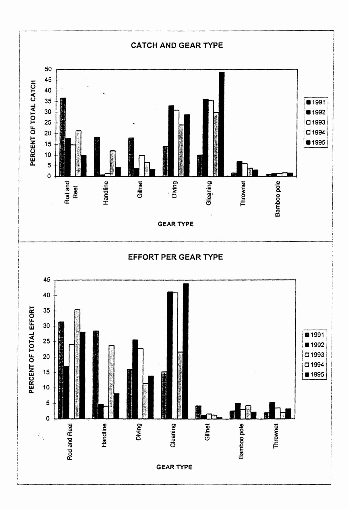

# **ORIGINAL**

The inshore fishery monitoring survey of American Samoa, 1991 to 1995

Suesan Saucerman, August 1996, Draft report

# 1. Study objectives

The Inshore Survey monitoring program was initiated by the Department of Marine and Wildlife Resources (DMWR) in 1990 to compare results with a similar study conducted in 1978-1979. The survey has continued and evolved over the past five years. The objectives of the survey are to monitor public usage of the local inshore marine resources to obtain information on the catch and effort and species composition of this multi-species, multigear fishery in order to track the trends and/or changes of the fishery over time. The results of this survey provide DMWR with information needed to make decisions on what areas of the fishery merit further studies, which species/families are most important in the fishery and therefore merit further biological studies. Further, the survey has the potential over time to provide information on indicators of overfishing such as shifts in species composition, and decreases in average lengths of specific species.

Since data collection began in July 1990, the survey has continued to the present with only moderate changes in order to maintain the ability to compare results year by year. Results presented in this report include only those data which represent entire years, which include information collected in 1991 (Ponwith), 1992 and 1993 (McConnaughey), 1994 and 1995 (Saucerman).

#### 2. Methods

## Data Collection

#### Study area

The survey is conducted on a portion of the southern coast of Tutuila Island, American Samoa. Tutuila Island is located in the tropical South Pacific at 140° south latitude and 171° west longitude at the midpoint of the Samoan

Table 1. Summary of participation counts (R) and interviews (I) for the inshore survey, 1991 - 1995.

| Year | Weekda | Weekday |       |    | Weekend |    |       |     |       |     |
|------|--------|---------|-------|----|---------|----|-------|-----|-------|-----|
|      | Day    |         | Night |    | Day     |    | Night |     | TOTAL |     |
|      | R      | I       | R     | I  | R       | Ī  | R     | I   | R     | I   |
| 1991 | 254    | 73      | 79    | 69 | 87      | 64 | 36    | 10  | 456   | 216 |
| 1992 | 204    | 23      | 45    | 5  | 23      | 2  | 4     | 0   | 276   | 30  |
| 1993 | 201    | 40      | 24    | 5  | 56      | 17 | 18    | . 6 | 299   | 68  |
| 1994 | 300    | 100     | 111   | 32 | 86      | 33 | 45    | 27  | 542   | 192 |
| 1995 | 325    | 83      | 97    | 8  | 55      | 22 | 53    | 17  | 530   | 130 |

## Area groupings

The study area included 22 villages which were grouped into eight areas for expansion purposes because there was not a sufficient number of interviews to expand on a village by village basis. The following village groupings and general habitat descriptions were used. Abbreviations used in figures are in parentheses (after McConnaughey 1992).

| Area Villages an | d general habitat description                       |
|------------------|-----------------------------------------------------|
| Lauli'i          | Lauli'ituai, Lauli'ifou. Habitat: Exposed           |
| (LA)             | coastline, outside of harbor area.                  |
| Onesosopo        | Onesosopo, Aua, Lepua, Leloaloa. Habitat:           |
| (OS)             | Protected outer harbor area.                        |
| Inner Harbor     | Atu'u, Anua, Satala, Lalopua, Pago Pago,            |
| (IH)             | Malaloa. Habitat: Calm, protected areas.            |
| Fagatogo         | Fagatogo. Habitat: Fuel and cargo dock area.        |
| (FT)             | Constant vessel traffic. Few coral reefs remaining. |
| Utulei (UT)   | Utulei. Habitat: Semi-protected outer harbor area.  |
| Faga'aalu        | Faga'aalu, Fatu ma Futi. Habitat: A shallow bay     |
| (FA)             | outside the main harbor, broad reef top and an      |
|                  | exposed high wave energy reef front.                |
| Matu'u           | Matu'u, Vasa'aiga, Faganeanea. Habitat: Narrow      |
| (MT)             | fringing reefs with exposed, high energy fronts.    |
| Nu'uuli          | Avau, Oneoneloa, Nu'uuli. Habitat: Narrow to broad  |
| (NU)             | reefs with exposed, high energy fronts.             |

#### 3. Methods of analysis (assumptions and constraints associated with these methods)

#### **Analysis**

Data were entered into a database (DBASE IV) and a program designed by Western Pacific Fisheries Information Netwok personnel is used to expand the sample data to annual catch and effort estimates, and species composition for the study area.

For effort (gear hour) estimates, the average number of fishers for the survey runs is multiplied by the number of hours in the fishing day to obtain the estimate of fishing hours in that day. To estimate the number of gear hours, the estimate of fishing hours is divided by the mean trip length, which is taken from the catch interviews:

$$\overline{E} = \frac{\sum_{d=1}^{n} E_{d}}{n}$$

where  $\bar{E}$  is average gear hours, E is gear count per run, n is number of runs by type day in time period, and d is day, the variance is calculated by:

$$\operatorname{Var}(E) = \frac{\sum_{d=1}^{n} E_d^2 - \frac{\sum_{d=1}^{n} E_d^2 - \frac{n}{n}}{n-1}}{n-1}$$

and:

$$Var \ \overline{E} = \frac{Var(E)}{n} * \left(1 - \frac{n}{N}\right)$$

where N is the total number of hours in the same type of day in the same time period. Then the expanded number of gear hours becomes:

$$\hat{E} = \bar{E} * N$$

#### 4. Results as per expansion analyses

#### Survey area

The estimate for the total catch for the survey area rose in 1995 (Table 3) from 1994 by about 50%, effort decreased by about 16% and CPUE rose accordingly. Values are not as high as for 1991, but are fluctuating at a lower level for the past few years (Figure 1). Variances for effort (real), CPUE (only real in 39 of 264 cases in 1991, 6 of 162 cases in 1992, 21 of 248 cases in 1993, 36 of 246 cases in 1994 and 22 of 216 cases in 1995), and catch (same as for CPUE) are listed in appendices in the back.

Table 3. Summary of expansion estimates for the inshore coral reef fishery in the study area on Tutuila Island, American Samoa, 1991 to 1995.

| ESTIMATED                   | 1991    | 1992    | 1993   | 1994   | 1995   |
|-----------------------------|---------|---------|--------|--------|--------|
| CATCH (pounds)              | 236,970 | 134,920 | 90,380 | 65,160 | 99,590 |
| EFFORT (gear hours)         | 82,840  | 39,210  | 52,840 | 57,930 | 48,325 |
| CPUE (pounds per gear hour) | 2.86    | 3.44    | 1.71   | 1.12   | 2.06   |

#### Catch by gear

Estimated CPUE per gear type increased in 1995 from 1994 values for all but thrownets (Table 4). Active gillnets have the highest CPUE and exceeded 1991 values, but caution must be taken here, the gillnets in 1991 were largely used to catch atule (Selar crumenophthalmus), and there were few gillnet interviews in 1995 (Table 2). Additionally, gillnets make up very little of the total percentage of catch and effort (Figure 2), whereas gleaning, which takes mainly invertebrates, makes up approximately 50% of both catch and effort.

#### Catch by area

Catch per meter squred of reef flat at six areas has varied over the past five years (Figure 3), but remain essentially at similar levels except for the high catch of atule at Utulei in 1991. Reef flat area for each area was digitized from a topographic map of Tutuila Island.

Table 4. Estimated catch per unit effort in pounds per gear hour for the different gear types used in the inshore survey, 1991 - 1995. Night, day, weekend and weekday samples are pooled.

| CATCH PER UNIT EFFORT  (pounds per gear hour) |       |       |       |      |       |  |  |  |
|-----------------------------------------------|-------|-------|-------|------|-------|--|--|--|
| Gear                                          | 1991  | 1992  | 1993  | 1994 | 1995  |  |  |  |
| Gill net                                      | 12.25 | 10.88 | 10.48 | 5.9  | 14.59 |  |  |  |
| Rod and reel                                  | 3.34  | 3.61  | 1.05  | 0.68 | .73   |  |  |  |
| Throw net                                     | 2.40  | 4.57  | 2.94  | 2.11 | 1.97  |  |  |  |
| Spear diving                                  | 2.53  | 4.45  | 2.33  | 2.37 | 4.3   |  |  |  |
| Gleaning                                      | 1.90  | 3.02  | 1.84  | 1.55 | 2.29  |  |  |  |
| Handline                                      | 1.84  | 0.57  | 0.59  | 0.57 | 1.07  |  |  |  |
| Bamboo pole                                   | 1.06  | 0.91  | 0.76  | 0.45 | 1.48  |  |  |  |
| OVERALL                                       | 2.86  | 3.44  | 1.71  | 1.13 | 2.06  |  |  |  |

Figure 2. Estimated catch and effort by gear type for the survey area of Tutuila Island, American Samoa, 1991 to 1995.

#### **Species composition**

The proportion of resident coral reef fishes increased in the catch in 1995 from previous years (Fig. 4). The total landings of invertebrates increased also, particularly in proportion. Migratory fishes decreased in total pounds and proportion of the catch in 1995. Migratory fishes made up 66% of the total catch in 1991 (Fig. 4), largely due to the migratory atule catch for that year, which contributed 56% (131,676 lbs.) of the total catch for 1991. In contrast, migratory species made up only 16 - 17% of the catch in 1992 and 1993. In 1992, resident reef fishes made up the largest part of the catch (48%), followed by invertebrates (36%). In 1993 invertebrates made up 60% of the catch and resident reef fishes comprised 23%.

A break down of resident coral reef fish species encountered during survey interviews is listed in Table 5. In 1995, more parrotfishes were seen during survey than acanthurids for the first time in five years. In 1995 scarids increased an order of magnitude from 1994. Acanthurids still made up 22% of the catch (Table 6), a large percentage, but scarids comprised 33% of the total catch in 1995. Most families (eg. Serranids, Holocentrids, Lutjanids, etc.) appear to fluctuate in occurance in the survey over the years.

For non-resident fishes encountered during interviews for the inshore fishery, small jacks made up the major proportion of the catch (Table 7) in 1995. Skipjack tuna and sharks also showed up in the catch, but atule were not encountered at all during 1995.

Octopus and white sea urchins made up the majority of the catch of invertebrates for all five years (Table 8). Most years octopus is around 50% of the invertebrates encountered in the survey. Sea urchins in general are also popular in the fishery, and are mostly taken by gleaners, though they were far higher in proportion (29%) in the catch in 1991 than in 1995 (12%).

Table 5. Resident coral reef fishes species catch composition in pounds for the inshore coral reef fishery of American Samoa from 1991 to 1995. Listed, by family, in order of importance in fishery in 1991. Total pounds per family are underlined in expended notal? I to

NAMES

bold.

Year and catch composition(in pounds)

| Family or                                    |               |                                  |                     |           |         |              |              |
|----------------------------------------------|---------------|----------------------------------|---------------------|-----------|---------|--------------|--------------|
| Species                                      | Samoan        | Common                           | 1991                | 1992      | 1993    | 1994         | 1995         |
|                                              | 1911          |                                  |                     |           |         |              |              |
| ACANTHURIDAE                                 |               |                                  | 13749               | 20947     | 2521    | 3903         | 7268         |
| Acanthurus lineatus                          | Alogo         | Striped surgeonfish              | 6203                | 3531      | 549     | 345          | 2061         |
| Acanthurus/Ctenochaetus                      | Pone          | Brown surgeonfishes (small)      | 3380                | 11184     | 646     | 1529         | 743          |
| Acanthurus xanthopterus                      | Palagi        | Yellowfin surgeonfish            | 2743                | 491       | 0       | 490          | 1161         |
| Vaso spp.                                    | Ume           | Unicornfishes                    | 769                 | 4165      | 166     | 161          | 260          |
| Acanthurus triostegus                        | Manini        | Convict tang                     | 654                 | 1303      | 1160    | 793          | 659          |
| Vaso lituratus                               | Umelei        | Orangespine unicomfish           | 0                   | 273       | 0       | 272          | 66           |
| Acanthurus guttatus                          | Maono         | Whitespotted surgeonfish         | Ö                   | 0         | Ö       | 239          | 115          |
| Acanthurus achilles                          | Kolama        | Achilles tang                    | ő                   | 0         | Ö       | 74           | 0            |
| aso annulatus                                | Ume-ulutao    | Whitemargin unicomfish           | 0                   | 0         | 0       | 0            | 2203         |
| ERRANIDAE                                    |               |                                  | . 9616              | 6116      | 1209    | 7570         | 4120         |
| Serranidae                                   | Gatala        | Miscellaneous groupers           | <u>8616</u> 7171 | 1730      | 401     | 3520 3155 | 4139 2807 |
| Cephalopholis argus                          | Gatala uli    | Miscellaneous groupers           |                     |           |         | 3133         |              |
| Cephalopholis argus Cephalopholis urodeta | Mata'ele      | Peacock grouper Flagtail grouper | 793 482          | 3201 0 | 0 19 | 324          | 365 893   |
| Sepnatopnotis uroaeta Variola louti       | Velo          | Lyretail grouper                 |                     | 0         | 0       | 324 0     | 893          |
|                                              | Gatala aloalo |                                  | 170 0            | -         | 789     | 0 22      | 0 74      |
| Epinephelus hexagonatus                      | Jataia albaib | Hexagon grouper                  | U                   | 1185      | /89     | 22           | /4           |
| OLOCENTRIDAE                                 |               |                                  | 5849                | 12278     | 190     | 1093         | 2848         |
| łolocentridae                                | Malau         | Miscellaneous squirrelfishes     | 5849                | 12278     | 190     | 1093         | 2848         |
| UTJANIDAE                                    |               |                                  | 2822                | 1056      | 2387    | 1755         | 264          |
| utjanus monostigmus                          | Ta'iva        | Onespot snapper                  | 1638                | 335       | 439     | 1581         | 264          |
| utjanus fulvus.                              | Tamala        | Flametail snapper                | 785                 | 0         | 266     | 140          | 0            |
| utjanus gibbus                               | Mala'i        | Paddletail snapper               | 399                 | 689       | 0       | 0            | 0            |
| utjanidae                                    | Palu          | Deepwater snappers (misc.)       | 0                   | 32        | 0       | 0            | 0            |
| prion virescens                              | Utu           | Jobfish                          | 0                   | 0         | 1682    | Ö            | Ö            |
| phareus furca                                | Palu Aloaloa  | Brown jobfish                    | 0                   | Õ         | 0       | 34           | Ö            |
| CARIDAE                                      |               |                                  | 2618                | 4527      | 909     | 1182         | 10,583       |
| caridae                                      | Fugasi        | Miscellaneous parrotfishes       | 2618                | 4527      | 909     | 1182         | 10,583       |
|                                              |               | The second partonismes           | 2010                | 7321      | 709     | 1102         | 10,303       |
| ONACANTHIDAE                                 |               |                                  | 2438                | 0         | 0       | 238          | 0            |
| ionacanthidae                                | Pa'umalo      | Filefishes                       | 2438                | 0         | 0       | 238          | 0            |
| URAENIDAE                                    |               |                                  | 2333                | 475       | 549     | 289          | 234          |
| ymnothorax spp.                              | Pusi gatala   | Spotted eels                     | 2333                | 0         | 0       | 255          | 0            |
| luraenidae                                   | Pusi          | Moray eels                       | 0                   | 475       | 90      | 34           | 31           |
| Iuraenidae                                   | Maoa'e        | Large Moray eels                 | 0                   | 0         | 459     | 0            | 203          |
| ULLIDAE                                      |               |                                  | 1972                | 303       | 664     | 347          | 103          |
| fulloides flavolineatus                      | Afulu         | Yellowstripe goatfish            | 1175                | 96        | 0       | 0            | 103          |
| 'ulloides spp.                               | Vete          | Goatfishes (misc.)               | 721                 | 207       | 487     | 347          | 0            |
| arupeneus indicus                            | Ta'uleia      | Indian goatfish                  | 76                  | 0         | 0       | 0            | 0            |
| peneus taeniopterus                          | Ula'oa        | Band-tailed goatfish             | 0                   | ő         | 177     | ő            | ő            |
|                                              |               |                                  |                     |           |         |              |              |
| ABRIDAE                                      |               |                                  | 1449                | 2181      | 0       | 419          | 229          |

| •                                            |                      |                                      |              |              |              |            |              |
|----------------------------------------------|----------------------|--------------------------------------|--------------|--------------|--------------|------------|--------------|
| Cheilinus unifasciatus (Table 6, continued)  | Lalafi               | Maori ringtail wrasse                | 0            | 143          | 0            | 44         | 0            |
| Chelinus chlorourus Gomphosus varius      | Matalafi Gutusi'o | Floral wrasse Bird wrasse            | 0            | 0            | 0            | 80 4    | 0            |
| •                                            |                      |                                      |              | _            |              |            | -            |
| MUGLIDAE Muglidae                         | Fuafua               | Mullets                              | 1307 1307 | 6857 6857 | 3317 3317 | 956 956 | 2287 2287 |
| Magnad                                       |                      | Manots                               | 1507         | 0057         | 3317         | 750        | 2207         |
| POMACANTHIDAE/POMA                           |                      |                                      | 1104         | 1547         | 290          | 80         | 113          |
| Pomacanthidae/Pomacentrida Abudefduf spp. | Mutu (Muku)          | Angel/Damselfishes (misc.) Sergeants | 1091 13   | 0 1547    | 197 93    | 7 73    | 11 102    |
| LETHRINIDAE                                  |                      |                                      | _661         | 0            | 1538         | 509        | 390          |
| Lethrinidae                                  | Mata'ele'ele         | Emperors (misc.)                     | 661          | 0            | 1222         | 509        | 390          |
| Gnathodentex aurolineatus                    | Mumu, tolai          | Yellowspot emperor                   | 0            | 0            | 316          | 0          | 0            |
| PEMPHIRIDIDAE                                |                      |                                      | 509          | 339          | 0            | 0          | 16           |
| Pempherididae                                | Maniti               | Sweepers                             | 509          | 339          | 0            | 0          | 16           |
| APOGONIDAE                                   |                      |                                      | 376          | 0            | 0            | 0          | 0            |
| Apogonidae                                   | Fo                   | Cardinalfishes                       | 376          | 0            | 0            | 0          | 0            |
| BALISTIDAE                                   | •                    |                                      | 369          | 15           | 395          | 684        | 1572         |
| Balistidae                                   | Sumu                 | Triggerfishes                        | 369          | 15           | 395          | 684        | 1572         |
| DIODONTIDAE                                  |                      |                                      | 294          | 2123         | 393          | _119       | 0            |
| Diodon spp.                                  | Tautu                | Porcupinefishes                      | 294          | 2123         | 393          | 119        | 0            |
| CHAETODONTIDAE                               |                      |                                      | 164          | 8            | 56           | 26         | _23          |
| Chaetodontidae                               | Tifitifi             | Butterflyfishes                      | 164          | 8            | 56           | 26         | 23           |
| CONGRIDAE                                    |                      |                                      | _125         | 0            | 0            | 0          | 0            |
| Congridae                                    | I'aui                | Conger eels                          | 125          | 0            | 0            | 0          | 0            |
| LEIOGNATHIDAE                                |                      |                                      | 116          | 0            | 0            | 0          | 0            |
| Leiognathidae                                | Mumu                 | Ponyfishes                           | 116          | 0            | 0            | 0          | 0            |
| SCORPAENIDAE                                 |                      |                                      | 108          | 1415         | 50           | 0          | 0            |
| Scorpaenidae                                 | Nofu                 | Scorpionfishes                       | 108          | 1415         | 50           | 0          | 0            |
| TERAPONIDAE                                  |                      |                                      | 54           | 0            | 340          | 165        | 81           |
| Terapon jarbua                               | Ava'ava              | Terapon perch                        | 54           | 0            | 340          | 165        | 81           |
| KYPHOSIDAE                                   |                      |                                      | 33           | 0            | 0            | 152        | 826          |
| Kyphosus cinerascens                         | Nanue                | Rudderfish                           | 33           | 0            | 0            | 152        | 826          |
| BELONIDAE                                    |                      |                                      | 33           | 68           | 0            | 172        | 494          |
| Belonidae                                    | Ise                  | Needlefish                           | 33           | 68           | 0            | 172        | 494          |
| OSTRACIIDAE                                  |                      |                                      |              | 0            | 0            | 0          | 0            |
| Ostraciidae                                  | Moamoa               | Trunkfish                            | 28           | 0            | 0            | 0          | 0            |
| SIGANIDAE                                    |                      |                                      | 23           | 360          | 0            | 387        | 39           |
| Siganus spinus                               | Pa'ulu               | Scribbled rabbitfish                 | 23           | 360          | 0            | 387        | 39           |
| GERREIDAE                                    |                      |                                      | 12           | 179          | 147          | 0          | 39           |
| Gerres spp.                                  | Matu                 | Mojarras                             | 12           | 179          | 147          | 0          | 39           |
| BOTHIDAE                                     |                      |                                      | _0           | 388          | 0            | 0          | 0            |
| Bothus mancus                                | Ali                  | Peacock flounder                     | 0            | 388          | 0            | 0          | 0            |
| CIRRHITIDAE                                  |                      |                                      | 0            | 288          | 795          | 0          | 710          |
| Cirrhitus pinnalatus                         | Ulutu'i              | Stocky hawkfish                      | 0            | 288          | 795          | 0          | 710          |
| KUHLIIDAE                                    |                      |                                      | _0           | 0            | 1216         | 230        | 0            |
|                                              |                      |                                      |              |              |              |            |              |

Table 7. Species composition of the non-resident fishes in the inshore fishery, A) In pounds, and B) in percent 1991 - 1994.

|                     | NAMES      |                  |        | Year and cat | ch composition |       |      |
|---------------------|------------|------------------|--------|--------------|----------------|-------|------|
| Family or           |            |                  | 1991   | 1992         | 1993           | 1994  | 1995 |
| Species             |            | Samoan Common    |        | POUNDS       |                |       |      |
| Selar               |            |                  |        |              |                |       |      |
| crumenophthalmus    | Atule      | Big-eye scad     | 131676 | 0            | 3608           | 13051 | 0    |
| Carangidae          | Lupota     | Small jacks      | 20631  | 13650        | 5862           | 2989  | 4117 |
| Sphyraena spp.      | Sapatu     | Barracudas       | 1677   | 0            | 1706           | 0     | 0    |
| Rastrelliger spp.   | Ga         | Mackerels        | 1559   | 142          | 870            | 2568  | 28   |
| Gymnosarda unicolor | Tagi       | Dogtooth tuna    | 471    | 2114         | 0              | 0     | 0    |
| Euthynnus affinis   | Kavalau    | Little tuna      | 454    | 0            | 0              | 0     | 0    |
| Carcharhinidae      | Malie      | Sharks           | 224    | 0            | 0              | 0     | 744  |
| Carangidae          | Matavai    | Jacks            | 72     | 0            | 363            | 17    | 0    |
| Thunnus albacores   | To'uo      | Yellowfin tuna   | 66     | 0            | 0              | 0     | 0    |
| Clupeidae           | Pelupelu   | Herrings         | 49     | 0            | 0              | 27    | 0    |
| Decapterus          | •          | -                |        |              |                |       |      |
| macarellus          | Atule au   | Mackerel scad    | 35     | 0            | 0              | 0     | 0    |
| Myliobatidiformes   | Fugasi     | Rays             | 0      | 3773         | 0              | 0     | 0    |
| Carangoides/        |            | •                |        |              |                |       |      |
| Trachinotus         | Lalafutu   | Trevally/Pompano | 0      | 236          | 0              | 336   | 0    |
| Sphyrna lewini      | Mataitalig | • •              | 0      | 0            | 1048           | 0     | 0    |
| Lampris guttatus    | Koko       | Moontish         | 0      | 0            | 0              | 6     | 0    |
| Katsuwanus pelamis  |            | Skipjack tuna    | 0      | 0            | 0              | 0     | 1030 |
| Carangoides         |            |                  | -      | ·            | ,              |       |      |
| caeruleopinnatus    | Lalafutu   | Trevally         | 0      | 0            | 0              | 0     | 158  |

| NAMES               |            |                       |      | $\mathbf{Y}$ | mposition |      |      |
|---------------------|------------|-----------------------|------|--------------|-----------|------|------|
| Family or           |            |                       | 1991 | 1992         | 1993      | 1994 | 199. |
| Species             |            | Samoan Common         |      |              |           |      |      |
| Selar               |            |                       |      |              |           |      |      |
| crumenophthalmus    | Atule      | Big-eye scad          | 83.9 | 0            | 26.8      | 68.7 | 0    |
| Carangidae          | Lupota     | Small jacks           | 13.2 | 68.5         | 43.6      | 15.7 | 68   |
| Sphyraena spp.      | Sapatu     | Barracudas            | 1.1  | 0            | 12.7      | 0    | 0    |
| Rastrelliger spp.   | Ga         | Mackerels             | 1.0  | 0.7          | 6.5       | 13.5 | <1   |
| Gymnosarda unicolo  | rTagi      | Dogtooth tuna         | 0.3  | 10.6         | 0         | 0    | 0    |
| Euthynnus affinis   | Kavalau    | Little tuna           | 0.3  | 0            | 0         | 0    | 0    |
| Carcharhinidae      | Malie      | Sharks                | 0.1  | 0            | 0         | 0    | 12   |
| Carangidae          | Matavai    | Jacks                 | 0.05 | 0            | 2.7       | 0.09 | 0    |
| Thunnus albacores   | To'uo      | Yellowfin tuna        | 0.04 | 0            | 0         | 0    | 0    |
| Clupeidae           | Pelupelu   | Herrings              | 0.03 | 0            | 0         | 0.14 | 0    |
| Decapterus macarell | us         | Atuleau Mackerel scad | 0.02 | 0            | 0         | 0    | 0    |
| Myliobatidiformes   | Fugasi     | Rays                  | 0    | 19.0         | 0         | 0    | 0    |
| Carangoides/        | _          | -                     |      |              |           |      |      |
| Trachinotus         | Lalafutu   | Trevally/Pompano      | 0    | 1.20         | 0         | 1.8  | 0    |
| Sphyrna lewini      | Mataitalig | ga Hammerhead shark   | 0    | 0            | 7.8       | 0    | 0    |
| ampris guttatus     | Koko       | Moonfish              | 0    | 0            | 0         | 0.03 | 0    |
| Catsuwanus pelamis  | Atu        | Skipjack tuna         | 0    | 0            | 0         | 0    | 17   |
| Carangoides         |            |                       |      |              |           |      |      |
| caeruleopinnatus    | Lalafutu   | Trevally              | 0    | 0            | 0         | 0    | 3    |

#### 5. Interpretation of results

The fishery is fluctuating. Although it appears that the overall fishery is increasing in catch and CPUE, it is not safe to assume that there are no problems. After a steady decrease over the previous four years, it would be prudent to wait to see if this is an upward trend or just a fluctuation. These estimates are, of course, but an index of the fishery at this point.

Species composition seems in general to be stable, except for the marked increase in parrotfish in the fishery.

Species composition from the inshore fishery can only give us a general idea of what was encountered during our survey. (Need more time to really look at the results).

It does seem as though gleaning is playing a very important role in the taking of invertebrates. The taking of so many sea urchins, which are grazers, might have an impact on the ecology of the reefs. one of two things might occur: growth of algae due to decrease in sea urchin grazers might attract more herbivorous fishes, or, the algae may over grow the reef areas and prevent the coral reefs from recovery.

## 6. Recommendations for any improvement of the inshore fisheries study

There are some important areas where the inshore fishery study can be improved. These include (not in order of importance):

- 1) Logistics: the survey needs at minimum two full time, permanent, trained personnel to carry out the survey.

  Over the last two years a lot of effort has gone into training people to do the inshore survey, it would be best to have permanent personnel. A safe vehicle to drive for survey is also a necessity.
- 2) Survey design: a lot of time is spent doing night time surveys for very little return. A very low proportion of the "recreational" fishing takes place at nighttime, and so there are a lot of zeroes in the data base, and little time to look at other areas. I would like to see a cut-back in occurance of night time survey runs, and an increase in market surveys, as most of the night time fishing appears to be done by fishers out in boats which is outside of the inshore

TABLE. Listed below are the percentages of the cases which had to be pooled at each level for the past five years:

| Pooling Level    | 1991 | 1992 | 1993 | 1994 | 1995 |
|------------------|------|------|------|------|------|
| 0 (no pooling)   | 15%  | 4%   | 8%   | 15%  | 10%  |
| 1 (type day)     | 5%   | 1%   | 5%   | 11%  | 11%  |
| 2 (area)         | 14%  | 15%  | 15%  | 26%  | 24%  |
| 3 (habitat)      | 47%  | 43%  | 36%  | 26%  | 29%  |
| 4 (all villages) | 16%  | 14%  | 16%  | 16%  | 23%  |
| 5 (method)       | 0    | 12%  | 12%  | 0    | 2%   |
| 6 (user input)   | 2%   | 10%  | 7%   | 7%   | 1%   |
| # of cases       | 264  | 162  | 246  | 246  | 216  |

4) Obtaining interviews in an on going problem for the inshore fishery. This is partially because the bulk of the time is spent in getting effort data, but also because the fishers are in no way obliged to allow us to look at their fish, and frequently decline, often saying something like "what do I get out of this?" It would be nice if we had some kind of incentive (t-shirts, raffle tickets) to give to the fishers for their cooperation.

#### 7. Likely management procedures for this fishery based on the study findings.

There seem to be no red flags going up for the fishery at this time, from this quick look at the results.

From the species composition lists, it is apparent that there are fishes that merit further biological studies. In particular, there are species which are important in both the market fishery and the inshore fishery. These include:

Acanthurus lineatus Ctenochaetus striatus Cephalopholis argus Epinephalus spp.

(for groupers in general, it is quite apparent that the sportsfishery is taking small individuals, while the market fishery is taking the large individuals. It might be a good idea to find aggregation sites for groupers and manage on a seasonal area basis, based on findings)

Various Holocentrids and Scarids