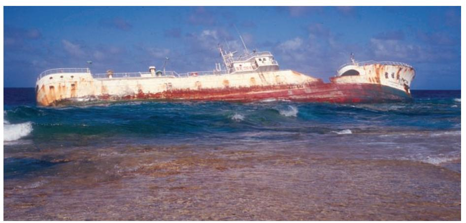
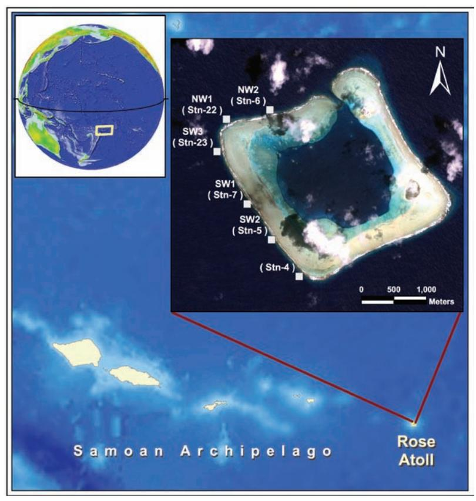
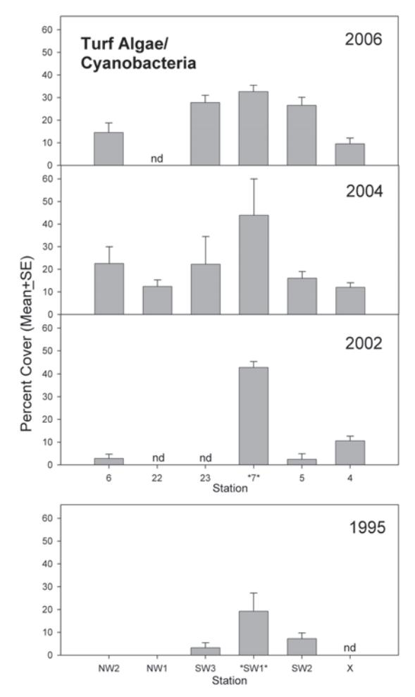
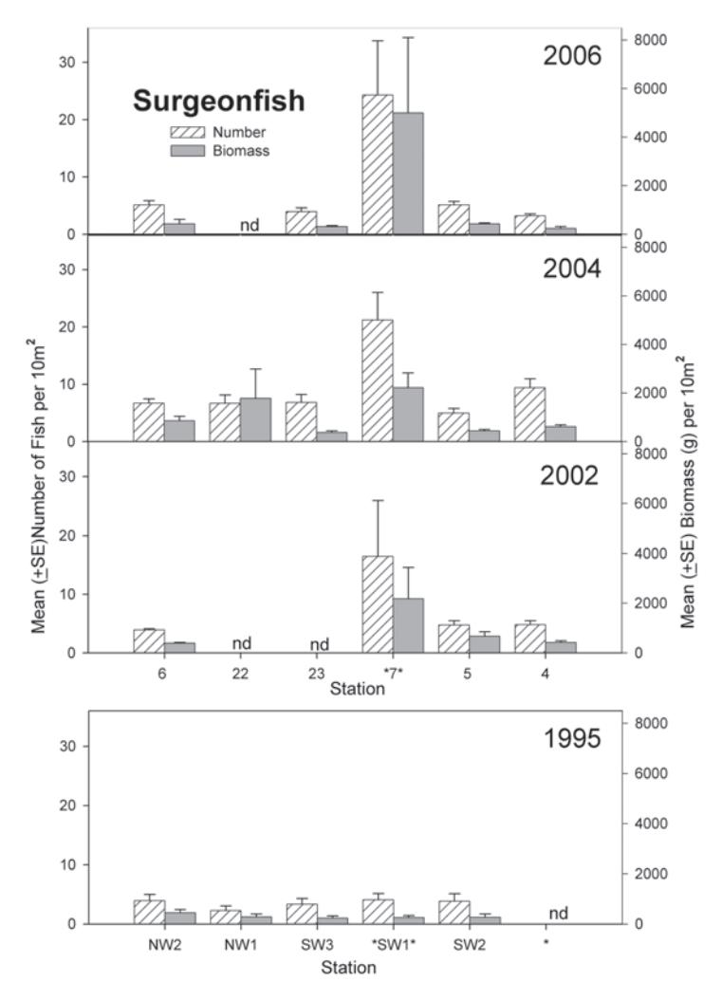
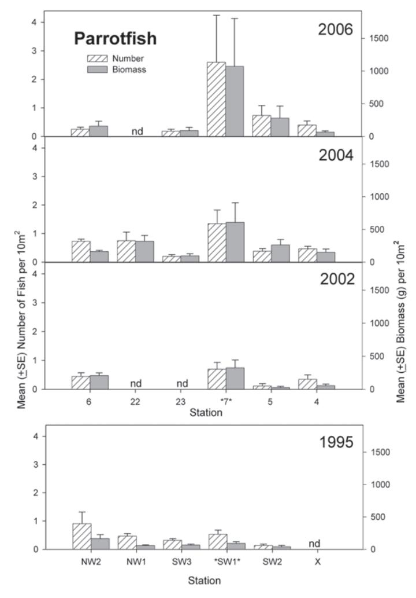
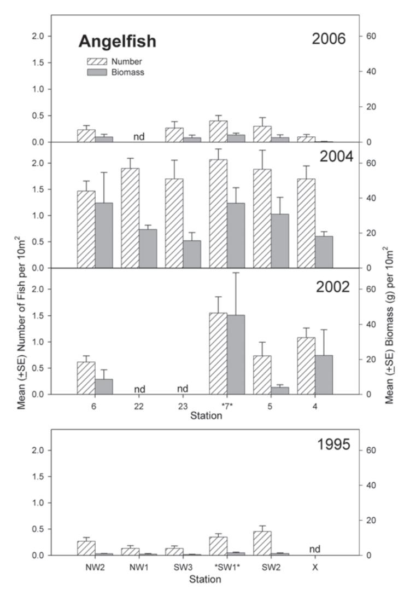
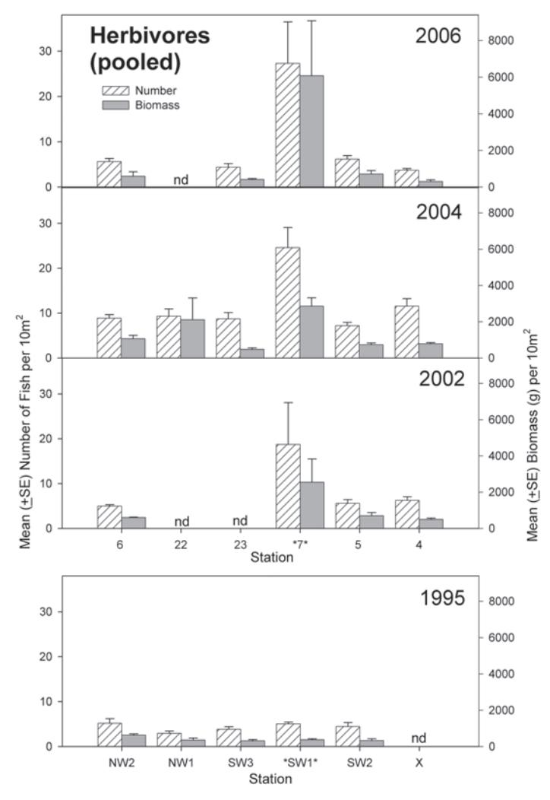
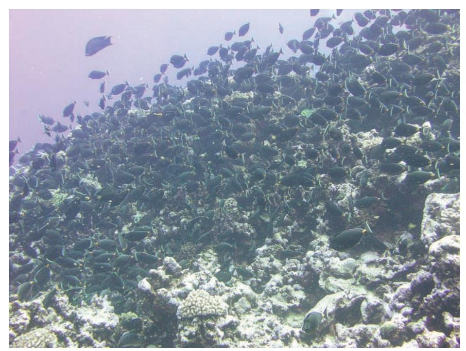

# Long-term effects of a ship-grounding on coral reef fish assemblages at Rose Atoll, American Samoa

*Robert E. Schroeder, Alison L. Green, Edward E. DeMartini, and Jean C. Kenyon*

# Abstract

The nature and degree of impact of ship groundings on coral reefs and subsequent recovery is not well understood. Disturbed benthic and associated fish assemblages may take years-decades to return to pre-impact levels or may attain alternate stable states. Rose Atoll, a small, remote coral atoll in the central South Pacific, was impacted by a major ship grounding and associated contaminant spill in October 1993. Coral reef fish assemblages were quantitatively surveyed at the site of impact and compared to other nearby sites along the western outer reef slope in August 1995, February 2002, February 2004, and March 2006. In 1995, herbivorous surgeonfishes dominated the site, likely attracted to the early algal blooms. During 2002–2006, both numbers and biomass of pooled herbivorous fishes were significantly greater at the wreck site than at the other reef-slope survey sites. This greater abundance, where some corroding steel debris remained, was associated with significantly greater substratum cover by opportunistic algae (both turf and cyanobacteria). Thus, more than 13 yrs later, the grounding of this ship is still impacting algal growth and herbivorous reef-fish populations. While continued ecosystem monitoring at Rose Atoll is necessary for a full understanding of recovery rates by fish assemblages from such major anthropogenic disturbances, in the event of future groundings, containment of the contaminant spill and prompt removal of all metallic debris is recommended to preserve ecosystem integrity.

The impact of ship-grounding accidents on coral reef ecosystems in the Pacific Ocean, especially long-term, has been infrequently reported (Tikka et al., 2002). Such collisions crush and kill corals and other benthic invertebrates, decrease habitat complexity, and open space for colonization by opportunistic algae (Precht et al., 2001). Associated oil and contaminant spills and the continued wave-driven abrasive interaction of the hull across the reef result in major environmental and financial damages (McCormick and Hudson, 2001; Riegl, 2001). Improved understanding of such impacts and their natural recovery process is important to promote mitigation measures, help develop cost assessments for liability, provide the basis for improved management and restoration of sensitive areas such as reefs near major shipping lanes or fishing grounds, and preserve unique biodiversity (Riegl, 2001).

On 14 October 1993, a 37-m Taiwanese longline fishing vessel, the Jin Shiang Fa*,* struck Rose Atoll and ran aground on the upper part of the outer reef slope on the southwest side of the atoll (Fig. 1). Direct physical damage to the reef (documented on a survey 2 wks following the event) included a broad scarring across the steep spurand-groove zone and a scattering of large amounts of diverse debris (metal, fishing, and other vessel gear) onto the reef slope around the vessel (Green et al., 1997). Other immediate impacts included chemical spills onto the atoll of 100,000 gal of diesel fuel, 500 gal of lube oil, and 2500 lb of ammonia. This chemical release appeared to be continuous for 6 wks after the grounding and was transported across the reef flat

Figure 1. The long-line fishing vessel Jin Shiang Fa aground on the upper reef slope at Rose Atoll in October 1993 (Photo: John Naughton).

and into the lagoon by waves and currents (USFWS, 1996a,b). The vessel broke up within 6 wks as a result of strong wave action (Barclay, 1993). A survey conducted 4 mo after the grounding documented considerable amounts of steel ship debris still scattered over 3500 m2 across the reef slope and grooves. Subsequent surveys found that much of the wreckage (including > 200 t of metallic debris) remained on the reef slope and reef flat more than 3 yrs after the grounding (Green et al., 1997). In 1999–2000, ~37 t of this debris was removed from the reef crest and ~30 t was removed from the outer reef slope. By June 2005, an additional 40 t of metallic debris was removed from the outer reef slope along the SW arm. USFWS estimates that ~2 t of debris remains on the reef slope and has plans for additional removal (J. Maragos, USFWS, pers. comm.).

One of the most obvious and persistent differences subsequent to the grounding was the proliferation of turf algae/cyanobacteria and, apparently, great abundances of herbivorous fishes near the impact site, in contrast to elsewhere around the atoll. The purpose of this study was to test the null hypothesis of no long-term changes in the benthos and associated herbivorous fishes at the grounding site, vs several sites at the same depth along the forereef slope habitat at varying distances to either side of the grounding site.

 Monitoring of coral reef fishes and substratum was initiated at Rose Atoll by American Samoa's Department of Marine and Wildlife Resources (DMWR) in 1995 (Green, 1996a) to characterize reef ecosystem impacts of the grounding. In 2002–2006, biennial monitoring continued as part of a larger multidisciplinary research program on coral reef ecosystems of U.S. Pacific Islands by the NOAA Fisheries Pacific Islands Fisheries Science Center's Coral Reef Ecosystem Division (PIFSC CRED) (Brainard et al., in press). While these surveys include all major visible biotic components of the water column and reef bottom around the atoll, impacts of the grounding on herbivorous fish and turf algae/cyanobacteria clearly prevailed and were investigated further in this analysis.

## Methods

Study Area.—Rose Atoll (14°32´S, 168°08´W) is a small (615 ha area) isolated island atoll that lies at the eastern edge of the Samoan Archipelago in the central South Pacific (Fig. 2). Prevailing trade winds from the southeast render the east sides of the atoll most exposed to swells (Green et al., 1997). Distinct habitat zones include reef front and outer reef slope, reef flat, lagoon slope, lagoon pinnacles, and patch reefs (Rodgers et al., 1993; Green and Craig, 1999). The reef front, dominated by crustose coralline algae, slopes steeply seaward to a depth of ~40 m and is subject to strong wave exposure. The limestone reef flat is covered by living coralline and other algae. Lagoon pinnacles, encrusted with coralline algae and various corals, rise almost vertically to sea level and experience low wave stress (Green, 1996a; Green and Craig, 1999). The atoll is uninhabited but has been visited periodically by scientific investigators during the past century. In 1974, Rose Atoll was designated as a National Wildlife Refuge by the United States Fish and Wildlife Service (USFWS) that prohibited fishing. The atoll serves as a refuge for giant clams, and rare incidences of poaching have been reported (Green and Craig, 1999). Prior to 1993, this atoll was considered one of the most remote (150 km from the next nearest island) and least disturbed atoll ecosystems in the world (UNEP/ IUCM, 1988). Rodgers et al. (1993) provide further details on the biology, oceanography, geology, and history of Rose Atoll.

While several brief surveys to assess ecological impact and possible recovery were conducted at various times, from several weeks to several years post-grounding, comprehensive

Figure 2. Rose Atoll, American Samoa, in the central South Pacific, showing positions of outer reef slope survey stations along the atoll's west side; SW1(Stn-7) along SW arm is the site of 1993 vessel grounding.

quantitative data on fish communities/habitat were first collected primarily in August 1995 (Green et al., 1997). Stations surveyed included all sides and habitat types of the atoll and were selected haphazardly based on general uniformity of habitat and isobath range (Fig. 2). True control sites were not available because rigorous pre-grounding data for reef fish from Rose Atoll were lacking. Also, the entire southwest side of the atoll was, at least initially, affected by the grounding event and contaminant spill (Green et al., 1997). Stations on the eastern sides of the atoll could not be used for reference because fish assemblages there differed together with environmental factors such as wave exposure and currents. Our 1995 and 2002–2006 surveys at west side stations, however, provided quantitative reference estimates sufficient to monitor changes at these sites over time. Summary data from the last comparable quantitative fish survey (August 1995) prior to 2002, and corresponding habitat data, are included here to compare relatively short-term and long-term impacts. For the present analysis, outer reef slope stations (Stn) surveyed in 2002–2006 along the west side of the atoll were selected to coincide with those sites surveyed in the mid-1990s by Green (Green, 1996a; Green et al., 1997) as follows: Stn-6 = NW2, Stn-22 = NW1, Stn-23 = SW3, Stn-7 = SW1 (impact site), and Stn-5 = SW2 (Fig. 2). Stn-4, an additional site along the SW arm of the atoll, was surveyed only in 2002–2006. All benthos and fish surveys were conducted at the same general 10–15-m depth and in the same leeward forereef slope habitat. In 1994–1995, fish and benthos surveys were collected along the same transect lines. In 2002–2006, benthos surveys derived data from towed-diver photographic transects in the same general areas. Survey sites (transects) were not technically fixed but instead were repeated over surveys within the same general station areas. The resurveying of both benthos and fish within these general station areas at biennial intervals does not constitute temporal pseudoreplication as year was considered as a fixed (non-random) factor in the analysis.

Turf Algae/Cyanobacteria Surveys.—*1994–1995.*—Five 50-m transects were surveyed at each of the five stations on the forereef slope: two on the northwest side (NW1, NW2), and three on the southwest side (SW1, SW2, SW3), where SW1 was the shipwreck site (Fig. 2). Based on logistical constraints, the northwest stations were surveyed in October 1994, and the southwest stations were surveyed in August 1995. Benthos and substratum were classified into major types and subcategorized within each type every 2 m along the transect line both on and 2 m to each side of the transect line (total of 75 points per transect). Percent of the reef slope substratum covered with opportunistic algae (both turf and cyanobacteria), a subcategory of macroalgae, was estimated for each transect (Green, 1996b).

*2002–2006.***—**Percent of substratum covered with opportunistic algae was estimated from digital video or still photographs recorded during towed-diver surveys (Kenyon et al., 2006) along the outer reef slope in February 2002, February 2004, and March 2006. The portion of the tow-track line closest to each site was identified (around Stn-6, Stn-22, Stn-23, Stn-7, Stn-5, and/or Stn-4), and nine frames (inter-frame distance ~25 m) were analyzed with SigmaScan® based on an overlay that selects that component of the benthos (2002 and 2004 surveys) or with CPCe (Kohler and Gill, 2006) based on a point-count method (2006 surveys). Thus, a distance of ~200 m was sampled at each site.

Fish Surveys.—*1995.***—**In August 1995, fish were visually surveyed along five 50 m × 3 m wide belt transects (750 m2 ) at ~10 m depth over the forereef slope at the same five stations where algae were surveyed (NW2, NW1, SW3, SW1, and SW2) (Fig. 2). Diurnally active noncryptic species were enumerated and their sizes (total length) estimated for biomass conversions. Surveys were conducted by three sequential passes along the line for (1) large, highly mobile species (during laying of the line), (2) medium-size mobile fishes, and (3) small, siteattached species (Green, 1996b).

*2002–2006.***—**In February 2002, February 2004, and March 2006, reef fish assemblages were surveyed at Rose Atoll to establish a new baseline and initiate biennial monitoring, as part of a larger survey of all major components of the reef ecosystem (Craig et al., 2005). At each station (Stn-6, Stn-22, Stn-23, Stn-7, Stn-5, and Stn-4 [Fig. 2]), size-specific counts of all diurnally active fishes were quantified using a standard fish belt-transect protocol (Brock, 1954, 1982; Friedlander and DeMartini, 2002). Transect lines were set at depths of 10–15 m along the outer reef slope, conditions permitting, where reef holes, ledges, and the water column within 4 m of the substratum were searched. A pair of scuba diver-observers conducted parallel swims along three 25-m-long transect lines, recording size-class specific (total length, TL) counts of all fishes encountered to the lowest possible taxon (to species level, where possible), within visually estimated but defined belt widths. For each replicate transect line at a station, each diver quantified fishes > 20 cm TL encountered within a 4-m wide (100 m2 ) area on each side of the line on the swim-out, followed by an analogous tally of fishes < 20 cm TL within a 2 m wide (50 m2 ) area on each side of the line on the subsequent swim back (total search areas of 600 m2 and 300 m2 per station, respectively). Fish were tallied by length class to estimate biomass by taxon. Fish < 5 cm TL were recorded to the nearest centimeter, while those > 5 cm TL were tallied by 5-cm length bins.

Data Analyses.—*Turf Algae/Cyanobacteria.***—**For data collected in 1994–1995 (combined), mean percent cover of opportunistic algae at station SW1 (wreck site) was compared with cover at adjacent stations SW3 and SW2 (~800 m to the N and S, respectively) and two stations on the northwest side (NW1, NW2), with a Wilcoxon Kruskal-Wallis one-way analysis of variance between groups (ANOVA), as only a single factor (site) was analyzable and heterogeneous variances were uncorrectable by transformation. The 1994–95 data could not be combined with the 2002-06 time-series due to differences between the data series in survey techniques. Two-way ANOVA was used to test the effect of reef station (stations 7 [wreck site], 6, 22, 23 [to the N], 5, 4 [to the S]) and year (2002, 2004, 2006) on percent opportunistic algae cover, arcsine transformed to help reduce heterogeneity of variance (Cochran's C test) (Winer et al.*,* 1991; Underwood, 1997; SAS-Windows v. 9.1, proc GLM, SAS Institute, 1999). Significant differences among reef sites were determined with *t*-tests adjusted for the Bonferroni inequality (a posteriori multiple comparisons). The more conservative significance level (P < 0.01) was used as some heterogeneity of variances remained (Manly, 1991; SAS Institute, 1999).

*Herbivorous Fishes.*—Counts were expressed as numerical densities (hereinafter "numbers" or "abundances") and converted to biomass densities (hereinafter "biomass"). For 1995, abundance and biomass at station SW1 were compared among stations SW2 and SW3, as well as NW1 and NW2. The comparisons evaluated stations 7 (wreck site), 6, 22, 23, 5 and 4 for the 2002–2006 period. Open forereef stations along the western side of the atoll were used as unimpacted reference sites for the site of the 1993 grounding. Relative percent frequency of taxonomic composition was also compared for major herbivorous families by station. Numbers and biomass were estimated for dominant herbivorous taxa by station. Biomass was estimated from individual fish length-class estimates using species-specific length (*L*)-weight (*W*) conversion parameters (*W* = *aLb* ) (Letourneur et al., 1998; Kulbicki et al., 2005; *FishBase* [Froese and Pauly, 2006]). The analysis focused on dominant herbivorous fish taxa as algae continued to dominate the substratum at the wreck site more than a decade post-grounding.

For herbivorous fish families (pooled surgeonfish, parrotfish, and angelfish) in 1995, numbers and biomass were compared using Wilcoxon Kruskal-Wallis one-way ANOVA. For recent years (2002, 2004, 2006), these pooled herbivores were compared using two-way ANOVAs to test the effects of reef station and survey year (SAS-Windows v. 9.1, proc GLM, SAS Institute, 1999). Reef stations in this area that were not surveyed each year were excluded from the analysis to maintain a balanced design. Mean abundance and biomass values were log (*x* + 1) transformed to help reduce heterogeneity of variances (Cochran's C test). Significant differences among reef sites were determined with *t*-tests adjusted for the Bonferroni inequality (P < 0.01, as some heterogeneity remained) (Manly, 1991; SAS Institute, 1999).

Figure 3. Mean (+ SE) percent cover of turf algae/cyanobacteria among outer reef slope stations by year (1995–2006); (\* = site of 1993 grounding [SW1 in 1995 and Stn-7 in 2002–2006]; nd = no data for that station-year). In 1995, station SW1 had significantly higher cover of opportunistic algae (turf and cyanobacteria) than the other sites (Wilcoxon Kruskal Wallis one-way ANOVA; P < 0.05). In 2002–2006, significant differences also occurred among stations, with the least square means of the wreck site about twice as high as the other stations (two-way ANOVA; P < 0.0001).

### Results

Turf Algae/Cyanobacteria Surveys.—*1994–1995.*—By 1995, 2 yrs postgrounding, the mean percent cover of opportunistic algae was at least twice as high at the impact site as at neighboring sites on the southwest side, while no opportunistic algae were recorded on the northwest side (Fig. 3; station SW1 significantly higher; Wilcoxon Kruskal Wallis one-way ANOVA; P < 0.05). Dead crustose coralline algae were also dominant at the impact site (36% cover: Green, 1996a; Green et al., 1997) and were much more abundant there than at SW 2 and SW 3 (8% and 3% cover, respectively). In contrast, almost no dead crustose coralline algae were observed on the northwest side of the atoll. Conversely, live crustose coralline algae were uncommon

Table 1. Summary results of two-way ANOVAs testing effect of reef station (Stn-7 = wreck site, with nearby sites Stn-4, Stn-5, Stn-6, Stn-23) and year (2002, 2004, 2006) on percent cover of opportunistic algae. Results with their least squares means are listed (underlined if not significantly different, P < 0.01).

| Source       | df | MS   | F     | Prob > F |
|--------------|----|------|-------|----------|
| Model        | 13 | 0.16 | 7.56  | < 0.0001 |
| Year         | 2  | 0.08 | 3.65  | 0.0296   |
| Station      | 4  | 0.38 | 17.93 | < 0.0001 |
| Year*Station | 7  | 0.06 | 2.75  | 0.0119   |
| Error        | 97 | 0.02 |       |          |

Station: Stn-7 > = Stn-23 > = Stn-5 = Stn-6 > = Stn-4 LS Mean: 0.413 > = 0.267 > = 0.151 = 0.128 > = 0.107

at the impact site (< 4% cover) and much more abundant at the other sites on the SW and NW sides (ranging from 20 to 40% cover).

*2002–2006.*—In 2002, percent cover of opportunistic algae was an order of magnitude greater at the wreck site (~40%) than at adjacent stations (Fig. 3). In 2004, percent cover of opportunistic algae remained more than twice as high at the wreck site than at any other west side station; water turbidity was also higher in the vicinity of the impact site, with considerable particulate matter that appeared to be suspended algal fragments. Similar conditions continued in 2006 and the effect appeared to be spreading, with the percent cover at adjacent stations (23 to N and 5 to S) almost as high (~30%) as at the wreck site. More distant west side stations (6 and 4) had less than one-half as much opportunistic algal cover. Percent cover was significantly greater at the wreck site and adjacent station 23 than the other stations (two-way ANOVA, Table 1). Least squares means at the wreck site were generally twice those at other sites. By 2006, the next two highest stations (23 and 5) were the closest stations to the wreck site (to N and S, respectively; Fig. 3).

Fish Surveys.—*1995.***—** Along the western slope, total fish abundance was lowest around the wreck site (Green et al., 1997). However, except for the midget chromis (*Chromis acares*; Pomacentridae) the majority of fishes present at the wreck site were herbivorous surgeonfishes (Acanthuridae; 19.4% [Table 2A]; e.g., *Ctenochaetus* spp. and *Naso lituratus*), which were probably attracted to the area by the algal bloom and cover from the wreckage. Station NW2, nearest to the lagoon pass (~800 m), also had high surgeonfish numbers and biomass in 1995, relative to other reef slope stations (Fig. 4). The pattern for herbivorous parrotfishes (Scaridae) was similar to the surgeonfishes (Fig. 5), with the impact site (SW1) higher in abundance and biomass than neighboring sites, with the exception of station NW2 closest to the lagoon pass, at which estimates were almost twice as high. The numbers and biomass of herbivorous angelfishes (Pomacanthidae), although lower overall, were greater at the wreck site station and the station just to the S (SW2), with individuals larger but less numerous at SW1 (Fig. 6). Pooling these herbivorous families in the 1995 data resulted in an overall pattern similar to that for herbivorous surgeonfish (as expected, since this taxon dominated) with significant differences found among stations (Wilcoxon Kruskal-Wallis one-way ANOVA, P < 0.05) (Fig. 7).

*2002–2006.***—**As in 1995, the midget chromis remained the most abundant species numerically at outer reef slope stations, while less so at the wreck site. The major herbivorous taxa, with dominant species per family noted (Table 2B), were (in decreas-

| Table 2A. Relative percent frequency of total number of fish counted on transects for all species  |
|----------------------------------------------------------------------------------------------------|
| (pooled) by main herbivorous family and year at the wreck site (* = Stn-7 or SW1) and other        |
| stations along the west side of Rose Atoll, from N to S. (na = station not surveyed in that year). |

| Family          | Year | 6    | 22   | 23   | 7*   | 5    | 4    |
|-----------------|------|------|------|------|------|------|------|
|                 |      | %    | %    | %    | %    | %    | %    |
| Acanthuridae    | 1995 | 16.9 | 12.2 | 13.4 | 19.4 | 12.1 | Na   |
| (Surgeonfishes) | 2002 | 8.4  | na   | na   | 29.5 | 10.5 | 10.8 |
|                 | 2004 | 10.0 | 16.5 | 17.0 | 30.4 | 16.5 | 10.6 |
|                 | 2006 | 12.9 | na   | 7.3  | 37.3 | 8.4  | 7.3  |
| Scaridae        | 1995 | 3.8  | 2.4  | 1.3  | 2.5  | 0.4  | Na   |
| (Parrotfishes)  | 2002 | 1.5  | na   | na   | 1.8  | 0.3  | 0.8  |
|                 | 2004 | 1.3  | 2.0  | 0.7  | 2.6  | 2.0  | 0.7  |
|                 | 2006 | 0.9  | na   | 0.6  | 5.5  | 1.8  | 1.0  |
| Pomacanthidae   | 1995 | 1.1  | 0.7  | 0.5  | 1.6  | 1.4  | na   |
| (Angelfishes)   | 2002 | 1.3  | na   | na   | 2.8  | 1.4  | 2.3  |
|                 | 2004 | 2.0  | 3.4  | 3.8  | 2.5  | 5.3  | 1.7  |
|                 | 2006 | 0.5  | na   | 0.4  | 0.4  | 0.4  | 0.2  |

ing order of numerical abundance): acanthurids (~27 species, primarily *N. lituratus, Ctenochaetus striatus* [detritivore on algae], *Acanthurus nigrofuscus, Acanthurus nigricans, Ctenochaetus cyanocheilus,* and *Acanthurus achilles*); scarids (12 species, *Chlorurus sordidus, Scarus forsteni,* and *Scarus oviceps*); and pomacanthids (5 species, *Centropyge loriculus,* and *Centropyge flavissima*). Two of the main herbivorous families had higher relative percent frequency representation (average across years, 2002–2006, Table 2A) at the wreck site, especially acanthurids (~32%), compared to the other west side stations (~12%). Scarids comprised ~3.3% at the wreck site, compared to 1.2% at other stations.

Herbivorous surgeonfishes (planktivorous *Naso* species excluded) were the most numerically dense herbivores at the wreck site (mean ~20 fish 10 m-2; Fig. 4). *Naso lituratus* was the dominant species (Fig. 8), followed by *C. striatus*, *A. nigrofuscus*, *A. nigricans*, *C. cyanocheilus*, and *A. achilles*. Surgeonfish biomass was ~3–6 times greater at the wreck site versus other west side stations; abundance followed a similar pattern. Herbivorous parrotfishes also were more abundant (~2–5 times higher

Table 2B. Dominant herbivorous fish species, and most numerically abundant damselfish, with their common names (Randall, 2005), recorded in surveys along the western side of Rose Atoll.

| Family        | Species (Author)                                       | Common name             |
|---------------|--------------------------------------------------------|-------------------------|
| Acanthuridae  | Naso lituratus (Forster and Schneider, 1801)           | Orangespine unicornfish |
|               | Ctenochaetus striatus (Quoy and Gaimard, 1825)         | Striped bristletooth    |
|               | Acanthurus nigrofuscus (Forsskål, 1775)                | Brown surgeonfish       |
|               | Acanthurus nigricans (Linnaeus, 1758)                  | Goldrim surgeonfish     |
|               | Ctenochaetus cyanocheilus (Randall and Clements, 2001) | Bluelip bristletooth    |
|               | Acanthurus achilles (Shaw, 1803)                       | Achilles tang           |
|               | Acanthurus triostegus (Linnaeus, 1758)                 | Convict surgeonfish     |
| Scaridae      | Chlorurus sordidus (Forsskål, 1775)                    | Bullethead parrotfish   |
|               | Scarus forsteni (Bleeker, 1861)                        | Whitespot parrotfish    |
|               | Scarus oviceps (Valenciennes, 1840)                    | Egghead parrotfish      |
|               | Chlorurus microrhinos (Bleeker, 1854)                  | Steephead parrotfish    |
|               | Scarus frontalis (Valenciennes, 1839)                  | Tan-faced parrotfish    |
| Pomacanthidae | Centropyge loriculus (Günther, 1874)                   | Flame angelfish         |
|               | Centropyge flavissima (Cuvier, 1831)                   | Lemonpeel angelfish     |
| Pomacentridae | Chromis acares (Randall and Swerdloff, 1973)           | Midget chromis          |

Figure 4. Mean (+ SE) abundance and biomass (g) per 10 m2 of herbivorous surgeonfishes (species pooled), by station and year (1995–2006); (\* = site of 1993 grounding [SW1 in 1995 and Stn-7 in 2002–2006]; nd = no data for that station-year).

numerically) at station 7 than at most other west side stations in each year (Fig. 5). Biomass generally showed a similar trend. Dominant parrotfishes consisted of, in descending importance, *C. sordidus, Chlorurus microrhinos, S. forsteni, and S. oviceps*. Parrotfish biomass was about 2–12 times greater at the wreck station (mean ~668 g 10 m–2) than at the other reef stations (Fig. 5). In 2002, the abundance of herbivorous angelfishes was about twice as high at the wreck station compared to the other stations (Fig. 6). Angelfish numbers were generally lower (< 1–2 fish 10 m–2) than surgeonfish or parrotfish. The major angelfishes were *C. loriculus* and *C. flavissima*, in nearly equal proportions across years. Although the numbers and biomass of these angelfishes appeared greater in 2004 and 2006 at the wreck site, they were not significantly so. Biomass of angelfishes was several times to only slightly higher at the wreck site compared to the other western reef slope stations (Fig. 6).

Figure 5. Mean (+SE) abundance and biomass (g) per 10 m2 of herbivorous parrotfishes (species pooled), by station and year (1995–2006); (\* = site of 1993 grounding [SW1 in 1995 and Stn-7 in 2002–2006]; nd = no data for that station-year).

Although the abundance and biomass of each of these herbivorous fish taxa generally differed among stations, sample sizes were too small for formal tests of significance for species or most single family-level taxa. The pattern for the three main herbivore families (pooled) resembled that for surgeonfish, the clearly dominant herbivores. In 1995, significant differences were found among stations (Wilcoxon Kruskal-Wallis one-way ANOVA, P < 0.05). In 2002, 2004, and 2006, both numbers and biomass of pooled herbivores were significantly higher at the wreck site than at the adjacent stations, while no differences occurred among these other stations (two-way ANOVA, station effect, P < 0.0001; Table 3) (Fig. 7). The abundance of total herbivores was higher in 2006 and 2004 than in 2002 (two-way ANOVA, year effect, P < 0.01; Table 3), and the pattern for total herbivore biomass was similar (Fig. 7).

Figure 6. Mean (+ SE) abundance and biomass (g) per 10 m2 of herbivorous angelfishes (species pooled), by station and year (1995–2006); (\* = site of 1993 grounding [SW1 in 1995 and Stn-7 in 2002–2006]; nd = no data for that station-year).

#### Discussion

Our present study compared the fish assemblage and benthic algal cover at a major ship grounding site to that at analogous adjacent sites along the southwest and northwest sides of Rose Atoll, to determine if any short- or long-term impacts had occurred, 2–13 yrs after the event.

Algae.—Prior to the grounding event, crustose coralline algae generally dominated the substratum and served as the primary reef structural element at the atoll (Green et al., 1997). The impact and resultant contaminant spill killed much of this coralline algae along the southwest side of the atoll. Surveys conducted 2 wks after

Table 3. Summary results of two-way ANOVAs testing effect of reef station (Stn-7 = wreck site, with neighboring sites Stn-4, Stn-5, Stn-6) and year (2002, 2004, 2006) on the abundance (N 100 ha–1) and biomass (g ha–1) for (pooled) herbivorous taxa (surgeonfish, parrotfish, angelfish). Results with their least squares means are listed (underlined if not significantly different, P > 0.01). Station-by-Year interactions were insignificant (P > 0.05) in all cases and were deleted from final runs on a model containing main effects only.

| Abundances of herbivores (pooled): |    |      |       |          |  |  |
|------------------------------------|----|------|-------|----------|--|--|
| Source                             | df | MS   | F     | Prob > F |  |  |
| Model                              | 5  | 2.04 | 12.71 | < 0.0001 |  |  |
| Year                               | 2  | 0.89 | 5.57  | 0.0088   |  |  |
| Station                            | 3  | 2.81 | 17.47 | < 0.0001 |  |  |
| Error                              | 30 | 0.16 |       |          |  |  |

Station: Stn-7 > Stn-4 = Stn-6 = Stn-5

LS Mean: 15.17 > 14.06 = 14.04 = 14.04

Biomass of herbivores (pooled):

| Source  | df | MS   | F     | Prob > F |
|---------|----|------|-------|----------|
| Model   | 5  | 3.58 | 11.61 | < 0.0001 |
| Year    | 2  | 0.54 | 1.76  | 0.1896   |
| Station | 3  | 5.60 | 18.18 | < 0.0001 |
| Error   | 30 | 0.31 |       |          |

Station: Stn-7 > Stn-6 = Stn-5 = Stn-4 LS Mean: 15.55 > 14.13 = 14.11 = 13.78

the grounding revealed large areas along the outer reef slope that were scoured and beginning to be colonized with opportunistic cyanobacteria (filamentous blue-green "algae") and turf algae (e.g., *Jania* sp.) (both otherwise uncommon at the atoll) that subsequently came to dominate the area (Green et al., 1997). Blooms of opportunistic filamentous turf algae are common following reef disturbances that kill corals, including ship groundings or boat impacts (Smith, 1988; Lirman, 2001), bleaching events (Kohler and Kohler, 1992), oil spills (Bellamy et al., 1967; Keller and Jackson, 1993), and storms (Adjeroud et al., 2002). Additional quantitative surveys conducted in October 1994, August 1995, and August 1996 indicated that the substratum at the wreck site continued to be dominated by opportunistic algae and dead crustose corallines, and that the natural (pre-grounding) algal assemblages at the site had yet to recover (Green, 1996a; Green et al., 1997). Reef flat surveys in January 1997, more than 3 yr after the event, observed that opportunistic algae still dominated the substratum in the vicinity where scattered debris from the wreck remained (J. Burgett, USFWS, unpubl. data). Large metal sections (the ship's structural steel, engine block, zinc anodes, copper) continued to corrode into the marine environment.

*2002–2006.***—**In 2002, the cover of opportunistic algae on the western outer reef slope was < 10%, increasing to > 40% in the vicinity of the site of impact. Large pieces of metal debris from the vessel (including the mast lying in a groove) and heavy algal cover were still visible at the impact site along the outer reef slope. On the reef flat nearby, cyanobacteria were still abundant in the vicinity of remaining pieces of ship debris (J. Burgett, USFWS, unpubl. data). In 2004, some metal debris were still seen in the vicinity of the grounding site. Percent cover of opportunistic algae at the wreck site (still > 40%) remained at least twice that at the other sites surveyed along the western outer reef slope, clearly indicating a long-term impact to the substrate from the grounding event. By the time of our March 2006 monitoring surveys, US-

Figure 7. Mean (+ SE) abundance and biomass (g) per 10 m2 for total herbivores (surgeonfishes, parrotfishes, and angelfishes, pooled), by station and year; (\* = site of 1993 grounding [SW1 in 1995 and Stn-7 in 2002–2006]; nd = no data for that station-year). In 2002–2006, wreck station 7 differed significantly from stations 6, 5, and 4 for both numbers and biomass (two-way ANOVA, P < 0.0001 [see Table 3]). In 1995, significant differences were also found among stations (Wilcoxon Kruskal-Wallis one-way ANOVA, P < 0.05).

FWS had estimated that nearly all of the major metal debris from the wreckage had been removed by contractors (J. Maragos, USFWS, pers. comm.). In 2006, only a few small pieces of corroding steel were seen, although an unknown quantity could have remained buried in the substrate. While cover of opportunistic algae was still high (> 30%) at the wreck site, it was now nearly as high (< 30%) at the adjacent stations to the N and S. This suggests that the impact of these opportunistic algae may have expanded along the SW arm of the atoll's reef slope during the 2002–2006 period.

Iron is a limiting nutrient for algae in pristine oceanic environments (Martin and Fitzwater, 1988; Sunda, 1994). The positive relationship between dissolved iron and

Figure 8. Herbivorous surgeonfishes, primarily the orangespine unicornfish (*Naso lituratus*), grazing at the wreck site in March 2006 (Photo: Robert Schroeder).

cyanobacteria growth in marine environments and coral reefs is well documented (e.g., Boyd et al., 1999; Miller et al., 1999; Paerl, 1999; Kuffner and Paul, 2001; Webb et al., 2001). At Rose Atoll, corroding metal debris from the shipwreck is likely responsible for stimulating and maintaining the persistent bloom of opportunistic algae species near the grounding site, possibly enabling these algae to outcompete indigenous crustose corallines and preventing them from recolonizing the reef (Green et al., 1997).

Fish.—*1995.***—**Herbivorous fishes became more abundant around the impact site, shortly after the grounding, following the substantial mortality of corals and crustose coralline algae, and colonization of opportunistic algae (Green et al., 1997). Corals recently killed by a ship grounding in the U.S. Virgin Islands were similarly colonized by filamentous algae that, in turn, were readily consumed by herbivores, including surgeonfishes and parrotfishes (Kohler and Kohler, 1992). Contaminant spills associated with major ship groundings also can negatively impact fish populations. For example, an oil tanker grounding at Wake Island, which spilled 6 million gal of fuel and oil, killed ~2500 kg of reef fish (Nelson-Smith, 1971). Because of their high mobility, however, fishes are typically less vulnerable to contaminant spills than are many benthic organisms, although they may be impacted indirectly through effects on their benthic food resources (Chaw and Chua, 1978). Oil spills can kill the naturally dominant algae and disrupt the ecological balance on reefs (Ling, 1978), as well as kill corals (Mathias and Langham, 1978). In the present study, estimates of coral percent cover derived from towed-diver surveys (2002) and site-specific surveys (2004 and 2006) were consistently lower at the wreck site than at stations to

| Island(s)         | Biomass (t ha–1) | Source                          |
|-------------------|------------------|---------------------------------|
| Rose wreck site   | 3.93             | CRED unpubl. data               |
| Rose Atoll, AS    | 0.94             | CRED unpubl. data               |
| Other Samoan Is.  | 0.27             | CRED unpubl. data               |
| Wallis and Futuna | 0.19             | Wantez and Chauvet, 2003        |
| New Caledonia     | 0.35             | Wantez et al., 2006             |
| U.S. Line Is.     | 0.37             | Sandin et al., 2008             |
| Main Hawaiian Is. | 0.29             | Friedlander et al., 2007        |
| NW Hawaiian Is.   | 0.68             | Friedlander and DeMartini, 2002 |

Table 4. Mean biomass estimates for Pacific reef fish herbivores.

the north and south along the southwest arm (J. Kenyon, NOAA-PIFSC, Coral Reef Ecosystem Division, unpubl. data).

Two years post-grounding, surgeonfishes (mainly *C. striatus* and *Acanthurus triostegus*) predominated at the wreck site at which the algal bloom persisted (Green, 1996a). Total fish abundance, however, was then lower around this site, compared to other sites at 10 m depth along the western outer reef slope, largely because butterflyfish and midget chromis damselfish (which are usually associated with healthy reef slopes) were less common (Green et al., 1997). In 1995, fish abundance also was very high on the reef flat around the wreck, primarily based on the surgeonfish and parrotfish that were attracted to the heavy algal cover and protection afforded by the wreckage (Green et al., 1997).

*2002–2006.***—**In February 2002, total fish abundance at the wreck site was indistinguishable from abundance at nonimpacted, outer-slope sites (in contrast to 1995) and highest on the west side of the atoll. As the west side is the leeward exposure, it is likely more protected from prevailing southeast trades and swells and thus supports more complex reef development and biotic communities (Green et al., 1997). Consistent with the 1995 surveys, damselfish remained the generally dominant taxon at the atoll during 2002–2006 but continued to be replaced by surgeonfish at the wreck site. As in 1995, the midget chromis damselfish, which was the most abundant species at all sites, was relatively less abundant during our more recent surveys at the grounding site. Abundances of other herbivorous taxa appeared to be greater near the wreck site in 2002–2006. We believe that the lingering domination of herbivorous fishes reflects attraction to the opportunistic algae that abound at and near the grounding site. While herbivorous surgeonfishes continued to dominate, the species composition had changed. By 2002–2006, large schools of *N. lituratus* predominated at the wreck site. Both the numbers and biomass of herbivorous parrotfish (mostly *C. sordidus*, followed by *S. forsteri*, then *S. oviceps*) were also several-fold greater at the wreck site than at the other stations along the west in 2002–2006. In August 1995, the most common parrotfish was *Scarus frontalis*. In later surveys, only in 2006 was *S. frontalis* common at the wreck site, while roving schools were seen shallower along the upper reef slope. Numbers of herbivorous *Centropyge* spp. were several-fold greater at the wreck site in 2002, and the fish were over twice as large on average than their non-wreck site counterparts. In 2004 and 2006, this single-site dominance of these angelfish was less apparent. The pattern of overall greater herbivore abundance at the wreck site in the more recent survey years, 2004 and 2006, suggests that effects of the wreckage on this fish assemblage have not yet begun to diminish.

Herbivorous fish biomass was about three-times higher at Rose Atoll (0.94 t ha–1) than comparable estimates (0.36 t ha–1 average) from other Pacific coral reefs (Table 4). Other islands ranged from 0.19 t ha–1 (Wallis and Futuna) to 0.68 t ha–1 (Northwestern Hawaiian Islands). Herbivorous fish biomass at Rose was also over threetimes greater (and 15-times greater at the wreck site) than at the other islands of American Samoa.

The persistence of significantly greater numbers and biomass of herbivorous fishes at the site of maximum reef disturbance, 13 yrs after the grounding event, clearly shows how such an impact can alter reef fish communities long-term. It also indicates that more time is necessary for ecosystem recovery at this atoll and suggests that local ecosystem impacts may be continuing, possibly as a result of an unknown amount of debris from the wreckage that remains on the atoll, and continues to leach iron into the marine environment. Precht et al. (2001) reported that damaged highrelief habitat from the 1984 grounding of the MV Wellwood in the Florida Keys was slow to recover and concluded that the affected area may remain at an alternate stable state similar to natural hard-bottom communities. An alternative stable state may also have been established following a ship grounding on the Great Barrier Reef that produced a shift from a coral- to an algal-dominated community which persisted for years (Hatcher, 1984). Coral recolonization was also impaired for more than a decade following major reef scarring by a cruise ship anchor (Rogers and Garrison, 2001). Such long-term changes result from impact on the reef-building community, and thereby influence reef function and structure (Ebersole, 2001). The results of this study at Rose Atoll clearly demonstrate the long-term impacts of ship groundings on coral reef ecosystems.

# Conclusion

Whether the damaged reef at Rose Atoll will recover in time to its former natural state or ecosystem impacts will continue indefinitely remains to be determined. However, the fact that some of the ship's debris still remains, in association with significantly more abundant opportunistic algae and localized concentrations of herbivorous fishes, implies that both benthic and reef fish assemblages in this area are still being impacted 13-yr post-grounding. We commend the USFWS for its efforts to remove most of the metallic debris at Rose Atoll, and recommend removal of any remaining debris that is possible. Continued biannual monitoring of the benthic and fish assemblages and relevant abiotic variables should greatly enhance our understanding of the long-term ecological impacts of this grounding event and should further contribute to the scientific basis for management of Pacific atolls and other remote coral reef ecosystems. In the event of future groundings, containment or immediate removal of the contaminant spill is imperative to prevent mass mortality of crustose coralline algae and corals, and removal of as much metallic debris as possible should help mitigate subsequent dominance by opportunistic algae. Furthermore, monitoring of activities by large fishing vessels operating around Pacific islands and atolls would enable management authorities to identify vessels posing a threat to reefs and hopefully avert groundings. Currently, all U.S. longline vessels in the Pacific are monitored by the NOAA National Marine Fisheries Service using satellite-based vessel monitoring systems (VMS) and universal use of VMS by tuna fishing vessels is under consideration by the multi-national Western and Central Pacific Fisheries Commission.

### Acknowledgments

Field support was provided by the officers and crew of the NOAA Ships Townsend Cromwell, Oscar Elton Sette, and Hi'ialakai*.* Overall project and logistical support was provided by the NOAA, Pacific Islands Fisheries Science Center, Coral Reef Ecosystem Division (CRED, R. Brainard, Chief). Funding was provided by the NOAA, Coral Reef Conservation Program through the NOAA Fisheries Service, Office of Habitat Conservation. Support was also provided by the American Samoa Department of Marine and Wildlife Resources and the Pacific Remote Islands Wildlife Refuge Complex, U.S. Fish and Wildlife Service. We further thank B. Zgliczynski, C. Musburger, T. Donaldson, T. Wass, and P. Ayotte for assistance with fish surveys, and R. Brainard, M. Timmers, E. Keenan, A. Hall, and E. Dobbs for assistance with substrate surveys. M. Dunlap assisted with data interpretation. R. Moffitt assisted with figures. R. Brainard, B. Vargas-Ángel, and B. Richards provided useful comments on the manuscript.

### Literature Cited

- Adjeroud, M., D. Augustin, R. Galzin, and B. Salvat. 2002. Natural disturbances and interannual variability of coral reef communities on the outer slope of Tiahura (Moorea, French Polynesia): 1991 to [1997. Mar. Ecol. Prog. Ser. 237: 121–131.](http://www.ingentaconnect.com/content/external-references?article=0171-8630(1997)237L.121[aid=7773550])
- Barclay, S. 1993. Trip Report: Rose Atoll, Nov. 28–Dec. 9, 1993. Admin. Rept., US Fish and Wildlife Service, Honolulu. 13 p. Available from: http://www.fws.gov/pacificislands/.
- Bellamy. D. J., P. H. Clarke, D. M. John, D. Jones, and A. Whittlick. 1967. Effects of pollution from the Torrey Canyon on littoral and sublittoral ecosystems. Nature 216: 1170–1172.
- Boyd, P., J. LaRoche, M. Gall, R. Frew, and R. M. L. McKay. 1999. Role of iron, light, and silicate in controlling algal biomass in subantarctic waters SE of New Zealand. J. Geophys. Res. C. Oceans. 194: 13395–13408.
- Brainard, R. E., R. M. Laurs, and Associates. 2002. External program review: coral reef ecosystem investigation. NOAA Fisheries, Honolulu Laboratory, Honolulu. 81 p. Available from: http://www.pifsc.noaa.gov/cred/.
- \_\_\_\_\_\_\_\_\_\_\_\_\_, J. Asher, J. Gove, J. Helyer, J. Kenyon, F. Mancini, J. Miller, S. Myhre, J. Rooney, R. Schroeder, E. Smith, B. Vargas-Ángel, S. Vogt, and P. Vroom. In press. Coral Reef Ecosystem Monitoring Report for American Samoa: 2002–2006. Pacific Islands Fisheries Science Center, PIFSC Special Publication, SP-08-002. Available from: http://www.pifsc.noaa.gov/ cred/.
- Brock, V. E. 1954. A preliminary report on a method for assessing reef fish populations. J. Wildlife Mgmt. 18: 297–308.
- Brock, R. E. [1982. A critique of the visual census method for assessing coral reef fish popula](http://www.ingentaconnect.com/content/external-references?article=0007-4977(1982)32L.269[aid=8318453])[tions. Bull. Mar. Sci. 32: 269–276.](http://www.ingentaconnect.com/content/external-references?article=0007-4977(1982)32L.269[aid=8318453])
- Chaw, L. H. and T. E. Chua. 1978. Effects of oil on coastal resources: Fishes. Pages 239–244 *in* T. E. Chua and J. A. Mathias, eds. Coastal resources of West Sabah: An investigation into the impact of oil spill. Penerbit University Sains, Malaysia.
- Craig, P., G. DiDonato, D. Fenner, and C. Hawkins. 2005. The state of coral reef ecosystems of American Samoa. Pages 312–337 *in* J. Waddell, ed. The state of coral reef ecosystems of the United States and Pacific Freely Associated States: 2005. NOAA Tech. Memo. NOS NC-

- COS 11. NOAA/NCCOS Center for Coastal Monitoring and Assessment's Biogeography Team. Silver Spring. Available from: http://coastalscience.noaa.gov/.
- Ebersole, J. P. [2001. Recovery of fish assemblages from ship groundings on coral reefs in the](http://www.ingentaconnect.com/content/external-references?article=0007-4977(2001)69L.655[aid=6226078]) [Florida Keys National Marine Sanctuary. Bull. Mar. Sci. 69: 655–671.](http://www.ingentaconnect.com/content/external-references?article=0007-4977(2001)69L.655[aid=6226078])
- Friedlander A. M. and E. E. DeMartini. [2002. Contrasts in density, size, and biomass of reef](http://www.ingentaconnect.com/content/external-references?article=0171-8630(2002)230L.253[aid=6277499]) [fishes between the northwestern and the main Hawaiian Islands: the effects of fishing down](http://www.ingentaconnect.com/content/external-references?article=0171-8630(2002)230L.253[aid=6277499])  [apex predators. Mar. Ecol. Prog. Ser. 230: 253–264.](http://www.ingentaconnect.com/content/external-references?article=0171-8630(2002)230L.253[aid=6277499])
- \_\_\_\_\_\_\_\_\_\_\_\_\_\_, E. Brown, and M. E. Monaco. 2007. Defining reef fish habitat utilization patterns in Hawaii: comparisons between marine protected areas and areas open to fishing. Mar. Ecol. Prog. Ser. 351: 221–233.
- Froese, R. and D. Pauly, eds. FishBase. World Wide Web electronic publication; July 2006. Available fro[m http://www.fishbase.org](http://www.fishbase.org)
- Green, A. L. 1996a. Status of the coral reefs of the Samoan Archipelago. Dept. of Marine and Wildlife Resources Biol. Rept. Series. Pago Pago, American Samoa. 125 p. Available from: http://americansamoa.gov/departments/depts/mwr.htm.
- \_\_\_\_\_\_\_\_\_\_. 1996b. Spatial, temporal and ontogenetic patterns of habitat use by coral reef fishes (family Labridae). Mar. Ecol. Prog. Ser. 133: 1–11.
- \_\_\_\_\_\_\_\_\_\_ and P. Craig. [1999. Population size and structure of giant clams at Rose Atoll, an](http://www.ingentaconnect.com/content/external-references?article=0722-4028(1999)18L.205[aid=8318459])  [important refuge in the Samoan Archipelago. Coral Reefs 18: 205–211.](http://www.ingentaconnect.com/content/external-references?article=0722-4028(1999)18L.205[aid=8318459])
- \_\_\_\_\_\_\_\_\_\_, J. Burgett, M. Molina, D. Palawski, and P. Gabrielson. 1997. The impact of a ship grounding and associated fuel spill at Rose Atoll National Wildlife Refuge, American Samoa. US Fish and Wildlife Service Report, Honolulu. 60 p. Available from: http://www. gomr.mms.gov/.
- Hatcher, B. [1984. A maritime accident provides evidence for alternate stable states in benthic](http://www.ingentaconnect.com/content/external-references?article=0722-4028(1984)3L.199[aid=7507495])  [communities on coral reefs. Coral Reefs 3: 199–204.](http://www.ingentaconnect.com/content/external-references?article=0722-4028(1984)3L.199[aid=7507495])
- Jackson, J. B. C., J. D. Cubit, B. D. Keller, V. Batista, K. Burns, H. M. Caffery, R. L. Caldwell, S. D. Garrity, C. D. Getter, C. Gonzalez, H. M. Guzman, K. W. Kaufmann, A. H. Knap, S. C. Levings, M. J. Marshall, R. Steger, R. C. Thompson, and E. Weil. [1989. Ecological effects of a](http://www.ingentaconnect.com/content/external-references?article=0036-8075(1989)243L.37[aid=7507361])  [major oil spill on Panamanian coastal marine communities. Science 243: 37–44.](http://www.ingentaconnect.com/content/external-references?article=0036-8075(1989)243L.37[aid=7507361])
- Keller, B. D. and J. B. C. Jackson, eds. 1993. Long-term assessment of the oil spill at Bahia Las Minas, Panama. Synthesis Report, Vol. II: Tech. Rept. US Dept. Interior, Minerals Mgmt. Service, Gulf of Mexico OCS Regional Office, New Orleans. 1017 p. Available from: http:// www.gomr.mms.gov/.
- Kenyon, J. C., R. E. Brainard, R. K. Hoeke, F. A. Parrish, and C. B. Wilkinson. 2006. Towed-diver surveys, a method for mesoscale spatial assessment of benthic reef habitat: a case study at Midway Atoll in the Hawaiian Archipelago. Coast. Manage. 34: 339–349.
- Kohler, K. E. and S. M. Gill. 2006. Coral Point Count with Excel extensions (CPCe): a visual basic program for the determination of coral and substrate coverage using random point count methodology. Comp. Geosci. 32: 1259–1269.
- Kohler, S. T. and C. C. Kohler. 1992. Dead bleached coral provides new surfaces for dinoflagellates implicated in ciguatera fish poisonings. Environ. Biol. Fish. 35: 413–416.
- Kuffner, I. B. and V. J. Paul. [2001. Effects of nitrate, phosphate and iron on the growth of mac](http://www.ingentaconnect.com/content/external-references?article=0171-8630(2001)222L.63[aid=8318457])[roalgae and benthic cyanobacteria from Cocos Lagoon, Guam. Mar. Ecol. Prog. Ser. 222:](http://www.ingentaconnect.com/content/external-references?article=0171-8630(2001)222L.63[aid=8318457])  [63–72.](http://www.ingentaconnect.com/content/external-references?article=0171-8630(2001)222L.63[aid=8318457])
- Kulbicki, M., N. Guillemot, and M. Amand. 2005. A general approach to length-weigh relationships for New Caledonian lagoon fishes. Cybium 29: 235–252.
- Letourneur, Y., M. Kulbicki, and P. Labrosse. [1998. Length-weight relationship of fishes from](http://www.ingentaconnect.com/content/external-references?article=0116-290x(1998)21L.39[aid=8318455]) [coral reefs and lagoons of New Caledonia—an update. Naga, the ICLARM Q. 21: 39–46.](http://www.ingentaconnect.com/content/external-references?article=0116-290x(1998)21L.39[aid=8318455])
- Ling, K. K. 1978. Effects of oil on coastal resources: Marine algae. Pages 248–249 *in* T. E. Chua and J. A. Mathias, eds. Coastal resources of West Sabah: An investigation into the impact of oil spill. Penerbit University Sains, Malaysia.
- Lirman, D. [2001. Competition between macroalgae and coral: effects of herbivore exclusion](http://www.ingentaconnect.com/content/external-references?article=0722-4028(2001)19L.392[aid=7485942])  [and increased algal biomass on coral survivorship and growth. Coral Reefs 19: 392–399.](http://www.ingentaconnect.com/content/external-references?article=0722-4028(2001)19L.392[aid=7485942])

- Manly, B. F. J. 1991. Randomization and Monte Carlo methods in biology. Chapman and Hall, New York.
- Martin, J. H. and S. E. Fitzwater. [1988. Iron deficiency limits phytoplankton growth in the](http://www.ingentaconnect.com/content/external-references?article=0028-0836(1988)331L.341[aid=8302615])  [northeast Pacific subarctic. Nature 331: 341–343.](http://www.ingentaconnect.com/content/external-references?article=0028-0836(1988)331L.341[aid=8302615])
- Mathias, J. A. and N. P. E. Langham. 1978. Effects of oil on coastal resources: Corals. Pages 249–253 *in* T. E. Chua and J. A. Mathias, eds. Coastal resources of West Sabah: An investigation into the impact of oil spill. Penerbit University Sains, Malaysia.
- McCormick, M. E. and P. Hudson. 2001. An analysis of the motions of grounded ships. Intl. J. Offshore Polar Engin. 11: 99–105.
- Miller, M. W., M. E. Hay, S. L. Miller, D. Malone, E. E. Sotka, and A. M. Szmant. [1999. Effects](http://www.ingentaconnect.com/content/external-references?article=0024-3590(1999)44L.1847[aid=7427531]) [of nutrients versus herbivores on reef algae: A new method for manipulating nutrients on](http://www.ingentaconnect.com/content/external-references?article=0024-3590(1999)44L.1847[aid=7427531])  [coral reefs. Limnol. Oceanogr. 44: 1847–1861.](http://www.ingentaconnect.com/content/external-references?article=0024-3590(1999)44L.1847[aid=7427531])
- Nelson-Smith, A. 1971. Effects of oil on marine plants and animals. Pages 273–280 *in* P. Hepple, ed. Water pollution by oil. Inst. of Petroleum, London.
- Paerl, H. W. 1999. Physical-chemical constraints on cyanobacterial growth in the Oceans. Bull. Inst. Oceanogr. Monaco. Suppl. P: 319–349.
- Precht, W. F, R. B. Aronson, and D. W. Swanson. [2001. Improving scientific decision-making in](http://www.ingentaconnect.com/content/external-references?article=0007-4977(2001)69L.1001[aid=8318461]) [the restoration of ship-grounding sites on coral reefs. Bull. Mar. Sci. 69: 1001–1012.](http://www.ingentaconnect.com/content/external-references?article=0007-4977(2001)69L.1001[aid=8318461])
- Randall, J. E. 2005. Reef and shore fishes of the South Pacific: New Caledonia to Tahiti and the Pitcairn Islands. Univ. Hawaii Press, Honolulu. 707 p.
- Riegl, B. [2001. Degradation of reef structure, coral and fish communities in the Red Sea by ship](http://www.ingentaconnect.com/content/external-references?article=0007-4977(2001)69L.595[aid=6302196])  [groundings and dynamite fisheries. Bull. Mar. Sci. 69: 595–611.](http://www.ingentaconnect.com/content/external-references?article=0007-4977(2001)69L.595[aid=6302196])
- Rodgers, K. A., I. A. W. McAllan, C. Cantrell, and B. J. Ponwith. 1993. Rose Atoll: an annotated bibliography. Tech. Repts. Aust. Mus. 9: 1–37.
- Rogers, C. S. and V. H. Garrison. 2001. Ten years after the crime: Lasting effects of damage from a cruise ship anchor on a coral reef in St. John U.S. Virgin Islands. Bull. Mar. Sci. 69: 793–803.
- SAS Institute Inc. 1999. SAS User's Guide: Statistics. 1999 (ed.) Cary. 584 p.
- Smith, S. R. 1988. Recovery of a disturbed reef in Bermuda: influence of reef structure and herbivorous grazers on algal and sessile invertebrate recruitment. Proc. 6th Int. Coral Reef Symp. Townsville 2: 267–272.
- Sandin, S.A., J.E. Smith, E.E. DeMartini, E.A. Dinsdale, S.D. Donner, A.M. Friedlander, T. Konotchick, M. Malay, J.E. Maragos, D. Obura, O. Pantos, G. Paulay, M. Richie, F. Rohwer, R.E. Schroeder, S. Walsh, J.B.C. Jackson, N. Knowlton, E. Sala. 2008. Baselines and degradation of coral reefs in the northern Line Islands. PLoS ONE 3(2):e1548.doi:10.1371/journal. pone.0001548.
- Sunda, W. G. 1994. Trace metal/phytoplankton interactions in the sea. Pages 213–247 *in* G. Bidoglio and W. Stumm, eds. Chemistry of aquatic systems: local and global perspectives. ECSC, EEC, EAEC, Brussels and Luzxembourg.
- Tikka, K. K., P. S. Fischbeck, J. R. Bergquist, and E. A. Tuckel. 2002. Analysis of hypothetical groundings in US waters. Mar. Struct. 15: 499–513.
- Underwood, A. J. 1997. Experiments in ecology: their logical design and interpretation using analysis of variance. Cambridge Univ. Press, New York. 504 p.
- USFWS. 1996a. Pre-assessment screen for physical injuries caused by the F/V Jin Shiang Fa grounding at Rose Atoll national Wildlife Refuge, Am. Samoa. Rept. US Fish and Wildlife Service, Pacific Islands Office, Honolulu. Available from: http://www.fws.gov/pacificislands/.
- \_\_\_\_\_\_\_. 1996b. Pre-assessment screen for spill-related injuries caused by the F/V Jin Shiang Fa grounding at Rose Atoll national Wildlife Refuge, Am. Samoa. Rept. US Fish and Wildlife Service, Pacific Islands Office, Honolulu. Available from: http://www.fws.gov/pacificislands/.

- UNEP/IUCN. 1988. Coral reefs of the World. Vol. 3: Central and Western Pacific. UNEP Regional Seas Directories and Bibliog. IUCN, Gland, Switzerland and Cambridge, UK/UNEP, Nairobi, Kenya. 329 p.
- Wantiez, L. and C. Chauvet. 2003. First data on community structure and trophic networks of Uvea coral reef fish assemblages (Wallis and Futuna, South Pacific Ocean). Cybium 27: 83–100.
- \_\_\_\_\_\_\_\_\_, O. Chateau, and S. LeMouellic. 2006. Initial and mid-term impacts of cyclone Erica on coral reef fish communities and habitat in the South Lagoon Marine Park of New Caledonia. J. Mar. Biol. Assoc. U.K. 86: 1229–1236.
- Webb, E. A., J. W. Moffett, and J. B. Waterbury. 2001. Iron stress in open-ocean cyanobacteria (*Synechococcus*, *Trichodesmium* and *Crocosphaera* spp.): identification of the IdiA protein. Appl. Environ. Microbiol. 67: 5444–5452.
- Winer, B. J., D. R. Brown, and K. M. Michels. 1991. Statistical principles in experimental design. 3rd ed. New York, McGraw-Hill. 1057 p.

Date Submitted: 23 August, 2007. Date Accepted: 24 March, 2008.

Addresses: (R.E.S., J.C.K.) *NOAA-Joint Institute for Marine and Atmospheric Research and NOAA-Pacific Islands Fisheries Science Center, Coral Reef Ecosystem Division, 1125B Ala Moana Boulevard, Honolulu, Hawaii 96814.* (A.L.G.) *The Nature Conservancy, P.O. Box 8106, Woolloongabba, Queensland 4102 Australia.* (E.E.D.) *NOAA-Pacific Islands Fisheries Science Center, Aiea Heights Research Facility, 99-193 Aiea Heights Drive, Aiea, Hawaii 96701-3911.*  Corresponding Author: (R.E.S.) *Telephone: (808) 983-3727. E-mail: <robert.schroeder@ noaa.gov>.*

