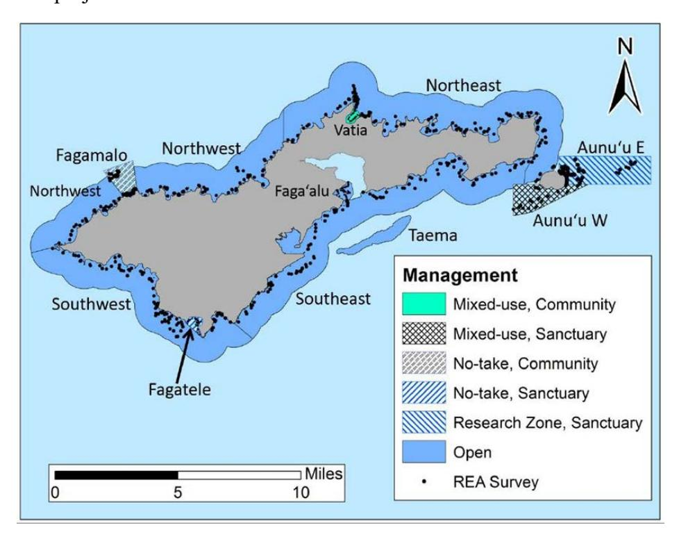
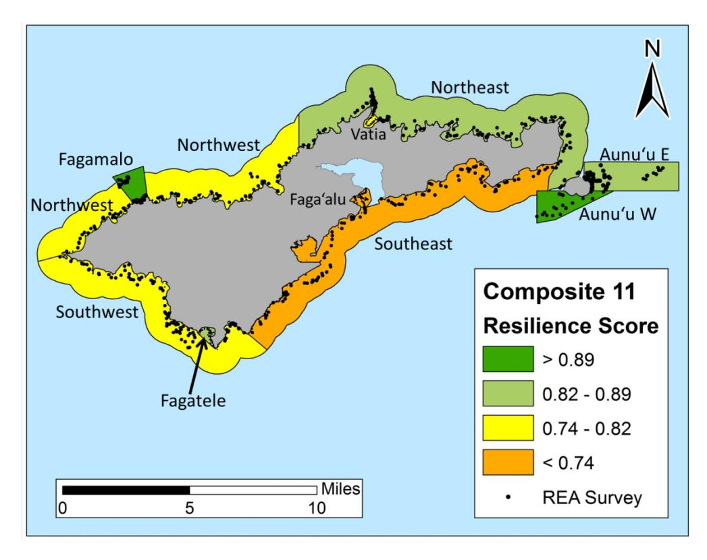
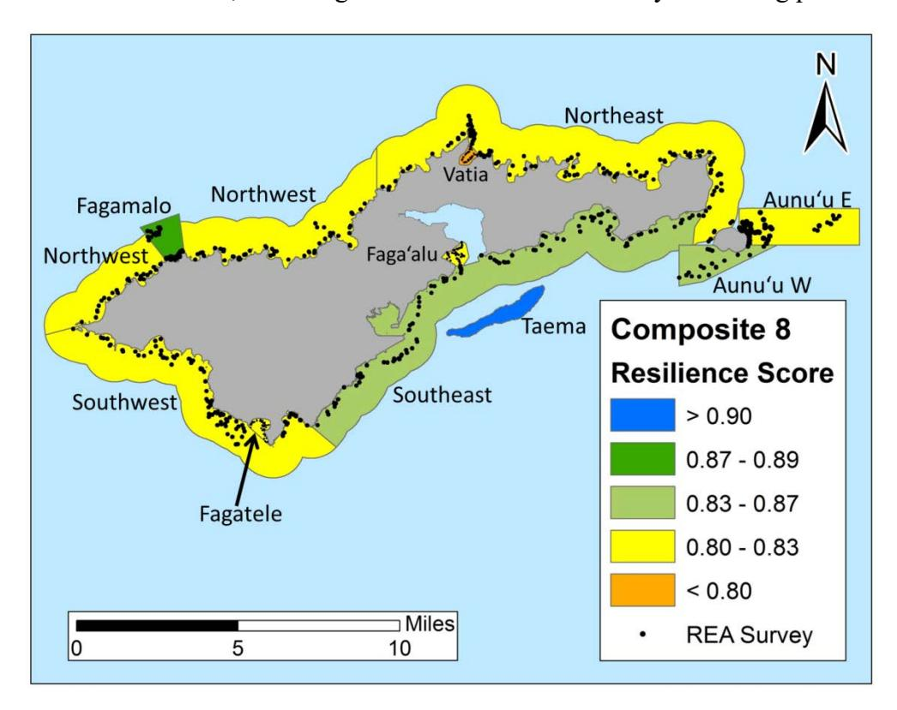
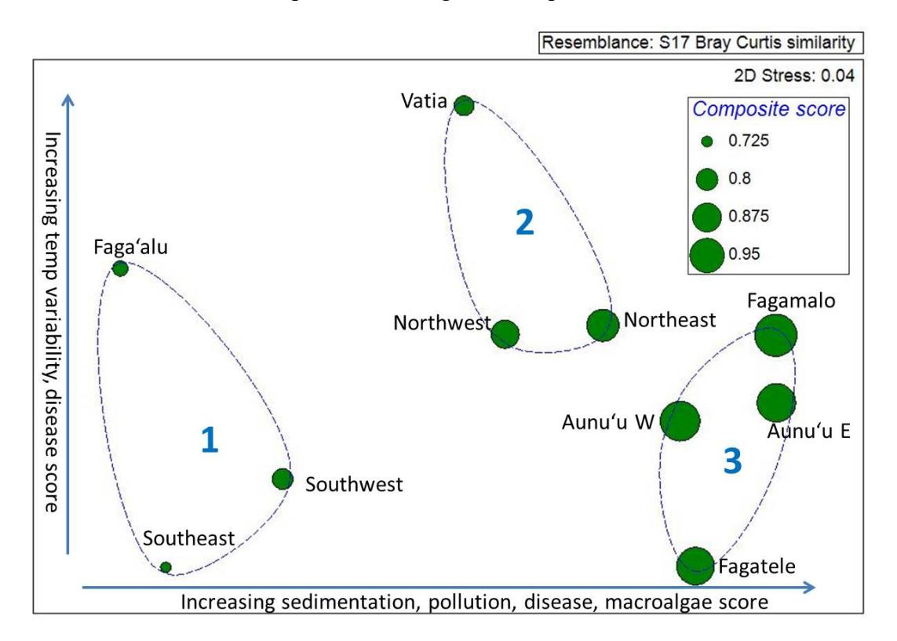
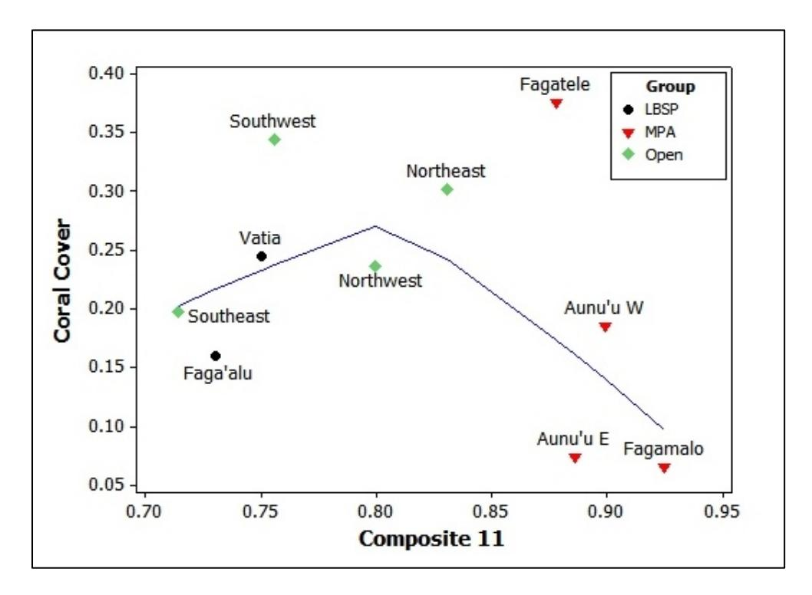

# **Identifying coral reef resilience potential in Tutuila, American Samoa based on NOAA coral reef monitoring data**

Brett D. Schumacher, Bernardo Vargas-Ángel, Scott F. Heron

**U.S. DEPARTMENT OF COMMERCE**

**National Oceanic and Atmospheric Administration**

National Marine Fisheries Service Pacific Islands Fisheries Science Center

PIFSC Special Publication SP-18-003 https://doi.org/10.7289/V5/SP-PIFSC-18-003

March 2018

# **Identifying coral reef resilience potential in Tutuila, American Samoa based on NOAA coral reef monitoring data**

Brett D. Schumacher1,2, Bernardo Vargas-Ángel1,2, Scott F. Heron3

1Pacific Islands Fisheries Science Center National Marine Fisheries Service 1845 Wasp Boulevard Honolulu, Hawaii 96818

2Joint Institute for Marine and Atmospheric Research University of Hawaii 1000 Pope Road Honolulu, Hawaii 96822

3NESDIS/STAR Coral Reef Watch 5830 University Research Court College Park, Maryland 20740

March 2018

### **U.S. Department of Commerce**

Wilbur L. Ross, Jr., Secretary

National Oceanic and Atmospheric Administration RDML Tim Gallaudet, Ph.D., USN Ret., Acting NOAA Administrator

National Marine Fisheries Service Chris Oliver, Assistant Administrator for Fisheries

#### **Recommended citation:**

Schumacher BD, Vargas-Ángel B and SF Heron. 2018. Identifying coral reef resilience potential in Tutuila, American Samoa based on NOAA coral reef monitoring data. NOAA Special Publication. NMFS-PIFSC-SP-18-03, 15 pp.

#### **Copies of this report are available from:**

Science Operations Division Pacific Islands Fisheries Science Center National Marine Fisheries Service National Oceanic and Atmospheric Administration 1845 Wasp Boulevard, Building #176 Honolulu, Hawaii 96818

#### **Or online at:**

<https://www.pifsc.noaa.gov/library/>

#### **Key outcomes**

- Eleven zones around Tutuila and Aunu'u were evaluated for relative resilience potential
- Resilience potential was highest in protected zones (Fagamalo, Aunu'u, Fagatele)
- Several of the highest scoring zones had relatively low coral cover
- Impacts to coral cover from past crown-of-thorns seastar predation persist

## **Background**

Scientists have identified eleven factors that affect the resilience of coral reefs, or the ability of reefs to resist environmental stress and recover when they have been impacted (McClanahan et al., 2012). The publication of this framework generated interest among resource managers in American Samoa for analysis of the resilience potential of coral reefs there. The present project was initiated in response to their request for such an analysis. We used quantifiable metrics associated with eleven factors to assess the resilience potential of reefs around Tutuila and Aunu'u Islands (Table 1). All metrics were derived using existing data sets. Data from Rapid Ecological Assessment (REA) surveys conducted by the Ecosystem Sciences Division (ESD) of the NOAA Pacific Islands Fisheries Science Center (PIFSC) were used to evaluate most resilience factors, and external data sources were used to inform factors that were not directly measured by the ESD (Table 1). A core concept of the resilience analysis process is that scores are considered relative to zones within the region of interest: Tutuila and Aunu'u in the present project. Scores should therefore be interpreted as a means of comparison within the study but are not absolute measures of resilience potential to compare against other coral reefs.

**Table 1. List of resilience factors, metrics used for evaluation, and sources of data. Acronyms: AS (American Samoa), EPA (Environmental Protection Agency), NOAA (National Oceanic and Atmospheric Administration), NWS (National Weather Service), Ecosystem Division (ESD), RAMP (Reef Assessment and Monitoring Program).**

| Resilience Factor    | Metric                                                                                                 | Source                                             |
|----------------------|--------------------------------------------------------------------------------------------------------|----------------------------------------------------|
| Pollution            | Watershed health index                                                                                 | AS EPA (Tuitele C 2016)                      |
| Sedimentation        | Rainfall vs. coastline                                                                              | NOAA NWS                                           |
| Herbivory            | Biomass/m2 of herbivorous fish                                                                         | ESD RAMP                                           |
| Macroalgae cover     | Percent cover of macroalgae                                                                            | ESD RAMP                                           |
| Coral diversity      | Taxonomic distinctness                                                                                 | ESD RAMP                                           |
| Coral recruitment    | Recruits/m2                                                                                            | ESD RAMP                                           |
| Disease prevalence   | Percent diseased corals                                                                                | ESD RAMP                                           |
| Bleaching resistance | Percent susceptible corals*                                                                            | ESD RAMP                                           |
| Physical impacts     | Percent damaged corals                                                                                 | ESD RAMP                                           |
| Fishing pressure     | Adjacent human population, Commercial fishing effort, Reef Area                                     | 2010 US Census, AS Coral Reef Advisory Group |
|                      | Sea surface temperature variabilityWarmest month variability, Number of degree heating weeks ≥ 4 | NOAA Coral Reef Watch (Heron SF 2016)3          |

\*Coral susceptibility based on ESD RAMP data collected during the 2015 bleaching event.

# **Methods**

Eleven study zones were delineated for the present project. Four of these zones reflect broad geographic regions of Tutuila (i.e. Northeast, Northwest, Southeast, and Southwest) that have been used to organize ecological surveys conducted by the ESD under the National Coral Reef Monitoring Program (Figure 1). Reefs within these zones have similar habitat and exposure to wave and weather conditions. Next, several smaller zones of interest were identified that had been the subject of focused survey effort by the ESD during previous projects, which provided geographically dense data to evaluate the resilience potential for each individual zone. Taema Bank had suffered severe impacts due to predation on corals by crown-of-thorns seastars; Aunu'u East, Aunu'u West, Fagamalo, and Fagatele are marine protected areas (MPAs); and Faga'alu Bay and Vatia Bay were the subject of previous studies by ESD on impacts of landbased sources of pollution (LBSP) (Vargas-Ángel and Schumacher In Review). Although there is a larger community-managed MPA at Vatia, the zone analyzed herein mirrors the geographic scope of the LBSP study completed by ESD, which focused on Vatia Bay and not the adjacent reefs. The analysis presented here is therefore particular to Vatia Bay and does not apply to the MPA as a whole. This zone, like Aunu'u West, was classified as a mixed-use area because some fishing for reef fish is permitted (Figure 1). Numerous other community managed zones have been established around Tutuila; however, evaluation of additional zones was not possible for this project with available data sets.

**Figure 1. Management type of 11 focal study zones. Fagamalo and Fagatele are no-take marine protected areas (MPAs). Aunu'u East is managed as a research zone where surface fishing for pelagic fish is allowed, but fishing for bottomdwelling species is not allowed. Fishing is permitted in Vatia, which is part of a community managed MPA; and Aunu'u West, which is part of the Sanctuary of American Samoa. Open study zones may contain special management areas, but fishing is generally allowed. Dots show locations of in-water rapid ecological assessment surveys conducted by NOAA ESD under the Pacific Reef Assessment and Monitoring Program.**

The primary resilience score calculated from all 11 metrics is referred to as "Composite 11." However, three factors (poll ution, sedimentation, and fishing pressure) could not be evaluated for the offshore Taema Bank as they are closely associated with watersheds or communities adjacent to the reef. To allow for a comparison which included Taema Bank, a secondary composite score (Composite 8) was calculated for all zones based on the remaining eight resilience factors. The Composite 8 Score is presented as a means of comparing Taema Bank to other zones, but also to illustrate the influence of specific resilience factors, but the principal analysis and interpretation of resilience potential is based on the Composite 11 resilience score.

## **Results and Discussion**

Eleven zones around Tutuila and Aunu'u were analyzed for resilience potential. The lowest Composite 11 scores were assigned to reefs at Faga'alu and Southeast Tutuila, which are located near more densely populated areas along the south shore (Figure 2[,Table A. 1\)](#page-13-0). The four highest scores were calculated for specially managed areas: the community managed no-take zone at Fagamalo and the mixed-use western Sanctuary zone off Aunu'u Island received the two highest scores, followed by the Sanctuary zones at Fagatele Bay and east of Aunu'u Island.

**Figure 2. Primary resilience score based on all 11 resilience factors for zones around Tutuila. Colors indicate scores for 10 zones based on all eleven resilience indicators. Dots indicate locations of in-water rapid ecological assessment surveys conducted by NOAA ESD under the Pacific Reef Assessment and Monitoring Program.**

Differences in Composite 11 and Composite 8 scores are apparent for some zones (Figure 2, Figure 3), and these differences highlight locally manageable factors that could be supported to enhance or maintain the resilience potential of reefs. For example, Southeast Tutuila was among the zones with the lowest Composite 11 score (orange color, Figure 2) in the principal analysis,

but it was in a higher scoring group (light green, Figure 3) when sedimentation, pollution, and fishing pressure were excluded for the Composite 8 score. This zone had very low scores for these three metrics, including the lowest score in the study for fishing pressure [\(Table A. 1\)](#page-13-0).

**Figure 3. Secondary resilience scores based on eight resilience factors for zones around Tutuila. Colors indicate scores for 11 zones (including Taema Bank) based on eight resilience indicators. Dots indicate locations of in-water rapid ecological assessment sur surveys conducted by NOAA ESD under the Pacific Reef Assessment and Monitoring Program.** 

A contrasting example is Northeast Tutuila; the resilience score was higher when the all eleven factors were included. This zone scored moderately high for pollution and fishing pressure, so removing them decreased the Composite 8 score. Sedimentation, pollution, and fishing pressure are factors that can be managed locally, in contrast to large-scale or complex factors, such as sea surface temperature variability or coral diversity. Thus, comparison of Composite 11 and Composite 8 scores illustrates the potential for improving resilience scores in areas that rated lower for locally manageable factors (e.g. Southeast Tutuila), and the potential for preserving and supporting these factors to maintain resilience in zones that are currently healthy (e.g. Northeast Tutuila).

A further level of analysis that compares multivariate similarity among zones using all eleven resilience metrics is presented through a multidimensional scaling plot (Figure 4). In this analysis, the study zones form three groups, two of which are essentially geographic. Group 1 includes the reefs with a southern exposure, and Group 2 includes the northern reefs. Group 3 includes reefs found across the study zone; the unifying factor is that all sites are under specialized management frameworks. The axis arrows indicate individual metrics for which scores are higher towards the right (sedimentation, pollution, disease, macroalgae) and upper

(sea surface temperature variability, disease) sides of the figure. As indicated by the size of the markers, zones in the Group 3 have the highest Composite 11 resilience scores.

**Figure 4. Multidimensional scaling plot of eleven resilience metrics. Dashed lines encircle groups with 90% similarity based on cluster analysis. Size of markers indicates the composite resilience score. Axis arrows show correlated resilience factors.**

Percent cover of coral is often used to evaluate reefs, but this variable is not included in the list of metrics used to evaluate coral reef resilience (McClanahan et al., 2012). The absence of coral cover may seem counterintuitive; however, it underscores the difference between an assessment of reef resilience as done here, and commonly done assessments of reef condition or "health." Coral cover is an informative and often-used metric to evaluate the condition of a reef. In contrast, resilience assessments seek to understand the ability of reefs to maintain their present state, or to recover and return to it following a disturbance. Coral cover can therefore provide a baseline to compare the state of reefs, while resilience assessments evaluate the potential for that state to be maintained into the future.

Because it is not a metric used to analyze resilience potential (Table 1), percent coral cover can be used to provide additional perspective on resilience scores. Since management efforts are often focused on reef areas with high coral cover, an important outcome of this analysis is that coral cover does not have a consistent relationship with resilience potential. In fact, some of the zones with the highest resilience scores also had the lowest percent coral cover (Figure 5). A LOWESS trace (blue line) showing the general trends in the data indicates that the Composite 11 resilience score initially increases along with percent coral cover, and the zone with the highest coral cover (Fagatele) was also among zones with the highest Composite 11 resilience scores. However, the trace declines at high resilience values because the zones with the three highest

resilience scores have very low coral cover. The relationship with coral cover was similar in the secondary analysis using Composite 8 scores. In that comparison, Taema Bank had the highest resilience score and also the lowest coral cover of any zone in the study (2.5%). Therefore, efforts to support resilience potential in different locations may have different goals. These objectives may include maintaining or preserving areas with high coral cover and resilience potential, increasing or recovering corals in previously impacted areas that have high resilience potential, or increasing resilience potential in areas with high coral cover but lower resilience scores.

**Figure 5. Scatterplot of percent coral cover vs. Composite 11 resilience score for 10 zones. Zone type indicated by marker shape and color: a black circle represents a previous study on Land-based sources of Pollution (LBSP), a red triangle is used for Marine Protected Areas (MPAs), and a green diamond denotes a zone that does not have fishing restrictions (Open). LOWESS trace shown by blue line. Surveys conducted by NOAA ESD.**

#### **Crown-of-thorns Seastars**

Although there was an active outbreak of crown-of-thorns seastars (COTS) while the ESD was conducting surveys around Tutuila in 2015, predation was recorded only rarely – less than 1% of coral colonies had recent mortality attributed to COTS predation. This result may be due in part to the survey protocol used by ESD. Colonies are only recorded if there is living tissue remaining. Therefore, colonies that had suffered complete mortality due to COTS predation would not be recorded. Additionally, COTS were concentrated in certain areas; therefore, it is possible that the randomized ESD surveys missed those aggregated populations.

Despite the limited incidence of recent COTS predation recorded on ESD surveys, the effects of previously documented COTS outbreaks are evident years afterwards in the low coral cover at offshore banks around Tutuila. This condition is the result of an outbreak of COTS predation in 2011-2013. Although the secondary analysis that ranked Taema as having high resilience did not include pollution, sedimentation, or fishing pressure (factors that could inhibit coral recruitment and survival), it would be expected that these factors would not adversely affect reef resilience given the offshore nature of this bank. In fact, the density of coral recruits was relatively high at Taema Bank [\(Table A. 2\)](#page-13-1), which indicates a potential avenue for recovery if intermittent recurrence of COTS outbreaks (or other disturbance) does not inhibit the process.

### **Conclusions**

Resilience potential varies among geographically defined zones, with Northeast Tutuila scoring the highest, Northwest and Southwest zones intermediate, and Southeast Tutuila scoring the lowest when all 11 resilience metrics are considered. Within this context, some of the marine protected areas included in the study scored higher than adjacent geographic zones, indicating these sites were designated in locations well-suited for maintaining reef resilience and that management has sustained resilience potential. Differences between the analyses based on 11 versus eight metrics highlight the importance of locally manageable factors to reef resilience potential. This perspective, along with comparison of resilience scores to coral cover, indicates multiple avenues for resilience-based management, depending on priorities of local stakeholders.

### **Future directions**

Factors included in the analytical framework used in this project were identified as important to supporting reef resilience through a review of evidence and expert opinion of 50 coral reef scientists (McClanahan et al., 2012). The framework is therefore based on vetted scientific concepts, and it has been used to evaluate resilience potential of reefs in several other locations in the Pacific (Maynard et al., 2012; Maynard et al., 2015; PIFSC, 2015; Maynard et al., 2016). However, because the framework was developed recently, it is not yet possible to critically evaluate strengths and limitations of comprehensive resilience-based management or the time scale over which benefits might develop. Researchers continue work to identify the best means of using resilience analyses to sustain reefs. (Anthony et al., 2015) continues. Future work should investigate outcomes of resilience-based management initiatives which would provide managers with guidance on choosing the most effective strategies to support resilient reefs and the communities that depend on them for food, income, and recreation.

# **Acknowledgements**

This analysis was funded through a grant from the NOAA Coral Reef Conservation Program. Ecological surveys were funded through the NOAA Coral Reef Conservation Program, with additional support for surveys in Aunu'u and Fagatele provided by the NOAA Sanctuary Program. The authors would also like to thank K. Gorospe, B. Huntington, A. Lawrence, and M. Parke for review and constructive criticism of this report. For additional information, please contact [nmfs.pic.credinfo@noaa.gov.](mailto:nmfs.pic.credinfo@noaa.gov)

# **Literature Cited**

- Anthony, K.R.N., P.A. Marshall, A. Abdulla, R. Beeden, C. Bergh, R. Black, C.M. Eakin, E.T. Game, M. Gooch, N.A.J. Graham, A. Green, S.F. Heron, R. van Hooidonk, C. Knowland, S. Mangubhai, N. Marshall, J.A. Maynard, P. McGinnity, E. McLeod, P.J. Mumby, M. Nystrom, D. Obura, J. Oliver, H.P. Possingham, R.L. Pressey, G.P. Rowlands, J. Tamelander, D. Wachenfeld, and S. Wear.
  - 2015. Operationalizing resilience for adaptive coral reef. Global Change Biology 21: 48– 61.
- Heron, S.F., J.A. Maynard, R. van Hooidonk, and C.M. Eakin.
  - 2016. Warming Trends and Bleaching Stress of the World's Coral Reefs 1985-2012. Scientific Reports 6: 38402.
- Maynard, J., E. Conklin, D. Minton, R. Most, C. Couch, G.J. Williams, J. Gove, B. Schumacher, W. Walsh, J. Martinez, D. Harper, D. Jayewardene, B. Parker, and L. Watson.
  - 2016. Relative resilience potential and bleaching severity in the West Hawai'i Habitat Focus Area in 2015. Silver Spring, MD: NOAA Coral Reef Conservation Program. NOAA Technical Memorandum CRCP 26, 53 pp. DOI: 10.7289/V5T43R4Z
- Maynard, J., S. McKagan, L. Raymundo, S. Johnson, G.N. Ahmadia, L. Johnston, P. Houk, G.J. Williams, M. Kendall, S.F. Heron, R. van Hooidonk, E. Mcleod, D. Tracey, and S. Planes. 2015. Assessing relative resilience potential of coral reefs to inform management. Biological Conservation 192 (2015): 109-119.
- Maynard, J., S. McKagan, S. Johnson, P. Houk, G. Ahmadia, R. van Hooidonk, L. Harriman, and E. Mcleod.
  - 2012. Coral reef resilience to climate change in Saipan, CNMI; field-based assessments and implications for vulnerability and future management. Technical report to the CNMI Division of Environmental Quality, Saipan, MP.
- McClanahan, T.R., S.D. Donner, J.A. Maynard, M.A. MacNeil, N.A. Graham, J. Maina, A.C. Baker, J.B. Alemu I, M. Beger, S.J. Campbell, E.S. Darling, C.M. Eakin, S.F. Heron, S.D. Jupiter, C.J. Lundquist, E. Mcleod, P.J. Mumby, M.J. Paddack, E.R. Selig, and R. van Woesik. 2012. Prioritizing Key Resilience Indicators to Support Coral Reef Management in a Changing Climate. PLoS ONE 7(8), 2012: e42884.
- PIFSC. Reefs for the future: Resilience of coral reefs in the main Hawaiian Islands. 2015. PIFSC Special Publication, NOAA Fisheries Pacific Science Center.
- Tuitele, C., E.L. Buchan, J. Regis, J. Potoa'e, and C. Fale. 2016. American Samoa Watershed Management and Protection Program FY15 Annual Report. American Samoa Environmental Protection Agency.

Williams I.E., D.J. White, R.T. Sparks, K.C. Lino, J.P. Zamzow, E.L.A. Kelly, and H.L. Ramey. 2016. Responses of Herbivorous Fishes and Benthos to 6 Years of Protection at the Kahekili Herbivore Fisheries Management Area, Maui. PLOS One.

# **Appendix A – Detailed summary of resilience scores**

Tables below provide scores for individual resilience metrics for the primary analysis with all 11 metrics and for secondary analysis with the eight metrics available for Taema Bank. Ble = Bleaching resistance, DZ = Disease prevalence, Div = Coral diversity, FP = Fishing pressure, Herb = Herbivory, Rec = Coral recruitment, MA = Macroalgae cover, Dam = Physical Damage, Poll = Pollution, Sed = Sedimentation, and SST Var = Sea surface temperature variability. Although it is not a metric used to analyze resilience, percent coral cover is provided as it is frequently used to evaluate reef status and prioritize management. Cells are color-coded to facilitate comparison of relative performance of each zone, with colors indicating relationship to the mean of each metric.

**Table A. 1. Zone ranks and scores for Composite 11 and individual resilience metrics for zones for the primary analysis where all eleven scores were calculated. Percent coral cover is also provided.** 

|           |      | Comp  |       |       |       |       |       |       |       |       |       |       | SST   | %     |                  |
|-----------|------|-------|-------|-------|-------|-------|-------|-------|-------|-------|-------|-------|-------|-------|------------------|
| Zone      | Rank | 11    | Ble   | DZ    | Div   | FP    | Herb  | Rec   | MA    | Dam   | Poll  | Sed   | Var   | Coral | Color Code       |
|           |      |       |       |       |       |       |       |       |       |       |       |       |       |       | > 2 SD +         |
| Aunu'u E  | 3    | 0.886 | 0.966 | 1.000 | 0.949 | 0.996 | 0.508 | 0.833 | 0.975 | 0.946 | 1.000 | 0.954 | 0.618 | 7.4   | Mean             |
|           |      |       |       |       |       |       |       |       |       |       |       |       |       |       | 1 - 2 SD +    |
| Aunu'u W  | 2    | 0.899 | 0.959 | 0.767 | 1.000 | 0.863 | 0.634 | 0.962 | 0.982 | 0.988 | 1.000 | 1.000 | 0.734 | 18.6  | Mean             |
|           |      |       |       |       |       |       |       |       |       |       |       |       |       |       | 0 - 1 SD +    |
| Faga'alu  | 9    | 0.730 | 0.961 | 0.845 | 0.871 | 0.614 | 0.563 | 1.000 | 0.805 | 0.935 | 0.250 | 0.280 | 0.907 | 16.0  | Mean             |
|           |      |       |       |       |       |       |       |       |       |       |       |       |       |       | 0 - 1 SD -    |
| Fagamalo  | 1    | 0.925 | 0.998 | 0.845 | 0.974 | 1.000 | 1.000 | 0.896 | 0.911 | 0.996 | 1.000 | 0.880 | 0.674 | 6.5   | Mean             |
|           |      |       |       |       |       |       |       |       |       |       |       |       |       |       | 1 - 2 SD -    |
| Fagatele  | 4    | 0.878 | 0.986 | 0.775 | 0.925 | 1.000 | 0.652 | 0.427 | 0.973 | 1.000 | 1.000 | 0.930 | 0.990 | 37.5  | Mean             |
| Northeast | 5    | 0.831 | 0.973 | 0.871 | 0.998 | 0.839 | 0.732 | 0.631 | 1.000 | 0.987 | 0.703 | 0.781 | 0.622 | 30.2  | < 2 SD - Mean |
| Northwest | 6    | 0.800 | 0.969 | 0.837 | 0.985 | 0.659 | 0.564 | 0.759 | 0.975 | 1.000 | 0.832 | 0.513 | 0.703 | 23.6  |                  |
| Southeast | 10   | 0.714 | 0.959 | 0.732 | 0.961 | 0.130 | 0.704 | 0.744 | 0.907 | 0.992 | 0.325 | 0.413 | 0.982 | 19.8  |                  |
| Southwest | 7    | 0.755 | 0.958 | 0.647 | 0.980 | 0.665 | 0.682 | 0.598 | 0.965 | 0.998 | 0.419 | 0.398 | 1.000 | 34.4  |                  |
| Vatia     | 8    | 0.750 | 1.000 | 0.886 | 0.874 | 0.857 | 0.649 | 0.754 | 0.895 | 0.981 | 0.750 | 0.074 | 0.531 | 24.5  |                  |
| Mean      | NA   | 0.817 | 0.973 | 0.820 | 0.952 | 0.762 | 0.669 | 0.760 | 0.939 | 0.982 | 0.728 | 0.622 | 0.776 | 21.9  |                  |
| SD        | NA   | 0.077 | 0.016 | 0.096 | 0.047 | 0.266 | 0.135 | 0.175 | 0.059 | 0.023 | 0.297 | 0.327 | 0.177 | 10.4  |                  |

**Table A. 2. Zone ranks and scores for Composite 8 and individual resilience metrics for the secondary analysis that were calculated for Taema Bank. Percent coral cover is also provided.** 

|           |      | Comp  |       |       |       |       |       |       |       | SST   | %     |                  |
|-----------|------|-------|-------|-------|-------|-------|-------|-------|-------|-------|-------|------------------|
| Zone      | Rank | 8     | Ble   | DZ    | Div   | Herb  | Rec   | MA    | Dam   | Var   | Coral | Color Code       |
|           |      |       |       |       |       |       |       |       |       |       |       | > 2 SD +         |
| Aunuu_E   | 10   | 0.811 | 0.966 | 1.000 | 0.949 | 0.508 | 0.523 | 0.975 | 0.946 | 0.618 | 7.4   | Mean             |
|           |      |       |       |       |       |       |       |       |       |       |       | 1 - 2 SD +    |
| Aunuu_W   | 4    | 0.834 | 0.959 | 0.767 | 1.000 | 0.634 | 0.604 | 0.982 | 0.988 | 0.734 | 18.6  | Mean             |
|           |      |       |       |       |       |       |       |       |       |       |       | 0 - 1 SD +    |
| Faga'alu  | 8    | 0.815 | 0.961 | 0.845 | 0.871 | 0.563 | 0.628 | 0.805 | 0.935 | 0.907 | 16.0  | Mean             |
|           |      |       |       |       |       |       |       |       |       |       |       | 0 - 1 SD -    |
| Fagamalo  | 2    | 0.870 | 0.998 | 0.845 | 0.974 | 1.000 | 0.563 | 0.911 | 0.996 | 0.674 | 6.5   | Mean             |
|           |      |       |       |       |       |       |       |       |       |       |       | 1 - 2 SD -    |
| Fagatele  | 7    | 0.821 | 0.986 | 0.775 | 0.925 | 0.652 | 0.268 | 0.973 | 1.000 | 0.990 | 37.5  | Mean             |
| Northeast | 6    | 0.822 | 0.973 | 0.871 | 0.998 | 0.732 | 0.396 | 1.000 | 0.987 | 0.622 | 30.2  | < 2 SD - Mean |
| Northwest | 9    | 0.814 | 0.969 | 0.837 | 0.985 | 0.564 | 0.477 | 0.975 | 1.000 | 0.703 | 23.6  |                  |
| Southeast | 3    | 0.838 | 0.959 | 0.732 | 0.961 | 0.704 | 0.467 | 0.907 | 0.992 | 0.982 | 19.8  |                  |
| Southwest | 5    | 0.826 | 0.958 | 0.647 | 0.980 | 0.682 | 0.375 | 0.965 | 0.998 | 1.000 | 34.4  |                  |
| Taema     | 1    | 0.910 | 0.968 | 0.842 | 0.984 | 0.769 | 1.000 | 0.877 | 0.990 | 0.851 | 2.5   |                  |
| Vatia     | 11   | 0.786 | 1.000 | 0.886 | 0.874 | 0.649 | 0.473 | 0.895 | 0.981 | 0.531 | 24.5  |                  |
| Mean      | NA   | 0.831 | 0.972 | 0.822 | 0.955 | 0.678 | 0.525 | 0.933 | 0.983 | 0.783 | 20.1  |                  |
| SD        | NA   | 0.033 | 0.015 | 0.092 | 0.046 | 0.132 | 0.189 | 0.059 | 0.022 | 0.169 | 11.5  |                  |

| Coral | Color Code    |
|-------|---------------|
|       | > 2 SD +      |
|       | Mean          |
|       | 1 - 2 SD + |
|       | Mean          |
|       | 0 - 1 SD + |
|       | Mean          |
|       | 0 - 1 SD - |
|       | Mean          |
|       | 1 - 2 SD - |
|       | Mean          |
|       |               |