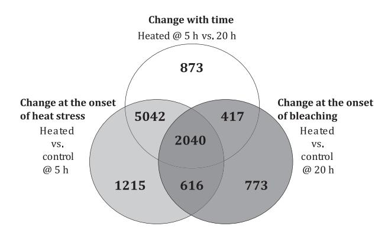
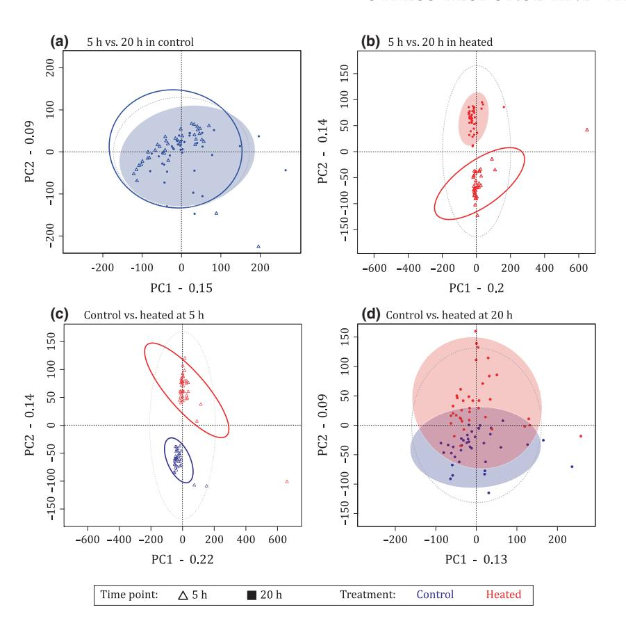
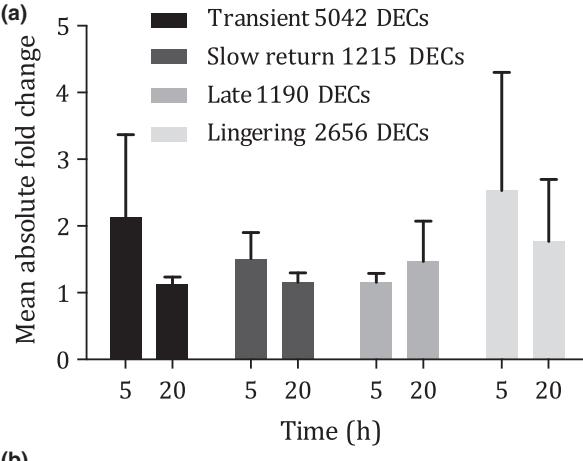
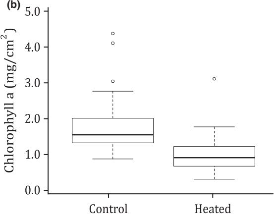
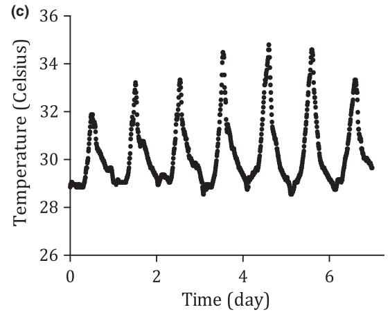
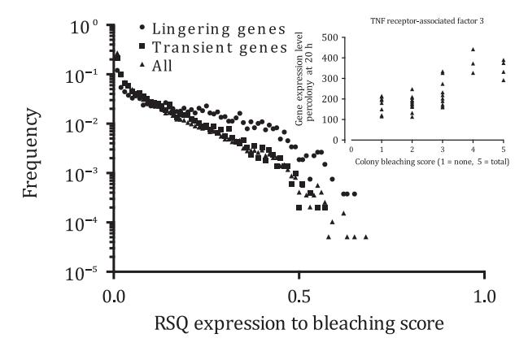

Molecular Ecology (2015) doi: 10.1111/mec.13125

# The role of transcriptome resilience in resistance of corals to bleaching

FRANCOIS O. SENECA† and STEPHEN R. PALUMB I Department of Biology, Stanford University, Hopkins Marine Station, Pacific Grove, CA 93950, USA

### Abstract

Wild populations increasingly experience extreme conditions as climate change amplifies environmental variability. How individuals respond to environmental extremes determines the impact of climate change overall. The variability of response from individual to individual can represent the opportunity for natural selection to occur as a result of extreme conditions. Here, we experimentally replicated the natural exposure to extreme temperatures of the reef lagoon at Ofu Island (American Samoa), where corals can experience severe heat stress during midday low tide. We investigated the bleaching and transcriptome response of 20 Acropora hyacinthus colonies 5 and 20 h after exposure to control (29 °C) or heated (35 °C) conditions. We found a highly dynamic transcriptome response: 27% of the coral transcriptome was significantly regulated 1 h postheat exposure. Yet 15 h later, when heat-induced coral bleaching became apparent, only 12% of the transcriptome was differentially regulated. A large proportion of responsive genes at the first time point returned to control levels, others remained differentially expressed over time, while an entirely different subset of genes was successively regulated at the second time point. However, a noteworthy variability in gene expression was observed among individual coral colonies. Among the genes of which expression lingered over time, fast return to normal levels was associated with low bleaching. Colonies that maintained higher expression levels of these genes bleached severely. Return to normal levels of gene expression after stress has been termed transcriptome resilience, and in the case of some specific genes may signal the physiological health and response ability of individuals to environmental stress.

Keywords: coral bleaching, gene expression, heat stress, resilience, transcriptomics

Received 28 November 2014; revision received 16 February 2015; accepted 18 February 2015

#### Introduction

Global warming due to climate change involves shifts in mean annual temperatures but also an increased frequency of extremes (Seneviratne et al. 2014). Exposure to transient extreme temperatures can cause mass mortality and dramatic transformation of an ecosystem (Dudgeon et al. 2010). Essentially, the response of organisms to normal fluctuation in temperature is overwhelmed during extreme conditions. As a consequence, the impact of climate change on natural assemblages

Correspondence: Francois O. Seneca, Fax: 808 599 4817;

† Present address: Kewalo Marine Laboratory, University of

E-mail: seneca@hawaii.edu Hawaii at Manoa, Honolulu, HI 96815, USA depends on the rate of exposure to environmental extremes, the rate of response and recovery, and the ability of individuals to acclimatize or populations to adapt (Palumbi et al. 2014).

Recent availability of transcriptome data from a wide variety of species makes it possible to more finely study the molecular stress response of organisms to extreme temperatures (Runcie et al. 2012; Kenkel et al. 2013; Xie et al. 2013) and can help us evaluate the capacity for acclimatization and adaptation in populations of key species (Hoffmann & Sgro 2011). For reef-building cor als, environmental data from around the tropics suggest that ocean temperatures one or two degrees above average generate physiological stress (Jokiel & Coles 1990). Prolonged low or acute level of temperature stress cause coral bleaching, the expulsion of essential endosymbiotic photosynthetic algae (reviewed by Weis 2008). The combination of a defined temperature trigger (Tolleter et al. 2013), a disadvantageous physiological response and a battery of transcriptome tools makes the coral holobiont system adequate to describe the rates, magnitudes and duration of reaction to extreme climate events.

To date, twelve studies have investigated the transcriptomic changes in corals and anemones responding to heat stress. These studies have targeted the partial or near complete transcriptomes of symbiotic cnidarians including temperate anemones (Richier et al. 2008; Moya et al. 2012), adult reef-building corals (DeSalvo et al. 2008, 2010; Bellantuono et al. 2012; Barshis et al. 2013) and coral embryos (Voolstra et al. 2009; Polato et al. 2010; Portune et al. 2010; Meyer et al. 2011). Significantly regulated genes differ widely across these studies (DeSalvo et al. 2008, 2010; Rodriguez-Lanetty et al. 2009; Voolstra et al. 2009; Meyer et al. 2011; Bellantuono et al. 2012; Barshis et al. 2013). Although change in apoptosis, antioxidant and heat-shock protein genes has been repeatedly observed after high temperature treatment, many other gene families are revealed in only one or a handful of studies. Moreover, these studies typically follow transcriptional changes that occur when bleaching begins, well after heat treatments commence. They show changes in transcription that occur after repeated daily heat stress, as water temperatures increase during the day, but have not focused on fast responses to extreme temperature changes. Because the onset of bleaching occurs one or several days after strong heat stress, gene expression during bleaching may be very different from gene expression a few hours postacute heat exposure. In addition, because of high variability in bleaching sensitivity among colonies, it is possible that the reaction of gene expression during acute heat stress, and the recovery of expression poststress, sets the stage for later bleaching.

Transcriptome tools are also being used to document acclimatization and adaptation among coral populations. For example, some corals in Ofu Island, American Samoa, living in warm water back reef pools exhibit high heat tolerance by constitutively expressing more of certain stress-response genes (Barshis et al. 2013). Corals living in cooler parts of this reef can acquire higher heat tolerance after transplantation and show acclimatization of gene expression patterns as well (Palumbi et al. 2014). However, about half the difference in heat tolerance among populations is not due to acclimatization. Furthermore, genetic differences at about 100 loci have been implicated in adaptation of these populations to repeated temperature extremes (Bay & Palumbi 2014). Bellantuono et al. (2012) showed that corals could acquire higher heat tolerance in as little as 2 weeks, but showed no constitutive transcriptional changes associated with this physiological shift.

In this study, we conducted a whole-transcriptome controlled heat stress experiment on corals from the Ofu Island (American Samoa) lagoon, which can experience extreme daily change in temperatures during summer low tides (+6 °C above the 29 °C summer average) that can lead to bleaching. Despite such high temperatures, there is a high abundance and diversity of live corals within the lagoon (Craig et al. 2001), some of which have shown relative resistance to those challenging temperature events (Oliver & Palumbi 2011) as well as evidence of postbleaching resilience (F.O. Seneca, personal observation). The response of Ofu corals to such drastic change in temperature is relevant to corals elsewhere, for example, populations from the Arabian/Persian gulf can survive even more extreme temperature regime (Riegl et al. 2011). Furthermore, it is becoming more evident that some corals can gain thermotolerance or become dominant with increasing exposure to bleaching temperatures (Guest et al. 2012; Pratchett et al. 2013; Kemp et al. 2014), which provides opportunities to study the mechanisms of acclimatization and/or adaptation to climate change. We exposed 20 Acropora hyacinthus colonies to controlled bleaching conditions that mimic natural daily cycles of high heat stress during extreme temperature events. We compared changes in gene expression at the onset of heat stress (1 h postheat exposure corresponding to the 5-h time point) and 15 h later at the onset of bleaching (i.e. at the 20-h time point) after colonies had been returned to normal temperatures. The results show a surprisingly wide transcriptome response before bleaching begins, and rapid return to normal expression levels for many genes. The return to normal gene expression levels varies from gene to gene and colony to colony and may signal the resilience of the transcriptome to environmental stress. This variation in return to normal expression may underlie some of the variation in stress response seen in previous studies and adds to other components of the stress response in corals and other species.

# Materials and methods

Sample preparation and experimental design

Twelve small nubbins (~3 cm3 ) of Acropora hyacinthus (cryptic species E in Ladner & Palumbi 2012) were cut from each of 20 colonies from the south lagoon of Ofu Island, American Samoa (14°110 S, 169°360 W), and glued underwater onto nylon bolts using two-part underwater epoxy stick (Loctite 82093). The nubbins were evenly distributed among and screwed onto 12 egg crate platforms, which were then secured to the substratum randomly across the area of sampling for a period of acclimatization and growth.

After 17 months, eight nubbins from each of 18 colonies and four nubbins from each of two colonies were collected and used in a controlled heat stress experiment as in the following design: (18 colonies in duplicate + 2 colonies in singleton) 9 2 conditions 9 2 time points (Appendix S1, Supporting information). Control subjects were kept at a constant 29 °C, while the heat stress treatment mimicked a natural bleaching temperature regime observed in the lagoon: heated corals were ramped from 29 to 35 °C over 3 h, held at 35 °C for 1 h, and then freely returned to 29 °C in ~2 h. To coincide with the natural circadian rhythm of corals, the peak in heat stress was timed to occur in the early afternoon, when corals would normally experience temperature highs. Samples were collected after 5 and 20 h from the start of the experiment. The 5-h time point occurred 1 h after the peak in heat stress and was chosen to capture the changes taking place at the onset of heat stress. Based on pilot experiments, the 20-h time point was chosen to investigate the changes taking place at the onset of visually detected bleaching. At that time, heated colonies were graded on a five-point scale of bleaching (1-normal = same as control, 2-slight = a little pale, 3-moderate = half as coloured as control, 4-severe = very pale but still a tinge, 5-total = bone white) in relation to the control nubbins. One half of each nubbin was preserved in RNA stabilizing buffer and stored at -80 °C until molecular analysis, and the other half was preserved in 100% ethanol for chlorophyll a pigment extraction.

#### RNA isolation, sequencing and raw data processing

Total RNA was extracted from each sample following the modified TRIzol Reagent (Life Technologies) protocol in Barshis et al. (2013; Appendix S1, Supporting information). A total of 152 libraries were constructed using 1 lg of total RNA following the TruSeq RNA Sample Prep v2 (LS) protocol (Illumina). cDNA was synthesized using the SuperScript III reverse transcriptase (Life Technologies). Purification of cDNAs throughout the TruSeq protocol was performed using the Agencourt AMPure XP system (Beckman Coulter). Sequencing was performed on the Illumina HiSeq 2000 sequencer at the Huntsman Cancer Institute of the University of Utah. All libraries were sequenced with 50-bp single-end sequencing length. TruSeq raw sequences were processed following the pipeline methodology described in De Wit et al. (2012). Reads were mapped to the de novo assembly constructed by Barshis et al. (2013) to produce the raw gene expression count data for further analysis.

# Gene expression and statistical analysis

Gene expression analysis was performed with the DESEQ package (Anders & Huber 2010) in R (R Core Team 2014). After normalization for variation in library size, the data variance (i.e. dispersion) was estimated and the significance of heat stress at two different time points evaluated using log ratio tests of nested negative binomial generalized linear models (GLMs), taking into account fixed expression differences between individual coral colonies regardless of heat stress (Appendix S1, Supporting information). P-values were adjusted using the Benjamini– Hochberg (BH) method controlling the false discovery rate at a 0.01 level.

Differences in expression levels were calculated in four comparisons: (i) control vs. heated at 5 h, (ii) control vs. heated at 20 h, (iii) control at 5 h vs. control at 20 h, and (iv) heated at 5 h vs. heated at 20 h, corresponding to the onset of heat stress, the onset of bleaching, the effect of time/acclimation, and the change from heat stress to bleaching, respectively. We applied two filters to exclude contiguous sequences (contigs) for which we had little power to detect expression differences from multiple test correction: (i) low contig average in normalized expression across samples with a cut-off of three reads (i.e. the sample average median for normalized expression level across all contigs) and (ii) high intercolony variability contigs (within-group mean <1 standard deviation). PCAs were computed in R using the entire normalized expression data in the PCAGOPROMOTER package (Hansen et al. 2012).

#### Functional analysis

The 33 496 A. hyacinthus contigs were used to retrieve homologous gene identification codes (IDs) from Uni-Prot (UniProt Consortium 2008), KEGG (Kyoto Encyclopedia of Genes and Genomes, (Kanehisa et al. 2004) and GO (The Gene Ontology Consortium 2000) databases using the Basic Local Alignment Search Tool (NCBI). The homologous gene IDs for the filtered differentially expressed contigs (DECs) subsets from the gene expression analyses were used in comparative and functional enrichment analyses using three methods: UniProt IDs with the Database for Annotation, Visualization and Integrated Discovery (DAVID 6.7; Huang et al. 2008), KEGG Orthology (KO) codes with KEGG mapper (Kanehisa et al. 2014) and GO terms with keywords to compute hypergeometric probabilities (Appendix S1, Supporting information).

## Results

Our samples from 20 genetically distinct colonies exposed to control and heated conditions at two time points (5 and 20 h) constitute a total of 152 sequenced transcriptomes, which to our knowledge, is one of the largest and most replicated genomics data sets to study heat stress in a marine organism. The reference transcriptome of Acropora hyacinthus used in this study was previously assembled de novo (Barshis et al. 2013) and consisted of 33 496 unique contigs including 24 980 (75%) matching nucleotide collection (nr/nt) entries (e-value < 10-4 , The National Center for Biotechnology Information). Based on the 27 000 predicted transcripts from the genome of the congener Acropora digitifera (Shinzato et al. 2012), the data generated in this study likely represents a large fraction of the transcriptome of Acropora hyacinthus.

On average, over one million reads were analysed per sample, with 50% of the contigs represented by ≥3 reads on average across all samples. Further comparison to curated functional databases led to the additional annotation of the transcriptome with 24 394 UniProt, 10 168 KEGG, 16 117 GO-Cellular Component, 18 297 GO-Biological Process and 17 448 GO-Molecular Function homologous gene IDs (e-value < 10-4 ). Overall, the lists of DECs detected at both time points were significantly enriched for 71 functional annotation clusters (using EASE score < 0.05 and high classification stringency in DAVID 6.7; Huang et al. 2008) as well as 36 molecular pathways supported both by the mapping to KEGG Orthology and the representation of pathway keywords across GO terminologies (hypergeometric probability < 0.01).

#### Overall transcriptome changes

At the onset of heat stress, 1 h postheat exposure (5-h time point), a total of 8913 DECs (27% of all contigs, p-adj < 0.01; Fig. 1) were found between heated and control samples (negative binomial GLM with a paired design by genotypes). Among these DECs, 4283 and 4630 were up- and downregulated, respectively (-19.2> fold change (FC) <36.9, FC medians at -1.9 and 1.8). Fifteen hours later, when bleaching became obvious (Fig. 3b), 3846 DECs (12%) were detected between heated and control samples (1975 up- and 1871 downregulated, -18.6> FC < 19.1, FC medians at -1.6 and 1.6), representing a drop of 15% in overall transcriptome activity.

Comparing expression in heated samples, 8372 DECs (25%) differed with time after heat stress (4247 up- and 4125 downregulated, -45.2> FC < 19.0, FC medians at

Fig. 1 Venn diagram showing the number of differentially expressed contigs detected in analyses addressing the change in gene expression level at the onset of heat stress, during the time interval leading to bleaching, and at the onset of bleaching.

-1.8 and 1.9). Some of these were genes that returned to normal expression after changing at 5 h. Others altered expression only after the 5-h time point. A similar analysis across time points using control samples revealed 3358 DECs (10%) that changed between 5 and 20 h in the control tanks. These differences were influenced by circadian rhythm and acclimation to tank conditions (1517 up- and 1841 downregulated, -10.5> FC < 14.4, FC medians at -1.5 and 1.4).

Principal component analyses (PCAs) corroborated the major gene expression patterns. The PCA comparing controls between time points reveals some influence of time and acclimation, but the overall difference between time points is small when considering the large overlap in the 95% confidence intervals of each treatment (Fig. 2a). Conversely, there was a clear separation of the 95% confidence intervals between the control and heated samples at 5 h (Fig. 2c) and between the heated samples at each time point (Fig. 2b). In both analyses, the treatment groups distinctively separated along principal component 2, which explains 14% of the variance for both analyses (Fig. 2c,b). By the time bleaching was observed (20 h), a portion of the heat stress-responsive transcripts had already returned to control activity level as shown by (Fig. 2d): (i) the overlap in the 95% confidence intervals between the heated and control samples and (ii) only 9% of the variance explained by principal component 2.

A detailed analysis of the gene expression profiles among all differentially expressed contigs detected in our experiments revealed four main subsets of contigs coexpressed over time. We refer to these expression profiles as transient, slow return, late, and lingering responses for clarity. Figure 3a shows the absolute mean fold change representative of these main gene

**(b)** Fig. 2 PCAs of normalized expression values for all 33 496 contigs of each sample in all four comparisons: (a) 5 vs. 20 h in controls, (b) 5 vs. 20 h heated (c) control vs. heated at 5 h and (d) control vs. heated at 20 h. Axes labels show the proportion of variance explained by each principal component. Symbols (time points) and colours (treatments) explained in key at bottom. The coloured ellipses show the 95% confidence intervals for each treatment, and the dotted line ellipse corresponds to the overall 95% confidence interval.

expression profiles and the number of genes exemplifying them.

Transient response—genes that were different at 5 h but not at 20 h. Among the differentially expressed contigs detected at 5 h, 5042 DECs (Fig. 1) showed different expression levels at 5 h in heated vs. control corals, but subsequently returned to control level by the time bleaching was observed at the 20-h time point (Fig. 1), except for eight contigs. These changes in expression occurred in 57% of the contigs that showed a heat stress response at 5 h and thus represent the transient component in prebleaching gene expression activity.

This transient response was divided into 2311 upand 2731 downregulated contigs at 5 h. The genes that were upregulated at 5 h but returned to control level at 20 h were significantly enriched for: (i) the GO-BP including apoptosis, protein transport/localization/processing, regulation of phosphorylation, and lymphocyte activation, (ii) the GO-MF including GTPase regulator and threonine-type endopeptidase activity, GTP and HSP binding and (iii) the GO-CC including cytoplasmic vesicle, membrane fraction and proteasome (Table 1). Among the downregulated genes at 5 h that returned to control level at 20 h, two main cellular activities were identified from the functional annotation clusters (DAVID): (i) ribosomal RNA processing and protein import into nucleus and (ii) messenger RNA processing/transport (Table 1).

Slow return response—genes that were different at 5 h and were returning towards normal at 20 h. Another smaller set of genes (1215 DECs) also showed expression changes in 5 h but not 20-h-heated samples. However, they did not show significant differences between 5 and 20 h in heated samples. For 178 of these contigs, this trend resulted from similar expression values seen in 5-h-heated and 20-h-heated samples, and a change in expression in 20 h controls instead. The remaining 1037 contigs showed a tendency of heated samples to be more like control levels at 20 h, which resulted in no longer being significantly different from controls at 20 h, but not enough change had occurred to be statistically different from 5-h-heated samples. These genes can be considered to be at an intermediate stage of the return to control level exemplified by the genes of the transient response.

These 1215 DECs were divided into 611 up- and 604 downregulated contigs. Among the genes that were upregulated at 5 h, the GO-BP negative regulation of cell migration and the regulation of phospholipase/ lyase activity were significantly represented. The downregulated contigs were enriched for the GO-BP antibiotic transport and mRNA splicing/processing (Table 1).

Fig. 3 (a) Mean absolute fold change for DECs belonging to the four main gene expression profiles identified during the bleaching experiments. (b) The average loss of chlorophyll a pigments in heated samples across colonies at the 20-h time point. (c) Summer temperature anomaly logged in situ in the Ofu Island southern lagoon.

Late response—genes that were different at 20 h but not at 5 h. At the 20-h time point, 417 differentially expressed contigs that were at control level at 5 h, showed different expression levels in heated vs. control samples (Fig. 1), representing a late response relative to the heat stress. Another larger set of 773 contigs showed a similar trend, however, like the Slow return genes, these genes (773 DECs) did not show different expression levels between 5 and 20 h in heated samples. For 344 of the 773 DECs, the difference in expression levels at 20 h resulted from changes in the control samples over time. The remaining 429 DECs were excluded from the 5 h comparison by the statistical filters.

Among the genes that were unresponsive to heat stress at 5 h but showed a significant change in expression at 20 h (417 and 773 DECs), 485 upregulated contigs were significantly enriched for proteinaceous extracellular matrix (ECM). The 705 downregulated contigs at 20 h were enriched for regulation of actin and tissue morphogenesis (Table 1).

Lingering response—genes that were detected at both 5 and 20 h. There were 2656 contigs (2040 and 616 DECs) with different expression levels in heated vs. controls at both 5 and 20-h time points (Fig. 1). The 616 contigs that were differentially expressed in heated vs. control samples at both time points remained the same in heated samples from 5 to 20 h, representing a lingering response to heat stress until the onset of bleaching. The other 2040 contigs showed significant changes in expression levels at 5 and 20 h but also differed in heated samples between 5 and 20 h. Similarly to the 1215 and 5042 DECs above, most of the genes represented in the 2040 DECs showed an attenuation towards control levels over time. In other words, expression levels in heated samples were closer to control levels at 20 h than at 5 h.

Of the combined 2656 DECs, 1235 and 1040 were up- and downregulated at both time points, respectively. The remaining 381 DECs showed opposite fold changes at the two time points: 126 DECs upregulated at 5 h were downregulated at 20 h and 255 DECs exhibited the reverse pattern. The consistently upregulated DECs (1235) represented the functional annotation clusters for regulation of immune system, apoptosis and transcription. Other functional clusters included in the upregulated genes were G protein-coupled receptor protein signalling, myosin filament assembly, protein phosphorylation and vesicle targeting (Table 1). The consistently downregulated genes (1040) were significantly enriched for: (i) the collagens, ECM and lysosome GO-CCs, (ii) the cation/ion transport, antioxidant activity, ubiquinone and steroid metabolic processes, nucleosome assembly and negative regulation of transcription GO-BPs and (iii) the ECM structural constituent, carbonate dehydratase activity, sodium and selenium ion binding, and serine hydrolase activity GO-MFs (Table 1).

Table 1 Broad biological processes, molecular functions and cellular components for which the transient, slow return, late and lingering DEC groups were enriched using Uni-Prot IDs (DAVID high classification stringency, EASE score &lt; 0.05)

|                                                                                                                             | llu lar GO Ce ts co mp on en _                                                                                                                                                                                                                                                                                                                | log l p GO Bio ica roc ess es _                                                                                                                                                                                                                                                                                                                                                                                                                                                                                                                                                                                                                                                                                                                                                                                                                                                                   | lec ula r f GO Mo cti un on s _                                                                                                                                                                                                                                                 |
|-----------------------------------------------------------------------------------------------------------------------------|--------------------------------------------------------------------------------------------------------------------------------------------------------------------------------------------------------------------------------------------------------------------------------------------------------------------------------------------------------------------------|---------------------------------------------------------------------------------------------------------------------------------------------------------------------------------------------------------------------------------------------------------------------------------------------------------------------------------------------------------------------------------------------------------------------------------------------------------------------------------------------------------------------------------------------------------------------------------------------------------------------------------------------------------------------------------------------------------------------------------------------------------------------------------------------------------------------------------------------------------------------------------------------------------------------------|------------------------------------------------------------------------------------------------------------------------------------------------------------------------------------------------------------------------------------------------------------------------------------------------------------|
| Tr sie ula ted nt: an up reg 5 h d r at an eco ve r tim ov er e       | GO :00 314 10~ las mi esi cle top cy c v GO :00 160 23~ las mi top cy c mb e-b nd ed le sic me ran ou ve bra -bo de d GO :00 31 988 ~m em ne un sic le ve                                                                            | GO :00 125 01~ ed cel l d h eat pro gra mm GO :00 069 15~ is tos ap op GO de ath :00 162 65~ cel l d h GO :00 082 19~ eat                                                                                                                                                                                                                                                                                                                                                                                                                                                                                                                                                                                                                                                                                              | GO :00 605 89~ cle osi de nu  trip ho ha ula ivi tas tor act ty sp e r eg GO all GT :00 050 83~ Pa sm se ula ivi tor act ty reg GO :00 30 695 ~G TP ula tor ase reg |
|                                                                                                                             | las cle GO :00 444 33~ mi esi top rt cy c v pa GO :00 30 662 d v esi cle mb ate ~co me ran e GO :00 30 659 las cle mi esi top ~cy c v mb me ran e GO :00 125 06~ sic le mb                                                  | GO :00 150 31~ tei n t ort pro ran sp GO :00 45 184 bli shm f p ein loc ali ion sta t o rot zat ~e en GO :00 08 104 loc ali ein ion rot zat ~p                                                                                                                                                                                                                                                                                                                                                                                                                                                                                                                                                                                                                                                             | ivi act ty P b ind GO :00 055 25~ GT ing GO :00 190 01~ l gu an y cle de bin din oti nu g GO l :00 325 61~ gu an y rib leo tid e b ind                                                   |
|                                                                                                                             | ve me ran e GO :00 058 39~ lex tea pro som e c ore co mp                                                                                                                                                                                                                                                                    | GO :00 30 163 ein ab oli rot cat ~p c p roc ess GO lec ule ab oli :00 090 57~ cat ma cro mo c p roc ess lys olv ed cel lul GO :00 51 603 is inv in in rot ote ~p eo ar pr ab oli cat c p roc ess GO :00 44 25 7~ cel lul ab oli in ote cat ar pr c p roc ess GO llu lar lec ule ab oli :00 44 265 cat ~ce ma cro mo c p roc ess GO :00 199 41 od ific ati -de nd ein t p rot ~m on pe en ab oli cat c p roc ess GO od ific -de nd :00 43 632 ati t ~m on pe en lec ule ab oli cat ma cro mo c p roc ess | ing on uc GO :00 31 072 ~h sh ock eat n b ind tei ing pro                                                                                                                                                                                                     |
|                                                                                                                             | GO :00 056 26~ ins olu ble fra cti on GO cel l fr :00 002 67~ ion act GO mb e f :00 056 24~ tio me ran rac n                                                                                                                                                                         | GO :00 45 32 1~l iva tio te act eu coc y n GO ~ly ho :00 46 649 iva tio te act mp cy n GO ll a :00 01 775 cti tio ~ce va n                                                                                                                                                                                                                                                                                                                                                                                                                                                                                                                                                                                                                                                                                       | GO :00 042 98~ thr nin e-t eo yp e do tid ivi act ty en pe p ase GO thr :00 700 03~ nin e-t eo yp e tid ivi act ty pe p ase                                                                       |
|                                                                                                                             |                                                                                                                                                                                                                                                                                                                                                                          | GO :00 068 86~ int ell ula ein rot tra rt rac r p ns po GO llu lar loc ali :00 34 613 in ion ote zat ~ce pr cel lul lec ule loc ali GO :00 707 27~ ion zat ar ma cro mo GO :00 42 325 lat ion of ho ho lat ion ~re gu p sp ry GO lat of kin :00 45 859 ion in ivi ote act ty ~re gu pr ase ula f p ho ha tab oli GO :00 192 20~ tio te reg n o sp me c p roc ess GO :00 51 174 lat ion of ho ho bo lic eta ~re gu p sp ru s m pr oce ss GO lat of kin :00 435 49 ion ivi act ty ~re gu ase                       |                                                                                                                                                                                                                                                                                                            |
| Tr sie do ula ted nt: an wn reg 5 h d r at an eco ve r tim ov er e | GO :00 31 974 bra clo sed ~m em ne -en lum GO :00 43 233 lle lum en ~o rga ne en GO ell ula :00 700 13~ int rac r ell e l org an um en GO :00 31 98 1~n lea r l uc um en GO bo :00 058 40 ~ri som e | GO :00 42 254 ~ri bo e b iog esi som en s GO :00 160 72~ rR NA tab oli me c p roc ess GO :00 063 64~ rR NA ssi pr oce ng                                                                                                                                                                                                                                                                                                                                                                                                                                                                                                                                                                                                                                                                                               | GO :00 168 59~ cis -tr an s iso cti vit me ras e a y GO tid l-p rol l :00 03 755 ~p ep y y cis s i ivi -tr act ty an som era se                                                                |

Table 1Continued

|                                                                           | llu lar GO Ce ts co mp on en _                                                                                                                                                                                                                                                                                           | log l p GO Bio ica roc ess es _                                                                                                                                                                                                                                                                                                                                                                                                                                                                                                                                                                                                                                                                                                                                                                                                                                                                                                                                                                                                                                                                                                                                                                                                                                                                                                                                                                                                                                                                                                                                                                                                                                                                                                                                                                          | lec ula r f GO Mo cti un on s _                                                                                                                                                                                                                                                                                                  |
|---------------------------------------------------------------------------|-----------------------------------------------------------------------------------------------------------------------------------------------------------------------------------------------------------------------------------------------------------------------------------------------------------------------------------------------------|----------------------------------------------------------------------------------------------------------------------------------------------------------------------------------------------------------------------------------------------------------------------------------------------------------------------------------------------------------------------------------------------------------------------------------------------------------------------------------------------------------------------------------------------------------------------------------------------------------------------------------------------------------------------------------------------------------------------------------------------------------------------------------------------------------------------------------------------------------------------------------------------------------------------------------------------------------------------------------------------------------------------------------------------------------------------------------------------------------------------------------------------------------------------------------------------------------------------------------------------------------------------------------------------------------------------------------------------------------------------------------------------------------------------------------------------------------------------------------------------------------------------------------------------------------------------------------------------------------------------------------------------------------------------------------------------------------------------------------------------------------------------------------------------------------------------------------|-------------------------------------------------------------------------------------------------------------------------------------------------------------------------------------------------------------------------------------------------------------------------------------------------------------------------------------------------------------|
|                                                                           |                                                                                                                                                                                                                                                                                                                                                     | GO lic :00 083 80~ RN A ing sp GO :00 063 97~ mR NA ssi pr oce ng GO :00 160 71~ mR NA tab oli me c p roc ess GO :00 51 028 RN A tra rt ~m ns po lei cid GO :00 50 65 7~n tra rt uc c a ns po GO :00 50 658 ~R NA tra rt ns po GO ab lis hm f R NA loc ali :00 512 36~ ion est t o zat en GO cle ob leo sid cle de :00 159 31~ oti nu ase , n uc e, nu d n lei cid tra rt an uc c a ns po GO :00 064 03~ RN A loc ali ion zat GO :00 170 38~ tei n i ort pro mp n l liz ell GO :00 333 65~ tei ati in pro oca on org an e GO :00 066 05~ tei eti n t pro arg ng GO leu :00 066 06~ tei n i int ort pro mp o n uc s lea GO :00 51 170 r i ort ~n uc mp GO :00 345 04~ tei n l liz ati in cle pro oca on nu us GO RN A lic fic :00 003 75~ ing ia eri ati cti tra est sp , v ns on rea on s lic fic GO :00 003 77~ RN A ing ia eri ati cti tra est sp , v ns on rea on s wi th bu lge d a de sin leo hil no e a s n uc p e GO cle mR NA lic lic :00 003 98~ ing ia nu ar sp , v sp eo som e | GO al :00 03 735 ~st tur ruc sti of rib tue nt con oso me                                                                                                                                                                                                                                                      |
| Slo ret w urn : ula ted 5 h at up reg       | GO :00 058 40 ~ri bo som e cle GO :00 30 127 ~C OP II v esi at co GO :00 125 07~ ER Go lg i tr to ort an sp le mb sic ve me ran e GO olg :00 30 134 ~E R t o G i tr ort an sp sic le ve | GO :00 303 36~ tiv ula tio f c ell mi tio ne ga e r eg n o gra n GO :00 40 013 ati ula tio f lo oti ~n eg ve reg n o com on GO ula f c ell :00 512 71~ tiv tio tio ne ga e r eg n o mo n f p ho ho lip by GO :00 072 00~ iva tio C ivi act act ty n o sp ase G- tei led in sig lin ath tor ote pro n c ou p rec ep pr na g p wa y led IP3 d m to cou p sec on ess en ge r GO f p ho ho lip :00 072 02~ iva tio C ivi act act ty n o sp ase GO :00 105 18~ sit ive ula tio f p ho ho lip ivi act ty po reg n o sp ase GO :00 108 63~ sit ive ula tio f p ho ho lip C ivi act ty po reg n o sp ase GO ula f a de lat las :00 45 76 1~r tio cti vit eg n o ny e c yc e a y ula f ly GO :00 513 39~ tio ivi act ty reg n o ase GO :00 312 79~ ula tio f c las cti vit reg n o yc e a y                                                                                                                                                                                                                                                                                                                                                                                               | GO :00 03 735 al ~st tur ruc sti of rib tue nt con oso me                                                                                                                                                                                                                                                      |
| Slo ret w urn : do ula ted 5 h at wn reg | le GO :00 080 21~ tic sic syn ap ve GO :00 30 135 d v esi cle ate ~co GO las :00 444 33 mi top ~cy c le sic rt ve pa                                                                                                                                | bio GO :00 42 89 1~a nti tic tra rt ns po GO :00 159 04~ lin tet e t ort rac yc ran sp GO dru :00 158 93~ tra rt g ns po                                                                                                                                                                                                                                                                                                                                                                                                                                                                                                                                                                                                                                                                                                                                                                                                                                                                                                                                                                                                                                                                                                                                                                                                                                                                                                                                                                                                                                                                                                                                                                                                      | dru hy dr GO :00 153 07~ g: og en tip ivi ort act ty an er GO lin :00 084 93~ tet rac yc e cti vit tra rte ns po r a y GO :00 155 20~ lin tet rac yc e: hy dr tip ivi ort act ty og en an er |

©

Table 1Continued

|                                                                                                                              | GO Ce llu lar ts co mp on en _                                                                                                                                                                                                                | GO Bio log ica l p roc ess es _                                                                                                                                                                                                                                                                                                                                                                                                                                                                                                                                                                                                                                                                                                                                                                                                                                                                                                                                                                                                                                                                                                                                                                                                                                                                                                                                                                                                                                                                                                                                                                                                                                                                                                                                                                                                                                                                                                                                                                                                                                                                                                                                                                                                                                                                                                                                                                                                                                                                                                                                                                                                                                                                                                                                                                                                                                                                                                                                                                                                                                     | GO Mo lec ula r f cti un on s _                                            |
|------------------------------------------------------------------------------------------------------------------------------|--------------------------------------------------------------------------------------------------------------------------------------------------------------------------------------------------------------------------------------------------------------------------|---------------------------------------------------------------------------------------------------------------------------------------------------------------------------------------------------------------------------------------------------------------------------------------------------------------------------------------------------------------------------------------------------------------------------------------------------------------------------------------------------------------------------------------------------------------------------------------------------------------------------------------------------------------------------------------------------------------------------------------------------------------------------------------------------------------------------------------------------------------------------------------------------------------------------------------------------------------------------------------------------------------------------------------------------------------------------------------------------------------------------------------------------------------------------------------------------------------------------------------------------------------------------------------------------------------------------------------------------------------------------------------------------------------------------------------------------------------------------------------------------------------------------------------------------------------------------------------------------------------------------------------------------------------------------------------------------------------------------------------------------------------------------------------------------------------------------------------------------------------------------------------------------------------------------------------------------------------------------------------------------------------------------------------------------------------------------------------------------------------------------------------------------------------------------------------------------------------------------------------------------------------------------------------------------------------------------------------------------------------------------------------------------------------------------------------------------------------------------------------------------------------------------------------------------------------------------------------------------------------------------------------------------------------------------------------------------------------------------------------------------------------------------------------------------------------------------------------------------------------------------------------------------------------------------------------------------------------------------------------------------------------------------------------------------------------------------------------------|-------------------------------------------------------------------------------------------------------|
|                                                                                                                              |                                                                                                                                                                                                                                                                          | lic GO :00 083 80~ RN A ing sp GO :00 160 71~ mR NA tab oli me c p roc ess GO mR NA :00 063 97~ ssi pr oce ng                                                                                                                                                                                                                                                                                                                                                                                                                                                                                                                                                                                                                                                                                                                                                                                                                                                                                                                                                                                                                                                                                                                                                                                                                                                                                                                                                                                                                                                                                                                                                                                                                                                                                                                                                                                                                                                                                                                                                                                                                                                                                                                                                                                                                                                                                                                                                                                                                                                                                                                                                                                                                                                                                                                                                                                                                                                                                     | GO :00 42 895 nti bio tic ~a cti vit tra rte ns po r a y |
| ula ted La te: up reg ov er tim nd ula ted e a up reg h 20 at             | llu lar GO :00 31 012 trix xtr ~e ace ma GO :00 055 78~ tei pro na ceo us ell ula ix ext atr rac r m ell ula GO :00 444 21~ ext rac r ion rt reg pa |                                                                                                                                                                                                                                                                                                                                                                                                                                                                                                                                                                                                                                                                                                                                                                                                                                                                                                                                                                                                                                                                                                                                                                                                                                                                                                                                                                                                                                                                                                                                                                                                                                                                                                                                                                                                                                                                                                                                                                                                                                                                                                                                                                                                                                                                                                                                                                                                                                                                                                                                                                                                                                                                                                                                                                                                                                                                                                                                                                                                                                                                                             |                                                                                                       |
| do ula ted La te: wn reg ov er tim nd do ula ted e a wn reg h 20 at | GO :00 312 24~ int rin sic mb to me ran e GO ral :00 160 21~ int eg mb to me ran e                                                                                                                  | ula f a oly de lym GO :00 080 64~ tio cti riz ati eri ion zat reg n o n p me on or po GO :00 30 832 lat ion of in fila len th act nt ~re gu me g GO lat of ke let :00 32 956 ion in iza tio act tos ~re gu cy on org an n GO lat of fila ba sed :00 32 970 ion in act nt- ~re gu me pr oce ss GO :00 30 83 7~n ati ula tio f a cti n fi lam oly riz ati t p eg ve reg n o en me on GO :00 322 72~ tiv ula tio f p ein lym eri ion rot zat ne ga e r eg n o po GO n fi lam :00 51 693 cti ing t c ~a en ap p ula f p lex bly GO :00 313 33~ tiv tio ein rot ne ga e r eg n o co mp ass em GO :00 30 834 lat ion of in fila de lym eri ion act nt zat ~re gu me po GO ula f a n fi lam t d oly :00 30 835 ati tio cti riz ati ~n eg ve reg n o en ep me on GO ula f c ke let :00 514 93~ tio iza tio tos reg n o y on org an n GO :00 43 242 ati ula tio f p ein lex dis bly rot ~n eg ve reg n o co mp ass em GO :00 514 94~ tiv ula tio f c ke let iza tio tos ne ga e r eg n o y on org an n GO lat of lex dis bly :00 43 244 ion in ote ~re gu pr co mp ass em ula f c ell ula bio GO :00 44 08 7~r tio sis nt eg n o r c om po ne ge ne GO :00 106 39~ tiv ula tio f o lle iza tio ne ga e r eg n o rga ne org an n GO lat of fila lym :00 30 833 ion in eri ion act nt zat ~re gu me po GO ho of ith eli :00 020 09~ sis mo rp ge ne an ep um GO :00 163 31~ ho sis of bry ic ith eli mo rp ge ne em on ep um GO :00 604 29~ ith eli de lop nt ep um ve me GO ho :00 48 729 ~ti sis ssu e m orp ge ne ho of bry ith eli GO :00 163 31~ sis ic mo rp ge ne em on ep um GO :00 018 38~ bry ic ith eli al tub e f ati em on ep orm on GO be lum for :00 35 148 tio ~tu en ma n |                                                                                                       |
| Lin rin ula ted ge g: up reg nd h 5 a 20 at                                              |                                                                                                                                                                                                                                                                          | GO :00 025 20~ im de lop ste nt mu ne sy m ve me GO he lym ho id de lop :00 485 34~ iet ic nt mo po or p org an ve me 7~h GO :00 30 09 oie sis em op                                                                                                                                                                                                                                                                                                                                                                                                                                                                                                                                                                                                                                                                                                                                                                                                                                                                                                                                                                                                                                                                                                                                                                                                                                                                                                                                                                                                                                                                                                                                                                                                                                                                                                                                                                                                                                                                                                                                                                                                                                                                                                                                                                                                                                                                                                                                                                                                                                                                                                                                                                                                                                                                                                                                                                                                    | GO :00 04 713 ein osi rot tyr ~p ne kin ivi act ty ase      |

|                                                                                       | llu lar GO Ce ts co mp on en _                                                                                                                                                                                                                                            | log l p GO Bio ica roc ess es _                                                                                                                                                                                                                                                                                                                                                                                                                                                                                                                                                                                                                                                                                                                                                                                                                                                                                                                                                                                                                                                                                                                                                                                                                                                                                                                                                                                                                                                                                                                                                                                                                                                                                                                                                                                                                                                                                                                                                                                                                                                                                                                                                                                                                                                                                                                                                                                                                                                                                                                                                                                                                                                                                                                                                                                                                                                                                                                                                                                                                                                                                                                                                                                                                                                                                                                                                                                                                                                                                                                                                                                                                                                                                                                                                          | lec ula r f GO Mo cti un on s _                                                                                                                                                                              |
|---------------------------------------------------------------------------------------|------------------------------------------------------------------------------------------------------------------------------------------------------------------------------------------------------------------------------------------------------------------------------------------------------|------------------------------------------------------------------------------------------------------------------------------------------------------------------------------------------------------------------------------------------------------------------------------------------------------------------------------------------------------------------------------------------------------------------------------------------------------------------------------------------------------------------------------------------------------------------------------------------------------------------------------------------------------------------------------------------------------------------------------------------------------------------------------------------------------------------------------------------------------------------------------------------------------------------------------------------------------------------------------------------------------------------------------------------------------------------------------------------------------------------------------------------------------------------------------------------------------------------------------------------------------------------------------------------------------------------------------------------------------------------------------------------------------------------------------------------------------------------------------------------------------------------------------------------------------------------------------------------------------------------------------------------------------------------------------------------------------------------------------------------------------------------------------------------------------------------------------------------------------------------------------------------------------------------------------------------------------------------------------------------------------------------------------------------------------------------------------------------------------------------------------------------------------------------------------------------------------------------------------------------------------------------------------------------------------------------------------------------------------------------------------------------------------------------------------------------------------------------------------------------------------------------------------------------------------------------------------------------------------------------------------------------------------------------------------------------------------------------------------------------------------------------------------------------------------------------------------------------------------------------------------------------------------------------------------------------------------------------------------------------------------------------------------------------------------------------------------------------------------------------------------------------------------------------------------------------------------------------------------------------------------------------------------------------------------------------------------------------------------------------------------------------------------------------------------------------------------------------------------------------------------------------------------------------------------------------------------------------------------------------------------------------------------------------------------------------------------------------------------------------------------------------------------------------------------------------|-----------------------------------------------------------------------------------------------------------------------------------------------------------------------------------------------------------------------------------------|
|                                                                                       |                                                                                                                                                                                                                                                                                                      | GO :00 105 57 osi tiv ula tio f m ole le bio the tic ~p e r eg n o acr om cu syn pr oce ss GO :00 313 28~ sit ive ula tio f c ell ula r b ios the tic po reg n o yn pr oce ss GO ula f m ole le tab oli :00 106 04~ sit ive tio po reg n o acr om cu me c p roc ess ula f b the GO :00 098 91~ sit ive tio ios tic po reg n o yn pr oce ss GO :00 45 94 1~p osi tiv ula tio f tr ip tio e r eg n o an scr n GO ula f g :00 106 28~ sit ive tio sio po reg n o en e e xp res n ula f tr de nd GO :00 45 893 osi tiv tio ip tio DN A- t ~p e r eg n o an scr n, pe en GO :00 45 935 osi tiv ula tio f n leo ba cle osi de leo tid ~p e r eg n o uc se, nu , n uc e d n lei cid tab oli an uc c a me c p roc ess GO ula f R tab oli :00 512 54 osi tiv tio NA ~p e r eg n o me c p roc ess GO :00 51 173 osi tiv ula tio f n itr nd tab oli ~p e r eg n o og en co mp ou me c p roc ess GO :00 07 186 ~G in led in sig lin ath ote tor ote -pr co up rec ep pr na g p wa y GO ed cel l d h :00 125 01~ eat pro gra mm GO :00 069 15~ is tos ap op GO :00 082 19~ cel l d h eat GO de ath :00 162 65~ GO -he lpe :00 42 088 ~T r 1 e i typ mm un e r esp on se GO :00 42 108 osi tiv ula tio f c tok ine bio the tic ~p e r eg n o y syn pr oce ss GO :00 454 10~ ula f in leu kin -6 bio the sit ive tio tic ter po reg n o syn pr oce ss GO ula f a :00 42 98 1~r tio is tos eg n o po p lat of cel l d h GO :00 109 41 ion eat ~re gu GO :00 43 06 7~r ula tio f p d c ell de ath eg n o rog ram me GO cle thi ck fila bly :00 302 41 nt ~m us me ass em fila bly GO :00 31 034 sin nt ~m yo me ass em GO :00 31 033 sin fila bly dis bly nt ~m yo me ass em or ass em GO :00 148 66~ ske let al ofi bri l a mb ly my sse GO d p ho ho lat :00 064 68~ tei mi aci ion pro n a no sp ry GO :00 163 10~ ho ho lat ion p sp ry GO :00 06 796 ho ha tab oli te ~p sp me c p roc ess GO ho ho tab oli :00 06 793 ~p sp rus me c p roc ess bli shm f v cle loc ali GO :00 51 650 esi ion sta t o zat ~e en GO :00 069 03~ sic le tin tar ve ge g GO cle loc ali :00 51 648 esi ion zat ~v | GO :00 048 60~ tei n k ina pro se inh ibi ivi tor act ty GO kin inh ibi :00 192 10~ tor ase ivi act ty                                                    |
| Lin rin ge g: do ula ted wn reg nd h 5 a 20 at | GO :00 055 81~ col lag en GO :00 055 78~ tei pro na ceo us ell ula ix ext atr rac r m GO :00 31 012 llu lar trix xtr ~e ace ma col lag GO :00 055 86~ e I II typ en | GO :00 068 14~ sod ium ion tra rt ns po GO xid :00 162 09~ tio cti vit t a an an y GO :00 166 84~ ido red cti vit ing tas act ox uc e a y, on ide tor pe rox as ac cep GO ida :00 046 01~ ivi act ty pe rox se                                                                                                                                                                                                                                                                                                                                                                                                                                                                                                                                                                                                                                                                                                                                                                                                                                                                                                                                                                                                                                                                                                                                                                                                                                                                                                                                                                                                                                                                                                                                                                                                                                                                                                                                                                                                                                                                                                                                                                                                                                                                                                                                                                                                                                                                                                                                                                                                                                                                                                                                                                                                                                                                                                                                                                                                                                                                                                                                                                                                                                                                                                                                                                                                                                                                                                                                                                                                                           | GO :00 052 01~ ell ula ext rac r al trix titu str tur t ma uc co ns en GO bo :00 040 89~ te car na de hy dra cti vit tas e a y |

©

Table 1Continued

| GO Ce llu lar ts co mp on en _ | GO log l p Bio ica roc ess es _                                                             | GO lec ula r f Mo cti un on s _                                                  |
|-----------------------------------------------------------|---------------------------------------------------------------------------------------------------------------------|-------------------------------------------------------------------------------------------------------------|
|                                                           | GO ofa bo lic :00 42 375 uin cto eta ~q on e c r m pr oce ss        | GO sod bin din :00 314 02~ ium ion g                                             |
|                                                           | biq bo lic GO :00 06 743 uin eta ~u on e m pr oce ss                      | alk ali tal GO :00 314 20~ ion me                                                   |
|                                                           | GO :00 06 744 biq uin e b ios the tic ~u on yn pr oce ss               | bin din g                                                                                             |
|                                                           | GO fac bio the :00 454 26~ ino tic tor qu ne co syn pr oce ss       |                                                                                                             |
| ly ole GO :00 003 23~ tic va cu   | ch ole rol tab oli GO :00 082 03~ ste me c p roc ess                         | GO :00 082 36~ ine -ty ser pe                                                          |
| GO :00 05 764 ~ly sos om e           | GO :00 161 25~ rol tab oli ste me c p roc ess                                      | tid ivi act ty pe p ase                                                                   |
| GO ole :00 05 773 ~v acu                | GO d m bo lic :00 082 02~ roi ste eta pr oce ss                                 | GO hy dr ola :00 171 71~ ine ser se ivi act ty                          |
|                                                           |                                                                                                                     | GO :00 042 52~ ine -ty ser pe do tid ivi act ty en pe p ase |
|                                                           | GO lex bly :00 650 04~ tei n-D NA pro co mp ass em                           | GO sel bin din :00 084 30~ ium en g                                              |
|                                                           | GO :00 063 34~ cle bly nu oso me ass em                                               |                                                                                                             |
|                                                           | GO :00 314 97~ ch ati mb ly rom n a sse                                               |                                                                                                             |
|                                                           | GO leo :00 34 728 niz ati ~n uc som e o rga on                                  |                                                                                                             |
|                                                           | ch mb ly dis bly GO :00 063 33~ ati rom n a sse or ass em              |                                                                                                             |
|                                                           | GO :00 45 892 ati ula tio f tr ip tio ~n eg ve reg n o an scr n, |                                                                                                             |
|                                                           | DN A- de nd t pe en                                                                               |                                                                                                             |
|                                                           | GO ula f R :00 512 53~ tiv tio NA ne ga e r eg n o                           |                                                                                                             |
|                                                           | tab oli me c p roc ess                                                                               |                                                                                                             |
|                                                           | GO :00 164 81~ tiv ula tio f tr ip tio ne ga e r eg n o an scr n |                                                                                                             |

Fig. 4 Distribution of Pearson product moment correlation coefficients (RSQ) relating expression at 20 h after acute heat stress to bleaching score. The Lingering category of genes has a larger set of high-correlation genes. Inset: An example from TRAF3, which shows lower bleaching with lower expression at 20 h. Low bleaching and low expression occur when colonies return TRAF3 expression to near normal by 20 h. High bleaching and high expression occur when high levels are maintained over the time interval.

# Molecular pathways involved in heat stress and bleaching responses

Using the KEGG maps as backgrounds, 15 molecular pathways were significantly represented at 5 h (control vs. heated) and 24 pathways were identified at 20 h (control vs. heated; Table S1, Supporting information). Four of these pathways were common to both time points. Mapping against the KEGG Orthology system provides an informative and immediate visualization of the representation of genes potentially involved in the same molecular pathway(s) over a background of all genes present in the transcriptome. Additionally, a complementary analysis using GO terms and keywords produced results based on much more exhaustive functional annotation information. The GO analysis identified 24 and 22 enriched molecular pathways among DECs at 5 and 20 h, respectively (Table S1, Supporting information). Sixteen pathways were in common to both time points. Combining the results from the KEGG and GO analyses allowed identifying the five and eight most robust pathways for the 5 and 20 h comparisons, respectively (Table S1, Supporting information). At 5 h, the pathways influenced by heat stress were protein processing in the endoplasmic reticulum, cell cycle, metabolism and pyruvate metabolism. On the other hand, RNA transport, spliceosome, DNA replication, extracellular matrix receptor interaction, osteoclast differentiation, glutathione metabolism and mismatch repair were implicated during the onset of bleaching at 20 h. Only one pathway was found to be in common to both analyses and both time points: ribosome biogenesis in eukaryotes.

## Transcriptome resilience and bleaching

The return of gene expression values to control levels after acute stress has been called transcriptome resilience and is a key feature of the gene expression patterns we observe. For each colony, we correlated gene expression levels at 20 h against bleaching score (1 = none, 5 = total, see Materials and methods) for all contigs. Overall, only about 5.3% of contigs had individually significant correlation coefficients (RSQ (18) > 0.444, P < 0.05), but contigs in the Lingering response category showed much higher levels (i.e. 18.4% for Lingering compared to 5.7% for Transient, 8.7% for Late, and 4.8% for Slow return response categories, 2 9 4 contingency table, P < 0.001, Fig. 4).

For example, expression at 20 h of the Tumor Necrosis Factor Receptor-associated Factor 3 gene (TRAF3) shows a significant positive correlation with bleaching, indicating that low expression correlates with low bleaching and high expression to high bleaching at 20 h (Fig. 4 inset). For this gene, the low expression at 20 h in more resistant colonies resulted from a faster decline from high levels at 5 h. In this case, a more rapid return to control levels (i.e. transcriptome resilience) is associated with thermal tolerance. This pattern appears many times among Lingering genes: out of the 100 contigs with the best correlation between 20 h expression levels and bleaching, 91 showed more rapid return to control levels in more resistant colonies. For these 100 genes, expression in colonies showing none or slight bleaching returned to 98% of control values whereas for colonies showing severe or complete bleaching, expression remained 2.5-fold higher than controls. These data show that although Lingering genes remain differentially expressed on average across all colonies and throughout the experiment, in some colonies, transcriptome resilience for those same genes tends to be most associated with bleaching resistance.

# Discussion

Our results show that corals mount a large and rapid transcriptional response to acute thermal stress that leads to bleaching. Over ¼ of the transcriptome of A. hyacinthus was quickly influenced by the bleaching temperatures used here, but 57% of those genes showed clear transcriptome resilience (i.e. the Transient response) over 15 h. In addition, among the genes still regulated after 15 h, some exhibit a fast return to normal expression in colonies showing bleaching resistance. Our data also show that heat stress broadly affects protein processing, cell cycle and metabolism at first, while the later bleaching response correlated with activity in RNA transport, extracellular matrix, calcification, and DNA replication and repair.

# Immediate effects of heat stress on the coral transcriptome

Previous heat and bleaching stress experiments on corals and other cnidarians have generally found fewer genes being regulated and lesser overlap between successive time points in response to thermal challenges than that documented here (Table S2, Supporting information). The primary difference between our experimental design and previous studies is the use of an immediate poststress time point followed by a time point during bleaching within 24 h of the acute heat exposure. Previous studies exposed adult corals for at least 1 day before collecting samples for gene expression. Here, we took advantage of the natural system found in the backreef lagoon of Ofu Island, where corals can experience conditions that can trigger bleaching over a single tidal cycle during summer. Those acute temperature anomalies capable of triggering bleaching over a shorter time period than what was observed in the past are likely to become more common and to occur in many other places across the tropics as climate change progresses (Cai et al. 2014).

In this study, we documented a much higher response to heat stress at earlier sampling time points. The consistent response to heat stress across 20 coral colonies consisted of 27% of the transcriptome being influenced. Other transcriptome-wide studies on marine organisms including copepods, mussels, oysters and fish have tended to find less gene expression activity (Lang et al. 2009; Lewis et al. 2010; Lockwood et al. 2010; Schoville et al. 2012; Liu et al. 2013). For example, the molecular heat-shock response of copepods 1 h after exposure to 15 °C above ambient temperature (for 1 h) only involved 0.88–1.49% of the transcriptome (Schoville et al. 2012). Similarly, mussels exposed to ramping temperature (1 °C/1 h) and held at 11, 15 and 19 °C above ambient for 1 h, showed change in only 3.4% of the genes investigated (Lockwood et al. 2010). This difference between our study and others is partially the result of our large data set and differential gene expression detection methods. However, even after applying a cut-off of twofold change on our list of DECs (FDR corrected P-value < 0.01), which represents an even more stringent detection level than in the studies aforementioned, 11% of the coral transcriptome is still engaged at this level.

The substantial gene expression changes detected immediately after heat stress suggests that corals may suffer a large energetic cost from their heat response due to declines in genes involved in metabolism and cell cycle. In addition, the main source of energy for the host—their symbiotic algae—decreases as a result of bleaching. It is therefore conceivable that the fate of the colony depends on a balance between the cost of the early molecular response and the source of energy still available for recovery after bleaching. However, another aspect of the stress response demonstrated here in corals is likely to play a part in the colony's fate: its capacity to quickly return to homeostasis or transcriptome resilience.

# Transcriptome resilience postheat stress

The experimental design used here revealed the capacity of corals to respond to improving environmental conditions quickly, a phenomenon described as transcriptome resilience by Franssen et al. (2011). Over the 15-h time interval separating the early heat stress response from the onset of bleaching, 57% of the genes detected at the first time point returned to control expression levels. This resilience may have reduced the number of genes seen to be involved in the heat stress response in some previous studies (Table S2, Supporting information). Two prior studies used earlier time points, yet detected slight gene expression activity differences between 12, 24.5 and 48 h (Voolstra et al. 2009; Portune et al. 2010).

Here, the transient genes group showed evidence for protein degradation, transport, catabolic process, phosphorylation and chaperone activity being positively regulated as a result of heat stress and recovering quickly as conditions improved. This provides evidence for the importance of maintenance of protein conformation and activity as well as the recycling of damage molecules shortly to minimize energetic cost. On the other hand, the downregulation of ribosome and mRNA processing suggest a trade-off limiting post-transcriptional activity. This may point to essential cellular mechanisms taking place at the forefront of the cellular heat stress response but which also have to be under tight regulatory control to allow for recovery and survival of the organism once the conditions improved.

Transcriptome resilience may therefore be important to the resistance of corals to climate change. The capacity to rapidly return to homeostasis (normal cellular function) following stress is crucial to survival (de Nadal et al. 2011). A study looking at congeners of a temperate seagrass species with different thermal backgrounds showed that they have similar molecular heat stress responses, but differ in the speed of their recovery postheat treatment (Franssen et al. 2011). Such transcriptome resilience was proposed to be analogous to ecological resilience (Franssen et al. 2011). In our study, transcriptome resilience linked to bleaching performance was discovered among genes that overall respond early to heat stress and remain differentially expressed at the onset of bleaching. For these Lingering response genes, a return to control levels at the onset of bleaching correlates with resistance to bleaching. In other words, colonies showing no or slight bleaching response had a subset of the Lingering response genes returned to control levels, whereas colonies severely to totally bleached were still expressing these genes at 2.5 fold higher levels than controls. Whether these genes mediate bleaching when expressed at high or low levels for longer, or are symptoms of physiological stress levels is not yet known.

## Gene expression changes occurring with the onset of bleaching

At the 20-h time point, 31% of the genes that changed in expression had not changed by the 5-h time point (the Late genes). These late genes include extra cellular matrix proteins, and genes involved in regulation of actin and morphogenesis of the epithelium, suggesting that structural events of cells and tissues, such as exocytosis and cell detachment (Weis 2008), are important at this stage.

On the other hand, 25% of the genes that responded early were still differentially expressed when bleaching became apparent (The Lingering genes). For example, the positive regulation of the G protein-coupled receptor protein signalling pathway, kinase/kinase inhibitor activity, T-helper type immune response and apoptosis strongly suggest that the breakdown of symbiosis begins with the sensing of extracellular molecules and stress signal transduction leading to apoptosis. In the light of recent findings on the role of the TNF pathway in apoptosis of corals (Quistad et al. 2014), we hypothesize that stress molecule receptors such as TNFR are involved in signalling. Many other immune-related genes such as Toll-like receptor, C-type lectin and FC receptor homologues are in this Lingering category, supporting the role of an immune response in the initiation of bleaching.

## Gene expression changes occurring with time in controls

Natural light phases synchronize behavioural and physiological cycles over varying time periods in both plants and animals (Beckwith & Yanovsky 2014). Corals like plants are sessile organisms depending on sunlight for energy and not surprisingly exhibit diel cycles of physiology and gene expression (Ruiz-Jones and Palumbi, submitted). In this study, we timed the peak in heat stress to occur in the early afternoon (i.e. 14:00–15:00), an ecologically relevant time for corals to experience elevated temperature in the native field environment. The same period also represents a significant stage in coral circadian rhythm, as demonstrated by the common peak in expression of a suite of genes independent of daylight or temperature (Levy et al. 2011). Among those genes evident in the control comparison that fluctuated with time only, cryptochromes were some of the most regulated genes, corroborating the suggestion that this group follows a circadian rhythm (Levy et al. 2007). In our experiment, cryptochrome-2 is notably downregulated over time in controls but not in heated samples. Such an expression profile implies that heat stress inhibits normal circadian gene regulation. This result highlights the importance of accounting for the natural temporal regulation of genes in the interpretation of coral bleaching gene expression.

# Evidence for TNF-mediated apoptosis during coral bleaching

The importance of the coral TNF pathway in the bleaching response was emphasized by the involvement of many genes and several pathways with ties to the immune and apoptosis response. In addition to its obvious function in disease response (Pinzon et al. 2014), coral immunity is attracting increasing attention for its possible role in adaptation to climate change (Hayes et al. 2010; Iguchi et al. 2011) through its likely involvement in symbiosis (Kvennefors et al. 2010). Recent genomewide studies of bacterial cell wall exposure and the NOD-like receptor genes in corals have revealed an extraordinary complexity in immune-related genes compared to human and ecdysozoans (Hamada et al. 2013; Weiss et al. 2013), implicating the importance of coral immunity in the evolution of symbiosis with both diverse bacterial communities (Sharp & Ritchie 2012) and Symbiodinium types (Kvennefors et al. 2010).

We hypothesize that dysfunctional Symbiodinium cells caused by heat stress might cease to be accepted; as a result, the now foreign body triggers the TNF signalling pathway to lead to apoptosis, an immune response, or cell survival (Traylor-Knowles & Palumbi 2014). The significance of coral TNF family genes was unmistakable in our results through several enriched biological processes and molecular functions, including apoptosis, lymphocyte activation and immune system development. In a recent report, Quistad et al. (2014) showed that apoptosis and bleaching in corals could be triggered via the activation of the TNF pathway using human TNF-alpha and that corals possess more TNF family members than any organisms sequenced thus far. In a subset of the corals from this experiment, we recently identified members of the TNF superfamily as components of thermo-tolerance (Barshis et al. 2013) acquired through acclimatization (Palumbi et al. 2014).

Despite these results, it remains to be shown, however, that TNF-mediated cellular events play a role in temperature driven coral bleaching. We identified two distinct groups of TNFR genes in the present data set showing divergent regulation, and a potential connection to different downstream gene pathways (Traylor-Knowles et al. submitted). The intracellular, TNFRlinked TRAF genes also play a significant role: in particular expression of TRAF3 at 20 h is linked to colony bleaching performance (Fig. 4 inset). Altogether these results emphasize the central involvement of the TNF family and immunity in the coral response to climatedriven temperature anomalies. We encourage future studies to investigate the role of the TNF signalling pathway during bleaching and in the fate of corals through climate change.

Multiple aspects of the response of corals to climate stress

Future climate change is likely to increase the intensity and the frequency of ocean warming events and storms, the rate of ocean acidification and sea level rise. Exposure to new environmental extremes constitutes a strong selective pressure, and populations that harbour adaptive polymorphisms in their response to extreme conditions may subsequently evolve. Here, we studied the transcriptome-wide response to a simulated summer peak in temperature in a population of corals living across a marked temperature mosaic, to understand the effects of such anomalies on the molecular machinery of stress responses.

Previous work in this region has identified several mechanisms that are associated with coral bleaching. Corals living at warmer conditions constitutively upregulate a set of genes that are otherwise induced only during heat stress. By frontloading these gene products, these colonies may be better prepared to circumvent stress or respond to it (Barshis et al. 2013). In addition, these colonies also show a combination of acclimatization and genetic adaptation. Reciprocal transplants between warmer and cooler environments show that corals can acquire heat resistance and that acclimatization is associated with location-specific gene expression differences (Palumbi et al. 2014). However, acclimatization accounts for approximately 50% of the enhanced resistance to warm water with the balance probably due to fixed effects such as evolutionary adaptation or epigenetics. Bay & Palumbi (2014) showed that 114 loci were strong candidates for genes under selection for heat resistance in these corals. These results suggested that heat resistance was a polygenic trait contributed to by many loci with diverse cellular functions.

To this palette of heat response mechanisms—frontloading, acclimatization and adaptation—the current study adds a fourth, transcriptome resilience. By studying the short-term dynamics of gene expression response across many colonies for the first time, we found that many more genes than previously thought respond to acute heat stress. The pace of return of some of these genes to normal levels within individual colonies is strongly associated with bleaching resistance among colonies showing a range of bleaching responses. We do not know if this fast return to homeostasis of these genes in resistant colonies signals low potential for bleaching. Alternatively, prolonged unusual gene expression level may cause bleaching.

Nevertheless, our data suggest two kinds of important areas for future research on stress resistance: shortterm expression dynamics and interindividual variation in gene expression. In the current study, both have been important for discovery of transcriptome resilience as a stress-mitigating factor. The exposure of populations to extreme conditions can spark diverse physiological responses and gene expression profiles in different individuals. These different responses are the raw material for natural selection—either for increased acclimatory ability, increased stress resistance or both. As climate change exerts a higher level of environmental extremes on populations, the basis for their ability to evolve in the future is an important area of research.

#### Conclusion

Our study reveals the surprising capacity of corals to mount a large and rapid molecular stress response to heat stress many hours prior to bleaching. The later response shows important additional activity of the animal host transcriptome coinciding with the observation of bleaching. Moreover, between the heat and bleaching stress responses, a large portion of the genes returned to control level by the time bleaching started, suggesting transcriptome resilience. Importantly, the resilience of a subset of genes correlates with bleaching resistance. Among the many molecular pathways detected, the TNF signalling pathway possibly linked to apoptosis stands out as the most likely path leading to the breakdown of the symbiosis between the host and the algae and may also play a role in the resistance to bleaching. This study greatly improves the current state of knowledge on the gene expression activity in a key organism under heat and bleaching stress. Further characterization of the immunity/apoptosis genes combined with population genetics surveys and detailed studies of naturally occurring variation in thermo-tolerance will shed light on the capacity of corals to acclimatize and/ or adapt to future climate change.

# Acknowledgements

We thank C. Caruso and the rest of the staff at the National Park of American Samoa for access to field sites and logistical help; the Malae family at the Vaoto lodge for their hospitality; N. Traylor-Knowles, R. Bay, L. Ruiz-Jones, N. Rose, D. Tolleter, M. Morikawa, T. Bieri for valuable field assistance; D. Barshis, T. Oliver, P. Warner and two anonymous reviewers and the editor for providing comments. This work was supported by the Gordon and Betty Moore Foundation.

## References

- Anders S, Huber W (2010) Differential expression analysis for sequence count data. Genome Biology, 11, R106.
- Barshis DJ, Ladner JT, Oliver TA et al. (2013) Genomic basis for coral resilience to climate change. Proceedings of the National Academy of Sciences of the USA, 110, 1387–1392.
- Barshis DJ, Ladner JT, Oliver TA, Palumbi SR (2014) Lineagespecific transcriptional profiles of Symbiodinium spp. unaltered by heat stress in a coral host. Molecular Biology and Evolution, 31, 1343–1352.
- Bay RA, Palumbi SR (2014) Multilocus adaptation associated with heat resistance in reef-building corals. Current Biology, 24, 2952–2956.
- Beckwith EJ, Yanovsky MJ (2014) Circadian regulation of gene expression: at the crossroads of transcriptional and post-transcriptional regulatory networks. Current Opinion in Genetics & Development, 27, 35–42.
- Bellantuono AJ, Granados-Cifuentes C, Miller DJ, Hoegh-Guldberg O, Rodriguez-Lanetty M (2012) Coral thermal tolerance: tuning gene expression to resist thermal stress (SCA Ferse, Ed,). PLoS One, 7, e50685.
- Cai W, Borlace S, Lengaigne M et al. (2014) Increasing frequency of extreme El Nino events due to greenhouse warm- ~ ing. Nature Climate Change, 5, 1–6.
- Craig P, Birkeland C, Belliveau S (2001) High temperatures tolerated by a diverse assemblage of shallow-water corals in American Samoa. Coral Reefs, 20, 185–189.
- De Wit P, Pespeni MH, Ladner JT et al. (2012) The simple fool's guide to population genomics via RNA-Seq: an introduction to high-throughput sequencing data analysis. Molecular Ecology Resources, 12, 1058–1067.
- DeSalvo MK, Voolstra CR, Sunagawa S et al. (2008) Differential gene expression during thermal stress and bleaching in the Caribbean coral Montastraea faveolata. Molecular Ecology, 17, 3952–3971.
- DeSalvo MK, Sunagawa S, Voolstra CR, Medina M (2010) Transcriptomic responses to heat stress and bleaching in the elkhorn coral Acropora palmata. Marine Ecology Progress Series, 402, 97–113.
- Dudgeon SR, Aronson RB, Bruno JF, Precht WF (2010) Phase shifts and stable states on coral reefs. Marine Ecology Progress Series, 413, 201–216.
- Franssen SU, Gu J, Bergmann N et al. (2011) Transcriptomic resilience to global warming in the seagrass Zostera marina, a

- marine foundation species. Proceedings of the National Academy of Sciences of the USA, 108, 19276–19281.
- Guest JR, Baird AH, Maynard JA et al. (2012) Contrasting patterns of coral bleaching susceptibility in 2010 suggest an adaptive response to thermal stress (MV Matz, Ed,). PLoS One, 7, e33353.
- Hamada M, Shoguchi E, Shinzato C et al. (2013) The complex NOD-like receptor repertoire of the coral Acropora digitifera includes novel domain combinations. Molecular Biology and Evolution, 30, 167–176.
- Hansen M, Gerds TA, Nielsen OH et al. (2012) PCAGOPROMOTER – an R package for biological and regulatory interpretation of principal components in genome-wide gene expression data (AB Khodursky, Ed,). PLoS One, 7, e32394.
- Hayes ML, Eytan RI, Hellberg ME (2010) High amino acid diversity and positive selection at a putative coral immunity gene (tachylectin-2). BMC Evolutionary Biology, 10, 150.
- Hoffmann AA, Sgro CM (2011) Climate change and evolution ary adaptation. Nature, 470, 479–485.
- Huang DW, Sherman BT, Lempicki RA (2008) Systematic and integrative analysis of large gene lists using DAVID bioinformatics resources. Nature Protocols, 4, 44–57.
- Iguchi A, Shinzato C, For^et S, Miller DJ (2011) Identification of fast-evolving genes in the scleractinian coral Acropora using comparative EST analysis (JH Badger, Ed,). PLoS One, 6, e20140.
- Jokiel PL, Coles SL (1990) Response of Hawaiian and other Indo-Pacific reef corals to elevated temperature. Coral Reefs, 8, 155–162.
- Kanehisa M, Goto S, Kawashima S, Okuno Y, Hattori M (2004) The KEGG resource for deciphering the genome. Nucleic Acids Research, 32, D277–D280.
- Kanehisa M, Goto S, Sato Y et al. (2014) Data, information, knowledge and principle: back to metabolism in KEGG. Nucleic Acids Research, 42, D199–D205.
- Kemp DW, Hernandez-Pech X, Iglesias-Prieto R, Fitt WK, Schmidt GW (2014) Community dynamics and physiology of Symbiodinium spp. before, during, and after a coral bleaching event. Limnology and Oceanography, 59, 788–797.
- Kenkel CD, Goodbody-Gringley G, Caillaud D et al. (2013) Evidence for a host role in thermotolerance divergence between populations of the mustard hill coral (Porites astreoides) from different reef environments. Molecular Ecology, 22, 4335–4348.
- Kvennefors ECE, Leggat W, Kerr CC et al. (2010) Analysis of evolutionarily conserved innate immune components in coral links immunity and symbiosis. Developmental & Comparative Immunology, 34, 1219–1229.
- Ladner JT, Palumbi SR (2012) Extensive sympatry, cryptic diversity and introgression throughout the geographic distribution of two coral species complexes. Molecular Ecology, 21, 2224–2238.
- Lang RP, Bayne CJ, Camara MD et al. (2009) Transcriptome profiling of selectively bred Pacific Oyster Crassostrea gigas families that differ in tolerance of heat shock. Marine Biotechnology, 11, 650–668.
- Levy O, Appelbaum L, Leggat W et al. (2007) Light-responsive cryptochromes from a simple multicellular animal, the coral Acropora millepora. Science, 318, 467–470.
- Levy O, Kaniewska P, Alon S et al. (2011) Complex diel cycles of gene expression in coral-algal symbiosis. Science, 331, 175.

- Lewis JM, Hori TS, Rise ML, Walsh PJ, Currie S (2010) Transcriptome responses to heat stress in the nucleated red blood cells of the rainbow trout (Oncorhynchus mykiss). Physiological Genomics, 42, 361–373.
- Liu S, Wang X, Sun F et al. (2013) RNA-Seq reveals expression signatures of genes involved in oxygen transport, protein synthesis, folding, and degradation in response to heat stress in catfish. Physiological Genomics, 45, 462–476.
- Lockwood BL, Sanders JG, Somero GN (2010) Transcriptomic responses to heat stress in invasive and native blue mussels (genus Mytilus): molecular correlates of invasive success. Journal of Experimental Biology, 213, 3548–3558.
- Meyer E, Aglyamova GV, Matz MV (2011) Profiling gene expression responses of coral larvae (Acropora millepora) to elevated temperature and settlement inducers using a novel RNA-Seq procedure. Molecular Ecology, 20, 3599–3616.
- Moya A, Huisman L, Ball EE et al. (2012) Whole transcriptome analysis of the coral Acropora millepora reveals complex responses to CO2-driven acidification during the initiation of calcification. Molecular Ecology, 21, 2440–2454.
- de Nadal E, Ammerer G, Posas F (2011) Controlling gene expression in response to stress. Nature Reviews. Genetics, 12, 833–845.
- Oliver TA, Palumbi SR (2011) Do fluctuating temperature environments elevate coral thermal tolerance? Coral Reefs, 30, 429–440.
- Palumbi SR, Barshis DJ, Traylor-Knowles N, Bay RA (2014) Mechanisms of reef coral resistance to future climate change. Science, 344, 895–898.
- Pinzon CJH, Beach-Letendre J, Weil E, Mydlarz LD (2014) Relationship between phylogeny and immunity suggests older Caribbean coral lineages are more resistant to disease (CR Voolstra, Ed,). PLoS One, 9, e104787.
- Polato NR, Voolstra CR, Schnetzer J et al. (2010) Location-specific responses to thermal stress in larvae of the reef-building coral Montastraea faveolata (DA Carter, Ed,). PLoS One, 5, e11221.
- Portune KJ, Voolstra CR, Medina M, Szmant AM (2010) Development and heat stress-induced transcriptomic changes during embryogenesis of the scleractinian coral Acropora palmata. Marine Genomics, 3, 51–62.
- Pratchett MS, McCowan D, Maynard JA, Heron SF (2013) Changes in bleaching susceptibility among corals subject to ocean warming and recurrent bleaching in Moorea, French Polynesia (RMH Merks, Ed,). PLoS One, 8, e70443.
- Quistad SD, Stotland A, Barott KL et al. (2014) Evolution of TNF-induced apoptosis reveals 550 My of functional conservation. Proceedings of the National Academy of Sciences of the USA, 111, 9567–9572.
- R Core Team (2014) R: A language and environment for statistical computing. R Foundation for Statistical Computing, Vienna, Austria.
- Richier S, Rodriguez-Lanetty M, Schnitzler CE, Weis VM (2008) Response of the symbiotic cnidarian Anthopleura elegantissima transcriptome to temperature and UV increase. Comparative Biochemistry and Physiology. Part D, Genomics & Proteomics, 3, 283–289.
- Riegl BM, Purkis SJ, Al-Cibahy AS, Abdel-Moati MA, Hoegh-Guldberg O (2011) Present limits to heat-adaptability in corals and population-level responses to climate extremes (CR Voolstra, Ed,). PLoS One, 6, e24802.

- Rodriguez-Lanetty M, Harii S, Hoegh-Guldberg O (2009) Early molecular responses of coral larvae to hyperthermal stress. Molecular Ecology, 18, 5101–5114.
- Runcie DE, Garfield DA, Babbitt CC et al. (2012) Genetics of gene expression responses to temperature stress in a sea urchin gene network. Molecular Ecology, 21, 4547–4562.
- Schoville SD, Barreto FS, Moy GW, Wolff A, Burton RS (2012) Investigating the molecular basis of local adaptation to thermal stress: population differences in gene expression across the transcriptome of the copepod Tigriopus californicus. BMC Evolutionary Biology, 12, 170.
- Seneviratne SI, Donat MG, Mueller B, Alexander LV (2014) No pause in the increase of hot temperature extremes. Nature Climate Change, 4, 1–4.
- Sharp KH, Ritchie KB (2012) Multi-partner interactions in corals in the face of climate change. The Biological bulletin, 223, 66–77.
- Shinzato C, Shoguchi E, Kawashima T et al. (2012) Using the Acropora digitifera genome to understand coral responses to environmental change. Nature, 476, 320–323.
- Stat M, Gates RD (2011) Clade D Symbiodinium in scleractinian corals: a "nugget" of hope, a selfish opportunist, an ominous sign, or all of the above? Journal of Marine Biology, 2011, 1–9.
- The Gene Ontology Consortium (2000) Gene ontology: tool for the unification of biology. Nature Genetics, 25, 25–29.
- Tolleter D, Seneca FO, DeNofrio JC et al. (2013) Coral bleaching independent of photosynthetic activity. Current Biology, 23, 1782–1786.
- Traylor-Knowles N, Palumbi SR (2014) Translational environmental biology: cell biology informing conservation. Trends in Cell Biology, 24, 265–267.
- UniProt Consortium (2008) The universal protein resource (UniProt). Nucleic Acids Research, 36, D190–5.
- Voolstra CR, Schnetzer J, Peshkin L et al. (2009) Effects of temperature on gene expression in embryos of the coral Montastraea faveolata. BMC Genomics, 10, 627.
- Weis VM (2008) Cellular mechanisms of cnidarian bleaching: stress causes the collapse of symbiosis. The Journal of Experimental Biology, 211, 3059–3066.
- Weiss Y, For^et S, Hayward DC et al. (2013) The acute transcriptional response of the coral Acropora millepora to immune challenge: expression of GiMAP/IAN genes links the innate immune responses of corals with those of mammals and plants. BMC Genomics, 14, 400.
- Xie F, Stewart CN Jr, Taki FA et al. (2013) High-throughput deep sequencing shows that microRNAs play important roles in switchgrass responses to drought and salinity stress. Plant Biotechnology Journal, 12, 354–366.

F.O.S. designed and performed research. F.O.S and S.R.P. analysed data and wrote the manuscript.

#### Data accessibility

Final transcriptome assembly, raw counts data files, R scripts and input files can be accessed on Dryad:

#### 18 F. O. SENE CA and S. R. PALUMB I

doi[:10.5061/dryad.hd922](http://dx.doi.org/10.5061/dryad.hd922). Raw sequence data can be found on NCBI-Bioproject, Accession no: PRJNA274410.

Table S2.Cnidarian heat stress transcriptomics review Appendix S1. Supplemental Materials and Methods.

## Supporting information

Additional supporting information may be found in the online version of this article.

Table S1. Major biological processes