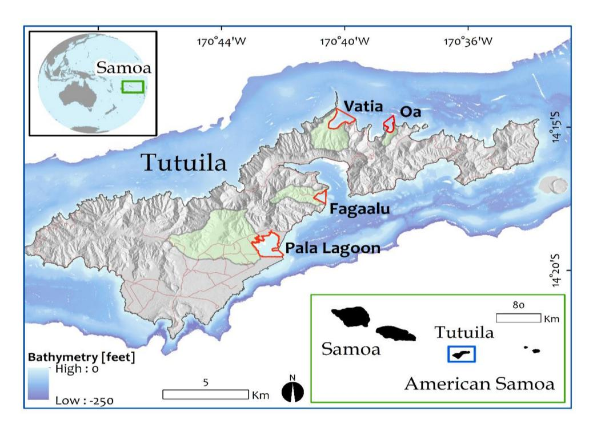
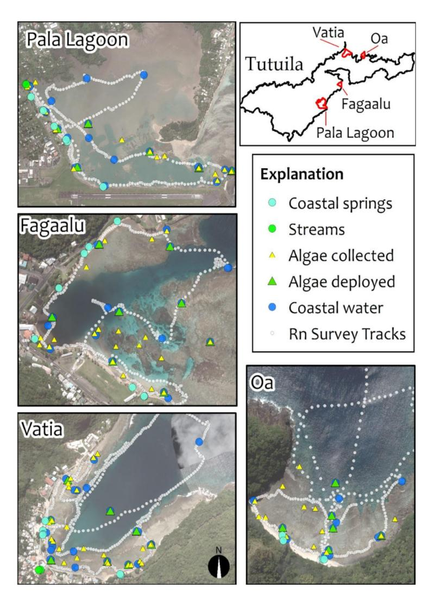
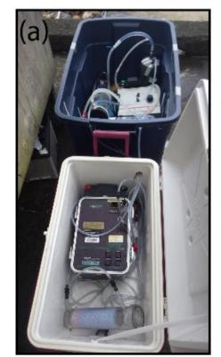
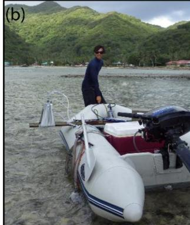
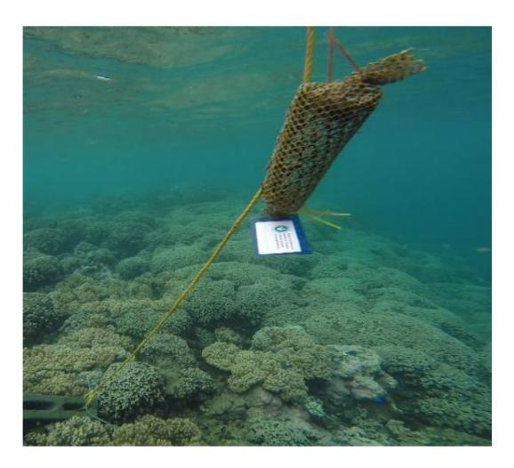
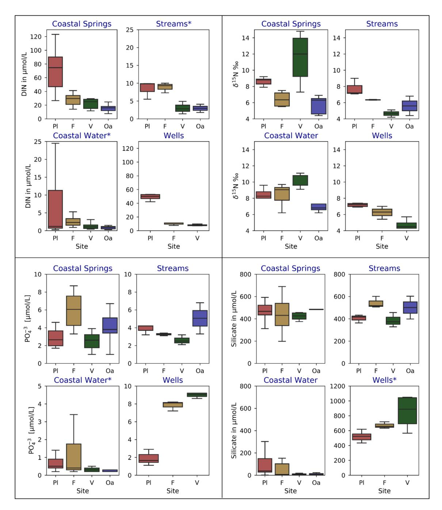
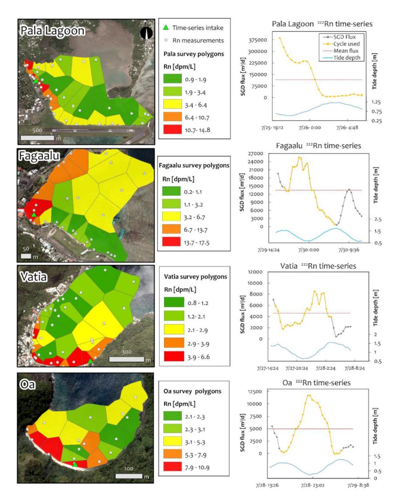
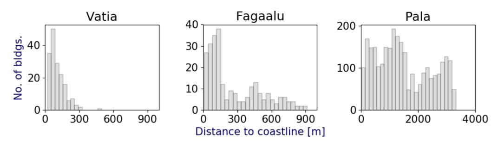
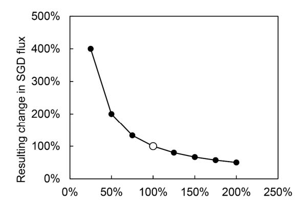

Article

# Assessment of Terrigenous Nutrient Loading to Coastal Ecosystems along a Human Land-Use Gradient, Tutuila, American Samoa

Christopher K. Shuler 1,2,\*, Daniel W. Amato 2,3, Veronica Gibson 3, Lydia Baker 4, Ashley N. Olguin 5, Henrietta Dulai 1,2, Celia M. Smith 3 and Rosanna A. Alegado 5,6,7

- Department of Earth Sciences, University of Hawai'i at Mānoa, Honolulu, HI 96822, USA; hdulaiov@hawaii.edu
- Water Resources Research Center, University of Hawai'i at Mānoa, Honolulu, HI 96822, USA; dwamato@hawaii.edu
- Botany, University of Hawai'i at Mānoa, Honolulu, HI 96822, USA; vgibson@hawaii.edu (V.G.); celia@hawaii.edu (C.M.S.)
- Department of Microbiology, Cornell University, Ithaca, NY 14850, USA; lb693@cornell.edu
- Daniel K. Inouye Center for Microbial Oceanography: Research and Education, University of at Hawai'i Mānoa, Honolulu, HI 96822, USA; ashley.olguin@gmail.com (A.N.O.); ralegado@hawaii.edu (R.A.A.)
- Department of Oceanography, University of Hawai'i at Mānoa, Honolulu, HI 96822, USA
- Sea Grant College Program, University of Hawai'i at Mānoa, Honolulu, HI 96822, USA
- \* Correspondence: cshuler@hawaii.edu; Tel.: +1-808-956-7847; Fax: +1-808-956-5044

Received: 9 January 2019; Accepted: 12 February 2019; Published: 16 February 2019

Abstract: Anthropogenic nutrient loading is well recognized as a stressor to coastal ecosystem health. However, resource managers are often focused on addressing point source or surface water discharge, whereas the impact of submarine groundwater discharge (SGD) as a nutrient vector is often unappreciated. This study examines connections between land use and nutrient loading through comparison of four watersheds and embayments spanning a gradient of human use impact on Tutuila, a high tropical oceanic island in American Samoa. In each study location, coastal radon-222 measurements, dissolved nutrient concentrations, and nitrogen isotope values ( $\delta^{15}$ N) in water and in situ macroalgal tissue were used to explore SGD and baseflow derived nutrient impacts, and to determine probable nutrient sources. In addition to sampling in situ macroalgae, pre-treated macroalgal specimens were deployed throughout each embayment to uptake ambient nutrients and provide a standardized assessment of differences between locations. Results show SGD-derived nutrient flux was more significant than baseflow nutrient flux in all watersheds, and  $\delta^{15}N$  values in water and algae suggested wastewater or manure are likely sources of elevated nutrient levels. While nutrient loading correlated well with expected anthropogenic impact, other factors such as differences in hydrogeology, distribution of development, and wastewater infrastructure also likely play a role in the visibility of impacts in each watershed.

**Keywords:** submarine groundwater discharge; nutrients; nitrogen isotopes; macroalgae; non-point source pollution; American Samoa

# 1. Introduction

Coastal ecosystems on oceanic islands provide critical ecological services to geographically isolated populations. Local residents are heavily dependent on nearshore farms for plant crops and adjacent reefs for protein. Increasing urbanization has made these ecosystems vulnerable to land-based sources of pollution arising from excessive sediment and nutrient delivery that stresses corals and

*Hydrology* **2019**, *6*, 18 2 of 27

drives persistent and harmful algal blooms [\[1](#page-21-0)[,2\]](#page-21-1). Terrigenous nitrogen (N) loading, linked to variability in anthropogenic land use, provides a strong control on phytoplankton, turf algae and macroalgae growth in coastal environments [\[2](#page-21-1)[,3\]](#page-22-0). Excessive algal growth is an economic and environmental concern, as the health of coastal areas is directly linked to tourism, a primary economic driver in tropical island locales [\[4\]](#page-22-1). For example, an economic assessment of the persistent algal bloom in waters adjacent to the town of Kihei, Maui demonstrated that algal blooms caused by anthropogenic N input, led to \$20 million/yr of revenue loss from fewer vacation rentals, decreased tax base property values, and beach cleanup costs [\[5\]](#page-22-2). Harmful macroalgal blooms in coastal environments are now common in many urban reefs [\[2,](#page-21-1)[6](#page-22-3)[–8\]](#page-22-4) and in the extreme, have been tied with the onset of fibropapillomatosis, a disease in herbivorous green sea turtles [\[9](#page-22-5)[,10\]](#page-22-6).

Elemental analysis of macroalgal tissue from tropical coastal regions is a reliable indicator of anthropogenic eutrophication derived from coastal wastewater inputs [\[7](#page-22-7)[,8](#page-22-4)[,11](#page-22-8)[–13\]](#page-22-9). Although macroalgae have specific N and P requirements for growth [\[14](#page-22-10)[,15\]](#page-22-11), in oligotrophic marine environments one or more of these nutrients are often limited. As a survival mechanism, tropical marine algae store available excess N and P [\[16\]](#page-22-12), increasing their resilience to temporary nutrient limited conditions [\[17](#page-22-13)[,18\]](#page-22-14). This adaptation allows macroalgal tissue composition to be used as a time-integrated record of recent nutrient inputs and sources, based on the isotopic composition of stored nutrients. Numerous studies have applied algal tissue analysis to complement more common water quality sampling efforts to better understand nutrient loading patterns across multiple time scales in oligotrophic coastal waters [\[7](#page-22-7)[,8](#page-22-4)[,12](#page-22-15)[,19\]](#page-22-16).

While the focus of most coastal nutrient management is typically on point source and surface water discharges, [\[20](#page-22-17)[–24\]](#page-22-18), the importance of submarine groundwater discharge (SGD) as a nutrient vector is becoming more recognized. On oceanic islands, SGD has potential to deliver nutrient loads 10 to 100 times higher than riverine inputs, in both pristine and human impacted tropical watersheds [\[11,](#page-22-8)[25](#page-23-0)[–27\]](#page-23-1). Although quantifying SGD and associated nutrient loading is inherently more difficult than quantifying surface water inputs to coastal areas, well established methods using dissolved radon-222 (222Rn) as a tracer of groundwater discharge [\[28](#page-23-2)[,29\]](#page-23-3) have been applied successfully in tropical island settings [\[30–](#page-23-4)[32\]](#page-23-5). This naturally occurring radiogenic noble gas is an ideal groundwater tracer as 222Rn has a short half-life of 3.8 days, is non-reactive through the full salinity range, and is typically found in very low concentrations in surface waters.

Predictable source dependent fractionation of the dual-isotopes of dissolved aqueous nitrogen and oxygen (δ 15N, δ 18O) of nitrate have been applied globally as tracers for fingerprinting N sources in terrestrial groundwater [\[26](#page-23-6)[,33](#page-23-7)[,34\]](#page-23-8) and in coastal surface waters [\[30](#page-23-4)[,35–](#page-23-9)[37\]](#page-23-10). Similarly, algal tissue characteristics such as %N and δ 15N have also been used to effectively differentiate between nutrient sources. In ecosystems with excess N-loading from a wastewater source, macroalgae often have elevated N mass-fractions as well as enriched isotopic tissue-N compositions (δ 15N ≤ 7‰), whereas algae living in less impacted areas typically have N-isotope compositions matching the composition (δ 15N ≥ 6‰) of oceanic-N sources [\[8](#page-22-4)[,12\]](#page-22-15).

This study examines water quality, macroalgal tissue N composition, and nutrient fluxes in SGD and baseflow across four watersheds on Tutuila, the main island in the U.S. Territory of American Samoa. These watersheds were selected because they span a gradient of human use impacts suggested by population density and land use. In American Samoa, land use factors have been linked to degradation of surface water quality and reef health [\[38,](#page-23-11)[39\]](#page-23-12), but the role of SGD as a delivery mechanism for contaminants in the territory's coastal waters has so far only been speculated [\[40\]](#page-23-13). Prevalent onsite wastewater disposal systems (OSDS) (i.e., cesspools and septic tanks), numerous small scale pig rearing operations, and widespread agriculture have all been implicated as nutrient sources to Tutuila's fresh and coastal waters [\[41](#page-23-14)[,42\]](#page-23-15). However, only limited source tracking efforts have so far been applied in American Samoa [\[35](#page-23-9)[,43\]](#page-23-16).

The primary objective of this study is to develop a better understanding of how different land uses interact with local hydrogeology to deliver nutrients or other contaminants to the nearshore *Hydrology* **2019**, *6*, 18 3 of 27

environment. To accomplish this, two "snapshot"-style measurement campaigns were conducted throughout the four study locations in August 2015 and 2016. During the first campaign, SGD derived nutrient fluxes were calculated using 222Rn as a groundwater tracer, and baseflow stage surface water nutrient fluxes were estimated through water sampling and using existing streamflow data. During both 2015 and 2016, water samples were collected from nearshore waters, coastal springs, streams at baseflow stage, and groundwater wells. In situ macroalgae were collected both years for analysis of tissue %N and δ 15N, and, in 2016, specimens of experimentally managed macroalgae were deployed at fixed locations throughout the coastal zone to control for variability affecting in situ macroalgae. Ultimately, this work provides insight into the magnitudes and sources of coastal nutrient discharge in a tropical island setting, and clarifies the need to support integrated terrestrial and coastal resource management in American Samoa.

## *Study Location Descriptions*

Located near 14◦ S and 170◦ W, the island of Tutuila (142 km2 in area) hosts nearly 56,000 permanent residents and serves as the main population center of American Samoa [\[44\]](#page-23-17). Because of its position within the South Pacific Convergence Zone, the climate is hot and humid, has prevalent year-round rainfall, up to 6000 mm/year, and is subject to a wetter season from October to May. Tutuila's south shore is more exposed than the northern shore to the prevailing swell and southeasterly trade winds, and these forces often drive strong localized rip currents inside of the reef crest along the southern coast. Beyond the reef, currents are mainly driven by tides and most offshore currents move relatively slowly, at 10 cm/s or less, except in areas where currents are channeled, such as the far northern and eastern tips of the island [\[45](#page-24-0)[,46\]](#page-24-1).

The four study locations selected for comparison each include a terrestrial watershed area and a coastal embayment. Listed from high to low population density, these locations are Pala Lagoon, Faga'alu Bay, Vatia Bay, and Oa Bay (Figure [1\)](#page-3-0). Each watershed drains a steep forested upper section that generally transitions to an alluvial-coastal plain of variable size. For the most part, development is concentrated in coastal areas and villages are located on these alluvial plains, except for the nearly pristine Oa location, which has no road access or residents. At all study locations, nearshore zones contain well developed fringing reefs, typically consisting of uniformly shallow (0.5–2 m deep) back reef flats that extend roughly 50 to 300 m from shore to fore reef crest; beyond which water depths rapidly increase. It is notable that soft sediments do not typically accumulate in nearshore areas except for in the interior portion of Pala Lagoon.

Geologically, Faga'alu, Vatia, and Oa are fairly typical examples of Tutuila's radial watersheds, with headwaters composed of heavily eroded Pleistocene basalts, erupted 1.5 Ma [\[47\]](#page-24-2). Since that time, alluvial transport of sediments and deposition of marine carbonates has created the small wedge-shaped coastal plains fronting the mouths of each bay. At least 30 other watersheds on Tutuila have a similar geologic structure, with Faga'alu and Vatia being two of the largest and Oa one of the smallest. In contrast, the hydrogeologic structure of the Pala Watershed, also referred to as the Tafuna Plain, differs significantly from the other study locations. The majority of the watershed is covered with a Holocene-age lava delta that has given the terrain a much lower slope and a much higher permeability to groundwater than the older Pleistocene rock that makes up the rest of the island [\[48\]](#page-24-3).

Pala Lagoon drains the largest and the most developed watershed of the four study locations. Numerous farms and residences are scattered over the 12.2 km2 lava plain, which currently has a population density of 480 people/km2 [\[44\]](#page-23-17). Only one small perennial stream runs along the northeastern margin of the Tafuna Plain. Faga'alu Bay has been previously identified as a priority watershed management area by the US Coral Reef Task Force due to concerns of declining reef health and stream water quality. A single main stream drains to an embayment above a steep, forested 2.5 km2 valley that has had a population density of 404 people/km2 since the 1990s [\[44,](#page-23-17)[49\]](#page-24-4). A sublocation consisting of a shallow reef flat fronting a rocky headland wrapping around and out the northern margin of Faga'alu Bay, termed Outer Faga'alu, was also delineated as an algae sampling location for

Hydrology **2019**, 6, 18 4 of 27

in this study. This location is adjacent to the Utulei Wastewater Treatment Plant, which discharges municipal wastewater effluent from a submerged outfall in the harbor channel. Vatia Bay drains three radially oriented perennial streams in a lightly impacted 3.6 km² watershed with a population density of roughly 132 people/km² since the 1990s. Although anthropogenic impact in Vatia has been categorized as minimal [50], reports of reef decline and increased algal growth, combined with a lack of wastewater infrastructure suggest more information is critically needed for natural resources management in Vatia [51]. Oa bay is located on the northern coast, drains a small 0.6 km² watershed, and is the least impacted of the study locations. The watershed has remained uninhabited and has only a single stream that, at baseflow stage, infiltrates completely once it reaches the alluvial wedge. A large coastal spring is located near the dry stream mouth during low tide.

The four watersheds selected for this study span a gradient of human impact and physical hydrogeologic properties that were defined through assessment of population density, and land use analysis. Population data from the U.S. Census has been previously used to assign human impact classifications to Tutuila's watersheds [50], and a recently released high-resolution wildlife habitat map [52] allows for geospatial assessment of land use in each watershed. Land use and population density metrics suggest Pala Lagoon should be subject to the highest anthropogenic impacts followed by Faga'alu then Vatia, and then Oa as its watershed is nearly 100 % forested with no human residents (Table 1).

**Figure 1.** Location map showing Samoan archipelago and Tutuila with the four study watersheds highlighted in green and their bays outlined in red.

**Table 1.** Geospatial land use analysis of study locations showing population data from the U.S. census [44], and land use data from a recently developed high-resolution habitat map [52].

| Location    | Total Area [km²] | Population Density [Persons per km 2 ] | Developed Proportion of Watershed | Cultivated Proportion of Watershed | Natural Proportion of Watershed |
|-------------|---------------------|------------------------------------------------------|-----------------------------------------|------------------------------------------|---------------------------------------|
| Pala Lagoon | 12.23               | 480                                                  | 31%                                     | 15%                                      | 54%                                   |
| Faga'alu    | 2.48                | 404                                                  | 12%                                     | 6%                                       | 81%                                   |
| Vatia       | 3.61                | 132                                                  | 5%                                      | 7%                                       | 88%                                   |
| Oa          | 0.58                | 0                                                    | 0%                                      | 0%                                       | 100%                                  |

Hydrology **2019**, *6*, 18 5 of 27

#### 2. Materials and Methods

#### 2.1. Water Sample Collection and Analysis:

Water samples were collected from local production wells, streams at baseflow stage, coastal groundwater springs (CGW), and coastal surface waters in all four study locations (Figure 2). Here CGW is defined as water (fresh to saline) obtained from shallow beach pore water or distinct coastal springs, and is assumed to be representative of the composition of the SGD endmember prior to release in the ocean. All samples were collected in acid washed 60 mL HDPE or new polypropylene bottles that were triple-rinsed with sample water during collection. Water samples were filtered on-site with 0.45  $\mu$ m hydrophilic polyethersulfone capsule filters (Pall AquaPrep 600).

At each sample site, water temperature, salinity, and dissolved oxygen were measured in situ with a multiparameter sonde (YSI, model V24 6600). Samples were immediately cooled for transport, frozen as soon as possible, and stored frozen until analysis. All samples were analyzed for total dissolved nitrogen (TDN) and dissolved inorganic nutrients (silica (Si), nitrate (NO3-) + nitrite (NO2-) herein referred to as (N + N), ammonium  $(NH_4^+)$  and phosphate  $(PO_4^{3-})$  at the SOEST Laboratory for Analytical Biogeochemistry (S-LAB) using a Seal Analytical AA3 Nutrient Autoanalyzer. Dissolved inorganic nitrogen (DIN) was calculated as the sum of N + N and NH4+. The subset of samples containing sufficient N + N (>0.8  $\mu$ mol/L) were analyzed for the isotopic composition of nitrogen and oxygen in dissolved N + N ( $\delta^{15}$ N,  $\delta^{18}$ O). Isotopic analysis was conducted at the University of Hawai'i Stable Isotope Biogeochemistry Lab on a Thermo Finnigan MAT252 coupled to a GasBench II (Thermo Fisher Scientific Inc., Waltham, MA, USA) using the denitrifier method of Sigman et al. [53]. Nitrogen and oxygen isotope results are expressed in per mil (%) notation relative to AIR for  $\delta^{15}$ N and V-SMOW for  $\delta^{18}$ O. Stream and CGW grab samples were also analyzed for concentrations of dissolved 222Rn gas with a radon in air monitor RAD7 and its water accessory RADH2O (both manufactured by Durridge Inc., Billerica, MA USA. Discrete samples were collected in 250 mL glass bottles with no headspace, were analyzed the same day as collection, and were corrected for radioactive decay between collection and analysis. To increase the number and temporal representativeness of end-member samples, thirteen CGW and six stream-baseflow samples collected in August 2014 were also included in the sample set. All other fieldwork was conducted during two field expeditions in July 2015 and August 2016 and took place in the dry season when rainfall was limited, streams remained at baseflow stage, and groundwater levels remained fairly stable. Duplicates were taken for 10 % of the  $\delta^{15}$ N sample set and 5 % of the nutrient analysis sample set. Significance of parameter averages were tested with one-way ANOVA and Tukey's range test for post hoc analysis [54].

*Hydrology* **2019**, *6*, 18 6 of 27

**Figure 2.** Study location maps showing sampling sites for coastal water (small blue circles), CGW (large cyan circles), streams at baseflow stage (larger green circles), in situ collected macroalgae (smaller yellow triangles), deployed macroalgae (larger green triangles), and tracks of 222Rn surveys (grey dots).

# *2.2. Time Series and Survey-Based 222Rn Measurements*

In each study location, SGD rates were calculated using dissolved 222Rn as a groundwater tracer. To account for the temporal (tide dependent) and spatial (geology dependent) variability of SGD in volcanic island settings, a fixed location time series 222Rn measurement was coupled with a moving coastal water 222Rn survey in each embayment following the methods of Dulaiova et al. [\[55\]](#page-24-10). During the time series, a peristaltic pump brought coastal water from a stationary point generally located within 40 m from shore to an instrument package on land that continuously measured 222Rn concentration and salinity (Figure [3a](#page-6-0)). Time series measurements were conducted over one full tidal cycle (>12.2 h) at each location. Coastal water surveys were conducted either before or after each time series, during a 3 h period bracketing low tide. The same 222Rn and salinity sensors used in the time series were mounted on a small inflatable boat that was motored through each bay in a series of shore parallel transects at roughly 0.75 m/s (Figure [3b](#page-6-0)). Shore-perpendicular transects were also conducted if time allowed. During each survey, eight to twelve coastal surface-water samples were collected. Time series derived SGD fluxes were scaled with spatial information from the 222Rn surveys to calculate total daily SGD fluxes to each of the four embayments.

*Hydrology* **2019**, *6*, 18 7 of 27

**Figure 3.** (**a**) Instrument package used for measuring dissolved 222Rn and water quality parameters for time-series measurements. (**b**) The same instrument package transferred and mounted to an inflatable boat for 222Rn survey measurements.

# *2.3. SGD and Nutrient Flux Calculations*

To convert 222Rn concentrations to SGD fluxes, the non-steady state 222Rn mass-balance model of Burnett and Dulaiova [\[28\]](#page-23-2) was used. The survey area of each embayment was subdivided into Thiessen polygons, each surrounding a coastal survey measurement point and all falling within the edges of each embayment. The volume of each polyhedron was calculated by multiplying the Thiessen polygon area by water depth on the back reef flat, assumed to be the thickness of the SGD plume, as measured by a pressure transducer deployed at the time series location. This assumption was validated with depth profiles taken throughout the reef flat, which showed salinity values typically remained constant as depth increased, indicating coastal waters were well mixed. For time series measurements, the Thiessen polyhedron located around the time series intake was used as the volumetric multiplier for flux calculations. Note that the volume of this polyhedron during time series measurements changed dynamically with daily tidal fluctuations, whereas the polyhedron volumes used in processing survey data were calculated using a single water depth measured at low tide.

Non-SGD related losses and additions of 222Rn from local and offshore processes were also considered when calculating total SGD flux. These processes were assumed to be comparable in American Samoa to those of the Hawai'ian Islands, and included accounting for: (1) atmospheric 222Rn activity of 0.03 dpm/L [\[56\]](#page-24-11), (2) local excess 222Rn activity of 0.08 dpm/L supported by in situ 226Ra [\[57\]](#page-24-12), (3) 222Rn activity of 0.087 dpm/L, from the offshore 226Ra pool [\[58\]](#page-24-13), and (4) wind speed dependent evasion correction described in Burnett and Dulaiova [\[28\]](#page-23-2) and calculated with hourly wind speed and air temperature recorded at the Pago Pago Airport. Mixing losses from tidal movement were calculated at each time step in the time series model and residence times for each bay (except for Pala Lagoon) were assumed to be the length of one tidal cycle (12.2 h), which is within the range of previously estimated residence times for these areas. The best available residence time estimates for Faga'alu Bay [\[59\]](#page-24-14) indicate that bay wide flushing times vary between 1 h and 33 h, depending on wave height conditions, and the majority of the time the bay wide flushing time is between 3 and 10 h. In Vatia Bay, Storlazzi et al. [\[46\]](#page-24-1) used acoustic Doppler current profile measurements to calculate residence times between 1 and 3 h during high wave conditions, and between 2.5 to 4.5 h during low wave and wind conditions in the outer portion of the bay. Lagrangian Surface Current Drifters deployed in the inner part of Vatia Bay suggested residence times of >2 h. For this study, a conservative residence time of four tidal cycles (48.8 h) was chosen for Pala Lagoon to account for the lagoon's enclosed geometry and lack of available circulation data. These estimates are within the range of previously estimated lagoon water residence times presented by Volk [\[60\]](#page-24-15) and Yamasaki et al. [\[61\]](#page-24-16), which suggest the mean lagoon wide residence time may be around 30 h, but with much longer residence times (up to 165 h) possible in the far inner sections of the lagoon. Although there have been no known physical oceanographic

Hydrology **2019**, *6*, 18

studies in Oa bay, its proximity to and similar exposure to Vatia Bay makes it reasonable to assume that residence times in Oa are similar to those in Vatia.

Groundwater end-member compositions were determined by averaging 222Rn activities for all sampled CGW sites and upgradient wells in each watershed. Salinities of CGW varied widely as SGD is typically composed of a fresh component mixed with a recirculated seawater component. The proportion of fresh and recirculated SGD was calculated with a two end member mixing analysis following the method used by Bishop et al. [30]. To calculate SGD nutrient fluxes, average CGW-endmember nutrient concentrations were simply multiplied by total (fresh + recirculated) SGD-flux rates for each study location. Nutrient fluxes in streams at baseflow stage were calculated similarly, using averaged, measured stream-nutrient concentrations and average annual baseflow discharge for streams in each watershed. These discharges were estimated using stream-gauging data collected by the United States Geological Survey (USGS) [62]. Note that runoff stage streamflow and associated nutrient fluxes are not addressed here, due to challenges in measuring Tutuila's short lived and difficult to sample runoff events.

#### 2.4. In Situ Algal Survey

At each study location, specimens of common marine macroalgae were sampled at numerous sites on shallow back reef flats (0.5-2.0 m) during July 2015 and August 2016 (Figure 2). Species collected included Chlorodesmis fastigiata, Hypnea pannosa, Dictyota bartayresiana, and Ulva intestinalis, though not all species were found at each location. Algal tissues were initially placed in plastic bags, cooled for transport, and processed within 12 h of collection following Amato et al. [8]. Sample processing included removal of any holdfasts/stipes and triple rinsing the remaining undifferentiated, non-reproductive tissues in distilled water to remove fouling organisms and excess salts. Algal tissues were toweled dry before being placed in aluminum foil packets for dehydration. Initial dehydration commenced within 12 h of collection in a conventional oven at 71 °C before being transferred to a drying oven at University of Hawai'i and maintained at 60 °C for at least three months. After a constant mass was achieved, desiccated tissues were powdered with a mortar and pestle and placed in individual glass vials. Tissue  $\delta^{15}N$  (‰) and N % were measured using a Costech ECS 4010 Elemental Combustion System (Costech Analytical Technologies, CA, USA) interfaced with a ThermoFinnigan DeltaXP Mass Spectrometer (Thermo Fisher Scientific Inc.) at the University of Hawai'i Biogeochemical Stable Isotope Facility. Isotopic ratios of N in samples were normalized to reference materials NIST 3, USGS-32, USGS-34, and USGS-35 and are relative to AIR.

#### 2.5. Algal Deployments

On August 5th 2016, seventy-five specimens of Hypnea pannosa were collected at an open coastal location near Pala Lagoon and pre-treated in a 16 L indoor growth chamber filled with ambient ocean water to draw down tissue N levels, following Amato et al. [8]. An average irradiance of 5700 l× (measured with a Digital Light Meter Model # FCM0-10M+, Phytotronics Inc., Earth City, MO, USA. was provided by six LED flood lights (Philips Model #9290002322) placed 25 cm above the water surface. On August 8th, 2016, reagent grade nutrients (NaNO3 and NaPO4) were added to the seawater to bring the nutrient levels to  $0.5 \,\mu\mathrm{M} \, \mathrm{NO_3}^-$  and  $0.05 \,\mu\mathrm{M} \, \mathrm{PO_4}^-$  (assuming the original seawater had negligible nutrient levels after 72 h in algal culture). Salinity was monitored and distilled water was added every day to maintain a salinity of 35. To assess pre-treatment variability in tissue N parameters, three *H. pannosa* specimens were randomly selected from the collected samples prior to pre-treatment and prepared and submitted for tissue analysis as above. On August 10th-11th, 2016, thirty-six H. pannosa specimens, with an individual mass of 5-6 g, were randomly assigned and deployed throughout the four study locations (Figure 2) in 8 cm × 20 cm cylindrical cages. Individual H. pannosa with tissues that were undifferentiated, without reproductive, holdfast or stype structures were selected for deployment. The cages, which were constructed of 8 mm diameter plastic mesh and polyester fabric, were designed to allow water flow but exclude macroherbivores (Figure 4). At

*Hydrology* **2019**, *6*, 18 9 of 27

each site, a caged *H. pannosa* specimen was tethered 0.25 m below the surface to a small float and anchored to a cinder block. Eight cages were distributed throughout the bay at each study location. Three additional cages were deployed at outer Faga'alu at sites adjacent to the wastewater treatment facility. After eight days, all cages were retrieved, and samples were prepared for tissue analysis as above. For comparison between each location, algal samples were grouped by study location and statistical tests were performed using SigmaPlot 11 (Systat Software Inc., CA, USA). One-way ANOVA (identified by the F-statistic) and Tukey's pairwise comparisons were used to compare parameters if test assumptions were not violated. The nonparametric Kruskal–Wallis ANOVA (identified by the H-statistic) was performed if the assumptions of normality or homoscedasticity were violated.

**Figure 4.** Deployed algae cage containing a single *H. pannosa* specimen.

#### **3. Results**

#### *3.1. Water Quality Results: Nutrient Levels*

To compare water quality between study locations, water samples were grouped by sample type (coastal surface water, CGW, streams, and wells), and study location before taking arithmetic means of each group (Figure [5\)](#page-10-0). Concentrations of DIN in coastal surface waters and CGW showed statistically significant differences between all study locations (ANOVA *p*-values of >0.002), with Pala Lagoon having the highest (8.0 ± 13.0 µmol/L) and Oa Bay the lowest (1.2. ± 1.5 µmol/L) DIN values in coastal surface waters. Few statistically significant differences were found between locations for PO4 3− concentrations, although some sample types, notably streams in Oa, well waters in Vatia, and coastal springs in Faga'alu and Vatia, had significantly higher levels of PO4 3−. Silicate concentrations also showed few significant differences among sites, except for notably higher concentrations in Vatia's wells. All geochemical data are provided in Supplementary Material, Tables S1 through S5. It should be noted that because salinity varied widely amongst CGW samples, nutrient concentrations (DIN, PO4 3−, and silicate) reported for CGW values as shown on Figure [5](#page-10-0) were normalized to the freshwater salinity of 0.1 using an un-mixing calculation [\[11\]](#page-22-8) based on the local oceanic salinity and nutrient composition. Analytical uncertainties for nutrient concentrations and isotopic values were determined through applying the standard error of the estimate to duplicate samples. This yielded uncertainty values of ± 3.1 µmol/L for TDN, ± 2.8 µmol/L for N + N, ± 6.2 µmol/L for Si, ± 0.1 µmol/L for PO4 3−, and ± 0.01 µmol/L for NH4 + , and ± 0.26‰ for δ 15N values.

### *3.2. Water Quality Results: Nitrate Isotopes*

Most variability in δ 15N values was found among sites within each individual study location. Many samples showed substantial enrichment above the commonly referenced ranges for δ 15N of NO3 − in natural soils, typically between +2 to +6‰ [\[33\]](#page-23-7). Few to no samples showed δ 15N values

*Hydrology* **2019**, *6*, 18 10 of 27

within the typical range of synthetic fertilizer influenced waters (−5 to +5‰), suggesting agricultural inputs were not significant coastal N sources during the study period. Numerous CGW and coastal water samples in Vatia and Pala Lagoon had generally high average δ 15N values (8.6 ± 0.5, and 11.5 ± 3‰, respectively) which appeared to be indicative of a wastewater source. Typically, leachates from manure and wastewater have a wide but generally high δ 15N range (+4 to +25‰) [\[7,](#page-22-7)[12,](#page-22-15)[63,](#page-24-18)[64\]](#page-24-19). Studies in similar tropical island environments have reported wastewater δ 15N values ranging from +5 to 23‰ [\[8,](#page-22-4)[11,](#page-22-8)[30](#page-23-4)[,65\]](#page-25-0). Values matching these ranges were seen in Vatia, where the effect of exceptionally high δ 15N values in CGW, sometimes above 14‰, were evident on Vatia's coastal waters, which had average δ 15N values of 10.3 ± 0.9‰. Faga'alu's coastal water had an unexpected distribution of δ 15N values, whereas the highest values (ranging between 9.1 to 9.7‰) were observed in the outer part of the bay nearer to the outer Faga'alu location, with δ 15N values in the inner bay ranging from 6.2 to 9.0‰. Unfortunately, the only water sample taken in the outer Faga'alu area did not contain enough N + N for δ 15N analysis. In Oa bay, δ 15N values in coastal water and in the coastal spring (7.1 ± 1.0‰ and 5.7 ± 1.2‰, respectively) were generally lower than those observed at other locations.

#### *3.3. Water Quality Results: Nearshore–Offshore Gradient*

Spatial trends in coastal water geochemistry, and in algal tissue samples, showed strong nearshore–offshore gradients within each study location. When all coastal surface water sampled from sites located within 50 m of the coastline were pooled, they showed average DIN concentrations that were 124%, 208%, 332%, and 610% higher than samples taken more than 50 m offshore in Faga'alu, Oa, Vatia, and Pala Lagoon, respectively. Nearshore PO4 3− levels were also generally about twice as high as offshore levels (Table [2\)](#page-9-0). In Pala Lagoon and Vatia, only two coastal water samples were taken within 50 m of a stream mouth (none at the other sites), and both had higher average DIN and PO4 3− concentrations than samples taken farther from the stream. In all locations except Faga'alu, coastal water samples taken within 50 m of coastal springs had markedly higher average DIN values, and slightly higher δ 15N values than samples taken >50 m from spring outlets. In Vatia, nearshore samples had up to 10 times higher DIN than offshore samples. Unlike all other study locations, in Faga'alu Bay, both δ 15N and DIN values increased with distance from the stream mouth and coastline.

| Table 2. Water quality parameters for coastal water samples showing nearshore vs. offshore gradients. |  |  |  |
|-------------------------------------------------------------------------------------------------------|--|--|--|
|-------------------------------------------------------------------------------------------------------|--|--|--|

| Study Location     |           | Pala Lagoon | Faga'alu  | Vatia      | Oa        |
|--------------------|-----------|-------------|-----------|------------|-----------|
|                    | Nearshore | 13.2 (16.0) | 3.2 (2.9) | 3.1 (6.7)  | 1.5 (1.9) |
| DIN [µmol/L]       | Offshore  | 2.2 (4.3)   | 2.6 (1.1) | 0.9 (0.6)  | 0.8 (0.5) |
|                    | All       | 8.0 (13.0)  | 3 (2.3)   | 2.3 (5.3)  | 1.2 (1.5) |
|                    | Nearshore | 8.6 (0.7)   | 7.9 (1.1) | 10.3 (0.8) | 7.4 (1)   |
| 15N [‰] δ       | Offshore  | 6.6 (-)     | 9.1 (0.7) | 9.1 (-)    | 6.2 (-)   |
|                    | All       | 8.3 (1)     | 8.6 (1.1) | 10.0 (0.9) | 7.1 (1)   |
|                    | Nearshore | 1.0 (0.7)   | 1.4 (1.7) | 0.5 (0.6)  | 0.6 (0.8) |
| 3− [µmol/L] PO4 | Offshore  | 0.5 (0.2)   | 0.9 (1)   | 0.2 (0.1)  | 0.2 (0)   |
|                    | All       | 0.7 (0.6)   | 1.2 (1.5) | 0.4 (0.5)  | 0.5 (0.7) |

Number of samples (n) for nutrient samples in the nearshore was 11, 15, 15 and 10 and in the offshore was 10, 11, 9, and 6 for Pala Lagoon, Faga'alu, Vatia, and Oa, respectively. Number of samples (n) for δ 15N samples in the nearshore was 5, 5, 4, and 3 and in the offshore was 1, 7, 1, and 1 for Pala Lagoon, Faga'alu, Vatia, and Oa, respectively.

*Hydrology* **2019**, *6*, 18 11 of 27

**Figure 5.** Box plots of water quality sample results. Box center lines represent median, edges represent interquartile range, and whiskers represent range. Site names are coded as, Pala Lagoon: Pl, Faga'alu: F, Vatia: V, and Oa: Oa. Note that the stream in Oa bay was sampled in the perennial section above where it infiltrated into the ground. Note that subplot titles marked with asterisks (\*) have modified y-scales.

# *3.4. Hypnea Deployment Results*

Significant differences in the tissue N content of deployed *Hypnea* tissue were detected among the four study locations (δ 15N: *p* < 0.001, H = 16.351, N%: p = 0.001, F = 7.392). Values of tissue δ 15N and N% values were highest in samples deployed at Faga'alu and lowest at Oa (Table [3\)](#page-11-0); values were significantly higher at Faga'alu compared to Vatia and Oa. Trends in these values among study locations reflect gradients of impact/human density as discussed above. When data from all deployed samples are pooled, a positive relationship (r2 = 0.26, *p* = 0.004, df = 28) between δ 15N and N% is present. Exploratory deployments of three *Hypnea* tissue samples at the outer Faga'alu location had

Hydrology **2019**, *6*, 18

higher mean values for both N parameters than the four study locations (Table 3). In general, most N% and  $\delta^{15}$ N values for deployed *Hypnea* samples were within a range that may indicate at least some wastewater impacts. Assessment of pre-treatment variability in *Hypnea* tissue was relatively low ( $\delta^{15}$ N = 7.2  $\pm$  0.1, N% = 1.4  $\pm$  0.3, n = 3) (Supplementary Material, Table S6).

| <b>Table 3.</b> Mean values and standard deviation in N-parameter values for both deployed and in situ |
|--------------------------------------------------------------------------------------------------------|
| algal samples. 1σ standard deviations are provided in parentheses.                                     |

| Location          | Deployed Mean δ 15 N | In Situ—Mean δ 15 N | Deployed Mean N% | In Situ—Mean N% | n Deployed | n In Situ |
|-------------------|------------------------------------|-----------------------------------|---------------------|--------------------|------------|-----------|
| Pala Lagoon       | 7.4(0.1)                           | 7.4 (1.3)                         | 1.9 (0.3)           | 2.6 (1.2)          | 6          | 58        |
| Faga'alu          | 8.6 (0.4)                          | 8.6 (1.0)                         | 1.9 (0.2)           | 2.6 (1.5)          | 9          | 29        |
| Outer Faga'alu | 9.6 (0.7)                          | 9.6 (0.7)                         | 2.0 (0.3)           | 4.1 (1.5)          | 3          | 9         |
| Vatia             | 7.2 (1.0)                          | 6.0 (1.1)                         | 1.5 (0.2)           | 2.7 (1.4)          | 8          | 58        |
| Oa                | 6.6 (0.2)                          | 5.5 (0.6)                         | 1.4 (0.2)           | 3.3 (1.6)          | 6          | 18        |

#### 3.5. In-Situ Algal Survey Results

Mean tissue  $\delta^{15}$ N and N% values from macroalgal species collected in-situ from coastal locations were similar to those of deployed *Hypnea* (Table 3). Significant differences in these N parameter values were detected among in-situ survey locations (p < 0.001, H = 75.414). Highest values of  $\delta^{15}$ N (mean  $\delta^{15}$ N = 9.6) and N% (mean N% = 4.1) from in situ algal tissues were collected at outer Faga'alu. In-situ algal tissues collected from outer Faga'alu had significantly higher  $\delta^{15}$ N than all other locations; samples from both Faga'alu and Pala Lagoon had significantly higher  $\delta^{15}$ N values than Vatia and Oa. Mean N% values were above 1.0, but were not significantly different among locations (p = 0.071, H = 8.637). In situ tissue samples also generally had N% and  $\delta^{15}$ N values consistent with some wastewater impact to these sampling locations.

In general, algal deployments and in situ surveys showed considerable intra-location fine scale variation in algal tissue  $\delta^{15}N$  values across each location. Similar to trends in water samples, algal tissue  $\delta^{15}N$  values in Vatia were generally higher near the shore and near groundwater-influenced springs and streams. In Pala Lagoon, both surface water and algal tissue  $\delta^{15}N$  values were highest where stream input and SGD flux was greatest. However, in Faga'alu Bay, the opposite trend was again observed. In contrast, algal  $\delta^{15}N$  values were generally homogenous within Oa bay, ranging between 4.3 and 6.8%. Algal tissue  $\delta^{15}N$  values of deployed samples were similar to in situ samples collected in close proximity. Although some variation in water temperature associated with fresh water input at low tides was seen at all study locations (Supplementary Material, Tables S8 to S15), the significant measured algal tissue N- variation suggests that elevated N concentrations associated with cooler water nutrient inputs likely exert more control on tissue N parameters than reduction of N uptake caused by temperature variations on the order of 1.3 ° C to 2.6 °C, which was the maximum observed daytime range from surveys and time series. All measured algae parameters are provided in Supplementary Material, Tables S6 and S7.

#### 3.6. SGD Rates and Associated Nutrient Fluxes

The highest coastal water dissolved 222Rn concentration (24.3 dpm/L) and the lowest coastal-water salinity (11.6) from time series measurements were observed in Pala Lagoon. In contrast, Vatia Bay had the lowest time series 222Rn concentration (3.9 dpm/L), and the highest minimum salinity (30.3). When tidal cycle averaged SGD rates from the 222Rn time series were upscaled with spatially distributed SGD information from 222Rn surveys, Pala Lagoon showed the highest-absolute SGD magnitude and Oa Bay had the lowest (Table 4). However, when scaled by watershed area, both Pala Lagoon and Oa had higher per-km² SGD rates (9,490 and 8,522 m³/d/km², respectively) than Faga'alu and Vaita bays, which had per-km² SGD rates of 5,398 and 1,274 m³/d/km², respectively. This is reasonable considering perennial streams drain a significant proportion of water in Faga'alu

*Hydrology* **2019**, *6*, 18 13 of 27

and Vatia, whereas the single stream in Oa and the few streams in the Pala Watershed are intermittent and dry much of the year.

Dissolved 222Rn, and thus SGD, was concentrated in specific locations along the coastline, often near coastal springs, though not always (Figure [6,](#page-13-0) left panels). Tidal changes affected SGD rates significantly, with SGD peaking during low tide and nearly stopping during high tides, as would be expected (Figure [6,](#page-13-0) right panels). During low tide, average temperatures obtained during the 222Rn survey remained in a narrow range varying not more than 3 ◦C (Supplementary Material, Tables S8 to S15). The fractions of fresh and recirculated SGD were assumed to be directly proportional to the average seawater fractions measured in coastal spring samples at each location. In all locations except Vatia, this proportion was around 50% fresh and 50% recirculated SGD. In Vatia low observed CGW salinities increased the fresh fraction to about 90% of total SGD. Note that the potential for recirculated coastal water to carry 222Rn into the coastal aquifer thereby possibly affecting calculated SGD rates was assessed and determined to be negligible.

The two most uncertain parameters used in the calculation of SGD rates were 222Rn end member values and water residence times in each bay. Direct constraint on the uncertainty of these parameters was not possible due to the inherent bias in only being able to collect groundwater samples where springs could be seen and found, and the highly variable nature of residence times as these vary on orders of magnitude based on wind and wave conditions. Because of this, the sensitivity of the SGD flux calculation to each of these parameters was tested. It was found that doubling and halving residence times at most changed SGD flux estimates by 4% and 7%, respectively, for all bays. Therefore, even though actual residence times were not very well constrained, their effect on final SGD flux rates was minimal. However, 222Rn based flux rate calculation is typically very sensitive to selection of end member values. Sensitivity testing for end member values showed that doubling the end-member value (Increase of 200%) would reduce SGD estimates by 50%. However, the model is much more sensitive to negative changes in end-member concentrations, as a reduction of only 50% yields an increase in calculated SGD flux by 200%. While it is well known that the method is very sensitive to this parameter this issue remains as a weakness with using this methodology and a primary reason these estimates are presented with a high-degree of uncertainty. Results of sensitivity testing are given in Appendix [A,](#page-21-2) Table [A1](#page-21-3) and Figure [A1](#page-21-4)

Nutrient flux rates from SGD were determined by multiplying total SGD by the average measured DIN and PO4 3− concentrations from all CGW and well samples taken in each study location. Nutrient flux rates in SGD followed the expected pattern of impact, with Pala Lagoon having almost two orders of magnitude higher nutrient fluxes than the other sites. Faga'alu and Vatia had intermediate SGD nutrient flux rates, with Faga'alu's exceeding Vatia's by two times, and Oa bay had the lowest (Table [4\)](#page-14-0). Note that variance on nutrient flux estimates is large, in part because it is propagated from SGD standard deviation averaged over entire tidal cycles, and from averaging variable coastal spring nutrient concentrations. These measurements are both affected by high-temporal variability driven by tide changes, and high-spatial variability throughout each site, but nonetheless represent order-of-magnitude resolution estimates that are useful for relative comparison between study locations.

*Hydrology* **2019**, *6*, 18 14 of 27

**Figure 6.** Radon survey and time series results. Left map-panels show 222Rn survey measurement locations (grey dots), time series intake locations (green triangles) and geometries of Thiessen Polygons color coded by dissolved 222Rn concentration at each measurement point for the four study locations. Note different color scales for each map. Right plot-panels show processed total SGD fluxes calculated from the time series measurements after integration of spatial data from 222Rn surveys. To standardize daily average fluxes, only measurements taken within a single tidal cycle (12.2 h) were used (gold portion of grey lines). Note that mean-daily SGD fluxes (red dotted lines) represent total SGD (fresh + recirculated).

## *3.7. Stream Baseflow Estimates and Associated Nutrient Fluxes*

Baseflow discharge rates for streams in Faga'alu, Vatia, and Pala watersheds were determined from existing streamflow data obtained from USGS stream gauging efforts, circa 1960–1995 and documented in Wong [\[62\]](#page-24-17). Unforeseen circumstances prevented direct measurement of streamflow during the study period, therefore previously published average annual streamflows were used. These flows were based on the longest streamflow records available for the island and though dated, are likely to be reasonably representative of average conditions today based on their long period of record, which should serve to average out sorter-term variation. While this method is not ideal for reporting snapshot scale fluxes specific to the sampling periods, it does make the baseflow derived nutrient loads reported here more representative of expected average annual values. Nonetheless, this circumstance adds another layer of uncertainty to the baseflow derived nutrient loads reported here. Therefore, the

*Hydrology* **2019**, *6*, 18

uncertainties in baseflow quantities were assumed to be 25% of the documented flows, and this value was propagated through the calculations of stream nutrient flux.

Wong reported median ( $Q_{50}$ ) and mean stream discharge values for numerous basins throughout Tutuila. Because Wong's measurements did not include baseflow separation analysis, the  $Q_{50}$  was here assumed to be the most representative available estimate of baseflow discharge in Tutuila's streams. Note that in Hawai'i, stream baseflow has been shown to be equivalent to a flow value that falls within a range of the stream discharge (Q) that is met or exceeded between 60% ( $Q_{60}$ ) and 80% ( $Q_{80}$ ) of the time [66]. Therefore, approximation of baseflow with the  $Q_{50}$  value is likely to bias stream baseflow and thus nutrient loads, towards over estimation. Regardless of this, these baseflow discharges in each watershed were generally low ranging between 2500 and 3000 m3/d, and were generally similar across all watersheds except Oa, which had no baseflow discharge. The stream in Oa watershed is perennial in its headwaters but infiltrates by the time it reaches the coast. Estimates of nutrient flux via SGD were appreciably greater than fluxes via baseflow for all study locations, despite the potential for over estimating baseflow amounts. Nutrient fluxes via baseflow ranged between 0.21  $\pm$  0.05 to 0.34  $\pm$  0.08 kg/d for both DIN and PO43- (Table 4).

**Table 4.** Measured and estimated volumetric SGD and baseflow discharges, end member nutrient concentrations, and calculated nutrient loads, both absolute and area scaled. Values in parentheses are 1 $\sigma$  standard deviations for end member values or are propagated uncertainties for calculated fluxes.

| Parameter                                                             | Pala Lagoon         | Faga'alu Bay      | Vatia Bay        | Oa Bay        |  |  |
|-----------------------------------------------------------------------|---------------------|-------------------|------------------|---------------|--|--|
| Water Fluxes [m 3 /d]                                      |                     |                   |                  |               |  |  |
| SGD—fresh fraction [m 3 /d]                                | 68,482 (74,126)     | 7270 (4455)       | 4428 (2027)      | 2258 (1891)   |  |  |
| SGD—recirculated [m 3 /d]                                  | 47,586 (51,508)     | 6,115 (3746)      | 168 (77)         | 2684 (2248)   |  |  |
| Estimated baseflow [m 3 /d] *                              | 2,886 (722)         | 2,691 (673)       | 2642 (661)       | -             |  |  |
| Averaged                                                              | l end member nuti   | rient values [μmo | l/L]             |               |  |  |
| SGD DIN [µmol/L]                                                      | 47.3 (21.5)         | 16.0 (15.0)       | 17.5 (11.7)      | 6.07 (0.94)   |  |  |
| $SGD PO_4^{3-} [\mu mol/L]$                                           | 1.63 (0.54)         | 4.77 (2.69)       | 5.01 (3.48)      | 1.99 (1.24)   |  |  |
| Baseflow DIN [μmol/L]                                                 | 8.4 (2.5)           | 8.8 (1.4)         | 7.7 (9.5)        | w 2.97 (1.63) |  |  |
| Baseflow PO 4 3- [μmol/L]                       | 3.9 (0.6)           | 3.3 (2.0)         | 2.7 (0.5)        | ** 5.0 (2.4)  |  |  |
|                                                                       | Nutrient Fluxe      | s [kg/d]          |                  |               |  |  |
| DIN flux via SGD [kg-N/d]                                             | 76.9 (46.3)         | 3.00 (1.15)       | 1.13 (0.04)      | 0.42 (0.15)   |  |  |
| $PO_4^{3-}$ flux via SGD [kg-P/d]                                     | 5.88 (3.22)         | 1.98 (0.64)       | 0.71 (0.16)      | 0.30 (0.18)   |  |  |
| DIN flux via baseflow [kg-N/d]                                        | 0.33 (0.18)         | 0.33 (0.17)       | 0.28 (0.33)      | -             |  |  |
| $PO_4^{3-}$ flux via baseflow [kg-P/d]                                | 0.34 (0.08)         | 0.27 (0.14)       | 0.21 (0.05)      | -             |  |  |
| Nutrie                                                                | nt Fluxes Scaled by | 7 Area [kg/d/km   | l 2 ] |               |  |  |
| SGD DIN flux [kg-N/d/km 2 ]                                | 3.7 (3.7)           | 0.65 (0.46)       | 0.30 (0.01)      | 0.33 (0.27)   |  |  |
| $SGD PO_4^{3-} flux [kg-P/d/km^2]$                                    | 0.23 (0.26)         | 0.32 (0.26)       | 0.09 (0.04)      | 0.28 (0.32)   |  |  |
| Baseflow DIN flux [kg-N/d/km 2 ]                           | 0.02 (0.01)         | 0.13 (0.06)       | 0.07 (0.09)      | -             |  |  |
| Baseflow PO 4 3- flux [kg-P/d/km 2 ] | 0.02 (0.00)         | 0.10 (0.05)       | 0.05 (0.01)      | -             |  |  |
| Watershed Area [km 2 ]                                     | 12.2                | 2.5               | 3.6              | 0.6           |  |  |

\* stream samples in Oa were taken at a location upstream of the stream mouth.

#### 3.8. Validation of SGD Measurements

To validate calculated magnitudes of SGD for each study location, existing water budget studies were examined. Because few water budgets explicitly calculate SGD rate, the water budget derived recharge components minus baseflow and groundwater extraction components were assumed to be representative of the fresh-SGD fractions. These fractions were then compared to the calculated fresh-SGD rates measured in this study. For the island of Tutuila, two documented whole island water budget studies were found, Eyre and Walker and Walters [67,68], and one that only covered Western

Hydrology **2019**, *6*, 18

Tutuila Izuka et al. [48,69] was found. Because results from each study were presented in different formats (basin totalization, raster, and vector polygon, respectively), the output of each was converted into a standardized format for comparison with this study. Water budget results from Izuka et al. and Walters were converted into the basin totalization format of Eyre and Walker by summing the total water volumes for each component within the boundaries of each study watershed.

Expected SGD rates within each of the four watersheds were calculated as a function of water-budget derived recharge rate, minus the total watershed groundwater extraction rate, and stream baseflow rate estimate (Table 5). Locations and magnitudes of groundwater pumping were provided by the American Samoa Power Authority (ASPA) and baseflow rates from Section 3.7 were used. While expected water budget SGD estimates are subject to the uncertainties implicit in the approaches used in their calculation, each fall somewhere within or near the uncertainty bounds on 222Rn based SGD measurements. Note that the Izuka et al. study area only covered Pala Lagoon, thus these results are not included in Table 5. The Izuka et al. recharge for the Pala Watershed was 108,746 m³/d and the expected SGD was 90,352 m³/d.

**Table 5.** Comparison of measured fresh SGD rates from this study to expected SGD amounts determined from previously developed water budget studies by Walters (2013) and Eyre and Walker (1991), shortened to (Eyre, 1991) in table heading. Values in parentheses are  $1\sigma$  standard deviations.

| Estimated Baseflow |             | Well Extraction  | Recharge from Water Budgets [m³/d] |                 | SGD from Water Budgets [m³/d] |                 | Measured Fresh SGD, This Study |
|-----------------------|-------------|---------------------|---------------------------------------|-----------------|----------------------------------|-----------------|-----------------------------------|
| Site                  | $[m^3/d]$ * | [m 3 /d] | (Walters, 2013)                    | (Eyre, 1991) | (Walters, 2013)               | (Eyre, 1991) | [m 3 /d]               |
| Pala Lagoon        | 2886        | 15,508              | 68,362                                | 71,139          | 49,968                           | 52,744          | 68,482 (74,126)                   |
| Faga'alu              | 2691        | 131                 | 13,669                                | 7570            | 10,847                           | 4748            | 7270 (4455)                       |
| Vatia                 | 2642        | 256                 | 13,978                                | 8327            | 11,080                           | 5429            | 4428 (2027)                       |
| Oa                    | -           | -                   | 2059                                  | 2650            | 2059                             | 2650            | 2258 (1891)                       |

## 4. Discussion

Land use and hydrogeology both act as important controls on coastal water quality and terrestrial nutrient delivery in tropical oceanic island settings. At all of the studied locations, SGD is a major pathway for anthropogenic as well as naturally derived nutrients discharging to coastal waters. This is not surprising as studies on other Pacific Islands and even on a global scale have found SGD rates to be comparable to anywhere between 10% and 1600% of riverine water fluxes [13,70,71]. In all four locations studied on Tutuila, SGD rates were significantly higher than baseflow rates, as indicated by streamflow estimates by Wong [62]. Trends in island wide nutrient loading followed levels of expected human impact in each watershed, whereas fluxes of N and P were highest in the Pala watershed and lowest in Oa, with Faga'alu and Vatia in between. In the three inhabited study watersheds, elevated  $\delta^{15}$ N values in coastal groundwater, and onshore-offshore trends in algal and coastal water samples indicated wastewater or manure is likely to be a major source of coastal N in these areas. Additionally, high intra-location variation in water quality and algal parameters indicated the spatial distribution of nutrient loading is affected by heterogeneity in N-source locations and in subsurface flow paths, at remarkably fine scales.

## 4.1. Nutrient Levels in Coastal Management Context

While absolute magnitudes of nutrient concentrations found in Tutuila's coastal waters were relatively low when compared to other islands where waste water injection wells or commercial scale agricultural applications are present [11,30], observed N and P concentrations frequently exceeded local and federal water quality regulatory standards set for these environments. The American Samoa Water Quality Standards (ASWQS) were established by an AS-EPA [72] administrative ruling, which specifies coastal waters with median concentrations of TDN and total dissolved phosphorus (TDP) exceeding

*Hydrology* **2019**, *6*, 18 17 of 27

10.7 and 0.65 µmol/L, respectively, are in violation. Similarly, the National Coastal Assessment (NCA) Program of the U.S. EPA has established nutrient level "cutpoints" for assessing the condition of U.S. coastal resources, whereas tropical coastal surface waters with DIN and PO4 3− concentrations greater than 3.6 and 0.32 µmol/L, respectively are considered to be in "poor" condition [\[73\]](#page-25-8).

If all coastal water samples from this study are pooled, they exceeded NCA "poor condition" cutpoints for DIN and PO4 3− 17% and 55% of the time, respectively, and they exceeded the ASWQS for TDN and TDP 13% and at least 25% of the time, respectively (Table [6\)](#page-16-0). Although the highest proportion of exceedances occurred in Pala Lagoon, it is also interesting to note that the NCA cutpoints for DIN and PO4 3− were also exceeded 6% and 18% of the time respectively, in Oa Bay. While there is potential for sample location bias as sampling for this study was not spatially randomized, these data reveal that none of the study locations had water quality that always conformed to accepted standards, suggesting there are specific areas, or hotspots, within each location where nutrient input is concentrated to a level that is worth management attention and continued study. On the other hand, observed NCA cutpoint exceedances in the pristine Oa location, may imply these particular standards simply need to be reviewed and revised.

**Table 6.** American Samoa water quality standards and NCA cutpoints defining "poor" water quality, with percentages of exceedance observed in coastal water samples from the four study locations, and aggregated for all locations.

| Regulatory Standard | US-EPA-NCA Cutpoints |                                       | AS-Water Quality Standards |             |
|---------------------|----------------------|---------------------------------------|----------------------------|-------------|
| Nutrient            | DIN [µmol/L]         | 3− [µmol/L] PO4                    | TDN [µmol/L]               | TP [µmol/L] |
| Value               | >3.6                 | >0.32                                 | >10.7                      | >0.64       |
| Location            |                      | Percent of samples exceeding standard |                            |             |
| Pala Lagoon         | 33%                  | 90%                                   | 33%                        | 33%         |
| Faga'alu Bay        | 23%                  | 65%                                   | 12%                        | 42%         |
| Vatia Bay           | 4%                   | 42%                                   | 8%                         | 8%          |
| Oa Bay              | 6%                   | 18%                                   | 0%                         | 12%         |
| All samples         | 17%                  | 55%                                   | 13%                        | 25%         |

## *4.2. Comparison of Watersheds Along an Expected Land-Use Gradient*

With increasing urbanization, coastal ecosystems on oceanic islands have become vulnerable to land-based nutrient loading, which causes stress to and ultimately can change benthic community composition [\[1,](#page-21-0)[2,](#page-21-1)[8,](#page-22-4)[74\]](#page-25-9). Even in this relatively isolated Pacific island archipelago, the complex issues of island geology, hydrology and vulnerabilities from land-based sources of nutrients have led to significant gradients in impact.

# 4.2.1. Highly Impacted

Pala Lagoon was expected to be the most impacted study location. Not surprisingly, the watershed's combination of high population density, large area, and extremely permeable underlying bedrock contributed to the highest SGD flux and SGD-derived nutrient loading rates found in this study. Nutrient concentrations in Pala Lagoon's CGW were high, likely due to both upgradient land use and limited nutrient attenuation through the conductive bedrock. This nutrient rich SGD, discharging from prevalent coastal springs along the western shoreline, appeared to drive a strong onshore-offshore nutrient gradient. Higher N and P concentrations and δ 15N values in water and algal tissues near the coastline were observed to decrease with distance towards the lagoon outlet where mixing with offshore waters, biological uptake by the Lagoon's well populated benthic-macroalgal community, or both served to attenuate nutrients. This onshore-offshore gradient in δ 15N and N concentration is indicative of terrigenous-N inputs and is commonly found at locations where wastewater is discharged via SGD or surface waters to coastal ecosystems [\[8,](#page-22-4)[12,](#page-22-15)[19\]](#page-22-16).

*Hydrology* **2019**, *6*, 18 18 of 27

Almost all spring and stream samples in Pala Lagoon showed some enriched δ 15N values, ranging from 7.2 to 9.2‰, with little co-enrichment in δ 18O values, which indicates this enrichment is likely not the result of denitrification. This, in combination with Pala Lagoon's high DIN flux indicates wastewater or manure sources within the watershed are the main sources of DIN, a conclusion that is also supported by land-use data. Although a municipal wastewater collection system exists in the Tafuna area, over half of the households are not connected to it and thus still rely on OSDS units [\[43](#page-23-16)[,44\]](#page-23-17). This in combination with the region's highly permeable geologic substrate allows effluent from OSDS or piggeries to move rapidly through the subsurface, with limited time and surface area for nutrient attenuation, resulting in high-N loading along the coastline.

#### 4.2.2. Moderately Impacted

In contrast to the expected onshore-offshore gradient in δ 15N values, Faga'alu bay displayed an opposite and enigmatic trend. Measurements from in situ algal tissues collected near the northern-outside point of Faga'alu Bay in 2015 lead to suspicions that the Utulei Wastewater Treatment Plant (WWTP) may be a source of high-δ 15N nitrogen to Pago Pago Harbor and the bay. This WWTP discharges primary-treated effluent directly into the harbor via an ocean outfall located about 0.5 km to the north of Faga'alu. In 2016, additional in situ algal tissues, three deployed *Hypnea* samples, and a water sample were collected at the outer Faga'alu location to investigate this hypothesis further. Algal tissue δ 15N values from this location were consistently higher than δ 15N values of algal tissues and water collected from the stream, well, and coastal groundwater in the Faga'alu study location, indicating detectable levels of N from WWTP effluent do affect algae and water in the vicinity of the ocean outfall. Although this point-source nutrient discharge is monitored and regulated by AS-EPA, coastal resource managers have not fully considered its potential effects on Faga'alu Bay.

In Vatia, co-enrichment in DIN, δ 15N and δ 18O values from coastal water and coastal springs suggests partially-denitrified N is present, likely from an OSDS source. In the bay, coastal spring samples on the north side had 2–3 times the DIN, elevated NH4 + and generally higher δ 15N values when compared to spring samples from the southern side of the bay; a trend that was consistent over the duration of this study. This geochemical signature is likely indicative of mixing with OSDS effluent, as there are number of homes served by OSDS within about 50 m of the northern coastline. In contrast, there are few homes upgradient of the more southerly Vatia springs, and these residences are all at least 150 m away from the coast. Coastal water samples in Vatia also showed high δ 15N values in samples taken proximal to the northern spring group, although these values were not observed along the central part of the bay front, which also faced many homes with OSDS units. The highest algal and water sample δ 15N values observed in Vatia were found repeatedly in a single area of SGD discharge, and adjacent samples did not appear to be geochemically similar. This illustrates the potential for small-scale heterogeneity in subsurface flow paths or variability in source proximity to affect the geochemistry of SGD.

Estimates of nutrient loading to Faga'alu and Vatia Bays were similar with Faga'alu having about twice the nutrient loading as Vatia. This might be expected as Faga'alu has about twice population and developed land as Vatia. However, the population density of Faga'alu is over three times that of Vatia, and the natural land use proportions of each watershed are fairly similar (Table [1\)](#page-3-1). Therefore, it is likely that other factors also influence nutrient loading in these watersheds. An interesting difference between the two watersheds is the presence of a wastewater collection system that serves a portion of the residents in Faga'alu. According to self-reported 2010 U.S. Census information [\[44\]](#page-23-17), of the 169 reported households in Faga'alu Village, 117 reported being connected to a public sewer and only 52 reported using an OSDS. Vatia in contrast, has no public sewer infrastructure, therefore all residents likely use some type of OSDS. This suggests that a number of the residents in Faga'alu are not contributing wastewater effluent to the watershed and therefore their impact is significantly reduced, which may help to explain why nutrient loading in Faga'alu is not larger than observed.

*Hydrology* **2019**, *6*, 18 19 of 27

Another factor that may increase the impact of OSDS in Vatia village is the distribution of development. Many homes in Faga'alu are located up the valley whereas most of the residences in Vatia are located close to the shore. To quantify this idea, building location data were obtained from the American Samoa Department of Commerce [\[75\]](#page-25-10), and the distribution of all buildings within Pala, Faga'alu, and Vatia Watersheds were calculated as a function of their straight-line distance to the coastline (Figure [7\)](#page-18-0). The median distance from the coast for structures in Vatia is 87 m, whereas in Faga'alu and Pala Watershed median values for building distance from the coast are 152 and 1300 m, respectively. Because longer subsurface travel distance may provide increased time for attenuation reactions for nutrients (e.g., denitrification and sorption) the overall distance CGW travels between N-sources and the coast likely plays a role in final SGD nutrient compositions.

**Figure 7.** Histograms showing the distribution of straight-line distances from each building within the developed study watersheds to the nearest portion of the coastline.

## 4.2.3. Least Impacted

Geochemical parameters observed in Oa Watershed were interpreted as reference values, reflecting the nutrient signature for pristine, unimpacted land-use. Spring and stream samples from, Oa Watershed, had δ 15N values within 4.4 to 6.9‰, indicating the expected range of source water δ 15N lacking any anthropogenic impacts. Coastal waters in Oa generally reflected this δ 15N signature, with the three of the four coastal samples that had enough N + N for analysis showing values of 6.2 to 6.9‰, and with one enigmatic sample located on the eastern edge of the bay that had a δ 15N value of 8.5‰. The δ 15N values of *C. fastigata* collected from Oa were generally within the upper range of values reported for this species located in other lightly impacted/pristine regions of American Samoa [\[35\]](#page-23-9). Calculated nutrient loads to Oa Bay were significantly lower than in other watersheds, which is a factor of both low concentrations of N in CGW and the watershed's small size (Table [4\)](#page-14-0).

Although Oa Bay typically had lower DIN and δ 15N values, area scaled PO4 3− loading in Oa was found to be the second highest of the four studied watersheds. This relatively high PO4 3− loading in a pristine location, as well as a general lack of correlation between PO4 3− and expected land-use impact in the other watersheds, suggests that coastal P loading on Tutuila is likely to be controlled by factors other than land use. Across the four study locations, levels of phosphorus in most sample types appeared to be fairly consistent, yet were often high in comparison to national and local standards and cutpoints. Cho [\[71\]](#page-25-6) approximates the global average P concentration in SGD to be around 0.75 µmol/L, whereas the average P concentrations observed in unmixed coastal spring samples from this study was 2.3 µmol/L. This apparent P surplus in Tutuila's waters may be attributed in part to natural weathering of volcanic rock. The oceanic basalts from which Tutuila is constructed contain amounts of phosphorus that are up to three-times higher than in continental rocks [\[76\]](#page-25-11), and as this rock is weathered and dissolved by groundwater, high concentrations of TDP are able to leach out [\[73\]](#page-25-8). Chadwick et al. [\[77\]](#page-25-12) suggests that higher P concentrations are found in younger Hawai'ian soils, and these can be mobilized into groundwater and baseflow by erosion and weathering [\[78\]](#page-25-13). Another potential non-anthropogenic P-source prevalent in Pacific Islands, and particularly in less-impacted locations such as Oa Bay, is biological addition from seabird guano. Indeed, an island-wide survey of nesting seabird colonies on Tutuila conducted in 2004 [\[79\]](#page-25-14) documented two small coastal-seabird

*Hydrology* **2019**, *6*, 18 20 of 27

colonies in Oa bay of four and nine individuals each, and numerous colonies in the steep coastal areas outside of Vatia Bay. While P input from coastal seabird guano likely only impacts coastal waters, and not inland streams or wells, biogenic nutrient sources also have the potential to influence coastal nutrient budgets and should be considered when assessing nutrient-mass balance.

In terms of coastal ecosystem health, naturally high phosphate levels in themselves may not be concerning; however, this does suggest that Tutuila's coastal waters are likely to be N, rather than P limited. Therefore, even small additions of N from anthropogenic sources into these environments could start to change species composition; excess N-loading could stimulate excessive algal growth and possible eutrophication more easily than if the system was P limited.

#### *4.3. Management Considerations and Future Directions*

Groundwater inputs can strongly influence watershed nutrient loading and cause impacts to coastal ecosystem health. In all four of this study's watersheds, calculated daily nutrient loads from SGD during the 2015 study period were significantly greater than loads from baseflow-stage stream inputs, underscoring the need to consider coastal groundwater quality in addition to surface water quality when undertaking management actions. Additionally, it is likely that there is significant interaction between coastal groundwater and stream baseflow in these watersheds, again showing the need for management of groundwater quality, as it directly affects surface-water quality. Future approaches to coastal land management and development would benefit from considering how changes in land use impact the quality of coastal groundwater, surface water, and therefore, nearshore reef health.

In Pala Lagoon and Vatia Bay, elevated N concentrations and δ 15N values in both water and algal tissue suggest discharging N in these areas is primarily derived from a wastewater or manure source. This conclusion is also supported by the work of Shuler et al. [\[43\]](#page-23-16) where it was found that OSDS sourced wastewater was the predominant N source to the aquifer underlying the Tafuna Plain. Detectable impact of wastewater on the coastal environment in these embayments is a strong motivation for the development of new wastewater collection systems or expansion of existing systems. On the other hand, elevated δ 15N values observed within Faga'alu bay and adjacent to the Utulei WWTP warrant further investigation of this facility as a source of N to surrounding coastal and harbor areas.

While it was found that SGD nutrient loading estimates from this study correlate well with current population and land-use magnitudes, this conclusion does inherently rely on the assumption that nutrient inputs and transport are in a steady-state with nutrient discharge. For the purpose of predicting present-day nutrient loading on Tutuila this assumption is probably valid, considering that land use and human population in the locations studied have remained fairly stable over at least the last 30 years [\[49\]](#page-24-4). However, subsurface water and solute transport may be complicated in heterogeneous basaltic aquifers. These aquifers can be characterized as dual-porosity systems where fractures within the rocks transmit water quickly and zones with only primary porosity transmit water much more slowly [\[80](#page-25-15)[,81\]](#page-25-16). For example, Bertrand et al. [\[82\]](#page-25-17) used an artificial tracer to examine water and contaminant transport in heterogeneous basalt flows that exhibited dual-porosity behavior. They found that while almost all of the water and tracer was quickly advected through fractures, a significant portion of the tracer was lost and was hypothesized to have been captured and stored in slow, primary-porosity zones. This behavior of solute storage within zones of lower-permeability matrix has been well documented in other dual-porosity systems [\[83](#page-25-18)[–85\]](#page-26-0). This process might be seen as a temporary benefit that provides natural-subsurface nutrient removal. However, natural resource managers should be aware that if land use is modified with the intention of mitigating nutrient inputs, dissolved nutrients could be slowly released from the aquifer for a period of time after inputs have been reduced. Therefore, it may take years or even decades for benefits from future land-use management to be realized as aquifers slowly re-equilibrate.

Of equal concern to nutrient perturbation of coastal ecosystems is the potential risk of illness due to wastewater effluent from both WWTPs and OSDS units in American Samoa. The American Samoa *Hydrology* **2019**, *6*, 18 21 of 27

EPA performs a limited amount of recreational water sampling for fecal indicator bacteria (FIB) and posts public warning signs about the risk of illness from swimming at local beaches [\[41\]](#page-23-14). However, the sources of FIB and the relationship of bacteria concentrations to physical conditions remain largely unknown. Future studies using a combination of the methods used in this study and DNA-derived source tracking could provide clarity on major waste/bacterial sources across small spatial scales. Although a handful of recent SGD investigations included a biotic component, there is a relative lack of knowledge regarding the effects of SGD on marine ecosystems and humans that use them. As concluded in a recent review by Lecher and Mackey [\[86\]](#page-26-1), there are currently few studies that focus on the impact of groundwater at an ecosystem level, yet these were found to be the most insightful.

## **5. Conclusions**

The results of this work suggest that on Tutuila, SGD is a major pathway for anthropogenic-nutrients discharging to coastal waters. Calculated nutrient loads from SGD in all four study watersheds were significantly greater than loads from baseflow-stage stream inputs. On an island-wide scale, trends in nutrient loading followed levels of expected human impact in each watershed, whereas total N and P fluxes were both highest in the Pala Watershed and lowest in Oa Watershed, with Faga'alu and Vatia in between. Concentrations of coastal water DIN correlated well with land use impact, while concentrations of PO4 3− did not. This suggests that DIN is a reliable indicator of anthropogenic impact to coastal areas and that phosphorus dynamics are probably more complicated and controlled by other factors including geology. Algal bioassays closely reflected the N content of Tutuila's coastal waters with deployed and in situ algal bioassays showing very similar results. Use of macroalgae as a water quality proxy is a relatively inexpensive assessment that produces time-integrated information at relatively fine spatial scales. Similar magnitudes of nutrient loading in Faga'alu and Vatia Watersheds suggests that population or land-use fractions alone are probably not sufficient for accurately predicting anthropogenic impact on coastal areas. Instead, direct impacts from OSDS, livestock, and agricultural applications should also be considered when estimating nutrient impacts to coastal settings. All four study locations showed some exceedances in either local or federal water quality standards, suggesting that additional management of nutrient discharge on Tutuila may be warranted.

**Supplementary Materials:** The following are available online [http://www.mdpi.com/2306-5338/6/1/18/s1.](http://www.mdpi.com/2306-5338/6/1/18/s1) Table S1: Coastal surface water geochemical data; Table S2: Coastal spring water geochemical data; Table S3: Salinity-unmixed coastal spring water geochemical data; Table S4: Well water geochemical data; Table S5: Stream water geochemical data; Table S6: Algae N and C parameter data for deployed algal samples; Table S7: Algae N and C parameter data for collected in situ algal samples; Table S8: Pala Lagoon 222Rn survey data, with all parameters down-sampled with rolling averages to match RAD7 Rn detector measurement resolution; Table S9: Faga'alu 222Rn survey data, with all parameters down-sampled with rolling averages to match RAD7 Rn detector measurement resolution; Table S10: Vatia 222Rn survey data, with all parameters down-sampled with rolling averages to match RAD7 Rn detector measurement resolution; Table S11: Oa 222Rn survey data, with all parameters down-sampled with rolling averages to match RAD7 Rn detector measurement resolution; Table S12: Pala Lagoon 222Rn time-series data, with all parameters down-sampled with rolling averages to match RAD7 Rn detector measurement resolution; Table S13: Faga'alu 222Rn time-series data, with all parameters down-sampled with rolling averages to match RAD7 Rn detector measurement resolution; Table S14: Vatia 222Rn time-series data, with all parameters down-sampled with rolling averages to match RAD7 Rn detector measurement resolution; Table S15: Oa 222Rn time-series data, with all parameters down-sampled with rolling averages to match RAD7 Rn detector measurement resolution.

**Author Contributions:** Conceptualization: C.K.S., C.M.S., H.D., R.A.A., D.W.A.; Methodology: C.K.S., R.A.A., V.G., D.W.A.; Software: C.K.S., R.A.A.; Validation: C.K.S., D.W.A.; Formal analysis: C.K.S., H.D., D.W.A.; Investigation: C.K.S., L.B., V.G., D.W.A., A.N.O.; Resources: C.K.S., C.M.S., H.D., R.A.A., D.W.A.; Data curation: C.K.S., D.W.A.; Writing—original draft preparation: C.K.S., D.W.A.; Writing—review and editing: C.M.S., L.B., V.G., R.A.A.A., H.D., A.N.O.; Visualization: C.K.S.; Supervision: R.A.A., C.M.S.; Project administration: R.A.A., C.M.S., C.K.S., D.W.A.; Funding acquisition: C.M.S., H.D., R.A.A.

**Funding:** Funding for this project was provided by the USGS Water Resources Research Institute Program (WRRIP) [Grant No. 2016HI461B] (R.A.A. and C.M.S.) and NOAA's Pacific Regional Integrated Sciences and Assessments Program (PacRISA) [grant number NA15OAR4310146].

**Acknowledgments:** This project would not have been possible without the open hearted and open-minded nature of the American Samoan people. In every village we visited, we were met with hospitality, curiosity, and a desire *Hydrology* **2019**, *6*, 18

to contribute, through the true community spirit of *limalima fa'atasi*, of working together. We extend our gratitude to the villages of Afono, Vatia and Faga'alu, and in particular to Lisa at the Catholic Church in Faga'alu and to Afa and Lina of Vatia Village who generously provided access to the study sites. Mark Schmaedick has incessantly supported off-island researchers with critical needs, and this study was no exception. Essential local support was provided by Kelley Anderson-Tagarino, Dan Aga, Randel DeWees, Jameson Newston, Francis Leiato, and Ms. Meagan Curtis of the American Samoa Community College (ASCC), and by Mareike Sudek of the National Marine Sanctuaries. Indispensable logistical assistance was provided by Jean Anderson and by Mr. Abe Voight. Craig Nelson provided intellectual guidance and support for portions of the sample analysis costs, and Helen Turano provided logistical support. We sincerely appreciate the time and thought put into this manuscript by two anonymous reviewers, whose suggestions strengthened the manuscript significantly. This is contributed paper WRRC-CP-2019-17 of the Water Resources Research Center, University of Hawai'i at Mānoa, Honolulu, Hawai'i. SOEST publication # 10654.

Conflicts of Interest: The authors declare no conflicts of interest.

# Appendix A

**Table A1.** Sensitivity testing results for changes in residence times in each bay. Residence times were multiplied by either 0.5 or 2 and the resulting change in calculated total SGD flux was recorded.

| Watershed Name, and (Base Case | Change in SGD Flux        |                            |  |  |
|--------------------------------|---------------------------|----------------------------|--|--|
| Residence Time)                | Res. Time Decrease by 50% | Res. Time Increase by 200% |  |  |
| Pala (48.8 h)                  | 106%                      | 96%                        |  |  |
| Faga'alu (12.2 h)              | 101%                      | 99%                        |  |  |
| Vatia (12.2 h)                 | 107%                      | 96%                        |  |  |
| Oa (12.2 h)                    | 100%                      | 100%                       |  |  |

Percent change in end-member Radon-222 concentration

**Figure A1.** Sensitivity testing results for changes in end member 222Rn concentrations used in SGD flux calculations. Base case 222Rn end-member concentrations, originally determined by averaging 222Rn activities for all sampled CGW sites and upgradient wells in each watershed, were multiplied by factors ranging from 0.25 to 2, and the resulting change in SGD flux for each watershed were calculated. Note that due to the linear relationship between 222Rn end-member concentrations and SGD rates in the model, the % change in SGD for a given % change in end-member concentrations was the same for all watersheds, regardless of the absolute magnitude of the base-case end-member value.

#### References and Notes

- 1. McCook, L.J. Macroalgae, nutrients and phase shifts on coral reefs: Scientific issues and management consequences for the Great Barrier Reef. *Coral Reefs* **1999**, *18*, 357–367. [CrossRef]
-  Morton, S.L.; Shuler, A.; Paternoster, J.; Fanolua, S.; Vargo, D. Coastal eutrophication, land use changes and Ceratium furca (Dinophyceae) blooms in Pago Pago Harbor, American Samoa 2007–2009. *Chin. J. Oceanol. Limnol.* 2011, 29, 790–794. [CrossRef]

*Hydrology* **2019**, *6*, 18 23 of 27

3. Smith, S.V.; Kimmerer, W.J.; Laws, E.A.; Brock, R.E.; Walsh, T.W. Kaneohe Bay sewage diversion experiment: Perspectives on ecosystem responses to nutritional perturbation. *Pac. Sci.* **1981**, *35*, 279–395.

- 4. Pendleton, L.H. Valuing coral reef protection. *Ocean Coast. Manag.* **1995**, *26*, 119–131. [\[CrossRef\]](http://dx.doi.org/10.1016/0964-5691(95)00007-O)
- 5. Van Beukering, P.; Cesar, H.S.J. Ecological economic modeling of coral reefs: Evaluating tourist overuse at Hanauma Bay and algae blooms at the Kihei Coast, Hawai'i. *Pac. Sci.* **2004**, *58*, 243–260. [\[CrossRef\]](http://dx.doi.org/10.1353/psc.2004.0012)
- 6. Koop, K.; Booth, D.; Broadbent, A.; Brodie, J.; Bucher, D.; Capone, D.; Coll, J.; Dennison, W.; Erdmann, M.; Harrison, P.; et al. ENCORE: The effect of nutrient enrichment on coral reefs. Synthesis of Results and Conclusions. *Mar. Pollut. Bull.* **2001**, *42*, 91–120. [\[CrossRef\]](http://dx.doi.org/10.1016/S0025-326X(00)00181-8)
- 7. Dailer, M.L.; Ramey, H.L.; Saephan, S.; Smith, C.M. Algal δ15N values detect a wastewater effluent plume in nearshore and offshore surface waters and three-dimensionally model the plume across a coral reef on Maui, Hawai'i, USA. *Mar. Pollut. Bull.* **2012**, *64*, 207–213. [\[CrossRef\]](http://dx.doi.org/10.1016/j.marpolbul.2011.12.004) [\[PubMed\]](http://www.ncbi.nlm.nih.gov/pubmed/22225912)
- 8. Amato, D.W.; Bishop, J.M.; Glenn, C.R.; Dulai, H.; Smith, C.M. Impact of submarine groundwater discharge on marine water quality and reef biota of Maui. *PloS ONE* **2016**, *11*, e0165825. [\[CrossRef\]](http://dx.doi.org/10.1371/journal.pone.0165825) [\[PubMed\]](http://www.ncbi.nlm.nih.gov/pubmed/27812171)
- 9. Van Houtan, K.S.; Hargrove, S.K.; Balazs, G.H. Land use, macroalgae, and a tumor-forming disease in marine turtles. *PLoS ONE* **2010**, *5*, e12900. [\[CrossRef\]](http://dx.doi.org/10.1371/journal.pone.0012900) [\[PubMed\]](http://www.ncbi.nlm.nih.gov/pubmed/20927370)
- 10. Van Houtan, K.S.; Smith, C.M.; Dailer, M.L.; Kawachi, M. Eutrophication and the dietary promotion of sea turtle tumors. *Peer J.* **2014**, *2*, e602. [\[CrossRef\]](http://dx.doi.org/10.7717/peerj.602) [\[PubMed\]](http://www.ncbi.nlm.nih.gov/pubmed/25289187)
- 11. Hunt, C.D.; Rosa, S.N. A multitracer approach to detecting wastewater plumes from municipal injection wells in nearshore marine waters at Kihei and Lahaina, Maui, Hawaii. *USGS* **2010**, 166.
- 12. Dailer, M.L.; Knox, R.S.; Smith, J.E.; Napier, M.; Smith, C.M. Using δ15N values in algal tissue to map locations and potential sources of anthropogenic nutrient inputs on the island of Maui, Hawai'i, USA. *Mar. Pollut. Bull.* **2010**, *60*, 655–671. [\[CrossRef\]](http://dx.doi.org/10.1016/j.marpolbul.2009.12.021) [\[PubMed\]](http://www.ncbi.nlm.nih.gov/pubmed/20070989)
- 13. Glenn, C.R.; Whittier, R.B.; Dailer, M.L.; Dulaiova, H.; El-Kadi, A.I.; Fackrell, J.; Kelly, J.L.; Waters, C.A.; Sevadjian, J. Lahaina groundwater tracer study—Lahaina, Maui, Hawaii. Available online: [https://archive.](https://archive.epa.gov/region9/water/archive/web/pdf/lahaina-gw-tracer-study-final-report-june-2013.pdf) [epa.gov/region9/water/archive/web/pdf/lahaina-gw-tracer-study-final-report-june-2013.pdf](https://archive.epa.gov/region9/water/archive/web/pdf/lahaina-gw-tracer-study-final-report-june-2013.pdf) (accessed on January 2019).
- 14. Redfield, A.C. On the proportions of organic derivatives in sea water and their relation to the composition of plankton. *James Johnstone Memorial Volume* **1934**, 176–192.
- 15. Taiz, L.; Zeiger, E.; Moller, l.M.; Murphy, A. *Plant Physiology and Development*; Oxford University Press: Oxford, UK, 2016.
- 16. Atkinson, M.J.; Smith, S.V. C:N:P ratios of benthic marine plants 1. *Limnol. Oceanogr.* **1983**, *28*, 568–574. [\[CrossRef\]](http://dx.doi.org/10.4319/lo.1983.28.3.0568)
- 17. Lobban, C.S.; Harrison, P.J. *Seaweed Ecology and Physiology*; Cambridge University Press: Cambridge, UK, 1997.
- 18. Littler, M.M.; Littler, D.S. Factors controlling relative dominance of primary producers on biotic reefs. In Proceedings of the Fifth International Coral Reef Congress, Tahiti, French Polynesia, 27 May–1 June 1985; pp. 35–39.
- 19. Costanzo, S.D.; Udy, J.; Longstaff, B.; Jones, A. Using nitrogen stable isotope ratios (δ15N) of macroalgae to determine the effectiveness of sewage upgrades: Changes in the extent of sewage plumes over four years in Moreton Bay, Australia. *Mar. Pollut. Bull.* **2005**, *51*, 212–217. [\[CrossRef\]](http://dx.doi.org/10.1016/j.marpolbul.2004.10.018) [\[PubMed\]](http://www.ncbi.nlm.nih.gov/pubmed/15757722)
- 20. Board, O.S.; Council, N.R. *Clean Coastal Waters: Understanding and Reducing the Effects of Nutrient Pollution*; National Academies Press: Washington, DC, USA, 2000.
- 21. Fabricius, K.E. Effects of terrestrial runoff on the ecology of corals and coral reefs: Review and synthesis. *Mar. Pollut. Bull.* **2005**, *50*, 125–146. [\[CrossRef\]](http://dx.doi.org/10.1016/j.marpolbul.2004.11.028) [\[PubMed\]](http://www.ncbi.nlm.nih.gov/pubmed/15737355)
- 22. Hoover, D.J.; Mackenzie, F.T. Fluvial fluxes of water, suspended particulate matter, and nutrients and potential impacts on tropical coastal water biogeochemistry: Oahu, Hawai'i. *Aquat. Geochem.* **2009**, *15*, 547–570. [\[CrossRef\]](http://dx.doi.org/10.1007/s10498-009-9067-2)
- 23. Holst-Rice, S.; Messina, A.; Biggs, T.; Vargas-Angel, B.; Whitall, D. Baseline assessment of Faga'alu watershed: A ridge to reef assessment in support of sediment reduction activities and future evaluation of their success. *NOAA* **2016**, *23*, 44.
- 24. Messina, A.T. Terrigenous Sediment Dynamics in a Small, Tropical, Fringing-Reef Embayment. Ph.D. Thesis, University of California, Santa Barbara, CA, USA, 2016.

*Hydrology* **2019**, *6*, 18 24 of 27

25. D'elia, C.F.; Webb, K.L.; Porter, J.W. Nitrate-rich groundwater inputs to Discovery Bay, Jamaica: A significant source of N to local coral reefs? *Bull. Mar. Sci.* **1981**, *31*, 903–910.

- 26. Hunt, C.D., Jr. *Ground-Water Nutrient Flux to Coastal Waters and Numerical Simulation of Wastewater Injection at Kihei, Maui, Hawaii*; Geological Survey (US): Reston, WV, USA, 2007.
- 27. Moosdorf, N.; Stieglitz, T.; Waska, H.; Dürr, H.H.; Hartmann, J. Submarine groundwater discharge from tropical islands: A review. *Grundwasser* **2015**, *20*, 53–67. [\[CrossRef\]](http://dx.doi.org/10.1007/s00767-014-0275-3)
- 28. Burnett, W.C.; Dulaiova, H. Estimating the dynamics of groundwater input into the coastal zone via continuous radon-222 measurements. *J. Environ. Radioact.* **2003**, *69*, 21–35. [\[CrossRef\]](http://dx.doi.org/10.1016/S0265-931X(03)00084-5)
- 29. Burnett, W.C.; Aggarwal, P.K.; Aureli, A.; Bokuniewicz, H.; Cable, J.E.; Charette, M.A.; Kontar, E.; Krupa, S.; Kulkarni, K.M.; Loveless, A.; et al. Quantifying submarine groundwater discharge in the coastal zone via multiple methods. *Sci. Total Environ.* **2006**, *367*, 498–543. [\[CrossRef\]](http://dx.doi.org/10.1016/j.scitotenv.2006.05.009) [\[PubMed\]](http://www.ncbi.nlm.nih.gov/pubmed/16806406)
- 30. Bishop, J.M.; Glenn, C.R.; Amato, D.W.; Dulai, H. Effect of land use and groundwater flow path on submarine groundwater discharge nutrient flux. *J. Hydrol.* **2017**, *11*, 194–218. [\[CrossRef\]](http://dx.doi.org/10.1016/j.ejrh.2015.10.008)
- 31. Dulai, H.; Kleven, A.; Ruttenberg, K.; Briggs, R.; Thomas, F. Evaluation of submarine groundwater discharge as a coastal nutrient source and its role in coastal groundwater quality and quantity. In *Emerging Issues in Groundwater Resources. Advances in Water Security*; Springer: Cham, Switzerland, 2016; pp. 187–221.
- 32. Richardson, C.M.; Dulai, H.; Whittier, R.B. Sources and spatial variability of groundwater-delivered nutrients in Maunalua Bay, O'ahu, Hawai'i. *J. Hydrol.* **2017**, *11*, 178–193.
- 33. Kendall, C.; Aravena, R. Nitrate isotopes in groundwater systems. In *Environmental Tracers In Subsurface Hydrology*; Springer: Boston, MA, USA, 2000; pp. 261–297.
- 34. Cole, M.L.; Kroeger, K.D.; McClelland, J.W.; Valiela, I. Effects of watershed land use on nitrogen concentrations and δ 15 nitrogen in groundwater. *Biogeochemistry* **2006**, *77*, 199–215. [\[CrossRef\]](http://dx.doi.org/10.1007/s10533-005-1036-2)
- 35. Garrison, V.; Kroeger, K.D.; Fenner, D.; Craig, P. Identifying nutrient sources to three lagoons at Ofu and Olosega, American Samoa using δ15N of benthic macroalgae. *Mar. Pollut. Bull.* **2007**, *54*, 1830–1838. [\[CrossRef\]](http://dx.doi.org/10.1016/j.marpolbul.2007.08.016) [\[PubMed\]](http://www.ncbi.nlm.nih.gov/pubmed/17935740)
- 36. Wong, W.W.; Grace, M.R.; Cartwright, I.; Cook, P.L.M. Sources and fate of nitrate in a groundwater-fed estuary elucidated using stable isotope ratios of nitrogen and oxygen. *Limnol. Oceanogr.* **2014**, *59*, 1493–1509. [\[CrossRef\]](http://dx.doi.org/10.4319/lo.2014.59.5.1493)
- 37. Wiegner, T.N.; Mokiao-Lee, A.U.; Johnson, E.E. Identifying nitrogen sources to thermal tide pools in Kapoho, Hawai'i, USA, using a multi-stable isotope approach. *Mar. Pollut. Bull.* **2016**, *103*, 63–71. [\[CrossRef\]](http://dx.doi.org/10.1016/j.marpolbul.2015.12.046) [\[PubMed\]](http://www.ncbi.nlm.nih.gov/pubmed/26769108)
- 38. Houk, P.; Didonato, G.; Iguel, J.; Van Woesik, R. Assessing the effects of non-point source pollution on American Samoa's coral reef communities. *Environ. Monit. Assess.* **2005**, *107*, 11–27. [\[CrossRef\]](http://dx.doi.org/10.1007/s10661-005-2019-4) [\[PubMed\]](http://www.ncbi.nlm.nih.gov/pubmed/16418902)
- 39. Polidoro, B.A.; Comeros-Raynal, M.T.; Cahill, T.; Clement, C. Land-based sources of marine pollution: Pesticides, PAHs and phthalates in coastal stream water, and heavy metals in coastal stream sediments in American Samoa. *Mar. Pollut. Bull.* **2017**, *116*, 501–507. [\[CrossRef\]](http://dx.doi.org/10.1016/j.marpolbul.2016.12.058) [\[PubMed\]](http://www.ncbi.nlm.nih.gov/pubmed/28063697)
- 40. Houk, P.; Benavente; Johnson, S. *Watershed-based coral reef monitoring across Tutuila, American Samoa: Summary of decadal trends and 2013 assessment*; Monitoring program partnership between the American Samoa Environmental Protection Agency, Pacific Marine Resources Institute, and the University of Guam Marine Laboratory: Mangilao, GU, USA, 2013; Available upon request to American Samoa EPA, P.O. BOX PPA, Pago Pago, AS 96799.
- 41. Territory of American Samoa integrated water quality monitoring and assessment report; AS-EPA–American Samoa Environmental Protection Agency, 2016. Available online: [https:](https://www.epa.as.gov/sites/default/files/documents/public_notice/2016%20AS%20Integrated%20Report%20for%20Public%20Notice%202016%200410%20FINAL.pdf) [//www.epa.as.gov/sites/default/files/documents/public\\_notice/2016%20AS%20Integrated%](https://www.epa.as.gov/sites/default/files/documents/public_notice/2016%20AS%20Integrated%20Report%20for%20Public%20Notice%202016%200410%20FINAL.pdf) [20Report%20for%20Public%20Notice%202016%200410%20FINAL.pdf](https://www.epa.as.gov/sites/default/files/documents/public_notice/2016%20AS%20Integrated%20Report%20for%20Public%20Notice%202016%200410%20FINAL.pdf) (accessed on 31 October 2018).
- 42. Carpenter, C.; Jeffry, S.; Overmars, M. Part I Summary report of the consultation. In Proceedings of the Pacific Regional Consultation on Water in Small Island Countries, Sigatoka, Fiji Islands, 9 July–3 August 2002.
- 43. Shuler, C.K.; El-Kadi, A.I.; Dulai, H.; Glenn, C.R.; Fackrell, J. Source partitioning of anthropogenic groundwater nitrogen in a mixed-use landscape, Tutuila, American Samoa. *Hydrogeol. J.* **2017**, *25*, 2419–2434. [\[CrossRef\]](http://dx.doi.org/10.1007/s10040-017-1617-x)
- 44. 2013 Statistical Yearbook for American Samoa. AS-DOC—American Samoa Department of Commerce, 2013. Available online: [http://doc.as.gov/wp-content/uploads/2011/06/2013-Statistical-Yearbook-Final-Draft.](http://doc.as.gov/wp-content/uploads/2011/06/2013-Statistical-Yearbook-Final-Draft.pdf) [pdf](http://doc.as.gov/wp-content/uploads/2011/06/2013-Statistical-Yearbook-Final-Draft.pdf) (accessed on 31 October 2018).

*Hydrology* **2019**, *6*, 18 25 of 27

45. Jacob, L.; Wiles, P.; Aitaoto, T.; Yuen, S.L. Coastal Currents in American Samoa. Their Role in Marine Protected Area Network Design. Available online: [https://www.scribd.com/document/115525795/Coastal-](https://www.scribd.com/document/115525795/Coastal-Currents-in-American-Samoa)[Currents-in-American-Samoa](https://www.scribd.com/document/115525795/Coastal-Currents-in-American-Samoa) (accessed on 31 October 2018).

- 46. Storlazzi, C.; Cheriton, O.; Rosenberger, K.; Logan, J.; Clark, T.B. *Coastal Circulation and Water-Column Properties in the National Park of American Samoa, February–July 2015*; US Geological Survey: Reston, WV, USA, 2017.
- 47. Stearns, H.T. Geology of the Samoan islands. *Bull. Geol. Soc. Am.* **1944**, *55*, 1279–1332. [\[CrossRef\]](http://dx.doi.org/10.1130/GSAB-55-1279)
- 48. Izuka, S.K.; Perreault, J.A.; Presley, T.K. *Areas contributing recharge to wells in the Tafuna-Leone Plain, Tutuila, American Samoa*; Geological Survey (US): Reston, WV, USA, 2007.
- 49. Census-Bureau U.S. 1990 to 2010 Census Summary File; generated by Chris Shuler using American FactFinder. Available online: <https://factfinder.census.gov/faces/nav/jsf/pages/index.xhtml> (accessed on January 2019).
- 50. DiDonato, G.T. Developing an initial watershed classification for American Samoa. Report from the American Samoa Environmental Protection Agency. Available online: [https://www.researchgate.net/publication/](https://www.researchgate.net/publication/253200186_DEVELOPING_AN_INITIAL_WATERSHED_CLASSIFICATION_FOR_AMERICAN_SAMOA) [253200186\\_DEVELOPING\\_AN\\_INITIAL\\_WATERSHED\\_CLASSIFICATION\\_FOR\\_AMERICAN\\_SAMOA](https://www.researchgate.net/publication/253200186_DEVELOPING_AN_INITIAL_WATERSHED_CLASSIFICATION_FOR_AMERICAN_SAMOA) (accessed on 31 October 2018).
- 51. PIFSC-Pacific Islands Fisheries Science Center. Benthic Surveys in Vatia, American Samoa since 2015: Benthic images collected during belt transect surveys in 2015. Available online: [https://inport.nmfs.noaa.gov/](https://inport.nmfs.noaa.gov/inport/item/31611) [inport/item/31611](https://inport.nmfs.noaa.gov/inport/item/31611) (accessed on 31 October 2018).
- 52. Meyer, R.A.; Seamon, J.O.; Fa'aumu, S.; Lalogafuafua, L. Classification and Mapping of Wildlife Habitats in American Samoa: An object-based approach using high resolution orthoimagery and LIDAR remote sensing data; 2016, Report in preparation for American Samoa Department of Marine and Wildlife Resources. Available upon request to Department of Marine & Wildlife Resources, Executive Office Building, Pago Pago, AS 96799.
- 53. Sigman, D.M.; Casciotti, K.L.; Andreani, M.; Barford, C.; Galanter, M.B.J.K.; Böhlke, J.K. A bacterial method for the nitrogen isotopic analysis of nitrate in seawater and freshwater. *Anal. Chem.* **2001**, *73*, 4145–4153. [\[CrossRef\]](http://dx.doi.org/10.1021/ac010088e) [\[PubMed\]](http://www.ncbi.nlm.nih.gov/pubmed/11569803)
- 54. Tukey, J.W. Comparing individual means in the analysis of variance. *Biometrics* **1949**, 99–114. [\[CrossRef\]](http://dx.doi.org/10.2307/3001913)
- 55. Dulaiova, H.; Camilli, R.; Henderson, P.B.; Charette, M.A. Coupled radon, methane and nitrate sensors for large-scale assessment of groundwater discharge and non-point source pollution to coastal waters. *J. Environ. Radioact.* **2010**, *101*, 553–563. [\[CrossRef\]](http://dx.doi.org/10.1016/j.jenvrad.2009.12.004) [\[PubMed\]](http://www.ncbi.nlm.nih.gov/pubmed/20110141)
- 56. Kelly, J.L. Identification and quantification of submarine groundwater discharge in the Hawaiian Islands. Ph.D. Thesis, University of Hawaii at Manoa, Honolulu, HI, USA, August 2012.
- 57. Street, J.H.; Knee, K.L.; Grossman, E.E.; Paytan, A. Submarine groundwater discharge and nutrient addition to the coastal zone and coral reefs of leeward Hawai'i. *Mar. Chem.* **2008**, *109*, 355–376. [\[CrossRef\]](http://dx.doi.org/10.1016/j.marchem.2007.08.009)
- 58. Fröllje, H.; Pahnke, K.; Schnetger, B.; Brumsack, H.-J.; Dulai, H.; Fitzsimmons, J.N. Hawaiian imprint on dissolved Nd and Ra isotopes and rare earth elements in the central North Pacific: Local survey and seasonal variability. *Geochim. Cosmochim. Acta* **2016**, *189*, 110–131. [\[CrossRef\]](http://dx.doi.org/10.1016/j.gca.2016.06.001)
- 59. Vetter, O.; Vargas-Ángel, B. CRCP Project #417: Inter-disciplinary study of flow dynamics and sedimentation effects on coral colonies in Faga'alu Bay, American Samoa: Oceanographic investigation summary. Available online: <https://repository.library.noaa.gov/view/noaa/915> (accessed on January 2019).
- 60. Volk, R.D. *A Directory of Wetlands in Oceania: Chapter 1, American Smaoa*, 1st ed.; IWRB: Slimbridge, UK; AWB: Kuala Lumpur, Malaysia, 1993; Volume 1.
- 61. Yamasaki, G.; Itano, D.G.; Davis, R. Study of and Recommendations for the Management of the Mangrove and Lagoon Areas of Nu'uuli and Tafuna, American Samoa. Available online: [https://repository.library.](https://repository.library.noaa.gov/view/noaa/8414/Share) [noaa.gov/view/noaa/8414/Share](https://repository.library.noaa.gov/view/noaa/8414/Share) (accessed on January 2019).
- 62. Wong, M.F. *Analysis of Streamflow Characteristics for Streams on the Island of Tutuila, American Samoa*; US Geological Survey: Reston, WV, USA, 1996.
- 63. Abaya, L.M.; Wiegner, T.N.; Beets, J.P.; Colbert, S.L.; Kaile'a, M.C.; Kramer, K.L. Spatial distribution of sewage pollution on a Hawaiian coral reef. *Mar. Pollut. Bull.* **2018**, *130*, 335–347. [\[CrossRef\]](http://dx.doi.org/10.1016/j.marpolbul.2018.03.028) [\[PubMed\]](http://www.ncbi.nlm.nih.gov/pubmed/29866567)
- 64. Abaya, L.M.; Wiegner, T.N.; Colbert, S.L.; Beets, J.P.; Kaile'a, M.C.; Kramer, K.L.; Most, R.; Couch, C.S. A multi-indicator approach for identifying shoreline sewage pollution hotspots adjacent to coral reefs. *Mar. Pollut. Bull.* **2018**, *129*, 70–80. [\[CrossRef\]](http://dx.doi.org/10.1016/j.marpolbul.2018.02.005) [\[PubMed\]](http://www.ncbi.nlm.nih.gov/pubmed/29680569)

*Hydrology* **2019**, *6*, 18 26 of 27

65. Rogers, K.M.; Nicolini, E.; Gauthier, V. Identifying source and formation altitudes of nitrates in drinking water from Réunion Island, France, using a multi-isotopic approach. *J. Contam. Hydrol.* **2012**, *138*, 93–103. [\[CrossRef\]](http://dx.doi.org/10.1016/j.jconhyd.2012.07.002) [\[PubMed\]](http://www.ncbi.nlm.nih.gov/pubmed/22858670)

- 66. Bassiouni, M.; Oki, D.S. Trends and shifts in streamflow in Hawai'i, 1913–2008. *Hydrol. Process.* **2013**, *27*, 1484–1500. [\[CrossRef\]](http://dx.doi.org/10.1002/hyp.9298)
- 67. Eyre, P.; Walker, G. Geology and ground-water resources of Tutuila American Samoa. Unpublished report in American Samoa Power Authority files. 1991.
- 68. Walters, M.O. Documentation of Wellhead Analysis, Tutuila Hydrogeological Analysis for the U.S. EPA Clean Water Act—State Revolving Fund ASPA Consolidated Grant for the benefit of the Territory of American Samoa; American Samoa Power Authority (ASPA), 2013, Report prepared for American Samoa Power Authority, Pago Pago, American Samoa. Available upon request to American Samoa Power Authority, P.O Box PPB 1st Road Airport Pago Pago, AS 96799
- 69. Perreault, J.A. Development of a water budget in a tropical setting accounting for mountain front recharge. Master's Thesis, University of Hawaii, Honolulu, HI, USA, 2010.
- 70. Rodellas, V.; Garcia-Orellana, J.; Masqué, P.; Feldman, M.; Weinstein, Y. Submarine groundwater discharge as a major source of nutrients to the Mediterranean Sea. *Proc. Nat. Acad. Sci. USA* **2015**, *112*, 3926–3930. [\[CrossRef\]](http://dx.doi.org/10.1073/pnas.1419049112) [\[PubMed\]](http://www.ncbi.nlm.nih.gov/pubmed/25775554)
- 71. Cho, H.-M.; Kim, G.; Kwon, E.Y.; Moosdorf, N.; Garcia-Orellana, J.; Santos, I.R. Radium tracing nutrient inputs through submarine groundwater discharge in the global ocean. *Sci. Rep.* **2018**, *8*, 2439. [\[CrossRef\]](http://dx.doi.org/10.1038/s41598-018-20806-2) [\[PubMed\]](http://www.ncbi.nlm.nih.gov/pubmed/29403050)
- 72. American Samoa Water Quality Standards: 2013 Revision. Administrative Rule No. 001-2013. Available online: <https://www.epa.gov/sites/production/files/2014-12/documents/aswqs.pdf> (accessed on January 2019).
- 73. Nimbus Environmental Services. US EPA National Coastal Assessment 2010, American Samoa Reef Flats, 2012. Available online: <https://www.epa.gov/national-aquatic-resource-surveys/ncca> (accessed on January 2019).
- 74. Smith, J.E.; Hunter, C.L.; Smith, C.M. The effects of top-down versus bottom-up control on benthic coral reef community structure. *Oecologia* **2010**, *163*, 497–507. [\[CrossRef\]](http://dx.doi.org/10.1007/s00442-009-1546-z) [\[PubMed\]](http://www.ncbi.nlm.nih.gov/pubmed/20058024)
- 75. Buildings Shapefile; AS-DOC–American Samoa Department of Commerce, 2009, Pago Pago, AS. Available upon request to American Samoa Power Authority, A.P. Lutali Executive Office Bldg Utulei, American Samoa 96799
- 76. Certini, G. *Soils, Basic Concepts and Future Challenges*; Oxford University Press: Oxford, UK, 2006; p. 328.
- 77. Chadwick, O.A.; Derry, L.A.; Vitousek, P.M.; Huebert, B.J.; Hedin, L.O. Changing sources of nutrients during four million years of ecosystem development. *Nature* **1999**, *397*, 491. [\[CrossRef\]](http://dx.doi.org/10.1038/17276)
- 78. Vitousek, P.; Chadwick, O.; Matson, P.; Allison, S.; Derry, L.; Kettley, L.; Luers, A.; Mecking, E.; Monastra, V.; Porder, S. Erosion and the rejuvenation of weathering-derived nutrient supply in an old tropical landscape. *Ecosystems* **2003**, *6*, 762–772. [\[CrossRef\]](http://dx.doi.org/10.1007/s10021-003-0199-8)
- 79. O'Connor, P.J.; Rauzon, M. Inventory and Monitoring of Seabirds in National Park of American Samoa. Available online: [https://www.researchgate.net/publication/265074434\\_INVENTORY\\_AND\\_MONITORING\\_](https://www.researchgate.net/publication/265074434_INVENTORY_AND_MONITORING_OF_SEABIRDS_IN_NATIONAL_PARK_OF_AMERICAN_SAMOA) [OF\\_SEABIRDS\\_IN\\_NATIONAL\\_PARK\\_OF\\_AMERICAN\\_SAMOA](https://www.researchgate.net/publication/265074434_INVENTORY_AND_MONITORING_OF_SEABIRDS_IN_NATIONAL_PARK_OF_AMERICAN_SAMOA) (accessed on January 2019).
- 80. Faybishenko, B.; Doughty, C.; Steiger, M.; Long, J.C.S.; Wood, T.R.; Jacobsen, J.S.; Lore, J.; Zawislanski, P.T. Conceptual model of the geometry and physics of water flow in a fractured basalt vadose zone. *Water Resour. Res.* **2000**, *36*, 3499–3520. [\[CrossRef\]](http://dx.doi.org/10.1029/2000WR900144)
- 81. Hamm, S.-Y.; Cheong, J.-Y.; Jang, S.; Jung, C.-Y.; Kim, B.S. Relationship between transmissivity and specific capacity in the volcanic aquifers of Jeju Island, Korea. *J. Hydrol.* **2005**, *310*, 111–121. [\[CrossRef\]](http://dx.doi.org/10.1016/j.jhydrol.2004.12.006)
- 82. Bertrand, G.; Celle-Jeanton, H.; Huneau, F.; Baillieux, A.; Mauri, G.; Lavastre, L.; Undereiner, G.; Girolami, L.; Moquet, J.S. Contaminant transfer and hydrodispersive parameters in basaltic lava flows: Artificial tracer test and implications for long-term management. *Open Geosci.* **2015**, *1*, 513–526. [\[CrossRef\]](http://dx.doi.org/10.1515/geo-2015-0037)
- 83. Gerke, H.H.; van Genuchten, M.T. A dual-porosity model for simulating the preferential movement of water and solutes in structured porous media. *Water Resour. Res.* **1993**, *29*, 305–319. [\[CrossRef\]](http://dx.doi.org/10.1029/92WR02339)
- 84. Moutsopoulos, K.N.; Konstantinidis, A.A.; Meladiotis, I.D.; Tzimopoulos, C.D.; Aifantis, E.C. Hydraulic behavior and contaminant transport in multiple porosity media. *Transp. Porous Med.* **2001**, *42*, 265–292. [\[CrossRef\]](http://dx.doi.org/10.1023/A:1006745924508)

*Hydrology* **2019**, *6*, 18 27 of 27

85. Kim, S.B.; Corapcioglu, M.Y. Contaminant transport in dual-porosity media with dissolved organic matter and bacteria present as mobile colloids. *J. Contam. Hydrol.* **2002**, *59*, 267–289. [\[CrossRef\]](http://dx.doi.org/10.1016/S0169-7722(02)00043-8)

86. Lecher, A.; Mackey, K. Synthesizing the effects of submarine groundwater discharge on marine biota. *Hydrology* **2018**, *5*, 60. [\[CrossRef\]](http://dx.doi.org/10.3390/hydrology5040060)

© 2019 by the authors. Licensee MDPI, Basel, Switzerland. This article is an open access article distributed under the terms and conditions of the Creative Commons Attribution (CC BY) license [\(http://creativecommons.org/licenses/by/4.0/\)](http://creativecommons.org/licenses/by/4.0/.).