# Groundwater Development Potential and Conceptual Hydrogeologic Model for Tutuila, American Samoa

Christopher K. Shuler
Paul R. Eyre
Aly I. El-Kadi

**May 2019** 

PREPARED IN COOPERATION WITH THE American Samoa Environmental Protection Agency

WATER RESOURCES RESEARCH CENTER
UNIVERSITY OF HAWAI'I AT MĀNOA
Honolulu, Hawai'i 96822

# **Groundwater Development Potential and Conceptual Hydrogeologic Model for Tutuila, American Samoa**

Christopher K. Shuler Paul R. Eyre Aly I. El-Kadi

SR-2019-01

May 2019

PREPARED FOR American Samoa Environmental Protection Agency

PROJECT REPORT FOR USEPA Region IX "Making a Visible Difference in Communities" Project No.: C00543 Project Period: 7 May 2016–31 December 2017 Principal Investigator: Aly I. El-Kadi

> **WATER RESOURCES RESEARCH CENTER** UNIVERSITY OF HAWAI'I AT MĀNOA Honolulu, Hawai'i 96822

# **ABSTRACT**

On Tutuila, the main island in the Territory of American Samoa, sustainable water resources management is a high priority. Groundwater provides drinking water to over 90% of the island's residents. However the sustainability of this resource is threatened by overuse, salinization of wells, and reduction of water quality—potentially due to prevalent non-point pollution sources. Proposed solutions to these and other water issues on the island involve exploration for new groundwater sources with lower contamination potential and development of updated tools for management of existing resources. Both of these objectives benefit from an increased understanding of Tutuila's subsurface structure and revisions to the conceptual hydrogeologic model of the island. In this report, currently available hydrological information was compiled with recently acquired subsurface datasets to inform an updated conceptual hydrogeological model of Tutuila's groundwater and surface water resources. Published reports, recently collected data, and studies from similar basaltic islands were integrated to explain groundwater behavior in Tutuila's already developed basal aquifers, and to inform hypotheses of high-level groundwater occurrence where data limitations exist. Datasets presented include borehole, geophysical, water level, aquifer test, geomorphologic, and surface water data.

Geologic and hydrologic observations, as well as experience with existing well performance suggest that Tutuila's hydrogeology is complex. A two-stage eruptive history, (the shield-building and rejuvenated phases) compounded with high erosion rates, has increased the heterogeneity of Tutuila's subsurface. This has manifested as an extreme range in observed hydraulic conductivities throughout the island. Some low-hydraulic conductivity areas, such as the Pago Shield, display significant production rate limitations, and other areas, such as the Tafuna Plain, were so highly conductive that it resulted in issues with surface water contamination of groundwater. The existence of high-level water in the island's older shields is irrefutable, but its nature is poorly understood. A significant perched aquifer exists at Aoloau Village, and numerous persistent springs have been reported throughout the island. Existing geologic evidence suggests high-level waters are likely to be impounded by different types of geologic structures in different locations. While it is likely that no single conceptual hydrogeologic model best represents the entire island, separate models can likely be applied to different hydrogeologic units where sufficient data is available.

# **CONTENTS**

|     |     |              | Abstract                                                       | iii |
|-----|-----|--------------|----------------------------------------------------------------|-----|
| 1.0 |     | Introduction |                                                                | 1   |
|     | 1.1 |              | Purpose and Scope                                           | 1   |
|     | 1.2 |              | Regional Setting                                            | 2   |
|     | 1.3 |              | Regional Geologic History                                   | 4   |
|     | 1.4 |              | Geology of Tutuila                                          | 5   |
|     |     | 1.4.1        | Pleistocene Volcanic Shields                                | 5   |
|     |     | 1.4.2        | SedimentaryUnits and Changes in Sea Level                      | 6   |
|     |     | 1.4.3        | Holocene Leone Volcanics                                    | 7   |
|     | 1.5 |              | General Conceptual Hydrogeologic Model of Basalt Islands       | 8   |
|     | 1.6 |              | Hydrogeologic Units on Tutuila                              | 10  |
| 2.0 |     |              | Hydrogeologic Data                                          | 11  |
|     | 2.1 |              | Compilation and Interpretation of Subsurface Logs              | 11  |
|     |     | 2.1.1        | Shallow Borehole Logs                                       | 12  |
|     |     | 2.1.2        | Deep Exploratory Boreholes (TGH-1 and TGH-3)                | 13  |
|     |     | 2.1.3        | Temperature Logging of Deep Boreholes                          | 15  |
|     | 2.2 |              | Examination of Lava Outcrops in Pleistocene Volcanic Rocks  | 21  |
|     | 2.3 |              | Interpretation of New Geophysics and Well Logging           | 22  |
|     | 2.4 |              | Hydrologeologic Data from Wells and Pumping Tests           | 26  |
|     |     | 2.4.1        | Water Levels                                                | 26  |
|     |     | 2.4.2        | Water Level Variability in the Tafuna-Leone Plain           | 27  |
|     |     | 2.4.3        | Specific Capacity                                              | 29  |
|     |     | 2.4.4.       | Aquifer Transmissivity and Hydraulic Conductivity           | 29  |
|     |     | 2.4.5        | High Chloride Wells                                         | 31  |
|     | 2.5 |              | Numerically Modeled Values of Hydraulic Conductivity           | 34  |
|     | 2.6 |              | Recharge Estimates                                          | 35  |
|     | 2.7 |              | High-Level Spring Occurrence and Geochemistry                  | 37  |
|     | 2.8 |              | Streamflow Analysis                                         | 41  |
| 3.0 |     |              | Updates to the Conceptual Hydrogeologic Model               | 45  |

|     | 3.1.       |                   | Conceptual Model of Subsurface Flow through a Complex Volcanic Island                                                              | 45 |
|-----|------------|-------------------|------------------------------------------------------------------------------------------------------------------------------------------|----|
|     | 3.2        |                   | Groundwater Occurrence in Tutuila's Hydrogeologic Units                                                                               | 49 |
|     |            | 3.2.1             | Holocene Leone Volcanics                                                                                                              | 49 |
|     |            | 3.2.2.            | Groundwater Occurrence in Pleistocene Volcanic Shields                                                                                | 53 |
|     |            | 3.2.3             | Perched or Dike Impounded Aquifer at Aoloau                                                                                           | 55 |
|     |            | 3.2.4             | Valley-Fill Aquifers                                                                                                                  | 56 |
| 4.0 |            |                   | Recommendations for Future Development                                                                                                | 56 |
| 5.0 |            | Conclusions       |                                                                                                                                          | 57 |
|     |            | Acknowledgements  |                                                                                                                                          | 58 |
|     | References |                   |                                                                                                                                          | 59 |
|     | Figures    |                   |                                                                                                                                          |    |
| 1.  | Map        |                   | of Tutuila Island and bathymetric map of Samoan archipelago                                                                           | 3  |
| 2.  |            | from 1971 to 2000 | Average annual precipitation from climate data recorded                                                                               | 4  |
| 3.  |            |                   | Simplified geology of Tutuila showing volcanic shields and inferred volcanic structures such as rift zones and caldera boundaries  | 6  |
| 4.  |            |                   | Bathymetry surrounding Tutuila                                                                                                        | 7  |
| 5.  |            |                   | Two conceptual models of groundwater occurrence on basaltic oceanic islands                                                           | 9  |
| 6.  |            |                   | Hydrogeologic units from the conceptual hydrogeologic model developed by Izuka et al. (2007) of the Tafuna-Leone Plain region      | 10 |
| 7.  |            |                   | Location of boreholes and archeologic trenches                                                                                        | 11 |
| 8.  |            |                   | Location of seven boreholes used to construct the geologic cross section A–A' shown in Figure 9                                    | 13 |
| 9.  |            |                   | Heterogeneous subsurface structures of the 7 boreholes located in the Tafuna-Leone Plain                                           | 14 |
| 10. |            |                   | Conceptualized cross section of the Tafuna-Leone lava delta                                                                           | 14 |
| 11. |            |                   | Temperature and conductivity profile for TGH-3 in Iliili                                                                              | 19 |
| 12. |            |                   | Temperature profile for TGH-1 in Malaeloa                                                                                             | 20 |

| 13. | Diagram of the geologic componenets of the Pleistocene volcanics in an outcrop at Masefau Bay                                                       | 22 |
|-----|-----------------------------------------------------------------------------------------------------------------------------------------------------------|----|
| 14. | Location of measured Pleistocene Volcanic rock outcrops                                                                                                   | 23 |
| 15. | Map of the Tafuna-Leone Plain and the Taputapu Volcano area showing MT station measurement locations as upside down triangles                          | 25 |
| 16. | Cross section of western Tutuila showing MT survey of subsurface resistivity                                                                        | 26 |
| 17. | Location map of selected watersheds or wellfield areas where water level data is available                                                          | 27 |
| 18. | Water level and rainfall measurements taken over an extended period of heavy rainfall events from Lower Malaeloa monitoring Well 80                 | 29 |
| 19. | Distribution and specific capacity values derived from historical records and tests conducted in 2014 by WRRC                                       | 30 |
| 20. | Distribution and magnitude of K values derived from ASPA records (unpublished) and tests conducted in 2014 by WRRC                                     | 31 |
| 21. | Graph showing correction between Cl- concentration and distance of well from shore                                                                     | 33 |
| 22. | Graph showing correlation between Cl- concentrations and well depth located in selected Pleistocene shield and allvial valley-fill wells               | 33 |
| 23. | Schematic of a water balance model used to calculate Tutuila's groundwater recharge                                                                 | 36 |
| 24. | Comparison of three recharge estimates by Eyre and Walker (1991), Izuka et al. (2007), and ASPA (2013)                                              | 38 |
| 25. | Water isotope graphs comparing: precipitation and groundwater, and water isotope values by sample type                                              | 40 |
| 26. | Location of documented and/or observed freshwater springs                                                                                                 | 43 |
| 27. | Location of continuous and partial-record streamflow gauging stations maintained and reported by USGS                                            | 43 |
| 28. | Illustration of low-flow characteristics for streams in Tutuila                                                                                        | 45 |
| 29. | Three conceptual high-level groundwater models controlled by different types of water-impounding geologic structures                                | 47 |
| 30. | Geologic and hydrogeologic conceptual models of B–B'                                                                                                   | 49 |
| 31. | Diagram showing the interaction of the basal lens at the margin of the less-permeable Taputapu Shield and the more-permeable Tafuna-Leone Plain  | 52 |

| 32.    | Average slope of geologic units                                                                                   | 54 |
|--------|----------------------------------------------------------------------------------------------------------------------|----|
| 33.    | Geophysical and surface-mapping data showing inferred density of intrusive structures throughout Tutuila       | 55 |
| Tables |                                                                                                                      |    |
| 1.     | Physical characteristics of regions, using shallow borehole logs as reference                                  | 12 |
| 2.     | Simplified compilation of drilling details from logs and core samples for TGH-1 (Upper Malaeloa village) site  | 16 |
| 3.     | Simplified compilation of drilling details from logs and core samples for TGH-3 (Iliili village) site             | 17 |
| 4.     | Physical characteristics of Leone and Taputapu volcanic units at boreholes TGH-1 and TGH-3                        | 18 |
| 5.     | Statistics from selected lava flows on Tutila                                                                     | 24 |
| 6.     | Compilation of historical water level data by well field                                                          | 28 |
| 7.     | Summary of aquifer and well production characteristics from existing wells on Tutuila from 1973 to 2014        | 32 |
| 8.     | Comparison of numerical groundwater models for hydraulic conductivity in Tafuna-Leone Plain, Tutuila           | 35 |
| 9.     | Geochemical data and details for notable springs                                                                     | 42 |

# **1.0 INTRODUCTION**

## **1.1 Purpose and Scope**

Groundwater resources on small tropical islands serve several important functions. Because surface water supplies are commonly limited in these settings, groundwater is often the primary water resource available for human needs. Additionally, natural groundwater discharge supports terrestrial and coastal ecosystems by providing baseflow to streams, and delivering nutrients or other dissolved constituents to reefs. Because of the isolated nature of oceanic islands, the importance of effectively utilizing, preserving, and protecting limited groundwater resources is undeniable. Developing a well-informed and data-driven understanding of groundwater quality and quantity in island settings is a prerequisite for meeting ecological needs and developing sustainable water resources management strategies.

On Tutuila, the main island in the Territory of American Samoa, groundwater resources provide drinking water to over 90% of the island's approximately 60,000 residents. Sustainable water management is of utmost importance on Tutuila due to the fragile nature of this limited resource. In the past, overuse of groundwater from some of Tutuila's aquifers has caused salinization of wells, reduction in water quality, and necessitated abandonment of entire well fields. At present, island wide groundwater extraction rates, minus transmission losses, often cannot keep pace with municipal and industrial water demand, resulting in frequent low-pressure complaints. An extreme range of hydraulic conductivities in the island's rocks causes production rate limitations in extremely low-conductivity areas, and issues with surface water contamination of groundwater in highly conductive zones. Groundwater under the direct influence of surface water in the Tafuna-Leone Plain region (ASEPA 2010) has afflicted portions of Tutuila with one of the longest-standing boil-water advisories in U.S. history (ASEPA 2016). Additionally, water quality in many of the island's aquifers is threatened by anthropogenic contamination caused by prevalent non-point pollution sources (Shuler et al. 2017). Compounding these issues is the fact that the island's landmass is quite small (about 9% of Oahu, Hawaii); therefore, the total volume of freshwater storage is limited. To address these issues, quantitative hydrogeologic assessments are needed, and these assessments are fundamentally based on well-informed conceptual hydrogeological models.

The foundation of any study involving groundwater, whether an analytical approach or a numerical model, inherently relies on basic assumptions of how water behaves in the subsurface. Unlike surface water resources, which can be observed, sampled, and measured with relative freedom, groundwater resources generally remain hidden beneath thick layers of soil and rock, making them difficult and expensive to observe directly. The qualitative or pictorial representation of groundwater properties, aquifer mechanics, and subsurface water flow invoked when one considers unseen subsurface processes is termed a conceptual hydrogeologic model (Betancur et al. 2012). Such a model is constructed by integrating

direct or indirect measurements, results of exploration activities, and the general knowledge of aquifer construction and groundwater movement. An effective conceptual model ideally constrains all factors that significantly control groundwater quality or quantity, such as anthropogenic and natural-geochemical influences, underlying geology, surface water characteristics, and climatic variability. While conceptual models are a necessary foundation for building more quantitative analyses, such as numerical models, they also stand as perpetual works in progress, subject to update or revision as information becomes available through new observations or results.

In this report, currently available hydrologic information was compiled with recently acquired subsurface datasets to inform an updated conceptual hydrogeologic model of Tutuila's groundwater and surface water resources. Published reports, recently collected data, and studies from similar basaltic islands were integrated to explain groundwater behavior in Tutuila's already developed basal aquifers, and to inform various hypotheses of high level groundwater occurrence where data limitations exist. Although this report attempts to integrate all pertinent and available information, much still remains to be discovered about Tutuila's groundwater and subsurface structure. Thus, it is inevitable that this conceptual model will benefit from revision by future workers, in the same way that this model builds upon those developed by previous studies. Ultimately, this model is intended to support and inform future efforts to quantitatively assess the sustainability of Tutuila's groundwater resources; tasks that include numerical modeling, exploration for new uncontaminated groundwater sources, and decision support tools for water resources management.

## **1.2 Regional Setting**

Tutuila, the largest and most populous island in American Samoa, is located in the South Pacific Ocean at the coordinates of 14° 20' 0" S and 170° 40' 0" W (Fig. 1). The island has an area of 142 km2 and a population of 56,000 residents (ASDOC 2013). Tutuila is within the South Pacific Convergence Zone, thus there is abundant rainfall year round. This region experiences some seasonality in precipitation with a wet season and a relatively lesswet season. Monthly average precipitation from November to March is roughly twice that of May to August's still significant rainfall amounts. Rainfall varies considerably with location and elevation (Fig. 2) and ranges between 1,800 to 5,000 mm/yr (70–200 in./yr) (Daley et al. 2006). Strong tropical storms and hurricanes also influence the region about once every other year, and an average of 25 to 30 significant thunderstorms affecting the island annually (Kennedy et al. 1987).

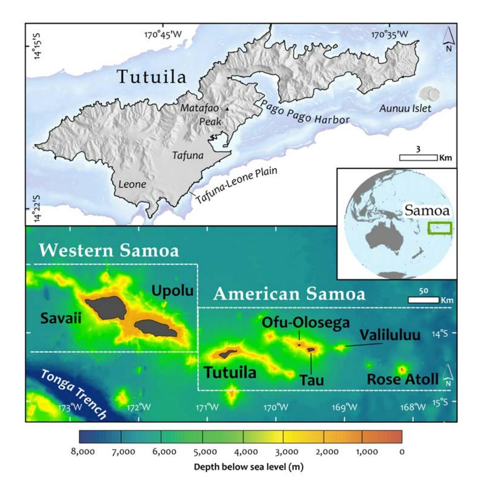

Figure 1. Map of Tutuila Island (top) and bathymetric map of Samoan archipelago (bottom). Divisions between Western and American Samoa are drawn to show political jurisdictions and do not constitute actual territorial boundaries. Regional location map shown in the middle-right inset.

Tutuila can be divided into two primary geographic regions: (1) an east-west trending series of Pleistocene age shield volcanoes that have eroded into a sharp 32 km long ridgeline, and (2) a geologically young (Holocene) series of lava and ash flows on the island's southwestern flank that primarily makes up the Tafuna-Leone Plain (Fig. 1). The plain is bisected by a north-south trending ridge of cinder cones, and the eastern (Tafuna) side of the plain is about twice the size (15 km2 ) of the western (Leone) side (8 km2 ). The older-volcanic shields generally rise 300 to 400 m above sea level with the island's highest point at the summit of Mt. Matafao (653 m). Only a third of the island has a slope of less than 30%, therefore, development density is high in the flatter areas such as the Tafuna-Leone Plain and the small alluvial-fill valleys that ring the island. The steeper parts of the landscape are heavily forested with tropical jungle.

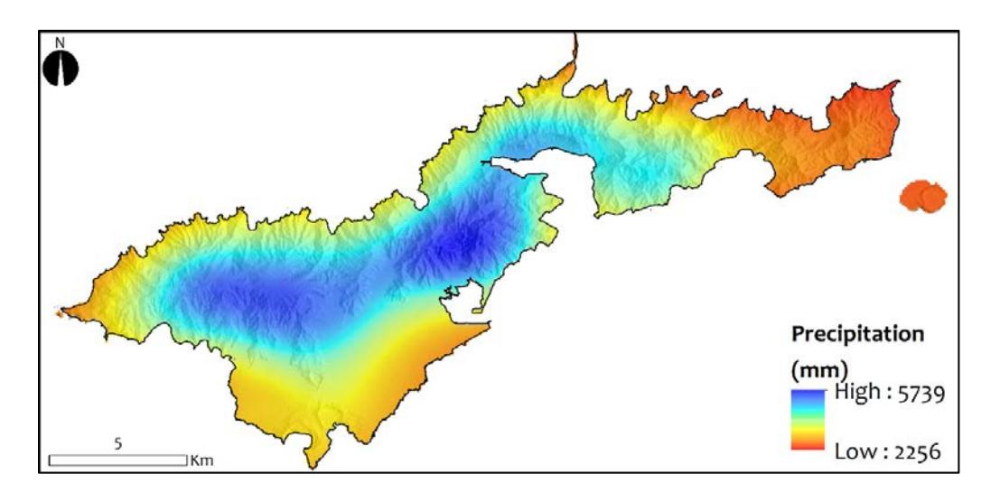

Figure 2. Average annual precipitation from climate data recorded from 1971 to 2000 (Daly et al. 2006).

## **1.3 Regional Geologic History**

The Samoan Archipelago is located near the northern boundary of the Tonga Trench, at the crest of a plate flexure where the seafloor of the Pacific Plate begins to dip southward into the trench (Natland 2003). Volcanism in the archipelago is likely controlled by both tectonic and hotspot processes, and the islands' eruptive history can be categorized into two distinct phases, respective of these processes. The first phase of Samoan volcanism is attributed to hot spot activity. This phase is thought to have constructed the shield volcanos that make up the 'core' of each main Samoan island, similar to the way that other hot-spot chains in the Pacific, such as Hawaii, were created. As the Pacific Plate moves westward over a stationary mantle plume, the islands propagate eastward with the youngest island most proximal to the hot spot. Currently, the hot spot is thought to be underneath the volcanically active Vailuluu Seamount, about 20 miles east of Tau Island (Fig. 1). The oldest rocks from the chain were dredged from the submarine flanks of the island of Savaii and are dated to 5.2 millions of years before present (Ma) (Koppers et al. 2008). On Upolu, older rocks range from 3.2 to 1.4 Ma, and Tutuila's older-volcanic mountains date from 1.5 to 1.0 Ma (Natland 2003). The ages of the Manua islands (Ofu-Olosega and Tau) to the east of Tutuila are much younger, dating to 0.3 and 0.1 Ma (McDougall 1985), and submarine eruptions from Vailuluu are ongoing (Johnson 1977).

The second phase of Samoan volcanism is a rejuvenated phase (i.e., post-erosional phase) that probably occurred fairly contemporaneously throughout the late Pleistocene and Holocene on the islands of Savaii, Upolu, and Tutuila (Natland 1980). The extent of this second phase of eruptions traverses the length of an approximately 300+ km long plate flexure zone across Savaii and Upolu, and to the eastern shore of Tutuila. On Tutuila, the rejuvenated phase created the Tafuna-Leone Plain on the shields'southwestern flank, and

Aunuu Islet off of the eastern coast. Natland (2003) proposes this rejuvenated volcanism results from extensional fracturing caused by the structural effects of lithospheric bending as the Pacific Plate subducts into the Tonga Trench. Interestingly, this rejuvenated phase of volcanism is more voluminous on Savaii and Upolu and almost completely covered the original shields, thereby making them larger and creating domed edifices that are clearly less eroded than the highly dissected islands of Tutuila, Ofu, and Olosega. As a whole, the surficial appearance of the Samoan archipelago makes it appear that the more westerly islands (Savai and Upolu) are younger, although they are not. This apparent discrepancy sparked much scientific debate regarding the validity of the mantle-plume hot-spot model until accurate dates from the Savaii undersea volcanic pile were measured (Koppers et al. 2008).

## **1.4 Geology of Tutuila**

## **1.4.1 Pleistocene Volcanic Shields**

In the Samoan archipelago, Tutuila is third in both size and age, having erupted 1–2 Ma from two or three parallel east-northeast trending rift zones on the ocean floor. During the island's hot-spot phase, four overlapping volcanic shields (Pago, Taputapu, Olomoana, and Alofau) (Fig. 3) were thought to have contemporaneously erupted over about a half-million years, starting around 1.5 Ma (Stearns 1944, McDougall 1985). These eruptions produced a complicated and heterogeneous assemblage of alkalic igneous rocks, in the form of thick lava flows, pyroclastic deposits, and crosscutting intrusive dikes and plugs. At its peak size, about 1.25 Ma, the island may have been nearly 45 km in length, 12 km in width, and about 1,500 m (5,000 ft) tall (Stearns 1944). Also around that time, a large collapse in the center of the Pago Shield created the 9 km wide Pago Caldera. At the end of the Pleistocene Epoch, the caldera was deeply eroded by surface water, and inundated by the rising sea level, to create the fjord-like feature of Pago Pago Harbor. Stearns (1944) interpreted the nearly vertical north wall of the harbor as direct evidence of this collapse. After the collapse, additional eruptive activity inside of the caldera created a distinctive lithologic unit consisting of lowpermeability ponded flows, tuffs, breccias, and trachyte intrusions that are collectively referred to as the Pago Inner-Caldera Unit. This unit postdates the Pago Outer-Caldera Unit, which is primarily composed of gently sloping lava flows and some pyroclastics (Stearns 1944). The neighboring Alofau Shield may also have experienced a similar caldera collapse, whereas the westerly Taputapu Shield shows no evidence of such an event.

Tutuila's shield building phase ended about 1 Ma with the eruption of massive lava flows that filled several valleys, and the intrusion of numerous Trachyte plugs and dikes that remain today as the island's highest and most prominent peaks (Stearns 1944, NPS 2008). The shape of the original shields could be inferred from the existing island profile, as seen in the slopes of the long ridges that emanate from the island's central axis. These ridgelines often have slopes of about 15°, which corresponds to the dip of many individual lava flows

measured on Tutuila by Eyre and Walker (1991). What remains of Tutuila today, after much subsidence below sea level, is the deeply eroded and weathered summit of the original island.

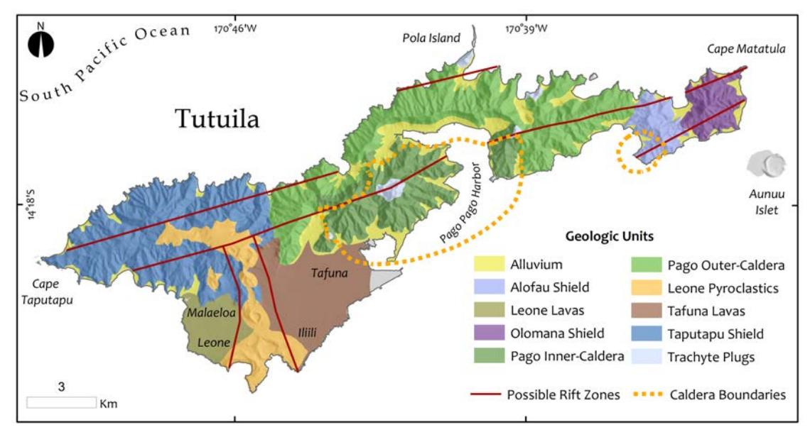

Modified from Stearns (1944) and Knight Enterprises Inc. (2014).

Figure 3. Simplified geology of Tutuila showing volcanic shields and inferred volcanic structures such as rift zones and caldera boundaries.

Rock samples from each shield were collected by McDougall (1985) to determine the potassium-argon ages of their flows. Though the dates suggest relatively contemporaneous eruptions, they do show that the Pago Shield (1.53–1.14 Ma) is probably slightly older than the Alofau and Olomoana Shields (1.11–1.48 Ma), and that the Taputapu Shield (1.01– 1.25 Ma) is probably the youngest. Stearns (1944) also notes that the Taputapu flows appear to overlie the Pago flows in Aasu Valley, and the geomorphology of the Taputapu Shield shows it is younger than the Pago Shield, with less erosional dissection.

#### **1.4.2 Sedimentary Units and Changes in Sea Level**

After the cessation of the shield-building phase, Tutuila experienced between 120 m to 800 m of isostatic submergence (Stearns 1944). At some point during this interval, a Pleistocene-age barrier reef formed around much of the island. Behind the barrier reef, a lagoon environment allowed the growth of fringing reefs and the deposition of carbonates, marls, and terrestrial alluvium (Mayor 1920). Next, there was a period where coral growth could not keep pace with the rate of the sea level rise, and the lagoon and barrier reef were drowned. Today these carbonate deposits form a submarine plateau that lies unconformably on the eroded upper surface of the older volcanic shields. Bathymetric data show that the top of the plateau occupies a remarkably uniform depth from -50 to -90 meters below sea level (Fig. 4). In 2015, a deep borehole was drilled showing two carbonate horizons in the TafunaLeone Plain region. The lower horizon ranges from -58 to -74 m below sea level and is thought to be a part of the carbonate bench. Radiocarbon dating (Reinhard, unpublished data, June 2016) shows the middle of the horizon is 10,300 years old. Above this horizon, the Leone Volcanic flows continue up to a depth of -15 m where a second carbonate layer is found. The layer is 9 m thick and was deposited during an interval between 7,000 and 4,400 years ago. This upper layer is probably one of many carbonate horizons or lenses that may have been interfingered with the Leone Volcanics. The existence of these horizons could result from a combination of the intermittent growth of the volcanic plain and global sea level fluctuations, which include a rise from -120 m at the end of the Pleistocene Epoch 12,000 years ago, and a +2 m high stand about 5,000 years ago (dates and elevations are approximate).

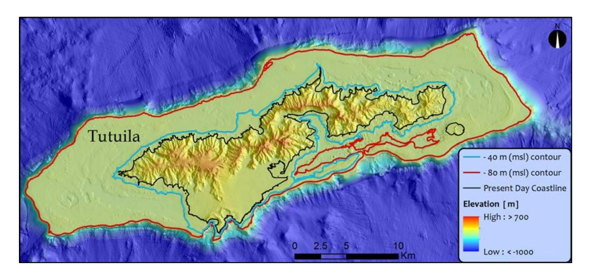

Figure 4. Bathymetry surrounding Tutuila (Lim et al. 2010). The sharp drop 3–7 km from the coastline is interpreted as the former sub-aerial extent of the older shield volcano(s) prior to submergence. The flat area between -80 m and -40 m depth (*red and blue lines*) is the top of a carbonate rich sedimentary unit that is thought to have been deposited in a lagoon environment behind an ancient drowned barrier reef.

To the north of the Tafuna-Leone Plain area, and along the coastline of the rest of the island, are numerous deeply-incised valleys eroded into the older shields. The bottom of many of these valleys are filled with terrestrial alluvium that collects as streams erode material from the mountains. The larger valleys also contain marine sediments and reef material, some rising to 2 m above the current sea level, which correlates with sea-level highstands within the last 5,000 years. These alluvial wedges provide some of the limited flat land around the island for building villages, and most probably contain at least a small basallens aquifer.

#### **1.4.3 Holocene Leone Volcanics**

After the last glacial period and until indigenous-historical times, Tutuila's rejuvenated

volcanic phase produced eruptions along the southern flank and to the summit of the Taputapu Shield (Natland 1980, Addison 2006). Recent unpublished carbon dates from the interbedded carbonate layers under the plain suggest that the rejuvenated phase eruptions began earlier than 10,000 years ago and continued until 4,000 years ago (Reinhard, unpublished data, June 2016). Additionally, archeological excavation of a widespread red-ash layer throughout the plain indicates that pyroclastic eruptions were still occurring from around 650 to 750 years ago (Addison 2014). These Holocene age lava flows, ash eruptions, and cinder cones, make up the Leone Volcanic Series.

The Leone Series primarily originated from an approximately 7 km long north-south trending rift zone that is clearly demarcated as a ridge, topped with cinder and ash cones, running between the villages of Tafuna and Leone. The Tafuna-Leone Plain represents the bulk of the erupted material from Tutuila's rejuvenated phase, during which submarine eruptions blasted through the carbonate shelf, and ash deposits and lava deltas flowed down the flank of the older shields (Keating and Bolton 1992). The pyroclastic cones closer to the sea have more ash in their compositions, indicating they were formed from explosive eruptions (likely due to intruding seawater), whereas the cinder cones and pahoehoe flows located farther north are indicative of subaerial effusive eruptions. Aunuu Islet, a small tuff cone 1.3 km off of the southeastern coast of Tutuila, was also thought to have been created by submarine eruptions during this phase. It is interesting to note that the southern boundary of the Tafuna-Leone Plain is located at the edge of the carbonate shelf, which suggests that the rejuvenated volcanics must have flowed outwards until they reached the edge of the shelf where they cascaded down the submarine slope into the depths.

## **1.5 General Conceptual Hydrogeologic Model of Basalt Islands**

Generally, on basaltic oceanic islands, the primary freshwater resource is contained in a lens-shaped body near sea level within saturated rocks (Tribble 2008). This basal freshwater lens is supported by the underlying seawater due to the contrasting densities between fresh water and salt water. The transition between fresh and salt water is marked by a zone of brackish water (the transition zone) that can vary in thickness and depth. A secondary freshwater resource described in basaltic island settings is high-level groundwater. It is distinctive from basal-lens groundwater as it is supported by low-permeability features such as dikes, perching layers, or low-conductivity country rock, and is not connected to underlying seawater. High-level groundwater has been observed and developed for use on other islands. However, on Tutuila no wells have definitively tapped high-level groundwater and its occurrence remains generally unconstrained.

Various conceptual models have been proposed for groundwater occurrence on volcanic islands and these generally fall into two categories: Hawaiian models and Canary Islands models (Join et al. 2016) (Fig. 5). The Hawaiian model describes groundwater occurrence in two distinct and hydraulically disconnected systems, basal groundwater and high-level groundwater (Lau and Mink 2006). On the other hand, the Canary Islands model (Custodio

1989, Custodio and Cabrera 2008)—alternately described as the 'fully saturated vertically extensive freshwater body' model (Izuka and Gingerich 2003)—describes a single hydraulically connected basal groundwater body extending from sea level and supported to high elevations by low-conductivity aquifer material. The average hydraulic conductivity distribution in this model is believed to decrease with depth, which is justified by an assumed loss of porosity due to compaction and secondary mineralization, as well as increasing age and weathering.

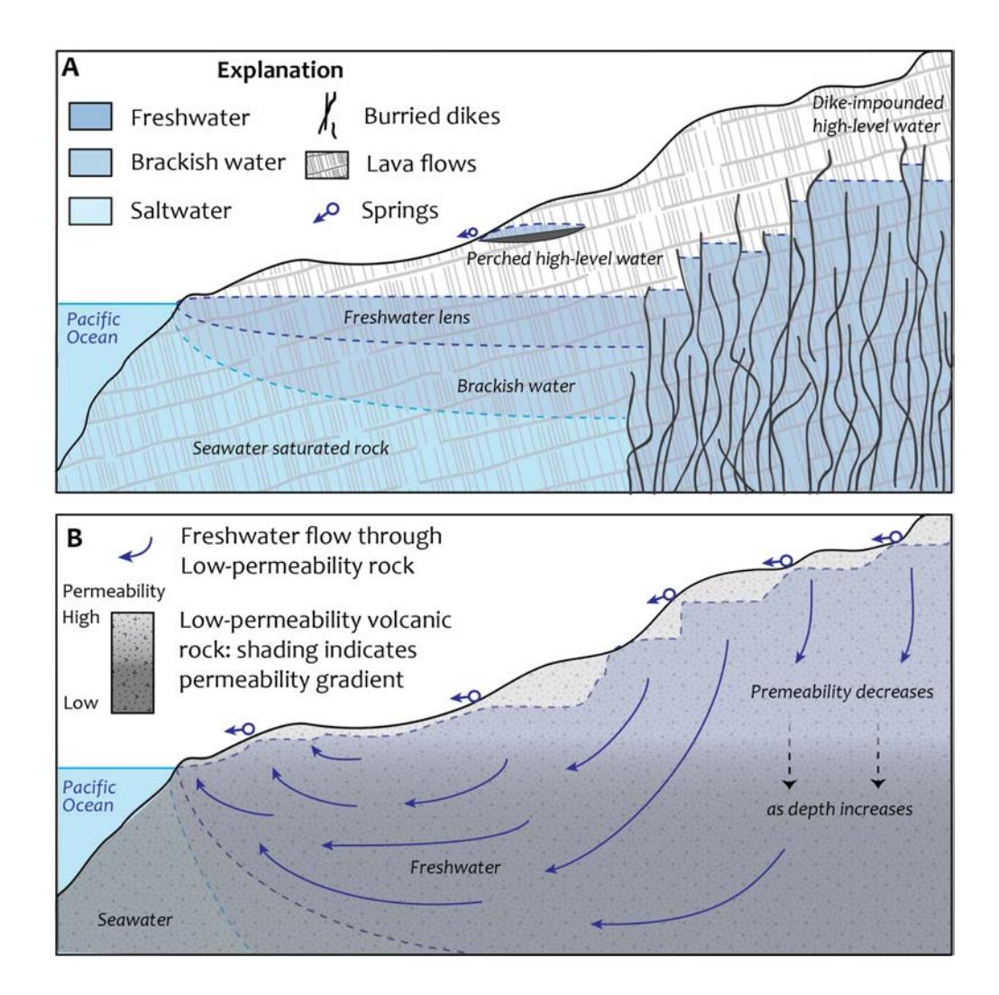

Figure 5. Two conceptual models of groundwater occurrence on basaltic oceanic islands. A) The Hawaiian model (Lau and Mink 2006) consists of two disconnected groundwater systems, high-level and basal. B) The Canary Island model (Custodio 1989) illustrates that elevated and basal groundwater are hydraulically connected as a single system contained in low-permeability rock.

## **1.6 Hydrogeologic Units on Tutuila**

Neither of the aforementioned conceptual models has been undeniably invoked to describe groundwater occurrence on Tutuila. However, they are not necessarily incompatible. Taken in perspective, a conceptual model is merely a simplification used to inform predictions or parameterization of numerical models. Real world subsurface conditions controlling groundwater movement and storage on Tutuila are heterogeneous and poorly constrained, thus it is possible and even likely, that different regions with distinct geologic histories may be more effectively parameterized on a regional scale by different conceptual models. This emphasizes the importance of interpreting data from different hydrogeologic units on an individual basis, as attempted in this report.

Izuka et al. (2007) delineated over five hydrogeologic units for Western Tutuila based on what is known of the island's geologic construction (Fig. 6). The Taputapu and Pago Shields were consolidated into one low-conductivity unit—the Pleistocene Older-Volcanics Unit—as lack of data precluded their differentiation into separate hydrogeologic units. The Leone Volcanics were separated into the more hydraulically conductive Tafuna Unit on the eastern side of the plain and a less conductive Leone Unit on the western side. The rift zone running through the middle of the plain was classified as a Pyroclastic Unit with simulated dikes, and a wedge-shaped Reef Unit was located between the Leone Units and the Pleistocene Older-Volcanic Unit. The boundaries and characteristics of these units comprise the foundation of the hydrogeologic conceptual model of Tutuila. However, new geologic and hydrogeologic data presented in this report provided evidence for proposed updates to this conceptual model, such as considering each shield in the lower-conductivity unit separately.

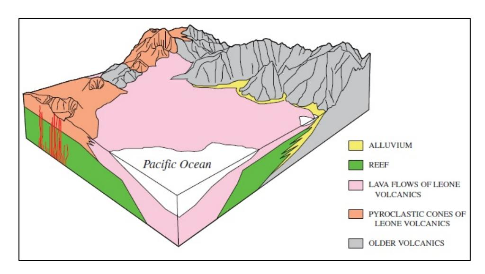

Reprinted from Izuka et al. (2007) with permission.

Figure 6. Hydrogeologic units from the conceptual hydrogeologic model developed by Izuka et al. (2007) of the Tafuna-Leone Plain region.

## **2.0 HYDROGEOLOGIC DATA**

## **2.1 Compilation and Interpretation of Subsurface Logs**

Borehole logs from well drilling or other belowground exploratory operations allow a direct assessment of subsurface structure, materials, and conditions. Available logs from Tutuila show the island is constructed of a complex arrangement of lava flows, associated clinker zones, a limited amount of marine and terrestrial sedimentary units, and pyroclastic materials—including pockets of cinder and ash layers.

Throughout Tutuila there have been numerous shallow (< 100 m) boreholes drilled during the last 30 years, primarily as production wells. Two deep exploratory boreholes were also drilled in 2015, one on the northern Leone Plain in the village of Upper Malaeloa (TGH-1) and the other on the southern Tafuna Plain in the village of Iliili (TGH-3). Driller's logs of varying quality were found in reports or unpublished records for about one-third of the shallow holes. Excellent logs were made, and core samples were collected, for nearly the full depth of the deep boreholes. Trenches dug for archaeological purposes, though usually only < 2 m deep, also provided information about the shallow subsurface. The locations of each log or trench are shown in Figure 7. Despite significant variation in the quality and terminology used between logs, they were nonetheless useful for comparing the subsurface characteristics of different areas and assessing the subsurface elevations of recognizable geologic features.

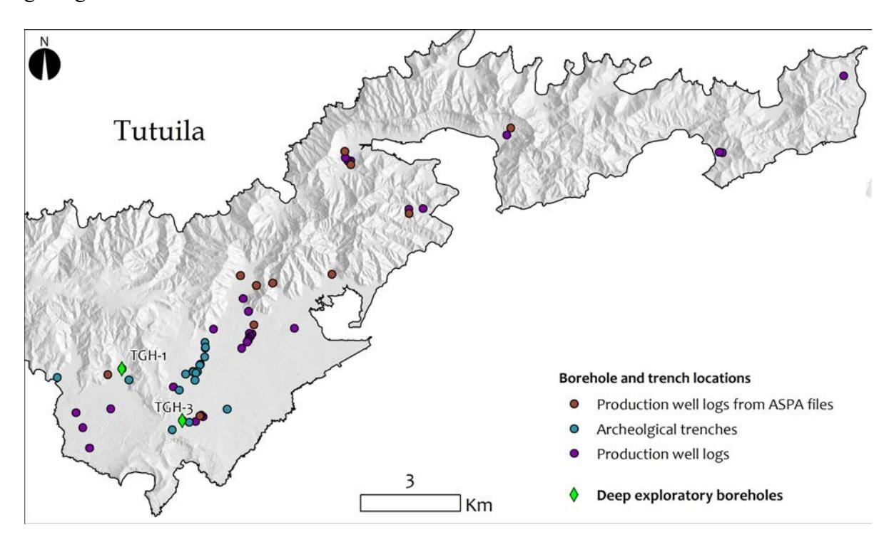

Figure 7. Location of boreholes [Bentley 1975, ASPA files (unpublished)] and archeologic trenches (Addison 2014).

## **2.1.1 Shallow Borehole Logs**

For this study, lithologic sections from shallow production-well borehole logs were classified into a simplified database. Terminology between the logs was highly variable since they were recorded over several decades by different drillers. The driller's logs often lacked clear lithological descriptions, and frequently only documented changes in drilling speed as "hard" or "soft." In volcanic island settings, these terms have been interpreted to signify the difference between massive-impermeable lava sections (hard) and more-permeable rubble or clinker zones (soft) (Eyre and Walker 1991). However, this assumption may be an oversimplification, as drilling speed can also increase if a lower-permeability clay or weathered volcanic rock horizon is encountered. Nonetheless, the logs do provide general indications of geologic structures, as well as a statistical basis upon which Tutuila's extreme subsurface heterogeneity may be crudely understood. For simplicity here, each lithologic section was classified into one of ten categories: unconsolidated, hard basalt, vesicular basalt, no-circulation, clay, soft basalt or fractured rock, cinder, ash, non-carbonate sand, carbonate sand, or carbonate reef. The proportions of each material, averaged over the logs available in the different well fields or regions is presented in Table 1. Many of the logs show massive lavas (or hard drilling zones) interlayered with cinders, weathered basalt, rubble, or other soft materials, indicating that small scale heterogeneity may be so localized as to not have much control over regional aquifer properties.

Table 1. Physical characteristics of regions, using shallow borehole logs as reference.

|                     |                | PHYSICAL CHARACTERISTICS (%) |           |                           |        |    |             |      |
|---------------------|----------------|---------------------------------|-----------|---------------------------|--------|----|-------------|------|
| Region (Well Field) | Sample Size |                                 | Basalt    |                           |        |    | Ash Clay |      |
|                     | (n)*           | Hard                            | Vesicular | Soft or Fractured Rock | Cinder |    |             | Sand |
| Tafuna              | 13             | 52                              | 5         | 26                        | 3      | 0  | 4           | 0    |
| Iliili              | 6              | 46                              | 16        | 17                        | 9      | 1  | 1           | 5    |
| Leone               | 6              | 43                              | 5         | 28                        | 4      | 1  | 1           | 8    |
| Tula and Alofau     | 3              | 11                              | 0         | 0                         | 4      | 21 | 53          | 10   |
| Aua and Pago Pago   | 9              | 16                              | 12        | 9                         | 12     | 6  | 13          | 4    |
| Fagaalu             | 3              | 7                               | 1         | 15                        | 11     | 0  | 33          | 23   |
| Malaeimi            | 3              | 31                              | 0         | 46                        | 0      | 0  | 11          | 0    |
| Total               | 43             | 35                              | 7         | 20                        | 6      | 3  | 11          | 5    |

NOTE: The proportion of each material type (% of total thickness) is averaged over the logs within each region. All material types are not listed, therefore total percentages do not equal 100%.

The heterogeneous subsurface structure of the Tafuna Plain is displayed in a cross section at seven closely spaced shallow borehole logs in the Tafuna Plain (Bentley 1975).

\*n = number of logs available in each region.

These logs provide a unique high-resolution opportunity to examine the subsurface structure of the region. These boreholes lie along an 850-m-long southwest to northeast profile (Fig. 8). Despite their spatial proximity, the geologic sections encountered are poorly correlated between boreholes (Fig. 9). This lack of correlation illustrates the plain's complex structure, which is shown in the logs as alternating sequences of massive lavas and rubble or fractured zones that are clearly not aerially extensive. Figure 10 shows a conceptualized schematic interpretation of how these alternating permeable and impermeable sections might create borehole observations that fit the log data shown. This conceptual model again supports the conclusion that Tutuila's subsurface is hydrogeologically, very complex.

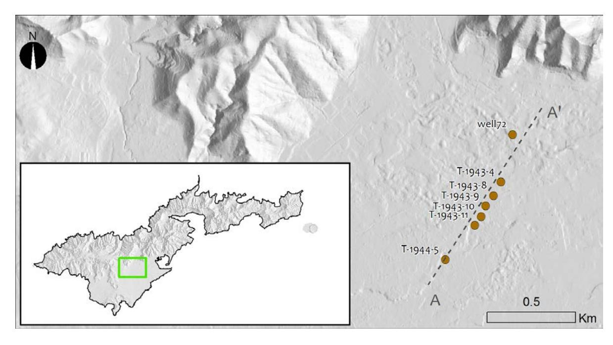

Figure 8. Location of seven boreholes used to construct the geologic cross section A–A' shown in Figure 9

## **2.1.2 Deep Exploratory Boreholes (TGH-1 and TGH-3)**

The data collected from the two deep boreholes in the Tafuna-Leone area provides an informative visualization of subsurface conditions and lithology at each point. The core samples recovered from these holes provide a record of the geologic past via visual inspection, radiocarbon (14C) dating methods, and major/minor element chemistry. The Leone Series rocks can be distinguished from the underlying Taputapu rocks by distinctive geochemical signatures, where the Leone rocks have approximately 10% less magnesium oxide and 20% more zirconium (both normalized by weight) than what is contained in the Taputapu rocks (Geologica Geothermal Group, Inc., unpublished data, 2016).

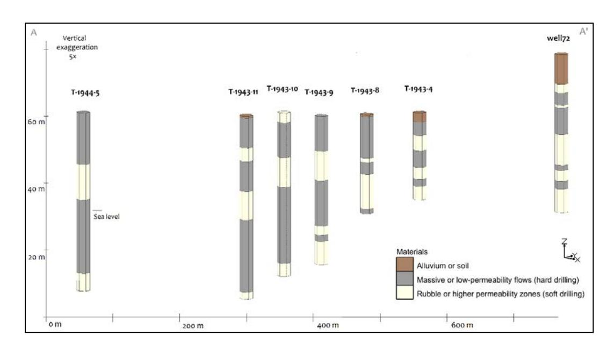

Figure 9. Heterogeneous subsurface structures of the 7 boreholes (from Figure 8) located in the Tafuna-Leone Plain. The cross section illustrates the boreholes lithologic features based on Bentley's (1975) driller's logs. Note: Reference datum for y-axis is arbitrary.

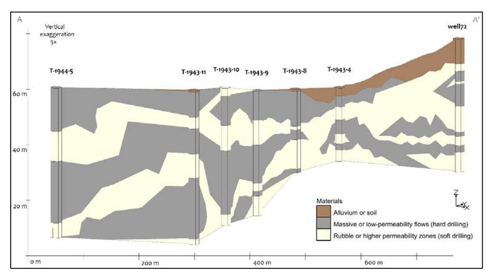

Source: Based on Walker 1991.

Figure 10. Conceptualized cross section of the Tafuna-Leone lava delta. The model is based on conceptual occurrence of lava delta formation when overlaid over the seven borehole logs shown in Figure 9.

As expected, the lithologic column in the boreholes consists primarily of dense lava sections that are interbedded with rubble and/or pyroclastic materials. The column at TGH-1 shows a thick layer of mountain-front talus and alluvium covering the Leone Volcanic Unit,

which overlies the Taputapu rocks; thus indicating that the well is probably located in a lava filled paleo-valley. At TGH-3, the alluvial overburden is relatively thin, and the Leone Volcanics contains two marine carbonate layers above the contact with the Taputapu Volcanics. This indicates the well must be located north of the lava-covered inland margin of the carbonate bench surrounding the island. Three distinct hydrogeologic units and a handful of notable geologic events (e.g., debris flows) can be interpreted based on known geologic history and inspection of the cores and logs. The sequence of these events and a hydrogeological interpretation of significant units are presented in Tables 2 and 3, with photos from Geologica Geothermal Group, Inc. (2016).

The lithology of the Leone and Taputapu Units was analyzed and statistics are compiled in Table 4. The data shows that in both boreholes, the Taputapu and Leone Volcanic Units are composed of similar materials and have lithological sections ranging from massive basalt, vesicular basalt, fractured basalt, pyroclastic materials, and unconsolidated regions to sedimentary horizons, many of which seem to alternate frequently (average section thickness in both holes was between 2.0 and 2.4 m) in a non-regular sequence. Each layer was classified based on its lithology as well as an assumption of its permeability with vesicular basalt, rubble, and unconsolidated zones having a higher-assumed permeability and massive lavas, while ash and clay have a lower assumed permeability. This analysis indicates the Taputapu Series generally has more secondary mineralization in voids and a higher proportion of clays or other minerals that reduce permeability, whereas the Leone series is constructed of a greater proportion of rock types that are assumedly more permeable. Notably large rubble zones were seen in the Taputapu Series in both holes, ranging from -231 to -236 m and -199 to -232 m below sea level at TGH-1 and TGH-3, respectively. It remains unclear if these zones are connected between holes. Below this zone the ratio of permeable to impermeable rock is reduced from 25% to 35%. Temperature logging was also performed during and after drilling, and showed a distinct anomaly in the TGH-3 rubble zone. Overall the heterogeneity seen in these logs emphasizes the futility of aquifer characterization based on individual geologic sections, thus emphasizing the need to assess integrated regional hydrological properties through aquifer tests.

#### **2.1.3 Temperature Logging of Deep Boreholes**

Although, aquifer tests were not performed on the deep boreholes TGH-1 and TGH-3, temperature logging was performed during and after drilling. This technique is useful for indicating areas of fluid flow because meteoric or ocean waters have distinctive temperatures that are likely to disrupt the geothermal temperature gradient of the surrounding rock. Survey results from Geologica Geothermal Group, Inc. (2016) are shown in Figures 11 and 12, both show low temperature plateaus and thus the presence of the known freshwater aquifer between about +3 to -85 m above sea level at TGH-1, and about +1 to -25 m above sea level at TGH-3.

Table 2. Simplified compilation of drilling details from logs and core samples for TGH-1 (Upper Malaeloa village) site.

| Depth (m) | Height (m)                 | Geologic Unit and Hydrologic Notes                                                                                                                                                                                                                                                                                               | Unit Thickness (m) | Core Sample |
|--------------|-------------------------------|-------------------------------------------------------------------------------------------------------------------------------------------------------------------------------------------------------------------------------------------------------------------------------------------------------------------------------------|-----------------------|-------------|
| 24.2         | 18.9                          | Sediments, alluvium, pyroclastics, and basalts? No core recovered. Unsaturated zone. Reports of poorly sorted material suggest moderate permeability.                                                                                                                                                                      | 24.2                  |             |
| 34.1         | 9.0                           | Sediments, alluvium, and pyroclastics, core recovered. Unsaturated zone, limited permeability.                                                                                                                                                                                                                                | 9.9                   |             |
| 61.6         | -18.5                         | Leone volcanics, fractured vesicular basalt. High permeability. Water table encountered at 39.6 m depth (3.5 m above MSL), unconfined aquifer below. (Sampled at a 42.7 m deep)                                                                                                                                   | 27.4                  |             |
| 76.2         | -33.1                         | Leone volcanics, vesicular basalt, mixed with clinker, scoriacious zones, and massive units. Heterogeneous permeability, but generally high. One geochemical sample at 75 m deep looks Taputapu in a origin, may not be in situ.                                                                                  | 14.6                  |             |
| 89.0         | -45.9                         | Sediments, alluvium, massive boulders, clay. Likely a debris flow. Probably low permeability.                                                                                                                                                                                                                                 | 12.8                  |             |
| 114.9        | -71.8                         | Loss of circulation, no data. Assumption that circulation loss indicates highly permeable formation is reasonable.                                                                                                                                                                                                            | 25.9                  |             |
| 279.5        | -236.4                        | Taputapu volcanics alternating zones of massive and vesicular basalt, lapili tuff, clinker, and scoria. Thin paleohorizons and debris flows present. Heterogeneous permeability, with zones of potentially high permeability. Notable rubble zone at 231 to 236 m below MSL. (Sampled at 118 and 124 m deep) a | 164.6                 |             |
| >663.0       | -620.0 (bottom of hole) | Taputapu volcanics. Basalt and volcanoclastics, predominantly massive texture, most pore spaces filled with secondary mineralization. Generally lower permeability than upper Taputapu.                                                                                                                                 | >383.0                |             |

Note: Depth = bottom of unit; Height = above mean sea level (MSL), ground elevation estimated at 43.1 m above MSL; photos for core samples used with permission from Geologica Geothermal Group, Inc. (2016), depths shown in feet below ground surface.

a Geochemical rock samples used to delineate Taputapu Volcanics from Leone Volcanics.

Table 3. Simplified compilation of drilling details from logs and core samples for TGH-3 (Iliili village) site.

| Depth (m) | Height (m)                 | Geologic Unit and Hydrologic Notes                                                                                                                                                                                                       | Unit Thickness (m) | Core Sample |
|--------------|-------------------------------|---------------------------------------------------------------------------------------------------------------------------------------------------------------------------------------------------------------------------------------------|-----------------------|-------------|
| 74.4         | 1.9                           | Leone basalts, unsaturated zone. Fractures and vesicularity suggest high permeability. Terrigenous soil and surface sediments from 0 to 4.5 m, no returns.                                                                         | 74.4                  |             |
| 82.3         | -6.0                          | Leone basalts and ash layer at bottom. Upper water table encountered at 74.4 m, unconfined saturated zone. Basalts look permeable, ash may have low permeability. (Sampled at 77.4 m) a                                         | 7.9                   |             |
| 91.4         | -15.1                         | Carbonate. Coral sand, intact reef, and fine grained marl. Probably more permeable than lower carbonates.                                                                                                                             | 9.1                   |             |
| 134.1        | -57.8                         | Leone basalts between carbonates. Mostly vesicular. Fractures and vesicularity suggest high permeability. (Sampled at a 93.6 m deep)                                                                                            | 42.7                  |             |
| 150.3        | -74.0                         | Second carbonate unit. Mostly carbonate marl, some coral fragments. High clays suggest low permeability. Potentially a confining unit?                                                                                             | 16.2                  |             |
| 157.3        | -81.0                         | Leone basalts and tuff. Iron oxide and secondary mineralization visible in fractures. Low vesicularity, thus potentially low permeability. (Sampled at 150 and a 153 m deep)                                              | 7.0                   |             |
| 167.8        | -91.5                         | Debris flow, mud, clay, and clasts. Potentially a confining layer?                                                                                                                                                                       | 10.5                  |             |
| >645.0       | -568.0 (bottom of hole) | Taputapu volcanics. Many alternating units of basalt and lithic lapili tuff. Some scoriaceous units. Heterogeneous permeability distribution. Large rubble zone at 199 to 232 m below MSL. (Sampled at 188 and 214 m deep) a | >480.0                |             |

Note: Depth = bottom of unit; Height = above mean sea level (MSL), ground elevation estimated at 76.3 m above MSL; photos for core samples used with permission from Geologica Geothermal Group, Inc. (2016), depths shown in feet below ground surface.

a Geochemical rock samples used to delineate Taputapu Volcanics from Leone Volcanics.

Table 4. Physical characteristics of Leone and Taputapu volcanic units at boreholes TGH-1 and TGH-3.

| Borehole (Unit) | Total            |                                   | PROPORTION (%)                                |                                            |  |  |
|--------------------|------------------|-----------------------------------|-----------------------------------------------|--------------------------------------------|--|--|
|                    | Thickness (m) | Basalt to Pyroclastic Layers a | Massive Basalt to Vesicular/Clinker/Rubble | Less Permeable to More Permeable Flow b |  |  |
| TGH-1              |                  |                                   |                                               |                                            |  |  |
| Leone              | 89.0             | 85 to 15                          | 47 to 53                                      | 48 to 52                                   |  |  |
| Taputapu           | 548.3            | 92 to 8                           | 58 to 42                                      | 87 to 13                                   |  |  |
| TGH-3              |                  |                                   |                                               |                                            |  |  |
| Leone              | 153.0            | 96 to 4                           | 37 to 63                                      | 33 to 67                                   |  |  |
| Taputapu           | 477.3            | 85 to 15                          | 50 to 50                                      | 79 to 21                                   |  |  |

a Only first 215 m of each borehole was analyzed due to difficulty distinguishing pyroclastics in lower layers.

## **Iliili Borehole**

The temperature profile in Iliili at TGH-3 shows a decrease in the air-filled hole from the ground surface to near sea level where the water table is encountered (Fig. 11). From near sea level to a depth of -15 m below sea level, the water temperature is relatively cool and consistent, and matches the temperature (25°C to 26°C) of the groundwater pumped from the unconfined freshwater lens in the nearby wells. The limited thickness of the freshwater lens, as shown on the temperature profile, was corroborated by salinity measurements of groundwater within the Iliili well field, which does become saltier during dry times or when over-pumped. Heads in the Iliili well field ranged from 0.3 to 2 m above sea level, and well depths ranged from -2 to -10 m below sea level. Despite uncertainties in elevations and depths in the temperature-depth profile, this data suggests a flowing freshwater lens extends to about -15 m below sea level. Inaccuracies in the ground elevation data and equipment used to measure depth, the shallow penetration of the Iliili wells below the water table, and the potential for vertical flow within the aquifer only allow the elevation of the bottom of the lens to be roughly approximated, which could potentially range from -15 to over -40 m below sea level.

With one major exception, a typical geothermal temperature gradient is observed in TGH-3 from -15 m to the bottom of the hole. However, between -175 to -280 m below sea level an anomalous 'low'-temperature plateau is observed. However, the interpretation of this anomaly is complicated by a lost circulation event that required drillers to cement a small interval at about -225 m below sea level. Since hydration of cement releases heat, a corresponding temperature spike is seen on the temperature profile, coincident with the upper portion of the low-temperature plateau. Despite this complication, the temperature profile still shows a plateau below the spike, which could indicate fluid flow. It was reported that the plugs were placed in an unstable zone of coarse volcanic "gravel" that occupies the local lithologic column from -200 to -230 m below sea level (Geologica Geothermal Group, Inc. 2016). The plateau's temperature of over 31°C, exceeds typical freshwater or even regional

b Permeability was not measured but assumed based on material type.

sea surface temperatures (≈29°C) and suggests some geothermal heating of freshwater or saltwater may be occurring, regardless of its salinity.

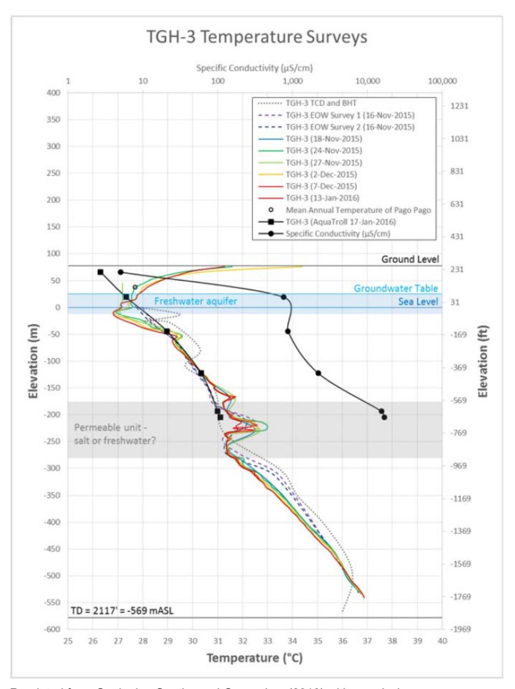

Reprinted from Geologica Geothermal Group, Inc. (2016) with permission.

Figure 11. Temperature and conductivity profile for TGH-3 in Iliili. Note: Colored lines = repeated temperature logging measurements for TGH-3, black line with circles = conductivity log in µS/cm, and dashed line = bottom hole temperatures (BHT) collected by maximum recording thermometers while drilling progressed downward.

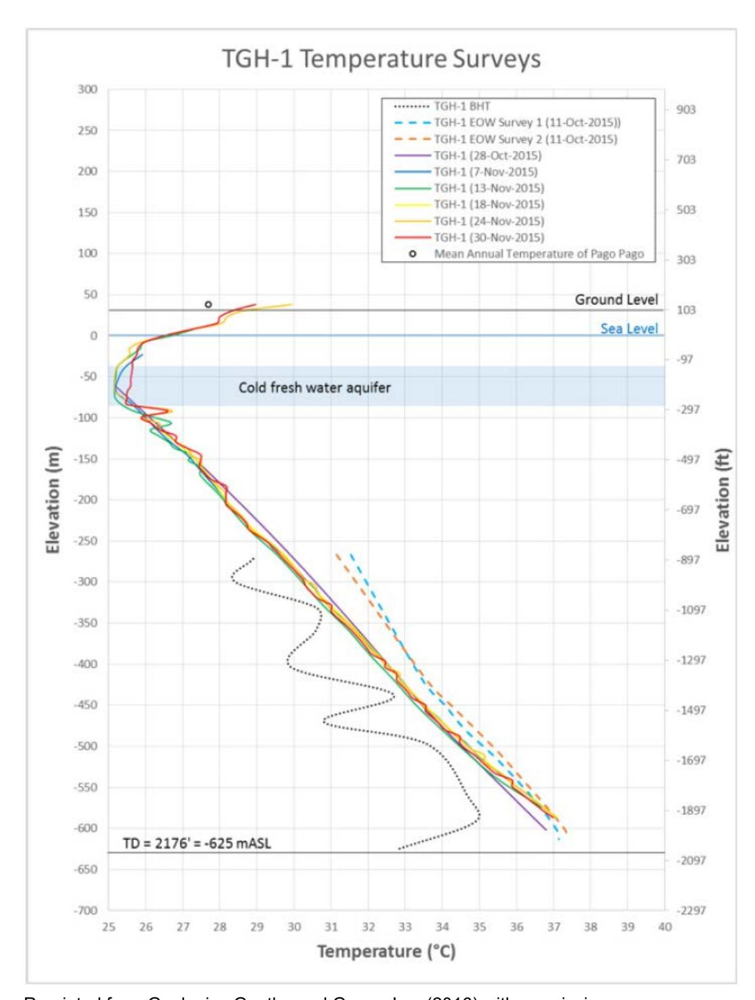

Reprinted from Geologica Geothermal Group, Inc. (2016) with permission.

Figure 12. Temperature profile for TGH-1 in Malaeloa. Note: Colored lines = repeated temperature logging measurements for TGH-1, and dashed line = bottom hole temperatures (BHT) collected by maximum recording thermometers while drilling progressed downward.

The zone of constant temperature in TGH-3 from -175 to -280 m below sea level indicates a region where the flow of water is sufficient to overcome the geothermal gradient. This might be interpreted to be evidence of a deep freshwater aquifer extending from the interior of the Taputapu Shield to below the plain. The zone of flowing water does not extend deeper than -260 m below sea level and the geothermal gradient is re-established at that depth. A head of 6.5 m is theoretically required for a basal lens to reach -260 m below sea level. Although there are no existing measurements of basal heads within the interior of Taputapu Shield, the relatively low-permeability of the rocks and substantial amount of groundwater recharge suggests that such heads are possible. However, the temperature anomaly could also be caused by tidally-forced inflow of seawater. Water sampling from TGH-3 in this zone after extensive cleanout of the borehole would help to constrain the salinity of water in this zone.

#### **Malaeloa Borehole**

The temperature profile in Malaeloa at TGH-1 (Fig. 12) is similar to the profile at TGH-3 with the exception that TGH-1 lacks any deep temperature anomalies. Below the cooler freshwater lens zone, the geothermal gradient is stable and consistent with global values. As would be expected, the low-temperature freshwater lens portion of the profile at TGH-1 is thicker, which corresponds to higher observed heads in the Malaeloa well field (1.5 to 2 m above sea level). The bottom of the shallow freshwater lens indicated by the temperature profile (-75 m below sea level), is nicely positioned at the theoretical location of the transition zone as predicted by the Ghyben-Herzberg principal.

## **2.2 Examination of Lava Outcrops in Pleistocene Volcanic Rocks**

Although the large fraction of a'a rubble in the Pleistocene aquifers seems to suggest a high overall permeability, aquifer tests shows the opposite (see Section 2.4). This discrepancy may be caused by the presence of low-permeability features that reduce the connectivity and aerial extensiveness of the rubble zones, effectively reducing the overall permeability. The subaerial extent of Tutuila is highly dissected by erosion and dikes intrude on much of the land remaining above sea level. The island experienced other disruptive events such as small eruptions, faulting, landslides, and other types of mass wasting. These events produce small and large pockets of talus breccia, debris flow material, cinders, or intrusive bodies (e.g., Fig. 13). These features alter the aquifer's permeability and are heterogeneously dispersed throughout the body of the island. Although subsurface structures are nearly impossible to observe with certainty below ground, surface outcrops can provide valuable clues to what lies below in locations where erosion or other processes have cleared Tutuila's prolific vegetation.

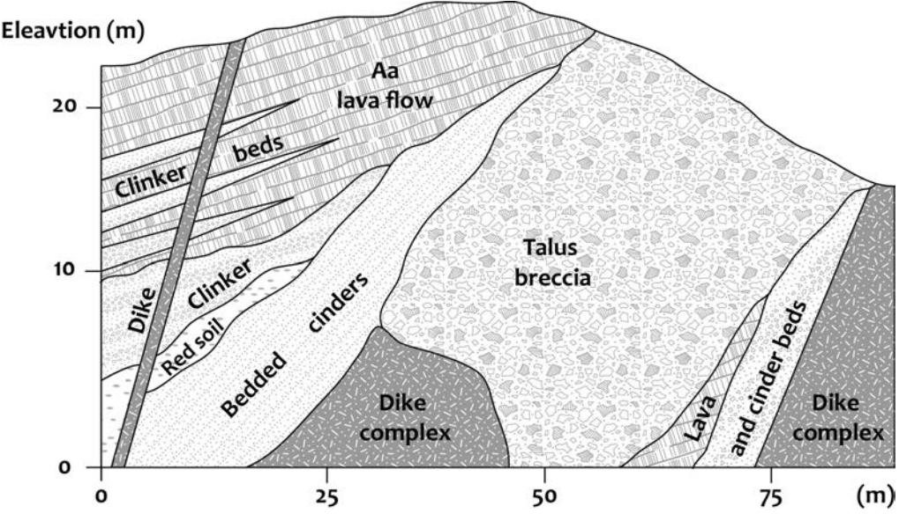

Modified from Stearns (1944) with permission.

Figure13. Diagram of the geologic components of the Pleistocene volcanics in an outcrop at Masefau Bay.

Over 50 quantitative measurements of outcrop characteristics in the Pleistocene Volcanic rocks were made by Eyre and Walker (1991). Measurements of the following were taken at road cuts, coastal cliffs, and promontories throughout the island: (1) thickness of each lava flow section, (2) the separate thickness of the flow interior and rubble layers of a'a flows, (3) the vesicularity of the flow interior, and (4) overall dip of lavas (Fig. 14, Table 5). As shown in Table 5, only 2.4% of the total flow thicknesses of the Pleistocene rocks were classified as pahoehoe—the majority consisted of a'a. Within the a'a flows, massive a'a cores were distinguished from rubble or clinker layers. Rubble was seen to make up about half (46%) of the total a'a flow thickness. The proportion of rubble to massive sections in the measured outcrops is proportionally similar to the amounts of these materials observed in the driller's logs from the Pleistocene rocks.

# **2.3 Interpretation of New Geophysics and Well Logging**

A magnetotelluric (MT) survey of subsurface electrical resistivity beneath the Tafuna-Leone Plain and the Taputapu Volcano was conducted by Geologica Geothermal Group, Inc. (2014) for the purpose of exploration for a geothermal resource. In addition, these results are useful for interpreting the hydrogeology of the subsurface. The profiles indicate less-resistive zones that could be inferred to be saturated with seawater, and highly-resistive areas that may indicate the unsaturated zones. Moderately resistive areas could be interpreted as either permeable basalt saturated with freshwater or as regions of dense but unsaturated rock. The hydrology in these moderately resistive areas is difficult to discern on the profiles. An approach to resolve this issue with additional surveys might include a time-lapse sequence of MT imaging, which would evaluate transient changes based on water saturation and density conditions.

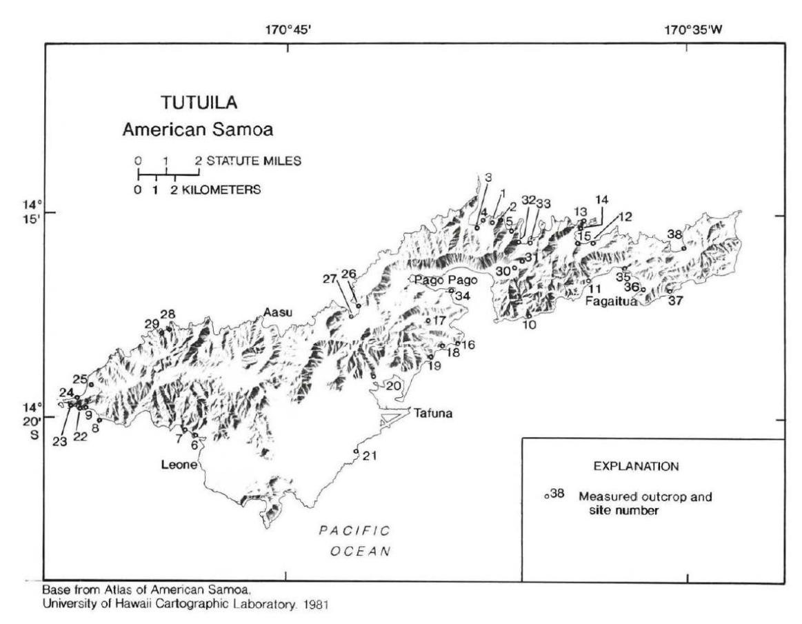

From Eyre and Walker (1991) with permission.

Figure 14. Location of measured Pleistocene Volcanic rock outcrops [see Table 5 for outcrop characteristics by Eyre and Walker (1991)].

These profiles of subsurface resistivity (Figs. 15 and 16) vary in the specifics for different areas but share the common characteristic of an approximately 500 m thick highconductivity layer, with resistivities of less than 10 Ω·m. This layer extends from the coast (sea level) to two to three miles inland (-600 m below sea level) where it fades into more resistive material. This high conductivity layer is overlain, underlain, and bounded towards the central part of the island by more resistive material (20 to 400 Ω·m). The highconductivity layer seems to occur in the Tafuna-Leone lavas, the underlying carbonate reef platform, and into the edifice of the Taputapu Mountain. This layer is very likely the result of conductive seawater that underlies the freshwater lens. The more resistive materials that bound the conductive layer on three sides (top, bottom, and inland margin) have resistivities that correspond to either unsaturated or saturated basalt with freshwater. The overlying highly resistive layers (>10 Ω·m) most likely represents unsaturated basalt, and the moderately resistive layers in this region (≈20 to 120 Ω·m) may represent the same material saturated with freshwater. The inland resistive material at depth may well represent the island's rift zone where numerous volcanic dikes either (1) prevents the intrusion of seawater and

possibly allows freshwater to penetrate hundreds of meters below sea level, or (2) creates a material of such low porosity that no significant amount of water (fresh or salt) penetrates it, thus yielding the resistivity of basalt with low moisture content.

Table 5. Statistics from selected lava flows on Tutuila.

|           |            | No. of            | T-4-1 C-1                        | A'a Unit T                | hickness                 | Pahoehoe                 |               |                         |
|-----------|------------|-------------------|----------------------------------|---------------------------|--------------------------|--------------------------|---------------|-------------------------|
| Site No.ª | Location   | Measured Flows | Total Column Thickness (m) | Massive Section (m) | Rubble Section (m) | Unit Thickness (m) | Dip Angle (°) | Rubble (%) b |
| 1         | Vatia      | 21                | 57.2                             | 18.0                      | 39.2                     | 0.0                      | 22            | 69                      |
| 2         | Vatia      | 2                 | 10.9                             | 5.2                       | 5.7                      | 0.0                      | 23            | 52                      |
| 3         | Afono      | 1                 | 8.2                              | 4.2                       | 4.0                      | 0.0                      | 20            | 49                      |
| 4         | Vatia      | 5                 | 20.2                             | 6.9                       | 13.3                     | 0.0                      | 20            | 66                      |
| 5         | Leone      | 6                 | 13.3                             | 8.5                       | 4.8                      | 0.9                      | 7             | 36                      |
| 6         | Amanave    | 11                | 17.0                             | 12.2                      | 1.7                      | 0.0                      | small         | 28                      |
| 7         | Fagaitua   | 2                 | 11.7                             | 5.9                       | 5.6                      | 0.0                      | small         | 50                      |
| 8         | Masefau    | 12                | 55.0                             | 33.0                      | 22.0                     | 0.1                      | small         | 40                      |
| 9         | Masefau    | 5                 | 13.6                             | 9.6                       | 3.9                      | 0.0                      | small         | 29                      |
| 10        | Masefau    | 2                 | 9.9                              | 8.8                       | 1.1                      | 0.0                      | small         | 12                      |
| 11        | Fatumafuti | 2                 | 13.1                             | 6.3                       | 6.8                      | 0.0                      | <5            | 52                      |
| 12        | Faganeanea | 3                 | 9.8                              | 4.5                       | 5.3                      | 0.0                      | 15            | 54                      |
| 13        | Nuuuli     | 2                 | 34.0                             | 23.0                      | 11.0                     | 0.0                      | _             | 32                      |
| 14        | Cape Tapu  | 6                 | 30.3                             | 17.2                      | 13.1                     | 0.0                      | small         | 43                      |
| 15        | Poloa      | 6                 | 23.0                             | 14.6                      | 8.4                      | 0.8                      | small         | 37                      |
| 16        | Fagasa     | 15                | 18.3                             | 10.6                      | 7.7                      | 0.6                      | 20            | 42                      |
| 17        | Fagasa     | 10                | 11.1                             | 5.7                       | 5.4                      | 0.7                      | 25            | 49                      |
| 18        | Fagamalo   | 6                 | 14.1                             | 6.8                       | 7.3                      | 0.0                      | 10            | 52                      |
| 19        | Fagamalo   | 4                 | 6.9                              | 3.6                       | 3.2                      | 2.3                      | 15            | 47                      |
| 20        | Afono      | 11                | 38.6                             | 22.4                      | 16.2                     | 0.0                      | _             | 42                      |
| 23 + 24   | Utulei     | 1                 | 5.9                              | 4.0                       | 1.9                      | 4.1                      | _             | 32                      |
| 25        | Amouli     | 4                 | 27.6                             | 14.0                      | 13.6                     | 0.0                      | 15            | 49                      |
| 26        | Amouli     | 5                 | 2.3                              | 1.5                       | 0.8                      | 0.0                      | 15            | 34                      |
| 27        | Aoa        | 3                 | 8.9                              | 5.1                       | 3.8                      | 0.0                      | small         | 43                      |
| 28        | Afono      | 1                 | 8.2                              | 4.2                       | 4.0                      | 0.0                      | 20            | 49                      |
| 29        | Vatia      | 5                 | 20.2                             | 6.9                       | 13.3                     | 0.0                      | 20            | 66                      |
| 32        | Leone      | 6                 | 13.3                             | 8.5                       | 4.8                      | 0.9                      | 7             | 36                      |
| 34        | Amanave    | 11                | 17.0                             | 12.2                      | 1.7                      | 0.0                      | small         | 28                      |
| 37A       | Fagaitua   | 2                 | 11.7                             | 5.9                       | 5.6                      | 0.0                      | small         | 50                      |
| 37B       | Masefau    | 12                | 55.0                             | 33.0                      | 22.0                     | 0.1                      | small         | 40                      |
| 38        | Masefau    | 5                 | 13.6                             | 9.6                       | 3.9                      | 0.0                      | small         | 29                      |

&lt;sup>a See Figure 14 for site locations.

&lt;sup>bMean weight of rubble (%) = 45.4 (includes approximately 10% of thermally-welded rubble of low permeability).

In the Geologica profiles, high resistivities plotted underneath the conductive layer seaward of the island's interior were surprising and contradictory to typical salinity profiles of islands where saltwater saturation would be expected. Either the material is of such low porosity that no significant amount of water penetrates it, yielding the resistivity of basalt with a low moisture content; or the development of the resistivity profiles, which are based on a data inversion process, were not performed in a manner that accurately reflects conditions in the region in question. Note that temperature and resistivity-conductivity depths mentioned in the Geologica data are approximate due to potential inaccuracies in measurements and in estimation of depths from the MT profiles.

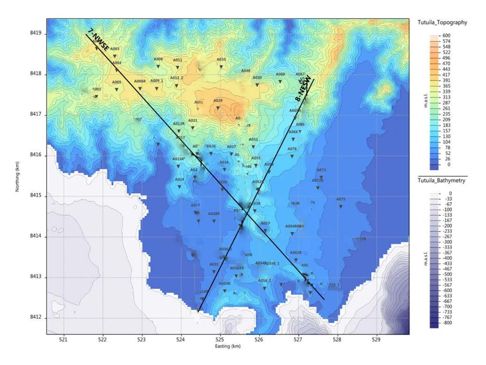

Reprinted from Geologica Geothermal Group, Inc. (2014) with permission.

Figure 15. Map of the Tafuna-Leone Plain and the Taputapu Volcano area showing MT station measurement locations as upside down triangles. Note: Cross sections of this area are illustrated in Figure 16.

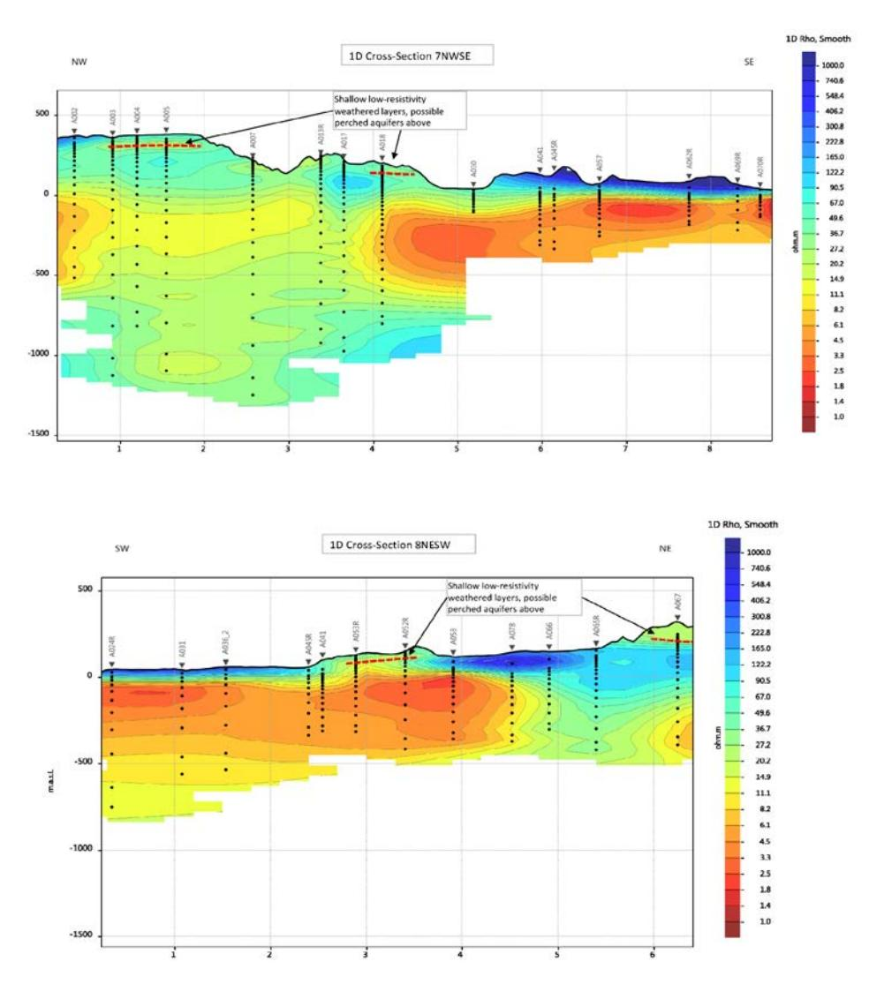

Reprinted from Geologica Geothermal Group, Inc. (2014) with permission.

Figure 16. Cross section of western Tutuila (Tafuna-Leone Plain and the Taputapu Volcano) showing MT survey of subsurface resistivity. Warmer colors indicate less resistive materials to show conductivity from seawater saturation in the subsurface.

# **2.4 Hydrogeologic Data from Wells and Pumping Tests**

#### **2.4.1 Water Levels**

Basic water level information can be used to assess the direction of groundwater flow, to infer aquifer properties, and to estimate magnitudes of hydraulic connectivity in different areas. Near sea level water levels in the Tafuna-Leone Plain generally support observations of high hydraulic conductivity, whereas wells in valley-fill alluvial aquifers and Pleistocene rocks have more variable water levels suggesting these areas have more heterogeneous conductivity distributions. Some water levels in the Pleistocene rocks might indicate that

groundwater could be perched, semi-perched, or otherwise elevated above the basal level. Historical U.S. Geological Survey (USGS) reports authored by Izuka (1996, 1997, 1999a) contain water levels from American Samoa Power Authority (ASPA) records from 1984 to 1997. Eyre and Walker (1991) summarized water level data from USGS records from 1975 to 1991. Reported water levels from all known sources are summarized in Table 6, and locations are shown in Figure 17. Note that the discrete (one time) measurements compiled in this report are subject to uncertainties in recharge variation, previous pumpage, and tidal or atmospheric fluctuations.

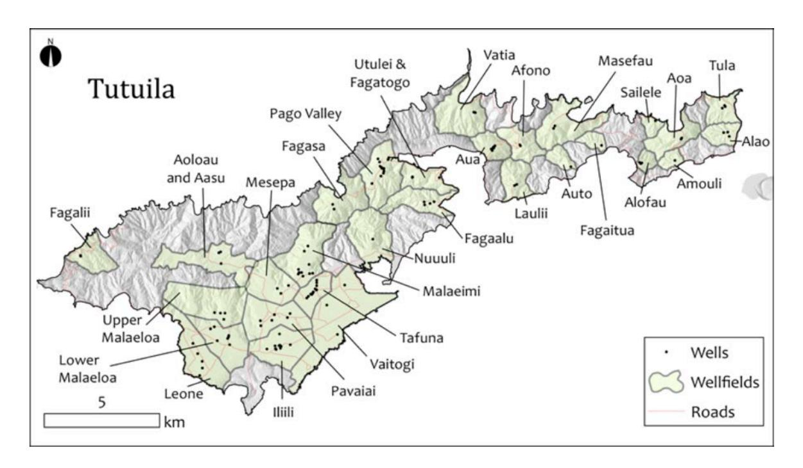

Figure 17. Location map of selected watersheds or wellfield areas (both in light green) where water level data is available.

#### **2.4.2 Water Level Variability in the Tafuna-Leone Plain**

Water levels in the Tafuna-Leone Plain aquifers are quite variable in response to rainfall or extended dry periods, and baseflow and spring flow throughout the island has been reported to be significantly reduced by extended dry periods (Davis 1963, Bentley 1975). In the Pleistocene rocks, water-level drawdowns of up to 15 m are observed in response to pumping (Eyre and Walker 1993). Although the plain's water levels do not seem to respond strongly to variations in pumpage (Shuler, unpublished data, July 2014), Kennedy et al. (1987) notes that water levels in Tafuna-Leone wells were found to increase and subsequently decrease rapidly in response to high rainfall events. Water level declines and increased salinity have also been observed in Tafuna-Leone wells during droughts. An extreme example of rapid change in water levels from recharge events is the recent

observation made in a non-pumping well in Lower Malaeloa Village during a period of heavy rain events (Fig. 18). Over the course of ten days, during and following these events, the water level in Malaeloa Well 80 rose by over 2 m. Periods of heavy rainfall leading to large increases in water levels have also been correlated with increase in turbidity and *Escherichia coli* detections in some Tafuna-Leone wells, which is the primary issue that has mandated the island's long standing boil-water notice.

Table 6. Compilation of historical water level data by well field.

| Well Field          | Drilling Water Level (m) | Pumping Water Level (m) | Geologic Unit                                  |
|---------------------|--------------------------------|-------------------------------|------------------------------------------------|
| Afono               | —                              | -1.5                          | Pago Outer-Caldera                             |
| Vatia               | 8                              | -9 to 7                       | Pago Outer-Caldera                             |
| Laulii              | 6 to 7                         | -8                            | Pago Outer-Caldera                             |
| Pago Valley         | 1 to 62                        | -45 to 61                     | Alluvial or Pago Outer-Caldera                 |
| Fagaitua            | —                              | -1                            | Alluvial or Pago Outer-Caldera                 |
| Masefau             | —                              | 1 to 2                        | Alluvial or Pago Outer-Caldera                 |
| Fagasa              | —                              | 4 to 25                       | Alluvial or Pago Outer-Caldera                 |
| Nuuuli              | 22                             | —                             | Pago Inner-Caldera                             |
| Fagaalu             | 3 to 27                        | -1                            | Alluvial or Pago Inner-Caldera                 |
| Aua                 | 1 to 6                         | -10 to -22                    | Alluvial or Pago Inner-Caldera                 |
| Utulei and Fagatogo | 6 to 7                         | -1 to 5                       | Alluvial or Pago Inner-Caldera                 |
| Tula                | 3                              | -5                            | Alluvial or Olomana Shield                     |
| Aoa                 | —                              | -8 to 1                       | Alluvial or Olomana Shield                     |
| Alao                | 6                              | -5 to -1                      | Alluvial or Olomana Shield                     |
| Amouli              | 5.5                            | 4                             | Alluvial or Alofau Shield                      |
| Alofau              | 0 to 2.3                       | —                             | Alluvial or Alofau Shield                      |
| Sailele             | 2.5                            | —                             | Alluvial or Alofau Shield                      |
| Tafuna              | 0.5 to 2.5                     | -5 to 0.5                     | Leone Volcanics (Tafuna Lavas)                 |
| Pavaiai             | 1.5                            |                               | Leone Volcanics (Tafuna Lavas or Pyroclastics) |
| Iliili              | 1 to 3                         | -1 to 1                       | Leone Volcanics (Tafuna Lavas or Pyroclastics) |
| Mesepa              | 3                              | 1                             | Leone Volcanics (Tafuna Lavas)                 |
| Malaeimi            | 2 to 35                        | -1 to 24                      | Leone Volcanics, Pago Outer, or Alluvial       |
| Lower Malaeloa      | 1 to 3                         | 1 to 2                        | Leone Volcanics (Leone Lavas)                  |
| Leone               | 0 to 0.5                       | —                             | Leone Volcanics (Leone Lavas)                  |
| Upper Malaeloa      | 4 to 14                        | 2.5                           | Taputapu or Leone Volcanics                    |
| Fagalii             | 5.5                            | 5                             | Taputapu Shield                                |
| Aoloau and Aasu     | 382                            | 344 to 346                    | Leone volcanics (Pyroclastics)                 |

Sources: Bentley (1975); Eyre and Walker (1991); Izuka (1996, 1997, 1999a); unpublished ASPA records and driller's logs. Note: Water levels are in meters above mean sea level.

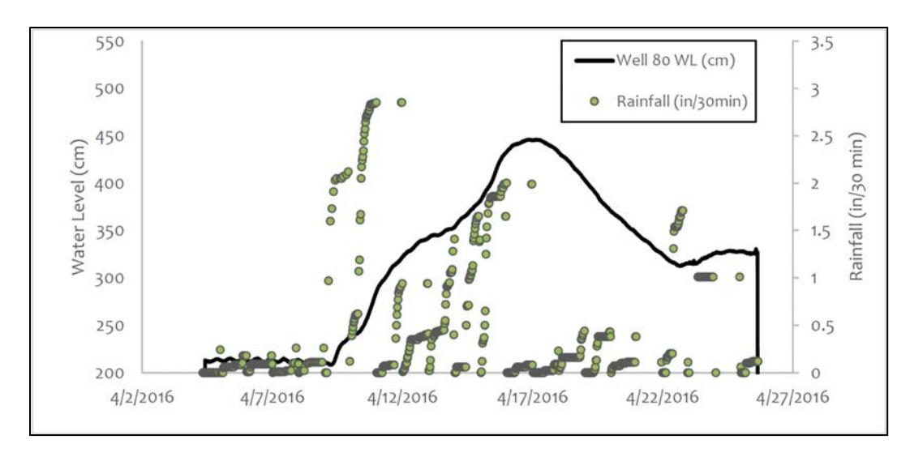

Figure 18. Water level (WL) and rainfall measurements taken over an extended period of heavy rainfall events from Lower Malaeloa monitoring Well 80. Monitoring was recorded at a WRRC weather station in Malaeimi Village.

#### **2.4.3 Specific Capacity**

In production wells where static and pumping water levels are available, the ratio of pump-rate to drawdown can be assessed. This measurement, known as specific capacity, is reported here in gallons per minute (GPM) per meter of drawdown. In general, higher specific capacities indicate better producing wells. While this parameter can indicate the productivity of a well, it is of limited use in describing aquifer characteristics, as drawdowns from both aquifer loss and the well loss (head loss resulting from attributes of well construction) are both included in water level measurements. Depending on the drilling and well construction methods, well loss can be, and often is, greater than aquifer loss. Measurements of specific capacity from past studies, ASPA records, and recently conducted University of Hawaii (UH) Water Resources Research Center (WRRC) tests shown in Figure 19, display expected regional variability. Specific capacity measurements on Tutuila indicate that in general, wells in the Tafuna-Leone Plain region yield more water per unit of drawdown then wells in other parts of the island.

## **2.4.4 Aquifer Transmissivity and Hydraulic Conductivity**

Transmissivity (*T*) and hydraulic conductivity (*K*) describe how fast water is able to move through saturated aquifer material over a given hydraulic gradient. These data are commonly gathered through constant-rate pumping, step-drawdown, and recovery tests when a new well is developed. The two parameters are related, *K* describes the rate of flow through a unit cross sectional area of aquifer, whereas *T* describes the rate of flow in regards to the entire thickness of the aquifer (*b*). This essentially means that *T* equals *K* times *b* (Freeze and Cherry 1979).

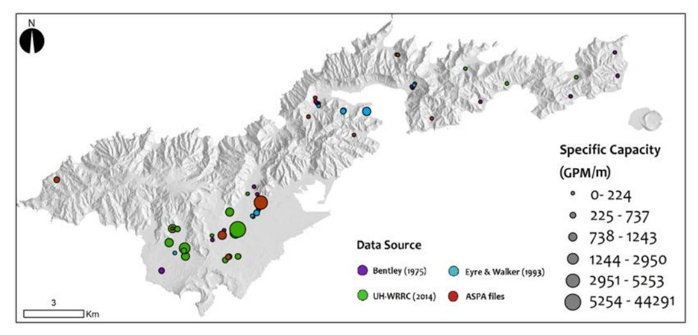

Source: Data from ASPA files (unpublished), Bentley (1975), Eyre and Walker (1993), and WRRC (2014).

Figure 19. Distribution and specific capacity values derived from historical records and tests conducted in 2014 by WRRC. Note: Colored circles = data source, circle size = specific capacity value (GPM/m).

To develop the most comprehensive estimates of aquifer parameters on Tutuila, all available pump test, step-drawdown, and recovery test data were compiled from USGS records (Bentley 1975, Eyre and Walker 1991), archived ASPA records, and the recently performed WRRC aquifer tests. Values of *T* and *K* from Bentley (1975) and Eyre and Walker (1991) are estimates derived from pump tests performed by USGS or from data recorded during well development testing, and their analytical methods are detailed in the aforementioned reports.

Different analytical methods were used to derive *T* and *K* estimates from an array of sources. Values of *K* from ASPA records and WRRC tests were obtained with the Jacob-Zangar Method (Zangar 1953, Jacob 1947). Pumping and recovery tests performed by WRRC in 2014 were analyzed with the Cooper-Jacob Straight-Line Method to obtain values of *T* (Halford and Kuniansky 2002). Since the thicknesses of Tutuila's aquifers are unknown, *T* values were converted to *K* values by assuming the effective thickness of the aquifer *b* is equal to the saturated length of the well (i.e., well depth minus depth to water or bottom of casing, whichever is deeper). Values of *T* reported in Bentley (1975), were converted to *K* values in the same way. It should be noted that these estimates are based on methods that have implicit assumptions such as isotropic and homogeneous aquifer conditions, wells are fully penetrating, aquifers have infinite areal extent, and well-losses are adequately represented by the second degree Jacob equation. Tutuila's wells seldom meet these ideal conditions. Nonetheless, these data represent the best available estimates for the range and magnitude of Tutuila's aquifer parameters.

Compiled aquifer parameter values of *K*, *T*, and specific capacity from all data sources are summarized in Table 7 and shown in Figure 20. The data is summarized with three different measures of central tendency, these being the arithmetic mean [*µ* = *E*(*x*)], the harmonic mean [1/*µ* = *E*(1/*x*)], and the geometric mean {ln(*µ*) = *E*[ln(*x*)]}, where *E* is the sum of individual values divided by the number of values. Considering the heterogeneous character of the Pleistocene aquifers, it is reasonable to assume that when characterizing *T* and *K* for the entire hydrologic unit, the best estimate of these parameters is probably represented by the harmonic or geometric means, rather than the arithmetic mean, of individual values from well tests (Eyre and Walker 1991).

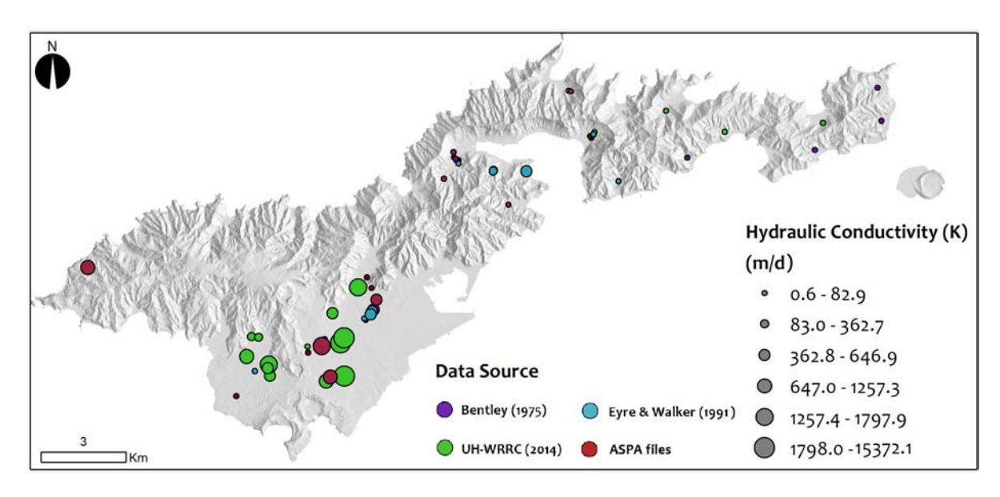

Figure 20. Distribution and magnitude of K values derived from ASPA records (unpublished) and tests conducted in 2014 by WRRC. Note: Colored circles = data source, circle size = K (m/d).

## **2.4.5 High Chloride Wells**

A number of Tutuila's wells produce water with levels of chloride (Cl- ) that exceed the U.S. Environmental Protection Agency (EPA) recommended limit of 250 mg/L. The salinity of a well on Tutuila will ultimately be a function of the well depth, pumping rate, hydraulic conductivity of the aquifer tapped, and the geometry of the well placement, specifically its proximity to the coast. Many of the higher salinity wells on Tutuila are located near to the coast (Fig. 21).

Table 7. Summary of aquifer and well production characteristics from existing wells on Tutuila from 1973 to 2014.

|                              | Number of Wells | MEAN       |           |          |  |
|------------------------------|-----------------|------------|-----------|----------|--|
| Hydrogeologic Unit           | (n)             | Arithmetic | Geometric | Harmonic |  |
| Specific Capacity (GPM/m)    |                 |            |           |          |  |
| Tafuna lavas                 | 20              | 2,882      | 228       | 12       |  |
| Leone lavas and ash          | 7               | 783        | 449       | 194      |  |
| Pyroclastics of Leone Series | 5               | 368        | 94        | 2        |  |
| Taputapu Shield              | 4               | 628        | 524       | 426      |  |
| Pago Outer-Caldera Shield    | 14              | 13         | 10        | 4        |  |
| Pago Inner-Caldera Shield    | 5               | 26         | 15        | 9        |  |
| Olomoana or Alofau shields   | 2               | 19         | 19        | 19       |  |
| Alluvial-fill valleys        | 10              | 309        | 32        | 4        |  |
| Transmissivity (m2 /d)    |                 |            |           |          |  |
| Tafuna lavas                 | 19              | 11,894     | 3,512     | 1,112    |  |
| Leone lavas and ash          | 5               | 4,782      | 3,379     | 1,584    |  |
| Pyroclastics of Leone Series | 3               | 3,882      | 3,070     | 2,369    |  |
| Taputapu Shield              | 5               | 7,791      | 5,984     | 5,002    |  |
| Pago Outer-Caldera Shield    | 12              | 176        | 124       | 73       |  |
| Pago Inner-Caldera Shield    | 4               | 210        | 129       | 85       |  |
| Olomoana or Alofau shields   | 2               | 181        | 110       | 66       |  |
| Alluvial-fill valleys        | 9               | 1          | 278       | 70       |  |
| Hydraulic Conductivity (m/d) |                 |            |           |          |  |
| Tafuna lavas                 | 13              | 7,652      | 708       | 98       |  |
| Leone lavas and ash          | 5               | 1,270      | 635       | 130      |  |
| Pyroclastics of Leone Series | 3               | 837        | 355       | 86       |  |
| Taputapu Shield              | 3               | 410        | 323       | 270      |  |
| Pago Outer-Caldera Shield    | 10              | 6          | 4         | 3        |  |
| Pago Inner-Caldera Shield    | 3               | 7          | 3         | 1        |  |
| Olomoana or Alofau Shields   | 1               | 9          | 9         | 9        |  |
| Alluvial-fill valleys        | 4               | 261        | 121       | 22       |  |

Sources: Bentley (1975), Eyre and Walker (1991), WRRC aquifer tests, and unpublished ASPA records.

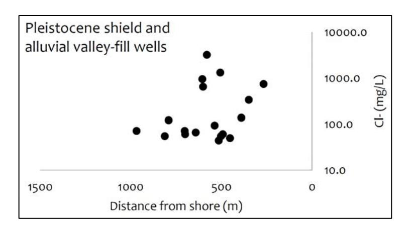

Figure 21. Graph showing correlation between Cl- concentration (mg/L) and distance of well from shore (for all wells located in Tutuila's Pleistocene shield alluvial valley-fill wells). Note: Distance from shore is not necessarily the primary factor that controls groundwater Cl- concentrations. Cl- measurements are from unpublished WRRC data.

Freshwater lens thickness is a primary consideration in setting well target depths when developing new groundwater sources. Although well depth is not the only factor controlling groundwater Cl- concentrations, an assessment of existing production wells in the Pleistocene rocks shows that only wells deeper than approximately -20 m are currently producing water with elevated Cl- levels (Fig. 22). However, it should be noted that any well below sea level has the potential to be affected by seawater if over-pumped. Although groundwater production below -20 m below sea level is not recommended, exploratory drilling below this depth would certainly be useful to assess the location of the saltwater-freshwater interface.

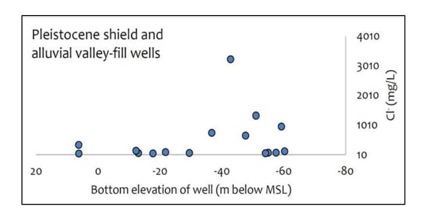

Figure 22. Graph showing correlation between Cl- concentrations (mg/L) and well depth (m below sea level) located in selected Pleistocene shield and alluvial valley-fill wells. Note: Well depth is not always the primary factor that controls Clconcentrations found in groundwater. Well depth is taken from various sources and is not confirmed. The Cl- measurements reported in our study are from unpublished WRRC data.

## **2.5 Numerically Modeled Values of Hydraulic Conductivity**

Another method for estimation of *K* values is through parameterization of numerical models that are calibrated with water level observations. This approach yields a regionally integrated estimate of *K*, as opposed to well tests that only provide point based data. Groundwater models use subsurface flow equations (essentially partial differential forms of Darcy's Law) and parameterize them with recharge rates, geographic geometry, well characteristics, and well flowrates. Generally, the most poorly constrained parameter (often *K*) is numerically solved for using a calibration process.

Two groundwater models of Tutuila have thus far been developed, and each used its own paradigm for parameterizing values of *K*. Izuka et al. (2007) measured elevations of the water table at wells and assumed locations of mountain springs. Values of *K* were then found through calibration so that the simulated water table elevations matched the observed and assumed data. For the older volcanic unit, this procedure yielded a calibrated *K* value of approximately 0.1 m/d. In contrast, the model developed by ASPA (2013) assumed that a measured estimate of *K*, based on an aquifer test and geologic conditions, was valid throughout all of the Pleistocene rocks. This value was used as an input parameter in the model, which was then solved for the water table elevation.

The Izuka et al. (2007) model focused on the Tafuna-Leone Plain region only, and used static water levels in six monitoring wells to determine modeled values of hydraulic conductivity (*K*) (Table 8), via model calibration. The Pleistocene rocks were modeled as a fully saturated homogeneous anisotropic system. The ASPA (2013) model on the other hand, utilized many of the parameters from the Izuka et al. (2007) model, but the Pleistocene rocks were assumed to contain both disconnected high-level groundwater (which was not explicitly simulated by the model) and basal groundwater. This alternate conceptual model for the older-volcanic region was represented in the model by a change in *Kh:Kv* and an increase in the *Kh* of the older volcanic unit by a factor of about 50, from the Izuka et al. (2007) model. Although the ASPA (2013) model's *Kh* value is a better match with the measured *K* values from the pump tests in the Pago Shield (1–7 m/d), it is significantly lower than pump-test values measured from the Taputapu Shield (270–410 m/d). Hence, both of these models may overestimate water levels, and underestimate the productivity of potential wells in the Taputapu Shield. The Izuka et al. (2007) and ASPA (2013) numerical models present fundamentally different conceptualizations of the flow of groundwater through the Pleistocene volcanics, but it remains unclear as to which is more representative of the actual conditions, as each model has both weaknesses and strengths.

Table 8. Comparison of numerical groundwater models for hydraulic conductivity in Tafuna-Leone Plain, Tutuila.

|       |             | ASPA MODEL  |             |  |
|-------|-------------|-------------|-------------|--|
| Kh:Kv | Kh (m/d) | Kh:Kv       | Kh (m/d) |  |
| 100:1 | 260.00      | 100:1       | 260.00      |  |
| 100:1 | 1,300.00    | 100:1       | 1,300.00    |  |
| 100:1 | 10.00       | 100:1       | 10.00       |  |
| 10:1  | 0.03        | 10:1        | 0.03        |  |
| 10:1  | 945.00      | 10:1        | 945.00      |  |
| 100:1 | 0.14        | 44:1        | 6.70        |  |
|       |             | IZUKA MODEL |             |  |

Sources: Izuka et al. (2007), ASPA (2013).

# **2.6 Recharge Estimates**

Tutuila's drinking water supply is primarily derived from groundwater, which is fed by the infiltration of rainfall into the land. The water reaching the saturated zone is termed groundwater recharge. In general, the spatial distribution of recharge on Tutuila follows a similar pattern to that of the rainfall, where higher elevations contribute more water to the subsurface than lower elevations. Available recharge estimates indicate the eastern region of the island receives significantly lower amounts of recharge than the western region. The recharge on the Tafuna-Leone Plain is enhanced by the process of Mountain Front Recharge (MFR), where surface water from mountain streams above the plain infiltrates into the streambed once it reaches a more permeable geologic substrate. This process is analogous to the MFR frequently observed in arid climates (Wilson and Guan 2004). Most precipitation falling directly on the Tafuna-Leone Plain soaks in before it has a chance to runoff due to the high permeability of the Holocene-age lavas. There are only a few well developed stream channels on the plain and no perennial streams (Izuka et al. 2007). In contrast, the older volcanic shields that lie above the plain have much lower permeabilities and contain perennial streams and springs that drain to the sea or terminate at the Tafuna-Leone Plain. The actual point of infiltration of each losing stream varies depending on the stream discharge rate and occurs within an MFR zone (Perreault 2010). This process is primarily significant in the Tafuna-Leone Plain where low-permeability rocks are positioned directly above and adjacent to high-permeability rock, although it has also been observed to a limited extent in the alluvial-fill valleys.

Recharge is often calculated with a water-balance/budget model of some sort. These models generally calculate groundwater recharge as a residual term after other water budget components are subtracted from a measured amount of precipitation (Fig. 23). In the most simplified model, Thornthwaite and Mather (1955) stipulated that:

RECHARGE = RAINFALL – RUNOFF – ACTUAL EVAPOTRANSPIRATION

Although simple in theory, some site specific complications add uncertainty to recharge estimates. During periods when rainfall and soil moisture storage are not sufficient to supply the demands of plants, actual evapotranspiration (*AET*) is less than the potential evapotranspiration (*PET)* that is generally measured. However, on Tutuila, Perreault (2010) determined that *AET* is generally about 92 % of *PET*. Of the recharge estimates presented in this study, only the Izuka et al. (2007) model accounts for the difference between *AET* and *PET*. Also, runoff cannot be directly constrained for every basin as Tutuila has over 140 perennial streams. Thus these recharge estimates all use runoff to rainfall ratios based on measurements in gaged basins to estimate the runoff on ungauged streams. Other factors that add uncertainty to groundwater recharge estimates on Tutuila are strong spatial and temporal gradients in precipitation, runoff, or evapotranspiration, and anthropogenic effects such as addition from on-site wastewater disposal systems and leaking water delivery lines (≈50– 70% of Tutuila's municipal water is lost because of leaks).

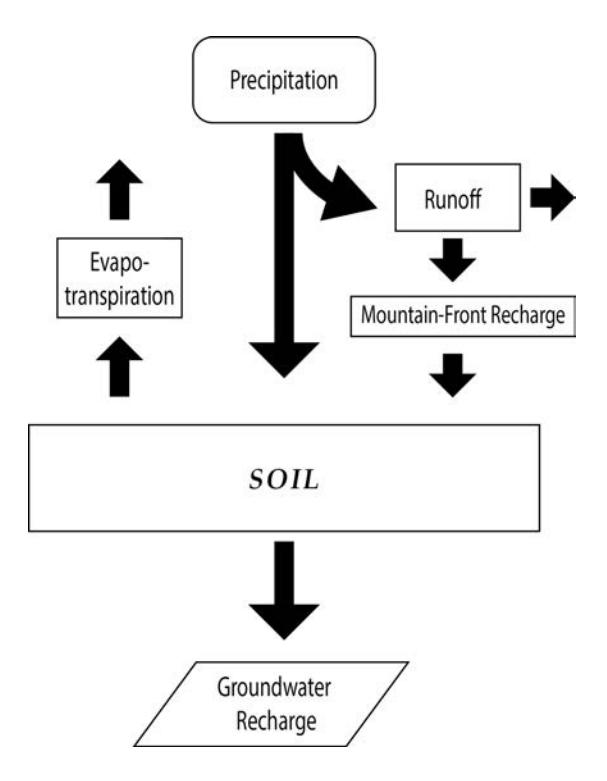

Figure 23. Schematic of a water balance model used to calculate Tutuila's groundwater recharge.

At present, there are three known existing recharge estimates for Tutuila developed by Eyre and Walker (1991), Izuka et al. (2007), and ASPA (2013). These estimates incorporated only basic hydrologic variables, including precipitation, evapotranspiration, MFR, and runoff to inform recharge calculations. Methods of calculation and input datasets used vary between each study and are fully described in their respective papers. The Izuka et al. (2007) coverage was focused only on the Tafuna-Leone Plain region, therefore Eastern Tutuila was excluded

from its result. Recharge calculations made by Izuka et al. (2007) and ASPA (2013) were provided in the form of recharge depth over an area in vector polygon and raster formats, respectively; whereas Eyre and Walker (1991) calculated recharge with a basin total volume approach. For comparison, each estimate was converted to a region standardized format based on the boundaries of twelve geographic regions defined by the surface expressions of inferred subsurface geologic features such as rift zones or dense trachyte plugs. Regional recharge volume was calculated as the sum of recharge in cells, polygons, or basins (or fraction thereof) that intersected or fell within each regional unit's boundaries. This produced maps of regional total recharge in million gallons per day (Mgal/day) for each of the three documented recharge estimates (Fig. 24).

It should also be noted that the use of this method does not imply that groundwater availability within each geographic region is limited to the calculated recharge amount. Groundwater flow is not constrained by topographic boundaries, and wells on Tutuila potentially draw water from other regions or topographic basins. Nonetheless, the total amount of sustainably developable groundwater on any island is fundamentally limited by the rate of groundwater recharge available to developable areas. Total groundwater withdrawals must always remain as a fraction of total recharge to maintain a buffer against seawater encroachment. The magnitude of this fraction will be dependent on local hydrogeologic conditions and the efficiency of well design.

## **2.7 High-Level Spring Occurrence and Geochemistry**

The existence of Tutuila's high-level groundwater is clearly indicated by the occurrence of perennial streams and springs throughout upper elevations on Tutuila. Davis (1963), Eyre and Walker (1991), and Izuka et al. (2007) noted that streamflow from the Pleistocene age volcanic rocks is generally fed by numerous and dispersed springs with lowflow rates. Davis (1963) describes high-level seepage zones that release small volumes of water, often along a lineation of some sort, and often with flow rates so low that they easily escape detection when seeping out under soil or thick vegetation. These observations imply high-level reservoirs in the Pleistocene volcanic rocks are dispersed, and may only contain insignificant quantities of water. Nonetheless, additional documentation of a few notable high-flow springs throughout the island suggests that some of these reservoirs may be larger than others. Locations of perennial high-level springs and streamflow characteristics may provide clues for assessing the significance of an area's high-level water supply. Springs with exceptional flow rates were often documented in reports because of their historical use in village or U.S. Navy water systems. Prior to groundwater development in the 1970s, surface water supplies were the primary source of drinking water on the island. A spring with a high flowrate suggests that the subsurface source reservoir contains significant storage or that the recharge area for the reservoir is extensive.

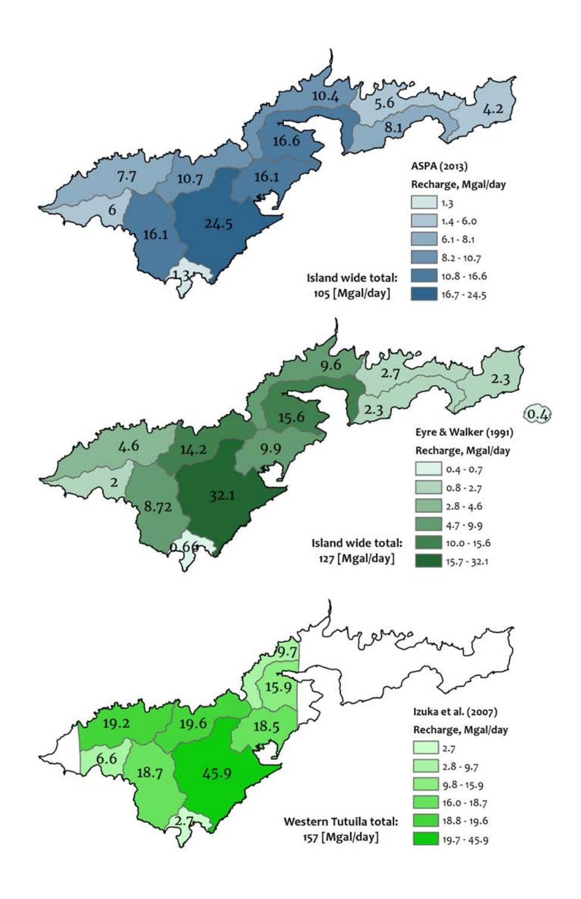

Figure 24. Comparison of three recharge estimates by Eyre and Walker (1991), Izuka et al. (2007), and ASPA (2013). Each estimate was converted to a region standardized format. Note: Izuka et al. did not calculate recharge for Eastern and far Western Tutuila.

A major limitation for the development of high-level groundwater is the nature of Tutuila's Pleistocene aquifers, which are not well understood. Typically in volcanic island environments, structures such as dikes, faults, or aerially extensive perching layers are thought to control the locations and size of the larger pockets of high-level water. However, it is also possible due to the high and frequent rainfall (up to 5,700 mm/yr [200 in./yr]) in the island's interior, that instead of being fed by structurally controlled aquifers contained in bedrock, some high-level springs and streams may be fed by lateral flow from reservoirs consisting of continually wetted soil. To estimate the residence time of water in the subsurface, and therefore better constrain the magnitude of storage, a number of environmental tracers can be applied.

Assessments of water-isotope (δ2 H and δ18O) compositions in precipitation and groundwater have been widely used in tropical island environments to assess recharge source, elevation, or timing. (Scholl et al. 2002, Rhodes et al. 2006, Fackrell 2016). On Tutuila, a strong seasonal trend in precipitation δ2 H and δ18O values has been observed (Fig. 25A) (Shuler et al. (2017). Because of this predictable seasonal variation, the isotopic composition of surface or groundwaters can indicate how recently their source was recharged. Recently infiltrated water moving to streams via lateral-flow would be expected to show an isotopic signature that matches that of recent precipitation. On the other hand, groundwater from an extensive aquifer would be expected to have a longer subsurface residence time and show an isotopic signature that integrates or averages the isotopic composition of precipitation events over multiple seasons. To test this hypothesis, six production wells throughout the island (ASPA wells 33, 84, 89, 93, 128, and 179) were sampled on a monthly basis and precipitation was collected at four well sites over a period of three years. Rainfall was collected in cumulative precipitation collectors (CPCs) following the design used in Scholl et al. (1996). Samples were collected in 20 ml glass vials with no headspace and analyzed for δ18O and δ2 H of water in a Picarro brand Cavity Ring-Down Spectrometer (L1102-i Isotopic Liquid Water Analyzer) at the University of Hawaii Stable Isotope Biogeochemistry Lab. Water isotope values reported in this study are in per mil (‰) notation relative to the international water isotope standard of VSMOW.

This assessment showed that the average annual δ2 H and δ18O values in groundwater from all the wells were -4.25‰ and -20.01‰, respectively. This isotopic signature is quite close to the annual volume weighted average for δ2 H and δ18O values measured at all precipitation collectors (-4.87‰ and -25.01‰, respectively). Additionally, numerous samples of high-level groundwater at upland springs, and baseflow from streams throughout the island were collected over the period spanning from 2013 to 2018. Water isotopes from these springs and streams were plotted against observed isotope values in precipitation and groundwater (Fig. 25B). In general, the isotopic composition of springs and streams more closely resembled the average annual composition of groundwater than precipitation during the month in which they were taken. This result suggests that the sampled springs and streams, for the most part, originate from groundwater sources having multi-season residence times.

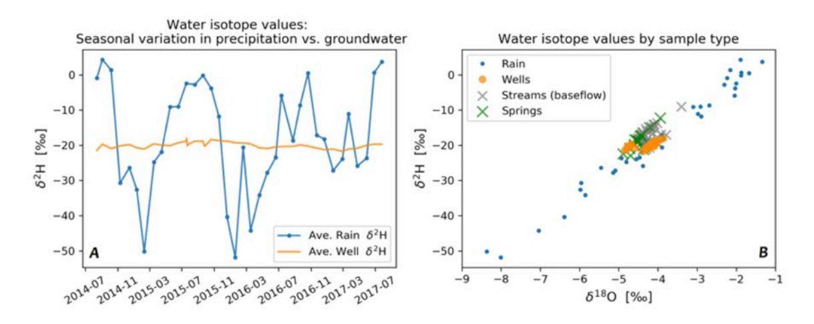

Figure 25. Water isotope graphs comparing: precipitation and groundwater, and water isotope values by sample type. A) Monthly average water isotope values in rainfall measured with precipitation collectors (blue line) and monthly average water isotope values in groundwater measured at six production wells located throughout Tutuila (orange line) over a 3-year period. B) Values of  $\delta^2H$  plotted against  $\delta^{18}O$  values in precipitation (blue dots) well waters (orange dots), high-level springs (green crosses), and stream baseflow samples (grey crosses). Waters from different sources will plot in different regions of the graph.

Another useful tracer for determining residence time of groundwater is the noble gas radon-222 (222Rn). Radon has a short half-life (3.8 days), is produced underground by geologic material, and reaches an equilibrium concentration in groundwater after about 15 days (Snow and Spalding 1997). Radon quickly escapes to the atmosphere when water is exposed on the surface, thus its presence in spring or stream waters indicates these waters were recently discharged from an aquifer. In addition, recently recharged—and subsequently discharged—subsurface water will not have substantial 222Rn concentrations because it may take up to two weeks for 222Rn to reach equilibrium levels. Many springs and streams sampled for water isotopes were also sampled for 222Rn. Radon grab samples were collected in 250-ml glass bottles and analyzed with a RAD7 radon detector and RAD H2O water analyzer, both manufactured by Durridge Inc. Because of 222Rn's short half-life, grab sample values were corrected for radioactive decay between collection and analysis. From 2013 to 2018, over 150 samples from Tutuila production wells were collected and analyzed for 222Rn. Although 222Rn concentrations were variable throughout different parts of the island, the arithmetic mean of all well water samples was 250.2 dpm/L, and the median was 160 dpm/L. In spring waters, 222Rn concentrations fell into two distinct groups, those with concentrations below 15 dpm/L and those with concentrations above 80 dpm/L. Springs that fall into the latter group likely originated from a groundwater source with a residence time exceeding rain-event timescales.

Springs located during WRRC field expeditions that showed high (> 80 dpm/L)  $^{222}$ Rn concentrations and  $\delta^2$ H and  $\delta^{18}$ O signatures matching average annual groundwater values are presented in Table 9 and Figure 26, along with locations and anecdotal information about

'exceptional'springs documented in Davis (1963), Bentley (1975), Eyre and Walker (1991), and Burger (1981). It should be noted that the spring locations sampled through these efforts do not constitute a comprehensive, or necessarily representative assessment of all areas on Tutuila. Due to the difficulty in accessing mountain springs located on steep and overgrown terrain, the sites presented in this study are probably a small subset of the full population of springs that exist in Tutuila's Pleistocene shields. It should also be understood that any water development in high-level reservoirs areas will most likely result in reduction of spring and associated streamflow. Such actions have consequences for aquatic ecosystems as well as for the residents who rely on village water systems that are dependent on springs. These consequences should be fully assessed prior to the development of groundwater near significant springs.

## **2.8 Streamflow Analysis**

Streamflow statistics such as variation in flow, baseflow quantity, and runoff to rainfall ratios between different basins can indicate aquifer parameters; primarily the ability of the rocks in a basin to store and then slowly release water. Aquifers with higher water holding capacities will generally retain more precipitation as recharge, and streams in these basins will discharge a higher proportion of their total flow as baseflow, as opposed to direct runoff. Extensive stream gauging on Tutuila was performed by the USGS between the 1950s and 2008. The data from this effort remains a significant asset to the understanding of American Samoa's hydrology. A summary of Tutuila's streamflow data and an analysis of low-flow characteristics are given by Wong (1996). Wong (1996) compiled the analyses for 83 streams and tributaries in 63 basins or sub-basins. These included statistics regarding low flows at various recurrence intervals, mean and median flows, drainage basin characteristics, and variation in baseflow. Of particular interest to this work is Wong's Baseflow Index (BFI), which is described in detail below. Continuous flow measurements were collected at eleven of the USGS stations and the data were run through a baseflow separation analysis by Perreault (2010). Station locations are shown in Figure 27.

Table 9. Geochemical data and details for notable springs.

| Spring No. | Data Source    | 22Rn (dpm/L)                                                  | δ18O (‰) | δ 2 H (‰) |
|------------|----------------|---------------------------------------------------------------|----------|--------------|
| 1          | WRRC           | 134                                                           | -4.37    | -21.20       |
| 2          | WRRC           | 209                                                           | -4.55    | -18.51       |
| 3          | WRRC           | 485                                                           | -4.72    | -20.90       |
| 4          | WRRC           | 291                                                           | -4.60    | -19.81       |
| 5          | WRRC           | 266                                                           | -4.50    | -18.88       |
| 6          | WRRC           | 133                                                           | -4.89    | -22.41       |
| 7          | WRRC           | 164                                                           | -4.59    | -18.39       |
| 8          | WRRC           | 559                                                           | -4.43    | -17.40       |
| 9          | WRRC           | 89                                                            | -4.21    | -14.99       |
| 10         | WRRC           | 266                                                           | -4.01    | -19.44       |
| Spring No. | Data Source    | Notes                                                         |          |              |
| 11         | WRRC           | High volume, used for Tuna Cannery supply                     |          |              |
| 12         | WRRC           | Dike impounded, significant flow rate, tapped by local family |          |              |
| 13         | WRRC           | Significant seepage from quarry face                          |          |              |
| 14         | WRRC           | Significant discharge from pyroclastic ridge                  |          |              |
| 15         | Davis (1963)   | Documented on map                                             |          |              |
| 16         | Davis (1963)   | Documented on map                                             |          |              |
| 17         | Davis (1963)   | Flow rate of a few gallons per minute                         |          |              |
| 18         | Davis (1963)   | Documented on map                                             |          |              |
| 19         | Davis (1963)   | Developed tunnel, flow rate of 5 GPM                          |          |              |
| 20         | Davis (1963)   | Documented on map                                             |          |              |
| 21         | Davis (1963)   | Two springs noted with combined flow rate of 20 GPM           |          |              |
| 22         | Davis (1963)   | Davis notes as exceptional, estimated flow rate of 350 GPM    |          |              |
| 23         | Bentley (1975) | Flow rate of 50 to 150 GPM, flow in dry season may be halved  |          |              |
| 24         | Bentley (1975) | Flow rate of 50 to 150 GPM, flow in dry season may be halved  |          |              |
| 25         | Burger (1981)  | Mapped due to biological significance                         |          |              |
| 26         | Burger (1981)  | Mapped due to biological significance                         |          |              |
| 27         | Burger (1981)  | Mapped due to biological significance                         |          |              |
| 28         | Burger (1981)  | Mapped due to biological significance                         |          |              |
| 29         | Burger (1981)  | Mapped due to biological significance                         |          |              |
|            |                | Mapped due to biological significance                         |          |              |

Sources: WRRC, Davis (1963), Bentley (1975), Burger (1981).

Note: See Figure 26 for map with spring locations.

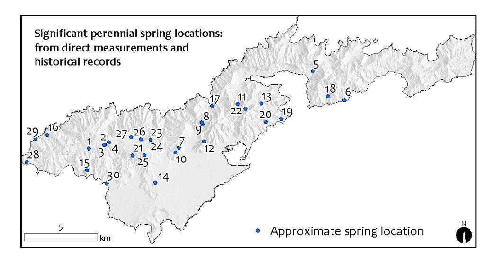

Figure 26. Location of documented and/or observed freshwater springs. Each may have significant flow rates or are sourced from groundwater reservoirs with significant residence times (see Table 9 for available spring geochemical data and details).

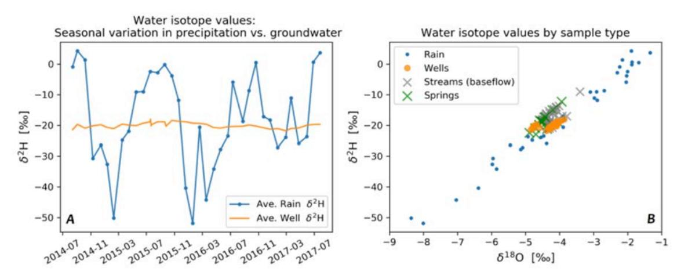

Source: Streamflow data and low-flow characteristics analyses from Wong (1996).

Figure 27. Location of continuous and partial-record streamflow gauging stations maintained and reported by USGS. Note: Continuous record stations = green dots, stations with upgradient watershed areas = blue patches, and % = station's ratio of average baseflow by average flow as determined by Perreault's (2010) baseflow separation analysis.

Streamflow is often broken into two basic components—baseflow and runoff. The runoff component is defined as the portion of streamflow that reaches the stream via overland flow or through inner-event lateral flow, and primarily occurs during heavy rains. Baseflow, on the other hand, originates from a groundwater aquifer and is discharged consistently to the stream at all times, during and between rainfall events. Also note that lateral flow, which is defined as water that reaches streams via lateral (across bedding) movement through soil

layers, is sometimes classified in either of the aforementioned categories depending on separation methods because it shares characteristics of both runoff and baseflow. Most lateral flow occurs during or shortly after rainfall events and is thus often grouped with surface runoff. In American Samoa, rainfall is generally heavy, the land is steep, and streams are short. These conditions create short-lived runoff events. However, the majority of the time baseflow or slower moving lateral flow supplies the water that sustains streamflow in Tutuila's drainages. Based on data from Perreault (2010), the eleven analyzed drainages discharged (on average) 33% of their flow as baseflow and 66% as runoff.

In Hawaii, stream baseflow is equivalent to a flow value that falls within a range of the *Q*60 and *Q*80 exceedance values (Bassiouni and Oki 2013). These values are defined as the stream discharge (*Q*) that is met or exceeded 60% of the time (*Q*60) or 80% of the time (*Q*80). Although Wong (1996) did not calculate values for true baseflow in Tutuila's streams, median flows (*Q*50) were reported. Comparison of the *Q*50 reported by Wong, to average baseflows as reported by Perreault (2010) for each of the continuous record sites shows that the ratio of median flow to baseflow is about 1.4. Thus *Q*50 (Wong 1996) averages about 40% higher than the stream's mean baseflow discharge. With appropriate scaling (multiplying by 0.72), median flows can be used to approximate the relative differences in baseflow characteristics between streams, assuming the runoff to rainfall ratios are fairly stable across the watersheds.

A BFI calculated by Wong (1996), was reported for each gauged stream on Tutuila. This measurement is essentially a stream's *Q*90 value standardized by its basin size and indexed to the closest continuous record station. Despite the fact that the *Q*90 does not explicitly represent the mean baseflow value, Wong's BFI is nonetheless a useful relative indicator of the magnitude of groundwater discharge in each stream. The locations of stream gauges and the BFI of each gauged basin are shown in Figure 28. The BFI for streams in the Taputapu area are clearly higher than those in the eastern portion of the island, probably because of the addition of the discharge from the many springs that issue from the cinder cap at Aoloau Mountain (Wong 1996). Overall, there are a number of basins whose median flows and BFIs suggest that more substantial aquifers may contribute a larger proportion of groundwater to the stream flow. These basins are shown in Figure 27 and include watersheds in the Taputapu Shield region, above the Tafuna-Leone Plain, in Nuuuli, and also around Rainmaker Mountain (Pioa Plug). Eastern Tutuila has less overall baseflow, and generally shows lower stream BFIs, indicating a lower potential for productive and sustainable highlevel aquifers.

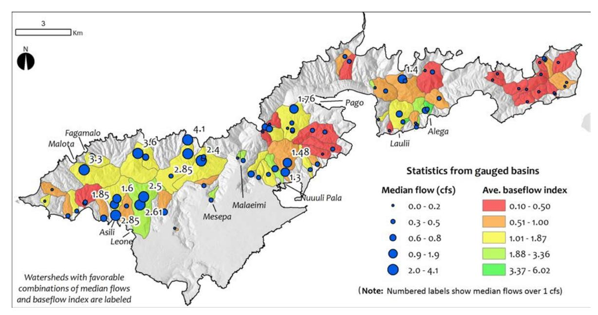

Source: Median flow from Wong (1996), and average baseflow index from Wong (1996). Note: Basins with median flows and BFIs that contribute to a larger portion of groundwater to stream flow are labeled in the map.

Figure 28. Illustration of low-flow characteristics for streams in Tutuila.

# **3.0 UPDATES TO THE CONCEPTUAL HYDROGEOLOGIC MODEL**

# **3.1 Conceptual Model of Subsurface Flow through a Complex Volcanic Island**

In classic island hydrogeologic discussions, groundwater bodies are often simplified into two types (basal groundwater and high-level groundwater), which itself is often divided into perched waters, dike-impounded waters, or elevated-basal waters (Fig. 29). Basal groundwater refers to a lens shaped freshwater body that floats on saltwater within saturated rock. The height of the freshwater table is primarily controlled by the hydraulic conductivity (*K*) of the geologic formation and the area's recharge rate. If other parameters are constant, higher values of *K* will result in a lower water table and thus a thinner lens, and higher recharge rates will contribute to a thicker lens and vice versa. High-level groundwater refers to reservoirs of water that are supported by structural features such as dikes, perching horizons, or faults. If properly oriented, these structures can support or retain pockets of freshwater at elevations that are discontinuous from the basal water system. Since high-level groundwater is separated from underlying saltwater, it is not affected by salinization, and its elevation reduces the risk of anthropogenic contamination.

Subsurface structures within volcanic shields are complex and heterogeneous. Observations of many different geologic features throughout Tutuila suggest that multiple types of groundwater bodies likely accumulate and flow within the islands subsurface. All of Tutuila's groundwater ultimately originates as rain water, and as it percolates down through the soil, a portion is laterally diverted to streams or springs when it encounters lesspermeable bedrock. The water that is not lost to soil evapotranspiration then infiltrates into the bedrock and becomes recharge where it follows a tortuous path encountering the variable permeability fabric of the volcanic shields. Where horizontally extensive low-permeability layers, such as massive lava flows or ash beds are present, some of the recharge may contribute to perched water bodies that accumulate upon or within these layers. The presence of vertically oriented dikes on Tutuila creates low permeability structures that impede the flow of groundwater. Therefore, widely spaced dikes may form compartments that impound some groundwater. Once high-elevation reservoirs are saturated, the water that does not slowly seep downward through barriers will move laterally atop less permeable features until it either encounters more permeable material and continues downwards, or discharges to the surface as a high-level spring or stream baseflow. Eventually the remaining recharge percolates to an elevation where it begins to accumulate on top of the underlying seawater in saturated rock and thus supplies the basal-freshwater lens.

The existence of high-level groundwater on Tutuila is clearly indicated by the occurrence of perennial streams and springs throughout upper elevations. However, the extent and location of these reservoirs are difficult to constrain, and it is likely that many reservoirs are small. Previous investigations observed that streamflow from the Pleistocene age volcanic rocks is generally fed by numerous and dispersed springs with low flow rates (Davis 1963, Eyre and Walker 1991, and Izuka et al. 2007). Davis (1963) describes highlevel seepage zones that release small volumes of water, often along a geologic lineation of some sort and often with flow rates so low that they easily escape detection when seeping out from under soil or thick vegetation.

The Hawaiian conceptual model (Takasaki and Mink 1985, Lau and Mink 2006), envisions basal and high-level groundwaters as separate systems, with basal water collecting in higher- permeability rocks and high-level water being impounded by low-permeability structures. While flow from high-level water can recharge the basal system in the Hawaiian conceptual model, pumping from the basal system will not affect high-level water bodies. On the other hand, the Canary Island model (Join et al. 2016), conceptualizes elevated and basal groundwater to be hydraulically connected as a single system contained in a generally lowpermeability rock matrix, and thus pumping of basal groundwater affects high-level heads. Both of these conceptual models have been implemented to develop numerical groundwater models of Tutuila in the past, as mentioned above in Section 2.5. Izuka et al. (2007) developed a model fundamentally reliant on the assumption that groundwater in the Pleistocene rocks was best represented as a fully-saturated vertically extensive groundwater body, similar to the Canary Island model. Izuka et al. (2007) assumed elevations of highlevel springs were representative of the regional water table and set *K* values for the model to create simulated water table elevations that produced these high water levels. In contrast, a numerical model developed by ASPA (2013) used a much higher estimate of *K* (based on

aquifer test results) for the Pleistocene rocks. This choice implied the developer considered the Hawaiian conceptual model to be more representative of Tutuila's Pleistocene unit. The ASPA model also stipulated that modeled water table elevations, which only reached about 5 m in elevation above sea level, represented only the basal mode of the saturated zone and that streamflow is supplied by perched water bodies that exist above this elevation (but are ignored in the model).

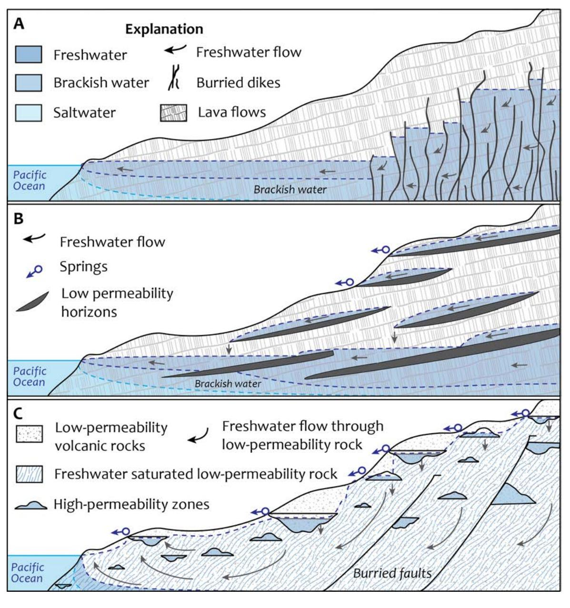

Figure 29. Three conceptual high-level groundwater models controlled by different types of waterimpounding geologic structures. A) Dike-impounded groundwater based on a Hawaiian model described in Gingerich and Oki (2000). B) Small perched aquifers within lava flows described in Miller et al. (1997). C) Complex geologic system within the Canary Islands model including buried cinder cones, faults or paleovalleys as described in Join et al. (2016) and Lachassagne et al. (2014).

Despite the stark differences in these conceptualizations, the existing hydrogeological data seems to indicate that in reality, the island's heterogeneous geology creates a complex distribution of perched, impounded, and fully saturated basal water bodies throughout the island. Therefore, the Hawaiian and Canary Island conceptual models may not be completely exclusive of each other, and each may be applicable in different parts of Tutuila. The key factor determining the appropriateness of either model likely relates to how prevalent highpermeability zones are, and how hydraulically connected these zones are with each other and the main (basal) water body.

Considering the above, it may be most useful to conceptualize Tutuila's subsurface on a regional scale as a bi-modal system containing higher-conductivity water bearing zones or 'pockets' interspersed within a matrix of fairly prevalent lower-conductivity barriers (Fig. 30). The hydraulic properties of the bulk material would then be dependent on the proportion of each material type and the interconnectivity between more-conductive zones. If the interconnectivity between high-permeability pockets is good, then the overall conductivity of the system would be controlled by the hydraulic conductivity of the more permeable zones. However, if less-permeable material is prevalent and reduces or eliminates connectivity between permeable zones, then the overall conductivity of the system will be controlled by the *K* value of the less-permeable material. A pumping test can provide information on the properties of the localized pocket where the well is developed. However, on Tutuila these tests have typically not been conducted for long enough periods to provide information about larger scale interconnectivity between different water bearing zones. Thus, long-duration observations of water levels may provide a better way to assess the degree of connectivity between the local water-bearing formation and the regional aquifer. Although available datasets suggest there are hydraulic discontinuities within the heterogeneous permeability fabric of the older shields, there are few places on Tutuila where enough data exists to conclusively characterize the local conceptual hydrogeologic model. These areas include the Tafuna and Leone plains, but not the Pyroclastics between them, Malaeimi Valley, and some but not all of the small alluvial-fill aquifers in the Pleistocene valley mouths. In general, it is probably functionally sufficient from a modeling perspective, to consider the basal-lens within the Pleistocene rocks to have a continuous aerial extent. This simplification is subject to the caveat that the aquifer is still subject to varying degrees of hydraulic interruptions caused by low-permeability structures that, on a regional scale, serve to reduce the average hydraulic conductivity of the entire unit, and that a definitive hydraulic connection throughout the basal aquifer is possible but should not be assumed.

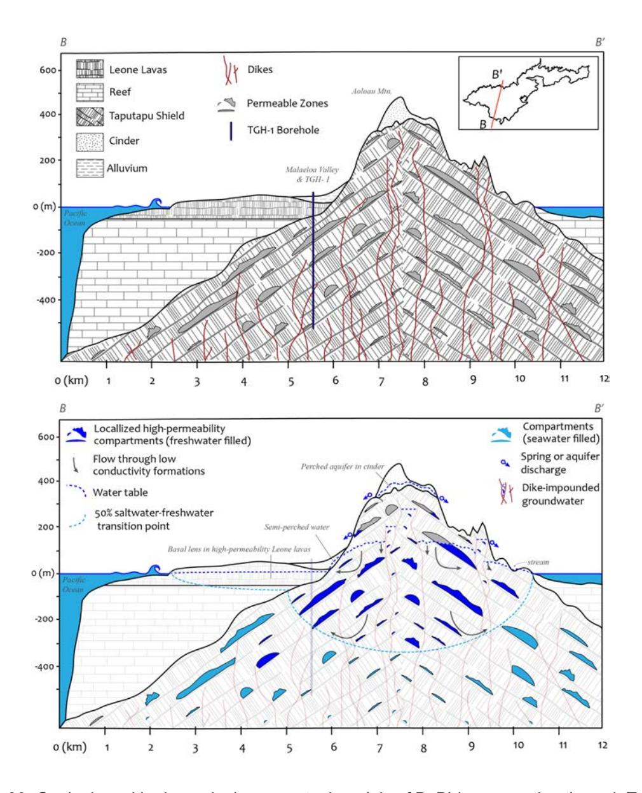

Figure 30. Geologic and hydrogeologic conceptual models of B–B' (cross section through Taputapu Shield, Aoloau Mountain, and Leone Plain). (top): Geologic cross section. Locations and elevations of subsurface contacts based on data from TGH-1 and inferred elsewhere. Locations of highpermeability pockets are inferred, and are representative of a conceptual heterogeneous permeability fabric of unknown extent and construction. (bottom): Hydrogeological model. Spring locations, water table elevations and transition zone midpoints are inferred. Note: Dike impounded water levels are shown to rise above the basal water table.

# **3.2 Groundwater Occurrence in Tutuila's Hydrogeologic Units**

#### **3.2.1 Holocene Leone Volcanics**

The young aquifers of the Tafuna-Leone Plain region are primarily composed of pahoehoe and a'a lava flows with localized interfingerings of ash beds and/or sedimentary carbonate layers. These materials sit above the weathered edifice of the Taputapu shield, though the degree of water movement between the Leone and Taputapu units is unknown.

Due to their young age and lack of weathering, the Leone Volcanic aquifers are generally very hydraulically conductive and hold a thin basal lens. A prevalence of fractures, clinker zones, and lava tubes provides a high secondary porosity to the region, making it favorable for groundwater development (Bentley 1975). However, these features also make the Tafuna-Leone plain susceptible to groundwater contamination (Kennedy et al. 1987). Currently, the 24 wells in the plain region produce about 70% of the island's municipal water (RCWW 2002). Wells in this area are generally designed to skim the top of the unconfined basal lens that floats (due to its lower density) on salt water within the saturated rock. Because the plain's geologic units are so conductive, the water table in the region is typically about 1 to 3 m above sea level (Izuka 1999b). The unsaturated zone above the water table is often less than 35 m deep, allowing only minimal travel time for contaminant attenuation. Within the plain there are three subregions, which can be distinguished into different hydrogeologic units: (1) the Tafuna Plain, (2) the Leone Plain, and (3) the Leone Pyroclastics. Each of these units probably has a large degree of heterogeneity, as shown by the quickly alternating sequences of variably textured lavas and different types of pyroclastic materials seen in cores from the two deep exploratory boreholes. Visual inspection of the borehole core shows the Leone Series rocks in TGH-1 (on the Leone side of the plain) generally has a higher proportion of volcanoclastics (ash and cinder) than is seen in TGH-3 (on the Tafuna side), though the materials in both boreholes are still predominantly basalts from lava flows.

#### **Tafuna Plain**

The structure of the Tafuna region has been described by Eyre and Walker (1991) as a lava delta (Walker 1991) formed as molten rock flowed from sub-areal vents downgradient via long tongues and subsurface tubes. The subsurface transport of the lava causes the exterior of the flow to dome and buckle and these forces create structures such as tumuli, lava rises, and lava tubes; when covered by successive flows it creates heterogeneity and preferential pathways for the movement of the water. When erupting, lava may flow over, around, or through topographic irregularities, which produces a heterogeneous subsurface distribution of less and more permeable zones. It should be noted that the Tafuna aquifer behaves as an unconfined aquifer, and the more permeable sections are probably still interconnected by fractures through the denser sections. The structural complexity of the Tafuna Lava Delta is enhanced by the fact that the lavas rest on the uneven topography of ancient buried ridges, valleys, pinnacles, and sedimentary basins of Taputapu's ancient erosional surface. Despite this heterogeneity, the water table in the Tafuna plain sits fairly uniform at about 1 to 2 m above sea level, and varies during drier or rainier periods.

#### **Leone Plain**

The Leone side of the plain is similar to the Tafuna side, though it contains more ash and pyroclastic material, blown westward by the southeasterly prevailing winds during explosive eruptions (Izuka et al. 2007). Extensive ash layers are observed in exposures on the Leone coast and in the borehole logs. These layers likely serve to reduce the vertical permeability of the unit, potentially causing portions of the basal-lens to be locally or partially confined, though no definitive measurements have been made to support this hypothesis. Nonetheless, aquifer test data does suggest that overall hydraulic conductivities are generally lower on the Leone side than on the Tafuna side, and the surface water contamination issues reported on the Tafuna Plain appear to be less prevalent on the Leone side (Kennedy et al. 1987). Water levels in the Leone Plain are similar to those on the Tafuna side and rise to about 3 m above sea level in wells near the Taputapu contact.

#### **Leone Series Pyroclastics**

The north-south trending ridge running down the center of the Tafuna-Leone Plain is comprised of ash and cinder cones. The ridge is considered to be a rift zone emanating from the rejuvenation stage of the Leone Series eruptions. A highly weathered rock outcrop found in a Futiga cinder quarry suggests the rift zone is underlain by at least one relic ridge of Taputapu rocks, mantled by Holocene age pyroclastic deposits and interbedded lava flows. The subsurface structure of the area has not been explored thoroughly, and there is only one well (Well 178) developed within the pyroclastic unit. This heterogeneous unit contains materials that range from highly-permeable unconsolidated cinder to nearly impermeable indurated tuff, which may have a wide range of hydraulic properties (Izuka et al. 2007). Based on information in Izuka et al. (2007) and a recovery test of Well 178, the overall permeability of the pyroclastics is probably near to or less than the Leone side of the plain. Since ash cones are primarily distributed in the southern portion of the ridge, and cinder cones are primarily found in the more northerly section, it may be reasonable to assume that the northern section has better water bearing properties. Also in the central section of this ridge a shallow valley is found, which may be remnant of paleo-ridgelines from the Taputapu Shield. This valley displays a subdued topography, suggesting it is filled with either alluvium, recent lavas, or pyroclastic material. Although there are no borehole logs in this region, recently conducted MT geophysics alludes to the presence of either perched groundwater or a fully saturated subsurface in this area.

#### **Malaeimi Valley**

Malaeimi Valley is a unique area on Tutuila. Its upper sections are carved from Pago Shield rocks, and its lower section was flooded (or potentially dammed) with basalts from the Tafuna lava delta. Currently, the interior of the valley has a flat bottom and is filled with alluvial material. Thus, wells in the valley could be tapping aquifers in lower-conductivity Pleistocene rocks, alluvial fill, or highly-conductive Tafuna lavas depending on their location and depth. Historically, water table elevations were seen to vary spatially and temporally, and large drawdowns in response to pumping were observed (Eyre and Walker 1991). Since less permeable Pleistocene rocks underlie more permeable alluvium or Tafuna lavas, there is the potential for a semi-perched groundwater system in this region. Meinzer (1923) describes

this condition as groundwater that is at least partially supported by underlying rock (as opposed to underlying seawater) but is still physically connected through a continuous zone of saturation to the main (basal) water body. This hypothesis is supported by observations of high drilling water levels with reasonably high *T* and *K* values in the upper Malaeimi wells that rapidly drop off further down the valley at the wells near the valley mouth. These high water levels were observed to be unstable and some declined rapidly when pumped. It remains unclear how hydraulically connected these saturated zones are to the underlying basal aquifer.

Another interesting feature of Malaeimi Valley is that it receives a significant amount of additional water from the process of mountain front recharge (MFR). Streams flowing off of the flanks of the less permeable Pago Shield rocks quickly infiltrate and add to the area's total recharge. This additional water increases the thickness of the basal lens in this area, as well as providing additional water supply for the lens downgradient from the MFR zone (Fig. 31). The elevated lens thickness in this area may act as a freshwater fence, not only reducing the potential for saltwater upconing in the MFR zone, but also for wells upgradient in the valley.

Although the hydrogeology of Malaeimi Valley is complex, this region has long been recognized as one that contains valuable water resource characteristics; due to the unique geology and relatively high recharge rate. Malaeimi Valley has been recognized as possessing all qualifications needed for designation as a "Special Management Area" under American Samoan Law, and its protection as a special management watershed would be a significant step forward in water resources management on Tutuila (Pedersen Planning Consultants 2004).

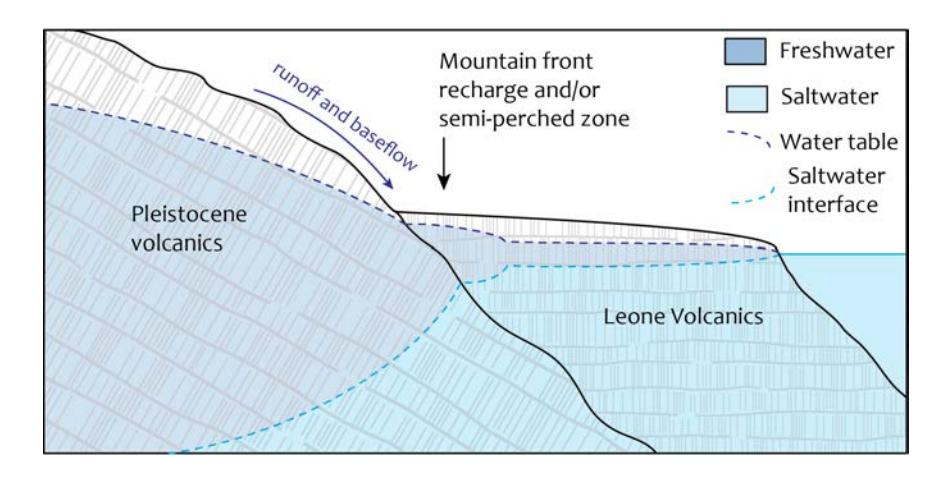

Figure 31. Diagram showing the interaction of the basal lens (in the mountain front recharge zone) at the margin of the less-permeable Taputapu Shield and the more-permeable Tafuna-Leone Plain.

#### **3.2.2 Groundwater Occurrence in Pleistocene Volcanic Shields**

The Pago, Taputapu, Alofau, and Olomoana shields make up what has been previously referred to as the Older-Volcanic Hydrogeologic Unit, the Pleistocene Unit, or the Low-Permeability Unit (Eyre 1994, Izuka et al. 2007). These shields are in a basic sense, constructed of gently dipping a'a lava flows organized as an alternating sequence of more permeable rubble zones and less permeable massive sections (see Section 2.2). This sequence is complicated by the presence of cross-cutting dikes, interbedded pyroclastic sections, clay rich paleohorizons, and products of mass wasting or caldera collapse that all serve to disrupt the continuity of the lava-flow structures. This complex geology may manifest hydrogeologically as a heterogeneous permeability fabric where variably sized compartments of high permeability rubble or cinders are adjacent to beds or tongues of massive lavas and other low permeability features that act as perching layers or barriers to water movement.

The shields likely contain both high-level and basal groundwater bodies. However, the basal supply probably makes up the majority of the developable groundwater in this unit. Some existing wells in the Pleistocene rocks register elevated water levels, some of which when pumped, are subject to high drawdown. These high drawdowns could be caused by overall low hydraulic conductivities (if a purely basal system was tapped) or by limitations in the aquifer extent. Previous workers have generally classified Tutuila's older shields into a single hydrogeologic unit with uniform properties. However, recent observations are beginning to provide sufficient data to characterize the region into separate hydrogeologic units.

## **Pago Shield**

The Pago Shield itself has two distinctive geologic units, the Inner-Caldera and the Outer-Caldera. The Outer-Caldera Unit contains thin and thickly bedded a'a lava flows, numerous dikes, vitric tuff beds, and potentially buried cinder beds; the Inner-Caldera Unit is composed primarily of ponded basalts, trachyte plugs and flows, as well as a relatively high fraction of volcaniclastics, brecias, and other products of mass wasting (Stearns 1944, Knight 2014). Both of these units contain numerous dikes and are thought to impound small quantities of high-level water behind these barriers (Keating and Bolton 1992). In general, the composition and structure of the Outer-Caldera Unit suggests that it has better water transmitting properties than the Inner-Caldera Unit (Shuler et al. 2014). However, the available hydrological data does not show a clear difference in the performance of wells drilled in either unit, which is probably due to local scale heterogeneities.

#### **Taputapu Shield**

Measured aquifer parameters and geologic information suggests that the Taputapu Shield may have a greater water development potential and higher average *K* values than the island's other shields. This hypothesis is supported by the following:

1. A limited number of recent aquifer tests show specific capacities and *K* values that

- are significantly higher than those measured in the other shields (Table 7).
- 2. The Taputapu Shield may have experienced less erosion and mass wasting, which are processes that serve to reduce connectivity between permeable zones. This is supported by the observations that it is younger (Tarling 1965, McDougall 1985), and has a lower average slope (22°) then the Pago Shield (28°) (Fig. 32).

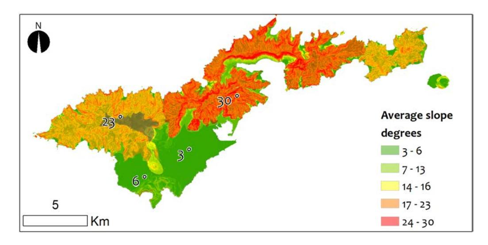

Figure 32. Average slope (°) of geologic units. Note: The Taputapu Shield slope (23°) excludes the subdued topography region covered by Holocene Aoloaou cinders (shown in grey).

- 3. McDougall (1985) hypothesizes that Taputapu and Olomoana are satellite shields of the main Pago Volcano, and therefore should have more high permeability flank lavas and less low permeability caldera related features (e.g., intrusives, ponded lavas, hydrothermal alteration). This is supported by gravity anomalies as measured by Machesky (1965). These show a clear maxima (290 mGal) above the Pago Shield (Fig. 32), suggesting the Pago unit contains more impermeable intrusive bodies, such as dike complexes or solidified magma chambers.
- 4. The inferred dike intensities as measured by Walker and Eyre (1995) and the locations of measured dikes by Stearns (1944) (Fig. 33) suggests a greater density of impermeable intrusive bodies in the Pago Shield.

Despite this evidence, the Taputapu Shield is nonetheless a large heterogeneous region, and more extensive aquifer testing should be performed to validate this hypothesis for specific areas.

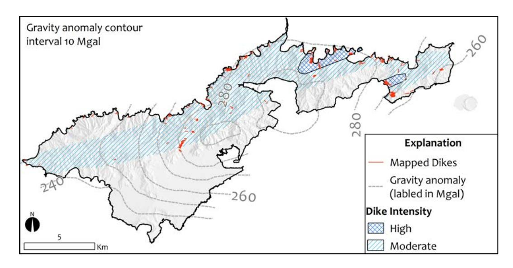

Figure 33. Geophysical and surface-mapping data showing inferred density of intrusive structures throughout Tutuila. Dike-complex areas (cross-hatching) and zones of moderate dike intensity (diagonal lines) are from Walker and Eyre (1995). Bouguer gravity anomaly measured by Machesky (1965) shows denser material nearer to the Pago Caldera, and locations of mapped dikes in outcrops are from Stearns (1944).

## **3.2.3 Perched or Dike Impounded Aquifer at Aoloau**

The 4.1 km2 summit area at Aoloau is blanketed by layers of high permeability Holocene-age cinders (Fig. 31). The permeable nature of this formation is indicated by observations of coarse cinder outcrops, domed topography, and a lack of runoff despite a high rainfall average (5,250 mm/yr). Aquitards within and below this unit are thought to consist of beds of fine ash, thermally welded tuff, lava flows, or paleo-horizons on the surface of the Taputapu Shield (Eyre and Walker 1991). A known reservoir of elevated water has already been developed in the village of Aasu. Although this aquifer could be considered a high-level groundwater resource, its extensiveness makes it unique on Tutuila. Three wells—two out of production (Wells 127 and 129) and one that is still producing (Well 128)—were drilled into the cinder unit. Well 128 currently produces about 35 to 40 GPM (190 m3 /d). The perched reservoir is inferred to be the source of multiple perennial springs that discharge from the margins of the subdued topography that define the unit. These springs have been well documented and probably served as a source of village water prior to groundwater development. Geophysical cross-sections (Fig. 16) indicate the potential for shallow perched aquifers of similar occurrence in both the eastern (Aoloau Village) and the western (undeveloped) portions of the cinder cap.

The thickness of the cinder is likely to be variable and dependent on the underlying Taputapu topography and distance to source vents. A driller's log from Aasu Well 127, in the eastern portion of the unit, indicates the thickness of cinder deposits to be greater than 50 m (Eyre and Walker 1991). The unit probably thins towards the west with increasing distance from visible vents. Approximately six million gallons per day of water recharges this area

(Eyre and Walker 1991). Since the subsurface geology of the Taputapu Shield has not been fully explored, it is also possible that the Aoloau aquifer is supported by dike-impounded groundwater from within the underlying shield. Future subsurface exploration of any part of this unit will help to constrain the quality and the quantity of the available resource.

#### **3.2.4 Valley-Fill Aquifers**

Numerous small alluvial-fill valleys ring the island and are often partially filled with eroded volcanic alluvium, mass-wasting debris, and marine sediments from ancient and contemporary reefs and shorelines. These valleys usually contain one or more perennial or intermittent streams. The streams may help to recharge small basal-lens aquifers contained within the alluvium or underlying Pleistocene rocks. Around the island there are about 40 inhabited alluvial valley-fill plains that range in area from approximately 0.005 km2 to 0.5 km2 . A dozen of the more populated valleys contain one to four municipal wells, drilled to provide water to the village as a satellite system. The aquifers that these systems tap are generally less hydraulically conductive than the Tafuna-Leone Plain aquifers, and their water quality varies greatly between areas. Many of the wells drilled in these units probably pass through the valley-fill and, depending on the open interval of the well, may also obtain water from the underlying Pleistocene volcanic rocks. Existing driller's logs may make it possible to interpret the thickness of the valley fill and hypothesize which geologic unit(s) the wells are developing. However, in many of the existing logs the location of the paleovalley bottom is ambiguous and the logs for many existing wells are missing. The available logs and aquifer tests do show that the materials and hydrologic properties are generally different between valleys.

Additionally, the pattern of urban development in these villages often places residences, piggeries, and agriculture directly above the alluvial aquifers. These potential sources of contamination may affect the unprotected groundwater below. Nonetheless, the alluvial fill/Pleistocene volcanic aquifers provide an important source of water to isolated areas, and despite low observed and predicted yields from most of the formations, the demand in many of these small villages is currently fairly low.

# **4.0 RECOMMENDATIONS FOR FUTURE DEVELOPMENT**

Tutuila is an island, thus the amount of sustainably developable groundwater is fundamentally limited by the island wide rate of groundwater recharge. Groundwater withdrawals must always remain as a fraction of the recharge, the magnitude of this fraction is dependent on local hydrogeologic conditions and the efficiency of well design. It is also important to consider the ecological utility of natural groundwater discharge, which provides baseflow to streams and supplies coastal environments with nutrients. Additionally, a significant portion of freshwater recharge always needs to escape development in order to provide a hydraulic buffer to keep seawater from encroaching on pumping wells.

Past experience shows that wells tapping the basal-aquifer in the Pleistocene Volcanics are expected to yield only low quantities of water (<30–50 GPM), although localized areas and particularly sites in the Taputapu Shield may exceed these expectations. Pumping at higher rates creates the risk of large drawdowns that will either induce saltwater upconing and/or drain the water-producing zone. Basal aquifers, if overpumped, are at risk of saltwater intrusion because they are hydraulically connected to the underlying seawater. This risk can be minimized by drilling production wells as far from the coast as possible, and by using angled boreholes or Maui Type Shafts (Gingerich and Oki 2000) to finish wells in thicker parts of the freshwater lens. If multiple exploratory wells can be planned and tested, the likelihood of finding a zone that sustainably produces a satisfactory volume of water will be greater.

Assessment of the degree of connectivity between more permeable compartments or pockets would be useful to better understand the extent of groundwater resources at any given site. This might be accomplished by conducting long term pump tests after drilling and through continued collection of high-resolution water level data during production. Regardless, it remains paramount to carefully assess aquifer parameters during and/or after drilling with step-drawdown and constant rate pump testing to set the appropriate extraction rates. Monitoring long-term static water levels and Cl- concentrations throughout production will help to assure sustainable withdrawals. If chronic static water level declines or if increases in Cl- concentrations are detected, pumping rates can be reduced to allow aquifer recovery. Targeting high-elevation (above sea level) perched, dike-impounded, or semiperched water "pockets" is a riskier development strategy than targeting basal water supplies. However, elevated water often has a lower contamination potential. Successfully developing high-level reservoirs on Tutuila will almost certainly necessitate drilling multiple wells to find zones worth exploiting and will almost certainly result in reduced spring and stream flows.

## **5.0 CONCLUSIONS**

A two-stage eruptive history, (the shield-building and rejuvenated phases) compounded with high erosion rates, has made Tutuila's geologic structure complex and heterogeneous. This is supported by examining the existing well performance through aquifer tests and water level observations. The presence of high-level water in the island's older shields is irrefutable, but its nature still remains poorly understood. While a significant perched aquifer is observed below Aoloau Village, and numerous persistent springs support perennial baseflow throughout the island, the geologic structures that support these aquifers (e.g., dikes, perching layers, or low-connectivity matrix rock) remain poorly constrained. In reality, it is likely that no single conceptual hydrogeologic model can fully represent the entire island. However, different conceptual models can be applied to different hydrogeologic units where sufficient data is available.

In general, the hydrologic connectivity between adjacent zones of variable permeability may be the primary controlling factor influencing the water resources availability of any given area. Conditions found during well drilling are likely to be site specific, in which case it will be difficult to predict the regional connectivity of any given location without extensive pump testing. In general, groundwater behavior in the Tafuna-Leone Plain region suggests that the connectivity between water bearing pockets is high. Therefore, the overall hydraulic conductivity of the region is probably controlled by the high-permeability zones resulting in a thin unconfined basal-lens. In the Pago, Olomana, and Alofau shields, connectivity between permeable zones is more variable but generally lower, which results in drilling and production head levels that vary greatly as well. Geologic and hydrologic evidence suggests the Taputapu Shield is more likely to display more favorable producing conditions than the Pago Shield. Nonetheless, the Taputapu region is large and heterogeneous, and the productivity of wells is predicted to vary greatly with site-specific conditions.

Long-term pump tests after drilling and continued collection of high-resolution water level data during production would be useful to assess the degree of connectivity between more permeable portions of the aquifers. However, interpretation of this type of data, which is always more limited than would be preferred, can be difficult and may yield non-unique solutions. If it is feasible for multiple exploratory wells to be planned and tested, the likelihood of finding a zone that sustainably produces a satisfactory volume of water will be increased. Overall, the probability of encountering high-level water in the Pleistocene Volcanics is high. However, its detection may also serve to confound efforts to understand the extent of other (basal) aquifers tapped by well drilling. Throughout Tutuila, the productivity of planned wells should not be assumed. Continued collection of hydrologic data remains important for increasing the knowledge base that will ultimately contribute to further revisions of this conceptual hydrogeologic model.

## **ACKNOWLEDGEMENTS**

The authors would like to gratefully acknowledge the following individuals who provided invaluable feedback for the betterment of this report.

- Scot Izuka, USGS (Honolulu, HI)—provided valuable reviews, comments, and expanded the report's perspective significantly; also provided permission for the reproduction of figures.
- Tim Bodell, ASEPA (Pago Pago, AS)—provided valuable review and can be credited with inspiring and supporting this project through its infancy to completion.

Additionally, the following individuals and organizations provided data, support, and information that significantly supported this project:

- Katrina Mariner (ASPA)—provided a valuable review
- Danielle Mauga (ASPA) and Will Spitzenberg (ASPA)—provided well information

- and water level data
- Geologica Geothermal Group, Inc.—provided data, photos, and permission for the reproduction of figures
- Andrew Reinhardt (UCSB)—provided preliminary 14C data
- Knight Industries—provided valuable consultation and provided permission for the reproduction of figures
- Geological Society of America Bulletin—provided permission for the reproduction of figures

Funding for this project was provided by the USEPA Making a Visible Difference in Communities program and NOAA's Pacific RISA program.

# **REFERENCES**

- Addison, D.J. 2014. Late-Holocene Volcanics on Tutuila Island, American Samoa: an archaeological perspective on their chronological and spatial distribution. Report prepared for American Samoa Power Authority, Pago Pago, American Samoa.
- Addison, D.J., and T.S. Asaua. 2006. One hundred new dates from Tutuila and Manu'a: additional data addressing chronological issues in Samoan prehistory. *The Journal of Samoan Studies* 2:95–117.
- American Samoa Department of Commerce (ASDOC). 2013. *2013 Statistical yearbook for American Samoa.* Pago Pago, American Samoa.
- American Samoa Environmental Protection Agency (ASEPA). 2010. *Territory of American Samoa integrated water quality monitor and assessment report.* [305[b] report]. Pago Pago, American Samoa.
- American Samoa Environmental Protection Agency (ASEPA). 2016. *Territory of American Samoa Integrated water quality monitor and assessment report.* [305[b] report]. Pago Pago, American Samoa.
- American Samoa Power Authority (ASPA). 2013. Documentation of Wellhead Analysis, Tutuila Hydrogeological Analysis for the U.S. EPA Clean Water Act—State Revolving Fund ASPA Consolidated Grant for the benefit of the Territory of American Samoa. Report prepared for American Samoa Power Authority, Pago Pago, American Samoa. By Walters, M.O.
- Bassiouni, M., and D.S. Oki. 2013. Trends and shifts in streamflow in Hawaii, 1913–2008. *Hydrological Processes* 27(10): 1484–1500.
- Bentley, C.B. 1975. *Ground-water resources of American Samoa with emphasis on the Tafuna-Leone Plain, Tutuila Island.* US Geological Survey Report No. 75-29.
- Betancur, T., C.A. Palacio, and J.F. Escobar. 2012. Conceptual models in hydrogeology,

- methodology and results. In *Hydrogeology—A Global Perspective*, ed. G.A. Kazemi, 203–222. Coratia: InTech.
- Burger, I.L., and J.A. Maciolek. 1981. Map inventory of nonmarine aquatic resources of American Samoa with on-site biological annotations. Review draft. US Fish and Wildlife Service Report. National Fisheries Research Center, Seattle, Washington. Available at Hamilton Library, Pacific Collection, University of Hawaii, Honolulu.
- Custodio, E. 1989. Groundwater characteristics and problems in volcanic rock terrains. Isotopic Techniques in the Study of the Hydrology of Fractures and Fissured Rocks. IAEA, Vienna, pp. 87–137.
- Custodio, E., and M.C. Cabrera. 2008. Synthesis of the Canary Islands hydrogeology. Hydrogeology of volcanic rocks, SIHD-2008, Djibouti, 51–56.
- Daly, C., J. Smith, M. Doggett, M. Halbleib, and W. Gibson. 2006. *High-resolution climate maps for the Pacific basin islands, 1971–2000. Final Report.* National Park Service, Pacific West Regional Office.
- Davis, D.A. 1963. *Ground-water reconnaissance of American Samoa.* U.S. Geological Survey Water-Supply Paper 1608-C.
- Eyre, P. 1994. *Ground-water quality reconnaissance, Tutuila, American Samoa, 1989.* U.S. Department of the Interior, US Geological Survey Report. Honolulu, Hawaii.
- Eyre, P., and G. Walker. 1991. *Geology and ground-water resources of Tutuila American Samoa.* Unpublished report in American Samoa Power Authority files.
- Eyre, P., and G. Walker. 1993. *Geology and ground-water resources of Tutuila American Samoa (revised).* Unpublished report in American Samoa Power Authority files.
- Fackrell, J.K. 2016. *Geochemical evolution of Hawaiian groundwater*. Ph.D. dissertation, University of Hawaii at Manoa.
- Freeze, R.A., and J.A. Cherry. 1979. *Groundwater.* Prentice-Hall: Englewood Cliffs, New Jersey, 604 p.
- Geologica Geothermal Group, Inc. 2014. *Phase 2 evaluation of the geothermal resource potential of Tutuila Island, American Samoa.* Report prepared for the American Samoa Power Authority, San Francisco, California.
- Geologica Geothermal Group, Inc. 2016. *Tutuila Holocene Rift Zone Phase 3 geothermal exploration final report.* Report prepared for the American Samoa Power Authority, San Francisco, California.
- Gingerich, S.B., and D.S. Oki. 2000. *Ground water in Hawaii.* U.S. Department of the Interior, U.S. Geological Survey, Fact Sheet 126-00, 6.
- Halford, K.J., and E.L. Kuniansky. 2002. Documentation of spreadsheets for the analysis of aquifer-test and slug-test data. U.S. Geological Survey, Branch of Information Services, Open-File Report No. No. 2002-197.

- Izuka, S.K. 1996. *Summary of ground-water and rainfall data for Tutuila and Aunuu Islands, Americn Samoa, for July, 1984 through September, 1995.* U.S. Geological Survey, Earth Science Information Center, Open-File Report No. 96-116.
- Izuka, S.K. 1997. *Summary of ground-water data for Tutuila and Aunuu, American Samoa, for July 1985 through September 1996.* U.S. Geological Survey, Branch of Information Services, Open-File Report No. 97-654.
- Izuka, S.K. 1999a. *Summary of ground-water eata for Tutuila and Aunuu, American Samoa, for October 1987 Through September 1997.* U.S. Geological Survey, Pacific Islands Water Science Center, Open-File Report No. 99-252.
- Izuka, S.K. 1999b. *Hydrogeologic interpretations from available ground-water data, Tutuila, American Samoa.* U.S. Geological Survey, Water-Resources Investigations Report No. 96-116.
- Izuka, S.K., and S.B. Gingerich. 2003. A thick lens of fresh groundwater in the southern Lihue Basin, Kauai, Hawaii, USA. *Hydrogeology Journal* 11(2): 240–248.
- Izuka, S.K., J.A. Perreault, and T.K. Presley. 2007. *Areas contributing recharge to wells in the Tafuna-Leone Plain, Tutuila, American Samoa.* U.S. Geological Survey Scientific Investigations Report 2007-5167. [http://pubs.usgs.gov/sir/2007/5167/].
- Jacob, C.E. 1947. Drawdown test to determine effective radius of artesian well. *Transactions of the American Society of Civil Engineers* 112(1): 1047–1064.
- Johnson, R.H. 1977. *Exploration of three submarine volcanos in the South Pacific.* Hawaii Institute of Geophysics Report, University of Hawaii. Honolulu, Hawaii.
- Join, J.L., J.L. Folio, A. Bourhane, and J.C. Comte. 2016. Groundwater Resources on Active Basaltic Volcanoes: Conceptual Models from La Réunion Island and Grande Comore. In *Active Volcanoes of the Southwest Indian Ocean*, 61–70. Springer Berlin Heidelberg.
- Keating, B.H., and B.R. Bolton (eds). 1992. *Geology and Offshore Mineral Resources of the Central Pacific Basin*, Volume 14. Springer-Verlag: New York.
- Kennedy, Jenks, and Chilton Consulting Engineers. 1987. *Groundwater contamination study Tafuna-Leone Plain Tutuila Island.* Final report for the Environmental Quality Commission, Office of the Governor, Tutuila, American Samoa. 168 p.
- Knight, M.D. 2014. *Assessment for alternative water resources on Tutuila, American Samoa*. Report submitted to American Samoa Power Authority. Knight Enterprises Inc., Honolulu, Hawaii.
- Koppers, A.A., J.A. Russell, M.G. Jackson, J. Konter, H. Staudigel, and S.R. Hart. 2008. Samoa reinstated as a primary hotspot trail. *Geology* 36(6): 435–438.
- Lachassagne, P., B. Aunay, N. Frissant, M. Guilbert, and A. Malard. 2014. High‐resolution conceptual hydrogeological model of complex basaltic volcanic islands: a Mayotte, Comoros, case study. *Terra Nova* 26(4): 307–321.

- Lau, L.S., and J.F. Mink. 2006. *Hydrology of the Hawaiian Islands*. University of Hawaii Press: Honolulu, Hawaii.
- Lim, E., L.A. Taylor, B.W. Eakins, K.S. Carignan, P.R. Grothe, R.J. Caldwell, and D.Z. Friday 2010. *Digital elevation models of Pago Pago, American Samoa: procedures, data sources and analysis.* NOAA Technical Memorandum NESDIS NGDC-36, Dept. of Commerce, Boulder, Colorado.
- Machesky, L.F. 1965. Gravity relations in American Samoa and the Society Islands. *Pacific Science* 19(3): 367–373.
- Mayor, A.G. 1920. The reefs of Tutuila, Samoa, in their relation to coral reef theories. *Proceedings of the American Philosophical Society* 59(3): 224–236.
- McDougall, I. 1985. Age and evolution of the volcanoes of Tutuila, American Samoa. *Pac. Sci.* 39(4): 311–320.
- Meinzer, O.E. 1923. *Outline of ground-water hydrology, with definitions.* U.S. Geological Survey Water-Supply Paper 494.
- Miller, J.A., R.L. Whitehead, D.S. Oki, S.B. Gingerich, and P.G. Olcott. 1997. *Ground Water Atlas of the United States: Segment 13, Alaska, Hawaii, Puerto Rico, and the US Virgin Islands (No. 730-N).* US Geological Survey.
- National Parks Service (NPS). 2008. *National Park of American Samoa geologic resource evaluation report.* National Park Service Report. No. 2008/025. Denver, Colorado: Geologic Resources Division.
- Natland, J.H. 1980. The progression of volcanism in the Samoan linear volcanic chain. *American Journal of Science* 280:709–735.
- Natland, J.H. 2003. The Samoan Chain: a shallow lithospheric fracture system. http://www. mantleplumes.org/Samoa.html
- Pedersen Planning Consultants. 2004. *Malaeimi Valley special management area proposal*. E. Buchan, Water Program Manager, report prepared for American Samoa Environmental Protection Agency, Granby, Colorado.
- Perreault, J.A. 2010. *Development of a water budget in a tropical setting accounting for mountain front recharge.* Masters Thesis, University of Hawaii at Manoa. Honolulu, HI.
- Regional Consultation Workshop on Water (RCWW). 2002. Proceedings of the Pacific Regional Consultation on Water in Small Island Countries—American Samoa Briefing Paper Sigatoka, Fiji, 29 July–3 August 2002.
- Rhodes, A.L., A.J. Guswa, and S.E. Newell. 2006. Seasonal variation in the stable isotopic composition of precipitation in the tropical montane forests of Monteverde, Costa Rica. *Water Resources Research* 42, W11402, doi:10.1029/2005WR004535.
- Scholl, M.A., S.B. Gingerich, S.B., and G.W. Tribble. 2002. The influence of microclimates

- and fog on stable isotope signatures used in interpretation of regional hydrology: East Maui, Hawaii. *Journal of Hydrology* 264: 170–184.
- Shuler, C., A. El-Kadi, and H. Dulaiova. 2014. *Hunting for high-level groundwater on Tutuila, American Samoa.* Poster Presentation at the 2014 GSA Annual Meeting in Vancouver, British Columbia.
- Shuler, C.K., A.I. El-Kadi, H. Dulai, C.R. Glenn, and J. Fackrell. 2017. Source partitioning of anthropogenic groundwater nitrogen in a mixed-use landscape, Tutuila, American Samoa. *Hydrogeology Journal* 25(8): 2419–2434.
- Shuler C.K., M. Kirs, H. Dulai, C.R. Glenn, and A. I. El-Kadi. 2017. An isotopic and microbiological multi-tracer approach to assessing recharge mechanisms in surface water affected wells on Tutuila, American Samoa. Poster presentation. Geological Society of America (GSA) Annual Meeting. Seattle Convention Center Seattle, WA October, 2017. https://gsa.confex.com/gsa/2017AM/webprogram/Handout/Paper297974/Shul er\_GSA\_2017-final.pdf
- Snow, D.D., and R.F. Spalding. 1997. Short-term aquifer residence times estimated from 222Rn disequilibrium in artificially-recharged ground water. *Journal of Environmental Radioactivity* 37(3): 307–325.
- Stearns, H.T. 1944. Geology of the Samoan islands. *Geological Society of America Bulletin* 55(11): 1279–1332.
- Takasaki, K.J., and J.F. Mink. 1985. *Evaluation of major dike-impounded ground-water reservoirs, Island of Oahu.* Washington, DC: US Government Printing Office.
- Tarling, D.H. 1966. The palaeomagnetism of the Samoan and Tongan Islands. *Geophysical Journal of the Royal Astronomical Society* 10(5): 497–513.
- Thornthwaite, C.W., and J.R. Mather. 1955. The water balance. *Publications in Climatology (Laboratory of Climatology)* 8(1): 1–86.
- Tribble, G. 2008. Ground water on tropical Pacific Islands--understanding a vital resource: U.S. Geological Survey Circular 1312, 35 p. https://pubs.usgs.gov/circ/1312/.
- Walker, G.P. 1991. Structure, and origin by injection of lava under surface crust, of tumuli, "lava rises," "lava-rise pits," and "lava-inflation clefts" in Hawaii. *Bulletin of Volcanology* 53(7): 546–558.
- Walker, G.P., and P.R. Eyre. 1995. Dike complexes in American Samoa. *Journal of Volcanology and Geothermal Research* 69(3): 241–254.
- Wilson, J.L., and H. Guan. 2004. Mountain-block hydrology and mountain-front recharge. In *Groundwater Recharge in a Desert Environment: The Southwestern United States*, ed. J.F. Hogan, F.M. Phillips, and B.R. Scanlon, 113–137. American Geophysical Union, Washington, D.C.

- Wong, M.F. 1996. *Analysis of streamflow characteristics for streams on the island of Tutuila, American Samoa.* US Geological Survey Water Resources Investigations Report No. 95-4185, Honolulu, HI.
- Zangar, C.N. 1953. *Theory and problems of water percolation.* U.S. Department of the Interior and Bureau of Reclamation Report Engineering Monograph No. 8.