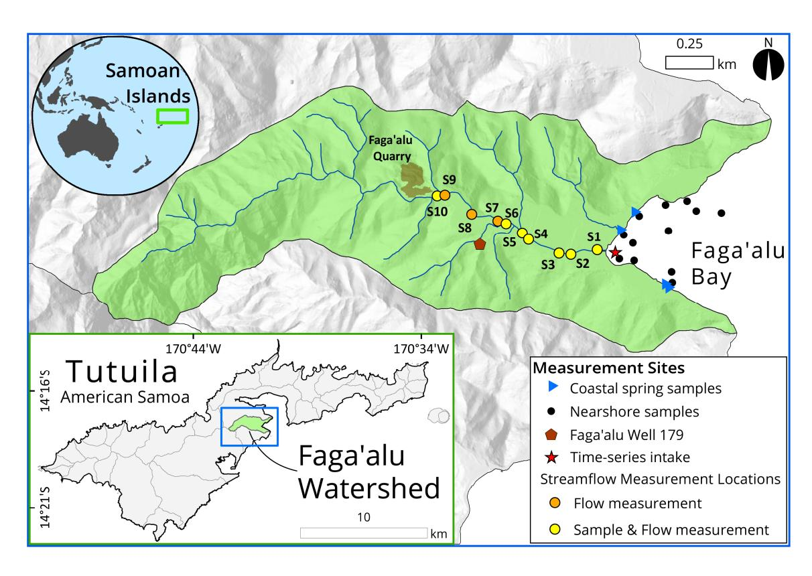
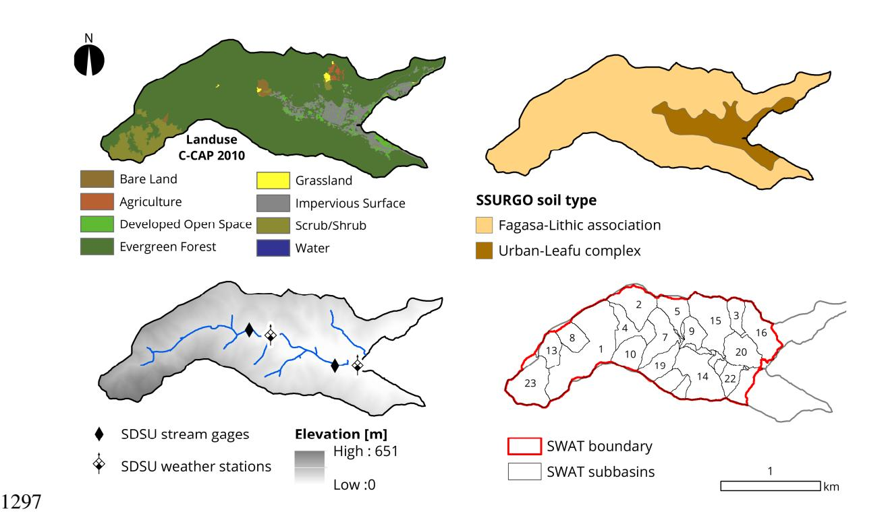
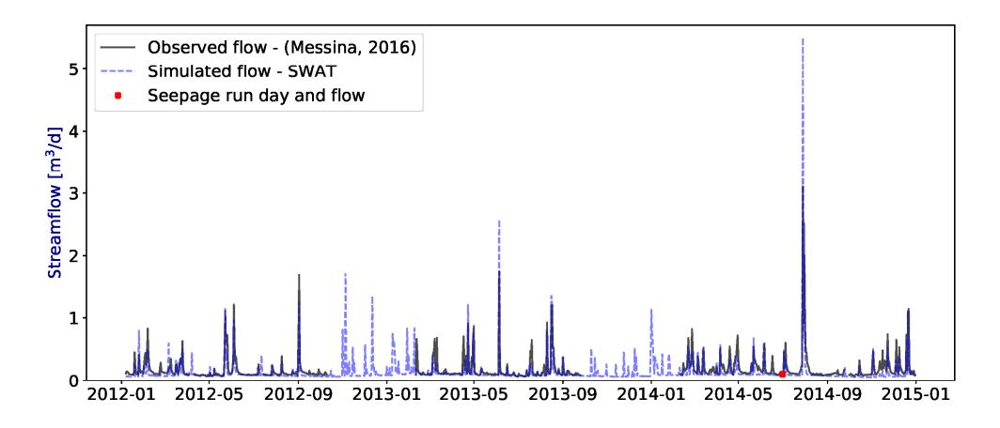
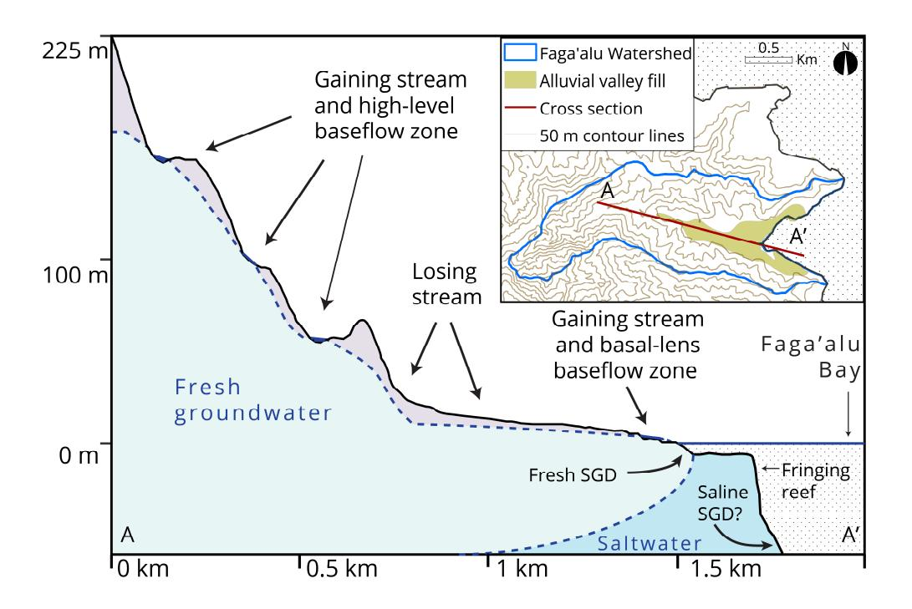
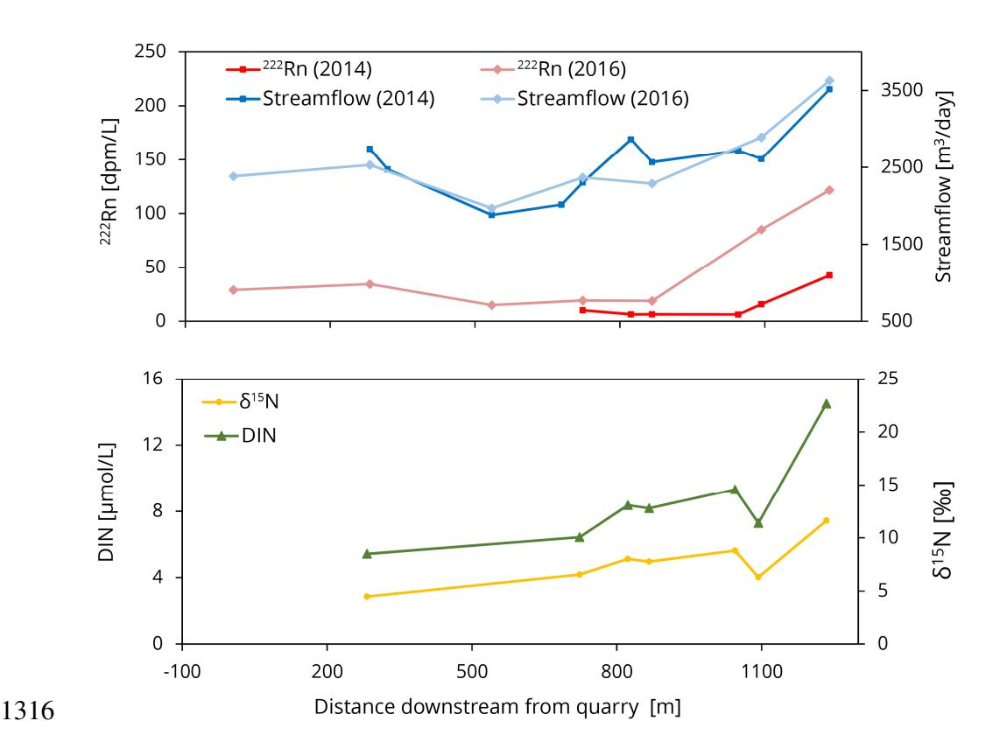
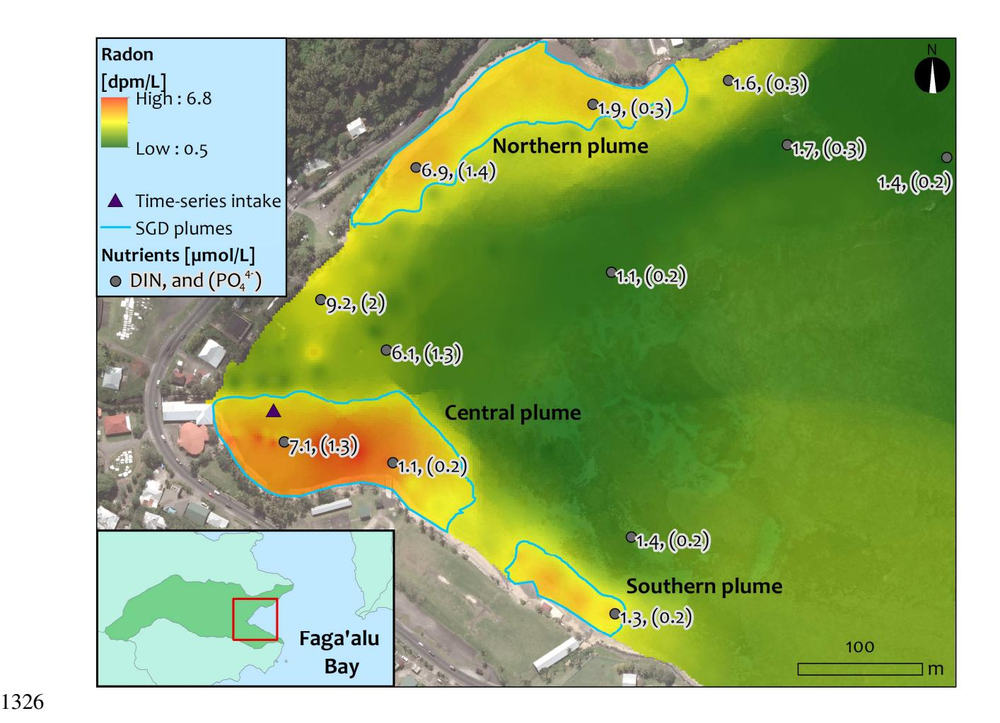

# 1 Understanding Surface Water - Groundwater

- 2 Interaction, Submarine Groundwater Discharge, and
- 3 Associated Nutrient Loading in a Small Tropical Island
- 4 Watershed

5

10

13

16

20 21

22

6 Christopher K. Shuler\*,a,b, Henrietta Dulaia,b, Olkeba T. Letac, Joseph Fackrellb, Eric Welchb, and Aly I. El-Kadia,b

8
9 \*cshuler@hawaii.edu

aWater Resources Research Center, University of Hawaii Manoa, USA
 2540 Dole St., Holmes Hall 283, Honolulu HI 96822

bDepartment of Geology and Geophysics, University of Hawaii Manoa
 1680 East-West Rd, POST 707, Honolulu, HI 96822

cBureau of Watershed Management and Modeling, St. Johns River Water Management
 District, 4049 Reid St, Palatka, FL 32177

\* Corresponding author

# 23**Abstract**

24 Submarine groundwater discharge (SGD) is recognized as an important nutrient delivery 25 mechanism in coastal ecosystems. However, water quality management in these settings is 26 typically focused on surface waters, often ignoring SGD and nearshore groundwater-surface 27 water interaction. In this study, we integrate a comprehensive radionuclide tracer based field 28 investigation with watershed modeling to examine groundwater – surface water partitioning 29 and to quantify nutrient loading from fresh SGD and streamflow in a small embayment located 30 in American Samoa. Measurements included streamflow, SGD rate, and environmental tracers, including 31 222Rn concentrations, nutrient levels, and nitrogen isotope values in groundwater and 32 surface water samples. We then used the Soil and Water Assessment Tool (SWAT) to validate 33 measured baseflow and SGD rates, and also to estimate storm flows, which were not measured 34 in the field. Field results showed SGD was a significant delivery mechanism for coastal 35 nutrient loads, whereas baseflow-nutrient loading from the upper-watershed was minimal 36 during the study period. Seepage run measurements informed a conceptual hydrogeologic 37 model of groundwater, surface water, and coastal water interaction, which we applied in 38 developing the watershed model. The SWAT model simulated flow observations satisfactorily, 39 and indicated baseflow accounts for only 39% of the total annual stream flow with surface 40 runoff and lateral flow (i.e. interflow) making up the rest. By examining water and nutrient 41 exchange between groundwater, surface water, and SGD, this study provides a more complete 42 understanding of the fate and transport of water and nutrients in small-island watersheds where 43 anthropogenic activities potentially threaten the health of coastal ecosystems.

| 44 | Highlights |   |                                                                                       |
|----|------------|---|---------------------------------------------------------------------------------------|
| 45 | -          |   | Developed groundwater-surface water conceptual model of a steep tropical watershed    |
| 46 | -          |   | Assessed submarine groundwater discharge and nutrient loading with Radon-222          |
| 47 | -          |   | Paired field study with watershed model to expand understanding of hydrologic factors |
| 48 |            |   |                                                                                       |
| 49 | Keywords   |   |                                                                                       |
| 50 |            | - | Submarine Groundwater Discharge (SGD)                                                 |
| 51 |            | - | Soil and Water Assessment Tool (SWAT)                                                 |
| 52 |            | - | Watershed modeling                                                                    |
| 53 |            | - | Coastal nutrient loading                                                              |
| 54 |            | - | Groundwater-stream water interaction                                                  |
| 55 |            | - | American Samoa                                                                        |
| 56 |            |   |                                                                                       |

# 57**1. Introduction**

58 Discharge of anthropogenic nutrients to coastal areas has the potential to significantly 59 impact nearshore water quality and affect reef health (Bahr et al., 2015; Dulai et al., 2016). In 60 recent decades, the effect of submarine groundwater discharge (SGD) on coastal nutrient 61 budgets has become widely recognized (e.g., Johannes and Hearn, 1985; Dulaiova et al., 2006; 62 Rodellas et al., 2015), and SGD has been found to be a particularly significant nutrient delivery 63 mechanism in tropical volcanic island settings (Zektser, 2000; Moosdorf et al., 2015; Dulai et 64 al., 2016). Nonetheless, environmental water quality management typically focuses on surface 65 waters, often ignoring SGD. The U.S. Environmental Protection Agency's Clean Water Act 66 (Section 303(d)) requires states and territories to establish water quality standards and Total 67 Maximum Daily Loads (TMDLs) for nutrients in receiving waters. In many places, including 68 the Territory of American Samoa, such standards apply only to fresh surface and open coastal 69 waters (AS-EPA, 2013a), thereby overlooking potentially important nutrient pathways. Spatial 70 variability in groundwater discharge directly to streams may also affect the validity of TMDL 71 measurements, which are assumed to originate from surface water sources only. Recent studies 72 from streams (e.g., Avery et al., 2018), mangrove environments (e.g., Gleeson et al., 2013) and 73 large tidal estuaries (e.g., Makings et al., 2014) indicate that groundwater has significant 74 impacts on both coastal water quality and nearshore stream water quality, underscoring the 75 importance of considering groundwater-surface water interaction when designing water quality 76 monitoring protocols. However, accurate quantification of groundwater discharge to streams 77 and coastlines is inherently challenging because available methods typically rely on 78 measurements and conceptual models with high uncertainties. This underscores the need to

79 develop an improved understanding of how land-use, groundwater, and surface water interact 80 to deliver nutrients to the coast.

The naturally occurring noble gas radon-222 ( 81 222Rn) has become one of the most 82 widely used tracers for determining SGD rates, (e.g., Burnett and Dulaiova, 2003; Charette et 83 al., 2007; Sadat-Noori et al., 2015) and when combined with water quality sampling, this 84 method is widely used for estimating associated coastal nutrient fluxes (e.g., Dulaiova et al., 85 2010; Gleeson et al., 2013; Wang et al., 2017). Radon has also been applied successfully in 86 stream headwaters, channels, and estuaries for investigating the magnitude and locations of 87 groundwater-surface water interactions in terrestrial settings (e.g., Peterson et al. 2010; 88 Cartwright et al., 2011; Unland et al., 2013; Gleeson et al., 2018). However, very few studies 89 have integrated these approaches and investigated groundwater, surface water, and coastal 90 water interactions on a whole watershed scale (e.g. Corbett et al., 1999), and to our knowledge none have done so in a tropical basaltic-island setting. Groundwater becomes enriched in 91 222Rn through prolonged contact with aquifer material, and pore-water 92 222Rn concentrations typically 93 reach an equilibrium between ingrowth and radioactive decay within a couple of weeks. After leaving the aquifer, dissolved 94 222Rn has a short half-life of 3.8 days, exhibits conservative 95 behavior through the full salinity range, and shows low concentrations in surface and ocean 96 waters, making it an excellent tracer of recently discharged groundwater.

97 Predictable isotopic fractionation of nitrogen (N) in dissolved nitrate and nitrite (δ 98 15NN+N) has been used extensively for tracing sources of nutrients in groundwater (e.g. 99 Kendall and Aravena, 2000; Cole et al., 2006; Hunt, 2007), stream water (e.g. Lindau, et al., 100 1989), and coastal surface waters (e.g. Garrison et al., 2007; Wong et al., 2014; Wiegner, 2016; Bishop et al., 2017). Commonly referenced ranges for δ 101 15NN+N values indicate synthetic

fertilizer influenced waters have relatively low δ 102 15NN+N values (-5 ‰ to +5 ‰), natural soil processes typically produce porewaters with intermediate δ 103 15NN+N values (+2 ‰ to +6 ‰), and manure and human wastewater leachates generally produce higher δ 104 15NN+N values, albeit with 105 a wide range (+4 ‰ to+25 ‰) (Kendall and Aravena, 2000; Dailer et al. 2010; 2012; Fenech et 106 al., 2012, Abaya et al. 2018a,b). This method does have a number of limitations, for example wastewater influenced δ 107 15NN+N values in tropical island settings have been found to encompass 108 a wide range, from 5 ‰ to 23 ‰ (Bishop et al., 2017; Amato et al., 2016; Hunt and Rosa, 2009; Rogers et al., 2012). Nonetheless, δ 109 15NN+N remains a valuable tool for providing clues 110 about nutrient sources, which has made it a widely used source dependent tracer despite well-111 known limitations (Xue et al., 2009).

112 In the hydrologic sciences it is common, and some may argue, a standard practice, to 113 integrate numerical models with field-based studies to constrain or validate estimates produced 114 by either method (e.g. Anderson, 1987; Biondi, 2012). The wide spatial coverage of models 115 also makes them useful for management agencies tasked with covering large areas that are 116 difficult to fully characterize with field methods. However, model accuracy depends on 117 appropriate conceptualization of the hydrologic system, and sufficient calibration and 118 validation data to constrain uncertainty and ensure accuracy. Watershed scale, SGD-focused 119 field studies that integrate modeling components (e.g. Michael, 2005; Nakada et al., 2001) 120 often apply groundwater models capable of simulating variable-density flow, such as 121 SEAWAT (Guo and Langevin, 2003) or FEFLOW (WASY, 2004). However, calibration data 122 for these fairly complex models is often limited, leading to overparameterization, and problems 123 with equifinality (Kirchner, 2006). On the other hand, availability of above-surface hydrologic 124 data is typically better due to the existence of nation-wide meteorological and streamflow

125 measurement networks (Slack and Landwehr, 1992; NRC, 2004). These data can be used to 126 calibrate watershed models such as the Soil & Water Assessment Tool (SWAT) (Arnold et al., 127 1998; Gassman et al., 2007, 2014) or Gridded Surface/Subsurface Hydrologic Analysis 128 (GSSHA) (Downer and Ogden, 2006) that apply the water budget approach to partition 129 hydrologic inputs between different pathways. By using a water budget approach, watershed 130 models are also able to produce estimates of subsurface inputs and returns to surface waters 131 without requiring difficult to obtain subsurface data. Although watershed models lack the fine 132 scale resolution available with groundwater models, at the watershed scale, these models can 133 provide some of the same benefits where more detailed subsurface simulation is not needed. 134 (e.g. Oberdorfer, 2003; Lee and Kim, 2007).

135 In American Samoa, anthropogenic nutrient loading and sedimentation to coastal zones 136 have been identified as primary factors in reducing the reef's ability for recovery from 137 increasing environmental stressors (McCook, 1999; Craig, 2009). Long-term studies of reefs 138 on Tutuila, the territory's main island, suggest SGD is likely to be a significant explanatory 139 variable in reef health (Houk et al., 2013; Whitall and Holst, 2015). However, prior to this 140 study, there have been no known attempts to quantify SGD and its associated nutrient loading 141 in American Samoa. To fill this gap, we used measurements of environmental tracers including 142 222Rn, dissolved nutrients, and nitrogen isotopes to trace groundwater discharge, partition 143 baseflow and fresh SGD nutrient flux, and explore probable nutrient sources within a small, 144 tropical-island watershed and embayment. Field observations provided insights for informing 145 conceptual model development and were useful for model calibration and validation. 146 Watersheds in American Samoa provide unique settings to examine nutrient budgets on a

147 basin-wide scale due to small drainage areas, relatively good accessibility, and high 148 precipitation rates that drive measurably significant water fluxes.

149 In this study, we hypothesize that multiple hydrologic pathways, including 150 groundwater, surface water, and fresh SGD all act as significant controls on coastal nutrient 151 loading in small tropical watersheds, exemplified by those of American Samoa. To investigate 152 this question, we integrated a detailed geochemical field investigation with watershed 153 modeling in order to partition the impact of water and nutrient discharge from different 154 hydrologic pathways. Our primary objectives are to develop a better understanding of 155 groundwater, surface water, and coastal water interaction, and to quantify coastal nutrient 156 loading impacts from non-point sources in tropical island watersheds.

157

# 158**2. Study Area**

 Faga'alu Watershed consists of a small (2.1 km2 159 ), steep, heavily forested valley with 160 one main perennial stream draining into Faga'alu Bay, a small arm of Pago Pago Harbor (Fig. 161 1). Geologically, the watershed is carved from dense inner-caldera basalts formed about 1.2 162 mya, and the valley bottom is filled with a gently inclined wedge of terrestrial and marine 163 alluvium that extends about 1 km upstream from the coast (Stearns, 1944). The regional scale 164 aquifer permeability of the inter-caldera basalts is likely to be significantly lower than that of 165 the terrestrial alluvium, based on aquifer properties of similar geologic units in Western Tutuila 166 (Izuka et al., 2007). However, in Faga'alu the only known well is located in the alluvium, 167 precluding direct comparison of each unit's hydrogeologic properties. Significant springs 168 found in the inter-caldera unit indicate that it contains high-level groundwater, which is likely 169 to be impounded by sub-surface structures, such as dikes, perching layers, or potentially faults

170 (Davis, 1963). In the upper watershed, the soil type is primarily silty clay to clay loam Lithic 171 Hapludolls ranging from 20–150 cm deep, and the alluvial unit is covered with a fairly deep 172 (>150 cm) mixture of well-drained very stony silty clay loams and poorly-drained silty clay to 173 fine sandy loams (Nakamura, 1984). Faga'alu's climate is warm and humid with year round 174 average temperatures around 28̊ C and annual rainfall between 3000 and 6000 mm/year, 175 depending on elevation. The wet season extends from October to May and the drier season 176 spans June to September.

177 In Faga'alu, anthropogenic activities have been connected to recent degradation of reef 178 health and reduction of stream water quality, leading to its designation as a federal priority 179 watershed management area by the United States Coral Reef Task Force (Sauafea-Le'au, 180 2013). Both stream and coastal water quality in Faga'alu have been classified as 'impaired' 181 since 2006 (AS-EPA, 2016) and American Samoa Environmental Protection Agency (AS-182 EPA) coral reef monitoring suggests that Faga'alu's benthic ecosystem is one of the most 183 impacted on the island (Houk et al., 2005). Previous studies implicate the stream as a pathway 184 for terrigenous sediments and excessive nutrient loads to the bay (DiDonato, 2005; Messina, 185 2016; Messina & Biggs, 2016). However, the role of groundwater as a hydrologic pathway for 186 terrigenous contamination remains unconstrained. The three primary anthropogenic nutrient 187 sources on Tutuila have been previously determined to be: (1) On-Site wastewater Disposal 188 Systems (OSDS), (2) widespread small-scale pig farming operations, and (3) agricultural 189 fertilizers (Falkland et al., 2002; Polidoro et al., 2017; Shuler et al., 2017); but the relative 190 impact of each source on coastal ecosystems remains poorly understood.

# 192**3. Methods**

## 193 **3.1 Water Sampling and Stream Gauging Methods**

194 We collected groundwater, coastal water, and stream water samples throughout a 195 weeklong sampling campaign in the dry season of 2014 during a period with no significant 196 rainfall. This included a longitudinal sampling and measurement transect up Faga'alu stream, 197 hereafter referred to as a seepage run (Rosenberry and LaBaugh, 2008), which we conducted 198 during a single 24-hour period through the lower 1 km stream section. During the seepage run, 199 we measured streamflow at ten separate locations with a Price-type Pygmy Current Meter and 200 the velocity-area-method (Turnipseed and Sauer, 2010) and sampled stream water at seven of 201 those locations throughout the reach between Faga'alu Quarry, and the lowest section of 202 stream that was not affected by the tide during the sampling period. During a boat-based 203 coastal water survey (see section 3.2.2), we collected coastal water samples from Faga'alu Bay 204 one day after the seepage run. We identified three areas along the shoreline of the bay with 205 brackish coastal springs, and sampled these twice each at low tide throughout the week. We 206 also sampled the only production well in the valley (Well #179). All sampling locations are 207 shown on Fig. 1, and streamflow data are given in supplementary material Tables A1 and A2. To verify the seepage run results, we conducted a second seepage run on August 10th 208 , 2016, and measured streamflow and dissolved 209 222Rn concentrations (but not nutrients or other 210 parameters) at many of the same sites as in 2014. To reduce measurement uncertainty, 211 streamflow for the second seepage run was measured with a SonTek FlowTracker Handheld 212 Acoustic Doppler Velocimeter, which has a higher velocity resolution and accuracy than the Pygmy meter we used in 2014. Sampling and analysis for 213 222Rn concentrations was performed 214 in the same way as was done in 2014. With all direct streamflow measurement values, we

conservatively assumed a measurement error of 10%, as typical standard errors with pygmy meters have been reported to be between 3% and 6% (Sauer and Meyer, 1992), and fieldcalculated measurement uncertainties for FlowTracker data were always well below 10%. For all nutrient samples, we also collected in situ temperature, salinity, pH, and dissolved oxygen data with a YSI multiparameter sonde (6600V2-4 model). Nutrient and isotope samples were collected in acid washed 60 ml HDPE bottles triple-rinsed with sample water before filling. Nutrient samples were kept refrigerated, whereas N-isotope samples were frozen until analysis. All nutrient and isotope samples were filtered through 0.45 µm capsule filters, thus all measured nutrient concentrations and comparable modeled nitrogen concentrations reported here refer to dissolved species unless the particulate fraction is specifically indicated. We collected grab samples for 222Rn in 250-ml glass bottles with no headspace and analyzed them the same day as collection with a RAD H2O radon in water analyzer, manufactured by Durridge Inc. (Billerica MA, USA). Because of 222Rn's short half-life (3.8 days), 222Rn grab sample values were decay corrected to the time of collection. We analyzed all water samples for dissolved nutrients including nitrate and nitrite (N+N), ammonium (NH4+), phosphate (PO43-), silicate (Si), total dissolved nitrogen (TDN), total dissolved phosphorus (TDP), dissolved  $^{222}$ Rn concentration, and nitrogen isotope ( $\delta^{15}N_{(N+N)}$ ) values of N+N in samples having > 1 µmol/L of N+N. The only exceptions were samples collected in 2016, which were only analyzed for 222Rn concentrations. Nutrient samples were analyzed within two weeks of collection at the University of Hawaii School of Ocean and Earth Science and Technology (SOEST) Laboratory for Analytical Biogeochemistry using the methods described in Armstrong et al. (1967) and Grasshoff et al. (1999). Nitrogen isotope samples were measured within 4 months of collection at the University of Hawaii's Stable

215

216

217

218

219

220

221

222

223

224

225

226

227

228

229

230

231

232

233

234

235

236

Isotope Biogeochemistry Lab using the denitrifier method of Sigman et al. (2001). Isotopic results are expressed here in per mil (‰) notation relative to the isotopic reference standard of AIR.

Coastal groundwater is composed of both oceanic and fresh water. However, because this study focuses on assessing nutrient flux from terrigenous sources only, the oceanic component in coastal spring samples was mathematically unmixed to reveal nutrient levels of only the fresh component of each sample, regardless of seawater dilution. This is commonly done in settings where the subterranean estuary and recirculating seawater are not a significant source of nutrients (Street et al., 2008), and was performed here with an unmixing calculation (e.g., Hunt and Rosa, 2009) that assumed conservative nutrient behavior during mixing and was based on an oceanic end member from Tutuila. This calculation allowed the derivation of nutrient fluxes solely contributed by fresh groundwater. We collected duplicate samples at five locations and analytical uncertainty was assessed using the relative percent difference (RPD) method, which is defined as the absolute value of the difference between two duplicates, expressed as a percentage of their mean. Average RPD was 1.4% for N+N, 0.5% for Si, 0.6% for PO43-, 2.4% for NH4+, 0.8% for TDN, 1.9% for TDP, and 6.8% for  $\delta^{15}N_{(N+N)}$ . In about half of the samples, concentrations of PO43- were measured to be slightly greater than TDP. This is likely due to small inconsistencies between the two analysis methods, and suggests that in most of the samples collected, nearly all of the TDP is in the form of orthophosphate.

### 3.2 Radon-Based SGD Field Estimates

238

239

240

241

242

243

244

245

246

247

248

249

250

251

252

253

254

255

256

257

258

259

260

Dissolved 222Rn was used as a groundwater tracer in a temporally and spatially distributed non-steady-state radon flux model to calculate bay-wide SGD rates following the methods of Burnett & Dulaiova (2003) and Dulaiova et al. (2010). We assessed temporal (tide-

dependent) variability with a time-series of 261 222Rn measurements taken from a fixed nearshore 262 location over a 48-hour period. This was coupled with a coastal water survey to assess spatial variation in 222Rn throughout the inner bay. For both the time-series and survey, 263 222Rn 264 concentrations were measured by pumping surface water through an air-water exchanger 265 connected to a radon-in-air monitor (RAD AQUA, Durridge Inc.). To obtain bay-wide SGD 266 fluxes, we scaled up the tidally-averaged SGD flux from the stationary time-series to account 267 for the additional SGD flux observed during the coastal survey in locations adjacent to the 268 time-series location, as described below.

269

## **3.2.1 Stationary** 270 **222Rn Time-Series**

 The 271 222Rn time-series instrument package used a peristaltic pump that pumped surface 272 water from the bay to an instream flow cell (with no headspace) attached to the YSI 6600- 273 series sonde that continuously logged water salinity and temperature. The inlet hose for the 274 pump was connected to a moored float located at a stationary point in the bay about 50 m away 275 from the stream mouth (Fig. 1). After passing through the YSI, water flowed into an air-waterexchanger where 276 222Rn gas was extracted and pumped to the RAD7. Tidal height was 277 measured by a pressure transducer placed on the seafloor at the float anchor. We deployed the instrumentation for about 48 hours and the RAD7 was set to integrate measurements of 278 222Rn 279 activity every 30 minutes. Typically, SGD manifests as a fresh or brackish plume that overlies 280 denser seawater. We measured plume thickness at low tide by manually conducting salinity 281 depth profiles at the water intake, and this plume thickness was used for volumetric calculations in the 282 222Rn mass-balance model. Change in plume thickness due to tidal dilution

283 was calculated by subtracting the thickness of the underlying salt-water layer from the total 284 depth of the water column.

285

### 286 **3.2.2 Coastal Water Survey**

287 We performed the coastal water survey once the time-series was finished, during a 3- 288 hour period bracketing low tide. We transferred the time-series instrument platform to a small 289 boat and rowed throughout the bay while the air-water exchanger was supplied with surface water from a bilge pump tethered to the hull of the boat. The RAD7 was set to integrate 290 222Rn 291 activity every 5 minutes and data was resampled to one minute intervals yielding a total of 205 292 points available for interpolation. During the survey, three distinct plumes of SGD were detected as low salinity and high 293 222Rn anomalies. We refer to these plumes as the southern, 294 central, and northern plumes. During analysis, the surface area and geometry of each plume 295 was determined by nearest neighbor interpolation of measurement points and contouring of the resultant 296 222Rn activity surface. Boundaries for each of the three plumes were defined as the 297 222Rn-isoline representing the mid-point of the range of measured activities (3.25 dpm/L). We 298 defined the bottom boundary of each plume to be the salinity 28 isohaline, as indicated by 299 salinity depth profiles that we took periodically during the survey; or if salinity was consistent 300 throughout the whole water column, the full water depth was used as the plume thickness. Note 301 that the time-series measurement described in section 3.2.1 was performed at a location that 302 fell inside of the central plume. Additionally, during the survey, coastal water samples were 303 collected for analysis in the same manner as stream and groundwater samples.

### 305 **3.2.3 SGD Flux Scaling, Fresh and Recirculated Fractions**

 The 306 222Rn flux model modified from Dulaiova et al. (2010) was used to calculate SGD 307 fluxes for both survey and time-series data. The model uses a mass-balance approach that relies on accounting for 308 222Rn losses and additions from local and offshore processes that are not related to SGD. We assumed that ambient 309 222Rn activities from oceanic or atmospheric sources were comparable to those found in the Hawaiian Islands, and used an ambient 310 222Rn activity of 0.03 dpm/L (Kelly and Glenn, 2012), a local excess 311 222Rn activity of 0.08 dpm/L supported by in situ 226Ra (Street et al., 2008), and an offshore 312 222Rn activity of 0.087 dpm/L, derived from the offshore 226 313 Ra (Fröllje et al., 2016). We assumed residence time of SGD 314 affected-groundwater within Faga'alu's inner bay to be 12.2 hours, the length of one tidal 315 cycle, which is within the ranges of published residence times from water circulation studies of 316 Faga'alu (Storlazzi et al., 2014; Vetter and Vargas-Angel, 2014). Hourly measurements of 317 local wind speed and air temperature were obtained from the American Samoa Observatory 318 NOAA Earth System Research Laboratory (ESRL) weather station at Cape Matatula. To assess 319 the SGD endmember composition, we collected groundwater samples from the only well in the valley and from four coastal spring locations at low tide. The 320 222Rn activity measured in 321 coastal springs and the well showed a linear mixing relationship with salinity (Fig. A1, 322 supplementary material), which suggests that while seawater recirculation does occur, the 323 nearshore reef substrate or the re-infiltrated coastal water does not add a significant quantity of 324 222Rn to groundwater during this process; likely because circulation is rapid and recirculated 325 seawater does not spend enough time in the subsurface to collect measurable radon. The linearity of this relationship also indicates the fresh coastal spring 326 222Rn endmembers (when corrected for dilution by seawater) are quite consistent with the 327 222Rn activity measured at Well 179. Therefore, the 328 222Rn concentration from the well was used as the groundwater end 329 member for fresh SGD calculations, and the standard deviation of all measured salinityunmixed 222Rn concentrations (Table 1), which equaled ± 54 dpm/L or about 44% of the 330 222Rn 331 endmember value was used as the uncertainty on this quantity, to be propagated through SGD calculations. It should be noted that by using the fresh groundwater 332 222Rn endmember for SGD 333 calculations, only the fresh SGD rate was calculated, assuming that the recirculated fraction did not carry a 222Rn signature. This assumption was indicated by high-salinity, low- 334 222Rn 335 water found at coastal springs most likely resulting from seawater intrusion to the coastal 336 aquifer at high tide on relatively short time scales. Further this assumption is discussed in 337 section 5.4.1. Please note that all future references to SGD in this work indicate fresh 338 groundwater discharge only.

339 The time-series calculations provided a temporally-integrated SGD rate, but for the 340 central plume only, as this was where the water intake was located. On the other hand, the 341 coastal water survey provided spatially distributed SGD rates, which allowed for the 342 identification of three distinctive SGD plumes, but only as a snapshot in time. Therefore, to 343 calculate temporally integrated SGD flux to the whole bay, the ratios of survey-based SGD 344 rates in the northern and southern plumes to the survey-based SGD rate in the central plume 345 were used as scaling factors to upscale the time-series derived, temporally-averaged SGD flux 346 to include the other two plumes. Limitations of this approach included needing to make the 347 simplifying assumptions that tidal variation in the central plume was representative of the other 348 two plumes, that SGD only discharges from the three identified plumes, and that the relative 349 magnitudes of discharge from each plume stay consistent over time. These limitations could be 350 addressed by replicating the survey at different times or repeating the time-series in different

351 locations. However, due to the significant amount of time required for just one time-series and 352 survey, we were unable to conduct the approach repeatedly.

353

## 354 **3.3 Watershed and Land-Use Modeling**

- 355 We used SWAT, a physically-based, semi-distributed, watershed scale, ecohydrological 356 model (Arnold et al., 1998) to calculate transient estimates of flow through different 357 hydrologic pathways (i.e. water budget components). These pathways included surface runoff, 358 lateral flow (i.e., subsurface stormflow), baseflow, and groundwater recharge at different 359 spatial and temporal scales. We also applied SWAT's N-transport capabilities; however, 360 limitations in the availability and quality of existing nutrient data prevented satisfactory 361 calibration of this portion of the model. The wide applicability of SWAT under various 362 conditions and to different environmental problems has been demonstrated worldwide (e.g. 363 Gassman et al., 2007 and 2014; Dadhich and Nadaoka, 2012). The SWAT model was set up 364 with the following input data (Fig. 2):
- 365 A 3x3 m Digital Elevation Model (DEM) from the National Geophysical Data Center 366 ([dataset] NGDC, 2013) and obtained from NOAA Ocean and Coastal Services Center.
- 367 1:24,000 scale soil maps from the Natural Resources Conservation Service Soil 368 Survey Geographic (SSURGO) database.
- 369 A 2.4 x 2.4 m 2010 land-use map from the Coastal Change Analysis Program (C-CAP).
- 370 The hydrologic portion of the model was parameterized using daily rainfall and 371 streamflow data, which were collected for a different study, but provided to us for this work by 372 A.M. Messina (2016 personal communication, with supporting methodology documented in

373 Messina, (2016)). These data were collected at two sites within Faga'alu Watershed during the 374 period 2012 to 2014. Daily wind speed, relative humidity, and maximum and minimum 375 temperatures were only available at one of these sites. Solar radiation was measured at the 376 nearby American Samoa Community College ([Dataset] ASCC, 2018) and additional relative 377 humidity data were obtained from the NOAA- Earth System Research Laboratory weather 378 station. The watershed was divided into 26 sub-basins and 403 hydrological response units 379 (HRUs), with zero threshold values for land-use, soil, and slope classes. The model simulation 380 was run for the period of 2005 to 2014.

381 Available data constraining the locations and magnitudes of anthropogenic nutrient 382 sources in Faga'alu Watershed were collected for SWAT's nutrient loading module. Locations 383 of seventy-four OSDS units, six piggeries, and 1.15 acres of agricultural lands were identified, 384 and are shown in Figure A4 in the supplementary material. Although we parameterized, 385 sensitivity tested, and worked diligently to calibrate SWAT's nitrogen budget module with the 386 goal of predicting N-loads in different hydrologic pathways, we were not able to satisfactorily 387 calibrate the nutrient loading module above acceptable thresholds as defined in section 3.3.1. 388 This was likely due to large uncertainties in calibration data and unreasonably large error-389 bounds on results, even with the best-fitting model run. Still, the nutrient loading portion of the 390 model was useful for exposing where data gaps exist. Methods used for the nutrient loading 391 model set up are documented in supplementary material in section S2.

392

### 393 **3.3.1 SWAT Model Hydrologic Calibration**

394 For managing the calibration process, we used the SWAT Calibration and Uncertainty 395 Program (SWAT-CUP) (Abbaspour, 2014) with the sequential uncertainty fitting (SUFI-2)

396 method of Abbaspour, et al. (2007). Prior to calibration, we ran a sensitivity analysis using the 397 global Latin Hypercube-One-factor-At-a-Time (LH-OAT) method (Van Griensven et al., 398 2006) as implemented in SWAT-CUP, in order to identify which parameters to use for model 399 calibration. The top three parameters to which the model was most sensitive for flow were: (1) 400 the runoff curve number at soil moisture condition II, (2) the effective stream channel 401 hydraulic conductivity, and (3) the threshold depth of water in the shallow aquifer required for 402 return flow to occur. Lists of all calibration parameters used for flow and nutrient calibration 403 are provided in supplementary material Tables A3 and A4, respectively, and are ordered by the 404 most to least sensitive parameter.

405 We calibrated the hydrologic portion of model using daily streamflow observations 406 (Messina, 2016) for the period 2012 to 2014 from two sites on lower Faga'alu Stream. The 407 deep-aquifer partitioning coefficient (RCHRG\_DP) was adjusted to match field-estimated 408 SGD as well as possible, which allowed measured and modeled baseflow rates to be compared 409 for validation (see section 4.5). The first seven years of the model simulation period (2005- 410 2011) were assigned as model warm up, while the period from 2012 to 2013 was used for 411 calibration. We used the year 2014 as a validation period. We evaluated SWAT performance 412 by using the Nash-Sutcliffe Efficiency (NSE) metric (Nash and Sutcliffe, 1970) and assessed 413 the proportion of observations that were bracketed at 95% model prediction uncertainty 414 (95PPU) interval. We ran SUFI-2 for 1000 simulations, but the 95PPU was estimated only for 415 those simulations (parameter sets) that provided a behavioral solution with NSE threshold 416 value of ≥ 0.5. The temporal evolution of observed daily streamflow hydrographs was 417 reproduced by SWAT with NSE values ranging between 0.65 to 0.86 for both calibration and 418 validation periods, indicating the ability of the model to simulate daily stream flow reasonably

well (Fig. 3). The streamflow simulation uncertainty was assessed by examining the number of observations bracketed at the 95% PPU for both the calibration and validation periods, which ranged between 57% to 87% of the observations. For most gauging sites and years, the calculated 95PPU values were above the generally accepted value of ( $\geq 70\%$ ), as recommended by Abbaspour et al. (2015), except for the lower gauging station that had only 57% of the observations bracketed but only during the 2014 simulation period.

### 3.3.2 SWAT Model Nutrient Transport Calibration

We based calibration for the nutrient flux portion of the SWAT model on a set of twenty  $NO_3^-$  and  $NH_4^+$  nutrient measurements also taken between March 2013 and February 2014 by A. M. Messina (2018, personal communication). These measurements represented the only known long-term dissolved nutrient dataset available for this location and time period. The samples were analyzed as described in McCormick (2017) and measurement uncertainty was assessed by concurrently analyzing independent standards with known concentrations. Measurement error reported by McCormick ranged from 7% up to 30%, which limited confidence in these data. The nutrient transport calibration used the same methods as the hydrologic portion of SWAT, with the top three most sensitive nutrient parameters being: (1) the filtration capacity of stream edge, (2) the denitrification threshold soil water content, and (3) the in-stream rate constant for hydrolysis of organic N to  $NH_4^+$ .

Unfortunately, it was not possible to calibrate the model to the point where  $\geq 70\%$  of

Unfortunately, it was not possible to calibrate the model to the point where  $\geq 70\%$  of the observations were bracketed at the 95% PPU. Model calibration attempts were suspended with the best simulation only able to bracket 60% of the calibration data (nine of the NH4+ measurements and fifteen of the NO3- measurements) at the 95% PPU. To achieve even this

442 level of calibration, the parameter space had to be expanded to such a large width that the 443 utility of the results was significantly limited.

444

# 445**4. Results**

## 446 **4.1 Conceptual Hydrogeologic Model**

447 By integrating information about the study area's underlying geology with geochemical 448 and physical measurements, we were able to develop a simple conceptual model of Faga'alu's 449 groundwater, surface water, and coastal water interaction during baseflow conditions (Fig. 4). 450 In its upper reaches, dense trachyte and older lava flows underlie the stream (Stearns, 1944), 451 and dikes may also serve to impound groundwater in the shallow subsurface (Davis, 1963). On 452 basaltic islands, dikes or low-permeability structures commonly impound groundwater at high-453 elevations (Takasaki and Mink, 1985). On a hike to the upper portion of the watershed, we 454 observed numerous springs and small tributaries, indicating a general net transfer of 455 groundwater to surface water in this area. Davis (1963) also documents the significance of 456 springs in the upper Faga'alu watershed based on their historical water usage. Although this spring water is expected to be enriched in 457 222Rn upon discharge, numerous waterfalls and high turbulence throughout the upper-reaches promote evasion, which significantly reduces 222 458 Rn 459 concentrations as the water flows downhill. At Faga'alu Quarry, which lies at the upper edge 460 of Faga'alu Village, the stream channel slope declines, and the lithology changes to an alluvial 461 valley-fill, likely with higher permeability (Izuka et al., 2007). In the portion of the stream underlain by alluvial-fill, we observed low 462 222Rn levels and declining streamflow (except 463 where two very small tributaries between sites S5 and S6 were seen to contribute water to the

464 main branch), suggesting the stream is probably losing water to the aquifer in this reach (see section 4.2 below). Once the stream nears the coast, streamflow, 465 222Rn, and nutrient values 466 spike, indicating this is an area of groundwater discharge, likely from a basal-lens aquifer 467 within the alluvium. When corrected for mixing with high-level baseflow, the nutrient 468 signature of this basal-lens baseflow is a fairly close match to the composition of salinity 469 unmixed coastal spring discharge, suggesting that both of these water sources originate from 470 the same nearshore aquifer.

471 At the shoreline, coastal springs were found to have variable salinities, indicating the presence of recirculated SGD. However, we also found that concentrations of 222 472 Rn in spring 473 waters varied linearly with salinity (Fig. A1 supplementary material), suggesting that 474 recirculated seawater, at least at shallow depths, does not spend sufficient time in the subsurface for significant 475 222Rn ingrowth to occur. Previous studies in coastal aquifers show it 476 is possible for fresh SGD to manifest as a separate layer above a deeper saline SGD fraction 477 (Robinson et al. 2007; Kuan et al. 2012). If this were the case in Faga'alu, longer-residence 478 time recirculated SGD might be discharging at depths below detection of our survey methods. Although we did not detect any 479 222Rn which we can attribute to a deep saline SGD source, such 480 a situation would not be surprising considering the abrupt bathymetry in Faga'alu Bay. In the 481 inner portion of the bay, the substrate is primarily composed of a shallow fringing reef sitting 482 in 1-2 m of water, but with very steep slopes at its margins where depths rapidly plunge to 483 around 25 m. Fringing reef wedges in American Samoa have been hypothesized to have lower 484 hydraulic conductivities than underlying basaltic rocks (Houben et al., 2018), which might 485 contribute to the confinement of deeper SGD until reaching the reef margin, where it could

486 discharge at depth. Future deep-water surveys along the reef margin would be useful for 487 exploring this hypothesis further.

488

## 489 **4.2 Characterization of Baseflow Components**

 Dissolved 490 222Rn concentrations in the stream were generally low (6-10 dpm/L), except 491 at the two sites nearest the coast (sites S1 and S2), where values increased up to 42 dpm/L. Coincident with increased 492 222Rn concentrations between the uppermost (S10) and lowermost (S1) sites, were increases in flow from 2,700 to 3,524 m3 493 /d, DIN concentrations from 4 to 12 µmol/L, and δ 494 15N(N+N) values from 4.5 to 11.5‰ (Fig. 5). The simultaneous increase in δ 495 15N(N+N) and DIN input suggests a portion of this DIN may be derived from human or animal waste, which both produce nitrogen with an elevated δ 496 15N signature (Kendall, 2012). Because 497 there were no observed surface tributaries above the lowest stream sampling sites, the coincident increases in water, nutrients, and 498 222Rn indicates the stream receives significant 499 basal groundwater discharge just before exiting to the bay. The 2016 seepage run showed almost the exact same pattern, although 500 222Rn concentrations through the whole stream and 501 particularly near the stream mouth were observed to be higher (up to 122 dpm/L). 502 Based on these observations, baseflow discharge to the bay can be viewed as a mixture 503 of two distinct components, (1) baseflow sourced from high-level groundwater (Davis, 1963) 504 (here referred to as high-level baseflow) and (2) baseflow sourced from basal-lens groundwater 505 (here referred to as basal-lens baseflow). We estimated the fraction of high-level baseflow (*fS*) 506 to basal-lens baseflow (*fGW)* discharged in the stream estuary with a simple two endmember

mixing model applied to 507 222Rn concentrations using the groundwater end member and surface

508 water from the upper portion of the stream (as measured at site S3):

$$f_{GW} + f_S = 1 (1)$$

511

$$f_S = \frac{c_{mix} - c_{GW}}{c_S - c_{GW}} \tag{2}$$

513

514

515

516

517

518

519

520

521

522

523

524

525

526

527

528

529

530

Where  $(C_S)$  is the average concentration of 222Rn measured at site S3,  $(C_{GW})$  is the 222Rn concentration in groundwater at production well #179, and ( $C_{mix}$ ) is the mixed sample 222Rn concentration measured at the most coastal stream site, S1. Results from 2014 data indicate stream water at site S1 was composed of 67% high-level baseflow (2,368 m3/d) and 33% (1,156 m3/d) recently discharged basal-lens baseflow, and 222Rn-based unmixing results from 2016 data show that stream water at site S1 was composed of 66% high-level baseflow (2,412 m3/d) and 34% (1,217 m3/d) recently discharged basal-lens baseflow. Although this calculation relies on some assumptions such as conservative radon behavior (no radioactive decay and no atmospheric evasion over the timescale of the water flow), the partitioning estimate compares very well to the flow increase as directly measured by stream gauging, which in 2014 showed an addition of 957 m3/d, or an additional 27% between site S3 and site S1 (Table 1) and in 2016 showed an additional flow increase of 37% or an additional 1,339 m3/d between the lowest site (site S1) and flow at site S3. (Table A2 Supplementary material). When these four separate and independent assessments of streamflow partitioning are averaged, the arithmetic mean fractions of high-level baseflow and recently discharged basal-lens baseflow at site S1 are 67% and 33%, respectively, which were the fractions we used for calculations of nutrient fluxes through these pathways. It should be noted that we did not take nutrient measurements

or calculate SGD fluxes in 2016, therefore the 2016 seepage run data was used for streamflow partitioning only.

We calculated baseflow nutrient flux rates by multiplying the respective measured flow rates by the nutrient concentrations observed in each baseflow component (high-level and basal-lens baseflow). Total baseflow loading of DIN and  $PO_4^{3-}$  to the bay were estimated to be  $0.72 \pm 0.08$  and  $0.38 \pm 0.04$  kg/d, respectively. When partitioned with equations (1) and (2), basal-lens baseflow was estimated to have delivered  $0.47 \pm 0.06$  kg-DIN/d and  $0.16 \pm 0.02$  kg-PO43-/d, whereas only  $0.25 \pm 0.03$  kg-DIN/d and  $0.22 \pm 0.03$  kg-PO43-/d were delivered by high-level baseflow (Table 2). Nutrient flux uncertainties were propagated from uncertainties in baseflow discharge and analytical errors of nutrient concentration values.

### **4.3 SGD Rates and Nutrient Fluxes**

#### 4.3.1 Time-Series SGD Fluxes

During the stationary time-series, 222Rn concentrations at the intake point averaged 4.8 dpm/L (range of 2.9 to 8.2 dpm/L), salinities averaged 26.9 (range of 22.3 to 33.1), and the thickness of the SGD-affected brackish plume averaged 38 cm (range of 7 to 70 cm). While the highest 222Rn concentrations and the lowest salinities generally occurred at low-tide, as expected, a continuous input of higher 222Rn and lower salinity water from the nearby stream mouth was also detectable in the time-series data. Conversion of 222Rn concentrations to SGD fluxes with the transient radon balance model yielded an average fresh SGD estimate of 2,959 ± 1,629 m³/d to the central plume where the intake was located (Fig. A2, supplementary material). However, because the time-series measurement was taken just outside of the stream mouth, the time series and survey points near this area were actually detecting a mixture of

554 222Rn from coastal SGD and recently discharged basal-lens baseflow from the nearshore 555 tidally-affected part of the stream. Subtracting the basal-lens baseflow fraction (1,156 ± 117 m3 /d) as calculated in section 4.2, left an estimated SGD rate of 1,803 ± 1,633 m3 556 /d as 557 groundwater coming from the coastal part of the central portion of the bay only. This does assume that most or all of the 558 222Rn from high-level baseflow has evaded by the time it reaches 559 the coast, which if not, would bias the coastal SGD fraction of the total measured SGD to be a 560 slight overestimate.

561

### 562 **4.3.2 Spatial Distribution of SGD from Coastal Survey Measurements**

563 The coastal water survey revealed three distinct groundwater discharge zones, or 564 plumes, one each on the northern, central, and southern portions of the coastline (Fig. 6). We found the highest 565 222Rn concentrations, up to 7.4 dpm/L, and SGD fluxes, averaging 2,623 ± 1,653 m3 566 /d, in the central plume, which was centered just to the south of the stream outlet. The southern plume had the lowest 567 222Rn concentrations and SGD fluxes, up to 4.7 dpm/L and averaging 266 ± 138 m3 /d, respectively, with the northern plume having 568 222Rn concentrations up to 5.0 dpm/L and SGD fluxes averaging 846 ± 78 m3 569 /d.

570

### 571 **4.3.3 Total SGD and Nutrient Flux Scaling with Coastal Survey Data**

572 The time-series measurement provided critical information about temporal variability 573 in SGD rates, but only for discharge to the central plume. Therefore, to calculate tidally-574 integrated average fresh SGD fluxes to the whole bay, the time-series estimated discharge was 575 upscaled to include discharge from the northern and southern plumes as well, using the 576 spatially distributed SGD information from the survey as described in section 3.2.3. Calculated 577 scaling factors were 0.10 ± 0.08 for the southern plume and 0.32 ± 0.21 for the northern 578 plume, or in other words, SGD rates estimated during the survey showed the southern and 579 northern plumes discharged 10% and 32%, respectively, of the central plume's SGD rate (see 580 section 4.3.2). Bay wide SGD flux was calculated by multiplying these factors by the central plume's tidally averaged and baseflow corrected SGD rate (1,803 ± 1,603 m3 581 /d) and summing flux from all three plumes, which yielded an estimated SGD rate of 2,587 ± 1,775 m3 582 /d to the 583 whole inner-bay. We calculated daily nutrient fluxes from SGD by multiplying coastal 584 discharge rates by the average of salinity-unmixed, coastal-spring nutrient concentrations (Table 1). Fluxes were calculated to be 1.38 ± 1.18 kg-DIN/d and 0.40 ± 0.32 kg-PO4 3- 585 /d 586 (Table 2). Nutrient flux uncertainties were propagated from uncertainties in SGD rates and the 587 standard deviation of averaging the nutrient concentration values of coastal spring waters.

Table 1: Measured dissolved nutrient and tracer concentrations in stream (S), well (W), and salinity unmixed samples from coastal springs (Csp)

| Sample name | Latitude | Longitude | Salinity (PSU) | DO (mg/L) | 222 Rn (dpm/L) | N+N** (μM)                                                                                             | PO 4 ³- (μΜ) | SiO 4 4- (μΜ) | NH 4 + (μM)                                            | DIN (μM) | TDN (μM) | TDP (µM) | δ 15 N (‰) |
|-------------|----------|-----------|-------------------|--------------|------------------------------|-----------------------------------------------------------------------------------------------------------|----------------------------|----------------------------------------|----------------------------------------------------------------------|-------------|-------------|-------------|--------------------------|
| S1          | 14.29131 | 170.6834  | 0.2               | 6.6          | 42.5                         | 12.5                                                                                                      | 3.5                        | 522.9                                  | 2.00                                                                 | 14.5        | 19.7        | 3.4         | 11.61                    |
| S2          | 14.29153 | 170.68465 | 0.1               | 8.0          | 15.7                         | 7.2                                                                                                       | 3.1                        | 518.1                                  | 0.10                                                                 | 7.3         | 11.1        | 2.9         | 6.30                     |
| S3          | 14.29147 | 170.68521 | 0.1               | 7.6          | 6.3                          | 9.1                                                                                                       | 2.9                        | 530.8                                  | 0.27                                                                 | 9.4         | 14.4        | 2.9         | 8.79                     |
| S4          | 14.29082 | 170.68665 | 0.1               | 7.6          | 6.4                          | 7.9                                                                                                       | 3.1                        | 530.4                                  | 0.24                                                                 | 8.1         | 12.7        | 3.4         | 7.76                     |
| S5          | 14.29053 | 170.68694 | 0.1               | 7.6          | 6.4                          | 7.9                                                                                                       | 3.6                        | 519.4                                  | 0.41                                                                 | 8.3         | 12.7        | 3.4         | 8.01                     |
| S6          | 14.29008 | 170.68771 | 0.1               | 7.9          | 10.1                         | 6.2                                                                                                       | 2.8                        | 499.7                                  | 0.21                                                                 | 6.4         | 9.4         | 2.6         | 6.53                     |
| S10         | 14.28877 | 170.69096 | 0.1               | 8.0          | -                            | 5.4                                                                                                       | 2.4                        | 502.8                                  | 0.03                                                                 | 5.4         | 7.8         | 2.3         | 4.47                     |
| Csp1        | 14.29046 | 170.68234 | (8.1)*            | 0.9          | 62.3                         | <dl< td=""><td>8.7</td><td>299.9</td><td>14.08</td><td>14.1</td><td>17.7</td><td>7.9</td><td>-</td></dl<> | 8.7                        | 299.9                                  | 14.08                                                                | 14.1        | 17.7        | 7.9         | -                        |
| Csp2        | 14.2896  | 170.68167 | (4.7)*            | 6.0          | 101.9                        | 65.9                                                                                                      | 4.3                        | 522.3                                  | <dl< td=""><td>65.9</td><td>60.9</td><td>4.1</td><td>7.09</td></dl<> | 65.9        | 60.9        | 4.1         | 7.09                     |
| Csp3        | 14.29316 | 170.68008 | (26.7)*           | 2.5          | 7.5                          | 39.7                                                                                                      | 4.1                        | 586.5                                  | 1.49                                                                 | 41.2        | 54.7        | 3.5         | 5.50                     |
| Csp4        | 14.29315 | 170.68008 | (26.2)*           | 0.7          | 1.2                          | 8.2                                                                                                       | 7.5                        | 453                                    | 21.52                                                                | 29.7        | 51.7        | 6.5         | -                        |
| W179        | 14.29092 | 170.6891  | 0.2               | 0.5          | 124.2                        | 8.3                                                                                                       | 8.1                        | 632                                    | 2.93                                                                 | 11.2        | 13.6        | 8.0         | 5.41                     |
| Bay1        | 14.2918  | 170.68167 | 34.8              | 9.3          | 6.9                          | 0.5                                                                                                       | 0.2                        | 3.4                                    | 0.58                                                                 | 1.1         | 5.3         | 0.4         | -                        |
| Bay2        | 14.2929  | 170.68001 | 34.7              | 9.3          | 3.4                          | 0.7                                                                                                       | 0.2                        | 7.0                                    | 0.63                                                                 | 1.3         | 5.4         | 0.4         | -                        |
| Bay3        | 14.29234 | 170.67989 | 34.9              | 7.7          | 1.1                          | 1.0                                                                                                       | 0.2                        | 1.1                                    | 0.41                                                                 | 1.4         | 5.3         | 0.4         | -                        |
| Bay4        | 14.29041 | 170.68004 | 34.6              | 8.5          | 0.4                          | 0.6                                                                                                       | 0.2                        | 7.0                                    | 0.47                                                                 | 1.1         | 6.1         | 0.5         | -                        |
| Bay5        | 14.28957 | 170.67754 | 34.9              | 7.8          | 0.1                          | 1.0                                                                                                       | 0.2                        | 3.5                                    | 0.41                                                                 | 1.4         | 5.2         | 0.5         | 8.17                     |
| Bay6        | 14.28948 | 170.67873 | 34.7              | 7.9          | 0.3                          | 1.3                                                                                                       | 0.3                        | 4.0                                    | 0.45                                                                 | 1.8         | 9.4         | 0.5         | 8.56                     |
| Bay7        | 14.29098 | 170.68172 | 27.2              | 7.6          | 2.7                          | 5.1                                                                                                       | 1.3                        | 149.4                                  | 1.00                                                                 | 6.1         | 10.2        | 1.4         | -                        |
| Bay8        | 14.29061 | 170.68221 | 16.3              | 7.1          | 3.1                          | 7.6                                                                                                       | 2.0                        | 240.1                                  | 1.56                                                                 | 9.2         | 13.8        | 2.0         | 8.76                     |
| Bay9        | 14.28965 | 170.6815  | 19.4              | 7.1          | 4.5                          | 5.9                                                                                                       | 1.4                        | 161.1                                  | 1.06                                                                 | 7.0         | 11.0        | 1.4         | 9.27                     |
| Bay10       | 14.28919 | 170.68018 | 31.4              | 7.0          | 4.1                          | 1.3                                                                                                       | 0.3                        | 3.7                                    | 0.65                                                                 | 2.0         | 6.0         | 0.5         | -                        |
| Bay11       | 14.28901 | 170.67917 | 34.8              | 6.2          | 3.1                          | 1.5                                                                                                       | 0.3                        | 2.7                                    | 0.15                                                                 | 1.7         | 5.2         | 0.5         | 8.62                     |

\*Salinities in parentheses are original salinity prior to unmixing from seawater, unmixing was performed to a freshwater salinity of 0.1. Nutrient values in Csp. samples represent fresh endmember values. Note DIN concentrations equal the sum of N+N and NH4+.

\*\* N+N refers to nitrate plus nitrate concentration.

## 593 **4.4 Nearshore Water Quality**

In Faga'alu's coastal waters, levels of DIN (1.1 to 9.2 µmol/L) and PO4 3- 594 (0.2 to 2.0 595 µmol/L) in samples taken near to the shore were higher than those found in samples farther offshore (1.1 to 1.7 µmol -DIN/L) and (0.2 to 0.3 µmol - PO4 3- 596 /L) indicating local terrestrial 597 nutrient sources have a detectable impact on the bay's water quality (Fig. 6). Typically N:P 598 ratios in oceanic waters are near 16:1. However, N:P ratios in Faga'alu's baseflow and SGD 599 are for the most part, disproportionately lower, averaging around 6:1. In Faga'alu's coastal 600 waters, ratios ranged between 7:1 to 20:1 and averaged 12:1 suggesting nitrogen limiting 601 conditions. This shows that SGD not only has an impact on the amount of N and P in the bay 602 but also on the balance of these nutrients, which can have implications for biologic processes 603 that control factors such as eutrophication. Within the bay, nutrient concentrations are elevated 604 in the northern relative to the southern bay (Fig. 6), which is likely caused by circulation within 605 the bay (Storlazzi et al., 2018) as well as heterogeneity in the spatial distribution of SGD. The 606 northern and central plumes show discharge rates that are 5 and 10 times higher than the 607 southern plume, respectively, and the persistent clockwise circulating current (Storlazzi et al., 608 2014) would be expected to transport stream water and its associated nutrient load to the north 609 rather than to the south.

610

## 611 **4.5 SWAT Model Results**

612 Coastally discharging water budget components, otherwise referred to as hydraulic 613 pathways, were simulated directly and indirectly with SWAT. These included baseflow, lateral 614 flow, surface runoff, and SGD, which was interpreted to be equivalent to deep-aquifer 615 recharge, as SGD is not an explicit SWAT model output variable. The SWAT model uses a

616 water budget approach to partition precipitation inputs into evapotranspiration, surface runoff, 617 lateral flow, and groundwater recharge, which is itself partitioned between deep aquifer 618 recharge and baseflow. Using the assumption that the island's groundwater system is in a steady-state, the deep-aquifer recharge calculated by SWAT of 2,578 m3 619 /d was interpreted to 620 represent fresh SGD flux, as all water recharged to an island's deep aquifer (defined as the 621 region where water no longer interacts with surface water bodies or roots) must eventually 622 discharge as SGD. High-level and basal-lens baseflow were also interpreted from SWAT 623 results by applying our conceptual model, described in section 4.1. The conceptual model 624 shows that stream baseflow originates from two distinctive aquifers, 1) the high-level aquifer 625 and 2) the basal-lens aquifer. To approximate this scenario, we divided the SWAT-calculated 626 baseflow into high-level baseflow and basal-lens baseflow by totaling baseflow from the sub-627 basins above and below the western margin of the alluvial unit, respectively. Based on this, the SWAT calculated baseflow of 3,203 m3 /d was partitioned into 2,075 m3 628 /d of high-level, or upper-watershed baseflow and 1,128 m3 629 /d of basal-lens, or lower watershed baseflow. 630 Comparison between modeled and field measured water balance components showed good 631 agreement, within 2%, 13%, and 0.3% RPD for basal-lens baseflow, high-level baseflow, and 632 SGD, respectively (Table 2). Although streamflow via surface runoff and lateral flow were not measured, the SWAT model provided estimates of these components at 5,888 m3 633 /d and 2,303 m3 634 /d, respectively, which sums to about 59% of the total annual stream flow. 635 Anthropogenic DIN sources used for N input in the SWAT model included piggeries,

636 OSDS units, and agricultural inputs, which together accounted for 2,317 kg-N/yr of N loading

637 to the watershed. The remainder of N inputs to the model were internally calculated in SWAT

638 from natural cycling of organic materials, based on SWAT land-use databases. Limitations in

639 calibration data as well as natural variability of nitrogen distribution potentially due to 640 heterogeneity in sources, pH, and redox conditions, resulted in unacceptably high uncertainties 641 on results of the SWAT nutrient transport module. The level of uncertainty was unsatisfactory 642 for three reasons: (1) less than 70% of the observations, could be bracketed by the 95% PPU, a 643 generally accepted threshold defined by Abbaspour et al. (2015), (2) to achieve a solution 644 where 60% of the calibration data were bracketed by the 95% PPU the range in uncertainty for 645 modeled loading rates encompassed several orders of magnitude, and (3) other model 646 parameters such as rates of N-transformation processes also showed uncertainties ranging 647 across several orders of magnitude, suggesting that these processes were poorly constrained. 648 Simulated ranges in DIN export to the bay (as bracketed by the 95% PPU) through each 649 hydrologic pathway were calculated by the SWAT model to be 0.04 to 2.16 kg-N/d in surface 650 runoff, 0.05 to 1.39 kg-N/d in lateral flow, 0.01 to 0.46 kg-N/d in upper watershed baseflow, 651 0.12 to 0.59 kg-N/d in lower-watershed baseflow, and 1.74 to 7.41 kg-N/d in deep aquifer 652 recharge (i.e. SGD) fraction. Model calculated rates of N-uptake and denitrification were 653 similarly wide, ranging from 0.38 to 12.9 kg-N/d and 0.69 to 37.8 kg-N/d, respectively, 654 indicating that constraint on these processes was poor. While simulated estimates of DIN 655 export encompassed the equivalent measured fluxes between their upper and lower bounds, 656 this was not surprising considering how large the ranges were. Although the results of the 657 SWAT N-transport simulation were unreliable, this exercise was valuable in that it made clear 658 where current data gaps exist, and underscored the need for a more extensive dataset when 659 calibrating a highly parameterized model such as SWAT. As such, future field efforts should 660 focus on quantifying surface water nutrient concentrations at higher temporal resolutions and 661 across all representative streamflow discharge rates.

Table 2: Comparison of field-estimated flux rates of fresh water and nutrients, and SWAT calculated water fluxes into Faga'alu Bay. Field-based flux estimates are considered snapshot measurements representing the sampling period only, and SWAT calculated values represent the daily average of annual flows through each hydrologic pathway. Note that lateral flow and surface runoff fractions were not measured, but were calculated by SWAT.

| Hydrologic pathway           | Flow [m3 /d] | DIN load [kg-N/d] | 3- load PO4 [kg-P/d] | Flow Modeled with SWAT [m3 /d] | Range in SWAT DIN loads [kg-N/d] |
|---------------------------------|--------------------|----------------------|----------------------------|-----------------------------------------|-------------------------------------------|
| High-level baseflow fraction | 2,368 ± 238        | 0.25 + 0.03          | 0.22 + 0.03                | 2,075                                   | 0.01 to 0.46                              |
| Basal-lens baseflow fraction | 1,157 ± 117        | 0.47 + 0.06          | 0.16 + 0.02                | 1,128                                   | 0.12 to 0.59                              |
| Coastal SGD fraction         | 2,587 ± 1,775      | 1.38 + 1.18          | 0.40 + 0.32                | 2,578                                   | 1.74 to 7.41                              |
| Lateral flow fraction        | -                  | -                    | -                          | 2,303                                   | 0.05 to 1.39                              |
| Surface runoff fraction      | -                  | -                    | -                          | 5,888                                   | 0.04 to 2.16                              |

668

# 669**5. Discussion**

## 670 **5.1 Implications for Natural Resources Management**

671 Our results indicate SGD is an important factor in coastal nutrient loading in Faga'alu, 672 and likely in other steep basaltic-island watersheds with perennial streams. This is not 673 surprising, as many other studies conducted in similar settings such as Jeju Island and the 674 Hawaiian Islands, have shown SGD may deliver 5 to 62 times the nutrient load of streams (e.g. 675 Garrison et al., 2003; Bishop et al., 2017; Knee et al., 2016, Dulai et al., 2016). Despite these 676 findings, throughout most of the coastal U.S. and specifically in American Samoa, regulatory 677 efforts are primarily concentrated on surface water quality management only (AS-EPA, 2016). 678 Very little regulatory action has been focused on groundwater as a hydrologic pathway for

679 pollution. However, our findings suggest that coastal resource management may be more 680 successful if both groundwater and stream water quality are considered when developing 681 sampling protocols and applying TMDL standards. Although few jurisdictions have even 682 developed groundwater quality standards, (e.g. Kimsey, 2005; N.J.A.C., 2018) American 683 Samoa's small size and strong incentive to maintain fragile reefs could make the territory a 684 reasonable location to pioneer this type of regulatory standard.

685 Our field results also indicate that impacts to groundwater quality are a major factor on 686 stream water quality. This is an important consideration when designing water quality 687 monitoring protocols. In American Samoa, water quality monitoring site selection is primarily 688 based upon accessibility; some streams are sampled at stream mouths and some are sampled 689 farther upstream (DiDonato, 2004; AS-EPA, 2013b). However, if some stream samples consist 690 of high-level baseflow only, and others taken near the coast contain a fraction of basal-lens 691 baseflow, this reduces the comparability of monitoring results between different streams. This 692 issue could be mitigated by sampling across different stream reaches and considering tidal 693 effects in a standardized manner.

694

## 695 **5.2 Conceptual Model Insights**

696 The conceptual hydrogeologic model of groundwater - surface water – coastal water 697 interaction suggested by the results of this study provides new insight into hydrologic 698 processes occurring in small, steep volcanic island watersheds. While geochemical methods 699 similar to those applied here have been used to examine groundwater –surface water 700 interaction in continental streams, estuaries, and wetlands (Genereux et al., 1993; Cook et al., 701 1998; Gleeson et al., 2013), and also to assess groundwater – coastal water interaction at the

702 shoreline (e.g. Jacob et al., 2009), very few other studies have attempted to trace interactions in 703 water and nutrient flux between hydrologic pathways on a ridge-to-reef scale (e.g. Jarsjö et al., 704 2007).

705 The conceptual hydrogeologic model is likely valid in other watersheds around Tutuila 706 and in other high-island settings, specifically where near-shore coastal plains are underlain by 707 more permeable alluvium or marine sediments. Human development is often concentrated in 708 coastal regions, and when sediments underlying developments are more permeable than the 709 surrounding rock, as appears to be the case in Faga'alu, they may facilitate a more direct 710 connection between anthropogenic contaminant sources and basal groundwater. In these areas, 711 groundwater may play a larger role in coastal nutrient transport than surface water. However, 712 the reverse may be true in settings where development is concentrated above less-permeable 713 layers, which has been determined to be the case in Oahu, Hawaii, where a low-permeability 714 marine carbonate formation locally known as "caprock" has been shown to protect the 715 underlying aquifer from contaminants (Oki et al., 1998). Therefore, in basaltic-island settings, 716 the partitioning of nutrients from non-point sources into different hydrologic pathways is likely 717 to be highly dependent on the relative permeabilities of different nearshore geologic layers. 718 This farther underscores the importance of developing an accurate conceptualization of local 719 hydrogeologic systems when designing sampling schemes and assessing nutrient fluxes on a 720 ridge-to-reef scale.

721 The locality-specific understanding of groundwater-surface water interaction was also 722 useful for interpreting results of the SWAT watershed model. Discharge or loss between 723 groundwater and a stream is generally controlled by water table elevation, which makes this 724 parameter important for predicting the distribution of baseflow in a watershed. However, the

725 SWAT model uses a simplified linear reservoir model to control loss or gain from groundwater 726 and does not consider water table elevations for baseflow partitioning. This gap is commonly 727 filled by coupling surface water models with groundwater models (e.g. Kim et al., 2008; 728 Guzman et al., 2015). However, subsurface models rely on calibrated parameterization of 729 stream conductance and hydraulic conductivity, and in settings such as Faga'alu, the variable 730 and steep terrain (Kampf and Burges, 2007) as well as a lack of groundwater elevation data 731 (apart from a single well in the valley) imparts large uncertainties to groundwater models. 732 Instead, we used the conceptual hydrogeologic model to determine where the local water table 733 elevation was generally below the stream bed (losing reach below the quarry) and above the 734 stream bed (gaining reach above the quarry, and area proximal to the coast). The model's deep-735 aquifer – baseflow partitioning coefficient was then adjusted to match field estimated SGD 736 rates. In this manner, measured fluxes from high-level and basal-lens baseflow could be 737 compared against SWAT's estimates, and predictions of surface runoff and lateral flow could 738 be developed, likely within the same or greater certainty as would have been achieved through 739 a more time-consuming and costly groundwater modeling process.

740

## 741 **5.3 Nitrogen Source Tracing**

742 While extensive source dependent nutrient tracing efforts were not performed in this study, moderate correlation between elevated DIN concentrations and δ 743 15NN+N isotopes in baseflow and coastal surface water (r2 744 of 0.93 and 0.45, respectively) provided insight into the transport history of nutrients from source to sink. The correlation between δ 745 15NN+N values and DIN values suggests a large component of sampled DIN originates from a high δ 746 15NN+N source, 747 such as wastewater or manure, as opposed to synthetic agricultural fertilizers, which typically

have δ 748 15NN+N values near 0 ‰ (Kendall and Aravena, 2000). This result is reasonable, as most 749 agricultural operations in the valley are small and focused on traditional Samoan crops that 750 require few to no chemical inputs. Another management need in American Samoa is to better 751 constrain the impacts of piggeries vs. OSDS-sourced wastewater (Falkland et al., 2002; Shuler et al., 2017). Unfortunately, the overlap of δ 752 15NN+N values from animal manure and wastewater 753 (Böhlke, 2003), in addition to complications from mixing of nutrients from different sources, 754 prevents the reliable partitioning of DIN from these sources with this method. More specific 755 source-dependent tracers, like microbial source tracing (Scott et al., 2002; Kirs et al., 2011) or 756 wastewater specific compounds (Petrie et al., 2015; Krall et al., 2018) would be useful for 757 separating and prioritizing the impacts between human wastewater and pig manure in Samoa.

758

## 759 **5.4 Uncertainties and Limitations**

760 Due to the inherent challenges in measuring SGD, there are many well-known uncertainties associated with using the 761 222Rn mass balance model approach (Burnett et al., 2007; Schubert et al., 2019). Burnett et al. (2007) describes selection of an appropriate 762 222Rn 763 endmember activity to be one of the most critical. However, obtaining enough endmember 764 samples to constrain uncertainty is difficult (Knee et al., 2016; Peterson et al., 2008), and Zhu 765 et al. (2019) acknowledges that qualitative judgements are usually a major factor in 766 determining which samples are chosen to represent the endmember. We acknowledge this is 767 the case for this study as well. Therefore, we applied all available information to constrain the SGD 768 222Rn end-member, including four coastal spring samples (linear salinity unmixing approach yielded a 769 222Rn endmember value of 116 ± 54 dpm/L), one well sample (measured 770 activity of 124.2 dpm/L), and through rearranging equations (1) and (2), we back-calculated an estimated 771 222Rn concentration in the basal-lens baseflow of 142.9 dpm/L at stream sample site 772 S1. Although each of these independent observations yielded fairly similar results, additional 773 samples from any of the above would increase confidence in the endmember value used.

Selection of the 774 222Rn endmember value was also subject to another major assumption; that all of the 775 222Rn detected was derived from fresh groundwater and not recirculated 776 seawater. We made this assumption because our sampling strategy indicated that of the recirculated SGD detected (in coastal springs), none contained significant levels of 777 222Rn. This 778 is somewhat surprising as recirculated seawater (with a residence time long enough to pick up a 222 779 Rn signal) is typically a significant part of SGD budgets (e.g. Garrison et al., 2003; Knee 780 et al., 2016). However, as discussed in section 4.1, some studies have suggested it is possible 781 for fresh SGD to manifest as a separate layer above a deeper saline SGD fraction (Robinson et 782 al. 2007; Kuan et al. 2012). If a deeper layer of longer-residence time, saline SGD existed in 783 Faga'alu, we may have missed it by only sampling end-members in the surficial layer. Extreme 784 gradients in the nearshore bathymetry, caused by a potentially low-permeability reef-wedge, 785 can be seen where the reef abruptly plunges from 1-2 m down to 25 m. This feature could have 786 obscured a deep longer-residence time SGD signal from our survey (supplementary material 787 Figure A3). It is feasible that SGD from below the reef wedge may remain unmixed with the shallow waters we sampled. Therefore, even if the coastal spring 788 222Rn:Salinity ratios found in 789 our samples only represented a surficial layer of fresh SGD, these samples were nonetheless 790 representative of our survey and time-series data. In other words, if deeper, longer-residence 791 time recirculated SGD does occur in Faga'alu then, a) we likely did not detect it, meaning it 792 did not affect our SGD flux calculation, and b) any undetected deep SGD likely did not contain 793 a significant fresh fraction, because this would have caused a discrepancy in the SWAT water 794 budget estimates based on balancing discharge from both baseflow fractions and SGD.

Another uncertainty to consider is the use of assumed ambient 795 222Rn activities from 796 non-SGD sources. While this is a fairly standard practice (e.g. Burnett and Dulaiova, 2003; 797 Bishop et al., 2016), a reasonable method for assessing the effect of these and other parameters 798 on the final model output is to perform a sensitivity analysis on different parameters of interest. We performed a sensitivity analysis on the 799 222Rn box-model parameters (Table 3), and the results suggest the ambient 800 222Rn activity parameters have a negligible effect on the final 801 output.

802

Table 3: Sensitivity analysis for 222 803 Rn box-model parameters. All parameter values were 804 doubled (multiplied by 2) and halved (multiplied by 0.5) and the resulting change as a percent-805 difference from the base-case scenario is reported.

| Parameter                                | Doubling (x 200%) | Halving (x 50%) |
|------------------------------------------|----------------------|--------------------|
| Ambient 222Rn activity in coastal water  | -0.01%               | +0.01 %            |
| Radon supported by local dissolved 226Ra | -0.1%                | +0.01 %            |
| 222Rn activity from offshore 226Ra       | -0.8%                | +0.4%              |
| Residence time of water in the bay       | -0.8%                | +1.4%              |
| Time series plume thickness              | +16.6%               | -6.1%              |
| Time series plume area                   | +100.0%              | -50.0%             |
| SGD end-member 222Rn activity            | -50.0%               | +100.0%            |

806

807 The sensitivity test also showed the horizontal area of the plume has a significant effect 808 on final SGD rates. Considering this issue is shared by nearly all previous studies using this 809 method (e.g. Dulaiova et al., 2010; Swarzenski et al., 2013), we acknowledge that the 810 uncertainty in simplification of the plume geometry is very difficult to constrain and represents 811 a weakness of the method. For this study, since the plume definition was dependent on the 812 survey track, we believe that the plumes were well defined vertically and along the shoreline 813 but are more uncertain in the offshore direction. We also assumed that the geometry of the 814 plumes did not significantly change during the survey period. These limitations should be kept 815 in mind when interpreting the study results.

816 The SWAT model uses a simplified linear reservoir model for representation of the 817 groundwater system, which applies a single parameter for total groundwater recharge 818 partitioning to the deep aquifer (interpreted here as SGD). Hence, SWAT's SGD results are 819 sensitive to this parameter (Table A3, supplementary material). Additionally, this interpretation 820 hinges on the assumption that watershed boundaries also represent aquifer divides, which is 821 reasonable based on the horizontal bedding of the adjacent geologic units, and estimates of 822 water table elevations from Izuka (1999) and Izuka et al. (2007) that show that the water table 823 conforming closely to the land's surface. Also the hydrologic portion of the SWAT model was 824 calibrated with streamflow data from two stations, (black diamonds in Fig. 2) and therefore 825 different parameter values were assigned for the upper watershed above the quarry, and for the 826 lower watershed below. This was justified geologically, considering that the quarry location 827 coincides with the contact between basalts and alluvium. However, in reality, the local geology 828 is probably heterogeneous, particularly within the basalt unit itself. Thus the bi-modal 829 parameterization of the model area is likely to be somewhat of an oversimplification.

830

# 831**6. Conclusions**

832 By combining a terrestrial and coastal hydrologic field investigation with model-based 833 watershed characterization, we were able to reveal impacts of different nutrient sources and 834 hydrologic pathways in a small American Samoan watershed. This methodological framework 835 demonstrates how snapshot scale observations and transient watershed modeling can be 836 integrated to develop a fairly comprehensive understanding of water and nutrient dynamics in 837 steep watersheds on tropical-basaltic islands. In Faga'alu Watershed, during low-flow 838 conditions, field measurements suggest SGD and nearshore basal-lens baseflow contribute 839 nearly all of the terrigenous DIN to the coastline with high level-baseflow contributing very 840 little. Groundwater discharge was also found to be significant in coastal loading of dissolved PO4 3- 841 . Seepage run measurements indicated groundwater discharge to the stream occurs as two 842 geochemically distinct fractions, (1) high-level baseflow and (2) basal-lens baseflow that 843 discharges near the stream estuary. During baseflow conditions, measurements indicated high-844 level streamflow contributes about two-thirds of the stream's water, but nearshore basal-lens baseflow contributes the majority of the stream's nutrient load. 845 222Rn-based measurements 846 suggest that while saltwater recirculation does occur in the shallow portion of the nearshore aquifer, that seawater does not spend sufficient time in the subsurface to pick up a 847 222Rn 848 signature. The geologic structure of the fringing reef could contain deeper recirculated SGD, 849 but we were not able to confirm the existence of such a source. These field results facilitated 850 the development of a conceptual model of groundwater, surface water, and coastal water 851 interaction within steep basaltic-island watersheds. This conceptual model was foundational 852 for developing the watershed model and interpreting its results. 853 The SWAT model matched field-estimated water fluxes reasonably well, within 2%, 854 13%, and 0.3% RPD for basal-lens baseflow, high-level baseflow, and SGD, respectively. The

855 N-transport capabilities of SWAT were also tested; however, limitations in the availability and

856 quality of existing nutrient data prevented satisfactory calibration of this portion of the model.

857 Overall, field and model results suggest SGD is an important water budget component in this, 858 and likely other geologically similar watersheds. Additionally, because our measurements 859 indicated that both SGD and basal-lens baseflow are likely to be important coastal nutrient 860 loading pathways in these systems, both should be considered when developing nutrient 861 sampling and management plans. Although sampling surface runoff, baseflow, and 862 groundwater nutrients from multiple locations throughout a watershed would require a 863 significant deviation from current water quality management practices in American Samoa, if 864 these data can be collected, they would be very useful for improving upon existing watershed 865 models. Continued development of hydrological models in Faga'alu would be a valuable future 866 research activity for further developing these insights into how groundwater, surface water, and 867 coastal water interact and deliver nutrients to fragile coastal ecosystems.

868

# 869**Acknowledgements**

870 Fa'afetai tele lava to all agencies and individuals who made this work a reality. Alex Messina, 871 Greg McCormick, and Trent Biggs of San Diego State University provided foundational data 872 and collaborative support for development of the SWAT model. Tim Bodell, Mia Comeros, 873 and Jewel Tuiasosopo at American Samoa Environmental Protection Agency, Kristine 874 Bucchianeri at the Coral Reef Advisory Group, and Hideyo Hattori at NOAA contributed 875 valuable scientific support. Abe Voight, Mike Cox, Hugh Fuimaono, Randy DeWees, and 876 Katrina Mariner provided essential logistical assistance on Tutuila and enabled the field 877 component of this work. The authors would also like to thank the village of Faga'alu, the 878 Pulenuu of Faga'alu, and Lisa from the Catholic Church at the stream outlet who generously 879 provided access to the study site. We sincerely appreciate the time and thought put into this

| 880 | manuscript by at least four anonymous reviewers, whose suggestions strengthened the      |
|-----|------------------------------------------------------------------------------------------|
| 881 | manuscript significantly.                                                                |
| 882 |                                                                                          |
| 883 | HD acknowledges support from WILL HAVE TO GET YOU THE DETAILS OF THE                     |
| 884 | GRANT. This is contributed paper WRRC-CP-2019-XX of the Water Resources Research         |
| 885 | Center, University of Hawaii at Manoa, Honolulu, Hawaii. SOEST publication # Funding for |
| 886 | this project was provided by the USGS Water Resources Research Institute Program (WRRIP) |
| 887 | and NOAA's Pacific Regional Integrated Sciences and Assessments Program (PacRISA)        |
| 888 | [grant number NA15OAR4310146].                                                           |
| 889 |                                                                                          |
| 890 |                                                                                          |

# 891**References**

| 892 | Abaya, L.M., Wiegner, T.N., Beets, J.P., Colbert, S.L., Kaile'a, M.C. and Kramer, K.L., 2018a. |
|-----|------------------------------------------------------------------------------------------------|
| 893 | Spatial distribution of sewage pollution on a Hawaiian coral reef. Marine pollution            |
| 894 | bulletin, 130, 335-347. https://doi.org/10.1016/j.marpolbul.2018.03.028                        |
| 895 | Abaya, L.M., Wiegner, T.N., Colbert, S.L., Beets, J.P., Kaile'a, M.C., Kramer, K.L., Most, R.  |
| 896 | and Couch, C.S., 2018b. A multi-indicator approach for identifying shoreline sewage            |
| 897 | pollution hotspots adjacent to coral reefs. Marine pollution bulletin, 129(1), 70-80.          |
| 898 | https://doi.org/10.1016/j.marpolbul.2018.02.005                                                |
| 899 | Abbaspour, K.C., Yang, J., Maximov, I., Siber, R., Bogner, K., Mieleitner, J., Zobrist, J. and |
| 900 | Srinivasan, R., 2007. Modelling hydrology and water quality in the pre-alpine/alpine Thur      |
| 901 | watershed using SWAT. Journal of hydrology, 333(2-4), 413-430.                                 |
| 902 | https://doi.org/10.1016/j.jhydrol.2006.09.014                                                  |
| 903 | Abbaspour, K.C., 2014. SWAT-CUP 2012: SWAT Calibration and Uncertainty Programs - A            |
| 904 | User Manual. Sci. Technol. https://swat.tamu.edu/media/114860/usermanual_swatcup.pdf           |
| 905 | (accessed 2019-03-13).                                                                         |
| 906 | Abbaspour, K. C., Rouholahnejad, E., Vaghefi, S., Srinivasan, R., Yang, H., & Kløve, B. 2015.  |
| 907 | A continental-scale hydrology and water quality model for Europe: Calibration and              |
| 908 | uncertainty of a high-resolution large-scale SWAT model. Journal of Hydrology, 524,            |
| 909 | 733-752. https://doi.org/10.1016/j.jhydrol.2015.03.027                                         |

910 Amato, D.W., Bishop, J.M., Glenn, C.R., Dulai, H., Smith, C.M., 2016. Impact of submarine 911 groundwater discharge on marine water quality and reef biota of Maui. PLoS One 11, 912 e0165825. https://doi.org/10.1371/journal.pone.0165825 913 Anderson, M.P., 1987. Field studies in groundwater hydrology—A new era. Reviews of 914 Geophysics, 25(2), 141-147. https://doi.org/10.1029/RG025i002p00141 915 Armstrong, F.A.J., Stearns, C.R., Strickland, J.D.H., 1967. The measurement of upwelling and 916 subsequent biological process by means of the Technicon Autoanalyzer® and associated 917 equipment, in: Deep-Sea Research and Oceanographic Abstracts. 381–389. 918 https://doi.org/10.1016/0011-7471(67)90082-4 919 Arnold, J.G., Srinivasan, R., Muttiah, R.S., Williams, J.R., 1998. Large area hydrologic 920 modeling and assessment part I: Model development. J. Am. Water Resour. Assoc. 34, 921 73–89. https://doi.org/10.1111/j.1752-1688.1998.tb05961.x 922 ASCC – American Samoa Community College, 2018. Malaeimi weather station data. 923 [Dataset]. https://www.wunderground.com/personal-weather-924 station/dashboard?ID=IWESTERN499 (accessed 2018-04-30). 925 AS-EPA - American Samoa Environmental Protection Agency, 2013a. American Samoa Water 926 Quality Standards 2013 Revision Administrative Rule No . 001-2013. 927 https://www.epa.gov/sites/production/files/2014-12/documents/aswqs.pdf (accessed 2019- 928 03-13).

929 AS-EPA - American Samoa Environmental Protection Agency, 2013b. American Samoa 930 Watershed Management and Protection Program FY12 Annual Report. 931 https://www.epa.as.gov/sites/default/files/documents/surface/FY17%20Watershed%20Re 932 port%202018%2005%2021.pdf (accessed 2019-03-13). 933 AS-EPA - American Samoa Environmental Protection Agency, 2016. Territory of American 934 Samoa Integrated Water Quality Monitoring and Assessment 2016. 935 https://www.epa.as.gov/sites/default/files/documents/public\_notice/2016%20AS%20Integ 936 rated%20Report%20for%20Public%20Notice%202016%200410%20FINAL.pdf 937 (accessed 2019-03-13). 938 Avery, E., Bibby, R., Visser, A., Esser, B., Moran, J., 2018. Quantification of groundwater 939 discharge in a subalpine stream using radon-222. Water (Switzerland) 10, 100. 940 https://doi.org/10.3390/w10020100 941 Bahr, K.D., Jokiel, P.L., Toonen, R.J., 2015. The unnatural history of Kāne'ohe Bay: coral reef 942 resilience in the face of centuries of anthropogenic impacts. PeerJ 3, e950. 943 https://doi.org/10.7717/peerj.950 944 Biondi, D., Freni, G., Iacobellis, V., Mascaro, G. and Montanari, A., 2012. Validation of 945 hydrological models: Conceptual basis, methodological approaches and a proposal for a 946 code of practice. Physics and Chemistry of the Earth, Parts A/B/C, 42, 70-76. 947 https://doi.org/10.1016/j.pce.2011.07.037

948 Bishop, J.M., Glenn, C.R., Amato, D.W. and Dulai, H., 2017. Effect of land use and 949 groundwater flow path on submarine groundwater discharge nutrient flux. Journal of 950 Hydrology: Regional Studies, 11, 194-218. https://doi.org/10.1016/j.ejrh.2015.10.008 951 Böhlke, J.-K., 2003. Sources, transport, and reaction of nitrate., Residence times and nitrate 952 transport in ground water discharging to streams in the Chesapeake Bay Watershed. 953 Water-Resources Investigations. 954 Burnett, W.C., Dulaiova, H., 2003. Estimating the dynamics of groundwater input into the 955 coastal zone via continuous radon-222 measurements. J. Environ. Radioact. 69, 21–35. 956 https://doi.org/10.1016/S0265-931X(03)00084-5 957 Burnett, W.C., Santos, I.R., Weinstein, Y., Swarzenski, P.W. and Herut, B., 2007. Remaining 958 uncertainties in the use of Rn-222 as a quantitative tracer of submarine groundwater 959 discharge. IAHS publication, 312, p.109. 960 Cartwright, I., Hofmann, H., Sirianos, M.A., Weaver, T.R. and Simmons, C.T., 2011. 961 Geochemical and 222Rn constraints on baseflow to the Murray River, Australia, and 962 timescales for the decay of low-salinity groundwater lenses. Journal of hydrology, 405(3- 963 4), 333-343. https://doi.org/10.1016/j.jhydrol.2011.05.030 964 Charette, M. a, Moore, W.S., Burnett, W.C., 2007. CHAPTER-5 Uranium-and Thorium-965 Series Nuclides as Tracers of Submarine Groundwater Discharge CHAPTER-5 Uranium-966 and Thorium-Series Nuclides as Tracers of Submarine Groundwater Discharge. Uranium 967 13, 234–289. https://doi.org/10.1016/S1569-4860(07)00005-8

968 Cole, M.L., Kroeger, K.D., McClelland, J.W., Valiela, I., 2006. Effects of Watershed Land use 969 on Nitrogen Concentrations and delta15 Nitrogen in Groundwater [electronic resource]. 970 Biogeochemistry 77, 199–215. https://doi.org/10.1007/s10533-005-1036-2 971 Cook, P.G., Wood, C., White, T., Simmons, C.T., Fass, T. and Brunner, P., 2008. Groundwater 972 inflow to a shallow, poorly-mixed wetland estimated from a mass balance of radon. 973 Journal of Hydrology, 354(1-4), 213-226. https://doi.org/10.1016/j.jhydrol.2008.03.016 974 Corbett, D.R., Chanton, J., Burnett, W., Dillon, K., Rutkowski, C. and Fourqurean, J.W., 1999. 975 Patterns of groundwater discharge into Florida Bay. Limnology and Oceanography, 44(4), 976 1045-1055. https://doi.org/10.4319/lo.1999.44.4.1045 977 Craig, P., 2009. Natural history guide to American Samoa, 3rd edition. Department of Marine 978 and Wildlife Resources, Pago Pago. https://lccn.loc.gov/2007390401 979 Dadhich, A. P., & Nadaoka, K., 2012. Analysis of terrestrial discharge from agricultural 980 watersheds and its impact on nearshore and offshore reefs in Fiji. Journal of Coastal 981 Research, 28(5), 1225-1235. https://doi.org/10.2112/JCOASTRES-D-11-00149.1 Dailer, M.L., Knox, R.S., Smith, J.E., Napier, M. and Smith, C.M., 2010. Using δ 982 15N values in 983 algal tissue to map locations and potential sources of anthropogenic nutrient inputs on the 984 island of Maui, Hawai'i, USA. Marine Pollution Bulletin, 60(5), 655-671. 985 https://doi.org/10.1016/j.marpolbul.2009.12.021 986 Davis, D., 1963. Groundwater reconnaissance of American Samoa. U.S. Geological Survey 987 Report No. 1608-C. US Government Printing Office.

988 DiDonato, G. T., 2004. ASEPA Stream Monitoring: Results from Year 1 and Preliminary 989 Interpretation. Report for the American Samoa Environmental Protection Agency. 990 http://www.botany.hawaii.edu/basch/uhnpscesu/pdfs/sam/DiDonato2004ASEPAAS.pdf 991 (accessed 2019-06-24) 992 DiDonato, G.T., 2005. Nitrogen and phosphorus concentrations in tropical Pacific insular 993 streams: historical data from Tutuila, American Samoa. Micronesica-Agana- 37, 235. 994 Downer, C.W., Ogden, F.L., 2006. Gridded Surface Subsurface Hydrologic Analysis (GSSHA) 995 User's Manual, Version 1.43 for Watershed Modeling System 6.1, US Army Corps of 996 Engineers, Engineer Research and Development Center. 997 https://doi.org/10.21236/ADA455335 998 Dulai, H., Kleven, A., Ruttenberg, K., Briggs, R. and Thomas, F., 2016. Evaluation of 999 submarine groundwater discharge as a coastal nutrient source and its role in coastal 1000 groundwater quality and quantity. In Emerging Issues in Groundwater Resources 187-22. 1001 https://doi.org/10.1007/978-3-319-32008-3\_8 1002 Dulaiova, H., Burnett, W.C., Wattayakorn, G., Sojisuporn, P., 2006. Are groundwater inputs 1003 into river-dominated areas important? The Chao Phraya River - Gulf of Thailand. Limnol. 1004 Oceanogr. 51, 2232–2247. https://doi.org/10.4319/lo.2006.51.5.2232 1005 Dulaiova, H., Camilli, R., Henderson, P.B., Charette, M.A., 2010. Coupled radon, methane and 1006 nitrate sensors for large-scale assessment of groundwater discharge and non-point source 1007 pollution to coastal waters. J. Environ. Radioact. 101, 553–563. 1008 https://doi.org/10.1016/j.jenvrad.2009.12.004

1009 Falkland, T., Carpenter, C., Stubbs, J., Overmars, M., 2002. Proceedings of the Pacific 1010 Regional Consultation on Water in Small Island Countries. Pacific Community (SPC) 1011 http://www.pacificwater.org/userfiles/file/Water%20in%20Small%20Island%20Country 1012 %20proceeding.pdf (accessed 2015-09-24) 1013 Fenech, C., Rock, L., Nolan, K., Tobin, J. and Morrissey, A., 2012. The potential for a suite of 1014 isotope and chemical markers to differentiate sources of nitrate contamination: a review. 1015 Water Research, 46(7), 2023-2041. https://doi.org/10.1016/j.watres.2012.01.044 1016 Fröllje, H., Fitzsimmons, J.N., Dulai, H., Schnetger, B., Brumsack, H.-J., Pahnke, K., 2016. 1017 Hawaiian imprint on dissolved Nd and Ra isotopes and rare earth elements in the central 1018 North Pacific: Local survey and seasonal variability. Geochim. Cosmochim. Acta 189, 1019 110–131. https://doi.org/10.1016/j.gca.2016.06.001 1020 Gassman, P. W., Reyes, M. R., Green, C. H., Arnold, J. G., 2007. The Soil and Water 1021 Assessment Tool: Historical Development, Applications, and Future Research Directions. 1022 Trans. ASABE 50, 1211–1250. https://doi.org/10.13031/2013.23637 1023 Gassman, P.W., Sadeghi, A.M., Srinivasan, R., 2014. Applications of the SWAT Model 1024 Special Section: Overview and Insights. J. Environ. Qual. 43, 1. 1025 https://doi.org/10.2134/jeq2013.11.0466 1026 Garrison, G. H., Glenn, C. R., & McMurtry, G. M. 2003. Measurement of submarine 1027 groundwater discharge in Kahana Bay, O'ahu, Hawai'i. Limnology and Oceanography, 1028 48(2), 920-928. https://doi.org/10.4319/lo.2003.48.2.0920

| 1029 | Garrison, V., Kroeger, K., Fenner, D., Craig, P., 2007. Identifying nutrient sources to three    |
|------|--------------------------------------------------------------------------------------------------|
| 1030 | lagoons at Ofu and Olosega, American Samoa using δ15N of benthic macroalgae. Mar.                |
| 1031 | Pollut. Bull. 54, 1830–1838. https://doi.org/10.1016/j.marpolbul.2007.08.016                     |
|      |                                                                                                  |
| 1032 | Genereux, D.P., Hemond, H.F. and Mulholland, P.J., 1993. Use of radon-222 and calcium as         |
| 1033 | tracers in a three-end-member mixing model for streamflow generation on the West Fork            |
| 1034 | of Walker Branch Watershed. Journal of Hydrology, 142(1-4), 167-211.                             |
| 1035 | https://doi.org/10.1016/0022-1694(93)90010-7                                                     |
|      |                                                                                                  |
| 1036 | Gleeson, J., Santos, I.R., Maher, D.T., Golsby-Smith, L., 2013. Groundwater-surface water        |
| 1037 | exchange in a mangrove tidal creek: Evidence from natural geochemical tracers and                |
| 1038 | implications for nutrient budgets. Mar. Chem. 156, 27–37.                                        |
| 1039 | https://doi.org/10.1016/j.marchem.2013.02.001                                                    |
|      |                                                                                                  |
| 1040 | Gleeson, T., Manning, A.H., Popp, A., Zane, M., Clark, J.F., 2018. The suitability of using      |
| 1041 | dissolved gases to determine groundwater discharge to high gradient streams. J. Hydrol.          |
| 1042 | 557, 561–572. https://doi.org/10.1016/j.jhydrol.2017.12.022                                      |
|      |                                                                                                  |
| 1043 | Glenn, C.R., Whittier, R.B., Dailer, M.L., Dulaiova, H., El-kadi, A.I., Fackrell, J., Sevadjian, |
| 1044 | J., 2013. Lahaina Groundwater Tracer Study —Lahaina, Maui, Hawaii. Final Interim                 |
| 1045 | Report prepared from the State of Hawaii DOH, the U.S. EPA, and the U.S. Army                    |
| 1046 | Engineer Research and Development Center                                                         |
| 1047 | https://scholarspace.manoa.hawaii.edu/handle/10125/50768 (accessed 2019-03-13).                  |

1048 Grasshoff, K., Ehrhardt, M., Kremling, K., 1999. Methods of Seawater Analysis. Second, 1049 Revised and Extended Edition, 3rd ed. John Wiley & Sons. 1050 https://doi.org/10.1002/9783527613984 1051 Guo W, Langevin CD. 2002. User's guide to SEAWAT: a computer program for simulation of 1052 three-dimensional variable-density groundwater flow. US Geological Survey, Techniques 1053 of Water-Resources Investigations 6-A7. 1054 Guzman, J.A., Moriasi, D.N., Gowda, P.H., Steiner, J.L., Starks, P.J., Arnold, J.G., Srinivasan, 1055 R., 2015. Environmental Modelling & Software A model integration framework for 1056 linking SWAT and MODFLOW. Environ. Model. Softw. 73, 103–116. 1057 https://doi.org/10.1016/j.envsoft.2015.08.011 1058 Houben, G.J., Stoeckl, L., Mariner, K.E. and Choudhury, A.S., 2018. The influence of 1059 heterogeneity on coastal groundwater flow-physical and numerical modeling of fringing 1060 reefs, dykes and structured conductivity fields. Advances in water resources, 113, 155- 1061 166. https://doi.org/10.1016/j.advwatres.2017.11.024 1062 Houk, P., Didonato, G., Iguel, J., & Van Woesik, R., 2005. Assessing the effects of non-point 1063 source pollution on American Samoa's coral reef communities. Environ. Monit. Assess. 1064 107, 11–27. https://doi.org/10.1007/s10661-005-2019-4 1065 Houk, P., Benavente, D., Johnson, S., 2013. Watershed-based coral reef monitoring across 1066 Tutuila, American Samoa - Summary of decadal trends and 2013 assessment.

| 1067 | Hunt, C.D., 2007. Ground-Water Nutrient Flux to Coastal Waters and Numerical Simulation of     |
|------|------------------------------------------------------------------------------------------------|
| 1068 | Wastewater Injection at Kihei , Maui , Hawaii. USGS Open Report 2006, 5283.                    |
| 1069 | https://pubs.usgs.gov/sir/2006/5283/sir2006-5283.pdf (accessed 2019-03-13).                    |
| 1070 | Hunt, Charles D., J., Rosa, S.N., 2009. A Multitracer Approach to Detecting Wastewater         |
| 1071 | Plumes from Municipal Injection Wells in Nearshore Marine Waters at Kihei and                  |
| 1072 | Lahaina, Maui, Hawaii (USGS Scientific Investigations Report 2009-5253) 166.                   |
| 1073 | Izuka, S.K., 1999, Hydrogeologic interpretations from available ground-water data, Tutuila,    |
| 1074 | American Samoa: U.S. Geological Survey Water-Resources Investigations Report 99-               |
| 1075 | 4064, 2 sheets.                                                                                |
| 1076 | Izuka, S.K., Perreault, J.A., Presley, T.K., 2007. Areas contributing recharge to wells in the |
| 1077 | Tafuna-Leone Plain, Tutuila, American Samoa: U.S. Geological Survey Scientific                 |
| 1078 | Investigations Report 2007-5167. https://pubs.usgs.gov/sir/2007/5167/ (accessed 2019-07-       |
| 1079 | 13).                                                                                           |
| 1080 | Jacob, N., Babu, D.S. and Shivanna, K., 2009. Radon as an indicator of submarine               |
| 1081 | groundwater discharge in coastal regions. Current Science, 1313-1320.                          |
| 1082 | Jarsjö, J., Destouni, G., Persson, K. and Prieto, C., 2007. Solute transport in coupled inland |
| 1083 | coastal water systems. General conceptualisation and application to Forsmark (No. SKB          |
| 1084 | R07-65). Swedish Nuclear Fuel and Waste Management Co.                                         |

| 1085 | Johannes, R.E., Hearn, C.J., 1985. The effect of submarine groundwater discharge on nutrient  |
|------|-----------------------------------------------------------------------------------------------|
| 1086 | and salinity regimes in a coastal lagoon off Perth, Western Australia. Estuar. Coast. Shelf   |
| 1087 | Sci. 21, 789–800. https://doi.org/10.1016/0272-7714(85)90073-3                                |
| 1088 | Kampf, S.K., Burges, S.J., 2007. A framework for classifying and comparing distributed        |
| 1089 | hillslope and catchment hydrologic models. Water Resour. Res. 43.                             |
| 1090 | https://doi.org/10.1029/2006WR005370                                                          |
| 1091 | Kelly, J.L., Glenn, C., 2012. Identification and quantification of submarine groundwater      |
| 1092 | discharge in the Hawaiian Islands. Doctoral dissertation Dept. of . Geology and               |
| 1093 | Geophysics, University of Hawaii at Manoa.                                                    |
| 1094 | Kendall, C., 2012. Tracing Nitrogen Sources and Cycling in Catchments, in: Isotope Tracers in |
| 1095 | Catchment Hydrology. Elsevier, 519–576. https://doi.org/10.1016/b978-0-444-81546-             |
| 1096 | 0.50023-9                                                                                     |
| 1097 | Kendall, C., Aravena, R., 2000. Nitrate Isotopes in Groundwater Systems, in: Environmental    |
| 1098 | Tracers in Subsurface Hydrology. Springer, 261–297. https://doi.org/10.1007/978-1-            |
| 1099 | 4615-4557-6_9                                                                                 |
| 1100 | Kimsey, M. B., 2005. Implementation guidance for the ground water quality standards.          |
| 1101 | Washington State Department of Ecology Publication, (96-02).                                  |
| 1102 | https://fortress.wa.gov/ecy/publications/documents/9602.pdf (accessed 2019-06-20)             |

- 1103 Kirchner, J.W., 2006. Getting the right answers for the right reasons: Linking measurements,
- 1104 analyses, and models to advance the science of hydrology. Water Resources Research,
- 1105 42(3). https://doi.org/10.1029/2005WR004362
- 1106 Kim, N. W., Chung, I. M., Won, Y. S., & Arnold, J.G., 2008. Development and application of
- 1107 the integrated SWAT-MODFLOW model. Journal. of. Hydrol. 356, 1–16.
- 1108 https://doi.org/10.1016/j.jhydrol.2008.02.024
- 1109 Kirs, M., Harwood, V.J., Fidler, A.E., Gillespie, P.A., Fyfe, W.R., Blackwood, A.D. and
- 1110 Cornelisen, C.D., 2011. Source tracking faecal contamination in an urbanised and a rural
- 1111 waterway in the Nelson-Tasman region, New Zealand. New Zealand Journal of Marine
- 1112 and Freshwater Research, 45(1), pp.43-58.
- 1113 https://doi.org/10.1080/00288330.2010.535494
- 1114 Knee, K. L., Crook, E. D., Hench, J. L., Leichter, J. J., & Paytan, A., 2016. Assessment of
- 1115 submarine groundwater discharge (SGD) as a source of dissolved radium and nutrients to
- 1116 Moorea (French Polynesia) coastal waters. Estuaries and coasts, 39(6), 1651-1668.
- 1117 https://doi.org/10.1007/s12237-016-0108-y
- 1118 Krall, A.L., Elliott, S.M., Erickson, M.L., Adams, B.A., 2018. Detecting sulfamethoxazole and
- 1119 carbamazepine in groundwater: Is ELISA a reliable screening tool? Environ. Pollut. 234,
- 1120 420–428. https://doi.org/10.1016/j.envpol.2017.11.065
- 1121 Kuan, W.K., G. Jin, P. Xin, C. Robinson, B. Gibbes, and L. Li., 2012. Tidal influence on
- 1122 seawater intrusion in unconfined coastal aquifers. Water Resources Research 48:
- 1123 W02502. https://doi.org/10.1029/2011WR010678

| 1124 | Lee, J.M. and Kim, G., 2007. Estimating submarine discharge of fresh groundwater from a        |
|------|------------------------------------------------------------------------------------------------|
| 1125 | volcanic island using a freshwater budget of the coastal water column. Geophysical             |
| 1126 | Research Letters, 34(11). https://doi.org/10.1029/2007GL029818                                 |
| 1127 | Lindau, Delaune, Patr, 1989. Assessment of stable n isotopes in fingerprinting surface water n |
| 1128 | source. Water. Air. Soil Pollut. 48, 489–496. https://doi.org/10.1007/BF00283346               |
| 1129 | Makings, U., Santos, I.R., Maher, D.T., Golsby-Smith, L., Eyre, B.D., 2014. Importance of      |
| 1130 | budgets for estimating the input of groundwater-derived nutrients to an eutrophic tidal        |
| 1131 | river and estuary. Estuar. Coast. Shelf Sci. 143, 65–76.                                       |
| 1132 | https://doi.org/10.1016/j.ecss.2014.02.003                                                     |
| 1133 | McCook, L.J., 1999. Macroalgae, nutrients and phase shifts on coral reefs: Scientific issues   |
| 1134 | and management consequences for the Great Barrier Reef. Coral Reefs 18, 357–367.               |
| 1135 | doi:10.1007/s003380050213                                                                      |
| 1136 | McCormick, G.R., 2017. Water Quality and Sources of Nutrient Loads in Watersheds of            |
| 1137 | American Samoa. Masters thesis, Dept. of Geography, San Diego State University.                |
| 1138 | https://search.proquest.com/openview/a236c90fb2b272eab29080873da04169/1?pq                     |
| 1139 | origsite=gscholar&cbl=18750&diss=y (accessed 2019-03-13).                                      |
| 1140 | Messina, A.T., 2016. Terrigenous Sediment Dynamics in a Small, Tropical Fringing-Reef          |
| 1141 | Embayment, American Samoa. Doctoral dissertation Dept. of Geography, University of             |
| 1142 | California, Santa Barbara. https://www.alexandria.ucsb.edu/lib/ark:/48907/f3sj1kpt             |
| 1143 | (accessed 2019-03-13).                                                                         |

| 1144 | Messina, A.M., Biggs, T.W., 2016. Contributions of human activities to suspended sediment      |
|------|------------------------------------------------------------------------------------------------|
| 1145 | yield during storm events from a small, steep, tropical watershed. J. Hydrol. 538, 726–        |
| 1146 | 742. https://doi.org/10.1016/j.jhydrol.2016.03.053                                             |
| 1147 | Michael, H.A., 2005. Seasonal dynamics in costal aquifers: investigation of submarine          |
|      |                                                                                                |
| 1148 | groundwater discharge through field measurements and numerical models (Doctoral                |
| 1149 | dissertation, Massachusetts Institute of Technology).                                          |
| 1150 | Moosdorf, N., Stieglitz, T., Waska, H., Dürr, H., Hartmann, J., 2015. Submarine groundwater    |
| 1151 | discharge from tropical islands: a review. Grundwasser 20, 53–67.                              |
| 1152 | https://doi.org/10.1007/s00767-014-0275-3                                                      |
| 1153 | Nakada, S., Yasumoto, J., Taniguchi, M. and Ishitobi, T., 2011. Submarine groundwater          |
|      |                                                                                                |
| 1154 | discharge and seawater circulation in a subterranean estuary beneath a tidal flat.             |
| 1155 | Hydrological Processes, 25(17), 2755-2763. https://doi.org/10.1002/hyp.8016                    |
| 1156 | Nakamura, S., 1984. Soil Survey of American Samoa. USDA Soil Conservation Service,             |
| 1157 | Washington, DC. 95 pp                                                                          |
| 1158 | Nash, J.E. and Sutcliffe, J.V., 1970. River flow forecasting through conceptual models part I— |
|      |                                                                                                |
| 1159 | A discussion of principles. Journal of hydrology, 10(3), 282-290.                              |
| 1160 | NGDC, 2013. American Samoa 1/3 Arc-second MWH Coastal Digital Elevation Model                  |
| 1161 | [dataset]. https://catalog.data.gov/dataset/pago-pago-american-samoa-coastal-digital           |
| 1162 | elevation-model34341 (accessed 2015-12-10).                                                    |
| 1163 | N.J.A.C New Jersey Administrative Code., 2018. Ground Water Quality Standards                  |
|      |                                                                                                |

- 1164 https://www.nj.gov/dep/rules/rules/njac7\_9c.pdf (accessed 2019-06-20)
- 1165 NRC National Research Council, 2004. Assessing the national streamflow information
- 1166 program. National Academies Press.
- 1167 Oberdorfer, J.A., 2003. Hydrogeologic modeling of submarine groundwater discharge:
- 1168 Comparison to other quantitative methods. Biogeochemistry 66, 159–169.
- 1169 https://doi.org/10.1023/B:BIOG.0000006096.94630.54
- 1170 Oki, D.S., Souza, W.R., Bolke, E.L., Bauer, G.R., 1998. Numerical analysis of the
- 1171 hydrogeologic controls in a layered coastal aquifer system, Oahu, Hawaii, USA.
- 1172 Hydrogeol. J. 6, 243–263. https://doi.org/10.1007/s100400050149
- 1173 Peterson, R. N., Burnett, W. C., Taniguchi, M., Chen, J., Santos, I. R., & Ishitobi, T., 2008.
- 1174 Radon and radium isotope assessment of submarine groundwater discharge in the Yellow
- 1175 River delta, China. Journal of Geophysical Research: Oceans, 113(C9).
- 1176 https://doi.org/10.1029/2008JC004776
- 1177 Peterson, R.N., Santos, I.R., Burnett, W.C., 2010. Evaluating groundwater discharge to tidal
- 1178 rivers based on a Rn-222 time-series approach. Estuar. Coast. Shelf Sci. 86, 165–178.
- 1179 https://doi.org/10.1016/j.ecss.2009.10.022
- 1180 Petrie, B., Barden, R. and Kasprzyk-Hordern, B., 2015. A review on emerging contaminants in
- 1181 wastewaters and the environment: current knowledge, understudied areas and
- 1182 recommendations for future monitoring. Water research, 72, pp.3-27.
- 1183 https://doi.org/10.1016/j.watres.2014.08.053

1184 Polidoro, B.A., Comeros-Raynal, M.T., Cahill, T., Clement, C., 2017. Land-based sources of 1185 marine pollution: Pesticides, PAHs and phthalates in coastal stream water, and heavy 1186 metals in coastal stream sediments in American Samoa. Mar. Pollut. Bull. 116, 501–507. 1187 https://doi.org/10.1016/j.marpolbul.2016.12.058 1188 Robinson, C., L. Li, and D.A. Barry., 2007. Effect of tidal forcing on a subterranean estuary. 1189 Advances in Water Resources 30: 851–865. 1190 https://doi.org/10.1016/j.advwatres.2006.07.006 1191 Rodellas, V., Garcia-Orellana, J., Masqué, P., Feldman, M. and Weinstein, Y., 2015. 1192 Submarine groundwater discharge as a major source of nutrients to the Mediterranean 1193 Sea. Proceedings of the National Academy of Sciences, 112(13), 3926-3930. 1194 https://doi.org/10.1073/pnas.1419049112 1195 Rogers, K.M., Nicolini, E., Gauthier, V., 2012. Identifying source and formation altitudes of 1196 nitrates in drinking water from Réunion Island, France, using a multi-isotopic approach. J. 1197 Contam. Hydrol. 138–139, 93–103. https://doi.org/10.1016/j.jconhyd.2012.07.002 1198 Rosenberry, D.O., LaBaugh, J.W., 2008. Field Techniques for Estimating Water Fluxes 1199 Between Surface Water and Ground Water Techniques and Methods 4 – D2, U. S. 1200 Geological Survey. https://doi.org/10.3133/tm4D2 1201 Sadat-Noori, M., Santos, I.R., Sanders, C.J., Sanders, L.M., Maher, D.T., 2015. Groundwater 1202 discharge into an estuary using spatially distributed radon time series and radium isotopes. 1203 J. Hydrol. 528, 703–719. https://doi.org/10.1016/j.jhydrol.2015.06.056

- 1204 Sauafea-Le'au, F., 2013. Faga'alu Village watershed management and conservation plan:
- 1205 American Samoa, 2012-2013. Prepared by the Village of Faga'alu, NOAA- Coral Reef
- 1206 Conservation Program. Pago Pago AS.
- 1207 https://repository.library.noaa.gov/view/noaa/727/noaa\_727\_DS1.pdf (accessed 2019-07-
- 1208 13)
- 1209 Sauer, V. B., and Meyer, R. W., 1992. Determination of error in individual discharge
- 1210 measurements: U.S. Geological Survey, Open-File Report 92-144, 21p.
- 1211 https://doi.org/10.3133/ofr92144
- 1212 Schubert, M., Petermann, E., Stollberg, R., Gebel, M., Scholten, J., Knöller, K., ... & Weiß, H.,
- 1213 2019. Improved Approach for the Investigation of Submarine Groundwater Discharge by
- 1214 Means of Radon Mapping and Radon Mass Balancing. Water, 11(4), 749.
- 1215 https://doi.org/10.3390/w11040749
- 1216 Scott, T.M., Rose, J.B., Jenkins, T.M., Farrah, S.R., 2002. Microbial Source Tracking : Current
- 1217 Methodology and Future Directions †. Appl. Environ. Microbiol. 68, 5796–5803.
- 1218 https://doi.org/10.1128/AEM.68.12.5796
- 1219 Shuler, C.K., El-Kadi, A.I., Dulai, H., Glenn, C.R., Fackrell, J., 2017. Source partitioning of
- 1220 anthropogenic groundwater nitrogen in a mixed-use landscape, Tutuila, American Samoa.
- 1221 Hydrogeol. J. 25, 2419–2434. https://doi.org/10.1007/s10040-017-1617-x
- 1222 Sigman, D.M., Casciotti, K.L., Andreani, M., Barford, C., Galanter, M., Bo, J.K., Supe, Ä.N.,
- 1223 2001. A Bacterial Method for the Nitrogen Isotopic Analysis of Nitrate in Seawater and
- 1224 Freshwater 73, 4145–4153. https://doi.org/10.1021/ac010088e

1225 Slack, J. R., & Landwehr, J. M., 1992. Hydro-climatic data network (HCDN); a US Geological 1226 Survey streamflow data set for the United States for the study of climate variations, 1874- 1227 1988 (No. 92-129). US Geological Survey, https://doi.org/10.3133/ofr92129 1228 Stearns, H.T., 1944. Geology of the Samoan Islands. Geol. Soc. Am. Bull. 55, 1279–1332. 1229 https://doi.org/10.1130/gsab-55-1279 1230 Storlazzi, C., Messina, A., Cheriton, O., Biggs, T., 2014. Eulerian and Lagrangian 1231 Measurements of Water Flow and Residence Time in a Fringing Coral Reef Embayment, 1232 in: AGU Fall Meeting Abstracts. 1233 Storlazzi, C.D., Cheriton, O.M., Messina, A.M. and Biggs, T.W., 2018. Meteorologic, 1234 oceanographic, and geomorphic controls on circulation and residence time in a coral reef-1235 lined embayment: Faga'alu Bay, American Samoa. Coral Reefs, 37(2), 457-469. 1236 https://doi.org/10.1007/s00338-018-1671-4 1237 Street, J.H., Knee, K.L., Grossman, E.E., Paytan, A., 2008. Submarine groundwater discharge 1238 and nutrient addition to the coastal zone and coral reefs of leeward Hawai'i. Mar. Chem. 1239 109, 355–376. doi:10.1016/j.marchem.2007.08.009 1240 Swarzenski, P.W., Dulaiova, H., Dailer, M.L., Glenn, C.R., Smith, C.G. and Storlazzi, C.D., 1241 2013. A geochemical and geophysical assessment of coastal groundwater discharge at 1242 select sites in Maui and O'ahu, Hawai'i. In Groundwater in the Coastal Zones of Asia-1243 Pacific (pp. 27-46). Springer, Dordrecht. https://doi.org/10.1007/978-94-007-5648-9\_3

1244 Takasaki, K.J., Mink, J.F., 1985. Evaluation of major dike-impounded ground-water reservoirs, 1245 Island of Oahu, U.S. Geological Survey Water Supply Paper 2217. US Government 1246 Printing Office Washington, DC. 1247 Turnipseed, P., Sauer, V.B., 2010. Discharge measurements at gaging stations. Tec. o Water-1248 Resources Investig. United States Geol. Surv. - B. 3 - Appl. Hydarulics 171. 1249 https://doi.org/10.3133/tm3A8 1250 Unland, N.P., Cartwright, I., Rau, G.C., Reed, J., Gilfedder, B.S., Atkinson, A.P. and 1251 Hofmann, H., 2013. Investigating the spatio-temporal variability in groundwater and 1252 surface water interactions: a multi-technique approach. Hydrology and Earth System 1253 Sciences, 17(9), 3437. https://doi.org/10.5194/hess-17-3437-2013 1254 Van Griensven, A. V., Meixner, T., Grunwald, S., Bishop, T., Diluzio, M., & Srinivasan, R., 1255 2006. A global sensitivity analysis tool for the parameters of multi-variable catchment 1256 models. Journal of hydrology, 324(1-4), 10-23. 1257 https://doi.org/10.1016/j.jhydrol.2005.09.008 1258 Vetter, O., Vargas-Angel, B., 2014. CRCP Project # 417 : Inter-Disciplinary Study of Flow 1259 Dynamics and Sedimentation Effects on Coral Colonies in Faga'alu Bay, American 1260 Samoa : Oceanographic Investigation Summary. Pago Pago. 1261 Wang, X., Li, H., Yang, J., Zheng, C., Zhang, Y., An, A., Zhang, M. and Xiao, K., 2017. 1262 Nutrient inputs through submarine groundwater discharge in an embayment: A radon 1263 investigation in Daya Bay, China. Journal of hydrology, 551, 784-792.

1264 https://doi.org/10.1016/j.jhydrol.2017.02.036

1265 WASY, 2004. Feflow 5.1 Finite Element Subsurface Flow & Transport Simulation System 1266 User's Manual, WASY Institute for Water Resources Planning and Systems Research 1267 Ltd., Berlin, Germany. 1268 http://feflow.info/fileadmin/FEFLOW/content\_feflow61/users\_manual.pdf (accessed 1269 2019-07-13) 1270 Whitall, D.R., Holst, S., 2015. Pollution in surface sediments in Faga'alu Bay, Tutuila, 1271 American Samoa. NOAA Technical Memorandum NOS NCCOS 201. Silver Spring, MD. 1272 1-54 https://coastalscience.noaa.gov/data\_reports/pollution-in-surface-sediments-in-1273 fagaalu-bay-tutuila-american-samoa/ (accessed 2019-03-13). 1274 Wiegner, T.N., Mokiao-Lee, A.U., Johnson, E.E., 2016. Identifying nitrogen sources to 1275 thermal tide pools in Kapoho, Hawai'i, U.S.A, using a multi-stable isotope approach. 1276 Mar. Pollut. Bull. 103, 63–71. https://doi.org/10.1016/j.marpolbul.2015.12.046 1277 Wong, W.W., Grace, M.R., Cartwright, I., Cook, P.L.M., 2014. Sources and fate of nitrate in a 1278 groundwater-fed estuary elucidated using stable isotope ratios of nitrogen and oxygen. 1279 Limnol. Oceanogr. 59, 1493–1509. https://doi.org/10.4319/lo.2014.59.5.1493 1280 Xue, D., Botte, J., De Baets, B., Accoe, F., Nestler, A., Taylor, P., Van Cleemput, O., 1281 Berglund, M. and Boeckx, P., 2009. Present limitations and future prospects of stable 1282 isotope methods for nitrate source identification in surface-and groundwater. Water 1283 research, 43(5), 1159-1170. https://doi.org/10.1016/j.watres.2008.12.048 1284 Zektser, I.S., Everett, L.G., 2000. Groundwater and the Environment: Applications for the 1285 Global Community. CRC Press. https://doi.org/10.1201/9781420032895

1286 Zhu, A., Saito, M., Onodera, S.I., Shimizu, Y., Jin, G., Ohta, T. and Chen, J., 2019. Evaluation 1287 of the spatial distribution of submarine groundwater discharge in a small island scale using the 1288 222Rn tracer method and comparative modeling. Marine Chemistry, 209, 25-35. 1289 https://doi.org/10.1016/j.marchem.2018.12.003

# **Figures**

Figure 1: Study area and locations of sample sites in stream (colored circles), well (pentagon), coastal springs (triangles), and nearshore waters (black circles). Flow measurements were taken at all stream sites and yellow circles indicate where water samples were taken as well. The seepage run focused on the lower reach of Faga'alu Stream (below the quarry) as this reach encompassed the majority of human development within the valley.

Figure 2: Input datasets used in SWAT model. These included (clockwise from top left) 1) land-use type, 2) soil type, 3) model boundaries, and 4) land surface elevation, and locations of weather and streamflow monitoring points.

Figure 3: Daily streamflow hydrograph showing observed flow (from Messina, 2016) (black line) and SWAT modeled flow (blue dashed line). The date and flow value of our seepage run is indicated for comparative purposes (red dot).

Figure 4: Conceptual schematic cross-section of groundwater-surface water interaction during baseflow conditions in Faga'alu watershed, based on geological information, geochemical data, and physical observations. The stream gains from high-level groundwater in its upper section and upon reaching the more permeable alluvial fill on the valley floor, begins to slowly lose water. The stream again intersects the water table near the coast where basal-lens groundwater discharges to the nearshore stream reach. Upper right panel shows map view of the valley topography and extent of alluvial valley fill.

Figure 5: Physical (streamflow) and geochemical (222Rn, DIN, and δ 15 N) measurements from sampling points along seepage runs. The stream mouth, where the stream discharges into the bay, is located 1,250 m downstream from Faga'alu quarry, which marks the upper boundary of the lower reach of Faga'alu stream. Streamflow measurement uncertainty was not directly assessed, but was assumed to be 10% of the measurement value, and analytical uncertainties are within symbol sizes. Note that for validation purposes, the same seepage run was reproduced in August 2016. Streamflow and 222 1322 Rn data from both 2014 and 2016 seepage runs are shown in top graph. The 2016 data is shown for validation only; all calculations were performed with 2014 data.

Figure 6: Results from coastal radon survey and surface water nutrient sampling. Dissolved radon concentrations are higher near the coast, indicating areas of groundwater discharge. Blue lines indicate defined boundaries of groundwater plumes, based on 222 Rn iso-lines of 3.5 dpm/L. Water sample locations (grey dots) and concentrations of DIN (first number) and PO4 3- (second number inside parentheses) are also shown in µmol/L.